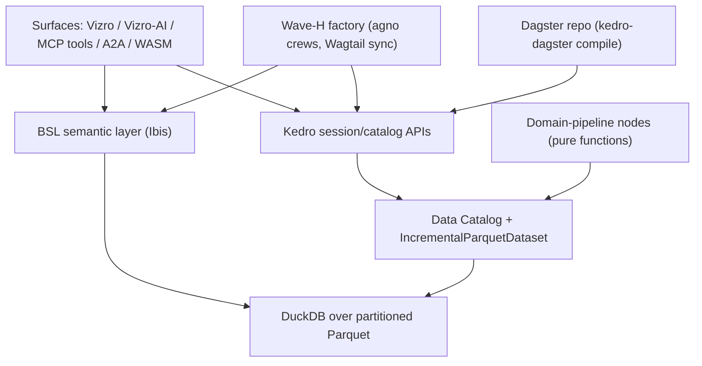
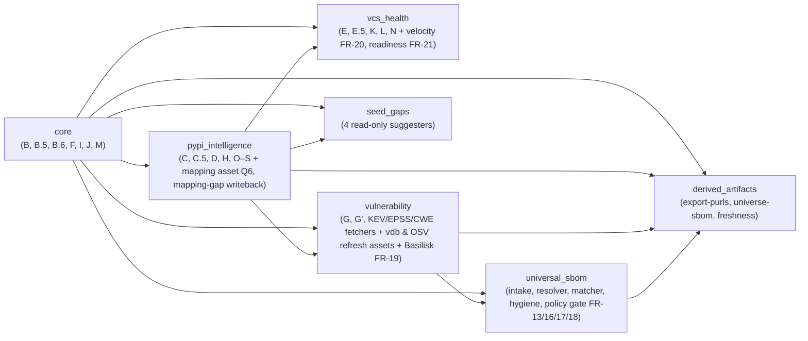

# Architecture Spine — cf_atlas Kedro/Dagster/DuckDB Migration

## Design Paradigm

**Declarative dataflow: pipes-and-filters over a declared Data Catalog.** Every
unit of logic is a pure Kedro **node** (DataFrame in → DataFrame out); every data
artifact is a cataloged **dataset** (`conf/base/catalog.yml`); execution order is
**resolved from the DAG**, never called procedurally. Layers map as:

| Layer | Lives in | Role |
|---|---|---|
| Ingestion/compute | `pipelines/<domain>/nodes.py` (7 domain pipelines) | Pure node functions |
| IO & state | Data Catalog + custom datasets (`datasets/`) | All data access, credentials, TTL |
| Orchestration | Dagster repo compiled by `kedro-dagster` | Schedules, retries, per-node timeouts, sensors |
| Semantics | BSL models (Ibis → DuckDB) | Declared dimensions/measures — the only read translation |
| Surfaces | Vizro/Vizro-AI pages, MCP tools, A2A, WASM bundle | Consume BSL/catalog; never bypass them |
| Factory (Wave H) | wiki scaffold + agno crews + Wagtail sync | Consumes pipeline outputs; writes only wiki/CMS |

Everything below either enforces this paradigm at a divergence point or seeds
cold-start structure. Spec v5.6 is the requirements contract — detail is
projected into §-references, not duplicated.

## Invariants & Rules

Dependency direction (a rule, not an illustration — lower layers never import upward):



### AD-1 — The Kedro DAG is the single source of truth; all glue is replaceable `[ADOPTED]`

- **Binds:** all
- **Prevents:** orchestrator/plugin lock-in (Dagster under Prefect acquisition; `kedro-dagster` bus factor ≈ 1; `kedro-mcp` 0.1.2; BSL 0.x)
- **Rule:** pipeline structure, node logic, and dataset declarations live only in the Kedro project. `kedro-dagster`, `kedro-mcp`, and BSL bindings are thin adapters a story could swap (exit ramps: Dagster Components / Kedro's Prefect deployer) without touching nodes or catalog. No node, contract, or MCP tool may import Dagster or `kedro-mcp` APIs.

### AD-2 — Catalog-owned IO with per-host credential scoping (FR-1)

- **Binds:** all nodes, all datasets
- **Prevents:** inline HTTP/SQL in nodes; the legacy `_http.py` defect of injecting the JFrog credential on every outbound request (the loop-bypass-permissions leak scenario)
- **Rule:** no data-access logic in node functions — every source/output is a `catalog.yml` dataset. Credentials attach to a dataset's destination host only; a non-JFrog host never receives `X-JFrog-Art-Api`. All 20 `resolve_*_urls`-style override points (incl. `BASILISK_BASE_URL`) survive as dataset-level endpoint config. Gate: `kedro-catalog-check`.

### AD-3 — Seven fixed domain pipelines; producer owns the dataset (FR-2)

- **Binds:** FR-2, FR-13, FR-16..21, all node ports
- **Prevents:** two pipelines writing one dataset; hidden cross-pipeline coupling (the legacy "dependencies in the developer's head")
- **Rule:** the pipeline set is exactly spec § 5.2 (Core · PyPI Intelligence · Vulnerability · VCS & Health · Universal SBOM · Seed-Gaps · Read-Surface/Derived-Artifacts). Each dataset has exactly one producing pipeline; consumers reference it by catalog name (e.g. Phase H: PyPI Intelligence produces, VCS & Health consumes). Phase I becomes an explicit node. New signals join their assigned pipeline, never a new ad-hoc one.

### AD-4 — Parquet + DuckDB singularity (FR-5)

- **Binds:** all persistence and query paths
- **Prevents:** engine fragmentation (Neo4j/Kùzu/LanceDB/Polars rejected) and a lingering dual SQLite/Parquet store
- **Rule:** partitioned Parquet is the canonical persistence format from Wave A; DuckDB is the only compute/graph (recursive CTE)/vector (`vss`) engine. After B4 retires the legacy write path, no `sqlite3` import exists outside the retired legacy tree (grep-gated at F1). Performance claims follow AC-7's honest scoping: incremental re-materialization is the headline, never cold-start.

### AD-5 — Incremental state is a dataset concern: `IncrementalParquetDataset`, per-dataset TTL (FR-3/FR-4)

- **Binds:** every TTL-gated or resumable dataset
- **Prevents:** per-node re-implementation of checkpoint/TTL/backoff (the chronic legacy tax); a single global TTL constant
- **Rule:** `*_fetched_at` TTL semantics live in the one reusable `IncrementalParquetDataset` class; TTLs are declared per dataset in the catalog (Phase D 7 d, Phase P 30 d, EPSS 1 d, CWE 90 d, …). `phase_state` is deleted; resumability = Kedro runner + persisted intermediate datasets. No node may implement its own checkpointing.

### AD-6 — Dagster orchestrates; timeouts are per-node; profiles are job configs (FR-6)

- **Binds:** orchestration, schedules, profiles, external-refresh assets
- **Prevents:** the 1800 s coarse-cap class of silent phase drops; profile drift; Phase P cost exposure
- **Rule:** the Kedro DAG compiles to one Dagster repository. Every node carries its own timeout/retry budget. The three bootstrap profiles (`maintainer`/`admin`/`consumer`) are named job configurations over the same DAG; explicit run-config/env always beats profile defaults. Phase P is `PHASE_P_ENABLED=1`, admin-config-only, never a default schedule. Schedules encode the `guides/atlas-operations.md` cadence table. The three § 3.4 external-refresh assets (vdb, OSV store, mapping cache) run as scheduled Dagster assets with the vuln-db env as a declared resource. Gate: `dagster-dryrun`.

### AD-7 — MCP surface authored over Kedro APIs; `kedro-mcp` never load-bearing (FR-7)

- **Binds:** the 23 atlas-relevant MCP tools; pipeline-trigger + dataset-read surface
- **Prevents:** dependence on a 0.1.x guidance-scoped plugin; scope creep into the recipe-authoring tools
- **Rule:** atlas MCP tools call Kedro session/catalog APIs directly (FastMCP patterns); the surface must work with `kedro-mcp` absent. Audit scope is `conda_forge_server.py` only; non-atlas recipe-authoring tools stay on the legacy FastMCP server; `library-futures`, `add-handoff`, and the 4 seed-gap suggesters stay CLI-only — no new MCP tools for them.

### AD-8 — BSL is the single semantic translation interface (FR-8/FR-9)

- **Binds:** every read surface (Vizro pages, Vizro-AI, MCP reads, A2A insights, WASM)
- **Prevents:** 28-CLI-era metric logic re-fragmenting into per-surface SQL; inconsistent LLM-generated queries
- **Rule:** metrics/dimensions (staleness, adoption stage, feedstock health, maintainer-role facts, …) are declared once as BSL models (Ibis → DuckDB); read surfaces consume BSL, never raw SQL against Parquet/DuckDB. The three FR-9 exceptions (`add-handoff`, `inventory-match`, `library-futures`) stay CLI-first and surface latest-report artifacts read-only. Pages meet the § 2.1 agent-legibility bar. Gate: `bsl-metric-check`.

### AD-9 — Pandera-first contracts behind one validator-agnostic hook (FR-10)

- **Binds:** every node writing a persisted dataset; the FR-18 gate
- **Prevents:** validator lock-in (GX ceiling: conda-forge 1.18.2, upstream `<3.14` at 1.19.0); bad data persisting silently
- **Rule:** inline pandera contracts in nodes are the primary layer; Great Expectations participates only as a boundary layer behind the same custom `AfterNodeRunHook`; swapping/stubbing a validator requires no node changes; no story may depend on GX ≥ 1.19 features. A contract violation raises a native exception → Dagster halts → A2A alert — and the FR-18 policy gate fails with identical semantics. The `kedro-great-expectations`/`kedro-pandera` plugins are banned.

### AD-10 — Legacy behavioral contracts bind the ports `[ADOPTED]` (FR-2/FR-13)

- **Binds:** every node port; the SBOM normalizer; the vuln read surface
- **Prevents:** silent regression of shipped, fixture-guarded behavior during translation
- **Rule:** the spec § 3.3 contracts port intact and their fixtures carry over green: Phase P two-layer cost gate (+ `test_no_thirty_gb_lie`), Phase K 3-RPS token bucket, Phase F provenance discipline, Phase H serial gate, B.5 `_pick_feedstock` attribution, `g10_spelling` no-clobber writeback, KEV overlay + `_coerce_cvss_score`, `cfe:*` namespace + `?channel=conda-forge` qualifier (never stripped), EPSS 0–100 normalization, `v_pypi_intelligence_valid`/`v_current_version_vulns` view discipline, single-write-path (`add-handoff` helpers), post-v25 schema shape (no resurrecting dropped tables). A BMAD story instruction never overrides these (CLAUDE.md Rule 1 authority).

### AD-11 — Verify-first sequencing; gates are fixtures, never credentials `[ADOPTED]` (§ 2.5)

- **Binds:** all waves, all loop execution, the six verify tasks
- **Prevents:** the loop entering a wave whose gate doesn't exist; credentialed/live-network flakiness in gates; fixtures rotting in gitignored dirs
- **Rule:** every wave's first deliverable is its own deterministic gate — `kedro-test` (A1), `kedro-catalog-check` (A2), `parity-diff` (built B1–B3, consumed at attended B4), `dagster-dryrun` (C1), `bsl-metric-check` (D1), `wasm-smoke` (G1). All gates are fixture-based, non-credentialed, run `--frozen`, and live in the tracked test tree (never `.claude/data/`). Attended events (B4 parity, C1 bring-up, D3 backend, F1 benchmark, G2 publish) are scheduled wave-boundary events. Credentialed runs are attended-only; loop paths never touch live credentialed endpoints.

### AD-12 — One frozen exit-code convention; four-axis ComplianceReport (FR-16/FR-18)

- **Binds:** the FR-18 terminal gate, `inventory-match`, CI consumers
- **Prevents:** two competing exit-code enums (the shipped `inventory-match --policy` enum is inverted); schema drift vs pyforge-warden
- **Rule:** exit 0 pass / 1 policy-fail / 2 error (full enum {0, 1, 2, 130}; `indeterminate` → 1). `inventory-match` flips to this convention with exactly one release of `INVENTORY_MATCH_LEGACY_EXIT=1`. The report is pyforge-warden's four-axis `ComplianceReport` schema unmodified: `hygiene` from the deptry node (source-less inputs → `not-applicable`, never failure), `security` from `inventory-match`/`cve` (the atlas never re-invokes osv-scanner), `license`/`currency` from atlas-native data or `not-applicable`.

### AD-13 — Offline degradation: skip-and-mark-stale, never fail (FR-1/FR-19/FR-21)

- **Binds:** every external-source node/dataset; consumer profile
- **Prevents:** air-gapped runs breaking; a pre-announcement API (Basilisk) taking the build down
- **Rule:** when its endpoint is unreachable, an external-source node skips gracefully and marks its dataset stale — it never hard-fails the run. All endpoints route through the `resolve_*_urls` override convention (20 helpers; FR-19 adds `resolve_basilisk_urls`; FR-21 rides the existing `resolve_github_raw_urls` — no new helper). New-source nodes bind the standard rate-limit discipline (concurrency cap, `Retry-After` + jittered backoff, remaining quota surfaced to the schedule).

### AD-14 — New signals are additive riders with fixture-enforced semantics (FR-19/20/21)

- **Binds:** B8/B9/B10 nodes and every surface reading them
- **Prevents:** parity-scope creep; the four measured failure modes recurring
- **Rule:** B8/B9/B10 are never parity-gated (B4 compares legacy-surface outputs only). Binding guards, each fixture-enforced: Basilisk matches by package name, never the OSV ecosystem tag; `fix_available` is tri-state and `unknown` never collapses to `false`; no surface renders version-currency as security-currency; velocity restricts to upstream releases ≤ 90 days and computes against first availability of the matched version (min per-build repodata timestamp), never `latest_conda_upload`; migration partitioning is driven by the upstream category lists (new migration = zero code change) and `not-in-tracker` is always labeled inferred.

### AD-15 — Derived layer regenerates per rebuild under the 14-day freshness contract (FR-17, § 3.4)

- **Binds:** `export-purls`, `universe-sbom`, seed-gap reports, `ComplianceReport`, their consumers
- **Prevents:** stale derived artifacts silently consumed; report nodes mutating the atlas
- **Rule:** derived-layer datasets are downstream nodes of the rebuild and re-run after every rebuild; consumers enforce the `STALE_AFTER_DAYS = 14` dataset-level freshness contract (refuse-stale exactly as the legacy gate). The four seed-gap suggesters are strictly read-only report nodes (byte-identical-seed guarantee survives as a pipeline test); `mapping-gap`'s writeback lives in the PyPI Intelligence pipeline, never in Seed-Gaps.

### AD-16 — Pixi-first, conda-forge-only, lean-env provisioning `[ADOPTED]` (FR-15)

- **Binds:** all dependencies, the scaffolded project, loop worktrees
- **Prevents:** stack drift off conda-forge/py3.14; worktree materialization of the fat `local-recipes` env; catalog drift
- **Rule:** every component is conda-forge-sourced, pixi-managed, `nebi`-scaffolded; no standalone binaries or JVM; Python 3.14 floor (litellm excluded for exactly this). The scaffolded project ships its own lean pixi env and `kedro-test`. Any dependency change updates `docs/library-llms-full.md` in the same PR (`llms-full-check`). Air-gapped provisioning covers both routing layers (pipeline data endpoints AND `.pixi/config.toml [pypi-config]`).

### AD-17 — Pipeline snapshots are advisory, never authoritative for authoring (§ 3.4)

- **Binds:** every agent/consumer surface (MCP, A2A, BSL, dashboards)
- **Prevents:** the authoring loop gating submissions on stale pipeline data (G66/G74/G78)
- **Rule:** before acting, the recipe-authoring loop re-verifies live (channeldata, `gh pr`, per-subdir installability); no migrated surface may position its datasets as a substitute for that live check, and payloads/pages that feed authoring decisions carry their build timestamp.

### AD-18 — Execution seam: worktrees, symlinks, and the project slug (§ 2.5, PRD § 9.11)

- **Binds:** all loop-driven stories; all BMAD artifact writes
- **Prevents:** the worktree × gitignored-symlink seam silently stranding spec/status artifacts; marker/symlink desync writing to the wrong project
- **Rule:** loop stories run in worktrees only after the symlink bootstrap recreates `_bmad-output/{planning,implementation}-artifacts` links inside the worktree; Story A3 is the designated first loop story and worktree smoke. All BMAD writes resolve through the symlinks; switching is only via `scripts/bmad-switch conda-forge-atlas-datapipeline` (supersedes the spec's pre-intake `local-recipes` literal). Keystone stories (B1/B2/F1) get pre-flight budget raises.

### AD-19 — Migration boundary and legacy retirement gate (Q1, § 3.4)

- **Binds:** B4, F1, everything claiming migration scope
- **Prevents:** premature legacy retirement; scope creep past § 3.3/§ 3.4
- **Rule:** the legacy orchestrator runs in parallel until B4 proves parity — Q1 default: exact row-count + value parity on the `v_actionable_packages`-family views, timestamp/ordering-only diffs documented benign — with recorded evidence and attended sign-off; `phase_state` and `bootstrap-data` retire with it. Scope is fixed by § 3.3 + § 3.4: the three external-refresh assets are in; static seeds, template trees, live authoring-time fetches, and user-supplied inputs are declared inputs, never pipeline products. Anything not listed there is outside the migration's universe (no new external sources beyond the committed set).

### AD-20 — Observability and inter-agent channels are singular (FR-11/FR-12)

- **Binds:** every node, run, DuckDB query; both agents
- **Prevents:** untraceable failures; ad-hoc agent-to-agent side channels
- **Rule:** every node emits OpenLineage events (rows, latency, cache hits) and participates in an end-to-end OTel trace resolving down to named API calls. The A2A surface is the sole structured inter-agent channel between the cf_atlas analytical agent and the `conda-forge-expert` authoring agent; contract violations (FR-10) and policy breaches (FR-18) raise A2A alerts on it.

### AD-21 — WASM read surface: static Parquet + HTTP Range, zero backend (FR-14)

- **Binds:** Wave G, the published artifact layout
- **Prevents:** a backend dependency sneaking into the portable surface; host lock-in
- **Rule:** the Vizro-AI dashboard + BSL layer run in-browser via duckdb-wasm/Pyodide against Parquet chunks pulled over HTTP Range from a static host; the emitter is host-agnostic (Q4 default: GitHub Pages; enterprise mirror substitutable). Gate: `wasm-smoke` (Playwright headless load-and-query).

### AD-22 — The Wave-H factory consumes; it never writes atlas data (FR-22)

- **Binds:** wiki scaffold, agno crews, Wagtail sync, H4 triggers
- **Prevents:** the knowledge-base layer becoming a second writer into pipeline datasets
- **Rule:** factory components read pipeline outputs via catalog/BSL and write only the `wiki/raw/ → compiled/ → outputs/` tree and the Wagtail CMS (REST, idempotent re-push). The 5 personas resolve through the BMAD customization layers; crews are Dagster-triggered (assets + sensors + schedules); PostgreSQL and MinIO are conda-forge-provisioned per AD-16.

## Consistency Conventions

| Concern | Convention |
|---|---|
| Pipeline/node/dataset naming | Pipelines: the seven § 5.2 names as snake_case packages (`core`, `pypi_intelligence`, `vulnerability`, `vcs_health`, `universal_sbom`, `seed_gaps`, `derived_artifacts`). Nodes: `<verb>_<subject>` pure functions; ported phases keep a `# legacy: Phase <ID>` provenance comment. Datasets: `<domain>_<entity>` snake_case (e.g. `basilisk_vulns`); layer tag (`raw`/`intermediate`/`primary`/`derived`) declared in catalog metadata. |
| Endpoint overrides | Every external endpoint is overridable via its `<HOST>_BASE_URL`-style setting, declared in dataset config (the `resolve_*_urls` convention carried forward). New sources add exactly one override point. |
| Identity & formats | Conda purls per CEP-63 draft form with `?channel=conda-forge`; `cfe:*` property namespace on BOMs (preserved, never stripped); versions compared via `packaging.version` (PEP 440); EPSS percentiles stored 0–100; timestamps as epoch seconds in `*_fetched_at`. |
| State & errors | Nodes are pure — no retries, backoff, or checkpointing inside node bodies (dataset/orchestrator concerns per AD-5/AD-6). Failures raise native exceptions; per-row soft errors land in `last_error`-style columns, per legacy convention. Exit codes per AD-12 everywhere a CLI/gate exits. |
| Config & profiles | Kedro `conf/base` (tracked) vs `conf/local` (gitignored, credentials); profile values are defaults, explicit env/run-config always wins (`os.environ.setdefault` semantics). |
| Tests & fixtures | Fixtures in the tracked test tree; contract fixtures named for the invariant they guard (e.g. `test_no_thirty_gb_lie` carries over); sampled-data fixtures are generated attended, once, from operator runtime data — gates never read `.claude/data/`. |
| BMAD artifacts | Tier-2 tracked under `projects/conda-forge-atlas-datapipeline/planning-artifacts/`; Tier-3 gitignored; writes only through the `_bmad-output` symlinks (AD-18). |

## Stack

Seed — verified against the live `pixi.toml` at intake (2026-07-17); the stack is
already resolved in-env (FR-15: adoption is wiring, not dependency addition).
Pins are floors from `pixi.toml` except where capped.

| Name | Version |
|---|---|
| Python | 3.14 floor (repo-wide) |
| kedro / kedro-datasets / kedro-viz | ≥1.5.0 / ≥9.5.0 / ≥12.4.0 |
| kedro-dagster | ≥0.7.0 (carries `dagster <2.0` pin — replaceable glue per AD-1) |
| kedro-mcp | ≥0.1.2 (wrapped only, never load-bearing) |
| dagster (+ pipes, webserver) | ≥1.13.13 |
| duckdb (+ `vss`) | ≥1.5.4 |
| ibis-framework (+ ibis-duckdb) | ≥12.0.0 |
| boring-semantic-layer | ≥0.3.15 (pins: structlog >24.2,<26 · sqlglot >26.32,<28.7) |
| vizro / vizro-ai / vizro-mcp | ≥0.1.59 / ≥0.4.1 / ≥0.1.4 |
| pandera | ≥0.32.1 (primary validator) |
| great-expectations | 1.18.2 **cap** (upstream `<3.14` from 1.19.0 — no ≥1.19 features) |
| deptry | ≥0.25.1 (conda-native; FR-16 engine) |
| nebi-cli | ≥0.13 (scaffolding) |
| openlineage-python / opentelemetry-sdk+api | ≥1.51.0 / ≥1.43.0 |
| duckdb-wasm / Pyodide | Wave-G runtime (browser-side; no pixi pin) |
| agno / wagtail / django-lasuite | ≥2.6.22 / ≥7.4.2,<8 (LTS) / ≥0.0.27 (Wave H) |
| PostgreSQL / MinIO / psycopg2 | conda-forge-provisioned (Wave H); psycopg2 ≥2.9.12 |
| tomlkit | <0.13.3 (dagster-dg-core pin) |
| bmad-method / bmad-loop / tmux | ≥6.10.0,<7 / v0.8.1 tag / ≥3.4 (execution machinery) |

## Structural Seed

Kedro project scaffold (Story A1, nebi-generated — the code owns this once it exists):

```text
<scaffold-root>/                      # nebi-scaffolded Kedro project, own lean pixi env
  conf/
    base/catalog.yml                  # every source + output declared (AD-2)
    base/parameters*.yml              # per-dataset TTLs, thresholds, profile defaults
    local/                            # gitignored: credentials, per-host secrets
  src/<pkg>/
    datasets/                         # IncrementalParquetDataset + custom API datasets (AD-5)
    pipelines/
      core/  pypi_intelligence/  vulnerability/  vcs_health/
      universal_sbom/  seed_gaps/  derived_artifacts/     # the seven (AD-3)
    hooks/                            # AfterNodeRunHook (validator-agnostic, AD-9); lineage/OTel hooks (AD-20)
    bsl/                              # BSL model declarations (AD-8)
    mcp/                              # atlas MCP tools over Kedro session APIs (AD-7)
    a2a/                              # structured payload schemas + channel (AD-20)
  dagster/                            # kedro-dagster compile target: jobs, schedules, sensors, profiles (AD-6)
  vizro_app/                          # dashboard + factory-status page + WASM emitter (AD-8/AD-21)
  wiki/  raw/  compiled/  outputs/    # Wave-H factory tree (AD-22)
  tests/                              # fixtures + contract tests + the six verify gates (AD-11)
```

Domain-pipeline DAG with the legacy phase → pipeline mapping (spec § 5.2; § 3.3 is the phase registry):



Deployment & environments (the operational envelope this altitude owns):

- **Operator workstation (primary)** — pixi envs; Dagster invoked on-demand/scheduled locally, no persistent daemon unless Wave-G sensors force the Q2 revisit; `pixi run viz` for the structural view; Dagster UI for run state; ~3 GB storage budget declared as a resource constraint (vdb 2.5 GB dominant).
- **Loop execution plane** — bmad-loop v0.8.1, sequential, tmux, worktree isolation with the AD-18 bootstrap; verify gates per AD-11; linux-64/osx-arm64 only.
- **Static publish plane (Wave G)** — Parquet chunks + WASM bundle to a static host (Q4 default GitHub Pages), consumed browser-side with zero backend.
- **Air-gapped/enterprise** — consumer profile fully offline (AD-13); mirror routing via override points (AD-2) + `.pixi/config.toml [pypi-config]` (AD-16).
- **Wave-H services** — PostgreSQL + MinIO, conda-forge-provisioned, local to the factory layer (AD-22).
- Data domains three ways (technical research): BMAD artifacts (symlinked, AD-18) · tracked test fixtures (the only gate-visible data, AD-11) · runtime data (`.claude/data/`, gitignored, never a gate dependency).

## Capability → Architecture Map

| Capability | Lives in | Governed by |
|---|---|---|
| FR-1 declarative catalog + credential scoping | `conf/base/catalog.yml`, `datasets/` | AD-2, AD-13 |
| FR-2 phases → 7 pipelines | `src/<pkg>/pipelines/*` | AD-3, AD-10 |
| FR-3 TTL gating | `IncrementalParquetDataset` | AD-5 |
| FR-4 phase_state removal / resumability | runner + persisted datasets | AD-5, AD-19 |
| FR-5 DuckDB singularity | Parquet store + DuckDB | AD-4 |
| FR-6 Dagster orchestration | `dagster/` compile target | AD-1, AD-6 |
| FR-7 MCP surface | `src/<pkg>/mcp/` | AD-7 |
| FR-8 BSL | `src/<pkg>/bsl/` | AD-8 |
| FR-9 Vizro read surface (28-CLI port, 3 exceptions, factory-status page) | `vizro_app/` | AD-8, AD-17 |
| FR-10 data-quality contracts | node contracts + `hooks/` | AD-9 |
| FR-11 A2A | `src/<pkg>/a2a/` | AD-20 |
| FR-12 lineage/observability | `hooks/` instrumentation | AD-20 |
| FR-13/17 SBOM intake, resolver, universe BOM | `pipelines/universal_sbom/`, `derived_artifacts/` | AD-3, AD-10, AD-15 |
| FR-14 WASM portability | `vizro_app/` emitter + static host | AD-21 |
| FR-15 toolchain | scaffold + lean env + pins | AD-16 |
| FR-16/18 hygiene node + policy gate | `universal_sbom` terminal nodes | AD-9, AD-12 |
| FR-19 Basilisk | `pipelines/vulnerability/` (2 nodes) | AD-13, AD-14 |
| FR-20 velocity | `pipelines/vcs_health/` (over Phase H dataset) | AD-3, AD-14 |
| FR-21 migration readiness | `pipelines/vcs_health/` | AD-13, AD-14 |
| FR-22 factory layer | `wiki/` + crews + `dagster/` sensors | AD-22 |
| Verify-task inventory (kedro-test, kedro-catalog-check, parity-diff, dagster-dryrun, bsl-metric-check, wasm-smoke) | `tests/` + pixi tasks, first deliverable of their wave | AD-11 |
| Worktree/symlink seam | loop bootstrap + A3 smoke | AD-18 |

## Decisions & Assumptions (unattended intake)

No human elicitation occurred; nothing was invented. Resolutions, per the headless protocol:

1. **Open questions adopted at spec § 11 defaults** (same resolutions as PRD § 8): Q1 exact parity on actionable views; Q2 on-demand Dagster, acquisition re-verify at Wave C; Q3 repo model-backend routing, no hardcoded endpoint; Q4 GitHub Pages, host-agnostic emitter; Q6 consolidate mapping on migrated Phase C; Q7 Basilisk built once as Kedro nodes. Each remains a scheduled re-check at its gating wave (Deferred).
2. **Paradigm, stack, and boundaries are `[ADOPTED]`**, not invented — the spec/PRD settled them; this spine ratifies and fixes the divergence points.
3. **Altitude = feature**: the spine keeps the waves (epics) coherent; per-story detail belongs to `bmad-create-epics-and-stories` + TEA `atdd`. `[ASSUMPTION]`
4. **Stack verification** was performed against the live `pixi.toml` (2026-07-17) rather than the web — the FR-15 doctrine is explicit that the conda-forge in-env build, not upstream declarations, is ground truth (the GX lesson); spec live-verifications date 2026-07-16.
5. **Volatile counts** (phases, CLIs, tools, schema version) are cited via spec § 3.3 + `intake-groundtruth-2026-07-17.md`, not free-standing literals. Brownfield `architecture-cf-atlas.md` carries older literals (v28/22-phase era body text); § 3.3 is authoritative — recorded as a sync note, not a conflict.
6. **`bmad-switch conda-forge-atlas-datapipeline`** supersedes the spec's pre-intake `local-recipes` literal (deviation carried from PRD § 9.11 into AD-18).
7. **Sensor tension recorded**: § 5.9 sensors vs Q2's no-daemon default — resolved as Deferred with a Wave-G revisit condition, not decided here.
8. **Conditional Phase T** (trendshift Track A) joins the surface only if shipped before Wave B completes; re-check with live groundtruth at execution start. Not modeled as an AD.

## Deferred

Intentionally undecided, each with its owner/revisit condition:

- **Q2 — Dagster daemon footprint + acquisition health** → Wave C start (C1). Persistent daemon only if G3 sensors require it; switch to an exit ramp only on concrete deterioration.
- **Q3 — Vizro-AI LLM backend + the `_http.py`-analog LLM routing chain** → D3 (attended). Bounds: no litellm, no copilot-api bridge; llama.cpp/ollama/mlx-lm in-env.
- **Q4 — static-host commitment** → G2 (attended publish). Emitter stays host-agnostic regardless.
- **Q6 — mapping-source consolidation** (retire `pypi_conda_map.json` or keep as flat-cache artifact) → before B5's mapping asset. `g10_spelling` provenance + no-clobber survive either way (AD-10).
- **Q7 — Basilisk landing point** (interim legacy Phase U only if a pre-migration window matters) → before B8.
- **Sensor event sources** (PyPI/GitHub webhooks vs RSS) and the daemon question they drag in → G3.
- **A2A transport choice** (publish/subscribe vs direct message) and protocol library → E1 design; the invariant is only "structured payloads, single channel" (AD-20).
- **F3 embedding model/strategy** for `vss` RAG → F3 story spec.
- **D2 page inventory/design detail** → the CIS two-spine specs (`DESIGN.md` + `EXPERIENCE.md`) before frontend work, per spec § 2.4.
- **F1 benchmark pass threshold** → fixed in the F1 story spec before the benchmark runs (SM-3); adjudicated at the attended event.
- **Parity-diff comparison granularity beyond the Q1 views** → B4 evidence record.
- **BOD-26-04-style risk-tiered threshold mode** for FR-18 → recorded future option, promotion needs evidence.
- **Phase B.6 full yanked detection** (prefix.dev GraphQL `variants.yankedReason` hook) → optional follow-on after B1, not this migration.
- **kedro-viz prototype refresh** (`prototypes/cf-atlas-kedro-viz`) → follow-up effort, predates the seven-pipeline decomposition.
- **Wiki persona prompt content + crew design detail** → H1/H2 story specs (H2 is dev-auto for exactly this judgment).
