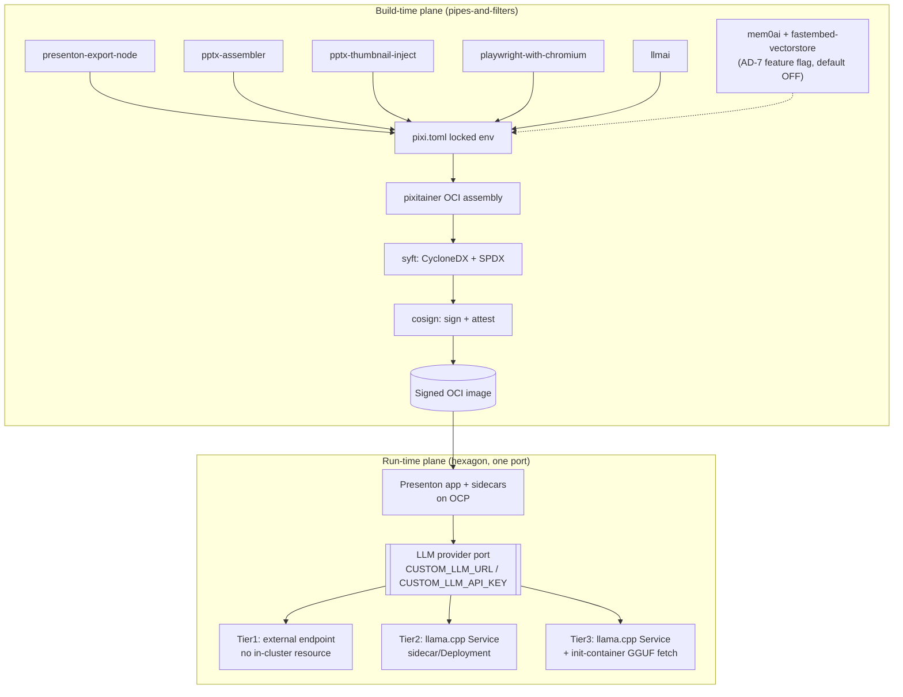

# Architecture Spine — presenton-pixi-image

## Design Paradigm

Two independent planes, each with its own consistency discipline:

- **Build-time plane — pipes-and-filters.** Five confirmed conda-forge recipes flow into one pixi-locked environment, which pixitainer assembles into an OCI image, which syft+cosign turn into a signed, SBOM-attested artifact. Each stage consumes only the previous stage's published output — no stage reaches back into an earlier one's internals.
- **Run-time plane — hexagonal, with exactly one true port.** The deployed app (Presenton + its sidecars) has a single swappable seam: the LLM provider, already defined by upstream's `llmai` library via the `CUSTOM_LLM_URL`/`CUSTOM_LLM_API_KEY` contract. Three tier adapters (internal proxy, in-cluster `llama.cpp`, init-container-fetched `llama.cpp`) sit behind that one port. Nothing else in the running system branches on deployment topology.



## Invariants & Rules

### AD-1 — Build pipeline composition and channel routing

- **Binds:** all five confirmed recipes; the PRD's "zero external CDN access at build" hard constraint
- **Prevents:** one recipe's build reaching a public CDN while another routes through JFrog — an air-gap violation that's invisible until the build runs inside the actual perimeter
- **Rule:** a single `pixi.toml` environment assembles `presenton-export-node`, `pptx-assembler`, `pptx-thumbnail-inject`, `playwright-with-chromium`, and `llmai` as pinned conda dependencies. Every channel and package resolution in this build routes through the `*_BASE_URL` env-var family (`docs/reference/enterprise-deployment.md` § 6) — no recipe, no build step, no CI job hardcodes a public URL. `pixitainer` consumes the locked environment to produce the OCI image; it never fetches anything itself outside that lock.

### AD-2 — The LLM provider is the only swappable seam

- **Binds:** the entire run-time plane; PRD's three-tier LLM model
- **Prevents:** a tier-specific code path (e.g. an in-process `llama-cpp-python` binding for Tier-2) creeping into the app instead of staying at arm's length over HTTP like every other tier
- **Rule:** Presenton and the Helm chart set only `CUSTOM_LLM_URL` / `CUSTOM_LLM_API_KEY` (plus optional `OPENAI_BASE_URL`/`ANTHROPIC_BASE_URL` passthrough) to select a tier. Tier 1 points at an operator-supplied external endpoint (no in-cluster resource). Tier 2 points at a `llama.cpp` Service in the same namespace, OpenAI-compatible HTTP. Tier 3 points at the same `llama.cpp` Service, whose Pod carries an init-container that fetches the GGUF from an internal registry before the main container starts. All three are the same env-var contract pointed at different URLs — never a different code path.

### AD-3 — Recipe/image boundary

- **Binds:** everything this architecture owns vs. everything conda-forge-expert owns
- **Prevents:** image-build-layer forks of recipe logic that silently diverge from the upstream-merged recipe
- **Rule:** the image-assembly layer (`pixi.toml`, Helm chart) consumes published, versioned conda artifacts by name and pin only. It never vendors or patches recipe internals. Recipe content is out of this spine's scope entirely — governed later by `conda-forge-expert` per CLAUDE.md Rules 1 & 2.

### AD-4 — Chromium sandbox default (resolves Risk R9)

- **Binds:** `playwright-with-chromium` invocation inside the OCP pod
- **Prevents:** two deployers independently guessing a sandbox posture and shipping inconsistent security postures across customer clusters
- **Rule:** default to `--no-sandbox`, as an explicit, Helm-values-documented security decision, not a silent default — standard practice for containerized Chromium, compatible with `restricted-v2`/`restricted-v3`'s `allowPrivilegeEscalation: false`. A Helm values flag (`chromiumSandboxMode: none|namespace`) is the escape hatch for a future unprivileged-namespace-sandbox mode, but that mode ships **undocumented-to-unbuilt** until a Phase-0/architecture spike empirically validates it against a real `restricted-v3` cluster (open question, § Deferred).

### AD-5 — Provenance pipeline

- **Binds:** the PRD's supply-chain provenance MVP gates (SBOM, signed-image attestation)
- **Prevents:** two different SBOMs existing for the same image tag (e.g. one lockfile-derived, one image-introspected, silently disagreeing)
- **Rule:** `syft` (1.49.0, conda-forge-verified) scans the assembled OCI image — post-`pixitainer`, pre-registry-push — producing CycloneDX (primary) and SPDX (secondary export) in one deterministic step. `cosign` (3.0.4) signs the resulting image digest and attaches the SBOM as an in-toto attestation. This runs exactly once per image build, as the last build-time-plane stage before the image is considered shippable.

### AD-6 — Fixture-set phase boundary is a CI-topology split, not a convention

- **Binds:** the PRD's four fixture sets and their online-capture/air-gap-consumption boundary
- **Prevents:** Fixture Set 6 (R6) — someone tries to refresh Set 1 from inside the air-gapped pipeline and either fails confusingly or, worse, the pipeline silently gained network egress somewhere
- **Rule:** `tests/fixtures/upstream-baseline` capture (Set 1) and `tests/drift` (Set 2) run **only** in a separate, explicitly-online CI workflow (network egress allowed) that never shares a runner or environment with the air-gapped build pipeline. The air-gapped pipeline workflow has **no network egress at all**, enforced at the CI-runner/network-policy level — not by convention — so an accidental Set-1/Set-2 invocation inside it fails loudly. `tests/operational` (Set 3) and `tests/install` (Set 4) ship inside the OCI image and run air-gapped by construction; they need no separate enforcement.

### AD-7 — Memory-subsystem fork is pre-wired, not blocking

- **Binds:** PRD Phase-0 exit criterion 6(b) (`mem0ai` + `fastembed-vectorstore`)
- **Prevents:** image-build work blocking on the Phase-0 decision, and the eventual answer forcing an architectural rework
- **Rule:** `pixi.toml` carries a `presenton-memory` feature (default **off**) toggling whether `mem0ai` + `fastembed-vectorstore` are in the locked environment. The Helm chart carries a matching `values.memory.enabled` (default `false`) that sets the env var Presenton needs to no-op the subsystem — contingent on that no-op path being clean (open question, § Deferred). If the no-op instead needs a Presenton source patch, this AD's default-OFF shape is unchanged; the patch simply joins the `presenton-export-node`/`pptx-assembler` patch set already in scope (PRD deliverables).

### AD-8 — OCP SCC target

- **Binds:** the Helm chart's Pod/container `SecurityContext` defaults
- **Prevents:** a chart that only works on a subset of OCP clusters because it assumes a specific SCC generation
- **Rule:** defaults are `restricted-v2`-compatible on every cluster this chart targets: all capabilities dropped, `seccompProfile: runtime/default`, `allowPrivilegeEscalation: false`, non-root arbitrary UID via the GID-0/`chmod g=u` convention on writable paths, no hardcoded UID/GID anywhere in the image or chart. `restricted-v3` (`hostUsers: false`) compatibility is asserted but not separately branch-tested until the AD-4 spike runs.

## Consistency Conventions

| Concern | Convention |
| --- | --- |
| LLM tier selection | one top-level `values.llmProvider.tier` enum (`tier1`\|`tier2`\|`tier3`) selecting a values sub-block — no separate chart-per-tier, no separate values-file-per-tier fork that could drift |
| Writable paths | only `/app_data` and `/tmp` are writable (`emptyDir` or PVC); everything else is read-only-root-filesystem-compatible as an opt-in hardening flag (`readOnlyRootFilesystem: false` by default — Restricted SCC does not mandate it; `true` available for hardened clusters) |
| Env-var routing (build-time) | every outbound URL in the build pipeline resolves through the `*_BASE_URL` family (AD-1); never a hardcoded public host |
| Env-var routing (run-time) | every outbound LLM call resolves through `CUSTOM_LLM_URL`/`CUSTOM_LLM_API_KEY` (AD-2); never a tier-specific code branch |
| Recipe pins | image-layer `pixi.toml` pins recipes by exact version; a version bump is a `pixi.toml` diff, never a live "latest" resolution at image-build time |

## Stack

| Name | Version |
| --- | --- |
| pixi | current (pixi-locked build substrate, per repo convention) |
| pixitainer | 0.8.2 (BSD-3-Clause, `RaphaelRibes/pixitainer`, `prefix.dev/raphaelribes` channel — active, verified 2026-07-25) |
| rattler-build | current (per repo's existing v1 recipe convention) |
| Helm | 4.2.3 (Apache-2.0, conda-forge, verified 2026-07-25) |
| syft | 1.49.0 (Apache-2.0, conda-forge, verified 2026-07-25) — SBOM generation |
| cosign | 3.0.4 (Apache-2.0, conda-forge, verified 2026-07-25) — image signing/attestation |
| llmai | 0.2.8 (Apache-2.0, PyPI-only — net-new conda-forge recipe; PRD Revision Log) |

## Structural Seed

```text
presenton-pixi-image/                    # (or wherever this lands in the repo — TBD, see Deferred)
  pixi.toml                              # AD-1: locked build env; presenton-memory feature (AD-7)
  helm/
    Chart.yaml
    values.yaml                          # top-level llmProvider.tier, memory.enabled (AD-2, AD-7)
    values-tier1.yaml                    # example override, not a fork (Consistency Conventions)
    templates/
      deployment.yaml                    # Presenton app; SecurityContext per AD-8
      llama-cpp-service.yaml             # Tier2/Tier3 sidecar/Deployment
      init-container-gguf-fetch.yaml     # Tier3 only
      metrics-schema-configmap.yaml      # versioned /metrics schema artifact (PRD gate)
  ci/
    build-airgapped.yml                  # no network egress (AD-6); pixitainer + syft + cosign
    online-capture.yml                   # Set 1/2 only (AD-6); separate runner, network allowed
  tests/
    fixtures/upstream-baseline/v{N}/     # Set 1 (PRD Test Strategy)
    drift/                               # Set 2
    operational/                         # Set 3, ships in image
    install/                             # Set 4, ships in image
```

## Capability → Architecture Map

| Capability / Area | Lives in | Governed by |
| --- | --- | --- |
| Air-gapped build (zero external CDN) | `pixi.toml`, `ci/build-airgapped.yml` | AD-1, AD-6 |
| LLM provider tiering | `helm/values.yaml`, `helm/templates/llama-cpp-service.yaml` | AD-2 |
| Recipe composition (5 confirmed) | `pixi.toml` | AD-1, AD-3 |
| Memory-subsystem fork (Phase-0 exit 6b) | `pixi.toml` (`presenton-memory` feature), `helm/values.yaml` (`memory.enabled`) | AD-7 |
| Chromium sandbox posture (Risk R9) | `helm/templates/deployment.yaml` (`chromiumSandboxMode`) | AD-4 |
| SBOM + signing | `ci/build-airgapped.yml` (syft + cosign step) | AD-5 |
| OCP SCC compatibility | `helm/templates/deployment.yaml` (SecurityContext) | AD-8 |
| Fixture-set phase boundary | `ci/online-capture.yml` vs `ci/build-airgapped.yml` | AD-6 |

## Deferred

- **Recipe authoring itself** (the actual `recipe.yaml` content for all five-to-seven recipes) — out of this spine entirely, conda-forge-expert-governed (CLAUDE.md Rules 1 & 2). This spine only fixes how already-published recipes compose.
- **Chromium-sandbox-vs-`restricted-v3` empirical spike** (AD-4's escape hatch) — needs a real OCP cluster, not a docs read; not run as part of this architecture pass. Until it runs, `--no-sandbox` is the shipped default and `chromiumSandboxMode: namespace` stays an undocumented-to-unbuilt code path.
- **Memory-subsystem no-op path verification** (AD-7) — whether `mem0ai`/`fastembed-vectorstore` disable cleanly via env var or need a Presenton-side patch. Both branches are pre-wired; only the patch content (if needed) is undetermined.
- **Microsoft disconnected-stack verification** (PRD exit 6a, Risk R3) — a business-case question, not an architecture one. This spine's shape is defensible regardless of the answer.
- **GGUF model pick** (Qwen 2.5 7B vs Llama 3.2 3B, PRD Phase-0 exit 1) — the Helm chart's Tier-2 `values.yaml` just needs a `modelRef` string; the specific model doesn't change this spine's shape.
- **Exact repo landing path** for this project's build/Helm artifacts (`presenton-pixi-image/` at repo root vs. a `src/` subtree vs. a separate deployment repo) — not fixed by the PRD or Dream; assumed a self-contained top-level directory in the Structural Seed above pending an explicit placement decision, consistent with how `recipes/` and `src/shared/packages/` are already organized in this monorepo.
- **Brand-compliance enforcement UX (three-lane), observability/`\/metrics` instrumentation detail, chargeback ledger** — these are application-layer / Presenton-patch-layer concerns the PRD scopes explicitly (auto-fix/batched-review/ignore bands; scrape-only metrics; emit-only chargeback); this spine names where the `/metrics` schema artifact ships (Structural Seed) but does not design the instrumentation itself — that's epic/story-level work downstream of this spine.
- **Fixture-set 1/2 capture-script implementation detail** (`tests/capture_upstream.py`, `tests/drift/recapture.py`) — this spine fixes *where* they run and the network-topology enforcement (AD-6); their internal logic is downstream, epic/story-level work.
