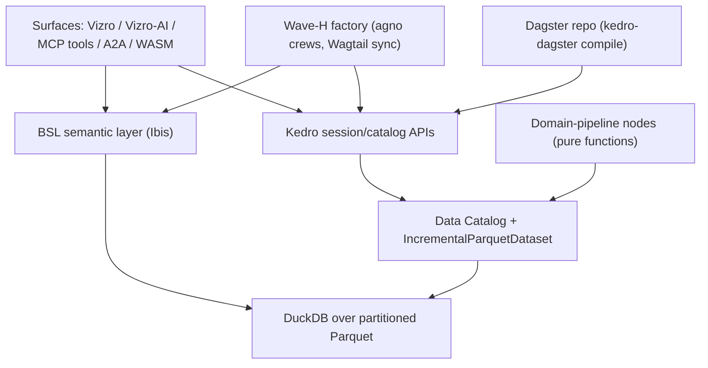
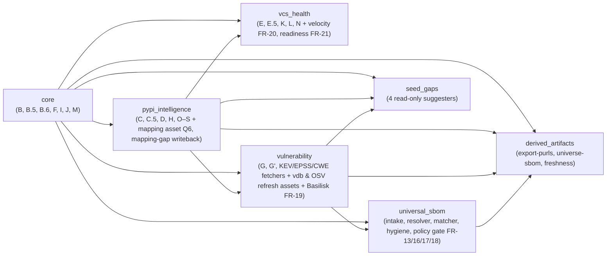
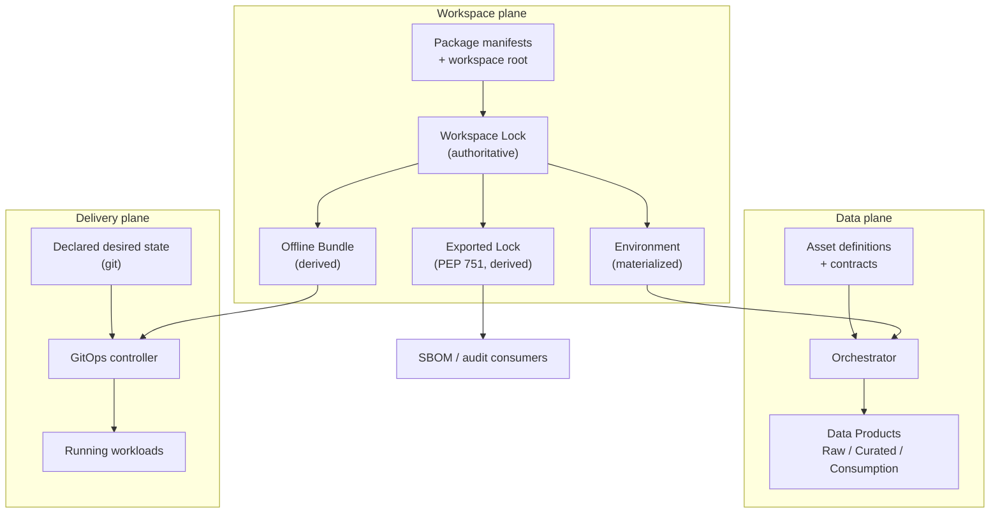
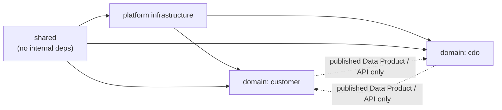
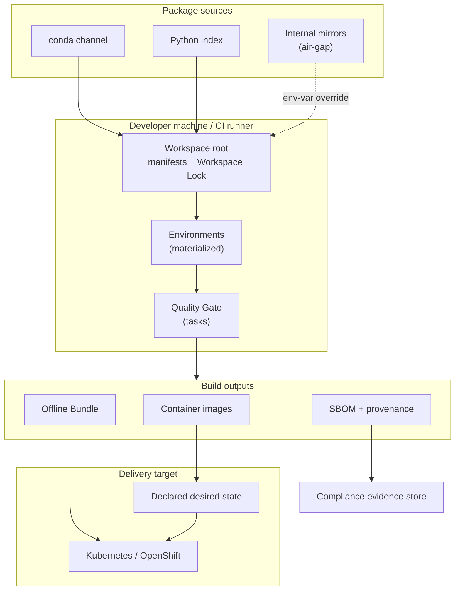
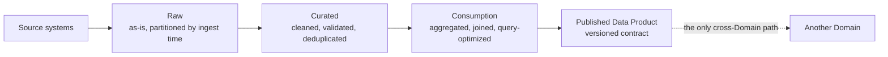
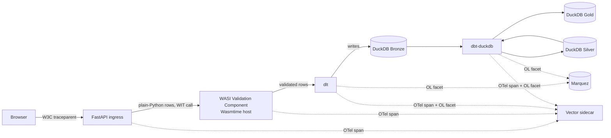
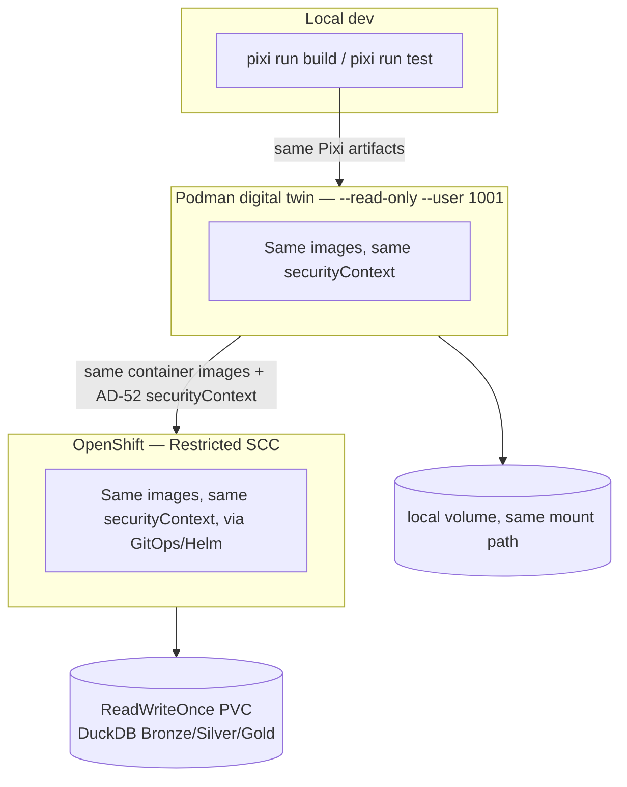

# Architecture Spine — cf_atlas Kedro/Dagster/DuckDB Migration

> **Consolidated 2026-08-02** — see
> `archive/_bmad-output/projects/pyforge-atlas/planning-artifacts/architecture/architecture-unity-data-stack-2026-07-25/ARCHITECTURE-SPINE.md`
> and
> `archive/_bmad-output/projects/pyforge-atlas/planning-artifacts/architecture/architecture-wasm-analytics-stack-2026-07-25/ARCHITECTURE-SPINE.md`
> for the original standalone documents (moved there intact, not deleted).
> This spine now also carries the
> Unity Data Stack and Wasm Analytics Stack architecture spines, folded in
> as `## Satellite:` sections at the end of this file with their `AD-n`
> invariants renumbered to continue this document's sequence (`AD-24`..`AD-46`
> for Unity, `AD-47`..`AD-56` for Wasm) — see each satellite section's own
> fold-in note for the exact renumbering. This document's frontmatter
> (`name`, `paradigm`, `scope`, `binds`, `sources`) continues to describe
> the primary Atlas spine only; each satellite carries its own paradigm,
> stack, and structural seed in its own section (per explicit user override
> of the dream-level-only consolidation convention — see
> `docs/dreams/pyforge-atlas.md` § *The estate Atlas hosts*).

## Design Paradigm

**Declarative dataflow: pipes-and-filters over a declared Data Catalog.** Every
unit of logic is a pure Kedro **node** (DataFrame in → DataFrame out); every data
artifact is a cataloged **dataset** (`conf/base/catalog.yml`); execution order is
**resolved from the DAG**, never called procedurally. Layers map as:

| Layer | Lives in | Role |
|---|---|---|
| Ingestion/compute | `pipelines/<domain>/nodes.py` (7 domain pipelines) | Pure node functions |
| IO & state | Data Catalog + custom datasets (`datasets/`) | All data access, credentials, TTL |
| Orchestration | Dagster repo compiled by `kedro-dagster` | Schedules, retries, per-node timeouts, sensors |
| Semantics | BSL models (Ibis → DuckDB) | Declared dimensions/measures — the only read translation |
| Surfaces | Vizro/Vizro-AI pages, MCP tools, A2A, WASM bundle | Consume BSL/catalog; never bypass them |
| Factory (Wave H) | wiki scaffold + agno crews + Wagtail sync | Consumes pipeline outputs; writes only wiki/CMS |

Everything below either enforces this paradigm at a divergence point or seeds
cold-start structure. Spec v5.6 is the requirements contract — detail is
projected into §-references, not duplicated.

## Invariants & Rules

Dependency direction (a rule, not an illustration — lower layers never import upward):



### AD-1 — The Kedro DAG is the single source of truth; all glue is replaceable `[ADOPTED]`

- **Binds:** all
- **Prevents:** orchestrator/plugin lock-in (Dagster under Prefect acquisition; `kedro-dagster` bus factor ≈ 1; `kedro-mcp` 0.1.2; BSL 0.x)
- **Rule:** pipeline structure, node logic, and dataset declarations live only in the Kedro project. `kedro-dagster`, `kedro-mcp`, and BSL bindings are thin adapters a story could swap (exit ramps: Dagster Components / Kedro's Prefect deployer) without touching nodes or catalog. No node, contract, or MCP tool may import Dagster or `kedro-mcp` APIs — enforced by a meta-test (import-direction grep over `pipelines/`, `datasets/`, `hooks/`, `mcp/`) that ships with `kedro-catalog-check` (A2).

### AD-2 — Catalog-owned IO with per-host credential scoping (FR-1)

- **Binds:** all nodes, all datasets
- **Prevents:** inline HTTP/SQL in nodes; the legacy `_http.py` defect of injecting the JFrog credential on every outbound request (the loop-bypass-permissions leak scenario)
- **Rule:** no data-access logic in node functions — every source/output is a `catalog.yml` dataset. Credentials attach to a dataset's destination host only; a non-JFrog host never receives `X-JFrog-Art-Api`. All 20 `resolve_*_urls`-style override points (incl. `BASILISK_BASE_URL`) survive as dataset-level endpoint config. Gate: `kedro-catalog-check`.

### AD-3 — Seven fixed domain pipelines; producer owns the dataset (FR-2)

- **Binds:** FR-2, FR-13, FR-16..21, all node ports
- **Prevents:** two pipelines writing one dataset; hidden cross-pipeline coupling (the legacy "dependencies in the developer's head")
- **Rule:** the pipeline set is exactly spec § 5.2 (Core · PyPI Intelligence · Vulnerability · VCS & Health · Universal SBOM · Seed-Gaps · Read-Surface/Derived-Artifacts). Each dataset has exactly one producing pipeline; consumers reference it by catalog name (e.g. Phase H: PyPI Intelligence produces, VCS & Health consumes). Phase I becomes an explicit node. New signals join their assigned pipeline, never a new ad-hoc one.

### AD-4 — Parquet + DuckDB singularity (FR-5)

- **Binds:** all persistence and query paths
- **Prevents:** engine fragmentation (Neo4j/Kùzu/LanceDB/Polars rejected) and a lingering dual SQLite/Parquet store
- **Rule:** partitioned Parquet is the canonical persistence format from Wave A; DuckDB is the only compute/graph (recursive CTE)/vector (`vss`) engine. After B4 retires the legacy write path, no `sqlite3` import exists outside the retired legacy tree (grep-gated at F1). Performance claims follow AC-7's honest scoping: incremental re-materialization is the headline, never cold-start.

### AD-5 — Incremental state is a dataset concern: `IncrementalParquetDataset`, per-dataset TTL (FR-3/FR-4)

- **Binds:** every TTL-gated or resumable dataset
- **Prevents:** per-node re-implementation of checkpoint/TTL/backoff (the chronic legacy tax); a single global TTL constant
- **Rule:** `*_fetched_at` TTL semantics live in the one reusable `IncrementalParquetDataset` class; TTLs are declared per dataset in the catalog (Phase D 7 d, Phase P 30 d, EPSS 1 d, CWE 90 d, …). `phase_state` is deleted; resumability = Kedro runner + persisted intermediate datasets. No node may implement its own checkpointing.

### AD-6 — Dagster orchestrates; timeouts are per-node; profiles are job configs (FR-6)

- **Binds:** orchestration, schedules, profiles, external-refresh assets
- **Prevents:** the 1800 s coarse-cap class of silent phase drops; profile drift; Phase P cost exposure
- **Rule:** the Kedro DAG compiles to one Dagster repository. Every node carries its own timeout/retry budget. The three bootstrap profiles (`maintainer`/`admin`/`consumer`) are named job configurations over the same DAG; explicit run-config/env always beats profile defaults. Phase P is `PHASE_P_ENABLED=1`, admin-config-only, never a default schedule. Schedules encode the `guides/atlas-operations.md` cadence table. The three § 3.4 external-refresh assets (vdb, OSV store, mapping cache) run as scheduled Dagster assets with the vuln-db env as a declared resource. Gate: `dagster-dryrun`.

### AD-7 — MCP surface authored over Kedro APIs; `kedro-mcp` never load-bearing (FR-7)

- **Binds:** the 23 atlas-relevant MCP tools; pipeline-trigger + dataset-read surface
- **Prevents:** dependence on a 0.1.x guidance-scoped plugin; scope creep into the recipe-authoring tools
- **Rule:** atlas MCP tools call Kedro session/catalog APIs directly (FastMCP patterns); the surface must work with `kedro-mcp` absent. MCP tool bodies carry **no metric/business logic** — they are dataset passthrough + pipeline triggers only (metric semantics live in exactly one place per era: the legacy CLIs/views until D1 lands, BSL after — `bsl-metric-check` anchors the handover). Audit scope is `conda_forge_server.py` only; non-atlas recipe-authoring tools stay on the legacy FastMCP server; `library-futures`, `add-handoff`, and the 4 seed-gap suggesters stay CLI-only — no new MCP tools for them.

### AD-8 — BSL is the single semantic translation interface (FR-8/FR-9)

- **Binds:** every read surface (Vizro pages, Vizro-AI, MCP reads, A2A insights, WASM)
- **Prevents:** 28-CLI-era metric logic re-fragmenting into per-surface SQL; inconsistent LLM-generated queries
- **Rule:** metrics/dimensions (staleness, adoption stage, feedstock health, maintainer-role facts, …) are declared once as BSL models (Ibis → DuckDB); read surfaces consume BSL, never raw SQL against Parquet/DuckDB (catalog dataset passthrough for FR-7 reads is not a metric surface and computes nothing). The three FR-9 exceptions (`add-handoff`, `inventory-match`, `library-futures`) stay CLI-first and surface latest-report artifacts read-only. Pages meet the § 2.1 agent-legibility bar. Public-facing page breadth stays at D2's factory-status page (SM-C4: demand is feeds > pages). Gate: `bsl-metric-check`.

### AD-9 — Pandera-first contracts behind one validator-agnostic hook (FR-10)

- **Binds:** every node writing a persisted dataset; the FR-18 gate
- **Prevents:** validator lock-in (GX ceiling: conda-forge 1.18.2, upstream `<3.14` at 1.19.0); bad data persisting silently
- **Rule:** inline pandera contracts in nodes are the primary layer; Great Expectations participates only as a boundary layer behind the same custom `AfterNodeRunHook`; swapping/stubbing a validator requires no node changes; no story may depend on GX ≥ 1.19 features. A contract violation raises a native exception → Dagster halts → A2A alert — and the FR-18 policy gate fails with identical semantics. The `kedro-great-expectations`/`kedro-pandera` plugins are banned.

### AD-10 — Legacy behavioral contracts bind the ports `[ADOPTED]` (FR-2/FR-13)

- **Binds:** every node port; the SBOM normalizer; the vuln read surface
- **Prevents:** silent regression of shipped, fixture-guarded behavior during translation
- **Rule:** the spec § 3.3 contracts port intact and their fixtures carry over green: Phase P two-layer cost gate (+ `test_no_thirty_gb_lie`), Phase K 3-RPS token bucket, Phase F provenance discipline, Phase H serial gate, B.5 `_pick_feedstock` attribution, `g10_spelling` no-clobber writeback, KEV overlay + `_coerce_cvss_score`, `cfe:*` namespace + `?channel=conda-forge` qualifier (never stripped), EPSS 0–100 normalization, `v_pypi_intelligence_valid`/`v_current_version_vulns` view discipline, single-write-path (`add-handoff` helpers), post-v25 schema shape (no resurrecting dropped tables). A BMAD story instruction never overrides these (CLAUDE.md Rule 1 authority).

### AD-11 — Verify-first sequencing; gates are fixtures, never credentials `[ADOPTED]` (§ 2.5)

- **Binds:** all waves, all loop execution, the six verify tasks
- **Prevents:** the loop entering a wave whose gate doesn't exist; credentialed/live-network flakiness in gates; fixtures rotting in gitignored dirs
- **Rule:** every wave's first deliverable is its own deterministic gate — `kedro-test` (A1), `kedro-catalog-check` (A2), `parity-diff` (built B1–B3, consumed at attended B4), `dagster-dryrun` (C1), `bsl-metric-check` (D1), `wasm-smoke` (G1). All gates are fixture-based, non-credentialed, run `--frozen`, and live in the tracked test tree (never `.claude/data/`). The `[verify]` command set grows per wave and never shrinks; in-loop gates stay scoped to the changed unit + the story's fixtures, `test-all` runs at wave boundaries only. Wave-B verify assets are TEA `atdd` red-phase fixtures. Gates are never weakened, removed, or demoted from attended to unattended to raise the autonomy share (SM-C2 — attended events are features, not friction). Attended events (B4 parity, C1 bring-up, D3 backend, F1 benchmark, G2 publish) are scheduled wave-boundary events. Credentialed runs are attended-only; loop paths never touch live credentialed endpoints.

### AD-12 — One frozen exit-code convention; four-axis ComplianceReport (FR-16/FR-18)

- **Binds:** the FR-18 terminal gate, `inventory-match`, CI consumers
- **Prevents:** two competing exit-code enums (the shipped `inventory-match --policy` enum is inverted); schema drift vs pyforge-warden
- **Rule:** exit 0 pass / 1 policy-fail / 2 error (full enum {0, 1, 2, 130}; `indeterminate` → 1). `inventory-match` flips to this convention with exactly one release of `INVENTORY_MATCH_LEGACY_EXIT=1`. The report is pyforge-warden's four-axis `ComplianceReport` schema unmodified, with **one producer**: the F4 terminal-gate node assembles every report — `hygiene` from the deptry node (source-less inputs → `not-applicable`, never failure), `security` from B7's matcher/`cve` datasets (the atlas never re-invokes osv-scanner; B7 produces inputs, never assembles), `license`/`currency` from atlas-native data or `not-applicable`. Scope split: per-invocation reports over user-supplied intake are entry-scoped artifacts; only the latest repo-scope report is the AD-15 derived-layer dataset. Schema-by-import (2026-07-17): the F4 producer validates against `pyforge.warden`'s schema module via the `pyforge-atlas[gate]` extra (workspace-built conda pkg) — never a vendored schema copy (drift-proof by construction; independence semantics per the Packaging & namespace convention row).

### AD-13 — Offline degradation: skip-and-mark-stale, never fail (FR-1/FR-19/FR-21)

- **Binds:** every external-source node/dataset; consumer profile
- **Prevents:** air-gapped runs breaking; a pre-announcement API (Basilisk) taking the build down
- **Rule:** when its endpoint is unreachable, an external-source node skips gracefully — it **keeps the last-good dataset intact** (never writes an empty dataset over it) and stamps a machine-readable staleness marker in dataset metadata; it never hard-fails the run. Consumers surface the marker and apply the AD-15 freshness contract: data stale beyond its contract bound degrades the affected read/policy axis to `indeterminate` (→ exit 1 per AD-12), never a silent pass. All endpoints route through the `resolve_*_urls` override convention (20 helpers; FR-19 adds `resolve_basilisk_urls`; FR-21 rides the existing `resolve_github_raw_urls` — no new helper). New-source nodes bind the standard rate-limit discipline (concurrency cap, `Retry-After` + jittered backoff, remaining quota surfaced to the schedule).

### AD-14 — New signals are additive riders with fixture-enforced semantics (FR-19/20/21)

- **Binds:** B8/B9/B10 nodes and every surface reading them
- **Prevents:** parity-scope creep; the four measured failure modes recurring
- **Rule:** B8/B9/B10 are never parity-gated (B4 compares legacy-surface outputs only). Binding guards, each fixture-enforced: Basilisk matches by package name, never the OSV ecosystem tag; `fix_available` is tri-state and `unknown` never collapses to `false`; no surface renders version-currency as security-currency; velocity restricts to upstream releases ≤ 90 days and computes against first availability of the matched version (min per-build repodata timestamp), never `latest_conda_upload`; migration partitioning is driven by the upstream category lists (new migration = zero code change) and `not-in-tracker` is always labeled inferred.

### AD-15 — Derived layer regenerates per rebuild under the 14-day freshness contract (FR-17, § 3.4)

- **Binds:** `export-purls`, `universe-sbom`, seed-gap reports, `ComplianceReport`, their consumers
- **Prevents:** stale derived artifacts silently consumed; report nodes mutating the atlas
- **Rule:** derived-layer datasets are downstream nodes of the rebuild and re-run after every rebuild; consumers enforce the `STALE_AFTER_DAYS = 14` dataset-level freshness contract (refuse-stale exactly as the legacy gate). The four seed-gap suggesters are strictly read-only report nodes (byte-identical-seed guarantee survives as a pipeline test); `mapping-gap`'s writeback lives in the PyPI Intelligence pipeline, never in Seed-Gaps.

### AD-16 — Pixi-first, conda-forge-only, lean-env provisioning `[ADOPTED]` (FR-15)

- **Binds:** all dependencies, the scaffolded project, loop worktrees
- **Prevents:** stack drift off conda-forge/py3.14; worktree materialization of the fat `local-recipes` env; catalog drift
- **Rule:** every component is conda-forge-sourced, pixi-managed, `nebi`-scaffolded; no standalone binaries or JVM; Python 3.14 floor (litellm excluded for exactly this). Two recorded PyPI exceptions exist today (`boring-semantic-layer`, `kedro-mcp` — installed via pixi `pypi-dependencies`, not yet on conda-forge): packaging them is a candidate CFE task; no further PyPI additions without the same recorded-exception treatment. The scaffolded project ships its own lean pixi env and `kedro-test` (which includes an import smoke for the noarch py3.14-unclassified glue, e.g. `kedro_dagster`). Any dependency change updates `docs/library-llms-full.md` in the same PR (`llms-full-check`). Air-gapped provisioning covers both routing layers (pipeline data endpoints AND `.pixi/config.toml [pypi-config]`).

### AD-17 — Pipeline snapshots are advisory, never authoritative for authoring (§ 3.4)

- **Binds:** every agent/consumer surface (MCP, A2A, BSL, dashboards)
- **Prevents:** the authoring loop gating submissions on stale pipeline data (G66/G74/G78)
- **Rule:** before acting, the recipe-authoring loop re-verifies live (channeldata, `gh pr`, per-subdir installability); no migrated surface may position its datasets as a substitute for that live check, and payloads/pages that feed authoring decisions carry their build timestamp.

### AD-18 — Execution seam: worktrees, symlinks, and the project slug (§ 2.5, PRD § 9.11)

- **Binds:** all loop-driven stories; all BMAD artifact writes
- **Prevents:** the worktree × gitignored-symlink seam silently stranding spec/status artifacts; marker/symlink desync writing to the wrong project
- **Rule:** loop stories run in worktrees only after the symlink bootstrap recreates `_bmad-output/{planning,implementation}-artifacts` links inside the worktree; Story A3 is the designated first loop story and worktree smoke. All BMAD writes resolve through the symlinks; switching is only via `scripts/bmad-switch pyforge-atlas` (supersedes the spec's pre-intake `local-recipes` literal). Wave-0 preconditions additionally include the one-time hooks approval and the live `bmad-groundtruth` re-check (intake verified git-surface-only). Keystone stories (B1/B2/F1) get pre-flight budget raises. REVIEW sessions are constrained to correctness-affecting findings (the verified over-engineering failure mode of long unattended runs). Delivery seam: the loop ends at local squash-merge — PR-per-wave wraps it, with operator-invoked `bmad-loop-sweep` triage at wave boundaries; the effort closes with the CFE Rule-2 retro (attended, non-deferrable).

### AD-19 — Migration boundary and legacy retirement gate (Q1, § 3.4)

- **Binds:** B4, F1, everything claiming migration scope
- **Prevents:** premature legacy retirement; scope creep past § 3.3/§ 3.4
- **Rule:** the legacy orchestrator runs in parallel until B4 proves parity — Q1 default: exact row-count + value parity on the `v_actionable_packages`-family views, timestamp/ordering-only diffs documented benign — with recorded evidence and attended sign-off; `phase_state` and `bootstrap-data` retire with it. B4 is the abort ramp bounding sunk cost at Waves 0–B; if parity proves economically unreachable, the D/G read-surface value survives via the Ibis-over-SQLite severability ramp (fallback, not plan — spec § 4.6). Scope is fixed by § 3.3 + § 3.4: the three external-refresh assets are in; static seeds, template trees, live authoring-time fetches, and user-supplied inputs are declared inputs, never pipeline products. Anything not listed there is outside the migration's universe (no new external sources beyond the committed set).

### AD-20 — Observability and inter-agent channels are singular (FR-11/FR-12)

- **Binds:** every node, run, DuckDB query; both agents
- **Prevents:** untraceable failures; ad-hoc agent-to-agent side channels
- **Rule:** every node emits OpenLineage events (rows, latency, cache hits) and participates in an end-to-end OTel trace resolving down to named API calls (fixture-verified: emitted-event/span fixtures are E2's gate assets). The A2A surface is the sole structured inter-agent channel between the cf_atlas analytical agent and the `conda-forge-expert` authoring agent; payload schemas live in the `a2a/` module — the single schema source for alerts and insights; contract violations (FR-10) and policy breaches (FR-18) raise A2A alerts on it.

### AD-21 — WASM read surface: static Parquet + HTTP Range, zero backend (FR-14)

- **Binds:** Wave G, the published artifact layout
- **Prevents:** a backend dependency sneaking into the portable surface; host lock-in
- **Rule:** the Vizro-AI dashboard + BSL layer run in-browser via duckdb-wasm/Pyodide against Parquet chunks pulled over HTTP Range from a static host; the emitter is host-agnostic (Q4 default: GitHub Pages; enterprise mirror substitutable). Gate: `wasm-smoke` (Playwright headless load-and-query).

### AD-22 — The Wave-H factory consumes; it never writes atlas data (FR-22)

- **Binds:** wiki scaffold, agno crews, Wagtail sync, H4 triggers
- **Prevents:** the knowledge-base layer becoming a second writer into pipeline datasets
- **Rule:** factory components read pipeline outputs via catalog/BSL and write only the `wiki/raw/ → compiled/ → outputs/` tree and the Wagtail CMS (REST, idempotent re-push); wiki outputs carry their source datasets' staleness markers forward (AD-13) — republication never launders freshness. The 5 personas resolve through the BMAD customization layers; crews are Dagster-triggered (assets + sensors + schedules); PostgreSQL and MinIO are conda-forge-provisioned per AD-16 (note: only the MinIO Python SDK is in-env today — server provisioning is an H1 precondition, see Deferred).

### AD-23 — One execution plane: every run rides the same Kedro job, budgets and hooks included

- **Binds:** FR-6, FR-7, all pipeline triggers (Dagster schedules/sensors, MCP `run_*` tools, CLI)
- **Prevents:** two concurrent writers to one dataset; MCP-triggered runs escaping per-node timeouts, contracts, profiles, and lineage
- **Rule:** budgets (per-node timeout/retry), validation hooks, lineage/OTel instrumentation, and profile definitions are declared in Kedro run configuration — so every entry point (Dagster-compiled job, MCP trigger, CLI) executes the identical named pipeline with identical machinery; an MCP trigger names a profile explicitly or inherits the `maintainer` default. A dataset has **one writing run at a time**: run admission serializes on the target dataset set, so a concurrent trigger of an already-running pipeline is rejected — or, with an explicitly requested bounded wait, retried until a finite deadline — never interleaved. ("Retried", not "queued": the wait is a poll on an OS file lock, with no ordering or fairness guarantee, so a waiter can lose to a later arrival.) Enforced by one OS file lock per output dataset in a `settings.HOOKS` hook (`admission.py`), taken in `before_pipeline_run`; because it rides the kedro **hook manager** rather than `KedroSession.run`, the CLI, the MCP `run_*` triggers and the Dagster job all **acquire** it by the same mechanism, from one registration. **RE-PROMOTED 2026-07-29** (Story 10.6 closes `DW-AD23-1` / `AUD-ATLAS-046`; gate: `tests/test_admission.py`, incl. a two-process contention gate). **Boundaries, carried not buried:** (1) file locks are single-machine — NFS `flock` is unreliable, so a multi-machine atlas re-opens the mechanism choice; (2) acquisition is identical across the three planes, **release is not** — on the Dagster plane it is process-local and depends on the `in_process` executor (a multiprocess executor drops the lock when the hook op's subprocess exits), and a *failed* Dagster run releases nothing in-process at all (kedro-dagster skips the after-op and fires `on_pipeline_error` from a daemon-side run-failure sensor, so the locks are freed only by the run worker exiting), both tracked as `DW-AD23-2`; (3) kedro calls `before_pipeline_run` OUTSIDE its `try`, and admission is dispatched first, so if a later before-hook raises, no error hook fires and the locks are held until the process exits — harmless for a CLI run, a wedge for the long-lived MCP server until restart. The same window opens on a non-`Exception` exit from the runner (kedro catches `Exception`, so a `KeyboardInterrupt`/`SystemExit` reaches neither `on_pipeline_error` nor `after_pipeline_run`). Availability boundary, not a correctness one; also tracked as `DW-AD23-2`. (4) The lock store lives INSIDE the tree it guards (`<data_root>/.locks`), so clearing `data/` to force a rebuild while a run is in flight unlinks the inode a live holder's `flock` belongs to; the next acquirer creates a fresh file at the same path and two writers proceed. Do not clear the store mid-run, or point `PYFORGE_ATLAS_LOCK_ROOT` outside the data tree. That "dispatched first" is bought by `@hook_impl(tryfirst=True)`, **not** by position in `settings.HOOKS`: kedro registers entry-point plugins after that tuple and pluggy dispatches LIFO, so tuple order alone puts any installed plugin ahead of admission (measured with `kedro-viz`).

## Consistency Conventions

| Concern | Convention |
|---|---|
| Pipeline/node/dataset naming | Pipelines: the seven § 5.2 names as snake_case packages (`core`, `pypi_intelligence`, `vulnerability`, `vcs_health`, `universal_sbom`, `seed_gaps`, `derived_artifacts`). Nodes: `<verb>_<subject>` pure functions; ported phases keep a `# legacy: Phase <ID>` provenance comment. Datasets: `<domain>_<entity>` snake_case (e.g. `basilisk_vulns`); layer tag (`raw`/`intermediate`/`primary`/`derived`) declared in catalog metadata. |
| Packaging & namespace (warden-aligned, 2026-07-17) | Workspace member `src/shared/packages/pyforge-atlas/` mirroring `pyforge-warden`: `pyforge.atlas` namespace package (`src/pyforge/atlas/`), hatchling backend, dual artifacts (conda pkg via pixi-build wrapping the wheel + wheel/sdist via `python -m build`), dedicated `[feature.pyforge-atlas]` env + `pyforge-atlas-build-conda`/`-build-dist` tasks. Python floors differ by design (atlas 3.14, warden ≥3.12 — namespace sharing needs no floor parity); shared third-party deps (`cyclonedx-python-lib`, `jsonschema`, `PyYAML`, `packaging`; `deptry` as a conda tool dep) co-resolve at workspace level. **Exactly one cross-package code dependency**: `pyforge-warden` as the OPTIONAL extra `pyforge-atlas[gate]` (ComplianceReport schema/validators, consumed only by the F4 terminal gate; the in-repo atlas env installs it by default — external installs may omit it, in which case the gate node fails with a hyper-clear install hint while every other pipeline runs). `pyforge-warden` NEVER imports `pyforge.atlas` (no cycles — warden consumes atlas *data* only, optional-if-present). Both tools install and run independently of each other. |
| Endpoint overrides | Every external endpoint is overridable via its `<HOST>_BASE_URL`-style setting, declared in dataset config (the `resolve_*_urls` convention carried forward). New sources add exactly one override point. |
| Identity & formats | Conda purls per CEP-63 draft form with `?channel=conda-forge`; `cfe:*` property namespace on BOMs (preserved, never stripped); versions compared via `packaging.version` (PEP 440); EPSS percentiles stored 0–100; all timestamps normalized to **epoch seconds** at ingest (repodata per-build timestamps are milliseconds — convert once, at the dataset boundary). |
| Join keys | Canonical entity keys, fixed across pipelines: conda-side datasets key on `conda_name` (+ `feedstock_name` where B.5 attribution applies); PyPI-side on `pypi_name`; the `conda_name↔pypi_name` bridge is only the mapping dataset (Phase C / Q6); vuln datasets key on `(conda_name, advisory_id)` (Basilisk batch shape). Purls are interchange/export identity, **never** internal join keys. |
| Parquet layout | Partition columns and path scheme are declared per dataset in the catalog only (`data/<layer>/<dataset_name>/`); nodes never choose physical layout. The published WASM artifact layout (chunking, manifest) has a single owner: the G2 emitter. |
| Dataset schema evolution | Additive-first (new columns nullable); a breaking change to a persisted dataset's schema requires, in the same story: catalog metadata version note + a migration node or re-materialization + updated contracts and fixtures. No shared `SCHEMA_VERSION` constant returns. |
| Degradation vocabulary | Three distinct markers, never interchanged: `stale` (dataset-level freshness, AD-13/AD-15) · `unresolved` (resolver could not run, FR-17) · `not-applicable` (axis semantics, FR-16). FR-18 mapping: `not-applicable` → not-applicable verdict; `unresolved`/stale-beyond-contract → `indeterminate`. |
| External-source governance | Source churn is a one-row edit in the spec § 13.1 slot/status matrix (Category · Slot · Override · Status); matrix reviews per spec § 13 are the sustainability tripwire (Anaconda ToS → S3-parquet consumer path already slotted). New sources only via the evidence-gating pattern (AD-19). |
| State & errors | Nodes are pure — no retries, backoff, or checkpointing inside node bodies (dataset/orchestrator concerns per AD-5/AD-6). Failures raise native exceptions; per-row soft errors land in `last_error`-style columns, per legacy convention. Exit codes per AD-12 everywhere a CLI/gate exits. |
| Config & profiles | Kedro `conf/base` (tracked) vs `conf/local` (gitignored, credentials); profile values are defaults, explicit env/run-config always wins (`os.environ.setdefault` semantics). |
| Tests & fixtures | Fixtures in the tracked test tree; contract fixtures named for the invariant they guard (e.g. `test_no_thirty_gb_lie` carries over); sampled-data fixtures are generated attended, once, from operator runtime data — gates never read `.claude/data/`. |
| BMAD artifacts | Tier-2 tracked under `projects/pyforge-atlas/planning-artifacts/`; Tier-3 gitignored; writes only through the `_bmad-output` symlinks (AD-18). |

## Stack

Seed — verified against the live `pixi.toml` at intake (2026-07-17); the stack is
already resolved in-env (FR-15: adoption is wiring, not dependency addition).
Pins are floors from `pixi.toml` except where capped.

| Name | Version |
|---|---|
| Python | 3.14 (repo pins `3.14.*` exact-minor; "floor" is the policy statement) |
| kedro / kedro-datasets / kedro-viz | ≥1.5.0 / ≥9.5.0 / ≥12.4.0 |
| kedro-dagster | ≥0.7.0 (carries `dagster <2.0` pin — replaceable glue per AD-1; py3.14 compat is solve-asserted only — `kedro-test` import smoke covers it, AD-16) |
| kedro-mcp | ≥0.1.2 (wrapped only, never load-bearing; **PyPI-sourced** — recorded AD-16 exception) |
| dagster (+ pipes, webserver) | ≥1.13.13 |
| duckdb (+ `vss`) | ≥1.5.4 |
| ibis-framework (+ ibis-duckdb) | ≥12.0.0 |
| boring-semantic-layer | ≥0.3.15 (pins: structlog >24.2,<26 · sqlglot >26.32,<28.7; **PyPI-sourced** — recorded AD-16 exception) |
| vizro / vizro-ai / vizro-mcp | ≥0.1.59 / ≥0.4.1 / ≥0.1.4 |
| pandera | ≥0.32.1 (primary validator) |
| great-expectations | pixi floor ≥1.18.2, lock at 1.18.2; the **cap is AD-9 policy**, not a pin (upstream `<3.14` from 1.19.0 — no ≥1.19 features even if a later build solves) |
| deptry | ≥0.25.1 (conda-native; FR-16 engine) |
| nebi-cli | ≥0.13 (scaffolding) |
| openlineage-python / opentelemetry-sdk+api | ≥1.51.0 / ≥1.43.0 |
| duckdb-wasm / Pyodide | Wave-G runtime (browser-side; no pixi pin) |
| agno / wagtail / django-lasuite | ≥2.6.22 / ≥7.4.2,<8 (LTS) / ≥0.0.27 (Wave H) |
| PostgreSQL / MinIO / psycopg2 | conda-forge-provisioned (Wave H); psycopg2 ≥2.9.12 |
| tomlkit | <0.13.3 (dagster-dg-core pin) |
| bmad-method / bmad-loop / tmux | ≥6.10.0,<7 / v0.8.1 tag / ≥3.4 (execution machinery) |

## Structural Seed

Kedro project scaffold (Story A1, nebi-generated — the code owns this once it exists). Placeholders resolved 2026-07-17 (`sprint-change-proposal-2026-07-17.md`, warden alignment): `<scaffold-root>` = `src/shared/packages/pyforge-atlas/` (pixi build workspace member beside `pyforge-warden`); `<pkg>` = the `pyforge.atlas` namespace package (`src/pyforge/atlas/`):

```text
<scaffold-root>/                      # nebi-scaffolded Kedro project, own lean pixi env
  conf/
    base/catalog.yml                  # every source + output declared (AD-2)
    base/parameters*.yml              # per-dataset TTLs, thresholds, profile defaults
    local/                            # gitignored: credentials, per-host secrets
  src/<pkg>/
    datasets/                         # IncrementalParquetDataset + custom API datasets (AD-5)
    pipelines/
      core/  pypi_intelligence/  vulnerability/  vcs_health/
      universal_sbom/  seed_gaps/  derived_artifacts/     # the seven (AD-3)
    hooks/                            # AfterNodeRunHook (validator-agnostic, AD-9); lineage/OTel hooks (AD-20)
    bsl/                              # BSL model declarations (AD-8)
    mcp/                              # atlas MCP tools over Kedro session APIs (AD-7)
    a2a/                              # structured payload schemas + channel (AD-20)
  dagster/                            # kedro-dagster compile target: jobs, schedules, sensors, profiles (AD-6)
  vizro_app/                          # dashboard + factory-status page + WASM emitter (AD-8/AD-21)
  wiki/  raw/  compiled/  outputs/    # Wave-H factory tree (AD-22)
  tests/                              # fixtures + contract tests + the six verify gates (AD-11)
```

Domain-pipeline DAG with the legacy phase → pipeline mapping (spec § 5.2; § 3.3 is the phase registry):



Deployment & environments (the operational envelope this altitude owns):

- **Operator workstation (primary)** — pixi envs; Dagster invoked on-demand/scheduled locally, no persistent daemon unless Wave-G sensors force the Q2 revisit; `pixi run viz` for the structural view; Dagster UI for run state; ~3 GB storage budget declared as a resource constraint (vdb 2.5 GB dominant).
- **Loop execution plane** — bmad-loop v0.8.1, sequential, tmux, worktree isolation with the AD-18 bootstrap; verify gates per AD-11; linux-64/osx-arm64 only. Supervised-first cadence (overnight-eligible only after clean supervised stories); long background test runs covered by per-wave `dev_stall_grace_s` tuning (raise for F1).
- **Observation planes (three, deliberately unjoined)** — loop TUI = the only loop-session observer; BMAD dashboards (`bmad-dashboard`/MyBMAD) = artifact state via the `_bmad-output` tree; kedro-viz + Dagster UI = pipeline plane. A unified view is out of scope (upstream feature request).
- **Static publish plane (Wave G)** — Parquet chunks + WASM bundle to a static host (Q4 default GitHub Pages), consumed browser-side with zero backend.
- **Air-gapped/enterprise** — consumer profile fully offline (AD-13); mirror routing via override points (AD-2) + `.pixi/config.toml [pypi-config]` (AD-16).
- **Wave-H services** — PostgreSQL + MinIO, conda-forge-provisioned, local to the factory layer (AD-22).
- Data domains three ways (technical research): BMAD artifacts (symlinked, AD-18) · tracked test fixtures (the only gate-visible data, AD-11) · runtime data (`.claude/data/`, gitignored, never a gate dependency). The runtime Parquet store is fully rebuildable — no backup obligation beyond the ~3 GB budget; "CI" in AD-12 = the repo's own CI pipeline consuming the FR-18 exit code.

## Capability → Architecture Map

| Capability | Lives in | Governed by |
|---|---|---|
| FR-1 declarative catalog + credential scoping | `conf/base/catalog.yml`, `datasets/` | AD-2, AD-13 |
| FR-2 phases → 7 pipelines | `src/<pkg>/pipelines/*` | AD-3, AD-10 |
| FR-3 TTL gating | `IncrementalParquetDataset` | AD-5 |
| FR-4 phase_state removal / resumability | runner + persisted datasets | AD-5, AD-19 |
| FR-5 DuckDB singularity | Parquet store + DuckDB | AD-4 |
| FR-6 Dagster orchestration | `dagster/` compile target | AD-1, AD-6, AD-23 |
| FR-7 MCP surface | `src/<pkg>/mcp/` | AD-7, AD-23 |
| FR-8 BSL | `src/<pkg>/bsl/` | AD-8 |
| FR-9 Vizro read surface (8 dashboard pages + factory-status ship in v1, 3 exceptions surfaced read-only; full 28-CLI inventory port deferred, `DW-D2-1` — *corrected 2026-08-02, matching the PRD's 2026-08-01 CAP-8 correction, AUD-ATLAS-041*) | `vizro_app/` | AD-8, AD-17 |
| FR-10 data-quality contracts | node contracts + `hooks/` | AD-9 |
| FR-11 A2A | `src/<pkg>/a2a/` | AD-20 |
| FR-12 lineage/observability | `hooks/` instrumentation | AD-20 |
| FR-13/17 SBOM intake, resolver, universe BOM | `pipelines/universal_sbom/`, `derived_artifacts/` | AD-3, AD-10, AD-15 |
| FR-14 WASM portability | `vizro_app/` emitter + static host | AD-21 |
| FR-15 toolchain | scaffold + lean env + pins | AD-16 |
| FR-16/18 hygiene node + policy gate | `universal_sbom` terminal nodes | AD-9, AD-12 |
| FR-19 Basilisk | `pipelines/vulnerability/` (2 nodes) | AD-13, AD-14 |
| FR-20 velocity | `pipelines/vcs_health/` (over Phase H dataset) | AD-3, AD-14 |
| FR-21 migration readiness | `pipelines/vcs_health/` | AD-13, AD-14 |
| FR-22 factory layer | `wiki/` + crews + `dagster/` sensors | AD-22 |
| Verify-task inventory (kedro-test, kedro-catalog-check, parity-diff, dagster-dryrun, bsl-metric-check, wasm-smoke) | `tests/` + pixi tasks, first deliverable of their wave | AD-11 |
| Worktree/symlink seam | loop bootstrap + A3 smoke | AD-18 |

## Decisions & Assumptions (unattended intake)

No human elicitation occurred; nothing was invented. Resolutions, per the headless protocol:

1. **Open questions adopted at spec § 11 defaults** (same resolutions as PRD § 8): Q1 exact parity on actionable views; Q2 on-demand Dagster, acquisition re-verify at Wave C; Q3 repo model-backend routing, no hardcoded endpoint; Q4 GitHub Pages, host-agnostic emitter; Q6 consolidate mapping on migrated Phase C; Q7 Basilisk built once as Kedro nodes. Each remains a scheduled re-check at its gating wave (Deferred).
2. **Paradigm, stack, and boundaries are `[ADOPTED]`**, not invented — the spec/PRD settled them; this spine ratifies and fixes the divergence points.
3. **Altitude = feature**: the spine keeps the waves (epics) coherent; per-story detail belongs to `bmad-create-epics-and-stories` + TEA `atdd`. `[ASSUMPTION]`
4. **Stack verification** was performed against the live `pixi.toml` (2026-07-17) rather than the web — the FR-15 doctrine is explicit that the conda-forge in-env build, not upstream declarations, is ground truth (the GX lesson); spec live-verifications date 2026-07-16.
5. **Volatile counts** (phases, CLIs, tools, schema version) are cited via spec § 3.3 + `intake-groundtruth-2026-07-17.md`, not free-standing literals. Brownfield `architecture-cf-atlas.md` carries older literals (v28/22-phase era body text); § 3.3 is authoritative — recorded as a sync note, not a conflict.
6. **`bmad-switch pyforge-atlas`** supersedes the spec's pre-intake `local-recipes` literal (deviation carried from PRD § 9.11 into AD-18).
7. **Sensor tension recorded**: § 5.9 sensors vs Q2's no-daemon default — resolved as Deferred with a Wave-G revisit condition, not decided here.
8. **Conditional Phase T** (trendshift Track A) joins the surface only if shipped before Wave B completes; re-check with live groundtruth at execution start. Not modeled as an AD.
9. **Reviewer-gate deltas (2026-07-17)**: the gate (rubric walker + version lens + adversarial two-units lens + input reconciliation, artifacts in `reviews/`) added AD-23, six convention rows (join keys, Parquet layout, schema evolution, degradation vocabulary, external-source governance, timestamp normalization), the AD-13 last-good/staleness mechanism, the AD-12 single-producer scope split, and the AD-16 PyPI-exception record. Two reality tensions surfaced and recorded rather than resolved: `boring-semantic-layer`/`kedro-mcp` are PyPI-sourced today (vs FR-15's conda-forge-only doctrine), and MinIO exists in-env only as the Python SDK, not a server (Wave-H precondition).

10. **Correct-course 2026-07-17 (owner-approved, attended)**: the deferred physical-scaffold-naming slot filled with the pyforge-warden-aligned packaging convention (new Packaging & namespace row; AD-12 schema-by-import; A1/F4 AC deltas in epics.md). Dependency inventory fixed: one optional code edge atlas→warden (`[gate]` extra), zero warden→atlas code edges, warden's consumption of atlas datasets (KEV/EPSS/velocity/mapping) is data-level and optional-if-present — both tools remain independently installable and runnable. Proposal: `sprint-change-proposal-2026-07-17.md`.

## Deferred

Intentionally undecided, each with its owner/revisit condition:

- **Q2 — Dagster daemon footprint + acquisition health** → Wave C start (C1). Persistent daemon only if G3 sensors require it; switch to an exit ramp only on concrete deterioration.
- **Q3 — Vizro-AI LLM backend + the `_http.py`-analog LLM routing chain** → D3 (attended). Bounds: no litellm, no copilot-api bridge; llama.cpp/ollama/mlx-lm in-env.
- **Q4 — static-host commitment** → G2 (attended publish). Emitter stays host-agnostic regardless.
- **Q6 — mapping-source consolidation** (retire `pypi_conda_map.json` or keep as flat-cache artifact) → before B5's mapping asset. `g10_spelling` provenance + no-clobber survive either way (AD-10).
- **Q7 — Basilisk landing point** (interim legacy Phase U only if a pre-migration window matters) → before B8.
- **Sensor event sources** (PyPI/GitHub webhooks vs RSS) and the daemon question they drag in → G3.
- **A2A transport choice** (publish/subscribe vs direct message) and protocol library → E1 design; the invariant is only "structured payloads, single channel" (AD-20).
- **F3 embedding model/strategy** for `vss` RAG → F3 story spec — including how the `vss` extension is provisioned offline (default is a network `INSTALL`, which collides with AD-13 for the consumer profile).
- **Physical scaffold naming** — **RESOLVED 2026-07-17** (`sprint-change-proposal-2026-07-17.md`, warden alignment): root `src/shared/packages/pyforge-atlas/`, package `pyforge.atlas` (namespace, warden pattern); Parquet store root stays A1-owned within the member dir. A1 carries the namespace-Kedro import smoke + flat `pyforge_atlas` fallback.
- **MinIO server provisioning** (only the Python SDK is in-env; conda-forge server package or documented alternative) → H1 precondition.
- **Conda-forge packaging of the two PyPI exceptions** (`boring-semantic-layer`, `kedro-mcp`) → candidate CFE task; until then they remain recorded AD-16 exceptions.
- **D2 page inventory/design detail** → the CIS two-spine specs (`DESIGN.md` + `EXPERIENCE.md`) before frontend work, per spec § 2.4.
- **F1 benchmark pass threshold** → fixed in the F1 story spec before the benchmark runs (SM-3); adjudicated at the attended event.
- **Parity-diff comparison granularity beyond the Q1 views** → B4 evidence record.
- **BOD-26-04-style risk-tiered threshold mode** for FR-18 → recorded future option, promotion needs evidence.
- **Phase B.6 full yanked detection** (prefix.dev GraphQL `variants.yankedReason` hook) → optional follow-on after B1, not this migration.
- **kedro-viz prototype refresh** (`prototypes/cf-atlas-kedro-viz`) → follow-up effort, predates the seven-pipeline decomposition.
- **Wiki persona prompt content + crew design detail** → H1/H2 story specs (H2 is dev-auto for exactly this judgment).

---

## Satellite: Unity Data Stack

> **Folded in verbatim 2026-08-02** from
> `archive/_bmad-output/projects/pyforge-atlas/planning-artifacts/architecture/architecture-unity-data-stack-2026-07-25/ARCHITECTURE-SPINE.md`
> (status at fold-in: `final`). Its `AD-1`..`AD-23` are renumbered here to
> `AD-24`..`AD-46` to continue this document's sequence — every
> cross-reference below (Invariants & Rules, Consistency Conventions, Stack,
> Structural Seed, Capability → Architecture Map, Deferred, Open Questions,
> and Assumptions) has been updated to match. `AQ-`/`AA-` question and
> assumption IDs are left as originally numbered (local to this satellite
> section, not part of the primary spine's numbering). See that archived
> path for the original, independently-numbered document (`AD-1`..`AD-23`
> there). This satellite's own `binds:`/`sources:`
> frontmatter (PRD §5.1–§5.9, FR-1…FR-60) is local to
> `archive/_bmad-output/projects/pyforge-atlas/planning-artifacts/prds/prd-unity-data-stack-2026-07-25/prd.md`'s own numbering, independent
> of the primary spine's `binds:` above.

### Architecture Spine — Unity Data Stack

#### Design Paradigm

**Declarative Reconciliation.** Every plane declares a desired state and materializes it; nothing
is mutated in place. The same model appears three times, which is why one paradigm governs the
whole platform:

| Plane | Declared | Reconciler | Materialized |
|---|---|---|---|
| **Workspace** | manifests → Workspace Lock | workspace manager | an Environment on disk |
| **Data** | Asset definitions + metadata | orchestrator | a Data Product in a Layer |
| **Delivery** | git-tracked desired state | GitOps controller | running workloads |

The consequences that bind: a materialized thing is **disposable and re-derivable**; a change is
made to the declaration, never to the materialization; and **drift between the two is a defect
with a detector**, not a fact of life. Every AD below is an instance of that rule.

The Data plane additionally follows **Data Mesh** (federated, domain-oriented ownership) with a
medallion **Raw → Curated → Consumption** layering.




#### Invariants & Rules

##### AD-24 — Declarative Reconciliation is the platform's single paradigm

- **Binds:** all
- **Prevents:** one plane growing an imperative escape hatch (a hand-mutated environment, a
  hand-edited running config, a manually-repaired Data Product) that the other planes' guarantees
  then cannot rely on.
- **Rule:** every capability declares desired state and materializes it. Mutating a materialized
  artifact directly is prohibited; the fix is a declaration change plus re-materialization. Any
  materialization that can drift from its declaration ships a drift detector, and the detector
  runs in the Quality Gate.

##### AD-25 — The Workspace Lock is authoritative; every other lock artifact is derived

*Resolves PRD OQ-1.*

- **Binds:** FR-10, FR-11, FR-12, FR-13; all Packages; all delivery
- **Prevents:** two lock artifacts each claiming authority, resolved by two different solvers,
  silently disagreeing — the seam where "reproducible" stops being true. Also prevents the
  production runtime quietly abandoning conda and taking the native half of the stack out of the
  reproducibility guarantee.
- **Rule:** exactly one lock — the Workspace Lock, covering conda and PyPI packages together — is
  authoritative and committed. The **Exported Lock** (PEP 751 `pylock.toml`) and the **Offline
  Bundle** are generated *from* it and are never hand-edited nor used as an input to resolution.
  A drift check comparing each derived artifact against the Workspace Lock runs in the Quality
  Gate and fails on mismatch. No component may declare a dependency that is satisfiable only
  outside the Workspace Lock.
  **Every derived artifact produced for a given release or Stage promotion — Exported Lock,
  Offline Bundle, SBOM, provenance — is generated from one Workspace Lock commit SHA, and the
  release record carries that SHA.** Each artifact's drift check asserts equality against that
  pinned SHA, not against the Workspace Lock's state at the artifact's own generation time. Two
  derived artifacts backing the same release that resolve to different SHAs fail the gate.

##### AD-26 — Multi-platform coverage is proven by materialization, never inferred

*Resolves PRD OQ-16.*

- **Binds:** FR-11, FR-12, NFR-1, NFR-8
- **Prevents:** shipping a lock that installs on the machine that produced it and fails
  elsewhere — the failure mode PEP 751 permits, because the format's `environments` markers
  describe intent rather than guarantee coverage.
- **Rule:** for every declared platform × every deployable Environment, a gate **materializes**
  the Environment from the lock and fails if it cannot. Coverage is reported per platform, never
  as a single boolean. A platform that cannot be materialized is removed from the declared matrix
  or has its blocker recorded with a reason code — it is never left silently uncovered.

##### AD-27 — A Stage is configuration; an Environment is a solve

*Resolves PRD OQ-9.*

- **Binds:** FR-9, FR-56, FR-58; the delivery plane
- **Prevents:** the delivery/data-governance taxonomy being projected onto the dependency-set
  taxonomy — which in the intake set produced twelve Stages over roughly five distinct dependency
  sets, i.e. eight redundant solves, installs, and cache entries, while the differences that
  actually matter (data classification, network posture) stayed invisible to the solver.
- **Rule:** **Stage** is a validated configuration record — branch policy, Data Classification,
  network posture, datastore, promotion policy, and a reference to exactly one Environment.
  **Environment** is a named composition of Features that is solved and materialized. Many Stages
  may reference one Environment. A new Stage never implies a new Environment; a new Environment
  requires a genuinely distinct dependency set and a recorded reason. Stage records are
  schema-validated on load.

##### AD-28 — Packages link by editable path install; native workspace members are deferred

*Resolves PRD OQ-9b.*

- **Binds:** FR-5; all Packages
- **Prevents:** two linking mechanisms coexisting, and a preview-status feature sitting on the
  critical path where a stable alternative exists.
- **Rule:** every intra-Workspace Package dependency is declared as an editable path install from
  the Workspace root. Native workspace-member linking is not used until it leaves preview.
  **Revisit trigger:** the first Package that is not pure Python (a compiled extension, a
  non-Python build backend) — at that point native members become the only path and this AD is
  amended rather than worked around.

##### AD-29 — The compliance gate is consumed as a CLI in a lean, isolated Environment

*Resolves PRD OQ-4.*

- **Binds:** FR-22, FR-43…FR-47; the Quality Gate
- **Prevents:** the compliance tool's dependency graph entangling the platform's; and the
  local-versus-CI divergence that a CI-only integration would create.
- **Rule:** the compliance capability is invoked as a command in its own Environment declared
  with no inherited default dependencies. It is never imported as a library by platform or
  Package code, and never invoked only in CI. The command is itself wrapped as an AD-32 task like
  every other check — "never invoked only in CI" constrains *where* it runs, not *how* it is
  declared. Its output is the Compliance Report **file**; nothing consumes its internal APIs. The
  gate's exit code derives from the report, not from the tool's incidental exit behaviour.

##### AD-30 — Dependency direction is one-way and domains are peers, not dependencies

- **Binds:** FR-5, FR-48; all Packages
- **Prevents:** the cycle that turns a monorepo into a distributed monolith; and cross-Domain
  coupling to internals, which destroys the Data Mesh ownership guarantee the moment a Domain
  wants to change something.
- **Rule:** dependencies flow **shared → platform-infrastructure → domain**, never upward and
  never sideways between Domains. A Domain may consume another Domain's **published** Data
  Product or API; it may never import another Domain's Package or reach its datastore directly.
  A cycle detector runs in the Quality Gate. Shared code depends on nothing inside the Workspace.



##### AD-31 — Every Mandate carries a machine-readable classification

- **Binds:** FR-26, FR-27, FR-28, FR-29
- **Prevents:** the governance split existing only in prose — which collapses back to "everything
  is non-negotiable", the state that puts the platform in conflict with federated governance and
  makes it centrally imposed rather than innersource.
- **Rule:** each Mandate has a stable identifier and a classification of exactly `platform-invariant`
  or `domain-default`, machine-readable and colocated with the Constitution. A Platform Invariant
  admits no override. A Domain Default override requires a linked decision record and is
  enumerable. Every automated check declares the Mandate identifier it enforces, and every failure
  message carries that identifier. A Mandate with no classification, and a check with no declared
  Mandate, both fail the Quality Gate.

##### AD-32 — Every gate is a named task; CI invokes tasks and never inlines commands

- **Binds:** FR-18, FR-24, FR-60, NFR-3
- **Prevents:** local and CI drifting apart — the failure that makes "it passed locally"
  meaningless and is otherwise only preventable by discipline.
- **Rule:** every check is a named task in the Workspace. CI jobs invoke those task names and
  contain no inline tool invocation, no inline installation step, and no environment mutation. A
  parity check enumerates the tasks CI invokes against the tasks the aggregate gate runs, and
  fails on divergence. A check that cannot be expressed as a task does not enter the gate.
  **Task names are globally unique across the Workspace**, and `<target>` in `<verb>-<target>` is
  always a Package name — never a tag, never a Domain. Cross-cutting test-tag slices are expressed
  as an argument on the public verb (`test --tag smoke`), never as a task name sharing the shape of
  a Package-scoped task. A name-uniqueness check runs alongside the parity check and fails the gate
  on collision.

##### AD-33 — Credentials are host-scoped, store-resident, and never appear in a URL or an argument

- **Binds:** FR-14, FR-15, FR-16, FR-57
- **Prevents:** the leak paths that credential-bearing index URLs create — lockfiles, logs, solver
  error messages, process listings, CI transcripts — and the cross-resolver leak where a
  credential attaches to a request for a host it does not belong to.
- **Rule:** credentials live in the workspace manager's credential store or in masked runner
  inputs. No committed file contains a credential-bearing URL, including variable-interpolated
  forms. No process receives a credential as a command-line argument. Outbound requests attach a
  credential only when the request host matches that credential's configured host; a test asserts
  non-attachment for a non-matching host. Mirror selection is by environment variable and carries
  no secret.

##### AD-34 — The SBOM is generated from the built artifact, not from a lock

*Addresses PRD OQ-6.*

- **Binds:** FR-39, FR-40, FR-41
- **Prevents:** a flat component inventory with no dependency edges — which answers "do we ship
  X?" but not "what reaches X?", and so cannot support the exploitability analysis the compliance
  obligation ultimately needs. Also prevents the SBOM describing a lock rather than the artifact
  that actually ships.
- **Rule:** SBOM generation runs inside the built artifact against its installed environment, and
  emits populated dependency relationships. A test asserts that a known transitive relationship
  appears as an edge. The runtime-scoped SBOM is generated from the runtime artifact and contains
  no development-only or test-only component. The SBOM specification version is pinned explicitly,
  never left implicit.

##### AD-35 — Every artifact carries provenance; unattested artifacts do not deploy

- **Binds:** FR-42; the delivery plane
- **Prevents:** an inventory-only compliance story, where hashes prove *what went in* and nothing
  proves *who built it or how*.
- **Rule:** every deployable artifact carries a provenance attestation recording the building
  entity, the build process, and the top-level inputs (SLSA Build L1 minimum), progressing to
  signed provenance from the hosted build platform (L2). An artifact without an attestation is
  not promotable to any Stage whose promotion policy requires approval. Provenance is produced by
  the build platform, never by the Package being built.

##### AD-36 — Deployable Environments inherit nothing by default

- **Binds:** FR-3, FR-13; all Environments
- **Prevents:** a base dependency block silently entering every Environment — the intake set's
  defect, where roughly thirty build-and-authoring tools reached the Environments explicitly
  declared minimal-footprint, making the declared intent and the actual composition contradict
  each other.
- **Rule:** every deployable Environment (and every isolated-tool Environment) is declared with no
  inherited default dependency set and composes only what it names. Each Environment declares why
  it exists and what it deliberately excludes. Installed size for deployable Environments is
  measured, asserted against a recorded ceiling, and regressions fail the Quality Gate.
  **Exempt:** the compatibility-detection Environment (FR-7), which deliberately composes the full
  mandated stack and is explicitly non-deployable — leanness does not bind it, and its size is
  reported rather than gated.

##### AD-37 — A version is declared once

- **Binds:** FR-4, FR-17
- **Prevents:** the same dependency drifting to different versions across Features, targets, and
  Packages — and the commented-out-duplicate pattern that stands in for shared declaration when
  the mechanism is unavailable.
- **Rule:** a dependency version appears exactly once in the Workspace and is referenced elsewhere
  by the workspace-shared mechanism. A duplication check fails the Quality Gate. Any package held
  back from automatic updating carries a recorded reason and a revisit condition; a held-back
  package without one fails the gate.

##### AD-38 — Data Products declare their identity in-band and are discovered, never catalogued

- **Binds:** FR-48…FR-52; the data plane
- **Prevents:** a second registry of truth drifting from the Assets it describes — the failure a
  hand-maintained catalog always eventually has.
- **Rule:** every Asset declares owner, Domain, Layer, and update frequency as structured
  metadata, and its name follows `<domain>_<layer>_<entity>_<verb>` with `<domain>` matching a
  declared Domain and `<layer>` a declared Layer. Every published Data Product declares a schema
  contract. All catalog-shaped views — inventories, ownership maps, portal feeds — are **derived**
  from this metadata; no hand-maintained registry is authoritative for anything the metadata
  already states. Missing or non-conforming metadata fails the Quality Gate.

##### AD-39 — A Data Product's contract is versioned; breaking a consumer is detected before merge

- **Binds:** FR-52; cross-Domain consumption
- **Prevents:** the silent break that makes cross-Domain consumption feel unsafe — after which
  Domains copy data instead of consuming it, and the mesh degrades into silos.
- **Rule:** a schema change is evaluated against every declared consumer before merge. A breaking
  change requires a version increment and a migration note; it cannot land as an in-place edit.
  Consumers declare the contract version they depend on. **Every contract is expressed in one
  platform-mandated schema description format, and every contract version is a SemVer string
  compared by one platform-mandated compatibility rule (MAJOR = breaking).** A contract in a
  different format, or versioned by a different scheme, fails the Quality Gate at publish time —
  without this, two conformant contracts are structurally incomparable and the "evaluate against
  every declared consumer" check cannot be written once.

##### AD-40 — Every plane has one accountable crew station

- **Binds:** all; the operating model
- **Prevents:** an unowned plane — the state the intake role matrix was already in, where the five
  named roles covered building and securing but nothing covered communication, diagnostics, or
  memory.
- **Rule:** each plane and cross-cutting concern resolves to exactly one accountable station:
  **Marshal** (workspace substrate, build orchestration, governance enforcement), **Atlas**
  (dependency graph, boundary and schema mapping, the data plane's topology), **Warden**
  (compliance chain — security, licence, currency, hygiene), **Mason** (package and release
  craft, SBOM production), **Steward** (delivery plane, air-gap, credentials, operations),
  **Doctor** (platform health and diagnostics), **Scribe** (decision records, team memory),
  **Herald** (reporting and the outward communication surface). A capability with no station, and
  a station claimed by two, are both defects.
  **Station descriptions assign accountability for a *plane*, not for every capability whose
  subject matter touches two remits.** Every machine-checkable capability in the Capability →
  Architecture Map resolves to exactly **one** implementing station, recorded against that
  capability rather than inferred from station prose. A capability two stations both build
  independently is a defect at the same severity as an unowned one.

##### AD-41 — Failures name their cause

- **Binds:** all gates and reconcilers; NFR-7
- **Prevents:** the opaque failure — an unexplained solver error, a check that says only "failed"
  — which converts a self-service platform back into a queue in front of the platform team.
- **Rule:** every gate failure names the specific cause: the unmet system requirement, the
  conflicting constraint and the two packages that hold it, the violated Mandate identifier, or
  the uncovered platform. Every reconciler failure names the declaration that could not be
  materialized. An opaque failure is a defect with the same severity as the underlying bug.
  **Enforcement:** a message-shape check over gate output asserts that every platform-owned
  failure carries a cause identifier. **Residual scope:** a raw error surfaced verbatim by a
  third-party tool is exempt from the shape check, but the task wrapping that tool must add the
  cause identifier it can determine; an unwrapped third-party error reaching a developer is a
  defect against this AD.

##### AD-42 — Configuration is validated at load; secrets are validated at start

- **Binds:** FR-4, FR-19, FR-57, FR-58; all services
- **Prevents:** a misconfiguration surviving until first use — at which point it fails in a Stage
  carrying Restricted data instead of at boot.
- **Rule:** every configuration record is schema-validated when loaded, and a service asserts the
  presence of every required secret at startup, failing fast with a diagnostic naming the missing
  secret. Configuration is supplied by environment override over file defaults; no environment
  hostname, endpoint, or credential is hardcoded in code. **Enforcement:** one Quality Gate scan
  covers both halves — the credential-pattern scan of AD-33 and a hardcoded hostname/endpoint scan
  over source. A literal environment hostname or endpoint outside `config/` fails the gate.

##### AD-43 — Restricted data is bounded by Stage configuration

- **Binds:** FR-58; the delivery plane
- **Prevents:** restricted data reaching a Stage that has no controls for it, through a
  configuration change nobody recognized as a data-governance change.
- **Rule:** a Stage's Data Classification constrains the datastores and network posture it may be
  configured against. A Stage below `Restricted` cannot reference a datastore holding restricted
  data; Stages carrying restricted data have access logging enabled. Enforcement is at the
  configuration boundary — content inspection is out of scope for this altitude (see *Deferred*).

##### AD-44 — Stage-differentiating behaviour lives in the deploy-time overlay, never in the shared Environment

- **Binds:** AD-27, AD-36, AD-43, FR-56, FR-58
- **Prevents:** a control required by one Stage's Data Classification leaking into every other
  Stage that happens to share the same Environment — which would silently defeat AD-27's saving by
  reintroducing per-Stage variation through the Feature set, in a place AD-36's leanness rule does
  not look.
- **Rule:** any behaviour AD-43 requires as a function of a Stage's Data Classification — access
  logging, network posture, data-access controls — is applied by that Stage's deploy-time overlay,
  never composed into the Environment's Feature set. **An Environment's materialized behaviour is
  Stage-agnostic by construction.** A Feature that branches on Stage identity fails the Quality
  Gate.

##### AD-45 — One identity shape for every ownership field

- **Binds:** FR-5, FR-33, FR-38, FR-51; AD-38, AD-40
- **Prevents:** an ownership join across planes failing because the workspace plane and the data
  plane independently chose incompatible representations for "owner" — after which "who owns this?"
  is answerable per plane and unanswerable across them.
- **Rule:** every `owner`, Trusted Committer, and decision-record accountability field — across
  every Package, Asset, Stage record, and override — uses one platform-declared identity
  representation: a Domain-scoped team identifier, resolvable to individuals through one directory.
  A field declaring an owner in any other shape fails the Quality Gate. Cross-plane ownership views
  are derived from this single representation.

##### AD-46 — An entity has one Domain of record per Layer; downstream Domains reference, they do not restate

- **Binds:** AD-30, AD-38, AD-39; the data plane
- **Prevents:** a second Domain republishing another Domain's owned fields as its own — which
  reintroduces the second-registry-of-truth failure through a *lawful* consumption path, since
  AD-30 governs the access path and AD-38 the metadata structure, but neither governs field-level
  provenance.
- **Rule:** the derived registry (AD-38) maps each entity to its owning Domain per Layer. A Data
  Product that includes another Domain's owned fields expresses them as a **versioned reference**
  to the source contract — join-at-query, or pass-through with source-contract-version lineage
  recorded — never as a copied, independently-versioned restatement. A new Data Product whose
  declared entity already has an owning Domain at that Layer fails the gate unless it *is* that
  Domain, or its contract records the source reference instead of duplicating the fields.


#### Consistency Conventions

| Concern | Convention |
| --- | --- |
| Package naming | `<domain>-<service>` for domain services; `<capability>` for shared libraries; directory name equals distribution name |
| Asset naming | `<domain>_<layer>_<entity>_<verb>`, lowercase with underscores (AD-38) |
| Environment naming | lowercase-hyphenated, named for the *composition's purpose* (`local-dev`, `ci`, `runtime`), never for a Stage (AD-27) |
| Feature naming | lowercase-hyphenated, named for the capability it adds (`test`, `lint`, `container`, `agentic`) |
| Task naming | `<verb>` for the public API (`start`, `stop`, `status`, `verify`, `test`, `lint`); `<verb>-<target>` for scoped tasks, where **`<target>` is always a Package name** (`test-common`). Names are globally unique; tag slices are flags on the verb, not task names (AD-32). Public API set is small, enumerated, and stable (FR-60) |
| Mandate identifiers | `CONST-<article>.<section>`, stable across amendments; never reused after retirement |
| Stage identifiers | the twelve reserved names; a Stage is referenced by name, never by index |
| Decision records | `ADR-<n>`, ascending, never renumbered; a superseded record is marked superseded, not deleted |
| Reason codes | machine-readable `<area>-<reason>` on every recorded exception (platform exclusion, held-back version, baselined finding, Domain Default override) |
| Branch names | `<type>/<scope>` matching the declared branching model; type from the conventional-commit set |
| Commit / PR titles | Conventional Commits `<type>(<scope>): <description>` (FR-35) |
| Dates & times | ISO 8601, UTC, in every record, report, and log line |
| Versions | SemVer for Packages, Data Product contracts, and the Constitution; calendar version for the Workspace release train |
| Ownership identity | one Domain-scoped team identifier everywhere an owner is named, resolvable through one directory (AD-45) |
| Data Product contracts | one platform-mandated schema description format; SemVer with MAJOR = breaking (AD-39) |
| Release identity | every release and Stage promotion carries the Workspace Lock commit SHA every derived artifact was built from (AD-25) |
| Dependency version syntax | floor with a tested ceiling; **exact equality pins are prohibited** except with a recorded reason code (AD-37, FR-2) |
| Error shape | every failure carries: cause identifier, human message, and the identifier of the rule or Mandate violated (AD-41) |
| Report shape | every machine-readable report (compliance, coverage, drift, parity) is schema-validated and carries generator, timestamp, and the inputs it evaluated |
| Logging | structured; Assets log through the orchestrator's context; record counts and durations are logged at Asset boundaries |
| Config precedence | environment variable overrides file, file overrides default; no other precedence path exists (AD-42) |
| Secrets | never in version control, lockfiles, logs, URLs, or arguments (AD-33) |
| Documentation | every Package and major directory carries purpose, setup, usage, dependencies, and ownership (FR-32) |


#### Stack

Verified current 2026-07-25. **Seed** — the code owns these once it exists; pins are floors with
tested ceilings, per AD-37.

| Name | Version |
| --- | --- |
| Python (primary targets) | 3.13, 3.14 |
| Python (legacy consumers only — upstream security phase) | 3.12 |
| pixi (workspace manager) | 0.73.0 |
| uv (export / resolution utility) | 0.11.32 *(conda channel lags at 0.11.31)* |
| pip (Exported-Lock consumer side) | 26.1.2 |
| PEP 751 `pylock.toml` | lock-version 1.0 |
| Dagster (orchestrator) | 1.13.15 |
| Kedro (data-science toolbox) | 1.5.0 |
| DuckDB (development datastore) | 1.5.5 |
| Ruff (lint + format) | 0.16.0 |
| pytest | 9.1.1 |
| deptry (dependency hygiene axis) | 0.25.1 |
| CycloneDX (SBOM format) | 1.7 (ECMA-424) |
| SLSA (provenance) | v1.2 |

**Not pinned here, and deliberately:** PostgreSQL, MongoDB, Redis, MinIO, Django, Wagtail,
FastAPI, Node, and the remaining mandated stack — they are Package-level choices governed by
AD-37, not spine invariants. **Not verifiable at authoring:** the OpenShift/Kubernetes baseline
(source returned HTTP 403) — recorded as an open question rather than invented.


#### Structural Seed

##### Container view



##### Source tree

```text
unity-data-stack/
  pixi.toml                  # Workspace root: platforms, channels, Features, Environments
  pixi.lock                  # Workspace Lock — authoritative (AD-25)
  pylock.toml                # Exported Lock — derived, never hand-edited (AD-25)
  constitution.md            # Mandates + machine-readable classification (AD-31)
  config/
    stages/                  # One validated record per Stage (AD-27)
    airgap/                  # Mirror override configuration — no secrets (AD-33)
    feature-flags/
    gitops/                  # Declared desired state, per-Stage overlays
  src/
    shared/packages/         # Depends on nothing inside the Workspace (AD-30)
    platform/                # Infrastructure services
    tech-domains/
      customer/              # Reference Domain — the pattern others follow
  templates/                 # Scaffolding for new Packages and Data Products (FR-37)
  docs/
    decisions/               # ADR-n (AD-31, FR-31)
  tests/
  vendors/                   # Pre-staged binaries for components no mirror carries
```

##### Data plane




#### Capability → Architecture Map

Per AD-40, every machine-checkable capability names **exactly one** implementing station here.
That column is the authority; station prose is not.

| Capability / Area | Lives in | Governed by | Implementing station |
| --- | --- | --- | --- |
| Workspace substrate (FR-1…FR-9) | Workspace root, Package manifests | AD-24, AD-27, AD-28, AD-36, AD-37 | Marshal |
| Lock architecture + drift checks (FR-10…FR-13) | Workspace Lock + derived artifacts | AD-25, AD-26 | Marshal |
| Mirror routing & credentials (FR-14…FR-17) | `config/airgap/`, credential store | AD-33, AD-37, AD-42 | Steward |
| Quality Gate + task parity (FR-18…FR-25) | Task definitions + CI job templates | AD-32, AD-41 | Marshal |
| Governance enforcement (FR-26…FR-32) | `constitution.md` + classification, `docs/decisions/` | AD-31, AD-41 | Marshal (enforcement) · Scribe (decision records) |
| Contribution model (FR-33…FR-38) | Package ownership metadata, `templates/`, contribution docs | AD-30, AD-38, AD-45 | Scribe |
| Compliance chain (FR-39…FR-47) | Compliance Environment (CLI), build-time SBOM + provenance | AD-29, AD-34, AD-35 | Warden (gate) · Mason (SBOM + provenance production) |
| Dependency graph & boundary mapping | Derived from manifests | AD-30 | Atlas |
| Data plane (FR-48…FR-54) | `src/tech-domains/`, Asset definitions | AD-30, AD-38, AD-39, AD-46 | Atlas |
| Delivery & air-gap (FR-55…FR-58) | `config/gitops/`, `config/stages/`, Offline Bundle | AD-27, AD-35, AD-42, AD-43, AD-44 | Steward |
| Developer surface (FR-59…FR-60) | Task definitions | AD-32, conventions | Marshal |
| Platform health & diagnostics | Gate output, drift reports | AD-41 | Doctor |
| Derived reporting & ownership views | Generated from metadata | AD-38, AD-45 | Herald |


#### Deferred

| Deferred | Why it can wait | Revisit when |
|---|---|---|
| **Native workspace-member linking** | Preview status; a stable alternative exists and this is not where differentiation lives (AD-28) | The feature stabilizes, or the first non-Python Package appears |
| **Content-level data governance** — PII detection, masking, retention, right-to-deletion | AD-43 bounds restricted data at the configuration boundary; content inspection is a distinct sub-system with its own architecture | A Domain handles Restricted data in production |
| **SLSA Build L3** | L1/L2 are achievable on the existing hosted build platform; L3 requires builder hardening and key custody — a different problem class | L2 is in place and an adopter requires L3 |
| **Remote build caching / distributed execution** | Explicit product non-goal; orthogonal to the wedge | Build wall-clock becomes the binding constraint |
| **Catalog/portal integration** | AD-38 makes all catalog views derivable, so integration is a projection rather than an architecture change | An adopter runs a portal |
| **Per-Domain internal architecture** | Domain autonomy is the point (AD-30 bounds the interface, not the interior); prescribing interiors would contradict Domain Defaults | A Domain requests a reference interior |
| **Local Kubernetes development** | Required cluster tooling is unavailable through the mandated channel and the container engine is unavailable for one platform on it | Tooling lands on the channel, or vendoring is accepted |
| **Multi-instance / multi-tenant Unity** | Instance bootstrapping depends on an unbuilt installer | The installer ships |
| **The remaining ten Domains** | Adoption work under an established pattern, not architecture | Per Domain, on demand |
| **Performance architecture** — asset SLAs, partitioning strategy, caching topology | The source Mandate is guidance with no mechanism; premature to fix before a real workload exists | A Data Product misses a stated SLA |


#### Open Questions

Not invented, not silently resolved. Each blocks something specific.

| # | Question | Blocks | Resolution path |
|---|---|---|---|
| **AQ-1** | OpenShift/Kubernetes baseline version, EUS lifecycle (source returned HTTP 403 at authoring) | Pinning the delivery target in *Stack* | Verify from an accessible source before the delivery plane is built |
| **AQ-2** | Does the vulnerability scanner behind the compliance CLI read the Workspace Lock and/or the Exported Lock? | AD-29's coverage claim | Verify empirically at integration |
| **AQ-3** | Does SBOM generation from the built artifact emit populated dependency edges? | AD-34's core assertion | **Cheap empirical test — do first** |
| **AQ-4** | Does every component of the mandated stack exist on the mandated channel, on every declared platform? | AD-26's per-platform coverage gate | Bulk channel query |
| **AQ-5** | Which generation route produces the Exported Lock — the export utility already in the workspace, or the alternative compiler? | AD-26's mechanism | Trade-off test; the in-workspace utility is favoured |
| **AQ-6** | Does the workspace manager support Environment aliasing, so Stage names can remain operator affordances without a distinct solve? | Whether AD-27 is implemented by aliasing or by collapse | Verify tooling support |
| **AQ-7** | Is ARM64 Linux in the declared platform matrix? | AD-26's matrix; *Stack* | PRD decision (OQ-14) |
| ~~**AQ-8**~~ | ~~Is the mandated orchestrator built for Python 3.14 on the mandated channel?~~ | — | **RESOLVED 2026-07-25** — a `python >=3.14` conda-forge build exists. The intake root's `<3.14` ceiling is confirmed stale and should be removed |

#### Assumptions

| # | Assumption | Falsifiable by |
|---|---|---|
| **AA-1** | Conda-native resolution is the platform's differentiating property, so AD-25 chooses the option preserving it | A consumer requirement that only a PyPI-only runtime can satisfy |
| **AA-2** | The Offline Bundle is an acceptable deployment unit for the infrastructure tier | A target runtime that cannot accept a packed environment |
| **AA-3** | The compliance capability's CLI surface is stable enough to depend on as a contract | An interface mismatch found at integration (AQ-2) |
| **AA-4** | Stack pins are floors verified current at authoring; the code owns them thereafter | Normal drift — expected, handled by AD-37 |
| **AA-5** | Twelve Stages over ~5 dependency sets is the real ratio, so AD-27's saving is genuine | A Stage found to need a genuinely distinct dependency set |
| **AA-6** | The eight crew stations cover every plane and cross-cutting concern (AD-40) | A capability with no station |

---

## Satellite: Wasm Analytics Stack

> **Folded in verbatim 2026-08-02** from
> `archive/_bmad-output/projects/pyforge-atlas/planning-artifacts/architecture/architecture-wasm-analytics-stack-2026-07-25/ARCHITECTURE-SPINE.md`
> (status at fold-in: `final`). Its `AD-1`..`AD-10` are renumbered here to
> `AD-47`..`AD-56` to continue this document's sequence (after Unity Data
> Stack's `AD-24`..`AD-46` above) — every cross-reference below has been
> updated to match. See that archived path for the original,
> independently-numbered document (`AD-1`..`AD-10` there). This satellite's
> own `binds:`/`sources:` frontmatter (FR-1…FR-17) is local to
> `archive/_bmad-output/projects/pyforge-atlas/planning-artifacts/prds/prd-wasm-analytics-stack-2026-07-25/prd.md`'s own numbering,
> independent of the primary spine's `binds:` above.

### Architecture Spine — Wasm Analytics Stack

#### Design Paradigm

**Pipes-and-filters**, staged as a medallion pipeline: `Upload → Validate →
Ingest → Transform → (Serve, deferred)`. Each stage is a filter with one input
and one output shape; stages do not reach into each other's state. One stage —
Validate — additionally follows **ports-and-adapters (hexagonal)**: its WIT
interface *is* the port, and the `componentize-py`-compiled WASI component is
the one adapter behind it, swappable in principle without the FastAPI host
knowing anything changed beneath the interface. This is deliberately not a
whole-system hexagonal architecture — the dominant shape is the linear staged
pipeline, and only the validate stage needs (or, per the technical research,
can currently sustain) a real language-sandboxed adapter boundary.

Layer → namespace mapping:

| Layer | Namespace / directory |
| --- | --- |
| API / ingress (FastAPI, OIDC, upload handling, Excel→rows parsing) | `apps/api/` |
| Validate (WIT interface + `componentize-py` component source) | `apps/validate-component/` |
| Ingest (`dlt` pipeline, DuckDB Bronze target) | `apps/ingest/` |
| Transform (`dbt-duckdb` project) | `apps/transform/` |
| Observability wiring (OTel init, OpenLineage client config, Vector config) | `apps/observability/` |
| Deployment (Helm chart, Podman compose, generated security-context source of truth) | `deploy/` |

#### Invariants & Rules



*Dependency direction: `API → Validate`, `API → Ingest`, `Ingest → Transform`
(via the shared DuckDB file, never a direct call). Nothing downstream of
Validate may call back into it; nothing in Transform may call Ingest directly —
they hand off exclusively through the DuckDB file, per AD-53.*

##### AD-47 — Trust-boundary data shape at the WASI validation port

- **Binds:** FR-1, FR-2.
- **Prevents:** A builder passing raw Excel bytes or an Arrow buffer across the
  WIT boundary because it looks convenient, resurrecting the source gist's
  unverified claim.
- **Rule:** The validation component's WIT interface accepts and returns only
  primitive/record types built from strings, numbers, booleans, lists, and
  records — never a host-shared-memory or buffer type. Excel bytes are parsed
  into rows in the FastAPI process, entirely outside the sandbox, before the
  WIT call is made.

##### AD-48 — Dependency-denylist enforcement is a build gate, not a policy

- **Binds:** FR-13.
- **Prevents:** One builder relying on PR review to catch a forbidden import
  while another assumes an automated check exists.
- **Rule:** `pixi run build` runs a static-import-scan step against the
  validation component's Python source and its resolved dependency closure;
  the build fails if `numpy`, `pandas`, `pyarrow`, `pydantic`, or any other
  C-extension-backed or `componentize-py`-unproven package is imported,
  directly or transitively.

##### AD-49 — No WASI sandboxing for `dlt` / `dbt-duckdb` / DuckDB

- **Binds:** FR-4, FR-5.
- **Prevents:** A future builder re-attempting to compile the ingestion or
  transform stage to `wasm32-wasi` under ecosystem-hype pressure, without new
  evidence that DuckDB's native engine has gained a WASI build.
- **Rule:** `dlt` ingestion and `dbt-duckdb` transformation run as
  conventional Restricted-SCC-hardened OS processes/containers. No component
  in either stage's runtime path may declare a `wasm32-wasi` build target
  without an ADR amendment citing new upstream evidence (i.e. DuckDB itself
  shipping a WASI build).

##### AD-50 — The Isolation-Verification Gate must be non-hollow by construction

- **Binds:** FR-12.
- **Prevents:** A gate that only proves the component instantiates
  successfully — a pass that proves nothing about the sandbox boundary itself.
- **Rule:** The gate (a Wasmtime-host test, running on every build — see
  Deferred-resolution note below) must include a meta-test: deliberately
  widening the component's declared WIT capabilities without a matching
  interface change must make the gate fail. The gate ships with this meta-test
  from its first version, not as a follow-up. It borrows only the
  *non-hollow-gate philosophy* from `pyforge-atlas` story G1's `wasm-smoke`
  test, not its mechanism — G1's gate is a Playwright/headless-Chromium
  network-blocking test against a browser-hosted DuckDB-WASM/Emscripten
  artifact and has no Wasmtime host, WIT interface, or capability model; this
  gate is a genuinely different implementation proving the same kind of claim.
- **CI trigger scope resolved:** the gate runs on every build, matching PRD
  SM-2 ("passes on every build" — the PRD's own committed success metric,
  cited verbatim). PRD § 8 Q5 raised this as an open question before SM-2 was
  cross-checked against it at this review; it is resolved here, not deferred.

##### AD-51 — One trace-ID field, minted once, in one pinned wire format

- **Binds:** FR-8, FR-9, FR-10.
- **Prevents:** Each stage inventing its own correlation-id field, shape, or
  encoding, breaking the single-lookup lineage reconstruction (UJ-2).
- **Rule:** The W3C trace ID is minted at FastAPI ingress (or extracted from an
  inbound `traceparent` header) exactly once, per upload (see AD-53's 1:1
  cardinality). `upload_trace_id` is always the **bare 32-hex-character W3C
  trace-id** (the `traceparent` header's third field only — never the full
  `traceparent` string, never a UUID, never dashed) — this exact string is
  stored in the `dlt` load package's metadata, passed to `dbt` via `--vars
  '{"trace_id": "<32-hex>"}'`, and attached as a **custom facet**
  (`upload_trace_id`) on every OpenLineage run event. It is deliberately never
  conflated with OpenLineage's own `runId` (a separate, OpenLineage-spec-owned
  UUID minted per run) — the cross-system correlation key for UJ-2's lookup is
  always the custom `upload_trace_id` facet, not `runId`. No stage introduces
  a synonym field or a re-encoded copy.

##### AD-52 — One securityContext, two consumers

- **Binds:** FR-15, FR-16.
- **Prevents:** The Podman digital-twin compose file and the OCP Helm chart's
  `securityContext` drifting apart, silently defeating the parity claim UJ-2
  exercises.
- **Rule:** A single canonical `securityContext` definition (non-root UID 1001,
  `readOnlyRootFilesystem: true`, no privilege escalation) is authored once
  under `deploy/`. Both the Helm chart values and the Podman compose file
  consume it via a generation step; neither hand-authors its own copy.

##### AD-53 — DuckDB single-writer serialization, 1:1 cardinality, one owning process

- **Binds:** FR-4, FR-5, FR-17.
- **Prevents:** `dlt` ingestion and `dbt-duckdb` transformation holding
  concurrent write handles on the same DuckDB file (DuckDB is single-writer) —
  a corruption or lock-contention risk two independently-scheduled stages
  would hit eventually; also prevents the ingestion→transform cardinality
  being read two incompatible ways (one upload : one `dbt run`, vs. `dbt` on
  an independent batched schedule covering N uploads).
- **Rule:** Each validated upload triggers **exactly one** `dlt` load followed
  by **exactly one** `dbt run` scoped to that load — **1:1, never batched, no
  independent `dbt` schedule.** Both steps are invoked **sequentially by the
  same owning process/Job** (one `apps/ingest/` entry point calls `dlt`, then
  on success calls `dbt run --vars ...` in-process or as a direct child step —
  never two separately-scheduled triggers that could race). This is the
  concrete mechanism the "sequenced pipeline trigger" refers to: ownership by
  one process removes the need for a separate cross-process lock. A future
  move to genuinely concurrent/batched transforms is a scope change requiring
  an ADR amendment, not an implementation detail.

##### AD-54 — Air-gap-routable dependency fetch

- **Binds:** FR-14.
- **Prevents:** A build script that works today but breaks the moment it runs
  behind an air-gapped mirror — the failure mode this repo's
  `enterprise-airgap` posture exists to prevent.
- **Rule:** Every build-time fetch (Pixi packages, DuckDB extensions, the
  `componentize-py`/Wasmtime toolchain) routes through the configured
  channel/mirror. No build script hardcodes a public URL (e.g.
  `extensions.duckdb.org`, a direct PyPI index) — mirroring `pyforge-atlas`
  G1's vendored-extension pattern.

##### AD-55 — Upload validation is synchronous; the returned trace ID correlates, it does not gate a poll loop

- **Binds:** FR-1, FR-2, FR-3.
- **Prevents:** Two builders reading FR-1's "returns a tracking/trace ID the
  client can use to poll validation status" two incompatible ways — one
  building a synchronous request/response, the other a fire-and-forget queue
  with a separate polling endpoint neither UJ-1 nor the Mermaid flow above
  depicts.
- **Rule:** `POST /upload/excel` is **synchronous**: the request blocks
  through Excel parsing, the WASI validation call (AD-47), and returns the full
  per-row validation result (FR-3's row-level report) in the same HTTP
  response — matching UJ-1's "within seconds" resolution beat. The
  `upload_trace_id` (AD-51) returned alongside it is a **correlation handle for
  observability/lineage lookups (UJ-2), not a polling handle** — there is no
  V1 polling endpoint. Rows that pass validation are queued for FR-4 ingestion
  by name (their validated-row set, keyed to the same `upload_trace_id`);
  rows that fail are returned in the response body for the user to correct
  and resubmit, never silently retained server-side pending a fix. If a
  future file-size ceiling (PRD § 8 Q1) makes synchronous blocking
  impractical, that is a scope change requiring an ADR amendment, not an
  implementation detail.

##### AD-56 — Authentication is enforced at the ingress boundary, not embedded per-request in `apps/api/`

- **Binds:** FR-1.
- **Prevents:** Two builders picking incompatible auth-enforcement points —
  one embedding JWT/JWKS validation as a FastAPI dependency inside
  `apps/api/`, another assuming an external gateway already validated the
  token — which would either double-validate or, worse, leave a gap if each
  assumes the other did it.
- **Rule:** OIDC token validation happens at a **sidecar/gateway boundary in
  front of `apps/api/`** (an OpenShift-native `oauth-proxy`-equivalent or
  comparable gateway pattern, consistent with AD-52's convention of keeping
  cross-cutting concerns in `deploy/` rather than duplicated inside app code).
  `apps/api/` trusts the identity the gateway attaches to the request (e.g. a
  forwarded header/claim) and does not itself speak to the OIDC provider or
  validate JWKS. The specific provider and gateway implementation remain
  Deferred (below); this AD fixes only *where* validation happens, which is
  the part two independent builders could otherwise place incompatibly.

#### Consistency Conventions

| Concern | Convention |
| --- | --- |
| Naming (entities, files, interfaces, events) | Medallion table names are lowercase `bronze_*` / `silver_*` / `gold_*`; the WIT interface package is `wasm-analytics:validate`. |
| Data & formats (ids, dates, error shapes, envelopes) | Trace/correlation id is always `upload_trace_id` (AD-51). Validation failures return `{row_index, column, rule, message}` records — never a free-text-only error. Dates are ISO 8601 UTC everywhere they cross a stage boundary. |
| State & cross-cutting (mutation, errors, logging, config, auth) | DuckDB is the only stateful mutation point (AD-53); no stage keeps its own copy of pipeline state. Auth is OIDC-only at the API ingress (FR-1) — no stage downstream of the API re-authenticates or re-authorizes. Config for both the digital twin and OCP is sourced from the same `deploy/` definitions (AD-52). |

#### Stack

<!-- Verified 2026-07-25 via PyPI JSON API + GitHub Releases API (WebSearch was unavailable this session — see technical research's Methodology Note). Independently re-verified against live sources during this spine's Reviewer Gate pass (same date) — all pins confirmed current as of that re-check; findings below. -->

| Name | Version |
| --- | --- |
| Python (host/pipeline processes: API, `dlt`, `dbt-duckdb`) | 3.12 — current stable CPython is 3.14.6; 3.12 chosen as the conservative floor already required by every pinned host library (`dlt`, `dbt-core`, `dbt-duckdb`, `duckdb` each declare PyPI support through 3.14, so nothing in the dependency set *forces* 3.12 — this is a stability choice, not a constraint, and may be revisited). |
| FastAPI | 0.140.0 |
| `dlt` | 1.29.1 |
| `dbt-core` | 1.12.0 |
| `dbt-duckdb` | 1.10.1 (declares `dbt-core>=1.8.0` — compatible with the pinned `dbt-core` 1.12.0; cross-checked via PyPI `requires_dist`) |
| DuckDB | 1.5.5 |
| `componentize-py` | 0.25.0 |
| Wasmtime (Python bindings, host runtime) | 47.0.1 |
| `opentelemetry-sdk` (Python) | 1.44.0 |
| `openlineage-python` | 1.52.0 |
| Marquez | last tagged release 0.50.0 (2024-10-24); repo actively pushed 2026-07-23 — Marquez ships primarily via Docker/Maven, not GitHub release tags. **Verify the actual deployed image tag at implementation time** (Deferred). |
| Vector | 0.57.0 |
| Pixi | 0.73.0 |

#### Structural Seed

```text
apps/
  api/                    # FastAPI ingress: OIDC auth, upload endpoint, Excel bytes -> rows parsing (AD-47)
  validate-component/     # WIT interface + componentize-py-compiled WASI validation component
  ingest/                 # dlt pipeline: validated rows -> DuckDB Bronze
  transform/               # dbt-duckdb project: Bronze -> Silver -> Gold
  observability/          # OTel SDK init, OpenLineage client config, Vector config
deploy/
  security-context/       # AD-52: single canonical securityContext definition
  helm/                   # OCP Helm chart (consumes security-context/)
  podman-compose/         # Digital-twin compose (consumes security-context/)
pixi.toml                 # One toolchain: install / build (incl. WASI component + AD-48 denylist scan) / test / twin-up
```

##### Deployment & Environments



Both non-production environments (local, digital twin) and production (OCP)
mount DuckDB's state at the same path from a `ReadWriteOnce`-shaped volume
(FR-17); only the volume's backing implementation differs (local bind mount →
Podman volume → OCP PVC), never the mount contract.

#### Capability → Architecture Map

| Capability / Area | Lives in | Governed by |
| --- | --- | --- |
| FR-1 Authenticated upload | `apps/api/`, `deploy/` (gateway) | AD-47, AD-55, AD-56, Consistency Conventions (auth) |
| FR-2, FR-3 WASI validation + failure surfacing | `apps/validate-component/`, `apps/api/` | AD-47, AD-48, AD-50, AD-55 |
| FR-4 Ingestion to Bronze | `apps/ingest/` | AD-49, AD-51, AD-53 |
| FR-5, FR-6, FR-7 Transformation + lineage + test gate | `apps/transform/` | AD-49, AD-51, AD-53 |
| FR-8, FR-9, FR-10, FR-11 Observability + provenance | `apps/observability/`, all stages | AD-51 |
| FR-12, FR-13 Isolation gate + dependency audit | `apps/validate-component/`, CI | AD-48, AD-50 |
| FR-14, FR-15, FR-16, FR-17 One toolchain + parity + storage | `pixi.toml`, `deploy/` | AD-52, AD-53, AD-54, Deployment & Environments |

#### Deferred

- **OIDC provider + gateway implementation** — AD-56 fixes *where*
  authentication is enforced (a sidecar/gateway boundary, not embedded in
  `apps/api/`); it deliberately leaves open *which* provider (Keycloak / Red
  Hat SSO / other) and *which* gateway implementation
  (`oauth-proxy`-equivalent or other), since two builders picking different
  providers/gateway software still compose correctly as long as both honor
  AD-56's boundary placement.
- **Exact validation latency / max file-size budget** — PRD § 8 Q1, unresolved;
  needed before the validation component's performance envelope can be sized,
  and before AD-55's synchronous-request design can be confirmed to hold at
  scale (a large-enough file may force revisiting AD-55 via ADR amendment).
- **Named regulatory framework** (HIPAA / PCI-DSS / SOX / none) — PRD § 8 Q2;
  the spine treats Restricted SCC + OIDC as the concrete baseline and defers
  anything a named framework would add (audit-log retention, encryption
  specifics).
- **Operational ownership / SLA / RTO-RPO** — PRD § 8 Q4; no deployment
  topology decision (replica count, failover) should assume an uptime target
  until this is answered.
- **Data classification / retention policy** for Bronze/Silver/Gold and
  Marquez's lineage history — PRD's Data Governance section flagged this open;
  no retention job is architected until a policy exists.
- **`componentize-py`'s runtime-import restriction's effect on validation-rule
  configuration** — PRD § 8 Q3; if validation rules were meant to be
  dynamically loaded per file-type, that pattern needs a build-time-resolvable
  redesign, deferred to the story that first hits it.
- **Marquez's actual deployed image/version** — the GitHub release-tag
  staleness noted in Stack should be resolved (checked against the current
  Docker/Maven artifact) before deployment, not assumed from the stale tag.
- **`dbt Fusion` (Rust engine) migration path** — explicitly out of scope per
  the PRD; revisit only if Fusion gains a DuckDB adapter (a real, but
  unscheduled, upstream event to watch).
- **Browser-side read/dashboard surface onto Gold** — v2, would reuse
  `pyforge-atlas` G1's DuckDB-WASM/Pyodide pattern directly; no architecture
  commitment made here since it's out of this PRD's MVP scope.
