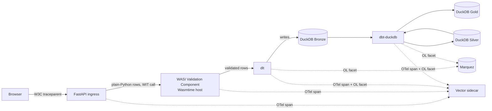
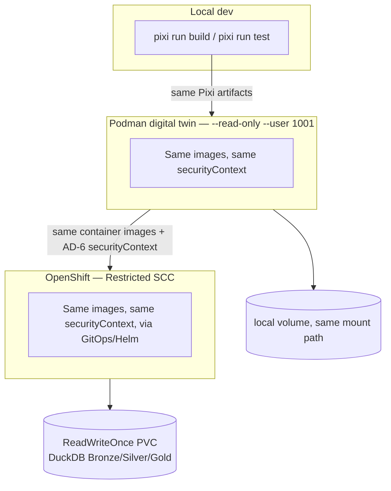

# Architecture Spine — Wasm Analytics Stack

## Design Paradigm

**Pipes-and-filters**, staged as a medallion pipeline: `Upload → Validate →
Ingest → Transform → (Serve, deferred)`. Each stage is a filter with one input
and one output shape; stages do not reach into each other's state. One stage —
Validate — additionally follows **ports-and-adapters (hexagonal)**: its WIT
interface *is* the port, and the `componentize-py`-compiled WASI component is
the one adapter behind it, swappable in principle without the FastAPI host
knowing anything changed beneath the interface. This is deliberately not a
whole-system hexagonal architecture — the dominant shape is the linear staged
pipeline, and only the validate stage needs (or, per the technical research,
can currently sustain) a real language-sandboxed adapter boundary.

Layer → namespace mapping:

| Layer | Namespace / directory |
| --- | --- |
| API / ingress (FastAPI, OIDC, upload handling, Excel→rows parsing) | `apps/api/` |
| Validate (WIT interface + `componentize-py` component source) | `apps/validate-component/` |
| Ingest (`dlt` pipeline, DuckDB Bronze target) | `apps/ingest/` |
| Transform (`dbt-duckdb` project) | `apps/transform/` |
| Observability wiring (OTel init, OpenLineage client config, Vector config) | `apps/observability/` |
| Deployment (Helm chart, Podman compose, generated security-context source of truth) | `deploy/` |

## Invariants & Rules



*Dependency direction: `API → Validate`, `API → Ingest`, `Ingest → Transform`
(via the shared DuckDB file, never a direct call). Nothing downstream of
Validate may call back into it; nothing in Transform may call Ingest directly —
they hand off exclusively through the DuckDB file, per AD-7.*

### AD-1 — Trust-boundary data shape at the WASI validation port

- **Binds:** FR-1, FR-2.
- **Prevents:** A builder passing raw Excel bytes or an Arrow buffer across the
  WIT boundary because it looks convenient, resurrecting the source gist's
  unverified claim.
- **Rule:** The validation component's WIT interface accepts and returns only
  primitive/record types built from strings, numbers, booleans, lists, and
  records — never a host-shared-memory or buffer type. Excel bytes are parsed
  into rows in the FastAPI process, entirely outside the sandbox, before the
  WIT call is made.

### AD-2 — Dependency-denylist enforcement is a build gate, not a policy

- **Binds:** FR-13.
- **Prevents:** One builder relying on PR review to catch a forbidden import
  while another assumes an automated check exists.
- **Rule:** `pixi run build` runs a static-import-scan step against the
  validation component's Python source and its resolved dependency closure;
  the build fails if `numpy`, `pandas`, `pyarrow`, `pydantic`, or any other
  C-extension-backed or `componentize-py`-unproven package is imported,
  directly or transitively.

### AD-3 — No WASI sandboxing for `dlt` / `dbt-duckdb` / DuckDB

- **Binds:** FR-4, FR-5.
- **Prevents:** A future builder re-attempting to compile the ingestion or
  transform stage to `wasm32-wasi` under ecosystem-hype pressure, without new
  evidence that DuckDB's native engine has gained a WASI build.
- **Rule:** `dlt` ingestion and `dbt-duckdb` transformation run as
  conventional Restricted-SCC-hardened OS processes/containers. No component
  in either stage's runtime path may declare a `wasm32-wasi` build target
  without an ADR amendment citing new upstream evidence (i.e. DuckDB itself
  shipping a WASI build).

### AD-4 — The Isolation-Verification Gate must be non-hollow by construction

- **Binds:** FR-12.
- **Prevents:** A gate that only proves the component instantiates
  successfully — a pass that proves nothing about the sandbox boundary itself.
- **Rule:** The gate (a Wasmtime-host test, running on every build — see
  Deferred-resolution note below) must include a meta-test: deliberately
  widening the component's declared WIT capabilities without a matching
  interface change must make the gate fail. The gate ships with this meta-test
  from its first version, not as a follow-up. It borrows only the
  *non-hollow-gate philosophy* from `pyforge-atlas` story G1's `wasm-smoke`
  test, not its mechanism — G1's gate is a Playwright/headless-Chromium
  network-blocking test against a browser-hosted DuckDB-WASM/Emscripten
  artifact and has no Wasmtime host, WIT interface, or capability model; this
  gate is a genuinely different implementation proving the same kind of claim.
- **CI trigger scope resolved:** the gate runs on every build, matching PRD
  SM-2 ("passes on every build" — the PRD's own committed success metric,
  cited verbatim). PRD § 8 Q5 raised this as an open question before SM-2 was
  cross-checked against it at this review; it is resolved here, not deferred.

### AD-5 — One trace-ID field, minted once, in one pinned wire format

- **Binds:** FR-8, FR-9, FR-10.
- **Prevents:** Each stage inventing its own correlation-id field, shape, or
  encoding, breaking the single-lookup lineage reconstruction (UJ-2).
- **Rule:** The W3C trace ID is minted at FastAPI ingress (or extracted from an
  inbound `traceparent` header) exactly once, per upload (see AD-7's 1:1
  cardinality). `upload_trace_id` is always the **bare 32-hex-character W3C
  trace-id** (the `traceparent` header's third field only — never the full
  `traceparent` string, never a UUID, never dashed) — this exact string is
  stored in the `dlt` load package's metadata, passed to `dbt` via `--vars
  '{"trace_id": "<32-hex>"}'`, and attached as a **custom facet**
  (`upload_trace_id`) on every OpenLineage run event. It is deliberately never
  conflated with OpenLineage's own `runId` (a separate, OpenLineage-spec-owned
  UUID minted per run) — the cross-system correlation key for UJ-2's lookup is
  always the custom `upload_trace_id` facet, not `runId`. No stage introduces
  a synonym field or a re-encoded copy.

### AD-6 — One securityContext, two consumers

- **Binds:** FR-15, FR-16.
- **Prevents:** The Podman digital-twin compose file and the OCP Helm chart's
  `securityContext` drifting apart, silently defeating the parity claim UJ-2
  exercises.
- **Rule:** A single canonical `securityContext` definition (non-root UID 1001,
  `readOnlyRootFilesystem: true`, no privilege escalation) is authored once
  under `deploy/`. Both the Helm chart values and the Podman compose file
  consume it via a generation step; neither hand-authors its own copy.

### AD-7 — DuckDB single-writer serialization, 1:1 cardinality, one owning process

- **Binds:** FR-4, FR-5, FR-17.
- **Prevents:** `dlt` ingestion and `dbt-duckdb` transformation holding
  concurrent write handles on the same DuckDB file (DuckDB is single-writer) —
  a corruption or lock-contention risk two independently-scheduled stages
  would hit eventually; also prevents the ingestion→transform cardinality
  being read two incompatible ways (one upload : one `dbt run`, vs. `dbt` on
  an independent batched schedule covering N uploads).
- **Rule:** Each validated upload triggers **exactly one** `dlt` load followed
  by **exactly one** `dbt run` scoped to that load — **1:1, never batched, no
  independent `dbt` schedule.** Both steps are invoked **sequentially by the
  same owning process/Job** (one `apps/ingest/` entry point calls `dlt`, then
  on success calls `dbt run --vars ...` in-process or as a direct child step —
  never two separately-scheduled triggers that could race). This is the
  concrete mechanism the "sequenced pipeline trigger" refers to: ownership by
  one process removes the need for a separate cross-process lock. A future
  move to genuinely concurrent/batched transforms is a scope change requiring
  an ADR amendment, not an implementation detail.

### AD-8 — Air-gap-routable dependency fetch

- **Binds:** FR-14.
- **Prevents:** A build script that works today but breaks the moment it runs
  behind an air-gapped mirror — the failure mode this repo's
  `enterprise-airgap` posture exists to prevent.
- **Rule:** Every build-time fetch (Pixi packages, DuckDB extensions, the
  `componentize-py`/Wasmtime toolchain) routes through the configured
  channel/mirror. No build script hardcodes a public URL (e.g.
  `extensions.duckdb.org`, a direct PyPI index) — mirroring `pyforge-atlas`
  G1's vendored-extension pattern.

### AD-9 — Upload validation is synchronous; the returned trace ID correlates, it does not gate a poll loop

- **Binds:** FR-1, FR-2, FR-3.
- **Prevents:** Two builders reading FR-1's "returns a tracking/trace ID the
  client can use to poll validation status" two incompatible ways — one
  building a synchronous request/response, the other a fire-and-forget queue
  with a separate polling endpoint neither UJ-1 nor the Mermaid flow above
  depicts.
- **Rule:** `POST /upload/excel` is **synchronous**: the request blocks
  through Excel parsing, the WASI validation call (AD-1), and returns the full
  per-row validation result (FR-3's row-level report) in the same HTTP
  response — matching UJ-1's "within seconds" resolution beat. The
  `upload_trace_id` (AD-5) returned alongside it is a **correlation handle for
  observability/lineage lookups (UJ-2), not a polling handle** — there is no
  V1 polling endpoint. Rows that pass validation are queued for FR-4 ingestion
  by name (their validated-row set, keyed to the same `upload_trace_id`);
  rows that fail are returned in the response body for the user to correct
  and resubmit, never silently retained server-side pending a fix. If a
  future file-size ceiling (PRD § 8 Q1) makes synchronous blocking
  impractical, that is a scope change requiring an ADR amendment, not an
  implementation detail.

### AD-10 — Authentication is enforced at the ingress boundary, not embedded per-request in `apps/api/`

- **Binds:** FR-1.
- **Prevents:** Two builders picking incompatible auth-enforcement points —
  one embedding JWT/JWKS validation as a FastAPI dependency inside
  `apps/api/`, another assuming an external gateway already validated the
  token — which would either double-validate or, worse, leave a gap if each
  assumes the other did it.
- **Rule:** OIDC token validation happens at a **sidecar/gateway boundary in
  front of `apps/api/`** (an OpenShift-native `oauth-proxy`-equivalent or
  comparable gateway pattern, consistent with AD-6's convention of keeping
  cross-cutting concerns in `deploy/` rather than duplicated inside app code).
  `apps/api/` trusts the identity the gateway attaches to the request (e.g. a
  forwarded header/claim) and does not itself speak to the OIDC provider or
  validate JWKS. The specific provider and gateway implementation remain
  Deferred (below); this AD fixes only *where* validation happens, which is
  the part two independent builders could otherwise place incompatibly.

## Consistency Conventions

| Concern | Convention |
| --- | --- |
| Naming (entities, files, interfaces, events) | Medallion table names are lowercase `bronze_*` / `silver_*` / `gold_*`; the WIT interface package is `wasm-analytics:validate`. |
| Data & formats (ids, dates, error shapes, envelopes) | Trace/correlation id is always `upload_trace_id` (AD-5). Validation failures return `{row_index, column, rule, message}` records — never a free-text-only error. Dates are ISO 8601 UTC everywhere they cross a stage boundary. |
| State & cross-cutting (mutation, errors, logging, config, auth) | DuckDB is the only stateful mutation point (AD-7); no stage keeps its own copy of pipeline state. Auth is OIDC-only at the API ingress (FR-1) — no stage downstream of the API re-authenticates or re-authorizes. Config for both the digital twin and OCP is sourced from the same `deploy/` definitions (AD-6). |

## Stack

<!-- Verified 2026-07-25 via PyPI JSON API + GitHub Releases API (WebSearch was unavailable this session — see technical research's Methodology Note). Independently re-verified against live sources during this spine's Reviewer Gate pass (same date) — all pins confirmed current as of that re-check; findings below. -->

| Name | Version |
| --- | --- |
| Python (host/pipeline processes: API, `dlt`, `dbt-duckdb`) | 3.12 — current stable CPython is 3.14.6; 3.12 chosen as the conservative floor already required by every pinned host library (`dlt`, `dbt-core`, `dbt-duckdb`, `duckdb` each declare PyPI support through 3.14, so nothing in the dependency set *forces* 3.12 — this is a stability choice, not a constraint, and may be revisited). |
| FastAPI | 0.140.0 |
| `dlt` | 1.29.1 |
| `dbt-core` | 1.12.0 |
| `dbt-duckdb` | 1.10.1 (declares `dbt-core>=1.8.0` — compatible with the pinned `dbt-core` 1.12.0; cross-checked via PyPI `requires_dist`) |
| DuckDB | 1.5.5 |
| `componentize-py` | 0.25.0 |
| Wasmtime (Python bindings, host runtime) | 47.0.1 |
| `opentelemetry-sdk` (Python) | 1.44.0 |
| `openlineage-python` | 1.52.0 |
| Marquez | last tagged release 0.50.0 (2024-10-24); repo actively pushed 2026-07-23 — Marquez ships primarily via Docker/Maven, not GitHub release tags. **Verify the actual deployed image tag at implementation time** (Deferred). |
| Vector | 0.57.0 |
| Pixi | 0.73.0 |

## Structural Seed

```text
apps/
  api/                    # FastAPI ingress: OIDC auth, upload endpoint, Excel bytes -> rows parsing (AD-1)
  validate-component/     # WIT interface + componentize-py-compiled WASI validation component
  ingest/                 # dlt pipeline: validated rows -> DuckDB Bronze
  transform/               # dbt-duckdb project: Bronze -> Silver -> Gold
  observability/          # OTel SDK init, OpenLineage client config, Vector config
deploy/
  security-context/       # AD-6: single canonical securityContext definition
  helm/                   # OCP Helm chart (consumes security-context/)
  podman-compose/         # Digital-twin compose (consumes security-context/)
pixi.toml                 # One toolchain: install / build (incl. WASI component + AD-2 denylist scan) / test / twin-up
```

### Deployment & Environments



Both non-production environments (local, digital twin) and production (OCP)
mount DuckDB's state at the same path from a `ReadWriteOnce`-shaped volume
(FR-17); only the volume's backing implementation differs (local bind mount →
Podman volume → OCP PVC), never the mount contract.

## Capability → Architecture Map

| Capability / Area | Lives in | Governed by |
| --- | --- | --- |
| FR-1 Authenticated upload | `apps/api/`, `deploy/` (gateway) | AD-1, AD-9, AD-10, Consistency Conventions (auth) |
| FR-2, FR-3 WASI validation + failure surfacing | `apps/validate-component/`, `apps/api/` | AD-1, AD-2, AD-4, AD-9 |
| FR-4 Ingestion to Bronze | `apps/ingest/` | AD-3, AD-5, AD-7 |
| FR-5, FR-6, FR-7 Transformation + lineage + test gate | `apps/transform/` | AD-3, AD-5, AD-7 |
| FR-8, FR-9, FR-10, FR-11 Observability + provenance | `apps/observability/`, all stages | AD-5 |
| FR-12, FR-13 Isolation gate + dependency audit | `apps/validate-component/`, CI | AD-2, AD-4 |
| FR-14, FR-15, FR-16, FR-17 One toolchain + parity + storage | `pixi.toml`, `deploy/` | AD-6, AD-7, AD-8, Deployment & Environments |

## Deferred

- **OIDC provider + gateway implementation** — AD-10 fixes *where*
  authentication is enforced (a sidecar/gateway boundary, not embedded in
  `apps/api/`); it deliberately leaves open *which* provider (Keycloak / Red
  Hat SSO / other) and *which* gateway implementation
  (`oauth-proxy`-equivalent or other), since two builders picking different
  providers/gateway software still compose correctly as long as both honor
  AD-10's boundary placement.
- **Exact validation latency / max file-size budget** — PRD § 8 Q1, unresolved;
  needed before the validation component's performance envelope can be sized,
  and before AD-9's synchronous-request design can be confirmed to hold at
  scale (a large-enough file may force revisiting AD-9 via ADR amendment).
- **Named regulatory framework** (HIPAA / PCI-DSS / SOX / none) — PRD § 8 Q2;
  the spine treats Restricted SCC + OIDC as the concrete baseline and defers
  anything a named framework would add (audit-log retention, encryption
  specifics).
- **Operational ownership / SLA / RTO-RPO** — PRD § 8 Q4; no deployment
  topology decision (replica count, failover) should assume an uptime target
  until this is answered.
- **Data classification / retention policy** for Bronze/Silver/Gold and
  Marquez's lineage history — PRD's Data Governance section flagged this open;
  no retention job is architected until a policy exists.
- **`componentize-py`'s runtime-import restriction's effect on validation-rule
  configuration** — PRD § 8 Q3; if validation rules were meant to be
  dynamically loaded per file-type, that pattern needs a build-time-resolvable
  redesign, deferred to the story that first hits it.
- **Marquez's actual deployed image/version** — the GitHub release-tag
  staleness noted in Stack should be resolved (checked against the current
  Docker/Maven artifact) before deployment, not assumed from the stale tag.
- **`dbt Fusion` (Rust engine) migration path** — explicitly out of scope per
  the PRD; revisit only if Fusion gains a DuckDB adapter (a real, but
  unscheduled, upstream event to watch).
- **Browser-side read/dashboard surface onto Gold** — v2, would reuse
  `pyforge-atlas` G1's DuckDB-WASM/Pyodide pattern directly; no architecture
  commitment made here since it's out of this PRD's MVP scope.
