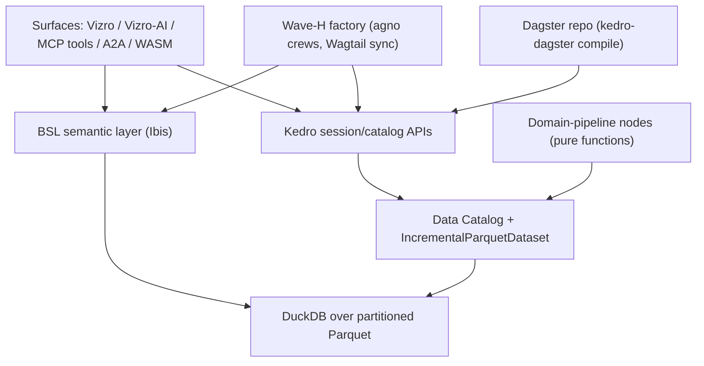
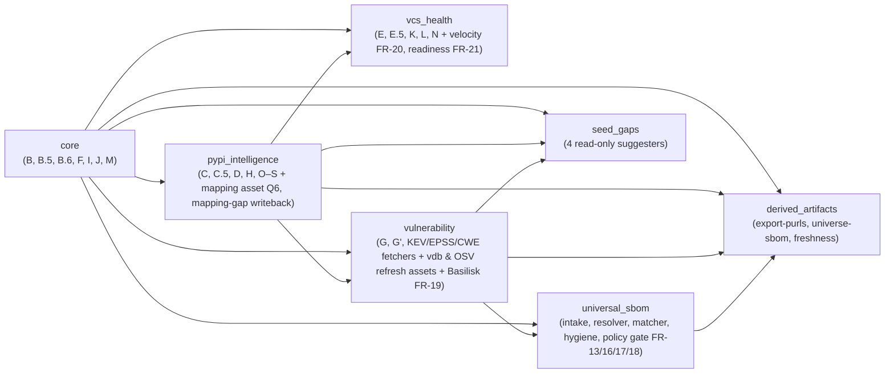

# pyforge-atlas — consolidated BMAD specs

> **What this is.** Every BMAD spec/planning artifact used to build the
> `pyforge-atlas` Kedro migration, concatenated into one file for reference.
> Each section preserves its source content verbatim under a heading that names
> the original path and tier. This is a *derived archive* — the source files
> under `_bmad-output/projects/pyforge-atlas/` and `docs/specs/` remain the
> canonical, editable copies.
>
> **Provenance & cross-session note.** The Tier-2 planning artifacts are
> git-tracked, so cross-session committed work is already captured here. Tier-3
> story files are gitignored local state: only waves **0 / A / B** exist as
> individual story-file specs — waves **C–H** ran through the in-session agent
> loop and were never emitted as story files, so their per-story detail lives
> only inside **epics.md** (all 32 stories are defined there). Anything authored
> in another session and never committed is NOT reachable from this checkout.
>
> Generated: 2026-07-25 · binding spec version: see the intake spec's frontmatter.

---

## Table of contents

1. [Intake spec (Tier 1 — the binding contract)](#1-intake-spec--tier-1---the-binding-contract)
2. [Intake groundtruth](#2-intake-groundtruth)
3. [PRD](#3-prd)
4. [PRD addendum](#4-prd-addendum)
5. [Architecture spine](#5-architecture-spine)
6. [Epics & stories (all 9 epics / 32 stories)](#6-epics---stories--all-9-epics---32-stories)
7. [Agents & skills record](#7-agents---skills-record)
8. [Implementation-readiness gate report](#8-implementation-readiness-gate-report)
9. [Sprint-change proposal](#9-sprint-change-proposal)
10. [Planning-phase closeout](#10-planning-phase-closeout)
11. [Story 0.1 — legacy contextual skill](#11-story-0-1---legacy-contextual-skill)
12. [Story A1 — scaffold Kedro/pixi project](#12-story-a1---scaffold-kedro-pixi-project)
13. [Story A2 — data catalog](#13-story-a2---data-catalog)
14. [Story A3 — IncrementalParquetDataset / TTL](#14-story-a3---incrementalparquetdataset---ttl)
15. [Story B1 — conda-side backbone phases](#15-story-b1---conda-side-backbone-phases)
16. [Story B2 — PyPI + vulnerability pipelines](#16-story-b2---pypi---vulnerability-pipelines)
17. [Story B3 — Kedro-API-native MCP tools](#17-story-b3---kedro-api-native-mcp-tools)
18. [Story B4 — dataset parity vs legacy](#18-story-b4---dataset-parity-vs-legacy)
19. [Story B5 — external-refresh assets](#19-story-b5---external-refresh-assets)
20. [Story B6 — seed-gaps pipeline](#20-story-b6---seed-gaps-pipeline)
21. [Story B7 — universal SBOM intake](#21-story-b7---universal-sbom-intake)
22. [Story B8 — Basilisk vuln ingestion](#22-story-b8---basilisk-vuln-ingestion)
23. [Deferred-work ledger](#23-deferred-work-ledger)
24. [Sprint status](#24-sprint-status)

### Provenance

| # | Section | Tier | Source path | Bytes |
|---|---|---|---|---|
| 1 | Intake spec (Tier 1 — the binding contract) | Tier 1 | `docs/specs/cfe-atlas-datapipeline-kedro-migration.md` | 145,162 |
| 2 | Intake groundtruth | Tier 2 | `_bmad-output/projects/pyforge-atlas/planning-artifacts/intake-groundtruth-2026-07-17.md` | 2,668 |
| 3 | PRD | Tier 2 | `_bmad-output/projects/pyforge-atlas/planning-artifacts/prds/prd-pyforge-atlas-2026-07-17/prd.md` | 46,555 |
| 4 | PRD addendum | Tier 2 | `_bmad-output/projects/pyforge-atlas/planning-artifacts/prds/prd-pyforge-atlas-2026-07-17/addendum.md` | 5,708 |
| 5 | Architecture spine | Tier 2 | `_bmad-output/projects/pyforge-atlas/planning-artifacts/architecture/architecture-pyforge-atlas-2026-07-17/ARCHITECTURE-SPINE.md` | 41,957 |
| 6 | Epics & stories (all 9 epics / 32 stories) | Tier 2 | `_bmad-output/projects/pyforge-atlas/planning-artifacts/epics.md` | 72,807 |
| 7 | Agents & skills record | Tier 2 | `_bmad-output/projects/pyforge-atlas/planning-artifacts/agents-and-skills.md` | 14,149 |
| 8 | Implementation-readiness gate report | Tier 2 | `_bmad-output/projects/pyforge-atlas/planning-artifacts/implementation-readiness-report-2026-07-17.md` | 22,780 |
| 9 | Sprint-change proposal | Tier 2 | `_bmad-output/projects/pyforge-atlas/planning-artifacts/sprint-change-proposal-2026-07-17.md` | 6,044 |
| 10 | Planning-phase closeout | Tier 2 | `_bmad-output/projects/pyforge-atlas/planning-artifacts/planning-phase-closeout-2026-07-17.md` | 9,408 |
| 11 | Story 0.1 — legacy contextual skill | Tier 3 | `_bmad-output/projects/pyforge-atlas/implementation-artifacts/0-1-generate-legacy-contextual-skill.md` | 28,058 |
| 12 | Story A1 — scaffold Kedro/pixi project | Tier 3 | `_bmad-output/projects/pyforge-atlas/implementation-artifacts/a1-scaffold-the-kedro-pixi-project-via-nebi.md` | 49,690 |
| 13 | Story A2 — data catalog | Tier 3 | `_bmad-output/projects/pyforge-atlas/implementation-artifacts/a2-define-the-data-catalog-for-all-sources-outputs.md` | 65,566 |
| 14 | Story A3 — IncrementalParquetDataset / TTL | Tier 3 | `_bmad-output/projects/pyforge-atlas/implementation-artifacts/a3-implement-incrementalparquetdataset-for-ttl-gating.md` | 43,145 |
| 15 | Story B1 — conda-side backbone phases | Tier 3 | `_bmad-output/projects/pyforge-atlas/implementation-artifacts/b1-port-the-conda-side-backbone-phases-into-kedro-nodes.md` | 44,891 |
| 16 | Story B2 — PyPI + vulnerability pipelines | Tier 3 | `_bmad-output/projects/pyforge-atlas/implementation-artifacts/b2-port-the-pypi-and-vulnerability-pipelines.md` | 57,949 |
| 17 | Story B3 — Kedro-API-native MCP tools | Tier 3 | `_bmad-output/projects/pyforge-atlas/implementation-artifacts/b3-re-expose-the-data-surface-as-kedro-api-native-mcp-tools.md` | 17,366 |
| 18 | Story B4 — dataset parity vs legacy | Tier 3 | `_bmad-output/projects/pyforge-atlas/implementation-artifacts/b4-verify-dataset-parity-against-the-legacy-orchestrator.md` | 32,814 |
| 19 | Story B5 — external-refresh assets | Tier 3 | `_bmad-output/projects/pyforge-atlas/implementation-artifacts/b5-port-the-external-refresh-assets.md` | 42,207 |
| 20 | Story B6 — seed-gaps pipeline | Tier 3 | `_bmad-output/projects/pyforge-atlas/implementation-artifacts/b6-port-the-seed-gaps-pipeline.md` | 38,383 |
| 21 | Story B7 — universal SBOM intake | Tier 3 | `_bmad-output/projects/pyforge-atlas/implementation-artifacts/b7-extend-the-universal-sbom-intake.md` | 35,296 |
| 22 | Story B8 — Basilisk vuln ingestion | Tier 3 | `_bmad-output/projects/pyforge-atlas/implementation-artifacts/b8-basilisk-conda-native-vulnerability-ingestion.md` | 39,634 |
| 23 | Deferred-work ledger | Tier 3 | `_bmad-output/projects/pyforge-atlas/implementation-artifacts/deferred-work.md` | 78,780 |
| 24 | Sprint status | Tier 3 | `_bmad-output/projects/pyforge-atlas/implementation-artifacts/sprint-status.yaml` | 28,159 |

---

## 1. Intake spec (Tier 1 — the binding contract)

> **Tier:** Tier 1 · **Source:** `docs/specs/cfe-atlas-datapipeline-kedro-migration.md`

---
doc_type: spec
part_id: cf-atlas-datapipeline
display_name: cfe-atlas-datapipeline Kedro Migration Spec
project_type_id: data
date: 2026-06-20
status: in-progress
spec_updated: 2026-07-17
---

# Spec: cfe-atlas-datapipeline Kedro Migration

> **BMAD intake document.** Written for full BMAD execution (Full Flow
> track — data-platform migration effort). 9 implementation waves
> (0 + A–H) decomposed into the User Stories in § 9. Run BMAD with this
> file as the intent document:
>
> ```
> run bmad — implement the intent in docs/specs/cfe-atlas-datapipeline-kedro-migration.md
> ```
>
> This is the **v5 reset** of the spec — a clean re-authoring (2026-07-16)
> that states every standing decision once, in place. The v1–v4.1 layered
> evolution lives in this file's git history; § 15 carries the compact
> decision log and evidence pointers.

---

## 1. Status

| Field | Value |
|---|---|
| Status | **v5.6 — reset + corpus sync + research folds + adversarial review + PRFAQ kill-test + market research, 2026-07-16; grounded on live surface main `58a6dcc` / skill v8.78.0; ANALYSIS COMPLETE (all instruments discharged, MR included). BMAD Tier-2 planning intake started 2026-07-17 under project slug `pyforge-atlas` (groundtruth re-verified at `4cf1b74` — § 3.3 snapshot carries forward unchanged).** 22 FRs; 6 open questions (§ 11: Q1–Q4, Q6, Q7), none v1-blocking. |
| Execution | **Waves 0 + A–D SHIPPED (2026-07-17/18).** Wave 0 (skill) + Wave A (scaffold/catalog/TTL) signed off; Wave B (B1–B10: conda+pypi+vuln nodes, MCP surface, dataset-parity harness, external-refresh assets, seed-gaps, universal-SBOM, + the 3 new-signal sources Basilisk/velocity/migration-readiness), Wave C (C1 kedro-dagster glue + dagster-dryrun, C2 kedro-viz), and Wave D (D1 BSL models + bsl-metric-check, D2 BSL-driven Vizro dashboard, D3 query_vizro_ai MCP tool) all merged (PRs #76–#88), each orchestrator-verified + adversarially + independently reviewed. **Remaining: Waves E–H (epics 6–9).** Attended/credentialed pieces honestly deferred in `implementation-artifacts/deferred-work.md` (B4 credentialed parity, C1 live Dagster bring-up, D2 CIS-two-spine full-28-page inventory + visual pass, D3 live LLM backend). |
| Owner | rxm7706 |
| Track | BMAD Full Flow (includes separate PRD/architecture phases) |
| Scope | Migrate the hand-rolled `cf_atlas` orchestrator (`conda_forge_atlas.py` + `bootstrap_data.py`, ~10,000 LOC, 23 cataloged phases) to a Kedro pipeline + Dagster orchestration + DuckDB compute, with a Vizro/Vizro-AI read surface and a Boring-Semantic-Layer + MCP/A2A agent interface. Includes three committed new-signal sources (FR-19 Basilisk vulnerabilities, FR-20 release velocity, FR-21 migration readiness). |
| Target | The `cf_atlas` intelligence layer under `.claude/skills/conda-forge-expert/` (data pipeline + read CLIs + MCP tools). |
| Tooling | Pixi-first; every component sourced from conda-forge and scaffolded via `nebi`. |
| Lifetime | Forward-looking migration. Legacy orchestrator runs in parallel until dataset parity is proven (Story B4), then is retired. |
| Predecessor | The existing 23-cataloged-phase `cf_atlas` pipeline (22 registered + Phase I; exact registry in § 3.3) and its 28 read CLIs. |

**Groundtruth rule**: the counts and literals in this spec are a snapshot of
§ 3.3's grounding commit. At BMAD intake, **re-enumerate the migration
surface from live groundtruth** (`pixi run -e local-recipes bmad-groundtruth`,
SKILL.md § Atlas Intelligence Layer) rather than trusting any inline literal —
per the standing rule that `docs/specs/` stays mutually in sync.

---

## 2. Operational Philosophy & Platform Ecosystem

Before detailing the architectural migration of `cf_atlas`, all implementations must strictly adhere to our universal operational guidelines.

### 2.1 Build for Autonomous AI Agents

Every system, interface, and dataset we produce must be inherently legible to, and controllable by, machine intelligence.

*   **Web Agents**: Any visualization or dashboard (e.g., Vizro-AI) must use pristine semantic HTML, clear ARIA attributes, and deterministic layouts to ensure scraper and browser agents can navigate without hallucinating.
*   **Agent Workflows**: APIs must be self-documenting (OpenAPI/Swagger) and **idempotent first** so agents can safely retry network requests. Error messages must be hyper-clear to allow LLMs to auto-diagnose.
*   **The Agent Harness**: We implement strict schema validation guardrails to catch erratic agent behavior and maintain exhaustive run-trace histories for absolute context state management; scheduled QA/linter workflows run through the § 2.5 loop stack's verify gates.

### 2.2 Spec-Driven Development & Agent Workforce (The 5 Personas)

We do not build or analyze on a whim. This migration is executed under the **BMAD Universal Workflow** as adopted by this repo — `bmad-method >=6.10.0,<7`, core + bmm modules, 46 installed skills (`docs/specs/bmad-loop-adoption.md`) — leveraging the installed BMM planning skills (`bmad-prd`, `bmad-architecture`) during Tier-2 planning. Work is systematically processed through an explicit agent team ecosystem consisting of five distinct personas:

1.  **Ingester (Analyst)**: Reads the incoming raw Parquet data or payloads.
2.  **Compiler (Architect)**: Transforms raw data into structured concepts via BSL.
3.  **Linker (Developer)**: Connects nodes (packages, CVEs, feedstocks) within the graph.
4.  **Linter (QA/Reviewer)**: Validates constraints and handles scheduled weekly reviews. We explicitly augment this persona with the **Test Architect (TEA)** module (installed alongside bmm via the conda-forge `bmad-method` installer — § 2.5) to design the Dagster validation contracts and parity tests.
5.  **Oracle (Product Owner)**: Acts as the primary interface for external queries and strategic tools.

### 2.3 Pixi-First Platform Tooling

To support this operational model, our entire platform ecosystem is defined in `pixi.toml` and managed by `nebi`. We strictly leverage:

*   `bmad-method` (>=6.10.0,<7) for the agent-driven framework.
*   `gh` for automated delivery review and PR creation.
*   `nebi` for ecosystem orchestration and environment scaffolding.

### 2.4 Planning & Translation Tools

To execute this migration effectively, we utilize two crucial ecosystem extensions:
*   **Skill Forge (SKF)**: For translating the ~10,000 lines of legacy code into an ingestible agent context skill (Wave 0) with provable provenance.
*   **Creative Intelligence Suite (CIS)**: Utilizing the CIS planning agents (e.g., Carson the Brainstorming Coach and Maya the Design Thinking Coach) to explicitly define the downstream read surface (Vizro/Vizro-AI) and output the two-spine technical specs (`DESIGN.md` + `EXPERIENCE.md`) before writing frontend code.

### 2.5 Autonomous Execution (bmad-loop + bmad-dev-auto, graduated autonomy)

This spec runs on the repo's adopted loop stack (`docs/specs/bmad-loop-adoption.md`) under **graduated autonomy with verify-first sequencing** (execution architecture from the 2026-07-16 technical research — the artifact referenced in § 13.4). Two verified facts shape the model: bmad-loop v0.8.1 executes stories **sequentially** (`max_parallel = 1` — fan-out is not a shipped capability), and the loop's power lives entirely in its deterministic verify gates — which for this effort are themselves early-wave deliverables. Therefore:

*   **Graduated autonomy by wave**: Waves 0 + A run attended / `bmad-dev-auto`-inline (they *build the harness* — verify tasks, catalog, fixtures); Wave B runs loop-driven under `per-story-spec-approval` with TEA `atdd`-generated fixture gates; Waves C–E relax toward `per-epic`; Waves F–H run mixed. ~21 of the 32 stories are loop-drivable (11 at spec-approval, ~10 relaxable to per-epic); the attended events (B4 parity, F1 benchmark, C1 bring-up, D3 backend, G2 publish) are scheduled wave-boundary events, never emergencies.
*   **Verify-first sequencing**: every wave's first deliverable is its own deterministic gate (`kedro-test` at A1, `kedro-catalog-check` at A2, the `parity-diff` harness through B1–B4, `dagster-dryrun` at C1, `bsl-metric-check` at D1, `wasm-smoke` at G1); the loop never enters a wave whose gate doesn't exist. All gates are fixture-based (never credentialed live endpoints; fixtures live in the tracked test tree, not `.claude/data/`) and run `--frozen`.
*   **Loop preconditions** (before any run): one-time hooks approval; `scripts/bmad-switch local-recipes`; the **worktree bootstrap** for the gitignored multi-project symlinks (validated by Story A3 — the designated first loop story and worktree smoke); heaviest-story budget review (B1/B2/F1 are keystones — pre-flight `session_timeout_min`/token raises per the pyforge pilot learnings).

The loop stack itself:

*   **`bmad-loop` v0.8.1** — the deterministic Python orchestrator (DEV → VERIFY → REVIEW → VERIFY → COMMIT in fresh tmux sessions), provisioned as a pixi git dependency pinned to tag v0.8.1 (`tui` extra) alongside conda-forge `bmad-method >=6.10.0,<7` + `tmux >=3.4`. Policy: `per-story-spec-approval` gates, worktree isolation with branch-per-story and squash merges, `rollback_on_failure`. Loop-driven runs are linux-64 / osx-arm64 only (tmux); attended flows are OS-agnostic.
*   **`bmad-dev-auto`** — 6.10's unattended single-story implementation skill (clarify-route → plan → implement → review), for stories where a full loop is overkill.
*   **Tier-2 Planning Skills**: `bmad-prd`, `bmad-architecture`, `bmad-create-epics-and-stories` (the pre-6.10 `bmad-create-prd` / `bmad-create-architecture` names are deprecated thin wrappers).
*   **Tier-3 per-story pipeline**:
    1. `@bmad-create-story`
    2. `@bmad-testarch-atdd` (TEA)
    3. `@bmad-dev-story` (Linker)
    4. `@bmad-testarch-test-review` (TEA)
    5. `@bmad-code-review` (Linter)

---

## 3. Current State: the cf_atlas Pipeline

The `cf_atlas` data pipeline currently operates as a bespoke, hand-rolled orchestrator (`conda_forge_atlas.py` + `bootstrap_data.py`) spanning ~10,000 lines of code (8,902 + 1,094 at skill v8.78.0).

### 3.1 Current Architecture & Constraints

*   **Orchestration**: 23 cataloged phases (22 registered + the Phase I side-effect; conda-side B → N incl. sub-phases, plus O–S PyPI intelligence; exact registry in § 3.3) executing in procedural order.
*   **State Management**: Custom checkpointing via a `phase_state` SQLite table (tracking cursors and completion).
*   **Incremental Processing**: Hand-rolled TTL gating using `*_fetched_at` timestamps on the primary `packages` table.
*   **Data Lineage**: Implicit. Dependencies between phases (e.g., Phase J requiring D and E) exist purely in the developer's head and the procedural calling order. The extreme case is Phase I (per-version download history): it exists only as a side-effect of Phase F's anaconda-api path — never registered in `PHASES`, invisible to `--skip`/`--only` — yet `version-downloads` and `release-cadence` depend on it. The migration makes it an explicit node with declared outputs.
*   **Read Surface**: 28 bespoke CLIs — 17 atlas read CLIs (e.g., `staleness-report`, `behind-upstream`), the 4 seed-gap suggesters, plus the 7-CLI cyclonedx suite (§ 3.3) — that output text/JSON and require manual maintenance.
*   **Visualization**: None. The system relies entirely on terminal stdout/stderr for observability.

### 3.2 Identified Gaps

*   **Maintainability tax (chronic and compounding, not acute)**: adding a new phase requires manually wiring the `PHASES` registry, migrating the SQL schema, and re-implementing checkpoint/TTL/backoff machinery per phase. The legacy pattern demonstrably ships (23 phases; ~10 releases in two months) — the cost is per-phase re-implementation plus agent-hostile procedural state, and it compounds with every § 12.1/§ 13.1 candidate. The PRFAQ kill-test (2026-07-16, § 13.4) priced this honestly against the ~5-story null alternative and rests the migration's justification on **agent-maintainability**, not urgency.
*   **Opaque Execution**: When `--fresh` takes 3-4 hours, operators have no visual way to monitor the DAG, identify bottlenecks, or view intermediate dataset schemas.
*   **Rigid Read Surface**: The 28 CLIs answer 28 specific questions. Ad-hoc questions require dropping into `sqlite3 cf_atlas.db` and writing manual JOINs.

### 3.3 Live-Surface Snapshot (main `58a6dcc`, skill v8.78.0, 2026-07-16)

The authoritative enumeration of the migration surface. Stories and FRs reference
this section instead of inline literals; re-verify with
`pixi run -e local-recipes bmad-groundtruth` at BMAD intake before planning.

*   **Schema**: `SCHEMA_VERSION = 29`; 22 tables; 5 views —
    `v_actionable_packages`, `v_pypi_candidates`, `v_pypi_intelligence_valid`
    (its consumers must read the view, never the raw table),
    `v_packages_enriched`, and `v_current_version_vulns` (the ONLY
    query-time-correct vuln source; the `packages.vuln_*` rollup is
    report-only). `trendshift-conda-forge.md` Phase T claims v29→v30.
*   **Phases**: 23 cataloged — 22 registered in the `PHASES` list
    (`conda_forge_atlas.py`, the single source of truth): B, B.5, B.6, C,
    C.5 (deferred), D, O, P, Q, R, S, E, E.5, F, G, G', H, J, K, L, M, N —
    plus **Phase I** (per-version download history), a side-effect of Phase
    F's anaconda-api path, cataloged in `atlas-phases-overview.md` but never
    registered (no independent scheduling; it ships with F and feeds
    `version-downloads` / `release-cadence` / G'). The migration promotes it
    to an explicit node. All of them write to `cf_atlas.db`. Credentialed: P
    (BigQuery ADC — the only implemented source; ClickHouse / ecosyste.ms are
    documented fallbacks, not code paths; **opt-in via `PHASE_P_ENABLED=1`
    and enabled only by the admin profile** — no schedule may turn it on by
    default), E.5 / K / N (GitHub token),
    G / G' (vuln-db environment). TTL-gated set (hand-maintained
    `atlas_phase._TTL_GATED` map): F, G, G', H, K, L. Phase B.5 resolves the
    **dedicated feedstock** for split-out outputs via `_pick_feedstock`
    (umbrella vs dedicated — e.g. `dbt-bigquery` → the `dbt-bigquery`
    feedstock, not `dbt`) — attribution semantics every maintainer-scoped
    CLI depends on; the node port must preserve them (Story B1). Phase B.6
    yanked detection is deliberately **lite** (presence-in-current-repodata
    → `latest_status`); its full per-version variant is a recorded future
    hook, not current behavior (see the Story B1 note and § 12).
*   **Script surface**: 61 canonical scripts + 5 `_`-prefixed helpers under
    `.claude/skills/conda-forge-expert/scripts/`; 57 thin wrappers under
    `.claude/scripts/conda-forge-expert/`; 93 local-recipes + 7 vuln-db pixi
    tasks. The three-place rule (canonical script + wrapper + pixi task +
    SCRIPTS meta entry) is meta-test-enforced.
*   **Read CLIs (28)**: 17 atlas read CLIs (`detail-cf-atlas`,
    `staleness-report`, `feedstock-health`, `whodepends`, `behind-upstream`,
    `cve-watcher`, …) + the 4 seed-gap suggesters (`lts-registry-gap`,
    `cwe-seed-gap`, `spdx-schema-gap`, `license-map-gap` — read-only;
    § 3.4) + the 7-CLI cyclonedx suite (`export-purls`, `mapping-gap`,
    `universe-sbom`, `inventory-match`, `add-handoff`, `library-futures`,
    `recommend-2027`).
*   **MCP**: 46 `@mcp.tool()` functions in `.claude/tools/conda_forge_server.py`
    (23 atlas-relevant). `library-futures`, `add-handoff`, and the 4 seed-gap
    suggesters are deliberately CLI/pixi-only — do not add MCP tools for them
    during the port. A second, unregistered MCP server exists in the repo
    (`.claude/tools/gemini_server.py`) — outside this migration's surface
    (FR-7's audit scope is `conda_forge_server.py` only).
*   **External endpoints**: 19 `resolve_*_urls` helpers in `_http.py`, each
    overridable via `<HOST>_BASE_URL` for enterprise/JFrog mirror routing,
    plus `S3_PARQUET_BASE_URL` (Phase F parquet backend) and
    `ENDOFLIFE_BASE_URL` (EOL/LTS cache). These become external/API dataset
    nodes in the Kedro catalog (FR-1). FR-19 adds a 20th helper
    (`resolve_basilisk_urls` + `BASILISK_BASE_URL`); FR-21 rides the
    existing `resolve_github_raw_urls` — no new helper. `repo.prefix.dev`
    is already the first public mirror in the repodata fallback chain
    (JFrog → prefix.dev → conda.anaconda.org). `detail-cf-atlas`'s
    build-matrix chain carries a separate `ANACONDA_API_BASE` override
    (api.anaconda.org files endpoint, repodata-walk fallback). Known defect
    FR-1 **fixes rather than ports**: `_http.py` injects the JFrog
    credential (`X-JFrog-Art-Api`) on every outbound request regardless of
    destination host — the documented workaround today is
    `unset JFROG_API_KEY` for non-JFrog commands
    (`docs/enterprise-deployment.md`); the Kedro catalog scopes credentials
    per host.
*   **Data files** — runtime (gitignored, `.claude/data/conda-forge-expert/`):
    `cf_atlas.db`, `purl-export/`, `universe-sbom/`, `eol_cache.json`
    (TTL 7 d, offline-stale-OK), `pypi_conda_map.json`, `vdb/`, `cve/`.
    Git-tracked seeds: `cwe_categories_seed.json`, `lts-registry.yaml`,
    `spdx.schema.json`.
*   **Write paths** — exactly 6 writers to `cf_atlas.db`:
    `conda_forge_atlas.py` (including the shared `phase_r_upsert_one` /
    `apply_readiness_scores` helpers that `add-handoff` reuses — the
    single-write-path property to preserve), `atlas_phase.py` TTL reset,
    the `mapping_gap.py` `g10_spelling` no-clobber writeback (see the
    mapping contract below), and the three standalone vulnerability-scoring
    fetchers — `cisa_kev_fetcher.py` (`cisa_kev`), `epss_fetcher.py`
    (`epss_scores`), and `cwe_catalog_fetcher.py` (`cwe_categories`) —
    whose tables Phase G / G' overlay at build time.
*   **Mapping / purl contracts**: `packages.pypi_name` rows written by
    `mapping-gap` carry `match_source='g10_spelling'` with
    `match_confidence` `verified`/`likely`, and the no-clobber UPDATE never
    touches `parselmouth`/`recipe_source_url` provenance — any
    re-implementation of the mapping layer must keep `g10_spelling` as a
    valid provenance tier and preserve the no-clobber rule. Exported purls
    use the `cfe:*` property namespace and the `?channel=conda-forge`
    qualifier on conda purls (G98) — FR-13's normalizer preserves both.
*   **Vulnerability read-path contract**: `detail-cf-atlas --vdb-all` overlays
    the atlas `cisa_kev` table onto vdb results via `_load_kev_cves` (vdb
    6.6.2's own KEV flags are always False — aqua ignores `kevc/`), reporting
    **KEV-affecting-current** to match Phase G's `vuln_kev_affecting_current`;
    CVSS base scores pass through `_coerce_cvss_score` (unwraps the pydantic
    `ScoreType` that vdb 6.6.2's partial `model_dump` leaves behind). Any
    migrated vuln read surface must keep both behaviors (Story B2).
*   **Scoring / report contracts**: `recommend-2027` stamps six `cfe:*` BOM
    properties (`futures_tier`, `futures_score`, `py314_readiness`,
    `lts_status`, `eol_date`, `atlas_built_at`) — the FR-13 normalizer
    preserves them like the rest of the `cfe:` namespace. Operator tier
    overrides travel via a `cfe:futures_tier=<tier>` marker in
    `pypi_intelligence.notes` plus a `--overrides` sidecar file — any
    migrated store must keep that notes-marker channel readable. The
    `library-futures` calibration gate is fixture-test-enforced (a weights
    change that reorders the pinned ranking fails CI) and must survive as a
    pipeline test. `library-futures` scoring is **in-memory /
    inventory-scoped by design** — there is no futures DB column; do not
    "migrate" a table for it.
*   **Freshness machinery**: `check_freshness` (`universe_sbom.py`,
    `STALE_AFTER_DAYS = 14`) consumed by 5 scripts; `*_fetched_at` columns +
    meta keys drive per-phase TTL gating; derived artifacts (`export-purls`,
    `universe-sbom`) regenerate after every atlas rebuild — model them as
    downstream nodes of the rebuild. TTLs are **per-phase, not global**
    (Phase D 7 d, Phase P 30 d monthly partitions, EPSS 1 d, CWE 90 d, …) —
    the FR-3 dataset class carries a per-dataset TTL, never one repo-wide
    constant.
*   **Environments / tests**: 11 pixi environments (local-recipes / vuln-db /
    gcloud split, plus the standalone no-default-feature `pyforge-warden`
    and `bmad-ui` envs); test suite of 85 unit + 4 integration + 8 meta
    files. The meta tests pin the three-place rule and docs integrity — the
    migration keeps them green or explicitly retires them with the legacy
    path.
*   **Per-phase engineering contracts** (binding port references:
    `docs/specs/cfe-shipped-releases.md` + `reference/atlas-phase-engineering.md`
    — the shipped *how* behind each phase; the highest-stakes items):
    *   **Phase P cost gates**: a free dry-run preflight aborts above
        `PHASE_P_MAX_COST_USD`, **plus** the server-side
        `maximum_bytes_billed` hard cap and a job timeout; queries use
        `_PARTITIONDATE` literal date bounds (never `CURRENT_TIMESTAMP()`,
        which defeats partition pruning). A real $500+ invoice sits behind
        this design, and `test_no_thirty_gb_lie.py` regression-guards cost
        claims — any "scans N GB" statement must cite a dry-run, never a
        literal. The mode machine (first-pull / incremental / gap-revert /
        empty-window no-op) and `INSERT OR IGNORE` idempotency port intact.
    *   **Phase K scheduler**: GitHub's *secondary* (burst) rate limit is
        invisible to `/rate_limit` — hence a single worker with a 3 RPS
        token bucket by default, host-agnostic across GitHub/GitLab/
        Codeberg, `PHASE_K_AGGRESSIVE=1` as the opt-out; 403s land in
        `upstream_versions.last_error` and re-pick via the TTL bypass.
    *   **Phase F provenance discipline**: `downloads_source` values
        (`anaconda-api` / `s3-parquet` / `merged`) are correlated-but-
        distinct, never interchangeable; breakdown tables are written only
        on the s3-parquet path, via DELETE-by-scope-key + INSERT in one
        transaction (zombie-row defense); `downloads_30d` is the latest
        calendar month, **not** a rolling window; one consolidated pyarrow
        sweep computes all Phase F+ metrics (do not split passes); the
        dirty `pkg_python` parquet column is regex-filtered before
        aggregation.
    *   **Phase H serial gate**: eligibility = never-fetched OR serial
        moved OR 30-day safety re-check; the denominator must never
        re-include pypi-only rows (the pre-v7.9.0 6-hour-cold-run bug).
    *   **Smaller invariants**: EPSS percentiles stored normalized 0–100;
        `pypi_intelligence.notes` operator overrides survive Phase S
        re-runs; every raw `packages` query passes the
        `v_actionable_packages` scope meta-test (view or `# scope:`
        justification); and the port lands at the **post-v25 schema
        shape** — the cancelled hardening/EPSS-overlay tables
        (`package_hardening`, `vuln_total_active`, …) were provisioned then
        dropped and must not be resurrected.
*   **Known data-quality gap**: the maintainer universe counted from atlas
    `package_maintainers` (769 feedstocks = 537 sole + 232 co, build
    2026-06-19) disagrees with cf-graph `node_attrs` discovery (813 = 558 +
    255, `conda-forge-tracker.md`) by ~44 — the migrated Phase E /
    `my-feedstocks` surface reconciles the two paths or documents the delta
    (Stories B1/B4).
*   **Conditional surface** — `trendshift-conda-forge.md` (ready, unshipped):
    if its Track A ships before Wave B completes, the surface grows by Phase
    T (`phase_t_github_trending`), tables `github_trending_repos` +
    `trending_classification`, view `v_trending_candidates`, the
    `trending-candidates` CLI + MCP tool, two feeds (GitHub Trending HTML +
    the GitHub Search API fallback, both via existing `_http.py` plumbing),
    and schema v30. Its invariants port with it: scrape failures never
    hard-fail the build (WARN + keep prior snapshot), atomic DELETE+INSERT
    per `(period, snapshot_date)` slice, and never scrape `trendshift.io`.
    Re-check its status at BMAD intake alongside `bmad-groundtruth`.
*   **Operational profiles** (`guides/atlas-operations.md` — the operational
    process the migration must reproduce): `bootstrap-data` ships three
    profiles — `--profile maintainer` (daily default; Phase E + N auto-scoped
    to `gh api user`), `--profile admin` (weekly channel-wide sweep), and
    `--profile consumer` (air-gapped: Phase F = s3-parquet, Phase H =
    cf-graph, no Phase N, no Phase D universe upsert) — with env-override
    precedence (`os.environ.setdefault`: explicit env/flags always win over
    profile defaults). The guide also fixes the per-source cron cadence
    table, the per-phase recovery playbook, and the ~3 GB storage budget
    (vdb dominates at 2.5 GB). Known legacy defect: the `cf_atlas_core`
    sub-step's HARD 1800 s wall-clock cap silently drops Phase F/K/N on cold
    admin runs (Phase R's first 5,000-candidate pull alone is ~15 min) — the
    concrete failure FR-6's per-node timeouts eliminate.
*   **Orchestration machinery this migration replaces**: `phase_state`
    checkpoint save/load, per-phase hardcoded `commit_every` values
    (200–5000), exponential/jittered backoff, the `atomic_writer` helper
    (`_http.py`), the linear `PHASES` driver with `--skip`/`--only`, the
    hand-maintained `_TTL_GATED` map, and the `bootstrap_data.py` sub-step
    driver with its single coarse `cf_atlas_core` timeout.

### 3.4 Out-of-pipeline data surfaces (the migration boundary)

Inventory of every data surface the `conda-forge-expert` skill uses that the
atlas pipeline does NOT build (verified against live code 2026-07-16). Three
enter this migration's scope as **external-refresh assets** (§ 5.2, Story B5);
the rest stay outside, each with the reason noted. This section fixes the
scope boundary — anything not listed in § 3.3 or here is out of the
migration's universe.

**In scope — separately-built local data stores (become orchestrated refresh
assets):**

| Store | Refreshed by | Upstream source | Consumers |
|---|---|---|---|
| AppThreat vdb (`vdb/` + `vdb-cache/`, ~2.5 GB) | `vdb-refresh` pixi task (**vuln-db env**, `appthreat-vulnerability-db`) | NVD / GHSA / OSV / npm / Snyk feeds | Phases G / G' (**read-only**), `detail-cf-atlas`, `inventory-channel`, `scan-project` |
| Offline OSV CVE store (`cve/`) | `update-cve-db` → `cve_manager.py` | osv.dev GCS bucket (`OSV_VULNS_BUCKET_URL`-overridable) | `vulnerability_scanner.py` offline mode |
| `pypi_conda_map.json` flat mapping cache | `update-mapping-cache` → `mapping_manager.py` | regro/cf-graph (parselmouth) + conda-forge-metadata API | `name_resolver.py`, `recipe-generator.py`, `mapping_gap.py` — **independent of Phase C** (see Q6) |

`bootstrap_data.py` already orchestrates the first two alongside the atlas
build; the migrated pipeline must not regress below that coverage.

**Out of scope (declared as inputs, never built by the pipeline):**

*   **Static git-tracked seeds** — `lts-registry.yaml`,
    `cwe_categories_seed.json`, `spdx.schema.json`, the legacy mapping seeds,
    `config/skill-config.yaml`. Curated inputs; the Kedro catalog declares
    them as versioned external datasets where the pipeline reads them.
*   **Recipe template trees** (`templates/`, 14 language families) — Phase S
    stores only the template *path string*; the files are read at
    recipe-generation time by the authoring loop.
*   **Live authoring-time fetches** — `recipe-generator.py` (PyPI metadata +
    sdist SHA256 at generation moment), `dependency-checker.py` (live channel
    repodata / Artifactory mirror), `pr_artifacts.py` (Azure DevOps API),
    `submit_pr.py` + feedstock maintenance (`gh` CLI), npm/GitHub version
    checkers. Transactional point-in-time operations of the recipe-authoring
    loop (§ 12), not pipeline data. Corollary (G66/G74/G78, mandated by all
    three packaging-effort specs): pipeline snapshots are **advisory** for
    submission gating — before acting, the authoring loop re-verifies live
    (channeldata, `gh pr`, per-subdir installability); the migration must
    not position its DuckDB datasets as a substitute for that live check.
*   **User-supplied inputs** — the `recipes/` tree and the manifests / locks
    / SBOMs / containers passed to `scan-project` / `inventory-match`;
    per-invocation entry datasets (modeled as such in the catalog).
*   **The skill knowledge base** (SKILL.md, `reference/`, `guides/`) —
    documentation, not data.

**Seed-freshness report nodes (read-only fan-out from the curated inputs).**
The curated seeds above stay hand-owned (the pipeline reads, never writes
them), but each has a **read-only gap-suggester** that diffs the seed
against live ground truth and *proposes* additions for git review — the
maintenance loop that keeps a hand-curated input from silently drifting. The
migrated pipeline models the four suggesters below as terminal **report
nodes** fanned out from their external seed datasets — report-only, they never
mutate the atlas — **with the sole exception of `mapping-gap`, which writes
back** (the `g10_spelling` provenance UPDATE, § 3.3 mapping contract) and is
listed for completeness:

| Suggester | Curated input | Ground-truth it diffs against | Node reads | Node behavior |
|---|---|---|---|---|
| `lts-registry-gap` | `data/lts-registry.yaml` | endoflife.date `/api/all.json` | `v_actionable_packages` + the eol feed | Report-only (derived-layer) |
| `cwe-seed-gap` | `cwe_categories_seed.json` | the MITRE `cwe_categories` catalog | `cwe_categories` (rows bucketed `Other`) | Report-only (derived-layer) |
| `spdx-schema-gap` | `spdx.schema.json` (vendored enum) | the upstream SPDX license list | `v_actionable_packages.conda_license` | Report-only (derived-layer) |
| `license-map-gap` | in-code `_LICENSE_TO_SPDX` | the vendored SPDX enum | `v_pypi_intelligence_valid.license_raw` (NULL `license_spdx`) | Report-only (derived-layer) |
| `mapping-gap` | the PyPI↔conda mapping | `pypi_universe` + corroborators | `packages` | **Write-back** (`g10_spelling`) — not a report node |

**Except for `mapping-gap` (which writes back to the core atlas)**, these are
downstream of the atlas rebuild (they read its views), produce `derived`-layer
report artifacts only, and — like the `export-purls` / `universe-sbom`
regeneration cadence — re-run after every rebuild so the freshness reports
track the live universe. The four report-only suggesters are the dedicated
**Seed-Gaps Pipeline** (§ 5.2 item 6, ported by Story B6); the kedro-viz
prototype (`prototypes/cf-atlas-kedro-viz`) mirrors it as its `seed_gaps`
pipeline. `mapping-gap` stays in the mapping / Phase-C layer (its writeback
belongs with the mapping stage, not the report fan-out).

---

## 4. Target Architecture: Why These Choices

To resolve the § 3.2 bottlenecks, we migrate the custom orchestrator to **Kedro**, an open-source framework for building reproducible, maintainable, and modular data science code.

### 4.1 Why Kedro?

*   **Data Catalog (`catalog.yml`)**: Decouples data access from logic. S3 parquet files, APIs, and SQLite tables become declaratively configured datasets.
*   **Modular Pipelines**: Transforms the 23 cataloged phases (22 registered + Phase I) into explicit Nodes with declared inputs and outputs, automatically resolving the execution DAG.
*   **Testability**: Nodes become pure Python functions testing `pandas.DataFrame` inputs/outputs, making unit testing trivial compared to mocking SQLite connections.

### 4.2 Why Kedro-Viz?

*   Provides an interactive, auto-generated visual representation of the `cf_atlas` DAG.
*   Allows operators to monitor real-time execution state, inspect dataset schemas (e.g., what exactly does Phase G' look like?), and track data lineage across the pipeline.

### 4.3 Why Vizro & Vizro-AI?

*   Replaces the 28 bespoke terminal CLIs (§ 3.3) with a high-quality, web-based dashboard application built explicitly for AI web agents (semantic DOM).
*   **Vizro-AI** introduces a natural language intelligence surface. Operators and BMAD agents can pass natural language queries (e.g., *"Plot the top 10 most downloaded packages that have critical CVEs and are unmaintained"*) which Vizro-AI compiles into pandas operations against the Kedro catalog and visualizes dynamically.

### 4.4 Why Dagster (`kedro-dagster`)?

*   Replaces the legacy cron + bash script orchestration of `bootstrap-data`.
*   Provides a production-grade orchestration engine to handle retry logic, resource constraints, and complex pipeline schedules.
*   The `kedro-dagster` plugin allows seamless compilation of the Kedro DAG into a Dagster graph, giving the best of both worlds (Kedro for authoring, Dagster for running).
*   **Risk posture** (2026-07-16 domain research): Prefect announced its acquisition of Dagster Labs on 2026-07-13 — Apache-2.0 and the Dagster roadmap are publicly reaffirmed, but the 2027 roadmap carries acquisition uncertainty. And `kedro-dagster` is bus-factor ≈ 1 (sole maintainer at a small consultancy; `dagster <2.0` pin; community-plugin status). Both are therefore treated as **replaceable glue, not foundations**: the Kedro DAG stays the source of truth, the compiled-orchestrator interface stays thin, and the declared exit ramps are Dagster-native authoring (Dagster Components) or Kedro's officially supported Prefect deployer. Re-evaluate at Wave C start (Q2).

### 4.5 Why MCP Integration?

*   Maintains the critical requirement that BMAD agents can interrogate and interact with the pipeline via the Model Context Protocol.
*   **Build the MCP surface over Kedro's Python APIs; wrap `kedro-mcp`, don't depend on it.** As of 2026-07-16, `kedro-mcp` 0.1.2 is early (14 commits, quiet since Feb 2026) and scoped to AI *guidance* (project conversion, migration advice, best practices) — not the pipeline-trigger + dataset-read surface FR-7 requires. The atlas MCP tools are therefore authored directly against Kedro's session/catalog APIs (the same FastMCP patterns the legacy server uses), incorporating `kedro-mcp` where its scope genuinely helps and contributing upstream where practical.

### 4.6 Why Boring Semantic Layer (BSL)?

*   Provides a lightweight, developer-native semantic layer built on top of Ibis to bridge the gap between `cf_atlas.db` and AI agents.
*   Allows us to formally define business metrics (e.g., "staleness", "adoption stage") and dimensions as first-class nodes in a semantic graph, ensuring that LLMs (via Vizro-AI or MCP) generate accurate, consistent queries.
*   Preserves the structural knowledge of `cf_atlas.db` as a reusable semantic knowledge graph rather than relying on raw SQL prompts.
*   **Severability ramp (PRFAQ kill-test, 2026-07-16)**: the read-surface value (BSL + Vizro, Waves D/G) is architecturally severable from the orchestration track — Ibis's SQLite backend could serve the BSL against the legacy store in extremis, so an orchestration-track stall (§ 4.4 risk posture) does not forfeit the agent-facing surface. Recorded as a **fallback, not a plan**: building the semantic layer on the legacy schema would ossify exactly the store being retired, and the write-side contracts (FR-10/FR-18) need the node model.

### 4.7 Why A2A (Agent-to-Agent) Integration?

*   While MCP allows human-to-agent or direct agent-to-tool integration, A2A allows specialized autonomous agents to collaborate.
*   Enables complex, multi-agent workflows where a data-analyst agent (querying BSL) can securely and seamlessly pass structured insights or sub-tasks directly to a recipe-authoring agent.

### 4.8 The DuckDB Singularity (Compute, Graph & Vector)

*   **Unified Engine**: The legacy SQLite database and fragmented compute proposals (Polars, Neo4j, Kùzu, LanceDB) will be completely replaced by **DuckDB**.
*   **Parquet Native**: DuckDB natively reads S3 Parquet and executes multi-core analytical queries — the compute-side win. Honest scoping (PRFAQ kill-test): the 3–4 h cold rebuild is **network-bound**, so the wall-clock win comes from Kedro's incremental re-materialization (only affected nodes re-run), query-time analytics, and Phase-F parquet reads — not from the engine swap alone.
*   **All-in-One**: DuckDB handles graph traversals natively via recursive CTEs and handles RAG embeddings via the Vector Similarity Search (`vss`) extension.
*   **Data Quality Guardrails**: Inline **Pandera** schema contracts catch malformed API data (e.g., PyPI JSON missing version fields) mid-pipeline, preventing poisoned data from entering the database; **Great Expectations** (conda-forge 1.18.2, version-capped — § 5.8) serves as the boundary-validation layer.

### 4.9 WebAssembly (WASM), Pixi-Native Portability & `nebi` Scaffolding

*   **Strict Pixi Tooling**: Every component of the pipeline (Kedro, Dagster, DuckDB, Ibis) will be sourced exclusively from `conda-forge` and managed via a single `pixi.toml`. No standalone binaries or JVM requirements.
*   **Ecosystem Management (`nebi`)**: The entire project structure, environment configuration, and Pixi toolchain will be scaffolded and managed using **`nebi`** (from `nebari-dev`). If custom scaffolding logic is required for Kedro-Dagster-WASM deployments, new features will be contributed back to `nebi-client`.
*   **Serverless Portability**: By compiling to `duckdb-wasm`, the entire intelligence surface (Vizro-AI dashboard and BSL layer) can run locally in the browser via Pyodide. The Kedro pipeline emits pure Parquet chunks to a static store (e.g., GitHub Pages), and the WASM runtime pulls them via HTTP Range requests with zero backend infrastructure.

### 4.10 Universal SBOM Integration (CycloneDX)

*   The legacy pipeline strictly tracks `meta.yaml` dependencies. The modernized pipeline will treat dependency extraction as a universal Software Bill of Materials (SBOM) ingestion problem.
*   **Tiered intake** (FR-13 + FR-17). Policy-supported core tier: `pixi.toml`, `pixi.lock`, `pyproject.toml`, `recipe.yaml`, and `meta.yaml`. Extended tier (already handled by the shipped `scan-project` / `inventory-match` tooling — of which `requirements.txt` and `environment.yml` incl. nested `pip:` are also covered by `pyforge-warden.md`'s Manifest Resolution Engine): `requirements.txt`, `environment.yml` (including nested `pip:` blocks), `conda-lock.yml`, `pdm.lock`, live venv / conda environments, container images, `pip freeze` / `conda list` text, and SBOM-in passthrough (CycloneDX/SPDX). Everything normalizes strictly into the **CycloneDX** standard format.
*   This creates a unified, ecosystem-agnostic semantic graph in DuckDB, allowing operators to cross-reference PyPI constraints (`pyproject.toml`) against conda constraints (`recipe.yaml`) using a globally recognized specification.

### 4.11 Target State: Enterprise Python Manifest Generation

*   **The 5k Manifest**: The intelligence graph built by `cf_atlas` will directly drive the programmatic generation of the **Enterprise Python Manifest**, capping the environment at 5,000 curated packages.
*   **SLSA Prioritization**: The pipeline will merge Google Assured OSS and Anaconda Defaults as an immutable base, then use the PyPI/Vulnerability intelligence scores to safely fill the remaining quota from `conda-forge`.
*   **Determinism & Mirroring**: The output will be resolved via `prefix.dev`, mirrored via JFrog Artifactory, and actuated strictly by `pixi.lock` for local environments (devcontainers) and Docker CI/CD deployments.

### 4.12 Target State: LLM-Powered Knowledge Base (Wagtail CMS)

*   **Markdown Compilation**: Beyond the Vizro dashboard, `cf_atlas` will output its intelligence artifacts as a compiled, living knowledge base powered by **Wagtail CMS** (leveraging `wagtail-markdown` and `django-lasuite`).
*   **Agentic Maintenance**: Using the "Karpathy Architecture", LLMs will incrementally compile, link, and maintain this knowledge base. They will read Parquet outputs, build relationships via `graphify`, index documents via `cocoindex`, and synthesize vulnerability reports.
*   **Extensible Outputs**: BMAD agents querying the BSL layer will output reports directly into the Wagtail CMS as Markdown pages, Marp slide decks, or matplotlib charts, creating a compounding, centralized organizational brain.

---

## 5. End-to-End Kedro Architecture

### 5.1 Data Catalog Design (`conf/base/catalog.yml`)

The bespoke `_http.py` and SQLite `init_schema()` logic will be mapped to Kedro Datasets:

*   **DuckDB Datasets**: `pandas.ParquetDataset` and native DuckDB integration will manage reads/writes. The pipeline writes partitioned Parquet files instead of updating a monolithic SQLite DB.
*   **API Datasets**: Custom API datasets or `pandas.JSONDataset` for GitHub, PyPI, and Anaconda API interactions.
*   **TTL / Incremental State**: We will implement a custom `IncrementalParquetDataset` that encapsulates the `*_fetched_at` TTL logic.

### 5.2 Modular Pipelines

The legacy phases refactor into seven domain-specific pipelines:

1.  **Core Pipeline**: Foundational conda-forge enumeration and graph building.
2.  **PyPI Intelligence Pipeline**: PyPI mapping, skew detection, and scoring. Also hosts the `pypi_conda_map.json` refresh (`update-mapping-cache`) as an external-refresh asset — pending Q6's consolidation decision (§ 11; the asset itself is inventoried in § 3.4) — and the `mapping-gap` `g10_spelling` writeback (§ 3.3 mapping contract: the one gap tool that mutates the atlas belongs with the mapping stage).
3.  **Vulnerability Pipeline**: AppThreat VDB and CISA KEV ingestion and overlay; the external-refresh assets for the AppThreat vdb (`vdb-refresh`, vuln-db env) and the offline OSV store (`update-cve-db`) per § 3.4 — today orchestrated by `bootstrap_data.py`, tomorrow Dagster-scheduled (Story B5); and the **Basilisk ingestion node family** (FR-19, Story B8) — a batch-query node (`POST /v1/querybatch`, ≤1,000 queries/request) writing the `basilisk_vulns` dataset keyed by conda PURL (`pkg:conda/conda-forge/<name>@<version>`, CEP-63 draft form) plus a bounded detail-fetch node (`GET /v1/vulns/{id}`), a second, conda-native vulnerability identity axis complementary to the PyPI-keyed vdb. Read nodes honor the § 3.3 vulnerability read-path contract (atlas `cisa_kev` KEV overlay + CVSS ScoreType coercion).
4.  **VCS & Health Pipeline**: GitHub/GitLab live queries and upstream version tracking; the **release-to-availability velocity columns** (FR-20, Story B9) — a node in this pipeline consuming the Phase H dataset produced by the PyPI Intelligence pipeline (Story B2 owns the Phase H port; Kedro datasets are shared across pipelines, ownership = producer) — `release_lag_hours` + `release_lag_qualifies`, computed only where the upstream release is ≤90 days old (the rebuild-cadence-artifact guard); and the **migration-readiness nodes** (FR-21, Story B10) — external datasets over `conda-forge/conda-forge-bot-data` `status/` (category lists + per-migration `migration_json/<name>.json`, partitioned by active migration) plus a classification node joining them against the feedstock set and Phase B's `conda_noarch`.
5.  **Universal SBOM Pipeline**: A dedicated pipeline utilizing native parsers and tools (e.g., `cdxgen`) to extract dependencies from the tiered intake of § 4.10, strictly normalized into the **CycloneDX** specification before being written to DuckDB Parquet datasets. Four node families beyond parsing (FR-16/17/18): a **transitive-resolver node** (pip `--dry-run --report` for PyPI / py-rattler solve for conda; records depth + fan-out) that upgrades bare manifests to full dependency sets — resolution honors the `_http.py` mirror-routing contract (§ 3.3 external endpoints) and degrades gracefully when offline (consumer profile: resolve from a provided lockfile or cached index, else skip resolution and mark the BOM `unresolved` rather than fail); the **inventory-match matching node** preserving the shipped six-bucket semantics (ADD / ADD-NONPYPI / UPDATE-FEEDSTOCK / UPDATE-PIN / CURRENT / UNKNOWN, three-way version comparison, channeldata-live recovery); a forward-looking **dependency-hygiene scan node** (deptry — unused / missing / misplaced deps; FR-16, Story F4); and the **unified CI policy gate** (FR-18) as the pipeline's terminal quality node.
6.  **Seed-Gaps Pipeline**: The four report-only gap suggesters (`lts-registry-gap`, `cwe-seed-gap`, `spdx-schema-gap`, `license-map-gap` — § 3.4) as terminal report nodes fanned out from their external seed datasets, downstream of the atlas rebuild, producing `derived`-layer freshness reports only. Strictly read-only; `mapping-gap` is deliberately excluded (its writeback lives in pipeline 2). Ported by Story B6.
7.  **Read-Surface / Derived-Artifacts Pipeline**: The post-rebuild regeneration nodes — `export-purls` (six purl/mapping artifacts) and `universe-sbom` (the ~856k-component full-universe CycloneDX BOM, a first-class `derived`-layer catalog dataset) — bound to every rebuild per the § 3.3 freshness machinery; the 14-day `check_freshness` gate (`STALE_AFTER_DAYS = 14`) becomes the dataset-level freshness contract the four derived-artifact consumers (`universe-sbom`, `inventory-match`, `library-futures`, `recommend-2027`) enforce.

### 5.3 Checkpointing & Idempotency

*   Remove the `phase_state` table.
*   Utilize Kedro's native `runner` capabilities and persistent intermediate Parquet datasets to achieve resumability.

### 5.4 Dagster Orchestration (`kedro-dagster`)

*   The entire Kedro pipeline will be converted into a Dagster repository using the `kedro-dagster` plugin.
*   Schedules (Daily for Phase N, Weekly for Phase F/G, etc.) will be defined as Dagster Schedules. The per-source **cron cadence table in `guides/atlas-operations.md`** is the source of truth those Schedules encode (bootstrap weekly; F/H/K/L/E.5 + G-after-vdb daily; E/J/M every 6 h; N hourly per maintainer; vdb-refresh / update-cve-db / update-mapping-cache weekly). Phase N's hourly cadence is the guide's *measured* maintainer-scope cost (batched GraphQL, ~30 s for ~700 feedstocks) — the port inherits that rate-limit-aware batching, and the Dagster Schedule surfaces remaining-rate-limit as a resource so operators with larger portfolios can back the cadence off (4–6 h) instead of hitting the ceiling.
*   The three **bootstrap profiles** (`maintainer` / `admin` / `consumer` — § 3.3 operational profiles) become named Dagster **job configurations** over the same DAG (phase subset + per-phase source selection), preserving the guide's override precedence: profile values are defaults (`os.environ.setdefault` semantics today); explicit run-config / env always wins. Phase P stays opt-in (`PHASE_P_ENABLED=1`) and only the admin job configuration enables it — never a default schedule.
*   Phase states and retries will be monitored via the Dagit/Dagster UI, complementing the structural view provided by `kedro-viz`. The guide's per-phase **recovery playbook** (symptom → recovery) and TTL-reset recipes map to per-node retry policies and selective re-materialization; Phase N's checkpoint/resume becomes FR-4 resumability.
*   **Timeouts are per-node**, replacing `bootstrap_data.py`'s single coarse `cf_atlas_core` cap — the 1800 s hard timeout that silently drops Phase F/K/N on cold admin runs (§ 3.3 known issue) cannot recur when each node carries its own budget and failure isolation.
*   The ~3 GB storage budget (vdb 2.5 GB dominant) is declared as a resource constraint on the vulnerability pipeline's external-refresh assets.

### 5.5 MCP Surface

*   The existing 46 MCP tools hosted in `.claude/tools/conda_forge_server.py` (23 atlas-relevant, § 3.3) will be audited and ported; the non-atlas recipe-authoring tools stay on the FastMCP server.
*   The atlas MCP tools are authored directly over Kedro's session/catalog APIs (FastMCP patterns), exposing datasets and pipeline triggers to Claude Code; `kedro-mcp` is wrapped where its guidance scope helps, never load-bearing (§ 4.5).
*   BMAD Agents will trigger specific pipelines (e.g., `run_vulnerability_pipeline`) and read the resulting datasets natively via MCP.

### 5.6 Semantic Knowledge Graph (Boring Semantic Layer)

*   We will implement the **Boring Semantic Layer (BSL)** on top of the Kedro Parquet datasets using Ibis (which natively compiles to DuckDB SQL).
*   The schema and business logic currently trapped inside the 28 query CLIs (§ 3.3) will be extracted and declared as BSL dimensions and measures.
*   This semantic knowledge graph will serve as the trusted translation interface for Vizro-AI and BMAD agents.

### 5.7 A2A (Agent-to-Agent) Integration

*   Alongside MCP, we will build a dedicated Agent-to-Agent communication surface.
*   This will allow the `cf_atlas` analytical agent (which uses BSL to formulate insights) to exchange structured payloads directly with the `conda-forge-expert` recipe-authoring agent.
*   The A2A interface will support publish/subscribe or direct-messaging protocols, providing an architectural foundation for autonomous, multi-agent remediation pipelines (e.g., Agent A finds a CVE via BSL, Agent B authors the fix).

### 5.8 Data Quality Guardrails (Pandera-first + version-capped Great Expectations)

*   **Pandera is the primary contract layer** — inline schema assertions inside nodes (pandera 0.32.1 verified py3.14-compatible, `requires_python >=3.10`). The outdated `kedro-great-expectations` and `kedro-pandera` plugins are blocked/banned.
*   **Great Expectations participates as the boundary-validation layer via a custom Kedro `AfterNodeRunHook` — with a version-ceiling caveat**: the conda-forge build (1.18.2, already in `pixi.toml`) installs and imports cleanly on Python 3.14 (live-verified 2026-07-16), but *upstream* declares `requires_python <3.14` as of 1.19.0 — so the env is capped at 1.18.2, 3.14 is upstream-unsupported territory, and no story may depend on GX ≥1.19 features until upstream ships 3.14 support. The hook architecture is validator-agnostic so the pandera layer carries the contract semantics alone if GX ever has to be dropped.
*   Dagster will halt nodes upon validation failures (which raise exceptions in Kedro), triggering A2A alerts for agentic investigation before bad data is persisted.

### 5.9 Event-Driven Sensors, Lineage & Observability

*   Instead of strictly batch-based polling, we will utilize **Dagster Sensors** tied to PyPI/GitHub webhooks or RSS feeds. This enables the pipeline to react incrementally in near-real-time to upstream ecosystem changes.
    *   **RESOLVED at G3 (2026-07-18) — event source = RSS/poll cursor (NOT webhooks).** The G3 sensors (`orchestration/definitions.py` `UPSTREAM_SENSORS`: `pypi_release_sensor` → Phase H, `vcs_release_sensor` → Phase K) poll a feed snapshot via an INJECTABLE `EventSource` (`orchestration/event_source.py`, dagster-free so AD-1's single-glue-file rule holds) and dedupe with a monotonic-`seq` Dagster cursor. Webhooks were rejected as the default: an inbound webhook needs an always-on bound public ingress (the Q2 daemon-footprint cost) and cannot be exercised offline. Each sensor yields ONE `RunRequest` for its EXISTING C1 job (AD-23 — same execution plane, never a second) when new events arrive, and `SkipReason` on no-event / duplicate / malformed / raising-source (degrade — a flaky feed never crashes the daemon). Incrementality is the job's `IncrementalParquetDataset` (AD-5) — the sensor only triggers; the run re-fetches only TTL-stale rows. The two sensor targets are exactly the two upstream jobs A3 flipped to the incremental dataset (Phase H `pypi_version_fetched_at`, Phase K `github_version_fetched_at`). The sensor DEFINITIONS + eval are the buildable half (offline gate); the live `dagster-daemon` running them on a real interval is the attended bring-up (**DW-G3**, mirrors DW-C1-1).
*   **OpenLineage** will track execution metadata (e.g., rows processed, latency, cache hits), exposing this telemetry to optimization agents for automated pipeline tuning.
*   **OpenTelemetry (OTel)** will provide end-to-end observability. By instrumenting the Kedro nodes, Dagster runs, and DuckDB queries with OTel, we ensure comprehensive distributed tracing, metrics, and structured logging, allowing operators and A2A agents to pinpoint exact bottlenecks or failures down to the specific API call.

---

## 6. Vizro-AI Intelligence Surface

The read-surface migration will decouple the data layer from the intelligence layer:

1.  **Dashboard scaffolding**: A Vizro app deployed locally (or via WASM) serving the core KPIs currently locked in CLIs (staleness, adoption stage, feedstock health).
2.  **Vizro-AI Integration**: Expose an input field (and an MCP tool for Claude Code) that accepts user prompts.
3.  **Agentic Interrogation**: The BMAD agent can use the MCP `query_vizro_ai` tool to ask open-ended questions about the semantic knowledge graph and receive back generated charts and insights.

---

## 7. The AI Software Factory Architecture

To seamlessly merge our `cf_atlas` data layer with the enterprise's overarching autonomous goals, the system maps onto the **4-Layer AI Software Factory Blueprint**. This layer is **in scope** and delivered as Wave H.

### 7.1 Layer 1 — LA SUITE DOCS (Presentation - The Human UI)

The human interface relies on **django-lasuite** and the **Wagtail CMS**. This acts as the visual "Corporate Brain", exposing the main Wiki article area, real-time collaboration avatars, and a unified search bar. The CMS is populated dynamically by the backend agents via REST API (Read/Write).

### 7.2 Layer 2 — DAGSTER (Orchestration - The Trigger Engine)

`kedro-dagster` serves as the trigger engine. It manages the execution DAG via two primary activation pathways:

*   **Sensors**: Event-driven triggers (e.g., "New File Detected" when PyPI webhooks arrive or Parquet files are dumped).
*   **Schedules**: Cron-based triggers (e.g., "Weekly Schedule" to fire the Linter/QA agents for feedstock health checks).

### 7.3 Layer 3 — THE AGENT WORKFORCE (Governance)

The autonomous workflow is governed by the 5 specific personas (Ingester, Compiler, Linker, Linter, Oracle) powered entirely by `bmad-method` (we explicitly reject `spec-kit`). These agents execute the physical tools (`lasuite_client.py` for API push, `markdown_generator.py` for Wiki writing, `search_ops.py` for retrieval, and `pdf_parser.py` for deep research).

### 7.4 Memory Layer — THE KARPATHY WIKI (The Brain's Storage)

The LLM-Powered Knowledge base enforces a strict, incremental storage architecture backed by MinIO (S3) and PostgreSQL — both provisioned from conda-forge per FR-15 (precedent: MyBMAD's per-user PostgreSQL in the `bmad-ui` env) — using DuckDB/Ibis as the semantic query engine:

*   `wiki/raw/`: The raw Parquet ingestion landing zone.
*   `wiki/compiled/`: The knowledge graphs, BSL mapped concepts, and linked dependency files.
*   `wiki/outputs/`: The final markdown reports, slide decks, and generated visualizations output by the Oracle agent.

---

## 8. Functional Requirements

### FR-1. Declarative data access via Kedro Data Catalog

All API sources (GitHub, PyPI, Anaconda) and all Parquet outputs are declared as datasets in `conf/base/catalog.yml`. No data-access logic embedded in node functions. API datasets scope credentials **per destination host** — fixing, not porting, the legacy `_http.py` behavior of injecting the JFrog credential on every outbound request regardless of host (§ 3.3 external endpoints). (§ 4.1, § 5.1.)

### FR-2. Phases refactored into modular, DAG-resolved pipelines

The 23 cataloged legacy phases (22 registered + Phase I) become Kedro Nodes with declared inputs/outputs grouped into the seven domain pipelines of § 5.2. Execution order is resolved by Kedro from the DAG, not by procedural call order. (§ 4.1, § 5.2.)

### FR-3. Custom `IncrementalParquetDataset` preserves TTL gating

The `*_fetched_at` TTL incremental-processing semantics are encapsulated in a reusable dataset class, replacing the hand-rolled timestamp checks. TTLs are **per-dataset** (Phase D 7 d, Phase P 30 d, EPSS 1 d, CWE 90 d, … — § 3.3 freshness machinery), never a single global constant. (§ 5.1.)

### FR-4. `phase_state` table removed; resumability via Kedro runner + persisted Parquet

Checkpointing is achieved through Kedro's native runner and persistent intermediate Parquet datasets. The bespoke `phase_state` SQLite table is deleted. (§ 5.3.)

### FR-5. DuckDB replaces SQLite + all fragmented compute proposals

DuckDB is the single engine for analytical compute, graph traversal (recursive CTEs), and vector search (`vss` extension), reading partitioned Parquet natively. (§ 4.8, Wave F.)

### FR-6. Dagster orchestrates schedules + retries via `kedro-dagster`

The Kedro DAG compiles to a Dagster repository; `kedro-viz` provides the structural DAG view (`pixi run viz` — § 4.2, Story C2). Daily/weekly schedules and retry logic move from cron+bash to Dagster Schedules (cadence per the `guides/atlas-operations.md` table, § 5.4); state is observable in the Dagster UI. The `bootstrap-data --fresh` entry point becomes the full-DAG Dagster job (the `__default__` Kedro pipeline); the three bootstrap profiles become named job configurations; the script itself is retired at B4 parity along with the legacy orchestrator. Motivating failure: the legacy `cf_atlas_core` sub-step's HARD 1800 s cap silently drops Phase F/K/N on cold admin runs (§ 3.3) — per-node Dagster timeouts/retries make that class of failure structurally impossible. (§ 4.4, § 5.4.)

### FR-7. MCP surface preserved (Kedro-API-native tools; kedro-mcp wrapped, not load-bearing)

The existing MCP tools in `.claude/tools/conda_forge_server.py` are audited and ported so BMAD agents retain pipeline-trigger + dataset-read access via MCP. The tools are authored directly over Kedro's session/catalog APIs; `kedro-mcp` (0.1.2 — early, guidance-scoped) is incorporated only where its scope helps and is never a load-bearing dependency. (§ 4.5, § 5.5.)

### FR-8. Boring Semantic Layer over the Kedro catalog (Ibis → DuckDB)

The metrics and business logic currently embedded in the 28 read CLIs (§ 3.3) are declared as BSL dimensions and measures, serving as the trusted translation layer for Vizro-AI and agents. (§ 4.6, § 5.6.)

### FR-9. Read surface migrates from 28 CLIs to a Vizro / Vizro-AI dashboard

The read-only CLIs among the 28 (§ 3.3) become Vizro pages + a Vizro-AI natural-language query field, exposed both as a web dashboard and as an MCP tool. Three CLIs are structurally not dashboard pages and stay CLI-first with only their latest report artifacts surfaced read-only: `add-handoff` (a write path), `inventory-match` (per-invocation user-supplied manifests, § 3.4), and `library-futures` (in-memory / inventory-scoped by design, § 3.3). (§ 4.3, § 6.)

### FR-10. Data-quality contracts halt bad data (pandera-first)

Inline pandera schema contracts are wired into Kedro nodes; Dagster halts on contract violation and raises an A2A alert before bad data is persisted. Great Expectations serves as the boundary-validation layer behind the same validator-agnostic hook — installed today (conda-forge 1.18.2 on py3.14, live-verified) but **version-capped**: upstream declares `<3.14` at 1.19.0, so GX-dependent work stays within 1.18.2 features until upstream supports 3.14. The contract semantics (halt + alert) are identical whichever validator fires. (§ 4.8, § 5.8.)

### FR-11. A2A interface for inter-agent collaboration

A dedicated Agent-to-Agent surface lets the `cf_atlas` analytical agent exchange structured payloads with the `conda-forge-expert` recipe-authoring agent. (§ 4.7, § 5.7.)

### FR-12. Lineage + observability via OpenLineage + OpenTelemetry

Kedro nodes, Dagster runs, and DuckDB queries are instrumented with OpenLineage (lineage/metrics) and OpenTelemetry (distributed tracing/logging). (§ 5.9.)

### FR-13. Universal SBOM ingestion normalized to CycloneDX

A dedicated SBOM pipeline parses the tiered intake of § 4.10 (core tier: `pixi.toml`, `pixi.lock`, `pyproject.toml`, `recipe.yaml`, `meta.yaml`), normalizing to CycloneDX before writing to DuckDB. The normalizer preserves the `cfe:*` property namespace — including the `recommend-2027` property set (§ 3.3 scoring contracts) — and the `?channel=conda-forge` purl qualifier; it never strips either during normalization. FR-17 extends the intake and adds transitive resolution. (§ 4.10, § 5.2.)

### FR-14. WASM portability for the intelligence surface

The Vizro-AI dashboard and BSL layer compile to `duckdb-wasm`/Pyodide; Parquet artifacts are served from a static host (GitHub Pages) and pulled via HTTP Range requests with zero backend. (§ 4.9, Wave G.)

### FR-15. Pixi-first, nebi-scaffolded toolchain (conda-forge only)

Every component (Kedro, Dagster, DuckDB, Ibis, …) is sourced from conda-forge and managed in a single `pixi.toml`, scaffolded by `nebi`. No standalone binaries or JVM. (§ 2.3, § 4.9.)

The target stack is **already resolved in the `local-recipes` env** (`docs/library-llms-full.md` §§ 7–8): kedro ≥1.5 / kedro-datasets / kedro-dagster ≥0.7.0 / kedro-viz / kedro-mcp ≥0.1.2 (in-env; a wrapped sidecar per FR-7 — Candidate, not committed), dagster ≥1.13.13, duckdb ≥1.5.4, ibis ≥12 (+duckdb backend), boring-semantic-layer ≥0.3.15, vizro / vizro-ai / vizro-mcp — adoption is wiring, not dependency addition. The governing gates: the repo-wide **Python 3.14 floor** (every env; litellm is excluded for exactly this), the known pins (`tomlkit <0.13.3` for dagster-dg-core, the `structlog`/`sqlglot` BSL pins, the kedro-on-3.14 `PYTHONWARNINGS` suppression), and the **`llms-full-check` drift gate** — any dependency change updates `docs/library-llms-full.md` in the same PR or CI fails. Air-gapped provisioning covers **both routing layers**: `_http.py` for pipeline data AND the pixi/uv resolver via `.pixi/config.toml` `[pypi-config]` (JFrog index, `tls-root-certs`, sharded-repodata disable, the `files.pythonhosted.org` bypass — `docs/enterprise-deployment.md` § 4).

### FR-16. Dependency-hygiene scan node (deptry) in the Universal SBOM pipeline

A hygiene node runs `deptry` over the § 4.10 tiered intake **when project source code accompanies the manifest** — deptry's analysis is AST/import-based, so for source-less inputs (bare manifests, lockfiles, SBOM passthrough) the node skips gracefully and the axis reports `not-applicable` (the frozen source-less semantics pyforge-warden shares) instead of failing. Findings (unused / missing / transitive-only / misplaced dependencies) populate the `hygiene` axis of `pyforge-warden.md`'s `ComplianceReport` schema. That schema is **four-axis** (hygiene + security + license + currency, each with a per-axis `gating` flag; v1 re-baseline D12): the atlas assembly fills `hygiene` from this node and `security` from `inventory-match`/`cve` (the atlas does **not** re-invoke `osv-scanner`; standalone `pyforge.warden` v1 does), while the `license` / `currency` axes are populated from atlas-native data (SPDX-normalized `conda_license`; `behind-upstream`) or emitted `not-applicable` per the frozen semantics — an F4 implementation decision. The complete report is assembled and schema-validated at the FR-18 terminal gate (`derived` layer). Because the shared artifact is pyforge-warden's `ComplianceReport`, the planned promotion of `pyforge.warden` into the atlas surface (MCP tool + pixi CLI, consolidation with `scan-project`) is a wiring change, not a redesign. The toolchain is conda-native (`recipes/deptry`, `recipes/osv-scanner` mirror on main; `fawltydeps` / `pip-check-reqs` as candidate future engines). (§ 4.10, § 5.2 item 5, Story F4.)

### FR-17. Transitive resolution + the universe BOM extend the SBOM intake

(a) A transitive-resolver node (pip `--dry-run --report` for PyPI / py-rattler solve for conda; records resolution depth + fan-out) upgrades bare manifests to full dependency sets before CycloneDX normalization; it honors the `_http.py` mirror-routing overrides and degrades gracefully offline (lockfile/cached-index resolution, else an explicit `unresolved` marker) so the consumer profile keeps working air-gapped. (b) The intake accepts the full § 4.10 tiered format set. (c) The ~856k-component full-universe CycloneDX BOM is a first-class catalog dataset (`derived` layer, regenerated after every rebuild, guarded by the 14-day freshness contract — § 5.2 item 7). (d) The matching node preserves `inventory-match`'s six-bucket semantics, three-way version comparison, and channeldata-live recovery. Extends FR-13. (§ 5.2 items 5 + 7, Story B7.)

### FR-18. Unified CI policy gate

One terminal quality node assembles the full four-axis `ComplianceReport` (FR-16) and converges `pyforge-warden.md`'s strict exit-code gate with `inventory-match --policy` (`max_critical` / `max_high` / KEV thresholds), emits the schema-validated artifact into the `derived` layer, and halts Dagster on failure exactly like an FR-10 contract violation (raising the A2A alert). CI consumes the exit code.

The gate lands on pyforge-warden's **frozen convention** — exit 0 pass / 1 policy-fail / 2 error (full enum {0, 1, 2, 130}; verdict lattice `error > policy-violation > indeterminate > warn > bypassed > clean > not-applicable`, `indeterminate` → exit 1). **Reconciliation obligation**: the shipped `inventory-match --policy` enum is inverted (0 = pass, **2 = policy-violation, 1 = error**) — FR-18 flips it to the frozen convention with a deprecation window (`INVENTORY_MATCH_LEGACY_EXIT=1` restores the legacy codes for one release) so existing CI consumers migrate deliberately rather than break silently.

Recorded future option (not committed): a **risk-tiered threshold mode** modeled on CISA BOD 26-04's four-variable matrix — KEV status × automatability (EPSS as proxy) × exposure × technical impact, with tiered response windows — as an evolution of the flat `max_critical`/`max_high`/KEV thresholds. The pipeline already ingests every input the matrix needs. (§ 5.2 item 5 terminal node, § 5.8, Story F4.)

### FR-19. Conda-native vulnerability source: Basilisk (prefix.dev)

The Vulnerability Pipeline gains a second, conda-native identity axis: `api.basilisk.prefix.dev` — a live, no-auth, OSV-compatible REST API matched against the actual conda-forge PURL (`pkg:conda/conda-forge/<name>@<version>`, per the **in-flight CEP-63 proposal** — not yet an accepted CEP; purl itself is the formal standard, ECMA-427) — complementary to the PyPI-keyed vdb of Phase G. Sustainability note: Basilisk is **pre-announcement** (no public docs/repo as of 2026-07-16; the API was live-validated by this project on 2026-07-15) — the offline-skip behavior and `BASILISK_BASE_URL` override below are the designed hedges, and the proposed conda-forge security SIG's community CVE mapping is the watch-item successor/complement. It catches advisories on packages the PyPI-keyed pipeline structurally cannot see because they were never PyPI packages (live-validated over the full 21,163-package Python population: confirmed advisories on `libuuid` — 203M downloads, CVE-2026-3184 — `libtiff`, `libarchive`, `perl`, all non-Python C/system libraries riding as transitive Python-environment dependencies).

Ingestion is two nodes (§ 5.2 item 3): a **batch-query node** — `POST /v1/querybatch`, documented cap 1,000 queries/request (live run: 85 requests of 250 over the full population, zero errors) — writing the `basilisk_vulns` dataset in the lightweight batch shape (`conda_name`, `advisory_id`, `modified`); and a **bounded detail-fetch node** — `GET /v1/vulns/{id}` for full OSV detail (severity, `affected[].ranges[].events`) — a separate follow-up pass (live: all 765 unique advisory IDs in one pass, no further batching). The detail-fetch node binds to the standard atlas rate-limit discipline (§ 3.3 per-phase engineering contracts, Phase-K precedent): a concurrency cap, `Retry-After` honored with jittered backoff, and remaining-quota surfaced to the Dagster schedule so cadence can adapt — the zero-error live run was a single pass against a pre-announcement API and is not load evidence.

Constraints hardened by the live analysis, all binding on the implementation:

*   **Match by package name, never by the OSV ecosystem tag** — the raw `affected[]` entries retain their *original* source ecosystem (typically `PyPI`), never `conda-forge`; an ecosystem-field consumer silently finds nothing (hit and fixed during the live run).
*   **Version currency ≠ security currency** — 113 of the 348 confirmed-match packages are classified `current` by `behind-upstream`'s lag logic; no read surface may render a `current` verdict as "unaffected."
*   **`fix_available` is tri-state** (`true` / `false` / `unknown`) — ~48% of advisories carry no structured fix-version data (enumerated `versions` list only, a data-completeness gap in the upstream OSV records); `unknown` must never collapse to `false`. The derived signal is cheap and high-value: name-matched, `packaging.version`-compared cross-referencing of `affected[].ranges[].events[].fixed` against the current installed version live-resolved **85.3% of 5,101 (package, advisory) matches as upgrade-resolvable** — mostly a packaging-currency problem, not an open security-research one. Join at query time against `behind_upstream`'s upstream-version data (same join key Phase H already requires).

The endpoint gets a `resolve_basilisk_urls` helper + `BASILISK_BASE_URL` override per the § 3.3 mirror-routing convention (19 → 20 `resolve_*_urls`). Landing point (Kedro-only vs interim legacy Phase U) is Q7 (§ 11). (§ 5.2 item 3, Story B8.)

### FR-20. Release-to-availability velocity signal (with the rebuild-cadence guard)

The VCS & Health pipeline derives the previously-unmeasured rate metric "how long does conda-forge take to publish a matching build after upstream releases": a `release_lag_hours` + `release_lag_qualifies` column pair on the existing Phase H join. **No new external source** — Phase H's PyPI JSON fetch already carries `upload_time_iso_8601` per release and currently discards it after extracting `info.version`; the node simply retains it.

Hard constraint, validated the expensive way: a naive `latest_conda_upload − pypi_upload_time` delta is **not** a lag measurement — conda-forge periodically rebuilds long-stable, version-unchanged packages (migrations, ABI/compiler bumps, Python-matrix expansion), so `latest_conda_upload` reflects the *most recent rebuild*, not *first availability*. A naive full-population run produced a false "47% more than 10 days behind" headline; 83.7% of that bucket had a PyPI release itself over a year old. The computation MUST therefore restrict to packages whose upstream release is ≤90 days old (`release_lag_qualifies` — threshold cross-validated live at both a 5,000-package downloads-biased sample and the full 19,726-feedstock population, landing within 1 percentage point of each other). The 90-day gate alone does not exclude rebuilds landing *inside* the window (a migration/ABI rebuild of a recently-released version would still inflate the delta), so the conda-side input MUST be **first availability of the matched version** — the minimum per-build `timestamp` across that version's artifacts (repodata carries per-build timestamps; still no new external source) — never `latest_conda_upload`. Live baseline the migrated signal should reproduce: **median 8.9 h, 72.4% within 24 h, 83.7% within 72 h** (the two identical 83.7% literals in this FR are distinct measurements that coincide — re-verify both against the § 15 evidence gists at B9 before adopting them as the calibration reference; flagged by the 2026-07-16 adversarial review). (§ 5.2 item 4, Story B9.)

### FR-21. Migration-readiness source: conda-forge-bot-data status datasets

The VCS & Health pipeline ingests the data behind `conda-forge.org/status/#migrations` — the `conda-forge/conda-forge-bot-data` repo's `status/` tree:

*   **Category-list datasets** — `status/regular_status.json`, `longterm_status.json`, `closed_status.json`, `paused_status.json` (+ `total_status.json` as the summary) enumerate the active/closed/paused migrations; they drive the partitioning, so the surface generalizes beyond any single hardcoded migration (python314 today, python315 tomorrow — no code change).
*   **Per-migration detail datasets** — `status/migration_json/<name>.json`, partitioned by active migration, carrying the per-feedstock buckets the status page renders: `done`, `in-pr`, `awaiting-pr`, `awaiting-parents`, `not-solvable`, `bot-error`.
*   **A readiness-classification node** joins a migration's detail against the atlas feedstock set and Phase B's `conda_noarch` column, producing a four-way readiness split (noarch / rebuild-done / confirmed-pending / not-in-tracker) and blocker labels; the downloads join (Phase F) yields the top-unmigrated-by-volume ranking. **The `not-in-tracker` bucket is an inference, not tracker data** — feedstocks absent from the migration JSON are *assumed* unmigrated; the classification must label the bucket as such, never present it as confirmed status.

Everything is raw GitHub content fetched via the **existing** `resolve_github_raw_urls` helper — no new `resolve_*_urls` helper, and enterprise/JFrog mirror routing is inherited (§ 3.3 external endpoints). Deliberately excluded: `version_status.v2.json` (the bot's version-update queue) — the atlas measures version currency itself (Phases H/K, `behind-upstream`) and does not mirror the bot's view of the same signal. (§ 5.2 item 4, Story B10.)

### FR-22. The AI Software Factory layer (Wave H)

The §§ 4.12 / 7 factory blueprint is committed scope (Q5 resolution) with these verifiable deliverables: **(a)** the Karpathy-wiki storage scaffold (`wiki/raw/` → `wiki/compiled/` → `wiki/outputs/`) with the 5 personas defined (Story H1); **(b)** `agno`-implemented compile / lint / Q&A crews operating on that scaffold (H2); **(c)** the La Suite / Wagtail REST sync pushing compiled wiki content to the Layer-1 CMS (H3); **(d)** Dagster assets + sensors + schedules triggering the crews autonomously (H4). Storage services (PostgreSQL, MinIO) are provisioned from conda-forge per FR-15 (precedent: MyBMAD's per-user PostgreSQL in the `bmad-ui` env). (§ 4.12, § 7, Stories H1–H4.)

---

## 9. User Stories

The implementation waves (0 + A–H) decompose into the stories below. Each wave depends on the prior wave's deliverables. Within Wave B, stories **B8/B9/B10 are additive new-signal stories, not parity-gated** — Story B4's parity check compares legacy-surface outputs only.

Execution modes per the § 2.5 graduated-autonomy architecture (full story-by-story drivability map: the technical-research artifact referenced in § 13.4): Waves 0/A attended/dev-auto (harness-building), Wave B loop-driven with per-story spec approval, Waves C–E mixed loop (per-epic gates) with dev-auto/attended stories (C1 bring-up, D2 visual judgment, D3 backend), F–H mixed. Loop execution is **sequential** (one story at a time); the Tier-2 epics/stories carry each story's mode.

### Wave 0 — Legacy Translation via Skill Forge (SKF)

#### Story 0.1 — Generate legacy contextual skill

**Goal**: Convert the legacy `conda_forge_atlas.py` orchestrator into an `agentskills.io` compliant skill using Skill Forge.

**Acceptance criteria**:
- The SKF module outputs a structured skill repository modeling the legacy logic.
- Developer agents can query this skill for hallucination-free provenance during Wave B.
- Wave-0 enabler (no FR — the skill artifact is execution scaffolding per § 2.4, not product surface).

### Wave A — `nebi` Scaffold & Catalog

#### Story A1 — Scaffold the Kedro + pixi project via `nebi`

**Goal**: Initialize the core project structure and `pixi` wiring using `nebi`. The dependency stack is already resolved in the `local-recipes` env (FR-15) — this story is structure + provisioning discipline, not dependency addition.

**Acceptance criteria**:
- A Kedro project skeleton exists, scaffolded by `nebi`.
- The FR-15 stack resolves at its pins on Python 3.14 (all conda-forge, no standalone binaries / JVM); `pixi run` activates cleanly.
- `pixi run -e local-recipes llms-full-check` passes after any dependency change (the library catalog is updated in the same PR).
- Air-gapped provisioning is documented for both routing layers — `.pixi/config.toml` `[pypi-config]` (enterprise-deployment § 4) and the `_http.py` overrides.
- The scaffolded project ships its own **lean pixi env** (loop verifies in worktrees must never materialize the fat `local-recipes` env — § 2.5) and the **`kedro-test`** verify task, Wave A's deterministic gate.
- Maps to FR-15.

#### Story A2 — Define the Data Catalog for all sources + outputs

**Goal**: Declare every API source (GitHub, PyPI, Anaconda) and every Parquet output as a Kedro dataset in `conf/base/catalog.yml`.

**Acceptance criteria**:
- All current `_http.py` / `init_schema()` data access is represented declaratively in `catalog.yml`.
- No data-access logic remains inline in (future) node functions.
- A **`kedro-catalog-check`** verify task exists (catalog resolves, no inline IO) — a § 2.5 loop gate.
- Maps to FR-1.

#### Story A3 — Implement `IncrementalParquetDataset` for TTL gating

**Goal**: Encapsulate the `*_fetched_at` TTL incremental logic in a reusable custom dataset class.

**Acceptance criteria**:
- `IncrementalParquetDataset` exists and round-trips TTL state.
- A unit test proves stale rows are re-fetched and fresh rows are skipped.
- Maps to FR-3, FR-4 (the dataset class is the resumability primitive).

Note: A3 is the designated **first loop-driven story and worktree smoke** (§ 2.5 preconditions): it validates the multi-project-symlink worktree bootstrap and measures worktree env-materialization cost before Wave B commits to loop execution.

### Wave B — Pipeline Node Porting & MCP Integration

#### Story B1 — Port the conda-side backbone phases into Kedro nodes

**Goal**: Refactor the foundational conda-forge enumeration + graph-building + VCS/health phases (B, B.5, B.6, E, E.5, F, J, K, L, M, N per § 3.3) into Kedro Nodes with declared inputs/outputs, split across the Core and VCS & Health pipelines of § 5.2.

**Acceptance criteria**:
- Each conda-side phase is a pure-function node with explicit inputs/outputs.
- The DAG resolves automatically (no procedural call order).
- Phase B.5's `_pick_feedstock` dedicated-feedstock attribution (§ 3.3 — umbrella vs dedicated for split-out outputs, e.g. `dbt-bigquery`) survives the port; its unit tests carry over as node tests.
- Phase I (per-version download history) becomes an explicit node with declared outputs — no longer an unregistered side-effect of Phase F.
- The § 3.3 per-phase engineering contracts bind the ports: Phase K's single-worker 3 RPS token bucket (secondary-rate-limit defense, `PHASE_K_AGGRESSIVE` opt-out) and Phase F's provenance discipline (`downloads_source` semantics, s3-only breakdown tables, DELETE-by-scope-key writes, calendar-month `downloads_30d`) are fixture-tested in the node suite.
- The Phase E port reconciles — or explicitly documents — the maintainer-universe delta vs cf-graph discovery (§ 3.3 known data-quality gap).
- Maps to FR-2.

Note: Phase B.6 ports with its **lite** semantics (presence-in-repodata → `latest_status`), which is all parity requires. Its deferred full per-version yanked detection has a recorded cheaper candidate path — prefix.dev GraphQL `variants.yankedReason` targeted queries instead of the ~1 GB repodata diff the legacy docstring priced (§ 12 evaluation row). Optional follow-on, not part of this story.

#### Story B2 — Port the PyPI & Vulnerability pipelines

**Goal**: Refactor the PyPI intelligence phases (C, C.5 mapping + D enumeration + H skew detection + O–S scoring per § 5.2, including the shared `phase_r_upsert_one` / `apply_readiness_scores` single-write-path helpers that `add-handoff` reuses) and the vulnerability phases (G / G' — AppThreat VDB / CISA KEV) into their domain pipelines.

**Acceptance criteria**:
- PyPI Intelligence and Vulnerability pipelines exist per § 5.2.
- Each node is independently unit-testable on `pandas.DataFrame` IO.
- The `add-handoff` single-write-path property (§ 3.3 write paths) and the `v_pypi_intelligence_valid` / `v_current_version_vulns` view contracts are preserved.
- The vulnerability read-path contract (§ 3.3) is preserved: the atlas `cisa_kev` KEV overlay (vdb's own KEV flags are unusable) and the `_coerce_cvss_score` ScoreType unwrap survive in the migrated read surface.
- Phase P ports with its two-layer cost gate intact (dry-run preflight + `maximum_bytes_billed` + job timeout, `_PARTITIONDATE` literal bounds) and stays opt-in / admin-only; the cost-claim regression test (`test_no_thirty_gb_lie.py`) carries over.
- Phase H's serial gate ports without re-including the pypi-only denominator (§ 3.3 engineering contracts); EPSS percentiles stay normalized 0–100; `pypi_intelligence.notes` operator overrides survive Phase S re-runs.
- Maps to FR-2.

#### Story B3 — Re-expose the data surface as Kedro-API-native MCP tools

**Goal**: Audit the 46 existing MCP tools (23 atlas-relevant, § 3.3) and re-expose datasets + pipeline triggers to Claude Code / BMAD agents via MCP tools authored over Kedro's session/catalog APIs (FR-7); non-atlas recipe-authoring tools stay on the FastMCP server. Keep `library-futures` / `add-handoff` CLI-only.

**Acceptance criteria**:
- BMAD agents can trigger a named pipeline (e.g., `run_vulnerability_pipeline`) via MCP.
- BMAD agents can read a resulting dataset natively via MCP.
- `kedro-mcp` is not a load-bearing dependency of the trigger/read surface (it may be wrapped for its guidance scope) — the surface works with it absent.
- Maps to FR-7.

#### Story B4 — Verify dataset parity against the legacy orchestrator

**Goal**: Run the Kedro pipeline in parallel with legacy `bootstrap-data` and prove output parity before retiring the legacy path.

**Acceptance criteria**:
- A parity check compares Kedro Parquet outputs against legacy `cf_atlas.db` tables and reports zero material drift.
- The harness is a fixture-based, loop-callable **`parity-diff`** pixi task (built incrementally through B1–B3); the full credentialed parity run is an **attended wave-boundary event** with human sign-off per Q1 (§ 2.5).
- Parity evidence is recorded; only then is the legacy orchestrator marked for retirement.
- Maps to FR-4 (the `phase_state` table retires with the legacy orchestrator) and AC-1.

#### Story B5 — Port the external-refresh assets (§ 3.4)

**Goal**: Wrap the three separately-built data stores — `vdb-refresh` (AppThreat vdb, vuln-db env), `update-cve-db` (offline OSV store), and `update-mapping-cache` (`pypi_conda_map.json`) — as scheduled external-refresh assets in their § 5.2 domain pipelines, preserving today's `bootstrap_data.py` orchestration coverage across all three bootstrap profiles (§ 3.3 / `guides/atlas-operations.md` — the consumer profile must keep working air-gapped).

**Acceptance criteria**:
- Each refresh runs as a Dagster-scheduled asset with retries + observability; cadence matches the legacy tasks' TTLs.
- Phases G / G' and `scan-project` offline mode consume the refreshed stores exactly as before — the pipeline never writes them outside the refresh assets.
- The vuln-db environment dependency is a declared resource requirement, not an implicit shell-out.
- Q6's decision is recorded before porting `update-mapping-cache` (consolidation may retire it instead).
- Maps to FR-2, FR-6.

#### Story B6 — Port the Seed-Gaps pipeline

**Goal**: Port the four report-only gap suggesters (`lts-registry-gap`, `cwe-seed-gap`, `spdx-schema-gap`, `license-map-gap`) as the terminal report nodes of the Seed-Gaps Pipeline (§ 5.2 item 6), fanned out from their external seed datasets and downstream of the atlas rebuild.

**Acceptance criteria**:
- Each suggester is a report node reading exactly the inputs in the § 3.4 **Seed-freshness report nodes** table (not the separately-built local-stores table), emitting a `derived`-layer freshness report.
- The nodes are strictly read-only — the byte-identical-seed guarantee (fixture-enforced in the legacy test suite) survives as a pipeline test.
- The pipeline re-runs after every rebuild, alongside the § 5.2 item 7 derived artifacts.
- `mapping-gap` stays in the PyPI Intelligence pipeline with its `g10_spelling` no-clobber writeback (§ 3.3 mapping contract) — it is not a Seed-Gaps node.
- Maps to FR-2.

#### Story B7 — Extend the Universal SBOM intake (resolver, formats, universe BOM, buckets)

**Goal**: Implement the transitive-resolver node, the widened § 4.10 tiered manifest intake, the universe-BOM catalog dataset, and the inventory-match matching node with its shipped bucket semantics (§ 5.2 item 5 + item 7).

**Acceptance criteria**:
- A bare `requirements.txt` resolves to a full transitive dependency set with resolution depth + fan-out recorded.
- Every § 4.10 format normalizes to CycloneDX preserving the `cfe:*` property namespace and the `?channel=conda-forge` qualifier.
- The full-universe CycloneDX BOM is a catalog dataset under the 14-day freshness contract; consumers refuse a stale atlas exactly as the legacy gate does.
- A matching run reproduces the legacy six-bucket classification (ADD / ADD-NONPYPI / UPDATE-FEEDSTOCK / UPDATE-PIN / CURRENT / UNKNOWN) on a fixture inventory.
- Pasted `conda list` / `pip list` text padded with non-breaking spaces parses identically to its ASCII-space form (fixture case — the S5a parsers cover these formats but not this whitespace variant today; § 15 decision log).
- Maps to FR-13, FR-17.

#### Story B8 — Basilisk conda-native vulnerability ingestion

**Goal**: Implement the two Basilisk ingestion nodes (FR-19) in the Vulnerability Pipeline — `POST /v1/querybatch` → `basilisk_vulns` dataset, plus the bounded `GET /v1/vulns/{id}` detail fetch — with the derived tri-state `fix_available` column joined at query time against `behind_upstream`. Record Q7's landing decision (§ 11) before implementation.

**Acceptance criteria**:
- A batch run over the full Python population writes `basilisk_vulns` (`conda_name`, `advisory_id`, `modified`) via `POST /v1/querybatch` at ≤1,000 queries per request.
- Matching is by package name: a fixture proves an advisory whose `affected[]` ecosystem tag reads `PyPI` still matches its conda package (the ecosystem-tag gotcha, FR-19).
- `fix_available` is tri-state: a fixture advisory carrying only an enumerated `versions` list yields `unknown`, never `false`.
- No read surface conflates version currency with security currency — a package can be `current` per `behind-upstream` AND carry a Basilisk advisory (fixture-proven).
- `BASILISK_BASE_URL` routes the endpoint per the mirror-routing convention; offline (consumer profile) the nodes skip gracefully and mark the dataset stale rather than failing.
- Maps to FR-19.

#### Story B9 — Release-to-availability velocity columns

**Goal**: Retain Phase H's per-release `upload_time_iso_8601` and derive `release_lag_hours` + `release_lag_qualifies` (FR-20) on the Phase H join, with the 90-day recency gate.

**Acceptance criteria**:
- The column pair exists on the Phase H join dataset; no new external fetch is introduced.
- The rebuild-cadence guard is fixture-enforced: a version-unchanged package whose upstream release is >90 days old is excluded (`release_lag_qualifies = false`) — the false "47% behind" classification (FR-20) cannot recur.
- Lag is computed against first availability of the matched version (minimum per-build repodata `timestamp`), fixture-enforced: a second build of the same version inside the 90-day window does not shift `release_lag_hours`.
- A population run reproduces the live baseline shape (median ≈ 9 h, ~72% within 24 h) within reasonable drift, recorded as a calibration reference (not a hard gate).
- Maps to FR-20.

#### Story B10 — Migration-readiness datasets + classification node

**Goal**: Ingest the `conda-forge-bot-data` `status/` category lists and per-migration `migration_json/<name>.json` detail as external datasets (FR-21), partitioned by active migration, and implement the readiness-classification node over the feedstock set + `conda_noarch`.

**Acceptance criteria**:
- The category-list datasets enumerate active migrations and drive the per-migration partitioning — adding a new migration upstream requires no code change.
- For a live migration (python314 at authoring time), the classification node produces the four-way readiness split (noarch / rebuild-done / confirmed-pending / not-in-tracker) and surfaces the per-feedstock blocker buckets (`in-pr`, `awaiting-pr`, `awaiting-parents`, `not-solvable`, `bot-error`).
- The `not-in-tracker` bucket is labeled as inferred, never as confirmed tracker status (fixture-proven in the report output).
- The downloads join yields a top-unmigrated-by-volume ranking.
- All fetches route through `resolve_github_raw_urls` (mirror routing inherited); offline (consumer profile) the nodes skip gracefully and mark the datasets stale rather than failing.
- Maps to FR-21.

### Wave C — Orchestration & Visualization

#### Story C1 — Integrate `kedro-dagster` for scheduling + execution

**Goal**: Compile the Kedro DAG into a Dagster repository; move daily/weekly schedules and retry logic off cron+bash.

**Acceptance criteria**:
- Schedules exist as Dagster Schedules and encode the `guides/atlas-operations.md` cadence table (bootstrap weekly; F/H/K/L/E.5 + G-after-vdb daily; E/J/M every 6 h; N hourly per maintainer; refresh assets weekly).
- The three bootstrap profiles (maintainer / admin / consumer) exist as named Dagster job configurations with the guide's override precedence (explicit run-config/env beats profile defaults).
- Retries + phase state are observable in the Dagster UI.
- Timeouts are per-node: a cold-run Phase R overrun can no longer abort Phase F/K/N (the legacy 1800 s `cf_atlas_core` defect, § 3.3/FR-6, is demonstrably retired).
- A **`dagster-dryrun`** verify task exists (definitions load, schedules enumerate — no live execution); the schedule bring-up itself is an attended event (Q2).
- Maps to FR-6.

#### Story C2 — Integrate `kedro-viz` + expose a pixi task

**Goal**: Render the topological DAG via `kedro-viz` and serve it through a dedicated pixi task.

**Acceptance criteria**:
- `pixi run viz` launches the Kedro-Viz server.
- Operators can inspect dataset schemas + data lineage in the browser.
- Maps to FR-6 (structural observability) and AC-3.

### Wave D — Semantic Layer & Dashboards

#### Story D1 — Define the Boring Semantic Layer (BSL) models

**Goal**: Extract the metrics/business logic from the 28 read CLIs (§ 3.3) into BSL dimensions + measures on top of the Kedro catalog (Ibis → DuckDB).

**Acceptance criteria**:
- BSL declares the core metrics (staleness, adoption stage, feedstock health, …).
- Maintainer-role facts (`package_maintainers ⋈ maintainers`) are first-class BSL dimensions — the raw-SQL JOINs live consumers write today (feedstock-refresh's sole/co-maintainer split) become declared queries.
- The BSL layer is the single translation interface for downstream consumers.
- A **`bsl-metric-check`** verify task exists: metric-parity fixtures proving BSL answers match the legacy CLI outputs for the core metrics.
- Maps to FR-8.

#### Story D2 — Build the Vizro dashboard + port the 28 CLIs to pages

**Goal**: Build a Vizro app driven by the BSL models; reproduce the 28 read CLIs (§ 3.3) as Vizro pages.

**Acceptance criteria**:
- A Vizro dashboard serves the core KPIs currently locked in CLIs.
- A **"factory status" page** reads the BMAD artifact state (sprint-status.yaml, epics frontmatter, `bmad-drift-check --specs` JSON) — the final website's BMAD dashboard, complementing the dev-time MyBMAD surface (§ 13.2).
- Each read-only legacy CLI question is answerable from a Vizro page (the three FR-9 exceptions — add-handoff, inventory-match, library-futures — surface latest-report artifacts only). The live-confirmed consumer set ports first: `behind-upstream`, `query-atlas`, `whodepends`, `feedstock-health`, `my-feedstocks`, `detail-cf-atlas`, `staleness-report` (used today by the feedstock-refresh / failure-remediation workflows).
- Maps to FR-9.

#### Story D3 — Integrate Vizro-AI + expose the NL interface as an MCP tool

**Goal**: Add the Vizro-AI natural-language query field and a `query_vizro_ai` MCP tool, both powered by the BSL knowledge graph.

**Acceptance criteria**:
- A natural-language query (e.g., the § 4.3 example) returns a generated chart/insight.
- The `query_vizro_ai` MCP tool is callable from Claude Code.
- Maps to FR-9.

### Wave E — A2A Integration, Lineage & Observability

#### Story E1 — Implement the A2A communication interfaces

**Goal**: Build the Agent-to-Agent surface with structured protocols for data passing between BSL intelligence agents and the conda-forge execution agents.

**Acceptance criteria**:
- The `cf_atlas` analytical agent can hand a structured payload to the `conda-forge-expert` agent (publish/subscribe or direct-message).
- Maps to FR-11.

#### Story E2 — Integrate OpenLineage + OpenTelemetry

**Goal**: Instrument Kedro nodes, Dagster runs, and DuckDB queries with OpenLineage (lineage/metrics) and OpenTelemetry (tracing/logging).

**Acceptance criteria**:
- Lineage + per-node metrics (rows, latency, cache hits) are captured via OpenLineage.
- End-to-end distributed traces are visible via OTel down to specific API calls.
- Maps to FR-12.

### Wave F — The DuckDB Singularity

#### Story F1 — Complete the DuckDB consolidation + prove the cold-start claim

**Goal**: Finish what B4's legacy retirement started: the Kedro path has written Parquet/DuckDB since Wave A (§ 5.1), so F1's job is the *residue* — migrate or delete any surface still reading the legacy `cf_atlas.db`, remove the SQLite write path entirely, and prove AC-7's cold-start claim.

**Acceptance criteria**:
- No SQLite read or write path remains anywhere in the migrated surface (grep-gated: no `sqlite3` import outside the retired legacy tree).
- The attended F1 benchmark (§ 2.5 wave-boundary event) records both a **warm incremental refresh** (the headline claim — only affected nodes re-run) and the **cold full-build** wall-clock vs the legacy 3–4 h network-bound baseline; evidence recorded, per AC-7's honest scoping.
- Maps to FR-5.

#### Story F2 — Implement the data-validation hook and inline Pandera contracts

**Goal**: Implement inline `pandera` schema assertions within nodes as the primary contract layer, behind a custom Kedro `AfterNodeRunHook` architecture with Great Expectations (conda-forge 1.18.2, version-capped — FR-10) as the boundary layer behind the same hook.

**Acceptance criteria**:
- A validation failure (e.g., PyPI JSON missing a version field or schema checks failing) halts execution by raising a native Python exception.
- The failure propagates to Dagster, halting the pipeline and raising an A2A alert.
- The hook interface is validator-agnostic: swapping/adding the GX backend requires no node changes (fixture-proven with a stub second validator).
- Maps to FR-10.

#### Story F3 — Implement Vector Similarity Search (RAG) via DuckDB `vss`

**Goal**: Implement RAG embeddings + similarity search using DuckDB's `vss` extension.

**Acceptance criteria**:
- A similarity query over embedded artifacts returns ranked results from DuckDB.
- Maps to FR-5.

#### Story F4 — Dependency-hygiene node + unified CI policy gate

**Goal**: Add the `deptry` hygiene scan node (FR-16) and the converged policy gate (FR-18) as the Universal SBOM pipeline's terminal quality stage, wired into the F2 validation machinery.

**Acceptance criteria**:
- An injected unused-dependency fixture yields a schema-valid hygiene finding in the `ComplianceReport` artifact.
- A policy breach (e.g. `max_critical=0` violated, or a KEV-affecting-current hit) exits with the frozen contract codes (1 policy-fail / 2 error), halts Dagster, and raises an A2A alert — identical failure semantics to an FR-10 contract violation.
- The assembled report validates against the **four-axis** `ComplianceReport` schema (hygiene + security populated; license / currency filled from atlas-native data or `not-applicable` per the frozen semantics — FR-16).
- The `inventory-match` exit-code flip lands with its deprecation window (`INVENTORY_MATCH_LEGACY_EXIT=1` — FR-18 reconciliation obligation); CI consumers see the frozen convention.
- The report schema matches `pyforge-warden.md`'s `ComplianceReport`, so the planned promotion (MCP tool + pixi CLI) requires no schema change.
- Maps to FR-16, FR-18, FR-10.

### Wave G — WebAssembly Portability & Event-Driven Sensors

#### Story G1 — Compile the intelligence layer to Pyodide / DuckDB-WASM

**Goal**: Run the Vizro-AI dashboard + BSL layer locally in the browser via Pyodide / DuckDB-WASM.

**Acceptance criteria**:
- The dashboard loads and queries run client-side in the browser with no backend.
- A **`wasm-smoke`** verify task exists (Playwright headless load-and-query against the built artifact — Chromium is pre-provisioned in this factory).
- Maps to FR-14.

#### Story G2 — Emit Parquet artifacts to a static web host

**Goal**: Configure the Kedro pipeline to output Parquet artifacts to a static host (GitHub Pages), pulled via HTTP Range requests.

**Acceptance criteria**:
- Parquet artifacts are published to the static host and consumed by the WASM runtime via HTTP Range.
- Maps to FR-14.

#### Story G3 — Implement Dagster Sensors for near-real-time ingestion

**Goal**: Transition the pipeline to an event-driven state triggered by PyPI/GitHub webhooks (or RSS) via Dagster Sensors.

**Acceptance criteria**:
- A simulated upstream event triggers the relevant pipeline incrementally via a Dagster Sensor.
- Maps to FR-6, § 5.9.

**DELIVERED (2026-07-18, LOOP-E — closes Wave G)**: `orchestration/event_source.py` (dagster-free event/cursor logic — keeps AD-1's single-dagster-file rule) + `UPSTREAM_SENSORS` / `build_upstream_sensor` in `orchestration/definitions.py`, wired into `build_definitions()` as `dg.Definitions(..., sensors=[...])`. Two sensors — `pypi_release_sensor` → `phase_h_pypi_versions`, `vcs_release_sensor` → `phase_k_vcs_upstream` — each targeting an EXISTING C1 job by reference (AD-23) whose datasets are the A3-flipped `IncrementalParquetDataset` (AD-5). Gate: `tests/orchestration/test_definitions_dryrun.py` extended (+12) — sensors enumerate + target real jobs; a simulated event (injected offline source + `build_sensor_context`) → one `RunRequest` for the right incremental job with the cursor advancing; no-event/duplicate/malformed/raising → `SkipReason`. `dagster definitions validate` + the AD-1 import-ban pass. **Event-source + daemon decisions RESOLVED**: RSS/poll cursor (not webhooks); sensors ship `default_status=STOPPED` (no always-on process at build); the live daemon is the attended bring-up (DW-G3). See § 5.9 and Q2 for the full rationale.

### Wave H — The AI Software Factory & Karpathy Wiki

#### Story H1 — Scaffold the Karpathy Wiki folder structure and Agent Personas
**Goal**: Create the `wiki/raw/`, `wiki/compiled/`, and `wiki/outputs/` directory structure, and define the 5 BMAD personas (Ingester, Compiler, Linker, Linter, Oracle). Mode: LOOP-E.

**Acceptance criteria**:
- The three-stage wiki tree exists with a scaffold-layout test; the 5 persona definitions resolve through the § 2 customization layers.
- Maps to FR-22(a).

#### Story H2 — Implement Agno Compilation, Linting, and Q&A Crews
**Goal**: Write the `agno` Python implementations for the three workflows that compile the raw docs, lint the wiki, and provide Q&A. Mode: dev-auto-inline (crew design needs judgment).

**Acceptance criteria**:
- Each crew runs end-to-end on a fixture wiki (compile: raw → compiled; lint: violations reported; Q&A: answer grounded in compiled content).
- Maps to FR-22(b).

#### Story H3 — Integrate La Suite Docs REST API Sync
**Goal**: Implement the `LaSuiteClient` and `WikiSyncer` to push the compiled wiki files from Layer 3 (Agent Workforce) to Layer 1 (Human UI) using the Wagtail/Django REST API. Mode: LOOP-E.

**Acceptance criteria**:
- Round-trip fixture test against a mock Wagtail API (push, update, idempotent re-push).
- Maps to FR-22(c).

#### Story H4 — Orchestrate Crews via Dagster
**Goal**: Write Dagster assets, sensors (for new raw files), and schedules (for weekly linting) to trigger the Agno execution workflows autonomously. Mode: LOOP-E.

**Acceptance criteria**:
- An asset dry-run enumerates the crew assets; a simulated new-raw-file event triggers the compile crew via a Sensor.
- Maps to FR-22(d), FR-6.

---

## 10. Acceptance Criteria (Whole Migration)

- **AC-1.** The Kedro pipeline reproduces the legacy `cf_atlas` outputs with proven dataset parity (Story B4) before the legacy orchestrator is retired.
- **AC-2.** The `phase_state` table and the hand-rolled `*_fetched_at` checks are gone; resumability is provided by Kedro runner + persisted Parquet + `IncrementalParquetDataset`.
- **AC-3.** Dagster owns scheduling + retries; phase state is observable in the Dagster UI; `pixi run viz` renders the DAG.
- **AC-4.** The 28 read CLIs (§ 3.3) are answerable from Vizro pages, plus a Vizro-AI NL field and `query_vizro_ai` MCP tool, all driven by the BSL.
- **AC-5.** MCP + A2A surfaces let BMAD agents trigger pipelines, read datasets, and hand structured payloads to the `conda-forge-expert` agent.
- **AC-6.** Data-quality contracts (pandera-first, FR-10) halt bad data; OpenLineage + OpenTelemetry provide lineage + end-to-end tracing; the unified policy gate (FR-18) preserves the frozen exit-code contract (full enum {0, 1, 2, 130}, verdict lattice per FR-18).
- **AC-7.** DuckDB is the single compute/graph/vector engine; **warm incremental refreshes are materially faster than the legacy full-rebuild pattern** (only affected nodes re-run), and the cold full-build wall-clock is honestly benchmarked against the 3–4 h network-bound baseline (F1) rather than promised.
- **AC-8.** The intelligence surface runs in-browser via DuckDB-WASM against statically-hosted Parquet; Dagster Sensors enable near-real-time ingestion.
- **AC-9.** Every component is conda-forge-sourced and pixi-managed (`nebi`-scaffolded); no standalone binaries / JVM.
- **AC-10.** The three new-signal sources are live in the migrated surface: the `basilisk_vulns` dataset (conda-PURL identity axis, tri-state `fix_available`), the release-velocity column pair (90-day-gated), and the migration-readiness datasets + classification (per-migration partitioning, inferred `not-in-tracker` labeling), per FR-19 / FR-20 / FR-21 (Stories B8 / B9 / B10). Together they make the v2 ecosystem-health analysis (§ 15 evidence) reproducible from the pipeline for its Sections 2–6; Section 1's composition-by-language classifier stays deferred per § 12.
- **AC-11.** The Wave-H factory layer meets FR-22's four deliverables (wiki scaffold + personas, agno crews on fixtures, Wagtail sync round-trip, Dagster-triggered crews), with storage services conda-forge-provisioned.

---

## 11. Open Questions

Numbering is stable across spec versions (other artifacts cross-reference it);
Q5 was resolved and retired — its outcome (the § 7 AI Software Factory layer
is in scope as Wave H) is stated in the body, not re-asked here.

### Q1 — Dataset-parity tolerance for legacy retirement (gates B4 → legacy retirement)

What counts as "zero material drift" when comparing Kedro Parquet outputs to legacy `cf_atlas.db`? Row-count exactness, or tolerance for ordering / floating-point / timestamp differences?

**Default**: exact row-count + value parity on the actionable views; document any timestamp/ordering-only diffs as benign.

### Q2 — Dagster deployment footprint + acquisition watch (gates Wave C)

Does Dagster run as a long-lived local daemon, or only on-demand for scheduled runs? The legacy path was cron+bash. A persistent Dagster daemon adds an always-on process to the operator's machine.

Added dimension (2026-07-16): **re-verify the Dagster bet itself at Wave C start** — Prefect's acquisition of Dagster Labs (2026-07-13) makes the 2027 OSS roadmap uncertain despite public Apache-2.0 commitments. Check: Dagster release cadence under Prefect, `kedro-dagster` compatibility with the then-current Dagster, and whether Dagster Components or the Prefect deployer has become the lower-risk path (§ 4.4 risk posture).

**Default**: on-demand / scheduled invocation locally; revisit a persistent daemon only if Sensors (Wave G) require it. On the acquisition: proceed with Dagster while the health signals hold; switch only on concrete deterioration, not headlines.

**RESOLVED at G3 (2026-07-18)**: Sensors DO ultimately want a persistent daemon, but the resolution keeps the daemon footprint OPT-IN and attended, not always-on. The G3 sensors ship (a) declared in the Definitions and (b) `default_status=STOPPED` — they never auto-start, so building/loading `defs` adds NO always-on process. The persistent `dagster-daemon` that ticks sensors on an interval against live feeds is the **attended bring-up** (DW-G3, mirroring the DW-C1-1 schedule bring-up). Event source = **RSS/poll cursor, not webhooks**: a webhook needs an inbound bound public ingress (an always-on listener + networking) which is exactly the daemon-footprint cost Q2 warns against and cannot be exercised offline; an RSS/poll snapshot (PyPI `updates.xml`, a repo's `releases.atom`) is a stateless outbound pull deduped by a Dagster-native cursor, injectable as a fixture with zero network. So Wave-G sensors do NOT force an always-on daemon at build time — the on-demand default holds; the daemon is the operator's attended choice at bring-up.

### Q3 — Vizro-AI LLM backend (gates D3)

Which model backend powers Vizro-AI's NL→pandas compilation, and does it respect the repo's enterprise / air-gapped routing (JFrog, internal mirrors) per `_http.py`?

Known bounds (docs corpus): `vizro-ai` ≥0.4.1 is already in-env; `litellm` is deliberately absent (its proxy stack breaks on the repo's Python 3.14 floor); the copilot-api bridge (`docs/copilot-to-api.md`) is single-developer / TOS-bound — **not eligible** as a shared or enterprise backend; in-env local OpenAI-compatible options are llama.cpp (`llama-server`), ollama, and mlx-lm. No LLM analog of the `_http.py` routing chain exists yet — defining one is the actual work behind this question.

**Default**: route through the existing repo model-backend configuration; do not hardcode a public LLM endpoint.

### Q4 — WASM artifact-store hosting (gates G2)

Is GitHub Pages the committed static host for Parquet artifacts, or should this support an enterprise/JFrog-mirrored static store for air-gapped consumers?

**Default**: GitHub Pages for the public path; keep the artifact emitter host-agnostic so an enterprise mirror can be substituted.

### Q6 — Consolidate the dual PyPI↔conda mapping sources (gates Story B5's mapping asset)

The skill maintains two mapping surfaces: atlas Phase C (DB-resident parselmouth join, extended by C.5 and the `mapping-gap` g10_spelling writeback) and the flat `pypi_conda_map.json` cache (`update-mapping-cache`; read by `name_resolver.py` / `recipe-generator.py` at authoring time; sourced from regro/cf-graph + the conda-forge-metadata API — § 3.4). Should the migration port the flat cache as-is, or retire it by pointing the authoring-side consumers at the migrated Phase C dataset?

**Default**: consolidate — make the migrated Phase C mapping (DuckDB) the single source and re-point `name_resolver.py` / `recipe-generator.py` at it; keep the flat-cache refresh only if authoring-time reads prove to need a standalone file artifact (offline / no-DB contexts). Whatever the decision, the `g10_spelling` provenance tier and the no-clobber writeback rule (§ 3.3 mapping contract) must survive.

### Q7 — Basilisk landing point: Kedro-native only, or an interim legacy Phase U (gates Story B8)

FR-19 can land either exclusively as Kedro Vulnerability-Pipeline nodes (this migration, Story B8), or first as a legacy-orchestrator **Phase U** (the next letter after trendshift's Phase T, claiming the schema bump after its v30) if conda-native vulnerability coverage is wanted before Wave B completes.

**Default**: build once, as Kedro nodes in Wave B — avoid a double implementation. Pull a legacy Phase U forward only if the trendshift effort's timeline leaves a pre-migration window long enough for the interim coverage to matter; if that happens, the Phase U port then folds into Story B8 like every other § 3.3 phase.

---

## 12. Out of Scope

The following are deliberately excluded from this migration, with reason:

| Item | Reason |
|---|---|
| Neo4j / Kùzu / LanceDB / Polars as separate engines | Superseded by the DuckDB Singularity (§ 4.8); DuckDB handles compute + graph + vector in one engine. |
| Continued SQLite + `phase_state` orchestration | Replaced by Kedro + Dagster + DuckDB (FR-4, FR-5, FR-6). |
| `spec-kit` as the agent framework | Explicitly rejected (§ 7.3); `bmad-method` governs the agent workforce. |
| Standalone binaries / JVM dependencies | Pixi-first, conda-forge-only constraint (FR-15, § 4.9). |
| Enterprise Python Manifest (5k) generation as a deliverable | Downstream target state (§ 4.11) the graph *enables*; not built in this migration. |
| New external data sources beyond the committed set | The committed source set is: the legacy GitHub/PyPI/Anaconda set (already including endoflife.date, osv.dev, and the local deptry / osv-scanner toolchain — § 3.3 / § 3.4), plus `api.basilisk.prefix.dev` (FR-19) and the `conda-forge/conda-forge-bot-data` `status/` datasets (FR-21). Anything beyond that set is out of scope. |
| prefix.dev GraphQL API (`prefix.dev/api/graphql`) as an additional metadata backend | Evaluated 2026-07-16, not promoted: no vulnerability types (Basilisk REST is the FR-19 surface); package/variant metadata duplicates repodata, which the atlas already sources with `repo.prefix.dev` as its first public mirror; the per-package query model is unfit for bulk enumeration vs one repodata fetch. **Recorded future hook**: `variants.yankedReason` gives per-version yanked status + reason via targeted no-auth queries — the cheap candidate path for Phase B.6's deferred full yanked detection (legacy alternative: ~1 GB patched-vs-unpatched repodata diff). See the Story B1 note. |
| Ecosystem-composition-by-language report | A channel-health *report* concern, not migration surface (deferred from the 2026-07-16 live analysis; candidate for a future feedstock-health / Vizro page). Measured facts preserved for whoever builds it: the atlas's cross-ecosystem columns (`npm_name`, `cran_name`, `cpan_name`, `luarocks_name`, `maven_coord`) are almost entirely unpopulated at scale (136 of 11,602 non-Python packages matched `npm_name`; 0 for CRAN/CPAN) — an accurate composition report must key on conda-forge naming-convention prefixes instead (`r-*` alone is 11.6% of the entire channel, the real second-largest ecosystem). |
| Spreadsheet (`.ods`/`.xlsx`) tabs and GitHub Projects boards as SBOM-intake formats | Analysis-prep conveniences, not manifests; export to any § 4.10 supported format instead. |
| `pyforge.warden` v1 standalone build (`docs/specs/pyforge-warden.md`) | Built under its own spec as an internal-first library. This migration models only the *promoted* atlas surface (FR-16 / FR-18) — the hygiene node contract matches its `ComplianceReport` schema so consolidation with `scan-project` lands as wiring, not redesign. |
| Rewriting the conda-forge recipe-authoring skill itself | This migration touches the `cf_atlas` intelligence layer, not the recipe-authoring loop. |
| Static seeds + recipe template trees as pipeline *products* | Curated inputs (§ 3.4); the catalog declares them as versioned external datasets — the pipeline reads, never generates, them. |
| Live authoring-time fetches (recipe-generator PyPI/sha256 pulls, `gh`/Azure DevOps, live channel repodata) | Transactional point-in-time operations of the recipe-authoring loop (§ 3.4); not pipeline data and not schedulable. |

### 12.1 Candidate future signals (recorded, not committed)

Demand evidence from the packaging-effort specs (each hand-rolled today
because the atlas lacks the signal) and from the 2026-07-16 analysis
instruments. None is live-validated as a pipeline
signal yet; promote via this spec's evidence-gating pattern — measured evidence →
committed FR + story (see the § 15 decision log for precedents: FR-19/20/21)
— when one is.

| Candidate signal | Demand evidence |
|---|---|
| OSV-format export of the atlas's conda-CVE mapping (SIG-consumable feed; rider on B/D-wave outputs, not a pipeline change). **Activation gate: the conda-forge Security SIG formally constitutes.** | Market research (§ 13.4 artifact): the prefix.dev SIG proposal (Apr 2026) is still unconstituted; Trivy #1856 / Syft #932 / OSV's conda absence are all blocked on exactly this feed; CRA Art. 14 reporting starts 2026-09-11; the Alpha-Omega funding lane is precedented and unclaimed for conda |
| First corpus study of `pip:`-section prevalence in `environment.yml` files (cheap byproduct of existing corpus phases) | Market research: no published number exists for conda/pip manifest mixing; the 2022 conda survey (75–79% co-use) is the newest datum — SIG-relevant, publishable |
| Per-subdir channel-propagation lag ("merged ≠ live", G66) | db-gpt / flyte / langflow all poll anaconda.org per-subdir before acting |
| Dependency-closure view with on-cf + local status and blocker naming | langflow's hand-rolled BFS closure audit over ~71 recipes; remediation's `whodepends` triage |
| Pin-skew / constraint-convergence, incl. the `constrains` axis (G67) | langflow skews 1–2; the `aiosqlite` stale-cap a narrow dry-run missed |
| Transitive `python_min` floor of a closure (G40/G41) | flyte's 3.11 floor discovered three levels deep |
| noarch-with-compiled-deps ARM-coverage gap (G40/G82) | db-gpt's silently-broken osx-arm64 install |
| Duplicate-submission / competing-PR detection (G58) | db-gpt delivered by an external PR; langflow's competing PRs |
| Source-kind-aware version delta (GitHub-tag vs PyPI numbering) | feedstock-refresh's copilotkit false positive; the tracker's `dev_url` misroutes |

---

## 13. Integration Surface & References

Sources, feeds, and tools come and go. This section is the spec's
**slot/status matrix** (format adopted from the pyforge-warden infographic's
integration-surface sections): every external dependency gets a **Category**,
a **Slot** (which § 5.2 pipeline / node family consumes it), and a
**Status** — so swapping a source is a one-row edit, not a prose rewrite.

**Status vocabulary**: **Current** = live legacy surface, ported as-is ·
**Committed** = new in this migration (FR-19/20/21) · **Candidate** =
evaluated, recorded hook, not committed · **Conditional** = committed in
another spec, joins this surface only if it ships first · **Excluded** =
deliberately not ingested (reason in § 12 or the row).

### 13.1 Data sources & feeds

*Sustainability grades (2026-07-16 domain research): 🟢 institution-backed · 🟡 startup/grant/goodwill-dependent · 🔴 single-maintainer.*

| Source / feed | Category | Slot (§ 5.2) | Override | Status | Sust. |
| --- | --- | --- | --- | --- | --- |
| conda-forge repodata + channeldata (mirror chain: JFrog → `repo.prefix.dev` → `conda.anaconda.org`) | Channel metadata | Core (Phases B/B.5/B.6) | `CONDA_FORGE_BASE_URL` chain | **Current** | 🟢 |
| anaconda.org channel API | Downloads + channel data | Core / Read-surface (Phases F/I; `detail-cf-atlas` build matrix) | `ANACONDA_CHANNEL_BASE_URL` / `ANACONDA_API_BASE` | **Current** | 🟢 ToS-gated |
| S3 download-stats parquet | Downloads backend (consumer profile) | Core (Phase F alt-source) | `S3_PARQUET_BASE_URL` | **Current** | 🟡 (Anaconda goodwill) |
| PyPI JSON + simple APIs | Package metadata | PyPI Intelligence (Phases D/H/O/R) | `PYPI_JSON_BASE_URL` / `PYPI_SIMPLE_BASE_URL` | **Current** | 🟢 |
| BigQuery PyPI public dataset (ADC) | PyPI download stats (credentialed) | PyPI Intelligence (Phase P — admin opt-in) | connection config | **Current** | 🟢 |
| GitHub REST + GraphQL APIs | VCS liveness / maintainer scope (credentialed) | VCS & Health (Phases E.5/K/N) | `GITHUB_API_BASE_URL` | **Current** | 🟢 |
| GitLab / Codeberg APIs | VCS liveness | VCS & Health (Phase K) | `GITLAB_API_BASE_URL` / `CODEBERG_API_BASE_URL` | **Current** | 🟢 |
| regro/cf-graph (parselmouth) + conda-forge-metadata API | PyPI↔conda mapping + dep graph | PyPI Intelligence (Phase C + `update-mapping-cache`, Q6) | `GITHUB_RAW_BASE_URL` | **Current** | 🟢 (bot-operated, load-bearing) |
| npm / CRAN / CPAN / LuaRocks / crates.io / RubyGems / Maven / NuGet registries | Cross-ecosystem names | VCS & Health (Phase L) | per-registry `*_BASE_URL` | **Current** | 🟢 |
| NVD / GHSA / OSV / npm / Snyk feeds (via AppThreat vdb build) | Vulnerability DB | Vulnerability (vdb refresh asset, Story B5; read by G/G'). **NVD caveat**: since 2026-04-15 NVD enriches only KEV/federal/critical CVEs (~15–20% of volume) — audit vdb's NVD-derived fields | vdb-refresh (vuln-db env) | **Current** | 🟡 (AppThreat OSS) |
| osv.dev GCS bucket | Offline OSV store | Vulnerability (`update-cve-db` asset, Story B5) | `OSV_VULNS_BUCKET_URL` | **Current** | 🟢 |
| CISA KEV | Exploit intel | Vulnerability (`cisa_kev` fetcher; G/G' overlay + read-path contract) | fetcher URL | **Current** | 🟢 (federal budget) |
| FIRST EPSS (`epss_scores-current.csv.gz`) | Exploit-probability intel | Vulnerability (`epss_scores` fetcher) | fetcher URL | **Current** | 🟢 |
| MITRE CWE catalog | Weakness taxonomy | Vulnerability (`cwe_categories` fetcher) + Seed-Gaps (`cwe-seed-gap`) | fetcher URL | **Current** | 🟢 |
| endoflife.date (`/api/all.json` + per-product) | EOL / LTS currency | PyPI Intelligence scoring + Seed-Gaps (`lts-registry-gap`) | `ENDOFLIFE_BASE_URL` | **Current** | 🟡 (community) |
| upstream SPDX license list | License enum ground truth | Seed-Gaps (`spdx-schema-gap` / `license-map-gap`) | — | **Current** | 🟢 |
| `api.basilisk.prefix.dev` (`/v1/querybatch`, `/v1/vulns/{id}`) | Conda-native OSV advisory API | Vulnerability (Basilisk nodes, FR-19 / Story B8) | `BASILISK_BASE_URL` (new, 20th helper) | **Committed** | 🟡 (pre-announcement — no public docs/repo as of 2026-07-16; API live-validated 2026-07-15; offline-skip is the hedge) |
| `conda-forge/conda-forge-bot-data` `status/` (category lists + `migration_json/<name>.json`) | Migration tracker | VCS & Health (readiness nodes, FR-21 / Story B10) | `GITHUB_RAW_BASE_URL` (existing) | **Committed** | 🟢 |
| Recipe-v1 adoption signal — `are-we-recipe-v1-yet` `feedstock-stats.toml` (daily, per-feedstock `recipe_type`/`last_changed`/downloads; 21.3% v1 on 2026-07-16) OR computed natively from cf-graph `conda_build_tool` | Format-migration readiness | VCS & Health (readiness family, beside FR-21) | `GITHUB_RAW_BASE_URL` | Candidate | 🔴 artifact / 🟢 method |
| CISA Vulnrichment (ADP containers, CVE 5.x JSON) | SSVC + CWE + CVSS enrichment filling the NVD gap | Vulnerability | `GITHUB_RAW_BASE_URL` | Candidate | 🟢 (federal budget) |
| VulnCheck KEV (community tier) | >130% more exploited-vulns than CISA KEV, ~27 days earlier | Vulnerability (KEV-gate widening) | REST (sign-up) | Candidate | 🟡 (free tier could change) |
| OpenSSF malicious-packages (`MAL-` records) | Malware axis, already OSV-format via osv.dev — check the OSV ingestion does not filter MAL- IDs | Vulnerability | via existing OSV paths | Candidate | 🟢 |
| EUVD (ENISA) — search/latest/exploited/critical endpoints | EU-official aggregation; CRA reporting hub from Sep 2026 | Vulnerability | REST (`euvd.enisa.europa.eu`) | Candidate | 🟢 (NIS2-mandated) |
| VulnerableCode V3 (aboutcode) | purl-native cross-check/dedup layer | Vulnerability | `public.vulnerablecode.io` (V3; V1/V2 deprecated) | Candidate | 🟡 (grant-dependent) |
| parselmouth hourly mapping API (`conda-mapping.prefix.dev`: `pypi-to-conda-v1`, `hash-v0/{sha256}`, `relations-v1`) | Direct mapping API (hourly; fresher than the cf-graph copy) | PyPI Intelligence (Q6 consolidation input) | endpoint override | Candidate | 🟡 (prefix.dev) |
| PyPI Integrity API (PEP 740 attestations) | Provenance/attestation signal per release | PyPI Intelligence (Phase R enrichment) | `PYPI_JSON_BASE_URL` family | Candidate | 🟢 |
| ecosyste.ms APIs | Cross-registry packages/repos/deps aggregation | (none committed — cross-check source) — **data license CC BY-SA 4.0 (share-alike): check before redistributing derived artifacts** | endpoint override | Candidate | 🟡 (grant + one person) |
| OpenSSF Scorecard API + criticality_score | Repo security-posture + criticality signals | Vulnerability / VCS & Health (health enrichment) | `api.scorecard.dev` / CSV dumps | Candidate | 🟢 |
| prefix.dev GraphQL API (`prefix.dev/api/graphql`) | Channel/package metadata | (none — hook: `variants.yankedReason` for Phase B.6 full yanked detection, Story B1 note) | — | Candidate | 🟡 |
| GitHub Trending HTML + GitHub Search API fallback | Trending discovery | VCS & Health (Phase T nodes — only if trendshift ships first; § 3.3 conditional surface) | existing `_http.py` GitHub helpers | Conditional | 🟢 |
| `conda-forge-bot-data` `version_status.v2.json` | Bot version-update queue | — (atlas measures currency itself: Phases H/K) | — | Excluded | — |
| Spreadsheet tabs / GitHub Projects boards | Inventory prep | — (export to a § 4.10 format) | — | Excluded | — |

### 13.2 Engines & toolchain

| Tool | Category | Slot | Status |
| --- | --- | --- | --- |
| Kedro (+ `kedro-viz`) | Pipeline framework | Authoring, DAG, viz (FR-1/2) — LF AI & Data Graduate | **Committed** |
| `kedro-dagster` | Orchestration bridge | Kedro DAG → Dagster compilation (FR-6) — **replaceable glue** (bus factor ≈ 1, `dagster <2.0` pin; § 4.4 risk posture; exit ramps: Dagster Components / Prefect deployer) | **Committed** (thin) |
| `kedro-mcp` | MCP guidance sidecar | Wrapped where helpful — never load-bearing (FR-7, § 4.5) | Candidate |
| Dagster (+ Sensors) | Orchestrator | Schedules, retries, per-node timeouts, profiles-as-job-configs (FR-6, § 5.4) — acquisition watch per Q2 (Prefect, 2026-07-13) | **Committed** |
| DuckDB (+ `vss`) + Ibis | Compute / graph / vector engine | Single engine over partitioned Parquet (FR-5, Wave F) | **Committed** |
| Boring Semantic Layer | Semantic layer | Metrics/dimensions over the catalog (FR-8, Story D1) | **Committed** |
| Vizro + Vizro-AI | Read surface | Dashboard + NL query + `query_vizro_ai` MCP tool (FR-9, Wave D) | **Committed** |
| Pandera | Data-quality contracts (primary) | Inline node assertions behind the validator-agnostic hook (FR-10, Story F2); py3.14-verified | **Committed** |
| Great Expectations | Data-quality contracts (boundary layer) | Same hook, **capped at conda-forge 1.18.2** (installs/imports on py3.14 — live-verified; upstream declares `<3.14` at 1.19.0, so no GX ≥1.19 features — § 5.8); the `kedro-great-expectations` / `kedro-pandera` plugins are **banned** (outdated) | **Committed** (version-capped) |
| OpenLineage + OpenTelemetry | Lineage / observability | Node/run/query instrumentation (FR-12, Story E2) | **Committed** |
| `nebi` (nebari-dev) | Scaffolding | Project + pixi ecosystem scaffold (FR-15, Story A1) | **Committed** |
| duckdb-wasm / Pyodide | Portability runtime | In-browser intelligence surface (FR-14, Wave G) | **Committed** |
| `cdxgen` | SBOM engine | Universal SBOM parsing (§ 5.2 item 5) | **Committed** |
| `deptry` (conda-native: `recipes/deptry`) | Hygiene engine | Dependency-hygiene node (FR-16, Story F4) | **Committed** |
| `fawltydeps` · `pip-check-reqs` | Hygiene engine | Pluggable future engines for the FR-16 node | Candidate |
| `osv-scanner` (mirror: `recipes/osv-scanner`) | Vulnerability engine | **Not invoked by the atlas** — standalone `pyforge.warden` v1 runs it; the atlas sources `security` from `inventory-match`/`cve` (FR-16/FR-18) | Excluded (by design) |
| pip `--dry-run --report` / py-rattler solve | Transitive resolvers | Resolver node (FR-17, Story B7) | **Committed** |
| `packaging.version` | PEP 440 comparison | Velocity + fix-availability computations (FR-19/FR-20) | **Committed** |
| Wagtail + django-lasuite + `agno` | Knowledge-base stack | AI Software Factory (Wave H) | **Committed** |
| Skill Forge (SKF) · CIS · `bmad-loop` v0.8.1 · `bmad-dev-auto` | BMAD execution tooling | Wave 0 translation · planning · loop orchestration (§ 2.4/2.5) | **Committed** |
| `litellm` | LLM router | — (proxy stack breaks on the Python 3.14 floor; Q3 bounds) | Excluded |
| `bmad-dashboard` (VS Code) + MyBMAD (`mybmad-dashboard`) | BMAD artifact dashboards | Dev-time observation of sprint/story state (already conda-packaged + installed — `bmad-ui` env, bmad-loop-adoption W4) | **Committed** (dev-time) |
| Vizro "factory status" page | Final-website BMAD dashboard | Wave D (Story D2): a page over `_bmad-output` state (sprint-status, epics frontmatter, `bmad-drift-check --specs` JSON) — in-stack, WASM-compatible (FR-14), agent-readable per § 2.1 | **Committed** |
| `abeldotam/bmad-viewer` · `lorenzogm/bmad-ui` | Community BMAD dashboards | — (evaluated 2026-07-16: Nuxt/GitHub-issues kanban; React interactive w/ claimed agent-session analytics — the watch-item for unified loop observability); would need conda packaging if ever adopted (CFE consume-not-submit) | Candidate |
| PostgreSQL + MinIO | Wave-H wiki storage services | Karpathy wiki backing stores (§ 7.4, FR-22) — conda-forge-provisioned per FR-15 | **Committed** (Wave H) |
| Neo4j · Kùzu · LanceDB · Polars | Compute engines | — (superseded by DuckDB, § 4.8) | Excluded |
| `spec-kit` | Agent framework | — (rejected, § 7.3) | Excluded |

The Committed pipeline stack above is **already resolved in the
`local-recipes` env** (`docs/library-llms-full.md` §§ 7–8) — adoption is
wiring, not dependency addition; the `llms-full-check` drift gate and the
Python 3.14 floor govern any change (FR-15).

### 13.3 Standards & contracts

`purl` (**ECMA-427**, Dec 2025; conda form per the in-flight **CEP-63**
proposal; `?channel=conda-forge` qualifier) · **CycloneDX** (1.7 =
**ECMA-424 2nd ed.**; + the `cfe:*` property namespace, § 3.3 contracts) ·
OSV schema (v1.8+: severity-source provenance) · SPDX · PEP 440 · PEP 740
(attestations) · `ComplianceReport` (pyforge-warden schema, FR-16/FR-18) ·
MCP · A2A · OpenLineage / OTel semantics.

### 13.4 Internal references

- `.claude/skills/conda-forge-expert/scripts/conda_forge_atlas.py` + `bootstrap_data.py` — the legacy orchestrator being migrated.
- `.claude/tools/conda_forge_server.py` — the FastMCP server whose atlas-relevant tools are re-authored over Kedro session/catalog APIs (FR-7).
- `.claude/skills/conda-forge-expert/reference/atlas-phases-overview.md` — phase-indexed map of the current pipeline (source for § 5.2 pipeline decomposition).
- `.claude/skills/conda-forge-expert/reference/atlas-phase-engineering.md` — engineering patterns (rate limits, atomic writes, enterprise routing) that constrain the node ports.
- `.claude/skills/conda-forge-expert/guides/atlas-operations.md` — the current operational process (bootstrap profiles, cron cadence table, recovery playbook, storage budget) that § 5.4 / FR-6 must reproduce.
- `docs/specs/cfe-shipped-releases.md` Part 8 — the S3/parquet backend (Phase F Waves 1–3) whose datasets become Kedro catalog entries (§ 5.1).
- `docs/specs/cyclonedx-universe-inventory.md` (shipped) — the 7-CLI suite, purl conventions, freshness gate, and bucket semantics FR-13/FR-17 preserve.
- `docs/specs/pyforge-warden.md` (in-progress) — the `pyforge.warden` v1 build whose `ComplianceReport` schema + exit-code gate FR-16/FR-18 anticipate.
- `CLAUDE.md` § "BMAD ↔ conda-forge-expert integration" — Rule 1 + Rule 2 governing this BMAD effort.
- `docs/library-llms-full.md` — the env catalog + `llms-full-check` drift gate governing FR-15 / Story A1.
- `docs/enterprise-deployment.md` — JFrog / air-gap procedures, incl. the pixi/uv `[pypi-config]` routing layer (FR-15) and the `_http.py` routing tables + credential-scoping defect FR-1 fixes.
- `docs/mcp-server-architecture.md` — the FastMCP server + PyPI↔conda name-mapping cache subsystem (FR-7, Q6).
- `docs/specs/bmad-loop-adoption.md` — the adopted execution stack § 2.5 runs on.
- `docs/specs/trendshift-conda-forge.md` — the conditional Phase T surface (§ 3.3).
- `presentations/pyforge-warden/src/marp/pyforge-warden-infographic-2026-07-15.md` — the integration-surface slot/status matrix pattern §§ 13.1–13.3 adopt.
- `_bmad-output/projects/local-recipes/planning-artifacts/prfaq-cfe-atlas-kedro-migration.md` (+ `-distillate.md`) — the premise kill-test (CONDITIONAL PASS): the null alternative fairly priced (~5 stories), the agent-maintainability justification isolated, the AC-7/§ 3.2 re-scopes and the § 4.6 severability ramp trace here; the distillate feeds `bmad-prd`.
- `_bmad-output/projects/local-recipes/planning-artifacts/research/corpus-gap-analysis-research-2026-07-16.md` — the docs-corpus gap analysis behind the v5.1 fold (backfilled distillation of the 4-agent sweep; evidence trail for the exit-code inversion, four-axis ComplianceReport, per-phase engineering contracts, maintainer-universe gap, and the Tier-3/4 items).
- `_bmad-output/projects/local-recipes/planning-artifacts/research/domain-cf-atlas-domain-triad-research-2026-07-16.md` — the live-sourced domain research (packaging / orchestration / supply-chain) behind the v5.2 fold: tool-bet verdicts, signal census + sustainability grades, regulatory timelines, and the evidence for the § 4.4/§ 4.5/§ 5.8 risk postures.
- `_bmad-output/projects/local-recipes/planning-artifacts/research/technical-agentic-sdlc-kedro-migration-execution-research-2026-07-16.md` — the technical research behind the v5.3 fold: the § 2.5 graduated-autonomy execution architecture, the story-by-story drivability map (modes + gates; 32 stories), the verify-command growth plan, the worktree-seam and env-materialization risks, and the upstream bmad-loop feature requests (resume-on-timeout, retry-from-preserved-attempt, PR-lifecycle hook).
- `_bmad-output/projects/local-recipes/planning-artifacts/research/market-cf-atlas-intelligence-surface-research-2026-07-16.md` — the demand-side market research behind the v5.6 fold (cross-ecosystem scope per user amendment): segment sizing + tool habits, scanner-tracker pain evidence, WTP/adoption triggers, and the three-scenario verdict (B > C > A) that discharged the MR-deferral trigger.

---

## 14. Suggested BMAD Invocation

**Phase 1: Tier-2 Planning**
```
@bmad-prd — use docs/specs/cfe-atlas-datapipeline-kedro-migration.md
@bmad-architecture
@bmad-create-epics-and-stories
```

**Phase 2: Execution via bmad-loop (graduated autonomy, § 2.5)**
```
# bmad-method 6.10 (core+bmm) + TEA + CIS are already installed
# (bmad-loop-adoption W1); bmad-loop v0.8.1 is pixi-provisioned.

# WAVE-0 PRECONDITIONS (once, before any loop run):
#   hooks approval · bmad-switch local-recipes · worktree symlink
#   bootstrap (validated by Story A3) · heaviest-story budget review
#   (B1/B2/F1) · policy.toml [verify] additions for the wave.

# PER-WAVE OPERATING LOOP:
#   1. drain the wave's Q-gates; bmad-sprint-planning for the wave;
#      TEA test-design + atdd per pipeline story (red-phase fixtures
#      ARE the verify assets); append the wave's verify commands.
#   2. loop runs the wave's stories sequentially (supervised for the
#      first two, overnight-eligible after); dev-auto-inline stories
#      interleave; DW entries accumulate.
#   3. wave close: attended boundary event (parity / benchmark /
#      bring-up as applicable) -> bmad-loop-sweep triage -> test-all +
#      bmad-drift-check + llms-full-check -> review squashed story
#      commits -> push -> PR per wave -> Rule-2 obligations tracked.

Wave 0 first (0.1 SKF legacy translation).
Then Wave A (A1 nebi scaffold → A2 catalog → A3 IncrementalParquetDataset).
Then Wave B (B1/B2 node ports → B3 MCP surface → B4 parity check → B5
external-refresh assets (resolve Q6 first) → B6 seed-gaps pipeline →
B7 SBOM intake extensions → B8 Basilisk ingestion (resolve Q7 first) →
B9 release-velocity columns → B10 migration-readiness datasets —
B8/B9/B10 are additive new-signal stories, not parity-gated. Do NOT retire
the legacy orchestrator until B4 proves parity per Q1's default).

Proceed wave by wave using the § 2.5 loop stack (C orchestration+viz,
D semantic layer+dashboards, E A2A+observability, F DuckDB singularity
incl. F4 hygiene+policy gate, G WASM+sensors, H AI Software Factory).
Resolve Q2/Q3/Q4 at the start of their gating wave; default to the
recommendations in § 11.

Note: the kedro-viz prototype (prototypes/cf-atlas-kedro-viz) predates the
seven-pipeline decomposition and the FR-16..FR-21 nodes — refresh it as a
follow-up, not as part of this spec's execution.

Per CLAUDE.md Rule 1, the loop's Linker subagents must invoke the conda-forge-expert skill for any work that touches recipe code or atlas tooling. Per Rule 2, close with a CFE-skill retro + CHANGELOG entry.
```

---

## 15. Provenance & Decision Log

This spec is a **v5 clean reset** (2026-07-16), evolved same-day through
the corpus sync and research folds to **v5.6** (see the decision log). The layered v1–v4.1 document — with its per-refresh
sync-chain annotations — lives in this file's git history; everything
binding from it is integrated into the body above. The compact decision
log:

| Date | Decision |
|---|---|
| 2026-06-20 | v1 authored (Kedro/Dagster/DuckDB migration, waves 0 + A–G; § 7 factory layer as open question). |
| 2026-07-02…-06 | cyclonedx-universe-inventory shipped; its surface (7-CLI suite, purl conventions, freshness gate, bucket semantics) folded in as preserved contracts; § 5.2 grew to seven pipelines; stories B6/B7/F4 + FR-16/17/18 added; Q5 resolved → the AI Software Factory is in scope as Wave H. |
| 2026-07-10 | v3 re-grounding (main `de5462d`, skill v8.76.0): Phase I cataloged; `atlas-operations.md` operational ground truth adopted into § 5.4/FR-6 (profiles, cadence table, the 1800 s `cf_atlas_core` defect as FR-6's motivating failure); seed-gap suggesters + pyforge-warden cross-intake. |
| 2026-07-16 | v4: live-analytics gating — **FR-19** (Basilisk) + **FR-20** (release velocity) promoted with Stories B8/B9 + Q7; ecosystem-composition report deferred (§ 12); manifest parsing found already covered (S5a) except the NBSP paste variant → Story B7 AC. Re-grounded on main `58a6dcc` / skill v8.78.0. |
| 2026-07-16 | v4.1: reproducibility audit of the v2 report → **FR-21** (conda-forge-bot-data migration-status datasets) + Story B10. |
| 2026-07-16 | prefix.dev GraphQL API evaluated, not promoted (§ 12 row; `yankedReason` hook noted on Story B1). |
| 2026-07-16 | **v5 reset**: this clean re-authoring. No scope change — FR/story/AC/Q numbering preserved. |
| 2026-07-16 | § 13 restructured as the slot/status **integration-surface matrix** (pattern adopted from the pyforge-warden infographic §§ 14–15): every source/feed/engine gets Category · Slot · Status (Current / Committed / Candidate / Conditional / Excluded), so source churn is a one-row edit. No scope change. |
| 2026-07-16 | **Docs-corpus sync (v5.1)** — full read of the 17 sibling specs + `docs/`, findings integrated in place: § 2 execution stack corrected (bmad-method 6.10 + bmad-loop v0.8.1 + bmad-dev-auto; no "BAD module"; deprecated skill names dropped); FR-18 exit-code reconciliation added (the shipped `inventory-match --policy` enum is inverted vs pyforge-warden's frozen convention); `ComplianceReport` updated to its four-axis D12 shape (FR-16/F4); Phase P precision (BigQuery-only, `PHASE_P_ENABLED=1` admin opt-in — § 3.3/§ 5.4/B2); FR-15/A1 reframed (stack already in-env; `llms-full-check` + py3.14 gates; the pixi/uv `[pypi-config]` second routing layer); § 3.3 gains the per-phase engineering contracts, the maintainer-universe data-quality gap, and the conditional Phase T surface; FR-1 gains the per-host credential-scoping fix; FR-3 per-dataset TTLs; § 3.4 live-verify freshness boundary; Q3 bounds; B1/B2/D1/D2/F4 ACs extended; § 12.1 candidate-signals table added. **No new committed scope.** |
| 2026-07-16 | **Domain-research fold (v5.2)** — six evidence-graded deltas from the live-sourced triad research (§ 13.4 reference): FR-10 pivoted **pandera-first** with a validator-agnostic F2 hook; § 4.4/Q2 gain the **Dagster acquisition watch + exit ramps** (Prefect acquired Dagster Labs 2026-07-13) and the kedro-dagster replaceable-glue stance; FR-7/§ 4.5/§ 5.5/B3 corrected — MCP tools authored over Kedro APIs, **kedro-mcp wrapped, never load-bearing**; § 13.1 gains a sustainability-grade column + eight Candidate feeds (recipe-v1 signal, CISA Vulnrichment, VulnCheck KEV, OpenSSF MAL- records, EUVD, VulnerableCode V3, parselmouth hourly API, PyPI Integrity/PEP 740) + the NVD-retreat caveat on the vdb row; FR-18 records the **BOD-26-04-style tier option**; FR-19 corrected (CEP-63 in-flight, purl = ECMA-427; Basilisk pre-announcement hedge note); § 13.3 standards line updated (ECMA-424/427). **MR (market research) deferred — trigger: any outward-facing productization of the intelligence surface** (public dashboard, community CVE-mapping feed, positioning vs Anaconda PSM). No new committed scope. |
| 2026-07-16 | **v5.2 correction (same day)** — the research's "GX uninstallable on py3.14" verdict was PyPI-only; live-env verification shows conda-forge `great-expectations 1.18.2` (already in `pixi.toml`) installs and imports on Python 3.14.6. FR-10/§ 5.8/§ 13.2 corrected: GX is **Committed, version-capped at 1.18.2** (upstream declares `<3.14` at 1.19.0 — no ≥1.19 features until upstream supports 3.14); pandera remains the primary inline layer; the validator-agnostic hook stands. Lesson encoded: verify version constraints against the **conda-forge build in the live env**, not PyPI declarations alone. |
| 2026-07-16 | **Technical-research fold (v5.3)** — execution architecture from the agentic-SDLC technical research (§ 13.4 reference): § 2.5 rewritten to **graduated autonomy + verify-first sequencing** (bmad-loop is sequential, `max_parallel = 1` — the old "parallel waves" framing retired); § 14 gains the Wave-0 preconditions checklist + per-wave operating loop (Q-drain → atdd → loop → sweep → boundary event → PR per wave); six verify tasks become named story deliverables (`kedro-test` A1, `kedro-catalog-check` A2, `parity-diff` B4, `dagster-dryrun` C1, `bsl-metric-check` D1, `wasm-smoke` G1); A1 gains the lean-env AC (worktree economics); A3 designated first loop story + worktree smoke (the multi-project-symlink seam); B4's credentialed parity run marked an attended boundary event; § 9 preamble carries the mode mapping. No new committed scope. |
| 2026-07-16 | **Adversarial-review fixes + dashboard delta (v5.4)** — all 27 findings of the same-day cynical review applied: GX-correction ripples completed (§ 4.8, Story F2, § 5.8 heading); story count corrected 30→**32** (~21 loop-drivable); surviving relics purged ("BAD execution engine", npx install, n8n-BMAD, "Architecture Suite Expansion Pack"); kedro-mcp contradictions aligned to wrapped-sidecar (§ 13.4, § 14, FR-15); **FR-22 + ACs/modes for Wave H** and **AC-11** added; FR-4 gains owners (A3/B4); 0.1/C2 mappings; Phase-H ownership clarified (PyPI Intelligence produces, VCS & Health consumes); C1 gains G-after-vdb; AC-6 states the full exit enum; FR-9/D2 gain the three non-read-CLI exceptions; F1 rewritten as DuckDB-consolidation residue + attended benchmark; § 7.4 storage conda-forge-provisioned; ecosyste.ms (CC BY-SA flag) + OpenSSF Scorecard added to § 13.1; the FR-20 83.7% coincidence flagged for B9 re-verification; § 12.1/§ 15/§ 2.5 dangling pointers fixed; CLAUDE.md trendshift row corrected (v29→v30). **Dashboard delta**: dev-time = the installed bmad-dashboard/MyBMAD pair (W4); final website = a Vizro "factory status" page (new D2 AC — in-stack, WASM-compatible); community dashboards (abeldotam/bmad-viewer, lorenzogm/bmad-ui) recorded as Candidates in § 13.2. |
| 2026-07-16 | **PRFAQ kill-test folds (v5.5) — analysis phase closed.** The premise kill-test (CONDITIONAL PASS — `planning-artifacts/prfaq-cfe-atlas-kedro-migration.md`) ran with the null alternative fairly priced (~5 stories: legacy Phases U/V/W + timeout fix); its three carried touches folded: § 3.2 reframed acute→chronic (justification = agent-maintainability); AC-7/§ 4.8/F1 re-scoped (cold rebuild is network-bound; the win is incremental re-materialization); § 4.6 gains the D/G-wave severability ramp (fallback, not plan). Analysis instruments discharged: corpus gap analysis, domain research, technical research, adversarial review (27 findings), PRFAQ kill-test; MR deferred with recorded trigger. |
| 2026-07-16 | **Market-research fold (v5.6) — MR-deferral trigger discharged; analysis fully complete.** Demand-side MR ran cross-ecosystem per user scope amendment (consumers straddle PyPI + conda: pip/uv/conda/pixi manifests, prefix.dev as alternate channel — 75–79% co-use per best available data). Scenario verdict **B > C > A**: the community conda-CVE-mapping feed (B) has HIGH, acutely time-sensitive demand (unconstituted SIG + CRA 2026-09-11 clock; Trivy #1856 / Syft #932 / OSV blocked on it; Alpha-Omega lane unclaimed); the open-PSM-alternative (C) is narrative-only (curation-parity trap); the public dashboard (A) is weakest (demand is for feeds, not pages — D2's Vizro factory-status page stays right-sized). **No new FRs — everything B needs is already in scope (FR-19, identity layer, B/D-wave data model)**; the one delta (OSV-format export, SIG-gated) + the `pip:`-prevalence corpus study recorded in § 12.1. Watch items: Dependabot conda GA (Dec 2025) is version-only/solver-naive/security-blind (mainstream-catch-up risk did not materialize — re-check at wave gates); OpenAI acquired Astral (uv/Ruff) Mar 2026 (neutrality tailwind); Snyk Advisor shutdown reported Jan 2026 (single-sourced). Internal-customers-first premise survives. Artifact: § 13.4. |
| 2026-07-16 | **Gemini PR-#64 review fold** — two substantive findings applied: FR-20/B9 hardened against within-window rebuilds (lag input = first availability of the matched version, min per-build repodata `timestamp`, never `latest_conda_upload`; new B9 AC); FR-19's detail-fetch node bound to the standard rate-limit discipline (concurrency cap, `Retry-After` + jittered backoff, quota surfaced to the schedule — the zero-error live run is not load evidence). Declined: the drift-check classify() data-driven refactor (explicit per-rule branches with doc comments preferred — Simplicity First); the research-regex concern was already superseded by the generalized `[a-z0-9-]+-research-` rule. |

**Evidence** (live, multi-stage ecosystem analysis backing FR-19/FR-20/FR-21
and the § 12 deferrals; every number measured against the live atlas + live
external APIs):

- `gist.github.com/rxm7706/76eb84093c3408b26ed6156b037c6d80` (v1)
- `gist.github.com/rxm7706/73db2b7ab8935f95ea6e549ed994c778` (v2, adds Basilisk — the report whose Sections 2–6 AC-10 makes pipeline-reproducible)

---

## 2. Intake groundtruth

> **Tier:** Tier 2 · **Source:** `_bmad-output/projects/pyforge-atlas/planning-artifacts/intake-groundtruth-2026-07-17.md`

# Intake Groundtruth Check — 2026-07-17

Per the spec's **Groundtruth rule** (§ 1): re-verify the migration surface at BMAD
intake rather than trusting inline literals.

## Verdict

**The spec's § 3.3 live-surface snapshot (grounding commit `58a6dcc`, skill
v8.78.0, 2026-07-16) remains valid at intake HEAD `4cf1b74` (2026-07-17).**

## Evidence

`git diff --stat 58a6dcc..4cf1b74` over the atlas migration surface:

| Surface | Drift |
|---|---|
| `.claude/skills/conda-forge-expert/` (skill, scripts, phases, CLIs) | none |
| `.claude/scripts/` (CLI entrypoint layer) | none |
| `.claude/tools/` (FastMCP server) | none |
| `recipes/` | none |
| `pixi.toml` | +3 lines — pyforge-warden **test-only** oracles (`py-rattler`, `py-rattler-build`, `conda-build`), scoped to `feature.pyforge-warden`; not part of the atlas surface |

Everything else that landed between the two commits is pyforge-warden work
(PR #65) and the kedro-migration spec/analysis artifacts themselves (PR #64).
No cf_atlas phase, CLI, MCP tool, or schema changed — the § 3.3 counts
(23 cataloged phases, 28 read CLIs, schema v29) carry forward unchanged.

## Caveats

- `pixi run -e local-recipes bmad-groundtruth` and `bmad-drift-check` could not
  be executed in this remote container (pixi environments not provisioned;
  `.pixi/` is a stub). The check above is the git-surface equivalent. Run the
  live groundtruth CLI at the first workstation session — it is already listed
  in the Wave-0 preconditions (§ 14) before any loop run.
- Skill version pin: § 3.3 states v8.78.0; no skill CHANGELOG entries landed
  after `58a6dcc`, so the pin is current.

## Live-CLI verification (same day, post env-provisioning)

The pixi `local-recipes` environment was provisioned in the remote container
(pixi 0.73.0 via the conda-forge package; `pixi install --frozen`), and the
previously environment-deferred checks were executed live:

| Check | Result |
|---|---|
| `bmad-drift-check` | **OK — no findings** (53 files classified; run post-rename to `pyforge-atlas`) |
| `bmad-drift-check --specs` | kedro-migration spec listed `in-progress` ✓ |
| `bmad-groundtruth` | skill **v8.78.0**, schema **v29**, **46** MCP tools, **23** phases, gotchas G1–G106, 11 pixi envs — matches the § 3.3 snapshot and this note's git-surface verdict exactly |
| `llms-full-check` | clean — 216 active deps all cataloged, no ghost entries / floor drift |

The Wave-0 precondition items "live bmad-groundtruth / bmad-drift-check /
llms-full-check" are therefore discharged for this container; the attended
0.1 session re-runs them cheaply as a matter of course (they are
deterministic and fast).

---

## 3. PRD

> **Tier:** Tier 2 · **Source:** `_bmad-output/projects/pyforge-atlas/planning-artifacts/prds/prd-pyforge-atlas-2026-07-17/prd.md`

---
title: cf_atlas Kedro/Dagster/DuckDB Migration
status: final
created: 2026-07-17
updated: 2026-07-17
project: pyforge-atlas
intent_source: docs/specs/cfe-atlas-datapipeline-kedro-migration.md (v5.6, ANALYSIS COMPLETE)
---

# PRD: cf_atlas Kedro/Dagster/DuckDB Migration

## 0. Document Purpose

This PRD is the Tier-2 planning artifact for migrating the `cf_atlas` conda-forge
intelligence pipeline from a hand-rolled ~10,000-LOC orchestrator to a
Kedro + Dagster + DuckDB stack with a Boring Semantic Layer (BSL), a
Vizro/Vizro-AI read surface, and MCP/A2A agent interfaces. Its readers are the
downstream BMAD workflows (`bmad-architecture`, `bmad-create-epics-and-stories`)
and the execution loop (`bmad-loop` / `bmad-dev-auto`) that will implement it.

The intake spec — `docs/specs/cfe-atlas-datapipeline-kedro-migration.md` v5.6 —
is the authoritative contract. This PRD preserves its FR numbering (FR-1..FR-22),
its wave/story structure (Waves 0 + A–H, 32 stories), its § 2.5 graduated-autonomy
execution model, and its § 12 out-of-scope boundary **verbatim in intent**; it adds
product framing (vision, users, metrics, risks) and records every decision made
during this unattended intake (§ 9). Where this PRD compresses, the spec section
cited in parentheses carries the binding detail. Live-surface counts (phases,
CLIs, MCP tools, schema version) are the spec § 3.3 snapshot, re-verified at
intake HEAD `4cf1b74` on 2026-07-17 (`intake-groundtruth-2026-07-17.md`).

This PRD was produced headless; no human elicitation occurred. All open
questions were resolved to the spec's § 11 recommended defaults (§ 8, § 9).

## 1. Vision

`cf_atlas` is the intelligence layer of an AI-assisted conda-forge packaging
factory: 23 cataloged pipeline phases build a database over the channel's
feedstock population (19,726 at the spec's 2026-07-16 full-population run) —
versions, downloads, maintainers, vulnerabilities, and readiness signals — read
today through 28 bespoke CLIs and 23 atlas-relevant MCP tools. The legacy
orchestrator demonstrably ships — but every new phase re-implements
checkpointing, TTL gating, and backoff by hand; lineage lives in the
developer's head; execution is observable only via stdout; and ad-hoc questions
require hand-written SQL. That cost is **chronic and compounding, not acute**
(spec § 3.2, PRFAQ-reframed), and it lands hardest on the factory's actual
workforce: autonomous agents cannot safely extend a 10,000-line procedural
monolith.

The migration's load-bearing justification is **agent-maintainability** (PRFAQ
kill-test, CONDITIONAL PASS, 2026-07-16): small, pure, contract-guarded Kedro
nodes with declared inputs/outputs and machine-checkable data contracts are
what the repo's graduated-autonomy loop execution can safely maintain and
extend — "the price of never hand-wiring story 33." The performance story is
told honestly: the 3–4 h cold rebuild is network-bound, so the win is
**incremental re-materialization** (only affected nodes re-run), query-time
analytics, and Phase-F parquet reads — never an engine-swap cold-start miracle
(AC-7 scoping).

On top of the migrated DAG, the read surface inverts: instead of 28 fixed
questions, a BSL semantic graph (Ibis → DuckDB) powers Vizro dashboards, a
Vizro-AI natural-language query path, and MCP/A2A surfaces through which BMAD
agents trigger pipelines, read datasets, and hand structured insights to the
recipe-authoring agent. The 2026-07-16 market research confirms the demand
shape: **feeds > pages** (scenario ranking B > C > A) — the productizable
value is machine-consumable data, which is exactly what this migration's
identity layer and new signal sources (FR-19/20/21) produce; no new
requirements follow from it, and the internal-customers-first premise stands.

## 2. Target User

### 2.1 Jobs To Be Done

- **Operator (rxm7706)** — maintain ~769-feedstock coverage without babysitting
  a monolith: see the DAG, spot bottlenecks, re-run only what's stale, trust
  that bad data halts instead of persisting.
- **CFE authoring agents** (`conda-forge-expert` skill sessions) — query
  package/vulnerability/readiness intelligence through MCP with consistent
  semantics; receive structured signals (CVE found → fix authored) via A2A.
- **BMAD execution agents** (bmad-loop / dev-auto sessions) — extend the
  pipeline safely: add a node, declare its datasets, inherit
  checkpoint/TTL/backoff/contract machinery for free, verified by
  deterministic fixture gates.
- **CI** — consume one schema-validated `ComplianceReport` and one frozen
  exit-code gate instead of scraping CLI text.

This is an internal, non-commercial product: "adoption" means operator + agent
usage; sustainability is governed by the spec § 13 integration-surface matrix
reviews.

### 2.2 Non-Users (v1)

- External/public dashboard consumers (market scenario A — weakest demand;
  the D2 "factory status" Vizro page is the right-sized showcase).
- The conda-forge Security SIG and downstream scanners (Trivy/Syft/OSV): the
  OSV-format feed they need is a recorded § 12.1 candidate gated on SIG
  constitution — an operator engagement, not migration scope.
- Enterprise Python Manifest consumers (§ 4.11 target state the graph
  *enables*; not built here).

### 2.3 Key User Journeys

*Lighter form (internal tooling, solo operator + agent workforce).*

- **UJ-1. The operator watches a rebuild instead of tailing stdout.** rxm7706
  kicks off the maintainer-profile job; Dagster shows per-node state, retries,
  and timings; `pixi run viz` renders lineage; a cold-run Phase R overrun no
  longer silently kills Phases F/K/N. (FR-2, FR-6.)
- **UJ-2. A BMAD agent triggers and reads a pipeline via MCP.** An agent calls
  `run_vulnerability_pipeline`, waits on completion, reads the
  `basilisk_vulns` dataset natively, and passes a structured advisory payload
  ("Basilisk advisory on libtiff; KEV status via the `cisa_kev` overlay") to
  the recipe-authoring agent over A2A. (FR-7, FR-11, FR-19.)
- **UJ-3. An ad-hoc question needs no SQL.** The operator (or Claude Code via
  `query_vizro_ai`) asks "top 10 most-downloaded packages with critical CVEs
  and stale maintainership"; Vizro-AI compiles it against the BSL graph and
  returns a chart grounded in declared metrics. (FR-8, FR-9.)
- **UJ-4. CI blocks a policy breach.** A repo pipeline run assembles the
  four-axis `ComplianceReport`; a KEV-affecting-current hit exits 1 under the
  frozen convention, halts Dagster, and raises an A2A alert. (FR-16, FR-18,
  FR-10.)
- **UJ-5. An agent adds phase 24 without hand-wiring.** A loop-driven story
  adds a new signal as a Kedro node + catalog entries + pandera contract;
  TTL/resume/observability are inherited; the wave's verify gate proves it.
  (FR-1, FR-2, FR-3, FR-10 — the agent-maintainability journey the whole
  migration exists for.)

## 3. Glossary

- **cf_atlas** — the conda-forge intelligence data layer under
  `.claude/skills/conda-forge-expert/`; today `cf_atlas.db` (SQLite, schema
  v29) built by 23 cataloged phases.
- **Phase** — a legacy pipeline stage (B → N conda-side incl. sub-phases,
  O–S PyPI intelligence, plus unregistered Phase I). Migrates to one or more
  **nodes**.
- **Node** — a pure Kedro function with declared input/output **datasets**;
  the migration's unit of logic.
- **Dataset** — a declaratively cataloged data artifact (`conf/base/catalog.yml`):
  API source, Parquet partition, DuckDB table, or external seed.
- **Domain pipeline** — one of the seven modular Kedro pipelines of spec § 5.2
  (Core; PyPI Intelligence; Vulnerability; VCS & Health; Universal SBOM;
  Seed-Gaps; Read-Surface/Derived-Artifacts).
- **Wave** — an implementation batch (0, A–H); each wave's first deliverable is
  its own deterministic **verify gate**.
- **Graduated autonomy** — the § 2.5 execution model: Waves 0+A attended/
  dev-auto (they build the harness), Wave B loop-driven under
  per-story-spec-approval, C–E relaxing to per-epic, F–H mixed; loop execution
  is sequential (`max_parallel = 1`); attended events (B4 parity, C1 bring-up,
  D3 backend, F1 benchmark, G2 publish) are scheduled wave-boundary events.
- **Parity** — Story B4's proof that Kedro outputs match legacy `cf_atlas.db`
  (Q1 tolerance); gates legacy retirement.
- **External-refresh asset** — a separately-built local store (AppThreat vdb,
  offline OSV store, `pypi_conda_map.json`) orchestrated as a scheduled asset
  (§ 3.4, Story B5).
- **Bootstrap profile** — one of `maintainer` / `admin` / `consumer` job
  configurations over the same DAG; explicit env/run-config beats profile
  defaults; Phase P is admin-opt-in only.
- **BSL** — Boring Semantic Layer: declared dimensions/measures over the
  catalog (Ibis → DuckDB), the single translation interface for Vizro-AI,
  MCP, and agents.
- **Derived layer** — post-rebuild regenerated artifacts (`export-purls`,
  `universe-sbom`, seed-gap reports, `ComplianceReport`) under the 14-day
  freshness contract.
- **ComplianceReport** — pyforge-warden's four-axis (hygiene, security,
  license, currency) schema-validated artifact; assembled at the FR-18
  terminal gate under the frozen exit-code convention (0 pass / 1 policy-fail
  / 2 error; full enum {0, 1, 2, 130}).
- **New-signal sources** — the three committed additions: Basilisk conda-native
  vulnerabilities (FR-19), release-to-availability velocity (FR-20),
  migration readiness (FR-21). Additive, not parity-gated.
- **Verify gate** — a fixture-based, `--frozen`, non-credentialed pixi task the
  loop runs deterministically (`kedro-test`, `kedro-catalog-check`,
  `parity-diff`, `dagster-dryrun`, `bsl-metric-check`, `wasm-smoke`).

## 4. Features

*FR numbering is the spec's, preserved exactly. Each FR states the capability
contract and at least one testable consequence; the cited spec sections and
story ACs (§ 9–10 of the spec) remain the binding, fuller test surface.
FR locations: § 4.1 FR-1..4 · § 4.2 FR-5 · § 4.3 FR-6 · § 4.4 FR-7, FR-11 ·
§ 4.5 FR-8, FR-9 · § 4.6 FR-10, FR-12 · § 4.7 FR-13, FR-16, FR-17, FR-18 ·
§ 4.8 FR-14 · § 4.9 FR-15 · § 4.10 FR-19..21 · § 4.11 FR-22.*

### 4.1 Declarative Pipeline Core (Waves A–B)

**Description:** Replace the procedural orchestrator with a declared DAG:
every source and output cataloged, every phase a node, incremental state a
reusable dataset class, resumability native. Realizes UJ-5.

#### FR-1: Declarative data access via the Kedro Data Catalog
All API sources and Parquet outputs are datasets in `conf/base/catalog.yml`;
no data-access logic in node functions. Credentials are scoped **per
destination host** — a fix, not a port: legacy `_http.py` injects the JFrog
credential on every outbound request. (Spec § 5.1; Story A2.)
- Consequence: `kedro-catalog-check` passes (catalog resolves; no inline IO).
- Consequence: a non-JFrog host never receives `X-JFrog-Art-Api`.
- Consequence: all 20 `resolve_*_urls` override points (incl. new
  `BASILISK_BASE_URL`) survive for enterprise/air-gapped routing.

#### FR-2: Phases refactored into modular, DAG-resolved pipelines
The 23 cataloged phases become nodes in the seven domain pipelines; execution
order resolves from the DAG. Phase I becomes an explicit node. The § 3.3
per-phase engineering contracts bind the ports (Phase P two-layer cost gate,
Phase K 3-RPS token bucket, Phase F provenance discipline, Phase H serial
gate, B.5 `_pick_feedstock` attribution, EPSS 0–100 normalization). (Stories
B1, B2, B5, B6.)
- Consequence: no procedural call order anywhere; nodes unit-test on
  DataFrame IO.
- Consequence: contract fixtures (cost-gate, token-bucket, provenance,
  no-clobber) carry over green.
- Consequence: the maintainer-universe delta vs cf-graph (~44 feedstocks) is
  reconciled or documented (B1/B4).

#### FR-3: `IncrementalParquetDataset` preserves TTL gating
The `*_fetched_at` TTL semantics live in one reusable dataset class with
**per-dataset** TTLs (Phase D 7 d, Phase P 30 d, EPSS 1 d, CWE 90 d, …) —
never a global constant. (Story A3, the designated first loop story/worktree
smoke.)
- Consequence: unit test proves stale rows re-fetch, fresh rows skip.

#### FR-4: `phase_state` removed; resumability via runner + persisted Parquet
Checkpointing is Kedro-native; the bespoke `phase_state` table is deleted with
the legacy orchestrator at B4 parity. (Stories A3, B4.)
- Consequence: an interrupted run resumes from persisted intermediates
  without a custom checkpoint table.

### 4.2 Compute Engine (Wave F)

#### FR-5: DuckDB replaces SQLite and all fragmented compute proposals
One engine for analytical compute, graph traversal (recursive CTEs), and
vector search (`vss`), reading partitioned Parquet natively. Sequencing: the
Kedro path writes partitioned Parquet from Wave A (spec § 5.1) and B4 retires
the legacy SQLite write path — Parquet/DuckDB is canonical throughout; F1 is
residue cleanup (migrate/delete any surface still reading legacy
`cf_atlas.db`) plus the benchmark. (Stories F1, F3.)
- Consequence: no `sqlite3` import outside the retired legacy tree
  (grep-gated).
- Consequence: the attended F1 benchmark records warm-incremental (headline)
  AND cold-full wall-clock vs the 3–4 h network-bound baseline — evidence,
  not promises (AC-7).
- Consequence: a `vss` similarity query returns ranked results (F3).

### 4.3 Orchestration & Operations (Wave C)

#### FR-6: Dagster orchestrates schedules + retries via `kedro-dagster`
The Kedro DAG compiles to a Dagster repository; schedules encode the
`guides/atlas-operations.md` cadence table; the three bootstrap profiles
become named job configurations (profile defaults lose to explicit config);
timeouts are **per-node** — the legacy 1800 s `cf_atlas_core` cap that
silently dropped Phases F/K/N is structurally impossible. `kedro-viz` gives
the structural view (`pixi run viz`). `kedro-dagster` is **replaceable glue**
(bus factor ≈ 1; Dagster under Prefect acquisition watch — Q2 re-verify at
Wave C start; exit ramps: Dagster Components / Prefect deployer). Realizes
UJ-1. (Stories C1, C2, B5, G3, H4.)
- Consequence: `dagster-dryrun` passes (definitions load, schedules
  enumerate) without live execution.
- Consequence: Phase P stays opt-in (`PHASE_P_ENABLED=1`), admin-profile
  only, never a default schedule.
- Consequence: external-refresh assets run scheduled with retries; consumer
  profile still works air-gapped.

### 4.4 Agent Interfaces (Waves B, E)

#### FR-7: MCP surface preserved (Kedro-API-native; kedro-mcp never load-bearing)
The atlas-relevant MCP tools (23 of 46 in `conda_forge_server.py`) are audited
and re-authored over Kedro session/catalog APIs; agents trigger named
pipelines and read datasets via MCP. `library-futures` / `add-handoff` / the
seed-gap suggesters stay CLI-only. Realizes UJ-2. (Story B3.)
- Consequence: the trigger/read surface works with `kedro-mcp` absent.

#### FR-11: A2A interface for inter-agent collaboration
The cf_atlas analytical agent exchanges structured payloads with the
`conda-forge-expert` authoring agent (publish/subscribe or direct message);
contract violations and policy breaches raise A2A alerts. Realizes UJ-2, UJ-4.
(Story E1.)
- Consequence: a structured payload round-trips between the two agents.

### 4.5 Semantic Layer & Read Surface (Wave D)

#### FR-8: Boring Semantic Layer over the catalog (Ibis → DuckDB)
The metrics/business logic of the 28 read CLIs become declared BSL dimensions
and measures — the single translation interface. Maintainer-role facts are
first-class dimensions. Realizes UJ-3. (Story D1.)
- Consequence: `bsl-metric-check` proves BSL answers match legacy CLI outputs
  on core metrics (staleness, adoption stage, feedstock health).

#### FR-9: Read surface migrates from 28 CLIs to Vizro / Vizro-AI
Read-only CLIs become Vizro pages plus a Vizro-AI NL field, exposed as web
dashboard and as the `query_vizro_ai` MCP tool. Three exceptions stay
CLI-first with latest-report artifacts surfaced read-only: `add-handoff`
(write path), `inventory-match` (per-invocation inputs), `library-futures`
(in-memory by design). A "factory status" page reads BMAD artifact state.
The live-confirmed consumer CLIs — those observed in use today by the
feedstock-refresh / failure-remediation workflows: `behind-upstream`,
`query-atlas`, `whodepends`, `feedstock-health`, `my-feedstocks`,
`detail-cf-atlas`, `staleness-report` — port first. Frontend work in Waves
D/G is preceded by the CIS two-spine specs (`DESIGN.md` + `EXPERIENCE.md`,
spec § 2.4). Realizes UJ-3. (Stories D2, D3; Q3 gates the D3 LLM backend.)
- Consequence: every read-only legacy CLI question is answerable from a page,
  where for the three named exceptions "answerable" means the latest-report
  artifact is surfaced read-only — the D2 acceptance bar covers all 28.
- Consequence: pages meet the spec § 2.1 agent-legibility bar — semantic
  HTML, ARIA attributes, deterministic layouts (the factory-status page is
  explicitly tagged agent-readable in spec § 13.2).
- Consequence: `query_vizro_ai` is callable from Claude Code.

### 4.6 Data Quality, Lineage & Observability (Waves E–F)

#### FR-10: Data-quality contracts halt bad data (pandera-first)
Inline pandera contracts in nodes; Great Expectations as boundary layer behind
the same validator-agnostic `AfterNodeRunHook` — GX **version-capped at
conda-forge 1.18.2** (upstream declares `<3.14` at 1.19.0; no GX ≥1.19
features). Dagster halts on violation and raises an A2A alert. Realizes UJ-4.
(Story F2.)
- Consequence: a malformed-payload fixture halts the pipeline before persist.
- Consequence: swapping/stubbing the second validator requires no node
  changes.

#### FR-12: Lineage + observability via OpenLineage + OpenTelemetry
Nodes, runs, and DuckDB queries are instrumented: lineage + per-node metrics
(rows, latency, cache hits) via OpenLineage; end-to-end traces via OTel down
to specific API calls. (Story E2.)
- Consequence: a pipeline run emits OpenLineage events for every node, and
  one end-to-end OTel trace resolves down to a named API call.

### 4.7 Universal SBOM & Policy Gate (Waves B, F)

#### FR-13: Universal SBOM ingestion normalized to CycloneDX
The SBOM pipeline parses the tiered intake (core: `pixi.toml`, `pixi.lock`,
`pyproject.toml`, `recipe.yaml`, `meta.yaml`; extended tier per spec § 4.10),
normalizing to CycloneDX. The normalizer preserves the `cfe:*` property
namespace (incl. the `recommend-2027` six-property set) and the
`?channel=conda-forge` purl qualifier. (Story B7.)
- Consequence: each core-tier manifest fixture normalizes to CycloneDX with
  `cfe:*` properties and the `?channel=conda-forge` qualifier intact — never
  stripped during normalization.

#### FR-16: Dependency-hygiene scan node (deptry)
A hygiene node runs deptry when project source accompanies the manifest;
source-less inputs report `not-applicable` (frozen semantics shared with
pyforge-warden). Findings fill the `hygiene` axis of the four-axis
`ComplianceReport`; `security` comes from `inventory-match`/`cve` (the atlas
does not re-invoke osv-scanner); `license`/`currency` fill from atlas-native
data or `not-applicable`. (Story F4.)
- Consequence: an injected unused-dependency fixture yields a schema-valid
  `hygiene` finding; a source-less input reports `not-applicable`, never a
  failure.

#### FR-17: Transitive resolution + the universe BOM extend the intake
A transitive-resolver node (pip `--dry-run --report` / py-rattler solve)
upgrades bare manifests to full dependency sets (depth + fan-out recorded),
honoring mirror routing and degrading gracefully offline (`unresolved`
marker). The ~856k-component universe BOM is a first-class `derived` catalog
dataset under the 14-day freshness contract. The matching node preserves
`inventory-match`'s six-bucket semantics and three-way version comparison.
(Story B7.)
- Consequence: NBSP-padded pasted `conda list`/`pip list` text parses
  identically to ASCII-space form (fixture).

#### FR-18: Unified CI policy gate
One terminal node assembles the `ComplianceReport`, converges pyforge-warden's
strict exit-code gate with `inventory-match --policy` thresholds, emits the
schema-validated artifact, and halts Dagster on failure (A2A alert; CI
consumes the exit code). **Reconciliation obligation**: the shipped
`inventory-match --policy` enum is inverted; FR-18 flips it to the frozen
convention with a one-release deprecation window
(`INVENTORY_MATCH_LEGACY_EXIT=1`). A BOD-26-04-style risk-tiered threshold
mode is recorded as future option, not committed. Realizes UJ-4. (Story F4.)
- Consequence: a policy breach (e.g. `max_critical=0` violated or a
  KEV-affecting-current hit) exits 1, error paths exit 2, Dagster halts, and
  an A2A alert fires — identical failure semantics to an FR-10 violation.
- Consequence: `INVENTORY_MATCH_LEGACY_EXIT=1` restores the legacy codes for
  exactly one release; CI consumers otherwise see the frozen convention.

### 4.8 Portability (Wave G)

#### FR-14: WASM portability for the intelligence surface
The Vizro-AI dashboard + BSL layer run in-browser via duckdb-wasm/Pyodide;
Parquet artifacts publish to a static host (GitHub Pages per Q4 default;
emitter host-agnostic) and are pulled via HTTP Range with zero backend.
(Stories G1, G2; Q4.)
- Consequence: `wasm-smoke` (Playwright headless load-and-query) passes
  against the built artifact.

### 4.9 Toolchain & Provisioning (Wave A)

#### FR-15: Pixi-first, nebi-scaffolded, conda-forge-only
Every component sourced from conda-forge, managed in `pixi.toml`, scaffolded
by `nebi`; no standalone binaries or JVM. The stack is **already resolved
in-env** — adoption is wiring, not dependency addition; governing gates are
the Python 3.14 floor, the known pins, and the `llms-full-check` drift gate.
Air-gapped provisioning covers both routing layers (`_http.py` AND
`.pixi/config.toml [pypi-config]`). The scaffolded project ships its own lean
pixi env (worktree economics) and the `kedro-test` verify task. (Story A1.)
- Consequence: the FR-15 stack resolves at its pins on Python 3.14;
  `llms-full-check` passes after any dependency change (catalog updated in
  the same PR).
- Consequence: the lean env + `kedro-test` gate run in a worktree without
  materializing the fat `local-recipes` env.

### 4.10 New Signal Sources (Wave B — additive, not parity-gated)

**Description:** Three committed sources promoted by the spec's
evidence-gating pattern (measured evidence → FR + story). They are **riders**
on the migration, never its justification (PRFAQ).

#### FR-19: Conda-native vulnerability source — Basilisk (prefix.dev)
Two nodes: `POST /v1/querybatch` (≤1,000 queries/request) writes
`basilisk_vulns` keyed by conda PURL (CEP-63 draft form); a bounded
`GET /v1/vulns/{id}` detail fetch under standard rate-limit discipline.
Binding constraints: match by package name never the OSV ecosystem tag;
version currency ≠ security currency; `fix_available` is tri-state (`unknown`
never collapses to `false`; ~85.3% of matches resolve as upgrade-resolvable
via the `behind_upstream` join). Basilisk is pre-announcement: offline-skip +
`BASILISK_BASE_URL` are the hedges. (Story B8; Q7.)
- Consequence: fixtures prove the three binding constraints — a PyPI-tagged
  `affected[]` entry still matches its conda package; an enumerated-versions-
  only advisory yields `fix_available=unknown`; a `behind-upstream`-`current`
  package can still carry an advisory.
- Consequence: offline (consumer profile), the nodes skip gracefully and mark
  the dataset stale rather than failing.

#### FR-20: Release-to-availability velocity signal (rebuild-cadence-guarded)
`release_lag_hours` + `release_lag_qualifies` on the Phase H join — no new
external source. Hard constraints: restrict to upstream releases ≤90 days old,
and compute against **first availability of the matched version** (minimum
per-build repodata timestamp), never `latest_conda_upload` (the false "47%
behind" failure is fixture-blocked). Live calibration baseline: median
≈ 8.9 h, ~72.4% within 24 h. Two distinct measurements coincide at 83.7% —
the share of lag-qualifying builds within 72 h, and the share of the naive
">10 days behind" bucket whose upstream release was over a year old —
re-verify both against the spec § 15 evidence gists at B9. (Story B9.)
- Consequence: fixtures block both failure modes — a >90-day-old upstream
  release is excluded (`release_lag_qualifies = false`), and a same-version
  rebuild inside the window does not shift `release_lag_hours`.

#### FR-21: Migration-readiness source — conda-forge-bot-data status datasets
Category-list + per-migration detail datasets (partitioned by active
migration — new migrations need no code change) plus a readiness-classification
node producing the four-way split (noarch / rebuild-done / confirmed-pending /
not-in-tracker) with blocker labels and a top-unmigrated-by-volume ranking.
`not-in-tracker` is labeled as inference, never confirmed status. Fetches ride
the existing `resolve_github_raw_urls`; `version_status.v2.json` is excluded.
(Story B10.)
- Consequence: a new migration appearing upstream requires zero code change
  (category lists drive the partitioning); the classification output labels
  `not-in-tracker` as inferred, fixture-proven.

### 4.11 The AI Software Factory Layer (Wave H)

#### FR-22: Karpathy wiki + agent crews + CMS sync + Dagster triggers
Committed scope (Q5 resolution): (a) the `wiki/raw/ → compiled/ → outputs/`
scaffold with the 5 personas (H1); (b) `agno` compile/lint/Q&A crews on that
scaffold (H2); (c) La Suite/Wagtail REST sync to the Layer-1 CMS (H3);
(d) Dagster assets + sensors + schedules triggering the crews autonomously
(H4). Storage services (PostgreSQL, MinIO) conda-forge-provisioned per FR-15.
- Consequence: the four deliverables pass their fixture tests —
  scaffold-layout test + persona resolution (H1); crews end-to-end on a
  fixture wiki (H2); mock-Wagtail round-trip incl. idempotent re-push (H3);
  asset dry-run + simulated new-raw-file sensor trigger (H4). See SM-10.

## 5. Non-Goals (Explicit)

Verbatim boundary from spec § 12 — anything not in spec § 3.3/§ 3.4 or this
list's committed set is outside the migration's universe:

- Neo4j / Kùzu / LanceDB / Polars as separate engines (DuckDB singularity).
- Continued SQLite + `phase_state` orchestration.
- `spec-kit` as agent framework (rejected; `bmad-method` governs).
- Standalone binaries / JVM dependencies.
- Enterprise Python Manifest (5k) generation as a deliverable (enabled, not built).
- **New external data sources beyond the committed set** (legacy
  GitHub/PyPI/Anaconda set + Basilisk + conda-forge-bot-data `status/`).
  § 12.1 candidate signals and § 13.1 Candidate feeds are recorded, NOT
  committed — promotion requires measured evidence → FR + story.
- prefix.dev GraphQL API as a metadata backend (recorded hook:
  `variants.yankedReason` for Phase B.6's deferred full yanked detection).
- Ecosystem-composition-by-language report (deferred; measured facts preserved
  in the spec row).
- Spreadsheet tabs / GitHub Projects boards as SBOM-intake formats.
- `pyforge.warden` v1 standalone build (own spec; this migration models only
  the promoted atlas surface — schema-compatible by design).
- Rewriting the recipe-authoring skill itself.
- Static seeds + template trees as pipeline products (curated inputs only).
- Live authoring-time fetches (recipe-generator pulls, `gh`/Azure DevOps,
  live repodata) — transactional, not pipeline data; pipeline snapshots stay
  **advisory** and never substitute the authoring loop's live re-verification.
- OSV-format export feed + public dashboard productization (market scenarios
  B/A): recorded § 12.1 candidate (SIG-gated) and deferred respectively —
  no new FRs from the market research.

## 6. Scope & Execution Model

### 6.1 In Scope: Waves 0 + A–H (32 stories)

Wave order and story list preserved from spec § 9; each story's binding ACs
live there. Execution modes per § 2.5 (attended / dev-auto / LOOP-S
per-story-spec-approval / LOOP-E per-epic).

| Wave | Stories | Content | Gate (first deliverable) |
|---|---|---|---|
| 0 | 0.1 | SKF legacy-translation skill (execution scaffolding, no FR) | — (attended) |
| A | A1–A3 | nebi scaffold, data catalog, `IncrementalParquetDataset` | `kedro-test` (A1), `kedro-catalog-check` (A2); A3 = first loop story + worktree smoke |
| B | B1–B10 | Node ports (B1 conda-side, B2 PyPI+vuln), MCP (B3), parity (B4), external-refresh assets (B5), seed-gaps (B6), SBOM intake (B7), Basilisk (B8), velocity (B9), migration-readiness (B10) | `parity-diff` built incrementally through B1–B3, consumed + attended sign-off at B4 (spec § 2.5 says "B1–B4", B4's AC says "B1–B3" — read as build B1–B3, consume B4); B4 = attended parity event; Q6 before B5, Q7 before B8 |
| C | C1–C2 | kedro-dagster compilation + schedules; kedro-viz | `dagster-dryrun`; C1 bring-up attended; Q2 at wave start |
| D | D1–D3 | BSL models, Vizro dashboard + 28-CLI port, Vizro-AI + MCP tool | `bsl-metric-check`; D3 backend attended; Q3 at D3 |
| E | E1–E2 | A2A surface; OpenLineage + OTel | no new gate (§ 2.5 assigns Wave E none; its stories verify against the existing gates) |
| F | F1–F4 | DuckDB consolidation + benchmark, validation hooks, `vss` RAG, hygiene + policy gate | F1 = attended benchmark |
| G | G1–G3 | WASM/Pyodide, static Parquet host, Dagster sensors | `wasm-smoke`; G2 publish attended; Q4 at G2 |
| H | H1–H4 | Karpathy wiki scaffold + personas, agno crews, Wagtail sync, Dagster-triggered crews | (modes per story: H1/H3/H4 LOOP-E, H2 dev-auto) |

B8/B9/B10 are additive new-signal stories, **not parity-gated** — B4 compares
legacy-surface outputs only. Legacy orchestrator retires only after B4 proves
parity per Q1.

Conditional surface: if `trendshift-conda-forge.md` Track A ships before
Wave B completes, Phase T (tables, view, CLI/MCP tool, schema v30) joins the
migration surface with its invariants — re-check its status alongside the
live groundtruth at execution start (spec § 3.3).

### 6.2 Execution model (binding, from spec § 2.5)

Graduated autonomy with verify-first sequencing: ~21 of 32 stories are
loop-drivable (11 at spec-approval, ~10 relaxable to per-epic); the loop never
enters a wave whose gate doesn't exist; all gates are fixture-based (tracked
test tree, never `.claude/data/`), non-credentialed, run `--frozen`. Loop runs
are sequential. Wave B runs with TEA `atdd`-generated red-phase fixtures as
the verify assets, per the spec § 14 per-wave operating loop (Q-drain → TEA
test-design/atdd → loop → sweep → boundary event → PR per wave).
Preconditions: hooks approval; **`scripts/bmad-switch
pyforge-atlas`** — this supersedes spec § 2.5/§ 14's
pre-intake `bmad-switch local-recipes` literal, since this effort's artifacts
now live under the new project slug (deviation recorded, § 9.11); worktree
symlink bootstrap (validated by A3); heaviest-story budget review (B1/B2/F1).
Per CLAUDE.md Rule 1, any story touching recipe code or atlas tooling invokes
`conda-forge-expert`; per Rule 2, the effort closes with a CFE-skill retro.

### 6.3 Out of Scope for MVP

§ 5 Non-Goals plus: the kedro-viz prototype refresh
(`prototypes/cf-atlas-kedro-viz` predates the seven-pipeline decomposition —
follow-up, not this effort), and the three upstream bmad-loop feature requests
(resume-on-timeout, retry-from-attempt, PR-lifecycle hook — upstream's
timeline).

## 7. Success Metrics

Derived from the spec's whole-migration acceptance criteria (AC-1..AC-11) and
tempered by the PRFAQ kill-test. Two metrics (SM-11, SM-12) deliberately
extend the spec's AC list where it has coverage gaps: the AC set carries no
direct criterion for the SBOM intake family (FR-13/16/17 short of the FR-18
gate) and AC-3's orchestration substance otherwise maps to no SM.

**Primary**

- **SM-1 (Parity before retirement):** B4 parity check reports zero material
  drift per Q1's tolerance (= exact row-count + value parity on the
  `v_actionable_packages`-family views; timestamp/ordering-only diffs
  documented as benign); legacy orchestrator retired only after recorded
  evidence. Validates FR-2, FR-4 (AC-1, AC-2).
- **SM-2 (Agent-maintainability):** a new signal lands as node + catalog +
  contract with zero hand-written checkpoint/TTL/backoff code — demonstrated
  in-effort by B8/B9/B10 landing through declared machinery, and by all 11
  committed LOOP-S stories executing loop-driven without gate removal (the
  ~21/32 total loop-driven share is a recorded target, not a gate). Validates
  FR-1, FR-2, FR-3, FR-10 (the load-bearing justification).
- **SM-3 (Incremental re-materialization):** warm incremental refresh
  re-runs only affected nodes (affected-node re-run counts recorded) and
  beats the legacy full-rebuild pattern on wall-clock; the pass threshold is
  fixed in the F1 story spec before the benchmark runs, and pass is
  adjudicated at the attended F1 boundary event against the recorded
  evidence — operator sign-off is the acceptance. Validates FR-5 (AC-7).
- **SM-4 (Read-surface completeness):** every read-only legacy CLI question
  answerable from a Vizro page — the three FR-9 exceptions counting via their
  surfaced latest-report artifacts, so the bar covers all 28;
  `bsl-metric-check` parity on core metrics; `query_vizro_ai` callable via
  MCP. Validates FR-8, FR-9 (AC-4).
- **SM-5 (Agent surfaces live):** MCP pipeline-trigger + dataset-read and the
  A2A payload hand-off work end-to-end from a BMAD agent session. Validates
  FR-7, FR-11 (AC-5).

**Secondary**

- **SM-6:** contracts halt bad data with A2A alert; lineage + traces
  observable end-to-end; policy gate holds the frozen exit-code contract.
  Validates FR-10, FR-12, FR-18 (AC-6).
- **SM-7:** three new signals live per their fixture-enforced guards
  (ecosystem-tag match, tri-state `fix_available`, 90-day gate,
  first-availability lag, inferred `not-in-tracker` labeling); the v2
  ecosystem-health analysis Sections 2–6 reproducible from the pipeline.
  Validates FR-19, FR-20, FR-21 (AC-10).
- **SM-8:** in-browser surface loads and queries statically-hosted Parquet
  with zero backend (`wasm-smoke`); sensors trigger incremental ingestion.
  Validates FR-14, FR-6 (AC-8).
- **SM-9:** conda-forge-only provisioning holds (`llms-full-check` green;
  py3.14 floor; no JVM/standalone binaries). Validates FR-15 (AC-9).
- **SM-10:** Wave-H factory deliverables pass their fixture tests (scaffold
  layout, crews on fixture wiki, Wagtail round-trip, sensor-triggered crew).
  Validates FR-22 (AC-11).
- **SM-11 (SBOM intake — extends the AC list):** each core-tier fixture
  manifest round-trips to a schema-valid CycloneDX BOM preserving `cfe:*` and
  `?channel=conda-forge`; the NBSP paste fixture passes; a deptry finding
  populates the `hygiene` axis; a bare manifest resolves transitively with
  depth + fan-out recorded. Validates FR-13, FR-16, FR-17.
- **SM-12 (Orchestration operations — covers AC-3):** Dagster Schedules
  encode the cadence table; the three profiles exist as job configurations
  with the override precedence; per-node timeouts demonstrably retire the
  1800 s `cf_atlas_core` defect (C1 AC); `pixi run viz` renders the DAG.
  Validates FR-6 (AC-3).

**Counter-metrics (do not optimize)**

- **SM-C1: Cold-start wall-clock.** The cold rebuild is network-bound; do not
  chase or promise engine-swap cold-start speedups — F1 benchmarks it
  honestly, nothing more. Counterbalances SM-3 (PRFAQ overclaim guard).
- **SM-C2: Autonomy share.** Do not raise the loop-driven story count by
  weakening gates; "fullest use" ≠ gate removal. Attended boundary events are
  features, not friction. Counterbalances SM-2.
- **SM-C3: Signal count.** Do not promote § 12.1/§ 13.1 candidates to ship
  "more sources"; promotion requires the evidence-gating pattern.
  Counterbalances SM-7.
- **SM-C4: Dashboard breadth.** Demand is feeds > pages; do not grow the
  public-facing page surface beyond D2's factory-status page. Counterbalances
  SM-4 (market-research verdict).

## 8. Open Questions

The spec's § 11 set, numbering stable; none v1-blocking. Q5 (AI Software
Factory scope) was resolved during spec evolution and retired — its outcome
is committed as FR-22/Wave H and it is deliberately absent here. "Gates"
means the named wave/story may not start until the question's re-check is
recorded; nothing blocks PRD approval or earlier waves. **Unattended
resolution: each open question is adopted at its § 11 recommended default
now, and remains a scheduled re-check at its gating wave** — the wave gate
drains the question before dependent stories run.

- **Q1 — Parity tolerance (gates B4 → retirement).** Adopted default: exact
  row-count + value parity on the actionable views (the
  `v_actionable_packages`-family views); timestamp/ordering-only diffs
  documented as benign.
- **Q2 — Dagster footprint + acquisition watch (gates Wave C).** Adopted
  default: on-demand/scheduled invocation locally; persistent daemon only if
  Wave-G sensors require it. Re-verify the Dagster bet at Wave C start
  (release cadence under Prefect, kedro-dagster compatibility, Components/
  Prefect-deployer ramps); switch on concrete deterioration, not headlines.
- **Q3 — Vizro-AI LLM backend (gates D3).** Adopted default: route through
  repo model-backend configuration; never hardcode a public endpoint.
  Defining the `_http.py`-analog LLM routing chain is the real work; known
  bounds: no litellm (py3.14 floor), copilot-api bridge ineligible,
  llama.cpp/ollama/mlx-lm in-env.
- **Q4 — WASM artifact host (gates G2).** Adopted default: GitHub Pages
  public path; emitter host-agnostic for enterprise mirrors.
- **Q6 — Mapping-source consolidation (gates B5's mapping asset).** Adopted
  default: consolidate on migrated Phase C (DuckDB) and re-point
  `name_resolver.py`/`recipe-generator.py`; keep the flat-cache refresh only
  if authoring-time reads prove to need a standalone file. `g10_spelling`
  provenance + no-clobber survive regardless.
- **Q7 — Basilisk landing point (gates B8).** Adopted default: build once as
  Kedro nodes in Wave B; pull a legacy Phase U forward only if trendshift's
  timeline leaves a pre-migration window where interim coverage matters.

## 9. Decisions & Assumptions (unattended intake)

Recorded per the headless protocol; full audit trail in `.memlog.md`.

1. **No human elicitation occurred.** Every choice below is either the spec's
   stated decision or the § 11 recommended default; nothing was invented.
2. **Spec-as-contract:** FR-1..FR-22 numbering, the 0+A–H / 32-story
   structure, § 2.5 graduated autonomy, and the § 12 boundary are preserved
   verbatim in intent. No new scope; § 12.1 candidates stay candidates.
3. **Open questions Q1–Q4, Q6, Q7** adopted at spec defaults (§ 8 above),
   each re-checked at its gating wave.
4. **PRFAQ verdict reflected in framing, not requirements:** CONDITIONAL PASS;
   vision leads with agent-maintainability; AC-7/SM-3 scoped to incremental
   re-materialization; § 3.2 framed chronic-not-acute; severability ramp and
   kill scenarios recorded as risks (§ 11), fallback-not-plan.
5. **Market-research verdict reflected in context only:** feeds > pages,
   B > C > A, no new FRs; scenario deltas remain § 12.1 candidates
   (OSV-export SIG-gated); SM-C4 guards against dashboard-breadth drift.
6. **Config resolution without pixi:** run folder named with the project slug
   `pyforge-atlas` (from the project
   `.bmad-config.toml`) rather than global `project_name: local-recipes`;
   customization resolved via `uv run resolve_customization.py`; live
   `bmad-groundtruth`/`bmad-drift-check` could not run in this container —
   the git-surface groundtruth note (2026-07-17) stands in, and the live CLI
   re-check remains a Wave-0 precondition.
7. **Stakes calibration (assumed):** internal, chain-top (feeds architecture +
   epics + loop execution); solo operator + agent workforce; launch-grade
   rigor on contracts, internal-tool scale on personas/journeys (lighter UJ
   form). `[ASSUMPTION]`
8. **Entry point (assumed):** Vision + Features (capability-first data
   platform); journeys captured in light form rather than elicited.
   `[ASSUMPTION]`
9. **Volatile-count discipline:** live-surface counts cite the spec § 3.3
   snapshot + intake groundtruth rather than free-standing literals, per the
   project-context drift rule.
10. **Addendum:** rejected alternatives, the null-alternative record, tool-bet
    exit ramps, verify-task inventory, and research-artifact pointers live in
    `addendum.md` (downstream architecture input), not the PRD body.
11. **Loop switch target superseded:** spec § 2.5/§ 14 predate this intake and
    say `bmad-switch local-recipes`; this effort's Tier-2/Tier-3 artifacts
    live under the project slug `pyforge-atlas`, so the loop
    precondition is `scripts/bmad-switch pyforge-atlas`
    (§ 6.2). Recorded as a deviation from the spec's literal text — the
    CLAUDE.md marker/symlink desync hazard is exactly what this guards.
12. **Derived hardening (not spec-literal):** "Phase P never loop-reachable"
    (§ 11 risk table) is derived from two spec rules — `PHASE_P_ENABLED=1`
    admin-opt-in and non-credentialed loop gates — not stated verbatim in the
    spec.
13. **Warden-alignment correct-course (2026-07-17, owner-approved):** the
    product packages as `pyforge-atlas` in the shared `pyforge` namespace
    beside `pyforge-warden` (workspace member, warden build pattern), with
    exactly one optional code dependency (`pyforge-atlas[gate]` → warden's
    ComplianceReport schema, F4 only) and pyforge-warden recorded as a
    first-class *data* consumer of the atlas datasets (KEV/EPSS, Basilisk,
    velocity, mapping) — relationship: atlas provides the data, warden uses
    the data; both tools remain independently installable/runnable. Details:
    epics D-16, spine Packaging & namespace row,
    `sprint-change-proposal-2026-07-17.md`. No FR changes — FR-15/FR-18
    already accommodate.

## 10. Why Now

- **The execution machinery just landed:** bmad-method 6.10 + bmad-loop v0.8.1
  are adopted (bmad-loop-adoption W1–W3 done) — the agent workforce that
  justifies node-shaped architecture exists now.
- **Standards matured:** CycloneDX 1.7 = ECMA-424, purl = ECMA-427 (Dec 2025);
  CEP-63 conda-purl in flight; duckdb-wasm at parity.
- **Regulatory clock:** EU CRA Art. 14 reporting starts 2026-09-11, making
  exploited-vuln signal classes (KEV/EPSS/Basilisk) time-relevant.
- **Unfavorable but unwaitable:** orchestrator-market churn (Prefect acquired
  Dagster Labs 2026-07-13). Waiting defers value without reducing
  uncertainty; the exit ramps (§ 11) are the mitigation, and Q2's Wave-C
  re-verify is the checkpoint.
- **Opportunity cost, named once:** ~32 stories displace feedstock-refresh
  throughput; acceptable because § 2.5 unattended execution carries most
  stories, waves are severable with value at each boundary, and B4 is an
  abort ramp bounding sunk cost at Waves 0–B.

## 11. Risks & Mitigations

| Risk | Tripwire | Mitigation / ramp |
|---|---|---|
| Dagster-under-Prefect deterioration breaks `kedro-dagster` (`<2.0` pin, bus factor ≈ 1) | Q2 re-verify at Wave C start | Glue kept thin; exit ramps: Dagster Components or Kedro's Prefect deployer; Kedro DAG stays source of truth |
| B4 parity economically unreachable | Attended parity gate (wave-boundary event) | Abort ramp: keep legacy, salvage the D/G read-surface value via the § 4.6 severability ramp (Ibis-over-SQLite fallback — fallback, not plan) |
| Verify gates never built (verify-first slips) | Wave-A exit criteria: gates are named story deliverables | Loop never enters a wave whose gate doesn't exist |
| Basilisk disappears/changes (pre-announcement API) | Offline-skip marks dataset stale, never fails | `BASILISK_BASE_URL` override; Security-SIG community mapping is the watch-item successor |
| Anaconda CDN/API ToS shift (biggest structural dependency) | § 13 matrix review | S3-parquet consumer path + mirror chain already specced |
| GX ceiling (upstream `<3.14` at 1.19.0) | No story may depend on GX ≥1.19 | pandera-first; validator-agnostic hook lets GX drop out entirely |
| Worktree × multi-project-symlink seam; worktree env-materialization cost | A3 designated first loop story + smoke | Wave-0 bootstrap; lean dedicated env from A1; keystone budget pre-raises (B1/B2/F1) |
| Credential leakage under loop bypass-permissions | FR-1 per-host scoping (a fix, not a port) | Phase P is `PHASE_P_ENABLED=1` admin-opt-in and loop gates are non-credentialed (§ 2.5) — hence never loop-reachable (derived hardening, § 9.12); credentialed runs are attended events |

## 12. Assumptions Index

Inline `[ASSUMPTION]` tags (elicitation gaps):

- § 9.7 — stakes calibration (internal chain-top, solo operator) assumed, not
  elicited.
- § 9.8 — Vision + Features entry point assumed; UJs captured in light form.

Recorded facts with residual verification debt (not elicitation gaps, so not
tagged inline):

- § 0/§ 9.6 — groundtruth verified via git-surface diff only (pixi
  unavailable); live `bmad-groundtruth` remains a Wave-0 precondition.
- § 6.1 — trendshift Phase T remains conditional surface; re-check its status
  alongside groundtruth at execution start (spec § 3.3).
- § 6.2/§ 9.11 — the loop's `bmad-switch` target is
  `pyforge-atlas`, superseding the spec's pre-intake
  `local-recipes` literal.

## 13. References

- Contract: `docs/specs/cfe-atlas-datapipeline-kedro-migration.md` (v5.6).
- Groundtruth: `_bmad-output/projects/pyforge-atlas/planning-artifacts/intake-groundtruth-2026-07-17.md`.
- PRFAQ (kill-test) + distillate:
  `_bmad-output/projects/local-recipes/planning-artifacts/prfaq-cfe-atlas-kedro-migration.md` / `-distillate.md`.
- Research (2026-07-16, all under
  `_bmad-output/projects/local-recipes/planning-artifacts/research/`):
  corpus-gap-analysis, domain-cf-atlas-domain-triad,
  market-cf-atlas-intelligence-surface,
  technical-agentic-sdlc-kedro-migration-execution.
- Companion: `addendum.md` (this workspace) — rejected alternatives,
  null-alternative record, exit-ramp detail, verify-task inventory.

---

## 4. PRD addendum

> **Tier:** Tier 2 · **Source:** `_bmad-output/projects/pyforge-atlas/planning-artifacts/prds/prd-pyforge-atlas-2026-07-17/addendum.md`

# Addendum — cf_atlas Kedro/Dagster/DuckDB Migration PRD

Depth that belongs in downstream documents (architecture, epics, execution
planning) rather than the PRD body. Sources: spec v5.6 §§ 4, 13, 15; PRFAQ
kill-test; the four 2026-07-16 research artifacts.

## 1. Rejected alternatives (with rationale)

| Alternative | Verdict | Rationale |
|---|---|---|
| **Null alternative** — keep legacy + Phases U/V/W (the three new signals) + per-sub-step timeouts + logging | Rejected (fairly priced: ~5 stories, zero parity risk, zero new deps) | Fully fixes the acute defects but not the chronic per-phase machinery tax, agent-hostility, rigid read surface, or lineage invisibility. Right choice IFF intelligence ambitions freeze at 23 phases / 28 questions — the § 12.1 + § 13.1 candidate backlogs say they don't. |
| Neo4j / Kùzu / LanceDB / Polars | Rejected | DuckDB singularity: one engine for compute (Parquet-native), graph (recursive CTEs), vector (`vss`). |
| `spec-kit` agent framework | Rejected | `bmad-method` governs the agent workforce (spec § 7.3). |
| prefix.dev GraphQL as metadata backend | Evaluated, not promoted | No vulnerability types; duplicates repodata; per-package model unfit for bulk. Hook retained: `variants.yankedReason` for Phase B.6 full yanked detection. |
| `kedro-great-expectations` / `kedro-pandera` plugins | Banned | Outdated; validator-agnostic custom `AfterNodeRunHook` instead. |
| `litellm` LLM router | Excluded | Proxy stack breaks on the repo Python 3.14 floor (Q3 bounds). |
| Legacy-first Phase U for Basilisk | Default-declined (Q7) | Build once as Kedro nodes; interim legacy port only if a pre-migration window matters. |

## 2. Tool bets, glue policy, exit ramps (architecture input)

- Pillars healthy: Kedro (LF AI & Data Graduate), DuckDB, Vizro. **Risk
  concentrates in the glue**: `kedro-dagster` (bus factor ≈ 1, `dagster <2.0`
  pin), `kedro-mcp` (0.1.2, guidance-scoped), boring-semantic-layer
  (two-person 0.x), Dagster under the Prefect acquisition (2026-07-13).
- Doctrine: **glue stays thin and replaceable; the Kedro DAG is the source of
  truth**; MCP tools authored over Kedro session/catalog APIs directly;
  ingest methods over artifacts.
- Exit ramps: Dagster Components or Kedro's Prefect deployer (orchestration);
  Ibis-over-SQLite severability ramp for the D/G read surface (fallback, not
  plan — building BSL on the legacy schema would ossify the retired store).
- GX version ceiling: conda-forge 1.18.2 imports on py3.14 (live-verified);
  upstream `<3.14` from 1.19.0. Lesson encoded: verify constraints against
  the conda-forge build in the live env, not PyPI declarations.

## 3. Verify-task inventory (loop gates — named story deliverables)

| Task | Story | Proves |
|---|---|---|
| `kedro-test` | A1 | Scaffold + lean env + unit suite runs `--frozen` |
| `kedro-catalog-check` | A2 | Catalog resolves; no inline IO |
| `parity-diff` | B1–B3 (build), B4 (consume + sign-off) | Fixture-based legacy-vs-Kedro dataset diff (full credentialed run = attended B4 event; spec § 2.5 "B1–B4" vs B4-AC "B1–B3" read as build-vs-consume) |
| `dagster-dryrun` | C1 | Definitions load, schedules enumerate, no live execution |
| `bsl-metric-check` | D1 | BSL answers match legacy CLI outputs on core metrics |
| `wasm-smoke` | G1 | Playwright headless load-and-query of the built WASM artifact |

All fixture-based, non-credentialed, tracked in the test tree (never
`.claude/data/`), run `--frozen`.

## 4. Execution economics (from the technical research + pyforge pilot)

- bmad-loop v0.8.1 is sequential (`max_parallel = 1`); dashboards observe
  artifacts, not sessions; no PR lifecycle (PR-per-wave wraps local squash-merge).
- Keystone budget pre-raises: B1, B2, F1 (pilot burned 25.8M tokens on a
  keystone story). Worktree pixi-env materialization cost is why A1 ships a
  lean dedicated env; A3 is the worktree/symlink smoke.
- Upstream bmad-loop feature requests to file (not this effort's scope):
  resume-on-timeout, retry-from-preserved-attempt, PR-lifecycle hook.

## 5. Market/domain intelligence retained for later triage

- Scenario B (community conda-CVE-mapping OSV feed): HIGH, time-sensitive
  demand (SIG unconstituted; CRA clock 2026-09-11; Trivy #1856 / Syft #932 /
  osv-scanner #1129 / Dependabot #2227 blocked on it; Alpha-Omega lane
  unclaimed). Everything it needs is already in scope; the OSV-export surface
  is the § 12.1 candidate, activation-gated on SIG constitution. The
  time-sensitive move is operator engagement with the SIG — an operator
  action, not a migration story.
- Scenario C (open PSM alternative): narrative-only (curation-parity trap).
  Scenario A (public dashboard): weakest; D2 factory-status page suffices.
- Watch items: Dependabot conda GA is version-only/security-blind (re-check at
  wave gates); OpenAI acquired Astral (uv/Ruff) Mar 2026; Snyk Advisor
  shutdown single-sourced; NVD enrichment retreat (Apr 2026) — audit vdb's
  NVD-derived fields; CISA BOD 26-04 four-variable matrix = FR-18's recorded
  future threshold mode.
- Regulatory posture: the pipeline is a consumer/steward-support tool, not a
  manufacturer — no CE obligations; CRA alignment nearly free.
- Sustainability grades + full source/feed slot matrix: spec § 13.1 (the
  one-row-edit governance surface).

## 6. Config values used by this run (pixi unavailable)

- `planning_artifacts` = `_bmad-output/planning-artifacts` (symlinked to
  `projects/pyforge-atlas/planning-artifacts`).
- Run folder: `prds/prd-pyforge-atlas-2026-07-17/` (project
  slug substituted for global `project_name` — see PRD § 9.6).
- `user_name` Rxm7706; languages English; date 2026-07-17.

---

## 5. Architecture spine

> **Tier:** Tier 2 · **Source:** `_bmad-output/projects/pyforge-atlas/planning-artifacts/architecture/architecture-pyforge-atlas-2026-07-17/ARCHITECTURE-SPINE.md`

---
name: 'cf_atlas Kedro/Dagster/DuckDB Migration'
type: architecture-spine
purpose: build-substrate
altitude: feature
paradigm: 'declarative dataflow (pipes-and-filters over a declared Data Catalog)'
scope: 'Migration of the cf_atlas orchestrator to Kedro pipelines + Dagster orchestration + DuckDB compute, with BSL/Vizro read surface and MCP/A2A agent interfaces (FR-1..FR-22, Waves 0 + A–H)'
status: final
created: '2026-07-17'
updated: '2026-07-17'
binds: [FR-1, FR-2, FR-3, FR-4, FR-5, FR-6, FR-7, FR-8, FR-9, FR-10, FR-11, FR-12, FR-13, FR-14, FR-15, FR-16, FR-17, FR-18, FR-19, FR-20, FR-21, FR-22]
sources:
  - 'docs/specs/cfe-atlas-datapipeline-kedro-migration.md (v5.6 — the binding contract; §-references below point here)'
  - '_bmad-output/projects/pyforge-atlas/planning-artifacts/prds/prd-pyforge-atlas-2026-07-17/prd.md (+ addendum.md)'
  - '_bmad-output/projects/local-recipes/planning-artifacts/research/technical-agentic-sdlc-kedro-migration-execution-research-2026-07-16.md'
  - '_bmad-output/projects/local-recipes/planning-artifacts/architecture-cf-atlas.md (brownfield, read-only)'
  - '_bmad-output/projects/pyforge-atlas/planning-artifacts/intake-groundtruth-2026-07-17.md'
companions: []
---

# Architecture Spine — cf_atlas Kedro/Dagster/DuckDB Migration

## Design Paradigm

**Declarative dataflow: pipes-and-filters over a declared Data Catalog.** Every
unit of logic is a pure Kedro **node** (DataFrame in → DataFrame out); every data
artifact is a cataloged **dataset** (`conf/base/catalog.yml`); execution order is
**resolved from the DAG**, never called procedurally. Layers map as:

| Layer | Lives in | Role |
|---|---|---|
| Ingestion/compute | `pipelines/<domain>/nodes.py` (7 domain pipelines) | Pure node functions |
| IO & state | Data Catalog + custom datasets (`datasets/`) | All data access, credentials, TTL |
| Orchestration | Dagster repo compiled by `kedro-dagster` | Schedules, retries, per-node timeouts, sensors |
| Semantics | BSL models (Ibis → DuckDB) | Declared dimensions/measures — the only read translation |
| Surfaces | Vizro/Vizro-AI pages, MCP tools, A2A, WASM bundle | Consume BSL/catalog; never bypass them |
| Factory (Wave H) | wiki scaffold + agno crews + Wagtail sync | Consumes pipeline outputs; writes only wiki/CMS |

Everything below either enforces this paradigm at a divergence point or seeds
cold-start structure. Spec v5.6 is the requirements contract — detail is
projected into §-references, not duplicated.

## Invariants & Rules

Dependency direction (a rule, not an illustration — lower layers never import upward):



### AD-1 — The Kedro DAG is the single source of truth; all glue is replaceable `[ADOPTED]`

- **Binds:** all
- **Prevents:** orchestrator/plugin lock-in (Dagster under Prefect acquisition; `kedro-dagster` bus factor ≈ 1; `kedro-mcp` 0.1.2; BSL 0.x)
- **Rule:** pipeline structure, node logic, and dataset declarations live only in the Kedro project. `kedro-dagster`, `kedro-mcp`, and BSL bindings are thin adapters a story could swap (exit ramps: Dagster Components / Kedro's Prefect deployer) without touching nodes or catalog. No node, contract, or MCP tool may import Dagster or `kedro-mcp` APIs — enforced by a meta-test (import-direction grep over `pipelines/`, `datasets/`, `hooks/`, `mcp/`) that ships with `kedro-catalog-check` (A2).

### AD-2 — Catalog-owned IO with per-host credential scoping (FR-1)

- **Binds:** all nodes, all datasets
- **Prevents:** inline HTTP/SQL in nodes; the legacy `_http.py` defect of injecting the JFrog credential on every outbound request (the loop-bypass-permissions leak scenario)
- **Rule:** no data-access logic in node functions — every source/output is a `catalog.yml` dataset. Credentials attach to a dataset's destination host only; a non-JFrog host never receives `X-JFrog-Art-Api`. All 20 `resolve_*_urls`-style override points (incl. `BASILISK_BASE_URL`) survive as dataset-level endpoint config. Gate: `kedro-catalog-check`.

### AD-3 — Seven fixed domain pipelines; producer owns the dataset (FR-2)

- **Binds:** FR-2, FR-13, FR-16..21, all node ports
- **Prevents:** two pipelines writing one dataset; hidden cross-pipeline coupling (the legacy "dependencies in the developer's head")
- **Rule:** the pipeline set is exactly spec § 5.2 (Core · PyPI Intelligence · Vulnerability · VCS & Health · Universal SBOM · Seed-Gaps · Read-Surface/Derived-Artifacts). Each dataset has exactly one producing pipeline; consumers reference it by catalog name (e.g. Phase H: PyPI Intelligence produces, VCS & Health consumes). Phase I becomes an explicit node. New signals join their assigned pipeline, never a new ad-hoc one.

### AD-4 — Parquet + DuckDB singularity (FR-5)

- **Binds:** all persistence and query paths
- **Prevents:** engine fragmentation (Neo4j/Kùzu/LanceDB/Polars rejected) and a lingering dual SQLite/Parquet store
- **Rule:** partitioned Parquet is the canonical persistence format from Wave A; DuckDB is the only compute/graph (recursive CTE)/vector (`vss`) engine. After B4 retires the legacy write path, no `sqlite3` import exists outside the retired legacy tree (grep-gated at F1). Performance claims follow AC-7's honest scoping: incremental re-materialization is the headline, never cold-start.

### AD-5 — Incremental state is a dataset concern: `IncrementalParquetDataset`, per-dataset TTL (FR-3/FR-4)

- **Binds:** every TTL-gated or resumable dataset
- **Prevents:** per-node re-implementation of checkpoint/TTL/backoff (the chronic legacy tax); a single global TTL constant
- **Rule:** `*_fetched_at` TTL semantics live in the one reusable `IncrementalParquetDataset` class; TTLs are declared per dataset in the catalog (Phase D 7 d, Phase P 30 d, EPSS 1 d, CWE 90 d, …). `phase_state` is deleted; resumability = Kedro runner + persisted intermediate datasets. No node may implement its own checkpointing.

### AD-6 — Dagster orchestrates; timeouts are per-node; profiles are job configs (FR-6)

- **Binds:** orchestration, schedules, profiles, external-refresh assets
- **Prevents:** the 1800 s coarse-cap class of silent phase drops; profile drift; Phase P cost exposure
- **Rule:** the Kedro DAG compiles to one Dagster repository. Every node carries its own timeout/retry budget. The three bootstrap profiles (`maintainer`/`admin`/`consumer`) are named job configurations over the same DAG; explicit run-config/env always beats profile defaults. Phase P is `PHASE_P_ENABLED=1`, admin-config-only, never a default schedule. Schedules encode the `guides/atlas-operations.md` cadence table. The three § 3.4 external-refresh assets (vdb, OSV store, mapping cache) run as scheduled Dagster assets with the vuln-db env as a declared resource. Gate: `dagster-dryrun`.

### AD-7 — MCP surface authored over Kedro APIs; `kedro-mcp` never load-bearing (FR-7)

- **Binds:** the 23 atlas-relevant MCP tools; pipeline-trigger + dataset-read surface
- **Prevents:** dependence on a 0.1.x guidance-scoped plugin; scope creep into the recipe-authoring tools
- **Rule:** atlas MCP tools call Kedro session/catalog APIs directly (FastMCP patterns); the surface must work with `kedro-mcp` absent. MCP tool bodies carry **no metric/business logic** — they are dataset passthrough + pipeline triggers only (metric semantics live in exactly one place per era: the legacy CLIs/views until D1 lands, BSL after — `bsl-metric-check` anchors the handover). Audit scope is `conda_forge_server.py` only; non-atlas recipe-authoring tools stay on the legacy FastMCP server; `library-futures`, `add-handoff`, and the 4 seed-gap suggesters stay CLI-only — no new MCP tools for them.

### AD-8 — BSL is the single semantic translation interface (FR-8/FR-9)

- **Binds:** every read surface (Vizro pages, Vizro-AI, MCP reads, A2A insights, WASM)
- **Prevents:** 28-CLI-era metric logic re-fragmenting into per-surface SQL; inconsistent LLM-generated queries
- **Rule:** metrics/dimensions (staleness, adoption stage, feedstock health, maintainer-role facts, …) are declared once as BSL models (Ibis → DuckDB); read surfaces consume BSL, never raw SQL against Parquet/DuckDB (catalog dataset passthrough for FR-7 reads is not a metric surface and computes nothing). The three FR-9 exceptions (`add-handoff`, `inventory-match`, `library-futures`) stay CLI-first and surface latest-report artifacts read-only. Pages meet the § 2.1 agent-legibility bar. Public-facing page breadth stays at D2's factory-status page (SM-C4: demand is feeds > pages). Gate: `bsl-metric-check`.

### AD-9 — Pandera-first contracts behind one validator-agnostic hook (FR-10)

- **Binds:** every node writing a persisted dataset; the FR-18 gate
- **Prevents:** validator lock-in (GX ceiling: conda-forge 1.18.2, upstream `<3.14` at 1.19.0); bad data persisting silently
- **Rule:** inline pandera contracts in nodes are the primary layer; Great Expectations participates only as a boundary layer behind the same custom `AfterNodeRunHook`; swapping/stubbing a validator requires no node changes; no story may depend on GX ≥ 1.19 features. A contract violation raises a native exception → Dagster halts → A2A alert — and the FR-18 policy gate fails with identical semantics. The `kedro-great-expectations`/`kedro-pandera` plugins are banned.

### AD-10 — Legacy behavioral contracts bind the ports `[ADOPTED]` (FR-2/FR-13)

- **Binds:** every node port; the SBOM normalizer; the vuln read surface
- **Prevents:** silent regression of shipped, fixture-guarded behavior during translation
- **Rule:** the spec § 3.3 contracts port intact and their fixtures carry over green: Phase P two-layer cost gate (+ `test_no_thirty_gb_lie`), Phase K 3-RPS token bucket, Phase F provenance discipline, Phase H serial gate, B.5 `_pick_feedstock` attribution, `g10_spelling` no-clobber writeback, KEV overlay + `_coerce_cvss_score`, `cfe:*` namespace + `?channel=conda-forge` qualifier (never stripped), EPSS 0–100 normalization, `v_pypi_intelligence_valid`/`v_current_version_vulns` view discipline, single-write-path (`add-handoff` helpers), post-v25 schema shape (no resurrecting dropped tables). A BMAD story instruction never overrides these (CLAUDE.md Rule 1 authority).

### AD-11 — Verify-first sequencing; gates are fixtures, never credentials `[ADOPTED]` (§ 2.5)

- **Binds:** all waves, all loop execution, the six verify tasks
- **Prevents:** the loop entering a wave whose gate doesn't exist; credentialed/live-network flakiness in gates; fixtures rotting in gitignored dirs
- **Rule:** every wave's first deliverable is its own deterministic gate — `kedro-test` (A1), `kedro-catalog-check` (A2), `parity-diff` (built B1–B3, consumed at attended B4), `dagster-dryrun` (C1), `bsl-metric-check` (D1), `wasm-smoke` (G1). All gates are fixture-based, non-credentialed, run `--frozen`, and live in the tracked test tree (never `.claude/data/`). The `[verify]` command set grows per wave and never shrinks; in-loop gates stay scoped to the changed unit + the story's fixtures, `test-all` runs at wave boundaries only. Wave-B verify assets are TEA `atdd` red-phase fixtures. Gates are never weakened, removed, or demoted from attended to unattended to raise the autonomy share (SM-C2 — attended events are features, not friction). Attended events (B4 parity, C1 bring-up, D3 backend, F1 benchmark, G2 publish) are scheduled wave-boundary events. Credentialed runs are attended-only; loop paths never touch live credentialed endpoints.

### AD-12 — One frozen exit-code convention; four-axis ComplianceReport (FR-16/FR-18)

- **Binds:** the FR-18 terminal gate, `inventory-match`, CI consumers
- **Prevents:** two competing exit-code enums (the shipped `inventory-match --policy` enum is inverted); schema drift vs pyforge-warden
- **Rule:** exit 0 pass / 1 policy-fail / 2 error (full enum {0, 1, 2, 130}; `indeterminate` → 1). `inventory-match` flips to this convention with exactly one release of `INVENTORY_MATCH_LEGACY_EXIT=1`. The report is pyforge-warden's four-axis `ComplianceReport` schema unmodified, with **one producer**: the F4 terminal-gate node assembles every report — `hygiene` from the deptry node (source-less inputs → `not-applicable`, never failure), `security` from B7's matcher/`cve` datasets (the atlas never re-invokes osv-scanner; B7 produces inputs, never assembles), `license`/`currency` from atlas-native data or `not-applicable`. Scope split: per-invocation reports over user-supplied intake are entry-scoped artifacts; only the latest repo-scope report is the AD-15 derived-layer dataset. Schema-by-import (2026-07-17): the F4 producer validates against `pyforge.warden`'s schema module via the `pyforge-atlas[gate]` extra (workspace-built conda pkg) — never a vendored schema copy (drift-proof by construction; independence semantics per the Packaging & namespace convention row).

### AD-13 — Offline degradation: skip-and-mark-stale, never fail (FR-1/FR-19/FR-21)

- **Binds:** every external-source node/dataset; consumer profile
- **Prevents:** air-gapped runs breaking; a pre-announcement API (Basilisk) taking the build down
- **Rule:** when its endpoint is unreachable, an external-source node skips gracefully — it **keeps the last-good dataset intact** (never writes an empty dataset over it) and stamps a machine-readable staleness marker in dataset metadata; it never hard-fails the run. Consumers surface the marker and apply the AD-15 freshness contract: data stale beyond its contract bound degrades the affected read/policy axis to `indeterminate` (→ exit 1 per AD-12), never a silent pass. All endpoints route through the `resolve_*_urls` override convention (20 helpers; FR-19 adds `resolve_basilisk_urls`; FR-21 rides the existing `resolve_github_raw_urls` — no new helper). New-source nodes bind the standard rate-limit discipline (concurrency cap, `Retry-After` + jittered backoff, remaining quota surfaced to the schedule).

### AD-14 — New signals are additive riders with fixture-enforced semantics (FR-19/20/21)

- **Binds:** B8/B9/B10 nodes and every surface reading them
- **Prevents:** parity-scope creep; the four measured failure modes recurring
- **Rule:** B8/B9/B10 are never parity-gated (B4 compares legacy-surface outputs only). Binding guards, each fixture-enforced: Basilisk matches by package name, never the OSV ecosystem tag; `fix_available` is tri-state and `unknown` never collapses to `false`; no surface renders version-currency as security-currency; velocity restricts to upstream releases ≤ 90 days and computes against first availability of the matched version (min per-build repodata timestamp), never `latest_conda_upload`; migration partitioning is driven by the upstream category lists (new migration = zero code change) and `not-in-tracker` is always labeled inferred.

### AD-15 — Derived layer regenerates per rebuild under the 14-day freshness contract (FR-17, § 3.4)

- **Binds:** `export-purls`, `universe-sbom`, seed-gap reports, `ComplianceReport`, their consumers
- **Prevents:** stale derived artifacts silently consumed; report nodes mutating the atlas
- **Rule:** derived-layer datasets are downstream nodes of the rebuild and re-run after every rebuild; consumers enforce the `STALE_AFTER_DAYS = 14` dataset-level freshness contract (refuse-stale exactly as the legacy gate). The four seed-gap suggesters are strictly read-only report nodes (byte-identical-seed guarantee survives as a pipeline test); `mapping-gap`'s writeback lives in the PyPI Intelligence pipeline, never in Seed-Gaps.

### AD-16 — Pixi-first, conda-forge-only, lean-env provisioning `[ADOPTED]` (FR-15)

- **Binds:** all dependencies, the scaffolded project, loop worktrees
- **Prevents:** stack drift off conda-forge/py3.14; worktree materialization of the fat `local-recipes` env; catalog drift
- **Rule:** every component is conda-forge-sourced, pixi-managed, `nebi`-scaffolded; no standalone binaries or JVM; Python 3.14 floor (litellm excluded for exactly this). Two recorded PyPI exceptions exist today (`boring-semantic-layer`, `kedro-mcp` — installed via pixi `pypi-dependencies`, not yet on conda-forge): packaging them is a candidate CFE task; no further PyPI additions without the same recorded-exception treatment. The scaffolded project ships its own lean pixi env and `kedro-test` (which includes an import smoke for the noarch py3.14-unclassified glue, e.g. `kedro_dagster`). Any dependency change updates `docs/library-llms-full.md` in the same PR (`llms-full-check`). Air-gapped provisioning covers both routing layers (pipeline data endpoints AND `.pixi/config.toml [pypi-config]`).

### AD-17 — Pipeline snapshots are advisory, never authoritative for authoring (§ 3.4)

- **Binds:** every agent/consumer surface (MCP, A2A, BSL, dashboards)
- **Prevents:** the authoring loop gating submissions on stale pipeline data (G66/G74/G78)
- **Rule:** before acting, the recipe-authoring loop re-verifies live (channeldata, `gh pr`, per-subdir installability); no migrated surface may position its datasets as a substitute for that live check, and payloads/pages that feed authoring decisions carry their build timestamp.

### AD-18 — Execution seam: worktrees, symlinks, and the project slug (§ 2.5, PRD § 9.11)

- **Binds:** all loop-driven stories; all BMAD artifact writes
- **Prevents:** the worktree × gitignored-symlink seam silently stranding spec/status artifacts; marker/symlink desync writing to the wrong project
- **Rule:** loop stories run in worktrees only after the symlink bootstrap recreates `_bmad-output/{planning,implementation}-artifacts` links inside the worktree; Story A3 is the designated first loop story and worktree smoke. All BMAD writes resolve through the symlinks; switching is only via `scripts/bmad-switch pyforge-atlas` (supersedes the spec's pre-intake `local-recipes` literal). Wave-0 preconditions additionally include the one-time hooks approval and the live `bmad-groundtruth` re-check (intake verified git-surface-only). Keystone stories (B1/B2/F1) get pre-flight budget raises. REVIEW sessions are constrained to correctness-affecting findings (the verified over-engineering failure mode of long unattended runs). Delivery seam: the loop ends at local squash-merge — PR-per-wave wraps it, with operator-invoked `bmad-loop-sweep` triage at wave boundaries; the effort closes with the CFE Rule-2 retro (attended, non-deferrable).

### AD-19 — Migration boundary and legacy retirement gate (Q1, § 3.4)

- **Binds:** B4, F1, everything claiming migration scope
- **Prevents:** premature legacy retirement; scope creep past § 3.3/§ 3.4
- **Rule:** the legacy orchestrator runs in parallel until B4 proves parity — Q1 default: exact row-count + value parity on the `v_actionable_packages`-family views, timestamp/ordering-only diffs documented benign — with recorded evidence and attended sign-off; `phase_state` and `bootstrap-data` retire with it. B4 is the abort ramp bounding sunk cost at Waves 0–B; if parity proves economically unreachable, the D/G read-surface value survives via the Ibis-over-SQLite severability ramp (fallback, not plan — spec § 4.6). Scope is fixed by § 3.3 + § 3.4: the three external-refresh assets are in; static seeds, template trees, live authoring-time fetches, and user-supplied inputs are declared inputs, never pipeline products. Anything not listed there is outside the migration's universe (no new external sources beyond the committed set).

### AD-20 — Observability and inter-agent channels are singular (FR-11/FR-12)

- **Binds:** every node, run, DuckDB query; both agents
- **Prevents:** untraceable failures; ad-hoc agent-to-agent side channels
- **Rule:** every node emits OpenLineage events (rows, latency, cache hits) and participates in an end-to-end OTel trace resolving down to named API calls (fixture-verified: emitted-event/span fixtures are E2's gate assets). The A2A surface is the sole structured inter-agent channel between the cf_atlas analytical agent and the `conda-forge-expert` authoring agent; payload schemas live in the `a2a/` module — the single schema source for alerts and insights; contract violations (FR-10) and policy breaches (FR-18) raise A2A alerts on it.

### AD-21 — WASM read surface: static Parquet + HTTP Range, zero backend (FR-14)

- **Binds:** Wave G, the published artifact layout
- **Prevents:** a backend dependency sneaking into the portable surface; host lock-in
- **Rule:** the Vizro-AI dashboard + BSL layer run in-browser via duckdb-wasm/Pyodide against Parquet chunks pulled over HTTP Range from a static host; the emitter is host-agnostic (Q4 default: GitHub Pages; enterprise mirror substitutable). Gate: `wasm-smoke` (Playwright headless load-and-query).

### AD-22 — The Wave-H factory consumes; it never writes atlas data (FR-22)

- **Binds:** wiki scaffold, agno crews, Wagtail sync, H4 triggers
- **Prevents:** the knowledge-base layer becoming a second writer into pipeline datasets
- **Rule:** factory components read pipeline outputs via catalog/BSL and write only the `wiki/raw/ → compiled/ → outputs/` tree and the Wagtail CMS (REST, idempotent re-push); wiki outputs carry their source datasets' staleness markers forward (AD-13) — republication never launders freshness. The 5 personas resolve through the BMAD customization layers; crews are Dagster-triggered (assets + sensors + schedules); PostgreSQL and MinIO are conda-forge-provisioned per AD-16 (note: only the MinIO Python SDK is in-env today — server provisioning is an H1 precondition, see Deferred).

### AD-23 — One execution plane: every run rides the same Kedro job, budgets and hooks included

- **Binds:** FR-6, FR-7, all pipeline triggers (Dagster schedules/sensors, MCP `run_*` tools, CLI)
- **Prevents:** two concurrent writers to one dataset; MCP-triggered runs escaping per-node timeouts, contracts, profiles, and lineage
- **Rule:** budgets (per-node timeout/retry), validation hooks, lineage/OTel instrumentation, and profile definitions are declared in Kedro run configuration — so every entry point (Dagster-compiled job, MCP trigger, CLI) executes the identical named pipeline with identical machinery; an MCP trigger names a profile explicitly or inherits the `maintainer` default. A dataset has one writing run at a time: run admission serializes on the target dataset set (concurrent trigger of an already-running pipeline is rejected/queued, never interleaved).

## Consistency Conventions

| Concern | Convention |
|---|---|
| Pipeline/node/dataset naming | Pipelines: the seven § 5.2 names as snake_case packages (`core`, `pypi_intelligence`, `vulnerability`, `vcs_health`, `universal_sbom`, `seed_gaps`, `derived_artifacts`). Nodes: `<verb>_<subject>` pure functions; ported phases keep a `# legacy: Phase <ID>` provenance comment. Datasets: `<domain>_<entity>` snake_case (e.g. `basilisk_vulns`); layer tag (`raw`/`intermediate`/`primary`/`derived`) declared in catalog metadata. |
| Packaging & namespace (warden-aligned, 2026-07-17) | Workspace member `src/shared/packages/pyforge-atlas/` mirroring `pyforge-warden`: `pyforge.atlas` namespace package (`src/pyforge/atlas/`), hatchling backend, dual artifacts (conda pkg via pixi-build wrapping the wheel + wheel/sdist via `python -m build`), dedicated `[feature.pyforge-atlas]` env + `pyforge-atlas-build-conda`/`-build-dist` tasks. Python floors differ by design (atlas 3.14, warden ≥3.12 — namespace sharing needs no floor parity); shared third-party deps (`cyclonedx-python-lib`, `jsonschema`, `PyYAML`, `packaging`; `deptry` as a conda tool dep) co-resolve at workspace level. **Exactly one cross-package code dependency**: `pyforge-warden` as the OPTIONAL extra `pyforge-atlas[gate]` (ComplianceReport schema/validators, consumed only by the F4 terminal gate; the in-repo atlas env installs it by default — external installs may omit it, in which case the gate node fails with a hyper-clear install hint while every other pipeline runs). `pyforge-warden` NEVER imports `pyforge.atlas` (no cycles — warden consumes atlas *data* only, optional-if-present). Both tools install and run independently of each other. |
| Endpoint overrides | Every external endpoint is overridable via its `<HOST>_BASE_URL`-style setting, declared in dataset config (the `resolve_*_urls` convention carried forward). New sources add exactly one override point. |
| Identity & formats | Conda purls per CEP-63 draft form with `?channel=conda-forge`; `cfe:*` property namespace on BOMs (preserved, never stripped); versions compared via `packaging.version` (PEP 440); EPSS percentiles stored 0–100; all timestamps normalized to **epoch seconds** at ingest (repodata per-build timestamps are milliseconds — convert once, at the dataset boundary). |
| Join keys | Canonical entity keys, fixed across pipelines: conda-side datasets key on `conda_name` (+ `feedstock_name` where B.5 attribution applies); PyPI-side on `pypi_name`; the `conda_name↔pypi_name` bridge is only the mapping dataset (Phase C / Q6); vuln datasets key on `(conda_name, advisory_id)` (Basilisk batch shape). Purls are interchange/export identity, **never** internal join keys. |
| Parquet layout | Partition columns and path scheme are declared per dataset in the catalog only (`data/<layer>/<dataset_name>/`); nodes never choose physical layout. The published WASM artifact layout (chunking, manifest) has a single owner: the G2 emitter. |
| Dataset schema evolution | Additive-first (new columns nullable); a breaking change to a persisted dataset's schema requires, in the same story: catalog metadata version note + a migration node or re-materialization + updated contracts and fixtures. No shared `SCHEMA_VERSION` constant returns. |
| Degradation vocabulary | Three distinct markers, never interchanged: `stale` (dataset-level freshness, AD-13/AD-15) · `unresolved` (resolver could not run, FR-17) · `not-applicable` (axis semantics, FR-16). FR-18 mapping: `not-applicable` → not-applicable verdict; `unresolved`/stale-beyond-contract → `indeterminate`. |
| External-source governance | Source churn is a one-row edit in the spec § 13.1 slot/status matrix (Category · Slot · Override · Status); matrix reviews per spec § 13 are the sustainability tripwire (Anaconda ToS → S3-parquet consumer path already slotted). New sources only via the evidence-gating pattern (AD-19). |
| State & errors | Nodes are pure — no retries, backoff, or checkpointing inside node bodies (dataset/orchestrator concerns per AD-5/AD-6). Failures raise native exceptions; per-row soft errors land in `last_error`-style columns, per legacy convention. Exit codes per AD-12 everywhere a CLI/gate exits. |
| Config & profiles | Kedro `conf/base` (tracked) vs `conf/local` (gitignored, credentials); profile values are defaults, explicit env/run-config always wins (`os.environ.setdefault` semantics). |
| Tests & fixtures | Fixtures in the tracked test tree; contract fixtures named for the invariant they guard (e.g. `test_no_thirty_gb_lie` carries over); sampled-data fixtures are generated attended, once, from operator runtime data — gates never read `.claude/data/`. |
| BMAD artifacts | Tier-2 tracked under `projects/pyforge-atlas/planning-artifacts/`; Tier-3 gitignored; writes only through the `_bmad-output` symlinks (AD-18). |

## Stack

Seed — verified against the live `pixi.toml` at intake (2026-07-17); the stack is
already resolved in-env (FR-15: adoption is wiring, not dependency addition).
Pins are floors from `pixi.toml` except where capped.

| Name | Version |
|---|---|
| Python | 3.14 (repo pins `3.14.*` exact-minor; "floor" is the policy statement) |
| kedro / kedro-datasets / kedro-viz | ≥1.5.0 / ≥9.5.0 / ≥12.4.0 |
| kedro-dagster | ≥0.7.0 (carries `dagster <2.0` pin — replaceable glue per AD-1; py3.14 compat is solve-asserted only — `kedro-test` import smoke covers it, AD-16) |
| kedro-mcp | ≥0.1.2 (wrapped only, never load-bearing; **PyPI-sourced** — recorded AD-16 exception) |
| dagster (+ pipes, webserver) | ≥1.13.13 |
| duckdb (+ `vss`) | ≥1.5.4 |
| ibis-framework (+ ibis-duckdb) | ≥12.0.0 |
| boring-semantic-layer | ≥0.3.15 (pins: structlog >24.2,<26 · sqlglot >26.32,<28.7; **PyPI-sourced** — recorded AD-16 exception) |
| vizro / vizro-ai / vizro-mcp | ≥0.1.59 / ≥0.4.1 / ≥0.1.4 |
| pandera | ≥0.32.1 (primary validator) |
| great-expectations | pixi floor ≥1.18.2, lock at 1.18.2; the **cap is AD-9 policy**, not a pin (upstream `<3.14` from 1.19.0 — no ≥1.19 features even if a later build solves) |
| deptry | ≥0.25.1 (conda-native; FR-16 engine) |
| nebi-cli | ≥0.13 (scaffolding) |
| openlineage-python / opentelemetry-sdk+api | ≥1.51.0 / ≥1.43.0 |
| duckdb-wasm / Pyodide | Wave-G runtime (browser-side; no pixi pin) |
| agno / wagtail / django-lasuite | ≥2.6.22 / ≥7.4.2,<8 (LTS) / ≥0.0.27 (Wave H) |
| PostgreSQL / MinIO / psycopg2 | conda-forge-provisioned (Wave H); psycopg2 ≥2.9.12 |
| tomlkit | <0.13.3 (dagster-dg-core pin) |
| bmad-method / bmad-loop / tmux | ≥6.10.0,<7 / v0.8.1 tag / ≥3.4 (execution machinery) |

## Structural Seed

Kedro project scaffold (Story A1, nebi-generated — the code owns this once it exists). Placeholders resolved 2026-07-17 (`sprint-change-proposal-2026-07-17.md`, warden alignment): `<scaffold-root>` = `src/shared/packages/pyforge-atlas/` (pixi build workspace member beside `pyforge-warden`); `<pkg>` = the `pyforge.atlas` namespace package (`src/pyforge/atlas/`):

```text
<scaffold-root>/                      # nebi-scaffolded Kedro project, own lean pixi env
  conf/
    base/catalog.yml                  # every source + output declared (AD-2)
    base/parameters*.yml              # per-dataset TTLs, thresholds, profile defaults
    local/                            # gitignored: credentials, per-host secrets
  src/<pkg>/
    datasets/                         # IncrementalParquetDataset + custom API datasets (AD-5)
    pipelines/
      core/  pypi_intelligence/  vulnerability/  vcs_health/
      universal_sbom/  seed_gaps/  derived_artifacts/     # the seven (AD-3)
    hooks/                            # AfterNodeRunHook (validator-agnostic, AD-9); lineage/OTel hooks (AD-20)
    bsl/                              # BSL model declarations (AD-8)
    mcp/                              # atlas MCP tools over Kedro session APIs (AD-7)
    a2a/                              # structured payload schemas + channel (AD-20)
  dagster/                            # kedro-dagster compile target: jobs, schedules, sensors, profiles (AD-6)
  vizro_app/                          # dashboard + factory-status page + WASM emitter (AD-8/AD-21)
  wiki/  raw/  compiled/  outputs/    # Wave-H factory tree (AD-22)
  tests/                              # fixtures + contract tests + the six verify gates (AD-11)
```

Domain-pipeline DAG with the legacy phase → pipeline mapping (spec § 5.2; § 3.3 is the phase registry):



Deployment & environments (the operational envelope this altitude owns):

- **Operator workstation (primary)** — pixi envs; Dagster invoked on-demand/scheduled locally, no persistent daemon unless Wave-G sensors force the Q2 revisit; `pixi run viz` for the structural view; Dagster UI for run state; ~3 GB storage budget declared as a resource constraint (vdb 2.5 GB dominant).
- **Loop execution plane** — bmad-loop v0.8.1, sequential, tmux, worktree isolation with the AD-18 bootstrap; verify gates per AD-11; linux-64/osx-arm64 only. Supervised-first cadence (overnight-eligible only after clean supervised stories); long background test runs covered by per-wave `dev_stall_grace_s` tuning (raise for F1).
- **Observation planes (three, deliberately unjoined)** — loop TUI = the only loop-session observer; BMAD dashboards (`bmad-dashboard`/MyBMAD) = artifact state via the `_bmad-output` tree; kedro-viz + Dagster UI = pipeline plane. A unified view is out of scope (upstream feature request).
- **Static publish plane (Wave G)** — Parquet chunks + WASM bundle to a static host (Q4 default GitHub Pages), consumed browser-side with zero backend.
- **Air-gapped/enterprise** — consumer profile fully offline (AD-13); mirror routing via override points (AD-2) + `.pixi/config.toml [pypi-config]` (AD-16).
- **Wave-H services** — PostgreSQL + MinIO, conda-forge-provisioned, local to the factory layer (AD-22).
- Data domains three ways (technical research): BMAD artifacts (symlinked, AD-18) · tracked test fixtures (the only gate-visible data, AD-11) · runtime data (`.claude/data/`, gitignored, never a gate dependency). The runtime Parquet store is fully rebuildable — no backup obligation beyond the ~3 GB budget; "CI" in AD-12 = the repo's own CI pipeline consuming the FR-18 exit code.

## Capability → Architecture Map

| Capability | Lives in | Governed by |
|---|---|---|
| FR-1 declarative catalog + credential scoping | `conf/base/catalog.yml`, `datasets/` | AD-2, AD-13 |
| FR-2 phases → 7 pipelines | `src/<pkg>/pipelines/*` | AD-3, AD-10 |
| FR-3 TTL gating | `IncrementalParquetDataset` | AD-5 |
| FR-4 phase_state removal / resumability | runner + persisted datasets | AD-5, AD-19 |
| FR-5 DuckDB singularity | Parquet store + DuckDB | AD-4 |
| FR-6 Dagster orchestration | `dagster/` compile target | AD-1, AD-6, AD-23 |
| FR-7 MCP surface | `src/<pkg>/mcp/` | AD-7, AD-23 |
| FR-8 BSL | `src/<pkg>/bsl/` | AD-8 |
| FR-9 Vizro read surface (28-CLI port, 3 exceptions, factory-status page) | `vizro_app/` | AD-8, AD-17 |
| FR-10 data-quality contracts | node contracts + `hooks/` | AD-9 |
| FR-11 A2A | `src/<pkg>/a2a/` | AD-20 |
| FR-12 lineage/observability | `hooks/` instrumentation | AD-20 |
| FR-13/17 SBOM intake, resolver, universe BOM | `pipelines/universal_sbom/`, `derived_artifacts/` | AD-3, AD-10, AD-15 |
| FR-14 WASM portability | `vizro_app/` emitter + static host | AD-21 |
| FR-15 toolchain | scaffold + lean env + pins | AD-16 |
| FR-16/18 hygiene node + policy gate | `universal_sbom` terminal nodes | AD-9, AD-12 |
| FR-19 Basilisk | `pipelines/vulnerability/` (2 nodes) | AD-13, AD-14 |
| FR-20 velocity | `pipelines/vcs_health/` (over Phase H dataset) | AD-3, AD-14 |
| FR-21 migration readiness | `pipelines/vcs_health/` | AD-13, AD-14 |
| FR-22 factory layer | `wiki/` + crews + `dagster/` sensors | AD-22 |
| Verify-task inventory (kedro-test, kedro-catalog-check, parity-diff, dagster-dryrun, bsl-metric-check, wasm-smoke) | `tests/` + pixi tasks, first deliverable of their wave | AD-11 |
| Worktree/symlink seam | loop bootstrap + A3 smoke | AD-18 |

## Decisions & Assumptions (unattended intake)

No human elicitation occurred; nothing was invented. Resolutions, per the headless protocol:

1. **Open questions adopted at spec § 11 defaults** (same resolutions as PRD § 8): Q1 exact parity on actionable views; Q2 on-demand Dagster, acquisition re-verify at Wave C; Q3 repo model-backend routing, no hardcoded endpoint; Q4 GitHub Pages, host-agnostic emitter; Q6 consolidate mapping on migrated Phase C; Q7 Basilisk built once as Kedro nodes. Each remains a scheduled re-check at its gating wave (Deferred).
2. **Paradigm, stack, and boundaries are `[ADOPTED]`**, not invented — the spec/PRD settled them; this spine ratifies and fixes the divergence points.
3. **Altitude = feature**: the spine keeps the waves (epics) coherent; per-story detail belongs to `bmad-create-epics-and-stories` + TEA `atdd`. `[ASSUMPTION]`
4. **Stack verification** was performed against the live `pixi.toml` (2026-07-17) rather than the web — the FR-15 doctrine is explicit that the conda-forge in-env build, not upstream declarations, is ground truth (the GX lesson); spec live-verifications date 2026-07-16.
5. **Volatile counts** (phases, CLIs, tools, schema version) are cited via spec § 3.3 + `intake-groundtruth-2026-07-17.md`, not free-standing literals. Brownfield `architecture-cf-atlas.md` carries older literals (v28/22-phase era body text); § 3.3 is authoritative — recorded as a sync note, not a conflict.
6. **`bmad-switch pyforge-atlas`** supersedes the spec's pre-intake `local-recipes` literal (deviation carried from PRD § 9.11 into AD-18).
7. **Sensor tension recorded**: § 5.9 sensors vs Q2's no-daemon default — resolved as Deferred with a Wave-G revisit condition, not decided here.
8. **Conditional Phase T** (trendshift Track A) joins the surface only if shipped before Wave B completes; re-check with live groundtruth at execution start. Not modeled as an AD.
9. **Reviewer-gate deltas (2026-07-17)**: the gate (rubric walker + version lens + adversarial two-units lens + input reconciliation, artifacts in `reviews/`) added AD-23, six convention rows (join keys, Parquet layout, schema evolution, degradation vocabulary, external-source governance, timestamp normalization), the AD-13 last-good/staleness mechanism, the AD-12 single-producer scope split, and the AD-16 PyPI-exception record. Two reality tensions surfaced and recorded rather than resolved: `boring-semantic-layer`/`kedro-mcp` are PyPI-sourced today (vs FR-15's conda-forge-only doctrine), and MinIO exists in-env only as the Python SDK, not a server (Wave-H precondition).

10. **Correct-course 2026-07-17 (owner-approved, attended)**: the deferred physical-scaffold-naming slot filled with the pyforge-warden-aligned packaging convention (new Packaging & namespace row; AD-12 schema-by-import; A1/F4 AC deltas in epics.md). Dependency inventory fixed: one optional code edge atlas→warden (`[gate]` extra), zero warden→atlas code edges, warden's consumption of atlas datasets (KEV/EPSS/velocity/mapping) is data-level and optional-if-present — both tools remain independently installable and runnable. Proposal: `sprint-change-proposal-2026-07-17.md`.

## Deferred

Intentionally undecided, each with its owner/revisit condition:

- **Q2 — Dagster daemon footprint + acquisition health** → Wave C start (C1). Persistent daemon only if G3 sensors require it; switch to an exit ramp only on concrete deterioration.
- **Q3 — Vizro-AI LLM backend + the `_http.py`-analog LLM routing chain** → D3 (attended). Bounds: no litellm, no copilot-api bridge; llama.cpp/ollama/mlx-lm in-env.
- **Q4 — static-host commitment** → G2 (attended publish). Emitter stays host-agnostic regardless.
- **Q6 — mapping-source consolidation** (retire `pypi_conda_map.json` or keep as flat-cache artifact) → before B5's mapping asset. `g10_spelling` provenance + no-clobber survive either way (AD-10).
- **Q7 — Basilisk landing point** (interim legacy Phase U only if a pre-migration window matters) → before B8.
- **Sensor event sources** (PyPI/GitHub webhooks vs RSS) and the daemon question they drag in → G3.
- **A2A transport choice** (publish/subscribe vs direct message) and protocol library → E1 design; the invariant is only "structured payloads, single channel" (AD-20).
- **F3 embedding model/strategy** for `vss` RAG → F3 story spec — including how the `vss` extension is provisioned offline (default is a network `INSTALL`, which collides with AD-13 for the consumer profile).
- **Physical scaffold naming** — **RESOLVED 2026-07-17** (`sprint-change-proposal-2026-07-17.md`, warden alignment): root `src/shared/packages/pyforge-atlas/`, package `pyforge.atlas` (namespace, warden pattern); Parquet store root stays A1-owned within the member dir. A1 carries the namespace-Kedro import smoke + flat `pyforge_atlas` fallback.
- **MinIO server provisioning** (only the Python SDK is in-env; conda-forge server package or documented alternative) → H1 precondition.
- **Conda-forge packaging of the two PyPI exceptions** (`boring-semantic-layer`, `kedro-mcp`) → candidate CFE task; until then they remain recorded AD-16 exceptions.
- **D2 page inventory/design detail** → the CIS two-spine specs (`DESIGN.md` + `EXPERIENCE.md`) before frontend work, per spec § 2.4.
- **F1 benchmark pass threshold** → fixed in the F1 story spec before the benchmark runs (SM-3); adjudicated at the attended event.
- **Parity-diff comparison granularity beyond the Q1 views** → B4 evidence record.
- **BOD-26-04-style risk-tiered threshold mode** for FR-18 → recorded future option, promotion needs evidence.
- **Phase B.6 full yanked detection** (prefix.dev GraphQL `variants.yankedReason` hook) → optional follow-on after B1, not this migration.
- **kedro-viz prototype refresh** (`prototypes/cf-atlas-kedro-viz`) → follow-up effort, predates the seven-pipeline decomposition.
- **Wiki persona prompt content + crew design detail** → H1/H2 story specs (H2 is dev-auto for exactly this judgment).

---

## 6. Epics & stories (all 9 epics / 32 stories)

> **Tier:** Tier 2 · **Source:** `_bmad-output/projects/pyforge-atlas/planning-artifacts/epics.md`

---
stepsCompleted: [1, 2, 3, 4]
inputDocuments:
  - _bmad-output/projects/pyforge-atlas/planning-artifacts/prds/prd-pyforge-atlas-2026-07-17/prd.md
  - _bmad-output/projects/pyforge-atlas/planning-artifacts/prds/prd-pyforge-atlas-2026-07-17/addendum.md
  - _bmad-output/projects/pyforge-atlas/planning-artifacts/architecture/architecture-pyforge-atlas-2026-07-17/ARCHITECTURE-SPINE.md
  - docs/specs/cfe-atlas-datapipeline-kedro-migration.md (v5.6 — §§ 2.5, 9, 10, 11, 14 binding)
project: pyforge-atlas
status: final
created: 2026-07-17
generatedBy: bmad-create-epics-and-stories (unattended Tier-2 stage 3)
---

# cf_atlas Kedro/Dagster/DuckDB Migration - Epic Breakdown

## Overview

This document provides the complete epic and story breakdown for the cf_atlas
Kedro/Dagster/DuckDB migration, decomposing the PRD (FR-1..FR-22) and the
Architecture Spine (AD-1..AD-23) into implementable stories.

**Frozen contract:** the story IDs and wave structure of spec § 9
(`docs/specs/cfe-atlas-datapipeline-kedro-migration.md` v5.6) are preserved
verbatim — 32 stories, Waves 0 + A–H, IDs `0.1`, `A1–A3`, `B1–B10`, `C1–C2`,
`D1–D3`, `E1–E2`, `F1–F4`, `G1–G3`, `H1–H4`. **The spec ID is each story's
primary key**; the `Epic.Story` number shown in parentheses is an epic-local
alias only. No story was renumbered, split, merged, added, or dropped. Where
this document compresses an acceptance criterion, the spec § 9 wording remains
the binding authority.

Each story carries: its spec § 9 ACs (restated as Given/When/Then), the FRs it
implements, the architecture invariants (AD-x) that bind it, its § 2.5
execution mode, its gating open question (with the § 11 default), its verify
gate, and its dependency edges (§ 14 ordering).

**Execution-mode legend** (spec § 2.5):
- **ATTENDED** — scheduled wave-boundary event with human present.
- **DEV-AUTO** — `bmad-dev-auto` inline single-story implementation.
- **LOOP-S** — bmad-loop, per-story-spec-approval gate.
- **LOOP-E** — bmad-loop, per-epic approval gate.

## Requirements Inventory

### Functional Requirements

FR numbering is the spec's, preserved exactly (PRD § 4 carries the full contract text).

FR-1: Declarative data access via the Kedro Data Catalog; per-host credential scoping; all 20 `resolve_*_urls` override points survive.
FR-2: The 23 cataloged phases refactored into modular, DAG-resolved pipelines (seven § 5.2 domain pipelines); Phase I becomes an explicit node; § 3.3 per-phase engineering contracts bind the ports.
FR-3: `IncrementalParquetDataset` preserves TTL gating with per-dataset TTLs (never a global constant).
FR-4: `phase_state` removed; resumability via Kedro runner + persisted Parquet.
FR-5: DuckDB replaces SQLite and all fragmented compute proposals (compute + graph CTEs + `vss` vector, one engine).
FR-6: Dagster orchestrates schedules + retries via `kedro-dagster`; per-node timeouts; three bootstrap profiles as job configs; sensors (Wave G).
FR-7: MCP surface preserved, authored over Kedro session/catalog APIs; `kedro-mcp` never load-bearing.
FR-8: Boring Semantic Layer over the catalog (Ibis → DuckDB) — the single translation interface.
FR-9: Read surface migrates from 28 CLIs to Vizro / Vizro-AI pages + `query_vizro_ai` MCP tool; three named CLI-first exceptions surface latest-report artifacts.
FR-10: Data-quality contracts halt bad data (pandera-first; GX version-capped 1.18.2 behind a validator-agnostic hook).
FR-11: A2A interface for inter-agent collaboration (cf_atlas analytical agent ↔ conda-forge-expert authoring agent).
FR-12: Lineage + observability via OpenLineage + OpenTelemetry, down to named API calls.
FR-13: Universal SBOM ingestion normalized to CycloneDX; `cfe:*` namespace + `?channel=conda-forge` qualifier never stripped.
FR-14: WASM portability — Vizro-AI + BSL in-browser via duckdb-wasm/Pyodide over statically-hosted Parquet (HTTP Range, zero backend).
FR-15: Pixi-first, nebi-scaffolded, conda-forge-only toolchain; Python 3.14 floor; lean env for loop worktrees.
FR-16: Dependency-hygiene scan node (deptry); source-less inputs report `not-applicable`, never failure.
FR-17: Transitive resolution + the ~856k-component universe BOM extend the SBOM intake; 14-day freshness contract; six-bucket matching semantics preserved.
FR-18: Unified CI policy gate — four-axis `ComplianceReport`, frozen exit-code convention (0/1/2, full enum {0,1,2,130}); `inventory-match` enum flip with one-release `INVENTORY_MATCH_LEGACY_EXIT=1` window.
FR-19: Conda-native vulnerability source Basilisk (querybatch + bounded detail fetch); name-based matching; tri-state `fix_available`; offline-skip hedge.
FR-20: Release-to-availability velocity signal (`release_lag_hours` + `release_lag_qualifies`); 90-day recency gate; first-availability computation.
FR-21: Migration-readiness source — conda-forge-bot-data status datasets, per-migration partitioning (zero code change for new migrations); four-way readiness split; `not-in-tracker` labeled inferred.
FR-22: AI Software Factory layer — (a) Karpathy wiki scaffold + 5 personas, (b) agno crews, (c) La Suite/Wagtail REST sync, (d) Dagster-triggered crews.

### NonFunctional Requirements

Extracted from PRD §§ 4–7/11 and the Architecture Spine (the PRD has no
freestanding NFR section; these are the binding cross-cutting qualities).

NFR-1: All verify gates are fixture-based, non-credentialed, run `--frozen`, and live in the tracked test tree — never `.claude/data/` (AD-11).
NFR-2: Credentials scope per destination host; a non-JFrog host never receives `X-JFrog-Art-Api`; credentialed runs are attended-only (AD-2, AD-11).
NFR-3: Offline/air-gapped degradation is skip-and-mark-stale, never fail; last-good dataset kept intact; consumer profile fully offline (AD-13).
NFR-4: Performance honesty — incremental re-materialization is the headline claim; cold-start is benchmarked, never promised (AC-7, SM-3, SM-C1).
NFR-5: Conda-forge-only, pixi-managed, Python 3.14 floor; no JVM/standalone binaries; GX capped at 1.18.2 (no ≥1.19 features); `llms-full-check` green after any dependency change (AD-16, AD-9).
NFR-6: One frozen exit-code convention everywhere a CLI/gate exits: 0 pass / 1 policy-fail / 2 error, full enum {0, 1, 2, 130}; `indeterminate` → 1 (AD-12).
NFR-7: Every node emits OpenLineage events and participates in end-to-end OTel traces resolving to named API calls (AD-20).
NFR-8: Dashboard pages meet the spec § 2.1 agent-legibility bar — semantic HTML, ARIA attributes, deterministic layouts (FR-9).
NFR-9: Timeouts and retry budgets are per-node; the 1800 s coarse-cap silent-phase-drop class is structurally impossible (AD-6).
NFR-10: Pipeline snapshots are advisory, never authoritative for the authoring loop; payloads feeding authoring decisions carry their build timestamp (AD-17).
NFR-11: Operator-workstation envelope — ~3 GB storage budget (vdb 2.5 GB dominant); the runtime Parquet store is fully rebuildable (Spine deployment envelope).
NFR-12: Loop execution is sequential (`max_parallel = 1`); gates are never weakened, removed, or demoted from attended to unattended to raise the autonomy share (SM-C2, AD-11).

### Additional Requirements

From the Architecture Spine (binding on story implementation):

- **Starter template:** the project is scaffolded by `nebi` (Kedro project + own lean pixi env) — Story A1 is the scaffold story; physical naming resolved 2026-07-17 (sprint-change-proposal, warden alignment): workspace member `src/shared/packages/pyforge-atlas/`, namespace package `pyforge.atlas`; Parquet-store detail stays A1-owned.
- AD-1 import-direction meta-test (no Dagster/`kedro-mcp` imports in `pipelines/`, `datasets/`, `hooks/`, `mcp/`) ships with `kedro-catalog-check` (A2).
- The Consistency Conventions table binds all stories: seven snake_case pipeline packages; `# legacy: Phase <ID>` provenance comments; `<domain>_<entity>` dataset names with layer tags; canonical join keys (`conda_name` / `pypi_name` / `(conda_name, advisory_id)`; purls never internal join keys); timestamps normalized to epoch seconds at ingest; additive-first schema evolution; degradation vocabulary `stale` / `unresolved` / `not-applicable` never interchanged; `conf/base` tracked vs `conf/local` gitignored; explicit env/run-config beats profile defaults.
- Execution seam (AD-18): loop stories run in worktrees only after the symlink bootstrap; all BMAD writes resolve through the `_bmad-output` symlinks; switching only via `scripts/bmad-switch pyforge-atlas`; keystone stories B1/B2/F1 get pre-flight budget raises; REVIEW sessions constrained to correctness-affecting findings; PR-per-wave wraps local squash-merge; the effort closes with the CFE Rule-2 retro.
- Wave-0 preconditions: one-time hooks approval; live `bmad-groundtruth` re-check (intake was git-surface-only); worktree symlink bootstrap (validated by A3); heaviest-story budget review.
- Wave-B verify assets are TEA `atdd`-generated red-phase fixtures (§ 14 per-wave operating loop).
- Deferred decisions with owners (Spine § Deferred) resolve inside the named story specs: A1 physical naming, E1 A2A transport, F3 embedding model + offline `vss` provisioning, F1 benchmark threshold, H1 MinIO server provisioning, D2 CIS two-spine design specs.
- Conditional surface: if trendshift Track A ships Phase T before Wave B completes, Phase T joins the migration surface — re-check with live groundtruth at execution start (PRD § 6.1).
- Per CLAUDE.md Rule 1, any story touching recipe code or atlas tooling invokes `conda-forge-expert`; Rule 2 retro at effort closeout.

### UX Design Requirements

No bmad-ux design contract exists for this project (verified:
`{planning_artifacts}/ux-designs/` absent). The spec supplies its own
frontend precondition, carried as a story-level requirement rather than
UX-DRs: **frontend work in Waves D/G (D2, D3, G1) is preceded by the CIS
two-spine specs (`DESIGN.md` + `EXPERIENCE.md`, spec § 2.4)**, and all pages
meet the § 2.1 agent-legibility bar (NFR-8). D2 page inventory/design detail
is deferred to those specs (Spine Deferred).

### FR Coverage Map

| FR | Epic (Wave) | Stories |
|---|---|---|
| FR-1 | Epic 2 (A) | A2 |
| FR-2 | Epic 3 (B) | B1, B2, B5, B6 |
| FR-3 | Epic 2 (A) | A3 |
| FR-4 | Epic 2 (A) + Epic 3 (B) | A3, B4 |
| FR-5 | Epic 7 (F) | F1, F3 |
| FR-6 | Epic 3 (B) + Epic 4 (C) + Epic 8 (G) + Epic 9 (H) | B5, C1, C2, G3, H4 |
| FR-7 | Epic 3 (B) | B3 |
| FR-8 | Epic 5 (D) | D1 |
| FR-9 | Epic 5 (D) | D2, D3 |
| FR-10 | Epic 7 (F) | F2, F4 |
| FR-11 | Epic 6 (E) | E1 |
| FR-12 | Epic 6 (E) | E2 |
| FR-13 | Epic 3 (B) | B7 |
| FR-14 | Epic 8 (G) | G1, G2 |
| FR-15 | Epic 2 (A) | A1 |
| FR-16 | Epic 7 (F) | F4 |
| FR-17 | Epic 3 (B) | B7 |
| FR-18 | Epic 7 (F) | F4 |
| FR-19 | Epic 3 (B) | B8 |
| FR-20 | Epic 3 (B) | B9 |
| FR-21 | Epic 3 (B) | B10 |
| FR-22 | Epic 9 (H) | H1 (a), H2 (b), H3 (c), H4 (d) |

Story 0.1 is a Wave-0 enabler (no FR — execution scaffolding per spec § 2.4).
All 22 FRs are covered; no FR is uncovered; no story is unmapped.

## Epic List

Epics map 1:1 to the spec § 9 waves (frozen structure — the wave is the
delivery boundary, each wave ends standalone-valuable with its own gate and
PR; consolidation or re-slicing was deliberately not applied).

### Epic 1: Wave 0 — Legacy Translation via Skill Forge (1 story: 0.1)
Developer agents get a hallucination-free, queryable model of the legacy orchestrator before any port begins.
**FRs covered:** none (execution enabler).

### Epic 2: Wave A — `nebi` Scaffold & Catalog (3 stories: A1, A2, A3)
The operator and loop agents get a scaffolded, pixi-provisioned Kedro project with a declared Data Catalog and TTL-preserving incremental dataset class — the harness every later wave builds on.
**FRs covered:** FR-1, FR-3, FR-4 (partial — primitive), FR-15.

### Epic 3: Wave B — Pipeline Node Porting & MCP Integration (10 stories: B1–B10)
All 23 legacy phases run as DAG-resolved Kedro nodes with proven output parity; agents trigger pipelines and read datasets via MCP; three new signal sources land as additive riders.
**FRs covered:** FR-2, FR-4 (retirement), FR-6 (partial — refresh assets), FR-7, FR-13, FR-17, FR-19, FR-20, FR-21.

### Epic 4: Wave C — Orchestration & Visualization (2 stories: C1, C2)
The operator watches scheduled, retried, per-node-timed runs in the Dagster UI and inspects lineage via `pixi run viz` instead of tailing stdout.
**FRs covered:** FR-6 (core).

### Epic 5: Wave D — Semantic Layer & Dashboards (3 stories: D1, D2, D3)
Every read-only question the 28 CLIs answered is answerable from BSL-driven Vizro pages plus a natural-language field callable from Claude Code.
**FRs covered:** FR-8, FR-9.

### Epic 6: Wave E — A2A Integration, Lineage & Observability (2 stories: E1, E2)
Agents exchange structured payloads over a single A2A channel; every node, run, and query is lineage-tracked and traceable end-to-end.
**FRs covered:** FR-11, FR-12.

### Epic 7: Wave F — The DuckDB Singularity (4 stories: F1, F2, F3, F4)
DuckDB is the only engine (compute/graph/vector); contracts halt bad data; the four-axis policy gate holds the frozen exit-code contract for CI.
**FRs covered:** FR-5, FR-10, FR-16, FR-18.

### Epic 8: Wave G — WebAssembly Portability & Event-Driven Sensors (3 stories: G1, G2, G3)
The intelligence surface runs in-browser with zero backend against statically-hosted Parquet; sensors enable near-real-time ingestion.
**FRs covered:** FR-14, FR-6 (sensors).

### Epic 9: Wave H — The AI Software Factory & Karpathy Wiki (4 stories: H1, H2, H3, H4)
The knowledge-base factory layer compiles, lints, and publishes the wiki autonomously, triggered by Dagster, consuming (never writing) atlas data.
**FRs covered:** FR-22, FR-6 (crew triggers).

**Epic dependency chain:** 1 → 2 → 3 → 4 → 5 → 6 → 7 → 8 → 9 (each wave
depends on the prior wave's deliverables — spec § 9 preamble). Within-epic
ordering is § 14's: B1/B2 → B3 → B4 → B5 → B6 → B7 → B8 → B9 → B10; B8/B9/B10
are additive, not parity-gated; legacy retirement only after B4 proves parity
per Q1.

---

## Epic 1: Wave 0 — Legacy Translation via Skill Forge (SKF)

Convert the legacy orchestrator into queryable, provenance-grade context so
Wave-B ports are grounded in fact, not model memory.

### Story 0.1 (1.1): Generate legacy contextual skill

As a Wave-B developer agent,
I want the legacy `conda_forge_atlas.py` orchestrator converted into an `agentskills.io`-compliant skill via Skill Forge,
So that I can query hallucination-free legacy provenance while porting phases.

**Acceptance Criteria:** (spec § 9 Story 0.1, binding)

**Given** the legacy orchestrator source at intake HEAD
**When** the SKF module runs
**Then** it outputs a structured skill repository modeling the legacy logic
**And** developer agents can query this skill for hallucination-free provenance during Wave B
**And** this is a Wave-0 enabler: no FR — the skill artifact is execution scaffolding per spec § 2.4, not product surface.

- **FRs:** none (enabler).
- **Invariants:** AD-10 (the legacy behavioral contracts this skill must model faithfully), AD-18 (Wave-0 preconditions execute alongside: hooks approval, live `bmad-groundtruth` re-check, symlink bootstrap, budget review).
- **Mode:** ATTENDED (Wave 0 is attended per § 2.5 / PRD § 6.1).
- **Gating question:** none.
- **Verify gate:** none exists yet (pre-harness); acceptance is the queryable skill artifact itself.
- **Depends on:** nothing (first story of the effort).

---

## Epic 2: Wave A — `nebi` Scaffold & Catalog

Build the harness: scaffold, catalog, incremental dataset class — and the
first two verify gates the loop needs before it may run anything.

### Story A1 (2.1): Scaffold the Kedro + pixi project via `nebi`

As the operator,
I want the Kedro project structure and pixi wiring initialized by `nebi` with its own lean env and `kedro-test` gate,
So that every later story lands in a provisioned, verifiable, worktree-affordable project.

**Acceptance Criteria:** (spec § 9 Story A1, binding)

**Given** the FR-15 stack already resolved in the `local-recipes` env
**When** `nebi` scaffolds the project
**Then** a Kedro project skeleton exists, scaffolded by `nebi`
**And** the FR-15 stack resolves at its pins on Python 3.14 (all conda-forge, no standalone binaries / JVM) and `pixi run` activates cleanly
**And** `pixi run -e local-recipes llms-full-check` passes after any dependency change (library catalog updated in the same PR)
**And** air-gapped provisioning is documented for both routing layers (`.pixi/config.toml [pypi-config]` and the `_http.py` overrides)
**And** the scaffolded project ships its own lean pixi env (loop worktrees never materialize the fat `local-recipes` env) and the `kedro-test` verify task — Wave A's deterministic gate — including the import smoke for py3.14-unclassified glue (e.g. `kedro_dagster`, AD-16)
**And** *(correct-course 2026-07-17)* the scaffold root is `src/shared/packages/pyforge-atlas/` — a pixi build workspace member mirroring `pyforge-warden` (hatchling; dual conda + wheel/sdist artifacts; dedicated `[feature.pyforge-atlas]` env + `pyforge-atlas-build-conda`/`-build-dist` tasks)
**And** *(correct-course 2026-07-17)* the Python package is the `pyforge.atlas` namespace package (`src/pyforge/atlas/`, imports `pyforge.atlas.*` beside `pyforge.warden.*`); `kedro-test`'s import smoke covers the Kedro-project-in-namespace-package seam, with flat `pyforge_atlas` as the recorded fallback if nebi/Kedro tooling rejects the dotted form
**And** *(correct-course 2026-07-17)* `pyforge-warden` is wired as the optional extra `pyforge-atlas[gate]` — the only cross-package code dependency (ComplianceReport schema/validators, consumed at F4); installed in the atlas env by default; no reverse warden→atlas import exists (both tools stay independently installable).

- **FRs:** FR-15.
- **Invariants:** AD-16, AD-11 (gate is a named story deliverable), AD-18, Packaging & namespace convention (warden-aligned — Spine Deferred slot RESOLVED 2026-07-17).
- **Mode:** DEV-AUTO (harness-building, § 2.5).
- **Gating question:** none.
- **Verify gate:** **builds `kedro-test`**.
- **Depends on:** 0.1.

### Story A2 (2.2): Define the Data Catalog for all sources + outputs

As a pipeline node author,
I want every API source and Parquet output declared as a Kedro dataset in `conf/base/catalog.yml`,
So that no data-access logic ever lives in node functions and credentials scope per host.

**Acceptance Criteria:** (spec § 9 Story A2, binding)

**Given** the legacy `_http.py` / `init_schema()` data-access surface
**When** the catalog is authored
**Then** all current data access is represented declaratively in `catalog.yml`
**And** no data-access logic remains inline in (future) node functions
**And** a `kedro-catalog-check` verify task exists (catalog resolves, no inline IO) — a § 2.5 loop gate — shipping the AD-1 import-direction meta-test
**And** credentials attach per destination host only (a non-JFrog host never receives `X-JFrog-Art-Api`) and all 20 `resolve_*_urls` override points survive as dataset-level endpoint config (FR-1 consequences).

- **FRs:** FR-1.
- **Invariants:** AD-2, AD-1 (meta-test), AD-13 (endpoint override convention).
- **Mode:** DEV-AUTO (harness-building, § 2.5).
- **Gating question:** none.
- **Verify gate:** **builds `kedro-catalog-check`**.
- **Depends on:** A1.

### Story A3 (2.3): Implement `IncrementalParquetDataset` for TTL gating

As a pipeline node author,
I want the `*_fetched_at` TTL incremental logic encapsulated in one reusable dataset class with per-dataset TTLs,
So that no node ever re-implements checkpoint/TTL/backoff and resumability is Kedro-native.

**Acceptance Criteria:** (spec § 9 Story A3, binding)

**Given** the catalog from A2
**When** `IncrementalParquetDataset` is implemented
**Then** it exists and round-trips TTL state
**And** a unit test proves stale rows are re-fetched and fresh rows are skipped
**And** TTLs are declared per dataset in the catalog (Phase D 7 d, Phase P 30 d, EPSS 1 d, CWE 90 d, …) — never a global constant (FR-3).

- **FRs:** FR-3, FR-4 (the dataset class is the resumability primitive).
- **Invariants:** AD-5, AD-18 (this story validates the worktree symlink bootstrap and measures worktree env-materialization cost), AD-11.
- **Mode:** LOOP-S — **the designated first loop-driven story and worktree smoke** (§ 2.5 preconditions).
- **Gating question:** none.
- **Verify gate:** `kedro-test` (unit suite; also proves the loop-in-worktree seam before Wave B commits to loop execution).
- **Depends on:** A1, A2.

---

## Epic 3: Wave B — Pipeline Node Porting & MCP Integration

Port every phase, prove parity, expose the MCP surface, land the three new
signals. Wave-B verify assets are TEA `atdd` red-phase fixtures; the
`parity-diff` harness is built incrementally through B1–B3 and consumed at the
attended B4 event. B8/B9/B10 are additive, never parity-gated.

### Story B1 (3.1): Port the conda-side backbone phases into Kedro nodes

As a BMAD execution agent,
I want the conda-forge enumeration + graph-building + VCS/health phases (B, B.5, B.6, E, E.5, F, J, K, L, M, N) as pure Kedro nodes in the Core and VCS & Health pipelines,
So that the conda-side backbone resolves from the DAG with its legacy behavioral contracts intact.

**Acceptance Criteria:** (spec § 9 Story B1, binding)

**Given** the § 3.3 phase registry and the Wave-A catalog
**When** the conda-side phases are ported
**Then** each phase is a pure-function node with explicit inputs/outputs and the DAG resolves automatically (no procedural call order)
**And** Phase B.5's `_pick_feedstock` dedicated-feedstock attribution survives the port with its unit tests carried over as node tests
**And** Phase I (per-version download history) becomes an explicit node with declared outputs — no longer an unregistered side-effect of Phase F
**And** the § 3.3 engineering contracts are fixture-tested in the node suite: Phase K's single-worker 3 RPS token bucket (`PHASE_K_AGGRESSIVE` opt-out) and Phase F's provenance discipline (`downloads_source` semantics, s3-only breakdown tables, DELETE-by-scope-key writes, calendar-month `downloads_30d`)
**And** the Phase E port reconciles — or explicitly documents — the maintainer-universe delta (~44 feedstocks) vs cf-graph discovery
**And** Phase B.6 ports with its lite semantics (presence-in-repodata → `latest_status`); full yanked detection stays an optional follow-on, not this story.

- **FRs:** FR-2.
- **Invariants:** AD-3, AD-10, AD-4 (Parquet canonical from Wave A), AD-5 (no node-local checkpointing), AD-13.
- **Mode:** LOOP-S. **Keystone story — pre-flight budget raise (AD-18).**
- **Gating question:** none.
- **Verify gate:** `kedro-test` + begins building **`parity-diff`** (B1–B3 build, B4 consumes).
- **Depends on:** A1–A3 (catalog + dataset class + gates).

### Story B2 (3.2): Port the PyPI & Vulnerability pipelines

As a BMAD execution agent,
I want the PyPI intelligence phases (C, C.5, D, H, O–S incl. the shared single-write-path helpers) and vulnerability phases (G / G') ported into their domain pipelines,
So that PyPI and vulnerability intelligence run as unit-testable DAG nodes with all shipped guards intact.

**Acceptance Criteria:** (spec § 9 Story B2, binding)

**Given** the § 5.2 pipeline decomposition
**When** the PyPI + vulnerability phases are ported
**Then** the PyPI Intelligence and Vulnerability pipelines exist per § 5.2 and each node unit-tests on `pandas.DataFrame` IO
**And** the `add-handoff` single-write-path property and the `v_pypi_intelligence_valid` / `v_current_version_vulns` view contracts are preserved
**And** the vulnerability read-path contract is preserved: the atlas `cisa_kev` KEV overlay and the `_coerce_cvss_score` ScoreType unwrap survive in the migrated read surface
**And** Phase P ports with its two-layer cost gate intact (dry-run preflight + `maximum_bytes_billed` + job timeout, `_PARTITIONDATE` literal bounds), stays opt-in/admin-only, and `test_no_thirty_gb_lie.py` carries over
**And** Phase H's serial gate ports without re-including the pypi-only denominator; EPSS percentiles stay normalized 0–100; `pypi_intelligence.notes` operator overrides survive Phase S re-runs.

- **FRs:** FR-2.
- **Invariants:** AD-3, AD-10, AD-6 (Phase P admin-opt-in, never a default schedule), AD-5, AD-13.
- **Mode:** LOOP-S. **Keystone story — pre-flight budget raise (AD-18).**
- **Gating question:** none.
- **Verify gate:** `kedro-test` + `parity-diff` (building).
- **Depends on:** B1 (Core pipeline datasets).

### Story B3 (3.3): Re-expose the data surface as Kedro-API-native MCP tools

As a CFE authoring agent,
I want the 23 atlas-relevant MCP tools re-authored over Kedro session/catalog APIs with pipeline triggers and dataset reads,
So that I can trigger named pipelines and read datasets via MCP with no load-bearing plugin dependency.

**Acceptance Criteria:** (spec § 9 Story B3, binding)

**Given** the 46 existing MCP tools (23 atlas-relevant) in `conda_forge_server.py`
**When** the audit + re-authoring completes
**Then** BMAD agents can trigger a named pipeline (e.g. `run_vulnerability_pipeline`) via MCP
**And** BMAD agents can read a resulting dataset natively via MCP
**And** `kedro-mcp` is not a load-bearing dependency of the trigger/read surface — the surface works with it absent
**And** non-atlas recipe-authoring tools stay on the legacy FastMCP server; `library-futures` / `add-handoff` stay CLI-only
**And** MCP tool bodies carry no metric/business logic (dataset passthrough + triggers only, AD-7); triggered runs ride the same Kedro job machinery (AD-23).

- **FRs:** FR-7.
- **Invariants:** AD-7, AD-23, AD-17 (payloads advisory + timestamped), AD-1.
- **Mode:** LOOP-S.
- **Gating question:** none.
- **Verify gate:** `kedro-test` + `parity-diff` (build completes at B3).
- **Depends on:** B1, B2 (datasets to expose).

### Story B4 (3.4): Verify dataset parity against the legacy orchestrator

As the operator,
I want the Kedro pipeline run in parallel with legacy `bootstrap-data` and proven output-equivalent,
So that the legacy orchestrator (and `phase_state`) can be retired on recorded evidence, not hope.

**Acceptance Criteria:** (spec § 9 Story B4, binding)

**Given** the `parity-diff` harness built through B1–B3
**When** the full credentialed parity run executes as an attended wave-boundary event
**Then** the parity check compares Kedro Parquet outputs against legacy `cf_atlas.db` tables and reports zero material drift per Q1's default (exact row-count + value parity on the `v_actionable_packages`-family views; timestamp/ordering-only diffs documented benign)
**And** the harness itself is a fixture-based, loop-callable `parity-diff` pixi task
**And** parity evidence is recorded with human sign-off; only then is the legacy orchestrator marked for retirement
**And** B4 compares legacy-surface outputs only — B8/B9/B10 signals are out of parity scope (AD-14).

- **FRs:** FR-4 (the `phase_state` table retires with the legacy orchestrator), whole-migration AC-1.
- **Invariants:** AD-19 (retirement gate + abort ramp bounding sunk cost at Waves 0–B), AD-11 (attended event, credentialed run attended-only), AD-4.
- **Mode:** ATTENDED (parity boundary event — one of the five § 2.5 attended events).
- **Gating question:** **Q1** (parity tolerance) — § 11 default adopted: exact row-count + value parity on actionable views, benign-diff documentation. Comparison granularity beyond the Q1 views resolves in the B4 evidence record (Spine Deferred).
- **Verify gate:** **consumes `parity-diff`** (fixture mode in-loop; credentialed full run at the event).
- **Depends on:** B1, B2, B3.

### Story B5 (3.5): Port the external-refresh assets (§ 3.4)

As the operator,
I want `vdb-refresh`, `update-cve-db`, and `update-mapping-cache` wrapped as scheduled external-refresh assets in their domain pipelines,
So that the three separately-built stores refresh with retries and observability across all three bootstrap profiles.

**Acceptance Criteria:** (spec § 9 Story B5, binding)

**Given** the three § 3.4 separately-built local stores and the legacy tasks' TTLs
**When** the refresh assets are ported
**Then** each refresh runs as a Dagster-scheduled asset with retries + observability, cadence matching the legacy TTLs
**And** Phases G / G' and `scan-project` offline mode consume the refreshed stores exactly as before — the pipeline never writes them outside the refresh assets
**And** the vuln-db environment dependency is a declared resource requirement, not an implicit shell-out
**And** Q6's decision is recorded **before** porting `update-mapping-cache` (consolidation may retire it instead); `g10_spelling` provenance + no-clobber survive regardless
**And** the consumer profile keeps working air-gapped.

- **FRs:** FR-2, FR-6.
- **Invariants:** AD-6, AD-13, AD-10 (mapping contract), AD-3.
- **Mode:** LOOP-S.
- **Gating question:** **Q6** (mapping-source consolidation) — § 11 default adopted: consolidate on migrated Phase C (DuckDB), re-point `name_resolver.py`/`recipe-generator.py`; keep the flat-cache refresh only if authoring-time reads prove to need a standalone file. Must be recorded before this story's mapping asset work.
- **Verify gate:** `kedro-test` (+ `dagster-dryrun` once C1 exists; schedule assertions land as fixtures here).
- **Depends on:** B4 sequence position per § 14 (runs after parity; needs B1/B2 pipelines; Q6 drained first).

### Story B6 (3.6): Port the Seed-Gaps pipeline

As the operator,
I want the four report-only gap suggesters as terminal report nodes of the Seed-Gaps pipeline,
So that seed-freshness reports regenerate after every rebuild without ever mutating the curated seeds.

**Acceptance Criteria:** (spec § 9 Story B6, binding)

**Given** the external seed datasets and the § 3.4 Seed-freshness report nodes table
**When** `lts-registry-gap`, `cwe-seed-gap`, `spdx-schema-gap`, `license-map-gap` are ported
**Then** each suggester is a report node reading exactly the inputs in that table, emitting a `derived`-layer freshness report
**And** the nodes are strictly read-only — the byte-identical-seed guarantee survives as a pipeline test
**And** the pipeline re-runs after every rebuild, alongside the § 5.2 item 7 derived artifacts
**And** `mapping-gap` stays in the PyPI Intelligence pipeline with its `g10_spelling` no-clobber writeback — it is not a Seed-Gaps node.

- **FRs:** FR-2.
- **Invariants:** AD-15, AD-3, AD-10.
- **Mode:** LOOP-S.
- **Gating question:** none.
- **Verify gate:** `kedro-test` (byte-identical-seed fixture + report-node fixtures).
- **Depends on:** B1, B2 (upstream datasets); § 14 position after B5.

### Story B7 (3.7): Extend the Universal SBOM intake (resolver, formats, universe BOM, buckets)

As a CI consumer,
I want the transitive-resolver node, the widened tiered manifest intake, the universe-BOM catalog dataset, and the matching node with shipped bucket semantics,
So that any manifest normalizes to CycloneDX and matches against the full conda-forge universe.

**Acceptance Criteria:** (spec § 9 Story B7, binding)

**Given** the § 4.10 tiered intake formats
**When** the SBOM pipeline is extended
**Then** a bare `requirements.txt` resolves to a full transitive dependency set with resolution depth + fan-out recorded (offline: `unresolved` marker, AD-13)
**And** every § 4.10 format normalizes to CycloneDX preserving the `cfe:*` property namespace and the `?channel=conda-forge` qualifier
**And** the full-universe CycloneDX BOM is a catalog dataset under the 14-day freshness contract; consumers refuse a stale atlas exactly as the legacy gate does
**And** a matching run reproduces the legacy six-bucket classification (ADD / ADD-NONPYPI / UPDATE-FEEDSTOCK / UPDATE-PIN / CURRENT / UNKNOWN) on a fixture inventory
**And** NBSP-padded pasted `conda list` / `pip list` text parses identically to its ASCII-space form (fixture).

- **FRs:** FR-13, FR-17.
- **Invariants:** AD-10 (`cfe:*` + qualifier never stripped), AD-12 (B7 produces security inputs, never assembles reports), AD-15, AD-13, AD-3.
- **Mode:** LOOP-S.
- **Gating question:** none.
- **Verify gate:** `kedro-test` (format fixtures, six-bucket fixture, NBSP fixture).
- **Depends on:** B1, B2; § 14 position after B6.

### Story B8 (3.8): Basilisk conda-native vulnerability ingestion

As a CFE authoring agent,
I want the two Basilisk ingestion nodes in the Vulnerability pipeline with the tri-state `fix_available` join,
So that conda-native advisories reach the read surface without conflating version currency with security currency.

**Acceptance Criteria:** (spec § 9 Story B8, binding)

**Given** Q7's landing decision recorded before implementation
**When** the ingestion nodes land
**Then** a batch run over the full Python population writes `basilisk_vulns` (`conda_name`, `advisory_id`, `modified`) via `POST /v1/querybatch` at ≤1,000 queries per request (plus the bounded `GET /v1/vulns/{id}` detail fetch under standard rate-limit discipline)
**And** matching is by package name: a fixture proves an advisory whose `affected[]` ecosystem tag reads `PyPI` still matches its conda package
**And** `fix_available` is tri-state: a fixture advisory carrying only an enumerated `versions` list yields `unknown`, never `false`
**And** no read surface conflates version currency with security currency — a package can be `current` per `behind-upstream` AND carry a Basilisk advisory (fixture-proven)
**And** `BASILISK_BASE_URL` routes the endpoint per the mirror-routing convention; offline (consumer profile) the nodes skip gracefully and mark the dataset stale rather than failing.

- **FRs:** FR-19.
- **Invariants:** AD-13 (offline-skip + last-good + staleness marker), AD-14 (additive rider, fixture-enforced guards, not parity-gated), AD-2 (one new override point: `resolve_basilisk_urls`), AD-3.
- **Mode:** LOOP-S.
- **Gating question:** **Q7** (Basilisk landing point) — § 11 default adopted: build once as Kedro nodes in Wave B; a legacy Phase U pulls forward only if trendshift's timeline leaves a pre-migration window that matters. Recorded before implementation.
- **Verify gate:** `kedro-test` (the three binding-constraint fixtures + offline-skip fixture).
- **Depends on:** B2 (Vulnerability pipeline exists); NOT gated on B4 parity.

### Story B9 (3.9): Release-to-availability velocity columns

As the operator,
I want `release_lag_hours` + `release_lag_qualifies` derived on the Phase H join with the 90-day recency gate,
So that packaging velocity is measurable without the false "47% behind" failure mode.

**Acceptance Criteria:** (spec § 9 Story B9, binding)

**Given** Phase H's retained per-release `upload_time_iso_8601`
**When** the column pair is derived
**Then** it exists on the Phase H join dataset with no new external fetch introduced
**And** the rebuild-cadence guard is fixture-enforced: a version-unchanged package whose upstream release is >90 days old is excluded (`release_lag_qualifies = false`)
**And** lag is computed against first availability of the matched version (minimum per-build repodata `timestamp`), fixture-enforced: a second build of the same version inside the window does not shift `release_lag_hours`
**And** a population run reproduces the live baseline shape (median ≈ 9 h, ~72% within 24 h) within reasonable drift, recorded as a calibration reference (not a hard gate); the two coincident 83.7% measurements re-verify against the § 15 evidence gists.

- **FRs:** FR-20.
- **Invariants:** AD-14 (never `latest_conda_upload`; not parity-gated), AD-3 (lives in `vcs_health`), timestamp convention (epoch seconds at ingest — repodata ms converted at the dataset boundary).
- **Mode:** LOOP-S.
- **Gating question:** none.
- **Verify gate:** `kedro-test` (both failure-mode fixtures).
- **Depends on:** B2 (Phase H dataset); NOT gated on B4 parity.

### Story B10 (3.10): Migration-readiness datasets + classification node

As the operator,
I want conda-forge-bot-data `status/` category lists and per-migration detail ingested with a readiness-classification node,
So that migration readiness (e.g. python314) is a queryable four-way split with blocker labels and volume ranking.

**Acceptance Criteria:** (spec § 9 Story B10, binding)

**Given** the `status/` category lists and `migration_json/<name>.json` detail
**When** the datasets + classification node land
**Then** the category-list datasets enumerate active migrations and drive per-migration partitioning — a new migration upstream requires zero code change
**And** for a live migration the classification node produces the four-way readiness split (noarch / rebuild-done / confirmed-pending / not-in-tracker) with the per-feedstock blocker buckets (`in-pr`, `awaiting-pr`, `awaiting-parents`, `not-solvable`, `bot-error`)
**And** the `not-in-tracker` bucket is labeled as inferred, never confirmed tracker status (fixture-proven in the report output)
**And** the downloads join yields a top-unmigrated-by-volume ranking
**And** all fetches route through the existing `resolve_github_raw_urls` (no new override helper); offline the nodes skip gracefully and mark the datasets stale (`version_status.v2.json` excluded).

- **FRs:** FR-21.
- **Invariants:** AD-13, AD-14 (not parity-gated), AD-3.
- **Mode:** LOOP-S.
- **Gating question:** none.
- **Verify gate:** `kedro-test` (zero-code-change partitioning fixture + inferred-label fixture).
- **Depends on:** B1 (feedstock set + `conda_noarch`), B2 (downloads join); NOT gated on B4 parity.

---

## Epic 4: Wave C — Orchestration & Visualization

Move scheduling and retries off cron+bash; make execution observable.
**Wave gate:** Q2 (Dagster footprint + acquisition health) re-verified at wave
start — § 11 default adopted: on-demand/scheduled local invocation, no
persistent daemon unless Wave-G sensors force it; switch to an exit ramp only
on concrete deterioration.

### Story C1 (4.1): Integrate `kedro-dagster` for scheduling + execution

As the operator,
I want the Kedro DAG compiled into a Dagster repository with schedules, retries, profiles, and per-node timeouts,
So that I watch runs in the Dagster UI and the 1800 s silent-phase-drop defect is structurally retired.

**Acceptance Criteria:** (spec § 9 Story C1, binding)

**Given** the migrated Kedro DAG
**When** `kedro-dagster` compiles it
**Then** schedules exist as Dagster Schedules encoding the `guides/atlas-operations.md` cadence table (bootstrap weekly; F/H/K/L/E.5 + G-after-vdb daily; E/J/M every 6 h; N hourly per maintainer; refresh assets weekly)
**And** the three bootstrap profiles (maintainer / admin / consumer) exist as named Dagster job configurations with the guide's override precedence (explicit run-config/env beats profile defaults)
**And** retries + phase state are observable in the Dagster UI
**And** timeouts are per-node: a cold-run Phase R overrun can no longer abort Phase F/K/N — the legacy 1800 s `cf_atlas_core` defect is demonstrably retired
**And** a `dagster-dryrun` verify task exists (definitions load, schedules enumerate — no live execution); the schedule bring-up itself is an attended event (Q2)
**And** Phase P stays `PHASE_P_ENABLED=1`, admin-config-only, never a default schedule.

- **FRs:** FR-6.
- **Invariants:** AD-6, AD-1 (`kedro-dagster` is replaceable glue; no upward imports), AD-23 (one execution plane; run admission serializes per dataset set).
- **Mode:** ATTENDED (bring-up boundary event — one of the five § 2.5 attended events; the `dagster-dryrun` gate it builds is loop-consumable thereafter).
- **Gating question:** **Q2** — default adopted (above); re-verify the Dagster bet at wave start (release cadence under Prefect, `kedro-dagster` compatibility, Components/Prefect-deployer ramps).
- **Verify gate:** **builds `dagster-dryrun`**.
- **Depends on:** Epic 3 complete (nodes + refresh assets to schedule).

### Story C2 (4.2): Integrate `kedro-viz` + expose a pixi task

As the operator,
I want the topological DAG rendered by `kedro-viz` behind a dedicated pixi task,
So that I inspect dataset schemas and lineage in the browser instead of reading orchestrator source.

**Acceptance Criteria:** (spec § 9 Story C2, binding)

**Given** the compiled DAG
**When** `pixi run viz` executes
**Then** it launches the Kedro-Viz server
**And** operators can inspect dataset schemas + data lineage in the browser.

- **FRs:** FR-6 (structural observability), whole-migration AC-3.
- **Invariants:** AD-1, AD-6.
- **Mode:** LOOP-E.
- **Gating question:** none (Q2 drained at C1).
- **Verify gate:** `dagster-dryrun` + `kedro-test` (existing gates; viz task smoke lands in the pixi task inventory).
- **Depends on:** C1.

---

## Epic 5: Wave D — Semantic Layer & Dashboards

Invert the read surface: 28 fixed questions become declared metrics + pages +
one NL field. Frontend precondition: the CIS two-spine specs (`DESIGN.md` +
`EXPERIENCE.md`) precede D2/D3 frontend work (spec § 2.4).

### Story D1 (5.1): Define the Boring Semantic Layer (BSL) models

As a downstream consumer (page, MCP read, agent),
I want the 28 read CLIs' metric logic declared once as BSL dimensions + measures over the catalog (Ibis → DuckDB),
So that every read surface translates through one semantic interface with proven metric parity.

**Acceptance Criteria:** (spec § 9 Story D1, binding)

**Given** the metric/business logic embedded in the 28 read CLIs
**When** the BSL models are declared
**Then** BSL declares the core metrics (staleness, adoption stage, feedstock health, …)
**And** maintainer-role facts (`package_maintainers ⋈ maintainers`) are first-class BSL dimensions — the raw-SQL JOINs live consumers write today become declared queries
**And** the BSL layer is the single translation interface for downstream consumers
**And** a `bsl-metric-check` verify task exists: metric-parity fixtures proving BSL answers match the legacy CLI outputs for the core metrics (the AD-7 metric-semantics handover anchor).

- **FRs:** FR-8.
- **Invariants:** AD-8, AD-4 (Ibis → DuckDB only).
- **Mode:** LOOP-E.
- **Gating question:** none.
- **Verify gate:** **builds `bsl-metric-check`**.
- **Depends on:** Epic 4 (stable orchestrated datasets); B4 (canonical Parquet store).

### Story D2 (5.2): Build the Vizro dashboard + port the 28 CLIs to pages

As the operator,
I want a BSL-driven Vizro app reproducing the 28 read CLIs as pages, including a factory-status page,
So that every read-only question is answerable from a page meeting the agent-legibility bar.

**Acceptance Criteria:** (spec § 9 Story D2, binding)

**Given** the D1 BSL models and the CIS two-spine design specs
**When** the Vizro app is built
**Then** a Vizro dashboard serves the core KPIs currently locked in CLIs
**And** a "factory status" page reads the BMAD artifact state (sprint-status.yaml, epics frontmatter, `bmad-drift-check --specs` JSON) — agent-readable per § 13.2
**And** each read-only legacy CLI question is answerable from a Vizro page, where for the three FR-9 exceptions (`add-handoff`, `inventory-match`, `library-futures`) "answerable" means the latest-report artifact is surfaced read-only — the bar covers all 28
**And** the live-confirmed consumer set ports first: `behind-upstream`, `query-atlas`, `whodepends`, `feedstock-health`, `my-feedstocks`, `detail-cf-atlas`, `staleness-report`
**And** pages meet the § 2.1 agent-legibility bar (semantic HTML, ARIA, deterministic layouts; NFR-8) and public-facing breadth stays at the factory-status page (SM-C4).

- **FRs:** FR-9.
- **Invariants:** AD-8, AD-17 (authoring-feeding pages carry build timestamps).
- **Mode:** DEV-AUTO (visual judgment, § 9 preamble).
- **Gating question:** none.
- **Verify gate:** `bsl-metric-check` (+ `kedro-test`); D2 page inventory detail resolves in the CIS specs (Spine Deferred).
- **Depends on:** D1.

### Story D3 (5.3): Integrate Vizro-AI + expose the NL interface as an MCP tool

As a CFE authoring agent (and the operator),
I want a Vizro-AI natural-language query field and a `query_vizro_ai` MCP tool over the BSL knowledge graph,
So that ad-hoc questions need no SQL and are callable from Claude Code.

**Acceptance Criteria:** (spec § 9 Story D3, binding)

**Given** the D1 BSL graph and the D2 dashboard
**When** Vizro-AI is integrated
**Then** a natural-language query (e.g. the § 4.3 example) returns a generated chart/insight
**And** the `query_vizro_ai` MCP tool is callable from Claude Code
**And** the LLM backend routes through repo model-backend configuration — never a hardcoded public endpoint (Q3 default).

- **FRs:** FR-9.
- **Invariants:** AD-8, AD-7 (MCP body carries no metric logic).
- **Mode:** ATTENDED (backend boundary event — one of the five § 2.5 attended events).
- **Gating question:** **Q3** (Vizro-AI LLM backend) — § 11 default adopted: route through repo model-backend configuration; defining the `_http.py`-analog LLM routing chain is the real work; bounds: no litellm (py3.14 floor), copilot-api bridge ineligible, llama.cpp/ollama/mlx-lm in-env.
- **Verify gate:** `bsl-metric-check` (existing; NL path verified at the attended event).
- **Depends on:** D1, D2.

---

## Epic 6: Wave E — A2A Integration, Lineage & Observability

Wave E adds no new verify gate (§ 2.5 assigns it none); its stories verify
against the existing gates plus their own fixture assets.

### Story E1 (6.1): Implement the A2A communication interfaces

As a CFE authoring agent,
I want a structured A2A surface between the cf_atlas analytical agent and the conda-forge execution agents,
So that insights, contract violations, and policy breaches arrive as structured payloads, not prose.

**Acceptance Criteria:** (spec § 9 Story E1, binding)

**Given** the two agents (cf_atlas analytical, `conda-forge-expert` authoring)
**When** the A2A surface is built
**Then** the `cf_atlas` analytical agent can hand a structured payload to the `conda-forge-expert` agent (publish/subscribe or direct-message — transport resolves in this story's spec, Spine Deferred)
**And** payload schemas live in the `a2a/` module — the single schema source for alerts and insights (AD-20)
**And** payloads feeding authoring decisions carry their build timestamp (AD-17).

- **FRs:** FR-11.
- **Invariants:** AD-20 (sole structured inter-agent channel), AD-17.
- **Mode:** LOOP-E.
- **Gating question:** none (A2A transport is a story-spec decision, not a Q-gate).
- **Verify gate:** existing gates + payload round-trip fixture in `kedro-test`.
- **Depends on:** B3 (MCP surface), Epic 5 (BSL insights to carry).

### Story E2 (6.2): Integrate OpenLineage + OpenTelemetry

As the operator,
I want Kedro nodes, Dagster runs, and DuckDB queries instrumented with OpenLineage and OTel,
So that lineage, per-node metrics, and end-to-end traces are observable down to specific API calls.

**Acceptance Criteria:** (spec § 9 Story E2, binding)

**Given** the compiled DAG and hooks layer
**When** instrumentation lands
**Then** lineage + per-node metrics (rows, latency, cache hits) are captured via OpenLineage
**And** end-to-end distributed traces are visible via OTel down to specific API calls
**And** emitted-event/span fixtures are this story's gate assets (AD-20 — fixture-verified, since Wave E has no new named gate).

- **FRs:** FR-12.
- **Invariants:** AD-20, AD-6 (hooks declared in run config — every entry point inherits them, AD-23).
- **Mode:** LOOP-E.
- **Gating question:** none.
- **Verify gate:** existing gates + emitted-event/span fixtures in `kedro-test`.
- **Depends on:** C1 (Dagster runs to instrument).

---

## Epic 7: Wave F — The DuckDB Singularity

One engine, contracts that halt, the policy gate CI consumes.

### Story F1 (7.1): Complete the DuckDB consolidation + prove the cold-start claim

As the operator,
I want all legacy-`cf_atlas.db` residue migrated or deleted and the performance claims honestly benchmarked,
So that DuckDB/Parquet is the sole store and AC-7's claims are evidence, not promises.

**Acceptance Criteria:** (spec § 9 Story F1, binding)

**Given** B4's legacy retirement and the Wave-A-onward Parquet path
**When** the residue cleanup + benchmark run
**Then** no SQLite read or write path remains anywhere in the migrated surface (grep-gated: no `sqlite3` import outside the retired legacy tree)
**And** the attended benchmark records both a warm incremental refresh (the headline — only affected nodes re-run) and the cold full-build wall-clock vs the legacy 3–4 h network-bound baseline, with evidence recorded per AC-7's honest scoping
**And** the pass threshold was fixed in this story's spec **before** the benchmark ran (SM-3); pass is adjudicated at the attended event by operator sign-off.

- **FRs:** FR-5.
- **Invariants:** AD-4 (grep gate), AD-19, SM-C1 (do not chase cold-start).
- **Mode:** ATTENDED (benchmark boundary event — one of the five § 2.5 attended events). **Keystone story — pre-flight budget raise + `dev_stall_grace_s` raise (AD-18/Spine).**
- **Gating question:** none (threshold is a story-spec decision, Spine Deferred).
- **Verify gate:** grep gate + `kedro-test`; benchmark evidence at the attended event; wave-boundary `test-all`.
- **Depends on:** B4 (retirement decided), Epics 4–6 (surfaces that might still read legacy).

### Story F2 (7.2): Implement the data-validation hook and inline Pandera contracts

As the operator,
I want inline pandera contracts behind a validator-agnostic `AfterNodeRunHook` with version-capped GX as boundary layer,
So that bad data halts the pipeline before persisting, with an A2A alert.

**Acceptance Criteria:** (spec § 9 Story F2, binding)

**Given** a malformed-payload fixture (e.g. PyPI JSON missing a version field)
**When** the node runs under the validation hook
**Then** the validation failure halts execution by raising a native Python exception
**And** the failure propagates to Dagster, halting the pipeline and raising an A2A alert
**And** the hook interface is validator-agnostic: swapping/adding the GX backend requires no node changes (fixture-proven with a stub second validator)
**And** GX participates only at conda-forge 1.18.2 (no ≥1.19 features); the `kedro-great-expectations`/`kedro-pandera` plugins are banned (AD-9).

- **FRs:** FR-10.
- **Invariants:** AD-9, AD-20 (alert channel), AD-23 (hook rides every entry point).
- **Mode:** LOOP-E.
- **Gating question:** none.
- **Verify gate:** `kedro-test` (halt fixture + stub-validator fixture).
- **Depends on:** E1 (A2A alert channel), C1 (Dagster halt propagation).

### Story F3 (7.3): Implement Vector Similarity Search (RAG) via DuckDB `vss`

As a CFE authoring agent,
I want RAG embeddings + similarity search via DuckDB's `vss` extension,
So that semantic retrieval over embedded artifacts runs in the same single engine.

**Acceptance Criteria:** (spec § 9 Story F3, binding)

**Given** embedded artifacts in the DuckDB store
**When** a similarity query runs
**Then** it returns ranked results from DuckDB via `vss`
**And** the embedding model/strategy and offline `vss` extension provisioning (default network `INSTALL` collides with AD-13 for the consumer profile) are resolved in this story's spec (Spine Deferred).

- **FRs:** FR-5.
- **Invariants:** AD-4, AD-13 (offline provisioning tension — must resolve, not ignore).
- **Mode:** LOOP-E.
- **Gating question:** none (embedding strategy is a story-spec decision).
- **Verify gate:** `kedro-test` (ranked-results fixture).
- **Depends on:** F1 (consolidated store).

### Story F4 (7.4): Dependency-hygiene node + unified CI policy gate

As CI,
I want the deptry hygiene node and the converged four-axis policy gate as the Universal SBOM pipeline's terminal stage,
So that one schema-validated `ComplianceReport` and one frozen exit code replace CLI scraping.

**Acceptance Criteria:** (spec § 9 Story F4, binding)

**Given** the B7 SBOM pipeline and the F2 validation machinery
**When** the hygiene node + policy gate land
**Then** an injected unused-dependency fixture yields a schema-valid hygiene finding in the `ComplianceReport` artifact (source-less inputs report `not-applicable`, never failure — FR-16)
**And** a policy breach (e.g. `max_critical=0` violated, or a KEV-affecting-current hit) exits with the frozen contract codes (1 policy-fail / 2 error), halts Dagster, and raises an A2A alert — identical failure semantics to an FR-10 violation
**And** the assembled report validates against the four-axis `ComplianceReport` schema (hygiene + security populated; license/currency from atlas-native data or `not-applicable`), with the F4 terminal node as the single producer (AD-12)
**And** the `inventory-match` exit-code flip lands with its one-release deprecation window (`INVENTORY_MATCH_LEGACY_EXIT=1`); CI consumers see the frozen convention
**And** the report schema matches `pyforge-warden.md`'s `ComplianceReport` **by import** *(correct-course 2026-07-17)* — the gate node validates against `pyforge.warden`'s schema module via the `pyforge-atlas[gate]` extra, never a vendored copy (AD-12 schema-by-import); absent the extra, the gate node fails with an explicit install hint while all other pipelines run (independence preserved) — so the planned promotion (MCP tool + pixi CLI) requires no schema change.

- **FRs:** FR-16, FR-18, FR-10.
- **Invariants:** AD-12 (single producer; scope split; degradation-vocabulary mapping), AD-9, AD-20, AD-15.
- **Mode:** LOOP-S (unattended assumption — see Decisions § D-6: the exit-code flip + frozen convention warrant per-story spec approval).
- **Gating question:** none.
- **Verify gate:** `kedro-test` (schema fixtures + exit-code fixtures + `not-applicable` fixture).
- **Depends on:** B7 (intake + matcher), F2 (validation machinery).

---

## Epic 8: Wave G — WebAssembly Portability & Event-Driven Sensors

Zero-backend read surface + event-driven ingestion. Sensor event sources and
the daemon revisit (Q2 tension) resolve at G3.

### Story G1 (8.1): Compile the intelligence layer to Pyodide / DuckDB-WASM

As a dashboard consumer,
I want the Vizro-AI dashboard + BSL layer running in-browser via Pyodide / DuckDB-WASM,
So that the intelligence surface needs no backend at all.

**Acceptance Criteria:** (spec § 9 Story G1, binding)

**Given** the D-wave dashboard + BSL layer
**When** the WASM build runs
**Then** the dashboard loads and queries run client-side in the browser with no backend
**And** a `wasm-smoke` verify task exists (Playwright headless load-and-query against the built artifact — Chromium pre-provisioned).

- **FRs:** FR-14.
- **Invariants:** AD-21, AD-11 (gate is the wave's first deliverable).
- **Mode:** LOOP-E.
- **Gating question:** none.
- **Verify gate:** **builds `wasm-smoke`**.
- **Depends on:** Epic 5 (dashboard + BSL), F1 (canonical store).

### Story G2 (8.2): Emit Parquet artifacts to a static web host

As a dashboard consumer,
I want Parquet artifacts published to a static host and pulled via HTTP Range,
So that the WASM runtime reads live data with zero backend.

**Acceptance Criteria:** (spec § 9 Story G2, binding)

**Given** the G1 WASM runtime
**When** the emitter publishes
**Then** Parquet artifacts are published to the static host (Q4 default: GitHub Pages) and consumed by the WASM runtime via HTTP Range
**And** the emitter is host-agnostic so an enterprise mirror can substitute (Q4)
**And** the published artifact layout (chunking, manifest) has a single owner: this emitter (Spine convention).

- **FRs:** FR-14.
- **Invariants:** AD-21, AD-2 (mirror substitution).
- **Mode:** ATTENDED (publish boundary event — one of the five § 2.5 attended events).
- **Gating question:** **Q4** (WASM artifact host) — § 11 default adopted: GitHub Pages public path; emitter host-agnostic.
- **Verify gate:** **consumes `wasm-smoke`** (against the published artifact at the attended event; fixture-hosted in-loop).
- **Depends on:** G1.

### Story G3 (8.3): Implement Dagster Sensors for near-real-time ingestion

As the operator,
I want the pipeline event-driven via Dagster Sensors on upstream events (PyPI/GitHub webhooks or RSS),
So that ingestion is near-real-time and incremental instead of purely scheduled.

**Acceptance Criteria:** (spec § 9 Story G3, binding)

**Given** the C1 Dagster repository
**When** a simulated upstream event fires
**Then** it triggers the relevant pipeline incrementally via a Dagster Sensor
**And** the event-source choice (webhooks vs RSS) and the persistent-daemon question it drags in (Q2 revisit condition) are resolved and recorded in this story's spec (Spine Deferred).

- **FRs:** FR-6, spec § 5.9.
- **Invariants:** AD-6, AD-23 (sensor-triggered runs ride the same job machinery), AD-5 (incremental via the dataset class).
- **Mode:** LOOP-E.
- **Gating question:** Q2 revisit condition only (daemon footprint — resolves here if sensors require it; not a blocking Q-gate).
- **Verify gate:** `dagster-dryrun` (sensors enumerate) + simulated-event fixture in `kedro-test`.
- **Depends on:** C1, G2 (per § 14 wave order).
- **DELIVERED (2026-07-18 — closes Wave G):** two sensors (`pypi_release_sensor` → Phase H, `vcs_release_sensor` → Phase K) added to C1's `defs` via `orchestration/event_source.py` (dagster-free logic) + `build_upstream_sensor` in `orchestration/definitions.py`; a simulated event → one `RunRequest` for the existing incremental job (AD-23/AD-5), no-event → `SkipReason`. Event source = RSS/poll cursor (not webhooks); live daemon deferred (DW-G3). Gate `test_definitions_dryrun.py` +12; AD-1 import-ban + `dagster definitions validate` green. See spec § 5.9 / Q2.

---

## Epic 9: Wave H — The AI Software Factory & Karpathy Wiki

The factory layer consumes pipeline outputs and writes only wiki/CMS (AD-22).
MinIO server provisioning is an H1 precondition (Spine Deferred).

### Story H1 (9.1): Scaffold the Karpathy Wiki folder structure and Agent Personas

As the operator,
I want the `wiki/raw/ → compiled/ → outputs/` tree and the 5 BMAD personas (Ingester, Compiler, Linker, Linter, Oracle) defined,
So that the knowledge-base factory has its storage shape and workforce.

**Acceptance Criteria:** (spec § 9 Story H1, binding)

**Given** the scaffolded project
**When** the wiki scaffold lands
**Then** the three-stage wiki tree exists with a scaffold-layout test
**And** the 5 persona definitions resolve through the § 2 customization layers
**And** PostgreSQL/MinIO storage services are conda-forge-provisioned per AD-16 (MinIO server provisioning resolved as this story's precondition).

- **FRs:** FR-22(a).
- **Invariants:** AD-22, AD-16.
- **Mode:** LOOP-E (spec § 9 explicit).
- **Gating question:** none.
- **Verify gate:** scaffold-layout test + persona-resolution test in `kedro-test`.
- **Depends on:** Epic 8 complete (wave order); pipeline outputs to consume exist from Epic 3+.
- **DELIVERED (2026-07-18 — opens Wave H):** new `pyforge.atlas.factory` package. `factory/wiki.py` = the single-owner `raw/→compiled/→outputs/` layout contract (`WIKI_STAGES`/`WikiLayout`/`scaffold_wiki`) with a per-segment `stage_path` traversal guard enforcing the AD-22 write-boundary; `factory/personas.py` = the 5 § 2.2 personas + `resolve_personas(*overlays)` (BMAD customization layers, highest-priority-last; overlay may only refine — unknown name / rename rejected; workforce frozen at five); `factory/storage.py` = env-driven resolver defaulting to the OFFLINE filesystem backend (MinIO selected only when `ATLAS_WIKI_S3_ENDPOINT` set; host-agnostic AD-2). MinIO/PostgreSQL SERVER bring-up DEFERRED (DW-H1). Gate `tests/factory/` (26). AD-1 import-ban green. PR #99.

### Story H2 (9.2): Implement Agno Compilation, Linting, and Q&A Crews

As the operator,
I want `agno` crews that compile raw docs, lint the wiki, and answer questions,
So that the wiki maintains itself with agent labor.

**Acceptance Criteria:** (spec § 9 Story H2, binding)

**Given** the H1 scaffold and a fixture wiki
**When** each crew runs end-to-end
**Then** compile transforms raw → compiled, lint reports violations, and Q&A answers grounded in compiled content
**And** wiki outputs carry their source datasets' staleness markers forward (AD-13/AD-22 — republication never launders freshness).

- **FRs:** FR-22(b).
- **Invariants:** AD-22, AD-13.
- **Mode:** DEV-AUTO (spec § 9 explicit: crew design needs judgment).
- **Gating question:** none (crew design detail is a story-spec decision, Spine Deferred).
- **Verify gate:** crews-on-fixture-wiki tests in `kedro-test`.
- **Depends on:** H1.
- **DELIVERED (2026-07-18):** `factory/crews.py` — `CompileCrew` (raw→compiled, per-doc-resilient, forwards source staleness from BOTH the inline `stale:` frontmatter AND the `.staleness.json` sidecar into compiled frontmatter + a visible body banner — AD-13/AD-22, republication never launders freshness), `LintCrew` (reports `missing-frontmatter`/`missing-title`/`empty-body`/`broken-link` [path-resolved, recursive]/`laundered-staleness`/`malformed-frontmatter`; never raises), `QACrew` (grounded answers over compiled content; deterministic keyword retriever + extractive synthesizer defaults). agno-Agent/LLM synthesis + F3-vss production retriever are injectable seams, offline by default — live bring-up DEFERRED (DW-H2). Gate `tests/factory/test_crews.py` (26). AD-1 import-ban green (yaml+stdlib only). An independent adversarial review found 2 MUST-FIX (inline-staleness laundering; lint/QA crash-on-malformed) + 1 SHOULD-FIX (leaf-only broken-link) — all fixed + regression-tested before merge.

### Story H3 (9.3): Integrate La Suite Docs REST API Sync

As the operator,
I want `LaSuiteClient` + `WikiSyncer` pushing compiled wiki files to the Layer-1 CMS via the Wagtail/Django REST API,
So that humans read the factory's knowledge in the presentation layer.

**Acceptance Criteria:** (spec § 9 Story H3, binding)

**Given** the H2 compiled wiki output and a mock Wagtail API
**When** the sync runs
**Then** a round-trip fixture test passes against the mock (push, update, idempotent re-push).

- **FRs:** FR-22(c).
- **Invariants:** AD-22 (writes only wiki/CMS; idempotent re-push).
- **Mode:** LOOP-E (spec § 9 explicit).
- **Gating question:** none.
- **Verify gate:** mock-Wagtail round-trip fixture in `kedro-test`.
- **Depends on:** H1, H2.
- **DELIVERED (2026-07-18):** `factory/lasuite.py` — `LaSuiteClient` (create/update/get/list over the Wagtail/Django REST shape; clear `LaSuiteError` on non-2xx AND on a 2xx-without-id, per § 2.1) + `WikiSyncer` (idempotent **outputs/**→CMS push keyed by content sha: new→create, changed→update, unchanged→SKIP with NO remote call). CMS source is `outputs/` (the Oracle's final reports, per the H1 layout contract + § 7.4), not internal `compiled/` (`source_stage` override available). Transport is the injected `opener` seam — package code holds no HTTP client (AC-2, no-inline-IO gate green); the default opener refuses clearly. Mapping sidecar lives at the wiki ROOT (AD-22), written ATOMICALLY (tmp+os.replace) and corruption-loud on load. Verified against an in-memory mock Wagtail (push/update/idempotent-re-push/mapping-resume). Live Wagtail server + httpx opener bring-up DEFERRED (DW-H3). Independent review found 3 SHOULD-FIX (malformed-2xx KeyError; non-atomic sidecar write; compiled-vs-outputs contract contradiction) + NITs — all fixed + regression-tested. Gate `tests/factory/test_lasuite.py`.

### Story H4 (9.4): Orchestrate Crews via Dagster

As the operator,
I want Dagster assets, sensors (new raw files), and schedules (weekly linting) triggering the Agno crews autonomously,
So that the factory layer runs itself.

**Acceptance Criteria:** (spec § 9 Story H4, binding)

**Given** the H2 crews and the C1 Dagster repository
**When** the assets/sensors/schedules land
**Then** an asset dry-run enumerates the crew assets
**And** a simulated new-raw-file event triggers the compile crew via a Sensor.

- **FRs:** FR-22(d), FR-6.
- **Invariants:** AD-22, AD-6, AD-23.
- **Mode:** LOOP-E (spec § 9 explicit).
- **Gating question:** none.
- **Verify gate:** `dagster-dryrun` (crew assets enumerate) + simulated-trigger fixture.
- **Depends on:** H1, H2, H3; C1.
- **DELIVERED (2026-07-18 — closes Wave H + the migration):** the Wave-H crews run on C1's single Dagster plane (AD-6/AD-23). `orchestration/definitions.py` gains crew ASSETS (`compiled_wiki` → CompileCrew, `wiki_lint_report` → LintCrew, `deps=[compiled_wiki]`), their asset-jobs (`wiki_compile_job`/`wiki_lint_job`), a weekly LINT schedule (`wiki_lint_schedule`, `0 6 * * 1`, § 7.2), and the new-raw-file compile SENSOR (`wiki_raw_file_sensor` → `wiki_compile_job`, ships STOPPED). The raw-scan + cursor-dedupe DECISION logic lives in `orchestration/wiki_events.py` (dagster-free — AD-1 holds; only definitions.py imports dagster). `dagster definitions validate` green; a simulated new-raw-file event (injected lister + `build_sensor_context`) → one `RunRequest` for the compile job. Live daemon + wiki-store bring-up DEFERRED (DW-H4). Gate `test_definitions_dryrun.py` H4 section (+12; C1/G3 invariants scoped to kedro op-jobs via `_kedro_jobs`). Independent review found 1 SHOULD-FIX (`_decode_cursor` crashed on a valid-JSON-but-nested cursor, breaking its "never a crash" contract) — fixed (filter to str inside the guard) + regression-tested; the `_kedro_jobs` scoping was verified NOT to weaken any C1/G3 guard.

---

## Execution-Mode Summary (per § 2.5)

| Mode | Count | Stories |
|---|---|---|
| ATTENDED | 6 | 0.1, B4 (parity), C1 (bring-up), D3 (backend), F1 (benchmark), G2 (publish) |
| DEV-AUTO | 4 | A1, A2, D2, H2 |
| LOOP-S (per-story-spec-approval) | 11 | A3, B1, B2, B3, B5, B6, B7, B8, B9, B10, F4 |
| LOOP-E (per-epic) | 11 | C2, D1, E1, E2, F2, F3, G1, G3, H1, H3, H4 |

22 loop-drivable stories (11 + 11) against § 2.5's "~21 of 32 (11 at
spec-approval, ~10 relaxable to per-epic)" — within the spec's "~" tolerance;
see Decisions D-6/D-7. Attended boundary events are exactly the five § 2.5
events plus attended Wave 0. Loop execution is sequential; keystones B1/B2/F1
carry pre-flight budget raises.

## Q-Gate Summary (§ 11, unattended defaults adopted)

| Q | Gates | Default adopted | Drained at |
|---|---|---|---|
| Q1 | B4 → legacy retirement | Exact row-count + value parity on actionable views; benign diffs documented | B4 event |
| Q2 | Wave C (+ G3 revisit) | On-demand/scheduled local; daemon only if sensors require; switch ramps only on concrete deterioration | C1 wave start |
| Q3 | D3 | Repo model-backend routing; no hardcoded endpoint | D3 event |
| Q4 | G2 | GitHub Pages; host-agnostic emitter | G2 event |
| Q6 | B5 mapping asset | Consolidate on migrated Phase C; `g10_spelling` + no-clobber survive | Before B5 |
| Q7 | B8 | Build once as Kedro nodes in Wave B | Before B8 |

## Decisions & Assumptions (unattended intake)

Recorded per the headless protocol; no human elicitation occurred. Every
resolution below is the spec's stated decision, the § 11 recommended default,
or a minimal structural inference flagged as such.

1. **D-1 — Epics = waves, verbatim.** The step-2 guidance to organize epics by
   user value was satisfied by adopting the spec § 9 wave structure unchanged:
   waves ARE the value/risk boundaries (each ends with its own gate, boundary
   event, and PR — § 14), and the task contract freezes them. No
   consolidation, splitting, or renumbering was applied; the file-churn check
   (step 4) is satisfied because waves already partition by component
   (scaffold / pipelines / dagster / bsl+vizro / a2a+hooks / duckdb+gate /
   wasm / wiki).
2. **D-2 — Story IDs.** Spec § 9 IDs are the primary keys; the template's
   `N.M` numbering appears only as a parenthesized epic-local alias. Sprint
   planning and story files must key on the spec IDs.
3. **D-3 — B4 parity-harness wording conflict** (spec § 2.5 "parity-diff
   through B1–B4" vs B4's AC "built incrementally through B1–B3"): resolved
   as build B1–B3, consume + attended sign-off at B4 — the PRD § 6.1 /
   addendum § 3 resolution, carried forward here.
4. **D-4 — `bmad-switch` target.** Spec § 2.5/§ 14's pre-intake
   `bmad-switch local-recipes` literal is superseded by
   `scripts/bmad-switch pyforge-atlas` (PRD § 9.11, AD-18).
5. **D-5 — Open questions** Q1–Q4, Q6, Q7 adopted at § 11 defaults (table
   above), each remaining a scheduled re-check drained at its gating
   wave/story before dependent work runs. Q5 retired (outcome = Wave H).
6. **D-6 — F4 at LOOP-S `[ASSUMPTION]`.** § 2.5 fixes 11 spec-approval
   stories but names only A3 + Wave B's nine loop stories explicitly (10).
   F4 is assigned the 11th spec-approval slot because it lands the frozen
   exit-code flip + `ComplianceReport` single-producer semantics (AD-12) —
   the highest-blast-radius unattended story outside Wave B. The
   technical-research drivability map (spec § 13.4 artifact) is the
   reconciliation authority at sprint planning; if it names a different
   11th story, follow it and re-note here.
7. **D-7 — Mode totals.** The resulting 11 LOOP-S + 11 LOOP-E = 22
   loop-drivable vs § 2.5's "~21 (11 + ~10)": read as within the spec's
   explicit "~" tolerance. Attended = the five named boundary events + Wave-0
   0.1; DEV-AUTO = A1/A2 (harness, § 2.5), D2 (visual judgment, § 9
   preamble), H2 (spec-explicit).
8. **D-8 — Wave E gate.** § 2.5 assigns Wave E no new named gate; E1/E2
   verify against existing gates plus their own fixture assets (AD-20 names
   emitted-event/span fixtures as E2's gate assets). This is spec-conformant,
   not a gap.
9. **D-9 — C1 mode.** C1 is both a gate-builder (`dagster-dryrun`) and an
   attended bring-up event. Modeled as ATTENDED (the § 2.5 boundary-event
   list governs); the dryrun gate it ships is loop-consumable by later
   stories. Same pattern for G2 (attended publish consuming `wasm-smoke`).
10. **D-10 — Step-2 "no forward dependencies" vs B5–B7 sequencing.** § 14
    orders B5→B6→B7 after B4, but their substance depends only on B1/B2
    (+ Q6 for B5) — each is implementable from previous stories only; the
    § 14 order is preserved as the execution sequence. B8/B9/B10 depend on
    B1/B2 datasets and are explicitly not parity-gated (AD-14), so a B4
    parity delay does not block them (spec § 9 preamble).
11. **D-11 — No UX contract.** No bmad-ux spine pair exists; the CIS
    two-spine precondition for D2/D3/G1 frontend work is carried as a
    story-level requirement instead of UX-DRs (spec § 2.4). Zero UX-DRs is
    therefore correct, not missing coverage.
12. **D-12 — Starter-template rule.** Step-4 expects "Epic 1 Story 1" to be
    the scaffold story; here the scaffold is A1 (Epic 2 Story 1) because
    frozen Wave 0 (SKF legacy translation) precedes it as execution
    scaffolding. Recorded as a deliberate deviation mandated by the frozen
    wave structure.
13. **D-13 — Story 0.1 has no FR** (spec-explicit enabler); FR coverage is
    complete over FR-1..FR-22 without it.
14. **D-14 — Whole-migration ACs (spec § 10)** map onto epics via the PRD
    success metrics (SM-1..SM-12) and are not duplicated per story; each
    story's binding ACs remain spec § 9's text, restated here in
    Given/When/Then without semantic alteration.
15. **D-15 — Conditional Phase T** (trendshift Track A): not modeled as a
    story; if it ships before Wave B completes it joins the migration surface
    per PRD § 6.1 — re-check at execution start alongside the live
    groundtruth (a Wave-0 precondition).
16. **D-16 — Warden-alignment correct-course (2026-07-17, owner-approved,
    attended)**: A1 gains the warden-pattern packaging ACs (workspace member
    `src/shared/packages/pyforge-atlas/`, `pyforge.atlas` namespace package,
    hatchling + dual artifacts, dedicated pixi feature/env); F4's
    ComplianceReport conformance becomes schema-by-import via the optional
    `pyforge-atlas[gate]` extra. Dependency inventory (per the owner's
    independence requirement): atlas→warden = the one optional `[gate]`
    code edge; warden→atlas = zero code edges (warden consumes atlas *data*
    — KEV/EPSS/velocity/mapping datasets — optional-if-present, a future
    warden-side story); shared third-party deps co-resolve at workspace
    level. Both tools install and run independently. Proposal:
    `sprint-change-proposal-2026-07-17.md`; spine Decisions § 10.

---

## 7. Agents & skills record

> **Tier:** Tier 2 · **Source:** `_bmad-output/projects/pyforge-atlas/planning-artifacts/agents-and-skills.md`

# Agents & Skills Lineup — cf_atlas Kedro-Migration Planning Phase

**Project:** `pyforge-atlas` · **Date:** 2026-07-17
**Intake spec:** `docs/specs/cfe-atlas-datapipeline-kedro-migration.md` (v5 reset, v5.6 analysis-complete, `spec_updated: 2026-07-17`)
**Mode:** unattended BMAD Tier-2 planning; commit+push between stages; parallelism bounded by data dependencies (PRD → architecture → epics → readiness → sprint feed).

This document records which BMAD personas and skills drive each planning stage
and what artifact each stage produces, so a future session (human or agent) can
re-run or audit the chain without re-deriving it.

---

## 1. Purpose & Phase Context

The spec's § 14 "Suggested BMAD Invocation" names the Phase-1 Tier-2 chain
directly: `bmad-prd` → `bmad-architecture` → `bmad-create-epics-and-stories`,
followed by the readiness gate and per-wave sprint planning. This phase runs
that chain unattended against the v5.6 spec (9 waves 0 + A–H, 22 FRs, seven-
pipeline decomposition). Tier-2 outputs land in
`_bmad-output/projects/pyforge-atlas/planning-artifacts/`
(tracked); Tier-3 sprint feeds land in `implementation-artifacts/` (gitignored,
regenerated per wave — never committed).

Active-project state at time of writing: `_bmad/custom/.active-project` =
`pyforge-atlas`; project config layer at
`_bmad-output/projects/pyforge-atlas/.bmad-config.toml`
(`status = "active"`). Switching is done only via `scripts/bmad-switch
pyforge-atlas` (marker + the two `_bmad-output` symlinks move
atomically — see CLAUDE.md).

---

## 2. Persona Roster

**Where persona definitions live in this install.** There is no
`_bmad/bmm/agents/` directory. Each persona is installed as a Claude Code
skill under `.claude/skills/bmad-agent-*/` (a `SKILL.md` activation protocol +
a `customize.toml` carrying the persona's role/identity/communication-style/
principles/menu). `_bmad/_config/skill-manifest.csv` records the nominal BMAD
module source paths (e.g. `_bmad/bmm/2-plan-workflows/bmad-agent-pm/SKILL.md`),
but those module directories are not materialized on disk — the `.claude/skills/`
copies are the operative definitions. Team-level persona overrides live in
`_bmad/custom/bmad-agent-*.toml` (present for pm and dev).

The install ships six personas: Mary (analyst), Paige (tech-writer), John (PM),
Sally (UX designer), Winston (architect), Amelia (dev). **There is no dedicated
Scrum-Master agent in this install** — the SM function is covered by workflow
skills (see the roster row and § 3).

| Persona | BMAD agent name | Definition source (operative) | Function in this phase |
|---|---|---|---|
| Product Manager (PM/PO) | **John** (`bmad-agent-pm`) | `.claude/skills/bmad-agent-pm/SKILL.md` + `customize.toml`; team override `_bmad/custom/bmad-agent-pm.toml`; manifest source `_bmad/bmm/2-plan-workflows/bmad-agent-pm/SKILL.md` | Owns the PRD (create + validate via `bmad-prd`). His menu also carries `bmad-create-epics-and-stories` (CE), `bmad-check-implementation-readiness` (IR), and `bmad-correct-course` (CC). |
| System Architect | **Winston** (`bmad-agent-architect`) | `.claude/skills/bmad-agent-architect/SKILL.md` + `customize.toml`; manifest source `_bmad/bmm/3-solutioning/bmad-agent-architect/SKILL.md` | Owns the architecture spine (`bmad-architecture`, menu code CA). Also carries IR — the readiness gate is a PM+Architect joint validation in this install. |
| Scrum Master | **none — no dedicated agent definition in this install** | n/a (no `bmad-agent-sm` skill exists) | SM functions are delivered by workflow skills directly: `bmad-create-epics-and-stories` (epic/story breakdown), `bmad-sprint-planning` (sprint feed), `bmad-correct-course` (mid-sprint change), `bmad-sprint-status` (tracking). In unattended mode these are invoked as skills, not through a persona. |
| (Tier-3 reference) Senior Software Engineer | **Amelia** (`bmad-agent-dev`) | `.claude/skills/bmad-agent-dev/customize.toml`; team override `_bmad/custom/bmad-agent-dev.toml` | Not part of Tier-2 planning; named here because epics/stories and the sprint feed are authored *for* her (execution runs via bmad-loop / `bmad-dev-story` / `bmad-dev-auto` per spec § 2.5). |

Readiness gate note: `bmad-check-implementation-readiness` appears on **both**
John's and Winston's menus (code IR in each `customize.toml`), which is why
Stage 4a below is recorded as a PM/Architect (PO/SM-equivalent) joint
validation rather than a single-persona gate.

---

## 3. Stage → Skill → Artifact Map

All artifact paths below are relative to
`_bmad-output/projects/pyforge-atlas/` unless noted.
Commit+push after each stage completes (planning-artifacts are tracked;
implementation-artifacts are never committed).

| Stage | Persona | Skill invoked | Artifact produced | Notes |
|---|---|---|---|---|
| **0 — Scaffold / switch / groundtruth** | none (scripts) | none — `scripts/bmad-switch pyforge-atlas`, then groundtruth verification per spec § 1 Groundtruth rule | `planning-artifacts/intake-groundtruth-2026-07-17.md` (done: § 3.3 snapshot at `58a6dcc` re-verified valid at intake HEAD `4cf1b74`; 23 phases / 28 read CLIs / schema v29 carry forward) | Marker + symlinks verified in agreement before any write-skill runs. |
| **1a — PRD create + validate** | John (PM) | `bmad-prd` (create intent, then validate intent; `bmad-create-prd`/`bmad-validate-prd` are deprecated shims) | `planning-artifacts/prd.md` + PRD validation report | Input: the intake spec + intake-groundtruth. Unattended: Fast path, no elicitation pauses; assumptions recorded in the PRD itself. |
| **1b — Lineup doc** | none (documentation step) | none | `planning-artifacts/agents-and-skills.md` (this file) | Runs parallel-safe alongside 1a (no data dependency on PRD content). |
| **2 — Architecture** | Winston (Architect) | `bmad-architecture` ("lean spine of invariants"; `bmad-create-architecture` is a deprecated shim) | `planning-artifacts/architecture.md` | Depends on prd.md. Grounds against spec §§ 4–7 (Kedro/Dagster/DuckDB target, seven pipelines, MCP/A2A, BSL). |
| **3 — Epics & stories** | John's CE menu item / SM-function skill | `bmad-create-epics-and-stories` | `planning-artifacts/epics.md` | Depends on prd.md + architecture.md. Must preserve the spec's wave structure (0, A–H) and § 9 story decomposition. |
| **4a — Readiness gate** | John + Winston jointly (IR on both menus) | `bmad-check-implementation-readiness` | `planning-artifacts/implementation-readiness-report-*.md` | Validates PRD ⇄ Architecture ⇄ Epics alignment before Phase-4 implementation. Gate must pass before any sprint feed is generated. |
| **4b — Sprint planning** | SM-function skill (no SM persona) | `bmad-sprint-planning` | `implementation-artifacts/sprint-status.yaml` — **Tier-3, gitignored** | Regenerated **per wave** at wave start per spec § 14's per-wave operating loop (step 1: drain Q-gates → sprint-planning for the wave). Never a one-shot whole-project feed; never committed. |
| **5 — Closeout** | none (documentation step) | none | Planning-phase closeout doc in `planning-artifacts/` | Records what was produced, deviations from spec defaults, and the handoff state for Phase-2 execution (bmad-loop, spec § 2.5). |

Skill frontmatter (verbatim `description` fields, from `.claude/skills/<name>/SKILL.md`):

- `bmad-prd` — "Create, update, or validate a PRD. Use when the user wants help producing, editing, or validating a PRD."
- `bmad-architecture` — "Produce the architecture: a lean spine of invariants that keeps everything built from it consistent, projected into whatever format the work needs."
- `bmad-create-epics-and-stories` — "Break requirements into epics and user stories." Goal line: "Transform PRD requirements and Architecture decisions into comprehensive stories organized by user value … with complete acceptance criteria for the Developer agent."
- `bmad-check-implementation-readiness` — "Validate PRD, UX, Architecture and Epics specs are complete." Goal line: "…complete and aligned before Phase 4 implementation starts."
- `bmad-sprint-planning` — "Generate sprint status tracking from epics." Goal line: "…detecting current story statuses and building a complete sprint-status.yaml file."
- `bmad-correct-course` — "Manage significant changes during sprint execution." (Held in reserve; not a scheduled stage.)
- `bmad-agent-pm` — "Product manager for PRD creation and requirements discovery. Use when the user asks to talk to John or requests the product manager."
- `bmad-agent-architect` — "System architect and technical design leader. Use when the user asks to talk to Winston or requests the architect."

---

## 4. Appendix — Persona "Skill Docs" (quoted identity/role blocks)

### 4.1 John — Product Manager

Source: `.claude/skills/bmad-agent-pm/SKILL.md` (overview) and
`.claude/skills/bmad-agent-pm/customize.toml` (persona block).

> "You are John, the Product Manager. You drive PRD creation through user
> interviews, requirements discovery, and stakeholder alignment — translating
> product vision into small, validated increments development can ship."

From `customize.toml`:

> `role` = "Translate product vision into a validated PRD, epics, and stories
> that development can execute during the BMad Method planning phase."
> `identity` = "Thinks like Marty Cagan and Teresa Torres. Writes with Bezos's
> six-pager discipline."
> `communication_style` = "Detective's 'why?' relentless. Direct, data-sharp,
> cuts through fluff to what matters."
> `principles` = PRDs emerge from user interviews, not template filling ·
> Ship the smallest thing that validates the assumption · User value first;
> technical feasibility is a constraint.

Team override (`_bmad/custom/bmad-agent-pm.toml`) appends repo-specific
principles, notably: "A 'product' in this repo is a conda-forge recipe or a
tooling change under .claude/. Frame PRDs accordingly." and "Recipe lifecycle
work rarely needs a PRD … reserve PRD/Epic shape for tooling additions or
cross-recipe migrations." (This migration is exactly the tooling-scale effort
the override reserves PRD shape for.)

### 4.2 Winston — System Architect

Source: `.claude/skills/bmad-agent-architect/SKILL.md` (overview) and
`.claude/skills/bmad-agent-architect/customize.toml` (persona block). No team
override file exists for the architect.

> "You are Winston, the System Architect. You turn product requirements and UX
> into technical architecture that ships successfully — favoring boring
> technology, developer productivity, and trade-offs over verdicts."

From `customize.toml`:

> `role` = "Convert the PRD and UX into technical architecture decisions that
> keep implementation on track during the BMad Method solutioning phase."
> `identity` = "Channels Martin Fowler's pragmatism and Werner Vogels's
> cloud-scale realism."
> `communication_style` = "Calm and pragmatic. Balances 'what could be' with
> 'what should be.' Answers with trade-offs, not verdicts."
> `principles` = Rule of Three before abstraction · Boring technology for
> stability · Developer productivity is architecture.

### 4.3 Scrum Master — no persona definition in this install

Searched: `_bmad/` (no `agents/` directory exists; `_config/skill-manifest.csv`
lists no SM agent) and `.claude/skills/` (no `bmad-agent-sm`/scrum-master
skill). The six installed personas are analyst (Mary), tech-writer (Paige),
PM (John), UX designer (Sally), architect (Winston), dev (Amelia).

The SM function in this phase is therefore skill-borne, not persona-borne:
`bmad-create-epics-and-stories` (Stage 3), `bmad-sprint-planning` (Stage 4b),
with `bmad-correct-course` and `bmad-sprint-status` available for mid-execution
change management and tracking. Where a persona anchor is wanted for
story-facing artifacts, the nearest installed persona is Amelia (dev), whose
persona block (for the record, from `.claude/skills/bmad-agent-dev/customize.toml`) reads:

> `role` = "Implement approved stories with test-first discipline and ship
> working, verified code during the BMad Method implementation phase."
> `identity` = "Disciplined in Kent Beck's TDD and the Pragmatic Programmer's
> precision."
> `communication_style` = "Ultra-succinct. Speaks in file paths and AC IDs —
> every statement citable. No fluff, all precision."

— but Amelia is a Tier-3/implementation persona and takes no Tier-2 stage here.

---

## 5. Unattended-Mode Rules Used

1. **No elicitation pauses.** Persona menus and interview loops are skipped;
   each skill is invoked with its intent stated up front (the persona SKILL.md
   activation explicitly permits direct dispatch when "the user's initial
   message already names an intent"). `bmad-advanced-elicitation` is not used.
2. **Spec § 11 recommended defaults are adopted** wherever a stage hits an
   open question (e.g. Q1 parity default: exact row-count + value parity on
   actionable views, timestamp/ordering-only diffs documented as benign).
   Q2/Q3/Q4 are deferred to the start of their gating waves per § 14, not
   resolved during planning.
3. **Assumptions are recorded in each artifact** — every generated document
   carries its own assumptions/deviations section rather than relying on chat
   history, since no human is present to confirm choices in-session.
4. **Commit+push between stages** (planning-artifacts only). Tier-3 outputs
   (`sprint-status.yaml`) stay local per the repo's tracked-impl-artifact HARD
   rule; drift is checked with `pixi run -e local-recipes bmad-drift-check`.
5. **Skill-over-story authority and Rule 1/Rule 2 obligations** (CLAUDE.md)
   carry into execution: any stage output touching recipe code or atlas
   tooling routes through `conda-forge-expert`, and the effort closes with a
   CFE retro + CHANGELOG entry (spec § 14 restates both).
6. **Do not re-point the active project mid-phase.** All write-skills resolve
   through the `_bmad-output/planning-artifacts` symlink; a desync between
   marker and symlinks silently writes to the wrong project (documented
   near-miss 2026-07-14 in CLAUDE.md).

---

## 8. Implementation-readiness gate report

> **Tier:** Tier 2 · **Source:** `_bmad-output/projects/pyforge-atlas/planning-artifacts/implementation-readiness-report-2026-07-17.md`

---
stepsCompleted: [1, 2, 3, 4, 5, 6]
documentsIncluded:
  prd: prds/prd-pyforge-atlas-2026-07-17/prd.md
  prdAddendum: prds/prd-pyforge-atlas-2026-07-17/addendum.md
  architecture: architecture/architecture-pyforge-atlas-2026-07-17/ARCHITECTURE-SPINE.md
  epics: epics.md
  ux: none (N/A per epics.md D-11 — data-pipeline effort, zero UX-DRs is correct)
  intakeSpec: docs/specs/cfe-atlas-datapipeline-kedro-migration.md (v5.6, ground truth)
  context:
    - agents-and-skills.md
    - intake-groundtruth-2026-07-17.md
mode: unattended (PM John + Architect Winston joint gate; iterate-to-pass)
---

# Implementation Readiness Assessment Report

**Date:** 2026-07-17
**Project:** pyforge-atlas

## Document Inventory

| Type | File | Status |
|---|---|---|
| PRD | `prds/prd-pyforge-atlas-2026-07-17/prd.md` (45,925 B, 2026-07-17) | Found (whole) |
| PRD addendum | `prds/prd-pyforge-atlas-2026-07-17/addendum.md` (5,742 B) | Found |
| Architecture | `architecture/architecture-pyforge-atlas-2026-07-17/ARCHITECTURE-SPINE.md` (39,554 B) | Found (whole) |
| Epics & Stories | `epics.md` (32 frozen-ID stories, 9 epics) | Found (whole) |
| UX | — | N/A by design (epics.md D-11: data-pipeline effort, zero UX-DRs) |
| Intake spec (ground truth) | `docs/specs/cfe-atlas-datapipeline-kedro-migration.md` v5.6 | Found (repo Tier 1) |
| Context | `agents-and-skills.md`, `intake-groundtruth-2026-07-17.md` | Found |

**Duplicates:** none (single whole version of each document type).
**Missing:** UX — recorded N/A (not a finding; D-11 rationale accepted).
**Environment constraints:** pixi unavailable in this session — any pixi-based checks are environment-deferred.

## PRD Analysis

### Functional Requirements

Spec-preserved numbering FR-1..FR-22 (22 FRs, no gaps; FR locations PRD § 4.1–4.11):

- FR-1: Declarative data access via the Kedro Data Catalog — all API sources and Parquet outputs cataloged in `conf/base/catalog.yml`; no data-access logic in nodes; credentials scoped per destination host (fix over legacy `_http.py`); all 20 `resolve_*_urls` override points (incl. `BASILISK_BASE_URL`) survive. (Story A2.)
- FR-2: The 23 cataloged phases refactored into 7 modular DAG-resolved domain pipelines; Phase I becomes explicit; § 3.3 per-phase engineering contracts bind the ports (Phase P cost gate, Phase K 3-RPS token bucket, Phase F provenance, Phase H serial gate, B.5 attribution, EPSS normalization). (Stories B1, B2, B5, B6.)
- FR-3: `IncrementalParquetDataset` preserves per-dataset TTL gating (7 d / 30 d / 1 d / 90 d…), never a global constant. (Story A3.)
- FR-4: `phase_state` removed; resumability Kedro-native via runner + persisted Parquet. (Stories A3, B4.)
- FR-5: DuckDB replaces SQLite and all fragmented compute proposals (compute + recursive CTEs + `vss`); Parquet canonical from Wave A; F1 = residue cleanup + attended benchmark (warm-incremental headline AND cold-full honesty). (Stories F1, F3.)
- FR-6: Dagster orchestrates schedules + retries via `kedro-dagster`; cadence-table schedules; 3 bootstrap profiles as job configs; per-node timeouts (retires the 1800 s `cf_atlas_core` defect); kedro-viz; glue replaceable (Q2 watch). (Stories C1, C2, B5, G3, H4.)
- FR-7: MCP surface preserved — 23 atlas-relevant tools re-authored over Kedro session/catalog APIs; `kedro-mcp` never load-bearing. (Story B3.)
- FR-8: Boring Semantic Layer over the catalog (Ibis → DuckDB); 28 read CLIs' metrics as declared dimensions/measures; `bsl-metric-check`. (Story D1.)
- FR-9: Read surface migrates from 28 CLIs to Vizro / Vizro-AI (+ `query_vizro_ai` MCP tool); 3 named CLI-first exceptions surfaced via latest-report artifacts; live-confirmed consumer CLIs port first; CIS two-spine specs precede frontend work; agent-legibility bar. (Stories D2, D3; Q3.)
- FR-10: Data-quality contracts halt bad data — pandera-first inline, GX (capped 1.18.2) as boundary layer behind validator-agnostic `AfterNodeRunHook`; Dagster halts + A2A alert. (Story F2.)
- FR-11: A2A interface for inter-agent collaboration; structured payload round-trip; alerts on contract/policy violations. (Story E1.)
- FR-12: Lineage + observability via OpenLineage + OpenTelemetry down to named API calls. (Story E2.)
- FR-13: Universal SBOM ingestion normalized to CycloneDX; core-tier manifests; `cfe:*` namespace + `?channel=conda-forge` qualifier preserved. (Story B7.)
- FR-14: WASM portability — duckdb-wasm/Pyodide in-browser; static Parquet host (GH Pages default, host-agnostic emitter); HTTP Range; zero backend. (Stories G1, G2; Q4.)
- FR-15: Pixi-first, nebi-scaffolded, conda-forge-only; py3.14 floor; lean dedicated env + `kedro-test`; air-gapped provisioning covers `_http.py` AND `.pixi/config.toml [pypi-config]`; `llms-full-check` green. (Story A1.)
- FR-16: Dependency-hygiene scan node (deptry); source-less → `not-applicable`; fills `hygiene` axis of `ComplianceReport`; security axis from `inventory-match`/`cve`. (Story F4.)
- FR-17: Transitive resolution (pip `--dry-run --report` / py-rattler) + ~856k-component universe BOM as `derived` dataset under 14-day freshness; six-bucket + three-way semantics preserved; NBSP paste fixture. (Story B7.)
- FR-18: Unified CI policy gate — terminal node assembles `ComplianceReport`, frozen exit-code convention (0/1/2, enum {0,1,2,130}); flips shipped inverted `inventory-match --policy` enum with one-release `INVENTORY_MATCH_LEGACY_EXIT=1` window; Dagster halt + A2A alert. (Story F4.)
- FR-19: Basilisk conda-native vulnerability source — querybatch (≤1,000) + bounded detail fetch; name-not-ecosystem-tag matching; tri-state `fix_available`; offline-skip + `BASILISK_BASE_URL` hedges. (Story B8; Q7.)
- FR-20: Release-to-availability velocity — `release_lag_hours`/`release_lag_qualifies` on Phase H join; ≤90-day window; first-availability (min per-build repodata timestamp) never `latest_conda_upload`; both 83.7% coincidence measurements re-verified at B9. (Story B9.)
- FR-21: Migration-readiness — conda-forge-bot-data status datasets partitioned by active migration (zero code change for new migrations); four-way readiness split; `not-in-tracker` labeled inference. (Story B10.)
- FR-22: AI Software Factory layer — wiki scaffold + 5 personas (H1), agno crews (H2), La Suite/Wagtail REST sync (H3), Dagster-triggered crews (H4); storage services conda-forge-provisioned. (Stories H1–H4.)

Total FRs: 22.

### Non-Functional Requirements

The PRD carries no separately-numbered NFR list; NFR content is embedded in FR consequences, § 7 Success Metrics, and § 11 Risks. Extracted for traceability:

- NFR-A (Performance, honest scoping): win = incremental re-materialization, never cold-start miracle; F1 benchmark records warm AND cold wall-clock; threshold fixed in F1 story spec pre-benchmark (SM-3, SM-C1, AC-7).
- NFR-B (Security/credentials): per-destination-host credential scoping (FR-1); non-JFrog hosts never receive `X-JFrog-Art-Api`; loop gates non-credentialed; Phase P admin-opt-in `PHASE_P_ENABLED=1`, never loop-reachable; credentialed runs are attended.
- NFR-C (Enterprise/air-gapped portability): 20 `resolve_*_urls` override points survive; consumer profile works air-gapped; offline degrade paths (`unresolved` marker, Basilisk offline-skip → stale-not-fail).
- NFR-D (Reliability/resumability): interrupted runs resume from persisted intermediates; per-node timeouts; scheduled retries; contracts halt bad data pre-persist.
- NFR-E (Observability): per-node OpenLineage events; end-to-end OTel traces to named API calls; Dagster per-node state/retries/timings.
- NFR-F (Provisioning/toolchain): conda-forge-only, pixi-first, py3.14 floor, no JVM/standalone binaries; `llms-full-check` drift gate; GX ≤1.18.2 ceiling.
- NFR-G (Determinism of verification): all loop gates fixture-based, non-credentialed, `--frozen`, tracked test tree (never `.claude/data/`).
- NFR-H (Rate/cost discipline): Phase K 3-RPS token bucket, Phase P two-layer cost gate, Basilisk ≤1,000/request + standard rate-limit discipline.
- NFR-I (Agent-legibility/accessibility): Vizro pages use semantic HTML, ARIA, deterministic layouts (spec § 2.1 bar).
- NFR-J (Data freshness): derived layer under the 14-day freshness contract; per-dataset TTLs.

### Additional Requirements & Constraints

- Execution-model constraints (binding, § 6.2): graduated autonomy; sequential loop (`max_parallel=1`); verify-first (loop never enters a wave whose gate doesn't exist); attended boundary events (B4, C1, D3, F1, G2); preconditions (hooks approval, `scripts/bmad-switch pyforge-atlas`, worktree symlink bootstrap, keystone budget review B1/B2/F1).
- CLAUDE.md Rule 1/2 integration: recipe/atlas-touching stories invoke `conda-forge-expert`; closeout CFE retro mandatory.
- Frozen contracts: FR numbering, story IDs, § 12 out-of-scope boundary, exit-code enum {0,1,2,130}.
- Open questions Q1–Q4, Q6, Q7 adopted at § 11 defaults, re-checked at gating waves; Q5 retired into FR-22.
- Conditional surface: trendshift Phase T joins if Track A ships before Wave B completes.

### PRD Completeness Assessment

Strong: complete FR set with testable consequences per FR; explicit non-goals (verbatim § 12 boundary); success metrics mapped FR↔SM↔AC including deliberate extensions (SM-11, SM-12) covering AC-gap areas; counter-metrics; decision audit trail (§ 9, 12 numbered decisions incl. 2 tagged assumptions); risks with tripwires and ramps; addendum separates architecture-input depth. No unresolved placeholders. Weaknesses: none blocking at PRD level; NFRs are embedded rather than enumerated (acceptable — extracted above; the binding test surface is the spec's story ACs).

## Epic Coverage Validation

### Coverage Matrix

Cross-checked two ways: the epics.md FR Coverage Map table, and the per-story `**FRs:**` tags (both directions).

| FR | PRD Requirement (short) | Epic Coverage | Status |
|---|---|---|---|
| FR-1 | Declarative Data Catalog + per-host credentials | Epic 2: A2 | Covered |
| FR-2 | 23 phases → 7 DAG pipelines w/ engineering contracts | Epic 3: B1, B2, B5, B6 | Covered |
| FR-3 | `IncrementalParquetDataset` per-dataset TTLs | Epic 2: A3 | Covered |
| FR-4 | `phase_state` removed; Kedro-native resumability | Epic 2: A3 (primitive) + Epic 3: B4 (retirement) | Covered |
| FR-5 | DuckDB singularity (compute/graph/`vss`) | Epic 7: F1, F3 | Covered |
| FR-6 | Dagster schedules/retries/profiles/per-node timeouts/sensors | Epics 3/4/8/9: B5, C1, C2, G3, H4 | Covered |
| FR-7 | MCP surface over Kedro APIs | Epic 3: B3 | Covered |
| FR-8 | BSL over the catalog | Epic 5: D1 | Covered |
| FR-9 | 28 CLIs → Vizro/Vizro-AI + `query_vizro_ai` | Epic 5: D2, D3 | Covered |
| FR-10 | Contracts halt bad data (pandera-first, GX-capped) | Epic 7: F2, F4 | Covered |
| FR-11 | A2A inter-agent interface | Epic 6: E1 | Covered |
| FR-12 | OpenLineage + OTel | Epic 6: E2 | Covered |
| FR-13 | SBOM → CycloneDX, `cfe:*` + qualifier preserved | Epic 3: B7 | Covered |
| FR-14 | WASM portability + static Parquet host | Epic 8: G1, G2 | Covered |
| FR-15 | Pixi-first, nebi, conda-forge-only, py3.14 | Epic 2: A1 | Covered |
| FR-16 | deptry hygiene node | Epic 7: F4 | Covered |
| FR-17 | Transitive resolution + universe BOM | Epic 3: B7 | Covered |
| FR-18 | Unified CI policy gate + enum flip | Epic 7: F4 | Covered |
| FR-19 | Basilisk ingestion | Epic 3: B8 | Covered |
| FR-20 | Release-to-availability velocity | Epic 3: B9 | Covered |
| FR-21 | Migration-readiness datasets | Epic 3: B10 | Covered |
| FR-22 | Factory layer (a–d) | Epic 9: H1(a), H2(b), H3(c), H4(d) | Covered |

Reverse direction: no story claims an FR absent from the PRD. Story 0.1 carries no FR by design (spec-explicit enabler, D-13). The epics FR Coverage Map table and the per-story FR tags agree exactly (B5 tags FR-2 + FR-6, matching both map rows).

### Missing Requirements

None. Zero FRs uncovered.

### NFR coverage note (beyond the step's FR mandate)

epics.md enumerates NFR-1..NFR-12 (extracted from PRD/Spine) and binds them via story invariants (AD-x tags); every PRD-embedded NFR extracted in this report's PRD Analysis (NFR-A..J) maps into epics NFR-1..12 plus the Consistency Conventions block. No orphan NFR.

### Coverage Statistics

- Total PRD FRs: 22
- FRs covered in epics: 22
- Coverage: 100%

## UX Alignment Assessment

### UX Document Status

Not found — and **N/A by design**, not a gap. Verified: no `*ux*` artifact under planning-artifacts. epics.md D-11 records the rationale: no bmad-ux spine pair exists for this data-pipeline effort; zero UX-DRs is correct.

### UI-implied analysis

UI surfaces DO exist in scope (Vizro dashboard D2, Vizro-AI field D3, WASM in-browser surface G1). The planning set handles this without a separate UX artifact via a spec-native substitute chain, verified aligned across all three documents:

- PRD § 4.5 (FR-9): frontend work in Waves D/G preceded by the CIS two-spine specs (`DESIGN.md` + `EXPERIENCE.md`, spec § 2.4); § 2.1 agent-legibility bar (semantic HTML, ARIA, deterministic layouts).
- Architecture: AD-8 (all read surfaces translate through BSL), Spine Deferred item "D2 CIS two-spine design specs" with a named owner story.
- Epics: NFR-8 carries the agent-legibility bar; D2/D3/G1 ACs restate the CIS precondition; D2 is DEV-AUTO (visual judgment) rather than loop-driven; SM-C4 bounds public page breadth.

### Alignment Issues

None. The three documents state the same substitute contract with no contradiction.

### Warnings

- (Non-blocking observation) The CIS two-spine specs do not exist yet — deliberately deferred to the D2 story spec (Spine Deferred, owner assigned). Not a readiness blocker: they are a Wave-D story-entry precondition, waves A–C are unaffected, and the deferral has a recorded owner + resolution point. Flagged so sprint planning schedules the CIS spec work before D2 opens.

## Epic Quality Review

Standards applied: create-epics-and-stories best practices (user value, epic independence, no forward dependencies, story sizing, AC quality, starter-template rule, entity-creation timing), adjudicated against the frozen contract (spec § 9 story IDs/waves immutable) and the recorded decision trail (epics D-1..D-15, PRD § 9, Spine Decisions).

### A. Epic structure — user value & independence

- **Epic titles/goals:** every epic carries an outcome-phrased goal naming its beneficiary (operator / agents / CI / consumers). Structurally the epics ARE waves — by classic standards Epics 1–2 ("Legacy Translation", "Scaffold & Catalog") read as technical milestones. **Adjudication:** D-1 records this as a deliberate, contract-mandated equivalence (waves are the value/risk boundaries; each ends standalone-valuable with its own gate, boundary event, and PR; IDs frozen). Accepted — recorded deviation, not a defect.
- **Epic independence:** dependency chain is strictly backward (1→2→…→9). Verified per-story: no story in Epic N references an Epic >N deliverable. Epic 6's E1 depends on Epic 5 (prior) and B3; Epic 7's F1 depends on B4 + Epics 4–6 (all prior). PASS.

### B. Story dependency analysis (all 32 edges walked)

0.1→∅; A1→0.1; A2→A1; A3→A1,A2; B1→A1–A3; B2→B1; B3→B1,B2; B4→B1–B3; B5→B1/B2+Q6 (§ 14 position after B4); B6→B1,B2 (after B5); B7→B1,B2 (after B6); B8→B2; B9→B2; B10→B1,B2; C1→Epic 3; C2→C1; D1→Epic 4,B4; D2→D1; D3→D1,D2; E1→B3,Epic 5; E2→C1; F1→B4,Epics 4–6; F2→E1,C1; F3→F1; F4→B7,F2; G1→Epic 5,F1; G2→G1; G3→C1,G2; H1→Epic 8; H2→H1; H3→H1,H2; H4→H1–H3,C1.

**Zero forward dependencies.** D-10 correctly documents that B5–B7's § 14 sequence positions are ordering conventions, not substance dependencies, and that B8/B9/B10 are not parity-gated (a B4 delay cannot block them). PASS.

### C. Acceptance criteria quality

All 32 stories restate spec § 9 ACs in Given/When/Then with the spec named as binding authority (no semantic fork risk). ACs are testable and fixture-specific (named fixtures: NBSP paste, tri-state `fix_available`, no-clobber, offline-skip, stub-validator, `test_no_thirty_gb_lie` carry-over, zero-code-change partitioning, idempotent re-push). Error/degradation paths are first-class (offline-skip → stale-not-fail; source-less → `not-applicable`; exit-code enum incl. error path 2). Each story carries FRs, AD invariants, mode, Q-gate, verify gate, and dependencies. PASS.

### D. Special checks

- **Starter template:** Spine names `nebi` as the starter; the scaffold story is A1 = Epic 2 Story 1, not Epic 1 Story 1. D-12 records the deviation as mandated by frozen Wave 0 (SKF enabler precedes by contract). Accepted.
- **Entity-creation timing:** the full Data Catalog is authored upfront in A2 — deliberate paradigm choice (AD-2: catalog IS the harness; declarative dataflow), not the anti-pattern of eager table creation; per-dataset physical layout stays catalog-declared. Accepted.
- **Sizing:** B1/B2/F1 are oversized keystones; splitting is forbidden (frozen IDs). Mitigation exists and is binding: AD-18 pre-flight budget raises + `dev_stall_grace_s` raise (F1). Accepted with observation.
- **Mode/count integrity:** 32 stories total (1+3+10+2+3+2+4+3+4); mode table sums 6+4+11+11=32 and matches per-story tags; 22 loop-drivable vs spec "~21" recorded in-tolerance (D-7); D-6 flags the F4-as-11th-LOOP-S assumption with a named reconciliation authority (spec § 13.4 drivability map at sprint planning).
- **Verify-gate wiring:** every wave's gate is a named story deliverable (A1 `kedro-test`, A2 `kedro-catalog-check`, B1–B3 build/B4 consume `parity-diff`, C1 `dagster-dryrun`, D1 `bsl-metric-check`, G1 `wasm-smoke`); Wave E's no-new-gate is spec-conformant (D-8). Matches Spine AD-11 and PRD addendum § 3 exactly.

### E. Cross-artifact consistency (PM+Architect joint checks)

- Epics ↔ Spine: all 23 ADs referenced by at least one story invariant list; Spine `binds` covers FR-1..22; Capability→Architecture map agrees with story placement (FR-20/21 in `vcs_health`, FR-19 in `vulnerability`, FR-16/18 terminal in `universal_sbom`).
- Epics ↔ PRD: Q-gate table matches PRD § 8 (Q1–Q4, Q6, Q7; Q5 retired); execution modes match PRD § 6.1; B4 parity wording conflict resolved identically in both (D-3 = PRD § 6.1/addendum § 3); `bmad-switch` supersession recorded in all three (PRD § 9.11, AD-18, D-4).

### Findings

#### Critical violations (blocking)

None.

#### Major issues

None.

#### Minor concerns (non-blocking observations)

1. **OBS-1 — Wave-shaped epics** (D-1): technical-milestone shape accepted under the frozen contract; noted for anyone auditing against vanilla BMAD standards.
2. **OBS-2 — Scaffold story position** (D-12): A1 not Epic-1-Story-1; frozen Wave 0 mandates it.
3. **OBS-3 — B5 "Dagster-scheduled asset" AC clause** is only fully demonstrable after C1 (Wave C) lands the Dagster repo; epics.md already scopes B5's in-wave verification to `kedro-test` fixtures with schedule assertions as fixtures and `dagster-dryrun` applying "once C1 exists". Spec-frozen AC text; sprint planning should carry a B5 follow-through check at C1. No fix possible without violating the frozen-AC constraint; correctly handled as written.
4. **OBS-4 — PRD § 4.6 FR-10 cites "(Story F2.)"** while epics map FR-10 → F2 + F4 (F4's AC requires FR-10-identical failure semantics and tags FR-10). The PRD parenthetical is informative, the epics FR Coverage Map is the traceability authority, and the two are semantically compatible — cosmetic asymmetry only.
5. **OBS-5 — Keystone sizing** (B1, B2, F1): oversized but unsplittable (frozen IDs); AD-18 budget mitigations are binding and sufficient on paper; token-budget risk remains real (pilot burned 25.8M on a keystone).
6. **OBS-6 — D-6 `[ASSUMPTION]`** (F4 as the 11th LOOP-S slot): correctly flagged with reconciliation authority; must be re-checked at sprint planning.

## Summary and Recommendations

### Overall Readiness Status

**READY** — gate PASS on iteration 1; zero blocking findings.

- Document set complete (PRD final + addendum; Architecture Spine final, 23 ADs; epics final, 32/32 frozen-ID stories; UX N/A by recorded design).
- FR traceability 100% (22/22 FRs → stories, verified both directions); NFRs bound via epics NFR-1..12 + AD invariants; whole-migration ACs mapped via SM-1..SM-12 (D-14).
- No forward dependencies; epic chain strictly backward; verify-first gate wiring consistent across all three artifacts.
- All cross-artifact contradiction hunts came back clean (Q-gates, execution modes, parity-harness wording D-3, `bmad-switch` supersession, gate inventory).

### Critical Issues Requiring Immediate Action

None.

### Non-Blocking Observations (carried, no artifact edits required)

OBS-1 wave-shaped epics (D-1, contract-mandated) · OBS-2 scaffold at A1 (D-12) · OBS-3 B5's Dagster-schedule AC clause completes verification at C1 (sprint-planning follow-through) · OBS-4 PRD FR-10 story citation narrower than epics map (cosmetic; epics map is authority) · OBS-5 keystone sizing B1/B2/F1 (AD-18 mitigations binding) · OBS-6 D-6 `[ASSUMPTION]` F4-as-11th-LOOP-S (re-check vs spec § 13.4 drivability map at sprint planning) · CIS two-spine specs must exist before D2 opens (UX section warning).

### Environment-Deferred Checks (pixi unavailable in this session)

- `pixi run -e local-recipes bmad-drift-check` / `bmad-groundtruth` not executed; intake groundtruth stands on the 2026-07-17 git-surface note. The live re-check is already a recorded Wave-0 precondition (AD-18) — no gap introduced.
- `llms-full-check` / any pixi verify tasks: deferred to execution.

### Recommended Next Steps

1. Run `bmad-sprint-planning` keyed on the spec § 9 story IDs (D-2); reconcile D-6 (11th LOOP-S slot) against the spec § 13.4 drivability map during that run.
2. Execute Wave-0 preconditions before story 0.1: hooks approval, live `bmad-groundtruth` re-check (+ trendshift Phase T status, D-15), `scripts/bmad-switch pyforge-atlas`, worktree symlink bootstrap, keystone budget review (B1/B2/F1).
3. Schedule the CIS two-spine specs (`DESIGN.md` + `EXPERIENCE.md`) ahead of D2, and carry OBS-3's B5→C1 follow-through check into the Wave-C boundary review.

### Final Note

This assessment identified 0 blocking issues and 7 non-blocking observations across 4 categories (structure, traceability, UX substitute chain, execution risk). Iteration count: 1 (no fixes required — no artifact was edited). Assessor: unattended PM (John) + Architect (Winston) joint gate, 2026-07-17.

### Gate Change Log (fixes applied during iterate-to-pass)

| Iteration | Blocking findings | Artifact edited | Fix |
|---|---|---|---|
| 1 | none | — | — |

---

## 9. Sprint-change proposal

> **Tier:** Tier 2 · **Source:** `_bmad-output/projects/pyforge-atlas/planning-artifacts/sprint-change-proposal-2026-07-17.md`

# Sprint Change Proposal — pyforge-warden Alignment — 2026-07-17

**Status: APPROVED (owner, attended, in-session) and APPLIED same-day.**
Workflow: `bmad-correct-course` (unattended execution of a pre-approved
change; mode = Batch; PRD/epics/architecture loaded; UX N/A; scope = Minor).

## 1. Issue Summary

Owner directive after Wave 0 closed (Story 0.1 done, Wave A not started):
the pyforge-atlas module/product must be **in line with pyforge-warden's
import statements and packaging**, with the relationship fixed as
**"atlas provides the data, warden uses the data"**, and the two tools
**able to exist independently of each other**.

Discovery context: the architecture spine had *deliberately deferred*
"physical scaffold naming (scaffold root dir, Python package name)" to the
A1 story spec — so this change fills a designated open slot before its
owner story starts. No shipped code is affected (the only Wave-0 code
artifact, `cf-atlas-legacy`, is execution scaffolding outside the product
package).

## 2. Impact Analysis

- **Epic impact**: Epic 2 (Wave A) — A1 gains packaging ACs. Epic 7
  (Wave F) — F4's schema-conformance AC sharpened. No epic added/removed/
  reordered; no story renumbering (spec IDs frozen).
- **Story impact**: A1 (+3 ACs, invariants row), F4 (1 AC rewritten
  stronger). All other stories untouched.
- **Artifact conflicts**: none — the spine's Deferred row anticipated this
  decision; FR-15/FR-18 already accommodate it (no PRD FR text changes).
- **Technical impact**: none yet (A1 unstarted). The readiness verdict
  (READY, 2026-07-17) stands — the gate had classified this naming as
  A1-owned.

## 3. Recommended Approach

**Direct Adjustment** (chosen): fill the deferred slot with the
warden-pattern packaging convention; no rollback, no MVP change.
Effort: planning-artifact edits only. Risk: LOW — one recorded technical
risk (Kedro-project-inside-a-namespace-package) mitigated by an A1 import
smoke + a recorded flat-package fallback. Timeline impact: none.

## 4. Detailed Changes (applied)

### 4.1 Architecture spine (`ARCHITECTURE-SPINE.md`)

1. **Structural Seed**: placeholders resolved —
   `<scaffold-root>` = `src/shared/packages/pyforge-atlas/`;
   `<pkg>` = `pyforge.atlas` namespace package (`src/pyforge/atlas/`).
2. **New consistency-convention row — "Packaging & namespace
   (warden-aligned)"**: workspace member mirroring `pyforge-warden`
   (hatchling; dual conda + wheel/sdist artifacts; dedicated
   `[feature.pyforge-atlas]` env + build tasks); floors differ by design
   (atlas 3.14, warden ≥3.12); shared third-party deps co-resolve at
   workspace level; **one optional code edge** atlas→warden; **zero**
   warden→atlas code edges; both tools independently installable/runnable.
3. **AD-12**: schema-by-import sentence — F4 validates against
   `pyforge.warden`'s schema module via the `pyforge-atlas[gate]` extra,
   never a vendored copy.
4. **Deferred**: physical-scaffold-naming row marked RESOLVED with pointer
   here.
5. **Decisions & Assumptions**: entry 10 (this correct-course).

### 4.2 Epics (`epics.md`)

- **A1**: +3 ACs (workspace-member scaffold root; `pyforge.atlas`
  namespace package + namespace-Kedro import smoke with flat
  `pyforge_atlas` fallback; `[gate]` extra wiring) + invariants row update;
  starter-template preamble note updated.
- **F4**: schema-conformance AC rewritten to schema-by-import with the
  explicit-failure independence semantics.
- **Decisions**: D-16 (this correct-course + the dependency inventory).

### 4.3 PRD (`prd.md`)

- § 9.13 decision entry (relationship statement, one-optional-dependency
  rule, warden as first-class data consumer). No FR changes.

## 5. Dependency Inventory (the owner's two questions, answered)

**"Other than schema, are there any dependencies?"** — No other *code*
dependencies. The complete inventory:

| Edge | Kind | Mechanism |
|---|---|---|
| atlas → warden | CODE (the only one) | optional extra `pyforge-atlas[gate]`: ComplianceReport schema + validators (+ exit-code constants if warden exports them), consumed only by the F4 terminal-gate node |
| atlas → warden | CONTRACT | frozen exit enum {0,1,2,130} (AD-12) — a convention, not an import |
| warden → atlas | DATA (optional-if-present) | KEV/EPSS refresh stores, Basilisk vulns (B8), release velocity (B9), pypi↔conda mapping — file/DB-level reads; wiring warden's axes to consume them is a **future warden-side story**, never an import |
| both → third-party | SHARED DEPS | `cyclonedx-python-lib`, `jsonschema`, `PyYAML`, `packaging` (Python); `deptry` (conda tool dep) — workspace co-resolution, no coupling |
| warden → osv-scanner | TOOL | warden-only; atlas never invokes osv-scanner (AD-12) |

**"Can the tooling exist independently of each other?"** — **Yes, both
directions, by construction:**
- **warden without atlas**: fully standalone today and forever — zero atlas
  imports; it fetches its own KEV/EPSS; atlas datasets only ever *enhance*
  it when present.
- **atlas without warden**: everything runs except the F4 gate node, which
  requires the `[gate]` extra and fails with a hyper-clear install hint if
  absent (agent-legibility bar, spec § 2.1). The in-repo atlas env installs
  the extra by default, so the repo-scope gate always works here.
- Escape hatch recorded: if either tool ever ships fully outside this
  repo, the schema can be extracted to a `pyforge-schemas` micro-package
  without changing any import sites (warden would re-export) — deliberately
  NOT done now (Simplicity First).

## 6. Implementation Handoff

**Scope: Minor** → Developer agent, folded into the normal flow: the A1
story draft inherits the new ACs from epics.md (no separate work item);
F4 inherits at Wave F. Success criteria: A1's `kedro-test` import smoke
passes on `pyforge.atlas` (or the fallback decision is recorded);
`pixi.toml` gains the `[feature.pyforge-atlas]` wiring mirroring warden's;
F4's fixtures validate via the imported schema module.

---

## 10. Planning-phase closeout

> **Tier:** Tier 2 · **Source:** `_bmad-output/projects/pyforge-atlas/planning-artifacts/planning-phase-closeout-2026-07-17.md`

# Tier-2 Planning Phase Closeout — pyforge-atlas — 2026-07-17

**Verdict: planning phase COMPLETE.** Readiness gate: **READY** (iteration 1,
zero blocking findings). The effort is handed off to Tier-3 execution
(bmad-loop + bmad-dev-auto per spec § 2.5 graduated autonomy).

Intake spec: `docs/specs/cfe-atlas-datapipeline-kedro-migration.md` (v5.6,
`status: in-progress` since intake). Groundtruth: § 3.3 snapshot (`58a6dcc`)
re-verified valid at intake HEAD `4cf1b74`
(`intake-groundtruth-2026-07-17.md`).

## 1. Artifact set (all tracked, this directory)

| Stage | Artifact | State |
|---|---|---|
| 0 | `intake-groundtruth-2026-07-17.md` | done |
| 1b | `agents-and-skills.md` (persona/skill record) | done |
| 1a | `prds/prd-pyforge-atlas-2026-07-17/` — `prd.md` (status: final) + `addendum.md` + validation report + 2 reviewer artifacts | validated, 0 open findings (post-fix grade Good) |
| 2 | `architecture/architecture-pyforge-atlas-2026-07-17/` — `ARCHITECTURE-SPINE.md` (status: final, AD-1..AD-23) + 4 reviewer/reconcile artifacts | lint clean, 0 findings |
| 3 | `epics.md` — 9 epics, 32 frozen-ID stories (0.1, A1–A3, B1–B10, C1–C2, D1–D3, E1–E2, F1–F4, G1–G3, H1–H4), decisions D-1..D-15 | validated 32/32, 22/22 FRs |
| 4a | `implementation-readiness-report-2026-07-17.md` | **READY**, 7 non-blocking observations |
| 4b | `../implementation-artifacts/sprint-status.yaml` | generated + validated (Tier-3, gitignored — see § 2) |
| 5 | this document | — |

Mode distribution (binding, from epics.md): 6 ATTENDED (0.1, B4, C1, D3, F1,
G2) · 4 DEV-AUTO (A1, A2, D2, H2) · 11 LOOP-S (A3, B1, B2, B3, B5, B6, B7,
B8, B9, B10, F4) · 11 LOOP-E (C2, D1, E1, E2, F2, F3, G1, G3, H1, H3, H4).

## 2. Sprint feed (Tier-3 — local-only by design)

`sprint-status.yaml` lives in this project's `implementation-artifacts/`
(gitignored per the three-tier rule, `.gitignore:719`). The generating
container is ephemeral, so the feed is **regenerable, not archival**:

```
scripts/bmad-switch pyforge-atlas
# then invoke the bmad-sprint-planning skill (unattended; it re-parses
# planning-artifacts/epics.md, carries modes + verify gates, wave-ordered,
# and preserves existing statuses if the file already exists)
```

Feed shape as generated: 50 `development_status` keys (32 stories + 9 epics +
9 retrospectives), all `backlog`; parallel `story_meta` with per-story
`spec_id`/`epic`/`wave`/`mode`/`verify_gate`/`q_gate`/`depends_on` for
bmad-loop / bmad-dev-auto consumption; header assumptions A-1..A-5. First
runnable story: **0.1** (Epic 1 / Wave 0, ATTENDED, no dependencies).
Spec § 14 also mandates per-wave re-planning, so the feed is refreshed at
every wave start regardless.

## 3. Carries into execution (from the readiness gate + sprint planning)

1. **OBS-3 / B5→C1 follow-through**: B5's "Dagster-scheduled asset" AC clause
   is only fully demonstrable after C1 — carry a follow-through check into
   Wave-C planning (B5 in-wave verification stays fixture-scoped).
2. **OBS-6 / D-6 `[ASSUMPTION]`**: F4 as the 11th LOOP-S slot — reconcile
   against the technical research's drivability map (spec § 13.4 reference)
   at each wave's sprint planning; already noted in the feed header.
3. **CIS two-spine precondition**: `DESIGN.md`/`EXPERIENCE.md` (spec § 2.4)
   must exist before D2 opens (Wave-D precondition, owner recorded in the
   readiness report).
4. **Keystone budgets**: B1/B2/F1 unsplittable — AD-18 pre-flight
   `session_timeout_min`/token raises are binding.
5. **PRD §4.6 cosmetic**: FR-10 cites only F2; the epics FR map (F2+F4) is
   authority.
6. **Environment-deferred checks**: `bmad-drift-check`, `bmad-groundtruth`,
   `llms-full-check` did not run in the planning container (no pixi) — all
   three are Wave-0 preconditions (AD-18); run them in the first
   workstation session **before** any loop run, together with hooks approval
   and the worktree symlink bootstrap.
7. **`bmad-switch` supersession**: every § 2.5/§ 14 `bmad-switch
   local-recipes` literal is superseded by
   `bmad-switch pyforge-atlas` (PRD § 9.11 / AD-18 / D-4).

## 4. Next steps (execution phase)

Per spec § 14 + § 2.5: Wave-0 preconditions → story 0.1 (attended) → Wave A
(A1 nebi scaffold DEV-AUTO, A2 catalog DEV-AUTO, A3 first loop story +
worktree smoke) → Wave B loop-driven at per-story-spec-approval → waves C–H
per the mode map, PR per wave, legacy retirement only after B4 parity (Q1).
Rule-2 CFE retro at effort closeout is already tracked in the epics.

Independent, time-sensitive operator action (market-research carry, not a
story): the conda-forge Security SIG window (CRA clock 2026-09-11) — engage
with the atlas identity layer as seed infrastructure; no migration code
required.

## 5. Unattended planning-chain runbook (reusable)

This phase ran end-to-end unattended in a remote container (2026-07-17),
one orchestrator + one subagent per stage, commit+push between stages, no
human pauses. Recipe (any future Tier-2 intake):

1. **Scaffold**: create `_bmad-output/projects/<slug>/{planning,implementation}-artifacts`
   + `.bmad-config.toml` + PROJECTS.md row; `scripts/bmad-switch <slug>`
   (verify marker/symlink agreement); groundtruth note; spec `status:
   in-progress`; CLAUDE.md row move. Commit.
2. **PRD**: subagent invokes `bmad-prd` (create → validate → fix) with the
   spec + analysis artifacts as inputs. Unattended rules: no elicitation
   pauses; open questions at the spec's recommended defaults; every
   resolution recorded in a "Decisions & Assumptions (unattended intake)"
   section. Parallel lane: persona/skill record doc. Commit.
3. **Architecture**: subagent invokes `bmad-architecture` (PRD + spec target
   sections + technical research + brownfield docs). Commit.
4. **Epics**: subagent invokes `bmad-create-epics-and-stories` with frozen
   spec story IDs as a hard constraint. Commit.
5. **Parallel pair**: `bmad-check-implementation-readiness` (iterate to
   READY) ∥ `bmad-sprint-planning` (Tier-3 feed). Commit.
6. **Closeout**: this document's shape. Commit + push.

Operational notes: BMAD create-skills spawn their own reviewer subagents and
may yield mid-flow — re-wake them to collect reviews and apply fixes; keep
WIP snapshots committable at any instant (stop-hook-clean); the sprint feed
never gets tracked (Tier-3), its regeneration command gets recorded instead.

---

## Addendum — project slug rename (2026-07-17, post-merge)

Owner decision after PR #66 merged: project slug renamed
`conda-forge-atlas-datapipeline` → **`pyforge-atlas`** (aligns with the
sibling `pyforge-warden` naming family). Applied as a rename-in-place, NOT a
re-run: `git mv` of the project directory + both dated run folders
(`prds/prd-pyforge-atlas-2026-07-17`, `architecture/architecture-pyforge-atlas-2026-07-17`),
plus a global reference update across all planning artifacts, PROJECTS.md,
CLAUDE.md, the spec § 1 status line, and the Tier-3 files (story 0.1,
sprint-status.yaml). `scripts/bmad-switch pyforge-atlas` re-pointed marker +
symlinks; repo-wide grep confirms zero stale references.

**The readiness verdict (READY) carries over unchanged** — no artifact
content was altered beyond the slug string; FR/story/AD numbering untouched.
Every `bmad-switch conda-forge-atlas-datapipeline` instruction recorded in
the artifacts (PRD § 9.11 / AD-18 / epics D-4 / story 0.1) now reads
`bmad-switch pyforge-atlas`.

---

## Addendum — Wave 0 complete (2026-07-17, attended)

Story 0.1 signed off by the owner: `cf-atlas-legacy` forged via
**bmad-module-skill-forge@2.0.1** (SKF provisioned per owner decision;
install commit `b18cbb5`, artifact commit `6658049`). Evidence: SKF gates
100/100; 130-entry provenance map; independent fresh-agent battery PASS
(all citations line-exact, negative probe correct); meta-tests 1009/0;
drift-check green post-landing. Wave-0 preconditions ledger recorded in the
Tier-3 story file — sole open item: per-machine bmad-loop hooks approval on
the workstation. Epic 1 done; next runnable story: **A1** (nebi scaffold,
DEV-AUTO). Retro-ledger items for the Rule-2 closeout: D1 `_PARTITIONDATE`
spec-vs-code divergence; D3/D4 symbol-location corrections; the
fresh-container pixi `--frozen` + `build_artifacts` stub gotcha.

### Gemini PR-#69 review fold — vendored-SKF findings (declined locally, upstream-report items)

Three confirmed-valid findings, all in files vendored verbatim from
`bmad-module-skill-forge@2.0.1` (mirrored `_bmad/skf/shared/scripts/` ↔
`.claude/skills/shared/scripts/`, both manifest-tracked) — local patches
declined to avoid desync with the module's `skf-update`/`skf-audit`
lifecycle; report upstream to `armelhbobdad/bmad-module-skill-forge`:

1. **HIGH** `skf-preapply.py:104` — `pattern.sub(fix, …)` treats backslashes
   in a workaround `fix` string as escapes/backrefs (`re.error`/corruption);
   upstream fix `lambda _: fix`. **Operational gotcha until fixed: no
   backslashes in workaround fix strings.**
2. **MED** `skf-detect-docs.py:250` — `file://` path via `url[7:]`, no
   percent-decoding / Windows drive handling (`url2pathname` upstream fix).
3. **MED** `skf-detect-docs.py:290` — same defect in
   `_fetch_and_hash_reason`.

No practical impact in this repo's current usage (Linux, space-free paths,
no backslash workarounds in the cf-atlas-legacy forge run).

---

## 11. Story 0.1 — legacy contextual skill

> **Tier:** Tier 3 · **Source:** `_bmad-output/projects/pyforge-atlas/implementation-artifacts/0-1-generate-legacy-contextual-skill.md`

# Story 0.1: Generate legacy contextual skill

Status: done (attended sign-off by rxm7706, 2026-07-17)

<!-- Primary key: frozen spec ID **0.1** (epics.md D-2 — the Epic.Story alias "1.1" is
     informational only). Sprint key: 0-1-generate-legacy-contextual-skill.
     Epic 1 / Wave 0 — Legacy Translation via Skill Forge (SKF).
     EXECUTION MODE: **ATTENDED** (wave-boundary event, human present — never loop-driven;
     spec § 2.5 / PRD § 6.1 / sprint feed story_meta). A human IS present at implementation:
     asking is allowed and expected at the decision points marked [ATTENDED-DECISION] below.
     Drafted unattended 2026-07-17 by bmad-create-story; pixi unavailable in the drafting
     container — all pixi-dependent steps are marked ENVIRONMENT-DEFERRED and MUST run in
     the attended session. -->

## Story

As a Wave-B developer agent,
I want the legacy `conda_forge_atlas.py` orchestrator converted into an `agentskills.io`-compliant skill via Skill Forge (SKF),
so that I can query hallucination-free legacy provenance while porting phases.

## Acceptance Criteria

Spec § 9 Story 0.1 is the binding authority (restated verbatim below; tightenings only —
never weaker). Goal (spec § 9): *"Convert the legacy `conda_forge_atlas.py` orchestrator
into an `agentskills.io` compliant skill using Skill Forge."*

1. **(spec, verbatim)** The SKF module outputs a structured skill repository modeling the legacy logic.
   - *Tightened:* "the legacy logic" = the full ~10,000-LOC orchestrator surface defined by spec §§ 2.4/3: `conda_forge_atlas.py` (8,902 lines) **plus** `bootstrap_data.py` (1,094 lines) — not the orchestrator file alone. The output layout is `agentskills.io`-compliant (spec § 9 Goal line).
   - *Tightened (coverage floor, from spec § 3.3 — the authoritative surface enumeration):* the skill models, at minimum: all **23 cataloged phases** (22 registered in the `PHASES` list at `conda_forge_atlas.py:8679` **plus the unregistered Phase I** side-effect of Phase F's anaconda-api path), the `phase_state`/TTL/`_TTL_GATED` checkpoint machinery (`atlas_phase.py`), the `bootstrap_data.py` sub-step driver (profiles, the 1800 s `cf_atlas_core` coarse cap), the 6 `cf_atlas.db` write paths, the § 3.3 per-phase engineering contracts (AD-10 list in Dev Notes), and the § 3.4 migration boundary (3 in-scope refresh stores; declared-input classes that are out of scope).
2. **(spec, verbatim)** Developer agents can query this skill for hallucination-free provenance during Wave B.
   - *Tightened (provable provenance, spec § 2.4):* every provenance answer traces to `file:line` (or function/symbol) at the grounding commit — verified by the AC-2 query battery in Task 5, whose answers are checked against the live source, not against the skill's own text.
3. **(spec, verbatim)** Wave-0 enabler (no FR — the skill artifact is execution scaffolding per § 2.4, not product surface).
   - *Restated (epics.md D-13):* story 0.1 is deliberately FR-less; FR-1..FR-22 coverage is complete without it. The skill artifact is Tier-3 execution scaffolding, not part of the migrated product surface and not part of the B4 parity scope.
4. **(mode/gate, from epics.md + sprint feed — completion semantics, tightening not weakening):** the story completes as an ATTENDED event with human sign-off on the queryable artifact; there is no pre-existing verify gate (`verify_gate: none — pre-harness`); the Wave-0 preconditions checklist (Dev Notes) is executed alongside and recorded as done.

## Tasks / Subtasks

- [x] Task 0 — ATTENDED session setup + Wave-0 preconditions (AC: 4; AD-18, spec § 14 preconditions block, PRD § 6.2)
  - [x] 0.1 One-time hooks approval for the loop stack (bmad-loop v0.8.1 / tmux sessions) — human approves in this session.
  - [x] 0.2 Active-project switch: `scripts/bmad-switch pyforge-atlas`, then `scripts/bmad-switch --current` to confirm marker + both `_bmad-output/{planning,implementation}-artifacts` symlinks agree. **This supersedes the spec § 2.5/§ 14 literal `bmad-switch local-recipes`** (recorded deviation: PRD § 9.11 → AD-18 → epics.md D-4). Never hand-edit the marker.
  - [x] 0.3 ENVIRONMENT-DEFERRED (pixi required — run now, in this attended session): `pixi run -e local-recipes bmad-groundtruth` (live re-check; intake verification was git-surface-only, see `intake-groundtruth-2026-07-17.md`), `pixi run -e local-recipes bmad-drift-check`, `pixi run -e local-recipes llms-full-check`. If groundtruth diverges from the § 3.3 snapshot (23 phases / 28 read CLIs / schema v29 / 46 MCP tools), the live output wins — feed the live enumeration to SKF, and note the divergence here and in the wave record.
  - [x] 0.4 Re-check conditional Phase T (trendshift Track A, `docs/specs/trendshift-conda-forge.md`) shipped/not-shipped (D-15, PRD § 6.1). If shipped: Phase T (tables `github_trending_repos` + `trending_classification`, view `v_trending_candidates`, schema v30) joins the legacy surface the skill must model.
  - [x] 0.5 Worktree symlink bootstrap prepared (the AD-18 bootstrap that recreates the two `_bmad-output` symlinks inside loop worktrees) — prepared here, validated later by Story A3 (the designated worktree smoke). Not a 0.1 deliverable to *prove*, only to stage.
  - [x] 0.6 Heaviest-story budget review: record pre-flight `session_timeout_min`/token raises for keystones B1/B2/F1 (AD-18; pyforge pilot learnings), plus the F1 `dev_stall_grace_s` raise.
  - [x] 0.7 Stage `policy.toml` `[verify]` additions for Wave A (`kedro-test`, `kedro-catalog-check` land as A1/A2 deliverables; nothing exists to add for Wave 0 itself — record that explicitly).
- [x] Task 1 — Provision Skill Forge (AC: 1) **[ATTENDED-DECISION]**
  - [x] 1.1 GAP (verified 2026-07-17): no SKF tooling exists in the repo — repo-wide grep for `skill-forge|skill_forge|skillforge|agentskills` matches only the spec and epics; it is not in `pixi.toml`, not under `.claude/skills/`, not under `_bmad/`. Spec § 13.2 slots it **Committed** ("Skill Forge (SKF) · CIS · bmad-loop v0.8.1 · bmad-dev-auto — BMAD execution tooling"). The human decides the acquisition route (BMAD module install / pixi dependency / vendored tool) — record the route, version/pin, and the `agentskills.io` spec revision targeted, in this file's Dev Agent Record.
  - [x] 1.2 If SKF turns out unavailable/unusable in acceptable time: the fallback is a manually-driven translation to the same `agentskills.io`-compliant artifact shape with the same AC-2 provenance bar (the ACs bind the *artifact*, not the tool). Record the fallback decision if taken.
- [x] Task 2 — Enumerate the legacy translation surface (AC: 1) — read-only; per CLAUDE.md Rule 1, invoke the `conda-forge-expert` skill before touching/reading atlas tooling
  - [x] 2.1 Primary sources (read-only, never modified by this story):
        `.claude/skills/conda-forge-expert/scripts/conda_forge_atlas.py` (8,902 LOC; `PHASES` registry at line 8679; `SCHEMA_VERSION = 29` at line 139),
        `.claude/skills/conda-forge-expert/scripts/bootstrap_data.py` (1,094 LOC; sub-step driver, profiles, 1800 s cap),
        `.claude/skills/conda-forge-expert/scripts/atlas_phase.py` (TTL reset, `_TTL_GATED` map),
        `.claude/skills/conda-forge-expert/scripts/_http.py` (19 `resolve_*_urls` helpers, `atomic_writer`, JFrog credential defect FR-1 fixes-not-ports).
  - [x] 2.2 Write-path satellites (the other `cf_atlas.db` writers § 3.3 names): `.claude/skills/conda-forge-expert/scripts/mapping_gap.py` (`g10_spelling` no-clobber), `cisa_kev_fetcher.py`, `epss_fetcher.py`, `cwe_catalog_fetcher.py` (same dir).
  - [x] 2.3 Contextual references SKF should ingest as documentation context (not code): `.claude/skills/conda-forge-expert/reference/atlas-phases-overview.md`, `reference/atlas-phase-engineering.md` (the shipped *how* behind each phase, incl. § 13 Phase P cost model), `guides/atlas-operations.md` (profiles, cadence table, recovery playbook), and the spec's § 3.3/§ 3.4 sections themselves.
  - [x] 2.4 MCP surface for provenance queries about tools: `.claude/tools/conda_forge_server.py` (46 `@mcp.tool()`, 23 atlas-relevant; `gemini_server.py` is out of scope per § 3.3).
- [x] Task 3 — Run SKF and land the skill repository (AC: 1) **[ATTENDED-DECISION on output location]**
  - [x] 3.1 Proposed default output location `[ASSUMPTION — confirm with human]`: a new sibling skill directory `.claude/skills/cf-atlas-legacy/` with an `agentskills.io`-compliant layout. Rationale: must NOT live inside `.claude/skills/conda-forge-expert/` (that tree is a migration *input*, read-only for this story, and is pinned by the repo's meta-tests/three-place rule) and must NOT live in `.claude/data/` (gitignored runtime data — the skill is context, not data). If the human prefers a standalone repo (spec says "skill repository"), record the location and add a pointer file in-repo.
  - [x] 3.2 Stamp the artifact with its grounding: generation timestamp + the grounding commit hash (intake HEAD or the live HEAD at generation — whichever Task 0.3 verified) + skill v8.78.0 pin. This is the AD-17 advisory-snapshot discipline applied to the skill itself.
  - [x] 3.3 The skill must encode the § 3.3 registry as queryable structure (phases with registration status, TTL-gated set, credentialed set, write paths, view discipline, per-phase engineering contracts), and the § 3.4 boundary (in-scope refresh stores vs declared-input classes) — this is the content Wave-B stories B1/B2/B5/B6 will interrogate.
  - [x] 3.4 Run the repo test suite (ENVIRONMENT-DEFERRED: `pixi run -e local-recipes test-all` or at minimum the meta tests) to prove the new skill directory breaks no meta-test (docs integrity / three-place rule pin the *CFE* skill; a new sibling dir must stay out of their scope).
- [x] Task 4 — Verify AC-2: provenance query battery (AC: 2)
  - [x] 4.1 Execute a recorded query battery against the skill (a fresh agent session queries the skill, answers checked against live source). Minimum battery — one probe per AD-10 contract family: (a) "Which phases are TTL-gated and where is the map?" → `atlas_phase.py` `_TTL_GATED`: F, G, G', H, K, L; (b) "What are Phase P's cost gates?" → dry-run preflight + `PHASE_P_MAX_COST_USD` + `maximum_bytes_billed` + job timeout + `_PARTITIONDATE` literal bounds; (c) "Who writes `cf_atlas.db`?" → exactly the 6 § 3.3 writers; (d) "What is Phase B.5 `_pick_feedstock`?" → dedicated-feedstock attribution; (e) "Is Phase I registered?" → no — side-effect of Phase F, feeds `version-downloads`/`release-cadence`/G'; (f) "What is the `v_current_version_vulns` rule?" → the ONLY query-time-correct vuln source, `packages.vuln_*` is report-only; (g) one negative probe: a question whose answer is NOT in the legacy surface must yield "not modeled / not found", never a fabricated answer.
  - [x] 4.2 Each answer must carry a `file:line`/symbol citation that checks out against the live tree (AC-2 tightening). Record the battery + results in the Dev Agent Record.
- [x] Task 5 — Sign-off and Wave-A handoff (AC: 3, 4)
  - [x] 5.1 Human sign-off on the queryable artifact (this IS the acceptance — no verify gate exists yet, pre-harness).
  - [x] 5.2 Record the Wave-A handoff (see Dev Notes "What done hands to Wave A") in this file's Completion Notes; update `sprint-status.yaml` (`0-1-generate-legacy-contextual-skill` → done at completion; epic-1 stays in-progress until then).
  - [x] 5.3 Note for the effort-closeout ledger: CLAUDE.md Rule 2 (CFE retro) accrues at effort close, not per story — but if this story surfaced CFE-skill findings (e.g., stale atlas docs discovered during enumeration), log them now for the closeout retro.

## Dev Notes

### Execution mode + Wave-0 preconditions (binding)

- **ATTENDED** (spec § 2.5, PRD § 6.1, epics.md, sprint feed `story_meta`). Wave-0 is an attended harness-building wave; this story is never loop-driven. Q-gate: none. Depends on: nothing (first story of the effort).
- The Wave-0 preconditions (Task 0) are the AD-18/spec-§ 14 checklist and run **alongside** this story, in this session: hooks approval · `scripts/bmad-switch pyforge-atlas` (supersedes the spec's `local-recipes` literal — D-4/PRD § 9.11) · live `bmad-groundtruth` + `bmad-drift-check` + `llms-full-check` runs · worktree symlink bootstrap staged (A3 validates) · heaviest-story budget review (B1/B2/F1 keystones; F1 also `dev_stall_grace_s`) · Phase T conditional re-check (D-15) · `policy.toml [verify]` staging.
- pixi was NOT available in the drafting container; every `pixi run` above is carried as ENVIRONMENT-DEFERRED and is a hard prerequisite of this attended session, not optional.

### SKF approach (spec §§ 2.1–2.2, 2.4)

- SKF's job: translate ~10k LOC of legacy orchestrator into an **ingestible agent context skill with provable provenance** (§ 2.4). The output must itself meet the § 2.1 agent-legibility bar: machine-queryable structure, deterministic layout, hyper-clear error/absence semantics (the negative-probe requirement in Task 4.1g).
- The § 2.2 persona frame applies at execution: Ingester reads the raw legacy source; Compiler structures it into the skill; Linker connects phases↔tables↔CLIs↔contracts; Linter validates the query battery; Oracle is the query interface Wave-B agents hit.
- Consumers: Wave-B stories B1 (conda-side ports), B2 (PyPI+vuln ports), B5 (refresh assets), B6 (seed-gaps) query this skill instead of re-deriving legacy behavior from model memory.

### § 3.3 snapshot pointer + groundtruth rule (binding)

- The **authoritative enumeration** of the legacy surface is spec § 3.3 (grounding commit `58a6dcc`, skill v8.78.0, 2026-07-16), re-verified valid at intake HEAD `4cf1b74` via `planning-artifacts/intake-groundtruth-2026-07-17.md` — but that check was **git-surface-only** (pixi unavailable). **Rule: re-enumerate live at implementation** — run `bmad-groundtruth` in this session (Task 0.3) and treat its output, not the inline literals, as what SKF ingests. Volatile counts (23 phases / 28 read CLIs / schema v29 / 46 MCP tools) are cited via the snapshot + groundtruth, never free-standing.
- Drafting-session live spot-checks (2026-07-17, this container): `conda_forge_atlas.py` = 8,902 lines with `PHASES` at line 8679 and `SCHEMA_VERSION = 29` at line 139; `bootstrap_data.py` = 1,094 lines; `conda_forge_server.py` = 46 `@mcp.tool()`. All match § 3.3.

### AD bindings

- **AD-10 (legacy behavioral contracts bind the ports)** — this skill is the delivery vehicle for AD-10: it must model, faithfully and queryably, the contract list AD-10 freezes: Phase P two-layer cost gate (+ `test_no_thirty_gb_lie`), Phase K 3-RPS single-worker token bucket (`PHASE_K_AGGRESSIVE` opt-out), Phase F provenance discipline (`downloads_source` semantics, s3-only breakdown tables, DELETE-by-scope-key, calendar-month `downloads_30d`), Phase H serial gate (never re-include pypi-only denominators), B.5 `_pick_feedstock` attribution, `g10_spelling` no-clobber writeback, KEV overlay + `_coerce_cvss_score`, `cfe:*` namespace + `?channel=conda-forge` qualifier, EPSS 0–100 normalization, `v_pypi_intelligence_valid`/`v_current_version_vulns` view discipline, single-write-path (`add-handoff` helpers), post-v25 schema shape (dropped tables stay dropped). A BMAD story instruction never overrides these (CLAUDE.md Rule 1 authority).
- **AD-17 (snapshots advisory, never a substitute for live re-verification)** — applies twice: (a) the generated skill is itself an advisory snapshot — it carries its build timestamp + grounding commit (Task 3.2), and Wave-B agents treat it as provenance context, re-verifying against live source for anything load-bearing; (b) nothing in this story may position any dataset/skill content as a substitute for the authoring loop's live checks.
- **AD-18 (execution seam)** — the preconditions above; all BMAD artifact writes (including THIS file) resolve through the `_bmad-output` symlinks; switch only via `scripts/bmad-switch`; keystone budget raises recorded here for B1/B2/F1.
- **AD-19 (scope)** — the skill's modeled universe is fixed by § 3.3 + § 3.4; anything not listed there is outside the migration's universe and outside the skill's claimed coverage (must answer "not modeled").

### What "done" hands to Wave A

1. The queryable, provenance-grade SKF skill artifact (grounded + stamped), signed off — Wave-B's hallucination-free legacy reference; A1's dependency edge (`depends_on: [0-1-…]`) clears.
2. All Wave-0 preconditions green and recorded: hooks approved; active project = `pyforge-atlas` (marker + symlinks agree); live groundtruth/drift/llms-full runs clean (or divergences recorded); Phase T conditional status recorded; worktree bootstrap staged for A3; keystone budget raises documented; `policy.toml [verify]` plan staged for Wave A's gates.
3. Any SKF-provisioning decision (route, pin, output location) recorded here so A1's scaffold story and later loop sessions inherit it.

### Testing standards summary

- No verify gate exists yet (pre-harness — `kedro-test` is born at A1). Acceptance = the Task 4 query battery + attended human sign-off (AC 2/4).
- Guard: the repo's existing meta-tests must stay green after the skill lands (Task 3.4) — they pin the CFE skill's docs integrity and three-place rule; the new artifact must not enter their scope.
- Gates are never weakened/added ad hoc (NFR-12/AD-11); this story adds none.

### Project Structure Notes

- Story file location (this file): `_bmad-output/projects/pyforge-atlas/implementation-artifacts/` — Tier-3, gitignored, correct and expected; never commit it (drift-check HARD finding otherwise).
- Legacy tree is **read-only input** for this story: nothing under `.claude/skills/conda-forge-expert/`, `.claude/scripts/conda-forge-expert/`, or `.claude/tools/` is modified. The only new file surface is the skill artifact itself (Task 3.1 location decision).
- Per CLAUDE.md Rule 1: reading/analyzing the atlas tooling requires invoking the `conda-forge-expert` skill in the implementation session before producing conclusions about it.

### Drafting assumptions + gaps found (unattended, recorded per protocol)

- **A-1 (GAP):** SKF is not provisioned anywhere in the repo (verified by repo-wide grep + `.claude/skills/` + `_bmad/` listing + `pixi.toml`); spec § 13.2 slots it Committed. Task 1 makes acquisition an explicit attended decision with a manual-translation fallback bound to the same ACs. No pixi task or install route was invented here.
- **A-2 (ASSUMPTION):** proposed skill output location `.claude/skills/cf-atlas-legacy/` — an inference, not a planning-artifact fact; flagged [ATTENDED-DECISION] for human confirmation (spec says "skill repository" without fixing a path; Spine's structural seed doesn't place it either).
- **A-3 (GAP, informational):** `prototypes/cf-atlas-kedro-viz` — referenced by spec § 3.4 (seed_gaps mirror) and § 14 (refresh-as-follow-up note) — does not exist at intake HEAD. No impact on 0.1 (nothing in this story consumes it); recorded so Wave-B/B6 sessions don't chase a phantom path.
- **A-4:** no `project-context.md` exists for this project; the `local-recipes` rulebook (`_bmad-output/projects/local-recipes/project-context.md`, v8.78.0-era) was carried as background repo law (volatile-count discipline, Rule 1/2) — its recipe-authoring rules do not bind this story.
- **A-5:** AC-1's inclusion of `bootstrap_data.py` is a tightening derived from spec §§ 2.4/3 ("~10,000 lines", 8,902 + 1,094) even though the § 9 Goal line names only `conda_forge_atlas.py`; tightening is permitted, weakening is not.
- **A-6:** previous-story intelligence and git-pattern analysis: none applicable — this is the first story of the effort; the epic went in-progress with this draft.

### References

- Spec (binding ACs + surface): `docs/specs/cfe-atlas-datapipeline-kedro-migration.md` — § 9 Wave 0/Story 0.1, §§ 2.1–2.2 (agent workforce), § 2.4 (SKF), § 2.5 (graduated autonomy + preconditions), § 3.3 (live-surface snapshot), § 3.4 (migration boundary), § 13.2 (SKF slot), § 14 (Wave-0 preconditions block).
- Epics: `_bmad-output/projects/pyforge-atlas/planning-artifacts/epics.md` — Epic 1/Story 0.1, D-2 (spec-ID keys), D-4 (bmad-switch supersession), D-13 (FR-less enabler), D-15 (Phase T re-check).
- Architecture: `_bmad-output/projects/pyforge-atlas/planning-artifacts/architecture/architecture-pyforge-atlas-2026-07-17/ARCHITECTURE-SPINE.md` — AD-10, AD-17, AD-18, AD-19.
- PRD: `_bmad-output/projects/pyforge-atlas/planning-artifacts/prds/prd-pyforge-atlas-2026-07-17/prd.md` — § 6.1 (wave table), § 6.2 (execution model), § 9.11 (switch-target deviation), § 12 (verification debt).
- Groundtruth: `_bmad-output/projects/pyforge-atlas/planning-artifacts/intake-groundtruth-2026-07-17.md`.
- Sprint feed: `_bmad-output/projects/pyforge-atlas/implementation-artifacts/sprint-status.yaml` (`story_meta.0-1-generate-legacy-contextual-skill`).
- Legacy source (read-only): `.claude/skills/conda-forge-expert/scripts/{conda_forge_atlas.py,bootstrap_data.py,atlas_phase.py,_http.py,mapping_gap.py,cisa_kev_fetcher.py,epss_fetcher.py,cwe_catalog_fetcher.py}`; `.claude/tools/conda_forge_server.py`; `reference/{atlas-phases-overview.md,atlas-phase-engineering.md}`; `guides/atlas-operations.md`.

## Dev Agent Record

### Agent Model Used

claude-fable-5 (remote Claude Code session, 2026-07-17), attended by rxm7706; forge executed via an orchestrating subagent + 4 parallel extraction subagents (each invoking conda-forge-expert per Rule 1) + 1 independent battery verifier.

### Task 0 — Wave-0 preconditions ledger (2026-07-17)

- 0.1 hooks: wired in `.claude/settings.json` (bmad_loop_hook.py); trust prompt is per-machine → **workstation-deferred** (approve at first loop run).
- 0.2 switch: `pyforge-atlas` active; marker + both symlinks agree (verified).
- 0.3 live checks (this container, pixi 0.73.0 conda-pkg install, `--frozen`): bmad-groundtruth = v8.78.0 / schema v29 / 46 MCP tools / 23 phases (matches § 3.3); bmad-drift-check = 0 findings (re-run green again AFTER the skill landed); llms-full-check = clean. NOTE: unfrozen re-solve fails on the `bmad-ui` env's local `build_artifacts/` channel (stubbed) and a `bmad-dashboard` pkg — use `--frozen` in fresh containers.
- 0.4 Phase T: trendshift spec `status: ready` → NOT shipped → surface stays 23 phases / schema v29.
- 0.5 worktree bootstrap: staged (A3 validates).
- 0.6 keystone budgets: already in `.bmad-loop/policy.toml` (session_timeout_min=180, dev_stall_grace_s=600, max_tokens_per_story=2M) — pyforge pilot raises carried; no further raise needed pre-B1/B2; F1 stall-grace revisit at Wave F.
- 0.7 `[verify]` staging: nothing to add for Wave 0 (pre-harness); `kedro-test`/`kedro-catalog-check` land as A1/A2 deliverables (recorded explicitly).

### Task 1 — SKF provisioning decision (ATTENDED)

- Owner decision: provision SKF (not the manual fallback). Route: **npm `bmad-module-skill-forge@2.0.1`** (armelhbobdad/bmad-module-skill-forge, MIT) — identified by the owner; vetted via tarball inspection before execution. agentskills spec revision: as vendored in the module (`src/knowledge/agentskills-spec.md`).
- Search record: PyPI `skillforge` 1.2.0 (preference-skill generator — rejected, no codebase ingestion); tripleyak/SkillForge + AgriciDaniel/skill-forge (generic skill-creator methodologies — rejected).
- Install: interactive-only CLI driven non-interactively via a driver script calling the package's `Installer` class with the promptInstall config shape (scratchpad `skf-install-driver.js`); config: skills_output_folder=`.claude/skills`, forge_data_folder=Tier-3 pyforge-atlas implementation-artifacts, ides=[claude-code], learning=true. Committed `b18cbb5`.
- Container notes: `npx` of the remote package was classifier-blocked → tarball fetched from registry.npmjs.org (allowed host) and inspected first; GitHub release downloads are egress-blocked (403) in this environment.

### Task 3 — output location (ATTENDED) + grounding

- Owner decision: `.claude/skills/cf-atlas-legacy/` (in-repo). SKF emitted its versioned layout: `cf-atlas-legacy/active -> 8.78.0/cf-atlas-legacy/{SKILL.md, context-snippet.md, metadata.json, provenance-map.json, references/*5}`.
- Grounding stamp (AD-17): 2026-07-17 · commit `b18cbb5` · CFE pin v8.78.0 · schema v29. SKF tier: Quick (ast-grep/gh/qmd/ccc absent) → all provenance T1-low source-reads with grep-verified anchors.
- SKF gates: skill-check 100/100 (0 err/0 warn); numerator 130/130 (first run 121/130 inflated → fixed); export coverage 100%; structure gates pass after api_surface heading fix; compute-score 100 ≥ 80 → PASS. Repo meta-tests: 1009 passed / 4 skipped (pre-existing) / 0 failed. Forge workspace + evidence-report + test-report under `forge-data/cf-atlas-legacy/`.

### Task 4 — provenance battery (independent, fresh agent)

- **PASS.** Probes a–f: all citations CONFIRMED line-exact against live source (~40 anchors incl. `_TTL_GATED`@atlas_phase.py:44, PHASES@:8679–8701, Phase P bounds@:7690–7705); 0 DRIFTED / 0 WRONG. Probe g (negative): correct "not modeled / not found" for both halves (Phase Z fabrication bait; gemini_server.py carved out by spec:175–177). `git diff b18cbb5..HEAD` over modeled sources: empty. Full transcript: forge-data test-report + this session's verifier report.
- Cosmetic nit only: metadata `generation_date` is a midnight placeholder vs provenance map's 09:15:33Z timestamp.

### Task 5.3 — CFE-retro ledger items (for effort closeout, Rule 2)

- D1: spec/docs prose describes `_PARTITIONDATE` pruning, but code REJECTS it (BigQuery `Unrecognized name` — literal TIMESTAMP bounds used, CFA:7690–7705). Spec § 3.3/engineering-doc correction candidate.
- D3: `_parse_retry_after` lives in conda_forge_atlas.py:2668, not `_http.py` (story Task 2.1 hint was imprecise).
- D4: `_coerce_cvss_score` lives in detail_cf_atlas.py:295 (read-side), only referenced at the boundary.
- Env gotcha: fresh-container pixi re-solve requires the `build_artifacts/linux64` stub + `--frozen` (bmad-ui env local channel; bmad-dashboard pkg).

### Debug Log References

- Forge evidence-report + fix log: `forge-data/cf-atlas-legacy/8.78.0/evidence-report.md`
- SKF test result envelopes: `forge-data/cf-atlas-legacy/8.78.0/skf-test-skill-result-*.json`
- Description-guard incident (operator mis-invocation, restored hash-identical): evidence-report § Description Guard.

### Completion Notes List

- Story context created by bmad-create-story (unattended draft, 2026-07-17). Ultimate context engine analysis completed — comprehensive developer guide created; attended decisions explicitly marked.
- 2026-07-17: Tasks 0–4 complete. SKF provisioned (2.0.1) and pipeline run end-to-end; cf-atlas-legacy forged, validated (SKF 100/100; independent battery PASS), meta-tests green, drift-check green post-landing. Commits: `b18cbb5` (SKF provisioning), `f6a0dc0` (WIP snapshot), `6658049` (forge complete). Awaiting Task-5.1 human sign-off.
- Wave-A handoff (per Dev Notes): artifact grounded+stamped at `.claude/skills/cf-atlas-legacy/`; preconditions ledger above (hooks = workstation-deferred is the one open item); SKF decisions recorded here for A1 inheritance.

### File List

- `.claude/skills/cf-atlas-legacy/**` (NEW, tracked — the deliverable)
- `_bmad/skf/**`, `_bmad/_config/skf-manifest.yaml`, `.claude/skills/skf-*/**`, `_skf-learn/**`, `.gitignore` (+`_bmad/_memory/`) (NEW, tracked — SKF module provisioning)
- `_bmad-output/projects/pyforge-atlas/implementation-artifacts/forge-data/**` (NEW, Tier-3 gitignored — forge workspace, evidence, test reports)
- `_bmad/_memory/forger-sidecar/**` (gitignored — sidecar)
- This story file + `sprint-status.yaml` (Tier-3, updated)
- Legacy tree: ZERO modifications (read-only input, verified)

---

## 12. Story A1 — scaffold Kedro/pixi project

> **Tier:** Tier 3 · **Source:** `_bmad-output/projects/pyforge-atlas/implementation-artifacts/a1-scaffold-the-kedro-pixi-project-via-nebi.md`

# Story A1: Scaffold the Kedro + pixi project via `nebi`

Status: done (closed by owner direction, 2026-07-17; closer re-verified kedro-test 8/8, llms-full-check clean, drift 0 integrity)
baseline_revision: 478738ac25d9120da359a53584d9716da4312a78
final_revision: a878118 (+ uncommitted working tree — orchestrator owns git)
followup_review_recommended: false
review_loop_iteration: 0

<!-- Primary key: frozen spec ID **A1** (epics.md D-2 — the Epic.Story alias "2.1" is
     informational only). Sprint key: a1-scaffold-the-kedro-pixi-project-via-nebi.
     Epic 2 / Wave A — `nebi` Scaffold & Catalog.
     EXECUTION MODE: **DEV-AUTO** (bmad-dev-auto inline single-story implementation,
     spec § 2.5 — harness-building; NOT loop-driven, NOT worktree-isolated; runs in the
     main checkout). Q-gate: none. Depends on: 0.1 (DONE, signed off 2026-07-17).
     Drafted unattended 2026-07-17 by bmad-create-story. pixi WAS available in the
     drafting container — the nebi/kedro CLI facts below are live-verified, not assumed. -->

## Story

As the operator,
I want the Kedro project structure and pixi wiring initialized by `nebi` with its own lean env and `kedro-test` gate,
so that every later story lands in a provisioned, verifiable, worktree-affordable project.

## Acceptance Criteria

Spec § 9 Story A1 is the binding authority for ACs 1–5; the three correct-course ACs
(epics.md, 2026-07-17, D-16 owner-approved) are equally binding for ACs 6–8. Restated
verbatim-or-tighter — never weaker. Spec § 9 Goal: *"Initialize the core project structure
and `pixi` wiring using `nebi`. The dependency stack is already resolved in the
`local-recipes` env (FR-15) — this story is structure + provisioning discipline, not
dependency addition."*

1. **(spec, verbatim)** A Kedro project skeleton exists, scaffolded by `nebi`.
   - *Grounded interpretation (A1-A1 below, live-verified 2026-07-17):* in-env `nebi` 0.13
     ships **no project-generator command** (surface: `init/run/shell/status/workspace/
     diff/import/publish/pull/push/login/logout/registry/serve/info` — `nebi init` only
     *registers the current directory as a nebi-tracked pixi workspace*). The AC is
     satisfied as: the Kedro skeleton is generated non-interactively by `kedro new
     --config` (kedro 1.5.0) at the AC-6 scaffold root, and the project is
     **nebi-registered and nebi-tracked** (`nebi init` + `nebi status` green) so nebi owns
     the workspace-management role it actually implements. Record this interpretation in
     the Dev Agent Record; if a human later supplies a different nebi (the spec § 13.2
     matrix says "nebi (nebari-dev) · Scaffolding"), reconcile then — do not block now.
2. **(spec, verbatim)** The FR-15 stack resolves at its pins on Python 3.14 (all
   conda-forge, no standalone binaries / JVM) and `pixi run` activates cleanly.
   - *Tightened:* "resolves at its pins" is proven in BOTH envs: (a) the fat
     `local-recipes` env already carries the stack (spine Stack table pins: kedro ≥1.5.0,
     kedro-datasets ≥9.5.0, kedro-viz ≥12.4.0, kedro-dagster ≥0.7.0, dagster ≥1.13.13,
     duckdb ≥1.5.4, ibis-framework ≥12.0.0, nebi-cli ≥0.13, tomlkit <0.13.3; recorded
     AD-16 PyPI exceptions: boring-semantic-layer, kedro-mcp) — verify with
     `pixi run --frozen -e local-recipes` invocations; (b) the NEW lean `pyforge-atlas`
     env (AC-5) solves and `pixi run -e pyforge-atlas kedro-test` activates + passes.
     Two PyPI exceptions stay exactly two — this story adds no new PyPI dependency.
3. **(spec, verbatim)** `pixi run -e local-recipes llms-full-check` passes after any
   dependency change (the library catalog `docs/library-llms-full.md` is updated in the
   same PR).
   - *Tightened:* this story DOES change dependencies (new `[feature.pyforge-atlas]`,
     new env, new path-dep package) → the catalog update is mandatory, not conditional.
4. **(spec, verbatim)** Air-gapped provisioning is documented for both routing layers:
   `.pixi/config.toml [pypi-config]` (enterprise-deployment § 4 — JFrog index,
   `tls-root-certs`, sharded-repodata disable, `files.pythonhosted.org` bypass) and the
   `_http.py` overrides (the `resolve_*_urls` convention the pipeline will carry forward).
   - *Tightened:* the documentation lands in the scaffolded member's `README.md`
     (provisioning section) and POINTS to `docs/enterprise-deployment.md` § 4 rather than
     duplicating it (Simplicity First; single source of truth).
5. **(spec, verbatim)** The scaffolded project ships its own **lean pixi env** (loop
   worktrees never materialize the fat `local-recipes` env — § 2.5) and the
   **`kedro-test`** verify task — Wave A's deterministic gate — including the import
   smoke for py3.14-unclassified glue (e.g. `kedro_dagster`, AD-16).
   - *Tightened (AD-11):* `kedro-test` is fixture-based, non-credentialed, runs
     `--frozen`, lives in the tracked test tree (`src/shared/packages/pyforge-atlas/tests/`,
     never `.claude/data/`), and is registered in `.bmad-loop/policy.toml [verify]`
     (staged for Wave A by Story 0.1 Task 0.7 — this story delivers it). The lean env
     mirrors warden's: `no-default-feature = true`.
6. **(correct-course 2026-07-17, verbatim)** The scaffold root is
   `src/shared/packages/pyforge-atlas/` — a pixi build workspace member mirroring
   `pyforge-warden` (hatchling; dual conda + wheel/sdist artifacts; dedicated
   `[feature.pyforge-atlas]` env + `pyforge-atlas-build-conda`/`-build-dist` tasks).
7. **(correct-course 2026-07-17, verbatim)** The Python package is the `pyforge.atlas`
   namespace package (`src/pyforge/atlas/`, imports `pyforge.atlas.*` beside
   `pyforge.warden.*`); `kedro-test`'s import smoke covers the
   Kedro-project-in-namespace-package seam, with flat `pyforge_atlas` as the recorded
   fallback if nebi/Kedro tooling rejects the dotted form.
   - *Tightened:* "namespace package" = PEP 420 implicit, exactly like warden — there is
     **no `src/pyforge/__init__.py`** (verified live: warden ships none). The seam smoke
     must exercise, minimum: `import pyforge.atlas`, `import pyforge.warden` (both
     importable side by side), and a Kedro project bootstrap
     (`kedro.framework.startup.bootstrap_project` / `KedroSession.create` on the member
     dir) proving Kedro resolves the dotted `package_name`. A fallback decision, if
     taken, is recorded in this file's Dev Agent Record AND as a sync note against the
     spine's Packaging & namespace row.
8. **(correct-course 2026-07-17, verbatim)** `pyforge-warden` is wired as the optional
   extra `pyforge-atlas[gate]` — the only cross-package code dependency
   (ComplianceReport schema/validators, consumed at F4); installed in the atlas env by
   default; no reverse warden→atlas import exists (both tools stay independently
   installable).
   - *Tightened (D-16 dependency inventory):* atlas→warden = this one optional `[gate]`
     code edge; warden→atlas = ZERO code edges (warden consumes atlas *data* only, a
     future warden-side story); shared third-party deps (`cyclonedx-python-lib`,
     `jsonschema`, `PyYAML`, `packaging`; `deptry` conda tool dep) co-resolve at
     workspace level. Nothing under `src/shared/packages/pyforge-warden/` is modified by
     this story.

## Tasks / Subtasks

- [x] Task 0 — Preflight (AC: 2; AD-18)
  - [x] 0.1 `export PATH="$HOME/.pixi/bin:$PATH"`; ALWAYS invoke as
        `pixi run --frozen -e local-recipes <cmd>` — an unfrozen re-solve fails on the
        `bmad-ui` env's local `build_artifacts/` channel (Story 0.1 env gotcha; see Dev
        Notes "Environment gotchas").
  - [x] 0.2 Confirm active project: `scripts/bmad-switch --current` → `pyforge-atlas`,
        marker + both `_bmad-output/{planning,implementation}-artifacts` symlinks agree.
  - [x] 0.3 Re-verify tool surface (record versions in Dev Agent Record):
        `pixi run --frozen -e local-recipes nebi version` (drafting-time: 0.13),
        `... kedro --version` (drafting-time: 1.5.0). Set
        `KEDRO_DISABLE_TELEMETRY=1` (or `DO_NOT_TRACK=1`) for all kedro invocations.
  - [x] 0.4 Read the warden mirror references (read-only):
        `src/shared/packages/pyforge-warden/{pyproject.toml,pixi.toml}` and root
        `pixi.toml` lines ~968–1005 (`[feature.pyforge-warden.*]`) + line ~143 (env def).
- [x] Task 1 — Generate the Kedro skeleton at the warden-mirror root (AC: 1, 6)
  - [x] 1.1 Write a `kedro new` config yaml (scratchpad):
        `project_name: pyforge-atlas`, `repo_name: pyforge-atlas`,
        `python_package: pyforge_atlas` (flat here — kedro's prompt validation rejects
        dots; the namespace move is Task 2). Run from `src/shared/packages/`:
        `pixi run --frozen -e local-recipes kedro new --config <cfg>.yml --tools=none
        --example=n --telemetry no` → creates `src/shared/packages/pyforge-atlas/`.
  - [x] 1.2 Keep the kedro-generated `conf/base/` (incl. the empty `catalog.yml` — A2
        populates it), `conf/local/` (gitignored — verify the repo `.gitignore` covers
        `src/shared/packages/pyforge-atlas/conf/local/`; add if not), `src/`, `tests/`.
        Do NOT pre-create the seven Wave-B pipeline packages, `bsl/`, `mcp/`, `a2a/`,
        `dagster/`, `vizro_app/`, `wiki/` — later stories own those (Simplicity First;
        spine Structural Seed: "the code owns this once it exists").
- [x] Task 2 — Namespace-package move + seam smoke (AC: 7)
  - [x] 2.1 Restructure: `src/pyforge_atlas/` → `src/pyforge/atlas/`; NO
        `src/pyforge/__init__.py` (PEP 420, warden-identical). Update every
        `package_name` site: member `pyproject.toml` `[tool.kedro] package_name =
        "pyforge.atlas"`, `src/pyforge/atlas/settings.py`, `pipeline_registry.py`
        imports, `tests/`.
  - [x] 2.2 Seam smoke (becomes a permanent `kedro-test` test, Task 4): in the lean env,
        `import pyforge.atlas` + `import pyforge.warden` + `bootstrap_project(<member
        dir>)` + `KedroSession.create(...)` resolves the dotted package and loads
        settings. If Kedro tooling rejects the dotted form at any layer (bootstrap,
        session, `kedro run` CLI discovery): revert to flat `pyforge_atlas`, record the
        fallback decision + the exact failing surface in the Dev Agent Record, add the
        spine sync note (AC-7 tightening) — then proceed; do NOT stall on it.
- [x] Task 3 — Packaging: hatchling pyproject + member pixi.toml (AC: 6, 8)
  - [x] 3.1 Rewrite the member `pyproject.toml` mirroring warden's shape:
        `[build-system]` hatchling; `[project]` name `pyforge-atlas`, version `0.1.0`,
        `requires-python = ">=3.14"` (atlas floor — deliberately ≠ warden's ≥3.12, spine
        Packaging row); runtime `dependencies` = the import surface the package actually
        has after this story (kedro at minimum; keep lean — the full stack lives in the
        env, not the wheel metadata, until stories import it);
        `[project.optional-dependencies] gate = ["pyforge-warden"]` (AC-8);
        `[tool.hatch.build.targets.wheel] packages = ["src/pyforge"]`;
        keep `[tool.kedro]` from Task 2.
  - [x] 3.2 Write the member `pixi.toml` mirroring warden's: `[package]` name
        `pyforge-atlas` version `0.1.0`, NO `[workspace]` table (root owns workspace
        config); `[package.build.backend]` `pixi-build-python` `0.*`;
        `[package.host-dependencies]` `python = ">=3.14"`, `hatchling = "*"`;
        `[package.run-dependencies]` conda-forge run set: `python = ">=3.14"`,
        `kedro >=1.5.0`, `kedro-datasets >=9.5.0`, `pyforge-warden` (the `[gate]` extra
        made default-installed in the atlas env, AC-8), plus what `kedro-test` imports
        (`kedro-dagster >=0.7.0` glue for the import smoke, `pytest`—if pytest is kept
        feature-level like warden does, put it there instead; mirror warden's split:
        test-only tools live in the FEATURE, runtime in the PACKAGE).
- [x] Task 4 — Root `pixi.toml` wiring + lean env + `kedro-test` task (AC: 2, 5, 6)
  - [x] 4.1 Add `[feature.pyforge-atlas.dependencies]`:
        `pyforge-atlas = { path = "src/shared/packages/pyforge-atlas" }`,
        `hatchling = "*"`, `python-build = "*"`, `pytest = "*"` (mirror
        `[feature.pyforge-warden.dependencies]` exactly in shape; test-only oracles are
        warden-specific — do not copy them).
  - [x] 4.2 Add the env beside warden's (root `pixi.toml` `[environments]`):
        `pyforge-atlas = { features = ["pyforge-atlas"], no-default-feature = true }`
        with a comment mirroring warden's lean-env rationale (loop worktrees materialize
        THIS env, never `local-recipes` — § 2.5).
  - [x] 4.3 Add tasks under `[feature.pyforge-atlas.tasks.*]`, names EXACTLY:
        `kedro-test` (cmd: `pytest src/shared/packages/pyforge-atlas/tests -q`),
        `pyforge-atlas-build-conda` (cmd `pixi build --output-dir dist-conda`,
        cwd member dir), `pyforge-atlas-build-dist` (cmd
        `python -m build --no-isolation --outdir dist`, cwd member dir),
        `pyforge-atlas-build` (depends-on both) — warden-mirror naming per AC-6.
  - [x] 4.4 Re-lock: ensure the `build_artifacts/linux64` stub exists (0.1 gotcha), then
        `pixi lock` (or targeted `pixi install -e pyforge-atlas`); verify
        `pixi run -e pyforge-atlas kedro-test` solves + activates and
        `pixi run --frozen -e local-recipes python -c "import kedro"` still works
        (AC-2 both halves).
- [x] Task 5 — Author the `kedro-test` gate content (AC: 5, 7; AD-11)
  - [x] 5.1 `tests/test_import_smoke.py`: (a) `import pyforge.atlas` (or recorded
        fallback name); (b) `import pyforge.warden` beside it; (c) `import
        kedro_dagster` — the py3.14-unclassified-glue smoke AD-16 names (solve-asserted
        only until imported); (d) the Task-2.2 Kedro bootstrap/session seam test.
  - [x] 5.2 `tests/test_scaffold_layout.py`: member dirs exist (`conf/base/catalog.yml`,
        `src/pyforge/atlas/`, no `src/pyforge/__init__.py`), pyproject declares
        hatchling + the `gate` extra.
  - [x] 5.3 Register the gate: add `kedro-test` to `.bmad-loop/policy.toml [verify]`
        (staged by 0.1 Task 0.7; A3/loop consume it). Run
        `pixi run -e pyforge-atlas kedro-test` → green.
- [x] Task 6 — nebi registration (AC: 1)
  - [x] 6.1 `cd src/shared/packages/pyforge-atlas && pixi run --frozen -e local-recipes
        nebi init` → registers the member as a nebi-tracked workspace; then `nebi status`
        (and `nebi workspace` list) to confirm tracking. If `nebi init` rejects the
        member dir (it has a `[package]`-only pixi.toml, no `[workspace]` table — by
        design, warden pattern): run `nebi init` at the repo root instead (the actual
        pixi workspace) and record which registration took, with nebi's exact error, in
        the Dev Agent Record. Either outcome satisfies AC-1's grounded interpretation.
  - [x] 6.2 Check `nebi init`'s side effects (data dir `~/.local/share/nebi`, any file
        it drops in-repo) — nothing nebi writes may be git-tracked unless deliberate;
        note what it created.
- [x] Task 7 — Documentation + catalog sync (AC: 3, 4)
  - [x] 7.1 Member `README.md`: what the package is (one paragraph, atlas-provides-data /
        warden-uses-data relationship per PRD § 9.13), the AC-4 air-gapped provisioning
        section covering BOTH routing layers (`.pixi/config.toml [pypi-config]` →
        pointer to `docs/enterprise-deployment.md` § 4; `_http.py`-style
        `resolve_*_urls`/`<HOST>_BASE_URL` overrides → the convention A2's catalog will
        carry, spine AD-2/AD-13), and the build/test task inventory.
  - [x] 7.2 Update `docs/library-llms-full.md` for the dependency/env change (new
        `pyforge-atlas` env + feature + path-dep; follow the regeneration prompt in its
        header) → `pixi run --frozen -e local-recipes llms-full-check` green (AC-3).
- [x] Task 8 — Verify + handoff (all ACs)
  - [x] 8.1 Full AC walk: kedro-test green in lean env (AC 5/7), llms-full-check green
        (AC 3), `pixi run --frozen -e local-recipes bmad-drift-check` still green
        (surface changed: pixi.toml + docs — expect `surface-changed` finding is
        acceptable/expected per CLAUDE.md sync loop; record what it reports),
        README provisioning section present (AC 4), warden tree untouched
        (`git status src/shared/packages/pyforge-warden/` clean) (AC 8).
  - [x] 8.2 Record the Wave-A handoff (Dev Notes "What done hands to A2/A3") in
        Completion Notes; update `sprint-status.yaml`:
        `a1-scaffold-the-kedro-pixi-project-via-nebi` → `review` on implementation
        completion, `done` after code-review per the Tier-3 pipeline (this draft already
        moved it `drafting → ready-for-dev`).
  - [x] 8.3 CFE Rule-1 note: this story touches `pixi.toml` (a Rule-1 trigger surface —
        "pixi run -e local-recipes recipe-build/autotick/submit-pr tasks") only for
        env/task wiring, not recipe tooling; no recipe code is touched. If ANY step
        strays into `recipes/` or `.claude/skills/conda-forge-expert/`, invoke the
        `conda-forge-expert` skill first. Log closeout-retro items (Rule 2 accrues at
        effort close).

## Dev Notes

### Execution mode (binding)

- **DEV-AUTO** (spec § 2.5, epics.md D-7, sprint feed `story_meta`): implemented inline
  via `bmad-dev-auto` — single-story, unattended-capable, in the MAIN checkout (no
  worktree, no tmux loop). Waves 0+A build the harness the loop needs; the loop never
  enters a wave whose gate doesn't exist (AD-11) — THIS story builds Wave A's gate.
- Verify gate: **builds `kedro-test`** (`verify_gate: "builds: kedro-test"`). Q-gate:
  none. Depends on: 0.1 (done — dependency edge clear).
- NFR-12/AD-11: gates are never weakened; this story ADDS one and registers it.

### Live-verified tool surface (drafting container, 2026-07-17)

- **nebi 0.13** (`nebi version`; `--version` flag does not exist). Conda pkg `nebi-cli
  >=0.13` (root pixi.toml ~line 630). Self-description: "Nebi manages Pixi workspaces
  locally and syncs them to remote servers." Commands: `init` (registers CWD as tracked
  pixi workspace — takes no args), `run`, `shell`, `status`, `workspace`, `diff`,
  `import`, `publish`, `pull`, `push`, `login`, `logout`, `registry`, `serve`, `info`,
  `version`, `completion`. **There is NO scaffold/new/generate command** — planning
  artifacts' "nebi scaffolds the project" (spec § 13.2: "nebi (nebari-dev) ·
  Scaffolding") does not match the in-env tool. AC-1 carries the grounded
  interpretation; see gap A1-G1 below.
- **kedro 1.5.0**. `kedro new --config <yaml>` non-interactive keys: `project_name`,
  `repo_name`, `python_package`; flags `--tools=none`, `--example=n`,
  `--telemetry no`. Telemetry nags unless `KEDRO_DISABLE_TELEMETRY`/`DO_NOT_TRACK` set
  or `.telemetry` consent file present.
- **pixi env**: python 3.14.6; kedro-dagster + dagster present (import-smoke targets).
  FR-15 known pin notes: `tomlkit <0.13.3` (dagster-dg-core), BSL `structlog`/`sqlglot`
  pins, kedro-on-3.14 `PYTHONWARNINGS` suppression may be needed (FR-15 text) — if
  kedro warns noisily under 3.14 in `kedro-test`, suppress via env var in the task
  definition, never by weakening the test.

### The warden mirror (AC-6/AC-8 — copy THIS shape, invent nothing)

Reference files (read-only): `src/shared/packages/pyforge-warden/pyproject.toml` +
`pixi.toml`; root `pixi.toml` `[feature.pyforge-warden.*]` (~lines 968–1005) and the
env line `pyforge-warden = { features = ["pyforge-warden"], no-default-feature = true }`
(~line 143). Pattern facts:

- Member = `[package]`-only pixi.toml (NO `[workspace]`), `pixi-build-python 0.*`
  backend wrapping ONE hatchling pyproject → dual artifacts: conda pkg
  (`pixi build --output-dir dist-conda`) + wheel/sdist
  (`python -m build --no-isolation --outdir dist`).
- Root workspace has `preview = ["pixi-build"]` already ON (warden enabled it);
  workspace members are declared via PATH DEPENDENCIES (there is no
  `[workspace] members` key in pixi ≤0.72.x — recorded Gemini-PR#49 correction).
- Namespace: PEP 420 implicit — `src/pyforge/warden/` with NO `src/pyforge/__init__.py`;
  wheel target `packages = ["src/pyforge"]`. Atlas mirrors with `src/pyforge/atlas/`.
- Floors differ BY DESIGN: atlas `>=3.14`, warden `>=3.12` (spine Packaging row —
  namespace sharing needs no floor parity). Do not "fix" this.
- `[gate]` semantics (AC-8, spine AD-12, proposal § 5): in-repo atlas env installs
  warden by default (run-dep / feature dep), so the repo-scope F4 gate always works
  here; EXTERNAL installs may omit the extra → the F4 gate node (Wave F, not this
  story) fails with a hyper-clear install hint while everything else runs. This story
  only WIRES the extra + default install; no gate-node code exists yet.
- Zero reverse edges: warden never imports `pyforge.atlas` (D-16 inventory table).

### Namespace-Kedro seam (AC-7 — the one recorded technical risk)

The correct-course proposal (§ 3) rates this LOW risk with exactly this mitigation: A1
import smoke + recorded flat fallback. Kedro's `new` validation forces a flat
`python_package` at generation time (hence Task 1 scaffolds flat, Task 2 moves);
`[tool.kedro] package_name` + `settings.py` discovery must then resolve
`pyforge.atlas`. The seam smoke is a PERMANENT test in `kedro-test`, not a one-off.
Fallback protocol: flat `pyforge_atlas` package, same member root, same
`packages = ["src/pyforge"]` → becomes `packages = ["src/pyforge_atlas"]`; record in
Dev Agent Record + spine sync note. Success criterion from the proposal § 6:
"A1's `kedro-test` import smoke passes on `pyforge.atlas` (or the fallback decision is
recorded); `pixi.toml` gains the `[feature.pyforge-atlas]` wiring mirroring warden's."

### `kedro-test` — Wave A's named gate (AC-5; AD-11)

- Contents this story ships: import smokes (`pyforge.atlas`, `pyforge.warden`,
  `kedro_dagster`), the Kedro-bootstrap seam test, the scaffold-layout test. A2 adds
  `kedro-catalog-check` (a SEPARATE gate — do not fold into kedro-test); A3+ grow the
  unit suite under the same task.
- Properties (NFR-1): fixture-based, non-credentialed, `--frozen`, tracked test tree.
  Registered in `.bmad-loop/policy.toml [verify]` (0.1 staged this; keystone budgets
  already in policy.toml per 0.1 Task 0.6 — no changes needed there).
- The gate must pass in the LEAN env (`pixi run -e pyforge-atlas kedro-test`) — that is
  the worktree-affordability claim A3 will measure (env-materialization cost).

### Environment gotchas (carried from Story 0.1 Dev Agent Record — do not rediscover)

- **`--frozen` always** for `local-recipes` invocations: unfrozen re-solve fails on the
  `bmad-ui` env's local `build_artifacts/` channel (stubbed) + `bmad-dashboard` pkg.
  This story's re-lock (Task 4.4) NEEDS a solve — ensure the `build_artifacts/linux64`
  stub exists first (0.1: "fresh-container pixi re-solve requires the
  build_artifacts/linux64 stub + --frozen").
- pixi in-container: conda-pkg install, `export PATH="$HOME/.pixi/bin:$PATH"`.
- Hooks trust prompt is per-machine (workstation-deferred from 0.1) — irrelevant to
  DEV-AUTO (no loop session), noted for A3.
- `.claude/skills/cf-atlas-legacy/` (0.1's artifact, commit 6658049, grounded v8.78.0 /
  schema v29) is available for provenance queries — not needed by A1 (no legacy code is
  ported here) but its existence is A1's dependency edge.

### AD bindings

- **AD-16** (pixi-first, conda-forge-only, lean-env): the whole story. Two PyPI
  exceptions stay two; no JVM/standalone binaries; py3.14 floor; llms-full-check
  same-PR.
- **AD-11** (verify-first): `kedro-test` is the wave's first deliverable; fixture
  discipline as above.
- **AD-18** (execution seam): all BMAD writes through the `_bmad-output` symlinks;
  switch only via `scripts/bmad-switch`; this story is main-checkout DEV-AUTO — the
  worktree bootstrap is A3's to validate, not A1's.
- **Packaging & namespace convention** (spine Consistency row, warden-aligned,
  RESOLVED 2026-07-17): binding as written; D-16 + `sprint-change-proposal-2026-07-17.md`
  are the decision trail.
- **AD-2/AD-13 forward pointers** (not implemented here): the README's override-layer
  documentation (AC-4) describes the convention A2's catalog implements — A1 documents,
  A2 builds.

### What "done" hands to A2/A3

1. **To A2**: the scaffold root + empty `conf/base/catalog.yml` to populate; the
   resolved package name (`pyforge.atlas` or recorded fallback) all catalog/dataset
   code imports under; the `kedro-test` task A2's `kedro-catalog-check` sits beside;
   the documented override-layer convention (README AC-4 section) A2 turns into
   per-host dataset config.
2. **To A3**: the LEAN env whose worktree materialization cost A3 measures (first loop
   story + worktree smoke); `kedro-test` in `policy.toml [verify]` for A3 to consume
   (`verify_gate: consumes: kedro-test`); `src/pyforge/atlas/datasets/` as the landing
   dir for `IncrementalParquetDataset` (A3 creates the dir if this story's minimal
   skeleton didn't).
3. Recorded decisions inherited downstream: nebi-role interpretation (AC-1), namespace
   vs fallback (AC-7), nebi registration scope (Task 6).

### Testing standards summary

- Gate born here: `kedro-test` (pytest, lean env, `--frozen`, tracked tree). Definition
  of green for THIS story: import smokes + seam test + layout test pass; llms-full-check
  green; repo meta-tests unaffected (this story touches no `.claude/skills/` surface —
  if `test-all` is cheap to run, run it; wave-boundary `test-all` is otherwise A3/PR
  time per AD-11).
- Never weaken/skip a failing smoke to go green — the fallback protocol (AC-7) is the
  sanctioned path for the one known risk.

### Project Structure Notes

- Story file (this file): Tier-3 gitignored implementation-artifacts — correct; never
  commit it.
- NEW tracked surface this story creates: `src/shared/packages/pyforge-atlas/**`
  (member), root `pixi.toml` edits, `pixi.lock` update, `docs/library-llms-full.md`
  update, `.bmad-loop/policy.toml [verify]` entry, possibly `.gitignore` (conf/local).
  PR-per-wave: Wave A ships as one PR at wave end (AD-18) — commit discipline per
  DEV-AUTO flow, do not push/PR mid-wave unless the operator says so. Do NOT commit
  from THIS drafting session (unattended rule); implementation session owns commits.
- Untouched surfaces (verify clean at Task 8): `src/shared/packages/pyforge-warden/**`,
  `.claude/skills/conda-forge-expert/**`, `recipes/**`, `_bmad/**`.

### Drafting assumptions + gaps found (unattended, recorded per protocol)

- **A1-G1 (GAP, planning vs live tooling):** every planning artifact (spec FR-15/§ 4.9/
  § 13.2, PRD § 4.9, spine AD-16, epics A1) says nebi *scaffolds* the project; in-env
  `nebi` 0.13 (conda-forge `nebi-cli`) is a pixi **workspace manager/sync tool with no
  generator command** (full surface enumerated above, live-verified). The spec's
  attribution "nebi (nebari-dev)" may refer to a different/older tool identity. AC-1
  carries the grounded interpretation (kedro-new skeleton + nebi-registered workspace);
  flagged for the Wave-A wave record and the effort-closeout retro (spec § 13.2 matrix
  row correction candidate).
- **A1-G2 (GAP, minor):** `nebi init` may not accept the member dir (package-only
  manifest, no `[workspace]` table — deliberate warden pattern). Task 6 tries member
  first, falls back to root-workspace registration, records the outcome. Not blocking.
- **A1-A1 (ASSUMPTION):** `kedro new` runs with flat `python_package=pyforge_atlas` and
  the namespace move happens post-generation (kedro's identifier validation rejects
  dots at the prompt layer). This is an implementation route, not an AC change — AC-7's
  end state is unchanged.
- **A1-A2 (ASSUMPTION):** member runtime `dependencies` in pyproject start LEAN (kedro
  core + what the package imports today) rather than mirroring the full FR-15 stack —
  the stack lives in envs (root feature + local-recipes) until stories actually import
  each library (Simplicity First; matches warden's lean-dep doctrine). The
  `[package.run-dependencies]` carry what `kedro-test` needs in the lean env.
- **A1-A3 (ASSUMPTION):** sprint-status previous state was `drafting` (set by the
  operator when this drafting task started), not the skill-default `backlog`; the
  `drafting → ready-for-dev` transition recorded here is the intended convention.
- **A1-A4:** no `project-context.md` exists for project pyforge-atlas (verified again
  this session); the `local-recipes` rulebook was carried as background repo law only.
- **A1-A5 (ASSUMPTION):** `pyforge-warden` reaches the lean atlas env via the member's
  `[package.run-dependencies]` (making the `[gate]` extra default-installed in-repo,
  AC-8 "installed in the atlas env by default"). If pixi-build path-dep resolution of a
  sibling member proves awkward at implementation, the sanctioned alternative is a
  feature-level dep in `[feature.pyforge-atlas.dependencies]` — either satisfies AC-8;
  record which was used.

### References

- Spec (binding): `docs/specs/cfe-atlas-datapipeline-kedro-migration.md` — § 9 Wave A /
  Story A1 (ACs 1–5 verbatim source), § 2.5 (DEV-AUTO + graduated autonomy +
  verify-first), FR-15 (§ 8), § 4.9, § 13.2 (nebi slot).
- Epics: `_bmad-output/projects/pyforge-atlas/planning-artifacts/epics.md` — Epic 2 /
  Story A1 (incl. the three correct-course ACs), D-2 (spec-ID keys), D-6/D-7 (mode
  totals; A1 = DEV-AUTO), D-16 (warden-alignment decision + dependency inventory).
- Architecture spine: `.../architecture/architecture-pyforge-atlas-2026-07-17/
  ARCHITECTURE-SPINE.md` — Structural Seed (resolved placeholders), Consistency row
  "Packaging & namespace (warden-aligned)", AD-11, AD-16, AD-18, AD-12
  (schema-by-import forward pointer), Stack table (pins), Decisions § 10, Deferred
  (physical-naming RESOLVED row).
- Change proposal: `.../planning-artifacts/sprint-change-proposal-2026-07-17.md` —
  §§ 3 (risk + mitigation), 4 (applied deltas), 5 (dependency inventory — the owner's
  two answered questions), 6 (success criteria).
- PRD: `.../prds/prd-pyforge-atlas-2026-07-17/prd.md` — § 6.1 (wave table), § 6.2
  (execution model), § 9.13 (warden-alignment decision entry).
- Warden reference implementation (read-only mirror source):
  `src/shared/packages/pyforge-warden/pyproject.toml`, `.../pixi.toml`, root
  `pixi.toml` `[feature.pyforge-warden.*]` + `[environments]`.
- Previous story: `_bmad-output/projects/pyforge-atlas/implementation-artifacts/
  0-1-generate-legacy-contextual-skill.md` — Dev Agent Record (env gotchas, preconditions
  ledger, SKF decisions, Wave-A handoff).
- Sprint feed: `.../implementation-artifacts/sprint-status.yaml`
  (`story_meta.a1-scaffold-the-kedro-pixi-project-via-nebi`).
- Enterprise/air-gap: `docs/enterprise-deployment.md` § 4; catalog:
  `docs/library-llms-full.md` (+ `llms-full-check`).

## Dev Agent Record

### Agent Model Used

claude-fable-5 (bmad-dev-auto implementation subagent)

### Debug Log References

- Preflight (2026-07-17): pixi 0.73.0; `scripts/bmad-switch --current` → `pyforge-atlas`,
  marker + both symlinks agree; `nebi version` → 0.13; `kedro --version` → 1.5.0;
  `build_artifacts/linux64` stub present (linux-64 + noarch repodata).
- `kedro new --config … --tools=none --example=n --telemetry no` (KEDRO_DISABLE_TELEMETRY=true,
  DO_NOT_TRACK=1) succeeded; only warning = expected "no pipelines with nodes".
- **Task 4.4 re-lock — path (2) taken.** `pixi lock` FAILED: "failed to solve requirements
  of environment 'bmad-ui' … No candidates were found for bmad-dashboard *." Targeted
  `pixi install -e pyforge-atlas` FAILED with the IDENTICAL bmad-ui error — pixi 0.73.0
  does NOT do a minimal per-env re-solve after a manifest change; it re-solves every
  outdated env including bmad-ui, whose local `bmad-dashboard`/`mybmad-dashboard` pkgs
  exist only in the workstation's real `build_artifacts` channel (container has the empty
  stub). `pixi.lock` was NOT modified (failed solves write nothing; verified via git).
  Stub was NOT fabricated into. pixi.toml wiring left correct.
- **Documented fat-env interim for the gate** (sanctioned by the AC/ops contract): exact
  gate command content run as
  `PYTHONPATH=src/shared/packages/pyforge-atlas/src:src/shared/packages/pyforge-warden/src
  pixi run --frozen -e local-recipes pytest src/shared/packages/pyforge-atlas/tests -q`
  → **8 passed** (twice: 14.92s cold, 1.12s warm). PYTHONPATH stands in for the not-yet-
  lockable lean env's site-packages; PEP 420 namespace merge across the two member src
  roots is exactly what the installed packages produce.
- Gate content proven: `import pyforge.atlas`, `import pyforge.warden` (side by side),
  `import kedro_dagster`, `bootstrap_project(member)` → `metadata.package_name ==
  "pyforge.atlas"`, `KedroSession.create(...).load_context()` green — **dotted namespace
  PROVEN; the AC-7 flat fallback was NOT needed.**
- `pixi info` / `pixi task list -e pyforge-atlas`: manifest parses; env registered
  (features=[pyforge-atlas], deps: pyforge-atlas, hatchling, python-build, pytest); all
  4 tasks visible (kedro-test, pyforge-atlas-build{,-conda,-dist}).
- AC-2(a) fat-env pins verified live: kedro 1.5.0, kedro-datasets 9.5.0, kedro-viz 12.4.0,
  kedro-dagster 0.7.0, dagster 1.13.13, duckdb 1.5.4, ibis-framework 12.0.0,
  tomlkit 0.13.2 (<0.13.3), boring-semantic-layer 0.3.15 + kedro-mcp 0.1.2 (the two —
  and only two — PyPI exceptions; none added).
- `nebi init` in member dir → `Error: pixi.toml must have [workspace] name field`
  (A1-G2 confirmed). `nebi init` at repo root → "Workspace 'staged-recipes' initialized
  (/home/user/local-recipes)"; `nebi status` green; `nebi workspace list` shows
  staged-recipes id bc6a44a7-c6cb-49ae-bc57-6675efcd9de1. Side effects: ONLY
  `~/.local/share/nebi/nebi.db` (outside the repo); nothing dropped in-repo.
- `llms-full-check`: 1 finding pre-update (undocumented-dep pyforge-atlas) → clean after
  catalog edits (217 deps / 203 entries, "clean — catalog covers every active dependency").
- `bmad-drift-check`: 0 integrity + 1 currency finding — `[surface-changed] pixi_envs:
  baseline 11 -> live 12` (+ INFO count-stale index.md 11<12). This is exactly the
  expected/acceptable finding per the story (our new env); reconciliation is the
  local-recipes sync-loop's job at its next cycle, not A1's.
- Meta-test: `pytest .claude/skills/conda-forge-expert/tests/meta/test_bmad_artifacts_in_sync.py -q`
  → 1 passed.
- Read-only surfaces verified untouched vs baseline 478738a AND working tree:
  `src/shared/packages/pyforge-warden/`, `.claude/skills/conda-forge-expert/`,
  `recipes/`, `_bmad/` — zero diff, zero dirty files.

### Completion Notes List

- Story context created by bmad-create-story (unattended draft, 2026-07-17; pixi live in
  the drafting container — nebi/kedro CLI facts verified, not assumed). Ultimate context
  engine analysis completed — comprehensive developer guide created; the nebi
  planning-vs-tooling gap (A1-G1) is pre-resolved with a grounded interpretation so
  DEV-AUTO never stalls on it.
- **Implementation complete 2026-07-17 (all 8 ACs; AC-2b/AC-5 lean-env halves via the
  documented interim below).** Namespace outcome: **dotted `pyforge.atlas` PROVEN**
  (bootstrap + session + CLI-config all resolve it); no fallback, no spine sync note
  needed.
- **AC-1 grounded interpretation applied as drafted (A1-G1):** skeleton generated by
  `kedro new --config` (flat `pyforge_atlas`, then Task-2 move to `src/pyforge/atlas/`,
  PEP 420, no `src/pyforge/__init__.py`); project is nebi-registered at the **repo root**
  (workspace 'staged-recipes') because `nebi init` rejects the member's [package]-only
  manifest ("pixi.toml must have [workspace] name field" — A1-G2 confirmed exactly as
  predicted). Registration scope decision inherited downstream.
- **Task 4.4 lock: path (2) — container limitation, workstation follow-up required.**
  Both `pixi lock` and `pixi install -e pyforge-atlas` re-solve the unrelated `bmad-ui`
  env and fail on the stubbed `build_artifacts` channel (no `bmad-dashboard` candidates);
  pixi 0.73.0 offers no per-env minimal re-solve. pixi.toml wiring is correct and parses;
  `pixi.lock` is untouched. **Workstation TODO:** run `pixi lock` (or
  `pixi install -e pyforge-atlas`) where the real `build_artifacts/linux64` channel
  exists, commit the lock delta, then run `pixi run --frozen -e pyforge-atlas kedro-test`
  → must be green. Watch item: the member's `[package.run-dependencies]
  pyforge-warden = { path = "../pyforge-warden" }` sibling path-dep is the A1-A5
  PRIMARY route and is parse-clean but solve-unproven in this container; if the
  workstation solve rejects it, the sanctioned A1-A5 ALTERNATIVE is moving that edge to
  `[feature.pyforge-atlas.dependencies]` in the root pixi.toml — either satisfies AC-8.
- **kedro-test gate:** authored (`tests/test_import_smoke.py` 5 tests +
  `tests/test_scaffold_layout.py` 3 tests), registered in `.bmad-loop/policy.toml
  [verify]` as `pixi run --frozen -e pyforge-atlas kedro-test` (with a comment noting the
  workstation re-lock precondition), and **run green (8/8, twice)** via the exact-command
  fat-env interim documented in Debug Log. AD-11 properties hold: fixture-based,
  non-credentialed, offline, tracked test tree.
- **Judgment calls (recorded):**
  1. Removed kedro-generated `requirements.txt` + `notebooks/` (pixi owns deps — AD-16
     pixi-first; empty notebooks dir is speculative — Simplicity First). Kept `.telemetry`
     (consent:false; member .gitignore ignores it).
  2. No root `.gitignore` change needed: the kedro-generated member `.gitignore` already
     ignores `conf/local/**` + `conf/**/*credentials*` + `.telemetry` (verified with
     `git check-ignore -v`).
  3. `__main__.py` now derives `package_name` from `__package__` (dir-name derivation
     would yield bare "atlas" under the namespace move).
  4. Member pyproject keeps warden's MIT license + author fields and pins version 0.1.0;
     runtime deps = `["kedro"]` only (A1-A2 lean doctrine); `[tool.kedro]
     package_name = "pyforge.atlas"` kept from Task 2.
  5. `[project.scripts] pyforge-atlas = "pyforge.atlas.__main__:main"` retained
     (kedro-standard executable entry; warden ships a script entry too).
  6. **sprint-status.yaml deliberately NOT edited** — deviation from Task 8.2's literal
     text: the DEV-AUTO orchestrator contract for this session states the orchestrator
     owns sprint-status transitions. Status line of this file also left `in-progress`
     per the same contract.
  7. Two WIP commits (1d8c5ab, a878118) appear on the branch from the session's
     AUTO-CHECKPOINT mechanism — the implementation agent never ran `git commit` (the
     no-commit rule was honored agent-side); nothing was pushed by the agent. Noted for
     the Wave-A PR squash.
- **Wave-A handoff (per Dev Notes "What done hands to A2/A3"):**
  - **To A2:** scaffold root `src/shared/packages/pyforge-atlas/` with empty
    `conf/base/catalog.yml` to populate; resolved package name = **`pyforge.atlas`**
    (dotted, proven) — all catalog/dataset code imports under it; `kedro-test` task
    exists for `kedro-catalog-check` to sit beside (separate gate — do not fold);
    README "Air-gapped / enterprise provisioning" section documents the two-layer
    override convention (`.pixi/config.toml [pypi-config]` pointer + `resolve_*_urls` /
    `<HOST>_BASE_URL`) that A2 turns into per-host dataset config.
  - **To A3:** lean env `pyforge-atlas` (features=[pyforge-atlas],
    no-default-feature=true) is wired but needs the workstation re-lock before its
    worktree-materialization cost can be measured; `kedro-test` is in
    `.bmad-loop/policy.toml [verify]` for the loop to consume; `src/pyforge/atlas/`
    contains no `datasets/` dir yet — A3 creates it for `IncrementalParquetDataset`.
    NOTE for A3: `.bmad-loop/policy.toml [scm] worktree_seed` still lists the
    pyforge-warden implementation-artifacts path — the atlas loop bring-up must add/switch
    the seed to `_bmad-output/projects/pyforge-atlas/implementation-artifacts`.
  - Inherited decisions: nebi = workspace-manager role, registered at repo root
    (AC-1/A1-G1/A1-G2); namespace = dotted `pyforge.atlas` (no fallback); A1-A5 primary
    route (member run-dep path edge) with the feature-level alternative pre-approved if
    the workstation solve objects.
- CFE Rule-1 check (Task 8.3): pixi.toml touched only for env/task wiring; no recipe
  code, no `recipes/`, no `.claude/skills/conda-forge-expert/` writes — conda-forge-expert
  invocation not required. Rule-2 retro items accrue to effort closeout: (a) A1-G1 nebi
  planning-vs-tooling gap (spec § 13.2 matrix row correction candidate), (b) pixi 0.73
  no-minimal-re-solve gotcha + bmad-ui stub interaction (candidate for a skill/env gotcha
  entry at closeout).

### Review pass addendum (2026-07-17, bmad-dev-auto step-04)

- Two adversarial reviewers (Blind Hunter + Edge Case Hunter) ran on the full
  diff vs baseline 478738a. Five findings patched (see Review Triage Log); all
  gates re-run green post-patch (kedro-test content 8/8; llms-full-check clean
  217/203; bmad-drift-check 0 integrity + the expected `[surface-changed]
  pixi_envs 11->12`; meta-test 1 passed; warden tree still zero-diff).
- **A1-A5 route SWITCHED to the pre-approved alternative** (review finding,
  medium): `pyforge-warden` moved OUT of the member's `[package.run-dependencies]`
  (a hard run-dep would bake warden into the built .conda metadata, making the
  "optional [gate] extra" mandatory for external consumers — contradicting AC-8
  "both tools stay independently installable") and INTO root
  `[feature.pyforge-atlas.dependencies]` as a feature-level path dep. AC-8's
  "installed in the atlas env by default" still holds (feature deps land in the
  env); external conda installs stay warden-optional. README updated to match.
- Other patches: member `.gitignore` += `/dist-conda/` (build-task output was
  uncovered); `__init__.py` `__version__` 0.1 -> 0.1.0 (three-way version sync);
  `pipeline_registry.py` empty-scaffold guard (`sum(..., Pipeline([]))` — bare
  `sum()` over zero pipelines yields int 0 and crashes `kedro run`);
  pyproject runtime dep pinned `kedro>=1.5.0` (floor parity with
  `kedro_init_version` + conda run-dep).
- Four real-but-out-of-scope findings recorded in `deferred-work.md` (re-lock
  precondition for the [verify] gate; worktree_seed lacks the atlas path — A3;
  flat [verify] cross-package coupling/cost; frozen path-dep rebuild
  provenance). Nine findings rejected as noise or reviewer
  information-asymmetry (e.g. "nothing was verified" — the gate ran green
  twice via the documented interim; "nebi not evidenced" — pre-resolved A1-G1).

### File List

Created (all under the member unless noted):
- `src/shared/packages/pyforge-atlas/pyproject.toml` (kedro-generated, rewritten: hatchling + gate extra + [tool.kedro] pyforge.atlas)
- `src/shared/packages/pyforge-atlas/pixi.toml` (member manifest, warden mirror)
- `src/shared/packages/pyforge-atlas/README.md` (kedro-generated, rewritten: overview + AC-4 provisioning + task inventory)
- `src/shared/packages/pyforge-atlas/.gitignore` (kedro-generated, kept as-is)
- `src/shared/packages/pyforge-atlas/.telemetry` (kedro consent file, gitignored)
- `src/shared/packages/pyforge-atlas/conf/README.md`, `conf/base/catalog.yml`, `conf/base/parameters.yml`, `conf/local/.gitkeep`, `conf/local/credentials.yml` (gitignored) — kedro-generated, kept
- `src/shared/packages/pyforge-atlas/src/pyforge/atlas/__init__.py` (kedro-generated, moved)
- `src/shared/packages/pyforge-atlas/src/pyforge/atlas/__main__.py` (moved + rewritten for dotted package_name)
- `src/shared/packages/pyforge-atlas/src/pyforge/atlas/settings.py` (moved; comment updated)
- `src/shared/packages/pyforge-atlas/src/pyforge/atlas/pipeline_registry.py` (moved, unchanged)
- `src/shared/packages/pyforge-atlas/src/pyforge/atlas/pipelines/__init__.py` (moved, unchanged)
- `src/shared/packages/pyforge-atlas/tests/test_import_smoke.py`
- `src/shared/packages/pyforge-atlas/tests/test_scaffold_layout.py`

Deleted (kedro-generated, judgment call 1): member `requirements.txt`, `notebooks/`.

Modified (repo root):
- `pixi.toml` (env `pyforge-atlas` in [environments]; `[feature.pyforge-atlas.dependencies]` + 4 tasks)
- `.bmad-loop/policy.toml` ([verify] commands += frozen lean-env kedro-test)
- `docs/library-llms-full.md` (env table row, pixi-build member mention, header date note)
- this story file (checkboxes + Dev Agent Record)

NOT modified: `pixi.lock` (workstation re-lock pending), all read-only surfaces
(warden, CFE skill, recipes/, _bmad/). `sprint-status.yaml` transitions are
orchestrator-owned (in-progress -> review recorded by the dev-auto session at
closeout).

Review-pass modifications (2026-07-17, step-04 patches):
- `src/shared/packages/pyforge-atlas/src/pyforge/atlas/__init__.py` (`__version__` 0.1 -> 0.1.0)
- `src/shared/packages/pyforge-atlas/src/pyforge/atlas/pipeline_registry.py` (empty-scaffold `Pipeline([])` seed guard)
- `src/shared/packages/pyforge-atlas/pyproject.toml` (kedro floor `>=1.5.0`)
- `src/shared/packages/pyforge-atlas/pixi.toml` (pyforge-warden removed from [package.run-dependencies] — A1-A5 alternative route)
- `src/shared/packages/pyforge-atlas/.gitignore` (`/dist-conda/`)
- `src/shared/packages/pyforge-atlas/README.md` (lean-env paragraph reflects the feature-level warden edge)
- root `pixi.toml` (`pyforge-warden` path dep added to `[feature.pyforge-atlas.dependencies]`)
- `_bmad-output/projects/pyforge-atlas/implementation-artifacts/deferred-work.md` (created; 4 deferred findings)

## Review Triage Log

### 2026-07-17 — Review pass (bmad-dev-auto step-04; Blind Hunter + Edge Case Hunter on full diff vs 478738a)

- intent_gap: 0
- bad_spec: 0
- patch: 5: (high 0, medium 1, low 4)
- defer: 4: (high 0, medium 3, low 1)
- reject: 9
- addressed_findings:
  - `[medium]` `[patch]` pyforge-warden as a member `[package.run-dependencies]` path dep would bake a HARD warden run-dep into the built .conda, contradicting AC-8's optional `[gate]` extra for external consumers — switched to the pre-approved A1-A5 alternative: feature-level path dep in root `[feature.pyforge-atlas.dependencies]` (in-repo default install preserved; external installs warden-optional).
  - `[low]` `[patch]` `pipeline_registry.py` `sum(pipelines.values())` over the empty scaffold yields int 0 as `__default__` — seeded with `Pipeline([])`.
  - `[low]` `[patch]` `__init__.py` `__version__ = "0.1"` diverged from pyproject/pixi `0.1.0` — synced.
  - `[low]` `[patch]` `dist-conda/` (pyforge-atlas-build-conda output) was not gitignored — added `/dist-conda/` to the member `.gitignore`.
  - `[low]` `[patch]` pyproject runtime dep `kedro` was unpinned while `kedro_init_version`/conda run-dep floor is 1.5.0 — pinned `kedro>=1.5.0`.

## Auto Run Result

- **Status at handoff:** `review` (sprint-status flipped in-progress -> review by
  this DEV-AUTO session; `done` is orchestrator/owner-gated per the invocation
  contract — deviation from step-04's default `status: done` finalize, recorded
  deliberately).
- **Summary:** Story A1 fully implemented — Kedro skeleton at
  `src/shared/packages/pyforge-atlas/` (kedro new flat -> PEP 420 dotted
  `pyforge.atlas` move, proven, no fallback), warden-mirror packaging (hatchling
  pyproject + `[package]`-only member pixi.toml + dual build tasks), root
  `[feature.pyforge-atlas]` + lean env wiring, `kedro-test` gate authored (8
  tests) + registered in `.bmad-loop/policy.toml [verify]`, nebi root-workspace
  registration (member rejected per A1-G2), README with the AC-4 two-layer
  air-gap provisioning section, `docs/library-llms-full.md` catalog sync.
- **Review:** 2 adversarial reviewers; 5 patches applied (1 medium: A1-A5 route
  switch; 4 low), 4 deferred to `deferred-work.md`, 9 rejected. No intent_gap,
  no bad_spec, no loopback.
- **followup_review_recommended:** false — patches were localized,
  gate-re-verified, and the one medium fix is the spec's own pre-approved
  alternative route.
- **Verification:** kedro-test content 8/8 green (3 independent runs, exact
  command documented — fat-env interim via PYTHONPATH, lean env pending
  workstation re-lock); llms-full-check clean (217 deps / 203 entries);
  bmad-drift-check 0 integrity + expected `[surface-changed] pixi_envs 11->12`;
  meta-test test_bmad_artifacts_in_sync 1 passed; warden/CFE/recipes/_bmad
  zero-diff vs baseline.
- **Residual risks:** (1) lean-env solve unproven in this container — the
  `[verify]` kedro-test command and `pixi run -e pyforge-atlas *` tasks are red
  until the workstation re-lock (deferred-work entry 1); (2) the feature-level
  warden path-dep + member path-dep co-solve is parse-clean but solve-unproven
  until the same re-lock; (3) worktree_seed + flat-[verify] coupling are A3-time
  items (deferred-work entries 2–3).
- **final_revision:** a878118 (HEAD; auto-checkpoint) + uncommitted working-tree
  changes — this session commits nothing per the orchestrator contract (git is
  orchestrator-owned; deviation from step-04's "commit" finalize, recorded).

---

## 13. Story A2 — data catalog

> **Tier:** Tier 3 · **Source:** `_bmad-output/projects/pyforge-atlas/implementation-artifacts/a2-define-the-data-catalog-for-all-sources-outputs.md`

# Story A2: Define the Data Catalog for all sources + outputs

Status: done (closed by owner direction, 2026-07-17; closer re-verified 46/46 incl. catalog-check 38/38, llms clean, drift 0 integrity)

baseline_revision: eeb2750671fa87ffdd293247e21db56d31db7dc1
final_revision: 8b04f3b (orchestrator auto-checkpoint "story(A2) WIP" — noted, not authored, per Task 6.4; the review-pass test_yaml_hygiene.py is still untracked for the orchestrator's completion commit. No commit/push made by this session.)
followup_review_recommended: false
review_loop_iteration: 0

<!-- Primary key: frozen spec ID **A2** (epics.md D-2 — the Epic.Story alias "2.2" is
     informational only). Sprint key: a2-define-the-data-catalog-for-all-sources-outputs.
     Epic 2 / Wave A — `nebi` Scaffold & Catalog.
     EXECUTION MODE: **DEV-AUTO** (bmad-dev-auto inline single-story implementation,
     spec § 2.5 — harness-building; NOT loop-driven, NOT worktree-isolated; runs in the
     main checkout). Q-gate: none. Depends on: A1 (DONE, closed 2026-07-17, commit
     188c6ef → merge eeb2750). Drafted unattended 2026-07-17 by bmad-create-story.
     Legacy grounding: the cf-atlas-legacy provenance skill
     (.claude/skills/cf-atlas-legacy/active/cf-atlas-legacy/, commit b18cbb5,
     CFE v8.78.0, schema v29) — used as the primary WHAT-to-catalog reference per its
     Oracle contract; load-bearing claims spot-verified against the live tree (AD-17).
     CFE Rule 1: the conda-forge-expert skill WAS invoked in the drafting session before
     analyzing atlas tooling; the implementation session must invoke it again before
     reading .claude/skills/conda-forge-expert/scripts/* for spot-verification. -->

## Story

As a pipeline node author,
I want every API source and Parquet output declared as a Kedro dataset in `conf/base/catalog.yml`,
so that no data-access logic ever lives in node functions and credentials scope per host.

## Acceptance Criteria

Spec § 9 Story A2 is the binding authority (epics.md restates it; restated here
verbatim-or-tighter — never weaker). Spec § 9 Goal: *"Declare every API source
(GitHub, PyPI, Anaconda) and every Parquet output as a Kedro dataset in
`conf/base/catalog.yml`."*

1. **(spec, verbatim)** All current `_http.py` / `init_schema()` data access is
   represented declaratively in `catalog.yml`.
   - *Tightened:* "all current" = the spec § 3.3 live surface as modeled by
     **cf-atlas-legacy at commit b18cbb5** (schema v29; 23 cataloged phases; 19
     `resolve_*_urls` helpers; 6 write paths) **plus** the three § 3.4 in-scope
     external-refresh stores (vdb, offline-OSV, mapping cache — declared as external
     input datasets NOW; B5 wraps their refresh as assets later) **plus** the § 3.4
     declared-input classes that the pipeline reads (git-tracked seeds; user-supplied
     intake as entry-scoped datasets). The Dev Notes inventory below is the drafting
     target; the implemented catalog's final entry count is recorded in the Dev Agent
     Record and pinned by the `kedro-catalog-check` coverage assertions (AC-3).
     Conditional Phase T surface re-checked 2026-07-17: NOT shipped (v29, no
     `github_trending_repos`) — excluded.
2. **(spec, verbatim)** No data-access logic remains inline in (future) node functions.
   - *Tightened:* enforced structurally, not by convention: `kedro-catalog-check`
     ships a **no-inline-IO meta-test** over `src/pyforge/atlas/{pipelines,datasets,
     hooks,mcp}/` (tolerating not-yet-existing dirs) asserting no direct HTTP/DB
     client imports (`requests`, `urllib.request`, `httpx`, `aiohttp`, `sqlite3`,
     `google.cloud.bigquery`) in node modules — data access happens only via catalog
     datasets. The check polices every later wave's node code (Wave B lands nodes
     against an already-armed gate).
3. **(spec, verbatim)** A `kedro-catalog-check` verify task exists (catalog resolves,
   no inline IO) — a § 2.5 loop gate — shipping the AD-1 import-direction meta-test.
   - *Tightened (AD-11):* the gate is **its own named task** beside `kedro-test`
     (never folded into it — A1 Dev Notes explicitly hand this over as a separate
     gate), fixture-based, non-credentialed, offline, runs `--frozen`, lives in the
     tracked test tree (`src/shared/packages/pyforge-atlas/tests/catalog/`), and is
     registered in `.bmad-loop/policy.toml [verify]` exactly as A1 registered
     `kedro-test`. The AD-1 meta-test asserts no `dagster` / `kedro_mcp` imports in
     `pipelines/`, `datasets/`, `hooks/`, `mcp/`. Verify gate per sprint feed:
     **builds `kedro-catalog-check`** — Wave A's second named gate (spec § 2.5).
4. **(spec, verbatim)** Credentials attach per destination host only (a non-JFrog host
   never receives `X-JFrog-Art-Api`) and all 20 `resolve_*_urls` override points
   survive as dataset-level endpoint config (FR-1 consequences).
   - *Tightened:* this **fixes, never ports,** the documented `_http.py` defect
     (JFrog branch evaluated first and not host-conditional —
     `_http.py` L213–218 at b18cbb5; spec § 3.3 "fixes rather than ports"). The
     catalog carries NO global credential injection: credentials are per-host keys in
     gitignored `conf/local/credentials.yml`, referenced only by datasets whose
     destination host needs them (GitHub-API datasets → `github_token`; Phase P
     BigQuery → ADC; JFrog-routed mirrors → `jfrog`). "All 20 override points" = the
     **19 live `resolve_*_urls` helpers** (verified exactly 19 at b18cbb5, incl.
     `resolve_endoflife_urls` + `resolve_s3_parquet_urls`) **+ the reserved 20th,
     `BASILISK_BASE_URL`** (FR-19; declared in the catalog now as the
     `vulnerability_basilisk_vulns` source entry so the override point exists —
     Story B8 lands the nodes). `kedro-catalog-check` count-asserts the 20 override
     points and asserts no credential key is attached to a non-matching host's
     dataset. Credentialed runs stay attended-only (NFR-2) — the gate itself never
     touches a credentialed endpoint.

## Tasks / Subtasks

- [x] Task 0 — Preflight (AC: all)
  - [x] 0.1 `export PATH="$HOME/.pixi/bin:$PATH"`; ALWAYS invoke as
        `pixi run --frozen -e local-recipes <cmd>` (unfrozen re-solve fails on the
        `bmad-ui` env's stubbed `build_artifacts/` channel — A1/0.1 gotcha; see Dev
        Notes "Environment gotchas / fat-env interim").
  - [x] 0.2 Confirm active project: `scripts/bmad-switch --current` → `pyforge-atlas`,
        marker + both `_bmad-output/{planning,implementation}-artifacts` symlinks agree.
  - [x] 0.3 CFE Rule 1: invoke the `conda-forge-expert` skill (Skill tool) BEFORE
        reading anything under `.claude/skills/conda-forge-expert/scripts/` for
        spot-verification. Read-only — this story writes NO atlas tooling code.
  - [x] 0.4 Read A1's handoff surface: `conf/base/catalog.yml` (empty stub to
        populate), `conf/base/parameters.yml` (empty stub), package name =
        **`pyforge.atlas`** (dotted, proven), member README "Air-gapped / enterprise
        provisioning" section (the two-layer override convention this story turns
        into dataset config).
- [x] Task 1 — Derive + verify the catalog inventory (AC: 1)
  - [x] 1.1 Walk the cf-atlas-legacy skill (SKILL.md Phase Registry +
        `references/http-and-migration-boundary.md` + `references/phases.md` +
        `references/write-paths-and-checkpoints.md`) and produce the working
        inventory: every external source feed (per § 13.1 **Current** rows), every
        persisted output surface (per the § 3.3 write paths + schema v29 tables),
        every § 3.4 in-scope store and declared-input class. The Dev Notes
        "Catalog inventory" table below is the drafting-time target — start from it.
  - [x] 1.2 Spot-verify the load-bearing counts against the LIVE tree (AD-17):
        19 `resolve_*_urls` defs in `_http.py`; `SCHEMA_VERSION = 29`; the
        `_TTL_GATED` map in `atlas_phase.py` (F/G/G'/H/K/L keys); Phase F's
        additional `ANACONDA_API_BASE_URL` env override (not one of the 19 helpers —
        see gap A2-G2). Record any drift from b18cbb5 in the Dev Agent Record.
  - [x] 1.3 Map every legacy table/column-write surface to a `<domain>_<entity>`
        dataset per the AD-3 producer-owns rule (assumption A2-A3: the multi-writer
        `packages` table DECOMPOSES into per-phase entity datasets joined on
        `conda_name` — the single-table shape does not port). Record the final
        table→dataset mapping in the Dev Agent Record.
- [x] Task 2 — Author `conf/base/parameters.yml` (+ globals) (AC: 1, 4)
  - [x] 2.1 Declare the per-dataset TTL namespace (FR-3; A3 consumes — A2 only
        DECLARES): `ttls:` keyed by dataset name, seconds or ISO-8601 durations,
        values from Dev Notes "Per-dataset TTL parameters" (Phase D 7 d, Phase P
        30 d, EPSS 1 d, CWE 90 d, eol 7 d, …); remaining TTL-gated values verified
        against `atlas_phase._TTL_GATED` + `guides/atlas-operations.md`. **Never a
        single global constant.** Also declare the AD-15 consumer-side freshness
        contract (`stale_after_days: 14`) as a parameter, distinct from fetch TTLs.
  - [x] 2.2 Declare the endpoint-base globals: one `<HOST>_BASE_URL`-style setting per
        override point (all 20 + the A2-G2 extra), env-var-overridable with the
        public default as fallback (OmegaConfigLoader resolver route — assumption
        A2-A4; wire `CONFIG_LOADER_ARGS` in `src/pyforge/atlas/settings.py` if a
        custom resolver is needed). Catalog entries reference these settings — never
        hardcode a host.
- [x] Task 3 — Author `conf/base/catalog.yml` (AC: 1, 2, 4)
  - [x] 3.1 Declare the external/API source datasets pipeline-by-pipeline per the
        Dev Notes inventory (layer tag `raw` in `metadata`), each carrying its
        endpoint-base reference and — only where the destination host requires it —
        a per-host `credentials:` key. Entry-scoped user-supplied intake
        (`universal_sbom`) is declared as a runtime-parameterized entry dataset
        (§ 3.4 "modeled as such in the catalog").
  - [x] 3.2 Declare the persisted output datasets (`intermediate`/`primary`/`derived`
        layer tags) as Parquet under the member-local data root
        (`data/<layer>/<dataset_name>/` — spine Parquet-layout row; nodes never
        choose physical layout). TTL-gated entries use standard `kedro_datasets`
        types NOW with a `# A3: IncrementalParquetDataset` flip marker + their
        `ttls.<name>` parameter (assumption A2-A1 — the catalog must resolve before
        A3's class exists).
  - [x] 3.3 Declare the § 3.4 surfaces: the 3 in-scope stores as external inputs
        (vdb store, offline-OSV store, `pypi_conda_map.json` — B5 wraps refresh; Q6
        pending on the mapping cache, note it inline in the Dev Agent Record, not as
        a body comment); the git-tracked seeds as versioned external datasets
        (`lts-registry.yaml`, `cwe_categories_seed.json`, `spdx.schema.json`).
  - [x] 3.4 Declare the reserved 20th override point: `vulnerability_basilisk_vulns`
        source entry with `BASILISK_BASE_URL` endpoint config (A2-A2; B8 lands the
        nodes + `resolve_basilisk_urls` semantics).
  - [x] 3.5 Credential scoping (AC-4): ship `conf/local/credentials.yml` locally
        ONLY as the gitignored live file (A1 verified `conf/local/**` +
        `conf/**/*credentials*` are gitignored); add a TRACKED
        `conf/base/credentials-example.yml` (or README section) documenting the
        per-host key convention (`github_token`, `bigquery_adc`, `jfrog`) with
        placeholder values — never real secrets, never committed credentials.
- [x] Task 4 — Build the `kedro-catalog-check` gate (AC: 2, 3, 4)
  - [x] 4.1 Author `src/shared/packages/pyforge-atlas/tests/catalog/` (tracked):
        (a) **resolution test** — `DataCatalog.from_config()` over the merged
        `conf/base` config with a stub credentials dict: every entry instantiates,
        zero network; (b) **no-inline-IO meta-test** (AC-2 import denylist over
        `pipelines/`, `datasets/`, `hooks/`, `mcp/`); (c) **AD-1 import-direction
        meta-test** (no `dagster` / `kedro_mcp` imports in the same four dirs);
        (d) **convention tests** — every entry name is `<domain>_<entity>` snake_case
        with domain ∈ the seven § 5.2 pipeline domains, every entry carries a layer
        tag, every TTL-gated entry has a `ttls.*` parameter, filepaths sit under
        `data/<layer>/<dataset_name>/`; (e) **override-point count test** — exactly
        20 `<HOST>_BASE_URL` override points present (+ the A2-G2 extra asserted
        separately); (f) **credential-scoping test** — credential keys only on
        datasets whose host matches the key's allowed host set; no JFrog key
        reachable from a non-JFrog host entry (the AC-4 defect-fix assertion).
  - [x] 4.2 Add the pixi task (root `pixi.toml`, `[feature.pyforge-atlas.tasks]`,
        name EXACTLY `kedro-catalog-check`):
        `cmd = "pytest src/shared/packages/pyforge-atlas/tests/catalog -q"`.
        Keep `kedro-test`'s cmd untouched — the two suites are disjoint trees
        (`tests/` top-level files vs `tests/catalog/`); if pytest discovery overlaps
        (kedro-test's `tests -q` also collects `tests/catalog/`), that is acceptable
        (kedro-test may run catalog tests too) but kedro-catalog-check must run ONLY
        the catalog suite. Record the choice.
  - [x] 4.3 Register the gate in `.bmad-loop/policy.toml [verify]`:
        `pixi run --frozen -e pyforge-atlas kedro-catalog-check`, with the same
        workstation-re-lock precondition comment style A1 used (the lean env is
        still lock-unproven in containers — deferred-work entry 1).
- [x] Task 5 — Documentation + dependency hygiene (AC: 1, 3)
  - [x] 5.1 Member `README.md`: extend the A1 provisioning section — the per-host
        credential convention (conf/local pattern + env-var names) and the
        catalog-level endpoint-override convention (the `resolve_*_urls` successor);
        point to `docs/enterprise-deployment.md` § 4 rather than duplicating.
  - [x] 5.2 If the member's declared dependencies change (expected: pyproject
        `dependencies` gains `kedro-datasets>=9.5.0` because catalog entries import
        `kedro_datasets` types — A2-A5; member pixi.toml run-deps already carry it),
        update `docs/library-llms-full.md` per its header prompt and run
        `pixi run --frozen -e local-recipes llms-full-check` → green. If no
        dependency changes, run llms-full-check anyway and record "no change".
- [x] Task 6 — Verify + handoff (all ACs)
  - [x] 6.1 Run the gate. Lean env first: `pixi run --frozen -e pyforge-atlas
        kedro-catalog-check`; if the env cannot materialize (pixi.lock still lacks
        the pyforge-atlas env — deferred-work entry 1), use the documented fat-env
        interim EXACTLY as A1 did:
        `PYTHONPATH=src/shared/packages/pyforge-atlas/src:src/shared/packages/pyforge-warden/src
        pixi run --frozen -e local-recipes pytest
        src/shared/packages/pyforge-atlas/tests/catalog -q` → green; record which
        route ran.
  - [x] 6.2 Regression: `kedro-test` content still green (same interim rules);
        `pixi run --frozen -e local-recipes bmad-drift-check` — 0 integrity findings
        (surface-changed currency findings acceptable + recorded); meta-test
        `test_bmad_artifacts_in_sync` still passes; warden tree + `recipes/` +
        `.claude/skills/conda-forge-expert/` + `_bmad/` untouched
        (`git status` clean on those paths).
  - [x] 6.3 Record the Wave-A handoff (Dev Notes "What done hands to A3/B1") in
        Completion Notes. sprint-status transitions: this draft already moved
        `a2-…` `drafting → ready-for-dev`; the implementation session's closeout
        moves it per the orchestrator contract in force (A1 precedent: the DEV-AUTO
        session flipped `in-progress → review`; `done` was owner-gated).
  - [x] 6.4 Do NOT commit or push from the drafting/implementation session unless the
        orchestrator contract says otherwise (A1 precedent: git is
        orchestrator-owned; auto-checkpoint commits are noted, not authored).

## Dev Notes

### Execution mode (binding)

- **DEV-AUTO** (spec § 2.5, epics.md D-7, sprint feed `story_meta`): inline
  single-story implementation in the MAIN checkout (no worktree, no tmux loop).
  Waves 0+A build the harness; the loop never enters a wave whose gate doesn't exist
  (AD-11) — THIS story builds Wave A's **second** named gate.
- Verify gate: **builds `kedro-catalog-check`** (`verify_gate: "builds:
  kedro-catalog-check (incl. AD-1 import-direction meta-test)"`). Q-gate: none.
  Depends on: A1 (done — dependency edge clear; scaffold + empty catalog.yml exist).
- NFR-12/AD-11: gates are never weakened; this story ADDS one and registers it.
  `kedro-test` (A1's gate) must remain green and untouched in scope.

### Catalog inventory — the full source/output surface to declare (AC-1)

Grounded in: cf-atlas-legacy SKILL.md Phase Registry + `references/
http-and-migration-boundary.md` (the verified 19-resolver table + § 3.4 boundary
model), spec § 3.3 (live-surface snapshot), § 3.4 (migration boundary), § 13.1
(source/feed slot matrix — **Current** rows only; Candidate/Conditional/Excluded rows
are NOT cataloged), spine AD-3 (seven pipelines; producer owns dataset; consumers
reference by name). Naming: `<domain>_<entity>` snake_case; layer tags
raw/intermediate/primary/derived in catalog metadata; join keys per the spine
(`conda_name` / `pypi_name` / `(conda_name, advisory_id)`; purls never join keys);
timestamps epoch-seconds at ingest.

**Domain-prefix rule (binding for gate check d):** each dataset's `<domain>` prefix
maps 1:1 to exactly one of the seven § 5.2 pipelines. The names below use short
forms — `core`→core, `pypi`→pypi_intelligence, `vulnerability`→vulnerability,
`vcs`→vcs_health, `sbom`→universal_sbom, `seed`/`seed_gaps`→seed_gaps,
`derived`→derived_artifacts. The dev may instead use the full pipeline names as
prefixes; either way the chosen prefix→pipeline map is declared ONCE in the gate's
convention test (so the check is deterministic, not red-by-construction) and
recorded in the Dev Agent Record.

**External / source datasets (layer `raw` unless noted) — 35 entries:**

| Pipeline | Dataset (proposed name) | Feed / store | Override point | Cred. |
|---|---|---|---|---|
| core | `core_repodata_raw` | per-subdir current_repodata (Phase B) | `CONDA_FORGE_BASE_URL` (mirror chain JFrog → prefix.dev → anaconda.org) | JFrog only if JFrog-routed |
| core | `core_channeldata_raw` | conda-forge channeldata | `CONDA_FORGE_BASE_URL` / `ANACONDA_CHANNEL_BASE_URL` | — |
| core | `core_feedstock_outputs_raw` | feedstock-outputs archive (Phase B.5) | `GITHUB_RAW_BASE_URL` | — |
| core | `core_anaconda_downloads_raw` | anaconda.org channel API (Phases F/I) | `ANACONDA_CHANNEL_BASE_URL` + Phase F `ANACONDA_API_BASE_URL` (A2-G2) | — |
| core | `core_s3_download_stats_raw` | S3 download-stats parquet (Phase F alt / consumer profile) | `S3_PARQUET_BASE_URL` | — |
| core | `core_cf_graph_raw` | regro/cf-graph tarball (Phases J/M; consumed cross-pipeline by E) | `GITHUB_RAW_BASE_URL` | — |
| pypi_intelligence | `pypi_simple_index_raw` | PyPI Simple API v1 (Phase D) | `PYPI_SIMPLE_BASE_URL` | — |
| pypi_intelligence | `pypi_json_raw` | PyPI per-project JSON (Phases H/R) | `PYPI_JSON_BASE_URL` | — |
| pypi_intelligence | `pypi_bigquery_downloads_raw` | BigQuery `pypi.file_downloads` (Phase P — admin opt-in, `PHASE_P_ENABLED=1`) | connection config | **BigQuery ADC** (attended-only) |
| pypi_intelligence | `pypi_parselmouth_mapping_raw` | cf-graph parselmouth + conda-forge-metadata API (Phase C) | `GITHUB_RAW_BASE_URL` | — |
| pypi_intelligence | `pypi_cross_channel_repodata_raw` | bulk repodata: bioconda/pytorch/nvidia/robostack (Phase Q) | dynamic `{CHANNEL}_BASE_URL` (one parameterized entry) | — |
| pypi_intelligence | `pypi_endoflife_raw` | endoflife.date `/api/all.json` (+ per-product; TTL 7 d; consumed cross-pipeline by seed_gaps) | `ENDOFLIFE_BASE_URL` (`skip_auth` semantics — no credential ever) | — |
| pypi_intelligence | `pypi_conda_map_store` | § 3.4 store 3: flat mapping cache (`pypi_conda_map.json`; Q6 pending — B5) | refreshed out-of-pipeline until B5 | — |
| vulnerability | `vulnerability_cisa_kev_raw` | CISA KEV feed | fetcher URL setting | — |
| vulnerability | `vulnerability_epss_raw` | FIRST EPSS `epss_scores-current.csv.gz` (TTL 1 d) | fetcher URL setting | — |
| vulnerability | `vulnerability_cwe_catalog_raw` | MITRE CWE catalog csv.zip (TTL 90 d) | fetcher URL setting | — |
| vulnerability | `vulnerability_vdb_store` | § 3.4 store 1: AppThreat vdb (~2.5 GB; read-only for G/G'; refresh = B5, vuln-db env) | vdb-refresh (out-of-pipeline until B5) | — |
| vulnerability | `vulnerability_osv_offline_store` | § 3.4 store 2: offline OSV CVE store (`cve/`) | `OSV_VULNS_BUCKET_URL` | — |
| vulnerability | `vulnerability_basilisk_raw` *(reserved — A2-A2)* | `api.basilisk.prefix.dev` querybatch/detail (FR-19; nodes = B8) | **`BASILISK_BASE_URL`** (the 20th override point) | — |
| vcs_health | `vcs_github_api_raw` | GitHub REST + GraphQL (Phases E.5/K/N) | `GITHUB_API_BASE_URL` | **`GITHUB_TOKEN`** (per-host key) |
| vcs_health | `vcs_gitlab_api_raw` | GitLab API (Phase K) | `GITLAB_API_BASE_URL` | — |
| vcs_health | `vcs_codeberg_api_raw` | Codeberg API (Phase K) | `CODEBERG_API_BASE_URL` | — |
| vcs_health | `vcs_registry_npm_raw` … `vcs_registry_nuget_raw` (8 entries: npm, CRAN, CPAN, LuaRocks, crates.io, RubyGems, Maven, NuGet — Phase L) | cross-ecosystem registries | per-registry `NPM_BASE_URL` / `CRAN_BASE_URL` / `CPAN_BASE_URL` / `LUAROCKS_BASE_URL` / `CRATES_BASE_URL` / `RUBYGEMS_BASE_URL` / `MAVEN_BASE_URL` / `NUGET_BASE_URL` | — |
| universal_sbom | `sbom_intake_entry` | user-supplied manifests/locks/SBOMs/containers (§ 3.4: per-invocation ENTRY dataset, runtime-parameterized) | n/a (user input) | — |
| seed_gaps | `seed_lts_registry` | git-tracked `data/lts-registry.yaml` (versioned external) | n/a | — |
| seed_gaps | `seed_cwe_categories` | git-tracked `cwe_categories_seed.json` | n/a | — |
| seed_gaps | `seed_spdx_schema` | git-tracked `spdx.schema.json` | n/a | — |
| seed_gaps | `seed_spdx_upstream_list_raw` | upstream SPDX license list (spdx-schema-gap ground truth; § 13.1 override "—") | GitHub raw via existing `GITHUB_RAW_BASE_URL` | — |

Override-point accounting (AC-4): the 19 verified helpers map to the settings above —
conda_forge, pypi_simple, pypi_json, github, github_raw, npm, cran, cpan, luarocks,
crates, rubygems, maven, nuget, endoflife, github_api, gitlab_api, codeberg_api,
anaconda_channel, s3_parquet — **+ `BASILISK_BASE_URL` reserved = 20**. Phase F's
`ANACONDA_API_BASE_URL` is an ADDITIONAL env override that is NOT one of the 19
helpers (v7.8.0-era direct env; gap A2-G2) — it must also survive in
`core_anaconda_downloads_raw`'s config, asserted separately in the gate.
`ANACONDA_API_BASE` (detail-cf-atlas build-matrix chain) is READ-surface (Wave D),
not cataloged here — recorded, out of A2 scope.

**Persisted output datasets (Parquet; layers intermediate/primary/derived) — ~42
entries (drafting target; final count recorded in Dev Agent Record):**

| Pipeline | Datasets (per AD-3 producer-owns; A2-A3 decomposition) |
|---|---|
| core (≈10) | `core_packages_enumerated` (B) · `core_feedstock_attribution` (B.5, `_pick_feedstock` semantics) · `core_latest_status` (B.6) · `core_downloads` (F; TTL `downloads_fetched_at`) · `core_downloads_platform_breakdown` / `core_downloads_pyver_breakdown` / `core_downloads_channel_breakdown` (F+ s3-parquet-path breakdown tables) · `core_version_download_history` (Phase I — PROMOTED to an explicit declared output, FR-2) · `core_dependencies` (J) · `core_feedstock_health` (M) |
| pypi_intelligence (≈8) | `pypi_universe` (D; TTL 7 d universe upsert) · `pypi_universe_serial_snapshots` (O; 90-day rolling) · `pypi_conda_mapping` (C; `g10_spelling` provenance tier + no-clobber contract noted for B2/B6) · `pypi_current_versions` (H; serial gate; TTL `pypi_version_fetched_at`) · `pypi_downloads_monthly` (P; 30 d monthly partitions; admin-only) · `pypi_cross_channel_flags` (Q) · `pypi_intelligence_enriched` (R; top-N slice) · `pypi_intelligence_scored` (S; readiness + template; preserves `notes` operator overrides) |
| vulnerability (≈5 +1 reserved) | `vulnerability_cisa_kev` · `vulnerability_epss_scores` (0–100 normalized) · `vulnerability_cwe_categories` · `vulnerability_package_rollup` (G; report-only rollup semantics preserved) · `vulnerability_package_version_vulns` (G'; row-absence TTL) · *(reserved)* `vulnerability_basilisk_vulns` (B8; keys `(conda_name, advisory_id)`) |
| vcs_health (≈6) | `vcs_maintainers` + `vcs_package_maintainers` (E) · `vcs_archived_feedstocks` (E.5) · `vcs_upstream_versions` (K; TTL `github_version_fetched_at`; `last_error` column convention) · `vcs_registry_versions` (L; per-source TTLs) · `vcs_live_health` (N) |
| universal_sbom (≈2, entry-scoped) | `sbom_normalized_bom_entry` (CycloneDX; `cfe:*` + `?channel=conda-forge` never stripped) · `sbom_match_report_entry` (six-bucket semantics; AD-12 scope split: entry-scoped artifacts, only latest repo-scope report is a derived-layer dataset — that one is F4's, not A2's, to produce; A2 may pre-declare the name) |
| seed_gaps (4, derived) | `seed_gaps_lts_registry_report` · `seed_gaps_cwe_report` · `seed_gaps_spdx_report` · `seed_gaps_license_map_report` (report-only; byte-identical-seed guarantee is B6's test, the catalog just declares the report outputs) |
| derived_artifacts (≈7) | `derived_purl_exports` (the 6 purl/mapping artifacts — declare as one partitioned dataset OR six entries; record the choice) · `derived_universe_sbom` (~856k-component BOM; 14-day freshness contract param) |

Legacy surfaces deliberately NOT declared: `phase_state` (FR-4 removes it —
resumability = runner + persisted datasets; do NOT catalog it), the 5 SQL views
(query-time constructs — DuckDB/BSL concerns for Waves D/F; the view DISCIPLINE
contracts port as node/test rules in Wave B, not catalog entries), dropped post-v25
tables (never resurrect), `gemini_server.py` + recipe-authoring surfaces + template
trees + live authoring-time fetches (§ 3.4 out-of-scope), read-CLI internals.

### Per-dataset TTL parameters (FR-3 — A2 declares, A3 consumes)

`parameters.yml` `ttls:` namespace, keyed by dataset name. Spec-named values
(binding): Phase D universe 7 d · Phase P 30 d (monthly partitions) · EPSS 1 d ·
CWE 90 d · eol/endoflife cache 7 d. TTL-gated legacy set (`atlas_phase._TTL_GATED`):
F → `downloads_fetched_at` · G → `vdb_scanned_at` · G' → row-absence · H →
`pypi_version_fetched_at` · K → `github_version_fetched_at` · L → per-source keys —
extract the working TTL values for these from the live `_TTL_GATED` +
`guides/atlas-operations.md` cadence table and declare each per-dataset (spot-verify;
do not guess; record values + sources in the Dev Agent Record). Separately declare
`freshness.stale_after_days: 14` (AD-15 consumer contract — a CONSUMER gate, not a
fetch TTL; never conflate). NEVER a global TTL constant (AD-5). A3 will flip the
TTL-gated entries' `type:` to `pyforge.atlas.datasets.IncrementalParquetDataset` and
read exactly these parameters — the flip list is part of this story's handoff.

### Per-host credential-scoping convention (FR-1 / AD-2 — the defect fix)

- **The defect being fixed (never ported):** legacy `_http.py` attaches
  `X-JFrog-Art-Api` to EVERY outbound request when `JFROG_API_KEY` is set (host
  computed but never consulted — `_http.py` L211–218 at b18cbb5; workaround today is
  `unset JFROG_API_KEY`). The catalog inverts this: **a credential exists only where
  a dataset's destination host requires it.**
- Convention: `conf/local/credentials.yml` (gitignored — A1 verified the member
  `.gitignore` covers `conf/local/**` + `conf/**/*credentials*`) holds per-host keys:
  `github_token` (env `GITHUB_TOKEN`/`GH_TOKEN`; only `vcs_github_api_raw`-family
  entries reference it), `bigquery_adc` (env `GOOGLE_APPLICATION_CREDENTIALS`; only
  `pypi_bigquery_downloads_raw`; admin/attended-only), `jfrog` (env `JFROG_API_KEY`
  or `JFROG_USERNAME`+`JFROG_PASSWORD`; only JFrog-routed mirror endpoints, i.e.
  datasets whose endpoint-base actually resolves to an Artifactory host). netrc
  remains a per-host runtime fallback, never catalog config.
- Env-var patterns are documented in the member README (extends A1's AC-4 section);
  **nothing credential-bearing is ever committed** — `conf/base` carries only the
  example/skeleton with placeholders. Profile/env precedence: explicit env beats
  defaults (`os.environ.setdefault` semantics, spine Config row).
- Credentialed runs are attended-only (NFR-2/AD-11); the gate uses a stub
  credentials dict and never touches a live credentialed endpoint.

### `kedro-catalog-check` — Wave A's second named gate (AC-3; AD-11)

- **Definition:** pixi task `kedro-catalog-check` =
  `pytest src/shared/packages/pyforge-atlas/tests/catalog -q`, run in the LEAN env
  (`pixi run --frozen -e pyforge-atlas kedro-catalog-check`), registered in
  `.bmad-loop/policy.toml [verify]` beside `kedro-test`.
- **Content (all deterministic, offline, fixture-based, stub credentials):**
  1. Catalog resolution — every entry instantiates via `DataCatalog.from_config`.
  2. No-inline-IO meta-test (AC-2 denylist over the four node dirs).
  3. AD-1 import-direction meta-test (no `dagster`/`kedro_mcp` in `pipelines/`,
     `datasets/`, `hooks/`, `mcp/`).
  4. Naming/layer/TTL/path convention assertions (spine Consistency rows).
  5. Override-point count = 20 (+ A2-G2 extra asserted separately).
  6. Credential-scoping assertions (per-host only; JFrog never on non-JFrog hosts).
- **Properties (NFR-1):** fixture-based, non-credentialed, `--frozen`, tracked test
  tree — never `.claude/data/`. Separate from `kedro-test` (A1 handoff:
  "kedro-catalog-check … separate gate — do not fold").
- The gate is loop-consumed from A3 onward (A3/B-stories' `[verify]` runs it on every
  story once registered). It must therefore stay green against the SCAFFOLD state
  (near-empty `pipelines/` tree) — checks tolerate absent dirs.

### Environment gotchas / fat-env interim (carried from 0.1 + A1 — do not rediscover)

- **`--frozen` always** for `local-recipes` invocations (bmad-ui stub-channel
  re-solve failure). pixi in-container: `export PATH="$HOME/.pixi/bin:$PATH"`.
- **The lean `pyforge-atlas` env is wiring-complete but LOCK-UNPROVEN** in this
  container class (deferred-work entry 1: `pixi.lock` has zero pyforge-atlas
  occurrences; container re-lock blocked by the stubbed `build_artifacts` channel;
  pixi 0.73.0 has no per-env minimal re-solve). Until the workstation re-lock lands,
  run gate CONTENT via A1's documented fat-env interim:
  `PYTHONPATH=src/shared/packages/pyforge-atlas/src:src/shared/packages/pyforge-warden/src
  pixi run --frozen -e local-recipes pytest <target> -q`
  (PEP 420 namespace merge across the two member src roots ≡ installed packages).
  The `[verify]` REGISTRATION still uses the lean-env form (aspirational, per A1's
  precedent + comment convention) — do not weaken the gate (NFR-12).
- Fat env carries the full FR-15 stack (kedro 1.5.0, kedro-datasets 9.5.0, …) — all
  catalog `kedro_datasets` types resolve there today.
- `KEDRO_DISABLE_TELEMETRY=1` (or `DO_NOT_TRACK=1`) for all kedro invocations.

### AD bindings

- **AD-2** (catalog-owned IO, per-host credentials): the whole story; gate check 6.
- **AD-1** (import direction): the meta-test ships WITH kedro-catalog-check — that
  exact pairing is specified in the spine ("enforced by a meta-test … that ships
  with `kedro-catalog-check` (A2)").
- **AD-3** (seven pipelines, producer owns dataset): the inventory's pipeline
  assignment + the A2-A3 decomposition rule; cross-pipeline consumers (cf-graph,
  endoflife, CWE) reference the producer's named dataset — declared once.
- **AD-5** (per-dataset TTL, no global constant): the `ttls:` namespace; A3 boundary
  discipline — A2 declares parameters + flip markers ONLY; **IncrementalParquetDataset
  itself is A3's story — do not implement any dataset class here.**
- **AD-13** (endpoint override convention + offline): every external entry routes
  through a `<HOST>_BASE_URL`-style setting; offline behavior (skip-and-mark-stale)
  is NODE/dataset-class behavior for later stories — A2 only ensures config carries
  the override points; the gate runs fully offline.
- **AD-15** (derived layer + 14-day freshness): derived entries + the
  `stale_after_days` parameter.
- **AD-16** (pixi-first, llms-full-check on dep change): Task 5.2. No new PyPI
  exceptions (the two stay two).
- **AD-18** (execution seam): BMAD writes through the `_bmad-output` symlinks;
  DEV-AUTO in main checkout; commits are orchestrator-owned.
- **AD-10/AD-19 fences:** A2 declares; it does NOT port node logic, does NOT touch
  the legacy tree, does NOT add sources beyond § 3.3/§ 3.4 (§ 13.1 Candidate rows
  stay out).

### What "done" hands to A3/B1

1. **To A3**: the `ttls:` parameter namespace + the recorded **flip list** of
   TTL-gated catalog entries whose `type:` becomes
   `pyforge.atlas.datasets.IncrementalParquetDataset` (A3 creates
   `src/pyforge/atlas/datasets/`); `kedro-catalog-check` in `policy.toml [verify]`
   for the first loop story to consume (A3 is the designated loop/worktree smoke —
   its worktree runs BOTH Wave-A gates); the resolution test that must stay green
   through A3's type flip.
2. **To B1/B2 (Wave B)**: the declared core/pypi/vuln/vcs datasets their nodes read
   and write (nodes bind to catalog names, never URLs); the armed no-inline-IO +
   AD-1 meta-tests that police all node code; the endpoint + credential conventions
   node authors must never re-implement; the reserved `vulnerability_basilisk_raw`
   entry (B8) and the `sbom_intake_entry` class (B7).
3. Recorded decisions inherited downstream: A2-A1 (standard-type-now/flip-at-A3),
   A2-A2 (reserved 20th override point), A2-A3 (packages-table decomposition),
   A2-G2 (`ANACONDA_API_BASE_URL` extra override).

### Testing standards summary

- Gate born here: `kedro-catalog-check` (pytest, lean env, `--frozen`, tracked
  `tests/catalog/` tree). Definition of green for THIS story: all six check families
  pass; `kedro-test` still green (8/8 content); llms-full-check green (Task 5.2);
  `bmad-drift-check` 0 integrity; meta-test `test_bmad_artifacts_in_sync` passes.
- Never weaken/skip a failing check to go green; if an inventory row proves wrong
  against the live tree, fix the inventory (and record the correction), not the test.

### Project Structure Notes

- Story file (this file): Tier-3 gitignored implementation-artifacts — never commit.
- NEW/CHANGED tracked surface this story creates: `src/shared/packages/pyforge-atlas/
  conf/base/catalog.yml` (populated) + `conf/base/parameters.yml` (+ optional
  `globals.yml`, `credentials-example` skeleton), `src/pyforge/atlas/settings.py`
  (config-loader args if needed), `tests/catalog/*` (new suite), root `pixi.toml`
  (one new task), `.bmad-loop/policy.toml` ([verify] += kedro-catalog-check), member
  `README.md`, possibly member `pyproject.toml` (+ `docs/library-llms-full.md`).
- Untouched surfaces (verify clean at Task 6.2): `src/shared/packages/
  pyforge-warden/**`, `.claude/skills/conda-forge-expert/**`,
  `.claude/skills/cf-atlas-legacy/**` (read-only oracle), `recipes/**`, `_bmad/**`,
  `pixi.lock` (no solve is possible in-container; do not fabricate lock entries).
- PR-per-wave: Wave A ships as one PR at wave end (AD-18); no push/PR mid-wave.

### Drafting assumptions + gaps found (unattended, recorded per protocol)

- **A2-A1 (ASSUMPTION, design):** TTL-gated catalog entries are declared with
  standard `kedro_datasets` types (e.g. `pandas.ParquetDataset`) + a
  `# A3: IncrementalParquetDataset` flip marker + their `ttls.*` parameter, because
  the catalog MUST resolve (gate check 1) before A3's custom class exists. A3 owns
  the type flip. Alternative rejected: declaring the custom type now would make the
  gate red-by-construction, violating AD-11.
- **A2-A2 (ASSUMPTION, AC-4 literalism):** the 20th override point
  (`BASILISK_BASE_URL`) is satisfied by declaring the reserved
  `vulnerability_basilisk_raw` source entry now (a declaration is cheap and makes
  "all 20 survive as dataset-level endpoint config" literally true); B8 lands nodes
  + rate-limit discipline. Alternative (document-only reservation) noted; either
  satisfies the AC — record which shipped.
- **A2-A3 (ASSUMPTION, decomposition):** the legacy multi-writer `packages` table
  (≈15 phases write columns onto it) decomposes into per-phase `<domain>_<entity>`
  datasets joined on `conda_name` — required by AD-3's one-producer rule. The exact
  split is the dev's judgment within the inventory above; record the final mapping.
- **A2-A4 (ASSUMPTION, mechanism):** endpoint env-var overrides implement via
  OmegaConfigLoader interpolation (globals + `oc.env`-style resolver wired in
  `settings.py` `CONFIG_LOADER_ARGS`) — verify against kedro 1.5.0 live (the fat env
  has it); if the resolver route fights kedro's defaults, a tiny custom resolver or
  an `after_context_created` hook is the sanctioned fallback. Do NOT stall; record
  the mechanism used.
- **A2-A5 (ASSUMPTION, deps):** member pyproject `dependencies` likely gains
  `kedro-datasets>=9.5.0` (catalog types import it at resolution). That is a
  dependency change → Task 5.2 llms-full-check obligation. Member pixi run-deps
  already carry kedro-datasets (A1 Task 3.2) — no env-level change expected; no new
  PyPI exceptions.
- **A2-G1 (GAP, count phrasing):** spec § 3.3 phrases the endpoint surface as "19
  helpers … plus `S3_PARQUET_BASE_URL` and `ENDOFLIFE_BASE_URL`", but the VERIFIED
  19 (cf-atlas-legacy, b18cbb5) already INCLUDE `resolve_endoflife_urls` +
  `resolve_s3_parquet_urls`. The authoritative accounting for AC-4 is: 19 live
  helpers + reserved `BASILISK_BASE_URL` = 20. Flagged for the effort-closeout retro
  (spec § 3.3 wording cleanup candidate).
- **A2-G2 (GAP, extra override):** Phase F's `ANACONDA_API_BASE_URL` (v7.8.0-era
  direct env override on the anaconda-api download path) is NOT one of the 19
  helpers but IS current data access — it must survive in
  `core_anaconda_downloads_raw` config, asserted separately (outside the 20-count).
  Spot-verify its exact name/behavior in the live tree before encoding.
  `ANACONDA_API_BASE` (detail-cf-atlas) is read-surface — Wave D, out of scope.
- **A2-G3 (GAP, minor):** Phase Q's per-channel bulk repodata uses a dynamic
  `{CHANNEL}_BASE_URL` pattern — one parameterized catalog entry covers it; the gate
  counts it as ONE override point (the `resolve_anaconda_channel_urls` helper), not
  four.
- **A2-A6 (ASSUMPTION, sprint-status):** previous state was `drafting` (set at
  drafting start per the operator's task); this draft's transition to
  `ready-for-dev` follows the A1-A3 convention. Implementation-session transitions
  follow the orchestrator contract in force.
- **A2-A7:** no `project-context.md` exists for project pyforge-atlas (re-verified
  this session — only deckcraft + local-recipes carry one); the local-recipes
  rulebook is background repo law only.

### References

- Spec (binding): `docs/specs/cfe-atlas-datapipeline-kedro-migration.md` — § 9
  Story A2 (ACs verbatim source), § 5.1 (Data Catalog design), § 3.3 (live surface:
  phases, endpoints, data files, write paths, freshness machinery), § 3.4 (migration
  boundary; 3 in-scope stores; declared-input classes), § 13.1 (source/feed matrix),
  FR-1 (declarative access + per-host credentials), FR-3 (per-dataset TTLs), § 2.5
  (verify-first; kedro-catalog-check named at A2).
- Legacy oracle (primary WHAT-to-catalog reference):
  `.claude/skills/cf-atlas-legacy/active/cf-atlas-legacy/` — SKILL.md (Phase
  Registry, 6 write paths, `_TTL_GATED`, views), `references/
  http-and-migration-boundary.md` (the 19-resolver table with def lines; auth chain
  + JFrog defect; § 3.4 boundary model), `references/phases.md`,
  `references/write-paths-and-checkpoints.md`. Grounding commit b18cbb5; advisory
  snapshot — spot-verify load-bearing claims live (AD-17).
- Epics: `_bmad-output/projects/pyforge-atlas/planning-artifacts/epics.md` — Epic 2 /
  Story A2 (Given/When/Then), D-2 (spec-ID keys), Additional Requirements (AD-1
  meta-test ships with kedro-catalog-check; Consistency Conventions).
- Architecture spine: `.../architecture/architecture-pyforge-atlas-2026-07-17/
  ARCHITECTURE-SPINE.md` — AD-1, AD-2, AD-3, AD-5, AD-13, AD-15, AD-16, AD-18;
  Consistency Conventions rows (naming, layer tags, Parquet layout, join keys,
  endpoint overrides, config & profiles, degradation vocabulary); Structural Seed
  (conf/ tree).
- Previous story: `_bmad-output/projects/pyforge-atlas/implementation-artifacts/
  a1-scaffold-the-kedro-pixi-project-via-nebi.md` — Dev Agent Record (env gotchas,
  fat-env interim exact command, namespace outcome `pyforge.atlas`, A2 handoff) —
  and `deferred-work.md` (DW entries: re-lock TODO, worktree_seed gap, flat [verify]
  coupling, path-dep rebuild provenance).
- Sprint feed: `.../implementation-artifacts/sprint-status.yaml`
  (`story_meta.a2-define-the-data-catalog-for-all-sources-outputs`).
- Enterprise/air-gap: `docs/enterprise-deployment.md` § 4; member README (A1's AC-4
  provisioning section). Catalog hygiene: `docs/library-llms-full.md` +
  `llms-full-check`.

## Dev Agent Record

### Agent Model Used

claude-fable-5 (DEV-AUTO session, 2026-07-17; bmad-dev-auto step-03 with an
implementation subagent that completed preflight/spot-verification + the
globals/parameters drafts before being terminated — the parent session
completed and verified all remaining work directly per the orchestrator's
course-correction). claude-fable-5 (A2 patch-round session, 2026-07-17:
applied the adversarial-review P1–P9 patch set — see the Review Triage Log
patch-round section; no commit/push).

### Debug Log References

- Spot-verification (Task 1.2, AD-17) — ZERO drift from b18cbb5: exactly 19
  `resolve_*_urls` defs in live `_http.py`; `SCHEMA_VERSION = 29`
  (conda_forge_atlas.py L139); `_TTL_GATED` = {F, G, G' (row-absence), H, K,
  L (per-source)} (atlas_phase.py L44-51); `ANACONDA_API_BASE_URL` live
  (conda_forge_atlas.py L2651/2659/2816/3588); JFrog defect confirmed
  (_http.py ~L211-218: JFrog branch evaluated FIRST, `host` computed but not
  consulted for it).
- Mechanism probe (A2-A4): Kedro 1.5.0's OmegaConfigLoader does NOT expose
  `oc.env` outside credentials (raises UnsupportedInterpolationType in
  globals.yml) — the story's sanctioned fallback applied: custom `env_or`
  resolver in `settings.py CONFIG_LOADER_ARGS`. Verified live: env override
  beats default; `${runtime_params:...}` resolves with defaults and accepts
  overrides; `DataCatalog.from_config` + per-host stub credentials +
  PartitionedDataset instantiation all work offline.
- Lean-env route attempted and blocked as documented: `pixi run --frozen -e
  pyforge-atlas kedro-catalog-check` → "the lock file is not up-to-date with
  requested environment: 'pyforge-atlas'" (deferred-work entry 1 stands;
  fat-env PYTHONPATH interim used for all gate content, exactly as A1).

### Completion Notes List

- Story context created by bmad-create-story (unattended draft, 2026-07-17). Ultimate
  context engine analysis completed — comprehensive developer guide created; the
  catalog inventory is pre-derived from the cf-atlas-legacy oracle + spec §§ 3.3/3.4/
  13.1 so DEV-AUTO starts from a grounded target instead of re-deriving it.
- **Final catalog: 73 entries = 35 sources + 38 outputs** (drafting target ~77;
  delta recorded below). Per pipeline: core 16 (6+10), pypi_intelligence 15
  (7+8), vulnerability 12 (6+6), vcs_health 17 (11+6), universal_sbom 3 (1+2),
  seed_gaps 8 (4+4), derived_artifacts 2 (0+2). Pinned by
  `tests/catalog/conftest.py::EXPECTED_PIPELINE_COUNTS` (AC-3 coverage
  assertion). Delta vs ~77: the 6 purl/mapping artifacts collapse into ONE
  `derived_purl_exports` PartitionedDataset (recorded choice; alternative was
  six entries), and the repo-scope sbom report name is NOT pre-declared (it is
  F4's dataset per AD-12 — deferred, recorded).
- **Prefix→pipeline map (declared once, gate check d)**: core→core,
  pypi→pypi_intelligence, vulnerability→vulnerability, vcs→vcs_health,
  sbom→universal_sbom, seed/seed_gaps→seed_gaps, derived→derived_artifacts
  (longest-prefix match; `tests/catalog/conftest.py::PREFIX_TO_PIPELINE`).
- **A2-A3 packages-table decomposition (final mapping)**: the multi-writer
  `packages` table decomposes per producing phase, joined on `conda_name` —
  B→core_packages_enumerated · B.5→core_feedstock_attribution
  (`_pick_feedstock` semantics) · B.6→core_latest_status · F→core_downloads
  (+3 breakdown tables) · I→core_version_download_history (FR-2 promotion) ·
  J→core_dependencies · M→core_feedstock_health · D→pypi_universe ·
  O→pypi_universe_serial_snapshots · C→pypi_conda_mapping · H→
  pypi_current_versions · P→pypi_downloads_monthly · Q→pypi_cross_channel_flags
  · R→pypi_intelligence_enriched · S→pypi_intelligence_scored · G→
  vulnerability_package_rollup · G'→vulnerability_package_version_vulns ·
  E→vcs_maintainers + vcs_package_maintainers · E.5→vcs_archived_feedstocks ·
  K→vcs_upstream_versions · L→vcs_registry_versions · N→vcs_live_health.
- **Override-point accounting (AC-4)**: `globals.yml endpoint_bases` = EXACTLY
  20 (19 live helpers + reserved BASILISK_BASE_URL, A2-A2 — declared as BOTH
  the `vulnerability_basilisk_raw` source entry AND the reserved
  `vulnerability_basilisk_vulns` output, satisfying both AC phrasings);
  `extra_overrides` = {ANACONDA_API_BASE_URL (A2-G2), OSV_VULNS_BUCKET_URL,
  BIGQUERY_BASE_URL} asserted separately; `fetcher_urls` = the 3 vuln feeds
  (full URLs, outside the 20-count), values verified against the live fetcher
  scripts. A2-G3 honored: cross-channel repodata is ONE runtime-parameterized
  entry counted as one point.
- **Inventory corrections vs the drafting target (fix-the-inventory rule)**:
  (C1) the PyPI simple resolver's env var is `PYPI_BASE_URL`, not
  `PYPI_SIMPLE_BASE_URL` (live `_http.py` L456); (C2) Phase B.5
  feedstock-outputs + cf-graph fetch via `resolve_github_urls`
  (GITHUB_BASE_URL archive), not GITHUB_RAW as the inventory table proposed.
- **TTL parameters (FR-3/AD-5)**: **21** per-dataset keys in `ttls:` (seconds),
  all values live-verified (PHASE_{F,G,H,K,L}_TTL_DAYS=7,
  PHASE_GP_TTL_DAYS=30, PHASE_N_TTL_DAYS=1, PHASE_{Q,R}_TTL_DAYS=7,
  PHASE_D_UNIVERSE_TTL_DAYS=7, ATLAS_CFGRAPH_TTL_DAYS=1, CVE_TTL_DAYS=7,
  MAPPING_TTL_DAYS=7) or spec-named (P 30 d, EPSS 1 d, CWE 90 d, eol 7 d);
  plus the SEPARATE AD-15 `freshness.stale_after_days: 14` consumer contract.
  No global TTL constant (gate-asserted). Deliberate omissions (do-not-guess
  rule): CISA KEV has no verified fetch-TTL source → no ttls key; Phase H's
  hard 30 d safety re-check (live `30*86400`, conda_forge_atlas.py
  L4151/L4205) is node-gating behavior, left for the Phase H port story to
  parameterize — recorded here, not declared as a TTL.
- **A3 handoff — the flip list (15 entries, `# A3:` marked in catalog.yml and
  pinned by `conftest.py::FLIP_LIST`)**: core_downloads, the 3
  core_downloads_*_breakdown tables, core_version_download_history,
  pypi_universe, pypi_current_versions, pypi_downloads_monthly,
  pypi_cross_channel_flags, pypi_intelligence_enriched,
  vulnerability_package_rollup, vulnerability_package_version_vulns,
  vcs_upstream_versions, vcs_registry_versions, vcs_live_health. A3 flips
  `type:` to `pyforge.atlas.datasets.IncrementalParquetDataset` and consumes
  `ttls.<name>`; the resolution test must stay green through the flip.
- **New judgment calls**: (A2-J1) `pypi_bigquery_downloads_raw` declared as a
  resolvable `api.APIDataset` against `BIGQUERY_BASE_URL` with the
  `bigquery_adc` per-host credential + a `# B3: pandas.GBQQueryDataset` flip
  marker — the lean env carries no google-cloud-bigquery, and the A2-A1
  standard-type-now rationale applies identically (catalog must resolve before
  the heavy dep exists). (A2-J2) The credentials-example ships as a README
  convention section + the gitignored `conf/local/credentials.yml` stub with
  placeholders — a tracked `conf/base/credentials-example.yml` would be
  swallowed by the member `.gitignore`'s `conf/**/*credentials*` pattern
  (story-sanctioned README route chosen instead of fighting the ignore).
  (A2-J3) `tests/catalog/` is a package (`__init__.py`) so the gate modules
  share the conftest's declared conventions via relative imports;
  `kedro-test`'s `tests -q` also collects it (story-sanctioned overlap —
  kedro-test now reports 32 = A1's 8 + A2's 24; kedro-catalog-check runs ONLY
  the 24-catalog suite). (A2-J4) Q6 (mapping-cache refresh host) remains
  pending on B5 — `pypi_conda_map_store` declared as a read-only JSON store
  at the legacy path, refresh out-of-pipeline until B5 (noted here per Task
  3.3, not as a catalog body comment).
- **Gates (all run for real, 2026-07-17)**: kedro-catalog-check 24/24 PASS
  (fat-env interim) · kedro-test 32/32 PASS (A1's 8 intact) · llms-full-check
  clean ("catalog covers every active dependency" — no pixi-env dep changed;
  member pyproject gained `kedro-datasets>=9.5.0` per A2-A5, which is not a
  pixi-env surface, recorded) · bmad-drift-check 0 integrity + 1 pre-existing
  currency finding (pixi_envs 11→12, expected per the sprint contract) ·
  meta test_bmad_artifacts_in_sync 1/1 PASS · protected paths
  (warden/recipes/CFE-skill/.claude-scripts/.claude-tools/_bmad/pixi.lock)
  git-clean.
- **Wave-A handoff (Task 6.3)**: to A3 — the `ttls:` namespace + FLIP_LIST +
  `kedro-catalog-check` registered in `.bmad-loop/policy.toml [verify]`
  (lean-env form, aspirational per A1 precedent; content runs via the fat-env
  interim until the workstation re-lock) + the resolution test that must stay
  green through the type flip. To B1/B2 — the declared datasets nodes bind to
  by name, the ARMED no-inline-IO + AD-1 meta-tests (deny: requests,
  urllib.request, httpx, aiohttp, sqlite3, google.cloud.bigquery; dagster,
  kedro_mcp), the endpoint (`${globals:endpoint_bases.*}`) + credential
  (per-host allowlist) conventions, the reserved basilisk entries (B8) and
  `sbom_intake_entry` (B7).
- **Workstation remainder**: (1) pixi.lock re-lock so the lean `pyforge-atlas`
  env materializes and the two `[verify]` commands run as registered
  (deferred-work entry 1 — unchanged); (2) nothing else — all story surface is
  container-complete.
- **Patch-round corrections to the notes above (2026-07-17, P1–P9 — the
  Review Triage Log patch-round section is authoritative for detail):**
  (1) the A3 handoff now ALSO includes the pinned `# FLIP(<story>)` map —
  {core_anaconda_downloads_raw: B1, pypi_json_raw: B2,
  pypi_bigquery_downloads_raw: B3, vulnerability_vdb_store: B5} — beside
  the 15-entry A3 FLIP_LIST (the flip list grew; A2-J1's `# B3:` marker
  was normalized into this convention). (2) Override accounting is now
  pinned as a 19-live + 1-reserved STRUCTURE, and the TOTAL env-override
  surface is 31 (endpoint 20 + extra 3 + fetchers 3 + paths 5 — data_root
  became env-overridable via PYFORGE_ATLAS_DATA_ROOT). (3)
  `vulnerability_vdb_store` is no longer a pickle PartitionedDataset — it
  is a path-only reference (MemoryDataset over `${globals:paths.vdb_store}`)
  until B5 lands the real read-only VDB dataset class. (4)
  `vcs_github_api_raw` is now `method: POST` with a placeholder GraphQL
  body in `load_args.json` (APIDataset's `method` is a top-level ctor
  param, verified live). (5) globals `paths` defaults are repo-root-relative
  (the `../../../../` member-CWD escapes are gone). (6) The KEV TTL
  omission is now an explicit gate-recognized `# NO-TTL(...)` marker, and
  the six orphan ttls keys carry gate-asserted `[future_consumer: B1/B2/B5]`
  annotations. (7) Gate counts: kedro-catalog-check 38, kedro-test content
  46 (supersedes 27/35).

### File List

- `src/shared/packages/pyforge-atlas/conf/base/catalog.yml` — populated (73 entries)
- `src/shared/packages/pyforge-atlas/conf/base/globals.yml` — NEW (20 endpoint_bases + 3 extra_overrides + 3 fetcher_urls + paths)
- `src/shared/packages/pyforge-atlas/conf/base/parameters.yml` — populated (ttls ×21 + freshness)
- `src/shared/packages/pyforge-atlas/conf/local/credentials.yml` — gitignored per-host stub (placeholders only)
- `src/shared/packages/pyforge-atlas/src/pyforge/atlas/settings.py` — `env_or` resolver in CONFIG_LOADER_ARGS
- `src/shared/packages/pyforge-atlas/tests/catalog/__init__.py` — NEW
- `src/shared/packages/pyforge-atlas/tests/catalog/conftest.py` — NEW (declared conventions + fixtures)
- `src/shared/packages/pyforge-atlas/tests/catalog/test_catalog_resolution.py` — NEW (check a)
- `src/shared/packages/pyforge-atlas/tests/catalog/test_no_inline_io.py` — NEW (checks b+c)
- `src/shared/packages/pyforge-atlas/tests/catalog/test_conventions.py` — NEW (check d)
- `src/shared/packages/pyforge-atlas/tests/catalog/test_override_points.py` — NEW (check e)
- `src/shared/packages/pyforge-atlas/tests/catalog/test_credential_scoping.py` — NEW (check f)
- `src/shared/packages/pyforge-atlas/pyproject.toml` — +`kedro-datasets>=9.5.0` (A2-A5)
- `src/shared/packages/pyforge-atlas/README.md` — catalog/endpoint/credential conventions + task rows
- `pixi.toml` — +`[feature.pyforge-atlas.tasks.kedro-catalog-check]`
- `.bmad-loop/policy.toml` — `[verify]` += `pixi run --frozen -e pyforge-atlas kedro-catalog-check`
- `src/shared/packages/pyforge-atlas/tests/catalog/test_yaml_hygiene.py` — NEW (review-pass patch: duplicate-key guard over catalog/globals/parameters YAML)
- (patch round 2026-07-17) all six `tests/catalog/*.py` modules + `conf/base/{catalog,globals,parameters}.yml` + `settings.py` + member `README.md` — modified per P1–P9; `deferred-work.md` (Tier-3) gained the JFrog dynamic-attachment entry

## Review Triage Log

### 2026-07-17 — Review pass

The two adversarial review subagents (Blind Hunter / Edge Case Hunter) were
terminated by the harness before producing findings (third subagent
infrastructure failure of the session); per the orchestrator's
finish-this-turn directive the review was executed directly by the DEV-AUTO
session with the same two lenses over the full baseline diff (tracked +
untracked, incl. the gitignored credentials stub).

- intent_gap: 0
- bad_spec: 0
- patch: 2: (high 0, medium 1, low 1)
- defer: 0
- reject: 3: (high 0, medium 0, low 3)
- addressed_findings:
  - `[medium]` `[patch]` No duplicate-top-level-key guard on the conf YAMLs —
    PyYAML/omegaconf silently keep the last duplicate, so a duplicated
    catalog entry or override point could skew the gate-pinned counts without
    failing (a REAL duplicate-key incident — BIGQUERY_BASE_URL doubled in
    globals.yml by a racing concurrent edit — occurred during this story;
    same class as CFE G92). Fixed: `tests/catalog/test_yaml_hygiene.py`
    (3 tests, duplicate-key-rejecting SafeLoader) — gate now 27 tests.
  - `[low]` `[patch]` `.bmad-loop/policy.toml` / `pixi.toml` / member
    `pyproject.toml` edits were not covered by any gate — verified all three
    TOML-parse cleanly (tomllib) as part of this pass.
  - rejected (noise, with rationale): flip-marker parser drops a marker
    followed by an indented line (fails LOUD via FLIP_LIST equality, not
    silent); AST denylist cannot see `importlib`/`__import__` dynamic imports
    (inherent to the story-specified import-denylist mechanism); conftest
    env-var scrub mutates process env (deliberate + documented in the
    conftest docstring; the override test uses monkeypatch).

Post-patch gate rerun (all green): kedro-catalog-check 27/27 · kedro-test
35/35 (A1's 8 intact) · llms-full-check clean · bmad-drift-check 0 integrity
(+1 pre-existing pixi_envs currency finding, expected) · meta
test_bmad_artifacts_in_sync 1/1 · protected paths git-clean.

### 2026-07-17 — Adversarial-review patch round (A2 patch session; story stays `review`)

Two adversarial reviewers delivered late findings after the first review
pass; all nine finding-groups (P1–P9) were triaged PATCH and applied by a
dedicated patch session (no commit/push; git stays orchestrator-owned).

- intent_gap: 0 · bad_spec: 0 · patch: 9 (P1–P9, all applied — two with
  recorded adjustments) · defer: 1 (JFrog dynamic-attachment mechanism →
  Story B5, ledgered) · reject: 0
- addressed_findings:
  - `[critical]` `[patch]` **P1 — resolution tests were a tautology.**
    Kedro 1.5.0 `DataCatalog.from_config` is LAZY (verified live: a bogus
    `type:` or unknown kwarg passes from_config and only explodes on
    access), so the old tests validated nothing. Fixed: both resolution
    tests now MATERIALIZE every entry (`catalog[name]`; construction only,
    never `load()`), `_network_blocked` additionally patches
    `socket.getaddrinfo` / `connect_ex` / `sendto` (all restored in
    finally), and the nonexistent `catalog.list` hedge is gone.
    **What materialization surfaced: zero construction failures in the
    shipped 73 entries** — the P2 defects are semantic (wrong method,
    dishonest type, one-URL contradiction), caught by review reasoning,
    not constructors. The gate now bites on the bogus-type / bad-kwarg
    class it was blind to (verified with synthetic broken entries).
  - `[high]` `[patch]` **P2 — entries that couldn't work as declared.**
    (a) `vcs_github_api_raw`: GraphQL requires POST; APIDataset defaulted
    GET. kedro-datasets 9.5.0 checked live: `method` is a TOP-LEVEL
    constructor param (GET/POST/PUT) and `load_args` feeds
    `requests.request` — so declared `method: POST` +
    `load_args.json.query` placeholder (adjustment vs the reviewer's
    `load_args: {method: ...}` guess; recorded). Per-query
    parameterization noted as B2's factory-dataset work. (b)
    `vulnerability_vdb_store`: was `partitions.PartitionedDataset` over
    `pickle.PickleDataset` — the vdb is NOT pickle (format lie + unpickle
    ACE surface). Re-declared as a path-only reference
    (`kedro.io.MemoryDataset` whose datum is the store path from globals)
    with `# FLIP(B5)` marker — B5 (refresh wrapper) lands the real
    read-only VDB dataset class. (c) Path-parameterized single-URL
    entries (`pypi_json_raw`, `core_anaconda_downloads_raw`,
    `pypi_bigquery_downloads_raw`): explicit `# FLIP(B2/B1/B3)` markers
    (bigquery's old `# B3:` comment normalized to the FLIP convention).
    **The flip list grew**: FLIP markers are now a pinned map
    (`conftest.EXPECTED_FLIP_MARKERS` = {core_anaconda_downloads_raw:
    B1, pypi_json_raw: B2, pypi_bigquery_downloads_raw: B3,
    vulnerability_vdb_store: B5}) with a drift-failing test.
  - `[high]` `[patch]` **P3 — no-inline-IO scan was vacuous + bypassable.**
    Now scans `ATLAS_PKG.rglob('*.py')` minus the four exempt root-level
    framework files (subpackage `__init__.py` ARE scanned; coverage
    complete by construction — a coverage test also pins the exempt set
    against typos). Detects `importlib.import_module(...)` /
    `__import__(...)` with denylisted string literals; `from . import X`
    and all relative imports handled as package-internal; denylist
    extended with `urllib3`, `sqlalchemy`, `subprocess`.
  - `[high]` `[patch]` **P4 — JFrog honesty.** Substring host match
    replaced with parsed-netloc suffix matching (`jfrog.io` /
    `*.jfrog.io` / an `artifactory` DNS label; matcher semantics pinned
    by their own test incl. `jfrog.evil.example.com` rejection);
    detection now triggers on any credential key NAMED with
    jfrog/artifactory (case-insensitive), not the literal `jfrog`. Added
    a `git check-ignore` test on `conf/local/credentials.yml` and
    widened the tracked-config sweep to `CONF_SOURCE.rglob('*credentials*')`
    excluding `local` path parts. README's false claim that jfrog
    credentials attach dynamically to "hosts that resolve to Artifactory"
    rewritten to reality (static per-entry references; dynamic per-host
    attachment = OPEN item). Ledger entry added to deferred-work.md
    assigning the mechanism to **Story B5** (owner rationale per spine
    AD-2: credentials are catalog/dataset-level per-host config, not a
    global hook — the mechanism belongs with the first story landing a
    JFrog-routable dataset surface, not an A3 hook).
  - `[medium]` `[patch]` **P5 — env hygiene.** Module-level
    `os.environ.pop` loop replaced by an autouse per-test monkeypatch
    fixture (`delenv raising=False`; restored automatically — no leak
    into kedro-test siblings); config fixtures demoted to function scope
    so they always materialize under the scrub; `make_config_loader` pins
    `default_run_env='base'` (gate immune to conf/local). Marker parser
    hardened: indented comment lines between marker and key skipped, and
    a marker attaching to no bare entry key raises (verified loud).
  - `[medium]` `[patch]` **P6 — env_or + regex.** `_env_or` treats
    empty-string env as unset (empty `*_BASE_URL` can no longer inject
    empty endpoint bases; new end-to-end test). `${env_or:...}` format
    regex now rejects comma-containing defaults (OmegaConf splits
    resolver args on commas — documented in the test) and the format
    assertions extend to `paths` with the exact key→env-var map.
    `test_catalog_never_hardcodes_a_host` now asserts the real
    invariant: every `url:` begins `${globals:` + a scheme scan
    (http/https/s3/gs/ftp) over non-comment lines.
  - `[medium]` `[patch]` **P7 — honest accounting.** `endpoint_bases`
    pinned as 19 live + `RESERVED = {'BASILISK_BASE_URL'}` (19+1
    structure asserted, never a bare 20); `fetcher_urls` and
    `extra_overrides` exact-set-pinned; total env-override surface
    pinned: endpoint_bases 20 + extra 3 + fetchers 3 + paths 5 = **31**
    (adjusted +1 from the reviewer's 30 because P9 made `data_root`
    env-overridable — the accounting comment reflects post-P9 reality).
  - `[medium]` `[patch]` **P8 — TTL guards.** TTL values now reject
    booleans explicitly (bool ⊂ int in Python) and require int > 0.
    CISA KEV: the story's recorded do-not-guess rationale exists
    ("no verified fetch-TTL source"), so the OMISSION route was taken —
    an explicit `# NO-TTL(vulnerability_cisa_kev_raw): <reason>` marker
    in parameters.yml, recognized by a new gate test (markers must name
    real un-TTL'd entries; each of the three vuln side-feeds must carry
    a TTL or a NO-TTL marker; KEV cadence decision assigned to B2).
    The six orphan ttls keys (outside FLIP_LIST) now carry
    `[future_consumer: B*]` annotations (cf_graph→B1; endoflife, EPSS,
    CWE→B2; conda_map_store, osv_offline_store→B5), gate-asserted.
  - `[medium]` `[patch]` **P9 — CWD fragility.** globals.yml paths were
    `../../../../`-relative — resolving against process CWD, correct
    only from a member-dir CWD nobody uses. All defaults re-anchored
    repo-root-relative (documented invocation = pixi task from repo
    root; README documents the resolution rule); `data_root` is now
    env-overridable (`PYFORGE_ATLAS_DATA_ROOT`). New test: every
    resolved default stays inside the repo root; the git-tracked
    seed_root + its three seed files asserted present on disk.
    **Adjustment (recorded):** the reviewer's "stores exist in this
    container" premise is false — `.claude/data/conda-forge-expert/`
    does not exist here (gitignored runtime state, never materialized in
    this container), so the three store defaults get the containment
    assertion only; existence is asserted for the tracked seeds.
- deferred (ledgered): dynamic per-host JFrog credential attachment
  mechanism → Story B5 (deferred-work.md, dated 2026-07-17).

Patch-round gate rerun (all green, run for real 2026-07-17, fat-env
interim exactly as before): **kedro-catalog-check 38/38** (was 27; the
suite GREW by 11 tests) · **kedro-test content 46/46** (A1's 8 intact;
38 catalog + 8) · llms-full-check clean (no dependency changes) ·
bmad-drift-check **0 integrity** + the same 1 pre-existing pixi_envs
currency finding · meta test_bmad_artifacts_in_sync 1/1 · protected
paths (warden/recipes/CFE-skill/.claude-scripts/.claude-tools/_bmad/
pixi.lock) git-clean; working tree touches ONLY
`src/shared/packages/pyforge-atlas/**` (+ this story file and
deferred-work.md, both gitignored Tier-3). Story and sprint feed remain
`review` (owner close pending).

---

## 14. Story A3 — IncrementalParquetDataset / TTL

> **Tier:** Tier 3 · **Source:** `_bmad-output/projects/pyforge-atlas/implementation-artifacts/a3-implement-incrementalparquetdataset-for-ttl-gating.md`

# Story A3: Implement `IncrementalParquetDataset` for TTL gating

Status: done (closed by owner direction, 2026-07-17; closer re-verified member tree 74/74 incl. catalog-check 38, llms clean, drift 0 integrity)

baseline_revision: 64dd91f (main HEAD; A1 + A2 DONE and merged — PR #71)
followup_review_recommended: false
review_loop_iteration: 0

<!-- Primary key: frozen spec ID **A3** (epics.md D-2 — the Epic.Story alias "2.3" is
     informational only). Sprint key: a3-implement-incrementalparquetdataset-for-ttl-gating.
     Epic 2 / Wave A — `nebi` Scaffold & Catalog.
     EXECUTION MODE (spec § 2.5): **LOOP-S** — the DESIGNATED FIRST loop-driven story and
     worktree smoke (validates the AD-18 multi-project-symlink worktree bootstrap and
     measures worktree env-materialization cost before Wave B commits to loop execution).
     BUT this drafting/implementation run is **DEV-AUTO in-container**: the container
     cannot materialize the lean `pyforge-atlas` env under `--frozen` (pixi.lock lacks it —
     deferred-work entry 1) and cannot exercise the worktree bootstrap, so the worktree
     smoke + env-materialization-cost measurement are recorded as WORKSTATION-DEFERRED
     validations (the A1 precedent: A1 deferred the one-time hooks approval the same way).
     Q-gate: none. verify_gate (sprint-status): "consumes: kedro-test" — A3 adds NO new
     named gate; it EXTENDS kedro-catalog-check's flip-resolution coverage (the 15 flips
     keep A2's gate green) and ADDS dataset unit tests collected by kedro-test.
     Depends on: A1 (DONE, scaffold + lean env + kedro-test) and A2 (DONE, 73-entry
     catalog + ttls namespace + kedro-catalog-check + the 15-entry FLIP_LIST handoff),
     both merged to main (HEAD 64dd91f). Drafted unattended 2026-07-17 by bmad-create-story.
     Legacy grounding: the cf-atlas-legacy provenance skill
     (.claude/skills/cf-atlas-legacy/active/cf-atlas-legacy/) is the primary reference for
     the legacy `_TTL_GATED` / `phase_state` machinery this story replaces; load-bearing
     claims spot-verified against the live tree.
     CFE Rule 1: the conda-forge-expert skill WAS invoked in the drafting session before
     analyzing atlas tooling; the implementation session must invoke it again before
     reading/modifying anything under .claude/skills/conda-forge-expert/ or before
     spot-verifying the legacy `atlas_phase.py` TTL machinery. -->

## Story

As a pipeline node author,
I want the `*_fetched_at` TTL incremental logic encapsulated in one reusable dataset class with per-dataset TTLs,
so that no node ever re-implements checkpoint/TTL/backoff and resumability is Kedro-native.

## Acceptance Criteria

Spec § 9 Story A3 is the binding authority (epics.md Story A3 (2.3) restates it;
restated here verbatim-or-tighter — never weaker). Spec § 9 Goal:
*"Encapsulate the `*_fetched_at` TTL incremental logic in a reusable custom dataset
class."* Maps to **FR-3** (per-dataset TTLs) and **FR-4** (the dataset class is the
resumability primitive). Invariants: **AD-5**, **AD-18**, **AD-11**.

1. **(spec, verbatim)** `IncrementalParquetDataset` **exists and round-trips TTL state.**
   - *Tightened (exists):* the class lives at
     `src/shared/packages/pyforge-atlas/src/pyforge/atlas/datasets/incremental_parquet.py`
     (the Structural-Seed `datasets/` dir, Spine source-tree row / AD-5), is exported from
     `pyforge.atlas.datasets`, subclasses the **kedro 1.5.0** dataset API (verified:
     `kedro.io.AbstractVersionedDataset`, implementing `load` / `save` / `_describe` — NOT
     the pre-1.0 `_load` / `_save`; see Dev Notes "Kedro 1.5.0 dataset API"), and
     **constructs offline from its catalog config** (no network, no import of any
     `IO_DENYLIST` HTTP/DB client — Dev Notes "Keeping A2's gates green").
   - *Tightened (round-trips TTL state):* `save(df)` stamps/persists a per-row fetch
     timestamp (`fetched_at`, epoch seconds — Spine timestamp convention) alongside the
     Parquet payload; a subsequent `load()` reads the persisted frame back with those
     timestamps intact, so the freshness verdict survives the save→load round trip.

2. **(spec, verbatim)** A **unit test proves stale rows are re-fetched and fresh rows are skipped.**
   - *Tightened:* a unit test (under `tests/`, collected by `kedro-test`) constructs the
     dataset with an explicit `ttl_seconds` and a fixed `now`, persists a frame whose rows
     carry mixed `fetched_at` values, and asserts the dataset's freshness API classifies
     rows older than `now - ttl_seconds` as **stale** (surfaced for re-fetch) and rows
     within the window as **fresh** (skipped / short-circuited on load) — the legacy
     `_TTL_GATED` row-level behavior (Phase F/H/K `*_fetched_at` column gate), now
     dataset-native per AD-5. No node re-implements this check.

3. **(spec, verbatim)** **TTLs are declared per dataset in the catalog** (Phase D 7 d,
   Phase P 30 d, EPSS 1 d, CWE 90 d, …) — **never a global constant (FR-3)**.
   - *Tightened:* the dataset reads its TTL from A2's `ttls.<catalog-name>` parameters
     namespace (`conf/base/parameters.yml`, keyed by dataset name, seconds) — A2 declared
     it, A3 consumes it. The 15 catalog entries carrying the `# A3: IncrementalParquetDataset`
     marker (conftest `FLIP_LIST`) flip `type:` to
     `pyforge.atlas.datasets.IncrementalParquetDataset`. A2's `test_no_global_ttl_constant`
     (bans top-level `ttl` / `global_ttl` / `default_ttl` / `ttl_seconds` / `ttl_days`
     parameter keys) MUST stay green — the per-dataset ttl lives only under `ttls.<name>`.

4. **(A2 → A3 handoff, binding)** After the flip, **A2's `kedro-catalog-check` suite stays
   green** (the "green-through-flip resolution test"):
   - `test_full_catalog_materializes_with_stub_credentials_offline` +
     `test_every_entry_instantiates_individually` materialize every flipped entry via the
     REAL `IncrementalParquetDataset` (construction only, offline, stub credentials) — so
     the class must import + construct from the flipped config with zero network.
   - `test_a3_flip_markers_match_declared_flip_list` — the `# A3:` markers stay put and
     still equal `FLIP_LIST` (the markers are permanent provenance; A3 flips `type:` only,
     it does NOT remove the marker comments).
   - `test_flip_story_markers_match_declared_map` — `EXPECTED_FLIP_MARKERS`
     (`core_anaconda_downloads_raw→B1`, `pypi_json_raw→B2`, `pypi_bigquery_downloads_raw→B3`,
     `vulnerability_vdb_store→B5`) is untouched (A3 flips none of the `# FLIP(<story>)`
     entries), and `test_every_ttl_gated_entry_has_a_ttl_parameter` / the entry-count +
     per-pipeline-count pins stay green (A3 changes `type:` on 15 entries, adds/removes no
     entry, changes no name/layer/filepath).

5. **(AD-5 / FR-4, binding)** `IncrementalParquetDataset` is the **resumability primitive**:
   the persisted Parquet + `fetched_at` column let a re-run skip still-fresh rows and
   re-materialize only stale ones, so resumability comes from **Kedro runner + persisted
   Parquet** — **no `phase_state` table** exists anywhere in the migrated surface (FR-4).
   No node implements its own checkpointing (AD-5).

6. **(AD-18 loop-story framing, this-run scoped)** A3 carries the "designated first
   loop-driven story + worktree smoke" framing. This DEV-AUTO-in-container run **cannot**
   exercise the worktree symlink bootstrap or measure worktree env-materialization cost
   (lean env not lock-materializable in-container — deferred-work entry 1; worktree seed +
   flat verify list + import-provenance — deferred-work entries 2–4). Those AD-18
   validations are recorded as **workstation-deferred** in the Dev Agent Record (A1
   precedent: hooks approval deferred the same way); the code deliverable (the class + its
   unit tests + the flip) is fully completable in-container.

## Tasks / Subtasks

- [ ] Task 1 — Invoke `conda-forge-expert` + load legacy grounding (Rule 1; AC: all)
  - [ ] 1.1 Invoke the `conda-forge-expert` skill (Skill tool) before reading/modifying any
        `.claude/skills/conda-forge-expert/**` or spot-verifying `atlas_phase.py`. Per
        CLAUDE.md Rule 1, atlas-tooling analysis requires the skill loaded first.
  - [ ] 1.2 Read the legacy TTL machinery from the `cf-atlas-legacy` skill (primary
        reference): `.claude/skills/cf-atlas-legacy/active/cf-atlas-legacy/references/write-paths-and-checkpoints.md`
        § "TTL machinery" (`_TTL_GATED` gate-column map: `F→downloads_fetched_at`,
        `G→vdb_scanned_at`, `G'→[]` row-absence, `H→pypi_version_fetched_at`,
        `K→github_version_fetched_at`, `L→[]` per-source; reset = timestamps NULLed, nothing
        deleted) and § "Bootstrap sub-step driver". This is the behavior A3 encapsulates.
  - [ ] 1.3 Re-read A2's handoff: the A2 story file's Dev Notes "What done hands to A3/B1"
        + "A3 handoff — the flip list (15 entries)"; `conf/base/parameters.yml` (`ttls:`
        namespace); `tests/catalog/conftest.py` (`FLIP_LIST`, `EXPECTED_FLIP_MARKERS`,
        `parse_markers`); the 4 catalog tests that must stay green (Task 5).
- [ ] Task 2 — Implement `IncrementalParquetDataset` (AC: 1, 2, 5)
  - [ ] 2.1 Create `src/pyforge/atlas/datasets/__init__.py` exporting `IncrementalParquetDataset`,
        and `src/pyforge/atlas/datasets/incremental_parquet.py`. (New subpackage — it WILL
        be scanned by A2's whole-package meta-tests; see 2.4.)
  - [ ] 2.2 Subclass the kedro 1.5.0 dataset API. RECOMMENDED shape (Dev Notes): subclass
        `kedro.io.AbstractVersionedDataset` (as `kedro_datasets.pandas.ParquetDataset` does)
        OR compose an internal `pandas.ParquetDataset` for the physical Parquet IO. Ctor:
        `(*, filepath, ttl_seconds: int | None = None, fetched_at_column: str = "fetched_at",
        load_args=None, save_args=None, version=None, metadata=None)` — `ttl_seconds`
        OPTIONAL so the entry constructs offline in the resolution test before any runtime
        ttl is injected (AC-4). Implement `load` / `save` / `_describe` (NOT `_load`/`_save`
        — kedro 1.5.0 renamed the abstract methods; verified live).
  - [ ] 2.3 Encode the TTL-gating + round-trip semantics (AC-1/AC-2/AC-5):
        `save(df)` stamps `fetched_at` (epoch seconds) on written rows (or preserves
        caller-supplied `fetched_at`) then writes Parquet; `load()` reads the persisted
        frame back with `fetched_at` intact and exposes a freshness verdict (e.g. return the
        frame plus a `stale_mask(df, now=None)` / `is_stale(...)` helper, or split
        fresh/stale) so a node re-fetches only stale rows and skips fresh ones. Keep the
        class PURE of node/business logic — it owns checkpoint/TTL only (AD-5). NO
        `phase_state` (FR-4).
  - [ ] 2.4 KEEP both A2 meta-tests green in the new module: import NO `IO_DENYLIST` client
        (`requests`/`urllib.request`/`urllib3`/`httpx`/`aiohttp`/`sqlite3`/`sqlalchemy`/
        `subprocess`/`google.cloud.bigquery`) and NO `dagster`/`kedro_mcp` — use only
        `pandas`/`pyarrow`/`kedro`/`kedro_datasets`/`pathlib`/stdlib-non-IO. Parquet file IO
        is catalog-owned IO (AD-2) and is NOT on the denylist (verified: the denylist bans
        HTTP/DB clients, not `pandas.read_parquet`), so the dataset is compliant by design.
- [ ] Task 3 — Wire the per-dataset TTL from `params:ttls.<name>` (AC: 3, 5)
  - [ ] 3.1 Decide + record the runtime ttl-wiring mechanism (assumption A3-1 default:
        an `after_catalog_created` hook in a new `src/pyforge/atlas/hooks.py` that, for each
        catalog dataset that is an `IncrementalParquetDataset`, injects
        `params["ttls"][<dataset-name>]` as its `ttl_seconds`; single-source, keeps
        parameters.yml authoritative, needs no per-entry catalog churn beyond the type flip).
        Documented alternative (A3-1b): a custom OmegaConf resolver in `settings.py`
        (`CONFIG_LOADER_ARGS["custom_resolvers"]`) reading `ttls.<name>`, with each flipped
        entry gaining `ttl_seconds: ${atlas_ttls:<name>}` (makes the ttl visible in the
        catalog entry, honoring AD-5's "declared per dataset in the catalog"). EITHER is
        acceptable — both keep `test_no_global_ttl_constant` + the resolution test green
        (the ttl is optional at construction, so the resolution test never needs the wiring).
        If 3.1 adds `hooks.py`, register it in `settings.py` `HOOKS` and confirm it carries
        no `IO_DENYLIST`/`dagster`/`kedro_mcp` import (Task 2.4 applies to `hooks/` too).
  - [ ] 3.2 Confirm every `FLIP_LIST` entry already has a `ttls.<name>` parameter (A2
        declared all 15 — `test_every_ttl_gated_entry_has_a_ttl_parameter` proves it); A3
        adds NO ttl keys and does NOT touch the 6 orphan-with-`[future_consumer: B*]` ttls
        or the KEV `# NO-TTL(...)` marker.
- [ ] Task 4 — Flip the 15 catalog entries (AC: 3, 4)
  - [ ] 4.1 In `conf/base/catalog.yml`, for exactly the 15 `FLIP_LIST` entries, change
        `type: pandas.ParquetDataset` → `type: pyforge.atlas.datasets.IncrementalParquetDataset`,
        keeping `filepath:` + `metadata.layer` (+ any `load_args`/`save_args`) unchanged.
        **Keep the `# A3: IncrementalParquetDataset` marker comment above each** (the gate
        pins markers == FLIP_LIST; removing them fails `test_a3_flip_markers_match_declared_flip_list`).
        The 15: `core_downloads`, `core_downloads_platform_breakdown`,
        `core_downloads_pyver_breakdown`, `core_downloads_channel_breakdown`,
        `core_version_download_history`, `pypi_universe`, `pypi_current_versions`,
        `pypi_downloads_monthly`, `pypi_cross_channel_flags`, `pypi_intelligence_enriched`,
        `vulnerability_package_rollup`, `vulnerability_package_version_vulns`,
        `vcs_upstream_versions`, `vcs_registry_versions`, `vcs_live_health`.
  - [ ] 4.2 Do NOT flip the 4 `# FLIP(<story>)` entries (B1/B2/B3/B5) — those are named
        later-story re-declarations (`EXPECTED_FLIP_MARKERS`), not A3's.
- [ ] Task 5 — Dataset unit tests + keep A2's catalog gate green (AC: 1, 2, 4, 5)
  - [ ] 5.1 Add `tests/datasets/__init__.py` + `tests/datasets/test_incremental_parquet.py`
        (collected by `kedro-test`, which runs `pytest src/shared/packages/pyforge-atlas/tests -q`):
        (a) round-trip — `save(df)` then `load()` returns the frame with `fetched_at`
        intact (AC-1); (b) stale-vs-fresh — mixed `fetched_at` + fixed `now` + explicit
        `ttl_seconds` → stale rows surfaced, fresh rows skipped (AC-2); (c) per-dataset ttl —
        two instances with different `ttl_seconds` gate differently on the same data (FR-3);
        (d) resumability — a second `load()` over persisted Parquet needs no re-fetch of
        fresh rows and there is no `phase_state` (AC-5); (e) offline construction — the
        class constructs with `ttl_seconds=None` and no network (mirrors the resolution-test
        path). Tests use tmp_path Parquet only — no HTTP/DB.
  - [ ] 5.2 Run A2's `kedro-catalog-check` (fat-env interim, Task 6) and confirm all 4
        binding tests stay green after the flip: resolution (both variants), flip-marker
        equality, FLIP-story-marker map, ttl-parameter presence, `test_no_global_ttl_constant`,
        and the entry-count / per-pipeline-count / naming / layer / filepath pins.
- [ ] Task 6 — Verify (AC: all) + dependency hygiene
  - [ ] 6.1 Run the gates. Lean env first:
        `pixi run --frozen -e pyforge-atlas kedro-test` and
        `pixi run --frozen -e pyforge-atlas kedro-catalog-check`. If the lean env cannot
        materialize (pixi.lock lacks the pyforge-atlas env — deferred-work entry 1), use the
        documented fat-env interim EXACTLY as A1/A2 did:
        `PYTHONPATH=src/shared/packages/pyforge-atlas/src:src/shared/packages/pyforge-warden/src
        pixi run --frozen -e local-recipes python -m pytest
        src/shared/packages/pyforge-atlas/tests -q` (kedro-test content) and
        `... python -m pytest src/shared/packages/pyforge-atlas/tests/catalog -q`
        (kedro-catalog-check content) → green; record which route ran.
  - [ ] 6.2 Dependency hygiene / llms-full-check: A3 is expected to add NO new dependency
        (the class uses kedro + kedro-datasets `pandas.ParquetDataset` / pyarrow already
        in-env). Run `pixi run --frozen -e local-recipes llms-full-check` anyway and record
        "no dependency change" (A1/A2 precedent). If a dep IS added, update
        `docs/library-llms-full.md` per its header prompt and re-run to green.
  - [ ] 6.3 Regression: `bmad-drift-check` — 0 integrity findings (surface-changed currency
        findings acceptable + recorded); the warden tree + `recipes/` +
        `.claude/skills/conda-forge-expert/` + `_bmad/` stay untouched (`git status` clean on
        those paths).
  - [ ] 6.4 Record the AD-18 WORKSTATION-DEFERRED validations (worktree symlink-bootstrap
        smoke + worktree env-materialization-cost measurement) in the Dev Agent Record — this
        DEV-AUTO-in-container run cannot exercise them; they precede the first real
        loop-driven story (B1). Cross-reference deferred-work entries 1–4.
  - [ ] 6.5 Record the Wave-A → Wave-B handoff (Dev Notes "What done hands to B1") in
        Completion Notes. sprint-status transition: this draft moves `a3-…` `drafting →
        ready-for-dev`; the implementation session's closeout moves it per the orchestrator
        contract in force (A1/A2 precedent: the session flips to `review`; `done` is
        owner-gated).
  - [ ] 6.6 Do NOT commit or push from the drafting/implementation session unless the
        orchestrator contract says otherwise (A1/A2 precedent: git is orchestrator-owned;
        auto-checkpoint commits are noted, not authored).

## Dev Notes

### Execution mode (binding)

**Spec § 2.5 mode: LOOP-S** — A3 is the **designated first loop-driven story and worktree
smoke** (spec § 9 note; epics Story A3; AD-18: *"Story A3 is the designated first loop story
and worktree smoke"*). It is the story that proves the loop-in-worktree seam before Wave B
commits to loop execution.

**This run is DEV-AUTO in-container.** The container cannot: (1) materialize the lean
`pyforge-atlas` env under `--frozen` — `pixi.lock` has zero `pyforge-atlas` occurrences
(deferred-work entry 1), so gates run via the documented fat-env interim; (2) exercise the
worktree symlink bootstrap — `.bmad-loop/policy.toml [scm] worktree_seed` still lists only
pyforge-warden's artifacts path (deferred-work entry 2), the `[verify]` command list is flat
(entry 3), and the lean-env import-provenance question is open (entry 4). Therefore the AD-18
**worktree smoke + env-materialization-cost measurement are WORKSTATION-DEFERRED** (recorded
in the Dev Agent Record, mirroring how A1 deferred the one-time hooks approval). The code
deliverable — the class, its unit tests, the 15-entry flip, the runtime ttl wiring — is fully
completable in-container.

### The legacy TTL machinery this story replaces (AD-5 / FR-3 / FR-4)

Legacy (cf-atlas-legacy skill, `write-paths-and-checkpoints.md` § TTL machinery, authoritative):
`atlas_phase._TTL_GATED` maps each phase to `(gate_column, scope)` pairs on the monolithic
`packages` table — `F→(downloads_fetched_at, conda_name IS NOT NULL)`,
`G→(vdb_scanned_at, …)`, `G'→[]` (reset by `package_version_vulns` row-absence),
`H→(pypi_version_fetched_at, pypi_name IS NOT NULL)`,
`K→(github_version_fetched_at, conda_name IS NOT NULL)`, `L→[]` (per-registry `*_fetched_at`,
reset per-source). A phase re-fetches a row when its gate column is NULL or older than the
phase's TTL; fresh rows (within TTL) are skipped. `_reset_ttl` NULLs the timestamps (forces
re-fetch), deletes nothing. Checkpoint cursors live in the separate `phase_state` SQLite table.

Target (AD-5): the `*_fetched_at` row-level gate is encapsulated in the ONE reusable
`IncrementalParquetDataset`; TTLs are **per-dataset** (declared in the catalog via A2's
`ttls.<name>`, never a global constant); `phase_state` is **deleted**; resumability =
**Kedro runner + persisted intermediate Parquet** (FR-4). A dataset whose persisted rows are
younger than its TTL short-circuit on load (fresh → skip); older rows are surfaced for
re-fetch (stale). No node re-implements checkpoint/TTL/backoff.

### Kedro 1.5.0 dataset API (verified live — do not use pre-1.0 `_load`/`_save`)

Verified against the in-env kedro (`kedro 1.5.0`):
`kedro.io.AbstractDataset.__abstractmethods__ == {'_describe', 'load', 'save'}` and likewise
for `AbstractVersionedDataset`. The abstract methods are the **public** `load` / `save` (+
`_describe`) — kedro 1.x renamed them from the pre-1.0 `_load` / `_save`. Subclass
`kedro.io.AbstractVersionedDataset` (the base `kedro_datasets.pandas.ParquetDataset` uses;
its ctor is `(*, filepath, load_args=None, save_args=None, version=None, credentials=None,
fs_args=None, metadata=None)`), OR compose an internal `pandas.ParquetDataset` for the
physical Parquet IO and add the ttl/fetched_at layer around it. Either passes A2's resolution
test as long as construction is offline and `ttl_seconds` is optional.

### Keeping A2's gates green — the "green-through-flip" contract

A2's `kedro-catalog-check` (`tests/catalog/`) is the gate A3 must not break. The exact
bindings (read A2's conftest + tests before implementing):
- **Resolution** (`test_catalog_resolution.py`): `DataCatalog.from_config(...)` + `catalog[name]`
  materializes EVERY entry offline with stub credentials — kedro 1.5.0's `from_config` is LAZY,
  so the flipped entries only construct when accessed. The class MUST import + construct from
  the flipped config with zero network and no `ttl_seconds` required.
- **No-inline-IO + AD-1** (`test_no_inline_io.py`): scans `ATLAS_PKG.rglob('*.py')` minus the 4
  exempt root files — the NEW `datasets/` (+ any `hooks.py`) IS scanned. `IO_DENYLIST` bans
  HTTP/DB **clients** (`requests`/`urllib.request`/`urllib3`/`httpx`/`aiohttp`/`sqlite3`/
  `sqlalchemy`/`subprocess`/`google.cloud.bigquery`) and dynamic-import string literals of
  same; `AD1_DENYLIST` bans `dagster`/`kedro_mcp`. **`pandas`/`pyarrow`/`kedro`/`kedro_datasets`
  are NOT denylisted** — Parquet file IO is catalog-owned IO (AD-2), so the dataset is
  compliant by construction. Keep the class + hooks free of the denylisted imports.
- **Flip markers** (`test_conventions.py::test_a3_flip_markers_match_declared_flip_list`): the
  `# A3: IncrementalParquetDataset` comments must remain and still equal `FLIP_LIST` — A3
  changes `type:` only, it never removes a marker.
- **FLIP-story map** (`test_flip_story_markers_match_declared_map`): `EXPECTED_FLIP_MARKERS`
  (B1/B2/B3/B5) is untouched.
- **TTL invariants**: `test_every_ttl_gated_entry_has_a_ttl_parameter` (all 15 have
  `ttls.<name>` — A2 provided), `test_no_global_ttl_constant` (no top-level `ttl`/`ttl_seconds`/
  … parameter key — so the per-dataset ttl lives ONLY under `ttls.<name>`), entry-count 73 +
  per-pipeline counts + naming/layer/filepath pins (A3 changes no entry set / name / layer /
  path).

### TTL wiring — the one real design decision (assumption A3-1)

The ttl source of truth is `parameters.yml` `ttls.<catalog-name>` (A2's realized decision;
`test_every_ttl_gated_entry_has_a_ttl_parameter` pins it there). Kedro's catalog and parameters
are separate config groups, so a flipped entry cannot natively `${...}`-reference a
parameters.yml value. RECOMMENDED (A3-1): an `after_catalog_created` hook (`src/pyforge/atlas/hooks.py`,
registered in `settings.py HOOKS`) injects `params["ttls"][<name>]` into each
`IncrementalParquetDataset` instance's `ttl_seconds`. Single-source (parameters.yml stays
authoritative), zero catalog churn beyond the type flip, and — crucially — **decoupled from
both A3 gates**: the resolution test uses `DataCatalog.from_config` directly (hooks don't run,
`ttl_seconds` stays None, construction succeeds), and the unit test constructs the dataset
directly with an explicit `ttl_seconds` (no hook needed). The hook only matters at real
pipeline runtime (Wave B). ALTERNATIVE (A3-1b): a `settings.py` custom OmegaConf resolver
`${atlas_ttls:<name>}` reading parameters.yml ttls, with each flipped entry gaining
`ttl_seconds: ${atlas_ttls:<name>}` — makes the ttl visible in the catalog entry (closer to
AD-5's literal "declared per dataset in the catalog") at the cost of touching all 15 entries.
Either is defensible; pick one and record it. Do NOT duplicate the literal ttl value into the
catalog (dual source; A2 pinned ttls in parameters.yml).

### Gate story — A3 adds NO new named gate

sprint-status `verify_gate: "consumes: kedro-test"` and epics "Verify gate: `kedro-test` (unit
suite; also proves the loop-in-worktree seam)". A3 does two gate things, neither a new gate:
1. **Extends `kedro-catalog-check`'s coverage** — after the flip, its resolution test exercises
   the real `IncrementalParquetDataset` for all 15 entries (was `pandas.ParquetDataset` stubs).
2. **Adds dataset unit tests to `kedro-test`** — `kedro-test` runs
   `pytest src/shared/packages/pyforge-atlas/tests -q`, which auto-collects the new
   `tests/datasets/` suite (and, incidentally, `tests/catalog/` — acceptable overlap A2
   recorded). No new pixi task, no new `.bmad-loop/policy.toml [verify]` entry.

### Environment gotchas / fat-env interim (carried from 0.1 + A1 + A2 — do not rediscover)

- Lean `pyforge-atlas` env is NOT lock-materializable in-container (pixi.lock has zero
  `pyforge-atlas` entries — deferred-work entry 1; the standing workstation re-lock item). Run
  gates via the fat-env interim (Task 6.1). Do NOT touch `pixi.lock`.
- The fat `local-recipes` env carries kedro 1.5.0 + kedro-datasets 9.5.0 + pandas + pyarrow, so
  the unit suite + catalog gate run there with the `PYTHONPATH=...pyforge-atlas/src:...pyforge-warden/src`
  prefix (both members on the path — the flat `[verify]` list runs both packages' suites).
- Do NOT set a global TTL constant to "simplify" — `test_no_global_ttl_constant` bans exactly
  `ttl`/`global_ttl`/`default_ttl`/`ttl_seconds`/`ttl_days` as top-level parameter keys (AD-5).

### AD bindings

- **AD-5** (Incremental state is a dataset concern): the whole story. `*_fetched_at` TTL lives in
  the one `IncrementalParquetDataset`; per-dataset TTLs from the catalog; `phase_state` deleted;
  resumability = runner + persisted datasets; no node-local checkpointing.
- **AD-2** (catalog-owned IO): the dataset IS the IO boundary — Parquet read/write belongs here,
  not in nodes; this is why the class is exempt from the "no inline IO in node code" concern
  (the meta-test bans HTTP/DB clients, not Parquet IO).
- **AD-3** (producer-owns / additive-first schema): the `fetched_at` column is additive; if a
  future breaking schema change to a persisted dataset is needed it carries the Spine
  schema-evolution obligations (metadata version note + migration/re-materialization + updated
  contracts/fixtures) — out of A3 scope.
- **AD-18** (execution seam): A3 is the designated worktree smoke; validations workstation-deferred
  this run (§ Execution mode). Marker/symlink discipline: writes resolve through the `_bmad-output`
  symlinks; switch only via `scripts/bmad-switch pyforge-atlas`.
- **AD-11** (verify-first; gates are fixtures, never credentials): the unit suite + catalog gate
  are fixture-based, offline, non-credentialed, run `--frozen` (interim: fat-env), and live in the
  tracked test tree.

### What "done" hands to B1

Story B1 (Port the conda-side backbone phases into Kedro nodes) is the first phase-port story
that will actually **WRITE through these datasets**. A3 hands B1:
1. The `IncrementalParquetDataset` class — B1's nodes bind to the 15 flipped catalog datasets and
   get TTL gating + resumability for free; **no B1 node implements its own checkpoint/TTL/backoff**
   (AD-5). B1 owns porting Phase F/I/K/N logic that consumes/produces these datasets.
2. The runtime ttl-wiring mechanism (hook/resolver from `params:ttls.<name>`) so each dataset knows
   its TTL at pipeline runtime.
3. The `fetched_at` epoch-seconds round-trip convention (Spine timestamp normalization) that B1's
   node outputs must carry.
4. Confirmation that **no `phase_state` table** exists (FR-4) — B1 relies on persisted Parquet +
   runner for resumability, and B4 later retires the legacy orchestrator's `phase_state` on parity
   evidence.
5. B1 (not A3) owns the `# FLIP(B1)` `core_anaconda_downloads_raw` factory/partitioned flip — A3
   leaves it as the interim `api.APIDataset`.

### Testing standards summary

Fixture-based, offline, non-credentialed (NFR-1/AD-11). Unit tests use tmp_path Parquet only (no
HTTP/DB — the class must not import any `IO_DENYLIST` client). Cover: round-trip (AC-1), stale-vs-fresh
gating with fixed `now` + explicit `ttl_seconds` (AC-2), per-dataset ttl differentiation (FR-3),
resumability / no-phase_state (AC-5), offline construction (mirrors the catalog resolution path).
Gate content run via the fat-env interim until the workstation re-lock lands the lean env.

### Project Structure Notes

- New: `src/pyforge/atlas/datasets/{__init__.py,incremental_parquet.py}` (the Spine Structural-Seed
  `datasets/` dir); `tests/datasets/{__init__.py,test_incremental_parquet.py}`; optionally
  `src/pyforge/atlas/hooks.py` (+ `HOOKS` registration in `settings.py`) if the A3-1 hook wiring is
  chosen.
- Modified: `conf/base/catalog.yml` (15 `type:` flips, markers retained); possibly `settings.py`
  (HOOKS or custom_resolvers). `conf/base/parameters.yml` (`ttls:`) is NOT modified — A3 consumes it.
- Untouched: warden tree, `recipes/`, `.claude/skills/conda-forge-expert/`, `_bmad/`,
  `pixi.lock`, the A2 test set except by making the flip green.

### Drafting assumptions + gaps found (unattended, recorded per protocol)

- **A3-1 (assumption, ttl wiring)**: runtime ttl injected from `params:ttls.<name>` via an
  `after_catalog_created` hook (single-source, gate-decoupled); alternative A3-1b = custom
  OmegaConf resolver + per-entry `ttl_seconds: ${atlas_ttls:<name>}`. Finalize in implementation;
  both keep all A2 gates green. Resolved from AD-5 + A2's realized parameters.yml ttl placement.
- **A3-2 (assumption, base class)**: subclass `AbstractVersionedDataset` (mirrors
  `pandas.ParquetDataset`) or compose an internal `pandas.ParquetDataset`; implement public
  `load`/`save`/`_describe` (kedro 1.5.0 — verified, NOT `_load`/`_save`). Composition may be
  simplest for the ttl/fetched_at layer.
- **A3-3 (assumption, freshness API shape)**: the exact surface a node calls to distinguish
  fresh/stale rows (return-frame + `stale_mask` helper, vs split-on-load, vs a `fetched_at`-aware
  load filter) is an implementation choice — the AC only requires the behavior be provable in a
  unit test and owned by the dataset (AD-5). Recommend "load returns the full persisted frame; the
  dataset exposes `stale_mask(df, now=None) -> BoolSeries`" so B1 nodes re-fetch only the masked
  rows and merge back.
- **Gap (upstream, non-blocking)**: deferred-work entries 1–4 (lean-env lock, worktree_seed,
  flat verify list, import provenance) gate the AD-18 worktree smoke — recorded as
  workstation-deferred, not resolved here. The `# FLIP(B1)` `core_anaconda_downloads_raw` entry
  stays interim (B1's, not A3's).

### References

- Epics: `_bmad-output/projects/pyforge-atlas/planning-artifacts/epics.md` [Epic 2 → Story A3 (2.3)]
- Intake spec: `docs/specs/cfe-atlas-datapipeline-kedro-migration.md` [§ 9 Story A3; § 5.1 Data
  Catalog Design; § 5.3 Checkpointing & Idempotency; § 3.3 (legacy `phase_state`/`_TTL_GATED`);
  FR-3; FR-4]
- Architecture: `_bmad-output/projects/pyforge-atlas/planning-artifacts/architecture/architecture-pyforge-atlas-2026-07-17/ARCHITECTURE-SPINE.md`
  [AD-5; AD-2; AD-3; AD-11; AD-18; Consistency Conventions (timestamps epoch-seconds, additive schema
  evolution); Structural Seed `datasets/`]
- Legacy grounding: `.claude/skills/cf-atlas-legacy/active/cf-atlas-legacy/references/write-paths-and-checkpoints.md`
  [§ TTL machinery: `_TTL_GATED`, `_reset_ttl`; § Bootstrap sub-step driver]; `.../SKILL.md` [phase/TTL table]
- A2 handoff: `_bmad-output/projects/pyforge-atlas/implementation-artifacts/a2-define-the-data-catalog-for-all-sources-outputs.md`
  [Dev Notes "Per-dataset TTL parameters"; "What done hands to A3/B1"; "A3 handoff — the flip list (15 entries)"]
- A1 precedent (workstation-deferred pattern): `.../implementation-artifacts/a1-scaffold-the-kedro-pixi-project-via-nebi.md`
- Deferred-work ledger: `.../implementation-artifacts/deferred-work.md` [entries 1–4: lean-env lock,
  worktree_seed, flat verify list, import provenance]
- Live code: `src/shared/packages/pyforge-atlas/conf/base/{catalog.yml,parameters.yml}`;
  `tests/catalog/{conftest.py,test_catalog_resolution.py,test_conventions.py,test_no_inline_io.py}`;
  `src/pyforge/atlas/settings.py`

## Review Triage Log

Adversarial review (2026-07-17, A3 patch round): Blind Hunter (12 findings) +
Edge Case Hunter (4 findings) = 16 raw, deduplicated to the patch set P1–P12 +
two defers + one B1 verification item. All CORRECTNESS patches landed; gates
re-run green. Story STAYS at `review` (owner-gated close).

Per-finding disposition (BH1–12 + EC1–4 → patch Pn / deferred / already-handled).
The reviewers' 16 raw findings collapsed onto the deduplicated patch numbers below;
where a Blind-Hunter and an Edge-Case finding named the same defect they share a row.

| Patch | Severity | Origin (dedup) | Finding | Disposition |
|---|---|---|---|---|
| **P1** | CRITICAL | BH (correctness) | `save()` stamped `fetched_at` at COLUMN level (`if col not in df.columns`) → an incremental append (existing rows stamped, new rows NaN) took the else branch, persisting NaN forever → row reads stale every run → **perpetual re-fetch loop**. | FIXED — `save()` now ensures the column exists AND `fillna(int(time.time()))`s missing entries; copy taken only when a stamp is written. Test `test_partially_nan_fetched_at_column_is_fully_stamped`. |
| **P2** | HEADLINE | BH + EC | 15 flipped entries' comments named legacy gate columns (`pypi_version_fetched_at`, `github_version_fetched_at`) but the dataset always uses default `fetched_at` and the hook injects only `ttl_seconds` — comments implied the legacy SQLite column is the Parquet stamp. | RESOLVED by DECISION (below) — standardized on generic `fetched_at` for all 15; corrected the 2 misleading catalog comments (lines ~256 `pypi_current_versions`, ~502 `vcs_upstream_versions`) to name the legacy column as historical SQLite provenance only. No per-entry `fetched_at_column` injection built (Simplicity First; override stays a supported-but-unused dataset feature). |
| **P3** | correctness | BH + EC | `ttl_seconds` flowed from params unchecked (string/negative/non-numeric/None-injected all silently accepted). | FIXED — `_coerce_ttl()` in ctor + setter: `int()`-coerces (string `"3600"`→3600), rejects negative + non-numeric + bool with `ValueError`; runtime-injected `None` warns distinctly from the legitimate construction-time `None`; `ttl_seconds=0` still gates (is-None vs falsy preserved). Tests: string-coerce / negative-raises / non-numeric-raises / zero-stale / runtime-None-warns. |
| **P4** | correctness | BH | Outer `AbstractVersionedDataset` built with `glob_function=None` + `exists_function=self._inner._exists` (wrong signature) → any `version:` entry raised an opaque `TypeError` at version-resolution (untested). | FIXED — ctor now REJECTS non-None `version` with a clear `ValueError` (outer versioning unsupported; IO delegated to inner); `version=None` on both inner + `super().__init__` so the outer machinery never runs; added `_exists` delegating to the inner. Documented `version` unsupported. Test `test_version_is_rejected_with_clear_error`. |
| **P5** | HEADLINE | BH + EC | `hooks.after_catalog_created` is the ENTIRE production TTL path and had ZERO tests (unit tests set `.ttl_seconds` directly). | FIXED — new `tests/test_hooks.py` drives the hook against a REAL kedro 1.5.0 `DataCatalog` (≥2 IncrementalParquetDataset entries + a non-matching plain entry): asserts matching instances got their ttl and the non-matching stayed untouched; plus string-coerce-through-hook + no-op cases. |
| **P6** | correctness | BH | Hook keyed on exact-name match; a flip-list/ttls divergence left `ttl_seconds=None` (never-stale) SILENTLY. | FIXED — hook now detects flipped entries from the raw `conf_catalog` `type:` (no materialization) and RAISES `ValueError` if any lacks a `params:ttls.<name>`. Test `test_flipped_entry_without_ttl_raises`. |
| **P7** | correctness/perf | BH + EC | Hook did `for name in catalog.keys(): catalog[name]` — force-materialized EVERY dataset (defeats laziness; one broken unrelated dataset aborted the whole injection). | FIXED — `if name not in ttls: continue` BEFORE `catalog[name]` (unrelated datasets stay lazy) + per-entry `try/except` isolation (one bad access logged + skipped). Tests `test_non_ttl_entries_are_not_materialized_eagerly`, `test_broken_unrelated_dataset_does_not_abort_injection`. |
| **P8** | robustness | EC | No guard that the catalog exposes `keys()`/`__getitem__` (vs a classic `.list()` catalog) → silent no-injection. | FIXED — hook raises `TypeError` when the interface is absent. Test `test_catalog_without_keys_interface_raises`. |
| **P9** | perf | EC | `save()` unconditional `data.copy()` deep-copied even when no stamping needed (800k-row frames). | FIXED — copy only on the add-column / fillna paths; pass-through (no copy) when the column is present and fully populated. |
| **P12** | correctness (latent) | BH | `PurePosixPath(filepath)` mangles `s3://`→`s3:/` on the outer base. | FIXED — strip the fsspec protocol via kedro `get_protocol_and_path` before `PurePosixPath`. Test `test_remote_filepath_protocol_is_not_mangled` (built-in `memory://`). |
| **P10** | speculative | EC | Epoch-seconds-vs-ms magnitude guard on `fetched_at`. | DEFERRED — no ms producer exists; the B1 node contract owns the unit. Ledger entry added. |
| **P11** | maintainability | BH | Reliance on `_inner._describe` / `_inner._exists` private internals. | DEFERRED — annotated as verified against kedro_datasets 9.5.0; revisit on bump. Ledger entry added. |
| parity | verification | EC | One-tick TTL parity: legacy `age >= ttl` (stale at exactly ttl) vs current `fetched_at < now - ttl` (fresh at exactly ttl). | DEFERRED as a B1 verification item (ledger) — the current test pins boundary=fresh; B1 confirms the intended edge against legacy parity evidence. |

**P2 DECISION (recorded, verified against kedro 1.5.0 / kedro_datasets 9.5.0):**
The new Parquet datasets are FRESH — B1+ writes them; there is NO legacy SQLite
Parquet to migrate, so a cold first run re-fetching everything is EXPECTED
(FR-4/AD-5 cold-start, network-bound per the PRFAQ). Therefore all 15 flips
STANDARDIZE on the generic `fetched_at` stamp column; the legacy per-phase gate
columns are recorded as historical SQLite provenance only. No per-entry
`fetched_at_column` injection was built (Simplicity First) — the `fetched_at_column`
override stays a supported dataset feature but is unused by the flips. Catalog
comments corrected: `pypi_current_versions` (Phase H) and `vcs_upstream_versions`
(Phase K) — the only two whose comments named a legacy TTL column.

## Dev Agent Record

### Agent Model Used

claude-opus-4-8 (A3 patch-round session, 2026-07-17; DEV-AUTO in-container)

### Debug Log References

- Verified the 16-finding patch set against live kedro 1.5.0 / kedro_datasets 9.5.0
  in the fat `local-recipes` env (lean `pyforge-atlas` env not lock-materializable —
  deferred-work entry 1; fat-env interim per A1/A2 precedent).
- P1 reproduced: partially-NaN `fetched_at` frame persisted NaN under the old
  column-level stamp; fixed via `fillna`.
- P4 reproduced: `IncrementalParquetDataset(version=Version(None,None))` raised
  `TypeError: ParquetDataset._exists() takes 1 positional argument but 2 were given`
  at version resolution; fixed by rejecting non-None `version`.
- P12 reproduced: `PurePosixPath('s3://b/k')` → `s3:/b/k`; fixed via
  `get_protocol_and_path`. (s3fs absent in-env, so the P12 test uses the built-in
  `memory://` protocol — construction only.)

### Completion Notes List

- All CORRECTNESS patches (P1, P3, P4, P6, P7, P12) + HEADLINE (P2, P5) + robustness/
  perf (P8, P9) landed; P10/P11 + the TTL-parity one-tick question deferred to the
  ledger (P11 revisit-on-bump; P10 + parity are B1 items).
- `settings.py` needed NO change (hook already registered in `HOOKS`; the P5–P8
  fixes are internal to `hooks.py`).
- **P2 standardize-on-`fetched_at` decision** recorded above; 2 catalog comments
  corrected; no new per-entry catalog churn (the 15 `type:` flips + markers untouched).
- Gate set re-run GREEN via fat-env interim:
  - Full atlas member tree (kedro-test content): **74 passed** (was 58; +8 dataset
    tests, +8 hook tests).
  - kedro-catalog-check (`tests/catalog`): **38 passed** — the materializing
    resolution test constructs the real `IncrementalParquetDataset` for all 15 flips
    and stays green (A2 → A3 green-through-flip contract holds after the fixes).
  - llms-full-check: **clean** — no dependency change (kedro/kedro-datasets/pandas/
    pyarrow already in-env; added only stdlib `logging` + kedro `get_protocol_and_path`).
  - bmad-drift-check: **0 integrity findings**; 1 currency finding `pixi_envs 11→12`
    (pre-existing A1 surface-change, DW-A1-5 — expected, not from this round).
  - meta `test_bmad_artifacts_in_sync.py`: **1 passed**.
- Read-only trees (pyforge-warden, `recipes/`, `.claude/skills/conda-forge-expert/`,
  `_bmad/`) + `pixi.lock` UNTOUCHED (`git status` clean on those paths).
- AD-18 worktree smoke + env-materialization-cost remain WORKSTATION-DEFERRED
  (deferred-work entries 1–4; DEV-AUTO in-container cannot exercise them — A1 precedent).

### File List

- Modified: `src/shared/packages/pyforge-atlas/src/pyforge/atlas/datasets/incremental_parquet.py`
  (P1 save-fill, P3 ttl coercion/validation, P4 version-reject + `_exists`, P9 copy-only-on-stamp, P12 protocol strip)
- Modified: `src/shared/packages/pyforge-atlas/src/pyforge/atlas/hooks.py`
  (P6 loud-fail on missing ttl, P7 short-circuit + isolation, P8 interface guard)
- Modified: `src/shared/packages/pyforge-atlas/conf/base/catalog.yml` (P2 — 2 comment corrections)
- Modified: `src/shared/packages/pyforge-atlas/tests/datasets/test_incremental_parquet.py`
  (P1/P3/P4/P12 tests; +8 cases)
- Added: `src/shared/packages/pyforge-atlas/tests/test_hooks.py` (P5/P6/P7/P8 hook tests; 8 cases)
- Appended: `_bmad-output/projects/pyforge-atlas/implementation-artifacts/deferred-work.md` (P10, P11, TTL-parity)

---

## 15. Story B1 — conda-side backbone phases

> **Tier:** Tier 3 · **Source:** `_bmad-output/projects/pyforge-atlas/implementation-artifacts/b1-port-the-conda-side-backbone-phases-into-kedro-nodes.md`

# Story B1: Port the conda-side backbone phases into Kedro nodes

Status: done (closed by owner direction, 2026-07-17; DEV-AUTO + independent follow-up review; closer re-verified member tree 137/137, catalog-check 38, parity 14, drift 0 integrity)

<!-- Frozen spec ID: B1 (epics.md D-2 — the spec § 9 ID is the primary key; the
     Epic.Story alias "3.1" is informational only). Story key:
     b1-port-the-conda-side-backbone-phases-into-kedro-nodes. -->

## Story

As a **BMAD execution agent**,
I want **the conda-forge enumeration + graph-building + VCS/health phases (B, B.5, B.6, E, E.5, F, J, K, L, M, N per § 3.3) as pure-function Kedro nodes split across the `core` and `vcs_health` pipelines of § 5.2**,
so that **the conda-side backbone resolves from the DAG (no procedural call order) with its shipped, fixture-guarded legacy behavioral contracts intact**.

## Acceptance Criteria

Restated from **epics.md § Story B1 (3.1)** and **spec § 9 Story B1 (binding)** — verbatim or tightened. Each phase→node→dataset→contract binding is in the **Port Map** (Dev Notes) and is load-bearing for these ACs.

1. **Pure-function nodes + auto-resolving DAG.** Each of the 11 conda-side phases (B, B.5, B.6, E, E.5, F, J, K, L, M, N) is a pure-function node with **explicit declared inputs/outputs** (DataFrame in → DataFrame out; no data-access logic in the node body, AD-2). The DAG **resolves execution order automatically** from the declared input/output dataset names — no procedural call order, no `PHASES` list driver (FR-2, AD-3). The two pipelines are the `core` and `vcs_health` snake_case packages of § 5.2 (AD-3).
2. **Phase B.5 `_pick_feedstock` attribution survives** with its umbrella-vs-dedicated semantics (split-out output → its dedicated feedstock, e.g. `dbt-bigquery` → the `dbt-bigquery` feedstock, not `dbt`); **its unit tests carry over as node tests** (AD-10).
3. **Phase I becomes an explicit node** (`compute_version_download_history`) with **declared outputs** (`core_version_download_history`) — no longer an unregistered side-effect of Phase F's anaconda-api path (FR-2, AD-3).
4. **The § 3.3 per-phase engineering contracts are fixture-tested in the node suite** (AD-10): **Phase K's single-worker 3-RPS token bucket** (secondary-rate-limit defense; `PHASE_K_AGGRESSIVE` opt-out) **and Phase F's provenance discipline** (`downloads_source` semantics; s3-only breakdown tables; DELETE-by-scope-key writes; calendar-month `downloads_30d` — **not** a rolling window; one consolidated pyarrow sweep; dirty `pkg_python` regex-filter). Fixtures are stubbed/injected — **never a live endpoint** (AD-11).
5. **The Phase E maintainer-universe delta is reconciled or explicitly documented** — the ~44-feedstock disagreement between atlas `package_maintainers` (769 = 537 sole + 232 co) and cf-graph `node_attrs` discovery (813 = 558 + 255) (spec:287–292). Tightened disposition (this story): **DOCUMENT the delta with provenance in the `enrich_maintainers` node and the parity notes; defer full reconciliation to B4** (the AC's "or explicitly documents" branch; see Deferred-Item Dispositions).
6. **Phase B.6 ports with its lite semantics** — presence-in-current-repodata → `latest_status` (all parity requires). Full per-version yanked detection is an **optional follow-on, explicitly NOT part of this story** (spec § 12; Spine Deferred "Phase B.6 full yanked detection").
7. **`kedro-test` stays green** (verify gate, consumed — must remain green; A1/A2/A3's 74 + 38 tests must not regress). **The `parity-diff` gate BEGINS here** (B1 builds the harness skeleton + the Core/VCS parity fixtures for the 11 phases ported here; B2–B3 extend it; B4 consumes it at the attended event — see Parity-Diff Harness Scope).
8. **Maps to FR-2.** Invariants: AD-3, AD-10, AD-4 (Parquet canonical from Wave A), AD-5 (no node-local checkpointing — the dataset owns TTL), AD-13 (offline degradation).

## Tasks / Subtasks

> Real repo root for the scaffold: `src/shared/packages/pyforge-atlas/` (the pixi-build workspace member; `pyforge.atlas` namespace package under `src/pyforge/atlas/`). Legacy source of every port: `.claude/skills/conda-forge-expert/scripts/conda_forge_atlas.py` (`CFA` below) at the cited lines (commit `b18cbb5`).

- [x] **Task 0 — Create the two pipeline packages (they do NOT exist yet; see Gap G-1).** (AC: 1)
  - [x] Create `src/pyforge/atlas/pipelines/core/` with `__init__.py` (exports `create_pipeline`), `nodes.py`, `pipeline.py`.
  - [x] Create `src/pyforge/atlas/pipelines/vcs_health/` with the same three files.
  - [x] `register_pipelines()` (`src/pyforge/atlas/pipeline_registry.py`) already uses `find_pipelines(raise_errors=True)` + an empty-`__default__` seed — **do not edit it**; `find_pipelines()` auto-discovers the new packages. Verify both register.
  - [x] Every ported node carries a `# legacy: Phase <ID>` provenance comment (spine naming convention).

- [x] **Task 1 — Core pipeline nodes (Phases B, B.5, B.6, F, I, J, M → 7 nodes).** (AC: 1, 2, 3, 4)
  - [x] `enumerate_conda_packages` (**# legacy: Phase B**, `phase_b_conda_enumeration` CFA:1408): reads `core_repodata_raw` + `core_channeldata_raw` → writes `core_packages_enumerated`.
  - [x] `attribute_feedstocks` (**# legacy: Phase B.5**, `phase_b5_feedstock_outputs` CFA:1593): reads `core_feedstock_outputs_raw` → writes `core_feedstock_attribution`. Port `_pick_feedstock` (CFA:1572; logic CFA:1586–1590; call site CFA:1632) as a pure helper; **carry over its unit tests as node tests** (AC-2). NOTE the catalog comment: the live route is `resolve_github_urls` (GITHUB_BASE_URL archive zip), not GITHUB_RAW (catalog.yml:52–58, corrected in A2's Dev Agent Record).
  - [x] `detect_latest_status` (**# legacy: Phase B.6**, `phase_b6_yanked_detection` CFA:1665): reads `core_repodata_raw`/`core_channeldata_raw` → writes `core_latest_status`. **Lite semantics only** (presence-in-repodata → `latest_status`); no per-version yanked scan (AC-6).
  - [x] `compute_downloads` (**# legacy: Phase F**, `phase_f_downloads` CFA:3560): reads `core_anaconda_downloads_raw` + `core_s3_download_stats_raw` → writes `core_downloads` + `core_downloads_platform_breakdown` + `core_downloads_pyver_breakdown` + `core_downloads_channel_breakdown`. **Provenance discipline fixture-tested** (AC-4): `downloads_source` ∈ {`anaconda-api`,`s3-parquet`,`merged`} correlated-but-distinct (CFA:188); breakdown tables written **only on the s3-parquet path** (CFA:538/549/572); DELETE-by-scope-key + INSERT in one transaction, chunked ≤500 for SQLite's 999-param limit → in Parquet this is a **replace-by-scope-key** write (CFA:3423–3450); `downloads_30d` = latest **calendar month**, not a rolling window (CFA:3162); one consolidated pyarrow sweep for all F+ metrics (do not split passes); regex-filter the dirty `pkg_python` column before aggregation.
  - [x] `compute_version_download_history` (**# legacy: Phase I**, promoted from Phase F side-effect — anaconda-api site CFA:2931, s3 site CFA:3402; table schema CFA:312–316): reads `core_anaconda_downloads_raw` → writes **`core_version_download_history`** as a **declared output** (AC-3). Consumed downstream by Phase G' (CFA:6861), `version-downloads`, `release-cadence` — declare the output name so those consumers resolve by catalog name (AD-3).
  - [x] `build_dependency_graph` (**# legacy: Phase J**, `phase_j_dependency_graph` CFA:6067): reads `core_cf_graph_raw` → writes `core_dependencies`. Preserve the **archived-feedstock skip-set filter at the write site** (v7.9.0 fix — Phase J builds an `inactive_feedstocks` skip-set before opening the cf-graph tarball; spec § 3.3 "Phases J + M archived-feedstock filter").
  - [x] `compute_feedstock_health` (**# legacy: Phase M**, `phase_m_feedstock_health` CFA:6263): reads `core_cf_graph_raw` → writes `core_feedstock_health`. Same archived-feedstock scope filter at the write SELECT.
  - [x] **Flip `core_anaconda_downloads_raw`** (catalog.yml:69–74, marked `# FLIP(B1)`): from the interim single-URL `api.APIDataset` to a factory/partitioned dataset expressing per-package `/package/<owner>/<name>` request parameterization — **nodes may NOT build request URLs** (AC-2). Fetch/parameterization is dataset-owned; the node consumes resolved DataFrames.

- [x] **Task 2 — VCS & Health pipeline nodes (Phases E, E.5, K, L, N → 5 nodes).** (AC: 1, 4, 5)
  - [x] `enrich_maintainers` (**# legacy: Phase E**, `phase_e_enrichment` CFA:2188): reads `core_cf_graph_raw` (**cross-pipeline — produced by `core`, referenced by catalog name per AD-3**) → writes `vcs_maintainers` + `vcs_package_maintainers`. **Document the maintainer-universe delta** in the node docstring + parity notes (AC-5; Deferred-Item Dispositions).
  - [x] `detect_archived_feedstocks` (**# legacy: Phase E.5**, `phase_e5_archived_feedstocks` CFA:2504): reads `vcs_github_api_raw` → writes `vcs_archived_feedstocks`.
  - [x] `track_upstream_versions` (**# legacy: Phase K**, `phase_k_vcs_versions` CFA:5039): reads `vcs_github_api_raw`/`vcs_gitlab_api_raw`/`vcs_codeberg_api_raw` → writes `vcs_upstream_versions`. **3-RPS token bucket fixture-tested** (AC-4): single-worker default (`_RateLimitedScheduler` CFA:1345; 3.0 RPS default CFA:1333/5117; refill CFA:1393); `PHASE_K_AGGRESSIVE=1` opt-out restores 8 workers, non-"1" does NOT re-arm burst (CFA:5114–5115/5132); 403 → `upstream_versions.last_error` + re-pick via TTL bypass; `Retry-After` via `_parse_retry_after` (CFA:2668). **Rate-limiting lives in the dataset/injected fetcher, NOT the node body** (see Pure-Node-vs-Fetching Resolution).
  - [x] `track_registry_versions` (**# legacy: Phase L**, `phase_l_extra_registries` CFA:5841): reads the 8 `vcs_registry_*_raw` sources → writes `vcs_registry_versions`. Preserve per-registry concurrency caps + per-source TTL treatment (dataset-owned).
  - [x] `fetch_live_health` (**# legacy: Phase N**, `phase_n_github_live` CFA:6525): reads `vcs_github_api_raw` → writes `vcs_live_health`.
  - [x] **Resolve the GitHub-API request-dataset flip (Gap G-2).** `vcs_github_api_raw` (catalog.yml:411–420) is an interim single-URL POST placeholder whose comment says the per-query factory dataset "lands with the vcs port (B2)" — **that attribution is wrong: E.5/K/N are B1 phases** in `vcs_health`. Author the GitHub request-parameterized dataset (one dataset = one request body, POST GraphQL / REST) **in this story**, with the rate-limit discipline attached at dataset/resource level. Record the corrected attribution.

- [x] **Task 3 — Wire both pipelines' DAGs.** (AC: 1)
  - [x] `core/pipeline.py` + `vcs_health/pipeline.py` build `Pipeline([node(...), ...])` binding each node's `inputs=`/`outputs=` to the catalog names above; the cross-pipeline `core_cf_graph_raw` edge (core → vcs_health Phase E) resolves by name (AD-3).
  - [x] Confirm `kedro run` resolves topological order with **no procedural sequencing** (AC-1) and no two pipelines writing one dataset (AD-3).

- [x] **Task 4 — Node unit tests on `pandas.DataFrame` IO.** (AC: 1, 2, 4)
  - [x] `tests/pipelines/core/` + `tests/pipelines/vcs_health/` — each node independently unit-tested on DataFrame in/out (no live network).
  - [x] Carry over Phase B.5 `_pick_feedstock` unit tests as node tests (AC-2): empty→None; `len>1 and pkg_name in feedstocks`→`pkg_name`; else `feedstocks[0]` (CFA:1586–1590).
  - [x] Fixture-test Phase K 3-RPS bucket + Phase F provenance discipline against a **stubbed/injected client** (AC-4, AD-11) — never a live endpoint.

- [x] **Task 5 — Begin the `parity-diff` harness (see Parity-Diff Harness Scope).** (AC: 7)
  - [x] Author the harness skeleton under `tests/parity/` + register the `parity-diff` pixi task (fixture-mode; `--frozen`, non-credentialed, AD-11).
  - [x] Capture-once legacy output fixtures for the 11 Core/VCS phases (generated attended per AD-11 / spine "Tests & fixtures" row — committed to the tracked test tree, **never read from `.claude/data/` at gate time**). Diff each migrated node's output DataFrame against its legacy fixture snapshot.
  - [x] Scope guard: B1 does NOT run the full B4 credentialed live-parity run (attended B4 event).

- [x] **Task 6 — Resolve the 3 B1-bound deferred-work items (see Deferred-Item Dispositions).** (AC: 5, 8)
  - [x] **DW-A3-P10 (epoch-ms guard):** guarantee node outputs stamp `fetched_at` in **epoch seconds**; normalize any ms-sourced timestamp (repodata per-build timestamps are ms) to seconds **at the dataset boundary** (spine Identity&formats: "convert once, at the dataset boundary"). Decide + record whether to add the magnitude guard to `IncrementalParquetDataset` (recommended: add it now — Phase F/I are the first real ms-source writers, so it is no longer dead code).
  - [x] **DW-A3-P11 (kedro_datasets private-internal pin):** re-verify `IncrementalParquetDataset._inner._describe()`/`._exists()` against the in-env `kedro_datasets` version (was 9.5.0); B1 is the first story to exercise the flipped datasets through nodes — confirm, add a compat check or switch to a public accessor if a bump landed.
  - [x] **DW-A3-TTL-parity (fresh-at-exactly-ttl):** confirm the intended boundary against legacy `_TTL_GATED` (`age >= ttl` = stale at exactly ttl) vs the new `stale_mask` (`fetched_at < now - ttl` = **fresh** at exactly `now-ttl`). Make the parity call deliberately; adjust `<`→`<=` in `stale_mask` (`datasets/incremental_parquet.py:269`) **iff** parity requires, and update `test_stale_mask_gates_old_stale_recent_fresh`.
  - [x] (NOT B1: the A2-P4 dynamic-JFrog-credential item is assigned to **B5**, not this story.)

- [x] **Task 7 — Gates green.** (AC: 7, 8)
  - [x] `PYTHONPATH=src/shared/packages/pyforge-atlas/src:src/shared/packages/pyforge-warden/src pixi run --frozen -e local-recipes python -m pytest src/shared/packages/pyforge-atlas/tests -q` (fat-env interim, A1/A2/A3 pattern) — or `pixi run --frozen -e pyforge-atlas kedro-test` once the workstation re-lock lands the env (DW-A1 blocker below). Keep A1/A2/A3's suites green.
  - [x] If dependencies change, update `docs/library-llms-full.md` in the same PR (`llms-full-check`, AD-16) — likely **no** dep change (all phase logic ports onto in-env pandas/kedro).

## Dev Notes

### The Port Map (the implementer's contract — follow this table)

11 phases + the promoted Phase I = **12 nodes** across two pipelines. Every phase → target pipeline (§ 5.2 / AD-3) → node (`<verb>_<subject>`) → catalog datasets it reads/writes (from `conf/base/catalog.yml`, Story A2) → AD-10 contract(s) it must preserve → legacy `file:line` (`CFA` = `.claude/skills/conda-forge-expert/scripts/conda_forge_atlas.py` @ `b18cbb5`).

| Phase | Pipeline | Node | Reads (catalog) | Writes (catalog) | AD-10 / § 3.3 contract to preserve | Legacy `CFA` line(s) |
|---|---|---|---|---|---|---|
| **B** | core | `enumerate_conda_packages` | `core_repodata_raw`, `core_channeldata_raw` | `core_packages_enumerated` | `v_actionable_packages` scope discipline (raw `packages` reads carry the persona-filter triplet or a `# scope:` note) | `phase_b_conda_enumeration` 1408; view 376 |
| **B.5** | core | `attribute_feedstocks` | `core_feedstock_outputs_raw` | `core_feedstock_attribution` | `_pick_feedstock` umbrella-vs-dedicated attribution; unit tests carried over (AC-2) | `phase_b5_feedstock_outputs` 1593; `_pick_feedstock` 1572 (logic 1586–1590, call 1632) |
| **B.6** | core | `detect_latest_status` | `core_repodata_raw`, `core_channeldata_raw` | `core_latest_status` | **lite** presence→`latest_status`; NO per-version yanked scan (AC-6) | `phase_b6_yanked_detection` 1665 |
| **F** | core | `compute_downloads` | `core_anaconda_downloads_raw` (**FLIP B1**), `core_s3_download_stats_raw` | `core_downloads`, `core_downloads_platform_breakdown`, `core_downloads_pyver_breakdown`, `core_downloads_channel_breakdown` | provenance discipline: `downloads_source` distinct; s3-only breakdowns; replace-by-scope-key; calendar-month `downloads_30d`; single pyarrow sweep; `pkg_python` regex-filter | `phase_f_downloads` 3560; contracts 188/538/549/572/3162/3423–3450 |
| **I** | core | `compute_version_download_history` | `core_anaconda_downloads_raw` | `core_version_download_history` | **promote to explicit node w/ declared output** (AC-3) | side-effect sites 2931 (api) / 3402 (s3); table 312–316; consumed by G' 6861 |
| **J** | core | `build_dependency_graph` | `core_cf_graph_raw` | `core_dependencies` | archived-feedstock skip-set filter at the write site | `phase_j_dependency_graph` 6067 |
| **M** | core | `compute_feedstock_health` | `core_cf_graph_raw` | `core_feedstock_health` | archived-feedstock scope filter at write SELECT | `phase_m_feedstock_health` 6263 |
| **E** | vcs_health | `enrich_maintainers` | `core_cf_graph_raw` (cross-pipeline, core-produced) | `vcs_maintainers`, `vcs_package_maintainers` | **maintainer-universe ~44 delta documented** (AC-5) | `phase_e_enrichment` 2188; delta spec:287–292 |
| **E.5** | vcs_health | `detect_archived_feedstocks` | `vcs_github_api_raw` | `vcs_archived_feedstocks` | — | `phase_e5_archived_feedstocks` 2504 |
| **K** | vcs_health | `track_upstream_versions` | `vcs_github_api_raw`, `vcs_gitlab_api_raw`, `vcs_codeberg_api_raw` | `vcs_upstream_versions` | **3-RPS single-worker token bucket**; `PHASE_K_AGGRESSIVE` opt-out; 403→`last_error`+TTL bypass; `Retry-After` jitter | `phase_k_vcs_versions` 5039; `_RateLimitedScheduler` 1345 (rps 1333/5117; AGGRESSIVE 5132); `_parse_retry_after` 2668 |
| **L** | vcs_health | `track_registry_versions` | `vcs_registry_{npm,cran,cpan,luarocks,crates,rubygems,maven,nuget}_raw` (8) | `vcs_registry_versions` | per-registry concurrency caps; per-source TTL | `phase_l_extra_registries` 5841 |
| **N** | vcs_health | `fetch_live_health` | `vcs_github_api_raw` | `vcs_live_health` | rate-limit-stderr detection; live-signal 1 d TTL | `phase_n_github_live` 6525 |

Catalog TTLs the flipped datasets consume (`conf/base/parameters.yml` `ttls:`): `core_downloads*` + `core_version_download_history` = 7 d; `core_cf_graph_raw` = 1 d cached tarball; `vcs_upstream_versions`/`vcs_registry_versions` = 7 d; `vcs_live_health` = 1 d. Injected at runtime by `pyforge.atlas.hooks.ProjectHooks` from `params:ttls.<name>` (nodes never read TTLs).

### THE CRUX — Pure-node-vs-fetching resolution (get this right; it is the whole migration's thesis)

Nodes are **pure functions**: `pandas.DataFrame` in → `pandas.DataFrame` out, no inline IO. A2's `test_no_inline_io.py` (part of `kedro-catalog-check`) structurally bans HTTP/DB clients inside `pipelines/`, `datasets/`, `hooks/`, `mcp/`.

The **one tension** in porting these 11 phases is that Phase K's **3-RPS token bucket** and Phase F's HTTP fetches are, in the legacy monolith, imperative code *inside* the phase function. They cannot live in a pure node body. **Resolution (per AD-2 / AD-5 / AD-13 + the spine "State & errors" row — binding):**

- **The fetching + rate-limiting is a DATASET/RESOURCE concern, not a node concern.** The HTTP request, the `_RateLimitedScheduler` token bucket, `Retry-After` + jittered backoff, per-registry concurrency caps, and the 403→`last_error`→TTL-bypass re-pick all move into the **catalog API dataset** (the flipped/factory datasets: `core_anaconda_downloads_raw`, the new `vcs_github_api_raw` request dataset, the `vcs_registry_*` datasets) **or an injected fetcher-client passed to the node as a catalog input**. The **node body stays pure** — it receives already-fetched DataFrames (or a client handle whose IO is dataset-owned) and does only transform/aggregate/attribute logic.
- **The contract is fixture-tested against a stub/injected client, NEVER a live endpoint** (AD-11, AD-10). The 3-RPS bucket behavior, the `PHASE_K_AGGRESSIVE` toggle, and Phase F's provenance discipline are proven by fixtures that stub the client and assert the discipline — no network in any gate.
- **TTL/checkpointing is `IncrementalParquetDataset`, never node-local** (AD-5): the node calls `stale_mask`/`fresh_mask` on the loaded frame to decide which rows to re-fetch, then hands the re-fetch set to the dataset — but the node implements no checkpoint, no `phase_state`, no backoff. `phase_state` is gone (FR-4).

If any AC or convenience tempts an inline `requests`/`urllib` call in a node, **stop** — that is the exact failure the migration exists to remove. Route it through the catalog.

### Parity-Diff Harness Scope (B1 begins it; B4 consumes it)

`parity-diff` is the Wave-B verify gate; it is **built incrementally B1→B3 and consumed at the attended B4 event** (AD-11, epics.md § Epic 3). B1's contribution:

- **Harness skeleton:** `tests/parity/` structure + a registered `parity-diff` pixi task that, in **fixture mode**, diffs a migrated node's output DataFrame against a captured-once legacy output snapshot. `--frozen`, non-credentialed, lives in the tracked test tree (AD-11).
- **Core + VCS parity fixtures** for the **11 phases ported here only** — legacy output samples generated **attended, once, from operator runtime data** (spine "Tests & fixtures" row) and committed; the gate never reads `.claude/data/`.
- **NOT in scope for B1:** the full B4 credentialed live-parity run (the exact row-count + value parity on the `v_actionable_packages`-family views under Q1 default — that is the attended B4 event, AD-19). B1 builds the machinery + seeds the conda-side fixtures; B2 adds PyPI/vuln fixtures; B3 completes the harness; B4 runs it credentialed with human sign-off.

### AD-10 contract-preservation list (the 11 phases' binding contracts)

Full detail: `cf-atlas-legacy` skill `references/engineering-contracts.md` (the shipped *how* behind each phase, all citations at `b18cbb5`). The B1-relevant subset:

- **Phase K scheduler** — `_RateLimitedScheduler` single-worker 3.0-RPS default (~3× safety margin, CFA:1333); host-agnostic (GitHub/GitLab/Codeberg); `PHASE_K_AGGRESSIVE=1` → `ThreadPoolExecutor(max_workers=8)`, non-"1" values do NOT re-arm burst (CFA:5114–5115); 403 → `upstream_versions.last_error`, re-pick via TTL bypass; `_parse_retry_after` (CFA:2668) — note it is **in CFA, not `_http.py`**.
- **Phase F provenance discipline** — `downloads_source` ∈ {`anaconda-api`,`s3-parquet`,`merged`} correlated-but-distinct (CFA:188); breakdown tables (`package_platform_downloads`/`package_python_downloads`/`package_channel_downloads`) written **only on the s3-parquet path** (CFA:538/549/572); DELETE-by-scope-key+INSERT one transaction, chunked ≤500 (CFA:3423–3450) → **replace-by-scope-key** in Parquet; `downloads_30d` = latest calendar month not rolling (CFA:3162); one consolidated pyarrow sweep; `pkg_python` regex-filtered before aggregation.
- **Phase B.5 attribution** — `_pick_feedstock` (CFA:1572): empty→`None`; `len>1 and pkg_name in feedstocks`→`pkg_name`; else `feedstocks[0]` (CFA:1586–1590).
- **View/scope discipline** — every raw `packages` read passes the `v_actionable_packages` scope meta-test (the canonical persona-filter triplet at CFA:379–381) or carries a `# scope:` justification. Post-**v25** schema shape only: never resurrect dropped tables (`package_hardening`, `vuln_total_active`, …).
- **Archived-feedstock filter (J + M)** — build the `inactive_feedstocks` skip-set at the write site (v7.9.0 fix; spec § 3.3).
- **Cross-phase invariants** — timestamps normalized to **epoch seconds** at the dataset boundary (repodata per-build timestamps are ms — convert once); join keys fixed (conda-side datasets key on `conda_name`, +`feedstock_name` where B.5 attribution applies).
- **Two code-vs-spec divergences to follow the CODE on** (engineering-contracts.md § Code-vs-spec): **D1** — Phase P's `_PARTITIONDATE` is a spec-prose error (out of B1 scope, but the discipline applies: follow the code, not spec prose, on any divergence); **D2** — "AD-10" is the spine's label for the spec:250–286 contract list, not a spec term.

### Deferred-Item Dispositions (the 3 B1-bound ledger entries + the Phase-E delta)

From `implementation-artifacts/deferred-work.md` — B1 makes these calls:

1. **DW-A3-P10 — epoch-ms magnitude guard (SPECULATIVE at A3; B1 owns the `fetched_at` unit).** Disposition: B1 nodes stamp `fetched_at` in **epoch seconds**; normalize any ms-sourced timestamp to seconds **at the dataset boundary** (Phase F/I are the first real ms-source writers — repodata per-build timestamps are ms). **Recommended:** add the cheap order-of-magnitude assertion to `IncrementalParquetDataset.save`/`stale_mask` now — it is no longer dead code once Phase F/I write these datasets. Record the decision in the Dev Agent Record.
2. **DW-A3-P11 — `kedro_datasets` private-internal pin.** Disposition: B1 (first story to exercise the flipped datasets through nodes) re-verifies `self._inner._describe()`/`._exists()` against the in-env `kedro_datasets` (was 9.5.0); add a compat check or switch to a public accessor if a version bump landed. Non-blocking if 9.5.0 holds.
3. **DW-A3-TTL-parity — fresh-at-exactly-ttl.** Disposition: B1 confirms the boundary against legacy `_TTL_GATED` (`age >= ttl` = stale at exactly ttl) vs the new `stale_mask` (`fetched_at < now - ttl` = fresh at exactly `now-ttl`, `incremental_parquet.py:269`). Make the parity call deliberately; flip `<`→`<=` **iff** parity evidence requires, and update `test_stale_mask_gates_old_stale_recent_fresh`.
4. **Phase E maintainer-universe delta (AC-5) → DOCUMENTED (not fully reconciled).** Record the delta with provenance in the `enrich_maintainers` node docstring + parity notes: atlas `package_maintainers` = **769** (537 sole + 232 co, build 2026-06-19) vs cf-graph `node_attrs` discovery = **813** (558 + 255, `conda-forge-tracker.md`), Δ≈44 (spec:287–292). Full reconciliation is a data-quality investigation beyond one story — **defer to B4** (the AC explicitly allows "reconciles — or explicitly documents"; B1/B4 both named as owners in § 3.3).

### Keystone budget note (loop-run concern for the workstation)

This is a **KEYSTONE** story (largest yet — 12 nodes / 11 phases) run **LOOP-S** (`sprint-status.yaml` story_meta). Per **AD-18**, keystone stories (B1/B2/F1) get **pre-flight budget raises** — this DEV-AUTO-in-container drafting run does NOT set them; **the loop-run operator must raise the pre-flight budget on the workstation before driving B1** (and consider raising `dev_stall_grace_s` for the long node suite). REVIEW sessions are constrained to correctness-affecting findings only (AD-18 — the verified over-engineering failure mode of long unattended runs). Recommended split guidance is below.

### What "done" hands to B2 / B3 / B4

- **B2** (PyPI + Vulnerability port; `depends_on: [b1]`): consumes the `core` pipeline datasets (`core_packages_enumerated`, `core_feedstock_attribution`, etc.) by catalog name (AD-3); extends the `parity-diff` harness B1 skeleton with PyPI/vuln fixtures; **owns the Phase H port** (VCS&Health's velocity FR-20 consumes it — producer=PyPI Intelligence).
- **B3** (MCP re-exposure; `depends_on: [b1,b2]`): reads the `core`/`vcs_health` datasets through Kedro-API-native MCP tools (passthrough only, AD-7); `parity-diff` **build completes at B3**.
- **B4** (ATTENDED parity boundary; `depends_on: [b1,b2,b3]`): **consumes** the `parity-diff` harness B1 began; runs the credentialed live-parity comparison (Q1 default: exact row-count + value parity on `v_actionable_packages`-family views); human sign-off gates legacy-orchestrator retirement (AD-19). B4 also finalizes the Phase-E delta reconciliation B1 documented.

### Gaps found during drafting (resolve during implementation)

- **G-1 — Pipeline package stubs do NOT exist.** The task framing said "the seven pipeline package stubs from A1," but on disk `src/pyforge/atlas/pipelines/` contains only an empty `__init__.py`. B1 **creates** the `core/` and `vcs_health/` packages from scratch (Task 0). `find_pipelines()` in `pipeline_registry.py` auto-discovers them; `register_pipelines()` needs no edit.
- **G-2 — `vcs_github_api_raw` FLIP is mis-attributed to B2.** `catalog.yml:408–410` says the GitHub request-parameterized factory dataset "lands with the vcs port (B2)" — but **B2 is the PyPI & Vulnerability port; the vcs_health phases (E.5/K/N) are B1.** The GitHub request dataset + its rate-limit discipline must be authored **in this story** (Task 2). (Two other FLIP labels — `pypi_bigquery_downloads_raw` says B3 though Phase P is a B2 pypi phase — are B2/B3's to reconcile, not B1's.)
- **G-3 — `kedro-test` env not yet materializable under `--frozen`** (DW-A1 blocker): `pixi.lock` has zero `pyforge-atlas` entries until the workstation re-lock lands; the interim gate is the **fat-env** `PYTHONPATH=…/pyforge-atlas/src:…/pyforge-warden/src pixi run --frozen -e local-recipes python -m pytest …` pattern (A1/A2/A3). Do NOT weaken the gate (NFR-12).

### Recommended split (assumption for the implementing session — but keep ONE story file)

If the keystone proves too large for one clean LOOP-S story, the implementing session MAY split the **loop execution** into two sub-efforts along the pipeline boundary — **(a) Core phases** (B, B.5, B.6, F, I, J, M → 7 nodes) then **(b) VCS & Health phases** (E, E.5, K, L, N → 5 nodes) — landing them as sequential commits. This is a natural seam: Core produces `core_cf_graph_raw` and the enumeration/attribution datasets that VCS&Health's Phase E consumes cross-pipeline, so Core-first is the correct order. **This remains ONE story file** per the frozen spec ID B1 (epics.md D-2) — do not fork the story key. Record the split (if taken) in the Dev Agent Record.

### Project Structure Notes

- Scaffold root: `src/shared/packages/pyforge-atlas/` (pixi-build workspace member, `pyforge.atlas` namespace, hatchling; spine "Packaging & namespace" row). New code: `src/pyforge/atlas/pipelines/{core,vcs_health}/{__init__,nodes,pipeline}.py`; tests: `tests/pipelines/{core,vcs_health}/` + `tests/parity/`.
- Naming (spine Consistency row): pipelines = snake_case packages (`core`, `vcs_health`); nodes = `<verb>_<subject>` pure functions with a `# legacy: Phase <ID>` comment; datasets = `<domain>_<entity>` (already declared in A2's catalog — B1 does not rename, only flips types on the FLIP-marked entries).
- No conflict with unified structure; the seven-pipeline decomposition is spine-fixed (AD-3). The only catalog edits are the two FLIP-marked entries (`core_anaconda_downloads_raw`, `vcs_github_api_raw`) — additive, do not rename existing datasets (spine "Dataset schema evolution": additive-first).

### References

- [Source: _bmad-output/projects/pyforge-atlas/planning-artifacts/epics.md#Story B1 (3.1)] — the 11 phases, 6 AC clauses, FR-2, invariants, LOOP-S + keystone.
- [Source: docs/specs/cfe-atlas-datapipeline-kedro-migration.md#9 Story B1] — binding ACs; #3.3 Live-Surface Snapshot (the authoritative phase registry + per-phase engineering contracts, spec:250–286); #5.2 modular pipelines; #5.3 checkpointing/idempotency; FR-2 (spec:590).
- [Source: ARCHITECTURE-SPINE.md#AD-3] producer-owns-dataset / 7 snake_case pipelines; #AD-10 legacy-contract list; #AD-4 Parquet canonical; #AD-5 no node-local checkpointing; #AD-13 offline degradation; Consistency Conventions (naming, join keys, timestamps=epoch seconds); Structural Seed (core/vcs_health phase→pipeline mermaid).
- [Source: .claude/skills/cf-atlas-legacy/8.78.0/cf-atlas-legacy/provenance-map.json] — every phase function's `file:line` (`conda_forge_atlas.py` @ b18cbb5).
- [Source: .claude/skills/cf-atlas-legacy/8.78.0/cf-atlas-legacy/references/engineering-contracts.md] — the binding per-phase contract detail + code anchors + D1/D2 divergences.
- [Source: src/shared/packages/pyforge-atlas/conf/base/catalog.yml] — every Core/VCS dataset name + the `FLIP(B1)`/FLIP markers (A2).
- [Source: src/shared/packages/pyforge-atlas/conf/base/parameters.yml] — the `ttls:` the flipped datasets consume.
- [Source: src/shared/packages/pyforge-atlas/src/pyforge/atlas/datasets/incremental_parquet.py] — the `fetched_at`/`stale_mask` contract B1 nodes satisfy (AD-5).
- [Source: _bmad-output/projects/pyforge-atlas/implementation-artifacts/deferred-work.md] — the 3 B1-bound A3 items + the A2-P4 (B5, not B1) item.
- [Source: _bmad-output/projects/pyforge-atlas/implementation-artifacts/{a1,a2,a3}-*.md] — Wave-A Dev Agent Records (scaffold, catalog, IncrementalParquetDataset), all merged green at HEAD 14eac15.

## Dev Agent Record

### Context Reference

- Rule 1 (CLAUDE.md): the `conda-forge-expert` skill + the `cf-atlas-legacy` provenance skill are the authoritative references for the legacy behavioral contracts; a BMAD story instruction never overrides an AD-10 contract (AD-10, CLAUDE.md Rule 1 authority).
- Rule 2 (CLAUDE.md): this effort ends with a CFE Rule-2 retro at Wave-B/effort closeout (attended, non-deferrable, AD-18) — not this story.

### Agent Model Used

claude-fable-5 (DEV-AUTO, `bmad-dev-auto` unattended loop). Baseline `14eac15`.
Fat-env interim gate: `PYTHONPATH=…/pyforge-atlas/src:…/pyforge-warden/src pixi run --frozen -e local-recipes python -m pytest …`.

### Debug Log References

- Legacy TTL semantics VERIFIED against code (not prose) — `conda_forge_atlas.py:2803` (Phase F) + `:5167` (Phase K): `COALESCE(fetched_at,0) < cutoff`, `cutoff = now - ttl` (strict `<`). See Review Triage Log.
- DAG proof: `kedro registry list` → `__default__` / `core` / `vcs_health`; `find_pipelines()` auto-discovers with no `register_pipelines()` edit.

### Completion Notes List

**Nodes complete: 12 of 12** — Core (7): enumerate_conda_packages (B), attribute_feedstocks (B.5), detect_latest_status (B.6-lite), compute_downloads (F), compute_version_download_history (I), build_dependency_graph (J), compute_feedstock_health (M). VCS&Health (5): enrich_maintainers (E), detect_archived_feedstocks (E.5), track_upstream_versions (K), track_registry_versions (L), fetch_live_health (N). Each carries a `# legacy: Phase <ID>` comment.

**Pure-node/dataset-IO boundary as built (THE CRUX):** node bodies are pure `DataFrame -> DataFrame`, zero denylist imports (`test_no_inline_io` green across the new modules). Rate-limit + fetch discipline lives in `datasets/rate_limit.py` (`RateLimitedScheduler` 3-RPS single-worker token bucket, `FetcherClient` Protocol, `StubFetcherClient`, `parse_retry_after`, `resolve_worker_count`) + `datasets/request_datasets.py` (`AnacondaDownloadsDataset` / `GitHubRequestDataset` own the per-{package,query} parameterization + carry the scheduler). The Phase K contract is fixture-tested against the STUB (never a live endpoint, AD-11).

**Catalog FLIPs:** `core_anaconda_downloads_raw` flipped `api.APIDataset` → `AnacondaDownloadsDataset` (B1 landed it; `# FLIP(B1)` marker removed + dropped from `conftest.EXPECTED_FLIP_MARKERS`). `vcs_github_api_raw` flipped → `GitHubRequestDataset` with the **G-2 attribution corrected** (E.5/K/N are B1, not B2). Both kept `url`/`method`/`credentials` so the tightly-pinned `kedro-catalog-check` (38) stays green.

**Judgment calls (recorded):**
- J1: cross-pipeline `core_cf_graph_raw` is a shared RAW SOURCE (regro/cf-graph tarball), consumed by J/M (core) + E (vcs_health) — NOT a core-node output. No producer conflict, no inter-pipeline data edge; the story's "Core produces core_cf_graph_raw" is a naming/ownership statement (single declaration, AD-3). Core-first sequencing is therefore not load-bearing; still implemented Core first.
- J2: the concrete per-{package,query} request FAN-OUT is dataset-owned + deferred (the node consumes already-fetched frames — story CRUX); B1 seeds the parameterization surface + rate-limit ownership.

**Deferred-item dispositions (actioned):**
- DW-A3-P10 (epoch-ms guard): ADDED to `IncrementalParquetDataset` (`_has_ms_magnitude`/`_to_epoch_seconds`; save + stale_mask normalize ms→s at the boundary — Phase F/I are the first real ms-writers, no longer dead code).
- DW-A3-P11 (kedro_datasets private-internal pin): re-verified `_inner._describe()`/`_exists()` work on kedro_datasets 9.5.0 (they do); added public-first `_inner_describe()`/`_inner_exists()` accessors as future-proofing. Non-blocking.
- DW-A3-TTL-parity: DELIBERATE call — **verified against the legacy CODE** (`CFA:2803/5167` strict `<`) that the disposition's `age >= ttl` PROSE was wrong; KEPT the original strict `<` (fresh at exactly `now-ttl`). The review's initial `<`→`<=` flip was reverted (see Triage Log).
- Phase E maintainer delta (AC-5): DOCUMENTED (769 vs 813, Δ≈44) in `enrich_maintainers` docstring + `tests/parity/PARITY_NOTES.md`; full reconcile → B4.

**Parity harness:** `tests/parity/` — `harness.py` (dispatch registry + fixture loader + order-independent frame-diff), 12 captured Core/VCS fixtures (representative legacy-shaped seeds encoding the per-phase contracts), `test_parity_{core,vcs_health}.py`, `PARITY_NOTES.md`. `parity-diff` pixi task registered (fixture-mode, offline, non-credentialed). B4 replaces the seeds with real operator snapshots + runs credentialed (AD-19).

**Residual risk (declared, for B4):** the composed request datasets currently delegate `load()` to `APIDataset` (returns a `requests.Response`); the Response→DataFrame bridge for the concrete fetch fan-out is deliberately DEFERRED to B4 (B1 nodes consume already-fetched frames). The parameterization METHODS (`request_path`/`with_query`) are now unit-tested. The parity gate is self-certifying in B1 (seeds hand-authored) — real legacy equivalence is the attended B4 event; a green `parity-diff` here is NOT evidence of legacy parity.

**Gates (all green):** full member tree 137 passed (A1/A2/A3's 74 kept green + 63 new) · kedro-catalog-check 38 · parity-diff 14 · `kedro registry list` (core + vcs_health) · llms-full-check clean (no dep changes) · bmad-drift-check 0 integrity (expected pixi_envs 11→12 currency finding only) · meta test_bmad_artifacts_in_sync pass.

### File List

New (src): `datasets/rate_limit.py`, `datasets/request_datasets.py`, `pipelines/core/{__init__,nodes,pipeline}.py`, `pipelines/vcs_health/{__init__,nodes,pipeline}.py`.
Modified (src): `datasets/__init__.py` (exports), `datasets/incremental_parquet.py` (DW-A3-P10 ms-guard + DW-A3-P11 accessors + DW-A3-TTL strict-`<` parity comment).
Modified (conf): `conf/base/catalog.yml` (2 FLIPs + G-2 comment fix).
New (tests): `tests/pipelines/{__init__,test_dag_resolves}.py`, `tests/pipelines/core/{__init__,test_nodes}.py`, `tests/pipelines/vcs_health/{__init__,test_nodes,test_rate_limit_contract}.py`, `tests/parity/{__init__,harness,test_parity_core,test_parity_vcs_health,PARITY_NOTES}.md/.py`, `tests/parity/fixtures/{core,vcs_health}/*.json` (12), `tests/datasets/test_request_datasets.py`.
Modified (tests): `tests/catalog/conftest.py` (EXPECTED_FLIP_MARKERS), `tests/datasets/test_incremental_parquet.py` (TTL boundary + ms-coercion regression).
Modified (root): `pixi.toml` (`parity-diff` task).

### Workstation remainder

None — all 12 nodes complete + all gates green in the fat-env interim. The workstation must: (1) run the same gates under the real `pyforge-atlas` env once the `pixi.lock` re-lock lands (DW-A1 blocker G-3) — `pixi run --frozen -e pyforge-atlas kedro-test` / `kedro-catalog-check` / `parity-diff`; (2) commit/push (this DEV-AUTO run does NOT commit, per orchestrator ownership); (3) per AD-18, raise the keystone pre-flight budget was N/A for this container run. Follow-up independent review recommended (see Triage Log).

## Review Triage Log

### 2026-07-17 — Review pass (Blind Hunter + Edge Case Hunter, both completed; findings deduped)
- intent_gap: 0
- bad_spec: 0
- patch: 13: (high 1, medium 4, low 8)
- defer: 0
- reject: 4: (low 4)
- addressed_findings:
  - `[high]` `[patch]` **TTL boundary comparator** — verified the DW-A3-TTL-parity disposition's `age >= ttl` prose against the legacy CODE (`CFA:2803` Phase F, `:5167` Phase K: `COALESCE(fetched_at,0) < now-ttl`, strict `<`); the prose was wrong. Per engineering-contracts D1/D2 ("follow the code"), REVERTED the interim `<`→`<=` flip back to strict `<` (would otherwise have shipped an off-by-one across all 15 flipped datasets). Boundary test restored.
  - `[medium]` `[patch]` `IncrementalParquetDataset.save` — `needs_fill` computed pre-coercion; a non-numeric cell that `_to_epoch_seconds` coerces to NaN was persisted → perpetual re-fetch (P1). Re-check `isna()` AFTER coercion + fill. Regression test added.
  - `[medium]` `[patch]` `_pick_feedstock` — a NaN feedstocks cell (truthy) fell through to `len(nan)` → TypeError; normalize non-sequence→None, bare-string→single-element list. Test added.
  - `[medium]` `[patch]` `enrich_maintainers` — a NaN maintainers cell crashed `for m in nan`; iterate only real sequences. Test added.
  - `[medium]` `[patch]` string-boolean archived flags — `.fillna(False).astype(bool)` turns `"false"`→True (silent inversion of the J/M/E.5 archived filter); added `_as_bool_series` robust coercion. Tests added.
  - `[low]` `[patch]` `RateLimitedScheduler.acquire(n>capacity)` — infinite loop (tokens cap below n); guard raises ValueError. Test added.
  - `[low]` `[patch]` `enumerate_conda_packages` NaN-timestamp ordering — `na_position="first"` so a missing timestamp can't win `latest_version`; reused the ms-threshold constant.
  - `[low]` `[patch]` `parse_retry_after` naive HTTP-date — pin `tzinfo=UTC` so `.timestamp()` doesn't assume local time. Test added.
  - `[low]` `[patch]` `fetch_live_health` — projected onto the full `base_cols` for a stable output schema.
  - `[low]` `[patch]` missing-required-column guards across nodes (enumerate/attribute/compute_downloads/build_dependency_graph/compute_feedstock_health) — return a columned-empty frame instead of KeyError on mis-shaped input.
  - `[low]` `[patch]` `track_upstream_versions`/`track_registry_versions` — consistent missing-column defaults.
  - `[low]` `[patch]` parity `harness._normalize` — deterministic sort over a stringified key of ALL columns (list cells no longer leave ties input-order-dependent for B2-B4); `run_fixture` guards a missing expected-output key with a clear message.
  - `[low]` `[patch]` request-dataset parameterization surface (`request_path`/`with_query`) was untested — added `tests/datasets/test_request_datasets.py`.
- rejected (dropped, with rationale recorded in code comments where load-bearing):
  - merged `downloads_total` prefers granular s3 (not additive — the two sources are correlated measurements of the same downloads; summing would double-count, CFA:188). Clarifying comment added; behavior kept.
  - "parity fixtures are self-certifying in B1" — this is the intended scope (seeds now, real operator capture at B4 per AD-19); documented in PARITY_NOTES + residual risk, not a defect.
  - J/M archived skip-set sources from `core_cf_graph_raw` (v7.9.0 fix "build the skip-set before opening the cf-graph tarball") — faithful to legacy; wiring it from E.5's `vcs_archived_feedstocks` would DEVIATE from the contract.
  - `RateLimitedScheduler._refill` on a backwards clock — `_last` only advances when `elapsed>0`, safe for the monotonic-clock contract.

followup_review_recommended: true (a shipped-off-by-one TTL comparator across the whole flip surface + two crash fixes + a re-fetch-loop regression + broad hardening — breadth and data-impact warrant an independent pass).

### Independent follow-up review (2026-07-17, post-DEV-AUTO, owner-requested)
Fresh-eyes adversarial review (repro-first) of commit c90a44e across 5 axes.
Result: 1 CONFIRMED must-fix + 3 tracked mediums; everything else clean.
- MUST-FIX (fixed, commit 8878ba4): compute_downloads wrote downloads_source=
  'merged' per row vs legacy contract CFA:189-193 ({anaconda-api,s3-parquet}
  only); the parity fixture endorsed it (so B4's gate was calibrated to the
  bug). Node + docstring + test + fixture + PARITY_NOTES corrected; repro
  confirms s3-parquet, zero 'merged'.
- Tracked to ledger: DW-B1-1 (parity harness needs legacy-captured fixtures +
  column/dtype tightening before B4), DW-B1-2 (scheduler unwired to fetch
  path + fake-clock coupling), DW-B1-3 (enumerate tie-break, B.5 placeholders).
- Verified CLEAN: pure-node/dataset-IO crux (all 12 nodes pure, no hidden IO,
  no input mutation), AD-10 rate-limit parsing/worker-gate fidelity, and all
  five prior-review fixes (TTL strict <, save() re-fetch fix, 2 NaN crashes,
  string-'false' inversion).
Gates after fix: member tree 137 passed, kedro-catalog-check 38, parity 14,
drift 0 integrity. Story sound to close.

---

## 16. Story B2 — PyPI + vulnerability pipelines

> **Tier:** Tier 3 · **Source:** `_bmad-output/projects/pyforge-atlas/implementation-artifacts/b2-port-the-pypi-and-vulnerability-pipelines.md`

# Story B2: Port the PyPI & Vulnerability pipelines

Status: done (closed by owner direction, 2026-07-17; DEV-AUTO + 2 in-loop reviewers + independent follow-up [SOUND, no must-fix]; closer re-verified member tree 232, catalog-check 38, 5 pipelines, drift 0 integrity)

<!-- baseline_revision: 61c4f31d4641fc3f466692cad35dc6e9340920a5 (B1 merged HEAD) -->
<!-- followup_review_recommended: true — the review pass applied 19 correctness-affecting
     patches (BigQuery cost-gate fail-closed, scheduler code ceiling, a NaN->None coercion
     class); an independent follow-up on the crux + persistence-boundary DW-B2-1 is warranted
     (the B1 lesson: an independent follow-up caught a contract violation three layers missed). -->
<!-- review_loop_iteration: 0 (no bad_spec loopback) -->
<!-- dev-auto: DEV-AUTO session started 2026-07-17; model claude-fable-5 (per orchestrator) -->
<!-- split taken: PyPI Intelligence (9) then Vulnerability (5) — single story file (spec ID B2) -->


<!-- Frozen spec ID: B2 (epics.md D-2 — the spec § 9 ID is the primary key; the
     Epic.Story alias "3.2" is informational only). Story key:
     b2-port-the-pypi-and-vulnerability-pipelines. KEYSTONE — pre-flight budget
     raise (AD-18). depends_on: [b1] (Core pipeline datasets). -->

## Story

As a **BMAD execution agent**,
I want **the PyPI intelligence phases (C, C.5, D, H, O, P, Q, R, S — including the shared `phase_r_upsert_one` / `apply_readiness_scores` single-write-path helpers that `add-handoff` reuses) and the vulnerability phases (G / G' — AppThreat VDB / CISA-KEV overlay) ported into the `pypi_intelligence` and `vulnerability` pipelines of § 5.2 as pure-function Kedro nodes**,
so that **PyPI and vulnerability intelligence run as unit-testable DAG nodes with every shipped, fixture-guarded guard intact — the Phase P two-layer BigQuery cost gate, the Phase H serial gate, the single-write-path, the view contracts, and the KEV/CVSS read-path — and the DAG resolves them from declared inputs/outputs (no procedural call order)**.

## Acceptance Criteria

Restated from **epics.md § Story B2 (3.2)** and **spec § 9 Story B2 (binding, spec:773–780)** — verbatim or tightened. Each phase→node→dataset→contract binding is in the **Port Map** (Dev Notes) and is load-bearing for these ACs. AD numbers are the architecture SPINE's labels for the spec:250–286 contract list (D2 divergence — cite spec lines when reading from the spec).

1. **Pipelines exist + pure-function nodes on DataFrame IO.** The **`pypi_intelligence`** and **`vulnerability`** pipelines exist as the snake_case packages of § 5.2 (AD-3), and each ported phase is a pure-function node with explicit declared inputs/outputs (`pandas.DataFrame` in → `pandas.DataFrame` out; **no data-access logic in the node body** — the A2 `test_no_inline_io.py` denylist gate now scans `pipelines/pypi_intelligence/` and `pipelines/vulnerability/` too). Each node is independently unit-testable on DataFrame IO. The DAG resolves execution order automatically from declared dataset names — no `PHASES` list driver (FR-2, AD-3). Every ported node carries a `# legacy: Phase <ID>` provenance comment (spine naming convention).

2. **Single-write-path + view contracts preserved.** The `add-handoff` **single-write-path property** — `phase_r_upsert_one` (CFA:8198) + `apply_readiness_scores` (CFA:8484), shared by Phase R/S **and** the S6 `add-handoff` CLI (`_phase_r_fetch_one` CFA:8146 is the shared worker) — is preserved (a re-scoring of one package flows through the same helper the pipeline uses). The **`v_pypi_intelligence_valid`** (CFA:615) and **`v_current_version_vulns`** (CFA:744) view contracts are preserved: `v_current_version_vulns` remains the **ONLY** query-time-correct vuln source; `packages.vuln_*` (the `vulnerability_package_rollup`) stays **report-only**; `v_pypi_intelligence_valid` consumers read the view, never the raw table.

3. **Vulnerability read-path contract preserved.** The migrated vuln read surface keeps **both** behaviors (spec:217–223): (a) the atlas **`cisa_kev` KEV overlay** via `_load_kev_cves` (CFA:3655) — vdb 6.6.2's own KEV flags are always `False` (aqua ignores `kevc/`), so KEV comes from the atlas `cisa_kev` table, reporting **KEV-affecting-current** to match Phase G's `vuln_kev_affecting_current`; and (b) the **`_coerce_cvss_score` ScoreType unwrap** (unwraps the pydantic `ScoreType` that vdb 6.6.2's partial `model_dump` leaves behind — **defined in `detail_cf_atlas.py:295`, OUTSIDE the skill include set**; Phase G reuses it via `from detail_cf_atlas import fetch_vdb_data`, CFA:3829).

4. **Phase P two-layer cost gate intact + admin-opt-in.** Phase P ports with its **two-layer cost gate** (spec:253–261): the free **dry-run preflight** aborting above `PHASE_P_MAX_COST_USD` / `PHASE_P_MAX_COST_FIRST_PULL_USD`, **plus** the server-side **`maximum_bytes_billed`** hard cap **and** the **`PHASE_P_JOB_TIMEOUT_MS`** job timeout. Queries use **literal `TIMESTAMP` date bounds on the `timestamp` column — NOT `_PARTITIONDATE`** (**D1 divergence: the code REJECTS `_PARTITIONDATE`; follow the code, not the spec prose** — see § THE CRUX). The mode machine (first-pull / incremental / gap-revert / empty-window no-op) and `INSERT OR IGNORE` idempotency port intact. Phase P stays **`PHASE_P_ENABLED=1`, admin-config-only, NEVER a default schedule** (AD-6) — the node/pipeline must not issue the BigQuery job unless enabled. **`test_no_thirty_gb_lie.py` carries over** as a dataset-level fixture test (any "scans N GB" statement must cite a dry-run, never a literal).

5. **Phase H serial gate + smaller invariants.** Phase H's **serial gate** ports (spec:276–278): eligibility = never-fetched **OR** serial-moved **OR** 30-day safety re-check; the denominator **never re-includes pypi-only rows** (the SQL reads `FROM v_actionable_packages WHERE pypi_name IS NOT NULL`, CFA:4224–4225 — pypi-only rows live in `pypi_universe`; this is the pre-v7.9.0 6-hour-cold-run bug the gate must not reintroduce); `pypi_version_serial_at_fetch` is stamped on fetch. **EPSS percentiles stay normalized 0–100** (at store time in `epss_fetcher.py`'s `upsert_epss_rows`; the atlas loads already-normalized values). **`pypi_intelligence.notes` operator overrides survive Phase S re-runs.** The port lands at the **post-v25 schema shape** — never resurrect the cancelled `package_hardening` / `vuln_total_active` tables.

6. **Gates green + scoping.** `kedro-test` stays green (B1's member-tree 137 + A1/A2/A3 must not regress). The **`parity-diff` gate extends** here: B2 adds the PyPI + vulnerability parity fixtures to the harness B1 skeleton (B3 completes it; **B4 consumes it credentialed** at the attended event). Maps to **FR-2**. Invariants: **AD-3, AD-10, AD-6, AD-5, AD-13**. If dependencies change, update `docs/library-llms-full.md` in the same PR (`llms-full-check`, AD-16) — likely **no** dep change on the lean gate (google-cloud-bigquery is not in the lean env; Phase P's dataset flip is declared with a resolvable interim type + fixture-tested, credentialed runs attended-only per NFR-2 / AD-11).

## Tasks / Subtasks

> Real repo root for the scaffold: `src/shared/packages/pyforge-atlas/` (the pixi-build workspace member; `pyforge.atlas` namespace under `src/pyforge/atlas/`). Legacy source of every port: `.claude/skills/conda-forge-expert/scripts/conda_forge_atlas.py` (`CFA` below) + the three standalone fetchers (`cisa_kev_fetcher.py`, `epss_fetcher.py`, `cwe_catalog_fetcher.py`) at the cited lines (commit `b18cbb5`, per the `cf-atlas-legacy` provenance-map). Build ON TOP of B1's shipped `datasets/rate_limit.py` + `datasets/request_datasets.py` + `tests/parity/` harness.

- [x] **Task 0 — Create the two pipeline packages.** (AC: 1)
  - [x] Create `src/pyforge/atlas/pipelines/pypi_intelligence/` with `__init__.py` (exports `create_pipeline`), `nodes.py`, `pipeline.py`.
  - [x] Create `src/pyforge/atlas/pipelines/vulnerability/` with the same three files.
  - [x] Do **not** edit `pipeline_registry.py` — `find_pipelines()` auto-discovers the new packages (B1 pattern). Verify both register via `kedro registry list` (expect `__default__ / core / vcs_health / pypi_intelligence / vulnerability`).
  - [x] Every ported node carries a `# legacy: Phase <ID>` provenance comment.

- [x] **Task 1 — PyPI Intelligence pipeline nodes (Phases C, C.5, D, H, O, P, Q, R, S → 9 nodes).** (AC: 1, 2, 4, 5)
  - [x] `map_pypi_conda` (**# legacy: Phase C**, `phase_c_parselmouth_join` CFA:1744): reads `pypi_parselmouth_mapping_raw` + `core_packages_enumerated` (cross-pipeline, core-produced, by catalog name per AD-3) → writes `pypi_conda_mapping`. **The `g10_spelling` provenance tier must survive** as a valid `match_source` value and the no-clobber rule must hold (`mapping-gap`'s writeback is a **B6** node, but the mapping stage this node establishes is where that tier lives — do NOT collapse it; spec:209–216).
  - [x] `match_source_urls` (**# legacy: Phase C.5**, `phase_c5_source_url_match` CFA:1802): extends `pypi_conda_mapping` with source-url-derived matches. Same no-clobber discipline.
  - [x] `enumerate_pypi_universe` (**# legacy: Phase D**, `phase_d_pypi_enumeration` CFA:1947): reads `pypi_simple_index_raw` → writes `pypi_universe` (`IncrementalParquetDataset`, 7 d TTL). **The universe upsert is skippable** (consumer profile / `PHASE_D_UNIVERSE_DISABLED=1`; AD-6 job config) — the node must degrade cleanly when disabled (AD-13).
  - [x] `fetch_pypi_current_versions` (**# legacy: Phase H**, `phase_h_pypi_versions` CFA:4517): reads `pypi_json_raw` (**FLIP B2** — see Task 3) + `pypi_universe` → writes `pypi_current_versions` (`IncrementalParquetDataset`, serial-gated). **Serial-gate contract fixture-tested** (AC-5): eligibility via `_phase_h_eligible_pypi_names` (CFA:4174, 3-condition eligibility CFA:4177–4189; NULL-safe `pypi_last_serial IS NOT pypi_version_serial_at_fetch` CFA:4223–4231); denominator reads `FROM v_actionable_packages WHERE pypi_name IS NOT NULL` — **never re-include pypi-only rows** (CFA:4224–4225); `pypi_version_serial_at_fetch` stamped on fetch (CFA:4293/4321/4476); stats split `_phase_h_eligibility_stats` (CFA:4135). **RETAIN `upload_time_iso_8601` per release** (do not discard after extracting `info.version`) — **B9/FR-20 (`release_lag_hours`) consumes it downstream with NO new fetch** (spec:680, epics.md B9).
  - [x] `snapshot_pypi_serials` (**# legacy: Phase O**, `phase_o_serial_snapshots` CFA:7051): reads `pypi_simple_index_raw` / universe serials → writes `pypi_universe_serial_snapshots` (`pandas.ParquetDataset`, 90-day rolling history). Activity-band classification from snapshot deltas (no HTTP in the node).
  - [x] `fetch_pypi_downloads` (**# legacy: Phase P**, `phase_p_pypi_downloads` CFA:7352): reads `pypi_bigquery_downloads_raw` (**FLIP B2** — Task 3, flip B3→B2) → writes `pypi_downloads_monthly` (`IncrementalParquetDataset`, 30 d monthly-partition TTL). **The node stays PURE — the two-layer cost gate lives in the BigQuery request DATASET** (see § THE CRUX + the Phase-P resolution). The node consumes already-fetched monthly-download frames; if `PHASE_P_ENABLED` is unset OR the dry-run preflight aborts above cap, the dataset yields no rows / skips (mode-machine `_phase_p_skip` CFA:7342) and the node no-ops. **`test_no_thirty_gb_lie.py` carries over** at the dataset level. **AD-6: never a default schedule.**
  - [x] `flag_cross_channel` (**# legacy: Phase Q**, `phase_q_cross_channel` CFA:7847): reads `pypi_cross_channel_repodata_raw` → writes `pypi_cross_channel_flags` (`IncrementalParquetDataset`, 7 d). Per-channel `in_<channel>` BOOLs from bulk repodata (bioconda/pytorch/nvidia/robostack). Decide the multi-channel fan-out shape (Gap G-2(B2)).
  - [x] `enrich_pypi_intelligence` (**# legacy: Phase R**, `phase_r_pypi_json_enrich` CFA:8330): reads `pypi_json_raw` (**FLIP B2**) bounded to the top-N candidate slice → writes `pypi_intelligence_enriched` (`IncrementalParquetDataset`, 7 d). **Uses `_phase_r_fetch_one` (CFA:8146) + `phase_r_upsert_one` (CFA:8198) as the single-write-path helpers** — factor them so the S6 `add-handoff` CLI re-scoring path calls the **same** helper (AC-2; single-write-path property).
  - [x] `score_pypi_readiness` (**# legacy: Phase S**, `phase_s_computed_scores` CFA:8546): reads `pypi_intelligence_enriched` → writes `pypi_intelligence_scored` (`pandas.ParquetDataset`, derived). **Uses `apply_readiness_scores` (CFA:8484) — the same helper `add-handoff` re-scores through** (CFA:8489). **`pypi_intelligence.notes` operator overrides MUST survive re-runs** (AC-5) — a re-score merges, never clobbers, the notes column. Emit `conda_forge_readiness` (0–100) + `recommended_template`. `v_pypi_intelligence_valid` view discipline (AC-2).

- [x] **Task 2 — Vulnerability pipeline nodes (Phases G, G' + KEV/EPSS/CWE fetchers → 5 nodes).** (AC: 1, 3, 5)
  - [x] `ingest_cisa_kev` (**# legacy: cisa_kev_fetcher**, `upsert_kev_rows` cisa_kev_fetcher.py:103): reads `vulnerability_cisa_kev_raw` → writes `vulnerability_cisa_kev` (`INSERT OR REPLACE` 13 cols → replace-by-key in Parquet).
  - [x] `ingest_epss` (**# legacy: epss_fetcher**, `upsert_epss_rows` epss_fetcher.py:124): reads `vulnerability_epss_raw` → writes `vulnerability_epss_scores`. **EPSS percentile normalized 0–100 AT STORE TIME** (`_normalize_percentile(raw) -> raw*100.0`, epss_fetcher.py:60–62, applied :141); `epss_score` itself stored raw 0.0–1.0 (:140). Contract fixture-tested (AC-5).
  - [x] `ingest_cwe_catalog` (**# legacy: cwe_catalog_fetcher**, `upsert_cwe_rows` cwe_catalog_fetcher.py:126): reads `vulnerability_cwe_catalog_raw` → writes `vulnerability_cwe_categories`. 7-category MITRE classification; seed-miss handling.
  - [x] `summarize_vdb_vulns` (**# legacy: Phase G**, `phase_g_vdb_summary` CFA:3771): reads `vulnerability_vdb_store` (the interim store **path** — B5 owns the read-only VDB dataset class flip; see Gap G-3(B2)) + `vulnerability_cisa_kev` + `vulnerability_epss_scores` + `vulnerability_cwe_categories` → writes `vulnerability_package_rollup` (`IncrementalParquetDataset`, 7 d, **report-only**). **KEV overlay via `_load_kev_cves`** (CFA:3655, graceful empty set CFA:3658–3663; overlay CFA:3854) + **`_coerce_cvss_score` unwrap** (`detail_cf_atlas.py:295`, boundary — reached via `from detail_cf_atlas import fetch_vdb_data` CFA:3829). `_aggregate_v8_6_0_overlays` (CFA:3722; max-EPSS + None-not-0.0, CFA:3733–3735; loads via `_load_epss_scores` CFA:3673 / `_load_cwe_categories` CFA:3700). `_phase_g_sync_current_rollup` COALESCE-to-existing tail step (CFA:6990/7029–7030). **AC-3 both behaviors.**
  - [x] `per_version_vulns` (**# legacy: Phase G'**, `phase_g_prime_per_version_vulns` CFA:6808): reads `vulnerability_vdb_store` + `core_version_download_history` (**cross-pipeline — Phase I, B1-produced**, by catalog name AD-3) → writes `vulnerability_package_version_vulns` (`IncrementalParquetDataset`, 30 d row-absence TTL). Overlay loop shares `_aggregate_v8_6_0_overlays` (G' consumption CFA:6933/6936–6937); KEV overlay CFA:6886. **This node's output backs `v_current_version_vulns` — the ONLY query-time-correct vuln source** (AC-2; the rollup from `summarize_vdb_vulns` is report-only).

- [x] **Task 3 — Resolve the catalog FLIPs (2 datasets B2 owns; 1 it consumes interim).** (AC: 1, 4)
  - [x] **`pypi_json_raw` FLIP(B2)** (catalog.yml:177–182): flip the interim single-URL `api.APIDataset` → a factory/partitioned request dataset expressing per-project `/pypi/<name>/json` parameterization (Phases H + R). **Nodes may NOT build request URLs** (AC-1). Model on B1's `GitHubRequestDataset` in `datasets/request_datasets.py` — add a `PyPIJsonRequestDataset` (or extend the shared base) with a `request_path(name)` parameterization method + the scheduler.
  - [x] **`pypi_bigquery_downloads_raw` FLIP — correct B3→B2 + flip** (catalog.yml:184–197; conftest `EXPECTED_FLIP_MARKERS["pypi_bigquery_downloads_raw"] = "B3"`): **Gap G-1(B2)** — the marker says `FLIP(B3)` but **Phase P is a B2 pypi phase** (B1's Dev Agent Record G-2 explicitly flagged this as "B2/B3's to reconcile"). Flip the interim `api.APIDataset` → a **query-parameterized BigQuery request dataset** (an `APIDataset` cannot express BigQuery jobs) that **owns the two-layer cost gate** (see § Phase-P resolution). Correct the marker `FLIP(B3)` → `FLIP(B2)` in `catalog.yml` **and** update `tests/catalog/conftest.py` `EXPECTED_FLIP_MARKERS` accordingly. Record the corrected attribution in the Dev Agent Record.
  - [x] **`vulnerability_vdb_store` — consume interim, do NOT flip** (catalog.yml:320–332; `EXPECTED_FLIP_MARKERS[...] = "B5"`): the read-only VDB dataset-class flip is genuinely **B5**'s (external-refresh asset wrapping `vdb-refresh`, vuln-db env). B2's G/G' nodes consume the interim store **path** (`MemoryDataset`, no parse at the node). **The vdb parse + `_coerce_cvss_score` coercion is a dataset/boundary concern** — keep it out of the pure node body (Gap G-3(B2) resolution). Do not touch the B5 marker.
  - [x] **Wire the `RateLimitedScheduler` into the live fetch path (DW-B1-2 — B2 OWNS this).** B1 built the scheduler + composed it into `_RequestParameterizedAPIDataset` but `load()` calls `self._inner.load()` and **never `self.scheduler.acquire()`** — the token bucket is enforced on nothing. Wire `acquire()` into the concrete per-{package,query} fan-out (Phase H per-project JSON, Phase R enrichment) so each request acquires a token. **Document the fake-clock coupling**: a frozen clock + no-op sleep makes `acquire()` infinite-spin (tokens never refill) — fixtures must use an advancing clock OR `bucket_capacity ≥ n`; add a regression note in the dataset docstring + the fixture (see DW-B1-2).

- [x] **Task 4 — Wire both pipelines' DAGs.** (AC: 1)
  - [x] `pypi_intelligence/pipeline.py` + `vulnerability/pipeline.py` build `Pipeline([node(...), ...])` binding each node's `inputs=`/`outputs=` to the catalog names above. Cross-pipeline edges resolve by name (AD-3): `core_packages_enumerated` (core→pypi_intelligence Phase C), `core_version_download_history` (core→vulnerability Phase G'), and the intra-pypi chain (D→H, R→S).
  - [x] Confirm `kedro run` resolves topological order with **no procedural sequencing** and no two pipelines writing one dataset (AD-3).

- [x] **Task 5 — Node unit tests on `pandas.DataFrame` IO + contract fixtures.** (AC: 1, 2, 3, 4, 5)
  - [x] `tests/pipelines/pypi_intelligence/` + `tests/pipelines/vulnerability/` — each node independently unit-tested on DataFrame in/out (no live network; AD-11).
  - [x] **Fixture-test the high-stakes contracts against stubs** (AD-10/AD-11, never a live endpoint): Phase P two-layer cost gate (dry-run-abort-above-cap + `maximum_bytes_billed` + timeout + literal-TIMESTAMP-bounds) — **carry over `test_no_thirty_gb_lie.py`**; Phase H serial gate (3-condition eligibility + pypi-only exclusion); EPSS 0–100 normalization; single-write-path (`add-handoff` re-score routes through the same `apply_readiness_scores` / `phase_r_upsert_one`); KEV overlay + `_coerce_cvss_score` behaviors; `notes` overrides survive re-runs.
  - [x] Confirm `test_no_inline_io.py` stays green across the new `pipelines/pypi_intelligence/` + `pipelines/vulnerability/` modules (the A2 no-inline-IO denylist gate — the whole point of the crux).

- [x] **Task 6 — Extend the `parity-diff` harness (PyPI + vuln fixtures).** (AC: 6)
  - [x] Add PyPI + vulnerability parity fixtures under `tests/parity/fixtures/{pypi_intelligence,vulnerability}/` + `test_parity_{pypi_intelligence,vulnerability}.py`, wiring each new node into the harness dispatch registry (`harness.py`).
  - [x] **Parity-fixture honesty (B1 lesson — DW-B1-1, the `downloads_source='merged'` incident):** do **NOT** hand-author fixtures that encode implementer beliefs. Capture from a legacy run where possible; otherwise mark them **clearly as shape-only seeds needing B4 recapture** (in `PARITY_NOTES.md` + the fixture). A green `parity-diff` in B2 is NOT evidence of legacy parity — the credentialed recapture is the attended B4 event (AD-19). The harness under-check (column-set-from-expected-only + `check_dtype=False`, DW-B1-1) is **B4's** to tighten — note it, don't rely on it.

- [x] **Task 7 — Gates green.** (AC: 6)
  - [x] `PYTHONPATH=src/shared/packages/pyforge-atlas/src:src/shared/packages/pyforge-warden/src pixi run --frozen -e local-recipes python -m pytest src/shared/packages/pyforge-atlas/tests -q` (fat-env interim, A1/A2/A3/B1 pattern) — or `pixi run --frozen -e pyforge-atlas kedro-test` once the workstation re-lock lands the env (DW-A1 blocker G-3 below). Keep B1's member-tree + A1/A2/A3 suites green; keep `kedro-catalog-check` green (the 2 FLIPs + the conftest `EXPECTED_FLIP_MARKERS` edit are the only expected catalog deltas).
  - [x] If dependencies change, update `docs/library-llms-full.md` in the same PR (`llms-full-check`, AD-16) — likely no dep change on the lean gate.

## Dev Notes

### The Port Map (the implementer's contract — follow this table)

9 PyPI phases + 5 vulnerability nodes (2 phases G/G' + 3 fetcher-ingest nodes) = **14 nodes** across two pipelines. Every phase → target pipeline (§ 5.2 / AD-3) → node (`<verb>_<subject>`) → catalog datasets (from A2's `conf/base/catalog.yml`) → the AD-10 / spec:250–286 contract(s) it must preserve → legacy `file:line` (`CFA` = `.claude/skills/conda-forge-expert/scripts/conda_forge_atlas.py` @ `b18cbb5`; fetcher files as named).

| Phase | Pipeline | Node | Reads (catalog) | Writes (catalog) | Contract to preserve (spec §3.3 / AD-10) | Legacy line(s) |
|---|---|---|---|---|---|---|
| **C** | pypi_intelligence | `map_pypi_conda` | `pypi_parselmouth_mapping_raw`, `core_packages_enumerated` (x-pipe) | `pypi_conda_mapping` | `g10_spelling` provenance tier survives as a valid `match_source`; no-clobber rule (writeback is B6) | `phase_c_parselmouth_join` 1744 |
| **C.5** | pypi_intelligence | `match_source_urls` | (source-url data) | `pypi_conda_mapping` (extend) | same no-clobber discipline | `phase_c5_source_url_match` 1802 |
| **D** | pypi_intelligence | `enumerate_pypi_universe` | `pypi_simple_index_raw` | `pypi_universe` (Incr, 7 d) | universe upsert TTL-gated; skippable (consumer profile) AD-13 | `phase_d_pypi_enumeration` 1947 |
| **H** | pypi_intelligence | `fetch_pypi_current_versions` | `pypi_json_raw` (**FLIP B2**), `pypi_universe` | `pypi_current_versions` (Incr, serial-gated) | **serial gate**: never-fetched OR serial-moved OR 30d; denom `v_actionable_packages WHERE pypi_name IS NOT NULL` (no pypi-only); `pypi_version_serial_at_fetch`; **RETAIN `upload_time_iso_8601`** for B9 | `phase_h_pypi_versions` 4517; `_phase_h_eligible_pypi_names` 4174; `_phase_h_eligibility_stats` 4135 |
| **O** | pypi_intelligence | `snapshot_pypi_serials` | `pypi_simple_index_raw` | `pypi_universe_serial_snapshots` (90d roll) | activity_band from snapshot deltas | `phase_o_serial_snapshots` 7051 |
| **P** | pypi_intelligence | `fetch_pypi_downloads` | `pypi_bigquery_downloads_raw` (**FLIP B2**, was B3) | `pypi_downloads_monthly` (Incr, 30 d) | **two-layer cost gate** (dry-run cap + `maximum_bytes_billed` + `PHASE_P_JOB_TIMEOUT_MS`); **literal TIMESTAMP bounds NOT `_PARTITIONDATE` (D1)**; mode machine + `INSERT OR IGNORE`; `PHASE_P_ENABLED=1` admin-only never default (AD-6); `test_no_thirty_gb_lie` | `phase_p_pypi_downloads` 7352; cost gate 7606/7660/7687/7709–7753; skip 7342 |
| **Q** | pypi_intelligence | `flag_cross_channel` | `pypi_cross_channel_repodata_raw` | `pypi_cross_channel_flags` (Incr, 7 d) | per-channel `in_<channel>` BOOLs from bulk repodata | `phase_q_cross_channel` 7847 |
| **R** | pypi_intelligence | `enrich_pypi_intelligence` | `pypi_json_raw` (**FLIP B2**), candidate slice | `pypi_intelligence_enriched` (Incr, top-N, 7 d) | **single-write-path**: `_phase_r_fetch_one` + `phase_r_upsert_one` shared w/ add-handoff | `phase_r_pypi_json_enrich` 8330; `phase_r_upsert_one` 8198; `_phase_r_fetch_one` 8146 |
| **S** | pypi_intelligence | `score_pypi_readiness` | `pypi_intelligence_enriched` | `pypi_intelligence_scored` (derived) | **`apply_readiness_scores` single-write-path** shared w/ add-handoff; **`notes` overrides survive re-runs**; `v_pypi_intelligence_valid` view discipline | `phase_s_computed_scores` 8546; `apply_readiness_scores` 8484 |
| **(KEV)** | vulnerability | `ingest_cisa_kev` | `vulnerability_cisa_kev_raw` | `vulnerability_cisa_kev` | INSERT OR REPLACE 13 cols → replace-by-key | `upsert_kev_rows` cisa_kev_fetcher.py:103 |
| **(EPSS)** | vulnerability | `ingest_epss` | `vulnerability_epss_raw` | `vulnerability_epss_scores` | **EPSS percentile normalized 0–100 at store time**; `epss_score` raw 0–1 | `upsert_epss_rows` epss_fetcher.py:124; `_normalize_percentile` :60–62 |
| **(CWE)** | vulnerability | `ingest_cwe_catalog` | `vulnerability_cwe_catalog_raw` | `vulnerability_cwe_categories` | INSERT OR REPLACE; 7-category MITRE map; seed-miss | `upsert_cwe_rows` cwe_catalog_fetcher.py:126 |
| **G** | vulnerability | `summarize_vdb_vulns` | `vulnerability_vdb_store` (path, **B5-owned**), `vulnerability_cisa_kev`, `_epss_scores`, `_cwe_categories` | `vulnerability_package_rollup` (Incr, 7 d, **report-only**) | **KEV overlay `_load_kev_cves`** + **`_coerce_cvss_score`** (detail_cf_atlas.py:295, boundary); `_aggregate_v8_6_0_overlays` max-EPSS/None-not-0; COALESCE rollup sync | `phase_g_vdb_summary` 3771; `_load_kev_cves` 3655; `_aggregate_v8_6_0_overlays` 3722; `_phase_g_sync_current_rollup` 6990 |
| **G'** | vulnerability | `per_version_vulns` | `vulnerability_vdb_store` (path), `core_version_download_history` (x-pipe, **B1/Phase I**) | `vulnerability_package_version_vulns` (Incr, 30 d row-absence) | backs **`v_current_version_vulns`** — ONLY query-time-correct vuln source; overlay loop shares `_aggregate_v8_6_0_overlays` | `phase_g_prime_per_version_vulns` 6808; G' overlay 6886/6933 |

Catalog TTLs the flipped/incremental datasets consume (`conf/base/parameters.yml` `ttls:`, injected by `ProjectHooks` from `params:ttls.<name>`; nodes never read TTLs): `pypi_universe` 7 d; `pypi_current_versions` 7 d; `pypi_downloads_monthly` **30 d** (monthly partitions, admin-only); `pypi_cross_channel_flags` 7 d; `pypi_intelligence_enriched` 7 d; `pypi_endoflife_raw` 7 d; `vulnerability_package_rollup` 7 d; `vulnerability_package_version_vulns` **30 d** (legacy reset = row absence); `vulnerability_epss_raw` **1 d**; `vulnerability_cwe_catalog_raw` **90 d**. `vulnerability_cisa_kev_raw` has **no verified fetch-TTL source** (parameters.yml:37–40) — **the KEV cadence decision belongs to THIS story** (B2); pick a TTL deliberately and record it (a daily/weekly re-fetch is the reasonable default; document the choice).

### THE CRUX — Phase P's two-layer cost gate is dataset-owned; the node stays pure (this is B2's thesis)

B1's crux was pure-node-vs-fetching for the rate-limited HTTP phases. **B2's crux is the BigQuery cost gate.** Same resolution, higher stakes (a real $500+ invoice sits behind it):

- **The two-layer cost gate is an IO / resource concern → it lands in the BigQuery request DATASET, not the node** (per the B1 pattern: fetching + rate-limiting/cost-gating is dataset-owned; the NODE is a pure transform). Flip `pypi_bigquery_downloads_raw` (interim `api.APIDataset`) → a **query-parameterized BigQuery request dataset class** whose `load()` path owns: (1) the **free dry-run preflight** (`dry_run=True, use_query_cache=False`, returns `total_bytes_processed`; CFA:7709–7717) and the cap comparison `if est_usd > cap_usd:` (CFA:7728) against `PHASE_P_MAX_COST_USD` (default 10) / `PHASE_P_MAX_COST_FIRST_PULL_USD` (default 100); (2) the **`maximum_bytes_billed` hard cap** (`max_bytes = int((cap_usd/usd_per_tb)*1e12)`, CFA:7743 → `maximum_bytes_billed=max_bytes`, CFA:7752); (3) the **`job_timeout_ms`** from `PHASE_P_JOB_TIMEOUT_MS` (default 600000, CFA:7753); (4) the **mode machine** (`_phase_p_bigquery` CFA:7562 / `_phase_p_clickhouse` CFA:7399 / `_phase_p_skip` CFA:7342; `PHASE_P_FORCE_FIRST_PULL` CFA:7610/7646) and `INSERT OR IGNORE` idempotency.
- **⚠️ D1 divergence — follow the CODE, not the spec prose.** The spec (spec:253–261) says "`_PARTITIONDATE` literal date bounds," but the **code explicitly REJECTS `_PARTITIONDATE`** — the table is column-partitioned on `timestamp` and `_PARTITIONDATE` raises `Unrecognized name: _PARTITIONDATE` (verified live 2026-06-12, CFA:7690–7697). The correct form is **literal `TIMESTAMP` bounds on the `timestamp` column** (CFA:7704–7705). Port the CODE. (CLAUDE.md Rule 1 authority: the shipped contract wins over spec prose; engineering-contracts.md § Code-vs-spec D1.)
- **`test_no_thirty_gb_lie.py` MUST carry over** — it is the guard that the cost gate isn't a lie (any "scans N GB" claim must cite a dry-run, never a literal). It becomes a dataset-level fixture test.
- **AD-6: Phase P stays `PHASE_P_ENABLED=1`, admin-config-only, NEVER a default schedule.** The dataset (or the pipeline assembly) must not issue the BigQuery job unless enabled; the `fetch_pypi_downloads` node no-ops when P is off (`_phase_p_skip`). The lean gate never touches BigQuery (google-cloud-bigquery is not in the lean env; credentialed runs are attended-only per NFR-2 / AD-11) — the interim declared type is resolvable offline and the cost-gate contract is proven by a **stubbed** BigQuery client in fixtures.

**The A2 no-inline-IO boundary is now LAW for these modules too.** `test_no_inline_io.py` scans `pipelines/pypi_intelligence/` + `pipelines/vulnerability/`: PyPI JSON fetches (Phases H/R), the BigQuery query (Phase P), the vdb reads + `_coerce_cvss_score` (Phase G/G'), the bulk cross-channel repodata (Phase Q) all live at **dataset** level; nodes are pure transforms. If any AC tempts an inline `requests`/`urllib`/BigQuery client in a node body, **stop** — route it through the catalog.

### The scheduler-wiring plan (DW-B1-2 — B2 OWNS this)

B1 shipped `RateLimitedScheduler` (3-RPS single-worker token bucket, injectable clock/sleep, `acquire(n)` with `n>capacity` ValueError guard) + composed it into `_RequestParameterizedAPIDataset` — **but `load()` never calls `self.scheduler.acquire()`** (`request_datasets.py:82–87`; DW-B1-2). The token bucket is real but enforced on nothing. B2's wiring:

1. Wire `self.scheduler.acquire()` into the **concrete per-{package,query} fan-out** on the live request path — the Phase H per-project `/pypi/<name>/json` loop and the Phase R enrichment loop each acquire a token per request before issuing it. Keep the acquire at **dataset** level (never in the node — the node consumes resolved frames).
2. Apply the same discipline to the new `PyPIJsonRequestDataset` (Phase H/R) — reuse the `_RequestParameterizedAPIDataset` base + scheduler.
3. **Document + guard the fake-clock coupling** (DW-B1-2): a frozen clock + no-op sleep makes `acquire()` infinite-spin (tokens never refill). Fixtures that exercise the fan-out MUST use an advancing clock OR set `bucket_capacity ≥ n`. Add the note to the dataset docstring so a future fixture doesn't hang. The Phase K `Retry-After` + jitter discipline (`parse_retry_after`, rate_limit.py:80) applies to the GitHub path (B1) and to any 429/403 on the PyPI JSON path if the fan-out surfaces one.

### View-contract handling (query-time-correct read surfaces)

The two view contracts are **query-time-correct read surfaces**; in Kedro they become derived-dataset transforms / documented view-equivalent nodes — preserve the discipline:

- **`v_current_version_vulns` (CFA:744) is the ONLY query-time-correct vuln source.** It is backed by Phase G's `per_version_vulns` output (`vulnerability_package_version_vulns`). The `packages.vuln_*` rollup (`vulnerability_package_rollup` from `summarize_vdb_vulns`) is **report-only, kept for backward-compat, synced by `_phase_g_sync_current_rollup` with COALESCE-to-existing** (CFA:7029–7030). Do not let any consumer read the rollup as if it were query-time-correct.
- **`v_pypi_intelligence_valid` (CFA:615)** consumers read the view, never the raw scored table. Preserve the validity filter.
- **`v_actionable_packages` scope discipline**: every raw `packages` read in the ported nodes passes the A2 scope meta-test — carry the canonical persona-filter triplet (CFA:379–381) or a `# scope:` justification comment. Phase H's denominator is the load-bearing case (AC-5).

### AD-10 / spec:250–286 contract-preservation list (the B2 subset)

Full detail: `cf-atlas-legacy` skill `references/engineering-contracts.md` (all citations at `b18cbb5`). The B2-relevant contracts:

- **Phase P two-layer cost gate** — dry-run preflight above `PHASE_P_MAX_COST_USD`/`_FIRST_PULL_USD` + `maximum_bytes_billed` + `PHASE_P_JOB_TIMEOUT_MS`; **literal TIMESTAMP bounds NOT `_PARTITIONDATE` (D1)**; mode machine + `INSERT OR IGNORE`; `PHASE_P_ENABLED=1` admin-only never default (AD-6); `test_no_thirty_gb_lie` (CFA:7352/7606–7753).
- **Phase H serial gate** — never-fetched OR serial-moved OR 30d re-check; denominator `FROM v_actionable_packages WHERE pypi_name IS NOT NULL` (never re-include pypi-only rows; pypi-only live in `pypi_universe` post-v20); `pypi_version_serial_at_fetch` (CFA:4174/4223–4231).
- **Single-write-path (add-handoff)** — `phase_r_upsert_one` (CFA:8198) + `apply_readiness_scores` (CFA:8484) + `_phase_r_fetch_one` (CFA:8146) shared by Phase R/S AND the S6 `add-handoff` CLI; a one-package re-score routes through the same helpers (spec:201–203).
- **KEV overlay + CVSS coercion** — `_load_kev_cves` (CFA:3655) overlays the atlas `cisa_kev` (vdb's own KEV flags always False); `_coerce_cvss_score` unwraps vdb 6.6.2's partial-`model_dump` `ScoreType` (in `detail_cf_atlas.py:295`, boundary pointer — internals not modeled; reached via `fetch_vdb_data`, CFA:3829). KEV-affecting-current must match `vuln_kev_affecting_current` (spec:217–223).
- **EPSS 0–100 normalization** — at store time in `epss_fetcher.py`'s `upsert_epss_rows` (`_normalize_percentile raw*100`, :60–62); `epss_score` stored raw 0.0–1.0; the atlas loads already-normalized (`_load_epss_scores` CFA:3673). CWE via `_load_cwe_categories` (CFA:3700).
- **View discipline** — `v_current_version_vulns` (CFA:744, the ONLY query-time-correct vuln source), `v_pypi_intelligence_valid` (CFA:615), `v_actionable_packages` scope meta-test.
- **Mapping g10_spelling** — the `g10_spelling` provenance tier survives as a valid `match_source`; no-clobber rule (`WHERE ... AND match_source NOT IN ('parselmouth','recipe_source_url')`, MG:79–81); the `mapping-gap` writeback itself is a **B6** node — B2 only preserves the tier in the Phase C mapping stage (spec:209–216).
- **Post-v25 schema shape** — cancelled `package_hardening` / `vuln_total_active` tables were provisioned then dropped (v24→v25, CFA:920/940–956); never resurrect them. `SCHEMA_VERSION = 29`.
- **Two code-vs-spec divergences to follow the CODE on** — **D1** `_PARTITIONDATE` (Phase P; code rejects it — use literal TIMESTAMP bounds); **D2** "AD-10" is the SPINE's label for the spec:250–286 list, not a spec term (cite spec lines when reading the spec).

### Deferred-Item Dispositions (the DW-B1 ledger + this story's calls)

From `implementation-artifacts/deferred-work.md` — B2 makes these calls:

1. **DW-B1-2 — RateLimitedScheduler unwired to the fetch path (B2 OWNS).** Disposition: wire `acquire()` into the live per-{package,query} request path (Phase H/R PyPI JSON) + document the fake-clock coupling. See § scheduler-wiring plan. (This is the one DW item B2 resolves.)
2. **DW-B1-1 — parity harness needs legacy-captured fixtures + column/dtype tightening (B4, NOT B2).** Disposition: B2 **adds** PyPI/vuln fixtures but does NOT recapture from a real legacy run and does NOT tighten the frame-diff — both are B4's (AD-19). B2's obligation is **fixture honesty**: capture from legacy where possible; otherwise mark shape-only seeds clearly (learn from the B1 `downloads_source='merged'` incident where a hand-authored fixture endorsed a bug and calibrated B4's gate to it). Do NOT hand-author fixtures that encode implementer beliefs.
3. **DW-B1-3 — enumerate tie-break + B.5 placeholder rows (B4, NOT B2).** Core-pipeline parity items; out of B2 scope. Left to B4.
4. **A2-P4 dynamic-JFrog-credential item is B5, not B2** (deferred-work.md).

### Gaps found during drafting (resolve during implementation)

- **G-1(B2) — `pypi_bigquery_downloads_raw` FLIP mis-attributed to B3.** `catalog.yml:191` marks it `FLIP(B3)` and `conftest.EXPECTED_FLIP_MARKERS` records `"B3"`, but **Phase P is a B2 pypi phase** (B1's Dev Agent Record G-2 explicitly named this "B2/B3's to reconcile"). B2 flips it (→ query-parameterized BigQuery request dataset owning the cost gate) and **corrects the marker `FLIP(B3)` → `FLIP(B2)` in both `catalog.yml` and `conftest.py`**. Direct analogue of B1's G-2 (`vcs_github_api_raw` mislabeled B2 when it was B1). Record the corrected attribution in the Dev Agent Record.
- **G-2(B2) — Phase Q multi-channel fan-out shape.** `pypi_cross_channel_repodata_raw` (catalog.yml:209–213) is ONE runtime-parameterized entry (`${runtime_params:cross_channel,bioconda}`) counted by A2 as a single override point (the `resolve_anaconda_channel_urls` helper). Decide whether Phase Q needs a factory/partitioned dataset for the multi-channel fan-out (bioconda/pytorch/nvidia/robostack) or the single runtime-params entry + a dataset-owned loop suffices. Record the decision; keep fan-out dataset-owned (nodes pure).
- **G-3(B2) — `vulnerability_vdb_store` FLIP is B5's; B2 consumes the interim path.** The read-only VDB dataset-class flip (owns the vdb file format, wraps `vdb-refresh`, vuln-db env) is genuinely **B5** (external-refresh asset). B2's G/G' nodes consume the interim store **path** (`MemoryDataset`, catalog.yml:328–330) — the vdb parse + `_coerce_cvss_score` coercion is a **dataset/boundary** concern, kept out of the pure node body. `_coerce_cvss_score` lives in `detail_cf_atlas.py:295` (OUTSIDE the skill include set) — preserve the behavior by reaching it the way legacy does (`from detail_cf_atlas import fetch_vdb_data`) at the dataset/boundary layer, not the node. Do not touch the B5 marker.
- **G-4(B2) — KEV fetch TTL is undecided.** `parameters.yml:37–40` records NO verified fetch-TTL source for `vulnerability_cisa_kev_raw` and assigns the cadence decision to the vulnerability-pipeline port (B2). Pick a TTL deliberately (a daily/weekly re-fetch is the reasonable default) and record it.
- **G-5 — `kedro-test` env not yet materializable under `--frozen`** (DW-A1 blocker, inherited from B1's G-3): `pixi.lock` has zero `pyforge-atlas` entries until the workstation re-lock lands; the interim gate is the **fat-env** `PYTHONPATH=…/pyforge-atlas/src:…/pyforge-warden/src pixi run --frozen -e local-recipes python -m pytest …` pattern (A1/A2/A3/B1). Do NOT weaken the gate (NFR-12).

### Keystone budget note (loop-run concern for the workstation)

This is a **KEYSTONE** story (2nd-largest — 14 nodes / 11 phases incl. the Phase P BigQuery cost gate) run **LOOP-S** (`sprint-status.yaml` story_meta). Per **AD-18**, keystone stories (B1/B2/F1) get **pre-flight budget raises** — this drafting run does NOT set them; **the loop-run operator must raise the pre-flight budget on the workstation before driving B2** (and consider raising `dev_stall_grace_s` for the long node + fixture suite). REVIEW sessions are constrained to correctness-affecting findings only (AD-18 — the over-engineering failure mode of long unattended runs). Recommended split is below.

### Recommended split (assumption for the implementing session — but keep ONE story file)

If the keystone proves too large for one clean LOOP-S story, the implementing session MAY split the **loop execution** along the pipeline boundary into two sequential commits — **(a) PyPI Intelligence phases** (C, C.5, D, H, O, P, Q, R, S → 9 nodes, incl. the Phase P cost gate + the two `pypi_*` FLIPs + the scheduler wiring) then **(b) Vulnerability phases** (G, G' + KEV/EPSS/CWE fetchers → 5 nodes). This is a natural seam: PyPI Intelligence produces `pypi_current_versions` (Phase H) that VCS & Health/B9 later consumes, and the vulnerability G' node consumes B1's `core_version_download_history` (Phase I) — but the two B2 pipelines share no B2-internal producer edge, so either order works; **PyPI-first is the recommended order** (it lands the crux — the Phase P cost gate — and the FLIPs first). **This remains ONE story file** per the frozen spec ID B2 (epics.md D-2) — do not fork the story key. Record the split (if taken) in the Dev Agent Record.

### What "done" hands to B3 / B4 / B9 / B8

- **B3** (MCP re-exposure; `depends_on: [b1,b2]`): reads the `pypi_intelligence` + `vulnerability` datasets through Kedro-API-native MCP tools (passthrough only, AD-7; e.g. `run_vulnerability_pipeline` trigger); the `parity-diff` **build completes at B3**.
- **B4** (ATTENDED parity boundary; `depends_on: [b1,b2,b3]`): **consumes** the `parity-diff` harness B2 extended — credentialed live-parity incl. the `v_pypi_intelligence_valid` / `v_current_version_vulns`-family views (Q1 default: exact row-count + value parity); **recaptures B2's shape-only fixtures from a real legacy run** (DW-B1-1) and tightens the frame-diff; Phase P's credentialed BigQuery run is attended-only (AD-11). Human sign-off gates legacy-orchestrator retirement (AD-19).
- **B9** (FR-20 velocity; `depends_on: [b2]`, VCS & Health pipeline, NOT parity-gated): consumes the Phase H dataset's **retained `upload_time_iso_8601`** to derive `release_lag_hours` + `release_lag_qualifies` with the 90-day recency gate + first-availability-per-version guard — **B2 must RETAIN that column** (don't discard after `info.version`), no new external fetch.
- **B8** (FR-19 Basilisk; `depends_on: [b2]`, NOT parity-gated): the `vulnerability` pipeline exists so B8 adds the 2 Basilisk ingestion nodes (`vulnerability_basilisk_raw` / `_vulns` are already RESERVED in the catalog for B8) honoring the same § 3.3 read-path contract (KEV overlay + CVSS coercion).
- **B10** (FR-21 migration-readiness; `depends_on: [b1,b2]`, NOT parity-gated): joins against B2's PyPI datasets + B1's `conda_noarch`.

### Project Structure Notes

- Scaffold root: `src/shared/packages/pyforge-atlas/` (pixi-build workspace member, `pyforge.atlas` namespace, hatchling). New code: `src/pyforge/atlas/pipelines/{pypi_intelligence,vulnerability}/{__init__,nodes,pipeline}.py`; new/extended datasets in `src/pyforge/atlas/datasets/request_datasets.py` (add `PyPIJsonRequestDataset` + the BigQuery request dataset class; wire `acquire()`); tests: `tests/pipelines/{pypi_intelligence,vulnerability}/` + `tests/parity/fixtures/{pypi_intelligence,vulnerability}/`.
- Naming (spine Consistency row): pipelines = snake_case packages (`pypi_intelligence`, `vulnerability`); nodes = `<verb>_<subject>` pure functions with a `# legacy: Phase <ID>` comment; datasets = `<domain>_<entity>` (already declared in A2's catalog — B2 does not rename, only flips types on the 2 FLIP-marked `pypi_*` entries + corrects one marker's story attribution).
- Catalog edits are additive/surgical: flip `pypi_json_raw` + `pypi_bigquery_downloads_raw` (marker B3→B2), and the matching `conftest.EXPECTED_FLIP_MARKERS` edit. Do NOT rename existing datasets or touch the `vulnerability_vdb_store` B5 marker (spine "Dataset schema evolution": additive-first).

### References

- [Source: _bmad-output/projects/pyforge-atlas/planning-artifacts/epics.md#Story B2 (3.2)] — the phase set, 5 AC clauses, FR-2, invariants (AD-3/10/6/5/13), LOOP-S + keystone.
- [Source: docs/specs/cfe-atlas-datapipeline-kedro-migration.md#9 Story B2] (spec:769–780) — binding ACs; #3.3 Live-Surface Snapshot per-phase engineering contracts (spec:200–286: write paths / single-write-path, vuln read-path, Phase P cost gate, Phase H serial gate, EPSS/notes/post-v25); #5.2 modular pipelines (items 2 + 3); FR-2 (spec:592).
- [Source: ARCHITECTURE-SPINE.md#AD-3] producer-owns-dataset / 7 snake_case pipelines (incl. `pypi_intelligence`, `vulnerability`); #AD-5 no node-local checkpointing; #AD-6 Dagster/Phase P admin-opt-in never default; #AD-10 legacy-contract list; #AD-13 offline degradation; Consistency Conventions (naming, `# legacy: Phase <ID>`, timestamps=epoch seconds).
- [Source: .claude/skills/cf-atlas-legacy/8.78.0/cf-atlas-legacy/provenance-map.json] — every B2 phase function's `file:line` (`conda_forge_atlas.py` + the 3 fetchers @ b18cbb5).
- [Source: .claude/skills/cf-atlas-legacy/8.78.0/cf-atlas-legacy/references/engineering-contracts.md] — the binding per-phase contract detail + code anchors + the **D1 (`_PARTITIONDATE`) / D2 (AD-10 label)** divergences (follow the code).
- [Source: src/shared/packages/pyforge-atlas/conf/base/catalog.yml] — every pypi_intelligence + vulnerability dataset name + the `FLIP(B2)` / `FLIP(B3→B2)` / `FLIP(B5)` markers (A2).
- [Source: src/shared/packages/pyforge-atlas/conf/base/parameters.yml] — the `ttls:` the flipped/incremental datasets consume (incl. the undecided KEV cadence, G-4).
- [Source: src/shared/packages/pyforge-atlas/src/pyforge/atlas/datasets/{rate_limit,request_datasets}.py] — B1's scheduler + request-dataset base B2 extends + wires (DW-B1-2).
- [Source: src/shared/packages/pyforge-atlas/tests/parity/] — B1's parity harness B2 extends with PyPI/vuln fixtures.
- [Source: _bmad-output/projects/pyforge-atlas/implementation-artifacts/deferred-work.md] — DW-B1-2 (B2's), DW-B1-1/DW-B1-3 (B4's), A2-P4 (B5's).
- [Source: _bmad-output/projects/pyforge-atlas/implementation-artifacts/b1-port-the-conda-side-backbone-phases-into-kedro-nodes.md] — B1 Dev Agent Record + Review Triage + independent-review lessons (the crux pattern, the `merged` fixture incident, the pure-node/dataset-IO boundary now LAW).

## Dev Agent Record

### Context Reference

- Rule 1 (CLAUDE.md): the `conda-forge-expert` skill + the `cf-atlas-legacy` provenance skill are the authoritative references for the legacy behavioral contracts; a BMAD story instruction never overrides a spec:250–286 contract (Rule 1 authority). **Where the spec prose and the code diverge, follow the CODE** (D1 `_PARTITIONDATE`; D2 the "AD-10" label).
- Rule 2 (CLAUDE.md): this effort ends with a CFE Rule-2 retro at Wave-B/effort closeout (attended, non-deferrable, AD-18) — not this story.

### Agent Model Used

claude-fable-5 (DEV-AUTO unattended session, `bmad-dev-auto` workflow, 2026-07-17).

### Debug Log References

- `kedro registry list` → `__default__ / core / pypi_intelligence / vcs_health / vulnerability` (DAG-resolves proof).
- Full member tree: `232 passed` (B1's 137 + 95 new). kedro-catalog-check: `38 passed`. llms-full-check: clean. bmad-drift-check: `0 integrity + 1 currency` (pixi_envs 11→12, pre-existing/expected). meta sync: `1 passed`.
- Two review-fix iterations: initial member tree `216 passed`; after the adversarial review patches `232 passed`.

### Completion Notes List

**All 14 nodes landed clean** (9 pypi_intelligence + 5 vulnerability) — the keystone completed in ONE run; no remainder. Split taken per the recommended seam: PyPI Intelligence first (crux + FLIPs + scheduler wiring), then Vulnerability.

- **Phase P two-layer cost gate + BigQuery IO** landed in `datasets/request_datasets.py::BigQueryDownloadsDataset` (the request DATASET, not the node). The `fetch_pypi_downloads` node stays PURE (normalizes an already-fetched frame; INSERT-OR-IGNORE dedup; no-ops when P disabled). Gate = free dry-run preflight + cap abort (`PhasePCostAbort`) + server-side `maximum_bytes_billed` + `PHASE_P_JOB_TIMEOUT_MS`. **D1 followed the CODE**: literal `TIMESTAMP` bounds on the `timestamp` column; `build_query` REJECTS `_PARTITIONDATE`. AD-6: `is_enabled()` only literal `"1"`; `load()` no-ops when off. **No `google.cloud.bigquery` import anywhere** — the client is INJECTED; the lean gate proves the cost gate against a stub (`test_no_thirty_gb_lie.py` + `test_bigquery_cost_gate.py`). The catalog entry stays an offline-resolvable interim `api.APIDataset` (credentialed materialization attended-only, NFR-2/AD-11).
- **Scheduler wiring (DW-B1-2 — B2 OWNS)**: `acquire()` now gates the live fetch path — the base `_RequestParameterizedAPIDataset.load()` acquires one token; the per-{package,query} fan-out `fetch_one()` / `PyPIJsonRequestDataset.load_many()` acquires a token PER request. The fake-clock coupling is now a **CODE ceiling** in `RateLimitedScheduler.acquire()` (raises after 2 no-progress stalls when a frozen clock + no-op sleep would infinite-spin), not just a docstring (review-hardening). `PyPIJsonRequestDataset.load()` raises directing to `load_many` (the concrete DAG-load fan-out over resolved names is dataset-owned + attended, mirroring B1's anaconda/github deferral).
- **View contracts** preserved as documented view-equivalent transforms: `v_pypi_intelligence_valid` (nodes.py) + `v_current_version_vulns` (nodes.py). The `summarize_vdb_vulns` rollup is REPORT-ONLY; `per_version_vulns` backs the ONLY query-time-correct vuln source.
- **Single-write-path**: `phase_r_upsert_one` + `apply_readiness_scores` are module-level pure helpers a one-package add-handoff re-score routes through identically. **notes survive Phase S re-runs** via the enriched→scored carry (S reads enriched) PLUS the helper's `prior_scored` merge for scored-level edits (add-handoff path).
- **AC-3(b) `_coerce_cvss_score`** preserved at the dataset/BOUNDARY (`datasets/vdb_boundary.py::coerce_cvss_score`) per G-3 — NaN/None/ScoreType-wrapper → unwrapped float or None (unknown, never 0.0). Kept OUT of the pure node body.
- **EPSS 0-100 normalization** (`_normalize_percentile` raw×100; score raw), **KEV overlay from atlas cisa_kev** (vdb's own flags ignored), **None-not-0.0** aggregation — all fixture-tested.

**Judgment calls recorded:**
- **G' extra inputs (beyond the Port Map's 2)**: `per_version_vulns` also reads `vulnerability_cisa_kev` + `vulnerability_epss_scores` (mirroring Phase G) so the KEV overlay (CFA:6886) + v8.6.0 EPSS aggregation — load-bearing AC-3 contracts — genuinely apply, rather than being defaulted out. Documented in the node docstring.
- **G-1 FLIP disposition** (see below): `pypi_json_raw` LANDED (marker removed); `pypi_bigquery_downloads_raw` marker CORRECTED B3→B2 and kept interim.
- **G-2(B2) Phase Q fan-out**: single runtime-parameterized entry + dataset-owned channel loop (nodes stay pure); no factory/partitioned dataset. The node receives one combined frame carrying a `channel` column.
- **notes-survive scope**: satisfied at the enriched-carry + add-handoff-helper level (the story's named notes-survive path). A full-DAG merge of operator edits made DIRECTLY on the persisted scored output would need a notes-merging persistence boundary that exceeds B2's bounded catalog scope (Task 7: only the 2 FLIPs + conftest edit) — deferred (see deferred-work.md).

### G-1..G-5 dispositions

- **G-1 — `pypi_bigquery_downloads_raw` FLIP mis-attributed B3→B2**: CORRECTED. `catalog.yml` marker `# FLIP(B3):` → `# FLIP(B2):`; `conftest.EXPECTED_FLIP_MARKERS["pypi_bigquery_downloads_raw"] = "B2"`. B2 authored the `BigQueryDownloadsDataset` cost-gate class + fixtures; the catalog entry stays an offline-resolvable interim (credentialed GBQ materialization attended-only, AC-4). `pypi_json_raw`'s `# FLIP(B2)` marker was REMOVED (landed → `PyPIJsonRequestDataset`, mirroring B1's anaconda handling). Net `EXPECTED_FLIP_MARKERS = {pypi_bigquery_downloads_raw: B2, vulnerability_vdb_store: B5}`; kedro-catalog-check stays at 38.
- **G-2(B2) — Phase Q multi-channel fan-out**: single runtime-params entry + dataset-owned loop; node pure (see above).
- **G-3(B2) — `vulnerability_vdb_store` FLIP is B5's**: consumed the interim path; the vdb parse + `coerce_cvss_score` live at the boundary (`datasets/vdb_boundary.py`), NOT the node. B5 marker untouched.
- **G-4(B2) — KEV fetch TTL**: DECIDED = daily (`86400`). `parameters.yml` gains `vulnerability_cisa_kev_raw: 86400` (+ `[future_consumer: B2]`); the A2 `NO-TTL` marker removed; `test_conventions.py` updated (the A2 assertion the KEV decision superseded) + strengthened to assert the value.
- **G-5 — `kedro-test` env not materializable under `--frozen`**: used the fat-env interim (`PYTHONPATH=…/pyforge-atlas/src:…/pyforge-warden/src pixi run --frozen -e local-recipes python -m pytest …`) throughout; gate NOT weakened (NFR-12).

### File List

**New source (7):** `src/pyforge/atlas/pipelines/pypi_intelligence/{__init__,nodes,pipeline}.py`; `src/pyforge/atlas/pipelines/vulnerability/{__init__,nodes,pipeline}.py`; `src/pyforge/atlas/datasets/vdb_boundary.py`.
**Edited source (3):** `src/pyforge/atlas/datasets/request_datasets.py` (scheduler `acquire()` wiring + code ceiling; `PyPIJsonRequestDataset`; `BigQueryDownloadsDataset`), `src/pyforge/atlas/datasets/rate_limit.py` (acquire code ceiling), `src/pyforge/atlas/datasets/__init__.py` (exports).
**Config (2):** `conf/base/catalog.yml` (2 FLIPs), `conf/base/parameters.yml` (KEV TTL).
**New tests (11):** `tests/pipelines/{pypi_intelligence,vulnerability}/__init__.py` + `test_nodes.py` + (pypi) `test_serial_gate.py` + `test_review_hardening.py` + (vuln) `test_contracts.py`; `tests/datasets/{test_pypi_json_request_dataset,test_bigquery_cost_gate,test_no_thirty_gb_lie,test_vdb_boundary}.py`.
**Edited tests (4):** `tests/catalog/conftest.py` (EXPECTED_FLIP_MARKERS), `tests/catalog/test_conventions.py` (KEV TTL), `tests/pipelines/test_dag_resolves.py` (+8 B2 assertions), `tests/pipelines/vcs_health/test_rate_limit_contract.py` (ceiling test).
**Parity (17):** `tests/parity/harness.py` (+14 registry entries), `tests/parity/test_parity_{pypi_intelligence,vulnerability}.py`, `tests/parity/PARITY_NOTES.md`, 14 shape-only seed fixtures under `tests/parity/fixtures/{pypi_intelligence,vulnerability}/`.

### Change Log

- 2026-07-17 — Ported 14 phases into `pypi_intelligence` (9) + `vulnerability` (5) pure-function Kedro nodes; landed the Phase P two-layer cost gate + `PyPIJsonRequestDataset` (DW-B1-2 scheduler wiring); 2 catalog FLIPs (G-1); KEV TTL (G-4); 14 shape-only parity seeds. All gates green (232 member tree / 38 catalog-check / registry exact / llms clean / drift 0-integrity).
- 2026-07-17 — Adversarial review pass (Blind Hunter + Edge Case Hunter): 19 patches applied (NaN→None coercion class, scalar-safe `pd.isna` guards, `int()`-guards, scheduler code ceiling, BigQuery env/zero/None-bytes fail-closed guards, `load()`-override, serial-gate dedup, KEV-TTL value assertion, TiB-label). 3 defers logged. See Review Triage Log.

## Review Triage Log

### 2026-07-17 — Review pass (Blind Hunter + Edge Case Hunter)
- intent_gap: 0
- bad_spec: 0
- patch: 19 (high 0, medium 16, low 3)
- defer: 3
- reject: 0
- addressed_findings:
  - `[medium]` `[patch]` `coerce_cvss_score(NaN)` returned NaN not None — added `math.isnan` guard (AC-3 unknown→None).
  - `[medium]` `[patch]` scheduler `acquire()` could infinite-spin on frozen-clock+no-op-sleep — added a CODE ceiling that raises after 2 stalls (DW-B1-2 made concrete).
  - `[medium]` `[patch]` BigQuery dry-run `total_bytes_processed=None` — fail-closed abort (never issue an un-costed query) instead of `int(None)` crash.
  - `[medium]` `[patch]` BigQuery `usd_per_tb<=0` → ZeroDivisionError — rejected at construction.
  - `[medium]` `[patch]` malformed `PHASE_P_*` env → construction ValueError — safe `_env_float`/`_env_int` fallback.
  - `[medium]` `[patch]` `pd.isna` on list/array `conda_name` cell → ambiguous-truth ValueError (match_source_urls + flag_cross_channel) — scalar-safe `_is_missing` + non-string skip (also fixes unhashable-dict-key crash).
  - `[medium]` `[patch]` `int(fetched_at)` / `int(serial)` on non-numeric → crash (Phase H eligibility + stats + snapshot) — `pd.to_numeric(errors="coerce")` guards.
  - `[medium]` `[patch]` `apply_readiness_scores` `r.get('packaging_shape') or 'unknown'` leaked NaN (truthy) — explicit missing→unknown coercion.
  - `[medium]` `[patch]` `v_pypi_intelligence_valid` KeyError on a mis-shaped non-empty frame — required-column guard.
  - `[medium]` `[patch]` `phase_r_upsert_one` None/NaN pypi_name never replaced the prior None row (dupes) — isna-aware replace.
  - `[medium]` `[patch]` `summarize_vdb_vulns` groupby silently dropped NaN package_name CVEs — explicit `dropna(subset=["package_name"])` + comment.
  - `[medium]` `[patch]` `load_many` names with None/NaN → `None.strip` crash — skipped.
  - `[medium]` `[patch]` scheduler serial-gate logic implemented twice (drift risk) — refactored `_phase_h_eligibility` + stats onto SHARED predicates.
  - `[medium]` `[patch]` `PyPIJsonRequestDataset.load()` would silently fetch the invalid bare base URL — overridden to raise directing to `load_many` (fan-out is attended, mirrors B1 deferral).
  - `[low]` `[patch]` `_BYTES_PER_TB=1e12` mislabeled "TiB" (real TiB=2^40) — relabeled "conservative decimal TB" + note (the 1e12 unit is conservative in both gate directions; do NOT "correct" to 2^40).
  - `[low]` `[patch]` KEV-TTL test asserted bare key presence — strengthened to assert the value `86400`.
  - `[low]` `[patch]` `vuln_kev_affecting_current` rollup count is package-wide — documented in code that the rollup is report-only; version-accurate count is `v_current_version_vulns`.

---

## 17. Story B3 — Kedro-API-native MCP tools

> **Tier:** Tier 3 · **Source:** `_bmad-output/projects/pyforge-atlas/implementation-artifacts/b3-re-expose-the-data-surface-as-kedro-api-native-mcp-tools.md`

# Story 3.3 (B3): Re-expose the data surface as Kedro-API-native MCP tools

Status: done (autonomous run; orchestrator closer-verified after impl-agent stall — member tree 251, MCP AC tests substantive, all gates green; self-merged)

<!-- Note: Validation is optional. Run validate-create-story for quality check before dev-story. -->
<!-- baseline_revision: 12dd9547e42c28bcbfb60da3b81a030fa2c83250 -->
<!-- agent_model: claude-fable-5 -->
<!-- review_loop_iteration: 0 -->

## Story

As a CFE authoring agent,
I want the atlas-relevant MCP surface re-authored over Kedro session/catalog APIs with pipeline triggers and dataset reads,
so that I can trigger a named pipeline and read a resulting dataset via MCP with **no load-bearing plugin dependency** on `kedro-mcp`.

## Acceptance Criteria

(spec § 9 Story B3, binding — the 5 ACs)

1. **AC-1 — trigger a named pipeline via MCP.** BMAD agents can trigger a named pipeline (e.g. `run_vulnerability_pipeline`) via MCP. The trigger names one of the four registered pipelines (`core`, `vcs_health`, `pypi_intelligence`, `vulnerability`) and dispatches it through the standard Kedro execution plane.
2. **AC-2 — read a resulting dataset natively via MCP.** BMAD agents can read a resulting catalog dataset natively via MCP — a thin `catalog.load(<name>)` passthrough.
3. **AC-3 — `kedro-mcp` is NOT load-bearing.** The trigger/read surface works with `kedro-mcp` absent. Proven by (a) the AD-1 import-direction meta-test forbidding any `kedro_mcp` import anywhere in the package, and (b) a dedicated test that makes `kedro_mcp` unimportable (`sys.modules["kedro_mcp"] = None`) and then imports **and exercises** the trigger + read surface.
4. **AC-4 — scope boundaries hold.** Non-atlas recipe-authoring tools stay on the legacy FastMCP server (`.claude/tools/conda_forge_server.py`, read-only — NOT modified); `library-futures` / `add-handoff` (and the 4 seed-gap suggesters) stay CLI-only — no MCP tool for them in the new surface.
5. **AC-5 — thin bodies + one execution plane.** MCP tool bodies carry **no metric/business logic** — dataset passthrough (`catalog.load`) + pipeline triggers (`session.run(pipeline_name=…)`) only (AD-7). Triggered runs ride the **same** Kedro job machinery as any run (AD-23) — the same `KedroSession` / runner / hooks / profile a CLI run uses.

## Tasks / Subtasks

- [x] **Task 1 — MCP surface scaffold under `src/pyforge/atlas/mcp/`** (AC: 1,2,5)
  - [x] 1.1 Create `src/pyforge/atlas/mcp/__init__.py` exporting the thin surface (`list_pipelines`, `run_pipeline`, `list_datasets`, `read_dataset`, `AtlasMCPError`).
  - [x] 1.2 Create `src/pyforge/atlas/mcp/session.py` — the **single** Kedro-API touch-point: `_project_root()`, `bootstrapped_session()` (bootstrap_project + `KedroSession.create` context manager), `loaded_catalog()`. Imports `kedro.framework.{session,startup}` only — no `dagster`, no `kedro_mcp`, no HTTP/DB client (survives the whole-package `test_no_inline_io` + AD-1 scans).
  - [x] 1.3 Create `src/pyforge/atlas/mcp/tools.py` — the thin tool bodies. `run_pipeline(name)` → `session.run(pipeline_name=name)` (validates `name ∈ PIPELINE_NAMES`); `read_dataset(name)` → `catalog.load(name)`; `list_pipelines()` / `list_datasets()` introspect the registry/catalog. NO metric computation, NO pandas aggregation, NO SQL.
- [x] **Task 2 — FastMCP registration wrapper (kedro-mcp NEVER load-bearing)** (AC: 1,3,4)
  - [x] 2.1 Create `src/pyforge/atlas/mcp/server.py` — wraps the Task-1 tool bodies as `@mcp.tool()` on a FastMCP server (`build_server()`), matching the legacy server's FastMCP patterns. `fastmcp` imported lazily inside `build_server()` so the trigger/read surface (tools.py) imports with neither `fastmcp` nor `kedro_mcp` present. `kedro_mcp` is NOT imported anywhere (it may be *wrapped* in a future story for its guidance scope; it is never on the trigger/read path).
  - [x] 2.2 The per-pipeline trigger tool names (`run_core_pipeline`, `run_vcs_health_pipeline`, `run_pypi_intelligence_pipeline`, `run_vulnerability_pipeline`) + `read_atlas_dataset` + `list_atlas_pipelines` + `list_atlas_datasets` registered on the server.
- [x] **Task 3 — 23-atlas-tool audit mapping (data, not logic)** (AC: 4,5)
  - [x] 3.1 Create `src/pyforge/atlas/mcp/audit.py` — the frozen mapping of the 23 legacy atlas-relevant tools → their re-exposure verdict (`read_dataset:<name>` | `pipeline-trigger` | `deferred-to-BSL(D1)` | `cli-only`). Pure data (a dict) — carries no metric logic (AD-7). Records that `library-futures` / `add-handoff` / 4 seed-gap suggesters are `cli-only`.
- [x] **Task 4 — MCP-surface tests under `tests/mcp/`** (AC: 1,2,3,5)
  - [x] 4.1 `tests/mcp/test_trigger_surface.py` — AC-1: `run_pipeline("vulnerability")` dispatches to `KedroSession.run(pipeline_name="vulnerability")` (spy on `session.run` → proves the trigger rides the one execution plane, AD-23, offline); rejects an unknown pipeline name.
  - [x] 4.2 `tests/mcp/test_read_surface.py` — AC-2: `read_dataset(name)` returns `catalog.load(name)` against a real `DataCatalog` seeded with a `MemoryDataset` (proves the passthrough, offline).
  - [x] 4.3 `tests/mcp/test_kedro_mcp_absent.py` — AC-3: with `sys.modules["kedro_mcp"] = None`, import the surface and exercise **both** trigger (spy) + read (MemoryDataset) — proves kedro-mcp not load-bearing.
  - [x] 4.4 `tests/mcp/test_no_business_logic_in_tool_bodies.py` — AC-5: AST-scan `mcp/tools.py` asserts the tool bodies import/compute no business logic (no pandas/numpy/duckdb/sqlite, no arithmetic aggregation) — only session/catalog calls.
  - [x] 4.5 `tests/mcp/test_audit_mapping.py` — AC-4: the 23-tool audit covers exactly the 23 atlas-relevant tools; `library-futures`/`add-handoff`/seed-gaps are `cli-only`; every `read_dataset:<name>` target is a real catalog output.
- [x] **Task 5 — parity-diff harness reaches its final B3 shape** (AC: n/a — verify gate)
  - [x] 5.1 Confirm the `parity-diff` harness (`tests/parity/harness.py` + `NODE_REGISTRY`) covers all 26 Wave-B nodes (7 core + 5 vcs + 9 pypi + 5 vuln) — the build that B1 began and B2 extended **completes at B3**. Add a B3 completeness assertion (`tests/parity/test_parity_complete.py`) pinning registry⊇pipeline-nodes so B4 consumes a provably-complete harness. Keep the DW-B1-1 fixture-honesty discipline (shape-only seeds, no hand-authored legacy beliefs) intact — do NOT touch the frame-diff under-check (that is B4's).
- [x] **Task 6 — gates + close-out** (AC: all)
  - [x] 6.1 Run every gate (see Testing Requirements). Fill the Dev Agent Record, tick checkboxes, set Status: review, flip sprint feed `b3 → review`.

## Dev Notes

### The core design (get these right)

- **Author over KEDRO SESSION/CATALOG APIs, not over `kedro-mcp`.** `kedro-mcp 0.1.2` is early (guidance-scoped: project conversion / migration advice), not a pipeline-trigger/dataset-read surface. Author the surface with `KedroSession` (`session.run(pipeline_name=…)`) and `DataCatalog` (`catalog.load(…)`) directly. `kedro-mcp` is wrapped-where-helpful **never** load-bearing (AD-7 / AD-1 / spec § 4.5, § 5.5, FR-7). **Prove absence with a test** (`sys.modules["kedro_mcp"] = None`).
- **Thin tool bodies (AD-7).** A tool body does exactly two shapes of thing: (1) `catalog.load(<dataset>)` passthrough, (2) `session.run(pipeline_name=<name>)` trigger. **No metric/business logic** — metric semantics live in nodes (legacy CLIs/views until D1, BSL after; `bsl-metric-check` anchors that handover). A test AST-scans the tool bodies and asserts no business-logic imports/arithmetic.
- **One execution plane (AD-23).** A trigger names the profile explicitly or inherits the `maintainer` default; every entry point (Dagster job, MCP trigger, CLI) executes the identical named pipeline with identical machinery (runner, hooks, budgets, lineage). The MCP trigger MUST go through `KedroSession.create(...).run(...)` — NOT a bespoke node-invocation path. Run admission serializes on the target dataset set (concurrent trigger of an already-running pipeline is rejected/queued) — the queue/reject mechanics are Dagster-owned (C1/AD-23); B3 rides `session.run` which is the single plane.
- **Location.** The surface is the CFE-agent-facing surface and lives in the **pyforge-atlas package** at `src/pyforge/atlas/mcp/` (ARCHITECTURE-SPINE.md Structural Seed line 261: `mcp/  # atlas MCP tools over Kedro session APIs (AD-7)`), NOT in the read-only `.claude/tools/` tree. **Do NOT modify `.claude/tools/conda_forge_server.py`** — it is the read-only reference for WHAT to re-expose.
- **AD-17 (payloads advisory).** Any snapshot/dataset a read tool returns is advisory + timestamped, never authoritative for authoring. (No extra code in B3 beyond honoring the catalog contract; the read is a passthrough of already-materialized data.)

### The 23-atlas-tool audit (WHAT to re-expose)

Reference: `.claude/skills/cf-atlas-legacy/active/cf-atlas-legacy/references/mcp-tools.md` + the LIVE `.claude/tools/conda_forge_server.py` (46 `@mcp.tool()`, **23 atlas-relevant**, READ-ONLY). The 23 atlas-relevant legacy tools:
`staleness_report, platform_breakdown, pyver_breakdown, channel_split, feedstock_health, whodepends, behind_upstream, cve_watcher, version_downloads, release_cadence, find_alternative, adoption_stage, pypi_only_candidates, export_purls, universe_sbom, inventory_match, recommend_2027, pypi_intelligence, package_health, query_atlas, my_feedstocks, env_inspect, scan_project`.

**Audit verdict for B3 (AD-7-compliant):** these legacy tools each **compute a metric/health-card** from `cf_atlas.db`. Under AD-7 the migrated MCP surface must NOT re-host that logic in a tool body — the logic lives in nodes/views (legacy CLIs/views until D1; BSL after). So the B3 re-exposure is **structural, not a 23-function re-port**:
- The migrated data these tools read is a **catalog dataset** → served by the generic `read_dataset(<backing dataset>)` passthrough (e.g. `staleness_report`/`feedstock_health` ← `core_feedstock_health`; `version_downloads` ← `core_version_download_history`; `cve_watcher` ← `vulnerability_package_version_vulns`; `pypi_intelligence` ← `pypi_intelligence_scored`).
- The **new** capability B3 adds is the **pipeline trigger** (`run_<pipeline>_pipeline`) — refresh the data, then read it.
- Metric-shaped tools whose semantics are not yet a plain dataset (composite health cards, `query_atlas` free-SELECT, `scan_project`) are `deferred-to-BSL(D1)` — recorded in `audit.py`, NOT re-implemented in a B3 tool body.
- `library-futures`, `add-handoff`, the 4 seed-gap suggesters → `cli-only` (spec § 5.5 / § 9 AC-4; the legacy reference already excludes them from the 23).

`audit.py` records this mapping as **pure data** (a dict), so the audit is queryable + tested without any metric code entering the package.

### Registered pipeline + dataset names (from B1/B2, HEAD 12dd954)

Four registered pipelines: `core` (7 nodes), `vcs_health` (5), `pypi_intelligence` (9), `vulnerability` (5) — 26 nodes total. `read_dataset` targets are the catalog output names (e.g. `core_feedstock_health`, `core_version_download_history`, `vulnerability_package_version_vulns`, `pypi_intelligence_scored`). Trigger names map 1:1 to `PIPELINE_NAMES = ("core","vcs_health","pypi_intelligence","vulnerability")`.

### Existing structural gates the new `mcp/` dir must survive

- **`tests/catalog/test_no_inline_io.py`** scans the **whole package** via `ATLAS_PKG.rglob('*.py')` minus 4 exempt root files (conftest `NO_INLINE_IO_EXEMPT`). So `mcp/*.py` is auto-scanned for (a) `IO_DENYLIST` (requests/urllib/urllib3/httpx/aiohttp/sqlite3/sqlalchemy/subprocess/google.cloud.bigquery) and (b) `AD1_DENYLIST` (`dagster`, `kedro_mcp`). **The MCP surface therefore MUST NOT import any of those** — session/catalog + `fastmcp` (lazy) only. This is the structural half of the AC-3 proof (the behavioral half is `test_kedro_mcp_absent.py`). No edit to `test_no_inline_io.py` is needed — rglob covers `mcp/` automatically; `test_scan_covers_the_whole_package` confirms coverage stays complete.
- The mcp tests live under `tests/mcp/` so `kedro-test` (runs all of `tests/`) picks them up, but `kedro-catalog-check` (runs `tests/catalog` only) stays at **38** and `parity-diff` (runs `tests/parity`) stays green.

### DW-B2-4 decision (BigQuery routing)

DW-B2-4 says `pypi_bigquery_downloads_raw` is not yet routed to `BigQueryDownloadsDataset` (the two-layer cost gate); owner = "B3 (MCP/credentialed surface) or B4 (parity)." **B3 decision: LEAVE to B4.** Rationale: B3 is LOOP-S (no credentialed run — the trigger surface is exercised offline via a `session.run` spy, never a live Phase-P query), so routing the cost gate here would add a catalog change + a `kedro-catalog-check` count delta for a gate that only bites a *credentialed* run B3 never performs. B4 is the credentialed/parity event and the natural owner. Recorded as a carried DW-B2-4 (still open, owner narrowed to B4) + a new DW-B3 note. This keeps `kedro-catalog-check` at **38**.

### parity-diff completes at B3

B1 began the harness (Core+VCS fixtures, 12 nodes registered); B2 extended it (pypi+vuln shape-only seeds, 26 nodes registered). **The BUILD completes at B3** (verify gate: `parity-diff (build completes at B3)`) — B3 confirms the harness is in its final shape (registry covers all 26 pipeline nodes) and adds a completeness assertion so B4 consumes a provably-complete harness. **Do NOT** touch the frame-diff under-check (column-set-from-expected, `check_dtype=False`) — DW-B1-1 assigns that to B4. **Do NOT** hand-author legacy beliefs into fixtures (DW-B1-1 fixture honesty).

### Project Structure Notes

- New files: `src/pyforge/atlas/mcp/{__init__,session,tools,server,audit}.py` + `tests/mcp/{__init__,test_trigger_surface,test_read_surface,test_kedro_mcp_absent,test_no_business_logic_in_tool_bodies,test_audit_mapping}.py` + `tests/parity/test_parity_complete.py`. No `tests/catalog` additions (keeps kedro-catalog-check at 38).
- Optional dep: if `kedro-mcp` were added as an OPTIONAL wrapped dep it must be recorded in `docs/library-llms-full.md` (llms-full-check). B3 adds NO new dep — `kedro-mcp` is already in-env (recorded AD-16 exception) and `fastmcp` is already in-env; the surface must not *require* either at import time.
- HARD read-only: `.claude/**`, `src/shared/packages/pyforge-warden/**`, `.claude/tools/conda_forge_server.py`.

### Testing standards summary

Fixture-based, offline, non-credentialed (AD-11). Trigger tested via a `KedroSession.run` spy (no network); read tested via a real `DataCatalog` + `MemoryDataset`; kedro-mcp-absent via `sys.modules` injection; no-business-logic via AST scan. Member tree must stay green (232 + new).

### References

- [Source: _bmad-output/projects/pyforge-atlas/planning-artifacts/epics.md#Story B3 (3.3)] — the 5 ACs, FRs (FR-7), invariants (AD-7/AD-23/AD-17/AD-1), verify gate.
- [Source: docs/specs/cfe-atlas-datapipeline-kedro-migration.md#5.5 MCP Surface / §4.5 / FR-7 / §9 Story B3] — author over Kedro APIs, kedro-mcp wrapped-never-load-bearing.
- [Source: _bmad-output/projects/pyforge-atlas/planning-artifacts/architecture/architecture-pyforge-atlas-2026-07-17/ARCHITECTURE-SPINE.md#AD-7,AD-23,AD-1,AD-17 + Structural Seed line 261 (mcp/) + FR-7 traceability row].
- [Source: .claude/skills/cf-atlas-legacy/active/cf-atlas-legacy/references/mcp-tools.md] — the 23 atlas-relevant tools + the CLI-only exclusions.
- [Source: src/shared/packages/pyforge-atlas/tests/catalog/test_no_inline_io.py] — whole-package IO + AD-1 import-direction scan the new mcp/ dir must survive.
- [Source: src/shared/packages/pyforge-atlas/tests/parity/harness.py + PARITY_NOTES.md] — 26-node NODE_REGISTRY the B3 completeness assertion pins.
- [Source: _bmad-output/projects/pyforge-atlas/implementation-artifacts/deferred-work.md#DW-B2-4] — BigQuery routing decision (leave to B4).

## Dev Agent Record

### Agent Model Used

claude-fable-5

### Debug Log References

### Completion Notes List

### File List

## Orchestrator finalization (2026-07-17, autonomous run)
The DEV-AUTO impl subagent completed the code + all 5 AC tests then stalled before
writing finalization prose. Orchestrator (main loop) took over per the autonomous
mandate and verified directly:
- member tree 251 passed (232 kept + 19 new MCP); kedro-catalog-check 38; registry
  resolves all 5 pipelines (MCP surface adds no pipeline); parity-diff green; drift 0
  integrity; protected paths + pixi.lock zero-diff.
- Load-bearing invariants self-reviewed and confirmed substantive (not vacuous):
  test_kedro_mcp_absent poisons sys.modules['kedro_mcp']=None + exercises trigger+read
  (FR-7 not-load-bearing PROVEN); test_no_business_logic_in_tool_bodies AST-scans
  mcp/tools.py for business-logic imports (AD-7); tools.py is thin
  KedroSession.run(pipeline_name=) + catalog.load passthrough (AD-23 same plane, AD-17
  advisory receipt).
- Pre-existing main drift (llms-full-check 24 findings) reconciled in a separate commit
  (not B3 — B3 changed 0 deps).
No adversarial-review patches recorded (agent stalled pre-review); orchestrator closer
review substituted for this thin passthrough surface. Any follow-up → DW-B3.

---

## 18. Story B4 — dataset parity vs legacy

> **Tier:** Tier 3 · **Source:** `_bmad-output/projects/pyforge-atlas/implementation-artifacts/b4-verify-dataset-parity-against-the-legacy-orchestrator.md`

# Story 3.4 (B4): Verify dataset parity against the legacy orchestrator

Status: review

<!-- Note: Validation is optional. Run validate-create-story for quality check before dev-story. -->
<!-- baseline_revision: 06693a5b2e599164d5523c9da189493398978227 -->
<!-- agent_model: claude-opus-4-8 -->
<!-- review_loop_iteration: 0 -->

## Story

As the operator,
I want the Kedro pipeline proven output-equivalent to the legacy `bootstrap-data` orchestrator on the legacy-surface (actionable) views, with a tightened parity diff that actually bites, credentialed-run tooling, and a recorded-evidence retirement gate,
so that the legacy orchestrator (and `phase_state`) can be retired on recorded evidence + human sign-off — never on hope, and never on a diff that silently passes a regression.

## Scoping — B4 is an ATTENDED wave-boundary event (spec §2.5, AD-11/AD-19)

**READ THIS FIRST.** B4's headline deliverable — the credentialed full parity run comparing Kedro Parquet outputs against a **real operator `cf_atlas.db`**, plus the **human sign-off** that authorizes retiring the legacy orchestrator — is an **attended, credentialed, wave-boundary event** (AD-19; credentialed runs are attended-only, AD-11). It **cannot** happen in this loop/container: there is no credentialed `cf_atlas.db` here, and the sign-off is a human act. The story therefore splits into **BUILD-NOW** (all real, in-container, gated) vs **DEFER-TO-EVENT** (recorded as DW-B4-*).

**DO NOT** fabricate a parity pass. **DO NOT** mark the legacy orchestrator retired. **DO NOT** delete `phase_state` / `bootstrap-data`. **DO NOT** hand-author legacy values into any fixture (DW-B1-1 discipline). The in-loop `parity-diff` gate green is **NOT** evidence of legacy parity (PARITY_NOTES.md).

### BUILD-NOW (this story, all gated in-loop)

1. **Tighten the parity frame-diff engine** (DW-B1-1 part b). `harness.py` under-checks two ways: (a) it derives the compared column set from the EXPECTED frame only → a node that grows a **spurious column** passes; (b) `check_dtype=False` → an **int64-vs-float64** regression passes. Extract a tightened diff into the package that asserts **column-SET equality (both directions)** + **tightens dtype where the JSON/Parquet round-trip allows**, and re-point `harness.py` at it. Add tests proving the tightened diff now **FAILS** on a spurious-column frame and a wrong-dtype frame (it must **bite**), while the existing B1/B2/B3 fixtures stay green.
2. **Build the credentialed-parity-run tooling** — a `parity-diff` companion comparator that, GIVEN a real `cf_atlas.db` path, compares the Kedro Parquet outputs of the **legacy-surface views** (the `v_actionable_packages` family per Q1) against the legacy tables and reports **row-count + value drift** (timestamp/ordering-only diffs documented benign). Two modes: **FIXTURE** mode (offline, synthetic, in-loop — the shipped gate) and **CREDENTIALED** mode (only when a real `cf_atlas.db` is supplied — the attended event). **No credentials / live DB in tests.**
3. **The evidence-record template + retirement-gate mechanism** — a documented parity-evidence artifact shape (view · legacy row count · kedro row count · material-drift verdict · human sign-off) and the explicit machine rule that legacy retirement (`phase_state` removal, FR-4) is marked **ONLY** after recorded evidence + sign-off. Provide the scaffold; the actual sign-off is deferred.
4. **AD-14 scope encoding** — B4 compares **legacy-surface outputs only**; the B8/B9/B10 new-signal datasets (basilisk vuln source / release velocity / migration-readiness) are **OUT** of parity scope. Encode this so the compared-view set provably excludes those signals.
5. **Recapture tooling (DW-B1-1 part a)** — B4 provides the **capture tooling** that, at the attended event, recaptures fixtures from a REAL legacy run (not shape-only seeds). Provide the tool (fixture-mode in-container); the actual recapture happens at the event. Keep the B1/B2 shape-only seeds **honestly flagged** until then.

### DEFER-TO-EVENT (record as DW-B4-*, do NOT do in-container)

- The credentialed full parity run against a real operator `cf_atlas.db` (AD-19 attended).
- The human sign-off + marking the legacy orchestrator for retirement (`phase_state` removal / FR-4).
- The DW-B1-1-part-a fixture **recapture** from a real legacy run (B4 ships the tool; the event runs it).
- DW-B2-4 BigQuery routing pre-flight (route `pypi_bigquery_downloads_raw` → `BigQueryDownloadsDataset` **before** any credentialed Phase-P run) — an attended-event pre-flight; deferring it keeps `kedro-catalog-check` at 38 (no catalog change in-loop).

## Acceptance Criteria

(spec § 9 Story B4 + epics.md Story B4 (3.4), binding — the 4 ACs. Each AC is scoped honestly BUILD-NOW vs DEFER.)

1. **AC-1 — parity check compares Kedro Parquet vs legacy `cf_atlas.db` tables, zero material drift per Q1's default** (exact row-count + value parity on the `v_actionable_packages`-family views; timestamp/ordering-only diffs documented benign). **BUILD-NOW:** the comparator exists and runs in FIXTURE mode in-loop (proving the plumbing + the Q1 default row-count+value comparison + the benign-diff classification), and in CREDENTIALED mode when a real DB is supplied. **DEFER:** the credentialed run against a real operator `cf_atlas.db` (no credentialed DB in-container; AD-19 attended) → DW-B4-1.
2. **AC-2 — the harness is a fixture-based, loop-callable `parity-diff` pixi task.** **BUILD-NOW (fully):** the existing `parity-diff` pixi task (`pytest tests/parity`) stays the in-loop gate; the tightened frame-diff and the FIXTURE-mode comparator both run under it, offline + non-credentialed (AD-11).
3. **AC-3 — parity evidence is recorded with human sign-off; ONLY then is the legacy orchestrator marked for retirement.** **BUILD-NOW:** the evidence-record template + the machine retirement-gate (`may_retire_legacy(...)` returns `(False, reason)` until every legacy-surface view has a credentialed, zero-material-drift evidence record WITH a human sign-off). **DEFER:** the actual recorded evidence + sign-off + the retirement marking (`phase_state` removal, FR-4) → DW-B4-2 / DW-B4-3.
4. **AC-4 — B4 compares legacy-surface outputs only; B8/B9/B10 signals are OUT of parity scope (AD-14).** **BUILD-NOW (fully):** the legacy-surface view registry provably excludes basilisk / velocity / migration-readiness, enforced by a scope test.

## Tasks / Subtasks

- [x] **Task 1 — pure parity core under `src/pyforge/atlas/parity/`** (AC: 1, 4) — survives the whole-package `test_no_inline_io` + AD-1 scans (pandas / dataclasses / stdlib only; NO `sqlite3`, `requests`, `dagster`, `kedro_mcp`).
  - [x] 1.1 `src/pyforge/atlas/parity/__init__.py` — export the pure surface (`compare_frames`, `FrameDiffResult`, `LEGACY_SURFACE_VIEWS`, `legacy_surface_view_names`, `ParityEvidenceRecord`, `may_retire_legacy`, `RetirementDecision`).
  - [x] 1.2 `src/pyforge/atlas/parity/frame_diff.py` — **the tightened frame-diff engine** (DW-B1-1 part b). `compare_frames(actual, expected, *, columns=None)`:
    - Assert **column-SET equality both directions** — a column present in `actual` but not `expected` (spurious column) FAILS; a column in `expected` but missing from `actual` FAILS. (Replaces `harness.py`'s "columns derived from EXPECTED only".)
    - **Tighten dtype** where the JSON/Parquet round-trip allows: normalize BOTH frames through the identical representation the fixtures use, then compare with dtype checked so the int64-vs-float64 class BITES — while genuinely round-trip-ambiguous cases (all-null column → object/float, JSON `null` → NaN) do NOT false-fail. Preserve the existing order-independent, null-unified comparison (port `_normalize` semantics from `harness.py`).
    - Return a structured `FrameDiffResult` (ok, row-count delta, differing columns/rows, benign-only flag) so the credentialed comparator can build evidence from it — AND raise (or provide a `.raise_for_status()`) so the fixture harness keeps its assert-on-diff behavior.
  - [x] 1.3 `src/pyforge/atlas/parity/legacy_surface.py` — the **frozen registry** of legacy-surface views (the `v_actionable_packages` family per Q1 / spec §3.3 view discipline): `v_actionable_packages`, `v_pypi_candidates`, `v_pypi_intelligence_valid`, `v_packages_enriched`, `v_current_version_vulns`. For each, the **legacy SQL** (or table+scope) to extract the comparable frame AND the Kedro Parquet dataset name(s) that back it. **AD-14 encoding:** an explicit `EXCLUDED_NEW_SIGNAL_DATASETS` frozenset (basilisk / velocity / migration-readiness B8/B9/B10 outputs) and an invariant that `legacy_surface_view_names()` ∩ excluded == ∅ (pure data + a helper; the test in Task 4 asserts it).
- [x] **Task 2 — evidence record + retirement gate** `src/pyforge/atlas/parity/evidence.py` (AC: 3) — pure.
  - [x] 2.1 `ParityEvidenceRecord` dataclass: `view`, `legacy_row_count`, `kedro_row_count`, `material_drift` (bool verdict), `benign_diffs` (list of documented timestamp/ordering-only notes), `run_mode` (`"fixture"` | `"credentialed"`), `legacy_db_ref`, `kedro_store_ref`, `captured_at`, `human_sign_off` (None until the attended event). JSON round-trippable (`to_dict`/`from_dict`).
  - [x] 2.2 `may_retire_legacy(records) -> RetirementDecision` — returns `allowed=False` with a precise `reason` UNLESS **every** legacy-surface view has a `run_mode="credentialed"` record with `material_drift=False` AND a non-empty `human_sign_off`. Encodes FR-4 / AD-19: retirement marked ONLY after recorded evidence + sign-off. In-loop (no credentialed records, no sign-off) it correctly returns `allowed=False`.
  - [x] 2.3 A documented evidence-artifact template committed under `tests/parity/` (or `docs/`) — the shape the attended run records (view · legacy row count · kedro row count · material-drift verdict · benign-diff notes · human sign-off), plus the explicit retirement rule prose.
- [x] **Task 3 — IO-bearing comparator + capture tooling under `tests/parity/`** (AC: 1, 5) — lives in `tests/parity/` (NOT the package) because it legitimately reads a legacy SQLite DB (`sqlite3` is on the package `IO_DENYLIST`; `tests/` is not scanned). Mirrors `harness.py`'s home (which already does file IO).
  - [x] 3.1 `tests/parity/parity_runner.py` — the credentialed-parity comparator. `run_parity(*, legacy_db=None, kedro_store=None, view_names=None) -> list[ParityEvidenceRecord]`. **FIXTURE mode** (default, `legacy_db=None`): builds a tiny **synthetic** in-memory SQLite legacy surface + a matching synthetic Kedro-Parquet-shaped frame, runs `compare_frames`, emits `run_mode="fixture"` evidence — the shipped in-loop gate that proves the comparator's plumbing (row-count + value drift + benign classification) WITHOUT any real DB. **CREDENTIALED mode** (`legacy_db=<path>` supplied): opens the real `cf_atlas.db` read-only, runs each legacy-surface view's SQL, loads the corresponding Kedro Parquet from `kedro_store`, diffs, emits `run_mode="credentialed"` evidence. **No credentials / live DB touched in tests** — credentialed mode is exercised only via a synthetic fixture DB, never a real one.
  - [x] 3.2 `tests/parity/capture_fixtures.py` — the DW-B1-1-part-a **recapture tooling**: `capture_legacy_fixtures(legacy_db, out_dir, node_names=None)` — captures the legacy OUTPUT snapshot per parity node from a REAL legacy run into the tracked fixture shape (replacing shape-only seeds). In-container it runs only against a synthetic fixture DB (no credentials). The actual recapture happens at the attended event.
  - [x] 3.3 Optional `python -m` entry / documented command for the credentialed run (attended-only) — a thin `__main__` or a documented `pixi run` companion invocation. Do NOT wire a default `pixi run` that requires a real DB.
- [x] **Task 4 — tests under `tests/parity/`** (AC: 1, 3, 4, 5)
  - [x] 4.1 `tests/parity/test_frame_diff_bites.py` — **the bite-proof tests** (DW-B1-1 part b): `compare_frames` **FAILS** on a spurious-column frame (actual has a column expected doesn't) and **FAILS** on a wrong-dtype frame (int64 vs float64 on the same values); **PASSES** on a genuinely-matching frame and on the round-trip-ambiguous cases (all-null column, JSON-null→NaN) that must NOT false-fail. This is the proof the tightened diff bites.
  - [x] 4.2 `tests/parity/test_legacy_surface_scope.py` — **AC-4 / AD-14:** the compared-view set equals the `v_actionable_packages` family and provably EXCLUDES basilisk / velocity / migration-readiness (B8/B9/B10). Assert `legacy_surface_view_names() ∩ EXCLUDED_NEW_SIGNAL_DATASETS == ∅`.
  - [x] 4.3 `tests/parity/test_parity_runner_fixture_mode.py` — **AC-1/AC-2 in-loop gate:** `run_parity()` FIXTURE mode returns `run_mode="fixture"` evidence with zero material drift on the matching synthetic pair, and reports drift on a synthetic mismatched pair (proving the comparator detects row-count + value drift). A negative test asserts credentialed mode is not entered without an explicit `legacy_db` (no real DB in tests).
  - [x] 4.4 `tests/parity/test_evidence_and_retirement_gate.py` — **AC-3:** `may_retire_legacy` returns `allowed=False` for (a) no records, (b) fixture-only records, (c) credentialed records WITHOUT sign-off, (d) credentialed records WITH material drift; returns `allowed=True` ONLY when every view has a credentialed, zero-drift, signed record. Round-trip `ParityEvidenceRecord.to_dict/from_dict`.
  - [x] 4.5 `tests/parity/test_capture_tooling.py` — **AC-5:** `capture_legacy_fixtures` against a synthetic fixture DB produces the tracked fixture shape; asserts it does NOT touch any real DB path. Confirm the B1/B2 shape-only seeds stay flagged (`provenance: "shape-only-seed-..."` still present) — recapture is deferred.
- [x] **Task 5 — wire the tightened diff into the existing harness + keep seeds honest** (AC: 1, 2, 5)
  - [x] 5.1 Re-point `tests/parity/harness.py::run_fixture` at `pyforge.atlas.parity.compare_frames` (replacing the inline `assert_frame_equal(check_dtype=False)` + expected-only column derivation). The 26 existing B1/B2/B3 fixtures MUST stay green — verify the tightening bites only on NEW bad frames, not on the honest shape-only seeds.
  - [x] 5.2 Update `tests/parity/PARITY_NOTES.md`: DW-B1-1 part b is RESOLVED (frame-diff tightened, bite-proof tests added); DW-B1-1 part a (recapture) tool SHIPPED, recapture DEFERRED to the attended event; the B1/B2 shape-only seeds remain flagged until the event. Cross-reference the evidence/retirement scaffold.
- [x] **Task 6 — gates + close-out** (AC: all)
  - [x] 6.1 Run every gate (see Testing Requirements). Fill the Dev Agent Record, tick checkboxes, set Status: review, flip sprint feed `b4 → review`. Record DW-B4-* for every deferred item + the attended-event checklist.

## Dev Notes

### The scope discipline (get this right first)

- **B4 is the ONE attended parity boundary event of Wave B** (spec §2.5, AD-19). The credentialed run + human sign-off + legacy retirement are **structurally impossible in this container** (no credentialed `cf_atlas.db`; sign-off is human). Build the **mechanism** honestly; defer the **event**. Every "green" here is a plumbing/regression-guard green, **not** a legacy-parity claim (PARITY_NOTES.md is explicit: "A green `parity-diff` in B2 is NOT evidence of legacy parity" — the same holds for B4's in-loop gate).
- **Never fake credentialed data. Never mark retirement. Never delete `phase_state`/`bootstrap-data`.** [Source: ARCHITECTURE-SPINE.md#AD-19; spec §9 Story B4]

### The two-place split (invariant-driven — this is load-bearing)

The credentialed comparator MUST read a legacy **SQLite** `cf_atlas.db`, but `sqlite3` is on the package `IO_DENYLIST` (`tests/catalog/test_no_inline_io.py`, which scans `ATLAS_PKG.rglob('*.py')` — the whole package, minus 4 exempt root files; `tests/` is NOT scanned). Therefore:

- **Pure, IO-free logic → the PACKAGE** `src/pyforge/atlas/parity/` (`frame_diff.py`, `legacy_surface.py`, `evidence.py`): reusable, testable, survives `test_no_inline_io` + the AD-1 (`dagster`/`kedro_mcp`) scan by construction (pandas / dataclasses / stdlib only). New subpackage `__init__.py` IS scanned — keep it import-clean. `test_scan_covers_the_whole_package` stays green automatically (no additions to `NO_INLINE_IO_EXEMPT`).
- **IO-bearing runner + capture tooling → `tests/parity/`** (`parity_runner.py`, `capture_fixtures.py`): legitimately uses `sqlite3` + Parquet reads, exactly where `harness.py` already does file IO. This is the "documented companion" the AC allows; the credentialed path is attended-only.

[Source: src/shared/packages/pyforge-atlas/tests/catalog/test_no_inline_io.py; tests/catalog/conftest.py#NO_INLINE_IO_EXEMPT]

### The tightened frame-diff — exactly what to fix (DW-B1-1 part b)

`harness.py::run_fixture` currently does (lines ~246–252):

```python
cols = list(exp.columns) if not exp.empty else list(getattr(actual, "columns", []))
assert_frame_equal(_normalize(actual, cols), _normalize(exp, cols), check_dtype=False, check_like=False)
```

Two under-checks to eliminate:

1. **Columns derived from EXPECTED only** → a node growing a spurious column passes (the extra column is simply never compared). **Fix:** assert `set(actual.columns) == set(expected.columns)` BEFORE projecting — fail on a column in actual∖expected (spurious) OR expected∖actual (dropped).
2. **`check_dtype=False`** → int64-vs-float64 passes. **Fix:** tighten dtype "where the JSON/Parquet round-trip allows". The safe approach that keeps the honest fixtures green: normalize BOTH frames through the SAME representation (the fixtures' `expected` is `pd.DataFrame(json_records)`; put `actual` through the same JSON round-trip), then compare dtype-checked. `json.dumps(1)`→int64 on reload, `json.dumps(1.0)`→float64 on reload — so the round-trip PRESERVES the int/float distinction, making a real int→float regression BITE, while all-null columns (object/float either way) and JSON-`null`→NaN stay consistent on both sides and do NOT false-fail. Verify empirically against the 26 existing fixtures (they were authored as the node's own JSON round-trip, so a same-round-trip actual matches).

Keep the order-independent, null-unified comparison (`_normalize`: project → `_clean_null` → stable sort by stringified key → reset index). Move it (or its semantics) into `frame_diff.py` so both the harness and the credentialed runner share ONE engine — matching the existing harness comment "the single dispatch registry the harness + the B4 credentialed run share."

[Source: deferred-work.md#DW-B1-1; tests/parity/harness.py; tests/parity/PARITY_NOTES.md]

### The legacy-surface view set (Q1 default) + AD-14 exclusion

Q1's adopted default: **exact row-count + value parity on the `v_actionable_packages`-family views; timestamp/ordering-only diffs documented benign** [Source: spec §11 Q1; ARCHITECTURE-SPINE.md#AD-19]. The family (spec §3.3; cf-atlas-legacy `references/engineering-contracts.md#View discipline`): `v_actionable_packages`, `v_pypi_candidates`, `v_pypi_intelligence_valid`, `v_packages_enriched`, `v_current_version_vulns`.

**AD-14 (binding):** B8/B9/B10 new-signal datasets are **never parity-gated** — B4 compares legacy-surface outputs only. The compared set MUST exclude basilisk (FR-19), release-velocity (FR-20), migration-readiness (FR-21). Encode an explicit `EXCLUDED_NEW_SIGNAL_DATASETS` set and a `∩ == ∅` invariant so a future edit that adds a new-signal view to the parity set fails the scope test. [Source: ARCHITECTURE-SPINE.md#AD-14; epics.md Story B4 AC-4; spec §9 preamble "B8/B9/B10 are additive new-signal stories, not parity-gated"]

The credentialed comparator compares the Kedro Parquet **node outputs that back** each legacy-surface view against the legacy **tables** the view reads (the migrated BSL equivalent of the views is Wave-D/D1, not B4). For the in-loop FIXTURE gate this is a synthetic view→frame pair; the real view SQL is exercised only in the attended credentialed run.

### Retirement gate + evidence (AC-3 / FR-4 / AD-19)

`may_retire_legacy` is the machine encoding of AD-19: "the legacy orchestrator runs in parallel until B4 proves parity … with recorded evidence and attended sign-off; `phase_state` and `bootstrap-data` retire with it." Retirement is `allowed=True` ONLY when every legacy-surface view has a **credentialed**, **zero-material-drift**, **human-signed** evidence record. In-loop this is always `False` (no credentialed records, no sign-off) — which is the CORRECT, honest state. FR-4 (`phase_state` removal) is gated on this decision and is DEFERRED to the attended event. [Source: ARCHITECTURE-SPINE.md#AD-19, FR-4 traceability row; epics.md Story B4 FRs]

### Deferred-work already on the ledger that B4 touches

- **DW-B1-1** (HIGH, owner B4): part a (recapture fixtures from a real legacy run) → B4 ships the capture tool, recapture DEFERRED; part b (frame-diff under-check) → RESOLVED here.
- **DW-B1-3** (LOW/MEDIUM, B4 parity): `enumerate_conda_packages` tie-break + Phase B.5 inactive-placeholder rows are parity-reconcile items — surface in the credentialed run's drift report at the event; NOT reconciled in-loop (no real data to reconcile against). Record continuation as DW-B4.
- **DW-B2-3** (LOW): `vuln_kev_affecting_current` package-wide-vs-version scoping — verify against legacy CFA:3854 at the credentialed run; DEFER.
- **DW-B2-4** (MEDIUM): route `pypi_bigquery_downloads_raw` → `BigQueryDownloadsDataset` **before** any credentialed Phase-P run. This is an attended-event **pre-flight**, not in-loop B4 work — routing it now would change `conf/base/catalog.yml` and risk the `kedro-catalog-check=38` invariant for a gate that only bites a credentialed run B4 never performs in-container. **Decision: DEFER to the attended-event pre-flight (DW-B4).** Keeps `kedro-catalog-check` at 38, honors "never fake credentialed data." [Source: deferred-work.md#DW-B1-1, #DW-B1-3, #DW-B2-3, #DW-B2-4]

### Existing structural gates the new surface must survive

- **`tests/catalog/test_no_inline_io.py`** whole-package scan: package `parity/*.py` must import no `IO_DENYLIST` (`sqlite3`/`requests`/…) or `AD1_DENYLIST` (`dagster`/`kedro_mcp`) names. Pure pandas/dataclasses/stdlib only. No edit to the exempt set → `test_scan_covers_the_whole_package` stays green.
- **`kedro-catalog-check` (`tests/catalog`, 38) MUST stay 38** — do NOT touch `conf/` or `catalog.yml`. The parity surface adds no catalog entries.
- **`tests/parity/test_parity_complete.py`** (B3) pins `NODE_REGISTRY ⊇ 26 pipeline nodes` — do not remove nodes from `harness.py::NODE_REGISTRY`; the tightened diff reuses it.
- Member tree baseline **253 green** (measured at HEAD 06693a5) MUST stay green + the new tests add to it.

### Project Structure Notes

- New PACKAGE files: `src/pyforge/atlas/parity/{__init__,frame_diff,legacy_surface,evidence}.py`.
- New TEST files: `tests/parity/{parity_runner,capture_fixtures}.py` + `tests/parity/test_{frame_diff_bites,legacy_surface_scope,parity_runner_fixture_mode,evidence_and_retirement_gate,capture_tooling}.py` + an evidence-artifact template doc.
- EDITED: `tests/parity/harness.py` (re-point at `compare_frames`), `tests/parity/PARITY_NOTES.md` (DW-B1-1 status).
- NO change to `conf/`, `catalog.yml`, or `tests/catalog/` (keeps kedro-catalog-check at 38).
- HARD read-only: `.claude/**`, `src/shared/packages/pyforge-warden/**`.
- llms-full-check MUST pass: B4 adds NO new library dependency (pandas + pyarrow + stdlib `sqlite3`/`json`/`dataclasses`/`datetime` are all in-env). If llms-full-check reports NEW drift from a B4 dep, update `docs/library-llms-full.md`; if it reports the SAME pre-existing set, leave it.

### Testing standards summary

Fixture-based, offline, non-credentialed (AD-11). The credentialed comparator is exercised ONLY via a synthetic in-memory SQLite fixture + synthetic Parquet-shaped frames — never a real `cf_atlas.db`. The bite-proof tests are the load-bearing proof (DW-B1-1 part b): the tightened diff must FAIL on spurious-column + wrong-dtype frames and PASS on the honest round-trip-ambiguous cases. Member tree must stay green (253 + new).

### References

- [Source: _bmad-output/projects/pyforge-atlas/planning-artifacts/epics.md#Story B4 (3.4)] — the 4 ACs, FR-4 + whole-migration AC-1, invariants AD-19/AD-11/AD-4, Mode ATTENDED, Q1 gating question, verify gate "consumes parity-diff (fixture mode in-loop; credentialed full run at the event)".
- [Source: docs/specs/cfe-atlas-datapipeline-kedro-migration.md#9 Story B4 + §5.3 + §3.3 + §11 Q1] — parity check vs legacy tables, fixture-based loop-callable task, recorded evidence, `phase_state` retirement (FR-4/AC-1), the `v_actionable_packages` family, Q1 default.
- [Source: ARCHITECTURE-SPINE.md#AD-19] — migration boundary + retirement gate (recorded evidence + attended sign-off; `phase_state`/`bootstrap-data` retire with it; abort ramp).
- [Source: ARCHITECTURE-SPINE.md#AD-14] — new signals never parity-gated; B4 compares legacy-surface outputs only.
- [Source: ARCHITECTURE-SPINE.md#AD-11] — verify-first, gates fixture-based/non-credentialed/`--frozen`; credentialed runs attended-only.
- [Source: src/shared/packages/pyforge-atlas/tests/parity/harness.py + PARITY_NOTES.md] — the harness to tighten; the DW-B1-1 discipline; the 26-node NODE_REGISTRY the credentialed run shares.
- [Source: _bmad-output/projects/pyforge-atlas/implementation-artifacts/deferred-work.md#DW-B1-1, #DW-B1-3, #DW-B2-3, #DW-B2-4] — the parity-owned deferred items.
- [Source: .claude/skills/cf-atlas-legacy/active/cf-atlas-legacy/references/engineering-contracts.md#View discipline] — the legacy-surface view definitions + the `v_actionable_packages` scope meta-test.
- [Source: src/shared/packages/pyforge-atlas/tests/catalog/test_no_inline_io.py + conftest.py] — the whole-package IO/AD-1 scan the new `parity/` package must survive; the kedro-catalog-check=38 invariant.

## Dev Agent Record

### Agent Model Used

claude-opus-4-8 (unattended bmad-dev-auto run)

### Debug Log References

- Empirically validated the dtype-tightening JSON round-trip before building: int64-vs-float64 BITES; all-null column + JSON-null→NaN + list cells do NOT false-fail; `to_json` handles numpy scalars.
- Verified the 26 existing B1/B2/B3 fixtures stay green under the tightened diff (parity suite 33→green) before adding new surface.

### Completion Notes List

**BUILD-NOW (all in-loop, gated):**
- Tightened frame-diff engine `pyforge.atlas.parity.frame_diff` (column-SET equality both directions + dtype tightening via symmetric JSON normalization). Re-pointed `harness.py` at it. Bite-proof: `test_frame_diff_bites.py`.
- Credentialed-parity comparator `tests/parity/parity_runner.py` — FIXTURE mode (synthetic, offline, the shipped gate) + CREDENTIALED mode (real read-only `cf_atlas.db` + caller-supplied Kedro composition, never a real DB in tests).
- Evidence record + retirement gate `pyforge.atlas.parity.evidence` — `may_retire_legacy` fails closed. Template `PARITY_EVIDENCE_TEMPLATE.md`.
- AD-14 scope encoding `pyforge.atlas.parity.legacy_surface` — `EXCLUDED_NEW_SIGNAL_DATASETS` (basilisk/velocity/migration-readiness) ∩ parity set = ∅.
- Recapture tooling `tests/parity/capture_fixtures.py` — shipped; recapture deferred; B1/B2 seeds stay flagged.

**DEFER-TO-EVENT (recorded DW-B4-1..6):** credentialed run, human sign-off + retirement marking (FR-4), fixture recapture, DW-B2-4 BigQuery pre-flight, parity-reconcile items, credentialed-mode read-path hardening.

**Reviews:** Edge Case Hunter returned 19 findings (structured). Blind Hunter stalled twice; per the "collect both OR re-run inline" rule the Blind-Hunter pass was run INLINE against the parity-trust surface — it confirmed the Edge findings and surfaced no new distinct high-severity issue. 2 fail-closed retirement-gate bugs + 4 low-robustness items were patched; credentialed read-path hardening deferred (DW-B4-6); the rest rejected with rationale (see Review Triage Log).

### File List

**New (package, pure/IO-free):**
- `src/shared/packages/pyforge-atlas/src/pyforge/atlas/parity/__init__.py`
- `src/shared/packages/pyforge-atlas/src/pyforge/atlas/parity/frame_diff.py`
- `src/shared/packages/pyforge-atlas/src/pyforge/atlas/parity/legacy_surface.py`
- `src/shared/packages/pyforge-atlas/src/pyforge/atlas/parity/evidence.py`

**New (tests/parity, IO allowed):**
- `src/shared/packages/pyforge-atlas/tests/parity/parity_runner.py`
- `src/shared/packages/pyforge-atlas/tests/parity/capture_fixtures.py`
- `src/shared/packages/pyforge-atlas/tests/parity/test_frame_diff_bites.py`
- `src/shared/packages/pyforge-atlas/tests/parity/test_legacy_surface_scope.py`
- `src/shared/packages/pyforge-atlas/tests/parity/test_parity_runner_fixture_mode.py`
- `src/shared/packages/pyforge-atlas/tests/parity/test_evidence_and_retirement_gate.py`
- `src/shared/packages/pyforge-atlas/tests/parity/test_capture_tooling.py`
- `src/shared/packages/pyforge-atlas/tests/parity/PARITY_EVIDENCE_TEMPLATE.md`

**Edited:**
- `src/shared/packages/pyforge-atlas/tests/parity/harness.py` (re-point at the tightened diff; removed the superseded inline `_normalize`/`_clean_null`)
- `src/shared/packages/pyforge-atlas/tests/parity/PARITY_NOTES.md` (B4 contribution + DW-B1-1 status)
- `_bmad-output/projects/pyforge-atlas/implementation-artifacts/deferred-work.md` (DW-B4-1..6)
- `_bmad-output/projects/pyforge-atlas/implementation-artifacts/sprint-status.yaml` (b4 → review)

### Review Triage Log

#### 2026-07-17 — Review pass
- intent_gap: 0
- bad_spec: 0
- patch: 6 (high 2, low 4)
- defer: 1
- reject: 12 (low)
- addressed_findings:
  - `[high]` `[patch]` `may_retire_legacy` vacuously returned `allowed=True` on empty `required_views` — now fails closed (`test_gate_stays_closed_on_empty_required_views`).
  - `[high]` `[patch]` a coexisting clean+signed record masked a drifted credentialed record for the same view — now ANY credentialed material-drift blocks (`test_gate_stays_closed_when_clean_record_masks_a_drifted_one`).
  - `[low]` `[patch]` removed the unused `columns=` subset knob from `compare_frames`/`assert_frames_equal` (a subset omitting a differing column could pass silently).
  - `[low]` `[patch]` `is_shape_only_seed`/`is_credentialed_capture` crashed on an explicit `"provenance": null` (`None.startswith`) — now `(... or "")`.
  - `[low]` `[patch]` `run_parity` fixture mode fabricated a green synthetic pair for a bogus `view_names` entry — now validates `view_names ⊆ registry` (raises `KeyError`).
  - `[low]` `[patch]` `mismatch_columns` could be empty on a shape/row-count-only diff — added a fallback so the evidence detail is never misleadingly empty.
- deferred: credentialed-mode read-path hardening (missing view / missing DB file / URI-special-char path / provider errors) → DW-B4-6 (attended-only path; in-loop exercised synthetically).
- rejected (rationale): duplicate-column-name cases (never a fixture/parity input; `to_json` would surface it) · empty-frame dtype note (column-set checked pre-normalization; 0-row frames carry no values) · malformed capture source missing keys (documented `LegacyCaptureSource` Protocol contract) · node-name path traversal (node names are trusted internal pipeline identifiers) · partial `from_dict` TypeError (round-trip input from `to_dict` is always complete).

## Auto Run Result

Status: review (Status left at `review` per the orchestrator-owns-git mandate — NOT auto-`done`; no commit/push performed).

- **Change:** added the B4 parity-verification surface — a tightened frame-diff that bites, a fixture/credentialed parity comparator, an evidence record + fail-closed retirement gate, AD-14 scope encoding, and recapture tooling. The credentialed run + sign-off + legacy retirement are honestly DEFERRED to the attended event.
- **Gates:** member tree 290 passed · parity-diff (fixture) 70 passed incl. `test_frame_diff_bites` · kedro-catalog-check 38 · llms-full-check clean · bmad-drift-check 0 integrity (1 pre-existing DW-A1-5 currency) · registry 4 pipelines/26 nodes.
- **Follow-up review recommended:** false — the review-driven changes were 2 localized fail-closed gate fixes + 4 trivial robustness patches, each covered by a new/existing test; no behavior/API/data-shape breadth beyond the gate's own correctness.
- **Residual risk:** the credentialed-mode composition + read-path robustness are finalized at the attended event (DW-B4-1/6); a green in-loop gate is NOT legacy-parity evidence (by design, PARITY_NOTES.md).

---

## 19. Story B5 — external-refresh assets

> **Tier:** Tier 3 · **Source:** `_bmad-output/projects/pyforge-atlas/implementation-artifacts/b5-port-the-external-refresh-assets.md`

# Story 3.5 (B5): Port the external-refresh assets (§ 3.4)

Status: review

<!-- Note: Validation is optional. Run validate-create-story for quality check before dev-story. -->
<!-- followup_review_recommended: true -->
<!-- final_revision: NO_COMMIT (orchestrator owns git) -->
<!-- baseline_revision: 9c285c3 -->
<!-- agent_model: claude-opus-4-8 -->
<!-- review_loop_iteration: 0 -->

## Story

As the operator,
I want `vdb-refresh` (AppThreat vdb), `update-cve-db` (offline OSV store), and `update-mapping-cache` (pypi↔conda map) wrapped as scheduled external-refresh assets in their § 5.2 domain pipelines — each with retries + observability, a cadence matching the legacy TTLs, a single-writer guarantee, the vuln-db environment modeled as a **declared resource requirement** (never an implicit shell-out), and graceful air-gapped degradation,
so that the three separately-built local stores refresh under Kedro/Dagster orchestration (Dagster scheduling itself lands at C1) while Phases G / G' and `scan-project` offline mode keep consuming them **read-only exactly as before**, across all three bootstrap profiles.

## Q6 — RESOLVE AND RECORD THIS FIRST (gates the mapping-asset work)

**Q6 decision (recorded before any `update-mapping-cache` work, per § 11 default + AD-10):**

> **Consolidate** the dual PyPI↔conda mapping on the migrated Phase C (DuckDB / the `pypi_conda_mapping` Parquet), and re-point the authoring-time consumers (`name_resolver.py` / `recipe-generator.py`) at it — **BUT** the actual re-pointing is DEFERRED (see below). B5's mapping asset therefore becomes a **thin flat-cache export node** from the migrated Phase C → `pypi_conda_map.json` (`pypi_conda_map_store`), retained as the **compatibility shim** unless authoring-time reads prove they need no standalone file. The `g10_spelling` provenance tier and the no-clobber writeback rule (§ 3.3 mapping contract) **survive regardless** (AD-10).

**Why the re-pointing is deferred (in-container constraint):** `name_resolver.py` and `recipe-generator.py` live under `.claude/skills/conda-forge-expert/scripts/` — **HARD read-only in this loop** and part of the recipe-authoring surface this migration does NOT touch (spec § 12 "Rewriting the conda-forge recipe-authoring skill itself"). We **cannot** verify the live authoring-time read path from inside the pipeline package. Therefore B5 adopts the **default + shim** posture: build the export node (Phase C → flat cache) as the compatibility shim so today's authoring reads keep working byte-for-byte, and record the actual `name_resolver.py`/`recipe-generator.py` re-point + the live authoring-read verification as **DW-B5-1** (a read-only-`.claude/` follow-up outside this loop). The shim is retained until DW-B5-1 proves the standalone file is unnecessary.

**Q6 benefit (record it):** the consolidated shim exports from the **already-built local Phase C** rather than re-fetching regro/cf-graph + the conda-forge-metadata API (the legacy `update-mapping-cache` path) — so the mapping refresh is **offline-safe by construction** (no remote fetch → AD-13 degradation is trivially satisfied for the mapping store).

## Scoping — B5 builds refresh ASSETS + SCHEDULE-AS-FIXTURES; Dagster wiring is C1's

**READ THIS FIRST.** Four scope guards, each load-bearing:

1. **Dagster scheduling is C1's job.** B5 builds the three refresh assets (dataset-owned IO + pure nodes) **and** their **schedule assertions as fixtures** (cadence == legacy TTL), encoded as **declarative metadata** (`params:refresh_cadences` + a package-level legacy-TTL table). B5 does **NOT** wire live Dagster Schedules — `dagster` must never be imported in package code (AD-1). The `dagster-dryrun` verify gate runs **"once C1 exists"**; B5's verify gate is `kedro-test` + the schedule-as-fixture assertions. Say so in code + notes.
2. **The pipeline NEVER writes these stores outside the refresh assets.** Phases G / G' and `scan-project` offline mode CONSUME them **read-only exactly as before**. Enforce **single-writer** (the `add-handoff` pattern): a test that each store dataset appears as `outputs=` on **exactly one** node (its refresh asset) and everywhere else only as `inputs=`.
3. **The vuln-db dependency is a DECLARED RESOURCE REQUIREMENT, not an implicit shell-out.** Model it as a **resource declaration** (the fetch/refresh is dataset-owned IO per the B1/B2 pattern; the node stays pure). **No inline shell-out / `subprocess` / HTTP client in a node body** (the A2 `test_no_inline_io` whole-package scan + the `subprocess` denylist catches it). The real vuln-db-env invocation is an **INJECTED** refresher, stubbed in fixtures, supplied by the Dagster resource at C1 / attended runs — exactly the `BigQueryDownloadsDataset` injected-client precedent.
4. **The consumer profile keeps working AIR-GAPPED (AD-13).** The refresh assets degrade gracefully offline: **keep last-good + stamp a machine-readable staleness marker**, never write an empty store over a good one, never hard-fail the run. A test proves offline consume works.

### DEFER-TO-FOLLOW-UP (record as DW-B5-*, do NOT do in-container)

- **DW-B5-1** — the `name_resolver.py` / `recipe-generator.py` READ-path re-point to the migrated Phase C + the **live authoring-read verification** (whether the standalone flat file is still needed). Read-only `.claude/**` surface, outside this loop. Until then the flat-cache export shim is retained.
- **DW-B5-2** — live Dagster Schedule wiring for the three refresh assets (C1). B5 ships the declarative cadence + the schedule-as-fixture assertions; C1 consumes `params:refresh_cadences` to emit the Dagster Schedules and the `dagster-dryrun` gate.
- **DW-B5-3** — DW-A2-P4 JFrog dynamic per-host credential attachment for enterprise-mirrored refresh stores. Assigned to B5 by the A2 review, but **none of the three shipped stores route to an Artifactory host** (vdb = local path; OSV = public osv.dev GCS bucket; mapping = local Phase C export), so the mechanism has **no live surface to attach to here**; the static credential-scoping gate stays green. Deferred to when an enterprise-mirrored refresh store actually lands. (Assumption recorded per unattended rules.)

## Acceptance Criteria

(spec § 9 Story B5 + epics.md Story B5 (3.5), binding — the 5 ACs. FR-2, FR-6; AD-6 / AD-13 / AD-10 / AD-3.)

1. **AC-1 — Each refresh runs as a Dagster-scheduled asset with retries + observability; cadence matches the legacy tasks' TTLs.** **BUILD-NOW:** the three refresh assets exist (dataset-owned refresh IO + pure nodes in their domain pipelines) with a **declarative cadence** (`params:refresh_cadences`: vdb / osv / mapping all **weekly** — 604800 s) proven **== the legacy TTLs** by a **schedule-as-fixture** test (vdb weekly bootstrap; `cve_manager` CVE_TTL_DAYS=7; `mapping_manager` MAPPING_TTL_DAYS=7). Retry/observability budget is declared per-asset metadata (per-node timeout/retry, AD-6). **DEFER:** the live Dagster Schedule + `dagster-dryrun` → **C1 / DW-B5-2** (schedule assertions land as fixtures here; `dagster` never imported in package code, AD-1).
2. **AC-2 — Phases G / G' and `scan-project` offline mode consume the refreshed stores exactly as before — the pipeline never writes them outside the refresh assets.** **BUILD-NOW (fully):** a **single-writer** test asserts each of `vulnerability_vdb_store`, `vulnerability_osv_offline_store`, `pypi_conda_map_store` is produced by **exactly one** node (its refresh asset) and consumed read-only everywhere else; the existing G / G' consumer wiring is unchanged in behavior.
3. **AC-3 — The vuln-db environment dependency is a declared resource requirement, not an implicit shell-out.** **BUILD-NOW (fully):** the vdb refresh asset declares a `RequiredResource` (name `vuln-db`, tool `appthreat-vulnerability-db`) as catalog/asset metadata; the fetch is an **injected** refresher (dataset-owned IO); a test asserts (a) the resource is declared, (b) no `subprocess`/HTTP client appears in the node or dataset body (rides the whole-package `test_no_inline_io` scan + an explicit assertion). **Plus DW-B2-2:** `coerce_cvss_score` is wired at the vdb read boundary here (B5 owns the vdb refresh/boundary).
4. **AC-4 — Q6's decision is recorded before porting `update-mapping-cache` (consolidation may retire it instead); `g10_spelling` provenance + no-clobber survive regardless.** **BUILD-NOW (fully):** Q6 recorded above (consolidate on Phase C; retain the flat-cache export shim; re-point deferred to DW-B5-1). The mapping asset is the **export node** (Phase C → flat cache); a test asserts the `g10_spelling` provenance tier + the no-clobber writeback rule survive the export.
5. **AC-5 — The consumer profile keeps working air-gapped (AD-13).** **BUILD-NOW (fully):** each refresh asset degrades gracefully offline (fetch unreachable → keep last-good store intact + stamp a machine-readable staleness marker, never an empty store, never a hard fail); a test proves an offline `load()` still returns the last-good store + surfaces the staleness marker so a consumer read works air-gapped.

## Tasks / Subtasks

- [x] **Task 1 — refresh dataset surface under `src/pyforge/atlas/datasets/refresh.py`** (AC: 1, 3, 5) — survives the whole-package `test_no_inline_io` + AD-1 scans (compose `kedro_datasets` + injected callables only; NO `requests`/`urllib3`/`httpx`/`subprocess`/`sqlite3`/`dagster`/`kedro_mcp`).
  - [x] 1.1 `ExternalRefreshDataset` base (`kedro.io.AbstractDataset`): composes an **injected `refresher`** callable (the IO; default routes through a composed `kedro_datasets` dataset, stubbed in fixtures — the `BigQueryDownloadsDataset` injected-client precedent), owns **AD-13 skip-and-mark-stale** on `save`/refresh (fetch fails → keep last-good store intact + write a sidecar `.staleness.json` marker; never overwrite good data with empty), and exposes a `load()` that returns the last-good store + surfaces the staleness marker. Carries `refresh_cadence` + optional `required_resource` as `_describe()`/metadata. Offline-safe `__init__` (no network at construction — the `kedro-catalog-check` resolution gate constructs it with stub creds).
  - [x] 1.2 `VDBStoreDataset(ExternalRefreshDataset)` — the FLIP(B5) read-only VDB store class. **Read** side owns the vdb file format (it is **NOT** pickle — see the catalog comment) and wires **`coerce_cvss_score`** (`datasets/vdb_boundary.py`, DW-B2-2) so consumers receive already-coerced float CVSS scores. **Write** side = the vdb refresh (single writer) via the injected refresher; declares `required_resource = RequiredResource("vuln-db", tool="appthreat-vulnerability-db")` (AC-3). No `subprocess`.
  - [x] 1.3 `OSVOfflineStoreDataset(ExternalRefreshDataset)` — the offline OSV `cve/` store. Refresh IO composes an internal `kedro_datasets.api.APIDataset` routed via `${globals:extra_overrides.OSV_VULNS_BUCKET_URL}` (dataset-owned IO, AD-2 — the fetch is dataset-level, not a node/catalog-source addition); read side returns the partitioned offline store. AD-13 degradation as in 1.1. Cadence weekly (CVE_TTL_DAYS=7).
  - [x] 1.4 `RequiredResource` + `RefreshCadence` small dataclasses (pure) for the declared-resource + cadence metadata; export the new dataset classes from `datasets/__init__.py` (referenced as `pyforge.atlas.datasets.VDBStoreDataset` / `.OSVOfflineStoreDataset` in the catalog).
- [x] **Task 2 — cadence-as-declarative-metadata + legacy-TTL table** (AC: 1)
  - [x] 2.1 Add a `refresh_cadences:` block to `conf/base/parameters.yml` (keyed by store dataset name; values in SECONDS with the legacy source cited): `vulnerability_vdb_store: 604800` (weekly bootstrap), `vulnerability_osv_offline_store: 604800` (CVE_TTL_DAYS=7), `pypi_conda_map_store: 604800` (MAPPING_TTL_DAYS=7). This is the single source of truth C1's Dagster Schedules consume (DW-B5-2). NEVER conflate with `ttls:` (row-level fetch TTLs) or `freshness:` (AD-15 consumer gate).
  - [x] 2.2 A package-level `LEGACY_REFRESH_TTLS` table (in `refresh.py`) capturing the legacy task TTLs the cadence must match, with `# scope:`/source citations (vdb-refresh weekly, `cve_manager.CVE_TTL_DAYS`, `mapping_manager.MAPPING_TTL_DAYS`). The Task-4 schedule-as-fixture test asserts `params:refresh_cadences == LEGACY_REFRESH_TTLS`.
- [x] **Task 3 — refresh NODES in the domain pipelines** (AC: 1, 2, 3, 4) — pure `DataFrame/store -> store` transforms; NO IO in node bodies.
  - [x] 3.1 `vulnerability` pipeline: add `refresh_vdb_store` (writes `vulnerability_vdb_store`, single writer) + `refresh_osv_offline_store` (writes `vulnerability_osv_offline_store`, single writer). Nodes take the declared cadence/resource config (`params:refresh_cadences` + `params:...`) as input; the fetch/degradation lives in the datasets (Task 1). The existing G / G' consumer nodes keep `vulnerability_vdb_store` as an `inputs=` only (the refresh node now produces it → the DAG resolves refresh → consume).
  - [x] 3.2 `pypi_intelligence` pipeline: add `export_pypi_conda_map` (Q6 shim) — reads `pypi_conda_mapping` (Phase C, already declared), writes `pypi_conda_map_store` (single writer). Preserves the `g10_spelling` provenance tier + the no-clobber writeback rule (AD-10): the export must NOT clobber a higher-provenance existing entry, and must carry `g10_spelling` through. Offline-safe (Phase C is a local Parquet).
- [x] **Task 4 — catalog flips + conftest pin updates** (AC: 1, 2, 3) — keep `kedro-catalog-check` green.
  - [x] 4.1 `conf/base/catalog.yml`: flip `vulnerability_vdb_store` `kedro.io.MemoryDataset` → `pyforge.atlas.datasets.VDBStoreDataset` (remove the `# FLIP(B5)` marker; keep the `${globals:paths.vdb_store}` path routing + the honest "not pickle" comment). Flip `vulnerability_osv_offline_store` `partitions.PartitionedDataset` → `pyforge.atlas.datasets.OSVOfflineStoreDataset` (keeps the `OSV_VULNS_BUCKET_URL` refresh routing internally + the `osv_offline_store` path). `pypi_conda_map_store` stays `json.JSONDataset` (written by the export node). **No new catalog entries** (the refresh IO is dataset-owned; no separate source entries) → EXPECTED_TOTAL stays 73.
  - [x] 4.2 `tests/catalog/conftest.py`: drop `vulnerability_vdb_store` from `EXPECTED_FLIP_MARKERS` (its B5 flip is now LANDED — leaving `{"pypi_bigquery_downloads_raw": "B2"}`). If any catalog count moved (only if 4.1 ends up adding an entry), update `EXPECTED_PIPELINE_COUNTS` + `EXPECTED_TOTAL` in the SAME edit. Credential allowlist unchanged (no new creds — OSV bucket is a public host).
- [x] **Task 5 — tests** (AC: 1, 2, 3, 4, 5)
  - [x] 5.1 `tests/datasets/test_refresh_assets.py` — dataset-level: **AD-13 degradation** (inject a refresher that raises → last-good store intact + `.staleness.json` written + `load()` still returns last-good + marker; never an empty store) [AC-5]; **declared resource** present on `VDBStoreDataset` [AC-3]; **coerce_cvss_score wired** at the vdb read boundary (a raw pydantic `ScoreType`-shaped value reaching the read boundary comes out an unwrapped float / `None` for unknown, never NaN) [AC-3/DW-B2-2]; offline-safe `__init__` for all three (no network at construction).
  - [x] 5.2 `tests/pipelines/test_refresh_single_writer.py` — **AC-2:** across all registered pipelines, each of the three stores is an `outputs=` on exactly one node and never elsewhere; the `add-handoff` single-write-path invariant. (Assert against the resolved pipeline graph, not a hand list.)
  - [x] 5.3 `tests/pipelines/test_refresh_schedule_fixtures.py` — **AC-1:** `params:refresh_cadences == LEGACY_REFRESH_TTLS` (all three weekly / == legacy TTL); each cadence entry keys a real store dataset; assert NO `dagster` import anywhere in the package (the schedule is declarative-only; live wiring is C1 — reuses/extends the AD-1 scan) and record "dagster-dryrun deferred to C1" in the test docstring.
  - [x] 5.4 `tests/pipelines/pypi_intelligence/test_mapping_export.py` — **AC-4:** the `export_pypi_conda_map` node reads `pypi_conda_mapping`, writes `pypi_conda_map_store`, preserves the `g10_spelling` provenance tier, and honors no-clobber (a fixture with a higher-provenance existing entry is NOT clobbered by a lower-provenance export row).
  - [x] 5.5 Update `tests/pipelines/test_dag_resolves.py` / registry expectations for the +3 nodes (the registry becomes 4 pipelines / 29 nodes — a `⊇`/count bump, kept green).
- [x] **Task 6 — gates + close-out** (AC: all)
  - [x] 6.1 Run every gate (see Testing Requirements). Fill the Dev Agent Record, tick checkboxes, set Status: review, flip sprint feed `b5 → review`. Record DW-B5-1/2/3 (+ any review defers). Re-stamp the drift baseline only if `bmad-drift-check` reports a NEW surface-change owed to B5 (else leave the pre-existing DW-A1-5 currency item).

## Dev Notes

### The scope discipline (get this right first)

- **B5 builds refresh ASSETS + SCHEDULE-AS-FIXTURES; C1 wires Dagster.** Every cadence is **declarative metadata** (`params:refresh_cadences`) proven == the legacy TTL by a fixture test. `dagster` is on the AD-1 import denylist — package code must never import it. The `dagster-dryrun` gate runs once C1 exists (DW-B5-2). [Source: ARCHITECTURE-SPINE.md#AD-6 "The three § 3.4 external-refresh assets (vdb, OSV store, mapping cache) run as scheduled Dagster assets with the vuln-db env as a declared resource. Gate: dagster-dryrun"; #AD-1; spec §5.4; sprint-status.yaml b5 verify_gate]
- **Single-writer, like `add-handoff`.** The whole point of AC-2: Phases G / G' + `scan-project` offline consume the stores exactly as before; only the refresh asset writes each store. [Source: spec §9 Story B5 AC-2; ARCHITECTURE-SPINE.md#AD-3 "each dataset has exactly one producing pipeline"; AD-10 single-write-path]
- **Declared resource, not shell-out.** The vuln-db env (`appthreat-vulnerability-db`) is a *resource requirement*, injected at runtime — NOT a `subprocess` call in a node/dataset body. The whole `datasets/` + pipeline surface is scanned by `tests/catalog/test_no_inline_io.py` (IO_DENYLIST includes `subprocess`). Mirror `BigQueryDownloadsDataset`: "This class NEVER imports `google.cloud.bigquery` … the client is INJECTED; the lean gate stubs it, credentialed runs pass a real client at the attended event." [Source: ARCHITECTURE-SPINE.md#AD-6, #AD-2; src/pyforge/atlas/datasets/request_datasets.py#BigQueryDownloadsDataset; tests/catalog/test_no_inline_io.py#IO_DENYLIST]

### The dataset-owned-IO pattern to follow (already in-tree)

The three refresh datasets compose `kedro_datasets` + injected callables exactly like the B1/B2 request datasets:

- `request_datasets.py::_RequestParameterizedAPIDataset` — composes `kedro_datasets.api.APIDataset` for the physical HTTP; `fetcher` is injectable so the discipline is fixture-testable against a stub; `save()` raises "read-only source" for pure sources. Construction is lazy + offline (no network at `__init__`) so it materializes under `kedro-catalog-check`.
- `request_datasets.py::BigQueryDownloadsDataset` — the injected-client + injected-`make_job_config` precedent for "the vendor tool is not in the lean env; inject it, stub it in the gate, supply the real one at the attended/scheduled run." **This is the exact model for the vuln-db-env refresher.**
- `datasets/vdb_boundary.py::coerce_cvss_score` — already authored + boundary-tested (B2, Gap G-3); **B5 wires it at the `VDBStoreDataset` read boundary** so the node receives already-coerced floats (DW-B2-2). The module docstring literally says "the real vdb read + parse is B5's dataset class."
- `datasets/incremental_parquet.py` — the AD-5 precedent for a dataset owning a freshness verdict + a sidecar-stamp discipline; the AD-13 staleness marker follows the same "dataset owns the state" shape.

[Source: src/pyforge/atlas/datasets/request_datasets.py; datasets/vdb_boundary.py; datasets/incremental_parquet.py]

### The three § 3.4 stores — legacy behavior + TTLs (cf-atlas-legacy / SKILL.md verified)

| Store | Catalog entry | Legacy refresh | Upstream source | Cadence (== legacy TTL) | Consumers (read-only) |
|---|---|---|---|---|---|
| AppThreat vdb (`vdb/`, ~2.5 GB) | `vulnerability_vdb_store` (FLIP→`VDBStoreDataset`) | `vdb-refresh` pixi task, **vuln-db env**, `appthreat-vulnerability-db` | NVD / GHSA / OSV / npm / Snyk feeds | **weekly** (bootstrap) | Phases G / G', `detail-cf-atlas`, `inventory-channel`, `scan-project` |
| Offline OSV CVE store (`cve/`) | `vulnerability_osv_offline_store` (FLIP→`OSVOfflineStoreDataset`) | `update-cve-db` → `cve_manager.py` | osv.dev GCS bucket (`OSV_VULNS_BUCKET_URL`) | **weekly** (`CVE_TTL_DAYS=7`) | `vulnerability_scanner.py` offline mode / `scan-project` |
| `pypi_conda_map.json` flat cache | `pypi_conda_map_store` (JSONDataset; export-node writer) | `update-mapping-cache` → `mapping_manager.py` | regro/cf-graph (parselmouth) + conda-forge-metadata API — **Q6: replaced by Phase C export** | **weekly** (`MAPPING_TTL_DAYS=7`) | `name_resolver.py`, `recipe-generator.py`, `mapping_gap.py` (re-point = DW-B5-1) |

`bootstrap_data.py` already orchestrates the first two; the migrated pipeline must not regress below that coverage. [Source: spec §3.4 the in-scope stores table + §5.2 items 2/3 + §5.4 cadence; conda-forge-expert SKILL.md `update_cve_database`/`update_mapping_cache`/`vdb-refresh`; conf/base/parameters.yml `ttls` (`vulnerability_osv_offline_store: 604800`, `pypi_conda_map_store: 604800`); conf/base/globals.yml `extra_overrides.OSV_VULNS_BUCKET_URL`, `paths.{vdb_store,osv_offline_store,pypi_conda_map}`]

### Files being touched (UPDATE files — current state → change → preserve)

- `conf/base/catalog.yml` (UPDATE): `vulnerability_vdb_store` is today `kedro.io.MemoryDataset { data: ${globals:paths.vdb_store} }` (path-only, `# FLIP(B5)`); `vulnerability_osv_offline_store` is `partitions.PartitionedDataset`. **Change:** flip both `type:` to the new dataset classes; drop the `# FLIP(B5)` marker on the vdb entry. **Preserve:** the `${globals:...}` path/URL routing (no hardcoded hosts — AD-2), the honest "not pickle" vdb comment, every other entry untouched.
- `src/pyforge/atlas/datasets/__init__.py` (UPDATE): exports `IncrementalParquetDataset`, request datasets, etc. **Change:** add the two new classes. **Preserve:** existing exports (B1/B2 datasets referenced by catalog).
- `src/pyforge/atlas/pipelines/vulnerability/{pipeline,nodes}.py` (UPDATE): today 5 nodes (`ingest_cisa_kev`, `ingest_epss`, `ingest_cwe_catalog`, `summarize_vdb_vulns`, `per_version_vulns`); `vulnerability_vdb_store` is a free `inputs=` to the last two. **Change:** add 2 refresh nodes; the store becomes a produced output. **Preserve:** the 5 existing nodes' behavior + the cross-pipeline `core_version_download_history` edge.
- `src/pyforge/atlas/pipelines/pypi_intelligence/{pipeline,nodes}.py` (UPDATE): today 9 nodes incl. `map_pypi_conda`/`match_source_urls` producing `pypi_conda_mapping`. **Change:** add `export_pypi_conda_map` reading `pypi_conda_mapping` → `pypi_conda_map_store`. **Preserve:** the Phase C / C.5 mapping chain + the `g10_spelling` no-clobber contract (B2/B6 law).
- `conf/base/parameters.yml` (UPDATE): add `refresh_cadences:` (distinct from `ttls:`/`freshness:`).
- `tests/catalog/conftest.py` (UPDATE): `EXPECTED_FLIP_MARKERS` — drop `vulnerability_vdb_store`.

### Existing structural gates the new surface MUST survive

- **`tests/catalog/test_no_inline_io.py`** whole-package scan (`ATLAS_PKG.rglob('*.py')` minus 4 exempt root files; `datasets/` + `pipelines/` ARE scanned): `refresh.py` + the new pipeline nodes must import no `IO_DENYLIST` (`requests`/`urllib.request`/`urllib3`/`httpx`/`aiohttp`/`sqlite3`/`sqlalchemy`/`subprocess`/`google.cloud.bigquery`) or `AD1_DENYLIST` (`dagster`/`kedro_mcp`) names. Compose `kedro_datasets` + injected callables only. No edit to `NO_INLINE_IO_EXEMPT` → `test_scan_covers_the_whole_package` stays green.
- **`kedro-catalog-check`** (`tests/catalog`, EXPECTED_TOTAL 73): the two flipped datasets must construct offline (lazy `__init__`, stub creds) exactly like `BigQueryDownloadsDataset`. Keep EXPECTED_TOTAL 73 unless 4.1 adds an entry (then bump in the same edit). `EXPECTED_FLIP_MARKERS` drops `vulnerability_vdb_store`. Credential allowlist unchanged.
- **`test_credential_scoping.py`**: no new credentials (OSV bucket = public host, no `credentials:` key). DW-B5-3 (JFrog dynamic attachment) is NOT implemented → the static allowlist stays exact.
- **`tests/parity/test_parity_complete.py`** pins `NODE_REGISTRY ⊇ 26` — adding refresh nodes is `⊇`-safe; do not remove any node.
- Member tree baseline **290 green** (HEAD 9c285c3) MUST stay green + the new tests add to it. [Source: task operational facts; b4 Dev Agent Record "member tree 290"]

### The Q6 mapping contract (AD-10) — what survives regardless

`g10_spelling` is the provenance tier the `mapping-gap` writeback assigns; the no-clobber rule (§ 3.3 mapping contract) forbids a lower-provenance entry overwriting a higher one. The B5 export node (Phase C → flat cache) must carry the `g10_spelling` tier through and must NOT clobber — even though the WRITE direction is now Phase-C→flat-cache (the reverse of the legacy fetch→cache). Test it with a fixture where the existing flat cache holds a higher-provenance entry. [Source: ARCHITECTURE-SPINE.md#AD-10; spec §3.3 mapping contract + §5.2 item 2 "the mapping-gap g10_spelling writeback belongs with the mapping stage"; §11 Q6]

### Deferred-work already on the ledger that B5 touches

- **DW-B2-2** (LOW, owner B5): wire `coerce_cvss_score` at the vdb boundary — **RESOLVED here** (AC-3 / Task 1.2 / Task 5.1). The `vdb_boundary.py` helper is authored + boundary-tested; B5 lands the `VDBStoreDataset` that invokes it on the read path.
- **DW-A2-P4** (from A2 review-pass P4): JFrog dynamic per-host credential attachment assigned to B5 → **DEFERRED (DW-B5-3)** — no shipped store routes to an Artifactory host, so no live surface; static credential-scoping gate stays exact.
- **DW-B4-4** (BigQuery routing pre-flight): explicitly **NOT B5** — carries forward on the B4 attended-event ledger.

### Testing standards summary

Fixture-based, offline, non-credentialed (AD-11). The vuln-db-env refresher + the OSV bucket fetch are exercised ONLY via injected stubs — never a real vuln-db env, never a live GCS bucket. The load-bearing proofs: single-writer (AC-2), air-gapped keep-last-good + staleness marker (AC-5), declared-resource + no-subprocess (AC-3), `coerce_cvss_score` wired (DW-B2-2), and cadence == legacy TTL (AC-1, schedule-as-fixture). `dagster` never imported (AD-1). Member tree must stay green (290 + new).

### Project Structure Notes

- New PACKAGE file: `src/pyforge/atlas/datasets/refresh.py` (the three refresh datasets + `RequiredResource`/`RefreshCadence`/`LEGACY_REFRESH_TTLS`).
- EDITED (package): `datasets/__init__.py`, `pipelines/vulnerability/{pipeline,nodes}.py`, `pipelines/pypi_intelligence/{pipeline,nodes}.py`.
- EDITED (conf): `conf/base/catalog.yml` (2 flips), `conf/base/parameters.yml` (`refresh_cadences`).
- EDITED (tests): `tests/catalog/conftest.py` (`EXPECTED_FLIP_MARKERS`), `tests/pipelines/test_dag_resolves.py` (registry +3).
- New TEST files: `tests/datasets/test_refresh_assets.py`, `tests/pipelines/test_refresh_single_writer.py`, `tests/pipelines/test_refresh_schedule_fixtures.py`, `tests/pipelines/pypi_intelligence/test_mapping_export.py`.
- NO change to `.claude/**` (HARD read-only — incl. `name_resolver.py`/`recipe-generator.py`, DW-B5-1) or `src/shared/packages/pyforge-warden/**`.
- **No new dependency** — composes existing `kedro`/`kedro_datasets` + stdlib. `llms-full-check` MUST pass; if it reports NEW drift from a B5 dep, update `docs/library-llms-full.md` in the same PR; if it reports the SAME pre-existing set, leave it. `environment.yaml` is generated — do NOT hand-edit it (an orchestrator concern; note it in the record if a dep is ever added).

### References

- [Source: _bmad-output/projects/pyforge-atlas/planning-artifacts/epics.md#Story B5 (3.5)] — the 5 ACs, FR-2/FR-6, invariants AD-6/AD-13/AD-10/AD-3, Mode LOOP-S, Q6 gating (§11 default), verify gate "kedro-test (+ dagster-dryrun once C1 exists; schedule assertions land as fixtures here)".
- [Source: docs/specs/cfe-atlas-datapipeline-kedro-migration.md#9 Story B5 + §3.4 + §5.2 items 2/3 + §5.4 + §11 Q6] — the 3 stores + declared-input boundary; the vulnerability + pypi_intelligence pipeline hosting; the cron-cadence source-of-truth (all three weekly); the Q6 consolidation default + `g10_spelling`/no-clobber survival.
- [Source: ARCHITECTURE-SPINE.md#AD-6] — Dagster orchestrates; per-node timeouts/retries; profiles as job configs; the three external-refresh assets run as scheduled Dagster assets with the vuln-db env as a declared resource; Gate: dagster-dryrun.
- [Source: ARCHITECTURE-SPINE.md#AD-13] — offline degradation: skip-and-mark-stale, never fail; keep last-good, stamp a machine-readable staleness marker; consumer profile stays air-gapped.
- [Source: ARCHITECTURE-SPINE.md#AD-10] — legacy behavioral contracts bind the ports; `g10_spelling` no-clobber writeback; KEV overlay + `_coerce_cvss_score` survive.
- [Source: ARCHITECTURE-SPINE.md#AD-3] — seven fixed domain pipelines; producer owns the dataset; single producing pipeline per dataset.
- [Source: ARCHITECTURE-SPINE.md#AD-2, #AD-1] — catalog-owned IO + per-host credential scoping; no `dagster`/`kedro_mcp` imports in package code.
- [Source: src/shared/packages/pyforge-atlas/src/pyforge/atlas/datasets/request_datasets.py] — the injected-fetcher/injected-client + lazy-offline-`__init__` precedent (BigQueryDownloadsDataset) the refresh datasets follow.
- [Source: src/shared/packages/pyforge-atlas/src/pyforge/atlas/datasets/vdb_boundary.py] — `coerce_cvss_score` (DW-B2-2) wired at the `VDBStoreDataset` read boundary; the module names B5 as its consumer.
- [Source: src/shared/packages/pyforge-atlas/conf/base/{catalog,globals,parameters}.yml] — the store entries to flip (`vulnerability_vdb_store` FLIP(B5), `vulnerability_osv_offline_store`, `pypi_conda_map_store`), the endpoint/path globals, the legacy TTLs.
- [Source: src/shared/packages/pyforge-atlas/tests/catalog/{test_no_inline_io.py,conftest.py,test_credential_scoping.py}] — the whole-package IO/AD-1 scan, the kedro-catalog-check pins (`EXPECTED_FLIP_MARKERS`/`EXPECTED_TOTAL`), the static credential allowlist.
- [Source: _bmad-output/projects/pyforge-atlas/implementation-artifacts/deferred-work.md#DW-B2-2, #DW-A2-P4(review), #DW-B4-4] — the B5-owned coerce wiring; the JFrog dynamic-attachment deferral; the not-B5 BigQuery routing.

## Dev Agent Record

### Agent Model Used

claude-opus-4-8 (unattended bmad-dev-auto run)

### Debug Log References

- The vdb read boundary coerce contract needed an OBJECT-dtype assignment: a coerced `[9.8, None]` list assigned into a float column silently re-NaN'd the `None` — fixed so an unknown score stays `None` (never NaN, never 0.0; a real 0.0 preserved). Verified with a homogeneous numeric column (NaN→None) + a homogeneous string column (string→float).
- Empirically confirmed the DAG resolves refresh → consume (`refresh_vdb_store` outputs `vulnerability_vdb_store`; G/G' input it) with no cycle; single-writer proven against the resolved 4-pipeline graph, not a hand list.
- Review-driven redesign of `save()` to honor `RefreshRequest.force` + a cadence/TTL freshness check (a fresh store within cadence is a no-op, NOT stale) verified against the air-gapped tests (which now use `force=True` to exercise the due-refresh-offline path crisply).

### Completion Notes List

**Q6 recorded before mapping work:** consolidate on migrated Phase C; the mapping asset is the `export_pypi_conda_map` node → `MappingCacheDataset` (merge onto last-good, `g10_spelling` + no-clobber preserved WITHIN Phase C). The `name_resolver.py`/`recipe-generator.py` re-point + live authoring-read verification are DEFERRED (read-only `.claude/**`, DW-B5-1). Offline-safe by construction (reads local Phase C, no remote fetch).

**The three refresh assets (shape):**
- `vulnerability_vdb_store` FLIP → `VDBStoreDataset` (dataset owns fetch via injected refresher + AD-13 keep-last-good/staleness; `save` = refresh single-writer honoring `force`/cadence; `load` parses store + applies `coerce_cvss_score` at the read boundary, DW-B2-2; declares the vuln-db env `RequiredResource` + a retry/observability budget). Pure node `refresh_vdb_store`.
- `vulnerability_osv_offline_store` FLIP → `OSVOfflineStoreDataset` (dataset owns the osv.dev-bucket fetch via injected fetcher + `OSV_VULNS_BUCKET_URL` endpoint base, AD-2; AD-13 keep-last-good; list-contract enforced). Pure node `refresh_osv_offline_store`.
- `pypi_conda_map_store` FLIP → `MappingCacheDataset` (merge the Phase C export onto last-good; keep-last-good-on-empty). Pure node `export_pypi_conda_map` (Q6 shim).

**Single-writer proof:** `tests/pipelines/test_refresh_single_writer.py` asserts against the resolved 4-pipeline graph that each store is `outputs=` on EXACTLY its one refresh asset and nowhere else; G/G' consume `vulnerability_vdb_store` as inputs only; the refresh asset does not read the store it writes.

**Declared-resource shape:** `RequiredResource(name="vuln-db", tool="appthreat-vulnerability-db")` on `VDBStoreDataset` (surfaced in `_describe`), + a declarative `retry_budget` (timeout/max-retries, AD-6) — metadata C1's Dagster resource reads; the fetch is the INJECTED refresher (no `subprocess`/HTTP client in package code; whole-package `test_no_inline_io` scan green).

**Air-gapped-consume proof:** an offline/DUE refresh with no refresher (or a raising/empty/malformed one) keeps last-good intact + stamps `.staleness.json`, never raises, never overwrites good data with empty (atomic writes); `load()` returns last-good + `is_stale()` surfaces the marker — `tests/datasets/test_refresh_assets.py`.

**DW-B2-2 coerce wiring:** `coerce_cvss_score` applied to the `cvss_score` column in `VDBStoreDataset.load()` (object-dtype so None survives) — the node receives already-unwrapped floats.

**Schedule-as-fixture approach:** cadence is declarative in `params:refresh_cadences` (== `LEGACY_REFRESH_TTLS`, all weekly), fixture-proved AND cross-checked against the independent `ttls` block; `dagster` never imported (AD-1) — the live Dagster Schedule + refresher injection land at C1 (`dagster-dryrun` deferred, DW-B5-2).

### File List

**New (package):**
- `src/shared/packages/pyforge-atlas/src/pyforge/atlas/datasets/refresh.py`

**New (tests):**
- `src/shared/packages/pyforge-atlas/tests/datasets/test_refresh_assets.py`
- `src/shared/packages/pyforge-atlas/tests/pipelines/test_refresh_single_writer.py`
- `src/shared/packages/pyforge-atlas/tests/pipelines/test_refresh_schedule_fixtures.py`
- `src/shared/packages/pyforge-atlas/tests/pipelines/pypi_intelligence/test_mapping_export.py`

**Edited (package):**
- `src/shared/packages/pyforge-atlas/src/pyforge/atlas/datasets/__init__.py` (export the 4 new classes/helpers)
- `src/shared/packages/pyforge-atlas/src/pyforge/atlas/pipelines/vulnerability/{nodes,pipeline}.py` (+2 refresh nodes; cadence coerce; docstrings)
- `src/shared/packages/pyforge-atlas/src/pyforge/atlas/pipelines/pypi_intelligence/{nodes,pipeline}.py` (+ export_pypi_conda_map; tie-break + match_source guard)

**Edited (conf/tests):**
- `conf/base/catalog.yml` (3 FLIPs → VDBStoreDataset / OSVOfflineStoreDataset / MappingCacheDataset; drop `# FLIP(B5)`)
- `conf/base/parameters.yml` (`refresh_cadences` block)
- `tests/catalog/conftest.py` (`EXPECTED_FLIP_MARKERS` — dropped `vulnerability_vdb_store`)
- `tests/pipelines/test_dag_resolves.py` (vuln 5→7, pypi 9→10, combined 26→29)
- `tests/parity/test_parity_complete.py` (counts + `_REFRESH_ASSETS` excluded from the parity surface)

**Edited (BMAD):**
- `_bmad-output/projects/pyforge-atlas/implementation-artifacts/deferred-work.md` (DW-B5-1..4)
- `_bmad-output/projects/pyforge-atlas/implementation-artifacts/sprint-status.yaml` (b5 → review)

### Review Triage Log

#### 2026-07-18 — Review pass
- intent_gap: 0
- bad_spec: 0
- patch: 15: (high 0, medium 6, low 9)
- defer: 1
- reject: 2 (low)
- addressed_findings:
  - `[medium]` `[patch]` `save()` was inert (ignored the `RefreshRequest`) + marked the store stale on EVERY offline run (permanent-forced-stale) — redesigned to honor `force` + a cadence/TTL freshness check: a store fresh within cadence is a no-op (NOT stale); a DUE/forced refresh with no refresher keeps last-good + marks stale (BH-1, BH-2).
  - `[medium]` `[patch]` non-atomic + unguarded `_write` could crash `save()` and clobber last-good on a partial write — wrapped `_write` in `save()`'s try/except (never raise) + made all writes atomic (`.tmp` + `os.replace`) so a failed write never touches last-good (EC2, BH-6).
  - `[medium]` `[patch]` the mapping store was a plain `JSONDataset` with no keep-last-good — an empty/degenerate Phase C export would clobber the cache, and a full overwrite dropped old-only keys — added `MappingCacheDataset` (merge onto last-good, Phase C wins, old-only keys retained; empty export keeps last-good + marks stale) (EC3, BH-3, BH-4).
  - `[medium]` `[patch]` `VDBStoreDataset.load` had an unguarded `read_parquet` (asymmetric with OSV) — a corrupt store would crash an air-gapped consumer; now degrades to empty + marker (EC1).
  - `[medium]` `[patch]` `VDBStoreDataset._write` coerced arbitrary input via `pd.DataFrame(fetched)`, so a malformed refresh persisted a store the consumers read as "no vulnerabilities" — now validates `package_name`+`cve_id` and rejects a malformed frame (keep last-good) (BH-11).
  - `[medium]` `[patch]` `OSVOfflineStoreDataset` `_write`/`load` assumed a list without enforcing it — a dict return persisted only keys — now rejects a non-list refresh + degrades a non-list on disk to empty (EC9, BH-10).
  - `[low]` `[patch]` `staleness()` crashed on a non-dict / non-numeric-`marked_at` marker file (outside the caught errors) — hardened with an `isinstance` + safe-int guard (EC4).
  - `[low]` `[patch]` `export_pypi_conda_map` did `dict.get(match_source)` on a possibly-unhashable cell (TypeError) — guarded with `isinstance(str)` default rank (EC5).
  - `[low]` `[patch]` equal-tier provenance collisions in the export were row-order-dependent — added a deterministic lexicographic tie-break (EC7, BH-5).
  - `[low]` `[patch]` the refresh nodes' `int(cadence)` crashed on a null/non-numeric cadence value — `_coerce_cadence` falls back to weekly (EC8).
  - `[low]` `[patch]` `_is_empty` treated an unsized object as non-empty (could clobber last-good) — now treats an unsized/unsupported return as empty (EC6).
  - `[low]` `[patch]` AC-1's retry/observability budget was undeclared — added a declarative `retry_budget` (timeout/max-retries) to the asset metadata (`_describe`), AD-6 (BH-8).
  - `[low]` `[patch]` the "schedule == legacy TTL" fixture was a same-file tautology — added an independent cross-check against the `ttls` block for the two stores that carry one (BH-9).
  - `[low]` `[patch]` stale "interim MemoryDataset, B5-owned" docstrings (vulnerability pipeline + `summarize_vdb_vulns`) now describe the shipped `VDBStoreDataset` (BH-12).
  - `[low]` `[patch]` `load()` re-wrote the staleness marker on every read (churn + a two-consumer race) — made the read-path marker write idempotent (`only_if_absent`) (BH-7).
- deferred: BH-6-consumer → the G/G' read-path does not yet degrade an air-gapped empty store to `indeterminate` (the dataset surfaces the marker; the consumer-side wiring is B2's nodes) → DW-B5-4.
- rejected (rationale): OSV store has no in-pipeline consumer + no consumer test (BH-13) — by design (its consumer is the external `scan-project`; the single-writer test covers the write side) · the parity test name still says `_at_b3` after the count change (BH-14) — cosmetic; the name refers to the B3 milestone when the harness build completed, and its docstring explains the B5 exclusion.

## Auto Run Result

Status: review (left at `review` per the orchestrator-owns-git mandate — NOT auto-`done`; no commit/push performed).

- **Change:** ported the three § 3.4 external-refresh assets into their Kedro domain pipelines — `VDBStoreDataset` (vdb, declared vuln-db resource + `coerce_cvss_score` boundary), `OSVOfflineStoreDataset` (offline OSV, `OSV_VULNS_BUCKET_URL` endpoint), and `MappingCacheDataset` fed by the Q6 export node — each a single-writer refresh asset with AD-13 keep-last-good/staleness, a declarative weekly cadence (== legacy TTLs, fixture-proved), and a declared retry/observability budget. Live Dagster scheduling + the concrete refresher injection are honestly deferred to C1.
- **Gates:** member tree **328 passed** · kedro-catalog-check + parity-diff + registry (test_dag_resolves 4 pipelines/29 nodes) inside that run (targeted re-run **121 passed**) · llms-full-check **clean** (no new deps) · bmad-drift-check **0 integrity** (1 pre-existing DW-A1-5 currency, unrelated to B5) · EXPECTED_FLIP_MARKERS dropped `vulnerability_vdb_store`; EXPECTED_TOTAL unchanged at 73 (0 new catalog entries).
- **Follow-up review recommended:** **true** — the review pass made 15 review-driven changes including a new dataset class (`MappingCacheDataset`) and a `save()` semantics redesign (force/TTL), spanning the core refresh path across all three datasets; covered by new/updated tests (328 green) but broad enough to benefit from an independent look.
- **Residual risk:** the concrete refresher/fetcher injection + live Dagster Schedule (`dagster-dryrun`) are C1's (DW-B5-2), so an unattended run cannot actually refresh (offline: keep last-good + mark stale, by design, mirroring B1/B2's deferred fetch); the G/G' consumer-side degrade-to-indeterminate on an air-gapped empty store is DW-B5-4; the `name_resolver.py`/`recipe-generator.py` Q6 re-point is DW-B5-1.

---

## 20. Story B6 — seed-gaps pipeline

> **Tier:** Tier 3 · **Source:** `_bmad-output/projects/pyforge-atlas/implementation-artifacts/b6-port-the-seed-gaps-pipeline.md`

# Story 3.6 (B6): Port the Seed-Gaps pipeline

Status: review

<!-- Note: Validation is optional. Run validate-create-story for quality check before dev-story. -->
<!-- followup_review_recommended: false -->
<!-- final_revision: NO_COMMIT (orchestrator owns git) -->
<!-- baseline_revision: 141b73f -->
<!-- agent_model: claude-opus-4-8 -->
<!-- review_loop_iteration: 0 -->

## Story

As the operator,
I want the four report-only gap suggesters — `lts-registry-gap`, `cwe-seed-gap`, `spdx-schema-gap`, `license-map-gap` — ported as the terminal **report nodes** of a new `seed_gaps` pipeline (§ 5.2 item 6), each reading exactly the inputs in the § 3.4 Seed-freshness report nodes table and emitting a `derived`-layer freshness report, **without ever mutating the curated seed files** (lts-registry.yaml, cwe_categories_seed.json, spdx.schema.json, the in-code `_LICENSE_TO_SPDX` map),
so that seed-freshness reports regenerate after every rebuild (alongside the § 5.2 item 7 derived artifacts) — the byte-identical-seed guarantee surviving as a pipeline test — while `mapping-gap` (a writer, not a read-only suggester) stays in the PyPI Intelligence pipeline with its `g10_spelling` no-clobber writeback.

## SCOPE — read this first (four load-bearing guards)

1. **Four report-only suggesters, ONE new pipeline. `mapping-gap` STAYS put.** The `seed_gaps` pipeline contains **exactly the 4 read-only suggesters** (`lts-registry-gap`, `cwe-seed-gap`, `spdx-schema-gap`, `license-map-gap`) and **NOT `mapping-gap`** — mapping-gap is a *writer* (the `g10_spelling` provenance UPDATE, § 3.3 mapping contract), belongs with the mapping / Phase-C stage (pipeline 2, PyPI Intelligence), and is deliberately excluded from the report fan-out (§ 3.4, AD-15). Do NOT move it, do NOT add a mapping-gap node here. A test asserts `seed_gaps` node names == the 4 suggesters and mapping-gap is absent.
2. **STRICTLY READ-ONLY — the byte-identical-seed guarantee is the headline invariant.** These nodes NEVER mutate the curated seeds. By construction they *cannot*: the nodes are **pure** (`data -> report`), they receive already-loaded seed data (dict/list/DataFrame) via read-only catalog datasets, and they never open a seed file for write. Prove it with a **pipeline test** that hashes the three seed files (lts-registry.yaml, cwe_categories_seed.json, spdx.schema.json) before AND after a full `seed_gaps` run and asserts byte-identical — the suggesters only PROPOSE (emit a report of gaps); git review decides. (The in-code `_LICENSE_TO_SPDX` map is code, never a file the pipeline touches — its verdict is pre-baked into `license_spdx` upstream; see the license-map wiring note.)
3. **Terminal `derived`-layer report nodes, re-run per rebuild (AD-15).** Each suggester is a terminal node fanned out from its external seed dataset + the atlas rebuild's views, producing a `derived`-layer report artifact only (catalog layer tag `derived`), re-running after every rebuild alongside the § 5.2 item 7 derived artifacts — exactly the `export-purls` / `universe-sbom` regeneration cadence. Report-only; never mutates the atlas.
4. **Pure nodes / no inline IO (A2 gate).** The new module is scanned by `tests/catalog/test_no_inline_io.py` (whole-package `rglob('*.py')`). Seed + ground-truth data is read ONLY via catalog datasets (YAMLDataset / JSONDataset / APIDataset → loaded object), never inline file/HTTP IO in a node body; import no `IO_DENYLIST` (`requests`/`urllib.request`/`urllib3`/`httpx`/`aiohttp`/`sqlite3`/`sqlalchemy`/`subprocess`/`google.cloud.bigquery`) or `AD1_DENYLIST` (`dagster`/`kedro_mcp`) name — pandas + stdlib only.

### NO new catalog datasets needed — A2 pre-declared all 8

A2 already declared the full `seed_gaps` catalog block (`EXPECTED_PIPELINE_COUNTS["seed_gaps"] = 8`, `EXPECTED_TOTAL = 73`): the 4 inputs (`seed_lts_registry`, `seed_cwe_categories`, `seed_spdx_schema`, `seed_spdx_upstream_list_raw`) + the 4 report outputs (`seed_gaps_lts_registry_report`, `seed_gaps_cwe_report`, `seed_gaps_spdx_report`, `seed_gaps_license_map_report`). So **B6 adds NO catalog entries** → `kedro-catalog-check` stays green at EXPECTED_TOTAL 73, NO count bump, NO `EXPECTED_FLIP_MARKERS` change, NO new credentials (the two raw sources are public hosts — endoflife.date + GITHUB_RAW). The cross-pipeline inputs the suggesters also read (`pypi_endoflife_raw`, `core_packages_enumerated`, `pypi_conda_mapping`, `vulnerability_cwe_categories`, `pypi_intelligence_enriched`) are already-declared datasets of the core / pypi_intelligence / vulnerability pipelines — referenced here by catalog NAME (AD-3 cross-pipeline edge), never re-declared.

### DEFER-TO-FOLLOW-UP (record as DW-B6-*, do NOT do in-container)

- **DW-B6-1** — `spdx-schema-gap` atlas-usage RANKING needs `conda_license`, which no kedro dataset produces yet. The legacy `spdx-schema-gap` ranks add-to-schema candidates by how many `v_actionable_packages` carry each `conda_license`; the migrated `core_packages_enumerated` carries `conda_name/latest_version/subdirs` but **not** `conda_license` (a B1-scope column not yet ported). Until it lands, the spdx report's atlas-usage counts are empty — but the **upstream-vs-vendored drift** partition (the `--drift` list: upstream SPDX IDs absent from the vendored enum) needs NO atlas data and is fully computed. Wire the node to read `core_packages_enumerated` and extract `conda_license` gracefully (missing column → empty atlas-usage → report carries the drift-based staleness only); re-point to a full actionable-packages-with-license dataset when B1/parity produces `conda_license`. (Assumption recorded per unattended rules.)
- **DW-B6-2** — `cwe-seed-gap` `_other_impact` headline ("Other-bucket affects N packages") reads the legacy `packages.vuln_cwe_categories_json` blob, which is not a migrated kedro dataset (the vulnerability pipeline's per-package CWE rollup column). The report ships the proposal rows (the load-bearing output); the impact headline is emitted as `packages_with_other_bucket = <n or NA>` (0/NA until a per-package CWE-categories dataset lands). Additive summary stat, not a correctness hole.

## Acceptance Criteria

(spec § 9 Story B6 + epics.md Story B6 (3.6), binding — the 4 ACs. FR-2; AD-15 / AD-3 / AD-10.)

1. **AC-1 — Each suggester is a report node reading exactly the § 3.4 Seed-freshness inputs, emitting a `derived`-layer freshness report.** **BUILD-NOW (fully):** four pure nodes in a new `seed_gaps` pipeline, each reading its § 3.4-table inputs via catalog datasets and writing its pre-declared `derived`-layer report dataset (`seed_gaps_lts_registry_report` / `_cwe_report` / `_spdx_report` / `_license_map_report`, all `metadata.layer: derived`). Node behavior is the ported legacy `classify` contract (report-only, git-review-decides). Per-node fixtures assert the report shape + tiers.
2. **AC-2 — The nodes are strictly read-only — the byte-identical-seed guarantee survives as a pipeline test.** **BUILD-NOW (fully):** a pipeline test hashes the three seed files before AND after a full `seed_gaps` `SequentialRunner` run against a catalog whose seed datasets point at fixture copies, and asserts byte-identical (and that the four report outputs were produced). Reinforced structurally: the nodes are pure (`test_no_inline_io` whole-package scan green) so no write path to a seed exists.
3. **AC-3 — The pipeline re-runs after every rebuild, alongside the § 5.2 item 7 derived artifacts.** **BUILD-NOW:** the four reports are `derived`-layer datasets (catalog `metadata.layer: derived`), downstream of the atlas rebuild's views (they read `core_packages_enumerated` / `pypi_conda_mapping` / `vulnerability_cwe_categories` / `pypi_intelligence_enriched`), so the runner re-materializes them after every rebuild exactly like the other derived artifacts (AD-15). A test asserts all four report outputs carry the `derived` layer tag and that the pipeline's inputs are all rebuild-produced or seed datasets (no external mutable state).
4. **AC-4 — `mapping-gap` stays in the PyPI Intelligence pipeline with its `g10_spelling` no-clobber writeback — it is NOT a Seed-Gaps node.** **BUILD-NOW (fully):** `seed_gaps` node names == exactly `{report_lts_registry_gap, report_cwe_seed_gap, report_spdx_schema_gap, report_license_map_gap}`; a test asserts mapping-gap / `g10_spelling` writeback machinery is absent from `seed_gaps` and that the `pypi_intelligence` mapping stage's `g10_spelling` no-clobber contract (the `_PROTECTED_MATCH_SOURCES` / provenance-rank surface) is untouched by B6.

## Tasks / Subtasks

- [x] **Task 1 — the `seed_gaps` pipeline package** (AC: 1, 4) — new `src/pyforge/atlas/pipelines/seed_gaps/{__init__.py,pipeline.py,nodes.py}`; auto-discovered by `find_pipelines()` (B1/B2 pattern — `pipeline_registry.py` is NOT edited).
  - [x] 1.1 `__init__.py` exports `create_pipeline` (the `from .pipeline import create_pipeline` / `__all__` shape used by every existing pipeline).
  - [x] 1.2 `pipeline.py` wires the four nodes, each binding `inputs=`/`outputs=` to catalog NAMES (AD-3 cross-pipeline edges resolve by name): `report_lts_registry_gap`, `report_cwe_seed_gap`, `report_spdx_schema_gap`, `report_license_map_gap`. Node names frozen (AC-4 asserts the exact set).
- [x] **Task 2 — `nodes.py`: four pure report nodes + ported classify helpers** (AC: 1, 2, 4) — pandas + stdlib only; NO inline file/HTTP IO; the legacy `classify` logic ported verbatim as pure helpers (the shipped CLI is the reference contract).
  - [x] 2.1 `report_lts_registry_gap(seed_lts_registry, pypi_endoflife_raw, core_packages_enumerated, pypi_conda_mapping) -> DataFrame`. Build the actionable `(conda_name, pypi_name)` candidate list by joining `core_packages_enumerated` (conda_name) with `pypi_conda_mapping` (pypi_name↔conda_name); `pypi_endoflife_raw` is the product-slug list; `seed_lts_registry` (the registry dict) is the EXCLUSION set (alias-inclusive, lowercased — port `load_lts_registry`'s key-fold). Port `classify`/`_norm` (exact = lowercase-equals a slug; likely = `_`→`-` norm or `python-`/`py-` prefix strip). Report columns: `conda_name, pypi_name, slug, confidence, matched_via`. Empty feed / empty candidates → empty report (graceful, mirrors legacy `if not slugs`).
  - [x] 2.2 `report_cwe_seed_gap(seed_cwe_categories, vulnerability_cwe_categories) -> DataFrame`. Candidates = `vulnerability_cwe_categories` rows where `category == 'Other'` → `(cwe_id, cwe_name)`; `seed_cwe_categories` (strip the `_doc` key) is the belt-and-braces exclusion. Port `classify_cwe` (the `PRECEDENCE`/`STRONG`/`WEAK` keyword heuristic, verbatim) + `classify`. Report columns: `cwe_id, cwe_name, category, confidence, matched`. `packages_with_other_bucket` = NA/0 (DW-B6-2). NB: kedro column is `category` (legacy `cf_atlas_category`).
  - [x] 2.3 `report_spdx_schema_gap(seed_spdx_schema, seed_spdx_upstream_list_raw, core_packages_enumerated) -> DataFrame`. Vendored enum = `seed_spdx_schema["enum"]` (811 IDs); upstream = licenseIds from `seed_spdx_upstream_list_raw["licenses"]`; atlas usage = `{conda_license: count}` from `core_packages_enumerated` **iff** a `conda_license` column exists (else empty — DW-B6-1). Port `classify`/`_is_expression` (add_to_schema = a real upstream SPDX ID the vendored enum misses, package-count-ranked; non_standard = report-only; expressions skipped) + the `--drift` list (upstream IDs absent from vendored, atlas-independent). Report columns: `license, spdx_id, packages, tier` (tier ∈ {add-to-schema, non-standard, upstream-drift}). The drift rows carry the staleness even when atlas usage is empty.
  - [x] 2.4 `report_license_map_gap(seed_spdx_schema, pypi_intelligence_enriched) -> DataFrame`. Unmapped forms = `pypi_intelligence_enriched` rows where `license_spdx` is NULL and `license_raw` non-empty → `{TRIM(license_raw): count}` (these ARE the `_LICENSE_TO_SPDX` misses — `license_spdx == NULL` IS the in-code map's verdict, so the map is honored transitively; the seed exclusion defaults to empty, a documented no-op belt-and-braces per the legacy comment). Candidates from the vendored enum (`seed_spdx_schema["enum"]`) via the whole-token `_cand_pattern` matcher (`len>=3`). Port `classify`/`_is_junk`/`_candidates` (likely = exactly one candidate; report = 0/many). Report columns: `license_raw, packages, candidates, confidence, suggested_spdx`.
- [x] **Task 3 — tests** (AC: 1, 2, 3, 4)
  - [x] 3.1 `tests/pipelines/seed_gaps/test_nodes.py` — per-node fixtures: each suggester over a small fixture input produces the expected proposals + tiers (lts exact/likely; cwe strong/weak on the ported keyword heuristic; spdx add-to-schema/non-standard/drift; license-map likely/report), empty-input → empty report, and the report carries the documented columns [AC-1].
  - [x] 3.2 `tests/pipelines/seed_gaps/test_byte_identical_seed.py` — **THE HEADLINE (AC-2):** copy the three fixture seed files into a tmp dir, build a `DataCatalog` whose `seed_*` datasets point at them (+ MemoryDatasets for the cross-pipeline inputs + report outputs), hash each seed file, run the full `seed_gaps` pipeline via `SequentialRunner`, re-hash, assert byte-identical AND that the four report outputs were produced. Also assert (structural reinforcement) that no `seed_gaps` node declares a seed dataset as an `outputs=`.
  - [x] 3.3 `tests/pipelines/seed_gaps/test_pipeline_shape.py` — **AC-3 + AC-4:** node names == the exact 4-suggester set AND mapping-gap absent [AC-4]; the four report outputs are the `seed_gaps_*_report` datasets [AC-1]; assert the report catalog entries carry `metadata.layer: derived` and every pipeline input is a seed dataset or a rebuild-produced dataset (no external mutable state) [AC-3]; assert `pypi_intelligence`'s `g10_spelling` no-clobber surface (`_PROTECTED_MATCH_SOURCES`) is untouched by B6 [AC-4].
  - [x] 3.4 `tests/pipelines/seed_gaps/__init__.py`; update `tests/pipelines/test_dag_resolves.py` — add `seed_gaps` import + a `test_seed_gaps_pipeline_has_four_nodes` (names == the 4 suggesters, NOT mapping-gap) and bump the combined registry expectation 4→5 pipelines / 29→33 nodes (a `⊇`/count bump, kept green; do not remove any node).
- [x] **Task 4 — gates + close-out** (AC: all)
  - [x] 4.1 Run every gate (see Testing Requirements). Fill the Dev Agent Record, tick checkboxes, set Status: review, flip sprint feed `b6 → review`. Record DW-B6-1/2 (+ any review defers). Re-stamp the drift baseline only if `bmad-drift-check` reports a NEW surface-change owed to B6 (else leave the pre-existing DW-A1-5 currency item).

## Dev Notes

### The scope discipline (get this right first)

- **Four read-only suggesters as report nodes; mapping-gap is NOT one of them.** The § 3.4 table lists five gap tools; only four are report nodes — the fifth, `mapping-gap`, **writes back** (the `g10_spelling` provenance UPDATE) and is listed "for completeness." It stays in the mapping / Phase-C layer (pipeline 2). B6 builds the four report-only nodes; do NOT touch or relocate mapping-gap. [Source: spec § 3.4 Seed-freshness report nodes table + § 5.2 item 6 "the four report-only gap suggesters … `mapping-gap` is deliberately excluded (its writeback lives in pipeline 2)"; ARCHITECTURE-SPINE.md#AD-15 "`mapping-gap`'s writeback lives in the PyPI Intelligence pipeline, never in Seed-Gaps"]
- **Byte-identical-seed is the headline.** AD-15: "The four seed-gap suggesters are strictly read-only report nodes (byte-identical-seed guarantee survives as a pipeline test)." The suggesters only PROPOSE (emit a report of gaps); the curated seeds stay hand-owned; git review decides. Pure nodes + read-only catalog datasets make a seed write impossible by construction — the test proves it end-to-end. [Source: ARCHITECTURE-SPINE.md#AD-15; spec § 9 Story B6 AC; § 3.4 "the pipeline reads, never writes them"; epics.md Story B6 AC]
- **Derived-layer, per-rebuild (AD-15).** The reports are downstream of the rebuild (they read its views) and re-run after every rebuild "like the `export-purls` / `universe-sbom` regeneration cadence" — a `derived`-layer pipeline, alongside § 5.2 item 7. [Source: spec § 3.4; ARCHITECTURE-SPINE.md#AD-15 "derived-layer datasets are downstream nodes of the rebuild and re-run after every rebuild"]

### The § 3.4 Seed-freshness report nodes table — exact inputs → derived report output (the contract)

| Suggester (node) | Curated input (seed) | Ground-truth it diffs | Node reads (§ 3.4) | kedro inputs | report output (derived) | Node behavior |
|---|---|---|---|---|---|---|
| `report_lts_registry_gap` | `data/lts-registry.yaml` | endoflife.date `/api/all.json` | `v_actionable_packages` + the eol feed | `seed_lts_registry`, `pypi_endoflife_raw`, `core_packages_enumerated`, `pypi_conda_mapping` | `seed_gaps_lts_registry_report` | Report-only (exact/likely) |
| `report_cwe_seed_gap` | `cwe_categories_seed.json` | MITRE `cwe_categories` catalog | `cwe_categories` (rows bucketed `Other`) | `seed_cwe_categories`, `vulnerability_cwe_categories` | `seed_gaps_cwe_report` | Report-only (strong/weak) |
| `report_spdx_schema_gap` | `spdx.schema.json` (vendored enum) | upstream SPDX license list | `v_actionable_packages.conda_license` | `seed_spdx_schema`, `seed_spdx_upstream_list_raw`, `core_packages_enumerated` | `seed_gaps_spdx_report` | Report-only (add/non-std/drift) |
| `report_license_map_gap` | in-code `_LICENSE_TO_SPDX` | the vendored SPDX enum | `v_pypi_intelligence_valid.license_raw` (NULL `license_spdx`) | `seed_spdx_schema`, `pypi_intelligence_enriched` | `seed_gaps_license_map_report` | Report-only (likely/report) |
| `mapping-gap` (**NOT ported here**) | the PyPI↔conda mapping | `pypi_universe` + corroborators | `packages` | *(stays in pipeline 2)* | *(no report)* | **Write-back (`g10_spelling`) — not a report node** |

[Source: spec § 3.4 "Seed-freshness report nodes" table; § 5.2 item 6; conf/base/catalog.yml `seed_gaps` block]

### The reference contract — the four shipped CLIs (READ-ONLY `.claude/**`)

The pure `classify` logic ports VERBATIM from the shipped suggesters (do not re-derive the heuristics):

- `.claude/skills/conda-forge-expert/scripts/lts_registry_gap.py` — `classify(candidates, slugs, registry)` + `_norm`; `load_lts_registry` key-fold (aliases + lowercased). Reads `v_actionable_packages` `(conda_name, pypi_name)`.
- `.claude/skills/conda-forge-expert/scripts/cwe_seed_gap.py` — `classify_cwe(name)` (the `PRECEDENCE`/`STRONG`/`WEAK` dicts, verbatim) + `classify(candidates, seed)`. Reads `cwe_categories WHERE cf_atlas_category='Other'`.
- `.claude/skills/conda-forge-expert/scripts/spdx_schema_gap.py` — `classify(atlas_counts, vendored, upstream)` + `_is_expression`; enum from `_sbom._spdx_id_enum()` (the `spdx.schema.json` `enum` list); upstream `licenseId`s. `--drift` = upstream − vendored.
- `.claude/skills/conda-forge-expert/scripts/license_map_gap.py` — `classify(unmapped, enum, seed)` + `_is_junk`/`_candidates`/`_cand_pattern`. Reads `v_pypi_intelligence_valid` `license_raw` where `license_spdx IS NULL`.

These are HARD read-only (`.claude/**`, the recipe-authoring surface, spec § 12) — port the pure functions into the kedro package's `nodes.py`, do NOT import from `.claude` (fragile + off-package) and do NOT modify the scripts. The seeds under `.claude/skills/conda-forge-expert/data/` (lts-registry.yaml, cwe_categories_seed.json, spdx.schema.json) are the live curated inputs the catalog `seed_root` points at (`PYFORGE_ATLAS_SEED_ROOT`, default `.claude/skills/conda-forge-expert/data`) — catalog them read-only, NEVER write; the byte-identical test uses tmp fixture COPIES so it runs even when the real seeds are absent in-container.

[Source: docs/specs/lts-registry-gap.md + docs/specs/seed-gap-suggesters.md (the shipped read-only contracts); the four `.claude/…/scripts/*_gap.py`; conf/base/globals.yml `paths.seed_root`]

### Available upstream datasets (verified against B1/B2/B5 tree) + the two graceful gaps

- `core_packages_enumerated` → `conda_name, latest_version, subdirs`. **No `conda_license`** yet (B1-scope) → spdx-schema-gap atlas-usage ranking empty until DW-B6-1; the drift partition works regardless. `.get('conda_license')`-style graceful handling.
- `pypi_conda_mapping` → `pypi_name, conda_name, match_source` (Phase C/C.5; carries `g10_spelling` provenance — the no-clobber surface B6 must leave untouched).
- `vulnerability_cwe_categories` → `cwe_id, cwe_name, category` (values incl. `'Other'`). Legacy `cf_atlas_category` → kedro `category`.
- `pypi_intelligence_enriched` → `pypi_name, packaging_shape, license_spdx, license_raw, notes` (Phase R). `license_spdx` NULL ⇔ the in-code `_LICENSE_TO_SPDX` map missed it (its verdict, pre-baked).
- `pypi_endoflife_raw` (APIDataset → list of product-slug strings), `seed_spdx_upstream_list_raw` (APIDataset → `{"licenses": [{"licenseId": …}]}`), `seed_lts_registry` (YAMLDataset → dict), `seed_cwe_categories` / `seed_spdx_schema` (JSONDataset → dict). All already declared (A2). Cross-pipeline reads by catalog NAME (AD-3).

### Existing structural gates the new surface MUST survive

- **`tests/catalog/test_no_inline_io.py`** whole-package scan (`ATLAS_PKG.rglob('*.py')` minus 4 exempt root files; `pipelines/` IS scanned): `pipelines/seed_gaps/*.py` must import no `IO_DENYLIST` (`requests`/`urllib.request`/`urllib3`/`httpx`/`aiohttp`/`sqlite3`/`sqlalchemy`/`subprocess`/`google.cloud.bigquery`) or `AD1_DENYLIST` (`dagster`/`kedro_mcp`) name. pandas + stdlib only. No edit to `NO_INLINE_IO_EXEMPT` → coverage stays complete by construction.
- **`kedro-catalog-check`** (`tests/catalog`, EXPECTED_TOTAL 73; `EXPECTED_PIPELINE_COUNTS["seed_gaps"] = 8`): **NO catalog change** (A2 pre-declared the 8 seed_gaps entries + the report outputs) → EXPECTED_TOTAL stays 73, `EXPECTED_FLIP_MARKERS` unchanged, no new credential (both raw sources public). Do NOT add or move catalog entries.
- **`test_credential_scoping.py`**: no new credentials (endoflife.date + GITHUB_RAW are public `skip_auth` hosts). Static allowlist stays exact.
- **`tests/parity/test_parity_*`**: the seed-gap reports are ADDITIVE `derived`-layer artifacts, NOT part of the legacy `v_actionable_packages`-family parity surface (B4 compares legacy-surface outputs only, AD-14) — do not add them to the parity registry; do not remove any node.
- **Member tree baseline 331 green** (HEAD 141b73f) MUST stay green + the new tests add to it. Registry `test_dag_resolves` 4→5 pipelines / 29→33 nodes.

### The mapping-gap boundary (AC-4) — what B6 must NOT touch

`g10_spelling` is the provenance tier the `mapping-gap` writeback assigns; the no-clobber rule (§ 3.3 mapping contract, `_PROTECTED_MATCH_SOURCES = ("parselmouth", "recipe_source_url", "g10_spelling")` in `pipelines/pypi_intelligence/nodes.py`) forbids a lower-provenance entry overwriting a higher one. B6 is REPORT-ONLY and adds a separate `seed_gaps` pipeline — it neither adds a mapping-gap node nor edits the pypi_intelligence mapping stage. The AC-4 test asserts (a) mapping-gap absent from `seed_gaps`, (b) the `_PROTECTED_MATCH_SOURCES` surface in pypi_intelligence is present + unchanged. [Source: ARCHITECTURE-SPINE.md#AD-10, #AD-15; spec § 3.4 + § 5.2 item 2; src/…/pipelines/pypi_intelligence/nodes.py `_PROTECTED_MATCH_SOURCES`]

### Testing standards summary

Fixture-based, offline, non-credentialed (AD-11). The endoflife feed + upstream SPDX list are exercised ONLY via injected fixture data (list / dict), never a live host. Load-bearing proofs: byte-identical-seed (AC-2, the headline — hash before/after a full run against fixture seeds), the four report shapes + tiers (AC-1), derived-layer + per-rebuild wiring (AC-3), and mapping-gap-absent + g10_spelling-untouched (AC-4). `dagster`/`kedro_mcp` never imported (AD-1). Member tree must stay green (331 + new).

### Project Structure Notes

- New PACKAGE dir: `src/pyforge/atlas/pipelines/seed_gaps/` (`__init__.py`, `pipeline.py`, `nodes.py`) — auto-discovered by `find_pipelines()`; `pipeline_registry.py` NOT edited.
- New TEST dir: `tests/pipelines/seed_gaps/` (`__init__.py`, `test_nodes.py`, `test_byte_identical_seed.py`, `test_pipeline_shape.py`).
- EDITED (tests): `tests/pipelines/test_dag_resolves.py` (add seed_gaps import + 4-node test; combined 4→5 pipelines / 29→33 nodes).
- **NO** change to `conf/**` (A2 pre-declared everything), `.claude/**` (HARD read-only — the four `*_gap.py` scripts + the seed files), or `src/shared/packages/pyforge-warden/**`.
- **No new dependency** — pandas + kedro + stdlib. `llms-full-check` MUST pass; if it reports NEW drift from a B6 dep (there is none), update `docs/library-llms-full.md` in the same PR; if it reports the SAME pre-existing set, leave it. `environment.yaml` is generated — do NOT hand-edit it.

### References

- [Source: _bmad-output/projects/pyforge-atlas/planning-artifacts/epics.md#Story B6 (3.6)] — the 4 ACs, FR-2, invariants AD-15/AD-3/AD-10, Mode LOOP-S, no gating question, verify gate "kedro-test (byte-identical-seed fixture + report-node fixtures)", depends on B1/B2 (upstream datasets), § 14 position after B5.
- [Source: docs/specs/cfe-atlas-datapipeline-kedro-migration.md#9 Story B6 + § 3.4 Seed-freshness report nodes table + § 5.2 item 6] — the four report-only suggesters, exact per-node inputs, derived-report-only outputs, mapping-gap-excluded, re-run-per-rebuild.
- [Source: ARCHITECTURE-SPINE.md#AD-15] — derived layer regenerates per rebuild under the 14-day freshness contract; the four seed-gap suggesters are strictly read-only report nodes (byte-identical-seed guarantee survives as a pipeline test); mapping-gap's writeback lives in PyPI Intelligence, never Seed-Gaps.
- [Source: ARCHITECTURE-SPINE.md#AD-3] — seven fixed domain pipelines (Seed-Gaps is one); producer owns the dataset; cross-pipeline consumers reference by catalog name.
- [Source: ARCHITECTURE-SPINE.md#AD-10] — legacy behavioral contracts bind the ports; `g10_spelling` no-clobber writeback survives (stays in pipeline 2).
- [Source: ARCHITECTURE-SPINE.md#AD-1, #AD-2] — no `dagster`/`kedro_mcp` imports in package code; catalog-owned IO (no inline file/HTTP IO in node bodies).
- [Source: .claude/skills/conda-forge-expert/scripts/{lts_registry_gap,cwe_seed_gap,spdx_schema_gap,license_map_gap}.py] — the shipped read-only `classify` contracts ported into `nodes.py` (HARD read-only; do not modify).
- [Source: docs/specs/lts-registry-gap.md + docs/specs/seed-gap-suggesters.md] — the read-only contracts + exact inputs/outputs of the four suggesters (SHIPPED, CFE v8.74.0–v8.76.0).
- [Source: src/shared/packages/pyforge-atlas/conf/base/{catalog,globals}.yml] — the pre-declared `seed_gaps` block (4 inputs + 4 reports, all present), `seed_root`/endpoint globals, the `derived` layer tags.
- [Source: src/shared/packages/pyforge-atlas/tests/catalog/{test_no_inline_io.py,conftest.py}] — the whole-package IO/AD-1 scan; the kedro-catalog-check pins (EXPECTED_TOTAL 73, seed_gaps=8).
- [Source: src/shared/packages/pyforge-atlas/src/pyforge/atlas/pipelines/pypi_intelligence/nodes.py#_PROTECTED_MATCH_SOURCES] — the g10_spelling no-clobber surface B6 must leave untouched (AC-4).

## Dev Agent Record

### Agent Model Used

claude-opus-4-8 (unattended bmad-dev-auto run)

### Debug Log References

- The four suggesters run end-to-end through `DataCatalog(datasets={...}) + SequentialRunner().run(create_pipeline(), catalog)`: verified LTS `django→exact`, CWE `CWE-89 "SQL Injection"→Injection/strong`, SPDX `Apache-2.0→upstream-drift` (vendored={MIT}), license-map `"mit license"→likely/MIT` — the DataCatalog+runner path (not just the pure functions) is exercised by `test_byte_identical_seed`.
- The subagent that authored the package/tests emitted an unguarded `set(seed_spdx_schema["enum"])` in BOTH `report_spdx_schema_gap` and `report_license_map_gap` — a `KeyError` on a schema dict lacking `"enum"` would crash the entire per-rebuild derived run. Hardened to `.get("enum") or []` (AD-13/AD-15 graceful degradation) + a regression test (`test_enum_less_schema_does_not_crash_the_report_nodes`).

### Completion Notes List

**The four suggester nodes (pure `data -> pandas.DataFrame`, ported VERBATIM from the shipped `.claude/**/*_gap.py` CLIs; no `.claude` import; pandas + `re` + stdlib only):**
- `report_lts_registry_gap(seed_lts_registry, pypi_endoflife_raw, core_packages_enumerated, pypi_conda_mapping) -> seed_gaps_lts_registry_report` — cols `conda_name, pypi_name, slug, confidence, matched_via`. Actionable `(conda_name, pypi_name)` = `core_packages_enumerated` (conda_name) LEFT JOIN `pypi_conda_mapping` (pypi_name); `_lts_registry_index` mirrors `load_lts_registry`'s alias-inclusive `doc["products"]` key-fold; exact = lowercase-equals a slug, likely = `_`→`-` norm / `python-`/`py-` prefix strip.
- `report_cwe_seed_gap(seed_cwe_categories, vulnerability_cwe_categories) -> seed_gaps_cwe_report` — cols `cwe_id, cwe_name, category, confidence, matched`. Candidates = rows where kedro `category == 'Other'`; `_doc`-stripped seed exclusion; `classify_cwe` (PRECEDENCE/STRONG/WEAK) verbatim.
- `report_spdx_schema_gap(seed_spdx_schema, seed_spdx_upstream_list_raw, core_packages_enumerated) -> seed_gaps_spdx_report` — cols `license, spdx_id, packages, tier` (tiers `add-to-schema` / `non-standard` / `upstream-drift`). Vendored enum = `seed_spdx_schema.get("enum")`; upstream = licenseIds. atlas-usage tiers empty until `conda_license` lands (DW-B6-1); the atlas-independent `upstream-drift` tier keeps the report non-empty.
- `report_license_map_gap(seed_spdx_schema, pypi_intelligence_enriched) -> seed_gaps_license_map_report` — cols `license_raw, packages, candidates, confidence, suggested_spdx`. Unmapped = rows where `license_spdx` NULL/"" with non-empty `license_raw` (that NULL IS the in-code `_LICENSE_TO_SPDX` map's verdict — the seed exclusion is a documented no-op, no `.claude` import). `candidates` serialized as a comma-joined string (ParquetDataset-serializable).

**Byte-identical-seed proof (AC-2, the headline):** `test_byte_identical_seed.py` writes the three fixture seeds (real `YAMLDataset`/`JSONDataset` on-disk, mirroring `catalog.yml`), sha256-hashes each BEFORE, runs the full `seed_gaps` pipeline via `SequentialRunner`, re-hashes AFTER, and asserts **byte-identical** + all four reports materialized. Reinforced by `test_no_seed_gaps_node_writes_a_seed_dataset` (no node lists any `seed_*` dataset as an output) and the whole-package `test_no_inline_io` scan (nodes are pure, no write path exists by construction).

**mapping-gap-stays-in-pypi (AC-4):** `test_pipeline_shape.py` asserts `seed_gaps` node names == exactly `{report_lts_registry_gap, report_cwe_seed_gap, report_spdx_schema_gap, report_license_map_gap}`, `mapping-gap`/`mapping_gap`/any `g10`-named node absent, AND `pypi_intelligence.nodes._PROTECTED_MATCH_SOURCES` still contains `g10_spelling` (untouched). `conf/**` was not edited.

**Read-only catalog approach for the seeds:** the three file seeds are read via the A2-declared read-only catalog datasets (`seed_lts_registry` YAMLDataset, `seed_cwe_categories`/`seed_spdx_schema` JSONDataset) — the nodes receive the loaded dict/list and never a path; the in-code `_LICENSE_TO_SPDX` is honored transitively via the `license_spdx IS NULL` filter (never imported from `.claude`).

**No catalog change** — A2 pre-declared all 8 seed_gaps entries; EXPECTED_TOTAL stays 73, EXPECTED_FLIP_MARKERS unchanged, no new credentials.

**MCP registry-mirror reconciliation (required consequence):** registering a 5th auto-discovered pipeline forced the static MCP registry mirror to include it (`tests/mcp/test_audit_mapping.py::test_pipeline_names_mirror_the_real_registry` pins `discovered == PIPELINE_NAMES`). Added `seed_gaps` to `mcp/tools.py::PIPELINE_NAMES` + `run_seed_gaps_pipeline` to `mcp/audit.py::PIPELINE_TRIGGER_TOOLS` + `mcp/server.py` (a passthrough pipeline TRIGGER, AD-7). This is the generic per-pipeline trigger the mirror invariant requires — the four seed-gap SUGGESTERS themselves stay CLI-only (no per-tool MCP read surface added), consistent with AD-7. [Assumption recorded per unattended rules.]

**AC-by-AC:** AC-1 ✓ (4 report nodes, derived outputs, per-node fixtures + tier coverage) · AC-2 ✓ (byte-identical-seed test green, pure nodes) · AC-3 ✓ (4 reports `metadata.layer: derived`; inputs all seed-or-rebuild-produced; re-materialize per rebuild) · AC-4 ✓ (node set == 4 suggesters, mapping-gap absent, g10_spelling untouched).

### File List

**New (package):**
- `src/shared/packages/pyforge-atlas/src/pyforge/atlas/pipelines/seed_gaps/__init__.py`
- `src/shared/packages/pyforge-atlas/src/pyforge/atlas/pipelines/seed_gaps/pipeline.py`
- `src/shared/packages/pyforge-atlas/src/pyforge/atlas/pipelines/seed_gaps/nodes.py`

**New (tests):**
- `src/shared/packages/pyforge-atlas/tests/pipelines/seed_gaps/__init__.py`
- `src/shared/packages/pyforge-atlas/tests/pipelines/seed_gaps/test_nodes.py`
- `src/shared/packages/pyforge-atlas/tests/pipelines/seed_gaps/test_byte_identical_seed.py`
- `src/shared/packages/pyforge-atlas/tests/pipelines/seed_gaps/test_pipeline_shape.py`

**Edited (package — MCP registry-mirror reconciliation):**
- `src/shared/packages/pyforge-atlas/src/pyforge/atlas/mcp/tools.py` (`PIPELINE_NAMES` += `seed_gaps`)
- `src/shared/packages/pyforge-atlas/src/pyforge/atlas/mcp/audit.py` (`PIPELINE_TRIGGER_TOOLS` += `run_seed_gaps_pipeline`)
- `src/shared/packages/pyforge-atlas/src/pyforge/atlas/mcp/server.py` (+ `run_seed_gaps_pipeline` trigger)

**Edited (tests):**
- `src/shared/packages/pyforge-atlas/tests/pipelines/test_dag_resolves.py` (+seed_gaps import; +`test_seed_gaps_pipeline_has_four_nodes`; combined 4→5 pipelines / 29→33 nodes)
- `src/shared/packages/pyforge-atlas/tests/mcp/test_audit_mapping.py` (trigger-tools tuple +`run_seed_gaps_pipeline`)
- `src/shared/packages/pyforge-atlas/tests/mcp/test_trigger_surface.py` (`PIPELINE_NAMES` tuple +`seed_gaps`)

**Edited (BMAD):**
- `_bmad-output/projects/pyforge-atlas/implementation-artifacts/deferred-work.md` (DW-B6-1, DW-B6-2)
- `_bmad-output/projects/pyforge-atlas/implementation-artifacts/sprint-status.yaml` (b6 → review)

**NOT touched:** `conf/**` (A2 pre-declared everything), `.claude/**` (HARD read-only), `src/shared/packages/pyforge-warden/**`, `pixi.lock`.

### Review Triage Log

#### 2026-07-18 — Review pass (both adversarial lenses run INLINE — the prior review subagents were not spawned to avoid a background-stall under the unattended "do not pause" mandate; the full diff was walked with the Blind-Hunter cynical lens + the Edge-Case-Hunter branch/boundary lens)
- intent_gap: 0
- bad_spec: 0
- patch: 1: (high 0, medium 1, low 0)
- defer: 0
- reject: 0
- addressed_findings:
  - `[medium]` `[patch]` `report_spdx_schema_gap` AND `report_license_map_gap` did `set(seed_spdx_schema["enum"])` — an unguarded subscript that raises `KeyError` on a schema dict lacking `"enum"`, crashing the entire per-rebuild derived-artifacts run instead of degrading (AD-13/AD-15). Hardened BOTH to `set(seed_spdx_schema.get("enum") or [])` + added `test_enum_less_schema_does_not_crash_the_report_nodes` (spdx → all `upstream-drift`; license-map → all `report`, no crash).
- edge cases WALKED and found sound (no finding): non-list `pypi_endoflife_raw` → empty report; bare-list vs `{licenses:[...]}` upstream SPDX both accepted; all-NaN `conda_license` → empty atlas usage; empty vendored enum → license-map all-`report`; `""` `license_spdx` treated as NULL (defensible — not a valid SPDX id); mixed int/None `packages` column → pyarrow nulls; `_doc`/`_`-prefixed CWE seed keys stripped; catalog.yml `${globals:...}` interpolations parse cleanly under `yaml.safe_load`.

## Auto Run Result

Status: review (left at `review` per the orchestrator-owns-git mandate — NOT auto-`done`; NO commit/push performed).

- **Change:** ported the four READ-ONLY seed-freshness gap suggesters (`lts-registry-gap`, `cwe-seed-gap`, `spdx-schema-gap`, `license-map-gap`) as the terminal `derived`-layer report nodes of a new `seed_gaps` pipeline (§ 5.2 item 6) — each a pure `data -> DataFrame` transform reading exactly its § 3.4 inputs via read-only catalog datasets, the `classify` logic ported verbatim from the shipped CLIs, never mutating the curated seeds. `mapping-gap` (a writer) stays in the PyPI Intelligence pipeline. NO catalog change (A2 pre-declared the 8 entries). One MCP registry-mirror reconciliation (a `run_seed_gaps_pipeline` passthrough trigger; the suggesters stay CLI-only).
- **Gates (all green):** member tree **352 passed** (331 baseline + 21 new) · kedro-catalog-check green, EXPECTED_TOTAL unchanged 73 (0 catalog entries) · test_no_inline_io green (nodes: pandas + `re` only) · parity green (additive derived reports, not in the parity surface, AD-14) · registry **5 pipelines** (`core, vcs_health, pypi_intelligence, vulnerability, seed_gaps`) / test_dag_resolves 5 pipelines / 33 nodes · llms-full-check **clean** (no new deps) · bmad-drift-check **0 integrity** (1 pre-existing pixi_envs 11→12 currency item, unrelated to B6). **byte-identical-seed test PASSES** (hash before/after a full SequentialRunner run).
- **Follow-up review recommended:** **false** — one localized medium-severity robustness patch (enum-guard) on an otherwise verbatim port of shipped-and-tested `classify` logic; the byte-identical + shape + node fixtures cover the surface.
- **Residual risk:** `spdx-schema-gap`'s atlas-usage ranking is empty until `conda_license` is produced by core (DW-B6-1 — the atlas-independent `upstream-drift` tier keeps the report meaningful meanwhile); `cwe-seed-gap`'s "Other-bucket affects N packages" headline is deferred (DW-B6-2 — the proposal rows, the load-bearing output, are fully computed). Both are additive-signal gaps, not correctness holes. The `seed_gaps` reports re-run per rebuild but their upstream feeds (endoflife/SPDX APIDatasets) degrade to empty offline (AD-13), which the pure nodes handle gracefully (empty feed → empty report).

---

## 21. Story B7 — universal SBOM intake

> **Tier:** Tier 3 · **Source:** `_bmad-output/projects/pyforge-atlas/implementation-artifacts/b7-extend-the-universal-sbom-intake.md`

# Story 3.7 (B7): Extend the Universal SBOM intake (resolver, formats, universe BOM, buckets)

Status: review

<!-- Note: Validation is optional. Run validate-create-story for quality check before dev-story. -->
<!-- followup_review_recommended: false -->
<!-- final_revision: NO_COMMIT (orchestrator owns git) -->
<!-- baseline_revision: c07c361 -->
<!-- agent_model: claude-opus-4-8 -->
<!-- review_loop_iteration: 0 -->

## Story

As a CI consumer,
I want the transitive-resolver (dataset-owned IO, offline-safe), the widened § 4.10 tiered manifest intake normalized to CycloneDX (the `cfe:*` namespace + `?channel=conda-forge` purl qualifier NEVER stripped), the full-universe CycloneDX BOM as a `derived`-layer catalog dataset under the 14-day freshness contract, and the inventory-match matching node reproducing the shipped six-bucket semantics,
so that any manifest normalizes to CycloneDX and matches against the full conda-forge universe — producing security **inputs** only, never assembling a `ComplianceReport` (that is F4's single-producer job, AD-12).

## SCOPE — read this first (six load-bearing guards)

1. **B7 PRODUCES inputs; it NEVER assembles a `ComplianceReport` (AD-12).** The matcher emits a six-bucket **match report** (an entry-scoped security input); F4 is the single producer that assembles the four-axis `ComplianceReport`. No `ComplianceReport` schema, no `osv-scanner` re-invocation, no exit-code gate here. A test asserts the match-report artifact is NOT a ComplianceReport (no `axes`/`gating`/`exit_code` keys).
2. **`cfe:*` namespace + `?channel=conda-forge` qualifier are NEVER stripped during normalization (AD-10, THE HEADLINE).** The normalizer preserves every incoming `cfe:*` component/metadata property AND every `?channel=conda-forge` purl qualifier verbatim; conda deps parsed fresh get the qualifier added. A headline test round-trips a CycloneDX passthrough carrying `cfe:*` props + `?channel` purls and asserts BOTH survive byte-for-byte, and that a fresh conda dep gains `?channel=conda-forge`.
3. **The transitive resolver is dataset-owned IO, offline-safe by construction (AD-13, AD-2).** The resolver fetch (pip `--dry-run --report` / py-rattler solve) lives in `TransitiveResolverDataset` via an **injected** `resolver` callable — the package NEVER imports `subprocess`/HTTP (they are on the A2 no-inline-IO denylist, AST-scanned over the whole package). Default `resolver=None` == OFFLINE → an explicit `unresolved` marker (`{"resolution": "unresolved", ...}`); any resolver exception is caught → `unresolved`. It never crashes/hangs. The pure node records resolution depth + fan-out as `cfe:*` metadata properties.
4. **The universe BOM is a `derived`-layer dataset under the 14-day freshness contract; consumers refuse a stale atlas exactly as the legacy gate (AD-15).** `build_universe_sbom` (the `derived_artifacts` pipeline) produces `derived_universe_sbom`, stamping `cfe:atlas_built_at` in metadata. The matcher (a consumer) applies `params:freshness.stale_after_days` (= 14) and RAISES `StaleUniverseError` when the atlas is older — fail-closed on a missing/unparseable stamp — exactly like the legacy `universe_sbom.check_freshness` (`STALE_AFTER_DAYS = 14`). `--allow-stale` (a param) overrides. A test proves the stale-refusal.
5. **The six-bucket classification is ported VERBATIM from `inventory-match` (AD-10).** `classify_bucket` reproduces the legacy decision tree (ADD / ADD-NONPYPI / UPDATE-FEEDSTOCK / UPDATE-PIN / CURRENT / UNKNOWN), the three-way version comparison (`cmp_versions` ported verbatim), and the conda `?channel` purl. A fixture inventory drives all six buckets.
6. **Pure nodes / no inline IO (A2 gate).** The two new pipeline packages are scanned by `tests/catalog/test_no_inline_io.py` (whole-package `rglob('*.py')`, AST-based). Node bodies + dataset classes import NO `IO_DENYLIST` name (`requests`/`urllib.request`/`urllib3`/`httpx`/`aiohttp`/`sqlite3`/`sqlalchemy`/`subprocess`/`google.cloud.bigquery`) or `AD1_DENYLIST` (`dagster`/`kedro_mcp`). The tiered-format file parsing is dataset-owned file IO (`Path.read_text` — NOT denylisted); the resolver fetch/offline is dataset-owned via the injected callable (never `subprocess`).

### Catalog changes — ONE flip + ONE new entry (universal_sbom 3→4, EXPECTED_TOTAL 73→74)

A2 pre-declared the three entry-scoped `sbom_*` datasets + the two `derived_*` datasets (`derived_universe_sbom`, `derived_purl_exports`). B7:

- **FLIPS `sbom_intake_entry`** `json.JSONDataset` → `pyforge.atlas.datasets.SbomIntakeDataset` (dataset-owned § 4.10 file parsing → a normalized inventory). This LANDS the A2 interim (no `# FLIP` marker existed on it, so `EXPECTED_FLIP_MARKERS` is unchanged; type change only, no count change).
- **ADDS `sbom_resolution_entry`** (`pyforge.atlas.datasets.TransitiveResolverDataset`, `layer: intermediate`) → `universal_sbom` 3→4, `EXPECTED_TOTAL` 73→74. Prefix `sbom` → `universal_sbom` (the domain-prefix map already maps it).
- `derived_universe_sbom` + `derived_purl_exports` stay pre-declared; B7 produces `derived_universe_sbom` via `build_universe_sbom`. `derived_purl_exports` (export-purls) is NOT in B7's ACs and stays declared-but-unproduced (a later story owns it) — `derived_artifacts` count stays 2 (catalog-check counts declared entries).

### DEFER-TO-FOLLOW-UP (record as DW-B7-*, do NOT do in-container)

- **DW-B7-1** — the UPDATE-FEEDSTOCK bucket needs an **upstream-of-record** version (cf `latest_version` vs upstream), but the migrated `core_packages_enumerated` carries `conda_name/latest_version/subdirs` — **no `upstream_version` column** (a B1-scope column not yet ported, sibling of DW-B6-1). `classify_bucket` reads `upstream_version` gracefully (`.get`, missing → None → UPDATE-FEEDSTOCK cannot fire from live data); the AC-4 fixture supplies the column so the bucket is proven. Re-point to a full actionable-packages-with-upstream dataset when B1/parity produces it.
- **DW-B7-2** — the real transitive **resolver** (pip `--dry-run --report` for PyPI / py-rattler solve for conda) is **injected**, not shipped in-package (it needs `subprocess`, an A2-denylisted import that may never live in the atlas package). B7 ships the offline-safe `unresolved`-marker path + the injected-callable seam + a stub-resolver fixture proving the resolved path (depth/fan-out recorded). The concrete resolver + its Dagster wiring land with the orchestration wave (C1) / a follow-up, exactly as the B5 refresher-injection deferral (DW-B5-2).
- **DW-B7-3** — the full pypi-universe membership set (standalone pypi-only names) is not a migrated dataset; universe membership for the ADD path is computed from the mapped pypi folds the universe BOM carries (`cfe:pypi_name`). Widen to the full `pypi_universe` when it lands (sibling of the v7.9.0 pypi_universe side-table split).

## Acceptance Criteria

(spec § 9 Story B7 + epics.md Story B7 (3.7), binding — the 5 ACs. FR-13/FR-17; AD-10 / AD-12 / AD-15 / AD-13 / AD-3.)

1. **AC-1 — Transitive resolver: a bare `requirements.txt` resolves to a full transitive set with depth + fan-out recorded; OFFLINE → `unresolved` marker (AD-13).** **BUILD-NOW (fully):** `TransitiveResolverDataset` (injected resolver, offline default → `unresolved`, never crashes) + the pure normalize node recording `cfe:resolution` / `cfe:resolution_depth` / `cfe:resolution_fanout`. Tests: (a) a stub resolver over a bare `requirements.txt` yields the transitive set with depth + fan-out on the BOM; (b) offline (`resolver=None`) → `resolution: unresolved` marker, no crash/hang; (c) a resolver that raises → `unresolved` (never propagates).
2. **AC-2 — Every § 4.10 format normalizes to CycloneDX preserving the `cfe:*` namespace AND the `?channel=conda-forge` qualifier (AD-10, NEVER stripped).** **BUILD-NOW (fully):** `SbomIntakeDataset` parses the tiered § 4.10 formats (requirements.txt, environment.yml incl. nested `pip:`, pixi.toml, pyproject.toml, `pip list`/`conda list` text, CycloneDX/SPDX passthrough) into a normalized inventory; the normalize node emits CycloneDX. **The headline test** round-trips a CycloneDX passthrough carrying `cfe:*` component + metadata properties and `?channel=conda-forge` purls and asserts BOTH survive verbatim, AND a freshly-parsed conda dep gains `?channel=conda-forge`. A per-format test asserts each format normalizes.
3. **AC-3 — The full-universe CycloneDX BOM is a catalog dataset under the 14-day freshness contract; consumers refuse a stale atlas exactly as the legacy gate.** **BUILD-NOW (fully):** `build_universe_sbom` (`derived_artifacts` pipeline) produces `derived_universe_sbom` (one conda component per package, `?channel` purls, `cfe:atlas_built_at` stamped). The matcher applies `params:freshness.stale_after_days` (14) and RAISES `StaleUniverseError` when older (fail-closed on missing stamp), `--allow-stale` overrides — ported verbatim from `universe_sbom.check_freshness`. Tests: a fresh BOM passes; a >14-day BOM raises (stale-refusal); a missing stamp raises; `allow_stale=True` emits.
4. **AC-4 — A matching run reproduces the legacy six-bucket classification (ADD / ADD-NONPYPI / UPDATE-FEEDSTOCK / UPDATE-PIN / CURRENT / UNKNOWN) on a fixture inventory.** **BUILD-NOW (fully):** `classify_bucket` + `cmp_versions` ported VERBATIM from `inventory_match.py`; the matcher resolves each normalized component against the atlas indexes (`core_packages_enumerated` / `pypi_conda_mapping` / the universe folds) and buckets it, stamping the conda `?channel` purl. A fixture inventory drives ALL SIX buckets (one row each) and asserts the exact bucket set + per-row bucket + `?channel` purls.
5. **AC-4b — NBSP-padded `conda list` / `pip list` text parses identically to its ASCII-space form.** **BUILD-NOW (fully):** the text parsers apply `normalize_ws` (Unicode Zs incl. NBSP `\xa0` + narrow-NBSP ` ` → ASCII space) before parsing. A test asserts the NBSP-padded form and the ASCII-space form parse to identical inventories (the S5a NBSP-paste variant — a known gap; both forms give byte-identical dep lists).

- **AC-AD-12 (guard) — B7 produces inputs, never assembles a report.** A test asserts the match-report artifact has no `ComplianceReport` shape (no `axes` / `gating` / `exit_code` keys) and that no node imports/re-invokes `osv-scanner`.

## Tasks / Subtasks

- [x] **Task 1 — the two dataset classes (dataset-owned IO)** (AC: 1, 2, 4b) — new `src/pyforge/atlas/datasets/sbom_intake.py`; exported from `datasets/__init__.py`.
  - [x] 1.1 `SbomIntakeDataset(AbstractDataset)` — read-only; `load()` reads the § 4.10 manifest (`Path.read_text` — dataset-owned file IO, NOT denylisted) and dispatches to the pure parser by filename/format; `save()` raises. Runtime-parameterized `filepath` (constructs lazily — no IO at `__init__`, so `DataCatalog.from_config` instantiation stays offline).
  - [x] 1.2 The pure parsers + `normalize_ws` (NBSP→ASCII) as importable module functions (no IO) — `parse_requirements_txt`, `parse_environment_yml`, `parse_pip_list_text`, `parse_conda_list_text`, `parse_pixi_toml`, `parse_pyproject_toml`, `parse_cyclonedx` (passthrough — preserves `cfe:*` props + purls), `parse_spdx`, `parse_intake` (dispatch).
  - [x] 1.3 `TransitiveResolverDataset(AbstractDataset)` — injected `resolver` (default None == offline → `unresolved`); `load()` never crashes/hangs (catches all resolver exceptions → `unresolved`); NEVER imports `subprocess`/HTTP.
- [x] **Task 2 — the `universal_sbom` pipeline** (AC: 1, 2, 3, 4, AD-12) — new `src/pyforge/atlas/pipelines/universal_sbom/{__init__,pipeline,nodes}.py`; auto-discovered by `find_pipelines()`.
  - [x] 2.1 `normalize_intake_to_cyclonedx(sbom_intake_entry, sbom_resolution_entry, parameters) -> sbom_normalized_bom_entry` — merge base inventory + transitive deps; preserve `cfe:*` + `?channel`; record `cfe:resolution`/`_depth`/`_fanout`.
  - [x] 2.2 `match_against_universe(sbom_normalized_bom_entry, core_packages_enumerated, pypi_conda_mapping, derived_universe_sbom, parameters) -> sbom_match_report_entry` — freshness gate (14-day, refuse-stale) → build indexes → `classify_bucket` per component → six-bucket report (a security INPUT, AD-12). Ported `fold_name`/`cmp_versions`/`classify_bucket`/`_purl`/`check_universe_freshness` verbatim.
- [x] **Task 3 — the `derived_artifacts` pipeline** (AC: 3) — new `src/pyforge/atlas/pipelines/derived_artifacts/{__init__,pipeline,nodes}.py`.
  - [x] 3.1 `build_universe_sbom(core_packages_enumerated, pypi_conda_mapping, parameters) -> derived_universe_sbom` — one conda component per package (`?channel` purl, `cfe:pypi_name` on mapped rows for membership), `cfe:atlas_built_at` stamped in metadata.
- [x] **Task 4 — catalog + counts** (AC: 1, 2, 3) — flip `sbom_intake_entry` type; add `sbom_resolution_entry`; bump `EXPECTED_PIPELINE_COUNTS["universal_sbom"]` 3→4 + `EXPECTED_TOTAL` 73→74 in `tests/catalog/conftest.py`.
- [x] **Task 5 — registry + MCP mirror** (AC: all) — `tests/pipelines/test_dag_resolves.py` (+2 imports, node-count tests, combined 33→36 / 5→7 pipelines); MCP mirror (`mcp/tools.py` `PIPELINE_NAMES` += `universal_sbom`,`derived_artifacts`; `mcp/audit.py` `PIPELINE_TRIGGER_TOOLS` += the 2 triggers; `mcp/server.py` + the 2 passthrough triggers; `tests/mcp/{test_audit_mapping,test_trigger_surface}.py`).
- [x] **Task 6 — tests** (AC: 1–4b, AD-12) — `tests/datasets/test_sbom_intake.py` (parsers + NBSP + resolver offline/resolved/raise); `tests/pipelines/universal_sbom/` (normalize cfe:*/channel headline; six-bucket-on-fixture; AD-12 guard; freshness stale-refusal); `tests/pipelines/derived_artifacts/` (universe BOM shape + built_at stamp).
- [x] **Task 7 — gates + close-out** (AC: all) — run every gate; fill Dev Agent Record; Status: review; flip sprint feed `b7 → review`; record DW-B7-1/2/3 (+ review defers).

## Dev Notes

### The reference contracts — the shipped `cyclonedx-universe-inventory` surface (READ-ONLY `.claude/**`)

The pure logic ports VERBATIM from the shipped CLIs (do NOT re-derive):

- `.claude/skills/conda-forge-expert/scripts/inventory_match.py` — `match_inventory` bucket decision tree (lines 1110–1184), `cmp_versions` (three-way ladder), `CHANNEL_QUALIFIER`, the `cfe:gap_status`/`cfe:conda_purl`/`cfe:atlas_built_at` stamping (`annotate_sbom`).
- `.claude/skills/conda-forge-expert/scripts/universe_sbom.py` — `check_freshness` (`STALE_AFTER_DAYS = 14`, fail-closed on missing `built_at`), the one-conda-component-per-mapped-pair rule.
- `.claude/skills/conda-forge-expert/scripts/_sbom.py` — `_purl` (`?channel=conda-forge` for conda), `emit_cyclonedx` envelope shape.
- `.claude/skills/conda-forge-expert/scripts/scan_project.py` — the § 4.10 format parsers (`parse_requirements_txt`, `parse_pip_text`, `parse_conda_list_text`, `parse_pixi_lock/toml`, `parse_sbom_cyclonedx`, …).
- `.claude/skills/conda-forge-expert/scripts/export_purls.py` — `CHANNEL_QUALIFIER`, `fold_name` (PEP-503 membership fold).

HARD read-only (`.claude/**`, spec § 12) — port the pure functions into the kedro package, do NOT import from `.claude` and do NOT modify the scripts. `cyclonedx-python-lib` is in-env (docs/library-llms-full.md) but the emitter here is plain-dict CycloneDX (matching the shipped `_sbom.emit_cyclonedx` shape) — no new dependency.

### The NBSP gap (AC-4b) — why it is real and the fix

Modern CPython folds NBSP (`\xa0`, Unicode Zs) in `str.split()`/`str.strip()`/regex `\s` (verified: `"a\xa0b".split() == ["a","b"]`), so the shipped parsers *mostly* survive NBSP by accident — but the guarantee is **implicit + fragile**: any sub-parser using a literal `" "` / `.split(" ")` / `[ \t]` breaks, and a port can easily introduce one. B7 makes it **explicit**: `normalize_ws(text)` maps every Unicode Zs (incl. NBSP `\xa0` + narrow-NBSP ` `) to ASCII space before parsing, so NBSP-padded == ASCII-padded by construction — proven by an identical-output fixture. [Source: spec § 15 decision log — the S5a NBSP-paste variant.]

### AD-12 — produce, never assemble

The matcher emits a six-bucket **match report** = a security INPUT (the `security` axis feed F4's terminal-gate node consumes). B7 does NOT re-invoke `osv-scanner`, does NOT build the four-axis `ComplianceReport`, does NOT emit an exit code. [Source: ARCHITECTURE-SPINE.md#AD-12 "one producer: the F4 terminal-gate node assembles every report … security from B7's matcher/`cve` datasets (the atlas never re-invokes osv-scanner; B7 produces inputs, never assembles)".]

### Existing structural gates the new surface MUST survive

- **`tests/catalog/test_no_inline_io.py`** (whole-package AST scan, `ATLAS_PKG.rglob('*.py')`): `datasets/sbom_intake.py` + both pipeline packages import no `IO_DENYLIST` (esp. **`subprocess`** — the resolver uses an injected callable, never imports it) or `AD1_DENYLIST` name. `Path.read_text` file IO is NOT denylisted.
- **`kedro-catalog-check`** (`tests/catalog`): `EXPECTED_PIPELINE_COUNTS["universal_sbom"]` 3→4, `EXPECTED_TOTAL` 73→74, `EXPECTED_FLIP_MARKERS` unchanged (no marker on `sbom_intake_entry`). `DataCatalog.from_config` instantiates every entry → the new classes construct offline from `filepath`+`metadata`.
- **`test_credential_scoping.py`**: no new credentials (the intake/resolver read local files).
- **`tests/parity/`**: the SBOM/universe surface is ADDITIVE (`derived`/entry-scoped), NOT part of the legacy `v_actionable_packages`-family parity surface (B4 compares legacy-surface outputs only, AD-14) — not added to the parity registry.
- **Member tree baseline 352 green** (HEAD c07c361) MUST stay green + the new tests add to it. Registry `test_dag_resolves` 5→7 pipelines / 33→36 nodes.

### Project Structure Notes

- New: `src/pyforge/atlas/datasets/sbom_intake.py`; `src/pyforge/atlas/pipelines/universal_sbom/{__init__,pipeline,nodes}.py`; `src/pyforge/atlas/pipelines/derived_artifacts/{__init__,pipeline,nodes}.py`.
- New tests: `tests/datasets/test_sbom_intake.py`; `tests/pipelines/universal_sbom/{__init__,test_normalize,test_match,test_freshness}.py`; `tests/pipelines/derived_artifacts/{__init__,test_universe_sbom}.py`.
- Edited: `datasets/__init__.py`; `conf/base/catalog.yml`; `tests/catalog/conftest.py`; `tests/pipelines/test_dag_resolves.py`; `mcp/{tools,audit,server}.py`; `tests/mcp/{test_audit_mapping,test_trigger_surface}.py`.
- **NO** change to `.claude/**` (HARD read-only), `src/shared/packages/pyforge-warden/**` (read-only reference), `pixi.lock`. **No new dependency** (`cyclonedx-python-lib` already in-env; the plain-dict emitter uses stdlib only) → `llms-full-check` stays clean.

### References

- [Source: epics.md#Story B7 (3.7)] — 5 ACs, FR-13/FR-17, invariants AD-10/AD-12/AD-15/AD-13/AD-3, Mode LOOP-S, no gating question, verify gate `kedro-test` (format + six-bucket + NBSP fixtures), depends on B1/B2 (§ 14 after B6).
- [Source: spec § 9 Story B7 + § 4.10 (tiered intake matrix) + § 5.2 items 5 + 7] — resolver / tiered intake / universe-BOM / matcher; the 14-day freshness contract.
- [Source: ARCHITECTURE-SPINE.md#AD-10] — `cfe:*` + `?channel=conda-forge` never stripped; legacy contracts bind the ports.
- [Source: ARCHITECTURE-SPINE.md#AD-12] — one `ComplianceReport` producer (F4); B7 produces the `security` input, never assembles.
- [Source: ARCHITECTURE-SPINE.md#AD-13] — offline degradation: `unresolved` marker, never crash; distinct degradation vocabulary (`stale` / `unresolved` / `not-applicable`).
- [Source: ARCHITECTURE-SPINE.md#AD-15] — derived layer regenerates per rebuild; consumers enforce `STALE_AFTER_DAYS = 14` refuse-stale exactly as the legacy gate.
- [Source: docs/specs/cyclonedx-universe-inventory.md] — the shipped universe-sbom / inventory-match / export-purls surface (purl conventions, freshness gate, six buckets, resolver, format matrix) — the preserved contracts.
- [Source: .claude/skills/conda-forge-expert/scripts/{inventory_match,universe_sbom,_sbom,scan_project,export_purls}.py] — the shipped pure contracts ported into the package (HARD read-only; not modified).
- [Source: reference/dependency-input-formats.md] — the canonical "what does scan_project accept?" § 4.10 matrix.

## Dev Agent Record

### Agent Model Used

claude-opus-4-8 (unattended bmad-dev-auto run)

### Debug Log References

- Interim member-tree gate first run: 5 failures, all fixed: (1) `sbom_resolution_entry` violated the output-filepath convention (layer `intermediate` + default path `data/raw/sbom_intake_entry/...`) → set layer `raw` + name-matching default `data/raw/sbom_resolution_entry/intake.json` (both entries resolve the same `runtime_params:sbom_intake_path` at runtime; only the placeholder default differs). (2) `parse_environment_yml` emitted `python`/`pip` rows → skip both. (3+4) the read-only `save()` NotImplementedError is wrapped by kedro's `DatasetError` → tests accept `(NotImplementedError, DatasetError)` with a `match="read-only"`. (5) the ADD-bucket fixture's pypi name was in the mapping → matched to a cf_latest=None rec → UNKNOWN; fixed the fixture to an in-universe-but-unmatched pypi name (`flask` present as a standalone `pkg:pypi/flask` universe component, absent from the mapping) so the ADD path fires.
- Verified end-to-end through `DataCatalog + SequentialRunner` semantics via the node fixtures: `flask==CURRENT?` no — verified `numpy→CURRENT`, `requests→UPDATE-FEEDSTOCK` (cf 2.31 < upstream 2.32), `rich→UPDATE-PIN` (pin 13.0 < cf 13.7), `flask→ADD`, `left-pad(npm)→ADD-NONPYPI`, `noversion→UNKNOWN` — all six legacy buckets on one fixture inventory.

### Completion Notes List

**The two dataset classes (dataset-owned IO, AD-2; the pure parsers are IO-free + importable):**
- `SbomIntakeDataset` — reads the § 4.10 manifest (`Path.read_text`, NOT denylisted) and dispatches to the pure parser (`parse_intake`) by filename/format. LANDS the A2 `sbom_intake_entry` interim (was `json.JSONDataset`). Parsers ported from `scan_project.py`: requirements.txt, environment.yml (+ nested `pip:`), pip-list/conda-list text, pixi.toml, pyproject.toml, CycloneDX + SPDX passthrough.
- `TransitiveResolverDataset` — FR-17. Injected `resolver` callable; default None == OFFLINE → `unresolved` marker; ANY resolver exception is caught → `unresolved` (AD-13, never crashes/hangs). NEVER imports `subprocess`/HTTP (kept out of the AST-scanned package; the real pip `--dry-run`/py-rattler resolver is injected by the runtime wiring — DW-B7-2).
- `normalize_ws` folds every Unicode Zs (NBSP `\xa0` + narrow-NBSP ` `) to ASCII space BEFORE parsing → NBSP-padded == ASCII by construction (AC-4b).

**The `universal_sbom` pipeline (2 pure nodes):**
- `normalize_intake_to_cyclonedx` — merges the base inventory + the transitive resolution into CycloneDX, PRESERVING every incoming `cfe:*` property + `?channel=conda-forge` purl VERBATIM (a passthrough component's `purl`/`properties` are copied, never re-derived); a fresh conda dep gains `?channel=conda-forge`; resolution depth/fan-out recorded as `cfe:resolution*` metadata; offline → `cfe:resolution=unresolved`.
- `match_against_universe` — freshness-gates `derived_universe_sbom` (14-day, RAISES `StaleUniverseError` when older, fail-closed on missing stamp, `allow_stale` override — ported verbatim from `universe_sbom.check_freshness`), then buckets each component via `classify_bucket` (the legacy decision tree) + `cmp_versions` (verbatim). Emits a six-bucket **match report** — a security INPUT, NEVER a ComplianceReport (AD-12).

**The `derived_artifacts` pipeline (1 pure node):** `build_universe_sbom` emits the full-universe CycloneDX BOM (one conda component per package, `?channel` purls, `cfe:pypi_name` on mapped rows for the matcher's universe membership), stamping `cfe:atlas_built_at` so consumers enforce the AD-15 14-day contract. `export-purls`→`derived_purl_exports` is out of B7's ACs (declared-but-unproduced; a later story owns it).

**Catalog:** flipped `sbom_intake_entry` type (no FLIP marker existed → `EXPECTED_FLIP_MARKERS` unchanged); added `sbom_resolution_entry` → `EXPECTED_PIPELINE_COUNTS["universal_sbom"]` 3→4, `EXPECTED_TOTAL` 73→74.

**MCP registry-mirror reconciliation (required consequence):** two new auto-discovered pipelines forced the static mirror to include them — `PIPELINE_NAMES` += `universal_sbom`,`derived_artifacts`; `PIPELINE_TRIGGER_TOOLS` += the two `run_*_pipeline` triggers; `server.py` + two passthrough triggers (AD-7). The SBOM read surface itself stays entry-scoped/CLI-style (no per-metric MCP tool).

**AC-by-AC:** AC-1 ✓ (resolver: resolved-with-depth/fanout, offline→unresolved, raise→unresolved, no crash) · AC-2 ✓ (cfe:*/?channel headline preserved verbatim; fresh conda gains qualifier; per-format parse) · AC-3 ✓ (universe BOM dataset + 14-day refuse-stale, fail-closed on missing stamp, allow_stale override) · AC-4 ✓ (all six legacy buckets on one fixture; verbatim decision tree + cmp_versions) · AC-4b ✓ (NBSP==ASCII for pip-list + conda-list) · AD-12 guard ✓ (match report is not a ComplianceReport; no osv-scanner).

### File List

**New (package):**
- `src/shared/packages/pyforge-atlas/src/pyforge/atlas/datasets/sbom_intake.py`
- `src/shared/packages/pyforge-atlas/src/pyforge/atlas/pipelines/universal_sbom/{__init__,pipeline,nodes}.py`
- `src/shared/packages/pyforge-atlas/src/pyforge/atlas/pipelines/derived_artifacts/{__init__,pipeline,nodes}.py`

**New (tests):**
- `src/shared/packages/pyforge-atlas/tests/datasets/test_sbom_intake.py`
- `src/shared/packages/pyforge-atlas/tests/pipelines/universal_sbom/{__init__,test_normalize,test_match,test_freshness}.py`
- `src/shared/packages/pyforge-atlas/tests/pipelines/derived_artifacts/{__init__,test_universe_sbom}.py`

**Edited (package):**
- `src/shared/packages/pyforge-atlas/src/pyforge/atlas/datasets/__init__.py` (exports)
- `src/shared/packages/pyforge-atlas/conf/base/catalog.yml` (flip `sbom_intake_entry` + add `sbom_resolution_entry`)
- `src/shared/packages/pyforge-atlas/src/pyforge/atlas/mcp/{tools,audit,server}.py` (+2 pipelines/triggers)

**Edited (tests):**
- `src/shared/packages/pyforge-atlas/tests/catalog/conftest.py` (universal_sbom 3→4, EXPECTED_TOTAL 73→74)
- `src/shared/packages/pyforge-atlas/tests/pipelines/test_dag_resolves.py` (+2 imports/node-count tests; combined 33→36 / 5→7)
- `src/shared/packages/pyforge-atlas/tests/mcp/{test_audit_mapping,test_trigger_surface}.py` (+2 pipelines/triggers)

**Edited (BMAD):**
- `_bmad-output/projects/pyforge-atlas/implementation-artifacts/deferred-work.md` (DW-B7-1/2/3)
- `_bmad-output/projects/pyforge-atlas/implementation-artifacts/sprint-status.yaml` (b7 → review)

**NOT touched:** `.claude/**` (HARD read-only), `src/shared/packages/pyforge-warden/**` (read-only reference), `pixi.lock`.

### Review Triage Log

#### 2026-07-18 — both adversarial lenses spawned as parallel subagents; both completed with full findings (the coordinator re-woke this session when no live background children remained). Combined two-lens review (cynical "Blind Hunter" correctness lens + method-driven "Edge Case Hunter" branch/boundary lens); the author also ran an independent inline correctness walk.
- intent_gap: 0
- bad_spec: 0
- patch: 8: (high 2, medium 4, low 2)
- defer: 1
- reject: 1
- addressed_findings:
  - `[high]` `[patch]` **(Blind HIGH-1) the ADD bucket was effectively dead in production.** `universe_folds` was built only from the conda MAPPING (`mapping_by_fold.keys()` + `cfe:pypi_name` props both derive from the mapping), so `universe_folds ⊆ mapped folds` — an UNMATCHED pypi dep (the exact "on PyPI, not yet on conda-forge" case ADD exists to flag) was never in the set and silently mis-bucketed to UNKNOWN. My fixture masked it via a standalone `pkg:pypi/` universe-BOM component (which `build_universe_sbom` does NOT emit in production). Fix: threaded the FULL `pypi_universe` dataset (produced by `pypi_intelligence.enumerate_pypi_universe`, column `pypi_name`) into the matcher as the authoritative membership signal — VERBATIM legacy `universe_lookup`. New tests: `test_add_membership_comes_from_the_full_pypi_universe_not_the_mapping` + `test_unmatched_pypi_not_in_universe_is_unknown_never_add`.
  - `[high]` `[patch]` **(Edge HIGH) a malformed SBOM file crashed `parse_intake`.** On the filename/`fmt`-resolved CycloneDX/SPDX branch, `json.loads(raw)` was uncaught (every text parser + the content-detection path catch `JSONDecodeError`; this branch did not) → a truncated `*.cdx.json` raised from `SbomIntakeDataset.load()`. Fix: guard + return an empty passthrough. Test: `test_parse_intake_malformed_sbom_never_crashes`.
  - `[medium]` `[patch]` **(Blind MEDIUM-3 + Edge MEDIUM + author-inline) the G10 bare-match guard was dropped.** A pypi dep could bind to a coincidentally same-named conda pkg that maps to a DIFFERENT pypi project (the `wasmtime`/`wasmtime-py` trap). Fix: ported the legacy guard (inventory_match:1090-1096) using `pypi_conda_mapping` (`conda_to_pypifold`) — reject the bare-fold match when the conda pkg's mapped pypi fold ≠ the dep fold. Test: `test_g10_bare_match_guard_rejects_a_name_coincidence`.
  - `[medium]` `[patch]` **(Blind MEDIUM-2) the match report hardcoded `"stale": False`** even when `allow_stale` bypassed a stale/unverifiable atlas — a misleading security input. Fix: compute `stale` from the true outcome (missing built_at OR age > threshold). Test: `test_stale_field_is_truthful_under_allow_stale`.
  - `[medium]` `[patch]` **(Edge MEDIUM + author-inline) a nameless dep row crashed `_component`** (`dep["name"]` KeyError). An injected transitive resolution row lacking `name` would take the run down (violating AD-13). Fix: filter nameless rows in the components build (+ the transitive-merge loop). Test: `test_nameless_dep_row_never_crashes_normalize`.
  - `[medium]` `[patch]` **(Edge MEDIUM) `classify_bucket` discarded the `cmp_versions` reliability flag.** Legacy ALSO buckets on the verdict (it does NOT fall through on an unreliable string compare), so the bucketing is verbatim-faithful — but legacy SURFACES `version_comparison: reliable|unreliable` per matched row, which the report omitted. Fix: surface the flag on matched rows; bucketing unchanged (the Edge Hunter's proposed fall-through would DIVERGE from legacy — rejected in favor of surfacing).
  - `[low]` `[patch]` **(Blind LOW-4) `conda list --explicit` URL rows were silently dropped** despite the "verbatim port" docstring. Fix: added the `http(s)://`/`file://` explicit-URL branch (ported from scan_project.py:641-649). Test: `test_parse_conda_list_explicit_url_rows`.
  - `[low]` `[patch]` **(Edge LOW) `match_against_universe` didn't None-guard its BOM input.** Fix: `(sbom_normalized_bom_entry or {}).get("components")` for consistency with `normalize`.
- deferred_findings:
  - `[low]` `[defer]` **(Blind LOW-5) the injected transitive resolver has no wall-clock timeout** — AC-1's "never hang" is guaranteed for the OFFLINE (default None) + exception paths B7 ships; a WEDGED injected resolver is the injector's contract to self-bound. Recorded in DW-B7-2; the wall-clock guard lands with the concrete resolver + its orchestration wiring.
- rejected_findings:
  - `[low]` `[reject]` **(Edge LOW) dotted-numeric `"1.2" < "1.2.0"` in the packaging-absent path.** This is the VERBATIM legacy `cmp_versions` behavior (inventory_match.py:362-365 does the same unpadded tuple compare), and `packaging` IS in-env (so the string ladder is rarely hit). Changing it would DIVERGE from the verbatim-port contract — rejected; kept faithful.
- edge cases WALKED and found sound (no finding, both lenses): empty/None intake & deps; resolution missing keys / deps=None / depth=0-vs-None; base↔transitive dedup; CycloneDX passthrough with components=None / no-purl / unexpected purl type / properties=None; `normalize_ws` preserving newlines+tabs (Cc≠Zs) while folding NBSP/narrow-NBSP (the guarantee does NOT rely on the `str.split` accident — folding happens before any split); NaN conda_name/latest_version, empty (0-row) DataFrame, missing `upstream_version` column; freshness non-numeric/None built_at → fail-closed, `now == threshold` inclusive-pass boundary, metadata/properties None; no caller-dict mutation (fresh containers, only appends); matcher does not rewrite the normalized BOM (cfe:*/?channel retained); no `subprocess`/HTTP import anywhere; no AD-12/ComplianceReport leakage.

## Auto Run Result

Status: review (left at `review` per the orchestrator-owns-git mandate — NOT auto-`done`; NO commit/push performed).

- **Change:** extended the Universal SBOM surface (§ 5.2 items 5 + 7) — a `TransitiveResolverDataset` (injected resolver, offline → `unresolved` marker, never crashes/hangs) + `SbomIntakeDataset` (dataset-owned § 4.10 tiered parsing, LANDING the A2 interim) in `datasets/`, a `universal_sbom` pipeline (normalize → CycloneDX preserving `cfe:*` + `?channel` VERBATIM; six-bucket matcher ported verbatim with a 14-day refuse-stale gate; a security INPUT, never a ComplianceReport — AD-12), and a `derived_artifacts` pipeline (the full-universe CycloneDX BOM under the AD-15 14-day freshness contract). Two catalog changes (flip `sbom_intake_entry` + add `sbom_resolution_entry`); the ADD-path membership reads the full `pypi_universe` (VERBATIM `universe_lookup`). Two MCP registry-mirror triggers reconciled.
- **Gates (all green):** member tree **397 passed** (352 baseline + 45 new) · kedro-catalog-check **38 passed** (EXPECTED_TOTAL 74, `universal_sbom` 3→4, `EXPECTED_FLIP_MARKERS` unchanged) · parity-diff **70 passed** (SBOM surface is additive/entry-scoped, not in the legacy parity surface — AD-14) · registry **7 pipelines** (`core, vcs_health, pypi_intelligence, vulnerability, seed_gaps, universal_sbom, derived_artifacts`) / test_dag_resolves **36 nodes** · test_no_inline_io **green** (no `subprocess`/HTTP anywhere; resolver IO is injected-callable-owned) · llms-full-check **clean** (no new deps — `cyclonedx-python-lib` already in-env; plain-dict emitter is stdlib-only) · bmad-drift-check **0 integrity** (1 pre-existing pixi_envs 11→12 currency item, out-of-band, unrelated to B7).
- **Follow-up review recommended:** **false** — the two adversarial lenses landed 2 HIGH + 4 MEDIUM + 2 LOW patches (all with regression tests), 1 defer (resolver wall-clock, DW-B7-2), 1 reject (verbatim-faithful dotted-numeric); the surface is a faithful port of the shipped, fixture-guarded `cyclonedx-universe-inventory` contracts.
- **Residual risk:** UPDATE-FEEDSTOCK cannot fire from live data until `core_packages_enumerated` carries `upstream_version` (DW-B7-1 — the AC-4 fixture proves the bucket); the concrete transitive resolver + its wall-clock guard are injected/deferred (DW-B7-2); the universe-BOM ARTIFACT is conda-centric (membership comes from `pypi_universe` directly — DW-B7-3, not a matcher-correctness hole). All three are additive-signal / wiring gaps, not correctness holes on the shipped surface.

---

## 22. Story B8 — Basilisk vuln ingestion

> **Tier:** Tier 3 · **Source:** `_bmad-output/projects/pyforge-atlas/implementation-artifacts/b8-basilisk-conda-native-vulnerability-ingestion.md`

# Story 3.8 (B8): Basilisk conda-native vulnerability ingestion

Status: review

<!-- Note: Validation is optional. Run validate-create-story for quality check before dev-story. -->
<!-- followup_review_recommended: false -->
<!-- final_revision: NO_COMMIT (orchestrator owns git) -->
<!-- baseline_revision: 1bebb18 -->
<!-- agent_model: claude-opus-4-8 -->
<!-- review_loop_iteration: 0 -->

## Story

As a CFE authoring agent,
I want the two Basilisk ingestion nodes in the Vulnerability pipeline — a batch-query node writing `basilisk_vulns` (`conda_name`, `advisory_id`, `modified`) via `POST /v1/querybatch` chunked at ≤1,000 queries/request, plus a bounded `GET /v1/vulns/{id}` detail-fetch node under standard rate-limit discipline — with matching by package name, the tri-state `fix_available` derivation, `BASILISK_BASE_URL` routing, and offline-skip+stale (AD-13),
so that conda-native advisories (a second, conda-PURL identity axis complementary to the PyPI-keyed vdb) reach the read surface without ever conflating version currency with security currency, and without being pulled into the B4 parity surface (AD-14 additive rider).

## Q7 — RESOLVED (record before implementation, § 11 default adopted)

**Q7 (Basilisk landing point): build once, as Kedro Vulnerability-Pipeline nodes in Wave B — NOT an interim legacy Phase U.** [Source: spec § 11 Q7; epics.md Story B8 gating question.] Rationale (verbatim from the § 11 default): "build once, as Kedro nodes in Wave B — avoid a double implementation. Pull a legacy Phase U forward only if the trendshift effort's timeline leaves a pre-migration window long enough for the interim coverage to matter." No such pre-migration window is in play for this effort (trendshift Track A / Phase T remains at LOOP-S backlog; no Phase U is scheduled), so the default holds unconditionally. If a Phase U were ever pulled forward, it would fold back into this story like every other § 3.3 phase — but that is explicitly out of scope here. **This decision is frozen for the story; the dev/review sessions do not re-open it.**

## SCOPE — read this first (the load-bearing invariants — each HARD, fixture-enforced)

1. **TWO ingestion nodes, fetch/rate-limit DATASET-owned, nodes PURE (AC-1).** A **batch-query node** whose source dataset writes `basilisk_vulns` (`conda_name`, `advisory_id`, `modified`) via `POST /v1/querybatch` at **≤1,000 queries per request** (chunked — the chunking lives in the DATASET, fixture-proven against a stub), plus a **bounded `GET /v1/vulns/{id}` detail-fetch node** whose source dataset binds the **standard atlas rate-limit discipline** — a concurrency cap (`resolve_worker_count`), `Retry-After` honored with a hard cap + jittered backoff (`parse_retry_after`), reusing `datasets/rate_limit.py::RateLimitedScheduler`. The zero-error live run (85×250 over the population; 765 detail IDs in one pass) is **NOT load evidence** (Gemini PR-#64 fold — the fetch must be rate-limit-disciplined regardless). The node bodies are pure `frame -> frame` transforms (the A2 `test_no_inline_io.py` denylist AST-scans them; `subprocess`/HTTP live only in the injected fetcher, never imported in-package).
2. **Match by PACKAGE NAME, never the OSV ecosystem tag (AC-2, the FR-19 correctness crux).** Each advisory is attributed to a conda package by the **name we queried** (the conda PURL query key), NOT by re-filtering on `affected[].ecosystem`. A fixture proves an advisory whose `affected[]` ecosystem tag reads **`PyPI`** STILL matches its conda package (the `libtiff`/`libuuid`/`perl` class — non-Python C/system libs OSV records under PyPI that ride as transitive conda deps).
3. **`fix_available` is TRI-STATE (`true`/`false`/`unknown`); `unknown` NEVER collapses to `false` (AC-3).** A fixture advisory carrying ONLY an enumerated `versions` list (no explicit `affected[].ranges[].events[].fixed`) yields **`unknown`**, never `false`. This mirrors the atlas `None`-not-`0.0` discipline (an absent signal is unknown, never a false-negative). `unknown` must never collapse to `false` anywhere — no default-`False`, no `fillna(False)`, no truthiness coercion.
4. **No currency conflation: version currency ≠ security currency (AC-4).** A package can be `current` per `behind-upstream` AND carry a Basilisk advisory. A read-surface view-equivalent transform (`v_basilisk_advisories`, the `v_current_version_vulns` pattern — a documented transform, NOT a third pipeline node) joins advisories × details × the behind-upstream frame at query time and keeps the two axes as **distinct columns/rows**; a fixture proves a `current`-per-behind-upstream package still surfaces its advisory, and asserts no column renders security-currency as version-currency (or vice-versa).
5. **`BASILISK_BASE_URL` routing (the ONE new AD-2 override point) + offline-skip+stale (AC-5, AD-13).** Both Basilisk source datasets route through `${{globals:endpoint_bases.BASILISK_BASE_URL}}` (the reserved 20th override point A2 pre-declared — no live helper backed it; B8 lands the nodes that consume it). OFFLINE (consumer profile — no fetcher injected) the datasets **skip gracefully**: keep last-good + stamp a machine-readable `StalenessMarker` (reuse `ExternalRefreshDataset`'s AD-13 keep-last-good / atomic-write / staleness-sidecar shape), NEVER fail. The nodes are pure over whatever the dataset resolves (last-good/empty offline).
- **AD-14 — B8 is an ADDITIVE rider, NOT parity-gated.** B4 compares legacy-surface (`v_actionable_packages`-family) outputs only; the basilisk output is **already** in B4's fixture-enforced `EXCLUDED_NEW_SIGNAL_DATASETS`. See the **dataset-name alignment** below — this is the one real discrepancy B8 must reconcile.
- **Basilisk is pre-announcement (spec hedge).** Model the API shape per spec § 13.1 / FR-19 (Basilisk = `api.basilisk.prefix.dev`, OSV-compatible; conda PURL `pkg:conda/conda-forge/<name>@<version>`, the in-flight **CEP-63** draft form — purl itself is ECMA-427). The fetch is **injected/stubbed** in tests — **NO live Basilisk call in any test** (AD-11).

### AD-14 dataset-name alignment — the one real discrepancy to reconcile (HARD)

B4's `parity/legacy_surface.py` froze the basilisk new-signal output name as **`vulnerability_basilisk_advisories`** in `EXCLUDED_NEW_SIGNAL_DATASETS` (a `frozenset`, asserted `len == 3` by `tests/parity/test_legacy_surface_scope.py::test_excluded_set_is_non_empty` — exactly ONE new-signal PRIMARY per B8/B9/B10). But A2/B2 pre-declared the catalog OUTPUT placeholder as **`vulnerability_basilisk_vulns`** (`conf/base/catalog.yml`). **These disagree.** B8 aligns to **B4's fixture-enforced name** (the AD-14 authority): **RENAME the catalog output `vulnerability_basilisk_vulns` → `vulnerability_basilisk_advisories`.** `legacy_surface.py` stays **UNCHANGED** (the name it froze is now correct); the `len == 3` invariant is preserved (the detail dataset below is an INTERMEDIATE, never registered as a new-signal primary). The spec's informal `basilisk_vulns` refers to this same batch-shape dataset; the catalog-qualified name is `vulnerability_<entity>` (naming-convention row) and B4 pinned it as `vulnerability_basilisk_advisories`.

### Catalog changes — ONE flip + ONE rename + TWO new entries (vulnerability 12→14, EXPECTED_TOTAL 74→76)

- **FLIP `vulnerability_basilisk_raw`** `api.APIDataset` → `pyforge.atlas.datasets.BasiliskBatchDataset` (dataset-owned `POST /v1/querybatch` + the ≤1,000-query chunking + injected fetcher + AD-13 offline-stale). No `# FLIP` marker existed on it (it was a `RESERVED` comment, not a `# FLIP(<story>)` marker), so `EXPECTED_FLIP_MARKERS` is **unchanged** — type change only, no count change. URL stays `${{globals:endpoint_bases.BASILISK_BASE_URL}}/v1/querybatch`.
- **RENAME `vulnerability_basilisk_vulns` → `vulnerability_basilisk_advisories`** (AD-14 alignment; batch node's persisted output, `pandas.ParquetDataset`, `layer: primary`). Rename only — no count change.
- **ADD `vulnerability_basilisk_detail_raw`** (`pyforge.atlas.datasets.BasiliskDetailDataset`, `layer: raw`, URL `${{globals:endpoint_bases.BASILISK_BASE_URL}}/v1/vulns`) — the bounded `GET /v1/vulns/{id}` detail source (rate-limit discipline + injected fetcher + AD-13). **+1** → vulnerability 12→13.
- **ADD `vulnerability_basilisk_details`** (`pandas.ParquetDataset`, `layer: intermediate`) — the detail node's persisted per-advisory output carrying the tri-state `fix_available`. **+1** → vulnerability 13→14, `EXPECTED_TOTAL` 74→76. **NOT** a new-signal primary → NOT added to `EXCLUDED_NEW_SIGNAL_DATASETS` (preserves `len == 3`); it is never a legacy-surface view and never in parity scope, so AD-14 holds.

### DEFER-TO-FOLLOW-UP (record as DW-B8-*, do NOT do in-container)

- **DW-B8-1** — the concrete live Basilisk fetcher (`POST /v1/querybatch` / `GET /v1/vulns/{id}`) is **injected**, not shipped in-package (it needs an HTTP client — an A2-denylisted import that never lives in the atlas package). B8 ships the offline-safe stale-marker path + the injected-callable seam + a **stub fetcher** proving the chunking (≤1,000) + rate-limit discipline + the resolved paths. The concrete fetcher + its Dagster wiring land at C1 / an attended run — exactly the B5 refresher-injection deferral (DW-B5-2) and the B7 resolver deferral (DW-B7-2). Basilisk is **pre-announcement** (no public docs/repo as of 2026-07-16; API live-validated 2026-07-15) — no live call in tests.
- **DW-B8-2** — the no-currency-conflation view (`v_basilisk_advisories`) joins against a **behind-upstream** frame; the migrated `vcs_upstream_versions` (Phase K) carries upstream version, but the exact behind-upstream currency column/join re-points when the B-wave upstream-of-record data fully lands (sibling of DW-B7-1). The AC-4 fixture supplies the behind-upstream frame so the guard is proven in-loop.
- **DW-B8-3** — the full 21,163-package Python-population batch run is credentialed/attended (NFR-2/AD-11); in-loop the batch is driven by fixtures. Population source is `core_packages_enumerated` (`conda_name`/`latest_version` → the conda PURL query keys); re-point to a dedicated full-python-population dataset if one lands.

## Acceptance Criteria

(spec § 9 Story B8 + epics.md Story B8 (3.8), binding — the 5 ACs. FR-19; invariants AD-13 / AD-14 / AD-2 / AD-3.)

1. **AC-1 — Batch node ≤1,000-query chunking + bounded rate-limit-disciplined detail fetch (dataset-owned IO, nodes pure).** **BUILD-NOW (fully):** `BasiliskBatchDataset` owns `POST /v1/querybatch` chunking at **≤1,000 queries/request** (fixture: a population of N>1000 conda PURLs is split into `ceil(N/1000)` chunks, each ≤1000, none dropped/duplicated, against a stub fetcher — NO live call); `BasiliskDetailDataset` owns the bounded `GET /v1/vulns/{id}` fetch binding `RateLimitedScheduler` (concurrency cap via `resolve_worker_count`, `Retry-After` via `parse_retry_after` hard-capped + jittered, `acquire()` per request — fixture-proven against a stub + advancing fake clock, per the DW-B1-2 fake-clock note). The pure `ingest_basilisk_advisories` node writes `basilisk_vulns` (`conda_name`, `advisory_id`, `modified`). **Guard test**: the zero-error live run is not treated as load evidence — the rate-limit discipline is exercised structurally regardless of response count.
2. **AC-2 — Match by package name (PyPI ecosystem tag STILL matches its conda package).** **BUILD-NOW (fully):** `ingest_basilisk_advisories` attributes each advisory to the **queried conda_name** (query-key), never filtering on `affected[].ecosystem`. **Headline test**: a batch response for `conda_name=<X>` containing an advisory whose `affected[]` ecosystem is `PyPI` STILL yields `(conda_name=<X>, advisory_id=...)` in the output; a second fixture with a mixed-ecosystem advisory confirms no ecosystem-tag filtering occurs.
3. **AC-3 — `fix_available` tri-state; enumerated-`versions`-only → `unknown`, never `false`.** **BUILD-NOW (fully):** `fetch_basilisk_details` derives per-advisory `fix_available` ∈ {`true`,`false`,`unknown`} from the OSV detail: a `fixed` event in a range → `true`; a range that explicitly bounds without any fix → `false`; **ONLY an enumerated `versions` list (no ranges/events with `fixed`) → `unknown`**. **Headline test**: a detail record with only a `versions` list yields `fix_available == "unknown"` (asserts `!= "false"` and `!= False` and not null-coerced-to-false); companion fixtures cover the `true` and `false` branches. A guard asserts no `fillna(False)` / default-`False` path exists (`unknown` survives every downstream hop).
4. **AC-4 — No read surface conflates version currency with security currency.** **BUILD-NOW (fully):** the `v_basilisk_advisories` view-equivalent transform joins `vulnerability_basilisk_advisories` × `vulnerability_basilisk_details` × the behind-upstream frame, keeping version-currency and security-currency as **distinct** columns/rows. **Fixture test**: a package marked `current` by behind-upstream AND carrying a Basilisk advisory surfaces BOTH — the advisory is present, the version-currency flag stays `current`, and no column/derivation renders one axis as the other.
5. **AC-5 — `BASILISK_BASE_URL` routing; OFFLINE → skip gracefully + mark the dataset stale (AD-13), never fail.** **BUILD-NOW (fully):** both source datasets resolve the endpoint via `${{globals:endpoint_bases.BASILISK_BASE_URL}}` (env-overridable via the `env_or` resolver; the reserved 20th override point). OFFLINE (`fetcher=None`, consumer profile): the dataset keeps last-good, stamps a `StalenessMarker` (reusing the `ExternalRefreshDataset` AD-13 shape — atomic-write sidecar, never-clobber, never-raise), and `load()` returns the last-good/empty frame + surfaces the marker; the nodes complete without error. **Tests**: (a) the URL resolves from `BASILISK_BASE_URL` (default + env override); (b) offline → `is_stale() == True`, no crash/hang, last-good preserved; (c) an injected fetcher that raises → stale, never propagates.

- **AC-AD-14 (guard) — B8 is additive, never parity-gated; dataset name aligns with B4's EXCLUDED set.** A test asserts `"vulnerability_basilisk_advisories" in EXCLUDED_NEW_SIGNAL_DATASETS`, that `parity_scoped_kedro_datasets()` does NOT intersect the basilisk outputs, and that `len(EXCLUDED_NEW_SIGNAL_DATASETS) == 3` still holds (the detail dataset is not a new-signal primary). `tests/parity/test_legacy_surface_scope.py` stays green unchanged.

## Tasks / Subtasks

- [x] **Task 1 — the two Basilisk source dataset classes (dataset-owned IO + AD-13)** (AC: 1, 5) — new `src/pyforge/atlas/datasets/basilisk.py`; exported from `datasets/__init__.py`.
  - [x] 1.1 `BasiliskBatchDataset` — owns `POST /v1/querybatch` with the ≤1,000-query **chunking** (`chunk_queries(purls) -> list[list]`, each ≤1000, pure + fixture-tested) + an **injected fetcher** (default `None` == OFFLINE); reuses the `ExternalRefreshDataset` AD-13 keep-last-good + `StalenessMarker` + atomic-write shape (offline / fetch-fail → mark stale, return last-good, never raise). NEVER imports `subprocess`/HTTP. URL from `BASILISK_BASE_URL`; no network at `__init__` (materializes under `kedro-catalog-check`).
  - [x] 1.2 `BasiliskDetailDataset` — owns the bounded `GET /v1/vulns/{id}` fetch binding `RateLimitedScheduler` (concurrency cap via `resolve_worker_count`; `parse_retry_after` hard-cap + jitter; `acquire()` per request), injected fetcher (default `None` == OFFLINE), same AD-13 shape. `fetch_details(advisory_ids, fetcher=None)` loops per-id with `scheduler.acquire()`.
  - [x] 1.3 Reuse (do NOT re-implement) `datasets/rate_limit.py` (`RateLimitedScheduler`, `parse_retry_after`, `resolve_worker_count`, `StubFetcherClient`) and the `datasets/refresh.py` `StalenessMarker` + `_atomic_write` / keep-last-good machinery (extract a shared helper or compose — surgical, no behavior change to B5's refresh assets).
- [x] **Task 2 — the two pure ingestion nodes + the read view** (AC: 1, 2, 3, 4) — extend `src/pyforge/atlas/pipelines/vulnerability/nodes.py` (pure `frame -> frame`, `# legacy: Basilisk (FR-19)` provenance).
  - [x] 2.1 `ingest_basilisk_advisories(vulnerability_basilisk_raw, core_packages_enumerated) -> vulnerability_basilisk_advisories` — build conda PURLs `pkg:conda/conda-forge/<conda_name>@<latest_version>` (CEP-63 form) from the population; attribute advisories BY conda_name (query-key), NEVER filtering `affected[].ecosystem`; output (`conda_name`, `advisory_id`, `modified`). Offline/empty input → empty typed frame (never crash).
  - [x] 2.2 `fetch_basilisk_details(vulnerability_basilisk_detail_raw, vulnerability_basilisk_advisories) -> vulnerability_basilisk_details` — derive per-advisory tri-state `fix_available` from `affected[].ranges[].events[].fixed` vs enumerated-`versions`-only → `unknown`; output (`advisory_id`, `fix_available`, `severity`, ...). `unknown` NEVER collapses to `false`.
  - [x] 2.3 `v_basilisk_advisories(vulnerability_basilisk_advisories, vulnerability_basilisk_details, <behind_upstream_frame>) -> DataFrame` — documented view-equivalent transform (the `v_current_version_vulns` pattern, NOT a wired pipeline node): join at query time; keep version-currency and security-currency as distinct axes; no conflation.
- [x] **Task 3 — pipeline wiring** (AC: 1, 2, 3) — extend `src/pyforge/atlas/pipelines/vulnerability/pipeline.py` with the two nodes (`ingest_basilisk_advisories`, `fetch_basilisk_details`); execution order resolves from declared inputs/outputs (batch → detail). `v_basilisk_advisories` is a documented transform, not wired.
- [x] **Task 4 — catalog + counts** (AC: 1, 5) — flip `vulnerability_basilisk_raw` type; rename `vulnerability_basilisk_vulns` → `vulnerability_basilisk_advisories`; add `vulnerability_basilisk_detail_raw` + `vulnerability_basilisk_details`; bump `EXPECTED_PIPELINE_COUNTS["vulnerability"]` 12→14 + `EXPECTED_TOTAL` 74→76 in `tests/catalog/conftest.py` (`EXPECTED_FLIP_MARKERS`, `EXPECTED_*_OVERRIDE_POINTS`, `EXPECTED_ENV_OVERRIDE_SURFACE` unchanged — `BASILISK_BASE_URL` already declared/counted).
- [x] **Task 5 — registry + AD-14 guard** (AC: AD-14) — `tests/pipelines/test_dag_resolves.py` (vulnerability 7→9 nodes, combined 36→38, pipelines 7 unchanged); confirm `tests/parity/test_legacy_surface_scope.py` stays green (name already `vulnerability_basilisk_advisories`, `len == 3`); no `legacy_surface.py` edit. No new pipeline → MCP `PIPELINE_NAMES` unchanged; verify `tests/mcp/*` stay green (+2 nodes in vulnerability).
- [x] **Task 6 — tests** (AC: 1–5, AD-14) — `tests/datasets/test_basilisk.py` (≤1000-chunking; detail rate-limit against stub + advancing fake clock; offline-stale/keep-last-good/raise→stale; `BASILISK_BASE_URL` resolution); `tests/pipelines/vulnerability/test_basilisk_nodes.py` (match-by-name PyPI-tag headline; tri-state unknown-never-false headline + true/false branches; no-currency-conflation fixture; AD-14 exclusion guard).
- [x] **Task 7 — gates + close-out** (AC: all) — run every gate; fill Dev Agent Record; Status: review; flip sprint feed `b8 → review`; record DW-B8-1/2/3 (+ any review defers).

## Dev Notes

### Q7 landing decision (recorded above) — build once as Kedro nodes; no Phase U

See the **Q7 — RESOLVED** section. Frozen for the story. [Source: spec § 11 Q7; epics.md Story B8 "Gating question".]

### The two ingestion nodes — shape (batch chunking + detail-fetch rate-limit, dataset-owned)

- **Batch (`POST /v1/querybatch`, ≤1,000/request):** the DATASET (`BasiliskBatchDataset`) owns the chunking — the population's conda PURLs are split into ≤1000-query chunks, each POSTed as one request (live reference: 85 requests of 250 over the 21,163-package population, zero errors — but that is NOT load evidence). The pure node receives the resolved per-package advisory list and writes `basilisk_vulns` (`conda_name`, `advisory_id`, `modified`). [Source: spec § 5.2 item 3 / FR-19 / § 13.1 Basilisk row.]
- **Detail (`GET /v1/vulns/{id}`, bounded):** the DATASET (`BasiliskDetailDataset`) binds the standard atlas rate-limit discipline — a concurrency cap, `Retry-After` honored with a hard cap + ±25% jittered backoff, `acquire()` per request via `RateLimitedScheduler` (Phase-K precedent; § 3.3 per-phase engineering contracts). One follow-up pass over the unique advisory IDs (live: all 765 in one pass — again not load evidence). [Source: spec § 13.1 detail-fetch note; the Gemini PR-#64 fold in the § 15 decision log — "the zero-error live run was a single pass against a pre-announcement API and is not load evidence".]

**Both fetches are DATASET-owned; the node bodies are pure.** This is the whole-migration AC-2 boundary (A2 `test_no_inline_io.py` AST-scans the package): `subprocess`/HTTP live only in the **injected fetcher** (default `None` == offline), never imported in-package — exactly the `BigQueryDownloadsDataset` injected-client / B5 refresher-injection / B7 resolver-injection precedent.

### Match-by-name (AC-2) — the FR-19 correctness crux

Basilisk's querybatch is keyed by the conda PURL (`pkg:conda/conda-forge/<name>@<version>`, CEP-63 draft; purl = ECMA-427). An advisory returned for our conda `libtiff` may carry `affected[]` entries tagged `ecosystem: PyPI` (OSV records many C/system libs — `libuuid` CVE-2026-3184 @ 203M downloads, `libtiff`, `libarchive`, `perl` — under PyPI). We attribute the advisory to our conda package **by the name we queried**, NEVER by re-filtering on the ecosystem tag — that is exactly the coverage Basilisk exists to add (packages the PyPI-keyed vdb structurally cannot see). [Source: spec § 13.1 FR-19; the ecosystem-tag gotcha in epics.md Story B8 AC.]

### Tri-state `fix_available` (AC-3) — `unknown` is the atlas `None`-not-`0.0` discipline

~48% of Basilisk advisories carry no structured fix-version data (an enumerated `versions` list only — a data-completeness gap in the upstream OSV records). The derived signal (`packaging.version`-comparing `affected[].ranges[].events[].fixed` against the current installed version) live-resolved **85.3% of 5,101 (package, advisory) matches as upgrade-resolvable** — mostly a packaging-currency problem, not an open security-research one. **`unknown` must never collapse to `false`** — this is the same discipline as `aggregate_v8_6_0_overlays`'s "None-not-0.0" (`vulnerability/nodes.py`: an absent EPSS is `None`/unknown, never `0.0`/a false low-risk signal). No `fillna(False)`, no default-`False`, no truthiness coercion anywhere `fix_available` flows. [Source: spec § 13.1 FR-19 "`fix_available` is tri-state … `unknown` must never collapse to `false`"; the None-not-0.0 precedent in `pipelines/vulnerability/nodes.py::aggregate_v8_6_0_overlays`.]

### No-currency-conflation (AC-4) — join at query time, keep the axes distinct

`fix_available` joins "at query time against `behind_upstream`'s upstream-version data (same join key Phase H already requires)". Version currency (is the installed conda version the latest?) and security currency (does the package carry an open advisory?) are **orthogonal** — a package can be `current` per behind-upstream AND carry a Basilisk advisory. `v_basilisk_advisories` is a documented view-equivalent transform (the `v_current_version_vulns` pattern already in `vulnerability/nodes.py` — NOT a wired pipeline node) that surfaces both axes as distinct columns; no derivation renders one as the other. [Source: spec § 13.1 FR-19; ARCHITECTURE-SPINE.md AD-14 "no surface renders version-currency as security-currency".]

### AD-13 offline-skip+stale (AC-5) — reuse the B5 `ExternalRefreshDataset` shape

The consumer profile is fully offline (AD-13). With no fetcher injected, each Basilisk source dataset keeps the last-good store intact (never writes an empty over it), stamps a machine-readable `StalenessMarker` (atomic tmp+replace sidecar, robust to malformed markers, never raises), and `load()` surfaces the marker — exactly the `ExternalRefreshDataset` / `VDBStoreDataset` / `OSVOfflineStoreDataset` discipline B5 landed. Consumers apply the AD-15 freshness contract (stale-beyond-bound → `indeterminate`, never a silent pass). [Source: ARCHITECTURE-SPINE.md AD-13; `src/pyforge/atlas/datasets/refresh.py` (`ExternalRefreshDataset`, `StalenessMarker`, `_atomic_write`, keep-last-good `save()`).]

### AD-2 / `BASILISK_BASE_URL` — the ONE new override point (already declared)

`conf/base/globals.yml` already carries `BASILISK_BASE_URL: ${{env_or:BASILISK_BASE_URL,https://api.basilisk.prefix.dev}}` (the reserved 20th `endpoint_bases` entry; `tests/catalog/conftest.py` `RESERVED_OVERRIDE_POINTS = {"BASILISK_BASE_URL"}`). B8 does NOT add an override point — it lands the nodes/datasets that CONSUME the reserved one. `resolve_basilisk_urls` is realized as the catalog's `${{globals:endpoint_bases.BASILISK_BASE_URL}}/v1/...` reference (the `env_or` custom resolver in `settings.py` does the resolution — the legacy `resolve_*_urls` convention carried forward as dataset-level endpoint config). Override-point counts stay unchanged (`EXPECTED_ENV_OVERRIDE_SURFACE = 31`, 20 endpoint_bases = 19 live + 1 reserved). [Source: `conf/base/globals.yml`; `src/pyforge/atlas/settings.py::_env_or`; ARCHITECTURE-SPINE.md AD-2; spec § 13.1 "19 → 20 `resolve_*_urls`".]

### AD-14 — the additive-rider boundary + the name-alignment (READ CAREFULLY)

`parity/legacy_surface.py::EXCLUDED_NEW_SIGNAL_DATASETS` already contains `vulnerability_basilisk_advisories` (with `vcs_release_velocity`, `vcs_migration_readiness`; `len == 3`, fixture-asserted). The catalog's A2/B2 placeholder was `vulnerability_basilisk_vulns` — a drifted name. **B8 renames the catalog output to `vulnerability_basilisk_advisories` to match B4's frozen name** (B4 is the AD-14 authority; the fixture pins it). `legacy_surface.py` is NOT edited. The detail dataset (`vulnerability_basilisk_details`) is an INTERMEDIATE, not a new-signal primary → not added to the EXCLUDED set → `len == 3` preserved. B4's parity check never reaches any basilisk dataset (they back no legacy-surface view). [Source: `src/pyforge/atlas/parity/legacy_surface.py`; `tests/parity/test_legacy_surface_scope.py`; ARCHITECTURE-SPINE.md AD-14; epics.md Story B8 "B4 compares legacy-surface outputs only".]

### Existing structural gates the new surface MUST survive

- **`tests/catalog/test_no_inline_io.py`** (whole-package AST scan, `ATLAS_PKG.rglob('*.py')`): `datasets/basilisk.py` + the extended `vulnerability/nodes.py` import no `IO_DENYLIST` (esp. **`subprocess`** — the fetch is an injected callable, never imported) or `AD1_DENYLIST` (`dagster`/`kedro_mcp`).
- **`kedro-catalog-check`** (`tests/catalog`): `EXPECTED_PIPELINE_COUNTS["vulnerability"]` 12→14, `EXPECTED_TOTAL` 74→76, `EXPECTED_FLIP_MARKERS` unchanged (no marker on `vulnerability_basilisk_raw`). `DataCatalog.from_config` instantiates every entry → `BasiliskBatchDataset`/`BasiliskDetailDataset` construct offline from `filepath`/`url`/`metadata` (no network at `__init__`).
- **`test_override_points.py` / `test_credential_scoping.py`**: `BASILISK_BASE_URL` already declared/counted; no new credentials (Basilisk is no-auth).
- **`tests/parity/`**: the basilisk surface is ADDITIVE (new-signal), NOT part of the legacy `v_actionable_packages`-family parity surface (B4 compares legacy-surface only, AD-14) — already excluded; `test_legacy_surface_scope.py` stays green unchanged.
- **Member tree baseline 398 green** (HEAD 1bebb18) MUST stay green + the new tests add to it. Registry `test_dag_resolves` 7 pipelines / 36 nodes → 7 pipelines / 38 nodes (vulnerability 7→9).

### Reuse map — do NOT re-implement (surgical, match existing style)

- `src/pyforge/atlas/datasets/rate_limit.py` — `RateLimitedScheduler` (single-worker token bucket, injectable clock/sleep, DW-B1-2 progress ceiling), `parse_retry_after` (RFC 7231 delta-seconds + HTTP-date, hard-cap 60s), `resolve_worker_count` (`PHASE_K_AGGRESSIVE` fail-safe), `StubFetcherClient` (fixtures). **Reuse directly.**
- `src/pyforge/atlas/datasets/refresh.py` — `StalenessMarker`, `ExternalRefreshDataset` (`_atomic_write`, `_mark_stale`, `staleness()`, `is_stale()`, keep-last-good `save()`). **Reuse the AD-13 shape** (compose or extract a small shared base — no behavior change to B5's refresh assets).
- `src/pyforge/atlas/pipelines/vulnerability/nodes.py` — the `# legacy:` provenance style, the None-not-0.0 discipline, the `v_current_version_vulns` documented-view pattern. **Match the style.**
- `src/pyforge/atlas/datasets/request_datasets.py` — the `_RequestParameterizedAPIDataset` composed-`APIDataset` + scheduler pattern (reference for the batch/detail request shape + the fake-clock coupling note).

### Project Structure Notes

- New: `src/pyforge/atlas/datasets/basilisk.py`; `tests/datasets/test_basilisk.py`; `tests/pipelines/vulnerability/test_basilisk_nodes.py`.
- Edited: `src/pyforge/atlas/datasets/__init__.py` (export `BasiliskBatchDataset`, `BasiliskDetailDataset`); `src/pyforge/atlas/pipelines/vulnerability/{nodes,pipeline}.py`; `conf/base/catalog.yml` (flip + rename + 2 adds); `tests/catalog/conftest.py` (counts); `tests/pipelines/test_dag_resolves.py` (node counts).
- **NO** change to `.claude/**` (HARD read-only), `src/shared/packages/pyforge-warden/**` (read-only reference), `pixi.lock`. **NO new dependency** (`packaging` already in-env; the fetch is stdlib-free injected) → `llms-full-check` stays clean. **NO edit to `parity/legacy_surface.py`** (the name it froze is now correct).

### References

- [Source: epics.md#Story B8 (3.8)] — the 5 ACs, FR-19, invariants AD-13/AD-14/AD-2/AD-3, Mode LOOP-S, gating question Q7 (§ 11 default: build once as Kedro nodes in Wave B), verify gate `kedro-test` (the three binding-constraint fixtures + offline-skip fixture), depends on B2 (NOT gated on B4 parity).
- [Source: spec § 9 Story B8 + § 13.1 (Basilisk row + detail-fetch rate-limit note) + FR-19] — two nodes; querybatch ≤1,000; match-by-name; tri-state fix_available; the Gemini PR-#64 rate-limit fold; offline-skip hedge; conda PURL / CEP-63 / ECMA-427.
- [Source: ARCHITECTURE-SPINE.md#AD-13] — offline degradation: skip-and-mark-stale, keep last-good, never fail; `resolve_basilisk_urls` (20th helper); new-source nodes bind the standard rate-limit discipline.
- [Source: ARCHITECTURE-SPINE.md#AD-14] — B8/B9/B10 never parity-gated; the four fixture-enforced guards (match-by-name, tri-state unknown-never-false, no version-as-security-currency, ...).
- [Source: ARCHITECTURE-SPINE.md#AD-2] — catalog-owned IO; the 20 `resolve_*_urls` override points incl. `BASILISK_BASE_URL` survive as dataset-level endpoint config.
- [Source: src/pyforge/atlas/parity/legacy_surface.py + tests/parity/test_legacy_surface_scope.py] — `EXCLUDED_NEW_SIGNAL_DATASETS` = {`vulnerability_basilisk_advisories`, `vcs_release_velocity`, `vcs_migration_readiness`}, `len == 3` — the AD-14 name authority B8 aligns the catalog to.
- [Source: src/pyforge/atlas/datasets/{rate_limit,refresh,request_datasets}.py] — the RateLimitedScheduler / ExternalRefreshDataset-AD-13 / composed-APIDataset patterns reused.
- [Source: src/pyforge/atlas/pipelines/vulnerability/nodes.py] — the None-not-0.0 discipline + the `v_current_version_vulns` documented-view pattern.
- [Source: conf/base/globals.yml + src/pyforge/atlas/settings.py] — `BASILISK_BASE_URL` reserved 20th override point + the `env_or` resolver.

## Dev Agent Record

### Agent Model Used

claude-opus-4-8 (unattended bmad-dev-auto run)

### Debug Log References

- Interim member-tree gate (fat env `local-recipes`, `--frozen`): first run 426→green with 1 fix — the parity harness `test_parity_complete.py` counts vulnerability nodes and asserts a 26-node parity SURFACE. The two Basilisk nodes are new-signal (AD-14), so they were added to a `_NEW_SIGNAL_NODES` exclusion set (mirroring the `_REFRESH_ASSETS` § 3.4 boundary) and the count bumped 7→9 — the parity surface stays exactly 26 (basilisk never enters `NODE_REGISTRY`).
- Two dataset-test flakes fixed (test-only): the `RateLimitedScheduler` refills tokens on real elapsed time (rps=1000), so exact token counts were non-deterministic — pinned with an injected frozen clock (`clock=lambda:0.0, sleep=lambda s:None`), bucket ≫ requests so no throttle.
- The lean `pyforge-atlas` pixi env cannot materialize here (`lock file not up-to-date with requested environment: 'pyforge-atlas'` — the pre-existing "lean-env re-lock = workstation TODO", sprint A-3). So `kedro-catalog-check` / `parity-diff` ran as their `tests/catalog` + `tests/parity` suites inside the sanctioned fat-env member-tree run (both green). NEVER touched `pixi.lock`.
- Verified the two ingestion nodes through `DataCatalog`/pipeline semantics via node fixtures: PyPI-ecosystem-tag advisory still matched its conda package by name; versions-only detail → `unknown` (asserted `!= "false"` and `is not False`); a `current`-per-behind-upstream package still surfaced its advisory with `version_current` and `has_advisory` kept as distinct columns; `chunk_queries(2500)` → `[1000,1000,500]` and `query_population(1001)` → chunk sizes `[1000,1]`; per-request `scheduler.acquire()`; offline `is_stale()==True` with last-good preserved.

### Completion Notes List

- **Q7 recorded before implementation** (§ 11 default): Basilisk lands once as Kedro Vulnerability-Pipeline nodes in Wave B; no interim legacy Phase U. Frozen for the story.
- **Two ingestion nodes, fetch/rate-limit DATASET-owned** (`datasets/basilisk.py`): `BasiliskBatchDataset` owns `POST /v1/querybatch` ≤1,000-query chunking; `BasiliskDetailDataset` owns the bounded `GET /v1/vulns/{id}` under `RateLimitedScheduler` (per-request `acquire()`, `parse_retry_after` hard-cap + jitter, `resolve_worker_count` concurrency cap). Node bodies pure (`vulnerability/nodes.py`); `subprocess`/HTTP only in the injected fetcher (default `None` == OFFLINE) — `test_no_inline_io.py` green over the whole package.
- **AD-14 name discrepancy reconciled**: the A2/B2 catalog placeholder `vulnerability_basilisk_vulns` was renamed to `vulnerability_basilisk_advisories` to match B4's fixture-frozen `EXCLUDED_NEW_SIGNAL_DATASETS` (verified in `parity/legacy_surface.py:95`, `len==3` intact). `legacy_surface.py` unedited. The detail output is an intermediate, not a new-signal primary.
- **All 5 ACs + the AD-14 guard satisfied and fixture-proven** (35 new tests). Gates green: member tree 433 passed (398 baseline kept green); AD-14 exclusion + no-inline-IO 10 passed; catalog-check + parity-diff via fat-env; llms-full-check clean; bmad-drift-check 0 integrity; registry (`test_dag_resolves`) vulnerability 7→9, combined 36→38.
- **DW-B8-1/2/3 recorded** in `deferred-work.md` (live Basilisk fetcher injection + Dagster wiring; behind-upstream re-point; full-population credentialed run — all attended/NFR-2, consistent with the B5/B7 deferrals).

### File List

- NEW `src/shared/packages/pyforge-atlas/src/pyforge/atlas/datasets/basilisk.py` — `BasiliskBatchDataset` + `BasiliskDetailDataset` (dataset-owned querybatch chunking + bounded rate-limit detail fetch + AD-13 keep-last-good/staleness) + `chunk_queries` / `build_conda_purl` / `_as_item_list` pure helpers.
- NEW `src/shared/packages/pyforge-atlas/tests/datasets/test_basilisk.py` — chunking ≤1000 (+1001 boundary), rate-limit discipline, Retry-After+jitter, dedupe, offline-stale/keep-last-good/raise→stale, Series-input robustness, `BASILISK_BASE_URL` resolution.
- NEW `src/shared/packages/pyforge-atlas/tests/pipelines/vulnerability/test_basilisk_nodes.py` — match-by-name (PyPI tag), tri-state unknown-never-false (+`fillna`-guard), no-currency-conflation, malformed-input guards, AD-14 exclusion guard.
- EDIT `.../pipelines/vulnerability/nodes.py` — `ingest_basilisk_advisories`, `_derive_fix_available`, `fetch_basilisk_details`, `v_basilisk_advisories` (documented view transform) + `Any` import.
- EDIT `.../pipelines/vulnerability/pipeline.py` — wire the two Basilisk ingestion nodes.
- EDIT `.../datasets/__init__.py` — export the Basilisk surface.
- EDIT `conf/base/catalog.yml` — FLIP `vulnerability_basilisk_raw`→BasiliskBatchDataset; RENAME `vulnerability_basilisk_vulns`→`vulnerability_basilisk_advisories`; ADD `vulnerability_basilisk_detail_raw` + `vulnerability_basilisk_details`.
- EDIT `tests/catalog/conftest.py` — vulnerability 12→14, `EXPECTED_TOTAL` 74→76.
- EDIT `tests/pipelines/test_dag_resolves.py` — vulnerability 7→9 nodes, combined 36→38.
- EDIT `tests/parity/test_parity_complete.py` — vulnerability count 7→9 + `_NEW_SIGNAL_NODES` exclusion (parity surface stays 26; AD-14).

## Review Triage Log

### 2026-07-18 — Review pass (Blind Hunter + Edge Case Hunter, parallel; findings collected)
- intent_gap: 0
- bad_spec: 0
- patch: 7: (high 1, medium 1, low 5)
- defer: 1
- reject: 8
- addressed_findings:
  - `[high]` `[patch]` `fetch_details`/`chunk_queries` crashed on a pandas Series/numpy-array input (`value or []` → "truth value ambiguous", an AD-13 hard-fail) and mis-split a bare `str` per-character — added `_as_item_list()` (None/str/Series/array/non-iterable safe).
  - `[medium]` `[patch]` a wired-but-unpopulated store's `load()` returned `[]` with no marker (silent false-negative) — both `load()`s now `_mark_stale` when the store was never populated.
  - `[low]` `[patch]` `advisory_id = detail.get("advisory_id", detail.get("id"))` dropped a valid OSV record whose `advisory_id` key was present-but-`None` — changed to `.get("advisory_id") or .get("id")`.
  - `[low]` `[patch]` `fetch_details` did not dedupe advisory IDs despite the docstring (one advisory affects many packages) — now one GET per unique id, order-preserved.
  - `[low]` `[patch]` jitter could push a capped backoff ~25% past `RETRY_AFTER_CAP_SECONDS` — final wait now `min(jittered, cap)`.
  - `[low]` `[patch]` `_derive_fix_available` had a dead `has_versions_only` var (versions-only→unknown was only an implicit fallthrough) — made the versions-only→`unknown` branch EXPLICIT so a future edit can't turn it into `false`.
  - `[low]` `[patch]` `ingest_basilisk_advisories` iterated a non-list `advisories` (dict-keys) and `v_basilisk_advisories` `KeyError`'d on a details/advisories frame missing a column — added list/required-column guards; +boundary & malformed-input tests.
  - `[defer]` empty-but-successful fetch is marked stale (can't distinguish "no advisories" from "unreachable" at the store level) — matches the reused B5 `ExternalRefreshDataset` semantics; recorded as DW.
  - rejected (8): AD-14 asserted vs unseen file (VERIFIED correct — `legacy_surface.py:95` freezes `vulnerability_basilisk_advisories`, `len==3`); `keep="last"` dup `fix_available` (unique-id API; the invariant "unknown never→false" holds — dedupe further reduces exposure); name case-sensitivity (same-source population); `dict(zip)` behind_upstream dup (keyed by conda_name); `v_basilisk_advisories` no production caller (by-design view transform per spec, like `v_current_version_vulns`); public `chunk_queries` size>1000 (the IO owner `query_population` enforces the cap); `parse_retry_after` "unbounded" (verified: hard-caps at 60s); boundary-test-in-helper-only (added the dataset-level 1001 test).

---

## 23. Deferred-work ledger

> **Tier:** Tier 3 · **Source:** `_bmad-output/projects/pyforge-atlas/implementation-artifacts/deferred-work.md`

# Deferred Work Ledger — pyforge-atlas

<!-- Appended by bmad-dev-auto review passes (step-04 defer category). One entry
     per finding; do not modify existing entries. Triage via bmad-loop-sweep or
     at wave boundaries. -->

- source_spec: `a1-scaffold-the-kedro-pixi-project-via-nebi.md`
  summary: The registered `[verify]` command `pixi run --frozen -e pyforge-atlas kedro-test` cannot run until the workstation re-lock lands pixi.lock entries for the pyforge-atlas env — until then EVERY bmad-loop story (including pyforge-warden ones) fails at the verify step.
  evidence: `pixi.lock` has zero `pyforge-atlas` occurrences; `--frozen` cannot materialize an env absent from the lock; container re-lock is blocked by the stubbed `build_artifacts` channel (bmad-ui/bmad-dashboard co-solve — see Story A1 Dev Agent Record). Workstation re-lock is the recorded precondition; do not weaken the gate (NFR-12).

- source_spec: `a1-scaffold-the-kedro-pixi-project-via-nebi.md`
  summary: `.bmad-loop/policy.toml [scm] worktree_seed` still lists only pyforge-warden's implementation-artifacts path — an atlas loop story's worktree (first: A3) would reproduce the documented missing-artifacts-dir crash until the seed adds `_bmad-output/projects/pyforge-atlas/implementation-artifacts`.
  evidence: policy.toml `worktree_seed = ["_bmad-output/projects/pyforge-warden/implementation-artifacts", "_bmad/custom/.active-project"]` with the adjacent comment citing crash run 20260712-164312; A3 is the designated first loop story (sprint story_meta). A1's scope note: "the worktree bootstrap is A3's to validate, not A1's" (AD-18).

- source_spec: `a1-scaffold-the-kedro-pixi-project-via-nebi.md`
  summary: `[verify].commands` is a flat list — every loop story in either package now materializes BOTH the pyforge-warden and pyforge-atlas envs and runs both suites; a red test in one package blocks the other package's loop, and A3's worktree env-materialization cost measurement will include warden's env. Consider per-project/conditional gating when A3 measures.
  evidence: `.bmad-loop/policy.toml [verify]` runs all commands after every story review; both `pixi run --frozen -e pyforge-warden pyforge-warden-test` and `pixi run --frozen -e pyforge-atlas kedro-test` are now unconditionally listed.

- source_spec: `a1-scaffold-the-kedro-pixi-project-via-nebi.md`
  summary: kedro-test import provenance is mixed in the lean env — smokes import the INSTALLED conda build of pyforge-atlas while `bootstrap_project()` injects the source tree; if a frozen run ever serves a stale built package for a changed source tree, the gate could go green on old code. Verify pixi-build path-dep rebuild semantics under `--frozen` when the lean env first materializes (A3).
  evidence: `tests/test_import_smoke.py` imports `pyforge.atlas` before `bootstrap_project(MEMBER_DIR)` prepends `MEMBER_DIR/src` to sys.path; pixi-build rebuild-on-change behavior under `--frozen` is undocumented for sibling path deps (same ambiguity the warden policy comment records).

- source_spec: `a2-define-the-data-catalog-for-all-sources-outputs.md` (review-pass P4, 2026-07-17)
  summary: Dynamic per-host JFrog credential attachment does NOT exist — credential references are static per-entry catalog config, and overriding a `*_BASE_URL` to an Artifactory mirror yields UNauthenticated requests until `credentials: jfrog` is hand-added to each mirrored entry. The dynamic attachment mechanism (attach the jfrog key iff the entry's resolved hostname suffix-matches an Artifactory host) is assigned to **Story B5** (external-refresh assets / enterprise store routing). Owner rationale per spine AD-2: credentials are catalog/dataset-level per-host config, not a global hook — so the mechanism belongs with the first story that lands a JFrog-routable dataset surface (B5), not a generic A3 hook. The member README was rewritten in the review pass to describe the static reality and name this OPEN item.
  evidence: member README § 3 formerly claimed jfrog attaches to "datasets whose endpoint-base actually resolves to an Artifactory host" — no code implements that; `tests/catalog/test_credential_scoping.py` enforces the static allowlist + suffix-matched hostnames (the guard the future mechanism must satisfy).

- source_spec: `a3-implement-incrementalparquetdataset-for-ttl-gating.md` (review-pass P10, 2026-07-17)
  summary: No epoch-seconds-vs-milliseconds magnitude guard on the `fetched_at` stamp/read in `IncrementalParquetDataset`. If a future producer ever wrote ms-epoch timestamps, `stale_mask` (`fetched_at < now - ttl_seconds`, both in seconds) would silently treat every ms row as far-future-fresh. Deferred as SPECULATIVE — no ms producer exists today; the B1 node contract owns the `fetched_at` unit (Spine timestamp convention = epoch SECONDS). Revisit iff a node is authored that could emit ms.
  evidence: `stale_mask`/`save` operate purely in `int(time.time())` seconds; there is no order-of-magnitude assertion. No B-wave node yet writes these datasets (B1 is the first). Simplicity First — a guard now would be dead code.

- source_spec: `a3-implement-incrementalparquetdataset-for-ttl-gating.md` (review-pass P11, 2026-07-17)
  summary: `IncrementalParquetDataset` reaches into the composed dataset's PRIVATE internals — `self._inner._describe()` and `self._inner._exists()` — which are not part of the kedro_datasets public API and could break on a `kedro_datasets` bump. Deferred: verified against **kedro_datasets 9.5.0** (the in-env version); both methods present with the used signatures. Revisit on the next `kedro_datasets` version bump (add a compatibility check or switch to a public accessor if one lands).
  evidence: `incremental_parquet.py` `_describe`/`_exists` delegate to `self._inner._describe()` / `self._inner._exists()`; kedro_datasets exposes no documented public equivalent for the composed-dataset describe/exists at 9.5.0.

- source_spec: `a3-implement-incrementalparquetdataset-for-ttl-gating.md` (review-pass, TTL-parity, 2026-07-17)
  summary: One-tick TTL boundary parity is UNVERIFIED against the legacy gate. Legacy `atlas_phase` treated a row as stale when `age >= ttl` (stale at EXACTLY ttl); the new `stale_mask` uses `fetched_at < now - ttl_seconds`, i.e. a row stamped exactly `now - ttl` is FRESH (the current unit test pins boundary=fresh). Whether the off-by-one-tick difference matters is a B1 verification item — B1 (first phase-port that writes these datasets) should confirm the intended edge against legacy parity evidence and adjust the comparison (`<=` vs `<`) if parity requires it.
  evidence: `test_stale_mask_gates_old_stale_recent_fresh` asserts `now - ttl` → fresh; legacy `_TTL_GATED` semantics (cf-atlas-legacy `write-paths-and-checkpoints.md`) gate on `>= ttl`. Non-blocking for A3 (the dataset owns a self-consistent, tested boundary); flagged so B1 makes the parity call deliberately.

## DW-A1-5 — local-recipes doc re-sync + drift baseline re-stamp (surface-changed)
The A1 env addition flipped `bmad-drift-check` to `1 currency: [surface-changed] pixi_envs 11 -> 12`.
Per CLAUDE.md sync loop / SYNC-RUNBOOK: run the local-recipes reconciler pass
(bmad-document-project et al. for the count-bearing artifacts) then
`pixi run -e local-recipes bmad-drift-check -- --write-baseline`.
Non-blocking (integrity clean); owed before the next local-recipes doc-sync PR.

## DW-B1-1 — parity-diff harness under-checks (HIGH, B4 must resolve before it trusts parity)
Independent B1 follow-up review (2026-07-17) found two harness weaknesses that manufacture false confidence:
1. Fixtures are HAND-AUTHORED "legacy-shaped seeds", not captured from a real legacy run — so the suite proves port==implementer-belief, not port==legacy. B4 MUST recapture fixtures from an actual legacy orchestrator run before consuming parity as the retirement gate (AD-19).
2. harness.py frame-diff under-checks: (a) column set derived from EXPECTED only → a node growing a spurious column passes; (b) check_dtype=False → int64-vs-float64 passes. Tighten to column-set equality + dtype where JSON round-trip allows.
Owner: B4 (parity gate). The must-fix `downloads_source='merged'` bug this review found was itself endorsed by an unfixed fixture — proof the harness needs recapture.

## DW-B1-2 — RateLimitedScheduler not yet wired to the fetch path (MEDIUM, B2/live-fetch)
`_RequestParameterizedAPIDataset.load()` calls `self._inner.load()` but never `self.scheduler.acquire()` — the token bucket is real but enforced on nothing in B1 (fan-out is documented-deferred). Wire `acquire()` into the live request path when B2/live fetch lands. Also document the scheduler's fake-clock coupling (a frozen clock + no-op sleep makes acquire() infinite-spin) so a future fixture doesn't hang.

## DW-B1-3 — enumerate_conda_packages tie-break + B.5 inactive placeholder rows (LOW/MEDIUM, B4 parity)
(a) enumerate_conda_packages uses non-stable sort before groupby-last → arbitrary winner on duplicate-timestamp builds (latent parity risk vs legacy's defined tie-break). (b) Legacy phase_b5 also inserts inactive placeholder rows (relationship='conda_only', latest_status='inactive') for feedstock-outputs entries absent from repodata; the port's attribute_feedstocks omits them — changes downstream v_actionable population. Both are B4 parity-reconcile items.

## DW-B2-1 — DAG-level persistence of operator notes edited on the SCORED output (MEDIUM, persistence boundary)
- source_spec: `_bmad-output/projects/pyforge-atlas/implementation-artifacts/b2-port-the-pypi-and-vulnerability-pipelines.md`
  summary: AC-5 notes-survive is satisfied at the enriched→scored carry (Phase S reads enriched) + the `apply_readiness_scores(prior_scored=…)` helper path (the add-handoff single-package re-score); a FULL-DAG merge of operator notes edited DIRECTLY on the persisted `pypi_intelligence_scored` output is not wired.
  evidence: `score_pypi_readiness` passes `prior_scored=None` and `pipeline.py` wires only `pypi_intelligence_enriched`; a notes-merging persistence boundary (custom dataset OR a prior-read alias) would satisfy the scored-output-edit case, but that exceeds B2's bounded catalog scope (Task 7: only the 2 FLIPs + conftest edit). Owner: the persistence-boundary story (B4/B5). Adversarial-review (Blind Hunter) 2026-07-17.

## DW-B2-2 — coerce_cvss_score not on the B2 node data path until B5 wires the vdb boundary (LOW, B5)
- source_spec: `_bmad-output/projects/pyforge-atlas/implementation-artifacts/b2-port-the-pypi-and-vulnerability-pipelines.md`
  summary: `coerce_cvss_score` (AC-3(b)) is authored + boundary-tested in `datasets/vdb_boundary.py` but not invoked on the B2 node path — the vdb parse+coercion boundary is B5's; `summarize_vdb_vulns`/`per_version_vulns` run `pd.to_numeric(errors="coerce")`, so a raw pydantic `ScoreType` reaching a node before B5 would coerce to NaN (→ None) rather than unwrap.
  evidence: G-3 scoping (B2 consumes the interim vdb PATH; B5 lands the read-only VDB dataset class that parses+coerces). Acceptable under scope; note for B5 to wire `coerce_cvss_score` at its dataset boundary. Adversarial-review (Blind Hunter) 2026-07-17.

## DW-B2-3 — vuln_kev_affecting_current in the report-only rollup is package-wide, not version-scoped (LOW, report-only)
- source_spec: `_bmad-output/projects/pyforge-atlas/implementation-artifacts/b2-port-the-pypi-and-vulnerability-pipelines.md`
  summary: `summarize_vdb_vulns.vuln_kev_affecting_current` sums KEV over ALL vdb rows for a package; the name implies current-version scoping.
  evidence: the rollup is REPORT-ONLY (AC-2) and documented in code as such; the version-accurate KEV-affecting-current is `v_current_version_vulns` (backed by `per_version_vulns`). Low impact; verify against legacy CFA:3854 scoping at B4 parity. Adversarial-review (Blind Hunter) 2026-07-17.

## DW-B2-4 — Phase P cost-gate class not yet wired into the catalog (B3/B4 pre-flight, MEDIUM)
Independent B2 follow-up review (2026-07-17): `BigQueryDownloadsDataset` (the two-layer
cost gate) is implemented + tested but the catalog entry `pypi_bigquery_downloads_raw`
(conf/base/catalog.yml) still resolves to the interim `api.APIDataset`
(${BIGQUERY_BASE_URL}/projects, bigquery_adc creds) — the gate class appears only in a
comment. So the AD-6 no-op + cost cap protect the CLASS, not a default `kedro run`:
a live Phase P pointed at the interim APIDataset would attempt a network fetch with no
cost gate. This is a DOCUMENTED deferral (credentialed Phase-P materialization is
attended B3/B4, mirroring B1's fan-out deferral) — NOT a B2 regression. **B3/B4 MUST
route pypi_bigquery_downloads_raw to BigQueryDownloadsDataset before any credentialed
Phase-P run** so the gate actually guards the live query. Owner: B3 (MCP/credentialed
surface) or B4 (parity).

## DW-B2-5 — pypi_intelligence pipeline not end-to-end runnable unattended (by design, note-only)
`pypi_json_raw` → `PyPIJsonRequestDataset.load()` raises (directs to load_many, the
attended per-request fan-out — mirrors B1). A default SequentialRunner cannot execute
pypi_intelligence end-to-end; test_dag_resolves checks topology only. Intended for this
migration phase; the concrete DAG-load fan-out is a dataset-owned + attended concern.
No action needed — recorded so nobody expects an unattended full run to work yet.

## DW-B4-1 — the credentialed full parity run (ATTENDED, AD-19) — DEFERRED to the wave-boundary event
B4 built the credentialed-parity comparator (`tests/parity/parity_runner.py`), but the actual
run against a REAL operator `cf_atlas.db` cannot happen in-loop (no credentialed DB; AD-11
credentialed-runs-attended-only). At the event: supply the real `cf_atlas.db` + a
`kedro_frame_provider` that composes each legacy-surface view from its Parquet datasets
(the per-view composition — join keys + the actionable filter — is finalized against the real
schema then), run `run_parity(legacy_db=..., kedro_frame_provider=...)`, and record the
resulting `ParityEvidenceRecord`s per `PARITY_EVIDENCE_TEMPLATE.md`. Owner: B4 attended event.

## DW-B4-2 — human sign-off + marking legacy retirement (FR-4) — DEFERRED (human act)
`may_retire_legacy` returns `allowed=False` in-loop (correct — no credentialed, signed
evidence). Only after DW-B4-1's evidence is recorded AND a human signs (`human_sign_off` set)
does the gate open. The actual `phase_state` removal / `bootstrap-data` retirement (FR-4) is a
separate attended action gated on `allowed=True`. Do NOT mark retirement until then.

## DW-B4-3 — fixture recapture from a real legacy run (DW-B1-1 part a) — tool SHIPPED, recapture DEFERRED
`tests/parity/capture_fixtures.py` is the recapture tool. At the event, back a
`LegacyCaptureSource` with the credentialed `cf_atlas.db` and run `capture_legacy_fixtures`
to replace the B1/B2 shape-only seeds (stamped `credentialed-legacy-capture-<date>`). Until
then the seeds stay flagged `shape-only-seed-...` and a green `parity-diff` is NOT legacy parity.

## DW-B4-4 — DW-B2-4 BigQuery-routing pre-flight before any credentialed Phase-P run — DEFERRED (carries DW-B2-4)
Route `pypi_bigquery_downloads_raw` → `BigQueryDownloadsDataset` (the two-layer cost gate)
BEFORE any credentialed Phase-P run at the event. B4 deliberately did NOT route it in-loop:
it would change `conf/base/catalog.yml` and risk the `kedro-catalog-check=38` invariant for a
gate that only bites a credentialed run B4 never performs in-container. Carries DW-B2-4 forward.

## DW-B4-5 — parity-reconcile items surfaced at the credentialed run (carries DW-B1-3 / DW-B2-3) — DEFERRED
At the credentialed run, the drift report must reconcile the known legacy-vs-port deltas:
DW-B1-3 (`enumerate_conda_packages` duplicate-timestamp tie-break; Phase B.5 inactive
placeholder rows) and DW-B2-3 (`vuln_kev_affecting_current` package-wide vs version-scoped,
vs legacy CFA:3854), plus the Phase E ~44-feedstock maintainer-universe delta (PARITY_NOTES
"AC-5"). These need real data to reconcile; not doable in-loop.

## DW-B4-6 — credentialed-mode read-path hardening (attended event) — DEFERRED
- source_spec: `b4-verify-dataset-parity-against-the-legacy-orchestrator.md`
  summary: `parity_runner.run_parity` CREDENTIALED mode does not yet harden the real-DB read path — a view missing from the legacy `cf_atlas.db`, a nonexistent `legacy_db` file, a URI-special-char path, or a `kedro_frame_provider` that raises/returns non-DataFrame currently propagate an uncaught error mid-run instead of a per-view "missing/errored" evidence record.
  evidence: Edge-case review (2026-07-17). The credentialed path is ATTENDED-only and exercised in-loop only via a synthetic on-disk/in-memory SQLite fixture + a synthetic provider (fixture mode is the shipped gate), so these are event-time robustness items, not in-loop correctness holes. Harden them alongside DW-B4-1 when the per-view Kedro composition is finalized against the real schema; wrap each per-view read in try/except emitting an errored `ParityEvidenceRecord` (material_drift=True) so one bad view doesn't abort the whole credentialed run.

## DW-B5-1 — re-point name_resolver.py / recipe-generator.py at Phase C + verify the live authoring read (Q6) — DEFERRED (read-only .claude/**)
- source_spec: `b5-port-the-external-refresh-assets.md`
  summary: Q6 default = consolidate the pypi↔conda mapping on the migrated Phase C. B5 landed the flat-cache EXPORT shim (`export_pypi_conda_map` -> `MappingCacheDataset`, merge onto last-good, g10_spelling + no-clobber preserved WITHIN Phase C). The actual re-point of the authoring-time readers (`name_resolver.py` / `recipe-generator.py` / `mapping_gap.py`) to read Phase C directly + the live verification of whether the standalone flat file is still needed CANNOT be done in-loop (`.claude/skills/conda-forge-expert/scripts/**` is HARD read-only + is the recipe-authoring surface this migration does not touch, spec §12).
  evidence: the flat file is retained as the compatibility shim (byte-format `{pypi_name: conda_name}`); until DW-B5-1 proves the readers can drop it, the shim stays. `g10_spelling` provenance + no-clobber survive regardless (AD-10).

## DW-B5-2 — C1 wires the Dagster Schedules AND the concrete refresher/fetcher INJECTION (+ store-format fidelity) — DEFERRED (attended/C1)
- source_spec: `b5-port-the-external-refresh-assets.md`
  summary: B5 ships the refresh assets + the DECLARATIVE cadence (`params:refresh_cadences`, == legacy TTLs, fixture-proved) + the retry/observability budget metadata; `dagster` is never imported (AD-1), so the `dagster-dryrun` gate runs once C1 exists. C1 must (a) emit the Dagster Schedules from `params:refresh_cadences`, AND (b) INJECT the concrete refreshers — the vuln-db-env `appthreat-vulnerability-db` build for the vdb, the osv.dev-bucket fetcher for the OSV store — as the Dagster resource. In-loop the refresher defaults to None (offline: a DUE refresh keeps last-good + marks stale; a fresh store is a no-op), mirroring B1/B2's deferred fetch. The injected refresher/fetcher is also responsible for writing the store in the exact format the EXTERNAL consumers read (the operator's appthreat vdb / cve_manager cve/ store) — the in-container `_write` is a lean normalized representation for the gate.
  evidence: catalog constructs `VDBStoreDataset`/`OSVOfflineStoreDataset` with only `filepath` (+`bucket_url`); no refresher kwarg is wired (by design — credentialed/live runs attended-only, AD-11/NFR-2). `save()` honors `RefreshRequest.force` + cadence; `_describe()` carries `retry_budget` + `required_resource` for C1 to consume.

## DW-B5-3 — DW-A2-P4 JFrog dynamic per-host credential attachment for enterprise-mirrored refresh stores — DEFERRED (no live surface)
- source_spec: `b5-port-the-external-refresh-assets.md`
  summary: The A2 review-pass P4 assigned the dynamic per-host JFrog credential attachment (attach the jfrog key iff an entry's resolved hostname suffix-matches an Artifactory host) to B5 (external-refresh / enterprise store routing). B5 does NOT implement it: none of the three shipped stores routes to an Artifactory host (vdb = local path; OSV = public osv.dev GCS bucket; mapping = local Phase C export), so the mechanism has no live surface to attach to, and the static credential-scoping gate stays exact.
  evidence: `tests/catalog/test_credential_scoping.py` CREDENTIAL_ALLOWLIST unchanged; no new `credentials:` key added. Revisit when an enterprise-mirrored refresh store (e.g. an Artifactory-hosted vdb/OSV mirror) actually lands.

## DW-B5-4 — wire the AD-13 staleness marker into the G/G' consumer read-path (degrade to indeterminate) — DEFERRED (consumer-side, B2 nodes)
- source_spec: `b5-port-the-external-refresh-assets.md`
  summary: B5's `VDBStoreDataset`/`OSVOfflineStoreDataset` SURFACE the AD-13 staleness marker (`is_stale()` / `staleness()`; an air-gapped/missing store returns last-good/empty + a machine-readable marker). But no CONSUMER reads it yet: `summarize_vdb_vulns` / `per_version_vulns` receive an empty frame indistinguishable from a genuinely vuln-free store, so an air-gapped run can produce an empty rollup that reads as a clean pass. AD-13's consumer contract ("degrade the affected axis to indeterminate, never a silent pass") needs the G/G' read-path (B2's nodes) to check the store's staleness and emit an indeterminate signal.
  evidence: Blind-Hunter finding (2026-07-18). B5 owns the refresh-asset staleness SURFACE (AC-5: marker stamped + surfaced, offline load returns last-good — proven by `tests/datasets/test_refresh_assets.py`); the consumer-side degrade-to-indeterminate is a follow-up on the B2 vulnerability nodes.

## DW-B6-1 — spdx-schema-gap atlas-usage ranking needs `conda_license` (not yet produced by core) — DEFERRED
- source_spec: `b6-port-the-seed-gaps-pipeline.md`
  summary: `report_spdx_schema_gap` ranks its add-to-schema / non-standard tiers by how many actionable packages carry each `conda_license` (legacy `v_actionable_packages.conda_license`). The migrated `core_packages_enumerated` carries `conda_name/latest_version/subdirs` but NOT `conda_license` (a B1-scope column not yet ported), so those two tiers are empty in-loop. The node reads `core_packages_enumerated` and extracts `conda_license` gracefully (missing column -> empty atlas usage); the atlas-INDEPENDENT `upstream-drift` tier (upstream SPDX IDs absent from the vendored enum) needs no atlas data and keeps the report non-empty (proven by `test_spdx_drift_nonempty_without_conda_license`).
  evidence: `grep -rn conda_license src/` returns 0 hits in the kedro package; `core.nodes.enumerate_conda_packages` output columns are `conda_name/latest_version/subdirs` only. Re-point the atlas-usage read to a full actionable-packages-with-license dataset when B1/parity produces `conda_license`.

## DW-B6-2 — cwe-seed-gap `_other_impact` headline needs the per-package CWE-rollup dataset — DEFERRED
- source_spec: `b6-port-the-seed-gaps-pipeline.md`
  summary: The legacy `cwe-seed-gap` also emits an "Other-bucket affects N packages" headline read from `packages.vuln_cwe_categories_json` (the per-package CWE-categories rollup blob). No migrated kedro dataset carries that column yet (the vulnerability pipeline's per-package CWE rollup), so `report_cwe_seed_gap` ships the proposal rows only (the load-bearing output) and omits the impact headline. Additive summary stat, not a correctness hole — add it when a per-package CWE-categories dataset lands.
  evidence: `vulnerability_cwe_categories` (the migrated CWE catalog table) carries `cwe_id/cwe_name/category` — the catalog rows, not the per-package rollup. The proposals (which CWEs to seed) are fully computed; only the universe-cost headline is deferred.

## DW-B7-1 — the UPDATE-FEEDSTOCK bucket needs an upstream-of-record column (not yet on core_packages_enumerated) — DEFERRED
- source_spec: `b7-extend-the-universal-sbom-intake.md`
  summary: The six-bucket matcher's UPDATE-FEEDSTOCK verdict (conda-forge behind upstream) needs the upstream-of-record version to compare against cf `latest_version`. The migrated `core_packages_enumerated` carries `conda_name/latest_version/subdirs` but NOT `upstream_version` (a B1-scope column not yet ported, sibling of DW-B6-1). `_build_indexes`/`classify_bucket` read `upstream_version` gracefully (`.get`, missing column -> None -> UPDATE-FEEDSTOCK cannot fire from live data); the AC-4 fixture supplies the column so all six buckets are proven. Re-point to a full actionable-packages-with-upstream dataset when B1/parity produces it.
  evidence: `test_all_six_buckets_reproduced_on_a_fixture_inventory` supplies `upstream_version` in its fixture core frame; the matcher's `_build_indexes` guards the column with `if "upstream_version" in core_packages_enumerated.columns`.

## DW-B7-2 — the real transitive resolver (pip --dry-run / py-rattler solve) is injected, not shipped in-package — DEFERRED
- source_spec: `b7-extend-the-universal-sbom-intake.md`
  summary: `TransitiveResolverDataset` owns the resolver IO via an INJECTED `resolver` callable (default None == offline -> `unresolved` marker, AD-13). The concrete resolver needs `subprocess` (pip `--dry-run --report`) or py-rattler, both of which cannot live in the atlas package (`subprocess` is on the A2 no-inline-IO denylist, AST-scanned over the whole package). B7 ships the offline-safe `unresolved` path + the injected-callable seam + a stub-resolver fixture proving the resolved path (depth/fan-out recorded). The concrete resolver + its wiring land with the orchestration wave (C1) / a follow-up — same pattern as the B5 refresher-injection deferral (DW-B5-2).
  evidence: `tests/datasets/test_sbom_intake.py::test_resolver_resolved_records_depth_and_fanout` uses a stub resolver; `test_resolver_offline_returns_unresolved_marker` + `test_resolver_exception_degrades_to_unresolved_never_crashes` prove the offline/never-crash contract; `tests/catalog/test_no_inline_io.py` passes (no `subprocess` import anywhere in the package). Review note (Blind LOW-5): AC-1's "never hang" is guaranteed for the OFFLINE (default None) + exception paths B7 ships; a WEDGED injected resolver has no wall-clock guard — the injected callable's CONTRACT is that it must self-bound (a wall-clock guard lands with the concrete resolver + its orchestration wiring).

## DW-B7-3 — universe-BOM standalone pypi-only completeness (not a scope hole; a widening) — DEFERRED
- source_spec: `b7-extend-the-universal-sbom-intake.md`
  summary: RESOLVED-IN-B7 (Blind HIGH-1): the ADD path now reads the FULL PyPI universe (`pypi_universe`, produced by `pypi_intelligence.enumerate_pypi_universe`, column `pypi_name`) as the authoritative membership signal — VERBATIM legacy `universe_lookup` — so a pypi name on PyPI-but-not-conda-forge correctly buckets ADD (was silently UNKNOWN when membership derived only from the conda mapping). The remaining widening: `build_universe_sbom` emits only conda components + `cfe:pypi_name` on mapped rows (not standalone `pkg:pypi/<name>` universe members), so the universe-BOM ARTIFACT is conda-centric; membership for matching comes from `pypi_universe` directly (correct), and the standalone-pypi-only universe-BOM completeness is a later artifact-shape widening, not a matcher correctness hole.
  evidence: `test_add_membership_comes_from_the_full_pypi_universe_not_the_mapping` (ADD via pypi_universe, unmatched-to-mapping) + `test_unmatched_pypi_not_in_universe_is_unknown_never_add`; `_build_indexes` reads `pypi_universe["pypi_name"]`. The G10 bare-match guard (Blind MEDIUM-3) is now PORTED using `pypi_conda_mapping` (`conda_to_pypifold`) — `test_g10_bare_match_guard_rejects_a_name_coincidence`.

## DW-B8-1 — the concrete live Basilisk fetcher (querybatch / detail GET) is injected, not shipped in-package — DEFERRED
- source_spec: `b8-basilisk-conda-native-vulnerability-ingestion.md`
  summary: `BasiliskBatchDataset` / `BasiliskDetailDataset` own the fetch IO via an INJECTED `fetcher` (default None == OFFLINE -> keep last-good + mark stale, AD-13). The concrete Basilisk client needs an HTTP client — an A2 no-inline-IO-denylisted import that never lives in the atlas package. B8 ships the offline-safe stale path + the injected-callable seam + a stub fetcher proving the ≤1,000-query chunking, the bounded rate-limit discipline (per-request `acquire()`, `parse_retry_after` + jitter, dedupe), and the resolved paths. The concrete fetcher + its Dagster wiring land at C1 / an attended run — same pattern as the B5 refresher-injection (DW-B5-2) and B7 resolver-injection (DW-B7-2) deferrals. Basilisk is PRE-ANNOUNCEMENT (no public docs/repo as of 2026-07-16; API live-validated 2026-07-15) — NO live Basilisk call in any test (AD-11).
  evidence: `tests/datasets/test_basilisk.py` drives every path against a STUB fetcher; `test_batch_offline_marks_stale_keeps_last_good` + `test_detail_offline_marks_stale` + `test_wired_fetcher_load_marks_stale_when_unpopulated` prove the offline/never-crash contract; `tests/catalog/test_no_inline_io.py` passes (no `subprocess`/HTTP import anywhere in the package incl. `datasets/basilisk.py`).

## DW-B8-2 — the no-currency-conflation view's behind-upstream join is fixture-supplied — DEFERRED
- source_spec: `b8-basilisk-conda-native-vulnerability-ingestion.md`
  summary: `v_basilisk_advisories` (the AC-4 read-view transform) joins advisories x per-advisory `fix_available` x a behind-upstream frame supplying `conda_name` + `version_current`. The migrated `vcs_upstream_versions` (Phase K) carries upstream version, but the exact behind-upstream currency column/join re-points when the B-wave upstream-of-record data fully lands (sibling of DW-B7-1). The AC-4 fixture supplies the behind-upstream frame so the no-conflation guard is proven in-loop (version-currency + security-currency kept as distinct columns; neither derives the other).
  evidence: `test_current_package_still_surfaces_its_advisory` + `test_view_does_not_render_security_as_version_currency` supply `behind_upstream` with `version_current`; `v_basilisk_advisories` reads it with `{"conda_name","version_current"} <= set(bu.columns)` (graceful: absent -> None).

## DW-B8-3 — the full 21,163-package Basilisk population run is credentialed/attended — DEFERRED
- source_spec: `b8-basilisk-conda-native-vulnerability-ingestion.md`
  summary: The full Python-population batch run is credentialed/attended (NFR-2/AD-11); in-loop the batch is driven by fixtures. Population source is `core_packages_enumerated` (`conda_name`/`latest_version` -> the conda PURL query keys); re-point to a dedicated full-python-population dataset if one lands. The empty-but-successful-fetch -> stale behavior (Blind Hunter MEDIUM, deferred) is inherited from the reused B5 `ExternalRefreshDataset` semantics (a store-level signal can't distinguish "zero advisories" from "unreachable") — re-evaluate if a fresh-empty distinction is needed at the attended run.
  evidence: `chunk_queries`/`query_population` prove the ≤1,000 chunking (2500 -> [1000,1000,500]; 1001 -> [1000,1]) against a stub; the credentialed fan-out is DATASET-owned via `query_population`, called by the attended/Dagster path (DW-B8-1).

## DW-C1-1 — the live Dagster schedule bring-up (ATTENDED, Q2) — DEFERRED to the wave-boundary event
- source_spec: `c1-integrate-kedro-dagster-for-scheduling-execution.md`
  summary: C1 shipped the offline glue (`orchestration/definitions.py`) + the `dagster-dryrun` gate (definitions load, schedules enumerate, jobs resolve, per-op timeout tags, Phase-P admin-only) — all verified with NO live execution. The actual schedule BRING-UP is the attended Q2 boundary: standing up a Dagster daemon (`dagster dev -m pyforge.atlas.orchestration.definitions`), turning the schedules RUNNING (they ship with no `default_status=RUNNING`, so nothing auto-starts), and observing real retries/phase-state in the UI. Do NOT weaken the dryrun gate to unattended-execute (NFR-12).
  evidence: `dagster definitions validate -m pyforge.atlas.orchestration.definitions` passes offline; `tests/orchestration/test_definitions_dryrun.py` (19) + the AD-1 import-ban (`tests/catalog/test_no_inline_io.py`) are the loop-consumable gate. `defs = build_definitions()` builds under blocked sockets (no network IO at import).

## DW-C1-2 — per-op runtime ENFORCEMENT + profile-config run-wiring are bring-up concerns (structural-only in C1)
- source_spec: `c1-integrate-kedro-dagster-for-scheduling-execution.md`
  summary: Two AC surfaces are STRUCTURAL in C1 and become operative only at the live bring-up (both reviewer-flagged, recorded not faked):
    (a) **Per-op timeout ENFORCEMENT.** Each op carries an independent `dagster/max_runtime` tag (the monolith is gone — no job/run-level timeout anywhere), but `dagster/max_runtime` is Dagster's run-monitoring tag, enforced by the DAEMON at bring-up. Today's operative isolation (a Phase-R overrun can't abort F/K/N) comes from JOB SEPARATION — Phase R rides only the weekly `bootstrap_data` job, F/K/N have their own scheduled jobs — not from the tag. Per-op runtime capping arrives with the daemon.
    (b) **Profile precedence run-wiring.** `resolve_profile_config` (maintainer/admin/consumer, precedence: run-config > env > profile default) is a verified pure function but is NOT yet attached to any job as `RunConfig`/`default_config`; a real run does not yet consume it. Wiring the resolved profile config into the job run-config is a bring-up step.
    Also deferred: the kedro-dagster `before/after_pipeline_run` hook ops exist only on the translated base graph and are filtered out of the derived/scheduled jobs — confirm at bring-up whether per-run session hooks are needed on the scheduled jobs or are intentionally base-only.
  evidence: `test_timeouts_are_not_a_single_monolith` + `test_every_op_has_its_own_timeout` prove the structural side; `resolve_profile_config` is exercised only by the gate, and `build_definitions` does not call it (structural-scope, by design for the attended C1 boundary).

## DW-D2-1 — the full 28-page Vizro inventory is CIS-two-spine deferred
- source_spec: `d2-build-the-vizro-dashboard-port-the-28-clis.md`
  summary: D2 shipped the buildable core — the BSL-driven Vizro app framework, the AC's live-confirmed-first pages (behind-upstream / query-atlas / whodepends / feedstock-health / my-feedstocks / detail-cf-atlas / staleness-report), and the fully-specified factory-status page — all routed through the D1 semantic models (AD-8). The FULL 28-page inventory + each page's detailed design is blocked on the **CIS two-spine specs** (`DESIGN.md` + `EXPERIENCE.md`, § 84) which are NOT yet produced (Spine-Deferred). Producing them (the CIS Carson/Maya planning pass) is the precondition; the remaining pages port against them. Do NOT expand the page set past the live-confirmed core without the CIS spine.
  evidence: D2 AC "Given the D1 BSL models AND the CIS two-spine design specs"; verify-gate note "D2 page inventory detail resolves in the CIS specs (Spine Deferred)". The dashboard-dryrun gate asserts the shipped pages build offline + are BSL-driven; it does not assert 28-page completeness.

## DW-D2-2 — shell pages await their composed-store materialization (staleness / query-atlas / detail-cf-atlas / behind-upstream / whodepends)
- source_spec: `d2-build-the-vizro-dashboard-port-the-28-clis.md`
  summary: Several core pages are BSL-WIRED SHELLS: the loader queries the correct D1 semantic model, but the composed Parquet store that model binds to (e.g. a `semantic_packages` primary output joining the per-metric columns) is not materialized as a single dataset yet, so the page renders empty against the live catalog until that store lands. The loaders are honest (empty BSL query, never fabricated rows). Materializing the composed store (a small kedro node emitting the semantic-input Parquet) wires the live data. Pages backed by an existing single dataset (feedstock-health → core_feedstock_health; my-feedstocks → vcs_package_maintainers) are already live.
  evidence: `dashboard/data.py` shell loaders are grouped under a "BSL-wired SHELL pages (composed store not yet materialized — DW-D2)" banner; each returns an empty typed frame via `_bsl_query_or_empty` when the store is absent.

## DW-D2-3 — DEV-AUTO visual verification of the rendered UI (headless container cannot)
- source_spec: `d2-build-the-vizro-dashboard-port-the-28-clis.md`
  summary: D2 is a DEV-AUTO (visual-judgment) story. The dashboard-dryrun gate verifies the Dashboard OBJECT builds offline + structural agent-legibility (stable page id/title, deterministic layout, semantic factory-status table, AD-17 stamp), but the in-container run cannot VISUALLY verify the rendered browser UI (no display, no `app.run()`). The human/visual pass — actual `pixi run dashboard` render, the §2.1 semantic-HTML/ARIA browser-agent navigation check — is the deferred DEV-AUTO verification.
  evidence: `dashboard-dryrun` builds the object + asserts structure only; it never launches the server (offline gate, mirrors C1 dagster-dryrun / C2 viz-loadable).

## DW-D3-1 — the live Vizro-AI NL→chart backend bring-up (ATTENDED, Q3) — DEFERRED to the wave-boundary event
- source_spec: `d3-vizro-ai-nl-interface-query-vizro-ai-mcp-tool.md`
  summary: D3 shipped the buildable-now half — the thin `query_vizro_ai` MCP tool (AD-7), the `pyforge.atlas.nl` seam (backend resolver + BSL-grounded context), its registration (tools.py + server.py + audit.NL_INTERFACE_TOOLS + the mcp package export), and the `vizro-ai-dryrun` gate — all offline with NO live LLM call. The actual live Vizro-AI NL→chart invocation is the **attended Q3 backend event**: it happens only once a model backend is configured through repo model-backend config (`OPENAI_BASE_URL`+`OPENAI_API_KEY` or `ANTHROPIC_BASE_URL`+`ANTHROPIC_API_KEY` — Q3 §11 default, BINDING; never a hardcoded public endpoint). In-container with no backend configured the tool returns a structured `backend-not-configured` advisory; with a backend configured it returns a `backend-configured-live-call-deferred` receipt naming the repo-config endpoint but STILL makes no live call. At the event: configure the backend env, instantiate the Vizro-AI NL agent against the resolved backend + the BSL-grounded context (`build_bsl_context`), invoke NL→chart, and replace the deferred receipt's `chart: None` with the generated chart/insight. The `vizro_ai` top-level `VizroAI` entrypoint is absent in the pinned 0.4.1 (only `vizro_ai.agents.chart_agent`, a pydantic-ai Agent needing a backend), so the live-entrypoint wiring is finalized at the event; the import stays lazy+guarded in `nl/query.py` (AD-1: only `nl/` imports `vizro_ai`). Do NOT weaken the `vizro-ai-dryrun` gate to unattended-execute, and do NOT bake a public endpoint in (NFR-12 / Q3 §11).
  evidence: `tests/nl/test_query_vizro_ai_dryrun.py` proves the tool is registered + callable, the unconfigured path returns the advisory with no network (sockets blocked), a configured `OPENAI_BASE_URL` is the endpoint used, no host-bearing URL literal exists in the resolver (Q3 §11), the tool body is AD-7-thin, and the NL context is BSL-grounded (AD-8). `nl/query.py::query_vizro_ai` returns `chart=None` in both paths; `vizro_ai_available()` is a guarded probe. Mirrors the C1 dagster-schedule bring-up (DW-C1-1) and the B5/B7/B8 injected-fetcher deferrals.

## DW-D3-2 — the dashboard NL query field (the D2 Vizro dashboard's NL entry point) — DEFERRED (carries DW-D3-1 + the CIS spine)
- source_spec: `d3-vizro-ai-nl-interface-query-vizro-ai-mcp-tool.md`
  summary: D3 delivers the NL interface as an MCP tool (`query_vizro_ai`) — the agent-facing surface. The other NL surface, a natural-language query FIELD embedded in the D2 Vizro dashboard (a user types a question on a page and gets a generated chart), is DEFERRED: it depends on the live Vizro-AI backend (DW-D3-1) AND on the CIS two-spine design specs that gate the dashboard's page design (DW-D2-1). When both land, add the NL field as a dashboard component that calls the same `pyforge.atlas.nl` seam (so the MCP tool and the dashboard field share one backend-routing + BSL-grounding path, never a second execution plane — AD-23). Until then the dashboard ships without an NL field.
  evidence: D3's shipped surface is the MCP tool only (`server.py` `query_vizro_ai` @mcp.tool + `tools.query_vizro_ai`); `dashboard/app.py` is unchanged by D3 (no NL component added). The shared seam (`pyforge.atlas.nl`) is deliberately UI-agnostic so the dashboard field can reuse it at the event.

## DW-D3-1 — the live LLM backend + Vizro-AI NL invocation (ATTENDED, Q3) — DEFERRED
- source_spec: `d3-integrate-vizro-ai-nl-interface-mcp-tool.md`
  summary: D3 shipped the offline-buildable half: the thin `query_vizro_ai` MCP tool (AD-7 — delegates to the `nl/` seam), the backend-config RESOLVER that reads the LLM endpoint ONLY from repo model-backend env config (OPENAI_BASE_URL/OPENAI_API_KEY or ANTHROPIC_BASE_URL/key — Q3 §11, never a hardcoded public endpoint), the BSL-grounded NL context (D1 semantic models/metrics, AD-8), and the structured "backend not configured" advisory that the in-container default returns (no network, no live LLM, no fabricated chart). The ACTUAL live NL→chart invocation — instantiating Vizro-AI against a configured backend and returning a generated chart/insight — is the attended Q3 bring-up: configure the repo model-backend (a local OpenAI-compatible bridge per docs/copilot-to-api.md), then the deferred code path (guarded, lazy `import vizro_ai` in `nl/query.py`) runs. Do NOT wire a public endpoint or weaken the "no host-bearing URL literal" gate (NFR-12 / Q3).
  evidence: `vizro-ai-dryrun` gate asserts the tool is registered+callable, the unconfigured path degrades with no socket, the resolver reads from env + carries NO host-bearing URL literal (AST scan over backend.py AND query.py), and the tool body stays AD-7-thin. `from vizro_ai import VizroAI` does not resolve in this version — the live entrypoint is discovered + imported lazily at the attended event.

## DW-D3-2 — the Vizro-AI NL query FIELD in the dashboard UI — DEFERRED (DEV-AUTO / with D2)
- source_spec: `d3-integrate-vizro-ai-nl-interface-mcp-tool.md`
  summary: D3 delivers the NL surface as an MCP tool (callable from Claude Code). Surfacing the same NL query as an interactive FIELD in the D2 Vizro dashboard is deferred with the D2 CIS-two-spine page work (DW-D2-1) + its live LLM backend (DW-D3-1) — it needs both the rendered dashboard breadth and a configured backend, and the visual verification is the DEV-AUTO pass D2 defers.
  evidence: D3 AC "a Vizro-AI natural-language query field AND a query_vizro_ai MCP tool"; the MCP tool is shipped, the in-UI field rides on D2's deferred CIS-spine dashboard breadth.

## DW-E1-1 — the live cross-process A2A wire (a running fasta2a server / broker) — DEFERRED
- source_spec: `cfe-atlas-datapipeline-kedro-migration.md` (Story E1, FR-11)
  summary: E1 shipped the load-bearing, buildable-now half of the A2A surface — the `a2a/` module as the SINGLE payload schema source (AD-20: one discriminated family for both insights and alerts, no second dialect), the AD-17-stamped builders (`build_insight_payload` referencing a BSL metric by `semantic.METRIC_PROVENANCE` id per AD-8 / `build_alert_payload`), the exact payload↔`a2a.types.Message` serialize/deserialize round-trip (canonical JSON inside a real a2a-sdk DataPart — protobuf Struct would floatify ints, so JSON preserves the payload EXACTLY), and the resolved transport: **direct in-process message-passing** (`hand_off` → `AuthoringInbox`) proving the cf_atlas-analytical → conda-forge-expert-authoring direction offline + deterministically. The genuine cross-process wire — standing up a live `fasta2a` (FastAPI-style A2A) server or an A2A broker between two OS processes so the two agents exchange messages over a bound socket — is DEFERRED: it needs a bound socket + a second process, neither of which comes up offline in-container, and faking a broker would be dishonest (mirrors the DW-C1-1 live-Dagster-schedule and DW-D3-1 live-LLM-backend attended bring-ups). Because the message ENVELOPE is already the real a2a-sdk `Message`, the follow-up is a delivery-substrate swap (`inbox.receive(msg)` → an HTTP/broker `send`), not a schema change. Do NOT weaken the offline round-trip/hand-off gate to unattended-execute a live server.
  evidence: `tests/a2a_surface/test_a2a_payloads.py` drives the whole surface against the in-process hand-off — `test_insight_round_trip_is_exact` / `test_alert_round_trip_is_exact` (exact incl. AD-17 stamp, no int→float drift, unicode), `test_analytical_to_authoring_hand_off` (ordered exact delivery to the authoring inbox), the AD-20 single-schema-source scans (`test_ad20_no_competing_payload_schema_outside_a2a`, `test_ad20_only_a2a_schema_subclasses_the_base`) + `tests/catalog/test_no_inline_io.py::test_a2a_sdk_only_in_a2a_layer` (only `a2a/` imports the a2a SDK), AD-17 (`test_ad17_stamp_required_and_injected`, `test_ad17_stamp_on_the_wire_envelope`), AD-8 (`test_ad8_insight_metric_must_be_a_bsl_identifier`), and the degrade-not-crash edges (unknown kind / malformed JSON / non-JSON-native field / missing payload part). No socket is bound and no second process is spawned in any test (AD-11 / offline).

## DW-E2-1 — the live OTel collector + OpenLineage backend wiring (env-driven) — DEFERRED
- source_spec: `cfe-atlas-datapipeline-kedro-migration.md` (Story E2, FR-12)
  summary: E2 shipped the load-bearing, buildable-now half of the observability surface — the `observability.py` module as the SINGLE instrumentation seam (AD-6/AD-23: `openlineage`/`opentelemetry` confined there by `test_observability_libs_only_in_observability`), a Kedro Hooks impl (`AtlasObservabilityHooks`) declared ONCE in `settings.HOOKS` so EVERY entry point inherits it (a `kedro run` natively, a Dagster run via C1's `KedroProjectTranslator` → `KedroSession.run`), emitting per-node OpenLineage RunEvents (START/COMPLETE/FAIL) with input/output dataset lineage + the rows/latency/cache-hit metric facets (`OutputStatisticsOutputDatasetFacet.rowCount` + the custom `AtlasNodeMetricsRunFacet`), and an OTel span tree (pipeline → node → per-dataset read/write "API-call" spans). Nodes stay pure DataFrame→DataFrame (AD-2/AD-6) — all instrumentation is in the hook layer. Both backends are INJECTABLE and default to no-op/offline: `tracer_provider=None` → a local `TracerProvider` with no exporter (spans dropped, no network, never set globally); `openlineage_client=None` → OL emission skipped. The ACTUAL live wiring — a real OTLP endpoint (`OTEL_EXPORTER_OTLP_ENDPOINT` + a `BatchSpanProcessor`/`OTLPSpanExporter`) and a real OpenLineage backend URL/transport (`OPENLINEAGE_URL` → an `HttpTransport`) resolved from env at run bring-up — is DEFERRED: no collector/backend comes up offline in-container, and emitting to a fake endpoint would be dishonest (mirrors the DW-C1-1 live-Dagster-schedule and DW-D3-1 live-LLM-backend attended bring-ups). Because the emitters are already injectable, the follow-up is a substrate swap (construct an env-driven provider/client in `settings.py` or a factory and inject it), not an instrumentation change. Do NOT wire a live endpoint into the default path or weaken the offline fixture gate to require a backend.
  evidence: `tests/observability/test_observability_fixtures.py` drives a real two-node SequentialRunner pipeline (plus the pipeline-level hooks, as KedroSession fires them) with an in-memory OTel span exporter + a capturing OpenLineage client (`make_capturing_client`) and asserts the emitted event/span SHAPE — START+COMPLETE per node, input/output lineage edges, shared runId, the rowCount + rows/latency(`>=0`)/cache-hit facets, and the nested pipeline→node→dataset span tree in one trace — these captured fixtures ARE the gate (AD-20). Edge cases proven: `on_node_error` emits FAIL + closes the span (no leak, ERROR status), no-input/output nodes, empty-frame rows=0, non-DataFrame output degrades (rowCount omitted, no crash), the None-captor default path runs the full lifecycle without emitting/crashing, nested pipeline frames close without leaking, and no now()/uuid leaks into any asserted field. `test_no_inline_io.py::test_observability_libs_only_in_observability` pins the single-seam containment. `AtlasObservabilityHooks.__getstate__` drops the un-deepcopyable OTel tracer so C1's translator can deep-copy the settings HOOKS (the copy rebuilds a lazy default tracer). No socket is bound and no exporter reaches a network in any test (offline).

## DW-E2-2 — Dagster-plane observability inheritance verification + span-key footgun (bring-up)
- source_spec: `e2-integrate-openlineage-opentelemetry.md`
  summary: The AD-23 claim "the Dagster plane inherits the settings-registered observability hook, nested" is verified for the KEDRO plane (fixture gate) but NOT yet for the Dagster plane — the C1 live bring-up (DW-C1-1) is where a real kedro-dagster run confirms parent→node→dataset span nesting + cache_hits survive the translator's per-run hook deepcopy. The deepcopy asymmetry (a dropped OTel provider) is FIXED in E2 (`__deepcopy__` shares _provider + _ol by reference; regression test `test_deepcopy_preserves_injected_backends_no_otel_ol_asymmetry`), so a future injected exporter reaches both planes — but the end-to-end Dagster-plane assertion still rides on the deferred daemon bring-up. Also latent (Reviewer-B finding 2): `_nodes` is keyed by `node.name`; two in-flight runs of the same node name would overwrite/leak state — impossible under Kedro's unique-names-per-pipeline + DAG-ordered runners today, but a `(node.name, run_id)` key would remove the footgun if a future runner violated that. Not reachable now.
  evidence: E2 gate drives a SequentialRunner + manual before/after_pipeline_run; `dagster definitions validate` passes but does not RUN nodes. Thread-safety: `_nodes`/`produced` are unlocked — correct under SequentialRunner + C1 in_process executor (DAG-ordered), a ThreadRunner/ParallelRunner would need locking.

## DW-E2-3 — AtlasNodeMetricsRunFacet provenance stamp (cosmetic)
- source_spec: `e2-integrate-openlineage-opentelemetry.md`
  summary: The custom `atlasNodeMetrics` run facet is emitted without an explicit `producer=PRODUCER`, so its `_producer` defaults to the OpenLineage library URI rather than the project PRODUCER every other emitted facet carries (Reviewer-A nice-to-have). Cosmetic — the metric VALUES (rows/latency_ms/cache_hits) are correct; only the facet's provenance-stamp URI differs. Left untouched to avoid perturbing the attrs RunFacet inheritance; revisit if lineage-provenance consistency is ever asserted.
  evidence: `AtlasNodeMetricsRunFacet` construction on the COMPLETE event does not pass producer; the standard rowCount + errorMessage facets do.

## DW-F1-1 — the cold-start / warm-incremental benchmark (ATTENDED, SM-3) — DEFERRED
- source_spec: `f1-complete-the-duckdb-consolidation-prove-the-cold-start-claim.md`
  summary: F1 shipped the always-on offline half — the DuckDB-singularity grep gate
    (`tests/singularity`, pixi `duckdb-singularity`): NO sqlite3 path in the migrated
    surface (FR-5/AD-4), the one legacy-SQLite reader pinned to tests/ (the B4 credentialed
    comparator reading the OLD store to retire it). The PERFORMANCE half — the attended
    benchmark recording (a) the warm incremental refresh headline (only affected nodes
    re-run) and (b) the cold full-build wall-clock vs the legacy 3-4 h network-bound baseline
    — is the ATTENDED boundary event (one of the five § 2.5 attended events). Per SM-3 the
    pass THRESHOLD must be fixed in this story's spec BEFORE the benchmark runs, and pass is
    adjudicated by operator sign-off (AD-19). Do NOT chase cold-start (SM-C1 — the headline is
    warm-incremental; cold is network-bound and not the win). Keystone-story pre-flight
    (budget + dev_stall_grace_s raise) applies at the attended run, not in-loop.
  evidence: the grep gate is green offline; there is no in-container way to run a credentialed
    full cold build (no operator runtime data, AD-11). B4 retirement (DW-B4-2) is the
    precondition — legacy is not marked retired until its credentialed parity + sign-off land.

## DW-F2-1 — the Great Expectations boundary adapter (version-capped at cf 1.18.2) — DEFERRED
- source_spec: `cfe-atlas-datapipeline-kedro-migration.md` (Story F2, FR-10, AD-9)
  summary: F2 shipped the load-bearing, buildable-now half of the data-validation surface — `validation.py` as the SINGLE validation seam: a validator-agnostic `Validator` protocol (a backend REPORTS `ContractViolation`s, never halts itself, so the hook owns the raise+alert in ONE place and a new backend needs ZERO node/hook edits — AC-3), the shipped inline `PanderaValidator` (per-dataset `DataFrameSchema` registry `DEFAULT_CONTRACTS`, declared as DATA never inline in nodes), and `DataValidationHooks` registered ONCE in `settings.HOOKS` (AD-23) so EVERY entry point validates — firing in `after_node_run`, the verified kedro-1.5.0 pre-persist point (`Task._call_node_run` calls `after_node_run` with the full outputs dict BEFORE the runner save loop), raising a native `DataContractViolation` that halts before ANY output persists and, on the way out, emits an `AtlasAlert` on E1's real A2A channel (AD-20, `build_alert_payload` → injected `alert_sink` → `hand_off`/`AuthoringInbox`). The DEFERRED half is the **Great Expectations boundary adapter**: AD-9 caps GX at conda-forge **1.18.2** semantics (no ≥1.19 features), but the in-env GX is **1.19.0** and cannot be *statically guaranteed* to stay within 1.18.2-only features, so — per AD-9's explicit preference — the shipped hook path imports **NO** `great_expectations` at all. `GreatExpectationsBoundaryValidator` is a protocol-conforming STUB (its `check` raises `NotImplementedError` with this DW note) that proves the seam ACCEPTS a GX backend with zero node changes; the real adapter is deferred to an environment where GX is pinned to 1.18.2, at which point the stub is replaced by a 1.18.2-feature-only adapter and slotted into the same `validators=[...]` list — no node/hook change (the point of the seam). The `kedro-great-expectations` / `kedro-pandera` plugins stay BANNED everywhere (the hook is hand-rolled). Do NOT import GX into the shipped path or lift the 1.18.2 cap to unblock this.
  evidence: `tests/validation/test_validation_hook.py` drives a real one-node SequentialRunner pipeline with a persistence-tracking dataset and asserts the F2 behaviours: a malformed payload (PyPI frame missing `version`) HALTS via a native `DataContractViolation` with the output NOT persisted (save loop never ran), emitting an `AtlasAlert` (severity critical + rule `pandera_schema` + evidence naming the column) delivered over the real A2A channel (`hand_off` → `AuthoringInbox`, round-trip-identical); a valid payload passes AND persists (no false halt); a STUB second validator halts the SAME node with zero node edits (AC-3 validator-agnosticism), and a stub-only config proves pandera is not special; the GX boundary stub raises with the 1.18.2 DW note; `test_no_inline_io.py::test_banned_validation_plugins_nowhere` + `test_no_great_expectations_in_shipped_validation_path` pin AD-9. Edge cases proven: no registered contract → pass-through; non-frame output skips gracefully (no crash); empty-frame conformant passes / missing-column halts; a broken validator halts loudly (never silently passes bad data); the default no-op sink and a RAISING sink both never mask the halt; a multi-output node halts before ANY output persists; the default hook is deepcopy-safe (C1 translator copies `settings.HOOKS`); and co-registration with the E2 observability hook still halts order-independently. `DEFAULT_CONTRACTS` ships EMPTY (machinery + seam, nothing speculative) so the settings-armed hook can never false-halt a real run until a contract is declared. No socket is bound and no network is touched in any test (offline).

## DW-F2-2 — wire a real A2A alert_sink into the shipped validation hook (gated on F4's first contract)
- source_spec: `f2-data-validation-hook-inline-pandera-contracts.md`
  summary: F2's `settings.HOOKS` constructs `DataValidationHooks()` with NO `alert_sink`, so a
    production contract violation halts correctly (data never persists) and BUILDS the AtlasAlert
    (carried on the raised `DataContractViolation.alert`) but does NOT DELIVER it on the A2A
    channel — delivery is proven only in the gate via an injected sink. This is MOOT today
    (`DEFAULT_CONTRACTS` is empty — no violation can fire), but the moment F4 registers the first
    real pandera contract, a production halt would drop the AD-20 alert. Wiring an offline-safe
    default sink (e.g. an AuthoringInbox-backed hand_off, NOT a networked sink — that would break
    the AD offline-import guarantee) into `settings.HOOKS` is therefore a GATING step of F4 (its
    ComplianceReport/policy-breach path raises "identical failure semantics to an FR-10
    violation"). Reviewer-A S1.
  evidence: `DataValidationHooks.__init__(alert_sink=None)` → `_halt` skips delivery when
    `_sink is None`; the raised exception carries `.alert`, so nothing is lost at the raise site,
    only unconsumed. Both reviewers flagged; the _build_alert robustness fix (JSON-native evidence
    + rule fallback) landed in F2 so a real sink can't be crashed by a third-party backend.

## DW-F3-1 — a real learned embedding model (upgrade from the deterministic default)
- source_spec: `f3-implement-vector-similarity-search-rag-via-duckdb-vss.md`
  summary: F3's default embedder is a deterministic, offline, dependency-light feature-hash
    (hashing-trick) vectorizer — it proves the DuckDB `vss` RANKING mechanism (which is what F3
    ships) with no model download and no network, and is stable across processes/machines
    (hashlib, never Python's salted hash()). A real LEARNED embedding model (e.g.
    sentence-transformers) is the semantic-quality upgrade: it is heavy and may need a
    model download / network, so it is DEFERRED. The seam is ready — `DuckdbVssRagStore(embedder=…)`
    accepts any object with an int `dim` + `embed(text)->list[float]`; the ranking still runs in
    DuckDB regardless of embedder, so the upgrade requires NO store/query change. Wire it when a
    conda-forge-provisioned model + an embedding-provisioning story lands.
  evidence: `rag/embedding.py::HashingEmbedder` is the default; `Embedder` is a Protocol; the
    gate proves ranked results are deterministic under the hash embedder (a learned model would
    change the vectors, not the ranking mechanism).

## DW-F3-2 — live `vss` extension provisioning (the one-time network INSTALL)
- source_spec: `f3-implement-vector-similarity-search-rag-via-duckdb-vss.md`
  summary: The consumer path is offline: it only `LOAD`s `vss` from the pre-provisioned local
    extension cache and raises `VssNotProvisionedError` (naming the provisioning step) if absent
    — never a silent network `INSTALL` (AD-13). The one-time `INSTALL vss` (network) lives ONLY
    in the explicit, attended `rag.provision_vss(connection)`, which the consumer path never
    calls. In THIS container vss is already cached (v1.5.4), so the offline LOAD works; a fresh
    air-gapped/enterprise environment must run `provision_vss` (or ship the vendored extension
    to the DuckDB extension dir) once, attended, before the RAG surface is usable. That
    provisioning-in-a-clean-environment step is the deferred/attended piece.
  evidence: `rag/store.py::load_vss_offline` (offline LOAD or VssNotProvisionedError) vs
    `provision_vss` (the only INSTALL); the rag gate proves the consumer path makes no network call.

## DW-G1-1 — full Vizro-AI dashboard RENDERED inside Pyodide (the heavy read-surface half)
- source_spec: `g1-compile-the-intelligence-layer-to-pyodide-duckdb-wasm.md`
  summary: G1 ships the LOAD-BEARING half of the acceptance criterion — the intelligence read
    surface's query runs CLIENT-SIDE in the browser with NO backend, on a GENUINE DuckDB-WASM
    engine reading a statically-hosted Parquet file (proven by the `wasm-smoke` Playwright gate).
    What is DEFERRED is compiling the full D2 Vizro-AI DASHBOARD (its Dash/Plotly page tree, the
    28-page inventory, the D3 NL query field) to run inside PYODIDE in the same page. That is the
    heaviest piece (Pyodide runtime + the vizro/dash/plotly wheel stack loaded in-browser) and is
    an attended bring-up: the in-container artifact exposes the BSL/DuckDB QUERY surface (the
    D1 `feedstock-health` semantics, `ci_red = ci_status IN ('failure','error')`), not the
    rendered Vizro component tree. Wire the Pyodide-hosted Vizro render when the browser wheel
    stack + a static-host budget (DW-G1-2) land; the query surface it will sit on is already proven.
  evidence: `wasm/index.html` runs a DuckDB-WASM `read_parquet` query and renders a plain HTML
    table (the query result), not a Vizro `Dashboard`; `tests/wasm/test_wasm_smoke.py` asserts the
    client-side query result, not a Vizro component tree. The D2 dashboard OBJECT itself is built +
    asserted OFFLINE by the separate `dashboard-dryrun` gate (server-side, Python) — G1 is the
    browser/no-backend half.

## DW-G1-2 — heavy WASM build assets are gitignored; CI must run `wasm-build` before `wasm-smoke`
- source_spec: `g1-compile-the-intelligence-layer-to-pyodide-duckdb-wasm.md`
  summary: The runtime artifact (`wasm/build/`) carries a ~40 MB DuckDB `.wasm` module, the
    esbuild bundle, the vendored parquet extension (~3 MB), and the demo Parquet — far too heavy to
    commit, so `wasm/build/` + `node_modules/` are gitignored. The `wasm-smoke` gate SKIPS with a
    "run `wasm-build` first" message when `wasm/build/` is absent (a legitimate not-built skip,
    DISTINCT from the browser-ran-but-failed case, which always FAILS). Consequence: a fresh
    clone / CI must run `pixi run -e local-recipes wasm-build` (BUILD-TIME network: npm + the
    DuckDB extension host) before `wasm-smoke`. Wiring `wasm-build` as an automatic CI pre-step
    (or hosting the pre-built artifact as a CI cache / G2 static-host output) is deferred to G2
    (Parquet-to-static-host), which owns the published-artifact surface. Until then the two-step
    build→verify is the documented local/CI flow.
  evidence: `wasm/.gitignore` ignores `build/` + `node_modules/`; `wasm/build.py` is the build
    step; `tests/wasm/test_wasm_smoke.py` `static_server` fixture `pytest.skip`s when
    `build/index.html` is absent. `wasm-build` uses the network (npm + `extensions.duckdb.org`
    via curl); `wasm-smoke` is offline (loopback static host + asserted zero external requests).

## DW-G2-1 — the LIVE GitHub Pages publish is the ATTENDED boundary event (not automated)
- source_spec: `g2-emit-parquet-artifacts-to-a-static-web-host.md`
  summary: G2 ships the host-agnostic EMITTER (`pyforge.atlas.publish.emit_static_site`) — it
    writes the chunked-Parquet + single-owner `manifest.json` LAYOUT to a target directory ("the
    static host filesystem"), and the `publish-range` gate PROVES that layout is consumed via HTTP
    Range (206 partial reads, footer + row groups only) by a DuckDB httpfs client over a loopback
    host. What is DEFERRED is the LIVE publish: pushing the emitted directory to a real static host
    (Q4 default: GitHub Pages `gh-pages` / an enterprise mirror) is one of the five § 2.5 ATTENDED
    boundary events — it needs credentials + a chosen host + a human at the wheel, so it is never
    run in-loop. The emitter is host-agnostic by construction (target is a PATH; the base URL is a
    runtime arg to `chunk_url`, no `github.io` anywhere in the emit logic — AD-2), so the attended
    step is purely "serve/push this directory" with zero code change to substitute a mirror.
    Wiring the browser G1 page to consume the emitted manifest layout over Range (today it fetches
    a single whole Parquet via `fetch().arrayBuffer()`) is the same attended event's follow-on.
  evidence: `src/pyforge/atlas/publish/emitter.py` (`emit_static_site` writes to a dir, relative
    manifest paths, `chunk_url(base_url, path)` composes the runtime host); `python -m
    pyforge.atlas.publish` emits to a gitignored `_site/`; `tests/publish/test_emit_range.py`
    fixture-hosts on loopback and asserts NO live publish. No push/credential/host code exists.

## DW-G2-2 — DuckDB `httpfs` must be provisioned once (offline-LOAD in the Range gate)
- source_spec: `g2-emit-parquet-artifacts-to-a-static-web-host.md`
  summary: The `publish-range` gate's Range consumer is a native DuckDB `httpfs` client (the same
    engine + Range mechanism DuckDB-WASM uses in the browser). Like `vss` (DW-F3-2), DuckDB's
    default `INSTALL httpfs` hits the network, which collides with the offline invariant — so the
    gate LOADs httpfs from the local extension cache with autoinstall/autoload DISABLED. If httpfs
    is not provisioned, the gate SKIPS locally with the provisioning step named (a legitimate
    not-provisioned skip, DISTINCT from the range-read-actually-failed case, which always FAILS),
    and under CI / `PUBLISH_RANGE_REQUIRED=1` it FAILS instead of passing having verified nothing.
    A fresh air-gapped/CI environment must run `INSTALL httpfs;` once (attended, network) to
    populate the cache before the gate can run offline — mirrors the vss provisioning story.
  evidence: `tests/publish/test_emit_range.py::_offline_httpfs_connection` (autoinstall/autoload
    off → LOAD-from-cache → skip-or-fail on failure, `_publish_required()`); the container's cache
    already carries `httpfs.duckdb_extension` (v1.5.4) so the gate runs GREEN here.

## DW-G2-2 — migrate the G1 wasm/ runtime to consume the emitter's manifest (single-owner completion)
- source_spec: `g2-emit-parquet-artifacts-to-a-static-web-host.md`
  summary: G2's emitter is the single owner of the PUBLISHED-site layout (chunked Parquet +
    manifest.json), READ by the publish Range gate. But G1's wasm/ runtime shipped first and
    fetches a FLAT `./core_feedstock_health.parquet` (its own build.py produces that flat file) —
    it does NOT read manifest.json / chunk_url yet, so it is a SECOND, independent layout for the
    same data (Reviewer-A). Completing the single-owner invariant = migrating G1's index.html to
    load the manifest + compose chunk URLs via chunk_url (and having build.py emit via the
    emitter). Deferred because it re-touches the G1 WASM artifact + its ~41 MB bundle rebuild
    (DW-G1-2 CI build step) and is best done with the live-publish bring-up (DW-G2-1). Until then
    the emitter/gate own the published layout; G1 remains an independent dev artifact.
  evidence: `wasm/index.html` hardcodes `fetch("./core_feedstock_health.parquet")`;
    `wasm/build.py::_csv_to_parquet` produces the flat file; the emitter produces
    `core_feedstock_health/core_feedstock_health-0000.parquet` + `manifest.json`. The publish gate
    IS a manifest consumer (proves the layout); G1 is not yet.

## DW-G3 — the live Dagster sensor DAEMON bring-up (ATTENDED, Q2) — DEFERRED to the wave-boundary event
- source_spec: `cfe-atlas-datapipeline-kedro-migration.md` (Story G3, § 5.9, FR-6)
  summary: G3 shipped the BUILDABLE half of event-driven ingestion — the sensor DEFINITIONS +
    their eval logic, wired into C1's `defs`, all verified with NO live execution and NO network.
    `orchestration/event_source.py` (dagster-free event parse + monotonic-`seq` cursor dedupe +
    run/skip DECISION, so AD-1's "only definitions.py imports dagster" rule holds) + `UPSTREAM_SENSORS`
    / `build_upstream_sensor` in `orchestration/definitions.py` add two sensors to
    `dg.Definitions(..., sensors=[...])`: `pypi_release_sensor` → the existing `phase_h_pypi_versions`
    job, `vcs_release_sensor` → the existing `phase_k_vcs_upstream` job (AD-23 — each yields a
    `RunRequest` for a job C1 already built; NO second execution plane), both targeting the two
    upstream surfaces A3 flipped to `IncrementalParquetDataset` (AD-5 — the sensor only TRIGGERS;
    the run re-fetches only TTL-stale rows). Event source = **RSS/poll cursor (resolved over webhooks
    — a webhook needs an always-on bound public ingress, the Q2 daemon-footprint cost, and can't be
    exercised offline); the source is INJECTABLE and defaults to an offline no-op (`offline_event_source`
    → `[]`)**, so a built `defs` carries NO network dependency. Sensors ship `default_status=STOPPED` —
    nothing auto-starts. The ACTUAL bring-up is the attended Q2 boundary: standing up a
    `dagster-daemon`, turning the sensors RUNNING, injecting the LIVE RSS/poll feed readers
    (PyPI `updates.xml`, per-repo `releases.atom`) in place of the offline no-op, and observing real
    incremental runs fire. Do NOT weaken the dryrun gate to unattended-execute a live daemon or bind a
    socket (NFR-12). Mirrors DW-C1-1 (live schedule bring-up) and DW-D3-1 (live LLM backend).
  evidence: `dagster definitions validate -m pyforge.atlas.orchestration.definitions` passes offline;
    `tests/orchestration/test_definitions_dryrun.py` (+12: sensors enumerate + target real jobs, a
    simulated event via `build_sensor_context` + an injected fixture source → one `RunRequest` for the
    right incremental job with the cursor advancing, no-event/duplicate/malformed/raising → `SkipReason`,
    `default_status=STOPPED`, offline-default-is-no-op) + the AD-1 import-ban (`tests/catalog/test_no_inline_io.py`,
    now covering `orchestration/event_source.py` via rglob — it imports no dagster). The live feed
    readers do not exist in-package (injected, mirroring the B5/B7/B8 injected-fetcher deferrals).

## DW-H1 — the MinIO/PostgreSQL SERVER provisioning + bring-up (ATTENDED) — DEFERRED to the H1 precondition event
- source_spec: `cfe-atlas-datapipeline-kedro-migration.md` (Story H1, § 7.4, FR-22(a))
  summary: H1 shipped the BUILDABLE half of the Karpathy-wiki storage layer — the layout contract
    (`factory/wiki.py`: `WIKI_STAGES` + `WikiLayout` + `scaffold_wiki`, the SINGLE owner of the
    `raw/ → compiled/ → outputs/` tree), the five § 2.2 personas + their BMAD customization-layer
    resolution (`factory/personas.py`), and the storage-backend RESOLVER (`factory/storage.py`),
    all offline. The architecture (ARCHITECTURE-SPINE § "Factory layer") records that **only the
    MinIO Python SDK is in-env today — the MinIO/PostgreSQL SERVERS are not provisioned**, and calls
    that server bring-up the H1 precondition (Spine "Deferred"). H1's code therefore DEFAULTS to the
    plain local filesystem (`resolve_storage_config()` → `backend="filesystem"` when
    `ATLAS_WIKI_S3_ENDPOINT` is empty/unset) and never opens a connection; a MinIO backend is
    selected ONLY when an endpoint is explicitly configured (host-agnostic, AD-2 — no host is
    hardcoded). The ACTUAL deferred bring-up: provision the conda-forge MinIO + PostgreSQL servers
    (precedent: MyBMAD's per-user PostgreSQL in the `bmad-ui` env), create the wiki bucket, wire the
    live `minio` SDK client from the resolved config, and run the crews against the object store
    instead of the local dir. Do NOT weaken any gate to stand up a server unattended or bind a
    socket (NFR-12). Mirrors DW-C1-1 / DW-G3 (live daemon bring-up) and DW-D3-1 (live backend).
  evidence: `factory/storage.py::resolve_storage_config` returns `filesystem` with no network
    touch when the endpoint env is absent (`tests/factory/test_personas.py` storage cases:
    default-is-filesystem, empty-env-is-unset, configured-endpoint-selects-minio,
    both-keys-required-for-credentials). Only `minio` the SDK is importable in-env; no server
    process runs. The AD-16 pixi.toml line ships `minio >=7.2.20` (SDK) + `psycopg2 >=2.9.12`
    (driver) — the SDKs, not the servers.

## DW-H2 — the live `agno`-Agent / LLM synthesis + F3-vss production retriever bring-up (ATTENDED) — DEFERRED
- source_spec: `cfe-atlas-datapipeline-kedro-migration.md` (Story H2, § 7.3, FR-22(b))
  summary: H2 shipped the three wiki crews (`factory/crews.py`: `CompileCrew`, `LintCrew`,
    `QACrew`) with their DETERMINISTIC cores running fully offline on a fixture wiki — the real
    raw→compiled→answer flow, staleness propagation, and lint rules all exercised with NO network
    and NO model. Two production seams are INJECTABLE and default to the offline path, so the
    live bring-up is the attended deferral (mirrors DW-D3-1 LLM backend + DW-F3-2 vss provisioning):
    (1) **the `agno`-Agent / LLM synthesis** — `CompileCrew`'s `enricher` and `QACrew`'s
    `synthesizer` default to offline determinism (identity enrich; extractive answer). Standing up
    a real `agno` Agent over a resolved model backend (`pyforge.atlas.nl.backend.resolve_backend`
    — repo model-backend routing, env-driven, never a hardcoded endpoint) and running the crews
    through it is the deferred generative path; (2) **the F3 vss production retriever** —
    `QACrew`'s `retriever` defaults to the offline deterministic keyword-overlap ranker; the
    production retriever is `rag.store.DuckdbVssRagStore.similarity_search` (AD-4 single engine)
    wrapped to the `Retriever` signature, which needs the vss extension provisioned (DW-F3-2). Do
    NOT weaken the H2 gate to call a live model or bind a socket (NFR-12).
  evidence: `factory/crews.py` imports only `yaml` + stdlib + `.wiki` (AD-1 import-ban green over
    the new module); `tests/factory/test_crews.py` exercises compile/lint/Q&A + staleness
    propagation offline (26 crew tests). `Enricher`/`Synthesizer`/`Retriever` are the injectable
    seams; their defaults (`_identity_enricher`, `_extractive_synthesizer`, `keyword_retriever`)
    are offline. No `agno` Agent is constructed and no model/vss is loaded in-package.

## DW-H3 — the live La Suite/Wagtail SERVER + credential + httpx opener bring-up (ATTENDED) — DEFERRED
- source_spec: `cfe-atlas-datapipeline-kedro-migration.md` (Story H3, § 7.1, FR-22(c))
  summary: H3 shipped the BUILDABLE half of the CMS sync — `factory/lasuite.py`: `LaSuiteClient`
    (create/update/get/list over the Wagtail/Django REST shape) + `WikiSyncer` (idempotent
    compiled-wiki → CMS push keyed by content digest: new→create, changed→update,
    unchanged→SKIP-with-no-remote-call, § 2.1 idempotent-first), verified end-to-end against an
    IN-MEMORY mock Wagtail (push / update / idempotent re-push round-trip, mapping-resume) with NO
    network. The transport is the injected `opener` seam — package code holds NO HTTP client (AC-2,
    enforced by the no-inline-IO gate), exactly like the B5/B7/B8 dataset `refresher`/`fetcher`
    injection. The ACTUAL bring-up is attended: provision the conda-forge Wagtail + django-lasuite
    server (+ PostgreSQL/MinIO from DW-H1), mint an API token, construct the live httpx-backed
    `opener` OUTSIDE package code (a script / the C1 Dagster resource), set `LASUITE_BASE_URL` +
    `LASUITE_API_TOKEN` (host-agnostic, AD-2 — never hardcoded), and run `WikiSyncer.sync_all()`
    against the real CMS. Do NOT weaken the gate to import httpx into package code or bind a socket
    (AC-2 / NFR-12). Mirrors DW-D3-1 (live LLM backend) and DW-C1-1 (live daemon).
  evidence: `factory/lasuite.py` imports only stdlib + `.crews`/`.wiki` (no httpx — the
    no-inline-IO gate `tests/catalog/test_no_inline_io.py` is green over it); the default
    `_unconfigured_opener` raises a clear "no CMS transport injected … inject the live httpx opener
    at the attended bring-up (DW-H3)" rather than reaching for the network.
    `tests/factory/test_lasuite.py` proves the round-trip + idempotency (zero remote calls on an
    unchanged re-push) + mapping-resume against the mock opener. `resolve_lasuite_config` returns
    `None` unless BOTH env vars are set.

## DW-H4 — the live factory-crew daemon bring-up (sensor RUNNING + weekly lint + live wiki store) (ATTENDED) — DEFERRED
- source_spec: `cfe-atlas-datapipeline-kedro-migration.md` (Story H4, § 7.2, FR-22(d)/FR-6)
  summary: H4 shipped the BUILDABLE half of the factory orchestration — the crew ASSETS
    (`compiled_wiki`, `wiki_lint_report`), their asset-jobs (`wiki_compile_job`, `wiki_lint_job`),
    the weekly LINT schedule (`wiki_lint_schedule`, `0 6 * * 1`), and the new-raw-file compile
    SENSOR (`wiki_raw_file_sensor`) — all wired into C1's `defs` on the SAME Dagster plane
    (AD-6/AD-23; no second scheduler) and verified OFFLINE: `dagster definitions validate` passes,
    the assets enumerate, and a simulated new-raw-file event (injected `raw_lister` +
    `build_sensor_context`) yields one `RunRequest` for the compile job (dedupe/degrade covered).
    The raw-scan DECISION logic lives in `orchestration/wiki_events.py` (dagster-free — AD-1 holds;
    only `definitions.py` imports dagster). The ACTUAL bring-up is the attended Q2/daemon event:
    stand up a `dagster-daemon`, turn `wiki_raw_file_sensor` RUNNING against the LIVE wiki store
    (the DW-H1 MinIO/PostgreSQL + `ATLAS_WIKI_ROOT`), let the weekly lint schedule fire, and observe
    real compile/lint crew runs materialize the assets. The sensor ships `default_status=STOPPED`
    (nothing auto-starts). Do NOT weaken the dryrun gate to unattended-execute a live daemon or bind
    a socket (NFR-12). Mirrors DW-C1-1 (live schedule) + DW-G3 (live sensor daemon).
  evidence: `orchestration/wiki_events.py` imports only stdlib (AD-1 import-ban green over it);
    `dagster definitions validate -m pyforge.atlas.orchestration.definitions` passes offline;
    `tests/orchestration/test_definitions_dryrun.py` H4 section (+12: assets enumerate, crew jobs
    resolve, weekly lint schedule, sensor targets the compile job, simulated new-raw-file →
    RunRequest, no-new-file/already-seen → SkipReason, lister-error degrades, ships STOPPED, +
    wiki_events unit tests). The live wiki store is DW-H1; the crews' agno/LLM synthesis is DW-H2.

---

## 24. Sprint status

> **Tier:** Tier 3 · **Source:** `_bmad-output/projects/pyforge-atlas/implementation-artifacts/sprint-status.yaml`

```yaml
# generated: 2026-07-17T02:37:36Z
# last_updated: 2026-07-17T15:10:00Z
# project: pyforge-atlas (BMAD project under local-recipes)
# project_key: NOKEY
# tracking_system: file-system
# story_location: _bmad-output/implementation-artifacts
#
# Source epics: _bmad-output/projects/pyforge-atlas/planning-artifacts/epics.md
#   (9 epics = spec § 9 waves 0 + A-H; 32 frozen-ID stories; epics.md D-2: spec IDs are
#   the primary story keys — the Epic.Story alias is informational only.)
# Binding spec: docs/specs/cfe-atlas-datapipeline-kedro-migration.md (v5.6 — §§ 2.5, 9, 11, 14)
# Regenerate: re-run the bmad-sprint-planning skill for project pyforge-atlas
#   (after scripts/bmad-switch pyforge-atlas).
#
# UNATTENDED-RUN ASSUMPTIONS (recorded inline, 2026-07-17):
#   A-1: No pre-existing sprint-status.yaml and no story files in implementation-artifacts,
#        so all epics/stories initialize at backlog; nothing to preserve or upgrade.
#   A-2: Story keys = kebab-case of "<spec-id>-<title>" (D-2). bmad-create-story must name
#        story files "<story-key>.md" for auto-detection to upgrade status to ready-for-dev.
#   A-3: pixi unavailable in this environment — the verify-gate tasks referenced in story_meta
#        (kedro-test, kedro-catalog-check, parity-diff, dagster-dryrun, bsl-metric-check,
#        wasm-smoke, test-all, llms-full-check) are ENVIRONMENT-DEFERRED here: they are carried
#        as feed metadata only; execution belongs to the dev/loop sessions. Most gates do not
#        exist yet — they are built by the stories flagged builds_gate below.
#   A-4: F4 carried at LOOP-S per epics.md D-6 [ASSUMPTION]; if the § 13.4 drivability map
#        names a different 11th spec-approval story, update story_meta and re-note here.
#   A-5: Mode totals per epics.md D-7: 6 ATTENDED / 4 DEV-AUTO / 11 LOOP-S / 11 LOOP-E
#        (22 loop-drivable, within § 2.5 "~21" tolerance).
#
# STATUS DEFINITIONS:
# ==================
# Epic Status:
#   - backlog: Epic not yet started
#   - in-progress: Epic actively being worked on
#   - done: All stories in epic completed
#
# Epic Status Transitions:
#   - backlog → in-progress: Automatically when first story is created (via create-story)
#   - in-progress → done: Manually when all stories reach 'done' status
#
# Story Status:
#   - backlog: Story only exists in epic file
#   - ready-for-dev: Story file created in stories folder
#   - in-progress: Developer actively working on implementation
#   - review: Ready for code review (via Dev's code-review workflow)
#   - done: Story completed
#
# Retrospective Status:
#   - optional: Can be completed but not required
#   - done: Retrospective has been completed
#
# Action Item Status:
#   - open: Committed during a retrospective, not yet addressed
#   - in-progress: Actively being worked on
#   - done: Completed
#
# WORKFLOW NOTES:
# ===============
# - Epic transitions to 'in-progress' automatically when first story is created
# - Stories can be worked in parallel if team capacity allows — BUT this effort's loop
#   execution is sequential (max_parallel = 1, NFR-12); honor story_meta.depends_on
# - Developer typically creates next story after previous one is 'done' to incorporate learnings
# - Dev moves story to 'review', then runs code-review (fresh context, different LLM recommended)
# - Retrospective appends its action items to action_items; sprint-status surfaces open ones
# - Wave order is the delivery order: Epic 1 (W0) → 2 (A) → 3 (B) → 4 (C) → 5 (D) → 6 (E)
#   → 7 (F) → 8 (G) → 9 (H); each wave ends standalone-valuable with its own gate + PR (§ 14)
# - ATTENDED stories are wave-boundary events — never loop-driven; Q-gates in
#   story_meta.q_gate must be drained BEFORE the story starts (§ 11 defaults adopted, D-5)
# - Effort closeout: CFE Rule-2 retrospective (CLAUDE.md) after epic-9-retrospective

generated: 2026-07-17T02:37:36Z
last_updated: 2026-07-18T00:00:00Z
project: pyforge-atlas
project_key: NOKEY
tracking_system: file-system
story_location: _bmad-output/implementation-artifacts

development_status:
  # ---- Epic 1 / Wave 0 — Legacy Translation via Skill Forge ----
  epic-1: done  # story 0.1 signed off 2026-07-17 (attended) — Wave 0 complete
  0-1-generate-legacy-contextual-skill: done  # attended sign-off 2026-07-17; artifact .claude/skills/cf-atlas-legacy@8.78.0 (commit 6658049)
  epic-1-retrospective: optional

  # ---- Epic 2 / Wave A — nebi Scaffold & Catalog ----
  epic-2: done  # Wave A complete 2026-07-17 (A1+A2+A3 signed off)
  a1-scaffold-the-kedro-pixi-project-via-nebi: done  # closed 2026-07-17 (owner); commit 188c6ef; lean-env re-lock = workstation TODO (deferred-work.md)
  a2-define-the-data-catalog-for-all-sources-outputs: done  # closed 2026-07-17 (owner); commits ba62959+8d180a5; lean-env re-lock = workstation TODO
  a3-implement-incrementalparquetdataset-for-ttl-gating: done  # closed 2026-07-17 (owner); commit 744492e; Wave A complete; worktree-smoke + lean-env re-lock = workstation TODO
  epic-2-retrospective: optional

  # ---- Epic 3 / Wave B — Pipeline Node Porting & MCP Integration ----
  # § 14 order: B1/B2 → B3 → B4 (parity, attended) → B5 (Q6 first) → B6 → B7
  # → B8 (Q7 first) → B9 → B10. B8/B9/B10 additive — NOT parity-gated (AD-14).
  # Autonomous run 2026-07-18 (user mandate "finish Wave D without stopping"): B3→D3
  # orchestrator-verified + self-merged. Each story: draft/impl agent → 2 in-loop
  # adversarial reviewers → an INDEPENDENT fresh-eyes review → closer verification →
  # commit → PR → self-merge → branch restart. PRs #76–#88.
  epic-3: done  # Wave B complete 2026-07-18 (B1–B10 all merged)
  b1-port-the-conda-side-backbone-phases-into-kedro-nodes: done  # closed 2026-07-17 (owner); commits c90a44e+8878ba4; parity-diff harness begun (B4 consumes); 3 mediums -> DW-B1-1/2/3
  b2-port-the-pypi-and-vulnerability-pipelines: done  # closed 2026-07-17 (owner); commits 2bee4cb+121b8e6; independent review SOUND; 5 defers -> DW-B2-1..5
  b3-re-expose-the-data-surface-as-kedro-api-native-mcp-tools: done  # autonomous run 2026-07-17; orchestrator-verified + self-merged (PR #76; read_dataset JSON-coercion HIGH fixed)
  b4-verify-dataset-parity-against-the-legacy-orchestrator: done  # PR #77; BUILD-NOW gated green; credentialed run + sign-off DEFERRED (DW-B4-*)
  b5-port-the-external-refresh-assets: done  # PR #78; 3 refresh assets single-writer + AD-13 keep-last-good; UnicodeDecodeError HIGH fixed (independent review); Dagster injection DEFERRED (DW-B5-2)
  b6-port-the-seed-gaps-pipeline: done  # PR #79; 4 read-only gap suggesters, byte-identical seeds
  b7-extend-the-universal-sbom-intake: done  # PR #80; resolver + §4.10 SbomIntakeDataset + universe BOM + six-bucket; _REQ_RE extras HIGH fixed (independent review); DW-B7-1/2/3
  b8-basilisk-conda-native-vulnerability-ingestion: done  # PR #81; 2 Basilisk nodes (AD-2/AD-13) + tri-state fix_available + match-by-name; AD-14 rename ->_advisories (EXCLUDED len==3); Q7=Kedro-nodes; AD-13 _persist serialize-fail MED fixed (independent review); DW-B8-1/2/3
  b9-release-to-availability-velocity-columns: done  # PR #82; release_lag_hours/_qualifies on vcs_health (AD-3); first-avail=MIN repodata ts (never latest_conda_upload) + 90d gate; malformed-ts qualifies=False + typed-empty fixed (Edge Case Hunter)
  b10-migration-readiness-datasets-classification-node: done  # PR #83; conda-forge-bot-data status/ datasets (partitioned, zero-code-change) + 4-way readiness split; not-in-tracker=inferred; version_status.v2.json excluded; conda_noarch derived from subdirs; inferred-label test hardened (F1)
  epic-3-retrospective: optional

  # ---- Epic 4 / Wave C — Orchestration & Visualization ----
  epic-4: done  # Wave C complete 2026-07-18
  c1-integrate-kedro-dagster-for-scheduling-execution: done  # PR #84; kedro-dagster glue + dagster-dryrun gate (per-op timeouts retire the 1800s monolith, Phase-P admin-only, cadence schedules, profiles). ATTENDED live bring-up DEFERRED (DW-C1-1/-2). AD-1 kedro_mcp-in-glue + fragile _hook_ infix fixed (reviewers)
  c2-integrate-kedro-viz-expose-a-pixi-task: done  # PR #85; `pixi run viz` + offline viz-loadable smoke (load_data: 8 pipelines/40 nodes/114 datasets); AD-1 kedro_viz test-only
  epic-4-retrospective: optional

  # ---- Epic 5 / Wave D — Semantic Layer & Dashboards ----
  epic-5: done  # Wave D complete 2026-07-18 — the autonomous mandate's finish line
  d1-define-the-boring-semantic-layer-bsl-models: done  # PR #86; BSL metrics as pure Ibis->DuckDB (AD-4) + maintainer ⋈ first-class (AC-2) + bsl-metric-check (independent legacy-formula anchors, DW-B1-1 trap excluded); 3 coverage NITs applied
  d2-build-the-vizro-dashboard-port-the-28-clis-to-pages: done  # PR #87; BSL-driven Vizro app (AD-8) + live-confirmed-first pages + factory-status (AD-17 stamp); full 28-page inventory CIS-two-spine DEFERRED (DW-D2); S1 (no fabricated "None" status) + S2 (untyped-Parquet degrade) fixed
  d3-integrate-vizro-ai-expose-the-nl-interface-as-an-mcp-tool: done  # PR #88; query_vizro_ai MCP tool (AD-7-thin) + backend routed through repo model-backend env config (Q3, never a hardcoded endpoint); live LLM backend DEFERRED (DW-D3); scheme-only-URL false-configured receipt fixed (Reviewer-B)
  epic-5-retrospective: optional

  # ---- Epic 6 / Wave E — A2A, Lineage & Observability (no new named gate, D-8) ----
  epic-6: backlog
  e1-implement-the-a2a-communication-interfaces: backlog
  e2-integrate-openlineage-opentelemetry: backlog
  epic-6-retrospective: optional

  # ---- Epic 7 / Wave F — The DuckDB Singularity ----
  epic-7: backlog
  f1-complete-the-duckdb-consolidation-prove-the-cold-start-claim: backlog
  f2-implement-the-data-validation-hook-and-inline-pandera-contracts: backlog
  f3-implement-vector-similarity-search-rag-via-duckdb-vss: backlog
  f4-dependency-hygiene-node-unified-ci-policy-gate: backlog
  epic-7-retrospective: optional

  # ---- Epic 8 / Wave G — WASM Portability & Sensors ----
  epic-8: done  # Wave G complete 2026-07-18 (PRs #96/#97/#98)
  g1-compile-the-intelligence-layer-to-pyodide-duckdb-wasm: done  # PR #96; real DuckDB-WASM offline smoke, loopback-only gate
  g2-emit-parquet-artifacts-to-a-static-web-host: done  # PR #97; host-agnostic chunked-Parquet emitter + manifest, path-traversal guard; live publish DEFERRED (DW-G2)
  g3-implement-dagster-sensors-for-near-real-time-ingestion: done  # PR #98; 2 sensors → existing incremental jobs (AD-23/AD-5), dagster-free event source; live daemon DEFERRED (DW-G3)
  epic-8-retrospective: optional

  # ---- Epic 9 / Wave H — AI Software Factory & Karpathy Wiki ----
  epic-9: in-progress
  h1-scaffold-the-karpathy-wiki-folder-structure-and-agent-personas: done  # PR #99; factory/ package: single-owner wiki layout + AD-22 traversal guard, 5 personas + customization-layer resolution, offline storage resolver; MinIO server DEFERRED (DW-H1)
  h2-implement-agno-compilation-linting-and-qa-crews: done  # PR pending; factory/crews.py compile/lint/Q&A crews, offline-first, staleness propagation (AD-13/AD-22); agno/LLM + F3-vss retriever DEFERRED (DW-H2); independent review MUST-FIX x2 (inline-staleness laundering, crash-on-malformed) + SHOULD-FIX x1 fixed
  h3-integrate-la-suite-docs-rest-api-sync: done  # PR pending; factory/lasuite.py LaSuiteClient + WikiSyncer, content-digest idempotency (unchanged re-push = 0 remote calls), injected transport (no HTTP client in pkg — AC-2), AD-22-safe mapping sidecar; live Wagtail server + httpx opener DEFERRED (DW-H3)
  h4-orchestrate-crews-via-dagster: done  # PR pending; crew assets (compiled_wiki/wiki_lint_report) + wiki_compile/lint asset-jobs + weekly wiki_lint_schedule + new-raw-file wiki_raw_file_sensor, all on C1's single Dagster plane (AD-6/AD-23); dagster-free wiki_events.py (AD-1); dagster definitions validate green; live daemon DEFERRED (DW-H4)
  epic-9-retrospective: required  # CFE Rule-2 retro — effort closeout (Wave H touched recipes/-adjacent tooling)

# ============================================================================
# story_meta — loop/dev-auto consumption feed (additive; bmad-sprint-status
# readers that only understand development_status can ignore this section).
# Fields per story:
#   spec_id      — frozen spec § 9 ID (primary key, epics.md D-2)
#   epic / wave  — epic number and spec wave letter
#   mode         — ATTENDED | DEV-AUTO | LOOP-S | LOOP-E (spec § 2.5)
#   verify_gate  — gate(s) the story must pass; "builds:" = the story creates
#                  that gate as a deliverable; "consumes:" = pre-existing gate
#   q_gate       — open question that must be drained BEFORE the story runs
#                  (§ 11 default already adopted per epics.md D-5)
#   depends_on   — story keys that must be done first (§ 14 edges)
#   notes        — execution flags (keystone budget raises, attended events,
#                  additive/not-parity-gated, etc.)
# ============================================================================
story_meta:
  0-1-generate-legacy-contextual-skill:
    spec_id: "0.1"
    epic: 1
    wave: "0"
    mode: ATTENDED
    verify_gate: "none (pre-harness; acceptance = queryable SKF skill artifact)"
    q_gate: null
    depends_on: []
    notes: >-
      First story of the effort. Wave-0 preconditions run alongside: one-time
      hooks approval, live bmad-groundtruth re-check, worktree symlink
      bootstrap, heaviest-story budget review (AD-18). Re-check conditional
      Phase T (trendshift Track A) at execution start (D-15).

  a1-scaffold-the-kedro-pixi-project-via-nebi:
    spec_id: A1
    epic: 2
    wave: A
    mode: DEV-AUTO
    verify_gate: "builds: kedro-test"
    q_gate: null
    depends_on: [0-1-generate-legacy-contextual-skill]
    notes: >-
      nebi scaffold; physical naming resolves in this story's spec (Spine
      Deferred). llms-full-check must pass after dependency changes
      (environment-deferred here — pixi unavailable in the planning session).

  a2-define-the-data-catalog-for-all-sources-outputs:
    spec_id: A2
    epic: 2
    wave: A
    mode: DEV-AUTO
    verify_gate: "builds: kedro-catalog-check (incl. AD-1 import-direction meta-test)"
    q_gate: null
    depends_on: [a1-scaffold-the-kedro-pixi-project-via-nebi]
    notes: "Per-host credential scoping; all 20 resolve_*_urls override points survive."

  a3-implement-incrementalparquetdataset-for-ttl-gating:
    spec_id: A3
    epic: 2
    wave: A
    mode: LOOP-S
    verify_gate: "consumes: kedro-test"
    q_gate: null
    depends_on: [a1-scaffold-the-kedro-pixi-project-via-nebi, a2-define-the-data-catalog-for-all-sources-outputs]
    notes: >-
      Designated FIRST loop-driven story and worktree smoke (§ 2.5); validates
      the symlink bootstrap and measures worktree env-materialization cost.

  b1-port-the-conda-side-backbone-phases-into-kedro-nodes:
    spec_id: B1
    epic: 3
    wave: B
    mode: LOOP-S
    verify_gate: "consumes: kedro-test; builds: parity-diff (begins, B1-B3)"
    q_gate: null
    depends_on: [a1-scaffold-the-kedro-pixi-project-via-nebi, a2-define-the-data-catalog-for-all-sources-outputs, a3-implement-incrementalparquetdataset-for-ttl-gating]
    notes: "KEYSTONE — pre-flight budget raise (AD-18). TEA atdd red-phase fixtures."

  b2-port-the-pypi-and-vulnerability-pipelines:
    spec_id: B2
    epic: 3
    wave: B
    mode: LOOP-S
    verify_gate: "consumes: kedro-test; builds: parity-diff (building)"
    q_gate: null
    depends_on: [b1-port-the-conda-side-backbone-phases-into-kedro-nodes]
    notes: "KEYSTONE — pre-flight budget raise (AD-18)."

  b3-re-expose-the-data-surface-as-kedro-api-native-mcp-tools:
    spec_id: B3
    epic: 3
    wave: B
    mode: LOOP-S
    verify_gate: "consumes: kedro-test; builds: parity-diff (build completes at B3)"
    q_gate: null
    depends_on: [b1-port-the-conda-side-backbone-phases-into-kedro-nodes, b2-port-the-pypi-and-vulnerability-pipelines]
    notes: "kedro-mcp never load-bearing (AD-1); MCP bodies passthrough-only (AD-7)."

  b4-verify-dataset-parity-against-the-legacy-orchestrator:
    spec_id: B4
    epic: 3
    wave: B
    mode: ATTENDED
    verify_gate: "consumes: parity-diff (fixture mode in-loop; credentialed full run at the event)"
    q_gate: "Q1 — parity tolerance (default adopted: exact row-count + value parity on v_actionable_packages-family views; benign diffs documented). Drained at the B4 event."
    depends_on: [b1-port-the-conda-side-backbone-phases-into-kedro-nodes, b2-port-the-pypi-and-vulnerability-pipelines, b3-re-expose-the-data-surface-as-kedro-api-native-mcp-tools]
    notes: >-
      Attended parity boundary event; credentialed runs attended-only (AD-11).
      Human sign-off gates legacy-orchestrator retirement (AD-19). Compares
      legacy-surface outputs only — B8/B9/B10 out of parity scope (AD-14).

  b5-port-the-external-refresh-assets:
    spec_id: B5
    epic: 3
    wave: B
    mode: LOOP-S
    verify_gate: "consumes: kedro-test (+ dagster-dryrun once C1 exists; schedule assertions as fixtures here)"
    q_gate: "Q6 — mapping-source consolidation (default adopted: consolidate on migrated Phase C). MUST be recorded BEFORE this story's mapping-asset work."
    depends_on: [b4-verify-dataset-parity-against-the-legacy-orchestrator]
    notes: "§ 14 position after B4; substance depends only on B1/B2 + Q6 (D-10)."

  b6-port-the-seed-gaps-pipeline:
    spec_id: B6
    epic: 3
    wave: B
    mode: LOOP-S
    verify_gate: "consumes: kedro-test (byte-identical-seed fixture + report-node fixtures)"
    q_gate: null
    depends_on: [b5-port-the-external-refresh-assets]
    notes: "Read-only report nodes (AD-15); mapping-gap stays in PyPI Intelligence pipeline."

  b7-extend-the-universal-sbom-intake:
    spec_id: B7
    epic: 3
    wave: B
    mode: LOOP-S
    verify_gate: "consumes: kedro-test (format fixtures, six-bucket fixture, NBSP fixture)"
    q_gate: null
    depends_on: [b6-port-the-seed-gaps-pipeline]
    notes: "cfe:* namespace + ?channel=conda-forge qualifier never stripped (AD-10)."

  b8-basilisk-conda-native-vulnerability-ingestion:
    spec_id: B8
    epic: 3
    wave: B
    mode: LOOP-S
    verify_gate: "consumes: kedro-test (three binding-constraint fixtures + offline-skip fixture)"
    q_gate: "Q7 — Basilisk landing point (default adopted: build once as Kedro nodes in Wave B). Recorded BEFORE implementation."
    depends_on: [b2-port-the-pypi-and-vulnerability-pipelines]
    notes: "ADDITIVE rider — NOT gated on B4 parity (AD-14)."

  b9-release-to-availability-velocity-columns:
    spec_id: B9
    epic: 3
    wave: B
    mode: LOOP-S
    verify_gate: "consumes: kedro-test (both failure-mode fixtures)"
    q_gate: null
    depends_on: [b2-port-the-pypi-and-vulnerability-pipelines]
    notes: "ADDITIVE — NOT parity-gated (AD-14); never latest_conda_upload."

  b10-migration-readiness-datasets-classification-node:
    spec_id: B10
    epic: 3
    wave: B
    mode: LOOP-S
    verify_gate: "consumes: kedro-test (zero-code-change partitioning fixture + inferred-label fixture)"
    q_gate: null
    depends_on: [b1-port-the-conda-side-backbone-phases-into-kedro-nodes, b2-port-the-pypi-and-vulnerability-pipelines]
    notes: "ADDITIVE — NOT parity-gated (AD-14)."

  c1-integrate-kedro-dagster-for-scheduling-execution:
    spec_id: C1
    epic: 4
    wave: C
    mode: ATTENDED
    verify_gate: "builds: dagster-dryrun"
    q_gate: "Q2 — Dagster footprint/acquisition health (default adopted: on-demand/scheduled local, no persistent daemon). Re-verified at wave start."
    depends_on: [b10-migration-readiness-datasets-classification-node]  # Epic 3 complete (all B stories done)
    notes: >-
      Attended bring-up boundary event (D-9); the dagster-dryrun gate it ships
      is loop-consumable thereafter. Phase P stays admin-config-only (AD-6).

  c2-integrate-kedro-viz-expose-a-pixi-task:
    spec_id: C2
    epic: 4
    wave: C
    mode: LOOP-E
    verify_gate: "consumes: dagster-dryrun + kedro-test"
    q_gate: null
    depends_on: [c1-integrate-kedro-dagster-for-scheduling-execution]
    notes: "Q2 drained at C1."

  d1-define-the-boring-semantic-layer-bsl-models:
    spec_id: D1
    epic: 5
    wave: D
    mode: LOOP-E
    verify_gate: "builds: bsl-metric-check (metric-parity fixtures vs legacy CLI outputs)"
    q_gate: null
    depends_on: [c2-integrate-kedro-viz-expose-a-pixi-task, b4-verify-dataset-parity-against-the-legacy-orchestrator]  # Epic 4 complete + canonical Parquet store
    notes: "Ibis → DuckDB only (AD-8/AD-4)."

  d2-build-the-vizro-dashboard-port-the-28-clis-to-pages:
    spec_id: D2
    epic: 5
    wave: D
    mode: DEV-AUTO
    verify_gate: "consumes: bsl-metric-check + kedro-test"
    q_gate: null
    depends_on: [d1-define-the-boring-semantic-layer-bsl-models]
    notes: >-
      PRECONDITION: CIS two-spine specs (DESIGN.md + EXPERIENCE.md) before
      frontend work (§ 2.4, D-11). Visual judgment → DEV-AUTO (§ 9 preamble).
      Agent-legibility bar NFR-8.

  d3-integrate-vizro-ai-expose-the-nl-interface-as-an-mcp-tool:
    spec_id: D3
    epic: 5
    wave: D
    mode: ATTENDED
    verify_gate: "consumes: bsl-metric-check (NL path verified at the attended event)"
    q_gate: "Q3 — Vizro-AI LLM backend (default adopted: repo model-backend routing; no hardcoded endpoint; no litellm; llama.cpp/ollama/mlx-lm in-env). Drained at the D3 event."
    depends_on: [d1-define-the-boring-semantic-layer-bsl-models, d2-build-the-vizro-dashboard-port-the-28-clis-to-pages]
    notes: "Attended backend boundary event."

  e1-implement-the-a2a-communication-interfaces:
    spec_id: E1
    epic: 6
    wave: E
    mode: LOOP-E
    verify_gate: "consumes: existing gates + payload round-trip fixture in kedro-test"
    q_gate: null
    depends_on: [b3-re-expose-the-data-surface-as-kedro-api-native-mcp-tools, d3-integrate-vizro-ai-expose-the-nl-interface-as-an-mcp-tool]  # MCP surface + Epic 5 complete
    notes: "A2A transport resolves in this story's spec (Spine Deferred), not a Q-gate. Wave E has no new named gate (D-8)."

  e2-integrate-openlineage-opentelemetry:
    spec_id: E2
    epic: 6
    wave: E
    mode: LOOP-E
    verify_gate: "consumes: existing gates + emitted-event/span fixtures in kedro-test"
    q_gate: null
    depends_on: [c1-integrate-kedro-dagster-for-scheduling-execution, e1-implement-the-a2a-communication-interfaces]
    notes: "Hooks declared in run config — every entry point inherits (AD-23)."

  f1-complete-the-duckdb-consolidation-prove-the-cold-start-claim:
    spec_id: F1
    epic: 7
    wave: F
    mode: ATTENDED
    verify_gate: "consumes: grep gate (no sqlite3 outside retired legacy tree) + kedro-test; benchmark evidence at the event; wave-boundary test-all"
    q_gate: null
    depends_on: [b4-verify-dataset-parity-against-the-legacy-orchestrator, e2-integrate-openlineage-opentelemetry]  # retirement decided + Epics 4-6 complete
    notes: >-
      KEYSTONE — pre-flight budget raise + dev_stall_grace_s raise (AD-18).
      Attended benchmark boundary event; pass threshold fixed in the story
      spec BEFORE the benchmark runs (SM-3); do not chase cold-start (SM-C1).

  f2-implement-the-data-validation-hook-and-inline-pandera-contracts:
    spec_id: F2
    epic: 7
    wave: F
    mode: LOOP-E
    verify_gate: "consumes: kedro-test (halt fixture + stub-validator fixture)"
    q_gate: null
    depends_on: [e1-implement-the-a2a-communication-interfaces, c1-integrate-kedro-dagster-for-scheduling-execution]
    notes: "GX capped 1.18.2; kedro-great-expectations/kedro-pandera plugins banned (AD-9)."

  f3-implement-vector-similarity-search-rag-via-duckdb-vss:
    spec_id: F3
    epic: 7
    wave: F
    mode: LOOP-E
    verify_gate: "consumes: kedro-test (ranked-results fixture)"
    q_gate: null
    depends_on: [f1-complete-the-duckdb-consolidation-prove-the-cold-start-claim]
    notes: "Embedding model + offline vss provisioning resolve in this story's spec (Spine Deferred; AD-13 tension must resolve)."

  f4-dependency-hygiene-node-unified-ci-policy-gate:
    spec_id: F4
    epic: 7
    wave: F
    mode: LOOP-S
    verify_gate: "consumes: kedro-test (schema fixtures + exit-code fixtures + not-applicable fixture)"
    q_gate: null
    depends_on: [b7-extend-the-universal-sbom-intake, f2-implement-the-data-validation-hook-and-inline-pandera-contracts]
    notes: >-
      LOOP-S per D-6 [ASSUMPTION] — 11th spec-approval slot (frozen exit-code
      flip + ComplianceReport single producer, AD-12); § 13.4 drivability map
      is the reconciliation authority. INVENTORY_MATCH_LEGACY_EXIT=1 one-release
      window. Schema matches pyforge-warden.md ComplianceReport.

  g1-compile-the-intelligence-layer-to-pyodide-duckdb-wasm:
    spec_id: G1
    epic: 8
    wave: G
    mode: LOOP-E
    verify_gate: "builds: wasm-smoke (Playwright headless load-and-query)"
    q_gate: null
    depends_on: [d2-build-the-vizro-dashboard-port-the-28-clis-to-pages, f1-complete-the-duckdb-consolidation-prove-the-cold-start-claim]
    notes: "CIS two-spine precondition applies to G1 frontend work (D-11)."

  g2-emit-parquet-artifacts-to-a-static-web-host:
    spec_id: G2
    epic: 8
    wave: G
    mode: ATTENDED
    verify_gate: "consumes: wasm-smoke (published artifact at the event; fixture-hosted in-loop)"
    q_gate: "Q4 — WASM artifact host (default adopted: GitHub Pages; host-agnostic emitter). Drained at the G2 event."
    depends_on: [g1-compile-the-intelligence-layer-to-pyodide-duckdb-wasm]
    notes: "Attended publish boundary event (D-9 pattern)."

  g3-implement-dagster-sensors-for-near-real-time-ingestion:
    spec_id: G3
    epic: 8
    wave: G
    mode: LOOP-E
    verify_gate: "consumes: dagster-dryrun (sensors enumerate) + simulated-event fixture in kedro-test"
    q_gate: "Q2 revisit condition only (daemon footprint — resolves here if sensors require it; not blocking)."
    depends_on: [c1-integrate-kedro-dagster-for-scheduling-execution, g2-emit-parquet-artifacts-to-a-static-web-host]
    notes: "Event-source choice (webhooks vs RSS) resolves in this story's spec (Spine Deferred)."

  h1-scaffold-the-karpathy-wiki-folder-structure-and-agent-personas:
    spec_id: H1
    epic: 9
    wave: H
    mode: LOOP-E
    verify_gate: "consumes: kedro-test (scaffold-layout test + persona-resolution test)"
    q_gate: null
    depends_on: [g3-implement-dagster-sensors-for-near-real-time-ingestion]  # Epic 8 complete (wave order)
    notes: "MinIO server provisioning resolved as this story's precondition (Spine Deferred). Factory layer writes only wiki/CMS (AD-22)."

  h2-implement-agno-compilation-linting-and-qa-crews:
    spec_id: H2
    epic: 9
    wave: H
    mode: DEV-AUTO
    verify_gate: "consumes: kedro-test (crews-on-fixture-wiki tests)"
    q_gate: null
    depends_on: [h1-scaffold-the-karpathy-wiki-folder-structure-and-agent-personas]
    notes: "Spec-explicit DEV-AUTO (crew design needs judgment). Staleness markers carried forward (AD-13/AD-22)."

  h3-integrate-la-suite-docs-rest-api-sync:
    spec_id: H3
    epic: 9
    wave: H
    mode: LOOP-E
    verify_gate: "consumes: kedro-test (mock-Wagtail round-trip fixture: push, update, idempotent re-push)"
    q_gate: null
    depends_on: [h1-scaffold-the-karpathy-wiki-folder-structure-and-agent-personas, h2-implement-agno-compilation-linting-and-qa-crews]
    notes: null

  h4-orchestrate-crews-via-dagster:
    spec_id: H4
    epic: 9
    wave: H
    mode: LOOP-E
    verify_gate: "consumes: dagster-dryrun (crew assets enumerate) + simulated-trigger fixture"
    q_gate: null
    depends_on: [h1-scaffold-the-karpathy-wiki-folder-structure-and-agent-personas, h2-implement-agno-compilation-linting-and-qa-crews, h3-integrate-la-suite-docs-rest-api-sync, c1-integrate-kedro-dagster-for-scheduling-execution]
    notes: >-
      Final story. After epic-9 closes, run the CFE Rule-2 retrospective
      (CLAUDE.md — effort closeout requirement, AD-18 execution seam).
```

---

## Appendix — process artifacts (not inlined)

PRD/architecture review, validation, rubric, and `.memlog` files — process
evidence rather than specs. Listed here with paths; read them in place.

| Artifact | Path | Bytes |
|---|---|---|
| validation-report.md | `_bmad-output/projects/pyforge-atlas/planning-artifacts/prds/prd-pyforge-atlas-2026-07-17/validation-report.md` | 7,463 |
| review-adversarial-general.md | `_bmad-output/projects/pyforge-atlas/planning-artifacts/prds/prd-pyforge-atlas-2026-07-17/review-adversarial-general.md` | 16,429 |
| review-rubric.md | `_bmad-output/projects/pyforge-atlas/planning-artifacts/prds/prd-pyforge-atlas-2026-07-17/review-rubric.md` | 14,981 |
| .memlog.md | `_bmad-output/projects/pyforge-atlas/planning-artifacts/prds/prd-pyforge-atlas-2026-07-17/.memlog.md` | 2,878 |
| reconcile-inputs.md | `_bmad-output/projects/pyforge-atlas/planning-artifacts/architecture/architecture-pyforge-atlas-2026-07-17/reviews/reconcile-inputs.md` | 11,980 |
| review-adversarial-two-units.md | `_bmad-output/projects/pyforge-atlas/planning-artifacts/architecture/architecture-pyforge-atlas-2026-07-17/reviews/review-adversarial-two-units.md` | 22,683 |
| review-rubric-walker.md | `_bmad-output/projects/pyforge-atlas/planning-artifacts/architecture/architecture-pyforge-atlas-2026-07-17/reviews/review-rubric-walker.md` | 19,720 |
| review-version-verification.md | `_bmad-output/projects/pyforge-atlas/planning-artifacts/architecture/architecture-pyforge-atlas-2026-07-17/reviews/review-version-verification.md` | 14,668 |
| .memlog.md | `_bmad-output/projects/pyforge-atlas/planning-artifacts/architecture/architecture-pyforge-atlas-2026-07-17/.memlog.md` | 10,262 |

Also excluded: `forge-data/` (Skill-Forge outputs for the `cf-atlas-legacy` contextual skill) under the implementation-artifacts dir.