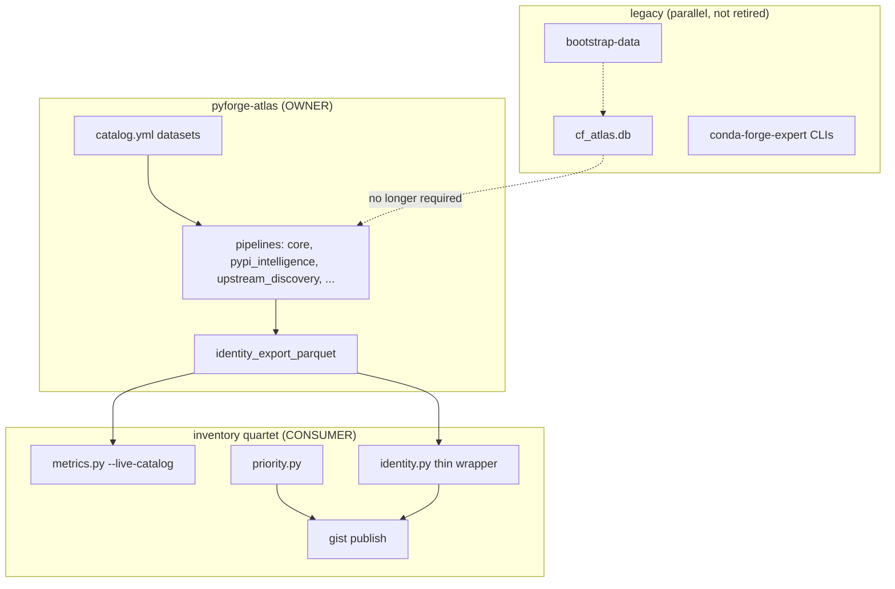
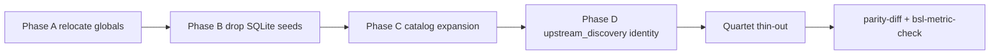
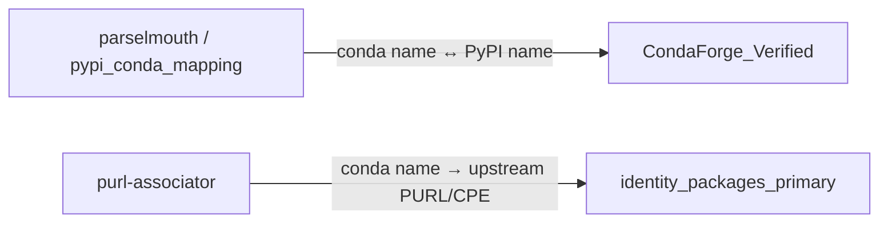
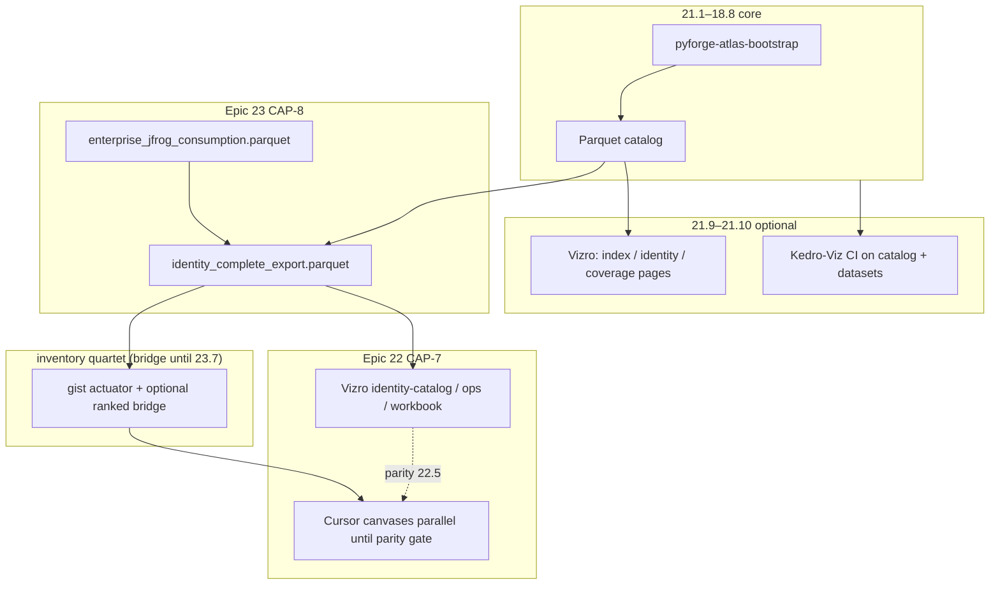

# Architecture diagrams

Companion to `SPEC.md`.

## Station ownership



## Data plane (steady state)

```
PYFORGE_ATLAS_DATA_ROOT/          # default: member data/
├── raw/                          # HTTP → Parquet
├── primary/
├── derived/
│   ├── identity_export_parquet/          # Epic 21
│   ├── enterprise_jfrog_consumption/     # Epic 23.2
│   ├── inventory_verified_packages/      # Epic 23.4
│   └── identity_complete_export/         # Epic 23.5 — canonical
└── stores/
    ├── vdb/
    ├── osv/
    └── pypi_conda_map.json
```

## Phase flow



## Mapping vs identity (prefix-dev)



Parselmouth: [prefix-dev/parselmouth](https://github.com/prefix-dev/parselmouth) via Phase C.
PURL Associator: [prefix-dev/purl-associator](https://github.com/prefix-dev/purl-associator) via Phase D.

## Operator surfaces (Epic 21)



See `operator-surfaces.md`, `vizro-canvas-parity.md`, and `complete-export-contract.md`.
