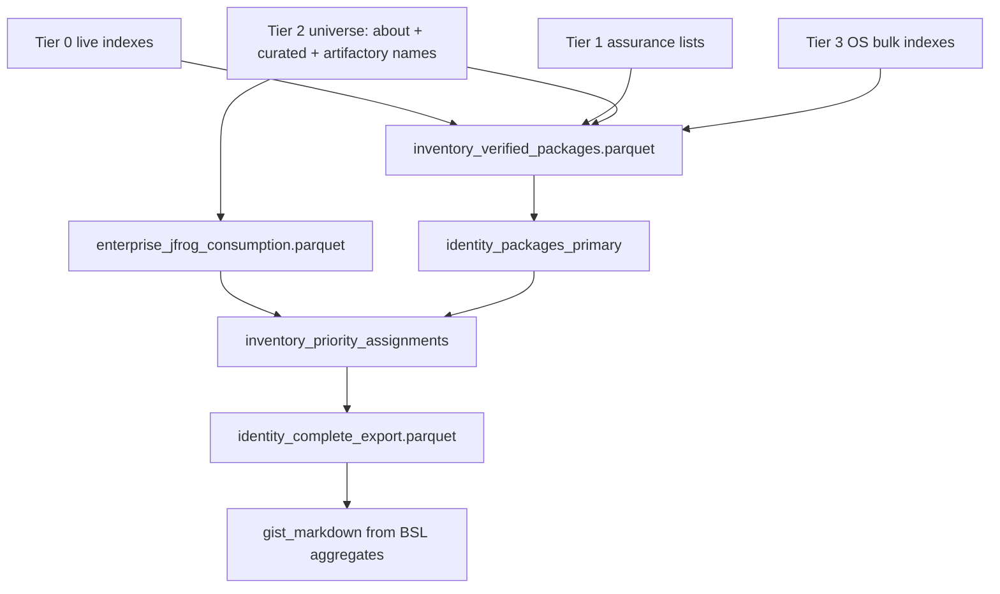

# Complete export contract — zero deferred (CAP-8 / Epic 23)

Companion to `SPEC.md`. Defines the **single canonical Parquet surface** that closes
`docs/dreams/atlas-kedro-catalog-expansion.md` with **no deferred data slices**.

Epic 21 (CAP-1–4) delivers the public index + identity join. Epic 22 (CAP-7)
delivers Vizro canvas parity. **Epic 23 (CAP-8)** delivers everything still
outside Kedro after 18.8: Tier 3 indexes, enterprise telemetry, ranking,
candidate status, and gist/dashboard aggregates — all from Atlas Parquet, not
`scripts/` merge passes.

## North star export

One row per OpenTeams-universe package (+ board-only extras), one file:

```
${PYFORGE_ATLAS_DATA_ROOT}/derived/identity_complete_export.parquet
```

**Consumers after Epic 23:**

| Consumer | Reads | No longer merges from |
|----------|-------|------------------------|
| Vizro Epic 22 pages | `identity_complete_export.parquet` | quartet `identity_ranked_export` (22.1 superseded) |
| Gist publish actuator | same Parquet → BSL markdown | `priority.py` + `--gist-only` overlay |
| `--live-catalog` metrics | sibling `inventory_verified_packages.parquet` | workbook tabs for verification BOOLs |
| OpenTeams `--create-issues` (optional) | handoff columns on complete export | Excel handoff tab |

Quartet scripts become **optional thin actuators** (gist edit, issue create) or
retire behind a deprecation flag — they do not own data logic.

## Export stack (build order)



---

## 1. Enterprise export — what to build from Artifactory

**Primary artifact** (Epic 23 / Story 23.2):

```
${PYFORGE_ATLAS_DATA_ROOT}/derived/enterprise_jfrog_consumption.parquet
```

**Producer:** extend `artifactory_downloads` pipeline per
`spec-artifactory-download-intelligence` (CAP-1–4) with a **consumption rollup node**
that joins AQL telemetry into the same PEP-503 identity key the inventory uses.

**Join key:** `core_python_package_name` — PEP-503 normalized package name (same
normalization as `priority.py::pep503` and metrics runner).

**Required columns** (parity with today's CDO-ENT-JFROG workbook + `priority.py` inputs):

| Column | Type | Source / rule | Used by |
|--------|------|---------------|---------|
| `core_python_package_name` | string | PK; normalized `name` from Artifactory / CDO universe | all joins |
| `repository_source` | string | e.g. `CDO-ENT-JFROG` | deliverable A col 1 |
| `platform_env_count` | int | org Artifactory AQL rollup | P4, gist `Platforms`, use_score |
| `internal_app_count` | int | org telemetry | P5, gist `Apps`, use_score |
| `artifactory_downloads` | int | download count aggregate | P6/P7, gist `Downloads`, use_score |
| `artifactory_version_count` | int | distinct versions pulled | P6/P7, gist `Versions`, use_score |
| `internal_component_count` | int | JFROG internal components | use_score, gist detail |
| `internal_lob_count` | int | JFROG LOB count | use_score, gist detail |
| `packaging_tier` | string | **stored, never used for P** | audit only; ranking ignores per dream |
| `verification_timestamp_utc` | datetime | row generation time | staleness |

`risk_level`/`vuln_status` are **not** stored here — Artifactory has no vulnerability data of its
own; today's legacy workbook only carries them on the `CDO-ENT-JFROG` tab because an earlier,
external process had already joined Basilisk data in before priority.py ever saw it. The Kedro
port makes that join explicit instead of implicit — see the Basilisk vuln overlay below.

**Derived on join (not stored on enterprise raw — computed in priority node):**

| Column | Rule |
|--------|------|
| `OpenTeams_Cohort` | `JFROG_NEW` if JFROG ∧ ¬conda-forge; `JFROG_ON_CF` if JFROG ∧ conda-forge; absent if not in JFROG |
| `openteams_universe_member` | bool — in `CDO-ENT-JFROG` ∪ `CDO-ENT-CONDA` |

**Basilisk vuln overlay** (not Artifactory-native — joined onto `enterprise_jfrog_consumption`
by the priority node, Story 23.3, not stored on the raw table itself):

| Column | Producer |
|--------|----------|
| `risk_level` | join `vulnerability_basilisk_*` / package rollup on latest version — enum `HIGH` \| `MEDIUM` \| `LOW` \| `NO_DATA`; P1 gate, gist `JFROG_risk_level` |
| `vuln_status` | same join — enum `affected_latest` \| `clean` \| …; P1 gate, gist `Vuln` |
| `jfrog_latest_vuln_count` | same join, package rollup on latest version — count |

**CDO-ENT-CONDA maintainer universe** (Tier 2, separate Parquet — already cataloged in 18.5):

```
${PYFORGE_ATLAS_DATA_ROOT}/derived/enterprise_conda_maintainers.parquet
```

| Column | Source |
|--------|--------|
| `core_python_package_name` | PK |
| `role` | `Maintainer` \| `Co-Maintainer` \| `N/A` from `discovery_about_maintainers_raw` |
| `feedstock_slug` | from about / `core_feedstock_attribution` |
| `repository_source` | `CDO-ENT-CONDA` |

**Credential contract:** attended JFrog via `_http.py` truststore chain; mock-first in CI
(same injectable transport as `spec-artifactory-download-intelligence`). No workbook
tab as source when `--live-catalog` + enterprise export present.

---

## 2. Verification export — deliverable A (14 columns)

**Artifact** (Story 23.4):

```
${PYFORGE_ATLAS_DATA_ROOT}/derived/inventory_verified_packages.parquet
```

Exact column order (inventory dream deliverable A):

| # | Column | Kedro source |
|---|--------|--------------|
| 1 | `Repository_Source` | enterprise + curated + about provenance |
| 2 | `Role` | `enterprise_conda_maintainers.role` |
| 3 | `Package_Input_Name` | raw input before normalization |
| 4 | `Core_Python_Package_Name` | PK |
| 5 | `PyPI_Verified` | `pypi_simple_index_raw` + `pypi_json_raw` |
| 6 | `CondaForge_Verified` | `core_channeldata_raw` + Parselmouth |
| 7 | `Priority_Bucket` | from `inventory_priority_assignments.P` (after 23.3) |
| 8 | `Packaging_Candidate_Status` | derived node — see §3 |
| 9 | `PyPI_PURL` | `pkg:pypi/{name}` when verified |
| 10 | `PyPI_Package_URL` | canonical PyPI URL |
| 11 | `Conda-forge_PURL` | `pkg:conda/...?channel=conda-forge` when verified |
| 12 | `Conda-Forge_Package_URL` | anaconda.org link |
| 13 | `Conda-Forge_FeedStock_URL` | feedstock overlay |
| 14 | `Verification_Timestamp_UTC` | snapshot time |

**AOSS-Free Mason queue** (separate export, not universe expansion):

```
${PYFORGE_ATLAS_DATA_ROOT}/derived/inventory_aoss_free_queue.parquet
```

PyPI-yes, conda-forge-no, not in OpenTeams universe — derived from Tier 1 AOSS +
verification BOOLs (same semantics as `write_aoss_free_queue` today).

---

## 3. Derived nodes still in scripts today (move to Kedro in Epic 23)

### 3.1 `Packaging_Candidate_Status` (Story 23.4)

Port `metrics.py::packaging_status` verbatim:

```python
# pypi_ok, cf_ok from verification BOOLs; pbucket from priority assignment
if pypi_ok and cf_ok:       → "Already Packaged"
if pypi_ok and not cf_ok:   → "High Priority Candidate" if P≤8 else "Low Priority Candidate"
if not pypi_ok and cf_ok:   → "Conda-Forge Only"
else:                       → "Not on PyPI"
```

### 3.2 Priority assignment (Story 23.3)

Port `priority.py` hierarchy to `upstream_discovery` (or `derived_artifacts`) node
`inventory_priority_assignments`:

**Inputs:** `identity_packages_primary`, `enterprise_jfrog_consumption`,
`enterprise_conda_maintainers`, `openteams_project_1_board_raw`, Basilisk vuln rollup.

**Outputs:**

| Column | Notes |
|--------|-------|
| `P` | `P1`–`P10` |
| `Rank` | 1-based across snapshot |
| `Score` | use-score percentile 1–100 |
| `Work` | Fix vulnerability / Create recipe / File OpenTeams… / Already tracked |
| `Priority_Bucket_Description` | from `PRIORITY_DESC` map |
| `Priority_Source` | e.g. `current-version-vuln`, `platform`, `work-create-recipe` |
| `Priority_Reason` | short rule citation |
| `Proposed_Priority`, `Packaging_Work`, `Priority_Rank`, `Priority_Score` | legacy aliases preserved for parity |

**Explicit non-goal:** do not read `packaging_tier` for P assignment.

### 3.3 Tier 3 bulk OS indexes (Story 23.1)

Add to `pypi_intelligence` cross-channel family:

| Source | Catalog entry | Cross-channel column |
|--------|---------------|---------------------|
| homebrew | `discovery_homebrew_packages_raw` | `in_homebrew` |
| nixpkgs | `discovery_nixpkgs_packages_raw` | `in_nixpkgs` |
| spack | `discovery_spack_packages_raw` | `in_spack` |
| debian | `discovery_debian_packages_raw` | `in_debian` |
| fedora | `discovery_fedora_packages_raw` | `in_fedora` |

Same dataset-owned fan-out + AD-13 last-good + scale floors as Phase Q factory channels.

---

## 4. `identity_complete_export.parquet` — full schema

**Producer:** Story 23.5 — join `identity_packages_primary` +
`inventory_priority_assignments` + enterprise telemetry columns +
identity overlay columns.

**Row grain:** one row per universe name + board-only packaging issues (same as today).

**Column groups** (superset of `GIST_SCHEMA` in
`conda-forge-packaging-inventory-operations_openteams_identity.py`):

### Ranking (first five gist columns)

`P`, `Rank`, `Score`, `Package`, `Work`

### JFROG gist shorthand (from enterprise join)

`Platforms`, `Apps`, `Downloads`, `Versions`, `Vuln`

### Identity core

`Core_Python_Package_Name`, `OpenTeams_Title`, `identity_source`, `associator_key`,
`associator_status`, `primary_purl`, `primary_type`, `alternative_purls`, `cpes`,
`conda_purl`, `source_repository_url`, `OpenTeams_Issue_URL`,
`Conda-Forge_FeedStock_URL`, `Conda-Forge_Metadata_URL`, `Staged_Recipes_PR_URL`,
`Local_Recipes_URL`, `Local_Build_Status`, `Verification_Timestamp_UTC`

### Priority detail

`Priority_Bucket_Description`, `Priority_Source`, `Priority_Reason`

### Enterprise detail

`JFROG_risk_level`, `JFROG_latest_vuln_count`, `internal_component_count`,
`internal_lob_count`, `platform_env_count`, `internal_app_count`,
`artifactory_downloads`, `artifactory_version_count`, `JFROG_vuln_status`

### OpenTeams handoff (inventory tab extension)

`OpenTeams_Cohort`, `OpenTeams_Batch` (alias of `Work`), `OpenTeams_Coverage`,
`Repository_Source`, `Role`

### Verification BOOLs (workbook / Vizro workbook pane)

`PyPI_Verified`, `CondaForge_Verified`, `Packaging_Candidate_Status`

### Assurance / cross-channel (workbook External pane)

`in_basilisk`, `in_aoss_free`, `in_aoss_premium`, `in_anaconda_main`,
`in_anaconda_dist`, `in_selfexplainml`, `in_bioconda`, `in_pytorch`, `in_nvidia`,
`in_robostack`, `in_homebrew`, `in_nixpkgs`, `in_spack`, `in_debian`, `in_fedora`

Parity gate: byte-identical column names to today's gist + identity tab on a fixed
fixture corpus (`tests/fixtures/inventory_identity/`).

---

## 5. Gist and dashboard aggregates (Story 23.6 — CAP-8d)

Replace dual maintenance in `openteams_identity_dashboards.py`:

| Output | Generator | Input |
|--------|-----------|-------|
| `mgmt-wf-python-modernization-identity.md` | BSL aggregate over complete export | `identity_complete_export.parquet` |
| `mgmt-wf-python-modernization-dashboards.md` | BSL ops/workbook aggregates | same |
| Cursor `.canvas.tsx` DATA blobs | optional; superseded by Epic 22 Vizro | same |

Credentialed gist **edit** stays a thin actuator (`gh gist edit`); markdown body
comes from Atlas/BSL, not script string templates.

---

## 6. Epic map (closure)

| Epic | Delivers | Deferred after |
|------|----------|----------------|
| **18** | Public indexes + identity export (no rank/enterprise) | ranking, enterprise, Tier 3 |
| **19** | Vizro canvas parity (reads ranked export) | UX polish; gist generator until 23.6 |
| **20** | Complete export + Tier 3 + ranking in Kedro + BSL gist | **nothing data-related** |

**22.1 bridge:** until 23.5 lands, quartet may still write
`identity_ranked_export.parquet` for Epic 22. **23.5 supersedes 22.1** — Vizro and
gist read `identity_complete_export.parquet` only.

---

## 7. Success signal (dream fully closed)

On a machine with no `CF_ATLAS_DB`, no workbook ingest, no quartet merge:

1. `pixi run pyforge-atlas-bootstrap` materializes Tier 0–3 + enterprise consumption.
2. `identity_complete_export.parquet` exists with full GIST_SCHEMA + handoff columns.
3. `inventory_verified_packages.parquet` matches deliverable A on fixture.
4. Parity tests pass vs frozen `openteams_identity` + `priority` corpus.
5. BSL gist markdown matches today's gist files on same fixture.
6. Epic 22 Vizro pages read complete export only; 22.5 parity gate green.
7. `metrics.py --live-catalog` and `--gist-only` are no-ops or thin actuators — no
   ranking/verification logic in scripts.

**Excel workbook remains out of scope** — complete closure does not require it.

---

## 8. OpenTeams issue creation (optional closure slice)

`--create-issues` is **not required** to close the data dream. If moved later,
it consumes handoff columns from `identity_complete_export.parquet` only — no
separate issue-state fetch beyond board ingest already in Phase D.
