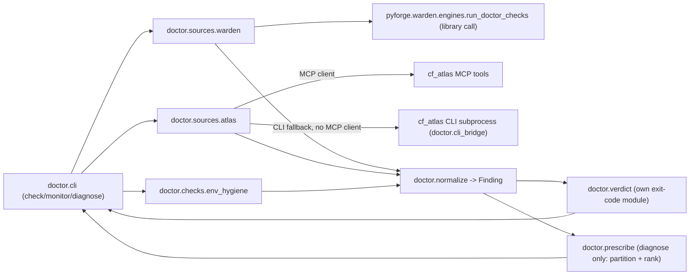

# Architecture Spine — pyforge-doctor

## Design Paradigm

**Facade over existing instruments**, internally a **pipes-and-filters** pipeline
(gather → normalize → partition/rank) with exactly one narrow subprocess exception.
Doctor's own code is *coordination and ranking*, not detection: it never spawns a
scan engine or a database query that warden or cf_atlas doesn't already own.

- **Facade layer** (`pyforge.doctor.cli`) — the three verbs (`check`/`monitor`/
  `diagnose`), each a thin entrypoint composing the filters below.
- **Gather filters** — one per Source: `doctor.sources.warden` (library call into
  `pyforge.warden.engines.run_doctor_checks`), `doctor.sources.atlas` (MCP tool calls,
  CLI-subprocess fallback), `doctor.checks.env_hygiene` (Doctor's own new AST scan).
  Each filter's *only* job is producing `Finding` objects (§ Consistency Conventions).
  Filters are added by naming a new Source, never by widening an existing one's scope.
- **Normalize filter** — every Source's native output → the closed `Finding` shape
  (§ Consistency Conventions), tagged with its origin Source. This is the seam
  `monitor`/`check` output flows through before rendering or `--json`.
  Diagram of who may depend on whom:



## Invariants & Rules

### AD-1 — `check --engines` calls warden as a library, never a subprocess

- **Binds:** FR-1
- **Prevents:** a second, drift-prone reimplementation of engine-availability
  probing; an unnecessary process spawn on Doctor's hottest path (pre-flight,
  five-second budget per PRD SM-C1).
- **Rule:** `doctor.sources.warden` imports and calls
  `pyforge.warden.engines.run_doctor_checks` (and its `DoctorCheck` result type)
  directly. `pyforge-doctor`'s packaging declares `pyforge-warden` as an optional
  extra (`gate = ["pyforge-warden"]`), mirroring `pyforge-atlas`'s own identical
  edge (`pyproject.toml`: *"the ONLY cross-package code edge — atlas → warden...
  installed by default in the in-repo pixi env; external installs may omit it (the
  gate node then fails with an install hint)"*). No reverse `warden → doctor` import
  may ever exist. This is not a new exception to warden's "sole subprocess site"
  rule — `run_doctor_checks()` still does its own bounded, typed subprocess work
  internally, unchanged; calling it as a plain function does not add a subprocess
  call site anywhere in either package.

### AD-2 — Doctor owns a closed exit-code space that never merges with warden's

- **Binds:** FR-1, FR-2, NFR (operability exit code, PRD §3 Glossary)
- **Prevents:** Doctor's `check`/`monitor` exit code colliding with or silently
  inheriting warden's policy-gate semantics; a caller (Marshal) misreading Doctor's
  exit 1 as "policy violation" when Doctor has no policy-gate concept in v1.
- **Rule:** `pyforge.doctor.verdict` is Doctor's own sole-owned exit-code knob
  (structurally mirrors warden's `verdict.py` pattern, not imported from it). Doctor's
  exit-code domain is `{0 = every check ok, 2 = a fail present, 130 = SIGINT}` —
  deliberately a *subset* of warden's frozen `{0, 1, 2, 130}`, permanently omitting
  `1` (warden's `WARN_AS_ERROR`/policy-gate rung), because Doctor reports
  *operability, not policy* (PRD §3 Glossary — direct carry-over of warden's own
  `--doctor` flag comment). A `warn`-status Finding never changes Doctor's exit code.
  Warden's own exit code (from `run_doctor_checks`, when doctor calls it) is consumed
  as *data* — folded into a Doctor `Finding.status` — and never re-exposed as
  Doctor's own process exit code. The two exit-code spaces are read-only inputs to
  each other, never merged.

### AD-3 — Doctor defines its own closed Finding/Source/Status taxonomy

- **Binds:** FR-1 through FR-9 (every verb's output)
- **Prevents:** importing warden's `ErrorKind` (scoped to *scan-engine operational
  failure*) and silently stretching it to cover Doctor's broader domain
  (engine-missing / feedstock-stale / credential-hygiene), which would make
  `ErrorKind` a shared, driftable vocabulary neither package fully owns.
- **Rule:** `pyforge.doctor.models` defines a closed `DoctorStatus` (`StrEnum`:
  `ok`, `warn`, `fail`), a closed `Source` enum (one member per wrapped instrument —
  `warden-doctor`, `staleness-report`, `cve-watcher`, `behind-upstream`,
  `feedstock-health`, `release-cadence`, `env-hygiene`), and a `Finding` dataclass —
  structurally mirroring warden's `models.py` pattern (`StrEnum` + frozen validation
  set + `__post_init__` validation) but never importing warden's `ErrorKind` directly.
  Resolves PRD §8 Open Question 5.

### AD-4 — `--prescribe` is a pure function over already-gathered Findings

- **Binds:** FR-6, FR-7, FR-8
- **Prevents:** `diagnose --prescribe` becoming a second place that spawns
  subprocesses or MCP calls, duplicating what `check`/`monitor`'s gather filters
  already do.
- **Rule:** `pyforge.doctor.prescribe` takes a `list[Finding]` (already gathered by
  composing AD-1's and FR-4/FR-5's existing gather filters for the named target) and
  returns partitioned, ranked `Prescription` objects. It makes zero subprocess or MCP
  calls of its own — every Finding it ranks was already produced by an existing
  gather filter.

### AD-5 — One narrow, typed subprocess site for Doctor's own CLI-fallback path

- **Binds:** FR-5 (CLI fallback when no MCP client is available)
- **Prevents:** ad hoc `subprocess.run` calls scattered across `doctor.sources.atlas`
  or elsewhere, echoing the exact fragility warden's `engines.py` was built to avoid.
- **Rule:** `pyforge.doctor.cli_bridge` is the *only* module in `pyforge-doctor`
  permitted to spawn a subprocess, reserved for the CLI-fallback branch of AD-6.
  It reuses warden's `_engine_env()` discipline as a convention (argv as a list —
  never a shell string; `NO_COLOR=1`; `stdin=DEVNULL`; bounded timeout; typed failure
  via a `Finding` with `status=fail`, never a raw traceback).

### AD-6 — `monitor --fleet` prefers cf_atlas's MCP tools; CLI is the fallback

- **Binds:** FR-4, FR-5
- **Prevents:** two divergent code paths (MCP vs. CLI) producing different Finding
  shapes for the same underlying atlas signal.
- **Rule:** `doctor.sources.atlas` calls the MCP tool for a Watch axis when an MCP
  client is available in-process (the expected path for Marshal/agent callers);
  otherwise it falls back to the equivalent CLI subprocess via AD-5's
  `cli_bridge`. Both paths normalize into the *same* `Finding` shape before returning
  — the caller (human or agent) cannot tell which path produced a given Finding
  except via its `Source` tag.

## Frontier (v1.x — FR-10..FR-13, deferred)

The PRD's §4.5 scopes these four capabilities for **after** Epics 1-3 (the v1 walking
skeleton) ship and prove themselves — not concurrent with them. Documented here at the
same rigor as the v1 rules so the architecture stays honest about what exists versus
what is designed-but-not-built, per the same discipline the `## Deferred` section
already applies to smaller open questions.

### AD-7 — Health scoring is a pure aggregation over existing Findings, never a fourth instrument

- **Binds:** FR-10
- **Prevents:** `doctor.score` becoming a second gather path that re-queries warden or
  atlas, duplicating AD-1/AD-6's existing filters.
- **Rule:** A new `pyforge.doctor.score` module takes the same `list[Finding]` shape
  AD-4's `prescribe` already consumes and returns a `Grade` (`StrEnum`: `A`–`F`, or
  `incomplete`) via a stable per-axis weighting function. No subprocess or MCP call of
  its own. Deterministic: the same Finding set always produces the same grade. An
  incomplete axis gather returns `incomplete`, never a false `A` (PRD FR-10's testable
  consequence).

### AD-8 — The fleet-health surface is derived output, regenerated idempotently from `monitor --fleet`

- **Binds:** FR-11
- **Prevents:** a second, independent gather path competing with FR-4's existing
  `monitor --fleet`, and an incremental/diff-state model that could drift from the
  underlying Findings.
- **Rule:** The persisted surface is written strictly from `monitor --fleet`'s existing
  Finding/Source output (AD-6's gather path), versioned the same way `DoctorReport`
  already is (`schema_version`, Consistency Conventions). Regenerating from the same
  underlying findings is idempotent — no incremental state to drift. Exact CLI surface
  (flag vs. subcommand) is deferred to epics/stories, mirroring how `## Deferred`
  already defers `check --list`'s flag spelling without blocking the rule it serves.

### AD-9 — Adoption-tracking is a new Source wired through the existing MCP-first/CLI-fallback seam

- **Binds:** FR-12
- **Prevents:** a fifth ad hoc query path bypassing AD-5/AD-6's established
  MCP-first/CLI-fallback seam.
- **Rule:** `doctor.sources.atlas` gains `adoption-stage` and `version-downloads` as
  additional MCP tool calls (CLI fallback per AD-5/AD-6), normalized into the same
  closed `Finding` shape (AD-3) under a new `Source` enum member — AD-3's "closed
  taxonomy extended, never opened" precedent, exact member naming deferred to
  epics/stories. `adoption` is opt-in only: `monitor --fleet`'s default `--watch` set
  (FR-4) is never widened by this addition (PRD FR-12's testable consequence).

### AD-10 — Upgrade-path recommendation stays inside `prescribe`'s pure-function boundary

- **Binds:** FR-13
- **Prevents:** `--prescribe` growing a second, non-pure code path, or crossing into
  the real dependency-graph resolver PRD §5 permanently excludes.
- **Rule:** The existing `Prescription` dataclass (AD-4) gains an optional
  `next_safe_version` field, populated from atlas's `behind-upstream`/version data
  already reachable via AD-6's gather path — no new subprocess or MCP call is added to
  `prescribe` itself, preserving AD-4's pure-function discipline. Single-hop only: the
  field names this package's own next safe version, never a transitively-resolved
  chain. An unrecommendable case states that plainly (e.g. `null`) rather than
  guessing (PRD FR-13's testable consequence).

## Consistency Conventions

| Concern | Convention |
| --- | --- |
| Naming (entities, files, interfaces) | `pyforge.doctor.<area>` modules: `cli`, `sources.warden`, `sources.atlas`, `checks.env_hygiene`, `normalize`, `verdict`, `prescribe`, `models`, `cli_bridge`. CLI verb names match the Dream verbatim: `check`, `monitor`, `diagnose`. |
| Data & formats (envelopes, ids) | One `DoctorReport` JSON envelope per invocation: `{schema_version, verb, generated_at, findings: [Finding], prescriptions: [Prescription]}` (`prescriptions` present only for `diagnose`). `Finding = {source, check, status, message, evidence}` (`evidence` is a Source-specific object, opaque to the envelope). `Prescription = {finding_ref, partition, rank, rank_factors, action, root_cause}` (`rank`/`rank_factors` populated only for `partition=actionable`). `schema_version` starts at `1` — carries warden's `ComplianceReport` precedent (schema-validated, versioned) forward. |
| State & cross-cutting (mutation, exit codes, timeouts) | v1 is read-only everywhere — no module under `pyforge.doctor` may write outside a `tempfile`-scoped path or mutate scanned trees (mirrors warden's NFR-S4 discipline). Exit codes flow only through `doctor.verdict` (AD-2). Any subprocess call is bounded-timeout + typed-failure via `cli_bridge` (AD-5) — no bare `subprocess.run` elsewhere. |

## Stack

| Name | Version |
| --- | --- |
| Python | >=3.14 (matches `pyforge-atlas`'s `requires-python` floor; both are namespace-package siblings of `pyforge.warden` in the same pixi env family) |
| Build backend | hatchling (matches warden + atlas) |
| pytest | >=9.1.1 (matches warden's pinned floor) |
| pyforge-warden | path dependency (optional extra `gate`), in-repo pixi build-workspace member |

## Structural Seed

```text
src/shared/packages/pyforge-doctor/
  pyproject.toml            # dependencies=[] lean core; optional-dependencies.gate=["pyforge-warden"]
  src/pyforge/doctor/
    __main__.py              # `doctor` console-script entrypoint
    cli.py                   # check/monitor/diagnose argument parsing + dispatch
    sources/
      warden.py               # AD-1: run_doctor_checks() library call -> Finding
      atlas.py                 # AD-6: MCP-first, CLI-fallback -> Finding
    checks/
      env_hygiene.py           # FR-3: AST-based credential-hygiene scan -> Finding
    cli_bridge.py             # AD-5: the ONE subprocess site (CLI-fallback only)
    normalize.py               # native source output -> closed Finding shape
    models.py                  # AD-3: DoctorStatus / Source / Finding / Prescription
    verdict.py                  # AD-2: Doctor's own sole-owned exit-code knob
    prescribe.py                # AD-4: partition + rank (pure function over Finding list)
  tests/
    unit/                      # per-module, mocked sources
    meta/                      # structural rules: AD-5 sole-subprocess-site check
                               #   (mirrors warden's tests/meta/test_verdict_sole_ownership.py),
                               #   AD-1 no-reimplementation check (asserts sources/warden.py
                               #   imports, never subprocess-calls, `warden`)
    fixtures/                  # sample warden ComplianceReport + atlas CLI/MCP output fixtures
  scripts/
    dogfood_scan.py            # doctor checks its own package, warden-dogfood precedent
```

## Capability → Architecture Map

| Capability / Area | Lives in | Governed by |
| --- | --- | --- |
| FR-1 (wrap warden self-check) | `doctor.sources.warden` | AD-1, AD-2 |
| FR-2 (tri-state, individually addressable checks) | `doctor.cli` (`--list` introspection), `doctor.models.DoctorStatus` | AD-3, Consistency Conventions |
| FR-3 (credential/env-hygiene check) | `doctor.checks.env_hygiene` | AD-3 (new `Source` member); no subprocess, no `exec`/execution of scanned code |
| FR-4 (fleet watch-axis query) | `doctor.sources.atlas` | AD-6 |
| FR-5 (MCP-first, CLI-fallback) | `doctor.sources.atlas`, `doctor.cli_bridge` | AD-5, AD-6 |
| FR-6 (partition actionable/blocked/accepted-risk) | `doctor.prescribe` | AD-4 |
| FR-7 (rank actionable partition) | `doctor.prescribe` | AD-4 |
| FR-8 (root-cause naming) | `doctor.prescribe` (templated from `Finding.evidence`) | AD-4 |
| FR-9 (`--json` envelope) | `doctor.cli` render path | Consistency Conventions (`DoctorReport` schema) |
| Packaging (pixi workspace member) | `src/shared/packages/pyforge-doctor/`, root `pixi.toml` (future edit, not this run) | Stack, AD-1 |
| FR-10 (health scoring, v1.x) | `doctor.score` (new module, not yet built) | AD-7 |
| FR-11 (persistent fleet-health surface, v1.x) | derived from `doctor.sources.atlas` output (new persistence layer, not yet built) | AD-8 |
| FR-12 (adoption-tracking watch axis, v1.x) | `doctor.sources.atlas` (new Source member, not yet built) | AD-9 |
| FR-13 (safe upgrade-path recommendation, v1.x) | `doctor.prescribe` (`Prescription.next_safe_version`, not yet built) | AD-10 |

## Deferred

- **Exact `pixi.toml` edit.** This run documents the target shape
  (`[feature.pyforge-doctor.*]` mirroring `[feature.pyforge-warden.*]` verbatim:
  path dependency, dedicated pixi env, `doctor-check`/`pyforge-doctor-test`/
  `pyforge-doctor-build-{conda,dist,build}` tasks) but does not apply it — deferred
  to the first implementation story, per this run's explicit scope boundary.
- **`env_hygiene` check's exact severity default** (`warn` vs. `fail` for a detected
  unconditional-injection pattern) — deferred to epics/stories; not architecture-blocking
  since AD-3's `DoctorStatus` already has both rungs available.
- **MCP client wiring detail** (direct FastMCP client import vs. a thinner
  `doctor.atlas_bridge` wrapper module) — deferred to epics/stories; AD-6 fixes the
  MCP-first/CLI-fallback *rule*, not the client library call shape.
- **`check --list` introspection flag's exact CLI shape** — deferred; AD-3/FR-2 fix
  that the capability must exist, not its flag spelling.
- **A real dependency-graph resolver for `--prescribe`** — explicitly and permanently
  out of scope per PRD §5 Non-Goals (not the same thing as FR-13/AD-10's single-hop
  `next_safe_version`, which stays inside `prescribe`'s existing ranking-only
  boundary). AD-4 fixes ranking-only for v1; no AD number is reserved for a resolver
  because none is planned.
- **Waiver-authoring mechanism for the `accepted-risk` partition** — the partition
  exists (AD-4) but nothing populates it in v1; deferred per PRD §6.2.

### AD-11 — The Marshal verdict reads artifacts, never the station (binds FR-14)

**Prevents:** a self-report wearing Doctor's badge; a verdict that fails exactly when
the judged station is broken.
**Rule:** `sources/marshal.py` derives its judgement from the **durable artifacts** —
tracked `sprint-status-ledger.yaml` files and git history — and imports no
`pyforge.<station>` package, asserted by `test_sources_marshal_independence.py`
(AST-based, and lazy-import aware because lazy is exactly how AD-1's warden import
legitimately works).
**Why this differs from AD-1.** `sources/warden.py` deliberately DOES import warden
and wraps its `--doctor` self-check — correct, because Doctor is relaying an
instrument's report about its own environment. A durability verdict is the opposite
case: assembled from Marshal's code it would fail precisely when Marshal's machinery
is what broke, which is the only case worth checking. Charter §6 is satisfied
structurally rather than by policy — the check depends on nothing Marshal ships.

### AD-12 — A new subprocess need is satisfied IN `cli_bridge` (extends AD-5)

**Prevents:** a second shell-out site; AD-5 eroding one exception at a time.
**Rule:** `cli_bridge` remains the sole subprocess site. Reading a committed blob
requires `git show`, so the module gained `run_git()` — narrow the same way
`run_cli_json()` is (argv list never `shell=True`, explicit timeout, `NO_COLOR=1`,
`--no-pager`, one typed `CliBridgeError`), differing only in returning **raw text**
because git's payload here is YAML, not JSON.
*Recorded because the first cut of `sources/marshal.py` called `subprocess` directly
and `test_cli_bridge_sole_subprocess.py` caught it — the meta-test worked, and the
fix was to widen the sanctioned site rather than route around it.*

### AD-13 — `sources/deps.py` restates `ACTIONABLE_STATUSES`; a conformance test owns the invariant (binds FR-15, Story 6.7)

**Prevents:** one detector's dependency becoming the whole CLI's dependency; a verdict
about the harness that cannot be produced without the harness.
**Rule:** `sources/deps.py` defines `ACTIONABLE_STATUSES = frozenset({"backlog",
"ready-for-dev"})` locally and imports nothing from `bmad_loop`.
`.claude/skills/conda-forge-expert/tests/meta/test_actionable_statuses_conformance.py`
imports the INSTALLED `bmad_loop.sprintstatus` and asserts **set equality** against the
literal parsed out of `deps.py` by `ast` — never by importing `pyforge.doctor`, which is
not installed in the `local-recipes` environment where that suite runs.

**Why the restatement is safe.** The invariant the original import bought — *derived,
never restated, so the check stays tied to real engine behaviour* — is preserved, but it
moves from **runtime import** to **test-time equality**. The distinction that matters:
the invariant needs to be *checked*, not *imported*. Checking can happen in one fat
environment; importing forces that environment everywhere Doctor runs.

**Three properties the test must keep, or the invariant dies quietly:**
1. It imports `bmad_loop` **unconditionally**. It must FAIL, never skip. This is a
   deliberate deviation from the sibling `test_forward_dependency_check.py`, which uses
   `pytest.importorskip` — under that pattern the assertion evaporates in exactly the
   environment where nobody notices. `unpushed_work_check.py`'s own docstring names this
   failure class: *"a gate reporting success because it is standing somewhere the failure
   cannot occur."*
2. It asserts **set equality**, not membership. A subset check passes when upstream ADDS
   a status — which is precisely the drift worth catching.
3. It reads the literal by `ast`, so it fails when the constant is edited to a
   non-literal (a computed value would defeat the comparison).

**Rejected alternative — add `bmad-loop` to `[feature.pyforge-doctor.dependencies]`.**
It preserves the invariant most directly, and on a strict reading of S-6.10 it is not
even barred: `bmad_loop` is an upstream harness Marshal *wraps*, not the `pyforge.marshal`
package. Rejected on three counts. (a) It contradicts AD-11's own rationale, which is
about *machinery*, not package names: a verdict assembled from the judged station's
machinery fails exactly when that machinery is what broke — the only case worth checking.
(b) It expands a 3.3 MB / 33-module git-pinned harness into a 7-dependency environment
whose contract is a five-second pre-flight (NFR-4) with an explicit counter-metric that
suite runtime must not creep (SM-C1), and converts a single check's dependency into a
whole-CLI dependency: a `bmad-loop` resolution failure would take out `check`, `monitor`
and `diagnose` alike. (c) It would require a second `sources/warden.py`-style allowlist
entry at S-6.10 whose stated reason — *relays an instrument's self-report about its own
environment* — does not transfer, because `deps.py` judges an artifact.

**What this BUYS, measured rather than assumed.** CI's `detectors.yml` runs on plain
`setup-python` with `pip install pyyaml playwright` — no pixi, no `bmad_loop` — so
`forward_dependency_check.py` reports UNKNOWN (`exit 2`) in CI *today*, and would continue
to under the rejected alternative, since CI does not use Doctor's environment either.
Dropping the import makes this the first time the check actually **runs in CI**.

**Known limitation, recorded rather than papered over.** The conformance test itself
cannot run in CI: no workflow runs the meta-suite, and CI has no `bmad_loop` to compare
against. It runs under `pixi run -e local-recipes test`, which the landing protocol
already invokes. This is the same *missing observation plane* the `scope="runtime"`
detectors live with (`dashboard_drift`, `loop_stall`, `unpushed_work`) — a named
condition in this repo, not a new one. Divergence is therefore caught at landing time,
not at push time.

## Currency reconciliation — 2026-08-26

*Chain-currency sweep (CHAIN-CURRENCY-RUNBOOK.md): the PRD re-dated this pass after
reconciling against SPEC-doctor and the 2026-08-08 research refresh, which fires the
`prd→arch` edge. This section is the as-built reconciliation: where the shipped package
diverges from the spine above, this section names it; everything unnamed shipped as drawn.*

**The invariants held.** AD-1 (one sanctioned lazy warden import, meta-test-enforced),
AD-2 (closed `{0, 2, 130}` exit domain via `verdict.py`), AD-3 (own closed taxonomy;
zero `ErrorKind` drift), AD-4 (`prescribe`/`score` purity — zero findings against the
boundary across the whole build), AD-5/AD-12 (`cli_bridge` the sole subprocess site,
widened once, in place, when `sources/marshal.py`'s first cut called `subprocess`
directly and the meta-test caught it), AD-6 (MCP-first/CLI-fallback — designed once,
reused verbatim for cve/abandonment and adoption with zero new exception classes).
The 2026-08-08 technical refresh's scorecard: "the 07-25 report's reuse-don't-invent
program was executed with unusual fidelity."

**Structural Seed vs. as-built — named divergences (not defects):**

- **`normalize.py` never shipped as a standalone module.** Normalization lives inside
  each gather filter (every source returns closed-shape `Finding`s directly); the
  Normalize-filter *rule* holds, its module boundary was unnecessary.
- **`cli.py` never shipped**; verb parsing + dispatch live in `__main__.py`
  (console script `doctor = pyforge.doctor.__main__:main`).
- **`sources/` outgrew the seed by an order of magnitude.** Drawn with two modules
  (warden, atlas); as-built it is the fleet's conformance-verdict home (FR-15/AD-11).
  **Re-counted live 2026-09-14** (the prior count, 12 modules / 14 dispatcher entries,
  was the 2026-08-29 state): 20 source modules — `atlas`, `backlog_intake`,
  `bmad_config`, `bmad_method`, `board`, `capability_effect`, `capability_ledger`,
  `chain`, `deps`, `factory`, `frozen_path`, `general_docs_consistency`, `hygiene`,
  `ledger`, `marshal`, `pixi_currency`, `platform_policy`, `sibling_dreams`,
  `status_body_consistency`, `warden` — plus a `python -m pyforge.doctor.sources`
  dispatcher exposing **22** addressable sources (`bmad-drift`,
  `bmad-method-version-drift`, `bmad-render-config-ambiguity`, `capability-effect`,
  `capability-ledger`, `chain-completeness` [with `--dreams` / `--layers --project`
  audit modes], `check-layout`, `dashboard-drift`, `deferred-work`, `dream-chain`,
  `due-for-verification`, `forward-dependency`, `frozen-path-changed`,
  `general-docs-consistency`, `ledger-direction`, `ledger-regression`,
  `pixi-currency-ledger`, `platform-policy-suite`, `sibling-dreams-drift`,
  `spec-surface`, `status-body-consistency`, `story-status`). Epic 6.9 retired the
  legacy `scripts/` shims onto this dispatcher. **The growth is quantitative, not
  structural** — every addition is one more module behind the same dispatcher, which
  is why this stays a divergence-from-the-seed note rather than an AD.
- **Frontier modules are all real now:** `score.py` (AD-7), `fleet_surface.py` (AD-8),
  the adoption Source (AD-9), `Prescription`'s safe-upgrade pairing (AD-10) — the
  "not yet built" markers in the Capability → Architecture Map are historical.
- **`hooks.py` (Epic 17 / FR-45, canopy:AD-21, post-dating this spine):** gather and
  prescribe are hook specs on the shared `pyforge.core.hooks` contract
  (`GATHER_HOOK_SPEC` / `PRESCRIBE_HOOK_SPEC`, owner `doctor`), with today's
  `atlas`/`warden`/`env_hygiene` gathers and `prescribe.*` as the default plugins — a
  seam *around* the AD-1..AD-6 filters, not a change to them. Plugins never publish a
  verdict: findings stay `Finding`/`Prescription` report data.
- **Canopy tiers (2026-08-24 obligations, steward-owned host):** Doctor's portal
  (`django_doctor_portal`, first slice `/stations/doctor/` rendering the last fleet
  pulse via `PortalClient` only — no `pyforge.*` import under `src/platform/`), the
  MCP service face `POST /stations/doctor/mcp` on the host ASGI, and the SKF skill +
  `bmad-agent-doctor` persona (Epic 18). These are *faces over* this spine's CLI
  contract; they reopen none of AD-1..AD-6/NFR-1..5.

**Estate constraint made explicit (Unifying Strategy):** Doctor findings are advisory
or Warden *inputs* — never a competing PR-gate verdict. AD-2's "operability, not
policy" rule is the local enforcement of that fleet-wide clause.

**Carried debts (technical refresh 2026-08-08 §6, still open as of this pass):** the
shared AST alias-resolution helper for meta-test guards (3 recurrences; the shared
`pyforge-testing-kit` that landed 2026-08-23 covers mock families, not AST guards);
atlas label/JSON-shape coupling guarded by convention rather than a label-subset smoke
assertion; per-call MCP session spawn (deliberate, unmeasured); `_default_repo_root`'s
`parents[8]` fallback.

## Currency reconciliation — 2026-08-29

*Chain-currency sweep cascade: the PRD re-dated 2026-08-29 (its own `spec-pyforge-doctor`
reconciliation, five bookkeeping entries, no new capability), which fires the `prd→arch`
edge. This section is the as-built check: does the spine above still describe the
package after that PRD stamp.*

**No structural divergence.** The four `sources/` modules the PRD's reconciliation named
— `chain.py`, `marshal.py`, `factory.py`, `board.py` — are already listed above in the
as-built `sources/` inventory (the fleet's conformance-verdict home, 14 addressable
dispatcher entries including `deferred-work`, `story-status`, `bmad-drift`,
`chain-completeness`). PRs #903/#904/#906/#907 are bug fixes and one classifier-rule
addition *inside* those already-architected modules — none of AD-1..AD-6/NFR-1..5
reopen, no module boundary moved, nothing to add to the divergence list above.

**No content change required.** `updated:` bumped to record that the cascade ran.

## Currency reconciliation — 2026-09-14

*Chain-currency sweep cascade: the PRD re-dated 2026-09-14 after reconciling against
`spec-pyforge-doctor`'s 2026-09-12 SPEC.md and 2026-09-14 memlog, which fires the
`prd→arch` edge. This section is the as-built check: does the spine above still
describe the package.*

**One real divergence found, and corrected in place.** The as-built `sources/` bullet
above carried the **2026-08-29** count — twelve modules and "14 addressable
dispatcher sources". Read against live code this pass
(`python -m pyforge.doctor.sources --help`, plus the package listing), it is **20
modules and 22 dispatcher entries**. Eight sources had landed since that count
without the bullet following: `bmad_config`, `capability_effect`,
`capability_ledger`, `frozen_path`, `general_docs_consistency`, `pixi_currency`,
`platform_policy`, `status_body_consistency`. The bullet is rewritten above with the
live list and a dated re-count marker. This is the reason this cascade is not a bare
re-stamp: the spine was genuinely describing a smaller package than the one that
exists.

**No AD reopened, and the growth is deliberately still a divergence note rather than
a new AD.** Every one of the eight is the same shape the seed's divergence already
describes — one module registered behind the one dispatcher, returning closed-shape
`Finding`s, normalizing in its own gather filter. AD-1 (no reimplementation of
warden), AD-3 (closed `Source` taxonomy), AD-4 (`prescribe` stays pure), AD-11
(`sources/` is the conformance-verdict home), AD-12 and AD-13 all hold unchanged.
The Spec's own 2026-09-11 `verified:` sweep re-confirmed AD-1 and AD-4 independently
(`tests/meta/test_source_independence.py`, 264/264 meta tests green; `score.py` and
`prescribe`'s `recommend_safe_upgrade()` both free of subprocess/MCP calls).

**Two invariant arms widened inside `board.py`, neither a structural change.** INV-A
gained a delivered-Spec branch and INV-B gained an epic arm — both inside
`chain-completeness`, a source FR-15 already names and this spine already places.
Worth recording as an architectural *observation* rather than a decision: both were
the same defect class — an invariant that filtered out a whole key class in its first
statement and could therefore never fire on it. No structural rule in this spine
prevents that; it is a review property, not an architecture property, and is left
where it belongs (the Spec's guidance and the PRD's reconciliation note) rather than
minted as an AD here.

**No further content change required.** `updated:` bumped to record the cascade and
the re-count.

## Currency reconciliation — 2026-09-20 (fleet consistency pass)

*Operator ruling 2026-09-20: every station's PRD, spine and epics are re-stamped in the same pass,
grace period or not, so the whole chain reads current for the foundry cutover. Trigger: the
station Spec's `.memlog.md` gained a 2026-09-20 event — the fleet consistency pass reconciled every
tracked story spec's frontmatter against the sprint ledger, matched each "Ledger status" line,
reconstructed missing Auto Run Results from `main`'s landing commits, fixed invalid frontmatter,
and let `sprint-ledger-sync` roll the epic keys up (`spec→prd→arch` cascade). Bookkeeping only:
no requirement, decision, story or AD changes in this spine. `updated:` bumped to record that the
check ran.*

## Currency reconciliation — 2026-09-24

*`prd→arch` cascade (CHAIN-CURRENCY-RUNBOOK.md): the PRD re-dated to 2026-09-24 (Story 30.3
landing — the five reference-page generators, `docs_currency.py`'s `generated-page-stale`
check) past this spine's 2026-09-20 stamp, past the 2-day feeds grace window. The generators
are read-only-over-the-tree facade instruments — each reads its own source of truth (`pixi.toml`
task tables, a station CLI's `--help`, `scripts/detectors.py`'s registry, `SKILL.md`
frontmatter, `[environments]`) and writes one page plus a stamp — the same
gather-then-render paradigm this spine already names; no new component, no new station
boundary crossed. No AD added or changed. `updated:` bumped to record the cascade.*
