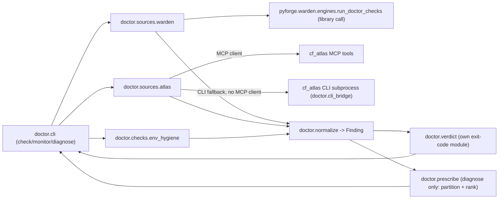

# Architecture Spine — pyforge-doctor

## Design Paradigm

**Facade over existing instruments**, internally a **pipes-and-filters** pipeline
(gather → normalize → partition/rank) with exactly one narrow subprocess exception.
Doctor's own code is *coordination and ranking*, not detection: it never spawns a
scan engine or a database query that warden or cf_atlas doesn't already own.

- **Facade layer** (`pyforge.doctor.cli`) — the three verbs (`check`/`monitor`/
  `diagnose`), each a thin entrypoint composing the filters below.
- **Gather filters** — one per Source: `doctor.sources.warden` (library call into
  `pyforge.warden.engines.run_doctor_checks`), `doctor.sources.atlas` (MCP tool calls,
  CLI-subprocess fallback), `doctor.checks.env_hygiene` (Doctor's own new AST scan).
  Each filter's *only* job is producing `Finding` objects (§ Consistency Conventions).
  Filters are added by naming a new Source, never by widening an existing one's scope.
- **Normalize filter** — every Source's native output → the closed `Finding` shape
  (§ Consistency Conventions), tagged with its origin Source. This is the seam
  `monitor`/`check` output flows through before rendering or `--json`.
  Diagram of who may depend on whom:



## Invariants & Rules

### AD-1 — `check --engines` calls warden as a library, never a subprocess

- **Binds:** FR-1
- **Prevents:** a second, drift-prone reimplementation of engine-availability
  probing; an unnecessary process spawn on Doctor's hottest path (pre-flight,
  five-second budget per PRD SM-C1).
- **Rule:** `doctor.sources.warden` imports and calls
  `pyforge.warden.engines.run_doctor_checks` (and its `DoctorCheck` result type)
  directly. `pyforge-doctor`'s packaging declares `pyforge-warden` as an optional
  extra (`gate = ["pyforge-warden"]`), mirroring `pyforge-atlas`'s own identical
  edge (`pyproject.toml`: *"the ONLY cross-package code edge — atlas → warden...
  installed by default in the in-repo pixi env; external installs may omit it (the
  gate node then fails with an install hint)"*). No reverse `warden → doctor` import
  may ever exist. This is not a new exception to warden's "sole subprocess site"
  rule — `run_doctor_checks()` still does its own bounded, typed subprocess work
  internally, unchanged; calling it as a plain function does not add a subprocess
  call site anywhere in either package.

### AD-2 — Doctor owns a closed exit-code space that never merges with warden's

- **Binds:** FR-1, FR-2, NFR (operability exit code, PRD §3 Glossary)
- **Prevents:** Doctor's `check`/`monitor` exit code colliding with or silently
  inheriting warden's policy-gate semantics; a caller (Marshal) misreading Doctor's
  exit 1 as "policy violation" when Doctor has no policy-gate concept in v1.
- **Rule:** `pyforge.doctor.verdict` is Doctor's own sole-owned exit-code knob
  (structurally mirrors warden's `verdict.py` pattern, not imported from it). Doctor's
  exit-code domain is `{0 = every check ok, 2 = a fail present, 130 = SIGINT}` —
  deliberately a *subset* of warden's frozen `{0, 1, 2, 130}`, permanently omitting
  `1` (warden's `WARN_AS_ERROR`/policy-gate rung), because Doctor reports
  *operability, not policy* (PRD §3 Glossary — direct carry-over of warden's own
  `--doctor` flag comment). A `warn`-status Finding never changes Doctor's exit code.
  Warden's own exit code (from `run_doctor_checks`, when doctor calls it) is consumed
  as *data* — folded into a Doctor `Finding.status` — and never re-exposed as
  Doctor's own process exit code. The two exit-code spaces are read-only inputs to
  each other, never merged.

### AD-3 — Doctor defines its own closed Finding/Source/Status taxonomy

- **Binds:** FR-1 through FR-9 (every verb's output)
- **Prevents:** importing warden's `ErrorKind` (scoped to *scan-engine operational
  failure*) and silently stretching it to cover Doctor's broader domain
  (engine-missing / feedstock-stale / credential-hygiene), which would make
  `ErrorKind` a shared, driftable vocabulary neither package fully owns.
- **Rule:** `pyforge.doctor.models` defines a closed `DoctorStatus` (`StrEnum`:
  `ok`, `warn`, `fail`), a closed `Source` enum (one member per wrapped instrument —
  `warden-doctor`, `staleness-report`, `cve-watcher`, `behind-upstream`,
  `feedstock-health`, `release-cadence`, `env-hygiene`), and a `Finding` dataclass —
  structurally mirroring warden's `models.py` pattern (`StrEnum` + frozen validation
  set + `__post_init__` validation) but never importing warden's `ErrorKind` directly.
  Resolves PRD §8 Open Question 5.

### AD-4 — `--prescribe` is a pure function over already-gathered Findings

- **Binds:** FR-6, FR-7, FR-8
- **Prevents:** `diagnose --prescribe` becoming a second place that spawns
  subprocesses or MCP calls, duplicating what `check`/`monitor`'s gather filters
  already do.
- **Rule:** `pyforge.doctor.prescribe` takes a `list[Finding]` (already gathered by
  composing AD-1's and FR-4/FR-5's existing gather filters for the named target) and
  returns partitioned, ranked `Prescription` objects. It makes zero subprocess or MCP
  calls of its own — every Finding it ranks was already produced by an existing
  gather filter.

### AD-5 — One narrow, typed subprocess site for Doctor's own CLI-fallback path

- **Binds:** FR-5 (CLI fallback when no MCP client is available)
- **Prevents:** ad hoc `subprocess.run` calls scattered across `doctor.sources.atlas`
  or elsewhere, echoing the exact fragility warden's `engines.py` was built to avoid.
- **Rule:** `pyforge.doctor.cli_bridge` is the *only* module in `pyforge-doctor`
  permitted to spawn a subprocess, reserved for the CLI-fallback branch of AD-6.
  It reuses warden's `_engine_env()` discipline as a convention (argv as a list —
  never a shell string; `NO_COLOR=1`; `stdin=DEVNULL`; bounded timeout; typed failure
  via a `Finding` with `status=fail`, never a raw traceback).

### AD-6 — `monitor --fleet` prefers cf_atlas's MCP tools; CLI is the fallback

- **Binds:** FR-4, FR-5
- **Prevents:** two divergent code paths (MCP vs. CLI) producing different Finding
  shapes for the same underlying atlas signal.
- **Rule:** `doctor.sources.atlas` calls the MCP tool for a Watch axis when an MCP
  client is available in-process (the expected path for Marshal/agent callers);
  otherwise it falls back to the equivalent CLI subprocess via AD-5's
  `cli_bridge`. Both paths normalize into the *same* `Finding` shape before returning
  — the caller (human or agent) cannot tell which path produced a given Finding
  except via its `Source` tag.

## Consistency Conventions

| Concern | Convention |
| --- | --- |
| Naming (entities, files, interfaces) | `pyforge.doctor.<area>` modules: `cli`, `sources.warden`, `sources.atlas`, `checks.env_hygiene`, `normalize`, `verdict`, `prescribe`, `models`, `cli_bridge`. CLI verb names match the Dream verbatim: `check`, `monitor`, `diagnose`. |
| Data & formats (envelopes, ids) | One `DoctorReport` JSON envelope per invocation: `{schema_version, verb, generated_at, findings: [Finding], prescriptions: [Prescription]}` (`prescriptions` present only for `diagnose`). `Finding = {source, check, status, message, evidence}` (`evidence` is a Source-specific object, opaque to the envelope). `Prescription = {finding_ref, partition, rank, rank_factors, action, root_cause}` (`rank`/`rank_factors` populated only for `partition=actionable`). `schema_version` starts at `1` — carries warden's `ComplianceReport` precedent (schema-validated, versioned) forward. |
| State & cross-cutting (mutation, exit codes, timeouts) | v1 is read-only everywhere — no module under `pyforge.doctor` may write outside a `tempfile`-scoped path or mutate scanned trees (mirrors warden's NFR-S4 discipline). Exit codes flow only through `doctor.verdict` (AD-2). Any subprocess call is bounded-timeout + typed-failure via `cli_bridge` (AD-5) — no bare `subprocess.run` elsewhere. |

## Stack

| Name | Version |
| --- | --- |
| Python | >=3.14 (matches `pyforge-atlas`'s `requires-python` floor; both are namespace-package siblings of `pyforge.warden` in the same pixi env family) |
| Build backend | hatchling (matches warden + atlas) |
| pytest | >=9.1.1 (matches warden's pinned floor) |
| pyforge-warden | path dependency (optional extra `gate`), in-repo pixi build-workspace member |

## Structural Seed

```text
src/shared/packages/pyforge-doctor/
  pyproject.toml            # dependencies=[] lean core; optional-dependencies.gate=["pyforge-warden"]
  src/pyforge/doctor/
    __main__.py              # `doctor` console-script entrypoint
    cli.py                   # check/monitor/diagnose argument parsing + dispatch
    sources/
      warden.py               # AD-1: run_doctor_checks() library call -> Finding
      atlas.py                 # AD-6: MCP-first, CLI-fallback -> Finding
    checks/
      env_hygiene.py           # FR-3: AST-based credential-hygiene scan -> Finding
    cli_bridge.py             # AD-5: the ONE subprocess site (CLI-fallback only)
    normalize.py               # native source output -> closed Finding shape
    models.py                  # AD-3: DoctorStatus / Source / Finding / Prescription
    verdict.py                  # AD-2: Doctor's own sole-owned exit-code knob
    prescribe.py                # AD-4: partition + rank (pure function over Finding list)
  tests/
    unit/                      # per-module, mocked sources
    meta/                      # structural rules: AD-5 sole-subprocess-site check
                               #   (mirrors warden's tests/meta/test_verdict_sole_ownership.py),
                               #   AD-1 no-reimplementation check (asserts sources/warden.py
                               #   imports, never subprocess-calls, `warden`)
    fixtures/                  # sample warden ComplianceReport + atlas CLI/MCP output fixtures
  scripts/
    dogfood_scan.py            # doctor checks its own package, warden-dogfood precedent
```

## Capability → Architecture Map

| Capability / Area | Lives in | Governed by |
| --- | --- | --- |
| FR-1 (wrap warden self-check) | `doctor.sources.warden` | AD-1, AD-2 |
| FR-2 (tri-state, individually addressable checks) | `doctor.cli` (`--list` introspection), `doctor.models.DoctorStatus` | AD-3, Consistency Conventions |
| FR-3 (credential/env-hygiene check) | `doctor.checks.env_hygiene` | AD-3 (new `Source` member); no subprocess, no `exec`/execution of scanned code |
| FR-4 (fleet watch-axis query) | `doctor.sources.atlas` | AD-6 |
| FR-5 (MCP-first, CLI-fallback) | `doctor.sources.atlas`, `doctor.cli_bridge` | AD-5, AD-6 |
| FR-6 (partition actionable/blocked/accepted-risk) | `doctor.prescribe` | AD-4 |
| FR-7 (rank actionable partition) | `doctor.prescribe` | AD-4 |
| FR-8 (root-cause naming) | `doctor.prescribe` (templated from `Finding.evidence`) | AD-4 |
| FR-9 (`--json` envelope) | `doctor.cli` render path | Consistency Conventions (`DoctorReport` schema) |
| Packaging (pixi workspace member) | `src/shared/packages/pyforge-doctor/`, root `pixi.toml` (future edit, not this run) | Stack, AD-1 |

## Deferred

- **Exact `pixi.toml` edit.** This run documents the target shape
  (`[feature.pyforge-doctor.*]` mirroring `[feature.pyforge-warden.*]` verbatim:
  path dependency, dedicated pixi env, `doctor-check`/`pyforge-doctor-test`/
  `pyforge-doctor-build-{conda,dist,build}` tasks) but does not apply it — deferred
  to the first implementation story, per this run's explicit scope boundary.
- **`env_hygiene` check's exact severity default** (`warn` vs. `fail` for a detected
  unconditional-injection pattern) — deferred to epics/stories; not architecture-blocking
  since AD-3's `DoctorStatus` already has both rungs available.
- **MCP client wiring detail** (direct FastMCP client import vs. a thinner
  `doctor.atlas_bridge` wrapper module) — deferred to epics/stories; AD-6 fixes the
  MCP-first/CLI-fallback *rule*, not the client library call shape.
- **`check --list` introspection flag's exact CLI shape** — deferred; AD-3/FR-2 fix
  that the capability must exist, not its flag spelling.
- **A real dependency-graph resolver for `--prescribe`** — explicitly out of v1 per
  PRD §5 Non-Goals; AD-4 fixes ranking-only for v1, leaves graph-ordering as a
  possible v1.x AD-7 without pre-committing its shape.
- **Waiver-authoring mechanism for the `accepted-risk` partition** — the partition
  exists (AD-4) but nothing populates it in v1; deferred per PRD §6.2.
