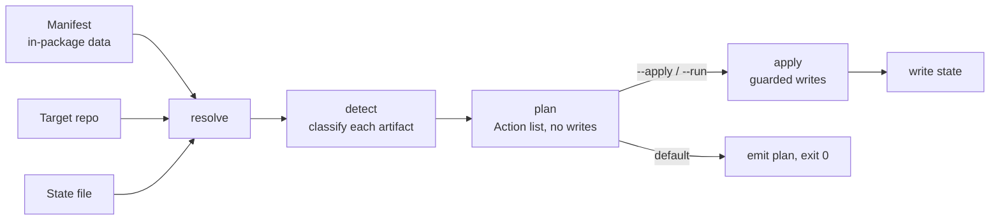
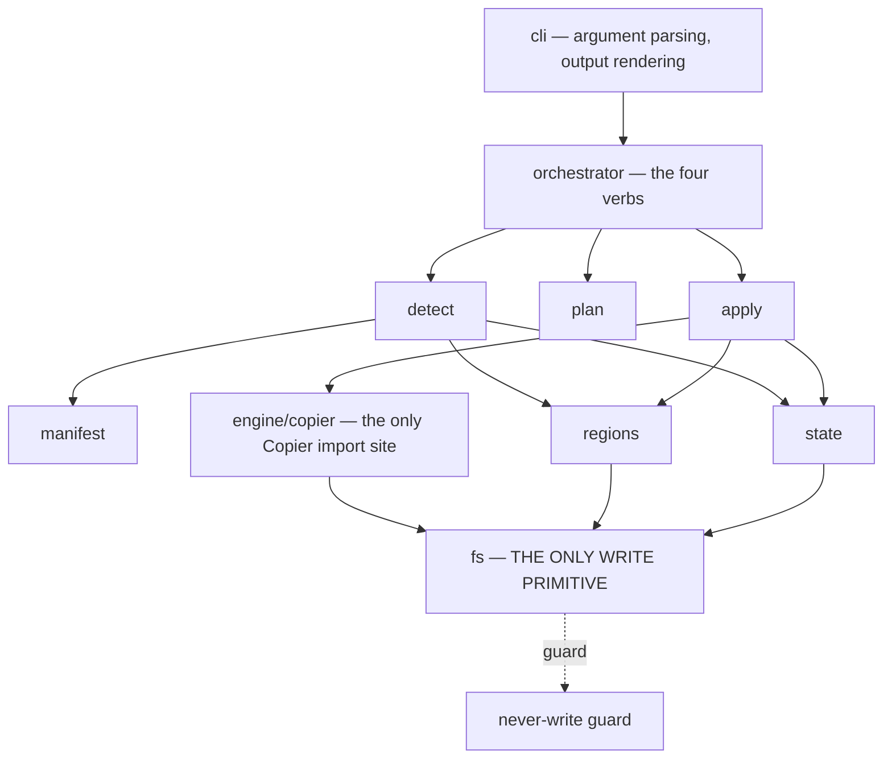

# Architecture Decision Document — pyforge-genesis (Genesis)

## 1. Context

### Product in one paragraph

Genesis installs this repo's operating model into other repositories and keeps it
current. Four verbs — `init` (greenfield), `adopt` (brownfield), `check` (conformance,
CI-shaped), `update` (take a later model version). The model is declared as **data** (a
manifest), materialized by **Copier** (wrapped through its public API only), and kept
correct by two engines Copier does not have: a **managed-region** engine that replaces
marker-delimited spans inside repo-owned files, and a **conformance** engine that
classifies and reports drift. Distribution: `pyforge-genesis` / `pyforge.genesis` /
`genesis`, as a pixi workspace member producing a conda package plus wheel/sdist.

### Locked technical decisions (carried from brief + PRD — do not re-discover)

| # | Decision | Source |
|---|---|---|
| L-01 | Wrap **Copier `>=9.17,<10`** as a conda run-dependency; public `run_copy`/`run_update`/`run_recopy` only | brief § Technical Approach; FR55, NFR-C2 |
| L-02 | Model templates ship **in-package**; `--template` overrides | FR53, FR54, NFR-A1 |
| L-03 | Five artifact classes: `referenced`, `copied-managed`, `copied-seeded`, `generated-derived`, `hybrid-managed-region` | PRD § Extraction Manifest; FR2 |
| L-04 | **Two version numbers** — CLI semver and model semver — both in state | FR5, FR37, FR60 |
| L-05 | Managed regions are replaced by **pure span substitution**, never three-way merge | FR44, NFR-R3 |
| L-06 | `adopt` and `update` are **dry-run by default**, two-phase (plan → apply) | FR14, FR29 |
| L-07 | **Never-write path set** enforced at the lowest write primitive | FR6, FR35, NFR-R4 |
| L-08 | pixi workspace member cloning `pyforge-warden`'s shape; lean env, `no-default-feature = true` | brief § Technical Approach; NFR-C4 |
| L-09 | Python `>=3.12` | NFR-C1 |
| L-10 | Genesis **installs** the multi-project machinery; **Marshal operates it**. Marshal owns the source of `bmad-switch` / `bmad-loop-worktree`; Genesis owns delivery and never forks them | PRD § Boundaries |

### Environment state (what already exists in this repo)

- Root `pixi.toml`: `preview = ["pixi-build"]`, `requires-pixi = ">=0.72.2"`, no
  `[workspace] members` key (members are path dependencies — settled, do not relitigate).
- Two existing pyforge workspace members (`pyforge-warden`, `pyforge-atlas`) with lean
  `no-default-feature` environments; both use `packages = ["src/pyforge"]`.
- `copier` v9.17.0 is on conda-forge (`noarch: python`, MIT) — consumed, not authored.
- `typer >=0.27.0`, `rich >=14.3.4`, `jinja2 >=3.1.6`, `jsonschema`, `pyyaml` all already
  pinned in the workspace.
- `scripts/bmad_drift_check.py` (662 lines) exists but is ~85% `local-recipes`-specific
  probes (`skill_version`, `mcp_tool_count`, `phase_count`, `recipe_split`, `gotcha_max`).
  Only `Finding`/severity, `check_coverage`, `check_tier_alignment`, `check_archive_hygiene`
  generalize. See AD-04.

---

## 2. Architectural Style & Top-Level Decisions

### A-01 — Pipeline architecture: `resolve → detect → plan → apply`

Every mutating verb is the same four-stage pipeline over a different input. This is the
single most important structural invariant: it forces dry-run, idempotence, and the
plan artifact to be properties of the *architecture* rather than features bolted onto
each verb.



| Verb | resolve | detect | plan | apply |
|---|---|---|---|---|
| `init` | manifest + slug + agents | trivial (empty target) | full create list | yes |
| `adopt` | manifest + repo + state | full classification | create/insert/skip list | on `--apply` |
| `check` | manifest + repo + state | full classification | findings list | **never** |
| `update` | manifest + repo + state + migrations | classification + version delta | migration + rewrite list | on `--run` |

`check` is `adopt`'s detect+plan stages with writes structurally unreachable — not a
separate implementation. That is why FR23 (check never writes) is cheap to guarantee.

### A-02 — Manifest as data, engine as mechanism

The model is a declarative manifest; the engine knows only the five classes. Adding a
model artifact must never require editing engine code (NFR-M1). The engine has no
knowledge of `AGENTS.md`, `bmad-switch`, or tiers — only of classes, paths, regions, and
anchors.

### A-03 — Layered, with a hard write boundary at the bottom



**Every byte written to the target repo passes through `pyforge.genesis.fs`.** The
never-write guard lives there, not at call sites, so no future code path can bypass it
(NFR-R4). This is the invariant that makes SC-08 provable rather than aspirational.

### A-04 — Copier is a dependency, not a framework

Exactly one module (`engine/copier.py`) imports `copier`. Everything above it speaks a
Genesis-internal `MaterializeRequest` type. Consequences: Copier can be swapped or
version-bumped behind one seam; the public-API-only rule (FR55) is enforceable by a
single import-site test; and Copier's absence in a degraded environment fails in one
place with one message.

### A-05 — Two clocks: CLI version and model version

`genesis_version` moves with releases; `model_version` moves with the operating model.
Migrations are keyed to `model_version` only. A repo can be current on the model and
behind on the CLI, or vice versa, and both states are legible (FR27, FR60).

---

## 3. Pattern Decisions (conflict-prevention rules)

These bind independently-built stories. Violations are bugs, and each has a test.

| # | Rule | Prevents |
|---|---|---|
| **P-01** | All target-repo writes go through `fs.write()` / `fs.replace_span()` / `fs.remove()`. No module calls `open(..., "w")`, `Path.write_text`, `shutil`, or `os.remove` on a target path. | never-write-guard bypass |
| **P-02** | Only `engine/copier.py` imports `copier`. | engine lock-in; API-surface creep |
| **P-03** | Detect is **pure**: given (manifest, repo tree, state) it returns a classification with no I/O side effects and no writes. | untestable detect; accidental writes in `check` |
| **P-04** | `Plan` is a serializable dataclass. Apply consumes only a `Plan` — never re-derives state. | plan/apply divergence; unreviewable applies |
| **P-05** | Every `Action` in a `Plan` names its artifact id, class, current state, target state, and rationale. | opaque plans |
| **P-06** | Managed-region substitution never parses markdown semantically — it is byte-span replacement between markers. | merge corruption (NFR-R3) |
| **P-07** | Hash guards are checked in **detect**, never in apply. Apply trusts the plan. | TOCTOU; double-checking drift |
| **P-08** | State is written **last**, after all file writes succeed, in one atomic replace. | state/repo desync (the `bmad-switch` marker lesson, applied) |
| **P-09** | No network I/O anywhere in the package except behind an explicit `--template <url>`. | air-gap violation (NFR-A1) |
| **P-10** | Every finding type is a member of one enum with a documented remedy string. | ad-hoc error strings; undocumented failures |
| **P-11** | Manifest entries are addressed by stable **artifact id**, never by path (paths are per-repo). | manifest churn breaking state |
| **P-12** | Migrations are pure functions `(repo, state) -> Plan`; they never write directly. | unreviewable migrations; bypassing the guard |

---

## 4. Project Structure

### Directory layout

```
src/shared/packages/pyforge-genesis/
├── pixi.toml                       # [package] — member; NO [workspace] table
├── pyproject.toml                  # hatchling; packages = ["src/pyforge"]
├── README.md
├── src/pyforge/genesis/
│   ├── __init__.py
│   ├── cli.py                      # typer app; the only presentation layer
│   ├── errors.py                   # exit-code taxonomy (FR61)
│   ├── fs.py                       # THE write primitive + never-write guard
│   ├── model/
│   │   ├── manifest.py             # load + validate the manifest
│   │   ├── artifact.py             # Artifact, ArtifactClass
│   │   └── version.py              # model semver, ranges
│   ├── state/
│   │   ├── schema.json             # JSON Schema for .genesis/state.yml
│   │   └── store.py                # read/validate/write (atomic)
│   ├── regions/
│   │   ├── markers.py              # per-format marker registry (FR45)
│   │   ├── parse.py                # find spans; reject nesting (FR48)
│   │   └── apply.py                # span substitution (FR44)
│   ├── detect/
│   │   ├── inventory.py            # walk repo, classify artifacts (FR15)
│   │   ├── hashes.py               # managed content hashing (FR41)
│   │   └── findings.py             # Finding + severity + remedy (FR25, P-10)
│   ├── plan/
│   │   ├── types.py                # Plan, Action (serializable) (FR17, P-04)
│   │   └── build.py                # detect result -> Plan
│   ├── apply/
│   │   └── run.py                  # Plan -> guarded writes
│   ├── engine/
│   │   └── copier.py               # THE ONLY copier import (P-02)
│   ├── derive/
│   │   ├── adapters.py             # agent-adapter fan-out (FR49–FR52)
│   │   └── projects_index.py       # PROJECTS.md rows (FR: generated-derived)
│   ├── migrate/
│   │   ├── registry.py             # ordered, applied-once (FR31)
│   │   └── m_*.py                  # one module per model-version step
│   ├── verbs/
│   │   ├── init.py  adopt.py  check.py  update.py  explain.py  version.py
│   └── templates/                  # in-package model templates (L-02)
│       ├── manifest.yaml           # THE MODEL, as data (AD-05)
│       └── files/…
└── tests/
    ├── unit/                       # regions, manifest, state, findings
    ├── integration/                # init/adopt/check/update on temp repos
    ├── oracle/                     # test_local_recipes_empty_plan.py (SC-02)
    └── meta/                       # P-01/P-02 import-site guards, version-range sync
```

### Module dependency rules

- `cli` → `verbs` → (`detect`, `plan`, `apply`, `migrate`) → (`model`, `state`, `regions`,
  `engine`, `derive`) → `fs`.
- No upward imports. `fs` imports nothing from the package except `errors`.
- `detect` may not import `apply` or `engine`.
- `templates/` is data, never imported as code.

---

## 5. Key Architectural Decisions

Each resolves a PRD open question or fixes a non-obvious invariant.

### AD-01 — CLI: **typer + rich** (resolves OQ-1)

**Binds:** every CLI surface. **Prevents:** two verbs rendering plans differently; hand-rolled
table/diff formatting.
**Rule:** `cli.py` uses typer for parsing and rich for rendering; **no other module imports
rich or typer**, so `--json` output and library use stay presentation-free. Both are already
pinned in the workspace, and Copier already brings prompt-toolkit/questionary/pygments, so the
marginal dependency cost is near zero. Warden's argparse minimalism is not adopted: Genesis's
value is a *reviewable plan*, and plan rendering is the product's main human surface.

### AD-02 — State: **one Genesis-owned file at `.genesis/state.yml`** (resolves OQ-2)

**Binds:** all state access. **Prevents:** state/answers divergence; hand-edited state.
**Rule:** Genesis owns `.genesis/state.yml` (git-tracked, FR42, schema-validated, FR39).
Copier's answers file is configured by the in-package template to live at
`.genesis/.copier-answers.yml` and is **treated as opaque and tool-owned** — Genesis reads it
never and writes it only via Copier (FR40). Answers are re-supplied programmatically from
Genesis state on every Copier call (`data=`), so Genesis state is the single source of truth
and the answers file is a Copier implementation detail. If the answers-file relocation proves
unsupported (assumption 5), it stays at the repo root and the rule is otherwise unchanged.

### AD-03 — Marker syntax and the format registry (resolves OQ-3)

**Binds:** every hybrid artifact. **Prevents:** per-file ad-hoc markers; unparseable regions.
**Rule:** One canonical marker grammar, rendered per comment syntax:

```
<open> genesis:begin region=<name> model-version=<semver> sha=<8-hex> <close>
<open> genesis:end region=<name> <close>
```

Registry v1 covers three comment styles — `html` (`<!-- … -->`) for `.md`; `hash` (`# …`)
for `.gitignore`, `.toml`, `.yml`, `.yaml`, shell; `slashstar` (`/* … */`) reserved,
unused in V1. Format is chosen by file extension, declared per artifact in the manifest,
never sniffed. Nested or overlapping regions are a hard error (FR48). `sha` covers the
region **body only**, so the marker line itself is not self-referential.

### AD-04 — `genesis check` **re-implements** the generic subset; does not extract or vendor `bmad_drift_check.py` (resolves OQ-4)

**Binds:** the detect/findings layer. **Prevents:** coupling `local-recipes` to a Genesis
release; importing 662 lines of repo-specific probes.
**Rule:** Genesis implements its own `detect/findings.py`, **borrowing the proven design**
(the `Finding(severity, type, path, message)` shape; the HARD / DRIFT / INFO severity ladder;
the coverage check that HARD-fails any unclassified artifact; `--json` and integrity-only
modes). It does **not** import, vendor, or extract the script. Rationale from a live read:
roughly 85% of that file (`skill_version`, `schema_version`, `mcp_tool_count`, `phase_count`,
`phase_ids`, `gotcha_max`, `recipe_split`, spec-status, baseline fingerprinting) is
`local-recipes` factory-specific and meaningless in another repo; only `Finding`,
`check_coverage`, `check_tier_alignment`, and `check_archive_hygiene` generalize. The two
detectors coexist: `bmad-drift-check` stays the factory's own detector; `genesis check` is
the model's. **Convergence is a V1.x question, not a V1 dependency** — this removes
assumption 3 from the critical path.

### AD-05 — Manifest is **one YAML file** with per-entry class (resolves OQ-5)

**Binds:** the model declaration. **Prevents:** class-file drift; partial coverage.
**Rule:** `templates/manifest.yaml`, one document, entries keyed by stable **artifact id**
(P-11). Each entry: `id`, `class`, `path` (jinja-templated on slug), `format` (for hybrid),
`regions[]` with `anchor`, `since` / `until` model-version bounds, `applies_to` (`init` /
`adopt` / both), and `rationale` (surfaced by `genesis explain`, FR62). One file keeps
coverage (FR4) a single-pass check and makes the manifest reviewable as a diff — which
matters, because **the manifest is the product's actual contract**.

### AD-06 — Anchor semantics: declared anchor, append fallback, never mid-file guessing (resolves OQ-6)

**Binds:** region insertion into pre-existing files. **Prevents:** corrupting an unfamiliar
`CLAUDE.md`.
**Rule:** Each hybrid region declares an ordered `anchor` list of literal line-prefix
matchers (e.g. `["## The tiers", "# CLAUDE.md", "<top>"]`). Insertion goes after the first
match; if none matches, the region is **appended at end of file** with a preceding blank
line. Genesis never infers structure, never inserts inside a fenced code block (spans inside
``` fences are skipped when matching), and always reports the chosen anchor in the plan so
the human reviewing the plan can veto placement.

### AD-07 — The plan artifact: `.genesis/plan.json`, **gitignored by default** (resolves OQ-7)

**Binds:** the plan lifecycle. **Prevents:** stale plans applied against a changed repo;
plan-file churn in git.
**Rule:** Plans are written to `.genesis/plan.json` and gitignored by the model's own
`.gitignore` region. A plan records a `repo_fingerprint` (git HEAD + dirty flag + hashes of
the artifacts it names); `apply` **refuses** a plan whose fingerprint no longer matches
(P-04's teeth). `--plan-out <path>` writes elsewhere for PR review; `--plan <path>` applies a
specific plan file. Nx commits `migrations.json`; Genesis does not, because the plan is
derived and cheap to regenerate while a committed stale plan is a hazard.

### AD-08 — `genesis eject` is **not built in V1, but state must not preclude it** (resolves OQ-8)

**Binds:** the state schema. **Prevents:** a lock-in design that cannot be undone later.
**Rule:** State records, for every managed artifact, enough to remove Genesis's claim
cleanly: `id`, `path`, `class`, `body_sha`, and `inserted_region_span` where applicable.
That is sufficient for a future `eject` to strip markers and forget the artifacts without
touching content. No eject verb ships in V1.

### AD-09 — Legacy conventions: **preserve + record + optional advisory**, never migrate (resolves OQ-9)

**Binds:** brownfield detect. **Prevents:** deleting a live legacy tier.
**Rule:** A manifest entry may declare `legacy_of: <artifact-id>`. When detect finds it,
the artifact is classified `present-legacy`, recorded in `state.legacy[]`, and **never
written to**. `check` may emit an **INFO** finding naming the successor (e.g. `docs/specs/`
→ Tier 2), never a HARD or DRIFT. Genesis provides no automated Tier-1→Tier-2 migration in
V1: the legacy content is the team's work product and falls inside the never-write set.

### AD-10 — Idempotence is defined as **plan-emptiness**, and is the universal test shape

**Binds:** every verb. **Prevents:** subtly non-convergent applies.
**Rule:** A verb is idempotent iff running detect+plan immediately after a successful apply
yields a plan with zero actions. Every integration test asserts this. It also makes SC-02
(the `local-recipes` oracle) and SC-03 (adopt twice) the *same assertion* applied to
different repos — one mechanism, two proofs.

### AD-11 — The never-write guard is a **path-set matcher inside `fs`**, evaluated per write

**Binds:** `fs`. **Prevents:** any path bypassing FR6.
**Rule:** `fs` holds an immutable `NeverWrite` set (loaded from the manifest at
orchestrator construction, then frozen). Every write resolves its path to an absolute,
symlink-resolved form and matches it against the set **before** opening anything. A match
raises `NeverWriteViolation` (a hard error, distinct exit code). A meta-test enumerates the
package's AST for write calls outside `fs` (P-01) so the guard cannot be routed around.
Symlink resolution matters concretely here: `_bmad-output/planning-artifacts` is a symlink
into `projects/<slug>/planning-artifacts`, so an unresolved match would miss it.

### AD-12 — Migrations are **plan-producing pure functions**, ordered by model semver

**Binds:** `migrate/`. **Prevents:** migrations writing outside the guard; double-application.
**Rule:** Each migration is `def migrate(repo: RepoView, state: State) -> Plan` registered
with `from_version` / `to_version`. The runner selects the ordered chain from
`state.model_version` to the bundled model version, composes their plans, and hands the
result to the same `apply` path as every other verb (P-12). Applied migrations are appended
to `state.migrations_applied[]` and never re-run. A migration touching a `copied-seeded`
artifact emits an **offer** action which apply skips unless `--include-seeded` is passed
(FR32).

### AD-13 — Adapter fan-out renders from **one contract document**, per-agent

**Binds:** `derive/adapters.py`. **Prevents:** four drifting copies of the tier table.
**Rule:** The neutral contract (tiers table, portability contract, Dream-first workflow) is
one jinja-rendered source in `templates/`. Each adapter is `(target_path, format, wrapper
template)`. `CLAUDE.md` and `AGENTS.md` receive it as a **managed region** (FR52); Cursor,
Gemini, and Copilot files are **whole-file generated-derived** because inspection confirms
they are already nothing but per-tool framing around that same table. Adding a fifth agent is
a manifest entry plus a wrapper template — no engine change (NFR-M1).

### AD-14 — Packaging clones `pyforge-warden` exactly

**Binds:** packaging stories. **Prevents:** a divergent third packaging pattern.
**Rule:** member `pixi.toml` with `[package]`, `pixi-build-python` backend, no `[workspace]`
table; `pyproject.toml` with hatchling, `packages = ["src/pyforge"]`,
`genesis = "pyforge.genesis.cli:main"`; root `pixi.toml` gains
`[feature.pyforge-genesis.dependencies]` (path dependency + hatchling + python-build +
pytest), task blocks, and
`pyforge-genesis = { features = ["pyforge-genesis"], no-default-feature = true }`. The lean
env is mandatory — bmad-loop worktrees materialize it, never the fat `local-recipes` env.
Touching root `pixi.toml` fires the repo's two always-on PR gates (`maintenance` label +
regenerated `environment.yaml`) and stales `library-llms-full.md`; all three are acceptance
criteria on the packaging story, not follow-ups.

### AD-15 — Offline by construction, proven by counter

**Binds:** the whole package. **Prevents:** a silent egress regression.
**Rule:** No module imports `requests`, `httpx`, or `urllib.request` (meta-test enforced).
The only network path is Copier's git fetch, reachable only when `--template <url>` is
given. An egress-counter test (warden's established pattern) asserts zero network calls
across `init`, `adopt --dry-run`, `adopt --apply`, and `check`.

---

## 6. Validation — Coverage Matrix

### FRs covered

| FR | Covered by |
|---|---|
| FR1–FR6 | AD-05 (one manifest), A-02, AD-11 (never-write set), P-11 |
| FR7–FR13 | `verbs/init.py` on the A-01 pipeline; AD-05 `applies_to`; AD-14 |
| FR14–FR22 | A-01 (dry-run default, plan artifact), AD-07, AD-09, AD-10, P-03, P-07 |
| FR23–FR28 | A-01 (`check` = detect+plan, writes unreachable), AD-04, P-10 |
| FR29–FR36 | AD-12, AD-11, A-05, P-12; FR36 → `engine/copier.py` `run_recopy` |
| FR37–FR42 | AD-02, AD-08, `state/schema.json`, P-08 |
| FR43–FR48 | AD-03, AD-06, P-06, `regions/` |
| FR49–FR52 | AD-13 |
| FR53–FR57 | L-02, A-04, P-02, AD-14 |
| FR58–FR62 | AD-01 (`--json`/`--quiet` presentation-free), `errors.py` exit taxonomy, AD-05 `rationale` → `explain` |

### NFRs covered

| NFR | Covered by |
|---|---|
| NFR-R1 (no partial state) | P-08 (state written last, atomically); AD-07 fingerprint refusal |
| NFR-R2 (git is undo) | clean-worktree precondition in `verbs/`; FR20 |
| NFR-R3 (no conflict markers) | P-06, AD-03 — span substitution cannot produce them |
| NFR-R4 (guard at primitive) | AD-11, P-01 + AST meta-test |
| NFR-A1/A2 (air-gap) | AD-15, P-09, L-02 |
| NFR-P1/P2/P3 | P-03 (pure detect ⇒ single tree walk, cacheable); no network |
| NFR-C1–C4 | AD-14, L-09; `packages = ["src/pyforge"]` namespace share |
| NFR-S1 (no untrusted exec) | `--unsafe` gate at `engine/copier.py`, the single import site |
| NFR-S2 (no credentials) | AD-15 (no network stack to authenticate to) |
| NFR-S3 (template path validation) | AD-11 — templates write through `fs` like everything else |
| NFR-M1 (manifest is truth) | A-02, AD-05, AD-13 |
| NFR-M2 (oracle in CI) | AD-10 — SC-02 and SC-03 are one assertion shape |
| NFR-M3 (remedy per finding) | P-10 |
| NFR-O1 (machine-readable) | AD-01 (presentation isolated), AD-07 (`plan.json`) |

### Pattern coverage

P-01/P-02 have AST meta-tests. P-03/P-04/P-07/P-08/P-12 are enforced by type signatures
(pure functions returning `Plan`; apply accepting only `Plan`). P-05/P-11 are schema-enforced.
P-06/P-10 are unit-tested. P-09 is covered by AD-15's egress counter.

---

## 7. Architecture Phase Outputs

### Component summary (for story breakdown)

| Component | Risk | Notes |
|---|---|---|
| `regions/` (markers, parse, apply) | **highest** | the one genuinely bespoke algorithm; build first, test hardest |
| `fs` + never-write guard | high | small but load-bearing; everything else assumes it |
| `model/manifest.py` + `templates/manifest.yaml` | high | the manifest *is* the product's contract |
| `detect/` | medium | pure; heavily unit-testable |
| `plan/` + `apply/` | medium | mostly plumbing once detect and fs exist |
| `engine/copier.py` | medium | thin; risk is Copier API assumptions (spike it) |
| `state/` | low | schema + atomic write |
| `derive/adapters.py` | low | jinja rendering |
| `migrate/` | medium | needs one real migration to prove the chain (SC-07) |
| `verbs/` + `cli.py` | low | composition |
| packaging | low | clone warden |

### Build order (dependency-forced)

1. `fs` + guard → 2. `model` + manifest → 3. `regions` → 4. `detect` →
5. `plan` → 6. `engine/copier` → 7. `apply` → 8. `state` →
9. `verbs: check` → 10. `verbs: adopt` → 11. `verbs: init` → 12. `derive` →
13. `migrate` + `verbs: update` → 14. packaging + oracle CI.

`check` before `adopt` before `init` is deliberate: `check` needs no writes, `adopt` adds
writes, `init` is `adopt` against an empty target. Each verb is the previous plus one
capability, so the risky machinery is exercised earliest.

### Spike-0 (gates story breakdown) — Copier API fit

Before Epic 2 hardens, prove on a throwaway template:
- `run_copy(..., pretend=True)` produces no writes and a usable report;
- `skip_if_exists` preserves a pre-existing file while creating its siblings;
- `data=` fully suppresses prompting with `defaults=True`;
- the answers-file path is template-configurable (AD-02's fallback trigger);
- `run_update` with `vcs_ref` orders correctly against PEP 440 tags.

**Pass criterion:** all five hold on Copier 9.17. Any failure changes AD-02 or promotes a
bespoke materializer, so this gates rather than accompanies the build.

### Deliberately deferred (not decided here)

- Composable feature modules (adopt a subset of the model) — V1.x; the manifest's
  `applies_to` field is shaped to allow a future `groups[]` without a schema break.
- `check --fix` — V1.x; requires a fixable/unfixable distinction per finding type.
- `genesis eject` — V1.x; state is shaped for it (AD-08).
- Publishing the model as a separately versioned artifact — V2; `--template` is the seam.
- Windows parity beyond `init`/`check` — best-effort (NFR-C3).
- Convergence of `genesis check` and `bmad-drift-check` — explicitly out of V1 (AD-04).

---

## 8. Risks & Mitigations

| # | Risk | Mitigation in this architecture |
|---|---|---|
| AR-1 | Region engine corrupts a file | P-06 byte-span substitution; AD-06 conservative anchoring; AD-03 nesting rejection; region unit tests are the largest test group |
| AR-2 | Copier API assumptions wrong | A-04 single import site; Spike-0 gates the build; NFR-C2 range pin + sync test |
| AR-3 | Manifest and reality diverge | AD-10 + SC-02 oracle in Genesis's own CI (NFR-M2) — drift in `local-recipes` fails Genesis's build |
| AR-4 | A write escapes the guard | AD-11 symlink-resolved matching + P-01 AST meta-test |
| AR-5 | Stale plan applied to a changed repo | AD-07 `repo_fingerprint` refusal |
| AR-6 | State/repo desync | P-08 state written last, atomically — the `bmad-switch` marker lesson encoded |
| AR-7 | Genesis and Marshal both claim `bmad-switch` | L-10: Marshal owns source, Genesis owns delivery; Genesis never forks. Needs Marshal's PRD to agree (PRD assumption 8) |
| AR-8 | In-package templates couple model releases to package releases | accepted; `--template` (FR54) is the escape valve and the V2 seam |

---

## 9. Architecture Phase Completion

**Resolved:** OQ-1 → AD-01 · OQ-2 → AD-02 · OQ-3 → AD-03 · OQ-4 → AD-04 · OQ-5 → AD-05 ·
OQ-6 → AD-06 · OQ-7 → AD-07 · OQ-8 → AD-08 · OQ-9 → AD-09. All nine PRD open questions are
closed.

**Notably, AD-04 removes PRD assumption 3** (`bmad_drift_check.py` reuse) from the critical
path — the assessment was performed against the live 662-line script and the answer is
re-implement-the-generic-subset, so no spike is owed on it.

**Remaining risk concentrated in one place:** the managed-region engine (AR-1) and Copier's
API fit (AR-2). Spike-0 addresses the second before story breakdown hardens; the first is
mitigated by build order (regions are component 3 of 14) and by being the most heavily
tested unit in the package.

**Ready for `bmad-create-epics-and-stories`.**
