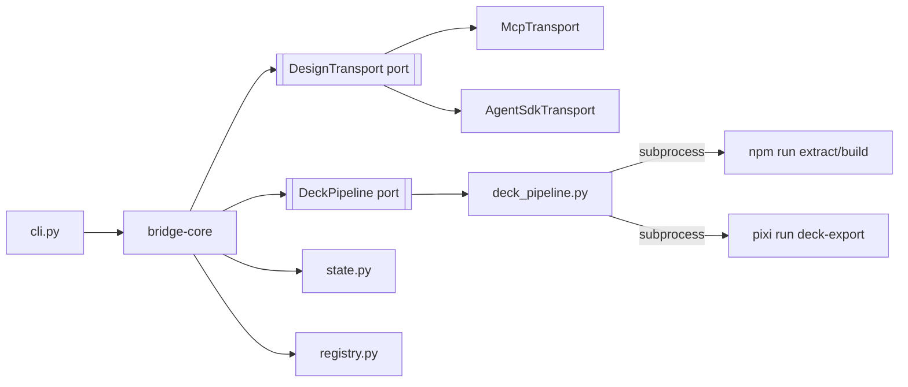

# Architecture Spine — pyforge-herald bridge CLI

## Design Paradigm

**Hexagonal / ports-and-adapters.** The domain (`bridge-core`) holds the only logic that
matters for consistency — etag comparison, conflict detection, directional-crossing
enforcement — and depends on nothing but two ports: a `DesignTransport` port (the Design
surface) and a `DeckPipeline` port (the local build pipeline). Everything else — the two
transport adapters, the subprocess-wrapping deck-pipeline adapter, the filesystem-backed state
and registry adapters, the CLI — is a replaceable adapter around that core. A future third
transport or a swapped state backend never touches `bridge-core`.



## Invariants & Rules

### AD-1 — Package as a pixi-build workspace member

- **Binds:** FR-25, FR-26 (distribution)
- **Prevents:** a bespoke packaging shape that diverges from the two already-shipped pyforge
  siblings, and a second, incompatible way of wiring a pyforge-family CLI into this repo's
  pixi workspace
- **Rule:** Herald's package lives at `src/shared/packages/pyforge-herald/` with its own
  `[package]` table (`pixi-build-python` backend, no `[workspace]` table) — the exact shape of
  `src/shared/packages/pyforge-warden/` and `src/shared/packages/pyforge-atlas/`. The root
  `pixi.toml` wires it in via `[feature.pyforge-herald.dependencies] pyforge-herald = { path =
  "src/shared/packages/pyforge-herald" }` into a dedicated `pyforge-herald = { features =
  ["pyforge-herald"], no-default-feature = true }` environment. `[package.run-dependencies]`
  stays lean and conda-provisioned (NFR1/NFR2 pattern) — no curl-fetched runtime deps.

### AD-2 — CLI framework: argparse, not typer

- **Binds:** FR-26, all CLI-surfaced FRs
- **Prevents:** a third CLI-framework convention entering the pyforge family (deckcraft chose
  typer for a content-generation tool; that choice does not bind Herald)
- **Rule:** `pyforge.herald.cli:main` is an argparse-based entrypoint, mirroring
  `pyforge.warden.cli:main` exactly — subcommands under `herald deck {seed,pull,status,watch}`.
  `[project.scripts] herald = "pyforge.herald.cli:main"` in `pyproject.toml`.

### AD-3 — Bridge-core is transport-agnostic (the hexagon's core rule)

- **Binds:** FR-01–FR-20, NFR-01, NFR-06
- **Prevents:** etag/conflict/directional-crossing logic being duplicated or drifting between
  a pure-MCP-client path and a headless-wrapper path
- **Rule:** `bridge-core` depends only on a `DesignTransport` protocol (a `typing.Protocol`
  with `get_design_prompt`, `create_project`, `finalize_plan`, `create_support_js`,
  `copy_files`, `write_files`, `read_file`, `render_preview` — the exact
  `bridge-protocol.md` tool surface). It never imports `McpTransport` or `AgentSdkTransport`
  directly. Both adapters implement the identical protocol; swapping one for the other changes
  zero lines in `bridge-core`.

### AD-4 — Determinism boundary holds regardless of active transport

- **Binds:** NFR-01, FR-23
- **Prevents:** a future transport (or a change inside `AgentSdkTransport`) quietly letting
  model inference decide a seed/pull/status/watch branch
- **Rule:** `bridge-core`'s control flow (which branch of seed/pull/status/watch executes,
  whether a conflict is raised, what gets written) contains zero LLM calls under either
  adapter. `AgentSdkTransport` may run a headless harness process internally, but the methods
  it exposes to `bridge-core` are the same fixed, deterministic tool calls `McpTransport`
  exposes — the harness is plumbing, never a decision-maker.

### AD-5 — Per-deck bridge state persists in a repo-local state file

- **Binds:** FR-10, FR-11, FR-12, FR-14, FR-15, FR-16, FR-18, FR-19
- **Prevents:** CAP-3 (status) and CAP-4 (watch) re-deriving etag history from a
  human-readable README section that was never designed to hold per-artifact etags
- **Rule:** `.herald/bridge-state.json` (repo-local, gitignored) is the operational source of
  truth: keyed by deck slug, storing the linked Design project id, one last-seen etag per
  tracked artifact (prototype, each Marp source, the standalone bundle, each derived export
  file), and the last-pull timestamp. The deck README's § *Design project* stays the
  human-readable registry (`registry.py`, AD-8) — written by `seed`, read only as a bootstrap
  fallback when no state file exists for a slug.

### AD-6 — Structured-failure exception hierarchy

- **Binds:** NFR-02, NFR-03
- **Prevents:** an inconsistent per-command error shape where one CAP fails loudly and another
  fails silently
- **Rule:** A typed hierarchy rooted at `HeraldError` (`SeedConflictError`,
  `PullConflictError`, `ExportConflictError`, `TransportUnreachableError`, `AuthError`, …) is
  raised by `bridge-core` and caught exactly once, at the CLI boundary, where it maps to a
  fixed exit code and a structured stderr message. `stdout` carries only the command's
  machine-readable success output — mirrors `pyforge-warden`'s stream discipline (its NFR-I3).
  `watch` catches `AuthError` specially: it halts the loop, it does not retry.

### AD-7 — Deck pipeline is a subprocess-wrapping adapter, never reimplemented logic

- **Binds:** FR-02, FR-06, FR-07, FR-08, FR-18
- **Prevents:** Herald growing its own copy of the extract/build/export logic that
  `docs/specs/presentation-deck.md` already owns
- **Rule:** `pyforge.herald.deck_pipeline` shells out to `npm run extract`, `npm run build`,
  and `pixi run -e local-recipes deck-export <slug>` as opaque subprocess calls (cwd =
  `presentations/<slug>/`), parsing only exit codes and stdout/stderr for success/failure — no
  in-process reimplementation of the extractor or the export generators.

### AD-8 — Registry is the sole owner of the README § *Design project* block

- **Binds:** FR-04, FR-12
- **Prevents:** more than one module parsing or writing that markdown section, which is how
  format drift starts
- **Rule:** `pyforge.herald.registry` is the only module that reads or writes a deck README's
  § *Design project* block, per `bridge-protocol.md`'s Conventions. `bridge-core` calls
  `registry.register(...)` / `registry.read(...)`; it never touches markdown directly.

## Consistency Conventions

| Concern | Convention |
| --- | --- |
| Naming | modules: `snake_case.py`; CLI subcommands: `herald deck <verb> <slug>`; exceptions: `<Noun>Error` |
| State & errors | all writes go through `state.py`; all raised errors are `HeraldError` subclasses caught once at the CLI boundary (AD-6) |
| Output streams | stdout = machine-readable success output only; stderr = every diagnostic, conflict, and error message (matches `pyforge-warden`'s NFR-I3 precedent) |
| URLs in any output/file | `claude.ai/design/...` only — a raw `serve_url` never crosses the transport-adapter boundary outward (NFR-04) |
| Etag headers | every `DesignTransport` call that reads or writes carries `if_none_match`/`if_match`; no adapter method may omit them |
| Subprocess adapters | `deck_pipeline.py` always sets `cwd` explicitly and never assumes the caller's working directory |

## Stack

| Name | Version |
| --- | --- |
| Python | >=3.12 (matches `pyforge-warden`/`pyforge-atlas` host-dependency floor) |
| Build backend | hatchling (>=1.31.0, matches sibling packages) |
| Conda build wrapper | `pixi-build-python` 0.* (matches sibling packages) |
| CLI framework | argparse (stdlib) |
| Primary transport client | `mcp` >=1.28.1 (official Model Context Protocol Python SDK — already pinned repo-wide) |
| Fallback transport | headless Claude Code / Agent SDK wrapper (bmad-loop-proven substrate; no new library pin — reuses existing harness invocation pattern) |

## Structural Seed

```text
src/shared/packages/pyforge-herald/
  pixi.toml               # [package] table only, pixi-build-python backend (AD-1)
  pyproject.toml          # hatchling, project.scripts herald = pyforge.herald.cli:main (AD-2)
  src/pyforge/herald/
    __init__.py
    cli.py                 # argparse subcommands: deck seed/pull/status/watch
    bridge.py               # bridge-core: orchestrates CAP-1..5, the only caller of the ports
    transport/
      base.py               # DesignTransport Protocol (AD-3)
      mcp_transport.py       # primary adapter
      agent_sdk_transport.py # fallback adapter
    deck_pipeline.py        # DeckPipeline adapter (AD-7): extract/build/deck-export subprocess wrapper
    state.py                 # .herald/bridge-state.json read/write (AD-5)
    registry.py              # README § Design project owner (AD-8)
    errors.py                # HeraldError hierarchy + exit-code map (AD-6)
    models.py                # typed structures: DeckState, EtagRecord, ConflictReport
    py.typed
  tests/
```

## Capability → Architecture Map

| Capability | Lives in | Governed by |
| --- | --- | --- |
| CAP-1 seed | `bridge.py::seed()` + `deck_pipeline` (prove) + `transport` (write) + `registry` (register) + `state` (init etags) | AD-3, AD-5, AD-7, AD-8 |
| CAP-2 pull | `bridge.py::pull()` + `transport.read_file` + `state` (etag compare) + `deck_pipeline` (re-derive) | AD-3, AD-5, AD-7 |
| CAP-3 status | `bridge.py::status()` (read-only) + `state` + `registry` (stale-mirror heuristic) | AD-5, AD-8 |
| CAP-4 watch | `bridge.py::watch()` loop, calling `pull()` after per-slug debounce | AD-3, AD-4, AD-5, AD-6 |
| CAP-5 export push-back | `bridge.py::push_exports()` + `transport.write_files` + `state` (per-file etag) | AD-3, AD-5 |

## Deferred

- **`updates compile` / `broadcast` module boundary.** The PRD carries these as an unscoped
  roadmap pointer, not V1 FRs — no port, adapter, or module is designed for them here. If a
  future spec lands, the natural extension point is a third port alongside `DesignTransport`/
  `DeckPipeline` (a `TelemetrySource` port + a `ChannelAdapter` port per-channel), but that
  shape is not committed by this spine and should not be assumed by V1 code.
- **`herald deck generate`** (Dream→deck rendering) — PRD Open Question #4; not designed here.
  Not part of CAP-1..5.
- **Exact `pyforge-herald` env run-dependency list for the MCP SDK** — whether `mcp` is a
  `[package.run-dependencies]` entry or stays feature-level, pending the transport-spike
  story's outcome (memlog `question` entry).
- **CI/deployment envelope** for the bridge CLI (who runs `herald deck watch` continuously, if
  anyone) — out of scope for a CLI tool invoked interactively by an operator or agent; revisit
  only if a persistent-watch deployment is ever proposed.
