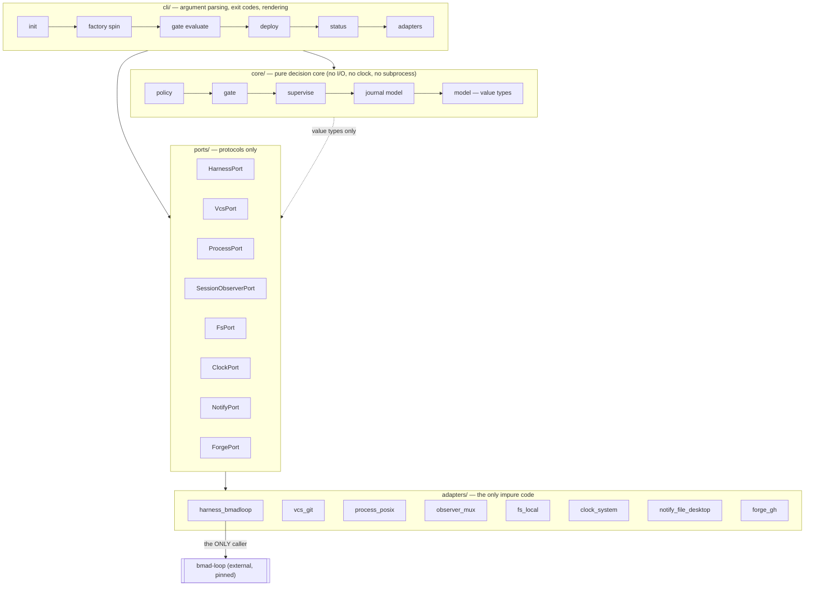
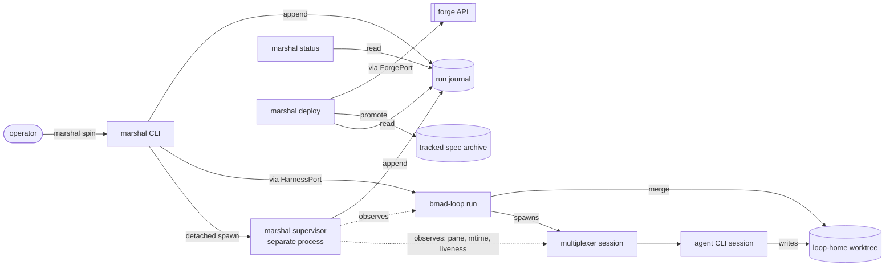

# Architecture Spine — pyforge-marshal

## Design Paradigm

**Hexagonal (ports and adapters) around a pure decision core, with the supervisor as an out-of-process sidecar.**

Everything Marshal *decides* — which policy value wins, whether a gate passed, whether a surface violated a freeze, what a supervisor should do about an idle session, what state the fleet is in — is a pure function over plain data, with no I/O and no clock. Everything Marshal *touches* — the harness, git, the filesystem, processes, terminal multiplexer panes, the forge API, notifications — sits behind a port with exactly one adapter per environment.

This buys the property the product sells: **decisions are reproducible and testable without a running agent**. A gate verdict is a value computed from exit codes and path sets; a supervisor action is a value computed from an observation record and a clock reading that were both passed in.

The supervisor is deliberately *not* a thread inside the run — it is a separate process watching from outside, because the thing that governs a session cannot live inside the session it governs (AD-9).



**Dependency direction is one-way and absolute:** `cli → core`, `cli → ports`, `ports ← adapters`. `core` imports nothing from `adapters`, `ports`, or `cli`. `adapters` never import each other.

---

## Invariants & Rules

### AD-1 — Marshal is harness, never skill `[ADOPTED]`

- **Binds:** all
- **Prevents:** the governor becoming a thing the governed agent can author or influence.
- **Rule:** no module in `pyforge.marshal` makes a model call, loads a skill, or reads agent-authored prose as instruction. Marshal consumes only structured artifacts (specs, feeds, journals, exit codes, path sets). A test asserts no LLM-client dependency is importable from the package.

### AD-2 — Wrap, do not absorb `[ADOPTED — PRD §5]`

- **Binds:** all
- **Prevents:** Marshal becoming the fork-owner of somebody else's dev/verify/review/commit engine, and forfeiting upstream velocity.
- **Rule:** `bmad-loop` is a declared runtime dependency, never vendored, never patched in place. Marshal owns provisioning, supervision, gates-as-objects, landing, status, and portability — not the engine.

### AD-3 — Exactly one harness seam

- **Binds:** FR-52, FR-9, FR-10, FR-17, FR-43, FR-57
- **Prevents:** harness coupling leaking across the codebase, which would turn the §5.4 fork fallback from a bounded swap into a rewrite.
- **Rule:** `adapters/harness_bmadloop.py` is the only module permitted to invoke the harness binary, import its package, read its policy file, or parse its output. Everything else depends on `ports.HarnessPort`. An import-linter contract (import-linter `>=2.13`, conda-forge-available, **not yet provisioned in `pixi.toml`**) fails the build on any other reference to the harness name.

### AD-4 — Pure core, impure edge

- **Binds:** all
- **Prevents:** two builders splitting decision logic — one putting a subprocess call inside a verdict function, another mocking a filesystem to test a comparison.
- **Rule:** `core/**` performs no I/O, spawns no process, reads no clock, and touches no environment variable. Every input arrives as a value; every output is a value. A test asserts `core/**` imports nothing from `os`, `subprocess`, `pathlib` I/O methods, `time`, or `adapters`.

### AD-5 — The journal is the single source of run truth

- **Binds:** FR-18, FR-25, FR-36, FR-37, FR-39, NFR-8
- **Prevents:** two consumers deriving run state from different places and disagreeing — the failure that let a sibling project's sprint ledger drift to 26/32 against an actual 32/32.
- **Rule:** every observable run fact (story transition, gate verdict, escalation, deferral, budget consumption, supervisor action, policy decision) is a journal entry. `status`, `deploy`, and any external consumer derive from the journal; none derives from harness internals, and none maintains a parallel state file. Where a derived surface (sprint feed, console data) disagrees with the journal or with git, the disagreement is **reported**, never silently reconciled.

### AD-6 — Write-before-act

- **Binds:** FR-12, FR-13, FR-15, FR-27, FR-30, FR-32, NFR-8
- **Prevents:** a crash or kill leaving an action that happened with no record, or a record of an action that did not.
- **Rule:** any irreversible or externally-visible action (stopping a session, merging, promoting a spec, opening a PR, removing a worktree) appends an `intent` journal entry **before** the action and an `outcome` entry after. A lone `intent` on replay means "verify manually"; it never auto-retries.

### AD-7 — One owner of the verdict→exit-code projection

- **Binds:** FR-19, FR-26, NFR-3, NFR-12
- **Prevents:** two commands mapping the same verdict to different exit codes, or a caller inventing a code.
- **Rule:** `core/verdict.py` is the sole owner of the verdict lattice and its projection to process exit codes. No other module constructs an exit code. A meta-test asserts every CLI exit path routes through it. Ordering, strongest first: `error > gate-failed > scope-violation > unevaluable > warn > clean`.

### AD-8 — Unevaluable is failure

- **Binds:** FR-19, FR-22, FR-26, NFR-3
- **Prevents:** a missing verify command, an unreadable spec, or a crashed check silently reading as success — the false-green class this product exists to prevent.
- **Rule:** any check that cannot reach a definite pass produces `unevaluable`, which projects to a non-zero exit and blocks progression. There is no code path from "could not determine" to "clean".

### AD-9 — The supervisor observes from outside and never trusts self-report

- **Binds:** FR-11, FR-12, FR-13, NFR-4, NFR-5
- **Prevents:** a stalled, wedged, or misbehaving session being its own witness — and a supervisor that a session can disable, mislead, or starve.
- **Rule:** the supervisor is a separate OS process, parented to neither the agent session nor the invoking shell. Its inputs are externally observable only: multiplexer pane content, file modification times, process liveness, and adapter-reported usage read from files the session wrote. It never asks the session how it is doing. Supervisor liveness is itself journaled; a dead supervisor is a reported condition, not silence.

### AD-10 — Policy is composed once, materialized, and immutable for the run

- **Binds:** FR-49, FR-50, FR-51, FR-53, FR-54, FR-10, FR-48
- **Prevents:** two components resolving different effective values because one re-read a layer mid-run, and the hand-edited-shared-file pattern the current stack depends on.
- **Rule:** composition happens once at `init`/`spin`, producing an immutable `EffectivePolicy` value that is materialized into the loop home and journaled with a content hash. Every consumer reads the materialized artifact. A mid-run change requires a new composition and lands as an explicit journal decision entry carrying the old and new hashes. **No Marshal code edits a shared repo-level file to express project-specific configuration.**

### AD-11 — The loop home is the unit of isolation, and the write boundary

- **Binds:** FR-1, FR-2, FR-3, FR-4, FR-6, FR-7, C-3, C-4
- **Prevents:** cross-project state bleed, and Marshal mutating shared files that other projects or the operator own.
- **Rule:** Marshal writes only to (a) the loop home, (b) the canonical Tier-3 store reached through the home's backlink, (c) explicitly-named promotion targets under the active project's tracked planning artifacts, and (d) the single declared machine-scoped path for host-and-adapter facts (AD-37). It never writes outside those four, never checks out `main` in a second tree, and never edits another project's artifacts or any shared repo-level file. Active-project marker and planning symlinks are per-home and must always agree; disagreement is a blocking finding.

### AD-12 — Canonical versus derived, declared not inferred

- **Binds:** FR-41, FR-42, FR-30, FR-33, AD-5
- **Prevents:** an edit landing in a generated copy and being destroyed on the next regeneration — or worse, a generated copy being treated as the source.
- **Rule:** every duplicated artifact declares one canonical location; derived copies are regenerable and never edited in place. Canonical: the skill source tree, the tracked story-spec archive, the journal, git history. Derived: projected adapter skill trees, sprint feeds, console data, status output. Regenerating a derived artifact from canonical must be a no-op when nothing changed.

### AD-13 — Promote before teardown

- **Binds:** FR-30, FR-31, FR-6, SM-3
- **Prevents:** the exact failure that destroyed 13 of 31 story specs outright and reduced 8 more to zero-byte husks.
- **Rule:** a story's spec is promoted from run scratch into the tracked archive **before** any code path may remove that story's worktree. Teardown checks promotion state and refuses when a merged story is unpromoted. Promotion validates non-empty, parseable content; a zero-byte or truncated source is reported as a paper-trail gap and never promoted over a good copy.

### AD-14 — One response envelope for every command

- **Binds:** FR-37, FR-40, NFR-12, FR-54, FR-45
- **Prevents:** each command inventing its own JSON shape, forcing consumers to special-case per command.
- **Rule:** every command emits the same envelope — `{schema_version, command, status, verdict, data, findings[], assumptions[]}` — where `findings[]` entries carry `{code, severity, message, path?}`. Human rendering is a pure projection of the envelope; no human-only information exists. `schema_version` bumps only on a breaking change; additive fields do not bump it.

### AD-15 — Findings are coded, never free-text-only

- **Binds:** FR-4, FR-5, FR-22, FR-29, FR-39, FR-42, FR-46, FR-53
- **Prevents:** callers and tests matching on prose that changes, and two modules reporting the same condition under different names.
- **Rule:** every failure or warning carries a stable machine code from one central registry (`core/findings.py`), plus a human message. Codes are never reused or renumbered. A test asserts every emitted code is registered.

### AD-16 — Configuration values carry provenance

- **Binds:** FR-49, FR-53, FR-54, FR-48
- **Prevents:** an operator being unable to answer "why is this value what it is?" across three layers — the debugging cost that makes layered config a liability.
- **Rule:** `EffectivePolicy` stores, per key, the winning layer and the raw value it came from. `marshal config` prints key, effective value, and winning layer. Precedence is fixed: **Marshal defaults → project policy → invocation flags**, last wins; there is no fourth layer and no per-key override of the order.

### AD-17 — Allowlist only

- **Binds:** C-5, FR-19, FR-20, NFR-2
- **Prevents:** relying on a denylist that shell quoting, base64, or a subshell defeats — a failure mode a major vendor deprecated its own denylist over.
- **Rule:** any command surface Marshal governs (verify commands, hygiene rules, promotion targets) is expressed as an explicit allowlist in policy. Marshal never expresses a control as "everything except". Anything not allowlisted is `unevaluable` (AD-8), not permitted.

### AD-18 — Redaction at the boundary, once

- **Binds:** NFR-11, FR-43, FR-18, FR-25, FR-28
- **Prevents:** each call site remembering to redact, and one that forgets leaking a token into a permanent record.
- **Rule:** a single redactor is applied inside the journal writer, the record writer, and the envelope serializer — the only three places bytes leave Marshal. No call site redacts. Redaction covers configured secret-shaped patterns and policy-declared secret keys, and is tested against a fixture of known token shapes.

### AD-19 — Adapter behaviour comes from the profile, never from code branching

- **Binds:** FR-41, FR-43, FR-44, FR-47, FR-48, FR-7
- **Prevents:** per-adapter `if` statements accumulating across the codebase and diverging from the harness's own profile definitions.
- **Rule:** everything adapter-specific — binary name, skill-tree path, seed files, first-run requirement, bypass semantics — is read from the harness's declarative profile (packaged profile TOML, overlaid by project-local profile TOML) plus Marshal's probe record. Marshal contains **no** `if adapter == "..."` branch. An unknown adapter is handled generically or reported `unevaluable`; it is never a crash. Note that harness 0.9.0 changed `probe-adapter --json` and `diagnose --json` to emit pure JSON documents (breaking versus 0.8.x) and introduced schema-versioned JSON on several read commands; the probe-record parser targets the 0.9.x shape, which is exactly what the `<0.10` bound (AD-3) and the NFR-9 contract tests protect.

### AD-20 — Time, process, and environment are injected

- **Binds:** FR-12, FR-13, FR-14, NFR-14, AD-4
- **Prevents:** supervisor logic that can only be tested by waiting, which in practice means it is not tested.
- **Rule:** the decision core receives clock readings, process states, and observation samples as values through `ClockPort`, `ProcessPort`, `SessionObserverPort`. Idle detection, budget enforcement, and escalation decisions are pure functions over a sample sequence. Every supervisor behaviour has a test that runs in milliseconds against a synthetic sample sequence.

### AD-21 — Mutating commands reconcile, then act

- **Binds:** FR-1, FR-7, FR-34, FR-41, NFR-7
- **Prevents:** re-running a partially-failed command from duplicating work or destroying converged state.
- **Rule:** every mutating command computes desired state, compares it to actual, and applies only the delta, reporting per step `done | skipped | failed`. Running a mutating command twice against a converged system produces zero changes and exit 0.

### AD-22 — Detached is the default execution mode

- **Binds:** FR-9, FR-17, NFR-6
- **Prevents:** the foreground-timeout class of failure that killed a run mid-review in production, recurring because someone forgot a flag.
- **Rule:** run and resume detach the harness process from the invoking shell's session and lifetime, and return a run identifier. Foreground execution exists only behind an explicit flag documented as unsafe for resumes. Nothing in Marshal blocks on a run's completion.

### AD-23 — Story identity is one format, everywhere

- **Binds:** FR-10, FR-16, FR-22, FR-30, FR-32, FR-37
- **Prevents:** the loop, the journal, the spec archive, the merge subject, and the dashboard each keying stories differently — a real hazard given a documented incident where the loop's parser silently ignored letter suffixes and halved the actionable feed.
- **Rule:** the canonical story key is `<epic>.<seq>`, purely numeric on both parts. One function normalizes any external form to it and one function renders each external form from it (filename slug, branch segment, merge subject, feed key). No module string-formats a story key inline. Non-conforming input is a registered finding, never a silent coercion.

### AD-24 — The merge-subject form is configuration with one owner

- **Binds:** FR-27, FR-32, FR-33
- **Prevents:** an exact string that a downstream dashboard's status detection depends on being duplicated across the code that writes it and the code that verifies it.
- **Rule:** the merge-subject template lives in policy; one module renders it and the same module parses it. Deploy verifies conformance using the parser, not a second regex.

### AD-25 — Marshal owns run identity

- **Binds:** FR-9, FR-18, FR-19, FR-36, FR-43, AD-5, AD-6
- **Prevents:** two loop homes sharing the canonical Tier-3 store colliding on a harness-minted run id and appending to one journal — braiding two projects' stories into a single run that AD-5 then makes authoritative. Also prevents the `intent`-before-run-id ordering gap in AD-6.
- **Rule:** Marshal mints the run id at `intent` time, before any spawn — lexicographically sortable, globally unique, of the form `<slug>-<utc-compact>-<random>`. The harness's identifier is recorded as a foreign correlation field `harness_run_id` on the run's first `outcome` entry and is **never** used as a key, a path segment, or a grouping field. Run directories are created `O_EXCL`; a collision is a hard finding, never an append. Non-run invocations (standalone `gate evaluate`, `adapters probe`) mint into a separate `sessions/` namespace and are excluded from fleet-state folds by construction, not by filtering.

### AD-26 — Accumulating run state has exactly one producer: the journal fold

- **Binds:** FR-22, FR-16, FR-24, FR-51, AD-5, AD-10
- **Prevents:** the frozen-surface set having two legal homes. Policy is immutable for the run (AD-10), so a policy-sourced frozen set cannot contain a freeze declared *during* the run — and a gate reading it would pass a change to a file frozen mid-run. That is a false green on the product's core invariant, produced by code obeying every other AD.
- **Rule:** any value that changes during a run — frozen surfaces, attempt counts, deferrals, acknowledged escalations, effective gate mode — is produced **solely** by `core/journal`'s fold over registered entry kinds. Policy may seed an initial value; it is never the live value. Every `EffectivePolicy` field is tagged `static` or `seed`; reading a `seed` field outside `core/journal.fold` is a meta-test failure. *(Consequence for the PRD: FR-50's "frozen surfaces come from the project layer" means the **initial** set.)*

### AD-27 — An allowlist may only be narrowed by the party it constrains

- **Binds:** FR-22, FR-24, FR-50, AD-1, AD-17
- **Prevents:** the governed agent authoring the allowlist it is judged against. Per-story specs are machine-drafted; under gate mode `per-epic` or `none` no human reads the declared surface, so an agent could widen `surface:` — or remove a freeze — and pass its own scope check while satisfying AD-1 and AD-17 verbatim.
- **Rule:** a story-spec-declared surface is admissible only as a **subset** of the policy-declared surface for its epic; `core/gate` computes the effective surface as `policy_surface ∩ spec_surface` and a meta-test asserts no other combinator is used. Any declared path outside the policy surface is a hard finding, never an expansion. Freeze declarations, freeze removals, and gate-mode changes are **never** sourced from an agent-writable artifact — they enter through policy or through an operator-attributed journal entry carrying an approver identity.

### AD-28 — Every journal entry is addressable; reconciliation closes, never re-performs

- **Binds:** FR-18, FR-34, AD-5, AD-6, AD-21
- **Prevents:** two components pairing `intent`/`outcome` by heuristic (most-recent-unmatched versus ordinal) and disagreeing about which intents are orphaned — with the supervisor and the CLI both appending, they will. Also resolves the head-on AD-6 × AD-21 collision: AD-21 says re-run and converge to 0; AD-6 says a lone intent never auto-retries.
- **Rule:** every entry carries `id` (unique, monotonic per run); every `phase: outcome` carries a mandatory `intent_id`. Pairing is by `intent_id` **only**; no positional or heuristic pairing exists. A lone `intent` is closed exclusively by a `reconciliation` outcome carrying observed external evidence (commit sha, worktree absence, PR number) and the reconciling command; absent evidence it stays open and is reported. **Precedence: AD-21 may observe and close an open intent; it may never re-perform the action without evidence the action did not occur.**

### AD-29 — Promotion is complete only when durable off the disposable ref

- **Binds:** FR-6, FR-30, FR-31, SM-3, AD-12, AD-13
- **Prevents:** the motivating incident recurring with AD-13 fully satisfied. A spec copied into the tracked path and merely staged — or committed only on `loop/<slug>` — dies with the branch at teardown, and C-4 forbids the second checkout that would rescue it.
- **Rule:** a story spec is `promoted` only when its bytes exist at the canonical archive path in a commit **reachable from a ref that survives the loop home** (pushed to the remote, or merged to the integration branch). Marshal commits promotions itself, in a dedicated commit containing **only** promotion paths — it never commits a pre-existing index. Teardown's refusal predicate is reachability computed at teardown time, never a journal flag. A forced teardown over an unreachable promotion requires the operator to name the story keys being abandoned.

### AD-30 — One serialized append protocol

- **Binds:** FR-18, NFR-8, AD-5, AD-6
- **Prevents:** a long-lived buffered supervisor writer interleaving a partial line with a short-lived CLI append, producing malformed JSONL in the artifact AD-5 declares the only source of truth — where AD-8 then turns one corrupt byte into a permanently red fleet view. Also prevents a buffered `intent` lost to a kill, which inverts AD-6 into "action happened, no record."
- **Rule:** every append is a single `os.write()` of one complete newline-terminated line to a descriptor opened `O_APPEND|O_CREAT`, followed by `fsync` for `phase: intent`. No buffered stream is held open across appends. A line exceeding 4 KiB stores its payload in a sidecar blob under the run directory and carries a reference. Total order is `(seq, ts)` using AD-28's per-run monotonic id. The fold is resilient: an unparseable line is quarantined and surfaced as a registered finding **on that record**, and never makes the surrounding run state unevaluable.

### AD-31 — The lattice is closed and its admission criteria have one owner

- **Binds:** FR-19, FR-26, FR-43, FR-44, FR-45, SM-6, AD-7, AD-8
- **Prevents:** the same machine state — an absent adapter binary — reading as `warn`/exit 0 in one command and `unevaluable`/non-zero in another, which makes a "portability proven" matrix row true and false at once and makes SM-6 gameable.
- **Rule:** `core/verdict.py` owns not only the projection but a total classification `classify(finding_code) -> lattice_member`; no module assigns a verdict directly. A command's verdict is the maximum over its emitted findings plus a command-declared floor. The lattice gains no members. "Adapter not installed on this host" classifies `warn` **only** in read-only reporting surfaces declared in the registry (`adapters probe`, `adapters matrix`), and `unevaluable` everywhere a run depends on it. The conformance matrix distinguishes `not-attempted` (no claim made) from `unavailable` (attempted, host lacks it) from `fail`; **SM-6 counts only `pass`.**

### AD-32 — Session-authored data is evidence, never a control input

- **Binds:** FR-12, FR-13, C-6, NFR-4, AD-8, AD-9
- **Prevents:** AD-9's usage-file carve-out silently defeating the token ceiling. A wedged session stops writing its usage file, so consumption appears frozen, the ceiling never approaches, and the "approaching a ceiling" warning never fires — the ceiling is defeated by the exact failure the supervisor exists to catch.
- **Rule:** session-written usage files are recorded for reporting and cost attribution only. **Every enforcement ceiling is expressed over at least one externally-observed quantity** (wall clock, process liveness, output modification time). A usage sample older than the idle threshold is `unevaluable` (AD-8): the supervisor emits a registered finding and the wall-clock ceiling becomes the binding constraint. No ceiling exists that can only be evaluated from session-written data.

### AD-33 — Truth is partitioned by domain

- **Binds:** FR-33, FR-39, AD-5, AD-12
- **Prevents:** `deploy` writing a sprint feed from the journal that `status` immediately flags as drifted against git — with both AD-5 and AD-12 forbidding silent reconciliation, the system would converge on permanent, unactionable red, and AD-12's own no-op property would be unprovable.
- **Rule:** **git is the sole authority for repository facts** (merged / not merged, tree revision, branch existence, commit subject). **The journal is the sole authority for process facts** (transitions, verdicts as evaluated, escalations, consumption, supervisor actions). No derived artifact sources a repository fact from the journal or a process fact from git. Every derived artifact declares, per field, its canonical domain, and regeneration reads only from that domain. A journal claim about a repository fact is stored as `claimed_*` and is only ever an input to a reconciliation finding, never to a rendered value.

### AD-34 — Redaction is a port-boundary property

- **Binds:** NFR-11, FR-15, FR-28, FR-43, AD-4, AD-18
- **Prevents:** AD-18's three-point enumeration being falsified by the topology it sits next to. Notifications carry escalation reasons derived from pane content; PR bodies and commit messages are named in NFR-11 as places no credential may appear. Neither is one of AD-18's three points, and AD-18 forbids call-site redaction — so a literal-compliance builder ships the leak.
- **Rule:** every port whose implementation emits bytes outside the process — notification, forge, VCS commit and PR text, and any persisted-record write — is a declared **egress port**. All egress routes through one serializer that applies the single redactor; egress ports accept only pre-serialized redacted payloads (a `Redacted` wrapper type), and a meta-test asserts no egress adapter accepts a bare string. The egress-port set lives in one code registry; adding a port without classifying it fails the build. **Pane-derived content is redacted at capture**, before it enters `core`, because `core` cannot redact (AD-4). AD-18 is subsumed by this rule.

### AD-35 — Materialized policy is content-addressed and write-once per run

- **Binds:** FR-1, FR-49, FR-53, FR-54, AD-10, AD-21
- **Prevents:** an idempotent `init` re-run with different flags rewriting the materialized policy while a live supervisor still holds the value it loaded at spawn — so `marshal config` prints one threshold and the supervisor enforces another, silently.
- **Rule:** the materialized policy artifact is named by its content hash and never overwritten. A run pins its policy hash at spawn and every consumer resolves through that hash. Recomposition against a home with a live run either refuses or writes a new artifact, and the supervisor reports `policy-superseded` rather than switching.

### AD-36 — Projection mechanism is declared, and its detector must be non-trivial

- **Binds:** FR-7, FR-41, FR-42, AD-12, AD-19
- **Prevents:** a symlink projection making drift detection structurally always-clean — a permanent false green — while a copy-based seeding path in a different epic makes drift real, with AD-19 silent on platform branching.
- **Rule:** the projection mechanism per (adapter, platform) is declared in **one** table with one owner; no module branches on platform outside it. The drift detector's check is mechanism-specific and required to be non-trivial: a link projection asserts link-target identity and reports `not-applicable` for content drift — never `clean`. Reporting `clean` for a check that cannot fail is a meta-test failure.

### AD-37 — Machine-scoped artifacts have a fourth, enumerated write target; ephemeral homes are exempt from promotion

- **Binds:** FR-44, FR-45, AD-11, AD-13, C-3
- **Prevents:** two contradictions at once — a conformance matrix that is a *machine and adapter* fact having no legal home under AD-11's three targets (producing N divergent per-project matrices, each claiming portability, against FR-45's "the only place Marshal makes a portability claim"); and AD-13 requiring promotion from a throwaway conformance home that FR-44 requires to leave no residue.
- **Rule:** AD-11's write boundary gains exactly one further target: a **single declared machine-scoped path** for host-and-adapter facts (the conformance matrix and probe records). It is enumerated, not open-ended. Separately, a loop home provisioned `ephemeral: true` — a flag only `adapters conform` may set — is exempt from AD-13's promotion predicate and produces no promotable artifact by construction.

### AD-38 — A resolved feed reports its own completeness

- **Binds:** FR-10, FR-16, AD-8, AD-23
- **Prevents:** AD-23's numeric-only key reproducing the incident it cites. This ecosystem's own history contains suffixed story keys; making non-conforming input "a registered finding" silently drops those stories from the resolved feed — halving the actionable feed exactly as the parser bug did, now by design.
- **Rule:** the canonical key admits an optional ordered suffix, normalized on read. **And**, independently of that: every feed resolution reports `resolved N of M` and produces a non-zero verdict when `N < M`, naming each unresolved key. A silently shortened feed is impossible.

### AD-39 — The envelope's fields have defined relationships and independent versions

- **Binds:** FR-37, FR-40, FR-45, NFR-12, AD-14, AD-31
- **Prevents:** `status: ok` coexisting with a `severity: error` finding, and one command's payload change breaking every other consumer's version check.
- **Rule:** `status` is a pure function of `verdict` (per AD-31's fold over findings); it is never set independently. `schema_version` governs the **envelope keys only**; the command-specific `data` payload carries its own `data_version` from a registry, bumped independently. A meta-test asserts `status`, `verdict`, and the maximum finding severity are mutually consistent for every command's emitted envelopes.

---

## Consistency Conventions

| Concern | Convention |
| --- | --- |
| **Package / module naming** | dist `pyforge-marshal`; import root `pyforge.marshal`; console script `marshal`. Modules are lowercase, singular nouns for domains (`policy`, `gate`, `journal`), `<domain>_<impl>` for adapters (`harness_bmadloop`, `vcs_git`). |
| **Command naming** | verb-first, matching the crew charter: `init`, `factory spin`, `gate evaluate`, `deploy`, `status`, `adapters <sub>`, `config`. Subcommands are verbs (`adapters sync|probe|conform|matrix|check`). |
| **Value types** | frozen dataclasses in `core/model.py`. No dicts cross a module boundary inside `core`. Ports exchange these types, never raw JSON. |
| **Identifiers** | story key `<epic>.<seq>` with an optional ordered suffix, normalized on read (AD-23, AD-38). **Run id is minted by Marshal** (AD-25); the harness's id is a foreign correlation field, never a key. Loop-home slug is the BMAD project slug. Adapter name is the profile's `name`. |
| **Dates & times** | UTC, ISO-8601 with explicit `Z`. **Millisecond precision in journal records** (AD-30 orders by `(seq, ts)`); second precision elsewhere. Durations in whole seconds. Local time appears only in human rendering. |
| **Findings** | `{code, severity ∈ error\|warn\|info, message, path?}`; codes are `MRS-<AREA>-<NNN>` from the central registry (AD-15). Severity is presentational; the lattice member comes from `classify(code)` (AD-31). |
| **Envelope** | `{schema_version, command, status, verdict, data, data_version, findings[], assumptions[]}` for every command (AD-14, AD-39). |
| **Journal entries** | one JSON object per line, append-only, `{id, seq, ts, run_id, story?, kind, phase ∈ intent\|outcome, intent_id?, payload}` — `intent_id` mandatory on every `outcome` (AD-28). Written per AD-30's physical protocol. Never rewritten, never truncated, never reordered. |
| **Errors** | one exception hierarchy rooted at `MarshalError`; every raise carries a registered finding code. Adapters translate foreign failures (subprocess, git, HTTP) into `MarshalError` at the port boundary — foreign exception types never escape an adapter. |
| **Logging vs journal** | the journal is the record and is structured; human logging is diagnostic only and never the source of a decision or a downstream fact. |
| **Config** | project policy is TOML, read with the stdlib parser and written with a comment-preserving writer; invocation flags are the last layer (AD-16). Env vars configure *nothing* except `BMAD_ACTIVE_PROJECT` passthrough. |
| **Paths** | absolute internally, repo-relative in persisted records so a record stays valid across checkouts; forward slashes in all serialized forms. |
| **Tests** | `tests/unit` (pure core), `tests/contract` (port contracts + harness observable surface, NFR-9), `tests/meta` (architecture invariants: AD-3 seam, AD-4 purity, AD-7 exit-code ownership, AD-15 code registry), `tests/integration` (real worktrees, marked slow). `contract` deliberately departs from the sibling's `conformance` naming — it holds port and upstream-surface contracts, not product conformance fixtures. |
| **Exit codes** | owned solely by `core/verdict.py` (AD-7); `0` clean, non-zero per lattice, `130` on interrupt. |

---

## Stack

Seed — verified against this repository's own environment and package metadata on 2026-07-25; the code owns this once it exists.

| Name | Version | Note |
| --- | --- | --- |
| Python | `>=3.12` | matches the sibling `pyforge-warden` floor. Note the other sibling `pyforge-atlas` requires `>=3.14`, and the `local-recipes` / `pyforge-*` pixi envs run `python 3.14.*` |
| hatchling | `>=1.30` | build backend, matching the harness's own build-system floor. The sibling packages declare `hatchling` unversioned; the repo's pixi envs use `>=1.31.0` (current release) |
| bmad-loop | `>=0.9.0,<0.10` | **run dependency, never vendored** (AD-2, AD-3). Verified: MIT, `noarch: python`, entry point `bmad-loop`, packaged in this repo at `recipes/bmad-loop/`. 0.9.0 is the current upstream release (2026-07-21); cadence is fast (0.7.6 → 0.9.0 in three weeks), so the one-minor window is expected to need bumping — that is the point of FR-57 and NFR-9 |
| PyYAML | `>=6.0` | sprint feeds and BMAD artifacts. The **only** unconditional upstream harness dependency |
| tomlkit | `>=0.13,<0.13.3` | comment-preserving policy writes. Upstream carries it in the optional `[tui]` extra, not core; it is present in-environment only because this repo's recipe flattens extras for `noarch`. The `local-recipes` env caps it at `<0.13.3` — do not assume ≥0.13.3 features |
| psutil | `>=7.2.2` | supervisor process liveness. **Not** an upstream harness core dep on linux/osx (upstream marks it `sys_platform == 'win32'` plus a `non-linux` extra); unconditional here only via the same recipe flattening. Treat as new resolution surface on the stated install targets |
| jsonschema | `>=4.25` | envelope and journal schema validation. Genuinely new resolution surface: not a harness dep, absent from the root `pixi.toml`. The sibling `pyforge-warden` declares it unversioned, so there is no sibling floor to match; floor chosen against the current release |
| tmux | `>=3.7b` | required by the harness's default multiplexer backend; not a direct Marshal dependency. Matches this repo's own pin. The harness declares no floor — it only reports the detected version |
| git | `>=2.35` | worktree operations `[ASSUMPTION: floor not independently verified; linked worktrees have existed since git 2.5, so any modern git suffices]` |
| import-linter | `>=2.13` | enforces the AD-3 seam and AD-4 purity contracts in CI. Available on conda-forge; **not yet in `pixi.toml`** — provisioning it is part of Epic 1 |

**Dependency policy.** Marshal's own direct dependencies stay within this set. Of the five Python entries, only **PyYAML** is an unconditional upstream harness dependency; `tomlkit` and `psutil` are upstream *optional extras* that resolve in-environment only because this repo's `recipes/bmad-loop/recipe.yaml` flattens them into unconditional `noarch` run deps — a local packaging decision that recipe itself marks provisional. `jsonschema` is entirely new surface. Marshal therefore adds a small but real resolution surface, and **must declare PyYAML, tomlkit, psutil and jsonschema as its own direct dependencies rather than inheriting them**. New dependencies require conda-forge availability and a stated reason — a deliberate posture given a documented 2026 supply-chain compromise of a popular gateway package. Only the harness carries an upper bound (AD-3 declares the supported range; FR-57 enforces it at runtime).

---

## Structural Seed

### Source tree

```text
src/shared/packages/pyforge-marshal/
  pyproject.toml
  pixi.toml      # member manifest — pixi-build-python conda build + task defs (sibling convention)
  README.md
  src/pyforge/marshal/
    __init__.py
    cli/            # argparse tree, envelope rendering, exit-code emission only
    core/           # PURE — no I/O, no clock, no subprocess
      model.py      #   frozen value types shared by everything
      findings.py   #   the finding-code registry (AD-15)
      verdict.py    #   the lattice + exit-code projection, sole owner (AD-7)
      policy.py     #   layered composition -> EffectivePolicy (AD-10, AD-16)
      gate.py       #   verify aggregation, scope check, doc-only classification
      supervise.py  #   idle/budget/escalation decisions over sample sequences (AD-20)
      journal.py    #   entry model + fold: entries -> run state (AD-5)
      identity.py   #   story-key normalize/render, merge-subject render/parse (AD-23, AD-24)
      status.py     #   fleet-state derivation + ledger-vs-git reconciliation (AD-33)
      conformance.py#   adapter matrix model (AD-31 states, AD-37 location)
      egress.py     #   the single redacting serializer every egress port routes through (AD-34)
    ports/          # Protocol definitions only, no implementations
                    # each port declares egress: true|false; egress ports take Redacted payloads
    adapters/       # the only impure code; one adapter per port
      harness_bmadloop.py   # THE ONLY harness caller (AD-3)
      vcs_git.py
      process_posix.py
      observer_mux.py
      fs_local.py
      clock_system.py
      notify_file_desktop.py
      forge_gh.py
    supervisor/     # the sidecar entry point (own process, AD-9)
    schemas/        # versioned JSON schemas for envelope, journal, matrix
  tests/{unit,contract,meta,integration}   # `contract` is a deliberate departure from the
                                           # sibling's `conformance` — it holds PORT contracts
                                           # + the harness observable-surface tests (NFR-9),
                                           # not product conformance fixtures

```

### Runtime topology



The supervisor has **no channel into** the agent session — arrows to it are observation only. Its sole write is the journal.

### Operational envelope

- **Deployment.** A conda package and a wheel; no service, no daemon beyond the per-run supervisor, no control plane, no network listener. Installation targets linux-64 and osx-arm64 (NFR-13); Windows is WSL-first — the harness's 0.9.0 native ConPTY backend is experimental and is not a supported Marshal target at seed.
- **Environments.** One machine, N loop homes. There is no staging or production distinction — the loop home *is* the environment, and its isolation (AD-11) is the boundary.
- **State on disk.** Journals and gate records live under the loop home's run directory, backed by the canonical Tier-3 store through the home's backlink, so they survive worktree teardown (NFR-8). The tracked spec archive and the conformance matrix live in tracked planning artifacts.
- **Failure domain.** A supervisor crash degrades to an unsupervised run (journaled, reported by `status`), never to a corrupted one. A Marshal crash mid-command leaves a lone `intent` entry (AD-6), which is a reported condition requiring human verification, never an automatic retry.
- **Network.** Outbound only, and only for forge operations; everything else is local (NFR-2). Marshal opens no port.
- **Concurrency.** N supervisors and N harness runs coexist; they share nothing except the canonical Tier-3 store, and each writes only its own run directory within it. Live evidence: seven loop homes provisioned concurrently.

---

## Capability → Architecture Map

| Capability / FR group | Lives in | Governed by |
| --- | --- | --- |
| Loop homes & isolation (FR-1..FR-8) | `cli/init`, `adapters/vcs_git`, `adapters/fs_local` | AD-11, AD-21, AD-15 |
| Run supervision (FR-9..FR-18) | `supervisor/`, `core/supervise`, `core/journal`, `adapters/{process_posix,observer_mux,notify_*}` | AD-9, AD-20, AD-5, AD-6, AD-22 |
| Gates & verification (FR-19..FR-27) | `core/gate`, `core/verdict`, `cli/gate` | AD-4, AD-7, AD-8, AD-17 |
| Landing & paper trail (FR-28..FR-35) | `cli/deploy`, `core/identity`, `adapters/{vcs_git,forge_gh}` | AD-13, AD-24, AD-6, AD-12 |
| Fleet visibility (FR-36..FR-40) | `core/status`, `core/journal`, `cli/status` | AD-5, AD-14, AD-12 |
| Adapter portability (FR-41..FR-48) | `core/conformance`, `cli/adapters`, `adapters/harness_bmadloop` | AD-19, AD-12, AD-3 |
| Policy composition (FR-49..FR-54) | `core/policy`, `cli/config` | AD-10, AD-16, AD-3 |
| Packaging & distribution (FR-55..FR-58) | `pyproject.toml` + member `pixi.toml` (pixi-build-python wrapping the hatchling wheel — the sibling path; neither sibling ships through `recipes/`) | AD-2, AD-3 |
| Never-false-green (NFR-3) | `core/verdict`, `core/gate` | AD-7, AD-8, AD-26, AD-27, AD-31 |
| Supervisor independence (NFR-4, NFR-5) | `supervisor/`, `core/supervise` | AD-9, AD-20, AD-32 |
| Secret hygiene (NFR-11) | `core/egress` + every declared egress port | AD-34 (subsumes AD-18) |
| Harness contract tests (NFR-9) | `tests/contract` | AD-3 |
| Run identity & journal integrity (FR-18, NFR-8) | `core/journal`, journal writer | AD-25, AD-28, AD-30 |
| Truth partitioning (FR-33, FR-39) | `core/status`, `cli/deploy` | AD-33, AD-12 |

---

## Deferred

- **ACP as the adapter contract.** The harness owns driving; adapting Marshal to speak ACP directly would cross AD-2 and AD-3. Deferred behind PRD Q-6's trigger. AD-3's single seam is precisely what keeps this a bounded change when the trigger fires.
- **Process and network sandboxing.** A worktree isolates the filesystem and branch, not the process or network. Ownership sits with the provisioning station, not here. Marshal's `ProcessPort` is shaped so a sandboxing adapter can be substituted without touching `core`.
- **PR lifecycle beyond open/update** (CI watching, auto-merge). `ForgePort` is deliberately minimal so this can grow without reshaping `deploy`.
- **Fleet-level resource budgeting** across concurrent runs. Per-run ceilings are decided (AD-20); a cross-run arbiter would need shared mutable state, which nothing in this spine currently has, and would be the first thing to break AD-11's write boundary. It gets its own decision when it arrives.
- **OpenTelemetry `gen_ai.*` emission.** Deferred on evidence (conventions moved repositories in June 2026 and remain Development-stability with live attribute renames). The journal carries equivalent information in a self-owned format; an exporter is an adapter, not a core change.
- **Windows-native operation.** *Not* blocked upstream: harness 0.9.0 — the pinned version — already ships an experimental native-Windows ConPTY multiplexer backend, auto-selected when its prerequisites are present and selectable via a policy key. Deferred here on **maturity, not availability**. Nothing in this spine assumes POSIX outside `adapters/process_posix` and `adapters/observer_mux`, which is where a Windows adapter would land.
- **Persistence backend for journals.** Line-delimited JSON files under the run directory is the seed decision. If fleet queries outgrow it, the read side is already isolated behind `core/journal`'s fold.
- **Multi-machine / multi-operator operation.** Out of scope entirely; the spine assumes one machine and one operator, and AD-11's write boundary encodes that assumption.
- **Story difficulty declaration source** (PRD Q-8) — whether difficulty lives in story-spec frontmatter or the epics document. `core/policy` reads it through one accessor so the source can be settled during Epic 1 without reshaping tiering.
- **Conformance smoke story content** (PRD Q-9) — the artifact, not the mechanism. `core/conformance` fixes the result shape; the story's content is settled when it is authored.
