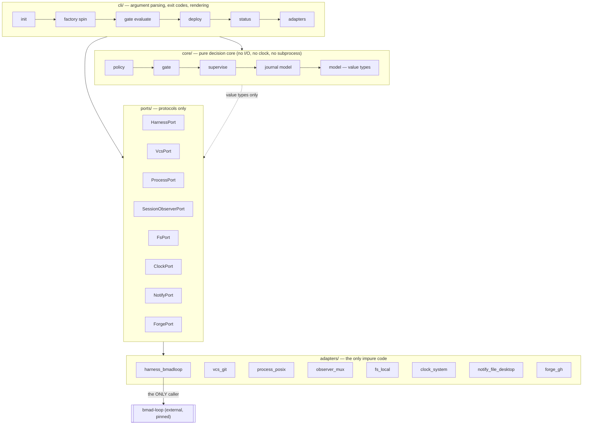
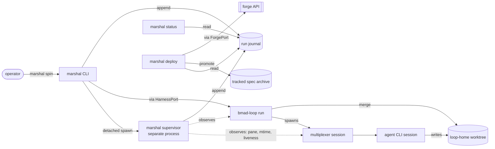
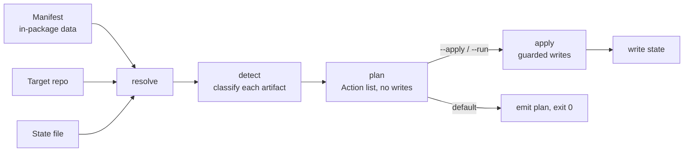
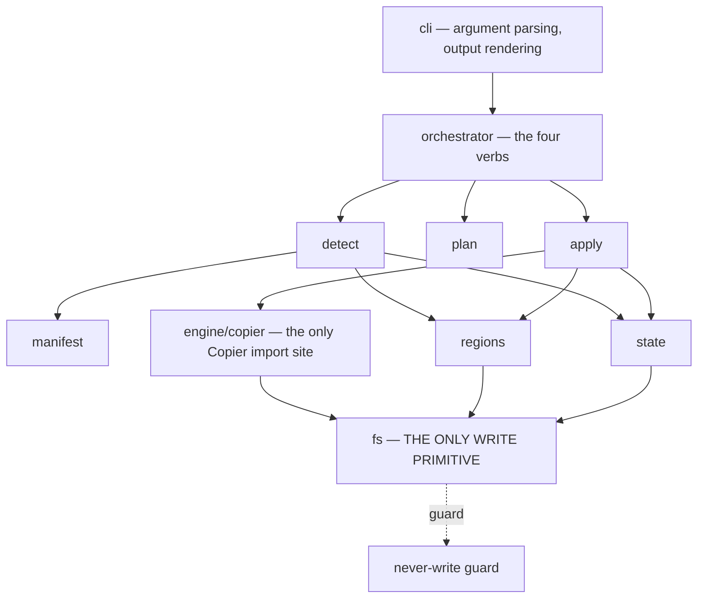

# Architecture Spine — pyforge-marshal

## Design Paradigm

**Hexagonal (ports and adapters) around a pure decision core, with the supervisor as an out-of-process sidecar.**

Everything Marshal *decides* — which policy value wins, whether a gate passed, whether a surface violated a freeze, what a supervisor should do about an idle session, what state the fleet is in — is a pure function over plain data, with no I/O and no clock. Everything Marshal *touches* — the harness, git, the filesystem, processes, terminal multiplexer panes, the forge API, notifications — sits behind a port with exactly one adapter per environment.

This buys the property the product sells: **decisions are reproducible and testable without a running agent**. A gate verdict is a value computed from exit codes and path sets; a supervisor action is a value computed from an observation record and a clock reading that were both passed in.

The supervisor is deliberately *not* a thread inside the run — it is a separate process watching from outside, because the thing that governs a session cannot live inside the session it governs (AD-9).



**Dependency direction is one-way and absolute:** `cli → core`, `cli → ports`, `ports ← adapters`, **`adapters → core`**. `core` imports nothing from `adapters`, `ports`, or `cli`. `adapters` never import each other.

> **`adapters → core` is authorized, deliberately (F-16, amended 2026-07-30).** AD-34 requires pane-derived content to be redacted **at capture**, before it enters `core` — and the single redactor lives in `core/egress.py`. `adapters/observer_mux.py` must therefore import `core`. The earlier declaration enumerated the allowed edges without this one, so an import-linter contract written literally from it would have rejected the import AD-34 mandates, and the only alternative was a second redactor — which falsifies AD-34's one-redactor premise and reintroduces the AD-18 leak at a new site. The edge is safe because it is one-way: `core` still imports nothing, which is the property AD-4 actually protects. The shipped contract (`pyproject.toml`, `[tool.importlinter]`) already forbids only `core → adapters`; this sentence now says what the code does.

---

## Invariants & Rules

### AD-1 — Marshal is harness, never skill `[ADOPTED]`

- **Binds:** all
- **Prevents:** the governor becoming a thing the governed agent can author or influence.
- **Rule:** no module in `pyforge.marshal` makes a model call, loads a skill, or reads agent-authored prose as instruction. Marshal consumes only structured artifacts (specs, feeds, journals, exit codes, path sets). A test asserts no LLM-client dependency is importable from the package.

### AD-2 — Wrap, do not absorb `[ADOPTED — PRD §5]`

- **Binds:** all
- **Prevents:** Marshal becoming the fork-owner of somebody else's dev/verify/review/commit engine, and forfeiting upstream velocity.
- **Rule:** `bmad-loop` is a declared runtime dependency, never vendored, never patched in place. Marshal owns provisioning, supervision, gates-as-objects, landing, status, and portability — not the engine.

### AD-3 — Exactly one harness seam

- **Binds:** FR-52, FR-9, FR-10, FR-17, FR-43, FR-57
- **Prevents:** harness coupling leaking across the codebase, which would turn the §5.4 fork fallback from a bounded swap into a rewrite.
- **Rule:** `adapters/harness_bmadloop.py` is the only module permitted to invoke the harness binary, import its package, read its policy file, or parse its output. Everything else depends on `ports.HarnessPort`. An import-linter contract (import-linter `>=2.13`, conda-forge-available, **not yet provisioned in `pixi.toml`**) fails the build on any other reference to the harness name.

### AD-4 — Pure core, impure edge

- **Binds:** all
- **Prevents:** two builders splitting decision logic — one putting a subprocess call inside a verdict function, another mocking a filesystem to test a comparison.
- **Rule:** `core/**` performs no I/O, spawns no process, reads no clock, and touches no environment variable. Every input arrives as a value; every output is a value. A test asserts `core/**` imports nothing from `os`, `subprocess`, `pathlib` I/O methods, `time`, or `adapters`.

### AD-5 — The journal is the single source of run truth

- **Binds:** FR-18, FR-25, FR-36, FR-37, FR-39, NFR-8
- **Prevents:** two consumers deriving run state from different places and disagreeing — the failure that let a sibling project's sprint ledger drift to 26/32 against an actual 32/32.
- **Rule:** every observable run fact (story transition, gate verdict, escalation, deferral, budget consumption, supervisor action, policy decision) is a journal entry. `status`, `deploy`, and any external consumer derive from the journal; none derives from harness internals, and none maintains a parallel state file. Where a derived surface (sprint feed, console data) disagrees with the journal or with git, the disagreement is **reported**, never silently reconciled.

### AD-6 — Write-before-act

- **Binds:** FR-12, FR-13, FR-15, FR-27, FR-30, FR-32, NFR-8
- **Prevents:** a crash or kill leaving an action that happened with no record, or a record of an action that did not.
- **Rule:** any irreversible or externally-visible action (stopping a session, merging, promoting a spec, opening a PR, removing a worktree) appends an `intent` journal entry **before** the action and an `outcome` entry after. A lone `intent` on replay means "verify manually"; it never auto-retries.

### AD-7 — One owner of the verdict→exit-code projection

- **Binds:** FR-19, FR-26, NFR-3, NFR-12
- **Prevents:** two commands mapping the same verdict to different exit codes, or a caller inventing a code.
- **Rule:** `core/verdict.py` is the sole owner of the verdict lattice and its projection to process exit codes. No other module constructs an exit code. A meta-test asserts every CLI exit path routes through it. Ordering, strongest first: `error > gate-failed > scope-violation > unevaluable > warn > clean`.

### AD-8 — Unevaluable is failure

- **Binds:** FR-19, FR-22, FR-26, NFR-3
- **Prevents:** a missing verify command, an unreadable spec, or a crashed check silently reading as success — the false-green class this product exists to prevent.
- **Rule:** any check that cannot reach a definite pass produces `unevaluable`, which projects to a non-zero exit and blocks progression. There is no code path from "could not determine" to "clean".

### AD-9 — The supervisor observes from outside and never trusts self-report

- **Binds:** FR-11, FR-12, FR-13, NFR-4, NFR-5
- **Prevents:** a stalled, wedged, or misbehaving session being its own witness — and a supervisor that a session can disable, mislead, or starve.
- **Rule:** the supervisor is a separate OS process, parented to neither the agent session nor the invoking shell. Its inputs are externally observable only: multiplexer pane content, file modification times, process liveness, and adapter-reported usage read from files the session wrote. It never asks the session how it is doing. Supervisor liveness is itself journaled; a dead supervisor is a reported condition, not silence.

### AD-10 — Policy is composed once, materialized, and immutable for the run

- **Binds:** FR-49, FR-50, FR-51, FR-53, FR-54, FR-10, FR-48
- **Prevents:** two components resolving different effective values because one re-read a layer mid-run, and the hand-edited-shared-file pattern the current stack depends on.
- **Rule:** composition happens once at `init`/`spin`, producing an immutable `EffectivePolicy` value that is materialized into the loop home and journaled with a content hash. Every consumer reads the materialized artifact. A mid-run change requires a new composition and lands as an explicit journal decision entry carrying the old and new hashes. **No Marshal code edits a shared repo-level file to express project-specific configuration — **except a file declared a derived artifact under AD-12 and rendered from the canonical content-addressed policy** (today: `.bmad-loop/policy.toml`, per AD-35). A rendered artifact is not a hand-edit: its source is governed, it is reproducible from that source, and it is untracked so it cannot bleed across projects (amended 2026-07-25, F-1).**

### AD-11 — The loop home is the unit of isolation, and the write boundary

- **Binds:** FR-1, FR-2, FR-3, FR-4, FR-6, FR-7, C-3, C-4
- **Prevents:** cross-project state bleed, and Marshal mutating shared files that other projects or the operator own.
- **Rule:** Marshal writes only to (a) the loop home, (b) the canonical Tier-3 store reached through the home's backlink, (c) explicitly-named promotion targets under the active project's tracked planning artifacts — **the real path `_bmad-output/projects/<slug>/planning-artifacts/…`, never the gitignored `_bmad-output/planning-artifacts/…` symlink** — and (d) the single declared machine-scoped path for host-and-adapter facts (AD-37).

  **The promotion target is the real path, named (F-26, amended 2026-07-30).** In a loop home there are two paths that both look like "the tracked specs archive": the gitignored **symlink** `_bmad-output/planning-artifacts/specs/` and the real `_bmad-output/projects/<slug>/planning-artifacts/specs/`. Writing through the symlink and then running `git add` on that path fails (`pathspec … is beyond a symbolic link`) or no-ops on the ignore rule — **promotion silently produces nothing, and AD-29's reachability predicate then correctly reports the spec unpromoted forever.** This repository has a documented near-miss on exactly this pair. Marshal resolves the real path itself and never writes a promotion through the symlink. It never writes outside those four, never checks out `main` in a second tree, and never edits another project's artifacts or any shared repo-level file. Active-project marker and planning symlinks are per-home and must always agree; disagreement is a blocking finding.

### AD-12 — Canonical versus derived, declared not inferred

- **Binds:** FR-41, FR-42, FR-30, FR-33, AD-5
- **Prevents:** an edit landing in a generated copy and being destroyed on the next regeneration — or worse, a generated copy being treated as the source.
- **Rule:** every duplicated artifact declares one canonical location; derived copies are regenerable and never edited in place. Canonical: the skill source tree, the tracked story-spec archive, the journal, git history. Derived: projected adapter skill trees, sprint feeds, console data, status output. Regenerating a derived artifact from canonical must be a no-op when nothing changed.

### AD-13 — Promote before teardown

- **Binds:** FR-30, FR-31, FR-6, SM-3
- **Prevents:** the exact failure that destroyed 13 of 31 story specs outright and reduced 8 more to zero-byte husks.
- **Rule:** a story's spec is promoted from run scratch into the tracked archive **before** any code path may remove that story's worktree. Teardown checks promotion state and refuses when a merged story is unpromoted. Promotion validates non-empty, parseable content; a zero-byte or truncated source is reported as a paper-trail gap and never promoted over a good copy.

### AD-14 — One response envelope for every command

- **Binds:** FR-37, FR-40, NFR-12, FR-54, FR-45
- **Prevents:** each command inventing its own JSON shape, forcing consumers to special-case per command.
- **Rule:** every command emits the same envelope — `{schema_version, command, status, verdict, data, data_version, findings[], assumptions[]}` — where `findings[]` entries carry `{code, severity, message, path?}`. (`data_version` added 2026-07-30, **F-21**: AD-39, the Consistency Conventions table and the shipped `core/model.py` envelope all carried it while this rule text did not — two normative envelope definitions in one `final` document.) Human rendering is a pure projection of the envelope; no human-only information exists. `schema_version` bumps only on a breaking change; additive fields do not bump it.

### AD-15 — Findings are coded, never free-text-only

- **Binds:** FR-4, FR-5, FR-22, FR-29, FR-39, FR-42, FR-46, FR-53
- **Prevents:** callers and tests matching on prose that changes, and two modules reporting the same condition under different names.
- **Rule:** every failure or warning carries a stable machine code from one central registry (`core/findings.py`), plus a human message. Codes are never reused or renumbered. A test asserts every emitted code is registered.

### AD-16 — Configuration values carry provenance

- **Binds:** FR-49, FR-53, FR-54, FR-48
- **Prevents:** an operator being unable to answer "why is this value what it is?" across three layers — the debugging cost that makes layered config a liability.
- **Rule:** `EffectivePolicy` stores, per key, the winning layer and the raw value it came from. `marshal config` prints key, effective value, and winning layer. Precedence is fixed: **Marshal defaults → project policy → invocation flags**, last wins; there is no fourth layer and no per-key override of the order.

### AD-17 — Allowlist only

- **Binds:** C-5, FR-19, FR-20, NFR-2
- **Prevents:** relying on a denylist that shell quoting, base64, or a subshell defeats — a failure mode a major vendor deprecated its own denylist over.
- **Rule:** any command surface Marshal governs (verify commands, hygiene rules, promotion targets) is expressed as an explicit allowlist in policy. Marshal never expresses a control as "everything except". Anything not allowlisted is `unevaluable` (AD-8), not permitted.

### AD-18 — Redaction at the boundary, once `[SUPERSEDED BY AD-34]`

> **Superseded 2026-07-30 (F-20).** Do not build from this rule. Its enumeration — "the only three places bytes leave Marshal" — is **false**: notifications carry escalation reasons derived from pane content, and PR bodies and commit messages are named in NFR-11 as places no credential may appear. None of the three is in the list, and this rule forbids call-site redaction, so a builder reading AD-18 in isolation ships the leak. **AD-34 replaces it in full.** The text is retained only so that citations to AD-18 elsewhere resolve.

- **Binds:** NFR-11, FR-43, FR-18, FR-25, FR-28
- **Prevents:** each call site remembering to redact, and one that forgets leaking a token into a permanent record.
- **Rule (SUPERSEDED — see AD-34):** a single redactor is applied inside the journal writer, the record writer, and the envelope serializer — ~~the only three places bytes leave Marshal~~. No call site redacts. Redaction covers configured secret-shaped patterns and policy-declared secret keys, and is tested against a fixture of known token shapes.

### AD-19 — Adapter behaviour comes from the profile, never from code branching

- **Binds:** FR-41, FR-43, FR-44, FR-47, FR-48, FR-7
- **Prevents:** per-adapter `if` statements accumulating across the codebase and diverging from the harness's own profile definitions.
- **Rule:** everything adapter-specific — binary name, skill-tree path, seed files, first-run requirement, bypass semantics — is read from the harness's declarative profile (packaged profile TOML, overlaid by project-local profile TOML) plus Marshal's probe record. Marshal contains **no** `if adapter == "..."` branch. An unknown adapter is handled generically or reported `unevaluable`; it is never a crash. Note that harness 0.9.0 changed `probe-adapter --json` and `diagnose --json` to emit pure JSON documents (breaking versus 0.8.x) and introduced schema-versioned JSON on several read commands; the probe-record parser targets the 0.9.x shape, which is exactly what the `<0.10` bound (AD-3) and the NFR-9 contract tests protect.

### AD-20 — Time, process, and environment are injected

- **Binds:** FR-12, FR-13, FR-14, NFR-14, AD-4
- **Prevents:** supervisor logic that can only be tested by waiting, which in practice means it is not tested.
- **Rule:** the decision core receives clock readings, process states, and observation samples as values through `ClockPort`, `ProcessPort`, `SessionObserverPort`. Idle detection, budget enforcement, and escalation decisions are pure functions over a sample sequence. Every supervisor behaviour has a test that runs in milliseconds against a synthetic sample sequence.

### AD-21 — Mutating commands reconcile, then act

- **Binds:** FR-1, FR-7, FR-34, FR-41, NFR-7
- **Prevents:** re-running a partially-failed command from duplicating work or destroying converged state.
- **Rule:** every mutating command computes desired state, compares it to actual, and applies only the delta, reporting per step `done | skipped | failed`. Running a mutating command twice against a converged system produces zero changes and exit 0.

  **An unclosed `intent` does not break this property (F-17, amended 2026-07-30).** AD-28 says a lone `intent` with no external evidence "stays open and is reported". Combined with AD-31's max-over-findings fold, reporting it as an `error` would make **every** subsequent `deploy` non-zero — breaking this rule's exit-0 clause, FR-34 and NFR-7, permanently and by design. An open intent therefore classifies **`warn`**, not `error`: it is surfaced on every run, it never blocks, and it is explicitly exempt from the convergence property's exit-0 clause. Escalating it is an operator decision (`marshal audit`), never an automatic red. AD-28 resolved *who acts*; this resolves *what the verdict is*.

### AD-22 — Detached is the default execution mode

- **Binds:** FR-9, FR-17, NFR-6
- **Prevents:** the foreground-timeout class of failure that killed a run mid-review in production, recurring because someone forgot a flag.
- **Rule:** run and resume detach the harness process from the invoking shell's session and lifetime, and return a run identifier. Foreground execution exists only behind an explicit flag documented as unsafe for resumes. Nothing in Marshal blocks on a run's completion.

### AD-23 — Story identity is one format, everywhere

- **Binds:** FR-10, FR-16, FR-22, FR-30, FR-32, FR-37
- **Prevents:** the loop, the journal, the spec archive, the merge subject, and the dashboard each keying stories differently — a real hazard given a documented incident where the loop's parser silently ignored letter suffixes and halved the actionable feed.
- **Rule:** the canonical story key is `<epic>.<seq>` **with an optional ordered suffix** — `<epic>` and `<seq>` numeric, the suffix a lowercase alphabetic ordinal (`6.1a`, `6.1b`). One function normalizes any external form to it and one function renders each external form from it (filename slug, branch segment, merge subject, feed key). No module string-formats a story key inline. Non-conforming input is a registered finding, never a silent coercion.

  **Normalization PRESERVES the suffix (F-12, amended 2026-07-30).** The earlier rule said "purely numeric on both parts", which contradicted AD-38 head-on and could not round-trip a key **the pinned harness itself accepts** (`bmad-loop run --story` documents "E-S / E.S (split suffix ok, e.g. 2-6a)"). AD-38 said suffixes are "normalized on read" without saying normalized *to what*: dropping the suffix collides `6.1a` and `6.1b` into one key across the journal, the spec archive, the merge subject and the feed — **silently merging two stories, which is strictly worse than the incident AD-23 exists to prevent.** Normalization canonicalizes separator and case only; the suffix is carried through every form.

### AD-24 — The merge-subject form is configuration with one owner

- **Binds:** FR-27, FR-32, FR-33
- **Prevents:** an exact string that a downstream dashboard's status detection depends on being duplicated across the code that writes it and the code that verifies it.
- **Rule:** the merge-subject template lives in policy; one module renders it and the same module parses it. Deploy verifies conformance using the parser, not a second regex.

### AD-25 — Marshal owns run identity

- **Binds:** FR-9, FR-18, FR-19, FR-36, FR-43, AD-5, AD-6
- **Prevents:** two loop homes sharing the canonical Tier-3 store colliding on a harness-minted run id and appending to one journal — braiding two projects' stories into a single run that AD-5 then makes authoritative. Also prevents the `intent`-before-run-id ordering gap in AD-6.
- **Rule:** Marshal mints the run id at `intent` time, before any spawn — globally unique, of the form `<slug>-<utc-compact>-<random>`, **sortable chronologically within a slug** (not across the fleet — see below). The harness's identifier is recorded as a foreign correlation field `harness_run_id` on the run's first `outcome` entry and is **never** used as a key, a path segment, or a grouping field. Run directories are created with `mkdir`, which is exclusive by definition; a collision is a hard finding, never an append. Non-run invocations (standalone `gate evaluate`, `adapters probe`) mint into a separate `sessions/` namespace and are excluded from fleet-state folds by construction, not by filtering — **except that a session-namespace record binds to a `run_id` when one is supplied (see below).**

  **Sortability is per-slug, not fleet-wide (F-30, amended 2026-07-30).** The earlier rule claimed the id was "lexicographically sortable" without qualification. It sorts by slug first, so a fleet-wide chronological sort by run id does not work — and `status` (FR-36) is a fleet view. Consumers needing fleet chronology sort on the record's `ts`, never on the id. The slug-first shape is kept deliberately: it makes a run directory listing group by project, which is the common operator case.

  **`mkdir`, not `O_EXCL` (F-31, amended 2026-07-30).** `O_EXCL` is an `open(2)` flag; directories are created with `mkdir(2)`, which already fails `EEXIST`. The earlier wording was a literal instruction to a builder and epics S-3.1 copied it verbatim.

  **Session-namespace gate records bind to a run when one exists (F-25, amended 2026-07-30).** FR-25 requires every gate evaluation to produce a record "referenced from the journal and retrievable per story", and FR-27's review-cap landing path re-runs the full gate before a manual merge — where that verdict is the **sole** evidence for C-1/FR-26. Excluding the whole `sessions/` namespace from the fold by construction made **SM-1 ("zero false greens", target 100%) unprovable from the run journal for exactly the stories landed by hand**, which is the population where it matters most. Resolution: a session-namespace record carries an optional `run_id`. When present, the run's fold **includes** that record as gate evidence; when absent, the record stays excluded, as AD-25 intends for genuinely run-less invocations. Exclusion is still by construction — on the presence of the binding field, not on a filter over content.

### AD-26 — Accumulating run state has exactly one producer: the journal fold

- **Binds:** FR-22, FR-16, FR-24, FR-51, AD-5, AD-10
- **Prevents:** the frozen-surface set having two legal homes. Policy is immutable for the run (AD-10), so a policy-sourced frozen set cannot contain a freeze declared *during* the run — and a gate reading it would pass a change to a file frozen mid-run. That is a false green on the product's core invariant, produced by code obeying every other AD.
- **Rule:** any value that changes during a run — frozen surfaces, attempt counts, deferrals, acknowledged escalations, effective gate mode — is produced **solely** by `core/journal`'s fold over registered entry kinds. Policy may seed an initial value; it is never the live value. Every `EffectivePolicy` field is tagged `static` or `seed`; reading a `seed` field outside `core/journal.fold` is a meta-test failure, **except through `EffectivePolicy.seed_view()`** — an explicit accessor for display and validation only (`marshal config`/FR-54 must print every effective key; FR-53 must validate every key, both in preflight, outside any fold). The meta-test whitelists that accessor and nothing else, so "read for display" never becomes "read as the live value."

  **Standalone evaluation folds the session journal (F-3, resolved 2026-07-25).** AD-25 puts non-run invocations in the `sessions/` namespace; the earlier rule made the live frozen set *solely* a product of the run journal fold. A standalone `marshal gate evaluate --scope-check` therefore had **no** journal to fold, and AD-17 + AD-8 turned "no frozen set" into permanently `unevaluable` — non-zero forever. That killed **UJ-2** (the operator checking scope *before* approving, with no run in flight) and broke FR-19's "exit 0 = pass" contract.

  Resolution: a standalone evaluation folds **the policy seed alone**, and says so in its output. It is a complete, legitimate answer to a bounded question — *"is this change within the surface the project declared?"* — and it exits 0 when the answer is yes. It carries an explicit `scope: policy-seed-only` marker and a `mid-run freezes not visible` note, so its answer is never mistaken for a run-scoped verdict. When a run **is** in flight and its id is supplied, the same command folds that run's journal and answers the run-scoped question instead.

  This is the one place a `seed` field is legitimately the live value — because with no run, there is no accumulation to have missed. *(Consequence for the PRD: FR-50's "frozen surfaces come from the project layer" means the **initial** set.)*

### AD-27 — An allowlist may only be narrowed by the party it constrains

- **Binds:** FR-22, FR-24, FR-50, AD-1, AD-17
- **Prevents:** the governed agent authoring the allowlist it is judged against. Per-story specs are machine-drafted; under gate mode `per-epic` or `none` no human reads the declared surface, so an agent could widen `surface:` — or remove a freeze — and pass its own scope check while satisfying AD-1 and AD-17 verbatim.
- **Rule:** a story-spec-declared surface is admissible only as a **subset** of the policy-declared surface for its epic; `core/gate` computes the effective surface as `policy_surface ∩ spec_surface` and a meta-test asserts no other combinator is used. Any declared path outside the policy surface is a hard finding, never an expansion. Freeze declarations, freeze removals, and gate-mode changes are **never** sourced from an agent-writable artifact — they enter through policy, or through an operator-attributed journal entry, under the trust model declared below.

  **Marshal's trust model is tamper-evident, not tamper-proof (F-4, resolved 2026-07-25).** This is a *declaration*, not a mitigation, and it is stated here because the earlier rule implied a guarantee Marshal cannot deliver.

  The governed agent session runs **inside** Marshal's trust boundary: C-10 states plainly that a worktree is not a sandbox, process isolation is Deferred, and Marshal defines no authentication primitive. The session therefore holds the operator's own shell, can invoke the `marshal` CLI, and can append to the run journal directly. An "operator-attributed" entry is consequently **attributable, not authenticated** — an agent that wanted to forge one could. Claiming otherwise would satisfy AD-27 to the letter while leaving the hole it exists to close fully open.

  What Marshal *does* guarantee, and what the design must therefore deliver:

  1. **Append-only, never rewritten** (AD-30). A forged entry can be added; existing entries cannot be altered or removed without detection.
  2. **Every widening is a recorded event.** Freeze removals and gate-mode changes emit `observation` entries naming the actor, the prior value, and the new one. A widening that left no entry is itself a hard finding at fold time.
  3. **Attribution is evidence, not authorization.** `approver` is a claim recorded for audit. No code path grants privilege because the field is present.
  4. **Detection is after the fact.** `marshal audit` surfaces every widening in a run for operator review. Marshal detects tampering; it does not prevent it.

  **Precondition for anything stronger:** process isolation (currently Deferred). Only once the governed session runs outside the operator's credential scope can an approval channel be authenticated rather than merely attributed. Until then, any FR that assumes *prevention* is mis-specified, and this rule is the ceiling.

  **Mid-run freezes in unattended modes (F-5, resolved 2026-07-25).** AD-26 requires freezes declared *during* a run to accumulate through the journal; AD-27 restricts who may declare them. In gate mode `none` (the L4 rung, UJ-1's overnight wave) and `per-epic` (§7.3's production ceiling) **no operator is present**, so the earlier pairing described a mechanism with no writer in either production mode.

  Resolution: a **story may declare a freeze, because a freeze is a NARROWING.** AD-27's principle is that an allowlist may only be narrowed by the party it constrains — and freezing a file removes it from the writable surface, constraining the agent further. The asymmetry is the rule:

  | Operation | Effect on the agent's surface | Who may declare |
  |---|---|---|
  | **Freeze declaration** | narrows | the story spec, in any gate mode — recorded as an `observation` |
  | **Freeze removal** | widens | policy, or an operator-attributed entry (per the trust model above) |
  | **Gate-mode change** | widens | policy, or an operator-attributed entry |

  This makes UJ-2's opening ("Story 6.1 amended a schema and froze three files") reachable again in every gate mode, without reopening the hole AD-27 closes: the agent can only ever tighten its own constraints.

### AD-28 — Every journal entry is addressable; reconciliation closes, never re-performs

- **Binds:** FR-18, FR-34, AD-5, AD-6, AD-21
- **Prevents:** two components pairing `intent`/`outcome` by heuristic (most-recent-unmatched versus ordinal) and disagreeing about which intents are orphaned — with the supervisor and the CLI both appending, they will. Also resolves the head-on AD-6 × AD-21 collision: AD-21 says re-run and converge to 0; AD-6 says a lone intent never auto-retries.
- **Rule:** every entry carries a **composite id `(writer_id, counter)`** — `writer_id` is unique per appending process (supervisor, CLI invocation), `counter` is monotonic **within that writer**. Every `phase: outcome` carries a mandatory `intent_id` referencing a composite id. Pairing is by `intent_id` **only**; no positional or heuristic pairing exists.

  **Why composite (F-6, resolved 2026-07-25).** The earlier rule required an id "unique, monotonic **per run**". AD-30 mandates a lock-free protocol — one `os.write()` on `O_APPEND`, no coordination primitive — with **two concurrent writers by design**. Two independent processes cannot mint a unique monotonic per-run integer without shared state, a lock, or a read-modify-write; AD-30 forecloses all three. The invariant was unachievable, and a concurrency test asserting "zero malformed lines" would have passed while it was violated — testing atomicity, not uniqueness.

  **Total order is therefore `(ts, writer_id, counter)`**, not `(seq, ts)`: `ts` first (millisecond precision, AD-30), `writer_id` as a deterministic tie-break, `counter` last. This is a total order without cross-writer coordination. It is **not** a causal order, and no consumer may infer causality from adjacency.

  **A supervisor closing a CLI-minted intent** must locate that `intent_id` by folding the journal, then append. That read-then-append is **not** atomic. It is safe because closure is idempotent: a duplicate `reconciliation` outcome for an already-closed intent is a no-op, and the fold takes the earliest. No lock is required, and none is permitted.

  **`phase` is three-valued: `intent | outcome | observation`.** The earlier two-valued set forced gate verdicts, story transitions, budget samples, supervisor liveness, AD-10's policy-decision entry and AD-26's freeze declarations into `outcome`, which then required a mandatory `intent_id` that does not exist for any of them. `observation` records something true without claiming an action was attempted, and carries **no** `intent_id`. A lone `intent` is closed exclusively by a `reconciliation` outcome carrying observed external evidence (commit sha, worktree absence, PR number) and the reconciling command; absent evidence it stays open and is reported. **Precedence: AD-21 may observe and close an open intent; it may never re-perform the action without evidence the action did not occur.**

### AD-29 — Promotion is complete only when durable off the disposable ref

- **Binds:** FR-6, FR-30, FR-31, SM-3, AD-12, AD-13
- **Prevents:** the motivating incident recurring with AD-13 fully satisfied. A spec copied into the tracked path and merely staged — or committed only on `loop/<slug>` — dies with the branch at teardown, and C-4 forbids the second checkout that would rescue it.
- **Rule:** a story spec is `promoted` only when its bytes exist at the canonical archive path in a commit **reachable from a ref that survives the loop home**. That ref may be **local** — durability is a reachability property, not a network one. Three routes satisfy it: pushed to the remote; merged to the integration branch; or reachable from the **declared durable local ref**, a per-repository ref that teardown is forbidden to delete. Marshal commits promotions itself, in a dedicated commit containing **only** promotion paths — it never commits a pre-existing index. Teardown's refusal predicate is reachability computed at teardown time, never a journal flag. A forced teardown over an unreachable promotion requires the operator to name the story keys being abandoned.

  **Durability must not require the network (F-14, amended 2026-07-30).** The earlier predicate named only "pushed to the remote, or merged to the integration branch", and C-4 forbids the second `main` checkout that would make the local merge possible — so in practice the only route was a **network push**, which NFR-2's offline exception list ("PR creation, the agent's own model calls") does not enumerate. Three consequences followed: NFR-2's list was factually incomplete; an offline operator could not complete **SM-3**; and worst, because the teardown predicate is reachability computed *at teardown time*, computing it against a remote needs a fetch — so **an offline operator's every teardown refuses and must be forced with story keys named as abandoned.** That is precisely how a destructive-refusal gate gets trained away. Admitting a declared durable local ref keeps NFR-2 intact, keeps SM-3 reachable offline, and keeps the refusal meaningful: it now fires only on work that is genuinely unreachable, not on work that is merely unpushed.

### AD-30 — One serialized append protocol

- **Binds:** FR-18, NFR-8, AD-5, AD-6
- **Prevents:** a long-lived buffered supervisor writer interleaving a partial line with a short-lived CLI append, producing malformed JSONL in the artifact AD-5 declares the only source of truth — where AD-8 then turns one corrupt byte into a permanently red fleet view. Also prevents a buffered `intent` lost to a kill, which inverts AD-6 into "action happened, no record."
- **Rule:** every append is a single `os.write()` of one complete newline-terminated line to a descriptor opened `O_APPEND|O_CREAT`, followed by `fsync` for `phase: intent`. No buffered stream is held open across appends. A line exceeding 4 KiB stores its payload in a sidecar blob under the run directory and carries a reference. Total order is **`(ts, writer_id, counter)`** per AD-28 — **not** a global monotonic integer, which two uncoordinated writers cannot mint (see AD-28). *(Corrected 2026-07-30: this rule said `(seq, writer_id, counter)` while AD-28 said `(ts, writer_id, counter)` and the Consistency Conventions table said `(seq, ts)` — three normative orderings for one artifact. `seq` was the pre-F-6 global integer and no longer exists; every reference to it is removed.)* The fold is resilient but **never silently green**: an unparseable line is quarantined and surfaced as a registered finding, and the records it could have carried become **scoped `unevaluable`**.

  **Scoped unevaluability (F-2, resolved 2026-07-25).** The earlier rule said a corrupt line "never makes the surrounding run state unevaluable." That legislated a false green into the one artifact the product exists to protect: if the lost line was the `outcome` recording a gate failure, an escalation, or a freeze declaration, the fold omitted it and the run read clean — against NFR-3 and AD-8, and self-contradicting AD-31's max-over-findings fold. Correct expression: a quarantined line makes **its own story key and decision domain** `unevaluable`; records provably unaffected by it stay evaluable. When the quarantined line's `story` or `kind` cannot be recovered, the scope widens to the whole run — unknown blast radius is not a reason to narrow it. One corrupt byte still does not red the fleet; it reds exactly what it might have changed.

  A reference to a **missing sidecar blob** is the same class and takes the same treatment: `unevaluable` for that record, never "quarantine and continue."

  Marshal's journal is **tamper-evident, not tamper-proof** — see AD-27.

### AD-31 — The lattice is closed and its admission criteria have one owner

- **Binds:** FR-19, FR-26, FR-43, FR-44, FR-45, SM-6, AD-7, AD-8
- **Prevents:** the same machine state — an absent adapter binary — reading as `warn`/exit 0 in one command and `unevaluable`/non-zero in another, which makes a "portability proven" matrix row true and false at once and makes SM-6 gameable.
- **Rule:** `core/verdict.py` owns not only the projection but a total classification `classify(finding_code) -> lattice_member`; no module assigns a verdict directly. A command's verdict is the maximum over its emitted findings plus a command-declared floor. The lattice gains no members. **The context lives in the code, never in a second argument.** "Adapter not installed on this host" is **two distinct registered codes**, not one code classified two ways: `MRS-ADP-nnn-probe` classifies `warn` and is emitted only by read-only reporting surfaces declared in the registry (`adapters probe`, `adapters matrix`); `MRS-ADP-nnn-required` classifies `unevaluable` and is emitted everywhere a run depends on the adapter. *(Amended 2026-07-30, **F-10**: the earlier text declared `classify(finding_code)` total over the code alone and then, one sentence later, required the same code to classify differently per command surface — which is `classify(finding_code, command_context)`. A builder implementing the declared signature could not satisfy the declared behaviour, and the shipped `core/verdict.py:classify(code: str)` implements exactly the declared signature. Splitting the code keeps `classify` total and keeps the emitting site — which is what actually knows the context — responsible for saying which condition it observed.)* The conformance matrix distinguishes `not-attempted` (no claim made) from `unavailable` (attempted, host lacks it) from `fail`; **SM-6 counts only `pass`.**

### AD-32 — Session-authored data is evidence, never a control input

- **Binds:** FR-12, FR-13, C-6, NFR-4, AD-8, AD-9
- **Prevents:** AD-9's usage-file carve-out silently defeating the token ceiling. A wedged session stops writing its usage file, so consumption appears frozen, the ceiling never approaches, and the "approaching a ceiling" warning never fires — the ceiling is defeated by the exact failure the supervisor exists to catch.
- **Rule:** session-written usage files are recorded for reporting and cost attribution only. **Every enforcement ceiling's *stop condition* must be reachable from externally-observed quantities alone** (wall clock, process liveness, output modification time). A usage sample older than the idle threshold is classified **`stale-evidence`** — a registered, non-blocking finding — and the wall-clock ceiling becomes the binding constraint. No ceiling exists that can only be evaluated from session-written data.

  **"At least one" was letter-satisfiable (F-23, amended 2026-07-30).** The earlier wording required every ceiling to be "expressed over **at least one** externally-observed quantity". A builder pairs the existing session-authored token ceiling with a wall-clock ceiling, satisfies "at least one" — and **the token ceiling remains exactly as defeatable as before**, because a wedged session that stops writing its usage file still never approaches it. The intent was never *accompaniment*; it is that no binding constraint may rest solely on session-authored data. The stop condition itself must be externally reachable.

  **A stale sample is not `unevaluable` (F-24, amended 2026-07-30).** AD-8 makes `unevaluable` **blocking** ("projects to a non-zero exit and blocks progression") and AD-31 folds it into the command verdict as the maximum — so labelling the intended *graceful degradation* `unevaluable` made it a run halt, and it fired on the ordinary idle case that FR-12's ladder is simultaneously handling with a nudge. Two mechanisms firing on one condition with opposite intentions. `stale-evidence` is its own non-blocking classification: it is reported, it shifts the binding constraint to wall clock, and it does not red the run.

### AD-33 — Truth is partitioned by domain

- **Binds:** FR-33, FR-39, AD-5, AD-12
- **Prevents:** `deploy` writing a sprint feed from the journal that `status` immediately flags as drifted against git — with both AD-5 and AD-12 forbidding silent reconciliation, the system would converge on permanent, unactionable red, and AD-12's own no-op property would be unprovable.
- **Rule:** **git is the sole authority for repository facts** (merged / not merged, tree revision, branch existence, commit subject). **The journal is the sole authority for process facts** (transitions, verdicts as evaluated, escalations, consumption, supervisor actions). No derived artifact sources a repository fact from the journal or a process fact from git. Every derived artifact declares, per field, its canonical domain, and regeneration reads only from that domain. A journal claim about a repository fact is stored as `claimed_*` and is only ever an input to a reconciliation finding, never to a rendered value.

### AD-34 — Redaction is a port-boundary property

- **Binds:** NFR-11, FR-15, FR-28, FR-43, AD-4, AD-18
- **Prevents:** AD-18's three-point enumeration being falsified by the topology it sits next to. Notifications carry escalation reasons derived from pane content; PR bodies and commit messages are named in NFR-11 as places no credential may appear. Neither is one of AD-18's three points, and AD-18 forbids call-site redaction — so a literal-compliance builder ships the leak.
- **Rule:** every port whose implementation emits bytes to a **durable or third-party sink** — notification, forge, VCS commit and PR text, and any persisted-record write — is a declared **egress port**. **Process spawn is explicitly carved out**: `HarnessPort` and `ProcessPort` pass argv and an environment to a child process and are **not** egress ports. *(Amended 2026-07-30, **F-15**: the earlier criterion was "emits bytes outside the process", which captures both — they spawn a child with argv and an environment. But an agent session **requires** its credentials in that environment. Classify them egress and they accept only `Redacted` payloads, so every run fails to authenticate; classify them out and the stated criterion is false, the registry's build-failing completeness check is meaningless, and NFR-11 acquires an undocumented exemption. The carve-out is justified: a child process is inside Marshal's trust boundary (AD-27) and its argv/environment are not durable — what the child then **writes** is governed by that child's own egress. Credentials still never reach a durable or third-party sink.)* All egress routes through one serializer that applies the single redactor; egress ports accept only pre-serialized redacted payloads (a `Redacted` wrapper type), and a meta-test asserts no egress adapter accepts a bare string. The egress-port set lives in one code registry; adding a port without classifying it fails the build. **Pane-derived content is redacted at capture**, before it enters `core`, because `core` cannot redact (AD-4). AD-18 is subsumed by this rule.

### AD-35 — Materialized policy is content-addressed and write-once per run

- **Binds:** FR-1, FR-49, FR-53, FR-54, AD-10, AD-21
- **Prevents:** an idempotent `init` re-run with different flags rewriting the materialized policy while a live supervisor still holds the value it loaded at spawn — so `marshal config` prints one threshold and the supervisor enforces another, silently.
- **Rule:** the materialized policy artifact is named by its content hash and never overwritten. A run pins its policy hash at spawn and every consumer resolves through that hash. Recomposition against a home with a live run either refuses or writes a new artifact, and the supervisor reports `policy-superseded` rather than switching. A per-home **`current` pointer file** names the live hash; it is the only mutable part, it is rewritten atomically, and `marshal config` resolves through it. Without it, two artifacts on disk and no live run leave FR-54 and AD-21's convergence check with no defined answer.

  **`.bmad-loop/policy.toml` is a DERIVED artifact (F-1, resolved 2026-07-25).** The harness pins the path: `bmad-loop 0.9.0` hard-codes `POLICY_FILE = .bmad-loop/policy.toml` and exposes no policy-path flag on `run`. A content-addressed, never-overwritten artifact therefore cannot be what the harness consumes, and three rules collided head-on: AD-35 forbade the fixed name, AD-10's closing sentence forbade Marshal editing a shared repo-level file, and FR-51's tier-batching *required* rewriting `[adapter.dev].model` between batches. No story owned the conveyance.

  Resolution, in four parts:

  1. **`.bmad-loop/policy.toml` is declared a derived artifact under AD-12**, rendered by `adapters/harness_bmadloop.py` from the canonical content-addressed `EffectivePolicy`. The canonical artifact stays content-addressed and write-once; the rendered file is a projection of it, exactly as AD-12 governs every other derived artifact.
  2. **AD-10's closing sentence is amended** (see AD-10) to except a declared derived artifact rendered from the canonical policy. Marshal still never hand-edits a shared file to express project configuration — it *renders* one, from a source that is itself governed.
  3. **The rendered file must never ride a loop commit to `main`.** It is `.gitignore`d, and a meta-test asserts it is untracked. This closes a **live cross-project bleed**: loop homes publish with `git push origin HEAD:main`, the file is currently git-tracked, and a hand-edited copy in one loop home lands on every other project — the precise failure AD-11 exists to prevent, observed dirty in `loop-pyforge-herald` at review time.
  4. **Repo-wide defaults move to the canonical source.** Any setting intended for every project (e.g. the standing independent-review policy) is expressed in the tracked canonical policy that Marshal composes from, never by editing the rendered file.

### AD-36 — Projection mechanism is declared, and its detector must be non-trivial

- **Binds:** FR-7, FR-41, FR-42, AD-12, AD-19
- **Prevents:** a symlink projection making drift detection structurally always-clean — a permanent false green — while a copy-based seeding path in a different epic makes drift real, with AD-19 silent on platform branching.
- **Rule:** the projection mechanism per (adapter, platform) is declared in **one** table with one owner; no module branches on platform outside it. The drift detector's check is mechanism-specific and required to be non-trivial: **a link projection asserts link-target identity** — a falsifiable check that can genuinely fail — and emits no content-drift finding at all. Reporting `clean` for a check that cannot fail is a meta-test failure.

  **`not-applicable` is removed (F-11, amended 2026-07-30).** The earlier rule required a link projection to report `not-applicable` for content drift, and AD-31 states "**the lattice gains no members**" — so `classify()` had to map it to an existing member, and **both plausible mappings broke something**: mapping to `clean` is the structural false green this very rule forbids one sentence later; mapping to `unevaluable` makes FR-42's preflight drift check **block every symlink-projected run permanently** (AD-8: "blocks progression") — on the default mechanism, on the default platform. The correct answer is the one this rule already half-stated: **link-target identity is itself falsifiable**, so a link projection has a real, non-trivial check to run and needs no non-participating result kind. The lattice stays closed. Epics S-6.2 must drop `not-applicable` with it.

### AD-37 — Machine-scoped artifacts have a fourth, enumerated write target; ephemeral homes are exempt from promotion

- **Binds:** FR-44, FR-45, AD-11, AD-13, C-3
- **Prevents:** two contradictions at once — a conformance matrix that is a *machine and adapter* fact having no legal home under AD-11's three targets (producing N divergent per-project matrices, each claiming portability, against FR-45's "the only place Marshal makes a portability claim"); and AD-13 requiring promotion from a throwaway conformance home that FR-44 requires to leave no residue.
- **Rule:** AD-11's write boundary gains exactly one further target: a **single declared machine-scoped path** for **probe records** — raw, per-host, per-adapter observations. It is enumerated, not open-ended. **The conformance matrix is NOT there: it is a tracked artifact, keyed by host**, at `planning-artifacts/conformance/matrix/<hostname>.md`. Separately, a loop home provisioned `ephemeral: true` — a flag only `adapters conform` may set — is exempt from **AD-29's** promotion-reachability predicate and produces no promotable artifact by construction.

  **The matrix is tracked, per host (F-7, amended 2026-07-30 — operator decision).** Routing the matrix to a machine-scoped path outside git contradicted three things at once: **FR-45** ("accumulate into a dated, **tracked** artifact"), **NFR-8** (self-owned durable evidence), and **a sentence in this document's own Operational envelope** that was never updated ("The tracked spec archive and the conformance matrix live in tracked planning artifacts"). Epics S-6.4/S-6.6 had propagated the machine-scoped form. The consequences of that reading were severe for an artifact **SM-6 measures the product on**: not in any clone, not reviewable in a PR, readable only by the operator of one machine — while FR-45 designates it "the only place Marshal makes a portability claim". The premise was also overstated: AD-11 target (c) accommodates it unchanged once the file is keyed by hostname. N machines still produce N files, but the divergence is now **visible in git** rather than invisible outside it. Raw probe records stay machine-scoped — they are transient host facts, not a claim.

  **The ephemeral exemption cites AD-29, not AD-13 (F-29, amended 2026-07-30).** AD-29 **superseded** AD-13's predicate ("Teardown's refusal predicate is reachability computed at teardown time, never a journal flag"), so exempting a home from *AD-13's* predicate exempted it from a rule that no longer governs. Vacuous today — an ephemeral home has no promotions, so reachability passes trivially — but a live trip-wire the moment the smoke story produces any tracked artifact. Epics S-6.5 carries the same stale citation and must be corrected with it.

### AD-38 — A resolved feed reports its own completeness

- **Binds:** FR-10, FR-16, AD-8, AD-23
- **Prevents:** AD-23's numeric-only key reproducing the incident it cites. This ecosystem's own history contains suffixed story keys; making non-conforming input "a registered finding" silently drops those stories from the resolved feed — halving the actionable feed exactly as the parser bug did, now by design.
- **Rule:** the canonical key admits an optional ordered suffix, **preserved** through normalization (AD-23). **And**, independently of that: every feed resolution reports `resolved N of M` and produces a non-zero verdict when `N < M`, naming each unresolved key. **`M` is the count of non-empty story records in the raw source, counted BEFORE key parsing** — never the count of keys the parser produced.

  **Why `M` must be pre-parse (F-13, amended 2026-07-30).** The earlier rule left `M` undefined, which made the whole guarantee vacuous: if `M` is whatever the parser yielded, then a parser that silently drops suffixed keys reports a triumphant "**resolved 18 of 18**" — **exactly reproducing the documented incident that halved the actionable feed, now with a completeness guarantee stamped on it.** Counting the raw records first is what makes "a silently shortened feed is impossible" a true statement rather than an aspiration: the drop shows up as `N < M` precisely because `M` was measured before the code that drops things ran.

### AD-39 — The envelope's fields have defined relationships and independent versions

- **Binds:** FR-37, FR-40, FR-45, NFR-12, AD-14, AD-31
- **Prevents:** `status: ok` coexisting with a `severity: error` finding, and one command's payload change breaking every other consumer's version check.
- **Rule:** `status` is a pure function of `verdict` (per AD-31's fold over findings); it is never set independently. `schema_version` governs the **envelope keys only**; the command-specific `data` payload carries its own `data_version` from a registry, bumped independently. A meta-test asserts that `status ≡ f(verdict)` and that **no finding's severity exceeds what the envelope's verdict permits** — an `error`-severity finding cannot appear in an `ok` envelope.

  **Severity is presentational WITHIN a bound (F-22, amended 2026-07-30).** The earlier meta-test asserted `status`, `verdict` and "the **maximum finding severity**" were "mutually consistent", while the Consistency Conventions table said "**severity is presentational**; the lattice member comes from `classify(code)`". Read as equality the two collide: a code classified `unevaluable` is free to carry severity `warn` for readability, and the meta-test then fails on correct output. Read as *monotone* consistency they agree, and that is what the shipped test already checks (`tests/meta/test_ad39_envelope_consistency.py::test_ok_status_with_error_severity_finding_raises`): severity may vary freely below the ceiling the verdict sets, and may never exceed it. The conventions row is amended to say so.

### Accepted exception to epic independence (recorded 2026-08-01, readiness gate)

Story 2.3 (frozen-surface scope check) depends on Story 3.2 (the journal
fold), making Epic 2 unable to complete independently of Epic 3 in the
strict sense. This is a **deliberate, adjudicated exception** (finding F-9,
2026-07-30), not an oversight: splitting S-3.2's journal fold to give Epic 2
its own copy of run-state derivation was considered and rejected, because it
would give the fold two homes. The epic boundary here is a value boundary —
what ships and why — not a scheduling barrier on story order. Epic 1 already
demonstrated this interleaved-delivery shape works operationally (10/10
shipped stories, not all strictly independent of later epics' groundwork).

### 2026-08-01 amendment set — AD-40…AD-45

*Six additive decisions carrying the 2026-07-31 operator rulings (Spec CAP-9 + four constraints; PRD FR-59/FR-60) into the architecture. Numbering continues; nothing above is renumbered or weakened.*

### AD-40 — Landing is a policy-governed surface in the supervisor's domain

- **Binds:** FR-59, FR-60, CAP-9; extends AD-7 (exit domain), AD-8 (refusal shape), FR-8's teardown semantics
- **Prevents:** the last mile remaining the one stage with no supervisor, no journal, and no verdict — and landing rules living as memorized habits (the five-PRs-hand-driven session; #170 merging a real detector break).
- **Rule:** landing rules (required checks, merge strategy, labels, branch retirement, resync, repo-specific triggers) are **policy keys** composed with per-key provenance like every governed value. `marshal land` executes them idempotently and re-entrantly — a half-landed story converges on re-run — and refuses exactly as teardown does: named findings in the common envelope, no merge on a red required check, no silent force. Every landing appends a journal verdict (checks required/passed, what merged, under whose authority). The engine keeps dev/verify/review/commit; landing wraps *around* it.

### AD-41 — Marshal sequences on verdicts it never authors

- **Binds:** the 2026-07-31 doctrine ruling; extends AD-33 (truth partitioned by domain); scopes the "not the orchestrator" non-goal
- **Prevents:** Marshal becoming the judge of another station's domain — and the opposite failure, a factory whose inter-station order is enforced by nobody.
- **Rule:** inter-station gating is implemented as **reads of durable, schema-validated verdict artifacts, pinned to the tree revision they judged** — never as invocation of the judging station, never as re-derivation of its verdict. A verdict older than the revision under evaluation is *unevaluable*, not *pass* (AD-31 lattice). The composed route-verb surface (`marshal check` / `run` / `land` as one front door) is `spec-one-front-door`'s contract; this AD provides only the read discipline it will build on.

### AD-42 — Shared writes serialize at the integration boundary; derived surfaces regenerate, never merge

- **Binds:** the Q-10 resolution; extends AD-11 (loop home as write boundary), AD-37; C-3/C-4
- **Prevents:** the "Tier-2 mutex engine" misdesign — and the real hazard it obscured: semantic lost-update through textually-clean merges of regenerated artifacts.
- **Rule:** three distinct mechanisms, none a global lock. (1) Tracked planning artifacts are per-worktree copies; publication serializes through git's push/batch-PR boundary. (2) **Regenerated surfaces (sprint feed, console) are re-derived on `main` after landing** — a deploy-ordering rule: append-only inputs merge, derived outputs regenerate; `marshal deploy`/`land` never merges a regenerated file from a home. (3) Appends to the genuinely shared canonical Tier-3 store take an **advisory file lock** through the `FsPort`. The journal's two-writer protocol remains Open Question F-6's remedy and is not solved here.

### AD-43 — The tool surface is policy-declared and home-rendered

- **Binds:** the Q-11 resolution; extends AD-37 (enumerated write targets), the Story-1.7 adapter-seed pattern, FR-5's preflight findings
- **Prevents:** a loop home reproducible in every respect except which tools the agent can call — and any Marshal write into user-scoped configuration.
- **Rule:** the project's MCP tool surface is declared in the **project policy layer**; `marshal init` renders it into the loop home (project-scoped `.mcp.json`, seed-not-overwrite semantics identical to adapter seeds); preflight probes resolvability and names blocking findings. The user-scoped registry (`~/.claude.json`) is never read as authority and never written. Scheduling: the portability surface (Epic 6 adjacency), post-MVP.

### AD-44 — Site configuration materializes at install time into the defaults layer

- **Binds:** the Q-13 residue; preserves AD-35 and the three-layer composition of FR-49/CAP-7
- **Prevents:** a fourth runtime policy layer — the one thing the composition constraint forbids — arriving disguised as an "enterprise requirement".
- **Rule:** air-gapped/site-wide configuration enters by **install-time materialization into the Marshal-defaults layer** (the installer's job — Epics 10–12), leaving runtime composition exactly three layers with unchanged provenance semantics. Internal tooling mounts through existing seams: MCP servers via AD-43's tool surface, proprietary agent CLIs via declarative adapter profiles (FR-41/52). No plugin-registry subsystem exists. IDE surfaces remain excluded (§8 non-goal, reaffirmed).

### AD-45 — Escalation knowledge flows by pull

- **Binds:** the Q-12 resolution; extends AD-5/AD-6 (journal-first), FR-15/FR-17; respects C-3
- **Prevents:** Marshal writing into another station's artifacts to "share knowledge" — the exact cross-boundary write C-3 exists to stop.
- **Rule:** a resume against a resolved escalation records a **reference to the resolving decision/artifact** in the run journal (an FR-17 consequence). Ingestion into team memory is the knowledge station's read of journals from its own side of the boundary; no push path exists. The journal entry must therefore be ingestion-sufficient: story key, reason, resolution reference, resolver attribution as the trust model defines it (F-4 caveat carried, not resolved).

### 2026-08-01 amendment set — AD-46…AD-48 (durable-runs)

*Three additive decisions carrying `docs/dreams/durable-runs.md` / `spec-durable-runs` into the architecture (PRD FR-61/FR-62/FR-63). Numbering continues; nothing above is renumbered or weakened.*

### AD-46 — Durability is stage-bound, not interval-bound

- **Binds:** FR-61; extends AD-22 (detached default), the supervisor's domain (AD-25, AD-40)
- **Prevents:** worst-case data loss scaling with an arbitrary timer interval instead of the run's own structure — and a durability watcher nobody remembers to start.
- **Rule:** the supervisor pushes affected station and per-story branches at three fixed stage boundaries — after the dev commit, after the review verdict, after the merge — rather than on a wall-clock interval. An interval-push watcher remains only as the floor for whatever the stage hooks miss, and is wired into fleet launch by default rather than a separate manual invocation. Push is read-only against working trees and remotes: never a force-push, never a rewrite.

### AD-47 — Branch retirement is proof-gated, not schedule-gated

- **Binds:** FR-63; extends AD-27 (allowlist narrows only), FR-8's teardown refusal semantics
- **Prevents:** a retirement sweep silently deleting a branch on a heuristic diff — three-dot mismeasures squash-merges, two-dot mismeasures branches the base has since moved past, both tried and both wrong in the Dream's own authoring session.
- **Rule:** a branch retires only when three independently-provable facts hold: content reachable in the integration branch **by patch-id**, its run concluded, its story `done` with a recorded merge sha. `loop/*` and `rescue/*` are **structural** exclusions, never policy-configurable — `rescue/*` tags are the only reachability for commits `git gc` would otherwise collect. Dry-run by default; a proposed retirement with unproven evidence is refused, never defaulted to delete. Shares its evidence machinery with FR-61's opposite question (what must be saved) but is a distinct sweep from FR-59's per-landing retirement (AD-40) — the two must never disagree on a branch's fate.

### AD-48 — Durability is a first-class fleet-status dimension

- **Binds:** FR-62; extends AD-38 (a resolved feed reports its own completeness), AD-39 (envelope field relationships)
- **Prevents:** "is the fleet's work saved?" ever again requiring a command outside `marshal status`.
- **Rule:** the fleet-status envelope carries an unpushed-work finding per row, **read from** the same evidence the unpushed-work detector already computes, never re-implemented against git directly. A row with unpushed content is never reported clean — the same refusal `marshal status` already applies to an unowned Dream row.

### 2026-08-01 amendment — AD-49 (fidelity-enforcement, Marshal-only slice)

*One additive decision. `spec-fidelity-enforcement` (`docs/dreams/fidelity-enforcement.md`) was decomposed Marshal-only per operator scoping: Doctor's and Scribe's capabilities (install-the-judge; the actor-attributed event record) are named cross-project follow-ups, not touched here. Of Marshal's own 7 attributed capabilities, 6 are repo-level detector tooling or already covered by FR-30 (see the PRD memlog for the full per-capability rationale) — only one is a new architecture decision.*

### AD-49 — A gate's verdict is invalid against an untraceable spec

- **Binds:** FR-64; extends AD-26 (never false-green), AD-31 (the lattice is closed and its admission criteria have one owner)
- **Prevents:** a story's tracked spec silently losing its evidentiary force — a verify command narrowed or removed after the spec was tracked, with the gate still reporting green because it never re-checks *what* it is running against *why*.
- **Rule:** gate evaluation resolves the story's tracked `specs/spec-<key>.md` and confirms the verify commands executed are the ones named by its Success signal. A mismatch is a registered finding, not a warning folded into an otherwise-green verdict — it participates in the same closed lattice as every other admission criterion (AD-31), so an untraceable or mismatched binding cannot itself be waived to green.

### 2026-08-01 amendment — AD-50 (one-front-door, FR-65 slice)

*One additive decision. `spec-one-front-door` decomposed with 2 of its 5 capabilities convergent with existing FRs (CAP-1 ~ FR-9..11, CAP-4 = FR-59/60 — no architecture change), CAP-5 folded as a consequence of FR-65 rather than a separate decision, and CAP-2's residual folded into FR-65. Only CAP-3 (the detector registry as a verb) plus the "context resolved once" discipline it must demonstrate first required a new AD. Verb naming (Q-15) and the route-versus-contain boundary per skill (Q-16) remain open — this AD does not resolve either.*

### AD-50 — Context resolves once per invocation, at the front door

- **Binds:** FR-65; extends AD-16 (defaults → project → flags precedence), AD-35 (materialized policy), the single-harness-seam constraint
- **Prevents:** each routed verb (`check` first, `run`/`status`/`land` by the same discipline) independently re-deriving active project, loop home, composed policy, or in-scope story — the class of bug where two routed calls in one invocation silently disagree about which project they are acting on.
- **Rule:** the CLI entry point resolves project/loop-home/policy/story context exactly once per invocation, before dispatching to any verb; a routed call receives that resolution, it never re-derives it. `marshal check`'s dispatch into `scripts/detectors.py`'s registry is the first concrete site this is tested against — a route through the existing seam (wrap-never-absorb applies to detector tooling as it does to the engine), never a reimplementation of the registry inside the `marshal` package.

---

## Consistency Conventions

| Concern | Convention |
| --- | --- |
| **Package / module naming** | dist `pyforge-marshal`; import root `pyforge.marshal`; console script `marshal`. Modules are lowercase, singular nouns for domains (`policy`, `gate`, `journal`), `<domain>_<impl>` for adapters (`harness_bmadloop`, `vcs_git`). |
| **Command naming** | verb-first, matching the crew charter: `init`, `factory spin`, `gate evaluate`, `deploy`, `status`, `adapters <sub>`, `config`. Subcommands are verbs (`adapters sync|probe|conform|matrix|check`). |
| **Value types** | frozen dataclasses in `core/model.py`. No dicts cross a module boundary inside `core`. Ports exchange these types, never raw JSON. |
| **Identifiers** | story key `<epic>.<seq>` with an optional ordered suffix, normalized on read (AD-23, AD-38). **Run id is minted by Marshal** (AD-25); the harness's id is a foreign correlation field, never a key. Loop-home slug is the BMAD project slug. Adapter name is the profile's `name`. |
| **Dates & times** | UTC, ISO-8601 with explicit `Z`. **Millisecond precision in journal records** (AD-28/AD-30 order by `(ts, writer_id, counter)`); second precision elsewhere. Durations in whole seconds. Local time appears only in human rendering. |
| **Findings** | `{code, severity ∈ error\|warn\|info, message, path?}`; codes are `MRS-<AREA>-<NNN>` from the central registry (AD-15). Severity is presentational **within the bound the verdict sets** — free to vary below it, never above it (AD-39, F-22); the lattice member comes from `classify(code)` (AD-31). |
| **Envelope** | `{schema_version, command, status, verdict, data, data_version, findings[], assumptions[]}` for every command (AD-14, AD-39). |
| **Journal entries** | one JSON object per line, append-only, `{id, ts, run_id, story?, kind, phase ∈ intent\|outcome\|observation, intent_id?, payload}` where `id` is the composite `(writer_id, counter)` — `intent_id` mandatory on every `outcome`, absent on every `observation` (AD-28). *(Corrected 2026-07-30: this row still carried the pre-F-6 `seq` field and the two-valued `phase` that F-6's resolution replaced — a builder reading the conventions table would have shipped exactly the shape AD-28 exists to fix.)* Written per AD-30's physical protocol. Never rewritten, never truncated, never reordered. |
| **Errors** | one exception hierarchy rooted at `MarshalError`; every raise carries a registered finding code. Adapters translate foreign failures (subprocess, git, HTTP) into `MarshalError` at the port boundary — foreign exception types never escape an adapter. |
| **Logging vs journal** | the journal is the record and is structured; human logging is diagnostic only and never the source of a decision or a downstream fact. |
| **Config** | project policy is TOML, read with the stdlib parser and written with a comment-preserving writer; invocation flags are the last layer (AD-16). Env vars configure *nothing* except `BMAD_ACTIVE_PROJECT` passthrough. |
| **Paths** | absolute internally, repo-relative in persisted records so a record stays valid across checkouts; forward slashes in all serialized forms. |
| **Tests** | `tests/unit` (pure core), `tests/contract` (port contracts + harness observable surface, NFR-9), `tests/meta` (architecture invariants: AD-3 seam, AD-4 purity, AD-7 exit-code ownership, AD-15 code registry), `tests/integration` (real worktrees, marked slow). `contract` deliberately departs from the sibling's `conformance` naming — it holds port and upstream-surface contracts, not product conformance fixtures. |
| **Exit codes** | owned solely by `core/verdict.py` (AD-7); `0` clean, non-zero per lattice, `130` on interrupt. |

---

## Stack

Seed — verified against this repository's own environment and package metadata on 2026-07-25; the code owns this once it exists.

| Name | Version | Note |
| --- | --- | --- |
| Python | `>=3.12` | matches the sibling `pyforge-warden` floor. Note the other sibling `pyforge-atlas` requires `>=3.14`, and the `local-recipes` / `pyforge-*` pixi envs run `python 3.14.*` |
| hatchling | `>=1.30` | build backend, matching the harness's own build-system floor. The sibling packages declare `hatchling` unversioned; the repo's pixi envs use `>=1.31.0` (current release) |
| bmad-loop | `>=0.9.0,<0.10` | **run dependency, never vendored** (AD-2, AD-3). Verified: MIT, `noarch: python`, entry point `bmad-loop`, packaged in this repo at `recipes/bmad-loop/`. 0.9.0 is the current upstream release (2026-07-21); cadence is fast (0.7.6 → 0.9.0 in three weeks), so the one-minor window is expected to need bumping — that is the point of FR-57 and NFR-9 |
| PyYAML | `>=6.0` | sprint feeds and BMAD artifacts. The **only** unconditional upstream harness dependency |
| tomlkit | `>=0.13,<0.13.3` | comment-preserving policy writes. Upstream carries it in the optional `[tui]` extra, not core; it is present in-environment only because this repo's recipe flattens extras for `noarch`. The `local-recipes` env caps it at `<0.13.3` — do not assume ≥0.13.3 features |
| psutil | `>=7.2.2` | supervisor process liveness. **Not** an upstream harness core dep on linux/osx (upstream marks it `sys_platform == 'win32'` plus a `non-linux` extra); unconditional here only via the same recipe flattening. Treat as new resolution surface on the stated install targets |
| jsonschema | `>=4.25` | envelope and journal schema validation. Genuinely new resolution surface: not a harness dep, absent from the root `pixi.toml`. The sibling `pyforge-warden` declares it unversioned, so there is no sibling floor to match; floor chosen against the current release |
| tmux | `>=3.7b` | required by the harness's default multiplexer backend; not a direct Marshal dependency. Matches this repo's own pin. The harness declares no floor — it only reports the detected version |
| git | `>=2.35` | worktree operations `[ASSUMPTION: floor not independently verified; linked worktrees have existed since git 2.5, so any modern git suffices]` |
| import-linter | `>=2.13` | enforces the AD-3 seam and AD-4 purity contracts in CI. Available on conda-forge; **not yet in `pixi.toml`** — provisioning it is part of Epic 1 |

**Dependency policy.** Marshal's own direct dependencies stay within this set. Of the five Python entries, only **PyYAML** is an unconditional upstream harness dependency; `tomlkit` and `psutil` are upstream *optional extras* that resolve in-environment only because this repo's `recipes/bmad-loop/recipe.yaml` flattens them into unconditional `noarch` run deps — a local packaging decision that recipe itself marks provisional. `jsonschema` is entirely new surface. Marshal therefore adds a small but real resolution surface, and **must declare PyYAML, tomlkit, psutil and jsonschema as its own direct dependencies rather than inheriting them**. New dependencies require conda-forge availability and a stated reason — a deliberate posture given a documented 2026 supply-chain compromise of a popular gateway package. Only the harness carries an upper bound (AD-3 declares the supported range; FR-57 enforces it at runtime).

---

## Structural Seed

### Source tree

```text
src/shared/packages/pyforge-marshal/
  pyproject.toml
  pixi.toml      # member manifest — pixi-build-python conda build + task defs (sibling convention)
  README.md
  src/pyforge/marshal/
    __init__.py
    cli/            # argparse tree, envelope rendering, exit-code emission only
    core/           # PURE — no I/O, no clock, no subprocess
      model.py      #   frozen value types shared by everything
      findings.py   #   the finding-code registry (AD-15)
      verdict.py    #   the lattice + exit-code projection, sole owner (AD-7)
      policy.py     #   layered composition -> EffectivePolicy (AD-10, AD-16)
      gate.py       #   verify aggregation, scope check, doc-only classification
      supervise.py  #   idle/budget/escalation decisions over sample sequences (AD-20)
      journal.py    #   entry model + fold: entries -> run state (AD-5)
      identity.py   #   story-key normalize/render, merge-subject render/parse (AD-23, AD-24)
      status.py     #   fleet-state derivation + ledger-vs-git reconciliation (AD-33)
      conformance.py#   adapter matrix model (AD-31 states, AD-37 location)
      egress.py     #   the single redacting serializer every egress port routes through (AD-34)
    ports/          # Protocol definitions only, no implementations
                    # each port declares egress: true|false; egress ports take Redacted payloads
    adapters/       # the only impure code; one adapter per port
      harness_bmadloop.py   # THE ONLY harness caller (AD-3)
      vcs_git.py
      process_posix.py
      observer_mux.py
      fs_local.py
      clock_system.py
      notify_file_desktop.py
      forge_gh.py
    supervisor/     # the sidecar entry point (own process, AD-9)
    schemas/        # versioned JSON schemas for envelope, journal, matrix
  tests/{unit,contract,meta,integration}   # `contract` is a deliberate departure from the
                                           # sibling's `conformance` — it holds PORT contracts
                                           # + the harness observable-surface tests (NFR-9),
                                           # not product conformance fixtures

```

### Runtime topology



The supervisor's **inputs** are observation-only — it never asks the session how it is doing (AD-9). Its writes are the journal **plus one declared, enumerated set of control actions**: nudge (`send-keys`), stop-and-retry (kill and respawn), and defer. *(Corrected 2026-07-30, **F-28**: this read "no channel into the agent session … its sole write is the journal", which FR-12 falsifies — the FR requires the supervisor to nudge, then stop-and-retry, then defer, and epics S-3.5 carries it verbatim. A nudge **is** a write into the session. The property that matters, and that AD-9 actually protects, is that no supervisor **decision** is informed by session self-report; the control set is closed and enumerated, not absent.)*

### Operational envelope

- **Deployment.** A conda package and a wheel; no service, no daemon beyond the per-run supervisor, no control plane, no network listener. Installation targets linux-64 and osx-arm64 (NFR-13); Windows is WSL-first — the harness's 0.9.0 native ConPTY backend is experimental and is not a supported Marshal target at seed.
- **Environments.** One machine, N loop homes. There is no staging or production distinction — the loop home *is* the environment, and its isolation (AD-11) is the boundary.
- **State on disk.** Journals and gate records live under the loop home's run directory, backed by the canonical Tier-3 store through the home's backlink, so they survive worktree teardown (NFR-8). The tracked spec archive and the conformance matrix live in tracked planning artifacts.
- **Failure domain.** A supervisor crash degrades to an unsupervised run (journaled, reported by `status`), never to a corrupted one. A Marshal crash mid-command leaves a lone `intent` entry (AD-6), which is a reported condition requiring human verification, never an automatic retry.
- **Network.** Outbound only, and only for forge operations; everything else is local (NFR-2). Marshal opens no port.
- **Concurrency.** N supervisors and N harness runs coexist; they share nothing except the canonical Tier-3 store, and each writes only its own run directory within it. Live evidence: **nine** loop homes provisioned concurrently (verified 2026-07-30; the figure read "seven" when authored and was **four** at review time — F-32).

---

## Capability → Architecture Map

| Capability / FR group | Lives in | Governed by |
| --- | --- | --- |
| Loop homes & isolation (FR-1..FR-8) | `cli/init`, `adapters/vcs_git`, `adapters/fs_local` | AD-11, AD-21, AD-15 |
| Run supervision (FR-9..FR-18) | `supervisor/`, `core/supervise`, `core/journal`, `adapters/{process_posix,observer_mux,notify_*}` | AD-9, AD-20, AD-5, AD-6, AD-22 |
| Gates & verification (FR-19..FR-27) | `core/gate`, `core/verdict`, `cli/gate` | AD-4, AD-7, AD-8, AD-17 |
| Landing & paper trail (FR-28..FR-35) | `cli/deploy`, `core/identity`, `adapters/{vcs_git,forge_gh}` | AD-13, AD-24, AD-6, AD-12 |
| PR lifecycle — landing rules as policy (FR-59, FR-60 · CAP-9, added 2026-08-01) | `cli/land`, `core/landing`, `core/policy`, `adapters/forge_gh` | AD-40, AD-42, AD-8, AD-6 |
| Tool-surface rendering (Q-11 resolution, post-MVP) | `cli/init` seed step, `core/policy` | AD-43, AD-37 |
| Inter-station verdict reads (doctrine, pre-`one-front-door`) | `core/verdict` readers (future) | AD-41, AD-31, AD-33 |
| Fleet visibility (FR-36..FR-40) | `core/status`, `core/journal`, `cli/status` | AD-5, AD-14, AD-12 |
| Adapter portability (FR-41..FR-48) | `core/conformance`, `cli/adapters`, `adapters/harness_bmadloop` | AD-19, AD-12, AD-3 |
| Policy composition (FR-49..FR-54) | `core/policy`, `cli/config` | AD-10, AD-16, AD-3 |
| Packaging & distribution (FR-55..FR-58) | `pyproject.toml` + member `pixi.toml` (pixi-build-python wrapping the hatchling wheel — the sibling path; neither sibling ships through `recipes/`) | AD-2, AD-3 |
| Never-false-green (NFR-3) | `core/verdict`, `core/gate` | AD-7, AD-8, AD-26, AD-27, AD-31 |
| Supervisor independence (NFR-4, NFR-5) | `supervisor/`, `core/supervise` | AD-9, AD-20, AD-32 |
| Secret hygiene (NFR-11) | `core/egress` + every declared egress port | AD-34 (subsumes AD-18) |
| Harness contract tests (NFR-9) | `tests/contract` | AD-3 |
| Run identity & journal integrity (FR-18, NFR-8) | `core/journal`, journal writer | AD-25, AD-28, AD-30 |
| Truth partitioning (FR-33, FR-39) | `core/status`, `cli/deploy` | AD-33, AD-12 |

---

## Deferred

- **ACP as the adapter contract.** The harness owns driving; adapting Marshal to speak ACP directly would cross AD-2 and AD-3. Deferred behind PRD Q-6's trigger. AD-3's single seam is precisely what keeps this a bounded change when the trigger fires.
- **Process and network sandboxing.** A worktree isolates the filesystem and branch, not the process or network. Ownership sits with the provisioning station, not here. Marshal's `ProcessPort` is shaped so a sandboxing adapter can be substituted without touching `core`.
- **PR lifecycle beyond open/update** (CI watching, auto-merge). `ForgePort` is deliberately minimal so this can grow without reshaping `deploy`.
- **Fleet-level resource budgeting** across concurrent runs. Per-run ceilings are decided (AD-20); a cross-run arbiter would need shared mutable state, which nothing in this spine currently has, and would be the first thing to break AD-11's write boundary. It gets its own decision when it arrives.
- **OpenTelemetry `gen_ai.*` emission.** Deferred on evidence (conventions moved repositories in June 2026 and remain Development-stability with live attribute renames). The journal carries equivalent information in a self-owned format; an exporter is an adapter, not a core change.
- **Windows-native operation.** *Not* blocked upstream: harness 0.9.0 — the pinned version — already ships an experimental native-Windows ConPTY multiplexer backend, auto-selected when its prerequisites are present and selectable via a policy key. Deferred here on **maturity, not availability**. Nothing in this spine assumes POSIX outside `adapters/process_posix` and `adapters/observer_mux`, which is where a Windows adapter would land.
- **Persistence backend for journals.** Line-delimited JSON files under the run directory is the seed decision. If fleet queries outgrow it, the read side is already isolated behind `core/journal`'s fold.
- **Multi-machine / multi-operator operation.** Out of scope entirely; the spine assumes one machine and one operator, and AD-11's write boundary encodes that assumption.
- **Story difficulty declaration source** (PRD Q-8) — whether difficulty lives in story-spec frontmatter or the epics document. `core/policy` reads it through one accessor so the source can be settled during Epic 1 without reshaping tiering.
- **Conformance smoke story content** (PRD Q-9) — the artifact, not the mechanism. `core/conformance` fixes the result shape; the story's content is settled when it is authored.


---

## Satellite: Genesis Installer Architecture

**Consolidated 2026-08-02 — see
`archive/_bmad-output/projects/pyforge-marshal/planning-artifacts/architecture/architecture-genesis-installer-2026-07-25/architecture.md`
for the original standalone document.** The section below is the genesis-installer
architecture, folded into this single Marshal-station architecture verbatim, per explicit
user override of the "kept separate on purpose" decision recorded in
`docs/dreams/pyforge-marshal.md` / `docs/dreams/genesis-installer.md`. Nothing in Marshal's
own architecture above this line was changed.

**Renumbering — read this before citing an AD below.** genesis-installer's architecture
defined its own **`AD-01`..`AD-15`**. Those labels are renumbered **`AD-51`..`AD-65`**
throughout this section (continuing this document's own sequence past its highest existing
label, `AD-50`) — every in-text reference below (including the Coverage Matrix and Risks
table) has been updated to match, so the section is internally consistent with its new
numbers. genesis-installer's other local namespaces — `A-01`..`A-05` (architectural style),
`L-01`..`L-10` (locked decisions carried from its brief/PRD), and `P-01`..`P-12` (pattern
decisions) — do not collide with any prefix this document uses and are left exactly as
authored. `OQ-1`..`OQ-9` (the PRD open questions each `AD-5x` resolves, per the satellite
PRD section above) are similarly untouched — they are a distinct namespace from this
document's own `Q-1`..`Q-16`.

| genesis-installer original | renumbered here |
|---|---|
| `AD-01` | `AD-51` |
| `AD-02` | `AD-52` |
| `AD-03` | `AD-53` |
| `AD-04` | `AD-54` |
| `AD-05` | `AD-55` |
| `AD-06` | `AD-56` |
| `AD-07` | `AD-57` |
| `AD-08` | `AD-58` |
| `AD-09` | `AD-59` |
| `AD-10` | `AD-60` |
| `AD-11` | `AD-61` |
| `AD-12` | `AD-62` |
| `AD-13` | `AD-63` |
| `AD-14` | `AD-64` |
| `AD-15` | `AD-65` |

**Original frontmatter** (`architecture/architecture-genesis-installer-2026-07-25/architecture.md`):

```yaml
title: "Architecture Decision Document — pyforge-genesis (Genesis)"
status: "final"
created: "2026-07-25"
updated: "2026-07-25"
project_slug: "pyforge-genesis"
altitude: "product / initiative"
inputs:
  - "planning-artifacts/prd.md (FR1–FR62, NFR-R/A/P/C/S/M/O, OQ-1..OQ-9)"
  - "planning-artifacts/product-brief-pyforge-genesis.md"
  - "planning-artifacts/research/domain-research-scaffolder-landscape.md"
  - "planning-artifacts/research/technical-research-installer-implementation.md"
  - "{project-root}/src/shared/packages/pyforge-warden/{pyproject,pixi}.toml (packaging exemplar)"
  - "{project-root}/scripts/bmad_drift_check.py (detector reuse assessment)"
  - "{project-root}/pixi.toml (workspace root)"
```

**Architecture Decision Document — pyforge-genesis (Genesis)**

### 1. Context

#### Product in one paragraph

Genesis installs this repo's operating model into other repositories and keeps it
current. Four verbs — `init` (greenfield), `adopt` (brownfield), `check` (conformance,
CI-shaped), `update` (take a later model version). The model is declared as **data** (a
manifest), materialized by **Copier** (wrapped through its public API only), and kept
correct by two engines Copier does not have: a **managed-region** engine that replaces
marker-delimited spans inside repo-owned files, and a **conformance** engine that
classifies and reports drift. Distribution: `pyforge-genesis` / `pyforge.genesis` /
`genesis`, as a pixi workspace member producing a conda package plus wheel/sdist.

#### Locked technical decisions (carried from brief + PRD — do not re-discover)

| # | Decision | Source |
|---|---|---|
| L-01 | Wrap **Copier `>=9.17,<10`** as a conda run-dependency; public `run_copy`/`run_update`/`run_recopy` only | brief § Technical Approach; FR55, NFR-C2 |
| L-02 | Model templates ship **in-package**; `--template` overrides | FR53, FR54, NFR-A1 |
| L-03 | Five artifact classes: `referenced`, `copied-managed`, `copied-seeded`, `generated-derived`, `hybrid-managed-region` | PRD § Extraction Manifest; FR2 |
| L-04 | **Two version numbers** — CLI semver and model semver — both in state | FR5, FR37, FR60 |
| L-05 | Managed regions are replaced by **pure span substitution**, never three-way merge | FR44, NFR-R3 |
| L-06 | `adopt` and `update` are **dry-run by default**, two-phase (plan → apply) | FR14, FR29 |
| L-07 | **Never-write path set** enforced at the lowest write primitive | FR6, FR35, NFR-R4 |
| L-08 | pixi workspace member cloning `pyforge-warden`'s shape; lean env, `no-default-feature = true` | brief § Technical Approach; NFR-C4 |
| L-09 | Python `>=3.12` | NFR-C1 |
| L-10 | Genesis **installs** the multi-project machinery; **Marshal operates it**. Marshal owns the source of `bmad-switch` / `bmad-loop-worktree`; Genesis owns delivery and never forks them | PRD § Boundaries |

#### Environment state (what already exists in this repo)

- Root `pixi.toml`: `preview = ["pixi-build"]`, `requires-pixi = ">=0.72.2"`, no
  `[workspace] members` key (members are path dependencies — settled, do not relitigate).
- Two existing pyforge workspace members (`pyforge-warden`, `pyforge-atlas`) with lean
  `no-default-feature` environments; both use `packages = ["src/pyforge"]`.
- `copier` v9.17.0 is on conda-forge (`noarch: python`, MIT) — consumed, not authored.
- `typer >=0.27.0`, `rich >=14.3.4`, `jinja2 >=3.1.6`, `jsonschema`, `pyyaml` all already
  pinned in the workspace.
- `scripts/bmad_drift_check.py` (662 lines) exists but is ~85% `local-recipes`-specific
  probes (`skill_version`, `mcp_tool_count`, `phase_count`, `recipe_split`, `gotcha_max`).
  Only `Finding`/severity, `check_coverage`, `check_tier_alignment`, `check_archive_hygiene`
  generalize. See AD-54.

---

### 2. Architectural Style & Top-Level Decisions

#### A-01 — Pipeline architecture: `resolve → detect → plan → apply`

Every mutating verb is the same four-stage pipeline over a different input. This is the
single most important structural invariant: it forces dry-run, idempotence, and the
plan artifact to be properties of the *architecture* rather than features bolted onto
each verb.



| Verb | resolve | detect | plan | apply |
|---|---|---|---|---|
| `init` | manifest + slug + agents | trivial (empty target) | full create list | yes |
| `adopt` | manifest + repo + state | full classification | create/insert/skip list | on `--apply` |
| `check` | manifest + repo + state | full classification | findings list | **never** |
| `update` | manifest + repo + state + migrations | classification + version delta | migration + rewrite list | on `--run` |

`check` is `adopt`'s detect+plan stages with writes structurally unreachable — not a
separate implementation. That is why FR23 (check never writes) is cheap to guarantee.

#### A-02 — Manifest as data, engine as mechanism

The model is a declarative manifest; the engine knows only the five classes. Adding a
model artifact must never require editing engine code (NFR-M1). The engine has no
knowledge of `AGENTS.md`, `bmad-switch`, or tiers — only of classes, paths, regions, and
anchors.

#### A-03 — Layered, with a hard write boundary at the bottom



**Every byte written to the target repo passes through `pyforge.genesis.fs`.** The
never-write guard lives there, not at call sites, so no future code path can bypass it
(NFR-R4). This is the invariant that makes SC-08 provable rather than aspirational.

#### A-04 — Copier is a dependency, not a framework

Exactly one module (`engine/copier.py`) imports `copier`. Everything above it speaks a
Genesis-internal `MaterializeRequest` type. Consequences: Copier can be swapped or
version-bumped behind one seam; the public-API-only rule (FR55) is enforceable by a
single import-site test; and Copier's absence in a degraded environment fails in one
place with one message.

#### A-05 — Two clocks: CLI version and model version

`genesis_version` moves with releases; `model_version` moves with the operating model.
Migrations are keyed to `model_version` only. A repo can be current on the model and
behind on the CLI, or vice versa, and both states are legible (FR27, FR60).

---

### 3. Pattern Decisions (conflict-prevention rules)

These bind independently-built stories. Violations are bugs, and each has a test.

| # | Rule | Prevents |
|---|---|---|
| **P-01** | All target-repo writes go through `fs.write()` / `fs.replace_span()` / `fs.remove()`. No module calls `open(..., "w")`, `Path.write_text`, `shutil`, or `os.remove` on a target path. | never-write-guard bypass |
| **P-02** | Only `engine/copier.py` imports `copier`. | engine lock-in; API-surface creep |
| **P-03** | Detect is **pure**: given (manifest, repo tree, state) it returns a classification with no I/O side effects and no writes. | untestable detect; accidental writes in `check` |
| **P-04** | `Plan` is a serializable dataclass. Apply consumes only a `Plan` — never re-derives state. | plan/apply divergence; unreviewable applies |
| **P-05** | Every `Action` in a `Plan` names its artifact id, class, current state, target state, and rationale. | opaque plans |
| **P-06** | Managed-region substitution never parses markdown semantically — it is byte-span replacement between markers. | merge corruption (NFR-R3) |
| **P-07** | Hash guards are checked in **detect**, never in apply. Apply trusts the plan. | TOCTOU; double-checking drift |
| **P-08** | State is written **last**, after all file writes succeed, in one atomic replace. | state/repo desync (the `bmad-switch` marker lesson, applied) |
| **P-09** | No network I/O anywhere in the package except behind an explicit `--template <url>`. | air-gap violation (NFR-A1) |
| **P-10** | Every finding type is a member of one enum with a documented remedy string. | ad-hoc error strings; undocumented failures |
| **P-11** | Manifest entries are addressed by stable **artifact id**, never by path (paths are per-repo). | manifest churn breaking state |
| **P-12** | Migrations are pure functions `(repo, state) -> Plan`; they never write directly. | unreviewable migrations; bypassing the guard |

---

### 4. Project Structure

#### Directory layout

```
src/shared/packages/pyforge-genesis/
├── pixi.toml                       # [package] — member; NO [workspace] table
├── pyproject.toml                  # hatchling; packages = ["src/pyforge"]
├── README.md
├── src/pyforge/genesis/
│   ├── __init__.py
│   ├── cli.py                      # typer app; the only presentation layer
│   ├── errors.py                   # exit-code taxonomy (FR61)
│   ├── fs.py                       # THE write primitive + never-write guard
│   ├── model/
│   │   ├── manifest.py             # load + validate the manifest
│   │   ├── artifact.py             # Artifact, ArtifactClass
│   │   └── version.py              # model semver, ranges
│   ├── state/
│   │   ├── schema.json             # JSON Schema for .genesis/state.yml
│   │   └── store.py                # read/validate/write (atomic)
│   ├── regions/
│   │   ├── markers.py              # per-format marker registry (FR45)
│   │   ├── parse.py                # find spans; reject nesting (FR48)
│   │   └── apply.py                # span substitution (FR44)
│   ├── detect/
│   │   ├── inventory.py            # walk repo, classify artifacts (FR15)
│   │   ├── hashes.py               # managed content hashing (FR41)
│   │   └── findings.py             # Finding + severity + remedy (FR25, P-10)
│   ├── plan/
│   │   ├── types.py                # Plan, Action (serializable) (FR17, P-04)
│   │   └── build.py                # detect result -> Plan
│   ├── apply/
│   │   └── run.py                  # Plan -> guarded writes
│   ├── engine/
│   │   └── copier.py               # THE ONLY copier import (P-02)
│   ├── derive/
│   │   ├── adapters.py             # agent-adapter fan-out (FR49–FR52)
│   │   └── projects_index.py       # PROJECTS.md rows (FR: generated-derived)
│   ├── migrate/
│   │   ├── registry.py             # ordered, applied-once (FR31)
│   │   └── m_*.py                  # one module per model-version step
│   ├── verbs/
│   │   ├── init.py  adopt.py  check.py  update.py  explain.py  version.py
│   └── templates/                  # in-package model templates (L-02)
│       ├── manifest.yaml           # THE MODEL, as data (AD-55)
│       └── files/…
└── tests/
    ├── unit/                       # regions, manifest, state, findings
    ├── integration/                # init/adopt/check/update on temp repos
    ├── oracle/                     # test_local_recipes_empty_plan.py (SC-02)
    └── meta/                       # P-01/P-02 import-site guards, version-range sync
```

#### Module dependency rules

- `cli` → `verbs` → (`detect`, `plan`, `apply`, `migrate`) → (`model`, `state`, `regions`,
  `engine`, `derive`) → `fs`.
- No upward imports. `fs` imports nothing from the package except `errors`.
- `detect` may not import `apply` or `engine`.
- `templates/` is data, never imported as code.

---

### 5. Key Architectural Decisions

Each resolves a PRD open question or fixes a non-obvious invariant.

#### AD-51 — CLI: **typer + rich** (resolves OQ-1)

**Binds:** every CLI surface. **Prevents:** two verbs rendering plans differently; hand-rolled
table/diff formatting.
**Rule:** `cli.py` uses typer for parsing and rich for rendering; **no other module imports
rich or typer**, so `--json` output and library use stay presentation-free. Both are already
pinned in the workspace, and Copier already brings prompt-toolkit/questionary/pygments, so the
marginal dependency cost is near zero. Warden's argparse minimalism is not adopted: Genesis's
value is a *reviewable plan*, and plan rendering is the product's main human surface.

#### AD-52 — State: **one Genesis-owned file at `.genesis/state.yml`** (resolves OQ-2)

**Binds:** all state access. **Prevents:** state/answers divergence; hand-edited state.
**Rule:** Genesis owns `.genesis/state.yml` (git-tracked, FR42, schema-validated, FR39).
Copier's answers file is configured by the in-package template to live at
`.genesis/.copier-answers.yml` and is **treated as opaque and tool-owned** — Genesis reads it
never and writes it only via Copier (FR40). Answers are re-supplied programmatically from
Genesis state on every Copier call (`data=`), so Genesis state is the single source of truth
and the answers file is a Copier implementation detail. If the answers-file relocation proves
unsupported (assumption 5), it stays at the repo root and the rule is otherwise unchanged.

#### AD-53 — Marker syntax and the format registry (resolves OQ-3)

**Binds:** every hybrid artifact. **Prevents:** per-file ad-hoc markers; unparseable regions.
**Rule:** One canonical marker grammar, rendered per comment syntax:

```
<open> genesis:begin region=<name> model-version=<semver> sha=<8-hex> <close>
<open> genesis:end region=<name> <close>
```

Registry v1 covers three comment styles — `html` (`<!-- … -->`) for `.md`; `hash` (`# …`)
for `.gitignore`, `.toml`, `.yml`, `.yaml`, shell; `slashstar` (`/* … */`) reserved,
unused in V1. Format is chosen by file extension, declared per artifact in the manifest,
never sniffed. Nested or overlapping regions are a hard error (FR48). `sha` covers the
region **body only**, so the marker line itself is not self-referential.

#### AD-54 — `genesis check` **re-implements** the generic subset; does not extract or vendor `bmad_drift_check.py` (resolves OQ-4)

**Binds:** the detect/findings layer. **Prevents:** coupling `local-recipes` to a Genesis
release; importing 662 lines of repo-specific probes.
**Rule:** Genesis implements its own `detect/findings.py`, **borrowing the proven design**
(the `Finding(severity, type, path, message)` shape; the HARD / DRIFT / INFO severity ladder;
the coverage check that HARD-fails any unclassified artifact; `--json` and integrity-only
modes). It does **not** import, vendor, or extract the script. Rationale from a live read:
roughly 85% of that file (`skill_version`, `schema_version`, `mcp_tool_count`, `phase_count`,
`phase_ids`, `gotcha_max`, `recipe_split`, spec-status, baseline fingerprinting) is
`local-recipes` factory-specific and meaningless in another repo; only `Finding`,
`check_coverage`, `check_tier_alignment`, and `check_archive_hygiene` generalize. The two
detectors coexist: `bmad-drift-check` stays the factory's own detector; `genesis check` is
the model's. **Convergence is a V1.x question, not a V1 dependency** — this removes
assumption 3 from the critical path.

#### AD-55 — Manifest is **one YAML file** with per-entry class (resolves OQ-5)

**Binds:** the model declaration. **Prevents:** class-file drift; partial coverage.
**Rule:** `templates/manifest.yaml`, one document, entries keyed by stable **artifact id**
(P-11). Each entry: `id`, `class`, `path` (jinja-templated on slug), `format` (for hybrid),
`regions[]` with `anchor`, `since` / `until` model-version bounds, `applies_to` (`init` /
`adopt` / both), and `rationale` (surfaced by `genesis explain`, FR62). One file keeps
coverage (FR4) a single-pass check and makes the manifest reviewable as a diff — which
matters, because **the manifest is the product's actual contract**.

#### AD-56 — Anchor semantics: declared anchor, append fallback, never mid-file guessing (resolves OQ-6)

**Binds:** region insertion into pre-existing files. **Prevents:** corrupting an unfamiliar
`CLAUDE.md`.
**Rule:** Each hybrid region declares an ordered `anchor` list of literal line-prefix
matchers (e.g. `["## The tiers", "# CLAUDE.md", "<top>"]`). Insertion goes after the first
match; if none matches, the region is **appended at end of file** with a preceding blank
line. Genesis never infers structure, never inserts inside a fenced code block (spans inside
``` fences are skipped when matching), and always reports the chosen anchor in the plan so
the human reviewing the plan can veto placement.

#### AD-57 — The plan artifact: `.genesis/plan.json`, **gitignored by default** (resolves OQ-7)

**Binds:** the plan lifecycle. **Prevents:** stale plans applied against a changed repo;
plan-file churn in git.
**Rule:** Plans are written to `.genesis/plan.json` and gitignored by the model's own
`.gitignore` region. A plan records a `repo_fingerprint` (git HEAD + dirty flag + hashes of
the artifacts it names); `apply` **refuses** a plan whose fingerprint no longer matches
(P-04's teeth). `--plan-out <path>` writes elsewhere for PR review; `--plan <path>` applies a
specific plan file. Nx commits `migrations.json`; Genesis does not, because the plan is
derived and cheap to regenerate while a committed stale plan is a hazard.

#### AD-58 — `genesis eject` is **not built in V1, but state must not preclude it** (resolves OQ-8)

**Binds:** the state schema. **Prevents:** a lock-in design that cannot be undone later.
**Rule:** State records, for every managed artifact, enough to remove Genesis's claim
cleanly: `id`, `path`, `class`, `body_sha`, and `inserted_region_span` where applicable.
That is sufficient for a future `eject` to strip markers and forget the artifacts without
touching content. No eject verb ships in V1.

#### AD-59 — Legacy conventions: **preserve + record + optional advisory**, never migrate (resolves OQ-9)

**Binds:** brownfield detect. **Prevents:** deleting a live legacy tier.
**Rule:** A manifest entry may declare `legacy_of: <artifact-id>`. When detect finds it,
the artifact is classified `present-legacy`, recorded in `state.legacy[]`, and **never
written to**. `check` may emit an **INFO** finding naming the successor (e.g. `docs/specs/`
→ Tier 2), never a HARD or DRIFT. Genesis provides no automated Tier-1→Tier-2 migration in
V1: the legacy content is the team's work product and falls inside the never-write set.

#### AD-60 — Idempotence is defined as **plan-emptiness**, and is the universal test shape

**Binds:** every verb. **Prevents:** subtly non-convergent applies.
**Rule:** A verb is idempotent iff running detect+plan immediately after a successful apply
yields a plan with zero actions. Every integration test asserts this. It also makes SC-02
(the `local-recipes` oracle) and SC-03 (adopt twice) the *same assertion* applied to
different repos — one mechanism, two proofs.

#### AD-61 — The never-write guard is a **path-set matcher inside `fs`**, evaluated per write

**Binds:** `fs`. **Prevents:** any path bypassing FR6.
**Rule:** `fs` holds an immutable `NeverWrite` set (loaded from the manifest at
orchestrator construction, then frozen). Every write resolves its path to an absolute,
symlink-resolved form and matches it against the set **before** opening anything. A match
raises `NeverWriteViolation` (a hard error, distinct exit code). A meta-test enumerates the
package's AST for write calls outside `fs` (P-01) so the guard cannot be routed around.
Symlink resolution matters concretely here: `_bmad-output/planning-artifacts` is a symlink
into `projects/<slug>/planning-artifacts`, so an unresolved match would miss it.

#### AD-62 — Migrations are **plan-producing pure functions**, ordered by model semver

**Binds:** `migrate/`. **Prevents:** migrations writing outside the guard; double-application.
**Rule:** Each migration is `def migrate(repo: RepoView, state: State) -> Plan` registered
with `from_version` / `to_version`. The runner selects the ordered chain from
`state.model_version` to the bundled model version, composes their plans, and hands the
result to the same `apply` path as every other verb (P-12). Applied migrations are appended
to `state.migrations_applied[]` and never re-run. A migration touching a `copied-seeded`
artifact emits an **offer** action which apply skips unless `--include-seeded` is passed
(FR32).

#### AD-63 — Adapter fan-out renders from **one contract document**, per-agent

**Binds:** `derive/adapters.py`. **Prevents:** four drifting copies of the tier table.
**Rule:** The neutral contract (tiers table, portability contract, Dream-first workflow) is
one jinja-rendered source in `templates/`. Each adapter is `(target_path, format, wrapper
template)`. `CLAUDE.md` and `AGENTS.md` receive it as a **managed region** (FR52); Cursor,
Gemini, and Copilot files are **whole-file generated-derived** because inspection confirms
they are already nothing but per-tool framing around that same table. Adding a fifth agent is
a manifest entry plus a wrapper template — no engine change (NFR-M1).

#### AD-64 — Packaging clones `pyforge-warden` exactly

**Binds:** packaging stories. **Prevents:** a divergent third packaging pattern.
**Rule:** member `pixi.toml` with `[package]`, `pixi-build-python` backend, no `[workspace]`
table; `pyproject.toml` with hatchling, `packages = ["src/pyforge"]`,
`genesis = "pyforge.genesis.cli:main"`; root `pixi.toml` gains
`[feature.pyforge-genesis.dependencies]` (path dependency + hatchling + python-build +
pytest), task blocks, and
`pyforge-genesis = { features = ["pyforge-genesis"], no-default-feature = true }`. The lean
env is mandatory — bmad-loop worktrees materialize it, never the fat `local-recipes` env.
Touching root `pixi.toml` fires the repo's two always-on PR gates (`maintenance` label +
regenerated `environment.yaml`) and stales `library-llms-full.md`; all three are acceptance
criteria on the packaging story, not follow-ups.

#### AD-65 — Offline by construction, proven by counter

**Binds:** the whole package. **Prevents:** a silent egress regression.
**Rule:** No module imports `requests`, `httpx`, or `urllib.request` (meta-test enforced).
The only network path is Copier's git fetch, reachable only when `--template <url>` is
given. An egress-counter test (warden's established pattern) asserts zero network calls
across `init`, `adopt --dry-run`, `adopt --apply`, and `check`.

---

### 6. Validation — Coverage Matrix

#### FRs covered

| FR | Covered by |
|---|---|
| FR1–FR6 | AD-55 (one manifest), A-02, AD-61 (never-write set), P-11 |
| FR7–FR13 | `verbs/init.py` on the A-01 pipeline; AD-55 `applies_to`; AD-64 |
| FR14–FR22 | A-01 (dry-run default, plan artifact), AD-57, AD-59, AD-60, P-03, P-07 |
| FR23–FR28 | A-01 (`check` = detect+plan, writes unreachable), AD-54, P-10 |
| FR29–FR36 | AD-62, AD-61, A-05, P-12; FR36 → `engine/copier.py` `run_recopy` |
| FR37–FR42 | AD-52, AD-58, `state/schema.json`, P-08 |
| FR43–FR48 | AD-53, AD-56, P-06, `regions/` |
| FR49–FR52 | AD-63 |
| FR53–FR57 | L-02, A-04, P-02, AD-64 |
| FR58–FR62 | AD-51 (`--json`/`--quiet` presentation-free), `errors.py` exit taxonomy, AD-55 `rationale` → `explain` |

#### NFRs covered

| NFR | Covered by |
|---|---|
| NFR-R1 (no partial state) | P-08 (state written last, atomically); AD-57 fingerprint refusal |
| NFR-R2 (git is undo) | clean-worktree precondition in `verbs/`; FR20 |
| NFR-R3 (no conflict markers) | P-06, AD-53 — span substitution cannot produce them |
| NFR-R4 (guard at primitive) | AD-61, P-01 + AST meta-test |
| NFR-A1/A2 (air-gap) | AD-65, P-09, L-02 |
| NFR-P1/P2/P3 | P-03 (pure detect ⇒ single tree walk, cacheable); no network |
| NFR-C1–C4 | AD-64, L-09; `packages = ["src/pyforge"]` namespace share |
| NFR-S1 (no untrusted exec) | `--unsafe` gate at `engine/copier.py`, the single import site |
| NFR-S2 (no credentials) | AD-65 (no network stack to authenticate to) |
| NFR-S3 (template path validation) | AD-61 — templates write through `fs` like everything else |
| NFR-M1 (manifest is truth) | A-02, AD-55, AD-63 |
| NFR-M2 (oracle in CI) | AD-60 — SC-02 and SC-03 are one assertion shape |
| NFR-M3 (remedy per finding) | P-10 |
| NFR-O1 (machine-readable) | AD-51 (presentation isolated), AD-57 (`plan.json`) |

#### Pattern coverage

P-01/P-02 have AST meta-tests. P-03/P-04/P-07/P-08/P-12 are enforced by type signatures
(pure functions returning `Plan`; apply accepting only `Plan`). P-05/P-11 are schema-enforced.
P-06/P-10 are unit-tested. P-09 is covered by AD-65's egress counter.

---

### 7. Architecture Phase Outputs

#### Component summary (for story breakdown)

| Component | Risk | Notes |
|---|---|---|
| `regions/` (markers, parse, apply) | **highest** | the one genuinely bespoke algorithm; build first, test hardest |
| `fs` + never-write guard | high | small but load-bearing; everything else assumes it |
| `model/manifest.py` + `templates/manifest.yaml` | high | the manifest *is* the product's contract |
| `detect/` | medium | pure; heavily unit-testable |
| `plan/` + `apply/` | medium | mostly plumbing once detect and fs exist |
| `engine/copier.py` | medium | thin; risk is Copier API assumptions (spike it) |
| `state/` | low | schema + atomic write |
| `derive/adapters.py` | low | jinja rendering |
| `migrate/` | medium | needs one real migration to prove the chain (SC-07) |
| `verbs/` + `cli.py` | low | composition |
| packaging | low | clone warden |

#### Build order (dependency-forced)

1. `fs` + guard → 2. `model` + manifest → 3. `regions` → 4. `detect` →
5. `plan` → 6. `engine/copier` → 7. `apply` → 8. `state` →
9. `verbs: check` → 10. `verbs: adopt` → 11. `verbs: init` → 12. `derive` →
13. `migrate` + `verbs: update` → 14. packaging + oracle CI.

`check` before `adopt` before `init` is deliberate: `check` needs no writes, `adopt` adds
writes, `init` is `adopt` against an empty target. Each verb is the previous plus one
capability, so the risky machinery is exercised earliest.

#### Spike-0 (gates story breakdown) — Copier API fit

Before Epic 2 hardens, prove on a throwaway template:
- `run_copy(..., pretend=True)` produces no writes and a usable report;
- `skip_if_exists` preserves a pre-existing file while creating its siblings;
- `data=` fully suppresses prompting with `defaults=True`;
- the answers-file path is template-configurable (AD-52's fallback trigger);
- `run_update` with `vcs_ref` orders correctly against PEP 440 tags.

**Pass criterion:** all five hold on Copier 9.17. Any failure changes AD-52 or promotes a
bespoke materializer, so this gates rather than accompanies the build.

#### Deliberately deferred (not decided here)

- Composable feature modules (adopt a subset of the model) — V1.x; the manifest's
  `applies_to` field is shaped to allow a future `groups[]` without a schema break.
- `check --fix` — V1.x; requires a fixable/unfixable distinction per finding type.
- `genesis eject` — V1.x; state is shaped for it (AD-58).
- Publishing the model as a separately versioned artifact — V2; `--template` is the seam.
- Windows parity beyond `init`/`check` — best-effort (NFR-C3).
- Convergence of `genesis check` and `bmad-drift-check` — explicitly out of V1 (AD-54).

---

### 8. Risks & Mitigations

| # | Risk | Mitigation in this architecture |
|---|---|---|
| AR-1 | Region engine corrupts a file | P-06 byte-span substitution; AD-56 conservative anchoring; AD-53 nesting rejection; region unit tests are the largest test group |
| AR-2 | Copier API assumptions wrong | A-04 single import site; Spike-0 gates the build; NFR-C2 range pin + sync test |
| AR-3 | Manifest and reality diverge | AD-60 + SC-02 oracle in Genesis's own CI (NFR-M2) — drift in `local-recipes` fails Genesis's build |
| AR-4 | A write escapes the guard | AD-61 symlink-resolved matching + P-01 AST meta-test |
| AR-5 | Stale plan applied to a changed repo | AD-57 `repo_fingerprint` refusal |
| AR-6 | State/repo desync | P-08 state written last, atomically — the `bmad-switch` marker lesson encoded |
| AR-7 | Genesis and Marshal both claim `bmad-switch` | L-10: Marshal owns source, Genesis owns delivery; Genesis never forks. Needs Marshal's PRD to agree (PRD assumption 8) |
| AR-8 | In-package templates couple model releases to package releases | accepted; `--template` (FR54) is the escape valve and the V2 seam |

---

### 9. Architecture Phase Completion

**Resolved:** OQ-1 → AD-51 · OQ-2 → AD-52 · OQ-3 → AD-53 · OQ-4 → AD-54 · OQ-5 → AD-55 ·
OQ-6 → AD-56 · OQ-7 → AD-57 · OQ-8 → AD-58 · OQ-9 → AD-59. All nine PRD open questions are
closed.

**Notably, AD-54 removes PRD assumption 3** (`bmad_drift_check.py` reuse) from the critical
path — the assessment was performed against the live 662-line script and the answer is
re-implement-the-generic-subset, so no spike is owed on it.

**Remaining risk concentrated in one place:** the managed-region engine (AR-1) and Copier's
API fit (AR-2). Spike-0 addresses the second before story breakdown hardens; the first is
mitigated by build order (regions are component 3 of 14) and by being the most heavily
tested unit in the package.

**Ready for `bmad-create-epics-and-stories`.**
