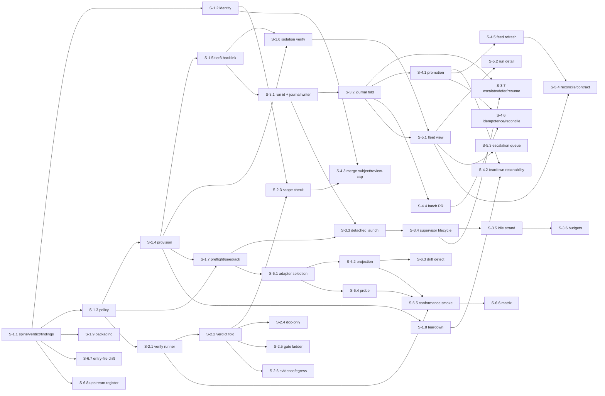

---
stepsCompleted:
  - step-01-validate-prerequisites
  - step-02-design-epics
  - step-03-create-stories
  - step-04-final-validation
inputDocuments:
  - "_bmad-output/projects/pyforge-marshal/planning-artifacts/prd.md"
  - "_bmad-output/projects/pyforge-marshal/planning-artifacts/architecture.md"
  - "_bmad-output/projects/pyforge-marshal/planning-artifacts/product-brief-pyforge-marshal.md"
  - "_bmad-output/projects/pyforge-marshal/planning-artifacts/research/market-agent-orchestration-research-2026-07-25.md"
  - "_bmad-output/projects/pyforge-marshal/planning-artifacts/research/domain-agent-portability-and-governance-research-2026-07-25.md"
project_name: pyforge-marshal
epicCount: 6
storyCount: 50  # corrected 2026-08-01: was left at the original 40 through the FR-59/60/AD-42 (45), FR-61/62/63 (48), FR-64 (49), and FR-65 (50) additions
status: complete
mode: headless
---

# pyforge-marshal — Epic Breakdown

## Overview

Decomposition of Marshal's PRD (58 FRs / 14 NFRs across 8 features) and architecture spine (39 ADs, hexagonal with an out-of-process supervisor sidecar) into **6 epics and 40 stories**.

Epics are organized by **user value**, not by architectural layer: each one leaves the operator able to do something they could not do before, and none requires a later epic to function. The critical-path story is **S-1.1** (package spine, verdict lattice, findings registry, and the meta-tests that enforce AD-3/AD-4) — every other story's compliance is checked by machinery it establishes.

Effort scale: **XS** (≤4 h), **S** (½–1 day), **M** (1–3 days), **L** (3–5 days). Story IDs are `S-<epic>.<seq>`.

Two conventions carried from the sibling builds:
- Every story declares its **surface** (the files it may touch); the gate intersects that with the epic's policy surface (AD-27).
- Every merged story's spec is promoted into `planning-artifacts/specs/` — from Epic 4 onward Marshal does this itself (FR-30); before that it is a manual step.

---

## Requirements Inventory

### Functional Requirements

**Loop homes & isolation** — FR-1 provision a loop home · FR-2 per-worktree active-project state · FR-3 single-sourced Tier-3 store · FR-4 isolation verification · FR-5 preflight · FR-6 teardown · FR-7 adapter config seeding · FR-8 enumerate loop homes

**Run supervision** — FR-9 detached launch · FR-10 scoped launch · FR-11 supervisor attaches · FR-12 idle-strand detection · FR-13 budget ceilings · FR-14 heaviest-story advisory · FR-15 escalation surfacing · FR-16 deferral capture · FR-17 resume · FR-18 run journal · *(added 2026-08-01)* FR-61 bounded-loss durability

**Gates & verification** — FR-19 standalone gate evaluation · FR-20 project-scoped verify commands · FR-21 deterministic no-LLM gates · FR-22 frozen-surface scope check · FR-23 doc-only classification · FR-24 gate mode ladder · FR-25 gate evidence record · FR-26 never false-green · FR-27 review-cap landing path · *(added 2026-08-01)* FR-64 gate binds to the spec's Success signal

**Landing & paper trail** — FR-28 batch pull request · FR-29 repository-hygiene preflight · FR-30 automatic story-spec promotion · FR-31 spec-recovery assistance · FR-32 merge-subject conformance · FR-33 sprint & console feed refresh · FR-34 deploy idempotence · FR-35 no AI attribution · *(added 2026-08-01)* FR-59 landing rules as policy · FR-60 `marshal land` · FR-63 fleet-wide branch retirement

**Fleet visibility** — FR-36 fleet view · FR-37 per-run detail · FR-38 escalation queue · FR-39 ledger-vs-git reconciliation · FR-40 stable machine-readable status contract · *(added 2026-08-01)* FR-62 durability as a reported fleet property · FR-65 `marshal check` — the detector registry, context resolved once

**Adapter portability** — FR-41 skill-tree projection · FR-42 projection drift detection · FR-43 adapter probe · FR-44 conformance smoke · FR-45 conformance matrix · FR-46 entry-file family drift check · FR-47 first-run acknowledgement · FR-48 project-scoped adapter selection

**Policy composition** — FR-49 layered composition · FR-50 project-scoped policy · FR-51 per-story model tiering · FR-52 single harness seam · FR-53 policy validation · FR-54 inspectable configuration

**Packaging & distribution** — FR-55 package identity & layout · FR-56 conda and wheel artifacts · FR-57 version & capability reporting · FR-58 upstream contribution register

### Non-Functional Requirements

NFR-1 determinism · NFR-2 offline by default · NFR-3 never false-green · NFR-4 supervisor independence · NFR-5 structural over conversational governance · NFR-6 no destructive default · NFR-7 idempotence · NFR-8 durable self-owned evidence · NFR-9 harness contract tests · NFR-10 lean dependencies · NFR-11 secret hygiene · NFR-12 machine-readable everything · NFR-13 platform targets · NFR-14 performance envelope

### Additional Requirements (architecture-originated)

The reviewer gate on the architecture spine surfaced seven critical divergence classes that became ADs after the PRD was written. They are requirements in their own right and are traced in the coverage map below: **AD-25** Marshal-owned run identity · **AD-26** accumulating state has one producer · **AD-27** allowlists narrow only · **AD-28** addressable journal entries and AD-6×AD-21 precedence · **AD-29** promotion durability · **AD-30** serialized append protocol · **AD-31** closed lattice with owned admission criteria · **AD-32** session data is evidence not control · **AD-33** truth partitioned by domain · **AD-34** redaction at egress ports · **AD-35** write-once materialized policy · **AD-36** declared projection mechanism · **AD-37** machine-scoped write target · **AD-38** feed reports completeness · **AD-39** envelope field relationships.

### UX Design Requirements

None — Marshal is a CLI with no visual surface. Its "UX" is the envelope contract (AD-14, AD-39) and finding codes (AD-15): every human view is a pure projection of machine-readable output, so there is no human-only information and no separate UX artifact.

### FR Coverage Map

| Epic | FRs covered | NFRs / ADs primarily discharged |
|---|---|---|
| **E1** Provisioned, verified loop homes | FR-1..FR-8, FR-49..FR-57 | NFR-1, 7, 10, 12, 13, 14; AD-3, 4, 7, 10, 11, 14, 15, 16, 21, 23, 24, 31, 35, 38, 39 |
| **E2** Gates you can run | FR-19..FR-27 (FR-27 partial), FR-64 | NFR-3, 5, 11; AD-8, 17, 26 (seed), 27, 34, 49 |
| **E3** Supervised unattended runs | FR-9..FR-18, FR-61 | NFR-4, 6, 8, 9; AD-5, 6, 9, 20, 22, 25, 26, 28, 30, 32, 46 |
| **E4** Landing with a durable paper trail | FR-27 (completion), FR-28..FR-35, FR-59, FR-60, FR-63 | NFR-6, 8; AD-12, 13, 21, 24, 28, 29, 33, 40, 42, 47 |
| **E5** Fleet visibility | FR-36..FR-40, FR-62, FR-65 | NFR-12; AD-5, 33, 39, 48, 50 |
| **E6** Portability proven | FR-41..FR-48, FR-58 | NFR-2, 9; AD-19, 31, 34, 36, 37 |

Every FR-1..FR-65 appears exactly once as a primary owner. FR-27 spans E2 (the gate re-run) and E4 (the landing), noted explicitly in both.

---

## Epic List

| Epic | Title | User value delivered | Stories | Effort |
|---|---|---|---|---|
| **E1** | Provisioned, verified loop homes | The operator can create an isolated, policy-composed, preflight-verified place for a loop to run — and prove two of them are isolated | 9 | ~15 days |
| **E2** | Gates you can run | The operator or CI can evaluate the gate standalone and get a verdict that never false-greens | 7* | ~9 days |
| **E3** | Supervised unattended runs | The operator can launch a gated run detached and have it watched — idle strands caught, budgets enforced, escalations surfaced | 8* | ~14 days |
| **E4** | Landing with a durable paper trail | The operator can land a wave and have every merged story's spec survive teardown, automatically | 10* | ~10 days |
| **E5** | Fleet visibility | The operator can see every loop home at once and be told where the ledger and git disagree | 6* | ~5 days |
| **E6** | Portability proven | The operator can run the method on another agent and hold a dated artifact proving it | 8 | ~12 days |
| **Total** | | | **49*** | **~65 days ≈ 13 weeks single-builder** |

*\* Story counts corrected 2026-08-01 to match epics.md's actual content — the FR-59/FR-60/AD-42 pass (2026-08-01) and this session's FR-61..65 additions were never threaded back into this summary table. **Effort is NOT re-estimated** and still reflects the original per-epic scope; treat the day figures as understated pending a full re-estimate, and the story counts as the current ground truth.*

**Standalone-ness check.** E1 ships a usable `marshal init` / `config` / `status --homes` with no later epic. E2 ships `marshal gate evaluate` usable by a human or CI with no run in flight. E3 needs E1 and E2 and nothing later. E4 needs E1–E3. E5 needs E3's journal. E6 needs E1 only. No epic requires a later epic to function.

---

## Epic 1: Provisioned, verified loop homes

**Goal:** the operator can stand up an isolated loop home for any project in one idempotent command — with policy composed and inspectable, adapter configs seeded, preflight run, and isolation from every other home provable. Establishes the package spine, the verdict lattice, the findings registry, and the meta-tests that police every later story.

**Critical path: nothing else can be built until S-1.1 lands.**

### Story 1.1: Package spine, verdict lattice, findings registry, and the meta-tests that enforce them

As the Marshal builder,
I want a clean package skeleton whose architectural invariants are machine-enforced from the first commit,
So that every later story is checked by machinery rather than by memory.

**Type:** foundation • **Effort:** M • **Deps:** none • **FR/AD:** FR-55, FR-57, NFR-1, NFR-10, NFR-12; AD-3, AD-4, AD-7, AD-14, AD-15, AD-31, AD-39
**Surface:** `src/shared/packages/pyforge-marshal/**`, root `pixi.toml` (dependency additions only)

**Acceptance Criteria:**

**Given** a clean environment
**When** the package is installed from the repo
**Then** `import pyforge.marshal` succeeds and `marshal --help` and `marshal --version` run
**And** the tree matches the architecture's Structural Seed (`cli/`, `core/`, `ports/`, `adapters/`, `supervisor/`, `schemas/`, `tests/{unit,contract,meta,integration}`), with `pyproject.toml` **and** a member `pixi.toml` per sibling convention
**And** `core/verdict.py` owns the lattice `error > gate-failed > scope-violation > unevaluable > warn > clean`, its exit-code projection, and a total `classify(finding_code) -> lattice_member`; no other module constructs an exit code (AD-7, AD-31)
**And** `core/findings.py` holds a registry of `MRS-<AREA>-<NNN>` codes; emitting an unregistered code fails a test (AD-15)
**And** the envelope `{schema_version, command, status, verdict, data, data_version, findings[], assumptions[]}` is emitted by every command, `status` is derived from `verdict`, and `schema_version` governs envelope keys only while `data_version` comes from a per-command registry (AD-14, AD-39)
**And** `tests/meta` fails the build when: any module outside `adapters/harness_bmadloop.py` references the harness (AD-3, via an import-linter contract with import-linter provisioned in `pixi.toml`); `core/**` imports `subprocess`, `os`, `time`, or `adapters` (AD-4); an exit code is constructed outside `core/verdict.py` (AD-7); or `status`/`verdict`/max-finding-severity are mutually inconsistent (AD-39)
**And** Marshal declares PyYAML, tomlkit, psutil and jsonschema as its **own** direct dependencies rather than inheriting them from the harness, with tomlkit capped `<0.13.3` per the environment

### Story 1.2: Story identity, merge-subject rendering, and feed completeness

As the Marshal builder,
I want one owner for story keys and the merge-subject string,
So that the loop, the journal, the spec archive, the merge subject and the dashboard can never key stories differently.

**Type:** foundation • **Effort:** S • **Deps:** S-1.1 • **FR/AD:** FR-32 (render/parse half), NFR-12; AD-23, AD-24, AD-38
**Surface:** `core/identity.py`, `tests/unit/test_identity.py`

**Acceptance Criteria:**

**Given** any external story reference (feed key, filename slug, branch segment, merge subject)
**When** `core.identity.normalize()` is called
**Then** it returns the canonical key `<epic>.<seq>` with an optional ordered suffix preserved and normalized (AD-38)
**And** one render function exists per external form; no module string-formats a story key inline (asserted by a meta-test)
**And** non-conforming input produces a registered finding, never a silent coercion
**And** resolving a set of story references reports `resolved N of M`, and **`N < M` produces a non-zero verdict naming every unresolved key** — a silently shortened feed is impossible (AD-38)
**And** the merge-subject template is rendered and parsed by the same module, and a round-trip property test proves `parse(render(k)) == k` for every key shape

### Story 1.3: Layered policy composition with provenance and validation

As the operator,
I want to see the effective run policy and where each value came from,
So that project-specific configuration never requires hand-editing a shared file.

**Type:** feature • **Effort:** M • **Deps:** S-1.1 • **FR/AD:** FR-49, FR-50, FR-53, FR-54; AD-10, AD-16, AD-26, AD-35
**Surface:** `core/policy.py`, `cli/config.py`, `schemas/policy.json`, `tests/unit/test_policy.py`

**Acceptance Criteria:**

**Given** Marshal defaults, a project policy layer, and invocation flags
**When** composition runs
**Then** precedence is defaults → project → flags, last wins, with no fourth layer and no per-key reordering (AD-16)
**And** the result is an immutable `EffectivePolicy` value; composition is pure and the same inputs produce the same output (AD-10)
**And** every field carries its winning layer and raw source value, and `marshal config` prints key, effective value, and winning layer, with secrets redacted
**And** **every field is tagged `static` or `seed`**; reading a `seed` field (frozen surfaces, gate mode, attempt counts) outside the journal fold fails a meta-test (AD-26) — **except through `EffectivePolicy.seed_view()`**, the display/validation accessor the meta-test whitelists, which is what lets this story's own `marshal config` AC and FR-53's preflight validation range over every key without contradiction (F-8)
**And** the worktree-seed path list is **generated from the active project**, never literal — switching projects requires no edit to any shared file (FR-50)
**And** unknown keys, unresolvable commands, and out-of-range values are rejected with a registered finding naming the layer that introduced them
**And** the materialized artifact is named by its content hash and never overwritten (AD-35)

### Story 1.10: Render the harness policy from the canonical EffectivePolicy

As the operator,
I want Marshal to **render** `.bmad-loop/policy.toml` from the composed policy rather than anyone hand-editing it,
So that per-project and per-tier settings reach the harness without a shared tracked file bleeding one project's config onto every other.

**Type:** feature • **Effort:** M • **Deps:** S-1.3 • **FR/AD:** FR-49, FR-50, FR-51; AD-10, AD-12, AD-35
**Surface:** `adapters/harness_bmadloop.py`, `tests/unit/test_harness_policy_render.py`, `tests/meta/test_rendered_policy_untracked.py`, `.gitignore`

> **Added 2026-07-25 to close F-1 (CRITICAL).** The review found the composed policy had **no path to the harness at all**: `bmad-loop 0.9.0` hard-codes `POLICY_FILE = .bmad-loop/policy.toml` with no policy-path flag, that file is git-tracked, AD-10 forbade Marshal editing it, and FR-51's tier-batching required exactly that edit. A grep of this file for `policy.toml` returned nothing — S-1.3 materializes an `EffectivePolicy` that nothing conveys to the engine it is composed for.

**Acceptance Criteria:**

**Given** a materialized `EffectivePolicy` (S-1.3) and a loop home
**When** the harness adapter renders
**Then** `.bmad-loop/policy.toml` is written **whole** from that policy — never patched, never merged with an existing file — and is byte-identical for identical input (AD-12 derived-artifact discipline)
**And** the canonical artifact stays content-addressed and write-once; only this projection carries the harness's fixed name (AD-35)

**Given** FR-51 tier-batching
**When** stories are batched by model tier
**Then** each batch renders its own `[adapter.dev].model` — automating the hand-edited `HARD-STORY BATCH PROCEDURE` block that FR-51 cites as its motivating evidence, with no human edit of a shared file

**Given** the rendered file
**When** the repository is inspected
**Then** `.bmad-loop/policy.toml` is **untracked** (`.gitignore`d) and a meta-test asserts `git ls-files` does not list it
**And** a loop home's `git push origin HEAD:main` cannot carry it — closing the live cross-project bleed observed at review time, where `loop-pyforge-herald` held 17+/27− of herald-specific policy on a tracked file shared with every project

**Given** a repo-wide default (e.g. the standing independent-review trigger)
**When** it is changed
**Then** it is expressed in the **tracked canonical policy source**, never by editing the rendered file — and the change reaches every project through re-rendering

> **SEQUENCING (hard).** Untracking must not precede rendering. Until this story lands, `.bmad-loop/policy.toml` stays tracked, because a fresh loop home cloned without it would leave `bmad-loop` with no policy at all. `git rm --cached` is the **last** step of this story, not a preparatory one.

### Story 1.4: Provision a loop home

As the operator,
I want one idempotent command that creates an isolated worktree on `loop/<slug>` with its own active-project state,
So that starting work on a project is a single verified action.

**Type:** feature • **Effort:** M • **Deps:** S-1.1, S-1.3 • **FR/AD:** FR-1, FR-2; NFR-7; AD-11, AD-21
**Surface:** `cli/init.py`, `adapters/vcs_git.py`, `adapters/fs_local.py`, `ports/vcs.py`, `ports/fs.py`

**Acceptance Criteria:**

**Given** a project slug with no existing loop home
**When** `marshal init <slug>` runs
**Then** a git worktree exists at the conventional sibling path on branch `loop/<slug>`
**And** the home carries its own active-project marker and planning-artifact symlinks, independent of every other home and of the main checkout
**And** the marker and the planning symlinks always agree; disagreement is a blocking registered finding, never silently tolerated
**And** the command prints a directly runnable launch line exporting `BMAD_ACTIVE_PROJECT`
**And** re-running against an existing home reports each step `done | skipped | failed`, changes nothing, and exits 0 (AD-21, NFR-7)
**And** Marshal writes only inside the home, the canonical Tier-3 store, declared promotion targets, and the machine-scoped path — a test asserts no write outside those four (AD-11)
**And** `main` is never checked out in a second tree

### Story 1.5: Single-sourced Tier-3 store via backlink

As the operator,
I want a loop home's execution artifacts to resolve to one canonical store,
So that every consumer sees the same path and no migration is ever needed.

**Type:** feature • **Effort:** S • **Deps:** S-1.4 • **FR/AD:** FR-3; AD-11
**Surface:** `cli/init.py`, `adapters/fs_local.py`

**Acceptance Criteria:**

**Given** a fresh loop home where the gitignored Tier-3 target does not exist
**When** provisioning runs
**Then** the home's `implementation-artifacts` realpath equals the main checkout's canonical directory
**And** the canonical directory is created if absent
**And** a **real, non-empty local directory is never replaced** — the command refuses with a registered finding naming the path
**And** the main checkout's own marker and symlinks are unchanged

### Story 1.6: Isolation verification and home enumeration

As the operator,
I want to prove that my loop homes are genuinely isolated,
So that running many projects at once is a checked property rather than a hope.

**Type:** feature • **Effort:** S • **Deps:** S-1.4, S-1.5 • **FR/AD:** FR-4, FR-8
**Surface:** `cli/init.py`, `core/status.py` (homes view only)

**Acceptance Criteria:**

**Given** two or more provisioned loop homes
**When** isolation verification runs across them
**Then** it exits 0 when markers and planning symlinks are independent, Tier-3 realpaths are identical, and the main checkout's active project is untouched
**And** it exits non-zero with a registered finding naming the specific cross-talk on any violation
**And** it accepts **N ≥ 2** homes in one invocation
**And** enumeration lists one row per home — path, branch, active project, desync flag — in both human and envelope form

### Story 1.7: Preflight, adapter config seeding, and first-run acknowledgement

As the operator,
I want to be told a run cannot start *before* I launch it,
So that I never discover a missing prerequisite at minute 90.

**Type:** feature • **Effort:** M • **Deps:** S-1.3, S-1.4 • **FR/AD:** FR-5, FR-7, FR-47; AD-19
**Surface:** `cli/init.py`, `adapters/harness_bmadloop.py`, `ports/harness.py`

**Acceptance Criteria:**

**Given** a provisioned loop home
**When** preflight runs
**Then** it reports harness presence and version, multiplexer backend availability, adapter binary presence, story-feed resolvability and parseability, verify-command resolvability, and that `main` is not checked out twice
**And** each configured adapter's declared seed files are present in the home afterwards, sourced from the harness profile and composed policy — **not** from a hard-coded list (AD-19, FR-7)
**And** each adapter's declared first-run requirement is surfaced as an explicit required human action, and an unacknowledged adapter is a **blocking** finding — because an unanswered first-run dialog is indistinguishable from a session timeout (FR-47)
**And** a sustained-automation caveat is presented once per adapter and the acknowledgement recorded
**And** any blocking finding exits non-zero and names itself; policy validation (S-1.3) runs as part of preflight
**And** preflight completes in under 10 seconds on a warm checkout (NFR-14)

### Story 1.8: Teardown that refuses to destroy work

As the operator,
I want teardown to remove a loop home cleanly and refuse when work would be lost,
So that cleanup is never the thing that costs me a wave.

**Type:** feature • **Effort:** S • **Deps:** S-1.4 • **FR/AD:** FR-6; NFR-6; AD-29 (hook)
**Surface:** `cli/init.py`, `adapters/vcs_git.py`

**Acceptance Criteria:**

**Given** a provisioned loop home
**When** teardown runs
**Then** the worktree and branch are removed and `git worktree list` is clean afterwards
**And** it **refuses** with a registered finding when the home has uncommitted or unmerged work, unless explicitly forced
**And** it never touches the canonical Tier-3 store
**And** a documented extension point exists for the promotion-reachability predicate that Epic 4 wires in (AD-29), and it is a no-op while no promotions exist
**And** no Marshal operation force-updates or force-pushes anything (NFR-6)

### Story 1.9: Packaging, distribution, and version reporting

As the operator,
I want one install command to yield Marshal and its harness together,
So that the wrap decision pays off at the point of use.

**Type:** infra • **Effort:** M • **Deps:** S-1.1 • **FR/AD:** FR-55, FR-56, FR-57; NFR-10, NFR-13; AD-2, AD-3
**Surface:** `src/shared/packages/pyforge-marshal/{pyproject.toml,pixi.toml}`, root `pixi.toml`

**Acceptance Criteria:**

**Given** the package source
**When** the conda artifact is built via pixi-build-python wrapping the hatchling wheel (the sibling path — neither sibling ships through `recipes/`)
**Then** installing it yields a working `marshal --help` with the harness resolvable
**And** the conda recipe declares `bmad-loop >=0.9.0,<0.10` as a **run dependency**, never vendored (AD-2)
**And** wheel and sdist build from the same source tree
**And** `marshal --version` reports Marshal's version **and** the resolved harness version, both of which appear in every run journal
**And** a harness outside the supported range emits a prominent warning, and a major mismatch is a blocking preflight finding
**And** build and smoke targets exist for linux-64 and osx-arm64; Windows is declared WSL-first rather than silently failing (NFR-13)

---

## Epic 2: Gates you can run

**Goal:** the gate stops being a configuration line inside somebody else's orchestrator and becomes a first-class object a human or CI can invoke. After this epic the operator can, at any moment, ask "would this pass?" and get a deterministic answer that can never be a false green.

### Story 2.1: Standalone verify-command runner, project-scoped

As the operator or CI,
I want to run this project's gates without a loop in flight,
So that I can check a tree before approving anything.

**Type:** feature • **Effort:** M • **Deps:** S-1.1, S-1.3 • **FR/AD:** FR-19, FR-20, FR-21; NFR-1, NFR-2; AD-4, AD-17
**Surface:** `core/gate.py`, `cli/gate.py`, `ports/process.py`, `adapters/process_posix.py`

**Acceptance Criteria:**

**Given** a project with configured verify commands
**When** `marshal gate evaluate` runs with no run in flight
**Then** each command runs and pass/fail is reported per command with captured output
**And** verify commands resolve from composed policy scoped to the **active project** — another project's gates are never run (FR-20)
**And** evaluation **never mutates the working tree**
**And** no model call occurs anywhere in the path, and the same tree plus the same commands produce the same verdict (NFR-1, FR-21)
**And** verify commands are an explicit **allowlist**; anything not allowlisted is `unevaluable`, never permitted (AD-17)
**And** the aggregation logic lives in `core/gate.py` as a pure function over exit codes, with all process spawning behind `ProcessPort` (AD-4)

### Story 2.2: Verdict aggregation that never false-greens

As the operator,
I want any check that cannot reach a definite pass to be a failure,
So that "could not determine" can never be read as "clean".

**Type:** feature • **Effort:** S • **Deps:** S-2.1 • **FR/AD:** FR-26; NFR-3; AD-8, AD-31
**Surface:** `core/gate.py`, `core/verdict.py`, `tests/unit/test_verdict.py`

**Acceptance Criteria:**

**Given** any combination of check outcomes
**When** the verdict is computed
**Then** it is the maximum over emitted findings' classifications plus the command-declared floor, and no module assigns a verdict directly (AD-31)
**And** a missing verify command, an unreadable spec, or a crashed check produces `unevaluable`, which projects to non-zero and blocks progression
**And** a property test asserts **there exists no input producing `clean` when any check is unevaluable** (AD-8)
**And** the lattice gains no new members
**And** exit codes come solely from `core/verdict.py`, with `130` on interrupt

### Story 2.3: Frozen-surface scope check, narrowing only

As the operator,
I want a story's changed files checked against both its declared surface and every frozen surface,
So that a producer story cannot silently amend a contract another story froze.

**Type:** feature • **Effort:** M • **Deps:** S-1.2, S-2.2, **S-3.2** • **FR/AD:** FR-22; NFR-3, NFR-5; AD-26, AD-27

> **Dependency corrected 2026-07-30 (F-9).** This story's own ACs require the frozen set to be "produced by the journal fold" — and the fold is **S-3.2, in the next epic**. As declared (`S-1.2, S-2.2`) the story was **not implementable in its position**: it depended on a component that did not yet exist. Adding `S-3.2` makes the graph honest. The alternative — moving the fold into Epic 2 — was rejected because S-3.2 also owns run-state derivation that Epic 3 needs, and splitting it would give the fold two homes. Epic 2 therefore completes after S-3.2 lands; the epic boundary is a value boundary, not a scheduling barrier.
**Surface:** `core/gate.py`, `core/policy.py` (seed accessor), `tests/unit/test_scope.py`

**Acceptance Criteria:**

**Given** a story spec declaring a surface, and a project policy declaring the epic's surface
**When** the scope check runs
**Then** the effective surface is computed as **`policy_surface ∩ spec_surface`**, and a meta-test asserts no other combinator is used (AD-27)
**And** a spec-declared path outside the policy surface is a hard finding — **a machine-drafted spec can only narrow, never widen, the allowlist it is judged against**
**And** a change to a frozen file is a hard failure naming the file **and the story that froze it**
**And** a change outside the effective surface is a failure naming every offending path
**And** the frozen set is produced by the journal fold over freeze declarations, with policy supplying only the **initial** set — reading the live set from `EffectivePolicy` fails a meta-test (AD-26)
**And** freeze declarations, freeze removals, and gate-mode changes are never sourced from an agent-writable artifact (AD-27)

### Story 2.4: Doc-only story classification

As the operator,
I want stories that legitimately produce no source change to pass,
So that a design-spike story does not trip a rollback loop.

**Type:** feature • **Effort:** S • **Deps:** S-2.2 • **FR/AD:** FR-23
**Surface:** `core/gate.py`

**Acceptance Criteria:**

**Given** a story whose declared deliverable is a document or decision record
**When** the gate evaluates a worktree with no source change
**Then** it does not fail on "no changes in worktree"
**And** classification is a pure function of the story's declaration, and is recorded in the run record
**And** a story **not** so classified that produces no change still fails, with a distinct registered finding
**And** a doc-only story that nonetheless touches a frozen surface still fails the scope check

### Story 2.5: Gate mode ladder with autonomy labels

As the operator,
I want the run's approval policy to be selectable and labelled with what autonomy level it represents,
So that the gate configuration is itself the autonomy declaration.

**Type:** feature • **Effort:** S • **Deps:** S-1.3, S-2.2 • **FR/AD:** FR-24; NFR-5
**Surface:** `core/policy.py`, `core/gate.py`, `cli/gate.py`

**Acceptance Criteria:**

**Given** a project policy
**When** a gate mode is selected
**Then** `per-story-spec-approval`, `per-epic` and `none` are supported
**And** each carries its explicit autonomy label — L2 Task-Based/Operator, L3 Conditional/Context Gates, L4 Approver respectively — surfaced at launch and in the run record
**And** the label mapping is data, not prose, and is emitted in the envelope
**And** changing gate mode is recorded as a decision entry with a timestamp and provenance, never applied silently
**And** the effective mode is read through the journal fold, not from policy directly (AD-26)

### Story 2.6: Gate evidence record with redaction at egress

As the operator,
I want every gate evaluation to leave a durable, redacted record,
So that I can prove months later what was checked and what it said.

**Type:** feature • **Effort:** M • **Deps:** S-2.2 • **FR/AD:** FR-25; NFR-8, NFR-11; AD-34
**Surface:** `core/egress.py`, `ports/*.py` (egress classification), `adapters/fs_local.py`, `schemas/gate-record.json`

**Acceptance Criteria:**

**Given** a completed gate evaluation
**When** the record is written
**Then** it captures commands run, exit codes, scope-check verdict, tree revision, and a UTC ISO-8601 timestamp
**And** the record is schema-validated and retrievable per story
**And** **every port that emits bytes outside the process is a declared egress port**, routed through the single redacting serializer in `core/egress.py`; egress ports accept only a `Redacted` payload type and a meta-test asserts none accepts a bare string (AD-34)
**And** the egress-port set lives in one code registry, and adding a port without classifying it fails the build
**And** redaction is tested against a fixture of known token shapes and covers policy-declared secret keys
**And** no call site performs its own redaction

---

### Story 2.7: A gate binds to the spec's Success signal *(added 2026-08-01 — FR-64 / AD-49)*

As the operator,
I want gate evaluation to confirm it is still running the verify commands the story's tracked spec named as its Success signal,
So that a test quietly removed after the spec was tracked shows up as a contract breach, not a passing suite.

**Type:** feature • **Effort:** S • **Deps:** S-2.1, S-4.1 • **FR/AD:** FR-64; AD-49, AD-26, AD-31
**Surface:** `core/gate.py`, `core/spec_binding.py`

**Acceptance Criteria:**

**Given** a story with a tracked `specs/spec-<key>.md`
**When** its gate is evaluated
**Then** the verify commands run are confirmed against the ones named in the spec's Success signal
**And** a narrowed or removed verify command since tracking is a registered finding, not a warning folded into an otherwise-green verdict
**Given** a story with no tracked spec to bind against
**When** its gate is evaluated
**Then** the missing binding is reported explicitly as a finding, never evaluated silently against nothing
**And** an untraceable or mismatched binding cannot be waived to green — it participates in the closed admission lattice (AD-31) like every other criterion

---

## Epic 3: Supervised unattended runs

**Goal:** the operator can launch a gated run and walk away. The supervisor — a separate process the session cannot disable — catches idle strands well before any token cap, enforces budgets over externally-observed quantities, surfaces escalations, and writes a durable journal that survives teardown.

### Story 3.1: Run identity and the journal writer

As the operator,
I want every run to have a Marshal-owned identity and an append-only journal written safely,
So that nine concurrent homes can share one store without braiding their histories together.

**Type:** foundation • **Effort:** M • **Deps:** S-1.1, S-1.5 • **FR/AD:** FR-18; NFR-8; AD-25, AD-28, AD-30
**Surface:** `core/journal.py`, `adapters/fs_local.py`, `schemas/journal.json`

**Acceptance Criteria:**

**Given** any run or session invocation
**When** the identifier is minted
**Then** Marshal mints it **at `intent` time, before any spawn** — globally unique, `<slug>-<utc-compact>-<random>`, sortable chronologically **within a slug** but not across the fleet; fleet-wide chronology sorts on `ts`, never on the id (AD-25)
**And** the harness's own identifier is recorded as `harness_run_id` on the first `outcome` entry and is **never** a key, a path segment, or a grouping field
**And** run directories are created with `mkdir`, which already fails `EEXIST`; a collision is a hard finding, never an append
**And** non-run invocations (standalone gate evaluation, adapter probe) mint into a separate `sessions/` namespace excluded from fleet folds **by construction, not by filtering**
**And** every entry carries `{id, ts, run_id, story?, kind, phase, intent_id?, payload}` where `id` is the composite **`(writer_id, counter)`** — monotonic within a writer, never across the run — and `phase ∈ intent | outcome | observation`, with `intent_id` mandatory on every `outcome` and absent on every `observation` (AD-28)
**And** each append is a single `os.write()` of one complete newline-terminated line on an `O_APPEND|O_CREAT` descriptor, `fsync`ed for `phase: intent`, with no buffered stream held open across appends (AD-30)
**And** payloads over 4 KiB go to a sidecar blob with a reference in the entry
**And** timestamps carry millisecond precision and total order is **`(ts, writer_id, counter)`** — a total order without cross-writer coordination, explicitly **not** a causal order; no consumer may infer causality from adjacency (AD-28)
**And** a concurrency test with a long-lived writer and repeated short-lived writers produces zero malformed lines **and zero duplicate `(writer_id, counter)` pairs** — the malformed-line assertion alone tests atomicity, not identity, and would pass while the id invariant was violated

### Story 3.2: The journal fold — one producer for accumulating run state

As the Marshal builder,
I want all run state derived from one fold over the journal,
So that no two components can disagree about what happened.

**Type:** foundation • **Effort:** M • **Deps:** S-3.1 • **FR/AD:** FR-18; AD-5, AD-26, AD-28, AD-30
**Surface:** `core/journal.py`, `tests/unit/test_fold.py`

**Acceptance Criteria:**

**Given** a journal
**When** the fold runs
**Then** it produces run state — story transitions, gate verdicts, escalations, deferrals, consumption, supervisor actions, frozen surfaces, attempt counts, effective gate mode
**And** these accumulating values have **exactly one producer**: this fold. Any module reading them from `EffectivePolicy` fails a meta-test (AD-26)
**And** `intent`/`outcome` pairing is by `intent_id` **only** — no positional or heuristic pairing exists anywhere (AD-28)
**And** an unparseable line is **quarantined**, surfaced as a registered finding, and makes **its own story key and decision domain `unevaluable`** — records provably unaffected stay evaluable; when the line's `story` or `kind` cannot be recovered the scope widens to the whole run, because unknown blast radius is not a reason to narrow it (AD-30)
**And** a reference to a **missing sidecar blob** is the same class and takes the same treatment — `unevaluable` for that record, never "quarantine and continue"
**And** the fold is a pure function over entries with no I/O (AD-4)
**And** a lone `intent` is reported as open, never inferred closed

### Story 3.3: Detached launch with scoped story selection

As the operator,
I want runs and resumes to detach by default,
So that a foreground timeout can never kill a run mid-review again.

**Type:** feature • **Effort:** M • **Deps:** S-1.7, S-3.1 • **FR/AD:** FR-9, FR-10, FR-52; AD-3, AD-22, AD-38
**Surface:** `cli/spin.py`, `adapters/harness_bmadloop.py`, `ports/harness.py`

**Acceptance Criteria:**

**Given** an approved spec and a provisioned home
**When** `marshal factory spin` runs
**Then** the harness process is detached from the invoking shell's session and lifetime, and the command returns promptly with the Marshal run id (AD-22)
**And** the run survives the caller exiting
**And** foreground execution exists only behind an explicit flag documented as unsafe for resumes, and **nothing in Marshal blocks on a run's completion**
**And** attaching to a live run's session is a separate, non-destructive command
**And** story, epic and max-count selectors are supported and composable
**And** the resolved story list is echoed before launch, recorded in the journal, and reports `resolved N of M` with a non-zero verdict when `N < M` (AD-38)
**And** **all** harness interaction goes through `adapters/harness_bmadloop.py`; the import-linter contract from S-1.1 proves it (FR-52, AD-3)

### Story 3.4: Supervisor process lifecycle

As the operator,
I want a watcher attached to every run that the run itself cannot switch off,
So that supervision is a property of the system, not of the agent's cooperation.

**Type:** feature • **Effort:** M • **Deps:** S-3.1, S-3.3 • **FR/AD:** FR-11; NFR-4, NFR-5; AD-9, AD-20
**Surface:** `supervisor/`, `ports/{process,clock,observer}.py`, `adapters/{process_posix,clock_system,observer_mux}.py`

**Acceptance Criteria:**

**Given** a run started by Marshal
**When** the supervisor attaches
**Then** it runs as a **separate OS process**, parented to neither the agent session nor the invoking shell (AD-9)
**And** it cannot be disabled, silenced, or reconfigured from inside the agent session — a test asserts no control channel exists from session to supervisor
**And** its inputs are externally observable only: multiplexer pane content, file modification times, process liveness, and adapter-written usage files
**And** supervisor liveness is itself journaled; a dead supervisor is a **reported** condition surfaced by `status`, never silence, and degrades the run to unsupervised rather than corrupt
**And** the supervisor is inert on a run it did not start
**And** its only write is the journal
**And** clock, process state and observations reach the decision core as **injected values** (AD-20)

### Story 3.5: Idle-strand detection

As the operator,
I want a session that stopped producing output but did not exit to be caught in minutes, not at a 4M-token cap,
So that the failure that cost three story attempts in one wave cannot recur.

**Type:** feature • **Effort:** L • **Deps:** S-3.4 • **FR/AD:** FR-12; NFR-4; AD-9, AD-20, AD-32
**Surface:** `core/supervise.py`, `supervisor/`, `tests/unit/test_supervise.py`

**Acceptance Criteria:**

**Given** a running session
**When** idleness is evaluated
**Then** it is measured from **observable session output** — pane content and log modification time — never from the agent's self-report
**And** the threshold is configurable with a default of 25 minutes, materially below the session budget
**And** fresh output re-arms the window
**And** on expiry the supervisor takes the configured ladder action — nudge, then stop-and-retry, then defer — with each step journaled `intent` then `outcome` and counted
**And** the decision is a **pure function over a sample sequence**, and every ladder behaviour has a test running in milliseconds against synthetic samples (AD-20)
**And** the supervisor's poll interval is never longer than the active prompt-cache TTL, defaulting to ≤60 seconds (NFR-14)

### Story 3.6: Budget ceilings and the heaviest-story advisory

As the operator,
I want a hard ceiling on every run and a warning before I launch something that will not fit,
So that there is no unbounded mode and no unrecoverable overnight burn.

**Type:** feature • **Effort:** M • **Deps:** S-3.5 • **FR/AD:** FR-13, FR-14; C-6; AD-8, AD-32
**Surface:** `core/supervise.py`, `cli/spin.py`

**Acceptance Criteria:**

**Given** configured per-story and per-run token and wall-clock ceilings
**When** a unit approaches or breaches one
**Then** approaching emits a warning and breaching stops the unit with a **named reason**, never a silent defer
**And** consumption is journaled per story with a cost estimate where the adapter reports one
**And** **every enforcement ceiling is expressed over at least one externally-observed quantity** (wall clock, process liveness, output mtime); session-written usage files are recorded for reporting and cost attribution only (AD-32)
**And** a usage sample older than the idle threshold is `unevaluable`: a registered finding is emitted and the **wall-clock ceiling becomes the binding constraint** — a wedged session's frozen counter can never defeat the ceiling
**And** no ceiling exists that can only be evaluated from session-written data
**And** preflight warns when a selected story is likely to exceed the session budget, comparing the budget against spec size, declared difficulty, and prior attempt history (FR-14)

### Story 3.7: Escalation, deferral, and resume

As the operator,
I want undecidable situations to pause the run and reach me, and resolved ones to resume safely,
So that the agent never guesses at something it cannot safely decide.

**Type:** feature • **Effort:** M • **Deps:** S-3.4, S-3.2 • **FR/AD:** FR-15, FR-16, FR-17; AD-22, AD-28
**Surface:** `core/supervise.py`, `cli/spin.py`, `ports/notify.py`, `adapters/notify_file_desktop.py`

**Acceptance Criteria:**

**Given** an escalation
**When** it is raised
**Then** the run pauses and **no story proceeds past an unresolved escalation**
**And** it is journaled with story key, reason, and the artifact needing a decision
**And** notification fires on at least a durable file marker; desktop notification is best-effort and its failure never blocks
**And** notification content is redacted at capture, before it enters the core, because pane-derived text routinely carries secrets (AD-34)
**Given** a story the loop could not land
**Then** the deferral records story key, reason class, attempt count, and where preserved work lives, and the run continues unless configured otherwise
**Given** a paused run whose blocking condition a human resolved
**When** resume runs
**Then** it is detached on the same terms as launch and re-attaches a supervisor
**And** resuming a run with an unresolved escalation is **refused** with a registered finding
**And** *(added 2026-08-01 — AD-45)* the resume journal entry records a **reference to the resolving decision or artifact**, ingestion-sufficient for the knowledge station's pull (story key, reason, resolution reference, resolver attribution)

---

### Story 3.8: Stage-bound durability, and fleet-launch wiring *(added 2026-08-01 — FR-61 / AD-46)*

As the operator,
I want the supervisor to push a run's work at its own stage boundaries rather than on a timer, with the fallback watcher on by default,
So that worst-case loss is bounded by the run's own structure, and nobody has to remember to start a durability watcher.

**Type:** feature • **Effort:** M • **Deps:** S-3.4, S-3.1 • **FR/AD:** FR-61; AD-46, AD-22, AD-25, AD-40
**Surface:** `supervisor/durability.py`, `core/supervise.py`, `cli/spin.py`

**Acceptance Criteria:**

**Given** a running story
**When** the dev commit lands, the review verdict is recorded, or the story merges
**Then** the supervisor pushes the affected station and per-story branches at that boundary, never on a wall-clock interval alone
**And** push is read-only against working trees and remotes — never a force-push, never a rewrite
**Given** a fleet launch
**When** it starts
**Then** the interval-push watcher (the floor for whatever the stage hooks miss) starts automatically, with no separate manual invocation required
**And** the watcher exits on its own when the fleet does

---

## Epic 4: Landing with a durable paper trail

**Goal:** the operator can close a wave in one command and the paper trail survives by construction. This epic exists because the motivating incident — 13 of 31 story specs lost outright, 8 more reduced to zero-byte husks — was caused by a step a human had to remember.

### Story 4.1: Story-spec promotion with a durability predicate

As the operator,
I want every merged story's spec promoted into tracked artifacts automatically and durably,
So that "promoted" means "will still exist next week", not "a file was written".

**Type:** feature • **Effort:** L • **Deps:** S-3.2 • **FR/AD:** FR-30; SM-3; AD-12, AD-13, AD-29
**Surface:** `cli/deploy.py`, `adapters/vcs_git.py`, `core/journal.py`

**Acceptance Criteria:**

**Given** a merged story with a spec in run scratch
**When** promotion runs
**Then** the spec is copied to the tracked `planning-artifacts/specs/` archive path **and committed by Marshal itself**, in a dedicated commit containing **only** promotion paths — it never commits a pre-existing index (AD-29)
**And** the story is marked `promoted` **only** when its bytes are reachable from a ref that survives the loop home (pushed to the remote, or merged to the integration branch) — a staged file, or a commit only on `loop/<slug>`, is **not** promoted (AD-29)
**And** promotion happens **before** any code path may remove that story's worktree (AD-13)
**And** a merged story with no promotable spec is reported as a paper-trail gap, never passed over silently
**And** zero-byte or truncated specs are detected and reported rather than promoted over a good copy
**And** the canonical archive is authoritative; run scratch is derived and never treated as the source (AD-12)

### Story 4.2: Teardown reachability and spec-recovery assistance

As the operator,
I want teardown to compute durability at teardown time and to help me when a spec is missing,
So that a stale flag can never authorize destroying the last copy.

**Type:** feature • **Effort:** M • **Deps:** S-1.8, S-4.1 • **FR/AD:** FR-6 (completion), FR-31; NFR-6; AD-29
**Surface:** `cli/init.py` (teardown), `cli/deploy.py`, `adapters/vcs_git.py`

**Acceptance Criteria:**

**Given** a loop home with merged stories
**When** teardown runs
**Then** the refusal predicate is **reachability computed at teardown time**, never a journal flag (AD-29)
**And** a forced teardown over an unreachable promotion requires the operator to **name the story keys being abandoned**, and records them
**Given** a story whose spec is missing
**When** recovery assistance runs
**Then** it reports the ordered candidate locations — surviving run-worktree snapshots first, then the epics-derived contract fallback
**And** it **reports, never fabricates**: any regenerated contract-only spec is labelled as such in its own frontmatter

### Story 4.3: Merge-subject conformance and review-cap landing

As the operator,
I want to land a sound-but-unconverged story under the same gates, without hand-typing a magic string,
So that the manual landing path is as governed as the automatic one.

**Type:** feature • **Effort:** M • **Deps:** S-1.2, S-2.3 • **FR/AD:** FR-27, FR-32; AD-24
**Surface:** `cli/deploy.py`, `core/identity.py`, `adapters/vcs_git.py`

**Acceptance Criteria:**

**Given** a named story branch that is sound but did not converge in review
**When** the review-cap landing command runs
**Then** it re-runs the **full** gate — verify commands plus scope check — and lands only on a green result (FR-27)
**And** the merge uses the conventional subject rendered from policy; the operator never hand-types it
**And** the manual landing and its justification are journaled
**And** deploy reports any merge in the wave whose subject does not conform, using the **same parser** that renders it — not a second regex (AD-24)
**And** the subject template lives in policy, not as a literal in code

### Story 4.4: Batch pull request with hygiene preflight

As the operator,
I want one PR for a wave, with mechanical repository gates checked first,
So that landing does not red CI on something a machine could have told me.

**Type:** feature • **Effort:** M • **Deps:** S-3.2 • **FR/AD:** FR-28, FR-29, FR-35; NFR-2, NFR-11; AD-34
**Surface:** `cli/deploy.py`, `ports/forge.py`, `adapters/forge_gh.py`

**Acceptance Criteria:**

**Given** a wave of merged stories
**When** the batch PR is opened
**Then** title and body derive from the merged set and the journal, and the body lists stories with their gate verdicts
**And** it targets the configured base branch and is never opened against an upstream fork's default
**And** existing-PR detection updates rather than duplicating
**And** hygiene preflight reports which project-configured rules apply to the change set and whether each is satisfied, with rules **declared in policy, never hard-coded into Marshal** (FR-29)
**And** an unsatisfied blocking rule exits non-zero with a remediation line
**And** **no AI-attribution or courtesy preamble** appears in any commit, PR body, or comment Marshal emits; attribution is opt-in configuration, default-off (FR-35)
**And** PR text routes through the egress serializer and is redacted (AD-34)
**And** the forge adapter is the only outbound network path; everything else is local (NFR-2)

### Story 4.5: Feed refresh with truth partitioned by domain

As the operator,
I want derived status surfaces refreshed from the right authority,
So that deploy does not write something status immediately flags as wrong.

**Type:** feature • **Effort:** M • **Deps:** S-3.2, S-4.1 • **FR/AD:** FR-33; AD-12, AD-33
**Surface:** `cli/deploy.py`, `core/status.py`

**Acceptance Criteria:**

**Given** a landed wave
**When** feed refresh runs
**Then** **git is the sole authority for repository facts** (merged/not, tree revision, branch existence, commit subject) and **the journal is the sole authority for process facts** (transitions, verdicts, escalations, consumption) (AD-33)
**And** no derived artifact sources a repository fact from the journal or a process fact from git; each derived field declares its canonical domain
**And** a journal claim about a repository fact is stored as `claimed_*` and is only ever an input to a reconciliation finding, never a rendered value
**And** console data regeneration is invoked where configured
**And** discrepancies are **reported, never silently resolved**
**And** regenerating a derived artifact when nothing changed is a **provable no-op** (AD-12)

### Story 4.6: Deploy idempotence and reconciliation of open intents

As the operator,
I want to re-run deploy after a partial failure and have it finish the job,
So that a crash mid-landing is recoverable without guesswork.

**Type:** feature • **Effort:** M • **Deps:** S-4.1, S-4.4 • **FR/AD:** FR-34; NFR-7; AD-6, AD-21, AD-28
**Surface:** `cli/deploy.py`, `core/journal.py`

**Acceptance Criteria:**

**Given** a deploy that failed partway
**When** it is re-run
**Then** each step reports `done | skipped | failed` and already-promoted specs are neither re-promoted nor duplicated
**And** a re-run against a fully converged system produces zero changes and exit 0 (NFR-7)
**Given** a lone `intent` entry from a crash
**When** reconciliation runs
**Then** it is closed **only** by a `reconciliation` outcome carrying observed external evidence — commit sha, worktree absence, PR number — plus the reconciling command (AD-28)
**And** absent evidence the intent stays open and is reported
**And** **reconciliation may observe and close; it may never re-perform an action whose intent is open without evidence the action did not occur** — the explicit AD-6 × AD-21 precedence

---

### Story 4.7: Landing rules as declared policy *(added 2026-08-01 — FR-59 / CAP-9)*

As the operator,
I want the rules a repository demands for landing declared as policy keys with provenance,
So that landing stops being a memorized habit with a good track record.

**Type:** feature • **Effort:** M • **Deps:** S-1.3 • **FR/AD:** FR-59; AD-40, AD-10, AD-16
**Surface:** `core/policy.py`, `core/landing.py`, `schemas/policy.json`

**Acceptance Criteria:**

**Given** a project whose repository demands checks, labels, a merge strategy, and retirement behaviour
**When** policy composes
**Then** the landing surface appears as governed keys with per-key provenance — including repo-specific triggers such as this repository's `maintenance` label and its **ungated** `environment.yaml` sync check
**And** an invalid landing policy is a preflight finding naming the layer that introduced each bad key
**And** the effective landing policy prints with each key's winning layer, secrets redacted

---

### Story 4.8: `marshal land` — the last mile lands itself *(added 2026-08-01 — FR-60 / CAP-9)*

As the operator,
I want a story or wave that passed its gates to land on the integration branch without me driving the sequence,
So that a run that ends with "somebody should open a PR" has actually ended.

**Type:** feature • **Effort:** L • **Deps:** S-4.4, S-4.7 • **FR/AD:** FR-60; AD-40, AD-8, AD-6; NFR-6, NFR-7
**Surface:** `cli/land.py`, `core/landing.py`, `adapters/forge_gh.py`, `core/journal.py`

**Acceptance Criteria:**

**Given** a merged wave and a composed landing policy
**When** `marshal land` runs
**Then** it opens or updates the PR (never duplicates), applies required labels, waits on required checks, merges by the declared strategy, retires the branch, and resyncs
**And** a half-landed story — PR open, checks green, merge never issued — converges on re-run (idempotent and re-entrant)
**Given** a red required check or an unacknowledged advisory finding
**When** landing is attempted
**Then** it refuses with a registered finding in the common envelope — no silent force, exactly teardown's refusal shape
**And** every landing appends a journal verdict: checks required, checks passed, what merged, under whose authority
**And** nothing emitted carries an AI-attribution trailer (FR-35 applies unchanged)

---

### Story 4.9: Derived surfaces regenerate on main; the shared store takes a lock *(added 2026-08-01 — AD-42 / the Q-10 decomposition)*

As the operator,
I want regenerated artifacts re-derived after landing instead of merged from homes, and shared-store appends serialized,
So that two concurrent lines cannot silently last-write-wins each other's ledgers.

**Type:** feature • **Effort:** M • **Deps:** S-4.5, S-4.8 • **FR/AD:** AD-42; C-3, C-4; extends FR-33
**Surface:** `cli/deploy.py`, `cli/land.py`, `adapters/fs_local.py`

**Acceptance Criteria:**

**Given** a landing that changes story state
**When** the sprint and console surfaces refresh
**Then** they are **re-derived on the integration branch after the merge** — a regenerated file is never merged from a loop home
**Given** two concurrent appends to the canonical Tier-3 store
**When** both run
**Then** an advisory file lock (an `FsPort` primitive) serializes them and neither append is lost
**And** the journal's own two-writer protocol is explicitly out of scope here (F-6 owns it) — a test documents the boundary

---

### Story 4.10: Fleet-wide branch retirement *(added 2026-08-01 — FR-63 / AD-47)*

As the operator,
I want Marshal to propose which station and story branches may be released across the whole fleet, proving its case for each,
So that saving work does not leave a permanently growing pile of branches nobody knows when to delete.

**Type:** feature • **Effort:** L • **Deps:** S-3.8, S-4.8 • **FR/AD:** FR-63; AD-47, AD-27; NFR-6
**Surface:** `cli/retire.py`, `core/retire.py`, `adapters/git_local.py`

**Acceptance Criteria:**

**Given** the fleet's accumulated branches
**When** a retirement sweep runs
**Then** a branch is proposed only when three facts are independently provable — content reachable in the integration branch **by patch-id**, its run concluded, its story `done` with a recorded merge sha
**And** the proposal names its evidence (merge sha, patch-id match, concluded run) per branch
**Given** `loop/*` branches or `rescue/*` tags
**When** the sweep runs
**Then** they are never proposed — a structural exclusion, not a policy-configurable one
**Given** a branch the sweep cannot fully prove
**When** it evaluates that branch
**Then** it refuses rather than defaulting to delete
**And** the sweep runs dry-run by default, exactly as teardown does (FR-8)
**And** a branch FR-59/AD-40 already retired at landing time is never re-proposed here — the two mechanisms share evidence but never disagree

---

## Epic 5: Fleet visibility

**Goal:** with many loop homes live, the operator gets one view derived from ledgers rather than assembled by hand — and is told, rather than left to discover, where the ledger and git disagree.

### Story 5.1: Fleet view

As the operator,
I want every loop home and its state in one command,
So that "what is running?" is one question, not five.

**Type:** feature • **Effort:** S • **Deps:** S-1.6, S-3.2 • **FR/AD:** FR-36; NFR-14; AD-5
**Surface:** `core/status.py`, `cli/status.py`

**Acceptance Criteria:**

**Given** any number of loop homes
**When** `marshal status` runs
**Then** it shows one row per home: project, branch, state (`idle | running | paused-on-escalation | stopped`), current story, elapsed time, budget consumed
**And** every row is derived from journals and run state — **never from a hand-maintained file** (AD-5)
**And** a home with a dead supervisor is shown as unsupervised, not as healthy
**And** the command completes in under 10 seconds with at least seven homes present (NFR-14)

### Story 5.2: Per-run detail

As the operator,
I want to drill into one run,
So that I can see exactly what each story did without opening a journal by hand.

**Type:** feature • **Effort:** S • **Deps:** S-5.1 • **FR/AD:** FR-37; NFR-12
**Surface:** `core/status.py`, `cli/status.py`

**Acceptance Criteria:**

**Given** a run id
**When** detail is requested
**Then** it shows the story sequence with per-story gate verdicts, escalations, deferrals and consumption
**And** every human view has a machine-readable counterpart in the standard envelope, with **no human-only information** (NFR-12)
**And** open `intent` entries are shown as open, with the evidence they await

### Story 5.3: Escalation queue

As the operator,
I want runs blocked on a decision surfaced first,
So that the thing needing me is never buried.

**Type:** feature • **Effort:** XS • **Deps:** S-5.1 • **FR/AD:** FR-38
**Surface:** `core/status.py`, `cli/status.py`

**Acceptance Criteria:**

**Given** one or more runs paused on escalations
**When** status runs
**Then** those rows are visually distinguished and sorted to the top
**And** each carries the reason and the artifact needing a decision
**And** the queue is available as a standalone filtered view for scripting

### Story 5.4: Ledger-vs-git reconciliation and the versioned status contract

As a downstream consumer,
I want a stable machine-readable status contract that reports disagreements rather than papering over them,
So that a dashboard can trust it without scraping human output.

**Type:** feature • **Effort:** M • **Deps:** S-5.1, S-4.5 • **FR/AD:** FR-39, FR-40; NFR-12; AD-33, AD-39
**Surface:** `core/status.py`, `schemas/status.json`

**Acceptance Criteria:**

**Given** a project whose sprint ledger and git history disagree
**When** status runs
**Then** a story marked done with no corresponding merge — **and the converse** — is reported as a named discrepancy
**And** git remains authoritative for the repository fact and the journal for the process fact; neither is silently rewritten (AD-33)
**And** the payload carries a `schema_version` for the envelope and a `data_version` for the status payload, bumped independently; additive fields bump neither (AD-39)
**And** the schema is published in `schemas/` and validated in tests
**And** the console generator can consume it without scraping human output

---

### Story 5.5: Durability as a reported fleet-status dimension *(added 2026-08-01 — FR-62 / AD-48)*

As the operator,
I want unpushed work reported on the owning row in `marshal status`, not only in a separate detector's output,
So that "is the fleet's work saved?" never again needs a second command.

**Type:** feature • **Effort:** S • **Deps:** S-5.1, S-3.8 • **FR/AD:** FR-62; AD-48, AD-38, AD-39
**Surface:** `core/status.py`, `schemas/status.json`

**Acceptance Criteria:**

**Given** a loop home whose branches carry local-only content
**When** `marshal status` runs
**Then** that row carries an unpushed-work finding naming the branch and the extent (line or commit count) — the row is never reported clean
**And** the finding is **read from** the unpushed-work detector's own evidence, never re-derived against git independently (AD-48)
**And** the finding's presence follows the same versioned-envelope discipline as every other status field (FR-40, AD-39) — additive, no schema-version bump

---

### Story 5.6: `marshal check` — the detector registry through the front door *(added 2026-08-01 — FR-65 / AD-50)*

As the operator,
I want the repo's detector registry reachable as `marshal check`, with project/loop-home/policy/story context resolved once for it and every other verb,
So that I stop needing to remember a separate pixi task exists, and two routed calls in one invocation never silently disagree about which project they're acting on.

**Type:** feature • **Effort:** M • **Deps:** S-5.1, S-1.3 • **FR/AD:** FR-65; AD-50, AD-16, AD-35
**Surface:** `cli/check.py`, `core/context.py`

**Acceptance Criteria:**

**Given** the repo's detector registry (`scripts/detectors.py`)
**When** `marshal check` runs
**Then** it invokes the registry and returns the same findings as the standalone pixi task — a route, never a reimplementation
**Given** a `marshal` invocation dispatching to any verb — `check`, `run` (`factory spin`), `status`, or `land`
**When** context (active project, loop home, composed policy, in-scope story) is needed
**Then** it is resolved exactly once at the front door and threaded to the dispatched verb, which never re-derives it independently
**And** `marshal status`'s fleet view may summarize detector-registry state per row; the detailed findings remain `check`'s own output
**And** this story does not rename `factory spin`/`status`/`land` (Q-15 stays open) and does not decide the route-versus-contain boundary for any other `bmad-*` skill beyond this one concrete case (Q-16 stays open)

---

## Epic 6: Portability proven

**Goal:** the operator can run the method on an agent other than the default, and hold a dated artifact that says so. This epic exists because 89 skills currently live only in one adapter's tree while four of six adapter profiles read from another — so "BMAD runs on any agent" is today an aspiration, not a fact.

### Story 6.1: Profile-driven adapter selection, project-scoped

As the operator,
I want adapter and model choices to resolve per project from declarative profiles,
So that two homes can run different agents simultaneously and Marshal never branches on adapter name.

**Type:** feature • **Effort:** M • **Deps:** S-1.3, S-1.7 • **FR/AD:** FR-48, FR-51; AD-19
**Surface:** `adapters/harness_bmadloop.py`, `core/policy.py`, `cli/adapters.py`

**Acceptance Criteria:**

**Given** two loop homes with different configured adapters
**When** both are launched
**Then** each resolves its own adapter and per-stage models without cross-configuration
**And** the resolved adapter and per-stage models are echoed at launch and journaled
**And** everything adapter-specific — binary name, skill-tree path, seed files, first-run requirement, bypass semantics — is read from the harness's declarative profile (packaged, overlaid by project-local) plus the probe record; **Marshal contains no `if adapter == "..."` branch**, asserted by a meta-test (AD-19)
**And** an unknown adapter is handled generically or reported `unevaluable` — never a crash
**And** per-story model tiering maps a story's declared difficulty class to per-stage models, with an undeclared story taking the mechanical default; where the harness supports only run-level selection, Marshal batches stories by tier and reports the batching (FR-51)

### Story 6.2: Skill-tree projection

As the operator,
I want skills available in every tree my configured adapters read from,
So that running the loop on a non-default agent finds the skills instead of nothing.

**Type:** feature • **Effort:** L • **Deps:** S-6.1 • **FR/AD:** FR-41; AD-12, AD-36
**Surface:** `cli/adapters.py`, `adapters/fs_local.py`

**Acceptance Criteria:**

**Given** configured adapters whose declared skill trees differ from the canonical source tree
**When** projection runs
**Then** each adapter's declared skill tree contains the project's skills afterwards
**And** the mechanism per `(adapter, platform)` is declared in **one table with one owner**; no module branches on platform outside it, and the mechanism used is reported (AD-36)
**And** the **canonical source tree is authoritative**; projected trees are derived and never edited in place (AD-12)
**And** re-projection after a source change converges and removes stale entries
**And** re-projection when nothing changed is a no-op

### Story 6.3: Projection drift detection that can actually fail

As the operator,
I want drift between canonical and projected trees detected,
So that a projection mechanism cannot report clean simply because it is incapable of drifting.

**Type:** feature • **Effort:** S • **Deps:** S-6.2 • **FR/AD:** FR-42; AD-36
**Surface:** `cli/adapters.py`, `core/conformance.py`

**Acceptance Criteria:**

**Given** a projected skill tree
**When** drift detection runs
**Then** it reports added, removed and modified skills per adapter tree
**And** the check is **mechanism-specific**: a link-based projection asserts **link-target identity** — a falsifiable check that can genuinely fail — and emits **no content-drift finding at all**; it never reports `clean` for a check that cannot fail, and it never emits `not-applicable`, which the closed lattice has no member for (AD-36, AD-31)
**And** reporting `clean` for a check that cannot fail is a meta-test failure
**And** it runs as part of preflight whenever a non-default adapter is configured

### Story 6.4: Adapter probe with a machine-scoped record

As the operator,
I want to capture what an adapter actually supports on this machine,
So that portability claims rest on observation rather than on a support table.

**Type:** feature • **Effort:** M • **Deps:** S-6.1 • **FR/AD:** FR-43; NFR-9, NFR-11; AD-31, AD-34, AD-37
**Surface:** `cli/adapters.py`, `adapters/harness_bmadloop.py`, `core/conformance.py`

**Acceptance Criteria:**

**Given** a named adapter
**When** probe runs
**Then** it records binary presence and version, the profile's declared capabilities, and probe output
**And** sensitive values are redacted via the egress serializer, not at the call site (AD-34)
**And** the record is written to the **single declared machine-scoped path** for host-and-adapter facts, not into any project's artifacts (AD-37)
**And** probing an absent adapter reports it as `unavailable` and exits 0 **in this read-only reporting surface only**; the same condition is `unevaluable` anywhere a run depends on it (AD-31)
**And** the harness's 0.9.x pure-JSON probe output shape is covered by a contract test that fails loudly on upstream drift (NFR-9)

### Story 6.5: Conformance smoke in an ephemeral home

As the operator,
I want to drive a canonical smoke story end to end on a named adapter,
So that "it works here" is something I ran, not something I assumed.

**Type:** feature • **Effort:** L • **Deps:** S-6.2, S-6.4, S-2.1 • **FR/AD:** FR-44; AD-13, AD-37
**Surface:** `cli/adapters.py`, `core/conformance.py`

**Acceptance Criteria:**

**Given** an available adapter
**When** the conformance smoke runs
**Then** the smoke story exercises spec read → change → verify → commit and is adapter-agnostic
**And** the result is `pass | fail | unavailable` with the **failing stage named**
**And** it runs in a loop home provisioned `ephemeral: true` — a flag only this command may set — which is **exempt from AD-29's promotion-reachability predicate** and produces no promotable artifact by construction (AD-37, AD-29 — **not** AD-13, whose predicate AD-29 superseded)
**And** the ephemeral home leaves no residue afterwards
**And** an adapter absent from the host reports `unavailable` without failing the command

### Story 6.6: The conformance matrix

As the operator,
I want one dated artifact recording per-adapter conformance,
So that there is exactly one place Marshal makes a portability claim.

**Type:** feature • **Effort:** S • **Deps:** S-6.5 • **FR/AD:** FR-45; SM-6; AD-31, AD-37
**Surface:** `core/conformance.py`, `schemas/conformance.json`

**Acceptance Criteria:**

**Given** accumulated probe and smoke results
**When** the matrix is written
**Then** it holds one row per adapter: status, adapter version, harness version, date, and the failing stage where applicable
**And** status distinguishes **`not-attempted` (no claim made) from `unavailable` (attempted, host lacks it) from `fail` from `pass`** (AD-31)
**And** **SM-6 counts only `pass`** — the metric is not gameable by uninstalled adapters
**And** rows older than a configured age are marked stale
**And** it lives at the **tracked, per-host** path `planning-artifacts/conformance/matrix/<hostname>.md` — reviewable in a PR and present in every clone — and is the **only** place Marshal makes a portability claim (AD-37 as amended 2026-07-30; FR-45's "tracked", NFR-8 and the architecture's Operational envelope all required this, and the machine-scoped reading contradicted all three for the one artifact SM-6 measures)

### Story 6.7: Entry-file family drift check, detect-only

As the operator,
I want cross-tool instruction-file drift reported,
So that I learn about divergence without Marshal editing files whose ownership is unsettled.

**Type:** feature • **Effort:** S • **Deps:** S-1.1 • **FR/AD:** FR-46; C-3; AD-11
**Surface:** `cli/adapters.py`, `core/conformance.py`

**Acceptance Criteria:**

**Given** the configured cross-tool entry-file family
**When** the drift check runs
**Then** it reports presence and mutual consistency, naming the specific divergence
**And** it **does not edit any of the files** — ownership between stations is an open question, and Marshal never edits a shared repo-level file (C-3, AD-11)
**And** the family membership is configuration, not a literal
**And** the check accounts for the fact that instruction content is not isolated per-CLI: one tool applies the union of two files, another reads only one — so a divergence is reported as cross-contaminating, not merely cosmetic

### Story 6.8: Upstream contribution register

As the operator,
I want the gaps that belong upstream tracked as such,
So that a workaround does not quietly become permanent.

**Type:** feature • **Effort:** S • **Deps:** S-1.1 • **FR/AD:** FR-58; AD-2
**Surface:** `cli/adapters.py` (or `cli/upstream.py`), tracked register file

**Acceptance Criteria:**

**Given** the known upstream-shaped gaps
**When** the register is created
**Then** it lists each gap, its Marshal workaround, and its upstream status
**And** initial entries are: idle-strand detection; per-story model tiering; the hard-coded `planning_artifacts` composition; ACP evaluation; non-POSIX multiplexer support
**And** each entry names the Marshal FR that compensates while the gap is open
**And** the register is readable through the standard envelope so it can be surfaced in status or docs
**And** an entry whose upstream status becomes `landed` flags its compensating workaround for removal

---

### Story 6.9: Tool-surface rendering and preflight probe *(added 2026-08-01 — AD-43 / the Q-11 resolution; post-MVP)*

As the operator,
I want the project's MCP tool surface declared in policy and rendered into the loop home,
So that a provisioned home is reproducible in the one respect it currently is not: which tools the agent can call.

**Type:** feature • **Effort:** M • **Deps:** S-1.7, S-6.1 • **FR/AD:** AD-43, AD-37; extends FR-5, FR-49
**Surface:** `cli/init.py` (seed step), `core/policy.py`, `schemas/policy.json`

**Acceptance Criteria:**

**Given** a project policy declaring MCP servers
**When** `marshal init` provisions the home
**Then** a project-scoped `.mcp.json` renders into the home with seed-not-overwrite semantics identical to adapter seeds (Story 1.7's pattern)
**And** preflight probes each declared server's resolvability and names blocking findings
**And** the user-scoped registry is never read as authority and never written
**And** the story is scheduled post-MVP; nothing in Epics 1–5 depends on it

---

## Story DAG (critical path and key dependencies)



**Critical path:** S-1.1 → S-1.3 → S-1.4 → S-1.5 → S-3.1 → S-3.2 → S-4.1 → S-4.2. Everything the product sells (never-false-green, no-silent-burn, complete-paper-trail) hangs off it.

**Hard-story batch** (flip the dev model tier up before these; revert after): **S-1.1** (establishes every meta-test), **S-2.3** (the AD-26 × AD-27 intersection semantics), **S-3.1** (concurrency and durability protocol), **S-3.2** (the fold is the source of truth), **S-3.5** (supervisor decision semantics), **S-4.1** (durability predicate), **S-6.2** (projection mechanism table). The rest are mechanical.

**Frozen surfaces to declare as the build proceeds:** after S-1.1, `core/verdict.py` and `core/findings.py`; after S-3.1, `schemas/journal.json` and the journal entry shape; after S-5.4, `schemas/status.json`.

---

## Final structured JSON

```json
{
  "status": "complete",
  "project": "pyforge-marshal",
  "epics": 6,
  "stories": 40,
  "epic_list": [
    {"id": "E1", "title": "Provisioned, verified loop homes", "stories": 9, "frs": ["FR-1..FR-8", "FR-49..FR-57"]},
    {"id": "E2", "title": "Gates you can run", "stories": 6, "frs": ["FR-19..FR-27"]},
    {"id": "E3", "title": "Supervised unattended runs", "stories": 7, "frs": ["FR-9..FR-18"]},
    {"id": "E4", "title": "Landing with a durable paper trail", "stories": 6, "frs": ["FR-27", "FR-28..FR-35"]},
    {"id": "E5", "title": "Fleet visibility", "stories": 4, "frs": ["FR-36..FR-40"]},
    {"id": "E6", "title": "Portability proven", "stories": 8, "frs": ["FR-41..FR-48", "FR-58"]}
  ],
  "critical_path": ["S-1.1", "S-1.3", "S-1.4", "S-1.5", "S-3.1", "S-3.2", "S-4.1", "S-4.2"],
  "hard_stories": ["S-1.1", "S-2.3", "S-3.1", "S-3.2", "S-3.5", "S-4.1", "S-6.2"],
  "fr_coverage": "FR-1..FR-58 each owned exactly once; FR-27 spans E2 (gate re-run) and E4 (landing)",
  "nfr_coverage": "NFR-1..NFR-14 all traced in the coverage map",
  "ad_coverage": "AD-1..AD-39 all traced; AD-25..AD-39 originated from the architecture reviewer gate and are carried as Additional Requirements",
  "open_questions_carried": [
    "Q-2 AGENTS.md family ownership — S-6.7 ships detect-only until settled",
    "Q-3 PR-lifecycle automation — out of scope; S-4.4 stops at open/update",
    "Q-4 fleet-level resource budgets — out of scope; S-3.6 is per-run only",
    "Q-5 OTel gen_ai.* emission — out of scope; S-3.1 journal carries equivalent data",
    "Q-6 ACP migration trigger — out of scope; S-6.8 registers it upstream",
    "Q-7 idle threshold default (25 min) needs one wave of data — S-3.5",
    "Q-8 story difficulty declaration source — settled during S-6.1",
    "Q-9 conformance smoke story content — settled during S-6.5"
  ]
}
```
