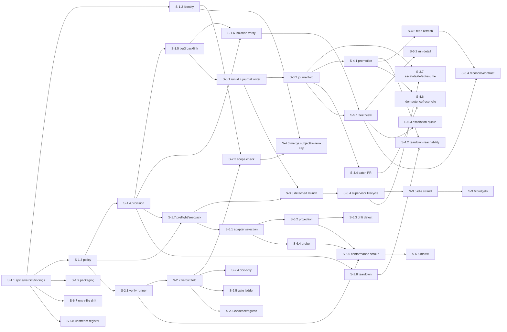

---
stepsCompleted:
  - step-01-validate-prerequisites
  - step-02-design-epics
  - step-03-create-stories
  - step-04-final-validation
inputDocuments:
  - "_bmad-output/projects/pyforge-marshal/planning-artifacts/prd.md"
  - "_bmad-output/projects/pyforge-marshal/planning-artifacts/architecture.md"
  - "_bmad-output/projects/pyforge-marshal/planning-artifacts/product-brief-pyforge-marshal.md"
  - "_bmad-output/projects/pyforge-marshal/planning-artifacts/research/market-agent-orchestration-research-2026-07-25.md"
  - "_bmad-output/projects/pyforge-marshal/planning-artifacts/research/domain-agent-portability-and-governance-research-2026-07-25.md"
project_name: pyforge-marshal
epicCount: 31  # 2026-09-06: Epic 31 added (TEA replaces the generator + estate cutover-readiness, spec-bmad-suite-lifecycle CAP-3/4/9 marshal relays). 2026-09-05: Epic 30 added (BMAD 6.12 era round, spec-bmad-611-era-alignment CAP-8..11); Epic 29 (2026-09-02) had not bumped this from 28. 2026-08-30: Epic 28 added (token economy, decomposing spec-marshal-token-economy; Dream docs/dreams/marshal-token-economy.md).
storyCount: 194  # 2026-09-06: 187 + Story 30.5 (shim retirement, era-alignment CAP-12) + Stories 31.1–31.6 (spec-bmad-suite-lifecycle marshal relays). 2026-09-05: 183 (181 + Epic 29's two, never counted) + Stories 30.1–30.4 (spec-bmad-611-era-alignment CAP-8..11). 2026-08-30 (second pass): 179 + Stories 28.10/28.11 (spec-marshal-token-economy CAP-11/CAP-12, minted from the operator's 2026 model/cost catalog — see model-economics.md companion). The ledger's key count is the enumeration; this numeral is a dated snapshot.
updated: "2026-09-06"  # 2026-09-06: Story 30.5 + Epic 31 added from spec-bmad-suite-lifecycle (Dream 2026-09-06); the era-alignment shim constraint and TEA non-goal were superseded by memlog the same day. Prior: arch→epics currency: validated against architecture.md's 2026-09-05 re-ground (PR #1063 — source_pin v8.86.1 + live gotcha/env counts only; no AD added, changed, or removed), so no epic or story moves. Prior stamp 2026-09-01: Stories 28.18–28.23 (drain self-resolution, Dream addendum F).
status: complete
mode: headless
# The single canonical story source for this station: every `### Story` heading here maps
# 1:1 to a sprint-status-ledger.yaml story key. Exactly one `canonical` per station (AD-72).
epics_role: canonical
---

# pyforge-marshal — Epic Breakdown

## Overview

Decomposition of Marshal's PRD (58 FRs / 14 NFRs across 8 features) and architecture spine (39 ADs, hexagonal with an out-of-process supervisor sidecar) into **6 epics and 40 stories**.

Epics are organized by **user value**, not by architectural layer: each one leaves the operator able to do something they could not do before, and none requires a later epic to function. The critical-path story is **S-1.1** (package spine, verdict lattice, findings registry, and the meta-tests that enforce AD-3/AD-4) — every other story's compliance is checked by machinery it establishes.

Effort scale: **XS** (≤4 h), **S** (½–1 day), **M** (1–3 days), **L** (3–5 days). Story IDs are `S-<epic>.<seq>`.

Two conventions carried from the sibling builds:
- Every story declares its **surface** (the files it may touch); the gate intersects that with the epic's policy surface (AD-27).
- Every merged story's spec is promoted into `planning-artifacts/specs/` — from Epic 4 onward Marshal does this itself (FR-30); before that it is a manual step.

---

## Requirements Inventory

### Functional Requirements

**Loop homes & isolation** — FR-1 provision a loop home · FR-2 per-worktree active-project state · FR-3 single-sourced Tier-3 store · FR-4 isolation verification · FR-5 preflight · FR-6 teardown · FR-7 adapter config seeding · FR-8 enumerate loop homes

**Run supervision** — FR-9 detached launch · FR-10 scoped launch · FR-11 supervisor attaches · FR-12 idle-strand detection · FR-13 budget ceilings · FR-14 heaviest-story advisory · FR-15 escalation surfacing · FR-16 deferral capture · FR-17 resume · FR-18 run journal · *(added 2026-08-01)* FR-61 bounded-loss durability

**Gates & verification** — FR-19 standalone gate evaluation · FR-20 project-scoped verify commands · FR-21 deterministic no-LLM gates · FR-22 frozen-surface scope check · FR-23 doc-only classification · FR-24 gate mode ladder · FR-25 gate evidence record · FR-26 never false-green · FR-27 review-cap landing path · *(added 2026-08-01)* FR-64 gate binds to the spec's Success signal

**Landing & paper trail** — FR-28 batch pull request · FR-29 repository-hygiene preflight · FR-30 automatic story-spec promotion · FR-31 spec-recovery assistance · FR-32 merge-subject conformance · FR-33 sprint & console feed refresh · FR-34 deploy idempotence · FR-35 no AI attribution · *(added 2026-08-01)* FR-59 landing rules as policy · FR-60 `marshal land` · FR-63 fleet-wide branch retirement

**Fleet visibility** — FR-36 fleet view · FR-37 per-run detail · FR-38 escalation queue · FR-39 ledger-vs-git reconciliation · FR-40 stable machine-readable status contract · *(added 2026-08-01)* FR-62 durability as a reported fleet property · FR-65 `marshal check` — the detector registry, context resolved once

**Adapter portability** — FR-41 skill-tree projection · FR-42 projection drift detection · FR-43 adapter probe · FR-44 conformance smoke · FR-45 conformance matrix · FR-46 entry-file family drift check · FR-47 first-run acknowledgement · FR-48 project-scoped adapter selection

**Policy composition** — FR-49 layered composition · FR-50 project-scoped policy · FR-51 per-story model tiering · FR-52 single harness seam · FR-53 policy validation · FR-54 inspectable configuration

**Packaging & distribution** — FR-55 package identity & layout · FR-56 conda and wheel artifacts · FR-57 version & capability reporting · FR-58 upstream contribution register

### Non-Functional Requirements

NFR-1 determinism · NFR-2 offline by default · NFR-3 never false-green · NFR-4 supervisor independence · NFR-5 structural over conversational governance · NFR-6 no destructive default · NFR-7 idempotence · NFR-8 durable self-owned evidence · NFR-9 harness contract tests · NFR-10 lean dependencies · NFR-11 secret hygiene · NFR-12 machine-readable everything · NFR-13 platform targets · NFR-14 performance envelope

### Additional Requirements (architecture-originated)

The reviewer gate on the architecture spine surfaced seven critical divergence classes that became ADs after the PRD was written. They are requirements in their own right and are traced in the coverage map below: **AD-25** Marshal-owned run identity · **AD-26** accumulating state has one producer · **AD-27** allowlists narrow only · **AD-28** addressable journal entries and AD-6×AD-21 precedence · **AD-29** promotion durability · **AD-30** serialized append protocol · **AD-31** closed lattice with owned admission criteria · **AD-32** session data is evidence not control · **AD-33** truth partitioned by domain · **AD-34** redaction at egress ports · **AD-35** write-once materialized policy · **AD-36** declared projection mechanism · **AD-37** machine-scoped write target · **AD-38** feed reports completeness · **AD-39** envelope field relationships.

### UX Design Requirements

None — Marshal is a CLI with no visual surface. Its "UX" is the envelope contract (AD-14, AD-39) and finding codes (AD-15): every human view is a pure projection of machine-readable output, so there is no human-only information and no separate UX artifact.

### FR Coverage Map

| Epic | FRs covered | NFRs / ADs primarily discharged |
|---|---|---|
| **E1** Provisioned, verified loop homes | FR-1..FR-8, FR-49..FR-57 | NFR-1, 7, 10, 12, 13, 14; AD-3, 4, 7, 10, 11, 14, 15, 16, 21, 23, 24, 31, 35, 38, 39 |
| **E2** Gates you can run | FR-19..FR-27 (FR-27 partial), FR-64 | NFR-3, 5, 11; AD-8, 17, 26 (seed), 27, 34, 49 |
| **E3** Supervised unattended runs | FR-9..FR-18, FR-61 | NFR-4, 6, 8, 9; AD-5, 6, 9, 20, 22, 25, 26, 28, 30, 32, 46 |
| **E4** Landing with a durable paper trail | FR-27 (completion), FR-28..FR-35, FR-59, FR-60, FR-63 | NFR-6, 8; AD-12, 13, 21, 24, 28, 29, 33, 40, 42, 47 |
| **E5** Fleet visibility | FR-36..FR-40, FR-62, FR-65 | NFR-12; AD-5, 33, 39, 48, 50 |
| **E6** Portability proven | FR-41..FR-48, FR-58 | NFR-2, 9; AD-19, 31, 34, 36, 37 |

Every FR-1..FR-65 appears exactly once as a primary owner. FR-27 spans E2 (the gate re-run) and E4 (the landing), noted explicitly in both.

---

## Epic List

| Epic | Title | User value delivered | Stories | Effort |
|---|---|---|---|---|
| **E1** | Provisioned, verified loop homes | The operator can create an isolated, policy-composed, preflight-verified place for a loop to run — and prove two of them are isolated | 12 | ~15 days |
| **E2** | Gates you can run | The operator or CI can evaluate the gate standalone and get a verdict that never false-greens | 8 | ~9 days |
| **E3** | Supervised unattended runs | The operator can launch a gated run detached and have it watched — idle strands caught, budgets enforced, escalations surfaced | 13 | ~14 days |
| **E4** | Landing with a durable paper trail | The operator can land a wave and have every merged story's spec survive teardown, automatically | 15 | ~10 days |
| **E5** | Fleet visibility | The operator can see every loop home at once and be told where the ledger and git disagree | 10 | ~5 days |
| **E6** | Portability proven | The operator can run the method on another agent and hold a dated artifact proving it | 9 | ~12 days |
| **E7** | Foundation & the write guard | The seed installer has its module tree, an error taxonomy, and a write primitive nothing can route around | 6 | ~7 days |
| **E8** | The managed-region engine | A team's own file can carry a tool-owned span that upgrades without touching the rest | 5 | ~8 days |
| **E9** | Detect & plan | An operator can see exactly what would change before anything is written | 6 | ~9 days |
| **E10** | Materialize & the core verbs | `marshal seed check` / `adopt` / `init` work, each the previous plus one capability | 7 | ~12 days |
| **E11** | Derive, migrate & update | An installed repo takes a later model version with no hand edits | 6 | ~10 days |
| **E12** | Packaging, oracle & hardening | The installer ships, runs offline, and proves it never writes where it must not | 6 | ~8 days |
| **E13** | Surface drift reconciliation | The spec-surface gate can be cleared honestly, one spec at a time, and its signal trusted | 7 | (shipped) |
| **E14** | The shared floor — pyforge-core | Five primitives written 3-20× become one enforced leaf; 14.1/14.2 gate seed 7.2/7.3 | 4 | (new 2026-08-10) |
| **E15** | Fleet operations run themselves | Loop-home refresh + landing-promotes-ledger stop being hand rituals | 2 | (new 2026-08-10) |
| **E16** | The board derives truth | One slug resolver, derived sources, loud failures | 1 | (new 2026-08-10) |
| **E17** | Instruments verified, chains regenerable | Detector blind spots pinned; chain regeneration one invocation | 4 | (new 2026-08-10) |
| **E18** | The governed tool surface | Marshal's capabilities as typed tools; parity/coverage gated | 2 | (new 2026-08-10) |
| **E19** | The testing charter, enforced | One TEA generator, shared kit, coverage gates | 3 | (new 2026-08-10) |
| **E20** | The loop cannot lose work, and a landing is always recognizable | The operator can trust that a stranded attempt is preserved and loud, a scope drift refuses instead of passing, and every classifier agrees a landed story landed | 10 | (new 2026-08-14) |
| **E21** | The planning chain regenerates itself, and audits whether it's coherent | Chain regeneration becomes one invocation; a coherence verdict reaches the fleet board | 5 | (new 2026-08-15; row added 2026-08-21 — it was missing from this table) |
| **E22** | Single-story dispatch is a marshal verb | The 22-story hand ritual replays as governed machinery: one isolated session per story, judged from git facts, independently verified, landed with the full paper trail | 7 | (new 2026-08-21; 22.7 added 2026-08-27) |
| **E23** | Velocity captures hand-driven work | Every done story with real signal shows a timing mark; wall-clock never masquerades as active-compute | 3 | (new 2026-08-21) |
| **E24** | Liveness is one command | "Is this run alive?" answered by the supported CLI — never by hand-parsing engine.pid | 3 | (new 2026-08-21) |
| **E25** | Aligned to the installed BMAD era | Artifacts, patterns, and marshal surfaces match 6.11/0.11 — retired IDs purged and guarded, every spec folder tool-updatable, the new policy knobs governed and run states named | 7 | (new 2026-08-22) |
| **E29** | Done-spec dispatch does not review-loop | A `done` story cannot spawn confirmatory review commits or another harness session; land or escalate | 2 | (new 2026-09-02; CAP-11) |
| **Total** | | | **162** | **~119 days ≈ 24 weeks single-builder (E1-E12 figure; see note)** |

*Story counts re-verified 2026-08-10 (FR-128..163 decomposition): headings and
`sprint-status-ledger.yaml` story keys agree at **119** (E1-E6 = 60, E7-E12 = 36, E13 = 7,
E14-E19 = 16). The 2026-08-08 note claiming "all three agree at 86" was false when written —
E1/E3/E4/E5 counts and the E13 row were stale in this table while the headings and ledger
already carried the larger truth. **Effort is NOT re-estimated**; E1-E6 figures
still reflect the original per-epic scope and E7-E12 carry the installer's own estimates.
Treat the day figures as understated pending a full re-estimate. **Story 5.8 added
2026-08-11** (FR-181, queued via the Dream/Spec chain, not yet in
`sprint-status-ledger.yaml` — that file is generated by `sprint-ledger-sync` and was
deliberately left untouched by this addition) brought E1-E6 to 61 and the total to 120.
**Stories 3.11-3.13 added 2026-08-11** (FR-182/183/184, queued via the same Dream/Spec chain —
`docs/dreams/adaptive-model-tiering.md` and `docs/dreams/horizontal-run-concurrency.md` — same
"not yet in `sprint-status-ledger.yaml`" caveat) brought E1-E6 to 64 and the total to 123.
**Stories 2.8 and 5.9 added 2026-08-11** (FR-185 review-depth tiering, FR-186 quick-dev
ledger reconciliation — same Dream/Spec-chain convention, same deliberate exclusion from
`sprint-status-ledger.yaml` pending its next sync) bring E2 to 8, E5 to 9, E1-E6 to 65, and
the total to 125. **Story 5.10 added 2026-08-12** (FR-187, `marshal land` detectable-merge-subject
fix, sourced from `spec-marshal-land-merge-subject` — discovered during Story 5.9's own review,
backlog, not a prerequisite for it — same deliberate exclusion from `sprint-status-ledger.yaml`
pending its next sync) brings E5 to 10, E1-E6 to 66, and the total to **126**; the ledger will
re-agree on its next sync. **Epic 20 (Stories 20.1-20.10) added 2026-08-14** (FR-188..FR-191,
decomposing `spec-bmad-loop-baseline-drift`, `spec-bmad-loop-intent-gap-work-preservation`,
`spec-bmad-switch-scope-enforcement`, and `spec-landing-evidence-grammar` — same Dream/Spec-chain
convention, same deliberate exclusion from `sprint-status-ledger.yaml` pending its next sync)
brings the total to **136**. **Epics 22–24 (Stories 22.1–22.6, 23.1–23.3, 24.1–24.3) added
2026-08-21** (FR-193/FR-194/FR-195, decomposing `spec-marshal-single-story-dispatch`,
`spec-dashboard-velocity-captures-hand-driven-work`, and `spec-bmad-loop-liveness-footgun` —
same Dream/Spec-chain convention). Unlike earlier additions, the Tier-3 feed and tracked
ledger were synced in the SAME pass, and this table's Total is re-verified against the
ledger's post-sync story-key count (**155**) rather than the running arithmetic above —
which had drifted twice more since 2026-08-14 (the E21 row was missing from this table
entirely, and post-2026-08-14 story additions such as 10.8 were never folded into the
Total). The numeral rots; the ledger's key count is the enumeration. **Story 22.7 added
2026-08-27** (FR-193 CAP-7 fleet drain — the one CAP the 2026-08-21 decomposition left
uncovered; tracked ledger synced in the same pass, key count now **166**). **Epic 28
(Stories 28.1–28.9) added 2026-08-30** (decomposing `spec-marshal-token-economy`, Dream
`docs/dreams/marshal-token-economy.md` — same Dream/Spec-chain convention, citing the spec's
own CAP-1..CAP-10 rather than minting PRD FRs, per the Epic 26/27 external-spec-cite
precedent; Tier-3 feed and tracked ledger synced in the same pass — the sync's own
`--repair-feed` also restored 5 keys the Tier-3 feed had lost vs the twin (20.11, 22.7–22.10),
so the post-sync ledger-verified story-key count is **179**, matching the heading count; the
2026-08-27 numeral of 166 had already rotted by four before this pass, proving its own point).*

**Epics 7-12 were a separate document until 2026-08-08** (`epics-genesis-installer.md`, now
archived). They were always Marshal's own — the installer's buildable half moved here on
2026-07-28 — but lived in a second file feeding the same ledger, which is the one
inconsistency `epics_role: canonical` now makes impossible to reintroduce silently (AD-72).

**Standalone-ness check.** E1 ships a usable `marshal init` / `config` / `status --homes` with no later epic. E2 ships `marshal gate evaluate` usable by a human or CI with no run in flight. E3 needs E1 and E2 and nothing later. E4 needs E1–E3. E5 needs E3's journal. E6 needs E1 only. No epic requires a later epic to function.

---

## Epic 1: Provisioned, verified loop homes

**Goal:** the operator can stand up an isolated loop home for any project in one idempotent command — with policy composed and inspectable, adapter configs seeded, preflight run, and isolation from every other home provable. Establishes the package spine, the verdict lattice, the findings registry, and the meta-tests that police every later story.

**Critical path: nothing else can be built until S-1.1 lands.**

### Story 1.1: Package spine, verdict lattice, findings registry, and the meta-tests that enforce them

As the Marshal builder,
I want a clean package skeleton whose architectural invariants are machine-enforced from the first commit,
So that every later story is checked by machinery rather than by memory.

**Type:** foundation • **Effort:** M • **Deps:** none • **FR/AD:** FR-55, FR-57, NFR-1, NFR-10, NFR-12; AD-3, AD-4, AD-7, AD-14, AD-15, AD-31, AD-39
**Surface:** `src/shared/packages/pyforge-marshal/**`, root `pixi.toml` (dependency additions only)

**Acceptance Criteria:**

**Given** a clean environment
**When** the package is installed from the repo
**Then** `import pyforge.marshal` succeeds and `marshal --help` and `marshal --version` run
**And** the tree matches the architecture's Structural Seed (`cli/`, `core/`, `ports/`, `adapters/`, `supervisor/`, `schemas/`, `tests/{unit,contract,meta,integration}`), with `pyproject.toml` **and** a member `pixi.toml` per sibling convention
**And** `core/verdict.py` owns the lattice `error > gate-failed > scope-violation > unevaluable > warn > clean`, its exit-code projection, and a total `classify(finding_code) -> lattice_member`; no other module constructs an exit code (AD-7, AD-31)
**And** `core/findings.py` holds a registry of `MRS-<AREA>-<NNN>` codes; emitting an unregistered code fails a test (AD-15)
**And** the envelope `{schema_version, command, status, verdict, data, data_version, findings[], assumptions[]}` is emitted by every command, `status` is derived from `verdict`, and `schema_version` governs envelope keys only while `data_version` comes from a per-command registry (AD-14, AD-39)
**And** `tests/meta` fails the build when: any module outside `adapters/harness_bmadloop.py` references the harness (AD-3, via an import-linter contract with import-linter provisioned in `pixi.toml`); `core/**` imports `subprocess`, `os`, `time`, or `adapters` (AD-4); an exit code is constructed outside `core/verdict.py` (AD-7); or `status`/`verdict`/max-finding-severity are mutually inconsistent (AD-39)
**And** Marshal declares PyYAML, tomlkit, psutil and jsonschema as its **own** direct dependencies rather than inheriting them from the harness, with tomlkit capped `<0.13.3` per the environment

### Story 1.2: Story identity, merge-subject rendering, and feed completeness

As the Marshal builder,
I want one owner for story keys and the merge-subject string,
So that the loop, the journal, the spec archive, the merge subject and the dashboard can never key stories differently.

**Type:** foundation • **Effort:** S • **Deps:** S-1.1 • **FR/AD:** FR-32 (render/parse half), NFR-12; AD-23, AD-24, AD-38
**Surface:** `core/identity.py`, `tests/unit/test_identity.py`

**Acceptance Criteria:**

**Given** any external story reference (feed key, filename slug, branch segment, merge subject)
**When** `core.identity.normalize()` is called
**Then** it returns the canonical key `<epic>.<seq>` with an optional ordered suffix preserved and normalized (AD-38)
**And** one render function exists per external form; no module string-formats a story key inline (asserted by a meta-test)
**And** non-conforming input produces a registered finding, never a silent coercion
**And** resolving a set of story references reports `resolved N of M`, and **`N < M` produces a non-zero verdict naming every unresolved key** — a silently shortened feed is impossible (AD-38)
**And** the merge-subject template is rendered and parsed by the same module, and a round-trip property test proves `parse(render(k)) == k` for every key shape

### Story 1.3: Layered policy composition with provenance and validation

As the operator,
I want to see the effective run policy and where each value came from,
So that project-specific configuration never requires hand-editing a shared file.

**Type:** feature • **Effort:** M • **Deps:** S-1.1 • **FR/AD:** FR-49, FR-50, FR-53, FR-54; AD-10, AD-16, AD-26, AD-35
**Surface:** `core/policy.py`, `cli/config.py`, `schemas/policy.json`, `tests/unit/test_policy.py`

**Acceptance Criteria:**

**Given** Marshal defaults, a project policy layer, and invocation flags
**When** composition runs
**Then** precedence is defaults → project → flags, last wins, with no fourth layer and no per-key reordering (AD-16)
**And** the result is an immutable `EffectivePolicy` value; composition is pure and the same inputs produce the same output (AD-10)
**And** every field carries its winning layer and raw source value, and `marshal config` prints key, effective value, and winning layer, with secrets redacted
**And** **every field is tagged `static` or `seed`**; reading a `seed` field (frozen surfaces, gate mode, attempt counts) outside the journal fold fails a meta-test (AD-26) — **except through `EffectivePolicy.seed_view()`**, the display/validation accessor the meta-test whitelists, which is what lets this story's own `marshal config` AC and FR-53's preflight validation range over every key without contradiction (F-8)
**And** the worktree-seed path list is **generated from the active project**, never literal — switching projects requires no edit to any shared file (FR-50)
**And** unknown keys, unresolvable commands, and out-of-range values are rejected with a registered finding naming the layer that introduced them
**And** the materialized artifact is named by its content hash and never overwritten (AD-35)

### Story 1.10: Render the harness policy from the canonical EffectivePolicy

As the operator,
I want Marshal to **render** `.bmad-loop/policy.toml` from the composed policy rather than anyone hand-editing it,
So that per-project and per-tier settings reach the harness without a shared tracked file bleeding one project's config onto every other.

**Type:** feature • **Effort:** M • **Deps:** S-1.3 • **FR/AD:** FR-49, FR-50, FR-51; AD-10, AD-12, AD-35
**Surface:** `adapters/harness_bmadloop.py`, `tests/unit/test_harness_policy_render.py`, `tests/meta/test_rendered_policy_untracked.py`, `.gitignore`

> **Added 2026-07-25 to close F-1 (CRITICAL).** The review found the composed policy had **no path to the harness at all**: `bmad-loop 0.9.0` hard-codes `POLICY_FILE = .bmad-loop/policy.toml` with no policy-path flag, that file is git-tracked, AD-10 forbade Marshal editing it, and FR-51's tier-batching required exactly that edit. A grep of this file for `policy.toml` returned nothing — S-1.3 materializes an `EffectivePolicy` that nothing conveys to the engine it is composed for.

**Acceptance Criteria:**

**Given** a materialized `EffectivePolicy` (S-1.3) and a loop home
**When** the harness adapter renders
**Then** `.bmad-loop/policy.toml` is written **whole** from that policy — never patched, never merged with an existing file — and is byte-identical for identical input (AD-12 derived-artifact discipline)
**And** the canonical artifact stays content-addressed and write-once; only this projection carries the harness's fixed name (AD-35)

**Given** FR-51 tier-batching
**When** stories are batched by model tier
**Then** each batch renders its own `[adapter.dev].model` — automating the hand-edited `HARD-STORY BATCH PROCEDURE` block that FR-51 cites as its motivating evidence, with no human edit of a shared file

**Given** the rendered file
**When** the repository is inspected
**Then** `.bmad-loop/policy.toml` is **untracked** (`.gitignore`d) and a meta-test asserts `git ls-files` does not list it
**And** a loop home's `git push origin HEAD:main` cannot carry it — closing the live cross-project bleed observed at review time, where `loop-pyforge-herald` held 17+/27− of herald-specific policy on a tracked file shared with every project

**Given** a repo-wide default (e.g. the standing independent-review trigger)
**When** it is changed
**Then** it is expressed in the **tracked canonical policy source**, never by editing the rendered file — and the change reaches every project through re-rendering

> **SEQUENCING (hard).** Untracking must not precede rendering. Until this story lands, `.bmad-loop/policy.toml` stays tracked, because a fresh loop home cloned without it would leave `bmad-loop` with no policy at all. `git rm --cached` is the **last** step of this story, not a preparatory one.

### Story 1.4: Provision a loop home

As the operator,
I want one idempotent command that creates an isolated worktree on `loop/<slug>` with its own active-project state,
So that starting work on a project is a single verified action.

**Type:** feature • **Effort:** M • **Deps:** S-1.1, S-1.3 • **FR/AD:** FR-1, FR-2; NFR-7; AD-11, AD-21
**Surface:** `cli/init.py`, `adapters/vcs_git.py`, `adapters/fs_local.py`, `ports/vcs.py`, `ports/fs.py`

**Acceptance Criteria:**

**Given** a project slug with no existing loop home
**When** `marshal init <slug>` runs
**Then** a git worktree exists at the conventional sibling path on branch `loop/<slug>`
**And** the home carries its own active-project marker and planning-artifact symlinks, independent of every other home and of the main checkout
**And** the marker and the planning symlinks always agree; disagreement is a blocking registered finding, never silently tolerated
**And** the command prints a directly runnable launch line exporting `BMAD_ACTIVE_PROJECT`
**And** re-running against an existing home reports each step `done | skipped | failed`, changes nothing, and exits 0 (AD-21, NFR-7)
**And** Marshal writes only inside the home, the canonical Tier-3 store, declared promotion targets, and the machine-scoped path — a test asserts no write outside those four (AD-11)
**And** `main` is never checked out in a second tree

### Story 1.5: Single-sourced Tier-3 store via backlink

As the operator,
I want a loop home's execution artifacts to resolve to one canonical store,
So that every consumer sees the same path and no migration is ever needed.

**Type:** feature • **Effort:** S • **Deps:** S-1.4 • **FR/AD:** FR-3; AD-11
**Surface:** `cli/init.py`, `adapters/fs_local.py`

**Acceptance Criteria:**

**Given** a fresh loop home where the gitignored Tier-3 target does not exist
**When** provisioning runs
**Then** the home's `implementation-artifacts` realpath equals the main checkout's canonical directory
**And** the canonical directory is created if absent
**And** a **real, non-empty local directory is never replaced** — the command refuses with a registered finding naming the path
**And** the main checkout's own marker and symlinks are unchanged

### Story 1.6: Isolation verification and home enumeration

As the operator,
I want to prove that my loop homes are genuinely isolated,
So that running many projects at once is a checked property rather than a hope.

**Type:** feature • **Effort:** S • **Deps:** S-1.4, S-1.5 • **FR/AD:** FR-4, FR-8
**Surface:** `cli/init.py`, `core/status.py` (homes view only)

**Acceptance Criteria:**

**Given** two or more provisioned loop homes
**When** isolation verification runs across them
**Then** it exits 0 when markers and planning symlinks are independent, Tier-3 realpaths are identical, and the main checkout's active project is untouched
**And** it exits non-zero with a registered finding naming the specific cross-talk on any violation
**And** it accepts **N ≥ 2** homes in one invocation
**And** enumeration lists one row per home — path, branch, active project, desync flag — in both human and envelope form

### Story 1.7: Preflight, adapter config seeding, and first-run acknowledgement

As the operator,
I want to be told a run cannot start *before* I launch it,
So that I never discover a missing prerequisite at minute 90.

**Type:** feature • **Effort:** M • **Deps:** S-1.3, S-1.4 • **FR/AD:** FR-5, FR-7, FR-47; AD-19
**Surface:** `cli/init.py`, `adapters/harness_bmadloop.py`, `ports/harness.py`

**Acceptance Criteria:**

**Given** a provisioned loop home
**When** preflight runs
**Then** it reports harness presence and version, multiplexer backend availability, adapter binary presence, story-feed resolvability and parseability, verify-command resolvability, and that `main` is not checked out twice
**And** each configured adapter's declared seed files are present in the home afterwards, sourced from the harness profile and composed policy — **not** from a hard-coded list (AD-19, FR-7)
**And** each adapter's declared first-run requirement is surfaced as an explicit required human action, and an unacknowledged adapter is a **blocking** finding — because an unanswered first-run dialog is indistinguishable from a session timeout (FR-47)
**And** a sustained-automation caveat is presented once per adapter and the acknowledgement recorded
**And** any blocking finding exits non-zero and names itself; policy validation (S-1.3) runs as part of preflight
**And** preflight completes in under 10 seconds on a warm checkout (NFR-14)

### Story 1.8: Teardown that refuses to destroy work

As the operator,
I want teardown to remove a loop home cleanly and refuse when work would be lost,
So that cleanup is never the thing that costs me a wave.

**Type:** feature • **Effort:** S • **Deps:** S-1.4 • **FR/AD:** FR-6; NFR-6; AD-29 (hook)
**Surface:** `cli/init.py`, `adapters/vcs_git.py`

**Acceptance Criteria:**

**Given** a provisioned loop home
**When** teardown runs
**Then** the worktree and branch are removed and `git worktree list` is clean afterwards
**And** it **refuses** with a registered finding when the home has uncommitted or unmerged work, unless explicitly forced
**And** it never touches the canonical Tier-3 store
**And** a documented extension point exists for the promotion-reachability predicate that Epic 4 wires in (AD-29), and it is a no-op while no promotions exist
**And** no Marshal operation force-updates or force-pushes anything (NFR-6)

### Story 1.9: Packaging, distribution, and version reporting

As the operator,
I want one install command to yield Marshal and its harness together,
So that the wrap decision pays off at the point of use.

**Type:** infra • **Effort:** M • **Deps:** S-1.1 • **FR/AD:** FR-55, FR-56, FR-57; NFR-10, NFR-13; AD-2, AD-3
**Surface:** `src/shared/packages/pyforge-marshal/{pyproject.toml,pixi.toml}`, root `pixi.toml`

**Acceptance Criteria:**

**Given** the package source
**When** the conda artifact is built via pixi-build-python wrapping the hatchling wheel (the sibling path — neither sibling ships through `recipes/`)
**Then** installing it yields a working `marshal --help` with the harness resolvable
**And** the conda recipe declares `bmad-loop >=0.9.0,<0.10` as a **run dependency**, never vendored (AD-2)
**And** wheel and sdist build from the same source tree
**And** `marshal --version` reports Marshal's version **and** the resolved harness version, both of which appear in every run journal
**And** a harness outside the supported range emits a prominent warning, and a major mismatch is a blocking preflight finding
**And** build and smoke targets exist for linux-64 and osx-arm64; Windows is declared WSL-first rather than silently failing (NFR-13)

---

### Story 1.12: A stale loop home cannot be spun *(added 2026-08-09 — FR-180)*

As the operator,
I want preflight to refuse a loop home that is behind `main`,
So that a stale baseline cannot silently switch the surface guard off.

**Type:** feature • **Effort:** S • **Deps:** S-1.11 • **FR/AD:** FR-180

**Why preflight and not the landing.** FR-173 makes a landing leave the home current — but every
landing on 2026-08-09 was done by hand (`gh pr merge`), so that code never ran and eight homes
drifted 33–74 commits behind with nothing reporting it.

**Acceptance Criteria:**

**Given** a provisioned loop home whose HEAD is an ancestor of `origin/main`
**When** `marshal preflight <slug>` runs
**Then** it reports **`MRS-PREFLIGHT-014` at ERROR** and exits non-zero, naming both shas and
printing a remedy that is runnable exactly as shown
**And** a home whose HEAD equals `origin/main` is silent — otherwise every preflight reds and
the gate stops being read
**And** a home merely **AHEAD** (unlanded story merges — the ordinary mid-run state) is **not**
refused
**And** any probe failure yields no finding: a diagnostic must never become a refusal
**And** FR-173's landing resync is amended to **push** the station branch, since provisioning
reads origin and seven homes sat 33–74 commits behind there after their work had landed

### Story 1.11: A loop agent cannot mutate repo-wide git state *(added 2026-08-09 — FR-178)*

As the operator,
I want isolation to cover the shared git directory, not just the working tree,
So that one dev session cannot silently change what every other worktree can see.

**Type:** feature • **Effort:** S • **Deps:** S-1.6 • **FR/AD:** FR-178

**Why now.** Every loop home and per-story worktree resolves `--git-common-dir` to the same
`local-recipes/.git`. Measured 2026-08-09: `/.claude/skills` was re-added to
`.git/info/exclude` **three times**, most recently *while a run was live* — hiding new files
from `git status` and `git add -A` in every worktree simultaneously.

**Acceptance Criteria:**

**Given** a provisioned loop home
**When** `marshal preflight` (or `homes`) runs
**Then** a mutation of the **shared** git directory — `info/exclude` at minimum — is reported
against a recorded baseline, naming the rule and what it hides
**And** the report distinguishes shared-state mutation from ordinary worktree state: FR-8's
isolation check covers worktrees and branches and does **not** see this
**And** the filesystem-walking guard `test_skill_files_tracked.py` is left in place — it walks
the tree instead of asking git, so it is the only signal that survives the rule, and it is what
caught the third recurrence
**And** a test proves the detection on a fixture whose `info/exclude` carries a rule the tracked
tree would otherwise match

## Epic 2: Gates you can run

**Goal:** the gate stops being a configuration line inside somebody else's orchestrator and becomes a first-class object a human or CI can invoke. After this epic the operator can, at any moment, ask "would this pass?" and get a deterministic answer that can never be a false green.

### Story 2.1: Standalone verify-command runner, project-scoped

As the operator or CI,
I want to run this project's gates without a loop in flight,
So that I can check a tree before approving anything.

**Type:** feature • **Effort:** M • **Deps:** S-1.1, S-1.3 • **FR/AD:** FR-19, FR-20, FR-21; NFR-1, NFR-2; AD-4, AD-17, AD-26

> **F-3 resolution threaded in (2026-08-02, drift fix).** The adversarial review (`reviews/review-ad25-39-adversarial-2026-07-25.md`, `verdict: ALL-RESOLVED` 2026-07-30) resolved F-3 into AD-26's Resolution note, but that resolution had not been propagated into this story's own acceptance criteria — a developer reading only this story would not have known evaluation-with-no-run-in-flight folds the policy seed alone, not a run-scoped state. Added below; no other story or document changes.

**Surface:** `core/gate.py`, `cli/gate.py`, `ports/process.py`, `adapters/process_posix.py`

**Acceptance Criteria:**

**Given** a project with configured verify commands
**When** `marshal gate evaluate` runs with no run in flight
**Then** each command runs and pass/fail is reported per command with captured output
**And** verify commands resolve from composed policy scoped to the **active project** — another project's gates are never run (FR-20)
**And** evaluation **never mutates the working tree**
**And** no model call occurs anywhere in the path, and the same tree plus the same commands produce the same verdict (NFR-1, FR-21)
**And** verify commands are an explicit **allowlist**; anything not allowlisted is `unevaluable`, never permitted (AD-17)
**And** the aggregation logic lives in `core/gate.py` as a pure function over exit codes, with all process spawning behind `ProcessPort` (AD-4)
**And** with no run in flight, the evaluation folds **the policy seed alone** and says so: output carries an explicit `scope: policy-seed-only` marker and a `mid-run freezes not visible` note, so it is never mistaken for a run-scoped verdict (AD-26, F-3)
**And** when a run **is** in flight and its id is supplied, the same command folds that run's journal instead and answers the run-scoped question (AD-26, F-3)

### Story 2.2: Verdict aggregation that never false-greens

As the operator,
I want any check that cannot reach a definite pass to be a failure,
So that "could not determine" can never be read as "clean".

**Type:** feature • **Effort:** S • **Deps:** S-2.1 • **FR/AD:** FR-26; NFR-3; AD-8, AD-31
**Surface:** `core/gate.py`, `core/verdict.py`, `tests/unit/test_verdict.py`

**Acceptance Criteria:**

**Given** any combination of check outcomes
**When** the verdict is computed
**Then** it is the maximum over emitted findings' classifications plus the command-declared floor, and no module assigns a verdict directly (AD-31)
**And** a missing verify command, an unreadable spec, or a crashed check produces `unevaluable`, which projects to non-zero and blocks progression
**And** a property test asserts **there exists no input producing `clean` when any check is unevaluable** (AD-8)
**And** the lattice gains no new members
**And** exit codes come solely from `core/verdict.py`, with `130` on interrupt

### Story 2.3: Frozen-surface scope check, narrowing only

As the operator,
I want a story's changed files checked against both its declared surface and every frozen surface,
So that a producer story cannot silently amend a contract another story froze.

**Type:** feature • **Effort:** M • **Deps:** S-1.2, S-2.2, **S-3.2** • **FR/AD:** FR-22; NFR-3, NFR-5; AD-26, AD-27

> **Dependency corrected 2026-07-30 (F-9).** This story's own ACs require the frozen set to be "produced by the journal fold" — and the fold is **S-3.2, in the next epic**. As declared (`S-1.2, S-2.2`) the story was **not implementable in its position**: it depended on a component that did not yet exist. Adding `S-3.2` makes the graph honest. The alternative — moving the fold into Epic 2 — was rejected because S-3.2 also owns run-state derivation that Epic 3 needs, and splitting it would give the fold two homes. Epic 2 therefore completes after S-3.2 lands; the epic boundary is a value boundary, not a scheduling barrier.
**Surface:** `core/gate.py`, `core/policy.py` (seed accessor), `tests/unit/test_scope.py`

**Acceptance Criteria:**

**Given** a story spec declaring a surface, and a project policy declaring the epic's surface
**When** the scope check runs
**Then** the effective surface is computed as **`policy_surface ∩ spec_surface`**, and a meta-test asserts no other combinator is used (AD-27)
**And** a spec-declared path outside the policy surface is a hard finding — **a machine-drafted spec can only narrow, never widen, the allowlist it is judged against**
**And** a change to a frozen file is a hard failure naming the file **and the story that froze it**
**And** a change outside the effective surface is a failure naming every offending path
**And** the frozen set is produced by the journal fold over freeze declarations, with policy supplying only the **initial** set — reading the live set from `EffectivePolicy` fails a meta-test (AD-26)
**And** freeze declarations, freeze removals, and gate-mode changes are never sourced from an agent-writable artifact (AD-27)

### Story 2.4: Doc-only story classification

As the operator,
I want stories that legitimately produce no source change to pass,
So that a design-spike story does not trip a rollback loop.

**Type:** feature • **Effort:** S • **Deps:** S-2.2 • **FR/AD:** FR-23
**Surface:** `core/gate.py`

**Acceptance Criteria:**

**Given** a story whose declared deliverable is a document or decision record
**When** the gate evaluates a worktree with no source change
**Then** it does not fail on "no changes in worktree"
**And** classification is a pure function of the story's declaration, and is recorded in the run record
**And** a story **not** so classified that produces no change still fails, with a distinct registered finding
**And** a doc-only story that nonetheless touches a frozen surface still fails the scope check

### Story 2.5: Gate mode ladder with autonomy labels

As the operator,
I want the run's approval policy to be selectable and labelled with what autonomy level it represents,
So that the gate configuration is itself the autonomy declaration.

**Type:** feature • **Effort:** S • **Deps:** S-1.3, S-2.2 • **FR/AD:** FR-24; NFR-5
**Surface:** `core/policy.py`, `core/gate.py`, `cli/gate.py`

**Acceptance Criteria:**

**Given** a project policy
**When** a gate mode is selected
**Then** `per-story-spec-approval`, `per-epic` and `none` are supported
**And** each carries its explicit autonomy label — L2 Task-Based/Operator, L3 Conditional/Context Gates, L4 Approver respectively — surfaced at launch and in the run record
**And** the label mapping is data, not prose, and is emitted in the envelope
**And** changing gate mode is recorded as a decision entry with a timestamp and provenance, never applied silently
**And** the effective mode is read through the journal fold, not from policy directly (AD-26)

### Story 2.6: Gate evidence record with redaction at egress

As the operator,
I want every gate evaluation to leave a durable, redacted record,
So that I can prove months later what was checked and what it said.

**Type:** feature • **Effort:** M • **Deps:** S-2.2 • **FR/AD:** FR-25; NFR-8, NFR-11; AD-34
**Surface:** `core/egress.py`, `ports/*.py` (egress classification), `adapters/fs_local.py`, `schemas/gate-record.json`

**Acceptance Criteria:**

**Given** a completed gate evaluation
**When** the record is written
**Then** it captures commands run, exit codes, scope-check verdict, tree revision, and a UTC ISO-8601 timestamp
**And** the record is schema-validated and retrievable per story
**And** **every port that emits bytes outside the process is a declared egress port**, routed through the single redacting serializer in `core/egress.py`; egress ports accept only a `Redacted` payload type and a meta-test asserts none accepts a bare string (AD-34)
**And** the egress-port set lives in one code registry, and adding a port without classifying it fails the build
**And** redaction is tested against a fixture of known token shapes and covers policy-declared secret keys
**And** no call site performs its own redaction

---

### Story 2.7: A gate binds to the spec's Success signal *(added 2026-08-01 — FR-64 / AD-49)*

As the operator,
I want gate evaluation to confirm it is still running the verify commands the story's tracked spec named as its Success signal,
So that a test quietly removed after the spec was tracked shows up as a contract breach, not a passing suite.

**Type:** feature • **Effort:** S • **Deps:** S-2.1, S-4.1 • **FR/AD:** FR-64; AD-49, AD-26, AD-31
**Surface:** `core/gate.py`, `core/spec_binding.py`

**Acceptance Criteria:**

**Given** a story with a tracked `specs/spec-<key>.md`
**When** its gate is evaluated
**Then** the verify commands run are confirmed against the ones named in the spec's Success signal
**And** a narrowed or removed verify command since tracking is a registered finding, not a warning folded into an otherwise-green verdict
**Given** a story with no tracked spec to bind against
**When** its gate is evaluated
**Then** the missing binding is reported explicitly as a finding, never evaluated silently against nothing
**And** an untraceable or mismatched binding cannot be waived to green — it participates in the closed admission lattice (AD-31) like every other criterion

---

### Story 2.8: A low-risk story's review runs lighter, never absent *(added 2026-08-11 — FR-185)*

As the operator,
I want a story mechanically classified as low-risk to run review at reduced cost — fewer
cycles, or a cheaper pass — while the independent reviewer still runs on every story with no
exception,
So that an unattended run stops paying full review price for a change that is obviously
mechanical.

**Type:** feature • **Effort:** M • **Deps:** S-2.4 • **FR/AD:** FR-185

**Why now.** `gate_mode = "none"`'s own comment (cloned into all 9 loop homes) already draws
the line — human approval is skippable, the independent reviewer is not — but `max_dev_
attempts`/`max_review_cycles` are flat, repo-wide ceilings (`core/policy.py` `DEFAULT_
POLICY`), identical for a one-line doc fix and a cross-module rewrite. `classify_doc_only_
declaration` (Story 2.4, FR-23) already proves the idiom this needs — a pure function of a
story's own declaration plus an observed fact — but today it feeds only gate pass/fail for
the no-diff case, never review scheduling. Any mechanism reaching toward review depth has to
be checked against `DW-AD23-3` by name first: the upstream `max_followup_reviews` default of
`1` silently damped five real, reviewer-recommended follow-ups across three projects into a
gitignored ledger before the repo-wide value was raised to `2` with the incident documented
inline (`_bmad-output/policy-defaults.toml`). A tightened cap for a low-risk tier must not
reopen that hole.

**Acceptance Criteria:**

**Given** a story's own declaration and its observed diff shape
**When** the story is classified before review runs
**Then** classification is a pure function of already-gathered facts — no I/O, no model call,
no hidden state — mirroring `classify_doc_only_declaration`'s own shape
**And** the classification is recorded in the run record, never a silent choice
**Given** any classified story, regardless of tier
**When** review runs
**Then** the independent reviewer runs unconditionally — the `gate_mode = "none"` human
approval-only boundary is unchanged, and no tier ever causes review to be skipped
**Given** a story classified into a lower-risk tier
**When** its review cycles are bounded
**Then** it may run fewer cycles or a cheaper review pass than the repo-wide default, and a
higher-risk or unclassified story is never granted a *smaller* allowance than today's flat
ceiling
**Given** a reviewer-recommended follow-up on a story at ANY tier, including the lowest
**When** `deferred-work-check` runs
**Then** the follow-up is captured with the same completeness guarantee every tier already
gets — a test reproduces the `DW-AD23-3` shape (a follow-up surfaced under a tightened cap)
and proves it is captured, never silently dropped, for every defined tier
**And** `max_followup_reviews` (or an equivalent cap) is never lowered, for any tier, below
what `deferred-work-check` can still fully capture

---

## Epic 3: Supervised unattended runs

**Reopened 2026-08-09 for S-3.9 + S-3.10.** FR-61's stage-boundary push was verified WORKING in a live run; what failed was its *reporting* — a false `push-failed` on the success path, and a detector comparing branch names instead of tips. The guarantee holds; the claim about it did not.

**Goal:** the operator can launch a gated run and walk away. The supervisor — a separate process the session cannot disable — catches idle strands well before any token cap, enforces budgets over externally-observed quantities, surfaces escalations, and writes a durable journal that survives teardown.

### Story 3.1: Run identity and the journal writer

As the operator,
I want every run to have a Marshal-owned identity and an append-only journal written safely,
So that nine concurrent homes can share one store without braiding their histories together.

**Type:** foundation • **Effort:** M • **Deps:** S-1.1, S-1.5 • **FR/AD:** FR-18; NFR-8; AD-25, AD-28, AD-30
**Surface:** `core/journal.py`, `adapters/fs_local.py`, `schemas/journal.json`

**Acceptance Criteria:**

**Given** any run or session invocation
**When** the identifier is minted
**Then** Marshal mints it **at `intent` time, before any spawn** — globally unique, `<slug>-<utc-compact>-<random>`, sortable chronologically **within a slug** but not across the fleet; fleet-wide chronology sorts on `ts`, never on the id (AD-25)
**And** the harness's own identifier is recorded as `harness_run_id` on the first `outcome` entry and is **never** a key, a path segment, or a grouping field
**And** run directories are created with `mkdir`, which already fails `EEXIST`; a collision is a hard finding, never an append
**And** non-run invocations (standalone gate evaluation, adapter probe) mint into a separate `sessions/` namespace excluded from fleet folds **by construction, not by filtering**
**And** every entry carries `{id, ts, run_id, story?, kind, phase, intent_id?, payload}` where `id` is the composite **`(writer_id, counter)`** — monotonic within a writer, never across the run — and `phase ∈ intent | outcome | observation`, with `intent_id` mandatory on every `outcome` and absent on every `observation` (AD-28)
**And** each append is a single `os.write()` of one complete newline-terminated line on an `O_APPEND|O_CREAT` descriptor, `fsync`ed for `phase: intent`, with no buffered stream held open across appends (AD-30)
**And** payloads over 4 KiB go to a sidecar blob with a reference in the entry
**And** timestamps carry millisecond precision and total order is **`(ts, writer_id, counter)`** — a total order without cross-writer coordination, explicitly **not** a causal order; no consumer may infer causality from adjacency (AD-28)
**And** a concurrency test with a long-lived writer and repeated short-lived writers produces zero malformed lines **and zero duplicate `(writer_id, counter)` pairs** — the malformed-line assertion alone tests atomicity, not identity, and would pass while the id invariant was violated

### Story 3.2: The journal fold — one producer for accumulating run state

As the Marshal builder,
I want all run state derived from one fold over the journal,
So that no two components can disagree about what happened.

**Type:** foundation • **Effort:** M • **Deps:** S-3.1 • **FR/AD:** FR-18; AD-5, AD-26, AD-28, AD-30
**Surface:** `core/journal.py`, `tests/unit/test_fold.py`

**Acceptance Criteria:**

**Given** a journal
**When** the fold runs
**Then** it produces run state — story transitions, gate verdicts, escalations, deferrals, consumption, supervisor actions, frozen surfaces, attempt counts, effective gate mode
**And** these accumulating values have **exactly one producer**: this fold. Any module reading them from `EffectivePolicy` fails a meta-test (AD-26)
**And** `intent`/`outcome` pairing is by `intent_id` **only** — no positional or heuristic pairing exists anywhere (AD-28)
**And** an unparseable line is **quarantined**, surfaced as a registered finding, and makes **its own story key and decision domain `unevaluable`** — records provably unaffected stay evaluable; when the line's `story` or `kind` cannot be recovered the scope widens to the whole run, because unknown blast radius is not a reason to narrow it (AD-30)
**And** a reference to a **missing sidecar blob** is the same class and takes the same treatment — `unevaluable` for that record, never "quarantine and continue"
**And** the fold is a pure function over entries with no I/O (AD-4)
**And** a lone `intent` is reported as open, never inferred closed

### Story 3.3: Detached launch with scoped story selection

As the operator,
I want runs and resumes to detach by default,
So that a foreground timeout can never kill a run mid-review again.

**Type:** feature • **Effort:** M • **Deps:** S-1.7, S-3.1 • **FR/AD:** FR-9, FR-10, FR-52; AD-3, AD-22, AD-38
**Surface:** `cli/spin.py`, `adapters/harness_bmadloop.py`, `ports/harness.py`

**Acceptance Criteria:**

**Given** an approved spec and a provisioned home
**When** `marshal factory spin` runs
**Then** the harness process is detached from the invoking shell's session and lifetime, and the command returns promptly with the Marshal run id (AD-22)
**And** the run survives the caller exiting
**And** foreground execution exists only behind an explicit flag documented as unsafe for resumes, and **nothing in Marshal blocks on a run's completion**
**And** attaching to a live run's session is a separate, non-destructive command
**And** story, epic and max-count selectors are supported and composable
**And** the resolved story list is echoed before launch, recorded in the journal, and reports `resolved N of M` with a non-zero verdict when `N < M` (AD-38)
**And** **all** harness interaction goes through `adapters/harness_bmadloop.py`; the import-linter contract from S-1.1 proves it (FR-52, AD-3)

### Story 3.4: Supervisor process lifecycle

As the operator,
I want a watcher attached to every run that the run itself cannot switch off,
So that supervision is a property of the system, not of the agent's cooperation.

**Type:** feature • **Effort:** M • **Deps:** S-3.1, S-3.3 • **FR/AD:** FR-11; NFR-4, NFR-5; AD-9, AD-20
**Surface:** `supervisor/`, `ports/{process,clock,observer}.py`, `adapters/{process_posix,clock_system,observer_mux}.py`

**Acceptance Criteria:**

**Given** a run started by Marshal
**When** the supervisor attaches
**Then** it runs as a **separate OS process**, parented to neither the agent session nor the invoking shell (AD-9)
**And** it cannot be disabled, silenced, or reconfigured from inside the agent session — a test asserts no control channel exists from session to supervisor
**And** its inputs are externally observable only: multiplexer pane content, file modification times, process liveness, and adapter-written usage files
**And** supervisor liveness is itself journaled; a dead supervisor is a **reported** condition surfaced by `status`, never silence, and degrades the run to unsupervised rather than corrupt
**And** the supervisor is inert on a run it did not start
**And** its only write is the journal
**And** clock, process state and observations reach the decision core as **injected values** (AD-20)

### Story 3.5: Idle-strand detection

As the operator,
I want a session that stopped producing output but did not exit to be caught in minutes, not at a 4M-token cap,
So that the failure that cost three story attempts in one wave cannot recur.

**Type:** feature • **Effort:** L • **Deps:** S-3.4 • **FR/AD:** FR-12; NFR-4; AD-9, AD-20, AD-32
**Surface:** `core/supervise.py`, `supervisor/`, `tests/unit/test_supervise.py`

**Acceptance Criteria:**

**Given** a running session
**When** idleness is evaluated
**Then** it is measured from **observable session output** — pane content and log modification time — never from the agent's self-report
**And** the threshold is configurable with a default of 25 minutes, materially below the session budget
**And** fresh output re-arms the window
**And** on expiry the supervisor takes the configured ladder action — nudge, then stop-and-retry, then defer — with each step journaled `intent` then `outcome` and counted
**And** the decision is a **pure function over a sample sequence**, and every ladder behaviour has a test running in milliseconds against synthetic samples (AD-20)
**And** the supervisor's poll interval is never longer than the active prompt-cache TTL, defaulting to ≤60 seconds (NFR-14)

### Story 3.6: Budget ceilings and the heaviest-story advisory

As the operator,
I want a hard ceiling on every run and a warning before I launch something that will not fit,
So that there is no unbounded mode and no unrecoverable overnight burn.

**Type:** feature • **Effort:** M • **Deps:** S-3.5 • **FR/AD:** FR-13, FR-14; C-6; AD-8, AD-32
**Surface:** `core/supervise.py`, `cli/spin.py`

**Acceptance Criteria:**

**Given** configured per-story and per-run token and wall-clock ceilings
**When** a unit approaches or breaches one
**Then** approaching emits a warning and breaching stops the unit with a **named reason**, never a silent defer
**And** consumption is journaled per story with a cost estimate where the adapter reports one
**And** **every enforcement ceiling is expressed over at least one externally-observed quantity** (wall clock, process liveness, output mtime); session-written usage files are recorded for reporting and cost attribution only (AD-32)
**And** a usage sample older than the idle threshold is `unevaluable`: a registered finding is emitted and the **wall-clock ceiling becomes the binding constraint** — a wedged session's frozen counter can never defeat the ceiling
**And** no ceiling exists that can only be evaluated from session-written data
**And** preflight warns when a selected story is likely to exceed the session budget, comparing the budget against spec size, declared difficulty, and prior attempt history (FR-14)

### Story 3.7: Escalation, deferral, and resume

As the operator,
I want undecidable situations to pause the run and reach me, and resolved ones to resume safely,
So that the agent never guesses at something it cannot safely decide.

**Type:** feature • **Effort:** M • **Deps:** S-3.4, S-3.2 • **FR/AD:** FR-15, FR-16, FR-17; AD-22, AD-28
**Surface:** `core/supervise.py`, `cli/spin.py`, `ports/notify.py`, `adapters/notify_file_desktop.py`

**Acceptance Criteria:**

**Given** an escalation
**When** it is raised
**Then** the run pauses and **no story proceeds past an unresolved escalation**
**And** it is journaled with story key, reason, and the artifact needing a decision
**And** notification fires on at least a durable file marker; desktop notification is best-effort and its failure never blocks
**And** notification content is redacted at capture, before it enters the core, because pane-derived text routinely carries secrets (AD-34)
**Given** a story the loop could not land
**Then** the deferral records story key, reason class, attempt count, and where preserved work lives, and the run continues unless configured otherwise
**Given** a paused run whose blocking condition a human resolved
**When** resume runs
**Then** it is detached on the same terms as launch and re-attaches a supervisor
**And** resuming a run with an unresolved escalation is **refused** with a registered finding
**And** *(added 2026-08-01 — AD-45)* the resume journal entry records a **reference to the resolving decision or artifact**, ingestion-sufficient for the knowledge station's pull (story key, reason, resolution reference, resolver attribution)

---

### Story 3.8: Stage-bound durability, and fleet-launch wiring *(added 2026-08-01 — FR-61 / AD-46)*

As the operator,
I want the supervisor to push a run's work at its own stage boundaries rather than on a timer, with the fallback watcher on by default,
So that worst-case loss is bounded by the run's own structure, and nobody has to remember to start a durability watcher.

**Type:** feature • **Effort:** M • **Deps:** S-3.4, S-3.1 • **FR/AD:** FR-61; AD-46, AD-22, AD-25, AD-40
**Surface:** `supervisor/durability.py`, `core/supervise.py`, `cli/spin.py`

**Acceptance Criteria:**

**Given** a running story
**When** the dev commit lands, the review verdict is recorded, or the story merges
**Then** the supervisor pushes the affected station and per-story branches at that boundary, never on a wall-clock interval alone
**And** push is read-only against working trees and remotes — never a force-push, never a rewrite
**Given** a fleet launch
**When** it starts
**Then** the interval-push watcher (the floor for whatever the stage hooks miss) starts automatically, with no separate manual invocation required
**And** the watcher exits on its own when the fleet does

---

### Story 3.9: A retired story branch is not a push failure

As the operator,
I want the durability signal to stop reporting failure on its own success path,
So that a real durability alarm still means something when it fires.

**Type:** change • **Effort:** S • **Deps:** S-3.8 • **FR/AD:** FR-170; AD-46

**Added 2026-08-09**, reopening a `done` epic. Found by operating FR-61 in a live
9-story run, not by reading it: 6 of 22 `stage-push` records reported `push-failed`
on branches whose work was already safe.

**Acceptance Criteria:**

**Given** a `dev-commit-landed` or `story-merged` boundary whose per-story branch bmad-loop
has already deleted on merge
**When** the supervisor acts on that boundary
**Then** it does **not** attempt the push and does **not** register `MRS-SUPV-008`
**And** it proves the work landed — the story's `commit_sha` from `TaskPhaseSnapshot` is
reachable from the station branch — and journals a benign `retired-merged` outcome
**And** if that `commit_sha` is **not** reachable (or is unknown), a **distinct and louder**
finding is registered: a branch that vanished with unlanded work is real loss and must not
inherit the benign case's silence
**And** `GitVcs.push` is unchanged — raising on "no such branch" is correct, since falling
back would push to a target the caller never named; the defect is the caller asking for a
push it does not need
**And** a test proves both directions: a merged-and-deleted branch produces no finding, and a
deleted branch whose commit is unreachable from the station branch produces the loud one

### Story 3.10: Unpushed work is measured by tip, never by name

As the operator,
I want `unpushed-work-check` to compare tips rather than branch names,
So that a branch whose remote copy is stale stops reporting as safe.

**Type:** change • **Effort:** S • **Deps:** — • **FR/AD:** FR-171

**Added 2026-08-09.** `find_unpushed`'s `if br in remote: continue` asks *"does a remote copy
exist?"* while the detector presents itself as answering *"is the work safe?"*

**Acceptance Criteria:**

**Given** a local branch whose name exists on origin but whose remote tip is behind
**When** `unpushed-work-check` runs
**Then** it is reported as unpushed work, with the count of commits the remote lacks
**And** station branches (`loop/*`) are in scope — they are exactly the long-lived branches
whose name always exists remotely and whose tip silently falls behind between runs
**And** a branch whose remote tip matches, or which is an ancestor of the remote, is still
silent — the fix must not turn every branch into a finding
**And** a regression test replays the live case: `loop/pyforge-doctor` on origin at
`3f43f486c9` with the local branch 8 commits ahead reported clean under the name check, and
reports under the tip check

### Story 3.11: A story's declared difficulty actually picks its model *(added 2026-08-11 — FR-182)*

As the operator,
I want a project's declared model tiers and a story's declared difficulty to actually change
which model runs it,
So that FR-51's tiering mechanism stops being a fully-built, permanently-unused chain.

**Type:** feature • **Effort:** M • **Deps:** S-1.3, S-6.1 • **FR/AD:** FR-182; AD-19
**Surface:** `_bmad-output/projects/pyforge-marshal/planning-artifacts/marshal-policy.toml`,
`cli/spin.py`, docs/skill surface for story authoring

**Why now.** Story 6.1 shipped `model_tier_map`'s full consumption chain — `core/spec_difficulty.py`,
`cli/spin.py::_story_declared_difficulty`/`_resolve_governing_difficulty`/`_resolve_model_tiering`,
and `render_policy_toml`'s tier-batching — but grep across every one of the 8 loop-home projects'
`marshal-policy.toml` and every story spec finds zero real `model_tier_map` entries and zero
declared `difficulty:` values. `pyforge-marshal`'s own policy file still carries the placeholder
comment written before Story 6.1 shipped ("Populate when FR-51 tier-batching lands") and was never
revisited once it did.

**Acceptance Criteria:**

**Given** a project's `marshal-policy.toml` declaring a real, non-empty `model_tier_map`
**When** an in-scope story declares a matching `difficulty:` value
**Then** the rendered `policy.toml` differs from the undeclared baseline in exactly the mapped
stages, and the resolution (difficulty, resolved per-stage models) is journaled at launch —
reusing `_resolve_model_tiering`'s existing echo, never a second mechanism
**And** a documented convention exists for how a story acquires a difficulty — authored or
derived — landing wherever stories are authored (the design choice itself is this story's own,
per the Spec's open question)
**And** `pyforge-marshal`'s own `marshal-policy.toml` carries a real `model_tier_map` in place of
the stale placeholder comment, and at least one real story declares a real difficulty end to end
**And** a mismatched or undeclared story within the same batch is still reported via the
existing `batching_report` path, unchanged
**And** a regression test proves a populated-map launch renders a different `policy.toml` than
an empty-map launch for the identical story set

### Story 3.12: A struggling retry runs under a stronger model *(added 2026-08-11 — FR-183)*

As the operator,
I want a story that keeps failing its attempts or review cycles to get a stronger model without
me hand-editing `policy.toml` and relaunching,
So that a story's last, most expensive attempt is not paying the same model cost as its first.

**Type:** feature • **Effort:** L • **Deps:** S-3.11, S-3.6, S-3.7 • **FR/AD:** FR-183; AD-26, AD-28

**Why now.** Neither side of the seam ties attempt count to model selection today: Marshal
resolves a story's tier once per launch, before `bmad-loop run` is ever spawned, and the vendored
`bmad_loop==0.9.0` engine only couples `task.attempt` to a budget check
(`escalation.py:68` `budget_left = task.attempt < policy.limits.max_dev_attempts`) — never to a
model. A story on its last attempt runs exactly as cheap a model as its first, even when the
retry history says otherwise.

**Acceptance Criteria:**

**Given** a story whose attempt or review-cycle count crosses a configured threshold, derived
from the journal fold the run state already accumulates (AD-26) — never a new hand-maintained flag
**When** the story is next dispatched — whether that is a live mid-run intervention or its next
resume through `run_resume`'s own existing re-render (an implementation choice this story
resolves; `run_resume` already re-resolves and re-renders model tiering before relaunching)
**Then** it runs under a model at least as strong as its already-resolved tier — a floor-raise
only, never a downgrade
**And** the escalation is journaled with the same intent/outcome discipline (AD-28) every other
supervisor action already uses, naming the trigger and the resulting model
**And** the escalation is bounded — it does not re-fire without a new trigger, matching C-6's
"every run has a ceiling; there is no unbounded mode"
**And** a story with no declared difficulty and no populated tier map still has a baseline model
to escalate from — this is not a no-op for the majority of stories that remain undeclared
**And** a regression test proves a synthetic struggling story (attempt count over threshold)
resolves to an escalated model, and a fresh story does not

### Story 3.13: The parallel-fan-out clamp is surfaced, not silent *(added 2026-08-11 — FR-184)*

As the operator,
I want to be told when `bmad_loop`'s own unbuilt parallel scheduler silently clamps my request,
So that a `max_parallel > 1` setting fails loud instead of quietly doing nothing.

**Type:** feature • **Effort:** S • **Deps:** S-3.3, S-6.8 • **FR/AD:** FR-184; AD-2, AD-3
**Surface:** `adapters/harness_bmadloop.py`,
`_bmad-output/projects/pyforge-marshal/planning-artifacts/upstream-register.json`

**Why now.** Direct read of the vendored `bmad_loop==0.9.0` package confirms `scm.max_parallel`
is an inert stub: `policy.py:448-451` names it "Phase 5 ... not built yet," and `policy.py:815-817,
841-842` clamp any requested value to 1 unconditionally, with no diagnostic surfaced to the
caller. Marshal's own rendered template carries the identical `max_parallel = 1`
(`harness_bmadloop.py:320`) with no explanation. This gap is unregistered — Story 6.8's
`upstream-register.json` tracks 8 other `bmad_loop` gaps, including the adjacent
per-story-model-tiering one, but not this one.

**Acceptance Criteria:**

**Given** a project policy that requests `max_parallel > 1`
**When** policy is composed, rendered, or preflight runs
**Then** a registered finding/advisory names the clamp and its cause — `bmad_loop` 0.9.0's own
unbuilt Phase 5 fan-out — rather than the request silently vanishing
**And** `upstream-register.json` gains a new entry for this gap in the same shape as its
existing 8 entries, surfaced by `marshal upstream`
**And** a written readiness assessment names what Marshal-side machinery (worktree isolation,
the journal's multi-writer design, the supervisor, the landing path) already holds for
N-stories-in-flight and what remains unverified — a scoped starting point for whenever an
upstream scheduler ships, not a promise that one ships from this story
**And** nothing in this story modifies the vendored `bmad_loop` package or claims concurrent
dispatch ships now
**And** a regression test proves the advisory fires for a `max_parallel > 1` policy value and
stays silent at the default of 1

## Epic 4: Landing with a durable paper trail

**Goal:** the operator can close a wave in one command and the paper trail survives by construction. This epic exists because the motivating incident — 13 of 31 story specs lost outright, 8 more reduced to zero-byte husks — was caused by a step a human had to remember.

### Story 4.1: Story-spec promotion with a durability predicate

As the operator,
I want every merged story's spec promoted into tracked artifacts automatically and durably,
So that "promoted" means "will still exist next week", not "a file was written".

**Type:** feature • **Effort:** L • **Deps:** S-3.2 • **FR/AD:** FR-30; SM-3; AD-12, AD-13, AD-29
**Surface:** `cli/deploy.py`, `adapters/vcs_git.py`, `core/journal.py`

**Acceptance Criteria:**

**Given** a merged story with a spec in run scratch
**When** promotion runs
**Then** the spec is copied to the tracked `planning-artifacts/specs/` archive path **and committed by Marshal itself**, in a dedicated commit containing **only** promotion paths — it never commits a pre-existing index (AD-29)
**And** the story is marked `promoted` **only** when its bytes are reachable from a ref that survives the loop home (pushed to the remote, or merged to the integration branch) — a staged file, or a commit only on `loop/<slug>`, is **not** promoted (AD-29)
**And** promotion happens **before** any code path may remove that story's worktree (AD-13)
**And** a merged story with no promotable spec is reported as a paper-trail gap, never passed over silently
**And** zero-byte or truncated specs are detected and reported rather than promoted over a good copy
**And** the canonical archive is authoritative; run scratch is derived and never treated as the source (AD-12)

### Story 4.2: Teardown reachability and spec-recovery assistance

As the operator,
I want teardown to compute durability at teardown time and to help me when a spec is missing,
So that a stale flag can never authorize destroying the last copy.

**Type:** feature • **Effort:** M • **Deps:** S-1.8, S-4.1 • **FR/AD:** FR-6 (completion), FR-31; NFR-6; AD-29
**Surface:** `cli/init.py` (teardown), `cli/deploy.py`, `adapters/vcs_git.py`

**Acceptance Criteria:**

**Given** a loop home with merged stories
**When** teardown runs
**Then** the refusal predicate is **reachability computed at teardown time**, never a journal flag (AD-29)
**And** a forced teardown over an unreachable promotion requires the operator to **name the story keys being abandoned**, and records them
**Given** a story whose spec is missing
**When** recovery assistance runs
**Then** it reports the ordered candidate locations — surviving run-worktree snapshots first, then the epics-derived contract fallback
**And** it **reports, never fabricates**: any regenerated contract-only spec is labelled as such in its own frontmatter

### Story 4.3: Merge-subject conformance and review-cap landing

As the operator,
I want to land a sound-but-unconverged story under the same gates, without hand-typing a magic string,
So that the manual landing path is as governed as the automatic one.

**Type:** feature • **Effort:** M • **Deps:** S-1.2, S-2.3 • **FR/AD:** FR-27, FR-32; AD-24
**Surface:** `cli/deploy.py`, `core/identity.py`, `adapters/vcs_git.py`

**Acceptance Criteria:**

**Given** a named story branch that is sound but did not converge in review
**When** the review-cap landing command runs
**Then** it re-runs the **full** gate — verify commands plus scope check — and lands only on a green result (FR-27)
**And** the merge uses the conventional subject rendered from policy; the operator never hand-types it
**And** the manual landing and its justification are journaled
**And** deploy reports any merge in the wave whose subject does not conform, using the **same parser** that renders it — not a second regex (AD-24)
**And** the subject template lives in policy, not as a literal in code

### Story 4.4: Batch pull request with hygiene preflight

As the operator,
I want one PR for a wave, with mechanical repository gates checked first,
So that landing does not red CI on something a machine could have told me.

**Type:** feature • **Effort:** M • **Deps:** S-3.2 • **FR/AD:** FR-28, FR-29, FR-35; NFR-2, NFR-11; AD-34
**Surface:** `cli/deploy.py`, `ports/forge.py`, `adapters/forge_gh.py`

**Acceptance Criteria:**

**Given** a wave of merged stories
**When** the batch PR is opened
**Then** title and body derive from the merged set and the journal, and the body lists stories with their gate verdicts
**And** it targets the configured base branch and is never opened against an upstream fork's default
**And** existing-PR detection updates rather than duplicating
**And** hygiene preflight reports which project-configured rules apply to the change set and whether each is satisfied, with rules **declared in policy, never hard-coded into Marshal** (FR-29)
**And** an unsatisfied blocking rule exits non-zero with a remediation line
**And** **no AI-attribution or courtesy preamble** appears in any commit, PR body, or comment Marshal emits; attribution is opt-in configuration, default-off (FR-35)
**And** PR text routes through the egress serializer and is redacted (AD-34)
**And** the forge adapter is the only outbound network path; everything else is local (NFR-2)

### Story 4.5: Feed refresh with truth partitioned by domain

As the operator,
I want derived status surfaces refreshed from the right authority,
So that deploy does not write something status immediately flags as wrong.

**Type:** feature • **Effort:** M • **Deps:** S-3.2, S-4.1 • **FR/AD:** FR-33; AD-12, AD-33
**Surface:** `cli/deploy.py`, `core/status.py`

**Acceptance Criteria:**

**Given** a landed wave
**When** feed refresh runs
**Then** **git is the sole authority for repository facts** (merged/not, tree revision, branch existence, commit subject) and **the journal is the sole authority for process facts** (transitions, verdicts, escalations, consumption) (AD-33)
**And** no derived artifact sources a repository fact from the journal or a process fact from git; each derived field declares its canonical domain
**And** a journal claim about a repository fact is stored as `claimed_*` and is only ever an input to a reconciliation finding, never a rendered value
**And** console data regeneration is invoked where configured
**And** discrepancies are **reported, never silently resolved**
**And** regenerating a derived artifact when nothing changed is a **provable no-op** (AD-12)

### Story 4.6: Deploy idempotence and reconciliation of open intents

As the operator,
I want to re-run deploy after a partial failure and have it finish the job,
So that a crash mid-landing is recoverable without guesswork.

**Type:** feature • **Effort:** M • **Deps:** S-4.1, S-4.4 • **FR/AD:** FR-34; NFR-7; AD-6, AD-21, AD-28
**Surface:** `cli/deploy.py`, `core/journal.py`

**Acceptance Criteria:**

**Given** a deploy that failed partway
**When** it is re-run
**Then** each step reports `done | skipped | failed` and already-promoted specs are neither re-promoted nor duplicated
**And** a re-run against a fully converged system produces zero changes and exit 0 (NFR-7)
**Given** a lone `intent` entry from a crash
**When** reconciliation runs
**Then** it is closed **only** by a `reconciliation` outcome carrying observed external evidence — commit sha, worktree absence, PR number — plus the reconciling command (AD-28)
**And** absent evidence the intent stays open and is reported
**And** **reconciliation may observe and close; it may never re-perform an action whose intent is open without evidence the action did not occur** — the explicit AD-6 × AD-21 precedence

---

### Story 4.7: Landing rules as declared policy *(added 2026-08-01 — FR-59 / CAP-9)*

As the operator,
I want the rules a repository demands for landing declared as policy keys with provenance,
So that landing stops being a memorized habit with a good track record.

**Type:** feature • **Effort:** M • **Deps:** S-1.3 • **FR/AD:** FR-59; AD-40, AD-10, AD-16
**Surface:** `core/policy.py`, `core/landing.py`, `schemas/policy.json`

**Acceptance Criteria:**

**Given** a project whose repository demands checks, labels, a merge strategy, and retirement behaviour
**When** policy composes
**Then** the landing surface appears as governed keys with per-key provenance — including repo-specific triggers such as this repository's `maintenance` label and its **ungated** `environment.yaml` sync check
**And** an invalid landing policy is a preflight finding naming the layer that introduced each bad key
**And** the effective landing policy prints with each key's winning layer, secrets redacted

---

### Story 4.8: `marshal land` — the last mile lands itself *(added 2026-08-01 — FR-60 / CAP-9)*

As the operator,
I want a story or wave that passed its gates to land on the integration branch without me driving the sequence,
So that a run that ends with "somebody should open a PR" has actually ended.

**Type:** feature • **Effort:** L • **Deps:** S-4.4, S-4.7 • **FR/AD:** FR-60; AD-40, AD-8, AD-6; NFR-6, NFR-7
**Surface:** `cli/land.py`, `core/landing.py`, `adapters/forge_gh.py`, `core/journal.py`

**Acceptance Criteria:**

**Given** a merged wave and a composed landing policy
**When** `marshal land` runs
**Then** it opens or updates the PR (never duplicates), applies required labels, waits on required checks, merges by the declared strategy, retires the branch, and resyncs
**And** a half-landed story — PR open, checks green, merge never issued — converges on re-run (idempotent and re-entrant)
**Given** a red required check or an unacknowledged advisory finding
**When** landing is attempted
**Then** it refuses with a registered finding in the common envelope — no silent force, exactly teardown's refusal shape
**And** every landing appends a journal verdict: checks required, checks passed, what merged, under whose authority
**And** nothing emitted carries an AI-attribution trailer (FR-35 applies unchanged)

---

### Story 4.9: Derived surfaces regenerate on main; the shared store takes a lock *(added 2026-08-01 — AD-42 / the Q-10 decomposition)*

As the operator,
I want regenerated artifacts re-derived after landing instead of merged from homes, and shared-store appends serialized,
So that two concurrent lines cannot silently last-write-wins each other's ledgers.

**Type:** feature • **Effort:** M • **Deps:** S-4.5, S-4.8 • **FR/AD:** AD-42; C-3, C-4; extends FR-33
**Surface:** `cli/deploy.py`, `cli/land.py`, `adapters/fs_local.py`

**Acceptance Criteria:**

**Given** a landing that changes story state
**When** the sprint and console surfaces refresh
**Then** they are **re-derived on the integration branch after the merge** — a regenerated file is never merged from a loop home
**Given** two concurrent appends to the canonical Tier-3 store
**When** both run
**Then** an advisory file lock (an `FsPort` primitive) serializes them and neither append is lost
**And** the journal's own two-writer protocol is explicitly out of scope here (F-6 owns it) — a test documents the boundary

---

### Story 4.10: Fleet-wide branch retirement *(added 2026-08-01 — FR-63 / AD-47)*

As the operator,
I want Marshal to propose which station and story branches may be released across the whole fleet, proving its case for each,
So that saving work does not leave a permanently growing pile of branches nobody knows when to delete.

**Type:** feature • **Effort:** L • **Deps:** S-3.8, S-4.8 • **FR/AD:** FR-63; AD-47, AD-27; NFR-6
**Surface:** `cli/retire.py`, `core/retire.py`, `adapters/git_local.py`

**Acceptance Criteria:**

**Given** the fleet's accumulated branches
**When** a retirement sweep runs
**Then** a branch is proposed only when three facts are independently provable — content reachable in the integration branch **by patch-id**, its run concluded, its story `done` with a recorded merge sha
**And** the proposal names its evidence (merge sha, patch-id match, concluded run) per branch
**Given** `loop/*` branches or `rescue/*` tags
**When** the sweep runs
**Then** they are never proposed — a structural exclusion, not a policy-configurable one
**Given** a branch the sweep cannot fully prove
**When** it evaluates that branch
**Then** it refuses rather than defaulting to delete
**And** the sweep runs dry-run by default, exactly as teardown does (FR-8)
**And** a branch FR-59/AD-40 already retired at landing time is never re-proposed here — the two mechanisms share evidence but never disagree

---

### Story 4.11: `marshal land` refuses while a run is in flight *(added 2026-08-09 — FR-172)*

As the operator,
I want landing to know whether a run is still using the branch it is about to retire,
So that the last mile cannot destroy a running fleet.

**Type:** change • **Effort:** S • **Deps:** S-4.8 • **FR/AD:** FR-172

**Why now.** `land` resolves its head branch to the loop-home **station branch** and
`landing_branch_retirement` defaults to `True`. Invoked on 2026-08-09 during a live 9-story run
it would have merged and then deleted `loop/pyforge-doctor` — the branch bmad-loop was actively
merging stories into. It was avoided only because a human read `cli/land.py` first.

**Acceptance Criteria:**

**Given** a slug whose supervisor/engine is live (the same liveness `marshal status` reads)
**When** `marshal land <slug>` runs
**Then** it **refuses by name**, identifying the run and the branch it would have retired
**And** the refusal is overridable by an **explicit** flag whose help states what it accepts —
landing mid-run is legitimate between stories; it must never be the silent default
**And** what is refused is the **branch retirement**, not the merge: `--no-retire` style landing
of a wave during a run stays supported
**And** a test proves both directions: live run → refusal, no live run → unchanged behaviour

### Story 4.12: A landing leaves the loop home current with `main` *(added 2026-08-09 — FR-173)*

As the operator,
I want landing to return the station branch to `main`,
So that "resync" means the home is current, not merely that the feed is.

**Type:** change • **Effort:** M • **Deps:** S-4.8 • **FR/AD:** FR-173

**Why now.** `landing_resync` resyncs the **feed**; `landing_resync_commands` is empty by
default. Nothing returns the loop home to `main`, so it drifts from the first merge onward —
measured 5 commits behind minutes after its own stories landed, and 8 PRs behind on origin
between runs, reported clean by every detector.

**Acceptance Criteria:**

**Given** a landing that merged a wave to `main`
**When** the resync step runs
**Then** the station branch is brought current with `main` (fast-forward where possible)
**And** where it cannot be, the reason is reported precisely — never silently left behind
**And** a home with **no live run** is in scope: between-runs is exactly where drift accumulates
unobserved
**And** the resync never rewrites history and never force-pushes
**And** a test covers the fast-forwardable case, the non-fast-forwardable case, and the
live-run case (which must interact correctly with S-4.11's refusal)

### Story 4.13: The loop's deferred work reaches the tracked ledger *(added 2026-08-09 — FR-175)*

As the operator,
I want a follow-up the loop defers to land in the tracked ledger with a non-colliding id,
So that a deferral is a decision of record rather than a note on one disk.

**Type:** change • **Effort:** S • **Deps:** S-4.8 • **FR/AD:** FR-175

**Why now.** Measured 2026-08-09: `DW-1`/`DW-2` were promoted by hand as `DW-FU-1-1`/`DW-FU-1-3`;
**`DW-3`…`DW-7` never were** and stand today as five `tier3-only-deferral` findings. The loop
writes generic `DW-<n>` ids into gitignored Tier-3.

**Acceptance Criteria:**

**Given** a story whose damping cap was spent and which filed a Tier-3 deferral
**When** that story lands
**Then** the deferral is promoted into `planning-artifacts/deferred-work-ledger.md` under the
`DW-<story>-<n>` convention, so the next damped story cannot collide with it
**And** `deferred-work-check` reports **zero** `tier3-only-deferral` findings for that story
**And** the five standing entries (`DW-3`…`DW-7`) are promoted or dispositioned with a reason —
never deleted to clear the count
**And** promotion is idempotent: re-running it does not duplicate an already-promoted entry

### Story 4.14: The failed-story safety net is reported *(added 2026-08-09 — FR-176)*

As the operator,
I want a killed story's preserved patch surfaced,
So that a patch holding unlanded work cannot sit unnoticed on one disk.

**Type:** feature • **Effort:** S • **Deps:** — • **FR/AD:** FR-176

**Why now.** A session-timeout kill preserves work at `<run>/failed/<story>/changes.patch` and
**nothing in the repo reads that path**. Measured 2026-08-09: **7 patches, 26 KB–205 KB**, across
five stations. All seven belong to stories that later reached `done` — nothing is lost today,
which is exactly why it went unnoticed.

**Acceptance Criteria:**

**Given** one or more `failed/<story>/changes.patch` files under any loop home
**When** the durability check runs
**Then** each is reported with its story key, size, and whether that story has since landed
**And** a patch whose story is `done` is reported as **spent** — informational, never gating,
since the work demonstrably landed
**And** a patch whose story is **not** `done` is a real finding: pending work on one disk
**And** the check is silent when no such patch exists — an empty safety net is not a finding

### Story 4.15: One pusher, not two *(added 2026-08-09 — FR-177)*

As the operator,
I want `loop_push_watch.py`'s role reconciled with the supervisor that now subsumes it,
So that the durability story has one owner and its documentation is true.

**Type:** change • **Effort:** S • **Deps:** S-3.8 • **FR/AD:** FR-177

**Why now.** FR-61 gave the supervisor its own `boundary: "interval"` push, so during a run the
standalone watcher duplicates it. Its pixi description still calls itself "a STOPGAP — the
durable fix is for the loop to push at its own stage boundaries" — a statement **Marshal made
false when FR-61 shipped**, and the reason an operator on 2026-08-09 concluded nothing was
pushing at all.

**Acceptance Criteria:**

**Given** the supervisor's interval push exists
**When** the watcher's role is decided
**Then** it is either **retired**, or **re-scoped to the one case the supervisor structurally
cannot cover** — a home with no live run — and its pixi description says which
**And** no description anywhere still claims stage-boundary push is unbuilt
**And** if retired, `unpushed-work-check` (S-3.10's tip comparison) is confirmed as the standing
signal for between-runs staleness, so retiring the watcher removes a duplicate rather than a net

## Epic 5: Fleet visibility

**Goal:** with many loop homes live, the operator gets one view derived from ledgers rather than assembled by hand — and is told, rather than left to discover, where the ledger and git disagree.

### Story 5.1: Fleet view

As the operator,
I want every loop home and its state in one command,
So that "what is running?" is one question, not five.

**Type:** feature • **Effort:** S • **Deps:** S-1.6, S-3.2 • **FR/AD:** FR-36; NFR-14; AD-5
**Surface:** `core/status.py`, `cli/status.py`

**Acceptance Criteria:**

**Given** any number of loop homes
**When** `marshal status` runs
**Then** it shows one row per home: project, branch, state (`idle | running | paused-on-escalation | stopped`), current story, elapsed time, budget consumed
**And** every row is derived from journals and run state — **never from a hand-maintained file** (AD-5)
**And** a home with a dead supervisor is shown as unsupervised, not as healthy
**And** the command completes in under 10 seconds with at least seven homes present (NFR-14)

### Story 5.2: Per-run detail

As the operator,
I want to drill into one run,
So that I can see exactly what each story did without opening a journal by hand.

**Type:** feature • **Effort:** S • **Deps:** S-5.1 • **FR/AD:** FR-37; NFR-12
**Surface:** `core/status.py`, `cli/status.py`

**Acceptance Criteria:**

**Given** a run id
**When** detail is requested
**Then** it shows the story sequence with per-story gate verdicts, escalations, deferrals and consumption
**And** every human view has a machine-readable counterpart in the standard envelope, with **no human-only information** (NFR-12)
**And** open `intent` entries are shown as open, with the evidence they await

### Story 5.3: Escalation queue

As the operator,
I want runs blocked on a decision surfaced first,
So that the thing needing me is never buried.

**Type:** feature • **Effort:** XS • **Deps:** S-5.1 • **FR/AD:** FR-38
**Surface:** `core/status.py`, `cli/status.py`

**Acceptance Criteria:**

**Given** one or more runs paused on escalations
**When** status runs
**Then** those rows are visually distinguished and sorted to the top
**And** each carries the reason and the artifact needing a decision
**And** the queue is available as a standalone filtered view for scripting

### Story 5.4: Ledger-vs-git reconciliation and the versioned status contract

As a downstream consumer,
I want a stable machine-readable status contract that reports disagreements rather than papering over them,
So that a dashboard can trust it without scraping human output.

**Type:** feature • **Effort:** M • **Deps:** S-5.1, S-4.5 • **FR/AD:** FR-39, FR-40; NFR-12; AD-33, AD-39
**Surface:** `core/status.py`, `schemas/status.json`

**Acceptance Criteria:**

**Given** a project whose sprint ledger and git history disagree
**When** status runs
**Then** a story marked done with no corresponding merge — **and the converse** — is reported as a named discrepancy
**And** git remains authoritative for the repository fact and the journal for the process fact; neither is silently rewritten (AD-33)
**And** the payload carries a `schema_version` for the envelope and a `data_version` for the status payload, bumped independently; additive fields bump neither (AD-39)
**And** the schema is published in `schemas/` and validated in tests
**And** the console generator can consume it without scraping human output

---

### Story 5.5: Durability as a reported fleet-status dimension *(added 2026-08-01 — FR-62 / AD-48)*

As the operator,
I want unpushed work reported on the owning row in `marshal status`, not only in a separate detector's output,
So that "is the fleet's work saved?" never again needs a second command.

**Type:** feature • **Effort:** S • **Deps:** S-5.1, S-3.8 • **FR/AD:** FR-62; AD-48, AD-38, AD-39
**Surface:** `core/status.py`, `schemas/status.json`

**Acceptance Criteria:**

**Given** a loop home whose branches carry local-only content
**When** `marshal status` runs
**Then** that row carries an unpushed-work finding naming the branch and the extent (line or commit count) — the row is never reported clean
**And** the finding is **read from** the unpushed-work detector's own evidence, never re-derived against git independently (AD-48)
**And** the finding's presence follows the same versioned-envelope discipline as every other status field (FR-40, AD-39) — additive, no schema-version bump

---

### Story 5.6: `marshal check` — the detector registry through the front door *(added 2026-08-01 — FR-65 / AD-50)*

As the operator,
I want the repo's detector registry reachable as `marshal check`, with project/loop-home/policy/story context resolved once for it and every other verb,
So that I stop needing to remember a separate pixi task exists, and two routed calls in one invocation never silently disagree about which project they're acting on.

**Type:** feature • **Effort:** M • **Deps:** S-5.1, S-1.3 • **FR/AD:** FR-65; AD-50, AD-16, AD-35
**Surface:** `cli/check.py`, `core/context.py`

**Acceptance Criteria:**

**Given** the repo's detector registry (`scripts/detectors.py`)
**When** `marshal check` runs
**Then** it invokes the registry and returns the same findings as the standalone pixi task — a route, never a reimplementation
**Given** a `marshal` invocation dispatching to any verb — `check`, `run` (`factory spin`), `status`, or `land`
**When** context (active project, loop home, composed policy, in-scope story) is needed
**Then** it is resolved exactly once at the front door and threaded to the dispatched verb, which never re-derives it independently
**And** `marshal status`'s fleet view may summarize detector-registry state per row; the detailed findings remain `check`'s own output
**And** this story does not rename `factory spin`/`status`/`land` (Q-15 stays open) and does not decide the route-versus-contain boundary for any other `bmad-*` skill beyond this one concrete case (Q-16 stays open)

---

### Story 5.7: The board answers "how much is left" *(added 2026-08-09 — FR-179)*

As the operator,
I want the console to show done/total/blocked per station and a PyForge roll-up,
So that the first question anyone asks of a fleet is answerable without a CLI.

**Type:** feature • **Effort:** S • **Deps:** — • **FR/AD:** FR-179

**Why now.** Five stations ran in parallel overnight and the board could not answer "how much is
done, how much is left". It had every per-epic story list and no total.

**Acceptance Criteria:**

**Given** the tracked `sprint-status-ledger.yaml` of each project
**When** the board is generated
**Then** `data.js` carries per-station `done`/`stories`/`blocked`/`epicsDone`/`epics` plus a
PyForge roll-up, counted through the **same** `parse_sprint_status` the deploy already uses
**And** `blocked` is counted separately — the board's own states (`done`/`active`/`pending`)
cannot distinguish blocked from unstarted, and 6 blocked looked identical to 119 pending
**And** an epic counts done only when every story in it is done, matching
`scripts/fleet_picture.py` so the two can never disagree
**And** **no live field is published**: run state, projection and ATTENTION derive from tmux and
`~/.bmad-loops`, which CI cannot read — they stay in the local `fleet-picture` report
**And** `dashboard-check` (which executes the board's own JS) passes

---

### Story 5.8: A dead supervisor sidecar doesn't hide a live engine *(added 2026-08-11 — FR-181)*

As the operator,
I want a home whose supervisor sidecar is dead but whose engine is still running to read
differently from one that actually needs a re-spin,
So that I stop needing a manual `ps`/`tmux ls`/`state.json` cross-check every time a
sidecar goes missing.

**Type:** feature • **Effort:** S • **Deps:** S-5.1 • **FR/AD:** FR-181; AD-5
**Surface:** `core/status.py`, `cli/status.py`

**Why now.** On 2026-08-11, five stations resumed via bare `bmad-loop resume` (which never
spawns a fresh supervisor sidecar) reported `unsupervised — needs re-spin` for the rest of
their run's life, although each was independently verified alive and working. The operator
ran the same manual cross-check by hand three separate times in one session before
recognizing the pattern. `derive_home_state`'s first branch (`if not finished and
supervisor_alive is False: return "unsupervised"`) returns before ever checking whether the
engine itself has an in-flight task — the only signal it consults is the sidecar's own pid,
and a sidecar can go missing (crash, `--foreground`'s escape hatch, a killed-and-restarted
sidecar, a pid never recovered) for reasons independent of the engine's own health.

**Acceptance Criteria:**

**Given** a run whose supervisor sidecar pid is dead but whose engine is independently alive
**When** `derive_home_state` would otherwise return `"unsupervised"` on its first branch
**Then** it consults a fallback liveness signal before returning, and reports the row as
healthy — not `"unsupervised"` — when the engine is demonstrably still working
**And** a run whose engine is ALSO gone still reports `"unsupervised"` — this narrows a false
positive, it never softens a real one
**And** the fallback signal is itself derived from journals/process state (AD-5), never a
hand-maintained flag or an operator override
**And** the two failure shapes are distinguishable from `marshal status`'s own output, so an
operator or `fleet-picture` never again needs the `ps`/`tmux ls`/`state.json` cross-check by
hand to tell them apart

---

### Story 5.9: A story finished by hand isn't invisible to the ledger *(added 2026-08-11 — FR-186)*

As the operator,
I want a story completed and merged via `bmad-quick-dev` (the retired 6.x name of `bmad-build`) — with no `bmad-loop` run ever
touching it — reconciled into the tracked ledger the same way a loop-landed story is,
So that mixing `bmad-quick-dev` (retired name) and `bmad-loop` within one station never leaves Marshal's own
state out of sync with what actually happened.

**Type:** feature • **Effort:** M • **Deps:** S-5.4, S-4.1 • **FR/AD:** FR-186; AD-5, AD-33
**Surface:** `core/status.py`, `scripts/promote_sprint_status.py`

**Why now.** A repo-wide grep of `src/shared/packages/pyforge-marshal/` for `quick-dev`/
`quick_dev` returns zero matches — every reference lives in planning prose, none in `core/`,
`cli/`, `adapters/`, or a schema. `sprint-status-ledger.yaml`'s `development_status:` map is a
flat `done | backlog` vocabulary that only ever advances on a signal `bmad-loop` itself emits
(`scripts/promote_sprint_status.py`'s own docstring: "bmad-loop marks a story `done` at DEV
completion"). A story hand-implemented via `bmad-quick-dev` (retired name) — real, tested, merged to `main`
— never calls that path, so its key reads `backlog` forever unless an operator hand-edits a
generated file. Story 5.4 already reports the converse case (a story marked done with no
corresponding merge) as a named discrepancy; this is the mirror case Story 5.4 does not yet
cover — a real merge with no ledger signal — and it is the concrete blocker to letting an
operator hand-pick a story for `bmad-quick-dev` (retired name) while that station's loop is between stories,
or mid-run on a different one, without Marshal's own tracked state silently going stale.

**Acceptance Criteria:**

**Given** a backlog story merged to the integration branch with no corresponding `bmad-loop`
run/journal record
**When** ledger reconciliation runs
**Then** the story is detected as completed outside the loop, from git (the repository fact)
plus existing spec/story-identity artifacts alone — never a new hand-maintained flag (AD-5,
AD-33)
**And** its key advances out of `backlog` in `sprint-status-ledger.yaml` (or the mechanism
feeding it), with the completion path recorded as `bmad-quick-dev` (retired name; the shipped code label is `not-loop-native`), distinct from a
`bmad-loop` completion
**And** `marshal status` / the fleet dashboard shows the completion path with no operator
hand-edit and no commit-subject archaeology
**Given** a quick-dev'd story's spec
**When** its story is detected as done
**Then** the spec is promoted/tracked under the same durability guarantee Story 4.1 already
gives a loop-landed story's spec
**Given** a live `bmad-loop` run on a station, mid-run on a different story
**When** a separate story on that station is reconciled as quick-dev-completed
**Then** the reconciliation neither reads from nor writes to the live run's own journal, and a
test proves the live run's state is unaffected
**And** this story does not change `bmad-quick-dev` (retired name) itself, and does not decide whether
Marshal ever invokes it on an operator's behalf (PRD Q-16 stays open)

### Story 5.10: `marshal land` renders a detectable merge subject *(added 2026-08-12 — FR-187, backlog)*

As the operator,
I want `marshal land`'s own merges to render the same templated, detectable merge subject
`deploy land-story` already does,
So that `marshal_native_merged_keys` classifies every Marshal-driven landing correctly, instead
of `marshal land`'s landings being indistinguishable from a human's plain PR merge.

**Type:** feature • **Effort:** S • **Deps:** S-5.9 • **FR/AD:** FR-187; AD-5, AD-24, AD-34
**Surface:** `cli/land.py`, `ports/forge.py`, `adapters/forge_gh.py`

**Why now.** Discovered 2026-08-12 during Story 5.9's review pass 2: `core.promotion.
marshal_native_merged_keys` correctly classifies `deploy land-story`'s templated subject and
bmad-loop's own native form, but `marshal land` (`cli/land.py::run_land`) merges via
`forge.merge_pr` → `gh pr merge`, which lets GitHub auto-generate the subject — a shape
byte-identical to a human's plain PR merge. Of the keys `merged_story_keys` finds outside the
templated/native patterns, the large majority are `marshal land` landings, not genuine
`bmad-quick-dev` (retired name) sessions, so every consumer of this classification (fleet-picture, `marshal
status`, `dashboard-drift-check`, Story 5.9's own `reconcile-completions`) currently mislabels
them. Confirmed low-risk: `gh pr merge` already supports `-t/--subject` for every strategy
(merge/squash/rebase). Not urgent — backlog, not a prerequisite for Story 5.9, which ships with
the coarser `not-loop-native` label this story lets narrow automatically once it lands.

**Acceptance Criteria:**

**Given** a `marshal land` landing
**When** it merges
**Then** the merge commit's subject is the same templated form
`identity.render_merge_subject(story_key, template)` produces (AD-24), applied via an optional
`subject` parameter on `ForgePort.merge_pr` threaded to `gh pr merge -t` — never a separate,
pre-merge PR-title-edit call
**And** `core.promotion.marshal_native_merged_keys`, given that real subject, classifies the key
as native — the same outcome it already produces for a `deploy land-story` merge
**Given** `marshal land`'s existing default `landing_merge_strategy`, its gates, and every other
step of `run_land`
**When** this story ships
**Then** none of them change — only the merge commit's subject line changes
**And** this story does not retroactively relabel any ledger row already marked
`done`/`not-loop-native` before it ships, and does not change `deploy land-story`,
`bmad-quick-dev` (retired name), or Story 5.9's own `reconcile-completions` code

## Epic 6: Portability proven

**Goal:** the operator can run the method on an agent other than the default, and hold a dated artifact that says so. This epic exists because 89 skills currently live only in one adapter's tree while four of six adapter profiles read from another — so "BMAD runs on any agent" is today an aspiration, not a fact.

### Story 6.1: Profile-driven adapter selection, project-scoped

As the operator,
I want adapter and model choices to resolve per project from declarative profiles,
So that two homes can run different agents simultaneously and Marshal never branches on adapter name.

**Type:** feature • **Effort:** M • **Deps:** S-1.3, S-1.7 • **FR/AD:** FR-48, FR-51; AD-19
**Surface:** `adapters/harness_bmadloop.py`, `core/policy.py`, `cli/adapters.py`

**Acceptance Criteria:**

**Given** two loop homes with different configured adapters
**When** both are launched
**Then** each resolves its own adapter and per-stage models without cross-configuration
**And** the resolved adapter and per-stage models are echoed at launch and journaled
**And** everything adapter-specific — binary name, skill-tree path, seed files, first-run requirement, bypass semantics — is read from the harness's declarative profile (packaged, overlaid by project-local) plus the probe record; **Marshal contains no `if adapter == "..."` branch**, asserted by a meta-test (AD-19)
**And** an unknown adapter is handled generically or reported `unevaluable` — never a crash
**And** per-story model tiering maps a story's declared difficulty class to per-stage models, with an undeclared story taking the mechanical default; where the harness supports only run-level selection, Marshal batches stories by tier and reports the batching (FR-51)

### Story 6.2: Skill-tree projection

As the operator,
I want skills available in every tree my configured adapters read from,
So that running the loop on a non-default agent finds the skills instead of nothing.

**Type:** feature • **Effort:** L • **Deps:** S-6.1 • **FR/AD:** FR-41; AD-12, AD-36
**Surface:** `cli/adapters.py`, `adapters/fs_local.py`

**Acceptance Criteria:**

**Given** configured adapters whose declared skill trees differ from the canonical source tree
**When** projection runs
**Then** each adapter's declared skill tree contains the project's skills afterwards
**And** the mechanism per `(adapter, platform)` is declared in **one table with one owner**; no module branches on platform outside it, and the mechanism used is reported (AD-36)
**And** the **canonical source tree is authoritative**; projected trees are derived and never edited in place (AD-12)
**And** re-projection after a source change converges and removes stale entries
**And** re-projection when nothing changed is a no-op

### Story 6.3: Projection drift detection that can actually fail

As the operator,
I want drift between canonical and projected trees detected,
So that a projection mechanism cannot report clean simply because it is incapable of drifting.

**Type:** feature • **Effort:** S • **Deps:** S-6.2 • **FR/AD:** FR-42; AD-36
**Surface:** `cli/adapters.py`, `core/conformance.py`

**Acceptance Criteria:**

**Given** a projected skill tree
**When** drift detection runs
**Then** it reports added, removed and modified skills per adapter tree
**And** the check is **mechanism-specific**: a link-based projection asserts **link-target identity** — a falsifiable check that can genuinely fail — and emits **no content-drift finding at all**; it never reports `clean` for a check that cannot fail, and it never emits `not-applicable`, which the closed lattice has no member for (AD-36, AD-31)
**And** reporting `clean` for a check that cannot fail is a meta-test failure
**And** it runs as part of preflight whenever a non-default adapter is configured

### Story 6.4: Adapter probe with a machine-scoped record

As the operator,
I want to capture what an adapter actually supports on this machine,
So that portability claims rest on observation rather than on a support table.

**Type:** feature • **Effort:** M • **Deps:** S-6.1 • **FR/AD:** FR-43; NFR-9, NFR-11; AD-31, AD-34, AD-37
**Surface:** `cli/adapters.py`, `adapters/harness_bmadloop.py`, `core/conformance.py`

**Acceptance Criteria:**

**Given** a named adapter
**When** probe runs
**Then** it records binary presence and version, the profile's declared capabilities, and probe output
**And** sensitive values are redacted via the egress serializer, not at the call site (AD-34)
**And** the record is written to the **single declared machine-scoped path** for host-and-adapter facts, not into any project's artifacts (AD-37)
**And** probing an absent adapter reports it as `unavailable` and exits 0 **in this read-only reporting surface only**; the same condition is `unevaluable` anywhere a run depends on it (AD-31)
**And** the harness's 0.9.x pure-JSON probe output shape is covered by a contract test that fails loudly on upstream drift (NFR-9)

### Story 6.5: Conformance smoke in an ephemeral home

As the operator,
I want to drive a canonical smoke story end to end on a named adapter,
So that "it works here" is something I ran, not something I assumed.

**Type:** feature • **Effort:** L • **Deps:** S-6.2, S-6.4, S-2.1 • **FR/AD:** FR-44; AD-13, AD-37
**Surface:** `cli/adapters.py`, `core/conformance.py`

**Acceptance Criteria:**

**Given** an available adapter
**When** the conformance smoke runs
**Then** the smoke story exercises spec read → change → verify → commit and is adapter-agnostic
**And** the result is `pass | fail | unavailable` with the **failing stage named**
**And** it runs in a loop home provisioned `ephemeral: true` — a flag only this command may set — which is **exempt from AD-29's promotion-reachability predicate** and produces no promotable artifact by construction (AD-37, AD-29 — **not** AD-13, whose predicate AD-29 superseded)
**And** the ephemeral home leaves no residue afterwards
**And** an adapter absent from the host reports `unavailable` without failing the command

### Story 6.6: The conformance matrix

As the operator,
I want one dated artifact recording per-adapter conformance,
So that there is exactly one place Marshal makes a portability claim.

**Type:** feature • **Effort:** S • **Deps:** S-6.5 • **FR/AD:** FR-45; SM-6; AD-31, AD-37
**Surface:** `core/conformance.py`, `schemas/conformance.json`

**Acceptance Criteria:**

**Given** accumulated probe and smoke results
**When** the matrix is written
**Then** it holds one row per adapter: status, adapter version, harness version, date, and the failing stage where applicable
**And** status distinguishes **`not-attempted` (no claim made) from `unavailable` (attempted, host lacks it) from `fail` from `pass`** (AD-31)
**And** **SM-6 counts only `pass`** — the metric is not gameable by uninstalled adapters
**And** rows older than a configured age are marked stale
**And** it lives at the **tracked, per-host** path `planning-artifacts/conformance/matrix/<hostname>.md` — reviewable in a PR and present in every clone — and is the **only** place Marshal makes a portability claim (AD-37 as amended 2026-07-30; FR-45's "tracked", NFR-8 and the architecture's Operational envelope all required this, and the machine-scoped reading contradicted all three for the one artifact SM-6 measures)

### Story 6.7: Entry-file family drift check, detect-only

As the operator,
I want cross-tool instruction-file drift reported,
So that I learn about divergence without Marshal editing files whose ownership is unsettled.

**Type:** feature • **Effort:** S • **Deps:** S-1.1 • **FR/AD:** FR-46; C-3; AD-11
**Surface:** `cli/adapters.py`, `core/conformance.py`

**Acceptance Criteria:**

**Given** the configured cross-tool entry-file family
**When** the drift check runs
**Then** it reports presence and mutual consistency, naming the specific divergence
**And** it **does not edit any of the files** — ownership between stations is an open question, and Marshal never edits a shared repo-level file (C-3, AD-11)
**And** the family membership is configuration, not a literal
**And** the check accounts for the fact that instruction content is not isolated per-CLI: one tool applies the union of two files, another reads only one — so a divergence is reported as cross-contaminating, not merely cosmetic

### Story 6.8: Upstream contribution register

As the operator,
I want the gaps that belong upstream tracked as such,
So that a workaround does not quietly become permanent.

**Type:** feature • **Effort:** S • **Deps:** S-1.1 • **FR/AD:** FR-58; AD-2
**Surface:** `cli/adapters.py` (or `cli/upstream.py`), tracked register file

**Acceptance Criteria:**

**Given** the known upstream-shaped gaps
**When** the register is created
**Then** it lists each gap, its Marshal workaround, and its upstream status
**And** initial entries are: idle-strand detection; per-story model tiering; the hard-coded `planning_artifacts` composition; ACP evaluation; non-POSIX multiplexer support
**And** each entry names the Marshal FR that compensates while the gap is open
**And** the register is readable through the standard envelope so it can be surfaced in status or docs
**And** an entry whose upstream status becomes `landed` flags its compensating workaround for removal

---

### Story 6.9: Tool-surface rendering and preflight probe *(added 2026-08-01 — AD-43 / the Q-11 resolution; post-MVP)*

As the operator,
I want the project's MCP tool surface declared in policy and rendered into the loop home,
So that a provisioned home is reproducible in the one respect it currently is not: which tools the agent can call.

**Type:** feature • **Effort:** M • **Deps:** S-1.7, S-6.1 • **FR/AD:** AD-43, AD-37; extends FR-5, FR-49
**Surface:** `cli/init.py` (seed step), `core/policy.py`, `schemas/policy.json`

**Acceptance Criteria:**

**Given** a project policy declaring MCP servers
**When** `marshal init` provisions the home
**Then** a project-scoped `.mcp.json` renders into the home with seed-not-overwrite semantics identical to adapter seeds (Story 1.7's pattern)
**And** preflight probes each declared server's resolvability and names blocking findings
**And** the user-scoped registry is never read as authority and never written
**And** the story is scheduled post-MVP; nothing in Epics 1–5 depends on it

---

## Epic 7: Foundation & the Write Guard

**Goal:** The seed module tree (inside `pyforge-marshal`), the exit-code taxonomy, the single write primitive with its
never-write guard, the manifest schema and loader, the actual V1 model manifest, and the
Copier fit spike. **Nothing else can be built safely until the guard exists** — every
subsequent component assumes writes are already policed.

**Audit note (Phase 1 backlog-truth, 2026-08-10, amended post-blind-review —
`planning-artifacts/implementation-readiness-report-2026-08-10.md`).** All E7-E12 FR/AD
citations were mechanically re-issued this date from the architecture's recorded 2026-08-08
mapping (satellite `FR1..FR62` → `FR-66..FR-127`, `AD-01..15` → `AD-51..65`; 195 references;
the retired `NFR-O1` → `NFR-12` per the PRD's own retirement row; S-12.5's typer/rich AC
re-issued to the *amended* AD-51, which forbids what the original ordered). **The `genesis`
naming contradiction (architecture-internal: the original AD-64/FR-118 vs Part II's
retirement) is RESOLVED — 2026-08-10 correct-course, operator decision: the seed installer
lives INSIDE `pyforge-marshal`.** AD-64 re-issued (no new package; `pyforge.marshal.seed`
subpackage; `marshal seed <verb>` on the shipped tree; templates as package data), FR-118
re-issued, Part II's binding names re-issued (state `.marshal/seed-state.yml`), Story 7.1
re-scoped to the seed module tree + subparser stub, S-12.1's wiring ACs re-issued, and
every E7-E12 story now carries a `Surface:` line. Prose "Genesis" survives only as the
capability's satellite-era name and binds nothing. **The block is dispatchable WITH ONE CROSS-EPIC GATE** (added by the FR-128..163
decomposition, PRD § 16.8): **S-14.1/S-14.2 (pyforge-core leaf + atomic write) land before
S-7.2/S-7.3**, whose ACs would otherwise mint atomic-write copy #21 and lattice copy #6 —
their Deps lines now carry it. Order: 7.1 → (14.1/14.2 →) 7.2/7.3 → 7.6 spike gate →
E8..E12; 8-5 stays correctly blocked on its cross-epic dep (S-10.2).

### Story 7.1: The seed module tree inside pyforge-marshal

As the seed-installer builder,
I want the `pyforge.marshal.seed` subpackage scaffolded inside the existing `pyforge-marshal`
member with the `seed` noun group stubbed on the shipped argparse tree,
So that every later story has a stable, importable home with no new package, no second
binary, and no revival of the retired `genesis` name (re-issued 2026-08-10, correct-course;
amended AD-64/AD-70).

**Type:** infra • **Effort:** S • **Deps:** none • **FR/AD:** AD-64 (as re-issued), AD-70, NFR-C1, NFR-C4
**Surface:** `cli/seed.py`, `seed/__init__.py`, `tests/unit/test_seed_scaffold.py`

**Acceptance Criteria:**

**Given** the existing `pyforge-marshal` workspace member
**When** the developer scaffolds the seed home and runs the member's test task
**Then** `src/pyforge/marshal/seed/` exists with the architecture § 4 module tree as
`__init__.py` stubs (model/, state/, regions/, detect/, plan/, apply/, engine/, derive/,
migrate/, verbs/, templates/)
**And** `marshal seed` registers as a noun-group subparser on the shipped argparse tree
(AD-70) whose verbs report not-implemented cleanly — no new console script, no typer
**And** `import pyforge.marshal.seed` succeeds in the lean `pyforge-marshal` env
**And** the existing suite stays green with one added scaffold smoke test
**And** ruff + pyright are clean on the new tree

> Root-`pixi.toml` wiring (the `copier` dependency, gates, `environment.yaml`) lands in
> S-12.1; this story adds only what imports and tests locally.

### Story 7.2: Error taxonomy and exit codes

As a CI pipeline invoking Genesis,
I want distinct, documented exit codes per failure mode,
So that automation can distinguish "repo is non-conformant" from "you gave me bad arguments"
from "Genesis broke."

**Type:** foundation • **Effort:** XS • **Deps:** S-7.1, S-14.3 (consume pyforge-core's lattice/exception root — PRD § 16.8 gate)• **FR/AD:** FR-126, P-10
**Surface:** `seed/errors.py`, `tests/unit/test_seed_errors.py` — all under `src/shared/packages/pyforge-marshal/` (`src/pyforge/marshal/` prefix for modules)

> **Cross-epic gate (2026-08-10):** the exception hierarchy and exit-code lattice here CONSUME `pyforge.core` (S-14.3) — building them standalone would mint lattice copy #6.

**Acceptance Criteria:**

**Given** `pyforge.marshal.seed.errors`
**When** any verb fails
**Then** exactly one exception type from a closed hierarchy is raised, each mapped to a
distinct exit code: `0` success · `1` conformance failure (HARD findings) · `2` usage/argument
error · `3` precondition failure (dirty worktree, not a git repo, hand-edited managed content)
· `4` `NeverWriteViolation` · `5` state invalid · `10` internal error
**And** every exception carries a `remedy` string
**And** the exit-code table is asserted by a unit test that enumerates the hierarchy, so
adding an exception without a code fails the build
**And** no module raises a bare `Exception` or `SystemExit` outside `cli.py`

### Story 7.3: The `fs` write primitive and the never-write guard

As the Genesis architecture,
I want every byte written to a target repo to pass through one guarded primitive,
So that the never-write set (Tier-0 Dreams, Tier-2 planning artifacts, Tier-3, legacy specs,
BMAD installer files) is structurally unreachable rather than merely policy.

**Type:** foundation • **Effort:** M • **Deps:** S-7.2, S-14.2 (consume pyforge-core's atomic write — PRD § 16.8 gate)• **FR/AD/P:** FR-71, FR-100, AD-61,
NFR-R4, P-01
**Surface:** `seed/fs.py`, `tests/unit/test_seed_fs.py`, `tests/meta/` (never-write proof) — all under `src/shared/packages/pyforge-marshal/` (`src/pyforge/marshal/` prefix for modules)

> **Cross-epic gate (2026-08-10):** `fs.write()`'s atomic write-temp+rename CONSUMES `pyforge.core` (S-14.2) — implementing it locally would mint copy #21.

**Acceptance Criteria:**

**Given** an orchestrator constructed with a frozen `NeverWrite` path set
**When** any code calls `fs.write()`, `fs.replace_span()`, or `fs.remove()`
**Then** the target path is resolved to an absolute, **symlink-resolved** form *before* any
file handle is opened
**And** a path matching the never-write set raises `NeverWriteViolation` (exit 4) with the
matched rule in the message
**And** the symlink case is explicitly covered: writing through
`_bmad-output/planning-artifacts` (a symlink into `projects/<slug>/planning-artifacts`) is
**blocked**, proving unresolved matching would have missed it
**And** the `NeverWrite` set is immutable after construction (mutation attempt raises)
**And** `fs` imports nothing from the package except `errors`
**And** `fs.write()` is atomic (write-temp + rename) so an interrupted write cannot truncate
an existing file

### Story 7.4: Manifest schema, loader, and model-version ranges

As the Genesis engine,
I want the model declared as validated data addressed by stable artifact ids,
So that adding a model artifact never requires an engine code change.

**Type:** foundation • **Effort:** M • **Deps:** S-7.2 • **FR/AD/P:** FR-66, FR-67, FR-68, FR-70,
FR-71, AD-55, A-02, A-05, NFR-M1, P-11
**Surface:** `seed/model/manifest.py`, `seed/model/version.py` — all under `src/shared/packages/pyforge-marshal/` (`src/pyforge/marshal/` prefix for modules)

**Acceptance Criteria:**

**Given** `templates/manifest.yaml`
**When** the loader parses it
**Then** each entry validates against a schema requiring: `id` (stable, unique), `class`
(one of `referenced` / `copied-managed` / `copied-seeded` / `generated-derived` /
`hybrid-managed-region` / `unclassified-deferred`), `path` (jinja-templated on slug),
`applies_to` (`init` / `adopt` / `both`), and `rationale`
**And** hybrid entries additionally require `format` and `regions[]` each with `name` and
ordered `anchor[]`
**And** referenced entries require `pin` (a version range)
**And** entries may carry `since` / `until` model-version bounds, and the loader filters by
the bundled model version
**And** entries may carry `legacy_of: <artifact-id>`
**And** the manifest declares the `never_write[]` path set consumed by S-7.3
**And** duplicate ids, unknown classes, or a hybrid entry without regions are load-time
errors, not runtime surprises
**And** model semver parsing/comparison is covered including pre-release ordering

### Story 7.5: The V1 extraction manifest (the model, as data)

As an adopting repository,
I want the operating model declared completely and correctly,
So that what Genesis installs is exactly the model this repo proved.

**Type:** content • **Effort:** L • **Deps:** S-7.4 • **FR/AD:** FR-66, FR-71, FR-118, PRD
**Surface:** `seed/templates/manifest.yaml`, `seed/model/artifact.py` — all under `src/shared/packages/pyforge-marshal/` (`src/pyforge/marshal/` prefix for modules)
§ Extraction Manifest

**Acceptance Criteria:**

**Given** the PRD's extraction manifest
**When** `templates/manifest.yaml` and `templates/files/` are authored
**Then** every artifact named in PRD § *The V1 manifest* has an entry with the class the PRD
assigns it — REFERENCED (bmad-method ≥6.10.0, bmad-loop ≥0.8.1, copier ≥9.17<10, pixi
≥0.72.2, tmux ≥3.7b, BMAD installer dirs), COPIED·MANAGED (`bmad-switch`,
`bmad-loop-worktree`, the detector, `docs/dreams/README.md`, the CI workflow, the
`.gitignore` model region), COPIED·SEEDED (starter Dream, `.bmad-config.toml`,
`_bmad/custom/config.toml`, `.bmad-loop/policy.toml`, `specs/README.md`, deck scaffolding),
GENERATED·DERIVED (the four adapter files, `PROJECTS.md` rows, the two symlinks, directory
skeletons), HYBRID (`AGENTS.md` × 3 regions, `CLAUDE.md` × 2, `.gitignore` × 1, optional
`README.md` badge)
**And** `.claude/skills/**`, `pixi.toml` task blocks, and `library-llms-full.md` are present
as `unclassified-deferred` with a rationale
**And** the never-write set covers `docs/dreams/*.md` (except the init seed),
`**/planning-artifacts/**` (except the init-seeded `specs/README.md`),
`**/implementation-artifacts/**`, `docs/specs/*.md`, `_bmad/bmm/**`, `_bmad/core/**`
**And** template bodies render the tier table, portability contract, and Dream-first workflow
faithfully to `AGENTS.md`
**And** the manifest loads clean and passes the coverage check from S-9.5
**And** initial `model_version` is `1.0.0`

### Story 7.6: Spike-0 — Copier API fit (CRITICAL GATE)

As the Genesis architect,
I want the five load-bearing Copier behaviors proven on 9.17 before E10 is built,
So that a wrong assumption changes the design now rather than after seven stories depend on it.

**Type:** spike • **Effort:** S • **Deps:** S-7.1 • **FR/AD:** AD-52, AD-54, A-04, FR-120
**Surface:** `seed/engine/copier.py` under `src/pyforge/marshal/`; spike report in marshal planning-artifacts

**Acceptance Criteria:**

**Given** a throwaway template and a temp destination
**When** the spike runs against `copier` 9.17
**Then** `run_copy(..., pretend=True)` performs **zero writes** and returns a usable result
**And** `skip_if_exists` preserves a pre-existing file while creating its siblings
**And** `data=` combined with `defaults=True` fully suppresses interactive prompting
**And** the answers-file path is template-configurable to `.marshal/.copier-answers.yml`
(**if not**, AD-52's fallback triggers and the finding is recorded in the story's dev notes)
**And** `run_update` with `vcs_ref` orders correctly against PEP 440 tags
**And** the spike's findings are written into the story record; any failure raises a
`correct-course` before E10 begins
**And** the spike code is discarded — it is not shipped

---

## Epic 8: The Managed-Region Engine

**Goal:** The one genuinely bespoke algorithm in the product — marker-delimited spans inside
repo-owned files. Built early and tested hardest because AR-1 (region corruption) is the
project's top risk and K-01 (managed-region merge proves unreliable) is a stated kill
criterion.

### Story 8.1: Marker grammar and the per-format registry

As a model artifact in any file format,
I want one canonical marker grammar rendered in the right comment syntax,
So that regions are unambiguous, greppable, and self-describing.

**Type:** foundation • **Effort:** S • **Deps:** S-7.4 • **FR/AD:** FR-108, FR-110, AD-53
**Surface:** `seed/regions/markers.py` — all under `src/shared/packages/pyforge-marshal/` (`src/pyforge/marshal/` prefix for modules)

**Acceptance Criteria:**

**Given** the marker grammar
`<open> marshal-seed:begin region=<name> model-version=<semver> sha=<8-hex> <close>` and its
matching `marshal-seed:end`
**When** a region is rendered for a given file
**Then** the comment style is selected from the registry by the artifact's declared `format`
(**never sniffed** from content): `html` (`<!-- … -->`) for `.md`; `hash` (`# …`) for
`.gitignore`, `.toml`, `.yml`, `.yaml`, shell
**And** `slashstar` is registered but unused in V1 and raises `NotImplementedError` if selected
**And** `sha` covers the **region body only**, so the marker line is not self-referential
**And** a round-trip test proves render → parse → render is byte-identical for every
registered format
**And** an artifact declaring a format not in the registry is a manifest load error (S-7.4)

### Story 8.2: Region parser — span discovery, nesting rejection, fence awareness

As the detect stage,
I want to locate every managed region in a file precisely and refuse malformed ones,
So that substitution operates on a span that is provably correct.

**Type:** foundation • **Effort:** M • **Deps:** S-8.1 • **FR/AD/P:** FR-113, AD-53, P-06
**Surface:** `seed/regions/parse.py` — all under `src/shared/packages/pyforge-marshal/` (`src/pyforge/marshal/` prefix for modules)

**Acceptance Criteria:**

**Given** a file containing zero or more managed regions
**When** the parser runs
**Then** it returns, per region: name, model-version, declared sha, body byte-span, and
marker byte-spans
**And** **nested** regions (a begin inside an open region) are a hard error naming both
regions
**And** **overlapping** regions (interleaved begin/end) are a hard error
**And** an unterminated begin marker is a hard error
**And** a duplicate region name in one file is a hard error
**And** markers appearing inside a fenced code block (``` or ~~~) in a markdown file are
**ignored** — proven by a test where a fence contains a literal marker
**And** files with CRLF line endings parse identically to LF
**And** the parser performs no I/O — it takes text and returns spans (P-03 support)

### Story 8.3: Span substitution — the update primitive

As `marshal seed update`,
I want to replace a region's body by pure byte-span substitution,
So that a half-merged or conflict-marked file is not representable.

**Type:** foundation • **Effort:** M • **Deps:** S-8.2, S-7.3 • **FR/AD/P:** FR-109, NFR-R3,
P-06, P-01
**Surface:** `seed/regions/apply.py` — all under `src/shared/packages/pyforge-marshal/` (`src/pyforge/marshal/` prefix for modules)

**Acceptance Criteria:**

**Given** a file with a managed region and new body content
**When** `regions.apply` substitutes it
**Then** only the bytes between the markers change; **every byte outside the span is
identical** (asserted by comparing the prefix and suffix byte-for-byte)
**And** the begin marker's `model-version` and `sha` are updated to the new values
**And** the operation writes through `fs.replace_span()` — never `Path.write_text` (P-01)
**And** no code path can emit `<<<<<<<`, `=======`, or `>>>>>>>` — asserted by a test that
substitutes content deliberately containing conflict-marker-like text and confirms it is
written literally
**And** the file's original trailing-newline state is preserved
**And** substitution on a file whose region sha does not match the caller's expectation raises
rather than silently overwriting (the guard is evaluated in detect per P-07; this is the
belt-and-braces assertion)

### Story 8.4: Anchor resolution and region insertion

As `marshal seed adopt`,
I want to insert a region into a pre-existing file at a declared anchor,
So that a team's `CLAUDE.md` gains the model content without Genesis guessing at structure.

**Type:** feature • **Effort:** M • **Deps:** S-8.2, S-8.3 • **FR/AD:** FR-111, AD-56
**Surface:** `seed/regions/apply.py`, `seed/regions/parse.py` — all under `src/shared/packages/pyforge-marshal/` (`src/pyforge/marshal/` prefix for modules)

**Acceptance Criteria:**

**Given** a hybrid artifact with an ordered `anchor[]` of literal line-prefix matchers
**When** the region is absent from the target file
**Then** insertion occurs immediately after the **first** matching anchor line
**And** when no anchor matches, the region is **appended at end of file** preceded by a blank
line
**And** anchors are matched only outside fenced code blocks
**And** the special anchor `<top>` inserts after any YAML frontmatter block, or at byte 0 when
there is none
**And** Genesis never infers structure beyond these literal matchers
**And** the chosen anchor (or the append fallback) is **named in the plan** so a reviewer can
veto placement before apply
**And** inserting into a file that already has the region is a no-op that reports
`already-present` (idempotence, AD-60)
**And** insertion into an absent file creates it with only the region and a minimal header

### Story 8.5: Marker deletion as a sanctioned opt-out

As a repo maintainer who rejects a model convention,
I want deleting the markers to be a permanent, greppable opt-out,
So that I can diverge deliberately without fighting the tool every update.

**Type:** feature • **Effort:** S • **Deps:** S-8.4, S-10.2 • **FR/AD:** FR-112, AD-58
**Surface:** `seed/regions/parse.py`, `seed/state/store.py` — all under `src/shared/packages/pyforge-marshal/` (`src/pyforge/marshal/` prefix for modules)

**Acceptance Criteria:**

**Given** a repo where a previously-present managed region's markers have been deleted
**When** `marshal seed check` or `marshal seed adopt` runs
**Then** the region is classified `opted-out`, **not** `managed-region-missing`
**And** the opt-out is recorded in state so later runs do not reinsert it
**And** `check` reports it at **INFO** severity (never HARD or DRIFT)
**And** `--reinstate <artifact>#<region>` clears the opt-out and reinserts on the next apply
**And** the distinction is proven by two tests: markers deleted (⇒ opted-out) vs. file never
had the region and state has no record (⇒ missing, will be inserted)

---

## Epic 9: Detect & Plan

**Goal:** The pure, side-effect-free half of the pipeline — walk a repo, classify every
artifact, hash what is managed, and emit a reviewable plan. `check` is nothing more than this
epic plus a renderer, so E9 completing means the product's read-side is done.

### Story 9.1: Findings model — severity, types, remedies

As a CI pipeline,
I want every conformance problem expressed as a typed finding with a documented remedy,
So that failures are actionable without reading Genesis's source.

**Type:** foundation • **Effort:** S • **Deps:** S-7.2 • **FR/AD/P:** FR-90, AD-54, NFR-M3, P-10
**Surface:** `seed/detect/findings.py` — all under `src/shared/packages/pyforge-marshal/` (`src/pyforge/marshal/` prefix for modules)

**Acceptance Criteria:**

**Given** `detect/findings.py`
**When** any check produces a finding
**Then** it is a `Finding(severity, type, path, message, remedy)` with severity from the ladder
`HARD` / `DRIFT` / `INFO` (design borrowed from `bmad_drift_check.py`, **not imported or
vendored** — AD-54)
**And** finding types are a closed enum covering at minimum: `artifact-missing`,
`managed-file-modified`, `managed-region-modified`, `managed-region-missing`, `derived-stale`,
`model-behind`, `state-invalid`, `never-write-violation`, `referenced-dep-missing`,
`uncovered`, `legacy-present`, `opted-out`
**And** every enum member has a non-empty remedy string, asserted by a test that iterates the
enum
**And** adding a member without a remedy fails the build
**And** findings serialize to stable JSON for `--json`

### Story 9.2: Repo inventory walker and artifact classification

As `marshal seed adopt`,
I want each manifest artifact classified against the target repo,
So that the plan reflects what is actually there rather than what the model assumes.

**Type:** feature • **Effort:** M • **Deps:** S-7.4, S-8.2, S-9.1 • **FR/AD/P:** FR-80, P-03
**Surface:** `seed/detect/inventory.py` — all under `src/shared/packages/pyforge-marshal/` (`src/pyforge/marshal/` prefix for modules)

**Acceptance Criteria:**

**Given** a manifest and a target repo
**When** detect runs
**Then** each artifact is classified `absent`, `present-conformant`, `present-divergent`, or
`present-legacy`
**And** classification is **pure**: no writes, no network, no mutation of inputs — asserted by
running detect against a read-only filesystem mount (or an equivalent write-blocking fixture)
**And** the repo tree is walked **once**, with results cached for the run (NFR-P1/P2)
**And** `.git/`, `node_modules/`, `.pixi/`, and gitignored paths are excluded from the walk
except where an artifact explicitly targets them
**And** detect works on a repo missing `.marshal/` entirely (first-ever adopt)
**And** detect returns a structure sufficient for both plan building and finding emission —
no second pass required

### Story 9.3: Content hashing for managed files and regions

As the update path,
I want a precise signal that a tool-owned artifact was hand-edited,
So that Genesis refuses rather than silently overwriting a human's change.

**Type:** feature • **Effort:** S • **Deps:** S-9.2, S-8.2 • **FR/AD/P:** FR-106, FR-86, P-07
**Surface:** `seed/detect/hashes.py` — all under `src/shared/packages/pyforge-marshal/` (`src/pyforge/marshal/` prefix for modules)

**Acceptance Criteria:**

**Given** a managed file or managed region recorded in state with a body sha
**When** detect hashes the current content
**Then** a mismatch yields `managed-file-modified` / `managed-region-modified` at HARD severity
**And** hashing normalizes line endings so a CRLF checkout does not false-positive
**And** region hashing covers the body only (consistent with S-8.1)
**And** hash checks happen **in detect, never in apply** (P-07) — asserted by a meta-test that
finds no hash comparison in `apply/`
**And** an artifact present in the repo but absent from state (adopted out-of-band) is
classified `present-divergent`, not silently accepted

### Story 9.4: Legacy convention detection

As a repo with a superseded-but-live convention,
I want it recognized, recorded, and left completely alone,
So that adopting the model never destroys work still in flight.

**Type:** feature • **Effort:** S • **Deps:** S-9.2 • **FR/AD:** FR-81, AD-59
**Surface:** `seed/detect/inventory.py`, `seed/detect/findings.py` — all under `src/shared/packages/pyforge-marshal/` (`src/pyforge/marshal/` prefix for modules)

**Acceptance Criteria:**

**Given** a manifest entry carrying `legacy_of: <successor-artifact-id>`
**When** detect finds the legacy artifact present
**Then** it is classified `present-legacy` and recorded in `state.legacy[]`
**And** it is added to the effective never-write set for the run — no plan action may target it
**And** `check` emits `legacy-present` at **INFO** naming the successor, never HARD or DRIFT
**And** the canonical case is covered by test: `docs/specs/*.md` present ⇒ preserved, recorded,
successor named as Tier-2 planning-artifacts
**And** no automated Tier-1 → Tier-2 migration is attempted (explicitly out of V1)

### Story 9.5: Manifest coverage check

As the Genesis maintainer,
I want an unclassified artifact to be a build failure,
So that the model's coverage cannot silently lapse the way undocumented conventions do.

**Type:** feature • **Effort:** S • **Deps:** S-7.5, S-9.1 • **FR/AD:** FR-69, SC-10
**Surface:** `seed/detect/inventory.py`, `seed/model/manifest.py` — all under `src/shared/packages/pyforge-marshal/` (`src/pyforge/marshal/` prefix for modules)

**Acceptance Criteria:**

**Given** the loaded manifest
**When** the coverage check runs
**Then** every artifact carries **exactly one** class
**And** an artifact with no class, or with a class outside the enum, produces an `uncovered`
HARD finding
**And** `unclassified-deferred` counts as covered **only** when it carries a rationale — a bare
deferral fails
**And** the check runs in Genesis's own test suite so a manifest edit that drops coverage fails
CI (this mirrors `bmad_drift_check.py`'s `uncovered` HARD finding — the design that made
coverage lapse impossible in this repo)
**And** the check reports coverage counts per class for the report renderer

### Story 9.6: Plan and Action types, repo fingerprint, and the plan builder

As a human reviewing a change before it happens,
I want the plan to be a complete, serializable, self-validating artifact,
So that "review then apply" is a real gate rather than a printed summary.

**Type:** feature • **Effort:** M • **Deps:** S-9.2, S-9.3, S-9.4 • **FR/AD/P:** FR-82, AD-57,
NFR-12, P-04, P-05
**Surface:** `seed/plan/types.py`, `seed/plan/build.py` — all under `src/shared/packages/pyforge-marshal/` (`src/pyforge/marshal/` prefix for modules)

**Acceptance Criteria:**

**Given** a detect result
**When** the plan builder runs
**Then** it emits a `Plan` dataclass serializable to `.marshal/plan.json`
**And** every `Action` names: artifact id, class, current state, target state, target path,
chosen anchor (where applicable), and a rationale string (P-05)
**And** the plan carries a `repo_fingerprint` = git HEAD + dirty flag + per-artifact content
hashes for every artifact it names
**And** an empty plan (zero actions) is a first-class, valid result — the idempotence signal
(AD-60)
**And** the plan is round-trippable: serialize → load → identical
**And** the plan file is written to `.marshal/plan.json` and is covered by the model's own
`.gitignore` region; `--plan-out <path>` redirects it
**And** actions are ordered deterministically (by artifact id) so two runs produce identical
plan bytes

---

## Epic 10: Materialize & the Core Verbs

**Goal:** Add writes. The Copier seam, the apply runner, the state store, the preconditions,
and then the three verbs in dependency order — `check` (no writes), `adopt` (writes), `init`
(adopt against an empty target). **Gated on S-7.6 (Spike-0).**

### Story 10.1: Copier engine wrapper — the single seam

As the Genesis architecture,
I want exactly one module that knows Copier exists,
So that the engine can be version-bumped or replaced behind one boundary and the
public-API-only rule is enforceable.

**Type:** foundation • **Effort:** M • **Deps:** S-7.6, S-7.3 • **FR/AD/P:** FR-118, FR-119, FR-120,
FR-121, FR-101, NFR-S1, NFR-S3, A-04, P-02
**Surface:** `seed/engine/copier.py` — all under `src/shared/packages/pyforge-marshal/` (`src/pyforge/marshal/` prefix for modules)

**Acceptance Criteria:**

**Given** `engine/copier.py`
**When** materialization is requested
**Then** the module exposes a Genesis-internal `MaterializeRequest` → result API; callers never
see Copier types
**And** it calls only `run_copy`, `run_update`, `run_recopy` with documented kwargs — no
`Worker` attribute access, no private-module imports (asserted by S-12.4's import test)
**And** `copier` is imported in **this module only** (P-02)
**And** in-package templates are the default source; `--template <path|url>` overrides (FR-119)
**And** Copier's code-executing template features are reachable only with `--unsafe` (FR-121,
NFR-S1)
**And** `--force` maps to `run_recopy` and requires explicit confirmation (FR-101)
**And** a template that attempts to write outside its manifest-declared paths is rejected
(NFR-S3) — Copier's output is reconciled against the plan before any byte is committed
**And** all writes still route through `fs` (P-01), not Copier's own filesystem access, or the
story documents precisely how Copier's writes are fenced into a staging dir and then applied
through `fs`

### Story 10.2: State schema and the atomic store

As Genesis across runs,
I want a schema-validated, tool-owned state file written last and atomically,
So that the repo and its state can never disagree — the failure mode that cost this repo ten
hours with the `bmad-switch` marker.

**Type:** foundation • **Effort:** M • **Deps:** S-7.3 • **FR/AD/P:** FR-102, FR-103, FR-104, FR-105,
FR-106, FR-107, AD-52, AD-58, P-08
**Surface:** `seed/state/schema.json`, `seed/state/store.py` — all under `src/shared/packages/pyforge-marshal/` (`src/pyforge/marshal/` prefix for modules)

**Acceptance Criteria:**

**Given** `.marshal/seed-state.yml`
**When** state is written
**Then** it contains `model_version`, `seed_model_version`, `adopted_at`, `last_update`, `mode`,
`agents[]`, `managed[]` (id, path, class, body_sha, inserted_region_span), `skips[]`,
`legacy[]`, `migrations_applied[]`, `opted_out[]`
**And** it carries a prominent do-not-hand-edit header
**And** it validates against `state/schema.json` on every read; an invalid file produces
`state-invalid` (exit 5), **never a traceback** (FR-104)
**And** it is git-tracked (FR-107) and **not** in the model's gitignore region
**And** it is written **last**, after all file writes succeed, in one atomic replace (P-08) —
asserted by a fault-injection test that fails a mid-apply write and confirms state is unchanged
**And** Copier's answers file is treated as opaque: Genesis never reads or hand-edits it
(FR-105), and answers are re-supplied from Genesis state via `data=` on every Copier call
**And** `managed[]` records enough for a future `eject` (AD-58) — asserted by a test that
reconstructs the removal set from state alone

### Story 10.3: The apply runner — transactional, guarded

As a repo owner,
I want apply to either complete or leave nothing behind,
So that an interrupted install never leaves a half-configured repo.

**Type:** feature • **Effort:** M • **Deps:** S-10.1, S-10.2, S-8.3, S-9.6 • **FR/AD/P:** FR-83,
NFR-R1, NFR-S3, P-04, P-07
**Surface:** `seed/apply/run.py` — all under `src/shared/packages/pyforge-marshal/` (`src/pyforge/marshal/` prefix for modules)

**Acceptance Criteria:**

**Given** a `Plan` and a matching repo
**When** apply runs
**Then** it consumes **only** the plan and never re-derives state (P-04)
**And** it refuses a plan whose `repo_fingerprint` no longer matches the repo (AD-57) with a
`stale-plan` precondition error (exit 3)
**And** every write goes through `fs` (P-01)
**And** apply performs **no** hash comparisons — it trusts detect (P-07)
**And** on any failure mid-run, all completed writes are reverted and state is untouched
(NFR-R1) — asserted by fault injection at three different action indices
**And** actions execute in the plan's deterministic order
**And** apply is a no-op on an empty plan and exits 0

### Story 10.4: Preconditions, refusals, and skips

As a repo owner,
I want Genesis to refuse loudly in the situations where it could do harm,
So that git remains a complete undo and no hand-edit is ever silently discarded.

**Type:** feature • **Effort:** S • **Deps:** S-10.3, S-9.3 • **FR/AD:** FR-85, FR-86, FR-87,
NFR-R2, SC-04, SC-05
**Surface:** `seed/apply/run.py`, `seed/verbs/` — all under `src/shared/packages/pyforge-marshal/` (`src/pyforge/marshal/` prefix for modules)

**Acceptance Criteria:**

**Given** a mutating verb invoked with `--apply` / `--run`
**When** preconditions are evaluated
**Then** running outside a git repository is refused (exit 3)
**And** running on a **dirty worktree** is refused (exit 3) — SC-05
**And** a hand-edited managed file or managed region causes refusal with the specific artifact
and region named, unless `--force` (exit 3) — SC-04
**And** `--skip <glob>` records the pattern in `state.skips[]` and is honored on every
subsequent run (FR-87)
**And** skipped artifacts appear in the plan as `skipped` actions with the matching pattern
named, so a skip is visible rather than invisible
**And** dry-run invocations bypass the clean-worktree requirement (reading is always safe)
**And** each refusal message states the remedy (P-10)

### Story 10.5: `marshal seed check`

As a CI pipeline,
I want a read-only conformance verb with a non-zero exit,
So that a repo cannot silently drift from the model it installed.

**Type:** feature • **Effort:** M • **Deps:** S-9.6, S-9.1, S-10.2 • **FR/AD:** FR-88, FR-89,
FR-90, FR-91, FR-92, FR-93, NFR-P1
**Surface:** `seed/verbs/check.py`, `cli/seed.py` — all under `src/shared/packages/pyforge-marshal/` (`src/pyforge/marshal/` prefix for modules)

**Acceptance Criteria:**

**Given** an adopted repo
**When** `marshal seed check` runs
**Then** it performs detect + plan and **never writes** — including not writing state, not
writing `plan.json`, and not creating `.marshal/` (FR-88), asserted against a write-blocking
fixture
**And** it exits non-zero on any HARD finding; `--strict` additionally fails on DRIFT (FR-89)
**And** `--json` emits the full findings report, stable and CI-annotatable (FR-91)
**And** it reports the repo's `model_version` against the bundled model version as
`model-behind` / current / ahead (FR-92)
**And** it completes in **< 5 s** on a `local-recipes`-sized repo (NFR-P1), asserted by a timed
test
**And** it runs correctly on a repo that has never been adopted (reports every artifact absent
rather than erroring)
**And** the human-readable report groups findings by severity with counts, in the shape of
`bmad_drift_check.py`'s report

### Story 10.6: `marshal seed adopt`

As a team with a working repository,
I want the model layered on without disturbing what already runs,
So that adoption is a reviewable, revertible, and repeatable operation.

**Type:** feature • **Effort:** L • **Deps:** S-10.3, S-10.4, S-10.5, S-8.4 • **FR/AD:** FR-79,
FR-80, FR-81, FR-82, FR-83, FR-84, FR-87, AD-60
**Surface:** `seed/verbs/adopt.py`, `cli/seed.py` — all under `src/shared/packages/pyforge-marshal/` (`src/pyforge/marshal/` prefix for modules)

**Acceptance Criteria:**

**Given** an existing repository
**When** `marshal seed adopt` runs with no flags
**Then** it is **dry-run**: a plan is written and printed, and no repo file changes (FR-79)
**And** `--apply` executes the plan; `--yes` executes without interactive confirmation
(unattended/CI use)
**And** artifacts already present are preserved unless their class is `copied-managed` or
`generated-derived` (FR-83)
**And** `present-legacy` artifacts are preserved and recorded, never modified (FR-81)
**And** a **second** `adopt` on an unchanged repo produces an **empty plan and writes nothing**
(FR-84, SC-03, AD-60)
**And** `--agents <list>` adds adapters idempotently on a repo already adopted (FR-116 support)
**And** the end-to-end journey from PRD J2 is covered by an integration test: a repo with an
existing `CLAUDE.md` and a legacy convention adopts cleanly, its build-relevant files
untouched

### Story 10.7: `marshal seed init`

As a maintainer starting a new project,
I want a complete Dream-first repository in one command,
So that day zero already has the tiers, the contract, the wiring, and a Dream to write into.

**Type:** feature • **Effort:** M • **Deps:** S-10.6 • **FR/AD:** FR-72, FR-73, FR-74, FR-75, FR-76,
FR-77, FR-78
**Surface:** `seed/verbs/init.py`, `cli/seed.py` — all under `src/shared/packages/pyforge-marshal/` (`src/pyforge/marshal/` prefix for modules)

**Acceptance Criteria:**

**Given** an empty target directory
**When** `marshal seed init <path> --slug <slug> --agents claude,cursor` runs
**Then** every manifest artifact whose `applies_to` includes `init` is materialized
**And** `docs/dreams/<slug>.md` is seeded with valid Tier-0 frontmatter (`title`, `type: dream`,
`owner`, `status: seeded`) — and it is the **only** Dream written (FR-74)
**And** `_bmad-output/projects/<slug>/{planning-artifacts,implementation-artifacts}`,
`.bmad-config.toml`, `planning-artifacts/specs/README.md`, and `PROJECTS.md` with the first row
are created (FR-75)
**And** the `.gitignore` model region covers `_bmad-output/projects/*/implementation-artifacts/`,
the two `_bmad-output` compatibility symlinks, `_bmad/custom/.active-project`,
`.bmad-loop/{runs,cache}/`, and `_bmad-output/projects/*/.bmad-config.user.toml` (FR-76)
**And** state records `mode: init` plus both versions, agents, and per-artifact hashes (FR-77)
**And** init into a **non-empty** directory is refused unless `--force`, with the message
directing the user to `adopt` (FR-78)
**And** `marshal seed check` on the fresh repo is green
**And** init runs the same `resolve → detect → plan → apply` pipeline as adopt — asserted by a
test that init produces a plan artifact identical in shape

### Story 10.8: Manifest-declared writable artifacts are exempt from their own never-write collision

As a maintainer running `init` or `adopt`,
I want a manifest entry the extraction manifest itself marks writable to actually be writable,
So that `init` and `adopt` are not refused by the same guard that is supposed to let them write
their own seeded files.

**Type:** fix • **Effort:** S • **Deps:** S-10.6 • **FR/AD:** AD-61 (corrected 2026-08-21)
**Surface:** `seed/detect/inventory.py::effective_never_write`, `seed/verbs/adopt.py`,
`seed/verbs/init.py` — all under `src/shared/packages/pyforge-marshal/`

**Why this exists.** Found live during Story 10.7's own implementation, independently
verified: `docs/dreams/*.md` and `**/planning-artifacts/**` are `never_write` patterns, but
the manifest also declares `dreams-readme` (`docs/dreams/README.md`) and `specs-readme`
(`.../planning-artifacts/specs/README.md`) as `copied-managed` artifacts every `init`/`adopt`
run must be able to write — both patterns the extraction manifest's own rationale table always
named as intentional exceptions (`extraction-manifest.md`), a clause AD-61's original text
never carried. `check_preconditions` refuses the ENTIRE plan atomically the instant it sees
either action, leaving the target directory untouched: `marshal seed init` cannot complete a
single real invocation today, and the already-shipped `marshal seed adopt --apply` (Story
10.6) fails identically against any target repo missing one of those two files.

**Acceptance Criteria:**

**Given** the manifest declares an artifact as `copied-managed` or `copied-seeded` whose
resolved path also matches a `never_write` pattern, and whose `applies_to` includes the verb
being run
**When** `effective_never_write` (or its call site) constructs the guard set
**Then** that artifact's resolved path is excluded from the set — never in the set to begin
with, not special-cased at the refusal site — so rung 4 of `check_preconditions` does not fire
on it
**And** a legacy artifact's path (`inventory.legacy`, AD-59) is NOT exempted this way even if
it happens to also be a manifest-declared writable path at the same location — legacy still
wins
**And** `marshal seed init <empty-dir> --slug test` completes against the REAL packaged
manifest (not a synthetic test fixture) and `marshal seed check` on the result is green
**And** `marshal seed adopt --apply --yes` against a plain git repo missing both
`docs/dreams/README.md` and `.../planning-artifacts/specs/README.md` completes and writes both
**And** every other `never_write` pattern still refuses normally — this exempts named manifest
entries only, never widens a glob

**Deps:** S-10.6 (fixes an already-merged defect in it). Unblocks the resumption of S-10.7,
whose own preserved implementation (`marshal/story-10-7-seed-init` branch) does not need to
change once this lands.

---

## Epic 11: Derive, Migrate & Update

**Goal:** The generated class and the upgrade path — the reason the whole architecture exists.
After this epic an installed repo can take a later model version through a reviewable plan and
version-ordered migrations, with Tier-0/Tier-2 structurally unreachable.

### Story 11.1: Neutral contract and agent-adapter fan-out

As four different coding agents,
I want one contract rendered into whichever entry file I read,
So that the four adapter files cannot drift from each other or from `AGENTS.md`.

**Type:** feature • **Effort:** M • **Deps:** S-7.5, S-8.4 • **FR/AD:** FR-114, FR-115, FR-116, FR-117,
AD-63, NFR-M1
**Surface:** `seed/derive/adapters.py` — all under `src/shared/packages/pyforge-marshal/` (`src/pyforge/marshal/` prefix for modules)

**Acceptance Criteria:**

**Given** one jinja source for the neutral contract (tier table, portability contract,
Dream-first workflow)
**When** the derive stage runs
**Then** `.cursor/rules/specs.mdc`, `GEMINI.md`, and `.github/copilot-instructions.md` are
generated as **whole files** (`generated-derived`), each wrapping the same contract in its
tool-specific framing (FR-115)
**And** `AGENTS.md` and `CLAUDE.md` receive the contract as **managed regions**, never by
overwrite (FR-117)
**And** the contract has exactly one source in the manifest (FR-114) — asserted by a test that
mutates the source and confirms all four outputs change
**And** derived output is deterministic: two runs produce byte-identical files
**And** adapter selection is per-repo, recorded in `state.agents[]`, and extensible by adding a
manifest entry plus a wrapper template with **no engine change** (FR-116, NFR-M1) — asserted by
adding a fifth dummy adapter in a test
**And** the tier table rendered into `GEMINI.md` matches the tier table rendered into
`AGENTS.md` semantically (same tiers, same paths, same git dispositions)

### Story 11.2: `PROJECTS.md` index and artifact-symlink derivation

As a multi-project repo,
I want the project index and the two BMAD artifact symlinks derived from what actually exists,
So that the index cannot go stale and the marker/symlink desync cannot recur.

**Type:** feature • **Effort:** S • **Deps:** S-11.1 • **FR/AD:** FR (generated-derived class),
AD-63
**Surface:** `seed/derive/projects_index.py` — all under `src/shared/packages/pyforge-marshal/` (`src/pyforge/marshal/` prefix for modules)

**Acceptance Criteria:**

**Given** a repo with N `_bmad-output/projects/*/.bmad-config.toml` files
**When** the derive stage runs
**Then** `PROJECTS.md`'s Projects table has exactly N rows, one per project, with slug,
status, and description read from each `.bmad-config.toml`
**And** hand-written prose elsewhere in `PROJECTS.md` is preserved — only the table region is
derived
**And** the two `_bmad-output/{planning,implementation}-artifacts` symlinks are ensured to
exist, point at the active project, and be covered by the gitignore region
**And** a symlink pointing at a **different** project than the `.active-project` marker
produces a HARD finding naming both — the desync that cost this repo ten hours becomes a
detectable, named condition
**And** derive never writes into `projects/*/planning-artifacts/**` (never-write set)

### Story 11.3: Migration registry and runner

As an installed repo,
I want breaking model changes absorbed by ordered, once-only migrations,
So that a model upgrade is a scripted operation rather than a manual chore in every repo.

**Type:** feature • **Effort:** M • **Deps:** S-10.3, S-10.2 • **FR/AD/P:** FR-96, FR-97, AD-62,
SC-07, P-12
**Surface:** `seed/migrate/registry.py` — all under `src/shared/packages/pyforge-marshal/` (`src/pyforge/marshal/` prefix for modules)

**Acceptance Criteria:**

**Given** migration modules registered with `from_version` / `to_version`
**When** the runner computes the chain from `state.model_version` to the bundled model version
**Then** migrations are selected in **semver order** and composed into a single `Plan`
**And** each migration is a **pure function** `(RepoView, State) -> Plan` that performs no
writes (P-12) — asserted against a write-blocking fixture
**And** applied migrations are appended to `state.migrations_applied[]` and **never re-run**
(FR-96) — asserted by running update twice
**And** a migration targeting a `copied-seeded` artifact emits an **offer** action that apply
skips unless `--include-seeded` is passed (FR-97)
**And** a migration targeting a never-write path fails at plan time, not apply time
**And** **SC-07 is proven**: a simulated model v1 → v2 breaking change (a tier-table rule
change plus a renamed managed artifact) is absorbed in a fixture repo with **zero manual
edits**, and `marshal seed check` is green afterward
**And** a gap in the migration chain (no path from the repo's version to the bundled version)
is a clear error naming the missing step

### Story 11.4: `marshal seed update` — two-phase

As a maintainer taking a model upgrade,
I want a plan I can review and then apply,
So that an upgrade to my repo's governance is never a surprise.

**Type:** feature • **Effort:** M • **Deps:** S-11.3, S-11.1, S-8.3 • **FR/AD:** FR-94, FR-98,
FR-99, FR-100, FR-101, SC-01
**Surface:** `seed/verbs/update.py`, `seed/migrate/registry.py` — all under `src/shared/packages/pyforge-marshal/` (`src/pyforge/marshal/` prefix for modules)

**Acceptance Criteria:**

**Given** a repo behind the bundled model version
**When** `marshal seed update` runs with no flags
**Then** a plan is written naming every migration and every file action, and **nothing is
changed** (FR-94)
**And** `--run` applies the plan
**And** `copied-managed` files are regenerated wholesale and `generated-derived` files are
recomputed, after detect's hash guards pass (FR-98)
**And** only the marked span of `hybrid-managed-region` files is replaced (FR-99)
**And** `copied-seeded` artifacts are untouched unless `--include-seeded`
**And** an attempted write to the never-write set is a hard error (FR-100) — see S-12.4 for the
standing proof
**And** `--force` maps to `run_recopy` with explicit confirmation (FR-101)
**And** the PRD J3 journey is covered end to end: `check` reports `model-behind` → `update`
plans → `--run` applies → Dreams/PRDs/epics byte-identical before and after → `check` green
(this is **SC-01**'s mechanical half)

### Story 11.5: Referenced-dependency verification and Doctor delegation

As an adopting repo,
I want Genesis to tell me which required tools are missing or below floor,
So that the model's machinery is not installed into an environment that cannot run it.

**Type:** feature • **Effort:** S • **Deps:** S-10.5 • **FR/AD:** FR-95, PRD § Boundaries
**Surface:** `seed/verbs/check.py` (Doctor delegation seam) — all under `src/shared/packages/pyforge-marshal/` (`src/pyforge/marshal/` prefix for modules)

**Acceptance Criteria:**

**Given** the manifest's REFERENCED entries with their pins
**When** `check` or `update` runs
**Then** each dependency's presence and version floor is verified (bmad-method ≥6.10.0,
bmad-loop ≥0.8.1, copier ≥9.17<10, pixi ≥0.72.2, tmux ≥3.7b)
**And** a missing or below-floor dependency yields `referenced-dep-missing` at **DRIFT**
severity (not HARD — the repo is still conformant, the machine is not ready)
**And** Genesis **never installs** any referenced dependency (FR-95)
**And** the probe is minimal and self-contained — it works in a repo that has **not** adopted
`pyforge-doctor`
**And** when `doctor` is available on PATH, Genesis delegates and reports Doctor's findings
rather than duplicating them, marking them as such in the report
**And** the probe makes no network calls

### Story 11.6: `marshal seed explain` and `marshal seed version`

As an agent reading this repo,
I want the model to describe its own rules,
So that the conventions are queryable rather than only narrated in prose.

**Type:** feature • **Effort:** S • **Deps:** S-7.4, S-10.2 • **FR/AD:** FR-125, FR-127, D1
**Surface:** `seed/verbs/explain.py`, `seed/verbs/version.py` — all under `src/shared/packages/pyforge-marshal/` (`src/pyforge/marshal/` prefix for modules)

**Acceptance Criteria:**

**Given** an artifact id or path
**When** `marshal seed explain <artifact>` runs
**Then** it prints the artifact's class, its rationale from the manifest, its update behavior,
and (for hybrid) its regions and anchors
**And** it accepts a path as well as an id, resolving the path to its manifest entry
**And** an unknown artifact yields a helpful message listing near matches
**And** `--json` emits the same data structurally
**And** `marshal seed version` prints **both** the CLI version and the bundled model version, plus
the adopted repo's model version when run inside one (FR-125)
**And** both verbs are read-only

---

## Epic 12: Packaging, Oracle & Hardening

**Goal:** Ship it, and prove the claims that distinguish Genesis from every comparable tool —
the empty-plan oracle, zero egress, the write guard, and the pattern invariants as executable
tests.

### Story 12.1: Full pixi wiring, distribution, and repo-gate compliance

As the repo,
I want Genesis wired into the workspace exactly like `pyforge-warden`,
So that it builds as a conda package and its landing does not red the always-on PR gates.

**Type:** infra • **Effort:** M • **Deps:** S-7.1, S-11.6 • **FR/AD:** FR-122, AD-64, NFR-C1,
NFR-C2, NFR-C3, D3
**Surface:** root `pixi.toml`, `environment.yaml`, `docs/reference/library-llms-full.md`, plus the member's `pixi.toml`/`pyproject.toml`

**Acceptance Criteria:**

**Given** the root `pixi.toml`
**When** the member is wired in
**Then** the engine dependency the S-7.6 spike adopted (Copier `>=9.17,<10` if it passed)
lands in root `[feature.pyforge-marshal.dependencies]` AND the member's
`[package.run-dependencies]` AND `pyproject.toml` `dependencies` — the shipped conda
package and wheel must import standalone (re-issued 2026-08-10 per amended AD-64: no new
feature, no new member)
**And** the existing `pyforge-marshal` environment remains the lean env bmad-loop
worktrees materialize — no `pyforge-genesis` env is ever created
**And** the existing `pyforge-marshal-test` task covers `tests/**/seed*`; no `genesis`
task exists
**And** a version-range sync test asserts the `copier` pin in `pixi.toml` matches the constant
in `engine/copier.py` (NFR-C2, warden's established pattern)
**And** the package builds as a conda package **and** as wheel + sdist (FR-122)
**And** **`environment.yaml` is regenerated and committed**
(`pixi project export conda-environment -e build > environment.yaml`) — the ungated repo gate
**And** the PR carries the **`maintenance` label** (change outside `recipes/`)
**And** `docs/reference/library-llms-full.md` is updated: Genesis added, and the scaffolding
decision table's "Scaffold a project → cookiecutter (+ cruft)" line reconciled with Copier's
adoption; `pixi run -e local-recipes llms-full-check` passes
**And** Linux and macOS are first-class; Windows is best-effort for `init`/`check` (NFR-C3)

### Story 12.2: The `local-recipes` empty-plan oracle (CRITICAL)

As the Genesis maintainer,
I want the source repo to be the regression test for the model manifest,
So that any divergence between the model and the repo it was extracted from fails the build
the day it appears.

**Type:** test • **Effort:** M • **Deps:** S-10.6, S-11.1, S-11.2 • **FR/AD:** SC-02, NFR-M2,
AD-60
**Surface:** `tests/oracle/test_local_recipes_empty_plan.py` — all under `src/shared/packages/pyforge-marshal/` (`src/pyforge/marshal/` prefix for modules)

**Acceptance Criteria:**

**Given** the `local-recipes` repository at the shipped model version
**When** `marshal seed adopt --dry-run` runs against it
**Then** the resulting plan has **zero actions** (SC-02)
**And** the test runs in Genesis's own CI so drift in the source repo fails Genesis's build
(NFR-M2)
**And** a non-empty plan fails with a readable diff of exactly which artifacts diverged and how
**And** the test is resilient to the repo's mutable content (recipe counts, project counts,
dashboard state) — it asserts on the model manifest's artifacts only, never on repo volume
**And** `unclassified-deferred` artifacts are excluded from the assertion by design and the
exclusion is explicit in the test
**And** the story documents any special-casing required; **if special-casing is needed to reach
empty, kill criterion K-02 is triggered and escalated** rather than worked around

### Story 12.3: Offline operation and the egress counter

As an air-gapped adopter,
I want proof that Genesis makes no network calls,
So that the model can be installed behind a firewall with confidence rather than hope.

**Type:** test • **Effort:** S • **Deps:** S-10.7, S-10.5 • **FR/AD:** NFR-A1, NFR-A2, NFR-S2,
AD-65, P-09, SC-06
**Surface:** `tests/integration/` (egress counter) — all under `src/shared/packages/pyforge-marshal/` (`src/pyforge/marshal/` prefix for modules)

**Acceptance Criteria:**

**Given** the package with in-package templates
**When** the meta-test inspects imports
**Then** no module imports `requests`, `httpx`, `urllib.request`, or `socket` (AD-65, P-09)
**And** an egress-counter test asserts **zero** network calls across `init`,
`adopt --dry-run`, `adopt --apply`, `check`, and `update --run` (SC-06, NFR-A1)
**And** the suite additionally runs the same set under `unshare -n` (Linux) and passes
**And** every runtime dependency resolves from conda-forge (NFR-A2), asserted by the lean env
building with no PyPI access
**And** Genesis reads and writes no credentials (NFR-S2) — trivially true given no network
stack, asserted by the import test
**And** the only network path is Copier's git fetch, reachable **only** via `--template <url>`,
asserted by a test that confirms the default path never constructs a remote source

### Story 12.4: Pattern meta-tests and the never-write proof

As the Genesis architecture,
I want the twelve conflict-prevention patterns enforced by executable tests,
So that a future story cannot quietly violate an invariant the whole design rests on.

**Type:** test • **Effort:** M • **Deps:** S-10.3, S-11.4 • **FR/AD/P:** P-01–P-12, FR-100, SC-08,
NFR-R4
**Surface:** `tests/meta/` — all under `src/shared/packages/pyforge-marshal/` (`src/pyforge/marshal/` prefix for modules)

**Acceptance Criteria:**

**Given** the package source
**When** the meta-test suite runs
**Then** **P-01** is enforced by an AST scan finding no `open(..., 'w')`, `Path.write_text`,
`Path.write_bytes`, `shutil.copy*`, `os.remove`, or `os.rename` against a target path outside
`fs.py`
**And** **P-02** is enforced by an import scan finding `copier` imported only in
`engine/copier.py`, and no import of Copier private/deprecated modules
**And** **P-03** is enforced by running detect against a write-blocking fixture
**And** **P-07** is enforced by an AST scan finding no hash comparison inside `apply/`
**And** **P-09** is covered by S-12.3's import test
**And** the layer rule (no upward imports; `detect` never imports `apply`/`engine`) is enforced
**And** **SC-08 is proven**: `marshal seed update --run` against a fixture repo cannot write to
`docs/dreams/**` or `**/planning-artifacts/**` — tested by a deliberately malicious manifest
entry and a deliberately malicious migration, both of which must raise `NeverWriteViolation`
**And** the symlinked-planning-artifacts case is included in the SC-08 proof

### Story 12.5: CLI contract, idempotence harness, and performance gates

As a machine and as a human,
I want consistent flags, stable JSON, correct exit codes, and bounded runtimes,
So that Genesis is usable unattended and predictable interactively.

**Type:** test • **Effort:** M • **Deps:** S-10.7, S-11.6 • **FR/AD:** FR-123, FR-124, FR-126, NFR-P1,
NFR-P2, NFR-P3, NFR-12, AD-51, AD-60, SC-03, SC-09
**Surface:** `tests/integration/`, `cli/seed.py` — all under `src/shared/packages/pyforge-marshal/` (`src/pyforge/marshal/` prefix for modules)

**Acceptance Criteria:**

**Given** every verb
**When** the contract suite runs
**Then** all verbs accept `--json` and `--quiet`, and `--json` output is schema-stable across
verbs (FR-123, NFR-12)
**And** all mutating verbs accept `--dry-run` explicitly, and `adopt` / `update` default to it
(FR-124)
**And** exit codes match S-7.2's taxonomy for every failure mode, asserted case by case (FR-126)
**And** the CLI stays argparse-only per the amended AD-51 (2026-08-08): an import test asserts **zero** `typer`/`rich` imports anywhere under `src/` — the superseded typer+rich rule is never reintroduced
**And** the **idempotence harness** applies AD-60's universal shape to every verb: run, then
detect+plan, assert zero actions — covering `init`, `adopt` (SC-03), and `update`
**And** performance gates: `check` < 5 s (NFR-P1) and `adopt --dry-run` < 10 s (NFR-P2) on a
`local-recipes`-sized fixture; `init` end-to-end < 5 min (NFR-P3, SC-09)

### Story 12.6: README, adoption guide, and the finding→remedy reference

As a first-time adopter,
I want to understand the four verbs, the five classes, and every finding I might hit,
So that adopting the model does not require reading Genesis's source.

**Type:** docs • **Effort:** S • **Deps:** S-12.5 • **FR/AD:** NFR-M3, D1
**Surface:** `src/shared/packages/pyforge-marshal/README.md` + the finding-remedy reference doc (docs/)

**Acceptance Criteria:**

**Given** the shipped package
**When** the documentation is written
**Then** the README covers all four verbs with worked examples, the five artifact classes and
what each means for the reader, the two version numbers, and the state file's role
**And** a **finding → remedy reference** documents every member of the findings enum with its
severity and its fix (NFR-M3), in the shape of `SYNC-RUNBOOK.md`'s finding→remedy mapping
**And** an adoption guide walks the brownfield path: dry-run → review plan → apply → wire
`check` into CI
**And** an air-gapped deployment note covers the in-package templates and the conda-provisioned
engine
**And** the managed-region contract is documented for humans: what the markers mean, that
editing inside them is detected, and that deleting them is a sanctioned opt-out
**And** a test asserts every findings-enum member appears in the reference doc, so the doc
cannot go stale

---

## Epic 13: Surface drift reconciliation — a gate that can be cleared, a signal that can be trusted

**Goal:** Repair the instrument Marshal already owns. `scripts/spec_surface_check.py` has
carried **61 findings on `main`** for weeks, and the repo is not 61 kinds of broken — the
detector makes its reconciliation claim at the wrong granularity, twice, so its verdict is
unactionable in one direction and untrustworthy in the other. Decomposes
`spec-surface-drift-reconciliation` (FR-164..FR-169).

**Reopened twice on 2026-08-09** — S-13.5, then S-13.6. S-13.1..S-13.4 took the gate to 0 findings; two days of
*using* it exposed a third instance of the same granularity error — a Spec that declares a
surface with no `.memlog.md` has an empty contract hash, so its contract can never move and
nothing reports it. Same instrument, same disease, same Spec: it belongs in this epic.

**Why the two fixes are one epic.** They are the same disease at two levels: baselines stamp
all-or-nothing when they should be per-spec; drift clears per-spec when it should be per-file.
Fixing one without the other leaves the gate either unclearable or untrustworthy, and the
finding-clearing stories need both levers.

**Sequenced, not parallel.** S-13.3 and S-13.4 exist to *use* the levers S-13.1/S-13.2 build;
running them first would mean clearing findings with the blanket tools this epic exists to
replace. S-13.5 needs both levers too — it disposes of seven drift-blind specs, which takes
the scoped stamp (S-13.1) to avoid blessing anyone else's drift, and the per-file rule
(S-13.2) to prove no `[drift]` was downgraded on the way. Every dependency is within-epic and
earlier — no forward-epic reference.

### Story 13.1: A baseline can be stamped for one spec

As the operator,
I want to settle one spec's baseline without accepting any other spec's pending drift,
So that the sanctioned fix for a single finding stops destroying the evidence for 34 others.

**Type:** change • **Effort:** S • **Deps:** — • **FR/AD:** FR-164, FR-167

**Acceptance Criteria:**

**Given** a committed `scripts/.spec-surface-baseline.json`
**When** `--write-baseline --spec <name>` runs (repeatable)
**Then** only the named specs' entries change and every other entry is **byte-identical**
**And** an unknown spec name exits **2** and prints the known set — never a silent no-op
**And** unscoped `--write-baseline` still works, and its `--help` states plainly that it
accepts every other spec's pending drift as correct
**And** the stamp **merges** into the committed file rather than rewriting from the in-memory
set, so a spec absent from this invocation is not silently dropped
**And** a mutation test proves the guard both ways: removing the scoping re-reds the isolation
test, restoring it passes

### Story 13.2: A moved contract reconciles only the paths it names

As the operator,
I want a memlog entry to stop speaking for governed files it never mentions,
So that unrelated activity cannot silently launder pending drift.

**Type:** change • **Effort:** M • **Deps:** — • **FR/AD:** FR-165, FR-167

**Acceptance Criteria:**

**Given** a spec whose memlog moved and whose governed files drifted
**When** the drift pass runs
**Then** a drifted file **named** in the memlog clears, and an **unnamed** one reports
`[drift-presumed]`
**And** `[drift-presumed]` is **informational** — it never contributes to the exit code
**And** a memlog naming no paths is still legal: every drifted file degrades to
`[drift-presumed]`, never to a hard failure (or the gate reds for every historical entry)
**And** matching is literal substring on the repo-relative path — no prose inference
**And** no `.memlog.md` is edited, reordered, or normalized by this change
**And** a laundering test replays the live incident — appending an unrelated entry to
`spec-regenerable-factory`'s memlog no longer clears the drift on
`scripts/bmad_drift_check.py` / `scripts/dream_chain_check.py`
**And** a mutation test proves it both ways: restoring the per-spec short-circuit re-reds that
laundering test

### Story 13.3: The no-baseline, ungoverned and stale-allowlist findings are cleared

As the operator,
I want the 27 mechanically-clearable findings dispositioned,
So that what remains is only the drift that needs real judgment.

**Type:** change • **Effort:** M • **Deps:** S-13.1 • **FR/AD:** FR-166

**Acceptance Criteria:**

**Given** S-13.1's scoped stamp
**When** the 24 `[no-baseline]` specs are registered
**Then** each is stamped **individually**, and no `[drift]` finding disappears as a side effect
— verified by diffing the finding set before and after
**And** the two `[ungoverned]` files (`docs/governance/spec-pyforge-charter/{SPEC.md,.memlog.md}`)
are given a surface **or** an allowlist entry, with the choice recorded (this is the Spec's own
open question — the Charter defines the chain this detector polices)
**And** the `[stale-allowlist]` entry `pixi.toml` is removed
**And** anything that cannot be honestly cleared is filed as deferred work with its reason,
never suppressed

### Story 13.4: The 34 drift findings are reconciled or recorded

As the operator,
I want each drifted file either genuinely reconciled or stamped with stated reasoning,
So that a green gate means the contracts actually match the code.

**Type:** change • **Effort:** L • **Deps:** S-13.1, S-13.2 • **FR/AD:** FR-166

**Acceptance Criteria:**

**Given** the 34 `[drift]` findings across five specs (steward/spec-pyforge-steward **23**,
scribe/spec-team-memory **5**, marshal/{fidelity-enforcement, factory-console, durable-runs}
**2** each)
**When** each spec is worked
**Then** every finding is partitioned into *genuine surface change* (the contract moves — the
spec is re-derived) or *already reconciled, unstamped* (scoped-stamped), and the partition is
recorded in that spec's own memlog
**And** the 23-file steward cluster is **not** bulk-stamped on the strength of being large —
if that surface changed, its contract moves
**And** `pixi run -e local-recipes spec-surface-check` exits **0**
**And** the epic's own changes to `scripts/spec_surface_check.py` are themselves reconciled
against `spec-surface-drift-reconciliation` — the detector must not be the one file that
escapes its own gate

### Story 13.5: A Spec cannot declare a surface it has no contract for

As the operator,
I want a governed Spec with no `.memlog.md` reported by name,
So that a surface whose contract can never move stops passing as green.

**Type:** change • **Effort:** M • **Deps:** S-13.1, S-13.2 • **FR/AD:** FR-168

**Added 2026-08-09**, reopening a `done` epic. Found by *operating* the gate S-13.1..S-13.4
turned green: two Specs shipped drift-blind two days apart, and the fleet sweep that followed
found seven. Same Spec, same disease, so it belongs here rather than in a new epic.

**Acceptance Criteria:**

**Given** a spec that governs ≥1 tracked file under the default `surface-drift: memlog` mode
**When** its `.memlog.md` does not exist
**Then** a **gating** `[drift-blind]` finding names the spec, its governed-file count, and the
path the memlog belongs at — because `contract_hash()` returns `""`, so the contract can never
move and the "reconcile the spec" remedy the detector prints is unreachable
**And** a spec governing **zero** files, a `surface-drift: exempt` spec, and a
`surface-drift: sentinel:<path>` spec each report **nothing** — none of them can go blind
**And** `[drift-blind]` gates even though `[drift-presumed]` does not: presumed reconciliation
is *unproven* over historical entries nobody can retro-name, blindness is *structurally
impossible* and clears by creating one file
**And** the detector never creates the memlog it checks for — a self-clearing finding is not a
finding, and it would author a decision record nobody decided
**And** the 7 live instances (**396 governed files**: mason/spec-conda-forge-expert-rebuild
**370**, herald/spec-herald-moments-2-4-live-backend **18**, four marshal specs **7**,
steward/spec-unified-container **1**) are dispositioned by writing each memlog **and**
scoped-stamping its baseline in the **same** change — a new memlog moves the contract hash off
`""`, so stamping later would silently downgrade that spec's next drift from gating `[drift]`
to informational `[drift-presumed]`
**And** a before/after finding diff proves no `[drift]` became `[drift-presumed]` as a side
effect of the seven memlogs
**And** a mutation test proves the guard both ways: deleting a governed fixture's memlog reds
the new test, and removing the check re-greens it

### Story 13.6: The presumed set is worked down by measurement

As the operator,
I want the 994 `[drift-presumed]` entries dispositioned rather than carried,
So that the informational channel stays small enough to read and a new entry means something.

**Type:** change • **Effort:** M • **Deps:** S-13.2, S-13.5 • **FR/AD:** FR-169

**Added 2026-08-09.** S-13.2 made this set visible for the first time; leaving it standing
would repeat the mistake the Dream was seeded to correct — a number that hardens into terrain.

**Acceptance Criteria:**

**Given** the 994 entries across four station Specs
**When** each is traced to the commit that last moved it
**Then** the set is partitioned `added` (baseline lag) vs `changed` (the per-file question),
and the counts are **measured, never estimated** — 932 / 62 / 0, with **994/994** traced
**And** every cluster is judged against its own Spec's capabilities, and that judgment is
recorded in that Spec's memlog **before** any stamp — a stamp is honest only after the
judgment, and the two orders are indistinguishable in the resulting number
**And** anything moved by a story that is **not** `done`, or landing outside a contracted
capability, is **reported rather than stamped** (measured: zero such files)
**And** herald's 751 `presentations/**` entries (15 deck clusters) are judged against **HER-9**,
which contracts that corpus — not waved through on the strength of being the biggest cluster
**And** no entry is cleared by naming 994 literal paths in a memlog: that satisfies the
matcher and records nothing
**And** the four Specs are scoped-stamped **individually**, each verified to change only its
own baseline key
**And** `spec-surface-check` reports **0 findings and 0 `[drift-presumed]`**, with a
before/after diff proving no gating `[drift]` was absorbed

### Story 13.7: The producer reconciles the surface it drifts *(added 2026-08-09 — FR-174)*

As the operator,
I want bmad-loop to name the governed paths it changed in the owning Spec's memlog,
So that the spec-surface gate stops being a tax paid by whoever lands the work.

**Type:** feature • **Effort:** M • **Deps:** S-13.2 • **FR/AD:** FR-174

**Why now.** The first three loop-produced stories to be landed (doctor 6.2–6.4, 2026-08-09)
drifted **14 governed paths** across `spec-pyforge-doctor`, plus `pixi.toml` against two further
surfaces — every one named by hand at landing. S-13.2's rule is correct; the machine writing
most of this repo's code has no idea it exists.

**Acceptance Criteria:**

**Given** a loop-produced story that changed governed files
**When** the story completes
**Then** the owning Spec's `.memlog.md` names **each** changed governed path, written as part of
the story rather than at landing
**And** `spec-surface-check` is green on the station branch with no human editing a memlog
**And** a story that changed **no** governed file writes nothing — silence is not a finding, and
an entry per story would be noise
**And** the loop is **never** handed `--write-baseline`: a producer that can stamp its own
baseline is precisely the laundering S-13.2 exists to end
**And** matching stays per-file naming under S-13.2's literal rule — no blanket claim

---

## Epic 14: The shared floor — pyforge-core

**Goal:** FR-157..FR-163 (`spec-pyforge-core`): the five primitives written 3-20× across
eight stations become one enforced leaf. **SEQUENCING (PRD § 16.8): S-14.1 and S-14.2 land
BEFORE seed stories S-7.2/S-7.3**, which would otherwise mint copy #21 of atomic write and
copy #6 of the verdict lattice. Decomposed 2026-08-10 from the audit's AF-R8 finding
(operator-directed); convergence-checked — nothing here is already covered. Realizes
`spec-pyforge-core` CAP-1..CAP-7: FR-157→CAP-1, FR-158→CAP-2, FR-159..161→CAP-3/CAP-4/CAP-5,
FR-162..163→CAP-6/CAP-7.

### Story 14.1: The leaf exists and is provably a leaf
**Type:** infra • **Effort:** S • **Deps:** none • **FR/AD:** FR-157; AD-66
**Surface:** `src/shared/packages/pyforge-core/**` (new member), root `pixi.toml`
**Given** the workspace **Then** `pyforge-core` exists as a pure-stdlib member and a
meta-test fails the build if any of its modules imports from `pyforge.<station>`; every
station stays independently conda-installable.

### Story 14.2: Atomic write has one implementation
**Type:** feature • **Effort:** M • **Deps:** S-14.1 • **FR/AD:** FR-158; AD-67
**Surface:** `pyforge-core` + every measured copy's module (6 stations)
**Given** the ~20 measured copies **Then** one `pyforge.core` implementation replaces ALL of
them in the same story (AD-67: extraction retires the copy), with per-call-site durability
semantics verified, not assumed uniform.

### Story 14.3: One lattice, one envelope, one exception root
**Type:** feature • **Effort:** L • **Deps:** S-14.1 • **FR/AD:** FR-159, FR-160, FR-161; AD-67, AD-68
**Surface:** `pyforge-core`, warden/doctor/marshal report+verdict modules, herald/mason error roots
**Given** the five verdict-lattice declarations, three report envelopes and two exception
roots **Then** each collapses to one core declaration with observable behaviour frozen
(AD-68): exit codes unchanged, captured real reports validate unchanged, no `except` clause
widens (asserted by test).

### Story 14.4: The subprocess seam is reconciled and sole ownership is gated
**Type:** feature • **Effort:** M • **Deps:** S-14.2, S-14.3 • **FR/AD:** FR-162, FR-163; AD-69
**Surface:** `pyforge-core`, marshal's 7 importing modules, one sole-ownership meta-test per primitive
**Given** doctor's `cli_bridge` and marshal's `ProcessPort` **Then** one guard is chosen
deliberately, Marshal's 7 modules route through it, steward's raw-propagation is folded in or
recorded as a tested opt-out — and a sole-ownership meta-test per extracted primitive fails
the build when a second implementation appears anywhere under `src/shared/packages/`.

## Epic 15: Fleet operations run themselves

**Goal:** FR-133..FR-139: the two hand-run rituals this audit performed repeatedly — loop-home
refresh and ledger promotion — become checked machinery. Convergence: FR-139's monotonic half
is ALREADY COVERED (`promote_sprint_status.py`'s terminal guard, shipped 2026-08-08, + the
ledger-regression detector) — only its lock rides along; FR-137/138 are PARTIAL (story-status
covers feed-vs-git; the landed-but-unpromoted direction is the gap).

### Story 15.1: One command refreshes the fleet's homes
**Type:** feature • **Effort:** M • **Deps:** none • **FR/AD:** FR-133, FR-134, FR-135; AD-21 — realizes spec-loop-home-fleet-refresh CAP-1..CAP-3
**Surface:** `cli/factory.py` or new `cli/refresh.py`, `core/context.py`
**Given** the 8 loop homes **Then** one command reports each home's behind-count (an
unreadable home is reported, never skipped), fast-forwards clean trees only (dirty homes
refused by name; push targets `loop/<slug>` only), and re-renders the harness policy as a
checked step — each step `done | skipped | failed`; an FF-without-render reports the home
incompletely refreshed.

### Story 15.2: Landing promotes the ledger, and staleness is its own check
**Type:** feature • **Effort:** M • **Deps:** none • **FR/AD:** FR-136, FR-137, FR-138, FR-139 (lock residual); AD-71 — realizes spec-sprint-status-auto-promote CAP-1..CAP-4 (named explicitly in that Spec's own memlog as this story)
**Surface:** `cli/land.py`, `scripts/promote_sprint_status.py`, `pyforge.doctor.sources` (ledger direction)
**Given** a story landing **Then** ledger promotion runs mechanically from the landing
itself (deterministic trigger, never memory); a standalone check reports ledger-vs-git drift
per key WITH DIRECTION (the landed-but-unpromoted direction story-status does not cover),
reading merge history never the feed; concurrent promotions serialize on a lock (reusing the shipped `FsPort.acquire_advisory_lock` primitive, AD-42 — never a second lock implementation); the
already-shipped downgrade refusal is regression-pinned, not rebuilt.

## Epic 16: The board derives truth

**Goal:** FR-140..FR-143: the dashboard's path plumbing stops being hand-glued.
Convergence (corrected post-blind-review): **FR-128 is ALREADY COVERED** — `_stage_globs`
has read the canonical `src/shared/packages/<slug>/tests/` tree since `2957718d4c`
(2026-08-02, `generate.py:1724-1731`, citing the testing-charter's own CAP-1), and this
branch's `data.js` shows atlas/warden TEA populated with `gaps: []`; no story minted. The
FR-140..143 set is genuinely undelivered — `index.html` still carries a retired-slug
special case.

### Story 16.1: One resolver, derived sources, loud failures
**Type:** feature • **Effort:** M • **Deps:** none • **FR/AD:** FR-140, FR-141, FR-142, FR-143 — realizes spec-dashboard-project-path-derivation CAP-1..CAP-4 (that Spec's own owning surface)
**Surface:** `pyforge.doctor.sources.fleet_scan`, `docs/dashboard/index.html`, `docs/dashboard/data.js`
**Given** the dashboard build **Then** slug→path resolution lives in ONE function with one
exception table; `PROJECT_SOURCES` is discovered (a new station appears with no hand edit; a
dissolved project resolves to its owner); resolution ships computed in `data.js` (the JS
carries no slug special case — incl. removing the retired `pyforge-genesis` one); an
unresolvable slug exits non-zero naming itself.

## Epic 17: Instruments verified, chains regenerable

**Goal:** FR-144..FR-152 (FR-148..152 = the FIRST decomposition of
`spec-fleet-chain-completeness`, realized here as the `marshal chain` slice — Stories
17.3/17.4; completed by FR-192/Epic 21's `marshal planning` slice. Overlap resolved
2026-08-27, PRD § 18.1 — each id keeps its shipped owner, no renumber): gate the detectors
themselves and make chain regeneration one
invocation. Convergence (corrected post-blind-review): FR-144 is LARGELY COVERED (doctor's
fixture suites) — the `covers-dreams:` pin ALREADY EXISTS; the true residual is the
unparseable-frontmatter-becomes-a-finding behaviour, currently pinned as its opposite; FR-150 is PARTIAL (chain-completeness INV-A..D +
dream-chain cover spec/board truth; the layer-presence report is the gap).

### Story 17.1: The detectors' remaining blind spots are fixture-pinned, with an incident log
**Type:** test • **Effort:** M • **Deps:** none • **FR/AD:** FR-144 (residual), FR-145, FR-146
**Surface:** `src/shared/packages/pyforge-doctor/tests/`, a tracked detector-incident log companion
**Given** the moved detectors **Then** **unparseable frontmatter surfaces as a finding**
rather than degrading silently (the REAL FR-144 residual — today
`test_sources_chain_dream_chain.py:682` pins the opposite, degrade-to-owner-none behaviour;
this story changes it and re-pins; the `covers-dreams:` path is already pinned at
`:147/:164/:657` — corrected post-blind-review); `bmad-drift`'s pin-missing/archive-misplaced/stray-file/spec-status-stale
each gets a fixture (live-repo integrity tests stay); and a tracked incident log (date,
detector, wrong claim, true value, root cause, fixing commit, pinning fixture) exists with a
mandatory-entry rule in the same change that fixes a detector.

### Story 17.2: The dreams hygiene mode exists
**Type:** feature • **Effort:** S • **Deps:** none • **FR/AD:** FR-147
**Surface:** `pyforge.doctor.sources` (dream-chain source)
**Given** the mode promised by the 2026-07-23 restructure **Then** it reports Dream-tier
hygiene findings (vocab, table sync, realization-log presence) — the checks this audit's
Phase 2b ran by hand.

### Story 17.3: Chain-completeness audit mode reports layers
**Type:** feature • **Effort:** S • **Deps:** none • **FR/AD:** FR-150 (residual), FR-152; AD-72
**Surface:** `pyforge.doctor.sources` (board/chain sources), seeded from `generate.py`'s existing layer computation (`:1859` — never a second derivation)
**Given** a named project **Then** a read-only mode reports which chain layers
(Dream/Spec/brief/PRD/architecture/epics/stories) exist and which are missing, invocable
per-project without touching another's tree.

### Story 17.4: Orchestrated regeneration that cannot lose code status
**Type:** feature • **Effort:** L • **Deps:** S-17.3 • **FR/AD:** FR-148, FR-149, FR-151; AD-72
**Surface:** new `cli/` verb + `core/` orchestration, `scripts/promote_sprint_status.py` guard reuse
**Given** a project's chain **Then** regeneration is one invocation in dependency order;
every `done` story key is byte-identical after it (only backlog epics restructure — the
guard the ledger already enforces, applied to the generator); orphaned specs/epics are
reported with review-gated cleanup, nothing deleted without review.

## Epic 18: The governed tool surface

**Goal:** FR-153..FR-156 (`spec-agent-tool-surface`): every factory capability reachable
through one governed, typed surface. Convergence: FR-154's mechanism is ALREADY COVERED
(`marshal init`'s rendered `.mcp.json` pattern, AD-43) — the surface itself is the gap
(2026-07-28 measurement: 2-of-6 stations, Marshal at zero).

### Story 18.1: Marshal's capabilities become named, typed tools
**Type:** feature • **Effort:** L • **Deps:** none • **FR/AD:** FR-153, FR-154 (mechanism already covered — marshal init's rendered .mcp.json) — realizes spec-agent-tool-surface CAP-1, CAP-2
**Surface:** new `pyforge/marshal/mcp/` (or tools module), rendered per-home registration
**Given** marshal's CLI surface **Then** its capabilities are exposed as named tools with
typed arguments and structured answers, registered per-home via the existing rendered
`.mcp.json` pattern — never a machine-absolute hand edit.

### Story 18.2: Parity and coverage are gated numbers
**Type:** test • **Effort:** M • **Deps:** S-18.1 • **FR/AD:** FR-155, FR-156 — realizes spec-agent-tool-surface CAP-3, CAP-4
**Surface:** meta-test + a per-station coverage report
**Given** the CLI and tool surfaces **Then** a capability present in one and absent from the
other fails a check, and per-station tool-surface coverage is reported as a number — the
2-of-6-with-Marshal-at-zero finding is why this is measured, not asserted.

## Epic 19: The testing charter, enforced

**Goal:** FR-129..FR-132 (+FR-130's kit): the fleet's test architecture becomes generated,
current, and gated. Convergence: this epic IS the durable fix for the audit's
test-architecture-stale-at-5-stations routing — the `bmad-document-project` (retired in 6.11) sweep becomes
S-19.1's first run.

### Story 19.1: One generator produces every station's test architecture
**Type:** feature • **Effort:** M • **Deps:** none • **FR/AD:** FR-129, FR-132
**Surface:** `scripts/bmad_tea_playwright.py` (or successor), all 8 `test-architecture.md`
**Given** the 8 stations **Then** one automation path produces every `test-architecture.md`
(a `TBD` token in output is a failed run); regeneration is idempotent on an unchanged tree
and produces a changed document when tests moved — its first real run replaces the audit's
routed hand-sweep.

### Story 19.2: The shared test-support kit
**Type:** feature • **Effort:** M • **Deps:** S-14.1 (Q-26: own leaf vs pyforge-core module — decided here) • **FR/AD:** FR-130
**Surface:** `pyforge-testing-kit` (or `pyforge.core.testing`), seeded from Marshal's four real mocks
**Given** Marshal's CLI-runner/page-object/DB-factory/auth-HTTP-time mocks **Then** they ship
as a shared kit (seeded, not rewritten) and at least one other station imports from it.

### Story 19.3: Coverage gates that name the module
**Type:** test • **Effort:** M • **Deps:** S-19.1 • **FR/AD:** FR-131
**Surface:** CI workflow + per-station thresholds
**Given** a PR dropping a touched package below its station's threshold **Then** CI fails
naming the uncovered module (unit >80% / integration >70%), not just printing a percentage.

### Story 19.4: Test architecture stays current as stories land
**Type:** feature • **Effort:** S • **Deps:** S-19.1 • **FR/AD:** FR-132 (spec-pyforge-testing-charter, CAP-5; found undecomposed, 2026-08-15 fleet-wide decomposition audit; re-cited 2026-08-27 from the double-assigned FR-193 — FR-132's § 16.1 registration is this story's title verbatim, PRD § 18.1)
**Surface:** `scripts/bmad_tea_playwright.py` (or successor)'s own re-run path; each station's `test-architecture.md`
**Given** an epic completes **Then** re-running S-19.1's generator against the station's own
epics regenerates its story-coverage table without hand-editing — a story that shipped
without its `test-architecture.md` row updated is a detectable drift, not a silent gap, so
Herald's and Marshal's existing real test-architecture documents do not freeze at whatever
snapshot they were generated at.

## Epic 20: The loop cannot lose work, and a landing is always recognizable

**Goal:** FR-188..FR-191: the 2026-08-14 audit's four undecomposed marshal Specs become checked
machinery. The unowned `bmad_loop` package's two work-loss modes get Marshal-side containment —
baseline drift detected and loud (five occurrences in one session, PRs #482–#484), intent-gap
reverts preserved instead of discarded (Story 10.1, PR #486) — with one gated upstream filing for
both; the bmad-switch scope triangle becomes enforcement instead of discipline (closes DW-1-4-2);
and one shared landing-evidence grammar replaces the three partial classifier dialects that
produced 3 standing story-status false positives, 26 MRS-STATUS-010 UNCONFIRMED warns, and 0
retire proposals. Everything lives on this repo's side of the seam: no edits to the installed
`bmad_loop` package, and doctor never imports `pyforge.marshal`.

### Story 20.1: Baseline-drift detector at the seam
**Type:** feature • **Effort:** M • **Deps:** none • **FR/AD:** FR-188 (spec-bmad-loop-baseline-drift, CAP-1)
**Surface:** detector home is this story's design decision — `scripts/*.py` (loop-stall-check precedent) or `pyforge.doctor.sources` (story-status-check precedent); run-home feeds read-only
**Given** run `20260813-094919-bfcb`'s journal (story 9-6) **Then** a detector — reading only
feeds `bmad_loop` itself writes (`journal.jsonl`, `state.json`, `attempt-preserve/*` refs,
`failed/*/changes.patch`), never importing or editing the package — fires naming the story, both
baselines (`523e938c7978` real vs `26102ea12c6d` drifted), and the preserve ref; a clean run's
feeds yield no finding. Scope=runtime like `loop-stall-check` — excluded from `detectors-ci`.

### Story 20.2: Baseline-drift defers get loud
**Type:** feature • **Effort:** S • **Deps:** S-20.1 • **FR/AD:** FR-188 (spec-bmad-loop-baseline-drift, CAP-2)
**Surface:** the S-20.1 detector's exit/report path + the operator's existing ATTENTION plane (`fleet-picture` or equivalent)
**Given** a run carrying a baseline-drift defer **Then** the detector exits non-zero and the
finding surfaces where the operator already looks, naming the recovery inputs — story, run,
preserved ref/patch, drifted-vs-real baselines — so recovery is a named next action, never
per-occurrence archaeology; such a run cannot read healthy in the containment's output; loud
defer only, never a quiet auto-land.

### Story 20.3: The gated upstream filing
**Type:** chore • **Effort:** S • **Deps:** none • **FR/AD:** FR-188, FR-189 (spec-bmad-loop-baseline-drift CAP-3; carries spec-bmad-loop-intent-gap-work-preservation's Story 10.1 evidence — the two loss modes share one report)
**Surface:** both Dreams' Realization logs, Story 6.8's upstream contribution register
**Given** the drafted issue already in the baseline-drift Dream **Then** both gates are recorded
as checked — (1) repo access / org relationship (issue vs PR vs discussion), (2) duplicate search
first — and either the coordinated issue is filed against `bmad-code-org/bmad-loop` (URL appended
to both Dreams' Realization logs, registered in `upstream-register.json`) or a duplicate is found
and linked instead; until the gates clear, the draft stays unfiled by design.

### Story 20.4: Intent-gap attempts are preserved
**Type:** feature • **Effort:** M • **Deps:** none • **FR/AD:** FR-189 (spec-bmad-loop-intent-gap-work-preservation, CAP-1 + CAP-2)
**Surface:** `adapters/harness_bmadloop.py`, `supervisor/`
**Given** an intent-gap halt on a story with tracked changes **Then** Marshal-side compensation
at the adapter seam parks the attempt exactly like the deferred-story path — an
`attempt-preserve/*` branch for real commits, a `failed/<story>/changes.patch` otherwise
(interception point, seam-observed vs proactive supervisor snapshot, is this story's design
decision) — the worktree stays reverted clean per protocol, and the escalation text names the
exact ref/patch so `bmad-loop resolve --restore-patch` restores the attempt with zero
session-transcript access; the halt's strictness never changes, and no preserved attempt
auto-relands without the contract fix.

### Story 20.5: Missing-preserve detector
**Type:** test • **Effort:** S • **Deps:** S-20.4 • **FR/AD:** FR-189 (spec-bmad-loop-intent-gap-work-preservation, CAP-3)
**Surface:** the S-20.4 preserve convention + a post-hoc detector (`story-status-check`/`loop-stall-check` precedent)
**Given** a simulated intent-gap halt with no preserve artifact **Then** the detector trips a
finding rather than passing silently (seam bypassed or upstream behavior shifted); a halt with
its artifact present passes clean.

### Story 20.6: The verify_scope primitive
**Type:** feature • **Effort:** S • **Deps:** none • **FR/AD:** FR-190 (spec-bmad-switch-scope-enforcement, CAP-1)
**Surface:** one new shared module — where it physically lives (import path vs Genesis COPIED-MANAGED copy) is this story's design decision under the never-two-parallel-copies constraint
**Given** marker and both symlinks all pointing at slug B **Then** `verify_scope(root, "A")`
returns a `ScopeDrift` naming found-vs-expected, an unrecognized symlink-target shape returns a
drift reporting "unrecognized" — never inferred agreement — (DW-1-4-2 blind spots (2) and (1)),
and the all-agree happy path returns `None`; three file reads and string compares, no subprocess,
cheap enough for a write-skill preflight.

### Story 20.7: Both guards hard-fail on drift
**Type:** feature • **Effort:** S • **Deps:** S-20.6 • **FR/AD:** FR-190 (spec-bmad-switch-scope-enforcement, CAP-2 + CAP-3; closes DW-1-4-2)
**Surface:** `scripts/bmad-switch`, `cli/init.py` (MRS-INIT-003)
**Given** a deliberately desynced tree **Then** `scripts/bmad-switch --current` exits non-zero
naming the drift (no more advisory stderr at exit 0) and `marshal init` refuses a home whose
marker/symlinks agree on a different project than requested instead of silently reconciling it —
both by consuming the ONE S-20.6 primitive, retired per-caller check bodies gone, not shadowed;
DW-1-4-2 (`deferred-work-ledger.md:385`) closes against this story.

### Story 20.8: The landing-evidence grammar
**Type:** feature • **Effort:** M • **Deps:** none • **FR/AD:** FR-191 (spec-landing-evidence-grammar, CAP-1)
**Surface:** the grammar artifact — contract with cross-package conformance test, shared data artifact, or `pyforge-core` module; the home is this story's own design decision inside the doctor-never-imports-`pyforge.marshal` boundary
**Given** the three-plus sanctioned landing paths **Then** ONE grammar of landing-evidence shapes
exists — merge-subject templates (FR-187's templated subject is one shape, not the grammar),
branch-name grammars (`land/<station>-<story>…`, `bmad-loop/<run>/<story>`), and a documented
recovery-commit convention so the next manual recovery is born recognizable — recognizing the
three live recovery commits (`accc097e6a`, `5290c9bcd2`, `03d8fc8c86`) as written (or via a
one-time reviewed allowlist, never a history rewrite), with a conformance surface both packages
test against.

### Story 20.9: Doctor consumes the grammar
**Type:** feature • **Effort:** S • **Deps:** S-20.8 • **FR/AD:** FR-191 (spec-landing-evidence-grammar, CAP-2)
**Surface:** `pyforge-doctor` `sources/marshal.py` story-status evidence routes (`:479-517`)
**Given** the live repo **Then** `story-status`'s evidence routes consume the shared grammar in
place of route 2/route 3's private dialects, the three standing false positives (marshal 8-2,
marshal 10-1, mason 3-7) go green with **no per-story whitelist**, and a genuinely-unlanded story
fails exactly as today — absence-of-match stays hedged.

### Story 20.10: Marshal consumes the grammar
**Type:** feature • **Effort:** S • **Deps:** S-20.8 • **FR/AD:** FR-191 (spec-landing-evidence-grammar, CAP-3)
**Surface:** `core/promotion.py` (`:93-107`), `core/status.py` (MRS-STATUS-010, `:836-861`), `marshal retire`'s patch-id matching
**Given** the live tree **Then** the promotion classifiers, MRS-STATUS-010, and `marshal retire`
consume the same grammar: the UNCONFIRMED pile shrinks from 26 to genuinely-unlanded patches
(the honest "UNCONFIRMED, not proof it never landed" wording retained), and `retire` proposes
real retirements again where recovered branches are demonstrably merged.

### Story 20.11: Doctor's own adoption gap closes — the branch-name fallback and a loose last resort
**Type:** bug • **Effort:** S • **Deps:** S-20.9, S-20.10 • **FR/AD:** FR-191 (spec-landing-evidence-grammar, CAP-4)
**Surface:** `pyforge-doctor` `sources/marshal.py` (`_keys_from_merge_subjects`, `_keys_from_main_commits`, two new local helpers), `tests/unit/test_sources_marshal_story_status.py`
**Note:** found live 2026-08-28 during a fleet-wide hygiene sweep: `story-status-check` FAILed 25
stories (doctor 6, marshal 10, mason 7, steward 2), every one independently confirmed genuinely
landed via `git merge-base --is-ancestor`. Root causes, both closed here: (a) doctor's Routes 2/3
never tried `classify_branch_name`'s `land/`/`bmad-loop/` branch-name fallback that marshal's own
`core/promotion.py::_classify_merge_subject` (Story 20.10) already has; (b) a real, irreducible
tail of hand-authored landing-commit phrasings matches no anchored grammar shape and never will.
**Given** the live repo **Then** all 25 standing false positives go green with no per-story
whitelist, a genuinely-unlanded story (wrong station, or a longer numeric key colliding with a
shorter one, e.g. "11.10" vs "11-1") still fails exactly as today, and neither
`pyforge.core.landing_evidence` nor `pyforge.marshal.core.promotion` changes — the fix is entirely
local to doctor's own port, scoped to an advisory finding.

## Epic 21: The planning chain regenerates itself, and audits whether it's coherent

**Goal:** FR-192 (the second, full decomposition — completes FR-148..152's Epic 17
`marshal chain` slice as the `marshal planning` verb group; overlap resolved 2026-08-27,
PRD § 18.1 — each id keeps its shipped owner, no renumber): decomposes
`spec-fleet-chain-completeness`'s CAP-1..5 (found undecomposed beyond Epic 17's slice,
2026-08-15 fleet-wide decomposition audit). The factory's 8-layer planning chain
(Dream→Spec→Research→Brief→PRD→Architecture→Epics→Code) falls out of sync by hand today — the
2026-08-02 dream-consolidation pass across all 8 stations did every satellite retirement and
Spec/PRD/epics update by hand, with nothing verifying the chain stayed coherent afterward.
CAP-1's own invocation shape (Q1) and error/resume semantics (Q2) are genuinely undecided in
the Spec's own Open Questions — this epic is **not cleared to dispatch in full**: only Story
21.1 (CAP-3, audit mode) is independent of those open questions, since it reads and reports,
never orchestrates — though 21.1 itself depends on Epic 17's Story 17.3 landing first (see
21.1's own note: it extends 17.3's layer-presence check rather than duplicating it).

### Story 21.1: Chain-completeness audit mode extends layer-presence into full CAP-3 coverage
**Type:** feature • **Effort:** S • **Deps:** S-17.3 • **FR/AD:** FR-192 (spec-fleet-chain-completeness, CAP-3)
**Surface:** extends S-17.3's own read-only mode; the fleet dashboard's own per-station chain-status surface
**Note:** this is NOT a fresh implementation — Story 17.3 ("Chain-completeness audit mode
reports layers") already delivers most of CAP-3's shape (a read-only, per-project mode
reporting which of the 8 chain layers exist). This story is the DELTA 17.3 does not cover:
coherence/staleness/orphan-freedom (not just layer *presence*), a pass/fail verdict per
contract checkpoint (not just an exists/missing list), and surfacing that verdict on the
fleet dashboard. Depends on S-17.3 landing first so this extends one real implementation
rather than duplicating it.
**Given** any of the 8 PyForge stations, once S-17.3 exists **Then** the audit additionally
answers whether the chain is coherent and free of orphaned/stale artifacts (not just which
layers are present), computed by checking real artifact presence and cross-references each
run (never a cached or hardcoded per-station table, `EXEMPLAR-STANDARD.md`'s own provenance
rule) — matching what a manual read plus `dream_chain_check` would find — and the verdict
surfaces on the fleet dashboard, not only in the operator's terminal. Generates or changes
nothing.

### Story 21.2: Orchestrated chain regeneration
**Type:** feature • **Effort:** L • **Deps:** none • **FR/AD:** FR-192 (spec-fleet-chain-completeness, CAP-1)
**Blocked:** the Spec's own Q1 (invocation shape — a new `bmad-*` skill, a Workflow tool
script, or a subagent chain, undecided) and Q2 (error/resume semantics on a mid-chain
failure — halt, retry, or resume-from-phase, undecided) are both genuine open questions
needing an operator decision before this can be scoped further. Q4 (Phases 2/3 have no
confirmed 1:1 skill mapping — `bmad-product-brief`/`bmad-prfaq` exist but no dedicated
`bmad-research` skill) is a narrower design detail within this same blocker. Tracked openly,
matching Epic 10/11's own precedent for a Spec-level open question rather than a silently
invented default.
**Surface:** design TBD pending Q1
**Given** a consolidated Dream **When** unblocked and built **Then** `bmad-spec` →
`bmad-prd` → `bmad-architecture` → `bmad-create-epics-and-stories` run in sequence, each
phase's output feeding the next, without a human hand-carrying files between skill
invocations — wrapping each skill's own memlog-derivation invariant, never reimplementing or
hand-overwriting a downstream artifact directly.

### Story 21.3: Code-status preservation
**Type:** feature • **Effort:** M • **Deps:** S-21.2 (blocked transitively) • **FR/AD:** FR-192 (spec-fleet-chain-completeness, CAP-2)
**Given** an already-partially-implemented project **Then** re-running the regeneration
workflow leaves every story's done/in-progress/backlog status exactly as it was before the
run — regenerating the planning chain never clobbers recorded Code implementation status.

### Story 21.4: Orphan detection with review-gated cleanup
**Type:** feature • **Effort:** M • **Deps:** S-21.2 (blocked transitively) • **FR/AD:** FR-192 (spec-fleet-chain-completeness, CAP-4)
**Blocked:** additionally needs the Spec's own Q3 (Phase 8's git integration shape — `git add`
without commit, an unstaged working-tree diff, or something else — unspecified) resolved.
**Given** a consolidation run **Then** artifacts the regenerated chain no longer references
(old spec folders, epics from replaced specs, dream-deleted references) surface as a named
list of orphan candidates with a reviewable diff — nothing is deleted, committed, or pushed
without the operator's explicit action.

### Story 21.5: Configurable per-project invocation
**Type:** feature • **Effort:** S • **Deps:** S-21.2 (blocked transitively) • **FR/AD:** FR-192 (spec-fleet-chain-completeness, CAP-5)
**Given** the same workflow definition **Then** it runs unmodified against any of the 8
stations by varying only its parameters (`project_slug`, `dream_path`,
`preserve_code_status` default true, `auto_commit` default false, `delete_orphans`
default true-with-review-pause) — never hardcoded per station. If a future implementation
regenerates more than one station's chain in one run, each station's phases are addressed by
literal `_bmad-output/projects/<slug>/planning-artifacts/...` paths with
`BMAD_ACTIVE_PROJECT=<slug>` per invocation, never concurrent `scripts/bmad-switch` calls
(CLAUDE.md's own parallel-agent physical-path rule).

**Epic 21 clears to dispatch on Story 21.1 once S-17.3 lands** (not yet — 21.1 depends on it)
— Stories 21.2/21.3/21.4/21.5 stay blocked pending the operator decisions on Q1/Q2/Q3/Q4
above, the same treatment Epic 10's Story 10.2 and Epic 11's Story 11.8 already established
this session.

## Epic 22: Single-story dispatch is a marshal verb, not a session's discipline

**Goal:** FR-193 (sole assignment of this id as of 2026-08-27 — the former Story 19.4
double-cite is re-anchored to FR-132, PRD § 18.1): decomposes
`spec-marshal-single-story-dispatch`'s CAP-1..8 (Spec landed 2026-08-21 from
`docs/dreams/marshal-single-story-dispatch.md`; the 2026-08-21 pass covered CAP-1..6 —
CAP-7 decomposed 2026-08-27 as Story 22.7, CAP-8 added and decomposed 2026-08-27 as
Story 22.8 after the live cursor-auth dispatch failure). The fastest story-landing
pattern the factory has run — one story per fresh worktree-isolated `bmad-dev-auto` session (the retired 6.x name of `bmad-build-auto`, as run),
real-completion await, independent verification, PR landing; validated at N=22 on 2026-08-21
— exists only as an interactive session's hand ritual. This epic makes it a governed marshal
launch mode. **HARD boundary carried from the Spec:** PRD Q-1 (§5.3 wrap-and-supervise) is
not revised — dispatch is a sibling mode beside `factory spin`/`resume`, never a bmad-loop
replacement, and the dispatched engine (`bmad-dev-auto` — the Spec's recorded wording; the retired 6.x name of `bmad-build-auto`) stays external and unmodified.
Composition, not reimplementation: Epic 1 provisioning, Epic 2 gates, Epic 4 landing +
FR-187 subject, Story 4.1/Epic 15 promotion are reused as shipped. Verb naming stays
provisional (`marshal factory dispatch`) pending PRD Q-15 — the Spec binds behavior, not the
name.

### Story 22.1: The dispatch verb launches one governed, isolated story session
**Type:** feature • **Effort:** L • **Deps:** none • **FR/AD:** FR-193 (spec-marshal-single-story-dispatch, CAP-1)
**Surface:** `cli/factory.py` (new subcommand), `core/`, the FR-52 adapter seam
**Note:** the Spec's open question on the concrete headless launch mechanism is a
story-level design decision bounded by two Spec assumptions: the harness is the
agent-CLI pattern validated at N=22 (a plain background agent — never a fork-style
subagent, whose nested subagents break `bmad-build-auto`), and every harness call goes
through one adapter seam (FR-52 extended to the second engine), never scattered
subprocess calls.
**Given** a station with a backlog story **When** the operator dispatches it **Then** a
fresh isolated worktree is provisioned, exactly one `bmad-build-auto` session launches
detached with `BMAD_ACTIVE_PROJECT` passed per-invocation and physical artifact paths
(never `scripts/bmad-switch`), the launch is journaled with intent/outcome discipline
(AD-25/AD-28/AD-30), the session demonstrably receives the policy-resolved model/budget
parameters, and the run appears in `marshal status` / `fleet-picture`.

### Story 22.2: Completion is judged from git and process facts, and a zombie is never redispatched
**Type:** feature • **Effort:** M • **Deps:** S-22.1 • **FR/AD:** FR-193 (spec-marshal-single-story-dispatch, CAP-2)
**Surface:** the detached supervisor (Story 3.4 shape), `core/status.py`
**Given** a dispatched session **Then** its completion or failure is judged from git facts
(AD-33: commits on the story branch, merge refs) plus running-process facts — never from
harness notifications, self-reports, or busy-wait polling — with both motivating traps
regression-pinned: (a) no foreground path busy-waits (awaiting is a detached supervisor's
job, so the ~600 s watchdog kill of a busy-waiting parent cannot recur), and (b) a session
that emitted a killed/failed notification while git facts show live progress is treated as
live — a redispatch of the same story is refused naming the evidence (the observed
"dead" agent that landed two stories after its failure notification cannot be duplicated).

### Story 22.3: Verification is the product — no landing on a self-report
**Type:** feature • **Effort:** M • **Deps:** S-22.1 • **FR/AD:** FR-193 (spec-marshal-single-story-dispatch, CAP-3)
**Surface:** composition over Epic 2's standalone gate objects; the story's frozen-surface diff read
**Given** a session that reports itself complete **Then** before any landing the driver
itself runs the story's real verify commands via Epic 2's gate objects and reads the diff
against the story's frozen surface — the self-report is input, never the verdict
(never-false-green; unevaluable ≠ pass). A story that self-reports shipped with failing
gates or an out-of-surface diff ends in a loud non-landing verdict naming the failed gate:
the doctor-12.3 shape (self-marked shipped, two live-reproducible leaks) is the canonical
refusal fixture.

### Story 22.4: A verified story lands through the existing machinery, classified marshal-native
**Type:** feature • **Effort:** M • **Deps:** S-22.2, S-22.3 • **FR/AD:** FR-193 (spec-marshal-single-story-dispatch, CAP-4)
**Surface:** composition over `cli/land.py`/`deploy`, FR-187 merge subject, Story 4.1 promotion, Epic 15 ledger machinery
**Given** a verified dispatched story **Then** it lands via the existing Epic 4 semantics
with FR-187's detectable merge subject, its spec is durably promoted (Story 4.1), and its
ledger key advances (Epic 15) — with zero new landing or promotion code paths, and the
landing classified marshal-native by `marshal_native_merged_keys` (never FR-186's
`not-loop-native` bucket).

### Story 22.5: One story in flight per station; stations in parallel; overlap is loud
**Type:** feature • **Effort:** S • **Deps:** S-22.1, S-22.2 • **FR/AD:** FR-193 (spec-marshal-single-story-dispatch, CAP-5)
**Given** dispatch requests **Then** a second dispatch onto a station whose in-flight story
(judged by S-22.2's facts) has not completed is refused naming that story; dispatches onto
different stations proceed concurrently (the cross-project plane
`spec-horizontal-run-concurrency` explicitly excludes from FR-184's in-loop clamp — the
clamp is untouched); and a detectable overlap between in-flight stories' declared frozen
surfaces produces a loud advisory while trusting the operator to proceed.

### Story 22.6: The dispatched run survives its operator, and its journal carries the timing signal
**Type:** feature • **Effort:** M • **Deps:** S-22.1 • **FR/AD:** FR-193 (spec-marshal-single-story-dispatch, CAP-6)
**Surface:** journal + attach/resume (AD-22/AD-25/AD-30 precedents), Epic 1's work-preservation discipline
**Given** a dispatched run **Then** killing the terminal that issued it leaves the session
running; a fresh `marshal status` reports it from journal + process facts alone;
attach/resume recovers supervision; a story completed while unsupervised is reconciled from
git facts rather than lost; a failed or abandoned session's worktree and diff survive for
recovery (the `changes.patch` analog); and the journal records per-story start/end and
baseline→final revisions — making dispatch the at-source producer of the effort signal
Epic 23 renders (E23 consumes; neither depends on the other landing first).

### Story 22.7: Fleet-wide drain is a marshal-orchestrated mode
**Type:** feature • **Effort:** L • **Deps:** S-22.1, S-22.2, S-22.4, S-22.5 • **FR/AD:** FR-193 (spec-marshal-single-story-dispatch, CAP-7; decomposed 2026-08-27 — the one CAP the 2026-08-21 pass left uncovered)
**Surface:** `cli/dispatch.py` (fleet mode), `core/`, in-repo queue state under `pyforge-marshal`
**Note:** the Spec's Success signal binds the subsumption target: Epic 22.1+ must absorb
`.cursor/pyforge-fleet-drain/` as marshal verbs and in-repo queue state under
`pyforge-marshal` (never session-local `.cursor/`); the companion
`fleet-drain-playbook.md` (validated 2026-08-22/23) stays the interim acceptance oracle
until the verb ships. Verb naming (`marshal factory dispatch --fleet` vs `marshal drain`)
stays provisional pending PRD Q-15, matching this epic's naming posture.
**Given** the eight pyforge stations with per-station ordered backlogs (tracked ledgers +
optional overrides) **When** the operator runs the one documented fleet-drain command
**Then** marshal applies the campaign mode (`drain_to_zero`, `leave_one`,
`skip_on_blocked` policies), preflights each dispatch (S-22.2's zombie refusal), launches
one story per station in parallel (S-22.5's per-station guard and untouched FR-184 clamp
posture), and chains each station's next story when merge-through-finalize completes
(S-22.4 with merge-in-agent: merge when CI green, scoped
`sprint-ledger-sync --project <station>`, spec promotion, queue regen) — the eight-station
2026-08-22/23 hand ritual replays without session discipline.

### Story 22.8: The session harness is profile-driven across agent CLIs
**Type:** feature • **Effort:** L • **Deps:** S-22.1 • **FR/AD:** FR-193 (spec-marshal-single-story-dispatch, CAP-8)
**Surface:** `adapters/harness_bmadbuild.py` (the FR-52 seam, grown profile-plural), `core/harness_profile.py` (new), `data/harness_profiles/*.toml`, `ports/build_harness.py`, `cli/dispatch.py`, `core/policy.py` (new `harness_preference` key + the documented repo-defaults layer wired into `compose()`), `adapters/harness_bmadloop.py` (`[adapter].name` derivation)
**Note:** motivated live 2026-08-27: all three real dispatches (atlas/mason/marshal) died
instantly on the hardcoded `cursor agent` harness's auth wall — `binary_present()` was
necessary-but-insufficient (binary found on PATH, session dead on `Authentication
required`). Mirrors bmad-loop's own declarative CLI-profile pattern in marshal-owned code
(AD-3: marshal never imports `bmad_loop` outside `harness_bmadloop.py`).
**Given** a station dispatch **When** the operator's policy expresses an ordered
`harness_preference` **Then** the session launches under the first profile whose binary
resolves AND whose declared authcheck passes, every skipped candidate is a structured
finding (never silent — the cursor-auth failure mode becomes a named skip), the launched
argv is rendered from that profile's declarative template (worktree, prompt, per-CLI
model-flag spelling and trust/permission flags), and the SAME one policy preference drives
both engines — `marshal factory dispatch` directly, and bmad-loop via
`render_policy_toml`'s `[adapter].name` derivation — with the previous cursor behavior
preserved as the `cursor` profile.

### Story 22.9: A dispatch branch names its station
**Type:** bug • **Effort:** S • **Deps:** S-22.7 • **FR/AD:** FR-193 (spec-marshal-single-story-dispatch, CAP-2/CAP-5)
**Surface:** `core/dispatch.py::dispatch_worktree_branch`, `cli/dispatch.py::_ensure_dispatch_worktree`, landing/status consumers of the branch name, tests
**Note:** found live 2026-08-27 pushing preserve snapshots: every dispatch branch renders
`marshal/<story_key>` with no station slug (mason 12.1 landed on `marshal/12.1`), and
`_ensure_dispatch_worktree` RESOLVES THE WORKTREE BY BRANCH NAME — so two stations sharing
a story key would silently reuse each other's worktree. Correctness at fleet-drain scale
(Story 22.7 multiplies branches across all eight stations), not cosmetics. Deps on 22.7
deliberately: its in-flight session edits `cli/dispatch.py`; implementing before it lands
manufactures a merge conflict.
**Given** a dispatch for station `<slug>` story `<key>` **When** the worktree branch is
derived **Then** it carries the station (`dispatch/<slug>/<key>`), no two stations can
collide on a shared story key, in-flight or preserved branches under the legacy
`marshal/<key>` name are still resolved (or documented as land-first), and every consumer
of the branch name (worktree lookup, in-flight conflict guard, landing, status overlay)
agrees on the one derivation.

### Story 22.10: `branch_merged` requires real divergence, not just ancestry
**Type:** bug • **Effort:** S • **Deps:** S-22.2 • **FR/AD:** FR-193 (spec-marshal-single-story-dispatch, CAP-9)
**Surface:** `dispatch_supervisor/__main__.py::gather_dispatch_git_facts`, `tests/unit/test_dispatch.py`
**Note:** found live 2026-08-28 during a three-story fleet-drain session: every one of three
real dispatches (mason 12.7, atlas 20.5, mason 12.8) journaled `dispatch-completion`
`verdict: "completed"` (`branch_merged: true`) within ~2 seconds of launch, before the
dispatched session had done any work (`changed_paths: []`, `current_head_sha ==
baseline_head_sha`). Root cause: `is_branch_merged` shells `git merge-base --is-ancestor
branch into`, which is trivially true the instant a branch is forked from `into`'s own
current tip — true of every fresh dispatch, not evidence of a merge.
`resolve_dispatch_session_verdict` then trusts any journaled `COMPLETED`/`FAILED` verdict
without re-deriving it (`if journal.completion_verdict in {COMPLETED, FAILED}: return
that verdict`), so this false positive poisons the run's journal for its entire
lifetime — `marshal factory dispatch-resume`/`dispatch-attach` refuse with
`MRS-DISP-023` regardless of whether the dispatched session is genuinely still alive.
Live-recovered by hand three times in the same session before this story landed the fix.
**Given** a dispatch branch that has not diverged from its own launch `baseline_head_sha`
**When** the completion supervisor gathers git facts **Then** `branch_merged` reads
`false` regardless of what `is_branch_merged`'s ancestry check answers; **given** a branch
that HAS diverged (real commits past baseline) **When** the same check runs **Then** a
genuine "merged" ancestry answer is trusted exactly as before — this is a divergence
guard on an existing fact, not a new completion signal or a rewrite of CAP-2.

### Story 22.11: Station-scoped drain and an explicit story sequence

**Type:** feature • **Effort:** M • **Deps:** S-22.7 • **FR/AD:** FR-193 (spec-marshal-single-story-dispatch, CAP-10; decomposed 2026-08-31 — motivated by a live incident the same day)
**Surface:** `cli/dispatch.py` (`drain`'s argparse + `run_fleet_drain`'s per-station backlog
read; `dispatch`'s argparse), `tests/unit/test_dispatch.py`
**Note:** found live 2026-08-31 wanting to complete just `pyforge-scribe`'s 2 remaining
backlog stories (the fleet's only story with a declared cross-station `Deps:` link in the
entire remaining backlog) without touching atlas's or marshal's own in-flight backlogs.
`drain`'s six flags (`--mode`, `--leave-remaining`, `--once`, `--max-cycles`,
`--tick-seconds`, `--campaign`) carry no station filter — it always reads all eight
stations' ordered backlogs and launches one story per station in parallel; `dispatch
<slug> <story>` launches exactly one story with no chaining at all. The only path available
was two manual `dispatch` calls with an operator polling for landing between them,
forfeiting `drain`'s chaining/preflight/campaign-journal machinery for no reason but scope.
**Given** `drain --mode <mode> --station <slug>` **When** a cycle runs **Then** the
campaign's chaining/preflight/journal (S-22.7) apply to exactly that station's own tracked
backlog, and every other station's backlog is provably untouched by the same invocation;
**given** `dispatch <slug> --stories <key1>,<key2>,...` **When** it runs **Then** the named
stories launch in that order via the same chaining `drain` already uses, one dispatch at a
time (not one agent handed the whole list — the epic's own "not backlog orchestration"
non-goal is unchanged); **given** a `--stories` key that is unknown or already done on that
station's tracked backlog **When** the command runs **Then** it refuses before any worktree
is provisioned, the same zombie-refusal discipline `drain` already applies; **given**
either new flag **When** a dispatch launches **Then** it reuses S-22.2's preflight,
S-22.4's landing, and S-22.10's divergence guard unchanged — no second preflight or landing
path is introduced.

**Epic 22 clears to dispatch sequentially from Story 22.1** — 22.2/22.3 fan out after 22.1;
22.4 needs both; 22.5/22.6 need only their named deps; **CAP-7 fleet drain** is decomposed
as Story 22.7 (2026-08-27, backlog), with the companion
`spec-marshal-single-story-dispatch/fleet-drain-playbook.md` (validated 2026-08-22/23) as
the acceptance oracle for the full eight-station campaign. The Spec's remaining open questions
(enforceable budget signal; advisory's comparison basis; dedicated sidecar vs generalized
supervisor) are story-level design decisions inside 22.1/22.5/22.2 respectively, not
operator blockers.

## Epic 23: Velocity captures hand-driven work

**Goal:** FR-194: decomposes `spec-dashboard-velocity-captures-hand-driven-work`'s CAP-1..3
(Spec landed 2026-08-21 from `docs/dreams/dashboard-velocity-captures-hand-driven-work.md`;
`signal-inventory.md` is part of the contract). The console's velocity chart derives
active agent-compute exclusively from bmad-loop run journals, so a hand-driven story —
doctor 8.1–8.4, the 22-story dispatch session — shows nothing and the caption's "predates
loop instrumentation" is false for part of that bucket. The honest signal census: retroactive
active-compute is unobtainable; the implementable basis is wall-clock from the promoted
spec's `baseline_revision`/`final_revision` frontmatter (written by `bmad-dev-auto` — retired name, now `bmad-build-auto` —
preserved verbatim through promotion, reachable on main because landings use `--merge`).
Constraint carriers from the Spec bind every story: never fabricate (no-signal stories stay
absent), curated values byte-identical, per-story precedence (journal floor wins), the
all-or-nothing renderer contract, offline derivation, honest bound captions.

### Story 23.1: Wall-clock fallback derivation from promoted-spec revision fields
**Type:** feature • **Effort:** M • **Deps:** none • **FR/AD:** FR-194 (spec-dashboard-velocity-captures-hand-driven-work, CAP-1)
**Surface:** `pyforge.doctor.sources.fleet_scan` (`scan_timing`)
**Note:** the Spec's open question on the wall-clock bound (final−baseline overstates by
the idle gap; first-commit-in-range understates) is resolved in-story; whichever bound is
chosen, the caption states what is measured — never an unqualified "duration".
**Given** a `done` story whose tracked/promoted spec carries resolvable
`baseline_revision`/`final_revision` and zero closed journal sessions **When** the local
generate runs **Then** a wall-clock duration is derived offline from local git commit
timestamps only; doctor's 8.1–8.4 carry timing marks; a re-run refreshes (never freezes)
derived values per the existing `derived: true` discipline; and a story with no resolvable
signal stays absent.

### Story 23.2: Wall-clock is never blended with active-compute
**Type:** feature • **Effort:** S • **Deps:** S-23.1 • **FR/AD:** FR-194 (spec-dashboard-velocity-captures-hand-driven-work, CAP-2)
**Surface:** `pyforge.doctor.sources.fleet_scan`, `docs/dashboard/index.html`
**Given** a line mixing both metric classes **Then** a reader can tell each story's class
from the rendered chart/caption alone — no wall-clock number appears as if it were active
agent-compute (the atlas precedent `scan_timing`'s own comments already mandate), and
warden's/atlas's curated numbers are byte-identical before and after.

### Story 23.3: The coverage caption partitions by true reason
**Type:** feature • **Effort:** S • **Deps:** S-23.1 • **FR/AD:** FR-194 (spec-dashboard-velocity-captures-hand-driven-work, CAP-3)
**Given** a line containing hand-driven stories **Then** the rendered caption names the real
absence classes — journal-measured / wall-clock-derived / spec-without-revision-fields /
no-spec-at-all — and no caption claims "predates instrumentation" for a story whose spec
carries revision fields.

**Epic 23 clears to dispatch sequentially from Story 23.1.** Convergence with Epic 22, not
dependence: 22.6's journal becomes the at-source producer for future stories; 23.1's
derivation covers already-landed work either way.

## Epic 24: Liveness is one command

**Goal:** FR-195: decomposes `spec-bmad-loop-liveness-footgun`'s CAP-1..3 (Spec landed
2026-08-21 from `docs/dreams/bmad-loop-liveness-footgun.md`; `convergence.md` is part of the
contract — it catalogs what adjacent shipped machinery already covers, so nothing here
re-mints Story 5.8's fallback, `loop_stall_check`, or supervised-run detection). The
`engine.pid` two-token format silently breaks the habitual `ps -p $(cat engine.pid)` check;
the correct answer already ships as `bmad-loop status <run_id> --json` and nothing in this
repo points at it — spec-3-7's deferred double-drive fix names the missing Marshal-side
primitive as its verbatim blocker. **HARD boundaries carried from the Spec:** no in-place
`bmad_loop` edits, no private-API imports, on-demand only (never a per-home probe in
`marshal status`'s fleet sweep — NFR-14 stands), and `unknown` stays `unknown`.

### Story 24.1: Marshal gains the missing liveness primitive
**Type:** feature • **Effort:** M • **Deps:** none • **FR/AD:** FR-195 (spec-bmad-loop-liveness-footgun, CAP-1)
**Surface:** primitive home is the story's own design decision (the Spec's open question):
`ports/harness.py` (the seam spec-3-7 names as missing) vs a `scripts/*.py` helper vs a
`pyforge.doctor` source
**Given** a live run, a stopped run, and an absent/unreadable run directory **Then** a
Marshal-side primitive consuming `bmad-loop status <run_id> --json` returns `alive`,
`dead`, and `unknown` respectively — with zero reads of `engine.pid` and zero `bmad_loop`
imports, both assertable in its tests — and spec-3-7's deferred-work entry is updated to
name the primitive as existing.

### Story 24.2: The operator answer is one documented command
**Type:** docs+feature • **Effort:** S • **Deps:** S-24.1 • **FR/AD:** FR-195 (spec-bmad-loop-liveness-footgun, CAP-2)
**Given** the tracked operator instructions (the fleet landing-pass liveness step and its
team/auto-memory carriers) **Then** the supported one-command check is the primary
prescribed answer; no tracked instruction prescribes `cat engine.pid` /
`ps -p $(cat engine.pid)` or a bare `grep 'bmad-loop run'`; any surviving corroboration
grep matches all three engine argv forms `bmad-loop (run|resume|resolve)`; and the
2026-08-14 mason scenario (engine live under `bmad-loop resume`) answers correctly by the
documented steps alone.

### Story 24.3: An UNSUPERVISED row has a cheap, documented double-check
**Type:** docs+feature • **Effort:** XS • **Deps:** S-24.1 • **FR/AD:** FR-195 (spec-bmad-loop-liveness-footgun, CAP-3)
**Given** a run Marshal did not spawn (correctly reported `UNSUPERVISED`) **Then** the
documented follow-up for "is the engine actually alive?" is the S-24.1 primitive / S-24.2
command — resolving the Dream's 2026-08-15 scenario in one command — named wherever
UNSUPERVISED is explained, with `derive_home_state`'s row derivation untouched (Story 5.8's
territory per `convergence.md`).

**Epic 24 clears to dispatch sequentially from Story 24.1.** The unknown-verdict-at-resume
policy stays with spec-3-7's own deferred fix (this epic's Non-goal), matching the Spec.

## Story DAG (critical path and key dependencies)



**Critical path:** S-1.1 → S-1.3 → S-1.4 → S-1.5 → S-3.1 → S-3.2 → S-4.1 → S-4.2. Everything the product sells (never-false-green, no-silent-burn, complete-paper-trail) hangs off it.

**Hard-story batch** (flip the dev model tier up before these; revert after): **S-1.1** (establishes every meta-test), **S-2.3** (the AD-26 × AD-27 intersection semantics), **S-3.1** (concurrency and durability protocol), **S-3.2** (the fold is the source of truth), **S-3.5** (supervisor decision semantics), **S-4.1** (durability predicate), **S-6.2** (projection mechanism table). The rest are mechanical.

**Frozen surfaces to declare as the build proceeds:** after S-1.1, `core/verdict.py` and `core/findings.py`; after S-3.1, `schemas/journal.json` and the journal entry shape; after S-5.4, `schemas/status.json`.

---

## Final structured JSON (historical — Epics 1-6 only, see note)

> **Stale, corrected 2026-08-15 (fleet-wide decomposition audit).** This block was written
> once, at the end of the original Epic 1-6 planning pass, and never updated as Epics 7-21
> were added over many later sessions — it read `"epics": 6, "stories": 40"` while the real,
> current file holds 21 epics and (per the frontmatter `storyCount` above, kept live) far
> more stories. Rather than hand-maintain a second, competing summary that will just drift
> again the next time an epic is added, this block is corrected once and marked historical:
> it accurately describes Epics 1-6's own critical path and coverage, not the whole file.
> The frontmatter's `epicCount`/`storyCount` fields (top of this document) are the
> up-to-date, actively-maintained totals — treat those as current, this block as archival.

```json
{
  "status": "historical — Epics 1-6 only, see note above",
  "project": "pyforge-marshal",
  "epics": 6,
  "stories": 40,
  "epic_list": [
    {"id": "E1", "title": "Provisioned, verified loop homes", "stories": 9, "frs": ["FR-1..FR-8", "FR-49..FR-57"]},
    {"id": "E2", "title": "Gates you can run", "stories": 6, "frs": ["FR-19..FR-27"]},
    {"id": "E3", "title": "Supervised unattended runs", "stories": 7, "frs": ["FR-9..FR-18"]},
    {"id": "E4", "title": "Landing with a durable paper trail", "stories": 6, "frs": ["FR-27", "FR-28..FR-35"]},
    {"id": "E5", "title": "Fleet visibility", "stories": 4, "frs": ["FR-36..FR-40"]},
    {"id": "E6", "title": "Portability proven", "stories": 8, "frs": ["FR-41..FR-48", "FR-58"]}
  ],
  "critical_path": ["S-1.1", "S-1.3", "S-1.4", "S-1.5", "S-3.1", "S-3.2", "S-4.1", "S-4.2"],
  "hard_stories": ["S-1.1", "S-2.3", "S-3.1", "S-3.2", "S-3.5", "S-4.1", "S-6.2"],
  "fr_coverage": "FR-1..FR-58 each owned exactly once; FR-27 spans E2 (gate re-run) and E4 (landing)",
  "nfr_coverage": "NFR-1..NFR-14 all traced in the coverage map",
  "ad_coverage": "AD-1..AD-39 all traced; AD-25..AD-39 originated from the architecture reviewer gate and are carried as Additional Requirements",
  "open_questions_carried": [
    "Q-2 AGENTS.md family ownership — S-6.7 ships detect-only until settled",
    "Q-3 PR-lifecycle automation — out of scope; S-4.4 stops at open/update",
    "Q-4 fleet-level resource budgets — out of scope; S-3.6 is per-run only",
    "Q-5 OTel gen_ai.* emission — out of scope; S-3.1 journal carries equivalent data",
    "Q-6 ACP migration trigger — out of scope; S-6.8 registers it upstream",
    "Q-7 idle threshold default (25 min) needs one wave of data — S-3.5",
    "Q-8 story difficulty declaration source — settled during S-6.1",
    "Q-9 conformance smoke story content — settled during S-6.5"
  ]
}
```

---

## Appendix A — Seed installer story DAG (Epics 7-12)

```
S-7.1 ──┬─→ S-7.2 ──→ S-7.3 (GUARD) ──────────────────────────┐
        │              ↘                                       │
        │               S-7.4 ──→ S-7.5 ──→ S-9.5              │
        └─→ S-7.6 (SPIKE-0 · GATES E10)                         │
                                                               │
S-7.4 ──→ S-8.1 ──→ S-8.2 ──→ S-8.3 ──→ S-8.4 ──→ S-8.5        │
                       ↘                    ↘                  │
S-7.2 ──→ S-9.1 ──→ S-9.2 ──→ S-9.3 ──→ S-9.6 ←────────────────┘
                       ↘  ↘
                        S-9.4 ─────────↗

S-7.6 + S-7.3 ──→ S-10.1 ─┐
S-7.3 ────────→ S-10.2 ───┼─→ S-10.3 ──→ S-10.4 ──→ S-10.5 ──→ S-10.6 ──→ S-10.7
S-9.6 ───────────────────┘                                   ↘
                                                              S-8.5

S-7.5 + S-8.4 ──→ S-11.1 ──→ S-11.2
S-10.3 + S-10.2 ──→ S-11.3 ──→ S-11.4 ←── S-11.1, S-8.3
S-10.5 ──→ S-11.5
S-7.4 + S-10.2 ──→ S-11.6

S-7.1 + S-11.6 ──→ S-12.1
S-10.6 + S-11.1 + S-11.2 ──→ S-12.2 (ORACLE)
S-10.7 + S-10.5 ──→ S-12.3
S-10.3 + S-11.4 ──→ S-12.4
S-10.7 + S-11.6 ──→ S-12.5 ──→ S-12.6
```

**Critical path (single builder, no parallelism):**
S-7.1 (S) → S-7.2 (XS) → S-7.3 (M) → S-7.4 (M) → S-7.5 (L) → S-8.1 (S) → S-8.2 (M) →
S-8.3 (M) → S-8.4 (M) → S-9.2 (M) → S-9.6 (M) → S-10.1 (M) → S-10.3 (M) → S-10.5 (M) →
S-10.6 (L) → S-10.7 (M) → S-11.1 (M) → S-11.3 (M) → S-11.4 (M) → S-12.2 (M) ≈ **38 days**.
Off-critical-path work (S-7.6, S-8.5, S-9.1/9.3/9.4/9.5, S-10.2/10.4, S-11.2/11.5/11.6,
S-12.1/12.3/12.4/12.5/12.6) adds ≈ 16 days ⇒ **~54 days ≈ 11 weeks**.

**S-7.6 (Spike-0) is off the critical path in duration but gates E10 in sequence** — it must
complete before S-10.1 starts, and it is cheap (S), so it should be run in parallel with E7's
back half.

---

## Special stories

| Story | Why it is special |
|---|---|
| **S-7.3** | The write guard. Everything downstream assumes it. Build it before anything writes. |
| **S-7.6** | Spike-0 — **gates E10**. A failure changes AD-52 or promotes a bespoke materializer. |
| **S-8.3** | The one algorithm that cannot be delegated to Copier; AR-1 and kill criterion K-01 live here. |
| **S-12.2** | The oracle. A non-empty plan that needs special-casing to fix triggers **K-02**. |
| **S-12.4** | Proves SC-08 — the structural guarantee that the update path cannot touch Tier-0/Tier-2. |

**Not a conda-forge effort.** Per PRD § D5, Genesis consumes `copier` from the existing
feedstock (consume-not-submit, G58) and authors no recipe. CLAUDE.md's CFE Rule 1 (invoke
`conda-forge-expert`) and Rule 2 (closeout retro) are **not** triggered by this epic set. If a
future story adds anything under `recipes/`, both rules apply to that story.

---

---

## Appendix B — Seed installer requirements inventory (Epics 7-12)

### Functional Requirements covered

All 62 FRs (FR-66–FR-127). No FR is deferred out of V1; the deferrals named in architecture § 7
(feature modules, `check --fix`, `eject`, model-as-separate-artifact, Windows parity beyond
`init`/`check`) are all outside the FR set.

### Non-Functional Requirements covered

All NFRs (NFR-O1 retired 2026-08-08 → NFR-12) (NFR-R1–R4, A1–A2, P1–P3, C1–C4, S1–S3, M1–M3, O1). NFR enforcement concentrates
in E12, but NFR-R4 (guard at the primitive) is E7 by necessity.

### Architecture Decisions covered

All 15 ADs (AD-51–AD-65) flow into specific stories. The 12 conflict-prevention patterns
(P-01–P-12) are implemented throughout E7–E11 and enforced as executable tests by S-12.4.

### FR / Story Coverage Matrix

| FR Range | Capability | Owning Story/Stories |
|---|---|---|
| FR-66–FR-68, FR-70 | Manifest as data, five classes, deferred state | S-7.4, S-7.5 |
| FR-69 | Coverage check (no unclassified artifact) | S-9.5 |
| FR-71 | Never-write path set declared | S-7.4, S-7.5 |
| FR-72–FR-78 | `marshal seed init` | S-10.7 |
| FR-79–FR-84 | `marshal seed adopt` detect→plan→apply, idempotent | S-10.6, S-9.6, S-12.5 |
| FR-80–FR-81 | Classification incl. `present-legacy` | S-9.2, S-9.4 |
| FR-82 | Machine-readable plan artifact | S-9.6 |
| FR-85–FR-87 | Preconditions, refusals, skips | S-10.4 |
| FR-88–FR-93 | `marshal seed check` | S-10.5, S-9.1 |
| FR-94 | Two-phase update | S-11.4 |
| FR-95 | Referenced-dependency verification | S-11.5 |
| FR-96–FR-97 | Migration ordering, applied-once, seeded opt-in | S-11.3 |
| FR-98–FR-99 | Regenerate managed / recompute derived / replace regions | S-11.4, S-8.3, S-11.1 |
| FR-100 | Never-write enforcement on update | S-7.3, S-12.4 |
| FR-101 | `--force` → `run_recopy` | S-10.1, S-11.4 |
| FR-102–FR-107 | State file | S-10.2 |
| FR-108–FR-113 | Managed regions | S-8.1, S-8.2, S-8.3, S-8.4, S-8.5 |
| FR-114–FR-117 | Agent adapter fan-out | S-11.1 |
| FR-118–FR-119 | In-package templates + `--template` override | S-7.5, S-10.1 |
| FR-120–FR-121 | Copier public API only; `--unsafe` gate | S-10.1 |
| FR-122 | Distribution (conda + wheel/sdist) | S-12.1 |
| FR-123–FR-124 | `--json` / `--quiet` / `--dry-run` | S-12.5 |
| FR-125 | `marshal seed version` (both versions) | S-11.6 |
| FR-126 | Distinct documented exit codes | S-7.2, S-12.5 |
| FR-127 | `marshal seed explain <artifact>` | S-11.6 |

### NFR / Story Coverage Matrix

| NFR | Subject | Owning Story/Stories |
|---|---|---|
| NFR-R1 | No partial application | S-10.3 |
| NFR-R2 | Git is undo (clean worktree) | S-10.4 |
| NFR-R3 | No conflict markers ever | S-8.3 |
| NFR-R4 | Guard at the write primitive | S-7.3, S-12.4 |
| NFR-A1, NFR-A2 | Air-gapped, zero egress | S-12.3 |
| NFR-P1–P3 | check < 5 s, adopt --dry-run < 10 s, init < 5 min | S-12.5 |
| NFR-C1–C4 | Python ≥3.12, copier range-pin, platforms, namespace share | S-7.1, S-12.1 |
| NFR-S1 | No untrusted execution by default | S-10.1 |
| NFR-S2 | No credential handling | S-12.3 (no network stack) |
| NFR-S3 | Templates validated against manifest | S-10.1, S-10.3 |
| NFR-M1 | Manifest is the single source of truth | S-7.4, S-11.1 |
| NFR-M2 | Oracle in Genesis's own CI | S-12.2 |
| NFR-M3 | Every finding documented with a remedy | S-9.1, S-12.6 |
| NFR-12 | Machine-readable plans and reports | S-9.6, S-12.5 |

### Success-criteria ownership

| SC | Owning story |
|---|---|
| SC-01 (master switch) | S-11.4 + S-11.7-equivalent coverage inside S-11.3/S-11.4 |
| SC-02 (empty-plan oracle) | **S-12.2** |
| SC-03 (adopt idempotent) | S-12.5 |
| SC-04 (refuse on hand-edited region) | S-10.4 |
| SC-05 (refuse on dirty worktree) | S-10.4 |
| SC-06 (offline, zero network) | S-12.3 |
| SC-07 (breaking model change absorbed) | S-11.3 |
| SC-08 (update cannot write Tier-0/2) | S-12.4 |
| SC-09 (init < 5 min) | S-12.5 |
| SC-10 (100% manifest coverage) | S-9.5 |

## Epic 25: Aligned to the installed BMAD era

**Goal:** decomposes `spec-bmad-611-era-alignment` CAP-1..7 (Spec landed 2026-08-22 from
`docs/dreams/bmad-611-era-alignment.md`; `alignment-inventory.md` carries the verified
findings each story closes, `horizon-watches.md` the named watch-don't-build triggers).
The 2026-08-21/22 upgrade made the stack RUN current; this epic makes the fleet BE
current — and guards it. **HARD boundaries carried from the Spec:** never adopt what
upstream is removing (no stories.yaml / folder+id / `{spec-folder}/stories/`), HOLD the
AGENTS.md managed block, watch-don't-build the TOML cutover and bmad-ticket tree, exact
TOML scalar types in policy work, `[dev] skill = "bmad-dev-auto"` stays, shims stay
installed until 25.1's guard is green.

### Story 25.1: Retired skill IDs are purged and guarded
**Type:** feature • **Effort:** S • **Deps:** — • **FR/AD:** spec-bmad-611-era-alignment CAP-1
**Surface:** 6 planning artifacts (5 epics.md + marshal PRD.md), `seed/templates/files/dream-first-workflow.md.j2`, AGENTS.md, 3 auto-memory entries, new meta-test
**Given** the published 20-shim list **Then** no retired ID survives in live docs, seed
templates, memory, or code (historical text glossed, not rewritten), and a new meta-test
reds any reintroduction — proven by passing on the swept tree and failing on a planted ID.

### Story 25.2: bmad-loop's repo skills match the installed package
**Type:** chore • **Effort:** XS • **Deps:** — • **FR/AD:** spec-bmad-611-era-alignment CAP-2
**Surface:** `.claude/skills/bmad-loop-{setup,resolve,sweep}`
**Given** the package canon in `bmad_loop/data/skills/` (today 217/134/7 diff lines stale)
**Then** a diff-reviewed refresh lands and `bmad-loop validate` stays clean across all 8
loop homes.

### Story 25.3: Every spec folder accepts a 6.11 bmad-spec update
**Type:** chore • **Effort:** S • **Deps:** — • **FR/AD:** spec-bmad-611-era-alignment CAP-3
**Surface:** 22 spec folders across all 8 stations' `planning-artifacts/specs/`
**Given** the 8 frontmatter-less memlogs and 14 memlog-less folders **Then** each gains
6.11-valid frontmatter or a genesis-baseline `.memlog.md` (marshal S-13.7 bootstrap
pattern), and `memlog.py append` verifiably succeeds against all 22.

### Story 25.4: The 0.10/0.11 policy knobs are governable
**Type:** feature • **Effort:** M • **Deps:** — • **FR/AD:** spec-bmad-611-era-alignment CAP-4 (AD-16)
**Surface:** `core/policy.py`, `adapters/harness_bmadloop.py` render pipeline, `policy-defaults.toml`, loop-home policy re-render
**Given** `review.on_timeout`, `review.on_status_contradiction`, `limits.dev_contract_nudge`,
`operator.enabled`, `verify.stream_capture_kb` **Then** each flows through the
defaults→project→flags chain with a deliberate repo default and exact TOML scalar types
(0.11 rejects coercible mismatches), rendered policies pass `bmad-loop validate`, and the
marshal suite stays green.

### Story 25.5: Marshal speaks the 0.11 status vocabulary
**Type:** feature • **Effort:** M • **Deps:** — • **FR/AD:** spec-bmad-611-era-alignment CAP-5 (absorbs DW-BL011-1)
**Surface:** `cli/status.py`, `core/status.py`, `scripts/fleet_picture.py`, `scripts/loop_stall_check.py`
**Given** a parked (`awaiting-operator`) run, a `preserve_ref`-carrying task, and a
`sweeps_refused` record **Then** each is named where operators look (`marshal status`,
fleet-picture), the stall-check reports parked runs as `awaiting-operator (run bmad-loop
confirm)` instead of stalled, `preserve_ref` feeds the escalation-preservation flow, and
the false-green detector's premise text gains the 6.11 status-before-commit note —
fixture-driven tests throughout.

### Story 25.6: A hand-driven run's deferrals reach the ledger unaided
**Type:** feature • **Effort:** M • **Deps:** — • **FR/AD:** spec-bmad-611-era-alignment CAP-6 (closes DW-BL011-2)
**Surface:** `scripts/deferred_work_*.py`, `scripts/deferred_work_check.py` intake seam
**Given** a spec-frontmatter `deferred:` list in the shape of doctor's DW-14-1-1 (the
2026-08-22 canary) **Then** the pipeline ingests it into the tracked ledger without a
human relay — loop runs stay covered by bmad-loop's own `_harvest_spec_deferrals` bridge,
both sources honored, proven by fixture.

### Story 25.7: The factory's living docs are re-grounded, with a named owner
**Type:** docs • **Effort:** M • **Deps:** — • **FR/AD:** spec-bmad-611-era-alignment CAP-7 (+ the spec's open question)
**Surface:** `architecture-bmad-infra.md`, 8 × `projects/<slug>/project-context.md`, SYNC-RUNBOOK
**Given** the retired reconciler skills **Then** `architecture-bmad-infra.md` describes the
6.11 infra (render pipeline, TOML layers, current skill set) and all 8 rulebooks are
re-grounded via plain agents with bumped `source_pin`s, and SYNC-RUNBOOK names the
recurring owner + cadence — resolving the spec's open question with a dated entry.

**Epic 25 clears to dispatch in full — all seven stories are independent.**

---

## Canopy obligations (2026-08-24)

Marshal station boundaries under the Canopy (`spec-pyforge-unifying-strategy`, steward-owned).
Planning retirement of `spec-factory-console` is effective immediately; generator /
pixi-task / `data.js` deletion is steward Story **30.2**. Do **not** mint marshal
epics that duplicate steward Canopy 18–30. **Epic 26** is the CAP-18 loop/runner hook.
**Epic 27** (2026-08-25) is station-owned SKF skill, persona, and first portal job.

**Five-tier symmetry.** Marshal's CLI tier is shipped (`pyforge-marshal` / `marshal` verbs).
Empty portal shell and host MCP remain steward 19/21. **Skill, persona, and the first portal
job are marshal Epic 27.** Marshal does not re-spec chrome or the event backbone.

**Uniform URL.** Marshal's Lane 2 portal mounts at **`/stations/marshal/`** under the single host
session — no station-specific origin, no bookmark-breaking slug outside the shared prefix.

**Chrome.** Portals mount **`django-pyforge`** shared chrome only — no second app switcher, no
duplicated Modernist shell, no marshal-only header fork.

**Service face.** Marshal capabilities surface through the estate MCP host and shared client
(CAP-4/CAP-6) — **no extra FastAPI port** or standalone marshal microservice outside the Canopy
service pattern.

**Supervisor ingest (deferred).** Publishing bmad-loop run state into the Canopy supervisor
(`public.run_state`, steward **Epic 21**) is **deferred** to steward; marshal-side ingest hooks
land **after** Epic 21 — not in this planning pass.

**Epic 16 is not Lane 1 CMS.** Epic 16 ("The board derives truth") governs **`docs/dashboard/`
generator path plumbing** only — slug→path resolution, loud failures, derived `data.js` fields.
It is **not** the Wagtail Lane 1 front door (steward CAP-2 / Epic 20). Generator work may
continue until steward 30.2 removes the static build path.

**Kedro-Viz.** `docs/dashboard/kedro-viz/**` remains atlas-owned publish output — not superseded,
not in marshal Canopy retirement scope.

## Operating-model obligations (2026-08-24)

Estate-wide bind from Unifying Strategy Grounding (hooks/plugins principle + Q1–Q8)
and steward `sprint-change-proposal-2026-08-24-operating-model.md` (**§6 revisited**).
**Hooks and plugins (canopy AD-21):** as far as possible every layer is replaceable —
the process owns hook specifications; a plugin implements or replaces a layer without
a fork. Kedro
[architecture overview](https://docs.kedro.org/en/stable/getting-started/architecture_overview/)
*names* the split; it does not require this station to be a Kedro project. Warden owns
PR-gate hook specs (Q8). This station owns its process hooks.

**Always / Never (every station):**
- Five-tier completeness is the **03** shape. 01/02 stay spec+script or spec+skill.
- Guildhall / switcher must not tile `work_class` 01 or 02 as a station.
- Golden Path: humans, CI, and agents invoke the same Pixi task names.
- CloudEvents: `spec_id` + git sha + SBOM purl; Jira optional; never fail for a missing key.
- Path B = Agent Canopy + this station's persona. Tachyon = production LLM provider adapter.
- Lane 2 = HTMX; station compute = FastAPI. No station-local DRF JSON:API on the portal.
- Design station processes as hook specs + plugins (AD-21). Do not fork a process to swap a vendor.
- **Never** a competing PR quality-gate verdict. Quality scanners register as **Warden plugins**.
- Scorecard measures are unpublished (human + agent + team; draft later). Do not optimize to invented metrics.

**Marshal-local:** Loop/runner plugins are station hooks (Story **26.1**). A passed loop or story is not a PR quality verdict. Path B orchestration uses the Agent Canopy + station persona; Tachyon is only a production LLM endpoint the loop may be configured to call.

**Pointers:** `change-history/sprint-change-proposal-2026-08-24-operating-model.md`;
`change-history/sprint-change-proposal-2026-08-24-hook-specs.md`;
steward `sprint-change-proposal-2026-08-24-hook-specs.md`; `DW-OM-2026-08-24`.

## Epic 26: Loop/runner hook spec

**FR-45.** Deps: steward S-32.1. `pyforge-core` already exists (Epic 14); this story consumes S-32.1 rather than minting a second floor.

### Story 26.1: Extract the loop/runner hook

As a marshal operator,
I want the loop runner as a plugin on the shared contract,
So that swapping a runner or ACP adapter does not fork marshal.

**Type:** feature • **Effort:** L • **Deps:** steward S-32.1 • **FR/AD:** FR-45 • canopy AD-21
**Given** the current runner **When** the hook spec lands **Then** it is the default plugin
**And** an alternate runner plugin can register without a process fork
**And** a passed loop is not published as a Warden (PR-gate) verdict

## Epic 27: Marshal owns its skill, persona, and one portal job

Does **not** copy Canopy 18–30. Supervisor *ingest from bmad-loop* stays architecture-Deferred (not this epic).

### Story 27.1: SKF domain skill and BMAD persona for marshal

As an autonomous agent,
I want a marshal SKF skill from `pyforge-marshal/` and a `bmad-agent-marshal` persona,
So that Path B uses CAP-5 grammar and CAP-4 MCP only.

**Type:** feature • **Effort:** L • **Deps:** S-26.1 • **FR/AD:** canopy FR-37, FR-38 • canopy AD-17
**Given** steward 29 proved the shape **When** this story completes **Then** SKF compiles from `src/shared/packages/pyforge-marshal/` if missing
**And** the persona uses only `pyforge marshal …` and `POST /stations/marshal/mcp`

### Story 27.2: First portal slice — list loop homes

As a marshal operator,
I want `/stations/marshal/` to list provisioned loop homes,
So that one operator job works in HTMX on the host.

**Type:** feature • **Effort:** M • **Deps:** S-27.1 • **FR/AD:** canopy FR-10 • canopy AD-7
**Given** an authenticated marshal-role session **When** the operator opens `/stations/marshal/` **Then** homes list via PortalClient only
**And** no raw HTTP, no `pyforge.*` under `src/platform/`, no chrome copy
**And** this story does not implement bmad-loop → supervisor ingest

## Epic 28: Token economy — the loop reads less, says less, and re-learns nothing

Decomposes `spec-marshal-token-economy` (CAP-1..CAP-17; CAP-11/CAP-12 added 2026-08-30
from the operator's model/cost catalog — Stories 28.10/28.11; CAP-14/CAP-15 added
2026-08-31 from a live dispatch-ordering/retry incident — Stories 28.12/28.13; CAP-16/
CAP-17 added 2026-08-31 from the same incident's landing — Stories 28.14/28.15; Dream:
`docs/dreams/marshal-token-economy.md` + `docs/dreams/marshal-dependency-aware-dispatch.md`).
Addendum F (2026-09-01) — `spec-marshal-drain-self-resolution` CAP-1..6 / Stories
28.18–28.23 — is residual self-heal after 28.12–28.17 shipped.
Marshal owns spend *brakes* (E3 ceilings, idle
ladder, NFR-14 cache discipline, FR-51 tiering); this epic adds spend *shrinkage* as a
policy-rendered, Genesis-seeded, supervisor-metered context pipeline over five
already-packaged instruments (headroom-ai, caveman, codegraph, cocoindex, graphifyy).
Constraints binding every story (spec § Constraints): never compress the contract
(specs/ACs/verdicts/escalation), never break the provider prompt cache (prefix
byte-identical), reversible-or-absent (CCR), BSL boundary (`@caveman-ai/cli` stays out),
telemetry advisory only (no second gate), per-layer graceful degradation (an unavailable
instrument disables its layer with a named finding, never blocks a run — all five
instruments are pixi-ACTIVE since 2026-08-30 per `docs/dreams/pixi-candidate-currency.md`;
degradation now governs non-linux platforms — caveman/codegraph are linux-64-only — and
future regressions).

### Story 28.1: The context policy block, rendered once for both engines

As a marshal operator,
I want the context pipeline declared in `EffectivePolicy` and rendered into every launch surface,
So that compression and indexing are policy, not per-home hand-configuration.

**Type:** feature • **Effort:** M • **Deps:** — • **FR/AD:** token-economy CAP-1
**Given** a policy with no `[context]` block **When** a run launches **Then** every layer is off and behavior is byte-identical to today
**And** with a block present, bmad-loop spin and factory dispatch resolve the same declaration from one composition site
**And** `schemas/policy.json` validates the block and provenance reporting covers its keys

### Story 28.2: Wire compression at the harness seam

As a marshal operator,
I want sessions launched through the wire-compression layer when policy enables it,
So that tool outputs, logs, and file reads compress before the provider call — reversibly.

**Type:** feature • **Effort:** L • **Deps:** S-28.1 • **FR/AD:** token-economy CAP-2
**Given** an enabled `[context]` wire layer **When** spin/dispatch launches a session **Then** the harness-profile wrapper demonstrably wraps the CLI and the CCR store is loop-home-scoped
**And** a compressed artifact is retrievable byte-exact via the store
**And** the prompt prefix (system prompt, tool defs, older turns) is byte-identical wrapped vs unwrapped
**And** when the instrument is unavailable the layer disables with a named finding, never a blocked run

### Story 28.3: Genesis seeds the token-economy kit

As a marshal operator,
I want `marshal seed` to install and `marshal seed check` to verify the per-loop-home kit,
So that output compression and the code-structure graph exist by provisioning, not ritual.

**Type:** feature • **Effort:** L • **Deps:** S-28.1 • **FR/AD:** token-economy CAP-3, CAP-4
**Given** a seeded loop home **When** `marshal seed check` runs **Then** it verifies caveman-skill deployment, CCR store dir, and a present+fresh codegraph index
**And** dev-session speech compresses while verdicts, journals, and escalation context stay fully articulated
**And** an unavailable instrument (pixi blocker, platform gap) reports a named finding and the seed still applies

### Story 28.4: Savings telemetry in journals and status

As a marshal operator,
I want per-layer savings recorded next to per-story spend and rendered mid-run,
So that economy is observable while a run lives, not archaeology after it dies.

**Type:** feature • **Effort:** M • **Deps:** S-28.2 • **FR/AD:** token-economy CAP-7
**Given** a live run with layers enabled **When** the supervisor ticks **Then** journal entries carry per-layer savings fields alongside the weighted spend tally
**And** `marshal status` renders spend and savings for the running story (chips at DW-FU-3-6-6)
**And** savings numbers never feed a pass/fail verdict

### Story 28.5: The pinned wrapped-vs-unwrapped benchmark

As a marshal operator,
I want a re-runnable same-story benchmark with layers off vs on,
So that ceilings recalibrate against our measurement, not upstream marketing numbers.

**Type:** feature • **Effort:** M • **Deps:** S-28.2, S-28.3 • **FR/AD:** token-economy CAP-9
**Given** the pinned benchmark story **When** the harness runs both legs **Then** it emits a per-layer before/after weighted-token comparison artifact
**And** the on-leg lands the same story: same verdict, same gate results, reviewer never skipped
**And** the ceiling-recalibration note cites the artifact

### Story 28.6: The graduated compression ladder

As a marshal operator,
I want compression aggressiveness to escalate before the kill ladder fires,
So that a story nearing its ceiling gets cheaper before it gets dead.

**Type:** feature • **Effort:** M • **Deps:** S-28.4 • **FR/AD:** token-economy CAP-8
**Given** a story approaching its token ceiling **When** the supervisor evaluates the ladder **Then** compression escalation strictly precedes stop-retry-defer
**And** escalation is compression-only — the launched model is unchanged (model movement
  stays with FR-51 declared difficulty and Story 3.12's floor-raise;
  `spec-adaptive-model-tiering` forbids downgrades)
**And** no gate or reviewer is ever skipped by escalation

### Story 28.7: Index freshness is an advisory finding

As a marshal operator,
I want `marshal check` to report codegraph/cocoindex staleness,
So that a stale index is a named admission signal, not a mid-run surprise.

**Type:** feature • **Effort:** S • **Deps:** S-28.3 • **FR/AD:** token-economy CAP-10
**Given** a stale or missing index **When** `marshal check` runs **Then** a named advisory finding reports it
**And** the exit-code domain `{0, 1, 2, 3, 4, 130}` is unchanged and the finding alone never blocks a run

### Story 28.8: Derived context recomputes only on source change

As a marshal operator,
I want epic-context and continuity distills maintained as incrementally-derived artifacts,
So that an iteration never recompiles planning context whose sources did not change.

**Type:** feature • **Effort:** L • **Deps:** S-28.1 • **FR/AD:** token-economy CAP-5
**Given** two consecutive iterations with unchanged planning sources **When** the second routes its story **Then** zero recompute occurs
**And** a planning-source edit yields exactly one refresh (cocoindex flow)
**And** BMAD skill semantics are untouched — only the freshness mechanism changes

### Story 28.9: Planning-graph retrieval behind the Scribe seam

As a marshal operator,
I want story routing to retrieve scoped planning context from the graph when the seam exists,
So that an epic-path iteration never loads `epics.md`/`prd.md` wholesale.

**Type:** feature • **Effort:** L • **Deps:** S-28.8, scribe S-6.3 • **FR/AD:** token-economy CAP-6/CAP-13
**Given** the Scribe-owned GraphStore seam is available **When** step-01 routes an epic story **Then** the iteration completes within the epic-context token target with zero full-document loads
**And** disabling the seam proves the epic-context-file fallback
**And** marshal consumes the graph — it does not build a second one
**And** a graph answer whose backing node is flagged `stale` (scribe Story 6.3) falls back to the epic-context file path (Story 28.8) rather than being served silently

### Story 28.10: The model-cost catalog makes spend legible in dollars

As a marshal operator,
I want a declared price table rendered from policy and consumed by telemetry and the benchmark,
So that spend and savings read in estimated dollars, not just weighted tokens.

**Type:** feature • **Effort:** M • **Deps:** S-28.1, S-28.4 • **FR/AD:** token-economy CAP-11
**Given** a policy with the cost catalog declared (seed: `spec-marshal-token-economy/model-economics.md`) **When** the supervisor journals **Then** per-story spend and savings carry dollar estimates derived from declared prices
**And** with no catalog declared, dollar fields are absent — never fabricated
**And** per-provider token weights (e.g. cache-read) derive from declared ratios, global constants as fallback
**And** no code path fetches prices from a network; figures stay advisory (no verdict, no exit-code change)

### Story 28.11: Difficulty tiers route across providers and pools

As a marshal operator,
I want tier entries to name (harness, model) pairs across providers with subscription pools preferred,
So that easy stories run on economy-class models and flat-rate pools drain before metered API.

**Type:** feature • **Effort:** L • **Deps:** S-28.10 • **FR/AD:** token-economy CAP-12
**Given** a populated cross-provider tier map **When** a story with a declared difficulty launches on either engine **Then** the launched (harness, model) pair matches the map — proven by rendered-launch diff
**And** subscription-marked pools are preferred and the serving pool is journaled; an exhausted or unavailable pool falls through, never blocks
**And** this remains the FR-51 seam — no second selection mechanism, run-level batching unchanged
**And** the review stage never routes below the policy-declared review floor

### Story 28.12: Dependency-derived dispatch ordering

As a marshal operator,
I want `factory drain` to compute dispatch order from each story's declared `Deps:` instead of raw ledger order,
So that a station's backlog never dispatches a story ahead of an unmet dependency, including across epics.

**Type:** feature • **Effort:** M • **Deps:** — • **FR/AD:** token-economy CAP-14
**Given** a station's tracked backlog with a `Deps:` graph spanning more than one epic **When** `factory drain` runs with no `--stories` override **Then** the computed dispatch order never violates a declared `Deps:` edge
**And** stories with no unmet dependency either way fall back to ledger order (deterministic, no invented preference)
**And** `--stories` continues to work unchanged as an explicit override

### Story 28.13: Sanctioned retry after an operator-initiated stop

As a marshal operator,
I want an externally-stopped dispatch distinguished from a genuinely failed one, and a documented retry path for the former,
So that stopping a run to reprioritize never permanently blocks that story, and a retry never silently steps on uncommitted work or misreads a dead worktree as live.

**Type:** feature • **Effort:** M • **Deps:** — • **FR/AD:** token-economy CAP-15
**Given** a dispatch session stopped by SIGTERM from outside marshal's own idle/budget ladder **When** the journal records the outcome **Then** it is not recorded as `failed` the way a genuine verdict/review/crash failure is
**And** the story is retryable through `drain`/`dispatch --stories` without the undocumented bare-`dispatch <slug> <story>` workaround
**And** a retry against a worktree already carrying uncommitted changes reports the diff (file count, line count) before proceeding
**And** liveness detection (`MRS-DISP-011`) does not treat leftover uncommitted worktree changes alone as proof a session process is still alive
**And** `MRS-DISP-011`'s refusal while a session process is genuinely still alive is unchanged

### Story 28.14: Auto-derived effective surface, no manual per-story widening

As a marshal operator,
I want `policy_surface` resolution to auto-derive a safe per-station default at spin/dispatch time,
So that `MRS-GATE-007` never requires hand-widening `[epic_surfaces]` per story to let legitimate, within-station work land.

**Type:** feature • **Effort:** M • **Deps:** — • **FR/AD:** token-economy CAP-16
**Given** a story touching only files under its own station's package tree and the common bookkeeping paths (`.gitignore`, `pixi.toml`, `pixi.lock`, `environment.yaml`, `scripts/.spec-surface-baseline.json`) **When** verification runs with zero `[epic_surfaces]` entry declared **Then** `MRS-GATE-007` passes
**And** a story touching a different station's package, or repo config outside the computed default, still fails `MRS-GATE-007` — cross-station containment is preserved
**And** an existing `[epic_surfaces]` entry that narrows further continues to behave exactly as today (AD-27's intersection-only combinator is unchanged)

### Story 28.15: Scope-violation enforcement mode, policy-declared, default warn

As a marshal operator,
I want a per-station `hard`/`warn`/`off` policy flag for `MRS-GATE-007`/`008`, defaulting to `warn`,
So that scope violations stay visible without permanently deadlocking an autonomous drain, with `hard` (today's non-waivable refuse) and `off` (no check at all) available as explicit opt-in per station.

**Type:** feature • **Effort:** M • **Deps:** — • **FR/AD:** token-economy CAP-17
**Given** no scope-violation mode declared **When** a scope violation occurs **Then** it lands as a named, journaled advisory finding and does not refuse landing (the new `warn` default)
**And** with `hard` declared for a station **When** a scope violation occurs **Then** behavior reproduces today's non-waivable refuse exactly
**And** with `off` declared for a station **When** files change **Then** `MRS-GATE-007`/`008` are not evaluated at all — zero findings, zero journal entries
**And** `marshal status`/`fleet-picture` render a `warn`-mode violation finding, not journal-only
**And** the mode is per-station — one station's declared mode never changes another's

### Story 28.17: Verify-fail terminalization and transient auto-redispatch

As a marshal operator,
I want a verify-refused dispatch with a dead session to terminalize as failed with preserve,
So that overnight `--stories` drains retry transient test failures instead of heartbeating LIVE forever.

**Type:** feature • **Effort:** M • **Deps:** — • **FR/AD:** spec-marshal-verify-fail-terminalization CAP-1..3
**Given** a dispatch whose build session is dead, verify outcome is `refused`, and git shows progress beyond baseline **When** the dispatch supervisor ticks **Then** it journals completion verdict `failed`, captures `failed/<story>/changes.patch`, and exits (no further LIVE heartbeats)
**And** with the same verify outcome but the session process still alive **When** the supervisor ticks **Then** verdict remains `LIVE` unchanged
**And** after a terminalized run with `MRS-GATE-001` **When** the next fleet `drain --once` cycle runs **Then** the story is not permanently blocked by `MRS-DRAIN-005` and may redispatch (transient retry)
**And** sibling to Story 28.13 — does not replace SIGTERM/stopped taxonomy

### Story 28.16: Parallel dispatch fan-out when deps and surfaces are disjoint

As a marshal operator,
I want factory drain to launch more than one story per wave on a single station when dependencies are satisfied and effective surfaces are provably disjoint,
So that unrelated backlog stories are not blocked by a slow or zombie head-of-line story whose WIP cannot collide with them — without weakening per-story LIVE semantics.

**Type:** feature • **Effort:** M • **Deps:** 28.12 • **FR/AD:** spec-marshal-parallel-dispatch-fanout CAP-1..5
**Given** `dispatch.max_parallel` unset or `1` **When** `factory drain` runs **Then** within-station behavior is byte-identical to today's serial drain
**And** with `max_parallel>1` and two ready stories whose effective frozen surfaces are pairwise disjoint **When** a wave is computed **Then** both dispatch on separate worktrees in one wave
**And** story A live by git facts does not refuse unrelated story B unless B depends on A or surfaces intersect
**And** `dispatch-wave` journal entries and `marshal status`/`fleet-picture` show wave membership and refused candidates with reason
**And** `judge_dispatch_completion()` per-story LIVE semantics are unchanged

Operational note: `pyforge-marshal`'s `[epic_surfaces]."28"` was widened to a
station-wide wildcard (`src/shared/packages/pyforge-marshal/**` + common
bookkeeping paths) as an immediate stopgap on 2026-08-31, unblocking the live
Epic 28 drain campaign without waiting on this story's own implementation.
This story ships the real mechanism to replace that stopgap.

### Story 28.18: Re-preflight when the refuse predicate can change

As a marshal operator,
I want a live `drain_to_zero` campaign to re-evaluate a previously-refused backlog head when the refuse depends on disk or API state,
So that landing a missing spec (or a mergeable flip) does not require a new campaign or a bare `factory dispatch`.

**Type:** feature • **Effort:** M • **Deps:** — • **FR/AD:** spec-marshal-drain-self-resolution CAP-1
**Given** a station refused on `MRS-DISP-005` **When** a unique `spec-<e>-<n>-*.md` appears on the specs path the campaign uses **Then** the next eligible tick dispatches that story without `MRS-DRAIN-005` permanent block
**And** an unchanged refuse predicate is rate-limited and journaled, not silently looped
**And** expensive `verify_commands` re-run only when the refuse predicate-hash changes
**Status:** backlog

### Story 28.19: Missing-spec escalates, never idle-with-backlog

As a marshal operator,
I want `MRS-DISP-005` to surface as `awaiting-operator` (or fleet-picture ATTENTION) with the expected spec path,
So that a station with remaining backlog never looks idle.

**Type:** feature • **Effort:** S • **Deps:** — • **FR/AD:** spec-marshal-drain-self-resolution CAP-2
**Given** a ledger key whose specs glob matches zero files **When** drain preflight refuses **Then** the station is `awaiting-operator` (or ATTENTION-named), not idle
**And** the remedy names the expected `planning-artifacts/specs/spec-<e>-<n>-*.md` path
**And** v1 does not auto-author a stub spec
**Status:** done

### Story 28.20: CAP-4 land heals mechanical and DIRTY PRs

As a marshal operator,
I want land to union ledger-only conflicts and to advance `main` when git is clean but GitHub is `DIRTY`,
So that a PR like #985 does not wait on a chat session.

**Type:** feature • **Effort:** M • **Deps:** — • **FR/AD:** spec-marshal-drain-self-resolution CAP-3
**Given** a PR whose only conflict is `sprint-status-ledger.yaml` **When** land runs **Then** keys union with `done` beating `backlog`, the branch is pushed, merge is retried
**And** if `merge-tree` is clean and GitHub `mergeable` is false **Then** marshal advances `main`, retires the PR, resyncs the ledger
**And** unknown conflict paths escalate named — never wait silently
**Status:** done

### Story 28.21: Push the dispatch branch before verify can strand it

As a marshal operator,
I want `origin/dispatch/<slug>/<story>` to exist as soon as the session has a commitable result,
So that a verify refuse cannot leave finished work only in a local worktree.

**Type:** feature • **Effort:** S • **Deps:** — • **FR/AD:** spec-marshal-drain-self-resolution CAP-4
**Given** a dispatch worktree with a story commit **When** verify later refuses **Then** `git ls-remote` still shows `dispatch/<slug>/<story>`
**And** "next steps: open a PR" in a session log is not an acceptable substitute
**Status:** done

### Story 28.22: Verify blast radius is pre-existing-gate, not story-refuse

As a marshal operator,
I want a `verify_commands` failure outside the story diff and effective surface classified as `pre-existing-gate`,
So that a pandas collection error in `tests/packaging` cannot refuse a marshal story and 28.17 cannot loop the same unrelated red.

**Type:** feature • **Effort:** M • **Deps:** — • **FR/AD:** spec-marshal-drain-self-resolution CAP-5
**Given** a story diff that does not touch the failing packaging test **When** `pyforge-deps-test` collection-fails on pandas **Then** the finding is WARN `pre-existing-gate`, not `MRS-GATE-001` refuse
**And** `pyforge-marshal-test` still refuses when the marshal package tests fail
**And** transient redispatch into the same unrelated red command does not fire
**Status:** done

### Story 28.23: Stranded-work signal after terminal verify-fail

As a marshal operator,
I want dead+`failed` to look idle, and an unpushed dispatch branch or open unmerged PR to be named in ATTENTION,
So that fleet-picture STUCK is reserved for a live refuse and stranded work is visible.

**Type:** feature • **Effort:** S • **Deps:** — • **FR/AD:** spec-marshal-drain-self-resolution CAP-6
**Given** completion `failed` or `stopped_externally` and a dead dispatch tail **When** `marshal status` / fleet-picture run **Then** the home is not `verifying` / STUCK
**And** an unpushed `dispatch/<slug>/<story>` or open unmerged PR is named in ATTENTION
**And** the overlay half (`20e88e8b0f`) stays locked by test
**Status:** done

### Story 28.24: Supervisor finalizes when the harness cannot run shell

As a marshal operator,
I want the dispatch supervisor to commit, push, and verify when the Cursor session cannot run shell,
So that a “done + dirty leftover” story does not wait for chat (28.18 / PR #1000).

**Type:** feature • **Effort:** S • **Deps:** 28.21 • **FR/AD:** spec-marshal-drain-self-resolution CAP-7
**Given** a dispatch worktree with a commitable dirty tree and a session that reported done or “shell unavailable” **When** the supervisor tick runs **Then** marshal commits the leftover, pushes `origin/dispatch/<slug>/<story>`, and runs `verify_commands`
**And** drain does not redispatch the same story solely because of `MRS-DISP-036` without that finalize attempt
**And** if supervisor shell also fails, the station is `awaiting-operator` naming the worktree path
**Status:** done

## Epic 29: Done-spec dispatch does not review-loop

**Goal:** FR-193 CAP-11 (`spec-marshal-single-story-dispatch`, Dream addendum
2026-09-02). A harness halt of `done` is the end of the *session*, not the
start of another review. Drain may only CAP-4 land or escalate. Motivating
incidents: steward 41.2 (PR #1017, 27 write-backs, DIRTY) and mason 13.2
(18 write-backs, no PR).

### Story 29.1: A done spec HALTs unless follow-up is true

As a marshal operator,
I want `bmad-build-auto` to refuse a fresh review when the spec is already
`done` and `followup_review_recommended` is false,
So that a re-dispatch cannot write 18–27 confirmatory spec commits.

**Type:** fix • **Effort:** S • **Deps:** none • **FR/AD:** FR-193 CAP-11 (harness half)
**Surface:** `.claude/skills/bmad-build-auto/step-01-clarify-and-route.md`,
`step-04-review.md` (in-repo skill copy only)
**Given** a spec with `status: done` and `followup_review_recommended: false`
**When** `bmad-build-auto` is invoked on that file **Then** it HALTs `done`
immediately — no step-04 review, no `review_loop_iteration` reset that
authorizes another pass, no spec commit
**And** `done` + `followup_review_recommended: true` allows at most one
follow-up review, then the flag is forced `false`
**And** a review pass that applies 0 patches does not commit
**And** the vendored `bmad_loop` package is not modified
**Status:** backlog

### Story 29.2: Harness `done` is CAP-4 only — never another session

As a marshal operator,
I want drain to land or escalate after the harness exits `done`,
So that a conflicted or unopened PR cannot restart `bmad-build-auto` just
because the ledger on `main` is still `backlog`.

**Type:** fix • **Effort:** M • **Deps:** S-29.1 • **FR/AD:** FR-193 CAP-11 (marshal half)
**Surface:** `core/dispatch_fleet.py`, `dispatch_supervisor/`
**Given** a dispatched session whose harness halted `done`
**When** the fleet supervisor ticks **Then** it does not launch another
`bmad-build-auto` for that story
**And** the only legal next step is CAP-4 land (open/merge PR, ledger promote)
**And** CAP-4 fail (conflicts, no PR, dirty) parks the story
`awaiting-operator` / CHAIN naming the PR or worktree
**And** a 41.2-shaped DIRTY PR or a 13.2-shaped branch with no PR produces
zero additional harness launches
**Status:** done

---

## Epic 30: Aligned to BMAD 6.12 — the second era round

**Goal:** decomposes `spec-bmad-611-era-alignment` CAP-8..11 — the 6.12 round minted
2026-09-05 from § *The 6.12.0 era shift* of `docs/dreams/bmad-611-era-alignment.md`
(`alignment-inventory.md` rows #9–#14 carry the evidence each story closes;
`horizon-watches.md` records the re-verdicted watches). BMAD-METHOD 6.12.0 (released
2026-09-04) swapped one seat in the shim roster, emptied `persistent_facts`, discontinued
`llms-full.txt`, and bmad-loop 0.11.1 outran the repo skill copy. **HARD boundaries carried
from the Spec:** the apply itself is steward Epic 14's (operator-gated) — every story here
must be correct both before and after it lands; never adopt what upstream is removing;
watch-don't-build the TOML cutover and the bmad-ticket tree (neither shipped in 6.12);
every apply passes `--shims` explicitly and `[dev] skill = "bmad-dev-auto"` stays (the shims' adapter discriminator);
D1 — the AGENTS.md `bmad:context` block is the project-context surface — is decided,
not re-opened.

### Story 30.1: The retired-ID guard follows the 6.12 shim roster
**Type:** chore • **Effort:** S • **Deps:** — • **FR/AD:** spec-bmad-611-era-alignment CAP-8
**Surface:** `.claude/skills/conda-forge-expert/tests/meta/test_no_retired_bmad_skill_ids.py`, `architecture-bmad-infra.md`, `development-guide.md`
**Given** the `v6.12.0` shim roster (14 bmm + 6 core) **Then** `bmad-checkpoint-preview`
(the new shim forwarding to `bmad-walkthrough`) joins the guarded tuple;
`bmad-generate-project-context` (the retired 6.11 shim) stays guarded with a dated note that
6.12 ships it as neither a shim nor a `removals.txt` entry — the apply must delete the
orphaned 6.11 directory; the two living docs rename or gloss their bare mention; and the
guard passes on the swept tree while failing on a planted `bmad-checkpoint-preview`. The
Spec's open question — derive the tuple from steward's `data/bmad_core_releases/<ver>.yaml`
(`skill_renames` + `removals`) — is answered here: derive once the 6.12.0 catalog exists,
otherwise keep the hand tuple with a dated comment.

### Story 30.2: The project-context surface follows 6.12 (D1)
**Type:** feature • **Effort:** M • **Deps:** — • **FR/AD:** spec-bmad-611-era-alignment CAP-9
**Surface:** `_bmad-output/projects/*/project-context.md` (×8), `pyforge-doctor/.../sources/factory.py`, `scripts/bmad_drift_check.py`, `scripts/fleet_scan.py`, `SYNC-RUNBOOK.md`
**Given** `persistent_facts = []` at 6.12 and D1 **Then** every consumer of the eight
station `project-context.md` rulebooks is migrated first — doctor's factory classification
and its `pin-behind (context)` row, `fleet_scan`'s context group, `bmad_drift_check`'s rule,
SYNC-RUNBOOK rows 7–9 / 45–49 / 83–85 — then the rulebooks retire (anything still needed
moves into the AGENTS.md block through `bmad-project-context adopt` / `audit`, the
post-upgrade step), `bmad-drift-check` and `detectors-ci` are green with zero
`project-context.md` rows and no `pin-missing` HARD finding, and SYNC-RUNBOOK's living-doc
cadence names `architecture-bmad-infra.md` + the AGENTS.md block only.

### Story 30.3: Documentation pointers follow 6.12
**Type:** docs • **Effort:** S • **Deps:** — • **FR/AD:** spec-bmad-611-era-alignment CAP-10 (+ the CAP-7 cadence)
**Surface:** `CLAUDE.md` § BMAD Method Documentation, `.claude/docs/bmad-method-llms-full.txt` (header note only), `architecture-bmad-infra.md`, `development-guide.md`
**Given** `llms.txt` / `llms-full.txt` are discontinued upstream **Then** CLAUDE.md
re-points (local copy = the last snapshot, generated 2026-08-17, 6.11-era, frozen; live =
the task-organized docs site + the package CHANGELOG), no live doc cites the dead URL,
`bmad-checkpoint-preview` reads `bmad-walkthrough` in living docs, and — after steward's
apply — `architecture-bmad-infra.md` is re-grounded with `source_pin` reading BMAD 6.12.0
(the CAP-7 once-per-core-minor cadence; it also clears the `pin-behind` warnings against
CFE v8.86.x already firing on marshal's living docs).

### Story 30.4: bmad-loop's repo skills match the installed package — by test
**Type:** chore • **Effort:** XS • **Deps:** — • **FR/AD:** spec-bmad-611-era-alignment CAP-11
**Surface:** `.claude/skills/bmad-loop-setup/assets/module.yaml`, one new meta-test under `.claude/skills/conda-forge-expert/tests/meta/`
**Given** bmad-loop 0.11.1 installed and `bmad_loop/data/skills/` as canon **Then**
`bmad-loop-setup` reads `module_version: 0.11.1` (the one-line drift; `-resolve` and
`-sweep` are already identical), a meta-test diffs the three repo skills against the
installed package and reds a planted one-line divergence, and `bmad-loop validate` stays
clean across all 8 loop homes.

### Story 30.5: The harness and every live caller follow the shim retirement
**Type:** feature • **Effort:** S • **Deps:** S-30.1 • **FR/AD:** spec-bmad-611-era-alignment CAP-12 • spec-bmad-suite-lifecycle CAP-10 • lifecycle spine AD-5, AD-7
**Surface:** `src/shared/packages/pyforge-marshal/src/pyforge/marshal/adapters/harness_bmadloop.py` (`[dev] skill`), `tests/unit/test_harness_policy_render.py`, the 8 rendered `~/.bmad-loops/pyforge-*/.bmad-loop/policy.toml` (re-rendered, machine-local), `.claude/skills/conda-forge-expert/tests/meta/test_no_retired_bmad_skill_ids.py` (`SCAN_GLOBS`), callers: `CLAUDE.md` rows 119/126/135-137/201, doctor `sources/chain.py:2338`, warden `__init__.py:8`, marshal docstrings (`promotion.py`, `status.py`, `cli/deploy.py`, `cli/spin.py`, `seed/templates/manifest.yaml`), `planning-artifacts/marshal-policy.toml:27-28`, `docs/dreams/README.md:30`
**Given** the operator's 2026-09-06 decision that shims retire now (era-alignment constraint superseded by memlog) and bmad-loop 0.11.1 resolving whichever skill the policy names **When** the vendored template emits `skill = "bmad-build-auto"`, the render test asserts it, and every listed caller leads with the live name (`bmad-build-auto` / `bmad-build` / `bmad-walkthrough` …) with a "retired 2026-09" gloss where history is cited **Then** `bmad-loop list --json` shows no run in flight, `marshal config --write-harness-policy <home>` re-renders all 8 homes, `bmad-loop validate` is clean 8/8, and the guard's `SCAN_GLOBS` gains the harness template so a reintroduced `bmad-dev-auto` reds the meta suite
**And** decks (`presentations/**`), `docs/specs/**` and `pixi.toml` comments are glossed, never rewritten (shipped history); the pre-flight refusal in steward 14.9 reads green against this story's output, which precedes the `--no-shims` apply
**And** after the apply lands, `bmad-project-context` records the pitfall "the 21 shims are gone — never author `_bmad/custom/<old-name>.toml`; old ids do not resolve" in the AGENTS.md block (recorded by the skill, not by hand)


**Epic 30 clears to dispatch in full — 30.1–30.4 are independent of each other; 30.5 (added
2026-09-06, spec-bmad-suite-lifecycle CAP-10 / era-alignment CAP-12) lands after 30.1 and before
steward 14.9's `--no-shims` apply. 30.1's "orphan directory" premise was corrected 2026-09-06
(`bmad-generate-project-context` is a plan-tree `lifecycle: shim`, not orphaned); 30.3's
re-ground half lands after steward's 6.12 apply (Epic 14, done 2026-09-06), which this epic
never performs.**

## Epic 31: TEA replaces the generator, and marshal's own estate is cutover-ready

**Goal:** the marshal-side half of `spec-bmad-suite-lifecycle` — TEA's workflows produce every
station's test architecture and `tea-test-review` becomes a review lens (CAP-4; era-alignment
CAP-13, the retired "TEA is optional" non-goal), the seven in-place-edited installer-owned files
are governed (CAP-9 P13), loop-home readiness is defined for the cutover flip (CAP-9 G10), and
two adopted skills get their marshal routing (CAP-3). Dream `docs/dreams/bmad-suite-lifecycle.md`;
PRD `prd-bmad-suite-lifecycle-2026-09-06` FR-3/FR-4/FR-9; lifecycle spine AD-2, AD-4, AD-5.
**HARD boundaries:** the generator, its two meta-tests and its pixi tasks are deleted only in
the same story that records a passing equivalence check (AD-5) — a failing check narrows CAP-4 to
the review lens and keeps the generator; `tea-test-review` never joins `detectors` and never
changes Warden's verdict (AD-4); steward 46.3 provisions TEA first — this epic never provisions.

### Story 31.1: TEA's workflows produce every station's test architecture
**Type:** feature • **Effort:** L • **Deps:** steward:S-46.3 • **FR/AD:** spec-bmad-suite-lifecycle CAP-4 • AD-5 • spec-bmad-611-era-alignment CAP-13
**Surface:** `_bmad-output/projects/*/planning-artifacts/test-architecture.md` (×8, regenerated), `.claude/skills/bmad-testarch-test-design` / `-framework` (invoked, never edited), a recorded equivalence report under `planning-artifacts/reviews/tea-equivalence-2026-xx-xx.md`
**Given** TEA provisioned and the generator's last outputs kept (`python _bmad/scripts/bmad_tea_playwright.py --all` run once more first) **When** `bmad-testarch-test-design` / `-framework` run per station **Then** eight documents regenerate, and the equivalence report shows every story id and every live test path the generator emitted present in the TEA output, with the `TBD`-free invariant held
**And** a failing equivalence for any station keeps that station's generator output, records the gap, and narrows CAP-4 for it — the story still completes with the report; 31.2 depends on a full pass

### Story 31.2: The generator, its meta-tests and its pixi tasks retire behind the equivalence check
**Type:** chore • **Effort:** S • **Deps:** S-31.1 • **FR/AD:** CAP-4 • AD-5
**Surface:** `_bmad/scripts/bmad_tea_playwright.py`, `src/shared/packages/pyforge-marshal/tests/meta/test_tea_architecture_drift.py`, `test_tea_architecture_generator.py`, `pixi.toml` tasks at `:854-859` (`--all`, `--all --check`), `environment.yaml`, the six blanket-glob specs governing `pixi.toml` (memlog + scoped stamps), marshal `architecture-bmad-infra.md` (FR-129/FR-132 gloss)
**Given** 31.1's equivalence report passes 8/8 **When** the generator, both meta-tests and both pixi tasks are deleted in this story **Then** `pyforge-marshal-test` is green, `detectors-ci` is green, `architecture-bmad-infra.md` glosses FR-129/FR-132 as "retired 2026-xx-xx behind TEA (Story 31.2)", and the CAP-5 story-id drift the `--check` task guarded is re-expressed as a TEA `bmad-testarch-trace` run or an explicit accepted loss recorded in the era-alignment memlog
**And** if 31.1 narrowed CAP-4 for any station, this story is refused for that station's artifacts and the generator stays (the refusal is recorded, not silent)

### Story 31.3: `tea-test-review` is a marshal review lens
**Type:** feature • **Effort:** S • **Deps:** steward:S-46.3 • **FR/AD:** CAP-4 • AD-4 • Spec open question 2 (`--min-score`)
**Surface:** `adapters/harness_bmadloop.py` (review step policy: a lens list), `core/policy.py` + `policy.json` (`review.min_score` knob, exact TOML scalar type), `tests/unit/test_harness_policy_render.py`, the 8 loop homes (re-render), `planning-artifacts/marshal-policy.toml`
**Given** the pixi task from steward 46.3 **When** the review step runs `tea-test-review --base origin/main --min-score {review.min_score}` as a lens beside `edge-case-hunter` **Then** its findings are appended to the review output as `warn`-severity observations, the run's `done`/`review` routing is unchanged by the score, `bmad-loop validate` is 8/8 after re-render, and the knob defaults to 80 with the calibration plan (first ten PRs) recorded in the era-alignment memlog

### Story 31.4: Every in-place-edited installer-owned file is governed by a marshal spec surface
**Type:** chore • **Effort:** S • **Deps:** — • **FR/AD:** spec-bmad-suite-lifecycle CAP-9 (P13) • customization-inventory C5 / §2 item 5
**Surface:** `spec-marshal-single-story-dispatch/SPEC.md` and `spec-marshal-token-economy/SPEC.md` `surface:` lists (via memlog + `bmad-spec` update), `scripts/.spec-surface-baseline.json` (scoped stamps), the seven files: `.claude/skills/bmad-build-auto/{step-01-clarify-and-route,step-04-review,spec-template,compile-epic-context}.md`, `.claude/skills/bmad-sprint-planning/{references/generate-tracking.md,scripts/sprint_plan.py,scripts/tests/test_sprint_plan.py}`
**Given** only two of the seven were governed at the 6.12 apply **When** the owning marshal specs claim all seven in `surface:` (the sprint-plan N.M fix under the spec that owns the ledger contract) **Then** `spec-surface-check` reports zero `uncovered` for them, a planted edit to any of the seven without a memlog line reds `drift`, and steward's pre-flight (47.1) lists them as governed local customizations
**And** the same governed `sprint_plan.py` gains the one-argument fix for the wrap found 2026-09-06 — `yaml.dump(doc, buf, width=<wide>)` so a `key: value` pair past 80 columns is never split onto an indented second line that `promote_sprint_status.py`'s line-based parser reads as absent — with a regression test writing a 100-char key and re-reading it through the promoter; the upstream-PR candidate is recorded, not opened

### Story 31.5: Loop-home readiness is defined for the cutover flip
**Type:** docs • **Effort:** S • **Deps:** — • **FR/AD:** spec-bmad-suite-lifecycle CAP-9 (G10, P16) • `fnd:AD-12`, `AD-17`
**Surface:** `_bmad-output/projects/pyforge-marshal/planning-artifacts/specs/spec-loop-home-fleet-refresh/` (or the governing loop-home spec — memlog note), `architecture-bmad-infra.md` § loop homes, `cutover-readiness.md` G10/P16 (via steward memlog relay), `marshal homes` output contract
**Given** the eight `~/.bmad-loops/pyforge-*` homes are full worktrees with their own `pixi.toml`, `pyforge.toml` (`name = "local-recipes"`), `_bmad/` and `_bmad-output/` **When** this story writes the readiness definition **Then** it names what a re-provisioned home must contain after the flip (remote, `pyforge.toml` name, rendered policy naming `bmad-build-auto`, relays refreshed, no in-flight run), the check that proves it (`marshal homes --json` fields or `bmad-loop validate`), and who runs it (attended, steward 44.12's flip); `DW-CC-2026-09-04-1`'s "residue to retire" wording is reconciled with it

### Story 31.6: `bmad-os-gh-triage` and `multi-repo-git-ops` are marshal-wielded
**Type:** docs • **Effort:** XS • **Deps:** steward:S-46.2, steward:S-46.5 • **FR/AD:** spec-bmad-suite-lifecycle CAP-3 • AD-2
**Surface:** `.claude/skills/bmad-agent-marshal/SKILL.md` (routing lines), `AGENTS.md` managed block (via `bmad-project-context`), `adoption-register.md` § 2 rows
**Given** the two skills installed by steward **When** the marshal persona gains "reach for `bmad-os-gh-triage` for PR/issue triage and `multi-repo-git-ops` for cross-repo landings (never for a `marshal land` the harness owns)" **Then** each skill has exactly one wielding station in the register, the AGENTS block cites both, CLAUDE.md is untouched, and `DW-HYGIENE-2026-09-05-1`'s `marshal sweep` wish notes whether `multi-repo-git-ops` covers it

