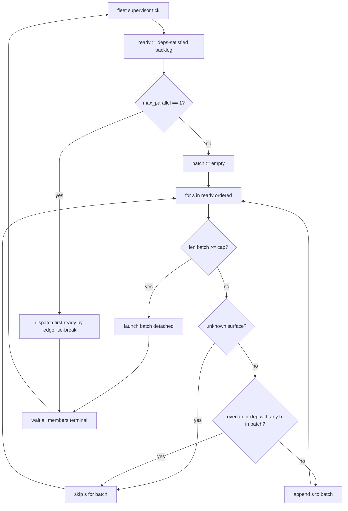

# Wave scheduler — companion (spec-marshal-parallel-dispatch-fanout)

Diagram and tick algorithm for CAP-1/CAP-2. Ordering inputs come from Story
**28.12**; this document covers width only.

## Supervisor tick (parallel mode)



## Station conflict (narrowed)

| Condition | Refuse second dispatch? |
|---|---|
| Same story key (`MRS-DISP-011`) | Yes |
| Transitive `Deps:` edge from candidate → in-flight | Yes |
| Effective surface intersection (AD-27) | Yes |
| In-flight LIVE, none of the above | **No** (this spec) |

Cross-station `MRS-DISP-022` advisory overlap — unchanged, advisory only.

## Journal shape (CAP-3)

```yaml
kind: dispatch-wave
wave_id: <uuid>
station: pyforge-marshal
max_parallel: 2
members:
  - story: 28.10
    surfaces_hash: <sha256>
  - story: 28.11
    surfaces_hash: <sha256>
refused:
  - story: 28.7
    reason: surface-overlap
    overlap_with: 28.10
    paths: [src/shared/packages/pyforge-marshal/...]
outcome: partial   # closed when all members terminal
member_outcomes:
  28.10: landed
  28.11: verify-failed
```

## Policy knob

```toml
[dispatch]
max_parallel = 1   # default; omit = 1
```

Per-station override lives in each project's
`planning-artifacts/marshal-policy.toml` merged into `EffectivePolicy`.
