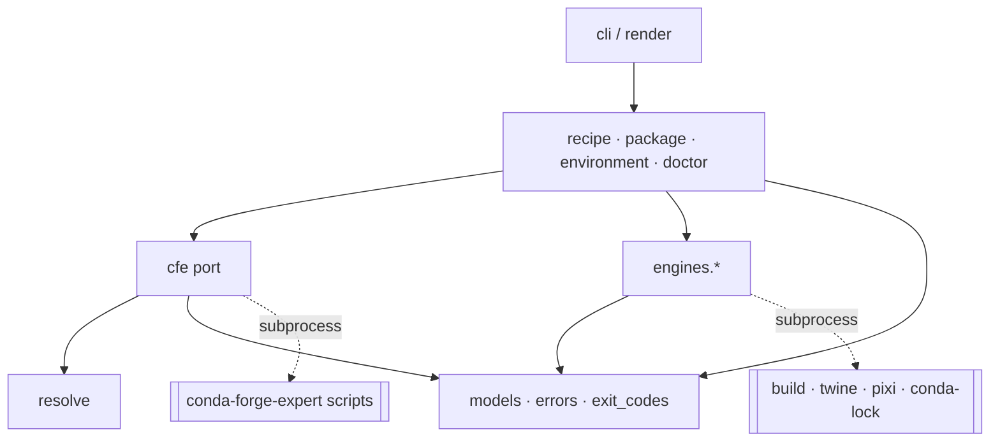
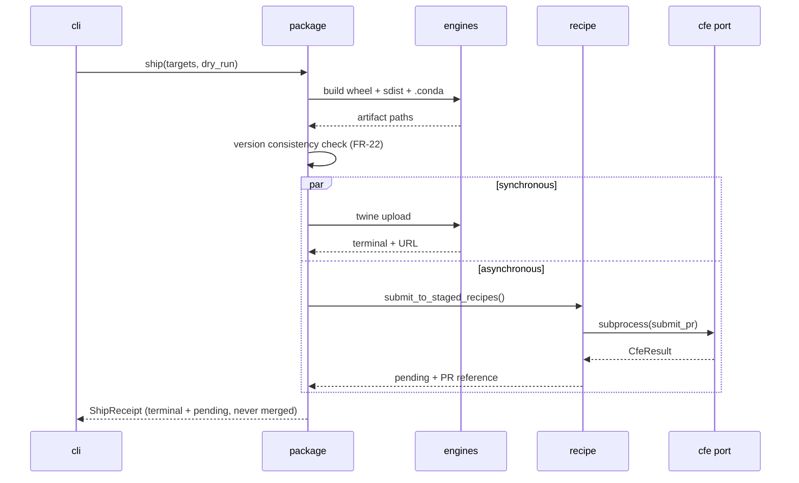
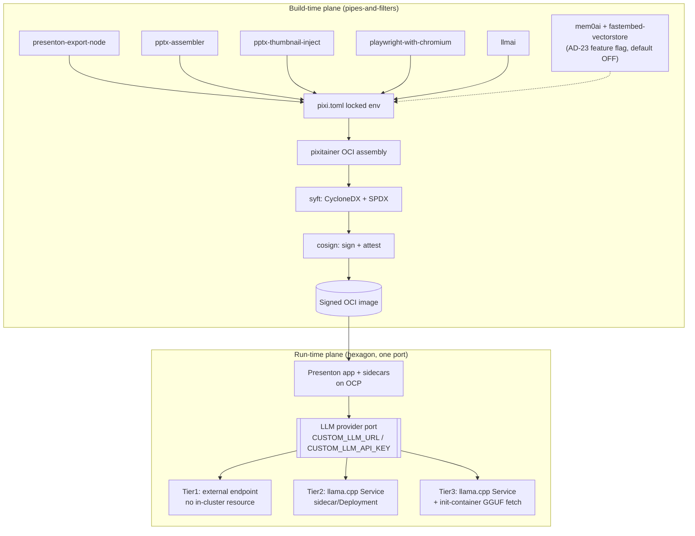

# Architecture Spine — pyforge-mason

## Design Paradigm

**Ports and adapters (hexagonal), with a knowledge-free core.**

The paradigm is chosen because it names D-1 exactly. Mason's value is orchestration; every piece of
domain knowledge it needs lives *outside* it, behind a port. There are two driven ports —
**CFE** (recipe semantics) and **Engine** (build/upload/solve) — and one driving port, the CLI.
The hexagon holds use-cases and data shapes and **nothing that could be called packaging judgement**.

| Layer | Namespace | Holds |
|---|---|---|
| Driving adapter | `pyforge.mason.cli`, `render` | argparse wiring, output formatting |
| Use-cases (core) | `pyforge.mason.recipe`, `package`, `environment`, `doctor` | orchestration only |
| Shared shapes | `pyforge.mason.models`, `errors`, `exit_codes` | data + taxonomy, no behaviour |
| Driven port — CFE | `pyforge.mason.cfe`, `resolve` | the sole route to conda-forge-expert |
| Driven port — Engines | `pyforge.mason.engines.*` | one adapter per external tool |

The conda-forge-expert skill is a **third-party system Mason does not own**, sitting outside the
hexagon on the same footing as `twine` or `conda-lock`. That framing is the architecture's whole
point: it makes forking recipe knowledge a layering violation rather than a judgement call.

## Invariants & Rules

### AD-1 — Knowledge-free core [ADOPTED: PRD D-1]

- **Binds:** all
- **Prevents:** Mason accumulating a second, drifting copy of recipe knowledge — the failure this
  product exists to avoid (`pyforge-atlas`: ~29,000 LOC rebuilt, the 8,902-LOC original still live).
- **Rule:** No module under `pyforge/mason/` may contain a conda-forge gotcha identifier, policy
  constant, pin table, recipe-format field default, or selector/platform rule. Recipe semantics
  enter Mason only as opaque data returned through the CFE port. Enforced by a meta-test carrying an
  explicit deny-list (FR-42).

### AD-2 — Dependency direction

- **Binds:** all
- **Prevents:** a use-case reaching an external tool directly, or a port importing a use-case —
  either of which would let recipe logic leak inward one helper at a time.
- **Rule:** Dependencies point inward only, per the diagram. `cli` may import anything; use-cases
  may import ports, models, errors; ports may import models and errors; `models`/`errors`/
  `exit_codes` import nothing from Mason. No use-case imports `subprocess`.



### AD-3 — The CFE port is the sole CFE caller [ADOPTED: PRD FR-1, FR-43]

- **Binds:** FR-1, FR-7..FR-14, FR-23, FR-43
- **Prevents:** N modules each growing their own CFE invocation, each with different parsing,
  timeout, and error behaviour — and the seam becoming unenforceable.
- **Rule:** `pyforge/mason/cfe.py` is the only module that may name a CFE script, hold a CFE path,
  or spawn a CFE process. Every CFE script Mason uses is declared once in a module-level table in
  that file. A use-case calls a named adapter function; it never passes a script name.
- **Carve-out (amended 2026-08-10, correct-course; operator-approved):** AD-5 deliberately homes
  root *resolution* in `resolve.py`, so exactly two non-`cfe.py` references are sanctioned:
  `resolve.py`'s root-marker constant (`_CFE_MARKER`, the `.claude/scripts/conda-forge-expert`
  path used to *recognize* a CFE root) and `errors.py`'s user-guidance echo of that path. Nothing
  else — S-2.2's `test_adapter_sole_caller` enforces precisely this two-entry allowlist, each
  entry carrying a rationale comment. Script names and process-spawning remain `cfe.py`-only with
  no exception.

### AD-4 — Subprocess-only, typed, timed invocation [ADOPTED: PRD D-1, NFR-1]

- **Binds:** FR-4, NFR-1, NFR-16
- **Prevents:** in-process import of CFE — blocked outright for 5 hyphenated modules, and for the
  rest it inherits CFE's `Path(__file__)`-relative data resolution, its 55+ credential env reads,
  and its hang history with no timeout available.
- **Rule:** CFE is invoked as `[interpreter, script, *args]` via subprocess with a mandatory
  timeout. No `import`, no `importlib`, no `exec` of CFE code, ever. Every invocation returns
  `CfeResult`; a non-zero return code is data, not an exception. Timeout expiry raises a distinct
  typed error and leaves no orphaned process.

### AD-5 — Resolution is a pure decision over inputs

- **Binds:** FR-2, FR-3, D-2, D-7
- **Prevents:** discovery logic scattered across commands, and untestable behaviour that requires a
  real CFE installation to exercise.
- **Rule:** `resolve.py` exposes pure functions from `(explicit_arg, environment_mapping,
  start_directory)` to a resolution outcome. They perform filesystem *reads* only — never writes,
  network, or process spawns. Every step is independently testable against a synthetic tree. The
  outcome always records **which step matched**, so `doctor` can report it without re-resolving.

### AD-6 — Capability tiers are structural, not conventional

- **Binds:** FR-5, FR-15..FR-29, FR-44, D-2
- **Prevents:** the CFE dependency creeping into `package`/`environment`, which would make the whole
  product inert without CFE and destroy the only part of Mason that is genuinely standalone.
- **Rule:** Two tiers. **CFE-dependent:** `recipe.py`, and *only* the `conda-forge` ship target
  inside `package.py`. **CFE-independent:** everything else in `package.py`, all of
  `environment.py`, and `doctor.py` — these must import `cfe` lazily or not at all, and must never
  fail because CFE is unresolvable. `package.py` resolves the CFE port **per target**, not per
  command: a `pypi` ship must succeed with the CFE root absent.

### AD-7 — One error taxonomy, one exit-code owner

- **Binds:** FR-32, FR-33, NFR-14
- **Prevents:** commands inventing their own codes and drifting, and the CLI's `SystemExit`
  colliding with a real failure code.
- **Rule:** All anticipated failures are `MasonError` subclasses carrying a stable string
  identifier. `exit_codes.py` is the sole producer of every exit code (`0` ok, `1` failed, `2` usage,
  `3` CFE unavailable, `130` interrupt); no other module computes or hardcodes one. An unanticipated
  exception exits `1` with the traceback on stderr — never the interpreter's default.

### AD-8 — Core returns data; only the driving adapter formats

- **Binds:** FR-31, NFR-3, NFR-4
- **Prevents:** two renderings of the same result drifting, and human text leaking into the JSON
  stream.
- **Rule:** Use-cases return `models` dataclasses. Only `render.py` turns them into text or JSON.
  Under `--format json`, stdout carries exactly one JSON document or nothing; every diagnostic,
  progress line, and log record goes to stderr. No use-case writes to stdout.

### AD-9 — `ShipReceipt` is the single shared shape for all shipping

- **Binds:** FR-16..FR-20, FR-24, D-3
- **Prevents:** the highest-risk divergence in the product — `pypi` and `conda-forge` being built by
  different units with incompatible notions of "done", so a queued pull request reports as success.
- **Rule:** Every ship target produces a `ShipTargetResult` with an explicit
  `state ∈ {not_attempted, failed, pending, terminal}` and a `reference` (URL, PR number, or channel
  path). A `ShipReceipt` is an ordered collection of them plus an aggregate. **`pending` is never
  collapsed into success** in any rendering. The aggregate exit code is failure if any target failed
  to *initiate*, success if every target reached `pending` or `terminal`. Adding a ship target means
  adding a `ShipTarget` adapter that produces this shape — never a new shape.

### AD-10 — Idempotence by target interrogation, not local state

- **Binds:** FR-18, NFR-8
- **Prevents:** two owners of one truth — a local receipt cache that disagrees with the actual state
  of PyPI or an open pull request, producing a skipped upload that never happened.
- **Rule:** Mason persists **no** state directory, no receipt cache, no lock file of its own. "Has
  this already shipped?" is answered by asking the target: `pypi`/`pypi-test` by index query,
  `channel:<name>` by channel query, `conda-forge` by searching the fork for an open pull request on
  the deterministic `add-recipe-<name>` branch CFE's submission flow produces. If a target cannot be
  interrogated, the result is `pending` with the reason, never an assumption.

### AD-11 — One owner per operation; `package` ships conda-forge *through* the recipe port

- **Binds:** FR-13, FR-23, FR-16
- **Prevents:** `mason recipe submit` and `mason package --ship conda-forge` becoming two
  implementations of staged-recipes submission that diverge in flags, dry-run semantics, and receipt
  shape.
- **Rule:** Staged-recipes submission has exactly one implementation, in `recipe.py`, reached via
  the CFE port. `package.py`'s `conda-forge` target **calls it** and wraps its result in a
  `ShipTargetResult`. `mason recipe submit` is the same call rendered directly. Neither may
  reimplement the other.

### AD-12 — Engines are adapters behind one protocol

- **Binds:** FR-15, FR-25..FR-29, FR-40, NFR-7
- **Prevents:** each engine being invoked with bespoke discovery, version handling, and failure
  semantics — and an engine's absence surfacing as a raw `FileNotFoundError`.
- **Rule:** Every external tool is an adapter in `engines/` implementing one protocol: `name`,
  `probe() -> version | None`, and its operation. Engines are discovered on `PATH` and **never
  downloaded at runtime**. Declared version ranges live in the member `pixi.toml` and are mirrored
  by in-code constants kept in sync by a meta-test. A missing engine is a typed error naming the
  engine and how to provision it.

### AD-13 — No configuration file in v1

- **Binds:** FR-35, FR-48, NFR-9
- **Prevents:** two configuration systems (flags/env plus a file) with undefined precedence — the
  classic source of "it works on my machine" in CLI tools.
- **Rule:** Configuration is flags and environment variables only. Precedence is always
  flag → environment → default, uniformly, for every setting. Mason reads no `mason.toml`, and reads
  no key from `pyproject.toml` other than the packaging metadata it is asked to build. The v1 knob
  set (FR-48) is closed and fully enumerated: `--cfe-root`/`MASON_CFE_ROOT`,
  `--cfe-python`/`MASON_CFE_PYTHON`, `--cfe-timeout`/`MASON_CFE_TIMEOUT`, `--format`, `--verbose`,
  `--quiet` — each with both a flag and an environment-variable form; a meta-test asserts no code
  path reads a Mason-specific key from a file.

### AD-14 — Credential blindness

- **Binds:** FR-6, FR-20, NFR-2, R-8
- **Prevents:** a credential reaching a log, a receipt, or an error message — and Mason inheriting
  CFE's unconditional JFrog header injection into its own HTTP surface.
- **Rule:** Mason never reads a `JFROG_*` variable and never makes an authenticated HTTP request on
  CFE's behalf; credentials reach CFE only through the inherited process environment. Upload
  credentials are read at the point of use, never stored on an object that is rendered or logged. No
  code path logs an environment-variable *value* at any verbosity. Credential presence is validated
  **before** any artifact is built (FR-20).

### AD-15 — The CFE surface is read-only for the wrap effort; the rebuild replaces it slice-by-slice (amended 2026-08-10)

- **Binds:** FR-45, FR-47, NFR-16, CLAUDE.md Rules 1 & 2
- **Prevents:** a Mason story "fixing" CFE — which would break the `spec-packaging-factory`
  CHANGELOG sentinel, bypass the Rule-2 retro that owns that surface, and make Mason a fork by
  increments.
- **Rule:** No **implementation** commit writes to `.claude/skills/conda-forge-expert/**`,
  `.claude/scripts/conda-forge-expert/**`, or `.claude/tools/conda_forge_server.py`. Behaviour
  needed from CFE that CFE does not have is an **open question routed to a CFE retrospective**,
  never a local patch or a vendored copy. `spec_surface_check` stays green throughout.
- **Amendment (2026-08-10, correct-course; operator directive: "the current conda-forge-expert
  skill is unsustainable — we rebuild and shift to the mason rebuilt version"):** the wrap-phase
  rule above binds **the mason-CLI effort** (Epics 1–5): none of ITS implementation commits write
  the CFE surface, and S-5.2's governance check scopes to commits touching
  `src/shared/packages/pyforge-mason/**` (code paths only — deliberately NOT mason
  planning-artifacts, where the rebuild effort's own slice map and campaign state live per its
  CAP-1), resolving OQ-E5. The **sanctioned writer** of
  the CFE surface is the `spec-conda-forge-expert-rebuild` effort, under its own Spec's gates:
  slices built and validated IN PARALLEL with the live original (operator's cutover-shape
  decision, same date, concern raised and overridden): the live skill stays authoritative at
  every commit; the equivalence harness, the dual-landing rule for Rule-2 knowledge, and a
  detector-enforced END cutover (every caller flips, legacy retires, campaign-terminal) are
  the disciplines that prevent the atlas outcome under parallel-run. Behaviour needed from CFE during the
  wrap effort still routes to a CFE retrospective, never a local patch.
- **Sanctioned exception (exactly one, within the mason-CLI effort):** the closing Rule-2 retrospective edits those files, because
  CLAUDE.md Rule 2 mandates it. It is identified by a `retro:` commit subject plus a CFE
  `CHANGELOG.md` entry in the same commit, and the governance check asserts it is used once. Rule 1
  says Mason may not edit CFE *while implementing*; Rule 2 says Mason must edit CFE *when
  retrospecting*. Both hold.

### AD-16 — Every test runs against a fake CFE root

- **Binds:** NFR-13, FR-44, FR-46
- **Prevents:** a test suite that only passes inside this repository — which would make Mason's
  own CI dependent on the very co-location D-2 admits is a constraint.
- **Rule:** The test suite ships a fixture CFE root (stub scripts emitting canned stdout). No test
  requires a real CFE installation, network, or `recipes/` directory. The delegation-fidelity test
  (FR-46) is the single exception and is marked `slow`, mirroring `pyforge-warden`'s marker
  convention.

### AD-25 — Delegated child output streams or is captured, never both, and never breaks the JSON envelope

*(Numbered 25, continuing the primary spine's own sequence after the satellite's AD-17–AD-24, to
avoid renumbering either.)*

- **Binds:** FR-49
- **Prevents:** a long-running delegated build appearing silently hung with no output, and a
  streamed child writing to stdout mid-operation and breaking AD-8's single-JSON-document
  guarantee under `--format json`.
- **Rule:** Two invocation modes. **STREAM** — operations expected to exceed a few seconds
  (`recipe build`, `package build`) forward child stderr through to the user's stderr as it is
  produced, never buffered to completion. **CAPTURE** — short JSON-returning operations buffer
  stdout for parsing (AD-4's existing `CfeResult` shape). Streamed child output always targets
  stderr, even under `--format json`, so stdout's single-JSON-document guarantee (AD-8) holds
  unbroken during a streaming operation. No log record at any level or mode contains an
  environment-variable value (AD-14).

### AD-26 — A rehearsal target gates the one irreversible publish

- **Binds:** FR-50
- **Prevents:** a first `pypi` upload doubling as an untested production one-way door.
- **Rule:** The `pypi-test` ship target (AD-9's `ShipTarget` enum) runs the identical code path as
  `pypi`, differing only in repository configuration (TestPyPI vs. PyPI) — never a separate
  implementation. The self-hosting/release sequence (FR-24) runs `pypi-test` and requires it to
  reach `terminal` success before `pypi` runs. The dry-run plan (AD-9's rendering, PRD FR-19)
  states explicitly that the `pypi` target is irreversible.

## Consistency Conventions

| Concern | Convention |
| --- | --- |
| Module naming | One module per use-case noun (`recipe`, `package`, `environment`); ports named for what they adapt (`cfe`, `engines/twine`). No `utils`, no `helpers`, no `common`. |
| Command naming | `mason <noun> <verb>`; nouns are singular; verbs are imperative. Nested argparse subparsers, one builder function per noun. |
| Error identifiers | Lowercase, colon-delimited, stable: `cfe:unresolved`, `ship:credential-missing`, `engine:absent`. Identifiers are API — changing one is a MAJOR bump. |
| Data shapes | `@dataclass(frozen=True)` in `models.py` (re-affirmed 2026-08-10 after an operator re-decision: `models.py` is a LEAF the presentation layer imports safely — the dependency-direction guard is the reason. Story 2.1 creates it; the one landed divergence, `DoctorReport` in `doctor.py`, moves in with a `doctor.py` re-export so no import or test churns). Enums for closed sets (`ShipState`, `ShipTarget`). No dicts as return types across a layer boundary. |
| JSON envelope | Every JSON document carries `schema_version`, `command`, `status`, `data`, `errors`. One document per invocation. |
| Dates & versions | UTC ISO-8601 with `Z`. Versions are strings, compared via `packaging.version`, never string-compared. |
| Logging | `logging` to stderr only. `--verbose` raises level; `--quiet` lowers. Never a value from the environment. |
| Config precedence | flag → environment → default, uniformly (AD-13). |
| Subprocess | Only in `cfe.py` and `engines/*`. Always a list argv, never `shell=True`, always a timeout. |
| Tests | `tests/unit/` mirrors module names; `tests/meta/` holds the enforcement tests; `slow` marker for anything driving a real engine. |
| Dry-run | Every mutating verb accepts `--dry-run` and defaults to it where the operation is irreversible (FR-19, NFR-9). |

## Stack

Seed — verified against the repository's live manifests at authoring; the code owns this once it exists.

| Name | Version |
| --- | --- |
| Python | `>=3.12` (D-6, matching `pyforge-warden`) |
| Build backend | `hatchling` (both siblings) |
| Conda build backend | `pixi-build-python` `0.*` |
| CLI framework | `argparse` (stdlib — D-9) |
| Version comparison | `packaging` |
| Wheel/sdist builder | `build` (`python -m build --no-isolation`) |
| PyPI uploader | `twine` |
| Conda builder/publisher | `pixi` (`>=0.72.2`, `preview = ["pixi-build"]`) |
| Lock engine | `conda-lock` |
| Recipe engine | conda-forge-expert v8.79.x (external, unversioned dependency — PRD §11) |
| Test runner | `pytest` |

Mason's own wheel dependencies stay lean (NFR-10): `packaging` is the only certain runtime import
beyond stdlib. `build`, `twine`, `pixi`, and `conda-lock` are **engines** — conda run-dependencies
invoked as subprocesses (AD-12), never imported.

## Structural Seed

```text
src/shared/packages/pyforge-mason/
  pyproject.toml            # hatchling; [project.scripts] mason = "pyforge.mason.cli:main"
  pixi.toml                 # [package] + pixi-build-python; NO [workspace] table
  README.md
  src/pyforge/mason/        # PEP-420 namespace: NO src/pyforge/__init__.py
    __init__.py
    __main__.py
    cli.py                  # driving adapter — argparse noun/verb tree
    render.py               # the only formatter (AD-8)
    models.py               # ShipReceipt, ShipTargetResult, CfeResult, LockResult, DoctorReport (created by S-2.1; DoctorReport migrates in with a doctor.py re-export)
    errors.py               # MasonError taxonomy (AD-7)
    exit_codes.py           # sole exit-code owner (AD-7)
    resolve.py              # pure resolution chains (AD-5)
    cfe.py                  # the CFE port — sole CFE caller (AD-3, AD-4)
    recipe.py               # CFE-dependent use-cases
    package.py              # build + ship; CFE-independent except the conda-forge target (AD-6)
    environment.py          # lock + check
    doctor.py               # self-diagnosis
    engines/
      __init__.py           # Engine protocol + registry (AD-12)
      pep517.py  twine.py  pixi.py  condalock.py
  tests/
    unit/                   # mirrors module names
    meta/                   # FR-42..FR-46 enforcement
    fixtures/fake_cfe_root/ # stub scripts with canned stdout (AD-16)
```

Root `pixi.toml` gains `[feature.pyforge-mason.dependencies]` with a path dependency to the member,
a lean `pyforge-mason = { features = ["pyforge-mason"], no-default-feature = true }` environment,
and the three build tasks — mirroring the two existing members exactly.

**Ship flow — the shape AD-9 and AD-11 exist to protect:**



## Capability → Architecture Map

| Capability / Area | Lives in | Governed by |
|---|---|---|
| CFE seam (FR-1 – FR-6) | `cfe.py`, `resolve.py` | AD-3, AD-4, AD-5, AD-14 |
| `mason recipe` (FR-7 – FR-14) | `recipe.py` | AD-1, AD-3, AD-6, AD-11 |
| `mason package` build (FR-15, FR-21, FR-22) | `package.py`, `engines/pep517`, `engines/pixi` | AD-6, AD-12 |
| Ship targets + receipts (FR-16 – FR-20, FR-23, FR-24) | `package.py`, `engines/twine`, `models.py` | AD-9, AD-10, AD-11, AD-14 |
| `mason environment` (FR-25 – FR-29) | `environment.py`, `engines/condalock` | AD-6, AD-12 |
| CLI shell + output (FR-30 – FR-35) | `cli.py`, `render.py`, `errors.py`, `exit_codes.py` | AD-7, AD-8, AD-13 |
| `mason doctor` (FR-34) | `doctor.py` | AD-5, AD-12 |
| Distribution (FR-36 – FR-41) | `pyproject.toml`, `pixi.toml`, root `pixi.toml` | Stack, AD-12 |
| Seam enforcement (FR-42 – FR-46) | `tests/meta/` | AD-1, AD-2, AD-3, AD-6, AD-15, AD-16 |
| Closing retrospective (FR-47) | closeout process, not a module | AD-15 |
| Configuration surface (FR-48) | `cli.py` flag parsing + env-var reads | AD-13 |
| Logging + child-output handling (FR-49) | `cfe.py`, `engines/*` | AD-25 |
| Publish rehearsal (FR-50) | `package.py` (`pypi-test` target) | AD-9, AD-26 |

## Deferred

- **MCP surface** — no server in v1 (D-8). AD-8's data-returning core means adding one later is an
  adapter, not a refactor. Deferred because duplicating the existing 46 tools is the failure mode
  being avoided, not because the design is unclear.
- **Channel upload engine** — whether `channel:<name>` uses `pixi publish` or `anaconda upload` is
  an engine choice behind AD-12; both satisfy the protocol. Deferred to the story that builds it
  (PRD OQ-2).
- **Lock engine selection** — `conda-lock` vs `pixi.lock` preference when both apply (PRD OQ-4).
  AD-12 makes either satisfiable; the policy is a use-case decision, deferred to implementation.
  *Settled at implementation (Epic 4): `conda-lock` only (`engines/condalock.py`); the 2026-08-08
  market research's pixi-first recommendation was not adopted, and a pixi adapter remains
  possible behind AD-12.*
- **CFE version compatibility** — Mason declares no minimum CFE version (PRD §11). Deferred until a
  real adapter break makes the constraint concrete.
- **Concurrency** — every operation is sequential in v1. Parallel multi-target shipping and parallel
  platform locking are deferred; AD-9's per-target result shape already permits them without a
  redesign.
- **Persistent state** — deliberately never, in v1 (AD-10). If target interrogation proves too slow,
  the revisit must reopen AD-10 explicitly rather than adding a cache quietly.
- **Non-library `--target` shapes** — application/binary packaging (PRD §6.2) would add engine
  adapters (e.g. PyInstaller) behind AD-12; no invariant changes.
- **Operational envelope** — Mason is a locally-invoked CLI with no service, no daemon, no
  deployment topology, and no persistent state (AD-10, AD-13). Its "deployment" is the two artifacts
  of FR-37 installed into a user environment. There is nothing further to decide at this altitude,
  and this line records that the dimension was considered rather than skipped.

## assumptions[]

- **A-1** — The conventions demonstrated by `pyforge-warden` and `pyforge-atlas` (hatchling +
  `pixi-build-python`, PEP-420 layout, argparse, lean deps, build triad, `slow` marker) are normative
  for a new workspace member. Inferred from two instances and their in-file comments; no written
  standard exists.
- **A-2** — CFE script stdout is stable enough to parse under AD-4. Evidenced by 46 MCP tools over an
  extended period with one known tolerance shim; it is a de-facto contract, not a formal one.
- **A-3** — PyPI and GitHub can be interrogated cheaply enough for AD-10's idempotence check to be
  practical. If not, the Deferred entry governs the revisit.
- **A-4** — `packaging` is the only non-stdlib runtime import Mason needs. Any addition must be
  justified against NFR-10 at the story that introduces it.
- **A-5** — `pixi build`'s preview member-package semantics remain stable for the duration. Both
  existing members already carry this exposure.

## open_questions[]

- **OQ-A1** — RESOLVED by implementation (S-2.1 and the verb stories): the AD-3 declaration
  table lives in `cfe.py`, one wrapped script per recipe verb, exactly as anticipated — a
  mechanical mapping, no invariant touched.
- **OQ-A2** — RESOLVED 2026-08-13 (S-3.5's spec): `engines/pixi` covers both -- `build()` (Story
  3.2) and the new `upload()` (Story 3.5) stay one adapter, one protocol per AD-12, wrapping `pixi
  upload prefix` rather than `pixi publish` (which rebuilds from a workspace manifest, duplicating
  `build()`'s own job).
- **OQ-A3** — RESOLVED by implementation (S-2.2): the FR-42 deny-list landed as
  `tests/meta/test_no_recipe_knowledge.py` with planted-violation fixtures per category, so a
  deny-list matching nothing is a failing test; weakening an entry requires an asserted rationale.
- **OQ-A4** — RESOLVED as built: `doctor` is a top-level leaf with no verb level (PRD FR-30,
  `cli.py`); cosmetic, no invariant affected.

---

## Currency reconciliation — 2026-08-26 (as-built truth-up)

The spine's structure survived contact with implementation intact: the station shipped complete
(fleet ledger 2026-08-21; 11 epics / 50 stories `done`, post-completion stories 10.1/11.1/11.2
landed 2026-08-25/26), and every invariant above is enforced in code by the meta-test suite it
prescribed (`tests/meta/`: dependency direction, exit-code ownership, render ownership,
capability tiers, adapter sole-caller, no-recipe-knowledge with planted fixtures, credential
isolation, no-config-file, namespace-is-implicit, engine version-range sync, CFE independence,
persona-consults-CFE, portal-last-diagnose). Reconciled against
`src/shared/packages/pyforge-mason/`:

- **Structural seed vs as-built tree.** As seeded: `cli.py`, `render.py`, `resolve.py`,
  `cfe.py`, `recipe.py`, `package.py`, `environment.py`, `doctor.py`, `errors.py`,
  `exit_codes.py`, `models.py`, `engines/` (pep517/pixi/twine/condalock). Grown since, outside
  the seed: `engines/gh.py` (open-PR interrogation, AD-10/FR-18), `pypi_index.py` (PyPI JSON
  interrogation, AD-10), `engines/build_hooks.py` (Story 10.1 — the replaceable
  `pyforge.mason.build_engine` hook on `pyforge.core.hooks`; default `around` keeps the
  CFE-native path the backend, conda-build registered but never spawned), `airgap_contract.py`
  (Story 9.2 — contract socket with a deliberately empty backend registry), and `boot.py`
  (steward S-25.4 boot re-index — a steward-owned contract hosted in this package, not part of
  this spine's own capability map).
- **Stack drift, expected and synced:** pixi is now pinned at the 0.77.x range (was seeded
  `>=0.72.2`), twine 7.x, conda-lock 4.x — the in-code constants byte-mirror `pixi.toml` and are
  held in sync by `tests/meta/test_engine_version_range_sync.py`, exactly the "the code owns
  this once it exists" handoff the Stack section declared. The recipe engine has moved past the
  seeded "conda-forge-expert v8.79.x" (still external and unversioned, per PRD §11 — no minimum
  declared, no adapter break observed).
- **`_KNOWN_ENGINES` is five, not four:** `pixi`, `twine`, `conda-lock`, `build`
  (`pyproject-build`), `gh`.
- **Deferred § "MCP surface" holds as written:** `pyforge.mason` ships no MCP server (D-8). The
  station's MCP face (`POST /stations/mason/mcp`) and the `/stations/mason/` last-diagnose
  portal slice (Story 11.2, via PortalClient) are served by the Canopy platform host under
  canopy FR-10/AD-7 — an addition beside this spine, not a reversal of its deferral.
- **AD-15 as amended ran its course:** Epic 6 executed the rebuild pilot slice and the re-scope
  gate under `spec-conda-forge-expert-rebuild`; the divergence-and-endgame guard (S-6.2) landed
  red-first as prescribed.
- **Behind-code suppression is now by design:** the owner Dream flipped to `realized`
  2026-08-26 with the station complete; this spine is maintained as the as-built record.

---

## Satellite: Presenton (air-gapped conda-native repackaging)

**Status: BLOCKED.** This satellite architecture spine was finalized 2026-07-25 (`status: final`) and
governs a genuinely different product from the `mason` CLI above: an air-gapped, conda-forge-native
repackaging of the third-party Presenton AI deck-generation app for Red Hat OpenShift. Its owning
Dream (`docs/dreams/presenton-pixi-image.md`) carries `status: archived`, `archived-reason: blocked`,
`blocked-on: Phase-0 decision gate (Epic 1)` — no story has entered implementation, and the PRD's
Phase-0 exit criteria (see the Satellite section of the merged PRD) remain unresolved.

**Contradiction flagged.** This satellite's own governing Spec (`spec-presenton-pixi-image`, prior to
this consolidation) was rewritten 2026-08-02 into an archived retirement record that names, as an
explicit non-goal, "Folding this Dream's intent into `pyforge-mason`'s own narrative" — reasoning that
"the two are genuinely different subject matter... archiving this separately (rather than absorbing
it) reflects that difference honestly." Folding this architecture spine into Mason's own spine, as
done below, directly overrides that prior decision. It is done here at the user's explicit direction,
after being shown that separation language — recorded rather than silently resolved. The Dream-level
narrative and the epics/blocked-status stay separate; only the planning-chain documents are
consolidated into one per-station document. See
`archive/_bmad-output/projects/pyforge-mason/planning-artifacts/architecture/architecture-presenton-pixi-image-2026-07-25/`
for the original standalone document.

**Own paradigm, own scope.** Presenton's concern — OpenShift/air-gap deployment topology and a
conda-forge recipe supply chain for a repackaged third-party app — is structurally unrelated to
Mason's own packaging-factory CLI paradigm above (ports-and-adapters around a knowledge-free core).
Its invariants are kept as their own self-contained sub-section below, unchanged in substance from
the original, with the **`AD-n` IDs renumbered to continue sequentially after this spine's own
highest existing ID** (the primary's `AD-16`), in original order:

| Original ID (this spine's satellite source) | Renumbered ID (below) |
|---|---|
| AD-1 — Build pipeline composition and channel routing | **AD-17** |
| AD-2 — The LLM provider is the only swappable seam | **AD-18** |
| AD-3 — Recipe/image boundary | **AD-19** |
| AD-4 — Chromium sandbox default (resolves Risk R9) | **AD-20** |
| AD-5 — Provenance pipeline | **AD-21** |
| AD-6 — Fixture-set phase boundary is a CI-topology split, not a convention | **AD-22** |
| AD-7 — Memory-subsystem fork is pre-wired, not blocking | **AD-23** |
| AD-8 — OCP SCC target | **AD-24** |

### Presenton Design Paradigm

Two independent planes, each with its own consistency discipline:

- **Build-time plane — pipes-and-filters.** Five confirmed conda-forge recipes flow into one pixi-locked environment, which pixitainer assembles into an OCI image, which syft+cosign turn into a signed, SBOM-attested artifact. Each stage consumes only the previous stage's published output — no stage reaches back into an earlier one's internals.
- **Run-time plane — hexagonal, with exactly one true port.** The deployed app (Presenton + its sidecars) has a single swappable seam: the LLM provider, already defined by upstream's `llmai` library via the `CUSTOM_LLM_URL`/`CUSTOM_LLM_API_KEY` contract. Three tier adapters (internal proxy, in-cluster `llama.cpp`, init-container-fetched `llama.cpp`) sit behind that one port. Nothing else in the running system branches on deployment topology.



### Presenton Invariants & Rules

#### AD-17 — Build pipeline composition and channel routing

- **Binds:** all five confirmed recipes; the PRD's "zero external CDN access at build" hard constraint
- **Prevents:** one recipe's build reaching a public CDN while another routes through JFrog — an air-gap violation that's invisible until the build runs inside the actual perimeter
- **Rule:** a single `pixi.toml` environment assembles `presenton-export-node`, `pptx-assembler`, `pptx-thumbnail-inject`, `playwright-with-chromium`, and `llmai` as pinned conda dependencies. Every channel and package resolution in this build routes through the `*_BASE_URL` env-var family (`docs/reference/enterprise-deployment.md` § 6) — no recipe, no build step, no CI job hardcodes a public URL. `pixitainer` consumes the locked environment to produce the OCI image; it never fetches anything itself outside that lock.

#### AD-18 — The LLM provider is the only swappable seam

- **Binds:** the entire run-time plane; PRD's three-tier LLM model
- **Prevents:** a tier-specific code path (e.g. an in-process `llama-cpp-python` binding for Tier-2) creeping into the app instead of staying at arm's length over HTTP like every other tier
- **Rule:** Presenton and the Helm chart set only `CUSTOM_LLM_URL` / `CUSTOM_LLM_API_KEY` (plus optional `OPENAI_BASE_URL`/`ANTHROPIC_BASE_URL` passthrough) to select a tier. Tier 1 points at an operator-supplied external endpoint (no in-cluster resource). Tier 2 points at a `llama.cpp` Service in the same namespace, OpenAI-compatible HTTP. Tier 3 points at the same `llama.cpp` Service, whose Pod carries an init-container that fetches the GGUF from an internal registry before the main container starts. All three are the same env-var contract pointed at different URLs — never a different code path.

#### AD-19 — Recipe/image boundary

- **Binds:** everything this architecture owns vs. everything conda-forge-expert owns
- **Prevents:** image-build-layer forks of recipe logic that silently diverge from the upstream-merged recipe
- **Rule:** the image-assembly layer (`pixi.toml`, Helm chart) consumes published, versioned conda artifacts by name and pin only. It never vendors or patches recipe internals. Recipe content is out of this spine's scope entirely — governed later by `conda-forge-expert` per CLAUDE.md Rules 1 & 2.

#### AD-20 — Chromium sandbox default (resolves Risk R9)

- **Binds:** `playwright-with-chromium` invocation inside the OCP pod
- **Prevents:** two deployers independently guessing a sandbox posture and shipping inconsistent security postures across customer clusters
- **Rule:** default to `--no-sandbox`, as an explicit, Helm-values-documented security decision, not a silent default — standard practice for containerized Chromium, compatible with `restricted-v2`/`restricted-v3`'s `allowPrivilegeEscalation: false`. A Helm values flag (`chromiumSandboxMode: none|namespace`) is the escape hatch for a future unprivileged-namespace-sandbox mode, but that mode ships **undocumented-to-unbuilt** until a Phase-0/architecture spike empirically validates it against a real `restricted-v3` cluster (open question, § Deferred).

#### AD-21 — Provenance pipeline

- **Binds:** the PRD's supply-chain provenance MVP gates (SBOM, signed-image attestation)
- **Prevents:** two different SBOMs existing for the same image tag (e.g. one lockfile-derived, one image-introspected, silently disagreeing)
- **Rule:** `syft` (1.49.0, conda-forge-verified) scans the assembled OCI image — post-`pixitainer`, pre-registry-push — producing CycloneDX (primary) and SPDX (secondary export) in one deterministic step. `cosign` (3.0.4) signs the resulting image digest and attaches the SBOM as an in-toto attestation. This runs exactly once per image build, as the last build-time-plane stage before the image is considered shippable.

#### AD-22 — Fixture-set phase boundary is a CI-topology split, not a convention

- **Binds:** the PRD's four fixture sets and their online-capture/air-gap-consumption boundary
- **Prevents:** Fixture Set 6 (R6) — someone tries to refresh Set 1 from inside the air-gapped pipeline and either fails confusingly or, worse, the pipeline silently gained network egress somewhere
- **Rule:** `tests/fixtures/upstream-baseline` capture (Set 1) and `tests/drift` (Set 2) run **only** in a separate, explicitly-online CI workflow (network egress allowed) that never shares a runner or environment with the air-gapped build pipeline. The air-gapped pipeline workflow has **no network egress at all**, enforced at the CI-runner/network-policy level — not by convention — so an accidental Set-1/Set-2 invocation inside it fails loudly. `tests/operational` (Set 3) and `tests/install` (Set 4) ship inside the OCI image and run air-gapped by construction; they need no separate enforcement.

#### AD-23 — Memory-subsystem fork is pre-wired, not blocking

- **Binds:** PRD Phase-0 exit criterion 6(b) (`mem0ai` + `fastembed-vectorstore`)
- **Prevents:** image-build work blocking on the Phase-0 decision, and the eventual answer forcing an architectural rework
- **Rule:** `pixi.toml` carries a `presenton-memory` feature (default **off**) toggling whether `mem0ai` + `fastembed-vectorstore` are in the locked environment. The Helm chart carries a matching `values.memory.enabled` (default `false`) that sets the env var Presenton needs to no-op the subsystem — contingent on that no-op path being clean (open question, § Deferred). If the no-op instead needs a Presenton source patch, this AD's default-OFF shape is unchanged; the patch simply joins the `presenton-export-node`/`pptx-assembler` patch set already in scope (PRD deliverables).

#### AD-24 — OCP SCC target

- **Binds:** the Helm chart's Pod/container `SecurityContext` defaults
- **Prevents:** a chart that only works on a subset of OCP clusters because it assumes a specific SCC generation
- **Rule:** defaults are `restricted-v2`-compatible on every cluster this chart targets: all capabilities dropped, `seccompProfile: runtime/default`, `allowPrivilegeEscalation: false`, non-root arbitrary UID via the GID-0/`chmod g=u` convention on writable paths, no hardcoded UID/GID anywhere in the image or chart. `restricted-v3` (`hostUsers: false`) compatibility is asserted but not separately branch-tested until the AD-20 spike runs.

### Presenton Consistency Conventions

| Concern | Convention |
| --- | --- |
| LLM tier selection | one top-level `values.llmProvider.tier` enum (`tier1`\|`tier2`\|`tier3`) selecting a values sub-block — no separate chart-per-tier, no separate values-file-per-tier fork that could drift |
| Writable paths | only `/app_data` and `/tmp` are writable (`emptyDir` or PVC); everything else is read-only-root-filesystem-compatible as an opt-in hardening flag (`readOnlyRootFilesystem: false` by default — Restricted SCC does not mandate it; `true` available for hardened clusters) |
| Env-var routing (build-time) | every outbound URL in the build pipeline resolves through the `*_BASE_URL` family (AD-17); never a hardcoded public host |
| Env-var routing (run-time) | every outbound LLM call resolves through `CUSTOM_LLM_URL`/`CUSTOM_LLM_API_KEY` (AD-18); never a tier-specific code branch |
| Recipe pins | image-layer `pixi.toml` pins recipes by exact version; a version bump is a `pixi.toml` diff, never a live "latest" resolution at image-build time |

### Presenton Stack

| Name | Version |
| --- | --- |
| pixi | current (pixi-locked build substrate, per repo convention) |
| pixitainer | 0.8.2 (BSD-3-Clause, `RaphaelRibes/pixitainer`, `prefix.dev/raphaelribes` channel — active, verified 2026-07-25) |
| rattler-build | current (per repo's existing v1 recipe convention) |
| Helm | 4.2.3 (Apache-2.0, conda-forge, verified 2026-07-25) |
| syft | 1.49.0 (Apache-2.0, conda-forge, verified 2026-07-25) — SBOM generation |
| cosign | 3.0.4 (Apache-2.0, conda-forge, verified 2026-07-25) — image signing/attestation |
| llmai | 0.2.8 (Apache-2.0, PyPI-only — net-new conda-forge recipe; PRD Revision Log) |

### Presenton Structural Seed

```text
presenton-pixi-image/                    # (or wherever this lands in the repo — TBD, see Deferred)
  pixi.toml                              # AD-17: locked build env; presenton-memory feature (AD-23)
  helm/
    Chart.yaml
    values.yaml                          # top-level llmProvider.tier, memory.enabled (AD-18, AD-23)
    values-tier1.yaml                    # example override, not a fork (Consistency Conventions)
    templates/
      deployment.yaml                    # Presenton app; SecurityContext per AD-24
      llama-cpp-service.yaml             # Tier2/Tier3 sidecar/Deployment
      init-container-gguf-fetch.yaml     # Tier3 only
      metrics-schema-configmap.yaml      # versioned /metrics schema artifact (PRD gate)
  ci/
    build-airgapped.yml                  # no network egress (AD-22); pixitainer + syft + cosign
    online-capture.yml                   # Set 1/2 only (AD-22); separate runner, network allowed
  tests/
    fixtures/upstream-baseline/v{N}/     # Set 1 (PRD Test Strategy)
    drift/                               # Set 2
    operational/                         # Set 3, ships in image
    install/                             # Set 4, ships in image
```

### Presenton Capability → Architecture Map

| Capability / Area | Lives in | Governed by |
| --- | --- | --- |
| Air-gapped build (zero external CDN) | `pixi.toml`, `ci/build-airgapped.yml` | AD-17, AD-22 |
| LLM provider tiering | `helm/values.yaml`, `helm/templates/llama-cpp-service.yaml` | AD-18 |
| Recipe composition (5 confirmed) | `pixi.toml` | AD-17, AD-19 |
| Memory-subsystem fork (Phase-0 exit 6b) | `pixi.toml` (`presenton-memory` feature), `helm/values.yaml` (`memory.enabled`) | AD-23 |
| Chromium sandbox posture (Risk R9) | `helm/templates/deployment.yaml` (`chromiumSandboxMode`) | AD-20 |
| SBOM + signing | `ci/build-airgapped.yml` (syft + cosign step) | AD-21 |
| OCP SCC compatibility | `helm/templates/deployment.yaml` (SecurityContext) | AD-24 |
| Fixture-set phase boundary | `ci/online-capture.yml` vs `ci/build-airgapped.yml` | AD-22 |

### Presenton Deferred

- **Recipe authoring itself** (the actual `recipe.yaml` content for all five-to-seven recipes) — out of this spine entirely, conda-forge-expert-governed (CLAUDE.md Rules 1 & 2). This spine only fixes how already-published recipes compose.
- **Chromium-sandbox-vs-`restricted-v3` empirical spike** (AD-20's escape hatch) — needs a real OCP cluster, not a docs read; not run as part of this architecture pass. Until it runs, `--no-sandbox` is the shipped default and `chromiumSandboxMode: namespace` stays an undocumented-to-unbuilt code path.
- **Memory-subsystem no-op path verification** (AD-23) — whether `mem0ai`/`fastembed-vectorstore` disable cleanly via env var or need a Presenton-side patch. Both branches are pre-wired; only the patch content (if needed) is undetermined.
- **Microsoft disconnected-stack verification** (PRD exit 6a, Risk R3) — a business-case question, not an architecture one. This spine's shape is defensible regardless of the answer.
- **GGUF model pick** (Qwen 2.5 7B vs Llama 3.2 3B, PRD Phase-0 exit 1) — the Helm chart's Tier-2 `values.yaml` just needs a `modelRef` string; the specific model doesn't change this spine's shape.
- **Exact repo landing path** for this project's build/Helm artifacts (`presenton-pixi-image/` at repo root vs. a `src/` subtree vs. a separate deployment repo) — not fixed by the PRD or Dream; assumed a self-contained top-level directory in the Structural Seed above pending an explicit placement decision, consistent with how `recipes/` and `src/shared/packages/` are already organized in this monorepo.
- **Brand-compliance enforcement UX (three-lane), observability/`\/metrics` instrumentation detail, chargeback ledger** — these are application-layer / Presenton-patch-layer concerns the PRD scopes explicitly (auto-fix/batched-review/ignore bands; scrape-only metrics; emit-only chargeback); this spine names where the `/metrics` schema artifact ships (Structural Seed) but does not design the instrumentation itself — that's epic/story-level work downstream of this spine.
- **Fixture-set 1/2 capture-script implementation detail** (`tests/capture_upstream.py`, `tests/drift/recapture.py`) — this spine fixes *where* they run and the network-topology enforcement (AD-22); their internal logic is downstream, epic/story-level work.


## Runtime floor — reconciled 2026-09-07

**Python 3.14 is the only supported runtime.** `pyproject.toml` now declares
`requires-python = ">=3.14"` (marshal Story 32.2, `spec-fleet-consistency-standard` CAP-5),
matching `pixi.toml`'s `python = ">=3.14.7,3.14.*"` and every env-scoped `3.14.*` pin.

Consequence for this spine: no deployment target, container image or CI lane may assume a
3.12/3.13 interpreter for `pyforge-mason`, and none does today — this records the constraint
rather than changing it. The previous `>=3.12` declaration was never exercised by any
environment in the workspace.


## Currency reconciliation — 2026-09-14

*Chain-currency sweep cascade: the PRD re-dated 2026-09-14, firing the `prd→arch` edge.
This section is the as-built check: does the spine above still describe the package.*

**The PRD's new FR-14 divergence is deliberately NOT an architecture finding.** Whether
`mason recipe update` writes by default or previews by default is a **verb-level
argument default** inside `recipe.py`/`cli.py`. It crosses no port, moves no adapter
boundary, and is invisible to AD-1 (knowledge-free core), AD-2 (the single CFE adapter
seam) and the exit-code ownership rule. The spine is silent on it by design, and this
note records that the silence is correct rather than an omission — a reader arriving
from the PRD's divergence box should not go looking for a missing AD here.

**AD-1 re-confirmed against steward Story 44.7's foundry-island wiring** (the story
lives on steward's epics, not mason's; it touches mason's package). It added an
`env` parameter to `build_native`/`build_docker` and factory-island root resolution
across `cfe.py`, `errors.py`, `recipe.py` and `resolve.py`. All four are the adapter
layer AD-2 already draws; the core gained no recipe knowledge, and the Spec's own
2026-09-11 CAP-1 verification re-ran `tests/meta/test_adapter_sole_caller.py` green
(425 passed) — every recipe verb still reaches the machinery through exactly one
adapter function.

**AD-14 (credential blindness) held, and was then tightened.** PR #1354 closed a gap
Story 44.7 left open: `build_native`/`build_docker` were forwarding their own `env`
into `run_streamed`'s `env=` keyword, a shape `test_credential_isolation.py`'s Guard 3a
only allowlisted at `run_streamed`'s and `_invoke_captured`'s own internal call sites.
The fix kept the guard and changed the callers — the invariant moved the code, not the
other way round. This is the second time in three weeks that pattern has held here
(the first being the IO-denylist shaping Story 25.4's placement over in atlas), and it
is worth naming as the working property of this spine's meta-tests.

**One recorded cross-spec override, restated so it is not re-discovered a third time.**
`pyforge-core` is a hard run-dependency of this package, not the optional extra CAP-6's
original text describes. The authority is `pyforge-marshal/spec-pyforge-core`'s "one
lattice, one envelope, one exception root" (2026-08-13), which re-parents `MasonError`
to a shared `PyforgeError`. It is now reflected in the Spec's Divergences list (item 6)
and in the PRD's 2026-09-14 reconciliation; recorded here because the dependency edge
is an architectural fact, even though the decision was not this spine's to make.

**No AD added, changed or removed.** `updated:` bumped to record that the cascade ran.

## Currency reconciliation — 2026-09-17

one-chain mason fold 2026-09-17: Spec reminted CAP-1..29; ADs unchanged. No new architecture decision.

## Currency reconciliation — 2026-09-20

*Chain-currency sweep: `spec-pyforge-mason`'s `.memlog.md` moved 2026-09-20 (engine version ranges become floors by operator ruling; pixi.toml run-dependency caps removed; surface reconcile for the pyforge-foundry-full union solve) while this document sat at 2026-09-17. `prd→arch` cascade — no AD added, changed or removed. `updated:` bumped to record that the check ran.*

## Currency reconciliation — 2026-09-20 (fleet consistency pass)

*Operator ruling 2026-09-20: every station's PRD, spine and epics are re-stamped in the same pass,
grace period or not, so the whole chain reads current for the foundry cutover. Trigger: the
station Spec's `.memlog.md` gained a 2026-09-20 event — the fleet consistency pass reconciled every
tracked story spec's frontmatter against the sprint ledger, matched each "Ledger status" line,
reconstructed missing Auto Run Results from `main`'s landing commits, fixed invalid frontmatter,
and let `sprint-ledger-sync` roll the epic keys up (`spec→prd→arch` cascade). Bookkeeping only:
no requirement, decision, story or AD changes in this spine. `updated:` bumped to record that the
check ran.*
