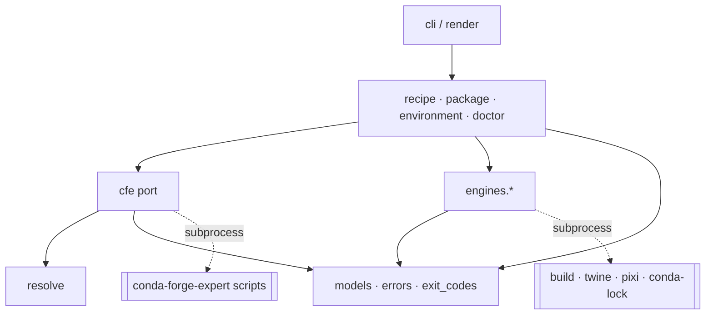
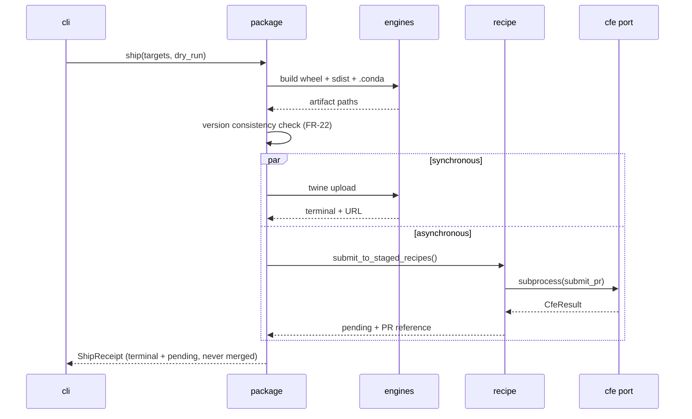

# Architecture Spine — pyforge-mason

## Design Paradigm

**Ports and adapters (hexagonal), with a knowledge-free core.**

The paradigm is chosen because it names D-1 exactly. Mason's value is orchestration; every piece of
domain knowledge it needs lives *outside* it, behind a port. There are two driven ports —
**CFE** (recipe semantics) and **Engine** (build/upload/solve) — and one driving port, the CLI.
The hexagon holds use-cases and data shapes and **nothing that could be called packaging judgement**.

| Layer | Namespace | Holds |
|---|---|---|
| Driving adapter | `pyforge.mason.cli`, `render` | argparse wiring, output formatting |
| Use-cases (core) | `pyforge.mason.recipe`, `package`, `environment`, `doctor` | orchestration only |
| Shared shapes | `pyforge.mason.models`, `errors`, `exit_codes` | data + taxonomy, no behaviour |
| Driven port — CFE | `pyforge.mason.cfe`, `resolve` | the sole route to conda-forge-expert |
| Driven port — Engines | `pyforge.mason.engines.*` | one adapter per external tool |

The conda-forge-expert skill is a **third-party system Mason does not own**, sitting outside the
hexagon on the same footing as `twine` or `conda-lock`. That framing is the architecture's whole
point: it makes forking recipe knowledge a layering violation rather than a judgement call.

## Invariants & Rules

### AD-1 — Knowledge-free core [ADOPTED: PRD D-1]

- **Binds:** all
- **Prevents:** Mason accumulating a second, drifting copy of recipe knowledge — the failure this
  product exists to avoid (`pyforge-atlas`: ~29,000 LOC rebuilt, the 8,902-LOC original still live).
- **Rule:** No module under `pyforge/mason/` may contain a conda-forge gotcha identifier, policy
  constant, pin table, recipe-format field default, or selector/platform rule. Recipe semantics
  enter Mason only as opaque data returned through the CFE port. Enforced by a meta-test carrying an
  explicit deny-list (FR-42).

### AD-2 — Dependency direction

- **Binds:** all
- **Prevents:** a use-case reaching an external tool directly, or a port importing a use-case —
  either of which would let recipe logic leak inward one helper at a time.
- **Rule:** Dependencies point inward only, per the diagram. `cli` may import anything; use-cases
  may import ports, models, errors; ports may import models and errors; `models`/`errors`/
  `exit_codes` import nothing from Mason. No use-case imports `subprocess`.



### AD-3 — The CFE port is the sole CFE caller [ADOPTED: PRD FR-1, FR-43]

- **Binds:** FR-1, FR-7..FR-14, FR-23, FR-43
- **Prevents:** N modules each growing their own CFE invocation, each with different parsing,
  timeout, and error behaviour — and the seam becoming unenforceable.
- **Rule:** `pyforge/mason/cfe.py` is the only module that may name a CFE script, hold a CFE path,
  or spawn a CFE process. Every CFE script Mason uses is declared once in a module-level table in
  that file. A use-case calls a named adapter function; it never passes a script name.

### AD-4 — Subprocess-only, typed, timed invocation [ADOPTED: PRD D-1, NFR-1]

- **Binds:** FR-4, NFR-1, NFR-16
- **Prevents:** in-process import of CFE — blocked outright for 5 hyphenated modules, and for the
  rest it inherits CFE's `Path(__file__)`-relative data resolution, its 55+ credential env reads,
  and its hang history with no timeout available.
- **Rule:** CFE is invoked as `[interpreter, script, *args]` via subprocess with a mandatory
  timeout. No `import`, no `importlib`, no `exec` of CFE code, ever. Every invocation returns
  `CfeResult`; a non-zero return code is data, not an exception. Timeout expiry raises a distinct
  typed error and leaves no orphaned process.

### AD-5 — Resolution is a pure decision over inputs

- **Binds:** FR-2, FR-3, D-2, D-7
- **Prevents:** discovery logic scattered across commands, and untestable behaviour that requires a
  real CFE installation to exercise.
- **Rule:** `resolve.py` exposes pure functions from `(explicit_arg, environment_mapping,
  start_directory)` to a resolution outcome. They perform filesystem *reads* only — never writes,
  network, or process spawns. Every step is independently testable against a synthetic tree. The
  outcome always records **which step matched**, so `doctor` can report it without re-resolving.

### AD-6 — Capability tiers are structural, not conventional

- **Binds:** FR-5, FR-15..FR-29, FR-44, D-2
- **Prevents:** the CFE dependency creeping into `package`/`environment`, which would make the whole
  product inert without CFE and destroy the only part of Mason that is genuinely standalone.
- **Rule:** Two tiers. **CFE-dependent:** `recipe.py`, and *only* the `conda-forge` ship target
  inside `package.py`. **CFE-independent:** everything else in `package.py`, all of
  `environment.py`, and `doctor.py` — these must import `cfe` lazily or not at all, and must never
  fail because CFE is unresolvable. `package.py` resolves the CFE port **per target**, not per
  command: a `pypi` ship must succeed with the CFE root absent.

### AD-7 — One error taxonomy, one exit-code owner

- **Binds:** FR-32, FR-33, NFR-14
- **Prevents:** commands inventing their own codes and drifting, and the CLI's `SystemExit`
  colliding with a real failure code.
- **Rule:** All anticipated failures are `MasonError` subclasses carrying a stable string
  identifier. `exit_codes.py` is the sole producer of every exit code (`0` ok, `1` failed, `2` usage,
  `3` CFE unavailable, `130` interrupt); no other module computes or hardcodes one. An unanticipated
  exception exits `1` with the traceback on stderr — never the interpreter's default.

### AD-8 — Core returns data; only the driving adapter formats

- **Binds:** FR-31, NFR-3, NFR-4
- **Prevents:** two renderings of the same result drifting, and human text leaking into the JSON
  stream.
- **Rule:** Use-cases return `models` dataclasses. Only `render.py` turns them into text or JSON.
  Under `--format json`, stdout carries exactly one JSON document or nothing; every diagnostic,
  progress line, and log record goes to stderr. No use-case writes to stdout.

### AD-9 — `ShipReceipt` is the single shared shape for all shipping

- **Binds:** FR-16..FR-20, FR-24, D-3
- **Prevents:** the highest-risk divergence in the product — `pypi` and `conda-forge` being built by
  different units with incompatible notions of "done", so a queued pull request reports as success.
- **Rule:** Every ship target produces a `ShipTargetResult` with an explicit
  `state ∈ {not_attempted, failed, pending, terminal}` and a `reference` (URL, PR number, or channel
  path). A `ShipReceipt` is an ordered collection of them plus an aggregate. **`pending` is never
  collapsed into success** in any rendering. The aggregate exit code is failure if any target failed
  to *initiate*, success if every target reached `pending` or `terminal`. Adding a ship target means
  adding a `ShipTarget` adapter that produces this shape — never a new shape.

### AD-10 — Idempotence by target interrogation, not local state

- **Binds:** FR-18, NFR-8
- **Prevents:** two owners of one truth — a local receipt cache that disagrees with the actual state
  of PyPI or an open pull request, producing a skipped upload that never happened.
- **Rule:** Mason persists **no** state directory, no receipt cache, no lock file of its own. "Has
  this already shipped?" is answered by asking the target: `pypi`/`pypi-test` by index query,
  `channel:<name>` by channel query, `conda-forge` by searching the fork for an open pull request on
  the deterministic `add-recipe-<name>` branch CFE's submission flow produces. If a target cannot be
  interrogated, the result is `pending` with the reason, never an assumption.

### AD-11 — One owner per operation; `package` ships conda-forge *through* the recipe port

- **Binds:** FR-13, FR-23, FR-16
- **Prevents:** `mason recipe submit` and `mason package --ship conda-forge` becoming two
  implementations of staged-recipes submission that diverge in flags, dry-run semantics, and receipt
  shape.
- **Rule:** Staged-recipes submission has exactly one implementation, in `recipe.py`, reached via
  the CFE port. `package.py`'s `conda-forge` target **calls it** and wraps its result in a
  `ShipTargetResult`. `mason recipe submit` is the same call rendered directly. Neither may
  reimplement the other.

### AD-12 — Engines are adapters behind one protocol

- **Binds:** FR-15, FR-25..FR-29, FR-40, NFR-7
- **Prevents:** each engine being invoked with bespoke discovery, version handling, and failure
  semantics — and an engine's absence surfacing as a raw `FileNotFoundError`.
- **Rule:** Every external tool is an adapter in `engines/` implementing one protocol: `name`,
  `probe() -> version | None`, and its operation. Engines are discovered on `PATH` and **never
  downloaded at runtime**. Declared version ranges live in the member `pixi.toml` and are mirrored
  by in-code constants kept in sync by a meta-test. A missing engine is a typed error naming the
  engine and how to provision it.

### AD-13 — No configuration file in v1

- **Binds:** FR-35, NFR-9
- **Prevents:** two configuration systems (flags/env plus a file) with undefined precedence — the
  classic source of "it works on my machine" in CLI tools.
- **Rule:** Configuration is flags and environment variables only. Precedence is always
  flag → environment → default, uniformly, for every setting. Mason reads no `mason.toml`, and reads
  no key from `pyproject.toml` other than the packaging metadata it is asked to build.

### AD-14 — Credential blindness

- **Binds:** FR-6, FR-20, NFR-2, R-8
- **Prevents:** a credential reaching a log, a receipt, or an error message — and Mason inheriting
  CFE's unconditional JFrog header injection into its own HTTP surface.
- **Rule:** Mason never reads a `JFROG_*` variable and never makes an authenticated HTTP request on
  CFE's behalf; credentials reach CFE only through the inherited process environment. Upload
  credentials are read at the point of use, never stored on an object that is rendered or logged. No
  code path logs an environment-variable *value* at any verbosity. Credential presence is validated
  **before** any artifact is built (FR-20).

### AD-15 — The CFE surface is read-only, forever

- **Binds:** FR-45, NFR-16, CLAUDE.md Rules 1 & 2
- **Prevents:** a Mason story "fixing" CFE — which would break the `spec-packaging-factory`
  CHANGELOG sentinel, bypass the Rule-2 retro that owns that surface, and make Mason a fork by
  increments.
- **Rule:** No **implementation** commit writes to `.claude/skills/conda-forge-expert/**`,
  `.claude/scripts/conda-forge-expert/**`, or `.claude/tools/conda_forge_server.py`. Behaviour
  needed from CFE that CFE does not have is an **open question routed to a CFE retrospective**,
  never a local patch or a vendored copy. `spec_surface_check` stays green throughout.
- **Sanctioned exception (exactly one):** the closing Rule-2 retrospective edits those files, because
  CLAUDE.md Rule 2 mandates it. It is identified by a `retro:` commit subject plus a CFE
  `CHANGELOG.md` entry in the same commit, and the governance check asserts it is used once. Rule 1
  says Mason may not edit CFE *while implementing*; Rule 2 says Mason must edit CFE *when
  retrospecting*. Both hold.

### AD-16 — Every test runs against a fake CFE root

- **Binds:** NFR-13, FR-44, FR-46
- **Prevents:** a test suite that only passes inside this repository — which would make Mason's
  own CI dependent on the very co-location D-2 admits is a constraint.
- **Rule:** The test suite ships a fixture CFE root (stub scripts emitting canned stdout). No test
  requires a real CFE installation, network, or `recipes/` directory. The delegation-fidelity test
  (FR-46) is the single exception and is marked `slow`, mirroring `pyforge-warden`'s marker
  convention.

## Consistency Conventions

| Concern | Convention |
| --- | --- |
| Module naming | One module per use-case noun (`recipe`, `package`, `environment`); ports named for what they adapt (`cfe`, `engines/twine`). No `utils`, no `helpers`, no `common`. |
| Command naming | `mason <noun> <verb>`; nouns are singular; verbs are imperative. Nested argparse subparsers, one builder function per noun. |
| Error identifiers | Lowercase, colon-delimited, stable: `cfe:unresolved`, `ship:credential-missing`, `engine:absent`. Identifiers are API — changing one is a MAJOR bump. |
| Data shapes | `@dataclass(frozen=True)` in `models.py`. Enums for closed sets (`ShipState`, `ShipTarget`). No dicts as return types across a layer boundary. |
| JSON envelope | Every JSON document carries `schema_version`, `command`, `status`, `data`, `errors`. One document per invocation. |
| Dates & versions | UTC ISO-8601 with `Z`. Versions are strings, compared via `packaging.version`, never string-compared. |
| Logging | `logging` to stderr only. `--verbose` raises level; `--quiet` lowers. Never a value from the environment. |
| Config precedence | flag → environment → default, uniformly (AD-13). |
| Subprocess | Only in `cfe.py` and `engines/*`. Always a list argv, never `shell=True`, always a timeout. |
| Tests | `tests/unit/` mirrors module names; `tests/meta/` holds the enforcement tests; `slow` marker for anything driving a real engine. |
| Dry-run | Every mutating verb accepts `--dry-run` and defaults to it where the operation is irreversible (FR-19, NFR-9). |

## Stack

Seed — verified against the repository's live manifests at authoring; the code owns this once it exists.

| Name | Version |
| --- | --- |
| Python | `>=3.12` (D-6, matching `pyforge-warden`) |
| Build backend | `hatchling` (both siblings) |
| Conda build backend | `pixi-build-python` `0.*` |
| CLI framework | `argparse` (stdlib — D-9) |
| Version comparison | `packaging` |
| Wheel/sdist builder | `build` (`python -m build --no-isolation`) |
| PyPI uploader | `twine` |
| Conda builder/publisher | `pixi` (`>=0.72.2`, `preview = ["pixi-build"]`) |
| Lock engine | `conda-lock` |
| Recipe engine | conda-forge-expert v8.79.x (external, unversioned dependency — PRD §11) |
| Test runner | `pytest` |

Mason's own wheel dependencies stay lean (NFR-10): `packaging` is the only certain runtime import
beyond stdlib. `build`, `twine`, `pixi`, and `conda-lock` are **engines** — conda run-dependencies
invoked as subprocesses (AD-12), never imported.

## Structural Seed

```text
src/shared/packages/pyforge-mason/
  pyproject.toml            # hatchling; [project.scripts] mason = "pyforge.mason.cli:main"
  pixi.toml                 # [package] + pixi-build-python; NO [workspace] table
  README.md
  src/pyforge/mason/        # PEP-420 namespace: NO src/pyforge/__init__.py
    __init__.py
    __main__.py
    cli.py                  # driving adapter — argparse noun/verb tree
    render.py               # the only formatter (AD-8)
    models.py               # ShipReceipt, ShipTargetResult, CfeResult, LockResult, DoctorReport
    errors.py               # MasonError taxonomy (AD-7)
    exit_codes.py           # sole exit-code owner (AD-7)
    resolve.py              # pure resolution chains (AD-5)
    cfe.py                  # the CFE port — sole CFE caller (AD-3, AD-4)
    recipe.py               # CFE-dependent use-cases
    package.py              # build + ship; CFE-independent except the conda-forge target (AD-6)
    environment.py          # lock + check
    doctor.py               # self-diagnosis
    engines/
      __init__.py           # Engine protocol + registry (AD-12)
      pep517.py  twine.py  pixi.py  condalock.py
  tests/
    unit/                   # mirrors module names
    meta/                   # FR-42..FR-46 enforcement
    fixtures/fake_cfe_root/ # stub scripts with canned stdout (AD-16)
```

Root `pixi.toml` gains `[feature.pyforge-mason.dependencies]` with a path dependency to the member,
a lean `pyforge-mason = { features = ["pyforge-mason"], no-default-feature = true }` environment,
and the three build tasks — mirroring the two existing members exactly.

**Ship flow — the shape AD-9 and AD-11 exist to protect:**



## Capability → Architecture Map

| Capability / Area | Lives in | Governed by |
|---|---|---|
| CFE seam (FR-1 – FR-6) | `cfe.py`, `resolve.py` | AD-3, AD-4, AD-5, AD-14 |
| `mason recipe` (FR-7 – FR-14) | `recipe.py` | AD-1, AD-3, AD-6, AD-11 |
| `mason package` build (FR-15, FR-21, FR-22) | `package.py`, `engines/pep517`, `engines/pixi` | AD-6, AD-12 |
| Ship targets + receipts (FR-16 – FR-20, FR-23, FR-24) | `package.py`, `engines/twine`, `models.py` | AD-9, AD-10, AD-11, AD-14 |
| `mason environment` (FR-25 – FR-29) | `environment.py`, `engines/condalock` | AD-6, AD-12 |
| CLI shell + output (FR-30 – FR-35) | `cli.py`, `render.py`, `errors.py`, `exit_codes.py` | AD-7, AD-8, AD-13 |
| `mason doctor` (FR-34) | `doctor.py` | AD-5, AD-12 |
| Distribution (FR-36 – FR-41) | `pyproject.toml`, `pixi.toml`, root `pixi.toml` | Stack, AD-12 |
| Seam enforcement (FR-42 – FR-46) | `tests/meta/` | AD-1, AD-2, AD-3, AD-6, AD-15, AD-16 |

## Deferred

- **MCP surface** — no server in v1 (D-8). AD-8's data-returning core means adding one later is an
  adapter, not a refactor. Deferred because duplicating the existing 46 tools is the failure mode
  being avoided, not because the design is unclear.
- **Channel upload engine** — whether `channel:<name>` uses `pixi publish` or `anaconda upload` is
  an engine choice behind AD-12; both satisfy the protocol. Deferred to the story that builds it
  (PRD OQ-2).
- **Lock engine selection** — `conda-lock` vs `pixi.lock` preference when both apply (PRD OQ-4).
  AD-12 makes either satisfiable; the policy is a use-case decision, deferred to implementation.
- **CFE version compatibility** — Mason declares no minimum CFE version (PRD §11). Deferred until a
  real adapter break makes the constraint concrete.
- **Concurrency** — every operation is sequential in v1. Parallel multi-target shipping and parallel
  platform locking are deferred; AD-9's per-target result shape already permits them without a
  redesign.
- **Persistent state** — deliberately never, in v1 (AD-10). If target interrogation proves too slow,
  the revisit must reopen AD-10 explicitly rather than adding a cache quietly.
- **Non-library `--target` shapes** — application/binary packaging (PRD §6.2) would add engine
  adapters (e.g. PyInstaller) behind AD-12; no invariant changes.
- **Operational envelope** — Mason is a locally-invoked CLI with no service, no daemon, no
  deployment topology, and no persistent state (AD-10, AD-13). Its "deployment" is the two artifacts
  of FR-37 installed into a user environment. There is nothing further to decide at this altitude,
  and this line records that the dimension was considered rather than skipped.

## assumptions[]

- **A-1** — The conventions demonstrated by `pyforge-warden` and `pyforge-atlas` (hatchling +
  `pixi-build-python`, PEP-420 layout, argparse, lean deps, build triad, `slow` marker) are normative
  for a new workspace member. Inferred from two instances and their in-file comments; no written
  standard exists.
- **A-2** — CFE script stdout is stable enough to parse under AD-4. Evidenced by 46 MCP tools over an
  extended period with one known tolerance shim; it is a de-facto contract, not a formal one.
- **A-3** — PyPI and GitHub can be interrogated cheaply enough for AD-10's idempotence check to be
  practical. If not, the Deferred entry governs the revisit.
- **A-4** — `packaging` is the only non-stdlib runtime import Mason needs. Any addition must be
  justified against NFR-10 at the story that introduces it.
- **A-5** — `pixi build`'s preview member-package semantics remain stable for the duration. Both
  existing members already carry this exposure.

## open_questions[]

- **OQ-A1** — Which CFE scripts does the AD-3 declaration table name for each of FR-7 – FR-14? A
  mechanical mapping the first story must produce; no invariant depends on it.
- **OQ-A2** — Does `engines/pixi` cover both `pixi build` and `pixi publish`, or do they split into
  two adapters? AD-12 permits either; the protocol shape decides it at implementation.
- **OQ-A3** — What exactly is the FR-42 deny-list's content? The rule is fixed (AD-1); the concrete
  pattern set is an implementation artifact that must be reviewable and hard to weaken silently.
- **OQ-A4** — Should `doctor` be a fourth noun or a top-level verb? Currently top-level (PRD FR-30);
  cosmetic, no invariant affected.
