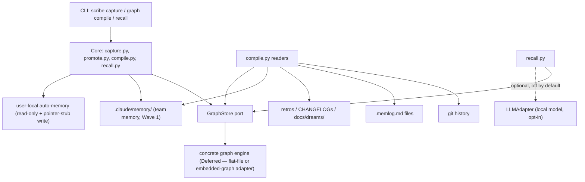

# Architecture Spine — pyforge-scribe

## Design Paradigm

**Event-sourced capture with a derived, rebuildable read-model (CQRS-lite).**
`scribe capture` is the **write path**: every decision, ADR, runbook, or
promotion lands as an immutable, append-only record — never edited in place,
only superseded. `scribe graph compile --nightly` is the **projection
builder**: it re-derives the graph entirely from the write-path's records
(plus the other real-tool surfaces named in FR-9), so the graph is always
disposable and rebuildable, never a second source of truth. `scribe recall`
is the **read path**: it queries the compiled projection only, never the raw
capture log directly, keeping query logic decoupled from capture format.

This is not a borrowed abstraction — it is the shape this repo's own
`bmad-spec` `.memlog.md` discipline already proves out (append-only log,
derived artifacts re-rendered from it on demand), and it is the
storage-engine-agnostic version of Graphiti's bi-temporal fact-supersession
pattern the domain research flagged as the one piece of prior art worth
architecting toward (`domain-team-knowledge-graph-domain-research-2026-07-25.md`
§ Domain Analysis). Layers:

| Layer | Lives in | Role |
|---|---|---|
| Capture (write) | `scribe capture` | Appends immutable records; the only mutation path for decisions (AD-1) |
| Promotion boundary | `scribe capture --promote` | Reads user-local memory (foreign input), writes `.claude/memory/` + a pointer stub (AD-2) |
| Projection (compile) | `scribe graph compile --nightly` | Rebuilds the graph from named tool surfaces; never accepts direct edits (AD-1, AD-5) |
| Query (read) | `scribe recall` | Reads the compiled projection only; every answer is cited (AD-8) |
| Adapters | `GraphStore` port, `LLMAdapter` (optional) | Swap points for the two genuinely volatile dependencies (AD-5, AD-6) |

Everything below either enforces this paradigm at a divergence point or seeds
cold-start structure. The PRD is the requirements contract; this spine fixes
only what independently-built units could get wrong.

## Invariants & Rules

Dependency direction (a rule, not an illustration):



### AD-1 — Append-only capture is the single source of truth; the graph is always rebuildable, never hand-edited `[ADOPTED]`

- **Binds:** FR-1, FR-9, FR-10, FR-11
- **Prevents:** the graph drifting from the record it was compiled from — the exact Sentinel-diagnosed disease ("the graph is there; nobody writes it down") recurring inside Scribe itself
- **Rule:** `scribe capture` writes are the only mutation path for decisions/ADRs/runbooks. `scribe graph compile` never accepts direct graph edits — the compiled graph is 100% derived and re-computable from source records at any time, from scratch, with the same result (subject to source-content changes). No component queries or mutates the compiled graph store except via the compile step (write) and `scribe recall` (read).

### AD-2 — Promotion boundary: user-local memory is foreign input, mutated only via the pointer-stub write

- **Binds:** FR-3, FR-5, FR-6, FR-7
- **Prevents:** Scribe's write surface leaking into files or directories it doesn't own (the failure mode the legacy spec's FR-7 protected against); accidental double-promotion of an already-promoted entry
- **Rule:** the only write Scribe performs outside `.claude/memory/` and its own package/graph-store paths is the pointer-stub rewrite (FR-5) of a confirmed-promoted user-local entry — and that happens only after explicit human confirmation (FR-3), gated by the idempotent `promoted: true` check (FR-6). No other file under `~/.claude/projects/<encoded-path>/memory/` is ever touched.

### AD-3 — Frontmatter/type-taxonomy parity is byte-compatible with user-local auto-memory `[ADOPTED — legacy FR-1/FR-8]`

- **Binds:** FR-1, FR-8
- **Prevents:** a translation layer that could silently drop or corrupt fields during promotion, or diverge from Claude Code's own auto-memory schema
- **Rule:** `.claude/memory/<type>/*.md` frontmatter (`name`, `description`, `type`) is identical in shape to Claude Code's auto-memory schema; `type` ∈ `{feedback, project, reference}` exactly, no additional required fields in Wave 1.

### AD-4 — Fact supersession, never deletion (storage-engine-agnostic)

- **Binds:** FR-10
- **Prevents:** losing historical accuracy when a decision changes; a query returning a stale "current" fact after it has been superseded, or losing the superseded fact's traceability entirely
- **Rule:** a capture that names a prior record as superseded marks that prior record's validity as ended in the compiled graph — it is never deleted or overwritten. This rule binds at the projection-builder level (`compile.py`), independent of which concrete `GraphStore` adapter is active.

### AD-5 — Storage engine is an adapter behind a `GraphStore` port; no direct engine imports outside it

- **Binds:** FR-9, FR-10, FR-11
- **Prevents:** the KuzuDB-archival lesson recurring inside Scribe — premature lock-in to an embedded-graph engine that could itself go unmaintained (domain research: KuzuDB archived Oct 2025 after an acquisition; LadybugDB is its 2026 successor but unproven)
- **Rule:** `compile.py` and `recall.py` interact with the graph only through a `GraphStore` protocol (write: `upsert_node`/`invalidate_edge`-shape operations; read: query-by-citation-path operations). No module outside the concrete adapter implementation may import a specific storage engine's client library directly. The concrete engine (flat-file/index extending `.claude/memory/MEMORY.md`'s pattern, vs. an embedded graph database) is chosen at epics/implementation time (see Deferred) — this AD fixes the swap point, not the choice.

### AD-6 — Air-gap by construction: zero required network reachability by default

- **Binds:** all FRs; explicitly gates FR-9, FR-11, FR-12
- **Prevents:** a dependency silently phoning home, which would falsify the air-gap claim both research reports single out as Scribe's primary durable differentiator (market research § Market Differentiation; domain research § Regulatory Focus) and which the PRD makes a testable NFR (SM-5)
- **Rule:** the default configuration performs zero outbound network calls for `scribe capture`, `scribe graph compile`, or `scribe recall`. Any optional network-touching capability (e.g., a future hosted-LLM backend for `recall`'s answer synthesis) is opt-in, off by default, and gated behind an explicit flag — consistent with the `_check_offline_gate()` / `P-07`-style precedent already established in this repo's `deckcraft` architecture. `scribe recall`'s v1 default path (FR-12/FR-13's "no LLM required" option, PRD Open Question 3) must not require network reachability to return a grounded answer.

### AD-7 — CLI is the sole public contract; internal modules are not a consumer-facing surface

- **Binds:** FR-14, FR-15
- **Prevents:** downstream pyforge-* stations (Herald, Marshal, Doctor — per the Dream's future consumers) coupling to Scribe's internal module layout instead of its stable command surface
- **Rule:** `pyforge.scribe`'s public `__init__.py` exports only what the CLI itself needs. Other components integrate with Scribe via the `scribe` CLI (subprocess or `typer` `CliRunner`-style invocation) or a documented, explicitly-versioned Python API — never by importing `pyforge.scribe.compile` or `pyforge.scribe.graph_store` internals directly.

### AD-8 — Recall never fabricates a citation

- **Binds:** FR-12, FR-13
- **Prevents:** the ungrounded-answer trust failure the PRD names as a top risk — an LLM-plausible but uncited `scribe recall` response would collapse the entire "answer from memory, not a guess" premise
- **Rule:** every `scribe recall` response either includes at least one citation resolvable to a real captured record (file path / capture ID / commit), or returns an explicit "no grounded answer found" result. No code path in `recall.py` may return synthesized prose without a resolvable citation attached.

### AD-9 — Wave boundary: Wave 2 is additive over Wave 1's file contract, never a breaking migration of it

- **Binds:** FR-9 (compile reading `.claude/memory/` as one of its inputs)
- **Prevents:** Wave 2's graph-compile work forcing a reformat of Wave 1's already-shipped `.claude/memory/` entries
- **Rule:** `.claude/memory/` frontmatter (AD-3) is a stable input contract for `compile.py`. Wave 2 development must read that format as-is; if Wave 2 needs additional metadata, it is additive (new optional fields), never a breaking rewrite of Wave 1's schema.

## Consistency Conventions

| Concern | Convention |
|---|---|
| Naming (entities, files, modules) | CLI commands: `scribe capture`, `scribe graph compile`, `scribe recall` (verb-first, matching the Dream's CLI Cadence exactly). Python modules: `pyforge/scribe/{cli,capture,promote,compile,recall,graph_store,models}.py`. Captured record files: same convention as `.claude/memory/<type>/<slug>.md` (Wave 1, AD-3); graph-store-internal naming is engine-specific and owned by the concrete adapter (Deferred). |
| Data & formats | Captured records are Pydantic models internally (id, type, text, supersedes: id \| None, captured_at UTC, source), serialized to the `.claude/memory/` frontmatter+body shape at the promotion boundary (AD-2/AD-3) — matching this repo's `deckcraft` precedent of one Pydantic model family as the inter-module contract. Timestamps: UTC, ISO 8601, matching the legacy spec's pointer-stub `YYYY-MM-DD` convention for human-facing dates and full `datetime` for internal record ordering. |
| State & cross-cutting | No component mutates the graph store except `compile.py` (AD-1). No component writes outside its FR-7/AD-2 boundary. All network-touching code paths consult an offline gate before any call (AD-6). Structured logging over `print()`, matching the `deckcraft` precedent (`P-10`), for compile-step audit trails. |
| CLI exit codes | `0` success, non-zero on capture/compile/recall failure; `scribe recall` returning "no grounded answer found" is exit `0` (a valid, non-error result) — only a hard failure (unreadable graph store, malformed input) is non-zero. |

## Stack

Seed — verified against the live root `pixi.toml` (2026-07-25) and the
shipped `pyforge-warden` sibling package's `pyproject.toml`/`pixi.toml`
(the only precedent for a `pyforge-*` workspace member in this repo).

| Name | Version |
|---|---|
| Python (member-package floor) | `>=3.12` (matches `pyforge-warden`'s floor; distinct by design from the repo-wide `pyforge-atlas` 3.14 floor — namespace-package sharing needs no floor parity, per atlas's AD-16 precedent) |
| `typer` | `>=0.27.0` (already in-env; CLI framework, matches `deckcraft`'s precedent) |
| `gitpython` | `>=3.1.53` (already in-env; git-history reader for the compile step's FR-9 input) |
| `pydantic` | version deliberately unbound here — present but commented-out in a couple of the repo's `pixi.toml` feature blocks at intake time; confirm the exact floor when Wave 1 implementation starts, do not assume a specific pin from this spine |
| `duckdb` | `>=1.5.4` (already in-env) — a **candidate** `GraphStore` adapter implementation (e.g. via a graph-query extension), not a bound decision (AD-5, Deferred) |
| `hatchling` | build backend, matching `pyforge-warden`'s `pyproject.toml` precedent exactly |
| `pixi-build-python` | `0.*`, matching `pyforge-warden`'s `[package.build.backend]` precedent |

## Structural Seed

Packaging convention adopted verbatim from the shipped `pyforge-warden`
sibling package — the only precedent in this repo for a `pyforge-*`
workspace member (the code owns the detail once it exists):

```text
src/shared/packages/pyforge-scribe/       # pixi-build workspace member (matches pyforge-warden's Option B)
  pixi.toml                               # [package] table; pixi-build-python backend; NO [workspace] table (member, not root)
  pyproject.toml                          # hatchling backend; [project.scripts] scribe = "pyforge.scribe.cli:main"
  src/
    pyforge/
      scribe/
        __init__.py                       # public API surface (AD-7) — minimal, CLI-facing only
        cli.py                            # typer app: capture / graph compile / recall subcommands
        capture.py                        # Wave 1: append-only write path (AD-1)
        promote.py                        # Wave 1: promotion boundary — reads user-local memory, writes .claude/memory/ + pointer stub (AD-2)
        compile.py                        # Wave 2: projection builder — reads named tool surfaces, writes via GraphStore port (AD-1, AD-5)
        recall.py                         # Wave 2: query path — reads GraphStore only, cites every answer (AD-8)
        graph_store.py                    # GraphStore port/protocol + the concrete adapter (engine choice open — see Deferred)
        models.py                         # Pydantic record/graph-node models (Consistency Conventions § Data & formats)
        py.typed
  tests/
    unit/
    fixtures/                             # sample .claude/memory/ entries, sample memlogs, sample git histories
root pixi.toml additions (mirroring pyforge-warden's blocks):
  [feature.pyforge-scribe.dependencies]   # pyforge-scribe = { path = "src/shared/packages/pyforge-scribe" }
  [feature.pyforge-scribe.tasks.*]        # pyforge-scribe-test, pyforge-scribe-build-conda, pyforge-scribe-build-dist

.claude/memory/                           # Wave 1 team-memory tree (legacy spec Story 1) — Scribe's capture-layer foundation
  MEMORY.md
  feedback/  project/  reference/

CLAUDE.md                                 # human-edited: @.claude/memory/MEMORY.md import (legacy spec Story 5)
```

Wave sequencing (the operational envelope this altitude owns): Wave 1
(`capture.py`, `promote.py`, the `.claude/memory/` tree) ships first and is
independently useful; Wave 2 (`compile.py`, `recall.py`, `graph_store.py`)
depends on Wave 1's `.claude/memory/` tree existing as one of its compile
inputs (AD-9) but not on any Wave 2 module. No persistent daemon in either
wave — `scribe graph compile --nightly` is invoked on a schedule (cron, CI,
or manual) exactly like `deckcraft`'s benchmark/init tasks are invoked
on-demand, never a long-running service (consistent with AD-6's air-gap
posture — nothing listens on a port by default).

## Capability → Architecture Map

| Capability | Lives in | Governed by |
|---|---|---|
| FR-1 frontmatter schema parity | `.claude/memory/`, `promote.py` | AD-3 |
| FR-2 MEMORY.md index size discipline | `.claude/memory/MEMORY.md` (convention-only, no gate in Wave 1) | AD-3 |
| FR-3 proposal-then-confirm promotion | `promote.py` | AD-2 |
| FR-4 team-voice rewrite | `promote.py` | AD-2 |
| FR-5 pointer stub after promotion | `promote.py` | AD-2 |
| FR-6 already-promoted detection (idempotency) | `promote.py` | AD-2 |
| FR-7 write-boundary (read-only outside owned paths) | `capture.py`, `promote.py`, `compile.py` | AD-2 |
| FR-8 type taxonomy match | `.claude/memory/{feedback,project,reference}/` | AD-3 |
| FR-9 nightly compile reads named tool surfaces | `compile.py` | AD-1, AD-5, AD-9 |
| FR-10 fact supersession | `compile.py`, `graph_store.py` | AD-1, AD-4, AD-5 |
| FR-11 compile is unattended and idempotent | `compile.py` | AD-1, AD-6 |
| FR-12 grounded, cited recall | `recall.py` | AD-8 |
| FR-13 recall is queryable by any session/operator | `recall.py`, `graph_store.py` | AD-5, AD-8 |
| FR-14 CLI is the public contract | `cli.py` | AD-7 |
| FR-15 pixi workspace membership | `src/shared/packages/pyforge-scribe/`, root `pixi.toml` | Structural Seed (pyforge-warden precedent) |

## Decisions & Assumptions (unattended intake)

No human elicitation occurred; nothing was invented beyond what the PRD,
brief, research reports, and the shipped `pyforge-warden` precedent already
settled.

1. **Paradigm, packaging convention, and the `GraphStore` port are `[ADOPTED]`/derived**, not invented — the PRD's D-1 supersession decision settled that Scribe is a real package; `pyforge-warden`'s shipped `pyproject.toml`/`pixi.toml` shape is the only in-repo precedent and is followed exactly rather than re-derived.
2. **Altitude = feature**: this spine keeps Wave 1 and Wave 2 (the PRD's two features-worth of scope) coherent; per-story detail belongs to `bmad-create-epics-and-stories`. `[ASSUMPTION]`
3. **Stack verification** was performed against the live root `pixi.toml` and the shipped `pyforge-warden` package (2026-07-25) rather than fresh web lookups for already-in-env dependencies (`typer`, `gitpython`, `duckdb`) — consistent with the atlas spine's precedent that the in-repo conda-forge-resolved environment is ground truth over upstream declarations. `pydantic`'s exact version was **not** verified (commented out in the intake `pixi.toml` at two feature blocks) — flagged, not assumed.
4. **Graph storage engine is deliberately left open** (AD-5, Deferred) — this is a direct, explicit carry-forward of the PRD's Open Question 1 and the domain research's KuzuDB-archival finding; the spine's job was to fix the *port*, not force a premature engine choice.
5. **`scribe recall`'s LLM-optionality (AD-6, PRD Open Question 3)** is resolved here only to the extent of "must not be required" — the concrete decision (pure retrieval+citation vs. optional local-LLM synthesis) is Deferred to epics/implementation.

## Deferred

Intentionally undecided, each with its owner/revisit condition:

- **`GraphStore` concrete engine** (flat-file/index extending `.claude/memory/MEMORY.md`'s pattern vs. an embedded graph database, e.g. a LadybugDB-class successor to the archived KuzuDB) → epics/implementation phase, gated by a small spike comparing the two against Wave 2's actual query needs (PRD Open Question 1). *(Closed — flat-file won v1 without the spike; the engine question then became a plugin surface. See § Currency reconciliation.)*
- **`scribe graph compile`'s exact v1 input glob list** (which `.memlog.md` files, which retro/CHANGELOG paths, how much of `docs/dreams/`) → epics/implementation phase (PRD Open Question 2); AD-1/AD-9 fix the shape, not the list.
- **`scribe recall` output format** (plain text vs. structured JSON vs. both) → epics/implementation phase (PRD `[ASSUMPTION 9.2]`); no product requirement distinguishes them yet.
- **`scribe recall`'s LLM-optionality** — pure grounded retrieval (return the matching record + citation, no generative synthesis) vs. an opt-in local-LLM synthesis layer → epics/implementation phase (PRD Open Question 3); AD-6/AD-8 bind that whichever is chosen, it stays air-gap-safe and citation-honest.
- **ADR-format interop** — whether `scribe capture --type decision` formally adopts the `docs/adr/`-style numbering/format the domain research found as dominant practice, or keeps its own vocabulary → epics/implementation phase (PRD Open Question 4); does not affect this spine's invariants either way.
- **`anthropics/claude-code#38536` watch-item** (native team-shared memory) — no action; re-check at Wave 1 implementation start and at Wave 2 kickoff (PRD Open Question 5).
- **Legacy `CLAUDE.md` § "BMAD ↔ conda-forge-expert integration" de-duplication** (PRD Open Question 6 / legacy spec Q3) → human-reviewed edit at Wave 1 implementation, explicitly out of Scribe's own write-boundary (AD-2/AD-7 do not cover `CLAUDE.md`).
- **`pydantic` exact version pin for the new package** → confirmed at Wave 1 implementation start against the then-current root `pixi.toml`. *(Done — the shipped `pyproject.toml` carries the resolved pin.)*

## Currency reconciliation — 2026-08-26

Reconciled against the re-cut PRD (updated 2026-08-26, § Currency reconciliation), the shipped code at `src/shared/packages/pyforge-scribe/` through commit `2d264c7f5c` (2026-08-26), and the Unifying Strategy pack (`spec-pyforge-unifying-strategy`, updated 2026-08-26). The nine ADs all held through ship and through three post-ship epics; none required correction. What this spine's static sections no longer show:

**AD-5 held, then compounded.** The `GraphStore` port shipped as a `typing.Protocol` (`graph_store.py:59` — structural typing, no concrete base class; the strategy SPEC's "no `GraphStore` class exists in `pyforge-scribe`" phrasing means exactly this). No story after 2.1 touched the port's internals, and the deferred engine choice resolved *without* ever forcing one:
- `FlatFileGraphStore` (v1, one deterministic JSON file at `.claude/data/pyforge-scribe/graph.json`) — still the default.
- **CAP-18 plugin registration** (Epic 4 / Story 4.1, 2026-08-24): drivers register on the shared `pyforge.core.hooks` contract (`GRAPHSTORE_HOOK_SPEC`); `graph_store_plugins.py::open_graph_store` selects by owner (`PYFORGE_GRAPHSTORE_OWNER`; DSN via `SCRIBE_GRAPH_DSN`, plane path via `QUERY_PLANE_DUCKDB`). Callers still never import an engine client — AD-5's rule, now enforced by the factory.
- `PostgresGraphStore` (steward Epic 28.1, 2026-08-25, `graph_store_pg.py`, owner `steward`): pgvector in the schema-isolated `scribe_schema`; semantic recall behind the same port (canopy FR-36, 28.2).
- `PlaneGraphStore` (steward 34.5 / canopy FR-50, 2026-08-26, `graph_store_plane.py`, owner `atlas`): node snapshot + `FLOAT[N]` HNSW-rankable embeddings on the CAP-19 query plane (`atlas.duckdb`; refuses in-memory DuckDB and Chroma by construction).

**Operator decision 2026-08-26 (`query-plane-scribe-cutover`, strategy SPEC § Open Questions): dual-write for now.** The plane, via the 34.5 store-port driver, is **primary** and satisfies FR-36; `scribe_schema` pgvector **stays written as the safety net** until the plane has operating history — its retirement is a future explicit decision, not an implication. Lexical recall may stay local (flat-file). This spine's addenda and any epic derived from it must not treat the PG path as retired.

**AD-6 held under semantic recall.** Embeddings (`embeddings.py::embed_text`) are deterministic and local — no model download, no network call; the default configuration (flat-file owner, lexical recall) still performs zero outbound calls, and the PG/plane drivers activate only via explicit owner/env selection. Air-gap-by-construction survives the semantic upgrade.

**AD-7's consumer list materialized.** Integration now happens through: the `scribe` CLI and unified `pyforge scribe` grammar (CAP-5); `POST /stations/scribe/mcp` (CAP-4); the portal slice at `/stations/scribe/` which submits recall queries via `PortalClient` only (Story 5.2 — no raw HTTP, enforced by `tests/meta/test_first_portal_slice.py`); the SKF domain skill (`.claude/skills/pyforge-scribe/`, CLI-only guidance) and `bmad-agent-scribe` persona (Story 5.1). Five-tier station shape declared complete 2026-08-26 (strategy Epic 37.1).

**Module inventory drift** (Structural Seed shows the 2026-07-25 plan): the shipped tree adds `embeddings.py`, `transcripts.py` (Epic 3 — transcript scanning into the reviewed promotion flow, and transcripts as a sixth compile surface with provenance; an amendment to the PRD's transcript non-goal, recorded there), `graph_store_pg.py`, `graph_store_plane.py`, `graph_store_plugins.py`, and a `tests/meta/` tier (persona/skill/portal conformance). AD-1 (rebuild-from-scratch compile), AD-4 (invalidate-never-delete), and AD-9 (additive-only input contract) held unchanged through all of it — the transcript surface joined without any rewrite of Wave 1's schema.

**Known engineering debt this spine inherits** (2026-08-08 technical report + `deferred-work-ledger.md`): `promote.py` has never received an adversarial review (RISK-1, open); the nightly compile is unattended-by-construction but unscheduled (RISK-2, still true 2026-08-26); the transcript surface is the only compile surface with no cost bound on the unattended path (DW-FU-3-2-2); recall tie-breaks on node id ascending, which for date-ordered filenames favors the older statement (DW-FU-3-2-4).
- **Scheduling mechanism for `scribe graph compile --nightly`** (cron vs. CI job vs. a bmad-loop-style scheduled task) — not fixed here; AD-6 only requires that whichever mechanism is chosen does not introduce a persistent network-listening daemon. *(Still genuinely open 2026-08-26 — no scheduler invokes the compile; RISK-2 in the 2026-08-08 technical report.)*


## Runtime floor — reconciled 2026-09-07

**Python 3.14 is the only supported runtime.** `pyproject.toml` now declares
`requires-python = ">=3.14"` (marshal Story 32.2, `spec-fleet-consistency-standard` CAP-5),
matching `pixi.toml`'s `python = ">=3.14.7,3.14.*"` and every env-scoped `3.14.*` pin.

Consequence for this spine: no deployment target, container image or CI lane may assume a
3.12/3.13 interpreter for `pyforge-scribe`, and none does today — this records the constraint
rather than changing it. The previous `>=3.12` declaration was never exercised by any
environment in the workspace.


## Currency reconciliation — 2026-09-14

*Chain-currency sweep cascade: the PRD re-dated 2026-09-14 after folding
`spec-pyforge-scribe`'s 2026-09-09 answering pass, which fires the `prd→arch` edge.
This section is the as-built check: does the spine above still describe the package.*

**AD-3 stopped being a compatibility note and became the reason for a product
decision — worth recording, because that is a change in the AD's weight, not in its
text.** The Spec's 2026-09-09 ruling that `scribe capture --type` stays **closed at
`{feedback, project, reference}`** and that ADR numbering is a Non-goal rests entirely
on AD-3: byte-compatible parity with Claude Code's user-local auto-memory taxonomy is
what a fourth `decision` type would break. Verified live this pass: `models.py:34`
declares `CaptureType = Literal["feedback", "project", "reference"]` with
`CAPTURE_TYPES` ordered beside it, and `cli.py:104-105` exposes exactly those three.
AD-3 holds, unmodified; what is new is that a product question now terminates on it.

**AD-5's port is confirmed holding three concrete drivers, and that is what closed the
engine-choice question.** The Deferred section historically called for a spike
comparing a flat-file/index adapter against an embedded graph engine before choosing
the v1 adapter. No spike was ever needed: verified live, `graph_store.py`,
`graph_store_pg.py` and `graph_store_plane.py` coexist behind the port, with
`graph_store_plugins.py` registering them. The Spec now states this plainly ("three
drivers now sit behind it and the port still fixes nothing beyond itself"). **The
architectural lesson, recorded once:** the port did not defer the decision, it
dissolved it — a correctly placed seam turns "which engine" into a deployment
question. AD-5's no-direct-engine-imports rule is what makes that true and is
unchanged.

**Four new scripts joined the governed surface; none is a component.**
`scripts/scribe_pg.py`, `scripts/scribe_nightly_trigger.py`,
`scripts/scribe_install_nightly_trigger.py` and
`scripts/scribe_graph_freshness_check.py` are operator-side infrastructure for the
nightly compile. The architecturally relevant fact — and the one the PRD's SM-4 had
gone stale on — is that **the nightly trigger is now a checked-in systemd-user timer**
(`src/shared/packages/pyforge-scribe/ops/systemd/pyforge-scribe-nightly-compile.timer`),
not a hand-typed crontab line. That makes the trigger a tracked artifact rather than
host state, which is strictly better for the air-gap posture this spine already
assumes. No component boundary moves: `compile.py` is still the schedulable unit.

**One ownership boundary re-affirmed.** The Unifying-Strategy semantic-recall
capability is **steward Story 49.7**'s, not this station's; scribe owns the `recall`
mechanism and does not mint a parallel CAP for steward's outcome (Charter §5). No
module is added here for it.

**No AD added, changed or removed.** `updated:` bumped to record that the cascade ran.

## Currency reconciliation — 2026-09-20 (fleet consistency pass)

*Operator ruling 2026-09-20: every station's PRD, spine and epics are re-stamped in the same pass,
grace period or not, so the whole chain reads current for the foundry cutover. Trigger: the
station Spec's `.memlog.md` gained a 2026-09-20 event — the fleet consistency pass reconciled every
tracked story spec's frontmatter against the sprint ledger, matched each "Ledger status" line,
reconstructed missing Auto Run Results from `main`'s landing commits, fixed invalid frontmatter,
and let `sprint-ledger-sync` roll the epic keys up (`spec→prd→arch` cascade). Bookkeeping only:
no requirement, decision, story or AD changes in this spine. `updated:` bumped to record that the
check ran.*
