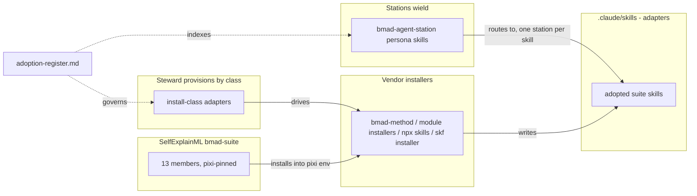
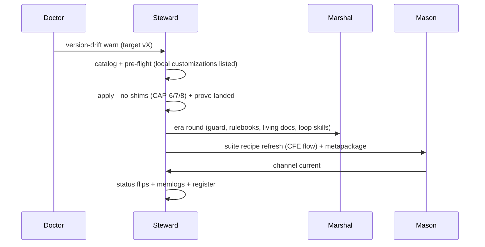

# Architecture Spine — bmad-suite lifecycle

## Design Paradigm

**Install-class adapters over vendor installers** (steward's hexagonal paradigm applied to the
suite): every member reaches the tree through exactly one adapter named by its install class
(`installer-tree`, `runner-home`, `own-installer`, `module`, `cli`, `plugin-path`, `scaffold`,
`vscode-extension`), and the adapter drives the member's own installer rather than copying files.
**Wield-by-routing**: a station never contains a suite skill; it routes to it from its persona
skill, one station per skill. **Relay, never absorb** across kin chains: the apply, the harness,
the pilot and the cutover keep their owners; this chain orders them and relays gaps by memlog.

## Inherited Invariants

| Inherited | From parent | Binds here |
| --- | --- | --- |
| AD-1 Wrap, never reimplement `[ADOPTED]` | steward spine | each member's own installer stays the writer of its module tree |
| AD-5 Provision wraps, never forks, Marshal-owned machinery | steward spine | the harness flip and loop-home re-render are marshal stories; steward re-renders only on request |
| AD-7 / AD-8 One `Duty` protocol; exit-code sole ownership | steward spine | `--no-shims` and the readiness report ride the existing upgrade duty, no new exit domain |
| fnd:AD-5 One skills tree; IDE dirs are adapters | cutover spine | estate-authored skills move to `skills/{stations,personas,domain}/` with generated adapters; installer-written `bmad-*` / `skf-*` dirs stay real directories (the carve-out) — nothing provisioned here may treat a suite module dir as estate-authored, or an estate skill's `.claude/skills/` copy as durable |
| fnd:AD-12 The BMAD chain moves whole | cutover spine | `_bmad/`, `_bmad-output/projects/`, `docs/dreams/` move as one; loop homes re-provisioned at the flip with no loop running |
| fnd:AD-20 The seed is Dreams plus memlogs `[ADOPTED]` | cutover spine | this spine's memlog is what moves; the rendered file is derived; the parent's `[ADOPTED]` tags are the parent's (AD-1, AD-17, AD-19, AD-20, AD-23) — none is added here |

## Invariants & Rules

### AD-1 — One install path per class; steward is the only writer of suite skills `[ADOPTED]`

- **Binds:** CAP-2, CAP-5, CAP-6
- **Prevents:** hand copies into `.claude/skills/`; `cleanup-legacy.py` wiping `_bmad/core/config.yaml`; `bmad-module-skill-forge uninstall` deleting every skill dir (its manifest walks the whole tree); two copies of one skill
- **Rule:** module class → `steward provision --module <name>`; own-installer → the member's installer (`bmad-module-skill-forge install/update`); plugin-path → `npx skills add … --skill <name>` by name; scaffold → never provisioned. A manual copy is a defect, not a shortcut.

### AD-2 — Routing lives with the wielder

- **Binds:** CAP-3
- **Prevents:** two stations reaching for one skill under different contracts; routing notes rotting in CLAUDE.md
- **Rule:** exactly one wielding station per adopted skill, recorded in that station's persona skill (`bmad-agent-<station>`) and the AGENTS.md managed block, never CLAUDE.md. `adoption-register.md` § 2 is the index; a second station wanting a skill changes the row, not the persona.

### AD-3 — The studio is a separate root

- **Binds:** CAP-5
- **Prevents:** manticore's wipe-and-reinstall ritual touching this repo's `_bmad/` or `_bmad-output/`
- **Rule:** the studio owns its own `_bmad/` and `_bmad/custom/config.toml` (`[modules.manticore]` written by `mc-setup`); nothing under the repo's `_bmad/` references it — the stale in-repo `[modules.manticore]` block in the gitignored `_bmad/custom/config.user.toml` (present 2026-09-06) is retired by Story 46.6 when the studio root is chosen; render artifacts are gitignored; the studio path is a register cell.

### AD-4 — Advisory lenses never gate

- **Binds:** CAP-4, CAP-7, warden relays
- **Prevents:** a second PR verdict; eval trials or TEA scores joining `detectors-ci`
- **Rule:** `tea-test-review`, `bmad-os-review-pr` / `findings-triage` and eval-quality outputs are findings beside Warden's gate (severity warn at most) or lenses inside the marshal review step; none is a member of `detectors` / `detectors-ci`; the gate's exit code is unchanged by them.

### AD-5 — Retire behind equivalence

- **Binds:** CAP-4, CAP-10
- **Prevents:** deleting a repo mechanism (the TEA generator, its meta-tests, a shim caller) before its replacement is proven
- **Rule:** a repo-owned generator, test or caller is deleted only in the same story that records an equivalence check (generator output vs TEA output; old skill id vs live id), and the deletion follows a passing check; a failed check narrows the capability, never forces the delete.

### AD-6 — The register is the wiring ledger

- **Binds:** CAP-1
- **Prevents:** wiring by side effect (a provision run nobody recorded); pipeline-truth drifting from intent
- **Rule:** a member's verdict / wielder / path change lands as a register row first; `steward suite pipeline-truth`'s `wired` column agreeing with the register is the test; disagreement is a finding on the register, not on the tool.

### AD-7 — One cadence; mechanisms stay with their chains

- **Binds:** CAP-8, CAP-9, CAP-10
- **Prevents:** duplicate stories across kin chains; a second owner for the apply
- **Rule:** `release-cadence.md` orders detect → catalog → pre-flight → apply → prove-landed → era round → suite refresh → flips → record. core-upgrade owns the apply and `--no-shims` (14.9); era-alignment owns the harness, the guard and the rulebooks (30.x); eval-quality owns the pilot (45.2); the cutover Spec owns Epic 44. This chain relays by memlog and never mints a story a kin chain already owns.

### AD-8 — Readiness is a gate with owners; the foundry stack carries the bmad floor

- **Binds:** CAP-9
- **Prevents:** opening the foundry with a red BMAD line; a lean foundry `pixi.toml` with no BMAD toolchain
- **Rule:** every `cutover-readiness.md` P line names an owner and a story; Story 44.3 is not flipped while any P line is red. The cutover spine's Stack gains a `bmad-*` floor row (method ≥6.12.0, loop ≥0.11.1, skf ≥2.1.0 linux-64 only, CIS, TEA, eval-quality, utility-skills, BMB), rendered by steward 47.4; win-64 excludes skf and eval-quality.



Dependency direction: stations depend on skills; skills exist only because an adapter drove a
vendor installer; the register governs both ends. Nothing points the other way.

## Consistency Conventions

| Concern | Convention |
| --- | --- |
| Naming | member ids = `suite-members.yaml` names; skill dirs exactly as the vendor ships them (`bmad-os-*`, `bmad-testarch-*`, BMB's five: `bmad-bmb-setup`, `bmad-agent-builder`, `bmad-workflow-builder`, `bmad-module-builder`, `bmad-eval-runner`; `mc-*`, `skf-*`); routing notes cite the skill dir name. The eight station personas are exactly `bmad-agent-{atlas,doctor,herald,marshal,mason,scribe,steward,warden}`; BMB's `bmad-agent-builder` is a vendor skill and never a persona (AD-2 routes live only in the eight). Install-class names follow `suite.py` (`scaffold-n/a`, not `scaffold`) |
| Register data | one row per member; columns verdict / wielder / provisioning path / hazards / status; status cell = a story key or `—` |
| State & cross-cutting | every chain amendment is a memlog line on the owning Spec before any rendered edit; ledgers change only via `sprint_plan.py generate` + scoped `sprint-ledger-sync`; physical paths with `BMAD_ACTIVE_PROJECT`; advisory findings use `warn` severity at most |
| Retirement | a deletion story records the equivalence check it passed (AD-5) and glosses history rather than rewriting it |

## Stack

Versions as read from `steward suite pipeline-truth` on 2026-09-06 (recipe = channel = installed for 13/13). GitHub is the registry of record for eight of the thirteen (npm absent or lagging); npm is authoritative only for bmad-method, TEA, CIS, skf and eval-quality's `latest`.

| Name | Version |
| --- | --- |
| bmad-method (installer-tree) | 6.12.0 |
| bmad-loop (runner-home) | 0.11.1 |
| bmad-module-skill-forge (own-installer) | 2.1.0 on the channel and in `.claude/skills/` (tag `v2.1.0` == npm tarball, verified 2026-09-06); the registered custom module `_bmad/skf` reads `main` @ channel `next` (author fork) until Story 46.7 pins `v2.1.0` |
| bmad-creative-intelligence-suite (module) | 0.3.2 |
| bmad-method-test-architecture-enterprise (module) | 1.24.0 |
| bmad-builder (module) | 2.2.2 |
| bmad-utility-skills (module) | 2.0.0 @HEAD |
| bmad-manticore (module, `--custom-source`) | 3.1.0.dev0 @c9bcf759 |
| bmad-labs-skills (plugin-path) | 1.0.0.dev0 @HEAD |
| bmad-eval-quality (cli) | 0.2.0.dev0 @3172162f |
| bmad-module-template (scaffold) | 0.1.0 |
| bmad-dashboard / mybmad-dashboard (vscode-extension) | 1.2.2.dev0 / 0.1.0.dev0 |
| nodejs (pixi env) | 24.19 installed; pixi floor `>=24.19,<27,!=25.*` |

## Structural Seed

```text
<repo>/
  .claude/skills/                      # installer-written suite dirs (bmad-os-*, bmad-testarch-*, BMB's five, skf-*, bmad-cis-*) stay real dirs after cutover (fnd:AD-5 carve-out); estate-authored skills become generated adapters
  _bmad/                               # installer-owned core + custom/ (the pin layer); skf/ (own installer)
  _bmad-output/projects/pyforge-steward/planning-artifacts/
    specs/spec-bmad-suite-lifecycle/   # SPEC + adoption-register + release-cadence + cutover-readiness + open-items-register
    prds/prd-bmad-suite-lifecycle-2026-09-06/
    architecture/architecture-bmad-suite-lifecycle-2026-09-06/
  evals/review-catches-planted-defect/ # the eval-quality pilot (45.2 — planned, not yet on disk)
<studio>/                              # Herald's manticore root, OUTSIDE the repo's _bmad/ (AD-3)
  _bmad/custom/config.toml             # [modules.manticore]
  <video>/                             # one folder per video; .mp4 never in git
```



## Capability → Architecture Map

| Capability / Area | Lives in | Governed by |
| --- | --- | --- |
| CAP-1 adoption register | `specs/spec-bmad-suite-lifecycle/adoption-register.md` | AD-6 |
| CAP-2 module wave | `steward provision` (`provision.py` backends) | AD-1, steward AD-1 |
| CAP-3 station routing | `bmad-agent-<station>` skills + AGENTS block | AD-2 |
| CAP-4 TEA full adoption | TEA workflows; marshal harness review step; warden advisory | AD-4, AD-5 |
| CAP-5 manticore studio | `<studio>/` (separate root) | AD-3, AD-1 |
| CAP-6 labs by consent | `npx skills add --skill` per row | AD-1, AD-6 |
| CAP-7 eval-quality pilot | `evals/…` + three pixi tasks | AD-4 |
| CAP-8 release cadence | `release-cadence.md` | AD-7 |
| CAP-9 cutover readiness | `cutover-readiness.md`; relays to 44.x, 31.x, 20.x | AD-8, AD-7, fnd:AD-5/12/20 |
| CAP-10 shim retirement | marshal 30.5, steward 14.9 | AD-5, AD-7, steward AD-5 |

## Deferred

- A `--studio <dir>` flag on `steward provision --module manticore` — only if the native
  `--custom-source` path proves clumsy (46.6).
- The per-station mapping of TEA's nine workflows and the `--min-score` value (marshal 31.1, 31.3).
- The render-HALT and `frozen-path-changed` detector designs (doctor 20.2, 20.3).
- The eval trial cost ledger (45.2) and the routing-note home after cutover (46.1).
- Loop-home readiness contents (marshal 31.5) and the `PROJECTS.md` cutover layout wording (47.3).
