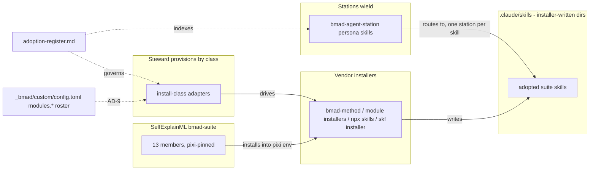
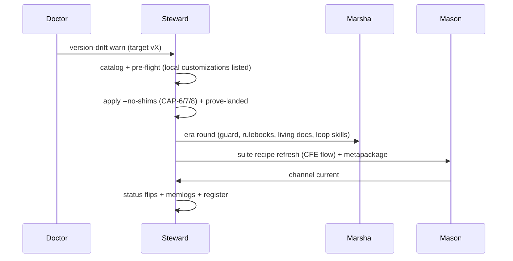

# Architecture Spine — bmad-suite lifecycle

## Design Paradigm

**Install-class adapters over vendor installers** (steward's hexagonal paradigm applied to the
suite): every member reaches the tree through exactly one adapter named by its install class
(`installer-tree`, `runner-home`, `own-installer`, `module`, `cli`, `plugin-path`, `scaffold-n/a`,
`vscode-extension`), and the adapter drives the member's own installer rather than copying files.
**Wield-by-routing**: a station never contains a suite skill; it routes to it from its persona
skill, one station per skill. **Relay, never absorb** across kin chains: the apply, the harness,
the pilot and the cutover keep their owners; this chain orders them and relays gaps by memlog.

## Inherited Invariants

| Inherited | From parent | Binds here |
| --- | --- | --- |
| AD-1 Wrap, never reimplement `[ADOPTED]` | steward spine | each member's own installer stays the writer of its module tree |
| AD-5 Provision wraps, never forks, Marshal-owned machinery | steward spine | the harness flip and loop-home re-render are marshal stories; steward re-renders only on request |
| AD-7 / AD-8 One `Duty` protocol; exit-code sole ownership | steward spine | `--no-shims` and the readiness report ride the existing upgrade duty, no new exit domain |
| fnd:AD-5 One skills tree; IDE dirs are adapters | cutover spine | estate-authored skills move to `skills/{stations,personas,domain}/` with generated adapters; installer-written `bmad-*` / `skf-*` dirs stay real directories (the carve-out) — nothing provisioned here may treat a suite module dir as estate-authored, or an estate skill's `.claude/skills/` copy as durable |
| fnd:AD-12 The BMAD chain moves whole | cutover spine | `_bmad/`, `_bmad-output/projects/`, `docs/dreams/` move as one; loop homes re-provisioned at the flip with no loop running |
| fnd:AD-20 The seed is Dreams plus memlogs `[ADOPTED]` | cutover spine | this spine's memlog is what moves; the rendered file is derived; the parent's `[ADOPTED]` tags are the parent's (AD-1, AD-17, AD-19, AD-20, AD-23) — none is added here |

## Invariants & Rules

### AD-1 — One install path per class; steward is the only writer of suite skills `[ADOPTED]`

- **Binds:** CAP-2, CAP-5, CAP-6
- **Prevents:** hand copies into `.claude/skills/`; `cleanup-legacy.py` wiping `_bmad/core/config.yaml`; `bmad-module-skill-forge uninstall` deleting every skill dir (its manifest walks the whole tree); two copies of one skill; two writers for one class (a raw `npx skills add` beside the conda member)
- **Rule:** module class → `steward provision --module <name>`; own-installer → the member's installer (`bmad-module-skill-forge install/update`); plugin-path → **one steward-wrapped, pinned writer** (`steward provision --plugin labs --skill <name>`, calling the conda member's share tree or `npx skills add` pinned to the recipe's commit — the register's provisioning-path cell equals that invocation); scaffold-n/a → never provisioned. A manual copy, or a second path for the same class, is a defect.

### AD-2 — Routing lives with the wielder, in one durable home

- **Binds:** CAP-3
- **Prevents:** two stations reaching for one skill under different contracts; routing notes rotting in CLAUDE.md; per-skill lines in a managed block that is replaced on refresh
- **Rule:** exactly one wielding station per adopted skill. The routing note has exactly one durable home: the wielding persona skill (`bmad-agent-<station>/SKILL.md`, estate-authored, moving to `skills/personas/` under fnd:AD-5). AGENTS.md carries one pointer line ("skill routing: `adoption-register.md` § 2"), placed once through `bmad-project-context`, never per-skill lines. `adoption-register.md` § 2 is the index; a re-route edits the register row **and both** persona skills. A meta-test asserts every § 2 skill dir is named by exactly one persona skill and by CLAUDE.md never (Story 46.1 ships it; 46.1 verifies this rule, it does not decide it).

### AD-3 — The studio is a separate root, declared once

- **Binds:** CAP-5
- **Prevents:** manticore's wipe-and-reinstall ritual touching this repo's `_bmad/` or `_bmad-output/`; the studio root living in three places (register cell, studio config, herald runtime); `mc-*` skills a repo session cannot load
- **Rule:** the studio root is `~/pyforge-studio/` by default (outside the repo — decided 2026-09-06, closing the Spec's open question 1), declared once, machine-readable and per-machine, by `PYFORGE_STUDIO_ROOT` (fallback: a gitignored `pyforge.local.toml` key); herald's CLI, pipeline-truth's manticore probe and the register all *cite* it (the register cell is a pointer). The studio owns its own `_bmad/` and `_bmad/custom/config.toml` (`[modules.manticore]` written by `mc-setup`); the stale in-repo `[modules.manticore]` block in the gitignored `_bmad/custom/config.user.toml` (present 2026-09-06) is retired by Story 46.6; `mc-*` are never provisioned into the repo tree; the persona note is a hand-off ("open a session in `<studio>`; run `mc-*` there"), never a route; render artifacts are gitignored.

### AD-4 — Advisory lenses never gate

- **Binds:** CAP-4, CAP-7, warden relays
- **Prevents:** a second PR verdict; eval trials or TEA scores joining `detectors-ci`; a lens key invented in bmad-loop's `[review]`; an in-place skill edit to add a lens; a circular knob dependency
- **Rule:** `tea-test-review`, `bmad-os-review-pr` / `findings-triage` and eval-quality outputs are findings beside Warden's gate or lenses inside the marshal review step; none is a member of `detectors` / `detectors-ci`; the gate's exit code is unchanged by them. A marshal review lens is a `bmad-review` customize override under `_bmad/custom/`, never a harness-policy key or an in-place skill edit. Steward 46.3 ships the `tea-test-review` task taking `--min-score` as an argument (default 80); marshal 31.3 supplies the value from `review.min_score`. Warden's advisory rides as a non-`Finding` advisory note (no schema bump to the frozen five families) unless a later story versions an `advisory:<tool>:<subject>` family.

### AD-5 — Retire behind equivalence; the retiring test's predicate is the oracle

- **Binds:** CAP-4, CAP-10
- **Prevents:** deleting a repo mechanism (the TEA generator, its meta-tests, a shim caller) before its replacement is proven; the oracle being defined in one story and deleted by the next; a caller deletion judged against the tracked template instead of the rendered artifacts
- **Rule:** a repo-owned generator, test or caller is deleted only in the same story that records an equivalence check, and the deletion follows a passing check; a failed check narrows the capability, never forces the delete. The retiring test's predicate (story-id coverage, test-inventory rows, the no-placeholder invariant — the generator hard-fails on a literal placeholder token) is the oracle: it is re-pointed at TEA's output and kept, deleted only by a later memlog decision that retires the predicate itself. Each station's `test-architecture.md` has one writer (marshal 31.1) and one path pinned in that station's `.bmad-config.toml`; TEA's `test_artifacts` answer is authored by the provisioning story (AD-9). A caller deletion's equivalence check names the *producer's* rendered artifacts (the eight rendered loop-home policies), not the tracked template.

### AD-6 — The register is the wiring ledger; agreement is a declared per-class function

- **Binds:** CAP-1
- **Prevents:** wiring by side effect (a provision run nobody recorded); pipeline-truth drifting from intent; a `wired` column that can never agree (labs unobservable, manticore outside the repo, bmb with zero skills on disk); a status cell that becomes a second ledger
- **Rule:** a member's verdict / wielder / path change lands as a register row first. Agreement is declared, not implied: each `SUITE_PACKAGES` row carries the expected probe value for verdict `wield` in its class (`wire_policy`), and each class probe observes the provisioning path the register names — labs: the named skill dirs and no other labs dir; manticore: the AD-3 declaration and its `mc-*` census in the studio; bmb: the five skill dirs; module class: the AD-9 roster. The register's `Wired` column is derived from `pipeline-truth --json`, never typed; its status cell holds pointer keys (story ids), never state words. Owner: steward 46.9 (widened to the wired predicate).

### AD-7 — One cadence; mechanisms stay with their chains; a relay is a memlog line plus a re-render

- **Binds:** CAP-8, CAP-9, CAP-10
- **Prevents:** duplicate stories across kin chains; a second owner for the apply; a "relayed" capability whose rendered SPEC still says the opposite; a mechanism story filed under the wrong chain
- **Rule:** `release-cadence.md` orders detect → catalog → pre-flight → apply → prove-landed → era round → suite refresh → flips → record. core-upgrade owns the apply, `--no-shims` (14.9) and the `@next` rehearsal (14.10); era-alignment owns the harness, the guard and the rulebooks (30.x); eval-quality owns the pilot (45.2); the cutover Spec owns Epic 44. This chain relays by memlog and never mints a story a kin chain already owns. A relay is complete only when the owner's memlog carries the dated `(capability)` line **and** the owner's SPEC is re-rendered in the same commit; `adoption-register.md` § 3 cites the memlog entries by date and type, not "retired by memlog".

### AD-8 — Readiness is a gate with owners; the foundry stack carries the bmad floor; the register is the replay list

- **Binds:** CAP-9
- **Prevents:** opening the foundry with a red BMAD line; a lean foundry `pixi.toml` with no BMAD toolchain; installer-written skill dirs that nothing re-creates in foundry
- **Rule:** every `cutover-readiness.md` P line names an owner and a story; Story 44.3 is not flipped while any P line is red. The cutover spine's Stack gains a `bmad-*` floor row (method ≥6.12.0, loop ≥0.11.1, skf ≥2.1.0 linux-64 only, CIS, TEA, eval-quality, utility-skills, BMB), rendered by steward 47.4; win-64 excludes skf and eval-quality. P18: every register row with verdict `wield` is re-provisioned in foundry by its class adapter from the register's provisioning-path cell — the replay list; tracked copies are never moved.

### AD-9 — One module roster, one config-pin path

- **Binds:** CAP-2, CAP-6, CAP-9
- **Prevents:** two rosters of "installed modules" (provision writing `_bmad/config.yaml`, which 6.12 does not ship and `render_skill.py` never reads, while 14.9 / CAP-7 / CAP-8 read `_bmad/_config/manifest.yaml`); a provisioned module whose config keys have no writer (TEA's `test_artifacts` key, 84 references, HALTs at render); the CAP-8 scan blind to conda-installed modules
- **Rule:** installer-tree and custom modules are rostered by `_bmad/_config/manifest.yaml` (bmad-method's). Every steward-provisioned module (module class, plugin-path skills) is rostered in exactly one machine-readable place that `--list-modules`, pipeline-truth's module census, the apply's post-core re-provision step and the CAP-8 scan all read: `_bmad/custom/config.toml [modules.<code>]` — the pin layer that survives applies — carrying the module's `module.yaml` answers at the installer's own key paths plus `provisioned_by`, `installer`, `skills`. The provisioning story answers the module's variables in the same PR (46.3 authors TEA's `test_artifacts`); `render_skill.py` renders one of the module's skills on the first try as that story's acceptance. `_bmad/config.yaml` is retired as a roster (46.2 moves provision's writer). The CAP-8 scan compares conda-module skills against `share/<pkg>/{skills,agents,workflows}`.

### AD-10 — Cross-station prerequisites are checks, not `Deps:` tokens

- **Binds:** CAP-9, CAP-10, every station relay
- **Prevents:** a `Deps:` token read three ways (fleet drain skips it fail-open; station dispatch strips the prefix to a local key — `marshal:S-30.2` aliasing steward's *done* 30.2; doctor parses it as cross-station); a relayed story dispatched before its producer landed
- **Rule:** a `Deps:` field never carries a foreign station key; the producer is named in trailing prose ("after steward 46.3"). A cross-station prerequisite is (a) a ledger `blocked` row the operator flips when the producer lands (AGENTS.md's standing rule) **and** (b) a machine check inside the consuming story's own acceptance against the producer's live artifact, run before the irreversible act — 14.9's refusal while the harness still emits `bmad-dev-auto` is the template; 31.1 / 11.2 refuse when the AD-9 roster lacks `tea`; 44.5 refuses while `cutover-readiness.md` P11 / P12 are red.

### AD-11 — Surface ownership follows the writer class

- **Binds:** CAP-2, CAP-9, CAP-10
- **Prevents:** `.claude/skills/**` owned by four epics at once and `_bmad/**` by none of the ones that write it (14.9 firing MRS-GATE-007); hand edits to AGENTS.md through an epic row
- **Rule:** `.claude/skills/<installer-written>/**` and `_bmad/**` are steward provision/upgrade surfaces (Epics 14, 46); `.claude/skills/bmad-agent-<x>/**` belongs to station `<x>`; the `bmad:context` block is `bmad-project-context`'s and the SKF block `skf-export`'s — the routing stories reach AGENTS.md only through the skill; Epic 44 lists these paths only for the move story and only after 46/47 close. Every story that writes a path ships its `[epic_surfaces]` row in the same PR.

### AD-12 — skf's root is declared once

- **Binds:** CAP-2, CAP-9
- **Prevents:** skf's root declared in three files (`_bmad/custom/config.toml`, `_bmad/config.toml`, `_bmad/skf/config.yaml`) with CAP-7 restoring the yaml from git while the custom pin is the declared source
- **Rule:** the `_bmad/custom/config.toml [modules.skf]` pin is the single declaration; `_bmad/skf/config.yaml` is derived from it (CAP-7's restore becomes a re-render from the pin, not a checkout); Story 47.2 records the exact key and proves `skf-export` accepts the foundry root; flipping the root is a 44.5 act.



Dependency direction: stations depend on skills; skills exist only because an adapter drove a
vendor installer; the register and the AD-9 roster govern both ends. Nothing points the other way.

## Consistency Conventions

| Concern | Convention |
| --- | --- |
| Naming | member ids = `suite-members.yaml` names; skill dirs exactly as the vendor ships them (`bmad-os-*`, `bmad-testarch-*`, BMB's five: `bmad-bmb-setup`, `bmad-agent-builder`, `bmad-workflow-builder`, `bmad-module-builder`, `bmad-eval-runner`; `mc-*`, `skf-*`); routing notes cite the skill dir name. The eight station personas are exactly `bmad-agent-{atlas,doctor,herald,marshal,mason,scribe,steward,warden}`; BMB's `bmad-agent-builder` is a vendor skill and never a persona (AD-2 routes live only in the eight). Install-class names follow `suite.py` (`scaffold-n/a`, not `scaffold`) |
| Register data | one row per member; columns verdict / wielder / provisioning path / hazards / status; the status cell holds pointer keys (story ids) or `—`, never state words; the `Wired` column is derived from `pipeline-truth --json` (AD-6) |
| Rosters & pins | `_bmad/_config/manifest.yaml` = bmad-method's modules; `_bmad/custom/config.toml [modules.<code>]` = steward's provisioned modules and pins (AD-9, AD-12); `_bmad/config.yaml` and derived yamls are never a source |
| Dependencies | `Deps:` carries only same-station `S-<epic>.<n>` tokens; cross-station order = prose + a `blocked` ledger row + an in-story check (AD-10); the drain order lives in `fleet-drain-queue.yaml` |
| Surfaces | every story that writes a path ships its `[epic_surfaces]` row in the same PR (AD-11) |
| State & cross-cutting | every chain amendment is a memlog line on the owning Spec **and** a re-render of that SPEC in the same commit (AD-7); ledgers change only via `sprint_plan.py generate` + scoped `sprint-ledger-sync` (join any wrapped `key: value` pair before sync until marshal 31.4 lands); physical paths with `BMAD_ACTIVE_PROJECT`; advisory findings use `warn` at most |
| Retirement | a deletion story records the equivalence check it passed (AD-5) and glosses history rather than rewriting it |

## Stack

Versions as read from `steward suite pipeline-truth` on 2026-09-06 (recipe = channel = installed for 13/13). GitHub is the registry of record for eight of the thirteen (npm absent or lagging); npm is authoritative only for bmad-method, TEA, CIS, skf and eval-quality's `latest`.

| Name | Version |
| --- | --- |
| bmad-method (installer-tree) | 6.12.0 |
| bmad-loop (runner-home) | 0.11.1 |
| bmad-module-skill-forge (own-installer) | 2.1.0 on the channel and in `.claude/skills/` (tag `v2.1.0` == npm tarball, verified 2026-09-06); the registered custom module `_bmad/skf` reads `main` @ channel `next` (author fork) until Story 46.7 pins `v2.1.0` |
| bmad-creative-intelligence-suite (module) | 0.3.2 |
| bmad-method-test-architecture-enterprise (module) | 1.24.0 |
| bmad-builder (module) | 2.2.2 |
| bmad-utility-skills (module) | 2.0.0 @HEAD |
| bmad-manticore (module, `--custom-source`) | 3.1.0.dev0 @c9bcf759 |
| bmad-labs-skills (plugin-path) | 1.0.0.dev0 @HEAD (the conda member; 46.5's wrapped writer pins that commit) |
| bmad-eval-quality (cli) | 0.2.0.dev0 @3172162f |
| bmad-module-template (scaffold-n/a) | 0.1.0 |
| bmad-dashboard / mybmad-dashboard (vscode-extension) | 1.2.2.dev0 / 0.1.0.dev0 |
| nodejs (pixi env) | 24.19 installed; pixi floor `>=24.19,<27,!=25.*` |

## Structural Seed

```text
<repo>/
  .claude/skills/                      # installer-written suite dirs (bmad-os-*, bmad-testarch-*, BMB's five, skf-*, bmad-cis-*) stay real dirs after cutover (fnd:AD-5 carve-out); estate-authored skills become generated adapters
  _bmad/                               # installer-owned core; custom/config.toml = the pin layer AND the provisioned-module roster (AD-9, AD-12); skf/ (own installer; config.yaml derived)
  _bmad-output/projects/pyforge-steward/planning-artifacts/
    specs/spec-bmad-suite-lifecycle/   # SPEC + adoption-register + release-cadence + cutover-readiness + open-items-register
    prds/prd-bmad-suite-lifecycle-2026-09-06/
    architecture/architecture-bmad-suite-lifecycle-2026-09-06/
  evals/review-catches-planted-defect/ # the eval-quality pilot (45.2 — planned, not yet on disk)
$PYFORGE_STUDIO_ROOT (default ~/pyforge-studio/)   # Herald's manticore root, OUTSIDE the repo (AD-3)
  _bmad/custom/config.toml             # [modules.manticore]
  <video>/                             # one folder per video; .mp4 never in git
```



## Capability → Architecture Map

| Capability / Area | Lives in | Governed by |
| --- | --- | --- |
| CAP-1 adoption register | `specs/spec-bmad-suite-lifecycle/adoption-register.md` | AD-6, AD-2 (the § 2 meta-test) |
| CAP-2 module wave | `steward provision` (`provision.py` backends); `_bmad/custom/config.toml [modules.*]` | AD-1, AD-9, AD-11, steward AD-1 |
| CAP-3 station routing | `bmad-agent-<station>` skills; one AGENTS pointer line | AD-2, AD-11 |
| CAP-4 TEA full adoption | TEA workflows; `bmad-review` customize override; warden advisory note | AD-4, AD-5, AD-9 |
| CAP-5 manticore studio | `$PYFORGE_STUDIO_ROOT` (separate root) | AD-3, AD-1 |
| CAP-6 labs by consent | `steward provision --plugin labs --skill <name>` per row | AD-1, AD-6, AD-9 |
| CAP-7 eval-quality pilot | `evals/…` + three pixi tasks | AD-4 |
| CAP-8 release cadence | `release-cadence.md`; core-upgrade 14.10 (rehearsal) | AD-7 |
| CAP-9 cutover readiness | `cutover-readiness.md` (P1–P18); relays to 44.x, 31.x, 20.x | AD-8, AD-7, AD-10, AD-11, AD-12, fnd:AD-5/12/20 |
| CAP-10 shim retirement | marshal 30.5, steward 14.9 | AD-5, AD-7, AD-10, AD-11, steward AD-5 |

## Deferred

- A `--studio <dir>` flag on `steward provision --module manticore` — only if the native
  `--custom-source` path proves clumsy (46.6).
- The per-station mapping of TEA's nine workflows and the calibrated `--min-score` value (marshal 31.1, 31.3).
- The render-HALT and `frozen-path-changed` detector designs (doctor 20.2, 20.3).
- The eval trial cost ledger (45.2).
- A versioned `advisory:<tool>:<subject>` finding family in warden (only if the non-`Finding` note proves insufficient, 11.1).
- Loop-home readiness contents (marshal 31.5) and the `PROJECTS.md` cutover layout wording (47.3).
