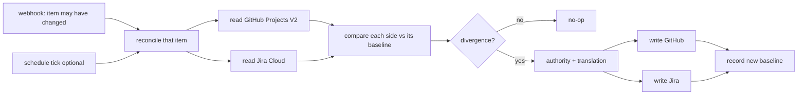
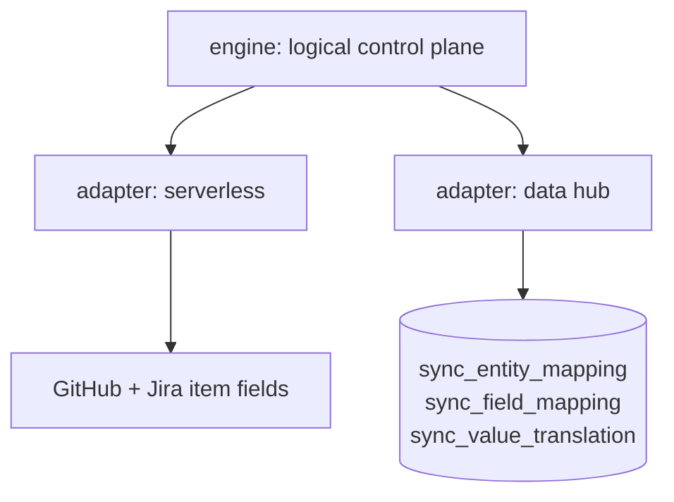

# Architecture Spine — jira-github-projects-sync (steward Epic 8)

## Design Paradigm

**Event-triggered reconciliation, not event propagation.**

A webhook says only *"this item may have changed"*. The engine does not trust the payload as
the change: it reads the affected item's current state on both boards, compares each side
against the baseline it was last synced to (AD-5, AD-10), and converges. The payload is a **wake-up, not a source of truth**.

That distinction is what keeps idempotence (CAP-3) a property of the paradigm rather than
something defended per-payload. A propagation pipeline must remember which deliveries it has
seen to stay idempotent; a reconciler re-reads and converges, so a redelivered or
out-of-order webhook is harmless by construction. This matters more under webhooks than it
did under a schedule, because webhook delivery is at-least-once and unordered (AD-9).

It is also what makes AD-2 possible: dedupe state would have to live somewhere, and there is
nowhere to put it.

## Invariants & Rules

### AD-1 — Trigger is decoupled from transport; the default is `schedule`, webhook is opt-in

**Binds:** every entry point in both modes.
**Prevents:** the mode choice silently dragging a cadence choice with it, which is what made
the intake doc's Mode A/Mode B labels unusable (Mode A = real-time *and* zero-infra; Mode B =
batch *and* PostgreSQL — so "batch at zero infra" was expressible in neither). **And** it now
prevents the default forcing every adopter to stand up an external webhook receiver.
**Rule:** a mode selects a **transport** (how state is stored and moved). A separate,
independent setting selects a **trigger** (`webhook` | `schedule` | `manual`). The default
configuration is transport=serverless, trigger=**`schedule`** — zero infrastructure, batch
cadence. `trigger=webhook` is fully supported as an **opt-in** for adopters who will run a
receiver. No code may assume a trigger from its transport.

*Amended twice, and the second amendment is the load-bearing one.* **(1)** The default was
briefly `schedule`, then reversed to `webhook` on explicit operator instruction because
near-real-time was wanted. **(2)** Reversed back to `schedule` on 2026-08-09 after steward
story 8-1's dev session raised an `intent_gap` and **verification against GitHub's own docs
proved the webhook default was not merely expensive but impossible as specified**: there is
no `project_v2_item` / `projects_v2_item` event usable in a workflow's `on:` block. The
`projects_v2_item` webhook exists, but reaches a workflow only via an **external receiver**
(a GitHub App with org-level Projects read access, or a webhook endpoint) that then calls
`repository_dispatch`. So `webhook`-by-default would have silently mandated hosting,
credentials and cost for every adopter — the opposite of the zero-infrastructure floor the
operator asked for. The near-real-time capability is **not** discarded; it is opt-in.

*The decoupling is what made this a one-value change rather than a redesign — which is the
whole reason AD-1 fixed it in the first place. Rejected: keeping `webhook` as the default and
mandating a receiver. Rejected: deleting the webhook path, which would throw away the
near-real-time capability the operator explicitly asked for.*

*Rejected: adopting Mode B as the default to obtain batch cadence — it buys cadence with a
PostgreSQL instance the operator explicitly excluded. Also rejected: collapsing the
trigger/transport axes now that the default is plain Mode A — the axes are what make Mode B's
scheduled operation expressible at all.*

### AD-2 — The default transport stores its control state in the synced systems

**Binds:** the serverless transport; every read/write of link, mapping, or baseline.
**Prevents:** a "no database" mode quietly acquiring one (a state file in the repo, an
Actions cache, a gist) and becoming un-migratable.
**Rule:** under transport=serverless the entity link, the baseline (AD-10), and the field
mapping live **in GitHub Projects V2 custom fields and Jira fields on the items themselves**.
No sidecar store of any kind. If a requirement cannot be met without one, that requirement
belongs to Mode B, not to a new store here.

### AD-3 — One control-plane contract, two materializations

**Binds:** both transports; anything reading or writing link, field mapping, or value
translation.
**Prevents:** the two modes diverging into two products with incompatible state, so that a
board synced under the default cannot be migrated to Mode B without re-linking every item.
**Rule:** both transports implement the **same logical control plane** — `entity_mapping`,
`field_mapping`, `value_translation`. Serverless materializes it as fields on the items;
Mode B materializes it as the three control-plane tables. Engine code addresses the logical
contract; only the adapter knows which materialization it is talking to.

### AD-4 — GitHub Projects V2 is authoritative on conflict, per-field overridable

**Binds:** conflict resolution when both sides diverged from the baseline.
**Prevents:** two builders each picking a different tiebreak, and a non-deterministic
"whoever wrote last" outcome that cannot be reproduced in a test.
**Rule:** when both sides diverge from the baseline (AD-5), **GitHub wins** unless that field
carries an explicit override in `field_mapping`. The resolution must be a pure function of
(github_value, jira_value, field_mapping) — never of wall-clock comparison between vendors.
*Rejected: last-writer-wins by timestamp. It makes correctness depend on comparing clocks
across two vendors' APIs, which neither guarantees; Jira Automation and GitHub webhook
timestamps are not commensurable. Determinism beats usually-right. GitHub is the default
authority because it is where the work happens and where this repo's build line already reads.*

### AD-5 — The zero-loop guard compares values against a baseline; it is not the conflict rule

**Binds:** CAP-2, CAP-3, both transports, every trigger.
**Prevents:** conflating "did the engine cause this change?" (loop guard) with "which side
wins?" (authority) — two different questions that a single mechanism will answer badly. Also
prevents the guard becoming trigger-specific, which would break the moment a deployment moves
to `schedule` or to Mode B. **And now prevents the self-interference class below**: a detector
whose own bookkeeping write is indistinguishable from the change it is watching for.

**Rule:** a side has changed when its **current value differs from the baseline value** that
side was last synced to (AD-10). Never by timestamp. Neither side changed → no-op. Exactly one
changed → propagate it. Both changed → a genuine conflict, handed to AD-4.

Timestamps survive in exactly one role: under trigger=`schedule`, item `updated_at` **selects
candidates** to reconcile so a large board need not read every baseline. It never decides
whether a change is real. The filter must be deliberately **over-inclusive** — a false positive
costs one wasted read and converges to a no-op; a false negative silently drops a change.

Two cheap fast-path short-circuits MAY skip a candidate, and **neither may ever be
load-bearing**: the bot-identity check (`github-actions[bot]` or the dedicated sync bot) under
trigger=`webhook`, and a per-field change signal where a vendor exposes one. Both are
optimizations over the value comparison, never substitutes for it.

*Amended 2026-08-10 — third amendment, id stable. The previous time-based rule was
**structurally unimplementable under AD-2**, established by trace across three review passes of
story 8-1, not by review opinion: the sync point is stored as a field on the item, so writing it
advances the same item's aggregate `updated_at` past the value just recorded. Every reconcile
after the first read `updated_at > sync_point`, misrouted into the "both sides changed" branch,
and let AD-4's GitHub-wins default clobber genuine Jira-only edits. A 30-second forward
tolerance was tried and does not hold — both values are static server-recorded timestamps that
do not advance with wall-clock, so the offset is permanent rather than a window, and no grace
value fixes it. Stated generally, so it is not re-invented elsewhere: **a change detector must
not store its marker inside the object it observes.***

*Of the three resolutions story 8-1 named, this is the value-comparison one. It was chosen over
a per-field change signal because the two are not peers — a per-field signal makes the change
**signal** more precise, while this changes what the signal **is**, and subsumes the failure the
other would work around; it also keeps the correctness path free of an unverified vendor claim
(per-field timestamps are genuinely asymmetric across the two APIs, whereas values are returned
by both). The third — accepting a bounded data-loss window with operator telemetry — was
rejected on two independent grounds: it contradicts the Spec's own Constraints, which make CAP-2
and CAP-3 non-negotiable and require the operator to **prove** zero-loop on demand; and its
premise is false, because the misclassification is permanent rather than windowed, so there is
no bounded window to document.*

*A property worth naming: this is a three-way merge against a shared base, which makes it the
first mechanism in this design that can genuinely **detect** a simultaneous conflicting edit —
the precondition AD-4 was always written against but no earlier mechanism could supply. It also
makes CAP-2's success criterion demonstrable by construction rather than by timing: after one
propagation both sides equal the baseline, so every subsequent reconcile is a no-op regardless
of when it runs.*

### AD-6 — Unmapped values fail loud; unlinked items fail alone

**Binds:** CAP-4 and CAP-5.
**Prevents:** a phantom state written by a pass-through, and one broken item aborting a batch.
**Rule:** every status value crossing the boundary passes through `value_translation`; an
unmapped value is a hard, named, logged failure and is **never** passed through. An item
missing its link emits a named greppable error and is skipped — the run continues for every
other item and exits non-zero at the end.

### AD-7 — Mode B ships the normalized schema with its control plane

**Binds:** transport=data-hub only.
**Prevents:** Mode B shipping a shape that cannot express the capabilities it exists to buy.
**Rule:** Mode B uses the normalized EAV schema plus `sync_entity_mapping`,
`sync_field_mapping`, `sync_value_translation`. The control plane is **not optional** — it is
what makes the join tractable and what carries per-field direction and value translation.
*Rejected: the flat single-table shape. Its only advantage is a simpler diff view, and that
advantage now belongs to the default transport. A flat table cannot express per-field sync
direction or value translation — the very capabilities that justify paying for Mode B's
infrastructure. Needing only the flat view is a signal to stay on the default.*

### AD-8 — Credentials never leave secrets storage, and never widen

**Binds:** both transports, every API call.
**Prevents:** a token in a log line or a repo, and scope creep from "least privilege" to
"whatever worked".
**Rule:** GitHub fine-grained PAT and Jira API token are least-privilege, read from secrets
storage at run time, and never written to logs, artifacts, or the control plane. This
inherits Steward's existing `keys` surface rather than introducing a new credential path.

### AD-9 — Webhook delivery is at-least-once and unordered

**Binds:** trigger=`webhook` (the default), every entry point that accepts a delivery.
**Prevents:** three stories each inventing a different defence against redelivery, reordering
and loss — the exact divergence an AD exists to stop. This is the cost the reversal to
real-time reintroduces, recorded as an invariant rather than left to per-story defensive code.
**Rule:**
1. **Redelivery is a no-op.** A payload delivered twice must leave both systems identical to
   one delivery. The reconciler supplies this by construction (Paradigm) — no dedupe store,
   which AD-2 would forbid anyway.
2. **Out-of-order arrival must not regress state.** The payload is never the source of truth;
   the engine re-reads current state and compares each side to its baseline, so a late
   delivery about a superseded value converges to the current one rather than overwriting it.
   Under AD-5 this holds independently of arrival order, because nothing branches on a
   timestamp at all.
3. **A dropped delivery must be recoverable without manual repair.** Because reconciliation
   is item-scoped and stateless, a `schedule` or `manual` trigger over the same code path is
   the recovery mechanism — AD-1's decoupling is what makes that available rather than a
   second implementation.

*Rejected: trusting the webhook payload's field values directly (the intake doc's Flow A1/A2
sketch). It is fewer API calls per event, but it makes correctness depend on delivery order,
and it converts CAP-3 from a property of the design into per-payload dedupe state that has
nowhere to live under AD-2.*

### AD-10 — The baseline's storage contract and lifecycle

**Binds:** CAP-2 and CAP-3 via AD-5; both materializations of AD-3.
**Prevents:** five stories each inventing a different baseline shape, and — the specific trap —
each answering "what does it mean when the baseline has no entry for this field?" differently.
**Rule:** the baseline is a **per-field map of last-synced values, per side**, and it
materializes through AD-3's existing split rather than adding a store: serverless writes one
bookkeeping field per side holding the map (AD-2 untouched — this is the same materialization
AD-2 already mandates); Mode B carries it as a column on `sync_entity_mapping`. Three lifecycle
rules are fixed here:

1. **Absent baseline is a first link, not a loop candidate.** A newly linked item has never
   converged; it is reconciled, and if both sides already hold differing values AD-4 decides.
2. **A missing key and a null value mean opposite things.** "Field cleared on this side" is
   recorded as an explicit null sentinel; "field never synced" is the key's absence. Collapsing
   them makes a deliberate clear indistinguishable from a field the engine has not yet seen.
3. **Exceeding the vendor's field-size ceiling is AD-2's documented escape hatch to Mode B** —
   never a licence to invent a sidecar store. Re-verify the ceiling against the live API at
   implementation time rather than assuming a limit.

A timestamp MAY be recorded alongside the map for operator telemetry ("last converged at"). It
is **informational and explicitly not load-bearing**; nothing may branch on it.

## Consistency Conventions

| Concern | Convention |
|---|---|
| Trigger config | `trigger: webhook \| schedule \| manual`, independent of transport; default `schedule` (AD-1) |
| Transport config | `transport: serverless \| data-hub`; default `serverless` |
| Control-plane access | through the logical contract only; never a direct table or field read from engine code (AD-3) |
| Error naming | one greppable identifier per failure class; unmapped value and unlinked item are distinct classes |
| Exit code | any per-item failure ⇒ non-zero exit after the batch completes, never mid-batch abort |
| Time | no correctness decision may branch on a timestamp (AD-5); `updated_at` selects candidates under `schedule` and nothing else, and vendor timestamps are never compared to each other |
| Webhook payload | a wake-up, never a value source — always re-read the item (AD-9) |

## Stack

SEED — verified at authoring; the code owns this once it exists.

| Element | Choice |
|---|---|
| Default transport runtime | GitHub Actions on **`on: schedule`** + Jira Automations — zero infrastructure |
| Opt-in near-real-time (GitHub→Jira) | **external receiver** (GitHub App with org-level Projects read access, or a webhook endpoint) consuming the `projects_v2_item` webhook and calling **`repository_dispatch`** to reach the workflow. **There is no `project_v2_item` `on:` trigger** — verified against GitHub's docs 2026-08-09 |
| Opt-in near-real-time (Jira→GitHub) | Jira Automation → `repository_dispatch` (already the correct bridge; unchanged) |
| Mode B ingestion | `dlt` |
| Mode B store | PostgreSQL |
| Credential source | Steward `keys` surface |

## Capability → Architecture Map

| Capability | Where it lives | Governed by |
|---|---|---|
| CAP-1 bidirectional propagation | reconcile loop | AD-1, AD-3, AD-9 |
| CAP-2 zero-loop | value comparison vs baseline | AD-5, AD-10 |
| CAP-3 idempotent processing | the paradigm itself | Paradigm, AD-2, AD-9, AD-5 |
| CAP-4 fail loud, fail alone | per-item error path | AD-6 |
| CAP-5 vocabulary translation | `value_translation` | AD-6, AD-3 |

## Deferred

- **Mode B's operational envelope** — where PostgreSQL runs, backup, retention. Not decided
  because Mode B is opt-in and nobody has opted in; deciding hosting for a mode with no user
  is speculative. Revisit when a first Mode B adopter exists.
- **Schedule cadence** — the concrete interval. A per-deployment tuning value, not an
  invariant; the paradigm is correct at any cadence.
- **Which fields sync beyond status, assignee, and the identity link** — CAP-1 names three;
  extending the set is a `field_mapping` change, not an architecture change.
- **Jira-side trigger parity** — whether Jira Automations push or the schedule pulls both
  sides. Both satisfy AD-1; the choice is an implementation trade the first story can make.

## Known vendor defect (binding on both modes)

GitHub's `updateProjectV2ItemFieldValue` updates the underlying data store but **can fail to
update the board view's grouping index**: a card moves logically while appearing stuck in its
old column until a human drags it. Data is correct; display may lag. Implementers must budget
for this as an accepted UX quirk, must not treat the stale view as a failed write, and should
**re-verify against GitHub's issue tracker at implementation time** rather than assuming it
still reproduces.
