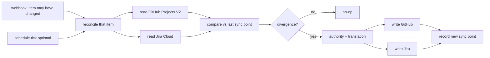
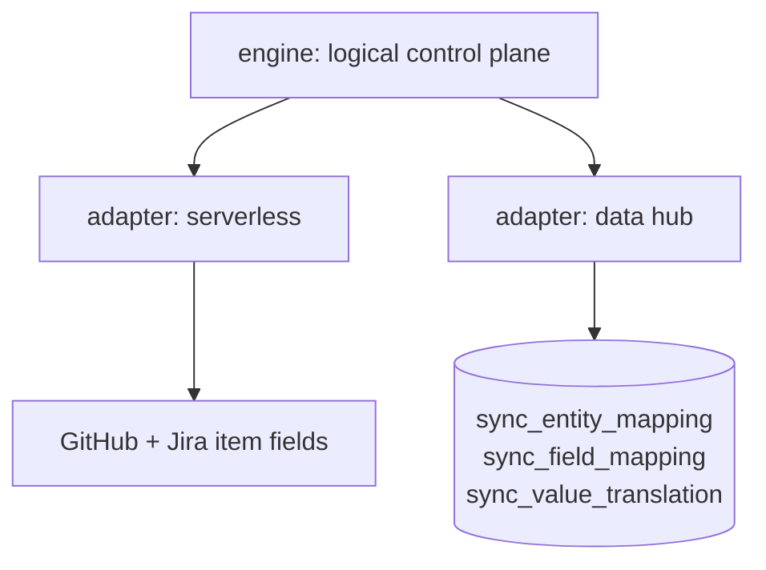

# Architecture Spine — jira-github-projects-sync (steward Epic 8)

## Design Paradigm

**Event-triggered reconciliation, not event propagation.**

A webhook says only *"this item may have changed"*. The engine does not trust the payload as
the change: it reads the affected item's current state on both boards, compares against the
last recorded sync point, and converges. The payload is a **wake-up, not a source of truth**.

That distinction is what keeps idempotence (CAP-3) a property of the paradigm rather than
something defended per-payload. A propagation pipeline must remember which deliveries it has
seen to stay idempotent; a reconciler re-reads and converges, so a redelivered or
out-of-order webhook is harmless by construction. This matters more under webhooks than it
did under a schedule, because webhook delivery is at-least-once and unordered (AD-9).

It is also what makes AD-2 possible: dedupe state would have to live somewhere, and there is
nowhere to put it.

## Invariants & Rules

### AD-1 — Trigger is decoupled from transport; the default is true Mode A

**Binds:** every entry point in both modes.
**Prevents:** the mode choice silently dragging a cadence choice with it, which is what made
the intake doc's Mode A/Mode B labels unusable (Mode A = real-time *and* zero-infra; Mode B =
batch *and* PostgreSQL — so "batch at zero infra" was expressible in neither).
**Rule:** a mode selects a **transport** (how state is stored and moved). A separate,
independent setting selects a **trigger** (`webhook` | `schedule` | `manual`). The default
configuration is transport=serverless, trigger=`webhook` — **true Mode A as the intake
document specifies it, real-time**. No code may assume a trigger from its transport.

*Amended 2026-08-09 (operator reversal). The default was briefly `schedule`, on the reading
that batch latency was acceptable and webhooks were therefore unearned complexity. Reversed
to `webhook` on explicit instruction: near-real-time is wanted. The decoupling itself is
retained — only the default value moved. It is what still lets Mode B run scheduled, and what
lets an operator drop to a schedule later without touching transport code.*

*Rejected: adopting Mode B as the default to obtain batch cadence — it buys cadence with a
PostgreSQL instance the operator explicitly excluded. Also rejected: collapsing the
trigger/transport axes now that the default is plain Mode A — the axes are what make Mode B's
scheduled operation expressible at all.*

### AD-2 — The default transport stores its control state in the synced systems

**Binds:** the serverless transport; every read/write of link, mapping, or sync point.
**Prevents:** a "no database" mode quietly acquiring one (a state file in the repo, an
Actions cache, a gist) and becoming un-migratable.
**Rule:** under transport=serverless the entity link, the last-sync point, and the field
mapping live **in GitHub Projects V2 custom fields and Jira fields on the items themselves**.
No sidecar store of any kind. If a requirement cannot be met without one, that requirement
belongs to Mode B, not to a new store here.

### AD-3 — One control-plane contract, two materializations

**Binds:** both transports; anything reading or writing link, field mapping, or value
translation.
**Prevents:** the two modes diverging into two products with incompatible state, so that a
board synced under the default cannot be migrated to Mode B without re-linking every item.
**Rule:** both transports implement the **same logical control plane** — `entity_mapping`,
`field_mapping`, `value_translation`. Serverless materializes it as fields on the items;
Mode B materializes it as the three control-plane tables. Engine code addresses the logical
contract; only the adapter knows which materialization it is talking to.

### AD-4 — GitHub Projects V2 is authoritative on conflict, per-field overridable

**Binds:** conflict resolution when both sides changed since the last sync point.
**Prevents:** two builders each picking a different tiebreak, and a non-deterministic
"whoever wrote last" outcome that cannot be reproduced in a test.
**Rule:** when both sides diverge from the sync point, **GitHub wins** unless that field
carries an explicit override in `field_mapping`. The resolution must be a pure function of
(github_value, jira_value, field_mapping) — never of wall-clock comparison between vendors.
*Rejected: last-writer-wins by timestamp. It makes correctness depend on comparing clocks
across two vendors' APIs, which neither guarantees; Jira Automation and GitHub webhook
timestamps are not commensurable. Determinism beats usually-right. GitHub is the default
authority because it is where the work happens and where this repo's build line already reads.*

### AD-5 — The zero-loop guard is time-based, and is not the conflict rule

**Binds:** CAP-2, both transports, every trigger.
**Prevents:** conflating "did the engine cause this change?" (loop guard) with "which side
wins?" (authority) — two different questions that a single mechanism will answer badly. Also
prevents the guard becoming trigger-specific, which would break the moment a deployment moves
to `schedule` or to Mode B.
**Rule:** an item is a loop candidate when its own `updated_at` is **not** newer than the
recorded sync point; such an item is skipped. Under trigger=`webhook` an initiator *is*
present, so the bot-identity check (`github-actions[bot]` or the dedicated sync bot) MAY be
used as a cheap fast-path short-circuit — but **never** as the primary guard.

*Amended 2026-08-09 alongside AD-1's reversal. The original rule justified time-based on the
grounds that a scheduled run has no initiator to inspect; that justification weakens under
webhooks, so it is restated on the durable ground instead: identity does not survive a trigger
change to `schedule` and does not exist in Mode B at all. One loop-guard contract across both
triggers and both transports is worth more than the cheaper check.*

### AD-6 — Unmapped values fail loud; unlinked items fail alone

**Binds:** CAP-4 and CAP-5.
**Prevents:** a phantom state written by a pass-through, and one broken item aborting a batch.
**Rule:** every status value crossing the boundary passes through `value_translation`; an
unmapped value is a hard, named, logged failure and is **never** passed through. An item
missing its link emits a named greppable error and is skipped — the run continues for every
other item and exits non-zero at the end.

### AD-7 — Mode B ships the normalized schema with its control plane

**Binds:** transport=data-hub only.
**Prevents:** Mode B shipping a shape that cannot express the capabilities it exists to buy.
**Rule:** Mode B uses the normalized EAV schema plus `sync_entity_mapping`,
`sync_field_mapping`, `sync_value_translation`. The control plane is **not optional** — it is
what makes the join tractable and what carries per-field direction and value translation.
*Rejected: the flat single-table shape. Its only advantage is a simpler diff view, and that
advantage now belongs to the default transport. A flat table cannot express per-field sync
direction or value translation — the very capabilities that justify paying for Mode B's
infrastructure. Needing only the flat view is a signal to stay on the default.*

### AD-8 — Credentials never leave secrets storage, and never widen

**Binds:** both transports, every API call.
**Prevents:** a token in a log line or a repo, and scope creep from "least privilege" to
"whatever worked".
**Rule:** GitHub fine-grained PAT and Jira API token are least-privilege, read from secrets
storage at run time, and never written to logs, artifacts, or the control plane. This
inherits Steward's existing `keys` surface rather than introducing a new credential path.

### AD-9 — Webhook delivery is at-least-once and unordered

**Binds:** trigger=`webhook` (the default), every entry point that accepts a delivery.
**Prevents:** three stories each inventing a different defence against redelivery, reordering
and loss — the exact divergence an AD exists to stop. This is the cost the reversal to
real-time reintroduces, recorded as an invariant rather than left to per-story defensive code.
**Rule:**
1. **Redelivery is a no-op.** A payload delivered twice must leave both systems identical to
   one delivery. The reconciler supplies this by construction (Paradigm) — no dedupe store,
   which AD-2 would forbid anyway.
2. **Out-of-order arrival must not regress state.** The payload is never the source of truth;
   the engine re-reads current state and compares to the sync point, so a late delivery about
   a superseded value converges to the current one rather than overwriting it.
3. **A dropped delivery must be recoverable without manual repair.** Because reconciliation
   is item-scoped and stateless, a `schedule` or `manual` trigger over the same code path is
   the recovery mechanism — AD-1's decoupling is what makes that available rather than a
   second implementation.

*Rejected: trusting the webhook payload's field values directly (the intake doc's Flow A1/A2
sketch). It is fewer API calls per event, but it makes correctness depend on delivery order,
and it converts CAP-3 from a property of the design into per-payload dedupe state that has
nowhere to live under AD-2.*

## Consistency Conventions

| Concern | Convention |
|---|---|
| Trigger config | `trigger: webhook \| schedule \| manual`, independent of transport; default `webhook` (AD-1) |
| Transport config | `transport: serverless \| data-hub`; default `serverless` |
| Control-plane access | through the logical contract only; never a direct table or field read from engine code (AD-3) |
| Error naming | one greppable identifier per failure class; unmapped value and unlinked item are distinct classes |
| Exit code | any per-item failure ⇒ non-zero exit after the batch completes, never mid-batch abort |
| Time | the sync point is the only time value with meaning; vendor timestamps are never compared to each other |
| Webhook payload | a wake-up, never a value source — always re-read the item (AD-9) |

## Stack

SEED — verified at authoring; the code owns this once it exists.

| Element | Choice |
|---|---|
| Default transport runtime | GitHub Actions (`on: project_v2_item` webhook) + Jira Automations |
| Mode B ingestion | `dlt` |
| Mode B store | PostgreSQL |
| Credential source | Steward `keys` surface |

## Capability → Architecture Map

| Capability | Where it lives | Governed by |
|---|---|---|
| CAP-1 bidirectional propagation | reconcile loop | AD-1, AD-3, AD-9 |
| CAP-2 zero-loop | loop guard | AD-5 |
| CAP-3 idempotent processing | the paradigm itself | Paradigm, AD-2, AD-9 |
| CAP-4 fail loud, fail alone | per-item error path | AD-6 |
| CAP-5 vocabulary translation | `value_translation` | AD-6, AD-3 |

## Deferred

- **Mode B's operational envelope** — where PostgreSQL runs, backup, retention. Not decided
  because Mode B is opt-in and nobody has opted in; deciding hosting for a mode with no user
  is speculative. Revisit when a first Mode B adopter exists.
- **Schedule cadence** — the concrete interval. A per-deployment tuning value, not an
  invariant; the paradigm is correct at any cadence.
- **Which fields sync beyond status, assignee, and the identity link** — CAP-1 names three;
  extending the set is a `field_mapping` change, not an architecture change.
- **Jira-side trigger parity** — whether Jira Automations push or the schedule pulls both
  sides. Both satisfy AD-1; the choice is an implementation trade the first story can make.

## Known vendor defect (binding on both modes)

GitHub's `updateProjectV2ItemFieldValue` updates the underlying data store but **can fail to
update the board view's grouping index**: a card moves logically while appearing stuck in its
old column until a human drags it. Data is correct; display may lag. Implementers must budget
for this as an accepted UX quirk, must not treat the stale view as a failed write, and should
**re-verify against GitHub's issue tracker at implementation time** rather than assuming it
still reproduces.
