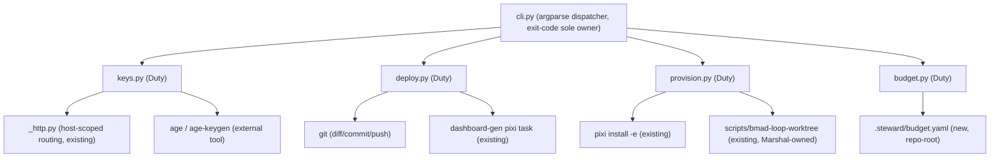

# Architecture Spine — Steward (`pyforge-steward`)

## Design Paradigm

**Hexagonal (ports-and-adapters).** The `steward` CLI is the single driving adapter; each of the four duties (keys, deploy, provision, budget) is a **port** — a small Protocol contract — with exactly one adapter implementation that **delegates to an already-existing external tool** rather than reimplementing its logic. This generalizes the pattern `pyforge-warden`'s `interfaces.py` already proves out in this repo (`Engine`/`Extractor`/`Router`/`Policy` as `typing.Protocol`s, a frozen `EngineResult` return shape, a `DefaultPolicy` fail-closed composition layer) — Steward's four duties are Warden's engines, generalized from "one axis, one scan" to "one duty, one operational action."

| Layer | Lives in | Role |
|---|---|---|
| Driving adapter | `cli.py` (argparse, subparsers) | Parses argv, dispatches to exactly one duty, owns every exit code |
| Port | `interfaces.py` (`Duty` Protocol + `DutyResult`) | The contract every duty conforms to; no duty-specific logic |
| Duty adapters | `keys.py`, `deploy.py`, `provision.py`, `budget.py` | Each wraps one set of external tools (`_http.py`/`age`; `git`/`dashboard-gen`; `pixi`/`bmad-loop-worktree`; a local config file) |
| Wrapped externals | `_http.py`, `age`/`age-keygen`, `pixi`, `gh`, `scripts/bmad-loop-worktree`, `scripts/dashboard-gen`'s pixi task | Never reimplemented — Steward calls them |



## Invariants & Rules

### AD-1 — Wrap, never reimplement `[ADOPTED]`

- **Binds:** all four duties
- **Prevents:** Steward growing a second copy of credential routing, environment resolution, git reconciliation, or cost-allocation logic that can drift from the original
- **Rule:** every duty adapter's implementation is a subprocess call or a thin import into an existing tool (`_http.py`, `age`, `pixi`, `git`, `gh`, `scripts/bmad-loop-worktree`). A duty module containing its own copy of logic that already exists elsewhere in this repo is a review-blocking finding, not a style nit.

### AD-2 — Keys' host-scoped resolver extends `_http.py`, single chokepoint (FR-1)

- **Binds:** keys
- **Prevents:** a second, divergent credential-attachment chokepoint alongside `_http.py`'s existing `skip_auth`-guarded `auth_headers_for` — the exact shape of failure that produced the `JFROG_API_KEY` cross-host leak
- **Rule:** `steward.keys`'s host-scoping resolver imports and delegates to `_http.py`'s existing `auth_headers_for(url, skip_auth=...)` pattern for anything HTTP-shaped. A credential Steward issues that is HTTP-attachable is registered through this one resolver; no duty module constructs its own `requests`/`urllib` call carrying ambient auth headers.

### AD-3 — At-rest secrets are `age`-encrypted files in Git; no standing service (FR-2, PRD D2)

- **Binds:** keys
- **Prevents:** a Vault/Infisical-class secrets-manager server entering the dependency graph (explicit non-goal, PRD §5)
- **Rule:** `age`/`age-keygen` are required **external** pixi run-dependencies (`[feature.pyforge-steward.dependencies]`), never vendored or reimplemented — mirrors how `pyforge-warden` treats `deptry`/`osv-scanner` as conda run-deps, not Python-side reimplementations. `steward keys encrypt/decrypt/rotate` shell out to the `age` CLI.

### AD-4 — Deploy is CLI-invoked reconciliation, never a standing controller (FR-9, PRD D6)

- **Binds:** deploy
- **Prevents:** an ArgoCD/Flux-class GitOps control plane entering scope (explicit non-goal, PRD §5)
- **Rule:** `steward deploy dashboard` computes a diff (freshly-built `docs/dashboard/` output vs. the currently committed tree) before any git mutation; a no-diff run performs zero commits (FR-9's testable consequence). No daemon, scheduler, or new GitHub Actions workflow ships in v1 (PRD D6) — the operator or an existing workflow invokes the CLI.
- **AMENDED 2026-08-26 (Story 30.2, CAP-2).** The wrapped external is **retired**: the `dashboard-gen` generator (the static Guildhall console's build path) was deleted 2026-08-25 with its 100+ inbound references, superseded by the CMS-managed Lane 1 front door on the Canopy host (`spec-pyforge-unifying-strategy` CAP-2, parity proven by `console-parity-inventory.md` first). `deploy.py`'s `build_dashboard` is now an injectable no-op (`("true",)`) and the verb survives as the reconciled diff+commit over `docs/dashboard/` (Kedro-Viz staging + the stub) — the AD-4 reconciliation invariant (diff-before-mutate, zero commits on no-diff) is unchanged and still tested. The mermaid diagram's `DEPLOY --> DASHGEN` edge is historical, like `PROVISION --> WORKTREE` after AD-5's 2026-08-09 amendment.

### AD-5 — Provision wraps, never forks, Marshal-owned machinery (FR-12/13, PRD D4)

- **Binds:** provision
- **Prevents:** two owners of one entity — Steward re-implementing or diverging from `scripts/bmad-loop-worktree` or pixi's own `[environments]` resolution (which the Ecosystem Crew Dream assigns to Marshal)
- **Rule:** `steward provision` subcommands shell out to `pixi install -e <name>` verbatim. Steward's own code reads pixi.toml's `[environments]` table (FR-14 inventory) but never writes to it and never re-implements pixi's dependency-resolution logic.
- **AMENDED 2026-08-09 (Story 5.1).** The `scripts/bmad-loop-worktree` half is **retired**, not merely unused. This AD always called that machinery "Marshal-owned", and wrapping it was the compromise available before `marshal init` existed; `marshal init` is now a strict superset (the same worktree **plus** the marker/symlink agreement invariant, the AD-11 never-write proof, and an idempotent `done | skipped | failed` step report), so the wrap left two stations shipping two ways to make the same thing — one of them the weaker one. `provision --runner bmad-loop` now **reports** and names `marshal init <slug>`; it never provisions. `run_bmad_loop_worktree` and its stdout parser are **deleted**, because a retirement that leaves the old path importable is a deprecation, not a removal.
- **Why report rather than delegate.** Steward imports nothing from `pyforge.marshal` and shells to no `marshal` binary. Proxying the front door would create this station's first cross-station coupling and re-wrap exactly the machinery being removed. The Marshal/Steward seam puts judgment with the owning station and the front door with Marshal — so Steward points at it. `--env <name>` (pixi environments, genuinely Steward's) is untouched.

### AD-6 — Budget v1 is declared-not-enforced; honest signal over fabricated number (FR-16-18, PRD D1)

- **Binds:** budget
- **Prevents:** a silent pass or a fabricated spend figure when no metering source exists — the failure mode explicit non-goals (PRD §5) rule out (Kubecost/OpenCost/Infracost-class integration)
- **Rule:** `steward budget check` returns one of three **distinct** exit codes — not-configured, under-budget, over-budget — never collapsing "no data" into "pass." No cost-integration import (cloud SDK, Kubecost/OpenCost client) exists in the codebase until a future story adds a real metered spend source.

### AD-7 — One shared `Duty` protocol; a missing duty degrades, never crashes dispatch

- **Binds:** all four duties, `cli.py`'s dispatcher
- **Prevents:** the CLI dispatcher importing each duty's internals directly (tight coupling that makes one duty's breakage take down argument parsing for the other three)
- **Rule:** every duty module exposes a `Duty`-protocol-conforming object (`name: str`, `run(ns: argparse.Namespace) -> DutyResult`); `cli.py` dispatches through the protocol only. A duty not yet implemented for a given subcommand (e.g., a future `steward deploy openshift`) returns a `DutyResult` carrying an explicit "not implemented" status rather than raising — mirrors Warden's null-engine precedent (`interfaces.py`'s `EngineResult`-shaped contract every engine, including a future/absent one, must satisfy).

### AD-8 — Exit-code sole ownership, mirroring Warden's convention `[ADOPTED]`

- **Binds:** `cli.py`
- **Prevents:** four duties independently deciding process exit codes, producing an inconsistent CLI contract for scripts/CI calling `steward`
- **Rule:** `main()` is the **only** place that returns a process exit code. It catches `KeyboardInterrupt` (→ a fixed SIGINT exit), `SystemExit` raised inside a duty (→ projected as an internal error, never trusted verbatim — Warden's own documented sole-ownership rule), and any other `Exception` (→ a fixed internal-error exit, never the interpreter's bare `1`, which would collide with a duty's own "over budget"/"drift found" exit). A duty module never calls `sys.exit`.

### AD-9 — Enterprise routing is inherited and extended, never duplicated

- **Binds:** keys (AD-2), and any future outbound call Steward adds
- **Prevents:** a second `*_BASE_URL`-style override scheme diverging from `docs/reference/enterprise-deployment.md`'s existing table
- **Rule:** any new outbound HTTP endpoint Steward introduces is added as one new row to `_http.py`'s existing `resolve_*_urls` convention (env-var override, no committed URL/credential) — never a parallel Steward-specific config mechanism. Steward's air-gap posture is "the same posture every other pyforge tool has," not a bespoke one.

## Consistency Conventions

| Concern | Convention |
| --- | --- |
| Packaging & namespace (warden-aligned, 2026-07-25) | Workspace member `src/shared/packages/pyforge-steward/` mirroring `pyforge-warden` (and `pyforge-atlas`, the second instance of this same convention): `pyforge.steward` namespace under `src/pyforge/steward/`, `hatchling` build backend, `[project.scripts] steward = "pyforge.steward.cli:main"`, dual artifacts (conda pkg via `pixi-build-python` wrapping the wheel + wheel/sdist via `python -m build`), a dedicated `[feature.pyforge-steward]` repo-root pixi block + lean `no-default-feature = true` `pyforge-steward` env + `pyforge-steward-build-conda`/`-build-dist`/`-test`/`-dogfood` tasks (verbatim task-name pattern from `pyforge-warden`'s own block). |
| CLI shape | `argparse` (confirmed by reading `pyforge-warden`'s `cli.py` — PRD D5), a top-level `ArgumentParser` with `--version`, and one subparser per duty (`keys`, `deploy`, `provision`, `budget`); each duty's own verbs are its subparser's further subcommands or flags, mirroring `warden scan`'s single-subcommand-plus-flags shape rather than a deep multi-level tree (v1's command surface is small enough that lazy-loading/entry-point plugin machinery, per the technical-research report's general 2026 guidance, is not warranted yet — Deferred). |
| Config file locations | Repo-root `.steward/` dotdir, **tracked** (not gitignored, not under `_bmad-output/`) — resolves PRD open questions 2 and 3. `.steward/budget.yaml` holds FR-16's declared ceiling(s); `.steward/keys-inventory.yaml` holds FR-5's credential inventory metadata (identity name, scope, provenance, last-rotated — **never a secret value**); age-encrypted secret payloads live as `.age` files co-located with what they protect, committed directly (age's own designed-for-git-storage model). This mirrors `.bmad-loop/policy.toml`'s existing precedent for repo-root operational config that must survive `bmad-switch` (BMAD-project-scoped `_bmad-output/` is the wrong home for a durable operational fact like a budget ceiling). |
| Credential-inventory provenance (resolves PRD OQ1) | `steward keys list` entries carry a `provenance` field: `issued` (a `age` identity Steward itself minted) or `observed` (a pre-existing repo credential Steward's `keys audit` discovered but did not create, e.g. `GITHUB_TOKEN`, `JFROG_API_KEY`, the rotated `sk-ant` key). Both are listed for FR-4's drift-audit visibility; only `issued` entries are rotatable via `steward keys rotate` in v1 — an `observed` entry's rotation is external (§5 non-goal FR-6). |
| Host-allowlist config source (resolves PRD OQ2) | HTTP host-scoping (AD-2) reads `_http.py`'s existing `resolve_*_urls`/`*_BASE_URL` table directly — no duplicate Steward-owned URL config. Non-HTTP credential scope (e.g., what an `age` identity is *for*) is metadata in `.steward/keys-inventory.yaml`, not a routing table. |
| Exit codes | Fixed, documented enum per duty-invoking subcommand, sole-owned by `cli.py` (AD-8): `0` success, a dedicated SIGINT code, a dedicated internal-error code, and per-duty semantic codes (e.g. budget's not-configured/under/over triad, FR-18) — never the bare interpreter default `1`. |
| Test-tier layout (warden-aligned) | `tests/unit/` (one module's logic in isolation), `tests/conformance/` (behavioral contracts against PRD FRs — e.g. a named regression test for FR-7's `JFROG_API_KEY` pattern), `tests/meta/` (repo-hygiene/invariant tests — e.g. asserting `keys list` output never contains a raw secret value, mirroring Warden's own invariant-test convention). A `slow` pytest marker is available but not expected to be load-bearing at v1's scale (no corpus-scale fixtures). |
| Dogfooding | `steward provision --env pyforge-steward` provisions Steward's own dev/test pixi environment; `steward keys audit --drift` run against this repo's own tracked scripts is both a real audit and the FR-7 regression-test fixture source — mirrors `pyforge-warden`'s `scripts/dogfood_scan.py` convention. |

## Stack

Seed — verified against the live `pyforge-warden` package files and repo-root `pixi.toml` at intake (2026-07-25); Steward adopts the same floors unless a duty needs otherwise.

| Name | Version |
| --- | --- |
| Python | `>=3.12` (matches `pyforge-warden`'s floor; no reason to diverge — no Kedro/py3.14-only dependency exists here) |
| hatchling | `>=1.31.0` (build backend, matches the repo-root wiring for `pyforge-warden`) |
| pixi-build-python | `0.*` (conda-package build backend, matches `pyforge-warden`'s `[package.build.backend]`) |
| python-build | `>=1.5.0` (wheel/sdist frontend, matches `pyforge-warden`'s dev-dependency) |
| pytest | `>=9.1.1` (test runner, matches `pyforge-warden`'s dev-dependency) |
| age | external pixi run-dependency, version range **not yet pinned** — Deferred (see below); Warden's own precedent (`deptry`/`osv-scanner`) is a range pin tied to in-repo output-schema evidence, which Steward's `keys` epic has not yet gathered |
| argparse | stdlib (no version to pin) |

## Structural Seed

```text
src/shared/packages/pyforge-steward/       # pixi build workspace member, own [package] table, no [workspace]
  pyproject.toml                           # hatchling backend; [project.scripts] steward = "pyforge.steward.cli:main"
  pixi.toml                                # [package] table: pixi-build-python backend, host/run-dependencies (age, argparse=stdlib)
  src/pyforge/steward/
    __init__.py
    cli.py                                 # argparse dispatcher, exit-code sole owner (AD-8)
    interfaces.py                          # Duty Protocol + DutyResult (AD-7)
    keys.py                                # FR-1..FR-7 duty adapter (wraps _http.py, age)
    deploy.py                              # FR-8..FR-11 duty adapter (wraps git, dashboard-gen task)
    provision.py                           # FR-12..FR-15 duty adapter (wraps pixi, bmad-loop-worktree)
    budget.py                              # FR-16..FR-18 duty adapter (reads .steward/budget.yaml)
    config.py                              # .steward/ dotdir read/write helpers
  tests/
    unit/                                  # per-module, fast
    conformance/                           # FR-level behavioral contracts, incl. the FR-7 JFROG_API_KEY regression
    meta/                                  # invariants, e.g. "keys list never prints a secret value"
  scripts/
    dogfood_scan.py                        # steward auditing this repo's own credential surface (analogue of Warden's dogfood script)

.steward/                                  # repo-root, tracked, survives bmad-switch (new)
  budget.yaml                              # FR-16 declared ceiling(s)
  keys-inventory.yaml                      # FR-5 credential inventory metadata (no secret values)
  *.age                                    # FR-2 at-rest encrypted secret payloads
```

Deployment & environments (the operational envelope this altitude owns):

- **Operator workstation (primary)** — `pixi run -e pyforge-steward steward <duty> ...`, invoked manually or from an existing shell workflow; no persistent process.
- **Loop execution plane** — bmad-loop sessions may invoke `steward provision` to materialize their own worktree/env (AD-5); Steward itself does not orchestrate loop sessions (that stays Marshal's).
- **Air-gapped/enterprise** — inherited unchanged from `docs/reference/enterprise-deployment.md` (AD-9); no new posture, no new override scheme.
- **Deploy target (v1)** — the existing GitHub Pages branch-based publish; no new hosting surface.

## Capability → Architecture Map

| Capability | Lives in | Governed by |
| --- | --- | --- |
| FR-1 host-scoped credential resolution | `keys.py` | AD-1, AD-2, AD-9 |
| FR-2 at-rest `age` encryption | `keys.py` | AD-1, AD-3 |
| FR-3 key rotation | `keys.py` | AD-3 |
| FR-4 drift audit | `keys.py`, `scripts/dogfood_scan.py` | AD-2, provenance convention |
| FR-5 credential inventory | `keys.py`, `.steward/keys-inventory.yaml` | provenance convention, meta test |
| FR-6 revocation record | `keys.py` | AD-1 (out-of-scope: 3rd-party API calls) |
| FR-7 JFROG_API_KEY regression test | `tests/conformance/` | AD-2 |
| FR-8..FR-11 deploy dashboard | `deploy.py` | AD-1, AD-4 |
| FR-12..FR-15 provision | `provision.py` | AD-1, AD-5 |
| FR-16..FR-18 budget | `budget.py`, `.steward/budget.yaml` | AD-1, AD-6 |
| CLI dispatch, exit codes | `cli.py` | AD-7, AD-8 |
| Packaging | `src/shared/packages/pyforge-steward/`, repo-root `pixi.toml` | Packaging & namespace convention |

## Decisions & Assumptions (unattended intake)

No human elicitation occurred (headless/express run, per the calling task's directive). Resolutions:

1. **Paradigm, the four-duty split, and the wrap-don't-reimplement doctrine are `[ADOPTED]`**, not invented — the PRD and both research reports already settled them; this spine ratifies and fixes the divergence points (the `Duty` protocol shape, the exit-code ownership rule, the config-file locations).
2. **Altitude = feature**: the spine keeps the PRD's five epic groupings (A–E) coherent; per-story detail belongs to `bmad-create-epics-and-stories`.
3. **PRD open questions 1-3 resolved here** (Consistency Conventions table: provenance field, host-allowlist source, `.steward/` location) — see the memlog for the reasoning trail.
4. **`age` version range is Deferred, not pinned** — unlike Warden's `deptry`/`osv-scanner` range pins (each backed by in-repo output-schema evidence this architecture run doesn't yet have for `age`), Steward's `keys` epic should gather that evidence and land the pin per Warden's own NFR-C1 precedent (range, not exact-pin).
5. **CLI framework (PRD D5, argparse) is verified fact**, re-confirmed here by directly reading `pyforge-warden`'s `cli.py` — not re-litigated.
6. **The `Duty` protocol's exact method signature is scaffold**, not an AD — the code owns the detail once Epic A (packaging) lands; only its Protocol-conformance obligation (AD-7) and exit-code sole-ownership (AD-8) are binding.

## Deferred

- **`age` version range pin** → first `keys` story, once real output-schema evidence exists (mirrors Warden's NFR-C1 precedent). Owner: Epic A (Keys).
- **`Duty` protocol's exact method signature/return-type detail** beyond the Protocol-conformance obligation (AD-7) → Epic E (Packaging & Test Scaffold), the first story that actually writes `interfaces.py`.
- **`presenton-pixi-image` on OpenShift / air-gap bundle deploy substrate** — explicitly out of v1 scope (PRD §5/§6.2); if a future epic takes it up, it needs its own architecture pass (a new deploy adapter, likely a new AD for the OpenShift/registry routing posture) rather than an extension of AD-4.
- **Formal GitHub Actions deploy workflow for the dashboard** (vs. today's direct-push AD-4 default) → revisit only if push-button/scheduled automation becomes a real want (PRD D6, §6.2).
- **Third-party credential-revocation API integration** (JFrog, GitHub, Anthropic) → explicit v1 non-goal (PRD §5); if ever taken up, each provider is its own adapter, still bound by AD-1.
- **Automated budget enforcement / metered spend source** → explicit v1 non-goal (PRD §5); AD-6 stays in force (honest not-configured signal) until a real spend source exists to wire in.
- **CLI command-tree depth / lazy-loading / entry-point plugin architecture** (the general 2026 guidance the technical-research report surfaced) → not warranted at v1's four-subcommand scale; revisit only if Steward's duty count or per-duty verb count grows materially.

## Currency reconciliation — 2026-08-26

Cascade pass after the brief and PRD re-dated (research→brief and spec→prd edges); this
spine re-checked against the as-built package (`src/shared/packages/pyforge-steward/`),
the Canopy host (`src/platform/`), and the strategy chain's own spine. Deltas:

- **Two Deferred items are closed by landed code.** The `age` version range is pinned —
  `age = ">=1.3.1,<1.4"` in the package `pixi.toml` `[package.run-dependencies]`, a range
  pin per Warden's NFR-C1 precedent, with the in-file note that the upstream binary
  reports `(devel)` so the conda package version is the pinnable surface. The `Duty`
  protocol's exact signature landed in `interfaces.py` (`name: str`,
  `run(ns) -> DutyResult`; a duty never calls `sys.exit`) exactly as AD-7/AD-8 bound.
- **AD-7/AD-8 scaled far past the four duties they were written for and held.** The
  as-built module roster is now ~12 duty adapters (`keys`, `deploy`, `provision`,
  `budget`, plus `sync`, `workspace`, `upgrade`, `suite`/`suite_advance`, `bootstrap`,
  `deploy_profiles`, `five_tier`, `fresh_clone`, and the `dashboard/` package) — every
  one dispatches through the same protocol with `cli.main()` still the sole exit-code
  owner. The v1 "revisit if the duty count grows materially" trigger has now genuinely
  fired for the lazy-loading question; no problem observed yet, so it stays Deferred on
  evidence, not oversight.
- **The plugin seam the Deferred list anticipated arrived via CAP-18, not entry-points.**
  Story 32.2 registered Steward's deploy-profile adapters as plugins on the shared
  `pyforge-core` hook-spec/registration contract (`spec-pyforge-unifying-strategy`
  CAP-18) — the cross-station shape, chosen over a Steward-private entry-point scheme.
- **AD-4 amended in place this pass** (see above): `dashboard-gen` retired by Story 30.2;
  the reconciliation invariant survives the retirement of the wrapped external.
- **The "own architecture pass" this spine demanded for OpenShift/air-gap happened.**
  The Deferred entry for `presenton-pixi-image`/air-gap deploy said any future epic needs
  its own spine rather than an AD-4 extension — that is exactly what occurred:
  `architecture-pyforge-unifying-strategy-2026-08-24/ARCHITECTURE-SPINE.md` (with
  `architecture-unified-container-2026-08-09` and siblings) governs the Canopy, the Helm
  chart + OCP overlay (Epic 12, `/ht/` 200 on CRC 2026-08-25), and the platform image.
  **This spine remains authoritative for the CLI package only** (scope line unchanged:
  FR-1..18); it is not the decomposition surface for Epics 9–38.
- **One retro-fed gap worth carrying forward** (from `retro-steward-2026-08-08.md`): the
  scaffold standardized exit codes (AD-8) but not error *rendering*, and the
  `--json`-error-path bug recurred twice before being patched per-module. If a further
  duty module is added, establish the shared `render_error(ns, message)` helper in
  `interfaces.py` first — the retro's action item, recorded here so the spine owns it.

## Currency reconciliation — 2026-08-29

Cascade pass after the PRD re-dated (`spec→prd` fired from `spec-pyforge-steward`'s
spec-surface drift catch-up + the retroactive Epic 38 decomposition, both zero-new-
capability per the PRD's own § Currency reconciliation — 2026-08-29). Re-checked against
the as-built package: no AD changed, no duty module count changed since the 2026-08-26
pass (still ~12 adapters), and neither motion touches the CLI-package scope line
(FR-1..18) this spine governs. Epic 38 (`mcp_factory_stdio_translator.py`, a root-level
`scripts/` entrypoint, not a `pyforge.steward` module) is outside this spine's package
boundary entirely — same non-decomposition-surface treatment as Epics 9–37, folded into
the scope note above. No AD text altered.
