# Architecture Spine — Steward (`pyforge-steward`)

## Design Paradigm

**Hexagonal (ports-and-adapters).** The `steward` CLI is the single driving adapter; each of the four duties (keys, deploy, provision, budget) is a **port** — a small Protocol contract — with exactly one adapter implementation that **delegates to an already-existing external tool** rather than reimplementing its logic. This generalizes the pattern `pyforge-warden`'s `interfaces.py` already proves out in this repo (`Engine`/`Extractor`/`Router`/`Policy` as `typing.Protocol`s, a frozen `EngineResult` return shape, a `DefaultPolicy` fail-closed composition layer) — Steward's four duties are Warden's engines, generalized from "one axis, one scan" to "one duty, one operational action."

| Layer | Lives in | Role |
|---|---|---|
| Driving adapter | `cli.py` (argparse, subparsers) | Parses argv, dispatches to exactly one duty, owns every exit code |
| Port | `interfaces.py` (`Duty` Protocol + `DutyResult`) | The contract every duty conforms to; no duty-specific logic |
| Duty adapters | `keys.py`, `deploy.py`, `provision.py`, `budget.py` | Each wraps one set of external tools (`_http.py`/`age`; `git`/`dashboard-gen`; `pixi`/`bmad-loop-worktree`; a local config file) |
| Wrapped externals | `_http.py`, `age`/`age-keygen`, `pixi`, `gh`, `scripts/bmad-loop-worktree`, `scripts/dashboard-gen`'s pixi task | Never reimplemented — Steward calls them |

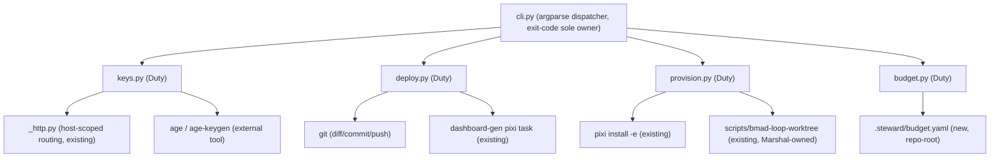

## Invariants & Rules

### AD-1 — Wrap, never reimplement `[ADOPTED]`

- **Binds:** all four duties
- **Prevents:** Steward growing a second copy of credential routing, environment resolution, git reconciliation, or cost-allocation logic that can drift from the original
- **Rule:** every duty adapter's implementation is a subprocess call or a thin import into an existing tool (`_http.py`, `age`, `pixi`, `git`, `gh`, `scripts/bmad-loop-worktree`). A duty module containing its own copy of logic that already exists elsewhere in this repo is a review-blocking finding, not a style nit.

### AD-2 — Keys' host-scoped resolver extends `_http.py`, single chokepoint (FR-1)

- **Binds:** keys
- **Prevents:** a second, divergent credential-attachment chokepoint alongside `_http.py`'s existing `skip_auth`-guarded `auth_headers_for` — the exact shape of failure that produced the `JFROG_API_KEY` cross-host leak
- **Rule:** `steward.keys`'s host-scoping resolver imports and delegates to `_http.py`'s existing `auth_headers_for(url, skip_auth=...)` pattern for anything HTTP-shaped. A credential Steward issues that is HTTP-attachable is registered through this one resolver; no duty module constructs its own `requests`/`urllib` call carrying ambient auth headers.

### AD-3 — At-rest secrets are `age`-encrypted files in Git; no standing service (FR-2, PRD D2)

- **Binds:** keys
- **Prevents:** a Vault/Infisical-class secrets-manager server entering the dependency graph (explicit non-goal, PRD §5)
- **Rule:** `age`/`age-keygen` are required **external** pixi run-dependencies (`[feature.pyforge-steward.dependencies]`), never vendored or reimplemented — mirrors how `pyforge-warden` treats `deptry`/`osv-scanner` as conda run-deps, not Python-side reimplementations. `steward keys encrypt/decrypt/rotate` shell out to the `age` CLI.

### AD-4 — Deploy is CLI-invoked reconciliation, never a standing controller (FR-9, PRD D6)

- **Binds:** deploy
- **Prevents:** an ArgoCD/Flux-class GitOps control plane entering scope (explicit non-goal, PRD §5)
- **Rule:** `steward deploy dashboard` computes a diff (freshly-built `docs/dashboard/` output vs. the currently committed tree) before any git mutation; a no-diff run performs zero commits (FR-9's testable consequence). No daemon, scheduler, or new GitHub Actions workflow ships in v1 (PRD D6) — the operator or an existing workflow invokes the CLI.
- **AMENDED 2026-08-26 (Story 30.2, CAP-2).** The wrapped external is **retired**: the `dashboard-gen` generator (the static Guildhall console's build path) was deleted 2026-08-25 with its 100+ inbound references, superseded by the CMS-managed Lane 1 front door on the Canopy host (`spec-pyforge-unifying-strategy` CAP-2, parity proven by `console-parity-inventory.md` first). `deploy.py`'s `build_dashboard` is now an injectable no-op (`("true",)`) and the verb survives as the reconciled diff+commit over `docs/dashboard/` (Kedro-Viz staging + the stub) — the AD-4 reconciliation invariant (diff-before-mutate, zero commits on no-diff) is unchanged and still tested. The mermaid diagram's `DEPLOY --> DASHGEN` edge is historical, like `PROVISION --> WORKTREE` after AD-5's 2026-08-09 amendment.

### AD-5 — Provision wraps, never forks, Marshal-owned machinery (FR-12/13, PRD D4)

- **Binds:** provision
- **Prevents:** two owners of one entity — Steward re-implementing or diverging from `scripts/bmad-loop-worktree` or pixi's own `[environments]` resolution (which the Ecosystem Crew Dream assigns to Marshal)
- **Rule:** `steward provision` subcommands shell out to `pixi install -e <name>` verbatim. Steward's own code reads pixi.toml's `[environments]` table (FR-14 inventory) but never writes to it and never re-implements pixi's dependency-resolution logic.
- **AMENDED 2026-08-09 (Story 5.1).** The `scripts/bmad-loop-worktree` half is **retired**, not merely unused. This AD always called that machinery "Marshal-owned", and wrapping it was the compromise available before `marshal init` existed; `marshal init` is now a strict superset (the same worktree **plus** the marker/symlink agreement invariant, the AD-11 never-write proof, and an idempotent `done | skipped | failed` step report), so the wrap left two stations shipping two ways to make the same thing — one of them the weaker one. `provision --runner bmad-loop` now **reports** and names `marshal init <slug>`; it never provisions. `run_bmad_loop_worktree` and its stdout parser are **deleted**, because a retirement that leaves the old path importable is a deprecation, not a removal.
- **Why report rather than delegate.** Steward imports nothing from `pyforge.marshal` and shells to no `marshal` binary. Proxying the front door would create this station's first cross-station coupling and re-wrap exactly the machinery being removed. The Marshal/Steward seam puts judgment with the owning station and the front door with Marshal — so Steward points at it. `--env <name>` (pixi environments, genuinely Steward's) is untouched.

### AD-6 — Budget v1 is declared-not-enforced; honest signal over fabricated number (FR-16-18, PRD D1)

- **Binds:** budget
- **Prevents:** a silent pass or a fabricated spend figure when no metering source exists — the failure mode explicit non-goals (PRD §5) rule out (Kubecost/OpenCost/Infracost-class integration)
- **Rule:** `steward budget check` returns one of three **distinct** exit codes — not-configured, under-budget, over-budget — never collapsing "no data" into "pass." No cost-integration import (cloud SDK, Kubecost/OpenCost client) exists in the codebase until a future story adds a real metered spend source.

### AD-7 — One shared `Duty` protocol; a missing duty degrades, never crashes dispatch

- **Binds:** all four duties, `cli.py`'s dispatcher
- **Prevents:** the CLI dispatcher importing each duty's internals directly (tight coupling that makes one duty's breakage take down argument parsing for the other three)
- **Rule:** every duty module exposes a `Duty`-protocol-conforming object (`name: str`, `run(ns: argparse.Namespace) -> DutyResult`); `cli.py` dispatches through the protocol only. A duty not yet implemented for a given subcommand (e.g., a future `steward deploy openshift`) returns a `DutyResult` carrying an explicit "not implemented" status rather than raising — mirrors Warden's null-engine precedent (`interfaces.py`'s `EngineResult`-shaped contract every engine, including a future/absent one, must satisfy).

### AD-8 — Exit-code sole ownership, mirroring Warden's convention `[ADOPTED]`

- **Binds:** `cli.py`
- **Prevents:** four duties independently deciding process exit codes, producing an inconsistent CLI contract for scripts/CI calling `steward`
- **Rule:** `main()` is the **only** place that returns a process exit code. It catches `KeyboardInterrupt` (→ a fixed SIGINT exit), `SystemExit` raised inside a duty (→ projected as an internal error, never trusted verbatim — Warden's own documented sole-ownership rule), and any other `Exception` (→ a fixed internal-error exit, never the interpreter's bare `1`, which would collide with a duty's own "over budget"/"drift found" exit). A duty module never calls `sys.exit`.

### AD-9 — Enterprise routing is inherited and extended, never duplicated

- **Binds:** keys (AD-2), and any future outbound call Steward adds
- **Prevents:** a second `*_BASE_URL`-style override scheme diverging from `docs/reference/enterprise-deployment.md`'s existing table
- **Rule:** any new outbound HTTP endpoint Steward introduces is added as one new row to `_http.py`'s existing `resolve_*_urls` convention (env-var override, no committed URL/credential) — never a parallel Steward-specific config mechanism. Steward's air-gap posture is "the same posture every other pyforge tool has," not a bespoke one.

## Consistency Conventions

| Concern | Convention |
| --- | --- |
| Packaging & namespace (warden-aligned, 2026-07-25) | Workspace member `src/shared/packages/pyforge-steward/` mirroring `pyforge-warden` (and `pyforge-atlas`, the second instance of this same convention): `pyforge.steward` namespace under `src/pyforge/steward/`, `hatchling` build backend, `[project.scripts] steward = "pyforge.steward.cli:main"`, dual artifacts (conda pkg via `pixi-build-python` wrapping the wheel + wheel/sdist via `python -m build`), a dedicated `[feature.pyforge-steward]` repo-root pixi block + lean `no-default-feature = true` `pyforge-steward` env + `pyforge-steward-build-conda`/`-build-dist`/`-test`/`-dogfood` tasks (verbatim task-name pattern from `pyforge-warden`'s own block). |
| CLI shape | `argparse` (confirmed by reading `pyforge-warden`'s `cli.py` — PRD D5), a top-level `ArgumentParser` with `--version`, and one subparser per duty (`keys`, `deploy`, `provision`, `budget`); each duty's own verbs are its subparser's further subcommands or flags, mirroring `warden scan`'s single-subcommand-plus-flags shape rather than a deep multi-level tree (v1's command surface is small enough that lazy-loading/entry-point plugin machinery, per the technical-research report's general 2026 guidance, is not warranted yet — Deferred). |
| Config file locations | Repo-root `.steward/` dotdir, **tracked** (not gitignored, not under `_bmad-output/`) — resolves PRD open questions 2 and 3. `.steward/budget.yaml` holds FR-16's declared ceiling(s); `.steward/keys-inventory.yaml` holds FR-5's credential inventory metadata (identity name, scope, provenance, last-rotated — **never a secret value**); age-encrypted secret payloads live as `.age` files co-located with what they protect, committed directly (age's own designed-for-git-storage model). This mirrors `.bmad-loop/policy.toml`'s existing precedent for repo-root operational config that must survive `bmad-switch` (BMAD-project-scoped `_bmad-output/` is the wrong home for a durable operational fact like a budget ceiling). |
| Credential-inventory provenance (resolves PRD OQ1) | `steward keys list` entries carry a `provenance` field: `issued` (a `age` identity Steward itself minted) or `observed` (a pre-existing repo credential Steward's `keys audit` discovered but did not create, e.g. `GITHUB_TOKEN`, `JFROG_API_KEY`, the rotated `sk-ant` key). Both are listed for FR-4's drift-audit visibility; only `issued` entries are rotatable via `steward keys rotate` in v1 — an `observed` entry's rotation is external (§5 non-goal FR-6). |
| Host-allowlist config source (resolves PRD OQ2) | HTTP host-scoping (AD-2) reads `_http.py`'s existing `resolve_*_urls`/`*_BASE_URL` table directly — no duplicate Steward-owned URL config. Non-HTTP credential scope (e.g., what an `age` identity is *for*) is metadata in `.steward/keys-inventory.yaml`, not a routing table. |
| Exit codes | Fixed, documented enum per duty-invoking subcommand, sole-owned by `cli.py` (AD-8): `0` success, a dedicated SIGINT code, a dedicated internal-error code, and per-duty semantic codes (e.g. budget's not-configured/under/over triad, FR-18) — never the bare interpreter default `1`. |
| Test-tier layout (warden-aligned) | `tests/unit/` (one module's logic in isolation), `tests/conformance/` (behavioral contracts against PRD FRs — e.g. a named regression test for FR-7's `JFROG_API_KEY` pattern), `tests/meta/` (repo-hygiene/invariant tests — e.g. asserting `keys list` output never contains a raw secret value, mirroring Warden's own invariant-test convention). A `slow` pytest marker is available but not expected to be load-bearing at v1's scale (no corpus-scale fixtures). |
| Dogfooding | `steward provision --env pyforge-steward` provisions Steward's own dev/test pixi environment; `steward keys audit --drift` run against this repo's own tracked scripts is both a real audit and the FR-7 regression-test fixture source — mirrors `pyforge-warden`'s `scripts/dogfood_scan.py` convention. |

## Stack

Seed — verified against the live `pyforge-warden` package files and repo-root `pixi.toml` at intake (2026-07-25); Steward adopts the same floors unless a duty needs otherwise.

| Name | Version |
| --- | --- |
| Python | `>=3.12` (matches `pyforge-warden`'s floor; no reason to diverge — no Kedro/py3.14-only dependency exists here) |
| hatchling | `>=1.31.0` (build backend, matches the repo-root wiring for `pyforge-warden`) |
| pixi-build-python | `0.*` (conda-package build backend, matches `pyforge-warden`'s `[package.build.backend]`) |
| python-build | `>=1.5.0` (wheel/sdist frontend, matches `pyforge-warden`'s dev-dependency) |
| pytest | `>=9.1.1` (test runner, matches `pyforge-warden`'s dev-dependency) |
| age | external pixi run-dependency, version range **not yet pinned** — Deferred (see below); Warden's own precedent (`deptry`/`osv-scanner`) is a range pin tied to in-repo output-schema evidence, which Steward's `keys` epic has not yet gathered |
| argparse | stdlib (no version to pin) |

## Structural Seed

```text
src/shared/packages/pyforge-steward/       # pixi build workspace member, own [package] table, no [workspace]
  pyproject.toml                           # hatchling backend; [project.scripts] steward = "pyforge.steward.cli:main"
  pixi.toml                                # [package] table: pixi-build-python backend, host/run-dependencies (age, argparse=stdlib)
  src/pyforge/steward/
    __init__.py
    cli.py                                 # argparse dispatcher, exit-code sole owner (AD-8)
    interfaces.py                          # Duty Protocol + DutyResult (AD-7)
    keys.py                                # FR-1..FR-7 duty adapter (wraps _http.py, age)
    deploy.py                              # FR-8..FR-11 duty adapter (wraps git, dashboard-gen task)
    provision.py                           # FR-12..FR-15 duty adapter (wraps pixi, bmad-loop-worktree)
    budget.py                              # FR-16..FR-18 duty adapter (reads .steward/budget.yaml)
    config.py                              # .steward/ dotdir read/write helpers
  tests/
    unit/                                  # per-module, fast
    conformance/                           # FR-level behavioral contracts, incl. the FR-7 JFROG_API_KEY regression
    meta/                                  # invariants, e.g. "keys list never prints a secret value"
  scripts/
    dogfood_scan.py                        # steward auditing this repo's own credential surface (analogue of Warden's dogfood script)

.steward/                                  # repo-root, tracked, survives bmad-switch (new)
  budget.yaml                              # FR-16 declared ceiling(s)
  keys-inventory.yaml                      # FR-5 credential inventory metadata (no secret values)
  *.age                                    # FR-2 at-rest encrypted secret payloads
```

Deployment & environments (the operational envelope this altitude owns):

- **Operator workstation (primary)** — `pixi run -e pyforge-steward steward <duty> ...`, invoked manually or from an existing shell workflow; no persistent process.
- **Loop execution plane** — bmad-loop sessions may invoke `steward provision` to materialize their own worktree/env (AD-5); Steward itself does not orchestrate loop sessions (that stays Marshal's).
- **Air-gapped/enterprise** — inherited unchanged from `docs/reference/enterprise-deployment.md` (AD-9); no new posture, no new override scheme.
- **Deploy target (v1)** — the existing GitHub Pages branch-based publish; no new hosting surface.

## Capability → Architecture Map

| Capability | Lives in | Governed by |
| --- | --- | --- |
| FR-1 host-scoped credential resolution | `keys.py` | AD-1, AD-2, AD-9 |
| FR-2 at-rest `age` encryption | `keys.py` | AD-1, AD-3 |
| FR-3 key rotation | `keys.py` | AD-3 |
| FR-4 drift audit | `keys.py`, `scripts/dogfood_scan.py` | AD-2, provenance convention |
| FR-5 credential inventory | `keys.py`, `.steward/keys-inventory.yaml` | provenance convention, meta test |
| FR-6 revocation record | `keys.py` | AD-1 (out-of-scope: 3rd-party API calls) |
| FR-7 JFROG_API_KEY regression test | `tests/conformance/` | AD-2 |
| FR-8..FR-11 deploy dashboard | `deploy.py` | AD-1, AD-4 |
| FR-12..FR-15 provision | `provision.py` | AD-1, AD-5 |
| FR-16..FR-18 budget | `budget.py`, `.steward/budget.yaml` | AD-1, AD-6 |
| CLI dispatch, exit codes | `cli.py` | AD-7, AD-8 |
| Packaging | `src/shared/packages/pyforge-steward/`, repo-root `pixi.toml` | Packaging & namespace convention |

## Decisions & Assumptions (unattended intake)

No human elicitation occurred (headless/express run, per the calling task's directive). Resolutions:

1. **Paradigm, the four-duty split, and the wrap-don't-reimplement doctrine are `[ADOPTED]`**, not invented — the PRD and both research reports already settled them; this spine ratifies and fixes the divergence points (the `Duty` protocol shape, the exit-code ownership rule, the config-file locations).
2. **Altitude = feature**: the spine keeps the PRD's five epic groupings (A–E) coherent; per-story detail belongs to `bmad-create-epics-and-stories`.
3. **PRD open questions 1-3 resolved here** (Consistency Conventions table: provenance field, host-allowlist source, `.steward/` location) — see the memlog for the reasoning trail.
4. **`age` version range is Deferred, not pinned** — unlike Warden's `deptry`/`osv-scanner` range pins (each backed by in-repo output-schema evidence this architecture run doesn't yet have for `age`), Steward's `keys` epic should gather that evidence and land the pin per Warden's own NFR-C1 precedent (range, not exact-pin).
5. **CLI framework (PRD D5, argparse) is verified fact**, re-confirmed here by directly reading `pyforge-warden`'s `cli.py` — not re-litigated.
6. **The `Duty` protocol's exact method signature is scaffold**, not an AD — the code owns the detail once Epic A (packaging) lands; only its Protocol-conformance obligation (AD-7) and exit-code sole-ownership (AD-8) are binding.

## Deferred

- **`age` version range pin** → first `keys` story, once real output-schema evidence exists (mirrors Warden's NFR-C1 precedent). Owner: Epic A (Keys).
- **`Duty` protocol's exact method signature/return-type detail** beyond the Protocol-conformance obligation (AD-7) → Epic E (Packaging & Test Scaffold), the first story that actually writes `interfaces.py`.
- **`presenton-pixi-image` on OpenShift / air-gap bundle deploy substrate** — explicitly out of v1 scope (PRD §5/§6.2); if a future epic takes it up, it needs its own architecture pass (a new deploy adapter, likely a new AD for the OpenShift/registry routing posture) rather than an extension of AD-4.
- **Formal GitHub Actions deploy workflow for the dashboard** (vs. today's direct-push AD-4 default) → revisit only if push-button/scheduled automation becomes a real want (PRD D6, §6.2).
- **Third-party credential-revocation API integration** (JFrog, GitHub, Anthropic) → explicit v1 non-goal (PRD §5); if ever taken up, each provider is its own adapter, still bound by AD-1.
- **Automated budget enforcement / metered spend source** → explicit v1 non-goal (PRD §5); AD-6 stays in force (honest not-configured signal) until a real spend source exists to wire in.
- **CLI command-tree depth / lazy-loading / entry-point plugin architecture** (the general 2026 guidance the technical-research report surfaced) → not warranted at v1's four-subcommand scale; revisit only if Steward's duty count or per-duty verb count grows materially.


## Satellite: Canopy — pyforge-unifying-strategy

> **Folded into this spine 2026-09-08.** Was `architecture-pyforge-unifying-strategy-2026-08-24`, a run-folder
> named for a CHAIN rather than this project — the deviation `ad-citation-check` refuses.
> Its decisions keep their own numbering, qualified `canopy:AD-n`, which is how every
> citation in the repo already spells them after the 2026-09-08 attribution pass
> (685 ambiguous citations read down to 30). **No citation changes meaning.**
> Renumbering into one sequence was rejected on measured evidence: four mechanical
> attribution methods scored 47%, 45%, 80%-with-bias and 100%-precision-at-8%-coverage,
> so a renumber could only put wrong-but-valid pointers into a graph with none.
>
> Original frontmatter — status: final, altitude: feature, updated: 2026-09-05.


### Design Paradigm

**Modular monolith.** The host at `src/platform/` is one Django/ASGI process. Every new web surface
is a reusable Django app that registers with the chrome package. Every new programmatic surface is
an MCP app mounted on the same process. Station *logic* stays in the factory packages
(`pyforge-<station>`); the host never imports `pyforge.*`.

**Operating-model bind (2026-08-24, approved).** Dream Grounding Q1–Q8 and
`sprint-change-proposal-2026-08-24-operating-model.md` scope this spine: five-tier
completeness is the **03** shape of the eight stations; Lane 2 remains HTMX (no
DRF JSON:API on portals); CAP-8 envelopes carry `spec_id` + git sha + SBOM purl
(Jira optional); **hooks and plugins are the replaceable-layer principle**
(canopy:AD-21); Warden is the sole PR-gate *verdict* (scanners are plugins on
Warden-owned hook specs — an instance of canopy:AD-21, not the whole of it). Tachyon is
a production LLM provider adapter, not Path B. No CAP-18. Scorecard measures
remain unpublished.

| Layer | Lives in | Role |
|---|---|---|
| Public edge | `src/platform/config/` (ASGI, URLconf, settings) | One process; OIDC session; mounts apps |
| Chrome | `src/shared/packages/django-pyforge/` | App switcher, base layout, registration protocol, portal→service client |
| Lane 1 | Wagtail, mounted at `/` | CMS front door; supersedes `docs/dashboard/` |
| Lane 2 portals | `src/shared/packages/django-<station>/` | HTMX apps under `/stations/<name>/` |
| Service faces | MCP apps in each `django-<station>` (or a sibling app in that distribution) | POST `/stations/<name>/mcp` |
| Factory packages | `src/shared/packages/pyforge-<station>/` | CLI, domain logic, existing MCP servers being migrated |
| Unified CLI | `pyforge` console script on `pyforge-core` | Dispatches `pyforge <station> <noun> <verb>` |
| Event backbone | Redis Streams | CloudEvents between stations |
| Supervisor | platform Django app + Celery | Publishes run state into PostgreSQL |

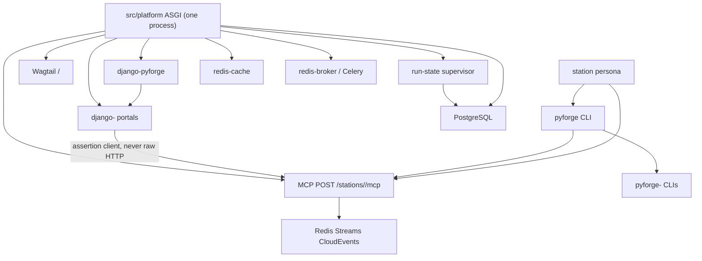

### Inherited Invariants

Parent: host spine in `specs/spec-python-agent-platform/ARCHITECTURE-SPINE.md` (merged into
`spec-pyforge-unifying-strategy` by Story 48.8; companion file remains the `pap:AD-*` detail
home). Cite as **`pap:AD-n`** (same as **parent AD-n**). Original IDs in that file stay `AD-n`.
Unifying ADs in this file are **canopy AD-n**. Bare `AD-n` in epics is a review-blocking finding.

| Inherited | Binds here |
|---|---|
| parent canopy:AD-1 PostgreSQL + Redis + Kubernetes only | No Elasticsearch, no Vault-as-app-dep, no RQ, no fourth *kind*. Two Redis Deployments still count as Redis. Lane 1 media is a Kubernetes RWX volume (canopy:AD-13), not MinIO/S3. |
| parent canopy:AD-2 `src/platform/` never imports `pyforge.*` | Portal→service client cannot live in host code. |
| parent canopy:AD-3 host is rendered accelerator + Django apps | Wagtail and station portals join as apps, not services. |
| parent canopy:AD-4 one ASGI process, fixed dispatch | MCP mounts here. Eight FastAPI ports are forbidden. CAP-11 independent scale is Celery workers, not a second web Deployment (canopy:AD-10). |
| parent canopy:AD-5 three schemas + `search_path` | **Isolation still binds.** Provisioning *mechanism* is superseded by canopy:AD-9. **Schema count is amended** to four (canopy:AD-9). |
| parent canopy:AD-6 stateless pods | Wagtail media leaves ephemeral pod disk (RWX); supervisor does not read local disk. |
| parent canopy:AD-7 Celery over Redis is the only async path | Wagtail work goes through Celery, not django-tasks' DB/RQ backends. |
| parent canopy:AD-8 one conda-space, Python 3.12.* | Unchanged. |
| parent canopy:AD-9 consume factory packages, never fork | django-* and pyforge-* arrive as conda packages into the platform env. |
| parent canopy:AD-10..canopy:AD-17 image, chart, secrets-at-boundary, air-gap check, sidecars, CI paths, local-first, engine pattern switch | Unchanged. Secrets still enter the pod as env/secret mounts (parent canopy:AD-12); cluster secret manager is outside this chain (canopy:AD-19). |

**Conflict, not override — parent canopy:AD-5:** named Django `RunSQL` / data migrations as how `langflow_schema` / `dbgpt_schema` are provisioned. This chain's CAP-9 moves production DDL to Liquibase. Isolation, `search_path`, and "ORM never crosses schemas" remain; only the producer of the SQL changes. Cardinality: parent said three schemas; this chain adds one tracking schema `liquibase`. CAP-4 / CAP-17 stores are **tables in `public`**, not extra schemas.

**Conflict, not override — parent canopy:AD-1:** Lane 1 multi-replica media cannot live on ephemeral pod disk (parent canopy:AD-6). Object storage (MinIO/S3) would be a fourth *kind*. The compatible path is a Kubernetes `ReadWriteMany` PVC — still Kubernetes-the-kind. An in-cluster object-store Deployment is a review-blocking finding until parent canopy:AD-1 is formally excepted. **Formal exception (defined 2026-09-05):** a dated, bounded paragraph appended under the parent AD in `spec-python-agent-platform/ARCHITECTURE-SPINE.md` in the canopy:AD-6 style — what is excepted, why the three kinds cannot carry it, its scope, its cost — preceded by a dated entry in the owner Dream and a correct-course proposal recording the operator ruling. Re-examined 2026-09-05 (`sprint-change-proposal-2026-09-05-ad-1-reopen.md`): **re-affirmed, not excepted.**

**Conflict, not override — parent canopy:AD-6:** pods stay disposable. Shared RWX is the replica-safe media store (same *kind* of exception as the dated dbgpt SQLite PVC). Ephemeral pod-local media and MinIO remain forbidden (parent canopy:AD-1 / canopy:AD-13).

**Conflict, not override — RFC-1 (resilience companion):** two HTTP process pools would violate parent canopy:AD-4. Bound by canopy:AD-10.

**Conflict, not override — RFC-3 HMAC:** a shared HMAC secret on CLI laptops is the finding canopy:AD-7 prevents. Assertion is RS256 JWT; RFC-3 claim names map onto that JWT.

### Invariants & Rules

#### canopy:AD-1 — Portals register; the host does not list them `[ADOPTED]`

- **Binds:** CAP-1, CAP-3, FR-1, FR-2, FR-9, FR-9a, FR-9b, FR-10
- **Prevents:** a hardcoded station path list in `config/urls.py` or the app switcher that every new portal has to edit
- **Rule:** `django-pyforge` defines a registration protocol on `AppConfig` (station name, mount token, **MCP token**, chrome hooks). Discovery is `apps.get_app_configs()`. Adding or removing a portal+MCP pair changes that station's distribution and `INSTALLED_APPS` only. The sole hardcoded host route this chain is allowed to add is the permanent `/compliance/` → `/stations/warden/` redirect. Host ASGI dispatch matches `/stations/<name>/mcp` as a pattern (parent canopy:AD-4 table gains that pattern, not a roster).

#### canopy:AD-2 — Uniform prefix `/stations/<name>/` `[ADOPTED]`

- **Binds:** CAP-3, FR-9, FR-9a
- **Prevents:** each portal inventing its own root (`/compliance/` vs `/stations/warden/`)
- **Rule:** every portal mounts at `/stations/<name>/`. `/compliance/` returns a permanent redirect preserving path and query. A portal that mounts outside the prefix fails CAP-3.

#### canopy:AD-3 — Chrome lives in `django-pyforge` only `[ADOPTED]`

- **Binds:** CAP-1, CAP-3, FR-1
- **Prevents:** a portal shipping its own switcher, base layout, or theme copy
- **Rule:** station portal packages contain no chrome templates or static files. A test that two portals render identical chrome from one package fails if either ships a copy. Host OIDC is `django-allauth`. `django-lasuite` is not a Canopy dependency.

#### canopy:AD-4 — Reusable-app naming is a triple, one distribution per station `[ADOPTED]`

- **Binds:** CAP-3, FR-9b
- **Prevents:** label collisions in `INSTALLED_APPS`; a second warden app having nowhere to live
- **Rule:** distribution `django-<station>`, module `django_<station>_<app>`, label `<station>_<app>`. One distribution per station holding one or more apps. Existing models never move between apps. `compliance_face` becomes `django-warden` / `django_warden_fabric` / `warden_fabric` in the same story as the URL move, **before** CAP-9 revokes app-role DDL.

#### canopy:AD-5 — Service faces are `mcp` SDK on the one ASGI process `[ADOPTED]`

- **Binds:** CAP-4, FR-11, FR-12, parent canopy:AD-4
- **Prevents:** FastMCP 3.x locking the estate to handshake-era; eight processes on invented ports; a `services/` topology the Dream described and the host does not have
- **Rule:** each station's MCP app is built on the official `mcp` Python SDK (conda-forge 2.0.0+), mounted at `POST /stations/<name>/mcp`. The mount is a **pattern** on the host ASGI/URLconf (`/stations/<name>/mcp`), not a per-station list, and the registration protocol (canopy:AD-1) carries the MCP token so chrome and dispatch stay one seam. No `services/` process, no extra public port. Accept protocol revisions `2025-03-26` through `2026-07-28`. On handshake-era `initialize`, echo the client's requested revision; modern-era requests carry the version on the request (no initialize). Never branch on client name. **Stopgap (already in `pixi.toml`):** `local-recipes` stays on `fastmcp >=3.4.7,<4` + `mcp >=1.24,<2.0` until these faces land; lift the `mcp` ceiling in that story. Doctor/herald features already pin `mcp >=2.0.0` and are unaffected.

#### canopy:AD-6 — Disconnect-survival is `start`/`get` over PostgreSQL `[ADOPTED]`

- **Binds:** CAP-4, CAP-17 adjacent store, FR-12
- **Prevents:** Tasks-extension stories that cannot ship; Redis-backed handles dying under CAP-11 eviction; session affinity; progress notifications posing as survival
- **Rule:** long work is two tools: `start_*` returns an opaque high-entropy TTL'd handle **that is a capability to a supervisor `run_id`** (canopy:AD-12); `get_*` reads that run through the supervisor and may be served by any replica. Handle rows live in `mcp_handles`, DDL owned by `django-pyforge` (canopy:AD-9). `get_*` requires a valid canopy:AD-7 assertion **and** the handle — possession alone is not authorization. Do not use progress notifications, sticky sessions, or stream replay as the survival mechanism. Keep-alive under 30s applies only if a stream exists at all.

#### canopy:AD-7 — Two clients, one assertion format `[ADOPTED]`

- **Binds:** CAP-6, CAP-5, FR-3, parent canopy:AD-2
- **Prevents:** trusted headers; a `pyforge.*` import under `src/platform/`; portals and CLIs minting incompatible identity
- **Rule:** portals call services only through `django-pyforge`'s client. CLI/agent callers use `pyforge.core`'s client. **Both emit the same RS256 JWT** (one listed `alg`; HMAC-SHA256 from RFC-3 is rejected). Required claims: `sub` (IdP subject; RFC-3 `idp_subject`), `roles`, `aud` = `mcp:<station>`, `exp` ≤ 5 minutes from `iat`, `delegated_by` = `pyforge-host`. A golden test vector in `django-pyforge` is required to pass for both clients. The CLI mints by authenticating to the host (same IdP), never a long-lived laptop HMAC secret. A portal constructing a raw HTTP request to a service, or a service trusting `X-Forwarded-User` (or equivalent), is a review-blocking finding. Keycloak Token Exchange / resource-indicator flag is Deferred.

#### canopy:AD-8 — Events are CloudEvents on Redis Streams `[ADOPTED]`

- **Binds:** CAP-8
- **Prevents:** ad-hoc JSON on pub/sub; infinite retry; cyclic fan-out
- **Rule:** producers `XADD` CloudEvents 1.0 (`specversion=1.0`) onto **redis-broker only** — never redis-cache. One estate stream `pyforge.events` and one DLQ `pyforge.events.dlq` (RFC-4's colon form `pyforge:events:dlq` is superseded). Poison harvest is `XAUTOCLAIM` on the DLQ. Consumer group name = station token. Loop-depth extension attribute is `pyforgeloopdepth` (integer); ceiling is 8 (RFC-4's HTTP header `X-PyForge-Loop-Depth <= 5` is superseded — depth is a CloudEvents extension, not an HTTP header). Event `type` is a dotted verb registered in `django-pyforge` (adding a type is a chrome change, not a silent story-local string). `dataschema` is required on every event; payloads without it fail the producer test.

#### canopy:AD-9 — Production DDL is Liquibase; one tracking schema; app role cannot DDL `[ADOPTED]`

- **Binds:** CAP-9, FR-21, FR-21a, FR-22–FR-25, parent canopy:AD-5 isolation
- **Prevents:** Django `migrate` as production schema authority; silent wrong-schema DDL; changelog-lock races across replicas; a second image or init container
- **Rule:** Helm Job at hook-weight `-1` on the **platform image** runs `liquibase update`; the shipped `migrate-job.yaml` becomes `migrate --fake`. Target Liquibase **5.0.4+**. PostgreSQL schemas in this instance are exactly four: `public`, `langflow_schema`, `dbgpt_schema`, `liquibase` (`liquibaseSchemaName=liquibase`). `run_state` and `mcp_handles` are **tables in `public`**, DDL owned by **`django-pyforge`**. Station packs own only `label_*` tables in `public` (or that station's existing schema if already isolated). Creating a fifth schema, or promoting those tables to schemas, is a review-blocking finding. Changeset ids are namespaced `distribution:seq` — `001-initial` as a bare id is a review-blocking finding. `preserveSchemaCase` off; schema names lowercase. App role: DML only. Migration role: DDL. Job connects **directly** to PostgreSQL with `currentSchema` set, not through a pooling proxy. Test databases are carved out: Django's test runner still runs `migrate`. `sqlmigrate` extraction is the CI gate that a changeset exists for every production migration. ORM still does not cross engine schemas.

#### canopy:AD-10 — Cache ≠ broker; one ASGI Deployment; workers scale separately `[ADOPTED]`

- **Binds:** CAP-11, parent canopy:AD-1, parent canopy:AD-4, parent canopy:AD-7
- **Prevents:** a shared `maxmemory` policy dropping Celery tasks; splitting the task story onto RQ; RFC-1's two HTTP pools becoming a second public process
- **Rule:** chart ships `redis-cache` (evicts) and `redis-broker` (does not). Same image class. Celery and Channels use the broker. Django cache + Wagtail `renditions` alias use the cache. Filling the cache to eviction must lose no queued task. Wagtail background work uses a Celery `BaseTaskBackend` — not django-tasks' database or RQ backends, and **not** PyPI `django-tasks-celery` (Django 6.0+ only). **Process topology:** one public ASGI Deployment (parent canopy:AD-4). Independent scale of work is a Celery worker Deployment on redis-broker — not a second web Deployment, not a FastAPI process, not an extra public port. HTMX REST and MCP share that one ASGI process; operations over ~30s use canopy:AD-6 `start`/`get`, not a dedicated streaming HTTP pool. gunicorn/uvicorn worker *count* inside the one Deployment is replica capacity, not a second pool kind.

#### canopy:AD-11 — Flags are OpenFeature FILE, in-process `[ADOPTED]`

- **Binds:** CAP-13, FR-33, FR-34
- **Prevents:** a flagd daemon, WASM (`wasmtime` absent), per-surface flag code, or a Reloader sidecar to fake "no redeploy"
- **Rule:** one JSON tree. In-cluster that file is a ConfigMap mounted read-only. The in-process FILE provider **observes the mounted file** (watch or equivalent) so a ConfigMap update becomes live **without a new process** and without rolling the Deployment. Reloader, flagd, or any sidecar for flags is parent canopy:AD-14 and a review-blocking finding. The CLI evaluates **the same bytes** — fetched from the host (authenticated) or, in local-dev only, the file at `src/platform/config/flags.json` that the ConfigMap is built from. Two trees is a review-blocking finding. No egress. Stories that import these packages are blocked until the operator-owned feedstocks exist.

#### canopy:AD-12 — Run state is published into PostgreSQL by a supervisor `[ADOPTED]`

- **Binds:** CAP-17, FR-40, FR-41, FR-42
- **Prevents:** the front door reading `~/.bmad-loops`, tmux, or journals — the coupling that made the retired console undeployable
- **Rule:** the supervisor is the only publisher of live run state and completed-run timing. **`start_*` is a supervisor publish** — it does not write a second ledger. Storage is PostgreSQL (`run_state` + `mcp_handles` as handle→run_id). The front door queries it through the host. No filesystem fallback. Unreachable supervisor → explicit unavailable plus age, within the CAP-10/FR-26 budget. Ingest at run completion, not at page-generation time. Loop-side hooks (bmad-loop) call the same supervisor API the MCP `start_*` does.

#### canopy:AD-13 — Lane 1 media, search, and admin login are host-shaped `[ADOPTED]`

- **Binds:** CAP-2, parent canopy:AD-6
- **Prevents:** pod-local media; per-replica rendition caches; Elasticsearch; password Wagtail admin
- **Rule:** media on a Kubernetes `ReadWriteMany` PVC mounted at a fixed path; Django filesystem storage (default or `django-storages` FileSystemStorage) writes there. Renditions cache on `redis-cache`. Search is PostgreSQL FTS (`django.contrib.postgres`). Wagtail admin login is `WAGTAILADMIN_LOGIN_URL` through allauth/OIDC. IdP groups must map onto the Wagtail-admin permission; an authenticated user with no group is bounced. Password and email management stay off. An in-cluster MinIO/S3 Deployment, or a cloud object-store backend, is a fourth infra kind (parent canopy:AD-1) and a review-blocking finding until that parent AD is formally excepted (procedure: § *Conflict, not override — parent canopy:AD-1*). **Prerequisite (2026-09-05, `sprint-change-proposal-2026-09-05-ad-1-reopen`):** the media PVC is mounted by every platform Deployment (web, worker, worker-builds, beat, consume-events), so `ReadWriteMany` is required at any replica count on a multi-node cluster — not only for web replicas. RWX is proven on CRC (`crc-csi-hostpath-provisioner`, single-node; 12.1 verification 2026-08-25). A multi-node target must name an RWX-capable class in `media.persistence.storageClassName` before install; a media PVC left `Pending` is the failing check, not a warning.

#### canopy:AD-14 — Five tiers, or the **03** station is not done `[ADOPTED]`

- **Binds:** CAP-5, CAP-15, CAP-16, CAP-3, CAP-4; Dream Grounding Q2
- **Prevents:** a ledger `done` on CLI-only for an **03** station; reading this AD as applying to 01/02 work
- **Rule:** An **03** station (the eight roster stations) is not done until CLI, portal, service, domain skill, and persona all exist. Personas act only through CAP-5 and CAP-4. CAP-5 dispatches to existing station binaries; it does not reimplement them. **01/02 work is complete at spec+script or spec+skill** and is outside this AD (Epic 29 / FR-39).

#### canopy:AD-15 — Containment is tested per invariant `[ADOPTED]`

- **Binds:** CAP-10, `resilience-invariants.md`
- **Prevents:** a suite that passes while one RFC/blind-spot is absent
- **Rule:** PyBreaker plus an asyncio wrapper (~40 lines) on every outbound call; `fail_max` is coarse, never exact-count. Each of the four invariants has a test that fails without it. IdP roles are re-read from the token on the request — authorization is not a local durable grant.

#### canopy:AD-16 — Packaging is an external gate `[ADOPTED]`

- **Binds:** CAP-9, CAP-13
- **Prevents:** platform stories starting before their conda-forge builds exist, or this chain sizing feedstock work the operator has taken
- **Rule:** CAP-9 and CAP-13 stories that import Liquibase or OpenFeature **block** until those packages are on the channel the platform env consumes. Recipe authoring is out of this spine. The optional Django 5.2.17 pin move is maintenance, not chain scope.

#### canopy:AD-17 — Station domain skills are SKF content skills `[ADOPTED]`

- **Binds:** CAP-15, CAP-16
- **Prevents:** hand-written station skills that go stale the moment the package changes; conflating BMAD launcher skills with content skills
- **Rule:** CAP-15 skills are **Skill Forge content skills**, compiled by the SKF module already in this repo (`_bmad/skf/`, `.claude/skills/skf-*`, [bmad-module-skill-forge](https://github.com/armelhbobdad/bmad-module-skill-forge)). Source is `src/shared/packages/pyforge-<station>/` (plus `django-<station>/` when the skill covers the portal). Output is agentskills.io-compliant, version-pinned, provenance-backed (`provenance-map.json` + pinned commit). Export is the only write into `CLAUDE.md` / `AGENTS.md` (`skf-export-skill`). CAP-16 personas are BMAD **launcher/agent** skills — they *consult* the content skill; they are not compiled by SKF. **Exception:** `conda-forge-expert` stays a hand-authored operating skill with `[MANUAL]` sections; SKF does not replace it. New station skills follow SKF unless they are operating-procedure skills of that same kind.

#### canopy:AD-18 — Portal tables are projections; the station package is the writer `[ADOPTED]`

- **Binds:** CAP-3, CAP-4, CAP-5, CAP-8, FR-10
- **Prevents:** Django models, MCP handle rows, and the station CLI each owning the same noun
- **Rule:** Domain writes go through the station's factory package (CLI or MCP `start_*` → that package). Portal Django models are **projections** updated from events (canopy:AD-8) or supervisor completion — they are not a second write path. Existing `compliance_face` / `warden_fabric` rows stay; new mutations after cutover follow this rule. MCP handles are tickets to supervisor runs, not copies of domain entities.

#### canopy:AD-19 — Pod specs carry secret *references*, never secret values `[ADOPTED]`

- **Binds:** CAP-12, parent canopy:AD-12, parent canopy:AD-1, parent canopy:AD-14
- **Prevents:** CAP-12's "no long-lived secret in the pod spec" being read as a Vault client, injector sidecar, or CSI driver inside this chain
- **Rule:** CAP-12 *authorization* is IdP-on-request (canopy:AD-15). CAP-12 *delivery* is parent canopy:AD-12: env and secret mounts (`secretKeyRef`, secret volume). Rendered Helm/Kustomize contains names and keys, never secret *values* — that is the success test. A cluster secret manager (External Secrets or equivalent) may materialize Kubernetes Secrets **outside** the platform image; wiring it is out of this chain. The app does not call a secrets HTTP API at runtime. Vault-in-app, Vault injector, secrets CSI driver, or an extra sidecar for secrets is a fourth kind / parent canopy:AD-14 sidecar and requires a dated Dream entry *before* it lands — not a CAP-12 story.

#### canopy:AD-20 — CAP-7 consumes the estate secure-dashboard pattern only `[ADOPTED]`

- **Binds:** CAP-7, spec-secure-live-dashboards (`pyforge.steward.dashboard`)
- **Prevents:** Vizro (or Dash/Flask) as a second isolation stack; atlas re-deriving row filters
- **Rule:** Boards behind the host go through `pyforge.steward.dashboard`: filter-then-search (`filter_by_role` / `AccessDeclaration`), audit write, role-built navigation. Isolation mechanism is that library's, not re-derived. A second dashboard isolation stack — including a Vizro/Dash app that filters rows itself — is a review-blocking finding. The pattern binds at the ASGI boundary (secure-dashboard parent canopy:AD-8); a WSGI dashboard may mount through that adapter but does not own isolation. Atlas adopting the pattern for its *own* boards remains a non-goal; atlas Vizro CLI pages stay outside the host.

#### canopy:AD-21 — Hooks and plugins: replaceable layers `[ADOPTED]`

- **Binds:** CAP-18; estate operating model (Dream Grounding principle + Q8); station plugin surfaces; CAP-1 registration; CAP-13 profile flags choose which plugins load
- **Prevents:** forking a process to swap a vendor; baking a deployment-profile tool into core; treating the principle as “every package is a Kedro project”; treating Atlas pipeline hooks as Warden’s PR-gate book
- **Rule:** As far as possible, every layer is replaceable. The process owns **hook specifications** (named before / after / around points). A **plugin** implements or replaces a layer without a fork. [Kedro](https://docs.kedro.org/en/stable/getting-started/architecture_overview/) names the spec-vs-plugin split; only Atlas is already a Kedro project. Warden owns PR-gate hook specs; scanners implement them (Q8). Other stations own their process hooks (build engines, runners, stores, exporters, deploy-profile / LLM adapters). **Not plugin surfaces:** Pixi task names, Golden Path artifact identity, parent canopy:AD-1 infra kinds, parent canopy:AD-2 host import boundary, the Warden verdict itself. A plugin must not publish a second verdict for a process another owner specified.
- **Realization 2026-08-31 (chain-currency sweep, fleet-wide station dossier):** confirmed live in `pyforge-core` as `core.hooks` — one entry-point group (`pyforge.core.hooks`), stdlib `importlib.metadata` only — and imported by all seven non-core stations (Marshal, Doctor, Atlas, Mason, Steward, Scribe, Warden) with no station-specific alternative. `SecondVerdictError` on a repeat `publish_verdict` for a spec already owned is confirmed enforced in code, matching this AD's "must not publish a second verdict" rule. No design change; the dossier corroborates canopy:AD-21 as-built rather than surfacing a gap.

#### canopy:AD-22 — One query plane; stations rebuild onto it `[ADOPTED]`

- **Binds:** CAP-19; FR-27 intent; FR-46..50; Atlas Kedro catalog; Scribe store port; parent canopy:AD-2 host import boundary
- **Prevents:** a sibling HTAP spec; a ninth station; a second writable `.duckdb`; Airflow; pandas-as-federation; boot `INSTALL`; autonomous SQL on OLTP; `uv` Mosaic runtime; silent `01_raw` tree
- **Rule:** DuckDB is the only analytical engine. Live Postgres is `ATTACH … READ_ONLY`. Kedro writes Parquet on a **named** pipeline. Vectors are `vss` on the plane writer. Mosaic `duckdb-server` is an optional pixi-sourced *face*, not a fourth infra kind. Atlas owns the engine; steward owns the through-line. Rebuild of Atlas RAG defaults, Scribe 28.2 semantic path, and agent DSNs is in scope. BSL remains the dashboard contract. CAP-7 / canopy:AD-20 still isolate rows on Mode A.
- **Realization 2026-08-26:** Epic 34.1–34.5 + 36.1–36.2 shipped (`estate-cache` Vizro page over BSL). Scribe **driver** is on the plane; retiring `scribe_schema` pgvector is still `query-plane-scribe-cutover`. Five-tier roster is 40/40 (Epic 37.1); mason skill cell is `conda-forge-expert` (canopy:AD-17 exception), not `.claude/skills/pyforge-mason/`.

#### canopy:AD-23 — One interpreter `3.14.*`; `mcp-host` isolates MCP-SDK major, not Python `[ADOPTED]`

- **Binds:** steward 43.5 / 43.6; Mason Epic 13 (`spec-13-1`, `spec-13-2`); red-team S-5 / D-1 / R-16; `pap:CAP-5` target floor
- **Prevents:** a permanent two-interpreter estate dressed as "byte-for-byte across Python minors"; describing `mcp-host` as an interpreter shim; silent python pin raises before Mason feedstock PRs land
- **Rule:** **Target topology:** one interpreter **`3.14.*`** for every pixi environment on laptop and in the platform image, including `python-agent-platform` and `dbgpt-sidecar`, once Mason **13.1** (`langflow-base` / `onnxruntime <1.24`) and **13.2** (`dbgpt-client` / `sqlalchemy <2.0.29`) merge on conda-forge. **Steward 43.6** owns the pin flip in this repo; this story records the AD only — no `pixi.toml` python pin changes here. Until 43.6 lands, the measured per-env matrix in `docs/dreams/pyforge-unifying-strategy.md` (generated by `scripts/pixi_env_matrix.py` from `pixi.lock`) is authoritative; never claim "100 % SUCCESS / byte-for-byte" across Python minors. **`mcp-host` stays** after the flip: `langflow-base` pins `mcp >=1.28,<2.0` while host MCP faces require `mcp` 2.x — the sidecar isolates the **MCP-SDK major**, not the interpreter. Retire `mcp-host` only when langflow accepts `mcp` 2.x upstream (`spec-mcp-era-isolation` slice 3). Hybrid decision (operator 2026-09-02): solver probes showed only those two feedstock pins block 3.14 on the platform feature; Atlas/Doctor floors are not lowered.

### Consistency Conventions

Cite **`pap:AD-n`** / **parent AD-n** (python-agent-platform spine) vs **canopy AD-n** (this file; prefix only). Bare `AD-n` in an epic or story is a review-blocking finding.

| Concern | Convention |
|---|---|
| Station token | `warden`, `mason`, `atlas`, `doctor`, `herald`, `marshal`, `scribe`, `steward` — same token in CLI, URL, distribution, skill, persona |
| Dates | `YYYY-MM-DD` zero-padded; versions CalVer unpadded |
| Event type | dotted verb, CloudEvents `type` (e.g. `recipe.audit.failed`) |
| Error shape (MCP) | protocol codes as of `2026-07-28` (`-32022` unsupported version, etc.); do not emit stale `-32003`/`-32004` |
| Task handles | unguessable, TTL'd, treated as capabilities |
| Migrations | Django authors; Liquibase applies in production; tests use Django `migrate` |
| Logging | no secret values; run-state age always shown when state is shown |

### Stack

| Name | Version |
|---|---|
| Python (platform env) | `3.12.*` today; **`3.14.*` target** (canopy:AD-23; flip in steward 43.6 after Mason 13.1 / 13.2) |
| Django | `>=5.2.15,<6` (recommend `>=5.2.17,<6` once feedstock `5.x` catches up) |
| Wagtail | `7.4.3` |
| `mcp` (service faces) | `>=2.0.0` |
| `fastmcp` + `mcp` (stopgap in `local-recipes` only) | `fastmcp >=3.4.7,<4` · `mcp >=1.24,<2.0` |
| Liquibase Community | `>=5.0.4` |
| OpenJDK (Liquibase run-dep) | `25.0.2` |
| OpenFeature Python SDK + flagd FILE provider | absent until operator feedstocks land |
| `cachebox` | `5.x` (`<6`) until provider allows 6 |
| PyBreaker | `1.4.1` + in-tree asyncio wrapper |
| `django-lasuite` | **not a Canopy dep** — feedstock / `suite-*` only |
| `django-storages` | `1.14.6` (library present; CAP-2 backend is filesystem on RWX, not S3) |
| `django-redis` | `7.0.0` |
| Celery | `==5.5.3` (platform-ci-test / host pin) |
| `django-celery-beat` | `==2.8.1` |
| Channels | `>=4.3.2,<5.0` (steward dashboard extra; host consumes when CAP-7 mounts) |
| `django-allauth` | `==65.10.0` (extras `mfa`) |
| gunicorn | `==23.0.0` (platform-ci-test) |
| Keycloak | `26.4.0` (existing compose image; Token Exchange flag Deferred) |
| PostgreSQL | `17` (existing chart) |
| Redis | `7` (existing chart; split into two Deployments) |
| CloudEvents | `1.0` (`specversion`; document patch 1.0.2) |
| HTMX | **2.x** via `django-htmx` when added — not HTMX 4 (beta). Pin at the story; not in pixi today |
| Wagtail Celery backend | in-tree `BaseTaskBackend` — **not** PyPI `django-tasks-celery` (Django 6.0+ only) |

### Structural Seed

```text
src/platform/                          # host — no pyforge.* imports
  config/                              # ASGI, settings, urls (redirect + include chrome)
  platformapp/
  langflow_integration/                # shipped
  dbgpt_integration/                   # shipped
  deploy/charts/platform/              # migrate-job.yaml + new liquibase Job weight -1
                                       # redis-cache + redis-broker
                                       # wagtail-media ReadWriteMany PVC
src/shared/packages/
  django-pyforge/                      # CAP-1 chrome + portal client
  django-warden/                       # was compliance_face
  django-<station>/                    # remaining seven
  pyforge-core/                        # CAP-5 dispatcher + CLI client
  pyforge-<station>/                   # existing CLIs / logic
.claude/skills/pyforge-<station>/      # CAP-15
```

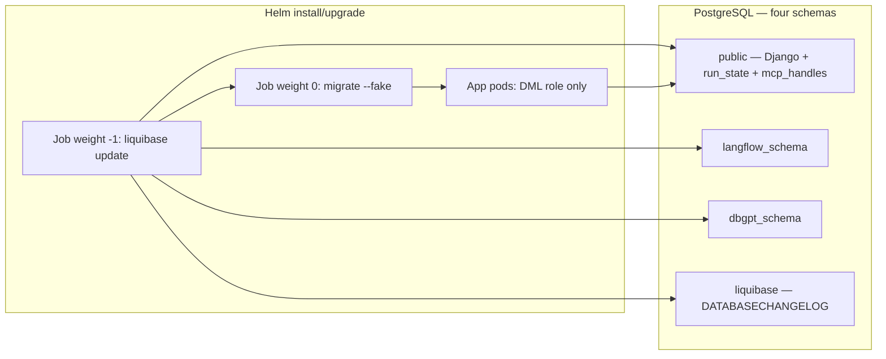

### Capability → Architecture Map

| Capability | Lives in | Governed by |
|---|---|---|
| CAP-1 chrome | `django-pyforge` | canopy:AD-1, canopy:AD-3 |
| CAP-2 Lane 1 | Wagtail on host | canopy:AD-13, canopy:AD-10; `lane1-serves-dw-h3` **no** (2026-08-25) |
| CAP-3 portals | `django-<station>` | canopy:AD-1, canopy:AD-2, canopy:AD-4, canopy:AD-18 |
| CAP-4 MCP | `mcp` SDK on host ASGI | canopy:AD-5, canopy:AD-6, canopy:AD-12, canopy:AD-10 |
| CAP-5 CLI grammar | `pyforge-core` | canopy:AD-14, canopy:AD-18 |
| CAP-6 identity client | `django-pyforge` + `pyforge.core` | canopy:AD-7 |
| CAP-7 boards | `pyforge.steward.dashboard` on host | canopy:AD-20 |
| CAP-8 events | Redis Streams on redis-broker | canopy:AD-8, canopy:AD-10 |
| CAP-9 governed DDL | Liquibase Job + roles | canopy:AD-9, canopy:AD-16 |
| CAP-10 containment | wrapper + tests | canopy:AD-15; BS-5/BS-7/BS-8 Deferred |
| CAP-11 cache ≠ broker | two Redis Deployments + Celery workers | canopy:AD-10 |
| CAP-12 IdP roles + secrets | allauth + parent canopy:AD-12 mounts | canopy:AD-19, canopy:AD-15 |
| CAP-13 flags | OpenFeature FILE | canopy:AD-11, canopy:AD-16 |
| CAP-14 Scribe graph | Port + lexical path; semantic recall on CAP-19 plane driver (34.5). `scribe_schema` pgvector retirement is OQ | parent canopy:AD-1, parent canopy:AD-5 isolation; canopy:AD-22 |
| CAP-15 skills | SKF compile from `pyforge-<station>` → `.claude/skills/`; **mason = `conda-forge-expert`** | canopy:AD-14, canopy:AD-17 |
| CAP-16 personas | BMAD launcher/agent; consults CAP-15 | canopy:AD-14, canopy:AD-17 |
| CAP-17 run state | supervisor → PostgreSQL `public.run_state` | canopy:AD-12, canopy:AD-6 |
| CAP-18 hooks | `pyforge-core` + Warden / station plugins | canopy:AD-21 |
| CAP-19 query plane | Atlas DuckDB + Kedro; stations as clients. First slice shipped; OQs remain | canopy:AD-22 |
| Cross-cutting | replaceable layers (hook specs + plugins) | canopy:AD-21 |

### Deferred

| Item | Why it can wait | Revisit when |
|---|---|---|
| `lane1-serves-dw-h3` | **Answered 2026-08-25: no.** `LaSuiteClient` Docs REST ≠ host Wagtail `/cms/`. Absorbing it here would re-mint atlas's spec. DW-H3 stays atlas attended bring-up. | Only if a new adapter Dream is written |
| Per-schema Liquibase tracking | One sequential Helm Job does not need concurrent migrators | A second migration Job is proposed |
| MCP Tasks extension (SEP-2663) | No server-side runtime on conda-forge | Official `mcp` SDK ships Tasks; swap wire layer over the same PostgreSQL store |
| FastMCP 4 / dual-era on FastMCP | Beta, unpackaged | Not before CAP-4 `mcp` faces exist |
| Django 5.2.17 pin | Operator-owned feedstock bump; not a live exposure | After `django-feedstock` `5.x` publishes 5.2.17 |
| OpenFeature / Liquibase / cachebox 5.x recipes | Operator took all packaging | Packages appear on the channel the platform env consumes |
| Scribe dual-driver internals | Port already exists; backing store is PostgreSQL | Story for CAP-14; no cross-station invariant beyond parent canopy:AD-1 |
| Ledger shape for reopening 11.1 / 11.2 | `bmad-correct-course`, not this spine | Phase 5 steward run |
| Keycloak Token Exchange / `RESOURCE_INDICATORS` | RFC-8707 flag is experimental; audience mapper is the documented interim | First CAP-6 client story that mints delegated tokens (BS-3) |
| Additional CloudEvents extension attributes beyond `pyforgeloopdepth`, `spec_id`, git sha, SBOM purl, optional work-item id | Stream, DLQ, ceiling, `dataschema`, and Q4 identity fields are bound (canopy:AD-8 + operating-model Q4) | First producer that needs a *further* extension |
| Supervisor ingest wire from bmad-loop | Topology is bound; Marshal hook details are station-local | Marshal + CAP-17 story |
| FILE flag env promotion overlays | canopy:AD-11 binds one JSON schema, ConfigMap mount, and in-process watch; overlay *values* per env are ops | First CAP-13 import story |
| Liquibase `DATABASECHANGELOGLOCK` stuck-lock runbook | Companion already names the need; owner is ops not a second DDL path | Before first production CAP-9 Job |
| BS-5 single DuckDB writer / `read_only=True` | Mechanism is atlas-local; absence-test still required (canopy:AD-15) | First CAP-10 story that opens `atlas.duckdb` |
| BS-7 `PydanticFormErrorBridge` | Lands in `django-pyforge`; not a cross-station fork if chrome owns it | First CAP-10 / CAP-1 HTMX form story |
| BS-8 Mason boot re-index | Bound off MinIO (canopy:AD-13 / parent canopy:AD-1). PostgreSQL remains canonical. Object-store scan is blocked until parent canopy:AD-1 is excepted. | First CAP-10 Mason restart story — reconcile against PG + RWX, not MinIO |

## Satellite: python-foundry cutover

> **Folded into this spine 2026-09-08.** Was `architecture-python-foundry-cutover-2026-09-04`, a run-folder
> named for a CHAIN rather than this project — the deviation `ad-citation-check` refuses.
> Its decisions keep their own numbering, qualified `fnd:AD-n`, which is how every
> citation in the repo already spells them after the 2026-09-08 attribution pass
> (685 ambiguous citations read down to 30). **No citation changes meaning.**
> Renumbering into one sequence was rejected on measured evidence: four mechanical
> attribution methods scored 47%, 45%, 80%-with-bias and 100%-precision-at-8%-coverage,
> so a renumber could only put wrong-but-valid pointers into a graph with none.
>
> Original frontmatter — status: draft, altitude: feature, updated: 2026-09-04.


> **Solutioning iteration 4 (2026-09-04).** Iteration 1 was revised after the reviewer gate; iteration 2 made the cutover a flag with a regenerable plan; iteration 3 makes it regenerative: Dreams and memlogs are the only unconditional move, and every capability reaches foundry by rebuild or by move, decided per row; iteration 4 closes the last two open questions: foundry is private, and CI evidence is a real run with the remote host as self-hosted fallback (fnd:AD-23). Drafted on the
> Fast path; every inferred call still carries `[ASSUMPTION]` for the operator's review loop.
> Nothing here is dispatched: Epic 44's stories are ledger `blocked` until the operator flips
> them (fnd:AD-9). Cite this file's ids as **`fnd:AD-n`**; the Canopy spine's as **canopy AD-n**;
> the host spine's as **`pap:AD-n`**. No open question remains — see the last section.

### Design Paradigm

**Regenerative strangler-fig cutover.** The Dream seeds foundry; each capability is realized there by rebuild or by move (fnd:AD-2, fnd:AD-18, fnd:AD-20); the archive is the oracle (fnd:AD-21). Three roles, three places:

| Role | Place | Owner |
|---|---|---|
| Lasting root (estate) | `python-foundry/` — `pixi.toml` name `pyforge`, `src/platform/`, `src/packages/`, `skills/`, `_bmad-output/`, `docs/` | steward |
| Island (recipe plant) | `python-foundry/factory/` — own `pixi.toml` + `pixi.lock`, `recipes/` working set, recipes-only CI | mason |
| Archive (copy source) | `rxm7706/local-recipes` — read-only at a pinned SHA after Phase 6 | steward |

The **capability ledger** decides the mode of every capability and the **manifest** routes the files
of the moved ones (fnd:AD-2), both regenerated or appended at will. The two-remote era is bounded by one
flag flip (fnd:AD-17), not by a date; until a capability freezes (fnd:AD-22) `local-recipes` evolves normally.

### Inherited Invariants

Parent: `## Satellite: Canopy — pyforge-unifying-strategy` (this document; was `../architecture-pyforge-unifying-strategy-2026-08-24/` before the 2026-09-08 fold)
(canopy:AD-1..23) and, through it, host spine in `specs/spec-python-agent-platform/ARCHITECTURE-SPINE.md`
(`pap:AD-1..17`; contract merged into `spec-pyforge-unifying-strategy` by Story 48.8).
Read-only; original ids; never re-derived.

| Inherited | Binds here |
|---|---|
| pap:AD-2 host never imports `pyforge.*` | The fold (fnd:AD-6) changes paths, not this boundary. **Brownfield breach:** `src/platform/ingest/github_projects/*` imports `pyforge.steward.keys` in eight places today; fnd:AD-7 names its successor before deletion (open question `ingest-keys-import`). |
| pap:AD-9 consume factory packages, never fork | fnd:AD-7 ratifies it: the Containerfile's ten `COPY src/shared/packages/...` lines are the brownfield drift the cutover removes. |
| pap:AD-15 CI paths | Refined by fnd:AD-8: estate and island CI are disjoint by `paths`. |
| canopy:AD-4 reusable-app triple, one distribution per station | Distribution and import names are unchanged by the fold (fnd:AD-6). |
| canopy:AD-14 five tiers, or the 03 station is not done | `five_tier.py` retargets `_packages_root` and the skill/persona paths (fnd:AD-6, fnd:AD-5); the roster stays eight. |
| canopy:AD-16 packaging is an external gate | Foundry packages still arrive via the conda channel; the island builds them (fnd:AD-3, fnd:AD-4). |
| canopy:AD-17 station domain skills are SKF content skills; `skf-export` is the only writer into `CLAUDE.md` / `AGENTS.md` | SKF compiles into `skills/` (fnd:AD-5). Path rewrites inside `CLAUDE.md` / `AGENTS.md` after the fold go through `skf-export`, never a direct edit (fnd:AD-6). |
| canopy:AD-21 hooks and plugins are replaceable layers | Unchanged; the hook registry is the seam fnd:AD-4 keeps Mason behind. |
| canopy:AD-23 one interpreter `3.14.*`; `mcp-host` isolates MCP-SDK | Estate lock inherits it; the island lock is free to pin what recipes need. |

**Conflict, not override — canopy:AD-17:** fnd:AD-6's "every consumer path is rewritten" would
touch `CLAUDE.md` / `AGENTS.md`, whose only sanctioned writer is `skf-export`. Resolution:
44.4 and 44.5 re-run `skf-export` after their moves; the manifest marks those two files
`rewritten-by: skf-export`. **Conflict, not override — pap:AD-2:** the ingest import is a
live breach, not a rule this spine relaxes; 44.4 routes it through the in-process station
port (`pyforge.core.station_port`, steward 43.3) or the `steward keys` CLI, decided by
`ingest-keys-import`.

### Invariants & Rules

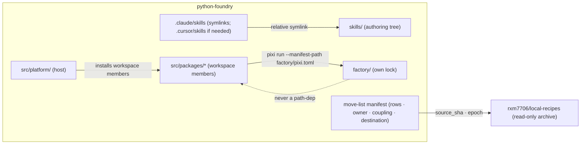

#### fnd:AD-1 — Fresh root, pinned source `[ADOPTED]`

- **Binds:** fnd:CAP-1, fnd:CAP-7; Stories 44.3, 44.10
- **Prevents:** two live histories; the purged-secret history and 268 worktrees riding into the lasting repo; ambiguity over which repo is truth
- **Rule:** Foundry's first commit carries no `local-recipes` history (no `filter-repo`, no subtree import). Every manifest row carries the `source_sha` it was lifted at, and the manifest records the **foundry epoch SHA** (fnd:AD-16). After Phase 6, `local-recipes` is archived read-only at its final SHA, that SHA is pinned in the foundry manifest and the Dream's Realization log, and its README opens with the supersession banner.

#### fnd:AD-2 — Two layers: a capability ledger over the file manifest, both derived

- **Binds:** fnd:CAP-2, fnd:CAP-3, fnd:CAP-4, fnd:CAP-5, fnd:CAP-9; Story 44.1 and every realization story
- **Prevents:** two stories routing one path differently; a tracked path silently dropped; the spec-surface allowlist (`.claude/**`, `_bmad/**`, `_bmad-output/**`, `docs/dreams/**`, `docs/governance/**`, `.github/**` — the very trees the cutover moves) leaving 20 % of paths unrouted; a hand list that omits the newest thing
- **Rule:** The **capability ledger** has one row per capability, derived from the Dreams and the spec-surface owner map: `mode` (`rebuild` | `move` | `retire`), `state` (`planned` | `rebuilding` | `moving` | `verified-in-foundry` | `cut`), dependencies, and the four decision signals. The **file manifest** exists only under `move` rows; a `rebuild` row has no file rows (its files are `stays` by construction) and a `retire` row's files are `dies`. Manifest rows come from `git ls-files` — one row per tracked path, allowlisted trees included. The spec-surface classification (`scripts/spec_surface_check.py`) supplies the row's **owner** only (`unowned` is legal). Coupling comes from `scribe index move-list` (`pyforge.scribe.extras.move_list`: host `pyforge.*` imports, `sys.path` inserts, `five_tier` roots, CFE callers) **plus a `parent_depth` signal** for code that computes paths by `parents[N]` / fixed `../` depth. **Destination** is resolved by an ordered precedence list of glob rules (most specific wins); a path matched by two rules of equal precedence is row kind `ambiguous` and blocks until an operator rule resolves it. The manifest is a machine-readable file with per-directory rollups (24,858 rows are not a markdown table), produced by `steward cutover plan` in two modes: `--regenerate` rebuilds every row from scratch at HEAD; `--append` folds in only the delta since the manifest's recorded `source_sha` (added, renamed and deleted paths gain or update rows). Both modes preserve `moved` rows, so regeneration is idempotent over status. A move story consumes the rows for its phase and marks them `moved` with the foundry commit; a move without a row is review-blocking.

#### fnd:AD-3 — Two locks, one workspace name; tooling split by role

- **Binds:** fnd:CAP-1, fnd:CAP-4; Stories 44.3, 44.4, 44.7; red-team D-2 / R-17
- **Prevents:** the 29-environment single lock that turns every dependency change into a 59k-line diff; recipe churn re-solving the estate; a "no solver tooling" rule that strips warden's test oracles
- **Rule:** Root `pixi.toml` is `name = "pyforge"` and locks the estate only. `factory/pixi.toml` + `factory/pixi.lock` lock the island only. No path dependency crosses the island boundary in either direction. The island owns **recipe build / lint / submit tooling by role**: `rattler-build`, `conda-smithy`, `conda-build` as a build engine, `conda-forge-pinning`, `grayskull`. Estate exemptions are enumerated by name, never by role: warden's test-only differential oracles `conda-build` and `py-rattler-build` (`[feature.pyforge-warden]`), and the `pixi-build-python` / `pixi-build-rattler-build` workspace-member backends. Any other solver-farm package in the estate lock is a finding.

#### fnd:AD-4 — Mason reaches the island by manifest path, never by import

- **Binds:** fnd:CAP-3, fnd:CAP-4, fnd:CAP-6; Stories 44.6, 44.7, 44.9
- **Prevents:** the estate environment regrowing the solver farm; a second copy of the CFE skill; `MASON_CFE_ROOT` pointing back at the archive; a marker constant that no longer matches after the move
- **Rule:** `MASON_CFE_ROOT` stays a **repo root** (flag → env → cwd walk, `pyforge/mason/resolve.py`) whose marker `_CFE_MARKER` (today `.claude/scripts/conda-forge-expert`, `resolve.py:100`) moves with the cell to `skills/domain/conda-forge-expert/scripts`; the marker constant is a manifest consumer rewritten in 44.6. Recipe build, submit and update are subprocesses of `pixi run --manifest-path factory/pixi.toml <task>`; `pyforge-mason` imports nothing from the island.

#### fnd:AD-5 — One skills tree; IDE directories are adapters

- **Binds:** fnd:CAP-2, fnd:CAP-3; Stories 44.5, 44.6; canopy:AD-17
- **Prevents:** divergent `SKILL.md` copies per IDE; an edit landing in one adapter and not the other; the installer carve-out accidentally exempting the eight station personas; a symlink in git that checks out as a text file on stock Windows
- **Rule:** Estate-authored skills live only under `skills/{stations,personas,domain}/<x>/`; SKF export writes there (`skills/stations/<x>/` is its root; 44.5 verifies `skf-export` accepts it). **No adapter is tracked in git.** Adapters are generated per machine by the link step (fnd:AD-19): `.claude/skills/<x>` always; `.cursor/skills/<x>` only where Cursor is detected or requested. Both are gitignored. Installer-**written** directories (`bmad-*` from the BMAD installer, `skf-*` from the forge) stay real directories; the eight station personas (`bmad-agent-<station>`) are estate-authored and move to `skills/personas/<station>/`. A regular directory for an estate skill under an adapter is a detector finding.

#### fnd:AD-6 — The packages fold is a path rewrite, not a rename

- **Binds:** fnd:CAP-2; Story 44.4; canopy:AD-4, fnd:AD-14, fnd:AD-17
- **Prevents:** a half-moved tree with two package roots; a distribution or import rename smuggled in with the move; 59 files computing paths by fixed parent depth silently resolving a wrong root; a stale spec-surface baseline after every move
- **Rule:** `src/shared/packages/<x>` → `src/packages/<x>`; distribution and import names unchanged. Every consumer is rewritten from manifest rows in the same story: `pixi.toml` path-dependencies (103 sites), the Containerfile `COPY` lines, `five_tier._packages_root`, `script_map_from_packages_root`, `marshal-policy.toml` globs, Spec `surface:` globs, CI `paths:`, and every `parent_depth` coupling row (`parents[N]` constants; no silent wrong-root fallback survives). `CLAUDE.md` / `AGENTS.md` are rewritten by re-running `skf-export` (canopy:AD-17). Every move story ends with a scoped `spec_surface_check.py --write-baseline --spec <affected>` re-stamp. After 44.4 no `src/shared/` exists and `rg src/shared/packages` returns only the manifest and the archive.

#### fnd:AD-7 — The host consumes packages, never copies source

- **Binds:** fnd:CAP-2; Story 44.4; ratifies pap:AD-9, canopy:AD-16
- **Prevents:** the ten `COPY src/shared/packages/...` lines (nine django portals + the `pyforge-steward` library) and the builder-stage `COPY . /app` riding into foundry; deleting a working import path with no successor
- **Rule:** Each `src/packages/*` is a pixi-build workspace member with its own `pixi.toml`; today that is true for all ten `pyforge-*` packages (under the `pixi-build` preview flag) and for none of the seven `django-*` packages — 44.4 adds theirs. The platform image installs workspace members; the Containerfile has no `COPY src/packages`, no `COPY . /app` of package source, and no `sys.path` insert for a package (`platformapp`'s own insert is host-internal `[ASSUMPTION]`). No import path is deleted without its successor named in the story (`ingest-keys-import`).

#### fnd:AD-8 — Two CI estates, disjoint triggers, classified not counted

- **Binds:** fnd:CAP-1, fnd:CAP-4, fnd:CAP-7; Stories 44.3, 44.7, 44.10; R-17a
- **Prevents:** a recipe PR paying for platform CI and the reverse; the `maintenance`-label and hand-run `environment.yaml` rituals; an undercounted "dies" list
- **Rule:** Estate workflows carry `paths-ignore: [factory/**]`; island workflows carry `paths: [factory/**]`. Every workflow and CI script is a manifest row; a row that references `staged-recipes` **dies**: the four linter workflows, `test-all.yml` and `test-{linux,macos,windows}.yml`, `scripts/linter.py` (where the `environment.yaml` sync check lives), `azure-pipelines.yml`, `.azure-pipelines/`, `.scripts/`. `environment.yaml` is produced by a workflow step or dropped; never a by-hand step. No foundry workflow references `staged-recipes`.

#### fnd:AD-9 — Every Epic 44 story is a gate the operator flips

- **Binds:** fnd:CAP-1, fnd:CAP-6, fnd:CAP-7; all of 44.1–44.10
- **Prevents:** a drain creating a GitHub repository, opening conda-forge PRs, or disabling CI unattended; implementation starting before the solutioning review closes
- **Rule:** All 44.x are ledger `blocked` while solutioning is under review; the flip to `backlog` is the operator's act per story. 44.3, 44.9 and 44.10 additionally require explicit operator confirmation at dispatch. Marshal never auto-flips a `blocked` key.

#### fnd:AD-10 — Working set, not universe

- **Binds:** fnd:CAP-5; Story 44.8
- **Prevents:** the 7,855-directory `recipes/` copy
- **Rule:** `factory/recipes/` admits a recipe only through a manifest row whose `reason` is one of `in-flight`, `sole-maintainer`, `referenced-by-spec` (the fnd:AD-2 precedence list resolves the many-to-many `recipes/**` claims). Island CI asserts `count(factory/recipes/*) <= count(manifest rows)`.

#### fnd:AD-11 — Two remotes are a migration interval bounded by the flag

- **Binds:** fnd:CAP-2..fnd:CAP-8; Phases 1–5
- **Prevents:** drift between the two trees while both are live; freezing the evergreen repo before the flip
- **Rule:** Before the flip (fnd:AD-17) `local-recipes` is primary and evolves normally except where a capability has entered `rebuilding` or `moving`, which freezes its source paths at once (fnd:AD-22); every other change reaches foundry by `steward cutover plan --append` followed by the replay (fnd:AD-18). After the flip the roles reverse: foundry is primary, every `moved` row and every rebuilt capability's source is frozen in `local-recipes` (detector `frozen-path-changed`), and `local-recipes` accepts only hygiene.

#### fnd:AD-12 — The BMAD chain moves whole; one ledger of record

- **Binds:** fnd:CAP-2; Stories 44.5–44.10
- **Prevents:** a loop home or a `bmad-switch` marker still targeting `local-recipes`; two ledgers both accepting rows mid-epic
- **Rule:** `_bmad/`, `_bmad-output/projects/` and `docs/dreams/` move in 44.5 as one unit. The marker and the two planning symlinks are per-working-tree state recreated by `bmad-switch` / `bmad-loop-worktree`, never copied. The ledger of record follows the flag (fnd:AD-17), not the story: before the flip it is `local-recipes`', after it foundry's, and `sprint-ledger-sync` runs in the primary root. The eight `~/.bmad-loops/*` homes are re-provisioned against the foundry remote by the same flip, in an attended session with no loop running.

#### fnd:AD-13 — The CFE cell is one unit with one owner

- **Binds:** fnd:CAP-3; Story 44.6; canopy:AD-17
- **Prevents:** three claimants on `.claude/skills/conda-forge-expert` (the skills move, 44.6, and the SKF export); its siblings having no owner; both CFE detectors matching nothing after the move and reporting clean
- **Rule:** The cell is `.claude/skills/conda-forge-expert/` + `.claude/scripts/conda-forge-expert/` + `.claude/tools/conda_forge_server.py` + the 76 `.claude/scripts/conda-forge-expert` references in `pixi.toml` (its runtime state `.claude/data/conda-forge-expert/` moves to `var/cfe/`, fnd:AD-19). It moves in **44.6 only**, to `skills/domain/conda-forge-expert/{SKILL.md,scripts,tools}`; 44.5 leaves it in place. The path literals in `cfe_rebuild_guard_check.py` and `mason_cfe_surface_check.py` are manifest consumers rewritten in 44.6.

#### fnd:AD-14 — Repo operational envelope

- **Binds:** fnd:CAP-1, fnd:CAP-6; Stories 44.3, 44.9
- **Prevents:** a repository created with undecided visibility, no branch protection, and secrets re-typed by hand; a conda-forge reviewer sent to a link that is dead outside the account
- **Rule:** Visibility is **private, permanently** (operator 2026-09-04, iteration 4; closes `repo-visibility`). `dashboard.yml` keeps deploying GitHub Pages on the paid plan that already serves the public site from the private `local-recipes`; the win-64 leg (fnd:AD-19) bills at 2×, so Actions minutes are a standing budget under fnd:AD-23. Nothing Mason submits carries a foundry URL; the strip on the submit path stays. Default branch `main`, protected, merge commits only; the operator and the marshal bot identity may push. Secrets and variables (`CRC_PULL_SECRET`, `HERALD_WEBHOOK_SECRET`, the six `vars.PLATFORM_CI_*`) are manifest rows of kind `secret` (no value in the manifest) re-provisioned through `steward keys` (FR-5 inventory).

#### fnd:AD-15 — Identity strings are manifest rows; environment ids are not renamed here

- **Binds:** fnd:CAP-3, fnd:CAP-6, fnd:CAP-7; Stories 44.4–44.10
- **Prevents:** 333 `rxm7706/local-recipes` occurrences in 148 files pointing at the archive; a silent rename of the `local-recipes` pixi env breaking 974 call sites and GATE-011-frozen `verify_commands`
- **Rule:** Repository identity strings (`rxm7706/local-recipes` URLs and slugs) are manifest rows of kind `identity`, rewritten by the story that moves the file. The pixi environment id `local-recipes` stays until a named rename story — the same rule the Dream applies to `[feature.python-agent-platform]`.

#### fnd:AD-16 — Detector ranges on a fresh root

- **Binds:** fnd:CAP-1, fnd:CAP-3; Stories 44.3, 44.6
- **Prevents:** `cfe_rebuild_guard_check` and `mason_cfe_surface_check` passing vacuously on a repository whose git range starts at the epoch
- **Rule:** The foundry epoch SHA is recorded in the manifest; every git-range detector takes it as its floor. A zero-commit range is exit 2 (could-not-run), never a clean verdict.

#### fnd:AD-17 — Cutover is a flag, not a date `[ADOPTED]`

- **Binds:** fnd:CAP-8, fnd:CAP-6, fnd:CAP-7; every story from 44.4 on
- **Prevents:** a dated phase boundary that freezes the evergreen repo; a cutover with no rollback; three consumers deciding the root of record differently
- **Rule:** One flag, `pyforge.cutover_root` in {`local-recipes`, `foundry`}, lives in the canopy:CAP-13 flag tree (`src/platform/config/flags.json`, canopy:AD-11), read in-process by the host and by the CLIs through a `pyforge-core` reader (a 44.12 task; none exists today). It alone decides the ledger of record (fnd:AD-12), Mason's submit and update targets (fnd:AD-4), which remote the loop homes track, and which root the detectors treat as primary. The transition point is the flip, allowed once the capabilities it depends on are `verified-in-foundry` (fnd:AD-22); flipping back is the rollback. The flip is an operator act recorded in the Dream's Realization log.

#### fnd:AD-18 — Moves are replays; rebuilds are regeneration drills

- **Binds:** fnd:CAP-2..fnd:CAP-5, fnd:CAP-8, fnd:CAP-9; Stories 44.4–44.8, 44.14 and every capability row
- **Prevents:** one-off hand moves that cannot be repeated after the plan changes; a foundry mirror that silently falls behind the evolving repo; a rebuild that is a rewrite by another name
- **Rule:** A `move` capability is realized by a manifest-driven, idempotent apply step (`steward cutover apply --phase <n>`) that can be re-run into foundry after every `--regenerate` or `--append` until the flag flips; a hand move the apply step cannot reproduce is review-blocking, and the replay records the foundry commit on each row. A `rebuild` capability is realized as a regeneration drill in foundry: its Dream and moved memlog → `bmad-spec` re-derives the Spec → `bmad-architecture` inherits the parent invariants → epics and stories → `bmad-build` drained by Marshal under a `steward budget` ceiling, with the archived code visible only as reference. Either way the row reaches `verified-in-foundry` only through fnd:AD-21.

#### fnd:AD-19 — Native estate on stock Windows; host and supervisor remote `[ADOPTED]`

- **Binds:** fnd:CAP-1, fnd:CAP-2, fnd:CAP-3; Story 44.11
- **Prevents:** symlinks that check out as text files; Developer Mode or WSL as a prerequisite; paths past 260 characters; shell-only tasks that break outside POSIX
- **Rule:** No symlink is tracked in git. A link step (`steward links` — name a 44.11 task) generates every runtime link per machine: symlinks on Linux and macOS, directory junctions via `_winapi.CreateJunction` on Windows (no privilege needed); the same helper serves `bmad-switch` and the adapters. A doctor preflight fails loud when a link is missing or is a text file, and when the deepest tracked path from the clone root exceeds the Windows limit (long-path registry settings are never assumed). No pixi task depends on `bash -c`, `sed`, `grep`, `awk`, `find` or `tee`; Python replaces them, `m2-*` conda tools are the fallback. A win-64 CI leg runs the station suites, the link check and the detectors. Runtime state lives in gitignored `var/` at the repo root (`var/atlas`, `var/cfe`, `var/worktrees`). The Django host and the fleet supervisor are Linux and macOS only, reached from Windows through a remote Linux dev host; making the host native is a solver-probe story, never a promise.

#### fnd:AD-20 — The seed is Dreams plus memlogs `[ADOPTED]`

- **Binds:** fnd:CAP-2, fnd:CAP-9; Stories 44.13, 44.1
- **Prevents:** carrying 69 MB of rendered planning narrative into a greenfield root; re-deriving a Spec and losing hand-edits its memlog never recorded
- **Rule:** `docs/dreams/` and every Spec and spine `.memlog.md` move unconditionally; they are the decision record. `SPEC.md`, spines, epics and stories are re-rendered in foundry by `bmad-spec`, `bmad-architecture` and `bmad-create-epics-and-stories`. Every other planning document (research, reviews, proposals, readiness reports, retros, run records, per-story specs of shipped stories) is archived. Prerequisite, in `local-recipes` before Phase 0 (Story 44.13): every hand-edit in a rendered `SPEC.md` — the unifying strategy first — is folded back into memlog entries, and each Spec proves it re-renders without loss.

#### fnd:AD-21 — The archive is the oracle

- **Binds:** fnd:CAP-9; every `rebuild` row
- **Prevents:** regeneration drift dressed as a rebuild
- **Rule:** A rebuilt capability reaches `verified-in-foundry` only when the archived test suite for that capability passes against the rebuilt code, or an equivalence check does, and the re-derived Spec's success criteria hold. A rebuild story without its oracle gate is review-blocking.

#### fnd:AD-22 — Per-capability state and freeze under one global flag

- **Binds:** fnd:CAP-8, fnd:CAP-9; every capability row
- **Prevents:** a fragmented root of record; double maintenance of a capability being rebuilt while its source keeps changing; a flip that outruns its dependencies
- **Rule:** `pyforge.cutover_root` remains the only root-of-record switch. Each capability row carries its own state; the flip is allowed only when every capability it depends on is `verified-in-foundry`. A capability entering `rebuilding` or `moving` freezes its source paths in `local-recipes` at once; `frozen-path-changed` is keyed by ledger state, not by the flag, and `steward cutover plan --append` reports any source change against a frozen row as a finding.

#### fnd:AD-23 — CI evidence ladder and the minutes guard `[ADOPTED]`

- **Binds:** fnd:CAP-1, fnd:CAP-9, fnd:CAP-10; Stories 44.3, 44.14, 44.15
- **Prevents:** a "green" that never ran (the 2026-08-30 block failed every job in 2 s and looked cheap); fnd:CAP-1 dispatched into a blocked account; a drain that discovers the minutes ceiling by being refused
- **Rule:** fnd:CAP-1's evidence is a real green workflow run on a registered runner, in this order: GitHub-hosted; the fnd:AD-19 remote Linux dev host registered as a self-hosted runner (estate workflows declare its label as the `runs-on` fallback); and, only while both are unavailable, a documented fresh-clone run of the estate gates on that host — **provisional**, never fnd:CAP-1's success. With no evidence path at all, 44.3 does not dispatch. `steward budget check` meters the account's Actions minutes (the billing API through a `user`-scoped credential in `steward keys`, never a token in the manifest) against the plan's included minutes and the declared ceiling; it is read at 44.3's confirmation, by Marshal's foundry drains and by the rebuild harness as their ceiling (Story 44.15). fnd:AD-8's classification is unchanged; runner selection lives here.

### Consistency Conventions

| Concern | Convention |
|---|---|
| Id citation | `fnd:AD-n` / `fnd:CAP-n` (this chain) · `canopy AD-n` · `pap:AD-n` / `pap:CAP-n`. Bare ids outside their own file are review-blocking. |
| Manifest row | `path · kind (file \| secret \| identity) · owner · coupling[] · destination (target path \| stays \| dies \| ambiguous) · reason · source_sha · status (pending \| moved \| archived) · foundry_commit` |
| Manifest file | machine-readable (JSONL or CSV) with per-directory rollups at `docs/foundry/manifest.*` `[ASSUMPTION: location]`; header carries the epoch SHA and the `source_sha` the last `--regenerate` or `--append` ran at |
| Capability row | `capability (fnd/canopy/pap/station CAP-n) · owner spec · mode (rebuild \| move \| retire) · state · depends_on[] · signals (fidelity, coupling, debt, state) · decided_by · decided_on` |
| Mode decision | scored by four repo signals, decided by the operator per row; first pass in `cutover.md` |
| Cutover flag | `pyforge.cutover_root` ∈ {`local-recipes`, `foundry`} in `src/platform/config/flags.json`; flips are Realization-log entries |
| Runtime links | generated per machine, never tracked; symlink on POSIX, junction on Windows; gitignored |
| Phase ↔ story | Phase n ↔ Story 44.(n+3); 44.1 manifest, 44.2 document fixes; ledger key `44-N-<slug>` |
| Workspace names | root `pyforge`; island `pyforge-factory` `[ASSUMPTION]` |
| Adapter symlinks | relative (`../../skills/...`), never absolute |
| Dates / versions | `YYYY-MM-DD`; CalVer unpadded (inherited) |

### Stack

| Name | Version |
|---|---|
| pixi (both workspaces) | `0.78.0` (`requires-pixi >= 0.78.0`; registry-enforced by `pixi-version-check`) |
| pixi-build backends (`pixi-build-python`, `pixi-build-rattler-build`) | lock-pinned; `preview = ["pixi-build"]` stays until the feature is stable |
| Python (estate) | `3.14.*` (canopy:AD-23) |
| rattler-build (island) | `>=0.75.0` (lock `0.75.0`; conda-forge current) |
| py-rattler-build (estate, warden test oracle) | `0.72.2` (lock) |
| conda-smithy (island) | `>=3.44.6,<4` — the cap is deliberate (CalVer `2026.x` needs the `conda` package absent from the env); revisit in 44.7 |
| conda-build (island engine; estate test oracle) | `>=25.3.1` |
| GitHub Actions | estate + island workflows; Azure DevOps not carried |
| bmad-* suite floor | bmad-method >=6.12.0, bmad-loop >=0.11.1, bmad-module-skill-forge >=2.1.0 (linux-64 only), bmad-creative-intelligence-suite, bmad-method-test-architecture-enterprise, bmad-eval-quality, bmad-utility-skills, bmad-builder — win-64 (44.11) excludes skf and eval-quality |

### Structural Seed

```text
python-foundry/
  pixi.toml  pixi.lock  environment.yaml   # estate; name = pyforge; env ids unchanged (fnd:AD-15)
  AGENTS.md  CLAUDE.md                     # written by skf-export only (canopy:AD-17)
  factory/                                 # island — own pixi.toml + pixi.lock
    recipes/  build-locally.py  .ci_support/  conda-forge.yml
  .github/workflows/                       # estate (paths-ignore factory/**) + island (paths factory/**)
  src/platform/                            # host; workspace-member installs; no COPY of package source
  src/packages/                            # pyforge-core, pyforge-<station> ×8, pyforge-testing-kit, django-pyforge, django-<station> — each with pixi.toml
  skills/{stations,personas,domain}/       # authoring tree; mason → domain/conda-forge-expert/{SKILL.md,scripts,tools}
  .claude/skills/  (.cursor/skills/)       # generated per-machine links (gitignored) + installer-written skills
  var/                                     # gitignored runtime state: atlas, cfe, worktrees (fnd:AD-19)
  src/platform/config/flags.json           # canopy:CAP-13 flag tree; carries pyforge.cutover_root (fnd:AD-17)
  _bmad/  _bmad-output/projects/  docs/dreams/  docs/governance/
  docs/foundry/manifest.*                  # rows · owner · coupling · destination · epoch (fnd:AD-2)  [ASSUMPTION: location]
```

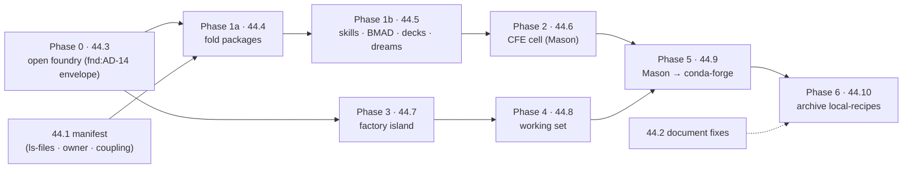

### Capability → Architecture Map

| Capability | Lives in | Governed by |
|---|---|---|
| fnd:CAP-1 open foundry | `python-foundry` root, estate workflows | fnd:AD-1, fnd:AD-3, fnd:AD-8, fnd:AD-9, fnd:AD-14, fnd:AD-16, fnd:AD-23 |
| fnd:CAP-2 realize the estate | `src/packages/`, `skills/`, `_bmad*/`, `docs/dreams/` | fnd:AD-2, fnd:AD-5, fnd:AD-6, fnd:AD-7, fnd:AD-12, fnd:AD-15, fnd:AD-18, fnd:AD-19 |
| fnd:CAP-3 CFE comes home | `skills/domain/conda-forge-expert`, `pyforge/mason/resolve.py` | fnd:AD-4, fnd:AD-5, fnd:AD-13, fnd:AD-16 |
| fnd:CAP-4 factory island | `factory/` | fnd:AD-3, fnd:AD-4, fnd:AD-8 |
| fnd:CAP-5 working set | `factory/recipes/` + manifest | fnd:AD-2, fnd:AD-10 |
| fnd:CAP-6 Mason → conda-forge | `pyforge-mason` submit/update paths | fnd:AD-4, fnd:AD-9, fnd:AD-11, fnd:AD-15 |
| fnd:CAP-7 archive | `rxm7706/local-recipes` | fnd:AD-1, fnd:AD-8, fnd:AD-9, fnd:AD-11, fnd:AD-15 |
| fnd:CAP-8 flag-gated, replayable cutover | `steward cutover plan/apply`, `flags.json`, `pyforge-core` flag reader | fnd:AD-2, fnd:AD-17, fnd:AD-18, fnd:AD-22 |
| fnd:CAP-9 capability ledger + rebuild harness | `steward cutover plan` (ledger), foundry's own planning tree, Marshal drains | fnd:AD-2, fnd:AD-18, fnd:AD-20, fnd:AD-21, fnd:AD-22, fnd:AD-23 |
| fnd:CAP-10 metered minutes budget | `steward budget` (metering source), `steward keys`, estate workflows' `runs-on` | fnd:AD-14, fnd:AD-19, fnd:AD-23 |

### Deferred

| Item | Why it can wait | Revisit when |
|---|---|---|
| `config/` vs today's `conf/`, and `src/ides/ src/sentinel/ src/domains/` scaffolding | Manifest rows decide per path; no cross-story divergence | 44.1 renders the manifest |
| `environment.yaml` keep-or-drop | fnd:AD-8 allows either; the sync check dies with `scripts/linter.py` | 44.3 writes the first estate workflow |
| Runtime-state home (`.claude/data/` 11 GB, `.claude/worktrees/` 85 GB) | Gitignored today; no tracked path moves | Open question `runtime-state-home` |
| Epic 45 candidates (R-18..R-22: sizing, NetworkPolicy, secrets, SLOs, `/ws/events/`) | Ops gaps in `src/platform/`, not layout; operator carried them | A consumer story appears |
| Archive history rewrite (purged secret) | fnd:AD-1 leaves it behind by construction | Only if the archive must be published |
| Worktree retirement mechanics (268 registered) | Local residue; nothing tracked | 44.10 |
| Foundry package release cadence / channel | Unchanged by the move (`[ASSUMPTION]`) | First island publish after 44.7 |
| Native Django host on win-64 | fnd:AD-19 keeps the host remote; Langflow and DB-GPT trees make it a probe | A solver-probe story after 44.11 |
| Renaming the `local-recipes` pixi env | fnd:AD-15 holds it; 974 call sites + GATE-011 | A named rename story, after 44.10 |
| Which capabilities rebuild versus move | Operator-owned per row; first pass in `cutover.md` is `[ASSUMPTION]` | 44.1 renders the ledger with the four signals scored |

### Open Questions (iteration 4)

None. Answered in iteration 4: `repo-visibility` (fnd:AD-14 — private, permanently) and `actions-minutes` (fnd:AD-23 — evidence ladder, self-hosted fallback on the remote host, provisional fresh-clone run, no dispatch without an evidence path; fnd:CAP-10 metering, Story 44.15).

Answered in iteration 2 (recorded as ADs): `windows-symlink-adapters` and `runtime-state-home` (fnd:AD-19), `cursor-skill-discovery` and `skf-export-root` (fnd:AD-5), `loop-home-cutover-timing` (fnd:AD-17). Answered in iteration 3: `planning-history-scope` (fnd:AD-20), `ingest-keys-import` (rebuild the ingest in `pyforge-steward` behind the station port; capability ledger first pass).

## Satellite: secure-live-dashboards

> **Folded into this spine 2026-09-08.** Was `architecture-secure-live-dashboards-2026-08-09`, a run-folder
> named for a CHAIN rather than this project — the deviation `ad-citation-check` refuses.
> Its decisions keep their own numbering, qualified `sld:AD-n`, which is how every
> citation in the repo already spells them after the 2026-09-08 attribution pass
> (685 ambiguous citations read down to 30). **No citation changes meaning.**
> Renumbering into one sequence was rejected on measured evidence: four mechanical
> attribution methods scored 47%, 45%, 80%-with-bias and 100%-precision-at-8%-coverage,
> so a renumber could only put wrong-but-valid pointers into a graph with none.
>
> Original frontmatter — status: final, altitude: spec, updated: 2026-08-09.


### Design Paradigm

**A reusable Django app in the request path, a subcommand around it.**

The pattern is not one artifact. It is two, divided by the only boundary that cannot be
argued with: whether the code runs **inside the adopting service's process, per request or
per message**, or **outside it, around the deployment**.

Everything that decides what a specific caller may see must run in-process — a subprocess
cannot filter a dataframe mid-request. Everything that stands the runtime up and inspects it
must run out-of-process — a library cannot provision an edge proxy. Attempts to deliver the
pattern as a single thing fail on one half or the other.

The in-process half plugs into the estate's primary backend — a **Django service with
Channels, on ASGI** — as a reusable Django app the adopter adds to `INSTALLED_APPS`.

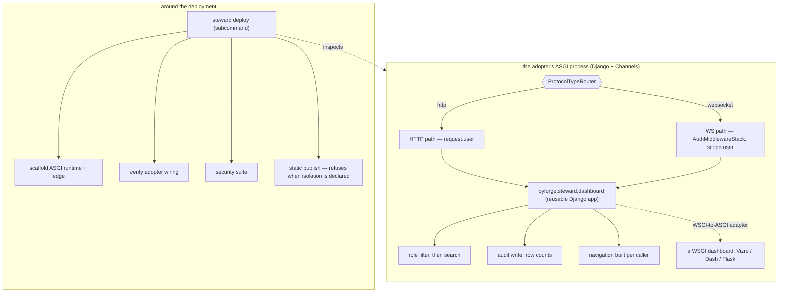

### Invariants & Rules

#### sld:AD-1 — Delivery splits on the process boundary

**Binds:** every component of the pattern.
**Prevents:** a delivery shape that cannot express half of what the pattern must do, and the
per-dashboard reinvention the Spec exists to end.
**Rule:** in-process concerns — identity extraction, RLS filtering, audit write, conditional
navigation — ship as the **library** `pyforge.steward.dashboard`. Out-of-process concerns —
runtime scaffold, edge policy, ASGI topology, security suite, wiring verification, static
publish — ship as a **subcommand** under the existing `steward deploy` verb. No concern may be
delivered by both.

*Rejected: a template repository. It has no upgrade path — a diverged adopter never receives a
fix, and the Spec's own open question names that as the case that decides it — and it
duplicates the genesis-installer role already consolidated into `pyforge-marshal`. Also
rejected: subcommand-only (a subprocess cannot filter a dataframe mid-request) and
library-only (a library cannot provision an edge).*

#### sld:AD-2 — The library provides; the subcommand verifies

**Binds:** the provide-vs-verify question the Spec left open.
**Prevents:** the two failure modes at either extreme — reimplementation, and undetected
divergence.
**Rule:** the library **provides** the pipeline, so no adopter writes its own filtering,
audit or navigation logic. The subcommand **verifies** an adopter's wiring, so an adopter
that diverged anyway is still caught. Neither half may assume the other ran.

*Rejected: provide-only — a diverged adopter becomes invisible. Rejected: verify-only — every
adopter reimplements the pipeline, which is the wall this pattern exists to remove.*

#### sld:AD-3 — Verification is Steward's, with one carve-out to Doctor

**Binds:** ownership of the conformance verdict.
**Prevents:** a cross-station dependency in every adopter's deploy path, and — at the other
extreme — Steward silently grading its own implementation.
**Rule:** `steward deploy` verifies an **adopter's wiring**. That is not self-grading:
Charter §6 bars a station being the final word on *its own* artifact, and an adopter's
dashboard belongs to the adopter. **Carve-out:** a verdict on whether **Steward's own pattern
implementation** is sound — as distinct from an adopter's use of it — is **Doctor's**, because
that case *is* Steward grading itself.

*Rejected: routing all verification to Doctor. Technically available — Doctor's sources take
`target: Path`, so an external directory is reachable — but it buys Charter purity by coupling
every adopter's deployment to a second station, so a Doctor fault would block a deploy. Doctor
is also a repo-rooted diagnostic for THIS factory; making it a runtime dependency of external
deployments inverts its role.*

#### sld:AD-4 — The trusted ingress is declared, not assumed

**Binds:** header-sourced identity, every deployment. Scoped by sld:AD-11.
**Prevents:** the pattern's strongest guarantee resting on an undocumented network assumption
— anything able to reach the app directly can forge the role header.
**Rule:** where identity arrives as a proxy header, the adopter **declares** the trusted
ingress (the address or interface the proxy connects from), and the app **refuses to start**
when identity headers arrive from outside it. The pattern never authenticates a user; it
authenticates the *path*.

*Rejected: trusting any header that arrives, which is the blueprint's behaviour and leaves the
guarantee undocumented and unenforced. Rejected: requiring mTLS or a shared secret for v1 —
correct, but it raises the adoption floor beyond a pattern's remit. Recorded as the upgrade
path, not the entry requirement.*

#### sld:AD-5 — Cross-worker state is pluggable; the sharing property is not

**Binds:** the response cache **and** the Channels channel layer, under any worker topology.
**Prevents:** two guarantees silently failing under concurrency — one fetch per refresh, and
a group broadcast reaching every viewer.
**Rule:** no specific backend is mandated. **Any** cross-worker shared state that **cannot be
shared across worker processes is refused** when the deployment runs more than one worker.
A single-worker adopter may use in-process backends for both.

*The channel layer is the second instance of the same failure, not a new one: the in-memory
layer is single-process, so under multiple workers a group broadcast reaches only the workers
holding those sockets and the dashboard updates for some viewers and not others.
`channels_redis` is the sanctioned layer backend where it applies. Rejected: mandating Redis —
it raises the floor for a small adopter that needs neither. Rejected: accepting any backend —
the blueprint's own sample pairs `FileSystemCache` with a Compose stack that provisions Redis
precisely so four workers share state; under `--workers 4` that sample does not deliver the
property it claims.*

#### sld:AD-6 — Filter, then search — enforced by signature, not by discipline

**Binds:** every search surface.
**Prevents:** a search that reaches rows the caller may not see.
**Rule:** search operates only on the already-role-filtered frame. The library **exposes no
entry point that can search the master set** — the unfiltered frame is never passed to a
searchable surface. The ordering is a property of the API shape, not of the caller's care.

*Rejected: documenting the order and trusting adopters to honour it. That is precisely how the
leak occurs, and the Spec's open question asks what ENFORCES the order — a comment does not.*

#### sld:AD-7 — Audit retention is declared by the adopter; the pattern refuses a default

**Binds:** the audit trail's lifecycle and its readership.
**Prevents:** silently making a data-protection decision on behalf of an organisation whose
legal obligations the pattern cannot know — and the trail itself becoming the leak.
**Rule:** an adopter **declares** a retention period; the pattern enforces it. There is no
default, and a deployment without one is refused rather than run unbounded. **The trail is
itself role-isolated data** — any surface that displays it passes through the same filtering
and audit path as any other dataset, so reading the audit trail is a recorded act.

*Rejected: an unbounded default — it silently accumulates personal activity data forever.
Rejected: a fixed default — it imposes one jurisdiction's answer on every adopter. Rejected:
exempting the audit surface from filtering because it is an admin view — that makes the record
of who saw what the one dataset nobody's access to is governed or recorded.*

#### sld:AD-8 — The pattern binds at the ASGI boundary, never to a dashboard framework

**Binds:** every component of the library.
**Prevents:** a pattern that cannot serve its own second adopter, and one that forfeits
Channels.
**Rule:** the library binds at the **ASGI application boundary** and is mountable inside a
Django project. No component may require a particular dashboard framework, and no adopter may
be asked to change frameworks to adopt. A **WSGI-native dashboard (Vizro, Dash, Flask) is
mounted through a WSGI-to-ASGI adapter** rather than forcing the host to be WSGI. Vizro is the
first adopter's choice, not the pattern's requirement.

*The framework-neutrality half was forced by Herald: it is a stateless CLI plus a static
dashboard, and its live-backend Spec commits to no framework. The protocol half was forced by
the operator's constraint that the primary backend is Django with Channels on ASGI — the
rule's first drafting said WSGI, which is the sync protocol and would forfeit Channels
entirely. Rejected: keeping the Vizro binding and asking Herald to adopt Vizro — that reshapes
an adopter's application to fit the pattern, inverting who serves whom.*

#### sld:AD-9 — Machine callers authenticate by proof, not by ingress

**Binds:** every non-human caller. A carve-out to sld:AD-4.
**Prevents:** sld:AD-4 refusing every legitimate CI call.
**Rule:** a machine caller presents a **verifiable signature** (HMAC) and is authenticated by
that proof rather than by the path it arrived on. It is **never granted a human role**, and the
identity-header path stays closed to it. sld:AD-4's refusal governs human identity only.

*Forced by Herald's LB-2 webhook receiver — an inbound caller that is not a proxied human.
Rejected: whitelisting CI source addresses at the ingress — it re-treats the network path as
the credential for a caller that can carry a real one, and CI egress addresses are neither
stable nor narrow.*

#### sld:AD-10 — Static export and role isolation are mutually exclusive

**Binds:** the choice of delivery mode, per dashboard.
**Prevents:** a board silently losing the guarantee sld:CAP-2 exists to make, by being republished
somewhere cheaper.
**Rule:** the two delivery modes are a **choice, not a spectrum** — public and unrestricted at
zero infrastructure, or role-isolated and hosted. A board that has **declared an access column
may not be delivered by static export**, and the static build **refuses rather than warns**.

*The static mode's client-side filtering embeds the data for all states in the page, so every
role's rows reach every browser and the dropdown is presentation — the exact thing the Spec's
own constraint forbids as access control. With no server there is also no audit trail at all,
not a reduced one. Rejected: treating static export as a cheap deployment option for the same
dashboard — it removes a guarantee silently.*

#### sld:AD-11 — The identity source is pluggable; the no-authentication rule is not

**Binds:** identity resolution on every protocol.
**Prevents:** asking a Django estate to bypass its own auth layer — and, at the other end, an
adopter wiring auth for HTTP only and serving an anonymous socket.
**Rule:** the pattern consumes an **already-established** identity and authenticates nobody.
The source is pluggable: a trusted-ingress proxy header (sld:AD-4), **or** the host framework's
authenticated user. Inside Django the accessor is **protocol-specific** — `request.user` and
its groups over HTTP, **`scope["user"]` over a Channels WebSocket**, populated by
`AuthMiddlewareStack`. A connection whose identity cannot be resolved is **refused**, never
served anonymously by default.

*The protocol-specific accessor is not a detail: an adopter that wires `AuthMiddlewareStack`
for HTTP only gets an anonymous scope on the socket, and would silently serve either
unfiltered or empty data. Rejected: proxy headers as the only source — it asks a Django estate
to re-establish at the edge an identity it already owns. Rejected: the pattern owning
authentication, which stays a Non-goal.*

#### sld:AD-12 — Isolation and audit are per message, not only per request

**Binds:** every persistent connection.
**Prevents:** a WebSocket becoming a stale-privilege cache.
**Rule:** on a persistent connection the caller's role is **re-resolved per message**, every
message that returns data is **audited with its row count** exactly like a request, and a
connection whose identity can no longer be resolved is **closed rather than served**.

*A role captured once at connect would outlive a revocation for the entire life of the socket.
Rejected: resolving the role once at the connect handshake — simpler, and the standard
shortcut, which is precisely why it needs ruling out here.*

#### sld:AD-13 — The library ships as a reusable Django app, by Django's own convention

**Binds:** the library's packaging and its integration surface.
**Prevents:** an integration that cannot ship the audit model, and migrations that mutate
under the adopter's settings.
**Rule:** the adopter enables the library via **`INSTALLED_APPS` plus an `include()`** of its
URLconf. Binding specifics, from Django 6.0's reusable-app convention: an **explicit
`AppConfig` label**, unique in `INSTALLED_APPS` and never colliding with a contrib label
(`auth`, `admin`, `messages`); **`default_auto_field` set on that `AppConfig`**; templates and
static namespaced under that label.

*`default_auto_field` is load-bearing rather than boilerplate here: this app ships an
audit-trail **model with migrations** into someone else's project, and without it those
migrations shift under the adopter's `DEFAULT_AUTO_FIELD`. Deviation recorded: the
`django-` / `django_` name prefix is **not** taken — it identifies standalone Django
distributions on PyPI, and this ships inside `pyforge-steward`, so the module stays
`pyforge.steward.dashboard`. Rejected: a settings-configured, middleware-only integration with
no `AppConfig` — it cannot ship models or migrations, which the audit trail requires.*

#### sld:AD-14 — SQLite in development, PostgreSQL in deployment — and contention is proven, not inferred

**Binds:** the audit store and every test that claims a boundary holds.
**Prevents:** a boundary that holds in development and fails in production.
**Rule:** one Django `DATABASES` setting, two engines, selected by **connection configuration
alone** — never two code paths. **Contention behaviour is proven against PostgreSQL in CI**,
never inferred from a green SQLite run.

*The second sentence is why this is an invariant and not a stack row. SQLite does not exhibit
the concurrent-write contention production will, and sld:AD-12 puts an audit write on the hot path
of every data-returning message across many simultaneous sockets — so the system's
highest-contention path is the one development exercises least. Rejected: PostgreSQL
everywhere including development — it raises the local floor the Spec deliberately keeps low.
Rejected: trusting the SQLite run, which is exactly how this fails.*

### Consistency Conventions

| Concern | Convention |
|---|---|
| Secrets | resolve through Steward's `keys` surface; no literal key, no default-key fallback, ever |
| ORM in async consumers | every ORM call from an async consumer goes through `database_sync_to_async` — the audit write is on the hot path of each data-returning message (sld:AD-12), so the correctness rule and the performance rule are the same rule |
| UI gating | presentation only — every gated capability is independently refused at the endpoint |
| Cache writes | only the master set is cached; a role-filtered frame is never written back |
| Test validity | an isolation test must fail when its guard is removed, demonstrated — a test that cannot fail is a defect, not coverage |
| Environments | development and production differ by connection configuration, never by code path |
| Refusals | a refused deployment names the missing declaration (ingress or identity source, retention, shareable cross-worker state) |

### Stack

SEED — verified at authoring; the code owns this once it exists.

| Element | Choice | Availability to this conda/pixi estate |
|---|---|---|
| Host | **Django 5.2 LTS** (the estate's catalog pin) | `recipes/django` — local recipe |
| Django integration | **`channels`** 4.x — the ASGI/consumer/routing layer | `recipes/channels` — local recipe |
| Termination server | **`daphne`** 4.x — terminates **both** HTTP and WebSocket. Not Gunicorn `gthread`; the blueprint's WSGI topology does not apply | `conda-forge/daphne-feedstock` — consumed, no new recipe (BSD-3, noarch, pins `asgiref >=3.5.2,<4`) |
| Base ASGI library | **`asgiref`** — load-bearing, not transitive: it supplies sld:AD-8's WSGI→ASGI adapter and the sync/async bridge behind `database_sync_to_async` | `conda-forge/asgiref-feedstock` — consumed, 3.11.1, BSD-3, noarch |
| Channel layer | **`channels_redis`** — *optional*, required only where workers > 1 (sld:AD-5) | `recipes/channels_redis` — local recipe |
| Library home | `pyforge.steward.dashboard`, a reusable Django app (source dep, the `pyforge-atlas`→`pyforge-warden` precedent) | — |
| Subcommand home | `steward deploy` (existing verb: dashboard build/reconcile/status) | — |
| Dashboard framework | **none — sld:AD-8.** Vizro is the first adopter's choice, mounted through the WSGI→ASGI adapter | `recipes/vizro` — local recipe |
| Database | **SQLite** dev/test, **PostgreSQL** deploy — sld:AD-14 | — |
| Audit store | Django ORM with migrations | — |
| Static mode | Plotly `fig.to_html` export → responsive grid → CI publish to `gh-pages` | — |

*Version caveat: sld:AD-13's reusable-app rules were verified against the Django **6.0** doc, while
the estate's catalog pins **5.2 LTS**. The mechanics sld:AD-13 binds — explicit `AppConfig` label,
`default_auto_field`, namespaced templates/static, `include()` URLconf — are stable across
both, so the rules hold at 5.2; re-check only if the estate moves to 6.x.*

### Capability → Architecture Map

sld:AD-8 and sld:AD-13 govern every row in the *library* column — none of it may require a dashboard
framework, and all of it installs as one Django app.

| Capability | Where it lives | Governed by |
|---|---|---|
| sld:CAP-1 identity from request | library | sld:AD-1, sld:AD-4, sld:AD-9, sld:AD-11 |
| sld:CAP-2 declared row isolation | library | sld:AD-1, sld:AD-2, sld:AD-5, sld:AD-6, sld:AD-12 |
| sld:CAP-3 unauthorized page absent | library | sld:AD-1, sld:AD-2 |
| sld:CAP-4 audit with row counts | library | sld:AD-1, sld:AD-7, sld:AD-12, sld:AD-13 |
| sld:CAP-5 export gated server-side | library (refusal) + subcommand (alerting) | sld:AD-1, sld:AD-2 |
| sld:CAP-6 deployment perimeter | subcommand | sld:AD-1, sld:AD-5, sld:AD-8 |
| sld:CAP-7 non-vacuous security suite | subcommand | sld:AD-2, sld:AD-3 |
| sld:CAP-8 hosted-or-static, one definition | subcommand | sld:AD-10 |

### Deferred

- **Each adopter's migration.** Two adopters are **bound**, each by its own Spec — Atlas
  (first, and the proof) and Herald (`spec-herald-moments-2-4-live-backend` adopts this rather
  than building its own backend). *When* each migrates is the owning station's call.
- **Marshal's alternate live fleet board — a candidate, not yet bound.** The capability fit is
  the strongest in the estate: `docs/dashboard/data.js` is already keyed **by station**, so the
  access column exists without inventing one. But `spec-factory-console` owns that board and
  its Dream is `realized`, so a live variant is new scope that starts with its own Dream — not
  an amendment to a shipped Spec. What is absent is demand, not capability.
- **What keeps the two delivery modes from diverging.** If the static export re-derives charts
  by hand, one dashboard becomes two. Named as an open question on the Spec; the mechanism is
  the build's to settle.
- **`include_plotlyjs='cdn'` in the static mode** — it keeps the bundle small, does not work
  air-gapped, and executes third-party code in the viewer's browser. Deferred against
  `spec-enterprise-airgap`, which is the surface that will force the answer.
- **Which alerting sinks ship.** The webhook contract is fixed; whether SIEM, Slack and Teams
  each get a first-class adapter is a demand question with no adopters yet.
- **mTLS or a shared secret at the ingress.** sld:AD-4's upgrade path, for deployments whose
  network path is not itself a sufficient control.
- **Multi-tenant isolation.** The pattern isolates *roles* within one organisation. Isolating
  *tenants* is a different problem, not in scope until one is asked for.
- **The operational envelope of the audit store** — backup, restore, and where a clustered
  database runs. It belongs to the adopter's estate, not to the pattern.

## Satellite: unified-container

> **Folded into this spine 2026-09-08.** Was `architecture-unified-container-2026-08-09`, a run-folder
> named for a CHAIN rather than this project — the deviation `ad-citation-check` refuses.
> Its decisions keep their own numbering, qualified `uc:AD-n`, which is how every
> citation in the repo already spells them after the 2026-09-08 attribution pass
> (685 ambiguous citations read down to 30). **No citation changes meaning.**
> Renumbering into one sequence was rejected on measured evidence: four mechanical
> attribution methods scored 47%, 45%, 80%-with-bias and 100%-precision-at-8%-coverage,
> so a renumber could only put wrong-but-valid pointers into a graph with none.
>
> Original frontmatter — status: final, altitude: spec, updated: 2026-08-09.


### Design Paradigm

**One image that tracks the fleet, because it composes stations rather than copying them.**

`pyforge-container` is not a curated dependency list. It references the eight station
features **by name**, with `no-default-feature = true`:

```toml
pyforge-container = { features = ["pyforge-marshal", "pyforge-steward", "pyforge-atlas",
  "pyforge-warden", "pyforge-doctor", "pyforge-mason", "pyforge-herald", "pyforge-scribe"],
  no-default-feature = true }
```

That single property is what keeps the image honest — it can never drift behind a station —
and it is also the whole reason this spine exists. **A per-station dependency decision is an
image-wide decision**, taken with no story written and no review of the consequence.

Mode L — the lean all-stations image — is **shipped** (Epic 7, 5/5). This spine settles what
may enter it, and fixes the Mode I boundary without designing Mode I.

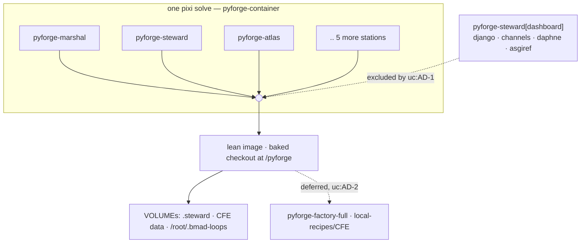

### Invariants & Rules

#### uc:AD-1 — The ASGI stack is an optional extra, never a station base dependency

**Binds:** every dependency the `secure-live-dashboards` pattern introduces.
**Prevents:** a "lean" image silently acquiring a web server and a WebSocket layer.
**Rule:** django, channels, daphne, asgiref and channels_redis ship as
**`pyforge-steward[dashboard]`** — an optional extra — and **never** as base dependencies of
`pyforge-steward`.

*The argument is correctness before size. Steward's CLI is `{keys, deploy, provision,
budget}`, and `deploy` is a git reconcile-and-push; nothing in that surface imports django or
daphne. The dashboard architecture's own uc:AD-1 puts the library **in the adopter's process**,
so the ASGI stack is a dependency of the library *as an adopter consumes it*, not of the
station. A base declaration would assert a runtime dependency the station never imports.
Size only confirms it: `daphne` alone pulls twisted, autobahn, pyopenssl, service_identity and
idna. Rejected: a base dependency in `pyforge-steward` — via composition-by-name that puts
Twisted in the lean whole-Guild image. Rejected: answering this with a tier split, which
resolves a dependency-placement question by changing the packaging instead.*

#### uc:AD-2 — One lean image stands; the second tier is deferred, with a trigger

**Binds:** the image count.
**Prevents:** a packaging split adopted for a reason that was never the real one.
**Rule:** **one** image. A second tier (`pyforge-factory-full`, carrying local-recipes/CFE)
is **deferred, not rejected**, and its revisit trigger is named: **when recipe builds need to
run inside the container.**

*Recorded honestly: the tiering proposal was never driven by the dashboard. Its real driver
is the conda build toolchain and mason's 373-file CFE surface — a separate question with its
own demand signal and no adopter asking today. Deciding it now would pull a third station
into a decision nothing forces. Rejected: splitting tiers pre-emptively.*

#### uc:AD-3 — The extra is installed in the dev env and never in the container

**Binds:** where `[dashboard]` is exercised.
**Prevents:** an optional path that rots because nothing runs it.
**Rule:** `pyforge-steward`'s in-repo dev environment installs the extra **by default**, so CI
covers it. The container **never** installs it.

*This is the `atlas → warden` precedent already in the tree — `gate = ["pyforge-warden"]`
under `[project.optional-dependencies]`, "installed by default in the in-repo `pyforge-atlas`
pixi env; external installs may omit it." Rejected: declaring the extra and installing it
nowhere, which produces an untested code path that fails first for an adopter.*

#### uc:AD-4 — Dashboard imports may not be unconditional at module level

**Binds:** `pyforge.steward.dashboard`.
**Prevents:** the extra being a fiction the packaging test correctly refuses.
**Rule:** the dashboard module's third-party imports live **behind a guard or inside the
function that needs them** — never unconditional at module top level.

*This is what makes uc:AD-1 legal rather than aspirational. The dashboard architecture's uc:AD-13
deliberately keeps the module inside the `pyforge-steward` distribution, so an unconditional
top-level `import django` would make `tests/packaging/test_dependency_completeness` demand
django in `[project.dependencies]` — **and it would be right to**. That test states the
remedy itself: move the import behind a guard or into the function, and declare it as an
extra. Rejected: relaxing the completeness test — it is the check that caught the missing
`bs4 → beautifulsoup4` mapping hours ago.*

#### uc:AD-5 — The checkout is baked; `/pyforge` stays a literal short root

**Binds:** the image layout and every in-container pixi invocation.
**Prevents:** the path-length panic the literal root was chosen to avoid.
**Rule:** the **baked** checkout is the primary mode; a bind-mount over `/pyforge` is the
**development override**. `/pyforge` remains **literal and short** — never a build `ARG` or
`ENV`.

*Ratifying shipped reality rather than choosing afresh: the Containerfile already bakes it
(`COPY . /pyforge`, then `COPY --from=builder`), and A3.6 recommended exactly this. The
invariant worth fixing is not baked-vs-mounted — it is the short root. A long root panics
`pixi-build-python` at the bmad-loop worktree path-length limit. Rejected: making the root
configurable, which reintroduces precisely the failure the literal prevents.*

#### uc:AD-6 — Mode I is deferred, and Mode L may not foreclose it

**Binds:** everything Mode L adds from here on.
**Prevents:** discovering at Mode I time that Mode L made it impossible.
**Rule:** Mode I is **not designed here**. Two things are ratified rather than re-decided:
`/root/.bmad-loops` is **already a declared `VOLUME`**, so an in-container loop runner gets
its worktrees on a volume rather than the image filesystem; and Mode L continues to run loops
against a **mounted host checkout**, exactly as today. **Forbidden, because each forecloses
Mode I:** baking any station state into an image layer instead of a volume, and any
assumption that the container is single-tenant or short-lived.

*Rejected: designing Mode I now — its own Spec puts that out of scope.*

### Consistency Conventions

| Concern | Convention |
|---|---|
| Adding a station dependency | it enters the whole-Guild image automatically — treat it as an image change, not a station change |
| New heavy dependency | ask uc:AD-1's question first: does the station's own CLI import it, or only a library an adopter consumes? |
| Build-time proof | `container-gates cli-smoke` runs all eight station CLIs' `--help` during `RUN`, so a missing or slow CLI fails the **build**, never a later `docker run` |
| Secrets | `container-gates secrets-scan` runs over the rootfs at build time; no credential may reach a layer |
| Mutable state | declared as a `VOLUME`, never baked (uc:AD-6) |

### Stack

SEED — verified against the shipped image at authoring; the code owns this.

| Element | Choice |
|---|---|
| Base | `ghcr.io/prefix-dev/pixi:0.76.1` builder → `ubuntu:24.04` runtime, `linux/amd64` |
| Env | one composed `pyforge-container`, eight station features by name, `no-default-feature` |
| Root | `/pyforge`, literal and short (uc:AD-5) |
| Volumes | `/pyforge/.steward`, `/pyforge/.claude/data/conda-forge-expert`, `/root/.bmad-loops` |
| Entry | `/entrypoint.sh`, `CMD ["marshal"]` — every invocation goes through the entrypoint |
| Dashboard deps | `pyforge-steward[dashboard]` extra; **absent from the image** (uc:AD-1) |

### Open Assumption

**Adopters host their own dashboards; Steward only scaffolds.** The dashboard spine's uc:AD-1 and
uc:CAP-6 both read scaffold-not-serve — `steward deploy` generates the ASGI runtime and edge, and
the adopter runs it. **If Steward is ever meant to *serve* dashboards itself** — one
Steward-run ASGI process hosting the Guild's boards — then the ASGI stack *is* a station
runtime dependency, **uc:AD-1 collapses**, and the lean image is simply heavier than advertised.
Written down so the reversal is cheap to spot rather than discovered late.

### Deferred

- **Mode I (with-infrastructure).** Out of scope by the Spec's own text. uc:AD-6 fixes only what
  Mode L may not do to it.
- **The `pyforge-factory-full` tier.** uc:AD-2's trigger: when recipe builds need to run inside
  the container. Pulls **mason** in when it fires.
- **arm64.** The image is `linux/amd64` today; multi-arch is a real question with no demand.
- **Whether `[dashboard]` is one extra or several.** If adopters diverge — some needing
  Channels, some only HTTP — the extra may want splitting. No adopters yet.

## Satellite: bmad-suite lifecycle

> **Folded into this spine 2026-09-08.** Was `architecture-bmad-suite-lifecycle-2026-09-06`, a run-folder
> named for a CHAIN rather than this project — the deviation `ad-citation-check` refuses.
> Its decisions keep their own numbering, qualified `suite:AD-n`, which is how every
> citation in the repo already spells them after the 2026-09-08 attribution pass
> (685 ambiguous citations read down to 30). **No citation changes meaning.**
> Renumbering into one sequence was rejected on measured evidence: four mechanical
> attribution methods scored 47%, 45%, 80%-with-bias and 100%-precision-at-8%-coverage,
> so a renumber could only put wrong-but-valid pointers into a graph with none.
>
> Original frontmatter — status: final, altitude: epic, updated: 2026-09-06.


### Design Paradigm

**Install-class adapters over vendor installers** (steward's hexagonal paradigm applied to the
suite): every member reaches the tree through exactly one adapter named by its install class
(`installer-tree`, `runner-home`, `own-installer`, `module`, `cli`, `plugin-path`, `scaffold-n/a`,
`vscode-extension`), and the adapter drives the member's own installer rather than copying files.
**Wield-by-routing**: a station never contains a suite skill; it routes to it from its persona
skill, one station per skill. **Relay, never absorb** across kin chains: the apply, the harness,
the pilot and the cutover keep their owners; this chain orders them and relays gaps by memlog.

### Inherited Invariants

| Inherited | From parent | Binds here |
| --- | --- | --- |
| suite:AD-1 Wrap, never reimplement `[ADOPTED]` | steward spine | each member's own installer stays the writer of its module tree |
| suite:AD-5 Provision wraps, never forks, Marshal-owned machinery | steward spine | the harness flip and loop-home re-render are marshal stories; steward re-renders only on request |
| suite:AD-7 / suite:AD-8 One `Duty` protocol; exit-code sole ownership | steward spine | `--no-shims` and the readiness report ride the existing upgrade duty, no new exit domain |
| fnd:AD-5 One skills tree; IDE dirs are adapters | cutover spine | estate-authored skills move to `skills/{stations,personas,domain}/` with generated adapters; installer-written `bmad-*` / `skf-*` dirs stay real directories (the carve-out) — nothing provisioned here may treat a suite module dir as estate-authored, or an estate skill's `.claude/skills/` copy as durable |
| fnd:AD-12 The BMAD chain moves whole | cutover spine | `_bmad/`, `_bmad-output/projects/`, `docs/dreams/` move as one; loop homes re-provisioned at the flip with no loop running |
| fnd:AD-20 The seed is Dreams plus memlogs `[ADOPTED]` | cutover spine | this spine's memlog is what moves; the rendered file is derived; the parent's `[ADOPTED]` tags are the parent's (suite:AD-1, suite:AD-17, suite:AD-19, suite:AD-20, suite:AD-23) — none is added here |

### Invariants & Rules

#### suite:AD-1 — One install path per class; steward is the only writer of suite skills `[ADOPTED]`

- **Binds:** suite:CAP-2, suite:CAP-5, suite:CAP-6
- **Prevents:** hand copies into `.claude/skills/`; `cleanup-legacy.py` wiping `_bmad/core/config.yaml`; `bmad-module-skill-forge uninstall` deleting every skill dir (its manifest walks the whole tree); two copies of one skill; two writers for one class (a raw `npx skills add` beside the conda member)
- **Rule:** module class → `steward provision --module <name>`; own-installer → the member's installer (`bmad-module-skill-forge install/update`); plugin-path → **one steward-wrapped, pinned writer** (`steward provision --plugin labs --skill <name>`, calling the conda member's share tree or `npx skills add` pinned to the recipe's commit — the register's provisioning-path cell equals that invocation); scaffold-n/a → never provisioned. A manual copy, or a second path for the same class, is a defect.

#### suite:AD-2 — Routing lives with the wielder, in one durable home

- **Binds:** suite:CAP-3
- **Prevents:** two stations reaching for one skill under different contracts; routing notes rotting in CLAUDE.md; per-skill lines in a managed block that is replaced on refresh
- **Rule:** exactly one wielding station per adopted skill. The routing note has exactly one durable home: the wielding persona skill (`bmad-agent-<station>/SKILL.md`, estate-authored, moving to `skills/personas/` under fnd:AD-5). AGENTS.md carries one pointer line ("skill routing: `adoption-register.md` § 2"), placed once through `bmad-project-context`, never per-skill lines. `adoption-register.md` § 2 is the index; a re-route edits the register row **and both** persona skills. A meta-test asserts every § 2 skill dir is named by exactly one persona skill and by CLAUDE.md never (Story 46.1 ships it; 46.1 verifies this rule, it does not decide it).

#### suite:AD-3 — The studio is a separate root, declared once

- **Binds:** suite:CAP-5
- **Prevents:** manticore's wipe-and-reinstall ritual touching this repo's `_bmad/` or `_bmad-output/`; the studio root living in three places (register cell, studio config, herald runtime); `mc-*` skills a repo session cannot load
- **Rule:** the studio root is `~/pyforge-studio/` by default (outside the repo — decided 2026-09-06, closing the Spec's open question 1), declared once, machine-readable and per-machine, by `PYFORGE_STUDIO_ROOT` (fallback: a gitignored `pyforge.local.toml` key); herald's CLI, pipeline-truth's manticore probe and the register all *cite* it (the register cell is a pointer). The studio owns its own `_bmad/` and `_bmad/custom/config.toml` (`[modules.manticore]` written by `mc-setup`); the stale in-repo `[modules.manticore]` block in the gitignored `_bmad/custom/config.user.toml` (present 2026-09-06) is retired by Story 46.6; `mc-*` are never provisioned into the repo tree; the persona note is a hand-off ("open a session in `<studio>`; run `mc-*` there"), never a route; render artifacts are gitignored.

#### suite:AD-4 — Advisory lenses never gate

- **Binds:** suite:CAP-4, suite:CAP-7, warden relays
- **Prevents:** a second PR verdict; eval trials or TEA scores joining `detectors-ci`; a lens key invented in bmad-loop's `[review]`; an in-place skill edit to add a lens; a circular knob dependency
- **Rule:** `tea-test-review`, `bmad-os-review-pr` / `findings-triage` and eval-quality outputs are findings beside Warden's gate or lenses inside the marshal review step; none is a member of `detectors` / `detectors-ci`; the gate's exit code is unchanged by them. A marshal review lens is a `bmad-review` customize override under `_bmad/custom/`, never a harness-policy key or an in-place skill edit. Steward 46.3 ships the `tea-test-review` task taking `--min-score` as an argument (default 80); marshal 31.3 supplies the value from `review.min_score`. Warden's advisory rides as a non-`Finding` advisory note (no schema bump to the frozen five families) unless a later story versions an `advisory:<tool>:<subject>` family.

#### suite:AD-5 — Retire behind equivalence; the retiring test's predicate is the oracle

- **Binds:** suite:CAP-4, suite:CAP-10
- **Prevents:** deleting a repo mechanism (the TEA generator, its meta-tests, a shim caller) before its replacement is proven; the oracle being defined in one story and deleted by the next; a caller deletion judged against the tracked template instead of the rendered artifacts
- **Rule:** a repo-owned generator, test or caller is deleted only in the same story that records an equivalence check, and the deletion follows a passing check; a failed check narrows the capability, never forces the delete. The retiring test's predicate (story-id coverage, test-inventory rows, the no-placeholder invariant — the generator hard-fails on a literal placeholder token) is the oracle: it is re-pointed at TEA's output and kept, deleted only by a later memlog decision that retires the predicate itself. Each station's `test-architecture.md` has one writer (marshal 31.1) and one path pinned in that station's `.bmad-config.toml`; TEA's `test_artifacts` answer is authored by the provisioning story (suite:AD-9). A caller deletion's equivalence check names the *producer's* rendered artifacts (the eight rendered loop-home policies), not the tracked template.

#### suite:AD-6 — The register is the wiring ledger; agreement is a declared per-class function

- **Binds:** suite:CAP-1
- **Prevents:** wiring by side effect (a provision run nobody recorded); pipeline-truth drifting from intent; a `wired` column that can never agree (labs unobservable, manticore outside the repo, bmb with zero skills on disk); a status cell that becomes a second ledger
- **Rule:** a member's verdict / wielder / path change lands as a register row first. Agreement is declared, not implied: each `SUITE_PACKAGES` row carries the expected probe value for verdict `wield` in its class (`wire_policy`), and each class probe observes the provisioning path the register names — labs: the named skill dirs and no other labs dir; manticore: the suite:AD-3 declaration and its `mc-*` census in the studio; bmb: the five skill dirs; module class: the suite:AD-9 roster. The register's `Wired` column is derived from `pipeline-truth --json`, never typed; its status cell holds pointer keys (story ids), never state words. Owner: steward 46.9 (widened to the wired predicate).

#### suite:AD-7 — One cadence; mechanisms stay with their chains; a relay is a memlog line plus a re-render

- **Binds:** suite:CAP-8, suite:CAP-9, suite:CAP-10
- **Prevents:** duplicate stories across kin chains; a second owner for the apply; a "relayed" capability whose rendered SPEC still says the opposite; a mechanism story filed under the wrong chain
- **Rule:** `release-cadence.md` orders detect → catalog → pre-flight → apply → prove-landed → era round → suite refresh → flips → record. core-upgrade owns the apply, `--no-shims` (14.9) and the `@next` rehearsal (14.10); era-alignment owns the harness, the guard and the rulebooks (30.x); eval-quality owns the pilot (45.2); the cutover Spec owns Epic 44. This chain relays by memlog and never mints a story a kin chain already owns. A relay is complete only when the owner's memlog carries the dated `(capability)` line **and** the owner's SPEC is re-rendered in the same commit; `adoption-register.md` § 3 cites the memlog entries by date and type, not "retired by memlog".

#### suite:AD-8 — Readiness is a gate with owners; the foundry stack carries the bmad floor; the register is the replay list

- **Binds:** suite:CAP-9
- **Prevents:** opening the foundry with a red BMAD line; a lean foundry `pixi.toml` with no BMAD toolchain; installer-written skill dirs that nothing re-creates in foundry
- **Rule:** every `cutover-readiness.md` P line names an owner and a story; Story 44.3 is not flipped while any P line is red. The cutover spine's Stack gains a `bmad-*` floor row (method ≥6.12.0, loop ≥0.11.1, skf ≥2.1.0 linux-64 only, CIS, TEA, eval-quality, utility-skills, BMB), rendered by steward 47.4; win-64 excludes skf and eval-quality. P18: every register row with verdict `wield` is re-provisioned in foundry by its class adapter from the register's provisioning-path cell — the replay list; tracked copies are never moved.

#### suite:AD-9 — One module roster, one config-pin path

- **Binds:** suite:CAP-2, suite:CAP-6, suite:CAP-9
- **Prevents:** two rosters of "installed modules" (provision writing `_bmad/config.yaml`, which 6.12 does not ship and `render_skill.py` never reads, while 14.9 / suite:CAP-7 / suite:CAP-8 read `_bmad/_config/manifest.yaml`); a provisioned module whose config keys have no writer (TEA's `test_artifacts` key, 84 references, HALTs at render); the suite:CAP-8 scan blind to conda-installed modules
- **Rule:** installer-tree and custom modules are rostered by `_bmad/_config/manifest.yaml` (bmad-method's). Every steward-provisioned module (module class, plugin-path skills) is rostered in exactly one machine-readable place that `--list-modules`, pipeline-truth's module census, the apply's post-core re-provision step and the suite:CAP-8 scan all read: `_bmad/custom/config.toml [modules.<code>]` — the pin layer that survives applies — carrying the module's `module.yaml` answers at the installer's own key paths plus `provisioned_by`, `installer`, `skills`. The provisioning story answers the module's variables in the same PR (46.3 authors TEA's `test_artifacts`); `render_skill.py` renders one of the module's skills on the first try as that story's acceptance. `_bmad/config.yaml` is retired as a roster (46.2 moves provision's writer). The suite:CAP-8 scan compares conda-module skills against `share/<pkg>/{skills,agents,workflows}`.

#### suite:AD-10 — Cross-station prerequisites are checks, not `Deps:` tokens

- **Binds:** suite:CAP-9, suite:CAP-10, every station relay
- **Prevents:** a `Deps:` token read three ways (fleet drain skips it fail-open; station dispatch strips the prefix to a local key — `marshal:S-30.2` aliasing steward's *done* 30.2; doctor parses it as cross-station); a relayed story dispatched before its producer landed
- **Rule:** a `Deps:` field never carries a foreign station key; the producer is named in trailing prose ("after steward 46.3"). A cross-station prerequisite is (a) a ledger `blocked` row the operator flips when the producer lands (AGENTS.md's standing rule) **and** (b) a machine check inside the consuming story's own acceptance against the producer's live artifact, run before the irreversible act — 14.9's refusal while the harness still emits `bmad-dev-auto` is the template; 31.1 / 11.2 refuse when the suite:AD-9 roster lacks `tea`; 44.5 refuses while `cutover-readiness.md` P11 / P12 are red.

#### suite:AD-11 — Surface ownership follows the writer class

- **Binds:** suite:CAP-2, suite:CAP-9, suite:CAP-10
- **Prevents:** `.claude/skills/**` owned by four epics at once and `_bmad/**` by none of the ones that write it (14.9 firing MRS-GATE-007); hand edits to AGENTS.md through an epic row
- **Rule:** `.claude/skills/<installer-written>/**` and `_bmad/**` are steward provision/upgrade surfaces (Epics 14, 46); `.claude/skills/bmad-agent-<x>/**` belongs to station `<x>`; the `bmad:context` block is `bmad-project-context`'s and the SKF block `skf-export`'s — the routing stories reach AGENTS.md only through the skill; Epic 44 lists these paths only for the move story and only after 46/47 close. Every story that writes a path ships its `[epic_surfaces]` row in the same PR.

#### suite:AD-12 — skf's root is declared once

- **Binds:** suite:CAP-2, suite:CAP-9
- **Prevents:** skf's root declared in three files (`_bmad/custom/config.toml`, `_bmad/config.toml`, `_bmad/skf/config.yaml`) with suite:CAP-7 restoring the yaml from git while the custom pin is the declared source
- **Rule:** the `_bmad/custom/config.toml [modules.skf]` pin is the single declaration; `_bmad/skf/config.yaml` is derived from it (suite:CAP-7's restore becomes a re-render from the pin, not a checkout); Story 47.2 records the exact key and proves `skf-export` accepts the foundry root; flipping the root is a 44.5 act.

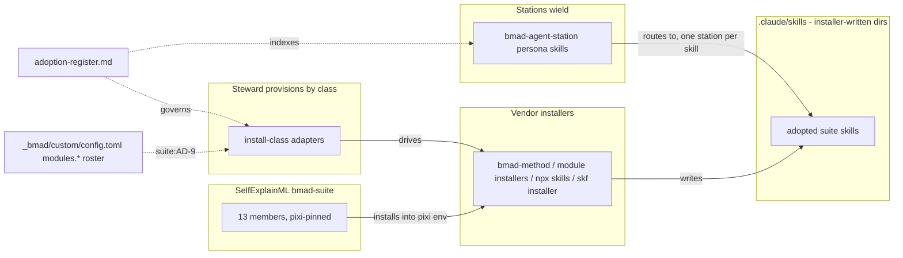

Dependency direction: stations depend on skills; skills exist only because an adapter drove a
vendor installer; the register and the suite:AD-9 roster govern both ends. Nothing points the other way.

### Consistency Conventions

| Concern | Convention |
| --- | --- |
| Naming | member ids = `suite-members.yaml` names; skill dirs exactly as the vendor ships them (`bmad-os-*`, `bmad-testarch-*`, BMB's five: `bmad-bmb-setup`, `bmad-agent-builder`, `bmad-workflow-builder`, `bmad-module-builder`, `bmad-eval-runner`; `mc-*`, `skf-*`); routing notes cite the skill dir name. The eight station personas are exactly `bmad-agent-{atlas,doctor,herald,marshal,mason,scribe,steward,warden}`; BMB's `bmad-agent-builder` is a vendor skill and never a persona (suite:AD-2 routes live only in the eight). Install-class names follow `suite.py` (`scaffold-n/a`, not `scaffold`) |
| Register data | one row per member; columns verdict / wielder / provisioning path / hazards / status; the status cell holds pointer keys (story ids) or `—`, never state words; the `Wired` column is derived from `pipeline-truth --json` (suite:AD-6) |
| Rosters & pins | `_bmad/_config/manifest.yaml` = bmad-method's modules; `_bmad/custom/config.toml [modules.<code>]` = steward's provisioned modules and pins (suite:AD-9, suite:AD-12); `_bmad/config.yaml` and derived yamls are never a source |
| Dependencies | `Deps:` carries only same-station `S-<epic>.<n>` tokens; cross-station order = prose + a `blocked` ledger row + an in-story check (suite:AD-10); the drain order lives in `fleet-drain-queue.yaml` |
| Surfaces | every story that writes a path ships its `[epic_surfaces]` row in the same PR (suite:AD-11) |
| State & cross-cutting | every chain amendment is a memlog line on the owning Spec **and** a re-render of that SPEC in the same commit (suite:AD-7); ledgers change only via `sprint_plan.py generate` + scoped `sprint-ledger-sync` (join any wrapped `key: value` pair before sync until marshal 31.4 lands); physical paths with `BMAD_ACTIVE_PROJECT`; advisory findings use `warn` at most |
| Retirement | a deletion story records the equivalence check it passed (suite:AD-5) and glosses history rather than rewriting it |

### Stack

Versions as read from `steward suite pipeline-truth` on 2026-09-06 (recipe = channel = installed for 13/13). GitHub is the registry of record for eight of the thirteen (npm absent or lagging); npm is authoritative only for bmad-method, TEA, CIS, skf and eval-quality's `latest`.

| Name | Version |
| --- | --- |
| bmad-method (installer-tree) | 6.12.0 |
| bmad-loop (runner-home) | 0.11.1 |
| bmad-module-skill-forge (own-installer) | 2.1.0 on the channel and in `.claude/skills/` (tag `v2.1.0` == npm tarball, verified 2026-09-06); the registered custom module `_bmad/skf` reads `main` @ channel `next` (author fork) until Story 46.7 pins `v2.1.0` |
| bmad-creative-intelligence-suite (module) | 0.3.2 |
| bmad-method-test-architecture-enterprise (module) | 1.24.0 |
| bmad-builder (module) | 2.2.2 |
| bmad-utility-skills (module) | 2.0.0 @HEAD |
| bmad-manticore (module, `--custom-source`) | 3.1.0.dev0 @c9bcf759 |
| bmad-labs-skills (plugin-path) | 1.0.0.dev0 @HEAD (the conda member; 46.5's wrapped writer pins that commit) |
| bmad-eval-quality (cli) | 0.2.0.dev0 @3172162f |
| bmad-module-template (scaffold-n/a) | 0.1.0 |
| bmad-dashboard / mybmad-dashboard (vscode-extension) | 1.2.2.dev0 / 0.1.0.dev0 |
| nodejs (pixi env) | 24.19 installed; pixi floor `>=24.19,<27,!=25.*` |

### Structural Seed

```text
<repo>/
  .claude/skills/                      # installer-written suite dirs (bmad-os-*, bmad-testarch-*, BMB's five, skf-*, bmad-cis-*) stay real dirs after cutover (fnd:AD-5 carve-out); estate-authored skills become generated adapters
  _bmad/                               # installer-owned core; custom/config.toml = the pin layer AND the provisioned-module roster (suite:AD-9, suite:AD-12); skf/ (own installer; config.yaml derived)
  _bmad-output/projects/pyforge-steward/planning-artifacts/
    specs/spec-bmad-suite-lifecycle/   # SPEC + adoption-register + release-cadence + cutover-readiness + open-items-register
    prds/prd-bmad-suite-lifecycle-2026-09-06/
    architecture/architecture-bmad-suite-lifecycle-2026-09-06/
  evals/review-catches-planted-defect/ # the eval-quality pilot (45.2 — planned, not yet on disk)
$PYFORGE_STUDIO_ROOT (default ~/pyforge-studio/)   # Herald's manticore root, OUTSIDE the repo (suite:AD-3)
  _bmad/custom/config.toml             # [modules.manticore]
  <video>/                             # one folder per video; .mp4 never in git
```

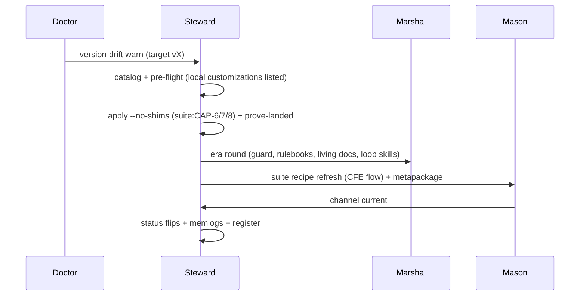

### Capability → Architecture Map

| Capability / Area | Lives in | Governed by |
| --- | --- | --- |
| suite:CAP-1 adoption register | `specs/spec-bmad-suite-lifecycle/adoption-register.md` | suite:AD-6, suite:AD-2 (the § 2 meta-test) |
| suite:CAP-2 module wave | `steward provision` (`provision.py` backends); `_bmad/custom/config.toml [modules.*]` | suite:AD-1, suite:AD-9, suite:AD-11, steward suite:AD-1 |
| suite:CAP-3 station routing | `bmad-agent-<station>` skills; one AGENTS pointer line | suite:AD-2, suite:AD-11 |
| suite:CAP-4 TEA full adoption | TEA workflows; `bmad-review` customize override; warden advisory note | suite:AD-4, suite:AD-5, suite:AD-9 |
| suite:CAP-5 manticore studio | `$PYFORGE_STUDIO_ROOT` (separate root) | suite:AD-3, suite:AD-1 |
| suite:CAP-6 labs by consent | `steward provision --plugin labs --skill <name>` per row | suite:AD-1, suite:AD-6, suite:AD-9 |
| suite:CAP-7 eval-quality pilot | `evals/…` + three pixi tasks | suite:AD-4 |
| suite:CAP-8 release cadence | `release-cadence.md`; core-upgrade 14.10 (rehearsal) | suite:AD-7 |
| suite:CAP-9 cutover readiness | `cutover-readiness.md` (P1–P18); relays to 44.x, 31.x, 20.x | suite:AD-8, suite:AD-7, suite:AD-10, suite:AD-11, suite:AD-12, fnd:AD-5/12/20 |
| suite:CAP-10 shim retirement | marshal 30.5, steward 14.9 | suite:AD-5, suite:AD-7, suite:AD-10, suite:AD-11, steward suite:AD-5 |

### Deferred

- A `--studio <dir>` flag on `steward provision --module manticore` — only if the native
  `--custom-source` path proves clumsy (46.6).
- The per-station mapping of TEA's nine workflows and the calibrated `--min-score` value (marshal 31.1, 31.3).
- The render-HALT and `frozen-path-changed` detector designs (doctor 20.2, 20.3).
- The eval trial cost ledger (45.2).
- A versioned `advisory:<tool>:<subject>` finding family in warden (only if the non-`Finding` note proves insufficient, 11.1).
- Loop-home readiness contents (marshal 31.5) and the `PROJECTS.md` cutover layout wording (47.3).

## Satellite: jira-github-projects-sync

> **Folded into this spine 2026-09-08.** Was `architecture-jira-github-projects-sync-2026-08-09`, a run-folder
> named for a CHAIN rather than this project — the deviation `ad-citation-check` refuses.
> Its decisions keep their own numbering, qualified `jira:AD-n`, which is how every
> citation in the repo already spells them after the 2026-09-08 attribution pass
> (685 ambiguous citations read down to 30). **No citation changes meaning.**
> Renumbering into one sequence was rejected on measured evidence: four mechanical
> attribution methods scored 47%, 45%, 80%-with-bias and 100%-precision-at-8%-coverage,
> so a renumber could only put wrong-but-valid pointers into a graph with none.
>
> Original frontmatter — status: final, altitude: epic, updated: 2026-08-10.


### Design Paradigm

**Event-triggered reconciliation, not event propagation.**

A webhook says only *"this item may have changed"*. The engine does not trust the payload as
the change: it reads the affected item's current state on both boards, compares each side
against the baseline it was last synced to (jira:AD-5, jira:AD-10), and converges. The payload is a **wake-up, not a source of truth**.

That distinction is what keeps idempotence (jira:CAP-3) a property of the paradigm rather than
something defended per-payload. A propagation pipeline must remember which deliveries it has
seen to stay idempotent; a reconciler re-reads and converges, so a redelivered or
out-of-order webhook is harmless by construction. This matters more under webhooks than it
did under a schedule, because webhook delivery is at-least-once and unordered (jira:AD-9).

It is also what makes jira:AD-2 possible: dedupe state would have to live somewhere, and there is
nowhere to put it.

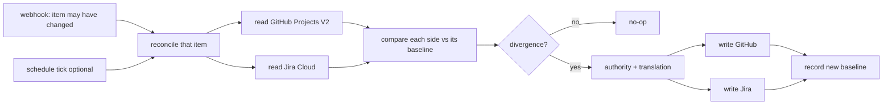

### Invariants & Rules

#### jira:AD-1 — Trigger is decoupled from transport; the default is `schedule`, webhook is opt-in

**Binds:** every entry point in both modes.
**Prevents:** the mode choice silently dragging a cadence choice with it, which is what made
the intake doc's Mode A/Mode B labels unusable (Mode A = real-time *and* zero-infra; Mode B =
batch *and* PostgreSQL — so "batch at zero infra" was expressible in neither). **And** it now
prevents the default forcing every adopter to stand up an external webhook receiver.
**Rule:** a mode selects a **transport** (how state is stored and moved). A separate,
independent setting selects a **trigger** (`webhook` | `schedule` | `manual`). The default
configuration is transport=serverless, trigger=**`schedule`** — zero infrastructure, batch
cadence. `trigger=webhook` is fully supported as an **opt-in** for adopters who will run a
receiver. No code may assume a trigger from its transport.

*Amended twice, and the second amendment is the load-bearing one.* **(1)** The default was
briefly `schedule`, then reversed to `webhook` on explicit operator instruction because
near-real-time was wanted. **(2)** Reversed back to `schedule` on 2026-08-09 after steward
story 8-1's dev session raised an `intent_gap` and **verification against GitHub's own docs
proved the webhook default was not merely expensive but impossible as specified**: there is
no `project_v2_item` / `projects_v2_item` event usable in a workflow's `on:` block. The
`projects_v2_item` webhook exists, but reaches a workflow only via an **external receiver**
(a GitHub App with org-level Projects read access, or a webhook endpoint) that then calls
`repository_dispatch`. So `webhook`-by-default would have silently mandated hosting,
credentials and cost for every adopter — the opposite of the zero-infrastructure floor the
operator asked for. The near-real-time capability is **not** discarded; it is opt-in.

*The decoupling is what made this a one-value change rather than a redesign — which is the
whole reason jira:AD-1 fixed it in the first place. Rejected: keeping `webhook` as the default and
mandating a receiver. Rejected: deleting the webhook path, which would throw away the
near-real-time capability the operator explicitly asked for.*

*Rejected: adopting Mode B as the default to obtain batch cadence — it buys cadence with a
PostgreSQL instance the operator explicitly excluded. Also rejected: collapsing the
trigger/transport axes now that the default is plain Mode A — the axes are what make Mode B's
scheduled operation expressible at all.*

#### jira:AD-2 — The default transport stores its control state in the synced systems

**Binds:** the serverless transport; every read/write of link, mapping, or baseline.
**Prevents:** a "no database" mode quietly acquiring one (a state file in the repo, an
Actions cache, a gist) and becoming un-migratable.
**Rule:** under transport=serverless the entity link, the baseline (jira:AD-10), and the field
mapping live **in GitHub Projects V2 custom fields and Jira fields on the items themselves**.
No sidecar store of any kind. If a requirement cannot be met without one, that requirement
belongs to Mode B, not to a new store here.

#### jira:AD-3 — One control-plane contract, two materializations

**Binds:** both transports; anything reading or writing link, field mapping, or value
translation.
**Prevents:** the two modes diverging into two products with incompatible state, so that a
board synced under the default cannot be migrated to Mode B without re-linking every item.
**Rule:** both transports implement the **same logical control plane** — `entity_mapping`,
`field_mapping`, `value_translation`. Serverless materializes it as fields on the items;
Mode B materializes it as the three control-plane tables. Engine code addresses the logical
contract; only the adapter knows which materialization it is talking to.

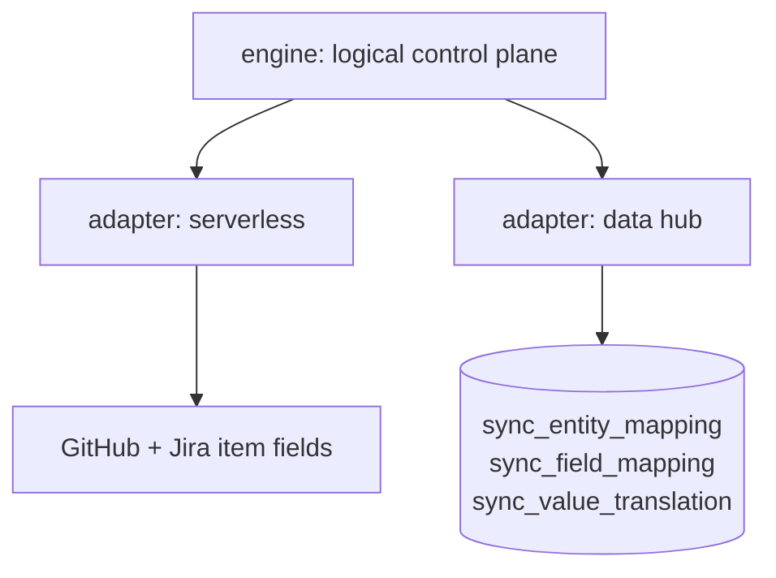

#### jira:AD-4 — GitHub Projects V2 is authoritative on conflict, per-field overridable

**Binds:** conflict resolution when both sides diverged from the baseline.
**Prevents:** two builders each picking a different tiebreak, and a non-deterministic
"whoever wrote last" outcome that cannot be reproduced in a test.
**Rule:** when both sides diverge from the baseline (jira:AD-5), **GitHub wins** unless that field
carries an explicit override in `field_mapping`. The resolution must be a pure function of
(github_value, jira_value, field_mapping) — never of wall-clock comparison between vendors.
*Rejected: last-writer-wins by timestamp. It makes correctness depend on comparing clocks
across two vendors' APIs, which neither guarantees; Jira Automation and GitHub webhook
timestamps are not commensurable. Determinism beats usually-right. GitHub is the default
authority because it is where the work happens and where this repo's build line already reads.*

#### jira:AD-5 — The zero-loop guard compares values against a baseline; it is not the conflict rule

**Binds:** jira:CAP-2, jira:CAP-3, both transports, every trigger.
**Prevents:** conflating "did the engine cause this change?" (loop guard) with "which side
wins?" (authority) — two different questions that a single mechanism will answer badly. Also
prevents the guard becoming trigger-specific, which would break the moment a deployment moves
to `schedule` or to Mode B. **And now prevents the self-interference class below**: a detector
whose own bookkeeping write is indistinguishable from the change it is watching for.

**Rule:** a side has changed when its **current value differs from the baseline value** that
side was last synced to (jira:AD-10). Never by timestamp. Neither side changed → no-op. Exactly one
changed → propagate it. Both changed → a genuine conflict, handed to jira:AD-4.

Timestamps survive in exactly one role: under trigger=`schedule`, item `updated_at` **selects
candidates** to reconcile so a large board need not read every baseline. It never decides
whether a change is real. The filter must be deliberately **over-inclusive** — a false positive
costs one wasted read and converges to a no-op; a false negative silently drops a change.

Two cheap fast-path short-circuits MAY skip a candidate, and **neither may ever be
load-bearing**: the bot-identity check (`github-actions[bot]` or the dedicated sync bot) under
trigger=`webhook`, and a per-field change signal where a vendor exposes one. Both are
optimizations over the value comparison, never substitutes for it.

*Amended 2026-08-10 — third amendment, id stable. The previous time-based rule was
**structurally unimplementable under jira:AD-2**, established by trace across three review passes of
story 8-1, not by review opinion: the sync point is stored as a field on the item, so writing it
advances the same item's aggregate `updated_at` past the value just recorded. Every reconcile
after the first read `updated_at > sync_point`, misrouted into the "both sides changed" branch,
and let jira:AD-4's GitHub-wins default clobber genuine Jira-only edits. A 30-second forward
tolerance was tried and does not hold — both values are static server-recorded timestamps that
do not advance with wall-clock, so the offset is permanent rather than a window, and no grace
value fixes it. Stated generally, so it is not re-invented elsewhere: **a change detector must
not store its marker inside the object it observes.***

*Of the three resolutions story 8-1 named, this is the value-comparison one. It was chosen over
a per-field change signal because the two are not peers — a per-field signal makes the change
**signal** more precise, while this changes what the signal **is**, and subsumes the failure the
other would work around; it also keeps the correctness path free of an unverified vendor claim
(per-field timestamps are genuinely asymmetric across the two APIs, whereas values are returned
by both). The third — accepting a bounded data-loss window with operator telemetry — was
rejected on two independent grounds: it contradicts the Spec's own Constraints, which make jira:CAP-2
and jira:CAP-3 non-negotiable and require the operator to **prove** zero-loop on demand; and its
premise is false, because the misclassification is permanent rather than windowed, so there is
no bounded window to document.*

*A property worth naming: this is a three-way merge against a shared base, which makes it the
first mechanism in this design that can genuinely **detect** a simultaneous conflicting edit —
the precondition jira:AD-4 was always written against but no earlier mechanism could supply. It also
makes jira:CAP-2's success criterion demonstrable by construction rather than by timing: after one
propagation both sides equal the baseline, so every subsequent reconcile is a no-op regardless
of when it runs.*

#### jira:AD-6 — Unmapped values fail loud; unlinked items fail alone

**Binds:** jira:CAP-4 and jira:CAP-5.
**Prevents:** a phantom state written by a pass-through, and one broken item aborting a batch.
**Rule:** every status value crossing the boundary passes through `value_translation`; an
unmapped value is a hard, named, logged failure and is **never** passed through. An item
missing its link emits a named greppable error and is skipped — the run continues for every
other item and exits non-zero at the end.

#### jira:AD-7 — Mode B ships the normalized schema with its control plane

**Binds:** transport=data-hub only.
**Prevents:** Mode B shipping a shape that cannot express the capabilities it exists to buy.
**Rule:** Mode B uses the normalized EAV schema plus `sync_entity_mapping`,
`sync_field_mapping`, `sync_value_translation`. The control plane is **not optional** — it is
what makes the join tractable and what carries per-field direction and value translation.
*Rejected: the flat single-table shape. Its only advantage is a simpler diff view, and that
advantage now belongs to the default transport. A flat table cannot express per-field sync
direction or value translation — the very capabilities that justify paying for Mode B's
infrastructure. Needing only the flat view is a signal to stay on the default.*

#### jira:AD-8 — Credentials never leave secrets storage, and never widen

**Binds:** both transports, every API call.
**Prevents:** a token in a log line or a repo, and scope creep from "least privilege" to
"whatever worked".
**Rule:** GitHub fine-grained PAT and Jira API token are least-privilege, read from secrets
storage at run time, and never written to logs, artifacts, or the control plane. This
inherits Steward's existing `keys` surface rather than introducing a new credential path.

#### jira:AD-9 — Webhook delivery is at-least-once and unordered

**Binds:** trigger=`webhook` (the default), every entry point that accepts a delivery.
**Prevents:** three stories each inventing a different defence against redelivery, reordering
and loss — the exact divergence an AD exists to stop. This is the cost the reversal to
real-time reintroduces, recorded as an invariant rather than left to per-story defensive code.
**Rule:**
1. **Redelivery is a no-op.** A payload delivered twice must leave both systems identical to
   one delivery. The reconciler supplies this by construction (Paradigm) — no dedupe store,
   which jira:AD-2 would forbid anyway.
2. **Out-of-order arrival must not regress state.** The payload is never the source of truth;
   the engine re-reads current state and compares each side to its baseline, so a late
   delivery about a superseded value converges to the current one rather than overwriting it.
   Under jira:AD-5 this holds independently of arrival order, because nothing branches on a
   timestamp at all.
3. **A dropped delivery must be recoverable without manual repair.** Because reconciliation
   is item-scoped and stateless, a `schedule` or `manual` trigger over the same code path is
   the recovery mechanism — jira:AD-1's decoupling is what makes that available rather than a
   second implementation.

*Rejected: trusting the webhook payload's field values directly (the intake doc's Flow A1/A2
sketch). It is fewer API calls per event, but it makes correctness depend on delivery order,
and it converts jira:CAP-3 from a property of the design into per-payload dedupe state that has
nowhere to live under jira:AD-2.*

#### jira:AD-10 — The baseline's storage contract and lifecycle

**Binds:** jira:CAP-2 and jira:CAP-3 via jira:AD-5; both materializations of jira:AD-3.
**Prevents:** five stories each inventing a different baseline shape, and — the specific trap —
each answering "what does it mean when the baseline has no entry for this field?" differently.
**Rule:** the baseline is a **per-field map of last-synced values, per side**, and it
materializes through jira:AD-3's existing split rather than adding a store: serverless writes one
bookkeeping field per side holding the map (jira:AD-2 untouched — this is the same materialization
jira:AD-2 already mandates); Mode B carries it as a column on `sync_entity_mapping`. Three lifecycle
rules are fixed here:

1. **Absent baseline is a first link, not a loop candidate.** A newly linked item has never
   converged; it is reconciled, and if both sides already hold differing values jira:AD-4 decides.
2. **A missing key and a null value mean opposite things.** "Field cleared on this side" is
   recorded as an explicit null sentinel; "field never synced" is the key's absence. Collapsing
   them makes a deliberate clear indistinguishable from a field the engine has not yet seen.
3. **Exceeding the vendor's field-size ceiling is jira:AD-2's documented escape hatch to Mode B** —
   never a licence to invent a sidecar store. Re-verify the ceiling against the live API at
   implementation time rather than assuming a limit.

A timestamp MAY be recorded alongside the map for operator telemetry ("last converged at"). It
is **informational and explicitly not load-bearing**; nothing may branch on it.

### Consistency Conventions

| Concern | Convention |
|---|---|
| Trigger config | `trigger: webhook \| schedule \| manual`, independent of transport; default `schedule` (jira:AD-1) |
| Transport config | `transport: serverless \| data-hub`; default `serverless` |
| Control-plane access | through the logical contract only; never a direct table or field read from engine code (jira:AD-3) |
| Error naming | one greppable identifier per failure class; unmapped value and unlinked item are distinct classes |
| Exit code | any per-item failure ⇒ non-zero exit after the batch completes, never mid-batch abort |
| Time | no correctness decision may branch on a timestamp (jira:AD-5); `updated_at` selects candidates under `schedule` and nothing else, and vendor timestamps are never compared to each other |
| Webhook payload | a wake-up, never a value source — always re-read the item (jira:AD-9) |

### Stack

SEED — verified at authoring; the code owns this once it exists.

| Element | Choice |
|---|---|
| Default transport runtime | GitHub Actions on **`on: schedule`** + Jira Automations — zero infrastructure |
| Opt-in near-real-time (GitHub→Jira) | **external receiver** (GitHub App with org-level Projects read access, or a webhook endpoint) consuming the `projects_v2_item` webhook and calling **`repository_dispatch`** to reach the workflow. **There is no `project_v2_item` `on:` trigger** — verified against GitHub's docs 2026-08-09 |
| Opt-in near-real-time (Jira→GitHub) | Jira Automation → `repository_dispatch` (already the correct bridge; unchanged) |
| Mode B ingestion | `dlt` |
| Mode B store | PostgreSQL |
| Credential source | Steward `keys` surface |

### Capability → Architecture Map

| Capability | Where it lives | Governed by |
|---|---|---|
| jira:CAP-1 bidirectional propagation | reconcile loop | jira:AD-1, jira:AD-3, jira:AD-9 |
| jira:CAP-2 zero-loop | value comparison vs baseline | jira:AD-5, jira:AD-10 |
| jira:CAP-3 idempotent processing | the paradigm itself | Paradigm, jira:AD-2, jira:AD-9, jira:AD-5 |
| jira:CAP-4 fail loud, fail alone | per-item error path | jira:AD-6 |
| jira:CAP-5 vocabulary translation | `value_translation` | jira:AD-6, jira:AD-3 |

### Deferred

- **Mode B's operational envelope** — where PostgreSQL runs, backup, retention. Not decided
  because Mode B is opt-in and nobody has opted in; deciding hosting for a mode with no user
  is speculative. Revisit when a first Mode B adopter exists.
- **Schedule cadence** — the concrete interval. A per-deployment tuning value, not an
  invariant; the paradigm is correct at any cadence.
- **Which fields sync beyond status, assignee, and the identity link** — jira:CAP-1 names three;
  extending the set is a `field_mapping` change, not an architecture change.
- **Jira-side trigger parity** — whether Jira Automations push or the schedule pulls both
  sides. Both satisfy jira:AD-1; the choice is an implementation trade the first story can make.

### Known vendor defect (binding on both modes)

GitHub's `updateProjectV2ItemFieldValue` updates the underlying data store but **can fail to
update the board view's grouping index**: a card moves logically while appearing stuck in its
old column until a human drags it. Data is correct; display may lag. Implementers must budget
for this as an accepted UX quirk, must not treat the stale view as a failed write, and should
**re-verify against GitHub's issue tracker at implementation time** rather than assuming it
still reproduces.

## Currency reconciliation — 2026-08-26

Cascade pass after the brief and PRD re-dated (research→brief and spec→prd edges); this
spine re-checked against the as-built package (`src/shared/packages/pyforge-steward/`),
the Canopy host (`src/platform/`), and the strategy chain's own spine. Deltas:

- **Two Deferred items are closed by landed code.** The `age` version range is pinned —
  `age = ">=1.3.1,<1.4"` in the package `pixi.toml` `[package.run-dependencies]`, a range
  pin per Warden's NFR-C1 precedent, with the in-file note that the upstream binary
  reports `(devel)` so the conda package version is the pinnable surface. The `Duty`
  protocol's exact signature landed in `interfaces.py` (`name: str`,
  `run(ns) -> DutyResult`; a duty never calls `sys.exit`) exactly as AD-7/AD-8 bound.
- **AD-7/AD-8 scaled far past the four duties they were written for and held.** The
  as-built module roster is now ~12 duty adapters (`keys`, `deploy`, `provision`,
  `budget`, plus `sync`, `workspace`, `upgrade`, `suite`/`suite_advance`, `bootstrap`,
  `deploy_profiles`, `five_tier`, `fresh_clone`, and the `dashboard/` package) — every
  one dispatches through the same protocol with `cli.main()` still the sole exit-code
  owner. The v1 "revisit if the duty count grows materially" trigger has now genuinely
  fired for the lazy-loading question; no problem observed yet, so it stays Deferred on
  evidence, not oversight.
- **The plugin seam the Deferred list anticipated arrived via jira:CAP-18, not entry-points.**
  Story 32.2 registered Steward's deploy-profile adapters as plugins on the shared
  `pyforge-core` hook-spec/registration contract (`spec-pyforge-unifying-strategy`
  jira:CAP-18) — the cross-station shape, chosen over a Steward-private entry-point scheme.
- **AD-4 amended in place this pass** (see above): `dashboard-gen` retired by Story 30.2;
  the reconciliation invariant survives the retirement of the wrapped external.
- **The "own architecture pass" this spine demanded for OpenShift/air-gap happened.**
  The Deferred entry for `presenton-pixi-image`/air-gap deploy said any future epic needs
  its own spine rather than an AD-4 extension — that is exactly what occurred:
  `_bmad-output/projects/pyforge-steward/planning-artifacts/architecture/architecture-pyforge-steward-2026-07-25/ARCHITECTURE-SPINE.md` (with
  `architecture-unified-container-2026-08-09` and siblings) governs the Canopy, the Helm
  chart + OCP overlay (Epic 12, `/ht/` 200 on CRC 2026-08-25), and the platform image.
  **This spine remains authoritative for the CLI package only** (scope line unchanged:
  FR-1..18); it is not the decomposition surface for Epics 9–38.
- **One retro-fed gap worth carrying forward** (from `retro-steward-2026-08-08.md`): the
  scaffold standardized exit codes (AD-8) but not error *rendering*, and the
  `--json`-error-path bug recurred twice before being patched per-module. If a further
  duty module is added, establish the shared `render_error(ns, message)` helper in
  `interfaces.py` first — the retro's action item, recorded here so the spine owns it.

## Currency reconciliation — 2026-08-29

Cascade pass after the PRD re-dated (`spec→prd` fired from `spec-pyforge-steward`'s
spec-surface drift catch-up + the retroactive Epic 38 decomposition, both zero-new-
capability per the PRD's own § Currency reconciliation — 2026-08-29). Re-checked against
the as-built package: no AD changed, no duty module count changed since the 2026-08-26
pass (still ~12 adapters), and neither motion touches the CLI-package scope line
(FR-1..18) this spine governs. Epic 38 (`mcp_factory_stdio_translator.py`, a root-level
`scripts/` entrypoint, not a `pyforge.steward` module) is outside this spine's package
boundary entirely — same non-decomposition-surface treatment as Epics 9–37, folded into
the scope note above. No AD text altered.

## Currency reconciliation — 2026-09-05

Cascade pass after the PRD re-dated (`spec→prd` fired from `spec-pyforge-steward`'s two
2026-09-05 memlog motions — the post-merge follow-up-review landing and the bmad-suite
2026.9.5 roster change — plus the same-day `spec-bmad-eval-quality`; all zero-new-capability
per the PRD's own § Currency reconciliation — 2026-09-05). Re-checked against the as-built
package: `suite.py`'s `SuitePackageDef` gained `cli_bin` and `probe_wired` a `cli`
install-class branch (`shutil.which` → `runnable` / `missing`), and the roster swapped WDS for
`bmad-eval-quality` — an extension of an existing adapter, not a new duty module (adapter
count unchanged since 2026-08-26). The follow-up-review landing tightened five shipped
stories inside their existing adapters (`django_pyforge/tasks.py`, MCP transport, policy
tests). Epic 45's recipe + suite-manifest work lives under `recipes/`, outside this spine's
package boundary — same treatment as Epics 9–38, folded into the scope note above. No AD
text altered.

## Currency reconciliation — 2026-09-14

*Chain-currency sweep cascade: the PRD re-dated 2026-09-14 after reconciling against
`spec-pyforge-steward`'s 2026-09-12 SPEC.md and 2026-09-14 memlog, which fires the
`prd→arch` edge. This section is the as-built check.*

**No structural divergence; five landed stories, all inside existing module homes.** The
2026-09-14 bulk surface reconcile named `cutover.py`, `track.py`, `guards.py`,
`frames.py` and their tests plus `data/track.schema.json` and the `track-run` fixtures.
Each is a module in this package's own namespace under the duty-group structure this
spine already draws; none reaches around a port, none introduces a second writer, and
none adds an external service — the four v1 non-goals (no standing secrets-manager, no
IDP, no GitOps controller, no cloud-cost SDK) are all still true, and the Spec's
2026-09-11 CAP-4 verification re-proved the last one with a repo-wide grep.

**Story 53.6's identity re-key is an architectural correction worth stating as one.**
`frames.py` moved the in-repo Frame preflight from keying on `name` to keying on
`identifier` (verified live: `COMPANY_IDENTIFIER = "pyforge/company"`, `PUBLISHER =
"pyforge"`, `identifier` in `REQUIRED_FIELDS`, documents indexed by identifier). The
defect it fixes is a **conflated-identity** defect, not a spelling one: `name` aliases
the Frame `title`, which the element profile explicitly marks MUST NOT be
slug-constrained, and the same string was simultaneously serving as the Frame key and
as the Python distribution name. One string carrying three jobs is exactly the failure
this spine's duty separation exists to prevent, and it is recorded here so the next
identity-bearing surface is keyed on an identifier from the start. The decomposition
lives on `spec-intelligence-hub` CAP-2; no AD here changes.

**The outage lesson, at architecture altitude.** Five days of `spec-surface` drift
accumulated invisibly because a GitHub Actions billing outage meant the detector never
ran — and a detector that does not run reports *nothing*, not `unknown`. This spine
already encodes the inverse rule for the credential path (a check that cannot reach its
source must not read as clean). The gap is that the rule is stated per-duty rather than
as a property of the station's own CI surface. **Not resolved here** — making
"detector-did-not-run" an observable state is a behaviour change with its own owner
(doctor holds detector verdicts; the `exit 2 = could-not-run, never a false green`
convention already exists in the fleet's detector contract). Recorded as an
architectural observation so it is not re-derived from scratch after the next outage.

**No AD added, changed or removed.** `updated:` bumped to record that the cascade ran.

## Currency reconciliation — 2026-09-17

*Chain-currency sweep cascade: the PRD re-dated 2026-09-17 after reconciling the
one-chain steward fold remint (`spec-pyforge-steward` CAP-1..145), which fires the
`prd→arch` edge. This section is the as-built check.*

**No structural divergence.** The fold remints capabilities onto the station Spec
and leaves pointer-folder companion spines as record. This spine's AD-1..9 still
describe the four-duty CLI package (`keys`, `deploy`, `provision`, `budget`) and
the hexagonal ports-and-adapters cut. Absorbed platform / suite / foundry
architecture was never this spine's FR-1..18 package boundary — it stays on the
companion documents the pointer SPECs still name.

**No AD added, changed or removed.** `updated:` bumped to record that the cascade ran.

## Currency reconciliation — 2026-09-20

`prd→arch` edge: the PRD re-stamped 2026-09-20 (§ Currency reconciliation — 2026-09-20: Stories
61.1–61.3 landed, no FR delta) while this spine sat at 2026-09-17. Checked against every AD: the
corridor transports (61.1), the work passport + core schema (61.2) and the as-of glass / mailed
query (61.3) are decompositions of `spec-work-passports-dated-extracts` (CAP-141..145) inside the
`dashboard/` extra boundary this spine already fixes (the `[dashboard]` split, `importlib`-reach
rule, `DutyResult` evidence). **No AD added, changed or removed.** `updated:` bumped to record the
cascade.

## Currency reconciliation — 2026-09-20 (fleet consistency pass)

*Operator ruling 2026-09-20: every station's PRD, spine and epics are re-stamped in the same pass,
grace period or not, so the whole chain reads current for the foundry cutover. Trigger: the
station Spec's `.memlog.md` gained a 2026-09-20 event — the fleet consistency pass reconciled every
tracked story spec's frontmatter against the sprint ledger, matched each "Ledger status" line,
reconstructed missing Auto Run Results from `main`'s landing commits, fixed invalid frontmatter,
and let `sprint-ledger-sync` roll the epic keys up (`spec→prd→arch` cascade). Bookkeeping only:
no requirement, decision, story or AD changes in this spine. `updated:` bumped to record that the
check ran.*
