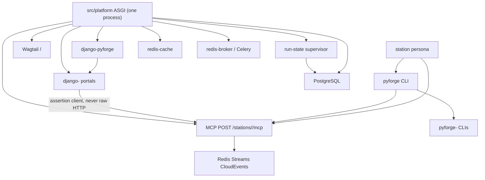
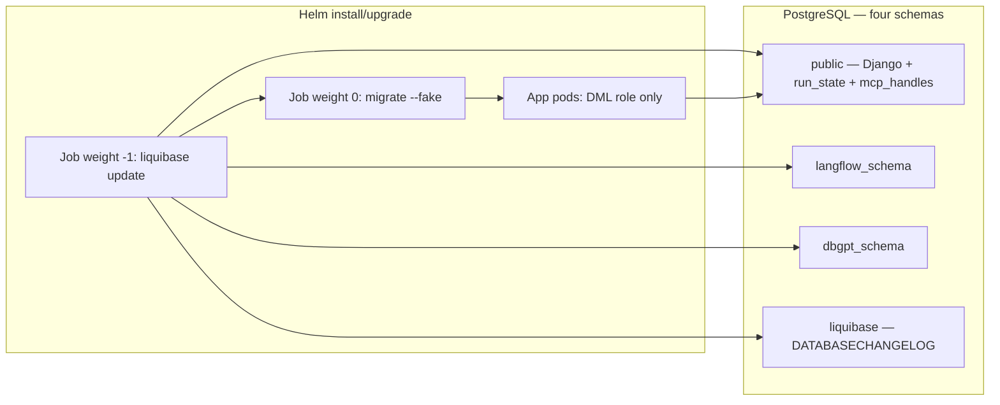

# Architecture Spine — pyforge-unifying-strategy

## Design Paradigm

**Modular monolith.** The host at `src/platform/` is one Django/ASGI process. Every new web surface
is a reusable Django app that registers with the chrome package. Every new programmatic surface is
an MCP app mounted on the same process. Station *logic* stays in the factory packages
(`pyforge-<station>`); the host never imports `pyforge.*`.

**Operating-model bind (2026-08-24, approved).** Dream Grounding Q1–Q8 and
`sprint-change-proposal-2026-08-24-operating-model.md` scope this spine: five-tier
completeness is the **03** shape of the eight stations; Lane 2 remains HTMX (no
DRF JSON:API on portals); CAP-8 envelopes carry `spec_id` + git sha + SBOM purl
(Jira optional); **hooks and plugins are the replaceable-layer principle**
(canopy AD-21); Warden is the sole PR-gate *verdict* (scanners are plugins on
Warden-owned hook specs — an instance of AD-21, not the whole of it). Tachyon is
a production LLM provider adapter, not Path B. No CAP-18. Scorecard measures
remain unpublished.

| Layer | Lives in | Role |
|---|---|---|
| Public edge | `src/platform/config/` (ASGI, URLconf, settings) | One process; OIDC session; mounts apps |
| Chrome | `src/shared/packages/django-pyforge/` | App switcher, base layout, registration protocol, portal→service client |
| Lane 1 | Wagtail, mounted at `/` | CMS front door; supersedes `docs/dashboard/` |
| Lane 2 portals | `src/shared/packages/django-<station>/` | HTMX apps under `/stations/<name>/` |
| Service faces | MCP apps in each `django-<station>` (or a sibling app in that distribution) | POST `/stations/<name>/mcp` |
| Factory packages | `src/shared/packages/pyforge-<station>/` | CLI, domain logic, existing MCP servers being migrated |
| Unified CLI | `pyforge` console script on `pyforge-core` | Dispatches `pyforge <station> <noun> <verb>` |
| Event backbone | Redis Streams | CloudEvents between stations |
| Supervisor | platform Django app + Celery | Publishes run state into PostgreSQL |



## Inherited Invariants

Parent: `specs/spec-python-agent-platform/ARCHITECTURE-SPINE.md`. Original IDs, read-only.

Cite **parent AD-n** vs **canopy AD-n** (this file). Bare `AD-n` in epics is a review-blocking finding.

| Inherited | Binds here |
|---|---|
| parent AD-1 PostgreSQL + Redis + Kubernetes only | No Elasticsearch, no Vault-as-app-dep, no RQ, no fourth *kind*. Two Redis Deployments still count as Redis. Lane 1 media is a Kubernetes RWX volume (canopy AD-13), not MinIO/S3. |
| parent AD-2 `src/platform/` never imports `pyforge.*` | Portal→service client cannot live in host code. |
| parent AD-3 host is rendered accelerator + Django apps | Wagtail and station portals join as apps, not services. |
| parent AD-4 one ASGI process, fixed dispatch | MCP mounts here. Eight FastAPI ports are forbidden. CAP-11 independent scale is Celery workers, not a second web Deployment (canopy AD-10). |
| parent AD-5 three schemas + `search_path` | **Isolation still binds.** Provisioning *mechanism* is superseded by canopy AD-9. **Schema count is amended** to four (canopy AD-9). |
| parent AD-6 stateless pods | Wagtail media leaves ephemeral pod disk (RWX); supervisor does not read local disk. |
| parent AD-7 Celery over Redis is the only async path | Wagtail work goes through Celery, not django-tasks' DB/RQ backends. |
| parent AD-8 one conda-space, Python 3.12.* | Unchanged. |
| parent AD-9 consume factory packages, never fork | django-* and pyforge-* arrive as conda packages into the platform env. |
| parent AD-10..AD-17 image, chart, secrets-at-boundary, air-gap check, sidecars, CI paths, local-first, engine pattern switch | Unchanged. Secrets still enter the pod as env/secret mounts (parent AD-12); cluster secret manager is outside this chain (canopy AD-19). |

**Conflict, not override — parent AD-5:** named Django `RunSQL` / data migrations as how `langflow_schema` / `dbgpt_schema` are provisioned. This chain's CAP-9 moves production DDL to Liquibase. Isolation, `search_path`, and "ORM never crosses schemas" remain; only the producer of the SQL changes. Cardinality: parent said three schemas; this chain adds one tracking schema `liquibase`. CAP-4 / CAP-17 stores are **tables in `public`**, not extra schemas.

**Conflict, not override — parent AD-1:** Lane 1 multi-replica media cannot live on ephemeral pod disk (parent AD-6). Object storage (MinIO/S3) would be a fourth *kind*. The compatible path is a Kubernetes `ReadWriteMany` PVC — still Kubernetes-the-kind. An in-cluster object-store Deployment is a review-blocking finding until parent AD-1 is formally excepted.

**Conflict, not override — parent AD-6:** pods stay disposable. Shared RWX is the replica-safe media store (same *kind* of exception as the dated dbgpt SQLite PVC). Ephemeral pod-local media and MinIO remain forbidden (parent AD-1 / canopy AD-13).

**Conflict, not override — RFC-1 (resilience companion):** two HTTP process pools would violate parent AD-4. Bound by canopy AD-10.

**Conflict, not override — RFC-3 HMAC:** a shared HMAC secret on CLI laptops is the finding canopy AD-7 prevents. Assertion is RS256 JWT; RFC-3 claim names map onto that JWT.

## Invariants & Rules

### AD-1 — Portals register; the host does not list them `[ADOPTED]`

- **Binds:** CAP-1, CAP-3, FR-1, FR-2, FR-9, FR-9a, FR-9b, FR-10
- **Prevents:** a hardcoded station path list in `config/urls.py` or the app switcher that every new portal has to edit
- **Rule:** `django-pyforge` defines a registration protocol on `AppConfig` (station name, mount token, **MCP token**, chrome hooks). Discovery is `apps.get_app_configs()`. Adding or removing a portal+MCP pair changes that station's distribution and `INSTALLED_APPS` only. The sole hardcoded host route this chain is allowed to add is the permanent `/compliance/` → `/stations/warden/` redirect. Host ASGI dispatch matches `/stations/<name>/mcp` as a pattern (parent AD-4 table gains that pattern, not a roster).

### AD-2 — Uniform prefix `/stations/<name>/` `[ADOPTED]`

- **Binds:** CAP-3, FR-9, FR-9a
- **Prevents:** each portal inventing its own root (`/compliance/` vs `/stations/warden/`)
- **Rule:** every portal mounts at `/stations/<name>/`. `/compliance/` returns a permanent redirect preserving path and query. A portal that mounts outside the prefix fails CAP-3.

### AD-3 — Chrome lives in `django-pyforge` only `[ADOPTED]`

- **Binds:** CAP-1, CAP-3, FR-1
- **Prevents:** a portal shipping its own switcher, base layout, or theme copy
- **Rule:** station portal packages contain no chrome templates or static files. A test that two portals render identical chrome from one package fails if either ships a copy. Host OIDC is `django-allauth`. `django-lasuite` is not a Canopy dependency.

### AD-4 — Reusable-app naming is a triple, one distribution per station `[ADOPTED]`

- **Binds:** CAP-3, FR-9b
- **Prevents:** label collisions in `INSTALLED_APPS`; a second warden app having nowhere to live
- **Rule:** distribution `django-<station>`, module `django_<station>_<app>`, label `<station>_<app>`. One distribution per station holding one or more apps. Existing models never move between apps. `compliance_face` becomes `django-warden` / `django_warden_fabric` / `warden_fabric` in the same story as the URL move, **before** CAP-9 revokes app-role DDL.

### AD-5 — Service faces are `mcp` SDK on the one ASGI process `[ADOPTED]`

- **Binds:** CAP-4, FR-11, FR-12, parent AD-4
- **Prevents:** FastMCP 3.x locking the estate to handshake-era; eight processes on invented ports; a `services/` topology the Dream described and the host does not have
- **Rule:** each station's MCP app is built on the official `mcp` Python SDK (conda-forge 2.0.0+), mounted at `POST /stations/<name>/mcp`. The mount is a **pattern** on the host ASGI/URLconf (`/stations/<name>/mcp`), not a per-station list, and the registration protocol (AD-1) carries the MCP token so chrome and dispatch stay one seam. No `services/` process, no extra public port. Accept protocol revisions `2025-03-26` through `2026-07-28`. On handshake-era `initialize`, echo the client's requested revision; modern-era requests carry the version on the request (no initialize). Never branch on client name. **Stopgap (already in `pixi.toml`):** `local-recipes` stays on `fastmcp >=3.4.7,<4` + `mcp >=1.24,<2.0` until these faces land; lift the `mcp` ceiling in that story. Doctor/herald features already pin `mcp >=2.0.0` and are unaffected.

### AD-6 — Disconnect-survival is `start`/`get` over PostgreSQL `[ADOPTED]`

- **Binds:** CAP-4, CAP-17 adjacent store, FR-12
- **Prevents:** Tasks-extension stories that cannot ship; Redis-backed handles dying under CAP-11 eviction; session affinity; progress notifications posing as survival
- **Rule:** long work is two tools: `start_*` returns an opaque high-entropy TTL'd handle **that is a capability to a supervisor `run_id`** (AD-12); `get_*` reads that run through the supervisor and may be served by any replica. Handle rows live in `mcp_handles`, DDL owned by `django-pyforge` (AD-9). `get_*` requires a valid AD-7 assertion **and** the handle — possession alone is not authorization. Do not use progress notifications, sticky sessions, or stream replay as the survival mechanism. Keep-alive under 30s applies only if a stream exists at all.

### AD-7 — Two clients, one assertion format `[ADOPTED]`

- **Binds:** CAP-6, CAP-5, FR-3, parent AD-2
- **Prevents:** trusted headers; a `pyforge.*` import under `src/platform/`; portals and CLIs minting incompatible identity
- **Rule:** portals call services only through `django-pyforge`'s client. CLI/agent callers use `pyforge.core`'s client. **Both emit the same RS256 JWT** (one listed `alg`; HMAC-SHA256 from RFC-3 is rejected). Required claims: `sub` (IdP subject; RFC-3 `idp_subject`), `roles`, `aud` = `mcp:<station>`, `exp` ≤ 5 minutes from `iat`, `delegated_by` = `pyforge-host`. A golden test vector in `django-pyforge` is required to pass for both clients. The CLI mints by authenticating to the host (same IdP), never a long-lived laptop HMAC secret. A portal constructing a raw HTTP request to a service, or a service trusting `X-Forwarded-User` (or equivalent), is a review-blocking finding. Keycloak Token Exchange / resource-indicator flag is Deferred.

### AD-8 — Events are CloudEvents on Redis Streams `[ADOPTED]`

- **Binds:** CAP-8
- **Prevents:** ad-hoc JSON on pub/sub; infinite retry; cyclic fan-out
- **Rule:** producers `XADD` CloudEvents 1.0 (`specversion=1.0`) onto **redis-broker only** — never redis-cache. One estate stream `pyforge.events` and one DLQ `pyforge.events.dlq` (RFC-4's colon form `pyforge:events:dlq` is superseded). Poison harvest is `XAUTOCLAIM` on the DLQ. Consumer group name = station token. Loop-depth extension attribute is `pyforgeloopdepth` (integer); ceiling is 8 (RFC-4's HTTP header `X-PyForge-Loop-Depth <= 5` is superseded — depth is a CloudEvents extension, not an HTTP header). Event `type` is a dotted verb registered in `django-pyforge` (adding a type is a chrome change, not a silent story-local string). `dataschema` is required on every event; payloads without it fail the producer test.

### AD-9 — Production DDL is Liquibase; one tracking schema; app role cannot DDL `[ADOPTED]`

- **Binds:** CAP-9, FR-21, FR-21a, FR-22–FR-25, parent AD-5 isolation
- **Prevents:** Django `migrate` as production schema authority; silent wrong-schema DDL; changelog-lock races across replicas; a second image or init container
- **Rule:** Helm Job at hook-weight `-1` on the **platform image** runs `liquibase update`; the shipped `migrate-job.yaml` becomes `migrate --fake`. Target Liquibase **5.0.4+**. PostgreSQL schemas in this instance are exactly four: `public`, `langflow_schema`, `dbgpt_schema`, `liquibase` (`liquibaseSchemaName=liquibase`). `run_state` and `mcp_handles` are **tables in `public`**, DDL owned by **`django-pyforge`**. Station packs own only `label_*` tables in `public` (or that station's existing schema if already isolated). Creating a fifth schema, or promoting those tables to schemas, is a review-blocking finding. Changeset ids are namespaced `distribution:seq` — `001-initial` as a bare id is a review-blocking finding. `preserveSchemaCase` off; schema names lowercase. App role: DML only. Migration role: DDL. Job connects **directly** to PostgreSQL with `currentSchema` set, not through a pooling proxy. Test databases are carved out: Django's test runner still runs `migrate`. `sqlmigrate` extraction is the CI gate that a changeset exists for every production migration. ORM still does not cross engine schemas.

### AD-10 — Cache ≠ broker; one ASGI Deployment; workers scale separately `[ADOPTED]`

- **Binds:** CAP-11, parent AD-1, parent AD-4, parent AD-7
- **Prevents:** a shared `maxmemory` policy dropping Celery tasks; splitting the task story onto RQ; RFC-1's two HTTP pools becoming a second public process
- **Rule:** chart ships `redis-cache` (evicts) and `redis-broker` (does not). Same image class. Celery and Channels use the broker. Django cache + Wagtail `renditions` alias use the cache. Filling the cache to eviction must lose no queued task. Wagtail background work uses a Celery `BaseTaskBackend` — not django-tasks' database or RQ backends, and **not** PyPI `django-tasks-celery` (Django 6.0+ only). **Process topology:** one public ASGI Deployment (parent AD-4). Independent scale of work is a Celery worker Deployment on redis-broker — not a second web Deployment, not a FastAPI process, not an extra public port. HTMX REST and MCP share that one ASGI process; operations over ~30s use canopy AD-6 `start`/`get`, not a dedicated streaming HTTP pool. gunicorn/uvicorn worker *count* inside the one Deployment is replica capacity, not a second pool kind.

### AD-11 — Flags are OpenFeature FILE, in-process `[ADOPTED]`

- **Binds:** CAP-13, FR-33, FR-34
- **Prevents:** a flagd daemon, WASM (`wasmtime` absent), per-surface flag code, or a Reloader sidecar to fake "no redeploy"
- **Rule:** one JSON tree. In-cluster that file is a ConfigMap mounted read-only. The in-process FILE provider **observes the mounted file** (watch or equivalent) so a ConfigMap update becomes live **without a new process** and without rolling the Deployment. Reloader, flagd, or any sidecar for flags is parent AD-14 and a review-blocking finding. The CLI evaluates **the same bytes** — fetched from the host (authenticated) or, in local-dev only, the file at `src/platform/config/flags.json` that the ConfigMap is built from. Two trees is a review-blocking finding. No egress. Stories that import these packages are blocked until the operator-owned feedstocks exist.

### AD-12 — Run state is published into PostgreSQL by a supervisor `[ADOPTED]`

- **Binds:** CAP-17, FR-40, FR-41, FR-42
- **Prevents:** the front door reading `~/.bmad-loops`, tmux, or journals — the coupling that made the retired console undeployable
- **Rule:** the supervisor is the only publisher of live run state and completed-run timing. **`start_*` is a supervisor publish** — it does not write a second ledger. Storage is PostgreSQL (`run_state` + `mcp_handles` as handle→run_id). The front door queries it through the host. No filesystem fallback. Unreachable supervisor → explicit unavailable plus age, within the CAP-10/FR-26 budget. Ingest at run completion, not at page-generation time. Loop-side hooks (bmad-loop) call the same supervisor API the MCP `start_*` does.

### AD-13 — Lane 1 media, search, and admin login are host-shaped `[ADOPTED]`

- **Binds:** CAP-2, parent AD-6
- **Prevents:** pod-local media; per-replica rendition caches; Elasticsearch; password Wagtail admin
- **Rule:** media on a Kubernetes `ReadWriteMany` PVC mounted at a fixed path; Django filesystem storage (default or `django-storages` FileSystemStorage) writes there. Renditions cache on `redis-cache`. Search is PostgreSQL FTS (`django.contrib.postgres`). Wagtail admin login is `WAGTAILADMIN_LOGIN_URL` through allauth/OIDC. IdP groups must map onto the Wagtail-admin permission; an authenticated user with no group is bounced. Password and email management stay off. An in-cluster MinIO/S3 Deployment, or a cloud object-store backend, is a fourth infra kind (parent AD-1) and a review-blocking finding until that parent AD is formally excepted.

### AD-14 — Five tiers, or the **03** station is not done `[ADOPTED]`

- **Binds:** CAP-5, CAP-15, CAP-16, CAP-3, CAP-4; Dream Grounding Q2
- **Prevents:** a ledger `done` on CLI-only for an **03** station; reading this AD as applying to 01/02 work
- **Rule:** An **03** station (the eight roster stations) is not done until CLI, portal, service, domain skill, and persona all exist. Personas act only through CAP-5 and CAP-4. CAP-5 dispatches to existing station binaries; it does not reimplement them. **01/02 work is complete at spec+script or spec+skill** and is outside this AD (Epic 29 / FR-39).

### AD-15 — Containment is tested per invariant `[ADOPTED]`

- **Binds:** CAP-10, `resilience-invariants.md`
- **Prevents:** a suite that passes while one RFC/blind-spot is absent
- **Rule:** PyBreaker plus an asyncio wrapper (~40 lines) on every outbound call; `fail_max` is coarse, never exact-count. Each of the four invariants has a test that fails without it. IdP roles are re-read from the token on the request — authorization is not a local durable grant.

### AD-16 — Packaging is an external gate `[ADOPTED]`

- **Binds:** CAP-9, CAP-13
- **Prevents:** platform stories starting before their conda-forge builds exist, or this chain sizing feedstock work the operator has taken
- **Rule:** CAP-9 and CAP-13 stories that import Liquibase or OpenFeature **block** until those packages are on the channel the platform env consumes. Recipe authoring is out of this spine. The optional Django 5.2.17 pin move is maintenance, not chain scope.

### AD-17 — Station domain skills are SKF content skills `[ADOPTED]`

- **Binds:** CAP-15, CAP-16
- **Prevents:** hand-written station skills that go stale the moment the package changes; conflating BMAD launcher skills with content skills
- **Rule:** CAP-15 skills are **Skill Forge content skills**, compiled by the SKF module already in this repo (`_bmad/skf/`, `.claude/skills/skf-*`, [bmad-module-skill-forge](https://github.com/armelhbobdad/bmad-module-skill-forge)). Source is `src/shared/packages/pyforge-<station>/` (plus `django-<station>/` when the skill covers the portal). Output is agentskills.io-compliant, version-pinned, provenance-backed (`provenance-map.json` + pinned commit). Export is the only write into `CLAUDE.md` / `AGENTS.md` (`skf-export-skill`). CAP-16 personas are BMAD **launcher/agent** skills — they *consult* the content skill; they are not compiled by SKF. **Exception:** `conda-forge-expert` stays a hand-authored operating skill with `[MANUAL]` sections; SKF does not replace it. New station skills follow SKF unless they are operating-procedure skills of that same kind.

### AD-18 — Portal tables are projections; the station package is the writer `[ADOPTED]`

- **Binds:** CAP-3, CAP-4, CAP-5, CAP-8, FR-10
- **Prevents:** Django models, MCP handle rows, and the station CLI each owning the same noun
- **Rule:** Domain writes go through the station's factory package (CLI or MCP `start_*` → that package). Portal Django models are **projections** updated from events (AD-8) or supervisor completion — they are not a second write path. Existing `compliance_face` / `warden_fabric` rows stay; new mutations after cutover follow this rule. MCP handles are tickets to supervisor runs, not copies of domain entities.

### AD-19 — Pod specs carry secret *references*, never secret values `[ADOPTED]`

- **Binds:** CAP-12, parent AD-12, parent AD-1, parent AD-14
- **Prevents:** CAP-12's "no long-lived secret in the pod spec" being read as a Vault client, injector sidecar, or CSI driver inside this chain
- **Rule:** CAP-12 *authorization* is IdP-on-request (canopy AD-15). CAP-12 *delivery* is parent AD-12: env and secret mounts (`secretKeyRef`, secret volume). Rendered Helm/Kustomize contains names and keys, never secret *values* — that is the success test. A cluster secret manager (External Secrets or equivalent) may materialize Kubernetes Secrets **outside** the platform image; wiring it is out of this chain. The app does not call a secrets HTTP API at runtime. Vault-in-app, Vault injector, secrets CSI driver, or an extra sidecar for secrets is a fourth kind / parent AD-14 sidecar and requires a dated Dream entry *before* it lands — not a CAP-12 story.

### AD-20 — CAP-7 consumes the estate secure-dashboard pattern only `[ADOPTED]`

- **Binds:** CAP-7, spec-secure-live-dashboards (`pyforge.steward.dashboard`)
- **Prevents:** Vizro (or Dash/Flask) as a second isolation stack; atlas re-deriving row filters
- **Rule:** Boards behind the host go through `pyforge.steward.dashboard`: filter-then-search (`filter_by_role` / `AccessDeclaration`), audit write, role-built navigation. Isolation mechanism is that library's, not re-derived. A second dashboard isolation stack — including a Vizro/Dash app that filters rows itself — is a review-blocking finding. The pattern binds at the ASGI boundary (secure-dashboard parent AD-8); a WSGI dashboard may mount through that adapter but does not own isolation. Atlas adopting the pattern for its *own* boards remains a non-goal; atlas Vizro CLI pages stay outside the host.

### AD-21 — Hooks and plugins: replaceable layers `[ADOPTED]`

- **Binds:** CAP-18; estate operating model (Dream Grounding principle + Q8); station plugin surfaces; CAP-1 registration; CAP-13 profile flags choose which plugins load
- **Prevents:** forking a process to swap a vendor; baking a deployment-profile tool into core; treating the principle as “every package is a Kedro project”; treating Atlas pipeline hooks as Warden’s PR-gate book
- **Rule:** As far as possible, every layer is replaceable. The process owns **hook specifications** (named before / after / around points). A **plugin** implements or replaces a layer without a fork. [Kedro](https://docs.kedro.org/en/stable/getting-started/architecture_overview/) names the spec-vs-plugin split; only Atlas is already a Kedro project. Warden owns PR-gate hook specs; scanners implement them (Q8). Other stations own their process hooks (build engines, runners, stores, exporters, deploy-profile / LLM adapters). **Not plugin surfaces:** Pixi task names, Golden Path artifact identity, parent AD-1 infra kinds, parent AD-2 host import boundary, the Warden verdict itself. A plugin must not publish a second verdict for a process another owner specified.
- **Realization 2026-08-31 (chain-currency sweep, fleet-wide station dossier):** confirmed live in `pyforge-core` as `core.hooks` — one entry-point group (`pyforge.core.hooks`), stdlib `importlib.metadata` only — and imported by all seven non-core stations (Marshal, Doctor, Atlas, Mason, Steward, Scribe, Warden) with no station-specific alternative. `SecondVerdictError` on a repeat `publish_verdict` for a spec already owned is confirmed enforced in code, matching this AD's "must not publish a second verdict" rule. No design change; the dossier corroborates AD-21 as-built rather than surfacing a gap.

### AD-22 — One query plane; stations rebuild onto it `[ADOPTED]`

- **Binds:** CAP-19; FR-27 intent; FR-46..50; Atlas Kedro catalog; Scribe store port; parent AD-2 host import boundary
- **Prevents:** a sibling HTAP spec; a ninth station; a second writable `.duckdb`; Airflow; pandas-as-federation; boot `INSTALL`; autonomous SQL on OLTP; `uv` Mosaic runtime; silent `01_raw` tree
- **Rule:** DuckDB is the only analytical engine. Live Postgres is `ATTACH … READ_ONLY`. Kedro writes Parquet on a **named** pipeline. Vectors are `vss` on the plane writer. Mosaic `duckdb-server` is an optional pixi-sourced *face*, not a fourth infra kind. Atlas owns the engine; steward owns the through-line. Rebuild of Atlas RAG defaults, Scribe 28.2 semantic path, and agent DSNs is in scope. BSL remains the dashboard contract. CAP-7 / AD-20 still isolate rows on Mode A.
- **Realization 2026-08-26:** Epic 34.1–34.5 + 36.1–36.2 shipped (`estate-cache` Vizro page over BSL). Scribe **driver** is on the plane; retiring `scribe_schema` pgvector is still `query-plane-scribe-cutover`. Five-tier roster is 40/40 (Epic 37.1); mason skill cell is `conda-forge-expert` (canopy AD-17 exception), not `.claude/skills/pyforge-mason/`.

## Consistency Conventions

Cite **parent AD-n** (python-agent-platform spine) vs **canopy AD-n** (this file). Bare `AD-n` in an epic or story is a review-blocking finding.

| Concern | Convention |
|---|---|
| Station token | `warden`, `mason`, `atlas`, `doctor`, `herald`, `marshal`, `scribe`, `steward` — same token in CLI, URL, distribution, skill, persona |
| Dates | `YYYY-MM-DD` zero-padded; versions CalVer unpadded |
| Event type | dotted verb, CloudEvents `type` (e.g. `recipe.audit.failed`) |
| Error shape (MCP) | protocol codes as of `2026-07-28` (`-32022` unsupported version, etc.); do not emit stale `-32003`/`-32004` |
| Task handles | unguessable, TTL'd, treated as capabilities |
| Migrations | Django authors; Liquibase applies in production; tests use Django `migrate` |
| Logging | no secret values; run-state age always shown when state is shown |

## Stack

| Name | Version |
|---|---|
| Python (platform env) | `3.12.*` |
| Django | `>=5.2.15,<6` (recommend `>=5.2.17,<6` once feedstock `5.x` catches up) |
| Wagtail | `7.4.3` |
| `mcp` (service faces) | `>=2.0.0` |
| `fastmcp` + `mcp` (stopgap in `local-recipes` only) | `fastmcp >=3.4.7,<4` · `mcp >=1.24,<2.0` |
| Liquibase Community | `>=5.0.4` |
| OpenJDK (Liquibase run-dep) | `25.0.2` |
| OpenFeature Python SDK + flagd FILE provider | absent until operator feedstocks land |
| `cachebox` | `5.x` (`<6`) until provider allows 6 |
| PyBreaker | `1.4.1` + in-tree asyncio wrapper |
| `django-lasuite` | **not a Canopy dep** — feedstock / `suite-*` only |
| `django-storages` | `1.14.6` (library present; CAP-2 backend is filesystem on RWX, not S3) |
| `django-redis` | `7.0.0` |
| Celery | `==5.5.3` (platform-ci-test / host pin) |
| `django-celery-beat` | `==2.8.1` |
| Channels | `>=4.3.2,<5.0` (steward dashboard extra; host consumes when CAP-7 mounts) |
| `django-allauth` | `==65.10.0` (extras `mfa`) |
| gunicorn | `==23.0.0` (platform-ci-test) |
| Keycloak | `26.4.0` (existing compose image; Token Exchange flag Deferred) |
| PostgreSQL | `17` (existing chart) |
| Redis | `7` (existing chart; split into two Deployments) |
| CloudEvents | `1.0` (`specversion`; document patch 1.0.2) |
| HTMX | **2.x** via `django-htmx` when added — not HTMX 4 (beta). Pin at the story; not in pixi today |
| Wagtail Celery backend | in-tree `BaseTaskBackend` — **not** PyPI `django-tasks-celery` (Django 6.0+ only) |

## Structural Seed

```text
src/platform/                          # host — no pyforge.* imports
  config/                              # ASGI, settings, urls (redirect + include chrome)
  platformapp/
  langflow_integration/                # shipped
  dbgpt_integration/                   # shipped
  deploy/charts/platform/              # migrate-job.yaml + new liquibase Job weight -1
                                       # redis-cache + redis-broker
                                       # wagtail-media ReadWriteMany PVC
src/shared/packages/
  django-pyforge/                      # CAP-1 chrome + portal client
  django-warden/                       # was compliance_face
  django-<station>/                    # remaining seven
  pyforge-core/                        # CAP-5 dispatcher + CLI client
  pyforge-<station>/                   # existing CLIs / logic
.claude/skills/pyforge-<station>/      # CAP-15
```



## Capability → Architecture Map

| Capability | Lives in | Governed by |
|---|---|---|
| CAP-1 chrome | `django-pyforge` | canopy AD-1, AD-3 |
| CAP-2 Lane 1 | Wagtail on host | canopy AD-13, AD-10; `lane1-serves-dw-h3` **no** (2026-08-25) |
| CAP-3 portals | `django-<station>` | canopy AD-1, AD-2, AD-4, AD-18 |
| CAP-4 MCP | `mcp` SDK on host ASGI | canopy AD-5, AD-6, AD-12, AD-10 |
| CAP-5 CLI grammar | `pyforge-core` | canopy AD-14, AD-18 |
| CAP-6 identity client | `django-pyforge` + `pyforge.core` | canopy AD-7 |
| CAP-7 boards | `pyforge.steward.dashboard` on host | canopy AD-20 |
| CAP-8 events | Redis Streams on redis-broker | canopy AD-8, AD-10 |
| CAP-9 governed DDL | Liquibase Job + roles | canopy AD-9, AD-16 |
| CAP-10 containment | wrapper + tests | canopy AD-15; BS-5/BS-7/BS-8 Deferred |
| CAP-11 cache ≠ broker | two Redis Deployments + Celery workers | canopy AD-10 |
| CAP-12 IdP roles + secrets | allauth + parent AD-12 mounts | canopy AD-19, AD-15 |
| CAP-13 flags | OpenFeature FILE | canopy AD-11, AD-16 |
| CAP-14 Scribe graph | Port + lexical path; semantic recall on CAP-19 plane driver (34.5). `scribe_schema` pgvector retirement is OQ | parent AD-1, parent AD-5 isolation; canopy AD-22 |
| CAP-15 skills | SKF compile from `pyforge-<station>` → `.claude/skills/`; **mason = `conda-forge-expert`** | canopy AD-14, AD-17 |
| CAP-16 personas | BMAD launcher/agent; consults CAP-15 | canopy AD-14, AD-17 |
| CAP-17 run state | supervisor → PostgreSQL `public.run_state` | canopy AD-12, AD-6 |
| CAP-18 hooks | `pyforge-core` + Warden / station plugins | canopy AD-21 |
| CAP-19 query plane | Atlas DuckDB + Kedro; stations as clients. First slice shipped; OQs remain | canopy AD-22 |
| Cross-cutting | replaceable layers (hook specs + plugins) | canopy AD-21 |

## Deferred

| Item | Why it can wait | Revisit when |
|---|---|---|
| `lane1-serves-dw-h3` | **Answered 2026-08-25: no.** `LaSuiteClient` Docs REST ≠ host Wagtail `/cms/`. Absorbing it here would re-mint atlas's spec. DW-H3 stays atlas attended bring-up. | Only if a new adapter Dream is written |
| Per-schema Liquibase tracking | One sequential Helm Job does not need concurrent migrators | A second migration Job is proposed |
| MCP Tasks extension (SEP-2663) | No server-side runtime on conda-forge | Official `mcp` SDK ships Tasks; swap wire layer over the same PostgreSQL store |
| FastMCP 4 / dual-era on FastMCP | Beta, unpackaged | Not before CAP-4 `mcp` faces exist |
| Django 5.2.17 pin | Operator-owned feedstock bump; not a live exposure | After `django-feedstock` `5.x` publishes 5.2.17 |
| OpenFeature / Liquibase / cachebox 5.x recipes | Operator took all packaging | Packages appear on the channel the platform env consumes |
| Scribe dual-driver internals | Port already exists; backing store is PostgreSQL | Story for CAP-14; no cross-station invariant beyond parent AD-1 |
| Ledger shape for reopening 11.1 / 11.2 | `bmad-correct-course`, not this spine | Phase 5 steward run |
| Keycloak Token Exchange / `RESOURCE_INDICATORS` | RFC-8707 flag is experimental; audience mapper is the documented interim | First CAP-6 client story that mints delegated tokens (BS-3) |
| Additional CloudEvents extension attributes beyond `pyforgeloopdepth`, `spec_id`, git sha, SBOM purl, optional work-item id | Stream, DLQ, ceiling, `dataschema`, and Q4 identity fields are bound (canopy AD-8 + operating-model Q4) | First producer that needs a *further* extension |
| Supervisor ingest wire from bmad-loop | Topology is bound; Marshal hook details are station-local | Marshal + CAP-17 story |
| FILE flag env promotion overlays | canopy AD-11 binds one JSON schema, ConfigMap mount, and in-process watch; overlay *values* per env are ops | First CAP-13 import story |
| Liquibase `DATABASECHANGELOGLOCK` stuck-lock runbook | Companion already names the need; owner is ops not a second DDL path | Before first production CAP-9 Job |
| BS-5 single DuckDB writer / `read_only=True` | Mechanism is atlas-local; absence-test still required (canopy AD-15) | First CAP-10 story that opens `atlas.duckdb` |
| BS-7 `PydanticFormErrorBridge` | Lands in `django-pyforge`; not a cross-station fork if chrome owns it | First CAP-10 / CAP-1 HTMX form story |
| BS-8 Mason boot re-index | Bound off MinIO (canopy AD-13 / parent AD-1). PostgreSQL remains canonical. Object-store scan is blocked until parent AD-1 is excepted. | First CAP-10 Mason restart story — reconcile against PG + RWX, not MinIO |
