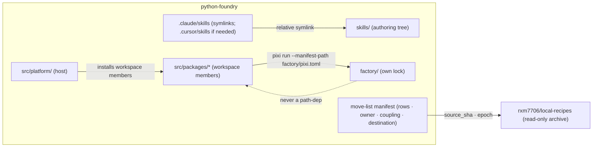
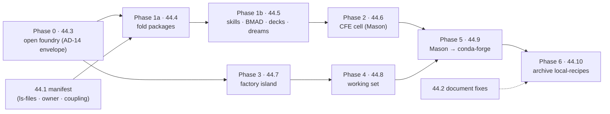

# Architecture Spine — python-foundry-cutover

> **Solutioning iteration 1 (2026-09-04), revised after the reviewer gate.** Drafted on the
> Fast path; every inferred call still carries `[ASSUMPTION]` for the operator's review loop.
> Nothing here is dispatched: Epic 44's stories are ledger `blocked` until the operator flips
> them (AD-9). Cite this file's ids as **`fnd:AD-n`**; the Canopy spine's as **canopy AD-n**;
> the host spine's as **`pap:AD-n`**. Nine open questions bend ADs — see the last section.

## Design Paradigm

**Strangler-fig repository cutover.** Three roles, three places:

| Role | Place | Owner |
|---|---|---|
| Lasting root (estate) | `python-foundry/` — `pixi.toml` name `pyforge`, `src/platform/`, `src/packages/`, `skills/`, `_bmad-output/`, `docs/` | steward |
| Island (recipe plant) | `python-foundry/factory/` — own `pixi.toml` + `pixi.lock`, `recipes/` working set, recipes-only CI | mason |
| Archive (copy source) | `rxm7706/local-recipes` — read-only at a pinned SHA after Phase 6 | steward |

The **manifest** is the routing table between them (AD-2). The two-remote era is a bounded
interval (AD-11), not a product shape.

## Inherited Invariants

Parent: `../architecture-pyforge-unifying-strategy-2026-08-24/ARCHITECTURE-SPINE.md`
(canopy AD-1..23) and, through it, `specs/spec-python-agent-platform/ARCHITECTURE-SPINE.md`
(`pap:AD-1..17`). Read-only; original ids; never re-derived.

| Inherited | Binds here |
|---|---|
| pap:AD-2 host never imports `pyforge.*` | The fold (AD-6) changes paths, not this boundary. **Brownfield breach:** `src/platform/ingest/github_projects/*` imports `pyforge.steward.keys` in eight places today; AD-7 names its successor before deletion (open question `ingest-keys-import`). |
| pap:AD-9 consume factory packages, never fork | AD-7 ratifies it: the Containerfile's ten `COPY src/shared/packages/...` lines are the brownfield drift the cutover removes. |
| pap:AD-15 CI paths | Refined by AD-8: estate and island CI are disjoint by `paths`. |
| canopy AD-4 reusable-app triple, one distribution per station | Distribution and import names are unchanged by the fold (AD-6). |
| canopy AD-14 five tiers, or the 03 station is not done | `five_tier.py` retargets `_packages_root` and the skill/persona paths (AD-6, AD-5); the roster stays eight. |
| canopy AD-16 packaging is an external gate | Foundry packages still arrive via the conda channel; the island builds them (AD-3, AD-4). |
| canopy AD-17 station domain skills are SKF content skills; `skf-export` is the only writer into `CLAUDE.md` / `AGENTS.md` | SKF compiles into `skills/` (AD-5). Path rewrites inside `CLAUDE.md` / `AGENTS.md` after the fold go through `skf-export`, never a direct edit (AD-6). |
| canopy AD-21 hooks and plugins are replaceable layers | Unchanged; the hook registry is the seam AD-4 keeps Mason behind. |
| canopy AD-23 one interpreter `3.14.*`; `mcp-host` isolates MCP-SDK | Estate lock inherits it; the island lock is free to pin what recipes need. |

**Conflict, not override — canopy AD-17:** AD-6's "every consumer path is rewritten" would
touch `CLAUDE.md` / `AGENTS.md`, whose only sanctioned writer is `skf-export`. Resolution:
44.4 and 44.5 re-run `skf-export` after their moves; the manifest marks those two files
`rewritten-by: skf-export`. **Conflict, not override — pap:AD-2:** the ingest import is a
live breach, not a rule this spine relaxes; 44.4 routes it through the in-process station
port (`pyforge.core.station_port`, steward 43.3) or the `steward keys` CLI, decided by
`ingest-keys-import`.

## Invariants & Rules



### AD-1 — Fresh root, pinned source `[ADOPTED]`

- **Binds:** CAP-1, CAP-7; Stories 44.3, 44.10
- **Prevents:** two live histories; the purged-secret history and 268 worktrees riding into the lasting repo; ambiguity over which repo is truth
- **Rule:** Foundry's first commit carries no `local-recipes` history (no `filter-repo`, no subtree import). Every manifest row carries the `source_sha` it was lifted at, and the manifest records the **foundry epoch SHA** (AD-16). After Phase 6, `local-recipes` is archived read-only at its final SHA, that SHA is pinned in the foundry manifest and the Dream's Realization log, and its README opens with the supersession banner.

### AD-2 — The manifest is the routing table, derived from three sources

- **Binds:** CAP-2, CAP-3, CAP-4, CAP-5; Story 44.1 and every move story
- **Prevents:** two stories routing one path differently; a tracked path silently dropped; the spec-surface allowlist (`.claude/**`, `_bmad/**`, `_bmad-output/**`, `docs/dreams/**`, `docs/governance/**`, `.github/**` — the very trees the cutover moves) leaving 20 % of paths unrouted; a hand list that omits the newest thing
- **Rule:** Rows come from `git ls-files` — one row per tracked path, allowlisted trees included. The spec-surface classification (`scripts/spec_surface_check.py`) supplies the row's **owner** only (`unowned` is legal). Coupling comes from `scribe index move-list` (`pyforge.scribe.extras.move_list`: host `pyforge.*` imports, `sys.path` inserts, `five_tier` roots, CFE callers) **plus a `parent_depth` signal** for code that computes paths by `parents[N]` / fixed `../` depth. **Destination** is resolved by an ordered precedence list of glob rules (most specific wins); a path matched by two rules of equal precedence is row kind `ambiguous` and blocks until an operator rule resolves it. The manifest is a machine-readable file with per-directory rollups (24,858 rows are not a markdown table). A move story consumes the rows for its phase and marks them `moved` with the foundry commit; a move without a row is review-blocking.

### AD-3 — Two locks, one workspace name; tooling split by role

- **Binds:** CAP-1, CAP-4; Stories 44.3, 44.4, 44.7; red-team D-2 / R-17
- **Prevents:** the 29-environment single lock that turns every dependency change into a 59k-line diff; recipe churn re-solving the estate; a "no solver tooling" rule that strips warden's test oracles
- **Rule:** Root `pixi.toml` is `name = "pyforge"` and locks the estate only. `factory/pixi.toml` + `factory/pixi.lock` lock the island only. No path dependency crosses the island boundary in either direction. The island owns **recipe build / lint / submit tooling by role**: `rattler-build`, `conda-smithy`, `conda-build` as a build engine, `conda-forge-pinning`, `grayskull`. Estate exemptions are enumerated by name, never by role: warden's test-only differential oracles `conda-build` and `py-rattler-build` (`[feature.pyforge-warden]`), and the `pixi-build-python` / `pixi-build-rattler-build` workspace-member backends. Any other solver-farm package in the estate lock is a finding.

### AD-4 — Mason reaches the island by manifest path, never by import

- **Binds:** CAP-3, CAP-4, CAP-6; Stories 44.6, 44.7, 44.9
- **Prevents:** the estate environment regrowing the solver farm; a second copy of the CFE skill; `MASON_CFE_ROOT` pointing back at the archive; a marker constant that no longer matches after the move
- **Rule:** `MASON_CFE_ROOT` stays a **repo root** (flag → env → cwd walk, `pyforge/mason/resolve.py`) whose marker `_CFE_MARKER` (today `.claude/scripts/conda-forge-expert`, `resolve.py:100`) moves with the cell to `skills/domain/conda-forge-expert/scripts`; the marker constant is a manifest consumer rewritten in 44.6. Recipe build, submit and update are subprocesses of `pixi run --manifest-path factory/pixi.toml <task>`; `pyforge-mason` imports nothing from the island.

### AD-5 — One skills tree; IDE directories are adapters

- **Binds:** CAP-2, CAP-3; Stories 44.5, 44.6; canopy AD-17
- **Prevents:** divergent `SKILL.md` copies per IDE; an edit landing in one adapter and not the other; the installer carve-out accidentally exempting the eight station personas
- **Rule:** Estate-authored skills live only under `skills/{stations,personas,domain}/<x>/`. `.claude/skills/<x>` is a relative symlink (Claude Code documents per-skill symlink resolution). `.cursor/skills/<x>` adapters are minted only if `cursor-skill-discovery` says Cursor cannot use its documented `.claude/skills/` compat location. Installer-**written** directories (`bmad-*` from the BMAD installer, `skf-*` from the forge) stay real directories; the eight station personas (`bmad-agent-<station>`) are estate-authored and move to `skills/personas/<station>/`. SKF compiles into `skills/stations/<x>/` as its export root `[ASSUMPTION — skf-export-root]`. A regular directory for an estate skill under an adapter is a detector finding.

### AD-6 — The packages fold is a path rewrite, not a rename

- **Binds:** CAP-2; Story 44.4; canopy AD-4, AD-14, AD-17
- **Prevents:** a half-moved tree with two package roots; a distribution or import rename smuggled in with the move; 59 files computing paths by fixed parent depth silently resolving a wrong root; a stale spec-surface baseline after every move
- **Rule:** `src/shared/packages/<x>` → `src/packages/<x>`; distribution and import names unchanged. Every consumer is rewritten from manifest rows in the same story: `pixi.toml` path-dependencies (103 sites), the Containerfile `COPY` lines, `five_tier._packages_root`, `script_map_from_packages_root`, `marshal-policy.toml` globs, Spec `surface:` globs, CI `paths:`, and every `parent_depth` coupling row (`parents[N]` constants; no silent wrong-root fallback survives). `CLAUDE.md` / `AGENTS.md` are rewritten by re-running `skf-export` (canopy AD-17). Every move story ends with a scoped `spec_surface_check.py --write-baseline --spec <affected>` re-stamp. After 44.4 no `src/shared/` exists and `rg src/shared/packages` returns only the manifest and the archive.

### AD-7 — The host consumes packages, never copies source

- **Binds:** CAP-2; Story 44.4; ratifies pap:AD-9, canopy AD-16
- **Prevents:** the ten `COPY src/shared/packages/...` lines (nine django portals + the `pyforge-steward` library) and the builder-stage `COPY . /app` riding into foundry; deleting a working import path with no successor
- **Rule:** Each `src/packages/*` is a pixi-build workspace member with its own `pixi.toml`; today that is true for all ten `pyforge-*` packages (under the `pixi-build` preview flag) and for none of the seven `django-*` packages — 44.4 adds theirs. The platform image installs workspace members; the Containerfile has no `COPY src/packages`, no `COPY . /app` of package source, and no `sys.path` insert for a package (`platformapp`'s own insert is host-internal `[ASSUMPTION]`). No import path is deleted without its successor named in the story (`ingest-keys-import`).

### AD-8 — Two CI estates, disjoint triggers, classified not counted

- **Binds:** CAP-1, CAP-4, CAP-7; Stories 44.3, 44.7, 44.10; R-17a
- **Prevents:** a recipe PR paying for platform CI and the reverse; the `maintenance`-label and hand-run `environment.yaml` rituals; an undercounted "dies" list
- **Rule:** Estate workflows carry `paths-ignore: [factory/**]`; island workflows carry `paths: [factory/**]`. Every workflow and CI script is a manifest row; a row that references `staged-recipes` **dies**: the four linter workflows, `test-all.yml` and `test-{linux,macos,windows}.yml`, `scripts/linter.py` (where the `environment.yaml` sync check lives), `azure-pipelines.yml`, `.azure-pipelines/`, `.scripts/`. `environment.yaml` is produced by a workflow step or dropped; never a by-hand step. No foundry workflow references `staged-recipes`.

### AD-9 — Every Epic 44 story is a gate the operator flips

- **Binds:** CAP-1, CAP-6, CAP-7; all of 44.1–44.10
- **Prevents:** a drain creating a GitHub repository, opening conda-forge PRs, or disabling CI unattended; implementation starting before the solutioning review closes
- **Rule:** All 44.x are ledger `blocked` while solutioning is under review; the flip to `backlog` is the operator's act per story. 44.3, 44.9 and 44.10 additionally require explicit operator confirmation at dispatch. Marshal never auto-flips a `blocked` key.

### AD-10 — Working set, not universe

- **Binds:** CAP-5; Story 44.8
- **Prevents:** the 7,855-directory `recipes/` copy
- **Rule:** `factory/recipes/` admits a recipe only through a manifest row whose `reason` is one of `in-flight`, `sole-maintainer`, `referenced-by-spec` (the AD-2 precedence list resolves the many-to-many `recipes/**` claims). Island CI asserts `count(factory/recipes/*) <= count(manifest rows)`.

### AD-11 — Two remotes are a migration interval, not the product

- **Binds:** CAP-2..CAP-7; Phases 1–5
- **Prevents:** drift between the two trees while both are live
- **Rule:** During Phases 1–5 every estate change lands in foundry first. A manifest row marked `moved` freezes its source path in `local-recipes` (detector `frozen-path-changed`). `local-recipes` accepts only CFE retros until 44.6 lands, and hygiene.

### AD-12 — The BMAD chain moves whole; one ledger of record

- **Binds:** CAP-2; Stories 44.5–44.10
- **Prevents:** a loop home or a `bmad-switch` marker still targeting `local-recipes`; two ledgers both accepting rows mid-epic
- **Rule:** `_bmad/`, `_bmad-output/projects/` and `docs/dreams/` move in 44.5 as one unit. The marker and the two planning symlinks are per-working-tree state recreated by `bmad-switch` / `bmad-loop-worktree`, never copied. After 44.5 the tracked ledger of record is foundry's; `local-recipes`' ledger is frozen by its manifest row and `sprint-ledger-sync` runs in foundry. The eight `~/.bmad-loops/*` homes are re-provisioned against the foundry remote (`loop-home-cutover-timing` decides before or after 44.5).

### AD-13 — The CFE cell is one unit with one owner

- **Binds:** CAP-3; Story 44.6; canopy AD-17
- **Prevents:** three claimants on `.claude/skills/conda-forge-expert` (the skills move, 44.6, and the SKF export); its siblings having no owner; both CFE detectors matching nothing after the move and reporting clean
- **Rule:** The cell is `.claude/skills/conda-forge-expert/` + `.claude/scripts/conda-forge-expert/` + `.claude/tools/conda_forge_server.py` + the 76 `.claude/scripts/conda-forge-expert` references in `pixi.toml` (+ `.claude/data/conda-forge-expert/` per `runtime-state-home`). It moves in **44.6 only**, to `skills/domain/conda-forge-expert/{SKILL.md,scripts,tools}`; 44.5 leaves it in place. The path literals in `cfe_rebuild_guard_check.py` and `mason_cfe_surface_check.py` are manifest consumers rewritten in 44.6.

### AD-14 — Repo operational envelope

- **Binds:** CAP-1; Story 44.3
- **Prevents:** a repository created with undecided visibility, no branch protection, and secrets re-typed by hand
- **Rule:** Visibility is decided before 44.3 (`repo-visibility`; `dashboard.yml` deploys GitHub Pages and visibility drives the Actions-minutes budget). Default branch `main`, protected, merge commits only; the operator and the marshal bot identity may push. Secrets and variables (`CRC_PULL_SECRET`, `HERALD_WEBHOOK_SECRET`, the six `vars.PLATFORM_CI_*`) are manifest rows of kind `secret` (no value in the manifest) re-provisioned through `steward keys` (FR-5 inventory).

### AD-15 — Identity strings are manifest rows; environment ids are not renamed here

- **Binds:** CAP-3, CAP-6, CAP-7; Stories 44.4–44.10
- **Prevents:** 333 `rxm7706/local-recipes` occurrences in 148 files pointing at the archive; a silent rename of the `local-recipes` pixi env breaking 974 call sites and GATE-011-frozen `verify_commands`
- **Rule:** Repository identity strings (`rxm7706/local-recipes` URLs and slugs) are manifest rows of kind `identity`, rewritten by the story that moves the file. The pixi environment id `local-recipes` stays until a named rename story — the same rule the Dream applies to `[feature.python-agent-platform]`.

### AD-16 — Detector ranges on a fresh root

- **Binds:** CAP-1, CAP-3; Stories 44.3, 44.6
- **Prevents:** `cfe_rebuild_guard_check` and `mason_cfe_surface_check` passing vacuously on a repository whose git range starts at the epoch
- **Rule:** The foundry epoch SHA is recorded in the manifest; every git-range detector takes it as its floor. A zero-commit range is exit 2 (could-not-run), never a clean verdict.

## Consistency Conventions

| Concern | Convention |
|---|---|
| Id citation | `fnd:AD-n` / `fnd:CAP-n` (this chain) · `canopy AD-n` · `pap:AD-n` / `pap:CAP-n`. Bare ids outside their own file are review-blocking. |
| Manifest row | `path · kind (file \| secret \| identity) · owner · coupling[] · destination (target path \| stays \| dies \| ambiguous) · reason · source_sha · status (pending \| moved \| archived) · foundry_commit` |
| Manifest file | machine-readable (JSONL or CSV) with per-directory rollups at `docs/foundry/manifest.*` `[ASSUMPTION: location]`; the epoch SHA in its header |
| Phase ↔ story | Phase n ↔ Story 44.(n+3); 44.1 manifest, 44.2 document fixes; ledger key `44-N-<slug>` |
| Workspace names | root `pyforge`; island `pyforge-factory` `[ASSUMPTION]` |
| Adapter symlinks | relative (`../../skills/...`), never absolute |
| Dates / versions | `YYYY-MM-DD`; CalVer unpadded (inherited) |

## Stack

| Name | Version |
|---|---|
| pixi (both workspaces) | `0.78.0` (`requires-pixi >= 0.78.0`; registry-enforced by `pixi-version-check`) |
| pixi-build backends (`pixi-build-python`, `pixi-build-rattler-build`) | lock-pinned; `preview = ["pixi-build"]` stays until the feature is stable |
| Python (estate) | `3.14.*` (canopy AD-23) |
| rattler-build (island) | `>=0.75.0` (lock `0.75.0`; conda-forge current) |
| py-rattler-build (estate, warden test oracle) | `0.72.2` (lock) |
| conda-smithy (island) | `>=3.44.6,<4` — the cap is deliberate (CalVer `2026.x` needs the `conda` package absent from the env); revisit in 44.7 |
| conda-build (island engine; estate test oracle) | `>=25.3.1` |
| GitHub Actions | estate + island workflows; Azure DevOps not carried |

## Structural Seed

```text
python-foundry/
  pixi.toml  pixi.lock  environment.yaml   # estate; name = pyforge; env ids unchanged (AD-15)
  AGENTS.md  CLAUDE.md                     # written by skf-export only (canopy AD-17)
  factory/                                 # island — own pixi.toml + pixi.lock
    recipes/  build-locally.py  .ci_support/  conda-forge.yml
  .github/workflows/                       # estate (paths-ignore factory/**) + island (paths factory/**)
  src/platform/                            # host; workspace-member installs; no COPY of package source
  src/packages/                            # pyforge-core, pyforge-<station> ×8, pyforge-testing-kit, django-pyforge, django-<station> — each with pixi.toml
  skills/{stations,personas,domain}/       # authoring tree; mason → domain/conda-forge-expert/{SKILL.md,scripts,tools}
  .claude/skills/                          # per-skill symlink adapters + installer-written skills
  _bmad/  _bmad-output/projects/  docs/dreams/  docs/governance/
  docs/foundry/manifest.*                  # rows · owner · coupling · destination · epoch (AD-2)  [ASSUMPTION: location]
```



## Capability → Architecture Map

| Capability | Lives in | Governed by |
|---|---|---|
| CAP-1 open foundry | `python-foundry` root, estate workflows | AD-1, AD-3, AD-8, AD-9, AD-14, AD-16 |
| CAP-2 move the estate | `src/packages/`, `skills/`, `_bmad*/`, `docs/dreams/` | AD-2, AD-5, AD-6, AD-7, AD-12, AD-15 |
| CAP-3 CFE comes home | `skills/domain/conda-forge-expert`, `pyforge/mason/resolve.py` | AD-4, AD-5, AD-13, AD-16 |
| CAP-4 factory island | `factory/` | AD-3, AD-4, AD-8 |
| CAP-5 working set | `factory/recipes/` + manifest | AD-2, AD-10 |
| CAP-6 Mason → conda-forge | `pyforge-mason` submit/update paths | AD-4, AD-9, AD-11, AD-15 |
| CAP-7 archive | `rxm7706/local-recipes` | AD-1, AD-8, AD-9, AD-11, AD-15 |

## Deferred

| Item | Why it can wait | Revisit when |
|---|---|---|
| `config/` vs today's `conf/`, and `src/ides/ src/sentinel/ src/domains/` scaffolding | Manifest rows decide per path; no cross-story divergence | 44.1 renders the manifest |
| `environment.yaml` keep-or-drop | AD-8 allows either; the sync check dies with `scripts/linter.py` | 44.3 writes the first estate workflow |
| Runtime-state home (`.claude/data/` 11 GB, `.claude/worktrees/` 85 GB) | Gitignored today; no tracked path moves | Open question `runtime-state-home` |
| Epic 45 candidates (R-18..R-22: sizing, NetworkPolicy, secrets, SLOs, `/ws/events/`) | Ops gaps in `src/platform/`, not layout; operator carried them | A consumer story appears |
| Archive history rewrite (purged secret) | AD-1 leaves it behind by construction | Only if the archive must be published |
| Worktree retirement mechanics (268 registered) | Local residue; nothing tracked | 44.10 |
| Foundry package release cadence / channel | Unchanged by the move (`[ASSUMPTION]`) | First island publish after 44.7 |
| Estate CI matrix (win-64 / osx-arm64 checkouts) | Depends on `windows-symlink-adapters` | Open question answered |
| Renaming the `local-recipes` pixi env | AD-15 holds it; 974 call sites + GATE-011 | A named rename story, after 44.10 |

## Open Questions (iteration 1)

- **windows-symlink-adapters** — win-64 is in the estate matrix; git symlinks need Developer Mode / `core.symlinks` on Windows. Checkout platform, or build-target only? Bends AD-5.
- **cursor-skill-discovery** — does Cursor need a `.cursor/skills/` adapter tree, or does its documented `.claude/skills/` compat discovery make it redundant? Bends AD-5.
- **skf-export-root** — can `skf-export` target `skills/stations/<x>/` as its root (versioned `<skill>/<version>/` dirs + `.export-manifest.json`), or must the adapter point at a version dir? Bends AD-5.
- **runtime-state-home** — XDG-style outside the tree, or a gitignored `var/` at root? Bends AD-2, AD-5, AD-13.
- **loop-home-cutover-timing** — re-provision the eight loop homes before 44.5 (a loop can drive the move) or after (no loop runs during it)? Bends AD-12.
- **planning-history-scope** — move all 69 MB of `_bmad-output/projects/*` (AD-12) or trim shipped implementation history to specs + ledgers? Bends AD-12.
- **repo-visibility** — private (Spec assumption) or public? `dashboard.yml` deploys GitHub Pages; visibility decides Pages and the Actions budget. Bends AD-14.
- **ingest-keys-import** — `src/platform/ingest/github_projects/*` imports `pyforge.steward.keys` (8 sites): route through the in-process station port (43.3) or the `steward keys` CLI? Bends AD-7.
- **actions-minutes** — inherited from the Spec: if the Actions billing block persists, what is CAP-1's CI evidence? Bends AD-8, AD-14.
