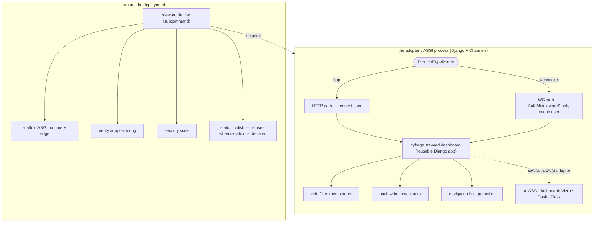

# Architecture Spine — secure-live-dashboards

## Design Paradigm

**A reusable Django app in the request path, a subcommand around it.**

The pattern is not one artifact. It is two, divided by the only boundary that cannot be
argued with: whether the code runs **inside the adopting service's process, per request or
per message**, or **outside it, around the deployment**.

Everything that decides what a specific caller may see must run in-process — a subprocess
cannot filter a dataframe mid-request. Everything that stands the runtime up and inspects it
must run out-of-process — a library cannot provision an edge proxy. Attempts to deliver the
pattern as a single thing fail on one half or the other.

The in-process half plugs into the estate's primary backend — a **Django service with
Channels, on ASGI** — as a reusable Django app the adopter adds to `INSTALLED_APPS`.

## Invariants & Rules

### AD-1 — Delivery splits on the process boundary

**Binds:** every component of the pattern.
**Prevents:** a delivery shape that cannot express half of what the pattern must do, and the
per-dashboard reinvention the Spec exists to end.
**Rule:** in-process concerns — identity extraction, RLS filtering, audit write, conditional
navigation — ship as the **library** `pyforge.steward.dashboard`. Out-of-process concerns —
runtime scaffold, edge policy, ASGI topology, security suite, wiring verification, static
publish — ship as a **subcommand** under the existing `steward deploy` verb. No concern may be
delivered by both.

*Rejected: a template repository. It has no upgrade path — a diverged adopter never receives a
fix, and the Spec's own open question names that as the case that decides it — and it
duplicates the genesis-installer role already consolidated into `pyforge-marshal`. Also
rejected: subcommand-only (a subprocess cannot filter a dataframe mid-request) and
library-only (a library cannot provision an edge).*

### AD-2 — The library provides; the subcommand verifies

**Binds:** the provide-vs-verify question the Spec left open.
**Prevents:** the two failure modes at either extreme — reimplementation, and undetected
divergence.
**Rule:** the library **provides** the pipeline, so no adopter writes its own filtering,
audit or navigation logic. The subcommand **verifies** an adopter's wiring, so an adopter
that diverged anyway is still caught. Neither half may assume the other ran.

*Rejected: provide-only — a diverged adopter becomes invisible. Rejected: verify-only — every
adopter reimplements the pipeline, which is the wall this pattern exists to remove.*

### AD-3 — Verification is Steward's, with one carve-out to Doctor

**Binds:** ownership of the conformance verdict.
**Prevents:** a cross-station dependency in every adopter's deploy path, and — at the other
extreme — Steward silently grading its own implementation.
**Rule:** `steward deploy` verifies an **adopter's wiring**. That is not self-grading:
Charter §6 bars a station being the final word on *its own* artifact, and an adopter's
dashboard belongs to the adopter. **Carve-out:** a verdict on whether **Steward's own pattern
implementation** is sound — as distinct from an adopter's use of it — is **Doctor's**, because
that case *is* Steward grading itself.

*Rejected: routing all verification to Doctor. Technically available — Doctor's sources take
`target: Path`, so an external directory is reachable — but it buys Charter purity by coupling
every adopter's deployment to a second station, so a Doctor fault would block a deploy. Doctor
is also a repo-rooted diagnostic for THIS factory; making it a runtime dependency of external
deployments inverts its role.*

### AD-4 — The trusted ingress is declared, not assumed

**Binds:** header-sourced identity, every deployment. Scoped by AD-11.
**Prevents:** the pattern's strongest guarantee resting on an undocumented network assumption
— anything able to reach the app directly can forge the role header.
**Rule:** where identity arrives as a proxy header, the adopter **declares** the trusted
ingress (the address or interface the proxy connects from), and the app **refuses to start**
when identity headers arrive from outside it. The pattern never authenticates a user; it
authenticates the *path*.

*Rejected: trusting any header that arrives, which is the blueprint's behaviour and leaves the
guarantee undocumented and unenforced. Rejected: requiring mTLS or a shared secret for v1 —
correct, but it raises the adoption floor beyond a pattern's remit. Recorded as the upgrade
path, not the entry requirement.*

### AD-5 — Cross-worker state is pluggable; the sharing property is not

**Binds:** the response cache **and** the Channels channel layer, under any worker topology.
**Prevents:** two guarantees silently failing under concurrency — one fetch per refresh, and
a group broadcast reaching every viewer.
**Rule:** no specific backend is mandated. **Any** cross-worker shared state that **cannot be
shared across worker processes is refused** when the deployment runs more than one worker.
A single-worker adopter may use in-process backends for both.

*The channel layer is the second instance of the same failure, not a new one: the in-memory
layer is single-process, so under multiple workers a group broadcast reaches only the workers
holding those sockets and the dashboard updates for some viewers and not others.
`channels_redis` is the sanctioned layer backend where it applies. Rejected: mandating Redis —
it raises the floor for a small adopter that needs neither. Rejected: accepting any backend —
the blueprint's own sample pairs `FileSystemCache` with a Compose stack that provisions Redis
precisely so four workers share state; under `--workers 4` that sample does not deliver the
property it claims.*

### AD-6 — Filter, then search — enforced by signature, not by discipline

**Binds:** every search surface.
**Prevents:** a search that reaches rows the caller may not see.
**Rule:** search operates only on the already-role-filtered frame. The library **exposes no
entry point that can search the master set** — the unfiltered frame is never passed to a
searchable surface. The ordering is a property of the API shape, not of the caller's care.

*Rejected: documenting the order and trusting adopters to honour it. That is precisely how the
leak occurs, and the Spec's open question asks what ENFORCES the order — a comment does not.*

### AD-7 — Audit retention is declared by the adopter; the pattern refuses a default

**Binds:** the audit trail's lifecycle and its readership.
**Prevents:** silently making a data-protection decision on behalf of an organisation whose
legal obligations the pattern cannot know — and the trail itself becoming the leak.
**Rule:** an adopter **declares** a retention period; the pattern enforces it. There is no
default, and a deployment without one is refused rather than run unbounded. **The trail is
itself role-isolated data** — any surface that displays it passes through the same filtering
and audit path as any other dataset, so reading the audit trail is a recorded act.

*Rejected: an unbounded default — it silently accumulates personal activity data forever.
Rejected: a fixed default — it imposes one jurisdiction's answer on every adopter. Rejected:
exempting the audit surface from filtering because it is an admin view — that makes the record
of who saw what the one dataset nobody's access to is governed or recorded.*

### AD-8 — The pattern binds at the ASGI boundary, never to a dashboard framework

**Binds:** every component of the library.
**Prevents:** a pattern that cannot serve its own second adopter, and one that forfeits
Channels.
**Rule:** the library binds at the **ASGI application boundary** and is mountable inside a
Django project. No component may require a particular dashboard framework, and no adopter may
be asked to change frameworks to adopt. A **WSGI-native dashboard (Vizro, Dash, Flask) is
mounted through a WSGI-to-ASGI adapter** rather than forcing the host to be WSGI. Vizro is the
first adopter's choice, not the pattern's requirement.

*The framework-neutrality half was forced by Herald: it is a stateless CLI plus a static
dashboard, and its live-backend Spec commits to no framework. The protocol half was forced by
the operator's constraint that the primary backend is Django with Channels on ASGI — the
rule's first drafting said WSGI, which is the sync protocol and would forfeit Channels
entirely. Rejected: keeping the Vizro binding and asking Herald to adopt Vizro — that reshapes
an adopter's application to fit the pattern, inverting who serves whom.*

### AD-9 — Machine callers authenticate by proof, not by ingress

**Binds:** every non-human caller. A carve-out to AD-4.
**Prevents:** AD-4 refusing every legitimate CI call.
**Rule:** a machine caller presents a **verifiable signature** (HMAC) and is authenticated by
that proof rather than by the path it arrived on. It is **never granted a human role**, and the
identity-header path stays closed to it. AD-4's refusal governs human identity only.

*Forced by Herald's LB-2 webhook receiver — an inbound caller that is not a proxied human.
Rejected: whitelisting CI source addresses at the ingress — it re-treats the network path as
the credential for a caller that can carry a real one, and CI egress addresses are neither
stable nor narrow.*

### AD-10 — Static export and role isolation are mutually exclusive

**Binds:** the choice of delivery mode, per dashboard.
**Prevents:** a board silently losing the guarantee CAP-2 exists to make, by being republished
somewhere cheaper.
**Rule:** the two delivery modes are a **choice, not a spectrum** — public and unrestricted at
zero infrastructure, or role-isolated and hosted. A board that has **declared an access column
may not be delivered by static export**, and the static build **refuses rather than warns**.

*The static mode's client-side filtering embeds the data for all states in the page, so every
role's rows reach every browser and the dropdown is presentation — the exact thing the Spec's
own constraint forbids as access control. With no server there is also no audit trail at all,
not a reduced one. Rejected: treating static export as a cheap deployment option for the same
dashboard — it removes a guarantee silently.*

### AD-11 — The identity source is pluggable; the no-authentication rule is not

**Binds:** identity resolution on every protocol.
**Prevents:** asking a Django estate to bypass its own auth layer — and, at the other end, an
adopter wiring auth for HTTP only and serving an anonymous socket.
**Rule:** the pattern consumes an **already-established** identity and authenticates nobody.
The source is pluggable: a trusted-ingress proxy header (AD-4), **or** the host framework's
authenticated user. Inside Django the accessor is **protocol-specific** — `request.user` and
its groups over HTTP, **`scope["user"]` over a Channels WebSocket**, populated by
`AuthMiddlewareStack`. A connection whose identity cannot be resolved is **refused**, never
served anonymously by default.

*The protocol-specific accessor is not a detail: an adopter that wires `AuthMiddlewareStack`
for HTTP only gets an anonymous scope on the socket, and would silently serve either
unfiltered or empty data. Rejected: proxy headers as the only source — it asks a Django estate
to re-establish at the edge an identity it already owns. Rejected: the pattern owning
authentication, which stays a Non-goal.*

### AD-12 — Isolation and audit are per message, not only per request

**Binds:** every persistent connection.
**Prevents:** a WebSocket becoming a stale-privilege cache.
**Rule:** on a persistent connection the caller's role is **re-resolved per message**, every
message that returns data is **audited with its row count** exactly like a request, and a
connection whose identity can no longer be resolved is **closed rather than served**.

*A role captured once at connect would outlive a revocation for the entire life of the socket.
Rejected: resolving the role once at the connect handshake — simpler, and the standard
shortcut, which is precisely why it needs ruling out here.*

### AD-13 — The library ships as a reusable Django app, by Django's own convention

**Binds:** the library's packaging and its integration surface.
**Prevents:** an integration that cannot ship the audit model, and migrations that mutate
under the adopter's settings.
**Rule:** the adopter enables the library via **`INSTALLED_APPS` plus an `include()`** of its
URLconf. Binding specifics, from Django 6.0's reusable-app convention: an **explicit
`AppConfig` label**, unique in `INSTALLED_APPS` and never colliding with a contrib label
(`auth`, `admin`, `messages`); **`default_auto_field` set on that `AppConfig`**; templates and
static namespaced under that label.

*`default_auto_field` is load-bearing rather than boilerplate here: this app ships an
audit-trail **model with migrations** into someone else's project, and without it those
migrations shift under the adopter's `DEFAULT_AUTO_FIELD`. Deviation recorded: the
`django-` / `django_` name prefix is **not** taken — it identifies standalone Django
distributions on PyPI, and this ships inside `pyforge-steward`, so the module stays
`pyforge.steward.dashboard`. Rejected: a settings-configured, middleware-only integration with
no `AppConfig` — it cannot ship models or migrations, which the audit trail requires.*

### AD-14 — SQLite in development, PostgreSQL in deployment — and contention is proven, not inferred

**Binds:** the audit store and every test that claims a boundary holds.
**Prevents:** a boundary that holds in development and fails in production.
**Rule:** one Django `DATABASES` setting, two engines, selected by **connection configuration
alone** — never two code paths. **Contention behaviour is proven against PostgreSQL in CI**,
never inferred from a green SQLite run.

*The second sentence is why this is an invariant and not a stack row. SQLite does not exhibit
the concurrent-write contention production will, and AD-12 puts an audit write on the hot path
of every data-returning message across many simultaneous sockets — so the system's
highest-contention path is the one development exercises least. Rejected: PostgreSQL
everywhere including development — it raises the local floor the Spec deliberately keeps low.
Rejected: trusting the SQLite run, which is exactly how this fails.*

## Consistency Conventions

| Concern | Convention |
|---|---|
| Secrets | resolve through Steward's `keys` surface; no literal key, no default-key fallback, ever |
| ORM in async consumers | every ORM call from an async consumer goes through `database_sync_to_async` — the audit write is on the hot path of each data-returning message (AD-12), so the correctness rule and the performance rule are the same rule |
| UI gating | presentation only — every gated capability is independently refused at the endpoint |
| Cache writes | only the master set is cached; a role-filtered frame is never written back |
| Test validity | an isolation test must fail when its guard is removed, demonstrated — a test that cannot fail is a defect, not coverage |
| Environments | development and production differ by connection configuration, never by code path |
| Refusals | a refused deployment names the missing declaration (ingress or identity source, retention, shareable cross-worker state) |

## Stack

SEED — verified at authoring; the code owns this once it exists.

| Element | Choice | Availability to this conda/pixi estate |
|---|---|---|
| Host | **Django 5.2 LTS** (the estate's catalog pin) | `recipes/django` — local recipe |
| Django integration | **`channels`** 4.x — the ASGI/consumer/routing layer | `recipes/channels` — local recipe |
| Termination server | **`daphne`** 4.x — terminates **both** HTTP and WebSocket. Not Gunicorn `gthread`; the blueprint's WSGI topology does not apply | `conda-forge/daphne-feedstock` — consumed, no new recipe (BSD-3, noarch, pins `asgiref >=3.5.2,<4`) |
| Base ASGI library | **`asgiref`** — load-bearing, not transitive: it supplies AD-8's WSGI→ASGI adapter and the sync/async bridge behind `database_sync_to_async` | `conda-forge/asgiref-feedstock` — consumed, 3.11.1, BSD-3, noarch |
| Channel layer | **`channels_redis`** — *optional*, required only where workers > 1 (AD-5) | `recipes/channels_redis` — local recipe |
| Library home | `pyforge.steward.dashboard`, a reusable Django app (source dep, the `pyforge-atlas`→`pyforge-warden` precedent) | — |
| Subcommand home | `steward deploy` (existing verb: dashboard build/reconcile/status) | — |
| Dashboard framework | **none — AD-8.** Vizro is the first adopter's choice, mounted through the WSGI→ASGI adapter | `recipes/vizro` — local recipe |
| Database | **SQLite** dev/test, **PostgreSQL** deploy — AD-14 | — |
| Audit store | Django ORM with migrations | — |
| Static mode | Plotly `fig.to_html` export → responsive grid → CI publish to `gh-pages` | — |

*Version caveat: AD-13's reusable-app rules were verified against the Django **6.0** doc, while
the estate's catalog pins **5.2 LTS**. The mechanics AD-13 binds — explicit `AppConfig` label,
`default_auto_field`, namespaced templates/static, `include()` URLconf — are stable across
both, so the rules hold at 5.2; re-check only if the estate moves to 6.x.*

## Capability → Architecture Map

AD-8 and AD-13 govern every row in the *library* column — none of it may require a dashboard
framework, and all of it installs as one Django app.

| Capability | Where it lives | Governed by |
|---|---|---|
| CAP-1 identity from request | library | AD-1, AD-4, AD-9, AD-11 |
| CAP-2 declared row isolation | library | AD-1, AD-2, AD-5, AD-6, AD-12 |
| CAP-3 unauthorized page absent | library | AD-1, AD-2 |
| CAP-4 audit with row counts | library | AD-1, AD-7, AD-12, AD-13 |
| CAP-5 export gated server-side | library (refusal) + subcommand (alerting) | AD-1, AD-2 |
| CAP-6 deployment perimeter | subcommand | AD-1, AD-5, AD-8 |
| CAP-7 non-vacuous security suite | subcommand | AD-2, AD-3 |
| CAP-8 hosted-or-static, one definition | subcommand | AD-10 |

## Deferred

- **Each adopter's migration.** Two adopters are **bound**, each by its own Spec — Atlas
  (first, and the proof) and Herald (`spec-herald-moments-2-4-live-backend` adopts this rather
  than building its own backend). *When* each migrates is the owning station's call.
- **Marshal's alternate live fleet board — a candidate, not yet bound.** The capability fit is
  the strongest in the estate: `docs/dashboard/data.js` is already keyed **by station**, so the
  access column exists without inventing one. But `spec-factory-console` owns that board and
  its Dream is `realized`, so a live variant is new scope that starts with its own Dream — not
  an amendment to a shipped Spec. What is absent is demand, not capability.
- **What keeps the two delivery modes from diverging.** If the static export re-derives charts
  by hand, one dashboard becomes two. Named as an open question on the Spec; the mechanism is
  the build's to settle.
- **`include_plotlyjs='cdn'` in the static mode** — it keeps the bundle small, does not work
  air-gapped, and executes third-party code in the viewer's browser. Deferred against
  `spec-enterprise-airgap`, which is the surface that will force the answer.
- **Which alerting sinks ship.** The webhook contract is fixed; whether SIEM, Slack and Teams
  each get a first-class adapter is a demand question with no adopters yet.
- **mTLS or a shared secret at the ingress.** AD-4's upgrade path, for deployments whose
  network path is not itself a sufficient control.
- **Multi-tenant isolation.** The pattern isolates *roles* within one organisation. Isolating
  *tenants* is a different problem, not in scope until one is asked for.
- **The operational envelope of the audit store** — backup, restore, and where a clustered
  database runs. It belongs to the adopter's estate, not to the pattern.
