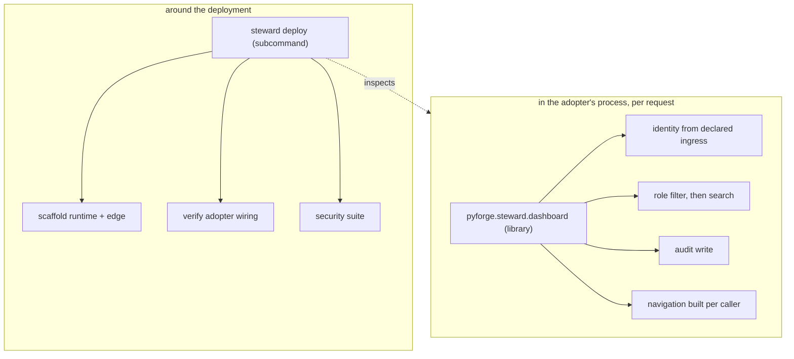

# Architecture Spine — secure-live-dashboards

## Design Paradigm

**A library in the request path, a subcommand around it.**

The pattern is not one artifact. It is two, divided by the only boundary that cannot be
argued with: whether the code runs **inside the adopting dashboard's process, per HTTP
request**, or **outside it, around the deployment**.

Everything that decides what a specific caller may see must run in-process — a subprocess
cannot filter a dataframe mid-request. Everything that stands the runtime up and inspects it
must run out-of-process — a library cannot provision an edge proxy. Attempts to deliver the
pattern as a single thing fail on one half or the other.

## Invariants & Rules

### AD-1 — Delivery splits on the process boundary

**Binds:** every component of the pattern.
**Prevents:** a delivery shape that cannot express half of what the pattern must do, and the
per-dashboard reinvention the Spec exists to end.
**Rule:** in-process concerns — identity extraction, RLS filtering, audit write, conditional
navigation — ship as the **library** `pyforge.steward.dashboard`. Out-of-process concerns —
runtime scaffold, edge policy, WSGI topology, security suite, wiring verification — ship as a
**subcommand** under the existing `steward deploy` verb. No concern may be delivered by both.

*Rejected: a template repository. It has no upgrade path — a diverged adopter never receives a
fix, and the Spec's own open question names that as the case that decides it — and it
duplicates the genesis-installer role already consolidated into `pyforge-marshal`. Also
rejected: subcommand-only (a subprocess cannot filter a dataframe mid-request) and
library-only (a library cannot provision Nginx).*

### AD-2 — The library provides; the subcommand verifies

**Binds:** the provide-vs-verify question the Spec left open.
**Prevents:** the two failure modes at either extreme — reimplementation, and undetected
divergence.
**Rule:** the library **provides** the pipeline, so no adopter writes its own filtering,
audit or navigation logic. The subcommand **verifies** an adopter's wiring, so an adopter
that diverged anyway is still caught. Neither half may assume the other ran.

*Rejected: provide-only — a diverged adopter becomes invisible. Rejected: verify-only — every
adopter reimplements the pipeline, which is the wall this pattern exists to remove.*

### AD-3 — Verification is Steward's, with one carve-out to Doctor

**Binds:** ownership of the conformance verdict.
**Prevents:** a cross-station dependency in every adopter's deploy path, and — at the other
extreme — Steward silently grading its own implementation.
**Rule:** `steward deploy` verifies an **adopter's wiring**. That is not self-grading:
Charter §6 bars a station being the final word on *its own* artifact, and an adopter's
dashboard belongs to the adopter. **Carve-out:** a verdict on whether **Steward's own pattern
implementation** is sound — as distinct from an adopter's use of it — is **Doctor's**, because
that case *is* Steward grading itself.

*Rejected: routing all verification to Doctor. Technically available — Doctor's sources take
`target: Path`, so an external directory is reachable — but it buys Charter purity by coupling
every adopter's deployment to a second station, so a Doctor fault would block a deploy. Doctor
is also a repo-rooted diagnostic for THIS factory; making it a runtime dependency of external
deployments inverts its role.*

### AD-4 — The trusted ingress is declared, not assumed

**Binds:** identity extraction, every deployment.
**Prevents:** the pattern's strongest guarantee resting on an undocumented network assumption
— anything able to reach the app directly can forge the role header.
**Rule:** an adopter **declares** the trusted ingress (the address or interface the proxy
connects from). The library **refuses to start** when identity headers arrive from outside it.
The pattern never authenticates a user; it authenticates the *path*.

*Rejected: trusting any header that arrives, which is the blueprint's behaviour and leaves the
guarantee undocumented and unenforced. Rejected: requiring mTLS or a shared secret for v1 —
correct, but it raises the adoption floor beyond a pattern's remit. Recorded as the upgrade
path, not the entry requirement.*

### AD-5 — The cache backend is pluggable; the sharing property is not

**Binds:** the cache layer under any worker topology.
**Prevents:** the one-fetch-per-refresh guarantee silently failing under concurrency.
**Rule:** Redis is **not** mandated. A cache that **cannot be shared across worker processes
is refused** when the deployment runs more than one worker. A single-worker adopter may use an
in-process cache.

*Rejected: mandating Redis — it raises the floor for a small adopter that does not need it.
Rejected: accepting any cache — the blueprint's own sample pairs `FileSystemCache` with a
Compose stack that provisions Redis precisely so four Gunicorn workers share state; under
`--workers 4` that sample does not deliver the property it claims.*

### AD-6 — Filter, then search — enforced by signature, not by discipline

**Binds:** every search surface.
**Prevents:** a search that reaches rows the caller may not see.
**Rule:** search operates only on the already-role-filtered frame. The library **exposes no
entry point that can search the master set** — the unfiltered frame is never passed to a
searchable surface. The ordering is a property of the API shape, not of the caller's care.

*Rejected: documenting the order and trusting adopters to honour it. That is precisely how the
leak occurs, and the Spec's open question asks what ENFORCES the order — a comment does not.*

### AD-7 — Audit retention is declared by the adopter; the pattern refuses a default

**Binds:** the audit trail's lifecycle and its readership.
**Prevents:** silently making a data-protection decision on behalf of an organisation whose
legal obligations the pattern cannot know — and the trail itself becoming the leak.
**Rule:** an adopter **declares** a retention period; the pattern enforces it. There is no
default, and a deployment without one is refused rather than run unbounded. **The trail is
itself role-isolated data** — any surface that displays it passes through the same filtering
and audit path as any other dataset, so reading the audit trail is a recorded act.

*Rejected: an unbounded default — it silently accumulates personal activity data forever.
Rejected: a fixed default — it imposes one jurisdiction's answer on every adopter. Rejected:
exempting the audit surface from filtering because it is an admin view — that makes the record
of who saw what the one dataset nobody's access to is governed or recorded.*

## Consistency Conventions

| Concern | Convention |
|---|---|
| Secrets | resolve through Steward's `keys` surface; no literal key, no default-key fallback, ever |
| UI gating | presentation only — every gated capability is independently refused at the endpoint |
| Cache writes | only the master set is cached; a role-filtered frame is never written back |
| Test validity | an isolation test must fail when its guard is removed, demonstrated — a test that cannot fail is a defect, not coverage |
| Environments | development and production differ by connection configuration, never by code path |
| Refusals | a refused deployment names the missing declaration (ingress, retention, shareable cache) |

## Stack

SEED — verified at authoring; the code owns this once it exists.

| Element | Choice |
|---|---|
| Library home | `pyforge.steward.dashboard` (source dep, the `pyforge-atlas`→`pyforge-warden` precedent) |
| Subcommand home | `steward deploy` (existing verb: dashboard build/reconcile/status) |
| Dashboard framework | Vizro — already packaged here as a conda recipe |
| Cache | pluggable; Redis where workers > 1 |
| Audit store | SQLAlchemy — file-backed in development, clustered in production |

## Capability → Architecture Map

| Capability | Where it lives | Governed by |
|---|---|---|
| CAP-1 identity from request | library | AD-1, AD-4 |
| CAP-2 declared row isolation | library | AD-1, AD-2, AD-5, AD-6 |
| CAP-3 unauthorized page absent | library | AD-1, AD-2 |
| CAP-4 audit with row counts | library | AD-1, AD-7 |
| CAP-5 export gated server-side | library (refusal) + subcommand (alerting) | AD-1, AD-2 |
| CAP-6 deployment perimeter | subcommand | AD-1, AD-5 |
| CAP-7 non-vacuous security suite | subcommand | AD-2, AD-3 |

## Deferred

- **The first adopter's migration.** Atlas's board adopts the pattern, but when and in what
  order is Atlas's call, not this spine's — it owns that dashboard.
- **Which alerting sinks ship.** The webhook contract is fixed; whether SIEM, Slack and Teams
  each get a first-class adapter is a demand question with no adopters yet.
- **mTLS or a shared secret at the ingress.** AD-4's upgrade path. Deferred until an adopter
  exists whose network path is not itself a sufficient control.
- **Multi-tenant isolation.** The pattern isolates *roles* within one organisation. Isolating
  *tenants* is a different problem and is not in scope until one is asked for.
- **The operational envelope of the audit store** — backup, restore, and where a clustered
  database runs. It belongs to the adopter's estate, not to the pattern.
