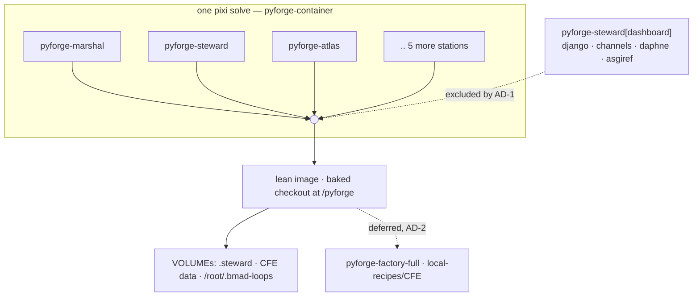

# Architecture Spine — unified-container

## Design Paradigm

**One image that tracks the fleet, because it composes stations rather than copying them.**

`pyforge-container` is not a curated dependency list. It references the eight station
features **by name**, with `no-default-feature = true`:

```toml
pyforge-container = { features = ["pyforge-marshal", "pyforge-steward", "pyforge-atlas",
  "pyforge-warden", "pyforge-doctor", "pyforge-mason", "pyforge-herald", "pyforge-scribe"],
  no-default-feature = true }
```

That single property is what keeps the image honest — it can never drift behind a station —
and it is also the whole reason this spine exists. **A per-station dependency decision is an
image-wide decision**, taken with no story written and no review of the consequence.

Mode L — the lean all-stations image — is **shipped** (Epic 7, 5/5). This spine settles what
may enter it, and fixes the Mode I boundary without designing Mode I.



## Invariants & Rules

### AD-1 — The ASGI stack is an optional extra, never a station base dependency

**Binds:** every dependency the `secure-live-dashboards` pattern introduces.
**Prevents:** a "lean" image silently acquiring a web server and a WebSocket layer.
**Rule:** django, channels, daphne, asgiref and channels_redis ship as
**`pyforge-steward[dashboard]`** — an optional extra — and **never** as base dependencies of
`pyforge-steward`.

*The argument is correctness before size. Steward's CLI is `{keys, deploy, provision,
budget}`, and `deploy` is a git reconcile-and-push; nothing in that surface imports django or
daphne. The dashboard architecture's own AD-1 puts the library **in the adopter's process**,
so the ASGI stack is a dependency of the library *as an adopter consumes it*, not of the
station. A base declaration would assert a runtime dependency the station never imports.
Size only confirms it: `daphne` alone pulls twisted, autobahn, pyopenssl, service_identity and
idna. Rejected: a base dependency in `pyforge-steward` — via composition-by-name that puts
Twisted in the lean whole-Guild image. Rejected: answering this with a tier split, which
resolves a dependency-placement question by changing the packaging instead.*

### AD-2 — One lean image stands; the second tier is deferred, with a trigger

**Binds:** the image count.
**Prevents:** a packaging split adopted for a reason that was never the real one.
**Rule:** **one** image. A second tier (`pyforge-factory-full`, carrying local-recipes/CFE)
is **deferred, not rejected**, and its revisit trigger is named: **when recipe builds need to
run inside the container.**

*Recorded honestly: the tiering proposal was never driven by the dashboard. Its real driver
is the conda build toolchain and mason's 373-file CFE surface — a separate question with its
own demand signal and no adopter asking today. Deciding it now would pull a third station
into a decision nothing forces. Rejected: splitting tiers pre-emptively.*

### AD-3 — The extra is installed in the dev env and never in the container

**Binds:** where `[dashboard]` is exercised.
**Prevents:** an optional path that rots because nothing runs it.
**Rule:** `pyforge-steward`'s in-repo dev environment installs the extra **by default**, so CI
covers it. The container **never** installs it.

*This is the `atlas → warden` precedent already in the tree — `gate = ["pyforge-warden"]`
under `[project.optional-dependencies]`, "installed by default in the in-repo `pyforge-atlas`
pixi env; external installs may omit it." Rejected: declaring the extra and installing it
nowhere, which produces an untested code path that fails first for an adopter.*

### AD-4 — Dashboard imports may not be unconditional at module level

**Binds:** `pyforge.steward.dashboard`.
**Prevents:** the extra being a fiction the packaging test correctly refuses.
**Rule:** the dashboard module's third-party imports live **behind a guard or inside the
function that needs them** — never unconditional at module top level.

*This is what makes AD-1 legal rather than aspirational. The dashboard architecture's AD-13
deliberately keeps the module inside the `pyforge-steward` distribution, so an unconditional
top-level `import django` would make `tests/packaging/test_dependency_completeness` demand
django in `[project.dependencies]` — **and it would be right to**. That test states the
remedy itself: move the import behind a guard or into the function, and declare it as an
extra. Rejected: relaxing the completeness test — it is the check that caught the missing
`bs4 → beautifulsoup4` mapping hours ago.*

### AD-5 — The checkout is baked; `/pyforge` stays a literal short root

**Binds:** the image layout and every in-container pixi invocation.
**Prevents:** the path-length panic the literal root was chosen to avoid.
**Rule:** the **baked** checkout is the primary mode; a bind-mount over `/pyforge` is the
**development override**. `/pyforge` remains **literal and short** — never a build `ARG` or
`ENV`.

*Ratifying shipped reality rather than choosing afresh: the Containerfile already bakes it
(`COPY . /pyforge`, then `COPY --from=builder`), and A3.6 recommended exactly this. The
invariant worth fixing is not baked-vs-mounted — it is the short root. A long root panics
`pixi-build-python` at the bmad-loop worktree path-length limit. Rejected: making the root
configurable, which reintroduces precisely the failure the literal prevents.*

### AD-6 — Mode I is deferred, and Mode L may not foreclose it

**Binds:** everything Mode L adds from here on.
**Prevents:** discovering at Mode I time that Mode L made it impossible.
**Rule:** Mode I is **not designed here**. Two things are ratified rather than re-decided:
`/root/.bmad-loops` is **already a declared `VOLUME`**, so an in-container loop runner gets
its worktrees on a volume rather than the image filesystem; and Mode L continues to run loops
against a **mounted host checkout**, exactly as today. **Forbidden, because each forecloses
Mode I:** baking any station state into an image layer instead of a volume, and any
assumption that the container is single-tenant or short-lived.

*Rejected: designing Mode I now — its own Spec puts that out of scope.*

## Consistency Conventions

| Concern | Convention |
|---|---|
| Adding a station dependency | it enters the whole-Guild image automatically — treat it as an image change, not a station change |
| New heavy dependency | ask AD-1's question first: does the station's own CLI import it, or only a library an adopter consumes? |
| Build-time proof | `container-gates cli-smoke` runs all eight station CLIs' `--help` during `RUN`, so a missing or slow CLI fails the **build**, never a later `docker run` |
| Secrets | `container-gates secrets-scan` runs over the rootfs at build time; no credential may reach a layer |
| Mutable state | declared as a `VOLUME`, never baked (AD-6) |

## Stack

SEED — verified against the shipped image at authoring; the code owns this.

| Element | Choice |
|---|---|
| Base | `ghcr.io/prefix-dev/pixi:0.76.1` builder → `ubuntu:24.04` runtime, `linux/amd64` |
| Env | one composed `pyforge-container`, eight station features by name, `no-default-feature` |
| Root | `/pyforge`, literal and short (AD-5) |
| Volumes | `/pyforge/.steward`, `/pyforge/.claude/data/conda-forge-expert`, `/root/.bmad-loops` |
| Entry | `/entrypoint.sh`, `CMD ["marshal"]` — every invocation goes through the entrypoint |
| Dashboard deps | `pyforge-steward[dashboard]` extra; **absent from the image** (AD-1) |

## Open Assumption

**Adopters host their own dashboards; Steward only scaffolds.** The dashboard spine's AD-1 and
CAP-6 both read scaffold-not-serve — `steward deploy` generates the ASGI runtime and edge, and
the adopter runs it. **If Steward is ever meant to *serve* dashboards itself** — one
Steward-run ASGI process hosting the Guild's boards — then the ASGI stack *is* a station
runtime dependency, **AD-1 collapses**, and the lean image is simply heavier than advertised.
Written down so the reversal is cheap to spot rather than discovered late.

## Deferred

- **Mode I (with-infrastructure).** Out of scope by the Spec's own text. AD-6 fixes only what
  Mode L may not do to it.
- **The `pyforge-factory-full` tier.** AD-2's trigger: when recipe builds need to run inside
  the container. Pulls **mason** in when it fires.
- **arm64.** The image is `linux/amd64` today; multi-arch is a real question with no demand.
- **Whether `[dashboard]` is one extra or several.** If adopters diverge — some needing
  Channels, some only HTTP — the extra may want splitting. No adopters yet.
