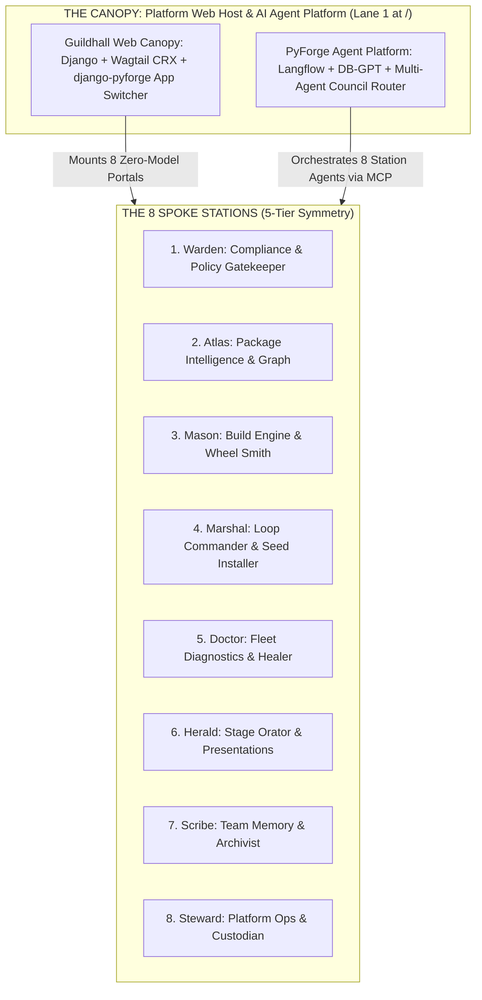
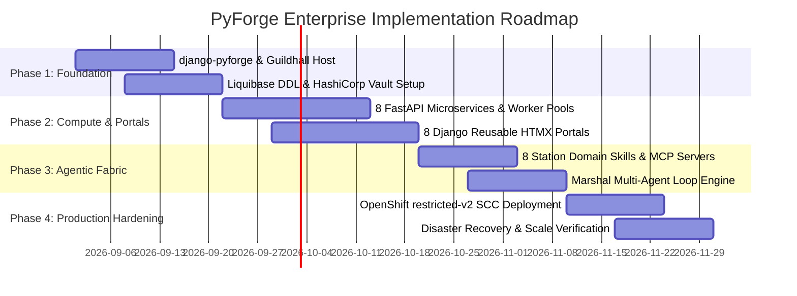

# Product Brief: PyForge Enterprise Platform

## 1. Executive Summary & Vision

**PyForge** is a unified, enterprise-grade developer and autonomous AI operating system designed to eliminate fragmentation in managing Python and conda package supply chains, recipe synthesis, compliance gating, and diagnostic remediation.

By structuring the estate as **The Central Canopy (`pyforge_host` / Guildhall + `pyforge-agent-platform`)** governing **8 specialized Spoke Stations** (`warden`, `atlas`, `mason`, `marshal`, `doctor`, `herald`, `scribe`, `steward`), PyForge introduces universal **5-Tier Symmetry** (CLI, Web Portal, Compute Microservice/MCP, Domain Skill, and Autonomous Agent Persona).

---

## 2. Target Personas & Use Cases

| Persona | Primary Interface | Key Problem Solved | Core PyForge Value |
| :--- | :--- | :--- | :--- |
| **Packaging Engineer / Dev** | Universal CLI (`pyforge mason build`) & Mason Portal | Broken compilers, conflicting C-extension flags, slow manual builds. | Automated multi-Python wheel matrix builds, local-to-remote transparent execution. |
| **SecOps / Compliance Auditor** | Warden Portal & Compliance Scorecards | Disconnected SARIF scans, unmapped licenses, manual gate waivers. | Continuous SPDX license solving, CycloneDX SBOM validation, 1-click waiver tracking. |
| **DevOps / Platform Operator** | Steward Portal & Fleet Health Console | Ingress routing drift, static secret sprawl, runaway cloud consumption. | HashiCorp Vault dynamic database leases, OpenShift `restricted-v2` SCC deployment, Keycloak RBAC. |
| **Autonomous AI Agent** | Model Context Protocol (`/mcp/sse`) & Domain Skills | Lack of deterministic tool contracts, blind retries, hallucinated commands. | Grounded `SKILL.md` SOP runbooks, structured MCP tool leasing, rate-limiting circuit breakers. |

---

## 3. The 3 Operational Planes & 10 Platform Layers

1. **UI & Routing Plane (Browser Surface):**
   * **Lane 1 (Root `/`):** Wagtail CRX-powered Guildhall Knowledge Base & Corporate Brain.
   * **Lane 2 (`/stations/{station}/`):** 8 Pluggable zero-model Django reusable apps rendered via HTMX.
   * **Lane 3 (`/analytics/{station}/`):** Isolated Vizro/Panel analytics containers reverse-proxied with auth headers.
2. **Compute & Agent Plane (Execution Fabric):**
   * **Microservices:** 8 Paired FastAPI compute services (`:8001–:8008`) exposing REST and MCP SSE streams.
   * **Worker Pool Separation (RFC-1):** Low-latency REST pool (500ms timeout budget) decoupled from persistent MCP streaming pool.
   * **CLI Dispatcher:** Unified Typer/Rich CLI (`pyforge <station> <noun> <verb>`).
3. **Data & Infrastructure Plane (Persistence & Governance):**
   * **Database DDL (RFC-5):** Single-source Liquibase changelogs (`db/changelog/`) with zero runtime ORM alterations.
   * **Secrets Engine:** HashiCorp Vault dynamic credential leasing + Kubernetes External Secrets Operator.
   * **Decoupled Redis (RFC-2):** `redis-broker` (`noeviction`) for Celery and Redis Streams; `redis-cache` (`allkeys-lru`) for web sessions and rate limiting.
   * **Data Engines:** Multi-schema PostgreSQL `pgvector`, columnar DuckDB (strict single-writer boundary), Scribe SQLite/PostgreSQL dual-driver, and MinIO S3 object mirrors.

---

## 4. Quantified Target Outcomes & Success Metrics

* **80% Reduction in Supply-Chain Maintenance Time:** Automated detection (Doctor) $
ightarrow$ Build (Mason) $
ightarrow$ Audit (Warden) $
ightarrow$ Publish (Marshal) loops eliminate manual glue scripts.
* **Sub-500ms UI Response Latency:** Zero-model HTMX portals with persistent HTTP/2 connection pooling deliver near-instantaneous partial page swaps.
* **100% Deterministic Compliance Gates:** All builds automatically evaluated against CycloneDX SBOM and SPDX license expression policies before deployment.
* **Zero Runaway AI Agent Failures:** `X-PyForge-Loop-Depth <= 5` and Redis token-bucket rate limiters prevent runaway hallucination loops.
* **100% Native Cross-Platform Parity:** Pixel-identical developer execution across Linux (`linux-64`), macOS (`osx-arm64-min`), and Windows (`win-64`).

---

## 5. Implementation Roadmap & Milestones

---

## 6. Downstream Pipeline Readiness

This Product Brief feeds directly into:
1. **`ux-pyforge-unifying-strategy.md`:** Detailed UI wireframes and cross-station operator journey maps.
2. **`party-mode-pyforge-unifying-strategy.md`:** Council of the 8 Station Agents consensus and contract agreement.
3. **`bmad-spec`:** Generation of the machine-checkable Unit of Contract and Acceptance Oracles.
