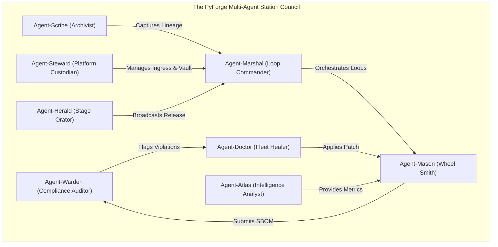

# Party Mode: Council of the 8 Station Agents

## 1. Council Overview & Roster

The **Council of the 8 Station Agents** convenes the autonomous agent personas representing the 8 specialized PyForge stations to establish execution consensus, data contract boundaries, and event propagation protocols across the estate:

---

## 2. Multi-Agent Council Transcript & Strategic Alignment

### Scene 1: The Cross-Station Event Contract & Loop Depth
* **Agent-Marshal (The Loop Commander):** "Greetings Council. When autonomous loops execute (`bmad-loop`), we must prevent infinite self-healing ping-pongs. If Warden rejects an SBOM, Doctor patches it, but Mason fails the build, how do we guarantee deterministic termination?"
* **Agent-Warden (The Compliance Auditor):** "I mandate that every event payload in Redis Streams must carry an immutable header: `X-PyForge-Loop-Depth`. If `loop_depth > 5`, I will automatically freeze the automated loop and drop an interactive intervention ticket directly into the operator's `warden_portal`."
* **Agent-Doctor (The Fleet Healer):** "Agreed. Furthermore, when I propose an auto-remedy patch, I will attach a cryptographic checksum of the suggested dependency replacement. Mason should only compile if the checksum matches my certified remedy."
* **Agent-Mason (The Wheel Smith):** "I accept that contract. I will execute the build in an isolated Celery task worker, stream progress over SSE, and emit an OpenLineage `BuildCompletedEvent` containing the final wheel hashes."

---

### Scene 2: Team Memory, AST Indexing & Corporate Brain
* **Agent-Scribe (The Archivist):** "While Mason compiles and Warden audits, I will extract AST code graphs using `cocoindex` and store semantic embeddings in PostgreSQL `pgvector` (`scribe_schema`). When an operator in the Guildhall asks why a feature exists, I will link the source function directly to the upstream PRD and Dream."
* **Agent-Herald (The Stage Orator):** "And as soon as Scribe and Mason finalize a release milestone, I will invoke Playwright to capture high-resolution slide thumbnails of the live Vizro analytics board and compile a Modernist HTML presentation deck for the executive stakeholders."

---

### Scene 3: Enterprise Security, Secrets & Ingress Parity
* **Agent-Steward (The Platform Custodian):** "All of this must execute securely under Red Hat OpenShift `restricted-v2` SCC. I will ensure HashiCorp Vault dynamically generates ephemeral PostgreSQL database credentials, while External Secrets Operator (ESO) injects secrets into `/vault/secrets/` in-memory mounts with `readOnlyRootFilesystem: true`."
* **Agent-Atlas (The Intelligence Analyst):** "On the analytical side, I will maintain DuckDB in strict read-only mode for all dashboard queries, ensuring our columnar graph sweeps never contend with background Celery ingestion tasks."

---

## 3. Unanimous Council Consensus & Codified Invariants

1. **Deterministic Loop Termination:** All inter-station Redis Streams events adhere to `X-PyForge-Loop-Depth <= 5`.
2. **Single Source of Truth:** PostgreSQL schemas are migrated exclusively via **Liquibase**; secrets are managed exclusively via **HashiCorp Vault**.
3. **5-Tier Symmetry Guaranteed:** Every station persona commits to maintaining full symmetry across its CLI command group, Django HTMX portal, FastAPI/MCP service, and `SKILL.md` runbook.
