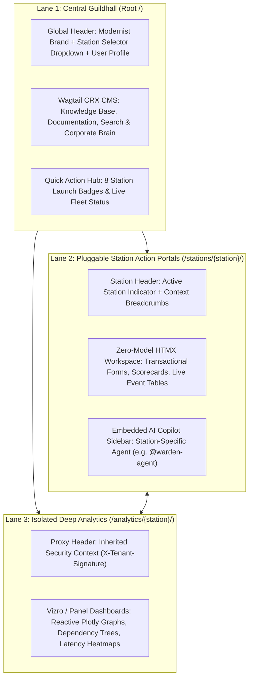
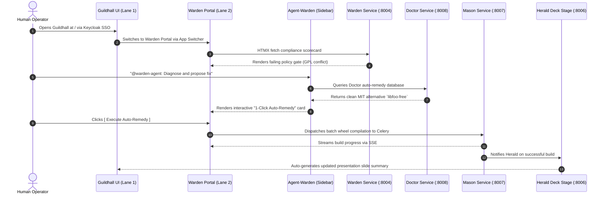

# UX Design & Cross-Station Operator Journeys

## 1. UI Topology & Navigation Architecture

The PyForge user experience is divided into **3 distinct visual lanes** unified by the **`django-pyforge` App Switcher** and the **Modernist Design Theme**:



---

## 2. Master Wireframe: The Pluggable Station Portal (`Lane 2`)

```
+--------------------------------------------------------------------------------------------------------------------+
|  [P] PyForge Guildhall   |  [Stations Dropdown v]  |  Docs  |  Search... (/)  |  [Status: Healthy]  |  [User: rxm7706]  |
+--------------------------------------------------------------------------------------------------------------------+
|  < Stations / Warden Compliance & Policies >                                                                        |
+---------------------------------------------------------------------------------+----------------------------------+
|  WARDEN COMPLIANCE CONSOLE                                                      |  AI COPILOT: @warden-agent       |
|  Active Target: local-recipes (Python 3.14 / linux-64)                          |  Skill: pyforge-warden           |
|                                                                                 +----------------------------------+
|  +------------------------+  +------------------------+  +--------------------+ |  Warden: I detected a GPL-3.0    |
|  | SBOM Compliance: 99.4% |  | Unresolved CVEs: 0     |  | Active Waivers: 2  | |  license conflict in package     |
|  +------------------------+  +------------------------+  +--------------------+ |  `libfoo-core` against policy.   |
|                                                                                 |                                  |
|  POLICY VIOLATION DETECTED                                                      |  Operator: Can you explain and   |
|  -----------------------------------------------------------------------------  |  draft a waiver for 30 days?     |
|  Package: `libfoo-core` (v1.4.2)                                                |                                  |
|  Rule: Enterprise Permissive Policy (SPDX Expression Failure)                    |  Warden: Analysis:               |
|  Impact: Blocks Mason build release gate                                        |  - Direct dependency is MIT      |
|                                                                                 |  - Bundled C-header is GPL-3.0   |
|  [View SARIF Report]   [Open in Scribe Graph]   [Request Waiver]                |                                  |
|                                                                                 |  [ Draft Waiver Action Button ]  |
|  +---------------------------------------------------------------------------+  |                                  |
|  | ONE-CLICK REMEDIATION (Powered by Doctor & Mason)                         |  |  [ Ask Follow-up Question... ]  |
|  | Doctor identified a compatible MIT drop-in replacement: `libfoo-free`     |  |                                  |
|  | [ Execute 1-Click Auto-Remedy & Rebuild Matrix ]                          |  |                                  |
|  +---------------------------------------------------------------------------+  |                                  |
+---------------------------------------------------------------------------------+----------------------------------+
|  Footer: PyForge v2026.8.23 · Air-Gapped LocalStack Mode · OCP Restricted-v2 SCC Verified                           |
+--------------------------------------------------------------------------------------------------------------------+
```

---

## 3. End-to-End Operator Journey: The Self-Healing Supply Chain



---

## 4. Key UX Principles & Accessibility

1. **Zero Layout Shift & Instant HTMX Swaps:** State mutations use partial DOM replacements with smooth CSS transitions (`opacity 0.2s ease-in-out`), eliminating full page reloads.
2. **Keyboard-First Power Navigation:**
   * `/` — Focus global corporate brain search.
   * `Ctrl + K` / `Cmd + K` — Open instant Station Switcher palette.
   * `Ctrl + J` — Toggle embedded AI Copilot sidebar.
3. **Air-Gapped Color Contrast & Theme Invariants:** Strict WCAG 2.1 AAA contrast compliance utilizing the Modernist monochromatic palette with semantic state badges (`#107C41` for Healthy, `#D83B01` for Blocked, `#0078D4` for Active).
