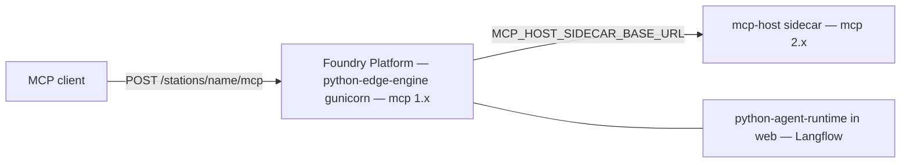

# Architecture diagrams (slice 1)

Pin isolation only. Not the Unifying Strategy hub map.

Foundry Platform keeps path identity (`POST /stations/<name>/mcp` on the host
ASGI). Sidecar speaks official `MCPServer` + dual-era gate. Web never imports
`mcp.server.mcpserver` when the sidecar URL is set. This SPEC’s **CAP-1** CRC
proof used atlas; the wire is every mounted face. Not Unifying `CAP-1` and not
`pap:CAP-1`.

**This SPEC’s CAP-4:** the cluster chart always emits the sidecar box and always sets the
URL on Host. Laptop may omit the URL (in-process or ImportError skip). Slice 3
is not this diagram.
