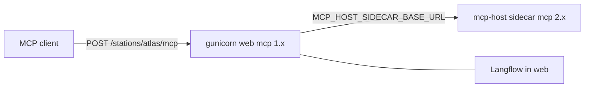

# Architecture diagrams (slice 1)

```mermaid
flowchart LR
  Client[MCP client]
  Host["gunicorn web mcp 1.x"]
  Side["mcp-host sidecar mcp 2.x"]
  LF[Langflow in web]
  Client -->|"POST /stations/atlas/mcp"| Host
  Host -->|"MCP_HOST_SIDECAR_BASE_URL"| Side
  Host --- LF
```

Host keeps path identity. Sidecar speaks official `MCPServer` + dual-era gate.
Web never imports `mcp.server.mcpserver` when the sidecar URL is set.
