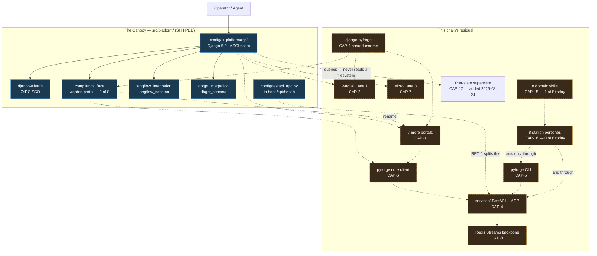
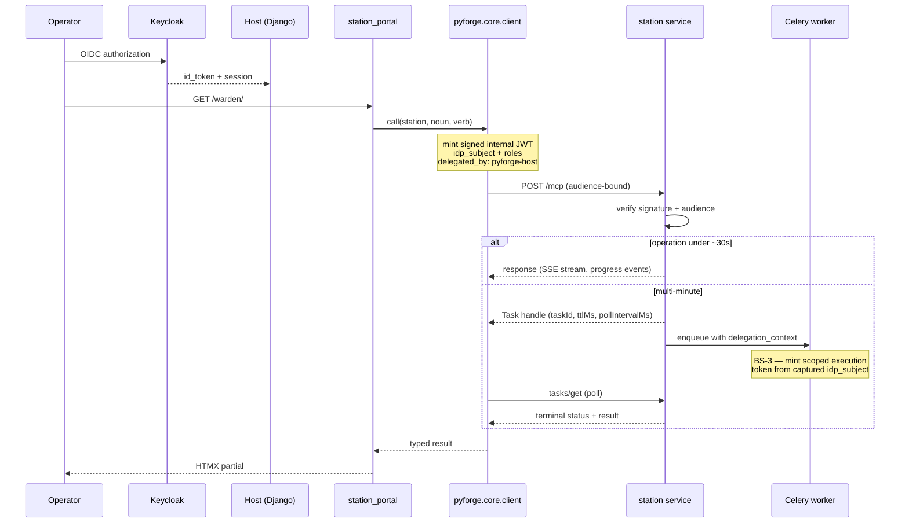
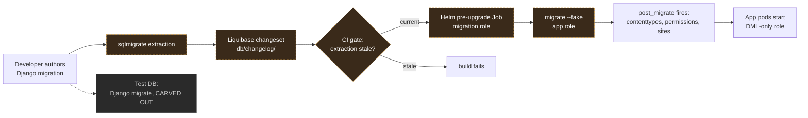
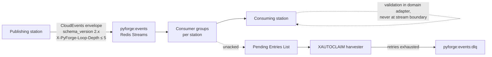
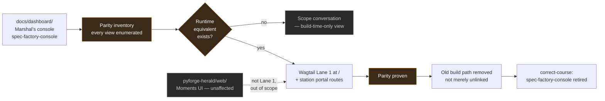

# Architecture diagrams

Companion to `SPEC.md` — Spec Law rule 2 keeps diagrams out of the kernel. These render the
contract, not the aspiration: **solid** boxes are shipped and covered by `spec-python-agent-platform`
or a station's own spec; **dashed** boxes are this chain's residual.

## The Canopy as it stands and as it extends

## Request path and the identity chain (CAP-6)

Load-bearing detail: no portal ever constructs a raw request, and no service ever trusts a
forwarded header. The delegated assertion is the only accepted identity.

## DDL governance (CAP-9, revised RFC-5)

The ordering matters and is the part most easily got wrong: Liquibase runs in a **pre-upgrade Job**,
not an init container, and `migrate --fake` still runs so `post_migrate` can populate content
types, permissions and sites.

## Event backbone (CAP-8, RFC-4 + BS-6)

## Lane 1 supersession (CAP-2)

Decided 2026-08-24: Wagtail Lane 1 **supersedes** Marshal's statically-built console. The ordering
is the whole content of this diagram — parity is proven before the old path is removed, and the
spec correction lands in the same chain rather than trailing it.

