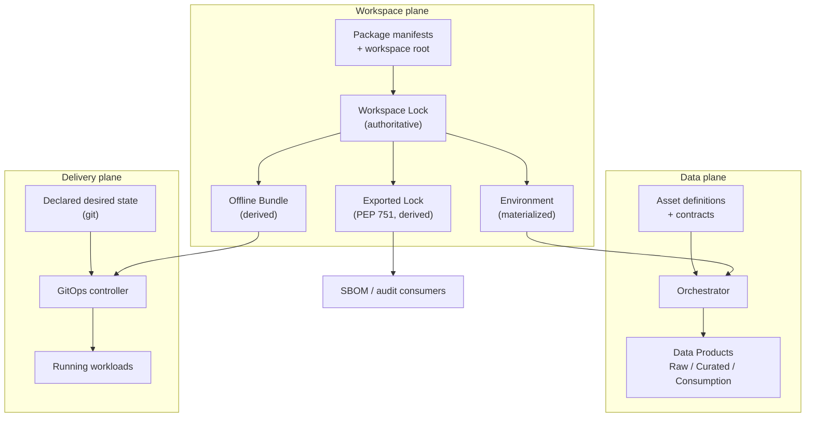
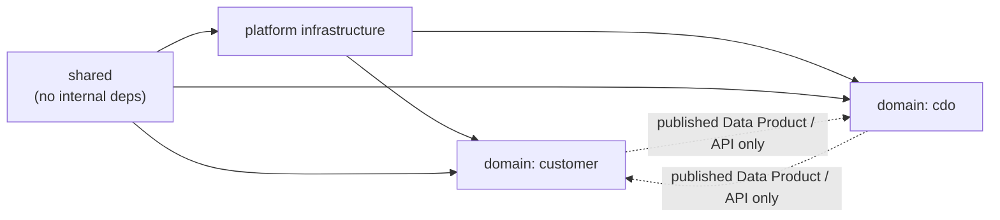
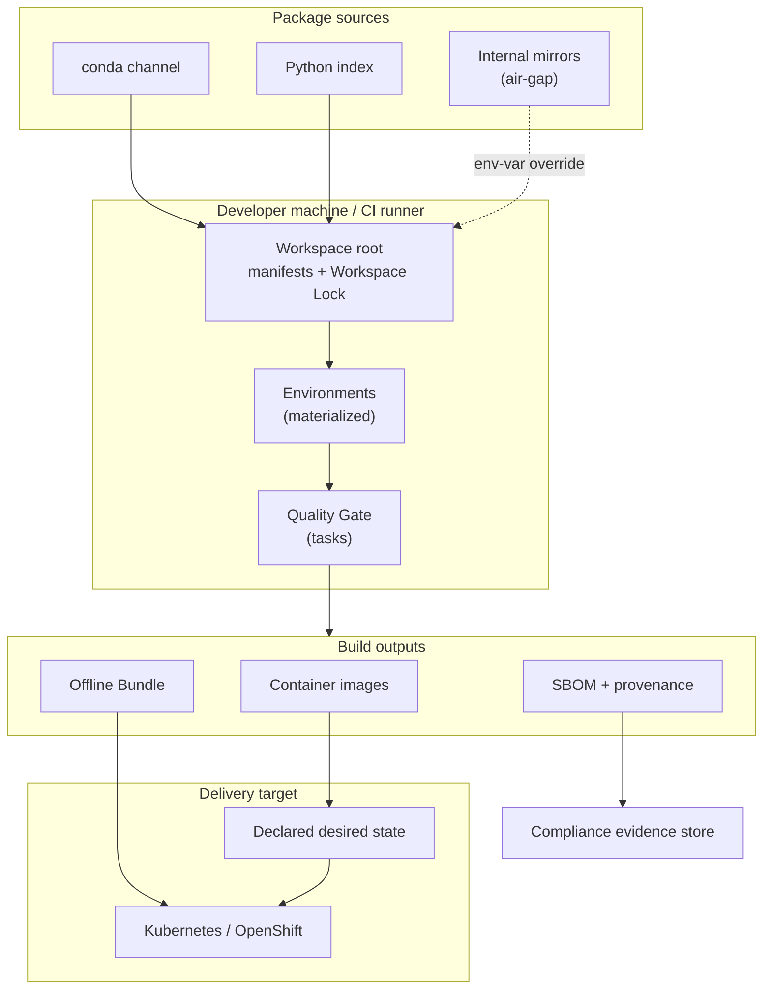
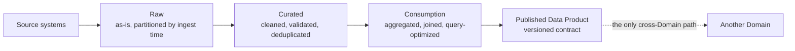

# Architecture Spine — Unity Data Stack

## Design Paradigm

**Declarative Reconciliation.** Every plane declares a desired state and materializes it; nothing
is mutated in place. The same model appears three times, which is why one paradigm governs the
whole platform:

| Plane | Declared | Reconciler | Materialized |
|---|---|---|---|
| **Workspace** | manifests → Workspace Lock | workspace manager | an Environment on disk |
| **Data** | Asset definitions + metadata | orchestrator | a Data Product in a Layer |
| **Delivery** | git-tracked desired state | GitOps controller | running workloads |

The consequences that bind: a materialized thing is **disposable and re-derivable**; a change is
made to the declaration, never to the materialization; and **drift between the two is a defect
with a detector**, not a fact of life. Every AD below is an instance of that rule.

The Data plane additionally follows **Data Mesh** (federated, domain-oriented ownership) with a
medallion **Raw → Curated → Consumption** layering.



---

## Invariants & Rules

### AD-1 — Declarative Reconciliation is the platform's single paradigm

- **Binds:** all
- **Prevents:** one plane growing an imperative escape hatch (a hand-mutated environment, a
  hand-edited running config, a manually-repaired Data Product) that the other planes' guarantees
  then cannot rely on.
- **Rule:** every capability declares desired state and materializes it. Mutating a materialized
  artifact directly is prohibited; the fix is a declaration change plus re-materialization. Any
  materialization that can drift from its declaration ships a drift detector, and the detector
  runs in the Quality Gate.

### AD-2 — The Workspace Lock is authoritative; every other lock artifact is derived

*Resolves PRD OQ-1.*

- **Binds:** FR-10, FR-11, FR-12, FR-13; all Packages; all delivery
- **Prevents:** two lock artifacts each claiming authority, resolved by two different solvers,
  silently disagreeing — the seam where "reproducible" stops being true. Also prevents the
  production runtime quietly abandoning conda and taking the native half of the stack out of the
  reproducibility guarantee.
- **Rule:** exactly one lock — the Workspace Lock, covering conda and PyPI packages together — is
  authoritative and committed. The **Exported Lock** (PEP 751 `pylock.toml`) and the **Offline
  Bundle** are generated *from* it and are never hand-edited nor used as an input to resolution.
  A drift check comparing each derived artifact against the Workspace Lock runs in the Quality
  Gate and fails on mismatch. No component may declare a dependency that is satisfiable only
  outside the Workspace Lock.

### AD-3 — Multi-platform coverage is proven by materialization, never inferred

*Resolves PRD OQ-16.*

- **Binds:** FR-11, FR-12, NFR-1, NFR-8
- **Prevents:** shipping a lock that installs on the machine that produced it and fails
  elsewhere — the failure mode PEP 751 permits, because the format's `environments` markers
  describe intent rather than guarantee coverage.
- **Rule:** for every declared platform × every deployable Environment, a gate **materializes**
  the Environment from the lock and fails if it cannot. Coverage is reported per platform, never
  as a single boolean. A platform that cannot be materialized is removed from the declared matrix
  or has its blocker recorded with a reason code — it is never left silently uncovered.

### AD-4 — A Stage is configuration; an Environment is a solve

*Resolves PRD OQ-9.*

- **Binds:** FR-9, FR-56, FR-58; the delivery plane
- **Prevents:** the delivery/data-governance taxonomy being projected onto the dependency-set
  taxonomy — which in the intake set produced twelve Stages over roughly five distinct dependency
  sets, i.e. eight redundant solves, installs, and cache entries, while the differences that
  actually matter (data classification, network posture) stayed invisible to the solver.
- **Rule:** **Stage** is a validated configuration record — branch policy, Data Classification,
  network posture, datastore, promotion policy, and a reference to exactly one Environment.
  **Environment** is a named composition of Features that is solved and materialized. Many Stages
  may reference one Environment. A new Stage never implies a new Environment; a new Environment
  requires a genuinely distinct dependency set and a recorded reason. Stage records are
  schema-validated on load.

### AD-5 — Packages link by editable path install; native workspace members are deferred

*Resolves PRD OQ-9b.*

- **Binds:** FR-5; all Packages
- **Prevents:** two linking mechanisms coexisting, and a preview-status feature sitting on the
  critical path where a stable alternative exists.
- **Rule:** every intra-Workspace Package dependency is declared as an editable path install from
  the Workspace root. Native workspace-member linking is not used until it leaves preview.
  **Revisit trigger:** the first Package that is not pure Python (a compiled extension, a
  non-Python build backend) — at that point native members become the only path and this AD is
  amended rather than worked around.

### AD-6 — The compliance gate is consumed as a CLI in a lean, isolated Environment

*Resolves PRD OQ-4.*

- **Binds:** FR-22, FR-43…FR-47; the Quality Gate
- **Prevents:** the compliance tool's dependency graph entangling the platform's; and the
  local-versus-CI divergence that a CI-only integration would create.
- **Rule:** the compliance capability is invoked as a command in its own Environment declared
  with no inherited default dependencies. It is never imported as a library by platform or
  Package code, and never invoked only in CI. Its output is the Compliance Report **file**;
  nothing consumes its internal APIs. The gate's exit code derives from the report, not from the
  tool's incidental exit behaviour.

### AD-7 — Dependency direction is one-way and domains are peers, not dependencies

- **Binds:** FR-5, FR-48; all Packages
- **Prevents:** the cycle that turns a monorepo into a distributed monolith; and cross-Domain
  coupling to internals, which destroys the Data Mesh ownership guarantee the moment a Domain
  wants to change something.
- **Rule:** dependencies flow **shared → platform-infrastructure → domain**, never upward and
  never sideways between Domains. A Domain may consume another Domain's **published** Data
  Product or API; it may never import another Domain's Package or reach its datastore directly.
  A cycle detector runs in the Quality Gate. Shared code depends on nothing inside the Workspace.



### AD-8 — Every Mandate carries a machine-readable classification

- **Binds:** FR-26, FR-27, FR-28, FR-29
- **Prevents:** the governance split existing only in prose — which collapses back to "everything
  is non-negotiable", the state that puts the platform in conflict with federated governance and
  makes it centrally imposed rather than innersource.
- **Rule:** each Mandate has a stable identifier and a classification of exactly `platform-invariant`
  or `domain-default`, machine-readable and colocated with the Constitution. A Platform Invariant
  admits no override. A Domain Default override requires a linked decision record and is
  enumerable. Every automated check declares the Mandate identifier it enforces, and every failure
  message carries that identifier. A Mandate with no classification, and a check with no declared
  Mandate, both fail the Quality Gate.

### AD-9 — Every gate is a named task; CI invokes tasks and never inlines commands

- **Binds:** FR-18, FR-24, FR-60, NFR-3
- **Prevents:** local and CI drifting apart — the failure that makes "it passed locally"
  meaningless and is otherwise only preventable by discipline.
- **Rule:** every check is a named task in the Workspace. CI jobs invoke those task names and
  contain no inline tool invocation, no inline installation step, and no environment mutation. A
  parity check enumerates the tasks CI invokes against the tasks the aggregate gate runs, and
  fails on divergence. A check that cannot be expressed as a task does not enter the gate.

### AD-10 — Credentials are host-scoped, store-resident, and never appear in a URL or an argument

- **Binds:** FR-14, FR-15, FR-16, FR-57
- **Prevents:** the leak paths that credential-bearing index URLs create — lockfiles, logs, solver
  error messages, process listings, CI transcripts — and the cross-resolver leak where a
  credential attaches to a request for a host it does not belong to.
- **Rule:** credentials live in the workspace manager's credential store or in masked runner
  inputs. No committed file contains a credential-bearing URL, including variable-interpolated
  forms. No process receives a credential as a command-line argument. Outbound requests attach a
  credential only when the request host matches that credential's configured host; a test asserts
  non-attachment for a non-matching host. Mirror selection is by environment variable and carries
  no secret.

### AD-11 — The SBOM is generated from the built artifact, not from a lock

*Addresses PRD OQ-6.*

- **Binds:** FR-39, FR-40, FR-41
- **Prevents:** a flat component inventory with no dependency edges — which answers "do we ship
  X?" but not "what reaches X?", and so cannot support the exploitability analysis the compliance
  obligation ultimately needs. Also prevents the SBOM describing a lock rather than the artifact
  that actually ships.
- **Rule:** SBOM generation runs inside the built artifact against its installed environment, and
  emits populated dependency relationships. A test asserts that a known transitive relationship
  appears as an edge. The runtime-scoped SBOM is generated from the runtime artifact and contains
  no development-only or test-only component. The SBOM specification version is pinned explicitly,
  never left implicit.

### AD-12 — Every artifact carries provenance; unattested artifacts do not deploy

- **Binds:** FR-42; the delivery plane
- **Prevents:** an inventory-only compliance story, where hashes prove *what went in* and nothing
  proves *who built it or how*.
- **Rule:** every deployable artifact carries a provenance attestation recording the building
  entity, the build process, and the top-level inputs (SLSA Build L1 minimum), progressing to
  signed provenance from the hosted build platform (L2). An artifact without an attestation is
  not promotable to any Stage whose promotion policy requires approval. Provenance is produced by
  the build platform, never by the Package being built.

### AD-13 — Deployable Environments inherit nothing by default

- **Binds:** FR-3, FR-13; all Environments
- **Prevents:** a base dependency block silently entering every Environment — the intake set's
  defect, where roughly thirty build-and-authoring tools reached the Environments explicitly
  declared minimal-footprint, making the declared intent and the actual composition contradict
  each other.
- **Rule:** every deployable Environment (and every isolated-tool Environment) is declared with no
  inherited default dependency set and composes only what it names. Each Environment declares why
  it exists and what it deliberately excludes. Installed size for deployable Environments is
  measured, asserted against a recorded ceiling, and regressions fail the Quality Gate.

### AD-14 — A version is declared once

- **Binds:** FR-4, FR-17
- **Prevents:** the same dependency drifting to different versions across Features, targets, and
  Packages — and the commented-out-duplicate pattern that stands in for shared declaration when
  the mechanism is unavailable.
- **Rule:** a dependency version appears exactly once in the Workspace and is referenced elsewhere
  by the workspace-shared mechanism. A duplication check fails the Quality Gate. Any package held
  back from automatic updating carries a recorded reason and a revisit condition; a held-back
  package without one fails the gate.

### AD-15 — Data Products declare their identity in-band and are discovered, never catalogued

- **Binds:** FR-48…FR-52; the data plane
- **Prevents:** a second registry of truth drifting from the Assets it describes — the failure a
  hand-maintained catalog always eventually has.
- **Rule:** every Asset declares owner, Domain, Layer, and update frequency as structured
  metadata, and its name follows `<domain>_<layer>_<entity>_<verb>` with `<domain>` matching a
  declared Domain and `<layer>` a declared Layer. Every published Data Product declares a schema
  contract. All catalog-shaped views — inventories, ownership maps, portal feeds — are **derived**
  from this metadata; no hand-maintained registry is authoritative for anything the metadata
  already states. Missing or non-conforming metadata fails the Quality Gate.

### AD-16 — A Data Product's contract is versioned; breaking a consumer is detected before merge

- **Binds:** FR-52; cross-Domain consumption
- **Prevents:** the silent break that makes cross-Domain consumption feel unsafe — after which
  Domains copy data instead of consuming it, and the mesh degrades into silos.
- **Rule:** a schema change is evaluated against every declared consumer before merge. A breaking
  change requires a version increment and a migration note; it cannot land as an in-place edit.
  Consumers declare the contract version they depend on.

### AD-17 — Every plane has one accountable crew station

- **Binds:** all; the operating model
- **Prevents:** an unowned plane — the state the intake role matrix was already in, where the five
  named roles covered building and securing but nothing covered communication, diagnostics, or
  memory.
- **Rule:** each plane and cross-cutting concern resolves to exactly one accountable station:
  **Marshal** (workspace substrate, build orchestration, governance enforcement), **Atlas**
  (dependency graph, boundary and schema mapping, the data plane's topology), **Warden**
  (compliance chain — security, licence, currency, hygiene), **Mason** (package and release
  craft, SBOM production), **Steward** (delivery plane, air-gap, credentials, operations),
  **Doctor** (platform health and diagnostics), **Scribe** (decision records, team memory),
  **Herald** (reporting and the outward communication surface). A capability with no station, and
  a station claimed by two, are both defects.

### AD-18 — Failures name their cause

- **Binds:** all gates and reconcilers; NFR-7
- **Prevents:** the opaque failure — an unexplained solver error, a check that says only "failed"
  — which converts a self-service platform back into a queue in front of the platform team.
- **Rule:** every gate failure names the specific cause: the unmet system requirement, the
  conflicting constraint and the two packages that hold it, the violated Mandate identifier, or
  the uncovered platform. Every reconciler failure names the declaration that could not be
  materialized. An opaque failure is a defect with the same severity as the underlying bug.

### AD-19 — Configuration is validated at load; secrets are validated at start

- **Binds:** FR-4, FR-19, FR-57, FR-58; all services
- **Prevents:** a misconfiguration surviving until first use — at which point it fails in a Stage
  carrying Restricted data instead of at boot.
- **Rule:** every configuration record is schema-validated when loaded, and a service asserts the
  presence of every required secret at startup, failing fast with a diagnostic naming the missing
  secret. Configuration is supplied by environment override over file defaults; no environment
  hostname, endpoint, or credential is hardcoded in code.

### AD-20 — Restricted data is bounded by Stage configuration

- **Binds:** FR-58; the delivery plane
- **Prevents:** restricted data reaching a Stage that has no controls for it, through a
  configuration change nobody recognized as a data-governance change.
- **Rule:** a Stage's Data Classification constrains the datastores and network posture it may be
  configured against. A Stage below `Restricted` cannot reference a datastore holding restricted
  data; Stages carrying restricted data have access logging enabled. Enforcement is at the
  configuration boundary — content inspection is out of scope for this altitude (see *Deferred*).

---

## Consistency Conventions

| Concern | Convention |
| --- | --- |
| Package naming | `<domain>-<service>` for domain services; `<capability>` for shared libraries; directory name equals distribution name |
| Asset naming | `<domain>_<layer>_<entity>_<verb>`, lowercase with underscores (AD-15) |
| Environment naming | lowercase-hyphenated, named for the *composition's purpose* (`local-dev`, `ci`, `runtime`), never for a Stage (AD-4) |
| Feature naming | lowercase-hyphenated, named for the capability it adds (`test`, `lint`, `container`, `agentic`) |
| Task naming | `<verb>` for the public API (`start`, `stop`, `status`, `verify`, `test`, `lint`); `<verb>-<target>` for scoped tasks (`test-common`); public API set is small, enumerated, and stable (FR-60) |
| Mandate identifiers | `CONST-<article>.<section>`, stable across amendments; never reused after retirement |
| Stage identifiers | the twelve reserved names; a Stage is referenced by name, never by index |
| Decision records | `ADR-<n>`, ascending, never renumbered; a superseded record is marked superseded, not deleted |
| Reason codes | machine-readable `<area>-<reason>` on every recorded exception (platform exclusion, held-back version, baselined finding, Domain Default override) |
| Branch names | `<type>/<scope>` matching the declared branching model; type from the conventional-commit set |
| Commit / PR titles | Conventional Commits `<type>(<scope>): <description>` (FR-35) |
| Dates & times | ISO 8601, UTC, in every record, report, and log line |
| Versions | SemVer for Packages and the Constitution; calendar version for the Workspace release train |
| Dependency version syntax | floor with a tested ceiling; **exact equality pins are prohibited** except with a recorded reason code (AD-14, FR-2) |
| Error shape | every failure carries: cause identifier, human message, and the identifier of the rule or Mandate violated (AD-18) |
| Report shape | every machine-readable report (compliance, coverage, drift, parity) is schema-validated and carries generator, timestamp, and the inputs it evaluated |
| Logging | structured; Assets log through the orchestrator's context; record counts and durations are logged at Asset boundaries |
| Config precedence | environment variable overrides file, file overrides default; no other precedence path exists (AD-19) |
| Secrets | never in version control, lockfiles, logs, URLs, or arguments (AD-10) |
| Documentation | every Package and major directory carries purpose, setup, usage, dependencies, and ownership (FR-32) |

---

## Stack

Verified current 2026-07-25. **Seed** — the code owns these once it exists; pins are floors with
tested ceilings, per AD-14.

| Name | Version |
| --- | --- |
| Python (primary targets) | 3.13, 3.14 |
| Python (legacy consumers only — upstream security phase) | 3.12 |
| pixi (workspace manager) | 0.73.0 |
| uv (export / resolution utility) | 0.11.32 |
| pip (Exported-Lock consumer side) | 26.1.2 |
| PEP 751 `pylock.toml` | lock-version 1.0 |
| Dagster (orchestrator) | 1.13.15 |
| Kedro (data-science toolbox) | 1.5.0 |
| DuckDB (development datastore) | 1.5.5 |
| Ruff (lint + format) | 0.16.0 |
| pytest | 9.1.1 |
| deptry (dependency hygiene axis) | 0.25.1 |
| CycloneDX (SBOM format) | 1.7 (ECMA-424) |
| SLSA (provenance) | v1.2 |

**Not pinned here, and deliberately:** PostgreSQL, MongoDB, Redis, MinIO, Django, Wagtail,
FastAPI, Node, and the remaining mandated stack — they are Package-level choices governed by
AD-14, not spine invariants. **Not verifiable at authoring:** the OpenShift/Kubernetes baseline
(source returned HTTP 403) — recorded as an open question rather than invented.

---

## Structural Seed

### Container view



### Source tree

```text
unity-data-stack/
  pixi.toml                  # Workspace root: platforms, channels, Features, Environments
  pixi.lock                  # Workspace Lock — authoritative (AD-2)
  pylock.toml                # Exported Lock — derived, never hand-edited (AD-2)
  constitution.md            # Mandates + machine-readable classification (AD-8)
  config/
    stages/                  # One validated record per Stage (AD-4)
    airgap/                  # Mirror override configuration — no secrets (AD-10)
    feature-flags/
    gitops/                  # Declared desired state, per-Stage overlays
  src/
    shared/packages/         # Depends on nothing inside the Workspace (AD-7)
    platform/                # Infrastructure services
    tech-domains/
      customer/              # Reference Domain — the pattern others follow
  templates/                 # Scaffolding for new Packages and Data Products (FR-37)
  docs/
    decisions/               # ADR-n (AD-8, FR-31)
  tests/
  vendors/                   # Pre-staged binaries for components no mirror carries
```

### Data plane



---

## Capability → Architecture Map

| Capability / Area | Lives in | Governed by |
| --- | --- | --- |
| Workspace substrate (FR-1…FR-9) | Workspace root, Package manifests | AD-1, AD-4, AD-5, AD-13, AD-14 |
| Lock architecture (FR-10…FR-13) | Workspace Lock + derived artifacts | AD-2, AD-3 |
| Mirror routing & credentials (FR-14…FR-17) | `config/airgap/`, credential store | AD-10, AD-14, AD-19 |
| Quality Gate (FR-18…FR-25) | Task definitions + CI job templates | AD-9, AD-18 |
| Governance enforcement (FR-26…FR-32) | `constitution.md` + classification, `docs/decisions/` | AD-8, AD-18 |
| Contribution model (FR-33…FR-38) | Package ownership metadata, `templates/`, contribution docs | AD-7, AD-15, conventions |
| Compliance chain (FR-39…FR-47) | Compliance Environment (CLI), build-time SBOM + provenance | AD-6, AD-11, AD-12 |
| Data plane (FR-48…FR-54) | `src/tech-domains/`, Asset definitions | AD-7, AD-15, AD-16 |
| Delivery & air-gap (FR-55…FR-58) | `config/gitops/`, `config/stages/`, Offline Bundle | AD-4, AD-12, AD-19, AD-20 |
| Developer surface (FR-59…FR-60) | Task definitions | AD-9, conventions |
| Station accountability | The operating model | AD-17 |

---

## Deferred

| Deferred | Why it can wait | Revisit when |
|---|---|---|
| **Native workspace-member linking** | Preview status; a stable alternative exists and this is not where differentiation lives (AD-5) | The feature stabilizes, or the first non-Python Package appears |
| **Content-level data governance** — PII detection, masking, retention, right-to-deletion | AD-20 bounds restricted data at the configuration boundary; content inspection is a distinct sub-system with its own architecture | A Domain handles Restricted data in production |
| **SLSA Build L3** | L1/L2 are achievable on the existing hosted build platform; L3 requires builder hardening and key custody — a different problem class | L2 is in place and an adopter requires L3 |
| **Remote build caching / distributed execution** | Explicit product non-goal; orthogonal to the wedge | Build wall-clock becomes the binding constraint |
| **Catalog/portal integration** | AD-15 makes all catalog views derivable, so integration is a projection rather than an architecture change | An adopter runs a portal |
| **Per-Domain internal architecture** | Domain autonomy is the point (AD-7 bounds the interface, not the interior); prescribing interiors would contradict Domain Defaults | A Domain requests a reference interior |
| **Local Kubernetes development** | Required cluster tooling is unavailable through the mandated channel and the container engine is unavailable for one platform on it | Tooling lands on the channel, or vendoring is accepted |
| **Multi-instance / multi-tenant Unity** | Instance bootstrapping depends on an unbuilt installer | The installer ships |
| **The remaining ten Domains** | Adoption work under an established pattern, not architecture | Per Domain, on demand |
| **Performance architecture** — asset SLAs, partitioning strategy, caching topology | The source Mandate is guidance with no mechanism; premature to fix before a real workload exists | A Data Product misses a stated SLA |

---

## Open Questions

Not invented, not silently resolved. Each blocks something specific.

| # | Question | Blocks | Resolution path |
|---|---|---|---|
| **AQ-1** | OpenShift/Kubernetes baseline version, EUS lifecycle (source returned HTTP 403 at authoring) | Pinning the delivery target in *Stack* | Verify from an accessible source before the delivery plane is built |
| **AQ-2** | Does the vulnerability scanner behind the compliance CLI read the Workspace Lock and/or the Exported Lock? | AD-6's coverage claim | Verify empirically at integration |
| **AQ-3** | Does SBOM generation from the built artifact emit populated dependency edges? | AD-11's core assertion | **Cheap empirical test — do first** |
| **AQ-4** | Does every component of the mandated stack exist on the mandated channel, on every declared platform? | AD-3's per-platform coverage gate | Bulk channel query |
| **AQ-5** | Which generation route produces the Exported Lock — the export utility already in the workspace, or the alternative compiler? | AD-3's mechanism | Trade-off test; the in-workspace utility is favoured |
| **AQ-6** | Does the workspace manager support Environment aliasing, so Stage names can remain operator affordances without a distinct solve? | Whether AD-4 is implemented by aliasing or by collapse | Verify tooling support |
| **AQ-7** | Is ARM64 Linux in the declared platform matrix? | AD-3's matrix; *Stack* | PRD decision (OQ-14) |
| **AQ-8** | Is the mandated orchestrator built for Python 3.14 on the mandated channel? | The Python ceiling in *Stack* | Verify before pinning |

## Assumptions

| # | Assumption | Falsifiable by |
|---|---|---|
| **AA-1** | Conda-native resolution is the platform's differentiating property, so AD-2 chooses the option preserving it | A consumer requirement that only a PyPI-only runtime can satisfy |
| **AA-2** | The Offline Bundle is an acceptable deployment unit for the infrastructure tier | A target runtime that cannot accept a packed environment |
| **AA-3** | The compliance capability's CLI surface is stable enough to depend on as a contract | An interface mismatch found at integration (AQ-2) |
| **AA-4** | Stack pins are floors verified current at authoring; the code owns them thereafter | Normal drift — expected, handled by AD-14 |
| **AA-5** | Twelve Stages over ~5 dependency sets is the real ratio, so AD-4's saving is genuine | A Stage found to need a genuinely distinct dependency set |
| **AA-6** | The eight crew stations cover every plane and cross-cutting concern (AD-17) | A capability with no station |
