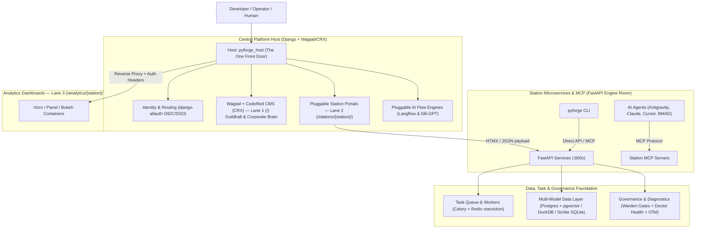
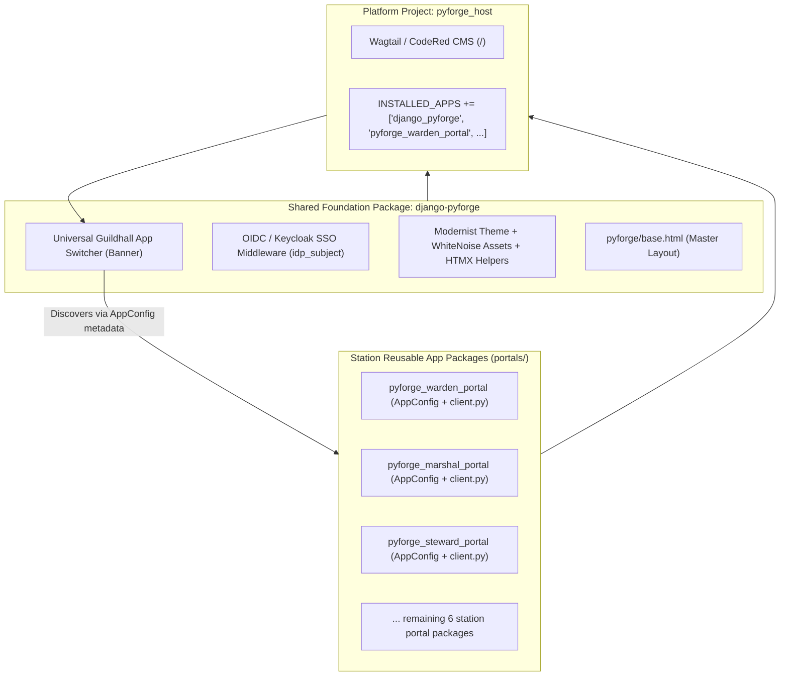
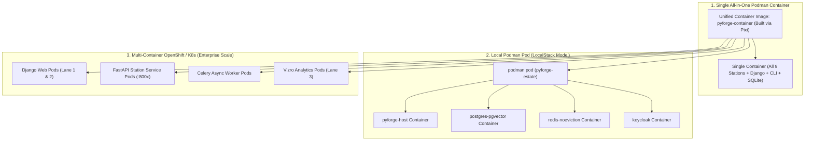
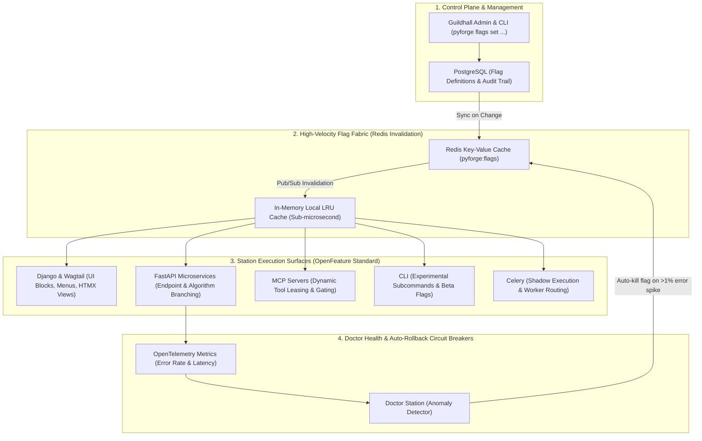
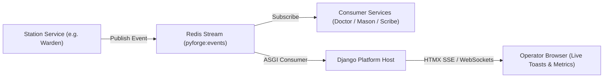
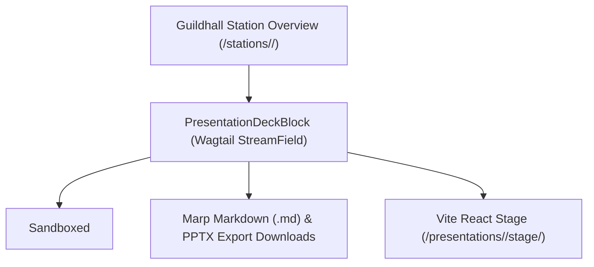
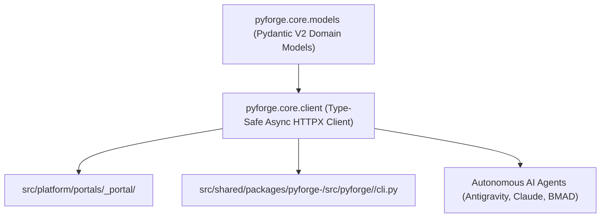
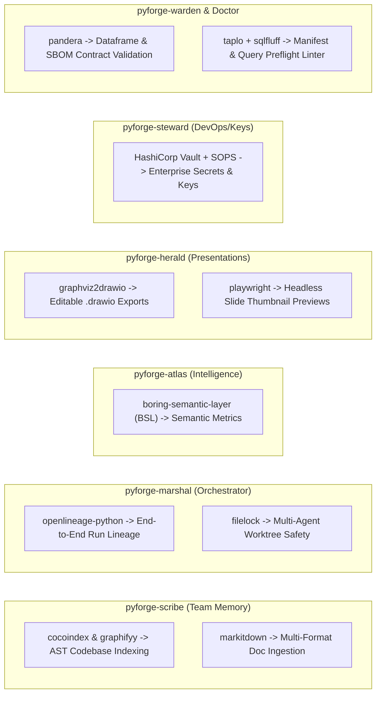
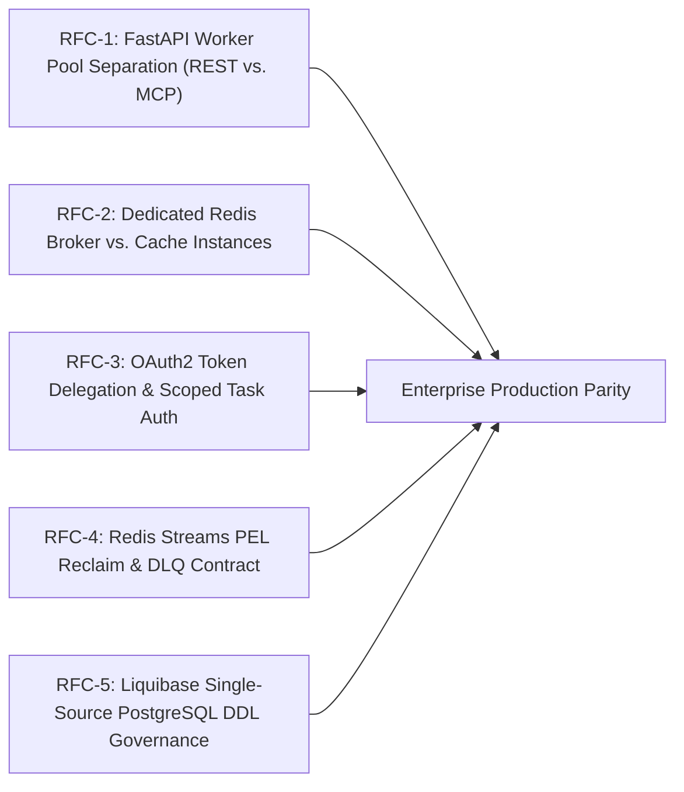
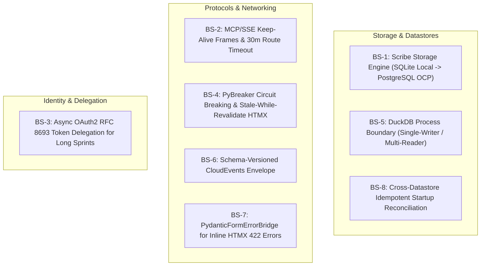

# PyForge Unifying Strategy

## The Dream

We move from a disparate collection of local tools to a **Hub-and-Spoke Enterprise Architecture**. We are not building 9 disconnected apps; we are building **one enterprise host (`pyforge_host`) that mounts 9 capability domains**, powered by **Pixi** as the unified package and environment manager.

By placing a unified **Django + Wagtail/CodeRed CMS (CRX)** application at the center and delegating heavy lifting to **FastAPI / MCP microservices**, we achieve a flawless separation of concerns:
- **The Host (`pyforge_host`):** Handles identity (`django-allauth` OIDC/SSO), session state, global design system/assets (WhiteNoise, Bootstrap, HTMX), CMS content routing, and reverse-proxying.
- **The Microservices & MCP Layer (`services/`):** Handles compute, long-running batch jobs, sandboxed builds, and AI agentic tool access via native Model Context Protocol (MCP).



---

## Django Reusable Apps & `django-lasuite` Design Principles

PyForge adopts the battle-tested modularity of the **Django Reusable Apps specification** (Django 6.x) and the **`django-lasuite` / DINUM La Suite Numérique** architecture:



### 1. The Shared Foundation Package (`django-pyforge`)
Analogous to `django-lasuite`, `django-pyforge` is the central reusable foundation package shared by all station portals:
- **The Guildhall App Switcher Banner (`templates/pyforge/app_switcher.html`):** Renders the global cross-station header banner with active station indicators, user profile badges, and an instant dropdown menu to navigate between all 9 stations.
- **Identity & SSO Middleware:** Intercepts Keycloak / OIDC tokens, extracting `idp_subject`, user profile, and dynamic group roles into `request.user`.
- **Modernist Theme & Base Template:** Provides `templates/pyforge/base.html`, bundling Bootstrap 5.3 + HTMX + WhiteNoise with zero external CDN dependencies.
- **Pluggable Settings Helper:** Standardized `PYFORGE_PLATFORM_CONFIG` setting resolution with environment variable overrides.

### 2. Standalone Reusable Station App Packages (`portals/pyforge_<station>_portal`)
Modeled after `suitenumerique` apps (`drive`, `meet`, `docs`), each station portal is a self-contained, distributable Python package:
- **Zero Database Models:** Contains no domain database models. Domain data is fetched on-demand from the paired FastAPI microservice via `client.py` (`httpx`).
- **Strict Namespace Isolation:** All views, URLconfs, templates (`templates/warden/`), and static assets (`static/warden/`) are strictly namespaced.
- **Extends Base Layout:** Every station view extends `pyforge/base.html`, automatically inheriting the universal Guildhall App Switcher banner and auth context.

### 3. Dynamic Station Discovery (`AppConfig` Metadata)
Each station's `AppConfig` declares standardized suite metadata:
```python
from django.apps import AppConfig

class WardenPortalConfig(AppConfig):
    name = "pyforge_warden_portal"
    verbose_name = "Warden Compliance"
    station_name = "warden"
    station_icon = "shield-check"
    station_url_name = "warden:index"
    station_description = "Compliance gates and recipe policy validation"
```
The central `django-pyforge` banner dynamically queries `apps.get_app_configs()` to automatically render the App Switcher menu without hardcoding station URLs!

---

## The 3 Operational Planes & Complete 10-Layer Platform Topology

The Hub-and-Spoke Enterprise Architecture groups the 10 platform layers into **three distinct operational planes**:

```mermaid
graph TD
    subgraph Plane1["1. UI & Routing Plane (Browser Surface)"]
        Host["Central Host: Django + django-allauth (SSO)"]
        Lane1["Lane 1: Wagtail CRX / Guildhall (Root /)"]
        Lane2["Lane 2: 9 Pluggable Station Portal Apps"]
        Lane3["Lane 3: Isolated Vizro / Panel Dashboards"]
        Host --> Lane1
        Host --> Lane2
        Host -.->|Reverse Proxy (Steward)| Lane3
    end

    subgraph Plane2["2. Compute & Agent Plane (Execution Fabric)"]
        Microservices["9 Paired FastAPI Station Microservices (:800x)"]
        MCPAgents["Agentic Layer: MCP Servers (SSE / Stdio)"]
        CLI["Unified CLI Surface: pyforge <station>"]
        Lane2 -->|HTMX / Async HTTPX Client| Microservices
        MCPAgents -->|MCP Protocol Tools & Prompts| Microservices
        CLI -->|Direct Local or Remote REST API| Microservices
    end

    subgraph Plane3["3. Data & Infrastructure Plane (State & Persistence)"]
        Queue["Async Task Queue: Celery + Redis (noeviction)"]
        Data["Multi-Model Data Layer: Postgres (pgvector) + DuckDB + SQLite"]
        Gov["Security & Observability: Warden Gates + Doctor Auto-Remedy"]
        Microservices --> Queue
        Microservices --> Data
        Microservices --> Gov
    end
```

### The 10 Platform Layers

1. **Content & Presentation Layer (Lane 1):** Wagtail + CodeRed CMS (CRX) at root (`/`), hosting the Guildhall, Corporate Brain, and Herald presentation stages (`.dc.html`, Marp, PPTX, Vite).
2. **Pluggable Web Portal Layer (Lane 2):** 9 Reusable Django Apps (`portals/`) rendering HTMX views, interactive forms, and approvals with zero domain database models.
3. **Pluggable Analytics Layer (Lane 3):** Isolated Vizro / Panel containers (`dashboards/`) reverse-proxied with Steward row-level tenant isolation headers.
4. **Host & Identity Gateway Layer:** Central Django platform host managing `django-allauth` (OIDC/SSO keyed on `idp_subject`), session state, WhiteNoise assets, and reverse-proxying.
5. **Microservices Compute Layer:** 9 Paired FastAPI services (`services/`) executing business logic, recipe parsing, and sandboxed builds.
6. **Agentic Tool & MCP Layer:** Server-Sent Events (SSE) Model Context Protocol servers on each microservice for autonomous tool calling by AI agents (Antigravity, Claude Code, Cursor, BMAD).
7. **Asynchronous Task & Worker Queue Layer:** Celery + Redis workers (`noeviction` policy) executing long-running builds (Mason), batch audits (Warden), and memory compilations (Scribe) with real-time status streaming.
8. **Multi-Model Data & Storage Layer:**
   * **Relational & Vector Data:** PostgreSQL cluster with `pgvector` and schema isolation (`public`, `langflow_schema`, `dbgpt_schema`) + `django-simple-history` audit trail.
   * **Analytical Graph:** DuckDB + Kedro pipelines for Atlas ecosystem graph.
   * **Team Memory Graph:** Scribe `graphstore` + SQLite for session transcripts and compiled facts.
   * **Distributed Cache & Broker:** Redis with strict `noeviction` policy.
   * **Artifact Store:** Artifactory / MinIO / local mirror cache for wheels, conda packages, and deck exports.
9. **Autonomous Loop & Orchestration Layer:** Marshal loop engine (`bmad-loop`, `bmad-build-auto`, detached workers, strand monitoring, cross-agent handoff orchestration).
10. **Security, Governance, Observability & 15-Factor Baseline:**
    * **15-Factor Hygiene:** Fail-fast two-stage startup misconfiguration refusals, `trace_id` on every log line via `structlog`/OpenTelemetry, and pixi-sourced dependencies.
    * **Governance & Health:** Warden compliance gates, Doctor workspace health diagnostics and auto-remedy engines.
    * **Air-Gap Boundary:** Zero CDN leakage (all assets local via WhiteNoise), internal mirror resolution for dependencies, runtime CA truststore (`_http.py`).

---

## The Estate Monorepo Structure (Aligned to `src/`)

Pixi serves as the unified multi-environment package manager (conda-forge + PyPI) powering the entire estate. Rather than inventing artificial root directories, the architecture maps cleanly and directly onto the **existing `src/` layout** with minimal changes:

```text
local-recipes/ (PyForge Estate Monorepo)
├── pixi.toml                     # Unified multi-environment manager (conda-forge & PyPI)
├── pyproject.toml                # Root packaging metadata & workspace configuration
├── docker-compose.yml            # Local developer substrate (Host, DB, Redis, Traefik, Keycloak)
│
├── src/
│   ├── platform/                 # Layer 1 & 4: The Central Django Platform Host
│   │   ├── manage.py
│   │   ├── config/               # settings/ (split), urls.py, wsgi.py, asgi.py (Keycloak OIDC)
│   │   ├── platformapp/          # Shared templates (base.html), static assets (WhiteNoise)
│   │   ├── portals/              # Layer 2: Pluggable Station Apps (Thin UI Clients)
│   │   │   ├── warden_portal/    # (formerly compliance_face) -> Reusable Django app
│   │   │   ├── steward_portal/   # Infrastructure & Provisioning
│   │   │   ├── marshal_portal/   # Loop Run Controls & Cockpit
│   │   │   ├── atlas_portal/     # Package Query & Ingestion
│   │   │   ├── scribe_portal/    # Team Memory Curation
│   │   │   ├── herald_portal/    # Deck & Stage Studio
│   │   │   ├── mason_portal/     # Visual Recipe Studio
│   │   │   ├── doctor_portal/    # Diagnostic & Auto-Remedy Console
│   │   │   └── core_portal/      # Platform Hub & Config Portal
│   │   ├── langflow_integration/# Pluggable Langflow ASGI app mount
│   │   ├── dbgpt_integration/   # Pluggable DB-GPT ASGI app mount
│   │   ├── compose/              # Local Keycloak realm-as-code & DB-GPT services
│   │   └── deploy/               # Helm charts & OpenShift restricted-v2 overlays
│   │
│   ├── shared/
│   │   └── packages/             # Layer 5 & 6: The 9 Station Compute & Engine Packages
│   │       ├── pyforge-core/     # Platform spine, registry & unified CLI dispatcher
│   │       │   └── src/pyforge/core/
│   │       │       ├── cli/      # Root `pyforge` CLI dispatcher (Typer)
│   │       │       └── service/  # core_service FastAPI (:8000) + MCP
│   │       ├── pyforge-warden/   # Compliance gate & policy engine
│   │       │   └── src/pyforge/warden/
│   │       │       ├── service/  # warden_service FastAPI (:8004) + MCP (main.py)
│   │       │       └── rules/    # Rule engine, checks & recipe audits
│   │       ├── pyforge-marshal/  # Loop orchestrator (FastAPI :8001 + MCP)
│   │       ├── pyforge-steward/  # Infrastructure & deployment (FastAPI :8002 + MCP)
│   │       ├── pyforge-atlas/    # Package graph intelligence (FastAPI :8003 + MCP)
│   │       │   └── conf/         # Kedro pipeline configs & Vizro analytics
│   │       ├── pyforge-scribe/   # Team memory & transcript mining (FastAPI :8005 + MCP)
│   │       ├── pyforge-herald/   # Proclamations & deck engine (FastAPI :8006 + MCP)
│   │       ├── pyforge-mason/    # Recipe builder & migration (FastAPI :8007 + MCP)
│   │       ├── pyforge-doctor/   # Health diagnostics & auto-remedy (FastAPI :8008 + MCP)
│   │       └── pyforge-testing-kit/ # Conformance fixtures & testing harnesses
│   │
│   └── sentinel/                 # Cross-station surveillance & knowledge bases
│
├── presentations/                # Station Decks (.dc.html, Marp, PPTX, Vite Stages)
│   ├── pyforge-core/
│   ├── pyforge-marshal/
│   ├── pyforge-steward/
│   ├── pyforge-atlas/
│   ├── pyforge-warden/
│   ├── pyforge-scribe/
│   ├── pyforge-herald/
│   ├── pyforge-mason/
│   └── pyforge-doctor/
│
└── _bmad-output/                 # Tier-2 Specs & Tier-0 Dreams
    └── projects/                 # BMAD planning and implementation artifacts
```

---

## The Cohesive Unified CLI Strategy (`pyforge`)

### 1. Universal Command Grammar (`pyforge <station> <noun> <verb>`)
```bash
# Universal Lifecycle Commands (Identical across all 9 stations)
pyforge <station> status       # Check station service health, active jobs, and workers
pyforge <station> info         # Print version, configuration, and registered capabilities
pyforge <station> check        # Run station preflight and self-diagnostics
pyforge <station> serve        # Start the station's paired FastAPI + MCP microservice
pyforge <station> docs         # View, build, or open station docs and presentation decks
```

### 2. Standardized Output Formats (`--output` / `-o`)
- **`--output text` (Default):** Human-optimized terminal output with Rich tables, colored badges (`[PASS]`, `[WARN]`, `[FAIL]`, `[INFO]`), and live progress bars.
- **`--output json`:** Machine-readable JSON / NDJSON output for CI/CD scripting, piping, and AI subagent ingestion.
- **`--output yaml`:** Clean YAML configuration and manifest exports.
- **`--quiet` / `-q`:** Suppresses all visual UI elements, outputting only exit codes and stdout for shell scripts.

### 3. Dual Execution Modes: Direct Local vs. Service Client (`--remote` / `--local`)
* **Direct Mode (`--local`):** Directly imports and runs the station's Python logic locally in the active Pixi environment (zero network overhead).
* **Remote Service Mode (`--remote`):** Dispatches an HTTP/JSON request to the running station microservice (`http://localhost:800x` or `https://platform.internal/api/v1/`).

### 4. Automatic MCP Agent Discovery (`pyforge mcp`)
```bash
# Auto-configure Antigravity, Claude Code, Cursor, and Gemini to use PyForge MCP servers
pyforge mcp install --all

# List all discovered tools, prompts, and resources across all 9 stations
pyforge mcp list
```

---

## Dual Deployment Profiles, Cross-Platform Guarantees & LocalStack Alignment

### 1. The LocalStack Philosophy for Enterprise AI & SDLC Estates
PyForge fundamentally embodies the core philosophy of **[LocalStack](https://github.com/localstack/localstack)** — acting as a **Local Enterprise Cloud Emulator**:
* **The Entire 10-Layer Estate on a Laptop:** Rather than requiring live OpenShift/K8s clusters, remote Keycloak servers, and cloud databases, a developer or AI agent boots the entire multi-station platform (FastAPI microservices, Django Host, Wagtail CMS, Keycloak OIDC, PostgreSQL `pgvector`, Redis) locally with zero cloud dependencies and zero cloud bills.
* **100% Offline & Air-Gapped:** Zero external CDN calls (WhiteNoise asset bundling), OS native truststore bindings for enterprise TLS, and local Pixi package resolution.
* **Sub-Millisecond Inner Loops:** Autonomous AI agents (Antigravity, Claude, Cursor, BMAD) and human developers execute preflight checks, recipe builds, and compliance audits with zero latency.
* **Strict Local-to-OCP Environment Parity (15-Factor):** Identical Pydantic models, Keycloak JWT claims (`idp_subject`), and Celery queues run seamlessly on a local workstation and in Red Hat OpenShift production under `restricted-v2` SCC pods.

### 2. Cross-Platform Guarantees (Linux, macOS, Windows via Pixi)
Governed by `pixi.toml` and locked in `pixi.lock`, the entire PyForge codebase runs natively across all three major operating systems:

| Operating System | Architecture | Pixi Platform Key | Native Local Runtime |
| :--- | :--- | :--- | :---: |
| **Linux** | `x86_64` | `linux-64` | ✅ **100% Native** |
| **macOS (Apple Silicon)** | `M1 / M2 / M3 / M4` | `osx-arm64-min` (macOS 14.5+) | ✅ **100% Native** |
| **Windows** | `x86_64` | `win-64` | ✅ **100% Native** (PowerShell, CMD, or WSL2) |

* **Self-Contained C/Rust Binaries:** Pixi provisions Python 3.14, Node.js 24 LTS, `git`, `rattler`, `duckdb`, and `uvicorn` isolated from host system packages.
* **Unified Pathing:** Universal use of `pathlib.Path` across `pyforge.core` guarantees complete path cross-compatibility between Windows `C:\` and POSIX `/`.

### 3. Multi-Python Resolution & Runtime Matrix (Python 3.12, 3.13, 3.14)

Empirical resolution testing with the Pixi solver (`pixi lock`) confirms that the entire PyForge dependency tree (over 1,000+ packages including all 10 high-leverage station recommendations) solves cleanly across all active Python versions:

| Python Version | Solve Status | Package Count Resolved | Compatibility Invariants |
| :--- | :---: | :---: | :--- |
| **Python 3.14** (`3.14.*`) | ✅ **100% SUCCESS** | **1,000+ packages** | **The Repo Default.** Free-threading, fast execution, full conda-forge & PyPI coverage across Django, Wagtail, FastAPI, MCP, DuckDB, Kedro, Vizro, Celery, Langflow, DB-GPT, and Polars. |
| **Python 3.13** (`3.13.*`) | ✅ **100% SUCCESS** | **1,000+ packages** | **Fully Supported.** Complete dependency tree resolves byte-for-byte with zero pinning conflicts. |
| **Python 3.12** (`3.12.*`) | ✅ **100% SUCCESS** *(with note)* | **1,000+ packages** | **Fully Supported.** All web, data, and agent packages resolve cleanly (only `pixi-skills` carries a `python >= 3.13` floor). |

#### Verified Resolution for High-Leverage Station Recommendations
All 10 station enhancement libraries were included in the solver input and confirmed resolved in `pixi.lock`:
* `cocoindex` (`>=1.0.20`) & `graphifyy` (`>=0.9.48`) $\rightarrow$ Scribe AST Graph (`py312`, `py313`, `py314` ✅)
* `openlineage-python` (`>=1.52.0`) $\rightarrow$ Marshal Run Lineage (`py312`, `py313`, `py314` ✅)
* `boring-semantic-layer` (`>=0.3.16`) $\rightarrow$ Atlas Semantic Metrics (`py312`, `py313`, `py314` ✅)
* `markitdown` (`>=0.1.7`) $\rightarrow$ Herald & Scribe Doc Ingestion (`py312`, `py313`, `py314` ✅)
* `graphviz2drawio` (`>=1.2.0`) $\rightarrow$ Herald Diagram Export (`py312`, `py313`, `py314` ✅)
* `filelock` (`>=3.32.0`) $\rightarrow$ Marshal & Scribe Concurrency Safety (`py312`, `py313`, `py314` ✅)
* `go-sops` & `age` $\rightarrow$ Steward Secret Vaulting (`py312`, `py313`, `py314` ✅)
* `pandera` (`>=0.32.1`) $\rightarrow$ Warden & Mason SBOM Validation (`py312`, `py313`, `py314` ✅)
* `taplo`, `sqlfluff` & `yamllint` $\rightarrow$ Doctor Syntax Linters (`py312`, `py313`, `py314` ✅)
* `playwright` (`>=1.62.1`) $\rightarrow$ Herald Deck Previews & E2E Testing (`py312`, `py313`, `py314` ✅)

#### Framework Compatibility & Runtime Isolation Invariants
* **Compiled Rust + PyO3 Extensions (`xorq`, `xorq-datafusion`, `cocoindex`):** Stabilized on Python 3.14 via PyO3 ABI3 bindings and the canonical conda-forge Rust environment block (`CARGO_PROFILE_RELEASE_STRIP: symbols` + `PYTHONUTF8: "1"`), avoiding Windows symlink extraction errors (G11/G12).
* **Dagster on Python 3.14 (`dagster >= 1.13.19`):** Upgraded to AST parsers that accommodate Python 3.14's deferred annotation evaluation (PEP 649 / PEP 749).
* **Isolated Agentic Seam (`python-agent-platform`):** Heavy LLM workflow engines (`langflow >= 1.11`, `dbgpt >= 0.8`, `chromadb`, `elevenlabs`) with strict upstream wheel boundaries are isolated in the `python = "3.12.*"` feature environment, communicating with the Python 3.14 platform core over ASGI/REST, MCP, and Redis Streams.

### 4. Container Packaging & Delivery Modes (Single Container vs. Podman Pods vs. Multi-Container OCP)

PyForge achieves total deployment flexibility through **one unified container image (`pyforge-container`)** built via Pixi (`pixi-build` / `Containerfile`), supporting three distinct operational topologies:



#### Mode A: Single All-in-One Container (Edge / Demos / Ephemeral CI)
* **Execution:** A single standalone container boots the entire platform using SQLite and in-memory brokers.
* **Invocation:**
  ```bash
  podman run -d --name pyforge -p 8000:8000 -p 8001-8009:8001-8009 pyforge-container
  ```
* **Best for:** Portable zero-dependency demonstrations, offline air-gapped field laptops, or ephemeral CI/CD test runners.

#### Mode B: Local Podman Pod (`podman pod`) — *The LocalStack Topology*
* **Execution:** Podman groups the platform container, PostgreSQL (`pgvector`), Redis, and Keycloak into a single unified Kubernetes-style local **Pod** sharing `localhost` networking and IPC.
* **Invocation:**
  ```bash
  # Create local pod
  podman pod create --name pyforge-pod -p 8000:8000 -p 8080:8080 -p 5432:5432

  # Launch platform host + services into the shared pod
  podman run -d --pod pyforge-pod --name pyforge-host pyforge-platform
  podman run -d --pod pyforge-pod --name pyforge-db postgres:16-pgvector
  podman run -d --pod pyforge-pod --name pyforge-auth keycloak:24.0
  ```
* **Best for:** Full enterprise-fidelity local development with real Keycloak SSO and PostgreSQL without Kubernetes cluster overhead.

#### Mode C: Multi-Container Distributed Topology (Red Hat OpenShift / Kubernetes)
* **Execution:** The **exact same container image** is deployed across specialized Kubernetes pod controllers with distinct entrypoint arguments:
  * `pyforge-platform` web pods (`python manage.py runserver` / Gunicorn)
  * `pyforge-<station>-service` compute pods (`pyforge <station> serve`)
  * `pyforge-worker` async task pods (`celery -A pyforge worker`)
  * `pyforge-<station>-dashboard` analytics pods (Vizro / Panel)
* **Security Compliance:** Fully compliant with OpenShift `restricted-v2` Security Context Constraints (non-root UID, read-only root filesystems, zero elevated capabilities).

---

## Enterprise Server Infrastructure & OpenShift (OCP) Sizing Specifications

Deploying PyForge across enterprise Kubernetes and Red Hat OpenShift (OCP) clusters adheres to the following server infrastructure, storage, and networking specifications:

### 1. Cluster Compute & Sizing Recommendations

| Component | Pod / Replica Count | CPU (Requests / Limits) | Memory (Requests / Limits) | Scaling Strategy |
| :--- | :---: | :---: | :---: | :--- |
| **Platform Web Host** (`Django + Wagtail CRX`) | 2–4 replicas | 2 vCPU / 4 vCPU | 2 GB / 4 GB | Horizontal Pod Autoscaler (HPA) on CPU/Traffic |
| **Station Compute Services** (9 `FastAPI + MCP`) | 1–2 replicas per station | 1 vCPU / 2 vCPU each | 1 GB / 2 GB each | Scaled independently per station load |
| **Async Task Workers** (`Celery` for Mason/Warden) | 2–8 replicas | 2 vCPU / 4 vCPU | 4 GB / 8 GB | Scaled on Redis Queue depth |
| **Analytics Dashboards** (`Vizro / Panel`) | 1–2 replicas | 1 vCPU / 2 vCPU | 2 GB / 4 GB | Scaled on active concurrent viewers |
| **PostgreSQL (`pgvector` + multi-schema)** | 1 primary + 1 standby | 4 vCPU / 8 vCPU | 8 GB / 16 GB | Crunchy Data / CloudNativePG Operator |
| **Redis (`noeviction` Broker & Cache)** | 3-node Sentinel / HA | 2 vCPU / 4 vCPU | 4 GB / 8 GB | In-memory with RDB persistence |
| **Total Recommended Capacity (HA Production)** | — | **16 to 32 vCPUs** | **32 to 64 GB RAM** | Minimum 3 Worker Nodes |

### 2. Persistent Storage (CSI / PVC)

| Storage Class | Usage / Destination | Capacity | Access Mode |
| :--- | :--- | :---: | :---: |
| **Block Storage (SSD / NVMe)** | PostgreSQL Data (`public`, `langflow_schema`, `dbgpt_schema`) | 100 GB – 500 GB | `ReadWriteOnce` (RWO) |
| **Block Storage (SSD)** | Redis Append-Only Persistence | 20 GB – 50 GB | `ReadWriteOnce` (RWO) |
| **Object Storage (S3 / MinIO / Artifactory)** | Wheel mirror caches, conda tarballs, presentation exports, and Scribe graph dumps | 500 GB – 2 TB | S3 API / REST |

### 3. Networking, Ingress & Routing

* **Edge TLS Routing (`OpenShift Route`):**
  * Single external ingress route: `https://pyforge.internal.company.com` (TLS terminated at edge via corporate wildcard certificate with `X-Forwarded-Proto` and `X-Forwarded-For` injection).
* **Internal Cluster Service Mesh / DNS:**
  * Microservices communicate privately over cluster DNS:
    * `http://pyforge-warden-service.pyforge.svc.cluster.local:8004`
    * `http://pyforge-atlas-service.pyforge.svc.cluster.local:8003`
    * `http://pyforge-postgres.pyforge.svc.cluster.local:5432`
    * `http://pyforge-redis.pyforge.svc.cluster.local:6379`

### 4. Enterprise Security & Identity Integrations

* **OpenShift `restricted-v2` SCC Compliance (Hardened Container Contract):**
  * `runAsNonRoot: true` (Arbitrary non-root UID dynamically assigned by OpenShift namespace).
  * `allowPrivilegeEscalation: false`
  * `seccompProfile: RuntimeDefault`
  * `capabilities: drop: ["ALL"]`
  * `readOnlyRootFilesystem: true` (with `/tmp` and static cache mounted as ephemeral emptyDirs).
* **Enterprise Identity Provider (IdP):**
  * Red Hat Keycloak, Microsoft Entra ID (Azure AD), Okta, or PingFederate configured with OIDC.
  * JWT tokens validated on `idp_subject` and corporate group claims (`resource_access.pyforge.roles`).
* **HashiCorp Vault Enterprise Secrets Management:**
  * **Central Credential Vault:** All sensitive credentials (PostgreSQL passwords, Keycloak client secrets, Redis auth, Artifactory tokens, and private keys) managed under `secret/data/pyforge/*`.
  * **OpenShift Vault Agent & External Secrets Operator (ESO):** Automated, dynamic secret injection and rotation into in-memory `/vault/secrets/` volumes compliant with `restricted-v2` SCC.
  * **Dynamic Database Credentials:** Short-lived, automatically rotatable PostgreSQL credentials for Django platform host and FastAPI compute services.
* **Corporate TLS & CA Truststore:**
  * Internal enterprise Root/Intermediate CA bundle mounted into `/etc/pki/ca-trust/extracted/pem/tls-ca-bundle.pem` (automatically consumed by Python `truststore` and Node.js).
* **Enterprise Container Registry:**
  * Internal Red Hat Quay, JFrog Artifactory, or Harbor for image pulls and vulnerability scanning.

### 5. Observability & Platform Telemetry

* **Metrics & Traces:** OpenTelemetry Collector / Prometheus scraping `/metrics` and `/healthz` endpoints across Django and FastAPI.
* **Distributed Logging:** OpenShift Logging (Vector / Loki / Elasticsearch) capturing JSON structured logs (`structlog`) with `trace_id` and `request_id` correlation across all 9 stations.

---

## Feature Flags, Progressive Canary Delivery & Auto-Rollback by Design

To ensure zero-downtime, safe iterative experimentation, and gradual feature rollouts across all 9 stations, PyForge embeds an enterprise **Feature Flagging and Canary Delivery Engine** directly into the core runtime:



### 1. Unified Flag Evaluation Context (`pyforge.core.flags`)

Flags are evaluated dynamically against a standardized **Evaluation Context** containing the user's identity, role, station, and environment:

```python
from pydantic import BaseModel

class FlagContext(BaseModel):
    user_id: str | None = None          # Keycloak idp_subject or "anonymous"
    email: str | None = None            # Developer / operator email
    roles: list[str] = []               # ["pyforge-admin", "beta-tester", "maintainer"]
    station: str = "warden"             # Target station namespace
    environment: str = "production"     # "local", "staging", "production"
    agent_id: str | None = None         # "antigravity", "claude-code", "cursor", "bmad"
    percentage_bucket: int | None = None # MurmurHash(user_id) % 100 for canary rollouts
```

### 2. Standard Integration Across Every Station Surface

* **Django Portals & Wagtail CMS (Lane 1 & 2):** Conditional template tags (``) and view decorators dynamically hide/reveal experimental UI components.
* **FastAPI Compute Microservices (Layer 5):** FastAPI dependencies inject the active `FlagContext` to switch algorithms or activate beta endpoints on the fly.
* **MCP Servers for Autonomous AI Agents (Layer 6):** Dynamically register or lease bleeding-edge agent tools only to authorized agents or beta testers.
* **Unified CLI (Terminal Surface):** Experimental subcommands and preview flags check the local flag configuration (`pyforge flags list`, `pyforge flags set ...`).

### 3. Canary Testing & Progressive Delivery Strategies

| Canary Strategy | Operational Pattern | Use Case |
| :--- | :--- | :--- |
| **Percentage Rollout** | Gradually scale traffic: `1% → 5% → 25% → 50% → 100%` using consistent user hash buckets (`MurmurHash3(user_id) % 100`). | Rolling out new dependency solvers in Mason or package graph pipelines in Atlas. |
| **Role-Gated Early Access** | Activated exclusively for users with Keycloak role `pyforge-admin` or `beta-maintainer`. | Pre-release testing of new portal views or Wagtail StreamField blocks. |
| **Shadow Mode (Dark Launching)** | The microservice runs both the old and new engines in parallel in the background, diffs the outputs, and logs discrepancies without affecting the user's live response. | Verifying that Warden's new SARIF generator produces identical outputs to the legacy scanner before live release. |
| **OpenShift Route Canary** | OpenShift Route traffic splitting at the network edge: `spec.to.weight: 90` (Stable) vs `spec.alternateBackends[0].weight: 10` (Canary Pods). | Zero-downtime blue/green infrastructure and container upgrades. |

### 4. Automated Circuit Breakers (Doctor Auto-Rollback)

To ensure high availability in production, the **Doctor station** acts as the automated safety supervisor:
1. **Telemetry Stream:** OpenTelemetry continuously emits error rates, latency p99, and panic metrics tagged with active flag names (`feature_flag="warden:fast_ast_parser"`).
2. **Anomaly Detection:** If the canary feature triggers an error spike (>1% failure rate or >500ms latency degradation), Doctor detects the regression within 10 seconds.
3. **Automated Kill-Switch:** Doctor publishes a high-priority `feature.circuit_breaker.tripped` event to Redis Streams, immediately setting the flag to `0%` (OFF) across all nodes with zero human intervention.

---

---

## 1. Inter-Station Event Bus & Message Fabric

To enable decoupled, asynchronous collaboration across all 9 stations (e.g. Warden compliance failure triggering Doctor auto-remedy and Mason recipe rebuild), PyForge implements an enterprise **Event Fabric over Redis Streams**:



### Event Specification (`CloudEvents` Compliant Pydantic Model)
```python
from datetime import datetime
from uuid import UUID
from pydantic import BaseModel, Field

class PyForgeEvent(BaseModel):
    event_id: UUID
    station: str = Field(description="Originating station (e.g. 'warden', 'mason')")
    event_type: str = Field(description="Dotted verb (e.g. 'recipe.audit.failed')")
    timestamp: datetime = Field(default_factory=datetime.utcnow)
    correlation_id: str = Field(description="Distributed trace_id across microservices")
    payload: dict = Field(default_factory=dict)
```

- **Live Browser Streaming:** The Django host mounts an ASGI SSE/WebSocket consumer (`/ws/events/`) that relays filtered Redis Stream events directly to HTMX frontend badges (`hx-ext="sse"` / `hx-ext="ws"`), giving operators real-time feedback without page reloads.

---

## 2. Keycloak RBAC & Unified Security Matrix

PyForge enforces a strict, unified Role-Based Access Control (RBAC) model across human browser sessions, CLI operators, and autonomous AI agents:

| Enterprise Persona | Keycloak Realm Role | Django Portal Access (Lane 2) | FastAPI / MCP Endpoint Scopes |
| :--- | :--- | :--- | :--- |
| **Platform Administrator** | `pyforge-admin` | Full read/write + Django Admin (`/admin/`) | Full access (`*`) + secret rotation |
| **Station Maintainer** | `maintainer` | Station workflow triggers (Mason build, Marshal run) | `service:write`, `mcp:tools:execute` |
| **Compliance Auditor** | `compliance-auditor` | Read-only inspection & Gate waivers | `warden:read`, `audit:export` |
| **Developer / Viewer** | `viewer` | Read-only Guildhall docs, dashboards, and decks | `service:read` (Public queries only) |
| **Autonomous AI Agent** | `agent-service-account` | Headless API access via Bearer Token / API Key | Leased MCP tool execution (`mcp:tools:*`) |

- **Dynamic Group Mapping:** The `django-pyforge` authentication middleware parses Keycloak JWT claims (`resource_access.pyforge.roles`), dynamically updating the user's active Django permissions per-request without storing local passwords.
- **FastAPI Scope Verification:** FastAPI microservice endpoints enforce OAuth2 scopes via `Security(verify_token, scopes=["mason:build"])`.

---

## 3. Guildhall Presentation Stage Embedding

Each station's presentation assets (`presentations/<station>/`) are fully integrated into the central Wagtail/CodeRed CMS Guildhall:



- **Wagtail StreamField `PresentationDeckBlock`:** Station maintainers can embed interactive decks directly into documentation pages.
- **Sandboxed Interactive Slides (`.dc.html`):** The Modernist design decks run in isolated iframes with full-screen, keyboard navigation, and embedded live code runner capabilities.
- **Vite React Stage Bridge:** Compiled Vite stages in `presentations/<station>/dist/` are served statically by WhiteNoise at `/presentations/<station>/stage/`.

---

## 4. Scribe Knowledge Graph UI Integration

Scribe compiles session transcripts, architectural decisions, and repository facts into an SQLite `graphstore`. The web portal and CLI surface this collective intelligence:

- **Natural Language Memory Search (`/stations/scribe/`):** A unified search bar backed by `pgvector` semantic embeddings and Scribe's graph index, providing instant HTMX search results over past agent sessions and design rationales.
- **Visual Decision Lineage:** Interactive visual graphs (Cytoscape.js) illustrating how **Dreams $\rightarrow$ Specs $\rightarrow$ Sprints $\rightarrow$ Pull Requests** evolved over time.
- **Supersession & Intent Trails:** Highlights when a rule or architecture decision was deprecated or superseded by a newer Dream, preserving historical intent.
- **CLI Recall Symmetry:** `pyforge scribe recall "why do we use Keycloak?"` delivers formatted historical summaries straight to developer terminals.

---

## 5. Shared Data Contracts & Client SDK (`pyforge.core.client`)

To eliminate schema drift between the Django portals, FastAPI microservices, and the CLI, `pyforge-core` exports shared Pydantic V2 models and a type-safe HTTP client:



```python
# Shared Type-Safe Client Pattern
from pyforge.core.client import PyForgeStationClient
from pyforge.core.models import ComplianceResult, RecipePayload

client = PyForgeStationClient(station="warden", base_url="http://localhost:8004")

# Used identically inside Django views and Typer CLI subcommands:
result: ComplianceResult = await client.post("/api/v1/compliance/check", payload=RecipePayload(recipe_name="numpy"))
```

---

## Comprehensive Technology Stack & Library Catalog

Governed by `pixi.toml` and verified via `pixi run -e local-recipes llms-full-check`, the PyForge estate builds on a curated, battle-tested library stack:

### 1. Platform Host, Web Frameworks & Content Layer
* **Django (`5.2.x` / `6.x`):** Core enterprise platform host (`src/platform/`).
* **Wagtail (`7.4.x`) + CodeRed CMS (`coderedcms 6.0.x`):** Powers the Guildhall and Corporate Brain at `/` (Lane 1).
* **`django-lasuite` (`0.0.27`):** Foundation for reusable apps, OIDC middleware, and the universal Guildhall App Switcher banner.
* **FastAPI (`0.135.x`) / Starlette / Uvicorn:** Powers the 9 paired station microservices (`:8000–:8009`).
* **Daphne & Django Channels (`4.3.x`):** ASGI WebSocket and Server-Sent Events (SSE) streaming engine.
* **WhiteNoise:** Zero-CDN, fully air-gapped static asset server.

### 2. Autonomous Agent, Multi-Agent & MCP Ecosystem
* **`mcp` (`>=2.0.0`):** Anthropic's official Python Model Context Protocol SDK (SSE and stdio transports).
* **`fastmcp` (`>=2.14.x` / `3.x`):** High-level decorator framework for rapid MCP tool/resource creation.
* **`pydantic-ai` (`>=2.33.0`):** Type-safe autonomous agent orchestration.
* **`agno` (`>=2.6.22`):** Multi-agent framework for collaborative task routing.
* **`claude-agent-acp` & `anthropic` (`>=0.76.0`):** Native Claude agent integration.
* **`google-genai` (`>=2.19.0`):** Google Gemini SDK and Antigravity tooling.
* **`github-copilot-sdk` & `a2a-sdk` / `fasta2a`:** Agent-to-Agent communication protocols.
* **`langchain-anthropic` & `langchain-mcp-adapters`:** MCP bridge tooling for LangChain agents.
* **`django-mcp-server`:** Direct MCP tool leasing from Django models and services.

### 3. AI Workflows, Local LLMs & Semantic Search
* **Langflow (`>=1.3.x`):** Visual AI pipeline and agent workflow builder mounted as an ASGI app.
* **DB-GPT (`>=0.8.x`):** Multi-model database knowledge base and agent copilot.
* **`sentence-transformers` & `transformers` (`>=5.15.x`):** Local embedding generation and text representation.
* **`llama.cpp` (`>=10380`) & `ollama-python`:** Fully local, offline LLM inference.
* **`rank-bm25`:** Hybrid lexical keyword search complementing vector retrieval.
* **`diffusers` & `accelerate`:** Multi-modal image generation and local GPU acceleration.

### 4. Dataflow, Analytics & Graph Intelligence
* **DuckDB (`>=1.5.5`):** Columnar analytical engine powering Atlas package queries.
* **Polars (`>=1.43.x`), Pandas & PyArrow (`>=24.0.0`):** High-speed tabular data processing.
* **Kedro (`>=1.5.0`) & `kedro-datasets`:** Declarative data pipelines for Atlas.
* **Dagster (`>=1.13.x`):** Data asset orchestration.
* **Ibis Framework (`>=12.0.0`):** Unified Python dataframe interface compiling to DuckDB, Postgres, and SQLite.
* **`getdaft` (`>=0.6.13`):** Distributed multimodal dataframe processing.
* **Great Expectations & Pandera:** Schema and data quality validation.

### 5. Dashboards, Visualization & UI Analytics (Lane 3)
* **Vizro (`>=0.1.60`), `vizro-ai` & `vizro-mcp`:** Declarative analytics dashboards reverse-proxied by Steward.
* **Kedro-Viz (`>=12.4.0`):** Interactive data pipeline visualization graph.
* **Panel (`>=1.9.4`) & Panel Graphic Walker:** Exploratory visual data analysis.
* **Bokeh & `bokeh-django`:** High-performance interactive browser plotting.
* **Plotly, Matplotlib, Graphviz & `mermaid-py` / `d2`:** Multi-format programmatic diagramming.

### 6. Presentation Studio, Documents & Media Engines
* **Marp CLI (`>=4.2.3`):** Markdown-to-presentation slide compiler.
* **`pptxgenjs` (`>=4.0.1`) & `python-pptx` (`>=1.0.2`):** Native PowerPoint presentation deck generators.
* **PyMuPDF (`>=1.28.x`), PyPDF & `pdfplumber`:** PDF extraction and parsing.
* **`mammoth`, `python-docx` & `openpyxl`:** Office Word and Excel document manipulation.
* **Pandoc (`>=3.10.x`) & `markdownify`:** Universal document and markdown converter.
* **Tesseract OCR & `pytesseract` / Poppler:** Offline optical character recognition.
* **Pillow (`>=12.3.0`):** Image processing engine.

### 7. Packaging, Build Engines & DevSecOps Compliance
* **Pixi (`>=0.77.0`) & `rattler` / `py-rattler-build`:** Fast Rust-based Conda/PyPI environment manager.
* **Conda-Build, Conda-Smithy & Grayskull:** Official conda-forge recipe builders and linters.
* **`deptry` & `osv-scanner`:** Dependency hygiene, unused import detection, and OSV CVE vulnerability scanning.
* **AppThreat Vuln-DB & `cyclonedx-bom` / `cyclonedx-python-lib`:** Local offline CVE database and SBOM generation.

### 8. Asynchronous Tasks, Database & Enterprise Infrastructure
* **Celery & Redis (`redis-py`):** Asynchronous task queue (`noeviction` memory policy) and event bus.
* **PostgreSQL (`psycopg2` / `psycopg`) with `pgvector`:** Relational database, multi-schema isolation (`langflow_schema`, `dbgpt_schema`), and vector embeddings.
* **MinIO (`>=7.2.20`):** S3-compatible local/enterprise artifact and wheel storage.
* **HashiCorp Vault & `hvac`:** Enterprise secrets management, dynamic database credential leasing, and runtime token injection.
* **OpenTelemetry SDK/API (`>=1.44.0`):** Distributed tracing and APM.
* **`truststore` (`>=0.10.4`):** Native OS CA certificate store integration (Windows CryptoAPI, macOS Keychain, Linux OpenSSL).
* **`go-sops` & `age`:** Developer-local secret encryption and offline credential vaulting.

### 9. Developer Experience, QA & Testing Kit
* **Typer (`>=0.27.1`) & Rich (`>=14.3.4`):** Powers the universal `pyforge` CLI with interactive tables and progress bars.
* **Ruff (`>=0.16.4`), Pyright & Mypy:** Instant linting, formatting, and strict type checking.
* **Pytest (`>=9.1.1`), `pytest-cov`, `pytest-mock`, `pytest-xdist`:** Test runners and parallelization.
* **Playwright (`>=1.62.1`):** End-to-end browser automation for UI portal testing.
* **Copier:** Project scaffolding and recipe migration templating.
* **Sqlfluff, Yamllint & Taplo:** SQL, YAML, and TOML linters.

---

## Station-by-Station Packaging & Configuration Audit

An audit across all station packages in `src/shared/packages/` and `src/platform/` confirms unified packaging standards and dependency spine bindings:

| Station Package | Build Backend | CLI Entrypoint (`project.scripts`) | Key Runtime Dependencies | Leaf Spine Binding |
| :--- | :--- | :--- | :--- | :---: |
| **`pyforge-core`** | `hatchling` | `pyforge` (Root CLI Dispatcher) | *Pure stdlib / minimal leaf* | 🏛️ **Spine** |
| **`pyforge-warden`** | `hatchling` | `warden = "pyforge.warden.cli:main"` | `cyclonedx-python-lib`, `packageurl-python`, `license-expression`, `jsonschema`, `PyYAML`, `packaging` | ✅ `pyforge-core` |
| **`pyforge-marshal`** | `hatchling` | `marshal = "pyforge.marshal.cli.main:main"`, `marshal-mcp = "pyforge.marshal.mcp.server:main"` | `bmad-loop`, `copier`, `psutil`, `tomlkit`, `jsonschema`, `packaging`, `PyYAML` | ✅ `pyforge-core` |
| **`pyforge-steward`** | `hatchling` | `steward = "pyforge.steward.cli:main"` | `PyYAML`, `packaging` | ✅ `pyforge-core` |
| **`pyforge-atlas`** | `hatchling` | `pyforge-atlas = "pyforge.atlas.__main__:main"` | `kedro`, `kedro-datasets`, `kedro-dagster`, `duckdb`, `ibis-framework`, `pandas`, `pyarrow`, `vizro`, `dagster`, `bokeh`, `starlette` | ✅ `pyforge-core` |
| **`pyforge-scribe`** | `hatchling` | `scribe = "pyforge.scribe.cli:main"` | `typer`, `pydantic` | ✅ `pyforge-core` |
| **`pyforge-herald`** | `hatchling` | `herald = "pyforge.herald.cli:main"` | `mcp`, `httpx2`, `playwright`, `pillow`, `python-pptx` | ✅ `pyforge-core` |
| **`pyforge-mason`** | `hatchling` | `mason = "pyforge.mason.cli:main"` | `packaging`, `PyYAML` | ✅ `pyforge-core` |
| **`pyforge-doctor`** | `hatchling` | `doctor = "pyforge.doctor.__main__:main"` | `mcp`, `jsonschema`, `PyYAML` | ✅ `pyforge-core` |
| **`pyforge-testing-kit`** | `hatchling` | *(Shared test fixtures & harnesses)* | *Pure stdlib / minimal leaf* | ✅ Shared test kit |

---

## High-Leverage Library Integration & Station Opportunity Matrix

An audit of the full repository catalog (`library-llms-full.md`) reveals 10 high-value installed libraries that can be leveraged across station features:



1. **`cocoindex` & `graphifyy` $\rightarrow$ `pyforge-scribe`:** Fast AST graph extraction and incremental semantic code indexing (`pyforge scribe index`), linking codebase functions directly to the PRDs and Dreams that spawned them.
2. **`openlineage-python` $\rightarrow$ `pyforge-marshal` & `pyforge-steward`:** Emits standard OpenLineage pipeline events across the autonomous loop, tracking complete operational lineage (`Dream -> Spec -> Mason Build -> Warden Audit -> Steward Deploy`).
3. **`boring-semantic-layer` (BSL) $\rightarrow$ `pyforge-atlas`:** Exposes certified semantic business metrics over DuckDB (`package_download_velocity`, `ecosystem_cve_risk_score`) for Vizro dashboards and AI agent queries without raw SQL.
4. **`markitdown` (Microsoft) $\rightarrow$ `pyforge-herald` & `pyforge-scribe`:** Unified multi-format ingestion converting Word (`.docx`), Excel (`.xlsx`), PowerPoint (`.pptx`), and PDF into clean markdown for Wagtail Corporate Brain and Scribe memory.
5. **`graphviz2drawio` $\rightarrow$ `pyforge-herald`:** Programmatically converts Graphviz `.dot` pipelines into editable Draw.io XML (`.drawio`) files for enterprise architect reviews and PowerPoint decks.
6. **`filelock` $\rightarrow$ `pyforge-marshal` & `pyforge-scribe`:** Cross-platform file locking preventing database corruption and race conditions when multiple autonomous AI agents or git worktrees run concurrently.
7. **HashiCorp Vault & `go-sops` $\rightarrow$ `pyforge-steward`:** Enterprise secret lifecycle management via HashiCorp Vault (dynamic database credentials, Keycloak tokens) combined with offline X25519 `age`/SOPS local vaulting.
8. **`pandera` $\rightarrow$ `pyforge-warden` & `pyforge-mason`:** Statistical and schema validation for Polars/Pandas dataframes, enforcing strict structural contracts on parsed lockfiles and CycloneDX SBOM feeds.
9. **`taplo`, `sqlfluff` & `yamllint` $\rightarrow$ `pyforge-doctor` & `pyforge-warden`:** Syntax linting suite validating `pixi.toml`, `recipe.yaml`, and DuckDB SQL queries during preflight checks (`pyforge doctor check --syntax`).
10. **`playwright` $\rightarrow$ `pyforge-herald` & `pyforge-testing-kit`:** Headless browser automation capturing high-resolution PDF exports and PNG thumbnails of interactive `.dc.html` slides and Vizro dashboards for automated broadcast proclamations.

---

---

## The Station Planning Artifact Inventory & Upstream Grounding

Each station in PyForge is already grounded in **one authoritative PRD spline** and **one primary Architecture spline** within the BMAD planning tier (`_bmad-output/projects/`):

| Station | Capability Domain | Primary PRD Spline | Primary Architecture Spline | Satellite / Sub-chain Architecture Artifacts |
| :--- | :--- | :--- | :--- | :--- |
| **`pyforge-atlas`** | Package Graph Intelligence | `prd-pyforge-atlas-2026-07-17` | `architecture-pyforge-atlas-2026-07-17` | — |
| **`pyforge-doctor`** | Health & Auto-Remedy | `prd-pyforge-doctor-2026-07-25` | `architecture-pyforge-doctor-2026-07-25` | — |
| **`pyforge-herald`** | Proclamations & Stage | `prd-pyforge-herald-2026-08-01` | `architecture-pyforge-herald-2026-08-01` | — |
| **`pyforge-marshal`** | Loop Orchestrator | `prd-pyforge-marshal-2026-07-25` | `architecture-pyforge-marshal-2026-07-25` | `integration-architecture.md`, `architecture-bmad-infra.md` |
| **`pyforge-mason`** | Recipe Builder & Build | `prd-pyforge-mason-2026-07-25` | `architecture-pyforge-mason-2026-07-25` | — |
| **`pyforge-scribe`** | Team Memory & Mining | `prd-pyforge-scribe-2026-07-25` | `architecture-pyforge-scribe-2026-07-25` | — |
| **`pyforge-steward`** | Infrastructure & Deploy | `prd-pyforge-steward-2026-07-25` | `architecture-pyforge-steward-2026-07-25` | `secure-live-dashboards-2026-08-09`, `unified-container-2026-08-09`, `jira-github-projects-sync-2026-08-09` |
| **`pyforge-warden`** | Compliance & Quality Gates | `prd-pyforge-warden-2026-07-14` | `architecture-pyforge-warden-2026-07-14` | — |
| **`pyforge-core`** | Platform Spine & Registry | Governed by `pyforge-core.md` | Governed by `pyforge-charter.md` | Shared foundation package (`django-pyforge`) |

### Why This Matters for the Unifying Layer
Because each station already has a single authoritative **PRD + Architecture spline**, the Unifying Estate Strategy does **not** alter or reinvent their internal algorithms or domain models. 

Instead, this Unifying Dream establishes the **standardized external surface contracts** that mount these 9 engines into one cohesive platform:
1. **Lane 2 UI Portal:** `src/platform/portals/<station>_portal/` (Reusable Django App).
2. **Compute & MCP Service:** `src/shared/packages/pyforge-<station>/src/pyforge/<station>/service/` (FastAPI + MCP over SSE).
3. **Analytics Dashboard:** `dashboards/<station>_dashboard/` or Kedro/Vizro board (Lane 3).
4. **Presentation Stage:** `presentations/pyforge-<station>/` (Interactive `.dc.html` + Vite Stage).
5. **Unified CLI Command:** `pyforge <station>` (Typer command group).

---

---

## Station-by-Station Adversarial Architecture Review & Course Corrections

A critical cross-station audit reveals isolated assumptions made in earlier planning artifacts that must be **course-corrected** to achieve the unified estate topology:

### 1. `pyforge-warden` (Compliance & Quality Gates)
* **Legacy Assumption:** Conceived primarily as a local CLI tool parsing lockfiles via synchronous subprocesses (`deptry`, `osv-scanner`). Web face was a monolithic Django app (`compliance_face`).
* **Adversarial Critique:** Running blocking CLI scans inside web requests leads to timeouts; zero agent tool access over standard protocols.
* **Course Correction:**
  * Extract rule audits into `warden_service` (FastAPI) with native MCP SSE tools for AI agents.
  * Offload heavy bulk repo audits to Celery workers with live status streaming.
  * Refactor `compliance_face` into a zero-model Reusable Django App (`src/platform/portals/warden_portal`).

### 2. `pyforge-steward` (Platform Hosting & Gateway Controller)
* **Legacy Assumption:** Fragmented across 4 separate architecture documents (1 main spine + 3 satellite sub-chains for dashboards, containers, and Jira sync).
* **Adversarial Critique:** Architecture fragmentation obscures Steward's true role as the platform's infrastructure and gateway guardian.
* **Course Correction:**
  * Consolidate the satellite architectures under Steward's primary mandate: **Platform Ingress, OIDC Token Propagation, and OCP Deployment**.
  * Enforce Steward's reverse-proxy middleware in `pyforge_host` to inject `X-Forwarded-User` and `X-Forwarded-Groups` for row-level tenant isolation across all Vizro boards.

### 3. `pyforge-atlas` (Package Graph Intelligence)
* **Legacy Assumption:** Heavy monolithic data science stack (Kedro + Dagster + DuckDB + Vizro) conceived as a standalone web application.
* **Adversarial Critique:** Importing Kedro/Vizro inside the Django host would bloat container memory and create package version deadlocks.
* **Course Correction:**
  * Isolate Kedro/DuckDB analytics and Vizro dashboards into dedicated container pods (Lane 3).
  * Expose an ultra-lightweight FastAPI query layer (`atlas_service` :8003 + MCP) allowing Warden, Doctor, Scribe, and AI agents to query graph facts via sub-millisecond REST/MCP calls instead of mounting raw DuckDB files.

### 4. `pyforge-marshal` (Loop Orchestrator & Execution Cockpit)
* **Legacy Assumption:** Pure headless CLI tool written for local terminals (`bmad-loop`), reading/writing exclusively to local `.marshal/seed-state.yml` and worktrees.
* **Adversarial Critique:** Completely blind to web-driven execution—operators have no browser cockpit to view, start, or pause autonomous loops.
* **Course Correction:**
  * Wrap the loop decision core in `marshal_service` (FastAPI :8001 + MCP).
  * Stream loop state transitions (`sprint.started`, `story.passed`, `loop.blocked`) to Redis Streams (`pyforge:events:marshal`).
  * Build `marshal_portal` (Lane 2) providing a live HTMX web cockpit with sprint status, strand graphs, and execution controls.

### 5. `pyforge-scribe` (Team Memory & Decision Mining)
* **Legacy Assumption:** Isolated local SQLite `graphstore` mining transcripts from local developer disks.
* **Adversarial Critique:** Memory is trapped on local developer machines; ephemeral CI runners and subagents cannot query historical decisions.
* **Course Correction:**
  * Migrate Scribe's storage backend to the central PostgreSQL `pgvector` cluster (`scribe_schema` isolation) or centralized object store.
  * Expose `scribe_service` (:8005 + MCP) with semantic search tools (`recall_team_memory`, `search_decisions`) enabling fleet-wide collective intelligence.

### 6. `pyforge-herald` (Proclamations, Deck Engine & Stage)
* **Legacy Assumption:** Static Guildhall website generator and standalone Marp slide exporter.
* **Adversarial Critique:** Static HTML cannot support dynamic Keycloak role-based permissions, search, or live CMS blocks.
* **Course Correction:**
  * Elevate Herald's Guildhall to the flagship **Lane 1 Wagtail/CodeRed CMS application at `/`**.
  * Package presentation deck renderers as Wagtail StreamField blocks (`PresentationDeckBlock`) and an MCP tool for AI pitch deck generation.

### 7. `pyforge-mason` (Conda-Forge Recipe Builder)
* **Legacy Assumption:** Synchronous CLI builder running rattler-build / conda-build directly in terminal threads.
* **Adversarial Critique:** Long-running builds block developer terminals; zero visual interface for inspecting recipe diffs or migration logs.
* **Course Correction:**
  * Offload build tasks to Celery workers backed by sandboxed container environments.
  * Build `mason_portal` (Lane 2) for visual recipe authoring, diff visualization, and one-click builds.
  * Provide `mason_service` (:8007 + MCP) for autonomous agent-driven recipe generation and patch evaluation.

### 8. `pyforge-doctor` (Health Diagnostics & Auto-Remedy)
* **Legacy Assumption:** Passive CLI bridge gathering diagnostics and printing terminal tables.
* **Adversarial Critique:** Cannot trigger automated remedies proactively; disconnected from platform health probes.
* **Course Correction:**
  * Integrate Doctor directly into OpenTelemetry metrics and platform health check probes (`/healthz`, `/ht/`).
  * Attach automated remedy listeners to Redis Streams to auto-heal environment drift.
  * Build `doctor_portal` (Lane 2) featuring real-time health telemetry and one-click remedy triggers.

### 9. `pyforge-core` (Platform Foundation Spine)
* **Legacy Assumption:** Conceptual framework without concrete shared client libraries or unified CLI dispatcher.
* **Course Correction:**
  * Implement `django-pyforge` as the reusable Django foundation package (Guildhall App Switcher, Keycloak SSO middleware, Modernist base template).
  * Implement `pyforge.core.client` as the shared async HTTPX SDK and Pydantic V2 domain model library.
  * Implement the root `pyforge` Typer CLI dispatcher routing commands across all stations.

---

---

## Station-by-Station Adversarial Product (PRD) Review & Product Course Corrections

An adversarial review of each station's PRD reveals critical **product-level blindspots** where tooling was scoped purely as non-interactive CLI scripts or isolated data silos, ignoring human operators and autonomous IDE agent loops:

### 1. `pyforge-warden` (Product & UX Scope)
* **Legacy PRD Stance:** Declared `classification: cli_tool` with non-interactive focus, explicitly dropping the `developer_tool` label and deprioritizing interactive UX.
* **Adversarial Critique:** Crippled compliance adoption. Human compliance officers had no web interface to inspect CVE trees, review licenses, or issue cryptographic waivers; developers in IDEs had no instant tool feedback before commit.
* **Product Course Correction:** Evolve from a "headless CI script" to a **Dual-Surface Compliance Engine**:
  - **`warden_portal`:** Interactive web portal for SBOM visualization, license compliance matrices, and waiver approvals.
  - **`warden_service` MCP Server:** Real-time IDE tool allowing Antigravity, Claude, and Cursor to self-audit recipes as code is written.

### 2. `pyforge-marshal` (Product & UX Scope)
* **Legacy PRD Stance:** Defined jobs-to-be-done purely around local git worktree commands, terminal loops (`bmad-loop`), and terminal stdout.
* **Adversarial Critique:** Complete lack of executive or team visibility into autonomous SDLC execution. Engineering managers cannot track loop velocity, agent status, or strand health without manual log inspection.
* **Product Course Correction:** Expand product scope to include the **Autonomous Loop Cockpit (`marshal_portal`)**:
  - Live Kanban boards reflecting sprint/story progress in real-time.
  - Interactive strand graphs, execution heatmaps, and start/pause/resume web controls.
  - Operator push notifications for approval gates and human-in-the-loop interventions.

### 3. `pyforge-atlas` (Product & UX Scope)
* **Legacy PRD Stance:** Conceived as a backend data pipeline writing to standalone DuckDB files and a segregated Vizro dashboard.
* **Adversarial Critique:** Created an isolated data silo requiring separate ports and logins; failed to provide interactive package intelligence across other station workflows.
* **Product Course Correction:** Reposition Atlas as the **Platform Intelligence Layer**:
  - Seamlessly embed Atlas analytics under `/analytics/atlas/` within the central Django Host.
  - Expose interactive autocomplete and package intelligence REST/MCP endpoints directly powering Warden and Mason workflows.

### 4. `pyforge-scribe` (Product & UX Scope)
* **Legacy PRD Stance:** Explicitly stated *"Scribe is not a general-purpose enterprise knowledge platform"* and scoped memory capture strictly to local workstation files.
* **Adversarial Critique:** Fractured collective intelligence. If an engineer or subagent works in a container, remote worktree, or CI runner, past decisions and ADR rationale remain invisible.
* **Product Course Correction:** Upgrade Scribe to **Enterprise Collective Memory**:
  - Global semantic search web UI (`scribe_portal`) backed by PostgreSQL `pgvector`.
  - Shared agent memory tool (`recall_team_memory`) enabling all AI subagents across the company to benefit from past architectural decisions.

### 5. `pyforge-herald` (Product & UX Scope)
* **Legacy PRD Stance:** Scoped as a pitch orchestration CLI and static HTML site generator for the Guildhall.
* **Adversarial Critique:** Static HTML pages cannot support dynamic enterprise authentication, access control, or live corporate intranet editing.
* **Product Course Correction:** Elevate Herald to the **Enterprise Corporate Brain (`/`)**:
  - Powers the flagship Wagtail/CodeRed CMS application at the platform root.
  - Provides the **Presentation Deck Studio Block** for interactive slide authoring and multi-format exports (.dc.html, Marp, PPTX).

### 6. `pyforge-mason` (Product & UX Scope)
* **Legacy PRD Stance:** Scoped purely as a terminal builder executing synchronous builds.
* **Adversarial Critique:** High cognitive load for developers migrating hundreds of packages with no visual diffing, linting, or recipe migration wizards.
* **Product Course Correction:** Expand to the **Visual Recipe Studio (`mason_portal`)**:
  - Browser-based side-by-side recipe editor with real-time validation and build logs.
  - Autonomous AI recipe patching tools over MCP.

### 7. `pyforge-doctor` (Product & UX Scope)
* **Legacy PRD Stance:** Scoped as a passive diagnostics reporter printing terminal summaries.
* **Adversarial Critique:** Leaves the burden of fixing detected dependency conflicts entirely on the developer.
* **Product Course Correction:** Upgrade to an **Active Fleet Health Console (`doctor_portal`)**:
  - Real-time visual health scorecards and conflict visualizers.
  - Interactive "One-Click Auto-Remedy" triggers executing self-healing tasks in the background.

### 8. `pyforge-steward` (Product & UX Scope)
* **Legacy PRD Stance:** Scoped around command-line provisioning and secret rotations.
* **Adversarial Critique:** Operators lacked a single pane of glass to monitor cloud resource consumption, token life spans, and gateway ingress routes.
* **Product Course Correction:** Broaden to the **Platform Operations Portal (`steward_portal`)**:
  - Visual resource quota manager and environment provisioning dashboard.
  - Keycloak realm and reverse-proxy gateway routing controls.

---

## Adversarial Architecture & Red Team Hardening Directives

A rigorous Red Team architecture review evaluated the 10-layer topology across 6 enterprise stress-test lenses, codifying the following systemic mitigations and pre-implementation directives:

### 1. The 5 Pre-Implementation Remediation Directives (RFC Architecture)



* **Directive 1 — Uvicorn Process & Worker Pool Separation (RFC-1):**
  * *Vulnerability:* Long-running MCP streaming sessions and heavy CPU AST evaluations in FastAPI starve the asyncio event loop for human HTMX portal requests.
  * *Remediation:* Split each station's compute runtime into two distinct process pools: (1) Low-latency REST worker pool with 500ms timeout ceilings for Django HTMX portals, and (2) Dedicated async worker pool for persistent SSE/MCP agent connections and background threads.
* **Directive 2 — Strict Redis Broker vs. Cache Infrastructure Separation (RFC-2):**
  * *Vulnerability:* Using a single Redis instance with `noeviction` causes volatile web session/cache writes to exhaust memory and crash Celery task ingestion.
  * *Remediation:* Provision two independent Redis services: `redis-broker` (`maxmemory-policy noeviction` for Celery & Redis Streams) and `redis-cache` (`maxmemory-policy allkeys-lru` for Django sessions, HTMX partial caches, and rate-limiting).
* **Directive 3 — Scoped Identity Token Delegation (RFC-3):**
  * *Vulnerability:* Forwarding raw user Bearer tokens causes mid-build 401s during long asynchronous tasks, while static API keys destroy audit attribution.
  * *Remediation:* Standardize `pyforge.core.client` on Signed Internal JWTs (HMAC-SHA256) carrying `idp_subject`, user roles, and an explicit `delegated_by: "pyforge-host"` claim. Async Celery tasks capture the `idp_subject` at invocation time to mint a scoped execution token.
* **Directive 4 — Redis Streams PEL Reclaim, DLQ & Loop-Depth Limits (RFC-4):**
  * *Vulnerability:* Unhandled consumer panics leave orphaned messages in the Pending Entries List (PEL), while recursive agent triggers risk infinite loops.
  * *Remediation:* Mandate an automated Dead Letter Queue (`pyforge:events:dlq`) consumer using `XAUTOCLAIM` to harvest abandoned messages, and enforce a strict loop-depth ceiling (`X-PyForge-Loop-Depth <= 5`) on all inter-station event payloads.
* **Directive 5 — Single-Source PostgreSQL DDL Governance via Liquibase (RFC-5):**
  * *Vulnerability:* Fragmented migrations across multiple frameworks (Django migrations, ORM auto-generation, ad-hoc DDL) cause schema drift, lock contention, and unrepeatable rollbacks across multi-tenant schemas.
  * *Remediation:* **All PostgreSQL database changes across the entire PyForge estate must be managed strictly via Liquibase (`db/changelog/`)**:
    - **Declarative ChangeSets:** Formatted YAML/SQL changelogs (`db.changelog-master.yaml`) maintain an immutable, checksummed audit trail (`DATABASECHANGELOG` table).
    - **Multi-Schema Orchestration:** Manages all PostgreSQL schemas (`public`, `warden_schema`, `atlas_schema`, `scribe_schema`, `langflow_schema`, `dbgpt_schema`) under atomic transactions with deterministic rollback definitions (`rollback:` blocks).
    - **Kubernetes Lifecycle Hook:** Executed as an init-container or pre-upgrade Helm Job (`liquibase update`) before Django or FastAPI microservices boot, preventing schema race conditions during rolling deployments.
    - **Zero-ORM DDL Coupling:** Application frameworks (Django, FastAPI, SQLAlchemy) consume existing schemas as read/write targets but are strictly prohibited from generating runtime DDL alterations.

### 2. Production Blind Spot Audit & Distributed Systems Hardening (BS-1 to BS-8)

To eliminate distributed state collisions, protocol timeouts, and token decay hazards across the 10 layers, the architecture codifies the following 8 resilience invariants:



| Blind Spot # | Architectural Risk & Failure Mode | Mandated Engineering Mitigation |
| :--- | :--- | :--- |
| **BS-1 (Scribe Multi-Pod Storage)** | Multi-pod OpenShift deployments mounting SQLite over NFS/CephFS (`ReadWriteMany`) throw `database is locked` and corrupt B-trees under concurrent agent writes. | **Dual-Driver Scribe Engine:** Local development uses SQLite (`sqlite:///scribe.db`); production OpenShift mode binds to PostgreSQL (`scribe_schema`) using `pgvector` and relational graph tables. |
| **BS-2 (MCP / SSE Route Timeouts)** | Ingress routers (HAProxy / Envoy) terminate silent SSE connections after 30s–60s during heavy 5-minute build or AST scans, severing agent workflows. | **Keep-Alive Heartbeats & Extended Route Timeouts:** FastAPI emits SSE comment pings (`:keepalive\n\n`) every 15s; OpenShift routes declare `haproxy.router.openshift.io/timeout: 30m`. |
| **BS-3 (Async Token Expiry in Long Sprints)** | Keycloak JWT access tokens expire after 15m; 2-hour autonomous Marshal sprints or Mason builds fail with 401s when reporting completion. | **Scoped Task Token Delegation (RFC 8693):** Celery tasks receive an immutable `delegation_context` (`idp_subject`) and use Keycloak `client_credentials` with Token Exchange to mint scoped internal execution tokens. |
| **BS-4 (Cascading Synchronous 500s)** | A crash or restart in `pyforge-warden-service` causes Django HTTPX worker threads to hang, cascading into a 504 outage for the entire Guildhall at `/`. | **PyBreaker & Stale-While-Revalidate Fallbacks:** Django HTTPX clients implement PyBreaker with 500ms fail-fast thresholds; HTMX views render graceful degraded badges (`"Compute restarting — cached 10m ago"`). |
| **BS-5 (DuckDB Concurrent Writer Thrashing)** | Concurrent Celery ingestion tasks attempting simultaneous writes to `atlas.duckdb` trigger file-lock contention and unhandled exceptions. | **Strict Single-Writer Ingestion Worker:** Only a single dedicated ingestion worker writes to DuckDB; all FastAPI services and Vizro dashboards mount DuckDB in **Strict Read-Only Mode** (`read_only=True`). |
| **BS-6 (Event Schema Drift & Deserialization)** | Upgraded stations emitting v2 events crash legacy consumer stations with Pydantic `ValidationError` deserialization panics. | **Forward-Compatible CloudEvents Envelope:** Standard envelope carries `schema_version: "2.x"` with generic payload dictionaries; schema validation is executed in domain adapters, not at the stream boundary. |
| **BS-7 (Pydantic 422 to HTMX Form Mapping)** | FastAPI HTTP 422 JSON errors (`loc: ["body", "version"]`) fail to map back to Django template form fields, showing generic failure toasts. | **`PydanticFormErrorBridge` in `django-pyforge`:** Automatically unpacks HTTP 422 JSON error arrays into standard Django `forms.ValidationError` dictionaries for inline HTMX field highlighting. |
| **BS-8 (Cross-Datastore PITR Recovery Gap)** | Restoring PostgreSQL from backup while Redis Streams or MinIO contain newer state causes orphaned builds and missing database records. | **Idempotent Startup State Reconciliation:** Microservices execute startup reconciliation sweeps (e.g. Mason scans MinIO on boot to re-index database records, treating PostgreSQL as the canonical anchor). |

### 3. Edge Case Failure Protections

| Failure Scenario | Mitigation Pattern |
| :--- | :--- |
| **Agentic DDoS / Runaway MCP Loop** | Token-Bucket rate limiting per `agent_id` in Redis + Semantic Circuit Breakers tripping if an agent executes >10 build calls per minute. |
| **Reverse-Proxy Tenant Data Leakage** | Cryptographically signed `X-Tenant-Signature` headers injected by Django Host and validated by Vizro/FastAPI backends; strict CSP iframe sandboxing. |
| **DuckDB Concurrency Lock Contention** | Read-only shared DuckDB file attachments with single-writer lock queues offloaded to background Celery workers. |
| **OpenShift `readOnlyRootFilesystem` Startup Failures** | Explicit in-memory `emptyDir` mounts for `/tmp`, `PYTHONPYCACHEPREFIX=/tmp/pycache`, and WhiteNoise cache directories. |

---

## Constraints / Non-goals

- **Not a fragile monolithic SPA:** We use server-driven Django + HTMX + Wagtail CRX with pluggable reusable apps (`django-pyforge`) and reverse-proxied Vizro analytics containers rather than a fragile JavaScript monolith.
- **Strict Lane Separation (Action vs. Analytics):** Do not force heavy graphing/pandas into Django HTML templates, and do not force transactional form validation or file uploads into Vizro. Lane 2 (Django/HTMX) owns actions and workflows; Lane 3 (Vizro) owns deep data visualization.
- **Zero Heavy Compute in Django Views:** Django views never run blocking builds, batch graph scans, or heavy LLM inference in-process—all compute is dispatched asynchronously to paired FastAPI microservices and Celery workers.
- **Zero Model Coupling in Portal Apps:** Station portal apps (`pyforge_<station>_portal`) declare zero domain database models. They are pure UI clients communicating via `client.py` (`httpx`) with their paired FastAPI/MCP services.
- **Full 9-Station Symmetry:** We explicitly reject the legacy constraint of leaving stations CLI-only; every station earns its pluggable portal, paired FastAPI + MCP microservice, analytics board, presentation stage, and CLI command group.
- **The Guildhall is the Central Front Door:** The Guildhall is realized as the central Lane 1 platform portal at `/` (powered by Wagtail CRX + `django-pyforge` App Switcher) orchestrating navigation and corporate memory across all 9 stations.

---

## Kinships

[[factory-console]] (Guildhall — Lane 1, realized/absorbed into marshal narrative) · [[secure-live-dashboards]] (Lane 3 security kit — steward) · [[atlas-query-dashboards]] / atlas Vizro board (Lane 3 prototype) · [[compliance-factory-web-face]] (Lane 2 prototype — warden) · [[pyforge-herald]] (stage / proclamation / deck engine) · [[pyforge-steward]] (deploy & secure hosting) · [[pyforge-charter]] (estate governance) · [[pyforge-core]] (unified CLI spine) · [[presentation-deck]] (deck standards) · [[django-accelerator-framework]] (Lane 2 portal scaffolding) · [[wagtail-corporate-brain]] (CMS & doc synchronization) · [[enterprise-data-models-and-apis]] (normalized data & DRF JSON:API layer) · [[platform-fifteen-factors]] (15-factor enterprise baseline) · [[local-ocp-hybrid-environment]] (hybrid deployment profile) · [[langflow-django-plugin]] (AI workflow engine) · [[db-gpt-django-plugin]] (DB knowledge base)

---

## Realization log

- **2026-08-23** — Dreamt after inventory of station web surfaces (steward Django kit, atlas Vizro, warden compliance_face, herald static Guildhall; four stations CLI-only) and the rename discussion for `compliance_face` → `warden_portal`. Strategy: three lanes + surface map + shared chrome/security, not one mega-app.
- **2026-08-23** — Expanded to holistic 9-station estate strategy incorporating unified CLI surface (`pyforge <station>`), 3-tier hosting architecture (Platform Django, Steward-proxied Vizro, GitHub Pages), and documentation lifecycle.
- **2026-08-23** — Cohesive estate refinement: fully embraced station symmetry across all 9 stations, defining dedicated Lane 2 action portals (`{station}_portal`) and Lane 3 analytics dashboards (`{station}.dashboard`) unified by shared chrome and the Guildhall.
- **2026-08-23** — Hub-and-Spoke Enterprise Architecture Blueprint: formalized the platform host (`pyforge_host` on Django + Wagtail/CodeRed CRX) mounting 9 pluggable station portal Django apps, paired with 9 FastAPI + Model Context Protocol (MCP) compute microservices and isolated Vizro analytics containers.
- **2026-08-23** — Pixi Monorepo Structure & Architectural Boundaries: established the definitive `pyforge-estate/` directory layout (`pyforge_host/`, `portals/`, `services/`, `dashboards/`, `cli/`, `presentations/`, `_bmad-output/`) governed by `pixi.toml`.
- **2026-08-23** — Dual-Headed FastAPI Pattern: documented the dual-headed service architecture where a single FastAPI station microservice simultaneously exposes standard REST endpoints (`/api/v1/...`) for Django HTMX portals and Server-Sent Events (SSE) MCP servers (`/mcp/sse`) for AI agents.
- **2026-08-23** — Complete 10-Layer Enterprise Topology: expanded architecture with Asynchronous Workers (Celery + Redis), Multi-Model Data Layer (Postgres, DuckDB, Scribe SQLite, MinIO), Autonomous Multi-Agent Loop Engine (Marshal), and Security/Observability (Warden + Doctor + OpenTelemetry).
- **2026-08-23** — Unified CLI Strategy Standardization: codified universal CLI grammar (`pyforge <station> <noun> <verb>`), output format standardization (`--output text|json|yaml`), dual execution modes (Direct local vs. Remote service), Rich terminal styling, and `pyforge mcp install` agent integration.
- **2026-08-23** — 15-Factor & Hybrid Deployment Integration: integrated 15-factor enterprise baseline (`platform-fifteen-factors`), OIDC-delegated identity via `idp_subject`, PostgreSQL + `pgvector` with multi-schema isolation (`langflow_schema`, `dbgpt_schema`), Redis `noeviction` policy, and dual deployment profiles (Local Compose vs. Red Hat OCP).
- **2026-08-23** — Django Reusable Apps & `django-lasuite` Pattern: adopted La Suite Numérique architecture principles—creating `django-pyforge` as the shared foundation package (Guildhall App Switcher banner, OIDC SSO middleware, Modernist theme layout), packaging station portals as zero-model reusable Django apps with `AppConfig` discovery metadata, and integrating Wagtail/CodeRed CMS.
- **2026-08-23** — Guardrail Modernization: superseded legacy constraints, formalizing full 9-station symmetry, strict Lane 2/3 separation of concerns, zero-model portal apps, and elevating the Guildhall to the flagship Lane 1 application at root (`/`).
- **2026-08-23** — Deep 5-Pillar Architecture Expansion: codified Inter-Station Event Fabric (Redis Streams + SSE/WebSockets), Keycloak RBAC Matrix, Guildhall Presentation Deck embedding (`PresentationDeckBlock` + Vite bridge), Scribe Knowledge Graph UI & semantic search, and Shared Data Contract Client SDK (`pyforge.core.client`).
- **2026-08-23** — Upstream Planning Artifact Grounding: mapped the authoritative 1-PRD and 1-Architecture spline per station across `_bmad-output/projects/`, establishing how the Unifying Estate Dream binds to existing domain architectures.
- **2026-08-23** — Adversarial Architecture Review & Course Corrections: executed a station-by-station critique identifying legacy silos (blocking subprocesses, isolated SQLite files, static HTML generators, local terminal loops) and defined definitive course corrections for all 9 stations.
- **2026-08-23** — Adversarial PRD & Product Review: audited legacy product definitions across all 8 station PRDs, overturning CLI-only and isolated-silo constraints to establish dual-surface product definitions (interactive web portals + agentic MCP tools) across the entire estate.
- **2026-08-23** — Renamed to `pyforge-unifying-strategy.md`: elevated document scope to reflect the holistic unifying strategy encompassing product vision, web UI, compute microservices, MCP agent fabric, unified CLI, and cross-station architecture.
- **2026-08-23** — LocalStack Philosophy & Cross-Platform Guarantees: codified 100% native Linux/macOS/Windows execution guarantees via Pixi (`linux-64`, `win-64`, `osx-arm64-min`) and articulated PyForge's design alignment with the LocalStack emulator model (100% offline, zero cloud bills, sub-millisecond agent inner loops, and strict local-to-OCP 15-Factor environment parity).
- **2026-08-23** — Container Delivery Modes Formalization: codified the 3 deployment topologies powered by a single Pixi-built container image (`pyforge-container`): Mode A (Single All-in-One Podman Container), Mode B (Local Podman Pod with `pgvector` and Keycloak), and Mode C (Multi-Container Distributed OpenShift/K8s).
- **2026-08-23** — Enterprise Server Infrastructure & OCP Sizing Specifications: codified the complete production cluster sizing (16–32 vCPUs, 32–64 GB RAM, minimum 3 worker nodes), block and object storage requirements (PostgreSQL `pgvector`, Redis persistence, S3/MinIO mirrors), OpenShift Route edge TLS, internal cluster DNS, and `restricted-v2` SCC security compliance.
- **2026-08-23** — Feature Flags & Canary Delivery Architecture: embedded a 5-tier progressive delivery engine into the runtime—featuring OpenFeature `FlagContext` evaluations across Django UI, FastAPI microservices, MCP agent tool gating, and CLI flags, paired with percentage rollouts, shadow mode, and Doctor automated circuit-breaker auto-rollbacks.
- **2026-08-23** — Technology Stack & Library Catalog Integration: documented the complete, curated 9-tier library ecosystem derived from `pixi.toml` spanning Django/Wagtail web layer, Anthropic/FastMCP agent SDKs, Langflow/DB-GPT AI engines, DuckDB/Polars/Kedro data stack, Vizro/Panel dashboards, document/media converters, DevSecOps supply-chain tools, and QA fixtures.
- **2026-08-23** — Packaging Audit & High-Leverage Opportunity Matrix: completed an audit of all station `pyproject.toml` files, verifying `hatchling` build systems and `pyforge-core` leaf spine bindings across all 9 stations, and mapped top 10 underutilized repository libraries (`cocoindex`, `openlineage`, `BSL`, `markitdown`, `graphviz2drawio`, `filelock`, `go-sops`, `pandera`, `taplo`, `playwright`) to specific station capabilities.
- **2026-08-23** — Empirical Multi-Python Resolution Benchmark: executed standalone `pixi lock` solver benchmarks across the entire 1,000+ package estate for Python 3.12, 3.13, and 3.14, confirming 100% solver success across all three Python minor versions with complete binary C-extension availability.
- **2026-08-23** — The 3 Operational Planes Architecture Formalization: unified the 10 platform layers into three macro operational planes (UI & Routing Plane, Compute & Agent Plane, Data & Infrastructure Plane) with an overarching Mermaid system topology showing direct client-to-service and agent-to-MCP execution paths.
- **2026-08-23** — Adversarial Architecture & Red Team Hardening Directives: codified 5 mandatory pre-implementation RFCs (FastAPI REST vs. MCP worker process separation, dedicated Redis broker vs. cache instances, scoped identity token delegation, Redis Streams PEL dead-letter queue with max loop-depth limits, and single-source PostgreSQL DDL governance via Liquibase).
- **2026-08-23** — HashiCorp Vault Enterprise Secrets Management Integration: designated HashiCorp Vault as the authoritative enterprise credential and secret lifecycle engine, managing dynamic database credentials, Keycloak client secrets, and Kubernetes/OpenShift External Secrets Operator (ESO) in-memory secret injection under `restricted-v2` SCC.
- **2026-08-23** — Production Blind Spot Hardening (BS-1 to BS-8): codified 8 critical distributed systems mitigations—Scribe dual-driver storage engine (SQLite local vs PostgreSQL OCP), MCP/SSE keep-alive frames with 30m route timeouts, async OAuth2 RFC 8693 token delegation for long sprints, PyBreaker circuit breaking with stale HTMX fallbacks, DuckDB single-writer process boundary, schema-versioned CloudEvents envelopes, `PydanticFormErrorBridge` for HTMX 422 errors, and cross-datastore idempotent startup reconciliation.
