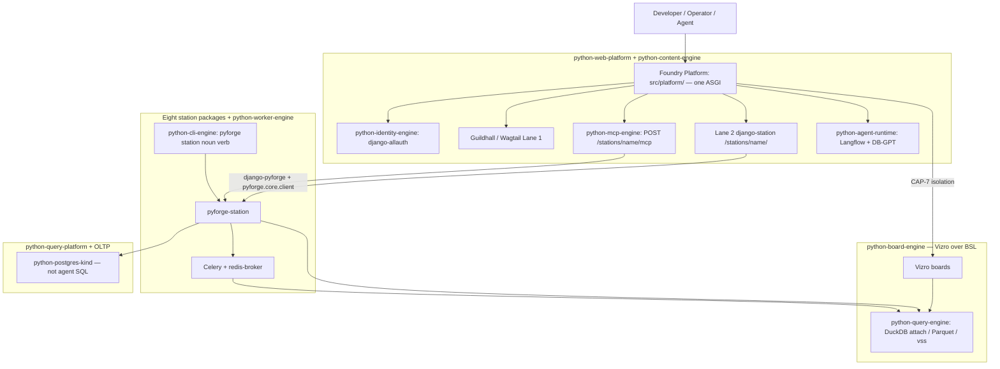
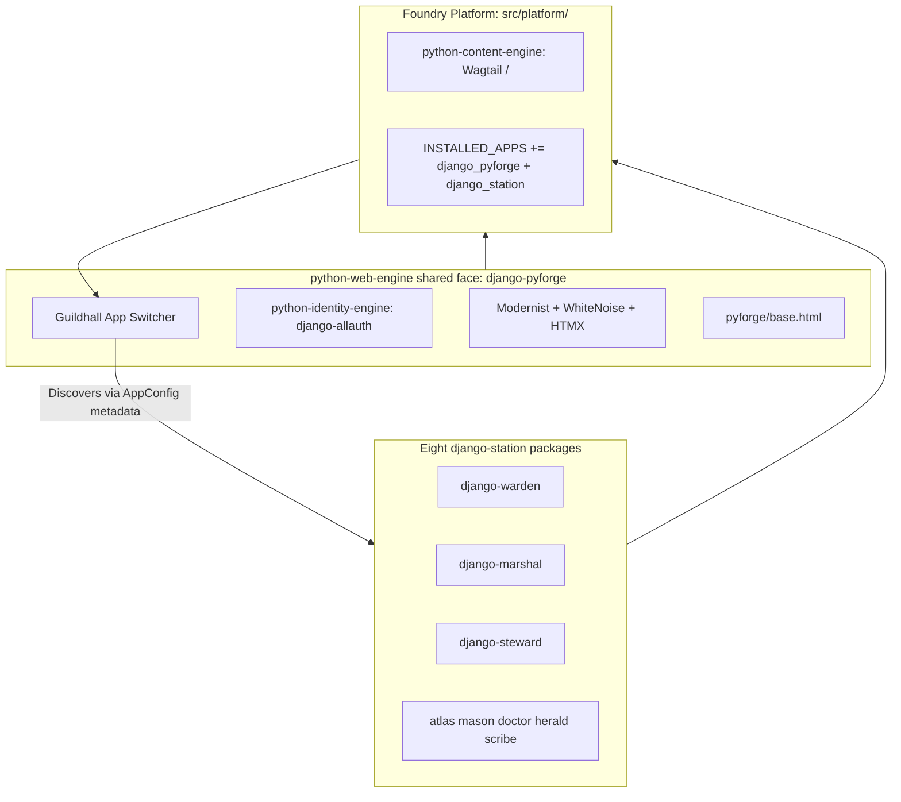
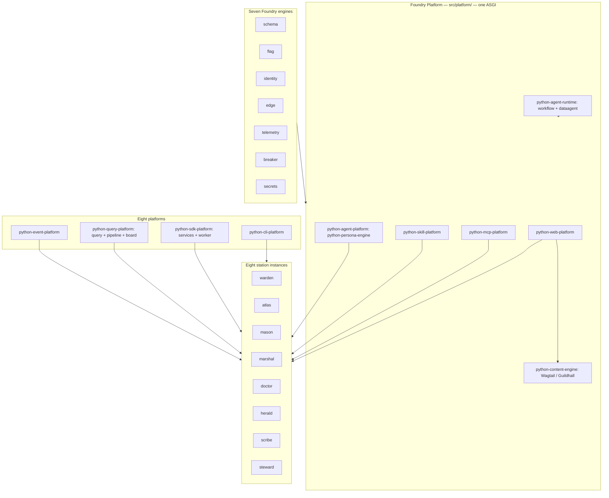
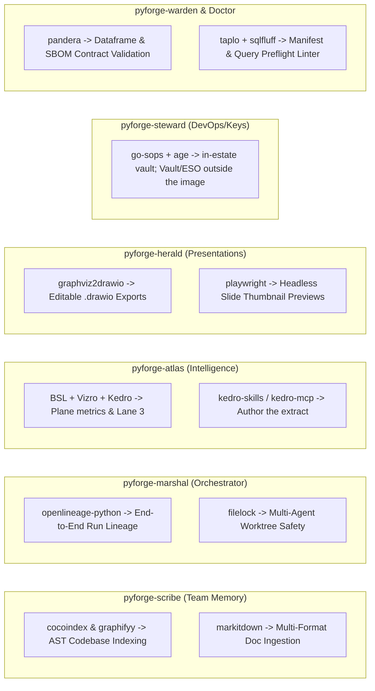

# PyForge Unifying Strategy — The 8-Station Hub-and-Spoke Foundry
## Grounding (2026-08-24)

This Dream was written as though Foundry Platform were greenfield. It is not. The grounding below
is **authoritative over the architecture prose that follows**, which was drafted before the
audit; where they disagree, this section wins.

**Owner: `steward`.** Foundry Platform (`src/platform/`) is not a ninth station and gets no project of its own —
Charter §5 stands, the roster stays at eight. Steward carries the through-line.

**The host already exists.** `src/platform/` is a live cookiecutter-django project with an
ASGI seam, `django-allauth` OIDC SSO, Langflow and DB-GPT mounted as pluggable apps on
isolated PostgreSQL schemas, warden's portal mounted as **`django-warden`**
(module `django_warden_fabric`; `src/platform/compliance_face/` is a leftover
husk, not the mount), a Helm chart with an
OCP overlay, a Containerfile, and the 15-factor baseline. Steward epics 10, 11, 12 and 16 are
`done` end to end, including **`12-7`**, which **closed 2026-08-25** on attended CRC: Route / SCC /
official postgres:17 + redis:7 under assigned UID / PVCs Bound / Liquibase + `migrate --fake` /
`/ht/` **200** (dated record in the 12.1 spec orbit). CRC follow-through **closed
2026-08-26** — sidecar Ready, `platform_app` DML-only, MCP host sidecar, published `/`
**200**. Isolated `mfa` sqlmigrate stays fake. Optional: Story 12.9 CI when Actions
minutes return. Record: `sprint-change-proposal-2026-08-26-canopy-closeout.md`.

**Naming follows reality.** `pyforge_host` is a retired living name (never a package). The
shipped **mount** is Foundry Platform — `src/platform/`. The pixi **env id**
`[feature.python-agent-platform]` stays until a named rename story (lock + CI +
Containerfile). Do not mint a Django-root rename story.

**Eight stations, one Foundry Platform.** Earlier log entries count "9 stations" by including the host. The host is not a station: eight spokes (`warden`, `atlas`, `mason`, `marshal`, `doctor`, `herald`, `scribe`, `steward`) plus the mount they sit on. **Canopy / chrome / Human Canopy / Agent Canopy** are retired as product names (Guildhall = Lane 1 home page; Langflow/DB-GPT = `python-agent-runtime` engines).

**Two Specs, two CAP spaces — do not collapse the numbers.** This Dream’s chain
**extends** `spec-python-agent-platform`; it does not replace it. Cite host work as
**`pap:CAP-1`..`pap:CAP-6`** and **`pap:AD-1`..`pap:AD-17`**. Bare **`CAP-1`..`CAP-19`**
on Unifying Strategy are a different set (`django-pyforge` is Unifying `CAP-1`, not
the cookiecutter host). Table + `extends:` live in
`spec-pyforge-unifying-strategy/SPEC.md` and `convergence.md`.

| Qualified id | Host CAP | What it is |
|---|---|---|
| `pap:CAP-1` | parent CAP-1 | Cookiecutter Django host at `src/platform/` |
| `pap:CAP-2` | parent CAP-2 | Langflow Pattern A + `langflow_schema` |
| `pap:CAP-3` | parent CAP-3 | DB-GPT via `pap:AD-17` pattern switch (Pattern B today) |
| `pap:CAP-4` | parent CAP-4 | Celery; async never blocks Django |
| `pap:CAP-5` | parent CAP-5 | One factory-sourced env; Python `3.14.*` |
| `pap:CAP-6` | parent CAP-6 | Air-gap parity is a failing check |

**Single-Spec merge is parked, not forgotten.** Copy `pap:CAP-*` full text into Unifying
SPEC → retarget Epic 10–12 citations to `pap:CAP-*` / `pap:AD-*` → supersede
`spec-python-agent-platform` (`absorbed-into`). **Never** in the same stories: rename
the pixi env. Trigger: operators opening the wrong Spec for `src/platform/`. Until
then `extends:` is correct. Steward named story; not a silent fold.

**Scope is the residual, not the estate.** Mint nothing that duplicates `pap:CAP-1`..`6`.
The 2026-08-24 residual list below is **historical** — the canopy drain (steward Epics 18–32
plus eight peer process-hook stories) shipped most of it. Architecture mermaid still
describes a greenfield `services/` FastAPI farm; **Grounding + the architecture spine win.**

**Still open after the drain (do not re-mint shipped CAPs):**

- Steward **`12-7`**: **closed 2026-08-25** (`/ht/` 200). CRC follow-through **closed
  2026-08-26** — sidecar Ready, `platform_app` + CAP-9 DML-only proof, Liquibase
  `:17`/`:18`/`:19`, MCP host sidecar, published Lane 1 `/` **200**. Record:
  `sprint-change-proposal-2026-08-26-canopy-closeout.md`.
- RFC-5 — contrib + `liquibase` schema + `:17`/`:18`/`:19` are in the changelog and
  **EXECUTED** on CRC. Isolated **`mfa` sqlmigrate** is the only remaining fake.
- **Q5 measure set** — **parked**, not a Foundry SPEC OQ. Unpublished; do not invent metrics.
  Sibling: `docs/dreams/build-league-scorecard.md` + `spec-build-league-scorecard` (draft).
- **Single-Spec merge** — **parked** (Grounding table above). Keep `extends:` until a
  steward story copies `pap:CAP-*` into Unifying SPEC, retargets Epic 10–12, and
  supersedes `spec-python-agent-platform`. Do not rename `[feature.python-agent-platform]`.
- ~~**`lane1-serves-dw-h3`**~~ — **answered 2026-08-25: no.** Host Wagtail `/cms/` is not
  `LaSuiteClient` Docs REST. DW-H3 stays atlas attended bring-up.
- Pip-layer fold: `spec-platform-image-one-pixi-env` **shipped**. MCP pin isolation is
  `spec-mcp-era-isolation` slice 1 (sidecar). **CAP-4 / Epic 35** fail-louds the
  cluster overlay (`spec-35-1-cluster-requires-mcp-host.md`) — not this Dream's
  CAP-19. Slice 3 (retire ImportError skip) stays parked.
- **Do not build `services/` as nine public FastAPI processes.** MCP and portal compute
  mount on the host ASGI (`POST /stations/<name>/mcp`). That is the modular-monolith
  ruling, not a deferred microservice program.
- **This Dream is evergreen.** CAP-1..18 closeout (2026-08-26) is a dated
  realization of that slice, not the end of the Dream. Status is `specified`
  while new canopy contracts are in flight. Operator 2026-08-26: the SPEC may
  return to `in-progress`; rebuild of shipped stores is in scope.
- **Red-team CRITICALs are Epic 40 (2026-09-02).** The adversarial review
  (`_bmad-output/projects/pyforge-steward/planning-artifacts/research/architecture-review-pyforge-unifying-strategy-red-team-2026-09-02.md`)
  found two shipped CRITICALs: `/assertion/mint/` trusts an **unverified** IdP
  bearer (X-1), and `redis-broker` is `noeviction` with **no `maxmemory`** on
  `emptyDir` carrying queue + Streams + PEL + DLQ + applied keys (S-1). Bound as
  steward **Epic 40** (40.1 verified mint, 40.2 durable bounded broker) via
  `sprint-change-proposal-2026-09-02-red-team-critical.md`. **Dispatch before**
  any further story here and before cutover Phase 1. The review's HIGH set
  (R-4 … R-16) landed the same day as **Epics 41–43** (`sprint-change-proposal-2026-09-02-red-team-high.md`);
  R-17 … R-25 are `DW-RT-2026-09-02-1..9` in steward's deferred-work ledger. Order: 40 → 41 → 42 → 43;
  42.x depend on 40.x; all precede cutover Phase 1.
- **Python floor.** **Decided 2026-09-02 (hybrid):** one interpreter `3.14.*` for every env
  once Mason 13.1 (`langflow-base` `onnxruntime <1.24`) and 13.2 (`dbgpt-client`
  `sqlalchemy <2.0.29`) land; steward **43.6** flips the pins. `mcp-host` stays — it isolates
  `mcp` 2.x from langflow's `mcp <2` pin, not the interpreter. **43.6 shipped 2026-09-03.**
  Measured matrix: § *Pixi environment matrix (measured)* below; regenerate with
  `python scripts/pixi_env_matrix.py --update --dream docs/dreams/pyforge-unifying-strategy.md`.
- **Cutover is under contract (2026-09-04).** Gate closed 2026-09-03 (40 → 43 `done`,
  Mason 13 `done`, 43.3–43.6 shipped). Plan: § *Cutover to `python-foundry`*. Spec:
  `spec-python-foundry-cutover` (`fnd:CAP-1`..`7`, extends this chain). Steward **Epic 44**.
  Phase 0 is outward and operator-confirmed; R-18..R-22 carry, never block.
## How to read this Dream (2026-08-26)

Evergreen Foundry Dream. **Grounding** + **The Dream** (query plane) +
**High-Leverage matrix** + **Constraints** + **Cutover to `python-foundry`** +
`spec-pyforge-unifying-strategy` are authoritative. Build-target mermaid only in the living file.

Historical 10-layer / `services/` / `:800x` illustration, sizing, station
reviews, extended Grounding (2026-08-30), fleet evidence, and realization
entries through 2026-08-24:
[`archive/pyforge-unifying-strategy-2026-08-23-topology.md`](archive/pyforge-unifying-strategy-2026-08-23-topology.md).

## The Dream

We move from a disparate collection of local tools to **one hub-and-spoke
Foundry**: **Foundry Platform** (`src/platform/`, one ASGI process,
`python-web-platform` + `python-content-engine`) and **eight station spokes**
(packages, not `:800x` processes). “Hub-and-Spoke” in this Dream means that
shape — not nine FastAPI microservices. We are not building disconnected apps;
we are building **one Foundry that mounts the eight canonical stations**,
powered by **`python-pixi-solver`**. The lasting git root is **`python-foundry`**
(workspace name `pyforge`); the recipe plant is **`factory/`** (own lock).

By placing a unified **Django + Wagtail** application at the center (CodeRed dropped
2026-08-24) and mounting station portals and MCP faces **on the same host ASGI**, we
keep identity (`python-identity-engine`), Guildhall, and dispatch in one process. Heavy
work stays on Celery (`python-worker-engine`) + Redis. The pre-audit `services/` FastAPI
farm is **not** the delivery shape (Grounding).

- **Foundry Platform (`src/platform/`):** identity (`django-allauth` OIDC/SSO), session, Modernist assets, Wagtail Lane 1, Lane 2 portals, `POST /stations/<name>/mcp`.
- **Station compute (packages + Celery, not `services/` processes):** domain logic in `pyforge-<station>` / `django-<station>`; the host does not import `pyforge.*`.

### The query plane

One hybrid HTAP query plane (CAP-19 / Epic 34): Kedro writes derived layers;
DuckDB is the only analytical engine (live read-only `ATTACH`, Parquet cache,
`vss` / HNSW); agents never get the OLTP DSN. Lane 3 is Vizro over BSL.
Residual OQs: `query-plane-face`, `query-plane-catalog`, `query-plane-scribe-cutover`.

## Django Reusable Apps & `django-pyforge`

The host follows Django’s reusable-app convention. Foundation is
**`django-pyforge`**. Identity is **`django-allauth`**. There is no La Suite
package on Foundry Platform.

## The 8 platforms (living topology)

> Replaces the 2026-08-23 “10 layers / 9 FastAPI `:800x` / 9 portal apps” drawing.
> That drawing is **historical**; do not implement it. Formula: `python-<role>-<class>`.

## High-Leverage Library Integration & Station Opportunity Matrix

An audit of the full repository catalog (`library-llms-full.md`) reveals installed
libraries that stations should **bind now** rather than re-pin. Scheduling authority
is `spec-pyforge-unifying-strategy/stack.md` § *Estate leverage — installed, bind now*
(2026-08-26). Kedro/Vizro/BSL sit on the same list as the original ten.

**Vault is a steward-profile adapter, not an in-app CAP-12 client** (Foundry AD-19).
`go-sops` + `age` remain the in-estate vault. `filelock` already guards Atlas
`atlas.duckdb` (FR-27); marshal/scribe still owe the same primitive.

1. **`cocoindex` & `graphifyy` $\rightarrow$ `pyforge-scribe`:** Fast AST graph extraction and incremental semantic code indexing (`pyforge scribe index`), linking codebase functions directly to the PRDs and Dreams that spawned them.
2. **`openlineage-python` $\rightarrow$ `pyforge-marshal` & `pyforge-steward`:** Emits standard OpenLineage pipeline events across the autonomous loop, tracking complete operational lineage (`Dream -> Spec -> Mason Build -> Warden Audit -> Steward Deploy`).
3. **`boring-semantic-layer` (BSL) $\rightarrow$ `pyforge-atlas`:** Certified metrics over the query plane (DuckDB) — `package_download_velocity`, `ecosystem_cve_risk_score`, and CAP-19 relations — for Vizro and agents **without raw SQL** (UJ-6).
   3a. **Kedro family $\rightarrow$ `pyforge-atlas` (home):** `kedro` / `kedro-datasets` / `kedro-dagster` write and schedule derived layers. `kedro-skills` + `kedro-mcp` author them. Other stations may add extract *nodes*, not new Kedro projects (AD-21).
   3b. **Vizro family $\rightarrow$ Lane 3:** `vizro` is the runtime. `vizro-mcp` + `vizro-e2e-flow` author boards after 34.2. `vizro-ai` 0.4.2 is deprecated — no new work.
## Constraints / Non-goals

- **Not a fragile monolithic SPA.** Server-driven Django + HTMX + Wagtail +
  `django-pyforge`. Lane 3 is reverse-proxied Vizro, not a React analytics SPA.
- **Lane 2 vs Lane 3.** HTMX owns actions. Vizro owns deep visualization. Do
  not import Kedro or Vizro into Django views.
- **Zero heavy compute in Django views.** Blocking work is Celery + station
  packages, not a `:800x` process farm.
- **Zero domain models on portals.** `django-<station>` apps are UI clients
  through `django-pyforge` / `pyforge.core.client`. Host never imports
  `pyforge.*`.
- **Eight stations, five tiers on 03 only.** Foundry Platform is not a ninth station.
  New 01/02 work does not mint a portal/MCP/persona. Roster **declared complete
  2026-08-26** (Epic 37.1, 40/40). Mason skill = `conda-forge-expert`. A missing
  cell fails CI.
- **Lane 1 is Wagtail.** CodeRed is dropped.
- **One analytical engine (CAP-19).** No private DuckDB, Chroma, or OLTP DSN
  for estate knowledge or Text-to-SQL. BSL is the dashboard/agent SQL contract.
- **Kedro is required for new Atlas pipelines; not eight projects.** Atlas is
  the Kedro home. Warden is never re-templated as Kedro (Q8). `kedro-mcp`
  stays wrapped.
- **Infra kinds.** PostgreSQL + Redis + Kubernetes. DuckDB is a library/face.
  Vault/ESO stay outside the image. No MinIO as a fourth core kind.
- **Bind installed pins; do not re-pin.** See `stack.md` § Estate leverage.

## Shared Data Contracts (`pyforge.core.client`)

Station APIs live at ``/stations/<name>/api/v<N>/`` (not bare ``/api/v1``). Example:
``PyForgeStationClient(station="warden").post("/compliance/check", …)``
→ ``/stations/warden/api/v1/compliance/check`` with ``X-PyForge-API-Version`` + Bearer assertion.

---

## Pixi environment matrix (measured)

<!-- pixi-env-matrix:begin lock-sha256=5500787cd272517e -->

Measured from ``pixi.lock`` (not a cross-minor solver benchmark). Regenerate with ``python scripts/pixi_env_matrix.py --update docs/dreams/pyforge-unifying-strategy.md`` after lock changes.

| Environment | Python | Conda records | Platforms |
|---|---|---:|---|
| ``bmad-suite-full`` | ``3.14.*`` | 80 | ``linux-64`` |
| ``bmad-ui`` | ``3.14.*`` | 51 | ``linux-64`` |
| ``build`` | ``3.14.*`` | 241 | ``linux-64``, ``osx-arm64-min``, ``win-64`` |
| ``conda-smithy`` | ``3.14.*`` | 232 | ``linux-64``, ``osx-arm64-min``, ``win-64`` |
| ``dbgpt-sidecar`` | ``3.14.*`` | 405 | ``linux-64`` |
| ``default`` | ``3.14.*`` | 124 | ``linux-64``, ``osx-arm64-min``, ``win-64`` |
| ``detectors`` | ``3.14.*`` | 84 | ``linux-64``, ``osx-arm64-min``, ``win-64`` |
| ``gcloud`` | ``3.14.*`` | 151 | ``linux-64``, ``osx-arm64-min`` |
| ``grayskull`` | ``3.14.*`` | 247 | ``linux-64``, ``osx-arm64-min``, ``win-64`` |
| ``linux`` | ``3.14.*`` | 150 | ``linux-64``, ``osx-arm64-min``, ``win-64`` |
| ``local-recipes`` | ``3.14.*`` | 1,172 | ``linux-64``, ``osx-arm64-min``, ``win-64`` |
| ``mcp-host`` | ``3.14.*`` | 67 | ``linux-64`` |
| ``osx`` | ``3.14.*`` | 240 | ``osx-arm64-min`` |
| ``platform-ci-test`` | ``3.14.*`` | 330 | ``linux-64`` |
| ``platform-dev`` | ``3.14.*`` | 504 | ``linux-64``, ``osx-arm64-min`` |
| ``pyforge-atlas`` | ``3.14.*`` | 460 | ``linux-64``, ``osx-arm64-min``, ``win-64`` |
| ``pyforge-ci`` | ``3.14.*`` | 121 | ``linux-64``, ``osx-arm64-min``, ``win-64`` |
| ``pyforge-container`` | ``3.14.*`` | 597 | ``linux-64``, ``osx-arm64-min``, ``win-64`` |
| ``pyforge-core`` | ``3.14.*`` | 42 | ``linux-64``, ``osx-arm64-min``, ``win-64`` |
| ``pyforge-doctor`` | ``3.14.*`` | 92 | ``linux-64``, ``osx-arm64-min``, ``win-64`` |
| ``pyforge-herald`` | ``3.14.*`` | 136 | ``linux-64``, ``osx-arm64-min``, ``win-64`` |
| ``pyforge-marshal`` | ``3.14.*`` | 137 | ``linux-64``, ``osx-arm64-min``, ``win-64`` |
| ``pyforge-mason`` | ``3.12.*`` | 124 | ``linux-64``, ``osx-arm64-min``, ``win-64`` |
| ``pyforge-scribe`` | ``3.14.*`` | 63 | ``linux-64``, ``osx-arm64-min``, ``win-64`` |
| ``pyforge-steward`` | ``3.14.*`` | 78 | ``linux-64``, ``osx-arm64-min``, ``win-64`` |
| ``pyforge-testing-kit`` | ``3.12.*`` | 50 | ``linux-64``, ``osx-arm64-min``, ``win-64`` |
| ``pyforge-warden`` | ``3.14.*`` | 164 | ``linux-64``, ``osx-arm64-min``, ``win-64`` |
| ``python-agent-platform`` | ``3.14.*`` | 499 | ``linux-64``, ``osx-arm64-min`` |
| ``vuln-db`` | ``3.14.*`` | 246 | ``linux-64``, ``osx-arm64-min``, ``win-64`` |
| ``win`` | ``3.14.*`` | 305 | ``win-64`` |

<!-- pixi-env-matrix:end -->
## Fleet conventions (one vocabulary)

Contract is Grounding (2026-08-30). Ten-row evidence table:
[archive § Fleet conventions](archive/pyforge-unifying-strategy-2026-08-23-topology.md).

## Living names (`python-<role>-<class>`)

Formula: `python-<role>-<class>`. Full map:
[archive § Living names](archive/pyforge-unifying-strategy-2026-08-23-topology.md).
Destination: **`python-foundry`**; mount **`src/platform/`**; eight stations.

## Cutover to `python-foundry` (build target, 2026-09-04)

**Ruling.** The gate on this cutover (Epics 40 → 41 → 42 → 43, Mason 13.1 / 13.2) closed
2026-09-03 — "Then cutover Phase 1 may start." Until this section nothing sat downstream of
it: the phase table was filed in the archive under "do not build", with no Spec capability,
epic, or story. **The first step is the contract, not the repo:** this section →
`bmad-spec` derives **`spec-python-foundry-cutover`** (`extends:
spec-pyforge-unifying-strategy`; CAP space **`fnd:CAP-1`..`fnd:CAP-7`**, one per phase — a
third space beside `pap:` and bare Unifying `CAP-*`, never collapsed) →
`bmad-correct-course` mints steward **Epic 44**. Creating the GitHub repo is the first
*dispatch*, operator-confirmed at that moment, never auto-drained.

**Decisions (operator, 2026-09-04).** Foundry is a **fresh empty repo**: history stays in
archived `local-recipes` at a pinned SHA, the move-list records source SHAs, the deferred
secret-leak rewrite is left behind by construction. Red-team MEDIUM band: **R-17** is Phase 3
(44.7); **R-23 / R-24 / R-25** fold into 44.2; **R-18..R-22** stay open ledger entries owned
by steward ("Epic 45 candidate") and never block Phase 1. The evergreen Spec is not
re-derived: its SPEC.md is hand-edited past its memlog and `bmad-spec` is its single writer.

| Phase | Story | Do | Done when | Gate |
|---|---|---|---|---|
| — | **44.1** move-list manifest | derive every tracked path → target-tree destination, `stays`, or `dies`, from the spec-surface map; never a hand list | 100 % of tracked files resolve to one destination; source SHA recorded | — |
| — | **44.2** document fixes | R-23 `readOnlyRootFilesystem` + Windows / free-threading claims aligned to the Containerfile and `pixi.toml` platforms; R-24 Keycloak `26.4.0` pinned once; R-25 "no station-domain models on `django-<station>`"; `stack.md` / `convergence.md` floor `3.12.*` → `3.14.*` | edits land; `DW-RT-2026-09-02-7/-8/-9` resolved | — |
| 0 — Open foundry (`fnd:CAP-1`) | **44.3** | create `rxm7706/python-foundry`, workspace `pyforge`, empty of recipes, lean `pixi.toml`, estate-only CI; `environment.yaml` export automated or not carried, never by hand (R-17a) | clone exists; CI green on the empty estate | **outward** — ledger `blocked` until the operator flips |
| 1a — Fold the packages (`fnd:CAP-2`) | **44.4** | `src/shared/packages/` → `src/packages/`; a `pixi.toml` per `django-*`; drop `sys.path` inserts and Containerfile `COPY` of django src; `five_tier.py` `_packages_root` retargeted; package fold **only** | station envs solve; the host boots in foundry | deps 44.1, 44.3 |
| 1b — Move the estate (`fnd:CAP-2`) | **44.5** | skills → `skills/` (`stations/`, `personas/`, `domain/`), `.claude/skills/` + `.cursor/skills/` as symlink adapters; BMAD, decks, dreams | adapters are symlinks; the BMAD chain resolves in foundry | deps 44.4; never blended with 44.4 |
| 2 — CFE comes home (`fnd:CAP-3`) | **44.6** | authoritative skill / scripts / tools → `skills/domain/conda-forge-expert`; retros land in foundry; `pyforge/mason/resolve.py` chain (flag → `MASON_CFE_ROOT` → cwd walk) retargeted | no `MASON_CFE_ROOT` resolves to `local-recipes`; `mason-cfe-surface-check` + `cfe-rebuild-guard-check` pass | **Mason** (Rules 1 + 2); deps 44.5 |
| 3 — Factory island (`fnd:CAP-4`, R-17b) | **44.7** | `factory/pixi.toml` + own lock; `factory/recipes/`, `build-locally.py`, `.ci_support/`, `conda-forge.yml`; recipes-only CI on `paths: factory/**` | `mason recipe build factory/recipes/…` matches today's CFE wrap; `DW-RT-2026-09-02-1` resolved | deps 44.3 |
| 4 — Working set (`fnd:CAP-5`) | **44.8** | move in-flight + sole-maintainer recipes only | `factory/recipes/` is the working set; the 7,855-dir `recipes/` universe was not copied (count ceiling asserted) | deps 44.7 |
| 5 — Mason → conda-forge (`fnd:CAP-6`) | **44.9** | `submit` → staged-recipes or bot fork; `update` → feedstock maintainer-edit | an agent PR never opens `local-recipes` (asserted on the submit path) | **outward + Mason**; deps 44.6, 44.8 |
| 6 — Archive (`fnd:CAP-7`) | **44.10** | README superseded; disable Azure; pin last SHA; keep history; retire the worktree residue (268 registered, 85 GB under `.claude/worktrees/`) | default clone is foundry; `.steward` has one git root | **outward, irreversible**; deps all |

**Order.** 44.13 → 44.1 ∥ 44.2 ∥ 44.15 → operator flips 44.3 → 44.11 ∥ 44.12 → 44.14 → capability
realization in dependency order (moves replay, rebuilds drill) → **flag flip** when its dependencies
are verified → 44.6 ∥ 44.7 → 44.8 → operator flips 44.9 → operator flips 44.10. Marshal's `Deps:` parser is station-local, so the Mason
gate on 44.6 / 44.9 is ledger state, as 43.6 was behind Mason 13. Before any ledger write:
`sprint-ledger-sync --project steward --repair-feed` (the Tier-3 feed stops at Epic 38; a
bare sync refuses) then `story-status-check`.

**Regenerative, not a move (operator 2026-09-04, iteration 3).** Dreams and memlogs are the only
unconditional move; every rendered Spec, spine and epic is re-derived in foundry. Every capability
is realized there by **rebuild** (a regeneration drill with the archive as oracle) or by **move**
(a replay), decided per capability on scored signals, with `retire` for what no Dream wants
(`fnd:AD-20..22`, `fnd:CAP-9`; Stories 44.13 memlog fidelity, 44.14 rebuild harness). This is the
regenerable-factory drill at estate scale, and foundry's first fleet run is its own construction.

**Private and metered (operator 2026-09-04, iteration 4).** Foundry is private, permanently:
Pages and the win-64 leg ride the paid plan, so Actions minutes are a standing budget. CAP-1's
CI evidence is a real green run — GitHub-hosted, then the remote Linux dev host as self-hosted
fallback; a fresh-clone run of the estate gates is provisional only; with no evidence path 44.3
does not dispatch (`fnd:AD-23`). Story 44.15 meters the account's Actions minutes through
`steward budget check` (`fnd:CAP-10`) so the dispatch, Marshal's drains and the rebuild harness
read a real ceiling. Nothing Mason submits carries a foundry URL. No open question remains.

**Flag-gated and regenerable (operator 2026-09-04, iteration 2).** The cutover is a flag,
not a date: `pyforge.cutover_root` in the CAP-13 flag tree names the root of record; the
transition point is its flip, after 44.5 today, and flipping back is the rollback. Until then
this repo evolves normally; the plan is regenerated from scratch or appended with the delta at
will, and every move is a replay into foundry (`fnd:AD-17`, `fnd:AD-18`). Stock Windows
developers get a native estate through generated junction links and a remote host (`fnd:AD-19`);
Stories 44.11 and 44.12 carry both.

**Solutioning first (operator 2026-09-04).** BMAD Phase 3 only: the Spec, the cutover
architecture spine (`architecture-python-foundry-cutover-2026-09-04`, cite `fnd:AD-n`)
and Epic 44 are solutioning artifacts under review; the operator iterates on them before
any implementation. Every 44.x is held ledger `blocked`; the flip to `backlog` is the move
into Phase 4, story by story. No story spec is drafted until then.

**Never.** No `services/` / `:800x` tree. The estate `pixi.lock` never absorbs the factory
solver farm. Graphify move-list and package fold never in one story. No `CAP-20` in the
evergreen Spec. The archive's phase table is the record of where this came from, not a
second copy to maintain.

## Kinships

[[factory-console]] (Guildhall — Lane 1, realized/absorbed into marshal narrative) · [[secure-live-dashboards]] (Lane 3 security kit — steward; binds Mode A isolation) · [[atlas-query-dashboards]] / atlas Vizro board (Lane 3 prototype) · [[htap-query-plane]] (absorbed here — the query-plane section; not a sibling chain) · [[kedro-org-tooling-adoption]] (kedro-skills / kedro-mcp — authoring, not a second home) · [[pyforge-atlas]] (Kedro home, BSL, vss, plane writer) · [[marshal-token-economy]] (own Spec, CAP-1..CAP-13; five-layer agent-loop compression + retrieval, summarized as §6 above) · [[pyforge-scribe]] (three CAP-18 ports; ingest writes through GraphStore; 34.5 plane driver) · [[compliance-factory-web-face]] (Lane 2 prototype — warden) · [[pyforge-herald]] (stage / proclamation / deck engine; vizro-mcp authoring is shared) · [[pyforge-steward]] (deploy & secure hosting; go-sops/age; Vault profile) · [[pyforge-charter]] (estate governance) · [[pyforge-core]] (unified CLI spine) · [[presentation-deck]] (deck standards) · [[django-accelerator-framework]] (Lane 2 portal scaffolding) · [[wagtail-corporate-brain]] (CMS & doc synchronization) · [[enterprise-data-models-and-apis]] (normalized data & DRF JSON:API layer — not the query plane) · [[platform-fifteen-factors]] (15-factor enterprise baseline) · [[local-ocp-hybrid-environment]] (hybrid deployment profile) · [[langflow-django-plugin]] (AI workflow engine — no private Chroma for estate RAG) · [[db-gpt-django-plugin]] (DB knowledge base — SQL on the plane, not OLTP DSN) · [[pyforge-operation]] (estate-wide operating model — promotion 01/02/03 + Golden Path; WFT tool names are steward-profile adapters, not this Dream's core stack) · [[pyforge-scorecard]] (sibling — Build League + Balanced Product Scorecard *board*; *rules* are authored in this Dream's Grounding) · Kedro [architecture overview](https://docs.kedro.org/en/stable/getting-started/architecture_overview/) (hook specs + plugins; not eight Kedro projects)

---

## Realization log

Entries through 2026-08-31: [archive § Realization log (historical)](archive/pyforge-unifying-strategy-2026-08-23-topology.md).

- **2026-09-01** — Folded `pyforge-target-monorepo` (tree + phases 0–6) and
  `pyforge-foundry-unifying-architecture` (`python-<role>-<class>`) into this
  Dream and deleted those files. Destination repo is `python-foundry`.
- **2026-09-01** — Folded `fleet-convention-consistency` (ten-row evidence +
  Charter §6 detector-practice) **into this Dream** § Fleet conventions and
  deleted that file. Contract was already Grounding 2026-08-30. Detectors still
  unbuilt.
- **2026-09-01** — Locked host vs Unifying CAP spaces: cite **`pap:CAP-1`..`pap:CAP-6`**
  and **`pap:AD-1`..`pap:AD-17`**; Unifying `CAP-1`..`19` stay the mount. Pixi env id
  `python-agent-platform` stays. Single-Spec merge parked in Grounding (copy →
  retarget Epic 10–12 → supersede parent Spec; never rename the env in those stories).
- **2026-09-02** — Red-team architecture review landed
  (`research/architecture-review-pyforge-unifying-strategy-red-team-2026-09-02.md`):
  six lenses graded against the living topology and the shipped code. Verdict:
  strategy viable, document not; two CRITICALs in shipped code (X-1 unverified
  mint root; S-1 volatile unbounded broker), no DR, and a HIGH set of fourteen.
  Operator chose option 1. `bmad-correct-course` minted **Epic 40** (Stories
  40.1 / 40.2, `ready-for-dev`, deps none), appended CAP-6 / CAP-11
  correct-course notes, RFC-2 / RFC-3 notes, superseded sibling CAP-3 for the
  broker role, and stamped `implementation-readiness-report-2026-09-02-red-team-critical.md`
  **READY — proceed**. HIGH set routes through a second correct-course after
  Epic 40 lands.
- **2026-09-02 (later)** — Second `bmad-correct-course` for the review's HIGH set:
  **Epic 41** data safety (41.1 DR + backup, 41.2 plane process boundary, 41.3 Scribe
  DDL in the changelog, 41.4 verified broker TLS), **Epic 42** agent and bus containment
  (42.1 MCP transport auth + streaming proxy, 42.2 rate limits + run bounds, 42.3 bus
  delivery semantics + deployed consumer, 42.4 Celery hardening + builds pool, 42.5 role
  namespaces + tenant claim), **Epic 43** contracts and the document (43.1 split the Dream,
  43.2 station API contract, 43.3 in-process port, 43.4 CD by digest, 43.5 one
  interpreter story). Fourteen tracked story specs `ready-for-dev`; SPEC Constraints gained a
  dated block; R-17 … R-25 are deferred-work entries with steward as owner. Readiness:
  `implementation-readiness-report-2026-09-02-red-team-high.md`.
- **2026-09-02 (interpreter)** — 43.5 decided **hybrid (a)+(c)** on solver evidence: the
  platform feature minus langflow solves clean on 3.14; langflow is blocked only by
  `onnxruntime <1.24`, `dbgpt-app` only by `sqlalchemy <2.0.29`. Mason **Epic 13** (13.1,
  13.2) owns the two feedstock loosenings under Rule 1; steward **43.6** flips the pins;
  `mcp-host` stays as MCP-SDK isolation (langflow pins `mcp <2`). Review S-5 / R-16 wording
  corrected. `DW-FU-10-4` bound to Mason 13.1.
- **2026-09-03** — **43.1** archived historical topology (living Dream ≤400 lines). **43.2** shipped ``/stations/<name>/api/v<N>/``, ``pyforge.core.client``; Langflow off bare ``/api/v1``.
- **2026-09-04** — Gate closed 2026-09-03: 43.3–43.6 shipped, Mason 13.1 / 13.2 done,
  steward 196/196. Cutover promoted out of the archive into § *Cutover to `python-foundry`*
  as the build target (43.1 had filed it under "do not build"). Operator rulings: fresh repo;
  fold docs / carry ops. `spec-python-foundry-cutover` (`fnd:CAP-1..7`) derived; cutover architecture spine
  (`fnd:AD-1..16`, iteration 1) and steward Epic 44 (44.1–44.10) decomposed as solutioning;
  every story held `blocked` until the operator's review iterations close (Phase 3 → 4).
- **2026-09-04 (iteration 2)** — Operator review of PR #1041: the cutover is a flag
  (`pyforge.cutover_root`), the plan regenerates or appends, moves are replays; stock Windows
  is a native estate with a remote host; adapters are generated per machine, SKF writes into
  `skills/`, runtime state in `var/`. Spine `fnd:AD-17..19`, Spec `fnd:CAP-8`, Stories 44.11 /
  44.12 (both `blocked`). Four open questions remain.
- **2026-09-04 (iteration 3)** — Operator: Dreams only move; the cutover is regenerative —
  every capability rebuilt or moved per a capability ledger, Dreams + memlogs as the seed,
  the archive as oracle, per-capability freeze under the one flag. Spine `fnd:AD-20..22`,
  Spec `fnd:CAP-9`, Stories 44.13 / 44.14 (`blocked`). Answered `planning-history-scope` and
  `ingest-keys-import`; open: `repo-visibility`, `actions-minutes`.
- **2026-09-04 (iteration 4)** — Operator answered the last two open questions: foundry is
  private, permanently (`fnd:AD-14` amended); CI evidence is a real run with the remote host as
  self-hosted fallback, a fresh-clone run provisional, no dispatch without an evidence path
  (`fnd:AD-23`); Story 44.15 Actions-minutes metering for `steward budget` (`fnd:CAP-10`,
  `blocked`; 44.14 depends on it). The 2026-08-30 billing block had cleared (a real Detectors
  run on `main`). No open question remains; Epic 44 = 15 stories, all `blocked`.
- **2026-09-04 (Phase 4 opens)** — First flip: `44-13-memlog-fidelity` `blocked` → `backlog`
  (pre-flight clean; PR #1043). The other fourteen Epic 44 stories stay `blocked` until flipped
  one by one; 44.3 / 44.9 / 44.10 still need explicit confirmation at dispatch.
