# PyForge Unifying Strategy — The 8-Station Hub-and-Spoke Foundry

## Grounding (2026-08-24)

This Dream was written as though Foundry Platform were greenfield. It is not. The grounding below
is **authoritative over the architecture prose that follows**, which was drafted before the
audit; where they disagree, this section wins.

**Owner: `steward`.** Foundry Platform (`src/platform/`) is not a ninth station and gets no project of its own —
Charter §5 stands, the roster stays at eight. Steward carries the through-line.

**The host already exists.** `src/platform/` is a live cookiecutter-django project with an
ASGI seam, `django-allauth` OIDC SSO, Langflow and DB-GPT mounted as pluggable apps on
isolated PostgreSQL schemas, warden's portal mounted as **`django-warden`**
(module `django_warden_fabric`; `src/platform/compliance_face/` is a leftover
husk, not the mount), a Helm chart with an
OCP overlay, a Containerfile, and the 15-factor baseline. Steward epics 10, 11, 12 and 16 are
`done` end to end, including **`12-7`**, which **closed 2026-08-25** on attended CRC: Route / SCC /
official postgres:17 + redis:7 under assigned UID / PVCs Bound / Liquibase + `migrate --fake` /
`/ht/` **200** (dated record in the 12.1 spec orbit). CRC follow-through **closed
2026-08-26** — sidecar Ready, `platform_app` DML-only, MCP host sidecar, published `/`
**200**. Isolated `mfa` sqlmigrate stays fake. Optional: Story 12.9 CI when Actions
minutes return. Record: `sprint-change-proposal-2026-08-26-canopy-closeout.md`.

**Naming follows reality.** `pyforge_host` is a retired living name (never a package). The
shipped **mount** is Foundry Platform — `src/platform/`. The pixi **env id**
`[feature.python-agent-platform]` stays until a named rename story (lock + CI +
Containerfile). Do not mint a Django-root rename story.

**Eight stations, one Foundry Platform.** Earlier log entries count "9 stations" by including the host. The host is not a station: eight spokes (`warden`, `atlas`, `mason`, `marshal`, `doctor`, `herald`, `scribe`, `steward`) plus the mount they sit on. **Canopy / chrome / Human Canopy / Agent Canopy** are retired as product names (Guildhall = Lane 1 home page; Langflow/DB-GPT = `python-agent-runtime` engines).

**Two Specs, two CAP spaces — do not collapse the numbers.** This Dream’s chain
**extends** `spec-python-agent-platform`; it does not replace it. Cite host work as
**`pap:CAP-1`..`pap:CAP-6`** and **`pap:AD-1`..`pap:AD-17`**. Bare **`CAP-1`..`CAP-19`**
on Unifying Strategy are a different set (`django-pyforge` is Unifying `CAP-1`, not
the cookiecutter host). Table + `extends:` live in
`spec-pyforge-unifying-strategy/SPEC.md` and `convergence.md`.

| Qualified id | Host CAP | What it is |
|---|---|---|
| `pap:CAP-1` | parent CAP-1 | Cookiecutter Django host at `src/platform/` |
| `pap:CAP-2` | parent CAP-2 | Langflow Pattern A + `langflow_schema` |
| `pap:CAP-3` | parent CAP-3 | DB-GPT via `pap:AD-17` pattern switch (Pattern B today) |
| `pap:CAP-4` | parent CAP-4 | Celery; async never blocks Django |
| `pap:CAP-5` | parent CAP-5 | One factory-sourced env; Python `3.12.*` |
| `pap:CAP-6` | parent CAP-6 | Air-gap parity is a failing check |

**Single-Spec merge is parked, not forgotten.** Copy `pap:CAP-*` full text into Unifying
SPEC → retarget Epic 10–12 citations to `pap:CAP-*` / `pap:AD-*` → supersede
`spec-python-agent-platform` (`absorbed-into`). **Never** in the same stories: rename
the pixi env. Trigger: operators opening the wrong Spec for `src/platform/`. Until
then `extends:` is correct. Steward named story; not a silent fold.

**Scope is the residual, not the estate.** Mint nothing that duplicates `pap:CAP-1`..`6`.
The 2026-08-24 residual list below is **historical** — the canopy drain (steward Epics 18–32
plus eight peer process-hook stories) shipped most of it. Architecture mermaid still
describes a greenfield `services/` FastAPI farm; **Grounding + the architecture spine win.**

**Still open after the drain (do not re-mint shipped CAPs):**

- Steward **`12-7`**: **closed 2026-08-25** (`/ht/` 200). CRC follow-through **closed
  2026-08-26** — sidecar Ready, `platform_app` + CAP-9 DML-only proof, Liquibase
  `:17`/`:18`/`:19`, MCP host sidecar, published Lane 1 `/` **200**. Record:
  `sprint-change-proposal-2026-08-26-canopy-closeout.md`.
- RFC-5 — contrib + `liquibase` schema + `:17`/`:18`/`:19` are in the changelog and
  **EXECUTED** on CRC. Isolated **`mfa` sqlmigrate** is the only remaining fake.
- **Q5 measure set** — **parked**, not a Foundry SPEC OQ. Unpublished; do not invent metrics.
  Sibling: `docs/dreams/build-league-scorecard.md` + `spec-build-league-scorecard` (draft).
- **Single-Spec merge** — **parked** (Grounding table above). Keep `extends:` until a
  steward story copies `pap:CAP-*` into Unifying SPEC, retargets Epic 10–12, and
  supersedes `spec-python-agent-platform`. Do not rename `[feature.python-agent-platform]`.
- ~~**`lane1-serves-dw-h3`**~~ — **answered 2026-08-25: no.** Host Wagtail `/cms/` is not
  `LaSuiteClient` Docs REST. DW-H3 stays atlas attended bring-up.
- Pip-layer fold: `spec-platform-image-one-pixi-env` **shipped**. MCP pin isolation is
  `spec-mcp-era-isolation` slice 1 (sidecar). **CAP-4 / Epic 35** fail-louds the
  cluster overlay (`spec-35-1-cluster-requires-mcp-host.md`) — not this Dream's
  CAP-19. Slice 3 (retire ImportError skip) stays parked.
- **Do not build `services/` as nine public FastAPI processes.** MCP and portal compute
  mount on the host ASGI (`POST /stations/<name>/mcp`). That is the modular-monolith
  ruling, not a deferred microservice program.
- **This Dream is evergreen.** CAP-1..18 closeout (2026-08-26) is a dated
  realization of that slice, not the end of the Dream. Status is `specified`
  while new canopy contracts are in flight. Operator 2026-08-26: the SPEC may
  return to `in-progress`; rebuild of shipped stores is in scope.
- **Red-team CRITICALs are Epic 40 (2026-09-02).** The adversarial review
  (`_bmad-output/projects/pyforge-steward/planning-artifacts/research/architecture-review-pyforge-unifying-strategy-red-team-2026-09-02.md`)
  found two shipped CRITICALs: `/assertion/mint/` trusts an **unverified** IdP
  bearer (X-1), and `redis-broker` is `noeviction` with **no `maxmemory`** on
  `emptyDir` carrying queue + Streams + PEL + DLQ + applied keys (S-1). Bound as
  steward **Epic 40** (40.1 verified mint, 40.2 durable bounded broker) via
  `sprint-change-proposal-2026-09-02-red-team-critical.md`. **Dispatch before**
  any further story here and before cutover Phase 1. The review's HIGH set
  (R-4 … R-16) landed the same day as **Epics 41–43** (`sprint-change-proposal-2026-09-02-red-team-high.md`);
  R-17 … R-25 are `DW-RT-2026-09-02-1..9` in steward's deferred-work ledger. Order: 40 → 41 → 42 → 43;
  42.x depend on 40.x; all precede cutover Phase 1.
- **The query plane is this Dream, not a sibling.** Bound as **CAP-19** /
  Epic 34 on `spec-pyforge-unifying-strategy` (`sprint-change-proposal-2026-08-26-query-plane.md`).
  Do not mint `pyforge-htap` or `spec-htap-query-plane`.
  `docs/dreams/htap-query-plane.md` is the absorbed capture.
  **First slice shipped 2026-08-26:** Epic **34.1–34.5** (attach / named Parquet
  / `vss` / agent DSN / Scribe plane driver) plus Lane 3 **36.1–36.2**
  (`estate-cache` Vizro page over BSL). Residual is the three SPEC OQs
  (`query-plane-face`, `query-plane-catalog`, `query-plane-scribe-cutover`).
  Mosaic `duckdb-server` stays optional. Do not claim a 28-page Vizro inventory.
- **Kedro is required for new Atlas pipelines; Vizro is Lane 3.**
  Superseded 2026-08-30 (was “optional”). One Atlas Kedro *home* (plus extract
  nodes). Not eight Kedro projects (AD-21). Lane 3 is Vizro over BSL over the
  plane. `vizro-ai` 0.4.2 is deprecated — author with `vizro-mcp` /
  `vizro-e2e-flow` for *new* boards (36.2 is a grounded page, not that
  authoring story). `kedro-mcp` stays wrapped, never load-bearing.
- **Five-tier roster is complete (2026-08-26, Epic 37.1).** Live matrix **40/40**.
  Mason's skill cell is **`conda-forge-expert`** (Epic 11: CFE stays; no
  `pyforge-mason/` skill). A missing cell fails CI. 01/02 work is still outside
  the denominator.
- **Installed pins bind; they do not mint stations.** cocoindex/graphifyy,
  OpenLineage, markitdown, graphviz2drawio, filelock, go-sops/age, pandera,
  taplo/sqlfluff/yamllint, playwright — schedule in
  `spec-pyforge-unifying-strategy/stack.md` § *Estate leverage*. OpenLineage
  rides CAP-8; it is not a fourth bus. Scribe ports: see Grounding
  2026-08-30 (cocoindex is a `compile_surface` extra that writes *through*
  `GraphStore`, not a GraphStore engine).
- **Vault is a profile adapter.** `go-sops` + `age` are the in-estate vault.
  HashiCorp Vault / ESO may mint Kubernetes secrets *outside* the image.
  **Never:** `hvac` from the platform process (AD-19: secret *references* only).
- **`django-lasuite` is not a Foundry library.** OIDC is `django-allauth`.
  Chrome is `django-pyforge`. Host `INSTALLED_APPS` does not include it.
  The conda-forge feedstock and `suite-*` recipes stay packaging work.
  Atlas `factory/lasuite.py` is a REST client to a remote Docs API, not
  this package. Phase-2 “adopt for OIDC only” is **retracted**.
- Story **12.9** (`ocp-portability-smoke`) is an AD-11 honesty gap (ledger `done`
  without the job). Optional; Actions minutes. Not a Foundry stamp gate.

**Grounding (2026-08-30) — foundry, conventions, fleet dossier.**
Authoritative over older Grounding bullets where they disagree. Layout
(tree + phases 0–6) and living names (`python-<role>-<class>`) live **in this
Dream** (§ One working tree, § Living names). Do not cite a Cursor
`.canvas.tsx`, and do not keep a sibling Dream for the tree or the name map.

- **Hub-and-Spoke means one ASGI hub, not `:800x` spokes.** The hub is
  `src/platform/`. The eight spokes are station *packages* (CLI + portal +
  MCP face on this process + skill + persona). Do not read the YAML title’s
  old “Hub-and-Spoke Enterprise Architecture” brand, or the 2026-08-23
  mermaid, as nine FastAPI processes.
- **Destination is `python-foundry`** (Pixi workspace name `pyforge`).
  `python-platform-foundry` is the superseded repo slug. `rxm7706/local-recipes`
  is the copy source, then archive. Two remotes are a migration interval, not
  the product. Living names: § Living names in this file (`python-<role>-<class>`).
- **`factory/` is an island.** Own `pixi.toml` / `pixi.lock` and a
  recipes-only CI workflow. Do not merge the factory solver farm into the
  estate lock. Working set only — live `recipes/` has thousands of first-level
  dirs; do not clone that universe. Mason wraps CFE; submit/update talk to
  conda-forge remotes. After the last in-flight PR and CFE retro move,
  archive `local-recipes`.
- **Packages fold `src/shared/packages/` → `src/packages/`.** Host drops
  `sys.path` inserts and Containerfile `COPY` of django src; django-* grow
  `pixi.toml` on migrate. `five_tier.py` must retarget `_packages_root` *and*
  skill/persona paths (today `.claude/skills/`). Skills live under `skills/`
  with IDE adapters as symlinks. Mason’s skill cell stays
  `conda-forge-expert`.
- **Cutover phases (0–6), do not replace with a hexagonal regen loop:**
  open empty foundry → move estate → move CFE home → factory island →
  inventory (do not clone all recipe dirs) → Mason talks to conda-forge →
  archive local-recipes. Do not blend map-coupling and the package fold in
  one story.
- **Scribe is the memory face; three CAP-18 ports.** `graph_store` (persist;
  default flat-file; steward PG and atlas plane are plugins).
  `compile_surface` (fan-in ingest; six builtins plus optional graphify /
  cocoindex extras). `recall_ranker` (lexical default; optional mem0 extra).
  **“Behind GraphStore”** means ingest writes `GraphNode`s *through* the
  persist port. Capture stays `scribe capture` into git-reviewed
  `.claude/memory/`. Agents do not `mem0.add` instead of capture. Air-gap
  default: extras off.
- **Same-language DDD is this roster, not a generic hexagonal regen.**
  Bounded contexts = eight stations + Foundry Platform + factory island + spine
  (`pyforge-core` / `django-pyforge`). Ports = five faces. Adapters =
  `django-*` and Mason’s CFE wrap. **Never:** `services/` / `:800x` farm;
  hide-legacy generate-from-`analysis/*_spec.md` only; a new hand-authored
  `ARCH_RULES.md`; dual-endpoint parity harness; Track 3 daemon; the
  orchestrator’s five phases as this cutover; a Track 1/2/3 picker.
- **Fleet conventions (this Dream, § Fleet conventions).** Ten-row evidence
  (2026-08-30) and the contract live **here** — not a sibling Dream. Marshal
  measures horizontally (Charter §6) when detectors exist; owning stations
  close their rows; **Doctor holds the verdict on Marshal’s own row.**
  **Always (new work):** fully-qualified decision tags (`marshal:AD-8`,
  `warden:D-12`) or one documented shared registry; hook entry points
  station-prefixed; exit-code domain declared as a relationship to a
  shared reference (subset / disjoint-and-why), the way Doctor already is
  to Warden; new top-level CLI follows a named idiom (document the
  exception if it cannot). **Always:** one authoritative source per fleet
  status fact — extra dashboards read it or refuse, they do not derive a
  fourth answer. **Always:** state-storage choice is declared, not silent
  — flat JSON, SQLite, DuckDB, journals, or a pluggable port (Scribe's
  `graph_store` is the only one today) each name the station that picked
  them and why; a new station states its choice the same way instead of
  adding a sixth undocumented answer. **Always:** a boundary claim about
  another station lives next to the code it describes — a docstring or
  comment naming the rule, not only this Dream's prose — so a third
  undocumented boundary claim does not recur the way the two below did.
  **Never:** a second plugin loader beside
  `pyforge.core.hooks`; skill-index “Lane 1 CMS” — Steward owns `/console/`
  (read surface over Marshal + Doctor), not a CMS; Warden `scan --doctor`
  is a local operability flag, not `pyforge-doctor`.
  **Not yet built:** Marshal’s horizontal detector and Doctor-on-Marshal
  verdict for these ten rows. Ruling ≠ implementation.
- **MCP public contract is the host ASGI** (`POST /stations/<name>/mcp`).
  Atlas ships in-package MCP *tools*; that is not a second public `:800x`
  process. Herald and Scribe correctly ship no in-package MCP *server* —
  the host mounts the route. Reconcile Atlas’s standalone server module
  against this ruling (fold into the host mount, or name why it stays);
  do not treat silence as “not built yet.”
- **Fleet dossier (2026-08-30), verified synthesis — not a line-count CAP**
  (full citations: `_bmad-output/projects/pyforge-steward/planning-artifacts/research/technical-pyforge-station-dossier-2026-08-30.md`).
  Spine: `pyforge-core` is the stdlib leaf (`dispatch`, `Lattice`,
  `atomic_write`, `hooks`, `PyforgeError`, `process`, `report`,
  `landing_evidence`; `assertion` is host-signed). Atlas provides data
  (Kedro; py3.14 floor; legacy `cf_atlas.db` stays until a credentialed
  parity event — retirement `allowed=False` is correct today). Doctor is
  advisory (exit domain subset of Warden; judges Marshal without importing
  `pyforge.marshal`). Herald is Dream-to-deck + Four Moments; MCP *client*
  to Claude Design, not an in-package MCP server. Marshal supervises
  `bmad-loop` and `bmad-build-auto` (two engines). Mason wraps CFE for
  `recipe` verbs; `package` / `environment` are native; no second recipe
  skill. Scribe is capture → compile → recall. Steward duties freeze
  evidence (crash exit 70); console does not derive fleet status. Warden
  is the PR-gate lattice (seven rungs; commercial scanners optional
  plugins). README/skill undercount is a fleet-wide drift finding — each
  station remediates its own row, not one sweep commit.
- **Herald's write-gate is a known stub, not a ruling gap.** `progress` /
  `success` / `notice` writes pass through one auth check that is today an
  env-var-or-local-config role read with no real credential or signature
  verification — Herald's own docstring already names it an open
  assumption. The rebuild does not inherit it silently: once Herald's
  portal mounts on the host ASGI behind real `django-allauth` OIDC identity
  (see The Host, above), that identity layer replaces the stub check —
  it is not carried forward as a second, weaker gate beside it. Track as a
  pre-production gap on Herald's own row, not a style note.
- **Python floor.** No silent raise. Atlas/Doctor `>=3.14` is declared;
  other stations `>=3.12` until a named policy says otherwise.

**Operating model is estate-wide (2026-08-24, Q1).**
The operating model first written as
`docs/dreams/pyforge-operation.md` on
OpenTeams-WFT-CDO/mgmt-wf-python-modernization is **PyForge practice**, not a
customer-instance overlay. This Dream binds those rules here and **adapterizes**
Wells Fargo (WFT) tool names. No local `docs/dreams/pyforge-operation.md` is
minted in this pass. The 10-layer topology is not rewritten to look like that
repo's pipeline table.

- **Every deliverable** is an Outcome plus at least a BMAD spec (why, capabilities
  with testable success, constraints, non-goals, success signals).
- **Promotion (01 → 02 → 03).** 01 one-off: spec + script/analysis. 02 short-term
  (expected to repeat): spec + skill. 03 long-term (supported, productionized):
  spec + capability (Path A deterministic code **or** Path B agentic) + owner + SLA.
  Operating principle: build only what value and ownership justify. Promotion rule:
  advance only when repeatability, risk, adoption, integration, and ownership
  justify the investment. Measurement rule: contribution is tracked; every change
  is gated by automated validation.
- **Golden Path (Never:).** Developers, CI runners, and coding agents invoke the
  **same Pixi task contract**. The artifact that passed Warden is the artifact
  Steward deploys. Mode A / B / C are topologies of that image, not rebuilds per
  environment.
- **WFT tools are adapters, not core stack.** EPLX GitHub Actions, Harness, Splunk /
  Splunk Observability Cloud, NetApp StorageGRID, SonarQube, Checkmarx, Black Duck,
  GitHub Advanced Security, and “Windows + VS Code + Copilot / Devin only” are a
  **steward deployment profile**. Product contracts stay: Pixi tasks, conda-forge
  for the Python/pixi graph, Helm / OCP (and the already-ruled image boundary),
  OpenTelemetry + structlog, MinIO / Artifactory-class object store, Warden as
  the sole PR gate (Q8) with those scanners as hook-plugins. Same pattern as
  Keycloak vs Entra / Okta / PingFederate.
- **5-tier symmetry is the 03 shape (2026-08-24, Q2).** The eight stations, as
  long-term platform capabilities, owe CLI + portal + service + domain
  skill + persona (CAP-15/16) — **declared complete 2026-08-26 (Epic 37.1,
  40/40; mason skill = `conda-forge-expert`)**. **New work does not.** 01 may stay spec +
  script/analysis. 02 may stay spec + skill. Only a promotion to 03 owes the
  full five tiers (and owner + SLA). Guildhall must not tile 01/02 work as a
  first-class station surface. **Correct-course note for CAP-15/16:** the
  SPEC's `Never: a station is declared complete on fewer than five tiers` is
  restated as `Never: an 03 capability is declared complete on fewer than five tiers`. CAP-15/16 remain in scope for the eight stations; they do not mint
  a skill+persona+portal for every 01/02 task.
- **Owner vs SLA split (2026-08-24, Q3).** Steward discovery (`django-pyforge` /
  `AppConfig`, declared by the owning station) holds **who owns it**: owner
  station slug, backup, `work_class`, promotion date. The **SLA body**
  (targets, accountability, recourse) lives in the 03 BMAD spec until Doctor
  or Guildhall must evaluate it. **Never:** a new Steward SLA microservice in
  this chain; **Never:** Marshal holds the SLA book (Marshal measures runs;
  Doctor later publishes SLO burn). Stations author the declaration; they are
  not eight hidden ledgers.
- **Traceability is a generic contract (2026-08-24, Q4).** The spine is
  `spec_id` + git sha + SBOM purl, plus an optional work-item id. Jira is a
  **steward-profile adapter** (existing jira-sync satellite), not a required
  field on CloudEvents or the Golden Path. **Never:** reject a change for lack
  of a Jira key.
- **Measurement is part of the operating model (2026-08-24, Q5).** Build League
  and the Balanced Product Scorecard are **estate practice**, not a WFT extra
  and not an optional later kinship. We optimize to **published** measures; an
  unpublished metric must not steer work. WFT's `pyforge-operation.md` names
  both faces and defines neither — the rules are ours to write.
  - **Rules live in this Dream** (and, once drafted, in the 03 spec). They
    must be consistent with Q1–Q4: spec coverage, promotion class, Golden Path
    (same artifact), Warden-gated change, owner on 03. **Never:** score 01/02
    work against 5-tier completeness. **Never:** treat a Jira key as a quality
    signal.
  - **The board is not a new CAP in this chain.** Herald (narrative) + Atlas
    (metrics) + Marshal (velocity) + Doctor (SLO burn) consume the rules later
    under a sibling Dream. Steward discovery already has owner / `work_class`
    for the denominator. **Never:** a scorecard UI capability in this chain.
    **CAP-18 is the hook-spec + plugin-registration contract** in `pyforge-core`
    (not a board). The number was reused later the same day; do not read Q5 as
    “there is no CAP-18.”
  - **Measure set is deferred (2026-08-24) and parked (2026-08-25).** The
    operator will draft Build League and the Balanced Product Scorecard later.
    The published rules must cover **human, agent, and team** dimensions — not
    human-only delivery velocity. Until that draft lands, do not invent metrics
    or optimize to unpublished ones (Q5 Never: still holds). Home:
    `docs/dreams/build-league-scorecard.md`. Not a remaining Foundry open
    question.
- **Path B is `python-agent-runtime`, not Tachyon (2026-08-24, Q6).** 03 Path A is
  deterministic code (Django / FastAPI / Celery). Path B is agentic work through
  CAP-16 station personas (`python-persona-engine` + harness) and the two runtime
  engines: Langflow (`python-workflow-engine`) and DB-GPT (`python-dataagent-engine`).
  **Tachyon is a steward-profile LLM provider** for production — an internal
  OpenAI-compatible endpoint — the same adapter pattern as Entra vs Keycloak.
  **Never:** rename Path B or the runtime family to Tachyon. **Never:** require
  Tachyon locally or in CI; local/dev may use any configured provider.
- **Lane 2 is HTMX, not DRF (2026-08-24, Q7).** Station portals stay zero-model
  HTMX clients. Station compute APIs stay FastAPI (`pyforge.core.client`).
  Django REST Framework JSON:API stays on the Atlas /
  `[[enterprise-data-models-and-apis]]` kinship (Django models / curated data
  products). **Never:** a first-class DRF JSON:API on Guildhall or station
  portals (that is a BFF rewrite of CAP-3/4/6, not this bind). **Never:**
  reintroduce domain models on a portal to feed DRF.
- **Hooks and plugins are an architecture principle (2026-08-24).** As far as
  possible, every layer is replaceable. A process owns **hook specifications**
  (named points you attach to — before / after / around a step). A **plugin**
  implements or replaces a layer without forking the process. Profile settings
  choose which plugins load. [Kedro's architecture](https://docs.kedro.org/en/stable/getting-started/architecture_overview/)
  is the *named reference* for this spec-vs-plugin split — **not** a requirement
  that every package be a Kedro project. Atlas already instantiates it as a
  Kedro project (pipeline hooks). Other stations apply the same design
  (deploy-profile, build-engine, runner, store, export, LLM provider, scanner).
  **Contracts are not plugin surfaces:** Pixi task names, Golden Path artifact
  identity, parent infra kinds (PostgreSQL + Redis + Kubernetes), the host
  import boundary, and Warden as the sole PR-gate *verdict*. **Never:** fork a
  process to swap a vendor. **Never:** a plugin publishes a second verdict for
  a process another owner specified.
- **Warden is the only PR quality gate (2026-08-24, Q8).** That gate is one
  process under the principle above. SonarQube, Checkmarx, Black Duck, GitHub
  Advanced Security, and profile-local scanners are **optional Warden plugins**
  implementing **Warden-owned** hook specifications, not a second governance
  plane. One Warden verdict is the Golden Path / scorecard signal. Profile
  `settings` register which plugins load (WFT vs local). **Never:** a plugin
  publishes a competing pass/fail that bypasses Warden. **Never:** require a
  named scanner in the core gate — absence of Checkmarx is not a failed Warden
  run.   **Never:** re-template Warden as a Kedro project in order to honor this.

**Foundry fleet drain (2026-08-24–25) — how the estate actually landed.**
Worktrees + `bmad-build-auto`, merge-in-agent; **not** `bmad-loop` as the campaign
engine. Marshal Epic 22 (dispatch verbs) shipped as product; this campaign still ran
from `.cursor/pyforge-fleet-drain/` as the interim coordinator. Both can exist;
**Never:** two coordinators (parent chat **and** `marshal drain`) on the same tree.

- **Shipped on the host (steward 18–32, ledgers `done`):** `django-pyforge`
  (Guildhall App Switcher);
  eight Lane-2 shells under `/stations/<name>/` (warden off `/compliance/` with a
  permanent redirect); Wagtail Lane 1 (**not** CodeRed); CAP-17 supervisor in
  PostgreSQL; eight MCP faces on **host ASGI** (dual-era POST, GET 405); `pyforge`
  dispatch grammar; CloudEvents on **redis-broker** (not the cache); BS-4..8
  containment; revoke-next-request + secret *references* in manifests; OpenFeature
  FILE path; Liquibase Job + `sqlmigrate` gate + test-DB `migrate` carve-out;
  Scribe PostgreSQL driver; SKF domain skills + personas + 03 five-tier check;
  factory-console generator removed; class-keyed suite install; CAP-18 registry
  in `pyforge-core`.
- **Peers drained on one host obligation each** (warden 9.1–9.3 PR-gate book;
  atlas/mason/marshal/doctor/herald/scribe process-hook extract). They **do not**
  copy steward Epics 18–30 into their `epics.md`. **Never:** a station is “Foundry
  complete” only because its CLI package is excellent — 03 owed five tiers
  (steward 29 gated the check; Epic 37.1 declared 40/40 on 2026-08-26);
  peer hook stories are CAP-18, not a second Guildhall.
- **Parallel agents (HARD):** `BMAD_ACTIVE_PROJECT=<slug>` per invocation; write
  `_bmad-output/projects/<slug>/…` **literally**; **never** `scripts/bmad-switch`
  from a fan-out. Story specs are **tracked** in `planning-artifacts/specs/` after
  merge (not left in gitignored `implementation-artifacts/`).
- **One story in flight per station; stations in parallel.** Overlap is a defect.
  Unlock: peer hooks waited on steward **32-1**; then Wave 2 eight-wide; steward
  serial for the rest.
- **Git / CI:** `gh pr merge --merge` (**never squash** — squash destroyed Epic 10
  archaeology). Non-`recipes/` PRs take the `maintenance` label. `pixi.toml` change
  regenerates `environment.yaml` on the same PR. `--admin` only when Actions
  billing blocks required checks **and** local tests are green — that is a
  steward-profile CI adapter, **not** a second quality verdict beside Warden.
- **Host import boundary holds:** `src/platform/` does not import `pyforge.*`;
  portals speak through `django-pyforge` clients; MCP apps register via AppConfig.
- **MCP runtime is hybrid until the stopgap lifts:** host faces on the official
  `mcp` SDK; some factory CLIs still on `fastmcp` 3.x + `mcp` 1.x. **Never:**
  FastMCP 4-beta from PyPI as the air-gap host face. **Never:** `/mcp/sse` as the
  current contract (POST `/stations/<name>/mcp`).
- **One ASGI hub, not nine `:800x` services.** The old mermaid’s `services/` layer
  is historical. Compute that must stay out of Django request threads is
  `python-worker-engine` (Celery + redis-broker), not a process-per-station topology.

**Attended CRC clarified the Mode C contract (2026-08-25).**
Story 12.7 on CRC 2.63 / OCP 4.22 (Ubuntu host, operator proceeded) is live evidence, not a
new product. Architecture mermaid below is still pre-audit; this block wins.

- **Official data images under `restricted-v2` are the Mode C default.** `postgres:17` and
  `redis:7` ran with overlay-nulled `runAsUser`/`fsGroup` and SCC-assigned UID. **Never:**
  treat Bitnami or RH catalog images as required for UID compliance. HA operators
  (Crunchy / CloudNativePG / Sentinel) remain a *sizing* option for production, not the
  proof that official images cannot run.
- **Two Helm releases, one image family, two image *names*.** Core chart + Route overlay is
  the OCP shape. The host image (`src/platform/Containerfile`) is **not** the DB-GPT sidecar
  image. Empty `sidecar.image.registry` resolves to Docker Hub by name — **Never:** a
  Golden Path deploy that implies a public pull for the sidecar. Mode C “one image, many
  entrypoints” is the *host* (web / worker / Liquibase / fake-migrate), not a claim that
  Langflow/DB-GPT sidecars are the same OCI artifact.
- **The host image is large on purpose.** Langflow and DB-GPT stay in
  `python-agent-platform` env; do not “slim CRC” by stripping Langflow/DB-GPT. Build context
  is the repo (git-archive or equivalent) — not a walk of `.claude/worktrees`.
- **Pixi materializes the image; pip is a residual seam, not Mode A.** Story 10.3 already
  rejected conda-forge `pixitainer` (SIF / Ubuntu, pixi left in the image) for this UBI /
  `restricted-v2` contract. Overlapping pip extras that uninstall conda packages are a
  **build failure**, not a second env. Folding extras into one `pixi install` is a follow-up
  Dream→spec, not a CRC shortcut.
- **RFC-5 least-bad is confirmed, and two holes closed.** Liquibase is a Helm
  **hook Job** (weight −1) on the **platform image**, then `migrate --fake` — not an
  initContainer. `liquibaseSchemaName` does **not** create schema `liquibase`; the Job must
  create it before `databasechangelog`. Django contrib (`contenttypes`, `auth`, `sessions`)
  is **not** a carve-out from the changelog: `users.0001` FKs `auth_group` /
  `auth_permission`, and the 27.3 `sqlmigrate` map gates **first-party** apps only, so
  contrib DDL is an explicit Liquibase changeset (not a silent `migrate`). App role
  `platform_app` (DML) vs migration role `platform` (DDL) remains the auditor control —
  **Never:** claim 12.7 as 27-2 closeout if `DATABASE_URL` still uses the migration role.
- **Langflow / DB-GPT mounts must not emit boot-time DDL.** Live web crash:
  SQLAlchemy/`a2a_checkpoints` from the Langflow process while Liquibase was incomplete.
  That is the zero-ORM-DDL rule failing in the *engine*, not only in Django. **Never:**
  treat `/ht/` 200 as “schema governed” if an engine still `CREATE TABLE`s on import.
- **Laptop CRC is not production sizing.** Hostpath PVCs ignore Helm `size` (Bound at
  remaining VM disk). That is a CRC provisioner fact for `cluster-bringup`, not a change
  to CSI capacity in the mermaid below. `readOnlyRootFilesystem: true` in the prose below
  is **not** what the shipped Containerfile proves (writable `$HOME` / `.langflow` /
  media; `/app` stays 0755). Do not raise RO-root to a 12.7 success signal.

## How to read this Dream (2026-08-26)

This file is **evergreen**. Unifying **CAP-1..19** are this Dream’s chain.
Host cookiecutter work is **`pap:CAP-1`..`pap:CAP-6`** (Grounding). CAP-1..18
closeout is a dated slice. CAP-19's
**first slice** (Epic 34 + Lane 3 `estate-cache`) shipped 2026-08-26; the
three query-plane OQs and parked Mosaic / vizro-ai / MCP slice 3 remain.
**Grounding (including 2026-08-30 foundry / conventions / dossier) + this
section + The Dream (query plane) + the High-Leverage matrix + Constraints

+ the SPEC/`stack.md` are authoritative.**

The long 2026-08-23 topology (10 layers, `services/`, `:800x` per station,
“9 stations,” CodeRed CRX, Chroma as estate memory, Vault-in-app, MinIO as a
required kind) is **historical illustration**. It is kept so the Realization
log still makes sense. **Do not implement it as written.** Where a later
heading repeats a superseded claim, Grounding is the correction — not a
second product.


| Living                                                        | Historical (do not build)                                  |
| ------------------------------------------------------------- | ---------------------------------------------------------- |
| Eight stations + Foundry Platform (not a ninth)               | Nine `:800x` FastAPI processes / `services/`               |
| Host ASGI MCP + Celery                                        | Dual-headed `/mcp/sse` microservices                       |
| Wagtail Lane 1; Guildhall = home page                         | CodeRed / CRX; “Canopy” as a product                       |
| Query plane + BSL + Vizro Lane 3                              | Private DuckDB / Chroma / OLTP Text-to-SQL                 |
| `go-sops` + age; Vault outside the image                      | In-app HashiCorp Vault client                              |
| One Atlas Kedro home; Kedro required for *new* Atlas pipelines | Every station is a Kedro project; “Kedro is optional”    |
| `python-foundry` + `factory/` island                          | Forever-`local-recipes` + one pixi.lock for estate+factory |
| Scribe three ports; ingest writes through `GraphStore`        | cocoindex/mem0 as GraphStore engines or a second SoR       |
| `django-warden` / `django_warden_fabric`                      | `compliance_face` as the living mount                      |
| PostgreSQL + Redis + Kubernetes                               | MinIO / fourth backing store as core                       |
| `python-<role>-<class>` (kind/profile/builder/solver/chain/skill/agent/runtime/platform/engine) | Empty engine cells; Path B in slugs; `python-platform-foundry` as the repo |
| `pap:CAP-1`..`6` / `pap:AD-1`..`17` for the shipped host; Unifying `CAP-1`..`19` for the mount | Treating Unifying `CAP-1` as the cookiecutter host; dropping `extends:` |

## The Dream

We move from a disparate collection of local tools to **one hub-and-spoke
Foundry**: **Foundry Platform** (`src/platform/`, one ASGI process,
`python-web-platform` + `python-content-engine`) and **eight station spokes**
(packages, not `:800x` processes). “Hub-and-Spoke” in this Dream means that
shape — not nine FastAPI microservices. We are not building disconnected apps;
we are building **one Foundry that mounts the eight canonical stations**,
powered by **`python-pixi-solver`**. The lasting git root is **`python-foundry`**
(workspace name `pyforge`); the recipe plant is **`factory/`** (own lock).

By placing a unified **Django + Wagtail** application at the center (CodeRed dropped
2026-08-24) and mounting station portals and MCP faces **on the same host ASGI**, we
keep identity (`python-identity-engine`), Guildhall, and dispatch in one process. Heavy
work stays on Celery (`python-worker-engine`) + Redis. The pre-audit `services/` FastAPI
farm is **not** the delivery shape (Grounding).

- **Foundry Platform (`src/platform/`):** identity (`django-allauth` OIDC/SSO), session, Modernist assets, Wagtail Lane 1, Lane 2 portals, `POST /stations/<name>/mcp`.
- **Station compute (packages + Celery, not `services/` processes):** domain logic in `pyforge-<station>` / `django-<station>`; the host does not import `pyforge.*`.

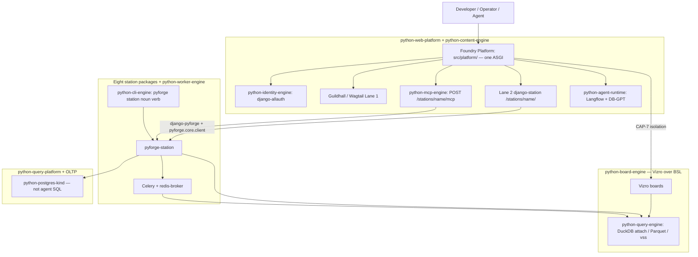

### The query plane

The Foundry already unified identity, Guildhall, CLI grammar, and the event bus.
It did **not** unify where a question goes. Atlas ranks vectors in an
in-memory DuckDB. Scribe recalls from PostgreSQL with pgvector. Langflow
carries Chroma. DB-GPT speaks SQL at whatever DSN it was given. Vizro is
supposed to go through BSL. Each choice was locally correct. Together they
are five answers, and an agent that hallucinates a join can still land on
OLTP.

**One hybrid transactional / analytical query plane** is the missing spoke
contract. Kedro is the only writer of derived layers. DuckDB is the only
analytical engine (live read-only `ATTACH` of Postgres, Parquet cache,
`vss` / HNSW). Stations and agents are clients. Domain logic stays with the
station; storage, scan, and nearest-neighbor do not. Rearchitecture is in
scope: a station may throw away a private store and reimplement recall, RAG,
or a loader to sit on the plane. Uniformity is the product.

**Tri-mode, one engine.** Live (A): read-only federation for declared
operational views a human asked for. Cache (B): Kedro extracts heavy tables
to Parquet; dashboards and autonomous SQL hit the cache. Vector (C):
embeddings the enterprise DB will store without `pgvector` (`REAL[]` or
equivalent) are cast and indexed on the plane. Agents cannot use the OLTP
DSN. Mode A is not for DB-GPT exploring production schemas.

**Held.** Not a ninth station. Single writer (FR-27 *intent*; the Spec may
generalize the `atlas.duckdb` filename to “the plane,” not a second
writable file). Consumer path `LOAD`s extensions, never `INSTALL`s on boot
(AD-13). BSL remains the dashboard contract. Pixi authority — Mosaic
`duckdb-server` is an optional query *face*, already reciped, not a `uv`
runtime. Kedro + the existing Dagster spine refresh the cache; no Airflow.
Federation does not pull OLTP through pandas. Vector width is a parameter.
`pyforge.*` stays out of `src/platform/`. Platform Postgres remains OLTP
for Django / Langflow / DB-GPT *app* state. Scribe `GraphStore` remains
the port; its durable retrieval becomes a plane client (cutover is a Spec
decision). Atlas catalog stays prefix-owned pipelines, not a silent
`01_raw` tree.

**Not this plane:** a lakehouse product; Unity / Wasm satellite revival;
JSON:API ([[enterprise-data-models-and-apis]]); installing extensions on a
customer DB that forbids them; CDC as the first cut.

**Kedro / Vizro on this plane.** Repeating extracts that write the plane *may*
be Kedro pipelines — Atlas is the Kedro project; other stations add nodes or a
catalog prefix, not a second `conf/`. `kedro-dagster` schedules refresh.
`kedro-skills` (`catalog-config`) and wrapped `kedro-mcp` author and inspect.
If a surface is Lane 3, it is **Vizro** over **BSL** over the plane, isolated
by CAP-7. Author new boards with `vizro-mcp` / `vizro-e2e-flow` after the
cache exists. `query_vizro_ai` stays until that replace; do not grow
Vizro-AI. Kedro-Viz is the pipeline DAG (atlas 12.2), not a dashboard.

**What the Spec still leaves open** (defaults held through Epic 34; do not
re-dispatch 34.1): `query-plane-face`, `query-plane-catalog`,
`query-plane-scribe-cutover`. 34.5 shipped the store-port driver; retiring
`scribe_schema` pgvector is still that OQ. Tenant isolation on Mode A binds
[[secure-live-dashboards]].

---

## Django Reusable Apps & `django-pyforge`

The host follows Django’s reusable-app convention. Foundation is
**`django-pyforge`**. Identity is **`django-allauth`**. There is no La Suite
package on Foundry Platform.

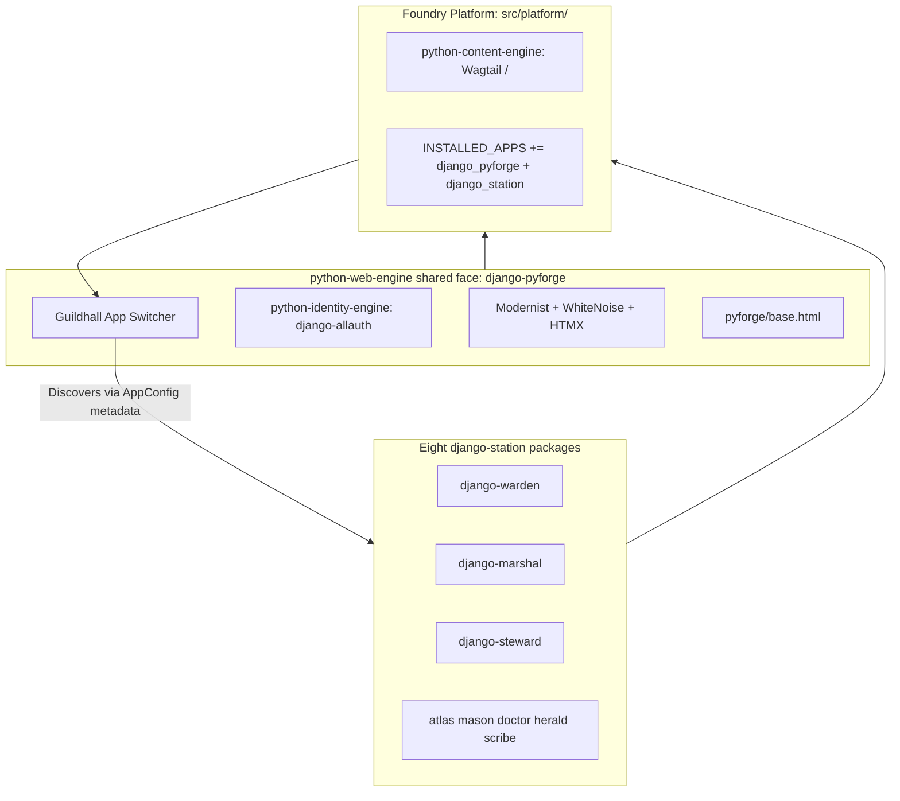

### 1. The Shared Foundation Package (`django-pyforge`)

`django-pyforge` is the central reusable foundation package shared by all station portals:

- **The Guildhall App Switcher Banner (`templates/pyforge/app_switcher.html`):** Renders the global cross-station header banner with active station indicators, user profile badges, and an instant dropdown menu to navigate between all 8 stations.
- **Identity & SSO:** `django-allauth` OIDC. Profile IdP may be Keycloak, Entra, Okta, or Ping. Middleware copies `idp_subject` and roles onto `request` — not a Keycloak-only stack.
- **Modernist Theme & Base Template:** Provides `templates/pyforge/base.html`, bundling Bootstrap 5.3 + HTMX + WhiteNoise with zero external CDN dependencies.
- **Pluggable Settings Helper:** Standardized `PYFORGE_PLATFORM_CONFIG` setting resolution with environment variable overrides.

### 2. Standalone Reusable Station App Packages (`django-<station>`)

Each station portal is a self-contained, distributable Django app (`django-allauth` shape: one distribution, one or more apps):

- **Zero Database Models:** Contains no domain database models. Domain data is fetched on-demand through `django-pyforge` / `pyforge.core.client` (`httpx`) against the **host**, not a paired FastAPI `:800x` process.
- **Strict Namespace Isolation:** All views, URLconfs, templates (`templates/warden/`), and static assets (`static/warden/`) are strictly namespaced.
- **Extends Base Layout:** Every station view extends `pyforge/base.html`, automatically inheriting the universal Guildhall App Switcher banner and auth context.

### 3. Dynamic Station Discovery (`AppConfig` Metadata)

Each station's `AppConfig` declares standardized suite metadata:

```python
from django.apps import AppConfig

class WardenPortalConfig(AppConfig):
    name = "pyforge_warden_portal"
    verbose_name = "Warden Compliance"
    station_name = "warden"
    station_icon = "shield-check"
    station_url_name = "warden:index"
    station_description = "Compliance gates and recipe policy validation"
```

The central `django-pyforge` banner dynamically queries `apps.get_app_configs()` to automatically render the App Switcher menu without hardcoding station URLs!

---

## The 8 platforms (living topology)

> Replaces the 2026-08-23 “10 layers / 9 FastAPI `:800x` / 9 portal apps” drawing.
> That drawing is **historical**; do not implement it. Formula: `python-<role>-<class>`.

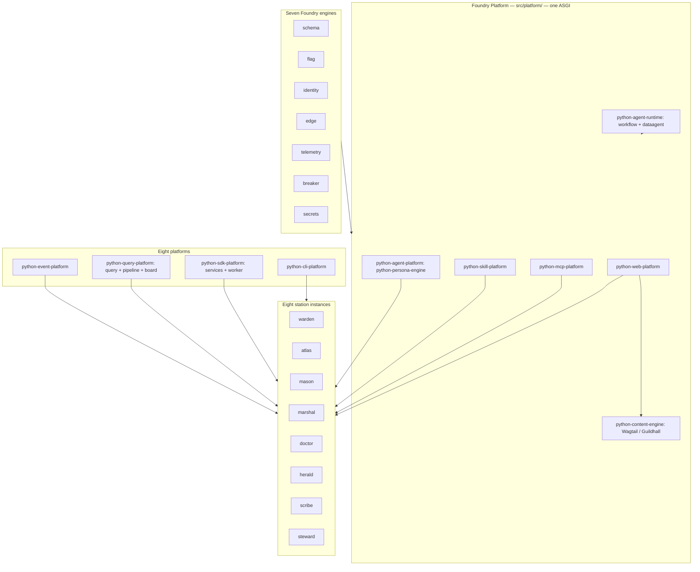

Lane 1 = Guildhall on `python-content-engine`. Lane 2 = eight `django-<station>` HTMX apps. Lane 3 = `python-board-engine` (Vizro + BSL), isolated. Compute = station packages + `python-worker-engine`, not `services/`.

### Historical 2026-08-23 10-layer list (do not build)

Nine FastAPI `:800x` processes, `portals/`, CodeRed CRX, MinIO as a core kind, Chroma as estate RAG, Vault-in-image. Kept only so the Realization log still parses. Living contract is the mermaid above + § Living names.

---

## One working tree — `python-foundry`

Today’s clone is `rxm7706/local-recipes` (copy source). The lasting git root is
**`python-foundry`** (Pixi workspace `pyforge`). `python-platform-foundry` is
superseded. Do not merge the factory solver farm into the estate `pixi.lock`.
Do not invent a `services/` / `:800x` tree. Cursor `.canvas.tsx` is a viewer
only.

**When real:** one clone; estate CI never staged-recipes-lints `src/`; factory
CI is `paths: factory/**` only; packages under `src/packages/`; skills under
`skills/` with IDE adapters as symlinks; Mason skill =
`skills/domain/conda-forge-expert`.

### Cutover phases (0–6)

| Phase | Do | Done when |
|---|---|---|
| 0 — Open foundry | Create `rxm7706/python-foundry`. Workspace `pyforge`. Empty of recipes. Lean pixi. | Clone exists. CI is estate-only. |
| 1 — Move the estate | Fold `src/shared/packages/` → `src/packages/`. Mint django `pixi.toml`. Drop `sys.path`. Skills + BMAD + decks + dreams. | Station envs and host boot in foundry. |
| 2 — Move CFE home | Authoritative skill/scripts/tools → `skills/domain/conda-forge-expert`. Retros land in foundry. | No `MASON_CFE_ROOT` pointing at `local-recipes`. |
| 3 — Factory island | `factory/pixi.toml` + lock. `factory/recipes/`, `build-locally.py`. | `mason recipe build factory/recipes/…` matches today’s CFE wrap. |
| 4 — Inventory | Move in-flight + sole-maintainer work you still touch. Do not copy the live `recipes/` universe. | `factory/recipes/` is the working set. |
| 5 — Mason → conda-forge | `submit` → staged-recipes (or bot fork). `update` → feedstock maintainer-edit. | An agent PR never opens `local-recipes`. |
| 6 — Archive | README superseded. Disable Azure. Pin last SHA. Keep history. | Default clone is foundry. `.steward` has one git root. |

Do not blend Graphify move-list and the package fold in one story.

### Target tree

```text
python-foundry/                        # lasting git root (today: local-recipes)
├── pixi.toml                          # Workspace OS. Name: pyforge. No factory farm.
├── pixi.lock                          # Estate lock only. factory/pixi.lock is separate.
├── environment.yaml                   # Derived export.
├── AGENTS.md
├── factory/                           # Recipe island. Own lock. Not a platform.
│   ├── recipes/                       # Working set only
│   ├── pixi.toml + pixi.lock
│   ├── build-locally.py, .ci_support/
│   └── conda-forge.yml
├── .github/                           # Estate CI
├── config/                            # Deploy overlays. Secrets in env / cluster.
├── Containerfile
├── src/platform/                      # Foundry Platform. Never import pyforge.*.
├── src/packages/                      # TARGET. Not src/shared/packages/.
│   ├── pyforge-core/                  # python-cli-engine
│   ├── pyforge-<station>/             # × 8
│   ├── pyforge-atlas/                 # Only Kedro home + Vizro
│   ├── pyforge-testing-kit/
│   ├── django-pyforge/
│   └── django-<station>/
├── src/ides/  src/sentinel/  src/domains/<slug>/
├── templates/  presentations/pyforge-<station>/  docs/dreams/
├── skills/
│   ├── stations/<station>/SKILL.md    # × 7. Mason → domain/conda-forge-expert
│   ├── personas/<station>/SKILL.md
│   └── domain/conda-forge-expert/
├── .claude/skills/  .cursor/skills/   # adapters → ../../skills/
└── _bmad-output/projects/
```

| Face | Path |
|---|---|
| CLI | `src/packages/pyforge-<station>/` |
| UI | `src/packages/django-<station>/` |
| MCP | `POST /stations/<name>/mcp` on Foundry Platform |
| Skill | `skills/stations/<station>/` (mason: `skills/domain/conda-forge-expert`) |
| Agent | `skills/personas/<station>/` (`python-persona-engine` + harness) |

**Do not create / carry:** `.claude/skills/pyforge-mason/` · lasting `src/shared/packages/` · `src/platform/compliance_face/` as the portal · `services/` or `:800x` · root `docker-compose.yml` · `sys.path` for django-* · Containerfile `COPY` of django src.

---

## The Cohesive Unified CLI Strategy (`pyforge`)

### 1. Universal Command Grammar (`pyforge <station> <noun> <verb>`)

```bash
# Universal Lifecycle Commands (Identical across all 8 stations)
pyforge <station> status       # Check station service health, active jobs, and workers
pyforge <station> info         # Print version, configuration, and registered capabilities
pyforge <station> check        # Run station preflight and self-diagnostics
pyforge <station> serve        # Optional local ASGI helper — not a :800x farm
pyforge <station> docs         # View, build, or open station docs and presentation decks
```

### 2. Standardized Output Formats (`--output` / `-o`)

- **`--output text` (Default):** Human-optimized terminal output with Rich tables, colored badges (`[PASS]`, `[WARN]`, `[FAIL]`, `[INFO]`), and live progress bars.
- **`--output json`:** Machine-readable JSON / NDJSON output for CI/CD scripting, piping, and AI subagent ingestion.
- **`--output yaml`:** Clean YAML configuration and manifest exports.
- **`--quiet` / `-q`:** Suppresses all visual UI elements, outputting only exit codes and stdout for shell scripts.

### 3. Dual Execution Modes: Direct Local vs. Service Client (`--remote` / `--local`)

* **Direct Mode (`--local`):** Directly imports and runs the station's Python logic locally in the active Pixi environment (zero network overhead).
* **Remote Service Mode (`--remote`):** Dispatches to the host (`https://platform.internal/stations/<name>/…`), not `localhost:800x`.

### 4. Automatic MCP Agent Discovery (`pyforge mcp`)

```bash
# Auto-configure Antigravity, Claude Code, Cursor, and Gemini to use PyForge MCP servers
pyforge mcp install --all

# List all discovered tools, prompts, and resources across all 8 stations
pyforge mcp list
```

---

## Dual Deployment Profiles, Cross-Platform Guarantees & LocalStack Alignment

### 1. The LocalStack Philosophy for Enterprise AI & SDLC Estates

PyForge fundamentally embodies the core philosophy of **[LocalStack](https://github.com/localstack/localstack)** — acting as a **Local Enterprise Cloud Emulator**:

* **The estate on a laptop:** Mode A boots the host (Django + Wagtail + MCP mounts + Celery), PostgreSQL, and Redis locally. Not nine FastAPI processes. Query-plane DuckDB is in-process / optional Mosaic face. Keycloak is a profile IdP, not required on the laptop.
* **100% Offline & Air-Gapped:** Zero external CDN calls (WhiteNoise asset bundling), OS native truststore bindings for enterprise TLS, and local Pixi package resolution.
* **Sub-Millisecond Inner Loops:** Autonomous AI agents (Antigravity, Claude, Cursor, BMAD) and human developers execute preflight checks, recipe builds, and compliance audits with zero latency.
* **Strict Local-to-OCP Environment Parity (15-Factor):** Identical Pydantic models, Keycloak JWT claims (`idp_subject`), and Celery queues run seamlessly on a local workstation and in Red Hat OpenShift production under `restricted-v2` SCC pods.

### 2. Cross-Platform Guarantees (Linux, macOS, Windows via Pixi)

Governed by `pixi.toml` and locked in `pixi.lock`, the entire PyForge codebase runs natively across all three major operating systems:


| Operating System          | Architecture        | Pixi Platform Key             |             Native Local Runtime             |
| :------------------------ | :------------------ | :---------------------------- | :------------------------------------------: |
| **Linux**                 | `x86_64`            | `linux-64`                    |              ✅**100% Native**              |
| **macOS (Apple Silicon)** | `M1 / M2 / M3 / M4` | `osx-arm64-min` (macOS 14.5+) |              ✅**100% Native**              |
| **Windows**               | `x86_64`            | `win-64`                      | ✅**100% Native** (PowerShell, CMD, or WSL2) |

* **Self-Contained C/Rust Binaries:** Pixi provisions Python 3.14, Node.js 24 LTS, `git`, `rattler`, `duckdb`, and `uvicorn` isolated from host system packages.
* **Unified Pathing:** Universal use of `pathlib.Path` across `pyforge.core` guarantees complete path cross-compatibility between Windows `C:\` and POSIX `/`.

### 3. Multi-Python Resolution & Runtime Matrix (Python 3.12, 3.13, 3.14)

Empirical resolution testing with the Pixi solver (`pixi lock`) confirms that the entire PyForge dependency tree (over 1,000+ packages including all 10 high-leverage station recommendations) solves cleanly across all active Python versions:


| Python Version             |           Solve Status           | Package Count Resolved | Compatibility Invariants                                                                                                                                                                 |
| :------------------------- | :------------------------------: | :--------------------: | :--------------------------------------------------------------------------------------------------------------------------------------------------------------------------------------- |
| **Python 3.14** (`3.14.*`) |        ✅**100% SUCCESS**        |  **1,000+ packages**  | **The Repo Default.** Free-threading, fast execution, full conda-forge & PyPI coverage across Django, Wagtail, FastAPI, MCP, DuckDB, Kedro, Vizro, Celery, Langflow, DB-GPT, and Polars. |
| **Python 3.13** (`3.13.*`) |        ✅**100% SUCCESS**        |  **1,000+ packages**  | **Fully Supported.** Complete dependency tree resolves byte-for-byte with zero pinning conflicts.                                                                                        |
| **Python 3.12** (`3.12.*`) | ✅**100% SUCCESS** *(with note)* |  **1,000+ packages**  | **Fully Supported.** All web, data, and agent packages resolve cleanly (only `pixi-skills` carries a `python >= 3.13` floor).                                                            |

#### Verified Resolution for High-Leverage Station Recommendations

All 10 station enhancement libraries were included in the solver input and confirmed resolved in `pixi.lock`:

* `cocoindex` (`>=1.0.20`) & `graphifyy` (`>=0.9.48`) $\rightarrow$ Scribe AST Graph (`py312`, `py313`, `py314` ✅)
* `openlineage-python` (`>=1.52.0`) $\rightarrow$ Marshal Run Lineage (`py312`, `py313`, `py314` ✅)
* `boring-semantic-layer` (`>=0.3.16`) $\rightarrow$ Atlas Semantic Metrics (`py312`, `py313`, `py314` ✅)
* `markitdown` (`>=0.1.7`) $\rightarrow$ Herald & Scribe Doc Ingestion (`py312`, `py313`, `py314` ✅)
* `graphviz2drawio` (`>=1.2.0`) $\rightarrow$ Herald Diagram Export (`py312`, `py313`, `py314` ✅)
* `filelock` (`>=3.32.0`) $\rightarrow$ Marshal & Scribe Concurrency Safety (`py312`, `py313`, `py314` ✅)
* `go-sops` & `age` $\rightarrow$ Steward Secret Vaulting (`py312`, `py313`, `py314` ✅)
* `pandera` (`>=0.32.1`) $\rightarrow$ Warden & Mason SBOM Validation (`py312`, `py313`, `py314` ✅)
* `taplo`, `sqlfluff` & `yamllint` $\rightarrow$ Doctor Syntax Linters (`py312`, `py313`, `py314` ✅)
* `playwright` (`>=1.62.1`) $\rightarrow$ Herald Deck Previews & E2E Testing (`py312`, `py313`, `py314` ✅)

#### Framework Compatibility & Runtime Isolation Invariants

* **Compiled Rust + PyO3 Extensions (`xorq`, `xorq-datafusion`, `cocoindex`):** Stabilized on Python 3.14 via PyO3 ABI3 bindings and the canonical conda-forge Rust environment block (`CARGO_PROFILE_RELEASE_STRIP: symbols` + `PYTHONUTF8: "1"`), avoiding Windows symlink extraction errors (G11/G12).
* **Dagster on Python 3.14 (`dagster >= 1.13.19`):** Upgraded to AST parsers that accommodate Python 3.14's deferred annotation evaluation (PEP 649 / PEP 749).
* **Isolated Agentic Seam (`python-agent-platform`):** Heavy LLM workflow engines (`langflow >= 1.11`, `dbgpt >= 0.8`, `chromadb`, `elevenlabs`) with strict upstream wheel boundaries are isolated in the `python = "3.12.*"` feature environment, communicating with the Python 3.14 platform core over ASGI/REST, MCP, and Redis Streams.

### 4. Container Packaging & Delivery Modes (Single Container vs. Podman Pods vs. Multi-Container OCP)

PyForge achieves total deployment flexibility through **one unified container image (`pyforge-container`)** built via Pixi (`pixi-build` / `Containerfile`), supporting three distinct operational topologies:

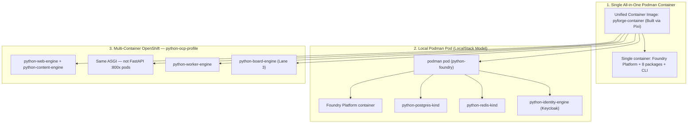

#### Mode A: Single All-in-One Container (Edge / Demos / Ephemeral CI)

* **Execution:** A single standalone container boots the entire platform using SQLite and in-memory brokers.
* **Invocation:**
  ```bash
  podman run -d --name pyforge -p 8000:8000 pyforge-container
  ```
* **Best for:** Portable zero-dependency demonstrations, offline air-gapped field laptops, or ephemeral CI/CD test runners.

#### Mode B: Local Podman Pod (`podman pod`) — *The LocalStack Topology*

* **Execution:** Podman groups the platform container, PostgreSQL (`pgvector`), Redis, and Keycloak into a single unified Kubernetes-style local **Pod** sharing `localhost` networking and IPC.
* **Invocation:**
  ```bash
  # Create local pod
  podman pod create --name pyforge-pod -p 8000:8000 -p 8080:8080 -p 5432:5432

  # Launch platform host + services into the shared pod
  podman run -d --pod pyforge-pod --name pyforge-host pyforge-platform
  podman run -d --pod pyforge-pod --name pyforge-db postgres:17
  podman run -d --pod pyforge-pod --name pyforge-auth keycloak:24.0
  ```
* **Best for:** Full enterprise-fidelity local development with real Keycloak SSO and PostgreSQL without Kubernetes cluster overhead.

#### Mode C: Multi-Container Distributed Topology (Red Hat OpenShift / Kubernetes)

* **Execution:** The **exact same container image** is deployed across specialized Kubernetes pod controllers with distinct entrypoint arguments:
  * `pyforge-platform` web pods (`python-edge-engine`: gunicorn / uvicorn workers)
  * `pyforge-worker` pods (`python-worker-engine`: Celery)
  * Lane 3 Vizro pods (`python-board-engine`) — not eight dashboard processes by default
  * **Not** `pyforge-<station>-service` / `:800x` compute pods — MCP is on the host ASGI
* **Security Compliance:** Fully compliant with OpenShift `restricted-v2` Security Context Constraints (non-root UID, read-only root filesystems, zero elevated capabilities).

---

## Enterprise Server Infrastructure & OpenShift (OCP) Sizing Specifications

> **Historical sizing + profile adapters.** Mode C evidence is Grounding
> (official `postgres:17` / `redis:7`, two Helm releases). Cluster-DNS
> `:800x` station services are **not** the topology. Vault/ESO mint
> Kubernetes secrets outside the image — AD-19.

Deploying PyForge across enterprise Kubernetes and Red Hat OpenShift (OCP) clusters adheres to the following server infrastructure, storage, and networking specifications:

### 1. Cluster Compute & Sizing Recommendations


| Component                                          |    Pod / Replica Count    | CPU (Requests / Limits) | Memory (Requests / Limits) | Scaling Strategy                                                                  |
| :------------------------------------------------- | :-----------------------: | :---------------------: | :------------------------: | :-------------------------------------------------------------------------------- |
| **Foundry Platform** (`python-web-engine` + `python-content-engine`) | 2–4 replicas | 2 vCPU / 4 vCPU | 2 GB / 4 GB | HPA on CPU/traffic |
| **Station compute pods** | **0** | — | — | MCP + FastAPI stay on the host ASGI. Do not size nine FastAPI `:800x` services. |
| **`python-worker-engine`** (Celery) | 2–8 replicas | 2 vCPU / 4 vCPU | 4 GB / 8 GB | Redis queue depth |
| **`python-board-engine`** (Vizro / BSL) | 1–2 replicas | 1 vCPU / 2 vCPU | 2 GB / 4 GB | Concurrent viewers |
| **`python-postgres-kind`** | 1 primary + 1 standby | 4 vCPU / 8 vCPU | 8 GB / 16 GB | Operator optional in prod; CRC used official `postgres:17` |
| **`python-redis-kind`** (`redis-broker` + `redis-cache`) | Separate instances | 2 vCPU / 4 vCPU | 4 GB / 8 GB | Broker `noeviction`; cache LRU |
| **Total recommended (HA)** | — | **32 to 64 vCPUs** | **64 to 128 GB RAM** | Minimum 3 worker nodes |

### 2. Persistent Storage (CSI / PVC)


| Storage Class                                 | Usage / Destination                                                               |     Capacity     |      Access Mode      |
| :-------------------------------------------- | :-------------------------------------------------------------------------------- | :--------------: | :-------------------: |
| **Block Storage (SSD / NVMe)**                | PostgreSQL Data (`public`, `langflow_schema`, `dbgpt_schema`)                     | 100 GB – 500 GB | `ReadWriteOnce` (RWO) |
| **Block Storage (SSD)**                       | Redis Append-Only Persistence                                                     |  20 GB – 50 GB  | `ReadWriteOnce` (RWO) |
| **Object Storage (S3 / MinIO / Artifactory)** | Wheel mirror caches, conda tarballs, presentation exports, and Scribe graph dumps |  500 GB – 2 TB  |     S3 API / REST     |

### 3. Networking, Ingress & Routing

* **Edge TLS Routing (`OpenShift Route`):**
  * Single external ingress route: `https://pyforge.internal.company.com` (TLS terminated at edge via corporate wildcard certificate with `X-Forwarded-Proto` and `X-Forwarded-For` injection).
* **Internal Cluster DNS (one hub):**
  * `http://pyforge-platform.pyforge.svc.cluster.local:8000` — Foundry Platform (HTTP + `POST /stations/<name>/mcp`)
  * `http://pyforge-postgres.pyforge.svc.cluster.local:5432` — `python-postgres-kind`
  * `http://pyforge-redis-broker.pyforge.svc.cluster.local:6379` — `redis-broker`
  * `http://pyforge-redis-cache.pyforge.svc.cluster.local:6379` — `redis-cache`
  * **Not** `pyforge-warden-service:8004` (or any station `:800x`).

### 4. Enterprise Security & Identity Integrations

* **OpenShift `restricted-v2` SCC Compliance (Hardened Container Contract):**
  * `runAsNonRoot: true` (Arbitrary non-root UID dynamically assigned by OpenShift namespace).
  * `allowPrivilegeEscalation: false`
  * `seccompProfile: RuntimeDefault`
  * `capabilities: drop: ["ALL"]`
  * `readOnlyRootFilesystem: true` (with `/tmp` and static cache mounted as ephemeral emptyDirs).
* **Enterprise Identity Provider (IdP):**
  * Red Hat Keycloak, Microsoft Entra ID (Azure AD), Okta, or PingFederate configured with OIDC.
  * JWT tokens validated on `idp_subject` and corporate group claims (`resource_access.pyforge.roles`).
* **Secrets (profile adapter, not in-app):**
  * In-estate: `go-sops` + `age` (developer/local + committed ciphertext).
  * Profile: HashiCorp Vault / ESO may mint Kubernetes secrets *outside*
    the image. Manifests carry **references** only (AD-19).
  * **Never:** `hvac` or Vault HTTP from Django, Celery, Langflow, or DB-GPT.
* **Corporate TLS & CA Truststore:**
  * Internal enterprise Root/Intermediate CA bundle mounted into `/etc/pki/ca-trust/extracted/pem/tls-ca-bundle.pem` (automatically consumed by Python `truststore` and Node.js).
* **Enterprise Container Registry:**
  * Internal Red Hat Quay, JFrog Artifactory, or Harbor for image pulls and vulnerability scanning.

### 5. Observability & Platform Telemetry

* **Metrics & Traces:** OpenTelemetry Collector / Prometheus scraping `/metrics` and `/healthz` on Foundry Platform (`python-telemetry-engine`).
* **Distributed Logging:** OpenShift Logging (Vector / Loki / Elasticsearch) capturing JSON structured logs (`structlog`) with `trace_id` and `request_id` correlation across Foundry Platform and the 8 stations.

---

## Feature Flags, Progressive Canary Delivery & Auto-Rollback by Design

To ensure zero-downtime, safe iterative experimentation, and gradual feature rollouts across Foundry Platform and the 8 stations, PyForge embeds an enterprise **Feature Flagging and Canary Delivery Engine** directly into the core runtime:

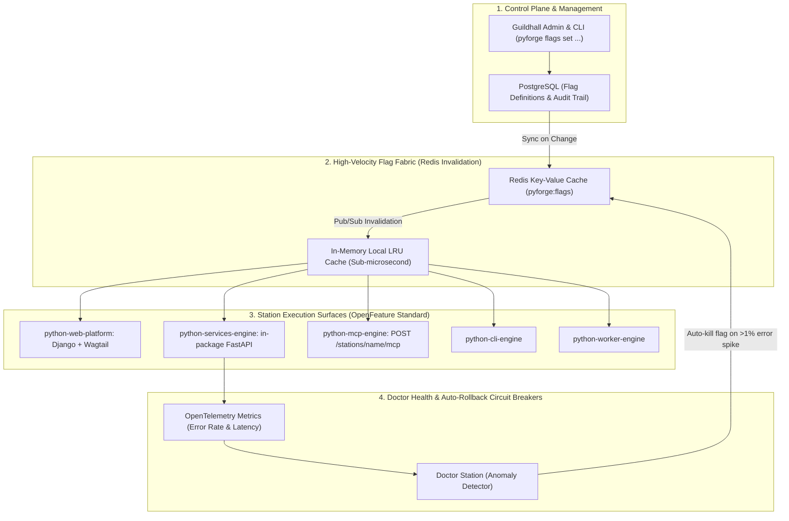

### 1. Unified Flag Evaluation Context (`pyforge.core.flags`)

Flags are evaluated dynamically against a standardized **Evaluation Context** containing the user's identity, role, station, and environment:

```python
from pydantic import BaseModel

class FlagContext(BaseModel):
    user_id: str | None = None          # Keycloak idp_subject or "anonymous"
    email: str | None = None            # Developer / operator email
    roles: list[str] = []               # ["pyforge-admin", "beta-tester", "maintainer"]
    station: str = "warden"             # Target station namespace
    environment: str = "production"     # "local", "staging", "production"
    agent_id: str | None = None         # "antigravity", "claude-code", "cursor", "bmad"
    percentage_bucket: int | None = None # MurmurHash(user_id) % 100 for canary rollouts
```

### 2. Standard Integration Across Every Station Surface

* **Django + Wagtail (Lane 1 & 2):** Conditional template tags (``) and view decorators.
* **`python-services-engine` (in-process):** FastAPI dependencies inject `FlagContext` — not nine station processes.
* **`python-mcp-engine`:** Dynamically register or lease tools only to authorized agents.
* **`python-cli-engine`:** `pyforge flags list`, `pyforge flags set ...`.

### 3. Canary Testing & Progressive Delivery Strategies


| Canary Strategy                  | Operational Pattern                                                                                                                                                     | Use Case                                                                                                          |
| :------------------------------- | :---------------------------------------------------------------------------------------------------------------------------------------------------------------------- | :---------------------------------------------------------------------------------------------------------------- |
| **Percentage Rollout**           | Gradually scale traffic:`1% → 5% → 25% → 50% → 100%` using consistent user hash buckets (`MurmurHash3(user_id) % 100`).                                             | Rolling out new dependency solvers in Mason or package graph pipelines in Atlas.                                  |
| **Role-Gated Early Access**      | Activated exclusively for users with Keycloak role`pyforge-admin` or `beta-maintainer`.                                                                                 | Pre-release testing of new portal views or Wagtail StreamField blocks.                                            |
| **Shadow Mode (Dark Launching)** | The microservice runs both the old and new engines in parallel in the background, diffs the outputs, and logs discrepancies without affecting the user's live response. | Verifying that Warden's new SARIF generator produces identical outputs to the legacy scanner before live release. |
| **OpenShift Route Canary**       | OpenShift Route traffic splitting at the network edge:`spec.to.weight: 90` (Stable) vs `spec.alternateBackends[0].weight: 10` (Canary Pods).                            | Zero-downtime blue/green infrastructure and container upgrades.                                                   |

### 4. Automated Circuit Breakers (Doctor Auto-Rollback)

To ensure high availability in production, the **Doctor station** acts as the automated safety supervisor:

1. **Telemetry Stream:** OpenTelemetry continuously emits error rates, latency p99, and panic metrics tagged with active flag names (`feature_flag="warden:fast_ast_parser"`).
2. **Anomaly Detection:** If the canary feature triggers an error spike (>1% failure rate or >500ms latency degradation), Doctor detects the regression within 10 seconds.
3. **Automated Kill-Switch:** Doctor publishes a high-priority `feature.circuit_breaker.tripped` event to Redis Streams, immediately setting the flag to `0%` (OFF) across all nodes with zero human intervention.

---

---

## 1. Inter-Station Event Bus & Message Fabric

To enable decoupled, asynchronous collaboration across the 8 stations (e.g. Warden compliance failure triggering Doctor auto-remedy and Mason recipe rebuild), PyForge implements an enterprise **Event Fabric over Redis Streams**:

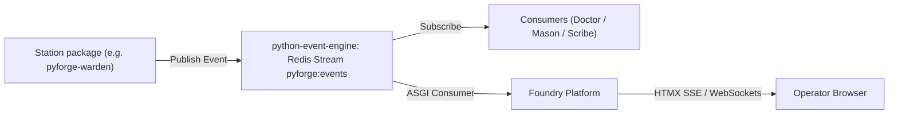

### Event Specification (`CloudEvents` Compliant Pydantic Model)

```python
from datetime import datetime
from uuid import UUID
from pydantic import BaseModel, Field

class PyForgeEvent(BaseModel):
    event_id: UUID
    station: str = Field(description="Originating station (e.g. 'warden', 'mason')")
    event_type: str = Field(description="Dotted verb (e.g. 'recipe.audit.failed')")
    timestamp: datetime = Field(default_factory=datetime.utcnow)
    correlation_id: str = Field(description="Distributed trace_id across Foundry Platform")
    payload: dict = Field(default_factory=dict)
```

- **Live Browser Streaming:** The Django host mounts an ASGI SSE/WebSocket consumer (`/ws/events/`) that relays filtered Redis Stream events directly to HTMX frontend badges (`hx-ext="sse"` / `hx-ext="ws"`), giving operators real-time feedback without page reloads.

---

## 2. Keycloak RBAC & Unified Security Matrix

PyForge enforces a strict, unified Role-Based Access Control (RBAC) model across human browser sessions, CLI operators, and autonomous AI agents:


| Enterprise Persona         | Keycloak Realm Role     | Lane 2 (`django-<station>`)                          | Host MCP / `python-services-engine` scopes |
| :------------------------- | :---------------------- | :--------------------------------------------------- | :---------------------------------------- |
| **Platform Administrator** | `pyforge-admin`         | Full read/write + Django Admin (`/admin/`)           | Full access (`*`) + secret rotation       |
| **Station Maintainer**     | `maintainer`            | Station workflow triggers (Mason build, Marshal run) | `service:write`, `mcp:tools:execute`      |
| **Compliance Auditor**     | `compliance-auditor`    | Read-only inspection & Gate waivers                  | `warden:read`, `audit:export`             |
| **Developer / Viewer**     | `viewer`                | Read-only Guildhall docs, dashboards, and decks      | `service:read` (Public queries only)      |
| **Autonomous AI Agent**    | `agent-service-account` | Headless API access via Bearer Token / API Key       | Leased MCP tool execution (`mcp:tools:*`) |

- **Dynamic Group Mapping:** The `django-pyforge` authentication middleware parses Keycloak JWT claims (`resource_access.pyforge.roles`), dynamically updating the user's active Django permissions per-request without storing local passwords.
- **MCP / services-engine scope verification:** OAuth2 scopes via `Security(verify_token, scopes=["mason:build"])` on the **host** ASGI, not nine `:800x` processes.

---

## 3. Guildhall Presentation Stage Embedding

Each station's presentation assets (`presentations/<station>/`) are fully integrated into the central Wagtail Guildhall:

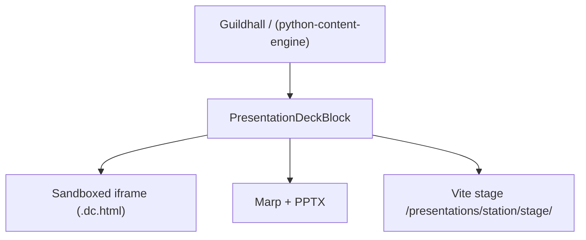

- **Wagtail StreamField `PresentationDeckBlock`:** Station maintainers can embed interactive decks directly into documentation pages.
- **Sandboxed Interactive Slides (`.dc.html`):** The Modernist design decks run in isolated iframes with full-screen, keyboard navigation, and embedded live code runner capabilities.
- **Vite React Stage Bridge:** Compiled Vite stages in `presentations/<station>/dist/` are served statically by WhiteNoise at `/presentations/<station>/stage/`.

---

## 4. Scribe Knowledge Graph UI Integration

Scribe compiles session transcripts, architectural decisions, and repository facts through the **store port** (SQLite local / PostgreSQL on the host — stories 28.1–28.2 **done**). Durable *estate* recall on the **query plane** is **34.5** (not shipped). cocoindex + graphifyy bind behind that port later — they do not mint a second graph product.

- **Natural Language Memory Search (`/stations/scribe/`):** HTMX over the shipped driver today. Plane vectors replace a new OLTP `pgvector` write path when 34.5 lands.
- **Visual Decision Lineage:** Interactive visual graphs (Cytoscape.js) illustrating how **Dreams $\rightarrow$ Specs $\rightarrow$ Sprints $\rightarrow$ Pull Requests** evolved over time.
- **Supersession & Intent Trails:** Highlights when a rule or architecture decision was deprecated or superseded by a newer Dream, preserving historical intent. Supersession today is author-declared only (`supersedes:` frontmatter, Story 2.3); [``marshal-token-economy.md
- ``](marshal-token-economy.md)'s 2026-08-31 addendum adds a deterministic staleness flag (git-timestamp vs the node's `valid_from`) so an un-declared-stale node is caught, not silently served — landing as a new scribe Epic 6 story plus marshal Story 28.9's fifth AC.
- **CLI Recall Symmetry:** `pyforge scribe recall "why do we use Keycloak?"` delivers formatted historical summaries straight to developer terminals.

---

## 5. Shared Data Contracts & Client SDK (`pyforge.core.client`)

To eliminate schema drift between the Django portals, station packages, and the CLI, `pyforge-core` exports shared Pydantic V2 models and a type-safe HTTP client:

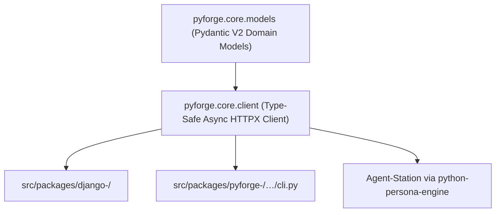

```python
# Shared Type-Safe Client Pattern
from pyforge.core.client import PyForgeStationClient
from pyforge.core.models import ComplianceResult, RecipePayload

client = PyForgeStationClient(station="warden")  # host-relative; not :8004

# Used identically inside Django views and Typer CLI subcommands:
result: ComplianceResult = await client.post("/api/v1/compliance/check", payload=RecipePayload(recipe_name="numpy"))
```

---

## 6. Marshal Token Economy — Agent-Loop Compression & Retrieval

Full detail lives on [[marshal-token-economy]] (its own Spec, `spec-marshal-token-economy`,
CAP-1..CAP-13) — this pillar is the evergreen summary so the architecture survives here
even if that satellite Dream is ever trimmed. Every unattended dev/review session Marshal
launches — across all eight stations — pays a fixed tax: identical repo docs re-read every
session, a codebase re-explored whose structure hasn't changed, 65k/46k-token planning
documents loaded for a 1.5k-token routing decision, and the agent's own prose (the
heaviest-weighted tokens) narrated in full every time. Five layers attack these sinks, each
at a different point in the pipeline, composing rather than competing:

| Layer | Instrument (pixi-active) | Attacks |
|---|---|---|
| 0 — Output compression | `caveman` `>=2.4.0` (linux-64, SelfExplainML) | The agent's own speech — ~65% cut, heaviest-weighted tokens |
| 1 — Wire compression | `headroom-ai` `>=0.37.0` (linux-64) | Tool outputs, logs, diffs — 40–95%, reversible via its CCR store |
| 2 — Structure from a graph | `codegraph` `>=1.6.0` (linux-64, SelfExplainML) | Re-reading files to answer "what does this codebase look like" |
| 3 — Incremental derived context | `cocoindex` `>=1.0.20` (Scribe `compile_surface` extra, Story 6.2) | Recomputing epic-context/continuity distills whose sources didn't change |
| 4 — Planning-graph retrieval | `graphifyy` `>=0.9.51` (Scribe `compile_surface` extra, Story 6.1) + a deterministic staleness flag (Story 6.3, CAP-13) | Loading `epics.md`/`prd.md` wholesale for the ~1.5k tokens a story actually binds to |

Layers 3–4 are Scribe-owned infrastructure (the `graph_store`/`compile_surface` CAP-18
ports, §4 above) — Marshal consumes by grammar only, never a second graph or store of
record. Layers 0–2 are Marshal's own harness-wrapping: dev sessions launch behind
`headroom wrap <cli>` and the caveman skill; loop-home provisioning builds/syncs the
codegraph index. All five stay **outside BMAD semantics** — the story contract,
gates, and review verdicts cross the wire and land in journals fully articulated; only the
encoding of what an agent *reads along the way* and *says* is compressed, never what it is
*bound by* or *judged against*.

A sixth candidate was evaluated and rejected: **`mem0ai`** (an LLM-judged
ADD/UPDATE/DELETE/NOOP memory-consolidation layer) was considered for Scribe's optional
`recall_ranker` CAP-18 port and explicitly excluded — Scribe capture/recall stays the
fleet's only memory face (`recall_ranker` defaults to lexical; no `mem0.add` in place of
`scribe capture`, §4 above). Story 6.3's staleness flag is the concrete reason the
rejection holds: the one capability Mem0's approach would have bought (catching a memory
gone stale) is delivered instead as a deterministic git-timestamp check on data Scribe's
own `compile_graph` already touches every run — zero LLM calls, no new dependency,
consistent with this Dream's own no-second-store rulings (§4's table row above).

**Guardrails, unchanged from [[marshal-token-economy]]:** never compress the contract;
never break the provider prompt cache (a layer that rewrites the prompt prefix is
inadmissible); reversible or absent (lossy-with-retrieval is fine, silently-lossy is not);
savings telemetry stays advisory, never a second PR gate.

---

## Comprehensive Technology Stack & Library Catalog

Governed by `pixi.toml` and verified via `pixi run -e local-recipes llms-full-check`.
Bind schedule: `stack.md` § Estate leverage. Do not treat this list as a
shopping cart.

### 1. Platform Host, Web Frameworks & Content Layer

* **Django (`5.2.x`):** Core enterprise platform host (`src/platform/`).
* **Wagtail (`7.4.x`):** Lane 1 at `/` (CodeRed dropped 2026-08-24).
* **`django-pyforge`:** Guildhall App Switcher, portal clients (`python-web-engine` shared face).
* **`django-allauth`:** OIDC / SSO. No second identity framework.
* **FastAPI / Starlette / Uvicorn:** In-process ASGI seam and library APIs — **not** nine `:800x` processes.
* **Daphne & Django Channels (`4.3.x`):** ASGI WebSocket / SSE on the host.
* **WhiteNoise:** Zero-CDN, air-gapped static assets.

### 2. Autonomous Agent, Multi-Agent & MCP Ecosystem

* **`mcp` (`>=2.0.0`):** Anthropic's official Python Model Context Protocol SDK (SSE and stdio transports).
* **`fastmcp` (`>=2.14.x` / `3.x`):** High-level decorator framework for rapid MCP tool/resource creation.
* **`pydantic-ai` (`>=2.33.0`):** Type-safe autonomous agent orchestration.
* **`agno` (`>=2.6.22`):** Multi-agent framework for collaborative task routing.
* **`claude-agent-acp` & `anthropic` (`>=0.76.0`):** Native Claude agent integration.
* **`google-genai` (`>=2.19.0`):** Google Gemini SDK and Antigravity tooling.
* **`github-copilot-sdk` & `a2a-sdk` / `fasta2a`:** Agent-to-Agent communication protocols.
* **`langchain-anthropic` & `langchain-mcp-adapters`:** MCP bridge tooling for LangChain agents.
* **`django-mcp-server`:** Direct MCP tool leasing from Django models and services.

### 3. AI Workflows, Local LLMs & Semantic Search

* **Langflow (`>=1.3.x`):** Visual AI pipeline and agent workflow builder mounted as an ASGI app.
* **DB-GPT (`>=0.8.x`):** Multi-model database knowledge base and agent copilot.
* **`sentence-transformers` & `transformers` (`>=5.15.x`):** Local embedding generation and text representation.
* **`llama.cpp` (`>=10380`) & `ollama-python`:** Fully local, offline LLM inference.
* **`rank-bm25`:** Hybrid lexical keyword search complementing vector retrieval.
* **`diffusers` & `accelerate`:** Multi-modal image generation and local GPU acceleration.

### 4. Dataflow, Analytics & Graph Intelligence

* **DuckDB (`>=1.5.5`):** The query-plane engine (live ATTACH, Parquet cache, `vss`). Library / optional Mosaic face — not a fourth backing store.
* **Polars (`>=1.43.x`), Pandas & PyArrow (`>=24.0.0`):** High-speed tabular data processing.
* **Kedro (`>=1.5.0`) & `kedro-datasets`:** Declarative data pipelines — **one Atlas home**; other stations may contribute extract nodes onto the query plane (AD-21: not eight Kedro projects).
* **`kedro-dagster` (`>=0.8.0`):** Schedule/materialize those pipelines (cache + HNSW refresh). Not Airflow.
* **`kedro-mcp` & `kedro-skills`:** Agent authoring. `catalog-config` already adopted on atlas. MCP is wrapped, never load-bearing.
* **Dagster (`>=1.13.x`):** Data asset orchestration (via kedro-dagster).
* **Ibis Framework (`>=12.0.0`):** Unified Python dataframe interface compiling to DuckDB, Postgres, and SQLite.
* **`getdaft` (`>=0.6.13`):** Distributed multimodal dataframe processing.
* **Great Expectations & Pandera:** Schema and data quality validation.

### 5. Dashboards, Visualization & UI Analytics (Lane 3)

* **Vizro (`>=0.1.60`):** Lane 3 runtime over BSL + the query plane. Isolated by CAP-7. Not imported into Django.
* **`vizro-mcp` & `vizro-e2e-flow`:** Authoring face (replaces Vizro-AI). After the plane has metrics.
* **`vizro-ai` (`0.4.2` final, deprecated):** Legacy `query_vizro_ai` only. No new features.
* **Kedro-Viz (`>=12.4.0`):** Pipeline DAG publish (atlas 12.2). Not a Lane 3 dashboard.
* **Panel (`>=1.9.4`) & Panel Graphic Walker:** Exploratory visual data analysis.
* **Bokeh & `bokeh-django`:** High-performance interactive browser plotting.
* **Plotly, Matplotlib, Graphviz & `mermaid-py` / `d2`:** Multi-format programmatic diagramming.

### 6. Presentation Studio, Documents & Media Engines

* **Marp CLI (`>=4.2.3`):** Markdown-to-presentation slide compiler.
* **`pptxgenjs` (`>=4.0.1`) & `python-pptx` (`>=1.0.2`):** Native PowerPoint presentation deck generators.
* **PyMuPDF (`>=1.28.x`), PyPDF & `pdfplumber`:** PDF extraction and parsing.
* **`mammoth`, `python-docx` & `openpyxl`:** Office Word and Excel document manipulation.
* **Pandoc (`>=3.10.x`) & `markdownify`:** Universal document and markdown converter.
* **Tesseract OCR & `pytesseract` / Poppler:** Offline optical character recognition.
* **Pillow (`>=12.3.0`):** Image processing engine.

### 7. Packaging, Build Engines & DevSecOps Compliance

* **Pixi (`>=0.77.0`) & `rattler` / `py-rattler-build`:** Fast Rust-based Conda/PyPI environment manager.
* **Conda-Build, Conda-Smithy & Grayskull:** Official conda-forge recipe builders and linters.
* **`deptry` & `osv-scanner`:** Dependency hygiene, unused import detection, and OSV CVE vulnerability scanning.
* **AppThreat Vuln-DB & `cyclonedx-bom` / `cyclonedx-python-lib`:** Local offline CVE database and SBOM generation.

### 8. Asynchronous Tasks, Database & Enterprise Infrastructure

* **Celery & Redis (`redis-py`):** Asynchronous task queue (`noeviction` memory policy) and event bus.
* **PostgreSQL (`psycopg`):** OLTP for Django / Langflow / DB-GPT *app* state. Multi-schema isolation. **Not** the agent Text-to-SQL DSN. Estate vectors live on the query plane (`vss`), not `pgvector` on OLTP.
* **Object store (profile):** Artifactory / NetApp / optional MinIO — not a fourth required kind beside PostgreSQL + Redis + Kubernetes.
* **HashiCorp Vault / `hvac`:** Profile adapter **outside** the image. **Never** imported by platform code (AD-19).
* **OpenTelemetry SDK/API (`>=1.44.0`):** Distributed tracing and APM.
* **`truststore` (`>=0.10.4`):** Native OS CA certificate store integration (Windows CryptoAPI, macOS Keychain, Linux OpenSSL).
* **`go-sops` & `age`:** Developer-local secret encryption and offline credential vaulting.

### 9. Developer Experience, QA & Testing Kit

* **Typer (`>=0.27.1`) & Rich (`>=14.3.4`):** Powers the universal `pyforge` CLI with interactive tables and progress bars.
* **Ruff (`>=0.16.4`), Pyright & Mypy:** Instant linting, formatting, and strict type checking.
* **Pytest (`>=9.1.1`), `pytest-cov`, `pytest-mock`, `pytest-xdist`:** Test runners and parallelization.
* **Playwright (`>=1.62.1`):** End-to-end browser automation for UI portal testing.
* **Copier:** Project scaffolding and recipe migration templating.
* **Sqlfluff, Yamllint & Taplo:** SQL, YAML, and TOML linters.

---

## Station-by-Station Packaging & Configuration Audit

An audit across all station packages in `src/shared/packages/` and `src/platform/` confirms unified packaging standards and dependency spine bindings:


| Station Package           | Build Backend | CLI Entrypoint (`project.scripts`)                                                             | Key Runtime Dependencies                                                                                                              | Leaf Spine Binding |
| :------------------------ | :------------ | :--------------------------------------------------------------------------------------------- | :------------------------------------------------------------------------------------------------------------------------------------ | :----------------: |
| **`pyforge-core`**        | `hatchling`   | `pyforge` (Root CLI Dispatcher)                                                                | *Pure stdlib / minimal leaf*                                                                                                          |   🏛️**Spine**   |
| **`pyforge-warden`**      | `hatchling`   | `warden = "pyforge.warden.cli:main"`                                                           | `cyclonedx-python-lib`, `packageurl-python`, `license-expression`, `jsonschema`, `PyYAML`, `packaging`                                |  ✅`pyforge-core`  |
| **`pyforge-marshal`**     | `hatchling`   | `marshal = "pyforge.marshal.cli.main:main"`, `marshal-mcp = "pyforge.marshal.mcp.server:main"` | `bmad-loop`, `copier`, `psutil`, `tomlkit`, `jsonschema`, `packaging`, `PyYAML`                                                       |  ✅`pyforge-core`  |
| **`pyforge-steward`**     | `hatchling`   | `steward = "pyforge.steward.cli:main"`                                                         | `PyYAML`, `packaging`                                                                                                                 |  ✅`pyforge-core`  |
| **`pyforge-atlas`**       | `hatchling`   | `pyforge-atlas = "pyforge.atlas.__main__:main"`                                                | `kedro`, `kedro-datasets`, `kedro-dagster`, `duckdb`, `ibis-framework`, `pandas`, `pyarrow`, `vizro`, `dagster`, `bokeh`, `starlette` |  ✅`pyforge-core`  |
| **`pyforge-scribe`**      | `hatchling`   | `scribe = "pyforge.scribe.cli:main"`                                                           | `typer`, `pydantic`                                                                                                                   |  ✅`pyforge-core`  |
| **`pyforge-herald`**      | `hatchling`   | `herald = "pyforge.herald.cli:main"`                                                           | `mcp`, `httpx2`, `playwright`, `pillow`, `python-pptx`                                                                                |  ✅`pyforge-core`  |
| **`pyforge-mason`**       | `hatchling`   | `mason = "pyforge.mason.cli:main"`                                                             | `packaging`, `PyYAML`                                                                                                                 |  ✅`pyforge-core`  |
| **`pyforge-doctor`**      | `hatchling`   | `doctor = "pyforge.doctor.__main__:main"`                                                      | `mcp`, `jsonschema`, `PyYAML`                                                                                                         |  ✅`pyforge-core`  |
| **`pyforge-testing-kit`** | `hatchling`   | *(Shared test fixtures & harnesses)*                                                           | *Pure stdlib / minimal leaf*                                                                                                          | ✅ Shared test kit |

---

## High-Leverage Library Integration & Station Opportunity Matrix

An audit of the full repository catalog (`library-llms-full.md`) reveals installed
libraries that stations should **bind now** rather than re-pin. Scheduling authority
is `spec-pyforge-unifying-strategy/stack.md` § *Estate leverage — installed, bind now*
(2026-08-26). Kedro/Vizro/BSL sit on the same list as the original ten.

**Vault is a steward-profile adapter, not an in-app CAP-12 client** (Foundry AD-19).
`go-sops` + `age` remain the in-estate vault. `filelock` already guards Atlas
`atlas.duckdb` (FR-27); marshal/scribe still owe the same primitive.

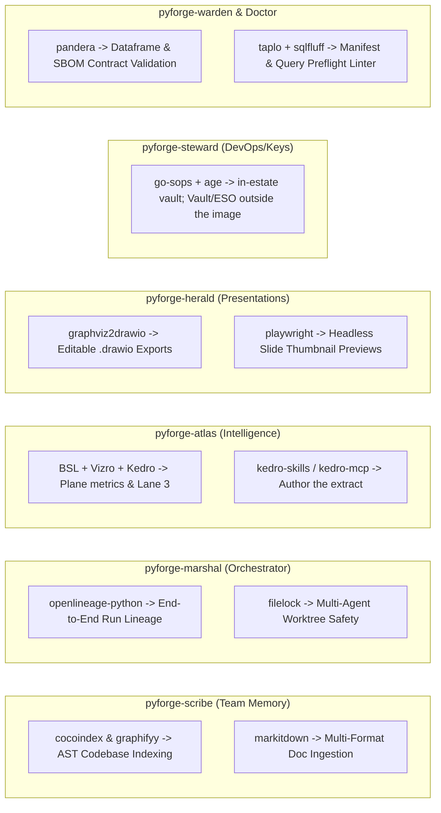

1. **`cocoindex` & `graphifyy` $\rightarrow$ `pyforge-scribe`:** Fast AST graph extraction and incremental semantic code indexing (`pyforge scribe index`), linking codebase functions directly to the PRDs and Dreams that spawned them.
2. **`openlineage-python` $\rightarrow$ `pyforge-marshal` & `pyforge-steward`:** Emits standard OpenLineage pipeline events across the autonomous loop, tracking complete operational lineage (`Dream -> Spec -> Mason Build -> Warden Audit -> Steward Deploy`).
3. **`boring-semantic-layer` (BSL) $\rightarrow$ `pyforge-atlas`:** Certified metrics over the query plane (DuckDB) — `package_download_velocity`, `ecosystem_cve_risk_score`, and CAP-19 relations — for Vizro and agents **without raw SQL** (UJ-6).
   3a. **Kedro family $\rightarrow$ `pyforge-atlas` (home):** `kedro` / `kedro-datasets` / `kedro-dagster` write and schedule derived layers. `kedro-skills` + `kedro-mcp` author them. Other stations may add extract *nodes*, not new Kedro projects (AD-21).
   3b. **Vizro family $\rightarrow$ Lane 3:** `vizro` is the runtime. `vizro-mcp` + `vizro-e2e-flow` author boards after 34.2. `vizro-ai` 0.4.2 is deprecated — no new work.
4. **`markitdown` (Microsoft) $\rightarrow$ `pyforge-herald` & `pyforge-scribe`:** Unified multi-format ingestion converting Word (`.docx`), Excel (`.xlsx`), PowerPoint (`.pptx`), and PDF into clean markdown for Wagtail Corporate Brain and Scribe memory.
5. **`graphviz2drawio` $\rightarrow$ `pyforge-herald`:** Programmatically converts Graphviz `.dot` pipelines into editable Draw.io XML (`.drawio`) files for enterprise architect reviews and PowerPoint decks.
6. **`filelock` $\rightarrow$ `pyforge-marshal` & `pyforge-scribe`:** Cross-platform file locking for worktrees and scribe files. **Already on Atlas** (`duckdb_writer`, FR-27 / CAP-19 writer).
7. **`go-sops` & `age` $\rightarrow$ `pyforge-steward`:** Offline X25519 vaulting — the in-estate path. HashiCorp Vault / `hvac` is a **deployment-profile adapter** (cluster ESO), not an in-process CAP-12 client (AD-19: secret *references* in pod specs only).
8. **`pandera` $\rightarrow$ `pyforge-warden` & `pyforge-mason`:** Statistical and schema validation for Polars/Pandas dataframes, enforcing strict structural contracts on parsed lockfiles and CycloneDX SBOM feeds.
9. **`taplo`, `sqlfluff` & `yamllint` $\rightarrow$ `pyforge-doctor` & `pyforge-warden`:** Syntax linting suite validating `pixi.toml`, `recipe.yaml`, and DuckDB SQL queries during preflight checks (`pyforge doctor check --syntax`).
10. **`playwright` $\rightarrow$ `pyforge-herald` & `pyforge-testing-kit`:** Headless browser automation capturing high-resolution PDF exports and PNG thumbnails of interactive `.dc.html` slides and Vizro dashboards for automated broadcast proclamations.

---

---

## The Station Planning Artifact Inventory & Upstream Grounding

Each station in PyForge is already grounded in **one authoritative PRD spline** and **one primary Architecture spline** within the BMAD planning tier (`_bmad-output/projects/`):


| Station               | Capability Domain          | Primary PRD Spline               | Primary Architecture Spline               | Satellite / Sub-chain Architecture Artifacts                                                                |
| :-------------------- | :------------------------- | :------------------------------- | :---------------------------------------- | :---------------------------------------------------------------------------------------------------------- |
| **`pyforge-atlas`**   | Package Graph Intelligence | `prd-pyforge-atlas-2026-07-17`   | `architecture-pyforge-atlas-2026-07-17`   | —                                                                                                          |
| **`pyforge-doctor`**  | Health & Auto-Remedy       | `prd-pyforge-doctor-2026-07-25`  | `architecture-pyforge-doctor-2026-07-25`  | —                                                                                                          |
| **`pyforge-herald`**  | Proclamations & Stage      | `prd-pyforge-herald-2026-08-01`  | `architecture-pyforge-herald-2026-08-01`  | —                                                                                                          |
| **`pyforge-marshal`** | Loop Orchestrator          | `prd-pyforge-marshal-2026-07-25` | `architecture-pyforge-marshal-2026-07-25` | `integration-architecture.md`, `architecture-bmad-infra.md`                                                 |
| **`pyforge-mason`**   | Recipe Builder & Build     | `prd-pyforge-mason-2026-07-25`   | `architecture-pyforge-mason-2026-07-25`   | —                                                                                                          |
| **`pyforge-scribe`**  | Team Memory & Mining       | `prd-pyforge-scribe-2026-07-25`  | `architecture-pyforge-scribe-2026-07-25`  | —                                                                                                          |
| **`pyforge-steward`** | Infrastructure & Deploy    | `prd-pyforge-steward-2026-07-25` | `architecture-pyforge-steward-2026-07-25` | `secure-live-dashboards-2026-08-09`, `unified-container-2026-08-09`, `jira-github-projects-sync-2026-08-09` |
| **`pyforge-warden`**  | Compliance & Quality Gates | `prd-pyforge-warden-2026-07-14`  | `architecture-pyforge-warden-2026-07-14`  | —                                                                                                          |
| **`pyforge-core`**    | Platform Spine & Registry  | Governed by`pyforge-core.md`     | Governed by`pyforge-charter.md`           | Shared foundation package (`django-pyforge`)                                                                |

### Why This Matters for the Unifying Layer

Because each station already has a single authoritative **PRD + Architecture spline**, the Unifying Estate Strategy does **not** alter or reinvent their internal algorithms or domain models.

Instead, this Unifying Dream establishes the **standardized external surface contracts** that mount these eight stations into one Foundry:

1. **Lane 2 UI:** `src/packages/django-<station>/` (today still under `src/shared/packages/` until phase 1).
2. **MCP:** `POST /stations/<name>/mcp` on Foundry Platform (`python-mcp-engine`). Not `service/` `:800x`.
3. **Lane 3:** Vizro board via `python-board-engine` (optional per station).
4. **Presentation:** `presentations/pyforge-<station>/`.
5. **CLI:** `pyforge <station>` (`python-cli-engine`).

---

---

## Station-by-Station Adversarial Architecture Review & Course Corrections

> **Historical (2026-08-23).** The *direction* (leave silos) stands. The
> *shape* (FastAPI `:800x`, MCP SSE, CodeRed) does not — Grounding + The Dream.

A critical cross-station audit reveals isolated assumptions made in earlier planning artifacts that must be **course-corrected** to achieve the unified estate topology:

### 1. `pyforge-warden` (Compliance & Quality Gates)

* **Legacy Assumption:** Conceived primarily as a local CLI tool parsing lockfiles via synchronous subprocesses (`deptry`, `osv-scanner`). Web face was a monolithic Django app (`compliance_face`).
* **Adversarial Critique:** Running blocking CLI scans inside web requests leads to timeouts; zero agent tool access over standard protocols.
* **Course Correction:**
  * Extract rule audits into `warden_service` (FastAPI) with native MCP SSE tools for AI agents.
  * Offload heavy bulk repo audits to Celery workers with live status streaming.
  * Mount `django-warden` (`django_warden_fabric`); do not treat `compliance_face` as the portal.

### 2. `pyforge-steward` (Platform Hosting & Gateway Controller)

* **Legacy Assumption:** Fragmented across 4 separate architecture documents (1 main spine + 3 satellite sub-chains for dashboards, containers, and Jira sync).
* **Adversarial Critique:** Architecture fragmentation obscures Steward's true role as the platform's infrastructure and gateway guardian.
* **Course Correction:**
  * Consolidate the satellite architectures under Steward's primary mandate: **Platform Ingress, OIDC Token Propagation, and OCP Deployment**.
  * Enforce Steward reverse-proxy middleware on Foundry Platform to inject `X-Forwarded-User` and `X-Forwarded-Groups` for row-level tenant isolation across all Vizro boards.

### 3. `pyforge-atlas` (Package Graph Intelligence)

* **Legacy Assumption:** Heavy monolithic data science stack (Kedro + Dagster + DuckDB + Vizro) conceived as a standalone web application.
* **Adversarial Critique:** Importing Kedro/Vizro inside the Django host would bloat container memory and create package version deadlocks.
* **Course Correction:**
  * Isolate Kedro/DuckDB analytics and Vizro dashboards into dedicated container pods (Lane 3).
  * Expose an ultra-lightweight FastAPI query layer (`atlas_service` :8003 + MCP) allowing Warden, Doctor, Scribe, and AI agents to query graph facts via sub-millisecond REST/MCP calls instead of mounting raw DuckDB files.

### 4. `pyforge-marshal` (Loop Orchestrator & Execution Cockpit)

* **Legacy Assumption:** Pure headless CLI tool written for local terminals (`bmad-loop`), reading/writing exclusively to local `.marshal/seed-state.yml` and worktrees.
* **Adversarial Critique:** Completely blind to web-driven execution—operators have no browser cockpit to view, start, or pause autonomous loops.
* **Course Correction:**
  * Wrap the loop decision core in `marshal_service` (FastAPI :8001 + MCP).
  * Stream loop state transitions (`sprint.started`, `story.passed`, `loop.blocked`) to Redis Streams (`pyforge:events:marshal`).
  * Build `marshal_portal` (Lane 2) providing a live HTMX web cockpit with sprint status, strand graphs, and execution controls.

### 5. `pyforge-scribe` (Team Memory & Decision Mining)

* **Legacy Assumption:** Isolated local SQLite `graphstore` mining transcripts from local developer disks.
* **Adversarial Critique:** Memory is trapped on local developer machines; ephemeral CI runners and subagents cannot query historical decisions.
* **Course Correction:**
  * Migrate Scribe's storage backend to the central PostgreSQL `pgvector` cluster (`scribe_schema` isolation) or centralized object store.
  * Expose `scribe_service` (:8005 + MCP) with semantic search tools (`recall_team_memory`, `search_decisions`) enabling fleet-wide collective intelligence.

### 6. `pyforge-herald` (Proclamations, Deck Engine & Stage)

* **Legacy Assumption:** Static Guildhall website generator and standalone Marp slide exporter.
* **Adversarial Critique:** Static HTML cannot support dynamic Keycloak role-based permissions, search, or live CMS blocks.
* **Course Correction:**
  * Elevate Herald's Guildhall to the flagship **Lane 1 Wagtail application at `/`**.
  * Package presentation deck renderers as Wagtail StreamField blocks (`PresentationDeckBlock`) and an MCP tool for AI pitch deck generation.

### 7. `pyforge-mason` (Conda-Forge Recipe Builder)

* **Legacy Assumption:** Synchronous CLI builder running rattler-build / conda-build directly in terminal threads.
* **Adversarial Critique:** Long-running builds block developer terminals; zero visual interface for inspecting recipe diffs or migration logs.
* **Course Correction:**
  * Offload build tasks to Celery workers backed by sandboxed container environments.
  * Build `mason_portal` (Lane 2) for visual recipe authoring, diff visualization, and one-click builds.
  * Provide `mason_service` (:8007 + MCP) for autonomous agent-driven recipe generation and patch evaluation.

### 8. `pyforge-doctor` (Health Diagnostics & Auto-Remedy)

* **Legacy Assumption:** Passive CLI bridge gathering diagnostics and printing terminal tables.
* **Adversarial Critique:** Cannot trigger automated remedies proactively; disconnected from platform health probes.
* **Course Correction:**
  * Integrate Doctor directly into OpenTelemetry metrics and platform health check probes (`/healthz`, `/ht/`).
  * Attach automated remedy listeners to Redis Streams to auto-heal environment drift.
  * Build `doctor_portal` (Lane 2) featuring real-time health telemetry and one-click remedy triggers.

### 9. `pyforge-core` (Platform Foundation Spine)

* **Legacy Assumption:** Conceptual framework without concrete shared client libraries or unified CLI dispatcher.
* **Course Correction:**
  * Implement `django-pyforge` as the reusable Django foundation package (Guildhall App Switcher, Keycloak SSO middleware, Modernist base template).
  * Implement `pyforge.core.client` as the shared async HTTPX SDK and Pydantic V2 domain model library.
  * Implement the root `pyforge` Typer CLI dispatcher routing commands across all stations.

---

---

## Station-by-Station Adversarial Product (PRD) Review & Product Course Corrections

An adversarial review of each station's PRD reveals critical **product-level blindspots** where tooling was scoped purely as non-interactive CLI scripts or isolated data silos, ignoring human operators and autonomous IDE agent loops:

### 1. `pyforge-warden` (Product & UX Scope)

* **Legacy PRD Stance:** Declared `classification: cli_tool` with non-interactive focus, explicitly dropping the `developer_tool` label and deprioritizing interactive UX.
* **Adversarial Critique:** Crippled compliance adoption. Human compliance officers had no web interface to inspect CVE trees, review licenses, or issue cryptographic waivers; developers in IDEs had no instant tool feedback before commit.
* **Product Course Correction:** Evolve from a "headless CI script" to a **Dual-Surface Compliance Engine**:
  - **`django-warden`:** Interactive web portal for SBOM visualization, license compliance matrices, and waiver approvals.
  - **`warden_service` MCP Server:** Real-time IDE tool allowing Antigravity, Claude, and Cursor to self-audit recipes as code is written.

### 2. `pyforge-marshal` (Product & UX Scope)

* **Legacy PRD Stance:** Defined jobs-to-be-done purely around local git worktree commands, terminal loops (`bmad-loop`), and terminal stdout.
* **Adversarial Critique:** Complete lack of executive or team visibility into autonomous SDLC execution. Engineering managers cannot track loop velocity, agent status, or strand health without manual log inspection.
* **Product Course Correction:** Expand product scope to include the **Autonomous Loop Cockpit (`marshal_portal`)**:
  - Live Kanban boards reflecting sprint/story progress in real-time.
  - Interactive strand graphs, execution heatmaps, and start/pause/resume web controls.
  - Operator push notifications for approval gates and human-in-the-loop interventions.

### 3. `pyforge-atlas` (Product & UX Scope)

* **Legacy PRD Stance:** Conceived as a backend data pipeline writing to standalone DuckDB files and a segregated Vizro dashboard.
* **Adversarial Critique:** Created an isolated data silo requiring separate ports and logins; failed to provide interactive package intelligence across other station workflows.
* **Product Course Correction:** Reposition Atlas as the **Platform Intelligence Layer**:
  - Seamlessly embed Atlas analytics under `/analytics/atlas/` within the central Django Host.
  - Expose interactive autocomplete and package intelligence REST/MCP endpoints directly powering Warden and Mason workflows.

### 4. `pyforge-scribe` (Product & UX Scope)

* **Legacy PRD Stance:** Explicitly stated *"Scribe is not a general-purpose enterprise knowledge platform"* and scoped memory capture strictly to local workstation files.
* **Adversarial Critique:** Fractured collective intelligence. If an engineer or subagent works in a container, remote worktree, or CI runner, past decisions and ADR rationale remain invisible.
* **Product Course Correction:** Upgrade Scribe to **Enterprise Collective Memory**:
  - Global semantic search web UI (`scribe_portal`) backed by the query plane (CAP-19), not OLTP `pgvector`.
  - Shared agent memory tool (`recall_team_memory`) enabling all AI subagents across the company to benefit from past architectural decisions.

### 5. `pyforge-herald` (Product & UX Scope)

* **Legacy PRD Stance:** Scoped as a pitch orchestration CLI and static HTML site generator for the Guildhall.
* **Adversarial Critique:** Static HTML pages cannot support dynamic enterprise authentication, access control, or live corporate intranet editing.
* **Product Course Correction:** Elevate Herald to the **Enterprise Corporate Brain (`/`)**:
  - Presentation stage embeds in Lane 1 (Wagtail). Steward owns Foundry Platform; Herald does not become a ninth CMS product.
  - Provides the **Presentation Deck Studio Block** for interactive slide authoring and multi-format exports (.dc.html, Marp, PPTX).

### 6. `pyforge-mason` (Product & UX Scope)

* **Legacy PRD Stance:** Scoped purely as a terminal builder executing synchronous builds.
* **Adversarial Critique:** High cognitive load for developers migrating hundreds of packages with no visual diffing, linting, or recipe migration wizards.
* **Product Course Correction:** Expand to the **Visual Recipe Studio (`mason_portal`)**:
  - Browser-based side-by-side recipe editor with real-time validation and build logs.
  - Autonomous AI recipe patching tools over MCP.

### 7. `pyforge-doctor` (Product & UX Scope)

* **Legacy PRD Stance:** Scoped as a passive diagnostics reporter printing terminal summaries.
* **Adversarial Critique:** Leaves the burden of fixing detected dependency conflicts entirely on the developer.
* **Product Course Correction:** Upgrade to an **Active Fleet Health Console (`doctor_portal`)**:
  - Real-time visual health scorecards and conflict visualizers.
  - Interactive "One-Click Auto-Remedy" triggers executing self-healing tasks in the background.

### 8. `pyforge-steward` (Product & UX Scope)

* **Legacy PRD Stance:** Scoped around command-line provisioning and secret rotations.
* **Adversarial Critique:** Operators lacked a single pane of glass to monitor cloud resource consumption, token life spans, and gateway ingress routes.
* **Product Course Correction:** Broaden to the **Platform Operations Portal (`steward_portal`)**:
  - Visual resource quota manager and environment provisioning dashboard.
  - Keycloak realm and reverse-proxy gateway routing controls.

---

## Adversarial Architecture & Red Team Hardening Directives

A rigorous Red Team architecture review evaluated the estate across six lenses (topology, state, security, agentic fabric, dependency complexity, disaster recovery). Living topology is eight platforms + Foundry Platform, not a 10-layer `:800x` farm.

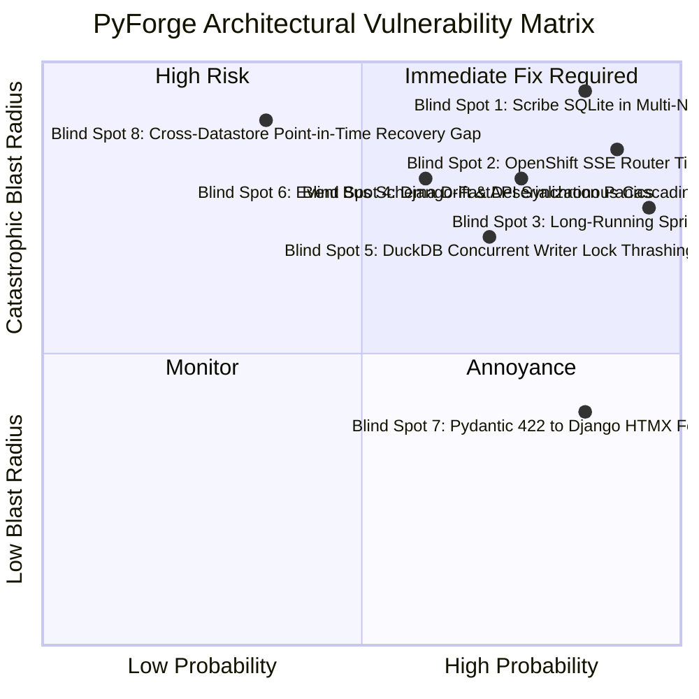

### 1. The 5 Pre-Implementation Remediation Directives (RFC Architecture)

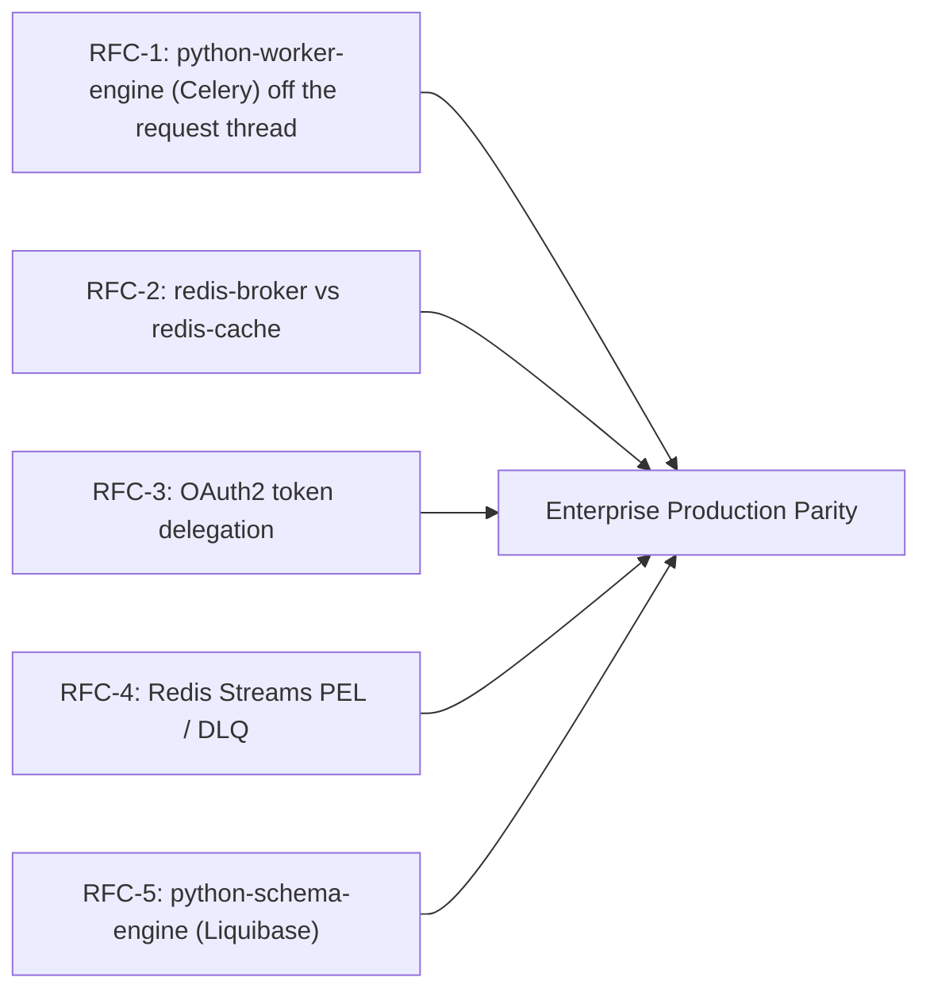

* **Directive 1 — Celery off the request thread (RFC-1):**

  * *Vulnerability:* Long MCP streams and heavy CPU work on the host ASGI starve HTMX.
  * *Remediation:* Grounding: RFC-1 is **`python-worker-engine`** (Celery + redis-broker), not a second FastAPI process pool per station and not `/mcp/sse` workers.
* **Directive 2 — Strict Redis Broker vs. Cache Infrastructure Separation (RFC-2):**

  * *Vulnerability:* Using a single Redis instance with `noeviction` causes volatile web session/cache writes to exhaust memory and crash Celery task ingestion.
  * *Remediation:* Provision two independent Redis services: `redis-broker` (`maxmemory-policy noeviction` for Celery & Redis Streams) and `redis-cache` (`maxmemory-policy allkeys-lru` for Django sessions, HTMX partial caches, and rate-limiting).
* **Directive 3 — Scoped Identity Token Delegation (RFC-3):**

  * *Vulnerability:* Forwarding raw user Bearer tokens causes mid-build 401s during long asynchronous tasks, while static API keys destroy audit attribution.
  * *Remediation:* Standardize `pyforge.core.client` on Signed Internal JWTs (HMAC-SHA256) carrying `idp_subject`, user roles, and an explicit `delegated_by: "pyforge-host"` claim. Async Celery tasks capture the `idp_subject` at invocation time to mint a scoped execution token.
* **Directive 4 — Redis Streams PEL Reclaim, DLQ & Loop-Depth Limits (RFC-4):**

  * *Vulnerability:* Unhandled consumer panics leave orphaned messages in the Pending Entries List (PEL), while recursive agent triggers risk infinite loops.
  * *Remediation:* Mandate an automated Dead Letter Queue (`pyforge:events:dlq`) consumer using `XAUTOCLAIM` to harvest abandoned messages, and enforce a strict loop-depth ceiling (`X-PyForge-Loop-Depth <= 5`) on all inter-station event payloads.
* **Directive 5 — Single-Source PostgreSQL DDL Governance via Liquibase (RFC-5):**

  * *Vulnerability:* Fragmented migrations across multiple frameworks (Django migrations, ORM auto-generation, ad-hoc DDL) cause schema drift, lock contention, and unrepeatable rollbacks across multi-tenant schemas.
  * *Remediation:* **All PostgreSQL database changes across the entire PyForge estate must be managed strictly via Liquibase (`db/changelog/`)**:
    - **Declarative ChangeSets:** Formatted YAML/SQL changelogs (`db.changelog-master.yaml`) maintain an immutable, checksummed audit trail (`DATABASECHANGELOG` table).
    - **Multi-Schema Orchestration:** Manages all PostgreSQL schemas (`public`, `warden_schema`, `atlas_schema`, `scribe_schema`, `langflow_schema`, `dbgpt_schema`) under atomic transactions with deterministic rollback definitions (`rollback:` blocks).
    - **Kubernetes Lifecycle Hook:** Helm Job (`liquibase update`) before Foundry Platform / workers boot — not FastAPI microservice pods.
    - **Zero-ORM DDL Coupling:** Application frameworks (Django, FastAPI, SQLAlchemy) consume existing schemas as read/write targets but are strictly prohibited from generating runtime DDL alterations.

  *(2026-08-24/25 Grounding supersedes this bullet's “init-container or Job” and “all DDL via Liquibase as written.” Least-bad RFC-5 + CRC: hook Job on the platform image, contrib tables in the changelog, `liquibase` schema created before tracking tables, engines must not DDL on boot.)*

### 2. Production Blind Spot Audit & Distributed Systems Hardening (BS-1 to BS-8)

To eliminate distributed state collisions, protocol timeouts, and token decay hazards, the architecture codifies the following 8 resilience invariants:

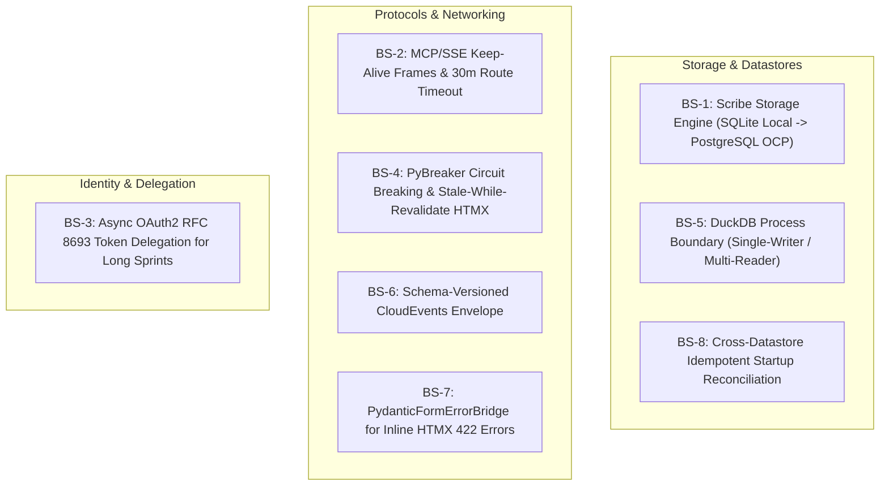


| Blind Spot #                                    | Architectural Risk & Failure Mode                                                                                                                               | Mandated Engineering Mitigation                                                                                                                                                                                         |
| :---------------------------------------------- | :-------------------------------------------------------------------------------------------------------------------------------------------------------------- | :---------------------------------------------------------------------------------------------------------------------------------------------------------------------------------------------------------------------- |
| **BS-1 (Scribe Multi-Pod Storage)**             | Multi-pod OpenShift deployments mounting SQLite over NFS/CephFS (`ReadWriteMany`) throw `database is locked` and corrupt B-trees under concurrent agent writes. | **Dual-Driver Scribe Engine:** Local development uses SQLite (`sqlite:///scribe.db`); production OpenShift mode binds to PostgreSQL (`scribe_schema`) using `pgvector` and relational graph tables.                     |
| **BS-2 (MCP / SSE Route Timeouts)**             | Ingress routers (HAProxy / Envoy) terminate silent SSE connections after 30s–60s during heavy 5-minute build or AST scans, severing agent workflows.           | **Keep-Alive Heartbeats & Extended Route Timeouts:** FastAPI emits SSE comment pings (`:keepalive\n\n`) every 15s; OpenShift routes declare `haproxy.router.openshift.io/timeout: 30m`.                                 |
| **BS-3 (Async Token Expiry in Long Sprints)**   | Keycloak JWT access tokens expire after 15m; 2-hour autonomous Marshal sprints or Mason builds fail with 401s when reporting completion.                        | **Scoped Task Token Delegation (RFC 8693):** Celery tasks receive an immutable `delegation_context` (`idp_subject`) and use Keycloak `client_credentials` with Token Exchange to mint scoped internal execution tokens. |
| **BS-4 (Cascading Synchronous 500s)**           | A crash or restart in`pyforge-warden-service` causes Django HTTPX worker threads to hang, cascading into a 504 outage for the entire Guildhall at `/`.          | **PyBreaker & Stale-While-Revalidate Fallbacks:** Django HTTPX clients implement PyBreaker with 500ms fail-fast thresholds; HTMX views render graceful degraded badges (`"Compute restarting — cached 10m ago"`).      |
| **BS-5 (DuckDB Concurrent Writer Thrashing)**   | Concurrent Celery ingestion tasks attempting simultaneous writes to`atlas.duckdb` trigger file-lock contention and unhandled exceptions.                        | **Strict Single-Writer Ingestion Worker:** Only a single dedicated ingestion worker writes to DuckDB; all FastAPI services and Vizro dashboards mount DuckDB in **Strict Read-Only Mode** (`read_only=True`).           |
| **BS-6 (Event Schema Drift & Deserialization)** | Upgraded stations emitting v2 events crash legacy consumer stations with Pydantic`ValidationError` deserialization panics.                                      | **Forward-Compatible CloudEvents Envelope:** Standard envelope carries `schema_version: "2.x"` with generic payload dictionaries; schema validation is executed in domain adapters, not at the stream boundary.         |
| **BS-7 (Pydantic 422 to HTMX Form Mapping)**    | FastAPI HTTP 422 JSON errors (`loc: ["body", "version"]`) fail to map back to Django template form fields, showing generic failure toasts.                      | **`PydanticFormErrorBridge` in `django-pyforge`:** Automatically unpacks HTTP 422 JSON error arrays into standard Django `forms.ValidationError` dictionaries for inline HTMX field highlighting.                       |
| **BS-8 (Cross-Datastore PITR Recovery Gap)**    | Restoring PostgreSQL from backup while Redis Streams or MinIO contain newer state causes orphaned builds and missing database records.                          | **Idempotent Startup State Reconciliation:** Microservices execute startup reconciliation sweeps (e.g. Mason scans MinIO on boot to re-index database records, treating PostgreSQL as the canonical anchor).            |

### 3. Edge Case Failure Protections


| Failure Scenario                                        | Mitigation Pattern                                                                                                                                  |
| :------------------------------------------------------ | :-------------------------------------------------------------------------------------------------------------------------------------------------- |
| **Agentic DDoS / Runaway MCP Loop**                     | Token-Bucket rate limiting per`agent_id` in Redis + Semantic Circuit Breakers tripping if an agent executes >10 build calls per minute.             |
| **Reverse-Proxy Tenant Data Leakage**                   | Cryptographically signed`X-Tenant-Signature` headers injected by Django Host and validated by Vizro/FastAPI backends; strict CSP iframe sandboxing. |
| **DuckDB Concurrency Lock Contention**                  | Read-only shared DuckDB file attachments with single-writer lock queues offloaded to background Celery workers.                                     |
| **OpenShift `readOnlyRootFilesystem` Startup Failures** | Explicit in-memory`emptyDir` mounts for `/tmp`, `PYTHONPYCACHEPREFIX=/tmp/pycache`, and WhiteNoise cache directories.                               |

---

## Foundry Platform and 8-station 5-tier matrix

PyForge is **Foundry Platform** (one ASGI hub) plus **eight station instances**. Each **03** station has 5-tier symmetry: CLI + portal + MCP + domain skill + persona. Grounding Q2: 01/02 work does not owe this matrix.

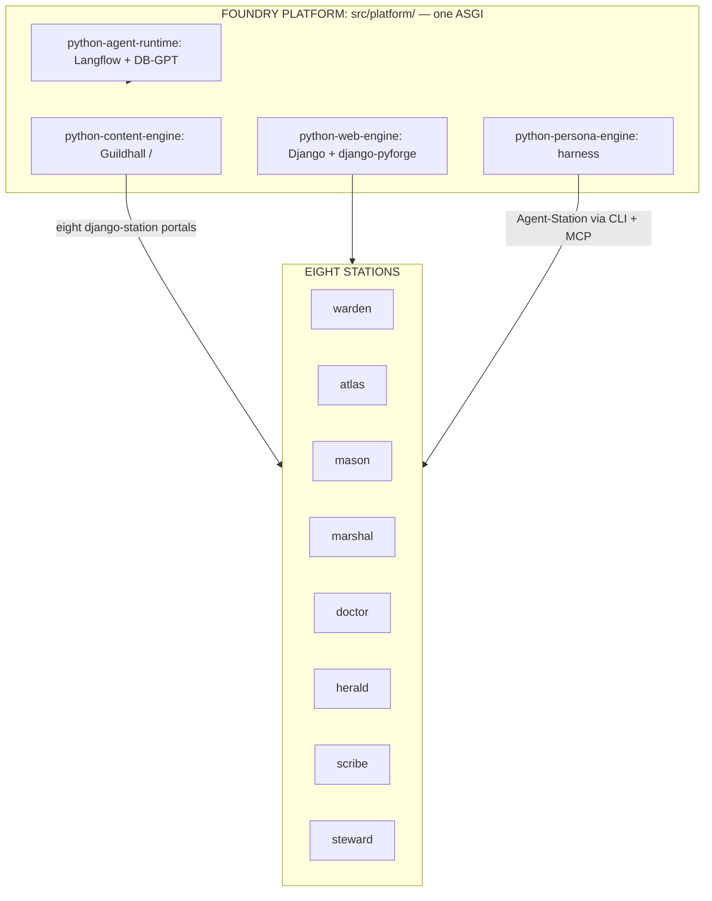

### 1. Foundry Platform (`src/platform/`)

* **Guildhall (Lane 1 at `/`):** Django + Wagtail + `django-pyforge`. App Switcher. OIDC via `python-identity-engine`. Secrets: references only.
* **`python-agent-runtime` (Langflow + DB-GPT mounts):** Path B is this family, not Tachyon (Q6). MCP faces stay on the host. Estate memory and Text-to-SQL hit the **query plane** (CAP-19). Not Chroma, not OLTP `pgvector` for autonomous SQL.

### 2. The 8 Station 5-Tier Symmetry Matrix


|   #   | Station       | 🖥️ Unified CLI  | 🌐 Web Portal (Lane 2)                  | ⚡ MCP on host ASGI          | 🧠 Domain Skill (`SKILL.md`)                                  | 🤖 Station Agent Persona           |
| :---: | :------------ | :---------------- | :-------------------------------------- | :--------------------------- | :------------------------------------------------------------ | :--------------------------------- |
| **1** | **`warden`**  | `pyforge warden`  | `django-warden` / `/stations/warden/`   | `POST /stations/warden/mcp`  | `pyforge-warden`                                              | **`Agent-Warden`** (Compliance)    |
| **2** | **`atlas`**   | `pyforge atlas`   | `django-atlas` / `/stations/atlas/`     | `POST /stations/atlas/mcp`   | `pyforge-atlas`                                               | **`Agent-Atlas`** (Intelligence)   |
| **3** | **`mason`**   | `pyforge mason`   | `django-mason` / `/stations/mason/`     | `POST /stations/mason/mcp`   | **`conda-forge-expert`** (Epic 11; no `pyforge-mason/` skill) | **`Agent-Mason`** (Build/Wheels)   |
| **4** | **`marshal`** | `pyforge marshal` | `django-marshal` / `/stations/marshal/` | `POST /stations/marshal/mcp` | `pyforge-marshal`                                             | **`Agent-Marshal`** (Loop/Seed)    |
| **5** | **`doctor`**  | `pyforge doctor`  | `django-doctor` / `/stations/doctor/`   | `POST /stations/doctor/mcp`  | `pyforge-doctor`                                              | **`Agent-Doctor`** (Fleet Healer)  |
| **6** | **`herald`**  | `pyforge herald`  | `django-herald` / `/stations/herald/`   | `POST /stations/herald/mcp`  | `pyforge-herald`                                              | **`Agent-Herald`** (Presentations) |
| **7** | **`scribe`**  | `pyforge scribe`  | `django-scribe` / `/stations/scribe/`   | `POST /stations/scribe/mcp`  | `pyforge-scribe`                                              | **`Agent-Scribe`** (Memory/AST)    |
| **8** | **`steward`** | `pyforge steward` | `django-steward` / `/stations/steward/` | `POST /stations/steward/mcp` | `pyforge-steward`                                             | **`Agent-Steward`** (Ops/Secrets)  |

---

## Constraints / Non-goals

- **Not a fragile monolithic SPA.** Server-driven Django + HTMX + Wagtail +
  `django-pyforge`. Lane 3 is reverse-proxied Vizro, not a React analytics SPA.
- **Lane 2 vs Lane 3.** HTMX owns actions. Vizro owns deep visualization. Do
  not import Kedro or Vizro into Django views.
- **Zero heavy compute in Django views.** Blocking work is Celery + station
  packages, not a `:800x` process farm.
- **Zero domain models on portals.** `django-<station>` apps are UI clients
  through `django-pyforge` / `pyforge.core.client`. Host never imports
  `pyforge.*`.
- **Eight stations, five tiers on 03 only.** Foundry Platform is not a ninth station.
  New 01/02 work does not mint a portal/MCP/persona. Roster **declared complete
  2026-08-26** (Epic 37.1, 40/40). Mason skill = `conda-forge-expert`. A missing
  cell fails CI.
- **Lane 1 is Wagtail.** CodeRed is dropped.
- **One analytical engine (CAP-19).** No private DuckDB, Chroma, or OLTP DSN
  for estate knowledge or Text-to-SQL. BSL is the dashboard/agent SQL contract.
- **Kedro is required for new Atlas pipelines; not eight projects.** Atlas is
  the Kedro home. Warden is never re-templated as Kedro (Q8). `kedro-mcp`
  stays wrapped.
- **Infra kinds.** PostgreSQL + Redis + Kubernetes. DuckDB is a library/face.
  Vault/ESO stay outside the image. No MinIO as a fourth core kind.
- **Bind installed pins; do not re-pin.** See `stack.md` § Estate leverage.

---

## Fleet conventions (one vocabulary)

Conventions, not code: `pyforge-core` already gave duplicated *primitives* one
home. This section is the same finding for **naming, numbering, and shape**.
Eight stations can each be internally consistent and still be unreadable as a
fleet. Contract is Grounding above. Evidence is the 2026-08-30 table. Dossier:
`technical-pyforge-station-dossier-2026-08-30.md`.

Not [[agent-tool-surface]] (MCP reachability) and not
[[surface-drift-reconciliation]] (spec-surface detector). Not a mandate for
identical exit codes or one CLI framework. Not a one-commit README sweep —
each station remediates its own row. No station’s runtime changes to satisfy
a naming rule. Legitimate variance is documented (Doctor’s exit domain is a
*tested subset* of Warden’s — state the relationship, do not erase it).

Detection is horizontal (Marshal, Charter §6); ownership stays vertical;
**Doctor verdicts Marshal’s own row.**

| Convention axis | What actually varies (2026-08-30) | Where |
|---|---|---|
| **Decision tags** | `AD-N` restarts at 1 independently in Marshal (64+), Atlas (23), Mason (16), and part of Steward; Scribe keeps eight `AD-N`. Warden and the rest of Steward use Story-N.M / FR-N / NFR-N / D-codes. No station’s `AD-8` means another’s. | marshal, atlas, mason, steward, scribe, warden |
| **Exit-code semantics** | Same integer, different meanings. `3` is Mason `EXIT_CFE_UNAVAILABLE` and Steward reserved `EXIT_BUDGET_NOT_CONFIGURED`. `70` (crash vs failure) exists only in Steward. Doctor’s domain is a documented subset of Warden’s; Marshal/Mason relationships are unstated. | mason, steward, doctor, warden, marshal |
| **CLI shape** | Noun-verb trees of different depths (Marshal ~40/12 groups; Mason 4 nouns), Steward’s 13-duty list, Doctor’s four subcommands, Warden one subcommand + ~20 flags, Atlas Kedro routing + `--version` intercept. | all eight |
| **Hook-plugin naming** | `pyforge.core.hooks` is shared. Entry-point *names* are not: Atlas/Doctor/Warden/Scribe prefix (`atlas-catalog-ttl`, `warden-deptry`); Mason/Steward register bare (`rattler-build`, `jira`). | mason, steward vs. the rest |
| **Boundary docs vs. code** | Skill index “Lane 1 CMS stays steward” is false — Steward owns `/console/`, not a CMS. Herald source has no “Lane” concept. | herald, steward |
| **Fleet-status sources** | Four answers: Marshal `status` (journals), Steward console (refuses to derive — reads Marshal + Doctor), Atlas dashboard (sprint ledger, unconfirmed same source), Herald React dashboard. | marshal, steward, atlas, herald |
| **State storage** | Flat JSON (Marshal policy, Herald deck-bridge), SQLite (`.herald/herald.db`), DuckDB (Atlas), journals (Marshal runs), Scribe `graph_store` Protocol (only pluggable port). | marshal, herald, atlas, scribe |
| **MCP-server placement** | Ruled: host ASGI `POST /stations/<name>/mcp`. Atlas still ships a standalone MCP server module. Herald/Scribe correctly ship none — silence looks like “not built.” | atlas (outlier), herald, scribe |
| **Python floor** | Marshal/Mason/Herald/Scribe/Warden `>=3.12`; Doctor/Atlas `>=3.14`. No fleet policy for a raise. | doctor, atlas vs. the rest |
| **Naming collision** | Warden `scan --doctor` is a local self-check, not `pyforge-doctor`. | warden |

MCP placement is a **reconciliation** against Grounding, not a second opinion.
Boundary docs vs. code is a **doc bug** (operator-trust cost), not style.

**When the detectors exist:** fully-qualified tags or one registry; exit-domain
relationships held by a meta-test; named CLI idiom for *new* work; station-
prefixed hook ids; boundary claims next to code; one status source per fact;
Atlas MCP folded or named as an exception.

---

## Living names (`python-<role>-<class>`)

Formula: `python-<role>-<class>`. Classes: `kind` · `profile` · `builder` · `solver` · `chain` · `skill` · `agent` · `runtime` · `platform` · `engine`.

Faces are `python-<layer>-platform`. Implementations are `python-<role>-engine`. Stations are instances (`pyforge-<station>`, `django-<station>`, `Agent-<Station>`), not platforms. BMAD is `python-dream-chain` (not Foundry engine 8). Path A/B stay in Q6 only; slugs use `python-agent-runtime`.

| Place | Name |
|---|---|
| GitHub (forward) | `rxm7706/python-foundry` |
| GitHub (today) | `rxm7706/local-recipes` |
| Pixi workspace | `pyforge` |
| Recipe island | `factory/` |
| Mount | Foundry Platform — `src/platform/` |
| Packages (forward) | `src/packages/` |
| Skills (forward) | `skills/` |

| Family | Members | Tool |
|---|---|---|
| `python-infra-kind` | postgres / redis / kubernetes | PostgreSQL 17; Redis 7 (`redis-cache` evicts, `redis-broker` does not); Kubernetes |
| `python-deploy-profile` | ocp / gke | Helm + OCP `restricted-v2` Mode A/B/C; GKE |
| `python-container-builder` | docker / podman | Same Containerfile |
| `python-workspace-solver` | pixi | Pixi |
| `python-dream-chain` | spec / loop / build | `bmad-spec` · `bmad-loop` · `bmad-build-auto` |

| Foundry engine | Tool |
|---|---|
| `python-schema-engine` | Liquibase 5.x |
| `python-flag-engine` | OpenFeature + flagd FILE |
| `python-identity-engine` | django-allauth → Keycloak (or Entra / Okta / Ping) |
| `python-edge-engine` | gunicorn (uvicorn workers, one Deployment) |
| `python-telemetry-engine` | OpenTelemetry + structlog |
| `python-breaker-engine` | PyBreaker |
| `python-secrets-engine` | go-sops + age (Vault/ESO outside the image) |

| Platform | Engine | Tool |
|---|---|---|
| `python-cli-platform` | `python-cli-engine` | `pyforge-core` |
| `python-web-platform` | `python-web-engine` | Django 5.2 + `django-pyforge` |
| | `python-content-engine` | Wagtail 7.4. Guildhall = home page |
| `python-sdk-platform` | `python-services-engine` | FastAPI in-package |
| | `python-worker-engine` | Celery + redis-broker |
| `python-mcp-platform` | `python-mcp-engine` | Official `mcp` SDK |
| `python-skill-platform` | `python-skill-engine` | SKF / `skills/` |
| `python-agent-platform` | `python-persona-engine` | Cursor / Claude Code / `copilot` |
| `python-query-platform` | `python-query-engine` | DuckDB + `vss` |
| | `python-pipeline-engine` | Kedro + kedro-dagster |
| | `python-board-engine` | Vizro + BSL |
| `python-event-platform` | `python-event-engine` | Redis Streams + CloudEvents |

`python-agent-runtime` under the agent platform: `python-workflow-engine` (Langflow), `python-dataagent-engine` (DB-GPT). Skills: `python-domain-skill` × 8 (mason = `conda-forge-expert`) and `python-method-skill` (`bmad-*`, `skf-*`, CFE).

**Retired living names:** Canopy, chrome, Human/Agent Canopy, `python-method`, `python-dream2code-chain`, `python-pathb-agent`, `pyforge-agent-platform` as a package, `python-platform-foundry` as the repo.

---

## Kinships

[[factory-console]] (Guildhall — Lane 1, realized/absorbed into marshal narrative) · [[secure-live-dashboards]] (Lane 3 security kit — steward; binds Mode A isolation) · [[atlas-query-dashboards]] / atlas Vizro board (Lane 3 prototype) · [[htap-query-plane]] (absorbed here — the query-plane section; not a sibling chain) · [[kedro-org-tooling-adoption]] (kedro-skills / kedro-mcp — authoring, not a second home) · [[pyforge-atlas]] (Kedro home, BSL, vss, plane writer) · [[marshal-token-economy]] (own Spec, CAP-1..CAP-13; five-layer agent-loop compression + retrieval, summarized as §6 above) · [[pyforge-scribe]] (three CAP-18 ports; ingest writes through GraphStore; 34.5 plane driver) · [[compliance-factory-web-face]] (Lane 2 prototype — warden) · [[pyforge-herald]] (stage / proclamation / deck engine; vizro-mcp authoring is shared) · [[pyforge-steward]] (deploy & secure hosting; go-sops/age; Vault profile) · [[pyforge-charter]] (estate governance) · [[pyforge-core]] (unified CLI spine) · [[presentation-deck]] (deck standards) · [[django-accelerator-framework]] (Lane 2 portal scaffolding) · [[wagtail-corporate-brain]] (CMS & doc synchronization) · [[enterprise-data-models-and-apis]] (normalized data & DRF JSON:API layer — not the query plane) · [[platform-fifteen-factors]] (15-factor enterprise baseline) · [[local-ocp-hybrid-environment]] (hybrid deployment profile) · [[langflow-django-plugin]] (AI workflow engine — no private Chroma for estate RAG) · [[db-gpt-django-plugin]] (DB knowledge base — SQL on the plane, not OLTP DSN) · [[pyforge-operation]] (estate-wide operating model — promotion 01/02/03 + Golden Path; WFT tool names are steward-profile adapters, not this Dream's core stack) · [[pyforge-scorecard]] (sibling — Build League + Balanced Product Scorecard *board*; *rules* are authored in this Dream's Grounding) · Kedro [architecture overview](https://docs.kedro.org/en/stable/getting-started/architecture_overview/) (hook specs + plugins; not eight Kedro projects)

---

## Realization log

- **2026-08-23** — Dreamt after inventory of station web surfaces (steward Django kit, atlas Vizro, warden compliance_face, herald static Guildhall; four stations CLI-only) and the rename discussion for `compliance_face` → `warden_portal`. Strategy: three lanes + surface map + shared chrome/security, not one mega-app.
- **2026-08-23** — Expanded to holistic 9-station estate strategy incorporating unified CLI surface (`pyforge <station>`), 3-tier hosting architecture (Platform Django, Steward-proxied Vizro, GitHub Pages), and documentation lifecycle.
- **2026-08-23** — Cohesive estate refinement: fully embraced station symmetry across all 9 stations, defining dedicated Lane 2 action portals (`{station}_portal`) and Lane 3 analytics dashboards (`{station}.dashboard`) unified by shared chrome and the Guildhall.
- **2026-08-23** — Hub-and-Spoke Enterprise Architecture Blueprint: formalized the platform host (`pyforge_host` on Django + Wagtail/CodeRed CRX) mounting 9 pluggable station portal Django apps, paired with 9 FastAPI + Model Context Protocol (MCP) compute microservices and isolated Vizro analytics containers.
- **2026-08-23** — Pixi Monorepo Structure & Architectural Boundaries: established the definitive `pyforge-estate/` directory layout (`pyforge_host/`, `portals/`, `services/`, `dashboards/`, `cli/`, `presentations/`, `_bmad-output/`) governed by `pixi.toml`.
- **2026-08-23** — Dual-Headed FastAPI Pattern: documented the dual-headed service architecture where a single FastAPI station microservice simultaneously exposes standard REST endpoints (`/api/v1/...`) for Django HTMX portals and Server-Sent Events (SSE) MCP servers (`/mcp/sse`) for AI agents.
- **2026-08-23** — Complete 10-Layer Enterprise Topology: expanded architecture with Asynchronous Workers (Celery + Redis), Multi-Model Data Layer (Postgres, DuckDB, Scribe SQLite, MinIO), Autonomous Multi-Agent Loop Engine (Marshal), and Security/Observability (Warden + Doctor + OpenTelemetry).
- **2026-08-23** — Unified CLI Strategy Standardization: codified universal CLI grammar (`pyforge <station> <noun> <verb>`), output format standardization (`--output text|json|yaml`), dual execution modes (Direct local vs. Remote service), Rich terminal styling, and `pyforge mcp install` agent integration.
- **2026-08-23** — 15-Factor & Hybrid Deployment Integration: integrated 15-factor enterprise baseline (`platform-fifteen-factors`), OIDC-delegated identity via `idp_subject`, PostgreSQL + `pgvector` with multi-schema isolation (`langflow_schema`, `dbgpt_schema`), Redis `noeviction` policy, and dual deployment profiles (Local Compose vs. Red Hat OCP).
- **2026-08-23** — Django Reusable Apps & `django-lasuite` Pattern: adopted La Suite Numérique architecture principles—creating `django-pyforge` as the shared foundation package (Guildhall App Switcher banner, OIDC SSO middleware, Modernist theme layout), packaging station portals as zero-model reusable Django apps with `AppConfig` discovery metadata, and integrating Wagtail/CodeRed CMS.
- **2026-08-23** — Guardrail Modernization: superseded legacy constraints, formalizing full 9-station symmetry, strict Lane 2/3 separation of concerns, zero-model portal apps, and elevating the Guildhall to the flagship Lane 1 application at root (`/`).
- **2026-08-23** — Deep 5-Pillar Architecture Expansion: codified Inter-Station Event Fabric (Redis Streams + SSE/WebSockets), Keycloak RBAC Matrix, Guildhall Presentation Deck embedding (`PresentationDeckBlock` + Vite bridge), Scribe Knowledge Graph UI & semantic search, and Shared Data Contract Client SDK (`pyforge.core.client`).
- **2026-08-23** — Upstream Planning Artifact Grounding: mapped the authoritative 1-PRD and 1-Architecture spline per station across `_bmad-output/projects/`, establishing how the Unifying Estate Dream binds to existing domain architectures.
- **2026-08-23** — Adversarial Architecture Review & Course Corrections: executed a station-by-station critique identifying legacy silos (blocking subprocesses, isolated SQLite files, static HTML generators, local terminal loops) and defined definitive course corrections for all 9 stations.
- **2026-08-23** — Adversarial PRD & Product Review: audited legacy product definitions across all 8 station PRDs, overturning CLI-only and isolated-silo constraints to establish dual-surface product definitions (interactive web portals + agentic MCP tools) across the entire estate.
- **2026-08-23** — Renamed to `pyforge-unifying-strategy.md`: elevated document scope to reflect the holistic unifying strategy encompassing product vision, web UI, compute microservices, MCP agent fabric, unified CLI, and cross-station architecture.
- **2026-08-23** — LocalStack Philosophy & Cross-Platform Guarantees: codified 100% native Linux/macOS/Windows execution guarantees via Pixi (`linux-64`, `win-64`, `osx-arm64-min`) and articulated PyForge's design alignment with the LocalStack emulator model (100% offline, zero cloud bills, sub-millisecond agent inner loops, and strict local-to-OCP 15-Factor environment parity).
- **2026-08-23** — Container Delivery Modes Formalization: codified the 3 deployment topologies powered by a single Pixi-built container image (`pyforge-container`): Mode A (Single All-in-One Podman Container), Mode B (Local Podman Pod with `pgvector` and Keycloak), and Mode C (Multi-Container Distributed OpenShift/K8s).
- **2026-08-23** — Enterprise Server Infrastructure & OCP Sizing Specifications: codified the complete production cluster sizing (16–32 vCPUs, 32–64 GB RAM, minimum 3 worker nodes), block and object storage requirements (PostgreSQL `pgvector`, Redis persistence, S3/MinIO mirrors), OpenShift Route edge TLS, internal cluster DNS, and `restricted-v2` SCC security compliance.
- **2026-08-23** — Feature Flags & Canary Delivery Architecture: embedded a 5-tier progressive delivery engine into the runtime—featuring OpenFeature `FlagContext` evaluations across Django UI, FastAPI microservices, MCP agent tool gating, and CLI flags, paired with percentage rollouts, shadow mode, and Doctor automated circuit-breaker auto-rollbacks.
- **2026-08-23** — Technology Stack & Library Catalog Integration: documented the complete, curated 9-tier library ecosystem derived from `pixi.toml` spanning Django/Wagtail web layer, Anthropic/FastMCP agent SDKs, Langflow/DB-GPT AI engines, DuckDB/Polars/Kedro data stack, Vizro/Panel dashboards, document/media converters, DevSecOps supply-chain tools, and QA fixtures.
- **2026-08-23** — Packaging Audit & High-Leverage Opportunity Matrix: completed an audit of all station `pyproject.toml` files, verifying `hatchling` build systems and `pyforge-core` leaf spine bindings across all 9 stations, and mapped top 10 underutilized repository libraries (`cocoindex`, `openlineage`, `BSL`, `markitdown`, `graphviz2drawio`, `filelock`, `go-sops`, `pandera`, `taplo`, `playwright`) to specific station capabilities.
- **2026-08-23** — Empirical Multi-Python Resolution Benchmark: executed standalone `pixi lock` solver benchmarks across the entire 1,000+ package estate for Python 3.12, 3.13, and 3.14, confirming 100% solver success across all three Python minor versions with complete binary C-extension availability.
- **2026-08-23** — The 3 Operational Planes Architecture Formalization: unified the 10 platform layers into three macro operational planes (UI & Routing Plane, Compute & Agent Plane, Data & Infrastructure Plane) with an overarching Mermaid system topology showing direct client-to-service and agent-to-MCP execution paths.
- **2026-08-23** — Adversarial Architecture & Red Team Hardening Directives: codified 5 mandatory pre-implementation RFCs (FastAPI REST vs. MCP worker process separation, dedicated Redis broker vs. cache instances, scoped identity token delegation, Redis Streams PEL dead-letter queue with max loop-depth limits, and single-source PostgreSQL DDL governance via Liquibase).
- **2026-08-23** — HashiCorp Vault Enterprise Secrets Management Integration: designated HashiCorp Vault as the authoritative enterprise credential and secret lifecycle engine, managing dynamic database credentials, Keycloak client secrets, and Kubernetes/OpenShift External Secrets Operator (ESO) in-memory secret injection under `restricted-v2` SCC.
- **2026-08-23** — Production Blind Spot Hardening (BS-1 to BS-8): codified 8 critical distributed systems mitigations—Scribe dual-driver storage engine (SQLite local vs PostgreSQL OCP), MCP/SSE keep-alive frames with 30m route timeouts, async OAuth2 RFC 8693 token delegation for long sprints, PyBreaker circuit breaking with stale HTMX fallbacks, DuckDB single-writer process boundary, schema-versioned CloudEvents envelopes, `PydanticFormErrorBridge` for HTMX 422 errors, and cross-datastore idempotent startup reconciliation.
- **2026-08-23** — The Canopy & 8-Station 5-Tier Symmetry Formalization: codified the platform topology as The Central Canopy (`pyforge_host` / `guildhall` + `pyforge-agent-platform`) governing the 8 canonical spoke stations (`warden`, `atlas`, `mason`, `marshal`, `doctor`, `herald`, `scribe`, `steward`), establishing complete 5-tier symmetry (CLI + Web Portal + FastAPI/MCP Service + Domain Skill + Autonomous Agent Persona) across every station.
- **2026-08-24** — Grounding audit, ownership assignment and rescope (see § Grounding, which is authoritative over the pre-audit architecture prose). Ten decisions, operator-directed:
  1. **Owner `herald` → `steward`.** The Dream's mass is platform hosting, deployment and estate custody — steward's mandate. Charter §5: owning is the post, not the product.
  2. **The Canopy is `src/platform/`; no new project, no governance act.** The audit found the host already built and steward epics 10/11/12/16 `done` (only `12-7` outstanding, permanently skipped for want of a cluster). `pyforge-agent-platform` existed nowhere but this file — a name invented for a thing that already shipped under another.
  3. **The chain is rescoped** from greenfield-estate to an extension binding `spec-python-agent-platform` as prior art, minting nothing that duplicates CAP-1..6. Within that boundary decomposition is exhaustive.
  4. **Naming follows reality** — `src/platform/` is canonical, `pyforge_host`/`pyforge-agent-platform` demoted to role names. No rename story is minted.
  5. **Eight stations plus the Canopy**, settling this log's own 9-vs-8 inconsistency; the Canopy is not a station.
  6. **RFC-5 (Liquibase) is accepted as written**, which reopens shipped Epic 11 — 11.1's `RunSQL` and 11.2's data migration provisioned `langflow_schema`/`dbgpt_schema` through Django, exactly what RFC-5 forbids. `bmad-correct-course` decides the ledger shape; the Spec must resolve whether Django's own built-in apps (`auth`, `sessions`, `contenttypes`) are carved out of the zero-ORM-DDL rule.
  7. **Steward owns the cross-station slices outright**, including marshal's `pyforge.core.client` (confirmed absent — `pyforge.core` ships `atomic_write`/`errors`/`landing_evidence`/`process`/`report`/`verdict`, no client) and herald's Lane 1. `compliance_face` already living in `src/platform/` establishes the pattern.
  8. **The residual is evidence-confirmed**, not assumed: no `django-pyforge` package, no `services/` tier (FastAPI exists only as an in-host ASGI seam), one of eight portals mounted, no Wagtail anywhere, no `[project.scripts]` on `pyforge-core`.
  9. **`docs/dreams/README.md` corrected** — its `guild`-reserved-for-two-Dreams text predates the 2026-08-08 closure of `guild_dreams` at one (`pyforge-genesis` absorbed into the Charter).
  10. **Detector baseline recorded before any edit**
- **2026-08-24** — Phase-2 technical research (`planning-artifacts/research/technical-pyforge-unifying-strategy-research-2026-08-24.md`) invalidated four directives against the live pins (Django `>=5.2.15,<6`, Python 3.12, conda-forge-only sourcing). Operator rulings, same day:
  1. **RFC-5 revised from "as written" to the researched least-bad form.** The literal directive is not implementable: `post_migrate` is the only supported mechanism populating `django_content_type`/`auth_permission`/`django_site`, so `migrate` must keep running, and `create_test_db()` runs `migrate` so the test runner has no path off Django migrations. Adopted instead: DDL revoked at the **database role** (app role DML-only, separate migration role holds DDL — the only auditor-verifiable control), Liquibase owning production DDL via a Helm **pre-upgrade Job** (not an init container — N replicas contend on `DATABASECHANGELOGLOCK`, default wait 5 min), Django migrations retained as the **authoring** surface with a CI `sqlmigrate` extraction gate (no prior art — we build it), `liquibase update` then `migrate --fake`, and **test databases explicitly carved out**. Unresolved: Liquibase is not on conda-forge (sole anaconda.org hit is a third-party 4.21.0 with 0 downloads), needs Java 17+, and its 5.0 Community image no longer bundles the PostgreSQL JDBC driver — feedstock-vs-container is an open air-gap policy call.
  2. **BS-2 rewritten to the current MCP spec.** `/mcp/sse` is deprecated twice over: HTTP+SSE has been Deprecated since `2025-03-26`, and `2026-07-28` additionally removed the standalone GET stream and protocol-level sessions, so a compliant server answers GET on its MCP endpoint with `405`. The 30m route annotation raises `timeout server` but **not** `timeout client`, which stays at OpenShift's cluster-wide 30s with no per-route override. Adopted: single POST `/mcp` on the official `mcp` 2.0.0 SDK (conda-forge, the only current-spec path — FastMCP reaches `2026-07-28` only at v4, still beta), the **Tasks extension** (SEP-2663) for multi-minute work, keep-alive comment frames well under 30s plus `X-Accel-Buffering: no`, annotation kept as defence-in-depth only.
  3. **CodeRed CMS dropped; Wagtail alone carries Lane 1.** CRX has had no `main` commit since 2025-09-12, declares support only for Wagtail 7.0–7.1 against a current 7.4.3 LTS, and carries an unfixed 404 on admin form submissions (issue #710, community fix #717 unmerged). Wagtail itself is a clean fit — 7.4.3 on conda-forge within hours of upstream with full transitive closure, Django 5.2 and Python 3.12 both supported, PostgreSQL FTS removing any Elasticsearch dependency, and `WAGTAILADMIN_LOGIN_URL` as a first-class allauth/OIDC hook.
  4. **OpenFeature adopted via the flagd FILE resolver, accepting the feedstock cost.** OpenFeature is absent from conda-forge and from anaconda.org entirely (global search: zero results). This ruling commits to **four new feedstocks** (`openfeature-sdk`, `openfeature-flagd-api`, `openfeature-flagd-core`, `openfeature-provider-flagd`) **plus a `cachebox` 5.x build** (conda-forge ships 6.2.5; the provider pins `<6`). Per repo Rule 1 every one of those stories' dev sessions MUST invoke `conda-forge-expert`. The FILE resolver evaluates in-process from local JSON with the full targeting engine — no daemon, no egress, air-gap-clean.
  5. **`django-pyforge` is ours to build.** `django-lasuite` is OIDC/DRF/malware plumbing, not a UI layer, and contains no app switcher; La Suite's switcher ("La Gaufre") ships as npm/React with a service-list endpoint unreachable air-gapped. No documented La Suite reusable-app pattern exists. Adopt `django-lasuite` for OIDC only.
  6. **BS-4 gains a build task, not a dependency.** PyBreaker's async support is Tornado-coroutine, not asyncio — an `httpx.AsyncClient` coroutine passed to `breaker.call()` records a false success and the circuit never trips. We write the ~40-line async wrapper over PyBreaker's own storage rather than adopt `aiocircuitbreaker` (conda-forge, but dormant since 2022) or `purgatory` (maintained, not packaged).
  7. **Packaging risk recorded:** conda-forge's Django 5.2 line stalled at **5.2.15** (2026-06-06) while upstream shipped 5.2.16 and 5.2.17 — exactly one build satisfies our pin, with zero headroom, two patch releases behind., so pre-existing red is not attributed to this chain: `dream-chain-check` fails on this Dream having no Spec (the gap this chain closes) plus two other steward Dreams; `chain-completeness-check` 10 fails; `chain-layers-audit-check --project pyforge-steward` fails staleness + orphans with 15/15 layers present; `bmad-drift-check` one `pin-missing` fail and 41 warns; `dreams-hygiene-check` warn-only, 27 warns, none against this Dream.
- **2026-08-24** — Phase-3 (`bmad-spec`) produced `specs/spec-pyforge-unifying-strategy/` — SPEC.md plus four companions (`convergence.md`, `resilience-invariants.md`, `stack.md`, `architecture-diagrams.md`). The Spec's own preservation pass caught a gap in this Dream's decomposition, and five further operator rulings followed:
  1. **Tiers 4 and 5 were being silently dropped.** This Dream states a *five*-tier symmetry — CLI, Web Portal, FastAPI/MCP Service, **Domain Skill**, **Agent Persona** — but CAP-1..14 covered only the first three. Evidence: exactly **one** station domain skill exists (`conda-forge-expert`, mason's) of eight, and **zero** station agent personas exist (the five `bmad-agent-*` skills are BMAD roles — analyst/architect/dev/pm/ux-designer — not station personas). Ruled **in scope**: bound as CAP-15 and CAP-16, with a constraint that no station is complete on fewer than five tiers whatever its ledger says.
  2. **Epic granularity is thematic** — roughly 7–9 epics grouped by delivery seam, not 1:1 per capability. Steward runs to Epic 17, so this chain begins at **Epic 18**.
  3. **`guildhall-handoff` resolved as SUPERSEDE.** Wagtail Lane 1 replaces Marshal's `docs/dashboard/` console rather than sitting beside or wrapping it. CAP-2 changes from an addition into a replacement carrying a **parity gate**: every view the retired console offered must be reachable from the new front door, and the old build path is *removed*, not merely unlinked. `spec-factory-console` is retired via correct-course in the same chain — a superseded spec left claiming ownership is a worse outcome than two consoles. Herald's non-goal at `spec-pyforge-herald/SPEC.md:137` is unaffected (it never owned the console) and Herald's React web surface is out of scope, being the Moments UI rather than Lane 1. New open question `console-parity-inventory` replaces `guildhall-handoff`.
  4. **Liquibase delivery vehicle goes to research, not to a coin-flip.** New open question `liquibase-airgap-policy`: does this repo's air-gap policy govern *container images* at all, or only conda-sourced dependencies? If images are already mirrored routinely, the Helm pre-upgrade Job's image is cheap; if only conda channels are mirrored, it introduces a new supply path. **CAP-9 cannot be scheduled until this lands.**
  5. **Phase-5 correct-course scope is all eight stations**, one run per station, so every station spec records its Canopy obligations — with Marshal's run additionally retiring `spec-factory-console` per ruling 3. Each run is pinned with `BMAD_ACTIVE_PROJECT` and written to physical `projects/<slug>/` paths, never through the shared `planning-artifacts` symlink (CLAUDE.md parallel-agent rule).
     Also corrected in this phase: `convergence.md` still recorded RFC-5 as accepted "as written", which the same-day `least_bad` revision had superseded.
- **2026-08-24** — Air-gap delivery research (`planning-artifacts/research/technical-pyforge-unifying-strategy-airgap-delivery-2026-08-24.md`) closed the CAP-9 vehicle question and found the seam already built. Two operator rulings:
  1. **`liquibase-airgap-policy` answered, and it reframed the question.** The repo runs **two** boundaries: conda channels govern the Python/pixi graph (`docs/reference/enterprise-deployment.md` is silent on images — searched for `container`/`image`/`OCI`, not found), while `spec-python-agent-platform` CAP-6 governs deployment images and **already admits third-party non-conda images** (`postgres:17`, `redis:7`, `quay.io/keycloak/keycloak:26.4.0`). This chain's constraint had read "every dependency resolves from conda-forge" with no qualifier, which flatly contradicted CAP-6; it now reads "every **Python/pixi** dependency" and names the image boundary beside it. **The decisive find was in the chart, not the policy:** `src/platform/deploy/charts/platform/templates/migrate-job.yaml` is shipped and is exactly the `post-install,pre-upgrade` hook RFC-5 asks for, running the platform image with its command as `args` — so CAP-9 adds a Job at weight `-1` and flips that one to `migrate --fake`, and convergence's "must land as a seam, not a chart rewrite" risk is retired. Its header rejects init containers because `helm install --wait` deadlocks migration-gated readiness — a wholly different argument from Phase-2's `DATABASECHANGELOGLOCK` contention, reaching the same answer.
  2. **`liquibase-delivery-vehicle` resolved to a FEEDSTOCK** — a sixth new recipe in this chain, alongside CAP-13's five. Because the hook Job runs the platform image and takes `args`, a conda-packaged Liquibase needs **no new image and no new supply path**; the container route would pay an undocumented third-party-image mirroring path *and* still build a derived image, since 5.0 Community dropped the bundled PostgreSQL JDBC driver and LPM fetches it over the network. `openjdk` 25.0.2 clears the Java 17+ floor and `apache-tika` is the exact recipe shape. Consequence for Phase 4: **CAP-9 and CAP-13 both open with packaging work, not platform work.**
     Three adjacent defects were surfaced and the cheap two fixed immediately rather than filed: (a) the `air-gap-parity` CI job rendered the DB-GPT sidecar Deployment (no `enabled` guard in the template) without ever loading its image, so a pod sat in `ImagePullBackOff` reaching for a registry while the job — whose own criterion is "any external reference is a FAILING check" — reported green; fixed by building the sidecar in `build-platform-image`, loading it, and adding a **class-level assertion that no pod is waiting on an image pull**, so the next unloaded image cannot repeat it. (b) Story 12.3's spec file is absent from `planning-artifacts/specs/` though `epics.md` and `scripts/build-pixi-mirror.py` both cite it — the Tier-3 worktree-teardown loss CLAUDE.md documents; recovery attempted from session transcripts. (c) No ADR scopes "conda vs container for operational binaries"; the research file is now the nearest decision record.
- **2026-08-24** — Phase-4 (`bmad-product-brief` → `bmad-prd`) produced the brief bundle and `prds/prd-pyforge-unifying-strategy-2026-08-24/`, and answered the parity question this Dream's own Phase-3 ruling 3 had opened. Three operator rulings, one of which grew the capability set:
  1. **`console-parity-inventory` answered — and the answer was not a formality.** `specs/spec-pyforge-unifying-strategy/console-parity-inventory.md` enumerates **23 console surfaces: 14 runtime-reproducible, 7 build-time-only, 3 mixed.** The seven collapse to four decisions rather than seven problems, because the "running" chip, the in-flight card and the live/projected fleet overlay are one decision wearing three hats — all three read `~/.bmad-loops`, tmux sessions and `marshal status` through a local pixi env, which is precisely why the *published* board already degrades to `unavailable` for them while a local `dashboard-gen` shows them. Two findings changed FR-7's scope: the retired path carries **100+ inbound references** across dreams, specs, presentations, pixi tasks, workflows, tests and scripts (including the Charter's own accountability gate), making the reference sweep its own story rather than end-of-story cleanup; and the co-published **Kedro-Viz tree (~195 tracked files) is NOT a parity obligation** — nothing in `index.html` links to it and it has its own publishing workflow — so it must survive the removal rather than be deleted alongside it. Also killed an inherited assumption: `cf_atlas.db` does **not** feed this console; `generate.py` sources repo files, git history, local loop homes and subprocess detectors.
  2. **Live run state stays on the front door — so CAP-17 is born.** The inventory recommended the cheaper option (drop the three surfaces, keep them local-only, which is what the published board honestly does today); the operator ruled the other way and accepted the cost. Live run state and journal-derived timing are now published by a **supervisor service** the front door queries, bound as **CAP-17** with FR-40/41/42 and a `Never:` constraint forbidding the supervisor from reading an operator home directory or the front door from falling back to filesystem scraping. This **absorbs two of the inventory's four decisions into one capability** (a supervisor that publishes live state is also where a completed run's journal is ingested), leaving detector verdicts and curated editorial content as the parity build's remaining calls. Stated plainly because it is the one place this chain grew rather than converged: **the replacement is now held to a higher bar than the thing it replaces.**
  3. **Portal URL scheme decided: uniform `/stations/<name>/`,** with `compliance_face` moving off its shipped `/compliance/` mount behind a **permanent** redirect (FR-9a — a supported route, not a shim scheduled for removal). One rule beats eight exceptions, the registration seam enforces it, and the app switcher derives entries from registration rather than a path list. Worth recording *why this was a decision at all*: the pre-audit brief asserted `/stations/{station}/` as settled convention and it never was — `config/urls.py:23` mounts the one existing portal at `/compliance/`, so choosing the uniform prefix buys consistency at the price of migrating a shipped URL.
  4. **Django patch-level exposure sent to audit** rather than left as a recorded constraint. conda-forge's 5.2 line stopped at 5.2.15 while upstream shipped 5.2.16 and 5.2.17, with no feedstock maintenance branch. If either carries a security fix this escalates from a constraint to a risk and a `django-feedstock` 5.2 maintenance branch becomes a seventh packaging item; if not, the pin stands. The remaining three open questions (`mcp-tasks-runtime`, `mcp-client-revision`, `liquibase-7791-fixed`) were dispatched to research in the same pass.
     A doc-standards review (`bmad-review` structure+prose) returned NOT-YET on the brief and caught a factual error that had already propagated into the PRD: the brief read "**five** OpenFeature packages plus Liquibase are absent from conda-forge", wrong twice over against this log's own Phase-2 ruling 4 — it is **four** OpenFeature feedstocks plus a **`cachebox` 5.x downgrade build on an existing feedstock** (conda-forge ships 6.2.5 against the provider's `<6` pin), so `cachebox` is neither absent nor a new recipe, and sizing it as one overstates the work. The ambiguity originated upstream in `SPEC.md`'s own "five OpenFeature-related" and is now corrected there, in `stack.md`, and in all four Phase-4 documents. Three further review findings: a brief section promised fourteen capabilities and described twelve (CAP-7 and CAP-10 appeared nowhere in it); the agent-as-first-class-user claim shipped as flat fact when the workspace memlog had explicitly flagged it for surfacing; and CodeRed is **three** minor releases behind (Wagtail 7.1 vs 7.4.3 LTS), not two.
- **2026-08-24** — Two commissioned research files landed and a naming decision reshaped the portal tier. Both research results **corrected a premise this chain had recorded as fact**, and in both cases the correction was favourable — worth noting, because a pessimistic premise is as much a planning error as an optimistic one, and both had been sized as risk.
  1. **`django-patch-exposure` answered: a currency gap, not a live exposure** (`planning-artifacts/research/technical-pyforge-unifying-strategy-dependency-currency-2026-08-24.md`). 5.2.16 and 5.2.17 are both security releases carrying **seven CVEs, one Django-rated high** (CVE-2026-15307, CVSS 8.8, GeoDjango raster) — and **every affected path is unreachable in `src/platform/`**: no `contrib.gis` in `INSTALLED_APPS` and no GIS package in any pixi env, neither cache middleware in `MIDDLEWARE` and no `cache_page`, **no `URLField` anywhere in the codebase**, and no `i18n` include so `set_language()` is unrouted. The premise underneath the question was also wrong: this log's Phase-4 ruling 4 recorded "no feedstock maintenance branch", but `conda-forge/django-feedstock` carries live `5.x`/`4.x`/`3.2.x` branches with `5.x` and `4.x` registered in `abi_migration_branches` — and **`rxm7706` personally authored the 5.2.15 bump on it** (PR #230, merged 2026-06-06, following #220/#224/#227/#228). So the seventh packaging item that ruling contemplated does not exist; catching up is a one-file version+sha256 PR on an existing branch. Recorded as **recommended, not required**: the reachability analysis holds, but scanners key on version strings rather than reachability, so an SBOM declaring seven unremediated CVEs is a finding whatever the analysis says, and the justification would be re-written every month. Caveat if taken: 5.2.17's fix is explicitly backward-incompatible (spatial lookups now reject `dict` and non-geometry strings) — irrelevant here, relevant to other consumers of the conda-forge package.
  2. **`liquibase-7791-fixed` answered: yes, in 5.0.4** — and **the SPEC had framed it too broadly**. PR #7803 merged 2026-08-10 and is confirmed an ancestor of the `v5.0.4` tag (`behind_by: 0`); the release notes name it independently. But the defect only ever affected changesets marked **`runInTransaction="false"`** — never in-transaction ones — because the cause was `SET LOCAL SEARCH_PATH` being a no-op outside a transaction block. The SPEC's "before any multi-schema changeset lands" therefore over-stated a gate that really covers the exception (`CREATE INDEX CONCURRENTLY`, `ALTER TYPE … ADD VALUE`). Two consequences bound: the feedstock **targets 5.0.4 or later**, which is also the first release whose GPG signature verifies against the rotated signing key (a recipe-verification fact, not a preference); and **open** issue #7624 becomes a `Never:` constraint — with `preserveSchemaCase=true` the schema name is double-quoted into one that does not exist and **DDL lands silently in `public`**, the worst available failure mode here, mitigated for free because Django's naming conventions are lowercase already. It also surfaced a real architecture decision that was about to be inherited by default: `liquibaseSchemaName` decides whether the changelog lock is **global or per-application**, and therefore whether two applications can migrate concurrently.
  3. **Station portals become reusable Django apps under one scheme, and `compliance_face` is renamed.** Ruled after the operator corrected two of this agent's assumptions in sequence: that a station has one Django app (it may have several), and that "fabric" should be relocated somewhere estate-wide (it is warden-specific). Bound as **FR-9b**, riding along with FR-9a's URL move — distribution **`django-warden`**, module **`django_warden_fabric`**, app label **`warden_fabric`**, following [Django's reusable-app convention](https://docs.djangoproject.com/en/6.0/intro/reusable-apps/), with **one distribution per station holding one or more apps** (the `django-allauth` shape). Two properties are load-bearing: the label is compound because Django requires uniqueness across `INSTALLED_APPS` and a bare `<station>` label cannot survive a second app; and **existing models never move between apps** — new concerns become siblings, so the estate starts at one app per station without ever paying a split, since the migration tax applies only to *moving* a model. **Sequencing is why this sits in FR-9b rather than a later story:** renaming an app label is a table rename plus content-type and migration-history surgery, which is an ordinary Django migration today and a **governed Liquibase changeset once CAP-9 lands**, so it must precede §4.9. Two corrections fell out: `src/shared/packages/` holds **two families under two conventions** that should not be reconciled — station CLI/library packages (`pyforge-<station>` over `pyforge.<station>`, entry point `warden = "pyforge.warden.cli:main"`) and Django reusable apps (`django-*` over `django_*`) — so this agent's claim that `django-pyforge` was "the odd one out" was wrong, and it stands correct as named; and CAP-8's backbone, called the "event fabric" in four places, is now uniformly the **event backbone** (already the dominant term) to avoid reading confusingly beside `warden_fabric` in the same diagram.
- **2026-08-24** — MCP runtime research (`planning-artifacts/research/technical-pyforge-unifying-strategy-mcp-runtime-2026-08-24.md`) closed the last two Phase-4 questions and **found the estate's MCP servers already broken**. The defect and the architecture answer turn out to be the same decision, which is the most useful thing it produced.
  1. **`mcp-tasks-runtime` answered: no, and blocked upstream.** `mcp` 2.0.0 — the current stable line, and what conda-forge ships — lists it verbatim under *Known gaps*: "The tasks extension (SEP-2663) is not part of this release", and the SDK passes official conformance on both sides *except* the tasks suite, baselined as known-failing. Worth recording the history, because it explains why this is not a "wait a release" gap: Tasks shipped as experimental **core** in `2025-11-25` (SEP-1686), was withdrawn, and ~13k lines were deleted from the SDK rather than maintained against a moving target; it returned as **SEP-2663** (*Final*) — an optional, opt-in, versioned **extension**, with blocking `tasks/result` replaced by polling `tasks/get` and `tasks/list` dropped as unscopeable against a stateless core. The only working server-side runtime in **any language** is `fastmcp-tasks`, whose own README states no language SDK provides one; it is `4.0.0b3`, on unreleased FastMCP 4, built on Docket, and neither it nor `docket` is on conda-forge — which does not accept betas. **CAP-4's success criterion is shippable; shipping it *via Tasks* is not**, so the two were decoupled: FR-12 now binds a **`start`/`get` tool pair over a durable store**, implementing SEP-2663's own lifecycle so adoption later is a wire-layer swap over the same store (FastMCP's own migration note says the durable store was the hard part). Three near-misses bound as `Never:` — progress notifications die with the connection they ride, sticky-session affinity is ruled out because the modern revision deliberately removed sessions, and home-grown stream replay reimplements the hard part badly; FR-12's "retrievable from a different replica" consequence exists specifically to make the affinity shortcut fail its test. Recorded as a **scheduled re-check**, not a closed door.
  2. **`mcp-client-revision` answered: accept `2025-03-26` through `2026-07-28`** — four handshake revisions plus the modern one, which is exactly what `mcp` 2.0.0 already serves dual-era with no configuration. The fleet is genuinely split (Copilot and Zed at `2025-11-25`, Gemini CLI at `2025-06-18`, **Codex already sending `2026-07-28`** within two weeks of release, Cursor's revision unpublished), so **both ends are load-bearing** and pinning either alone rejects real traffic. Two invariants bound because their failure modes are counter-intuitive: **echo the client's requested revision, never assert your own newest** — a client receiving an unrecognized revision aborts *even when it is newer*, observed as Claude Code refusing `Server's protocol version is not supported: 2026-07-28` — and **never branch on client name**, only on declared revision.
  3. **A live outage found, and it forces CAP-4's foundational choice now rather than in the architecture pass.** `import fastmcp` currently raises `ImportError: cannot import name 'McpError'` (reproduced, not read off a changelog): `mcp` 2.0.0 renamed `McpError`→`MCPError` and `fastmcp` 2.14.3 imports the old name at module load, so **every in-repo MCP server is unstartable** — `.claude/tools/conda_forge_server.py`, `.claude/tools/gemini_server.py`, and atlas's, marshal's and herald's servers, plus herald's `test_bridge.py`. **The obvious fix does not work.** Raising the floor to `fastmcp >=3.4.7` (what `recipes/fastmcp/recipe.yaml` already carries) fails, because **every conda-forge `fastmcp` 3.x build declares `mcp >=1.24.0,<2.0`** — verified across all builds — while 2.14.x only *appears* compatible on an unbounded `>=1.24` that is a missing upper bound in the feedstock, i.e. the solver is walked into a broken solve by incorrect metadata, which is why this surfaced at runtime rather than as a solve failure. **No published `fastmcp`/`mcp` pair satisfies both**, and both pins sit in the same table (`[feature.local-recipes.dependencies]`, `pixi.toml:1605` and `:1611`). That collapses ruling 2 into a fork rather than a preference: conda-forge FastMCP is **handshake-era only** (modern serving arrives in FastMCP 4, beta and unpackaged), so staying on FastMCP means dropping `mcp` below 2.0 and forgoing the modern revision FR-11 requires, while building on `mcp` 2.0.0 directly is dual-era for free but relocates five modules. Recorded as new open question **`mcp-runtime-base`**, replacing the two answered ones — and flagged urgent because it is simultaneously an architecture decision and a live outage.
- **2026-08-24** — Phase 4d–4e: architecture spine `status: final` (modular monolith; parent AD-n vs canopy AD-n); Epics **18–30** (13 epics, 35 stories) appended to steward `epics.md`. `mcp-runtime-base` answered **hybrid**. Packaging stories 26.3 and 27.1 are blocked-on-operator. `lane1-serves-dw-h3` left open. *(Footnote 2026-08-25: answered **no**. Do not reopen.)*
- **2026-08-24** — Phase 5: eight-station `bmad-correct-course` (physical paths). `spec-factory-console` superseded by CAP-2. No station copied steward 18–30 as local epics. Atlas did **not** answer `lane1-serves-dw-h3`. *(Footnote 2026-08-25: answered **no** the next day. Do not reopen.)*
- **2026-08-24** — Phase 6: readiness **CONCERNS — proceed** (`implementation-readiness-report-20260824.md`). Spec `draft` → `ready`; this Dream `dreamt` → `specified`. Live MCP stopgap: `fastmcp >=3.4.7,<4` and `mcp >=1.24,<2.0` in `local-recipes` (doctor/herald keep `mcp >=2.0.0`).
- **2026-08-24** — Operating-model Q1 answered (operator): `pyforge-operation.md` is **estate-wide PyForge practice**, not a WFT-only overlay. Bound in § Grounding: promotion 01→02→03, minimum BMAD spec, Golden Path (same Pixi task + immutable Warden-passed artifact), WFT toolchain adapterized as a steward deployment profile. Q2 (does 5-tier symmetry apply only at 03?) left open on purpose so this bind does not silently rewrite CAP-15/16. SPEC/PRD/epics not correct-coursed in this pass.
- **2026-08-24** — Operating-model Q2 answered (operator): **5-tier symmetry applies only to 03 capabilities.** 01/02 may stay spec+script or spec+skill. The eight stations remain 03 and still owe all five tiers; new work does not mint a portal/MCP/persona until promoted. CAP-15/16 correct-course note landed in `spec-pyforge-unifying-strategy/SPEC.md` (Never: restated from "station" to "03 capability"). Full `bmad-correct-course` of PRD/epics not run in this pass.
- **2026-08-24** — Operating-model Q3 accepted (operator): Steward discovery holds owner / `work_class` / promotion date; SLA body stays in the 03 BMAD spec until a consumer exists; no Steward SLA service; Marshal never owns the book. CAP-1 note in SPEC.md.
- **2026-08-24** — Operating-model Q4 accepted (operator): traceability contract is `spec_id` + git sha + SBOM purl (+ optional work-item id). Jira is a steward adapter. Never: require a Jira key. CAP-8 note in SPEC.md.
- **2026-08-24** — Operating-model Q5 (operator): Build League and Balanced Product Scorecard are **in the operating model** — we must know the rules and optimize to what is measured. Bound: rules authored here; WFT source names the faces and defines no metrics; scorecard *board* is a sibling Dream (no CAP-18). Residual: write the actual measure set.
- **2026-08-24** — Operating-model Q6 (operator): Tachyon is an **internal OpenAI/LLM provider for production**, not a product and not Path B. Path B = Agent Canopy + CAP-16. Tachyon adapterized like other WFT tools.
- **2026-08-24** — Operating-model Q7 (operator): HTMX = portal contract; FastAPI = station compute API; DRF JSON:API stays on Atlas / enterprise-data-models / Django models. No Lane 2 BFF.
- **2026-08-24** — Operating-model Q8 (operator): Warden is the only PR quality gate; scanners are optional plugins. Extension shape = Kedro hooks + plugins (`kedro.framework.hooks` / extensions), one verdict for the scorecard. Not a Kedro-project re-template of Warden. Q1–Q8 now closed. Residual: write the published measure set (Q5).
- **2026-08-24** — Q5 residual scoped (operator): scorecard draft is **later**; it will be based on **many human, agent, and team metrics**. No first-cut measure set in this pass. Unpublished metrics must not steer work.
- **2026-08-24** — Operating-model propagation step 1: SPEC companions aligned (convergence residual 20, architecture-diagrams, stack.md Q7). Steward `sprint-change-proposal-2026-08-24-operating-model.md` proposed (batch). PRD/epics not edited pending approval. Recommended follow-on station run: **warden only**, not all eight.
- **2026-08-24** — Operating-model SCP **approved**. PRD glossary + FR-1/2/17/37–39 + SM-5; `epics.md` Stories 18.1, 19.2, 24.1, 29.3 and Epic 29 title; architecture spine note. Correct Course workflow complete for steward. Next optional: Warden-only station correct-course.
- **2026-08-24** — Operator **revisit:** station operating-model correct-course is **all eight**, not Warden-only. Estate-wide: OM Nevers + spec-vs-plugin *shape* (Kedro extension model). **Warden owns** PR-gate hook specs; plugins implement them. Atlas already *is* Kedro (pipeline hooks ≠ PR gate). Not a Kedro re-template of every station. Landed: per-station `change-history/sprint-change-proposal-2026-08-24-operating-model.md`, `epics.md` Operating-model obligations, `DW-OM-2026-08-24`.
- **2026-08-24** — Readiness re-stamp of `implementation-readiness-report-20260824.md`: still **CONCERNS — proceed**. OM pass recorded (Q1–Q8 + eight `DW-OM-2026-08-24`). No new blocking concern. First dispatch remains S-18.1.
- **2026-08-24** — Operator: hooks and plugins are an **architecture principle** (replaceable layers; hook into processes), not only a Warden/Kedro-project rule. Bound as canopy **AD-21** + Dream Grounding + SPEC Always. Q8 remains the PR-gate instance.
- **2026-08-24** — canopy AD-14 scoped to **03** (title + rule). Matches Epic 29 / FR-39. 01/02 outside this AD.
- **2026-08-24** — `bmad-product-brief` **Update** on `briefs/brief-pyforge-unifying-strategy-2026-08-24/` (not Create). OM table in brief addendum; first-ready five-tier and packaging lines reversed in memlog.
- **2026-08-25** — Steward **12-7 closed** on CRC: Helm `platform` deployed, Liquibase + `migrate --fake` Complete, `https://platform.apps-crc.testing/ht/` **200**. Dated record updated. Drain queues **0** backlog. Next: pip-layer fold is Dream → spec (`NEXT-AFTER-12-7.md`), not silent Containerfile rewrite.
- **2026-08-25** — **Fleet drain takeaways folded into Grounding** (not a second Dream). Canopy Epics 18–32 + eight peer CAP-18 hook stories landed; 08-24 “genuinely unbuilt” list is historical. Confirmed: modular monolith (no `services/` process farm); CAP-18 = hooks not scorecard; parallel-agent switch mutex; tracked story specs; `--merge` never squash; peer stations drain on one obligation, they do not clone steward 18–30. Campaign engine was worktree `bmad-build-auto` under a singleton coordinator; marshal Epic 22 verbs exist as product.
- **2026-08-25** — Pip-layer fold specified: `docs/dreams/platform-image-one-pixi-env.md` + `spec-platform-image-one-pixi-env` (`ready`). Q5 measures parked on `docs/dreams/build-league-scorecard.md` (unpublished; do not invent). `lane1-serves-dw-h3` **answered no** (Wagtail `/cms/` ≠ La Suite Docs REST).
- **2026-08-25** — Pip-layer SPEC **shipped**. Image `localhost/platform:one-pixi-env`. Changelog `:17`/`:18` wait for the next Liquibase/Helm upgrade (not a 12-7 re-prove). `lane1-serves-dw-h3` stays **no**.
- **2026-08-26** — Query plane folded into this Dream (operator: not a sibling).
  Capture file `docs/dreams/htap-query-plane.md` marked absorbed.
- **2026-08-26** — Operator: Dream is **evergreen**; SPEC may return
  `in-progress`; rebuild is allowed. CAP-19 / FR-46..50 / Epic 34 / canopy
  AD-22 landed. Dream `realized` → `specified`. First dispatch **S-34.1**.
- **2026-08-26** — Stack leverage bound: Kedro/Vizro/BSL as optional pipeline /
  Lane 3 / metric contract; original ten high-leverage pins scheduled in
  `stack.md` § Estate leverage. Vault-in-app rejected (AD-19). Vizro-AI
  deprecated. `filelock` noted as already on Atlas writer.
- **2026-08-26** — **Dream realized / SPEC shipped.** CRC: `GET /` **200**,
  `/cms/` **302** to OIDC, CAP-9 `platform_app` DML-only. Bind:
  `sprint-change-proposal-2026-08-26-canopy-closeout.md`. Isolated `mfa`
  sqlmigrate stays fake. Story 12.9 CI optional when Actions minutes return.
- **2026-08-26** — Evergreen rewrite of *living* sections (How to read;
  Dream mermaid; query-plane Kedro/Vizro; Constraints; stack catalog;
  5-tier MCP column; Vault/Chroma/CodeRed in living prose). Historical
  10-layer / `services/` / `:800x` kept as illustration. First dispatch
  remains **S-34.1**.
- **2026-08-26** — `django-lasuite` removed from living Canopy prose.
  Host identity is `django-allauth`; chrome is `django-pyforge`. Phase-2
  “adopt for OIDC only” retracted. Feedstock / `suite-*` recipes unchanged.
- **2026-08-26** — Dream→spec chain re-stamped for Epic 34. SPEC `ready`.
  Readiness CONCERNS—proceed. First dispatch `spec-34-1-read-only-live-attach`.
- **2026-08-26** — Query-plane first slice + five-tier drain **shipped**.
  Steward Epics **34.1–34.5**, **35.1** (sibling MCP cluster fail-loud),
  **36.1–36.2** (BSL + grounded `estate-cache` Vizro page), **37.1**
  (40/40; mason skill = `conda-forge-expert`). CAP-19 residual = three
  SPEC OQs. Mosaic optional. MCP slice 3 / vizro-ai / Q5 / eight Kedro
  projects stay parked. Hygiene (bmad-loop recipe 0.11.1, loop-home
  refresh, deferred-work verify stamp) is **not** a canopy contract.
- **2026-08-30** — Bound the target monorepo directory map, fleet conventions
  (now § Fleet conventions),
  and the 2026-08-30 full-fleet dossier (verified synthesis only). Retitled
  living heading: Eight Stations and the Canopy (modular monolith).
  Hub-and-Spoke = one ASGI + eight packages. Destination
  `python-platform-foundry`; `factory/` island; `local-recipes` archives
  after phases 0–6. Kedro required for new Atlas pipelines. Scribe three
  ports. Portal `django-warden`, not `compliance_face` mounted. Fleet
  convention contract lives here; sibling Dream keeps the evidence table.
  **Never:** hexagonal/`services/` regen as this cutover. Directory-map
  seed later lived as `pyforge-target-monorepo.md`; **folded into this Dream
  2026-09-01** (§ One working tree). Canvas remains a viewer only.
- **2026-08-30 (later)** — Completeness pass against the fleet dossier
  (`_bmad-output/projects/pyforge-steward/planning-artifacts/research/technical-pyforge-station-dossier-2026-08-30.md`),
  requested directly: does the absorption hold up, and does this Dream have
  what a from-scratch rebuild in a new repo needs. Cross-checked line by
  line against the dossier and the foundry tree (now § One working tree). Result: the
  2026-08-30 absorption already carried nine of ten fleet-convention rows
  as real rulings and the target-monorepo tree/phases were already
  coherent with the dossier's confirmed station layout — no contradiction
  found. Two gaps closed: **(1)** state-storage choice had no fleet-wide
  ruling (fixed same day, above); **(2)** the dossier itself was not cited
  by path anywhere in this file (fixed same day, above). This pass adds
  two more: a forward rule that a boundary claim about another station
  must live next to the code it describes, not only in this Dream's prose
  — closing the gap between "we fixed the two we found" and "a third one
  doesn't happen the same way" — and a named flag on Herald's write-gate
  auth (confirmed a stub in the dossier, not previously ruled on here):
  the rebuild replaces it with real Canopy OIDC identity once Herald
  mounts, rather than carrying a known-weak parallel check forward
  unexamined. Everything else checked and found either already adequately
  ruled (exit-code domain scoping deliberately stays a stated relationship,
  not a forced single reference, because no station's domain is a strict
  superset of the others') or correctly left at Spec/code altitude rather
  than added here (Scribe's cross-station-maintained backends, Atlas's
  legacy-`cf_atlas.db` handling during the CFE-home move — both already
  structurally covered by existing Grounding bullets without needing
  file-level detail in a Dream).
- **2026-08-31** — Added a sixth pillar, **Marshal Token Economy**, alongside the existing
  five (Event Bus, Keycloak, Guildhall, Scribe Knowledge Graph, Client SDK): the five-layer
  agent-loop compression/retrieval architecture (`caveman`, `headroom-ai`, `codegraph`,
  `cocoindex`, `graphifyy`) and `mem0ai`'s evaluated-and-rejected disposition, summarized
  here so the architecture stays evergreen even if [[marshal-token-economy]] (its own Spec,
  CAP-1..CAP-13) is ever trimmed. Operator direction: token-optimization architecture is
  "an important part of the unifying evergreen strategy," not satellite-only content.
- **2026-09-01** — Living title is **The 8-Station Hub-and-Spoke Foundry**. Canopy / chrome stay
  in the dated log only. One ASGI hub + eight station packages stays the deployment lock.
- **2026-09-01** — Folded `pyforge-target-monorepo` (tree + phases 0–6) and
  `pyforge-foundry-unifying-architecture` (`python-<role>-<class>`) into this
  Dream and deleted those files. Destination repo is `python-foundry`.
- **2026-09-01** — Folded `fleet-convention-consistency` (ten-row evidence +
  Charter §6 detector-practice) **into this Dream** § Fleet conventions and
  deleted that file. Contract was already Grounding 2026-08-30. Detectors still
  unbuilt.
- **2026-09-01** — Locked host vs Unifying CAP spaces: cite **`pap:CAP-1`..`pap:CAP-6`**
  and **`pap:AD-1`..`pap:AD-17`**; Unifying `CAP-1`..`19` stay the mount. Pixi env id
  `python-agent-platform` stays. Single-Spec merge parked in Grounding (copy →
  retarget Epic 10–12 → supersede parent Spec; never rename the env in those stories).
- **2026-09-02** — Red-team architecture review landed
  (`research/architecture-review-pyforge-unifying-strategy-red-team-2026-09-02.md`):
  six lenses graded against the living topology and the shipped code. Verdict:
  strategy viable, document not; two CRITICALs in shipped code (X-1 unverified
  mint root; S-1 volatile unbounded broker), no DR, and a HIGH set of fourteen.
  Operator chose option 1. `bmad-correct-course` minted **Epic 40** (Stories
  40.1 / 40.2, `ready-for-dev`, deps none), appended CAP-6 / CAP-11
  correct-course notes, RFC-2 / RFC-3 notes, superseded sibling CAP-3 for the
  broker role, and stamped `implementation-readiness-report-2026-09-02-red-team-critical.md`
  **READY — proceed**. HIGH set routes through a second correct-course after
  Epic 40 lands.
- **2026-09-02 (later)** — Second `bmad-correct-course` for the review's HIGH set:
  **Epic 41** data safety (41.1 DR + backup, 41.2 plane process boundary, 41.3 Scribe
  DDL in the changelog, 41.4 verified broker TLS), **Epic 42** agent and bus containment
  (42.1 MCP transport auth + streaming proxy, 42.2 rate limits + run bounds, 42.3 bus
  delivery semantics + deployed consumer, 42.4 Celery hardening + builds pool, 42.5 role
  namespaces + tenant claim), **Epic 43** contracts and the document (43.1 split the Dream,
  43.2 station API contract, 43.3 in-process port, 43.4 CD by digest, 43.5 one
  interpreter story). Fourteen tracked story specs `ready-for-dev`; SPEC Constraints gained a
  dated block; R-17 … R-25 are deferred-work entries with steward as owner. Readiness:
  `implementation-readiness-report-2026-09-02-red-team-high.md`.
