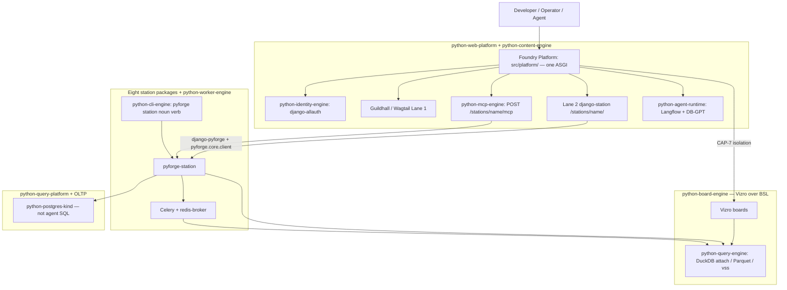
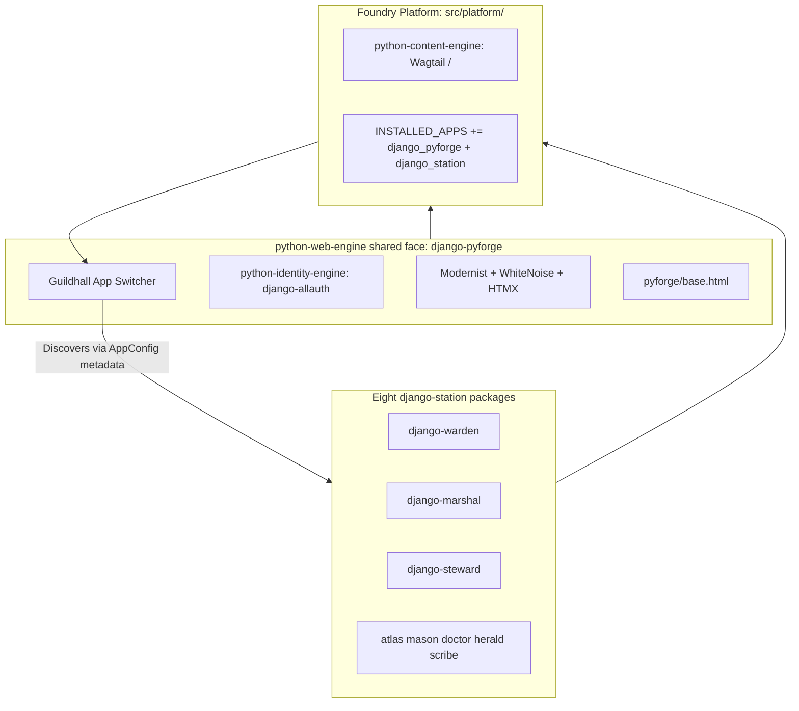
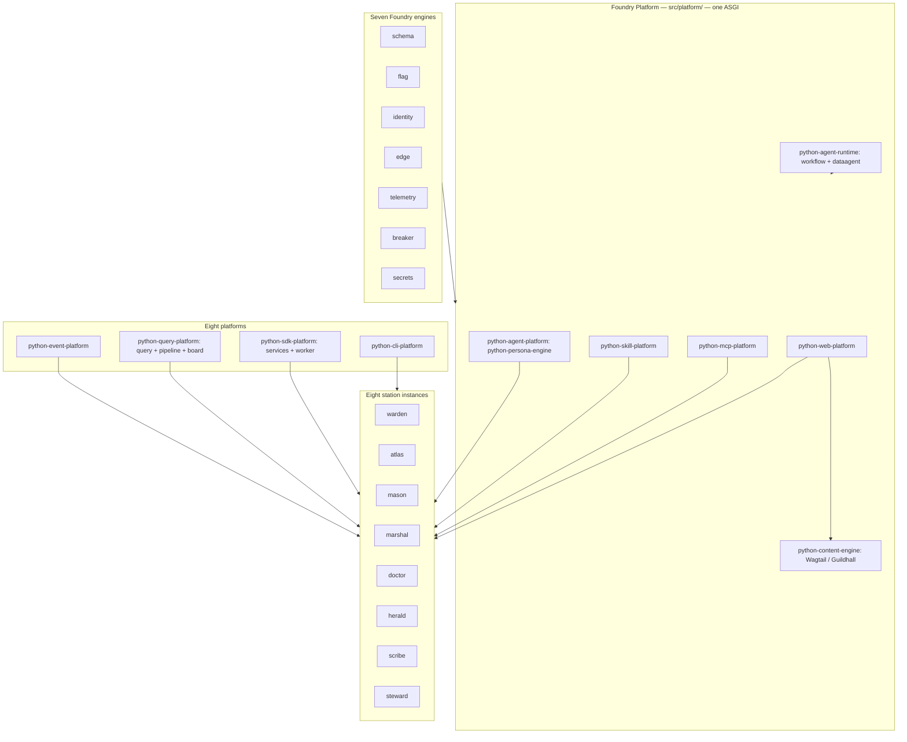
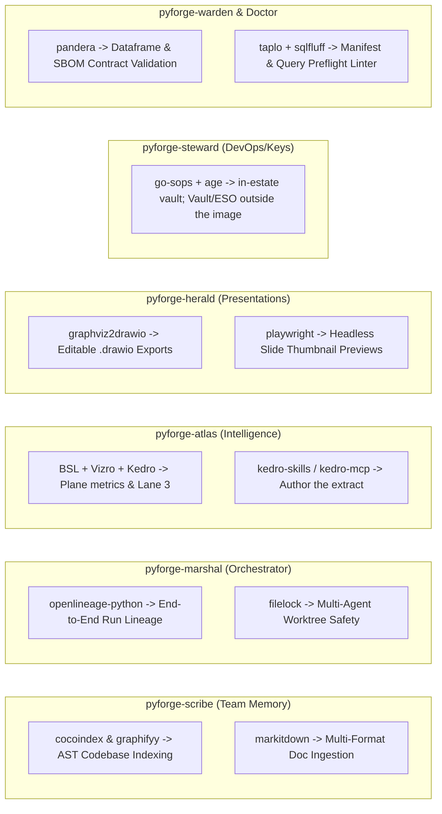

# PyForge Unifying Strategy — The 8-Station Hub-and-Spoke Foundry
## Grounding (2026-08-24)

This Dream was written as though Foundry Platform were greenfield. It is not. The grounding below
is **authoritative over the architecture prose that follows**, which was drafted before the
audit; where they disagree, this section wins.

**Owner: `steward`.** Foundry Platform (`src/platform/`) is not a ninth station and gets no project of its own —
Charter §5 stands, the roster stays at eight. Steward carries the through-line.

**The host already exists.** `src/platform/` is a live cookiecutter-django project with an
ASGI seam, `django-allauth` OIDC SSO, Langflow mounted as a pluggable app on an isolated
PostgreSQL schema (Pattern A), DB-GPT as a **Pattern B sidecar — never an ASGI mount, and its
state does not land in `dbgpt_schema`** (`config/asgi.py:69-70`; corrected 2026-09-09), warden's
portal mounted as **`django-warden`** (module `django_warden_fabric`;
`src/platform/compliance_face/` was **deleted** in `2394d850db`, not a husk), a Helm chart with an
OCP overlay, a Containerfile, and the 15-factor baseline. Steward epics 10, 11, 12 and 16 are
`done` end to end, including **`12-7`**, which **closed 2026-08-25** on attended CRC: Route / SCC /
official postgres:17 + redis:7 under assigned UID / PVCs Bound / Liquibase + `migrate --fake` /
`/ht/` **200** (dated record in the 12.1 spec orbit). CRC follow-through **closed
2026-08-26** — sidecar Ready, `platform_app` DML-only, MCP host sidecar, published `/`
**200**. Isolated `mfa` sqlmigrate stays fake. Optional: Story 12.9 CI when Actions
minutes return. Record: `sprint-change-proposal-2026-08-26-canopy-closeout.md`.

**Naming follows reality.** `pyforge_host` is a retired living name (never a package). The
shipped **mount** is Foundry Platform — `src/platform/`. The pixi **env id**
`[feature.python-agent-platform]` stays until a named rename story (lock + CI +
Containerfile). Do not mint a Django-root rename story.

**Eight stations, one Foundry Platform.** Earlier log entries count "9 stations" by including the host. The host is not a station: eight spokes (`warden`, `atlas`, `mason`, `marshal`, `doctor`, `herald`, `scribe`, `steward`) plus the mount they sit on. **Canopy / chrome / Human Canopy / Agent Canopy** are retired as product names (Guildhall = Lane 1 home page; Langflow/DB-GPT = `python-agent-runtime` engines).

**Two Specs, two CAP spaces — do not collapse the numbers.** This Dream’s chain
**extends** `spec-python-agent-platform`; it does not replace it. Cite host work as
**`pap:CAP-1`..`pap:CAP-6`** and **`pap:AD-1`..`pap:AD-17`**. Bare **`CAP-1`..`CAP-19`**
on Unifying Strategy are a different set (`django-pyforge` is Unifying `CAP-1`, not
the cookiecutter host). Table + `extends:` live in
`spec-pyforge-unifying-strategy/SPEC.md` and `convergence.md`.

| Qualified id | Host CAP | What it is |
|---|---|---|
| `pap:CAP-1` | parent CAP-1 | Cookiecutter Django host at `src/platform/` |
| `pap:CAP-2` | parent CAP-2 | Langflow Pattern A + `langflow_schema` |
| `pap:CAP-3` | parent CAP-3 | DB-GPT via `pap:AD-17` pattern switch (Pattern B today) |
| `pap:CAP-4` | parent CAP-4 | Celery; async never blocks Django |
| `pap:CAP-5` | parent CAP-5 | One factory-sourced env; Python `3.14.*` |
| `pap:CAP-6` | parent CAP-6 | Air-gap parity is a failing check |

**Single-Spec merge is parked, not forgotten.** Copy `pap:CAP-*` full text into Unifying
SPEC → retarget Epic 10–12 citations to `pap:CAP-*` / `pap:AD-*` → supersede
`spec-python-agent-platform` (`absorbed-into`). **Never** in the same stories: rename
the pixi env. Trigger: operators opening the wrong Spec for `src/platform/`. Until
then `extends:` is correct. Steward named story; not a silent fold.

**Scope is the residual, not the estate.** Mint nothing that duplicates `pap:CAP-1`..`6`.
The 2026-08-24 residual list below is **historical** — the canopy drain (steward Epics 18–32
plus eight peer process-hook stories) shipped most of it. Architecture mermaid still
describes a greenfield `services/` FastAPI farm; **Grounding + the architecture spine win.**

**Operator ruling 2026-09-09 — the line count is not a constraint on this file.** The ≤400-line
target from Story 43.1 (`SPEC.md:488`) is retired for the living Dream: a detailed evergreen
strategy that drives the project is worth more than a short one. The archive stays the home for
*historical* topology only, never for live strategy; `43.1`'s `historical-section-too-long`
finding keeps that meaning and is not a length cap. `bmad-correct-course` amends the Spec.

**Still open after the drain (do not re-mint shipped CAPs):**

- Steward **`12-7`**: **closed 2026-08-25** (`/ht/` 200). CRC follow-through **closed
  2026-08-26** — sidecar Ready, `platform_app` + CAP-9 DML-only proof, Liquibase
  `:17`/`:18`/`:19`, MCP host sidecar, published Lane 1 `/` **200**. Record:
  `sprint-change-proposal-2026-08-26-canopy-closeout.md`.
- RFC-5 — contrib + `liquibase` schema + `:17`/`:18`/`:19` are in the changelog and
  **EXECUTED** on CRC. Isolated **`mfa` sqlmigrate** is the only remaining fake.
- **Q5 measure set** — **published 2026-09-15** on sibling
  `docs/dreams/build-league-scorecard.md` + `spec-build-league-scorecard`
  (`ready`, steward Epic 62). Catalog:
  `_bmad-output/projects/pyforge-steward/planning-artifacts/specs/spec-build-league-scorecard/measure-catalog.md`.
  Do not invent metrics; cite `on` rows only. Not a Foundry SPEC OQ.
- **Single-Spec merge** — **parked** (Grounding table above). Keep `extends:` until a
  steward story copies `pap:CAP-*` into Unifying SPEC, retargets Epic 10–12, and
  supersedes `spec-python-agent-platform`. Do not rename `[feature.python-agent-platform]`.
- ~~**`lane1-serves-dw-h3`**~~ — **answered 2026-08-25: no.** Host Wagtail `/cms/` is not
  `LaSuiteClient` Docs REST. DW-H3 stays atlas attended bring-up.
- Pip-layer fold: `spec-platform-image-one-pixi-env` **shipped**. MCP pin isolation is
  `spec-mcp-era-isolation` slice 1 (sidecar). **`spec-mcp-era-isolation` CAP-4 / Epic 35** fail-louds the
  cluster overlay (`spec-35-1-cluster-requires-mcp-host.md`) — not this Dream's
  CAP-19. Slice 3 (retire ImportError skip) stays parked.
- **Do not build `services/` as nine public FastAPI processes.** MCP and portal compute
  mount on the host ASGI (`POST /stations/<name>/mcp`). That is the modular-monolith
  ruling, not a deferred microservice program.
- **This Dream is evergreen.** CAP-1..18 closeout (2026-08-26) is a dated
  realization of that slice, not the end of the Dream. Status is `specified`
  while new canopy contracts are in flight. Operator 2026-08-26: the SPEC may
  return to `in-progress`; rebuild of shipped stores is in scope.
- **Red-team CRITICALs are Epic 40 (2026-09-02).** The adversarial review
  (`_bmad-output/projects/pyforge-steward/planning-artifacts/research/architecture-review-pyforge-unifying-strategy-red-team-2026-09-02.md`)
  found two shipped CRITICALs: `/assertion/mint/` trusts an **unverified** IdP
  bearer (X-1), and `redis-broker` is `noeviction` with **no `maxmemory`** on
  `emptyDir` carrying queue + Streams + PEL + DLQ + applied keys (S-1). Bound as
  steward **Epic 40** (40.1 verified mint, 40.2 durable bounded broker) via
  `sprint-change-proposal-2026-09-02-red-team-critical.md`. **Dispatch before**
  any further story here and before cutover Phase 1. The review's HIGH set
  (R-4 … R-16) landed the same day as **Epics 41–43** (`sprint-change-proposal-2026-09-02-red-team-high.md`);
  R-17 … R-25 are `DW-RT-2026-09-02-1..9` in steward's deferred-work ledger. Order: 40 → 41 → 42 → 43;
  42.x depend on 40.x; all precede cutover Phase 1. **Closed:** 40.1 (verified mint,
  `django_pyforge/assertion/identity.py`) and 40.2 (durable bounded broker; the chart render
  hard-fails unless `maxmemory` < the memory limit) are shipped; 41–43 `done`; **43.7**
  (`sidecar-runtime-validation-on-python-3-14`, added 2026-09-08) is `backlog`. R-18..R-22
  (`DW-RT-2026-09-02-2..6`) remain `open` and, since Epic 45 went to eval-quality, owner-less.
- **Python floor.** **Decided 2026-09-02 (hybrid):** one interpreter `3.14.*` for every env
  once Mason 13.1 (`langflow-base` `onnxruntime <1.24`) and 13.2 (`dbgpt-client`
  `sqlalchemy <2.0.29`) land; steward **43.6** flips the pins. `mcp-host` stays — it isolates
  `mcp` 2.x from langflow's `mcp <2` pin, not the interpreter. **43.6 shipped 2026-09-03.**
  Measured matrix: § *Pixi environment matrix (measured)* below; regenerate with
  `python scripts/pixi_env_matrix.py --update --dream docs/dreams/pyforge-unifying-strategy.md`.
- **Cutover is under contract (2026-09-04).** Gate closed 2026-09-03 (40 → 43 `done`,
  Mason 13 `done`, 43.3–43.6 shipped). Plan: § *Cutover to `python-foundry`*. Spec:
  `spec-python-foundry-cutover` (`fnd:CAP-1`..`10`, extends this chain). Steward **Epic 44**.
  Phase 0 is outward and operator-confirmed; R-18..R-22 carry, never block. **Since 2026-09-08:**
  Epic 47 (`spec-bmad-suite-lifecycle` CAP-9) hard-gates 44.3 — *not flipped while any P1–P18
  readiness line is red* (`epics.md:2884`; today P2 = this Spec's own never-re-derive exception,
  "exception live"; P7 "violated"; P16 "undefined") — and 47.5 added `S-14.9` to 44.5's deps.
## How to read this Dream (2026-08-26)

Evergreen Foundry Dream. **Grounding** + **The Dream** (query plane) +
**High-Leverage matrix** + **Constraints** + **Cutover to `python-foundry`** +
**Where next** (the unification strategy, 2026-09-09) + `spec-pyforge-unifying-strategy` are
authoritative. Build-target mermaid only in the living file.

Historical 10-layer / `services/` / `:800x` illustration, sizing, station
reviews, extended Grounding (2026-08-30), fleet evidence, and realization
entries through 2026-08-24:
[`archive/pyforge-unifying-strategy-2026-08-23-topology.md`](archive/pyforge-unifying-strategy-2026-08-23-topology.md).

## The Dream

We move from a disparate collection of local tools to **one hub-and-spoke
Foundry**: **Foundry Platform** (`src/platform/`, one ASGI process,
`python-web-platform` + `python-content-engine`) and **eight station spokes**
(packages, not `:800x` processes). “Hub-and-Spoke” in this Dream means that
shape — not nine FastAPI microservices. We are not building disconnected apps;
we are building **one Foundry that mounts the eight canonical stations**,
powered by **`python-pixi-solver`**. The lasting git root is **`python-foundry`**
(workspace name `pyforge`); the recipe plant is **`factory/`** (own lock).

By placing a unified **Django + Wagtail** application at the center (CodeRed dropped
2026-08-24) and mounting station portals and MCP faces **on the same host ASGI**, we
keep identity (`python-identity-engine`), Guildhall, and dispatch in one process. Heavy
work stays on Celery (`python-worker-engine`) + Redis. The pre-audit `services/` FastAPI
farm is **not** the delivery shape (Grounding).

- **Foundry Platform (`src/platform/`):** identity (`django-allauth` OIDC/SSO), session, Modernist assets, Wagtail Lane 1, Lane 2 portals, `POST /stations/<name>/mcp`.
- **Station compute (packages + Celery, not `services/` processes):** domain logic in `pyforge-<station>` / `django-<station>`; the host does not import `pyforge.*`.

### The query plane

One hybrid HTAP query plane (CAP-19 / Epic 34): Kedro writes derived layers;
DuckDB is the only analytical engine (live read-only `ATTACH`, Parquet cache,
`vss` / HNSW); agents never get the OLTP DSN. Lane 3 is Vizro over BSL.
The three OQs (`query-plane-face`, `query-plane-catalog`, `query-plane-scribe-cutover`) were
answered 2026-08-26 and shipped as atlas Epic 20 + steward 34.5; the only residue is the
`scribe_schema` pgvector retirement decision ("dual-write for now").

## Django Reusable Apps & `django-pyforge`

The host follows Django’s reusable-app convention. Foundation is
**`django-pyforge`**. Identity is **`django-allauth`**. There is no La Suite
package on Foundry Platform.

## The 8 platforms (living topology)

> Replaces the 2026-08-23 “10 layers / 9 FastAPI `:800x` / 9 portal apps” drawing.
> That drawing is **historical**; do not implement it. Formula: `python-<role>-<class>`.

## High-Leverage Library Integration & Station Opportunity Matrix

An audit of the full repository catalog (`library-llms-full.md`) reveals installed
libraries that stations should **bind now** rather than re-pin. Scheduling authority
is `spec-pyforge-unifying-strategy/stack.md` § *Estate leverage — installed, bind now*
(2026-08-26). Kedro/Vizro/BSL sit on the same list as the original ten.

**Vault is a steward-profile adapter, not an in-app CAP-12 client** (`canopy:AD-19`).
`go-sops` + `age` remain the in-estate vault. `filelock` already guards Atlas
`atlas.duckdb` (`canopy:FR-27`); marshal/scribe still owe the same primitive.

1. **`cocoindex` & `graphifyy` $\rightarrow$ `pyforge-scribe`:** Fast AST graph extraction and incremental semantic code indexing (`pyforge scribe index`), linking codebase functions directly to the PRDs and Dreams that spawned them.
2. **`openlineage-python` $\rightarrow$ `pyforge-marshal` & `pyforge-steward`:** Emits standard OpenLineage pipeline events across the autonomous loop, tracking complete operational lineage (`Dream -> Spec -> Mason Build -> Warden Audit -> Steward Deploy`).
3. **`boring-semantic-layer` (BSL) $\rightarrow$ `pyforge-atlas`:** Certified metrics over the query plane (DuckDB) — `downloads_total` / `downloads_30d` and CAP-19 relations today — for Vizro and agents **without raw SQL** (UJ-6).
   3a. **Kedro family $\rightarrow$ `pyforge-atlas` (home):** `kedro` / `kedro-datasets` / `kedro-dagster` write and schedule derived layers. `kedro-skills` + `kedro-mcp` author them. Other stations may add extract *nodes*, not new Kedro projects (`canopy:AD-21`).
   3b. **Vizro family $\rightarrow$ Lane 3:** `vizro` is the runtime. `vizro-mcp` + `vizro-e2e-flow` author boards after 34.2. `vizro-ai` 0.4.2 is deprecated — no new work.

**Measured 2026-09-09** (`research/currency-review-pyforge-unifying-strategy-2026-09-09.md` § 1.8) —
this matrix is *opportunity*, not status. **Implemented:** cocoindex + graphifyy (scribe, opt-in
extras), the kedro family and vizro (atlas), playwright (herald), `age` (steward — `sops` was never
built), `filelock` (atlas only). **Implemented in a different station than named:**
`openlineage-python` (atlas, dormant; zero hits in marshal or steward), `pandera` (atlas,
dataframes; zero in warden), `graphviz2drawio` (an atlas prototype script; zero in herald). **Not
built anywhere:** `taplo` + `sqlfluff` (zero hits in any `.py`; doctor's 2026-08-26 retro records
"no story exists"), `markitdown`, `vizro-mcp` / `vizro-e2e-flow`, and `kedro-mcp` (architecturally
banned as load-bearing). Two BSL metric names formerly listed under item 3 exist nowhere in the repo.

**Measured 2026-09-12 (manifest-sync gap — a `library-llms-full.md` audit, but the inverse
finding: not "should bind," but "already bound, invisible to the chain").** Every `pyforge-*`
station has a **second, un-mirrored dependency manifest**: its own
`src/shared/packages/pyforge-<station>/pixi.toml` `[package.run-dependencies]` table (the one
`pixi-build-python` actually reads to build that station's conda package — kept in sync with the
station's own `pyproject.toml` by `tests/meta/test_manifest_sync.py`). Root `pixi.toml` — and
therefore `docs/reference/library-llms-full.md` and its `llms-full-check` detector, both of which
only ever read root `pixi.toml` — has no visibility into that second manifest at all. Cross-checking
all ten stations' own run-deps against root `pixi.toml` surfaced seven libraries that are real,
directly-imported, already-shipped station code (confirmed importable live in each station's own
env today, resolving only because the built package carries its own run-deps) yet never appear
anywhere in root `pixi.toml`: `packaging` (marshal, mason, warden), `jsonschema` (doctor, marshal,
warden), `psutil` (marshal), `attrs` (atlas), `packageurl-python` — imports as `packageurl`
(warden), `license-expression` — imports as `license_expression` (warden). (`filelock`, atlas's
existing use, is already tracked above as the "extend to marshal/scribe" adoption decision — a
different, forward-looking question from this one, which is about deps *already* adopted and
merely invisible.) This is a `regenerable-factory`-shaped blind spot: the two-layer detector/
reconciler loop that keeps `library-llms-full.md` honest was never told this second manifest
exists, so it cannot flag drift there — the exact "shipped but not in effect" pattern this Dream's
§ *Where next* / Epic 49 already names, applied to the dependency-truth surface itself. Fix is
two-part: (1) mirror the seven into root `pixi.toml` (`local-recipes` plus each owning station's
own `[feature.pyforge-<station>.dependencies]` block) and their `library-llms-full.md` entries;
(2) extend `scripts/llms_full_check.py`'s `manifest_deps()` to also walk every
`src/shared/packages/pyforge-*/pixi.toml`'s `[package.run-dependencies]` table, so this class of
gap is caught automatically going forward instead of requiring another manual audit.

### Capability checklist from the BaaS comparison (2026-09-05)

InsForge's feature list was used as a **checklist, not a shopping list** — every row was
first tested against what Foundry had already decided or shipped (seed Dream
`foundry-baas-capability-gaps`, folded here; `pap:AD-1` ruling in
`sprint-change-proposal-2026-09-05-ad-1-reopen`).

1. **Object storage for media — closed.** Parent AD-1 / canopy:AD-13 re-affirmed
   2026-09-05: Lane 1 media stays on the RWX PVC (mounted by all five platform
   Deployments; bound on CRC 2026-08-25). The only real gap was the unstated RWX
   storage-class prerequisite, now in canopy:AD-13.
2. **Realtime push — shipped (transport).** Operator ruling **2026-09-10**
   (Story 48.6 / red-team T-8): implement the `/ws/events/` pillar, do not
   delete it. `architecture-secure-live-dashboards-2026-08-09` stands:
   Django + Channels + Daphne + `channels_redis` as the optional extra
   `pyforge-steward[dashboard]`, on the `redis-broker` / `redis-cache` split
   (Story 20.2). **Shipped:** `EventsStreamConsumer` at `/ws/events/` on the
   host ASGI router (when `[dashboard]` is importable) tail-reads
   `pyforge.events` via non-group `XREAD`, verifies an RS256 assertion with
   audience `mcp:events`, and forwards CloudEvents whose `data.subject`
   matches the verified `sub` claim. HTMX badge UI remains future work;
   this slice is transport only.
3. **Baseline MCP tools per station — real work, not a generator.** Portals carry no
   domain models, so InsForge's schema-introspection premise does not transfer. Atlas is
   the proven official-SDK server (13 tools, Story 21.2); **porting Marshal's FastMCP
   server (7 tools) to the official SDK is the smallest next slice** (FastMCP is forbidden
   in the `mcp-host` sidecar); the other six stations have no tool server and get one
   only as per-station engineering. Human double-check owed: two research passes
   disagreed on whether the 2026-09-02 red-team HIGHs on this surface (anonymous
   `tools/list` / `initialize`; no rate limiting) are shipped — the code-level pass says
   yes.
4. **Django Admin as the generic "browse any table" console — open, unscoped.** Nothing
   in the estate uses Admin as a designed data-browsing capability; it is the
   zero-new-dependency answer to InsForge's React dashboard.
5. **Read-only human SQL console over the query plane — future.** Sits on the plane's
   optional HTTP/Arrow face once that face exists (`query-plane-face`); the "no raw SQL"
   rule binds agents, not an operator's ad-hoc query.

**Deliberately excluded:** a raw-schema auto-generated REST API (the curated, versioned
station contract is the design), payments, third-party edge-function deploys, and any new
self-run storage server as an in-cluster workload.

## Constraints / Non-goals

- **Not a fragile monolithic SPA.** Server-driven Django + HTMX + Wagtail +
  `django-pyforge`. Lane 3 is reverse-proxied Vizro, not a React analytics SPA.
- **Lane 2 vs Lane 3.** HTMX owns actions. Vizro owns deep visualization. Do
  not import Kedro or Vizro into Django views.
- **Zero heavy compute in Django views.** Blocking work is Celery + station
  packages, not a `:800x` process farm.
- **No station-domain models on `django-<station>`** (R-25 wording, 2026-09-09;
  `django_warden_fabric.ComplianceJob` is the recorded exception, with its own migrations).
  Portals are UI clients through `django-pyforge` / `pyforge.core.client`; `django-atlas`'s direct
  `pyforge.steward.dashboard` import is an allow-listed exception. The host's `config` /
  `platformapp` / `tests` never import `pyforge.*` (import-linter); `src/platform/ingest/`
  deliberately imports `pyforge.steward` (Story 12.8) and sits outside that contract. *(The
  Spec-side R-25 rewrite is still Story 44.2's.)*
- **Eight stations, five tiers on 03 only.** Foundry Platform is not a ninth station.
  New 01/02 work does not mint a portal/MCP/persona. Roster **declared complete
  2026-08-26** (Epic 37.1, 40/40). Mason skill = `conda-forge-expert`. A missing
  cell fails CI.
- **Lane 1 is Wagtail.** CodeRed is dropped.
- **One analytical engine (CAP-19).** No private DuckDB, Chroma, or OLTP DSN
  for estate knowledge or Text-to-SQL. BSL is the dashboard/agent SQL contract.
- **Kedro is required for new Atlas pipelines; not eight projects.** Atlas is
  the Kedro home. Warden is never re-templated as Kedro (Q8). `kedro-mcp`
  stays wrapped.
- **Infra kinds.** PostgreSQL + Redis + Kubernetes. DuckDB is a library/face.
  Vault/ESO stay outside the image. No MinIO as a fourth core kind
  (re-affirmed 2026-09-05; Lane 1 media is RWX, and a multi-node target names its
  RWX-capable storage class — `sprint-change-proposal-2026-09-05-ad-1-reopen`).
- **No bundled BaaS inside Foundry; no Vercel-shaped hosting.** Checked 2026-09-05
  (InsForge, with Supabase / PocketBase / Appwrite as controls): each duplicates the
  PostgreSQL, identity and MCP hosting the host already ships while breaking the
  infra-kinds lock, the single identity engine, the no-SPA rule and air-gap parity at
  once; Vercel runs Python only as short-lived functions (no Django / ASGI / Celery) and
  its platform is not self-hostable. Two shapes fit: a bounded standalone-station demo
  outside `src/platform/` (Scope B — InsForge for agent-nativeness, PocketBase for
  footprint), or a separate project that consumes `/stations/<name>/mcp` as tools
  (Scope C). Neither appears in the Foundry image, chart or infra-kinds list. InsForge's
  own footprint (bundled Stripe + Razorpay, a hardcoded OpenAI SDK, `posthog-js`
  telemetry, a custom Postgres image) is warden's lens if Scope B is ever piloted.
- **Bind installed pins; do not re-pin.** See `stack.md` § Estate leverage.

## Shared Data Contracts (`pyforge.core.client`)

Station APIs live at ``/stations/<name>/api/v<N>/`` (not bare ``/api/v1``). Example:
``PyForgeStationClient(station="warden").post("/compliance/check", …)``
→ ``/stations/warden/api/v1/compliance/check`` with ``X-PyForge-API-Version`` + Bearer assertion.

---

## Pixi environment matrix (measured)

<!-- pixi-env-matrix:begin lock-sha256=019f1fcc471ad5fe -->

Measured from ``pixi.lock`` (not a cross-minor solver benchmark). Regenerate with ``python scripts/pixi_env_matrix.py --update --dream docs/dreams/pyforge-unifying-strategy.md`` after lock changes.

| Environment | Python | Conda records | Platforms |
|---|---|---:|---|
| ``bmad-suite-full`` | ``3.14.*`` | 80 | ``linux-64`` |
| ``bmad-ui`` | ``3.14.*`` | 51 | ``linux-64`` |
| ``build`` | ``3.14.*`` | 240 | ``linux-64``, ``osx-arm64-min``, ``win-64`` |
| ``conda-smithy`` | ``3.14.*`` | 231 | ``linux-64``, ``osx-arm64-min``, ``win-64`` |
| ``dbgpt-sidecar`` | ``3.14.*`` | 404 | ``linux-64`` |
| ``default`` | ``3.14.*`` | 234 | ``linux-64``, ``osx-arm64-min``, ``win-64`` |
| ``detectors`` | ``3.14.*`` | 86 | ``linux-64``, ``osx-arm64-min``, ``win-64`` |
| ``gcloud`` | ``3.14.*`` | 146 | ``linux-64``, ``osx-arm64-min`` |
| ``grayskull`` | ``3.14.*`` | 245 | ``linux-64``, ``osx-arm64-min``, ``win-64`` |
| ``linux`` | ``3.14.*`` | 145 | ``linux-64``, ``osx-arm64-min``, ``win-64`` |
| ``local-recipes`` | ``3.14.*`` | 1,171 | ``linux-64``, ``osx-arm64-min``, ``win-64`` |
| ``mcp-host`` | ``3.14.*`` | 83 | ``linux-64`` |
| ``osx`` | ``3.14.*`` | 240 | ``osx-arm64-min`` |
| ``platform-ci-test`` | ``3.14.*`` | 356 | ``linux-64`` |
| ``platform-dev`` | ``3.14.*`` | 533 | ``linux-64``, ``osx-arm64-min`` |
| ``platform-object-storage`` | ``3.14.*`` | 27 | ``linux-64`` |
| ``pyforge-atlas`` | ``3.14.*`` | 465 | ``linux-64``, ``osx-arm64-min``, ``win-64`` |
| ``pyforge-ci`` | ``3.14.*`` | 121 | ``linux-64``, ``osx-arm64-min``, ``win-64`` |
| ``pyforge-container`` | ``3.14.*`` | 632 | ``linux-64``, ``osx-arm64-min``, ``win-64`` |
| ``pyforge-core`` | ``3.14.*`` | 42 | ``linux-64``, ``osx-arm64-min``, ``win-64`` |
| ``pyforge-doctor`` | ``3.14.*`` | 98 | ``linux-64``, ``osx-arm64-min``, ``win-64`` |
| ``pyforge-foundry-full`` | ``3.14.*`` | 669 | ``linux-64``, ``osx-arm64-min``, ``win-64`` |
| ``pyforge-guild`` | ``3.14.*`` | 234 | ``linux-64``, ``osx-arm64-min``, ``win-64`` |
| ``pyforge-herald`` | ``3.14.*`` | 141 | ``linux-64``, ``osx-arm64-min``, ``win-64`` |
| ``pyforge-marshal`` | ``3.14.*`` | 121 | ``linux-64``, ``osx-arm64-min``, ``win-64`` |
| ``pyforge-mason`` | ``3.14.*`` | 139 | ``linux-64``, ``osx-arm64-min``, ``win-64`` |
| ``pyforge-scribe`` | ``3.14.*`` | 117 | ``linux-64``, ``osx-arm64-min``, ``win-64`` |
| ``pyforge-scribe-pg`` | ``3.14.*`` | 126 | ``linux-64``, ``osx-arm64-min`` |
| ``pyforge-steward`` | ``3.14.*`` | 94 | ``linux-64``, ``osx-arm64-min``, ``win-64`` |
| ``pyforge-testing-kit`` | ``3.14.*`` | 52 | ``linux-64``, ``osx-arm64-min``, ``win-64`` |
| ``pyforge-warden`` | ``3.14.*`` | 166 | ``linux-64``, ``osx-arm64-min``, ``win-64`` |
| ``python-agent-platform`` | ``3.14.*`` | 507 | ``linux-64``, ``osx-arm64-min`` |
| ``site`` | ``3.14.*`` | 121 | ``linux-64``, ``osx-arm64-min``, ``win-64`` |
| ``vuln-db`` | ``3.14.*`` | 244 | ``linux-64``, ``osx-arm64-min``, ``win-64`` |
| ``win`` | ``3.14.*`` | 297 | ``win-64`` |

<!-- pixi-env-matrix:end -->
## Fleet conventions (one vocabulary)

Contract is Grounding (2026-08-30). Ten-row evidence table:
[archive § Fleet conventions](archive/pyforge-unifying-strategy-2026-08-23-topology.md).

## Living names (`python-<role>-<class>`)

Formula: `python-<role>-<class>`. Full map:
[archive § Living names](archive/pyforge-unifying-strategy-2026-08-23-topology.md).
Destination: **`python-foundry`**; mount **`src/platform/`**; eight stations.

## Cutover to `python-foundry` (build target, 2026-09-04)

> **Read the current state first.** This section is the 2026-09-04 plan, kept as history. The
> contract moved on 2026-09-13 (regenerate, not fold — Epic 54; 44.4 / 44.5 / 44.6 parked) and
> again on 2026-09-25 (no archive of A — `fnd:CAP-7` / 44.10 retired). The state at 2026-09-25 and
> the execution plan that follows from it are in § *Where next* → *Consolidation — 2026-09-25*;
> the live contract is `spec-python-foundry-cutover`.

**Ruling.** The gate on this cutover (Epics 40 → 41 → 42 → 43, Mason 13.1 / 13.2) closed
2026-09-03 — "Then cutover Phase 1 may start." Until this section nothing sat downstream of
it: the phase table was filed in the archive under "do not build", with no Spec capability,
epic, or story. **The first step is the contract, not the repo:** this section →
`bmad-spec` derives **`spec-python-foundry-cutover`** (`extends:
spec-pyforge-unifying-strategy`; CAP space **`fnd:CAP-1`..`fnd:CAP-10`** (one per phase, plus 8–10 from iterations 2–4) — a
third space beside `pap:` and bare Unifying `CAP-*`, never collapsed) →
`bmad-correct-course` mints steward **Epic 44**. Creating the GitHub repo is the first
*dispatch*, operator-confirmed at that moment, never auto-drained.

**Decisions (operator, 2026-09-04).** Foundry is a **fresh empty repo**: history stays in
archived `local-recipes` at a pinned SHA, the move-list records source SHAs, the deferred
secret-leak rewrite is left behind by construction. Red-team MEDIUM band: **R-17** is Phase 3
(44.7); **R-23 / R-24 / R-25** fold into 44.2; **R-18..R-22** stay open ledger entries owned
by steward ("Epic **48** candidate" — 45–47 went to eval-quality and the bmad-suite lifecycle; the
five `DW-RT-2026-09-02-2..6` entries still say 45 and are owner-less until re-pointed) and never
block Phase 1. The evergreen Spec is not
re-derived: its SPEC.md is hand-edited past its memlog and `bmad-spec` is its single writer.

| Phase | Story | Do | Done when | Gate |
|---|---|---|---|---|
| — | **44.1** move-list manifest | derive every tracked path → target-tree destination, `stays`, or `dies`, from the spec-surface map; never a hand list | 100 % of tracked files resolve to one destination; source SHA recorded | — |
| — | **44.2** document fixes | R-23 `readOnlyRootFilesystem` + Windows / free-threading claims aligned to the Containerfile and `pixi.toml` platforms; R-24 Keycloak `26.4.0` pinned once; R-25 "no station-domain models on `django-<station>`"; `stack.md` / `convergence.md` **and `SPEC.md:73`, `:315`** floor `3.12.*` → `3.14.*` | edits land; `DW-RT-2026-09-02-7/-8/-9` resolved | — |
| 0 — Open foundry (`fnd:CAP-1`) | **44.3** | create `rxm7706/python-foundry`, workspace `pyforge`, empty of recipes, lean `pixi.toml`, estate-only CI; `environment.yaml` export automated or not carried, never by hand (R-17a) | clone exists; CI green on the empty estate | **outward** — ledger `blocked` until the operator flips |
| 1a — Fold the packages (`fnd:CAP-2`) | **44.4** | `src/shared/packages/` → `src/packages/`; a `pixi.toml` per `django-*`; drop `sys.path` inserts and Containerfile `COPY` of django src; `five_tier.py` `_packages_root` retargeted; package fold **only** | station envs solve; the host boots in foundry | deps 44.1, 44.3 |
| 1b — Move the estate (`fnd:CAP-2`) | **44.5** | skills → `skills/` (`stations/`, `personas/`, `domain/`), `.claude/skills/` + `.cursor/skills/` as symlink adapters; BMAD, decks, dreams | adapters are symlinks; the BMAD chain resolves in foundry | deps 44.4; never blended with 44.4 |
| 2 — CFE comes home (`fnd:CAP-3`) | **44.6** | authoritative skill / scripts / tools → `skills/domain/conda-forge-expert`; retros land in foundry; `pyforge/mason/resolve.py` chain (flag → `MASON_CFE_ROOT` → cwd walk) retargeted | no `MASON_CFE_ROOT` resolves to `local-recipes`; `mason-cfe-surface-check` + `cfe-rebuild-guard-check` pass | **Mason** (Rules 1 + 2); deps 44.5 |
| 3 — Factory island (`fnd:CAP-4`, R-17b) | **44.7** | `factory/pixi.toml` + own lock; `factory/recipes/`, `build-locally.py`, `.ci_support/`, `conda-forge.yml`; recipes-only CI on `paths: factory/**` | `mason recipe build factory/recipes/…` matches today's CFE wrap; `DW-RT-2026-09-02-1` resolved | deps 44.3 |
| 4 — Working set (`fnd:CAP-5`) | **44.8** | move in-flight + sole-maintainer recipes only | `factory/recipes/` is the working set; the `recipes/` universe (7,873 dirs at 2026-09-09 — measure at dispatch, never a frozen literal) was not copied (count ceiling asserted) | deps 44.7 |
| 5 — Mason → conda-forge (`fnd:CAP-6`) | **44.9** | `submit` → staged-recipes or bot fork; `update` → feedstock maintainer-edit | an agent PR never opens `local-recipes` (asserted on the submit path) | **outward + Mason**; deps 44.6, 44.8 |
| 6 — Archive (`fnd:CAP-7`) | **44.10** | README superseded; disable Azure; pin last SHA; keep history; retire any worktree residue (the 2026-09-04 figure of 268 registered / 85 GB was swept 2026-09-05 — 10 remain, 8 KB; `DW-HYGIENE-2026-09-05-1`) | default clone is foundry; `.steward` has one git root | **outward, irreversible**; deps all |

**Order.** 44.13 → 44.1 ∥ 44.2 ∥ 44.15 → **Epic 47 P1–P18 all green** → operator flips 44.3 → 44.11 ∥ 44.12 → 44.14 → capability
realization in dependency order (moves replay, rebuilds drill) → **flag flip** when its dependencies
are verified → 44.6 ∥ 44.7 → 44.8 → operator flips 44.9 → operator flips 44.10. Marshal's `Deps:` parser is station-local, so the Mason
gate on 44.6 / 44.9 is ledger state, as 43.6 was behind Mason 13. Before any ledger write:
**do not run `sprint-ledger-sync --repair-feed` until `scripts/promote_sprint_status.py` guards
`blocked`** — as of 2026-09-09 it guards only `done`, the Tier-3 feed holds all 15 Epic 44 rows at
`backlog`, and `--repair-feed` therefore writes those over the 14 `blocked` rows in the tracked twin
(`research/currency-review-pyforge-unifying-strategy-2026-09-09.md` § 0; it happened once already,
`be0a29b320`, open two days). A *bare* sync refuses today only because 47.5 reads `done` / `blocked`
across the pair. The feed reaches Epic 47, not 38. Then `story-status-check`.

**Regenerative, not a move (operator 2026-09-04, iteration 3).** Dreams and memlogs are the only
unconditional move; every rendered Spec, spine and epic is re-derived in foundry. Every capability
is realized there by **rebuild** (a regeneration drill with the archive as oracle) or by **move**
(a replay), decided per capability on scored signals, with `retire` for what no Dream wants
(`fnd:AD-20..22`, `fnd:CAP-9`; Stories 44.13 memlog fidelity, 44.14 rebuild harness). This is the
regenerable-factory drill at estate scale, and foundry's first fleet run is its own construction.

**Private and metered (operator 2026-09-04, iteration 4).** Foundry is private, permanently:
Pages and the win-64 leg ride the paid plan, so Actions minutes are a standing budget. `fnd:CAP-1`'s
CI evidence is a real green run — GitHub-hosted, then the remote Linux dev host as self-hosted
fallback; a fresh-clone run of the estate gates is provisional only; with no evidence path 44.3
does not dispatch (`fnd:AD-23`). Story 44.15 meters the account's Actions minutes through
`steward budget check` (`fnd:CAP-10`) so the dispatch, Marshal's drains and the rebuild harness
read a real ceiling. Nothing Mason submits carries a foundry URL. No open question remains.

**Flag-gated and regenerable (operator 2026-09-04, iteration 2).** The cutover is a flag,
not a date: `pyforge.cutover_root` in the CAP-13 flag tree names the root of record; the
transition point is its flip, after 44.5 today, and flipping back is the rollback. Until then
this repo evolves normally; the plan is regenerated from scratch or appended with the delta at
will, and every move is a replay into foundry (`fnd:AD-17`, `fnd:AD-18`). Stock Windows
developers get a native estate through generated junction links and a remote host (`fnd:AD-19`);
Stories 44.11 and 44.12 carry both.

**Solutioning first (operator 2026-09-04).** BMAD Phase 3 only: the Spec, the cutover
architecture spine (`architecture-python-foundry-cutover-2026-09-04`, cite `fnd:AD-n`)
and Epic 44 are solutioning artifacts under review; the operator iterates on them before
any implementation. Every 44.x is held ledger `blocked`; the flip to `backlog` is the move
into Phase 4, story by story. No story spec is drafted until then.

**Never.** No `services/` / `:800x` tree. The estate `pixi.lock` never absorbs the factory
solver farm. Graphify move-list and package fold never in one story. No `CAP-20` in the
evergreen Spec. The archive's phase table is the record of where this came from, not a
second copy to maintain.

## Where next — the unification strategy at 2026-09-09 (consolidated 2026-09-25)

Written from the currency review (`research/currency-review-pyforge-unifying-strategy-2026-09-09.md`)
after 384 commits and 13 PRs. The review's deepest finding is not any stale line. It is a pattern.

### The finding that unifies the estate: shipped is not in effect

Across the Foundry, capabilities ship as passing mechanism and never take effect. Verified live:

| Where | Ledger says | Reality |
|---|---|---|
| Marshal token economy (Epic 28) | 24/24 `done` | Every context layer off; the pinned benchmark never run; three of five layers cannot apply on `factory spin` |
| Adaptive model tiering (FR-51) | Dream `realized` | Fed on 2 of 8 stations since 2026-08-13 (marshal and atlas carry a `model_tier_map`; 57 story specs declare a `difficulty:`; live dispatch journals resolve a model). Six stations still resolve `model: null`, and the Story 3.12 retry floor-raise runs only on `factory spin`/`resume`, never on `factory dispatch`, the live engine since 2026-08-22. *(Row corrected 2026-09-09; the first draft repeated a stale README claim.)* |
| Unifying CAP-17 (run state as a service) | `done` | Supervisor built; marshal has zero imports of `django_pyforge` and still reads `~/.bmad-loops` |
| CAP-7 (analytics behind the front door) | `done` | Isolation test excellent — against a 5-row in-process fixture; the real Vizro board is *asserted absent* from the host |
| CAP-10 (failure is contained) | `done` | BS-4 circuit breaker and BS-8 reconcile have zero production consumers |
| CAP-4 (station service face) | `done` | `start`/`get` on 2 of 8 stations; no disconnect test |
| CAP-11 (queue ≠ cache) | `done` | Chart split real; the named eviction criterion has no test; no HPA |
| CAP-12 (revocable access) | `done` | `IDP_USERINFO = None` in the deployed default → revocation lands next *login*, not next request |
| CAP-14 (Scribe graph) | `done` | "Semantic" recall is a 32-dim embedding over a hardcoded 7-entry synonym map; the promised dual-write selects one plugin |

**Root cause.** The Dream-to-Code chain's definition of done is *story merged, tests green*. That
verifies the **mechanism** and never the **effect**. A ledger row reads `done`, a Dream flips to
`realized` as bookkeeping, and nothing asks whether the thing is switched on, fed, or measured.
The token-economy Dream wrote the right gate — "measurement first, before any layer ships" — and
Epic 28 shipped every layer without it. Adaptive-model-tiering was marked `realized` the day its
code landed. The estate is very good at building and has no discipline for *taking effect*.

This is precisely what the Intelligence Hub vocabulary names and what this Dream has been missing:
an **outcome Guard** (does the capability produce its stated effect?), a **Gate** on effect rather
than on merge, and a **Track** that records what actually ran. The two threads are one.

### The realization gate — a new definition of done

A capability is `realized` when its success criterion is **exercised in the running estate**, not
when its last story merges. Concretely, and nothing more than this:

1. **A verified column on every Spec capability.** Which clause of its success criterion has a live
   exercise — a benchmark artifact, a deployed check, a measured number — and which is only tested
   against a fixture. Realized-versus-verified, per CAP, in the contract itself.
2. **An effect check beside `story-status-check`.** Doctor-owned, advisory, reads the verified column
   and reports capabilities `done` in the ledger but unexercised in effect. Never a second PR verdict.
3. **Dreams flip to `realized` on effect, never on ledger bookkeeping.** The token-economy Dream
   already carries this guard; it becomes the rule.

The evergreen Spec forbids `CAP-20`, and rightly — new capabilities belong on extending Specs. The
realization gate is the accountability plane made concrete, so it lands as **`hub:CAP-*`** on
`spec-intelligence-hub` (`extends: spec-pyforge-unifying-strategy`), and the intelligence-hub
alignment stops being a vocabulary exercise and becomes the estate's missing discipline.

### The convergence map — five threads, one destination

| Thread | Vessel | State 2026-09-09 | Gate | Lands |
|---|---|---|---|---|
| Cutover to `python-foundry` | steward Epic 44, `fnd:CAP-1..10` | 14 `blocked`, 44.13 `backlog` | Epic 47 P1–P18 green, then operator flips 44.3 | foundry |
| BMAD suite cutover-ready | steward Epics 46–47, `suite:` | 47 is 5/5 `done`; P2 / P7 / P16 red | P-lines | local-recipes, pre-flip |
| Hub alignment | `spec-intelligence-hub`, `hub:` (candidate) | `draft`; seven shapes, none chosen; recipes for shape 5 landed 2026-09-07 | operator's reading of "align" | Dream + memlog now; runtime foundry-side |
| Token-economy enablement | marshal Epic 33 (to mint) | built 24/24, every layer off | the off-leg benchmark | local-recipes — marshal-local, needs nothing from foundry |
| Red-team residue + realization gate | steward Epic 48 (to mint) | R-18..R-22 `open` and owner-less; six CAPs unexercised | `bmad-correct-course` | local-recipes |

**Order.** The syncer fix first — it is a live hazard on irreversible operations and independent
of everything else. Then `bmad-correct-course` mints Epics 33 and 48 and amends the Spec (the
line-count constraint, a dated Residual block, the CAP-axis namespace pass, the verified column).
Then the marshal-local and steward-local work drains in `local-recipes`, because none of it waits
on foundry. Then Epic 47's P-lines go green and the operator flips 44.3. Foundry's first fleet
run — its own construction — is where the hub runtime pieces (the `nebariapp.yaml` template, the
NIC profile, the Track store, the Op manifest runtime) are built once rather than moved.

### What the Foundry becomes

The eight-station hub-and-spoke Foundry, unchanged in shape, now described in the Hub's terms
because the vocabulary is deliberate rather than accidental:

- **Frames** are the context tier: the `AGENTS.md` verified block → station personas → story
  specs, inheriting downward; git is the store; **Frame Spec v0.3** is the interchange
  (working draft, openteams-ai/frame-spec#28; adopted by steward Stories 53.5/53.6 — identity
  is the qualified-ref `identifier`, not a four-field v0.2 shape).
- **Cogs** are the eight stations as skills plus personas, harness-agnostic by the Portability
  contract. The model and the harness are rented; the context, workflows, checks and evidence are
  owned. That split is stated, not assumed.
- **Ops** are bmad-loop runs and factory dispatches, each with a declared validation strategy —
  the Op manifest is the marshal policy's validation block — and autonomy granted per engagement.
- **Guards** are the ~30 detectors and Warden's hook-spec plugins, each with one of the seven
  categories, so a Spec can name which categories it lacks (today: source-grounding, outcome).
- **Gates** are Warden's single verdict, operator confirmation, and the realization gate above.
- **Tracks** are one structured record per run with stated retention — the convergence of
  `state.json`, landing evidence and memlogs — and the same seam CAP-17's supervisor needs.
- **Organizational Memory** is Scribe's `GraphStore` on the query plane.
- **Layer 1** is a deployment profile beneath the Foundry — OCP today, NIC a candidate beside it —
  never the Foundry replaced. PostgreSQL and Redis stay in-chart; the infra-kinds lock holds.
- **The loop's diet** is the token economy switched on, measured, and drained on dispatch.

Nothing here reopens the modular-monolith ruling, the infra-kinds lock, the one-verdict rule, the
eight-station roster, or the no-`CAP-20` rule. It changes what *done* means.

### Decisions the operator owns

1. **The reading of "align"** — vocabulary only, the artifact model on the existing stack, or Layer 1
   as a NIC profile as well. It shapes what `hub:` carries and whether shapes 6–7 exist.
2. **Which station goes first on the token economy.** Marshal is the natural candidate: it owns the
   instruments and a bad result hurts no other station's drain.
3. **Where the realization gate lives** — `hub:CAP-*` as proposed, or its own Spec.
4. **Epic 48's scope** — R-18..R-22 alone, or with the six unexercised CAPs bound as effect stories.
5. **The Single-Spec merge** — mint the story now, or let foundry's regeneration drill consume the
   `extends:` chain as-is. The Dream has said "a steward named story, not a silent fold" since
   2026-09-01; the cutover makes it due.

### Fleet readiness pass — 2026-09-09

Eight read-only agents graded **all 96 live Dreams** against live code at `main` `fe4025ea90` under
this section's own realization gate; the operator approved the resulting decision batch in full.
Record: `_bmad-output/projects/pyforge-steward/planning-artifacts/research/fleet-readiness-decision-batch-2026-09-09.md`.

Headline: **the fleet is built; it is not switched on.** Across six of the eight stations the pass
found **eighteen** capabilities of the `marshal-token-economy` shape — a `done` epic whose named
success criterion has never been exercised in the running estate — and only six of them (this
chain's own CAPs) had a vessel before today. So **Epic 49's realization gate widens from the
Unifying CAPs to the station satellites**: the effect stories land on each **owning station's**
epics (marshal Epic 33; atlas, herald, mason, scribe each a small epic), and steward Epic 49 carries
only an **index row per station** so one board shows the gate — the alternative, hanging twelve
foreign surfaces off steward, is the exact `spec-surface-check` hazard the pass was told to avoid.
Story 49.2's effect check gains the cheapest test the pass found: **"has a caller outside its own
test file."** Three decisions of operator-decision 1–5 above are now taken: the reading of "align"
is reading 2 with reading 1 folded in (shape 6/7 `foundry-side`); the realization gate stays here
and re-homes to `hub:CAP-*` once `spec-intelligence-hub` — flipped `draft` → `ready` in this pass —
is re-derived; and the Single-Spec merge is minted now, as Story 48.8, before any 44.x flip.

### Consolidation — 2026-09-25: one laptop SBOM, one control plane, one instruction surface

**Direction (operator, 2026-09-25).** Three open PRs and one pasted whitepaper arrived beside the
chain instead of through it: #1563 (rewrite `AGENTS.md` for PyForge + the BMAD Agentic-SDLC),
#1564 (`pyforge-foundry-full` as the laptop SBOM, with its own Dream file), #1576 (the estate
dossier as the A→B cutover control plane, with its own Dream file), and *Architectural
Specification and Execution Paradigms of the BMad Method*. They are folded here in **one PR**,
which supersedes all three; the PRs close when it lands. This section is that PR's Dream step.
The same PR carries the chain to *ready for execution* — `spec-python-foundry-cutover` gains
`fnd:CAP-12..15` and retires `fnd:CAP-7` through `bmad-spec`; steward Epic 67 decomposes them;
herald and scribe each take the story on the surface they own — and stops there. Nothing is
implemented. A full second review on a different model precedes any merge or dispatch.

**Why here and not in two new Dream files.** #1564 and #1576 each carried a complete steward-owned
Dream (`pyforge-foundry-full-sbom.md`, `pyforge-estate-whitepaper.md`). Under the one-chain lock
(`chain-sprawl-check`; `CHAIN-STANDARD.md` § 9) an unexempted satellite on a PR is rewritten as a
dated section on the owning Dream and the extra file is dropped. Their substance is below; the
files do not land. The whitepaper is kept whole, every claim checked against the installed
skills, in `research/technical-pyforge-unifying-strategy-bmad-method-whitepaper-2026-09-25.md`
(steward). The four operator rulings are in § *Operator rulings* below; the dispatch order is in
§ *The execution plan*.

#### Where the estate is (measured 2026-09-25, `main` `5ab472318b`)

§ *Cutover* above is the 2026-09-04 plan. The contract moved on 2026-09-13 and the Spec was
re-derived; this Dream was not, until now.

- **Epic 44:** 44.3 (foundry opened 2026-09-13, epoch `6e0607b530`), 44.7 (factory island),
  44.12 (cutover flag and replay harness), 44.13 (memlog fidelity) `done`; 44.4 / 44.5 / 44.6
  `backlog` and **parked** — never dispatched; 44.1, 44.2, 44.8, 44.9, 44.10, 44.11, 44.14, 44.15
  `blocked`. `pyforge.cutover_root` = `local-recipes`.
- **Regenerate, not fold** ([[foundry-regenerate-not-fold]], `fnr:CAP-*`): Epic 54 is `done` —
  `pyforge-core`, steward and marshal rebuilt under B's `src/packages/` against the 54.1 thin
  oracle; 54.5 put the A/B protocol on B (B writes foundry-product Dreams, Frames and Specs; A
  pins — B's `PIN.md` cites contract `local-recipes@9e9f685`). CFE is rebuilt from Specs, not
  moved. The table's "Fold the packages" and "Move the estate" are superseded wording.
- **Capability ledger** ([[foundry-capability-ledger]], Epic 55): `docs/foundry/capability-ledger.yaml`
  holds 907 rows at `5ab472318b` (911 once this PR adds `fnd:CAP-12..15` as `A-only`) — 815
  `rebuild`, 87 → 91 `A-only`, 5 `retire` (one of them `fnd:CAP-7`, a withdrawn contract id, not
  B-side retirement work); `never_move: true`; no row yet claims `verified-in-foundry`. Frames: company + eight stations at Frame Spec v0.3 (Epics 53, 64).
- **B (`python-foundry`):** private; `main` last merged 2026-09-14; three packages; `docs/foundry/`
  carries `PIN`, `SPEC`, `ab-sync`, `case-list`, `modes`, `renovate` and the Frames. Its open
  PR #19 is #1563's companion (the same behavioural block on B).
- **`pyforge-foundry-full`** (Story 63.5, `spec-pyforge-steward` CAP-151): the union of every
  station feature for dependency closure, `no-default-feature`, never installed by default
  (`AGENTS.md`); locked on linux-64 (680 packages), osx-arm64 (646), win-64 (629).
- **Fleet:** both drains stopped by operator decision 2026-09-25, not exhaustion. Cross-station
  parallel dispatch is still bounded by one BMAD marker per working tree (`MRS-DISP-041`, seeded
  on [[pyforge-marshal]] 2026-09-25).
- **Repo size:** 285 MB tree / 299 MB packed, decks 47% (Realization log, 2026-09-25 seed). With
  44.5 parked, whether decks cross to B at all is a ledger-mode question (`deck-carriage`,
  below), no longer a 44.5 filter.

#### Input 1 — the laptop installs one environment (PR #1564, seeded 2026-09-21)

A developer laptop runs `pixi install -e pyforge-foundry-full` and from that environment alone
launches the stations, generates and builds recipes locally, runs tests, lint and the local CI
mirrors, and brings up the platform's local stack (PostgreSQL + pgvector, Redis, object storage)
through features that already exist. The fat `local-recipes` feature is a historical pin dump,
not the SBOM. **If the laptop still needs it, the SBOM is incomplete — that is a ticket, not a
compose line.**

- **Inclusion rule:** in if PyForge code uses it or a PyForge developer or operator workflow
  needs it; out otherwise, even when `local-recipes` pins it today. Never compose `local-recipes`;
  no `desktop-lab` kitchen sink.
- **Constraints (operator, 2026-09-21):** PostgreSQL major **17** (`>=17.11,<18`); keep
  `platform-dev`; hold libpq 17 by capping psycopg and pgvector below the first builds that need
  libpq 18 (#1564 wrote `psycopg <3.2.10` / `pgvector <0.8.2`; the lock shows psycopg 3.2.10
  already on libpq 17.11, so 67.1 measures the boundary — psycopg-c 3.3 today — before pinning),
  never by bumping Postgres; never push a stub or placeholder `pixi.toml` to test write access —
  it happened twice on 2026-09-21 and reddened CI.
- **Campaign map:** (1) the BoM core — `build`, `grayskull`, `crm`, `platform-dev`,
  `platform-object-storage`; residuals `conda-smithy` (py-rattler / conda co-solve) and
  `python-agent-platform` (langflow vs pandas / onnxruntime) stay in their own environments
  meanwhile; (2) a checkable SBOM and a laptop gate; (3) a disposition for every gap and fat-only
  pin; (4) point CFE, `AGENTS.md` and Mason at the SBOM; (5) close the conda-forge gaps.

Found while folding — none of it is in the PR:
- **The compose shrinks the SBOM to one platform.** An environment's platforms are the
  intersection of its features': `platform-object-storage` is linux-64 only and `platform-dev`
  linux-64 + osx-arm64, so #1564's lock resolves `pyforge-foundry-full` for **linux-64 alone**
  (734 packages) where `main` resolves three. A Mac or Windows laptop could no longer install it.
- **PG17 is not true on `main`.** `scribe-pg` pins `postgresql >=18.3,<19` and `pgvector >=0.8.6`
  on purpose: scribe's `psycopg >=3.3.4` pulls psycopg-c, which needs libpq ≥18.3 (the
  `pixi.toml` comment says so). `mcp-host`, `platform-ci-test` and `pyforge-scribe`
  (`psycopg >=3.3.4`) also resolve libpq 18.6. `python-agent-platform` and `platform-dev`, though,
  already solve psycopg 3.2.10 on libpq 17.11 (measured in the lock, review pass 2026-09-25) — so
  the libpq-18 boundary is psycopg-c 3.3, not the 3.2.10 #1564's text claimed. Only the PR branch
  carries caps, and its `doctor-test` was red at fold time.
- **It changes an existing contract.** CAP-151 / Story 63.5 define `pyforge-foundry-full` as
  closure-only and never installed by default; #1564 makes it the default laptop install.

#### Input 2 — the dossier is the cutover's control plane (PR #1576, seeded 2026-09-21)

The PyForge dossier (`docsite/content/dossier.yml`, on [[pyforge-herald]]'s Spec surface — the
`pyforge-pages` Dream was absorbed into it 2026-09-17) states the A→B
cutover as control-plane fact for operators and Smiths — not a forensic inventory of A, and not a
vision deck. A (`local-recipes`) is control plane and oracle, root of record until
`pyforge.cutover_root` flips; B (`python-foundry`) is the lasting root, its engines rebuilt from
Frame + Spec. Modes `rebuild` / `retire` / `A-only` / `B-only`, never `move`; a long-lived
mirror of A on B is out of contract. Each campaign verb gets a done / not-done line: *Launch* =
the regenerated kernel runs, not "A's tree arrived"; *Adopt Frames* = company + eight station
Frames pass preflight, not a copy list of A paths; *Build the Intelligence Hub* = its objects
invented on A first; *Wire the BMAD-suite* = re-provisioned from the adoption register. SBOM
claims are labelled **A-side**. A *Verified* section shows only what the case list, the
capability ledger and CI actually prove.

Most of this restates [[foundry-regenerate-not-fold]], already `specified`. What the seed adds is
the claim surface: the dossier becomes the one place the cutover's state is read, and each claim
in it cites a ledger, case-list or CI source.

#### Input 3 — the instruction surface names the estate first (PR #1563)

`AGENTS.md` opens with what this repository is — A, the PyForge control plane and BMAD
Agentic-SDLC host, with the recipe factory as one cell rather than the product — then the A/B
roles, modes and writer lock, then a short behavioural core; the ~500 lines of accumulated
incident notes become pointers. `CLAUDE.md` shrinks to `@AGENTS.md` plus Claude-only notes. The
behavioural additions beyond today's five principles: *heal the tissue you touch* (no broken
window left as "pre-existing" — already team memory
`pre-existing-findings-fix-now-is-the-default`); *state over action* when a harness drives;
harness-owned ledgers are read-only; implementation and adversarial review never run as one
persona in one session.

Why the draft does not merge as written:
- The managed `bmad:context` block is refreshed only through `bmad-project-context`, and scribe's
  parity meta-test (`spec-pyforge-scribe` CAP-27) reds a duplicated section or a missing
  pointer. A hand rewrite bypasses both.
- Its status vocabulary (`todo → review → done`) is not the worker's (`draft → ready-for-dev →
  in-progress → in-review → done`; research file § 1, claim 3).
- A deleted pitfall is lost knowledge unless it has a pointer target first (team memory,
  `docs/reference/`).

Its "no archive of A" line is now the operator's ruling (below). B's PR #19 is B's to decide under
the writer lock; nothing here edits B.

#### Input 4 — the BMAD-method whitepaper (pasted 2026-09-25)

Kept whole and checked in the research file: 8 of 18 claims hold as stated; it is wrong on
review-lens naming, persona codes and customization layers. What bears on the strategy: its three
execution modes are already the estate's (`bmad-build` = the session path, `bmad-build-auto` =
`marshal factory dispatch`, `bmad-loop` = spin and the drains); "deterministic infrastructure over
model persuasion" is this estate's direction, and the 2026-09-25 drain stop showed where it is
still missing — `MRS-DISP-041`, and `MRS-GATE-001` reporting two good stories as failed; its
Frames / Cogs / Ops close corroborates § *What the Foundry becomes* above. It adds no capability,
and its suite table is this repo's own register echoed back.

#### Operator rulings (2026-09-25)

1. **`pyforge-foundry-full` is the default laptop install** — #1564's thesis; a new capability
   over CAP-151, and `AGENTS.md`'s "never installed by default" line changes with it.
2. **All three laptop platforms, layered.** The SBOM keeps linux-64, osx-arm64 and win-64;
   platform-limited stack pieces (`platform-object-storage`, `platform-dev`'s pgvector) compose
   in a layer environment on top, the pattern `scribe-pg` already uses.
3. **PostgreSQL 17 everywhere, proven.** Scribe's psycopg caps below the first psycopg-c that
   needs libpq 18 (3.3 as measured; 67.1 re-measures) and `scribe-pg` moves to PG17 — only if
   scribe's Postgres suite passes; if it cannot, the story halts `blocked` and Postgres is never
   bumped.
4. **No archive of A.** `fnd:CAP-7` / Story 44.10 retire. Two git roots stay live after the
   `cutover_root` flip; what A hosts afterwards is decided per capability by the ledger's modes.
   44.10's ledger key stays `blocked` (a retired story is never dispatched; no key is flipped).
5. **Ledger modes** (confirmed in the review pass): `fnd:CAP-12..15` are `A-only`, expiry
   2026-12-31.

6. **Deck carriage** (answered in the review pass): the deck binaries under `presentations/`
   stay `A-only`; B regenerates any deck on demand from its `.dc.html` prototype through herald's
   deck pipeline, which the ledger already routes as `rebuild`. Nothing moves; no story.

No Spec question stays open.

#### The execution plan

| Step | What | Input | Vessel | Gate |
|---|---|---|---|---|
| 0 | This PR: Dream → `fnd:CAP-12..15`, `fnd:CAP-7` retired → Epic 67 + herald / scribe stories, ledger rows, story specs | all | this PR | full review on a second model; operator merges; #1563 / #1564 / #1576 close |
| 1 | The SBOM composes the laptop BoM on three platforms, platform-limited pieces in a layer; PG17 held estate-wide; the `AGENTS.md` line follows | 1 | steward 67.1 | `pr-preflight`; `pyforge-station-tests`; scribe's Postgres suite on PG17 |
| 2 | The laptop gate: one task proves the laptop needs nothing beyond the SBOM | 1 | steward 67.2 | `pixi run -e pyforge-foundry-full sbom-laptop-gate` exit 0 on `main` |
| 3 | Gap dispositions: every feature outside the SBOM and its layer, and every fat-only pin, gets promote / won't-do / upstream + owner, derived from `pixi.toml` | 1 | steward 67.3 | `pixi run -e pyforge-guild sbom-gaps-check` exit 0 |
| 4 | Upstream tickets for the gaps that need one | 1 | steward 67.4 | **outward** — `blocked` until the operator flips |
| 5 | Point the estate at the SBOM (every page that teaches an install, `AGENTS.md`, Mason and CFE docs) | 1 | steward 67.5 | after 67.2 is green; `detectors-ci` exit 0 |
| 6 | The dossier states the control plane | 2 | herald 26.1 (steward index 67.6) | `pixi run -e site site-check` exit 0; the structural test 26.1 adds asserts every *Verified* item cites a source |
| 7 | The instruction surface names the estate first | 3 | scribe 21.1 (steward index 67.7) | `pixi run --frozen -e pyforge-scribe pyforge-scribe-test` (parity meta-test); `detectors-ci` (`governance-currency`); the removed → target map in the run result |
| — | The cutover spine drops the archive (`fnd:AD-1`, `fnd:AD-21`, the roles table) | ruling 4 | steward 67.8 | `bmad-architecture` re-render from a memlog entry; scoped stamps; `spec-surface-check` exit 0 |
| — | Close the conda-forge gaps (campaign phase 5) | 1 | Mason stories minted from 67.3's list | Rule 1 / Rule 2 (policy — undecomposed until 67.3 names the gaps) |

**Order.** 67.1 → (67.2 ∥ 67.3) → 67.5; 26.1 ∥ 21.1 ∥ 67.8 at any time; 67.4 when the operator flips it. Phase 5
is not decomposed here on purpose: its stories cannot exist before 67.3 names the gaps, and 67.3's
list is their decomposition input. None of this waits on B, and none of it flips an Epic 44
`blocked` key or `pyforge.cutover_root`.

## Kinships

[[factory-console]] (Guildhall — Lane 1, realized/absorbed into marshal narrative) · [[secure-live-dashboards]] (Lane 3 security kit — steward; binds Mode A isolation) · [[atlas-query-dashboards]] (Panel/Bokeh over `cf_atlas.db` at `pyforge/atlas/views/` — **retired 2026-09-09 (fleet readiness C1)**: no caller outside its own tests, and it read a private SQLite store through a dynamic-import bridge against CAP-19's "no private DuckDB" ruling; superseded by the Vizro/BSL board, which is the live Lane-3 runtime) · [[htap-query-plane]] (absorbed here — the query-plane section; not a sibling chain) · [[kedro-org-tooling-adoption]] (kedro-skills / kedro-mcp — authoring, not a second home) · [[pyforge-atlas]] (Kedro home, BSL, vss, plane writer) · [[marshal-token-economy]] (own Spec, CAP-1..CAP-17; five-layer compression + retrieval — built 24/24 and **every layer off** as of 2026-09-09; three of five layers apply only on `factory dispatch`) · [[pyforge-scribe]] (three CAP-18 ports; ingest writes through GraphStore; 34.5 plane driver) · [[compliance-factory-web-face]] (Lane 2 prototype — warden) · [[pyforge-herald]] (stage / proclamation / deck engine; vizro-mcp authoring is shared) · [[pyforge-steward]] (deploy & secure hosting; go-sops/age; Vault profile) · [[pyforge-charter]] (estate governance) · [[pyforge-core]] (unified CLI spine — Dream archived into [[pyforge-marshal]] 2026-08-08; Spec stays live) · [`docs/specs/presentation-deck.md`](../specs/presentation-deck.md) (deck standards — a legacy Tier-1 spec, not a Dream) · [[django-accelerator-framework]] (Lane 2 portal scaffolding — **absorbed 2026-09-09 (C3)** into this Spec as `daf:CAP-1`, Dream now `archived`/`absorbed`: CAP-2's counting trigger was falsified by `PortalConfig` — the estate reached nine Django faces by factoring a declarative registration in `django-pyforge`, not by repeating a hand-copy, so no templating engine is wanted) · [[wagtail-corporate-brain]] (CMS & doc synchronization) · [[enterprise-data-models-and-apis]] (normalized data & DRF JSON:API layer — not the query plane) · [[platform-fifteen-factors]] (15-factor enterprise baseline) · [[local-ocp-hybrid-environment]] (hybrid deployment profile) · [[langflow-django-plugin]] (AI workflow engine — no private Chroma for estate RAG) · [[db-gpt-django-plugin]] (DB knowledge base — SQL on the plane, not OLTP DSN) · *pyforge-operation* (estate-wide operating model — promotion 01/02/03 + Golden Path; a sibling-repo file never minted here, see the archive § Living names; WFT tool names are steward-profile adapters, not this Dream's core stack) · [[build-league-scorecard]] (sibling — Build League + Balanced Product Scorecard *board*; *rules* are authored in this Dream's Grounding) · [[python-agent-platform]] (**the parent** — `pap:CAP-1..6` / `pap:AD-1..17`; this Spec `extends` it) · [[intelligence-hub]] (the OpenTeams whitepaper seed; proposes a `hub:` prefix extending this Spec, a `nebariapp.yaml` chart template and a NIC profile — candidates, none chosen) · [[bmad-suite-lifecycle]] (Epics 46–47; **Epic 47's P1–P18 readiness gate precedes 44.3**) · [[bmad-eval-quality]] (Epic 45 — the slot the R-18..R-22 band once expected) · [[chain-currency-sweep]] (CAP-4 names this pack as a mandatory grounding source) · [[ocp-as-a-portability-profile]] (the OCP overlay a NIC profile would sit beside) · [[mcp-era-isolation]] (slice 1 sidecar shipped; slice 3 parked) · [[platform-image-one-pixi-env]] (pip-layer fold, shipped) · [[pixi-candidate-currency]] (binds the OpenFeature packaging ruling to Grounding 2026-08-24) · Kedro [architecture overview](https://docs.kedro.org/en/stable/getting-started/architecture_overview/) (hook specs + plugins; not eight Kedro projects) · [[foundry-regenerate-not-fold]] (the 2026-09-13 contract that superseded this Dream's fold / move wording; Epic 54) · [[foundry-capability-ledger]] (the strangler routing table; Epic 55) · [[pyforge-herald]]'s docsite (`spec-pyforge-herald` owns `docsite/**`; the `pyforge-pages` Dream was absorbed into it 2026-09-17 — the dossier `fnd:CAP-14` makes the cutover's control plane; herald Story 26.1)

---

## Realization log

Entries through 2026-08-31: [archive § Realization log (historical)](archive/pyforge-unifying-strategy-2026-08-23-topology.md).

- **2026-09-01** — Folded `pyforge-target-monorepo` (tree + phases 0–6) and
  `pyforge-foundry-unifying-architecture` (`python-<role>-<class>`) into this
  Dream and deleted those files. Destination repo is `python-foundry`.
- **2026-09-01** — Folded `fleet-convention-consistency` (ten-row evidence +
  Charter §6 detector-practice) **into this Dream** § Fleet conventions and
  deleted that file. Contract was already Grounding 2026-08-30. Detectors still
  unbuilt.
- **2026-09-01** — Locked host vs Unifying CAP spaces: cite **`pap:CAP-1`..`pap:CAP-6`**
  and **`pap:AD-1`..`pap:AD-17`**; Unifying `CAP-1`..`19` stay the mount. Pixi env id
  `python-agent-platform` stays. Single-Spec merge parked in Grounding (copy →
  retarget Epic 10–12 → supersede parent Spec; never rename the env in those stories).
- **2026-09-02** — Red-team architecture review landed
  (`research/architecture-review-pyforge-unifying-strategy-red-team-2026-09-02.md`):
  six lenses graded against the living topology and the shipped code. Verdict:
  strategy viable, document not; two CRITICALs in shipped code (X-1 unverified
  mint root; S-1 volatile unbounded broker), no DR, and a HIGH set of fourteen.
  Operator chose option 1. `bmad-correct-course` minted **Epic 40** (Stories
  40.1 / 40.2, `ready-for-dev`, deps none), appended CAP-6 / CAP-11
  correct-course notes, RFC-2 / RFC-3 notes, superseded sibling `spec-local-ocp-hybrid-environment` CAP-3 for the
  broker role, and stamped `implementation-readiness-report-2026-09-02-red-team-critical.md`
  **READY — proceed**. HIGH set routes through a second correct-course after
  Epic 40 lands.
- **2026-09-02 (later)** — Second `bmad-correct-course` for the review's HIGH set:
  **Epic 41** data safety (41.1 DR + backup, 41.2 plane process boundary, 41.3 Scribe
  DDL in the changelog, 41.4 verified broker TLS), **Epic 42** agent and bus containment
  (42.1 MCP transport auth + streaming proxy, 42.2 rate limits + run bounds, 42.3 bus
  delivery semantics + deployed consumer, 42.4 Celery hardening + builds pool, 42.5 role
  namespaces + tenant claim), **Epic 43** contracts and the document (43.1 split the Dream,
  43.2 station API contract, 43.3 in-process port, 43.4 CD by digest, 43.5 one
  interpreter story). Fourteen tracked story specs `ready-for-dev`; SPEC Constraints gained a
  dated block; R-17 … R-25 are deferred-work entries with steward as owner. Readiness:
  `implementation-readiness-report-2026-09-02-red-team-high.md`.
- **2026-09-02 (interpreter)** — 43.5 decided **hybrid (a)+(c)** on solver evidence: the
  platform feature minus langflow solves clean on 3.14; langflow is blocked only by
  `onnxruntime <1.24`, `dbgpt-app` only by `sqlalchemy <2.0.29`. Mason **Epic 13** (13.1,
  13.2) owns the two feedstock loosenings under Rule 1; steward **43.6** flips the pins;
  `mcp-host` stays as MCP-SDK isolation (langflow pins `mcp <2`). Review S-5 / R-16 wording
  corrected. `DW-FU-10-4` bound to Mason 13.1.
- **2026-09-03** — **43.1** archived historical topology (living Dream ≤400 lines). **43.2** shipped ``/stations/<name>/api/v<N>/``, ``pyforge.core.client``; Langflow off bare ``/api/v1``.
- **2026-09-04** — Gate closed 2026-09-03: 43.3–43.6 shipped, Mason 13.1 / 13.2 done,
  steward 196/196. Cutover promoted out of the archive into § *Cutover to `python-foundry`*
  as the build target (43.1 had filed it under "do not build"). Operator rulings: fresh repo;
  fold docs / carry ops. `spec-python-foundry-cutover` (`fnd:CAP-1..7`) derived; cutover architecture spine
  (`fnd:AD-1..16`, iteration 1) and steward Epic 44 (44.1–44.10) decomposed as solutioning;
  every story held `blocked` until the operator's review iterations close (Phase 3 → 4).
- **2026-09-04 (iteration 2)** — Operator review of PR #1041: the cutover is a flag
  (`pyforge.cutover_root`), the plan regenerates or appends, moves are replays; stock Windows
  is a native estate with a remote host; adapters are generated per machine, SKF writes into
  `skills/`, runtime state in `var/`. Spine `fnd:AD-17..19`, Spec `fnd:CAP-8`, Stories 44.11 /
  44.12 (both `blocked`). Four open questions remain.
- **2026-09-04 (iteration 3)** — Operator: Dreams only move; the cutover is regenerative —
  every capability rebuilt or moved per a capability ledger, Dreams + memlogs as the seed,
  the archive as oracle, per-capability freeze under the one flag. Spine `fnd:AD-20..22`,
  Spec `fnd:CAP-9`, Stories 44.13 / 44.14 (`blocked`). Answered `planning-history-scope` and
  `ingest-keys-import`; open: `repo-visibility`, `actions-minutes`.
- **2026-09-04 (iteration 4)** — Operator answered the last two open questions: foundry is
  private, permanently (`fnd:AD-14` amended); CI evidence is a real run with the remote host as
  self-hosted fallback, a fresh-clone run provisional, no dispatch without an evidence path
  (`fnd:AD-23`); Story 44.15 Actions-minutes metering for `steward budget` (`fnd:CAP-10`,
  `blocked`; 44.14 depends on it). The 2026-08-30 billing block had cleared (a real Detectors
  run on `main`). No open question remains; Epic 44 = 15 stories, all `blocked`.
- **2026-09-04 (Phase 4 opens)** — First flip: `44-13-memlog-fidelity` `blocked` → `backlog`
  (pre-flight clean; PR #1043). The other fourteen Epic 44 stories stay `blocked` until flipped
  one by one; 44.3 / 44.9 / 44.10 still need explicit confirmation at dispatch.
- **2026-09-05** — `bmad-correct-course` on parent `pap:AD-1` / canopy `AD-13`, triggered by
  the seed Dream `foundry-baas-capability-gaps.md` § *Reopening AD-1*. Both of the seed's legs
  corrected against primary sources: AD-1 never rested on air-gap (that is parent AD-13), and
  RWX media bound on CRC 2026-08-25 while five Deployments mount the volume, so RWO is not an
  alternative at any replica count. Operator ruling: **re-affirmed, not excepted** (Option A).
  Canopy AD-13 gains the RWX storage-class prerequisite; the "formally excepted" procedure is
  now defined in the canopy spine; parent AD-1 carries a dated re-affirmation. Record:
  `sprint-change-proposal-2026-09-05-ad-1-reopen.md`. The seed's fold into this Dream is still
  pending.
- **2026-09-05** — Folded `foundry-baas-capability-gaps` (the InsForge / Vercel review, its
  five-item capability checklist, and the AD-1 reopening — corrected and re-affirmed the
  same day via `sprint-change-proposal-2026-09-05-ad-1-reopen`) **into this Dream**
  § Constraints / Non-goals and § Station Opportunity Matrix, and deleted the file. Object
  storage is closed; realtime push is the secure-live-dashboards extra; Marshal's
  FastMCP → official-SDK port is the smallest MCP slice; Django Admin as browse console and
  a read-only SQL console over the plane's HTTP/Arrow face stay open, unscoped.
- **2026-09-09** — Currency review after 384 commits / 13 PRs (#1079–#1091) since the last update
  (`research/currency-review-pyforge-unifying-strategy-2026-09-09.md`; four parallel audits, every
  headline re-verified). **Code healthy** — 28/28 detectors, roster 40/40 measured live, query plane
  end to end, infra-kinds lock, both red-team CRITICALs fixed in shipped code. **Document tier
  corrected here:** DB-GPT is Pattern B and `compliance_face/` is deleted; the three query-plane
  OQs were answered 2026-08-26; the leverage matrix carries a measured-status note (five of ten
  aspirational, three in the wrong station, two named BSL metrics never built); "zero domain
  models" re-scoped to R-25's wording; five bare or misattributed ids qualified
  (`spec-mcp-era-isolation` CAP-4, `canopy:AD-19`, `canopy:FR-27`, `canopy:AD-21`, `pap:AD-1`);
  `fnd:CAP-1..10`; "Epic 45 candidate" → 48; cutover numbers re-measured (7,873 recipe dirs;
  worktree residue already swept to 10); Epic 47's P1–P18 gate inserted ahead of 44.3; 43.7
  recorded; **the `--repair-feed` instruction withdrawn until the syncer guards `blocked`** (it
  would silently re-open the 14-row gate); pixi matrix re-measured (`224e8484adcb9ac9`); Kinships
  repaired (three dangling links, three descriptions, nine missing edges incl. the parent
  `python-agent-platform` and `intelligence-hub`). **Not done here — owed to
  `bmad-correct-course`:** the ≤400-line constraint (this file now exceeds it further; `SPEC.md:488`
  and the cutover Spec disagree about it), `open_questions: []` (five `DW-RT` directives open and
  owner-less; Single-Spec merge unminted), the CAP-axis namespace pass (~185 bare `CAP-n` sites),
  six CAPs whose named success criterion is unexercised, and the Spec-tier `3.12.*` /
  obsolete-feedstock / three-false-statement corrections.
- **2026-09-09 (strategy)** — Operator: the ≤400-line target is retired for this file ("not
  helpful for a detailed evergreen strategy that drives the future of pyforge"); recorded as a
  Grounding ruling. § *Where next* added: the estate-wide **shipped-is-not-in-effect** pattern
  (nine verified instances across token economy, tiering, and six Unifying CAPs) named as the
  unifying finding; the **realization gate** proposed as the new definition of done, landing as
  `hub:CAP-*` so the intelligence-hub alignment and the estate's missing discipline are one
  thread; the five-thread convergence map with its order (syncer → correct-course mints Epics 33
  and 48 → local-recipes drains → Epic 47 green → 44.3 → foundry first run); the Foundry restated
  in Hub terms; five operator decisions listed. `bmad-correct-course` runs next on
  `spec-pyforge-unifying-strategy` with the review and this section as its trigger.
- **2026-09-09 (correct-course)** — `bmad-correct-course` ran on the review + § *Where next*;
  operator approved `sprint-change-proposal-2026-09-09-currency-review.md` ("Approve; Unifying
  now, re-home later; merge now before any 44.x flip"). Minted steward **Epic 48** *The chain
  tells the truth* (48.1 syncer two guards · 48.2–48.6 R-18..R-22 · 48.7 CAP-axis pass · 48.8
  Single-Spec merge) and **Epic 49** *Shipped becomes in effect* (49.1 verified column · 49.2
  doctor effect check · 49.3–49.8 the six CAP effect stories; binds here today, re-homes to
  `hub:` by memlog). Spec: `:488` amended per the ruling above, `:73`/`:315` floor corrected to
  `3.14.*`, § Residual (2026-09-09) replaces "none", two open questions recorded. Ledger keys
  via `sprint_plan.py generate` only; no sync until 48.1 lands.
- **2026-09-10** — Story **48.1** landed: `promote_sprint_status.py` now guards story `blocked`
  and twin-only missing keys on the bare sync path (mirroring `sprint_plan.py:77`); epic rollups
  refresh on promotion; `AGENTS.md` no longer mandates `--repair-feed` before every ledger write.
- **2026-09-09** — **Fleet readiness pass** (`_bmad-output/projects/pyforge-steward/planning-artifacts/research/fleet-readiness-decision-batch-2026-09-09.md`, operator-approved in full). Three changes here: the Kinships line's `[[atlas-query-dashboards]]` clause is corrected — it asserted "a second, shipped Lane-3 runtime", which is false under this Dream's own gate; atlas Epic 14's `pyforge/atlas/views/` package is **retired** (no caller outside its own tests; a private SQLite read through a dynamic-import bridge whose docstring declares the evasion of CAP-19). § *Where next* gains a dated subsection recording the pass: 18 built-not-in-effect capabilities fleet-wide, Epic 49 widened to the station satellites via owning-station effect stories plus steward index rows, and the batch file as the record. And the Spec side gains the batch as a companion, five previously-unvesselled currency-review findings in § Residual, and the note that `realization-gate-home`'s precondition (the Intelligence Hub Spec at `ready`) is met this pass with the re-home pending that Spec's re-derive.
- **2026-09-09** — **C3 absorb (fleet readiness).** `spec-django-accelerator-framework` (mason, `draft`) is absorbed into `spec-pyforge-unifying-strategy` and its Dream archived (`archived-reason: absorbed`). The Unifying Spec now carries a `## Absorbed (daf:CAP-*)` section: `daf:CAP-1` — the accelerator contract (cookiecutter-django + FastAPI ASGI seam, `env()`-split settings, `/ht/` health checks, render-time mirror endpoints, vendored zero-CDN assets, internal OIDC) — arrives in full with its air-gap and living-exemplar constraints, and its stale citation corrected on arrival (`config/urls.py:26 include("health_check.urls")` → `src/platform/config/urls.py:98` via `HealthCheckView`, import at `:11`; `:50-55` records the `include(...)` form as deprecated and 4.x as having no `health_check.urls` module at all). `daf:CAP-2` — the templating engine — is **not** absorbed: its "a third/fourth Django surface repeats the copy by hand" trigger was falsified, and its open question (repo-wide vs estate-wide counting) dies with it. Ids are qualified `daf:` on arrival so no bare `CAP-n` collides with CAP-1..19, the rule Story 48.7 enforces.
- **2026-09-12** — **Manifest-sync gap found** (operator-directed audit of
  `library-llms-full.md` scope): each `pyforge-*` station's own nested
  `pixi.toml [package.run-dependencies]` is invisible to root `pixi.toml` and
  therefore to `library-llms-full.md` / `llms_full_check.py`. Seven already-shipped,
  directly-imported station deps (`packaging`, `jsonschema`, `psutil`, `attrs`,
  `packageurl-python`, `license-expression`) surfaced as a result — recorded above
  under § *High-Leverage Library Integration* as "Measured 2026-09-12." Another
  instance of this Dream's own "shipped but not in effect" pattern (§ *Where next* /
  Epic 49), this time on the dependency-truth surface itself. Per Story 12.1's own
  precedent and `deferred:` note (`spec-12-1-full-pixi-wiring-distribution-and-repo-gate-compliance`,
  pyforge-marshal — hand-wired one station's pixi dep and flagged pre-existing catalog
  drift as a follow-up), the fix is generalized into a standing detector fix rather than
  another one-off hand-wiring pass, and is carried as its own satellite Dream —
  [[library-catalog-manifest-sync]] (owner marshal) — so the mega-spec doesn't absorb an
  unrelated tooling CAP. Closed same day: `spec-library-catalog-manifest-sync` CAP-1/CAP-2
  shipped as `pyforge-marshal` Epic 36 (Stories 36.1, 36.2) — see that Dream's own
  Realization log for the full narrative, including a mid-turn process correction (a Story
  must exist before hand-implementation, no exemption for a small fix) now codified in
  `AGENTS.md` / `CLAUDE.md`.
- **2026-09-25 (seed)** — **`local-recipes` repo-size measurement, folded into the cutover's
  "only move what it needs" principle.** Trigger: `local-recipes` measured at 285 MB current
  working tree (299 MB GitHub-reported git-compressed size) while attempting a Gemini
  chat-session URL import (100 MB ceiling). Live breakdown (measured 2026-09-25):
  `presentations/` 134.7 MB / 944 files (**47% of the tree — the single largest category by
  far**), `_bmad-output/` 34.6 MB, `src/` 34.3 MB, `recipes/` 30.4 MB / 14,414 files, `.claude/`
  22.3 MB, `docs/dashboard/` 9.7 MB. Git history separately carries `pixi.lock` at 239
  revisions / 539 MB and `docs/dashboard/` generated build output at 816 revisions / 162 MB
  (both pure churn from files that fully rewrite on nearly every touching commit and never
  delta-compress), plus a since-deleted 50 MB `recipes/openmc-plotter/tests/setup_test/plot_settings.pkl`
  still costing every clone. **Already solved by the existing plan:** the "Foundry is a fresh
  empty repo" decision above (operator, 2026-09-04) already drops ALL git-history churn by
  construction — the `pixi.lock`/dashboard-build revision bloat never crosses into foundry
  regardless of this entry. Story 44.8's in-flight-only recipe filter already bounds `recipes/`'s
  contribution too. **The one real gap:** Story 44.5 ("Move the estate") currently names
  "decks" as an unconditional move alongside skills/BMAD/dreams, with no filter analogous to
  44.8's — and decks are the single largest current-tree category (134.7 MB), including
  several topics with 2–4 superseded dated `.pptx` versions kept side by side (e.g.
  `pyforge-unifying-strategy` itself has 4, `pyforge-atlas` has 3). **Seeded, not yet specced:**
  when 44.5 is next amended, give decks the same working-set discipline 44.8 gives recipes —
  latest deck per topic only (or decks excluded from the estate move entirely, regenerated
  on demand from their source `.dc.html` prototypes per `docs/how-to/presentation-deck.md`,
  or relocated to Git LFS / a satellite decks repo) — so foundry starts minimal by construction
  rather than inheriting the accumulated deck-duplication local-recipes was never pruned of.
  No CAP minted, no story touched; a future `bmad-correct-course` pass on
  `spec-python-foundry-cutover` resolves this into a concrete 44.5 sub-decision or a new story.
- **2026-09-25 (consolidation)** — **Four outside inputs folded; the chain carried to ready.** PRs
  #1563 (instruction surface), #1564 (laptop SBOM), #1576 (estate dossier) and the BMAD-method
  whitepaper are folded into § *Where next* → *Consolidation — 2026-09-25*, which supersedes the
  three PRs and records the estate's measured state, four operator rulings (SBOM is the default
  laptop install; three platforms, layered; PG17 everywhere, proven; **no archive of A**) and the
  execution plan. Two satellite Dream files from #1564 / #1576 were rewritten into that section
  under the one-chain lock rather than landed. Same PR: `spec-python-foundry-cutover` gains
  `fnd:CAP-12..15` and retires `fnd:CAP-7`; steward Epic 67, herald Epic 26 and scribe Epic 21
  decompose them with ledger rows and tracked story specs. Nothing implemented; a second-model
  review precedes merge. Also found: #1564's compose would have shrunk `pyforge-foundry-full` to
  linux-64 only.
