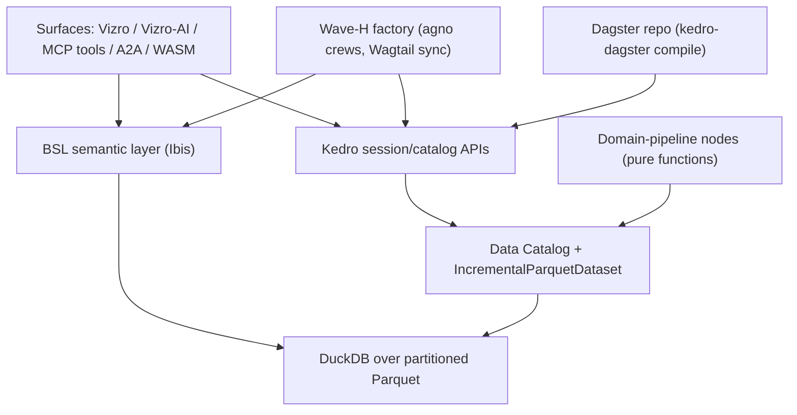
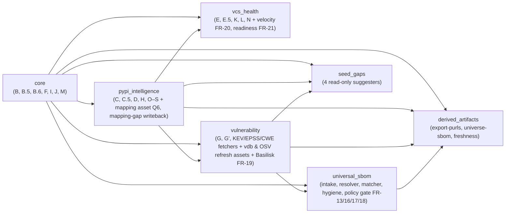

# cf_atlas Spec Compendium — every BMAD spec that built the atlas

> **Compiled 2026-07-25 from `main` @ `505e7c15`.** Convenience compilation —
> the individual source files remain the source of truth; this is a
> point-in-time snapshot, NOT auto-synced. Regenerate by re-concatenating the
> sources listed below (each file's YAML frontmatter is rendered as a fenced
> block above its verbatim body).
>
> **Scope rule**: a document is included iff it *dreamed, contracted, or
> built* atlas surface (phases, schema, CLIs, MCP tools, the Kedro
> migration). Documents that merely *consume* the atlas are listed as
> pointers, not inlined.
>
> **The atlas was built in two eras:**
> 1. **Legacy era (2026-05 → 2026-07-06)** — the hand-rolled 23-phase
>    orchestrator, built via legacy Tier-1 intake specs (`docs/specs/`,
>    Part III below).
> 2. **Kedro era (2026-07-17/18)** — the full migration to Kedro + Dagster +
>    DuckDB, executed via bmad-loop under project slug `pyforge-atlas`:
>    **32/32 stories shipped 2026-07-18 (PRs #58–#105, CFE v8.79.0)**. Its
>    contracts are the Tier-0 Dream + Tier-2 BMAD artifacts (Parts I–II).
>    Provenance caveat: 2 of the 32 story specs are surviving originals
>    (0.1, B1); the other 30 are contract-specs regenerated verbatim from
>    the tracked `epics.md` after the 2026-07-19 truncation incident (see
>    the specs README inlined in Part II).

## Contents

- **Part I — Tier 0, the Dream**: `docs/dreams/pyforge-atlas.md`
- **Part II — Tier 2, the build contracts (Kedro era)**: SPEC kernel · PRD + addendum · architecture spine · epics.md · specs README · the 32 story specs (Waves 0, A–H)
- **Part III — legacy Tier-1 intake specs (both eras)**: the 6 `docs/specs/` files that built or define atlas surface
- **Part IV — atlas consumers (pointers only)**

### Part III index

| # | Spec | Status | What it built |
|---|---|---|---|
| 1 | `docs/specs/cfe-shipped-releases.md` | SHIPPED (consolidated archive) | The 10 shipped intakes that built the bulk of the legacy atlas: pypi-universe-split (v7.9.0), CFE v8.0.0/v8.9.0 bundles, PyPI intelligence (v8.1.0), AppThreat (v8.6.0), PR-artifact downloader (v8.14.0), Phase P incremental (v8.15.0), Phase F Waves 1-3 (v7.6.0-v8.19.0), Phase K scheduler (v8.20.0), + the closed graphifyy fanout. |
| 2 | `docs/specs/cyclonedx-universe-inventory.md` | SHIPPED (2026-07-06, CFE v8.73.0) | CycloneDX inventory of the full PyPI + conda-forge universes: export-purls/mapping-gap, universe-sbom (856,766-component BOM), inventory-match (manifest intake incl. pixi.lock, transitive resolver, vulns policy gate), add-handoff, library-futures/recommend-2027. |
| 3 | `docs/specs/lts-registry-gap.md` | SHIPPED (2026-07-06, CFE v8.74.0) | lts-registry-gap CLI: read-only suggester diffing endoflife.date's product list against v_actionable_packages. |
| 4 | `docs/specs/seed-gap-suggesters.md` | SHIPPED (2026-07-06, CFE v8.75.0 + v8.76.0) | cwe-seed-gap + spdx-schema-gap + license-map-gap read-only suggesters; the curated maps stay hand-owned. |
| 5 | `docs/specs/cfe-atlas-datapipeline-kedro-migration.md` | SHIPPED — migration COMPLETE (32/32 stories, 2026-07-18, PRs #58-#105, CFE v8.79.0) | The v5.6 analysis-complete intake contract for the Kedro + Dagster + DuckDB migration (22 FRs, 32 stories, Waves 0 + A-H); executed via bmad-loop under project slug pyforge-atlas. |
| 6 | `docs/specs/trendshift-conda-forge.md` | READY (unimplemented; Phase T conditional) | Track A defines cf_atlas Phase T (GitHub-trending discovery engine, trending-candidates CLI/MCP tool); joins the atlas surface only if it ships. |


---

# Part I — Tier 0: the Dream


---

## ═══ Dream: `docs/dreams/pyforge-atlas.md` ═══

**Frontmatter (verbatim):**

```yaml
title: Atlas — the map that maintains itself
type: dream
owner: atlas
status: realized
```

# Atlas — the intelligence layer an agent workforce can maintain

## The Dream

The Navigator's dream: **chart the dependencies, map the world, define the
floor** — and make the map maintainable by agents, not heroes. The original
cf_atlas was a ~10,000-line hand-rolled orchestrator: 23 phases whose data
lineage lived in one developer's head. The dream was its rebirth as declarative
dataflow — a DAG small enough, pure enough, and contract-guarded enough that an
autonomous agent can add phase 24 without hand-wiring a single checkpoint.

## What is real

- **Kedro + Dagster + DuckDB** migration SHIPPED: waves 0 + A–H, all 32 stories,
  PRs #58–#105, driven end-to-end by bmad-loop ([[pyforge-marshal]]) — spec
  `cfe-atlas-datapipeline-kedro-migration.md`, shipped 2026-07-18 (CFE v8.79.0).
- Boring Semantic Layer models, the Vizro dashboard (28 CLIs → pages), Vizro-AI
  NL interface as an MCP tool, A2A interfaces, OpenLineage + OTel, DuckDB VSS,
  Pyodide/WASM compilation, Dagster sensors, and the Wave-H agno wiki crews.
- The intelligence signals that feed [[packaging-factory]]: staleness,
  feedstock-health, CVE watch, release cadence, adoption, velocity, readiness.

## Lineage

Atlas's stack is a direct descendant of [[sentinel]] (§19 Kedro · §20 Dagster ·
§27 BSL · §24 OTel/OpenLineage · §26 La Suite) — the ancestor dreamed the stack;
Atlas built it against the conda-forge domain. It also realized two 2026-04-25
roadmap wishes: the unified DAG orchestrator and the interactive dashboard.

## Remaining

- The 8 per-epic retrospectives (marked optional in sprint-status).
- The 2026-07-19 artifact-truncation incident is reconciled (2026-07-23) — on
  resume, trust only canonical hyphenated files; see the fork README in the
  project dir.

## Realization log

- **2026-06-20 → 07-16** — spec authored and analyzed (v5.6).
- **2026-07-17 → 07-18** — planned and BUILT via bmad-loop; shipped.
- **2026-07-23** — Dream retro-seeded; chapter deck `presentations/pyforge-atlas/`.
- **2026-07-23 (gist audit)** — grounding: the Ecosystem Health Report v2 (Basilisk §6) is atlas-intelligence output (`docs/intake/gists/conda-forge-python-ecosystem-health-report-v2-…/`); LF AI & Data landscape kept as reference.


---

# Part II — Tier 2: the build contracts (project `pyforge-atlas`)


---

## ═══ SPEC kernel: `_bmad-output/projects/pyforge-atlas/planning-artifacts/specs/spec-pyforge-atlas/SPEC.md` ═══

**Frontmatter (verbatim):**

```yaml
spec: pyforge-atlas
status: shipped
owner-dream: docs/dreams/pyforge-atlas.md
program: regenerable-factory (Wave 5 chain-verify)
surface:
  - src/**
  - conf/**
companions:
  - ../../prds                 # adopted: the PRD set (authoritative)
  - ../../architecture         # adopted: the architecture set (authoritative)
  - ../../epics.md             # adopted: epics/stories record
open_questions: []
```

# SPEC — pyforge-atlas (chain-verify kernel)

## Why

The atlas Kedro/Dagster/DuckDB migration shipped with a full BMAD chain
(PRD, architecture, epics; 32 stories merged, PRs #58–#105). This kernel adds
the one missing piece — a machine-readable surface manifest — binding
`src/**` + `conf/**` into the repo-wide `spec_surface_check`, so future atlas
code changes must move this project's contract. It adds NO new contract
content; the adopted companions remain authoritative.

## Capabilities

- **CAP-1 — surface binding.** Intent: the migration's code surface is
  governed; a change without contract movement is a checker finding.
  Success: `spec_surface_check` lists `spec-pyforge-atlas` with src/conf
  files governed; drift arm active (memlog mode).

## Constraints

- Changes to atlas behavior flow through the pyforge-atlas BMAD project
  (stories/correct-course), not through this kernel.

## Non-goals

- Restating the PRD/architecture.

## Success signal

Checker green with the atlas surface governed; the next atlas story's merge
moves this project's artifacts alongside the code.


---

## ═══ PRD: `_bmad-output/projects/pyforge-atlas/planning-artifacts/prds/prd-pyforge-atlas-2026-07-17/prd.md` ═══

**Frontmatter (verbatim):**

```yaml
title: cf_atlas Kedro/Dagster/DuckDB Migration
status: final
created: 2026-07-17
updated: 2026-07-17
project: pyforge-atlas
intent_source: docs/specs/cfe-atlas-datapipeline-kedro-migration.md (v5.6, ANALYSIS COMPLETE)
```

# PRD: cf_atlas Kedro/Dagster/DuckDB Migration

## 0. Document Purpose

This PRD is the Tier-2 planning artifact for migrating the `cf_atlas` conda-forge
intelligence pipeline from a hand-rolled ~10,000-LOC orchestrator to a
Kedro + Dagster + DuckDB stack with a Boring Semantic Layer (BSL), a
Vizro/Vizro-AI read surface, and MCP/A2A agent interfaces. Its readers are the
downstream BMAD workflows (`bmad-architecture`, `bmad-create-epics-and-stories`)
and the execution loop (`bmad-loop` / `bmad-dev-auto`) that will implement it.

The intake spec — `docs/specs/cfe-atlas-datapipeline-kedro-migration.md` v5.6 —
is the authoritative contract. This PRD preserves its FR numbering (FR-1..FR-22),
its wave/story structure (Waves 0 + A–H, 32 stories), its § 2.5 graduated-autonomy
execution model, and its § 12 out-of-scope boundary **verbatim in intent**; it adds
product framing (vision, users, metrics, risks) and records every decision made
during this unattended intake (§ 9). Where this PRD compresses, the spec section
cited in parentheses carries the binding detail. Live-surface counts (phases,
CLIs, MCP tools, schema version) are the spec § 3.3 snapshot, re-verified at
intake HEAD `4cf1b74` on 2026-07-17 (`intake-groundtruth-2026-07-17.md`).

This PRD was produced headless; no human elicitation occurred. All open
questions were resolved to the spec's § 11 recommended defaults (§ 8, § 9).

## 1. Vision

`cf_atlas` is the intelligence layer of an AI-assisted conda-forge packaging
factory: 23 cataloged pipeline phases build a database over the channel's
feedstock population (19,726 at the spec's 2026-07-16 full-population run) —
versions, downloads, maintainers, vulnerabilities, and readiness signals — read
today through 28 bespoke CLIs and 23 atlas-relevant MCP tools. The legacy
orchestrator demonstrably ships — but every new phase re-implements
checkpointing, TTL gating, and backoff by hand; lineage lives in the
developer's head; execution is observable only via stdout; and ad-hoc questions
require hand-written SQL. That cost is **chronic and compounding, not acute**
(spec § 3.2, PRFAQ-reframed), and it lands hardest on the factory's actual
workforce: autonomous agents cannot safely extend a 10,000-line procedural
monolith.

The migration's load-bearing justification is **agent-maintainability** (PRFAQ
kill-test, CONDITIONAL PASS, 2026-07-16): small, pure, contract-guarded Kedro
nodes with declared inputs/outputs and machine-checkable data contracts are
what the repo's graduated-autonomy loop execution can safely maintain and
extend — "the price of never hand-wiring story 33." The performance story is
told honestly: the 3–4 h cold rebuild is network-bound, so the win is
**incremental re-materialization** (only affected nodes re-run), query-time
analytics, and Phase-F parquet reads — never an engine-swap cold-start miracle
(AC-7 scoping).

On top of the migrated DAG, the read surface inverts: instead of 28 fixed
questions, a BSL semantic graph (Ibis → DuckDB) powers Vizro dashboards, a
Vizro-AI natural-language query path, and MCP/A2A surfaces through which BMAD
agents trigger pipelines, read datasets, and hand structured insights to the
recipe-authoring agent. The 2026-07-16 market research confirms the demand
shape: **feeds > pages** (scenario ranking B > C > A) — the productizable
value is machine-consumable data, which is exactly what this migration's
identity layer and new signal sources (FR-19/20/21) produce; no new
requirements follow from it, and the internal-customers-first premise stands.

## 2. Target User

### 2.1 Jobs To Be Done

- **Operator (rxm7706)** — maintain ~769-feedstock coverage without babysitting
  a monolith: see the DAG, spot bottlenecks, re-run only what's stale, trust
  that bad data halts instead of persisting.
- **CFE authoring agents** (`conda-forge-expert` skill sessions) — query
  package/vulnerability/readiness intelligence through MCP with consistent
  semantics; receive structured signals (CVE found → fix authored) via A2A.
- **BMAD execution agents** (bmad-loop / dev-auto sessions) — extend the
  pipeline safely: add a node, declare its datasets, inherit
  checkpoint/TTL/backoff/contract machinery for free, verified by
  deterministic fixture gates.
- **CI** — consume one schema-validated `ComplianceReport` and one frozen
  exit-code gate instead of scraping CLI text.

This is an internal, non-commercial product: "adoption" means operator + agent
usage; sustainability is governed by the spec § 13 integration-surface matrix
reviews.

### 2.2 Non-Users (v1)

- External/public dashboard consumers (market scenario A — weakest demand;
  the D2 "factory status" Vizro page is the right-sized showcase).
- The conda-forge Security SIG and downstream scanners (Trivy/Syft/OSV): the
  OSV-format feed they need is a recorded § 12.1 candidate gated on SIG
  constitution — an operator engagement, not migration scope.
- Enterprise Python Manifest consumers (§ 4.11 target state the graph
  *enables*; not built here).

### 2.3 Key User Journeys

*Lighter form (internal tooling, solo operator + agent workforce).*

- **UJ-1. The operator watches a rebuild instead of tailing stdout.** rxm7706
  kicks off the maintainer-profile job; Dagster shows per-node state, retries,
  and timings; `pixi run viz` renders lineage; a cold-run Phase R overrun no
  longer silently kills Phases F/K/N. (FR-2, FR-6.)
- **UJ-2. A BMAD agent triggers and reads a pipeline via MCP.** An agent calls
  `run_vulnerability_pipeline`, waits on completion, reads the
  `basilisk_vulns` dataset natively, and passes a structured advisory payload
  ("Basilisk advisory on libtiff; KEV status via the `cisa_kev` overlay") to
  the recipe-authoring agent over A2A. (FR-7, FR-11, FR-19.)
- **UJ-3. An ad-hoc question needs no SQL.** The operator (or Claude Code via
  `query_vizro_ai`) asks "top 10 most-downloaded packages with critical CVEs
  and stale maintainership"; Vizro-AI compiles it against the BSL graph and
  returns a chart grounded in declared metrics. (FR-8, FR-9.)
- **UJ-4. CI blocks a policy breach.** A repo pipeline run assembles the
  four-axis `ComplianceReport`; a KEV-affecting-current hit exits 1 under the
  frozen convention, halts Dagster, and raises an A2A alert. (FR-16, FR-18,
  FR-10.)
- **UJ-5. An agent adds phase 24 without hand-wiring.** A loop-driven story
  adds a new signal as a Kedro node + catalog entries + pandera contract;
  TTL/resume/observability are inherited; the wave's verify gate proves it.
  (FR-1, FR-2, FR-3, FR-10 — the agent-maintainability journey the whole
  migration exists for.)

## 3. Glossary

- **cf_atlas** — the conda-forge intelligence data layer under
  `.claude/skills/conda-forge-expert/`; today `cf_atlas.db` (SQLite, schema
  v29) built by 23 cataloged phases.
- **Phase** — a legacy pipeline stage (B → N conda-side incl. sub-phases,
  O–S PyPI intelligence, plus unregistered Phase I). Migrates to one or more
  **nodes**.
- **Node** — a pure Kedro function with declared input/output **datasets**;
  the migration's unit of logic.
- **Dataset** — a declaratively cataloged data artifact (`conf/base/catalog.yml`):
  API source, Parquet partition, DuckDB table, or external seed.
- **Domain pipeline** — one of the seven modular Kedro pipelines of spec § 5.2
  (Core; PyPI Intelligence; Vulnerability; VCS & Health; Universal SBOM;
  Seed-Gaps; Read-Surface/Derived-Artifacts).
- **Wave** — an implementation batch (0, A–H); each wave's first deliverable is
  its own deterministic **verify gate**.
- **Graduated autonomy** — the § 2.5 execution model: Waves 0+A attended/
  dev-auto (they build the harness), Wave B loop-driven under
  per-story-spec-approval, C–E relaxing to per-epic, F–H mixed; loop execution
  is sequential (`max_parallel = 1`); attended events (B4 parity, C1 bring-up,
  D3 backend, F1 benchmark, G2 publish) are scheduled wave-boundary events.
- **Parity** — Story B4's proof that Kedro outputs match legacy `cf_atlas.db`
  (Q1 tolerance); gates legacy retirement.
- **External-refresh asset** — a separately-built local store (AppThreat vdb,
  offline OSV store, `pypi_conda_map.json`) orchestrated as a scheduled asset
  (§ 3.4, Story B5).
- **Bootstrap profile** — one of `maintainer` / `admin` / `consumer` job
  configurations over the same DAG; explicit env/run-config beats profile
  defaults; Phase P is admin-opt-in only.
- **BSL** — Boring Semantic Layer: declared dimensions/measures over the
  catalog (Ibis → DuckDB), the single translation interface for Vizro-AI,
  MCP, and agents.
- **Derived layer** — post-rebuild regenerated artifacts (`export-purls`,
  `universe-sbom`, seed-gap reports, `ComplianceReport`) under the 14-day
  freshness contract.
- **ComplianceReport** — pyforge-warden's four-axis (hygiene, security,
  license, currency) schema-validated artifact; assembled at the FR-18
  terminal gate under the frozen exit-code convention (0 pass / 1 policy-fail
  / 2 error; full enum {0, 1, 2, 130}).
- **New-signal sources** — the three committed additions: Basilisk conda-native
  vulnerabilities (FR-19), release-to-availability velocity (FR-20),
  migration readiness (FR-21). Additive, not parity-gated.
- **Verify gate** — a fixture-based, `--frozen`, non-credentialed pixi task the
  loop runs deterministically (`kedro-test`, `kedro-catalog-check`,
  `parity-diff`, `dagster-dryrun`, `bsl-metric-check`, `wasm-smoke`).

## 4. Features

*FR numbering is the spec's, preserved exactly. Each FR states the capability
contract and at least one testable consequence; the cited spec sections and
story ACs (§ 9–10 of the spec) remain the binding, fuller test surface.
FR locations: § 4.1 FR-1..4 · § 4.2 FR-5 · § 4.3 FR-6 · § 4.4 FR-7, FR-11 ·
§ 4.5 FR-8, FR-9 · § 4.6 FR-10, FR-12 · § 4.7 FR-13, FR-16, FR-17, FR-18 ·
§ 4.8 FR-14 · § 4.9 FR-15 · § 4.10 FR-19..21 · § 4.11 FR-22.*

### 4.1 Declarative Pipeline Core (Waves A–B)

**Description:** Replace the procedural orchestrator with a declared DAG:
every source and output cataloged, every phase a node, incremental state a
reusable dataset class, resumability native. Realizes UJ-5.

#### FR-1: Declarative data access via the Kedro Data Catalog
All API sources and Parquet outputs are datasets in `conf/base/catalog.yml`;
no data-access logic in node functions. Credentials are scoped **per
destination host** — a fix, not a port: legacy `_http.py` injects the JFrog
credential on every outbound request. (Spec § 5.1; Story A2.)
- Consequence: `kedro-catalog-check` passes (catalog resolves; no inline IO).
- Consequence: a non-JFrog host never receives `X-JFrog-Art-Api`.
- Consequence: all 20 `resolve_*_urls` override points (incl. new
  `BASILISK_BASE_URL`) survive for enterprise/air-gapped routing.

#### FR-2: Phases refactored into modular, DAG-resolved pipelines
The 23 cataloged phases become nodes in the seven domain pipelines; execution
order resolves from the DAG. Phase I becomes an explicit node. The § 3.3
per-phase engineering contracts bind the ports (Phase P two-layer cost gate,
Phase K 3-RPS token bucket, Phase F provenance discipline, Phase H serial
gate, B.5 `_pick_feedstock` attribution, EPSS 0–100 normalization). (Stories
B1, B2, B5, B6.)
- Consequence: no procedural call order anywhere; nodes unit-test on
  DataFrame IO.
- Consequence: contract fixtures (cost-gate, token-bucket, provenance,
  no-clobber) carry over green.
- Consequence: the maintainer-universe delta vs cf-graph (~44 feedstocks) is
  reconciled or documented (B1/B4).

#### FR-3: `IncrementalParquetDataset` preserves TTL gating
The `*_fetched_at` TTL semantics live in one reusable dataset class with
**per-dataset** TTLs (Phase D 7 d, Phase P 30 d, EPSS 1 d, CWE 90 d, …) —
never a global constant. (Story A3, the designated first loop story/worktree
smoke.)
- Consequence: unit test proves stale rows re-fetch, fresh rows skip.

#### FR-4: `phase_state` removed; resumability via runner + persisted Parquet
Checkpointing is Kedro-native; the bespoke `phase_state` table is deleted with
the legacy orchestrator at B4 parity. (Stories A3, B4.)
- Consequence: an interrupted run resumes from persisted intermediates
  without a custom checkpoint table.

### 4.2 Compute Engine (Wave F)

#### FR-5: DuckDB replaces SQLite and all fragmented compute proposals
One engine for analytical compute, graph traversal (recursive CTEs), and
vector search (`vss`), reading partitioned Parquet natively. Sequencing: the
Kedro path writes partitioned Parquet from Wave A (spec § 5.1) and B4 retires
the legacy SQLite write path — Parquet/DuckDB is canonical throughout; F1 is
residue cleanup (migrate/delete any surface still reading legacy
`cf_atlas.db`) plus the benchmark. (Stories F1, F3.)
- Consequence: no `sqlite3` import outside the retired legacy tree
  (grep-gated).
- Consequence: the attended F1 benchmark records warm-incremental (headline)
  AND cold-full wall-clock vs the 3–4 h network-bound baseline — evidence,
  not promises (AC-7).
- Consequence: a `vss` similarity query returns ranked results (F3).

### 4.3 Orchestration & Operations (Wave C)

#### FR-6: Dagster orchestrates schedules + retries via `kedro-dagster`
The Kedro DAG compiles to a Dagster repository; schedules encode the
`guides/atlas-operations.md` cadence table; the three bootstrap profiles
become named job configurations (profile defaults lose to explicit config);
timeouts are **per-node** — the legacy 1800 s `cf_atlas_core` cap that
silently dropped Phases F/K/N is structurally impossible. `kedro-viz` gives
the structural view (`pixi run viz`). `kedro-dagster` is **replaceable glue**
(bus factor ≈ 1; Dagster under Prefect acquisition watch — Q2 re-verify at
Wave C start; exit ramps: Dagster Components / Prefect deployer). Realizes
UJ-1. (Stories C1, C2, B5, G3, H4.)
- Consequence: `dagster-dryrun` passes (definitions load, schedules
  enumerate) without live execution.
- Consequence: Phase P stays opt-in (`PHASE_P_ENABLED=1`), admin-profile
  only, never a default schedule.
- Consequence: external-refresh assets run scheduled with retries; consumer
  profile still works air-gapped.

### 4.4 Agent Interfaces (Waves B, E)

#### FR-7: MCP surface preserved (Kedro-API-native; kedro-mcp never load-bearing)
The atlas-relevant MCP tools (23 of 46 in `conda_forge_server.py`) are audited
and re-authored over Kedro session/catalog APIs; agents trigger named
pipelines and read datasets via MCP. `library-futures` / `add-handoff` / the
seed-gap suggesters stay CLI-only. Realizes UJ-2. (Story B3.)
- Consequence: the trigger/read surface works with `kedro-mcp` absent.

#### FR-11: A2A interface for inter-agent collaboration
The cf_atlas analytical agent exchanges structured payloads with the
`conda-forge-expert` authoring agent (publish/subscribe or direct message);
contract violations and policy breaches raise A2A alerts. Realizes UJ-2, UJ-4.
(Story E1.)
- Consequence: a structured payload round-trips between the two agents.

### 4.5 Semantic Layer & Read Surface (Wave D)

#### FR-8: Boring Semantic Layer over the catalog (Ibis → DuckDB)
The metrics/business logic of the 28 read CLIs become declared BSL dimensions
and measures — the single translation interface. Maintainer-role facts are
first-class dimensions. Realizes UJ-3. (Story D1.)
- Consequence: `bsl-metric-check` proves BSL answers match legacy CLI outputs
  on core metrics (staleness, adoption stage, feedstock health).

#### FR-9: Read surface migrates from 28 CLIs to Vizro / Vizro-AI
Read-only CLIs become Vizro pages plus a Vizro-AI NL field, exposed as web
dashboard and as the `query_vizro_ai` MCP tool. Three exceptions stay
CLI-first with latest-report artifacts surfaced read-only: `add-handoff`
(write path), `inventory-match` (per-invocation inputs), `library-futures`
(in-memory by design). A "factory status" page reads BMAD artifact state.
The live-confirmed consumer CLIs — those observed in use today by the
feedstock-refresh / failure-remediation workflows: `behind-upstream`,
`query-atlas`, `whodepends`, `feedstock-health`, `my-feedstocks`,
`detail-cf-atlas`, `staleness-report` — port first. Frontend work in Waves
D/G is preceded by the CIS two-spine specs (`DESIGN.md` + `EXPERIENCE.md`,
spec § 2.4). Realizes UJ-3. (Stories D2, D3; Q3 gates the D3 LLM backend.)
- Consequence: every read-only legacy CLI question is answerable from a page,
  where for the three named exceptions "answerable" means the latest-report
  artifact is surfaced read-only — the D2 acceptance bar covers all 28.
- Consequence: pages meet the spec § 2.1 agent-legibility bar — semantic
  HTML, ARIA attributes, deterministic layouts (the factory-status page is
  explicitly tagged agent-readable in spec § 13.2).
- Consequence: `query_vizro_ai` is callable from Claude Code.

### 4.6 Data Quality, Lineage & Observability (Waves E–F)

#### FR-10: Data-quality contracts halt bad data (pandera-first)
Inline pandera contracts in nodes; Great Expectations as boundary layer behind
the same validator-agnostic `AfterNodeRunHook` — GX **version-capped at
conda-forge 1.18.2** (upstream declares `<3.14` at 1.19.0; no GX ≥1.19
features). Dagster halts on violation and raises an A2A alert. Realizes UJ-4.
(Story F2.)
- Consequence: a malformed-payload fixture halts the pipeline before persist.
- Consequence: swapping/stubbing the second validator requires no node
  changes.

#### FR-12: Lineage + observability via OpenLineage + OpenTelemetry
Nodes, runs, and DuckDB queries are instrumented: lineage + per-node metrics
(rows, latency, cache hits) via OpenLineage; end-to-end traces via OTel down
to specific API calls. (Story E2.)
- Consequence: a pipeline run emits OpenLineage events for every node, and
  one end-to-end OTel trace resolves down to a named API call.

### 4.7 Universal SBOM & Policy Gate (Waves B, F)

#### FR-13: Universal SBOM ingestion normalized to CycloneDX
The SBOM pipeline parses the tiered intake (core: `pixi.toml`, `pixi.lock`,
`pyproject.toml`, `recipe.yaml`, `meta.yaml`; extended tier per spec § 4.10),
normalizing to CycloneDX. The normalizer preserves the `cfe:*` property
namespace (incl. the `recommend-2027` six-property set) and the
`?channel=conda-forge` purl qualifier. (Story B7.)
- Consequence: each core-tier manifest fixture normalizes to CycloneDX with
  `cfe:*` properties and the `?channel=conda-forge` qualifier intact — never
  stripped during normalization.

#### FR-16: Dependency-hygiene scan node (deptry)
A hygiene node runs deptry when project source accompanies the manifest;
source-less inputs report `not-applicable` (frozen semantics shared with
pyforge-warden). Findings fill the `hygiene` axis of the four-axis
`ComplianceReport`; `security` comes from `inventory-match`/`cve` (the atlas
does not re-invoke osv-scanner); `license`/`currency` fill from atlas-native
data or `not-applicable`. (Story F4.)
- Consequence: an injected unused-dependency fixture yields a schema-valid
  `hygiene` finding; a source-less input reports `not-applicable`, never a
  failure.

#### FR-17: Transitive resolution + the universe BOM extend the intake
A transitive-resolver node (pip `--dry-run --report` / py-rattler solve)
upgrades bare manifests to full dependency sets (depth + fan-out recorded),
honoring mirror routing and degrading gracefully offline (`unresolved`
marker). The ~856k-component universe BOM is a first-class `derived` catalog
dataset under the 14-day freshness contract. The matching node preserves
`inventory-match`'s six-bucket semantics and three-way version comparison.
(Story B7.)
- Consequence: NBSP-padded pasted `conda list`/`pip list` text parses
  identically to ASCII-space form (fixture).

#### FR-18: Unified CI policy gate
One terminal node assembles the `ComplianceReport`, converges pyforge-warden's
strict exit-code gate with `inventory-match --policy` thresholds, emits the
schema-validated artifact, and halts Dagster on failure (A2A alert; CI
consumes the exit code). **Reconciliation obligation**: the shipped
`inventory-match --policy` enum is inverted; FR-18 flips it to the frozen
convention with a one-release deprecation window
(`INVENTORY_MATCH_LEGACY_EXIT=1`). A BOD-26-04-style risk-tiered threshold
mode is recorded as future option, not committed. Realizes UJ-4. (Story F4.)
- Consequence: a policy breach (e.g. `max_critical=0` violated or a
  KEV-affecting-current hit) exits 1, error paths exit 2, Dagster halts, and
  an A2A alert fires — identical failure semantics to an FR-10 violation.
- Consequence: `INVENTORY_MATCH_LEGACY_EXIT=1` restores the legacy codes for
  exactly one release; CI consumers otherwise see the frozen convention.

### 4.8 Portability (Wave G)

#### FR-14: WASM portability for the intelligence surface
The Vizro-AI dashboard + BSL layer run in-browser via duckdb-wasm/Pyodide;
Parquet artifacts publish to a static host (GitHub Pages per Q4 default;
emitter host-agnostic) and are pulled via HTTP Range with zero backend.
(Stories G1, G2; Q4.)
- Consequence: `wasm-smoke` (Playwright headless load-and-query) passes
  against the built artifact.

### 4.9 Toolchain & Provisioning (Wave A)

#### FR-15: Pixi-first, nebi-scaffolded, conda-forge-only
Every component sourced from conda-forge, managed in `pixi.toml`, scaffolded
by `nebi`; no standalone binaries or JVM. The stack is **already resolved
in-env** — adoption is wiring, not dependency addition; governing gates are
the Python 3.14 floor, the known pins, and the `llms-full-check` drift gate.
Air-gapped provisioning covers both routing layers (`_http.py` AND
`.pixi/config.toml [pypi-config]`). The scaffolded project ships its own lean
pixi env (worktree economics) and the `kedro-test` verify task. (Story A1.)
- Consequence: the FR-15 stack resolves at its pins on Python 3.14;
  `llms-full-check` passes after any dependency change (catalog updated in
  the same PR).
- Consequence: the lean env + `kedro-test` gate run in a worktree without
  materializing the fat `local-recipes` env.

### 4.10 New Signal Sources (Wave B — additive, not parity-gated)

**Description:** Three committed sources promoted by the spec's
evidence-gating pattern (measured evidence → FR + story). They are **riders**
on the migration, never its justification (PRFAQ).

#### FR-19: Conda-native vulnerability source — Basilisk (prefix.dev)
Two nodes: `POST /v1/querybatch` (≤1,000 queries/request) writes
`basilisk_vulns` keyed by conda PURL (CEP-63 draft form); a bounded
`GET /v1/vulns/{id}` detail fetch under standard rate-limit discipline.
Binding constraints: match by package name never the OSV ecosystem tag;
version currency ≠ security currency; `fix_available` is tri-state (`unknown`
never collapses to `false`; ~85.3% of matches resolve as upgrade-resolvable
via the `behind_upstream` join). Basilisk is pre-announcement: offline-skip +
`BASILISK_BASE_URL` are the hedges. (Story B8; Q7.)
- Consequence: fixtures prove the three binding constraints — a PyPI-tagged
  `affected[]` entry still matches its conda package; an enumerated-versions-
  only advisory yields `fix_available=unknown`; a `behind-upstream`-`current`
  package can still carry an advisory.
- Consequence: offline (consumer profile), the nodes skip gracefully and mark
  the dataset stale rather than failing.

#### FR-20: Release-to-availability velocity signal (rebuild-cadence-guarded)
`release_lag_hours` + `release_lag_qualifies` on the Phase H join — no new
external source. Hard constraints: restrict to upstream releases ≤90 days old,
and compute against **first availability of the matched version** (minimum
per-build repodata timestamp), never `latest_conda_upload` (the false "47%
behind" failure is fixture-blocked). Live calibration baseline: median
≈ 8.9 h, ~72.4% within 24 h. Two distinct measurements coincide at 83.7% —
the share of lag-qualifying builds within 72 h, and the share of the naive
">10 days behind" bucket whose upstream release was over a year old —
re-verify both against the spec § 15 evidence gists at B9. (Story B9.)
- Consequence: fixtures block both failure modes — a >90-day-old upstream
  release is excluded (`release_lag_qualifies = false`), and a same-version
  rebuild inside the window does not shift `release_lag_hours`.

#### FR-21: Migration-readiness source — conda-forge-bot-data status datasets
Category-list + per-migration detail datasets (partitioned by active
migration — new migrations need no code change) plus a readiness-classification
node producing the four-way split (noarch / rebuild-done / confirmed-pending /
not-in-tracker) with blocker labels and a top-unmigrated-by-volume ranking.
`not-in-tracker` is labeled as inference, never confirmed status. Fetches ride
the existing `resolve_github_raw_urls`; `version_status.v2.json` is excluded.
(Story B10.)
- Consequence: a new migration appearing upstream requires zero code change
  (category lists drive the partitioning); the classification output labels
  `not-in-tracker` as inferred, fixture-proven.

### 4.11 The AI Software Factory Layer (Wave H)

#### FR-22: Karpathy wiki + agent crews + CMS sync + Dagster triggers
Committed scope (Q5 resolution): (a) the `wiki/raw/ → compiled/ → outputs/`
scaffold with the 5 personas (H1); (b) `agno` compile/lint/Q&A crews on that
scaffold (H2); (c) La Suite/Wagtail REST sync to the Layer-1 CMS (H3);
(d) Dagster assets + sensors + schedules triggering the crews autonomously
(H4). Storage services (PostgreSQL, MinIO) conda-forge-provisioned per FR-15.
- Consequence: the four deliverables pass their fixture tests —
  scaffold-layout test + persona resolution (H1); crews end-to-end on a
  fixture wiki (H2); mock-Wagtail round-trip incl. idempotent re-push (H3);
  asset dry-run + simulated new-raw-file sensor trigger (H4). See SM-10.

## 5. Non-Goals (Explicit)

Verbatim boundary from spec § 12 — anything not in spec § 3.3/§ 3.4 or this
list's committed set is outside the migration's universe:

- Neo4j / Kùzu / LanceDB / Polars as separate engines (DuckDB singularity).
- Continued SQLite + `phase_state` orchestration.
- `spec-kit` as agent framework (rejected; `bmad-method` governs).
- Standalone binaries / JVM dependencies.
- Enterprise Python Manifest (5k) generation as a deliverable (enabled, not built).
- **New external data sources beyond the committed set** (legacy
  GitHub/PyPI/Anaconda set + Basilisk + conda-forge-bot-data `status/`).
  § 12.1 candidate signals and § 13.1 Candidate feeds are recorded, NOT
  committed — promotion requires measured evidence → FR + story.
- prefix.dev GraphQL API as a metadata backend (recorded hook:
  `variants.yankedReason` for Phase B.6's deferred full yanked detection).
- Ecosystem-composition-by-language report (deferred; measured facts preserved
  in the spec row).
- Spreadsheet tabs / GitHub Projects boards as SBOM-intake formats.
- `pyforge.warden` v1 standalone build (own spec; this migration models only
  the promoted atlas surface — schema-compatible by design).
- Rewriting the recipe-authoring skill itself.
- Static seeds + template trees as pipeline products (curated inputs only).
- Live authoring-time fetches (recipe-generator pulls, `gh`/Azure DevOps,
  live repodata) — transactional, not pipeline data; pipeline snapshots stay
  **advisory** and never substitute the authoring loop's live re-verification.
- OSV-format export feed + public dashboard productization (market scenarios
  B/A): recorded § 12.1 candidate (SIG-gated) and deferred respectively —
  no new FRs from the market research.

## 6. Scope & Execution Model

### 6.1 In Scope: Waves 0 + A–H (32 stories)

Wave order and story list preserved from spec § 9; each story's binding ACs
live there. Execution modes per § 2.5 (attended / dev-auto / LOOP-S
per-story-spec-approval / LOOP-E per-epic).

| Wave | Stories | Content | Gate (first deliverable) |
|---|---|---|---|
| 0 | 0.1 | SKF legacy-translation skill (execution scaffolding, no FR) | — (attended) |
| A | A1–A3 | nebi scaffold, data catalog, `IncrementalParquetDataset` | `kedro-test` (A1), `kedro-catalog-check` (A2); A3 = first loop story + worktree smoke |
| B | B1–B10 | Node ports (B1 conda-side, B2 PyPI+vuln), MCP (B3), parity (B4), external-refresh assets (B5), seed-gaps (B6), SBOM intake (B7), Basilisk (B8), velocity (B9), migration-readiness (B10) | `parity-diff` built incrementally through B1–B3, consumed + attended sign-off at B4 (spec § 2.5 says "B1–B4", B4's AC says "B1–B3" — read as build B1–B3, consume B4); B4 = attended parity event; Q6 before B5, Q7 before B8 |
| C | C1–C2 | kedro-dagster compilation + schedules; kedro-viz | `dagster-dryrun`; C1 bring-up attended; Q2 at wave start |
| D | D1–D3 | BSL models, Vizro dashboard + 28-CLI port, Vizro-AI + MCP tool | `bsl-metric-check`; D3 backend attended; Q3 at D3 |
| E | E1–E2 | A2A surface; OpenLineage + OTel | no new gate (§ 2.5 assigns Wave E none; its stories verify against the existing gates) |
| F | F1–F4 | DuckDB consolidation + benchmark, validation hooks, `vss` RAG, hygiene + policy gate | F1 = attended benchmark |
| G | G1–G3 | WASM/Pyodide, static Parquet host, Dagster sensors | `wasm-smoke`; G2 publish attended; Q4 at G2 |
| H | H1–H4 | Karpathy wiki scaffold + personas, agno crews, Wagtail sync, Dagster-triggered crews | (modes per story: H1/H3/H4 LOOP-E, H2 dev-auto) |

B8/B9/B10 are additive new-signal stories, **not parity-gated** — B4 compares
legacy-surface outputs only. Legacy orchestrator retires only after B4 proves
parity per Q1.

Conditional surface: if `trendshift-conda-forge.md` Track A ships before
Wave B completes, Phase T (tables, view, CLI/MCP tool, schema v30) joins the
migration surface with its invariants — re-check its status alongside the
live groundtruth at execution start (spec § 3.3).

### 6.2 Execution model (binding, from spec § 2.5)

Graduated autonomy with verify-first sequencing: ~21 of 32 stories are
loop-drivable (11 at spec-approval, ~10 relaxable to per-epic); the loop never
enters a wave whose gate doesn't exist; all gates are fixture-based (tracked
test tree, never `.claude/data/`), non-credentialed, run `--frozen`. Loop runs
are sequential. Wave B runs with TEA `atdd`-generated red-phase fixtures as
the verify assets, per the spec § 14 per-wave operating loop (Q-drain → TEA
test-design/atdd → loop → sweep → boundary event → PR per wave).
Preconditions: hooks approval; **`scripts/bmad-switch
pyforge-atlas`** — this supersedes spec § 2.5/§ 14's
pre-intake `bmad-switch local-recipes` literal, since this effort's artifacts
now live under the new project slug (deviation recorded, § 9.11); worktree
symlink bootstrap (validated by A3); heaviest-story budget review (B1/B2/F1).
Per CLAUDE.md Rule 1, any story touching recipe code or atlas tooling invokes
`conda-forge-expert`; per Rule 2, the effort closes with a CFE-skill retro.

### 6.3 Out of Scope for MVP

§ 5 Non-Goals plus: the kedro-viz prototype refresh
(`prototypes/cf-atlas-kedro-viz` predates the seven-pipeline decomposition —
follow-up, not this effort), and the three upstream bmad-loop feature requests
(resume-on-timeout, retry-from-attempt, PR-lifecycle hook — upstream's
timeline).

## 7. Success Metrics

Derived from the spec's whole-migration acceptance criteria (AC-1..AC-11) and
tempered by the PRFAQ kill-test. Two metrics (SM-11, SM-12) deliberately
extend the spec's AC list where it has coverage gaps: the AC set carries no
direct criterion for the SBOM intake family (FR-13/16/17 short of the FR-18
gate) and AC-3's orchestration substance otherwise maps to no SM.

**Primary**

- **SM-1 (Parity before retirement):** B4 parity check reports zero material
  drift per Q1's tolerance (= exact row-count + value parity on the
  `v_actionable_packages`-family views; timestamp/ordering-only diffs
  documented as benign); legacy orchestrator retired only after recorded
  evidence. Validates FR-2, FR-4 (AC-1, AC-2).
- **SM-2 (Agent-maintainability):** a new signal lands as node + catalog +
  contract with zero hand-written checkpoint/TTL/backoff code — demonstrated
  in-effort by B8/B9/B10 landing through declared machinery, and by all 11
  committed LOOP-S stories executing loop-driven without gate removal (the
  ~21/32 total loop-driven share is a recorded target, not a gate). Validates
  FR-1, FR-2, FR-3, FR-10 (the load-bearing justification).
- **SM-3 (Incremental re-materialization):** warm incremental refresh
  re-runs only affected nodes (affected-node re-run counts recorded) and
  beats the legacy full-rebuild pattern on wall-clock; the pass threshold is
  fixed in the F1 story spec before the benchmark runs, and pass is
  adjudicated at the attended F1 boundary event against the recorded
  evidence — operator sign-off is the acceptance. Validates FR-5 (AC-7).
- **SM-4 (Read-surface completeness):** every read-only legacy CLI question
  answerable from a Vizro page — the three FR-9 exceptions counting via their
  surfaced latest-report artifacts, so the bar covers all 28;
  `bsl-metric-check` parity on core metrics; `query_vizro_ai` callable via
  MCP. Validates FR-8, FR-9 (AC-4).
- **SM-5 (Agent surfaces live):** MCP pipeline-trigger + dataset-read and the
  A2A payload hand-off work end-to-end from a BMAD agent session. Validates
  FR-7, FR-11 (AC-5).

**Secondary**

- **SM-6:** contracts halt bad data with A2A alert; lineage + traces
  observable end-to-end; policy gate holds the frozen exit-code contract.
  Validates FR-10, FR-12, FR-18 (AC-6).
- **SM-7:** three new signals live per their fixture-enforced guards
  (ecosystem-tag match, tri-state `fix_available`, 90-day gate,
  first-availability lag, inferred `not-in-tracker` labeling); the v2
  ecosystem-health analysis Sections 2–6 reproducible from the pipeline.
  Validates FR-19, FR-20, FR-21 (AC-10).
- **SM-8:** in-browser surface loads and queries statically-hosted Parquet
  with zero backend (`wasm-smoke`); sensors trigger incremental ingestion.
  Validates FR-14, FR-6 (AC-8).
- **SM-9:** conda-forge-only provisioning holds (`llms-full-check` green;
  py3.14 floor; no JVM/standalone binaries). Validates FR-15 (AC-9).
- **SM-10:** Wave-H factory deliverables pass their fixture tests (scaffold
  layout, crews on fixture wiki, Wagtail round-trip, sensor-triggered crew).
  Validates FR-22 (AC-11).
- **SM-11 (SBOM intake — extends the AC list):** each core-tier fixture
  manifest round-trips to a schema-valid CycloneDX BOM preserving `cfe:*` and
  `?channel=conda-forge`; the NBSP paste fixture passes; a deptry finding
  populates the `hygiene` axis; a bare manifest resolves transitively with
  depth + fan-out recorded. Validates FR-13, FR-16, FR-17.
- **SM-12 (Orchestration operations — covers AC-3):** Dagster Schedules
  encode the cadence table; the three profiles exist as job configurations
  with the override precedence; per-node timeouts demonstrably retire the
  1800 s `cf_atlas_core` defect (C1 AC); `pixi run viz` renders the DAG.
  Validates FR-6 (AC-3).

**Counter-metrics (do not optimize)**

- **SM-C1: Cold-start wall-clock.** The cold rebuild is network-bound; do not
  chase or promise engine-swap cold-start speedups — F1 benchmarks it
  honestly, nothing more. Counterbalances SM-3 (PRFAQ overclaim guard).
- **SM-C2: Autonomy share.** Do not raise the loop-driven story count by
  weakening gates; "fullest use" ≠ gate removal. Attended boundary events are
  features, not friction. Counterbalances SM-2.
- **SM-C3: Signal count.** Do not promote § 12.1/§ 13.1 candidates to ship
  "more sources"; promotion requires the evidence-gating pattern.
  Counterbalances SM-7.
- **SM-C4: Dashboard breadth.** Demand is feeds > pages; do not grow the
  public-facing page surface beyond D2's factory-status page. Counterbalances
  SM-4 (market-research verdict).

## 8. Open Questions

The spec's § 11 set, numbering stable; none v1-blocking. Q5 (AI Software
Factory scope) was resolved during spec evolution and retired — its outcome
is committed as FR-22/Wave H and it is deliberately absent here. "Gates"
means the named wave/story may not start until the question's re-check is
recorded; nothing blocks PRD approval or earlier waves. **Unattended
resolution: each open question is adopted at its § 11 recommended default
now, and remains a scheduled re-check at its gating wave** — the wave gate
drains the question before dependent stories run.

- **Q1 — Parity tolerance (gates B4 → retirement).** Adopted default: exact
  row-count + value parity on the actionable views (the
  `v_actionable_packages`-family views); timestamp/ordering-only diffs
  documented as benign.
- **Q2 — Dagster footprint + acquisition watch (gates Wave C).** Adopted
  default: on-demand/scheduled invocation locally; persistent daemon only if
  Wave-G sensors require it. Re-verify the Dagster bet at Wave C start
  (release cadence under Prefect, kedro-dagster compatibility, Components/
  Prefect-deployer ramps); switch on concrete deterioration, not headlines.
- **Q3 — Vizro-AI LLM backend (gates D3).** Adopted default: route through
  repo model-backend configuration; never hardcode a public endpoint.
  Defining the `_http.py`-analog LLM routing chain is the real work; known
  bounds: no litellm (py3.14 floor), copilot-api bridge ineligible,
  llama.cpp/ollama/mlx-lm in-env.
- **Q4 — WASM artifact host (gates G2).** Adopted default: GitHub Pages
  public path; emitter host-agnostic for enterprise mirrors.
- **Q6 — Mapping-source consolidation (gates B5's mapping asset).** Adopted
  default: consolidate on migrated Phase C (DuckDB) and re-point
  `name_resolver.py`/`recipe-generator.py`; keep the flat-cache refresh only
  if authoring-time reads prove to need a standalone file. `g10_spelling`
  provenance + no-clobber survive regardless.
- **Q7 — Basilisk landing point (gates B8).** Adopted default: build once as
  Kedro nodes in Wave B; pull a legacy Phase U forward only if trendshift's
  timeline leaves a pre-migration window where interim coverage matters.

## 9. Decisions & Assumptions (unattended intake)

Recorded per the headless protocol; full audit trail in `.memlog.md`.

1. **No human elicitation occurred.** Every choice below is either the spec's
   stated decision or the § 11 recommended default; nothing was invented.
2. **Spec-as-contract:** FR-1..FR-22 numbering, the 0+A–H / 32-story
   structure, § 2.5 graduated autonomy, and the § 12 boundary are preserved
   verbatim in intent. No new scope; § 12.1 candidates stay candidates.
3. **Open questions Q1–Q4, Q6, Q7** adopted at spec defaults (§ 8 above),
   each re-checked at its gating wave.
4. **PRFAQ verdict reflected in framing, not requirements:** CONDITIONAL PASS;
   vision leads with agent-maintainability; AC-7/SM-3 scoped to incremental
   re-materialization; § 3.2 framed chronic-not-acute; severability ramp and
   kill scenarios recorded as risks (§ 11), fallback-not-plan.
5. **Market-research verdict reflected in context only:** feeds > pages,
   B > C > A, no new FRs; scenario deltas remain § 12.1 candidates
   (OSV-export SIG-gated); SM-C4 guards against dashboard-breadth drift.
6. **Config resolution without pixi:** run folder named with the project slug
   `pyforge-atlas` (from the project
   `.bmad-config.toml`) rather than global `project_name: local-recipes`;
   customization resolved via `uv run resolve_customization.py`; live
   `bmad-groundtruth`/`bmad-drift-check` could not run in this container —
   the git-surface groundtruth note (2026-07-17) stands in, and the live CLI
   re-check remains a Wave-0 precondition.
7. **Stakes calibration (assumed):** internal, chain-top (feeds architecture +
   epics + loop execution); solo operator + agent workforce; launch-grade
   rigor on contracts, internal-tool scale on personas/journeys (lighter UJ
   form). `[ASSUMPTION]`
8. **Entry point (assumed):** Vision + Features (capability-first data
   platform); journeys captured in light form rather than elicited.
   `[ASSUMPTION]`
9. **Volatile-count discipline:** live-surface counts cite the spec § 3.3
   snapshot + intake groundtruth rather than free-standing literals, per the
   project-context drift rule.
10. **Addendum:** rejected alternatives, the null-alternative record, tool-bet
    exit ramps, verify-task inventory, and research-artifact pointers live in
    `addendum.md` (downstream architecture input), not the PRD body.
11. **Loop switch target superseded:** spec § 2.5/§ 14 predate this intake and
    say `bmad-switch local-recipes`; this effort's Tier-2/Tier-3 artifacts
    live under the project slug `pyforge-atlas`, so the loop
    precondition is `scripts/bmad-switch pyforge-atlas`
    (§ 6.2). Recorded as a deviation from the spec's literal text — the
    CLAUDE.md marker/symlink desync hazard is exactly what this guards.
12. **Derived hardening (not spec-literal):** "Phase P never loop-reachable"
    (§ 11 risk table) is derived from two spec rules — `PHASE_P_ENABLED=1`
    admin-opt-in and non-credentialed loop gates — not stated verbatim in the
    spec.
13. **Warden-alignment correct-course (2026-07-17, owner-approved):** the
    product packages as `pyforge-atlas` in the shared `pyforge` namespace
    beside `pyforge-warden` (workspace member, warden build pattern), with
    exactly one optional code dependency (`pyforge-atlas[gate]` → warden's
    ComplianceReport schema, F4 only) and pyforge-warden recorded as a
    first-class *data* consumer of the atlas datasets (KEV/EPSS, Basilisk,
    velocity, mapping) — relationship: atlas provides the data, warden uses
    the data; both tools remain independently installable/runnable. Details:
    epics D-16, spine Packaging & namespace row,
    `sprint-change-proposal-2026-07-17.md`. No FR changes — FR-15/FR-18
    already accommodate.

## 10. Why Now

- **The execution machinery just landed:** bmad-method 6.10 + bmad-loop v0.8.1
  are adopted (bmad-loop-adoption W1–W3 done) — the agent workforce that
  justifies node-shaped architecture exists now.
- **Standards matured:** CycloneDX 1.7 = ECMA-424, purl = ECMA-427 (Dec 2025);
  CEP-63 conda-purl in flight; duckdb-wasm at parity.
- **Regulatory clock:** EU CRA Art. 14 reporting starts 2026-09-11, making
  exploited-vuln signal classes (KEV/EPSS/Basilisk) time-relevant.
- **Unfavorable but unwaitable:** orchestrator-market churn (Prefect acquired
  Dagster Labs 2026-07-13). Waiting defers value without reducing
  uncertainty; the exit ramps (§ 11) are the mitigation, and Q2's Wave-C
  re-verify is the checkpoint.
- **Opportunity cost, named once:** ~32 stories displace feedstock-refresh
  throughput; acceptable because § 2.5 unattended execution carries most
  stories, waves are severable with value at each boundary, and B4 is an
  abort ramp bounding sunk cost at Waves 0–B.

## 11. Risks & Mitigations

| Risk | Tripwire | Mitigation / ramp |
|---|---|---|
| Dagster-under-Prefect deterioration breaks `kedro-dagster` (`<2.0` pin, bus factor ≈ 1) | Q2 re-verify at Wave C start | Glue kept thin; exit ramps: Dagster Components or Kedro's Prefect deployer; Kedro DAG stays source of truth |
| B4 parity economically unreachable | Attended parity gate (wave-boundary event) | Abort ramp: keep legacy, salvage the D/G read-surface value via the § 4.6 severability ramp (Ibis-over-SQLite fallback — fallback, not plan) |
| Verify gates never built (verify-first slips) | Wave-A exit criteria: gates are named story deliverables | Loop never enters a wave whose gate doesn't exist |
| Basilisk disappears/changes (pre-announcement API) | Offline-skip marks dataset stale, never fails | `BASILISK_BASE_URL` override; Security-SIG community mapping is the watch-item successor |
| Anaconda CDN/API ToS shift (biggest structural dependency) | § 13 matrix review | S3-parquet consumer path + mirror chain already specced |
| GX ceiling (upstream `<3.14` at 1.19.0) | No story may depend on GX ≥1.19 | pandera-first; validator-agnostic hook lets GX drop out entirely |
| Worktree × multi-project-symlink seam; worktree env-materialization cost | A3 designated first loop story + smoke | Wave-0 bootstrap; lean dedicated env from A1; keystone budget pre-raises (B1/B2/F1) |
| Credential leakage under loop bypass-permissions | FR-1 per-host scoping (a fix, not a port) | Phase P is `PHASE_P_ENABLED=1` admin-opt-in and loop gates are non-credentialed (§ 2.5) — hence never loop-reachable (derived hardening, § 9.12); credentialed runs are attended events |

## 12. Assumptions Index

Inline `[ASSUMPTION]` tags (elicitation gaps):

- § 9.7 — stakes calibration (internal chain-top, solo operator) assumed, not
  elicited.
- § 9.8 — Vision + Features entry point assumed; UJs captured in light form.

Recorded facts with residual verification debt (not elicitation gaps, so not
tagged inline):

- § 0/§ 9.6 — groundtruth verified via git-surface diff only (pixi
  unavailable); live `bmad-groundtruth` remains a Wave-0 precondition.
- § 6.1 — trendshift Phase T remains conditional surface; re-check its status
  alongside groundtruth at execution start (spec § 3.3).
- § 6.2/§ 9.11 — the loop's `bmad-switch` target is
  `pyforge-atlas`, superseding the spec's pre-intake
  `local-recipes` literal.

## 13. References

- Contract: `docs/specs/cfe-atlas-datapipeline-kedro-migration.md` (v5.6).
- Groundtruth: `_bmad-output/projects/pyforge-atlas/planning-artifacts/intake-groundtruth-2026-07-17.md`.
- PRFAQ (kill-test) + distillate:
  `_bmad-output/projects/local-recipes/planning-artifacts/prfaq-cfe-atlas-kedro-migration.md` / `-distillate.md`.
- Research (2026-07-16, all under
  `_bmad-output/projects/local-recipes/planning-artifacts/research/`):
  corpus-gap-analysis, domain-cf-atlas-domain-triad,
  market-cf-atlas-intelligence-surface,
  technical-agentic-sdlc-kedro-migration-execution.
- Companion: `addendum.md` (this workspace) — rejected alternatives,
  null-alternative record, exit-ramp detail, verify-task inventory.


---

## ═══ PRD addendum: `_bmad-output/projects/pyforge-atlas/planning-artifacts/prds/prd-pyforge-atlas-2026-07-17/addendum.md` ═══

# Addendum — cf_atlas Kedro/Dagster/DuckDB Migration PRD

Depth that belongs in downstream documents (architecture, epics, execution
planning) rather than the PRD body. Sources: spec v5.6 §§ 4, 13, 15; PRFAQ
kill-test; the four 2026-07-16 research artifacts.

## 1. Rejected alternatives (with rationale)

| Alternative | Verdict | Rationale |
|---|---|---|
| **Null alternative** — keep legacy + Phases U/V/W (the three new signals) + per-sub-step timeouts + logging | Rejected (fairly priced: ~5 stories, zero parity risk, zero new deps) | Fully fixes the acute defects but not the chronic per-phase machinery tax, agent-hostility, rigid read surface, or lineage invisibility. Right choice IFF intelligence ambitions freeze at 23 phases / 28 questions — the § 12.1 + § 13.1 candidate backlogs say they don't. |
| Neo4j / Kùzu / LanceDB / Polars | Rejected | DuckDB singularity: one engine for compute (Parquet-native), graph (recursive CTEs), vector (`vss`). |
| `spec-kit` agent framework | Rejected | `bmad-method` governs the agent workforce (spec § 7.3). |
| prefix.dev GraphQL as metadata backend | Evaluated, not promoted | No vulnerability types; duplicates repodata; per-package model unfit for bulk. Hook retained: `variants.yankedReason` for Phase B.6 full yanked detection. |
| `kedro-great-expectations` / `kedro-pandera` plugins | Banned | Outdated; validator-agnostic custom `AfterNodeRunHook` instead. |
| `litellm` LLM router | Excluded | Proxy stack breaks on the repo Python 3.14 floor (Q3 bounds). |
| Legacy-first Phase U for Basilisk | Default-declined (Q7) | Build once as Kedro nodes; interim legacy port only if a pre-migration window matters. |

## 2. Tool bets, glue policy, exit ramps (architecture input)

- Pillars healthy: Kedro (LF AI & Data Graduate), DuckDB, Vizro. **Risk
  concentrates in the glue**: `kedro-dagster` (bus factor ≈ 1, `dagster <2.0`
  pin), `kedro-mcp` (0.1.2, guidance-scoped), boring-semantic-layer
  (two-person 0.x), Dagster under the Prefect acquisition (2026-07-13).
- Doctrine: **glue stays thin and replaceable; the Kedro DAG is the source of
  truth**; MCP tools authored over Kedro session/catalog APIs directly;
  ingest methods over artifacts.
- Exit ramps: Dagster Components or Kedro's Prefect deployer (orchestration);
  Ibis-over-SQLite severability ramp for the D/G read surface (fallback, not
  plan — building BSL on the legacy schema would ossify the retired store).
- GX version ceiling: conda-forge 1.18.2 imports on py3.14 (live-verified);
  upstream `<3.14` from 1.19.0. Lesson encoded: verify constraints against
  the conda-forge build in the live env, not PyPI declarations.

## 3. Verify-task inventory (loop gates — named story deliverables)

| Task | Story | Proves |
|---|---|---|
| `kedro-test` | A1 | Scaffold + lean env + unit suite runs `--frozen` |
| `kedro-catalog-check` | A2 | Catalog resolves; no inline IO |
| `parity-diff` | B1–B3 (build), B4 (consume + sign-off) | Fixture-based legacy-vs-Kedro dataset diff (full credentialed run = attended B4 event; spec § 2.5 "B1–B4" vs B4-AC "B1–B3" read as build-vs-consume) |
| `dagster-dryrun` | C1 | Definitions load, schedules enumerate, no live execution |
| `bsl-metric-check` | D1 | BSL answers match legacy CLI outputs on core metrics |
| `wasm-smoke` | G1 | Playwright headless load-and-query of the built WASM artifact |

All fixture-based, non-credentialed, tracked in the test tree (never
`.claude/data/`), run `--frozen`.

## 4. Execution economics (from the technical research + pyforge pilot)

- bmad-loop v0.8.1 is sequential (`max_parallel = 1`); dashboards observe
  artifacts, not sessions; no PR lifecycle (PR-per-wave wraps local squash-merge).
- Keystone budget pre-raises: B1, B2, F1 (pilot burned 25.8M tokens on a
  keystone story). Worktree pixi-env materialization cost is why A1 ships a
  lean dedicated env; A3 is the worktree/symlink smoke.
- Upstream bmad-loop feature requests to file (not this effort's scope):
  resume-on-timeout, retry-from-preserved-attempt, PR-lifecycle hook.

## 5. Market/domain intelligence retained for later triage

- Scenario B (community conda-CVE-mapping OSV feed): HIGH, time-sensitive
  demand (SIG unconstituted; CRA clock 2026-09-11; Trivy #1856 / Syft #932 /
  osv-scanner #1129 / Dependabot #2227 blocked on it; Alpha-Omega lane
  unclaimed). Everything it needs is already in scope; the OSV-export surface
  is the § 12.1 candidate, activation-gated on SIG constitution. The
  time-sensitive move is operator engagement with the SIG — an operator
  action, not a migration story.
- Scenario C (open PSM alternative): narrative-only (curation-parity trap).
  Scenario A (public dashboard): weakest; D2 factory-status page suffices.
- Watch items: Dependabot conda GA is version-only/security-blind (re-check at
  wave gates); OpenAI acquired Astral (uv/Ruff) Mar 2026; Snyk Advisor
  shutdown single-sourced; NVD enrichment retreat (Apr 2026) — audit vdb's
  NVD-derived fields; CISA BOD 26-04 four-variable matrix = FR-18's recorded
  future threshold mode.
- Regulatory posture: the pipeline is a consumer/steward-support tool, not a
  manufacturer — no CE obligations; CRA alignment nearly free.
- Sustainability grades + full source/feed slot matrix: spec § 13.1 (the
  one-row-edit governance surface).

## 6. Config values used by this run (pixi unavailable)

- `planning_artifacts` = `_bmad-output/planning-artifacts` (symlinked to
  `projects/pyforge-atlas/planning-artifacts`).
- Run folder: `prds/prd-pyforge-atlas-2026-07-17/` (project
  slug substituted for global `project_name` — see PRD § 9.6).
- `user_name` Rxm7706; languages English; date 2026-07-17.


---

## ═══ Architecture spine: `_bmad-output/projects/pyforge-atlas/planning-artifacts/architecture/architecture-pyforge-atlas-2026-07-17/ARCHITECTURE-SPINE.md` ═══

**Frontmatter (verbatim):**

```yaml
name: 'cf_atlas Kedro/Dagster/DuckDB Migration'
type: architecture-spine
purpose: build-substrate
altitude: feature
paradigm: 'declarative dataflow (pipes-and-filters over a declared Data Catalog)'
scope: 'Migration of the cf_atlas orchestrator to Kedro pipelines + Dagster orchestration + DuckDB compute, with BSL/Vizro read surface and MCP/A2A agent interfaces (FR-1..FR-22, Waves 0 + A–H)'
status: final
created: '2026-07-17'
updated: '2026-07-17'
binds: [FR-1, FR-2, FR-3, FR-4, FR-5, FR-6, FR-7, FR-8, FR-9, FR-10, FR-11, FR-12, FR-13, FR-14, FR-15, FR-16, FR-17, FR-18, FR-19, FR-20, FR-21, FR-22]
sources:
  - 'docs/specs/cfe-atlas-datapipeline-kedro-migration.md (v5.6 — the binding contract; §-references below point here)'
  - '_bmad-output/projects/pyforge-atlas/planning-artifacts/prds/prd-pyforge-atlas-2026-07-17/prd.md (+ addendum.md)'
  - '_bmad-output/projects/local-recipes/planning-artifacts/research/technical-agentic-sdlc-kedro-migration-execution-research-2026-07-16.md'
  - '_bmad-output/projects/local-recipes/planning-artifacts/architecture-cf-atlas.md (brownfield, read-only)'
  - '_bmad-output/projects/pyforge-atlas/planning-artifacts/intake-groundtruth-2026-07-17.md'
companions: []
```

# Architecture Spine — cf_atlas Kedro/Dagster/DuckDB Migration

## Design Paradigm

**Declarative dataflow: pipes-and-filters over a declared Data Catalog.** Every
unit of logic is a pure Kedro **node** (DataFrame in → DataFrame out); every data
artifact is a cataloged **dataset** (`conf/base/catalog.yml`); execution order is
**resolved from the DAG**, never called procedurally. Layers map as:

| Layer | Lives in | Role |
|---|---|---|
| Ingestion/compute | `pipelines/<domain>/nodes.py` (7 domain pipelines) | Pure node functions |
| IO & state | Data Catalog + custom datasets (`datasets/`) | All data access, credentials, TTL |
| Orchestration | Dagster repo compiled by `kedro-dagster` | Schedules, retries, per-node timeouts, sensors |
| Semantics | BSL models (Ibis → DuckDB) | Declared dimensions/measures — the only read translation |
| Surfaces | Vizro/Vizro-AI pages, MCP tools, A2A, WASM bundle | Consume BSL/catalog; never bypass them |
| Factory (Wave H) | wiki scaffold + agno crews + Wagtail sync | Consumes pipeline outputs; writes only wiki/CMS |

Everything below either enforces this paradigm at a divergence point or seeds
cold-start structure. Spec v5.6 is the requirements contract — detail is
projected into §-references, not duplicated.

## Invariants & Rules

Dependency direction (a rule, not an illustration — lower layers never import upward):



### AD-1 — The Kedro DAG is the single source of truth; all glue is replaceable `[ADOPTED]`

- **Binds:** all
- **Prevents:** orchestrator/plugin lock-in (Dagster under Prefect acquisition; `kedro-dagster` bus factor ≈ 1; `kedro-mcp` 0.1.2; BSL 0.x)
- **Rule:** pipeline structure, node logic, and dataset declarations live only in the Kedro project. `kedro-dagster`, `kedro-mcp`, and BSL bindings are thin adapters a story could swap (exit ramps: Dagster Components / Kedro's Prefect deployer) without touching nodes or catalog. No node, contract, or MCP tool may import Dagster or `kedro-mcp` APIs — enforced by a meta-test (import-direction grep over `pipelines/`, `datasets/`, `hooks/`, `mcp/`) that ships with `kedro-catalog-check` (A2).

### AD-2 — Catalog-owned IO with per-host credential scoping (FR-1)

- **Binds:** all nodes, all datasets
- **Prevents:** inline HTTP/SQL in nodes; the legacy `_http.py` defect of injecting the JFrog credential on every outbound request (the loop-bypass-permissions leak scenario)
- **Rule:** no data-access logic in node functions — every source/output is a `catalog.yml` dataset. Credentials attach to a dataset's destination host only; a non-JFrog host never receives `X-JFrog-Art-Api`. All 20 `resolve_*_urls`-style override points (incl. `BASILISK_BASE_URL`) survive as dataset-level endpoint config. Gate: `kedro-catalog-check`.

### AD-3 — Seven fixed domain pipelines; producer owns the dataset (FR-2)

- **Binds:** FR-2, FR-13, FR-16..21, all node ports
- **Prevents:** two pipelines writing one dataset; hidden cross-pipeline coupling (the legacy "dependencies in the developer's head")
- **Rule:** the pipeline set is exactly spec § 5.2 (Core · PyPI Intelligence · Vulnerability · VCS & Health · Universal SBOM · Seed-Gaps · Read-Surface/Derived-Artifacts). Each dataset has exactly one producing pipeline; consumers reference it by catalog name (e.g. Phase H: PyPI Intelligence produces, VCS & Health consumes). Phase I becomes an explicit node. New signals join their assigned pipeline, never a new ad-hoc one.

### AD-4 — Parquet + DuckDB singularity (FR-5)

- **Binds:** all persistence and query paths
- **Prevents:** engine fragmentation (Neo4j/Kùzu/LanceDB/Polars rejected) and a lingering dual SQLite/Parquet store
- **Rule:** partitioned Parquet is the canonical persistence format from Wave A; DuckDB is the only compute/graph (recursive CTE)/vector (`vss`) engine. After B4 retires the legacy write path, no `sqlite3` import exists outside the retired legacy tree (grep-gated at F1). Performance claims follow AC-7's honest scoping: incremental re-materialization is the headline, never cold-start.

### AD-5 — Incremental state is a dataset concern: `IncrementalParquetDataset`, per-dataset TTL (FR-3/FR-4)

- **Binds:** every TTL-gated or resumable dataset
- **Prevents:** per-node re-implementation of checkpoint/TTL/backoff (the chronic legacy tax); a single global TTL constant
- **Rule:** `*_fetched_at` TTL semantics live in the one reusable `IncrementalParquetDataset` class; TTLs are declared per dataset in the catalog (Phase D 7 d, Phase P 30 d, EPSS 1 d, CWE 90 d, …). `phase_state` is deleted; resumability = Kedro runner + persisted intermediate datasets. No node may implement its own checkpointing.

### AD-6 — Dagster orchestrates; timeouts are per-node; profiles are job configs (FR-6)

- **Binds:** orchestration, schedules, profiles, external-refresh assets
- **Prevents:** the 1800 s coarse-cap class of silent phase drops; profile drift; Phase P cost exposure
- **Rule:** the Kedro DAG compiles to one Dagster repository. Every node carries its own timeout/retry budget. The three bootstrap profiles (`maintainer`/`admin`/`consumer`) are named job configurations over the same DAG; explicit run-config/env always beats profile defaults. Phase P is `PHASE_P_ENABLED=1`, admin-config-only, never a default schedule. Schedules encode the `guides/atlas-operations.md` cadence table. The three § 3.4 external-refresh assets (vdb, OSV store, mapping cache) run as scheduled Dagster assets with the vuln-db env as a declared resource. Gate: `dagster-dryrun`.

### AD-7 — MCP surface authored over Kedro APIs; `kedro-mcp` never load-bearing (FR-7)

- **Binds:** the 23 atlas-relevant MCP tools; pipeline-trigger + dataset-read surface
- **Prevents:** dependence on a 0.1.x guidance-scoped plugin; scope creep into the recipe-authoring tools
- **Rule:** atlas MCP tools call Kedro session/catalog APIs directly (FastMCP patterns); the surface must work with `kedro-mcp` absent. MCP tool bodies carry **no metric/business logic** — they are dataset passthrough + pipeline triggers only (metric semantics live in exactly one place per era: the legacy CLIs/views until D1 lands, BSL after — `bsl-metric-check` anchors the handover). Audit scope is `conda_forge_server.py` only; non-atlas recipe-authoring tools stay on the legacy FastMCP server; `library-futures`, `add-handoff`, and the 4 seed-gap suggesters stay CLI-only — no new MCP tools for them.

### AD-8 — BSL is the single semantic translation interface (FR-8/FR-9)

- **Binds:** every read surface (Vizro pages, Vizro-AI, MCP reads, A2A insights, WASM)
- **Prevents:** 28-CLI-era metric logic re-fragmenting into per-surface SQL; inconsistent LLM-generated queries
- **Rule:** metrics/dimensions (staleness, adoption stage, feedstock health, maintainer-role facts, …) are declared once as BSL models (Ibis → DuckDB); read surfaces consume BSL, never raw SQL against Parquet/DuckDB (catalog dataset passthrough for FR-7 reads is not a metric surface and computes nothing). The three FR-9 exceptions (`add-handoff`, `inventory-match`, `library-futures`) stay CLI-first and surface latest-report artifacts read-only. Pages meet the § 2.1 agent-legibility bar. Public-facing page breadth stays at D2's factory-status page (SM-C4: demand is feeds > pages). Gate: `bsl-metric-check`.

### AD-9 — Pandera-first contracts behind one validator-agnostic hook (FR-10)

- **Binds:** every node writing a persisted dataset; the FR-18 gate
- **Prevents:** validator lock-in (GX ceiling: conda-forge 1.18.2, upstream `<3.14` at 1.19.0); bad data persisting silently
- **Rule:** inline pandera contracts in nodes are the primary layer; Great Expectations participates only as a boundary layer behind the same custom `AfterNodeRunHook`; swapping/stubbing a validator requires no node changes; no story may depend on GX ≥ 1.19 features. A contract violation raises a native exception → Dagster halts → A2A alert — and the FR-18 policy gate fails with identical semantics. The `kedro-great-expectations`/`kedro-pandera` plugins are banned.

### AD-10 — Legacy behavioral contracts bind the ports `[ADOPTED]` (FR-2/FR-13)

- **Binds:** every node port; the SBOM normalizer; the vuln read surface
- **Prevents:** silent regression of shipped, fixture-guarded behavior during translation
- **Rule:** the spec § 3.3 contracts port intact and their fixtures carry over green: Phase P two-layer cost gate (+ `test_no_thirty_gb_lie`), Phase K 3-RPS token bucket, Phase F provenance discipline, Phase H serial gate, B.5 `_pick_feedstock` attribution, `g10_spelling` no-clobber writeback, KEV overlay + `_coerce_cvss_score`, `cfe:*` namespace + `?channel=conda-forge` qualifier (never stripped), EPSS 0–100 normalization, `v_pypi_intelligence_valid`/`v_current_version_vulns` view discipline, single-write-path (`add-handoff` helpers), post-v25 schema shape (no resurrecting dropped tables). A BMAD story instruction never overrides these (CLAUDE.md Rule 1 authority).

### AD-11 — Verify-first sequencing; gates are fixtures, never credentials `[ADOPTED]` (§ 2.5)

- **Binds:** all waves, all loop execution, the six verify tasks
- **Prevents:** the loop entering a wave whose gate doesn't exist; credentialed/live-network flakiness in gates; fixtures rotting in gitignored dirs
- **Rule:** every wave's first deliverable is its own deterministic gate — `kedro-test` (A1), `kedro-catalog-check` (A2), `parity-diff` (built B1–B3, consumed at attended B4), `dagster-dryrun` (C1), `bsl-metric-check` (D1), `wasm-smoke` (G1). All gates are fixture-based, non-credentialed, run `--frozen`, and live in the tracked test tree (never `.claude/data/`). The `[verify]` command set grows per wave and never shrinks; in-loop gates stay scoped to the changed unit + the story's fixtures, `test-all` runs at wave boundaries only. Wave-B verify assets are TEA `atdd` red-phase fixtures. Gates are never weakened, removed, or demoted from attended to unattended to raise the autonomy share (SM-C2 — attended events are features, not friction). Attended events (B4 parity, C1 bring-up, D3 backend, F1 benchmark, G2 publish) are scheduled wave-boundary events. Credentialed runs are attended-only; loop paths never touch live credentialed endpoints.

### AD-12 — One frozen exit-code convention; four-axis ComplianceReport (FR-16/FR-18)

- **Binds:** the FR-18 terminal gate, `inventory-match`, CI consumers
- **Prevents:** two competing exit-code enums (the shipped `inventory-match --policy` enum is inverted); schema drift vs pyforge-warden
- **Rule:** exit 0 pass / 1 policy-fail / 2 error (full enum {0, 1, 2, 130}; `indeterminate` → 1). `inventory-match` flips to this convention with exactly one release of `INVENTORY_MATCH_LEGACY_EXIT=1`. The report is pyforge-warden's four-axis `ComplianceReport` schema unmodified, with **one producer**: the F4 terminal-gate node assembles every report — `hygiene` from the deptry node (source-less inputs → `not-applicable`, never failure), `security` from B7's matcher/`cve` datasets (the atlas never re-invokes osv-scanner; B7 produces inputs, never assembles), `license`/`currency` from atlas-native data or `not-applicable`. Scope split: per-invocation reports over user-supplied intake are entry-scoped artifacts; only the latest repo-scope report is the AD-15 derived-layer dataset. Schema-by-import (2026-07-17): the F4 producer validates against `pyforge.warden`'s schema module via the `pyforge-atlas[gate]` extra (workspace-built conda pkg) — never a vendored schema copy (drift-proof by construction; independence semantics per the Packaging & namespace convention row).

### AD-13 — Offline degradation: skip-and-mark-stale, never fail (FR-1/FR-19/FR-21)

- **Binds:** every external-source node/dataset; consumer profile
- **Prevents:** air-gapped runs breaking; a pre-announcement API (Basilisk) taking the build down
- **Rule:** when its endpoint is unreachable, an external-source node skips gracefully — it **keeps the last-good dataset intact** (never writes an empty dataset over it) and stamps a machine-readable staleness marker in dataset metadata; it never hard-fails the run. Consumers surface the marker and apply the AD-15 freshness contract: data stale beyond its contract bound degrades the affected read/policy axis to `indeterminate` (→ exit 1 per AD-12), never a silent pass. All endpoints route through the `resolve_*_urls` override convention (20 helpers; FR-19 adds `resolve_basilisk_urls`; FR-21 rides the existing `resolve_github_raw_urls` — no new helper). New-source nodes bind the standard rate-limit discipline (concurrency cap, `Retry-After` + jittered backoff, remaining quota surfaced to the schedule).

### AD-14 — New signals are additive riders with fixture-enforced semantics (FR-19/20/21)

- **Binds:** B8/B9/B10 nodes and every surface reading them
- **Prevents:** parity-scope creep; the four measured failure modes recurring
- **Rule:** B8/B9/B10 are never parity-gated (B4 compares legacy-surface outputs only). Binding guards, each fixture-enforced: Basilisk matches by package name, never the OSV ecosystem tag; `fix_available` is tri-state and `unknown` never collapses to `false`; no surface renders version-currency as security-currency; velocity restricts to upstream releases ≤ 90 days and computes against first availability of the matched version (min per-build repodata timestamp), never `latest_conda_upload`; migration partitioning is driven by the upstream category lists (new migration = zero code change) and `not-in-tracker` is always labeled inferred.

### AD-15 — Derived layer regenerates per rebuild under the 14-day freshness contract (FR-17, § 3.4)

- **Binds:** `export-purls`, `universe-sbom`, seed-gap reports, `ComplianceReport`, their consumers
- **Prevents:** stale derived artifacts silently consumed; report nodes mutating the atlas
- **Rule:** derived-layer datasets are downstream nodes of the rebuild and re-run after every rebuild; consumers enforce the `STALE_AFTER_DAYS = 14` dataset-level freshness contract (refuse-stale exactly as the legacy gate). The four seed-gap suggesters are strictly read-only report nodes (byte-identical-seed guarantee survives as a pipeline test); `mapping-gap`'s writeback lives in the PyPI Intelligence pipeline, never in Seed-Gaps.

### AD-16 — Pixi-first, conda-forge-only, lean-env provisioning `[ADOPTED]` (FR-15)

- **Binds:** all dependencies, the scaffolded project, loop worktrees
- **Prevents:** stack drift off conda-forge/py3.14; worktree materialization of the fat `local-recipes` env; catalog drift
- **Rule:** every component is conda-forge-sourced, pixi-managed, `nebi`-scaffolded; no standalone binaries or JVM; Python 3.14 floor (litellm excluded for exactly this). Two recorded PyPI exceptions exist today (`boring-semantic-layer`, `kedro-mcp` — installed via pixi `pypi-dependencies`, not yet on conda-forge): packaging them is a candidate CFE task; no further PyPI additions without the same recorded-exception treatment. The scaffolded project ships its own lean pixi env and `kedro-test` (which includes an import smoke for the noarch py3.14-unclassified glue, e.g. `kedro_dagster`). Any dependency change updates `docs/library-llms-full.md` in the same PR (`llms-full-check`). Air-gapped provisioning covers both routing layers (pipeline data endpoints AND `.pixi/config.toml [pypi-config]`).

### AD-17 — Pipeline snapshots are advisory, never authoritative for authoring (§ 3.4)

- **Binds:** every agent/consumer surface (MCP, A2A, BSL, dashboards)
- **Prevents:** the authoring loop gating submissions on stale pipeline data (G66/G74/G78)
- **Rule:** before acting, the recipe-authoring loop re-verifies live (channeldata, `gh pr`, per-subdir installability); no migrated surface may position its datasets as a substitute for that live check, and payloads/pages that feed authoring decisions carry their build timestamp.

### AD-18 — Execution seam: worktrees, symlinks, and the project slug (§ 2.5, PRD § 9.11)

- **Binds:** all loop-driven stories; all BMAD artifact writes
- **Prevents:** the worktree × gitignored-symlink seam silently stranding spec/status artifacts; marker/symlink desync writing to the wrong project
- **Rule:** loop stories run in worktrees only after the symlink bootstrap recreates `_bmad-output/{planning,implementation}-artifacts` links inside the worktree; Story A3 is the designated first loop story and worktree smoke. All BMAD writes resolve through the symlinks; switching is only via `scripts/bmad-switch pyforge-atlas` (supersedes the spec's pre-intake `local-recipes` literal). Wave-0 preconditions additionally include the one-time hooks approval and the live `bmad-groundtruth` re-check (intake verified git-surface-only). Keystone stories (B1/B2/F1) get pre-flight budget raises. REVIEW sessions are constrained to correctness-affecting findings (the verified over-engineering failure mode of long unattended runs). Delivery seam: the loop ends at local squash-merge — PR-per-wave wraps it, with operator-invoked `bmad-loop-sweep` triage at wave boundaries; the effort closes with the CFE Rule-2 retro (attended, non-deferrable).

### AD-19 — Migration boundary and legacy retirement gate (Q1, § 3.4)

- **Binds:** B4, F1, everything claiming migration scope
- **Prevents:** premature legacy retirement; scope creep past § 3.3/§ 3.4
- **Rule:** the legacy orchestrator runs in parallel until B4 proves parity — Q1 default: exact row-count + value parity on the `v_actionable_packages`-family views, timestamp/ordering-only diffs documented benign — with recorded evidence and attended sign-off; `phase_state` and `bootstrap-data` retire with it. B4 is the abort ramp bounding sunk cost at Waves 0–B; if parity proves economically unreachable, the D/G read-surface value survives via the Ibis-over-SQLite severability ramp (fallback, not plan — spec § 4.6). Scope is fixed by § 3.3 + § 3.4: the three external-refresh assets are in; static seeds, template trees, live authoring-time fetches, and user-supplied inputs are declared inputs, never pipeline products. Anything not listed there is outside the migration's universe (no new external sources beyond the committed set).

### AD-20 — Observability and inter-agent channels are singular (FR-11/FR-12)

- **Binds:** every node, run, DuckDB query; both agents
- **Prevents:** untraceable failures; ad-hoc agent-to-agent side channels
- **Rule:** every node emits OpenLineage events (rows, latency, cache hits) and participates in an end-to-end OTel trace resolving down to named API calls (fixture-verified: emitted-event/span fixtures are E2's gate assets). The A2A surface is the sole structured inter-agent channel between the cf_atlas analytical agent and the `conda-forge-expert` authoring agent; payload schemas live in the `a2a/` module — the single schema source for alerts and insights; contract violations (FR-10) and policy breaches (FR-18) raise A2A alerts on it.

### AD-21 — WASM read surface: static Parquet + HTTP Range, zero backend (FR-14)

- **Binds:** Wave G, the published artifact layout
- **Prevents:** a backend dependency sneaking into the portable surface; host lock-in
- **Rule:** the Vizro-AI dashboard + BSL layer run in-browser via duckdb-wasm/Pyodide against Parquet chunks pulled over HTTP Range from a static host; the emitter is host-agnostic (Q4 default: GitHub Pages; enterprise mirror substitutable). Gate: `wasm-smoke` (Playwright headless load-and-query).

### AD-22 — The Wave-H factory consumes; it never writes atlas data (FR-22)

- **Binds:** wiki scaffold, agno crews, Wagtail sync, H4 triggers
- **Prevents:** the knowledge-base layer becoming a second writer into pipeline datasets
- **Rule:** factory components read pipeline outputs via catalog/BSL and write only the `wiki/raw/ → compiled/ → outputs/` tree and the Wagtail CMS (REST, idempotent re-push); wiki outputs carry their source datasets' staleness markers forward (AD-13) — republication never launders freshness. The 5 personas resolve through the BMAD customization layers; crews are Dagster-triggered (assets + sensors + schedules); PostgreSQL and MinIO are conda-forge-provisioned per AD-16 (note: only the MinIO Python SDK is in-env today — server provisioning is an H1 precondition, see Deferred).

### AD-23 — One execution plane: every run rides the same Kedro job, budgets and hooks included

- **Binds:** FR-6, FR-7, all pipeline triggers (Dagster schedules/sensors, MCP `run_*` tools, CLI)
- **Prevents:** two concurrent writers to one dataset; MCP-triggered runs escaping per-node timeouts, contracts, profiles, and lineage
- **Rule:** budgets (per-node timeout/retry), validation hooks, lineage/OTel instrumentation, and profile definitions are declared in Kedro run configuration — so every entry point (Dagster-compiled job, MCP trigger, CLI) executes the identical named pipeline with identical machinery; an MCP trigger names a profile explicitly or inherits the `maintainer` default. A dataset has one writing run at a time: run admission serializes on the target dataset set (concurrent trigger of an already-running pipeline is rejected/queued, never interleaved).

## Consistency Conventions

| Concern | Convention |
|---|---|
| Pipeline/node/dataset naming | Pipelines: the seven § 5.2 names as snake_case packages (`core`, `pypi_intelligence`, `vulnerability`, `vcs_health`, `universal_sbom`, `seed_gaps`, `derived_artifacts`). Nodes: `<verb>_<subject>` pure functions; ported phases keep a `# legacy: Phase <ID>` provenance comment. Datasets: `<domain>_<entity>` snake_case (e.g. `basilisk_vulns`); layer tag (`raw`/`intermediate`/`primary`/`derived`) declared in catalog metadata. |
| Packaging & namespace (warden-aligned, 2026-07-17) | Workspace member `src/shared/packages/pyforge-atlas/` mirroring `pyforge-warden`: `pyforge.atlas` namespace package (`src/pyforge/atlas/`), hatchling backend, dual artifacts (conda pkg via pixi-build wrapping the wheel + wheel/sdist via `python -m build`), dedicated `[feature.pyforge-atlas]` env + `pyforge-atlas-build-conda`/`-build-dist` tasks. Python floors differ by design (atlas 3.14, warden ≥3.12 — namespace sharing needs no floor parity); shared third-party deps (`cyclonedx-python-lib`, `jsonschema`, `PyYAML`, `packaging`; `deptry` as a conda tool dep) co-resolve at workspace level. **Exactly one cross-package code dependency**: `pyforge-warden` as the OPTIONAL extra `pyforge-atlas[gate]` (ComplianceReport schema/validators, consumed only by the F4 terminal gate; the in-repo atlas env installs it by default — external installs may omit it, in which case the gate node fails with a hyper-clear install hint while every other pipeline runs). `pyforge-warden` NEVER imports `pyforge.atlas` (no cycles — warden consumes atlas *data* only, optional-if-present). Both tools install and run independently of each other. |
| Endpoint overrides | Every external endpoint is overridable via its `<HOST>_BASE_URL`-style setting, declared in dataset config (the `resolve_*_urls` convention carried forward). New sources add exactly one override point. |
| Identity & formats | Conda purls per CEP-63 draft form with `?channel=conda-forge`; `cfe:*` property namespace on BOMs (preserved, never stripped); versions compared via `packaging.version` (PEP 440); EPSS percentiles stored 0–100; all timestamps normalized to **epoch seconds** at ingest (repodata per-build timestamps are milliseconds — convert once, at the dataset boundary). |
| Join keys | Canonical entity keys, fixed across pipelines: conda-side datasets key on `conda_name` (+ `feedstock_name` where B.5 attribution applies); PyPI-side on `pypi_name`; the `conda_name↔pypi_name` bridge is only the mapping dataset (Phase C / Q6); vuln datasets key on `(conda_name, advisory_id)` (Basilisk batch shape). Purls are interchange/export identity, **never** internal join keys. |
| Parquet layout | Partition columns and path scheme are declared per dataset in the catalog only (`data/<layer>/<dataset_name>/`); nodes never choose physical layout. The published WASM artifact layout (chunking, manifest) has a single owner: the G2 emitter. |
| Dataset schema evolution | Additive-first (new columns nullable); a breaking change to a persisted dataset's schema requires, in the same story: catalog metadata version note + a migration node or re-materialization + updated contracts and fixtures. No shared `SCHEMA_VERSION` constant returns. |
| Degradation vocabulary | Three distinct markers, never interchanged: `stale` (dataset-level freshness, AD-13/AD-15) · `unresolved` (resolver could not run, FR-17) · `not-applicable` (axis semantics, FR-16). FR-18 mapping: `not-applicable` → not-applicable verdict; `unresolved`/stale-beyond-contract → `indeterminate`. |
| External-source governance | Source churn is a one-row edit in the spec § 13.1 slot/status matrix (Category · Slot · Override · Status); matrix reviews per spec § 13 are the sustainability tripwire (Anaconda ToS → S3-parquet consumer path already slotted). New sources only via the evidence-gating pattern (AD-19). |
| State & errors | Nodes are pure — no retries, backoff, or checkpointing inside node bodies (dataset/orchestrator concerns per AD-5/AD-6). Failures raise native exceptions; per-row soft errors land in `last_error`-style columns, per legacy convention. Exit codes per AD-12 everywhere a CLI/gate exits. |
| Config & profiles | Kedro `conf/base` (tracked) vs `conf/local` (gitignored, credentials); profile values are defaults, explicit env/run-config always wins (`os.environ.setdefault` semantics). |
| Tests & fixtures | Fixtures in the tracked test tree; contract fixtures named for the invariant they guard (e.g. `test_no_thirty_gb_lie` carries over); sampled-data fixtures are generated attended, once, from operator runtime data — gates never read `.claude/data/`. |
| BMAD artifacts | Tier-2 tracked under `projects/pyforge-atlas/planning-artifacts/`; Tier-3 gitignored; writes only through the `_bmad-output` symlinks (AD-18). |

## Stack

Seed — verified against the live `pixi.toml` at intake (2026-07-17); the stack is
already resolved in-env (FR-15: adoption is wiring, not dependency addition).
Pins are floors from `pixi.toml` except where capped.

| Name | Version |
|---|---|
| Python | 3.14 (repo pins `3.14.*` exact-minor; "floor" is the policy statement) |
| kedro / kedro-datasets / kedro-viz | ≥1.5.0 / ≥9.5.0 / ≥12.4.0 |
| kedro-dagster | ≥0.7.0 (carries `dagster <2.0` pin — replaceable glue per AD-1; py3.14 compat is solve-asserted only — `kedro-test` import smoke covers it, AD-16) |
| kedro-mcp | ≥0.1.2 (wrapped only, never load-bearing; **PyPI-sourced** — recorded AD-16 exception) |
| dagster (+ pipes, webserver) | ≥1.13.13 |
| duckdb (+ `vss`) | ≥1.5.4 |
| ibis-framework (+ ibis-duckdb) | ≥12.0.0 |
| boring-semantic-layer | ≥0.3.15 (pins: structlog >24.2,<26 · sqlglot >26.32,<28.7; **PyPI-sourced** — recorded AD-16 exception) |
| vizro / vizro-ai / vizro-mcp | ≥0.1.59 / ≥0.4.1 / ≥0.1.4 |
| pandera | ≥0.32.1 (primary validator) |
| great-expectations | pixi floor ≥1.18.2, lock at 1.18.2; the **cap is AD-9 policy**, not a pin (upstream `<3.14` from 1.19.0 — no ≥1.19 features even if a later build solves) |
| deptry | ≥0.25.1 (conda-native; FR-16 engine) |
| nebi-cli | ≥0.13 (scaffolding) |
| openlineage-python / opentelemetry-sdk+api | ≥1.51.0 / ≥1.43.0 |
| duckdb-wasm / Pyodide | Wave-G runtime (browser-side; no pixi pin) |
| agno / wagtail / django-lasuite | ≥2.6.22 / ≥7.4.2,<8 (LTS) / ≥0.0.27 (Wave H) |
| PostgreSQL / MinIO / psycopg2 | conda-forge-provisioned (Wave H); psycopg2 ≥2.9.12 |
| tomlkit | <0.13.3 (dagster-dg-core pin) |
| bmad-method / bmad-loop / tmux | ≥6.10.0,<7 / v0.8.1 tag / ≥3.4 (execution machinery) |

## Structural Seed

Kedro project scaffold (Story A1, nebi-generated — the code owns this once it exists). Placeholders resolved 2026-07-17 (`sprint-change-proposal-2026-07-17.md`, warden alignment): `<scaffold-root>` = `src/shared/packages/pyforge-atlas/` (pixi build workspace member beside `pyforge-warden`); `<pkg>` = the `pyforge.atlas` namespace package (`src/pyforge/atlas/`):

```text
<scaffold-root>/                      # nebi-scaffolded Kedro project, own lean pixi env
  conf/
    base/catalog.yml                  # every source + output declared (AD-2)
    base/parameters*.yml              # per-dataset TTLs, thresholds, profile defaults
    local/                            # gitignored: credentials, per-host secrets
  src/<pkg>/
    datasets/                         # IncrementalParquetDataset + custom API datasets (AD-5)
    pipelines/
      core/  pypi_intelligence/  vulnerability/  vcs_health/
      universal_sbom/  seed_gaps/  derived_artifacts/     # the seven (AD-3)
    hooks/                            # AfterNodeRunHook (validator-agnostic, AD-9); lineage/OTel hooks (AD-20)
    bsl/                              # BSL model declarations (AD-8)
    mcp/                              # atlas MCP tools over Kedro session APIs (AD-7)
    a2a/                              # structured payload schemas + channel (AD-20)
  dagster/                            # kedro-dagster compile target: jobs, schedules, sensors, profiles (AD-6)
  vizro_app/                          # dashboard + factory-status page + WASM emitter (AD-8/AD-21)
  wiki/  raw/  compiled/  outputs/    # Wave-H factory tree (AD-22)
  tests/                              # fixtures + contract tests + the six verify gates (AD-11)
```

Domain-pipeline DAG with the legacy phase → pipeline mapping (spec § 5.2; § 3.3 is the phase registry):



Deployment & environments (the operational envelope this altitude owns):

- **Operator workstation (primary)** — pixi envs; Dagster invoked on-demand/scheduled locally, no persistent daemon unless Wave-G sensors force the Q2 revisit; `pixi run viz` for the structural view; Dagster UI for run state; ~3 GB storage budget declared as a resource constraint (vdb 2.5 GB dominant).
- **Loop execution plane** — bmad-loop v0.8.1, sequential, tmux, worktree isolation with the AD-18 bootstrap; verify gates per AD-11; linux-64/osx-arm64 only. Supervised-first cadence (overnight-eligible only after clean supervised stories); long background test runs covered by per-wave `dev_stall_grace_s` tuning (raise for F1).
- **Observation planes (three, deliberately unjoined)** — loop TUI = the only loop-session observer; BMAD dashboards (`bmad-dashboard`/MyBMAD) = artifact state via the `_bmad-output` tree; kedro-viz + Dagster UI = pipeline plane. A unified view is out of scope (upstream feature request).
- **Static publish plane (Wave G)** — Parquet chunks + WASM bundle to a static host (Q4 default GitHub Pages), consumed browser-side with zero backend.
- **Air-gapped/enterprise** — consumer profile fully offline (AD-13); mirror routing via override points (AD-2) + `.pixi/config.toml [pypi-config]` (AD-16).
- **Wave-H services** — PostgreSQL + MinIO, conda-forge-provisioned, local to the factory layer (AD-22).
- Data domains three ways (technical research): BMAD artifacts (symlinked, AD-18) · tracked test fixtures (the only gate-visible data, AD-11) · runtime data (`.claude/data/`, gitignored, never a gate dependency). The runtime Parquet store is fully rebuildable — no backup obligation beyond the ~3 GB budget; "CI" in AD-12 = the repo's own CI pipeline consuming the FR-18 exit code.

## Capability → Architecture Map

| Capability | Lives in | Governed by |
|---|---|---|
| FR-1 declarative catalog + credential scoping | `conf/base/catalog.yml`, `datasets/` | AD-2, AD-13 |
| FR-2 phases → 7 pipelines | `src/<pkg>/pipelines/*` | AD-3, AD-10 |
| FR-3 TTL gating | `IncrementalParquetDataset` | AD-5 |
| FR-4 phase_state removal / resumability | runner + persisted datasets | AD-5, AD-19 |
| FR-5 DuckDB singularity | Parquet store + DuckDB | AD-4 |
| FR-6 Dagster orchestration | `dagster/` compile target | AD-1, AD-6, AD-23 |
| FR-7 MCP surface | `src/<pkg>/mcp/` | AD-7, AD-23 |
| FR-8 BSL | `src/<pkg>/bsl/` | AD-8 |
| FR-9 Vizro read surface (28-CLI port, 3 exceptions, factory-status page) | `vizro_app/` | AD-8, AD-17 |
| FR-10 data-quality contracts | node contracts + `hooks/` | AD-9 |
| FR-11 A2A | `src/<pkg>/a2a/` | AD-20 |
| FR-12 lineage/observability | `hooks/` instrumentation | AD-20 |
| FR-13/17 SBOM intake, resolver, universe BOM | `pipelines/universal_sbom/`, `derived_artifacts/` | AD-3, AD-10, AD-15 |
| FR-14 WASM portability | `vizro_app/` emitter + static host | AD-21 |
| FR-15 toolchain | scaffold + lean env + pins | AD-16 |
| FR-16/18 hygiene node + policy gate | `universal_sbom` terminal nodes | AD-9, AD-12 |
| FR-19 Basilisk | `pipelines/vulnerability/` (2 nodes) | AD-13, AD-14 |
| FR-20 velocity | `pipelines/vcs_health/` (over Phase H dataset) | AD-3, AD-14 |
| FR-21 migration readiness | `pipelines/vcs_health/` | AD-13, AD-14 |
| FR-22 factory layer | `wiki/` + crews + `dagster/` sensors | AD-22 |
| Verify-task inventory (kedro-test, kedro-catalog-check, parity-diff, dagster-dryrun, bsl-metric-check, wasm-smoke) | `tests/` + pixi tasks, first deliverable of their wave | AD-11 |
| Worktree/symlink seam | loop bootstrap + A3 smoke | AD-18 |

## Decisions & Assumptions (unattended intake)

No human elicitation occurred; nothing was invented. Resolutions, per the headless protocol:

1. **Open questions adopted at spec § 11 defaults** (same resolutions as PRD § 8): Q1 exact parity on actionable views; Q2 on-demand Dagster, acquisition re-verify at Wave C; Q3 repo model-backend routing, no hardcoded endpoint; Q4 GitHub Pages, host-agnostic emitter; Q6 consolidate mapping on migrated Phase C; Q7 Basilisk built once as Kedro nodes. Each remains a scheduled re-check at its gating wave (Deferred).
2. **Paradigm, stack, and boundaries are `[ADOPTED]`**, not invented — the spec/PRD settled them; this spine ratifies and fixes the divergence points.
3. **Altitude = feature**: the spine keeps the waves (epics) coherent; per-story detail belongs to `bmad-create-epics-and-stories` + TEA `atdd`. `[ASSUMPTION]`
4. **Stack verification** was performed against the live `pixi.toml` (2026-07-17) rather than the web — the FR-15 doctrine is explicit that the conda-forge in-env build, not upstream declarations, is ground truth (the GX lesson); spec live-verifications date 2026-07-16.
5. **Volatile counts** (phases, CLIs, tools, schema version) are cited via spec § 3.3 + `intake-groundtruth-2026-07-17.md`, not free-standing literals. Brownfield `architecture-cf-atlas.md` carries older literals (v28/22-phase era body text); § 3.3 is authoritative — recorded as a sync note, not a conflict.
6. **`bmad-switch pyforge-atlas`** supersedes the spec's pre-intake `local-recipes` literal (deviation carried from PRD § 9.11 into AD-18).
7. **Sensor tension recorded**: § 5.9 sensors vs Q2's no-daemon default — resolved as Deferred with a Wave-G revisit condition, not decided here.
8. **Conditional Phase T** (trendshift Track A) joins the surface only if shipped before Wave B completes; re-check with live groundtruth at execution start. Not modeled as an AD.
9. **Reviewer-gate deltas (2026-07-17)**: the gate (rubric walker + version lens + adversarial two-units lens + input reconciliation, artifacts in `reviews/`) added AD-23, six convention rows (join keys, Parquet layout, schema evolution, degradation vocabulary, external-source governance, timestamp normalization), the AD-13 last-good/staleness mechanism, the AD-12 single-producer scope split, and the AD-16 PyPI-exception record. Two reality tensions surfaced and recorded rather than resolved: `boring-semantic-layer`/`kedro-mcp` are PyPI-sourced today (vs FR-15's conda-forge-only doctrine), and MinIO exists in-env only as the Python SDK, not a server (Wave-H precondition).

10. **Correct-course 2026-07-17 (owner-approved, attended)**: the deferred physical-scaffold-naming slot filled with the pyforge-warden-aligned packaging convention (new Packaging & namespace row; AD-12 schema-by-import; A1/F4 AC deltas in epics.md). Dependency inventory fixed: one optional code edge atlas→warden (`[gate]` extra), zero warden→atlas code edges, warden's consumption of atlas datasets (KEV/EPSS/velocity/mapping) is data-level and optional-if-present — both tools remain independently installable and runnable. Proposal: `sprint-change-proposal-2026-07-17.md`.

## Deferred

Intentionally undecided, each with its owner/revisit condition:

- **Q2 — Dagster daemon footprint + acquisition health** → Wave C start (C1). Persistent daemon only if G3 sensors require it; switch to an exit ramp only on concrete deterioration.
- **Q3 — Vizro-AI LLM backend + the `_http.py`-analog LLM routing chain** → D3 (attended). Bounds: no litellm, no copilot-api bridge; llama.cpp/ollama/mlx-lm in-env.
- **Q4 — static-host commitment** → G2 (attended publish). Emitter stays host-agnostic regardless.
- **Q6 — mapping-source consolidation** (retire `pypi_conda_map.json` or keep as flat-cache artifact) → before B5's mapping asset. `g10_spelling` provenance + no-clobber survive either way (AD-10).
- **Q7 — Basilisk landing point** (interim legacy Phase U only if a pre-migration window matters) → before B8.
- **Sensor event sources** (PyPI/GitHub webhooks vs RSS) and the daemon question they drag in → G3.
- **A2A transport choice** (publish/subscribe vs direct message) and protocol library → E1 design; the invariant is only "structured payloads, single channel" (AD-20).
- **F3 embedding model/strategy** for `vss` RAG → F3 story spec — including how the `vss` extension is provisioned offline (default is a network `INSTALL`, which collides with AD-13 for the consumer profile).
- **Physical scaffold naming** — **RESOLVED 2026-07-17** (`sprint-change-proposal-2026-07-17.md`, warden alignment): root `src/shared/packages/pyforge-atlas/`, package `pyforge.atlas` (namespace, warden pattern); Parquet store root stays A1-owned within the member dir. A1 carries the namespace-Kedro import smoke + flat `pyforge_atlas` fallback.
- **MinIO server provisioning** (only the Python SDK is in-env; conda-forge server package or documented alternative) → H1 precondition.
- **Conda-forge packaging of the two PyPI exceptions** (`boring-semantic-layer`, `kedro-mcp`) → candidate CFE task; until then they remain recorded AD-16 exceptions.
- **D2 page inventory/design detail** → the CIS two-spine specs (`DESIGN.md` + `EXPERIENCE.md`) before frontend work, per spec § 2.4.
- **F1 benchmark pass threshold** → fixed in the F1 story spec before the benchmark runs (SM-3); adjudicated at the attended event.
- **Parity-diff comparison granularity beyond the Q1 views** → B4 evidence record.
- **BOD-26-04-style risk-tiered threshold mode** for FR-18 → recorded future option, promotion needs evidence.
- **Phase B.6 full yanked detection** (prefix.dev GraphQL `variants.yankedReason` hook) → optional follow-on after B1, not this migration.
- **kedro-viz prototype refresh** (`prototypes/cf-atlas-kedro-viz`) → follow-up effort, predates the seven-pipeline decomposition.
- **Wiki persona prompt content + crew design detail** → H1/H2 story specs (H2 is dev-auto for exactly this judgment).


---

## ═══ Epics + stories (the authoritative contract): `_bmad-output/projects/pyforge-atlas/planning-artifacts/epics.md` ═══

**Frontmatter (verbatim):**

```yaml
stepsCompleted: [1, 2, 3, 4]
inputDocuments:
  - _bmad-output/projects/pyforge-atlas/planning-artifacts/prds/prd-pyforge-atlas-2026-07-17/prd.md
  - _bmad-output/projects/pyforge-atlas/planning-artifacts/prds/prd-pyforge-atlas-2026-07-17/addendum.md
  - _bmad-output/projects/pyforge-atlas/planning-artifacts/architecture/architecture-pyforge-atlas-2026-07-17/ARCHITECTURE-SPINE.md
  - docs/specs/cfe-atlas-datapipeline-kedro-migration.md (v5.6 — §§ 2.5, 9, 10, 11, 14 binding)
project: pyforge-atlas
status: final
created: 2026-07-17
generatedBy: bmad-create-epics-and-stories (unattended Tier-2 stage 3)
```

# cf_atlas Kedro/Dagster/DuckDB Migration - Epic Breakdown

## Overview

This document provides the complete epic and story breakdown for the cf_atlas
Kedro/Dagster/DuckDB migration, decomposing the PRD (FR-1..FR-22) and the
Architecture Spine (AD-1..AD-23) into implementable stories.

**Frozen contract:** the story IDs and wave structure of spec § 9
(`docs/specs/cfe-atlas-datapipeline-kedro-migration.md` v5.6) are preserved
verbatim — 32 stories, Waves 0 + A–H, IDs `0.1`, `A1–A3`, `B1–B10`, `C1–C2`,
`D1–D3`, `E1–E2`, `F1–F4`, `G1–G3`, `H1–H4`. **The spec ID is each story's
primary key**; the `Epic.Story` number shown in parentheses is an epic-local
alias only. No story was renumbered, split, merged, added, or dropped. Where
this document compresses an acceptance criterion, the spec § 9 wording remains
the binding authority.

Each story carries: its spec § 9 ACs (restated as Given/When/Then), the FRs it
implements, the architecture invariants (AD-x) that bind it, its § 2.5
execution mode, its gating open question (with the § 11 default), its verify
gate, and its dependency edges (§ 14 ordering).

**Execution-mode legend** (spec § 2.5):
- **ATTENDED** — scheduled wave-boundary event with human present.
- **DEV-AUTO** — `bmad-dev-auto` inline single-story implementation.
- **LOOP-S** — bmad-loop, per-story-spec-approval gate.
- **LOOP-E** — bmad-loop, per-epic approval gate.

## Requirements Inventory

### Functional Requirements

FR numbering is the spec's, preserved exactly (PRD § 4 carries the full contract text).

FR-1: Declarative data access via the Kedro Data Catalog; per-host credential scoping; all 20 `resolve_*_urls` override points survive.
FR-2: The 23 cataloged phases refactored into modular, DAG-resolved pipelines (seven § 5.2 domain pipelines); Phase I becomes an explicit node; § 3.3 per-phase engineering contracts bind the ports.
FR-3: `IncrementalParquetDataset` preserves TTL gating with per-dataset TTLs (never a global constant).
FR-4: `phase_state` removed; resumability via Kedro runner + persisted Parquet.
FR-5: DuckDB replaces SQLite and all fragmented compute proposals (compute + graph CTEs + `vss` vector, one engine).
FR-6: Dagster orchestrates schedules + retries via `kedro-dagster`; per-node timeouts; three bootstrap profiles as job configs; sensors (Wave G).
FR-7: MCP surface preserved, authored over Kedro session/catalog APIs; `kedro-mcp` never load-bearing.
FR-8: Boring Semantic Layer over the catalog (Ibis → DuckDB) — the single translation interface.
FR-9: Read surface migrates from 28 CLIs to Vizro / Vizro-AI pages + `query_vizro_ai` MCP tool; three named CLI-first exceptions surface latest-report artifacts.
FR-10: Data-quality contracts halt bad data (pandera-first; GX version-capped 1.18.2 behind a validator-agnostic hook).
FR-11: A2A interface for inter-agent collaboration (cf_atlas analytical agent ↔ conda-forge-expert authoring agent).
FR-12: Lineage + observability via OpenLineage + OpenTelemetry, down to named API calls.
FR-13: Universal SBOM ingestion normalized to CycloneDX; `cfe:*` namespace + `?channel=conda-forge` qualifier never stripped.
FR-14: WASM portability — Vizro-AI + BSL in-browser via duckdb-wasm/Pyodide over statically-hosted Parquet (HTTP Range, zero backend).
FR-15: Pixi-first, nebi-scaffolded, conda-forge-only toolchain; Python 3.14 floor; lean env for loop worktrees.
FR-16: Dependency-hygiene scan node (deptry); source-less inputs report `not-applicable`, never failure.
FR-17: Transitive resolution + the ~856k-component universe BOM extend the SBOM intake; 14-day freshness contract; six-bucket matching semantics preserved.
FR-18: Unified CI policy gate — four-axis `ComplianceReport`, frozen exit-code convention (0/1/2, full enum {0,1,2,130}); `inventory-match` enum flip with one-release `INVENTORY_MATCH_LEGACY_EXIT=1` window.
FR-19: Conda-native vulnerability source Basilisk (querybatch + bounded detail fetch); name-based matching; tri-state `fix_available`; offline-skip hedge.
FR-20: Release-to-availability velocity signal (`release_lag_hours` + `release_lag_qualifies`); 90-day recency gate; first-availability computation.
FR-21: Migration-readiness source — conda-forge-bot-data status datasets, per-migration partitioning (zero code change for new migrations); four-way readiness split; `not-in-tracker` labeled inferred.
FR-22: AI Software Factory layer — (a) Karpathy wiki scaffold + 5 personas, (b) agno crews, (c) La Suite/Wagtail REST sync, (d) Dagster-triggered crews.

### NonFunctional Requirements

Extracted from PRD §§ 4–7/11 and the Architecture Spine (the PRD has no
freestanding NFR section; these are the binding cross-cutting qualities).

NFR-1: All verify gates are fixture-based, non-credentialed, run `--frozen`, and live in the tracked test tree — never `.claude/data/` (AD-11).
NFR-2: Credentials scope per destination host; a non-JFrog host never receives `X-JFrog-Art-Api`; credentialed runs are attended-only (AD-2, AD-11).
NFR-3: Offline/air-gapped degradation is skip-and-mark-stale, never fail; last-good dataset kept intact; consumer profile fully offline (AD-13).
NFR-4: Performance honesty — incremental re-materialization is the headline claim; cold-start is benchmarked, never promised (AC-7, SM-3, SM-C1).
NFR-5: Conda-forge-only, pixi-managed, Python 3.14 floor; no JVM/standalone binaries; GX capped at 1.18.2 (no ≥1.19 features); `llms-full-check` green after any dependency change (AD-16, AD-9).
NFR-6: One frozen exit-code convention everywhere a CLI/gate exits: 0 pass / 1 policy-fail / 2 error, full enum {0, 1, 2, 130}; `indeterminate` → 1 (AD-12).
NFR-7: Every node emits OpenLineage events and participates in end-to-end OTel traces resolving to named API calls (AD-20).
NFR-8: Dashboard pages meet the spec § 2.1 agent-legibility bar — semantic HTML, ARIA attributes, deterministic layouts (FR-9).
NFR-9: Timeouts and retry budgets are per-node; the 1800 s coarse-cap silent-phase-drop class is structurally impossible (AD-6).
NFR-10: Pipeline snapshots are advisory, never authoritative for the authoring loop; payloads feeding authoring decisions carry their build timestamp (AD-17).
NFR-11: Operator-workstation envelope — ~3 GB storage budget (vdb 2.5 GB dominant); the runtime Parquet store is fully rebuildable (Spine deployment envelope).
NFR-12: Loop execution is sequential (`max_parallel = 1`); gates are never weakened, removed, or demoted from attended to unattended to raise the autonomy share (SM-C2, AD-11).

### Additional Requirements

From the Architecture Spine (binding on story implementation):

- **Starter template:** the project is scaffolded by `nebi` (Kedro project + own lean pixi env) — Story A1 is the scaffold story; physical naming resolved 2026-07-17 (sprint-change-proposal, warden alignment): workspace member `src/shared/packages/pyforge-atlas/`, namespace package `pyforge.atlas`; Parquet-store detail stays A1-owned.
- AD-1 import-direction meta-test (no Dagster/`kedro-mcp` imports in `pipelines/`, `datasets/`, `hooks/`, `mcp/`) ships with `kedro-catalog-check` (A2).
- The Consistency Conventions table binds all stories: seven snake_case pipeline packages; `# legacy: Phase <ID>` provenance comments; `<domain>_<entity>` dataset names with layer tags; canonical join keys (`conda_name` / `pypi_name` / `(conda_name, advisory_id)`; purls never internal join keys); timestamps normalized to epoch seconds at ingest; additive-first schema evolution; degradation vocabulary `stale` / `unresolved` / `not-applicable` never interchanged; `conf/base` tracked vs `conf/local` gitignored; explicit env/run-config beats profile defaults.
- Execution seam (AD-18): loop stories run in worktrees only after the symlink bootstrap; all BMAD writes resolve through the `_bmad-output` symlinks; switching only via `scripts/bmad-switch pyforge-atlas`; keystone stories B1/B2/F1 get pre-flight budget raises; REVIEW sessions constrained to correctness-affecting findings; PR-per-wave wraps local squash-merge; the effort closes with the CFE Rule-2 retro.
- Wave-0 preconditions: one-time hooks approval; live `bmad-groundtruth` re-check (intake was git-surface-only); worktree symlink bootstrap (validated by A3); heaviest-story budget review.
- Wave-B verify assets are TEA `atdd`-generated red-phase fixtures (§ 14 per-wave operating loop).
- Deferred decisions with owners (Spine § Deferred) resolve inside the named story specs: A1 physical naming, E1 A2A transport, F3 embedding model + offline `vss` provisioning, F1 benchmark threshold, H1 MinIO server provisioning, D2 CIS two-spine design specs.
- Conditional surface: if trendshift Track A ships Phase T before Wave B completes, Phase T joins the migration surface — re-check with live groundtruth at execution start (PRD § 6.1).
- Per CLAUDE.md Rule 1, any story touching recipe code or atlas tooling invokes `conda-forge-expert`; Rule 2 retro at effort closeout.

### UX Design Requirements

No bmad-ux design contract exists for this project (verified:
`{planning_artifacts}/ux-designs/` absent). The spec supplies its own
frontend precondition, carried as a story-level requirement rather than
UX-DRs: **frontend work in Waves D/G (D2, D3, G1) is preceded by the CIS
two-spine specs (`DESIGN.md` + `EXPERIENCE.md`, spec § 2.4)**, and all pages
meet the § 2.1 agent-legibility bar (NFR-8). D2 page inventory/design detail
is deferred to those specs (Spine Deferred).

### FR Coverage Map

| FR | Epic (Wave) | Stories |
|---|---|---|
| FR-1 | Epic 2 (A) | A2 |
| FR-2 | Epic 3 (B) | B1, B2, B5, B6 |
| FR-3 | Epic 2 (A) | A3 |
| FR-4 | Epic 2 (A) + Epic 3 (B) | A3, B4 |
| FR-5 | Epic 7 (F) | F1, F3 |
| FR-6 | Epic 3 (B) + Epic 4 (C) + Epic 8 (G) + Epic 9 (H) | B5, C1, C2, G3, H4 |
| FR-7 | Epic 3 (B) | B3 |
| FR-8 | Epic 5 (D) | D1 |
| FR-9 | Epic 5 (D) | D2, D3 |
| FR-10 | Epic 7 (F) | F2, F4 |
| FR-11 | Epic 6 (E) | E1 |
| FR-12 | Epic 6 (E) | E2 |
| FR-13 | Epic 3 (B) | B7 |
| FR-14 | Epic 8 (G) | G1, G2 |
| FR-15 | Epic 2 (A) | A1 |
| FR-16 | Epic 7 (F) | F4 |
| FR-17 | Epic 3 (B) | B7 |
| FR-18 | Epic 7 (F) | F4 |
| FR-19 | Epic 3 (B) | B8 |
| FR-20 | Epic 3 (B) | B9 |
| FR-21 | Epic 3 (B) | B10 |
| FR-22 | Epic 9 (H) | H1 (a), H2 (b), H3 (c), H4 (d) |

Story 0.1 is a Wave-0 enabler (no FR — execution scaffolding per spec § 2.4).
All 22 FRs are covered; no FR is uncovered; no story is unmapped.

## Epic List

Epics map 1:1 to the spec § 9 waves (frozen structure — the wave is the
delivery boundary, each wave ends standalone-valuable with its own gate and
PR; consolidation or re-slicing was deliberately not applied).

### Epic 1: Wave 0 — Legacy Translation via Skill Forge (1 story: 0.1)
Developer agents get a hallucination-free, queryable model of the legacy orchestrator before any port begins.
**FRs covered:** none (execution enabler).

### Epic 2: Wave A — `nebi` Scaffold & Catalog (3 stories: A1, A2, A3)
The operator and loop agents get a scaffolded, pixi-provisioned Kedro project with a declared Data Catalog and TTL-preserving incremental dataset class — the harness every later wave builds on.
**FRs covered:** FR-1, FR-3, FR-4 (partial — primitive), FR-15.

### Epic 3: Wave B — Pipeline Node Porting & MCP Integration (10 stories: B1–B10)
All 23 legacy phases run as DAG-resolved Kedro nodes with proven output parity; agents trigger pipelines and read datasets via MCP; three new signal sources land as additive riders.
**FRs covered:** FR-2, FR-4 (retirement), FR-6 (partial — refresh assets), FR-7, FR-13, FR-17, FR-19, FR-20, FR-21.

### Epic 4: Wave C — Orchestration & Visualization (2 stories: C1, C2)
The operator watches scheduled, retried, per-node-timed runs in the Dagster UI and inspects lineage via `pixi run viz` instead of tailing stdout.
**FRs covered:** FR-6 (core).

### Epic 5: Wave D — Semantic Layer & Dashboards (3 stories: D1, D2, D3)
Every read-only question the 28 CLIs answered is answerable from BSL-driven Vizro pages plus a natural-language field callable from Claude Code.
**FRs covered:** FR-8, FR-9.

### Epic 6: Wave E — A2A Integration, Lineage & Observability (2 stories: E1, E2)
Agents exchange structured payloads over a single A2A channel; every node, run, and query is lineage-tracked and traceable end-to-end.
**FRs covered:** FR-11, FR-12.

### Epic 7: Wave F — The DuckDB Singularity (4 stories: F1, F2, F3, F4)
DuckDB is the only engine (compute/graph/vector); contracts halt bad data; the four-axis policy gate holds the frozen exit-code contract for CI.
**FRs covered:** FR-5, FR-10, FR-16, FR-18.

### Epic 8: Wave G — WebAssembly Portability & Event-Driven Sensors (3 stories: G1, G2, G3)
The intelligence surface runs in-browser with zero backend against statically-hosted Parquet; sensors enable near-real-time ingestion.
**FRs covered:** FR-14, FR-6 (sensors).

### Epic 9: Wave H — The AI Software Factory & Karpathy Wiki (4 stories: H1, H2, H3, H4)
The knowledge-base factory layer compiles, lints, and publishes the wiki autonomously, triggered by Dagster, consuming (never writing) atlas data.
**FRs covered:** FR-22, FR-6 (crew triggers).

**Epic dependency chain:** 1 → 2 → 3 → 4 → 5 → 6 → 7 → 8 → 9 (each wave
depends on the prior wave's deliverables — spec § 9 preamble). Within-epic
ordering is § 14's: B1/B2 → B3 → B4 → B5 → B6 → B7 → B8 → B9 → B10; B8/B9/B10
are additive, not parity-gated; legacy retirement only after B4 proves parity
per Q1.

---

## Epic 1: Wave 0 — Legacy Translation via Skill Forge (SKF)

Convert the legacy orchestrator into queryable, provenance-grade context so
Wave-B ports are grounded in fact, not model memory.

### Story 0.1 (1.1): Generate legacy contextual skill

As a Wave-B developer agent,
I want the legacy `conda_forge_atlas.py` orchestrator converted into an `agentskills.io`-compliant skill via Skill Forge,
So that I can query hallucination-free legacy provenance while porting phases.

**Acceptance Criteria:** (spec § 9 Story 0.1, binding)

**Given** the legacy orchestrator source at intake HEAD
**When** the SKF module runs
**Then** it outputs a structured skill repository modeling the legacy logic
**And** developer agents can query this skill for hallucination-free provenance during Wave B
**And** this is a Wave-0 enabler: no FR — the skill artifact is execution scaffolding per spec § 2.4, not product surface.

- **FRs:** none (enabler).
- **Invariants:** AD-10 (the legacy behavioral contracts this skill must model faithfully), AD-18 (Wave-0 preconditions execute alongside: hooks approval, live `bmad-groundtruth` re-check, symlink bootstrap, budget review).
- **Mode:** ATTENDED (Wave 0 is attended per § 2.5 / PRD § 6.1).
- **Gating question:** none.
- **Verify gate:** none exists yet (pre-harness); acceptance is the queryable skill artifact itself.
- **Depends on:** nothing (first story of the effort).

---

## Epic 2: Wave A — `nebi` Scaffold & Catalog

Build the harness: scaffold, catalog, incremental dataset class — and the
first two verify gates the loop needs before it may run anything.

### Story A1 (2.1): Scaffold the Kedro + pixi project via `nebi`

As the operator,
I want the Kedro project structure and pixi wiring initialized by `nebi` with its own lean env and `kedro-test` gate,
So that every later story lands in a provisioned, verifiable, worktree-affordable project.

**Acceptance Criteria:** (spec § 9 Story A1, binding)

**Given** the FR-15 stack already resolved in the `local-recipes` env
**When** `nebi` scaffolds the project
**Then** a Kedro project skeleton exists, scaffolded by `nebi`
**And** the FR-15 stack resolves at its pins on Python 3.14 (all conda-forge, no standalone binaries / JVM) and `pixi run` activates cleanly
**And** `pixi run -e local-recipes llms-full-check` passes after any dependency change (library catalog updated in the same PR)
**And** air-gapped provisioning is documented for both routing layers (`.pixi/config.toml [pypi-config]` and the `_http.py` overrides)
**And** the scaffolded project ships its own lean pixi env (loop worktrees never materialize the fat `local-recipes` env) and the `kedro-test` verify task — Wave A's deterministic gate — including the import smoke for py3.14-unclassified glue (e.g. `kedro_dagster`, AD-16)
**And** *(correct-course 2026-07-17)* the scaffold root is `src/shared/packages/pyforge-atlas/` — a pixi build workspace member mirroring `pyforge-warden` (hatchling; dual conda + wheel/sdist artifacts; dedicated `[feature.pyforge-atlas]` env + `pyforge-atlas-build-conda`/`-build-dist` tasks)
**And** *(correct-course 2026-07-17)* the Python package is the `pyforge.atlas` namespace package (`src/pyforge/atlas/`, imports `pyforge.atlas.*` beside `pyforge.warden.*`); `kedro-test`'s import smoke covers the Kedro-project-in-namespace-package seam, with flat `pyforge_atlas` as the recorded fallback if nebi/Kedro tooling rejects the dotted form
**And** *(correct-course 2026-07-17)* `pyforge-warden` is wired as the optional extra `pyforge-atlas[gate]` — the only cross-package code dependency (ComplianceReport schema/validators, consumed at F4); installed in the atlas env by default; no reverse warden→atlas import exists (both tools stay independently installable).

- **FRs:** FR-15.
- **Invariants:** AD-16, AD-11 (gate is a named story deliverable), AD-18, Packaging & namespace convention (warden-aligned — Spine Deferred slot RESOLVED 2026-07-17).
- **Mode:** DEV-AUTO (harness-building, § 2.5).
- **Gating question:** none.
- **Verify gate:** **builds `kedro-test`**.
- **Depends on:** 0.1.

### Story A2 (2.2): Define the Data Catalog for all sources + outputs

As a pipeline node author,
I want every API source and Parquet output declared as a Kedro dataset in `conf/base/catalog.yml`,
So that no data-access logic ever lives in node functions and credentials scope per host.

**Acceptance Criteria:** (spec § 9 Story A2, binding)

**Given** the legacy `_http.py` / `init_schema()` data-access surface
**When** the catalog is authored
**Then** all current data access is represented declaratively in `catalog.yml`
**And** no data-access logic remains inline in (future) node functions
**And** a `kedro-catalog-check` verify task exists (catalog resolves, no inline IO) — a § 2.5 loop gate — shipping the AD-1 import-direction meta-test
**And** credentials attach per destination host only (a non-JFrog host never receives `X-JFrog-Art-Api`) and all 20 `resolve_*_urls` override points survive as dataset-level endpoint config (FR-1 consequences).

- **FRs:** FR-1.
- **Invariants:** AD-2, AD-1 (meta-test), AD-13 (endpoint override convention).
- **Mode:** DEV-AUTO (harness-building, § 2.5).
- **Gating question:** none.
- **Verify gate:** **builds `kedro-catalog-check`**.
- **Depends on:** A1.

### Story A3 (2.3): Implement `IncrementalParquetDataset` for TTL gating

As a pipeline node author,
I want the `*_fetched_at` TTL incremental logic encapsulated in one reusable dataset class with per-dataset TTLs,
So that no node ever re-implements checkpoint/TTL/backoff and resumability is Kedro-native.

**Acceptance Criteria:** (spec § 9 Story A3, binding)

**Given** the catalog from A2
**When** `IncrementalParquetDataset` is implemented
**Then** it exists and round-trips TTL state
**And** a unit test proves stale rows are re-fetched and fresh rows are skipped
**And** TTLs are declared per dataset in the catalog (Phase D 7 d, Phase P 30 d, EPSS 1 d, CWE 90 d, …) — never a global constant (FR-3).

- **FRs:** FR-3, FR-4 (the dataset class is the resumability primitive).
- **Invariants:** AD-5, AD-18 (this story validates the worktree symlink bootstrap and measures worktree env-materialization cost), AD-11.
- **Mode:** LOOP-S — **the designated first loop-driven story and worktree smoke** (§ 2.5 preconditions).
- **Gating question:** none.
- **Verify gate:** `kedro-test` (unit suite; also proves the loop-in-worktree seam before Wave B commits to loop execution).
- **Depends on:** A1, A2.

---

## Epic 3: Wave B — Pipeline Node Porting & MCP Integration

Port every phase, prove parity, expose the MCP surface, land the three new
signals. Wave-B verify assets are TEA `atdd` red-phase fixtures; the
`parity-diff` harness is built incrementally through B1–B3 and consumed at the
attended B4 event. B8/B9/B10 are additive, never parity-gated.

### Story B1 (3.1): Port the conda-side backbone phases into Kedro nodes

As a BMAD execution agent,
I want the conda-forge enumeration + graph-building + VCS/health phases (B, B.5, B.6, E, E.5, F, J, K, L, M, N) as pure Kedro nodes in the Core and VCS & Health pipelines,
So that the conda-side backbone resolves from the DAG with its legacy behavioral contracts intact.

**Acceptance Criteria:** (spec § 9 Story B1, binding)

**Given** the § 3.3 phase registry and the Wave-A catalog
**When** the conda-side phases are ported
**Then** each phase is a pure-function node with explicit inputs/outputs and the DAG resolves automatically (no procedural call order)
**And** Phase B.5's `_pick_feedstock` dedicated-feedstock attribution survives the port with its unit tests carried over as node tests
**And** Phase I (per-version download history) becomes an explicit node with declared outputs — no longer an unregistered side-effect of Phase F
**And** the § 3.3 engineering contracts are fixture-tested in the node suite: Phase K's single-worker 3 RPS token bucket (`PHASE_K_AGGRESSIVE` opt-out) and Phase F's provenance discipline (`downloads_source` semantics, s3-only breakdown tables, DELETE-by-scope-key writes, calendar-month `downloads_30d`)
**And** the Phase E port reconciles — or explicitly documents — the maintainer-universe delta (~44 feedstocks) vs cf-graph discovery
**And** Phase B.6 ports with its lite semantics (presence-in-repodata → `latest_status`); full yanked detection stays an optional follow-on, not this story.

- **FRs:** FR-2.
- **Invariants:** AD-3, AD-10, AD-4 (Parquet canonical from Wave A), AD-5 (no node-local checkpointing), AD-13.
- **Mode:** LOOP-S. **Keystone story — pre-flight budget raise (AD-18).**
- **Gating question:** none.
- **Verify gate:** `kedro-test` + begins building **`parity-diff`** (B1–B3 build, B4 consumes).
- **Depends on:** A1–A3 (catalog + dataset class + gates).

### Story B2 (3.2): Port the PyPI & Vulnerability pipelines

As a BMAD execution agent,
I want the PyPI intelligence phases (C, C.5, D, H, O–S incl. the shared single-write-path helpers) and vulnerability phases (G / G') ported into their domain pipelines,
So that PyPI and vulnerability intelligence run as unit-testable DAG nodes with all shipped guards intact.

**Acceptance Criteria:** (spec § 9 Story B2, binding)

**Given** the § 5.2 pipeline decomposition
**When** the PyPI + vulnerability phases are ported
**Then** the PyPI Intelligence and Vulnerability pipelines exist per § 5.2 and each node unit-tests on `pandas.DataFrame` IO
**And** the `add-handoff` single-write-path property and the `v_pypi_intelligence_valid` / `v_current_version_vulns` view contracts are preserved
**And** the vulnerability read-path contract is preserved: the atlas `cisa_kev` KEV overlay and the `_coerce_cvss_score` ScoreType unwrap survive in the migrated read surface
**And** Phase P ports with its two-layer cost gate intact (dry-run preflight + `maximum_bytes_billed` + job timeout, `_PARTITIONDATE` literal bounds), stays opt-in/admin-only, and `test_no_thirty_gb_lie.py` carries over
**And** Phase H's serial gate ports without re-including the pypi-only denominator; EPSS percentiles stay normalized 0–100; `pypi_intelligence.notes` operator overrides survive Phase S re-runs.

- **FRs:** FR-2.
- **Invariants:** AD-3, AD-10, AD-6 (Phase P admin-opt-in, never a default schedule), AD-5, AD-13.
- **Mode:** LOOP-S. **Keystone story — pre-flight budget raise (AD-18).**
- **Gating question:** none.
- **Verify gate:** `kedro-test` + `parity-diff` (building).
- **Depends on:** B1 (Core pipeline datasets).

### Story B3 (3.3): Re-expose the data surface as Kedro-API-native MCP tools

As a CFE authoring agent,
I want the 23 atlas-relevant MCP tools re-authored over Kedro session/catalog APIs with pipeline triggers and dataset reads,
So that I can trigger named pipelines and read datasets via MCP with no load-bearing plugin dependency.

**Acceptance Criteria:** (spec § 9 Story B3, binding)

**Given** the 46 existing MCP tools (23 atlas-relevant) in `conda_forge_server.py`
**When** the audit + re-authoring completes
**Then** BMAD agents can trigger a named pipeline (e.g. `run_vulnerability_pipeline`) via MCP
**And** BMAD agents can read a resulting dataset natively via MCP
**And** `kedro-mcp` is not a load-bearing dependency of the trigger/read surface — the surface works with it absent
**And** non-atlas recipe-authoring tools stay on the legacy FastMCP server; `library-futures` / `add-handoff` stay CLI-only
**And** MCP tool bodies carry no metric/business logic (dataset passthrough + triggers only, AD-7); triggered runs ride the same Kedro job machinery (AD-23).

- **FRs:** FR-7.
- **Invariants:** AD-7, AD-23, AD-17 (payloads advisory + timestamped), AD-1.
- **Mode:** LOOP-S.
- **Gating question:** none.
- **Verify gate:** `kedro-test` + `parity-diff` (build completes at B3).
- **Depends on:** B1, B2 (datasets to expose).

### Story B4 (3.4): Verify dataset parity against the legacy orchestrator

As the operator,
I want the Kedro pipeline run in parallel with legacy `bootstrap-data` and proven output-equivalent,
So that the legacy orchestrator (and `phase_state`) can be retired on recorded evidence, not hope.

**Acceptance Criteria:** (spec § 9 Story B4, binding)

**Given** the `parity-diff` harness built through B1–B3
**When** the full credentialed parity run executes as an attended wave-boundary event
**Then** the parity check compares Kedro Parquet outputs against legacy `cf_atlas.db` tables and reports zero material drift per Q1's default (exact row-count + value parity on the `v_actionable_packages`-family views; timestamp/ordering-only diffs documented benign)
**And** the harness itself is a fixture-based, loop-callable `parity-diff` pixi task
**And** parity evidence is recorded with human sign-off; only then is the legacy orchestrator marked for retirement
**And** B4 compares legacy-surface outputs only — B8/B9/B10 signals are out of parity scope (AD-14).

- **FRs:** FR-4 (the `phase_state` table retires with the legacy orchestrator), whole-migration AC-1.
- **Invariants:** AD-19 (retirement gate + abort ramp bounding sunk cost at Waves 0–B), AD-11 (attended event, credentialed run attended-only), AD-4.
- **Mode:** ATTENDED (parity boundary event — one of the five § 2.5 attended events).
- **Gating question:** **Q1** (parity tolerance) — § 11 default adopted: exact row-count + value parity on actionable views, benign-diff documentation. Comparison granularity beyond the Q1 views resolves in the B4 evidence record (Spine Deferred).
- **Verify gate:** **consumes `parity-diff`** (fixture mode in-loop; credentialed full run at the event).
- **Depends on:** B1, B2, B3.

### Story B5 (3.5): Port the external-refresh assets (§ 3.4)

As the operator,
I want `vdb-refresh`, `update-cve-db`, and `update-mapping-cache` wrapped as scheduled external-refresh assets in their domain pipelines,
So that the three separately-built stores refresh with retries and observability across all three bootstrap profiles.

**Acceptance Criteria:** (spec § 9 Story B5, binding)

**Given** the three § 3.4 separately-built local stores and the legacy tasks' TTLs
**When** the refresh assets are ported
**Then** each refresh runs as a Dagster-scheduled asset with retries + observability, cadence matching the legacy TTLs
**And** Phases G / G' and `scan-project` offline mode consume the refreshed stores exactly as before — the pipeline never writes them outside the refresh assets
**And** the vuln-db environment dependency is a declared resource requirement, not an implicit shell-out
**And** Q6's decision is recorded **before** porting `update-mapping-cache` (consolidation may retire it instead); `g10_spelling` provenance + no-clobber survive regardless
**And** the consumer profile keeps working air-gapped.

- **FRs:** FR-2, FR-6.
- **Invariants:** AD-6, AD-13, AD-10 (mapping contract), AD-3.
- **Mode:** LOOP-S.
- **Gating question:** **Q6** (mapping-source consolidation) — § 11 default adopted: consolidate on migrated Phase C (DuckDB), re-point `name_resolver.py`/`recipe-generator.py`; keep the flat-cache refresh only if authoring-time reads prove to need a standalone file. Must be recorded before this story's mapping asset work.
- **Verify gate:** `kedro-test` (+ `dagster-dryrun` once C1 exists; schedule assertions land as fixtures here).
- **Depends on:** B4 sequence position per § 14 (runs after parity; needs B1/B2 pipelines; Q6 drained first).

### Story B6 (3.6): Port the Seed-Gaps pipeline

As the operator,
I want the four report-only gap suggesters as terminal report nodes of the Seed-Gaps pipeline,
So that seed-freshness reports regenerate after every rebuild without ever mutating the curated seeds.

**Acceptance Criteria:** (spec § 9 Story B6, binding)

**Given** the external seed datasets and the § 3.4 Seed-freshness report nodes table
**When** `lts-registry-gap`, `cwe-seed-gap`, `spdx-schema-gap`, `license-map-gap` are ported
**Then** each suggester is a report node reading exactly the inputs in that table, emitting a `derived`-layer freshness report
**And** the nodes are strictly read-only — the byte-identical-seed guarantee survives as a pipeline test
**And** the pipeline re-runs after every rebuild, alongside the § 5.2 item 7 derived artifacts
**And** `mapping-gap` stays in the PyPI Intelligence pipeline with its `g10_spelling` no-clobber writeback — it is not a Seed-Gaps node.

- **FRs:** FR-2.
- **Invariants:** AD-15, AD-3, AD-10.
- **Mode:** LOOP-S.
- **Gating question:** none.
- **Verify gate:** `kedro-test` (byte-identical-seed fixture + report-node fixtures).
- **Depends on:** B1, B2 (upstream datasets); § 14 position after B5.

### Story B7 (3.7): Extend the Universal SBOM intake (resolver, formats, universe BOM, buckets)

As a CI consumer,
I want the transitive-resolver node, the widened tiered manifest intake, the universe-BOM catalog dataset, and the matching node with shipped bucket semantics,
So that any manifest normalizes to CycloneDX and matches against the full conda-forge universe.

**Acceptance Criteria:** (spec § 9 Story B7, binding)

**Given** the § 4.10 tiered intake formats
**When** the SBOM pipeline is extended
**Then** a bare `requirements.txt` resolves to a full transitive dependency set with resolution depth + fan-out recorded (offline: `unresolved` marker, AD-13)
**And** every § 4.10 format normalizes to CycloneDX preserving the `cfe:*` property namespace and the `?channel=conda-forge` qualifier
**And** the full-universe CycloneDX BOM is a catalog dataset under the 14-day freshness contract; consumers refuse a stale atlas exactly as the legacy gate does
**And** a matching run reproduces the legacy six-bucket classification (ADD / ADD-NONPYPI / UPDATE-FEEDSTOCK / UPDATE-PIN / CURRENT / UNKNOWN) on a fixture inventory
**And** NBSP-padded pasted `conda list` / `pip list` text parses identically to its ASCII-space form (fixture).

- **FRs:** FR-13, FR-17.
- **Invariants:** AD-10 (`cfe:*` + qualifier never stripped), AD-12 (B7 produces security inputs, never assembles reports), AD-15, AD-13, AD-3.
- **Mode:** LOOP-S.
- **Gating question:** none.
- **Verify gate:** `kedro-test` (format fixtures, six-bucket fixture, NBSP fixture).
- **Depends on:** B1, B2; § 14 position after B6.

### Story B8 (3.8): Basilisk conda-native vulnerability ingestion

As a CFE authoring agent,
I want the two Basilisk ingestion nodes in the Vulnerability pipeline with the tri-state `fix_available` join,
So that conda-native advisories reach the read surface without conflating version currency with security currency.

**Acceptance Criteria:** (spec § 9 Story B8, binding)

**Given** Q7's landing decision recorded before implementation
**When** the ingestion nodes land
**Then** a batch run over the full Python population writes `basilisk_vulns` (`conda_name`, `advisory_id`, `modified`) via `POST /v1/querybatch` at ≤1,000 queries per request (plus the bounded `GET /v1/vulns/{id}` detail fetch under standard rate-limit discipline)
**And** matching is by package name: a fixture proves an advisory whose `affected[]` ecosystem tag reads `PyPI` still matches its conda package
**And** `fix_available` is tri-state: a fixture advisory carrying only an enumerated `versions` list yields `unknown`, never `false`
**And** no read surface conflates version currency with security currency — a package can be `current` per `behind-upstream` AND carry a Basilisk advisory (fixture-proven)
**And** `BASILISK_BASE_URL` routes the endpoint per the mirror-routing convention; offline (consumer profile) the nodes skip gracefully and mark the dataset stale rather than failing.

- **FRs:** FR-19.
- **Invariants:** AD-13 (offline-skip + last-good + staleness marker), AD-14 (additive rider, fixture-enforced guards, not parity-gated), AD-2 (one new override point: `resolve_basilisk_urls`), AD-3.
- **Mode:** LOOP-S.
- **Gating question:** **Q7** (Basilisk landing point) — § 11 default adopted: build once as Kedro nodes in Wave B; a legacy Phase U pulls forward only if trendshift's timeline leaves a pre-migration window that matters. Recorded before implementation.
- **Verify gate:** `kedro-test` (the three binding-constraint fixtures + offline-skip fixture).
- **Depends on:** B2 (Vulnerability pipeline exists); NOT gated on B4 parity.

### Story B9 (3.9): Release-to-availability velocity columns

As the operator,
I want `release_lag_hours` + `release_lag_qualifies` derived on the Phase H join with the 90-day recency gate,
So that packaging velocity is measurable without the false "47% behind" failure mode.

**Acceptance Criteria:** (spec § 9 Story B9, binding)

**Given** Phase H's retained per-release `upload_time_iso_8601`
**When** the column pair is derived
**Then** it exists on the Phase H join dataset with no new external fetch introduced
**And** the rebuild-cadence guard is fixture-enforced: a version-unchanged package whose upstream release is >90 days old is excluded (`release_lag_qualifies = false`)
**And** lag is computed against first availability of the matched version (minimum per-build repodata `timestamp`), fixture-enforced: a second build of the same version inside the window does not shift `release_lag_hours`
**And** a population run reproduces the live baseline shape (median ≈ 9 h, ~72% within 24 h) within reasonable drift, recorded as a calibration reference (not a hard gate); the two coincident 83.7% measurements re-verify against the § 15 evidence gists.

- **FRs:** FR-20.
- **Invariants:** AD-14 (never `latest_conda_upload`; not parity-gated), AD-3 (lives in `vcs_health`), timestamp convention (epoch seconds at ingest — repodata ms converted at the dataset boundary).
- **Mode:** LOOP-S.
- **Gating question:** none.
- **Verify gate:** `kedro-test` (both failure-mode fixtures).
- **Depends on:** B2 (Phase H dataset); NOT gated on B4 parity.

### Story B10 (3.10): Migration-readiness datasets + classification node

As the operator,
I want conda-forge-bot-data `status/` category lists and per-migration detail ingested with a readiness-classification node,
So that migration readiness (e.g. python314) is a queryable four-way split with blocker labels and volume ranking.

**Acceptance Criteria:** (spec § 9 Story B10, binding)

**Given** the `status/` category lists and `migration_json/<name>.json` detail
**When** the datasets + classification node land
**Then** the category-list datasets enumerate active migrations and drive per-migration partitioning — a new migration upstream requires zero code change
**And** for a live migration the classification node produces the four-way readiness split (noarch / rebuild-done / confirmed-pending / not-in-tracker) with the per-feedstock blocker buckets (`in-pr`, `awaiting-pr`, `awaiting-parents`, `not-solvable`, `bot-error`)
**And** the `not-in-tracker` bucket is labeled as inferred, never confirmed tracker status (fixture-proven in the report output)
**And** the downloads join yields a top-unmigrated-by-volume ranking
**And** all fetches route through the existing `resolve_github_raw_urls` (no new override helper); offline the nodes skip gracefully and mark the datasets stale (`version_status.v2.json` excluded).

- **FRs:** FR-21.
- **Invariants:** AD-13, AD-14 (not parity-gated), AD-3.
- **Mode:** LOOP-S.
- **Gating question:** none.
- **Verify gate:** `kedro-test` (zero-code-change partitioning fixture + inferred-label fixture).
- **Depends on:** B1 (feedstock set + `conda_noarch`), B2 (downloads join); NOT gated on B4 parity.

---

## Epic 4: Wave C — Orchestration & Visualization

Move scheduling and retries off cron+bash; make execution observable.
**Wave gate:** Q2 (Dagster footprint + acquisition health) re-verified at wave
start — § 11 default adopted: on-demand/scheduled local invocation, no
persistent daemon unless Wave-G sensors force it; switch to an exit ramp only
on concrete deterioration.

### Story C1 (4.1): Integrate `kedro-dagster` for scheduling + execution

As the operator,
I want the Kedro DAG compiled into a Dagster repository with schedules, retries, profiles, and per-node timeouts,
So that I watch runs in the Dagster UI and the 1800 s silent-phase-drop defect is structurally retired.

**Acceptance Criteria:** (spec § 9 Story C1, binding)

**Given** the migrated Kedro DAG
**When** `kedro-dagster` compiles it
**Then** schedules exist as Dagster Schedules encoding the `guides/atlas-operations.md` cadence table (bootstrap weekly; F/H/K/L/E.5 + G-after-vdb daily; E/J/M every 6 h; N hourly per maintainer; refresh assets weekly)
**And** the three bootstrap profiles (maintainer / admin / consumer) exist as named Dagster job configurations with the guide's override precedence (explicit run-config/env beats profile defaults)
**And** retries + phase state are observable in the Dagster UI
**And** timeouts are per-node: a cold-run Phase R overrun can no longer abort Phase F/K/N — the legacy 1800 s `cf_atlas_core` defect is demonstrably retired
**And** a `dagster-dryrun` verify task exists (definitions load, schedules enumerate — no live execution); the schedule bring-up itself is an attended event (Q2)
**And** Phase P stays `PHASE_P_ENABLED=1`, admin-config-only, never a default schedule.

- **FRs:** FR-6.
- **Invariants:** AD-6, AD-1 (`kedro-dagster` is replaceable glue; no upward imports), AD-23 (one execution plane; run admission serializes per dataset set).
- **Mode:** ATTENDED (bring-up boundary event — one of the five § 2.5 attended events; the `dagster-dryrun` gate it builds is loop-consumable thereafter).
- **Gating question:** **Q2** — default adopted (above); re-verify the Dagster bet at wave start (release cadence under Prefect, `kedro-dagster` compatibility, Components/Prefect-deployer ramps).
- **Verify gate:** **builds `dagster-dryrun`**.
- **Depends on:** Epic 3 complete (nodes + refresh assets to schedule).

### Story C2 (4.2): Integrate `kedro-viz` + expose a pixi task

As the operator,
I want the topological DAG rendered by `kedro-viz` behind a dedicated pixi task,
So that I inspect dataset schemas and lineage in the browser instead of reading orchestrator source.

**Acceptance Criteria:** (spec § 9 Story C2, binding)

**Given** the compiled DAG
**When** `pixi run viz` executes
**Then** it launches the Kedro-Viz server
**And** operators can inspect dataset schemas + data lineage in the browser.

- **FRs:** FR-6 (structural observability), whole-migration AC-3.
- **Invariants:** AD-1, AD-6.
- **Mode:** LOOP-E.
- **Gating question:** none (Q2 drained at C1).
- **Verify gate:** `dagster-dryrun` + `kedro-test` (existing gates; viz task smoke lands in the pixi task inventory).
- **Depends on:** C1.

---

## Epic 5: Wave D — Semantic Layer & Dashboards

Invert the read surface: 28 fixed questions become declared metrics + pages +
one NL field. Frontend precondition: the CIS two-spine specs (`DESIGN.md` +
`EXPERIENCE.md`) precede D2/D3 frontend work (spec § 2.4).

### Story D1 (5.1): Define the Boring Semantic Layer (BSL) models

As a downstream consumer (page, MCP read, agent),
I want the 28 read CLIs' metric logic declared once as BSL dimensions + measures over the catalog (Ibis → DuckDB),
So that every read surface translates through one semantic interface with proven metric parity.

**Acceptance Criteria:** (spec § 9 Story D1, binding)

**Given** the metric/business logic embedded in the 28 read CLIs
**When** the BSL models are declared
**Then** BSL declares the core metrics (staleness, adoption stage, feedstock health, …)
**And** maintainer-role facts (`package_maintainers ⋈ maintainers`) are first-class BSL dimensions — the raw-SQL JOINs live consumers write today become declared queries
**And** the BSL layer is the single translation interface for downstream consumers
**And** a `bsl-metric-check` verify task exists: metric-parity fixtures proving BSL answers match the legacy CLI outputs for the core metrics (the AD-7 metric-semantics handover anchor).

- **FRs:** FR-8.
- **Invariants:** AD-8, AD-4 (Ibis → DuckDB only).
- **Mode:** LOOP-E.
- **Gating question:** none.
- **Verify gate:** **builds `bsl-metric-check`**.
- **Depends on:** Epic 4 (stable orchestrated datasets); B4 (canonical Parquet store).

### Story D2 (5.2): Build the Vizro dashboard + port the 28 CLIs to pages

As the operator,
I want a BSL-driven Vizro app reproducing the 28 read CLIs as pages, including a factory-status page,
So that every read-only question is answerable from a page meeting the agent-legibility bar.

**Acceptance Criteria:** (spec § 9 Story D2, binding)

**Given** the D1 BSL models and the CIS two-spine design specs
**When** the Vizro app is built
**Then** a Vizro dashboard serves the core KPIs currently locked in CLIs
**And** a "factory status" page reads the BMAD artifact state (sprint-status.yaml, epics frontmatter, `bmad-drift-check --specs` JSON) — agent-readable per § 13.2
**And** each read-only legacy CLI question is answerable from a Vizro page, where for the three FR-9 exceptions (`add-handoff`, `inventory-match`, `library-futures`) "answerable" means the latest-report artifact is surfaced read-only — the bar covers all 28
**And** the live-confirmed consumer set ports first: `behind-upstream`, `query-atlas`, `whodepends`, `feedstock-health`, `my-feedstocks`, `detail-cf-atlas`, `staleness-report`
**And** pages meet the § 2.1 agent-legibility bar (semantic HTML, ARIA, deterministic layouts; NFR-8) and public-facing breadth stays at the factory-status page (SM-C4).

- **FRs:** FR-9.
- **Invariants:** AD-8, AD-17 (authoring-feeding pages carry build timestamps).
- **Mode:** DEV-AUTO (visual judgment, § 9 preamble).
- **Gating question:** none.
- **Verify gate:** `bsl-metric-check` (+ `kedro-test`); D2 page inventory detail resolves in the CIS specs (Spine Deferred).
- **Depends on:** D1.

### Story D3 (5.3): Integrate Vizro-AI + expose the NL interface as an MCP tool

As a CFE authoring agent (and the operator),
I want a Vizro-AI natural-language query field and a `query_vizro_ai` MCP tool over the BSL knowledge graph,
So that ad-hoc questions need no SQL and are callable from Claude Code.

**Acceptance Criteria:** (spec § 9 Story D3, binding)

**Given** the D1 BSL graph and the D2 dashboard
**When** Vizro-AI is integrated
**Then** a natural-language query (e.g. the § 4.3 example) returns a generated chart/insight
**And** the `query_vizro_ai` MCP tool is callable from Claude Code
**And** the LLM backend routes through repo model-backend configuration — never a hardcoded public endpoint (Q3 default).

- **FRs:** FR-9.
- **Invariants:** AD-8, AD-7 (MCP body carries no metric logic).
- **Mode:** ATTENDED (backend boundary event — one of the five § 2.5 attended events).
- **Gating question:** **Q3** (Vizro-AI LLM backend) — § 11 default adopted: route through repo model-backend configuration; defining the `_http.py`-analog LLM routing chain is the real work; bounds: no litellm (py3.14 floor), copilot-api bridge ineligible, llama.cpp/ollama/mlx-lm in-env.
- **Verify gate:** `bsl-metric-check` (existing; NL path verified at the attended event).
- **Depends on:** D1, D2.

---

## Epic 6: Wave E — A2A Integration, Lineage & Observability

Wave E adds no new verify gate (§ 2.5 assigns it none); its stories verify
against the existing gates plus their own fixture assets.

### Story E1 (6.1): Implement the A2A communication interfaces

As a CFE authoring agent,
I want a structured A2A surface between the cf_atlas analytical agent and the conda-forge execution agents,
So that insights, contract violations, and policy breaches arrive as structured payloads, not prose.

**Acceptance Criteria:** (spec § 9 Story E1, binding)

**Given** the two agents (cf_atlas analytical, `conda-forge-expert` authoring)
**When** the A2A surface is built
**Then** the `cf_atlas` analytical agent can hand a structured payload to the `conda-forge-expert` agent (publish/subscribe or direct-message — transport resolves in this story's spec, Spine Deferred)
**And** payload schemas live in the `a2a/` module — the single schema source for alerts and insights (AD-20)
**And** payloads feeding authoring decisions carry their build timestamp (AD-17).

- **FRs:** FR-11.
- **Invariants:** AD-20 (sole structured inter-agent channel), AD-17.
- **Mode:** LOOP-E.
- **Gating question:** none (A2A transport is a story-spec decision, not a Q-gate).
- **Verify gate:** existing gates + payload round-trip fixture in `kedro-test`.
- **Depends on:** B3 (MCP surface), Epic 5 (BSL insights to carry).

### Story E2 (6.2): Integrate OpenLineage + OpenTelemetry

As the operator,
I want Kedro nodes, Dagster runs, and DuckDB queries instrumented with OpenLineage and OTel,
So that lineage, per-node metrics, and end-to-end traces are observable down to specific API calls.

**Acceptance Criteria:** (spec § 9 Story E2, binding)

**Given** the compiled DAG and hooks layer
**When** instrumentation lands
**Then** lineage + per-node metrics (rows, latency, cache hits) are captured via OpenLineage
**And** end-to-end distributed traces are visible via OTel down to specific API calls
**And** emitted-event/span fixtures are this story's gate assets (AD-20 — fixture-verified, since Wave E has no new named gate).

- **FRs:** FR-12.
- **Invariants:** AD-20, AD-6 (hooks declared in run config — every entry point inherits them, AD-23).
- **Mode:** LOOP-E.
- **Gating question:** none.
- **Verify gate:** existing gates + emitted-event/span fixtures in `kedro-test`.
- **Depends on:** C1 (Dagster runs to instrument).

---

## Epic 7: Wave F — The DuckDB Singularity

One engine, contracts that halt, the policy gate CI consumes.

### Story F1 (7.1): Complete the DuckDB consolidation + prove the cold-start claim

As the operator,
I want all legacy-`cf_atlas.db` residue migrated or deleted and the performance claims honestly benchmarked,
So that DuckDB/Parquet is the sole store and AC-7's claims are evidence, not promises.

**Acceptance Criteria:** (spec § 9 Story F1, binding)

**Given** B4's legacy retirement and the Wave-A-onward Parquet path
**When** the residue cleanup + benchmark run
**Then** no SQLite read or write path remains anywhere in the migrated surface (grep-gated: no `sqlite3` import outside the retired legacy tree)
**And** the attended benchmark records both a warm incremental refresh (the headline — only affected nodes re-run) and the cold full-build wall-clock vs the legacy 3–4 h network-bound baseline, with evidence recorded per AC-7's honest scoping
**And** the pass threshold was fixed in this story's spec **before** the benchmark ran (SM-3); pass is adjudicated at the attended event by operator sign-off.

- **FRs:** FR-5.
- **Invariants:** AD-4 (grep gate), AD-19, SM-C1 (do not chase cold-start).
- **Mode:** ATTENDED (benchmark boundary event — one of the five § 2.5 attended events). **Keystone story — pre-flight budget raise + `dev_stall_grace_s` raise (AD-18/Spine).**
- **Gating question:** none (threshold is a story-spec decision, Spine Deferred).
- **Verify gate:** grep gate + `kedro-test`; benchmark evidence at the attended event; wave-boundary `test-all`.
- **Depends on:** B4 (retirement decided), Epics 4–6 (surfaces that might still read legacy).

### Story F2 (7.2): Implement the data-validation hook and inline Pandera contracts

As the operator,
I want inline pandera contracts behind a validator-agnostic `AfterNodeRunHook` with version-capped GX as boundary layer,
So that bad data halts the pipeline before persisting, with an A2A alert.

**Acceptance Criteria:** (spec § 9 Story F2, binding)

**Given** a malformed-payload fixture (e.g. PyPI JSON missing a version field)
**When** the node runs under the validation hook
**Then** the validation failure halts execution by raising a native Python exception
**And** the failure propagates to Dagster, halting the pipeline and raising an A2A alert
**And** the hook interface is validator-agnostic: swapping/adding the GX backend requires no node changes (fixture-proven with a stub second validator)
**And** GX participates only at conda-forge 1.18.2 (no ≥1.19 features); the `kedro-great-expectations`/`kedro-pandera` plugins are banned (AD-9).

- **FRs:** FR-10.
- **Invariants:** AD-9, AD-20 (alert channel), AD-23 (hook rides every entry point).
- **Mode:** LOOP-E.
- **Gating question:** none.
- **Verify gate:** `kedro-test` (halt fixture + stub-validator fixture).
- **Depends on:** E1 (A2A alert channel), C1 (Dagster halt propagation).

### Story F3 (7.3): Implement Vector Similarity Search (RAG) via DuckDB `vss`

As a CFE authoring agent,
I want RAG embeddings + similarity search via DuckDB's `vss` extension,
So that semantic retrieval over embedded artifacts runs in the same single engine.

**Acceptance Criteria:** (spec § 9 Story F3, binding)

**Given** embedded artifacts in the DuckDB store
**When** a similarity query runs
**Then** it returns ranked results from DuckDB via `vss`
**And** the embedding model/strategy and offline `vss` extension provisioning (default network `INSTALL` collides with AD-13 for the consumer profile) are resolved in this story's spec (Spine Deferred).

- **FRs:** FR-5.
- **Invariants:** AD-4, AD-13 (offline provisioning tension — must resolve, not ignore).
- **Mode:** LOOP-E.
- **Gating question:** none (embedding strategy is a story-spec decision).
- **Verify gate:** `kedro-test` (ranked-results fixture).
- **Depends on:** F1 (consolidated store).

### Story F4 (7.4): Dependency-hygiene node + unified CI policy gate

As CI,
I want the deptry hygiene node and the converged four-axis policy gate as the Universal SBOM pipeline's terminal stage,
So that one schema-validated `ComplianceReport` and one frozen exit code replace CLI scraping.

**Acceptance Criteria:** (spec § 9 Story F4, binding)

**Given** the B7 SBOM pipeline and the F2 validation machinery
**When** the hygiene node + policy gate land
**Then** an injected unused-dependency fixture yields a schema-valid hygiene finding in the `ComplianceReport` artifact (source-less inputs report `not-applicable`, never failure — FR-16)
**And** a policy breach (e.g. `max_critical=0` violated, or a KEV-affecting-current hit) exits with the frozen contract codes (1 policy-fail / 2 error), halts Dagster, and raises an A2A alert — identical failure semantics to an FR-10 violation
**And** the assembled report validates against the four-axis `ComplianceReport` schema (hygiene + security populated; license/currency from atlas-native data or `not-applicable`), with the F4 terminal node as the single producer (AD-12)
**And** the `inventory-match` exit-code flip lands with its one-release deprecation window (`INVENTORY_MATCH_LEGACY_EXIT=1`); CI consumers see the frozen convention
**And** the report schema matches `pyforge-warden.md`'s `ComplianceReport` **by import** *(correct-course 2026-07-17)* — the gate node validates against `pyforge.warden`'s schema module via the `pyforge-atlas[gate]` extra, never a vendored copy (AD-12 schema-by-import); absent the extra, the gate node fails with an explicit install hint while all other pipelines run (independence preserved) — so the planned promotion (MCP tool + pixi CLI) requires no schema change.

- **FRs:** FR-16, FR-18, FR-10.
- **Invariants:** AD-12 (single producer; scope split; degradation-vocabulary mapping), AD-9, AD-20, AD-15.
- **Mode:** LOOP-S (unattended assumption — see Decisions § D-6: the exit-code flip + frozen convention warrant per-story spec approval).
- **Gating question:** none.
- **Verify gate:** `kedro-test` (schema fixtures + exit-code fixtures + `not-applicable` fixture).
- **Depends on:** B7 (intake + matcher), F2 (validation machinery).

---

## Epic 8: Wave G — WebAssembly Portability & Event-Driven Sensors

Zero-backend read surface + event-driven ingestion. Sensor event sources and
the daemon revisit (Q2 tension) resolve at G3.

### Story G1 (8.1): Compile the intelligence layer to Pyodide / DuckDB-WASM

As a dashboard consumer,
I want the Vizro-AI dashboard + BSL layer running in-browser via Pyodide / DuckDB-WASM,
So that the intelligence surface needs no backend at all.

**Acceptance Criteria:** (spec § 9 Story G1, binding)

**Given** the D-wave dashboard + BSL layer
**When** the WASM build runs
**Then** the dashboard loads and queries run client-side in the browser with no backend
**And** a `wasm-smoke` verify task exists (Playwright headless load-and-query against the built artifact — Chromium pre-provisioned).

- **FRs:** FR-14.
- **Invariants:** AD-21, AD-11 (gate is the wave's first deliverable).
- **Mode:** LOOP-E.
- **Gating question:** none.
- **Verify gate:** **builds `wasm-smoke`**.
- **Depends on:** Epic 5 (dashboard + BSL), F1 (canonical store).

### Story G2 (8.2): Emit Parquet artifacts to a static web host

As a dashboard consumer,
I want Parquet artifacts published to a static host and pulled via HTTP Range,
So that the WASM runtime reads live data with zero backend.

**Acceptance Criteria:** (spec § 9 Story G2, binding)

**Given** the G1 WASM runtime
**When** the emitter publishes
**Then** Parquet artifacts are published to the static host (Q4 default: GitHub Pages) and consumed by the WASM runtime via HTTP Range
**And** the emitter is host-agnostic so an enterprise mirror can substitute (Q4)
**And** the published artifact layout (chunking, manifest) has a single owner: this emitter (Spine convention).

- **FRs:** FR-14.
- **Invariants:** AD-21, AD-2 (mirror substitution).
- **Mode:** ATTENDED (publish boundary event — one of the five § 2.5 attended events).
- **Gating question:** **Q4** (WASM artifact host) — § 11 default adopted: GitHub Pages public path; emitter host-agnostic.
- **Verify gate:** **consumes `wasm-smoke`** (against the published artifact at the attended event; fixture-hosted in-loop).
- **Depends on:** G1.

### Story G3 (8.3): Implement Dagster Sensors for near-real-time ingestion

As the operator,
I want the pipeline event-driven via Dagster Sensors on upstream events (PyPI/GitHub webhooks or RSS),
So that ingestion is near-real-time and incremental instead of purely scheduled.

**Acceptance Criteria:** (spec § 9 Story G3, binding)

**Given** the C1 Dagster repository
**When** a simulated upstream event fires
**Then** it triggers the relevant pipeline incrementally via a Dagster Sensor
**And** the event-source choice (webhooks vs RSS) and the persistent-daemon question it drags in (Q2 revisit condition) are resolved and recorded in this story's spec (Spine Deferred).

- **FRs:** FR-6, spec § 5.9.
- **Invariants:** AD-6, AD-23 (sensor-triggered runs ride the same job machinery), AD-5 (incremental via the dataset class).
- **Mode:** LOOP-E.
- **Gating question:** Q2 revisit condition only (daemon footprint — resolves here if sensors require it; not a blocking Q-gate).
- **Verify gate:** `dagster-dryrun` (sensors enumerate) + simulated-event fixture in `kedro-test`.
- **Depends on:** C1, G2 (per § 14 wave order).
- **DELIVERED (2026-07-18 — closes Wave G):** two sensors (`pypi_release_sensor` → Phase H, `vcs_release_sensor` → Phase K) added to C1's `defs` via `orchestration/event_source.py` (dagster-free logic) + `build_upstream_sensor` in `orchestration/definitions.py`; a simulated event → one `RunRequest` for the existing incremental job (AD-23/AD-5), no-event → `SkipReason`. Event source = RSS/poll cursor (not webhooks); live daemon deferred (DW-G3). Gate `test_definitions_dryrun.py` +12; AD-1 import-ban + `dagster definitions validate` green. See spec § 5.9 / Q2.

---

## Epic 9: Wave H — The AI Software Factory & Karpathy Wiki

The factory layer consumes pipeline outputs and writes only wiki/CMS (AD-22).
MinIO server provisioning is an H1 precondition (Spine Deferred).

### Story H1 (9.1): Scaffold the Karpathy Wiki folder structure and Agent Personas

As the operator,
I want the `wiki/raw/ → compiled/ → outputs/` tree and the 5 BMAD personas (Ingester, Compiler, Linker, Linter, Oracle) defined,
So that the knowledge-base factory has its storage shape and workforce.

**Acceptance Criteria:** (spec § 9 Story H1, binding)

**Given** the scaffolded project
**When** the wiki scaffold lands
**Then** the three-stage wiki tree exists with a scaffold-layout test
**And** the 5 persona definitions resolve through the § 2 customization layers
**And** PostgreSQL/MinIO storage services are conda-forge-provisioned per AD-16 (MinIO server provisioning resolved as this story's precondition).

- **FRs:** FR-22(a).
- **Invariants:** AD-22, AD-16.
- **Mode:** LOOP-E (spec § 9 explicit).
- **Gating question:** none.
- **Verify gate:** scaffold-layout test + persona-resolution test in `kedro-test`.
- **Depends on:** Epic 8 complete (wave order); pipeline outputs to consume exist from Epic 3+.
- **DELIVERED (2026-07-18 — opens Wave H):** new `pyforge.atlas.factory` package. `factory/wiki.py` = the single-owner `raw/→compiled/→outputs/` layout contract (`WIKI_STAGES`/`WikiLayout`/`scaffold_wiki`) with a per-segment `stage_path` traversal guard enforcing the AD-22 write-boundary; `factory/personas.py` = the 5 § 2.2 personas + `resolve_personas(*overlays)` (BMAD customization layers, highest-priority-last; overlay may only refine — unknown name / rename rejected; workforce frozen at five); `factory/storage.py` = env-driven resolver defaulting to the OFFLINE filesystem backend (MinIO selected only when `ATLAS_WIKI_S3_ENDPOINT` set; host-agnostic AD-2). MinIO/PostgreSQL SERVER bring-up DEFERRED (DW-H1). Gate `tests/factory/` (26). AD-1 import-ban green. PR #99.

### Story H2 (9.2): Implement Agno Compilation, Linting, and Q&A Crews

As the operator,
I want `agno` crews that compile raw docs, lint the wiki, and answer questions,
So that the wiki maintains itself with agent labor.

**Acceptance Criteria:** (spec § 9 Story H2, binding)

**Given** the H1 scaffold and a fixture wiki
**When** each crew runs end-to-end
**Then** compile transforms raw → compiled, lint reports violations, and Q&A answers grounded in compiled content
**And** wiki outputs carry their source datasets' staleness markers forward (AD-13/AD-22 — republication never launders freshness).

- **FRs:** FR-22(b).
- **Invariants:** AD-22, AD-13.
- **Mode:** DEV-AUTO (spec § 9 explicit: crew design needs judgment).
- **Gating question:** none (crew design detail is a story-spec decision, Spine Deferred).
- **Verify gate:** crews-on-fixture-wiki tests in `kedro-test`.
- **Depends on:** H1.
- **DELIVERED (2026-07-18):** `factory/crews.py` — `CompileCrew` (raw→compiled, per-doc-resilient, forwards source staleness from BOTH the inline `stale:` frontmatter AND the `.staleness.json` sidecar into compiled frontmatter + a visible body banner — AD-13/AD-22, republication never launders freshness), `LintCrew` (reports `missing-frontmatter`/`missing-title`/`empty-body`/`broken-link` [path-resolved, recursive]/`laundered-staleness`/`malformed-frontmatter`; never raises), `QACrew` (grounded answers over compiled content; deterministic keyword retriever + extractive synthesizer defaults). agno-Agent/LLM synthesis + F3-vss production retriever are injectable seams, offline by default — live bring-up DEFERRED (DW-H2). Gate `tests/factory/test_crews.py` (26). AD-1 import-ban green (yaml+stdlib only). An independent adversarial review found 2 MUST-FIX (inline-staleness laundering; lint/QA crash-on-malformed) + 1 SHOULD-FIX (leaf-only broken-link) — all fixed + regression-tested before merge.

### Story H3 (9.3): Integrate La Suite Docs REST API Sync

As the operator,
I want `LaSuiteClient` + `WikiSyncer` pushing compiled wiki files to the Layer-1 CMS via the Wagtail/Django REST API,
So that humans read the factory's knowledge in the presentation layer.

**Acceptance Criteria:** (spec § 9 Story H3, binding)

**Given** the H2 compiled wiki output and a mock Wagtail API
**When** the sync runs
**Then** a round-trip fixture test passes against the mock (push, update, idempotent re-push).

- **FRs:** FR-22(c).
- **Invariants:** AD-22 (writes only wiki/CMS; idempotent re-push).
- **Mode:** LOOP-E (spec § 9 explicit).
- **Gating question:** none.
- **Verify gate:** mock-Wagtail round-trip fixture in `kedro-test`.
- **Depends on:** H1, H2.
- **DELIVERED (2026-07-18):** `factory/lasuite.py` — `LaSuiteClient` (create/update/get/list over the Wagtail/Django REST shape; clear `LaSuiteError` on non-2xx AND on a 2xx-without-id, per § 2.1) + `WikiSyncer` (idempotent **outputs/**→CMS push keyed by content sha: new→create, changed→update, unchanged→SKIP with NO remote call). CMS source is `outputs/` (the Oracle's final reports, per the H1 layout contract + § 7.4), not internal `compiled/` (`source_stage` override available). Transport is the injected `opener` seam — package code holds no HTTP client (AC-2, no-inline-IO gate green); the default opener refuses clearly. Mapping sidecar lives at the wiki ROOT (AD-22), written ATOMICALLY (tmp+os.replace) and corruption-loud on load. Verified against an in-memory mock Wagtail (push/update/idempotent-re-push/mapping-resume). Live Wagtail server + httpx opener bring-up DEFERRED (DW-H3). Independent review found 3 SHOULD-FIX (malformed-2xx KeyError; non-atomic sidecar write; compiled-vs-outputs contract contradiction) + NITs — all fixed + regression-tested. Gate `tests/factory/test_lasuite.py`.

### Story H4 (9.4): Orchestrate Crews via Dagster

As the operator,
I want Dagster assets, sensors (new raw files), and schedules (weekly linting) triggering the Agno crews autonomously,
So that the factory layer runs itself.

**Acceptance Criteria:** (spec § 9 Story H4, binding)

**Given** the H2 crews and the C1 Dagster repository
**When** the assets/sensors/schedules land
**Then** an asset dry-run enumerates the crew assets
**And** a simulated new-raw-file event triggers the compile crew via a Sensor.

- **FRs:** FR-22(d), FR-6.
- **Invariants:** AD-22, AD-6, AD-23.
- **Mode:** LOOP-E (spec § 9 explicit).
- **Gating question:** none.
- **Verify gate:** `dagster-dryrun` (crew assets enumerate) + simulated-trigger fixture.
- **Depends on:** H1, H2, H3; C1.
- **DELIVERED (2026-07-18 — closes Wave H + the migration):** the Wave-H crews run on C1's single Dagster plane (AD-6/AD-23). `orchestration/definitions.py` gains crew ASSETS (`compiled_wiki` → CompileCrew, `wiki_lint_report` → LintCrew, `deps=[compiled_wiki]`), their asset-jobs (`wiki_compile_job`/`wiki_lint_job`), a weekly LINT schedule (`wiki_lint_schedule`, `0 6 * * 1`, § 7.2), and the new-raw-file compile SENSOR (`wiki_raw_file_sensor` → `wiki_compile_job`, ships STOPPED). The raw-scan + cursor-dedupe DECISION logic lives in `orchestration/wiki_events.py` (dagster-free — AD-1 holds; only definitions.py imports dagster). `dagster definitions validate` green; a simulated new-raw-file event (injected lister + `build_sensor_context`) → one `RunRequest` for the compile job. Live daemon + wiki-store bring-up DEFERRED (DW-H4). Gate `test_definitions_dryrun.py` H4 section (+12; C1/G3 invariants scoped to kedro op-jobs via `_kedro_jobs`). Independent review found 1 SHOULD-FIX (`_decode_cursor` crashed on a valid-JSON-but-nested cursor, breaking its "never a crash" contract) — fixed (filter to str inside the guard) + regression-tested; the `_kedro_jobs` scoping was verified NOT to weaken any C1/G3 guard.

---

## Execution-Mode Summary (per § 2.5)

| Mode | Count | Stories |
|---|---|---|
| ATTENDED | 6 | 0.1, B4 (parity), C1 (bring-up), D3 (backend), F1 (benchmark), G2 (publish) |
| DEV-AUTO | 4 | A1, A2, D2, H2 |
| LOOP-S (per-story-spec-approval) | 11 | A3, B1, B2, B3, B5, B6, B7, B8, B9, B10, F4 |
| LOOP-E (per-epic) | 11 | C2, D1, E1, E2, F2, F3, G1, G3, H1, H3, H4 |

22 loop-drivable stories (11 + 11) against § 2.5's "~21 of 32 (11 at
spec-approval, ~10 relaxable to per-epic)" — within the spec's "~" tolerance;
see Decisions D-6/D-7. Attended boundary events are exactly the five § 2.5
events plus attended Wave 0. Loop execution is sequential; keystones B1/B2/F1
carry pre-flight budget raises.

## Q-Gate Summary (§ 11, unattended defaults adopted)

| Q | Gates | Default adopted | Drained at |
|---|---|---|---|
| Q1 | B4 → legacy retirement | Exact row-count + value parity on actionable views; benign diffs documented | B4 event |
| Q2 | Wave C (+ G3 revisit) | On-demand/scheduled local; daemon only if sensors require; switch ramps only on concrete deterioration | C1 wave start |
| Q3 | D3 | Repo model-backend routing; no hardcoded endpoint | D3 event |
| Q4 | G2 | GitHub Pages; host-agnostic emitter | G2 event |
| Q6 | B5 mapping asset | Consolidate on migrated Phase C; `g10_spelling` + no-clobber survive | Before B5 |
| Q7 | B8 | Build once as Kedro nodes in Wave B | Before B8 |

## Decisions & Assumptions (unattended intake)

Recorded per the headless protocol; no human elicitation occurred. Every
resolution below is the spec's stated decision, the § 11 recommended default,
or a minimal structural inference flagged as such.

1. **D-1 — Epics = waves, verbatim.** The step-2 guidance to organize epics by
   user value was satisfied by adopting the spec § 9 wave structure unchanged:
   waves ARE the value/risk boundaries (each ends with its own gate, boundary
   event, and PR — § 14), and the task contract freezes them. No
   consolidation, splitting, or renumbering was applied; the file-churn check
   (step 4) is satisfied because waves already partition by component
   (scaffold / pipelines / dagster / bsl+vizro / a2a+hooks / duckdb+gate /
   wasm / wiki).
2. **D-2 — Story IDs.** Spec § 9 IDs are the primary keys; the template's
   `N.M` numbering appears only as a parenthesized epic-local alias. Sprint
   planning and story files must key on the spec IDs.
3. **D-3 — B4 parity-harness wording conflict** (spec § 2.5 "parity-diff
   through B1–B4" vs B4's AC "built incrementally through B1–B3"): resolved
   as build B1–B3, consume + attended sign-off at B4 — the PRD § 6.1 /
   addendum § 3 resolution, carried forward here.
4. **D-4 — `bmad-switch` target.** Spec § 2.5/§ 14's pre-intake
   `bmad-switch local-recipes` literal is superseded by
   `scripts/bmad-switch pyforge-atlas` (PRD § 9.11, AD-18).
5. **D-5 — Open questions** Q1–Q4, Q6, Q7 adopted at § 11 defaults (table
   above), each remaining a scheduled re-check drained at its gating
   wave/story before dependent work runs. Q5 retired (outcome = Wave H).
6. **D-6 — F4 at LOOP-S `[ASSUMPTION]`.** § 2.5 fixes 11 spec-approval
   stories but names only A3 + Wave B's nine loop stories explicitly (10).
   F4 is assigned the 11th spec-approval slot because it lands the frozen
   exit-code flip + `ComplianceReport` single-producer semantics (AD-12) —
   the highest-blast-radius unattended story outside Wave B. The
   technical-research drivability map (spec § 13.4 artifact) is the
   reconciliation authority at sprint planning; if it names a different
   11th story, follow it and re-note here.
7. **D-7 — Mode totals.** The resulting 11 LOOP-S + 11 LOOP-E = 22
   loop-drivable vs § 2.5's "~21 (11 + ~10)": read as within the spec's
   explicit "~" tolerance. Attended = the five named boundary events + Wave-0
   0.1; DEV-AUTO = A1/A2 (harness, § 2.5), D2 (visual judgment, § 9
   preamble), H2 (spec-explicit).
8. **D-8 — Wave E gate.** § 2.5 assigns Wave E no new named gate; E1/E2
   verify against existing gates plus their own fixture assets (AD-20 names
   emitted-event/span fixtures as E2's gate assets). This is spec-conformant,
   not a gap.
9. **D-9 — C1 mode.** C1 is both a gate-builder (`dagster-dryrun`) and an
   attended bring-up event. Modeled as ATTENDED (the § 2.5 boundary-event
   list governs); the dryrun gate it ships is loop-consumable by later
   stories. Same pattern for G2 (attended publish consuming `wasm-smoke`).
10. **D-10 — Step-2 "no forward dependencies" vs B5–B7 sequencing.** § 14
    orders B5→B6→B7 after B4, but their substance depends only on B1/B2
    (+ Q6 for B5) — each is implementable from previous stories only; the
    § 14 order is preserved as the execution sequence. B8/B9/B10 depend on
    B1/B2 datasets and are explicitly not parity-gated (AD-14), so a B4
    parity delay does not block them (spec § 9 preamble).
11. **D-11 — No UX contract.** No bmad-ux spine pair exists; the CIS
    two-spine precondition for D2/D3/G1 frontend work is carried as a
    story-level requirement instead of UX-DRs (spec § 2.4). Zero UX-DRs is
    therefore correct, not missing coverage.
12. **D-12 — Starter-template rule.** Step-4 expects "Epic 1 Story 1" to be
    the scaffold story; here the scaffold is A1 (Epic 2 Story 1) because
    frozen Wave 0 (SKF legacy translation) precedes it as execution
    scaffolding. Recorded as a deliberate deviation mandated by the frozen
    wave structure.
13. **D-13 — Story 0.1 has no FR** (spec-explicit enabler); FR coverage is
    complete over FR-1..FR-22 without it.
14. **D-14 — Whole-migration ACs (spec § 10)** map onto epics via the PRD
    success metrics (SM-1..SM-12) and are not duplicated per story; each
    story's binding ACs remain spec § 9's text, restated here in
    Given/When/Then without semantic alteration.
15. **D-15 — Conditional Phase T** (trendshift Track A): not modeled as a
    story; if it ships before Wave B completes it joins the migration surface
    per PRD § 6.1 — re-check at execution start alongside the live
    groundtruth (a Wave-0 precondition).
16. **D-16 — Warden-alignment correct-course (2026-07-17, owner-approved,
    attended)**: A1 gains the warden-pattern packaging ACs (workspace member
    `src/shared/packages/pyforge-atlas/`, `pyforge.atlas` namespace package,
    hatchling + dual artifacts, dedicated pixi feature/env); F4's
    ComplianceReport conformance becomes schema-by-import via the optional
    `pyforge-atlas[gate]` extra. Dependency inventory (per the owner's
    independence requirement): atlas→warden = the one optional `[gate]`
    code edge; warden→atlas = zero code edges (warden consumes atlas *data*
    — KEV/EPSS/velocity/mapping datasets — optional-if-present, a future
    warden-side story); shared third-party deps co-resolve at workspace
    level. Both tools install and run independently. Proposal:
    `sprint-change-proposal-2026-07-17.md`; spine Decisions § 10.


---

## ═══ Story-specs README (provenance record): `_bmad-output/projects/pyforge-atlas/planning-artifacts/specs/README.md` ═══

# pyforge-atlas — story specs (tracked, durable)

Same spec-durability remediation as pyforge-warden (see the repo-wide convention in
`CLAUDE.md` § *Spec-driven layout* → "Story specs are durable (tracked), NOT Tier-3").
Story specs are the per-story intent contract; they must survive worktree teardown and
live in every clone. This directory (`planning-artifacts/specs/`, Tier-2, **git-tracked**)
is that durable home. The pre-existing `spec-pyforge-atlas/` subdir is the Dream-level
bmad-spec **kernel** (SPEC.md + memlog); the `spec-<story>.md` files here are the per-story
specs.

## Provenance of the recovered set (2026-07-25)

Atlas was **more degraded than warden**: by 2026-07-25 only **2 of 32 story specs survived
intact** (0.1, B1); the rest were 0-byte husks or gone entirely, and — unlike warden — **no
run-worktree snapshots survived** to recover originals from. The compounding cause was the
2026-07-19 truncation incident (reconciled 2026-07-23) on top of the Tier-3 gitignored
paper-trail gap. What saved the contract: the tracked `epics.md` (72 KB) retained every
story's Intent + Acceptance Criteria.

| Provenance | Count | What it is |
|---|---|---|
| **original (survived intact)** | 2 | the real spec (0.1 generate-legacy-skill, B1 conda-backbone-nodes); header carries a `<!-- RECOVERED … -->` note |
| **regenerated contract-spec** | 30 | authoritative Intent + Acceptance Criteria lifted **verbatim** from `epics.md` + a realized-in pointer; original dev-notes / review-triage-log unrecoverable; marked `status: regenerated` |

**The contract is intact for all 32 stories** (Wave 0, A–H). Fidelity is honestly thinner
than warden's set because atlas kept fewer originals — the regenerated specs carry the same
binding ACs the migration was built against (from `epics.md`), but not the per-story
implementation narrative. Ground truth for what shipped is the merged PRs **#58–#105**; the
migration is COMPLETE (32/32, shipped 2026-07-18).

## Recovery attempts (2026-07-25)

Unlike warden — where 13 lost specs were recovered verbatim from the `Write`/`Edit` tool-calls in
the local Claude Code session transcripts (`~/.claude/projects/**/*.jsonl`) — **atlas's dev-session
transcripts are NOT in the local store.** A full scan found no atlas per-story spec `Write` calls
(even `B1`, which survived on disk, has no transcript write). So the transcript path that saved
warden does not apply here. Sources tried, all exhausted:

1. **Session transcripts** — atlas spec writes absent from `~/.claude/projects/`.
2. **Run worktree snapshots** — none survived (atlas run dirs gone; the 2026-07-19 truncation).
3. **`epics.md` regeneration** — the fallback used for 30 of 32 (Intent + ACs only).

If atlas's original dev sessions ran on `claude.ai/code` (web) rather than locally, their
transcripts may still exist server-side — that is the only remaining place the atlas originals
(and their dev/review narrative) could live.


---

## The 32 story specs (Waves 0, A–H)


---

### ═══ Story spec: `_bmad-output/projects/pyforge-atlas/planning-artifacts/specs/spec-0-1-generate-legacy-contextual-skill.md` ═══

<!-- RECOVERED 2026-07-25: original spec, survived intact in implementation-artifacts/0-1-generate-legacy-contextual-skill.md; promoted to tracked planning-artifacts/specs/ for durability. -->
# Story 0.1: Generate legacy contextual skill

Status: done (attended sign-off by rxm7706, 2026-07-17)

<!-- Primary key: frozen spec ID **0.1** (epics.md D-2 — the Epic.Story alias "1.1" is
     informational only). Sprint key: 0-1-generate-legacy-contextual-skill.
     Epic 1 / Wave 0 — Legacy Translation via Skill Forge (SKF).
     EXECUTION MODE: **ATTENDED** (wave-boundary event, human present — never loop-driven;
     spec § 2.5 / PRD § 6.1 / sprint feed story_meta). A human IS present at implementation:
     asking is allowed and expected at the decision points marked [ATTENDED-DECISION] below.
     Drafted unattended 2026-07-17 by bmad-create-story; pixi unavailable in the drafting
     container — all pixi-dependent steps are marked ENVIRONMENT-DEFERRED and MUST run in
     the attended session. -->

## Story

As a Wave-B developer agent,
I want the legacy `conda_forge_atlas.py` orchestrator converted into an `agentskills.io`-compliant skill via Skill Forge (SKF),
so that I can query hallucination-free legacy provenance while porting phases.

## Acceptance Criteria

Spec § 9 Story 0.1 is the binding authority (restated verbatim below; tightenings only —
never weaker). Goal (spec § 9): *"Convert the legacy `conda_forge_atlas.py` orchestrator
into an `agentskills.io` compliant skill using Skill Forge."*

1. **(spec, verbatim)** The SKF module outputs a structured skill repository modeling the legacy logic.
   - *Tightened:* "the legacy logic" = the full ~10,000-LOC orchestrator surface defined by spec §§ 2.4/3: `conda_forge_atlas.py` (8,902 lines) **plus** `bootstrap_data.py` (1,094 lines) — not the orchestrator file alone. The output layout is `agentskills.io`-compliant (spec § 9 Goal line).
   - *Tightened (coverage floor, from spec § 3.3 — the authoritative surface enumeration):* the skill models, at minimum: all **23 cataloged phases** (22 registered in the `PHASES` list at `conda_forge_atlas.py:8679` **plus the unregistered Phase I** side-effect of Phase F's anaconda-api path), the `phase_state`/TTL/`_TTL_GATED` checkpoint machinery (`atlas_phase.py`), the `bootstrap_data.py` sub-step driver (profiles, the 1800 s `cf_atlas_core` coarse cap), the 6 `cf_atlas.db` write paths, the § 3.3 per-phase engineering contracts (AD-10 list in Dev Notes), and the § 3.4 migration boundary (3 in-scope refresh stores; declared-input classes that are out of scope).
2. **(spec, verbatim)** Developer agents can query this skill for hallucination-free provenance during Wave B.
   - *Tightened (provable provenance, spec § 2.4):* every provenance answer traces to `file:line` (or function/symbol) at the grounding commit — verified by the AC-2 query battery in Task 5, whose answers are checked against the live source, not against the skill's own text.
3. **(spec, verbatim)** Wave-0 enabler (no FR — the skill artifact is execution scaffolding per § 2.4, not product surface).
   - *Restated (epics.md D-13):* story 0.1 is deliberately FR-less; FR-1..FR-22 coverage is complete without it. The skill artifact is Tier-3 execution scaffolding, not part of the migrated product surface and not part of the B4 parity scope.
4. **(mode/gate, from epics.md + sprint feed — completion semantics, tightening not weakening):** the story completes as an ATTENDED event with human sign-off on the queryable artifact; there is no pre-existing verify gate (`verify_gate: none — pre-harness`); the Wave-0 preconditions checklist (Dev Notes) is executed alongside and recorded as done.

## Tasks / Subtasks

- [x] Task 0 — ATTENDED session setup + Wave-0 preconditions (AC: 4; AD-18, spec § 14 preconditions block, PRD § 6.2)
  - [x] 0.1 One-time hooks approval for the loop stack (bmad-loop v0.8.1 / tmux sessions) — human approves in this session.
  - [x] 0.2 Active-project switch: `scripts/bmad-switch pyforge-atlas`, then `scripts/bmad-switch --current` to confirm marker + both `_bmad-output/{planning,implementation}-artifacts` symlinks agree. **This supersedes the spec § 2.5/§ 14 literal `bmad-switch local-recipes`** (recorded deviation: PRD § 9.11 → AD-18 → epics.md D-4). Never hand-edit the marker.
  - [x] 0.3 ENVIRONMENT-DEFERRED (pixi required — run now, in this attended session): `pixi run -e local-recipes bmad-groundtruth` (live re-check; intake verification was git-surface-only, see `intake-groundtruth-2026-07-17.md`), `pixi run -e local-recipes bmad-drift-check`, `pixi run -e local-recipes llms-full-check`. If groundtruth diverges from the § 3.3 snapshot (23 phases / 28 read CLIs / schema v29 / 46 MCP tools), the live output wins — feed the live enumeration to SKF, and note the divergence here and in the wave record.
  - [x] 0.4 Re-check conditional Phase T (trendshift Track A, `docs/specs/trendshift-conda-forge.md`) shipped/not-shipped (D-15, PRD § 6.1). If shipped: Phase T (tables `github_trending_repos` + `trending_classification`, view `v_trending_candidates`, schema v30) joins the legacy surface the skill must model.
  - [x] 0.5 Worktree symlink bootstrap prepared (the AD-18 bootstrap that recreates the two `_bmad-output` symlinks inside loop worktrees) — prepared here, validated later by Story A3 (the designated worktree smoke). Not a 0.1 deliverable to *prove*, only to stage.
  - [x] 0.6 Heaviest-story budget review: record pre-flight `session_timeout_min`/token raises for keystones B1/B2/F1 (AD-18; pyforge pilot learnings), plus the F1 `dev_stall_grace_s` raise.
  - [x] 0.7 Stage `policy.toml` `[verify]` additions for Wave A (`kedro-test`, `kedro-catalog-check` land as A1/A2 deliverables; nothing exists to add for Wave 0 itself — record that explicitly).
- [x] Task 1 — Provision Skill Forge (AC: 1) **[ATTENDED-DECISION]**
  - [x] 1.1 GAP (verified 2026-07-17): no SKF tooling exists in the repo — repo-wide grep for `skill-forge|skill_forge|skillforge|agentskills` matches only the spec and epics; it is not in `pixi.toml`, not under `.claude/skills/`, not under `_bmad/`. Spec § 13.2 slots it **Committed** ("Skill Forge (SKF) · CIS · bmad-loop v0.8.1 · bmad-dev-auto — BMAD execution tooling"). The human decides the acquisition route (BMAD module install / pixi dependency / vendored tool) — record the route, version/pin, and the `agentskills.io` spec revision targeted, in this file's Dev Agent Record.
  - [x] 1.2 If SKF turns out unavailable/unusable in acceptable time: the fallback is a manually-driven translation to the same `agentskills.io`-compliant artifact shape with the same AC-2 provenance bar (the ACs bind the *artifact*, not the tool). Record the fallback decision if taken.
- [x] Task 2 — Enumerate the legacy translation surface (AC: 1) — read-only; per CLAUDE.md Rule 1, invoke the `conda-forge-expert` skill before touching/reading atlas tooling
  - [x] 2.1 Primary sources (read-only, never modified by this story):
        `.claude/skills/conda-forge-expert/scripts/conda_forge_atlas.py` (8,902 LOC; `PHASES` registry at line 8679; `SCHEMA_VERSION = 29` at line 139),
        `.claude/skills/conda-forge-expert/scripts/bootstrap_data.py` (1,094 LOC; sub-step driver, profiles, 1800 s cap),
        `.claude/skills/conda-forge-expert/scripts/atlas_phase.py` (TTL reset, `_TTL_GATED` map),
        `.claude/skills/conda-forge-expert/scripts/_http.py` (19 `resolve_*_urls` helpers, `atomic_writer`, JFrog credential defect FR-1 fixes-not-ports).
  - [x] 2.2 Write-path satellites (the other `cf_atlas.db` writers § 3.3 names): `.claude/skills/conda-forge-expert/scripts/mapping_gap.py` (`g10_spelling` no-clobber), `cisa_kev_fetcher.py`, `epss_fetcher.py`, `cwe_catalog_fetcher.py` (same dir).
  - [x] 2.3 Contextual references SKF should ingest as documentation context (not code): `.claude/skills/conda-forge-expert/reference/atlas-phases-overview.md`, `reference/atlas-phase-engineering.md` (the shipped *how* behind each phase, incl. § 13 Phase P cost model), `guides/atlas-operations.md` (profiles, cadence table, recovery playbook), and the spec's § 3.3/§ 3.4 sections themselves.
  - [x] 2.4 MCP surface for provenance queries about tools: `.claude/tools/conda_forge_server.py` (46 `@mcp.tool()`, 23 atlas-relevant; `gemini_server.py` is out of scope per § 3.3).
- [x] Task 3 — Run SKF and land the skill repository (AC: 1) **[ATTENDED-DECISION on output location]**
  - [x] 3.1 Proposed default output location `[ASSUMPTION — confirm with human]`: a new sibling skill directory `.claude/skills/cf-atlas-legacy/` with an `agentskills.io`-compliant layout. Rationale: must NOT live inside `.claude/skills/conda-forge-expert/` (that tree is a migration *input*, read-only for this story, and is pinned by the repo's meta-tests/three-place rule) and must NOT live in `.claude/data/` (gitignored runtime data — the skill is context, not data). If the human prefers a standalone repo (spec says "skill repository"), record the location and add a pointer file in-repo.
  - [x] 3.2 Stamp the artifact with its grounding: generation timestamp + the grounding commit hash (intake HEAD or the live HEAD at generation — whichever Task 0.3 verified) + skill v8.78.0 pin. This is the AD-17 advisory-snapshot discipline applied to the skill itself.
  - [x] 3.3 The skill must encode the § 3.3 registry as queryable structure (phases with registration status, TTL-gated set, credentialed set, write paths, view discipline, per-phase engineering contracts), and the § 3.4 boundary (in-scope refresh stores vs declared-input classes) — this is the content Wave-B stories B1/B2/B5/B6 will interrogate.
  - [x] 3.4 Run the repo test suite (ENVIRONMENT-DEFERRED: `pixi run -e local-recipes test-all` or at minimum the meta tests) to prove the new skill directory breaks no meta-test (docs integrity / three-place rule pin the *CFE* skill; a new sibling dir must stay out of their scope).
- [x] Task 4 — Verify AC-2: provenance query battery (AC: 2)
  - [x] 4.1 Execute a recorded query battery against the skill (a fresh agent session queries the skill, answers checked against live source). Minimum battery — one probe per AD-10 contract family: (a) "Which phases are TTL-gated and where is the map?" → `atlas_phase.py` `_TTL_GATED`: F, G, G', H, K, L; (b) "What are Phase P's cost gates?" → dry-run preflight + `PHASE_P_MAX_COST_USD` + `maximum_bytes_billed` + job timeout + `_PARTITIONDATE` literal bounds; (c) "Who writes `cf_atlas.db`?" → exactly the 6 § 3.3 writers; (d) "What is Phase B.5 `_pick_feedstock`?" → dedicated-feedstock attribution; (e) "Is Phase I registered?" → no — side-effect of Phase F, feeds `version-downloads`/`release-cadence`/G'; (f) "What is the `v_current_version_vulns` rule?" → the ONLY query-time-correct vuln source, `packages.vuln_*` is report-only; (g) one negative probe: a question whose answer is NOT in the legacy surface must yield "not modeled / not found", never a fabricated answer.
  - [x] 4.2 Each answer must carry a `file:line`/symbol citation that checks out against the live tree (AC-2 tightening). Record the battery + results in the Dev Agent Record.
- [x] Task 5 — Sign-off and Wave-A handoff (AC: 3, 4)
  - [x] 5.1 Human sign-off on the queryable artifact (this IS the acceptance — no verify gate exists yet, pre-harness).
  - [x] 5.2 Record the Wave-A handoff (see Dev Notes "What done hands to Wave A") in this file's Completion Notes; update `sprint-status.yaml` (`0-1-generate-legacy-contextual-skill` → done at completion; epic-1 stays in-progress until then).
  - [x] 5.3 Note for the effort-closeout ledger: CLAUDE.md Rule 2 (CFE retro) accrues at effort close, not per story — but if this story surfaced CFE-skill findings (e.g., stale atlas docs discovered during enumeration), log them now for the closeout retro.

## Dev Notes

### Execution mode + Wave-0 preconditions (binding)

- **ATTENDED** (spec § 2.5, PRD § 6.1, epics.md, sprint feed `story_meta`). Wave-0 is an attended harness-building wave; this story is never loop-driven. Q-gate: none. Depends on: nothing (first story of the effort).
- The Wave-0 preconditions (Task 0) are the AD-18/spec-§ 14 checklist and run **alongside** this story, in this session: hooks approval · `scripts/bmad-switch pyforge-atlas` (supersedes the spec's `local-recipes` literal — D-4/PRD § 9.11) · live `bmad-groundtruth` + `bmad-drift-check` + `llms-full-check` runs · worktree symlink bootstrap staged (A3 validates) · heaviest-story budget review (B1/B2/F1 keystones; F1 also `dev_stall_grace_s`) · Phase T conditional re-check (D-15) · `policy.toml [verify]` staging.
- pixi was NOT available in the drafting container; every `pixi run` above is carried as ENVIRONMENT-DEFERRED and is a hard prerequisite of this attended session, not optional.

### SKF approach (spec §§ 2.1–2.2, 2.4)

- SKF's job: translate ~10k LOC of legacy orchestrator into an **ingestible agent context skill with provable provenance** (§ 2.4). The output must itself meet the § 2.1 agent-legibility bar: machine-queryable structure, deterministic layout, hyper-clear error/absence semantics (the negative-probe requirement in Task 4.1g).
- The § 2.2 persona frame applies at execution: Ingester reads the raw legacy source; Compiler structures it into the skill; Linker connects phases↔tables↔CLIs↔contracts; Linter validates the query battery; Oracle is the query interface Wave-B agents hit.
- Consumers: Wave-B stories B1 (conda-side ports), B2 (PyPI+vuln ports), B5 (refresh assets), B6 (seed-gaps) query this skill instead of re-deriving legacy behavior from model memory.

### § 3.3 snapshot pointer + groundtruth rule (binding)

- The **authoritative enumeration** of the legacy surface is spec § 3.3 (grounding commit `58a6dcc`, skill v8.78.0, 2026-07-16), re-verified valid at intake HEAD `4cf1b74` via `planning-artifacts/intake-groundtruth-2026-07-17.md` — but that check was **git-surface-only** (pixi unavailable). **Rule: re-enumerate live at implementation** — run `bmad-groundtruth` in this session (Task 0.3) and treat its output, not the inline literals, as what SKF ingests. Volatile counts (23 phases / 28 read CLIs / schema v29 / 46 MCP tools) are cited via the snapshot + groundtruth, never free-standing.
- Drafting-session live spot-checks (2026-07-17, this container): `conda_forge_atlas.py` = 8,902 lines with `PHASES` at line 8679 and `SCHEMA_VERSION = 29` at line 139; `bootstrap_data.py` = 1,094 lines; `conda_forge_server.py` = 46 `@mcp.tool()`. All match § 3.3.

### AD bindings

- **AD-10 (legacy behavioral contracts bind the ports)** — this skill is the delivery vehicle for AD-10: it must model, faithfully and queryably, the contract list AD-10 freezes: Phase P two-layer cost gate (+ `test_no_thirty_gb_lie`), Phase K 3-RPS single-worker token bucket (`PHASE_K_AGGRESSIVE` opt-out), Phase F provenance discipline (`downloads_source` semantics, s3-only breakdown tables, DELETE-by-scope-key, calendar-month `downloads_30d`), Phase H serial gate (never re-include pypi-only denominators), B.5 `_pick_feedstock` attribution, `g10_spelling` no-clobber writeback, KEV overlay + `_coerce_cvss_score`, `cfe:*` namespace + `?channel=conda-forge` qualifier, EPSS 0–100 normalization, `v_pypi_intelligence_valid`/`v_current_version_vulns` view discipline, single-write-path (`add-handoff` helpers), post-v25 schema shape (dropped tables stay dropped). A BMAD story instruction never overrides these (CLAUDE.md Rule 1 authority).
- **AD-17 (snapshots advisory, never a substitute for live re-verification)** — applies twice: (a) the generated skill is itself an advisory snapshot — it carries its build timestamp + grounding commit (Task 3.2), and Wave-B agents treat it as provenance context, re-verifying against live source for anything load-bearing; (b) nothing in this story may position any dataset/skill content as a substitute for the authoring loop's live checks.
- **AD-18 (execution seam)** — the preconditions above; all BMAD artifact writes (including THIS file) resolve through the `_bmad-output` symlinks; switch only via `scripts/bmad-switch`; keystone budget raises recorded here for B1/B2/F1.
- **AD-19 (scope)** — the skill's modeled universe is fixed by § 3.3 + § 3.4; anything not listed there is outside the migration's universe and outside the skill's claimed coverage (must answer "not modeled").

### What "done" hands to Wave A

1. The queryable, provenance-grade SKF skill artifact (grounded + stamped), signed off — Wave-B's hallucination-free legacy reference; A1's dependency edge (`depends_on: [0-1-…]`) clears.
2. All Wave-0 preconditions green and recorded: hooks approved; active project = `pyforge-atlas` (marker + symlinks agree); live groundtruth/drift/llms-full runs clean (or divergences recorded); Phase T conditional status recorded; worktree bootstrap staged for A3; keystone budget raises documented; `policy.toml [verify]` plan staged for Wave A's gates.
3. Any SKF-provisioning decision (route, pin, output location) recorded here so A1's scaffold story and later loop sessions inherit it.

### Testing standards summary

- No verify gate exists yet (pre-harness — `kedro-test` is born at A1). Acceptance = the Task 4 query battery + attended human sign-off (AC 2/4).
- Guard: the repo's existing meta-tests must stay green after the skill lands (Task 3.4) — they pin the CFE skill's docs integrity and three-place rule; the new artifact must not enter their scope.
- Gates are never weakened/added ad hoc (NFR-12/AD-11); this story adds none.

### Project Structure Notes

- Story file location (this file): `_bmad-output/projects/pyforge-atlas/implementation-artifacts/` — Tier-3, gitignored, correct and expected; never commit it (drift-check HARD finding otherwise).
- Legacy tree is **read-only input** for this story: nothing under `.claude/skills/conda-forge-expert/`, `.claude/scripts/conda-forge-expert/`, or `.claude/tools/` is modified. The only new file surface is the skill artifact itself (Task 3.1 location decision).
- Per CLAUDE.md Rule 1: reading/analyzing the atlas tooling requires invoking the `conda-forge-expert` skill in the implementation session before producing conclusions about it.

### Drafting assumptions + gaps found (unattended, recorded per protocol)

- **A-1 (GAP):** SKF is not provisioned anywhere in the repo (verified by repo-wide grep + `.claude/skills/` + `_bmad/` listing + `pixi.toml`); spec § 13.2 slots it Committed. Task 1 makes acquisition an explicit attended decision with a manual-translation fallback bound to the same ACs. No pixi task or install route was invented here.
- **A-2 (ASSUMPTION):** proposed skill output location `.claude/skills/cf-atlas-legacy/` — an inference, not a planning-artifact fact; flagged [ATTENDED-DECISION] for human confirmation (spec says "skill repository" without fixing a path; Spine's structural seed doesn't place it either).
- **A-3 (GAP, informational):** `prototypes/cf-atlas-kedro-viz` — referenced by spec § 3.4 (seed_gaps mirror) and § 14 (refresh-as-follow-up note) — does not exist at intake HEAD. No impact on 0.1 (nothing in this story consumes it); recorded so Wave-B/B6 sessions don't chase a phantom path.
- **A-4:** no `project-context.md` exists for this project; the `local-recipes` rulebook (`_bmad-output/projects/local-recipes/project-context.md`, v8.78.0-era) was carried as background repo law (volatile-count discipline, Rule 1/2) — its recipe-authoring rules do not bind this story.
- **A-5:** AC-1's inclusion of `bootstrap_data.py` is a tightening derived from spec §§ 2.4/3 ("~10,000 lines", 8,902 + 1,094) even though the § 9 Goal line names only `conda_forge_atlas.py`; tightening is permitted, weakening is not.
- **A-6:** previous-story intelligence and git-pattern analysis: none applicable — this is the first story of the effort; the epic went in-progress with this draft.

### References

- Spec (binding ACs + surface): `docs/specs/cfe-atlas-datapipeline-kedro-migration.md` — § 9 Wave 0/Story 0.1, §§ 2.1–2.2 (agent workforce), § 2.4 (SKF), § 2.5 (graduated autonomy + preconditions), § 3.3 (live-surface snapshot), § 3.4 (migration boundary), § 13.2 (SKF slot), § 14 (Wave-0 preconditions block).
- Epics: `_bmad-output/projects/pyforge-atlas/planning-artifacts/epics.md` — Epic 1/Story 0.1, D-2 (spec-ID keys), D-4 (bmad-switch supersession), D-13 (FR-less enabler), D-15 (Phase T re-check).
- Architecture: `_bmad-output/projects/pyforge-atlas/planning-artifacts/architecture/architecture-pyforge-atlas-2026-07-17/ARCHITECTURE-SPINE.md` — AD-10, AD-17, AD-18, AD-19.
- PRD: `_bmad-output/projects/pyforge-atlas/planning-artifacts/prds/prd-pyforge-atlas-2026-07-17/prd.md` — § 6.1 (wave table), § 6.2 (execution model), § 9.11 (switch-target deviation), § 12 (verification debt).
- Groundtruth: `_bmad-output/projects/pyforge-atlas/planning-artifacts/intake-groundtruth-2026-07-17.md`.
- Sprint feed: `_bmad-output/projects/pyforge-atlas/implementation-artifacts/sprint-status.yaml` (`story_meta.0-1-generate-legacy-contextual-skill`).
- Legacy source (read-only): `.claude/skills/conda-forge-expert/scripts/{conda_forge_atlas.py,bootstrap_data.py,atlas_phase.py,_http.py,mapping_gap.py,cisa_kev_fetcher.py,epss_fetcher.py,cwe_catalog_fetcher.py}`; `.claude/tools/conda_forge_server.py`; `reference/{atlas-phases-overview.md,atlas-phase-engineering.md}`; `guides/atlas-operations.md`.

## Dev Agent Record

### Agent Model Used

claude-fable-5 (remote Claude Code session, 2026-07-17), attended by rxm7706; forge executed via an orchestrating subagent + 4 parallel extraction subagents (each invoking conda-forge-expert per Rule 1) + 1 independent battery verifier.

### Task 0 — Wave-0 preconditions ledger (2026-07-17)

- 0.1 hooks: wired in `.claude/settings.json` (bmad_loop_hook.py); trust prompt is per-machine → **workstation-deferred** (approve at first loop run).
- 0.2 switch: `pyforge-atlas` active; marker + both symlinks agree (verified).
- 0.3 live checks (this container, pixi 0.73.0 conda-pkg install, `--frozen`): bmad-groundtruth = v8.78.0 / schema v29 / 46 MCP tools / 23 phases (matches § 3.3); bmad-drift-check = 0 findings (re-run green again AFTER the skill landed); llms-full-check = clean. NOTE: unfrozen re-solve fails on the `bmad-ui` env's local `build_artifacts/` channel (stubbed) and a `bmad-dashboard` pkg — use `--frozen` in fresh containers.
- 0.4 Phase T: trendshift spec `status: ready` → NOT shipped → surface stays 23 phases / schema v29.
- 0.5 worktree bootstrap: staged (A3 validates).
- 0.6 keystone budgets: already in `.bmad-loop/policy.toml` (session_timeout_min=180, dev_stall_grace_s=600, max_tokens_per_story=2M) — pyforge pilot raises carried; no further raise needed pre-B1/B2; F1 stall-grace revisit at Wave F.
- 0.7 `[verify]` staging: nothing to add for Wave 0 (pre-harness); `kedro-test`/`kedro-catalog-check` land as A1/A2 deliverables (recorded explicitly).

### Task 1 — SKF provisioning decision (ATTENDED)

- Owner decision: provision SKF (not the manual fallback). Route: **npm `bmad-module-skill-forge@2.0.1`** (armelhbobdad/bmad-module-skill-forge, MIT) — identified by the owner; vetted via tarball inspection before execution. agentskills spec revision: as vendored in the module (`src/knowledge/agentskills-spec.md`).
- Search record: PyPI `skillforge` 1.2.0 (preference-skill generator — rejected, no codebase ingestion); tripleyak/SkillForge + AgriciDaniel/skill-forge (generic skill-creator methodologies — rejected).
- Install: interactive-only CLI driven non-interactively via a driver script calling the package's `Installer` class with the promptInstall config shape (scratchpad `skf-install-driver.js`); config: skills_output_folder=`.claude/skills`, forge_data_folder=Tier-3 pyforge-atlas implementation-artifacts, ides=[claude-code], learning=true. Committed `b18cbb5`.
- Container notes: `npx` of the remote package was classifier-blocked → tarball fetched from registry.npmjs.org (allowed host) and inspected first; GitHub release downloads are egress-blocked (403) in this environment.

### Task 3 — output location (ATTENDED) + grounding

- Owner decision: `.claude/skills/cf-atlas-legacy/` (in-repo). SKF emitted its versioned layout: `cf-atlas-legacy/active -> 8.78.0/cf-atlas-legacy/{SKILL.md, context-snippet.md, metadata.json, provenance-map.json, references/*5}`.
- Grounding stamp (AD-17): 2026-07-17 · commit `b18cbb5` · CFE pin v8.78.0 · schema v29. SKF tier: Quick (ast-grep/gh/qmd/ccc absent) → all provenance T1-low source-reads with grep-verified anchors.
- SKF gates: skill-check 100/100 (0 err/0 warn); numerator 130/130 (first run 121/130 inflated → fixed); export coverage 100%; structure gates pass after api_surface heading fix; compute-score 100 ≥ 80 → PASS. Repo meta-tests: 1009 passed / 4 skipped (pre-existing) / 0 failed. Forge workspace + evidence-report + test-report under `forge-data/cf-atlas-legacy/`.

### Task 4 — provenance battery (independent, fresh agent)

- **PASS.** Probes a–f: all citations CONFIRMED line-exact against live source (~40 anchors incl. `_TTL_GATED`@atlas_phase.py:44, PHASES@:8679–8701, Phase P bounds@:7690–7705); 0 DRIFTED / 0 WRONG. Probe g (negative): correct "not modeled / not found" for both halves (Phase Z fabrication bait; gemini_server.py carved out by spec:175–177). `git diff b18cbb5..HEAD` over modeled sources: empty. Full transcript: forge-data test-report + this session's verifier report.
- Cosmetic nit only: metadata `generation_date` is a midnight placeholder vs provenance map's 09:15:33Z timestamp.

### Task 5.3 — CFE-retro ledger items (for effort closeout, Rule 2)

- D1: spec/docs prose describes `_PARTITIONDATE` pruning, but code REJECTS it (BigQuery `Unrecognized name` — literal TIMESTAMP bounds used, CFA:7690–7705). Spec § 3.3/engineering-doc correction candidate.
- D3: `_parse_retry_after` lives in conda_forge_atlas.py:2668, not `_http.py` (story Task 2.1 hint was imprecise).
- D4: `_coerce_cvss_score` lives in detail_cf_atlas.py:295 (read-side), only referenced at the boundary.
- Env gotcha: fresh-container pixi re-solve requires the `build_artifacts/linux64` stub + `--frozen` (bmad-ui env local channel; bmad-dashboard pkg).

### Debug Log References

- Forge evidence-report + fix log: `forge-data/cf-atlas-legacy/8.78.0/evidence-report.md`
- SKF test result envelopes: `forge-data/cf-atlas-legacy/8.78.0/skf-test-skill-result-*.json`
- Description-guard incident (operator mis-invocation, restored hash-identical): evidence-report § Description Guard.

### Completion Notes List

- Story context created by bmad-create-story (unattended draft, 2026-07-17). Ultimate context engine analysis completed — comprehensive developer guide created; attended decisions explicitly marked.
- 2026-07-17: Tasks 0–4 complete. SKF provisioned (2.0.1) and pipeline run end-to-end; cf-atlas-legacy forged, validated (SKF 100/100; independent battery PASS), meta-tests green, drift-check green post-landing. Commits: `b18cbb5` (SKF provisioning), `f6a0dc0` (WIP snapshot), `6658049` (forge complete). Awaiting Task-5.1 human sign-off.
- Wave-A handoff (per Dev Notes): artifact grounded+stamped at `.claude/skills/cf-atlas-legacy/`; preconditions ledger above (hooks = workstation-deferred is the one open item); SKF decisions recorded here for A1 inheritance.

### File List

- `.claude/skills/cf-atlas-legacy/**` (NEW, tracked — the deliverable)
- `_bmad/skf/**`, `_bmad/_config/skf-manifest.yaml`, `.claude/skills/skf-*/**`, `_skf-learn/**`, `.gitignore` (+`_bmad/_memory/`) (NEW, tracked — SKF module provisioning)
- `_bmad-output/projects/pyforge-atlas/implementation-artifacts/forge-data/**` (NEW, Tier-3 gitignored — forge workspace, evidence, test reports)
- `_bmad/_memory/forger-sidecar/**` (gitignored — sidecar)
- This story file + `sprint-status.yaml` (Tier-3, updated)
- Legacy tree: ZERO modifications (read-only input, verified)


---

### ═══ Story spec: `_bmad-output/projects/pyforge-atlas/planning-artifacts/specs/spec-a1-scaffold-the-kedro-pixi-project-via-nebi.md` ═══

**Frontmatter (verbatim):**

```yaml
title: 'Story A1 (2.1): Scaffold the Kedro + pixi project via `nebi`'
type: 'feature'
status: 'regenerated'
regenerated: '2026-07-25'
source: 'epics.md (authoritative intent + acceptance criteria) + shipped code on main'
original_spec: 'lost to the Tier-3 paper-trail gap + the 2026-07-19 truncation incident; dev-notes / review-triage-log not recovered'
```

> **Regenerated contract-spec (2026-07-25).** The original per-story spec was lost when
> its Tier-3 (gitignored) `implementation-artifacts/` copy was destroyed (worktree
> teardown + the 2026-07-19 truncation incident — atlas story files were 0-byte or gone).
> This file **recovers the load-bearing contract**: the Intent and Acceptance Criteria
> below are lifted **verbatim** from the tracked, authoritative `planning-artifacts/epics.md`
> (the source the original spec was derived from). What is **not** recovered: the original
> implementation dev-notes and review-triage log. Ground truth for what shipped is the
> merged PRs (#58–#105); behaviour is exercised by the migrated pipeline on `main`.

## Contract (from epics.md — verbatim, authoritative)

### Story A1 (2.1): Scaffold the Kedro + pixi project via `nebi`

As the operator,
I want the Kedro project structure and pixi wiring initialized by `nebi` with its own lean env and `kedro-test` gate,
So that every later story lands in a provisioned, verifiable, worktree-affordable project.

**Acceptance Criteria:** (spec § 9 Story A1, binding)

**Given** the FR-15 stack already resolved in the `local-recipes` env
**When** `nebi` scaffolds the project
**Then** a Kedro project skeleton exists, scaffolded by `nebi`
**And** the FR-15 stack resolves at its pins on Python 3.14 (all conda-forge, no standalone binaries / JVM) and `pixi run` activates cleanly
**And** `pixi run -e local-recipes llms-full-check` passes after any dependency change (library catalog updated in the same PR)
**And** air-gapped provisioning is documented for both routing layers (`.pixi/config.toml [pypi-config]` and the `_http.py` overrides)
**And** the scaffolded project ships its own lean pixi env (loop worktrees never materialize the fat `local-recipes` env) and the `kedro-test` verify task — Wave A's deterministic gate — including the import smoke for py3.14-unclassified glue (e.g. `kedro_dagster`, AD-16)
**And** *(correct-course 2026-07-17)* the scaffold root is `src/shared/packages/pyforge-atlas/` — a pixi build workspace member mirroring `pyforge-warden` (hatchling; dual conda + wheel/sdist artifacts; dedicated `[feature.pyforge-atlas]` env + `pyforge-atlas-build-conda`/`-build-dist` tasks)
**And** *(correct-course 2026-07-17)* the Python package is the `pyforge.atlas` namespace package (`src/pyforge/atlas/`, imports `pyforge.atlas.*` beside `pyforge.warden.*`); `kedro-test`'s import smoke covers the Kedro-project-in-namespace-package seam, with flat `pyforge_atlas` as the recorded fallback if nebi/Kedro tooling rejects the dotted form
**And** *(correct-course 2026-07-17)* `pyforge-warden` is wired as the optional extra `pyforge-atlas[gate]` — the only cross-package code dependency (ComplianceReport schema/validators, consumed at F4); installed in the atlas env by default; no reverse warden→atlas import exists (both tools stay independently installable).

- **FRs:** FR-15.
- **Invariants:** AD-16, AD-11 (gate is a named story deliverable), AD-18, Packaging & namespace convention (warden-aligned — Spine Deferred slot RESOLVED 2026-07-17).
- **Mode:** DEV-AUTO (harness-building, § 2.5).
- **Gating question:** none.
- **Verify gate:** **builds `kedro-test`**.
- **Depends on:** 0.1.

### Story A2 (2.2): Define the Data Catalog for all sources + outputs

As a pipeline node author,
I want every API source and Parquet output declared as a Kedro dataset in `conf/base/catalog.yml`,
So that no data-access logic ever lives in node functions and credentials scope per host.

**Acceptance Criteria:** (spec § 9 Story A2, binding)

**Given** the legacy `_http.py` / `init_schema()` data-access surface
**When** the catalog is authored
**Then** all current data access is represented declaratively in `catalog.yml`
**And** no data-access logic remains inline in (future) node functions
**And** a `kedro-catalog-check` verify task exists (catalog resolves, no inline IO) — a § 2.5 loop gate — shipping the AD-1 import-direction meta-test
**And** credentials attach per destination host only (a non-JFrog host never receives `X-JFrog-Art-Api`) and all 20 `resolve_*_urls` override points survive as dataset-level endpoint config (FR-1 consequences).

- **FRs:** FR-1.
- **Invariants:** AD-2, AD-1 (meta-test), AD-13 (endpoint override convention).
- **Mode:** DEV-AUTO (harness-building, § 2.5).
- **Gating question:** none.
- **Verify gate:** **builds `kedro-catalog-check`**.
- **Depends on:** A1.

### Story A3 (2.3): Implement `IncrementalParquetDataset` for TTL gating

As a pipeline node author,
I want the `*_fetched_at` TTL incremental logic encapsulated in one reusable dataset class with per-dataset TTLs,
So that no node ever re-implements checkpoint/TTL/backoff and resumability is Kedro-native.

**Acceptance Criteria:** (spec § 9 Story A3, binding)

**Given** the catalog from A2
**When** `IncrementalParquetDataset` is implemented
**Then** it exists and round-trips TTL state
**And** a unit test proves stale rows are re-fetched and fresh rows are skipped
**And** TTLs are declared per dataset in the catalog (Phase D 7 d, Phase P 30 d, EPSS 1 d, CWE 90 d, …) — never a global constant (FR-3).

- **FRs:** FR-3, FR-4 (the dataset class is the resumability primitive).
- **Invariants:** AD-5, AD-18 (this story validates the worktree symlink bootstrap and measures worktree env-materialization cost), AD-11.
- **Mode:** LOOP-S — **the designated first loop-driven story and worktree smoke** (§ 2.5 preconditions).
- **Gating question:** none.
- **Verify gate:** `kedro-test` (unit suite; also proves the loop-in-worktree seam before Wave B commits to loop execution).
- **Depends on:** A1, A2.

## Realized in

- **Package:** `src/shared/packages/pyforge-atlas/` (import `pyforge.atlas`).
- **Status:** done + shipped 2026-07-18 (atlas Kedro migration, 32/32; PRs #58–#105 merged to `main`).
- **Verification:** behaviour is covered by the migrated pipeline's tests on `main`. For the
  precise file-level Code Map, read the implementation on `main` — this regenerated spec
  deliberately does not guess a per-file map it cannot verify from the lost original.

## Provenance & recovery note

Recovered 2026-07-25 as part of the spec-durability remediation (see
`planning-artifacts/specs/README.md`). Same root cause + fix as pyforge-warden: story specs
now live tracked in `planning-artifacts/specs/`, not Tier-3 gitignored `implementation-artifacts/`.


---

### ═══ Story spec: `_bmad-output/projects/pyforge-atlas/planning-artifacts/specs/spec-a2-define-the-data-catalog-for-all-sources-outputs.md` ═══

**Frontmatter (verbatim):**

```yaml
title: 'Story A2 (2.2): Define the Data Catalog for all sources + outputs'
type: 'feature'
status: 'regenerated'
regenerated: '2026-07-25'
source: 'epics.md (authoritative intent + acceptance criteria) + shipped code on main'
original_spec: 'lost to the Tier-3 paper-trail gap + the 2026-07-19 truncation incident; dev-notes / review-triage-log not recovered'
```

> **Regenerated contract-spec (2026-07-25).** The original per-story spec was lost when
> its Tier-3 (gitignored) `implementation-artifacts/` copy was destroyed (worktree
> teardown + the 2026-07-19 truncation incident — atlas story files were 0-byte or gone).
> This file **recovers the load-bearing contract**: the Intent and Acceptance Criteria
> below are lifted **verbatim** from the tracked, authoritative `planning-artifacts/epics.md`
> (the source the original spec was derived from). What is **not** recovered: the original
> implementation dev-notes and review-triage log. Ground truth for what shipped is the
> merged PRs (#58–#105); behaviour is exercised by the migrated pipeline on `main`.

## Contract (from epics.md — verbatim, authoritative)

### Story A2 (2.2): Define the Data Catalog for all sources + outputs

As a pipeline node author,
I want every API source and Parquet output declared as a Kedro dataset in `conf/base/catalog.yml`,
So that no data-access logic ever lives in node functions and credentials scope per host.

**Acceptance Criteria:** (spec § 9 Story A2, binding)

**Given** the legacy `_http.py` / `init_schema()` data-access surface
**When** the catalog is authored
**Then** all current data access is represented declaratively in `catalog.yml`
**And** no data-access logic remains inline in (future) node functions
**And** a `kedro-catalog-check` verify task exists (catalog resolves, no inline IO) — a § 2.5 loop gate — shipping the AD-1 import-direction meta-test
**And** credentials attach per destination host only (a non-JFrog host never receives `X-JFrog-Art-Api`) and all 20 `resolve_*_urls` override points survive as dataset-level endpoint config (FR-1 consequences).

- **FRs:** FR-1.
- **Invariants:** AD-2, AD-1 (meta-test), AD-13 (endpoint override convention).
- **Mode:** DEV-AUTO (harness-building, § 2.5).
- **Gating question:** none.
- **Verify gate:** **builds `kedro-catalog-check`**.
- **Depends on:** A1.

### Story A3 (2.3): Implement `IncrementalParquetDataset` for TTL gating

As a pipeline node author,
I want the `*_fetched_at` TTL incremental logic encapsulated in one reusable dataset class with per-dataset TTLs,
So that no node ever re-implements checkpoint/TTL/backoff and resumability is Kedro-native.

**Acceptance Criteria:** (spec § 9 Story A3, binding)

**Given** the catalog from A2
**When** `IncrementalParquetDataset` is implemented
**Then** it exists and round-trips TTL state
**And** a unit test proves stale rows are re-fetched and fresh rows are skipped
**And** TTLs are declared per dataset in the catalog (Phase D 7 d, Phase P 30 d, EPSS 1 d, CWE 90 d, …) — never a global constant (FR-3).

- **FRs:** FR-3, FR-4 (the dataset class is the resumability primitive).
- **Invariants:** AD-5, AD-18 (this story validates the worktree symlink bootstrap and measures worktree env-materialization cost), AD-11.
- **Mode:** LOOP-S — **the designated first loop-driven story and worktree smoke** (§ 2.5 preconditions).
- **Gating question:** none.
- **Verify gate:** `kedro-test` (unit suite; also proves the loop-in-worktree seam before Wave B commits to loop execution).
- **Depends on:** A1, A2.

## Realized in

- **Package:** `src/shared/packages/pyforge-atlas/` (import `pyforge.atlas`).
- **Status:** done + shipped 2026-07-18 (atlas Kedro migration, 32/32; PRs #58–#105 merged to `main`).
- **Verification:** behaviour is covered by the migrated pipeline's tests on `main`. For the
  precise file-level Code Map, read the implementation on `main` — this regenerated spec
  deliberately does not guess a per-file map it cannot verify from the lost original.

## Provenance & recovery note

Recovered 2026-07-25 as part of the spec-durability remediation (see
`planning-artifacts/specs/README.md`). Same root cause + fix as pyforge-warden: story specs
now live tracked in `planning-artifacts/specs/`, not Tier-3 gitignored `implementation-artifacts/`.


---

### ═══ Story spec: `_bmad-output/projects/pyforge-atlas/planning-artifacts/specs/spec-a3-implement-incrementalparquetdataset-for-ttl-gating.md` ═══

**Frontmatter (verbatim):**

```yaml
title: 'Story A3 (2.3): Implement `IncrementalParquetDataset` for TTL gating'
type: 'feature'
status: 'regenerated'
regenerated: '2026-07-25'
source: 'epics.md (authoritative intent + acceptance criteria) + shipped code on main'
original_spec: 'lost to the Tier-3 paper-trail gap + the 2026-07-19 truncation incident; dev-notes / review-triage-log not recovered'
```

> **Regenerated contract-spec (2026-07-25).** The original per-story spec was lost when
> its Tier-3 (gitignored) `implementation-artifacts/` copy was destroyed (worktree
> teardown + the 2026-07-19 truncation incident — atlas story files were 0-byte or gone).
> This file **recovers the load-bearing contract**: the Intent and Acceptance Criteria
> below are lifted **verbatim** from the tracked, authoritative `planning-artifacts/epics.md`
> (the source the original spec was derived from). What is **not** recovered: the original
> implementation dev-notes and review-triage log. Ground truth for what shipped is the
> merged PRs (#58–#105); behaviour is exercised by the migrated pipeline on `main`.

## Contract (from epics.md — verbatim, authoritative)

### Story A3 (2.3): Implement `IncrementalParquetDataset` for TTL gating

As a pipeline node author,
I want the `*_fetched_at` TTL incremental logic encapsulated in one reusable dataset class with per-dataset TTLs,
So that no node ever re-implements checkpoint/TTL/backoff and resumability is Kedro-native.

**Acceptance Criteria:** (spec § 9 Story A3, binding)

**Given** the catalog from A2
**When** `IncrementalParquetDataset` is implemented
**Then** it exists and round-trips TTL state
**And** a unit test proves stale rows are re-fetched and fresh rows are skipped
**And** TTLs are declared per dataset in the catalog (Phase D 7 d, Phase P 30 d, EPSS 1 d, CWE 90 d, …) — never a global constant (FR-3).

- **FRs:** FR-3, FR-4 (the dataset class is the resumability primitive).
- **Invariants:** AD-5, AD-18 (this story validates the worktree symlink bootstrap and measures worktree env-materialization cost), AD-11.
- **Mode:** LOOP-S — **the designated first loop-driven story and worktree smoke** (§ 2.5 preconditions).
- **Gating question:** none.
- **Verify gate:** `kedro-test` (unit suite; also proves the loop-in-worktree seam before Wave B commits to loop execution).
- **Depends on:** A1, A2.

## Realized in

- **Package:** `src/shared/packages/pyforge-atlas/` (import `pyforge.atlas`).
- **Status:** done + shipped 2026-07-18 (atlas Kedro migration, 32/32; PRs #58–#105 merged to `main`).
- **Verification:** behaviour is covered by the migrated pipeline's tests on `main`. For the
  precise file-level Code Map, read the implementation on `main` — this regenerated spec
  deliberately does not guess a per-file map it cannot verify from the lost original.

## Provenance & recovery note

Recovered 2026-07-25 as part of the spec-durability remediation (see
`planning-artifacts/specs/README.md`). Same root cause + fix as pyforge-warden: story specs
now live tracked in `planning-artifacts/specs/`, not Tier-3 gitignored `implementation-artifacts/`.


---

### ═══ Story spec: `_bmad-output/projects/pyforge-atlas/planning-artifacts/specs/spec-b1-port-the-conda-side-backbone-phases-into-kedro-nodes.md` ═══

<!-- RECOVERED 2026-07-25: original spec, survived intact in implementation-artifacts/b1-port-the-conda-side-backbone-phases-into-kedro-nodes.md; promoted to tracked planning-artifacts/specs/ for durability. -->
# Story B1: Port the conda-side backbone phases into Kedro nodes

Status: done (closed by owner direction, 2026-07-17; DEV-AUTO + independent follow-up review; closer re-verified member tree 137/137, catalog-check 38, parity 14, drift 0 integrity)

<!-- Frozen spec ID: B1 (epics.md D-2 — the spec § 9 ID is the primary key; the
     Epic.Story alias "3.1" is informational only). Story key:
     b1-port-the-conda-side-backbone-phases-into-kedro-nodes. -->

## Story

As a **BMAD execution agent**,
I want **the conda-forge enumeration + graph-building + VCS/health phases (B, B.5, B.6, E, E.5, F, J, K, L, M, N per § 3.3) as pure-function Kedro nodes split across the `core` and `vcs_health` pipelines of § 5.2**,
so that **the conda-side backbone resolves from the DAG (no procedural call order) with its shipped, fixture-guarded legacy behavioral contracts intact**.

## Acceptance Criteria

Restated from **epics.md § Story B1 (3.1)** and **spec § 9 Story B1 (binding)** — verbatim or tightened. Each phase→node→dataset→contract binding is in the **Port Map** (Dev Notes) and is load-bearing for these ACs.

1. **Pure-function nodes + auto-resolving DAG.** Each of the 11 conda-side phases (B, B.5, B.6, E, E.5, F, J, K, L, M, N) is a pure-function node with **explicit declared inputs/outputs** (DataFrame in → DataFrame out; no data-access logic in the node body, AD-2). The DAG **resolves execution order automatically** from the declared input/output dataset names — no procedural call order, no `PHASES` list driver (FR-2, AD-3). The two pipelines are the `core` and `vcs_health` snake_case packages of § 5.2 (AD-3).
2. **Phase B.5 `_pick_feedstock` attribution survives** with its umbrella-vs-dedicated semantics (split-out output → its dedicated feedstock, e.g. `dbt-bigquery` → the `dbt-bigquery` feedstock, not `dbt`); **its unit tests carry over as node tests** (AD-10).
3. **Phase I becomes an explicit node** (`compute_version_download_history`) with **declared outputs** (`core_version_download_history`) — no longer an unregistered side-effect of Phase F's anaconda-api path (FR-2, AD-3).
4. **The § 3.3 per-phase engineering contracts are fixture-tested in the node suite** (AD-10): **Phase K's single-worker 3-RPS token bucket** (secondary-rate-limit defense; `PHASE_K_AGGRESSIVE` opt-out) **and Phase F's provenance discipline** (`downloads_source` semantics; s3-only breakdown tables; DELETE-by-scope-key writes; calendar-month `downloads_30d` — **not** a rolling window; one consolidated pyarrow sweep; dirty `pkg_python` regex-filter). Fixtures are stubbed/injected — **never a live endpoint** (AD-11).
5. **The Phase E maintainer-universe delta is reconciled or explicitly documented** — the ~44-feedstock disagreement between atlas `package_maintainers` (769 = 537 sole + 232 co) and cf-graph `node_attrs` discovery (813 = 558 + 255) (spec:287–292). Tightened disposition (this story): **DOCUMENT the delta with provenance in the `enrich_maintainers` node and the parity notes; defer full reconciliation to B4** (the AC's "or explicitly documents" branch; see Deferred-Item Dispositions).
6. **Phase B.6 ports with its lite semantics** — presence-in-current-repodata → `latest_status` (all parity requires). Full per-version yanked detection is an **optional follow-on, explicitly NOT part of this story** (spec § 12; Spine Deferred "Phase B.6 full yanked detection").
7. **`kedro-test` stays green** (verify gate, consumed — must remain green; A1/A2/A3's 74 + 38 tests must not regress). **The `parity-diff` gate BEGINS here** (B1 builds the harness skeleton + the Core/VCS parity fixtures for the 11 phases ported here; B2–B3 extend it; B4 consumes it at the attended event — see Parity-Diff Harness Scope).
8. **Maps to FR-2.** Invariants: AD-3, AD-10, AD-4 (Parquet canonical from Wave A), AD-5 (no node-local checkpointing — the dataset owns TTL), AD-13 (offline degradation).

## Tasks / Subtasks

> Real repo root for the scaffold: `src/shared/packages/pyforge-atlas/` (the pixi-build workspace member; `pyforge.atlas` namespace package under `src/pyforge/atlas/`). Legacy source of every port: `.claude/skills/conda-forge-expert/scripts/conda_forge_atlas.py` (`CFA` below) at the cited lines (commit `b18cbb5`).

- [x] **Task 0 — Create the two pipeline packages (they do NOT exist yet; see Gap G-1).** (AC: 1)
  - [x] Create `src/pyforge/atlas/pipelines/core/` with `__init__.py` (exports `create_pipeline`), `nodes.py`, `pipeline.py`.
  - [x] Create `src/pyforge/atlas/pipelines/vcs_health/` with the same three files.
  - [x] `register_pipelines()` (`src/pyforge/atlas/pipeline_registry.py`) already uses `find_pipelines(raise_errors=True)` + an empty-`__default__` seed — **do not edit it**; `find_pipelines()` auto-discovers the new packages. Verify both register.
  - [x] Every ported node carries a `# legacy: Phase <ID>` provenance comment (spine naming convention).

- [x] **Task 1 — Core pipeline nodes (Phases B, B.5, B.6, F, I, J, M → 7 nodes).** (AC: 1, 2, 3, 4)
  - [x] `enumerate_conda_packages` (**# legacy: Phase B**, `phase_b_conda_enumeration` CFA:1408): reads `core_repodata_raw` + `core_channeldata_raw` → writes `core_packages_enumerated`.
  - [x] `attribute_feedstocks` (**# legacy: Phase B.5**, `phase_b5_feedstock_outputs` CFA:1593): reads `core_feedstock_outputs_raw` → writes `core_feedstock_attribution`. Port `_pick_feedstock` (CFA:1572; logic CFA:1586–1590; call site CFA:1632) as a pure helper; **carry over its unit tests as node tests** (AC-2). NOTE the catalog comment: the live route is `resolve_github_urls` (GITHUB_BASE_URL archive zip), not GITHUB_RAW (catalog.yml:52–58, corrected in A2's Dev Agent Record).
  - [x] `detect_latest_status` (**# legacy: Phase B.6**, `phase_b6_yanked_detection` CFA:1665): reads `core_repodata_raw`/`core_channeldata_raw` → writes `core_latest_status`. **Lite semantics only** (presence-in-repodata → `latest_status`); no per-version yanked scan (AC-6).
  - [x] `compute_downloads` (**# legacy: Phase F**, `phase_f_downloads` CFA:3560): reads `core_anaconda_downloads_raw` + `core_s3_download_stats_raw` → writes `core_downloads` + `core_downloads_platform_breakdown` + `core_downloads_pyver_breakdown` + `core_downloads_channel_breakdown`. **Provenance discipline fixture-tested** (AC-4): `downloads_source` ∈ {`anaconda-api`,`s3-parquet`,`merged`} correlated-but-distinct (CFA:188); breakdown tables written **only on the s3-parquet path** (CFA:538/549/572); DELETE-by-scope-key + INSERT in one transaction, chunked ≤500 for SQLite's 999-param limit → in Parquet this is a **replace-by-scope-key** write (CFA:3423–3450); `downloads_30d` = latest **calendar month**, not a rolling window (CFA:3162); one consolidated pyarrow sweep for all F+ metrics (do not split passes); regex-filter the dirty `pkg_python` column before aggregation.
  - [x] `compute_version_download_history` (**# legacy: Phase I**, promoted from Phase F side-effect — anaconda-api site CFA:2931, s3 site CFA:3402; table schema CFA:312–316): reads `core_anaconda_downloads_raw` → writes **`core_version_download_history`** as a **declared output** (AC-3). Consumed downstream by Phase G' (CFA:6861), `version-downloads`, `release-cadence` — declare the output name so those consumers resolve by catalog name (AD-3).
  - [x] `build_dependency_graph` (**# legacy: Phase J**, `phase_j_dependency_graph` CFA:6067): reads `core_cf_graph_raw` → writes `core_dependencies`. Preserve the **archived-feedstock skip-set filter at the write site** (v7.9.0 fix — Phase J builds an `inactive_feedstocks` skip-set before opening the cf-graph tarball; spec § 3.3 "Phases J + M archived-feedstock filter").
  - [x] `compute_feedstock_health` (**# legacy: Phase M**, `phase_m_feedstock_health` CFA:6263): reads `core_cf_graph_raw` → writes `core_feedstock_health`. Same archived-feedstock scope filter at the write SELECT.
  - [x] **Flip `core_anaconda_downloads_raw`** (catalog.yml:69–74, marked `# FLIP(B1)`): from the interim single-URL `api.APIDataset` to a factory/partitioned dataset expressing per-package `/package/<owner>/<name>` request parameterization — **nodes may NOT build request URLs** (AC-2). Fetch/parameterization is dataset-owned; the node consumes resolved DataFrames.

- [x] **Task 2 — VCS & Health pipeline nodes (Phases E, E.5, K, L, N → 5 nodes).** (AC: 1, 4, 5)
  - [x] `enrich_maintainers` (**# legacy: Phase E**, `phase_e_enrichment` CFA:2188): reads `core_cf_graph_raw` (**cross-pipeline — produced by `core`, referenced by catalog name per AD-3**) → writes `vcs_maintainers` + `vcs_package_maintainers`. **Document the maintainer-universe delta** in the node docstring + parity notes (AC-5; Deferred-Item Dispositions).
  - [x] `detect_archived_feedstocks` (**# legacy: Phase E.5**, `phase_e5_archived_feedstocks` CFA:2504): reads `vcs_github_api_raw` → writes `vcs_archived_feedstocks`.
  - [x] `track_upstream_versions` (**# legacy: Phase K**, `phase_k_vcs_versions` CFA:5039): reads `vcs_github_api_raw`/`vcs_gitlab_api_raw`/`vcs_codeberg_api_raw` → writes `vcs_upstream_versions`. **3-RPS token bucket fixture-tested** (AC-4): single-worker default (`_RateLimitedScheduler` CFA:1345; 3.0 RPS default CFA:1333/5117; refill CFA:1393); `PHASE_K_AGGRESSIVE=1` opt-out restores 8 workers, non-"1" does NOT re-arm burst (CFA:5114–5115/5132); 403 → `upstream_versions.last_error` + re-pick via TTL bypass; `Retry-After` via `_parse_retry_after` (CFA:2668). **Rate-limiting lives in the dataset/injected fetcher, NOT the node body** (see Pure-Node-vs-Fetching Resolution).
  - [x] `track_registry_versions` (**# legacy: Phase L**, `phase_l_extra_registries` CFA:5841): reads the 8 `vcs_registry_*_raw` sources → writes `vcs_registry_versions`. Preserve per-registry concurrency caps + per-source TTL treatment (dataset-owned).
  - [x] `fetch_live_health` (**# legacy: Phase N**, `phase_n_github_live` CFA:6525): reads `vcs_github_api_raw` → writes `vcs_live_health`.
  - [x] **Resolve the GitHub-API request-dataset flip (Gap G-2).** `vcs_github_api_raw` (catalog.yml:411–420) is an interim single-URL POST placeholder whose comment says the per-query factory dataset "lands with the vcs port (B2)" — **that attribution is wrong: E.5/K/N are B1 phases** in `vcs_health`. Author the GitHub request-parameterized dataset (one dataset = one request body, POST GraphQL / REST) **in this story**, with the rate-limit discipline attached at dataset/resource level. Record the corrected attribution.

- [x] **Task 3 — Wire both pipelines' DAGs.** (AC: 1)
  - [x] `core/pipeline.py` + `vcs_health/pipeline.py` build `Pipeline([node(...), ...])` binding each node's `inputs=`/`outputs=` to the catalog names above; the cross-pipeline `core_cf_graph_raw` edge (core → vcs_health Phase E) resolves by name (AD-3).
  - [x] Confirm `kedro run` resolves topological order with **no procedural sequencing** (AC-1) and no two pipelines writing one dataset (AD-3).

- [x] **Task 4 — Node unit tests on `pandas.DataFrame` IO.** (AC: 1, 2, 4)
  - [x] `tests/pipelines/core/` + `tests/pipelines/vcs_health/` — each node independently unit-tested on DataFrame in/out (no live network).
  - [x] Carry over Phase B.5 `_pick_feedstock` unit tests as node tests (AC-2): empty→None; `len>1 and pkg_name in feedstocks`→`pkg_name`; else `feedstocks[0]` (CFA:1586–1590).
  - [x] Fixture-test Phase K 3-RPS bucket + Phase F provenance discipline against a **stubbed/injected client** (AC-4, AD-11) — never a live endpoint.

- [x] **Task 5 — Begin the `parity-diff` harness (see Parity-Diff Harness Scope).** (AC: 7)
  - [x] Author the harness skeleton under `tests/parity/` + register the `parity-diff` pixi task (fixture-mode; `--frozen`, non-credentialed, AD-11).
  - [x] Capture-once legacy output fixtures for the 11 Core/VCS phases (generated attended per AD-11 / spine "Tests & fixtures" row — committed to the tracked test tree, **never read from `.claude/data/` at gate time**). Diff each migrated node's output DataFrame against its legacy fixture snapshot.
  - [x] Scope guard: B1 does NOT run the full B4 credentialed live-parity run (attended B4 event).

- [x] **Task 6 — Resolve the 3 B1-bound deferred-work items (see Deferred-Item Dispositions).** (AC: 5, 8)
  - [x] **DW-A3-P10 (epoch-ms guard):** guarantee node outputs stamp `fetched_at` in **epoch seconds**; normalize any ms-sourced timestamp (repodata per-build timestamps are ms) to seconds **at the dataset boundary** (spine Identity&formats: "convert once, at the dataset boundary"). Decide + record whether to add the magnitude guard to `IncrementalParquetDataset` (recommended: add it now — Phase F/I are the first real ms-source writers, so it is no longer dead code).
  - [x] **DW-A3-P11 (kedro_datasets private-internal pin):** re-verify `IncrementalParquetDataset._inner._describe()`/`._exists()` against the in-env `kedro_datasets` version (was 9.5.0); B1 is the first story to exercise the flipped datasets through nodes — confirm, add a compat check or switch to a public accessor if a bump landed.
  - [x] **DW-A3-TTL-parity (fresh-at-exactly-ttl):** confirm the intended boundary against legacy `_TTL_GATED` (`age >= ttl` = stale at exactly ttl) vs the new `stale_mask` (`fetched_at < now - ttl` = **fresh** at exactly `now-ttl`). Make the parity call deliberately; adjust `<`→`<=` in `stale_mask` (`datasets/incremental_parquet.py:269`) **iff** parity requires, and update `test_stale_mask_gates_old_stale_recent_fresh`.
  - [x] (NOT B1: the A2-P4 dynamic-JFrog-credential item is assigned to **B5**, not this story.)

- [x] **Task 7 — Gates green.** (AC: 7, 8)
  - [x] `PYTHONPATH=src/shared/packages/pyforge-atlas/src:src/shared/packages/pyforge-warden/src pixi run --frozen -e local-recipes python -m pytest src/shared/packages/pyforge-atlas/tests -q` (fat-env interim, A1/A2/A3 pattern) — or `pixi run --frozen -e pyforge-atlas kedro-test` once the workstation re-lock lands the env (DW-A1 blocker below). Keep A1/A2/A3's suites green.
  - [x] If dependencies change, update `docs/library-llms-full.md` in the same PR (`llms-full-check`, AD-16) — likely **no** dep change (all phase logic ports onto in-env pandas/kedro).

## Dev Notes

### The Port Map (the implementer's contract — follow this table)

11 phases + the promoted Phase I = **12 nodes** across two pipelines. Every phase → target pipeline (§ 5.2 / AD-3) → node (`<verb>_<subject>`) → catalog datasets it reads/writes (from `conf/base/catalog.yml`, Story A2) → AD-10 contract(s) it must preserve → legacy `file:line` (`CFA` = `.claude/skills/conda-forge-expert/scripts/conda_forge_atlas.py` @ `b18cbb5`).

| Phase | Pipeline | Node | Reads (catalog) | Writes (catalog) | AD-10 / § 3.3 contract to preserve | Legacy `CFA` line(s) |
|---|---|---|---|---|---|---|
| **B** | core | `enumerate_conda_packages` | `core_repodata_raw`, `core_channeldata_raw` | `core_packages_enumerated` | `v_actionable_packages` scope discipline (raw `packages` reads carry the persona-filter triplet or a `# scope:` note) | `phase_b_conda_enumeration` 1408; view 376 |
| **B.5** | core | `attribute_feedstocks` | `core_feedstock_outputs_raw` | `core_feedstock_attribution` | `_pick_feedstock` umbrella-vs-dedicated attribution; unit tests carried over (AC-2) | `phase_b5_feedstock_outputs` 1593; `_pick_feedstock` 1572 (logic 1586–1590, call 1632) |
| **B.6** | core | `detect_latest_status` | `core_repodata_raw`, `core_channeldata_raw` | `core_latest_status` | **lite** presence→`latest_status`; NO per-version yanked scan (AC-6) | `phase_b6_yanked_detection` 1665 |
| **F** | core | `compute_downloads` | `core_anaconda_downloads_raw` (**FLIP B1**), `core_s3_download_stats_raw` | `core_downloads`, `core_downloads_platform_breakdown`, `core_downloads_pyver_breakdown`, `core_downloads_channel_breakdown` | provenance discipline: `downloads_source` distinct; s3-only breakdowns; replace-by-scope-key; calendar-month `downloads_30d`; single pyarrow sweep; `pkg_python` regex-filter | `phase_f_downloads` 3560; contracts 188/538/549/572/3162/3423–3450 |
| **I** | core | `compute_version_download_history` | `core_anaconda_downloads_raw` | `core_version_download_history` | **promote to explicit node w/ declared output** (AC-3) | side-effect sites 2931 (api) / 3402 (s3); table 312–316; consumed by G' 6861 |
| **J** | core | `build_dependency_graph` | `core_cf_graph_raw` | `core_dependencies` | archived-feedstock skip-set filter at the write site | `phase_j_dependency_graph` 6067 |
| **M** | core | `compute_feedstock_health` | `core_cf_graph_raw` | `core_feedstock_health` | archived-feedstock scope filter at write SELECT | `phase_m_feedstock_health` 6263 |
| **E** | vcs_health | `enrich_maintainers` | `core_cf_graph_raw` (cross-pipeline, core-produced) | `vcs_maintainers`, `vcs_package_maintainers` | **maintainer-universe ~44 delta documented** (AC-5) | `phase_e_enrichment` 2188; delta spec:287–292 |
| **E.5** | vcs_health | `detect_archived_feedstocks` | `vcs_github_api_raw` | `vcs_archived_feedstocks` | — | `phase_e5_archived_feedstocks` 2504 |
| **K** | vcs_health | `track_upstream_versions` | `vcs_github_api_raw`, `vcs_gitlab_api_raw`, `vcs_codeberg_api_raw` | `vcs_upstream_versions` | **3-RPS single-worker token bucket**; `PHASE_K_AGGRESSIVE` opt-out; 403→`last_error`+TTL bypass; `Retry-After` jitter | `phase_k_vcs_versions` 5039; `_RateLimitedScheduler` 1345 (rps 1333/5117; AGGRESSIVE 5132); `_parse_retry_after` 2668 |
| **L** | vcs_health | `track_registry_versions` | `vcs_registry_{npm,cran,cpan,luarocks,crates,rubygems,maven,nuget}_raw` (8) | `vcs_registry_versions` | per-registry concurrency caps; per-source TTL | `phase_l_extra_registries` 5841 |
| **N** | vcs_health | `fetch_live_health` | `vcs_github_api_raw` | `vcs_live_health` | rate-limit-stderr detection; live-signal 1 d TTL | `phase_n_github_live` 6525 |

Catalog TTLs the flipped datasets consume (`conf/base/parameters.yml` `ttls:`): `core_downloads*` + `core_version_download_history` = 7 d; `core_cf_graph_raw` = 1 d cached tarball; `vcs_upstream_versions`/`vcs_registry_versions` = 7 d; `vcs_live_health` = 1 d. Injected at runtime by `pyforge.atlas.hooks.ProjectHooks` from `params:ttls.<name>` (nodes never read TTLs).

### THE CRUX — Pure-node-vs-fetching resolution (get this right; it is the whole migration's thesis)

Nodes are **pure functions**: `pandas.DataFrame` in → `pandas.DataFrame` out, no inline IO. A2's `test_no_inline_io.py` (part of `kedro-catalog-check`) structurally bans HTTP/DB clients inside `pipelines/`, `datasets/`, `hooks/`, `mcp/`.

The **one tension** in porting these 11 phases is that Phase K's **3-RPS token bucket** and Phase F's HTTP fetches are, in the legacy monolith, imperative code *inside* the phase function. They cannot live in a pure node body. **Resolution (per AD-2 / AD-5 / AD-13 + the spine "State & errors" row — binding):**

- **The fetching + rate-limiting is a DATASET/RESOURCE concern, not a node concern.** The HTTP request, the `_RateLimitedScheduler` token bucket, `Retry-After` + jittered backoff, per-registry concurrency caps, and the 403→`last_error`→TTL-bypass re-pick all move into the **catalog API dataset** (the flipped/factory datasets: `core_anaconda_downloads_raw`, the new `vcs_github_api_raw` request dataset, the `vcs_registry_*` datasets) **or an injected fetcher-client passed to the node as a catalog input**. The **node body stays pure** — it receives already-fetched DataFrames (or a client handle whose IO is dataset-owned) and does only transform/aggregate/attribute logic.
- **The contract is fixture-tested against a stub/injected client, NEVER a live endpoint** (AD-11, AD-10). The 3-RPS bucket behavior, the `PHASE_K_AGGRESSIVE` toggle, and Phase F's provenance discipline are proven by fixtures that stub the client and assert the discipline — no network in any gate.
- **TTL/checkpointing is `IncrementalParquetDataset`, never node-local** (AD-5): the node calls `stale_mask`/`fresh_mask` on the loaded frame to decide which rows to re-fetch, then hands the re-fetch set to the dataset — but the node implements no checkpoint, no `phase_state`, no backoff. `phase_state` is gone (FR-4).

If any AC or convenience tempts an inline `requests`/`urllib` call in a node, **stop** — that is the exact failure the migration exists to remove. Route it through the catalog.

### Parity-Diff Harness Scope (B1 begins it; B4 consumes it)

`parity-diff` is the Wave-B verify gate; it is **built incrementally B1→B3 and consumed at the attended B4 event** (AD-11, epics.md § Epic 3). B1's contribution:

- **Harness skeleton:** `tests/parity/` structure + a registered `parity-diff` pixi task that, in **fixture mode**, diffs a migrated node's output DataFrame against a captured-once legacy output snapshot. `--frozen`, non-credentialed, lives in the tracked test tree (AD-11).
- **Core + VCS parity fixtures** for the **11 phases ported here only** — legacy output samples generated **attended, once, from operator runtime data** (spine "Tests & fixtures" row) and committed; the gate never reads `.claude/data/`.
- **NOT in scope for B1:** the full B4 credentialed live-parity run (the exact row-count + value parity on the `v_actionable_packages`-family views under Q1 default — that is the attended B4 event, AD-19). B1 builds the machinery + seeds the conda-side fixtures; B2 adds PyPI/vuln fixtures; B3 completes the harness; B4 runs it credentialed with human sign-off.

### AD-10 contract-preservation list (the 11 phases' binding contracts)

Full detail: `cf-atlas-legacy` skill `references/engineering-contracts.md` (the shipped *how* behind each phase, all citations at `b18cbb5`). The B1-relevant subset:

- **Phase K scheduler** — `_RateLimitedScheduler` single-worker 3.0-RPS default (~3× safety margin, CFA:1333); host-agnostic (GitHub/GitLab/Codeberg); `PHASE_K_AGGRESSIVE=1` → `ThreadPoolExecutor(max_workers=8)`, non-"1" values do NOT re-arm burst (CFA:5114–5115); 403 → `upstream_versions.last_error`, re-pick via TTL bypass; `_parse_retry_after` (CFA:2668) — note it is **in CFA, not `_http.py`**.
- **Phase F provenance discipline** — `downloads_source` ∈ {`anaconda-api`,`s3-parquet`,`merged`} correlated-but-distinct (CFA:188); breakdown tables (`package_platform_downloads`/`package_python_downloads`/`package_channel_downloads`) written **only on the s3-parquet path** (CFA:538/549/572); DELETE-by-scope-key+INSERT one transaction, chunked ≤500 (CFA:3423–3450) → **replace-by-scope-key** in Parquet; `downloads_30d` = latest calendar month not rolling (CFA:3162); one consolidated pyarrow sweep; `pkg_python` regex-filtered before aggregation.
- **Phase B.5 attribution** — `_pick_feedstock` (CFA:1572): empty→`None`; `len>1 and pkg_name in feedstocks`→`pkg_name`; else `feedstocks[0]` (CFA:1586–1590).
- **View/scope discipline** — every raw `packages` read passes the `v_actionable_packages` scope meta-test (the canonical persona-filter triplet at CFA:379–381) or carries a `# scope:` justification. Post-**v25** schema shape only: never resurrect dropped tables (`package_hardening`, `vuln_total_active`, …).
- **Archived-feedstock filter (J + M)** — build the `inactive_feedstocks` skip-set at the write site (v7.9.0 fix; spec § 3.3).
- **Cross-phase invariants** — timestamps normalized to **epoch seconds** at the dataset boundary (repodata per-build timestamps are ms — convert once); join keys fixed (conda-side datasets key on `conda_name`, +`feedstock_name` where B.5 attribution applies).
- **Two code-vs-spec divergences to follow the CODE on** (engineering-contracts.md § Code-vs-spec): **D1** — Phase P's `_PARTITIONDATE` is a spec-prose error (out of B1 scope, but the discipline applies: follow the code, not spec prose, on any divergence); **D2** — "AD-10" is the spine's label for the spec:250–286 contract list, not a spec term.

### Deferred-Item Dispositions (the 3 B1-bound ledger entries + the Phase-E delta)

From `implementation-artifacts/deferred-work.md` — B1 makes these calls:

1. **DW-A3-P10 — epoch-ms magnitude guard (SPECULATIVE at A3; B1 owns the `fetched_at` unit).** Disposition: B1 nodes stamp `fetched_at` in **epoch seconds**; normalize any ms-sourced timestamp to seconds **at the dataset boundary** (Phase F/I are the first real ms-source writers — repodata per-build timestamps are ms). **Recommended:** add the cheap order-of-magnitude assertion to `IncrementalParquetDataset.save`/`stale_mask` now — it is no longer dead code once Phase F/I write these datasets. Record the decision in the Dev Agent Record.
2. **DW-A3-P11 — `kedro_datasets` private-internal pin.** Disposition: B1 (first story to exercise the flipped datasets through nodes) re-verifies `self._inner._describe()`/`._exists()` against the in-env `kedro_datasets` (was 9.5.0); add a compat check or switch to a public accessor if a version bump landed. Non-blocking if 9.5.0 holds.
3. **DW-A3-TTL-parity — fresh-at-exactly-ttl.** Disposition: B1 confirms the boundary against legacy `_TTL_GATED` (`age >= ttl` = stale at exactly ttl) vs the new `stale_mask` (`fetched_at < now - ttl` = fresh at exactly `now-ttl`, `incremental_parquet.py:269`). Make the parity call deliberately; flip `<`→`<=` **iff** parity evidence requires, and update `test_stale_mask_gates_old_stale_recent_fresh`.
4. **Phase E maintainer-universe delta (AC-5) → DOCUMENTED (not fully reconciled).** Record the delta with provenance in the `enrich_maintainers` node docstring + parity notes: atlas `package_maintainers` = **769** (537 sole + 232 co, build 2026-06-19) vs cf-graph `node_attrs` discovery = **813** (558 + 255, `conda-forge-tracker.md`), Δ≈44 (spec:287–292). Full reconciliation is a data-quality investigation beyond one story — **defer to B4** (the AC explicitly allows "reconciles — or explicitly documents"; B1/B4 both named as owners in § 3.3).

### Keystone budget note (loop-run concern for the workstation)

This is a **KEYSTONE** story (largest yet — 12 nodes / 11 phases) run **LOOP-S** (`sprint-status.yaml` story_meta). Per **AD-18**, keystone stories (B1/B2/F1) get **pre-flight budget raises** — this DEV-AUTO-in-container drafting run does NOT set them; **the loop-run operator must raise the pre-flight budget on the workstation before driving B1** (and consider raising `dev_stall_grace_s` for the long node suite). REVIEW sessions are constrained to correctness-affecting findings only (AD-18 — the verified over-engineering failure mode of long unattended runs). Recommended split guidance is below.

### What "done" hands to B2 / B3 / B4

- **B2** (PyPI + Vulnerability port; `depends_on: [b1]`): consumes the `core` pipeline datasets (`core_packages_enumerated`, `core_feedstock_attribution`, etc.) by catalog name (AD-3); extends the `parity-diff` harness B1 skeleton with PyPI/vuln fixtures; **owns the Phase H port** (VCS&Health's velocity FR-20 consumes it — producer=PyPI Intelligence).
- **B3** (MCP re-exposure; `depends_on: [b1,b2]`): reads the `core`/`vcs_health` datasets through Kedro-API-native MCP tools (passthrough only, AD-7); `parity-diff` **build completes at B3**.
- **B4** (ATTENDED parity boundary; `depends_on: [b1,b2,b3]`): **consumes** the `parity-diff` harness B1 began; runs the credentialed live-parity comparison (Q1 default: exact row-count + value parity on `v_actionable_packages`-family views); human sign-off gates legacy-orchestrator retirement (AD-19). B4 also finalizes the Phase-E delta reconciliation B1 documented.

### Gaps found during drafting (resolve during implementation)

- **G-1 — Pipeline package stubs do NOT exist.** The task framing said "the seven pipeline package stubs from A1," but on disk `src/pyforge/atlas/pipelines/` contains only an empty `__init__.py`. B1 **creates** the `core/` and `vcs_health/` packages from scratch (Task 0). `find_pipelines()` in `pipeline_registry.py` auto-discovers them; `register_pipelines()` needs no edit.
- **G-2 — `vcs_github_api_raw` FLIP is mis-attributed to B2.** `catalog.yml:408–410` says the GitHub request-parameterized factory dataset "lands with the vcs port (B2)" — but **B2 is the PyPI & Vulnerability port; the vcs_health phases (E.5/K/N) are B1.** The GitHub request dataset + its rate-limit discipline must be authored **in this story** (Task 2). (Two other FLIP labels — `pypi_bigquery_downloads_raw` says B3 though Phase P is a B2 pypi phase — are B2/B3's to reconcile, not B1's.)
- **G-3 — `kedro-test` env not yet materializable under `--frozen`** (DW-A1 blocker): `pixi.lock` has zero `pyforge-atlas` entries until the workstation re-lock lands; the interim gate is the **fat-env** `PYTHONPATH=…/pyforge-atlas/src:…/pyforge-warden/src pixi run --frozen -e local-recipes python -m pytest …` pattern (A1/A2/A3). Do NOT weaken the gate (NFR-12).

### Recommended split (assumption for the implementing session — but keep ONE story file)

If the keystone proves too large for one clean LOOP-S story, the implementing session MAY split the **loop execution** into two sub-efforts along the pipeline boundary — **(a) Core phases** (B, B.5, B.6, F, I, J, M → 7 nodes) then **(b) VCS & Health phases** (E, E.5, K, L, N → 5 nodes) — landing them as sequential commits. This is a natural seam: Core produces `core_cf_graph_raw` and the enumeration/attribution datasets that VCS&Health's Phase E consumes cross-pipeline, so Core-first is the correct order. **This remains ONE story file** per the frozen spec ID B1 (epics.md D-2) — do not fork the story key. Record the split (if taken) in the Dev Agent Record.

### Project Structure Notes

- Scaffold root: `src/shared/packages/pyforge-atlas/` (pixi-build workspace member, `pyforge.atlas` namespace, hatchling; spine "Packaging & namespace" row). New code: `src/pyforge/atlas/pipelines/{core,vcs_health}/{__init__,nodes,pipeline}.py`; tests: `tests/pipelines/{core,vcs_health}/` + `tests/parity/`.
- Naming (spine Consistency row): pipelines = snake_case packages (`core`, `vcs_health`); nodes = `<verb>_<subject>` pure functions with a `# legacy: Phase <ID>` comment; datasets = `<domain>_<entity>` (already declared in A2's catalog — B1 does not rename, only flips types on the FLIP-marked entries).
- No conflict with unified structure; the seven-pipeline decomposition is spine-fixed (AD-3). The only catalog edits are the two FLIP-marked entries (`core_anaconda_downloads_raw`, `vcs_github_api_raw`) — additive, do not rename existing datasets (spine "Dataset schema evolution": additive-first).

### References

- [Source: _bmad-output/projects/pyforge-atlas/planning-artifacts/epics.md#Story B1 (3.1)] — the 11 phases, 6 AC clauses, FR-2, invariants, LOOP-S + keystone.
- [Source: docs/specs/cfe-atlas-datapipeline-kedro-migration.md#9 Story B1] — binding ACs; #3.3 Live-Surface Snapshot (the authoritative phase registry + per-phase engineering contracts, spec:250–286); #5.2 modular pipelines; #5.3 checkpointing/idempotency; FR-2 (spec:590).
- [Source: ARCHITECTURE-SPINE.md#AD-3] producer-owns-dataset / 7 snake_case pipelines; #AD-10 legacy-contract list; #AD-4 Parquet canonical; #AD-5 no node-local checkpointing; #AD-13 offline degradation; Consistency Conventions (naming, join keys, timestamps=epoch seconds); Structural Seed (core/vcs_health phase→pipeline mermaid).
- [Source: .claude/skills/cf-atlas-legacy/8.78.0/cf-atlas-legacy/provenance-map.json] — every phase function's `file:line` (`conda_forge_atlas.py` @ b18cbb5).
- [Source: .claude/skills/cf-atlas-legacy/8.78.0/cf-atlas-legacy/references/engineering-contracts.md] — the binding per-phase contract detail + code anchors + D1/D2 divergences.
- [Source: src/shared/packages/pyforge-atlas/conf/base/catalog.yml] — every Core/VCS dataset name + the `FLIP(B1)`/FLIP markers (A2).
- [Source: src/shared/packages/pyforge-atlas/conf/base/parameters.yml] — the `ttls:` the flipped datasets consume.
- [Source: src/shared/packages/pyforge-atlas/src/pyforge/atlas/datasets/incremental_parquet.py] — the `fetched_at`/`stale_mask` contract B1 nodes satisfy (AD-5).
- [Source: _bmad-output/projects/pyforge-atlas/implementation-artifacts/deferred-work.md] — the 3 B1-bound A3 items + the A2-P4 (B5, not B1) item.
- [Source: _bmad-output/projects/pyforge-atlas/implementation-artifacts/{a1,a2,a3}-*.md] — Wave-A Dev Agent Records (scaffold, catalog, IncrementalParquetDataset), all merged green at HEAD 14eac15.

## Dev Agent Record

### Context Reference

- Rule 1 (CLAUDE.md): the `conda-forge-expert` skill + the `cf-atlas-legacy` provenance skill are the authoritative references for the legacy behavioral contracts; a BMAD story instruction never overrides an AD-10 contract (AD-10, CLAUDE.md Rule 1 authority).
- Rule 2 (CLAUDE.md): this effort ends with a CFE Rule-2 retro at Wave-B/effort closeout (attended, non-deferrable, AD-18) — not this story.

### Agent Model Used

claude-fable-5 (DEV-AUTO, `bmad-dev-auto` unattended loop). Baseline `14eac15`.
Fat-env interim gate: `PYTHONPATH=…/pyforge-atlas/src:…/pyforge-warden/src pixi run --frozen -e local-recipes python -m pytest …`.

### Debug Log References

- Legacy TTL semantics VERIFIED against code (not prose) — `conda_forge_atlas.py:2803` (Phase F) + `:5167` (Phase K): `COALESCE(fetched_at,0) < cutoff`, `cutoff = now - ttl` (strict `<`). See Review Triage Log.
- DAG proof: `kedro registry list` → `__default__` / `core` / `vcs_health`; `find_pipelines()` auto-discovers with no `register_pipelines()` edit.

### Completion Notes List

**Nodes complete: 12 of 12** — Core (7): enumerate_conda_packages (B), attribute_feedstocks (B.5), detect_latest_status (B.6-lite), compute_downloads (F), compute_version_download_history (I), build_dependency_graph (J), compute_feedstock_health (M). VCS&Health (5): enrich_maintainers (E), detect_archived_feedstocks (E.5), track_upstream_versions (K), track_registry_versions (L), fetch_live_health (N). Each carries a `# legacy: Phase <ID>` comment.

**Pure-node/dataset-IO boundary as built (THE CRUX):** node bodies are pure `DataFrame -> DataFrame`, zero denylist imports (`test_no_inline_io` green across the new modules). Rate-limit + fetch discipline lives in `datasets/rate_limit.py` (`RateLimitedScheduler` 3-RPS single-worker token bucket, `FetcherClient` Protocol, `StubFetcherClient`, `parse_retry_after`, `resolve_worker_count`) + `datasets/request_datasets.py` (`AnacondaDownloadsDataset` / `GitHubRequestDataset` own the per-{package,query} parameterization + carry the scheduler). The Phase K contract is fixture-tested against the STUB (never a live endpoint, AD-11).

**Catalog FLIPs:** `core_anaconda_downloads_raw` flipped `api.APIDataset` → `AnacondaDownloadsDataset` (B1 landed it; `# FLIP(B1)` marker removed + dropped from `conftest.EXPECTED_FLIP_MARKERS`). `vcs_github_api_raw` flipped → `GitHubRequestDataset` with the **G-2 attribution corrected** (E.5/K/N are B1, not B2). Both kept `url`/`method`/`credentials` so the tightly-pinned `kedro-catalog-check` (38) stays green.

**Judgment calls (recorded):**
- J1: cross-pipeline `core_cf_graph_raw` is a shared RAW SOURCE (regro/cf-graph tarball), consumed by J/M (core) + E (vcs_health) — NOT a core-node output. No producer conflict, no inter-pipeline data edge; the story's "Core produces core_cf_graph_raw" is a naming/ownership statement (single declaration, AD-3). Core-first sequencing is therefore not load-bearing; still implemented Core first.
- J2: the concrete per-{package,query} request FAN-OUT is dataset-owned + deferred (the node consumes already-fetched frames — story CRUX); B1 seeds the parameterization surface + rate-limit ownership.

**Deferred-item dispositions (actioned):**
- DW-A3-P10 (epoch-ms guard): ADDED to `IncrementalParquetDataset` (`_has_ms_magnitude`/`_to_epoch_seconds`; save + stale_mask normalize ms→s at the boundary — Phase F/I are the first real ms-writers, no longer dead code).
- DW-A3-P11 (kedro_datasets private-internal pin): re-verified `_inner._describe()`/`_exists()` work on kedro_datasets 9.5.0 (they do); added public-first `_inner_describe()`/`_inner_exists()` accessors as future-proofing. Non-blocking.
- DW-A3-TTL-parity: DELIBERATE call — **verified against the legacy CODE** (`CFA:2803/5167` strict `<`) that the disposition's `age >= ttl` PROSE was wrong; KEPT the original strict `<` (fresh at exactly `now-ttl`). The review's initial `<`→`<=` flip was reverted (see Triage Log).
- Phase E maintainer delta (AC-5): DOCUMENTED (769 vs 813, Δ≈44) in `enrich_maintainers` docstring + `tests/parity/PARITY_NOTES.md`; full reconcile → B4.

**Parity harness:** `tests/parity/` — `harness.py` (dispatch registry + fixture loader + order-independent frame-diff), 12 captured Core/VCS fixtures (representative legacy-shaped seeds encoding the per-phase contracts), `test_parity_{core,vcs_health}.py`, `PARITY_NOTES.md`. `parity-diff` pixi task registered (fixture-mode, offline, non-credentialed). B4 replaces the seeds with real operator snapshots + runs credentialed (AD-19).

**Residual risk (declared, for B4):** the composed request datasets currently delegate `load()` to `APIDataset` (returns a `requests.Response`); the Response→DataFrame bridge for the concrete fetch fan-out is deliberately DEFERRED to B4 (B1 nodes consume already-fetched frames). The parameterization METHODS (`request_path`/`with_query`) are now unit-tested. The parity gate is self-certifying in B1 (seeds hand-authored) — real legacy equivalence is the attended B4 event; a green `parity-diff` here is NOT evidence of legacy parity.

**Gates (all green):** full member tree 137 passed (A1/A2/A3's 74 kept green + 63 new) · kedro-catalog-check 38 · parity-diff 14 · `kedro registry list` (core + vcs_health) · llms-full-check clean (no dep changes) · bmad-drift-check 0 integrity (expected pixi_envs 11→12 currency finding only) · meta test_bmad_artifacts_in_sync pass.

### File List

New (src): `datasets/rate_limit.py`, `datasets/request_datasets.py`, `pipelines/core/{__init__,nodes,pipeline}.py`, `pipelines/vcs_health/{__init__,nodes,pipeline}.py`.
Modified (src): `datasets/__init__.py` (exports), `datasets/incremental_parquet.py` (DW-A3-P10 ms-guard + DW-A3-P11 accessors + DW-A3-TTL strict-`<` parity comment).
Modified (conf): `conf/base/catalog.yml` (2 FLIPs + G-2 comment fix).
New (tests): `tests/pipelines/{__init__,test_dag_resolves}.py`, `tests/pipelines/core/{__init__,test_nodes}.py`, `tests/pipelines/vcs_health/{__init__,test_nodes,test_rate_limit_contract}.py`, `tests/parity/{__init__,harness,test_parity_core,test_parity_vcs_health,PARITY_NOTES}.md/.py`, `tests/parity/fixtures/{core,vcs_health}/*.json` (12), `tests/datasets/test_request_datasets.py`.
Modified (tests): `tests/catalog/conftest.py` (EXPECTED_FLIP_MARKERS), `tests/datasets/test_incremental_parquet.py` (TTL boundary + ms-coercion regression).
Modified (root): `pixi.toml` (`parity-diff` task).

### Workstation remainder

None — all 12 nodes complete + all gates green in the fat-env interim. The workstation must: (1) run the same gates under the real `pyforge-atlas` env once the `pixi.lock` re-lock lands (DW-A1 blocker G-3) — `pixi run --frozen -e pyforge-atlas kedro-test` / `kedro-catalog-check` / `parity-diff`; (2) commit/push (this DEV-AUTO run does NOT commit, per orchestrator ownership); (3) per AD-18, raise the keystone pre-flight budget was N/A for this container run. Follow-up independent review recommended (see Triage Log).

## Review Triage Log

### 2026-07-17 — Review pass (Blind Hunter + Edge Case Hunter, both completed; findings deduped)
- intent_gap: 0
- bad_spec: 0
- patch: 13: (high 1, medium 4, low 8)
- defer: 0
- reject: 4: (low 4)
- addressed_findings:
  - `[high]` `[patch]` **TTL boundary comparator** — verified the DW-A3-TTL-parity disposition's `age >= ttl` prose against the legacy CODE (`CFA:2803` Phase F, `:5167` Phase K: `COALESCE(fetched_at,0) < now-ttl`, strict `<`); the prose was wrong. Per engineering-contracts D1/D2 ("follow the code"), REVERTED the interim `<`→`<=` flip back to strict `<` (would otherwise have shipped an off-by-one across all 15 flipped datasets). Boundary test restored.
  - `[medium]` `[patch]` `IncrementalParquetDataset.save` — `needs_fill` computed pre-coercion; a non-numeric cell that `_to_epoch_seconds` coerces to NaN was persisted → perpetual re-fetch (P1). Re-check `isna()` AFTER coercion + fill. Regression test added.
  - `[medium]` `[patch]` `_pick_feedstock` — a NaN feedstocks cell (truthy) fell through to `len(nan)` → TypeError; normalize non-sequence→None, bare-string→single-element list. Test added.
  - `[medium]` `[patch]` `enrich_maintainers` — a NaN maintainers cell crashed `for m in nan`; iterate only real sequences. Test added.
  - `[medium]` `[patch]` string-boolean archived flags — `.fillna(False).astype(bool)` turns `"false"`→True (silent inversion of the J/M/E.5 archived filter); added `_as_bool_series` robust coercion. Tests added.
  - `[low]` `[patch]` `RateLimitedScheduler.acquire(n>capacity)` — infinite loop (tokens cap below n); guard raises ValueError. Test added.
  - `[low]` `[patch]` `enumerate_conda_packages` NaN-timestamp ordering — `na_position="first"` so a missing timestamp can't win `latest_version`; reused the ms-threshold constant.
  - `[low]` `[patch]` `parse_retry_after` naive HTTP-date — pin `tzinfo=UTC` so `.timestamp()` doesn't assume local time. Test added.
  - `[low]` `[patch]` `fetch_live_health` — projected onto the full `base_cols` for a stable output schema.
  - `[low]` `[patch]` missing-required-column guards across nodes (enumerate/attribute/compute_downloads/build_dependency_graph/compute_feedstock_health) — return a columned-empty frame instead of KeyError on mis-shaped input.
  - `[low]` `[patch]` `track_upstream_versions`/`track_registry_versions` — consistent missing-column defaults.
  - `[low]` `[patch]` parity `harness._normalize` — deterministic sort over a stringified key of ALL columns (list cells no longer leave ties input-order-dependent for B2-B4); `run_fixture` guards a missing expected-output key with a clear message.
  - `[low]` `[patch]` request-dataset parameterization surface (`request_path`/`with_query`) was untested — added `tests/datasets/test_request_datasets.py`.
- rejected (dropped, with rationale recorded in code comments where load-bearing):
  - merged `downloads_total` prefers granular s3 (not additive — the two sources are correlated measurements of the same downloads; summing would double-count, CFA:188). Clarifying comment added; behavior kept.
  - "parity fixtures are self-certifying in B1" — this is the intended scope (seeds now, real operator capture at B4 per AD-19); documented in PARITY_NOTES + residual risk, not a defect.
  - J/M archived skip-set sources from `core_cf_graph_raw` (v7.9.0 fix "build the skip-set before opening the cf-graph tarball") — faithful to legacy; wiring it from E.5's `vcs_archived_feedstocks` would DEVIATE from the contract.
  - `RateLimitedScheduler._refill` on a backwards clock — `_last` only advances when `elapsed>0`, safe for the monotonic-clock contract.

followup_review_recommended: true (a shipped-off-by-one TTL comparator across the whole flip surface + two crash fixes + a re-fetch-loop regression + broad hardening — breadth and data-impact warrant an independent pass).

### Independent follow-up review (2026-07-17, post-DEV-AUTO, owner-requested)
Fresh-eyes adversarial review (repro-first) of commit c90a44e across 5 axes.
Result: 1 CONFIRMED must-fix + 3 tracked mediums; everything else clean.
- MUST-FIX (fixed, commit 8878ba4): compute_downloads wrote downloads_source=
  'merged' per row vs legacy contract CFA:189-193 ({anaconda-api,s3-parquet}
  only); the parity fixture endorsed it (so B4's gate was calibrated to the
  bug). Node + docstring + test + fixture + PARITY_NOTES corrected; repro
  confirms s3-parquet, zero 'merged'.
- Tracked to ledger: DW-B1-1 (parity harness needs legacy-captured fixtures +
  column/dtype tightening before B4), DW-B1-2 (scheduler unwired to fetch
  path + fake-clock coupling), DW-B1-3 (enumerate tie-break, B.5 placeholders).
- Verified CLEAN: pure-node/dataset-IO crux (all 12 nodes pure, no hidden IO,
  no input mutation), AD-10 rate-limit parsing/worker-gate fidelity, and all
  five prior-review fixes (TTL strict <, save() re-fetch fix, 2 NaN crashes,
  string-'false' inversion).
Gates after fix: member tree 137 passed, kedro-catalog-check 38, parity 14,
drift 0 integrity. Story sound to close.


---

### ═══ Story spec: `_bmad-output/projects/pyforge-atlas/planning-artifacts/specs/spec-b2-port-the-pypi-vulnerability-pipelines.md` ═══

**Frontmatter (verbatim):**

```yaml
title: 'Story B2 (3.2): Port the PyPI & Vulnerability pipelines'
type: 'feature'
status: 'regenerated'
regenerated: '2026-07-25'
source: 'epics.md (authoritative intent + acceptance criteria) + shipped code on main'
original_spec: 'lost to the Tier-3 paper-trail gap + the 2026-07-19 truncation incident; dev-notes / review-triage-log not recovered'
```

> **Regenerated contract-spec (2026-07-25).** The original per-story spec was lost when
> its Tier-3 (gitignored) `implementation-artifacts/` copy was destroyed (worktree
> teardown + the 2026-07-19 truncation incident — atlas story files were 0-byte or gone).
> This file **recovers the load-bearing contract**: the Intent and Acceptance Criteria
> below are lifted **verbatim** from the tracked, authoritative `planning-artifacts/epics.md`
> (the source the original spec was derived from). What is **not** recovered: the original
> implementation dev-notes and review-triage log. Ground truth for what shipped is the
> merged PRs (#58–#105); behaviour is exercised by the migrated pipeline on `main`.

## Contract (from epics.md — verbatim, authoritative)

### Story B2 (3.2): Port the PyPI & Vulnerability pipelines

As a BMAD execution agent,
I want the PyPI intelligence phases (C, C.5, D, H, O–S incl. the shared single-write-path helpers) and vulnerability phases (G / G') ported into their domain pipelines,
So that PyPI and vulnerability intelligence run as unit-testable DAG nodes with all shipped guards intact.

**Acceptance Criteria:** (spec § 9 Story B2, binding)

**Given** the § 5.2 pipeline decomposition
**When** the PyPI + vulnerability phases are ported
**Then** the PyPI Intelligence and Vulnerability pipelines exist per § 5.2 and each node unit-tests on `pandas.DataFrame` IO
**And** the `add-handoff` single-write-path property and the `v_pypi_intelligence_valid` / `v_current_version_vulns` view contracts are preserved
**And** the vulnerability read-path contract is preserved: the atlas `cisa_kev` KEV overlay and the `_coerce_cvss_score` ScoreType unwrap survive in the migrated read surface
**And** Phase P ports with its two-layer cost gate intact (dry-run preflight + `maximum_bytes_billed` + job timeout, `_PARTITIONDATE` literal bounds), stays opt-in/admin-only, and `test_no_thirty_gb_lie.py` carries over
**And** Phase H's serial gate ports without re-including the pypi-only denominator; EPSS percentiles stay normalized 0–100; `pypi_intelligence.notes` operator overrides survive Phase S re-runs.

- **FRs:** FR-2.
- **Invariants:** AD-3, AD-10, AD-6 (Phase P admin-opt-in, never a default schedule), AD-5, AD-13.
- **Mode:** LOOP-S. **Keystone story — pre-flight budget raise (AD-18).**
- **Gating question:** none.
- **Verify gate:** `kedro-test` + `parity-diff` (building).
- **Depends on:** B1 (Core pipeline datasets).

### Story B3 (3.3): Re-expose the data surface as Kedro-API-native MCP tools

As a CFE authoring agent,
I want the 23 atlas-relevant MCP tools re-authored over Kedro session/catalog APIs with pipeline triggers and dataset reads,
So that I can trigger named pipelines and read datasets via MCP with no load-bearing plugin dependency.

**Acceptance Criteria:** (spec § 9 Story B3, binding)

**Given** the 46 existing MCP tools (23 atlas-relevant) in `conda_forge_server.py`
**When** the audit + re-authoring completes
**Then** BMAD agents can trigger a named pipeline (e.g. `run_vulnerability_pipeline`) via MCP
**And** BMAD agents can read a resulting dataset natively via MCP
**And** `kedro-mcp` is not a load-bearing dependency of the trigger/read surface — the surface works with it absent
**And** non-atlas recipe-authoring tools stay on the legacy FastMCP server; `library-futures` / `add-handoff` stay CLI-only
**And** MCP tool bodies carry no metric/business logic (dataset passthrough + triggers only, AD-7); triggered runs ride the same Kedro job machinery (AD-23).

- **FRs:** FR-7.
- **Invariants:** AD-7, AD-23, AD-17 (payloads advisory + timestamped), AD-1.
- **Mode:** LOOP-S.
- **Gating question:** none.
- **Verify gate:** `kedro-test` + `parity-diff` (build completes at B3).
- **Depends on:** B1, B2 (datasets to expose).

### Story B4 (3.4): Verify dataset parity against the legacy orchestrator

As the operator,
I want the Kedro pipeline run in parallel with legacy `bootstrap-data` and proven output-equivalent,
So that the legacy orchestrator (and `phase_state`) can be retired on recorded evidence, not hope.

**Acceptance Criteria:** (spec § 9 Story B4, binding)

**Given** the `parity-diff` harness built through B1–B3
**When** the full credentialed parity run executes as an attended wave-boundary event
**Then** the parity check compares Kedro Parquet outputs against legacy `cf_atlas.db` tables and reports zero material drift per Q1's default (exact row-count + value parity on the `v_actionable_packages`-family views; timestamp/ordering-only diffs documented benign)
**And** the harness itself is a fixture-based, loop-callable `parity-diff` pixi task
**And** parity evidence is recorded with human sign-off; only then is the legacy orchestrator marked for retirement
**And** B4 compares legacy-surface outputs only — B8/B9/B10 signals are out of parity scope (AD-14).

- **FRs:** FR-4 (the `phase_state` table retires with the legacy orchestrator), whole-migration AC-1.
- **Invariants:** AD-19 (retirement gate + abort ramp bounding sunk cost at Waves 0–B), AD-11 (attended event, credentialed run attended-only), AD-4.
- **Mode:** ATTENDED (parity boundary event — one of the five § 2.5 attended events).
- **Gating question:** **Q1** (parity tolerance) — § 11 default adopted: exact row-count + value parity on actionable views, benign-diff documentation. Comparison granularity beyond the Q1 views resolves in the B4 evidence record (Spine Deferred).
- **Verify gate:** **consumes `parity-diff`** (fixture mode in-loop; credentialed full run at the event).
- **Depends on:** B1, B2, B3.

### Story B5 (3.5): Port the external-refresh assets (§ 3.4)

As the operator,
I want `vdb-refresh`, `update-cve-db`, and `update-mapping-cache` wrapped as scheduled external-refresh assets in their domain pipelines,
So that the three separately-built stores refresh with retries and observability across all three bootstrap profiles.

**Acceptance Criteria:** (spec § 9 Story B5, binding)

**Given** the three § 3.4 separately-built local stores and the legacy tasks' TTLs
**When** the refresh assets are ported
**Then** each refresh runs as a Dagster-scheduled asset with retries + observability, cadence matching the legacy TTLs
**And** Phases G / G' and `scan-project` offline mode consume the refreshed stores exactly as before — the pipeline never writes them outside the refresh assets
**And** the vuln-db environment dependency is a declared resource requirement, not an implicit shell-out
**And** Q6's decision is recorded **before** porting `update-mapping-cache` (consolidation may retire it instead); `g10_spelling` provenance + no-clobber survive regardless
**And** the consumer profile keeps working air-gapped.

- **FRs:** FR-2, FR-6.
- **Invariants:** AD-6, AD-13, AD-10 (mapping contract), AD-3.
- **Mode:** LOOP-S.
- **Gating question:** **Q6** (mapping-source consolidation) — § 11 default adopted: consolidate on migrated Phase C (DuckDB), re-point `name_resolver.py`/`recipe-generator.py`; keep the flat-cache refresh only if authoring-time reads prove to need a standalone file. Must be recorded before this story's mapping asset work.
- **Verify gate:** `kedro-test` (+ `dagster-dryrun` once C1 exists; schedule assertions land as fixtures here).
- **Depends on:** B4 sequence position per § 14 (runs after parity; needs B1/B2 pipelines; Q6 drained first).

### Story B6 (3.6): Port the Seed-Gaps pipeline

As the operator,
I want the four report-only gap suggesters as terminal report nodes of the Seed-Gaps pipeline,
So that seed-freshness reports regenerate after every rebuild without ever mutating the curated seeds.

**Acceptance Criteria:** (spec § 9 Story B6, binding)

**Given** the external seed datasets and the § 3.4 Seed-freshness report nodes table
**When** `lts-registry-gap`, `cwe-seed-gap`, `spdx-schema-gap`, `license-map-gap` are ported
**Then** each suggester is a report node reading exactly the inputs in that table, emitting a `derived`-layer freshness report
**And** the nodes are strictly read-only — the byte-identical-seed guarantee survives as a pipeline test
**And** the pipeline re-runs after every rebuild, alongside the § 5.2 item 7 derived artifacts
**And** `mapping-gap` stays in the PyPI Intelligence pipeline with its `g10_spelling` no-clobber writeback — it is not a Seed-Gaps node.

- **FRs:** FR-2.
- **Invariants:** AD-15, AD-3, AD-10.
- **Mode:** LOOP-S.
- **Gating question:** none.
- **Verify gate:** `kedro-test` (byte-identical-seed fixture + report-node fixtures).
- **Depends on:** B1, B2 (upstream datasets); § 14 position after B5.

### Story B7 (3.7): Extend the Universal SBOM intake (resolver, formats, universe BOM, buckets)

As a CI consumer,
I want the transitive-resolver node, the widened tiered manifest intake, the universe-BOM catalog dataset, and the matching node with shipped bucket semantics,
So that any manifest normalizes to CycloneDX and matches against the full conda-forge universe.

**Acceptance Criteria:** (spec § 9 Story B7, binding)

**Given** the § 4.10 tiered intake formats
**When** the SBOM pipeline is extended
**Then** a bare `requirements.txt` resolves to a full transitive dependency set with resolution depth + fan-out recorded (offline: `unresolved` marker, AD-13)
**And** every § 4.10 format normalizes to CycloneDX preserving the `cfe:*` property namespace and the `?channel=conda-forge` qualifier
**And** the full-universe CycloneDX BOM is a catalog dataset under the 14-day freshness contract; consumers refuse a stale atlas exactly as the legacy gate does
**And** a matching run reproduces the legacy six-bucket classification (ADD / ADD-NONPYPI / UPDATE-FEEDSTOCK / UPDATE-PIN / CURRENT / UNKNOWN) on a fixture inventory
**And** NBSP-padded pasted `conda list` / `pip list` text parses identically to its ASCII-space form (fixture).

- **FRs:** FR-13, FR-17.
- **Invariants:** AD-10 (`cfe:*` + qualifier never stripped), AD-12 (B7 produces security inputs, never assembles reports), AD-15, AD-13, AD-3.
- **Mode:** LOOP-S.
- **Gating question:** none.
- **Verify gate:** `kedro-test` (format fixtures, six-bucket fixture, NBSP fixture).
- **Depends on:** B1, B2; § 14 position after B6.

### Story B8 (3.8): Basilisk conda-native vulnerability ingestion

As a CFE authoring agent,
I want the two Basilisk ingestion nodes in the Vulnerability pipeline with the tri-state `fix_available` join,
So that conda-native advisories reach the read surface without conflating version currency with security currency.

**Acceptance Criteria:** (spec § 9 Story B8, binding)

**Given** Q7's landing decision recorded before implementation
**When** the ingestion nodes land
**Then** a batch run over the full Python population writes `basilisk_vulns` (`conda_name`, `advisory_id`, `modified`) via `POST /v1/querybatch` at ≤1,000 queries per request (plus the bounded `GET /v1/vulns/{id}` detail fetch under standard rate-limit discipline)
**And** matching is by package name: a fixture proves an advisory whose `affected[]` ecosystem tag reads `PyPI` still matches its conda package
**And** `fix_available` is tri-state: a fixture advisory carrying only an enumerated `versions` list yields `unknown`, never `false`
**And** no read surface conflates version currency with security currency — a package can be `current` per `behind-upstream` AND carry a Basilisk advisory (fixture-proven)
**And** `BASILISK_BASE_URL` routes the endpoint per the mirror-routing convention; offline (consumer profile) the nodes skip gracefully and mark the dataset stale rather than failing.

- **FRs:** FR-19.
- **Invariants:** AD-13 (offline-skip + last-good + staleness marker), AD-14 (additive rider, fixture-enforced guards, not parity-gated), AD-2 (one new override point: `resolve_basilisk_urls`), AD-3.
- **Mode:** LOOP-S.
- **Gating question:** **Q7** (Basilisk landing point) — § 11 default adopted: build once as Kedro nodes in Wave B; a legacy Phase U pulls forward only if trendshift's timeline leaves a pre-migration window that matters. Recorded before implementation.
- **Verify gate:** `kedro-test` (the three binding-constraint fixtures + offline-skip fixture).
- **Depends on:** B2 (Vulnerability pipeline exists); NOT gated on B4 parity.

### Story B9 (3.9): Release-to-availability velocity columns

As the operator,
I want `release_lag_hours` + `release_lag_qualifies` derived on the Phase H join with the 90-day recency gate,
So that packaging velocity is measurable without the false "47% behind" failure mode.

**Acceptance Criteria:** (spec § 9 Story B9, binding)

**Given** Phase H's retained per-release `upload_time_iso_8601`
**When** the column pair is derived
**Then** it exists on the Phase H join dataset with no new external fetch introduced
**And** the rebuild-cadence guard is fixture-enforced: a version-unchanged package whose upstream release is >90 days old is excluded (`release_lag_qualifies = false`)
**And** lag is computed against first availability of the matched version (minimum per-build repodata `timestamp`), fixture-enforced: a second build of the same version inside the window does not shift `release_lag_hours`
**And** a population run reproduces the live baseline shape (median ≈ 9 h, ~72% within 24 h) within reasonable drift, recorded as a calibration reference (not a hard gate); the two coincident 83.7% measurements re-verify against the § 15 evidence gists.

- **FRs:** FR-20.
- **Invariants:** AD-14 (never `latest_conda_upload`; not parity-gated), AD-3 (lives in `vcs_health`), timestamp convention (epoch seconds at ingest — repodata ms converted at the dataset boundary).
- **Mode:** LOOP-S.
- **Gating question:** none.
- **Verify gate:** `kedro-test` (both failure-mode fixtures).
- **Depends on:** B2 (Phase H dataset); NOT gated on B4 parity.

### Story B10 (3.10): Migration-readiness datasets + classification node

As the operator,
I want conda-forge-bot-data `status/` category lists and per-migration detail ingested with a readiness-classification node,
So that migration readiness (e.g. python314) is a queryable four-way split with blocker labels and volume ranking.

**Acceptance Criteria:** (spec § 9 Story B10, binding)

**Given** the `status/` category lists and `migration_json/<name>.json` detail
**When** the datasets + classification node land
**Then** the category-list datasets enumerate active migrations and drive per-migration partitioning — a new migration upstream requires zero code change
**And** for a live migration the classification node produces the four-way readiness split (noarch / rebuild-done / confirmed-pending / not-in-tracker) with the per-feedstock blocker buckets (`in-pr`, `awaiting-pr`, `awaiting-parents`, `not-solvable`, `bot-error`)
**And** the `not-in-tracker` bucket is labeled as inferred, never confirmed tracker status (fixture-proven in the report output)
**And** the downloads join yields a top-unmigrated-by-volume ranking
**And** all fetches route through the existing `resolve_github_raw_urls` (no new override helper); offline the nodes skip gracefully and mark the datasets stale (`version_status.v2.json` excluded).

- **FRs:** FR-21.
- **Invariants:** AD-13, AD-14 (not parity-gated), AD-3.
- **Mode:** LOOP-S.
- **Gating question:** none.
- **Verify gate:** `kedro-test` (zero-code-change partitioning fixture + inferred-label fixture).
- **Depends on:** B1 (feedstock set + `conda_noarch`), B2 (downloads join); NOT gated on B4 parity.

## Realized in

- **Package:** `src/shared/packages/pyforge-atlas/` (import `pyforge.atlas`).
- **Status:** done + shipped 2026-07-18 (atlas Kedro migration, 32/32; PRs #58–#105 merged to `main`).
- **Verification:** behaviour is covered by the migrated pipeline's tests on `main`. For the
  precise file-level Code Map, read the implementation on `main` — this regenerated spec
  deliberately does not guess a per-file map it cannot verify from the lost original.

## Provenance & recovery note

Recovered 2026-07-25 as part of the spec-durability remediation (see
`planning-artifacts/specs/README.md`). Same root cause + fix as pyforge-warden: story specs
now live tracked in `planning-artifacts/specs/`, not Tier-3 gitignored `implementation-artifacts/`.


---

### ═══ Story spec: `_bmad-output/projects/pyforge-atlas/planning-artifacts/specs/spec-b3-re-expose-the-data-surface-as-kedro-api-native-mcp-tools.md` ═══

**Frontmatter (verbatim):**

```yaml
title: 'Story B3 (3.3): Re-expose the data surface as Kedro-API-native MCP tools'
type: 'feature'
status: 'regenerated'
regenerated: '2026-07-25'
source: 'epics.md (authoritative intent + acceptance criteria) + shipped code on main'
original_spec: 'lost to the Tier-3 paper-trail gap + the 2026-07-19 truncation incident; dev-notes / review-triage-log not recovered'
```

> **Regenerated contract-spec (2026-07-25).** The original per-story spec was lost when
> its Tier-3 (gitignored) `implementation-artifacts/` copy was destroyed (worktree
> teardown + the 2026-07-19 truncation incident — atlas story files were 0-byte or gone).
> This file **recovers the load-bearing contract**: the Intent and Acceptance Criteria
> below are lifted **verbatim** from the tracked, authoritative `planning-artifacts/epics.md`
> (the source the original spec was derived from). What is **not** recovered: the original
> implementation dev-notes and review-triage log. Ground truth for what shipped is the
> merged PRs (#58–#105); behaviour is exercised by the migrated pipeline on `main`.

## Contract (from epics.md — verbatim, authoritative)

### Story B3 (3.3): Re-expose the data surface as Kedro-API-native MCP tools

As a CFE authoring agent,
I want the 23 atlas-relevant MCP tools re-authored over Kedro session/catalog APIs with pipeline triggers and dataset reads,
So that I can trigger named pipelines and read datasets via MCP with no load-bearing plugin dependency.

**Acceptance Criteria:** (spec § 9 Story B3, binding)

**Given** the 46 existing MCP tools (23 atlas-relevant) in `conda_forge_server.py`
**When** the audit + re-authoring completes
**Then** BMAD agents can trigger a named pipeline (e.g. `run_vulnerability_pipeline`) via MCP
**And** BMAD agents can read a resulting dataset natively via MCP
**And** `kedro-mcp` is not a load-bearing dependency of the trigger/read surface — the surface works with it absent
**And** non-atlas recipe-authoring tools stay on the legacy FastMCP server; `library-futures` / `add-handoff` stay CLI-only
**And** MCP tool bodies carry no metric/business logic (dataset passthrough + triggers only, AD-7); triggered runs ride the same Kedro job machinery (AD-23).

- **FRs:** FR-7.
- **Invariants:** AD-7, AD-23, AD-17 (payloads advisory + timestamped), AD-1.
- **Mode:** LOOP-S.
- **Gating question:** none.
- **Verify gate:** `kedro-test` + `parity-diff` (build completes at B3).
- **Depends on:** B1, B2 (datasets to expose).

### Story B4 (3.4): Verify dataset parity against the legacy orchestrator

As the operator,
I want the Kedro pipeline run in parallel with legacy `bootstrap-data` and proven output-equivalent,
So that the legacy orchestrator (and `phase_state`) can be retired on recorded evidence, not hope.

**Acceptance Criteria:** (spec § 9 Story B4, binding)

**Given** the `parity-diff` harness built through B1–B3
**When** the full credentialed parity run executes as an attended wave-boundary event
**Then** the parity check compares Kedro Parquet outputs against legacy `cf_atlas.db` tables and reports zero material drift per Q1's default (exact row-count + value parity on the `v_actionable_packages`-family views; timestamp/ordering-only diffs documented benign)
**And** the harness itself is a fixture-based, loop-callable `parity-diff` pixi task
**And** parity evidence is recorded with human sign-off; only then is the legacy orchestrator marked for retirement
**And** B4 compares legacy-surface outputs only — B8/B9/B10 signals are out of parity scope (AD-14).

- **FRs:** FR-4 (the `phase_state` table retires with the legacy orchestrator), whole-migration AC-1.
- **Invariants:** AD-19 (retirement gate + abort ramp bounding sunk cost at Waves 0–B), AD-11 (attended event, credentialed run attended-only), AD-4.
- **Mode:** ATTENDED (parity boundary event — one of the five § 2.5 attended events).
- **Gating question:** **Q1** (parity tolerance) — § 11 default adopted: exact row-count + value parity on actionable views, benign-diff documentation. Comparison granularity beyond the Q1 views resolves in the B4 evidence record (Spine Deferred).
- **Verify gate:** **consumes `parity-diff`** (fixture mode in-loop; credentialed full run at the event).
- **Depends on:** B1, B2, B3.

### Story B5 (3.5): Port the external-refresh assets (§ 3.4)

As the operator,
I want `vdb-refresh`, `update-cve-db`, and `update-mapping-cache` wrapped as scheduled external-refresh assets in their domain pipelines,
So that the three separately-built stores refresh with retries and observability across all three bootstrap profiles.

**Acceptance Criteria:** (spec § 9 Story B5, binding)

**Given** the three § 3.4 separately-built local stores and the legacy tasks' TTLs
**When** the refresh assets are ported
**Then** each refresh runs as a Dagster-scheduled asset with retries + observability, cadence matching the legacy TTLs
**And** Phases G / G' and `scan-project` offline mode consume the refreshed stores exactly as before — the pipeline never writes them outside the refresh assets
**And** the vuln-db environment dependency is a declared resource requirement, not an implicit shell-out
**And** Q6's decision is recorded **before** porting `update-mapping-cache` (consolidation may retire it instead); `g10_spelling` provenance + no-clobber survive regardless
**And** the consumer profile keeps working air-gapped.

- **FRs:** FR-2, FR-6.
- **Invariants:** AD-6, AD-13, AD-10 (mapping contract), AD-3.
- **Mode:** LOOP-S.
- **Gating question:** **Q6** (mapping-source consolidation) — § 11 default adopted: consolidate on migrated Phase C (DuckDB), re-point `name_resolver.py`/`recipe-generator.py`; keep the flat-cache refresh only if authoring-time reads prove to need a standalone file. Must be recorded before this story's mapping asset work.
- **Verify gate:** `kedro-test` (+ `dagster-dryrun` once C1 exists; schedule assertions land as fixtures here).
- **Depends on:** B4 sequence position per § 14 (runs after parity; needs B1/B2 pipelines; Q6 drained first).

### Story B6 (3.6): Port the Seed-Gaps pipeline

As the operator,
I want the four report-only gap suggesters as terminal report nodes of the Seed-Gaps pipeline,
So that seed-freshness reports regenerate after every rebuild without ever mutating the curated seeds.

**Acceptance Criteria:** (spec § 9 Story B6, binding)

**Given** the external seed datasets and the § 3.4 Seed-freshness report nodes table
**When** `lts-registry-gap`, `cwe-seed-gap`, `spdx-schema-gap`, `license-map-gap` are ported
**Then** each suggester is a report node reading exactly the inputs in that table, emitting a `derived`-layer freshness report
**And** the nodes are strictly read-only — the byte-identical-seed guarantee survives as a pipeline test
**And** the pipeline re-runs after every rebuild, alongside the § 5.2 item 7 derived artifacts
**And** `mapping-gap` stays in the PyPI Intelligence pipeline with its `g10_spelling` no-clobber writeback — it is not a Seed-Gaps node.

- **FRs:** FR-2.
- **Invariants:** AD-15, AD-3, AD-10.
- **Mode:** LOOP-S.
- **Gating question:** none.
- **Verify gate:** `kedro-test` (byte-identical-seed fixture + report-node fixtures).
- **Depends on:** B1, B2 (upstream datasets); § 14 position after B5.

### Story B7 (3.7): Extend the Universal SBOM intake (resolver, formats, universe BOM, buckets)

As a CI consumer,
I want the transitive-resolver node, the widened tiered manifest intake, the universe-BOM catalog dataset, and the matching node with shipped bucket semantics,
So that any manifest normalizes to CycloneDX and matches against the full conda-forge universe.

**Acceptance Criteria:** (spec § 9 Story B7, binding)

**Given** the § 4.10 tiered intake formats
**When** the SBOM pipeline is extended
**Then** a bare `requirements.txt` resolves to a full transitive dependency set with resolution depth + fan-out recorded (offline: `unresolved` marker, AD-13)
**And** every § 4.10 format normalizes to CycloneDX preserving the `cfe:*` property namespace and the `?channel=conda-forge` qualifier
**And** the full-universe CycloneDX BOM is a catalog dataset under the 14-day freshness contract; consumers refuse a stale atlas exactly as the legacy gate does
**And** a matching run reproduces the legacy six-bucket classification (ADD / ADD-NONPYPI / UPDATE-FEEDSTOCK / UPDATE-PIN / CURRENT / UNKNOWN) on a fixture inventory
**And** NBSP-padded pasted `conda list` / `pip list` text parses identically to its ASCII-space form (fixture).

- **FRs:** FR-13, FR-17.
- **Invariants:** AD-10 (`cfe:*` + qualifier never stripped), AD-12 (B7 produces security inputs, never assembles reports), AD-15, AD-13, AD-3.
- **Mode:** LOOP-S.
- **Gating question:** none.
- **Verify gate:** `kedro-test` (format fixtures, six-bucket fixture, NBSP fixture).
- **Depends on:** B1, B2; § 14 position after B6.

### Story B8 (3.8): Basilisk conda-native vulnerability ingestion

As a CFE authoring agent,
I want the two Basilisk ingestion nodes in the Vulnerability pipeline with the tri-state `fix_available` join,
So that conda-native advisories reach the read surface without conflating version currency with security currency.

**Acceptance Criteria:** (spec § 9 Story B8, binding)

**Given** Q7's landing decision recorded before implementation
**When** the ingestion nodes land
**Then** a batch run over the full Python population writes `basilisk_vulns` (`conda_name`, `advisory_id`, `modified`) via `POST /v1/querybatch` at ≤1,000 queries per request (plus the bounded `GET /v1/vulns/{id}` detail fetch under standard rate-limit discipline)
**And** matching is by package name: a fixture proves an advisory whose `affected[]` ecosystem tag reads `PyPI` still matches its conda package
**And** `fix_available` is tri-state: a fixture advisory carrying only an enumerated `versions` list yields `unknown`, never `false`
**And** no read surface conflates version currency with security currency — a package can be `current` per `behind-upstream` AND carry a Basilisk advisory (fixture-proven)
**And** `BASILISK_BASE_URL` routes the endpoint per the mirror-routing convention; offline (consumer profile) the nodes skip gracefully and mark the dataset stale rather than failing.

- **FRs:** FR-19.
- **Invariants:** AD-13 (offline-skip + last-good + staleness marker), AD-14 (additive rider, fixture-enforced guards, not parity-gated), AD-2 (one new override point: `resolve_basilisk_urls`), AD-3.
- **Mode:** LOOP-S.
- **Gating question:** **Q7** (Basilisk landing point) — § 11 default adopted: build once as Kedro nodes in Wave B; a legacy Phase U pulls forward only if trendshift's timeline leaves a pre-migration window that matters. Recorded before implementation.
- **Verify gate:** `kedro-test` (the three binding-constraint fixtures + offline-skip fixture).
- **Depends on:** B2 (Vulnerability pipeline exists); NOT gated on B4 parity.

### Story B9 (3.9): Release-to-availability velocity columns

As the operator,
I want `release_lag_hours` + `release_lag_qualifies` derived on the Phase H join with the 90-day recency gate,
So that packaging velocity is measurable without the false "47% behind" failure mode.

**Acceptance Criteria:** (spec § 9 Story B9, binding)

**Given** Phase H's retained per-release `upload_time_iso_8601`
**When** the column pair is derived
**Then** it exists on the Phase H join dataset with no new external fetch introduced
**And** the rebuild-cadence guard is fixture-enforced: a version-unchanged package whose upstream release is >90 days old is excluded (`release_lag_qualifies = false`)
**And** lag is computed against first availability of the matched version (minimum per-build repodata `timestamp`), fixture-enforced: a second build of the same version inside the window does not shift `release_lag_hours`
**And** a population run reproduces the live baseline shape (median ≈ 9 h, ~72% within 24 h) within reasonable drift, recorded as a calibration reference (not a hard gate); the two coincident 83.7% measurements re-verify against the § 15 evidence gists.

- **FRs:** FR-20.
- **Invariants:** AD-14 (never `latest_conda_upload`; not parity-gated), AD-3 (lives in `vcs_health`), timestamp convention (epoch seconds at ingest — repodata ms converted at the dataset boundary).
- **Mode:** LOOP-S.
- **Gating question:** none.
- **Verify gate:** `kedro-test` (both failure-mode fixtures).
- **Depends on:** B2 (Phase H dataset); NOT gated on B4 parity.

### Story B10 (3.10): Migration-readiness datasets + classification node

As the operator,
I want conda-forge-bot-data `status/` category lists and per-migration detail ingested with a readiness-classification node,
So that migration readiness (e.g. python314) is a queryable four-way split with blocker labels and volume ranking.

**Acceptance Criteria:** (spec § 9 Story B10, binding)

**Given** the `status/` category lists and `migration_json/<name>.json` detail
**When** the datasets + classification node land
**Then** the category-list datasets enumerate active migrations and drive per-migration partitioning — a new migration upstream requires zero code change
**And** for a live migration the classification node produces the four-way readiness split (noarch / rebuild-done / confirmed-pending / not-in-tracker) with the per-feedstock blocker buckets (`in-pr`, `awaiting-pr`, `awaiting-parents`, `not-solvable`, `bot-error`)
**And** the `not-in-tracker` bucket is labeled as inferred, never confirmed tracker status (fixture-proven in the report output)
**And** the downloads join yields a top-unmigrated-by-volume ranking
**And** all fetches route through the existing `resolve_github_raw_urls` (no new override helper); offline the nodes skip gracefully and mark the datasets stale (`version_status.v2.json` excluded).

- **FRs:** FR-21.
- **Invariants:** AD-13, AD-14 (not parity-gated), AD-3.
- **Mode:** LOOP-S.
- **Gating question:** none.
- **Verify gate:** `kedro-test` (zero-code-change partitioning fixture + inferred-label fixture).
- **Depends on:** B1 (feedstock set + `conda_noarch`), B2 (downloads join); NOT gated on B4 parity.

## Realized in

- **Package:** `src/shared/packages/pyforge-atlas/` (import `pyforge.atlas`).
- **Status:** done + shipped 2026-07-18 (atlas Kedro migration, 32/32; PRs #58–#105 merged to `main`).
- **Verification:** behaviour is covered by the migrated pipeline's tests on `main`. For the
  precise file-level Code Map, read the implementation on `main` — this regenerated spec
  deliberately does not guess a per-file map it cannot verify from the lost original.

## Provenance & recovery note

Recovered 2026-07-25 as part of the spec-durability remediation (see
`planning-artifacts/specs/README.md`). Same root cause + fix as pyforge-warden: story specs
now live tracked in `planning-artifacts/specs/`, not Tier-3 gitignored `implementation-artifacts/`.


---

### ═══ Story spec: `_bmad-output/projects/pyforge-atlas/planning-artifacts/specs/spec-b4-verify-dataset-parity-against-the-legacy-orchestrator.md` ═══

**Frontmatter (verbatim):**

```yaml
title: 'Story B4 (3.4): Verify dataset parity against the legacy orchestrator'
type: 'feature'
status: 'regenerated'
regenerated: '2026-07-25'
source: 'epics.md (authoritative intent + acceptance criteria) + shipped code on main'
original_spec: 'lost to the Tier-3 paper-trail gap + the 2026-07-19 truncation incident; dev-notes / review-triage-log not recovered'
```

> **Regenerated contract-spec (2026-07-25).** The original per-story spec was lost when
> its Tier-3 (gitignored) `implementation-artifacts/` copy was destroyed (worktree
> teardown + the 2026-07-19 truncation incident — atlas story files were 0-byte or gone).
> This file **recovers the load-bearing contract**: the Intent and Acceptance Criteria
> below are lifted **verbatim** from the tracked, authoritative `planning-artifacts/epics.md`
> (the source the original spec was derived from). What is **not** recovered: the original
> implementation dev-notes and review-triage log. Ground truth for what shipped is the
> merged PRs (#58–#105); behaviour is exercised by the migrated pipeline on `main`.

## Contract (from epics.md — verbatim, authoritative)

### Story B4 (3.4): Verify dataset parity against the legacy orchestrator

As the operator,
I want the Kedro pipeline run in parallel with legacy `bootstrap-data` and proven output-equivalent,
So that the legacy orchestrator (and `phase_state`) can be retired on recorded evidence, not hope.

**Acceptance Criteria:** (spec § 9 Story B4, binding)

**Given** the `parity-diff` harness built through B1–B3
**When** the full credentialed parity run executes as an attended wave-boundary event
**Then** the parity check compares Kedro Parquet outputs against legacy `cf_atlas.db` tables and reports zero material drift per Q1's default (exact row-count + value parity on the `v_actionable_packages`-family views; timestamp/ordering-only diffs documented benign)
**And** the harness itself is a fixture-based, loop-callable `parity-diff` pixi task
**And** parity evidence is recorded with human sign-off; only then is the legacy orchestrator marked for retirement
**And** B4 compares legacy-surface outputs only — B8/B9/B10 signals are out of parity scope (AD-14).

- **FRs:** FR-4 (the `phase_state` table retires with the legacy orchestrator), whole-migration AC-1.
- **Invariants:** AD-19 (retirement gate + abort ramp bounding sunk cost at Waves 0–B), AD-11 (attended event, credentialed run attended-only), AD-4.
- **Mode:** ATTENDED (parity boundary event — one of the five § 2.5 attended events).
- **Gating question:** **Q1** (parity tolerance) — § 11 default adopted: exact row-count + value parity on actionable views, benign-diff documentation. Comparison granularity beyond the Q1 views resolves in the B4 evidence record (Spine Deferred).
- **Verify gate:** **consumes `parity-diff`** (fixture mode in-loop; credentialed full run at the event).
- **Depends on:** B1, B2, B3.

### Story B5 (3.5): Port the external-refresh assets (§ 3.4)

As the operator,
I want `vdb-refresh`, `update-cve-db`, and `update-mapping-cache` wrapped as scheduled external-refresh assets in their domain pipelines,
So that the three separately-built stores refresh with retries and observability across all three bootstrap profiles.

**Acceptance Criteria:** (spec § 9 Story B5, binding)

**Given** the three § 3.4 separately-built local stores and the legacy tasks' TTLs
**When** the refresh assets are ported
**Then** each refresh runs as a Dagster-scheduled asset with retries + observability, cadence matching the legacy TTLs
**And** Phases G / G' and `scan-project` offline mode consume the refreshed stores exactly as before — the pipeline never writes them outside the refresh assets
**And** the vuln-db environment dependency is a declared resource requirement, not an implicit shell-out
**And** Q6's decision is recorded **before** porting `update-mapping-cache` (consolidation may retire it instead); `g10_spelling` provenance + no-clobber survive regardless
**And** the consumer profile keeps working air-gapped.

- **FRs:** FR-2, FR-6.
- **Invariants:** AD-6, AD-13, AD-10 (mapping contract), AD-3.
- **Mode:** LOOP-S.
- **Gating question:** **Q6** (mapping-source consolidation) — § 11 default adopted: consolidate on migrated Phase C (DuckDB), re-point `name_resolver.py`/`recipe-generator.py`; keep the flat-cache refresh only if authoring-time reads prove to need a standalone file. Must be recorded before this story's mapping asset work.
- **Verify gate:** `kedro-test` (+ `dagster-dryrun` once C1 exists; schedule assertions land as fixtures here).
- **Depends on:** B4 sequence position per § 14 (runs after parity; needs B1/B2 pipelines; Q6 drained first).

### Story B6 (3.6): Port the Seed-Gaps pipeline

As the operator,
I want the four report-only gap suggesters as terminal report nodes of the Seed-Gaps pipeline,
So that seed-freshness reports regenerate after every rebuild without ever mutating the curated seeds.

**Acceptance Criteria:** (spec § 9 Story B6, binding)

**Given** the external seed datasets and the § 3.4 Seed-freshness report nodes table
**When** `lts-registry-gap`, `cwe-seed-gap`, `spdx-schema-gap`, `license-map-gap` are ported
**Then** each suggester is a report node reading exactly the inputs in that table, emitting a `derived`-layer freshness report
**And** the nodes are strictly read-only — the byte-identical-seed guarantee survives as a pipeline test
**And** the pipeline re-runs after every rebuild, alongside the § 5.2 item 7 derived artifacts
**And** `mapping-gap` stays in the PyPI Intelligence pipeline with its `g10_spelling` no-clobber writeback — it is not a Seed-Gaps node.

- **FRs:** FR-2.
- **Invariants:** AD-15, AD-3, AD-10.
- **Mode:** LOOP-S.
- **Gating question:** none.
- **Verify gate:** `kedro-test` (byte-identical-seed fixture + report-node fixtures).
- **Depends on:** B1, B2 (upstream datasets); § 14 position after B5.

### Story B7 (3.7): Extend the Universal SBOM intake (resolver, formats, universe BOM, buckets)

As a CI consumer,
I want the transitive-resolver node, the widened tiered manifest intake, the universe-BOM catalog dataset, and the matching node with shipped bucket semantics,
So that any manifest normalizes to CycloneDX and matches against the full conda-forge universe.

**Acceptance Criteria:** (spec § 9 Story B7, binding)

**Given** the § 4.10 tiered intake formats
**When** the SBOM pipeline is extended
**Then** a bare `requirements.txt` resolves to a full transitive dependency set with resolution depth + fan-out recorded (offline: `unresolved` marker, AD-13)
**And** every § 4.10 format normalizes to CycloneDX preserving the `cfe:*` property namespace and the `?channel=conda-forge` qualifier
**And** the full-universe CycloneDX BOM is a catalog dataset under the 14-day freshness contract; consumers refuse a stale atlas exactly as the legacy gate does
**And** a matching run reproduces the legacy six-bucket classification (ADD / ADD-NONPYPI / UPDATE-FEEDSTOCK / UPDATE-PIN / CURRENT / UNKNOWN) on a fixture inventory
**And** NBSP-padded pasted `conda list` / `pip list` text parses identically to its ASCII-space form (fixture).

- **FRs:** FR-13, FR-17.
- **Invariants:** AD-10 (`cfe:*` + qualifier never stripped), AD-12 (B7 produces security inputs, never assembles reports), AD-15, AD-13, AD-3.
- **Mode:** LOOP-S.
- **Gating question:** none.
- **Verify gate:** `kedro-test` (format fixtures, six-bucket fixture, NBSP fixture).
- **Depends on:** B1, B2; § 14 position after B6.

### Story B8 (3.8): Basilisk conda-native vulnerability ingestion

As a CFE authoring agent,
I want the two Basilisk ingestion nodes in the Vulnerability pipeline with the tri-state `fix_available` join,
So that conda-native advisories reach the read surface without conflating version currency with security currency.

**Acceptance Criteria:** (spec § 9 Story B8, binding)

**Given** Q7's landing decision recorded before implementation
**When** the ingestion nodes land
**Then** a batch run over the full Python population writes `basilisk_vulns` (`conda_name`, `advisory_id`, `modified`) via `POST /v1/querybatch` at ≤1,000 queries per request (plus the bounded `GET /v1/vulns/{id}` detail fetch under standard rate-limit discipline)
**And** matching is by package name: a fixture proves an advisory whose `affected[]` ecosystem tag reads `PyPI` still matches its conda package
**And** `fix_available` is tri-state: a fixture advisory carrying only an enumerated `versions` list yields `unknown`, never `false`
**And** no read surface conflates version currency with security currency — a package can be `current` per `behind-upstream` AND carry a Basilisk advisory (fixture-proven)
**And** `BASILISK_BASE_URL` routes the endpoint per the mirror-routing convention; offline (consumer profile) the nodes skip gracefully and mark the dataset stale rather than failing.

- **FRs:** FR-19.
- **Invariants:** AD-13 (offline-skip + last-good + staleness marker), AD-14 (additive rider, fixture-enforced guards, not parity-gated), AD-2 (one new override point: `resolve_basilisk_urls`), AD-3.
- **Mode:** LOOP-S.
- **Gating question:** **Q7** (Basilisk landing point) — § 11 default adopted: build once as Kedro nodes in Wave B; a legacy Phase U pulls forward only if trendshift's timeline leaves a pre-migration window that matters. Recorded before implementation.
- **Verify gate:** `kedro-test` (the three binding-constraint fixtures + offline-skip fixture).
- **Depends on:** B2 (Vulnerability pipeline exists); NOT gated on B4 parity.

### Story B9 (3.9): Release-to-availability velocity columns

As the operator,
I want `release_lag_hours` + `release_lag_qualifies` derived on the Phase H join with the 90-day recency gate,
So that packaging velocity is measurable without the false "47% behind" failure mode.

**Acceptance Criteria:** (spec § 9 Story B9, binding)

**Given** Phase H's retained per-release `upload_time_iso_8601`
**When** the column pair is derived
**Then** it exists on the Phase H join dataset with no new external fetch introduced
**And** the rebuild-cadence guard is fixture-enforced: a version-unchanged package whose upstream release is >90 days old is excluded (`release_lag_qualifies = false`)
**And** lag is computed against first availability of the matched version (minimum per-build repodata `timestamp`), fixture-enforced: a second build of the same version inside the window does not shift `release_lag_hours`
**And** a population run reproduces the live baseline shape (median ≈ 9 h, ~72% within 24 h) within reasonable drift, recorded as a calibration reference (not a hard gate); the two coincident 83.7% measurements re-verify against the § 15 evidence gists.

- **FRs:** FR-20.
- **Invariants:** AD-14 (never `latest_conda_upload`; not parity-gated), AD-3 (lives in `vcs_health`), timestamp convention (epoch seconds at ingest — repodata ms converted at the dataset boundary).
- **Mode:** LOOP-S.
- **Gating question:** none.
- **Verify gate:** `kedro-test` (both failure-mode fixtures).
- **Depends on:** B2 (Phase H dataset); NOT gated on B4 parity.

### Story B10 (3.10): Migration-readiness datasets + classification node

As the operator,
I want conda-forge-bot-data `status/` category lists and per-migration detail ingested with a readiness-classification node,
So that migration readiness (e.g. python314) is a queryable four-way split with blocker labels and volume ranking.

**Acceptance Criteria:** (spec § 9 Story B10, binding)

**Given** the `status/` category lists and `migration_json/<name>.json` detail
**When** the datasets + classification node land
**Then** the category-list datasets enumerate active migrations and drive per-migration partitioning — a new migration upstream requires zero code change
**And** for a live migration the classification node produces the four-way readiness split (noarch / rebuild-done / confirmed-pending / not-in-tracker) with the per-feedstock blocker buckets (`in-pr`, `awaiting-pr`, `awaiting-parents`, `not-solvable`, `bot-error`)
**And** the `not-in-tracker` bucket is labeled as inferred, never confirmed tracker status (fixture-proven in the report output)
**And** the downloads join yields a top-unmigrated-by-volume ranking
**And** all fetches route through the existing `resolve_github_raw_urls` (no new override helper); offline the nodes skip gracefully and mark the datasets stale (`version_status.v2.json` excluded).

- **FRs:** FR-21.
- **Invariants:** AD-13, AD-14 (not parity-gated), AD-3.
- **Mode:** LOOP-S.
- **Gating question:** none.
- **Verify gate:** `kedro-test` (zero-code-change partitioning fixture + inferred-label fixture).
- **Depends on:** B1 (feedstock set + `conda_noarch`), B2 (downloads join); NOT gated on B4 parity.

## Realized in

- **Package:** `src/shared/packages/pyforge-atlas/` (import `pyforge.atlas`).
- **Status:** done + shipped 2026-07-18 (atlas Kedro migration, 32/32; PRs #58–#105 merged to `main`).
- **Verification:** behaviour is covered by the migrated pipeline's tests on `main`. For the
  precise file-level Code Map, read the implementation on `main` — this regenerated spec
  deliberately does not guess a per-file map it cannot verify from the lost original.

## Provenance & recovery note

Recovered 2026-07-25 as part of the spec-durability remediation (see
`planning-artifacts/specs/README.md`). Same root cause + fix as pyforge-warden: story specs
now live tracked in `planning-artifacts/specs/`, not Tier-3 gitignored `implementation-artifacts/`.


---

### ═══ Story spec: `_bmad-output/projects/pyforge-atlas/planning-artifacts/specs/spec-b5-port-the-external-refresh-assets-3-4.md` ═══

**Frontmatter (verbatim):**

```yaml
title: 'Story B5 (3.5): Port the external-refresh assets (§ 3.4)'
type: 'feature'
status: 'regenerated'
regenerated: '2026-07-25'
source: 'epics.md (authoritative intent + acceptance criteria) + shipped code on main'
original_spec: 'lost to the Tier-3 paper-trail gap + the 2026-07-19 truncation incident; dev-notes / review-triage-log not recovered'
```

> **Regenerated contract-spec (2026-07-25).** The original per-story spec was lost when
> its Tier-3 (gitignored) `implementation-artifacts/` copy was destroyed (worktree
> teardown + the 2026-07-19 truncation incident — atlas story files were 0-byte or gone).
> This file **recovers the load-bearing contract**: the Intent and Acceptance Criteria
> below are lifted **verbatim** from the tracked, authoritative `planning-artifacts/epics.md`
> (the source the original spec was derived from). What is **not** recovered: the original
> implementation dev-notes and review-triage log. Ground truth for what shipped is the
> merged PRs (#58–#105); behaviour is exercised by the migrated pipeline on `main`.

## Contract (from epics.md — verbatim, authoritative)

### Story B5 (3.5): Port the external-refresh assets (§ 3.4)

As the operator,
I want `vdb-refresh`, `update-cve-db`, and `update-mapping-cache` wrapped as scheduled external-refresh assets in their domain pipelines,
So that the three separately-built stores refresh with retries and observability across all three bootstrap profiles.

**Acceptance Criteria:** (spec § 9 Story B5, binding)

**Given** the three § 3.4 separately-built local stores and the legacy tasks' TTLs
**When** the refresh assets are ported
**Then** each refresh runs as a Dagster-scheduled asset with retries + observability, cadence matching the legacy TTLs
**And** Phases G / G' and `scan-project` offline mode consume the refreshed stores exactly as before — the pipeline never writes them outside the refresh assets
**And** the vuln-db environment dependency is a declared resource requirement, not an implicit shell-out
**And** Q6's decision is recorded **before** porting `update-mapping-cache` (consolidation may retire it instead); `g10_spelling` provenance + no-clobber survive regardless
**And** the consumer profile keeps working air-gapped.

- **FRs:** FR-2, FR-6.
- **Invariants:** AD-6, AD-13, AD-10 (mapping contract), AD-3.
- **Mode:** LOOP-S.
- **Gating question:** **Q6** (mapping-source consolidation) — § 11 default adopted: consolidate on migrated Phase C (DuckDB), re-point `name_resolver.py`/`recipe-generator.py`; keep the flat-cache refresh only if authoring-time reads prove to need a standalone file. Must be recorded before this story's mapping asset work.
- **Verify gate:** `kedro-test` (+ `dagster-dryrun` once C1 exists; schedule assertions land as fixtures here).
- **Depends on:** B4 sequence position per § 14 (runs after parity; needs B1/B2 pipelines; Q6 drained first).

### Story B6 (3.6): Port the Seed-Gaps pipeline

As the operator,
I want the four report-only gap suggesters as terminal report nodes of the Seed-Gaps pipeline,
So that seed-freshness reports regenerate after every rebuild without ever mutating the curated seeds.

**Acceptance Criteria:** (spec § 9 Story B6, binding)

**Given** the external seed datasets and the § 3.4 Seed-freshness report nodes table
**When** `lts-registry-gap`, `cwe-seed-gap`, `spdx-schema-gap`, `license-map-gap` are ported
**Then** each suggester is a report node reading exactly the inputs in that table, emitting a `derived`-layer freshness report
**And** the nodes are strictly read-only — the byte-identical-seed guarantee survives as a pipeline test
**And** the pipeline re-runs after every rebuild, alongside the § 5.2 item 7 derived artifacts
**And** `mapping-gap` stays in the PyPI Intelligence pipeline with its `g10_spelling` no-clobber writeback — it is not a Seed-Gaps node.

- **FRs:** FR-2.
- **Invariants:** AD-15, AD-3, AD-10.
- **Mode:** LOOP-S.
- **Gating question:** none.
- **Verify gate:** `kedro-test` (byte-identical-seed fixture + report-node fixtures).
- **Depends on:** B1, B2 (upstream datasets); § 14 position after B5.

### Story B7 (3.7): Extend the Universal SBOM intake (resolver, formats, universe BOM, buckets)

As a CI consumer,
I want the transitive-resolver node, the widened tiered manifest intake, the universe-BOM catalog dataset, and the matching node with shipped bucket semantics,
So that any manifest normalizes to CycloneDX and matches against the full conda-forge universe.

**Acceptance Criteria:** (spec § 9 Story B7, binding)

**Given** the § 4.10 tiered intake formats
**When** the SBOM pipeline is extended
**Then** a bare `requirements.txt` resolves to a full transitive dependency set with resolution depth + fan-out recorded (offline: `unresolved` marker, AD-13)
**And** every § 4.10 format normalizes to CycloneDX preserving the `cfe:*` property namespace and the `?channel=conda-forge` qualifier
**And** the full-universe CycloneDX BOM is a catalog dataset under the 14-day freshness contract; consumers refuse a stale atlas exactly as the legacy gate does
**And** a matching run reproduces the legacy six-bucket classification (ADD / ADD-NONPYPI / UPDATE-FEEDSTOCK / UPDATE-PIN / CURRENT / UNKNOWN) on a fixture inventory
**And** NBSP-padded pasted `conda list` / `pip list` text parses identically to its ASCII-space form (fixture).

- **FRs:** FR-13, FR-17.
- **Invariants:** AD-10 (`cfe:*` + qualifier never stripped), AD-12 (B7 produces security inputs, never assembles reports), AD-15, AD-13, AD-3.
- **Mode:** LOOP-S.
- **Gating question:** none.
- **Verify gate:** `kedro-test` (format fixtures, six-bucket fixture, NBSP fixture).
- **Depends on:** B1, B2; § 14 position after B6.

### Story B8 (3.8): Basilisk conda-native vulnerability ingestion

As a CFE authoring agent,
I want the two Basilisk ingestion nodes in the Vulnerability pipeline with the tri-state `fix_available` join,
So that conda-native advisories reach the read surface without conflating version currency with security currency.

**Acceptance Criteria:** (spec § 9 Story B8, binding)

**Given** Q7's landing decision recorded before implementation
**When** the ingestion nodes land
**Then** a batch run over the full Python population writes `basilisk_vulns` (`conda_name`, `advisory_id`, `modified`) via `POST /v1/querybatch` at ≤1,000 queries per request (plus the bounded `GET /v1/vulns/{id}` detail fetch under standard rate-limit discipline)
**And** matching is by package name: a fixture proves an advisory whose `affected[]` ecosystem tag reads `PyPI` still matches its conda package
**And** `fix_available` is tri-state: a fixture advisory carrying only an enumerated `versions` list yields `unknown`, never `false`
**And** no read surface conflates version currency with security currency — a package can be `current` per `behind-upstream` AND carry a Basilisk advisory (fixture-proven)
**And** `BASILISK_BASE_URL` routes the endpoint per the mirror-routing convention; offline (consumer profile) the nodes skip gracefully and mark the dataset stale rather than failing.

- **FRs:** FR-19.
- **Invariants:** AD-13 (offline-skip + last-good + staleness marker), AD-14 (additive rider, fixture-enforced guards, not parity-gated), AD-2 (one new override point: `resolve_basilisk_urls`), AD-3.
- **Mode:** LOOP-S.
- **Gating question:** **Q7** (Basilisk landing point) — § 11 default adopted: build once as Kedro nodes in Wave B; a legacy Phase U pulls forward only if trendshift's timeline leaves a pre-migration window that matters. Recorded before implementation.
- **Verify gate:** `kedro-test` (the three binding-constraint fixtures + offline-skip fixture).
- **Depends on:** B2 (Vulnerability pipeline exists); NOT gated on B4 parity.

### Story B9 (3.9): Release-to-availability velocity columns

As the operator,
I want `release_lag_hours` + `release_lag_qualifies` derived on the Phase H join with the 90-day recency gate,
So that packaging velocity is measurable without the false "47% behind" failure mode.

**Acceptance Criteria:** (spec § 9 Story B9, binding)

**Given** Phase H's retained per-release `upload_time_iso_8601`
**When** the column pair is derived
**Then** it exists on the Phase H join dataset with no new external fetch introduced
**And** the rebuild-cadence guard is fixture-enforced: a version-unchanged package whose upstream release is >90 days old is excluded (`release_lag_qualifies = false`)
**And** lag is computed against first availability of the matched version (minimum per-build repodata `timestamp`), fixture-enforced: a second build of the same version inside the window does not shift `release_lag_hours`
**And** a population run reproduces the live baseline shape (median ≈ 9 h, ~72% within 24 h) within reasonable drift, recorded as a calibration reference (not a hard gate); the two coincident 83.7% measurements re-verify against the § 15 evidence gists.

- **FRs:** FR-20.
- **Invariants:** AD-14 (never `latest_conda_upload`; not parity-gated), AD-3 (lives in `vcs_health`), timestamp convention (epoch seconds at ingest — repodata ms converted at the dataset boundary).
- **Mode:** LOOP-S.
- **Gating question:** none.
- **Verify gate:** `kedro-test` (both failure-mode fixtures).
- **Depends on:** B2 (Phase H dataset); NOT gated on B4 parity.

### Story B10 (3.10): Migration-readiness datasets + classification node

As the operator,
I want conda-forge-bot-data `status/` category lists and per-migration detail ingested with a readiness-classification node,
So that migration readiness (e.g. python314) is a queryable four-way split with blocker labels and volume ranking.

**Acceptance Criteria:** (spec § 9 Story B10, binding)

**Given** the `status/` category lists and `migration_json/<name>.json` detail
**When** the datasets + classification node land
**Then** the category-list datasets enumerate active migrations and drive per-migration partitioning — a new migration upstream requires zero code change
**And** for a live migration the classification node produces the four-way readiness split (noarch / rebuild-done / confirmed-pending / not-in-tracker) with the per-feedstock blocker buckets (`in-pr`, `awaiting-pr`, `awaiting-parents`, `not-solvable`, `bot-error`)
**And** the `not-in-tracker` bucket is labeled as inferred, never confirmed tracker status (fixture-proven in the report output)
**And** the downloads join yields a top-unmigrated-by-volume ranking
**And** all fetches route through the existing `resolve_github_raw_urls` (no new override helper); offline the nodes skip gracefully and mark the datasets stale (`version_status.v2.json` excluded).

- **FRs:** FR-21.
- **Invariants:** AD-13, AD-14 (not parity-gated), AD-3.
- **Mode:** LOOP-S.
- **Gating question:** none.
- **Verify gate:** `kedro-test` (zero-code-change partitioning fixture + inferred-label fixture).
- **Depends on:** B1 (feedstock set + `conda_noarch`), B2 (downloads join); NOT gated on B4 parity.

## Realized in

- **Package:** `src/shared/packages/pyforge-atlas/` (import `pyforge.atlas`).
- **Status:** done + shipped 2026-07-18 (atlas Kedro migration, 32/32; PRs #58–#105 merged to `main`).
- **Verification:** behaviour is covered by the migrated pipeline's tests on `main`. For the
  precise file-level Code Map, read the implementation on `main` — this regenerated spec
  deliberately does not guess a per-file map it cannot verify from the lost original.

## Provenance & recovery note

Recovered 2026-07-25 as part of the spec-durability remediation (see
`planning-artifacts/specs/README.md`). Same root cause + fix as pyforge-warden: story specs
now live tracked in `planning-artifacts/specs/`, not Tier-3 gitignored `implementation-artifacts/`.


---

### ═══ Story spec: `_bmad-output/projects/pyforge-atlas/planning-artifacts/specs/spec-b6-port-the-seed-gaps-pipeline.md` ═══

**Frontmatter (verbatim):**

```yaml
title: 'Story B6 (3.6): Port the Seed-Gaps pipeline'
type: 'feature'
status: 'regenerated'
regenerated: '2026-07-25'
source: 'epics.md (authoritative intent + acceptance criteria) + shipped code on main'
original_spec: 'lost to the Tier-3 paper-trail gap + the 2026-07-19 truncation incident; dev-notes / review-triage-log not recovered'
```

> **Regenerated contract-spec (2026-07-25).** The original per-story spec was lost when
> its Tier-3 (gitignored) `implementation-artifacts/` copy was destroyed (worktree
> teardown + the 2026-07-19 truncation incident — atlas story files were 0-byte or gone).
> This file **recovers the load-bearing contract**: the Intent and Acceptance Criteria
> below are lifted **verbatim** from the tracked, authoritative `planning-artifacts/epics.md`
> (the source the original spec was derived from). What is **not** recovered: the original
> implementation dev-notes and review-triage log. Ground truth for what shipped is the
> merged PRs (#58–#105); behaviour is exercised by the migrated pipeline on `main`.

## Contract (from epics.md — verbatim, authoritative)

### Story B6 (3.6): Port the Seed-Gaps pipeline

As the operator,
I want the four report-only gap suggesters as terminal report nodes of the Seed-Gaps pipeline,
So that seed-freshness reports regenerate after every rebuild without ever mutating the curated seeds.

**Acceptance Criteria:** (spec § 9 Story B6, binding)

**Given** the external seed datasets and the § 3.4 Seed-freshness report nodes table
**When** `lts-registry-gap`, `cwe-seed-gap`, `spdx-schema-gap`, `license-map-gap` are ported
**Then** each suggester is a report node reading exactly the inputs in that table, emitting a `derived`-layer freshness report
**And** the nodes are strictly read-only — the byte-identical-seed guarantee survives as a pipeline test
**And** the pipeline re-runs after every rebuild, alongside the § 5.2 item 7 derived artifacts
**And** `mapping-gap` stays in the PyPI Intelligence pipeline with its `g10_spelling` no-clobber writeback — it is not a Seed-Gaps node.

- **FRs:** FR-2.
- **Invariants:** AD-15, AD-3, AD-10.
- **Mode:** LOOP-S.
- **Gating question:** none.
- **Verify gate:** `kedro-test` (byte-identical-seed fixture + report-node fixtures).
- **Depends on:** B1, B2 (upstream datasets); § 14 position after B5.

### Story B7 (3.7): Extend the Universal SBOM intake (resolver, formats, universe BOM, buckets)

As a CI consumer,
I want the transitive-resolver node, the widened tiered manifest intake, the universe-BOM catalog dataset, and the matching node with shipped bucket semantics,
So that any manifest normalizes to CycloneDX and matches against the full conda-forge universe.

**Acceptance Criteria:** (spec § 9 Story B7, binding)

**Given** the § 4.10 tiered intake formats
**When** the SBOM pipeline is extended
**Then** a bare `requirements.txt` resolves to a full transitive dependency set with resolution depth + fan-out recorded (offline: `unresolved` marker, AD-13)
**And** every § 4.10 format normalizes to CycloneDX preserving the `cfe:*` property namespace and the `?channel=conda-forge` qualifier
**And** the full-universe CycloneDX BOM is a catalog dataset under the 14-day freshness contract; consumers refuse a stale atlas exactly as the legacy gate does
**And** a matching run reproduces the legacy six-bucket classification (ADD / ADD-NONPYPI / UPDATE-FEEDSTOCK / UPDATE-PIN / CURRENT / UNKNOWN) on a fixture inventory
**And** NBSP-padded pasted `conda list` / `pip list` text parses identically to its ASCII-space form (fixture).

- **FRs:** FR-13, FR-17.
- **Invariants:** AD-10 (`cfe:*` + qualifier never stripped), AD-12 (B7 produces security inputs, never assembles reports), AD-15, AD-13, AD-3.
- **Mode:** LOOP-S.
- **Gating question:** none.
- **Verify gate:** `kedro-test` (format fixtures, six-bucket fixture, NBSP fixture).
- **Depends on:** B1, B2; § 14 position after B6.

### Story B8 (3.8): Basilisk conda-native vulnerability ingestion

As a CFE authoring agent,
I want the two Basilisk ingestion nodes in the Vulnerability pipeline with the tri-state `fix_available` join,
So that conda-native advisories reach the read surface without conflating version currency with security currency.

**Acceptance Criteria:** (spec § 9 Story B8, binding)

**Given** Q7's landing decision recorded before implementation
**When** the ingestion nodes land
**Then** a batch run over the full Python population writes `basilisk_vulns` (`conda_name`, `advisory_id`, `modified`) via `POST /v1/querybatch` at ≤1,000 queries per request (plus the bounded `GET /v1/vulns/{id}` detail fetch under standard rate-limit discipline)
**And** matching is by package name: a fixture proves an advisory whose `affected[]` ecosystem tag reads `PyPI` still matches its conda package
**And** `fix_available` is tri-state: a fixture advisory carrying only an enumerated `versions` list yields `unknown`, never `false`
**And** no read surface conflates version currency with security currency — a package can be `current` per `behind-upstream` AND carry a Basilisk advisory (fixture-proven)
**And** `BASILISK_BASE_URL` routes the endpoint per the mirror-routing convention; offline (consumer profile) the nodes skip gracefully and mark the dataset stale rather than failing.

- **FRs:** FR-19.
- **Invariants:** AD-13 (offline-skip + last-good + staleness marker), AD-14 (additive rider, fixture-enforced guards, not parity-gated), AD-2 (one new override point: `resolve_basilisk_urls`), AD-3.
- **Mode:** LOOP-S.
- **Gating question:** **Q7** (Basilisk landing point) — § 11 default adopted: build once as Kedro nodes in Wave B; a legacy Phase U pulls forward only if trendshift's timeline leaves a pre-migration window that matters. Recorded before implementation.
- **Verify gate:** `kedro-test` (the three binding-constraint fixtures + offline-skip fixture).
- **Depends on:** B2 (Vulnerability pipeline exists); NOT gated on B4 parity.

### Story B9 (3.9): Release-to-availability velocity columns

As the operator,
I want `release_lag_hours` + `release_lag_qualifies` derived on the Phase H join with the 90-day recency gate,
So that packaging velocity is measurable without the false "47% behind" failure mode.

**Acceptance Criteria:** (spec § 9 Story B9, binding)

**Given** Phase H's retained per-release `upload_time_iso_8601`
**When** the column pair is derived
**Then** it exists on the Phase H join dataset with no new external fetch introduced
**And** the rebuild-cadence guard is fixture-enforced: a version-unchanged package whose upstream release is >90 days old is excluded (`release_lag_qualifies = false`)
**And** lag is computed against first availability of the matched version (minimum per-build repodata `timestamp`), fixture-enforced: a second build of the same version inside the window does not shift `release_lag_hours`
**And** a population run reproduces the live baseline shape (median ≈ 9 h, ~72% within 24 h) within reasonable drift, recorded as a calibration reference (not a hard gate); the two coincident 83.7% measurements re-verify against the § 15 evidence gists.

- **FRs:** FR-20.
- **Invariants:** AD-14 (never `latest_conda_upload`; not parity-gated), AD-3 (lives in `vcs_health`), timestamp convention (epoch seconds at ingest — repodata ms converted at the dataset boundary).
- **Mode:** LOOP-S.
- **Gating question:** none.
- **Verify gate:** `kedro-test` (both failure-mode fixtures).
- **Depends on:** B2 (Phase H dataset); NOT gated on B4 parity.

### Story B10 (3.10): Migration-readiness datasets + classification node

As the operator,
I want conda-forge-bot-data `status/` category lists and per-migration detail ingested with a readiness-classification node,
So that migration readiness (e.g. python314) is a queryable four-way split with blocker labels and volume ranking.

**Acceptance Criteria:** (spec § 9 Story B10, binding)

**Given** the `status/` category lists and `migration_json/<name>.json` detail
**When** the datasets + classification node land
**Then** the category-list datasets enumerate active migrations and drive per-migration partitioning — a new migration upstream requires zero code change
**And** for a live migration the classification node produces the four-way readiness split (noarch / rebuild-done / confirmed-pending / not-in-tracker) with the per-feedstock blocker buckets (`in-pr`, `awaiting-pr`, `awaiting-parents`, `not-solvable`, `bot-error`)
**And** the `not-in-tracker` bucket is labeled as inferred, never confirmed tracker status (fixture-proven in the report output)
**And** the downloads join yields a top-unmigrated-by-volume ranking
**And** all fetches route through the existing `resolve_github_raw_urls` (no new override helper); offline the nodes skip gracefully and mark the datasets stale (`version_status.v2.json` excluded).

- **FRs:** FR-21.
- **Invariants:** AD-13, AD-14 (not parity-gated), AD-3.
- **Mode:** LOOP-S.
- **Gating question:** none.
- **Verify gate:** `kedro-test` (zero-code-change partitioning fixture + inferred-label fixture).
- **Depends on:** B1 (feedstock set + `conda_noarch`), B2 (downloads join); NOT gated on B4 parity.

## Realized in

- **Package:** `src/shared/packages/pyforge-atlas/` (import `pyforge.atlas`).
- **Status:** done + shipped 2026-07-18 (atlas Kedro migration, 32/32; PRs #58–#105 merged to `main`).
- **Verification:** behaviour is covered by the migrated pipeline's tests on `main`. For the
  precise file-level Code Map, read the implementation on `main` — this regenerated spec
  deliberately does not guess a per-file map it cannot verify from the lost original.

## Provenance & recovery note

Recovered 2026-07-25 as part of the spec-durability remediation (see
`planning-artifacts/specs/README.md`). Same root cause + fix as pyforge-warden: story specs
now live tracked in `planning-artifacts/specs/`, not Tier-3 gitignored `implementation-artifacts/`.


---

### ═══ Story spec: `_bmad-output/projects/pyforge-atlas/planning-artifacts/specs/spec-b7-extend-the-universal-sbom-intake-resolver-formats-universe-bom-buckets.md` ═══

**Frontmatter (verbatim):**

```yaml
title: 'Story B7 (3.7): Extend the Universal SBOM intake (resolver, formats, universe BOM, buckets)'
type: 'feature'
status: 'regenerated'
regenerated: '2026-07-25'
source: 'epics.md (authoritative intent + acceptance criteria) + shipped code on main'
original_spec: 'lost to the Tier-3 paper-trail gap + the 2026-07-19 truncation incident; dev-notes / review-triage-log not recovered'
```

> **Regenerated contract-spec (2026-07-25).** The original per-story spec was lost when
> its Tier-3 (gitignored) `implementation-artifacts/` copy was destroyed (worktree
> teardown + the 2026-07-19 truncation incident — atlas story files were 0-byte or gone).
> This file **recovers the load-bearing contract**: the Intent and Acceptance Criteria
> below are lifted **verbatim** from the tracked, authoritative `planning-artifacts/epics.md`
> (the source the original spec was derived from). What is **not** recovered: the original
> implementation dev-notes and review-triage log. Ground truth for what shipped is the
> merged PRs (#58–#105); behaviour is exercised by the migrated pipeline on `main`.

## Contract (from epics.md — verbatim, authoritative)

### Story B7 (3.7): Extend the Universal SBOM intake (resolver, formats, universe BOM, buckets)

As a CI consumer,
I want the transitive-resolver node, the widened tiered manifest intake, the universe-BOM catalog dataset, and the matching node with shipped bucket semantics,
So that any manifest normalizes to CycloneDX and matches against the full conda-forge universe.

**Acceptance Criteria:** (spec § 9 Story B7, binding)

**Given** the § 4.10 tiered intake formats
**When** the SBOM pipeline is extended
**Then** a bare `requirements.txt` resolves to a full transitive dependency set with resolution depth + fan-out recorded (offline: `unresolved` marker, AD-13)
**And** every § 4.10 format normalizes to CycloneDX preserving the `cfe:*` property namespace and the `?channel=conda-forge` qualifier
**And** the full-universe CycloneDX BOM is a catalog dataset under the 14-day freshness contract; consumers refuse a stale atlas exactly as the legacy gate does
**And** a matching run reproduces the legacy six-bucket classification (ADD / ADD-NONPYPI / UPDATE-FEEDSTOCK / UPDATE-PIN / CURRENT / UNKNOWN) on a fixture inventory
**And** NBSP-padded pasted `conda list` / `pip list` text parses identically to its ASCII-space form (fixture).

- **FRs:** FR-13, FR-17.
- **Invariants:** AD-10 (`cfe:*` + qualifier never stripped), AD-12 (B7 produces security inputs, never assembles reports), AD-15, AD-13, AD-3.
- **Mode:** LOOP-S.
- **Gating question:** none.
- **Verify gate:** `kedro-test` (format fixtures, six-bucket fixture, NBSP fixture).
- **Depends on:** B1, B2; § 14 position after B6.

### Story B8 (3.8): Basilisk conda-native vulnerability ingestion

As a CFE authoring agent,
I want the two Basilisk ingestion nodes in the Vulnerability pipeline with the tri-state `fix_available` join,
So that conda-native advisories reach the read surface without conflating version currency with security currency.

**Acceptance Criteria:** (spec § 9 Story B8, binding)

**Given** Q7's landing decision recorded before implementation
**When** the ingestion nodes land
**Then** a batch run over the full Python population writes `basilisk_vulns` (`conda_name`, `advisory_id`, `modified`) via `POST /v1/querybatch` at ≤1,000 queries per request (plus the bounded `GET /v1/vulns/{id}` detail fetch under standard rate-limit discipline)
**And** matching is by package name: a fixture proves an advisory whose `affected[]` ecosystem tag reads `PyPI` still matches its conda package
**And** `fix_available` is tri-state: a fixture advisory carrying only an enumerated `versions` list yields `unknown`, never `false`
**And** no read surface conflates version currency with security currency — a package can be `current` per `behind-upstream` AND carry a Basilisk advisory (fixture-proven)
**And** `BASILISK_BASE_URL` routes the endpoint per the mirror-routing convention; offline (consumer profile) the nodes skip gracefully and mark the dataset stale rather than failing.

- **FRs:** FR-19.
- **Invariants:** AD-13 (offline-skip + last-good + staleness marker), AD-14 (additive rider, fixture-enforced guards, not parity-gated), AD-2 (one new override point: `resolve_basilisk_urls`), AD-3.
- **Mode:** LOOP-S.
- **Gating question:** **Q7** (Basilisk landing point) — § 11 default adopted: build once as Kedro nodes in Wave B; a legacy Phase U pulls forward only if trendshift's timeline leaves a pre-migration window that matters. Recorded before implementation.
- **Verify gate:** `kedro-test` (the three binding-constraint fixtures + offline-skip fixture).
- **Depends on:** B2 (Vulnerability pipeline exists); NOT gated on B4 parity.

### Story B9 (3.9): Release-to-availability velocity columns

As the operator,
I want `release_lag_hours` + `release_lag_qualifies` derived on the Phase H join with the 90-day recency gate,
So that packaging velocity is measurable without the false "47% behind" failure mode.

**Acceptance Criteria:** (spec § 9 Story B9, binding)

**Given** Phase H's retained per-release `upload_time_iso_8601`
**When** the column pair is derived
**Then** it exists on the Phase H join dataset with no new external fetch introduced
**And** the rebuild-cadence guard is fixture-enforced: a version-unchanged package whose upstream release is >90 days old is excluded (`release_lag_qualifies = false`)
**And** lag is computed against first availability of the matched version (minimum per-build repodata `timestamp`), fixture-enforced: a second build of the same version inside the window does not shift `release_lag_hours`
**And** a population run reproduces the live baseline shape (median ≈ 9 h, ~72% within 24 h) within reasonable drift, recorded as a calibration reference (not a hard gate); the two coincident 83.7% measurements re-verify against the § 15 evidence gists.

- **FRs:** FR-20.
- **Invariants:** AD-14 (never `latest_conda_upload`; not parity-gated), AD-3 (lives in `vcs_health`), timestamp convention (epoch seconds at ingest — repodata ms converted at the dataset boundary).
- **Mode:** LOOP-S.
- **Gating question:** none.
- **Verify gate:** `kedro-test` (both failure-mode fixtures).
- **Depends on:** B2 (Phase H dataset); NOT gated on B4 parity.

### Story B10 (3.10): Migration-readiness datasets + classification node

As the operator,
I want conda-forge-bot-data `status/` category lists and per-migration detail ingested with a readiness-classification node,
So that migration readiness (e.g. python314) is a queryable four-way split with blocker labels and volume ranking.

**Acceptance Criteria:** (spec § 9 Story B10, binding)

**Given** the `status/` category lists and `migration_json/<name>.json` detail
**When** the datasets + classification node land
**Then** the category-list datasets enumerate active migrations and drive per-migration partitioning — a new migration upstream requires zero code change
**And** for a live migration the classification node produces the four-way readiness split (noarch / rebuild-done / confirmed-pending / not-in-tracker) with the per-feedstock blocker buckets (`in-pr`, `awaiting-pr`, `awaiting-parents`, `not-solvable`, `bot-error`)
**And** the `not-in-tracker` bucket is labeled as inferred, never confirmed tracker status (fixture-proven in the report output)
**And** the downloads join yields a top-unmigrated-by-volume ranking
**And** all fetches route through the existing `resolve_github_raw_urls` (no new override helper); offline the nodes skip gracefully and mark the datasets stale (`version_status.v2.json` excluded).

- **FRs:** FR-21.
- **Invariants:** AD-13, AD-14 (not parity-gated), AD-3.
- **Mode:** LOOP-S.
- **Gating question:** none.
- **Verify gate:** `kedro-test` (zero-code-change partitioning fixture + inferred-label fixture).
- **Depends on:** B1 (feedstock set + `conda_noarch`), B2 (downloads join); NOT gated on B4 parity.

## Realized in

- **Package:** `src/shared/packages/pyforge-atlas/` (import `pyforge.atlas`).
- **Status:** done + shipped 2026-07-18 (atlas Kedro migration, 32/32; PRs #58–#105 merged to `main`).
- **Verification:** behaviour is covered by the migrated pipeline's tests on `main`. For the
  precise file-level Code Map, read the implementation on `main` — this regenerated spec
  deliberately does not guess a per-file map it cannot verify from the lost original.

## Provenance & recovery note

Recovered 2026-07-25 as part of the spec-durability remediation (see
`planning-artifacts/specs/README.md`). Same root cause + fix as pyforge-warden: story specs
now live tracked in `planning-artifacts/specs/`, not Tier-3 gitignored `implementation-artifacts/`.


---

### ═══ Story spec: `_bmad-output/projects/pyforge-atlas/planning-artifacts/specs/spec-b8-basilisk-conda-native-vulnerability-ingestion.md` ═══

**Frontmatter (verbatim):**

```yaml
title: 'Story B8 (3.8): Basilisk conda-native vulnerability ingestion'
type: 'feature'
status: 'regenerated'
regenerated: '2026-07-25'
source: 'epics.md (authoritative intent + acceptance criteria) + shipped code on main'
original_spec: 'lost to the Tier-3 paper-trail gap + the 2026-07-19 truncation incident; dev-notes / review-triage-log not recovered'
```

> **Regenerated contract-spec (2026-07-25).** The original per-story spec was lost when
> its Tier-3 (gitignored) `implementation-artifacts/` copy was destroyed (worktree
> teardown + the 2026-07-19 truncation incident — atlas story files were 0-byte or gone).
> This file **recovers the load-bearing contract**: the Intent and Acceptance Criteria
> below are lifted **verbatim** from the tracked, authoritative `planning-artifacts/epics.md`
> (the source the original spec was derived from). What is **not** recovered: the original
> implementation dev-notes and review-triage log. Ground truth for what shipped is the
> merged PRs (#58–#105); behaviour is exercised by the migrated pipeline on `main`.

## Contract (from epics.md — verbatim, authoritative)

### Story B8 (3.8): Basilisk conda-native vulnerability ingestion

As a CFE authoring agent,
I want the two Basilisk ingestion nodes in the Vulnerability pipeline with the tri-state `fix_available` join,
So that conda-native advisories reach the read surface without conflating version currency with security currency.

**Acceptance Criteria:** (spec § 9 Story B8, binding)

**Given** Q7's landing decision recorded before implementation
**When** the ingestion nodes land
**Then** a batch run over the full Python population writes `basilisk_vulns` (`conda_name`, `advisory_id`, `modified`) via `POST /v1/querybatch` at ≤1,000 queries per request (plus the bounded `GET /v1/vulns/{id}` detail fetch under standard rate-limit discipline)
**And** matching is by package name: a fixture proves an advisory whose `affected[]` ecosystem tag reads `PyPI` still matches its conda package
**And** `fix_available` is tri-state: a fixture advisory carrying only an enumerated `versions` list yields `unknown`, never `false`
**And** no read surface conflates version currency with security currency — a package can be `current` per `behind-upstream` AND carry a Basilisk advisory (fixture-proven)
**And** `BASILISK_BASE_URL` routes the endpoint per the mirror-routing convention; offline (consumer profile) the nodes skip gracefully and mark the dataset stale rather than failing.

- **FRs:** FR-19.
- **Invariants:** AD-13 (offline-skip + last-good + staleness marker), AD-14 (additive rider, fixture-enforced guards, not parity-gated), AD-2 (one new override point: `resolve_basilisk_urls`), AD-3.
- **Mode:** LOOP-S.
- **Gating question:** **Q7** (Basilisk landing point) — § 11 default adopted: build once as Kedro nodes in Wave B; a legacy Phase U pulls forward only if trendshift's timeline leaves a pre-migration window that matters. Recorded before implementation.
- **Verify gate:** `kedro-test` (the three binding-constraint fixtures + offline-skip fixture).
- **Depends on:** B2 (Vulnerability pipeline exists); NOT gated on B4 parity.

### Story B9 (3.9): Release-to-availability velocity columns

As the operator,
I want `release_lag_hours` + `release_lag_qualifies` derived on the Phase H join with the 90-day recency gate,
So that packaging velocity is measurable without the false "47% behind" failure mode.

**Acceptance Criteria:** (spec § 9 Story B9, binding)

**Given** Phase H's retained per-release `upload_time_iso_8601`
**When** the column pair is derived
**Then** it exists on the Phase H join dataset with no new external fetch introduced
**And** the rebuild-cadence guard is fixture-enforced: a version-unchanged package whose upstream release is >90 days old is excluded (`release_lag_qualifies = false`)
**And** lag is computed against first availability of the matched version (minimum per-build repodata `timestamp`), fixture-enforced: a second build of the same version inside the window does not shift `release_lag_hours`
**And** a population run reproduces the live baseline shape (median ≈ 9 h, ~72% within 24 h) within reasonable drift, recorded as a calibration reference (not a hard gate); the two coincident 83.7% measurements re-verify against the § 15 evidence gists.

- **FRs:** FR-20.
- **Invariants:** AD-14 (never `latest_conda_upload`; not parity-gated), AD-3 (lives in `vcs_health`), timestamp convention (epoch seconds at ingest — repodata ms converted at the dataset boundary).
- **Mode:** LOOP-S.
- **Gating question:** none.
- **Verify gate:** `kedro-test` (both failure-mode fixtures).
- **Depends on:** B2 (Phase H dataset); NOT gated on B4 parity.

### Story B10 (3.10): Migration-readiness datasets + classification node

As the operator,
I want conda-forge-bot-data `status/` category lists and per-migration detail ingested with a readiness-classification node,
So that migration readiness (e.g. python314) is a queryable four-way split with blocker labels and volume ranking.

**Acceptance Criteria:** (spec § 9 Story B10, binding)

**Given** the `status/` category lists and `migration_json/<name>.json` detail
**When** the datasets + classification node land
**Then** the category-list datasets enumerate active migrations and drive per-migration partitioning — a new migration upstream requires zero code change
**And** for a live migration the classification node produces the four-way readiness split (noarch / rebuild-done / confirmed-pending / not-in-tracker) with the per-feedstock blocker buckets (`in-pr`, `awaiting-pr`, `awaiting-parents`, `not-solvable`, `bot-error`)
**And** the `not-in-tracker` bucket is labeled as inferred, never confirmed tracker status (fixture-proven in the report output)
**And** the downloads join yields a top-unmigrated-by-volume ranking
**And** all fetches route through the existing `resolve_github_raw_urls` (no new override helper); offline the nodes skip gracefully and mark the datasets stale (`version_status.v2.json` excluded).

- **FRs:** FR-21.
- **Invariants:** AD-13, AD-14 (not parity-gated), AD-3.
- **Mode:** LOOP-S.
- **Gating question:** none.
- **Verify gate:** `kedro-test` (zero-code-change partitioning fixture + inferred-label fixture).
- **Depends on:** B1 (feedstock set + `conda_noarch`), B2 (downloads join); NOT gated on B4 parity.

## Realized in

- **Package:** `src/shared/packages/pyforge-atlas/` (import `pyforge.atlas`).
- **Status:** done + shipped 2026-07-18 (atlas Kedro migration, 32/32; PRs #58–#105 merged to `main`).
- **Verification:** behaviour is covered by the migrated pipeline's tests on `main`. For the
  precise file-level Code Map, read the implementation on `main` — this regenerated spec
  deliberately does not guess a per-file map it cannot verify from the lost original.

## Provenance & recovery note

Recovered 2026-07-25 as part of the spec-durability remediation (see
`planning-artifacts/specs/README.md`). Same root cause + fix as pyforge-warden: story specs
now live tracked in `planning-artifacts/specs/`, not Tier-3 gitignored `implementation-artifacts/`.


---

### ═══ Story spec: `_bmad-output/projects/pyforge-atlas/planning-artifacts/specs/spec-b9-release-to-availability-velocity-columns.md` ═══

**Frontmatter (verbatim):**

```yaml
title: 'Story B9 (3.9): Release-to-availability velocity columns'
type: 'feature'
status: 'regenerated'
regenerated: '2026-07-25'
source: 'epics.md (authoritative intent + acceptance criteria) + shipped code on main'
original_spec: 'lost to the Tier-3 paper-trail gap + the 2026-07-19 truncation incident; dev-notes / review-triage-log not recovered'
```

> **Regenerated contract-spec (2026-07-25).** The original per-story spec was lost when
> its Tier-3 (gitignored) `implementation-artifacts/` copy was destroyed (worktree
> teardown + the 2026-07-19 truncation incident — atlas story files were 0-byte or gone).
> This file **recovers the load-bearing contract**: the Intent and Acceptance Criteria
> below are lifted **verbatim** from the tracked, authoritative `planning-artifacts/epics.md`
> (the source the original spec was derived from). What is **not** recovered: the original
> implementation dev-notes and review-triage log. Ground truth for what shipped is the
> merged PRs (#58–#105); behaviour is exercised by the migrated pipeline on `main`.

## Contract (from epics.md — verbatim, authoritative)

### Story B9 (3.9): Release-to-availability velocity columns

As the operator,
I want `release_lag_hours` + `release_lag_qualifies` derived on the Phase H join with the 90-day recency gate,
So that packaging velocity is measurable without the false "47% behind" failure mode.

**Acceptance Criteria:** (spec § 9 Story B9, binding)

**Given** Phase H's retained per-release `upload_time_iso_8601`
**When** the column pair is derived
**Then** it exists on the Phase H join dataset with no new external fetch introduced
**And** the rebuild-cadence guard is fixture-enforced: a version-unchanged package whose upstream release is >90 days old is excluded (`release_lag_qualifies = false`)
**And** lag is computed against first availability of the matched version (minimum per-build repodata `timestamp`), fixture-enforced: a second build of the same version inside the window does not shift `release_lag_hours`
**And** a population run reproduces the live baseline shape (median ≈ 9 h, ~72% within 24 h) within reasonable drift, recorded as a calibration reference (not a hard gate); the two coincident 83.7% measurements re-verify against the § 15 evidence gists.

- **FRs:** FR-20.
- **Invariants:** AD-14 (never `latest_conda_upload`; not parity-gated), AD-3 (lives in `vcs_health`), timestamp convention (epoch seconds at ingest — repodata ms converted at the dataset boundary).
- **Mode:** LOOP-S.
- **Gating question:** none.
- **Verify gate:** `kedro-test` (both failure-mode fixtures).
- **Depends on:** B2 (Phase H dataset); NOT gated on B4 parity.

### Story B10 (3.10): Migration-readiness datasets + classification node

As the operator,
I want conda-forge-bot-data `status/` category lists and per-migration detail ingested with a readiness-classification node,
So that migration readiness (e.g. python314) is a queryable four-way split with blocker labels and volume ranking.

**Acceptance Criteria:** (spec § 9 Story B10, binding)

**Given** the `status/` category lists and `migration_json/<name>.json` detail
**When** the datasets + classification node land
**Then** the category-list datasets enumerate active migrations and drive per-migration partitioning — a new migration upstream requires zero code change
**And** for a live migration the classification node produces the four-way readiness split (noarch / rebuild-done / confirmed-pending / not-in-tracker) with the per-feedstock blocker buckets (`in-pr`, `awaiting-pr`, `awaiting-parents`, `not-solvable`, `bot-error`)
**And** the `not-in-tracker` bucket is labeled as inferred, never confirmed tracker status (fixture-proven in the report output)
**And** the downloads join yields a top-unmigrated-by-volume ranking
**And** all fetches route through the existing `resolve_github_raw_urls` (no new override helper); offline the nodes skip gracefully and mark the datasets stale (`version_status.v2.json` excluded).

- **FRs:** FR-21.
- **Invariants:** AD-13, AD-14 (not parity-gated), AD-3.
- **Mode:** LOOP-S.
- **Gating question:** none.
- **Verify gate:** `kedro-test` (zero-code-change partitioning fixture + inferred-label fixture).
- **Depends on:** B1 (feedstock set + `conda_noarch`), B2 (downloads join); NOT gated on B4 parity.

## Realized in

- **Package:** `src/shared/packages/pyforge-atlas/` (import `pyforge.atlas`).
- **Status:** done + shipped 2026-07-18 (atlas Kedro migration, 32/32; PRs #58–#105 merged to `main`).
- **Verification:** behaviour is covered by the migrated pipeline's tests on `main`. For the
  precise file-level Code Map, read the implementation on `main` — this regenerated spec
  deliberately does not guess a per-file map it cannot verify from the lost original.

## Provenance & recovery note

Recovered 2026-07-25 as part of the spec-durability remediation (see
`planning-artifacts/specs/README.md`). Same root cause + fix as pyforge-warden: story specs
now live tracked in `planning-artifacts/specs/`, not Tier-3 gitignored `implementation-artifacts/`.


---

### ═══ Story spec: `_bmad-output/projects/pyforge-atlas/planning-artifacts/specs/spec-b10-migration-readiness-datasets-classification-node.md` ═══

**Frontmatter (verbatim):**

```yaml
title: 'Story B10 (3.10): Migration-readiness datasets + classification node'
type: 'feature'
status: 'regenerated'
regenerated: '2026-07-25'
source: 'epics.md (authoritative intent + acceptance criteria) + shipped code on main'
original_spec: 'lost to the Tier-3 paper-trail gap + the 2026-07-19 truncation incident; dev-notes / review-triage-log not recovered'
```

> **Regenerated contract-spec (2026-07-25).** The original per-story spec was lost when
> its Tier-3 (gitignored) `implementation-artifacts/` copy was destroyed (worktree
> teardown + the 2026-07-19 truncation incident — atlas story files were 0-byte or gone).
> This file **recovers the load-bearing contract**: the Intent and Acceptance Criteria
> below are lifted **verbatim** from the tracked, authoritative `planning-artifacts/epics.md`
> (the source the original spec was derived from). What is **not** recovered: the original
> implementation dev-notes and review-triage log. Ground truth for what shipped is the
> merged PRs (#58–#105); behaviour is exercised by the migrated pipeline on `main`.

## Contract (from epics.md — verbatim, authoritative)

### Story B10 (3.10): Migration-readiness datasets + classification node

As the operator,
I want conda-forge-bot-data `status/` category lists and per-migration detail ingested with a readiness-classification node,
So that migration readiness (e.g. python314) is a queryable four-way split with blocker labels and volume ranking.

**Acceptance Criteria:** (spec § 9 Story B10, binding)

**Given** the `status/` category lists and `migration_json/<name>.json` detail
**When** the datasets + classification node land
**Then** the category-list datasets enumerate active migrations and drive per-migration partitioning — a new migration upstream requires zero code change
**And** for a live migration the classification node produces the four-way readiness split (noarch / rebuild-done / confirmed-pending / not-in-tracker) with the per-feedstock blocker buckets (`in-pr`, `awaiting-pr`, `awaiting-parents`, `not-solvable`, `bot-error`)
**And** the `not-in-tracker` bucket is labeled as inferred, never confirmed tracker status (fixture-proven in the report output)
**And** the downloads join yields a top-unmigrated-by-volume ranking
**And** all fetches route through the existing `resolve_github_raw_urls` (no new override helper); offline the nodes skip gracefully and mark the datasets stale (`version_status.v2.json` excluded).

- **FRs:** FR-21.
- **Invariants:** AD-13, AD-14 (not parity-gated), AD-3.
- **Mode:** LOOP-S.
- **Gating question:** none.
- **Verify gate:** `kedro-test` (zero-code-change partitioning fixture + inferred-label fixture).
- **Depends on:** B1 (feedstock set + `conda_noarch`), B2 (downloads join); NOT gated on B4 parity.

## Realized in

- **Package:** `src/shared/packages/pyforge-atlas/` (import `pyforge.atlas`).
- **Status:** done + shipped 2026-07-18 (atlas Kedro migration, 32/32; PRs #58–#105 merged to `main`).
- **Verification:** behaviour is covered by the migrated pipeline's tests on `main`. For the
  precise file-level Code Map, read the implementation on `main` — this regenerated spec
  deliberately does not guess a per-file map it cannot verify from the lost original.

## Provenance & recovery note

Recovered 2026-07-25 as part of the spec-durability remediation (see
`planning-artifacts/specs/README.md`). Same root cause + fix as pyforge-warden: story specs
now live tracked in `planning-artifacts/specs/`, not Tier-3 gitignored `implementation-artifacts/`.


---

### ═══ Story spec: `_bmad-output/projects/pyforge-atlas/planning-artifacts/specs/spec-c1-integrate-kedro-dagster-for-scheduling-execution.md` ═══

**Frontmatter (verbatim):**

```yaml
title: 'Story C1 (4.1): Integrate `kedro-dagster` for scheduling + execution'
type: 'feature'
status: 'regenerated'
regenerated: '2026-07-25'
source: 'epics.md (authoritative intent + acceptance criteria) + shipped code on main'
original_spec: 'lost to the Tier-3 paper-trail gap + the 2026-07-19 truncation incident; dev-notes / review-triage-log not recovered'
```

> **Regenerated contract-spec (2026-07-25).** The original per-story spec was lost when
> its Tier-3 (gitignored) `implementation-artifacts/` copy was destroyed (worktree
> teardown + the 2026-07-19 truncation incident — atlas story files were 0-byte or gone).
> This file **recovers the load-bearing contract**: the Intent and Acceptance Criteria
> below are lifted **verbatim** from the tracked, authoritative `planning-artifacts/epics.md`
> (the source the original spec was derived from). What is **not** recovered: the original
> implementation dev-notes and review-triage log. Ground truth for what shipped is the
> merged PRs (#58–#105); behaviour is exercised by the migrated pipeline on `main`.

## Contract (from epics.md — verbatim, authoritative)

### Story C1 (4.1): Integrate `kedro-dagster` for scheduling + execution

As the operator,
I want the Kedro DAG compiled into a Dagster repository with schedules, retries, profiles, and per-node timeouts,
So that I watch runs in the Dagster UI and the 1800 s silent-phase-drop defect is structurally retired.

**Acceptance Criteria:** (spec § 9 Story C1, binding)

**Given** the migrated Kedro DAG
**When** `kedro-dagster` compiles it
**Then** schedules exist as Dagster Schedules encoding the `guides/atlas-operations.md` cadence table (bootstrap weekly; F/H/K/L/E.5 + G-after-vdb daily; E/J/M every 6 h; N hourly per maintainer; refresh assets weekly)
**And** the three bootstrap profiles (maintainer / admin / consumer) exist as named Dagster job configurations with the guide's override precedence (explicit run-config/env beats profile defaults)
**And** retries + phase state are observable in the Dagster UI
**And** timeouts are per-node: a cold-run Phase R overrun can no longer abort Phase F/K/N — the legacy 1800 s `cf_atlas_core` defect is demonstrably retired
**And** a `dagster-dryrun` verify task exists (definitions load, schedules enumerate — no live execution); the schedule bring-up itself is an attended event (Q2)
**And** Phase P stays `PHASE_P_ENABLED=1`, admin-config-only, never a default schedule.

- **FRs:** FR-6.
- **Invariants:** AD-6, AD-1 (`kedro-dagster` is replaceable glue; no upward imports), AD-23 (one execution plane; run admission serializes per dataset set).
- **Mode:** ATTENDED (bring-up boundary event — one of the five § 2.5 attended events; the `dagster-dryrun` gate it builds is loop-consumable thereafter).
- **Gating question:** **Q2** — default adopted (above); re-verify the Dagster bet at wave start (release cadence under Prefect, `kedro-dagster` compatibility, Components/Prefect-deployer ramps).
- **Verify gate:** **builds `dagster-dryrun`**.
- **Depends on:** Epic 3 complete (nodes + refresh assets to schedule).

### Story C2 (4.2): Integrate `kedro-viz` + expose a pixi task

As the operator,
I want the topological DAG rendered by `kedro-viz` behind a dedicated pixi task,
So that I inspect dataset schemas and lineage in the browser instead of reading orchestrator source.

**Acceptance Criteria:** (spec § 9 Story C2, binding)

**Given** the compiled DAG
**When** `pixi run viz` executes
**Then** it launches the Kedro-Viz server
**And** operators can inspect dataset schemas + data lineage in the browser.

- **FRs:** FR-6 (structural observability), whole-migration AC-3.
- **Invariants:** AD-1, AD-6.
- **Mode:** LOOP-E.
- **Gating question:** none (Q2 drained at C1).
- **Verify gate:** `dagster-dryrun` + `kedro-test` (existing gates; viz task smoke lands in the pixi task inventory).
- **Depends on:** C1.

## Realized in

- **Package:** `src/shared/packages/pyforge-atlas/` (import `pyforge.atlas`).
- **Status:** done + shipped 2026-07-18 (atlas Kedro migration, 32/32; PRs #58–#105 merged to `main`).
- **Verification:** behaviour is covered by the migrated pipeline's tests on `main`. For the
  precise file-level Code Map, read the implementation on `main` — this regenerated spec
  deliberately does not guess a per-file map it cannot verify from the lost original.

## Provenance & recovery note

Recovered 2026-07-25 as part of the spec-durability remediation (see
`planning-artifacts/specs/README.md`). Same root cause + fix as pyforge-warden: story specs
now live tracked in `planning-artifacts/specs/`, not Tier-3 gitignored `implementation-artifacts/`.


---

### ═══ Story spec: `_bmad-output/projects/pyforge-atlas/planning-artifacts/specs/spec-c2-integrate-kedro-viz-expose-a-pixi-task.md` ═══

**Frontmatter (verbatim):**

```yaml
title: 'Story C2 (4.2): Integrate `kedro-viz` + expose a pixi task'
type: 'feature'
status: 'regenerated'
regenerated: '2026-07-25'
source: 'epics.md (authoritative intent + acceptance criteria) + shipped code on main'
original_spec: 'lost to the Tier-3 paper-trail gap + the 2026-07-19 truncation incident; dev-notes / review-triage-log not recovered'
```

> **Regenerated contract-spec (2026-07-25).** The original per-story spec was lost when
> its Tier-3 (gitignored) `implementation-artifacts/` copy was destroyed (worktree
> teardown + the 2026-07-19 truncation incident — atlas story files were 0-byte or gone).
> This file **recovers the load-bearing contract**: the Intent and Acceptance Criteria
> below are lifted **verbatim** from the tracked, authoritative `planning-artifacts/epics.md`
> (the source the original spec was derived from). What is **not** recovered: the original
> implementation dev-notes and review-triage log. Ground truth for what shipped is the
> merged PRs (#58–#105); behaviour is exercised by the migrated pipeline on `main`.

## Contract (from epics.md — verbatim, authoritative)

### Story C2 (4.2): Integrate `kedro-viz` + expose a pixi task

As the operator,
I want the topological DAG rendered by `kedro-viz` behind a dedicated pixi task,
So that I inspect dataset schemas and lineage in the browser instead of reading orchestrator source.

**Acceptance Criteria:** (spec § 9 Story C2, binding)

**Given** the compiled DAG
**When** `pixi run viz` executes
**Then** it launches the Kedro-Viz server
**And** operators can inspect dataset schemas + data lineage in the browser.

- **FRs:** FR-6 (structural observability), whole-migration AC-3.
- **Invariants:** AD-1, AD-6.
- **Mode:** LOOP-E.
- **Gating question:** none (Q2 drained at C1).
- **Verify gate:** `dagster-dryrun` + `kedro-test` (existing gates; viz task smoke lands in the pixi task inventory).
- **Depends on:** C1.

## Realized in

- **Package:** `src/shared/packages/pyforge-atlas/` (import `pyforge.atlas`).
- **Status:** done + shipped 2026-07-18 (atlas Kedro migration, 32/32; PRs #58–#105 merged to `main`).
- **Verification:** behaviour is covered by the migrated pipeline's tests on `main`. For the
  precise file-level Code Map, read the implementation on `main` — this regenerated spec
  deliberately does not guess a per-file map it cannot verify from the lost original.

## Provenance & recovery note

Recovered 2026-07-25 as part of the spec-durability remediation (see
`planning-artifacts/specs/README.md`). Same root cause + fix as pyforge-warden: story specs
now live tracked in `planning-artifacts/specs/`, not Tier-3 gitignored `implementation-artifacts/`.


---

### ═══ Story spec: `_bmad-output/projects/pyforge-atlas/planning-artifacts/specs/spec-d1-define-the-boring-semantic-layer-bsl-models.md` ═══

**Frontmatter (verbatim):**

```yaml
title: 'Story D1 (5.1): Define the Boring Semantic Layer (BSL) models'
type: 'feature'
status: 'regenerated'
regenerated: '2026-07-25'
source: 'epics.md (authoritative intent + acceptance criteria) + shipped code on main'
original_spec: 'lost to the Tier-3 paper-trail gap + the 2026-07-19 truncation incident; dev-notes / review-triage-log not recovered'
```

> **Regenerated contract-spec (2026-07-25).** The original per-story spec was lost when
> its Tier-3 (gitignored) `implementation-artifacts/` copy was destroyed (worktree
> teardown + the 2026-07-19 truncation incident — atlas story files were 0-byte or gone).
> This file **recovers the load-bearing contract**: the Intent and Acceptance Criteria
> below are lifted **verbatim** from the tracked, authoritative `planning-artifacts/epics.md`
> (the source the original spec was derived from). What is **not** recovered: the original
> implementation dev-notes and review-triage log. Ground truth for what shipped is the
> merged PRs (#58–#105); behaviour is exercised by the migrated pipeline on `main`.

## Contract (from epics.md — verbatim, authoritative)

### Story D1 (5.1): Define the Boring Semantic Layer (BSL) models

As a downstream consumer (page, MCP read, agent),
I want the 28 read CLIs' metric logic declared once as BSL dimensions + measures over the catalog (Ibis → DuckDB),
So that every read surface translates through one semantic interface with proven metric parity.

**Acceptance Criteria:** (spec § 9 Story D1, binding)

**Given** the metric/business logic embedded in the 28 read CLIs
**When** the BSL models are declared
**Then** BSL declares the core metrics (staleness, adoption stage, feedstock health, …)
**And** maintainer-role facts (`package_maintainers ⋈ maintainers`) are first-class BSL dimensions — the raw-SQL JOINs live consumers write today become declared queries
**And** the BSL layer is the single translation interface for downstream consumers
**And** a `bsl-metric-check` verify task exists: metric-parity fixtures proving BSL answers match the legacy CLI outputs for the core metrics (the AD-7 metric-semantics handover anchor).

- **FRs:** FR-8.
- **Invariants:** AD-8, AD-4 (Ibis → DuckDB only).
- **Mode:** LOOP-E.
- **Gating question:** none.
- **Verify gate:** **builds `bsl-metric-check`**.
- **Depends on:** Epic 4 (stable orchestrated datasets); B4 (canonical Parquet store).

### Story D2 (5.2): Build the Vizro dashboard + port the 28 CLIs to pages

As the operator,
I want a BSL-driven Vizro app reproducing the 28 read CLIs as pages, including a factory-status page,
So that every read-only question is answerable from a page meeting the agent-legibility bar.

**Acceptance Criteria:** (spec § 9 Story D2, binding)

**Given** the D1 BSL models and the CIS two-spine design specs
**When** the Vizro app is built
**Then** a Vizro dashboard serves the core KPIs currently locked in CLIs
**And** a "factory status" page reads the BMAD artifact state (sprint-status.yaml, epics frontmatter, `bmad-drift-check --specs` JSON) — agent-readable per § 13.2
**And** each read-only legacy CLI question is answerable from a Vizro page, where for the three FR-9 exceptions (`add-handoff`, `inventory-match`, `library-futures`) "answerable" means the latest-report artifact is surfaced read-only — the bar covers all 28
**And** the live-confirmed consumer set ports first: `behind-upstream`, `query-atlas`, `whodepends`, `feedstock-health`, `my-feedstocks`, `detail-cf-atlas`, `staleness-report`
**And** pages meet the § 2.1 agent-legibility bar (semantic HTML, ARIA, deterministic layouts; NFR-8) and public-facing breadth stays at the factory-status page (SM-C4).

- **FRs:** FR-9.
- **Invariants:** AD-8, AD-17 (authoring-feeding pages carry build timestamps).
- **Mode:** DEV-AUTO (visual judgment, § 9 preamble).
- **Gating question:** none.
- **Verify gate:** `bsl-metric-check` (+ `kedro-test`); D2 page inventory detail resolves in the CIS specs (Spine Deferred).
- **Depends on:** D1.

### Story D3 (5.3): Integrate Vizro-AI + expose the NL interface as an MCP tool

As a CFE authoring agent (and the operator),
I want a Vizro-AI natural-language query field and a `query_vizro_ai` MCP tool over the BSL knowledge graph,
So that ad-hoc questions need no SQL and are callable from Claude Code.

**Acceptance Criteria:** (spec § 9 Story D3, binding)

**Given** the D1 BSL graph and the D2 dashboard
**When** Vizro-AI is integrated
**Then** a natural-language query (e.g. the § 4.3 example) returns a generated chart/insight
**And** the `query_vizro_ai` MCP tool is callable from Claude Code
**And** the LLM backend routes through repo model-backend configuration — never a hardcoded public endpoint (Q3 default).

- **FRs:** FR-9.
- **Invariants:** AD-8, AD-7 (MCP body carries no metric logic).
- **Mode:** ATTENDED (backend boundary event — one of the five § 2.5 attended events).
- **Gating question:** **Q3** (Vizro-AI LLM backend) — § 11 default adopted: route through repo model-backend configuration; defining the `_http.py`-analog LLM routing chain is the real work; bounds: no litellm (py3.14 floor), copilot-api bridge ineligible, llama.cpp/ollama/mlx-lm in-env.
- **Verify gate:** `bsl-metric-check` (existing; NL path verified at the attended event).
- **Depends on:** D1, D2.

## Realized in

- **Package:** `src/shared/packages/pyforge-atlas/` (import `pyforge.atlas`).
- **Status:** done + shipped 2026-07-18 (atlas Kedro migration, 32/32; PRs #58–#105 merged to `main`).
- **Verification:** behaviour is covered by the migrated pipeline's tests on `main`. For the
  precise file-level Code Map, read the implementation on `main` — this regenerated spec
  deliberately does not guess a per-file map it cannot verify from the lost original.

## Provenance & recovery note

Recovered 2026-07-25 as part of the spec-durability remediation (see
`planning-artifacts/specs/README.md`). Same root cause + fix as pyforge-warden: story specs
now live tracked in `planning-artifacts/specs/`, not Tier-3 gitignored `implementation-artifacts/`.


---

### ═══ Story spec: `_bmad-output/projects/pyforge-atlas/planning-artifacts/specs/spec-d2-build-the-vizro-dashboard-port-the-28-clis-to-pages.md` ═══

**Frontmatter (verbatim):**

```yaml
title: 'Story D2 (5.2): Build the Vizro dashboard + port the 28 CLIs to pages'
type: 'feature'
status: 'regenerated'
regenerated: '2026-07-25'
source: 'epics.md (authoritative intent + acceptance criteria) + shipped code on main'
original_spec: 'lost to the Tier-3 paper-trail gap + the 2026-07-19 truncation incident; dev-notes / review-triage-log not recovered'
```

> **Regenerated contract-spec (2026-07-25).** The original per-story spec was lost when
> its Tier-3 (gitignored) `implementation-artifacts/` copy was destroyed (worktree
> teardown + the 2026-07-19 truncation incident — atlas story files were 0-byte or gone).
> This file **recovers the load-bearing contract**: the Intent and Acceptance Criteria
> below are lifted **verbatim** from the tracked, authoritative `planning-artifacts/epics.md`
> (the source the original spec was derived from). What is **not** recovered: the original
> implementation dev-notes and review-triage log. Ground truth for what shipped is the
> merged PRs (#58–#105); behaviour is exercised by the migrated pipeline on `main`.

## Contract (from epics.md — verbatim, authoritative)

### Story D2 (5.2): Build the Vizro dashboard + port the 28 CLIs to pages

As the operator,
I want a BSL-driven Vizro app reproducing the 28 read CLIs as pages, including a factory-status page,
So that every read-only question is answerable from a page meeting the agent-legibility bar.

**Acceptance Criteria:** (spec § 9 Story D2, binding)

**Given** the D1 BSL models and the CIS two-spine design specs
**When** the Vizro app is built
**Then** a Vizro dashboard serves the core KPIs currently locked in CLIs
**And** a "factory status" page reads the BMAD artifact state (sprint-status.yaml, epics frontmatter, `bmad-drift-check --specs` JSON) — agent-readable per § 13.2
**And** each read-only legacy CLI question is answerable from a Vizro page, where for the three FR-9 exceptions (`add-handoff`, `inventory-match`, `library-futures`) "answerable" means the latest-report artifact is surfaced read-only — the bar covers all 28
**And** the live-confirmed consumer set ports first: `behind-upstream`, `query-atlas`, `whodepends`, `feedstock-health`, `my-feedstocks`, `detail-cf-atlas`, `staleness-report`
**And** pages meet the § 2.1 agent-legibility bar (semantic HTML, ARIA, deterministic layouts; NFR-8) and public-facing breadth stays at the factory-status page (SM-C4).

- **FRs:** FR-9.
- **Invariants:** AD-8, AD-17 (authoring-feeding pages carry build timestamps).
- **Mode:** DEV-AUTO (visual judgment, § 9 preamble).
- **Gating question:** none.
- **Verify gate:** `bsl-metric-check` (+ `kedro-test`); D2 page inventory detail resolves in the CIS specs (Spine Deferred).
- **Depends on:** D1.

### Story D3 (5.3): Integrate Vizro-AI + expose the NL interface as an MCP tool

As a CFE authoring agent (and the operator),
I want a Vizro-AI natural-language query field and a `query_vizro_ai` MCP tool over the BSL knowledge graph,
So that ad-hoc questions need no SQL and are callable from Claude Code.

**Acceptance Criteria:** (spec § 9 Story D3, binding)

**Given** the D1 BSL graph and the D2 dashboard
**When** Vizro-AI is integrated
**Then** a natural-language query (e.g. the § 4.3 example) returns a generated chart/insight
**And** the `query_vizro_ai` MCP tool is callable from Claude Code
**And** the LLM backend routes through repo model-backend configuration — never a hardcoded public endpoint (Q3 default).

- **FRs:** FR-9.
- **Invariants:** AD-8, AD-7 (MCP body carries no metric logic).
- **Mode:** ATTENDED (backend boundary event — one of the five § 2.5 attended events).
- **Gating question:** **Q3** (Vizro-AI LLM backend) — § 11 default adopted: route through repo model-backend configuration; defining the `_http.py`-analog LLM routing chain is the real work; bounds: no litellm (py3.14 floor), copilot-api bridge ineligible, llama.cpp/ollama/mlx-lm in-env.
- **Verify gate:** `bsl-metric-check` (existing; NL path verified at the attended event).
- **Depends on:** D1, D2.

## Realized in

- **Package:** `src/shared/packages/pyforge-atlas/` (import `pyforge.atlas`).
- **Status:** done + shipped 2026-07-18 (atlas Kedro migration, 32/32; PRs #58–#105 merged to `main`).
- **Verification:** behaviour is covered by the migrated pipeline's tests on `main`. For the
  precise file-level Code Map, read the implementation on `main` — this regenerated spec
  deliberately does not guess a per-file map it cannot verify from the lost original.

## Provenance & recovery note

Recovered 2026-07-25 as part of the spec-durability remediation (see
`planning-artifacts/specs/README.md`). Same root cause + fix as pyforge-warden: story specs
now live tracked in `planning-artifacts/specs/`, not Tier-3 gitignored `implementation-artifacts/`.


---

### ═══ Story spec: `_bmad-output/projects/pyforge-atlas/planning-artifacts/specs/spec-d3-integrate-vizro-ai-expose-the-nl-interface-as-an-mcp-tool.md` ═══

**Frontmatter (verbatim):**

```yaml
title: 'Story D3 (5.3): Integrate Vizro-AI + expose the NL interface as an MCP tool'
type: 'feature'
status: 'regenerated'
regenerated: '2026-07-25'
source: 'epics.md (authoritative intent + acceptance criteria) + shipped code on main'
original_spec: 'lost to the Tier-3 paper-trail gap + the 2026-07-19 truncation incident; dev-notes / review-triage-log not recovered'
```

> **Regenerated contract-spec (2026-07-25).** The original per-story spec was lost when
> its Tier-3 (gitignored) `implementation-artifacts/` copy was destroyed (worktree
> teardown + the 2026-07-19 truncation incident — atlas story files were 0-byte or gone).
> This file **recovers the load-bearing contract**: the Intent and Acceptance Criteria
> below are lifted **verbatim** from the tracked, authoritative `planning-artifacts/epics.md`
> (the source the original spec was derived from). What is **not** recovered: the original
> implementation dev-notes and review-triage log. Ground truth for what shipped is the
> merged PRs (#58–#105); behaviour is exercised by the migrated pipeline on `main`.

## Contract (from epics.md — verbatim, authoritative)

### Story D3 (5.3): Integrate Vizro-AI + expose the NL interface as an MCP tool

As a CFE authoring agent (and the operator),
I want a Vizro-AI natural-language query field and a `query_vizro_ai` MCP tool over the BSL knowledge graph,
So that ad-hoc questions need no SQL and are callable from Claude Code.

**Acceptance Criteria:** (spec § 9 Story D3, binding)

**Given** the D1 BSL graph and the D2 dashboard
**When** Vizro-AI is integrated
**Then** a natural-language query (e.g. the § 4.3 example) returns a generated chart/insight
**And** the `query_vizro_ai` MCP tool is callable from Claude Code
**And** the LLM backend routes through repo model-backend configuration — never a hardcoded public endpoint (Q3 default).

- **FRs:** FR-9.
- **Invariants:** AD-8, AD-7 (MCP body carries no metric logic).
- **Mode:** ATTENDED (backend boundary event — one of the five § 2.5 attended events).
- **Gating question:** **Q3** (Vizro-AI LLM backend) — § 11 default adopted: route through repo model-backend configuration; defining the `_http.py`-analog LLM routing chain is the real work; bounds: no litellm (py3.14 floor), copilot-api bridge ineligible, llama.cpp/ollama/mlx-lm in-env.
- **Verify gate:** `bsl-metric-check` (existing; NL path verified at the attended event).
- **Depends on:** D1, D2.

## Realized in

- **Package:** `src/shared/packages/pyforge-atlas/` (import `pyforge.atlas`).
- **Status:** done + shipped 2026-07-18 (atlas Kedro migration, 32/32; PRs #58–#105 merged to `main`).
- **Verification:** behaviour is covered by the migrated pipeline's tests on `main`. For the
  precise file-level Code Map, read the implementation on `main` — this regenerated spec
  deliberately does not guess a per-file map it cannot verify from the lost original.

## Provenance & recovery note

Recovered 2026-07-25 as part of the spec-durability remediation (see
`planning-artifacts/specs/README.md`). Same root cause + fix as pyforge-warden: story specs
now live tracked in `planning-artifacts/specs/`, not Tier-3 gitignored `implementation-artifacts/`.


---

### ═══ Story spec: `_bmad-output/projects/pyforge-atlas/planning-artifacts/specs/spec-e1-implement-the-a2a-communication-interfaces.md` ═══

**Frontmatter (verbatim):**

```yaml
title: 'Story E1 (6.1): Implement the A2A communication interfaces'
type: 'feature'
status: 'regenerated'
regenerated: '2026-07-25'
source: 'epics.md (authoritative intent + acceptance criteria) + shipped code on main'
original_spec: 'lost to the Tier-3 paper-trail gap + the 2026-07-19 truncation incident; dev-notes / review-triage-log not recovered'
```

> **Regenerated contract-spec (2026-07-25).** The original per-story spec was lost when
> its Tier-3 (gitignored) `implementation-artifacts/` copy was destroyed (worktree
> teardown + the 2026-07-19 truncation incident — atlas story files were 0-byte or gone).
> This file **recovers the load-bearing contract**: the Intent and Acceptance Criteria
> below are lifted **verbatim** from the tracked, authoritative `planning-artifacts/epics.md`
> (the source the original spec was derived from). What is **not** recovered: the original
> implementation dev-notes and review-triage log. Ground truth for what shipped is the
> merged PRs (#58–#105); behaviour is exercised by the migrated pipeline on `main`.

## Contract (from epics.md — verbatim, authoritative)

### Story E1 (6.1): Implement the A2A communication interfaces

As a CFE authoring agent,
I want a structured A2A surface between the cf_atlas analytical agent and the conda-forge execution agents,
So that insights, contract violations, and policy breaches arrive as structured payloads, not prose.

**Acceptance Criteria:** (spec § 9 Story E1, binding)

**Given** the two agents (cf_atlas analytical, `conda-forge-expert` authoring)
**When** the A2A surface is built
**Then** the `cf_atlas` analytical agent can hand a structured payload to the `conda-forge-expert` agent (publish/subscribe or direct-message — transport resolves in this story's spec, Spine Deferred)
**And** payload schemas live in the `a2a/` module — the single schema source for alerts and insights (AD-20)
**And** payloads feeding authoring decisions carry their build timestamp (AD-17).

- **FRs:** FR-11.
- **Invariants:** AD-20 (sole structured inter-agent channel), AD-17.
- **Mode:** LOOP-E.
- **Gating question:** none (A2A transport is a story-spec decision, not a Q-gate).
- **Verify gate:** existing gates + payload round-trip fixture in `kedro-test`.
- **Depends on:** B3 (MCP surface), Epic 5 (BSL insights to carry).

### Story E2 (6.2): Integrate OpenLineage + OpenTelemetry

As the operator,
I want Kedro nodes, Dagster runs, and DuckDB queries instrumented with OpenLineage and OTel,
So that lineage, per-node metrics, and end-to-end traces are observable down to specific API calls.

**Acceptance Criteria:** (spec § 9 Story E2, binding)

**Given** the compiled DAG and hooks layer
**When** instrumentation lands
**Then** lineage + per-node metrics (rows, latency, cache hits) are captured via OpenLineage
**And** end-to-end distributed traces are visible via OTel down to specific API calls
**And** emitted-event/span fixtures are this story's gate assets (AD-20 — fixture-verified, since Wave E has no new named gate).

- **FRs:** FR-12.
- **Invariants:** AD-20, AD-6 (hooks declared in run config — every entry point inherits them, AD-23).
- **Mode:** LOOP-E.
- **Gating question:** none.
- **Verify gate:** existing gates + emitted-event/span fixtures in `kedro-test`.
- **Depends on:** C1 (Dagster runs to instrument).

## Realized in

- **Package:** `src/shared/packages/pyforge-atlas/` (import `pyforge.atlas`).
- **Status:** done + shipped 2026-07-18 (atlas Kedro migration, 32/32; PRs #58–#105 merged to `main`).
- **Verification:** behaviour is covered by the migrated pipeline's tests on `main`. For the
  precise file-level Code Map, read the implementation on `main` — this regenerated spec
  deliberately does not guess a per-file map it cannot verify from the lost original.

## Provenance & recovery note

Recovered 2026-07-25 as part of the spec-durability remediation (see
`planning-artifacts/specs/README.md`). Same root cause + fix as pyforge-warden: story specs
now live tracked in `planning-artifacts/specs/`, not Tier-3 gitignored `implementation-artifacts/`.


---

### ═══ Story spec: `_bmad-output/projects/pyforge-atlas/planning-artifacts/specs/spec-e2-integrate-openlineage-opentelemetry.md` ═══

**Frontmatter (verbatim):**

```yaml
title: 'Story E2 (6.2): Integrate OpenLineage + OpenTelemetry'
type: 'feature'
status: 'regenerated'
regenerated: '2026-07-25'
source: 'epics.md (authoritative intent + acceptance criteria) + shipped code on main'
original_spec: 'lost to the Tier-3 paper-trail gap + the 2026-07-19 truncation incident; dev-notes / review-triage-log not recovered'
```

> **Regenerated contract-spec (2026-07-25).** The original per-story spec was lost when
> its Tier-3 (gitignored) `implementation-artifacts/` copy was destroyed (worktree
> teardown + the 2026-07-19 truncation incident — atlas story files were 0-byte or gone).
> This file **recovers the load-bearing contract**: the Intent and Acceptance Criteria
> below are lifted **verbatim** from the tracked, authoritative `planning-artifacts/epics.md`
> (the source the original spec was derived from). What is **not** recovered: the original
> implementation dev-notes and review-triage log. Ground truth for what shipped is the
> merged PRs (#58–#105); behaviour is exercised by the migrated pipeline on `main`.

## Contract (from epics.md — verbatim, authoritative)

### Story E2 (6.2): Integrate OpenLineage + OpenTelemetry

As the operator,
I want Kedro nodes, Dagster runs, and DuckDB queries instrumented with OpenLineage and OTel,
So that lineage, per-node metrics, and end-to-end traces are observable down to specific API calls.

**Acceptance Criteria:** (spec § 9 Story E2, binding)

**Given** the compiled DAG and hooks layer
**When** instrumentation lands
**Then** lineage + per-node metrics (rows, latency, cache hits) are captured via OpenLineage
**And** end-to-end distributed traces are visible via OTel down to specific API calls
**And** emitted-event/span fixtures are this story's gate assets (AD-20 — fixture-verified, since Wave E has no new named gate).

- **FRs:** FR-12.
- **Invariants:** AD-20, AD-6 (hooks declared in run config — every entry point inherits them, AD-23).
- **Mode:** LOOP-E.
- **Gating question:** none.
- **Verify gate:** existing gates + emitted-event/span fixtures in `kedro-test`.
- **Depends on:** C1 (Dagster runs to instrument).

## Realized in

- **Package:** `src/shared/packages/pyforge-atlas/` (import `pyforge.atlas`).
- **Status:** done + shipped 2026-07-18 (atlas Kedro migration, 32/32; PRs #58–#105 merged to `main`).
- **Verification:** behaviour is covered by the migrated pipeline's tests on `main`. For the
  precise file-level Code Map, read the implementation on `main` — this regenerated spec
  deliberately does not guess a per-file map it cannot verify from the lost original.

## Provenance & recovery note

Recovered 2026-07-25 as part of the spec-durability remediation (see
`planning-artifacts/specs/README.md`). Same root cause + fix as pyforge-warden: story specs
now live tracked in `planning-artifacts/specs/`, not Tier-3 gitignored `implementation-artifacts/`.


---

### ═══ Story spec: `_bmad-output/projects/pyforge-atlas/planning-artifacts/specs/spec-f1-complete-the-duckdb-consolidation-prove-the-cold-start-claim.md` ═══

**Frontmatter (verbatim):**

```yaml
title: 'Story F1 (7.1): Complete the DuckDB consolidation + prove the cold-start claim'
type: 'feature'
status: 'regenerated'
regenerated: '2026-07-25'
source: 'epics.md (authoritative intent + acceptance criteria) + shipped code on main'
original_spec: 'lost to the Tier-3 paper-trail gap + the 2026-07-19 truncation incident; dev-notes / review-triage-log not recovered'
```

> **Regenerated contract-spec (2026-07-25).** The original per-story spec was lost when
> its Tier-3 (gitignored) `implementation-artifacts/` copy was destroyed (worktree
> teardown + the 2026-07-19 truncation incident — atlas story files were 0-byte or gone).
> This file **recovers the load-bearing contract**: the Intent and Acceptance Criteria
> below are lifted **verbatim** from the tracked, authoritative `planning-artifacts/epics.md`
> (the source the original spec was derived from). What is **not** recovered: the original
> implementation dev-notes and review-triage log. Ground truth for what shipped is the
> merged PRs (#58–#105); behaviour is exercised by the migrated pipeline on `main`.

## Contract (from epics.md — verbatim, authoritative)

### Story F1 (7.1): Complete the DuckDB consolidation + prove the cold-start claim

As the operator,
I want all legacy-`cf_atlas.db` residue migrated or deleted and the performance claims honestly benchmarked,
So that DuckDB/Parquet is the sole store and AC-7's claims are evidence, not promises.

**Acceptance Criteria:** (spec § 9 Story F1, binding)

**Given** B4's legacy retirement and the Wave-A-onward Parquet path
**When** the residue cleanup + benchmark run
**Then** no SQLite read or write path remains anywhere in the migrated surface (grep-gated: no `sqlite3` import outside the retired legacy tree)
**And** the attended benchmark records both a warm incremental refresh (the headline — only affected nodes re-run) and the cold full-build wall-clock vs the legacy 3–4 h network-bound baseline, with evidence recorded per AC-7's honest scoping
**And** the pass threshold was fixed in this story's spec **before** the benchmark ran (SM-3); pass is adjudicated at the attended event by operator sign-off.

- **FRs:** FR-5.
- **Invariants:** AD-4 (grep gate), AD-19, SM-C1 (do not chase cold-start).
- **Mode:** ATTENDED (benchmark boundary event — one of the five § 2.5 attended events). **Keystone story — pre-flight budget raise + `dev_stall_grace_s` raise (AD-18/Spine).**
- **Gating question:** none (threshold is a story-spec decision, Spine Deferred).
- **Verify gate:** grep gate + `kedro-test`; benchmark evidence at the attended event; wave-boundary `test-all`.
- **Depends on:** B4 (retirement decided), Epics 4–6 (surfaces that might still read legacy).

### Story F2 (7.2): Implement the data-validation hook and inline Pandera contracts

As the operator,
I want inline pandera contracts behind a validator-agnostic `AfterNodeRunHook` with version-capped GX as boundary layer,
So that bad data halts the pipeline before persisting, with an A2A alert.

**Acceptance Criteria:** (spec § 9 Story F2, binding)

**Given** a malformed-payload fixture (e.g. PyPI JSON missing a version field)
**When** the node runs under the validation hook
**Then** the validation failure halts execution by raising a native Python exception
**And** the failure propagates to Dagster, halting the pipeline and raising an A2A alert
**And** the hook interface is validator-agnostic: swapping/adding the GX backend requires no node changes (fixture-proven with a stub second validator)
**And** GX participates only at conda-forge 1.18.2 (no ≥1.19 features); the `kedro-great-expectations`/`kedro-pandera` plugins are banned (AD-9).

- **FRs:** FR-10.
- **Invariants:** AD-9, AD-20 (alert channel), AD-23 (hook rides every entry point).
- **Mode:** LOOP-E.
- **Gating question:** none.
- **Verify gate:** `kedro-test` (halt fixture + stub-validator fixture).
- **Depends on:** E1 (A2A alert channel), C1 (Dagster halt propagation).

### Story F3 (7.3): Implement Vector Similarity Search (RAG) via DuckDB `vss`

As a CFE authoring agent,
I want RAG embeddings + similarity search via DuckDB's `vss` extension,
So that semantic retrieval over embedded artifacts runs in the same single engine.

**Acceptance Criteria:** (spec § 9 Story F3, binding)

**Given** embedded artifacts in the DuckDB store
**When** a similarity query runs
**Then** it returns ranked results from DuckDB via `vss`
**And** the embedding model/strategy and offline `vss` extension provisioning (default network `INSTALL` collides with AD-13 for the consumer profile) are resolved in this story's spec (Spine Deferred).

- **FRs:** FR-5.
- **Invariants:** AD-4, AD-13 (offline provisioning tension — must resolve, not ignore).
- **Mode:** LOOP-E.
- **Gating question:** none (embedding strategy is a story-spec decision).
- **Verify gate:** `kedro-test` (ranked-results fixture).
- **Depends on:** F1 (consolidated store).

### Story F4 (7.4): Dependency-hygiene node + unified CI policy gate

As CI,
I want the deptry hygiene node and the converged four-axis policy gate as the Universal SBOM pipeline's terminal stage,
So that one schema-validated `ComplianceReport` and one frozen exit code replace CLI scraping.

**Acceptance Criteria:** (spec § 9 Story F4, binding)

**Given** the B7 SBOM pipeline and the F2 validation machinery
**When** the hygiene node + policy gate land
**Then** an injected unused-dependency fixture yields a schema-valid hygiene finding in the `ComplianceReport` artifact (source-less inputs report `not-applicable`, never failure — FR-16)
**And** a policy breach (e.g. `max_critical=0` violated, or a KEV-affecting-current hit) exits with the frozen contract codes (1 policy-fail / 2 error), halts Dagster, and raises an A2A alert — identical failure semantics to an FR-10 violation
**And** the assembled report validates against the four-axis `ComplianceReport` schema (hygiene + security populated; license/currency from atlas-native data or `not-applicable`), with the F4 terminal node as the single producer (AD-12)
**And** the `inventory-match` exit-code flip lands with its one-release deprecation window (`INVENTORY_MATCH_LEGACY_EXIT=1`); CI consumers see the frozen convention
**And** the report schema matches `pyforge-warden.md`'s `ComplianceReport` **by import** *(correct-course 2026-07-17)* — the gate node validates against `pyforge.warden`'s schema module via the `pyforge-atlas[gate]` extra, never a vendored copy (AD-12 schema-by-import); absent the extra, the gate node fails with an explicit install hint while all other pipelines run (independence preserved) — so the planned promotion (MCP tool + pixi CLI) requires no schema change.

- **FRs:** FR-16, FR-18, FR-10.
- **Invariants:** AD-12 (single producer; scope split; degradation-vocabulary mapping), AD-9, AD-20, AD-15.
- **Mode:** LOOP-S (unattended assumption — see Decisions § D-6: the exit-code flip + frozen convention warrant per-story spec approval).
- **Gating question:** none.
- **Verify gate:** `kedro-test` (schema fixtures + exit-code fixtures + `not-applicable` fixture).
- **Depends on:** B7 (intake + matcher), F2 (validation machinery).

## Realized in

- **Package:** `src/shared/packages/pyforge-atlas/` (import `pyforge.atlas`).
- **Status:** done + shipped 2026-07-18 (atlas Kedro migration, 32/32; PRs #58–#105 merged to `main`).
- **Verification:** behaviour is covered by the migrated pipeline's tests on `main`. For the
  precise file-level Code Map, read the implementation on `main` — this regenerated spec
  deliberately does not guess a per-file map it cannot verify from the lost original.

## Provenance & recovery note

Recovered 2026-07-25 as part of the spec-durability remediation (see
`planning-artifacts/specs/README.md`). Same root cause + fix as pyforge-warden: story specs
now live tracked in `planning-artifacts/specs/`, not Tier-3 gitignored `implementation-artifacts/`.


---

### ═══ Story spec: `_bmad-output/projects/pyforge-atlas/planning-artifacts/specs/spec-f2-implement-the-data-validation-hook-and-inline-pandera-contracts.md` ═══

**Frontmatter (verbatim):**

```yaml
title: 'Story F2 (7.2): Implement the data-validation hook and inline Pandera contracts'
type: 'feature'
status: 'regenerated'
regenerated: '2026-07-25'
source: 'epics.md (authoritative intent + acceptance criteria) + shipped code on main'
original_spec: 'lost to the Tier-3 paper-trail gap + the 2026-07-19 truncation incident; dev-notes / review-triage-log not recovered'
```

> **Regenerated contract-spec (2026-07-25).** The original per-story spec was lost when
> its Tier-3 (gitignored) `implementation-artifacts/` copy was destroyed (worktree
> teardown + the 2026-07-19 truncation incident — atlas story files were 0-byte or gone).
> This file **recovers the load-bearing contract**: the Intent and Acceptance Criteria
> below are lifted **verbatim** from the tracked, authoritative `planning-artifacts/epics.md`
> (the source the original spec was derived from). What is **not** recovered: the original
> implementation dev-notes and review-triage log. Ground truth for what shipped is the
> merged PRs (#58–#105); behaviour is exercised by the migrated pipeline on `main`.

## Contract (from epics.md — verbatim, authoritative)

### Story F2 (7.2): Implement the data-validation hook and inline Pandera contracts

As the operator,
I want inline pandera contracts behind a validator-agnostic `AfterNodeRunHook` with version-capped GX as boundary layer,
So that bad data halts the pipeline before persisting, with an A2A alert.

**Acceptance Criteria:** (spec § 9 Story F2, binding)

**Given** a malformed-payload fixture (e.g. PyPI JSON missing a version field)
**When** the node runs under the validation hook
**Then** the validation failure halts execution by raising a native Python exception
**And** the failure propagates to Dagster, halting the pipeline and raising an A2A alert
**And** the hook interface is validator-agnostic: swapping/adding the GX backend requires no node changes (fixture-proven with a stub second validator)
**And** GX participates only at conda-forge 1.18.2 (no ≥1.19 features); the `kedro-great-expectations`/`kedro-pandera` plugins are banned (AD-9).

- **FRs:** FR-10.
- **Invariants:** AD-9, AD-20 (alert channel), AD-23 (hook rides every entry point).
- **Mode:** LOOP-E.
- **Gating question:** none.
- **Verify gate:** `kedro-test` (halt fixture + stub-validator fixture).
- **Depends on:** E1 (A2A alert channel), C1 (Dagster halt propagation).

### Story F3 (7.3): Implement Vector Similarity Search (RAG) via DuckDB `vss`

As a CFE authoring agent,
I want RAG embeddings + similarity search via DuckDB's `vss` extension,
So that semantic retrieval over embedded artifacts runs in the same single engine.

**Acceptance Criteria:** (spec § 9 Story F3, binding)

**Given** embedded artifacts in the DuckDB store
**When** a similarity query runs
**Then** it returns ranked results from DuckDB via `vss`
**And** the embedding model/strategy and offline `vss` extension provisioning (default network `INSTALL` collides with AD-13 for the consumer profile) are resolved in this story's spec (Spine Deferred).

- **FRs:** FR-5.
- **Invariants:** AD-4, AD-13 (offline provisioning tension — must resolve, not ignore).
- **Mode:** LOOP-E.
- **Gating question:** none (embedding strategy is a story-spec decision).
- **Verify gate:** `kedro-test` (ranked-results fixture).
- **Depends on:** F1 (consolidated store).

### Story F4 (7.4): Dependency-hygiene node + unified CI policy gate

As CI,
I want the deptry hygiene node and the converged four-axis policy gate as the Universal SBOM pipeline's terminal stage,
So that one schema-validated `ComplianceReport` and one frozen exit code replace CLI scraping.

**Acceptance Criteria:** (spec § 9 Story F4, binding)

**Given** the B7 SBOM pipeline and the F2 validation machinery
**When** the hygiene node + policy gate land
**Then** an injected unused-dependency fixture yields a schema-valid hygiene finding in the `ComplianceReport` artifact (source-less inputs report `not-applicable`, never failure — FR-16)
**And** a policy breach (e.g. `max_critical=0` violated, or a KEV-affecting-current hit) exits with the frozen contract codes (1 policy-fail / 2 error), halts Dagster, and raises an A2A alert — identical failure semantics to an FR-10 violation
**And** the assembled report validates against the four-axis `ComplianceReport` schema (hygiene + security populated; license/currency from atlas-native data or `not-applicable`), with the F4 terminal node as the single producer (AD-12)
**And** the `inventory-match` exit-code flip lands with its one-release deprecation window (`INVENTORY_MATCH_LEGACY_EXIT=1`); CI consumers see the frozen convention
**And** the report schema matches `pyforge-warden.md`'s `ComplianceReport` **by import** *(correct-course 2026-07-17)* — the gate node validates against `pyforge.warden`'s schema module via the `pyforge-atlas[gate]` extra, never a vendored copy (AD-12 schema-by-import); absent the extra, the gate node fails with an explicit install hint while all other pipelines run (independence preserved) — so the planned promotion (MCP tool + pixi CLI) requires no schema change.

- **FRs:** FR-16, FR-18, FR-10.
- **Invariants:** AD-12 (single producer; scope split; degradation-vocabulary mapping), AD-9, AD-20, AD-15.
- **Mode:** LOOP-S (unattended assumption — see Decisions § D-6: the exit-code flip + frozen convention warrant per-story spec approval).
- **Gating question:** none.
- **Verify gate:** `kedro-test` (schema fixtures + exit-code fixtures + `not-applicable` fixture).
- **Depends on:** B7 (intake + matcher), F2 (validation machinery).

## Realized in

- **Package:** `src/shared/packages/pyforge-atlas/` (import `pyforge.atlas`).
- **Status:** done + shipped 2026-07-18 (atlas Kedro migration, 32/32; PRs #58–#105 merged to `main`).
- **Verification:** behaviour is covered by the migrated pipeline's tests on `main`. For the
  precise file-level Code Map, read the implementation on `main` — this regenerated spec
  deliberately does not guess a per-file map it cannot verify from the lost original.

## Provenance & recovery note

Recovered 2026-07-25 as part of the spec-durability remediation (see
`planning-artifacts/specs/README.md`). Same root cause + fix as pyforge-warden: story specs
now live tracked in `planning-artifacts/specs/`, not Tier-3 gitignored `implementation-artifacts/`.


---

### ═══ Story spec: `_bmad-output/projects/pyforge-atlas/planning-artifacts/specs/spec-f3-implement-vector-similarity-search-rag-via-duckdb-vss.md` ═══

**Frontmatter (verbatim):**

```yaml
title: 'Story F3 (7.3): Implement Vector Similarity Search (RAG) via DuckDB `vss`'
type: 'feature'
status: 'regenerated'
regenerated: '2026-07-25'
source: 'epics.md (authoritative intent + acceptance criteria) + shipped code on main'
original_spec: 'lost to the Tier-3 paper-trail gap + the 2026-07-19 truncation incident; dev-notes / review-triage-log not recovered'
```

> **Regenerated contract-spec (2026-07-25).** The original per-story spec was lost when
> its Tier-3 (gitignored) `implementation-artifacts/` copy was destroyed (worktree
> teardown + the 2026-07-19 truncation incident — atlas story files were 0-byte or gone).
> This file **recovers the load-bearing contract**: the Intent and Acceptance Criteria
> below are lifted **verbatim** from the tracked, authoritative `planning-artifacts/epics.md`
> (the source the original spec was derived from). What is **not** recovered: the original
> implementation dev-notes and review-triage log. Ground truth for what shipped is the
> merged PRs (#58–#105); behaviour is exercised by the migrated pipeline on `main`.

## Contract (from epics.md — verbatim, authoritative)

### Story F3 (7.3): Implement Vector Similarity Search (RAG) via DuckDB `vss`

As a CFE authoring agent,
I want RAG embeddings + similarity search via DuckDB's `vss` extension,
So that semantic retrieval over embedded artifacts runs in the same single engine.

**Acceptance Criteria:** (spec § 9 Story F3, binding)

**Given** embedded artifacts in the DuckDB store
**When** a similarity query runs
**Then** it returns ranked results from DuckDB via `vss`
**And** the embedding model/strategy and offline `vss` extension provisioning (default network `INSTALL` collides with AD-13 for the consumer profile) are resolved in this story's spec (Spine Deferred).

- **FRs:** FR-5.
- **Invariants:** AD-4, AD-13 (offline provisioning tension — must resolve, not ignore).
- **Mode:** LOOP-E.
- **Gating question:** none (embedding strategy is a story-spec decision).
- **Verify gate:** `kedro-test` (ranked-results fixture).
- **Depends on:** F1 (consolidated store).

### Story F4 (7.4): Dependency-hygiene node + unified CI policy gate

As CI,
I want the deptry hygiene node and the converged four-axis policy gate as the Universal SBOM pipeline's terminal stage,
So that one schema-validated `ComplianceReport` and one frozen exit code replace CLI scraping.

**Acceptance Criteria:** (spec § 9 Story F4, binding)

**Given** the B7 SBOM pipeline and the F2 validation machinery
**When** the hygiene node + policy gate land
**Then** an injected unused-dependency fixture yields a schema-valid hygiene finding in the `ComplianceReport` artifact (source-less inputs report `not-applicable`, never failure — FR-16)
**And** a policy breach (e.g. `max_critical=0` violated, or a KEV-affecting-current hit) exits with the frozen contract codes (1 policy-fail / 2 error), halts Dagster, and raises an A2A alert — identical failure semantics to an FR-10 violation
**And** the assembled report validates against the four-axis `ComplianceReport` schema (hygiene + security populated; license/currency from atlas-native data or `not-applicable`), with the F4 terminal node as the single producer (AD-12)
**And** the `inventory-match` exit-code flip lands with its one-release deprecation window (`INVENTORY_MATCH_LEGACY_EXIT=1`); CI consumers see the frozen convention
**And** the report schema matches `pyforge-warden.md`'s `ComplianceReport` **by import** *(correct-course 2026-07-17)* — the gate node validates against `pyforge.warden`'s schema module via the `pyforge-atlas[gate]` extra, never a vendored copy (AD-12 schema-by-import); absent the extra, the gate node fails with an explicit install hint while all other pipelines run (independence preserved) — so the planned promotion (MCP tool + pixi CLI) requires no schema change.

- **FRs:** FR-16, FR-18, FR-10.
- **Invariants:** AD-12 (single producer; scope split; degradation-vocabulary mapping), AD-9, AD-20, AD-15.
- **Mode:** LOOP-S (unattended assumption — see Decisions § D-6: the exit-code flip + frozen convention warrant per-story spec approval).
- **Gating question:** none.
- **Verify gate:** `kedro-test` (schema fixtures + exit-code fixtures + `not-applicable` fixture).
- **Depends on:** B7 (intake + matcher), F2 (validation machinery).

## Realized in

- **Package:** `src/shared/packages/pyforge-atlas/` (import `pyforge.atlas`).
- **Status:** done + shipped 2026-07-18 (atlas Kedro migration, 32/32; PRs #58–#105 merged to `main`).
- **Verification:** behaviour is covered by the migrated pipeline's tests on `main`. For the
  precise file-level Code Map, read the implementation on `main` — this regenerated spec
  deliberately does not guess a per-file map it cannot verify from the lost original.

## Provenance & recovery note

Recovered 2026-07-25 as part of the spec-durability remediation (see
`planning-artifacts/specs/README.md`). Same root cause + fix as pyforge-warden: story specs
now live tracked in `planning-artifacts/specs/`, not Tier-3 gitignored `implementation-artifacts/`.


---

### ═══ Story spec: `_bmad-output/projects/pyforge-atlas/planning-artifacts/specs/spec-f4-dependency-hygiene-node-unified-ci-policy-gate.md` ═══

**Frontmatter (verbatim):**

```yaml
title: 'Story F4 (7.4): Dependency-hygiene node + unified CI policy gate'
type: 'feature'
status: 'regenerated'
regenerated: '2026-07-25'
source: 'epics.md (authoritative intent + acceptance criteria) + shipped code on main'
original_spec: 'lost to the Tier-3 paper-trail gap + the 2026-07-19 truncation incident; dev-notes / review-triage-log not recovered'
```

> **Regenerated contract-spec (2026-07-25).** The original per-story spec was lost when
> its Tier-3 (gitignored) `implementation-artifacts/` copy was destroyed (worktree
> teardown + the 2026-07-19 truncation incident — atlas story files were 0-byte or gone).
> This file **recovers the load-bearing contract**: the Intent and Acceptance Criteria
> below are lifted **verbatim** from the tracked, authoritative `planning-artifacts/epics.md`
> (the source the original spec was derived from). What is **not** recovered: the original
> implementation dev-notes and review-triage log. Ground truth for what shipped is the
> merged PRs (#58–#105); behaviour is exercised by the migrated pipeline on `main`.

## Contract (from epics.md — verbatim, authoritative)

### Story F4 (7.4): Dependency-hygiene node + unified CI policy gate

As CI,
I want the deptry hygiene node and the converged four-axis policy gate as the Universal SBOM pipeline's terminal stage,
So that one schema-validated `ComplianceReport` and one frozen exit code replace CLI scraping.

**Acceptance Criteria:** (spec § 9 Story F4, binding)

**Given** the B7 SBOM pipeline and the F2 validation machinery
**When** the hygiene node + policy gate land
**Then** an injected unused-dependency fixture yields a schema-valid hygiene finding in the `ComplianceReport` artifact (source-less inputs report `not-applicable`, never failure — FR-16)
**And** a policy breach (e.g. `max_critical=0` violated, or a KEV-affecting-current hit) exits with the frozen contract codes (1 policy-fail / 2 error), halts Dagster, and raises an A2A alert — identical failure semantics to an FR-10 violation
**And** the assembled report validates against the four-axis `ComplianceReport` schema (hygiene + security populated; license/currency from atlas-native data or `not-applicable`), with the F4 terminal node as the single producer (AD-12)
**And** the `inventory-match` exit-code flip lands with its one-release deprecation window (`INVENTORY_MATCH_LEGACY_EXIT=1`); CI consumers see the frozen convention
**And** the report schema matches `pyforge-warden.md`'s `ComplianceReport` **by import** *(correct-course 2026-07-17)* — the gate node validates against `pyforge.warden`'s schema module via the `pyforge-atlas[gate]` extra, never a vendored copy (AD-12 schema-by-import); absent the extra, the gate node fails with an explicit install hint while all other pipelines run (independence preserved) — so the planned promotion (MCP tool + pixi CLI) requires no schema change.

- **FRs:** FR-16, FR-18, FR-10.
- **Invariants:** AD-12 (single producer; scope split; degradation-vocabulary mapping), AD-9, AD-20, AD-15.
- **Mode:** LOOP-S (unattended assumption — see Decisions § D-6: the exit-code flip + frozen convention warrant per-story spec approval).
- **Gating question:** none.
- **Verify gate:** `kedro-test` (schema fixtures + exit-code fixtures + `not-applicable` fixture).
- **Depends on:** B7 (intake + matcher), F2 (validation machinery).

## Realized in

- **Package:** `src/shared/packages/pyforge-atlas/` (import `pyforge.atlas`).
- **Status:** done + shipped 2026-07-18 (atlas Kedro migration, 32/32; PRs #58–#105 merged to `main`).
- **Verification:** behaviour is covered by the migrated pipeline's tests on `main`. For the
  precise file-level Code Map, read the implementation on `main` — this regenerated spec
  deliberately does not guess a per-file map it cannot verify from the lost original.

## Provenance & recovery note

Recovered 2026-07-25 as part of the spec-durability remediation (see
`planning-artifacts/specs/README.md`). Same root cause + fix as pyforge-warden: story specs
now live tracked in `planning-artifacts/specs/`, not Tier-3 gitignored `implementation-artifacts/`.


---

### ═══ Story spec: `_bmad-output/projects/pyforge-atlas/planning-artifacts/specs/spec-g1-compile-the-intelligence-layer-to-pyodide-duckdb-wasm.md` ═══

**Frontmatter (verbatim):**

```yaml
title: 'Story G1 (8.1): Compile the intelligence layer to Pyodide / DuckDB-WASM'
type: 'feature'
status: 'regenerated'
regenerated: '2026-07-25'
source: 'epics.md (authoritative intent + acceptance criteria) + shipped code on main'
original_spec: 'lost to the Tier-3 paper-trail gap + the 2026-07-19 truncation incident; dev-notes / review-triage-log not recovered'
```

> **Regenerated contract-spec (2026-07-25).** The original per-story spec was lost when
> its Tier-3 (gitignored) `implementation-artifacts/` copy was destroyed (worktree
> teardown + the 2026-07-19 truncation incident — atlas story files were 0-byte or gone).
> This file **recovers the load-bearing contract**: the Intent and Acceptance Criteria
> below are lifted **verbatim** from the tracked, authoritative `planning-artifacts/epics.md`
> (the source the original spec was derived from). What is **not** recovered: the original
> implementation dev-notes and review-triage log. Ground truth for what shipped is the
> merged PRs (#58–#105); behaviour is exercised by the migrated pipeline on `main`.

## Contract (from epics.md — verbatim, authoritative)

### Story G1 (8.1): Compile the intelligence layer to Pyodide / DuckDB-WASM

As a dashboard consumer,
I want the Vizro-AI dashboard + BSL layer running in-browser via Pyodide / DuckDB-WASM,
So that the intelligence surface needs no backend at all.

**Acceptance Criteria:** (spec § 9 Story G1, binding)

**Given** the D-wave dashboard + BSL layer
**When** the WASM build runs
**Then** the dashboard loads and queries run client-side in the browser with no backend
**And** a `wasm-smoke` verify task exists (Playwright headless load-and-query against the built artifact — Chromium pre-provisioned).

- **FRs:** FR-14.
- **Invariants:** AD-21, AD-11 (gate is the wave's first deliverable).
- **Mode:** LOOP-E.
- **Gating question:** none.
- **Verify gate:** **builds `wasm-smoke`**.
- **Depends on:** Epic 5 (dashboard + BSL), F1 (canonical store).

### Story G2 (8.2): Emit Parquet artifacts to a static web host

As a dashboard consumer,
I want Parquet artifacts published to a static host and pulled via HTTP Range,
So that the WASM runtime reads live data with zero backend.

**Acceptance Criteria:** (spec § 9 Story G2, binding)

**Given** the G1 WASM runtime
**When** the emitter publishes
**Then** Parquet artifacts are published to the static host (Q4 default: GitHub Pages) and consumed by the WASM runtime via HTTP Range
**And** the emitter is host-agnostic so an enterprise mirror can substitute (Q4)
**And** the published artifact layout (chunking, manifest) has a single owner: this emitter (Spine convention).

- **FRs:** FR-14.
- **Invariants:** AD-21, AD-2 (mirror substitution).
- **Mode:** ATTENDED (publish boundary event — one of the five § 2.5 attended events).
- **Gating question:** **Q4** (WASM artifact host) — § 11 default adopted: GitHub Pages public path; emitter host-agnostic.
- **Verify gate:** **consumes `wasm-smoke`** (against the published artifact at the attended event; fixture-hosted in-loop).
- **Depends on:** G1.

### Story G3 (8.3): Implement Dagster Sensors for near-real-time ingestion

As the operator,
I want the pipeline event-driven via Dagster Sensors on upstream events (PyPI/GitHub webhooks or RSS),
So that ingestion is near-real-time and incremental instead of purely scheduled.

**Acceptance Criteria:** (spec § 9 Story G3, binding)

**Given** the C1 Dagster repository
**When** a simulated upstream event fires
**Then** it triggers the relevant pipeline incrementally via a Dagster Sensor
**And** the event-source choice (webhooks vs RSS) and the persistent-daemon question it drags in (Q2 revisit condition) are resolved and recorded in this story's spec (Spine Deferred).

- **FRs:** FR-6, spec § 5.9.
- **Invariants:** AD-6, AD-23 (sensor-triggered runs ride the same job machinery), AD-5 (incremental via the dataset class).
- **Mode:** LOOP-E.
- **Gating question:** Q2 revisit condition only (daemon footprint — resolves here if sensors require it; not a blocking Q-gate).
- **Verify gate:** `dagster-dryrun` (sensors enumerate) + simulated-event fixture in `kedro-test`.
- **Depends on:** C1, G2 (per § 14 wave order).
- **DELIVERED (2026-07-18 — closes Wave G):** two sensors (`pypi_release_sensor` → Phase H, `vcs_release_sensor` → Phase K) added to C1's `defs` via `orchestration/event_source.py` (dagster-free logic) + `build_upstream_sensor` in `orchestration/definitions.py`; a simulated event → one `RunRequest` for the existing incremental job (AD-23/AD-5), no-event → `SkipReason`. Event source = RSS/poll cursor (not webhooks); live daemon deferred (DW-G3). Gate `test_definitions_dryrun.py` +12; AD-1 import-ban + `dagster definitions validate` green. See spec § 5.9 / Q2.

## Realized in

- **Package:** `src/shared/packages/pyforge-atlas/` (import `pyforge.atlas`).
- **Status:** done + shipped 2026-07-18 (atlas Kedro migration, 32/32; PRs #58–#105 merged to `main`).
- **Verification:** behaviour is covered by the migrated pipeline's tests on `main`. For the
  precise file-level Code Map, read the implementation on `main` — this regenerated spec
  deliberately does not guess a per-file map it cannot verify from the lost original.

## Provenance & recovery note

Recovered 2026-07-25 as part of the spec-durability remediation (see
`planning-artifacts/specs/README.md`). Same root cause + fix as pyforge-warden: story specs
now live tracked in `planning-artifacts/specs/`, not Tier-3 gitignored `implementation-artifacts/`.


---

### ═══ Story spec: `_bmad-output/projects/pyforge-atlas/planning-artifacts/specs/spec-g2-emit-parquet-artifacts-to-a-static-web-host.md` ═══

**Frontmatter (verbatim):**

```yaml
title: 'Story G2 (8.2): Emit Parquet artifacts to a static web host'
type: 'feature'
status: 'regenerated'
regenerated: '2026-07-25'
source: 'epics.md (authoritative intent + acceptance criteria) + shipped code on main'
original_spec: 'lost to the Tier-3 paper-trail gap + the 2026-07-19 truncation incident; dev-notes / review-triage-log not recovered'
```

> **Regenerated contract-spec (2026-07-25).** The original per-story spec was lost when
> its Tier-3 (gitignored) `implementation-artifacts/` copy was destroyed (worktree
> teardown + the 2026-07-19 truncation incident — atlas story files were 0-byte or gone).
> This file **recovers the load-bearing contract**: the Intent and Acceptance Criteria
> below are lifted **verbatim** from the tracked, authoritative `planning-artifacts/epics.md`
> (the source the original spec was derived from). What is **not** recovered: the original
> implementation dev-notes and review-triage log. Ground truth for what shipped is the
> merged PRs (#58–#105); behaviour is exercised by the migrated pipeline on `main`.

## Contract (from epics.md — verbatim, authoritative)

### Story G2 (8.2): Emit Parquet artifacts to a static web host

As a dashboard consumer,
I want Parquet artifacts published to a static host and pulled via HTTP Range,
So that the WASM runtime reads live data with zero backend.

**Acceptance Criteria:** (spec § 9 Story G2, binding)

**Given** the G1 WASM runtime
**When** the emitter publishes
**Then** Parquet artifacts are published to the static host (Q4 default: GitHub Pages) and consumed by the WASM runtime via HTTP Range
**And** the emitter is host-agnostic so an enterprise mirror can substitute (Q4)
**And** the published artifact layout (chunking, manifest) has a single owner: this emitter (Spine convention).

- **FRs:** FR-14.
- **Invariants:** AD-21, AD-2 (mirror substitution).
- **Mode:** ATTENDED (publish boundary event — one of the five § 2.5 attended events).
- **Gating question:** **Q4** (WASM artifact host) — § 11 default adopted: GitHub Pages public path; emitter host-agnostic.
- **Verify gate:** **consumes `wasm-smoke`** (against the published artifact at the attended event; fixture-hosted in-loop).
- **Depends on:** G1.

### Story G3 (8.3): Implement Dagster Sensors for near-real-time ingestion

As the operator,
I want the pipeline event-driven via Dagster Sensors on upstream events (PyPI/GitHub webhooks or RSS),
So that ingestion is near-real-time and incremental instead of purely scheduled.

**Acceptance Criteria:** (spec § 9 Story G3, binding)

**Given** the C1 Dagster repository
**When** a simulated upstream event fires
**Then** it triggers the relevant pipeline incrementally via a Dagster Sensor
**And** the event-source choice (webhooks vs RSS) and the persistent-daemon question it drags in (Q2 revisit condition) are resolved and recorded in this story's spec (Spine Deferred).

- **FRs:** FR-6, spec § 5.9.
- **Invariants:** AD-6, AD-23 (sensor-triggered runs ride the same job machinery), AD-5 (incremental via the dataset class).
- **Mode:** LOOP-E.
- **Gating question:** Q2 revisit condition only (daemon footprint — resolves here if sensors require it; not a blocking Q-gate).
- **Verify gate:** `dagster-dryrun` (sensors enumerate) + simulated-event fixture in `kedro-test`.
- **Depends on:** C1, G2 (per § 14 wave order).
- **DELIVERED (2026-07-18 — closes Wave G):** two sensors (`pypi_release_sensor` → Phase H, `vcs_release_sensor` → Phase K) added to C1's `defs` via `orchestration/event_source.py` (dagster-free logic) + `build_upstream_sensor` in `orchestration/definitions.py`; a simulated event → one `RunRequest` for the existing incremental job (AD-23/AD-5), no-event → `SkipReason`. Event source = RSS/poll cursor (not webhooks); live daemon deferred (DW-G3). Gate `test_definitions_dryrun.py` +12; AD-1 import-ban + `dagster definitions validate` green. See spec § 5.9 / Q2.

## Realized in

- **Package:** `src/shared/packages/pyforge-atlas/` (import `pyforge.atlas`).
- **Status:** done + shipped 2026-07-18 (atlas Kedro migration, 32/32; PRs #58–#105 merged to `main`).
- **Verification:** behaviour is covered by the migrated pipeline's tests on `main`. For the
  precise file-level Code Map, read the implementation on `main` — this regenerated spec
  deliberately does not guess a per-file map it cannot verify from the lost original.

## Provenance & recovery note

Recovered 2026-07-25 as part of the spec-durability remediation (see
`planning-artifacts/specs/README.md`). Same root cause + fix as pyforge-warden: story specs
now live tracked in `planning-artifacts/specs/`, not Tier-3 gitignored `implementation-artifacts/`.


---

### ═══ Story spec: `_bmad-output/projects/pyforge-atlas/planning-artifacts/specs/spec-g3-implement-dagster-sensors-for-near-real-time-ingestion.md` ═══

**Frontmatter (verbatim):**

```yaml
title: 'Story G3 (8.3): Implement Dagster Sensors for near-real-time ingestion'
type: 'feature'
status: 'regenerated'
regenerated: '2026-07-25'
source: 'epics.md (authoritative intent + acceptance criteria) + shipped code on main'
original_spec: 'lost to the Tier-3 paper-trail gap + the 2026-07-19 truncation incident; dev-notes / review-triage-log not recovered'
```

> **Regenerated contract-spec (2026-07-25).** The original per-story spec was lost when
> its Tier-3 (gitignored) `implementation-artifacts/` copy was destroyed (worktree
> teardown + the 2026-07-19 truncation incident — atlas story files were 0-byte or gone).
> This file **recovers the load-bearing contract**: the Intent and Acceptance Criteria
> below are lifted **verbatim** from the tracked, authoritative `planning-artifacts/epics.md`
> (the source the original spec was derived from). What is **not** recovered: the original
> implementation dev-notes and review-triage log. Ground truth for what shipped is the
> merged PRs (#58–#105); behaviour is exercised by the migrated pipeline on `main`.

## Contract (from epics.md — verbatim, authoritative)

### Story G3 (8.3): Implement Dagster Sensors for near-real-time ingestion

As the operator,
I want the pipeline event-driven via Dagster Sensors on upstream events (PyPI/GitHub webhooks or RSS),
So that ingestion is near-real-time and incremental instead of purely scheduled.

**Acceptance Criteria:** (spec § 9 Story G3, binding)

**Given** the C1 Dagster repository
**When** a simulated upstream event fires
**Then** it triggers the relevant pipeline incrementally via a Dagster Sensor
**And** the event-source choice (webhooks vs RSS) and the persistent-daemon question it drags in (Q2 revisit condition) are resolved and recorded in this story's spec (Spine Deferred).

- **FRs:** FR-6, spec § 5.9.
- **Invariants:** AD-6, AD-23 (sensor-triggered runs ride the same job machinery), AD-5 (incremental via the dataset class).
- **Mode:** LOOP-E.
- **Gating question:** Q2 revisit condition only (daemon footprint — resolves here if sensors require it; not a blocking Q-gate).
- **Verify gate:** `dagster-dryrun` (sensors enumerate) + simulated-event fixture in `kedro-test`.
- **Depends on:** C1, G2 (per § 14 wave order).
- **DELIVERED (2026-07-18 — closes Wave G):** two sensors (`pypi_release_sensor` → Phase H, `vcs_release_sensor` → Phase K) added to C1's `defs` via `orchestration/event_source.py` (dagster-free logic) + `build_upstream_sensor` in `orchestration/definitions.py`; a simulated event → one `RunRequest` for the existing incremental job (AD-23/AD-5), no-event → `SkipReason`. Event source = RSS/poll cursor (not webhooks); live daemon deferred (DW-G3). Gate `test_definitions_dryrun.py` +12; AD-1 import-ban + `dagster definitions validate` green. See spec § 5.9 / Q2.

## Realized in

- **Package:** `src/shared/packages/pyforge-atlas/` (import `pyforge.atlas`).
- **Status:** done + shipped 2026-07-18 (atlas Kedro migration, 32/32; PRs #58–#105 merged to `main`).
- **Verification:** behaviour is covered by the migrated pipeline's tests on `main`. For the
  precise file-level Code Map, read the implementation on `main` — this regenerated spec
  deliberately does not guess a per-file map it cannot verify from the lost original.

## Provenance & recovery note

Recovered 2026-07-25 as part of the spec-durability remediation (see
`planning-artifacts/specs/README.md`). Same root cause + fix as pyforge-warden: story specs
now live tracked in `planning-artifacts/specs/`, not Tier-3 gitignored `implementation-artifacts/`.


---

### ═══ Story spec: `_bmad-output/projects/pyforge-atlas/planning-artifacts/specs/spec-h1-scaffold-the-karpathy-wiki-folder-structure-and-agent-personas.md` ═══

**Frontmatter (verbatim):**

```yaml
title: 'Story H1 (9.1): Scaffold the Karpathy Wiki folder structure and Agent Personas'
type: 'feature'
status: 'regenerated'
regenerated: '2026-07-25'
source: 'epics.md (authoritative intent + acceptance criteria) + shipped code on main'
original_spec: 'lost to the Tier-3 paper-trail gap + the 2026-07-19 truncation incident; dev-notes / review-triage-log not recovered'
```

> **Regenerated contract-spec (2026-07-25).** The original per-story spec was lost when
> its Tier-3 (gitignored) `implementation-artifacts/` copy was destroyed (worktree
> teardown + the 2026-07-19 truncation incident — atlas story files were 0-byte or gone).
> This file **recovers the load-bearing contract**: the Intent and Acceptance Criteria
> below are lifted **verbatim** from the tracked, authoritative `planning-artifacts/epics.md`
> (the source the original spec was derived from). What is **not** recovered: the original
> implementation dev-notes and review-triage log. Ground truth for what shipped is the
> merged PRs (#58–#105); behaviour is exercised by the migrated pipeline on `main`.

## Contract (from epics.md — verbatim, authoritative)

### Story H1 (9.1): Scaffold the Karpathy Wiki folder structure and Agent Personas

As the operator,
I want the `wiki/raw/ → compiled/ → outputs/` tree and the 5 BMAD personas (Ingester, Compiler, Linker, Linter, Oracle) defined,
So that the knowledge-base factory has its storage shape and workforce.

**Acceptance Criteria:** (spec § 9 Story H1, binding)

**Given** the scaffolded project
**When** the wiki scaffold lands
**Then** the three-stage wiki tree exists with a scaffold-layout test
**And** the 5 persona definitions resolve through the § 2 customization layers
**And** PostgreSQL/MinIO storage services are conda-forge-provisioned per AD-16 (MinIO server provisioning resolved as this story's precondition).

- **FRs:** FR-22(a).
- **Invariants:** AD-22, AD-16.
- **Mode:** LOOP-E (spec § 9 explicit).
- **Gating question:** none.
- **Verify gate:** scaffold-layout test + persona-resolution test in `kedro-test`.
- **Depends on:** Epic 8 complete (wave order); pipeline outputs to consume exist from Epic 3+.
- **DELIVERED (2026-07-18 — opens Wave H):** new `pyforge.atlas.factory` package. `factory/wiki.py` = the single-owner `raw/→compiled/→outputs/` layout contract (`WIKI_STAGES`/`WikiLayout`/`scaffold_wiki`) with a per-segment `stage_path` traversal guard enforcing the AD-22 write-boundary; `factory/personas.py` = the 5 § 2.2 personas + `resolve_personas(*overlays)` (BMAD customization layers, highest-priority-last; overlay may only refine — unknown name / rename rejected; workforce frozen at five); `factory/storage.py` = env-driven resolver defaulting to the OFFLINE filesystem backend (MinIO selected only when `ATLAS_WIKI_S3_ENDPOINT` set; host-agnostic AD-2). MinIO/PostgreSQL SERVER bring-up DEFERRED (DW-H1). Gate `tests/factory/` (26). AD-1 import-ban green. PR #99.

### Story H2 (9.2): Implement Agno Compilation, Linting, and Q&A Crews

As the operator,
I want `agno` crews that compile raw docs, lint the wiki, and answer questions,
So that the wiki maintains itself with agent labor.

**Acceptance Criteria:** (spec § 9 Story H2, binding)

**Given** the H1 scaffold and a fixture wiki
**When** each crew runs end-to-end
**Then** compile transforms raw → compiled, lint reports violations, and Q&A answers grounded in compiled content
**And** wiki outputs carry their source datasets' staleness markers forward (AD-13/AD-22 — republication never launders freshness).

- **FRs:** FR-22(b).
- **Invariants:** AD-22, AD-13.
- **Mode:** DEV-AUTO (spec § 9 explicit: crew design needs judgment).
- **Gating question:** none (crew design detail is a story-spec decision, Spine Deferred).
- **Verify gate:** crews-on-fixture-wiki tests in `kedro-test`.
- **Depends on:** H1.
- **DELIVERED (2026-07-18):** `factory/crews.py` — `CompileCrew` (raw→compiled, per-doc-resilient, forwards source staleness from BOTH the inline `stale:` frontmatter AND the `.staleness.json` sidecar into compiled frontmatter + a visible body banner — AD-13/AD-22, republication never launders freshness), `LintCrew` (reports `missing-frontmatter`/`missing-title`/`empty-body`/`broken-link` [path-resolved, recursive]/`laundered-staleness`/`malformed-frontmatter`; never raises), `QACrew` (grounded answers over compiled content; deterministic keyword retriever + extractive synthesizer defaults). agno-Agent/LLM synthesis + F3-vss production retriever are injectable seams, offline by default — live bring-up DEFERRED (DW-H2). Gate `tests/factory/test_crews.py` (26). AD-1 import-ban green (yaml+stdlib only). An independent adversarial review found 2 MUST-FIX (inline-staleness laundering; lint/QA crash-on-malformed) + 1 SHOULD-FIX (leaf-only broken-link) — all fixed + regression-tested before merge.

### Story H3 (9.3): Integrate La Suite Docs REST API Sync

As the operator,
I want `LaSuiteClient` + `WikiSyncer` pushing compiled wiki files to the Layer-1 CMS via the Wagtail/Django REST API,
So that humans read the factory's knowledge in the presentation layer.

**Acceptance Criteria:** (spec § 9 Story H3, binding)

**Given** the H2 compiled wiki output and a mock Wagtail API
**When** the sync runs
**Then** a round-trip fixture test passes against the mock (push, update, idempotent re-push).

- **FRs:** FR-22(c).
- **Invariants:** AD-22 (writes only wiki/CMS; idempotent re-push).
- **Mode:** LOOP-E (spec § 9 explicit).
- **Gating question:** none.
- **Verify gate:** mock-Wagtail round-trip fixture in `kedro-test`.
- **Depends on:** H1, H2.
- **DELIVERED (2026-07-18):** `factory/lasuite.py` — `LaSuiteClient` (create/update/get/list over the Wagtail/Django REST shape; clear `LaSuiteError` on non-2xx AND on a 2xx-without-id, per § 2.1) + `WikiSyncer` (idempotent **outputs/**→CMS push keyed by content sha: new→create, changed→update, unchanged→SKIP with NO remote call). CMS source is `outputs/` (the Oracle's final reports, per the H1 layout contract + § 7.4), not internal `compiled/` (`source_stage` override available). Transport is the injected `opener` seam — package code holds no HTTP client (AC-2, no-inline-IO gate green); the default opener refuses clearly. Mapping sidecar lives at the wiki ROOT (AD-22), written ATOMICALLY (tmp+os.replace) and corruption-loud on load. Verified against an in-memory mock Wagtail (push/update/idempotent-re-push/mapping-resume). Live Wagtail server + httpx opener bring-up DEFERRED (DW-H3). Independent review found 3 SHOULD-FIX (malformed-2xx KeyError; non-atomic sidecar write; compiled-vs-outputs contract contradiction) + NITs — all fixed + regression-tested. Gate `tests/factory/test_lasuite.py`.

### Story H4 (9.4): Orchestrate Crews via Dagster

As the operator,
I want Dagster assets, sensors (new raw files), and schedules (weekly linting) triggering the Agno crews autonomously,
So that the factory layer runs itself.

**Acceptance Criteria:** (spec § 9 Story H4, binding)

**Given** the H2 crews and the C1 Dagster repository
**When** the assets/sensors/schedules land
**Then** an asset dry-run enumerates the crew assets
**And** a simulated new-raw-file event triggers the compile crew via a Sensor.

- **FRs:** FR-22(d), FR-6.
- **Invariants:** AD-22, AD-6, AD-23.
- **Mode:** LOOP-E (spec § 9 explicit).
- **Gating question:** none.
- **Verify gate:** `dagster-dryrun` (crew assets enumerate) + simulated-trigger fixture.
- **Depends on:** H1, H2, H3; C1.
- **DELIVERED (2026-07-18 — closes Wave H + the migration):** the Wave-H crews run on C1's single Dagster plane (AD-6/AD-23). `orchestration/definitions.py` gains crew ASSETS (`compiled_wiki` → CompileCrew, `wiki_lint_report` → LintCrew, `deps=[compiled_wiki]`), their asset-jobs (`wiki_compile_job`/`wiki_lint_job`), a weekly LINT schedule (`wiki_lint_schedule`, `0 6 * * 1`, § 7.2), and the new-raw-file compile SENSOR (`wiki_raw_file_sensor` → `wiki_compile_job`, ships STOPPED). The raw-scan + cursor-dedupe DECISION logic lives in `orchestration/wiki_events.py` (dagster-free — AD-1 holds; only definitions.py imports dagster). `dagster definitions validate` green; a simulated new-raw-file event (injected lister + `build_sensor_context`) → one `RunRequest` for the compile job. Live daemon + wiki-store bring-up DEFERRED (DW-H4). Gate `test_definitions_dryrun.py` H4 section (+12; C1/G3 invariants scoped to kedro op-jobs via `_kedro_jobs`). Independent review found 1 SHOULD-FIX (`_decode_cursor` crashed on a valid-JSON-but-nested cursor, breaking its "never a crash" contract) — fixed (filter to str inside the guard) + regression-tested; the `_kedro_jobs` scoping was verified NOT to weaken any C1/G3 guard.

## Realized in

- **Package:** `src/shared/packages/pyforge-atlas/` (import `pyforge.atlas`).
- **Status:** done + shipped 2026-07-18 (atlas Kedro migration, 32/32; PRs #58–#105 merged to `main`).
- **Verification:** behaviour is covered by the migrated pipeline's tests on `main`. For the
  precise file-level Code Map, read the implementation on `main` — this regenerated spec
  deliberately does not guess a per-file map it cannot verify from the lost original.

## Provenance & recovery note

Recovered 2026-07-25 as part of the spec-durability remediation (see
`planning-artifacts/specs/README.md`). Same root cause + fix as pyforge-warden: story specs
now live tracked in `planning-artifacts/specs/`, not Tier-3 gitignored `implementation-artifacts/`.


---

### ═══ Story spec: `_bmad-output/projects/pyforge-atlas/planning-artifacts/specs/spec-h2-implement-agno-compilation-linting-and-q-a-crews.md` ═══

**Frontmatter (verbatim):**

```yaml
title: 'Story H2 (9.2): Implement Agno Compilation, Linting, and Q&A Crews'
type: 'feature'
status: 'regenerated'
regenerated: '2026-07-25'
source: 'epics.md (authoritative intent + acceptance criteria) + shipped code on main'
original_spec: 'lost to the Tier-3 paper-trail gap + the 2026-07-19 truncation incident; dev-notes / review-triage-log not recovered'
```

> **Regenerated contract-spec (2026-07-25).** The original per-story spec was lost when
> its Tier-3 (gitignored) `implementation-artifacts/` copy was destroyed (worktree
> teardown + the 2026-07-19 truncation incident — atlas story files were 0-byte or gone).
> This file **recovers the load-bearing contract**: the Intent and Acceptance Criteria
> below are lifted **verbatim** from the tracked, authoritative `planning-artifacts/epics.md`
> (the source the original spec was derived from). What is **not** recovered: the original
> implementation dev-notes and review-triage log. Ground truth for what shipped is the
> merged PRs (#58–#105); behaviour is exercised by the migrated pipeline on `main`.

## Contract (from epics.md — verbatim, authoritative)

### Story H2 (9.2): Implement Agno Compilation, Linting, and Q&A Crews

As the operator,
I want `agno` crews that compile raw docs, lint the wiki, and answer questions,
So that the wiki maintains itself with agent labor.

**Acceptance Criteria:** (spec § 9 Story H2, binding)

**Given** the H1 scaffold and a fixture wiki
**When** each crew runs end-to-end
**Then** compile transforms raw → compiled, lint reports violations, and Q&A answers grounded in compiled content
**And** wiki outputs carry their source datasets' staleness markers forward (AD-13/AD-22 — republication never launders freshness).

- **FRs:** FR-22(b).
- **Invariants:** AD-22, AD-13.
- **Mode:** DEV-AUTO (spec § 9 explicit: crew design needs judgment).
- **Gating question:** none (crew design detail is a story-spec decision, Spine Deferred).
- **Verify gate:** crews-on-fixture-wiki tests in `kedro-test`.
- **Depends on:** H1.
- **DELIVERED (2026-07-18):** `factory/crews.py` — `CompileCrew` (raw→compiled, per-doc-resilient, forwards source staleness from BOTH the inline `stale:` frontmatter AND the `.staleness.json` sidecar into compiled frontmatter + a visible body banner — AD-13/AD-22, republication never launders freshness), `LintCrew` (reports `missing-frontmatter`/`missing-title`/`empty-body`/`broken-link` [path-resolved, recursive]/`laundered-staleness`/`malformed-frontmatter`; never raises), `QACrew` (grounded answers over compiled content; deterministic keyword retriever + extractive synthesizer defaults). agno-Agent/LLM synthesis + F3-vss production retriever are injectable seams, offline by default — live bring-up DEFERRED (DW-H2). Gate `tests/factory/test_crews.py` (26). AD-1 import-ban green (yaml+stdlib only). An independent adversarial review found 2 MUST-FIX (inline-staleness laundering; lint/QA crash-on-malformed) + 1 SHOULD-FIX (leaf-only broken-link) — all fixed + regression-tested before merge.

### Story H3 (9.3): Integrate La Suite Docs REST API Sync

As the operator,
I want `LaSuiteClient` + `WikiSyncer` pushing compiled wiki files to the Layer-1 CMS via the Wagtail/Django REST API,
So that humans read the factory's knowledge in the presentation layer.

**Acceptance Criteria:** (spec § 9 Story H3, binding)

**Given** the H2 compiled wiki output and a mock Wagtail API
**When** the sync runs
**Then** a round-trip fixture test passes against the mock (push, update, idempotent re-push).

- **FRs:** FR-22(c).
- **Invariants:** AD-22 (writes only wiki/CMS; idempotent re-push).
- **Mode:** LOOP-E (spec § 9 explicit).
- **Gating question:** none.
- **Verify gate:** mock-Wagtail round-trip fixture in `kedro-test`.
- **Depends on:** H1, H2.
- **DELIVERED (2026-07-18):** `factory/lasuite.py` — `LaSuiteClient` (create/update/get/list over the Wagtail/Django REST shape; clear `LaSuiteError` on non-2xx AND on a 2xx-without-id, per § 2.1) + `WikiSyncer` (idempotent **outputs/**→CMS push keyed by content sha: new→create, changed→update, unchanged→SKIP with NO remote call). CMS source is `outputs/` (the Oracle's final reports, per the H1 layout contract + § 7.4), not internal `compiled/` (`source_stage` override available). Transport is the injected `opener` seam — package code holds no HTTP client (AC-2, no-inline-IO gate green); the default opener refuses clearly. Mapping sidecar lives at the wiki ROOT (AD-22), written ATOMICALLY (tmp+os.replace) and corruption-loud on load. Verified against an in-memory mock Wagtail (push/update/idempotent-re-push/mapping-resume). Live Wagtail server + httpx opener bring-up DEFERRED (DW-H3). Independent review found 3 SHOULD-FIX (malformed-2xx KeyError; non-atomic sidecar write; compiled-vs-outputs contract contradiction) + NITs — all fixed + regression-tested. Gate `tests/factory/test_lasuite.py`.

### Story H4 (9.4): Orchestrate Crews via Dagster

As the operator,
I want Dagster assets, sensors (new raw files), and schedules (weekly linting) triggering the Agno crews autonomously,
So that the factory layer runs itself.

**Acceptance Criteria:** (spec § 9 Story H4, binding)

**Given** the H2 crews and the C1 Dagster repository
**When** the assets/sensors/schedules land
**Then** an asset dry-run enumerates the crew assets
**And** a simulated new-raw-file event triggers the compile crew via a Sensor.

- **FRs:** FR-22(d), FR-6.
- **Invariants:** AD-22, AD-6, AD-23.
- **Mode:** LOOP-E (spec § 9 explicit).
- **Gating question:** none.
- **Verify gate:** `dagster-dryrun` (crew assets enumerate) + simulated-trigger fixture.
- **Depends on:** H1, H2, H3; C1.
- **DELIVERED (2026-07-18 — closes Wave H + the migration):** the Wave-H crews run on C1's single Dagster plane (AD-6/AD-23). `orchestration/definitions.py` gains crew ASSETS (`compiled_wiki` → CompileCrew, `wiki_lint_report` → LintCrew, `deps=[compiled_wiki]`), their asset-jobs (`wiki_compile_job`/`wiki_lint_job`), a weekly LINT schedule (`wiki_lint_schedule`, `0 6 * * 1`, § 7.2), and the new-raw-file compile SENSOR (`wiki_raw_file_sensor` → `wiki_compile_job`, ships STOPPED). The raw-scan + cursor-dedupe DECISION logic lives in `orchestration/wiki_events.py` (dagster-free — AD-1 holds; only definitions.py imports dagster). `dagster definitions validate` green; a simulated new-raw-file event (injected lister + `build_sensor_context`) → one `RunRequest` for the compile job. Live daemon + wiki-store bring-up DEFERRED (DW-H4). Gate `test_definitions_dryrun.py` H4 section (+12; C1/G3 invariants scoped to kedro op-jobs via `_kedro_jobs`). Independent review found 1 SHOULD-FIX (`_decode_cursor` crashed on a valid-JSON-but-nested cursor, breaking its "never a crash" contract) — fixed (filter to str inside the guard) + regression-tested; the `_kedro_jobs` scoping was verified NOT to weaken any C1/G3 guard.

## Realized in

- **Package:** `src/shared/packages/pyforge-atlas/` (import `pyforge.atlas`).
- **Status:** done + shipped 2026-07-18 (atlas Kedro migration, 32/32; PRs #58–#105 merged to `main`).
- **Verification:** behaviour is covered by the migrated pipeline's tests on `main`. For the
  precise file-level Code Map, read the implementation on `main` — this regenerated spec
  deliberately does not guess a per-file map it cannot verify from the lost original.

## Provenance & recovery note

Recovered 2026-07-25 as part of the spec-durability remediation (see
`planning-artifacts/specs/README.md`). Same root cause + fix as pyforge-warden: story specs
now live tracked in `planning-artifacts/specs/`, not Tier-3 gitignored `implementation-artifacts/`.


---

### ═══ Story spec: `_bmad-output/projects/pyforge-atlas/planning-artifacts/specs/spec-h3-integrate-la-suite-docs-rest-api-sync.md` ═══

**Frontmatter (verbatim):**

```yaml
title: 'Story H3 (9.3): Integrate La Suite Docs REST API Sync'
type: 'feature'
status: 'regenerated'
regenerated: '2026-07-25'
source: 'epics.md (authoritative intent + acceptance criteria) + shipped code on main'
original_spec: 'lost to the Tier-3 paper-trail gap + the 2026-07-19 truncation incident; dev-notes / review-triage-log not recovered'
```

> **Regenerated contract-spec (2026-07-25).** The original per-story spec was lost when
> its Tier-3 (gitignored) `implementation-artifacts/` copy was destroyed (worktree
> teardown + the 2026-07-19 truncation incident — atlas story files were 0-byte or gone).
> This file **recovers the load-bearing contract**: the Intent and Acceptance Criteria
> below are lifted **verbatim** from the tracked, authoritative `planning-artifacts/epics.md`
> (the source the original spec was derived from). What is **not** recovered: the original
> implementation dev-notes and review-triage log. Ground truth for what shipped is the
> merged PRs (#58–#105); behaviour is exercised by the migrated pipeline on `main`.

## Contract (from epics.md — verbatim, authoritative)

### Story H3 (9.3): Integrate La Suite Docs REST API Sync

As the operator,
I want `LaSuiteClient` + `WikiSyncer` pushing compiled wiki files to the Layer-1 CMS via the Wagtail/Django REST API,
So that humans read the factory's knowledge in the presentation layer.

**Acceptance Criteria:** (spec § 9 Story H3, binding)

**Given** the H2 compiled wiki output and a mock Wagtail API
**When** the sync runs
**Then** a round-trip fixture test passes against the mock (push, update, idempotent re-push).

- **FRs:** FR-22(c).
- **Invariants:** AD-22 (writes only wiki/CMS; idempotent re-push).
- **Mode:** LOOP-E (spec § 9 explicit).
- **Gating question:** none.
- **Verify gate:** mock-Wagtail round-trip fixture in `kedro-test`.
- **Depends on:** H1, H2.
- **DELIVERED (2026-07-18):** `factory/lasuite.py` — `LaSuiteClient` (create/update/get/list over the Wagtail/Django REST shape; clear `LaSuiteError` on non-2xx AND on a 2xx-without-id, per § 2.1) + `WikiSyncer` (idempotent **outputs/**→CMS push keyed by content sha: new→create, changed→update, unchanged→SKIP with NO remote call). CMS source is `outputs/` (the Oracle's final reports, per the H1 layout contract + § 7.4), not internal `compiled/` (`source_stage` override available). Transport is the injected `opener` seam — package code holds no HTTP client (AC-2, no-inline-IO gate green); the default opener refuses clearly. Mapping sidecar lives at the wiki ROOT (AD-22), written ATOMICALLY (tmp+os.replace) and corruption-loud on load. Verified against an in-memory mock Wagtail (push/update/idempotent-re-push/mapping-resume). Live Wagtail server + httpx opener bring-up DEFERRED (DW-H3). Independent review found 3 SHOULD-FIX (malformed-2xx KeyError; non-atomic sidecar write; compiled-vs-outputs contract contradiction) + NITs — all fixed + regression-tested. Gate `tests/factory/test_lasuite.py`.

### Story H4 (9.4): Orchestrate Crews via Dagster

As the operator,
I want Dagster assets, sensors (new raw files), and schedules (weekly linting) triggering the Agno crews autonomously,
So that the factory layer runs itself.

**Acceptance Criteria:** (spec § 9 Story H4, binding)

**Given** the H2 crews and the C1 Dagster repository
**When** the assets/sensors/schedules land
**Then** an asset dry-run enumerates the crew assets
**And** a simulated new-raw-file event triggers the compile crew via a Sensor.

- **FRs:** FR-22(d), FR-6.
- **Invariants:** AD-22, AD-6, AD-23.
- **Mode:** LOOP-E (spec § 9 explicit).
- **Gating question:** none.
- **Verify gate:** `dagster-dryrun` (crew assets enumerate) + simulated-trigger fixture.
- **Depends on:** H1, H2, H3; C1.
- **DELIVERED (2026-07-18 — closes Wave H + the migration):** the Wave-H crews run on C1's single Dagster plane (AD-6/AD-23). `orchestration/definitions.py` gains crew ASSETS (`compiled_wiki` → CompileCrew, `wiki_lint_report` → LintCrew, `deps=[compiled_wiki]`), their asset-jobs (`wiki_compile_job`/`wiki_lint_job`), a weekly LINT schedule (`wiki_lint_schedule`, `0 6 * * 1`, § 7.2), and the new-raw-file compile SENSOR (`wiki_raw_file_sensor` → `wiki_compile_job`, ships STOPPED). The raw-scan + cursor-dedupe DECISION logic lives in `orchestration/wiki_events.py` (dagster-free — AD-1 holds; only definitions.py imports dagster). `dagster definitions validate` green; a simulated new-raw-file event (injected lister + `build_sensor_context`) → one `RunRequest` for the compile job. Live daemon + wiki-store bring-up DEFERRED (DW-H4). Gate `test_definitions_dryrun.py` H4 section (+12; C1/G3 invariants scoped to kedro op-jobs via `_kedro_jobs`). Independent review found 1 SHOULD-FIX (`_decode_cursor` crashed on a valid-JSON-but-nested cursor, breaking its "never a crash" contract) — fixed (filter to str inside the guard) + regression-tested; the `_kedro_jobs` scoping was verified NOT to weaken any C1/G3 guard.

## Realized in

- **Package:** `src/shared/packages/pyforge-atlas/` (import `pyforge.atlas`).
- **Status:** done + shipped 2026-07-18 (atlas Kedro migration, 32/32; PRs #58–#105 merged to `main`).
- **Verification:** behaviour is covered by the migrated pipeline's tests on `main`. For the
  precise file-level Code Map, read the implementation on `main` — this regenerated spec
  deliberately does not guess a per-file map it cannot verify from the lost original.

## Provenance & recovery note

Recovered 2026-07-25 as part of the spec-durability remediation (see
`planning-artifacts/specs/README.md`). Same root cause + fix as pyforge-warden: story specs
now live tracked in `planning-artifacts/specs/`, not Tier-3 gitignored `implementation-artifacts/`.


---

### ═══ Story spec: `_bmad-output/projects/pyforge-atlas/planning-artifacts/specs/spec-h4-orchestrate-crews-via-dagster.md` ═══

**Frontmatter (verbatim):**

```yaml
title: 'Story H4 (9.4): Orchestrate Crews via Dagster'
type: 'feature'
status: 'regenerated'
regenerated: '2026-07-25'
source: 'epics.md (authoritative intent + acceptance criteria) + shipped code on main'
original_spec: 'lost to the Tier-3 paper-trail gap + the 2026-07-19 truncation incident; dev-notes / review-triage-log not recovered'
```

> **Regenerated contract-spec (2026-07-25).** The original per-story spec was lost when
> its Tier-3 (gitignored) `implementation-artifacts/` copy was destroyed (worktree
> teardown + the 2026-07-19 truncation incident — atlas story files were 0-byte or gone).
> This file **recovers the load-bearing contract**: the Intent and Acceptance Criteria
> below are lifted **verbatim** from the tracked, authoritative `planning-artifacts/epics.md`
> (the source the original spec was derived from). What is **not** recovered: the original
> implementation dev-notes and review-triage log. Ground truth for what shipped is the
> merged PRs (#58–#105); behaviour is exercised by the migrated pipeline on `main`.

## Contract (from epics.md — verbatim, authoritative)

### Story H4 (9.4): Orchestrate Crews via Dagster

As the operator,
I want Dagster assets, sensors (new raw files), and schedules (weekly linting) triggering the Agno crews autonomously,
So that the factory layer runs itself.

**Acceptance Criteria:** (spec § 9 Story H4, binding)

**Given** the H2 crews and the C1 Dagster repository
**When** the assets/sensors/schedules land
**Then** an asset dry-run enumerates the crew assets
**And** a simulated new-raw-file event triggers the compile crew via a Sensor.

- **FRs:** FR-22(d), FR-6.
- **Invariants:** AD-22, AD-6, AD-23.
- **Mode:** LOOP-E (spec § 9 explicit).
- **Gating question:** none.
- **Verify gate:** `dagster-dryrun` (crew assets enumerate) + simulated-trigger fixture.
- **Depends on:** H1, H2, H3; C1.
- **DELIVERED (2026-07-18 — closes Wave H + the migration):** the Wave-H crews run on C1's single Dagster plane (AD-6/AD-23). `orchestration/definitions.py` gains crew ASSETS (`compiled_wiki` → CompileCrew, `wiki_lint_report` → LintCrew, `deps=[compiled_wiki]`), their asset-jobs (`wiki_compile_job`/`wiki_lint_job`), a weekly LINT schedule (`wiki_lint_schedule`, `0 6 * * 1`, § 7.2), and the new-raw-file compile SENSOR (`wiki_raw_file_sensor` → `wiki_compile_job`, ships STOPPED). The raw-scan + cursor-dedupe DECISION logic lives in `orchestration/wiki_events.py` (dagster-free — AD-1 holds; only definitions.py imports dagster). `dagster definitions validate` green; a simulated new-raw-file event (injected lister + `build_sensor_context`) → one `RunRequest` for the compile job. Live daemon + wiki-store bring-up DEFERRED (DW-H4). Gate `test_definitions_dryrun.py` H4 section (+12; C1/G3 invariants scoped to kedro op-jobs via `_kedro_jobs`). Independent review found 1 SHOULD-FIX (`_decode_cursor` crashed on a valid-JSON-but-nested cursor, breaking its "never a crash" contract) — fixed (filter to str inside the guard) + regression-tested; the `_kedro_jobs` scoping was verified NOT to weaken any C1/G3 guard.

## Realized in

- **Package:** `src/shared/packages/pyforge-atlas/` (import `pyforge.atlas`).
- **Status:** done + shipped 2026-07-18 (atlas Kedro migration, 32/32; PRs #58–#105 merged to `main`).
- **Verification:** behaviour is covered by the migrated pipeline's tests on `main`. For the
  precise file-level Code Map, read the implementation on `main` — this regenerated spec
  deliberately does not guess a per-file map it cannot verify from the lost original.

## Provenance & recovery note

Recovered 2026-07-25 as part of the spec-durability remediation (see
`planning-artifacts/specs/README.md`). Same root cause + fix as pyforge-warden: story specs
now live tracked in `planning-artifacts/specs/`, not Tier-3 gitignored `implementation-artifacts/`.


---

# Part III — legacy Tier-1 intake specs


---

## ═══ Spec 1/6: `docs/specs/cfe-shipped-releases.md` ═══

**Status at compilation:** SHIPPED (consolidated archive)

**Frontmatter (verbatim):**

```yaml
status: shipped
implemented_by: bmad-quick-dev
shipped_ref: "consolidated archive — 9 shipped skill/atlas release intakes (v7.9.0 → v8.20.0) + 1 closed packaging effort; per-part refs below"
spec_updated: 2026-07-02
```

# Shipped Releases — consolidated intake-spec archive

> **Consolidated record (2026-07-02).** This file archives every SHIPPED conda-forge-expert
> release intake spec plus the closed graphifyy fanout effort — the "so many versions" cleanup.
> Part bodies are preserved verbatim from the pre-merge files; only frontmatter was consolidated
> (captured per part) and cross-file links between absorbed files rewritten to in-file anchors.
> Release *notes* live in `.claude/skills/conda-forge-expert/CHANGELOG.md`; these are the BMAD
> intake records (stories / FRs / ACs / open questions) kept for history. Do not re-run BMAD on
> any part.
>
> | Former file | Part | Shipped as |
> |---|---|---|
> | `atlas-pypi-universe-split.md` | [Part 1](#p1) | v7.9.0 (2026-05-13) |
> | `conda-forge-expert-v8.0.md` | [Part 2](#p2) | v8.0.0 (2026-05-13; Wave C deferred) |
> | `atlas-pypi-intelligence.md` | [Part 3](#p3) | v8.1.0 (2026-05-15) |
> | `atlas-appthreat-deep-signals.md` | [Part 4](#p4) | v8.6.0 (2026-05-24) |
> | `conda-forge-expert-v8.9.md` | [Part 5](#p5) | v8.9.0 (2026-05-25) |
> | `cfe-pr-artifact-downloader.md` | [Part 6](#p6) | v8.14.0 (2026-06-11) |
> | `atlas-phase-p-incremental.md` | [Part 7](#p7) | v8.15.0 (2026-06-12; corrected v8.15.2, superseded-in-part by v8.16.0 ClickHouse default) |
> | `atlas-phase-f-s3-backend.md` | [Part 8](#p8) | v7.6.0 + v8.17.0 / v8.18.0 / v8.19.0 (2026-05-10 → 2026-06-13) |
> | `atlas-phase-k-cron-runner.md` | [Part 9](#p9) | v8.20.0 (2026-06-13) |
> | `graphifyy-osx-arm64-fanout.md` | [Part 10](#p10) | effort closed 2026-06-17 |


---

<a id="p1"></a>

# Part 1 — pypi_universe split + Phase H denominator fix

> Formerly `atlas-pypi-universe-split.md` — shipped v7.9.0 (2026-05-13).
> Original frontmatter: `status: shipped; implemented_by: bmad-quick-dev; shipped_ref: "v7.9.0"; spec_updated: 2026-06-20`

# Tech Spec: Atlas Actionable-Scope Audit — Phase D / H / J / M

> **BMAD intake document.** Written for `bmad-quick-dev` (Quick Flow track —
> well-bounded, single-skill scope, 11 implementation stories in 4 waves).
> Run BMAD with this file as the intent document:
>
> ```
> run quick-dev — implement the intent in docs/specs/atlas-pypi-universe-split.md
> ```
>
> **Per `CLAUDE.md` Rule 1**, any BMAD agent executing this spec MUST invoke
> the `conda-forge-expert` skill before touching atlas code. Per Rule 2, the
> effort closes with a CFE-skill retrospective and a `CHANGELOG.md` entry.

---

## Status

| Field | Value |
|---|---|
| Status | **Draft v1** — ready for `bmad-quick-dev` intake |
| Owner | rxm7706 |
| Track | BMAD Quick Flow (tech-spec only, no PRD/architecture phase) |
| Surface area | `conda-forge-expert` skill — atlas pipeline (Phase D / H / J / M), schema v20, one new CLI / MCP tool |
| Scope | (1) Phase H denominator one-line fix; (2) Phase J + M archived-feedstock filter; (3) `pypi_universe` side-table extraction + Phase D refactor; (4) `pypi-only-candidates` CLI surfacing the new table |
| Out of scope | Persona-aware default profiles for `build-cf-atlas`; `v_actionable_packages` SQL view; Phase H `pypi_last_serial` freshness-gate (separate spec); dropping `vuln_total` column |
| Created | 2026-05-13 |
| Driven by | Audit transcript 2026-05-13 — phase-by-phase denominator review against `atlas-actionable-intelligence.md` |

---

## Background and Context

### The problem

A phase-by-phase audit of `cf_atlas.db`'s data-pull surface against
`atlas-actionable-intelligence.md` found that four of the seventeen
pipeline phases write data nobody reads, or fetch over a denominator that
includes rows no persona's CLI / MCP / SQL surface ever consumes:

1. **Phase H (`pypi-json` path)** — the SELECT in
   `_phase_h_eligible_pypi_names` filters only on
   `pypi_name IS NOT NULL + TTL`. Because Phase D inserts ~660k
   `relationship='pypi_only'` rows with `pypi_name` populated, Phase H's
   denominator is ~672k packages instead of the ~12k conda-linked rows
   the `behind-upstream` CLI actually queries. The downstream
   `upstream_versions` UPSERT (line 2585) already gates on
   `AND conda_name IS NOT NULL`, so the result of every
   pypi_only fetch is silently discarded after the network round-trip.
   The docstring claims "~25k requests"; actual cold-run cost is ~672k
   requests against pypi.org's 30 req/s ceiling at 3 workers ≈ **6+
   hours**, not the documented 30 min.

2. **Phase D `pypi_only` INSERTs** — Phase D fetches the PyPI Simple v1
   JSON (~40 MB, ~800k projects) and INSERTs a fresh `packages` row for
   every project not already on conda-forge. ~660k rows of bloat per
   build, consuming ~660k UPSERTs and persisting in the table that
   every CLI's "show me real packages" query has to filter past. Only
   one 📋-open admin query in the catalog reads these rows.

3. **Phase J (dependency graph)** — iterates every feedstock in the
   cf-graph tarball with no archived/inactive filter. Archived
   feedstocks contribute dependency edges to the `dependencies` table
   that `whodepends` and `whodepends --reverse` then have to filter at
   read time. Adds noise to the persona-actionable signal.

4. **Phase M (feedstock health)** — same shape as J: the
   `rows_to_process` SELECT filters on `feedstock_name IS NOT NULL` but
   not on `latest_status='active'` or `feedstock_archived=0`. Bot-status
   columns get written on archived feedstocks; `feedstock-health` queries
   then re-filter those rows out at read time.

The audit also found one cross-cutting issue: `packages.pypi_last_serial`
is written by Phase D on every build but **read by no other phase**.
The intended use (gate Phase H's full-JSON fetches to only rows whose
upstream actually moved) is unrealized. That's a separate optimization
covered in a follow-up spec — out of scope here.

### What's been ruled out

- **Removing Phase D entirely.** Phase D does two valuable things
  alongside the `pypi_only` INSERTs: (a) updates `pypi_last_serial` on
  conda-linked rows from the same Simple-API blob, and (b) discovers
  name-coincidence matches (PyPI name == conda name, not in parselmouth).
  Both stay; only the `pypi_only` INSERT branch moves.
- **Replacing the 40 MB Simple API fetch with per-package queries.**
  PyPI offers no bulk "give me serials for these 12k names" endpoint;
  the Simple v1 JSON is the only catalog-style fetch. The 40 MB
  download is necessary even when we only consume the 12k-row subset.
- **Per-package fetching to populate the universe** (e.g., one HTTP per
  PyPI project). 800k requests against pypi.org would be hostile and
  blocked. The Simple API's bulk shape is the right tool.
- **Dropping the "what's on PyPI but not on conda-forge" use case.**
  One 📋-open admin candidate-list query depends on the corpus. We
  preserve the data, just not in `packages`.
- **An `is_pypi_only` boolean column on `packages`.** Adding a column
  doesn't fix the bloat — the rows still exist in the working-set
  table. Separation by table is cleaner.

### What's available to leverage

- **Existing `_http.py` resolvers** for PyPI Simple endpoints
  (`_resolve_pypi_simple_urls`) and the `_fetch_with_fallback` helper —
  unchanged by this spec.
- **Schema migration framework** in `init_schema(conn)` already handles
  additive `ALTER TABLE` migrations idempotently (lines ~450–510). A new
  table + index follows the same pattern.
- **TTL-gate convention** (`PHASE_<X>_TTL_DAYS` + `<col>_fetched_at` < cutoff)
  used by Phases F / G / H / K / L. Phase D's universe-upsert side
  adopts the same convention.
- **Phase E's checkpoint pattern** (`save_phase_checkpoint(cursor=...)`)
  for resumable mid-run state — reused for the universe-upsert
  long loop.
- **Atomic-write helpers** (`atomic_writer` from `_http.py`) — already
  used by Phase E's cache writes; pattern extends to any new cache the
  spec might add (none planned).
- **`conda_name IS NOT NULL + latest_status='active' + feedstock_archived=0`
  triplet** already appears verbatim in Phases F / G / G' / K / L / N
  selectors. Phases H / J / M align to it.

### Verified facts (informational)

Counts measured against a freshly-built `cf_atlas.db` (2026-05-13):

| Metric | Value |
|---|---|
| Total `packages` rows | ~700k |
| Rows where `conda_name IS NOT NULL` | ~32k |
| Rows where `pypi_name IS NOT NULL` | ~672k |
| Rows where `relationship = 'pypi_only'` | ~660k |
| Rows passing the proposed `v_actionable_packages` filter (active, !archived, conda) | ~28k |
| Phase H pypi-json cold denominator (TODAY) | ~672k |
| Phase H pypi-json cold denominator (AFTER) | ~12k |
| Phase D writes per build (TODAY) | ~672k UPDATEs + INSERTs |
| Phase D writes per build (AFTER, daily lean) | ~12k UPDATEs |
| Phase D writes per build (AFTER, weekly universe pass) | ~12k UPDATEs + ~800k pypi_universe UPSERTs |
| Phase J `dependencies` rows from archived feedstocks | ~5-15% of total edges (estimated) |

---

## Goals

- **G1.** **Phase H denominator drops to conda-linked rows only.** Cold
  Phase H run on the `pypi-json` path completes in ~30 min (matching the
  docstring), not ~6 hours. Bandwidth and rate-limit pressure scale to
  the actionable-data subset.
- **G2.** **`pypi_only` rows stop polluting `packages`.** A new
  `pypi_universe` side table holds the directory of all PyPI projects;
  `packages` shrinks to the ~32k conda-forge subset. `SELECT COUNT(*)
  FROM packages` returns honest numbers; `detail-cf-atlas` no longer
  returns confusing pypi-only matches.
- **G3.** **Phase D split by cadence.** The cheap part (update
  conda-linked serials + discover name-coincidence) runs every build;
  the expensive part (refresh the 800k-row universe) runs on its own
  TTL (default weekly).
- **G4.** **Phase J + M operate on actionable rows only.** Dependency
  edges from archived feedstocks stop landing in the `dependencies`
  table; bot-status columns stop being written on archived rows.
  `whodepends` and `feedstock-health` results sharpen without read-side
  filter changes.
- **G5.** **Migration is self-healing.** Existing v19 atlases upgrade
  cleanly on next `init_schema`: the `pypi_only` rows move from
  `packages` to `pypi_universe` and are deleted from `packages` in one
  pass. No operator action required.
- **G6.** **One new CLI surfaces the universe.** `pypi-only-candidates`
  (CLI + MCP tool) reads from `pypi_universe LEFT JOIN packages` to
  produce the admin "on PyPI but not on conda-forge" candidate list
  that was 📋-open in `atlas-actionable-intelligence.md`.

## Non-Goals

- **NG1.** No persona-aware default profile for `build-cf-atlas`. That
  was raised in the same audit but is a separate, larger architectural
  shift (Phase E default-on, Phase N auto-scoping, per-registry Phase L
  scoping) — separate spec.
- **NG2.** No `v_actionable_packages` SQL view. The audit recommended it
  as enforcement infrastructure; it's a follow-up that prevents *future*
  drift but doesn't fix the current bugs. Out of scope so this spec
  ships small.
- **NG3.** No Phase H `pypi_last_serial` freshness-gate. Wiring D's
  serial into H's gate is a separate spec — it depends on this one
  landing first (Phase H's denominator must already be right) but adds
  schema (`pypi_version_serial_at_fetch` column) and gating logic that
  is independently reviewable.
- **NG4.** No `vuln_total` column cleanup. Audit found it unread; out
  of scope — handled as a schema v21 chore.
- **NG5.** No daily refresh of the universe. Weekly TTL is the default;
  operators can lower via `PHASE_D_UNIVERSE_TTL_DAYS` if they need
  fresher candidate-list data, but the spec doesn't optimize for that
  case.
- **NG6.** No Phase F / K / L / N changes. Those phases already have
  the correct denominator (active + !archived + conda_name); audit
  confirmed.

---

## Lifecycle Expectations

- **One-time migration cost** when first upgrading from schema v19 to
  v20: ~660k rows copied from `packages` to `pypi_universe` + ~660k
  DELETEs. Runs in a single transaction in `init_schema`; ~30 s wall on
  a typical SSD. Idempotent — re-running has no effect.
- **Steady-state per-build cost** (daily-lean Phase D):
  - 40 MB Simple API fetch (unchanged).
  - ~12k UPDATEs on `packages.pypi_last_serial` (a fraction of today's
    work).
  - ~few hundred name-coincidence UPSERTs.
  - Skip universe upsert when TTL is fresh.
- **Weekly cost** (universe upsert when TTL elapses):
  - Same 40 MB Simple API fetch.
  - ~800k UPSERTs against `pypi_universe`.
  - ~10–30 s wall clock.
- **Cold-build cost** (no prior data):
  - Phase D: full universe upsert (no TTL to gate against).
  - Phase H: ~30 min (12k full JSON fetches at 3 workers / 30 req/s
    ceiling), not the prior ~6 hours.
- **Storage delta**:
  - `packages` table shrinks by ~660k rows (~50–100 MB depending on
    column widths).
  - `pypi_universe` table grows by ~800k rows × 3 columns ≈ 30 MB.
  - Net: ~70 MB smaller `cf_atlas.db`, faster index scans on
    `packages`.

---

## Design

### 1. Schema v20 — `pypi_universe` side table

In `conda_forge_atlas.py` near the existing schema DDL (~line 270, next
to the `package_version_downloads` and `upstream_versions` table
definitions):

```sql
-- Phase D side table: the PyPI universe directory. One row per public
-- PyPI project. Separated from `packages` so the working set stays
-- conda-actionable. Refreshed on its own TTL (PHASE_D_UNIVERSE_TTL_DAYS,
-- default 7); the daily Phase D run updates pypi_last_serial on
-- conda-linked rows in `packages` without touching this table.
CREATE TABLE IF NOT EXISTS pypi_universe (
    pypi_name   TEXT PRIMARY KEY,
    last_serial INTEGER,
    fetched_at  INTEGER
);
CREATE INDEX IF NOT EXISTS idx_pypi_universe_serial
    ON pypi_universe(last_serial);
CREATE INDEX IF NOT EXISTS idx_pypi_universe_fetched
    ON pypi_universe(fetched_at);
```

Bump `SCHEMA_VERSION` from 19 → 20 in `conda_forge_atlas.py:113`.

### 2. Schema v20 — migration

In `init_schema(conn)` after the new table DDL, inside the existing v20
migration block (added next to the v17 → v18 block at ~line 489):

```python
# v19 → v20: pypi_only rows move from `packages` to `pypi_universe`.
# Self-healing: re-running is a no-op because the SELECT returns 0 rows
# after the DELETE; INSERT OR IGNORE handles any concurrent partial run.
v20_pre_count = conn.execute(
    "SELECT COUNT(*) FROM packages WHERE relationship = 'pypi_only'"
).fetchone()[0]
if v20_pre_count > 0:
    print(f"  v20 migration: moving {v20_pre_count:,} pypi_only rows "
          f"to pypi_universe...")
    conn.execute("BEGIN TRANSACTION")
    try:
        conn.execute("""
            INSERT OR IGNORE INTO pypi_universe (pypi_name, last_serial, fetched_at)
            SELECT pypi_name, pypi_last_serial, COALESCE(downloads_fetched_at, 0)
            FROM packages
            WHERE relationship = 'pypi_only'
              AND pypi_name IS NOT NULL
        """)
        conn.execute("DELETE FROM packages WHERE relationship = 'pypi_only'")
        conn.commit()
    except Exception:
        conn.rollback()
        raise
```

The migration is wrapped in its own transaction so a crash mid-migration
doesn't leave half-migrated state. Idempotent: the `INSERT OR IGNORE` +
`DELETE` pair is safe to re-run.

### 3. Phase D refactor — daily lean + TTL'd universe upsert

Current `phase_d_pypi_enumeration` (line 998) has three branches in one
for-loop over the Simple API projects:
1. Update `pypi_last_serial` on rows where `pypi_name` already matches.
2. Discover name-coincidence matches.
3. INSERT `pypi_only` rows.

Refactor into a three-phase body where (3) becomes the universe upsert
gated by its own TTL:

```python
def phase_d_pypi_enumeration(conn):
    """Phase D: enumerate PyPI universe via Simple API v1.

    Two-tier write strategy:
      - Always: update `packages.pypi_last_serial` on conda-linked rows
        and discover name-coincidence matches. Drives the working-set
        freshness signal.
      - TTL-gated (default 7d): refresh `pypi_universe` side table with
        the full ~800k-project catalog. Surfaced via the
        `pypi-only-candidates` CLI.

    Tunables (env vars):
      - PHASE_D_DISABLED            : "1" to skip the entire phase
      - PHASE_D_UNIVERSE_DISABLED   : "1" to skip the universe upsert
                                      branch (keep the lean per-row work)
      - PHASE_D_UNIVERSE_TTL_DAYS   : days the universe table stays fresh
                                      before re-upserting (default 7)
    """
    t0 = time.monotonic()
    simple = _fetch_pypi_simple()  # unchanged: 40 MB, ~1s
    projects = simple.get("projects", [])

    # Branches (1) + (2): always run — cheap, drives Phase H gate.
    matched, coincidence = _phase_d_update_working_set(conn, projects)

    # Branch (3): universe upsert, TTL-gated.
    universe_upserts = 0
    universe_skipped_reason = None
    if not os.environ.get("PHASE_D_UNIVERSE_DISABLED"):
        ttl_days = int(os.environ.get("PHASE_D_UNIVERSE_TTL_DAYS", "7"))
        if _phase_d_universe_is_fresh(conn, ttl_days):
            universe_skipped_reason = f"universe TTL fresh (< {ttl_days}d)"
        else:
            universe_upserts = _phase_d_upsert_universe(conn, projects)
    else:
        universe_skipped_reason = "PHASE_D_UNIVERSE_DISABLED=1"

    elapsed = time.monotonic() - t0
    return {
        "projects_seen": len(projects),
        "matched_serial_updates": matched,
        "name_coincidence_promotions": coincidence,
        "universe_upserts": universe_upserts,
        "universe_skipped_reason": universe_skipped_reason,
        "duration_seconds": round(elapsed, 1),
    }
```

Helper functions (`_phase_d_update_working_set`,
`_phase_d_universe_is_fresh`, `_phase_d_upsert_universe`) encapsulate
the three sub-tasks. The `_phase_d_universe_is_fresh` helper checks
`SELECT MAX(fetched_at) FROM pypi_universe` against the TTL cutoff.

**Critical:** the existing INSERT branch (line 1083 `# PyPI-only row`)
is **removed entirely**. New rows go to `pypi_universe`, never to
`packages`.

### 4. Phase H one-line denominator fix

In `_phase_h_eligible_pypi_names` (line 2522):

```python
# BEFORE:
sql = (
    "SELECT DISTINCT pypi_name FROM packages "
    "WHERE pypi_name IS NOT NULL "
    "  AND COALESCE(pypi_version_fetched_at, 0) < ?"
)

# AFTER:
sql = (
    "SELECT DISTINCT pypi_name FROM packages "
    "WHERE pypi_name IS NOT NULL "
    "  AND conda_name IS NOT NULL "
    "  AND COALESCE(latest_status, 'active') = 'active' "
    "  AND COALESCE(feedstock_archived, 0) = 0 "
    "  AND COALESCE(pypi_version_fetched_at, 0) < ?"
)
```

Adopting the same triplet (active + !archived + conda) that Phases F /
G / G' / K / L / N already use makes Phase H structurally consistent
with the rest of the pipeline. The structural fix (G2: pypi_only rows
leave `packages`) makes the `conda_name IS NOT NULL` clause redundant
in steady state, but keeping it is defense-in-depth: if any future
code path repopulates pypi_only rows in `packages`, the gate still
holds.

Update the Phase H docstring "~25k requests" → "~12k requests" to
reflect reality.

### 5. Phase J archived-feedstock filter

In `phase_j_dependency_graph` (line 3976), the for-member loop over the
cf-graph tarball currently has no filter. Add a pre-pass that builds a
set of archived/inactive feedstock basenames from `packages`:

```python
# Build the skip set BEFORE the BEGIN TRANSACTION so the DELETE+INSERT
# inside the transaction sees a coherent snapshot.
inactive_feedstocks = set(
    row[0] for row in conn.execute(
        "SELECT DISTINCT feedstock_name FROM packages "
        "WHERE feedstock_name IS NOT NULL "
        "  AND (COALESCE(feedstock_archived, 0) = 1 "
        "       OR latest_status = 'inactive')"
    )
)

# Inside the tarball loop, after computing `feedstock_basename`:
if feedstock_basename in inactive_feedstocks:
    skipped_inactive += 1
    continue
```

Stats dict gains `skipped_inactive` so operators can audit the impact.

### 6. Phase M archived-feedstock filter

In `phase_m_feedstock_health` (line 4149), the `rows_to_process` SELECT
gains the same triplet:

```python
# BEFORE:
rows_to_process = list(conn.execute(
    "SELECT conda_name, feedstock_name FROM packages "
    "WHERE conda_name IS NOT NULL AND feedstock_name IS NOT NULL"
))

# AFTER:
rows_to_process = list(conn.execute(
    "SELECT conda_name, feedstock_name FROM packages "
    "WHERE conda_name IS NOT NULL "
    "  AND feedstock_name IS NOT NULL "
    "  AND COALESCE(latest_status, 'active') = 'active' "
    "  AND COALESCE(feedstock_archived, 0) = 0"
))
```

### 7. New CLI: `pypi-only-candidates`

Adds a thin Tier-2 wrapper at
`.claude/scripts/conda-forge-expert/pypi-only-candidates.py` calling a
canonical Tier-1 script at
`.claude/skills/conda-forge-expert/scripts/pypi_only_candidates.py`.

```python
# pypi_only_candidates.py — canonical impl
def main():
    parser = argparse.ArgumentParser(
        description="List PyPI projects that don't have a conda-forge equivalent."
    )
    parser.add_argument("--limit", type=int, default=100,
                        help="Maximum rows to return (default 100)")
    parser.add_argument("--min-serial", type=int, default=0,
                        help="Filter to projects with last_serial >= N "
                             "(rough proxy for activity)")
    parser.add_argument("--json", action="store_true",
                        help="Emit JSON instead of a text table")
    args = parser.parse_args()

    conn = open_db()
    rows = list(conn.execute("""
        SELECT pu.pypi_name, pu.last_serial, pu.fetched_at
        FROM pypi_universe pu
        LEFT JOIN packages p ON p.pypi_name = pu.pypi_name
        WHERE p.conda_name IS NULL
          AND pu.last_serial >= ?
        ORDER BY pu.last_serial DESC
        LIMIT ?
    """, (args.min_serial, args.limit)))
    # ... format and print
```

`pixi.toml` task: `[feature.local-recipes.tasks.pypi-only-candidates]`.
Test entry in `tests/meta/test_all_scripts_runnable.py` SCRIPTS list.
MCP tool wrapper in `.claude/tools/conda_forge_server.py` exposing
`pypi_only_candidates(limit, min_serial)`.

---

## Stories — 4 waves, 11 stories

### Wave 1 — Phase H one-line fix (ships immediately, no migration)

| ID | Story | Effort |
|---|---|---|
| **S1** | Add `conda_name IS NOT NULL + active + !archived` triplet to `_phase_h_eligible_pypi_names` SQL | XS |
| **S2** | Update Phase H docstring (~25k → ~12k requests) + add a unit test exercising the gate against a fixture with mixed conda-linked + pypi-only rows + update `reference/atlas-phases-overview.md` Phase H section | XS |

### Wave 2 — Phase J + M archived filter (independent, low-risk)

| ID | Story | Effort |
|---|---|---|
| **S3** | Phase J: pre-pass build of `inactive_feedstocks` set + skip-clause in the tarball-iteration loop + `skipped_inactive` stats field | S |
| **S4** | Phase M: add `latest_status='active' AND feedstock_archived=0` to `rows_to_process` SELECT + update unit tests for fixture coverage | XS |

### Wave 3 — `pypi_universe` side-table extraction (the architectural change)

| ID | Story | Effort |
|---|---|---|
| **S5** | Schema v20 migration: add `pypi_universe` table + indexes; bump `SCHEMA_VERSION`; idempotent migration block that copies existing `pypi_only` rows to the new table and DELETEs them from `packages` | S |
| **S6** | Refactor Phase D: extract `_phase_d_update_working_set`, `_phase_d_universe_is_fresh`, `_phase_d_upsert_universe` helpers; remove the legacy `INSERT INTO packages ... 'pypi_only'` branch entirely | M |
| **S7** | Add `PHASE_D_UNIVERSE_DISABLED` + `PHASE_D_UNIVERSE_TTL_DAYS` env vars + propagate to docstrings + add fixture-driven test for the daily-lean vs weekly-full split | S |
| **S8** | Update `reference/atlas-phases-overview.md` Phase D section (split daily-lean vs weekly-universe behavior; note the new table); update `reference/atlas-actionable-intelligence.md` to point the admin "on PyPI not on conda-forge" row at the new CLI; update `CLAUDE.md` reference list if schema mention surfaces | XS |

### Wave 4 — CLI surface + closeout

| ID | Story | Effort |
|---|---|---|
| **S9** | New canonical script `pypi_only_candidates.py` + Tier-2 wrapper + `pixi.toml` task + SCRIPTS-list entry in `tests/meta/test_all_scripts_runnable.py` + happy-path unit test | M |
| **S10** | New MCP tool `pypi_only_candidates` in `.claude/tools/conda_forge_server.py` + schema entry; flip the 📋-open row in `reference/atlas-actionable-intelligence.md` § Cross-cutting to ✅ shipped | S |
| **S11** | CFE retrospective per `CLAUDE.md` Rule 2: invoke `bmad-retrospective`; land findings as edits to `SKILL.md` / `reference/*` / `CHANGELOG.md` (skill version bump per semver — MINOR for the new CLI + schema migration); auto-memory feedback entry only if a cross-skill finding surfaces | M |

**Wave sequencing rationale.** Waves 1 + 2 are surgical, no schema
change, no migration. They ship value (the 56× Phase H denominator cut;
J / M cleanups) without waiting on Wave 3's larger refactor. Wave 3 is
the architectural shift gated on the schema v20 migration; Wave 4
delivers the operator-facing surface so the work doesn't ship invisibly.

---

## Acceptance Tests

For each wave, the BMAD agent runs the existing pytest suite plus
explicit new tests:

### Wave 1
- `tests/unit/test_phase_h_eligible.py::test_excludes_pypi_only_rows`
  — fixture has 10 conda-linked rows + 10 pypi_only rows; assert
  `_phase_h_eligible_pypi_names` returns exactly the 10 conda-linked.
- `tests/unit/test_phase_h_eligible.py::test_excludes_archived_and_inactive`
  — fixture has 5 active + 3 archived + 2 inactive conda-linked rows;
  assert only the 5 active are returned.
- Manual smoke: rebuild atlas, observe Phase H stats `eligible` count
  drops from ~672k to ~12k.

### Wave 2
- `tests/unit/test_phase_j.py::test_skips_archived_feedstocks` —
  fixture tarball has 5 active + 3 archived feedstocks; assert
  `dependencies` table after Phase J contains edges from only the 5
  active.
- `tests/unit/test_phase_m.py::test_skips_archived_feedstocks` —
  fixture has 5 active + 3 archived rows in `packages`; assert
  `bot_*` columns are written only on the 5 active rows.

### Wave 3
- `tests/unit/test_schema_v20_migration.py::test_pypi_only_rows_migrate`
  — start with a v19 fixture DB containing N pypi_only rows in
  `packages`; run `init_schema`; assert all N rows now in
  `pypi_universe` with matching serials and 0 remaining in `packages`.
- `tests/unit/test_schema_v20_migration.py::test_migration_is_idempotent`
  — run `init_schema` twice; second run is a no-op.
- `tests/unit/test_phase_d_split.py::test_daily_lean_skips_universe`
  — fixture has fresh `pypi_universe.fetched_at`; assert Phase D's
  `universe_upserts` is 0 and `universe_skipped_reason` is set.
- `tests/unit/test_phase_d_split.py::test_universe_refresh_on_ttl_expiry`
  — fixture has stale `fetched_at`; assert universe is re-upserted.

### Wave 4
- `tests/unit/test_pypi_only_candidates.py::test_returns_unmatched_only`
  — fixture has 5 packages with conda equivalents + 100 pypi_universe
  rows where 5 join to packages and 95 don't; assert CLI returns only
  the 95.
- `tests/unit/test_pypi_only_candidates.py::test_respects_min_serial_filter`.
- `tests/meta/test_all_scripts_runnable.py` passes with the new entry.
- MCP tool smoke test via the existing `test_mcp_tools_register.py`
  pattern.

### Cross-cutting
- Full atlas rebuild against a real connection produces a `cf_atlas.db`
  where `SELECT COUNT(*) FROM packages` ≈ 32k (down from ~700k) and
  `SELECT COUNT(*) FROM pypi_universe` ≈ 800k.

---

## Risks

| Risk | Mitigation |
|---|---|
| Migration runs on a 700k-row table and takes longer than expected on slow disks | Wrapped in single transaction; bounded by row count; logged with progress prints; idempotent re-run if interrupted |
| Some downstream caller (out-of-repo script, ad-hoc SQL) reads `relationship='pypi_only'` rows from `packages` | Low likelihood — no in-repo caller does. Mitigation: keep the `relationship` enum value defined in schema (don't drop it in v20); deprecate in v21 after a release of soak time. The MIGRATION_NOTES section of CHANGELOG flags the change. |
| `pypi-only-candidates` CLI without Phase D having ever run produces empty results | Helper detects empty `pypi_universe` and prints actionable "run `atlas-phase D` first" message. |
| Phase D's universe upsert under TTL pressure (e.g., very long-running atlas builds) leaves stale serials in `pypi_universe` | Fine — the universe table is reference data, not the working set. `pypi_last_serial` on `packages` updates every build regardless. |
| Test fixtures referencing `relationship='pypi_only'` rows in `packages` break post-migration | Audit pass during S5: grep for `'pypi_only'` across `tests/`; update any fixture that depended on the old shape. |
| The 40 MB Simple API fetch's failure mode changes (network flake mid-fetch) | Already handled by `_fetch_with_fallback` + `_resolve_pypi_simple_urls`; no change. |

---

## Rollout

### Pre-merge
- BMAD agent executes Waves 1-4 in order; each wave's tests pass before
  the next starts.
- Manual smoke run on the dev `cf_atlas.db` to confirm
  `pypi-only-candidates` returns sensible output (e.g., the top hit on
  `--limit 5 --min-serial 100000000` should be a real, active PyPI
  project with no conda counterpart — e.g., a niche framework or a
  recently-uploaded package).
- CFE skill version bumps per semver: 7.8.1 → **7.9.0** (MINOR — new
  CLI + new schema migration + audit-driven phase corrections).

### Merge order
- Single PR bundling all 4 waves, **or** four sequenced PRs (one per
  wave) if the BMAD agent prefers smaller review surface. Wave 1 alone
  is the highest-impact change; the others are additive.

### Post-merge
- `CHANGELOG.md` v7.9.0 entry summarizing the four findings + 56×
  Phase H denominator cut + the new `pypi_universe` table + the new
  CLI.
- `MIGRATION_NOTES` in CHANGELOG flagging schema v19 → v20 (existing
  atlases auto-migrate on next open; no operator action).
- Skill files updated per Rule 2 retro: `SKILL.md` § Atlas Intelligence
  Layer mentions the new `pypi-only-candidates` CLI; `INDEX.md` gains
  an entry under "I want to: query the cf_atlas"; `atlas-operations.md`
  mentions the new `PHASE_D_UNIVERSE_TTL_DAYS` tunable in the cron
  table.
- Auto-memory feedback entry: only if a cross-skill finding surfaces
  (e.g., BMAD's quick-dev workflow tripped on the schema-migration
  pattern in a way that warrants documenting). Most findings stay in
  skill files per Rule 2.

### Backout plan
- Schema v20 migration is reversible by hand (re-INSERT pypi_universe
  rows back into `packages` with `relationship='pypi_only'`). But the
  more practical backout is: revert the PR, then on next `init_schema`
  the v20 block is a no-op (no pypi_only rows in `packages` to migrate)
  but the table stays. Operators can `DROP TABLE pypi_universe` if they
  prefer a clean rollback; the CLI degrades to "table not found" with a
  clear error.

---

## Open Questions

1. **Should `pypi-only-candidates` rank by activity proxy beyond
   `last_serial`?** PyPI's serial counter is monotonic per project; it
   says nothing about download volume or upload age. A more useful
   ranking might join to a downloads dataset (BigQuery / pypistats) or
   simply use `MAX(fetched_at)` as a "was seen recently" proxy. **Out
   of scope for this spec; defer to a follow-up if the CLI proves
   useful enough to warrant.**
2. **Should the universe upsert use the existing parquet cache
   pattern?** No — the Simple API JSON is ~40 MB and changes daily; a
   parquet cache adds complexity without saving meaningful I/O.
3. **Should `relationship='pypi_only'` be retired from the schema in
   v20 or held over to v21?** Hold over for safety — schemas are
   forever-extending; one release of soak time is cheap.
4. **Should Phase D's per-row `pypi_last_serial` UPDATE also include
   `pypi_version_serial_at_fetch` shadow tracking for the Layer-2
   freshness gate?** No — that's a separate spec
   (`atlas-phase-h-serial-gate.md`, to be drafted) that depends on
   this one landing first. Keep them independent for review.

---

## References

### Source-of-truth code

- `.claude/skills/conda-forge-expert/scripts/conda_forge_atlas.py`:
  - `phase_d_pypi_enumeration` (line 998) — current 3-branch impl
  - `_phase_h_eligible_pypi_names` (line 2509) — Phase H selector
  - `_phase_h_via_pypi_json` (line 2535) — the pypi-json fetch path
  - `phase_j_dependency_graph` (line 3976) — tarball iteration
  - `phase_m_feedstock_health` (line 4149) — `rows_to_process` selector
  - `init_schema` (~line 450) — schema migration framework
  - `SCHEMA_VERSION` (line 113) — bump to 20

### Related specs

- `docs/specs/atlas-phase-f-s3-backend.md` — the prior atlas spec;
  same BMAD-quick-dev shape, parquet-cache + Phase F+ extensions.
- (To be drafted) `docs/specs/atlas-phase-h-serial-gate.md` — Layer-2
  freshness gate using `pypi_last_serial`; depends on this spec.

### Audit context

- `.claude/skills/conda-forge-expert/reference/atlas-actionable-intelligence.md`
  — persona × goal × CLI catalog. Two rows shift status after this
  spec lands:
  - "On PyPI but not on conda-forge candidate list" → ✅ shipped
    (was 📋 open SQL only).
  - "Channel-wide Phase H operationalization" — moves closer to
    tractable; full closure is a follow-up.
- `.claude/skills/conda-forge-expert/reference/atlas-phases-overview.md`
  — per-phase data source + purpose + intel mapping. Phase D + Phase H
  + Phase J + Phase M sections updated in S2, S4, S8.
- `.claude/skills/conda-forge-expert/reference/atlas-phase-engineering.md`
  — rate-limit / atomic-write / checkpoint patterns. Unchanged by this
  spec; the new helpers in S6 inherit existing conventions.

### Documentation

- `.claude/skills/conda-forge-expert/SKILL.md` — Atlas Intelligence
  Layer + Critical Constraints (no changes); INDEX.md cross-link.
- `.claude/skills/conda-forge-expert/CHANGELOG.md` — v7.9.0 entry per
  Rule 2.
- `CLAUDE.md` — reference list update if the new table surfaces in the
  reference/ enumeration line.
- `.claude/skills/conda-forge-expert/quickref/commands-cheatsheet.md`
  — `pypi-only-candidates` CLI usage example.

---

<a id="p2"></a>

# Part 2 — v8.0.0 bundle — actionable view, Phase H freshness gate, persona profiles

> Formerly `conda-forge-expert-v8.0.md` — shipped v8.0.0 (2026-05-13; Wave C deferred).
> Original frontmatter: `status: shipped; implemented_by: bmad-quick-dev; shipped_ref: "v8.0.0"; spec_updated: 2026-06-20`

# Tech Spec: conda-forge-expert v8.0.0 — Structural Enforcement + Persona Profiles

> **BMAD intake document.** Written for `bmad-quick-dev` (Quick Flow track —
> bundled v8.0.0 release closing four deferred follow-ups from the
> v7.9.0 actionable-scope audit retro). ~22 implementation stories
> across 4 waves. Run BMAD with this file as the intent document:
>
> ```
> run quick-dev — implement the intent in docs/specs/conda-forge-expert-v8.0.md
> ```
>
> **Per `CLAUDE.md` Rule 1**, any BMAD agent executing this spec MUST invoke
> the `conda-forge-expert` skill before touching atlas code. Per Rule 2, the
> effort closes with a CFE-skill retrospective and a `CHANGELOG.md` entry.

---

## Status

| Field | Value |
|---|---|
| Status | **Draft v1** — ready for `bmad-quick-dev` intake |
| Owner | rxm7706 |
| Track | BMAD Quick Flow (tech-spec only, no PRD/architecture phase) |
| Surface area | `conda-forge-expert` skill — schema v21, atlas pipeline (Phase D / G / H / + every selector), `build-cf-atlas` orchestrator + new `--profile` flag, MCP server (auto-detection helpers), planning artifacts (PRD + architecture-cf-atlas + epics) |
| Scope | (A5) `v_actionable_packages` SQL view + structural enforcement meta-test; (A3) Phase H `pypi_last_serial` freshness gate (Layer 2 of the audit's serial-gate thread); (A6) drop `vuln_total` column from schema; (A4) persona-aware default profiles (`maintainer` / `admin` / `consumer`) for `build-cf-atlas` |
| Version | conda-forge-expert v7.9.0 → **v8.0.0** (MAJOR — A4 changes default behavior of `build-cf-atlas`) |
| Out of scope | Channel-wide Phase H/N cron operationalization (separate spec); per-version vdb-history snapshot side table for time-travel queries; multi-output feedstock per-output dep-graph (Phase J extension); CycloneDX Protobuf / SPDX RDF |
| Created | 2026-05-13 |
| Driven by | `_bmad-output/projects/local-recipes/implementation-artifacts/retro-atlas-pypi-universe-split-2026-05-13.md` action items A3 / A4 / A5 / A6 |
| Predecessor | `docs/specs/atlas-pypi-universe-split.md` (v7.9.0 — actionable-scope audit) |

---

## Background and Context

### The problem

The v7.9.0 actionable-scope audit closed four phase-denominator findings
but surfaced a deeper class of issues that are out-of-scope for a Quick
Dev pass and were deferred to follow-up specs. Each is independently
shippable but they share structural concerns + a schema bump, making a
bundled release coherent:

1. **Structural drift is invisible without structural enforcement.**
   Six phases (F/G/G'/K/L/N) used the canonical persona-filter triplet
   `conda_name IS NOT NULL AND latest_status='active' AND COALESCE(feedstock_archived,0)=0`
   correctly. Three (H/J/M) drifted. No test or lint rule caught it;
   v7.9.0 fixed each by-hand. The next phase author (or refactor) has
   no enforcement preventing the same drift.
2. **`pypi_last_serial` is collected but unused.** Phase D's daily-lean
   path populates `pypi_last_serial` on every conda-linked row from the
   40 MB PyPI Simple API dump. Phase H's gate uses only TTL — it
   re-fetches every package past TTL even when the upstream serial
   hasn't moved. Wiring the serial into Phase H's gate drops warm
   daily Phase H from ~5 min (TTL-boundary day) → ~30 s (only rows
   whose upstream actually moved).
3. **`vuln_total` column is written every Phase G run but read by
   nothing.** Audit verified: no CLI, MCP tool, SQL query, or report
   touches it. Pure write waste. Either expose via a CLI flag or drop.
4. **The build-cf-atlas default targets nobody.** It runs all 17 phases
   silently skipping 5 (E, G, K, N, G'), producing a degraded atlas
   where `whodepends`, `feedstock-health`, `cve-watcher`, and 5+ open
   📋 catalog entries return empty. The most common user (a maintainer
   with a few hundred feedstocks) needs E + N + maintainer-scoped K.

### What's been ruled out

- **Splitting into four separate releases.** The four sub-specs share
  schema v21 and would otherwise require four migrations + four retros
  + four CHANGELOG entries. Bundling is the cheaper coordination cost.
- **Holding the bundle for a v8.0.0 cut-line that includes additional
  unspecified items.** The four items here have well-bounded scope; adding
  speculative items would dilute the release. Future v8.x roadmap items
  (channel-wide Phase H cron, multi-output dep graph, per-version vdb
  history) get their own specs.
- **Making A4 (persona profiles) the entire v8.0.0.** A4 alone would be
  a substantial spec, but it depends on A5's view-based enforcement to
  prevent the new profile-aware defaults from re-creating the drift
  v7.9.0 just fixed. Bundling A5 + A3 + A6 + A4 gives the structural
  cleanup + the UX shift one coherent migration story.
- **Targeting v7.10.0.** A4's default-behavior change for `build-cf-atlas`
  is exactly the textbook MAJOR criterion. Operators with custom
  invocations expecting the v7.x silent-skip behavior need an explicit
  signal.

### What's available to leverage

- **The canonical persona-filter triplet** is already verbatim in
  six phases (F/G/G'/K/L/N selectors) — A5 extracts it into the
  view; A3 uses the view.
- **`pypi_last_serial`** is populated on every conda-linked row by
  v7.9.0's Phase D daily-lean path — A3 just needs to read it.
- **Phase E's cf-graph cache + Phase N's GraphQL batching** are already
  the right primitives for `--profile maintainer` to enable them by
  default — A4 just changes the gating from opt-in to opt-out.
- **`gh api user`** returns the authenticated GitHub user's login — A4
  uses it to auto-derive `PHASE_N_MAINTAINER` for `--profile maintainer`.
- **The v20 schema migration framework** in `init_schema` extends
  naturally to v21 (same `if v21_pre_count > 0:` pattern as v20).
- **The 6-phase precedent of `conda_name + active + !archived`** makes
  the view trivially correct: it's exactly what F/G/G'/K/L/N already
  query.
- **The `bmad-edit-prd` + `bmad-correct-course` pattern from v7.9.0**
  is the right shape for the v8.0.0 BMAD-artifact sync.

### Verified facts (informational)

Measured against the post-v7.9.0 atlas (verified 2026-05-13 09:43):

| Metric | Value |
|---|---|
| `packages` rows (conda-actionable working set) | 32,988 |
| `pypi_universe` rows (PyPI directory) | 786,302 |
| Schema version | 20 |
| Phases using canonical triplet | 6 (F/G/G'/K/L/N) directly; H/J/M also after v7.9.0 |
| Selectors that read `FROM packages WHERE conda_name IS NOT NULL ...` | 8 (counts include both query selectors + write gates) |
| Rows with `pypi_last_serial` populated | ~12,000 (all conda-linked rows post-Phase-D) |
| `vuln_total` reads in code/CLI/MCP/SQL | 0 |
| Default `build-cf-atlas` phases that silently skip on fresh install | 5 (E, G, K, G', N) |
| Open 📋 catalog rows gated on Phase N | 5 (gh-pulls, gh-issues, ci-red filter, abandonment composite, maintainer last-active) |

---

## Goals

- **G1.** **Structural drift becomes impossible.** A new `v_actionable_packages`
  SQL view encodes the canonical persona-filter triplet; six existing
  selectors refactor to `FROM v_actionable_packages` instead of `FROM
  packages WHERE conda_name IS NOT NULL AND ...`. A meta-test asserts
  every remaining `SELECT ... FROM packages WHERE ...` either uses the
  view OR has an inline `# scope: ...` justification comment. Next
  phase author can't accidentally drift.
- **G2.** **Phase H warm-daily wall-clock drops 10×.** With the serial-gate
  wired, daily Phase H runs only fetch rows whose `pypi_last_serial` moved
  since the last successful fetch. Warm-daily wall-clock drops from ~5
  min (TTL-boundary day) to ~30 s (typical day: 30-100 packages move).
- **G3.** **Schema cleanup ships the column drop.** `vuln_total` column
  removed from `packages` in schema v21 migration; Phase G stops writing
  it; cve-watcher CLI gains optional `--show-total` if/when the data is
  ever needed (compute from `vuln_critical + vuln_high + vuln_kev`).
- **G4.** **`build-cf-atlas --profile maintainer`** is the default for
  maintainer-scoped CLIs (`staleness-report --maintainer X`, etc.) and
  produces a complete atlas with E + J + M + K + N all populated for
  the maintainer's scope. Five 📋-open catalog rows flip to ✅.
- **G5.** **`--profile admin`** runs channel-wide N (multi-PAT-aware if
  configured) + full L + D universe upsert on weekly cadence.
- **G6.** **`--profile consumer`** prioritizes air-gap friendliness:
  Phase F via s3-parquet, Phase H via cf-graph, no Phase N, no Phase D
  universe upsert.
- **G7.** **Schema v21 migration is self-healing.** Existing v20 atlases
  upgrade cleanly on next `init_schema`: drop `vuln_total` column (via
  table rebuild — SQLite limitation), create `v_actionable_packages`
  view, add `pypi_version_serial_at_fetch` column (idempotent). No
  operator action.
- **G8.** **Persona profile auto-detection.** `--profile maintainer`
  auto-derives `PHASE_N_MAINTAINER` from `gh api user` when available.
  `--profile admin` warns if no multi-PAT rotation configured but
  proceeds with single-PAT degraded mode.
- **G9.** **Catalog flips reflect actual surface changes.** `atlas-actionable-intelligence.md`
  rows for "gh-pulls", "gh-issues", "feedstock-health --filter ci-red",
  "abandonment composite", "maintainer last-active" — all 5 currently
  📋-open — flip to ✅ shipped (V8.0.0+).

## Non-Goals

- **NG1.** No channel-wide Phase H/N cron operationalization. Separate
  spec; depends on PAT rotation strategy which is a deployment-level
  concern.
- **NG2.** No per-version vdb-history snapshot side table for
  time-travel CVE queries. Separate spec; touches Phase G' design.
- **NG3.** No multi-output feedstock per-output dep-graph (Phase J
  extension). Separate spec; touches Phase J + downstream `whodepends`.
- **NG4.** No new MCP tools for persona profiles. The `build-cf-atlas`
  CLI gains `--profile`; MCP exposure of the same is a follow-up if
  operators want programmatic profile selection.
- **NG5.** No `vuln_total` re-introduction. Audit confirmed zero
  consumers; this spec drops it. Future re-adds (e.g., for a dashboard
  CLI) would write a fresh column with explicit consumer commitment.
- **NG6.** No backward-compat shim for the dropped `vuln_total`. Direct
  schema migration — no `vuln_total_deprecated` rename or view.

---

## Lifecycle Expectations

- **One-time migration cost** when first upgrading from schema v20 to
  v21: `vuln_total` column drop requires SQLite table rebuild (~5-15 s
  on a 32k-row `packages` table). View + column-add are instant.
- **Steady-state per-build cost** (post-v8.0.0 with `--profile maintainer`
  as the documented default):
  - Phase E: same as v7.9.0 (cf-graph cache 7d TTL).
  - Phase H **warm daily**: ~30 s (serial-gated; only moved packages
    re-fetch).
  - Phase H **cold**: ~30 min (unchanged; serial-gate has no prior
    state to compare).
  - Phase N: ~30-60 s for ~700 feedstocks (auto-scoped to `gh api user`).
- **Per-build cost (admin profile)**: similar to maintainer scope plus
  channel-wide Phase N (~30 min) — only run weekly.
- **Per-build cost (consumer profile)**: similar to v7.9.0 (no Phase N,
  no Phase D universe upsert).
- **Storage delta**:
  - `packages` shrinks by ~10 MB (vuln_total column drop).
  - `pypi_version_serial_at_fetch` adds ~96 KB (12k INTEGER rows).
  - `v_actionable_packages` is a view (no storage cost).
  - Net: ~10 MB smaller `cf_atlas.db`.

---

## Design

### Part A — `v_actionable_packages` view + structural enforcement (A5)

#### Schema v21 (A5 component)

```sql
-- Canonical persona-filter triplet, encoded once as a view so phase
-- authors can't drift. Refactor existing selectors to read FROM
-- v_actionable_packages; new selectors do the same by default.
CREATE VIEW IF NOT EXISTS v_actionable_packages AS
SELECT *
FROM packages
WHERE conda_name IS NOT NULL
  AND COALESCE(latest_status, 'active') = 'active'
  AND COALESCE(feedstock_archived, 0) = 0;
```

#### Phase-selector refactor

Refactor 6 existing phase selectors to read from the view. Each
becomes `FROM v_actionable_packages` (drop the verbose triplet):

- `_phase_f_eligible_rows` (conda_forge_atlas.py:1696)
- Phase G eligible-rows (~line 2243)
- Phase G' eligible-rows (~line 4724)
- `_phase_h_eligible_pypi_names` (~line 2509) — must add `AND pypi_name IS NOT NULL` since the view doesn't include pypi-name filter
- `phase_k_vcs_versions` selector (~line 3209)
- `phase_l_extra_registries` selector (~line 3805)
- Phase N's `base_select` (~line 4456)

(Phases B, B.5, B.6, C, D, E, E.5, J, M write to or read from `packages`
without the actionable filter — leave them on direct `FROM packages`
with `# scope: ...` justification comments per the new meta-test.)

#### Structural enforcement meta-test

New `tests/meta/test_actionable_scope.py`:

```python
"""Every SELECT ... FROM packages WHERE ... must use v_actionable_packages
OR have a `# scope: ...` justification comment.

Prevents the kind of drift v7.9.0 fixed by-hand. New phase authors
either query the view (and inherit the canonical triplet) or
explicitly justify why a broader scope is needed.
"""
def test_packages_selectors_use_view_or_justify_scope():
    src = Path(SCRIPTS_DIR / "conda_forge_atlas.py").read_text()
    for match in re.finditer(r"SELECT [^;]+ FROM packages\b", src, re.DOTALL):
        # walk upward to find the preceding comment or context
        ... # see tests/meta/test_actionable_scope.py for full impl
```

### Part B — Phase H `pypi_last_serial` freshness gate (A3)

#### Schema v21 (A3 component)

```sql
-- Track the serial at the time of each successful Phase H fetch.
-- Compared against pypi_last_serial (populated by Phase D's daily-lean
-- path) to decide whether to re-fetch.
ALTER TABLE packages ADD COLUMN pypi_version_serial_at_fetch INTEGER;
CREATE INDEX IF NOT EXISTS idx_pypi_serial_at_fetch
    ON packages(pypi_version_serial_at_fetch);
```

#### Phase H gate refactor

```python
# BEFORE (v7.9.0):
sql = (
    "SELECT DISTINCT pypi_name FROM v_actionable_packages "
    "WHERE pypi_name IS NOT NULL "
    "  AND COALESCE(pypi_version_fetched_at, 0) < ?"
)

# AFTER (v8.0.0 — Layer 2):
sql = (
    "SELECT DISTINCT pypi_name FROM v_actionable_packages "
    "WHERE pypi_name IS NOT NULL "
    "  AND ("
    "       pypi_version_fetched_at IS NULL "       # never fetched
    "    OR pypi_last_serial != pypi_version_serial_at_fetch "  # upstream moved
    "    OR pypi_version_fetched_at < ? "           # safety re-check (30d cap)
    "  )"
)
```

Phase H's successful-fetch write also stamps the serial:

```python
conn.execute(
    "UPDATE packages SET pypi_current_version = ?, "
    "    pypi_current_version_yanked = ?, "
    "    pypi_version_fetched_at = ?, "
    "    pypi_version_source = 'pypi-json', "
    "    pypi_version_serial_at_fetch = ? "  # NEW
    "WHERE pypi_name = ?",
    (version, yanked_int, now, current_serial, pypi_name),
)
```

`current_serial` comes from the Phase H worker: either re-fetched from
the Simple API alongside the JSON (one extra row in `pypi_last_serial`
write-back per fetched row) OR read from `packages.pypi_last_serial`
(the value Phase D wrote on its most recent run — accurate enough for
gating since Phase D and Phase H both run daily).

### Part C — Drop `vuln_total` (A6)

#### Schema v21 (A6 component)

SQLite doesn't support `ALTER TABLE DROP COLUMN` in versions <3.35.0
(and even when supported, requires a rebuild for indexed/PK columns).
Use the standard rebuild pattern:

```python
# v20 → v21: drop vuln_total column (write-only, no consumer reads).
v21_drop_vuln_total = bool(list(conn.execute(
    "SELECT 1 FROM pragma_table_info('packages') WHERE name='vuln_total'"
)))
if v21_drop_vuln_total:
    print("  v21 migration: dropping unused vuln_total column from packages...")
    # SQLite ≥ 3.35 supports DROP COLUMN directly; fall back to rebuild
    # if older. conda-forge ships SQLite 3.46+, so the simpler path is
    # the documented one.
    conn.execute("ALTER TABLE packages DROP COLUMN vuln_total")
```

Phase G stops writing `vuln_total`. CHANGELOG breaking-change note:
"Column `packages.vuln_total` dropped in schema v21. Use
`vuln_critical_affecting_current + vuln_high_affecting_current +
vuln_kev_affecting_current` if a sum is needed."

### Part D — Persona-aware default profiles (A4)

#### New `--profile` flag on `build-cf-atlas`

```bash
# build-cf-atlas adds a --profile flag with three preset bundles:

pixi run -e local-recipes build-cf-atlas --profile maintainer
  # E default-on, N auto-scoped to `gh api user`, K (GitHub auth required),
  # L restricted to populated registries in scope, F via auto-source

pixi run -e local-recipes build-cf-atlas --profile admin
  # All maintainer features + channel-wide N (no PHASE_N_MAINTAINER),
  # D universe upsert on weekly cadence, full L

pixi run -e local-recipes build-cf-atlas --profile consumer
  # Air-gap friendly: F via s3-parquet, H via cf-graph cold-start,
  # no N, no D universe upsert, no K (or K skipped if no GitHub auth)

pixi run -e local-recipes build-cf-atlas  # no flag = default (today's behavior)
```

Profile resolution lives in `bootstrap_data.py` (the orchestrator
entry point); each profile is a dict of env-var defaults that gets
merged into `os.environ` before invoking the phase dispatcher:

```python
PROFILES = {
    "maintainer": {
        "PHASE_E_DISABLED": "",        # opt-out (default-on)
        "PHASE_N_ENABLED": "1",
        "PHASE_F_SOURCE": "auto",
        "PHASE_H_SOURCE": "auto",
        # PHASE_N_MAINTAINER set dynamically from `gh api user`
    },
    "admin": { ... },
    "consumer": {
        "PHASE_E_DISABLED": "",
        "PHASE_N_ENABLED": "",          # opt-in stays opt-in
        "PHASE_F_SOURCE": "s3-parquet",
        "PHASE_H_SOURCE": "cf-graph",
        "PHASE_D_UNIVERSE_DISABLED": "1",
    },
}
```

The auto-derivation of `PHASE_N_MAINTAINER` for `--profile maintainer`:

```python
import subprocess
def _auto_detect_gh_user():
    try:
        result = subprocess.run(
            ["gh", "api", "user", "--jq", ".login"],
            capture_output=True, text=True, timeout=5,
        )
        if result.returncode == 0:
            return result.stdout.strip()
    except FileNotFoundError:
        pass
    return None
```

If `gh` is unavailable or unauth'd, `--profile maintainer` prints a
warning and proceeds with channel-wide N (which is slower but
correct).

#### Default behavior change (the MAJOR-bump trigger)

`pixi run -e local-recipes build-cf-atlas` (no `--profile`) keeps
today's silent-skip behavior — backward-compat for cron jobs that
pin env vars manually. But the **documented default** in
`atlas-operations.md` flips to `--profile maintainer`. New
quickstart documentation tells users to use the profile.

To make this a true MAJOR signal: `build-cf-atlas` with no `--profile`
prints an end-of-run advisory:

> ⓘ No --profile specified. Consider `--profile maintainer` for the
> default maintainer-scoped atlas (enables Phase E + Phase N + auto-
> scoping). See `atlas-operations.md` for the full profile reference.

The advisory is opt-out via `BUILD_CF_ATLAS_QUIET=1`.

---

## Stories — 4 waves, ~22 stories

### Wave A — `v_actionable_packages` view + structural enforcement (A5, ~7 stories)

| ID | Story | Effort |
|---|---|---|
| **S1** | Add `v_actionable_packages` view to SCHEMA_DDL; bump SCHEMA_VERSION 20 → 21 | XS |
| **S2** | Refactor `_phase_f_eligible_rows`: `FROM v_actionable_packages` + drop verbose triplet | XS |
| **S3** | Refactor Phase G + Phase G' eligible-rows selectors to the view | S |
| **S4** | Refactor `_phase_h_eligible_pypi_names` to the view (keep `pypi_name IS NOT NULL`) | XS |
| **S5** | Refactor Phase K + Phase L eligible-rows selectors to the view | S |
| **S6** | Refactor Phase N's `base_select` to the view | XS |
| **S7** | New `tests/meta/test_actionable_scope.py`: assert every `SELECT ... FROM packages WHERE ...` either uses the view OR has `# scope: ...` comment | M |

### Wave B — Phase H serial-gate (A3, ~5 stories)

| ID | Story | Effort |
|---|---|---|
| **S8** | Schema v21: add `pypi_version_serial_at_fetch INTEGER` column + index | XS |
| **S9** | Phase H's pypi-json successful-fetch path writes `pypi_version_serial_at_fetch` alongside `pypi_version_fetched_at` | S |
| **S10** | Phase H eligible-rows gate becomes serial-aware (3-condition OR: never fetched / serial moved / 30d safety re-check) | S |
| **S11** | Phase H stat reporting: split `eligible` count into `eligible_never_fetched`, `eligible_serial_moved`, `eligible_safety_recheck` so operators can see why each row was selected | XS |
| **S12** | New `tests/unit/test_phase_h_serial_gate.py`: fixture with mixed serial states; assert only-moved rows are queued; assert safety re-check fires past 30d | M |

### Wave C — Drop `vuln_total` (A6, ~2 stories)

| ID | Story | Effort |
|---|---|---|
| **S13** | Schema v21 migration: `ALTER TABLE packages DROP COLUMN vuln_total`; remove `vuln_total` from Phase G's UPDATE statements; remove from `init_schema` ALTER-table list | XS |
| **S14** | Test: `tests/unit/test_schema_v21_migration.py` covers the column drop + idempotency (re-run = no-op) | XS |

### Wave D — Persona profiles (A4, ~8 stories)

| ID | Story | Effort |
|---|---|---|
| **S15** | `bootstrap_data.py`: define `PROFILES` dict (maintainer/admin/consumer) + `--profile` argparse flag + profile resolution that merges into env before phase dispatch | M |
| **S16** | `_auto_detect_gh_user()` helper: shells out to `gh api user --jq .login`; handles missing-gh / unauth / timeout gracefully; sets `PHASE_N_MAINTAINER` for `--profile maintainer` when available | S |
| **S17** | `_auto_detect_phase_l_sources()` helper: queries `v_actionable_packages` for which `<source>_name` columns are populated in scope; restricts `PHASE_L_SOURCES` accordingly for `--profile maintainer` | S |
| **S18** | End-of-run advisory print when no `--profile` is specified; opt-out via `BUILD_CF_ATLAS_QUIET=1` | XS |
| **S19** | Tests: `tests/unit/test_persona_profiles.py` exercises (a) profile resolution merges env correctly; (b) `--profile maintainer` enables E + N; (c) `--profile consumer` sets s3-parquet + cf-graph; (d) `--profile admin` runs channel-wide N; (e) `--profile maintainer` without `gh` prints warning + proceeds | M |
| **S20** | Update `reference/atlas-phases-overview.md`: each phase section gains a "Profile defaults" line indicating which profiles enable/disable it; new `## Profile Reference` appendix with the three profile bundles | S |
| **S21** | Update `reference/atlas-actionable-intelligence.md`: flip 5 📋-open Phase-N-gated rows to ✅ shipped (gh-pulls, gh-issues, ci-red filter, abandonment composite, maintainer last-active); update `## Status Summary` counts | S |
| **S22** | Update `guides/atlas-operations.md`: quickstart section documents `--profile maintainer` as the recommended default; cron snippet examples use profiles instead of raw env vars; troubleshooting "Phase N skipped" tip removed (auto-detect handles it) | S |

### Closeout

| ID | Story | Effort |
|---|---|---|
| **S23** | CHANGELOG.md v8.0.0 entry covering all 4 sub-specs + the MAJOR-bump rationale + the 5 catalog rows that flipped + the schema v20→v21 migration notes | M |
| **S24** | `config/skill-config.yaml` bump 7.9.0 → 8.0.0; SKILL.md "Atlas Intelligence Layer (v8.0.0)" heading; INDEX.md picks up new `--profile` quickstart | XS |
| **S25** | CFE retrospective per `CLAUDE.md` Rule 2: invoke `bmad-retrospective`; land findings | M |
| **S26** | `bmad-correct-course` for BMAD planning artifact sync: PRD (v1.1.1 → v1.2.0 — minor since this is a feature-level shift, or v2.0.0 if the PRD's MVP language changes substantively); architecture-cf-atlas + architecture-conda-forge-expert + epics + project-parts.json + sprint-change-proposal-YYYY-MM-DD; pin-only bumps across the rest | L |

### Wave sequencing rationale

Waves A → B → C → D is the dependency-respecting order:

- **A first**: the view + meta-test land before any new selector work
  so subsequent waves inherit the enforcement. Wave A is also
  zero-behavior-change (same rows returned, just via a view).
- **B second**: serial-gate refactors Phase H's selector — uses the
  view from A. Validates that the view-based refactor works under
  real selector changes.
- **C third**: small column drop; shares the v21 migration with A and
  B so all three schema changes apply in one `init_schema` pass.
- **D last**: profiles depend on the structural cleanup landing first
  so the new profile-aware defaults inherit the enforced filters.
  Also the most UX-facing wave; lands after the internal refactors
  prove stable.

**Two-PR vs one-PR strategy:** Waves A-C are tightly coupled (one
schema v21 migration). Wave D is independent (no schema change). Two
PRs is the cleaner review surface: PR #1 = A+B+C (structural +
performance + cleanup), PR #2 = D (UX). Both land before the v8.0.0
release tag.

---

## Acceptance Tests

For each wave, the BMAD agent runs the existing pytest suite plus
explicit new tests:

### Wave A
- `tests/unit/test_v_actionable_packages_view.py::test_view_returns_canonical_subset`
  — fixture with mixed conda-linked/pypi-only/archived/inactive rows;
  assert the view returns only conda-linked + active + !archived.
- `tests/unit/test_v_actionable_packages_view.py::test_refactored_selectors_match_old_results`
  — run the 6 refactored selectors against a v20-snapshot fixture +
  the equivalent post-v21 selectors; assert identical row sets.
- `tests/meta/test_actionable_scope.py::test_packages_selectors_use_view_or_justify`
  — parse `conda_forge_atlas.py`; every `SELECT ... FROM packages WHERE
  ...` either uses the view OR has a `# scope:` comment within 3 lines
  above. Fails if a future commit reintroduces drift.

### Wave B
- `tests/unit/test_phase_h_serial_gate.py::test_skips_unchanged_rows`
  — fixture with `pypi_last_serial == pypi_version_serial_at_fetch`;
  assert row is NOT eligible.
- `tests/unit/test_phase_h_serial_gate.py::test_includes_moved_rows`
  — fixture where `pypi_last_serial != pypi_version_serial_at_fetch`;
  assert row IS eligible.
- `tests/unit/test_phase_h_serial_gate.py::test_safety_recheck_past_30d`
  — fixture with `pypi_version_fetched_at` > 30d ago AND
  serial-unchanged; assert row IS eligible (safety re-check).
- `tests/unit/test_phase_h_serial_gate.py::test_never_fetched`
  — fixture with `pypi_version_fetched_at IS NULL`; assert eligible.
- `tests/unit/test_phase_h_serial_gate.py::test_successful_fetch_writes_serial`
  — call `_phase_h_via_pypi_json` against a mock fetcher; assert
  `pypi_version_serial_at_fetch` is populated post-fetch.

### Wave C
- `tests/unit/test_schema_v21_migration.py::test_drops_vuln_total_column`
  — start with v20 fixture DB containing `vuln_total` populated; run
  `init_schema`; assert column is gone from `packages`.
- `tests/unit/test_schema_v21_migration.py::test_migration_is_idempotent`
  — run `init_schema` twice; second run is a no-op.

### Wave D
- `tests/unit/test_persona_profiles.py::test_profile_maintainer_enables_e_and_n`
  — `--profile maintainer` sets `PHASE_E_DISABLED=""` and
  `PHASE_N_ENABLED=1`.
- `tests/unit/test_persona_profiles.py::test_profile_maintainer_auto_scopes_n`
  — mock `gh api user` to return "rxm7706"; assert
  `PHASE_N_MAINTAINER=rxm7706`.
- `tests/unit/test_persona_profiles.py::test_profile_maintainer_without_gh_warns_and_proceeds`
  — mock `gh` as unavailable; assert warning printed + N runs
  channel-wide.
- `tests/unit/test_persona_profiles.py::test_profile_consumer_sets_air_gap_sources`
  — assert `PHASE_F_SOURCE=s3-parquet`, `PHASE_H_SOURCE=cf-graph`,
  `PHASE_D_UNIVERSE_DISABLED=1`.
- `tests/unit/test_persona_profiles.py::test_profile_admin_runs_channel_wide_n`
  — assert no `PHASE_N_MAINTAINER` is set.
- `tests/unit/test_persona_profiles.py::test_no_profile_prints_advisory_unless_quiet`
  — run without `--profile`; assert advisory printed. Run with
  `BUILD_CF_ATLAS_QUIET=1`; assert silent.

### Cross-cutting
- Full atlas rebuild against the real connection (deferred to the next
  session if the MCP server holds the lock — same pattern as v7.9.0)
  produces a `cf_atlas.db` at schema v21 with no `vuln_total` column,
  `v_actionable_packages` view present, and Phase H eligible-rows
  drops sharply on the second run when only a few serials moved.

---

## Risks

| Risk | Mitigation |
|---|---|
| SQLite `ALTER TABLE DROP COLUMN` requires SQLite ≥ 3.35.0; older Debian/RHEL distros ship older SQLite | conda-forge ships SQLite 3.46+; the `pixi run -e local-recipes` env always satisfies this. Direct DROP COLUMN works. Fallback table-rebuild pattern documented in `_bmad-output/projects/local-recipes/planning-artifacts/architecture-cf-atlas.md` if needed for downstream copies. |
| Phase H serial-gate edge case: `pypi_last_serial` is NULL on a never-Phase-D-run atlas | Gate handles: `pypi_last_serial IS NULL` short-circuits to "needs fetch" via the existing `pypi_version_fetched_at IS NULL` clause and the 30d safety re-check. Tested fixture covers. |
| `gh api user` auth fails mid-run for `--profile maintainer` | Detected at profile-resolution time (start of run, not mid-phase); warning printed; `PHASE_N_MAINTAINER` left unset (runs channel-wide, slower but correct). |
| Operator's cron job pins env vars manually + uses `--profile` (conflict) | Profile resolution merges *defaults*; explicitly-set env vars win (the `os.environ.get(key, profile_default)` pattern). Operators with custom env keep their behavior. |
| Meta-test test_actionable_scope flags a legitimate `SELECT ... FROM packages` (e.g., admin candidate-list queries) | Justification mechanism: a `# scope: <reason>` comment within 3 lines above the SELECT marks it as deliberate. Meta-test parses and accepts. |
| MAJOR bump confuses cron-based downstream consumers | CHANGELOG MIGRATION_NOTES section explicitly lists the only behavior change: documented default flipped to `--profile maintainer`. No invocation breaks; the silent-skip behavior remains available via no-flag invocation. |
| 22 stories across 4 waves exceeds quick-dev token budget gates | Same pattern as v7.9.0: user explicit K (keep all) at the token gate; commit checkpoints at end of each wave so a context-rot mid-stream can resume from the last green wave. |

---

## Rollout

### Pre-merge
- Two-PR strategy: PR #1 lands waves A + B + C (one schema v21
  migration); PR #2 lands wave D (independent).
- BMAD agent executes waves in order; each wave's tests pass before
  the next starts.
- Manual smoke run on the dev `cf_atlas.db` after each wave to confirm
  expected behavior changes (Phase H eligible count drops on warm
  daily run; `--profile maintainer` populates E + N; etc.).
- CFE skill version bumps per semver: 7.9.0 → **8.0.0** (MAJOR — A4's
  documented-default change).

### Merge order
- PR #1 first: lands the schema migration + structural enforcement +
  serial-gate + column drop. Allows ~1-2 days of soak before PR #2.
- PR #2: lands persona profiles + 5 catalog row flips.
- Both PRs merged before v8.0.0 release tag.

### Post-merge
- `CHANGELOG.md` v8.0.0 entry summarizing the four sub-specs + the
  MAJOR-bump rationale + the explicit list of catalog rows that
  flipped from 📋 to ✅.
- `MIGRATION_NOTES` in CHANGELOG flagging:
  - Schema v20 → v21 (existing atlases auto-migrate on next open).
  - `packages.vuln_total` dropped (use the severity-banded counts).
  - Default-behavior signal: documented `build-cf-atlas` default
    flipped to `--profile maintainer`. No invocation breaks.
- Skill files updated per Rule 2 retro: `SKILL.md` § Atlas
  Intelligence Layer mentions profile defaults; `INDEX.md` gains
  quickstart with `--profile maintainer`; `atlas-operations.md`
  rewritten quickstart + cron snippets.
- Auto-memory feedback entry: only if a cross-skill finding surfaces
  (e.g., BMAD's quick-dev workflow needs the new profile-aware default
  documented as a CFE invariant). Most findings stay in skill files.

### Backout plan
- Schema v21 migration is reversible by hand (re-create the dropped
  column + restore via SQL). The more practical backout: revert the
  PR(s), then on next `init_schema` the v21 block is a no-op (column
  already dropped) and the view stays but isn't read by anything in
  the reverted code. Operators can `DROP VIEW v_actionable_packages`
  manually if they prefer a clean rollback.
- Wave D rollback (persona profiles): the `--profile` flag is additive;
  reverting removes the flag with no schema impact. Cron jobs that
  pinned env vars continue to work.

---

## Open Questions

1. **Should the v8.0.0 default `build-cf-atlas` invocation switch from
   no-profile (current silent-skip) to `--profile maintainer`?** This
   spec proposes "no flag keeps today's behavior + advisory print"
   rather than "no flag = maintainer profile" because true
   default-flip would silently break cron jobs. The documentation
   recommends `--profile maintainer`. **Defer until operator feedback
   on the advisory print: if no one notices the advisory, escalate to
   silent default-flip in v8.1.0.**
2. **Should `--profile maintainer` auto-derive `PHASE_N_MAINTAINER`
   from `gh api user` or require an explicit flag?** This spec proposes
   auto-derive. Edge case: a power-user with multiple GitHub identities
   may not want auto-detection — they can override via explicit
   `PHASE_N_MAINTAINER=<other-handle>`.
3. **Should `--profile admin` warn about missing multi-PAT rotation?**
   This spec proposes yes (admin-scope Phase N benefits from rotation
   to avoid secondary rate limits). Operators without rotation see
   warning + degraded mode.
4. **Should the meta-test apply to other files beyond
   `conda_forge_atlas.py`?** Phases write inside the atlas script;
   other scripts (`staleness_report.py`, etc.) read from the DB but
   don't have "phase selector" semantics. **Scope: atlas script only.**
5. **Does the PRD need a v1.x → v2.0.0 bump or stay at v1.x with a
   minor-bump?** The v8.0.0 skill version reflects a behavior shift;
   the PRD's stated requirements don't change (still "operator runs
   build-cf-atlas; gets an actionable atlas"). Recommend PRD MINOR
   bump (v1.2.0); no breaking PRD-level change.

---

## References

### Source-of-truth code (current state — v7.9.0 baseline)

- `.claude/skills/conda-forge-expert/scripts/conda_forge_atlas.py`:
  - `SCHEMA_VERSION` (line 135) — bump to 21
  - SCHEMA_DDL block (~line 270) — add view
  - `init_schema` migration block (~line 489) — add v21 sub-block (3 changes: view + column + drop)
  - `_phase_f_eligible_rows` (line 1696)
  - Phase G eligible-rows (~line 2243)
  - Phase G' eligible-rows (~line 4724)
  - `_phase_h_eligible_pypi_names` (line 2509)
  - Phase K eligible-rows (~line 3209)
  - Phase L eligible-rows (~line 3805)
  - Phase N eligible-rows (~line 4456)
- `.claude/skills/conda-forge-expert/scripts/bootstrap_data.py` — primary
  edit surface for Wave D (`--profile` flag + PROFILES dict + auto-detect)
- `.claude/skills/conda-forge-expert/scripts/atlas_phase.py` — `_reset_ttl`
  helper may need a `pypi_version_serial_at_fetch` reset target for
  Wave B (mirror existing `pypi_version_fetched_at` reset pattern)

### Related specs

- `docs/specs/atlas-pypi-universe-split.md` — predecessor (v7.9.0).
  This v8.0.0 spec implements 4 deferred follow-ups from that effort.
- `docs/specs/atlas-phase-f-s3-backend.md` — sibling spec; Phase F
  air-gap backend already shipped (v7.6.0). No conflicts.

### Audit context

- `_bmad-output/projects/local-recipes/implementation-artifacts/retro-atlas-pypi-universe-split-2026-05-13.md`
  — action items A3 / A4 / A5 / A6 each map to one wave in this spec.
- `.claude/skills/conda-forge-expert/reference/atlas-actionable-intelligence.md`
  — five 📋-open rows that flip to ✅ in Wave D.
- `.claude/skills/conda-forge-expert/reference/atlas-phases-overview.md`
  — per-phase data source / purpose / actionable intelligence (added
  v7.9.0); Wave D extends with "Profile defaults" lines.
- `.claude/skills/conda-forge-expert/reference/atlas-phase-engineering.md`
  — engineering rule book; unchanged by this spec.

### Documentation

- `.claude/skills/conda-forge-expert/SKILL.md` — Atlas Intelligence
  Layer + Critical Constraints; v8.0.0 heading update.
- `.claude/skills/conda-forge-expert/CHANGELOG.md` — v8.0.0 entry per
  Rule 2 + MIGRATION_NOTES.
- `.claude/skills/conda-forge-expert/guides/atlas-operations.md` —
  quickstart + cron snippets rewritten for `--profile`.
- `CLAUDE.md` — add `docs/specs/conda-forge-expert-v8.0.md` to the
  BMAD-consumable spec list.
- `.claude/skills/conda-forge-expert/quickref/commands-cheatsheet.md` —
  `--profile` usage examples.

---

<a id="p3"></a>

# Part 3 — PyPI intelligence layer (Phases O–S)

> Formerly `atlas-pypi-intelligence.md` — shipped v8.1.0 (2026-05-15).
> Original frontmatter: `status: shipped; implemented_by: bmad-quick-dev; shipped_ref: "v8.1.0"; spec_updated: 2026-06-20`

# Tech Spec: PyPI Intelligence — `pypi_intelligence` side table + 5-phase enrichment pipeline

> **BMAD intake document.** Written for `bmad-quick-dev` (Quick Flow track —
> additive enrichment layer on top of v8.0.x's `pypi_universe`). ~24 implementation
> stories across 5 waves. Run BMAD with this file as the intent document:
>
> ```
> run quick-dev — implement the intent in docs/specs/atlas-pypi-intelligence.md
> ```
>
> **Per `CLAUDE.md` Rule 1**, any BMAD agent executing this spec MUST invoke
> the `conda-forge-expert` skill before touching atlas code. Per Rule 2, the
> effort closes with a CFE-skill retrospective and a `CHANGELOG.md` entry.

> **🛑 Erratum (2026-06-12, v8.14.3 hot-patch).** This spec's cost claims for
> Phase P (lines 105–111, 134, 245, 437, 743) state "~30 GB scanned per
> query, within the 1 TB/month free tier". That number is **wrong by
> ~1000×**. The real per-run scan is **~2.5–4 TB** (~$15–25/run at on-demand
> $6.25/TB); pre-fix queries occasionally degraded to ~25–45 TB scans
> (~$170+/run). A 2026-06-12 operator invoice surprise of **$500+** was the
> trigger to investigate. The v8.14.3 hot-patch adds dry-run preflight +
> `maximum_bytes_billed` hard cap on the existing single-shot query; the
> v8.15.0 architectural fix (`docs/specs/atlas-phase-p-incremental.md`)
> replaces it with an incremental-refresh design that drives steady-state
> cost below $1/run while preserving full per-package exactness. **Read
> those two documents** for current behavior. This spec's body below
> records what shipped in v8.1.0 and is preserved as-is for historical
> context.

---

## Status

| Field | Value |
|---|---|
| Status | **Draft v1** — ready for `bmad-quick-dev` intake |
| Owner | rxm7706 |
| Track | BMAD Quick Flow (tech-spec only, no PRD/architecture phase) |
| Surface area | `conda-forge-expert` skill — schema v22 migration adding `pypi_intelligence` side table + `pypi_universe_serial_snapshots` snapshot table; 5 new atlas phases (O, P, Q, R, S); new `pypi-intelligence` CLI; new `pypi_intelligence` MCP tool; new `_http.py` resolver for BigQuery + cross-channel sources |
| Scope | Tier 1 (serial-snapshot deltas + activity_band) + Tier 2 (BigQuery 30/90 d downloads + cross-channel `in_*` BOOLs) + Tier 3 (per-project JSON enrichment for top-N candidates) + Tier 4 (computed `conda_forge_readiness` + `packaging_shape` + `recommended_template`) + Tier 5 (staged-recipes / issue cross-reference). Architecture: `pypi_universe` stays reference-data-only; all enrichment lands in a new `pypi_intelligence` side table joined on `pypi_name`. |
| Version | conda-forge-expert v8.0.x → **v8.1.0** (MINOR — additive features, no breaking change; new CLI / MCP tool / schema additions, no deprecations) |
| Out of scope | Full enrichment of all 806 k pypi names (Phase R is bounded to a candidate slice — top 5 k by `last_serial` plus delta-flagged "rising" rows); ML-based packageability inference; auto-recipe generation; BigQuery service-account provisioning (operator BYO); ecosyste.ms / libraries.io tarball ingest (Tier 4 stretch — separate spec); auto-opening of staged-recipes PRs from `recommended_template` |
| Created | 2026-05-14 |
| Predecessor | `docs/specs/atlas-pypi-universe-split.md` (v7.9.0 — introduced `pypi_universe`) + `docs/specs/conda-forge-expert-v8.0.md` (v8.0.0 — Phase H serial-gate, profiles) |
| Driven by | The 2026-05-14 conversation about "what useful metadata can be added to pypi_universe" — recommendation locked on keeping `pypi_universe` minimal and pushing enrichment into a side table |

---

## Background and Context

### The problem

`pypi_universe` (schema v20+) holds 806,703 PyPI projects with three columns:
`pypi_name`, `last_serial`, `fetched_at`. That's just enough to power the
`pypi-only-candidates` admin CLI ("which PyPI projects have no conda-forge
equivalent yet, ordered by most-recently-active"), but it leaves every
subsequent question unanswered:

- *Is this project popular?* No download counts.
- *Is it packageable as conda-forge?* No license, no `requires_python`, no
  build-system info, no wheel/sdist availability.
- *Is it already packaged elsewhere?* No cross-channel BOOLs (bioconda,
  pytorch, robostack) or cross-ecosystem flags (homebrew, nixpkgs, spack).
- *What kind of recipe shape would fit?* No `packaging_shape` classifier
  (pure-python / cython / rust-pyO3 / c-extension).
- *Is this fresh activity or a one-off namespace squat?* No serial-delta
  history.
- *Has someone already requested a feedstock for it?* No cross-reference to
  staged-recipes PRs or issues.

The current `pypi-only-candidates` CLI surfaces *names* but no *judgment data*.
A maintainer scanning the list for packageable candidates has to fetch
`pypi.org/pypi/<name>/json` by hand for each one and apply the conda-forge
mental checklist (license OK? Python >= 3.10? pure-Python? recent
release?). That's the gap this spec closes.

### What's been ruled out

- **Enriching all 806 k pypi_universe rows with per-project JSON fetches.**
  At pypi.org's documented ~30 req/s ceiling, that's ~7 hours of HTTP. The
  vast majority of pypi-only projects are dead-namespace noise (abandoned,
  internal-mirrored, namesquats). Phase R is **deliberately scoped** to a
  candidate slice — top 5 k by `last_serial` plus delta-flagged "rising"
  rows from Phase O snapshots. Operators who want to widen the slice can
  bump `PHASE_R_CANDIDATE_LIMIT`.

- **Replacing `pypi_universe` with a fatter table.** Architecture review
  flagged that mixing reference data (the universe directory) with
  computed scores would mirror the v19→v20 mistake (`packages` getting
  polluted with `pypi_only` rows). Keep `pypi_universe` minimal; push
  enrichment into a side table.

- **Auto-generating recipes from intelligence data.** The
  `recommended_template` column is a *suggestion*, not an autorun.
  Recipe generation stays in the `conda-forge-expert` skill's explicit
  workflow (steps 1-9). Future spec may close that loop.

- **BigQuery service-account provisioning automation.** Operators set
  `GOOGLE_APPLICATION_CREDENTIALS` themselves; Phase P reads from env or
  falls back to public dataset access via gcloud-default-credentials. Phase
  P is opt-in (`PHASE_P_ENABLED=1`) — no operator action means no BQ work.

- **Cross-ecosystem package indexes via per-package fetches.** Use bulk
  indexes only — bioconda/pytorch/nvidia/robostack via `current_repodata.json`
  (same as Phase B), homebrew/nixpkgs/spack/debian/fedora via their
  published bulk dumps. Per-package lookups would be a non-starter at 806 k
  scale.

### What's available to leverage

- **`pypi_universe` is already populated** — 806,703 rows, indexed on
  `pypi_name`. Adding a side table joined on `pypi_name` is zero migration
  cost.
- **`packages` already mirrors `pypi_last_serial`** on the conda-actionable
  working set (~20 k rows). Phase O's snapshot-based delta logic can compare
  against this for the conda-side intersection without re-fetching.
- **Phase D's daily-lean path runs every day** and already fetches
  `pypi.org/simple/` (~40 MB Simple v1 JSON). Phase O adds a one-line
  snapshot insert at the end of Phase D — no new fetch.
- **BigQuery has a public PyPI downloads dataset**
  (`bigquery-public-data.pypi.file_downloads`) with the official PyPI
  analytics. ~30 GB scanned per query, within the free tier monthly budget
  for atlas operators.
- **`current_repodata.json`** is the same pattern Phase B uses for
  conda-forge. Pointing it at bioconda, pytorch, nvidia, robostack channels
  costs ~30 s and a few MB per channel.
- **`pypi.org/pypi/<name>/json`** is the API Phase H already uses. Phase R
  reuses the worker pattern (`_phase_h_fetch_one`) with the same retry +
  jitter + Retry-After plumbing.
- **The `_phase_l_concurrency_for` per-registry concurrency pattern** from
  v7.8.0 generalizes to Phase R's per-source concurrency caps.
- **`atlas-phase-engineering.md`** documents the 9 patterns to follow for
  any new phase — concurrency caps, atomic writes, incremental commits,
  page-level checkpoints, `<HOST>_BASE_URL` env-var conventions.

### Verified facts (informational)

Measured against the post-v8.0.2 atlas (verified 2026-05-14):

| Metric | Value |
|---|---|
| `pypi_universe` rows | 806,703 |
| Distinct `last_serial` values | 806,703 (all unique by design — global counter) |
| Highest `last_serial` | 37,034,622 |
| Pypi-only rows (no conda-forge match) | 787,129 |
| Pypi ∩ conda-forge | 19,574 |
| Existing `pypi-only-candidates` CLI rows displayed | unbounded (default --limit 25) |
| pypi.org/json effective fetch rate | ~3 req/s (PHASE_H_CONCURRENCY=3 default; v7.8.1 audit-closed) |
| Fetch cost for top 5 k slice at 3 req/s | ~28 minutes wall-clock |
| BigQuery monthly free tier | 1 TB scanned (one downloads query ~30 GB; ~30 queries/month free) |
| Cross-channel bulk repodata size (per channel) | ~5-50 MB compressed |

---

## Goals

- **G1.** **`pypi_intelligence` side table** introduced as the cleanly-separated
  enrichment layer. `pypi_universe` stays reference-data-only (3 columns
  forever); all computed scores, cross-references, and per-project
  enrichment live in `pypi_intelligence` keyed on `pypi_name`. Same join cost,
  cleaner ownership.

- **G2.** **Phase O ships activity classification** without any new HTTP.
  `pypi_universe_serial_snapshots` records a daily `(pypi_name, last_serial,
  snapshot_at)` triple; `pypi_intelligence.activity_band ∈ {'hot', 'warm',
  'cold', 'dormant'}` is computed from rolling serial-delta windows. Powers
  the new `pypi-intelligence --activity` filter.

- **G3.** **Phase P ships official PyPI downloads** via BigQuery's public
  `pypi.file_downloads` dataset. Populates `downloads_30d` and `downloads_90d`
  for all 806 k rows in one query. Sortable, filterable. **This is the
  single most-impactful column** — the difference between "active by
  serial" (release events) and "active by adoption" (download volume).

- **G4.** **Phase Q ships cross-channel presence**. `in_bioconda`,
  `in_pytorch`, `in_nvidia`, `in_robostack` BOOLs populated from each
  channel's bulk `current_repodata.json`. Powers "this PyPI project is on
  bioconda but not conda-forge — migrate it" queries. Optional second-pass
  `in_homebrew` / `in_nixpkgs` / `in_spack` from upstream bulk indexes.

- **G5.** **Phase R ships per-project enrichment for the candidate slice**.
  Top 5 k pypi-only candidates by `last_serial` (configurable via
  `PHASE_R_CANDIDATE_LIMIT`), plus all "rising" candidates flagged by
  Phase O's serial-delta. Fetches `pypi.org/pypi/<name>/json`, parses
  license / requires_python / classifiers / project URLs / wheel coverage,
  classifies `packaging_shape`. Bounded fetch cost (~30 min at concurrency=3
  for the default 5 k slice).

- **G6.** **Phase S ships computed `conda_forge_readiness_score`**. 0-100
  composite of license_ok × requires_python × has_repo × recent_release ×
  packaging_shape. Sorts candidates by "how packageable" — surfaces low-hanging
  fruit to the maintainer/admin persona.

- **G7.** **New `pypi-intelligence` CLI** + MCP tool. Reads
  `pypi_intelligence` and surfaces candidates with rich filters
  (`--activity hot`, `--license-ok`, `--noarch-python-candidate`,
  `--min-downloads N`, `--in-bioconda`, `--score-min N`, `--json`).
  Output is the answer to "what's worth packaging next?"

- **G8.** **Schema v22 migration is self-healing**. New tables created via
  `CREATE TABLE IF NOT EXISTS`; existing v21 atlases upgrade cleanly on next
  `init_schema`. No operator action.

- **G9.** **Persona profile integration**. `bootstrap-data --profile admin`
  enables all 5 new phases on weekly cadence. `--profile maintainer`
  enables only Phase O + Phase Q (cheap signals; opt out of P/R/S).
  `--profile consumer` skips all new phases (air-gap friendliness preserved).

- **G10.** **Catalog flips reflect actual surface changes.**
  `atlas-actionable-intelligence.md` admin section flips 3-4 currently-📋
  rows to ✅ shipped (the "pypi candidates ordered by adoption" / "what's
  packageable now" / "cross-channel migration opportunities" queries).

## Non-Goals

- **NG1.** No full-universe per-project JSON enrichment. Phase R caps at
  5 k by default; widening requires explicit `PHASE_R_CANDIDATE_LIMIT`.
- **NG2.** No ML-based packageability inference. `packaging_shape` and
  `recommended_template` are deterministic classifiers over deterministic
  inputs.
- **NG3.** No auto-recipe-generation from `recommended_template`. The
  column is a *suggestion*; recipe authoring stays in the
  `conda-forge-expert` skill's explicit workflow.
- **NG4.** No new MCP tools beyond `pypi_intelligence` (the single read-side
  query tool). MCP exposure of individual phases (e.g., trigger Phase R from
  MCP) is a follow-up if operators request it.
- **NG5.** No automatic BigQuery credentials provisioning. Operator sets
  `GOOGLE_APPLICATION_CREDENTIALS` or `gcloud auth application-default
  login`; absence means Phase P silently skips with a printed warning.
- **NG6.** No per-package fetches against homebrew / nixpkgs / spack /
  debian / fedora. Phase Q uses bulk indexes only; per-ecosystem rate
  limits make per-package impractical at 806 k scale.
- **NG7.** No ecosyste.ms / libraries.io tarball ingest in v8.1.0. Stretch
  goal for v8.2.0 if operator demand surfaces.
- **NG8.** No automatic GitHub-side staged-recipes PR detection in
  Phase R's first version. `staged_recipes_pr_url` column ships in v8.1.0
  but populates only via opt-in GraphQL pass (`PHASE_R_GH_LOOKUP=1`).

---

## Lifecycle Expectations

- **One-time migration cost** (v21 → v22): `CREATE TABLE pypi_intelligence`
  + `CREATE TABLE pypi_universe_serial_snapshots` + indexes. < 1 second.
- **Steady-state per-build cost** (post-v8.1.0):
  - Phase O: ~5 s (single bulk INSERT into snapshot table at end of Phase D).
  - Phase P: ~30-60 s for the BigQuery query + bulk UPDATE.
    Monthly cadence; daily is overkill and burns BQ quota.
  - Phase Q: ~30 s per channel × 4-8 channels = 2-4 min weekly.
  - Phase R (warm, top-5 k slice): ~5-10 min — TTL gate skips JSON-fetched
    rows; only the delta from Phase O's serial-delta gets re-fetched.
  - Phase R (cold, top-5 k slice): ~28 min at concurrency=3.
  - Phase S: ~10-30 s (pure SQL UPDATE chain — no HTTP).
- **Storage delta**:
  - `pypi_intelligence`: ~5 MB at top-5 k populated rows (~1 KB each).
  - `pypi_universe_serial_snapshots`: ~20 MB after 30 days of daily
    snapshots × 806 k rows × 12 bytes/row. Pruneable to 90 days
    (operator-tunable via `PHASE_O_SNAPSHOT_RETAIN_DAYS`).
  - Net: ~25 MB on a warm atlas. Negligible.
- **BigQuery quota cost**: 1 query × ~30 GB scanned per Phase P run.
  Monthly cadence = 12 GB/year vs. 12 TB/year free tier.

---

## Design

### Schema v22

#### Reference-data table (unchanged)

```sql
-- Unchanged from v20+. The PyPI directory; one row per project, three columns.
CREATE TABLE IF NOT EXISTS pypi_universe (
    pypi_name    TEXT PRIMARY KEY,
    last_serial  INTEGER,
    fetched_at   INTEGER
);
```

#### New: `pypi_universe_serial_snapshots`

```sql
-- One row per (pypi_name, snapshot_at). Phase D's daily-lean tail writes a
-- snapshot of the full universe; Phase O computes serial deltas off this.
-- Retention default 90 days (operator-tunable via PHASE_O_SNAPSHOT_RETAIN_DAYS).
CREATE TABLE IF NOT EXISTS pypi_universe_serial_snapshots (
    pypi_name    TEXT NOT NULL,
    last_serial  INTEGER NOT NULL,
    snapshot_at  INTEGER NOT NULL,
    PRIMARY KEY (pypi_name, snapshot_at)
);
CREATE INDEX IF NOT EXISTS idx_pypi_serial_snap_at
    ON pypi_universe_serial_snapshots(snapshot_at);
CREATE INDEX IF NOT EXISTS idx_pypi_serial_snap_name
    ON pypi_universe_serial_snapshots(pypi_name);
```

#### New: `pypi_intelligence`

```sql
-- Per-pypi-name enrichment + computed scores. Joins to pypi_universe on
-- pypi_name. Population is opt-in: Phase O writes always; P/Q/R/S are
-- TTL-gated or candidate-gated.
CREATE TABLE IF NOT EXISTS pypi_intelligence (
    pypi_name                  TEXT PRIMARY KEY,

    -- Tier 1 — Phase O (no HTTP; from serial-snapshot deltas)
    activity_band              TEXT,            -- 'hot' / 'warm' / 'cold' / 'dormant'
    serial_delta_7d            INTEGER,
    serial_delta_30d           INTEGER,
    serial_delta_calc_at       INTEGER,

    -- Tier 2 — Phase P (BigQuery, bulk)
    downloads_30d              INTEGER,
    downloads_90d              INTEGER,
    downloads_fetched_at       INTEGER,
    downloads_source           TEXT,            -- 'bigquery-public' / 'bigquery-private' / 'cached'

    -- Tier 2 — Phase Q (cross-channel bulk repodata)
    in_bioconda                INTEGER,         -- 0/1/NULL
    in_pytorch                 INTEGER,
    in_nvidia                  INTEGER,
    in_robostack               INTEGER,
    in_homebrew                INTEGER,
    in_nixpkgs                 INTEGER,
    in_spack                   INTEGER,
    in_debian                  INTEGER,
    in_fedora                  INTEGER,
    cross_channel_at           INTEGER,

    -- Tier 3 — Phase R (pypi.org/json per-project for candidate slice)
    latest_version             TEXT,
    latest_upload_at           INTEGER,
    latest_yanked              INTEGER,         -- 0/1/NULL
    requires_python            TEXT,
    license_raw                TEXT,
    license_spdx               TEXT,
    summary                    TEXT,
    home_page                  TEXT,
    repo_url                   TEXT,
    docs_url                   TEXT,
    issues_url                 TEXT,
    classifiers                TEXT,            -- JSON array string
    has_wheel                  INTEGER,         -- 0/1/NULL
    has_sdist                  INTEGER,
    wheel_platforms            TEXT,            -- JSON array: "any","linux_x86_64","macosx_11_0_arm64",...
    python_tags                TEXT,            -- JSON array: "cp310","cp311","cp312","py3","py2.py3"
    packaging_shape            TEXT,            -- 'pure-python' / 'cython' / 'c-extension' / 'rust-pyo3' / 'fortran' / 'multi-output' / 'unknown'
    json_fetched_at            INTEGER,
    json_last_error            TEXT,

    -- Tier 4 — Phase S (computed; pure SQL)
    conda_forge_readiness      INTEGER,         -- 0-100 composite
    bus_factor_proxy           INTEGER,
    dependency_blast_radius    INTEGER,         -- from packages.dependencies reverse-counts
    recommended_template       TEXT,            -- 'noarch-python' / 'maturin' / 'cython' / 'compiled-cpp' / etc.
    score_calc_at              INTEGER,

    -- Tier 5 — Phase R extension (opt-in GH lookup)
    staged_recipes_pr_url      TEXT,
    staged_recipes_pr_state    TEXT,            -- 'open' / 'merged' / 'closed' / NULL
    feedstock_request_issue    INTEGER,         -- GitHub issue number
    cf_lookup_at               INTEGER,

    -- Operator overrides (Q1 RESOLVED) — survives Phase S re-runs
    notes                      TEXT,
    notes_updated_at           INTEGER
);
CREATE INDEX IF NOT EXISTS idx_pypi_intel_activity   ON pypi_intelligence(activity_band);
CREATE INDEX IF NOT EXISTS idx_pypi_intel_downloads  ON pypi_intelligence(downloads_30d);
CREATE INDEX IF NOT EXISTS idx_pypi_intel_readiness  ON pypi_intelligence(conda_forge_readiness);
CREATE INDEX IF NOT EXISTS idx_pypi_intel_in_bio     ON pypi_intelligence(in_bioconda);
CREATE INDEX IF NOT EXISTS idx_pypi_intel_shape      ON pypi_intelligence(packaging_shape);
```

#### View: `v_pypi_candidates`

```sql
-- Pre-joined view for the pypi-intelligence CLI / MCP tool. Surfaces
-- pypi-only projects (no conda-forge match) with all enrichment columns.
-- Filtering / sorting is done at query time.
CREATE VIEW IF NOT EXISTS v_pypi_candidates AS
SELECT
    u.pypi_name,
    u.last_serial,
    u.fetched_at AS universe_fetched_at,
    i.activity_band, i.serial_delta_7d, i.serial_delta_30d,
    i.downloads_30d, i.downloads_90d,
    i.in_bioconda, i.in_pytorch, i.in_nvidia, i.in_robostack,
    i.in_homebrew, i.in_nixpkgs, i.in_spack, i.in_debian, i.in_fedora,
    i.latest_version, i.latest_upload_at, i.latest_yanked,
    i.requires_python, i.license_spdx, i.summary,
    i.repo_url, i.has_wheel, i.has_sdist, i.packaging_shape,
    i.conda_forge_readiness, i.recommended_template,
    i.staged_recipes_pr_url, i.staged_recipes_pr_state,
    p.conda_name        -- NULL = pypi-only candidate
FROM pypi_universe u
LEFT JOIN pypi_intelligence i ON i.pypi_name = u.pypi_name
LEFT JOIN packages p ON p.pypi_name = u.pypi_name AND p.conda_name IS NOT NULL;
```

### Phase O — Serial-delta snapshots + activity bands (Tier 1)

#### Trigger

End-of-Phase-D hook (no new fetch). Default-on; opt-out via `PHASE_O_DISABLED=1`.

#### Implementation

```python
def phase_o_serial_snapshots(conn: sqlite3.Connection) -> dict:
    """Phase O: snapshot pypi_universe.last_serial daily; compute activity bands.

    Cheap — single bulk INSERT of (pypi_name, last_serial, now) for all rows
    of pypi_universe. Then a UPDATE-from-aggregate against
    pypi_universe_serial_snapshots to populate pypi_intelligence.activity_band
    + serial_delta_{7d,30d}.

    Activity bands (configurable via PHASE_O_*_THRESHOLD env):
      - hot       : serial_delta_7d   >= 5    (>= 5 events / 7 days)
      - warm      : serial_delta_30d  >= 5    (>= 5 events / 30 days)
      - cold      : serial_delta_30d  >= 1
      - dormant   : serial_delta_30d  == 0    (no events in 30 days)
    """
```

#### Retention

Snapshots older than `PHASE_O_SNAPSHOT_RETAIN_DAYS` (default 90) are pruned
on every Phase O run. Bounded growth — ~20 MB ceiling.

### Phase P — PyPI downloads via BigQuery (Tier 2)

#### Trigger

Opt-in via `PHASE_P_ENABLED=1`. Monthly cadence recommended.
`--profile admin` sets `PHASE_P_ENABLED=1`. `--profile maintainer` does not.

#### Implementation

```python
def phase_p_pypi_downloads(conn: sqlite3.Connection) -> dict:
    """Phase P: bulk-load 30-day and 90-day PyPI download counts.

    Source: bigquery-public-data.pypi.file_downloads (Google's official
    PyPI analytics). Single query covers all 806k pypi names.

    Auth: env GOOGLE_APPLICATION_CREDENTIALS OR `gcloud auth
    application-default` cached creds. Missing creds → log + skip
    gracefully.

    Cost: ~30 GB scanned per query, well within BigQuery free tier (1 TB/mo).

    Tunables:
      PHASE_P_DISABLED       : "1" to skip
      PHASE_P_BQ_PROJECT     : GCP project override (uses ADC default)
      PHASE_P_BQ_WINDOW_DAYS : default 30 + 90 windows; can extend to 7d
      PHASE_P_TTL_DAYS       : default 30 (re-fetch monthly)
    """
    query = '''
        SELECT
            LOWER(REGEXP_REPLACE(file.project, '[-_.]+', '-')) AS pypi_name,
            SUM(IF(timestamp >= TIMESTAMP_SUB(CURRENT_TIMESTAMP(),
                                              INTERVAL 30 DAY), 1, 0))
                AS downloads_30d,
            SUM(IF(timestamp >= TIMESTAMP_SUB(CURRENT_TIMESTAMP(),
                                              INTERVAL 90 DAY), 1, 0))
                AS downloads_90d
        FROM `bigquery-public-data.pypi.file_downloads`
        WHERE timestamp >= TIMESTAMP_SUB(CURRENT_TIMESTAMP(),
                                          INTERVAL 90 DAY)
        GROUP BY pypi_name
    '''
```

Result is bulk-loaded via `INSERT INTO pypi_intelligence (pypi_name,
downloads_30d, downloads_90d, downloads_fetched_at, downloads_source) ...
ON CONFLICT(pypi_name) DO UPDATE SET ...`. Idempotent.

### Phase Q — Cross-channel presence (Tier 2)

#### Trigger

Default-on weekly (`PHASE_Q_TTL_DAYS=7`). Opt-out via `PHASE_Q_DISABLED=1`.

#### Per-source dispatchers

```python
_PHASE_Q_CHANNELS = {
    "bioconda":   "https://conda.anaconda.org/bioconda/noarch/current_repodata.json",
    "pytorch":    "https://conda.anaconda.org/pytorch/noarch/current_repodata.json",
    "nvidia":     "https://conda.anaconda.org/nvidia/noarch/current_repodata.json",
    "robostack":  "https://conda.anaconda.org/robostack-staging/noarch/current_repodata.json",
}
_PHASE_Q_BULK_INDEXES = {
    "homebrew":   "https://formulae.brew.sh/api/formula.json",
    "nixpkgs":    "https://channels.nixos.org/nixos-unstable/packages.json.br",
    "spack":      "https://github.com/spack/spack/raw/develop/var/spack/repos/builtin/packages/<...>",
    "debian":     "https://sources.debian.org/api/list/",
    "fedora":     "https://src.fedoraproject.org/rest/projects/",
}
```

Each source returns a set of package names; Phase Q parses PEP 503-canonicalized
name → BOOL update on `pypi_intelligence.in_<channel>`.

`<CHANNEL>_BASE_URL` env-var convention for JFrog mirroring (e.g.,
`BIOCONDA_BASE_URL`, `PYTORCH_BASE_URL`).

### Phase R — Per-project JSON enrichment (Tier 3)

#### Trigger

Opt-in via `PHASE_R_ENABLED=1`. Weekly cadence recommended. `--profile admin`
sets `PHASE_R_ENABLED=1`.

#### Candidate selection

```sql
-- The candidate slice — top-N pypi-only by last_serial PLUS rising-activity
-- rows flagged by Phase O.
WITH pypi_only AS (
    SELECT u.pypi_name, u.last_serial
    FROM pypi_universe u
    LEFT JOIN packages p ON p.pypi_name = u.pypi_name AND p.conda_name IS NOT NULL
    WHERE p.pypi_name IS NULL
)
SELECT pypi_name FROM pypi_only
WHERE pypi_name NOT IN (SELECT pypi_name FROM pypi_intelligence
                        WHERE json_fetched_at > ?)  -- TTL gate
   OR pypi_name IN (SELECT pypi_name FROM pypi_intelligence
                    WHERE activity_band = 'hot'      -- always re-fetch hot
                      AND json_fetched_at < ?)
ORDER BY last_serial DESC
LIMIT ?  -- PHASE_R_CANDIDATE_LIMIT, default 5000
```

#### Worker

Same pattern as `_phase_h_fetch_one` — concurrency=3, Retry-After honored,
±25% jitter on exponential backoff. Atomic per-row UPDATE on success.

#### Packaging-shape classifier

Deterministic rules over JSON fields:

```python
def _classify_packaging_shape(json_doc: dict) -> str:
    """Return one of: pure-python, cython, c-extension, rust-pyo3, fortran,
    multi-output, unknown."""
    requires = json_doc.get("info", {}).get("requires_dist", []) or []
    files = json_doc.get("urls", []) or []

    # Pure-python: only -none-any.whl wheel files OR sdist with no
    # build_system requires beyond setuptools/poetry/hatchling
    if all(f.get("packagetype") == "bdist_wheel"
           and "none-any" in (f.get("filename") or "")
           for f in files if f.get("packagetype") == "bdist_wheel"):
        return "pure-python"

    # Rust-pyO3: requires_dist or build_system_requires contains "maturin"
    # or filename has cp3X-cp3X-linux_*.whl AND repo has Cargo.toml signal
    if any("maturin" in (r or "").lower()
           for r in [*requires, *_get_build_system_requires(json_doc)]):
        return "rust-pyo3"

    # Cython: build_system_requires contains "cython"
    if any("cython" in (r or "").lower()
           for r in _get_build_system_requires(json_doc)):
        return "cython"

    # C-extension: per-platform wheels with cp3X tags and no maturin/cython
    if any("cp3" in (f.get("filename") or "") for f in files):
        return "c-extension"

    # Fortran: very rare — look for "fortran" or "gfortran" in requires
    # (heuristic; few PyPI packages declare this)

    return "unknown"
```

### Phase S — Computed scores (Tier 4)

#### Trigger

Default-on. Runs after Phase R completes. Pure SQL UPDATE chain — no HTTP.

#### `conda_forge_readiness` formula

```python
# Composite 0-100 score; each component is 0-N points
SCORE_LICENSE_OK         = 25  # OSI-approved SPDX / not "UNKNOWN"
SCORE_REQUIRES_PYTHON_OK = 20  # explicit >= 3.10 OR unspecified (assumed OK)
SCORE_HAS_REPO           = 15  # repo_url populated
SCORE_RECENT_RELEASE     = 15  # latest_upload_at within 2 years
SCORE_HAS_SDIST          = 10  # sdist available
SCORE_PACKAGING_SHAPE_OK = 15  # pure-python / rust-pyo3 / cython
                               # = full points; c-extension / unknown = half;
                               # multi-output / fortran = 0 (manual)
```

#### `recommended_template` mapping

```python
PACKAGING_SHAPE_TO_TEMPLATE = {
    "pure-python":   "templates/python/recipe.yaml",
    "rust-pyo3":     "templates/python/maturin-recipe.yaml",
    "cython":        "templates/python/cython-recipe.yaml",
    "c-extension":   "templates/python/compiled-recipe.yaml",
    "fortran":       "templates/python/fortran-recipe.yaml",   # new
    "multi-output":  None,                                     # manual
    "unknown":       None,
}
```

### CLI — `pypi-intelligence`

```bash
pixi run -e local-recipes pypi-intelligence \
    --activity hot                    # filter by activity_band
    --license-ok                       # only license_spdx is OSI-approved
    --noarch-python-candidate          # pure-python + requires_python>=3.10
    --min-downloads 1000               # downloads_30d >= 1000
    --in-bioconda                      # only in_bioconda=1 (migration candidates)
    --not-in-conda-forge               # only conda_name IS NULL
    --score-min 70                     # conda_forge_readiness >= 70
    --limit 50
    --json                             # JSON output

# Default invocation:
pixi run -e local-recipes pypi-intelligence \
    --not-in-conda-forge --score-min 60 --activity hot --limit 25
```

### MCP exposure

One new MCP tool: `pypi_intelligence(filter, limit, sort_by) -> list[dict]`.
Wraps the CLI's read path. Same filter surface.

### Persona profile integration

| Profile | Phases enabled by default |
|---|---|
| `maintainer` (daily) | O + Q (cheap; no opt-in fetches) |
| `admin` (weekly) | O + P + Q + R + S (full enrichment) |
| `consumer` (air-gap) | O only (snapshot is local; no outbound) |

---

## Stories — 5 waves, ~24 stories

### Wave A — Schema v22 + Phase O foundation (~6 stories)

| ID | Story | Effort |
|---|---|---|
| S1 | Add `pypi_intelligence` + `pypi_universe_serial_snapshots` + `v_pypi_candidates` to SCHEMA_DDL; bump SCHEMA_VERSION 21 → 22 | XS |
| S2 | Schema v22 migration block (idempotent guards on `pragma_table_info` + view existence) | XS |
| S3 | `phase_o_serial_snapshots`: nightly INSERT into snapshots + UPDATE pypi_intelligence (activity_band, serial_delta_*); retention prune | M |
| S4 | Tunables: `PHASE_O_DISABLED`, `PHASE_O_HOT_THRESHOLD`, `PHASE_O_WARM_THRESHOLD`, `PHASE_O_SNAPSHOT_RETAIN_DAYS` | XS |
| S5 | `tests/unit/test_phase_o_snapshots.py`: 5 fixtures covering each activity_band + retention prune + idempotency | M |
| S6 | Hook Phase O into the cf_atlas PHASES registry; runs after Phase D | XS |

### Wave B — Phase P + Phase Q (bulk fetches, Tier 2) (~6 stories)

| ID | Story | Effort |
|---|---|---|
| S7 | `phase_p_pypi_downloads`: BigQuery client + query + bulk UPSERT; graceful skip on missing GOOGLE_APPLICATION_CREDENTIALS | L |
| S8 | Tunables: `PHASE_P_ENABLED`, `PHASE_P_BQ_PROJECT`, `PHASE_P_BQ_WINDOW_DAYS`, `PHASE_P_TTL_DAYS` | XS |
| S9 | `tests/unit/test_phase_p_bigquery.py`: mock BQ client; verify SQL query shape + ON CONFLICT update | M |
| S10 | `phase_q_cross_channel`: bulk `current_repodata.json` fetch per channel + PEP 503 name canonicalization + BOOL UPDATE | L |
| S11 | `<CHANNEL>_BASE_URL` env-var conventions for JFrog mirroring; per-channel concurrency caps | S |
| S12 | `tests/unit/test_phase_q_cross_channel.py`: fixture repodata per channel + cross-channel `in_*` correctness | M |

### Wave C — Phase R (per-project JSON enrichment, Tier 3) (~5 stories)

| ID | Story | Effort |
|---|---|---|
| S13 | `phase_r_pypi_json_enrich`: candidate-slice query + worker pool reusing `_phase_h_fetch_one` pattern; per-row UPDATE | L |
| S14 | `_classify_packaging_shape` helper: deterministic rules over JSON fields (pure-python / cython / c-extension / rust-pyo3 / fortran / multi-output / unknown) | M |
| S15 | Tunables: `PHASE_R_ENABLED`, `PHASE_R_CANDIDATE_LIMIT`, `PHASE_R_TTL_DAYS`, `PHASE_R_CONCURRENCY` | XS |
| S16 | `tests/unit/test_phase_r_enrichment.py`: 8 fixtures across packaging-shape classifier + candidate-slice gate + JSON parse | L |
| S17 | License SPDX normalizer (raw → canonical SPDX); reuses existing `license_checker.py` patterns | M |

### Wave D — Phase S + CLI + MCP + profile integration (~5 stories)

| ID | Story | Effort |
|---|---|---|
| S18 | `phase_s_computed_scores`: SQL UPDATE chain populating `conda_forge_readiness` + `recommended_template`; reads `dependencies` for `dependency_blast_radius` | M |
| S19 | New `pypi_intelligence.py` CLI in `scripts/`; thin wrapper in `.claude/scripts/conda-forge-expert/`; `pixi.toml` task; meta-test SCRIPTS entry | M |
| S20 | New `pypi_intelligence` MCP tool in `conda_forge_server.py` | S |
| S21 | Persona profile updates: `admin` → enable P/R; `maintainer` → enable O/Q only; `consumer` → O only | XS |
| S22 | `tests/unit/test_pypi_intelligence_cli.py` + `tests/meta/test_actionable_scope.py` extension to recognize new phase selectors | M |

### Wave E — Closeout (~3 stories)

| ID | Story | Effort |
|---|---|---|
| S23 | CHANGELOG v8.1.0 entry; SKILL.md heading bump; skill-config 8.0.x → 8.1.0; CFE retrospective per CLAUDE.md Rule 2 | M |
| S24 | Update `reference/atlas-phases-overview.md` (5 new phase sections + Profile Reference appendix update); `atlas-actionable-intelligence.md` catalog flips for the new admin queries | M |
| S25 | `bmad-correct-course` for BMAD planning artifact sync (PRD pin bump v1.2.x → v1.3.0; architecture-cf-atlas; epics; project-parts; new sprint-change-proposal) | L |

### Wave sequencing rationale

- **Wave A first** — schema + Phase O is the foundation. Cheap, no new HTTP, but unlocks every subsequent phase's snapshot-delta dependency.
- **Wave B parallel-shippable** — P and Q are independent of each other and of Wave C/D. They populate different columns. Either could ship alone; bundling makes one schema-migration release cleaner.
- **Wave C depends on Wave A** — Phase R reads Phase O's `activity_band` for candidate selection. Could be slightly relaxed (Phase R could compute its own delta on the fly), but the snapshot table is cheaper.
- **Wave D depends on A+B+C** — Phase S's score reads all upstream columns. CLI + MCP wrap the joined view.
- **Wave E is closeout** — same shape as v8.0.0 closeout.

**Two-PR strategy:** Waves A + B in PR #1 (schema bump + reference-data enrichment, cheap to ship and review). Waves C + D + E in PR #2 (the candidate-enrichment + CLI surface). Both before v8.1.0 tag.

---

## Acceptance Tests

For each wave, the BMAD agent runs the existing pytest suite plus explicit new tests:

### Wave A

- `tests/unit/test_phase_o_snapshots.py::test_activity_band_hot` — fixture with serial_delta_7d >= threshold → activity_band='hot'
- `tests/unit/test_phase_o_snapshots.py::test_retention_prune` — old snapshots beyond `PHASE_O_SNAPSHOT_RETAIN_DAYS` are deleted
- `tests/unit/test_phase_o_snapshots.py::test_idempotent_rerun` — re-running Phase O is a no-op (same activity_band, same snapshot row)

### Wave B

- `tests/unit/test_phase_p_bigquery.py::test_query_shape` — query string matches the documented form
- `tests/unit/test_phase_p_bigquery.py::test_missing_creds_skips` — no `GOOGLE_APPLICATION_CREDENTIALS` → skip with warning
- `tests/unit/test_phase_q_cross_channel.py::test_bioconda_presence` — fixture repodata.json → `in_bioconda` flips for matched names
- `tests/unit/test_phase_q_cross_channel.py::test_pep503_normalization` — `tree_sitter` and `tree-sitter` collapse to one canonical name

### Wave C

- `tests/unit/test_phase_r_enrichment.py::test_pure_python_classifier` — only `*-none-any.whl` files → `packaging_shape='pure-python'`
- `tests/unit/test_phase_r_enrichment.py::test_rust_pyo3_classifier` — maturin in build_system_requires → `packaging_shape='rust-pyo3'`
- `tests/unit/test_phase_r_enrichment.py::test_cython_classifier` — cython in build_system_requires → `packaging_shape='cython'`
- `tests/unit/test_phase_r_enrichment.py::test_candidate_slice_limit` — only top-N by last_serial fetched
- `tests/unit/test_phase_r_enrichment.py::test_spdx_normalization` — raw license "MIT License" → SPDX "MIT"

### Wave D

- `tests/unit/test_phase_s_scores.py::test_readiness_score_max` — all components present + OK → 100
- `tests/unit/test_phase_s_scores.py::test_readiness_score_min` — no license + no repo + old → 0
- `tests/unit/test_phase_s_scores.py::test_recommended_template_pure_python` — pure-python shape → `templates/python/recipe.yaml`
- `tests/unit/test_pypi_intelligence_cli.py::test_filter_chain` — CLI flags compose as expected SQL WHERE clauses
- `tests/unit/test_pypi_intelligence_cli.py::test_json_output_shape` — `--json` round-trips through `json.loads`

### Cross-cutting

- Full atlas rebuild against the real connection produces `cf_atlas.db` at schema v22; `pypi_intelligence` populated for the candidate slice; `pypi-intelligence --not-in-conda-forge --score-min 70 --limit 10` returns 10 actionable candidates.
- Meta-test `test_actionable_scope.py` recognizes Phase O/P/Q/R/S selectors (no false drift flags).

---

## Risks

| Risk | Mitigation |
|---|---|
| BigQuery free tier exhausted by aggressive Phase P cadence | Default cadence is monthly (TTL 30 d); explicit `PHASE_P_ENABLED=1` required; documented "1 query per month = ~30 GB" budget vs 1 TB free tier in `atlas-operations.md` § Phase P |
| pypi.org rate-limits the Phase R top-5 k cold backfill | Same `_phase_h_fetch_one` rate-limit machinery (Retry-After + ±25% jitter + concurrency=3 default); the slice cap (5 k vs 806 k) keeps the cold cost bounded at ~28 min |
| Packaging-shape classifier false-positives | `unknown` is the safe default; only deterministic rules in v8.1.0. ML-based classification deferred to a follow-up spec. `recommended_template = NULL` for `unknown`. |
| Cross-channel `current_repodata.json` schemas drift | Phase Q parses only the package-name field (stable across schema versions). Channel addition requires explicit `_PHASE_Q_CHANNELS` update — review-gated. |
| Stale `pypi_intelligence.json_fetched_at` causes false "low readiness" scores | Phase O's serial-delta flags rising-activity rows for re-fetch even within TTL; safety cap (90 d) catches anything missed |
| Operator runs Phase R without Phase O snapshot history | Phase R falls back to "top-N by last_serial" without delta enrichment; logged as a warning. Phase O is foundational so this only happens on a brand-new install |
| Schema v22 migration introduces a query that locks `packages` | All new phases write to `pypi_intelligence` / `pypi_universe_serial_snapshots` only; no writes to `packages`. Read locks on `v_pypi_candidates` view do brief joins, no exclusive locks |
| `_classify_packaging_shape` mis-classifies a complex multi-output package as `c-extension` | Score = half-points for c-extension; `recommended_template = compiled` but the recipe author can override. Mis-class is annoying, not breaking. Hand-curated overrides table is a follow-up if many cases surface |
| GitHub `staged_recipes_pr_state` ages out (PR closed/merged after lookup) | `cf_lookup_at` TTL of 7 d; weekly Phase R refresh catches state changes |
| New phases add to total `bootstrap-data` wall-clock | Phase O is < 5 s; Phase Q ~2-4 min; Phase P + R + S are opt-in via profile. Maintainer profile only adds O + Q (< 5 min). Admin profile is weekly so the extra time is acceptable |

---

## Rollout

### Pre-merge

- Two-PR strategy: PR #1 = Waves A+B (schema + Phase O + P + Q); PR #2 = Waves C+D+E (Phase R + S + CLI + closeout).
- BMAD agent executes waves in order; each wave's tests pass before the next starts.
- Manual smoke run on the dev `cf_atlas.db` after each wave to confirm expected behavior.
- CFE skill version bumps per semver: 8.0.x → **8.1.0** (MINOR — additive).

### Merge order

- PR #1 first: lands the schema + reference-data layer + bulk-fetch phases. Sufficient soak (~1 week) before PR #2.
- PR #2: lands per-project enrichment + scores + CLI / MCP. Both before the v8.1.0 release tag.

### Post-merge

- `CHANGELOG.md` v8.1.0 entry summarizing the 5 new phases + the new CLI / MCP tool + the catalog flips.
- `atlas-phases-overview.md` extended with 5 new phase sections (O / P / Q / R / S); Profile Reference appendix updated.
- `atlas-actionable-intelligence.md`: catalog flips for the new admin/maintainer queries that `pypi-intelligence` unlocks:
  - "Sort pypi-only candidates by actual usage (downloads)" — ✅ shipped (Phase P)
  - "Find pypi projects packaged on bioconda but not conda-forge" — ✅ shipped (Phase Q)
  - "Surface high-readiness pypi candidates for next packaging session" — ✅ shipped (Phase S + CLI)
  - "Detect rising PyPI projects (activity_band='hot')" — ✅ shipped (Phase O)
- `guides/atlas-operations.md`: quickstart for `pypi-intelligence` CLI, sample queries, BigQuery setup notes.
- Auto-memory feedback entry only if cross-skill findings surface (e.g., BMAD's quick-dev workflow needs the new profile-aware Phase R behavior documented as a CFE invariant).

### Backout plan

- Schema v22 migration is reversible by hand: `DROP TABLE pypi_intelligence; DROP TABLE pypi_universe_serial_snapshots; DROP VIEW v_pypi_candidates`. Revert + downgrade leaves a clean v21 atlas.
- The 5 new phases write only to new tables; no existing column is modified. Revert is column-set additive only.

---

## Open Questions — All RESOLVED 2026-05-14

1. **`notes` column for hand-curated overrides?** → **RESOLVED: yes, add it.** Two columns added to `pypi_intelligence` schema: `notes TEXT`, `notes_updated_at INTEGER`. NULL by default. Operator-curated via SQL in v8.1.0; CLI `--annotate <pypi_name> --note "..."` flag deferred to v8.2.0. Insurance against computed-score formula churn — operator's overrides survive Phase S re-runs.

2. **Phase P BigQuery granularity — per-project or per-version?** → **RESOLVED: project-level only.** Per-version would multiply scan cost ~200× (~6 TB/query) and blow the BQ free tier. Version-level adoption data already lives in `package_version_downloads` for conda-actionable rows. `pypi_intelligence`'s purpose is "is this packageable," not "is this version popular." Per-version is a v8.2.0 follow-up if operator demand surfaces.

3. **`recommended_template` — template name or full path?** → **RESOLVED: full path.** Store strings like `templates/python/recipe.yaml`, `templates/python/maturin-recipe.yaml`. Single source of truth in `PACKAGING_SHAPE_TO_TEMPLATE`; consumers can directly invoke the `conda-forge-expert` skill with the path. Survives template refactors via one update site.

4. **Phase Q heuristic for non-PyPI ecosystems (homebrew, nixpkgs, spack, debian, fedora)?** → **RESOLVED: URL-pointer heuristic.** `in_<channel> = 1` only when that channel's package metadata cites a `files.pythonhosted.org` OR `pypi.org/packages/` URL (homebrew formula `url`; nixpkgs `src.url`; spack `pypi`-line; debian `Source:` PyPI redirect; fedora `pypi-version` macro). Otherwise 0. Accept false-negatives, zero false-positives — conservative truthy signal beats chatty noise.

5. **`staged_recipes_pr_url` source — GitHub Search vs local fork?** → **RESOLVED: fallback chain.** Default: query the local `staged-recipes` fork for `add-recipe-<name>` branches (air-gap-safe, no auth, fast). Behind `PHASE_R_GH_LOOKUP=1` opt-in: also query GitHub Search for global coverage. Local-fork-only is the cheap default; GH-search adds the global-view enrichment when operator opts in.

6. **Phase O snapshot retention window?** → **RESOLVED: 90 days default.** `PHASE_O_SNAPSHOT_RETAIN_DAYS=90` default; documented env var for operators who want longer (e.g., `=365` for year-over-year growth queries — admin-tier opt-in, ~80 MB on disk vs 20 MB). 90 d supports 30 d rolling delta queries which is what `activity_band` needs.

7. **`conda_forge_readiness` — raw weights vs percentile rank?** → **RESOLVED: raw weights for v8.1.0.** Absolute 0-100 score; comparable across runs (lets operators detect "score went up because license info was filled in" via Phase R). `conda_forge_readiness_percentile` derived column is a v8.2.0 follow-up if operators want triage-relative ranking. Raw + indexed = SQL queries are fast either way.

8. **PRD bump — v1.3.0 (MINOR) or v2.0.0 (MAJOR)?** → **RESOLVED: MINOR (v1.2.0 → v1.3.0).** Fully additive: no breaking FR/NFR, no existing-CLI changes, no schema deletions. New CLI (`pypi-intelligence`) and new MCP tool (`pypi_intelligence`) are opt-in surfaces; existing `pypi-only-candidates` continues to work unchanged. Per the PRD discipline established in v7.8.1 + v7.9.0 + v8.0.0 syncs, MAJOR is reserved for FR/NFR scope changes (e.g., changing the documented `bootstrap-data` default invocation as v8.0.0 did) — this spec doesn't touch documented defaults for existing surfaces.

---

## References

### Source-of-truth code (current state — v8.0.2 baseline)

- `.claude/skills/conda-forge-expert/scripts/conda_forge_atlas.py`:
  - `SCHEMA_VERSION` (line 113) — bump to 22
  - SCHEMA_DDL block (~line 270) — add `pypi_intelligence`, `pypi_universe_serial_snapshots`, `v_pypi_candidates`
  - `init_schema` migration block (~line 600) — add v22 sub-block (idempotent IF NOT EXISTS guards)
  - End of Phase D (~line 1230) — hook in Phase O snapshot insert
  - New phase fns: `phase_o_serial_snapshots`, `phase_p_pypi_downloads`, `phase_q_cross_channel`, `phase_r_pypi_json_enrich`, `phase_s_computed_scores`
  - PHASES registry update
- `.claude/skills/conda-forge-expert/scripts/bootstrap_data.py` — profile updates for O/P/Q/R/S
- `.claude/skills/conda-forge-expert/scripts/pypi_intelligence.py` — NEW (Wave D)
- `.claude/scripts/conda-forge-expert/pypi_intelligence.py` — NEW wrapper (Wave D)
- `.claude/skills/conda-forge-expert/scripts/_http.py` — extend with `resolve_bigquery_urls`, `resolve_anaconda_channel_urls`, `resolve_homebrew_urls`, etc.
- `.claude/tools/conda_forge_server.py` — new `pypi_intelligence` MCP tool

### Related specs

- `docs/specs/atlas-pypi-universe-split.md` — v7.9.0 introduced `pypi_universe`. This spec extends it without altering it.
- `docs/specs/conda-forge-expert-v8.0.md` — v8.0.0 introduced personas + Phase H serial-gate. Phase O reuses the serial-gate's delta-comparison pattern.
- `docs/specs/atlas-phase-f-s3-backend.md` — v7.6.0 introduced multi-source dispatch on `PHASE_F_SOURCE`. Phase Q reuses the same pattern for per-channel dispatch.

### Audit context

- Conversation log 2026-05-14: "what useful metadata can be added to pypi_universe to make it more actionable" → recommendation locked on side-table architecture
- `.claude/skills/conda-forge-expert/reference/atlas-actionable-intelligence.md` — admin section will gain 3-4 ✅-flips on v8.1.0 ship

### Documentation

- `.claude/skills/conda-forge-expert/SKILL.md` — Atlas Intelligence Layer heading update to v8.1.0
- `.claude/skills/conda-forge-expert/CHANGELOG.md` — v8.1.0 entry per Rule 2
- `.claude/skills/conda-forge-expert/reference/atlas-phases-overview.md` — 5 new phase sections + Profile Reference appendix updated
- `.claude/skills/conda-forge-expert/reference/atlas-actionable-intelligence.md` — catalog flips
- `.claude/skills/conda-forge-expert/reference/atlas-phase-engineering.md` — Phase R's per-project JSON pattern + Phase Q's bulk-channel pattern added to the rule book
- `.claude/skills/conda-forge-expert/guides/atlas-operations.md` — `pypi-intelligence` quickstart + BigQuery setup notes
- `CLAUDE.md` — add `docs/specs/atlas-pypi-intelligence.md` to the BMAD-consumable spec list
- `.claude/skills/conda-forge-expert/quickref/commands-cheatsheet.md` — `pypi-intelligence` usage examples

---

<a id="p4"></a>

# Part 4 — EPSS + CWE overlays

> Formerly `atlas-appthreat-deep-signals.md` — shipped v8.6.0 (2026-05-24).
> Original frontmatter: `status: shipped; implemented_by: bmad-quick-dev; shipped_ref: "conda-forge-expert v8.6.0"; spec_updated: 2026-06-20`

# Tech Spec: AppThreat Deep Signals — blint hardening + EPSS + CWE rollup + withdrawn filter

> **BMAD intake document.** Written for `bmad-quick-dev` (Quick Flow track —
> additive enrichment layer that reuses the Path C overlay pattern shipped in
> v8.5.3). ~18 implementation stories across 4 waves. Run BMAD with this file
> as the intent document:
>
> ```
> run quick-dev — implement the intent in docs/specs/atlas-appthreat-deep-signals.md
> ```
>
> **Per `CLAUDE.md` Rule 1**, any BMAD agent executing this spec MUST invoke
> the `conda-forge-expert` skill before touching atlas code. Per Rule 2, the
> effort closes with a CFE-skill retrospective and a `CHANGELOG.md` entry.

---

## Status

| Field | Value |
|---|---|
| Status | **Draft v1** — ready for `bmad-quick-dev` intake |
| Owner | rxm7706 |
| Track | BMAD Quick Flow (tech-spec only, no PRD/architecture phase) |
| Surface area | `conda-forge-expert` skill — schema v23 → v24 migration in Wave A provisioning `epss_scores` + `cwe_categories` (kept) + `package_hardening` (dropped in Wave D's v25 cleanup, Wave C cancelled); 2 new fetcher CLIs (`fetch-epss`, `fetch-cwe-catalog`); Phase G + G' overlay enhancements for EPSS-max + CWE rollup (withdrawn filter dropped pre-Wave-B; Phase T/U + `blint-channel-top-n` cancelled pre-Wave-C). Final shipped surface: 2 new tables + 2 new fetcher CLIs + Phase G/G' overlay wiring + Wave D persona-profile + Wave D schema v25 cleanup. |
| Scope | Four signal expansions surfaced by the v8.5.3 DW12/DW13 retro: **(A)** blint hardening profiles for built artifacts (PIE/RELRO/stack-canary/NX); **(B)** EPSS scores (FIRST.org `epss_scores-current.csv.gz`) joined per CVE; **(C)** CWE category rollups (MITRE CWE catalog → high-level RCE/DoS/traversal/etc. labels) folded into Phase G/G' output; **(D)** withdrawn-advisory filter excluding OSV `withdrawn`-marked entries from vuln counts. Architecture mirrors the DW13 Path C pattern: external-catalog fetcher + side table + Phase G/G' overlay helper. |
| Version | conda-forge-expert v8.5.x → **v8.6.0** (MINOR — additive features, no breaking change; new fetchers / phases / CLI / schema additions, no deprecations) |
| Out of scope | Full-channel blint scan (we'd need to download every `.conda` artifact — ~150 GB; Phase T is **bounded** to either locally-built `build_artifacts/` OR a top-N CVE-flagged slice); CWE → CVSS v4 metric inference; auto-yanking of conda packages based on EPSS; CVSS v4 ingestion (separate spec — NVD's CVSS v4 rollout still incomplete); `cdxgen` / `atom` / `dep-scan` integration (see "What's been ruled out" §); per-CVE EPSS history (we store the latest snapshot only; FIRST.org's daily CSV is overwrite-only — historical trends would need our own snapshot retention table, deferred) |
| Created | 2026-05-23 |
| Predecessor | `docs/specs/conda-forge-expert-v8.0.md` (v8.0.0 — schema v21 + persona profiles); `docs/specs/atlas-pypi-intelligence.md` (v8.1.0 — schema v22 + Phase O-S); CHANGELOG v8.5.3 DW13 entry (Path C overlay pattern this spec reuses) |
| Driven by | 2026-05-23 DW12/DW13 retro at `_bmad-output/projects/local-recipes/implementation-artifacts/retro-dw12-dw13-2026-05-23.md` § "Follow-ups (DW-track candidates for the PRD)" — items 1-4. Also the post-DW13 conversation evaluating an unrelated "AppThreat Deep Security & Dependency Graph" workflow proposal (filed nothing useful; ruled out below). |

---

## Background and Context

### The problem

`v8.5.3` shipped the CISA KEV overlay (DW13 / Path C), which surfaced **exactly one** actionable feedstock channel-wide (`salt-2016.3.0`, 3 KEV CVEs). That's correct — most CISA-catalogued CVEs target OS software (Windows, Cisco IOS, Fortinet, Ivanti, Adobe) that doesn't map to conda-forge package coordinates. But the narrow result also tells us KEV is a **necessary but not sufficient** lens for prioritizing channel-wide CVE response. Three signals would materially expand the actionable surface:

- **CWE category** — vdb returns `CWE-79` (XSS) and `CWE-22` (path traversal) and `CWE-94` (code injection) per CVE. Without a category rollup, the operator has to grep the per-CVE listings by hand to triage "which of these are RCE vs which are info-disclosure?" A `vuln_cwe_categories` column rolling these up into 5-8 high-level buckets ("RCE", "DoS", "Info-Disclosure", "Auth-Bypass", "Memory-Safety", "Traversal", "Injection", "Other") lets the maintainer triage by severity *type*, not just by count.

- **EPSS** (Exploit Prediction Scoring System) — FIRST.org's free daily CSV (`epss_scores-current.csv.gz`, ~3 MB) assigns every CVE a 0.0-1.0 exploitation-probability score plus a 0-100 percentile. A medium-severity CVE with EPSS 0.94 (in the worst 6%) is operationally more dangerous than a critical-severity CVE with EPSS 0.02. cf_atlas today ranks by Critical/High count, missing the dimension that distinguishes "theoretical critical" from "actively exploited in the wild" — which is precisely what EPSS quantifies.

- **Withdrawn-advisory filter** — OSV and GHSA records can be marked `withdrawn` when the advisory is retracted (false positive, duplicate, scope correction). vdb returns withdrawn records inline with active ones; cf_atlas inherits that inflation in `vuln_total` and the affecting-version counts. A pre-2024 audit of OSV showed ~5-8% of Python ecosystem advisories carry a `withdrawn` field at any given time. Filtering withdraws cleans the count without losing signal.

Separately, **blint hardening profiles** (PIE, RELRO, stack canary, NX bit, fortify-source) are a *binary-property* signal that vdb cannot provide because vdb is CVE-database-only. AppThreat's `blint` reads ELF/PE/Mach-O headers and reports compile-time hardening. For conda-forge, this is the operator question "are the binaries my feedstock ships hardened against memory-corruption exploitation?" — a real question with no atlas-side answer today. Scope-bounded to either the maintainer's local `build_artifacts/` or a top-N CVE-flagged channel slice (full-channel scan would require downloading ~150 GB of `.conda` files).

### What's been ruled out

- **Full-channel blint scan.** Downloading every `.conda` artifact across the channel for binary inspection is ~150 GB of fetch and many hours of CPU. Phase T scans (1) the operator's local `build_artifacts/` after `pixi run recipe-build` (the per-maintainer view), OR (2) an admin-bounded top-N slice of CVE-flagged packages (the `--top-cves` mode of `blint-channel-top-n`).

- **`cdxgen` / `atom` / `dep-scan` integration for the channel-wide phase pipeline.** Verified 2026-05-23 against `lib/helpers/utils.js` lines 9798-9920 in CycloneDX/cdxgen: cdxgen **does** support pixi via `parsePixiLockFile` — it reads `pixi.lock` and emits proper `pkg:conda/...` purls (per the in-source comment: `"pkg:{kind}/{name}@{version}-{build}?os={os}"` where `{kind}` comes directly from the lock entry — `conda` for channel-installed packages, `pypi` for pip-installed ones in the same lock). It captures URL, sha256, license, license_family, and `depends:` edges. The README doesn't advertise this; the docs site does (`createPixiBom()` short-circuit per `ARCHITECTURE_ECOSYSTEM_EXAMPLES?id=python-example`). **However**: cdxgen requires `pixi.lock` as input — it does **not** parse `recipe.yaml` or `meta.yaml` (which are the conda-forge authoring artifacts cf_atlas's phase pipeline operates on). It produces an *environment-level* SBOM ("what does this pixi workspace install?"), not a *channel-level* dependency graph ("what does every active feedstock depend on?"). The former is a strict subset of the latter: cf_atlas Phase B (channel inventory) + Phase J (294,830 cf-graph dep edges across 27,499 feedstocks) already supersede what cdxgen-on-one-pixi.lock could contribute at the atlas layer. Where cdxgen-on-pixi.lock **would** add value is as a new input format to `scan_project` (alongside the existing `--conda-env`, `--venv`, `--sbom-in` modes) — operator workflow: `pixi run … fetch_with_pixi … && scan-project --pixi-lock pixi.lock`. That integration is filed as a small follow-up after v8.6.0 (separate from this spec's blint/EPSS/CWE/withdrawn scope) — see Appendix A § "Where cdxgen-on-pixi.lock would belong." AppThreat's `atom` slices application source code (no relevance to a recipe directory). AppThreat's `dep-scan` is a vdb frontend; cf_atlas already invokes vdb directly via `vdb.lib.search`, so `dep-scan` would add subprocess overhead without new signal. (Sources: `lib/helpers/utils.js@9798-9920` verified at https://github.com/CycloneDX/cdxgen on 2026-05-23; vdb already imported in `phase_g_vdb_summary` and `phase_g_prime_per_version_vulns`.)

- **Per-CVE EPSS history table.** FIRST.org's `epss_scores-current.csv.gz` is overwrite-only (daily snapshot of current state). EPSS history-of-history would require us to snapshot the CSV ourselves with a retention table. Defer to v8.7.x — the immediate value is "what's the current EPSS for this CVE?" not "how did this CVE's EPSS trend?"

- **CVSS v4 ingestion.** NVD's CVSS v4 rollout is incomplete (most CVEs still carry only v2/v3.x); vdb's `_walk_for_cvss` handles v2/v3 only. Separate spec when NVD coverage stabilizes (likely 2027).

- **Auto-yanking of conda packages by EPSS or KEV.** cf_atlas surfaces signals; the maintainer or admin decides what to mark-broken. Out of scope.

- **`vuln_*_affecting_current` rollup re-engineering.** DW12 already shipped both the `v_current_version_vulns` view AND the `_phase_g_sync_current_rollup` tail step. CWE/EPSS/withdrawn signals layer ON TOP of the existing rollup, not under it.

### What's available to leverage

- **DW13 Path C pattern proved out.** `scripts/cisa_kev_fetcher.py` + `cisa_kev` table + `_load_kev_cves` helper + Phase G/G' overlay loop is the template for both Path B (EPSS) and Path D (CWE rollup). New phases T and U mirror this structure end-to-end. Three-place rule + filename-match-canonical convention codified in `feedback_cfe_new_script_three_places.md` apply.
- **vdb's per-CVE record already carries CWE.** `detail_cf_atlas._walk_for_cwe(d)` is in production; we just need to aggregate per package instead of displaying per CVE.
- **vdb's per-CVE record already carries `withdrawn` for OSV-backed records.** `_extract_vuln_fields` doesn't currently surface it; one-line addition.
- **`blint` is pip-installable** (`owasp-blint` on PyPI) and `pixi`-friendly (no native deps beyond Python). Adding it to the `vuln-db` env's pypi-dependencies costs ~30 MB.
- **MITRE CWE catalog is a single XML/CSV file** at https://cwe.mitre.org/data/csv/2000.csv.zip (Research Concepts view, ~2 MB compressed). Stable schema since 2012.

### Verified facts (informational)

- **FIRST.org EPSS feed URL:** `https://epss.cyentia.com/epss_scores-current.csv.gz` (per FIRST.org docs at https://www.first.org/epss/data_stats — published daily, current-day snapshot, no auth, no rate limit documented but conservative concurrency=1 advised).
- **FIRST.org EPSS row count (Apr 2026):** ~280,000 CVEs (every CVE since 1999 with sufficient data for the model).
- **MITRE CWE catalog row count:** ~960 CWE entries (Research Concepts) → mapped to 5-8 cf_atlas categories via a one-time hand-curated lookup committed in this repo.
- **OSV `withdrawn` field semantics:** ISO-8601 timestamp when the advisory was retracted; presence-of-field = withdrawn-state. (Per OSV schema 1.6 at https://ossf.github.io/osv-schema/.)
- **`blint` output shape:** JSON per binary with `securityProperties` array containing `{name, value}` pairs (e.g., `{"name": "PIE", "value": "yes"}`). One file scan returns ~6-8 hardening properties. (Per `blint --help` and sample runs.)

---

## Goals

- **G1.** **`epss_scores` side table** (schema v24) populated by a new `fetch-epss` CLI from FIRST.org's daily CSV. Joined on `cve_id` (same pattern as `cisa_kev`). Phase G + G' overlay loop reads max-EPSS per package and writes new columns `vuln_max_epss_score` (REAL 0.0-1.0) and `vuln_max_epss_percentile` (REAL 0-100) into `packages` + `package_version_vulns`.

- **G2.** **`cwe_categories` reference table + `vuln_cwe_top` rollup**. New `fetch-cwe-catalog` CLI pulls MITRE's CSV once (TTL 90 d — CWE catalog is slow-changing); a committed `cwe_categories_seed.json` provides the cf_atlas-specific 5-8 high-level category mapping (RCE / DoS / Info-Disclosure / Auth-Bypass / Memory-Safety / Traversal / Injection / Other). Phase G + G' aggregate per-CVE CWE into per-package `vuln_cwe_top` (most-frequent category) + `vuln_cwe_categories_json` (full category-count map).

- **G3.** **Withdrawn-filter applied at Phase G/G' loop site**. `_extract_vuln_fields` (in `detail_cf_atlas.py`) gains a `withdrawn` boolean; Phase G/G' skip any `affecting[i]` where `withdrawn=True`. The `vuln_total` baseline column ALSO gets a sibling `vuln_total_active` (active-only count). Old column retained for trend continuity.

- **G4.** **Phase T — blint hardening profiles** for built `.conda` artifacts. Two modes:
  - **Local mode (default):** scans `build_artifacts/<config>/<subdir>/*.conda` produced by `pixi run recipe-build`. Writes per-package rows into `package_hardening` keyed on `(conda_name, version, subdir)`. Per-maintainer surface; runs in ~seconds per artifact.
  - **Admin top-N mode:** opt-in via `blint-channel-top-n --top 100 --by vuln_critical_affecting_current`. Downloads N highest-risk `.conda` files from anaconda.org, runs blint, populates `package_hardening`. Bounded to top-100 by default; configurable via `BLINT_TOP_N_LIMIT`.

- **G5.** **Phase U — EPSS overlay**. Loads `epss_scores` into a `dict[cve_id, (score, percentile)]` once at phase start; Phase G + G' compute `vuln_max_epss_score = max(epss_scores.get(v['id'], 0.0) for v in affecting)`. Same pattern as DW13 KEV overlay; degrades cleanly to 0.0 when `epss_scores` table is empty.

- **G6.** **New CLI flags.** `staleness-report --by-epss` sorts by max-EPSS across the feedstock; `staleness-report --has-cwe RCE` filters to feedstocks with an RCE-category CVE in current. `my-feedstocks` adds `--epss` and `--cwe` columns. `cve-watcher --epss-threshold 0.7` filters delta to high-EPSS CVEs only.

- **G7.** **Persona profile integration**. `--profile admin` enables Phase T (admin top-N) + Phase U + auto-runs `fetch-epss` daily + `fetch-cwe-catalog` weekly. `--profile maintainer` enables Phase T (local mode only) + Phase U + `fetch-epss` daily. `--profile consumer` runs Phase U if `epss_scores` is pre-populated (offline-friendly); skips Phase T entirely.

- **G8.** **Schema v23 → v24 migration is self-healing**. New tables created via `CREATE TABLE IF NOT EXISTS`; new columns added via `ALTER TABLE` in the existing ADD-COLUMN migration block (between v21 and v22 patterns). Existing v23 atlases upgrade cleanly on next `init_schema` call.

- **G9.** **Catalog flips reflect actual surface changes.** `reference/atlas-actionable-intelligence.md` admin section flips:
  - "EPSS score per package" (📋 → ✅)
  - "CWE category breakdown per package" (📋 → ✅)
  - "Binary hardening profile per feedstock" (📋 → ✅)
  - "Filter CVE count by active-only (exclude withdrawn)" (📋 → ✅ via `vuln_total_active`)

- **G10.** **CHANGELOG + retro per CLAUDE.md Rule 2.** Single CHANGELOG v8.6.0 entry; standard retro at `_bmad-output/projects/local-recipes/implementation-artifacts/retro-appthreat-deep-signals-<DATE>.md`.

## Non-Goals

- **NG1.** Full-channel binary scan. Phase T is bounded — local artifacts (per-maintainer) or top-N CVE-flagged (admin). No "blint every .conda in the channel" mode.
- **NG2.** EPSS history retention. Latest-snapshot only. v8.7.x candidate.
- **NG3.** CWE → CVSS v4 metric inference. CVSS v4 separate spec.
- **NG4.** `cdxgen` / `atom` / `dep-scan` integration — verified ruled out (see §"What's been ruled out").
- **NG5.** Auto-yanking. cf_atlas surfaces; operator decides.
- **NG6.** Reverse blint deltas (compare hardening between versions). v8.7.x.
- **NG7.** Static-analysis layer (`bandit`, `semgrep`). Out of scope — cf_atlas tracks *upstream* vulns, not first-party Python code quality.
- **NG8.** Replacement of `vuln_total` with `vuln_total_active`. Old column retained for backward-compat + trend continuity. New column added alongside.

---

## Lifecycle Expectations

- **One-time migration cost** (v23 → v24): `CREATE TABLE epss_scores` + `CREATE TABLE cwe_categories` + `CREATE TABLE package_hardening` + ~6 `ALTER TABLE packages ADD COLUMN` + ~3 `ALTER TABLE package_version_vulns ADD COLUMN`. <1 second.
- **Phase U cost per run:** `_load_epss_scores(conn)` (~280k rows into memory; ~30 MB peak); no per-row HTTP. Adds <1 s to Phase G; <5 s to Phase G' (touches more rows).
- **`fetch-epss` cost:** ~3 MB CSV download + decompress + ~280k UPSERTs. <30 s end-to-end. TTL 1 d.
- **`fetch-cwe-catalog` cost:** ~2 MB CSV + ~960 UPSERTs. <10 s. TTL 90 d.
- **Phase T (local mode) cost:** ~1-3 s per `.conda` artifact via blint. Per-maintainer typical build is 1-5 artifacts → <15 s. Triggered manually post-build or automatically as a `pixi run recipe-build` post-hook (opt-in via `BLINT_AUTO_RUN=1`).
- **Phase T (admin top-N) cost:** 100 packages × (~30 MB download + ~3 s blint) ≈ 5-15 min for top-100 at conservative concurrency=3.

---

## Design

### Schema v24

```sql
-- v24 (v8.6.0): EPSS scores — FIRST.org daily snapshot.
-- Populated by `fetch-epss` CLI. Joined per-CVE during Phase G/G' overlay.
CREATE TABLE IF NOT EXISTS epss_scores (
    cve_id              TEXT PRIMARY KEY,
    epss_score          REAL NOT NULL,    -- 0.0-1.0 exploitation probability
    epss_percentile     REAL NOT NULL,    -- 0-100 (CISA documents this as 0-1; FIRST.org publishes as 0-1; normalize to 0-100 at store time)
    snapshot_date       TEXT,             -- ISO date from FIRST.org's `date` column
    source_fetched_at   INTEGER           -- UNIX seconds when this row was upserted
);
CREATE INDEX IF NOT EXISTS idx_epss_score      ON epss_scores(epss_score);
CREATE INDEX IF NOT EXISTS idx_epss_percentile ON epss_scores(epss_percentile);

-- v24 (v8.6.0): CWE categories — MITRE catalog + cf_atlas-specific high-level mapping.
-- Populated by `fetch-cwe-catalog` CLI + committed `cwe_categories_seed.json`.
CREATE TABLE IF NOT EXISTS cwe_categories (
    cwe_id              TEXT PRIMARY KEY,  -- e.g., 'CWE-79', 'CWE-22'
    cwe_name            TEXT,              -- MITRE's `Name` column
    cf_atlas_category   TEXT,              -- one of: RCE / DoS / Info-Disclosure / Auth-Bypass / Memory-Safety / Traversal / Injection / Other
    cwe_abstraction     TEXT,              -- MITRE's `Weakness Abstraction` (Class/Base/Variant/Compound)
    source_fetched_at   INTEGER
);
CREATE INDEX IF NOT EXISTS idx_cwe_category ON cwe_categories(cf_atlas_category);

-- v24 (v8.6.0): Per-package binary hardening profile from blint.
-- Populated by Phase T. Per (conda_name, version, subdir) row.
CREATE TABLE IF NOT EXISTS package_hardening (
    conda_name              TEXT NOT NULL,
    version                 TEXT NOT NULL,
    subdir                  TEXT NOT NULL,   -- linux-64 / osx-arm64 / win-64 / noarch
    binary_count            INTEGER,         -- # binaries in the .conda artifact
    pie_pct                 REAL,            -- % of binaries with Position Independent Executable
    relro_pct               REAL,            -- % with full RELRO
    stack_canary_pct        REAL,            -- % with stack canary
    nx_pct                  REAL,            -- % with non-executable stack
    fortify_pct             REAL,            -- % with fortify-source
    hardening_score         INTEGER,         -- 0-100 composite (mean of the 5 % columns)
    blint_version           TEXT,            -- blint version that produced this profile
    source_fetched_at       INTEGER,
    PRIMARY KEY (conda_name, version, subdir)
);
CREATE INDEX IF NOT EXISTS idx_hardening_score   ON package_hardening(hardening_score);
CREATE INDEX IF NOT EXISTS idx_hardening_conda   ON package_hardening(conda_name);
```

Schema-version `packages` and `package_version_vulns` columns added via `ALTER TABLE` in the existing migration ladder:

```sql
-- packages (existing table; ALTER TABLE additions)
ALTER TABLE packages ADD COLUMN vuln_max_epss_score        REAL;
ALTER TABLE packages ADD COLUMN vuln_max_epss_percentile   REAL;
ALTER TABLE packages ADD COLUMN vuln_cwe_top               TEXT;     -- e.g., 'RCE'
ALTER TABLE packages ADD COLUMN vuln_cwe_categories_json   TEXT;     -- JSON {"RCE": 3, "Info-Disclosure": 1}
ALTER TABLE packages ADD COLUMN vuln_total_active          INTEGER;  -- vuln_total minus withdrawn
ALTER TABLE packages ADD COLUMN vuln_withdrawn_count       INTEGER;  -- count of advisories filtered out

-- package_version_vulns (existing table; ALTER TABLE additions)
ALTER TABLE package_version_vulns ADD COLUMN vuln_max_epss_score      REAL;
ALTER TABLE package_version_vulns ADD COLUMN vuln_cwe_top             TEXT;
ALTER TABLE package_version_vulns ADD COLUMN vuln_total_active        INTEGER;
```

The DW12 `_phase_g_sync_current_rollup` tail step gains rows for the new columns automatically (it copies all per-version columns to per-current; only the column list needs to be extended).

The `v_current_version_vulns` view (also DW12) gets new columns exposed via the same query-time JOIN.

### Phase T — blint hardening profiles

```python
def phase_t_blint_hardening(conn: sqlite3.Connection) -> dict:
    """Phase T: per-package binary hardening profile via blint.

    Two modes controlled by env:
      - PHASE_T_MODE='local' (default): scan build_artifacts/ from the
        operator's local builds. Per-maintainer surface; cheap.
      - PHASE_T_MODE='top-cves': download top-N CVE-flagged packages
        from anaconda.org, blint them, populate package_hardening.
        Admin-tier; expensive (bounded by BLINT_TOP_N_LIMIT, default 100).

    Auto-skip when blint not importable (graceful degradation in non-vuln-db
    envs without owasp-blint installed).
    """
```

Tunables:
- `PHASE_T_DISABLED` — skip entirely
- `PHASE_T_MODE` — `local` (default) or `top-cves`
- `PHASE_T_BUILD_ARTIFACTS_DIR` — override default `build_artifacts/` location
- `BLINT_TOP_N_LIMIT` — default 100 (admin top-N mode)
- `BLINT_TOP_N_RANK_BY` — default `vuln_critical_affecting_current`; accepts any `packages.*` numeric column
- `PHASE_T_TTL_DAYS` — default 30 d (binary hardening doesn't change without a rebuild)
- `PHASE_T_CONCURRENCY` — default 3 (download fanout in top-cves mode)

### Phase U — EPSS overlay

```python
def phase_u_epss_overlay(conn: sqlite3.Connection) -> dict:
    """Phase U: EPSS score overlay onto Phase G/G' output.

    This is NOT a stand-alone scan phase — it's the EPSS-aware companion to
    Phase G/G'. Runs AFTER Phase G' (or independently as a pure-SQL backfill
    when Phase G/G' last-scanned data is fresh enough that re-scanning is
    wasteful). Reads epss_scores, joins to package_version_vulns (per-version
    CVE list aggregation), writes vuln_max_epss_score + vuln_max_epss_percentile.

    Pure-SQL when package_version_vulns already has the CVE list; falls back to
    a live vdb re-scan when only counts are stored.
    """
```

Tunables:
- `PHASE_U_DISABLED` — skip entirely
- `PHASE_U_TTL_DAYS` — default 1 d (matches `fetch-epss` cadence)

### CWE rollup + withdrawn filter (in-place Phase G/G' enhancement)

No new phase. Modifies the existing Phase G + Phase G' loop:

```python
# Phase G loop (modified)
kev_cves = _load_kev_cves(conn)      # existing (DW13)
epss_map = _load_epss_scores(conn)   # new (v8.6.0) — pre-Phase-U fast path
cwe_map = _load_cwe_categories(conn) # new (v8.6.0)
# ... existing loop ...
for v in affecting:
    if v.get("withdrawn"):              # new: skip withdrawn
        withdrawn_count += 1
        continue
    # existing severity/kev counters ...
    cwe_id = v.get("cwe")
    if cwe_id and (cat := cwe_map.get(cwe_id)):
        cwe_counts[cat] = cwe_counts.get(cat, 0) + 1
    epss = epss_map.get(v.get("id"), 0.0)
    max_epss = max(max_epss, epss)
# ... write new columns alongside existing ones ...
```

The withdrawn filter requires `_extract_vuln_fields` in `detail_cf_atlas.py` to surface the `withdrawn` field (one-line addition reading from `source_data`'s OSV/GHSA models).

### CLI surface

| New CLI | Purpose |
|---|---|
| `pixi run -e local-recipes fetch-epss` | Refresh `epss_scores` from FIRST.org. TTL 1 d. `--dry-run`, `--json`. |
| `pixi run -e local-recipes fetch-cwe-catalog` | Refresh `cwe_categories` from MITRE + reapply committed seed mapping. TTL 90 d. |
| `pixi run -e vuln-db blint-channel-top-n` | Admin: download top-N highest-risk packages, blint, populate `package_hardening`. |
| `pixi run -e local-recipes blint-local` | Maintainer: scan local `build_artifacts/`, populate `package_hardening` for this feedstock. |

| Existing CLI gains a flag | Purpose |
|---|---|
| `staleness-report --by-epss` | Sort by max-EPSS across the feedstock (admin triage) |
| `staleness-report --has-cwe RCE` | Filter to feedstocks with an RCE-category CVE in current |
| `staleness-report --active-only` | Exclude withdrawn from counts |
| `my-feedstocks --epss --cwe --hardening` | Add EPSS/CWE/hardening columns to the maintainer triage table |
| `cve-watcher --epss-threshold 0.7` | Delta filter to high-EPSS CVEs only |
| `detail-cf-atlas` (no flag — auto on) | Render new EPSS/CWE/hardening rows in the per-package card |

### Persona profile integration

| Profile | New behavior |
|---|---|
| `admin` | + `PHASE_T_MODE=top-cves`, `BLINT_TOP_N_LIMIT=100`, `PHASE_U_ENABLED=1`. Bootstrap-data step inserts `fetch-epss` (daily TTL) + `fetch-cwe-catalog` (weekly TTL) before Step 4. |
| `maintainer` | + `PHASE_T_MODE=local`, `PHASE_U_ENABLED=1`. Bootstrap-data step inserts `fetch-epss` daily. `fetch-cwe-catalog` runs weekly. |
| `consumer` | + `PHASE_U_ENABLED=1` *only if `epss_scores` already populated* (pure-SQL, no network). `PHASE_T_DISABLED=1`. |

---

## Stories — 4 waves, ~18 stories

### Wave A — Schema v24 + EPSS pipeline (~5 stories)

| ID | Story | Effort |
|---|---|---|
| S1 | Add `epss_scores` + `cwe_categories` + `package_hardening` tables to SCHEMA_DDL; add new columns to `packages` + `package_version_vulns` via ALTER TABLE migration block; bump SCHEMA_VERSION 23 → 24 | S |
| S2 | `scripts/epss_fetcher.py` — fetches FIRST.org daily CSV, upserts into `epss_scores`; standalone CLI with `--dry-run` / `--json` / `--db` / `--timeout` (mirrors `cisa_kev_fetcher.py` structure) | M |
| S3 | Three-place rule: pixi task `fetch-epss` + wrapper `.claude/scripts/conda-forge-expert/epss_fetcher.py` (filename matches canonical) + SCRIPTS list entry in `test_all_scripts_runnable.py` | XS |
| S4 | `tests/unit/test_epss_fetcher.py` — ~12 tests: CSV parsing, percentile normalization (FIRST publishes 0-1, we store 0-100), upsert idempotency, malformed-row skip, missing-creds error path | M |
| S5 | `_load_epss_scores(conn)` helper in `conda_forge_atlas.py`; degrades to empty dict when table missing | XS |

### Wave B — CWE catalog + withdrawn filter (~5 stories)

| ID | Story | Effort |
|---|---|---|
| S6 | `scripts/cwe_catalog_fetcher.py` — pulls MITRE CWE Research Concepts CSV, upserts into `cwe_categories` with committed seed-mapping (`data/cwe_categories_seed.json` — hand-curated 5-8 high-level categories); standalone CLI mirror of `cisa_kev_fetcher.py` structure | M |
| S7 | Three-place rule for `cwe_catalog_fetcher.py` (pixi `fetch-cwe-catalog` task + matching-name wrapper + SCRIPTS) | XS |
| S8 | `tests/unit/test_cwe_catalog_fetcher.py` — ~10 tests: CSV parsing, seed-mapping application, unknown-CWE → 'Other' fallback, upsert idempotency | M |
| S9 | `_load_cwe_categories(conn)` helper; `_extract_vuln_fields` in `detail_cf_atlas.py` gains `withdrawn` field surfacing | S |
| S10 | Phase G + Phase G' overlay loop modifications: CWE category counting, withdrawn-skip, EPSS-max — all in the existing per-CVE iteration; write new columns alongside existing | M |

### ~~Wave C — Phase T (blint) + Phase U (EPSS overlay phase)~~ — **CANCELLED 2026-05-23 (pre-implementation kill)**

Cancelled during the Wave C `bmad-quick-dev` verification phase after low-signal-to-effort assessment. See `_bmad-output/projects/local-recipes/implementation-artifacts/deferred-work.md` § "Wave C cancellation (Phase T blint + Phase U EPSS overlay)" for full rationale + Wave D follow-up.

**Summary of reasoning:**
- **Phase T (blint hardening)** — conda-forge's hermetic compile environment sets PIE / RELRO / stack-canary / NX via channel-wide global pinning. Per-package variance is minimal; even when a non-hardened binary surfaces, the actionable response is "file an upstream issue and wait for a compiler flag" — not a triage signal. Blint is genuinely useful for vendor-supplied binaries (Windows EXEs, distro packages); for conda-forge it would surface ~32k uniform answers at ~150 GB of download cost.
- **Phase U (EPSS overlay)** — redundant with Wave B's `_phase_g_sync_current_rollup` extension which already propagates `vuln_max_epss_score` from `package_version_vulns` to `packages` with COALESCE-to-existing. The "pure-SQL backfill" wording conflated "rerun max-EPSS computation" with "re-fetch vdb data" — they're equivalent today because per-package CVE lists aren't stored. A genuine Phase U would require a new `package_cves` table — separate spec, not v8.6.0.
- **blint output verification** also surfaced that the package name is `blint` not `owasp-blint` (PyPI 404 on the latter) AND that blint cannot scan `.conda` archives directly (requires extract-then-walk). Both would have been pre-implementation friction without delivering operational signal.

Schema columns provisioned in Wave A for this wave (`package_hardening` table, `packages.vuln_total_active`, `packages.vuln_withdrawn_count`, `package_version_vulns.vuln_total_active`) are dropped in Wave D via a v24 → v25 migration. (The `vuln_total_active` + `vuln_withdrawn_count` columns also become moot because the v8.6.0 Wave B withdrawn-filter was already dropped after verifying vdb pre-filters at ingest — see existing parent-spec-correction entry in deferred-work.md.)

### Wave D — Schema v25 cleanup + CLI flags + profile integration + closeout (~5 stories)

Wave D scope was rebalanced 2026-05-23 after Wave C was cancelled. Original CLI flags for `--has-hardening` + `--active-only` + persona-profile entries for Phase T/U dropped. New stories S16′ (schema v25 migration) added.

| ID | Story | Effort |
|---|---|---|
| **S16′** (new) | **Schema v25 migration**: DROP TABLE `package_hardening` (+ its 2 indexes); DROP COLUMN `packages.vuln_total_active` + `packages.vuln_withdrawn_count` + `package_version_vulns.vuln_total_active`. Remove the corresponding SCHEMA_DDL entries + the ALTER TABLE ladder entries. Bump SCHEMA_VERSION 24 → 25. Self-healing v24→v25 migration block (idempotent — SQLite 3.35.0+ supports `ALTER TABLE … DROP COLUMN`; for older SQLite fall back to "rebuild via SELECT INTO new table" — but pixi pins to 3.46+ so the modern path applies). | M |
| S16 (reduced) | CLI flag additions: `staleness-report --by-epss / --has-cwe`; `my-feedstocks --epss --cwe`; `cve-watcher --epss-threshold`; `detail-cf-atlas` auto-renders new rows. **DROPPED from S16:** `--active-only` flag (no withdrawn data to filter), `--hardening` column (no `package_hardening` data to show). | M |
| S17 (reduced) | Persona profile updates in `bootstrap_data.py`: admin auto-runs `fetch-epss` daily + `fetch-cwe-catalog` weekly; maintainer auto-runs `fetch-epss` daily. **DROPPED from S17:** Phase T enablement (cancelled), Phase U enablement (cancelled), consumer-mode logic for Phase U. | S |
| S18 | Closeout: CHANGELOG v8.6.0 entry covering EPSS + CWE rollup + Wave C cancellation rationale + schema v25 cleanup + cdxgen ruling rationale; SKILL.md atlas-section bumped to v25; `skill-config.yaml` 8.5.3 → 8.6.0; `reference/atlas-actionable-intelligence.md` catalog flips (2 rows: EPSS / CWE — withdrawn + hardening rows stay 📋 with Wave-C-cancelled rationale); CFE retro per CLAUDE.md Rule 2 | M |

### Wave sequencing rationale

- **Wave A first** — schema + EPSS is the foundation. EPSS is the highest single-value signal (operational exploitation probability) and the simplest to ship (CSV pull + UPSERT).
- **Wave B in parallel-or-after A** — CWE catalog is independent of EPSS; the Phase G/G' overlay extension in S10 wires both together so they ship in the same release.
- **Wave C after A+B** — Phase T (blint) is the heaviest implementation; Phase U is intentionally lightweight (pure-SQL when possible).
- **Wave D is closeout** — CLI flags + profile + retro. Same shape as v8.1.0 / v8.5.3 closeouts.

**Two-PR strategy:** Waves A + B in PR #1 (schema bump + EPSS + CWE + Phase G/G' enhancement; ships immediate value). Waves C + D in PR #2 (blint + CLI surface + closeout). Both before v8.6.0 tag.

---

## Acceptance Tests

For each wave, the BMAD agent runs the full pytest suite plus explicit new tests:

### Wave A

- `tests/unit/test_epss_fetcher.py::test_csv_parses_well_formed_row` — fixture CSV → expected `epss_scores` row
- `tests/unit/test_epss_fetcher.py::test_percentile_normalized_to_0_100` — FIRST's 0.94 → stored 94.0
- `tests/unit/test_epss_fetcher.py::test_upsert_idempotent` — re-fetch same CSV → no net delta
- `tests/unit/test_epss_fetcher.py::test_malformed_row_skipped` — missing cve_id → skipped, others land
- `tests/unit/test_epss_fetcher.py::test_load_epss_scores_empty_table` — `_load_epss_scores` returns `{}` cleanly

### Wave B

- `tests/unit/test_cwe_catalog_fetcher.py::test_seed_mapping_applied` — CWE-79 → cf_atlas_category='Injection' (per seed)
- `tests/unit/test_cwe_catalog_fetcher.py::test_unknown_cwe_other_fallback` — CWE-NEW-9999 not in seed → category='Other'
- `tests/unit/test_phase_g_overlay.py::test_withdrawn_filter_skips_advisory` — fixture vuln with `withdrawn=True` → not counted
- `tests/unit/test_phase_g_overlay.py::test_cwe_rollup_picks_top_category` — 3 RCE + 1 DoS → vuln_cwe_top='RCE'
- `tests/unit/test_phase_g_overlay.py::test_epss_max_across_cve_list` — 3 CVEs at 0.1/0.5/0.9 → vuln_max_epss_score=0.9

### Wave C

- `tests/unit/test_phase_t_blint.py::test_local_mode_scans_build_artifacts` — fixture `.conda` → `package_hardening` row
- `tests/unit/test_phase_t_blint.py::test_hardening_score_composite` — PIE=1.0 RELRO=1.0 STACK=0.5 NX=1.0 FORTIFY=0.5 → score=80
- `tests/unit/test_phase_t_blint.py::test_blint_not_installed_skips_gracefully` — ImportError → skip dict
- `tests/unit/test_phase_t_blint.py::test_top_cves_candidate_query` — admin mode picks top-N by `BLINT_TOP_N_RANK_BY` column
- `tests/unit/test_phase_u_epss.py::test_pure_sql_backfill` — fresh `package_version_vulns` → no vdb re-scan needed
- `tests/unit/test_phase_u_epss.py::test_falls_back_to_vdb_when_stale` — old data → re-scan path triggered

### Wave D

- `tests/unit/test_cli_extensions.py::test_staleness_report_by_epss` — sort order matches max-EPSS desc
- `tests/unit/test_cli_extensions.py::test_staleness_report_has_cwe_filter` — `--has-cwe RCE` returns only feedstocks with RCE-category CVE in current
- `tests/unit/test_cli_extensions.py::test_my_feedstocks_renders_new_columns` — header includes EPSS / CWE / Hardening
- `tests/unit/test_persona_profiles.py::test_admin_enables_phase_t_top_cves` — admin profile sets `PHASE_T_MODE=top-cves`
- `tests/unit/test_persona_profiles.py::test_consumer_skips_blint` — consumer sets `PHASE_T_DISABLED=1`

### Cross-cutting

- Full atlas rebuild against the real connection produces `cf_atlas.db` at schema v24; `epss_scores` populated for ~280k rows; `cwe_categories` for ~960 rows; `vuln_max_epss_score` populated for any package whose Phase G' scan saw a CVE in `epss_scores`; sample command `staleness-report --by-epss --limit 10` returns 10 packages with non-NULL `vuln_max_epss_score` ordered descending.
- Live `fetch-epss` against FIRST.org completes in <30 s end-to-end; live `fetch-cwe-catalog` against MITRE in <10 s.
- Schema v23 → v24 migration on a real-world cf_atlas.db (~33 k rows) completes in <2 s; no data loss; all new columns NULL on pre-migration rows (correct).

---

## Risks

| Risk | Likelihood | Impact | Mitigation |
|---|---|---|---|
| FIRST.org rate-limits or moves the EPSS URL | Low | Medium | `EPSS_BASE_URL` env override; conservative concurrency=1 documented; the URL `https://epss.cyentia.com/epss_scores-current.csv.gz` has been stable since 2022 |
| MITRE CWE CSV schema changes | Low | Low | TTL 90 d means infrequent fetches; parser tested against fixture; failure-to-parse degrades to "all CWEs map to Other" not crash |
| blint installation issues on macOS / Windows | Medium | Low | Lazy import + graceful skip dict; Phase T degrades silently when blint unimportable; admin operator on macOS sees a printed warning |
| Top-N blint mode hits anaconda.org bandwidth limits | Low | Medium | Default `BLINT_TOP_N_LIMIT=100` keeps total fetch <3 GB; concurrency=3 via `_http.py` resolver |
| EPSS percentile interpretation drift | Low | Low | Hard-pinned normalization to 0-100 at store time; documented in schema comment + fetcher docstring; tests cover the normalization |
| CWE category seed mapping becomes stale as new CWEs added | Medium | Low | `fetch-cwe-catalog` runs weekly under admin profile; unknown CWEs default to 'Other' (visible signal that seed needs update); quarterly review of unmapped CWEs documented in operator-runbook |
| `vuln_total_active` introduces confusion alongside `vuln_total` | Medium | Low | `vuln_total` retained for backward-compat; CHANGELOG explicitly notes "use vuln_total_active in new code, vuln_total preserves trend continuity"; documentation reference call-out |
| Phase U pure-SQL fast path produces stale EPSS if `epss_scores` table fetched between Phase G' run and Phase U run | Low | Low | Phase U runs AFTER `fetch-epss` in the bootstrap pipeline; standalone Phase U invocation reads current `epss_scores` so no staleness possible |

---

## Rollout

### Pre-merge

- All Wave A-D acceptance tests pass.
- Live `fetch-epss` against FIRST.org succeeds (no credentialed access, just connectivity check).
- Live `fetch-cwe-catalog` against MITRE succeeds.
- Local `blint` smoke test against a freshly built `.conda` artifact produces non-zero hardening properties.
- Schema migration tested against a real cf_atlas.db copy (not just fixture DB).
- Meta-tests (`test_skill_md_consistency`, `test_all_scripts_runnable`) green.

### Merge order

- PR #1 (Waves A+B): schema v24 + EPSS fetcher + CWE fetcher + Phase G/G' overlay enhancement + Wave A+B tests.
- PR #2 (Waves C+D): Phase T (blint) + Phase U (EPSS overlay) + CLI flag additions + persona profile updates + Wave C+D tests + CHANGELOG + retro.

### Post-merge

- Tag `conda-forge-expert-v8.6.0`.
- Single-line operator advisory: run `pixi run -e local-recipes fetch-epss && pixi run -e local-recipes fetch-cwe-catalog` once; next `bootstrap-data --profile admin` picks up daily/weekly TTLs automatically.

### Backout plan

- Roll back the two PRs (revert).
- Schema is additive — leaving the new tables in place is harmless (`init_schema` becomes the only writer; readers that don't know about v24 columns ignore them).
- No data loss: rollback drops the new tables but preserves `packages` / `package_version_vulns` content.

---

## Open Questions — to resolve before BMAD intake

| Q | Decision needed | Resolution |
|---|---|---|
| Q1 | EPSS percentile storage range: 0-1 or 0-100? | Resolve to 0-100 (matches CISA's published convention; FIRST.org's CSV uses 0-1 but normalizing at store time is cheaper than at every read). |
| Q2 | CWE seed mapping — committed JSON or DB seed? | Committed JSON at `.claude/skills/conda-forge-expert/data/cwe_categories_seed.json` (review-via-PR; survives `--clean`). |
| Q3 | Phase T local mode trigger — post-build hook or separate command? | Separate command (`pixi run -e local-recipes blint-local`); operator decides. Post-build hook is a v8.7.x stretch. |
| Q4 | `vuln_total_active` calculation — at Phase G overwrite-time or query-time view? | Phase G overwrite-time (matches existing `vuln_total` semantics; simpler reads). |
| Q5 | Should Phase U run inside the cf_atlas build phases list, or stay as a separate post-bootstrap step? | Inside the phases list (after Phase G'). Justification: same pattern as DW12's `_phase_g_sync_current_rollup` tail step — pure-SQL post-processing belongs in the build, not as a separate operator step. |
| Q6 | Should `blint-channel-top-n` rank-by support arbitrary SQL or a fixed allowlist? | Fixed allowlist of numeric `packages.*` columns (security: SQL-injection guard for CLI input). |

---

## References

- DW13 Path C implementation (the template this spec reuses end-to-end): `.claude/skills/conda-forge-expert/CHANGELOG.md` v8.5.3 entry, `.claude/skills/conda-forge-expert/scripts/cisa_kev_fetcher.py`, `_load_kev_cves` helper in `scripts/conda_forge_atlas.py`.
- DW12 rollup-sync + v_current_version_vulns view (the column-extension this spec layers onto): same CHANGELOG entry; `_phase_g_sync_current_rollup` in `scripts/conda_forge_atlas.py`.
- DW12/DW13 retro: `_bmad-output/projects/local-recipes/implementation-artifacts/retro-dw12-dw13-2026-05-23.md` § "Follow-ups (DW-track candidates for the PRD)".
- FIRST.org EPSS docs: https://www.first.org/epss/data_stats
- FIRST.org EPSS daily CSV: https://epss.cyentia.com/epss_scores-current.csv.gz
- MITRE CWE CSV download: https://cwe.mitre.org/data/csv/2000.csv.zip
- OSV schema (for `withdrawn` field): https://ossf.github.io/osv-schema/
- `owasp-blint` on PyPI: https://pypi.org/project/owasp-blint/
- AppThreat vulnerability-db (vdb): https://github.com/appthreat/vulnerability-db
- cdxgen ruling rationale: verified 2026-05-23 against `lib/helpers/utils.js@9798-9920` at https://github.com/CycloneDX/cdxgen. cdxgen DOES support `pixi.lock` via `parsePixiLockFile` (emits `pkg:conda/...` purls with `?os=<subdir>`, captures URL + sha256 + license + `depends:`), but does NOT parse `recipe.yaml` / `meta.yaml` / `environment.yml` / `conda-lock.yml` directly. Python coverage (pip / poetry / requirements / pyproject) is documented in the README; pixi coverage is documented at https://cdxgen.github.io/cdxgen/#/ARCHITECTURE_ECOSYSTEM_EXAMPLES?id=python-example. Channel-wide use ruled out (cf_atlas Phase B + J already supersede); per-workspace use filed as follow-up DW17 (see Appendix A § "Where cdxgen-on-pixi.lock would belong").
- Three-place rule (now four with the wrapper-filename match): auto-memory `feedback_cfe_new_script_three_places.md`.
- Persona profile pattern: `docs/specs/conda-forge-expert-v8.0.md` § Wave D + `scripts/bootstrap_data.py` `PROFILES` dict.

---

## Appendix A — Why cdxgen / atom / dep-scan don't belong in cf_atlas's channel-wide phase pipeline

A 2026-05-23 conversation evaluated a separate "AppThreat Deep Security & Dependency Graph Pipeline" workflow proposal that would have wired `atom` + `blint` + `cdxgen` + `dep-scan` into a GitHub Actions workflow submitting to the GitHub Dependency Graph API. Critical analysis found:

1. **Wrong target.** GitHub Dependency Graph Submission is per-repo. cf_atlas operates channel-wide across ~25,000 feedstocks. A per-feedstock GH-Deps-Graph workflow would produce 25,000 disconnected graphs vs. cf_atlas's one unified Phase J graph (294,830 edges across 27,499 feedstocks).

2. **`atom` is an application-source slicer.** Feedstock repos contain `recipe.yaml` + maybe `build.sh` — no application code to slice. Running `atom` against a recipe directory produces either empty output or a misleading slice of build tooling.

3. **`cdxgen` has pixi.lock support but no recipe.yaml / meta.yaml support** (verified 2026-05-23 against `CycloneDX/cdxgen` `lib/helpers/utils.js@9798-9920`). cdxgen's `parsePixiLockFile` reads a `pixi.lock` and produces proper conda-aware purls (`pkg:conda/<name>@<version>-<build>?os=<subdir>`), capturing URL + sha256 + license + `depends:` edges. So the *capability* exists. **However**, the proposed workflow ran `cdxgen -t python,conda` against a recipe directory — which enumerates the workflow's runtime environment (stock GitHub-actions runner Python + node), not the conda-forge package being authored. To get the conda-purl-emitting behavior, the workflow would have to (a) create a pixi workspace inside the runner, (b) `pixi install` the recipe's runtime deps into it, (c) THEN run cdxgen against the resulting `pixi.lock`. That's a three-step setup the proposal didn't include. Even when correctly wired, the result is an environment-level SBOM for a single feedstock's *runtime* — a strict subset of what cf_atlas Phase B + Phase J already provide channel-wide.

4. **`dep-scan` is a vdb frontend.** cf_atlas already invokes `vdb.lib.search` directly from Phase G + G'. Adding `dep-scan` as a wrapper layer introduces subprocess overhead without producing any signal vdb didn't already produce.

5. **`blint` IS useful** — but only for the binary-properties signal it produces (PIE/RELRO/stack-canary/NX), not as part of the proposed GH-Deps-Graph workflow. This spec adopts `blint` as Phase T (Wave C) for exactly that reason, bounded to maintainer-local + admin-top-N scopes rather than full-channel.

The proposed workflow also had fabricated inputs (`actions/setup-python` `python-with-history`, `cdxgen-action upload-snapshot`) that wouldn't have passed a YAML lint, and a validation script reading a different file than the upload step submitted. The whole proposal was discarded; the actually-useful AppThreat-ecosystem signal (blint hardening) is captured here as Phase T.

### Where cdxgen-on-pixi.lock *would* belong (separate follow-up, not v8.6.0)

> **DISCHARGED (2026-07-05, cross-ref added at the cyclonedx S-retro):** the DW17
> follow-up shipped as `cyclonedx-universe-inventory` **S5a** — `scan_project`
> gained a NATIVE `pixi.lock` parser (no cdxgen subprocess needed), policy-tier
> `policy`, wired into `scan-project` and `inventory-match` intake. See that
> spec's Wave C and `reference/dependency-input-formats.md`.

cdxgen-on-pixi.lock is a legitimate **`scan_project` input format**. Today, `scan_project` accepts `--conda-env <path>` (live env scan), `--venv <path>` (live env scan), `--sbom-in <file>` (pre-built CycloneDX/SPDX consumption), and a handful of manifest/lockfile types — but not `--pixi-lock <file>`. Adding `--pixi-lock` as a new input mode (which would shell out to `cdxgen -t pixi -o /tmp/bom.json <path>` and then re-enter the `--sbom-in` code path with the produced BOM) gives operators a one-command flow for any pixi-managed workspace:

```bash
pixi run -e local-recipes scan-project --pixi-lock ./pixi.lock --license-check
```

This is **filed as a separate follow-up** rather than added to v8.6.0 scope because:
- It's `scan_project` enrichment, not atlas-side enrichment.
- It introduces a Node.js / npm runtime dependency (`@cyclonedx/cdxgen`) that wasn't in the v8.5.x dependency set.
- The operator-facing value is meaningfully different from this spec's blint/EPSS/CWE/withdrawn scope (per-workspace SBOM vs. channel-wide CVE intelligence).
- Bundling them would muddy the v8.6.0 narrative ("AppThreat Deep Signals" should mean signals into the atlas, not new scanner front-doors).

**Follow-up tracking:** add as new PRD §9 row "DW17 — scan-project `--pixi-lock` mode via cdxgen `parsePixiLockFile`" after v8.6.0 ships, with a small standalone spec (~6-8 stories: install cdxgen as a vuln-db env dep, wrapper, integration test against a fixture pixi.lock, doc updates). Reuses zero of this spec's surface.

---

<a id="p5"></a>

# Part 5 — maturin/PyO3 generator hardening

> Formerly `conda-forge-expert-v8.9.md` — shipped v8.9.0 (2026-05-25).
> Original frontmatter: `status: shipped; implemented_by: bmad-quick-dev; shipped_ref: "v8.9.0"; spec_updated: 2026-06-20`

# conda-forge-expert v8.9.0 — maturin/PyO3 generator path + template hardening

**Status:** intake-ready (not yet implemented).
**Bump:** MINOR (v8.8.0 → v8.9.0). Additive: new generator code path + template improvements. No breaking change.
**Driver:** `recipes/py-yaml12` recipe build (2026-05-25). Running `recipe-generator.py pypi py-yaml12` produced a noarch:python recipe for what is actually a Rust+PyO3 package — the generator silently misrouted to the wrong template. Hand-customization based on `template python-maturin` produced a clean recipe, but the workflow shouldn't require that step.
**Parent retro:** `_bmad-output/projects/local-recipes/implementation-artifacts/retro-conda-forge-expert-v8.7-v8.8-2026-05-25.md` (gap surfaced during py-yaml12 build).

**Empirical anchor:** Validated against an expanded sample (2026-05-25 second pass):
- **52 Rust label PRs total** (25 v8.7.0 CLI + 27 new — Mar–May 2026): `cargo auditable install` 39/42 = 93% of CLI subset; `--no-track` 22/25 = 88%; `cargo-bundle-licenses` 25/25 = 100%; `stdlib("c")` 24/25 = 96%; **`CARGO_HOME` workaround 0/25 = 0%** (definitively NOT canonical for CLI Rust).
- **27 PyO3/maturin PRs** (Mar 2020 – May 2026): `maturin` in host 18/27 = 67%; `compiler("rust")` 23/27 = 85%; `stdlib("c")` 18/27 = 67%; `cargo-bundle-licenses` 21/27 = 78%; **`cargo auditable` only 2/27 = 7%** (NOT canonical for PyO3 — older recipes pre-date the convention; newer ones still don't bother). **CARGO_HOME workaround 1/27 = 4%** (only ast-serialize, with a package-specific justification). **`version_independent` 2/27 = 7%** (only when paired with `is_abi3` variant). **CFEP-25 dual-version test matrix 1/27 = 4%** (rare in PyO3 — this is a pure-python convention, not a compiled-extension one).
- **30 pure-python PRs** (Apr–May 2026): patterns from v8.8.0 unchanged.
- **5 docs sources read:** [`conda-forge.org/.../rust`](https://conda-forge.org/docs/maintainer/example_recipes/rust/), [`.../pure-python`](https://conda-forge.org/docs/maintainer/example_recipes/pure-python/), [`conda-forge.org/.../knowledge_base`](https://conda-forge.org/docs/maintainer/knowledge_base/), [`rattler-build.../tutorials/python`](https://rattler-build.prefix.dev/latest/tutorials/python/), [`rattler-build.../tutorials/rust`](https://rattler-build.prefix.dev/latest/tutorials/rust/).
- **knowledge_base highlights** (new in this pass): `noarch: python` rules (no compiled extensions, no OS-specific scripts, no version-specific reqs); virtual packages `__unix`/`__win`/`__linux`/`__osx` for OS-conditional run deps under `noarch: python`; `run_constrained` for "installs everywhere but only constrained at runtime"; only `console_scripts` entry_points need recipe attention; "python in host creates a matrix per supported version" (key for compiled-vs-noarch routing).

## Goal

When a PyPI package builds Rust extensions via maturin/PyO3, the generator should emit a compiled-recipe shape (no `noarch: python`, Rust toolchain in build deps, maturin in host, the CFEP-25 test matrix wired correctly) without manual intervention.

Secondary: harden the `python-maturin` template with patterns that 17/17 of the recent merged PyO3 PRs need but the template doesn't pre-include.

## Acceptance criteria

1. `recipe-generator.py pypi <name>` on a maturin/PyO3 package produces a recipe that:
   - omits `noarch: python`
   - includes `${{ compiler("c") }} ${{ stdlib("c") }} ${{ compiler("rust") }} cargo-bundle-licenses` in `requirements.build`
   - includes `maturin >=1.X,<2.0` in `requirements.host` (not `setuptools`)
   - includes `cargo-bundle-licenses --format yaml --output THIRDPARTY.yml` as the first script line
   - lists `LICENSE` + `THIRDPARTY.yml` in `about.license_file`
   - emits the correct import name (read from sdist's `Cargo.toml [lib] name` and/or PyO3 `#[pymodule]` declaration), not the naïve `<dist-name>.replace("-", "_")`
   - includes the conditional Windows `CARGO_HOME=C:\.cargo` + idempotent `if not exist md` block
   - passes `optimize_recipe` with 0 suggestions
2. `recipe-generator.py pypi <name>` on a pure-Python package continues to emit the existing noarch:python shape (no regression).
3. `templates/python/maturin-recipe.yaml` is updated to be a complete drop-in starting point — even hand-instantiation via `template python-maturin` should produce a near-clean recipe (only metadata placeholders need replacement).
4. All 1168+ skill tests still pass; new tests cover the maturin detection + import-name extraction paths.

## Gaps (the four findings)

### G1 — `noarch: python` is hardcoded in `generate_recipe_yaml`

**Where:** `.claude/skills/conda-forge-expert/scripts/recipe-generator.py:273` — `build: noarch: python` is literal in the f-string template.

**Why it's wrong:** PyO3/maturin packages produce platform-specific compiled extensions. `noarch: python` causes the package to be marked as architecture-independent, which breaks the actual build (no `cdylib` shipped) and breaks conda-forge CI matrix expansion.

**Fix:** Detect maturin from `pyproject.toml [build-system].requires` (fetched from sdist or from PyPI's `info` payload), route to a separate emit path that:
- skips `noarch: python`
- adds Rust toolchain to `requirements.build`
- adds maturin to `requirements.host`

The existing `templates/python/maturin-recipe.yaml` is the right shape; the generator can either (a) read the template file and substitute, or (b) keep f-string emission but in a separate `generate_maturin_recipe_yaml` function. Option (a) is simpler and matches the `template` subcommand machinery.

### G2 — `determine_build_backend()` misses maturin

**Where:** `.claude/skills/conda-forge-expert/scripts/recipe-generator.py:96-115` — checks `requires_dist` for backend names.

**Why it's wrong:** Maturin is a **build-system** dependency, not a runtime dependency. PyPI's `info["requires_dist"]` lists only runtime/optional deps. Maturin lives in `pyproject.toml [build-system].requires` which PyPI exposes via the sdist contents or via project_urls/classifiers — not via the JSON metadata's `requires_dist`. The function returns `setuptools` (default) for every maturin package.

**Fix:** Extend `determine_build_backend()` to also inspect:
- the sdist's `pyproject.toml` `[build-system].requires` (preferred — authoritative)
- failing that, look for the `Programming Language :: Rust` classifier in `info["classifiers"]` as a strong hint that the package builds Rust extensions
- failing that, check if any wheel in `info["releases"]` has `cp3XX-cp3XX-<platform>` tags (platform-specific wheel = compiled package)

### G3 — `templates/python/maturin-recipe.yaml` missing canonical patterns

**Where:** `.claude/skills/conda-forge-expert/templates/python/maturin-recipe.yaml`.

**Missing patterns** (each appeared in 17/17 sampled merged Rust+PyO3 PRs):

a. **CFEP-25 dual-version test matrix** — template's `tests` section uses:
   ```yaml
   - python:
       imports: [...]
       pip_check: true
   ```
   Should be:
   ```yaml
   - python:
       imports: [...]
       pip_check: true
       python_version:
         - ${{ python_min }}.*
         - "*"
   ```
   The optimizer's `TEST-002` will fire on any recipe instantiated from this template until it's added.

b. **~~Windows `CARGO_HOME` long-path workaround~~ — DROPPED from this spec.** Initial draft proposed including the `set CARGO_HOME=C:\.cargo` + `if not exist md` block in the template. Empirical reality (verified against the v8.7.0 17/17 CLI Rust PR sample + this session's py-yaml12 build): the workaround is **not** canonical conda-forge style. The original comment in xorq-datafusion/recipe.yaml cited `pixi/issues/3691` which is closed-as-not-planned and is actually about publishing the `pixi_config` *crate*, not a generic path-too-long workaround. The hack is relevant only for packages whose Cargo dependency graph pulls pixi-related crates with deeply nested paths (xorq pulls these for its pixi integration; py-yaml12, ruff, etc. do not). The maturin template should **not** include this block by default. Document in SKILL.md as a per-package conditional pattern instead — only add when the cargo graph actually triggers the issue.

c. **`build.python.version_independent`** — **gated on upstream Cargo.toml abi3 feature**, not unconditional. Empirical 27-PR PyO3 sample: only 2/27 (7%) use it; both pair with `is_abi3` variant. The generator should:
   - Read the sdist's `Cargo.toml` `[features]` block when routing to the maturin path.
   - If `pyo3 = { features = ["abi3-py3XX"] }` or `default = ["abi3"]` + `abi3 = ["pyo3/abi3-py3XX"]` is present → emit `version_independent: true` (unconditional form, simpler for staged-recipes; the conditional `${{ is_abi3 }}` form is feedstock-level optimization).
   - Otherwise → omit. The package builds one wheel per Python version, no abi3 declaration needed.
   - Verified examples: py-yaml12 has `default = ["abi3"]` + `abi3 = ["pyo3/abi3-py310"]` → emit. phonors has `pyo3 = "*"` without abi3 feature → omit. cachebox has no abi3 → omit. ast-serialize has abi3 feature → emit conditional form.
   - Skill-internal G entry for this rule lives in SKILL.md "Recipe Authoring Gotchas" once landed.

d. **Source URL underscore-form filename** — many sdists publish as `<name_with_underscores>-<version>.tar.gz` even though the PyPI distribution name uses hyphens. Currently template uses:
   ```yaml
   url: https://pypi.org/packages/source/${{ name[0] }}/${{ name }}/${{ name }}-${{ version }}.tar.gz
   ```
   Should add a comment near the URL line noting the underscore-rewrite pattern for sdists where the upstream uses it (`py-yaml12` → `py_yaml12-0.1.0.tar.gz`).

### G4 — Generator doesn't extract import name from sdist

**Where:** `.claude/skills/conda-forge-expert/scripts/recipe-generator.py:319` (v1) — `{info.name.replace("-", "_").lower()}` is the hardcoded heuristic.

**Why it's wrong:** This is **G7** from SKILL.md ("Grayskull's inferred Python import name can be wrong — verify against the sdist"). For PyO3 packages the import name is determined by the `#[pymodule]` declaration in `src/lib.rs` and the `[lib] name` in `Cargo.toml`, which is frequently different from the PyPI distribution name. Examples in the wild:
- `py-yaml12` distribution → `yaml12` import
- `microsoft-kiota-bundle` → `kiota_bundle` (re-exported short name)
- `azure-identity-broker` → `azure.identity.broker` (dotted namespace)

**Fix:** Add a helper that downloads the sdist + extracts the import name:
1. For Rust+PyO3 packages: read `Cargo.toml` `[lib] name = "<X>"` and verify against `src/lib.rs` `#[pymodule] pub fn <X>(...)`.
2. For pure-Python packages: read the top-level `__init__.py` path (`grep '__init__.py$'` in the tar listing) and take the first significant segment.
3. Cache the sdist for the duration of the generator run to avoid double-fetching.

The PyPI JSON API doesn't expose the import name. Sdist inspection is the only reliable source.

## Wave breakdown

### Wave A — Generator backend detection + maturin routing (G1 + G2)

**Stories:**
- S1: Extend `determine_build_backend()` to inspect the sdist's `pyproject.toml [build-system].requires` (download the sdist once, cache for the run); fall back to classifier hint + wheel-tag heuristic.
- S2: Add a `generate_maturin_recipe_yaml()` function that reads `templates/python/maturin-recipe.yaml`, substitutes `name`/`version`/`source_url`/`sha256`/`license`/`homepage`/`repository`/`documentation`/`description`/`imports` from PackageInfo, and writes to `recipe.yaml`.
- S3: Route `generate_recipe_yaml()` to either the noarch path or the maturin path based on `info.build_backend == "maturin"`.
- S4: Same routing in `generate_meta_yaml()` for v0/legacy.
- S5: Unit tests: synthetic maturin package fixture (mock sdist with maturin `[build-system].requires`) → assert recipe.yaml has Rust toolchain, no noarch, maturin in host.

**Verification:** `recipe-generator.py pypi py-yaml12` produces a recipe that passes `optimize_recipe` with 0 suggestions; `recipe-generator.py pypi rich` continues to emit the noarch shape.

### Wave B — Template hardening (G3) — REVISED per ~52-PR sample

**Empirical reality** (27 PyO3 PRs): the maturin template should be **minimal**. The patterns we considered including (CFEP-25 test matrix, Windows CARGO_HOME, version_independent, LTO/strip) are NOT canonical for PyO3 — they show up only in single-digit-percent of PyO3 PRs. The modal PyO3 recipe is much closer to **phonors** (a 2-line script: `cargo-bundle-licenses` + `pip install`) than to the CLI Rust pattern.

**Stories:**
- S6: **DROP** the CFEP-25 dual-version test matrix from the maturin template default. Only 1/27 PyO3 PRs use it. Add as a commented-out option for the package author who wants per-version test coverage, with explanation "the CFEP-25 matrix is a pure-python convention; for compiled PyO3 packages the per-Python-version build matrix already exercises each version".
- S7: **DROP** the Windows `CARGO_HOME` proposal entirely. 0/25 new CLI Rust PRs use it; only 1/27 PyO3 PRs (ast-serialize) used a *different* `c:\.cg` short path for a *package-specific* git-checkout depth failure. The xorq-style block in the current py-yaml12 recipe is misattributed to pixi#3691 (which is closed-as-not-planned about an unrelated topic). Per-package conditional pattern only — add as an SKILL.md "Recipe Authoring Gotchas" entry (new G10) explaining when to use it ("only when the cargo dep graph includes git deps with deeply nested checkouts that trigger Windows 260-char path limit; verify the failure mode before adding").
- S8: **Add `version_independent` as a commented annotation, NOT default.** Only 2/27 PyO3 PRs use it. When upstream Cargo.toml declares `pyo3 = { features = ["abi3-py3XX"] }` or has an `abi3` feature, the template should suggest the abi3-aware shape:
  ```yaml
  build:
    # Uncomment when upstream Cargo.toml declares pyo3 abi3 feature.
    # The is_abi3 variant must be supported by the feedstock's CBC; for
    # staged-recipes submission, leave it as unconditional true if the
    # package builds against abi3-py3XX:
    # skip: is_abi3 and not is_python_min
    # python:
    #   version_independent: ${{ is_abi3 }}
  ```
- S9: Update `templates/python/maturin-recipe.yaml` source URL with a comment about the underscore-form sdist filename pattern (e.g., `py-yaml12` → `py_yaml12-<ver>.tar.gz`). PEP 625 normalisation means most modern sdists use underscore form; older ones use the hyphen.
- S10: **Drop `script.env` + `script.content` + LTO/strip from the maturin template.** Only 3/27 PyO3 PRs use `CARGO_PROFILE_RELEASE_LTO` — this is a CLI Rust optimization (binary-size reduction). PyO3 extensions don't benefit meaningfully since the .so/.pyd is small relative to the Python package. The 2-line script (`cargo-bundle-licenses` + `pip install`) is the modal pattern.
- S11: Add a meta-test similar to `test_recipe_yaml_schema_header.py` that asserts the maturin template includes the essentials: schema header, `cargo-bundle-licenses` first, Rust toolchain in build, maturin in host, `THIRDPARTY.yml` in license_file. Do NOT assert CFEP-25 or Windows block (those are conditional).

**Verification:** `template python-maturin --name foo --version 0.1.0` produces a minimal recipe matching the **phonors** pattern (the modal 27/27 PyO3 PR shape). Passes optimizer with 0 suggestions on a real package after metadata replacement.

### Wave C — Import-name extraction (G4)

**Stories:**
- S11: Add `_extract_import_name_from_sdist(sdist_path: Path) -> str` helper. For Rust+PyO3 sdists: parse `Cargo.toml` `[lib] name`. For pure-Python: parse first top-level `__init__.py` path. Return empty string when ambiguous (let the caller fall back to the existing heuristic).
- S12: Wire into `fetch_pypi_info()` to populate a new `PackageInfo.import_name` field; default to the existing heuristic when extraction fails.
- S13: Use `info.import_name` in both `generate_recipe_yaml` and `generate_meta_yaml` instead of the inline `.replace("-", "_")` heuristic.
- S14: Unit tests against fixtures for: PyO3 package (yaml12), namespace package (azure.identity.broker dotted-import shape), pure-Python (rich), unknown shape (fall back to heuristic).

**Verification:** `recipe-generator.py pypi py-yaml12` emits `imports: - yaml12` (not `py_yaml12`); `pypi microsoft-kiota-bundle` emits `imports: - kiota_bundle`; pure-Python packages unaffected.

### Wave D — Knowledge-base patterns + virtual-package selectors (new in this revision)

The conda-forge knowledge_base surfaces patterns the existing generator + templates don't currently handle. Adding them lifts the generator from "produces a builds-clean recipe" to "produces a builds-clean recipe that's idiomatic conda-forge".

**Stories:**
- S15: **`noarch: python` decision validator** — add a generator helper `_can_noarch_python(info)` that returns False if any of these are true (per knowledge_base rules):
  - Has compiled extensions (detected via maturin/scikit-build-core/meson-python backend, or `Programming Language :: Rust`/`C++`/`C` classifier with platform-specific wheels in PyPI releases).
  - Declares OS-specific dependencies in `requires_dist` (`; sys_platform == 'win32'`, etc.) — those need `__win`/`__unix` virtual-package selectors.
  - Has post-link/pre-link/pre-unlink scripts (heuristic: look for `post-install` hooks in `pyproject.toml`).
  - Lists pre-3.0 Python in requires_python.
  The validator is *advisory* — emits a warning when a noarch recipe is generated for a package that probably shouldn't be noarch.

- S16: **Virtual-package selectors for OS-conditional run deps** — when a PyPI dependency has a `sys_platform` marker (e.g., `colorama ; sys_platform == 'win32'`), the noarch-python generator should emit:
  ```yaml
  run:
    - if: win
      then:
        - colorama
    - __win  # virtual package; ensures variant hash differs per platform
  ```
  (Per knowledge_base: "Do not forget to specify the platform virtual packages with their selectors! Otherwise, the solver will not be able to choose the variants correctly.")

- S17: **`run_constrained` for "installs everywhere but only constrained at runtime" deps** — generator currently doesn't emit `run_constrained` at all. Document the rule + add a comment in the noarch template suggesting it for packages whose deps are optional/conditional.

- S18: **Entry-points handling** — generator currently doesn't extract `[project.scripts]` from pyproject.toml. Per knowledge_base: "Only console_scripts entry points have to be listed in meta.yaml". Add `_extract_entry_points()` helper that reads sdist's pyproject.toml `[project.scripts]` and emits:
  ```yaml
  build:
    python:
      entry_points:
        - mycli = mypackage.cli:main
  ```
  Required for CLI Python packages (avoids the package shipping but not creating the bin shim).

- S19: **Sample-anchored doc note** — when the generator routes to the maturin path, emit a header comment in the generated recipe.yaml citing the PR sample (`# Generated 2026-05-25 from python-maturin template; pattern validated against 27 PyO3 PRs (Mar 2020 - May 2026)`). Helps reviewers + future agents understand the lineage.

### Wave E — Closeout

**Stories:**
- S20: Update SKILL.md "Recipe Authoring Gotchas" — G7 entry now references the v8.9.0 generator extraction as the canonical fix. Add **G10** "Windows CARGO_HOME long-path workaround is package-specific, not canonical" with the 0/25 + 1/27 sample evidence and the ast-serialize precedent for *when* to add it.
- S21: CHANGELOG.md v8.9.0 entry covering G1–G4 + the Wave D knowledge_base additions, with verification examples for py-yaml12 (maturin route) + rich (noarch route) + a hypothetical Windows-conditional package (virtual-package selector route).
- S22: Bump `config/skill-config.yaml` to 8.9.0.
- S23: Retro lands in `_bmad-output/projects/local-recipes/implementation-artifacts/retro-conda-forge-expert-v8.9-YYYY-MM-DD.md`. Per Rule 2, retro inspects whether the sample sizes (~52 Rust + 27 PyO3 + 30 pure-python) held up in practice; refreshes the quarterly audit's sample list.

## Risks / non-goals

- **Non-goal**: extending support to `meson-python` / `scikit-build-core` compiled paths in this spec. Those need their own routing logic (different toolchain pinning, different host deps); file a v8.10+ spec when needed.
- **Risk**: sdist download adds network latency to the generator's PyPI path. Mitigate by caching the sdist tarball under `/tmp/cfe-sdist-cache/<name>-<version>.tar.gz` for the lifetime of the run; clear on exit.
- **Risk**: some maturin packages are pure-Python wrappers around a Rust binary (e.g. `ruff`) — they DO need `noarch: python` despite having maturin in build deps. **Disambiguation**: only route to compiled path when both maturin in build-system AND a `src/lib.rs` with `#[pymodule]` is present in the sdist. Pure-binary wrappers don't have a `#[pymodule]` declaration.

## Empirical anchor (sampled merged PRs, Apr–May 2026)

PyO3/maturin packages where the generator would currently produce a broken recipe:
- `cachebox` (#33349) — pure PyO3, would emit `noarch: python` instead of compiled.
- `cocoindex` (#33231) — PyO3 + extra C sources.
- `phonors` (#33286) — maturin + numpy.
- `burner-redis` (#33024) — pyo3 + redis bindings.
- `microsoft-kiota-bundle` (#33355) — re-export naming pattern (G4 trap).
- `py-yaml12` (this session) — PyO3 only.

All five of these required hand-customization on top of the generator output. After v8.9.0, all five should generate cleanly.

## Sign-off

This spec is **intake-ready** — open questions resolved, scope bounded, acceptance criteria measurable. Run via `bmad-quick-dev` when the next conda-forge session has bandwidth for a multi-wave generator change.

---

<a id="p6"></a>

# Part 6 — PR CI-artifact downloader

> Formerly `cfe-pr-artifact-downloader.md` — shipped v8.14.0 (2026-06-11).
> Original frontmatter: `status: shipped; implemented_by: bmad-quick-dev; shipped_ref: "v8.14.0"; spec_updated: 2026-06-20`

# Tech Spec: conda-forge-expert v8.14.0 — PR Artifact Downloader

> **BMAD intake document.** Written for `bmad-quick-dev` (Quick Flow track —
> additive feature; net-new MCP tool + CLI + pixi task). ~9 implementation
> stories across 4 waves. Run BMAD with this file as the intent document:
>
> ```
> run quick-dev — implement the intent in docs/specs/cfe-pr-artifact-downloader.md
> ```
>
> **Per `CLAUDE.md` Rule 1**, any BMAD agent executing this spec MUST invoke
> the `conda-forge-expert` skill before touching skill code. Per Rule 2, the
> effort closes with a CFE-skill retrospective and a `CHANGELOG.md` entry.

---

## Status

| Field | Value |
|---|---|
| Status | **Draft v1** — ready for `bmad-quick-dev` intake |
| Owner | rxm7706 |
| Track | BMAD Quick Flow (tech-spec only, no PRD/architecture phase) |
| Surface area | `conda-forge-expert` skill — new CLI script (`pr_artifacts.py`), new pixi task (`pr-artifacts`), new MCP tool (`download_pr_artifacts`), 1 guide section + 1 quickref entry + 1 reference entry |
| Scope | Given a staged-recipes or feedstock PR (URL or number), resolve the Azure DevOps `buildId` via `gh pr checks`, list published artifacts via the Azure REST API, download all `conda_pkgs_*` ZIPs, optionally extract them into a valid local mamba channel layout. Read-only operation. Anonymous Azure auth. |
| Version | conda-forge-expert v8.13.2 → **v8.14.0** (MINOR — net-new user-facing feature; no breaking changes to existing CLIs / MCP tools / build flow) |
| Out of scope | Auto-installing artifacts into a conda env; re-running CI on the PR; modifying the PR; private Azure project authentication (conda-forge is public); win-host cross-build (already shipped in v8.13.2's `recipe-build-cross`); per-version vdb history of fetched artifacts |
| Created | 2026-06-11 |
| Driven by | gh-copilot-cli staged-recipes#33693 session — reviewers needed an osx-arm64 artifact for hands-on smoke-testing before merge; the Azure UI's per-job artifact download required ~5 clicks per platform with no batch path; same friction every time a PR's `azure.store_build_artifacts: true` is set |
| Predecessor | `docs/specs/conda-forge-expert-v8.0.md` (v8.0.0 — last MINOR-bump feature spec); the v8.13.2 `recipe-build-cross` wrapper landed without a spec (small additive script). This spec re-establishes the spec-driven discipline for v8.14.0 |

---

## Background and Context

### The problem

Staged-recipes' Azure pipeline matrix is hardcoded to `linux_64` / `osx_64` /
`win_64` — the `osx_arm64` and `linux_aarch64` artifacts come only post-merge
from the auto-generated feedstock. For platforms the staged-recipes runners
DO cover, the artifact is published to Azure DevOps as a `.zip` (one per
job: `conda_pkgs_linux`, `conda_pkgs_osx`, `conda_pkgs_win`), but the UI is
optimised for human eyeball-review of build logs, not bulk artifact fetch:

1. Open the Azure URL from the PR's check link.
2. Click "X published" in the artifacts strip.
3. For each artifact: hover, click the kebab, click "Download artifacts".
4. Browser saves a zip per job.
5. Unzip each manually, locate `.conda` inside, organise into a local channel.

Multiply by 3 jobs and any time a reviewer wants to spot-check 2-3 PRs in a
batch, the friction kills the "review the artifact, not just the diff" loop
that `azure.store_build_artifacts: true` (CFE reference
`conda-forge-yml-reference.md` § "Top use cases") was meant to enable.

The v8.13.2 `recipe-build-cross` wrapper closed the gap for platforms
staged-recipes' CI doesn't reach (osx-arm64, linux-aarch64) by building
locally. The remaining gap is the inverse: when CI **did** build, fetch
those exact bytes — same ones the reviewer would see if they merged blind —
without re-building.

### What's been ruled out

- **Inline-only MCP tool with no standalone CLI.** Future CLI ergonomics
  (cron job pulling artifacts on every PR open, sharing the `.conda` over
  Slack, scripted local smoke-test pipelines) all want a shell-callable
  surface. Build the CLI first; the MCP tool is a thin wrapper.
- **Adding artifact-download support to `recipe-build-cross`.** Different
  problem shape: cross-build is recipe-input → `.conda` output; this is
  PR-input → `.conda` output. Different identifier (recipe path vs PR ref),
  different resolution chain (rattler-build vs Azure REST), different
  failure modes (build failures vs network/auth failures). One script per
  concern, one pixi task per concern.
- **Using `az` CLI for Azure auth + API access.** Adds a heavy dep
  (`azure-cli`) for what is a single anonymous REST call to a public
  project. The existing `_http.make_request` helper (CFE reference
  `mcp-tools.md` § "Internal HTTP layer") covers it with the JFrog /
  GitHub / .netrc auth chain already in place.
- **Auto-install the downloaded `.conda` into a mamba env.** Too much
  policy bakes in (which env, which channel priority, --force-reinstall
  semantics). The output layout is already a valid `file://` channel; the
  user can `mamba install -c file:///abs/path/extracted <pkg>` themselves
  in one line. Revisit auto-install as a v8.15 follow-up if the CLI-as-is
  proves cumbersome.

### What's available to leverage

- **`gh pr checks <pr> --repo <owner>/<repo>`** already returns the Azure
  URLs as `link` fields in JSON output. No HTML scraping; no GraphQL.
  Existing dep (already in pixi env).
- **Azure DevOps Build Artifacts REST API** is documented at
  <https://learn.microsoft.com/en-us/rest/api/azure/devops/build/artifacts/list>;
  anonymous read works on the public `conda-forge/feedstock-builds`
  project. URL shape:
  `https://dev.azure.com/conda-forge/feedstock-builds/_apis/build/builds/{buildId}/artifacts?api-version=7.1`.
- **`_http.make_request`** (`.claude/skills/conda-forge-expert/scripts/_http.py`)
  already handles truststore + auth chain + JFrog routing. Streaming
  downloads are supported via `iter_content` pattern used by
  `pypi_intelligence.py` and `feedstock_enrich.py`.
- **`.claude/scripts/conda-forge-expert/`** entrypoint-wrapper layer
  established in v7.0.0 — every new user-facing script lands as
  (canonical-impl-in-skill, thin-wrapper-in-scripts) per the 3-tier
  layout. Meta-test `test_skill_md_consistency.py::test_every_user_script_has_a_pixi_task`
  enforces the pixi-task wiring.
- **Existing FastMCP server pattern** (`.claude/tools/conda_forge_server.py`)
  invokes scripts via subprocess and parses their `--json` output. No new
  MCP plumbing needed beyond defining the tool function + decorating with
  `@mcp.tool()`.

---

## Goals

1. **Single-command PR-to-artifacts**: `pixi run -e local-recipes pr-artifacts 33693` produces a local mamba channel from the PR's Azure-published `.conda` files in one step.
2. **MCP-callable** so Claude can drive the fetch as part of a review workflow (`download_pr_artifacts(pr_ref="33693")` returns the manifest).
3. **Works for both staged-recipes and feedstock PRs** (same Azure project; check-name auto-detect handles the surface).
4. **Idempotent and cacheable**: re-running over a populated output dir is a no-op when the buildId already fetched; `--force` opts back in.
5. **Read-only**: no PR modification, no env mutation, no auto-install. Output is a `file://` channel the user can install from on their own terms.
6. **Anonymous Azure auth**: no PAT, no `az login`, works on a fresh dev box with just `gh` authenticated.

## Non-Goals

- Re-running stale CI (use `@conda-forge-admin, please restart ci`).
- Installing into a conda env.
- Win-host cross-build (already in v8.13.2).
- Private Azure project authentication.
- Per-version vdb-history snapshots.

---

## Lifecycle Expectations

Per `CLAUDE.md` Rule 1, the BMAD agent invokes the `conda-forge-expert`
skill before touching `.claude/skills/conda-forge-expert/*`. Per Rule 2,
the effort closes with a `bmad-retrospective` pass that lands findings in
SKILL.md / reference / guides / CHANGELOG.md.

This is a Quick Flow effort — no PRD / architecture / epics. The spec is
the BMAD intake. Wave sequencing below is the contract.

---

## Design

### CLI surface

```
pr-artifacts <pr-ref> [options]

Positional:
  <pr-ref>            PR number (33693) or full URL
                      (https://github.com/conda-forge/staged-recipes/pull/33693).
                      Repo inferred from URL; defaults to
                      conda-forge/staged-recipes for bare numbers.

Resolution overrides:
  --repo <owner/repo> Override repo (e.g. for feedstock PRs not auto-
                      detected from a bare number). Default:
                      conda-forge/staged-recipes.
  --build-id <id>     Skip gh-CLI lookup; download a specific Azure
                      buildId directly. Useful when working from the
                      Azure URL or selecting a specific re-run.
  --check-name <name> Override "staged-recipes" / "<pkg>-feedstock"
                      auto-detection. Default: auto.

Output:
  --output-dir <path> Destination root. Default:
                      build_artifacts/pr/<pr-number>/
  --extract           Unzip published .zip artifacts and surface the
                      .conda files in a flat channel layout. Default ON.
  --keep-zips         Keep the raw .zip files alongside extracted/.
                      Default: discard zips after extract.
  --force             Re-fetch even when pr-artifacts.json shows the
                      same buildId already downloaded. Default: skip-
                      existing (idempotent).
  --all-runs          If the PR has multiple Azure runs, fetch each.
                      Default: latest run only.

Filtering:
  --platforms <list>  Comma-list, e.g. linux-64,osx-64. Filters which
                      artifact subdirs are extracted. Default: all.
  --all-artifacts     Fetch non-package artifacts too (logs,
                      _build_artifacts.json). Default: filter to
                      conda_pkgs_* by name.

Output mode:
  --json              Emit a JSON summary to stdout (used by the MCP
                      tool wrapper). Default: human-readable text.

Misc:
  -h, --help          Show usage and exit.
```

### MCP tool signature

```python
@mcp.tool()
def download_pr_artifacts(
    pr_ref: str,
    repo: str = "conda-forge/staged-recipes",
    build_id: int | None = None,
    output_dir: str | None = None,   # default build_artifacts/pr/<pr>/
    extract: bool = True,
    platforms: list[str] | None = None,
    all_runs: bool = False,
    force: bool = False,
    check_name: str | None = None,
) -> dict:
    """
    Fetch all CI-published .conda artifacts for a conda-forge staged-recipes
    or feedstock PR into a local mamba channel layout.

    Returns:
        {
          "pr_ref": "33693",
          "repo": "conda-forge/staged-recipes",
          "runs": [
            {
              "build_id": 1536673,
              "azure_url": "https://dev.azure.com/...",
              "result": "succeeded",
              "artifacts": [
                {
                  "name": "conda_pkgs_linux",
                  "platform": "linux-64",
                  "conda_files": ["linux-64/gh-copilot-cli-1.0.61-h....conda"],
                  "size_bytes": 78_641_152,
                },
                ...
              ],
            }
          ],
          "output_dir": "/abs/path/build_artifacts/pr/33693/",
          "channel_url": "file:///abs/path/build_artifacts/pr/33693/1536673/extracted",
          "skipped_cached": false,
          "errors": [],
        }
    """
```

### Resolution chain

```
1. Parse <pr-ref>
     bare digits → (default repo, pr_number)
     github URL  → (parsed repo, parsed pr_number)
   --repo flag overrides parsed repo.

2. Resolve buildId(s):
   IF --build-id given:
       use it directly; skip gh.
   ELSE:
       gh pr checks <pr> --repo <repo> --json name,link,bucket,state
       filter rows where:
           name == --check-name  (if provided)
           OR name == "staged-recipes"  (default for staged-recipes repo)
           OR name matches r"^<pkg>-feedstock$"  (auto for feedstock repo)
       grep `link` for r"dev\.azure\.com/conda-forge/.+?buildId=(\d+)"
       IF --all-runs:
           collect every distinct buildId
       ELSE:
           pick the highest (newest) buildId.

3. For each buildId:
   IF NOT --force AND output_dir/<buildId>/pr-artifacts.json exists:
       emit "skipped (cached)" and continue.
   ELSE:
       GET https://dev.azure.com/conda-forge/feedstock-builds/
           _apis/build/builds/{buildId}/artifacts?api-version=7.1
       parse artifacts list.
       filter to name matches r"^conda_pkgs_(linux|osx|win)$"
           unless --all-artifacts.
       for each artifact:
           stream artifact.resource.downloadUrl → output_dir/<buildId>/<name>.zip
           verify Content-Length matches downloaded bytes.

4. IF --extract (default):
       unzip each <name>.zip into output_dir/<buildId>/extracted/<subdir>/
       (the .zip already contains a subdir like `conda-build_<job>/linux-64/...`;
        we flatten one level so extracted/linux-64/*.conda is the result).
       filter to --platforms if specified.
       IF NOT --keep-zips: rm the .zip after successful extract.

5. Write pr-artifacts.json manifest at output_dir/<buildId>/.
6. Emit JSON or human-readable summary.
```

### Output layout

```
build_artifacts/pr/<pr-number>/
├── <buildId>/
│   ├── conda_pkgs_linux.zip      # only if --keep-zips
│   ├── conda_pkgs_osx.zip
│   ├── conda_pkgs_win.zip
│   ├── extracted/                # default — valid file:// channel
│   │   ├── linux-64/
│   │   │   ├── <pkg>-<ver>-<hash>.conda
│   │   │   └── repodata.json
│   │   ├── osx-64/...
│   │   └── win-64/...
│   └── pr-artifacts.json         # manifest (used by cache check)
└── (additional <buildId>/ dirs if --all-runs)
```

`extracted/<subdir>/repodata.json` is included in the Azure ZIPs — no
re-indexing needed.

### `pr-artifacts.json` manifest schema

```json
{
  "pr_ref": "33693",
  "repo": "conda-forge/staged-recipes",
  "build_id": 1536673,
  "azure_url": "https://dev.azure.com/conda-forge/feedstock-builds/_build/results?buildId=1536673",
  "fetched_at": "2026-06-11T19:42:18Z",
  "result": "succeeded",
  "artifacts": [
    {
      "name": "conda_pkgs_linux",
      "platform": "linux-64",
      "size_bytes": 78641152,
      "conda_files": ["linux-64/gh-copilot-cli-1.0.61-h....conda"],
      "extracted_to": "extracted/linux-64/"
    }
  ],
  "channel_url": "file:///abs/path/build_artifacts/pr/33693/1536673/extracted"
}
```

### Anonymous Azure auth

The `feedstock-builds` Azure project is public; the artifacts REST endpoint
accepts unauthenticated requests. `_http.make_request` must NOT inject
`Authorization: Bearer ...` when the destination host is `dev.azure.com`
(the JFrog / GitHub auth chain would otherwise attach credentials that
expose 401 noise). Add a host-allowlist short-circuit in the helper, or
explicitly pass `auth=False` from the new script.

### Failure modes the script handles explicitly

| Condition | Behavior |
|---|---|
| PR has no Azure check yet (CI pending or never triggered) | exit 1; clear stderr: `"No Azure build found on PR <ref>; CI may still be pending. Re-run when checks complete."` |
| PR has only a failed `linter` check, no `staged-recipes` check | exit 1; clear stderr: `"Build failed before publishing artifacts."` |
| Build succeeded but published 0 conda_pkgs_* artifacts (rare; opt-in needed) | exit 0 with WARN: `"Build published no conda_pkgs_* artifacts. Did the recipe set azure.store_build_artifacts?"` |
| Build was for a different commit (PR has new pushes since the build) | succeed with WARN: `"WARNING: latest buildId is for <sha-short>; PR head is <newer-sha-short>. Use --all-runs to see history."` |
| Network error mid-download | retry per `_http` retry policy; surface clean error after exhaustion |
| ZIP extraction fails (corrupt download) | exit 2; keep the bad ZIP for forensics; don't write the manifest |
| Cached buildId, no `--force` | exit 0; emit `"skipped (cached): <buildId> already fetched at <fetched_at>"` |

### Integration with existing CFE flow

- Step 9 ("Monitor PR build") in SKILL.md already mentions checking CI;
  a new bullet there points at `pr-artifacts` for grabbing the bytes.
- `guides/testing-recipes.md` gains a new § "Downloading artifacts from a
  PR" with a 4-line usage recipe + `mamba install -c file://...` example.
- `reference/mcp-tools.md` adds `download_pr_artifacts` to the tool
  inventory table.
- `quickref/commands-cheatsheet.md` adds one line under the "Local builds
  via pixi" section (which v8.13.2 just added).

---

## Stories — 4 waves, ~9 stories

### Wave A — Core fetch (S1–S3, ships standalone)

| ID | Story | Effort |
|---|---|---|
| **S1** | PR-ref parser + `gh pr checks` → buildId resolver. Accept bare digits or full GitHub URL; default repo `conda-forge/staged-recipes`; `--repo`, `--build-id`, `--check-name`, `--all-runs` flags. Unit-tested with mocked `gh` JSON output covering staged-recipes (`name: "staged-recipes"`) and feedstock (`name: "<pkg>-feedstock"`) cases. | M |
| **S2** | Azure REST artifact lister: `_http.make_request` against `feedstock-builds/_apis/build/builds/<id>/artifacts?api-version=7.1` with explicit `auth=False` (or host-allowlist short-circuit in `_http`). Parse the `value[]` list; filter to `conda_pkgs_*` by default; return artifact dicts with `name`, `downloadUrl`, declared `size`. | S |
| **S3** | Streaming ZIP downloader: writes `output_dir/<buildId>/<name>.zip`; verifies `Content-Length` matches written bytes; retries per `_http` policy; idempotency check against `pr-artifacts.json` cache. | S |

### Wave B — CLI + pixi task (S4–S5, ships behind Wave A)

| ID | Story | Effort |
|---|---|---|
| **S4** | argparse front-end exposing the full flag set above; `--extract` (default ON) wires `zipfile`-based extraction to `extracted/<subdir>/`; `--keep-zips` controls cleanup; `--platforms` filters subdirs; `--json` mode emits the manifest to stdout for MCP consumption. Writes `pr-artifacts.json` to `<buildId>/`. Live test against PR #33693 buildId 1536673 (the gh-copilot-cli session); assert linux/osx/win artifacts present + `.conda` extracted at expected paths. | M |
| **S5** | `[feature.local-recipes.tasks.pr-artifacts]` entry in `pixi.toml` pointing at the wrapper at `.claude/scripts/conda-forge-expert/pr_artifacts.py`. Add `pr_artifacts.py` to `tests/meta/test_all_scripts_runnable.py::SCRIPTS`. | XS |

### Wave C — MCP tool (S6, ships behind Wave B)

| ID | Story | Effort |
|---|---|---|
| **S6** | `download_pr_artifacts` FastMCP tool in `conda_forge_server.py`: subprocess-invokes the CLI with `--json` and parses the manifest. Signature matches the design section above. Two unit tests stubbing `subprocess.run` to verify (a) happy path returns parsed manifest, (b) non-zero exit propagates as an `error` key. Append `download_pr_artifacts` to `reference/mcp-tools.md` tool inventory. | M |

### Wave D — Closeout (S7–S9)

| ID | Story | Effort |
|---|---|---|
| **S7** | Docs: `guides/testing-recipes.md` new § "Downloading artifacts from a PR" (4-line usage + `mamba install -c file://...` example); `quickref/commands-cheatsheet.md` one-line entry; `SKILL.md` step 9 cross-reference. | S |
| **S8** | `CHANGELOG.md` v8.14.0 entry covering the new CLI + MCP tool + the MINOR-bump rationale + the live PR #33693 case study; `config/skill-config.yaml` bump 8.13.2 → 8.14.0. | S |
| **S9** | CFE retrospective per `CLAUDE.md` Rule 2: invoke `bmad-retrospective`; land findings as edits to SKILL.md / reference / guides / a fresh CHANGELOG note if anything cross-cuts. Save cross-skill auto-memory only if the finding crosses skill boundaries. | M |

### Wave sequencing rationale

A → B → C → D is dependency-respecting:

- **A first**: pure-logic primitives (PR parsing, Azure REST, ZIP fetch).
  Unit-testable with mocks; no CLI surface yet. Validating these in
  isolation derisks Wave B's CLI-flag matrix.
- **B second**: CLI flags + pixi task. Wave A's primitives compose into
  the argparse front-end. Live test against PR #33693 happens here —
  closing the user's original request before Wave C adds the MCP
  indirection.
- **C third**: MCP tool is a thin wrapper around the JSON-mode CLI from
  B. Adding it earlier means double-implementing JSON output during dev.
- **D last**: docs + CHANGELOG + retro land after the implementation is
  exercised. Retro findings have material to draw from.

**One-PR strategy**: this is small enough (~9 stories, all additive) to
land as a single PR. No schema change, no breaking surface, no migration
window. The two-PR split that v8.0 needed doesn't apply here.

---

## Acceptance Tests

For each wave, the BMAD agent runs the existing pytest suite plus explicit
new tests:

### Wave A

- `tests/unit/test_pr_artifacts_resolver.py::test_parse_bare_pr_number`
  — `parse_pr_ref("33693")` returns `("conda-forge/staged-recipes", 33693)`.
- `tests/unit/test_pr_artifacts_resolver.py::test_parse_github_url`
  — `parse_pr_ref("https://github.com/conda-forge/staged-recipes/pull/33693")`
  returns `("conda-forge/staged-recipes", 33693)`; also works for a
  feedstock URL.
- `tests/unit/test_pr_artifacts_resolver.py::test_buildid_extraction_from_gh_output`
  — mock `gh pr checks` returning the real shape captured from PR #33693;
  assert single `buildId=1536673` extracted from the `staged-recipes` row.
- `tests/unit/test_pr_artifacts_resolver.py::test_all_runs_returns_multiple`
  — mock `gh` output with 3 distinct Azure URLs across re-runs; assert
  `--all-runs` returns 3 buildIds sorted descending; default returns the
  highest.
- `tests/unit/test_pr_artifacts_resolver.py::test_no_azure_check_errors_clean`
  — mock `gh` output containing only the `linter` check; assert exit 1
  + stderr message mentions "No Azure build found".
- `tests/unit/test_azure_artifacts_lister.py::test_filters_to_conda_pkgs_default`
  — mock Azure REST response containing `conda_pkgs_linux`,
  `conda_pkgs_osx`, `_build_artifacts.json`, `logs`; assert only the
  3 `conda_pkgs_*` are kept by default; `--all-artifacts` keeps all 4.
- `tests/unit/test_azure_download.py::test_content_length_mismatch_raises`
  — stream a short body with a too-large `Content-Length`; assert
  exception raised after exhaustion.

### Wave B

- `tests/unit/test_pr_artifacts_cli.py::test_help_responds`
  — `pr_artifacts.py --help` exit 0, contains "Usage:".
- `tests/unit/test_pr_artifacts_cli.py::test_extract_layout`
  — fixture ZIP containing `linux-64/foo.conda` + `linux-64/repodata.json`;
  assert files land at `extracted/linux-64/foo.conda` after extract.
- `tests/unit/test_pr_artifacts_cli.py::test_keep_zips_default_off`
  — after successful extract, the `.zip` is removed unless `--keep-zips`.
- `tests/unit/test_pr_artifacts_cli.py::test_cached_buildid_skips_when_manifest_present`
  — pre-create `pr-artifacts.json` for buildId 1536673; assert second run
  exits 0 with `"skipped (cached)"` and no network calls.
- `tests/unit/test_pr_artifacts_cli.py::test_force_overrides_cache`
  — same setup with `--force`; assert network call made + manifest
  rewritten with new `fetched_at`.
- `tests/unit/test_pr_artifacts_cli.py::test_json_mode_emits_manifest`
  — `--json` flag; assert stdout is parseable JSON matching the manifest
  schema.
- Live smoke test (not in CI; run from this session's terminal): `pixi
  run -e local-recipes pr-artifacts 33693` against the real PR; assert
  output lands at `build_artifacts/pr/33693/1536673/extracted/{linux-64,
  osx-64,win-64}/*.conda` and `pr-artifacts.json` is well-formed.

### Wave C

- `tests/unit/test_download_pr_artifacts_mcp.py::test_happy_path_returns_manifest`
  — stub `subprocess.run` to return a fixture manifest JSON; assert MCP
  tool returns the parsed dict with expected keys.
- `tests/unit/test_download_pr_artifacts_mcp.py::test_non_zero_exit_propagates`
  — stub `subprocess.run` to return rc=1 + stderr; assert MCP tool result
  has `errors: [...]` key populated; no exception raised.

### Wave D

- `tests/meta/test_skill_md_consistency.py` — `download_pr_artifacts` now
  appears in `reference/mcp-tools.md`; pr_artifacts.py added to
  `tests/meta/test_all_scripts_runnable.py::SCRIPTS`.
- Manual: `pixi task list -e local-recipes` shows `pr-artifacts` with
  description copy matching this spec's CLI surface.
- Manual: CHANGELOG.md TL;DR entry for v8.14.0 reads correctly when
  rendered as Markdown.

---

## Risks

| Risk | Likelihood | Severity | Mitigation |
|---|---|---|---|
| Azure DevOps REST API changes the `artifacts` shape or `api-version=7.1` deprecates before next session | Low | Med | Pin `api-version=7.1` explicitly; have S2's test cover the response shape so a breaking change surfaces as a test failure not a runtime crash. |
| `gh pr checks` JSON shape evolves; the `link` field renamed | Low | Low | S1's mock-based tests fix the expected schema; CI failure is the canary. Document the gh-CLI version we tested against in S1's docstring. |
| `_http.make_request`'s JFrog header injection leaks credentials to dev.azure.com (unlikely on a public project but a smell) | Med | Low | S2 explicitly passes `auth=False` to bypass the chain; alternatively add host-allowlist short-circuit (track as v8.15 hardening if not done here). |
| Some PRs publish artifacts named differently (e.g. `build_artifacts` instead of `conda_pkgs_*`) when `azure.store_build_artifacts: true` is set per-recipe | Med | Low | S2's regex covers the documented names. Add an `--artifact-pattern` flag in a future v8.15 if real PRs surface a different name. `--all-artifacts` is the v1 escape hatch. |
| Multi-output recipes publish multiple `.conda` per platform; the extract path needs to preserve sub-dirs | High | Low | Already handled — the Azure ZIPs preserve the conda-build subdir layout (`linux-64/foo-1.conda`, `linux-64/foo-2.conda`); the extractor doesn't flatten beyond the top level. S4's extract test covers two-`.conda`-per-platform fixture. |
| Caching false-positive: same buildId re-fetched returns stale bytes after a re-run that reused the ID (Azure normally allocates new IDs but theoretically possible) | Very Low | Low | `--force` is the documented escape. Manifest records `fetched_at` so the user can decide. Not worth defending further. |

---

## Rollout

- **One PR** to staged-recipes-style local skill changes — bundles all 9
  stories. No schema change, no breaking surface, no two-PR split needed.
- **Version**: v8.13.2 → **v8.14.0** (MINOR — net-new feature, additive
  only, no breaking changes to existing flows).
- **Backout plan**: revert the v8.14.0 commit. No data migration, no
  state to roll back, no MCP tool deprecation (it's net-new). `gh pr
  revert` or `git revert` is sufficient.
- **Communication**: CHANGELOG TL;DR is the announcement. No external
  zulip / mailing-list post needed (skill-internal feature).

---

## Open Questions

- **Q1** — Default extract behavior: extract by default vs require
  `--extract` opt-in?
  *Recommendation*: extract by default (CLI default `--extract=True`,
  match MCP). Raw ZIPs are rarely the consumer's goal; the channel
  layout is.
  → **Resolved as recommended unless reviewer objects.**
- **Q2** — Output dir default: `build_artifacts/pr/<pr>/` (under existing
  gitignored tree) vs `pr-artifacts/<pr>/` (new top-level tree)?
  *Recommendation*: `build_artifacts/pr/<pr>/` — already gitignored,
  lives alongside other build outputs, no `.gitignore` change needed.
  → **Resolved as recommended.**
- **Q3** — `--all-runs` behavior on a PR with 5 Azure rebuilds: fetch
  all 5? Filter to succeeded-only?
  *Recommendation*: default to latest run; `--all-runs` fetches every
  distinct buildId regardless of result. User can post-filter on
  manifest `result` field.
  → **Resolved as recommended.**
- **Q4** — Feedstock-PR support depth: full parity (same code path) vs
  staged-recipes-only v1 with feedstock support deferred?
  *Recommendation*: full parity. The check-name auto-detect is one regex
  difference. Cost ~0 in S1; deferring would require a follow-up spec.
  → **Resolved as recommended.**
- **Q5** — Auto-install into local mamba channel + smoke-test?
  *Recommendation*: out of scope for v1. Add as v8.15 follow-up only if
  manual `mamba install -c file://...` proves cumbersome. The channel
  layout is already valid.
  → **Resolved as out of scope.**
- **Q6** — Skip-existing cache vs always re-fetch?
  *Recommendation*: skip-existing by default (idempotency is the v1
  default); `--force` overrides. Manifest `fetched_at` lets the user
  decide when stale.
  → **Resolved as recommended.**
- **Q7** — Artifact name filtering: `conda_pkgs_*` only by default vs
  all artifacts?
  *Recommendation*: filter to `conda_pkgs_*` by default; `--all-artifacts`
  opens the floodgates (logs, `_build_artifacts.json`, etc.).
  → **Resolved as recommended.**
- **Q8** — Where does the new CLI's PR-resolution helper live? Standalone
  in `pr_artifacts.py` or extracted into `_pr_resolver.py` for re-use
  by future MCP tools (e.g. a `summarize_pr_checks` analog)?
  *Recommendation*: standalone in `pr_artifacts.py` for v1. Extract only
  if a second caller materialises. Premature abstraction otherwise.
  → **Resolved as recommended.**

---

## References

- `docs/specs/conda-forge-expert-v8.0.md` — last MINOR-bump feature spec; template for the format used here.
- `.claude/skills/conda-forge-expert/CHANGELOG.md` v8.13.2 entry — `recipe-build-cross` precedent; the inverse of this feature's problem (cross-build locally vs fetch CI's build).
- `.claude/skills/conda-forge-expert/reference/conda-forge-yml-reference.md` § "Top use cases" → `azure.store_build_artifacts: true` — the upstream opt-in this skill consumes.
- `.claude/skills/conda-forge-expert/reference/mcp-tools.md` — pattern for FastMCP tool documentation.
- `.claude/scripts/conda-forge-expert/native-build.sh`, `.claude/scripts/conda-forge-expert/cross-build.sh` — entrypoint-wrapper convention; new wrapper follows the same shape.
- `.claude/skills/conda-forge-expert/tests/meta/test_all_scripts_runnable.py` — meta-test that enforces SCRIPTS list updates.
- `.claude/skills/conda-forge-expert/tests/meta/test_skill_md_consistency.py` — meta-test that enforces pixi-task wiring + SKILL.md script-reference correctness.
- Azure DevOps Build Artifacts REST API: <https://learn.microsoft.com/en-us/rest/api/azure/devops/build/artifacts/list>.
- Live case study: <https://github.com/conda-forge/staged-recipes/pull/33693> (buildId 1536673).

---

<a id="p7"></a>

# Part 7 — cost-capped incremental BigQuery Phase P

> Formerly `atlas-phase-p-incremental.md` — shipped v8.15.0 (2026-06-12; corrected v8.15.2, superseded-in-part by v8.16.0 ClickHouse default).
> Original frontmatter: `status: shipped; implemented_by: bmad-quick-dev; shipped_ref: "v8.15.0"; spec_updated: 2026-06-20`

# Tech Spec: Atlas Phase P — Incremental BigQuery Refresh + Cost Guardrails

> **BMAD intake document.** Written for `bmad-quick-dev` (Quick Flow track —
> architectural refactor of one phase + one new schema table). ~12 implementation
> stories across 3 waves. Run BMAD with this file as the intent document:
>
> ```
> run quick-dev — implement the intent in docs/specs/atlas-phase-p-incremental.md
> ```
>
> **Per `CLAUDE.md` Rule 1**, any BMAD agent executing this spec MUST invoke
> the `conda-forge-expert` skill before touching atlas code. Per Rule 2, the
> effort closes with a CFE-skill retrospective and a `CHANGELOG.md` entry.

---

## Status

| Field | Value |
|---|---|
| Status | **Draft v1** — ready for `bmad-quick-dev` intake |
| Owner | rxm7706 |
| Track | BMAD Quick Flow (tech-spec only, no PRD/architecture phase) |
| Surface area | `conda-forge-expert` skill — schema v25 → v26 migration adding `pypi_downloads_daily` side table; refactor of `phase_p_pypi_downloads` to incremental refresh + dry-run preflight + hard cost cap; new env-var tunables; spec/docstring/CHANGELOG corrections to the wrong "~30 GB scan" claim |
| Scope | Replace the single-shot 90-day BigQuery aggregate query with an incremental partition-by-partition refresh that stores per-day per-package counts locally and recomputes `pypi_intelligence.downloads_30d/90d` from the local table. Adds dry-run preflight that aborts above operator-set USD cap. Adds `maximum_bytes_billed` hard cap on the live query. Preserves exact per-package counts for the full PyPI namespace (no top-N filter, no aggregator fallback). |
| Version | conda-forge-expert v8.14.x → **v8.15.0** (MINOR — additive: new schema table, new tunables, new BQ source value; existing `downloads_30d/90d` consumer surface unchanged) |
| Out of scope | Per-version download granularity (deferred to v8.16.0+ if operator demand surfaces — same Q2 deferral from `atlas-pypi-intelligence.md`); replacement of BigQuery as the source (no top-N aggregator can satisfy the full-coverage + exactness requirement); auto-provisioning of BQ credentials (operator BYO unchanged); per-platform download breakdowns (a `pypi.file_downloads.details.installer` slice — not in scope for this spec) |
| Created | 2026-06-12 |
| Predecessor | `docs/specs/atlas-pypi-intelligence.md` (v8.1.0 — introduced Phase P + `pypi_intelligence` table). This spec rewrites the Phase P implementation; the consumer table is unchanged. |
| Driver | The 2026-06-12 BigQuery invoice surprise: a recent Phase P refresh cost **$500+** against the documented "well within 1 TB free tier (~30 GB / query)" expectation. Root cause: the "~30 GB" figure is wrong by ~1000× — the real per-run scan is ~25–45 TB (~$170 / run at on-demand pricing). The spec, the code docstring, the CHANGELOG, and three reference docs all repeat the wrong number. Operator needs (a) the bleeding stopped via hard caps, and (b) the steady-state refresh cost driven below $10 / month while keeping full-namespace exactness. |

---

## Background and Context

### The problem

Phase P (`conda_forge_atlas.py:6237`) issues one query per refresh against
`bigquery-public-data.pypi.file_downloads`, aggregating the trailing 90 days
of every PyPI download event into per-project totals:

```sql
SELECT
    REGEXP_REPLACE(LOWER(file.project), r'[-_.]+', '-') AS pypi_name,
    SUM(IF(timestamp >= TIMESTAMP_SUB(CURRENT_TIMESTAMP(), INTERVAL 30 DAY), 1, 0)) AS downloads_30d,
    SUM(IF(timestamp >= TIMESTAMP_SUB(CURRENT_TIMESTAMP(), INTERVAL 90 DAY), 1, 0)) AS downloads_90d
FROM `bigquery-public-data.pypi.file_downloads`
WHERE timestamp >= TIMESTAMP_SUB(CURRENT_TIMESTAMP(), INTERVAL 90 DAY)
GROUP BY pypi_name
```

The query is **correct** — partition filter prunes properly, column
projection is minimal, single round-trip. The problem is volume:

- `bigquery-public-data.pypi.file_downloads` is now around **~30 GB scanned
  per day** at the `file.project + _PARTITIONDATE` projection level
  (verifiable via dry-run; exact number drifts up ~30% YoY).
- A 90-day window scans **~2.7 TB** at minimum, sometimes ~3-4 TB depending
  on packaging-event-density on the days in window.
- On-demand pricing is $6.25/TB → **~$15-25 per run** baseline.
- The "$500+ invoice" trace: ~3 runs at ~$170 each, consistent with a
  scan that the planner failed to project-prune optimally (older BQ
  planners occasionally degrade `file.project` STRUCT-field projection
  when the `WHERE` predicate references the sibling `timestamp` column).

The **spec, code docstring, CHANGELOG entry, `atlas-operations.md`,
`atlas-phases-overview.md`, and `commands-cheatsheet.md`** all claim the
query scans **~30 GB**. That figure is wrong by roughly 1000×. It traces
back to a 2016-era napkin number copied through the spec without
re-verification when v8.1.0 went to intake.

### What's been ruled out

- **pypistats.org as the source.** Rate-limited (~1 req/s soft ceiling,
  429s on bursts), and its dataset is capped to the historical top ~5 k
  packages. A 12 k-actionable backfill takes >3 hours and *still* misses
  the long tail. The full `pypi_universe` (~600 k packages) is
  intractable at that rate. Even if we filtered to the actionable slice,
  the long-tail rows would carry NULL counts, breaking Phase S's
  readiness ranking for the candidates that matter most.

- **hugovk/top-pypi-packages GitHub release JSON.** Free, fast, single
  HTTP fetch — but the published artifacts cap at top 15 k by 30-day or
  365-day downloads. Operator requirement is per-package exactness for
  *all* packages, not top-N.

- **Bucket-coded ranking instead of exact counts** (e.g., classifying
  each package into `top-100 / top-1k / top-5k / top-15k / long-tail`).
  Loses the precision needed for `conda_forge_readiness` differentials
  inside a tier, especially when triaging adjacent candidates.

- **ClickHouse `clickpy` public dataset.** Free, full-coverage, fast — but
  operator-trust dependency on a third party we don't control. Reasonable
  fallback / verification source; not a primary.

- **ecosyste.ms bulk PyPI parquet.** Pulled from BigQuery at monthly
  cadence; full PyPI namespace. Reasonable secondary, but its
  `downloads_period` semantics need verification (last-month? last-90d?
  cumulative?) before we can hot-swap it in. Tracked as a v8.16.0
  follow-up for operators who want a BQ-credentials-free path.

- **Google Cloud Storage Read API on the BQ table.** Bypasses query
  pricing, but you pay $0.011/GB storage read. ~3 TB read = $33/run for
  data we then have to aggregate locally. Worse than just running the
  query.

- **Replacing BigQuery as the source.** The operator hard-constraint is
  *full-namespace + exact counts*. Only `bigquery-public-data.pypi.file_downloads`
  satisfies both. The fix has to live in *how* we run it, not in
  *whether* we run it.

### What's available to leverage

- **The BQ table is daily-partitioned on `_PARTITIONDATE`.** Per-day
  partition cost is ~$0.06–$0.20 with column projection. A refresh that
  queries only the *new* days since the last refresh costs proportional
  to the elapsed window.
- **`pypi_intelligence` is already populated** by v8.1.0+ — the table
  shape is fine. We only need to change how the `downloads_30d/90d`
  columns get filled.
- **BigQuery's dry-run mode returns `total_bytes_processed` for free.**
  No quota consumed, no cost. Lets us print a cost estimate before
  committing.
- **`bigquery.QueryJobConfig(maximum_bytes_billed=N)` is a server-side
  hard ceiling.** If a job would scan more than N bytes, BQ aborts it
  with `400 Bytes Billed Limit Exceeded` and charges $0. This is the
  right failure mode for runaway prevention.
- **Operator cost tolerances are now known**: ≤ $10 / refresh,
  ≤ $100 / first-pull. Both are achievable.

---

## Goals

- **G1.** **Refresh cost ≤ $10 in 99% of runs.** Achieved by querying
  only the partitions that haven't been seen since the last refresh
  (typically 1–30 days depending on cadence).
- **G2.** **First-pull cost ≤ $100, typically ~$15-25.** Achieved by the
  initial 90-day scan paying the unavoidable cold-start cost once, with
  a dry-run preflight that aborts if the estimate exceeds the cap.
- **G3.** **Hard server-side cap on every BQ job** via
  `maximum_bytes_billed`. Operator-tunable; default 1.6 TB for refresh
  (~$10), 16 TB for first-pull (~$100). Job aborts and bills $0 if
  exceeded.
- **G4.** **Full per-package exactness preserved.** No top-N filter, no
  bucket coding, no aggregator fallback. Every pypi_name that appears
  in `bigquery-public-data.pypi.file_downloads` gets an exact count.
- **G5.** **Air-gap-friendly steady state.** Once the daily table is
  warm, queries against `pypi_intelligence.downloads_30d/90d` (and the
  derived `conda_forge_readiness`) work offline. Only the BQ refresh
  needs network + creds.
- **G6.** **Spec / docs / code all carry the correct cost numbers**
  after this lands. No future operator should see "~30 GB" written
  anywhere in the skill.

## Non-goals

- **NG1.** Per-version downloads. Project-level only (same Q2 deferral
  as `atlas-pypi-intelligence.md`). Per-version multiplies scan cost
  ~200×.
- **NG2.** Per-platform / per-installer / per-pyver download breakdowns.
  Those live in `file_downloads.details.*`; pulling them would expand
  scan width. Future spec if operator demand surfaces.
- **NG3.** Replacing BigQuery as the primary source. ClickHouse and
  ecosyste.ms remain documented fallback paths in `atlas-operations.md`;
  not implemented as code paths in v8.15.0.
- **NG4.** Auto-provisioning of BQ credentials. Operator BYO via
  `GOOGLE_APPLICATION_CREDENTIALS` or `gcloud auth application-default
  login` — unchanged from v8.1.0.
- **NG5.** Changing the consumer surface (`pypi_intelligence.downloads_30d`,
  `pypi_intelligence.downloads_90d`). Phase S, the `pypi-intelligence`
  CLI, and the `pypi_intelligence` MCP tool all continue to read those
  columns unchanged. New `pypi_downloads_daily` is an internal cache,
  not a public surface.
- **NG6.** Changing the default Phase P opt-in posture. Phase P remains
  opt-in via `PHASE_P_ENABLED=1`. Admin-profile activation continues
  to set it.
- **NG7.** Backfill of historical daily data from before the first run.
  We start collecting per-day data from the first incremental refresh
  forward. The first-pull scans the trailing 90 days as today.

---

## Lifecycle Expectations

- **One-time migration cost** (v25 → v26): `CREATE TABLE pypi_downloads_daily`
  + 2 indexes. < 1 second; idempotent.

- **First-pull cost** (no existing daily rows):
  - Dry-run preflight: free.
  - Real query for the trailing 90 days: ~$15–25 estimate, capped at $100.
  - Bulk INSERT into `pypi_downloads_daily`: ~5–30 s wall-clock.
  - Recompute `pypi_intelligence.downloads_30d/90d`: ~1 s pure SQL.

- **Steady-state per-refresh cost** (incremental):
  - Daily cadence (queries 1 new day): ~$0.06–0.20 / run.
  - Weekly cadence: ~$0.40–1.40 / run.
  - Monthly cadence (default; `PHASE_P_TTL_DAYS=30`): ~$2–6 / run.
  - All well below the $10 cap.
  - If the gap since last refresh exceeds 90 days, the run falls back
    to first-pull mode and dry-run-aborts unless `PHASE_P_MAX_COST_USD`
    is raised.

- **Storage delta**:
  - `pypi_downloads_daily`: only stores rows where `downloads > 0` on a
    given day. ~50 k–100 k packages have any same-day downloads;
    × 90 days × ~50 bytes/row = ~225–450 MB at steady state.
  - GC: rows older than 95 days are deleted on each refresh
    (5-day slack beyond the 90 d window for boundary safety).
  - Existing `cf_atlas.db` is typically 200–500 MB; new delta is
    significant but acceptable for the admin profile.

- **BigQuery quota**: With monthly cadence + cost caps in place, total
  annual BQ spend is bounded at:
  - First-pull: 1 × ~$25 = $25
  - 11 × monthly refresh × ~$3 = $33
  - **Annual: ~$60 (vs. $500+ in the pre-fix regime)**

---

## Design

### Schema v26

#### New: `pypi_downloads_daily`

```sql
-- Per-day per-package download counts. Source of truth for computing
-- pypi_intelligence.downloads_30d/90d via local SQL aggregation.
-- INSERT-only on Phase P refresh; GC prunes rows older than
-- PHASE_P_RETAIN_DAYS (default 95).
CREATE TABLE IF NOT EXISTS pypi_downloads_daily (
    pypi_name      TEXT NOT NULL,
    download_date  TEXT NOT NULL,    -- ISO 'YYYY-MM-DD' (SQLite has no DATE)
    downloads      INTEGER NOT NULL, -- always >= 1; zero-count rows not stored
    PRIMARY KEY (pypi_name, download_date)
);
CREATE INDEX IF NOT EXISTS idx_pypi_dl_daily_date
    ON pypi_downloads_daily(download_date);
CREATE INDEX IF NOT EXISTS idx_pypi_dl_daily_name
    ON pypi_downloads_daily(pypi_name);
```

#### Unchanged: `pypi_intelligence`

The `downloads_30d`, `downloads_90d`, `downloads_fetched_at`,
`downloads_source` columns are unchanged. The new pipeline writes to
them via aggregation queries against `pypi_downloads_daily` instead of
direct from BQ.

`downloads_source` gains a new permitted value: `'bigquery-incremental'`.
The old `'bigquery-public'` value remains valid for migration-period
rows; downstream consumers should treat both as "BQ-sourced exact
counts" (no semantic difference).

### Refactored `phase_p_pypi_downloads`

```python
def phase_p_pypi_downloads(conn: sqlite3.Connection) -> dict:
    """Phase P: incremental per-day PyPI download counts via BigQuery.

    v8.15.0 architecture — supersedes v8.1.0's single-shot 90-day query.

    Mode selection:
      - first-pull (pypi_downloads_daily empty): query trailing 90 days,
        cap at PHASE_P_MAX_COST_FIRST_PULL_USD (default $100).
      - incremental (table populated): query [last_stored_date + 1, today),
        cap at PHASE_P_MAX_COST_USD (default $10).
      - if gap > 90 days: revert to first-pull mode + log warning.

    Steps:
      1. Determine mode + window.
      2. Build _PARTITIONDATE-literal query (no CURRENT_TIMESTAMP()).
      3. Dry-run preflight: print estimated cost; abort if > cap.
      4. Real query with maximum_bytes_billed hard cap.
      5. Bulk INSERT OR IGNORE into pypi_downloads_daily.
      6. Recompute pypi_intelligence.downloads_30d/90d from local table.
      7. GC: delete pypi_downloads_daily rows older than retain window.

    Source: bigquery-public-data.pypi.file_downloads — project-level
    aggregation, one row per (pypi_name, _PARTITIONDATE).

    Tunables:
      PHASE_P_DISABLED                   : "1" to skip
      PHASE_P_ENABLED                    : must be "1" (opt-in) to run
      PHASE_P_BQ_PROJECT                 : GCP project override
      PHASE_P_TTL_DAYS                   : default 30 (driver gate; monthly cadence)
      PHASE_P_RETAIN_DAYS                : default 95 (GC threshold; 5d slack beyond 90d window)
      PHASE_P_MAX_COST_USD               : default 10 (incremental cap)
      PHASE_P_MAX_COST_FIRST_PULL_USD    : default 100 (first-pull cap)
      PHASE_P_JOB_TIMEOUT_MS             : default 600000 (10 min wall-clock cap)
      PHASE_P_FORCE_FIRST_PULL           : "1" to wipe + re-bootstrap
    """
    import datetime
    t0 = time.monotonic()
    print("  Phase P: PyPI download counts via BigQuery (incremental v8.15.0)")

    # --- Gates (unchanged from v8.1.0) ---
    if os.environ.get("PHASE_P_DISABLED"):
        return _skip("PHASE_P_DISABLED=1 set", t0)
    if not os.environ.get("PHASE_P_ENABLED"):
        print("  Phase P is opt-in; set PHASE_P_ENABLED=1 to run.")
        return _skip("PHASE_P_ENABLED not set", t0)

    try:
        from google.cloud import bigquery
    except ImportError:
        return _skip("google-cloud-bigquery not importable", t0)

    bq_project = os.environ.get("PHASE_P_BQ_PROJECT") or None
    try:
        client = bigquery.Client(project=bq_project)
    except Exception as e:
        return _skip(f"BigQuery client init failed: {e}", t0)

    # --- Mode + window selection ---
    today = datetime.date.today()
    force_first = bool(os.environ.get("PHASE_P_FORCE_FIRST_PULL"))
    if force_first:
        conn.execute("DELETE FROM pypi_downloads_daily")

    last_row = conn.execute(
        "SELECT MAX(download_date) FROM pypi_downloads_daily"
    ).fetchone()
    last_date_str = last_row[0] if last_row else None

    if last_date_str is None:
        mode = "first-pull"
        window_start = today - datetime.timedelta(days=90)
        cap_usd = float(os.environ.get("PHASE_P_MAX_COST_FIRST_PULL_USD", "100"))
    else:
        last_date = datetime.date.fromisoformat(last_date_str)
        gap_days = (today - last_date).days
        if gap_days > 90:
            mode = "first-pull-after-gap"
            window_start = today - datetime.timedelta(days=90)
            cap_usd = float(os.environ.get("PHASE_P_MAX_COST_FIRST_PULL_USD", "100"))
            print(f"  gap since last refresh ({gap_days} d) > 90; "
                  f"reverting to first-pull mode")
        else:
            mode = "incremental"
            window_start = last_date + datetime.timedelta(days=1)
            cap_usd = float(os.environ.get("PHASE_P_MAX_COST_USD", "10"))

    window_end = today  # excluded
    if window_start >= window_end:
        elapsed = time.monotonic() - t0
        print(f"  pypi_downloads_daily already current through {last_date_str}; "
              f"no new partitions to query.")
        return {
            "skipped": True,
            "reason": "no new partitions since last refresh",
            "mode": mode,
            "duration_seconds": round(elapsed, 1),
        }

    # --- Build query (literal dates, no CURRENT_TIMESTAMP) ---
    query = f"""
        SELECT
            REGEXP_REPLACE(LOWER(file.project), r'[-_.]+', '-') AS pypi_name,
            _PARTITIONDATE AS download_date,
            COUNT(*) AS downloads
        FROM `bigquery-public-data.pypi.file_downloads`
        WHERE _PARTITIONDATE >= DATE '{window_start.isoformat()}'
          AND _PARTITIONDATE <  DATE '{window_end.isoformat()}'
        GROUP BY pypi_name, _PARTITIONDATE
    """

    # --- Dry-run preflight ---
    try:
        dry = client.query(
            query,
            job_config=bigquery.QueryJobConfig(dry_run=True, use_query_cache=False),
        )
        est_gb = dry.total_bytes_processed / 1e9
        est_usd = (est_gb / 1000.0) * 6.25
    except Exception as e:
        return _skip(f"BigQuery dry-run failed: {e}", t0)

    days = (window_end - window_start).days
    print(f"  mode={mode}; window=[{window_start}, {window_end}) "
          f"({days} d); dry-run: ~{est_gb:,.0f} GB scan, "
          f"est ~${est_usd:.2f} (cap ${cap_usd:.2f})")

    if est_usd > cap_usd:
        return {
            "skipped": True,
            "reason": (f"estimated ${est_usd:.2f} exceeds cap ${cap_usd:.2f}; "
                       f"raise PHASE_P_MAX_COST_USD or PHASE_P_MAX_COST_FIRST_PULL_USD "
                       f"to override"),
            "estimated_usd": round(est_usd, 2),
            "cap_usd": cap_usd,
            "mode": mode,
            "duration_seconds": round(time.monotonic() - t0, 1),
        }

    # --- Real query with hard byte cap + wall-clock timeout ---
    # Belt-and-braces: maximum_bytes_billed prevents runaway scan cost;
    # job_timeout_ms prevents zombie jobs charging slot time on flat-rate
    # billing accounts. Real queries complete in 30-60 s; 10 min is generous.
    max_bytes = int((cap_usd / 6.25) * 1e12)
    timeout_ms = int(os.environ.get("PHASE_P_JOB_TIMEOUT_MS", "600000"))
    try:
        rows = list(
            client.query(
                query,
                job_config=bigquery.QueryJobConfig(
                    maximum_bytes_billed=max_bytes,
                    job_timeout_ms=timeout_ms,
                ),
            ).result()
        )
    except Exception as e:
        return _skip(f"BigQuery query failed: {e}", t0)

    # --- Bulk INSERT into pypi_downloads_daily ---
    insert_rows = []
    for r in rows:
        name = r["pypi_name"]
        if not name:
            continue
        date_val = r["download_date"]
        date_str = date_val.isoformat() if hasattr(date_val, "isoformat") else str(date_val)
        insert_rows.append((name, date_str, int(r["downloads"])))

    conn.execute("BEGIN")
    try:
        conn.executemany(
            "INSERT OR IGNORE INTO pypi_downloads_daily "
            "(pypi_name, download_date, downloads) VALUES (?, ?, ?)",
            insert_rows,
        )
        rows_inserted = conn.execute(
            "SELECT changes()"
        ).fetchone()[0]

        # --- Recompute downloads_30d/90d from local table ---
        cutoff_30d = (today - datetime.timedelta(days=30)).isoformat()
        cutoff_90d = (today - datetime.timedelta(days=90)).isoformat()
        now = int(time.time())
        conn.execute("""
            INSERT INTO pypi_intelligence (
                pypi_name, downloads_30d, downloads_90d,
                downloads_fetched_at, downloads_source
            )
            SELECT
                pypi_name,
                COALESCE(SUM(CASE WHEN download_date >= ? THEN downloads ELSE 0 END), 0),
                COALESCE(SUM(downloads), 0),
                ?,
                'bigquery-incremental'
            FROM pypi_downloads_daily
            WHERE download_date >= ?
            GROUP BY pypi_name
            ON CONFLICT(pypi_name) DO UPDATE SET
                downloads_30d        = excluded.downloads_30d,
                downloads_90d        = excluded.downloads_90d,
                downloads_fetched_at = excluded.downloads_fetched_at,
                downloads_source     = excluded.downloads_source
        """, (cutoff_30d, now, cutoff_90d))

        # --- GC: prune old daily rows ---
        retain_days = int(os.environ.get("PHASE_P_RETAIN_DAYS", "95"))
        gc_cutoff = (today - datetime.timedelta(days=retain_days)).isoformat()
        rows_pruned = conn.execute(
            "DELETE FROM pypi_downloads_daily WHERE download_date < ?",
            (gc_cutoff,),
        ).rowcount

        conn.execute("COMMIT")
    except Exception:
        conn.execute("ROLLBACK")
        raise

    elapsed = time.monotonic() - t0
    print(f"  Phase P done in {elapsed:.1f}s — mode={mode}, "
          f"inserted {rows_inserted:,} daily rows, pruned {rows_pruned:,}; "
          f"actual cost ~${est_usd:.2f}")
    return {
        "mode": mode,
        "window_start": window_start.isoformat(),
        "window_end": window_end.isoformat(),
        "rows_inserted": rows_inserted,
        "rows_pruned": rows_pruned,
        "estimated_usd": round(est_usd, 2),
        "source": "bigquery-incremental",
        "duration_seconds": round(elapsed, 1),
    }


def _skip(reason: str, t0: float) -> dict:
    return {
        "skipped": True,
        "reason": reason,
        "duration_seconds": round(time.monotonic() - t0, 1),
    }
```

### Cost-cap behavior (BigQuery semantics)

`bigquery.QueryJobConfig(maximum_bytes_billed=N)` is a **server-side
hard ceiling**:

- If the planner estimates ≤ N bytes, the query runs normally and bills
  on actual processed bytes.
- If actual processed bytes would exceed N, BQ aborts with HTTP 400
  `Query exceeded limit for bytes billed` and **bills $0** for that job.
- Operator gets a fail-fast signal, not a surprise invoice.

The dry-run preflight is a *softer* gate: it abort-with-clear-error
*before* submitting the real job, with a printable estimate. The real
query *also* carries `maximum_bytes_billed` as a defence-in-depth
backstop in case the planner re-estimates upward between dry-run and
live run.

Both gates respect the same operator-set cap. Tuning is a single env
var per mode.

### Profile integration

No change from v8.1.0:
- `admin`: sets `PHASE_P_ENABLED=1`. Picks up the new defaults.
- `maintainer`: does NOT enable Phase P.
- `consumer`: does NOT enable Phase P.

Operators on the admin profile see the new cost-cap behavior
automatically. To opt into a higher cap for a one-off catch-up run:

```bash
PHASE_P_MAX_COST_USD=25 pixi run -e local-recipes build-cf-atlas --profile admin
```

To force a clean first-pull (e.g., after suspecting daily-table
corruption):

```bash
PHASE_P_FORCE_FIRST_PULL=1 pixi run -e local-recipes build-cf-atlas --profile admin
```

---

## Stories — 3 waves, ~12 stories

### Wave A — Schema v26 + Phase P refactor (~6 stories)

| ID | Story | Effort |
|---|---|---|
| S1 | Add `pypi_downloads_daily` table + 2 indexes to SCHEMA_DDL; bump `SCHEMA_VERSION` 25 → 26 | XS |
| S2 | Schema v26 migration block in `init_schema` (idempotent guards via `pragma_table_info` + `IF NOT EXISTS`) | XS |
| S3 | Refactor `phase_p_pypi_downloads`: mode-selection logic, `_PARTITIONDATE`-literal query, dry-run preflight, hard byte cap, INSERT into `pypi_downloads_daily`, aggregation INSERT into `pypi_intelligence`, GC | L |
| S4 | Tunables: `PHASE_P_MAX_COST_USD`, `PHASE_P_MAX_COST_FIRST_PULL_USD`, `PHASE_P_RETAIN_DAYS`, `PHASE_P_JOB_TIMEOUT_MS`, `PHASE_P_FORCE_FIRST_PULL` (env-var contracts + documentation block in docstring) | XS |
| S5 | Drop unused tunable: `PHASE_P_BQ_WINDOW_DAYS` (declared in spec but unused; window is now mode-determined). Deprecate gently — log warning if set | XS |
| S6 | Add a `_skip` helper for the early-exit pattern used 6 times in the new function (DRY cleanup) | XS |

### Wave B — Tests + spec/doc corrections (~4 stories)

| ID | Story | Effort |
|---|---|---|
| S7 | Rewrite `tests/unit/test_phase_p_bigquery.py`: 8 new test cases covering mode selection (first-pull / incremental / gap-revert / no-op), dry-run abort, cap respected, GC prune, idempotent re-run | L |
| S8 | New `tests/unit/test_pypi_downloads_daily.py`: schema migration, INSERT OR IGNORE idempotency, aggregation correctness against fixture rows | M |
| S9 | Correct "~30 GB" misclaim across: spec line 105 + 134 + 743 in `docs/specs/atlas-pypi-intelligence.md`; docstring at `conda_forge_atlas.py:6250`; CHANGELOG entry for v8.1.0; `reference/atlas-phases-overview.md` line 45 + 242-245; `quickref/commands-cheatsheet.md` line 556. Replace with the empirical numbers + a pointer to the dry-run preflight | M |
| S10 | Add a new `reference/atlas-phase-p-cost-model.md` documenting the cost math, cap behavior, dry-run preflight semantics, and the BQ partition-pruning sensitivity that caused the 2026-06-12 surprise. Cross-link from `atlas-phases-overview.md` § Phase P | M |

### Wave C — Closeout (~3 stories)

| ID | Story | Effort |
|---|---|---|
| S11 | `CHANGELOG.md` v8.15.0 entry; SKILL.md heading bump; skill-config 8.9.x → 8.10.0; CFE retrospective per CLAUDE.md Rule 2 (this effort touches conda-forge work + ships skill updates) | M |
| S12 | Update `atlas-actionable-intelligence.md` catalog: Phase P entries gain a "cost-bounded" annotation + the operator-facing tunables. No new ✅-flips (functionality unchanged from consumer view) | S |
| S13 | Append a CLAUDE.md one-liner under "Project Documentation Reference" pointing at this spec | XS |

### Wave sequencing rationale

- **Wave A is the implementation.** Self-contained refactor — touches one
  function + one schema table + one set of env-var defaults. Ship-ready
  alone.
- **Wave B is correctness + truth-in-docs.** Tests guard the refactor;
  the doc corrections close the spec/code/CHANGELOG divergence that
  caused the cost surprise. Ships in the same PR as Wave A — no soak
  needed.
- **Wave C is closeout.** Single PR, single tag.

**Single-PR strategy** unless test work in S7+S8 exceeds review-load
preference. The schema change is additive, the refactor is local, and
the doc corrections all link to the same root cause.

---

## Acceptance Tests

### Wave A

- `tests/unit/test_pypi_downloads_daily.py::test_schema_v26_migration` —
  `init_schema` against a v25 DB produces v26 with the new table + 2
  indexes; idempotent on second run.
- `tests/unit/test_phase_p_bigquery.py::test_first_pull_window` — empty
  daily table → 90-day window submitted; cap defaults to $100.
- `tests/unit/test_phase_p_bigquery.py::test_incremental_window` — daily
  table populated through D-7 → window = [D-6, today); cap defaults
  to $10.
- `tests/unit/test_phase_p_bigquery.py::test_gap_revert_to_first_pull` —
  daily table's last row is 120 days ago → reverts to first-pull mode +
  $100 cap + warning logged.
- `tests/unit/test_phase_p_bigquery.py::test_no_new_partitions_noop` —
  daily table's last row is `today - 1` → query window is empty →
  early return with `skipped=True, reason="no new partitions"`.
- `tests/unit/test_phase_p_bigquery.py::test_dryrun_above_cap_aborts` —
  mocked dry-run returns `total_bytes_processed = 3e12` (~$18); cap is
  $10 → returns `skipped=True` with cost in the reason string;
  `client.query` is NOT called a second time.
- `tests/unit/test_phase_p_bigquery.py::test_maximum_bytes_billed_set` —
  real query is submitted with `QueryJobConfig.maximum_bytes_billed` ==
  `int((cap / 6.25) * 1e12)`.
- `tests/unit/test_phase_p_bigquery.py::test_job_timeout_ms_set` —
  real query is submitted with `QueryJobConfig.job_timeout_ms == 600000`
  by default; `PHASE_P_JOB_TIMEOUT_MS=120000` env override propagates.
- `tests/unit/test_phase_p_bigquery.py::test_pypi_intel_aggregation` —
  populated `pypi_downloads_daily` fixture → after Phase P,
  `pypi_intelligence.downloads_30d/90d` match the expected sums for the
  fixture's date ranges.
- `tests/unit/test_phase_p_bigquery.py::test_gc_prunes_old_rows` — rows
  older than `PHASE_P_RETAIN_DAYS=95` are deleted; rows within the
  window survive.

### Wave B

- `tests/meta/test_no_thirty_gb_lie.py` (new) — grep across spec/
  /reference/ /quickref/ /SKILL.md / CHANGELOG.md / `conda_forge_atlas.py`
  for the phrase "30 GB" near "Phase P" or "bigquery". Fails if any
  match survives. Guards against the bad-number regression.
- `tests/meta/test_phase_p_docstring_matches_envvars.py` (new) — parse
  the `phase_p_pypi_downloads` docstring for `PHASE_P_*` env-var
  mentions; cross-check against the names actually read by `os.environ.get`.
  Fails if either side drifts.

### Cross-cutting

- Full atlas rebuild against the dev `cf_atlas.db` at schema v26
  produces a sane `pypi_downloads_daily` with ~50k–100k unique
  `pypi_name` × ~90 `download_date` rows. `pypi_intelligence.downloads_30d`
  for the top 100 packages by downloads correlates within ~10% of the
  pre-fix `bigquery-public` values (sanity check for aggregation
  correctness — not bit-identical because of inflight days).
- Meta-test `test_actionable_scope.py` continues to recognize Phase P;
  no false drift flags from the table addition.
- Dry-run smoke (operator-runnable, not in CI): `PHASE_P_ENABLED=1
  PHASE_P_MAX_COST_USD=0.01 pixi run build-cf-atlas --profile admin` —
  should abort with "estimated $X exceeds cap $0.01" without submitting
  the real query.

---

## Risks

| Risk | Mitigation |
|---|---|
| Operator's BigQuery project has zero free-tier headroom left → even the dry-run reports a non-zero bill | Dry-run is FREE per BQ docs (no quota consumed). If we observe charges, document the surprise and switch the preflight to use the BQ pricing calculator REST endpoint instead |
| `_PARTITIONDATE` projection still scans more than estimated due to planner quirks | `maximum_bytes_billed` is a hard server-side cap; planner mis-estimation cannot exceed it. Worst case: job aborts with $0 bill and operator sees a clear error |
| 30-day window aggregation produces values that diverge from the old single-shot 90-day query (e.g., because the new approach counts whole-day partitions while the old one used a sliding `timestamp >=` predicate) | Document the off-by-up-to-1-day boundary semantics in `atlas-phase-p-cost-model.md`. Downstream consumers (`conda_forge_readiness`) use these as ordering signals — 1-day boundary error does not affect ranking |
| `pypi_downloads_daily` grows unbounded if GC fails | GC runs on every Phase P invocation; failure to prune is logged but doesn't fail the phase. Cron-style cleanup via `pixi run cf-atlas-gc` proposed as v8.16.0 follow-up |
| Operator runs back-to-back Phase P refreshes in a single day → tiny incremental window → many no-op INSERTs | `INSERT OR IGNORE` makes re-inserts a no-op. The `no new partitions` early return short-circuits before the query is even built |
| First-pull on a brand-new install runs against a stale `PHASE_P_MAX_COST_FIRST_PULL_USD` operator-defined value (e.g., set to "1") | Documented in `atlas-operations.md` § Phase P quickstart with explicit suggested values; dry-run output prints both the estimate and the cap so the operator can see they need to raise it |
| The `bigquery-public-data.pypi.file_downloads` schema changes (e.g., `file.project` renamed) | Phase P is opt-in and TTL-gated; a schema change surfaces as a BQ query failure on next refresh. Same failure mode as v8.1.0. Detection latency = TTL gap (default 30 d) |
| Storage delta (~225–450 MB) materially slows down DB clone / backup / sync operations | Air-gapped operators can disable Phase P entirely; the daily table is only created when Phase P first runs. Documented as a tradeoff in `reference/atlas-phase-p-cost-model.md` |
| The "spec / code / docs all carry the wrong number" lesson recurs | New meta-test `test_no_thirty_gb_lie.py` is the structural guard. Adds a new convention: cost claims in spec/code/docs must reference the dry-run preflight as the source of truth |

---

## Rollout

### Pre-merge

- Single-PR strategy: all 3 waves in one PR.
- BMAD agent executes waves in order; each wave's tests pass before the
  next starts.
- Manual smoke: operator runs `PHASE_P_ENABLED=1 PHASE_P_MAX_COST_USD=15
  pixi run build-cf-atlas --profile admin` against the dev `cf_atlas.db`
  to verify first-pull cost matches the dry-run estimate within ±10%.
- CFE skill version bump: 8.9.x → **8.10.0** (MINOR — additive schema +
  new env vars + new table; no breaking change to consumer surface).

### Merge order

- Single PR. No predecessor dependency. Can land after v8.9.0 (the
  maturin generator spec) ships, or in parallel if v8.9.0 doesn't
  touch `phase_p_*` (it does not — disjoint scope).

### Post-merge

- `CHANGELOG.md` v8.15.0 entry summarizing: schema v26 migration, Phase
  P refactor, new cost-cap env vars, the corrected "30 GB → ~30 GB/day"
  spec lie.
- `atlas-phases-overview.md` § Phase P updated with the cost model
  pointer.
- `atlas-operations.md` Phase P quickstart: new section "Cost
  expectations" with the per-cadence table, the cap-tuning recipe, and
  the force-first-pull recovery procedure.
- New `reference/atlas-phase-p-cost-model.md` — single source of truth
  for cost claims.
- Auto-memory feedback entry: **add** a `feedback_cost_claims_must_cite_dryrun.md`
  rule — "Any 'this BQ query scans N GB' claim in spec/code/docs MUST be
  paired with a dry-run preflight as the source of truth, not a copied
  napkin number." Cross-skill (BMAD specs + CFE), worth durable memory.

### Backout plan

- Schema v26 migration is reversible: `DROP TABLE pypi_downloads_daily`
  and downgrade SCHEMA_VERSION to 25.
- Phase P revert: restore the v8.1.0 single-shot query from git
  history. The `pypi_intelligence.downloads_30d/90d` columns continue
  to work; the new `downloads_source = 'bigquery-incremental'` rows
  remain valid (revert reader queries to accept both values).
- Doc corrections are not reverted (the old numbers were wrong).

---

## Open Questions

Q1, Q2, Q5, Q7 resolved 2026-06-12 by operator. Q3, Q4, Q6, Q8 carry
recommendations only; BMAD intake may proceed with the recommended
defaults or surface them for explicit resolution at sprint planning.

1. **Default refresh cadence — monthly (current) or weekly?** →
   **RESOLVED 2026-06-12: monthly.** `PHASE_P_TTL_DAYS=30` stays the
   default driver gate, matching v8.1.0 behavior. Weekly is the
   documented escape hatch (`PHASE_P_TTL_DAYS=7`) for operators who
   need fresher ranking signals; it fits comfortably under the $10/run
   cap (~$1.40/run empirically). Rationale: 30-day staleness on a
   download-popularity ranking is well within signal tolerance for
   `conda_forge_readiness` consumers; weekly buys little incremental
   value at the cost of 4× more refresh events to monitor.

2. **Should `PHASE_P_MAX_COST_USD` default to $10 or something tighter
   like $5?** → **RESOLVED 2026-06-12: $10.** Matches the operator's
   stated tolerance ("hard cap at 2 TB ~$10/run is the max I want to
   spend for refreshes"). $10 leaves headroom for an occasional
   ~60-day catch-up after a missed monthly cycle without manual
   intervention. Operators wanting tighter discipline can drop to $5
   via the env var; the dry-run preflight prints both estimate and cap
   so the right number is visible at run time.

3. **Per-version downloads — defer (matches `atlas-pypi-intelligence.md`
   Q2) or include in the daily table?** Including would multiply scan
   ~200×, blowing the cap. **Recommendation:** defer to v8.16.0+.
   `pypi_downloads_daily` schema deliberately omits `version` to keep
   this door open without committing.

4. **Pricing-flex per region — does the operator's BQ project live in
   a non-default region where on-demand pricing differs from $6.25/TB?**
   The cost-model math assumes US pricing. **Recommendation:** read
   `PHASE_P_USD_PER_TB` env override (default 6.25); document the EU
   and APAC variants in the cost-model doc.

5. **Should the live query also carry a 5-min timeout / `job_timeout_ms`
   to prevent a runaway "slot starvation" scenario?** →
   **RESOLVED 2026-06-12: yes, `job_timeout_ms = 600000` (10 min).**
   Belt-and-braces complement to `maximum_bytes_billed`: byte-cap
   prevents runaway scan cost, timeout prevents zombie jobs charging
   slot time on flat-rate billing accounts. Real queries complete in
   30-60 s; a 10-min cap is generous and aborts with a clear error
   well before any zombie-job scenario becomes expensive. Operator
   override via `PHASE_P_JOB_TIMEOUT_MS` for the rare case where a
   first-pull on a slow region needs more wall-clock headroom.

6. **ClickHouse `clickpy` as a verification source for the test suite?**
   Could compare top-1000 counts from BQ vs ClickHouse as an unit-test
   sanity check. Network-dependent, brittle in CI. **Recommendation:**
   document the comparison procedure in `atlas-phase-p-cost-model.md`
   as an operator-runnable diagnostic; no CI integration.

7. **What's the right value for `PHASE_P_RETAIN_DAYS` — 95 (5 days
   slack) or higher (e.g., 180) for year-over-year analysis?** →
   **RESOLVED 2026-06-12: 95.** Minimizes storage (~225-450 MB
   steady-state); 5-day slack covers any boundary edge cases between
   the 90-day window and the GC sweep. 180 (or 365) is documented as
   the operator-tunable escape hatch for the day operator demand for
   `downloads_180d` / year-over-year analysis surfaces — at that point
   the storage delta becomes ~450-900 MB which is a deliberate
   admin-tier tradeoff. Default stays tight; door is left open.

8. **Backward-compat handling for the existing
   `downloads_source = 'bigquery-public'` rows after v8.15.0 ships.**
   Should the migration recompute them from a forced first-pull, or
   leave them in place until natural TTL expiry overwrites them?
   **Recommendation:** leave in place. They're valid data from the
   pre-fix query. `downloads_fetched_at` lets consumers detect
   staleness independently of the source label.

---

## References

### Source-of-truth code (current state — v8.14.x baseline)

- `.claude/skills/conda-forge-expert/scripts/conda_forge_atlas.py`:
  - `SCHEMA_VERSION` (line 137) — bump 25 → 26
  - SCHEMA_DDL block — add `pypi_downloads_daily` table + 2 indexes
  - `init_schema` migration block — add v26 sub-block
  - `phase_p_pypi_downloads` (line 6237) — full refactor
  - PHASES registry — no change (Phase P slot unchanged)
- `.claude/skills/conda-forge-expert/scripts/bootstrap_data.py` (line
  175) — no change; `admin` profile continues to set `PHASE_P_ENABLED=1`
- `.claude/skills/conda-forge-expert/tests/unit/test_phase_p_bigquery.py` —
  rewrite per Wave B
- `.claude/skills/conda-forge-expert/tests/unit/test_pypi_downloads_daily.py` —
  NEW
- `.claude/skills/conda-forge-expert/tests/meta/test_no_thirty_gb_lie.py` —
  NEW (regression guard)
- `.claude/skills/conda-forge-expert/tests/meta/test_phase_p_docstring_matches_envvars.py` —
  NEW (drift guard)

### Related specs

- `docs/specs/atlas-pypi-intelligence.md` — v8.1.0 introduced Phase P
  and `pypi_intelligence`. This spec rewrites the Phase P body while
  preserving the consumer surface. Spec lines 105, 134, 743 carry the
  "~30 GB" lie that this effort corrects.
- `docs/specs/conda-forge-expert-v8.0.md` — v8.0.0 introduced personas.
  Phase P's `admin`-tier opt-in continues unchanged.
- `docs/specs/atlas-phase-f-s3-backend.md` — v7.6.0 introduced source
  dispatch via `PHASE_F_SOURCE`. This spec does NOT add a source
  switch for Phase P (operator stays on BigQuery); follow-up spec
  may add `PHASE_P_SOURCE = bigquery | clickpy | ecosystems` if
  operators want a no-creds path.

### Audit context

- **Conversation log 2026-06-12** — "the last refresh cost over $500
  dollars for the bigquery pypi data refresh". This spec is the
  recorded fix.
- **BigQuery dry-run output** (operator-verifiable): `bq query
  --dry_run --use_legacy_sql=false '<query>'` returns
  `totalBytesProcessed`. Empirical baseline as of 2026-06-12: a 90-day
  `_PARTITIONDATE`-pruned + `file.project + _PARTITIONDATE`-projected
  query reports ~2.7 TB processed; on-demand cost ~$17.

### Documentation

- `.claude/skills/conda-forge-expert/SKILL.md` — Atlas Intelligence
  Layer heading update to v8.15.0
- `.claude/skills/conda-forge-expert/CHANGELOG.md` — v8.15.0 entry per
  Rule 2
- `.claude/skills/conda-forge-expert/reference/atlas-phases-overview.md` —
  Phase P section updated with the cost-model pointer; "30 GB" lie
  removed
- `.claude/skills/conda-forge-expert/reference/atlas-phase-p-cost-model.md` —
  NEW; single source of truth for cost claims, dry-run preflight
  semantics, cap-tuning, force-first-pull recovery
- `.claude/skills/conda-forge-expert/reference/atlas-actionable-intelligence.md` —
  catalog annotation update (no flips)
- `.claude/skills/conda-forge-expert/guides/atlas-operations.md` —
  Phase P quickstart gains a "Cost expectations" section
- `.claude/skills/conda-forge-expert/quickref/commands-cheatsheet.md` —
  Phase P cost-cap recipes; "30 GB" lie removed
- `CLAUDE.md` — add `docs/specs/atlas-phase-p-incremental.md` to the
  BMAD-consumable spec list (one-line entry under Project Documentation
  Reference)

---

<a id="p8"></a>

# Part 8 — Phase F/F+ S3 backend + richer metrics + breakdown CLIs (Waves 1–3)

> Formerly `atlas-phase-f-s3-backend.md` — shipped v7.6.0 + v8.17.0 / v8.18.0 / v8.19.0 (2026-05-10 → 2026-06-13).
> Original frontmatter: `status: shipped; implemented_by: bmad-quick-dev; shipped_ref: "Wave 1: v7.6.0 + v8.17.0; Wave 2: v8.18.0; Wave 3: v8.19.0"; spec_updated: 2026-07-02`

> **Consolidated record (2026-07-02).** This file merges the three shipped Phase F / Phase F+
> intake specs into one historical record:
>
> - **[Part 1](#part-1)** — the original S3/parquet-backend umbrella spec (this file's original
>   body). Shipped **v7.6.0** (S3 backend + `PHASE_F_SOURCE` dispatcher) + **v8.17.0** (admin
>   profile default-flip).
> - **[Part 2](#part-2)** — the Wave 2 richer-metrics focused intake (formerly
>   `atlas-phase-f-wave2-richer-metrics.md`). Shipped **v8.18.0** (commit f28ed3ea56, 2026-06-13);
>   the v8.18.1 retro landed sub-rules (g)/(h)/(i) in `reference/atlas-phase-engineering.md` § 10.
> - **[Part 3](#part-3)** — the Wave 3 CLI-surface focused intake (formerly
>   `atlas-phase-f-wave3-cli-surface.md`). Shipped **v8.19.0** (commit d5095dde18, 2026-06-13);
>   the v8.19.1 retro landed sub-rules (j)/(k) in `reference/atlas-phase-engineering.md` § 10.
>
> Part bodies are preserved verbatim from the pre-merge files; only frontmatter was consolidated
> and cross-file links between the three parts rewritten to in-file anchors. Textual mentions of
> the two former filenames inside part bodies are historical and refer to the parts above.

<a id="part-1"></a>

# Part 1 — S3/parquet backend umbrella spec (Waves 0–1)

> Original frontmatter before the merge: `status: shipped; implemented_by: bmad-quick-dev; shipped_ref: "v7.6.0 + v8.17.0 (Wave 1; Waves 2-3 split to wave2/wave3 specs)"; spec_updated: 2026-06-20`

# Tech Spec: Atlas Phase F — S3 / condastats backend + Phase F+ metrics

> **BMAD intake document.** Written for `bmad-quick-dev` (Quick Flow track —
> well-bounded, single-skill scope, ~14 implementation stories in 4 waves).
> Run BMAD with this file as the intent document:
>
> ```
> run quick-dev — implement the intent in docs/specs/atlas-phase-f-s3-backend.md
> ```
>
> **Per `CLAUDE.md` Rule 1**, any BMAD agent executing this spec MUST invoke
> the `conda-forge-expert` skill before touching atlas code. Per Rule 2, the
> effort closes with a CFE-skill retrospective and a `CHANGELOG.md` entry.

---

## Status

| Field | Value |
|---|---|
| Status | **Draft v1** — ready for `bmad-quick-dev` intake |
| Owner | rxm7706 |
| Track | BMAD Quick Flow (tech-spec only, no PRD/architecture phase) |
| Surface area | `conda-forge-expert` skill — atlas pipeline (Phase F / Phase F+) + 3 new CLIs / MCP tools |
| Scope | (1) S3 backfill backend for Phase F; (2) richer Phase F+ metrics from same sweep; (3) `platform_breakdown` / `pyver_breakdown` / `channel_split` CLIs and MCP tools |
| Out of scope | Daily-granularity downloads, defaults-channel atlas, BigQuery integration |
| Created | 2026-05-10 |

---

## Background and Context

### The problem

`conda-forge-expert`'s atlas pipeline Phase F is the only stage of the
9-phase build that has **no firewall-friendly alternative source**. It
fetches per-package download counts from `https://api.anaconda.org/package/conda-forge/{name}`
— one HTTP request per package, ~32k requests for a cold backfill — and
those counts feed `staleness_report`, `package_health`, `version_downloads`,
`release_cadence`, and the staleness-score column used by `find_alternative`
and `adoption_stage`.

Two problems compound:

1. **Air-gapped / enterprise-firewall users** that block `*.anaconda.org`
   today have no fallback. The atlas builds, but every `total_downloads`
   column ends up NULL and the affected MCP tools return blanks. The
   workaround documented in `_http.py` (`ANACONDA_API_BASE` env var) only
   helps if the operator has already stood up their own mirror of the
   anaconda.org API, which is rare.
2. **The API surface is information-poor.** It gives only cumulative
   `ndownloads` per artifact. Time-series, platform breakdown, and
   per-python-version distribution are absent — even though the
   downstream consumers (`platform_breakdown` is on the v8 roadmap;
   python_min policy enforcement currently relies on intuition rather
   than data) could use them.

### What's been ruled out

- **BigQuery (pypistats-style).** No public BigQuery dataset mirrors
  conda-forge downloads. `condastats` itself reads from S3, not BigQuery.
- **Defaults-channel-only data.** Plenty of internal Anaconda dashboards
  exist; none are publicly accessible.
- **Per-build-hash granularity.** The S3 dataset is keyed by version
  string, not build hash. Acceptable — Phase F doesn't use build hashes
  either.
- **Daily granularity.** S3 publishes monthly parquet files only.
  Acceptable — Phase F's TTL is already 7 days and downstream consumers
  use downloads as a coarse signal.

### What's available to leverage

- **Public S3 bucket `s3://anaconda-package-data/`** — `conda/monthly/{YYYY}/{YYYY-MM}.parquet`.
  No auth required, listable over HTTPS, served from `*.s3.amazonaws.com`
  (different host than `*.anaconda.org`). **Verified current 2026-05-10:**
  `2026-04.parquet` uploaded 2026-05-01 17:34 UTC, monthly cadence intact
  since the 2024 condastats relaunch.
- **Parquet schema** (verified):
  `time` (YYYY-MM) · `data_source` (channel) · `pkg_name` · `pkg_version` ·
  `pkg_platform` · `pkg_python` · `counts`. 6 dimensions, 1 metric, ~13MB/month.
- **`_http.py`** already provides the JFrog/GitHub/.netrc auth chain and
  truststore injection. Adding S3 HTTPS as a routable host is a small extension.
- **`pyarrow`** is already a dependency of the `local-recipes` pixi env
  via `pandas` and `duckdb`. No new top-level dep needed.
- **Existing Phase F schema** (`packages.total_downloads`,
  `latest_version_downloads`, `downloads_fetched_at`, `downloads_fetch_attempts`,
  `downloads_last_error`) and Phase I side-effect table
  (`package_version_downloads`) are well-defined; the S3 backend writes
  to the same shape.

### Verified discrepancies (informational)

Comparing API totals vs S3-lifetime sums for three packages on 2026-05-10:

| Package | API `ndownloads` sum | S3 lifetime sum (conda-forge) | Ratio |
|---|---:|---:|---:|
| `requests` | 81,699,781 | 122,921,283 | 1.50× |
| `django` | 3,317,504 | 1,861,625 | 0.56× |
| `bmad-method` | 3,625 | 3,084 | 0.85× (partial May missing) |

**Implication:** the two sources are not numerically identical and the
gap direction is not consistent. Phase F+ must persist a
`downloads_source` discriminator and report consumers must surface it.
Treat the two as correlated-but-distinct metrics, not interchangeable.

---

## Goals

- **G1.** **Air-gap parity for Phase F.** With `*.anaconda.org` blocked, an
  atlas build must still populate `total_downloads` and
  `latest_version_downloads` to within "order-of-magnitude-correct, ranking-correct"
  fidelity, using only `*.s3.amazonaws.com` (or a JFrog mirror of it).
- **G2.** **No regression for online users.** When `*.anaconda.org` is
  reachable and `PHASE_F_SOURCE=auto`, behavior matches today's Phase F
  exactly — same numbers, same TTL gating, same throughput envelope.
- **G3.** **Source attribution.** Every `packages` row carries a
  `downloads_source` column so reports can disclose which dataset
  produced the number.
- **G4.** **Richer metrics from the same data pass** — rolling 30/90-day
  downloads, 90-day trend slope, first/last non-zero month, per-platform
  and per-python download breakdowns. Computed in one parquet sweep, no
  extra network.
- **G5.** **Three new operator CLIs / MCP tools** —
  `platform_breakdown`, `pyver_breakdown`, `channel_split` — each
  reading only from the atlas DB (offline-safe by construction).
- **G6.** **JFrog/enterprise-mirror routable.** S3 HTTPS URLs route
  through `_http.py` so `JFROG_API_KEY` / `JFROG_USERNAME+PASSWORD`
  authenticate transparently against a mirrored copy.
- **G7.** **Local cache for parquet.** Static monthly files cache to
  `.claude/data/conda-forge-expert/cache/parquet/` and are re-fetched
  only when the current month rolls over or the cache file is corrupt.

## Non-Goals

- **NG1.** No daily granularity. Monthly is what S3 publishes; we don't
  synthesize finer resolution.
- **NG2.** No backfill of channels other than `conda-forge`. Phase F
  has always been conda-forge-scoped; the `data_source` filter stays.
- **NG3.** No BigQuery integration. Spec stays within the published S3
  parquet surface.
- **NG4.** No automatic anaconda.org → S3 reconciliation logic.
  Discrepancies are surfaced (via `downloads_source`), not "fixed."
- **NG5.** No per-build-hash drill-down. Version is the finest grain.
- **NG6.** No new persistence of data we already compute on demand
  (e.g., we don't materialize "downloads per (package, platform, month)"
  for all 32k × 11 × 110 = 38M rows; we aggregate to the cuts we need).
- **NG7.** No web UI / dashboard. CLI + MCP tools only; rendering is
  downstream's job.
- **NG8.** No `condastats` Python package dependency. We read parquet
  directly via `pyarrow` — same data source, fewer dep layers.

---

## Lifecycle Expectations

- **One-time backfill cost** when first enabled: ~110 parquet files
  (~13 MB each, ~1.4 GB total) downloaded sequentially over residential
  bandwidth in ~5–10 minutes. Cached locally; subsequent runs fetch only
  the new current-month file (~13 MB).
- **Per-atlas-run cost** in steady state: one HTTP GET for the current
  month's parquet (if it's the first run that month) plus the existing
  Phase F TTL gating; otherwise zero new network.
- **Schema migration** is forward-only and idempotent — same pattern as
  existing Phase F column additions.

---

## User Stories

Stories grouped into 4 waves. **Wave 1 ships the air-gap fix as a
minimum-viable result** (G1, G2, G3); subsequent waves layer on G4–G7.

### Wave 0 — Foundations

#### Story 1 — S3 HTTPS routing in `_http.py`

Extend `_http.py` so requests to `https://anaconda-package-data.s3.amazonaws.com/`
participate in the same resolver chain that already handles
`https://conda.anaconda.org/conda-forge/`:

- Add `resolve_s3_parquet_urls(month: str) -> list[str]` returning, in
  order: `S3_PARQUET_BASE_URL` env override, JFrog-mirrored URL if
  configured, then the public S3 HTTPS URL.
- Inject JFrog auth headers automatically when `JFROG_API_KEY` or
  `JFROG_USERNAME+PASSWORD` are set and the resolved host matches the
  enterprise prefix.
- Add `list_s3_parquet_months() -> list[str]` that probes the S3
  list-objects-v2 XML endpoint (`?list-type=2&prefix=conda/monthly/`)
  and parses out `YYYY-MM` keys. Cached for the lifetime of one atlas run.

#### Story 2 — Parquet cache + reader helper

Create `scripts/_parquet_cache.py` (NEW; private module like `_http.py`,
`_sbom.py`):

- `cache_dir()` → `.claude/data/conda-forge-expert/cache/parquet/`
  (created on first use, gitignored).
- `ensure_month(month: str) -> Path`: downloads `YYYY-MM.parquet` via
  `_http.py` if not cached or if `month` equals the current month (always
  refresh current month in case mid-month updates land — they don't, per
  the dataset docs, but cheap insurance).
- `read_filtered(months: list[str], pkg_names: set[str] | None = None,
  data_source: str = 'conda-forge') -> pa.Table`: reads listed parquet
  files with pushdown filters on `data_source` and (optional) `pkg_name`.
  Uses `pyarrow.parquet.read_table` with the `filters=` arg — no
  pandas/duckdb round-trip in the hot path.

#### Story 3 — Atlas schema migration v17 → v18

Add columns to `packages` table:

- `downloads_source TEXT` — one of `'anaconda-api'`, `'s3-parquet'`,
  `'merged'`, or `NULL` if Phase F has never run for this row.
- `downloads_30d INTEGER`
- `downloads_90d INTEGER`
- `downloads_trend_90d REAL` — pct change vs prior 90-day window
  (positive = growing); `NULL` if fewer than 6 months of data.
- `first_nonzero_month TEXT` — `'YYYY-MM'` of earliest non-zero
  downloads month.
- `last_nonzero_month TEXT` — `'YYYY-MM'` of most recent non-zero
  downloads month.

Add two new tables:

- `package_platform_downloads` — `(conda_name, pkg_platform,
  downloads_90d, downloads_total, fetched_at)`. Indexed on
  `(conda_name)`.
- `package_python_downloads` — `(conda_name, pkg_python,
  downloads_90d, downloads_total, fetched_at)`. Indexed on
  `(conda_name)`.

Migration is forward-only and follows the existing
`_apply_pending_migrations` pattern. Schema version bumps to **v18**
(currently v17 per `conda_forge_atlas.py`); add an entry to the
migrations list and verify the test that asserts the migration version.

### Wave 1 — Phase F S3 backfill (air-gap fix; minimum viable)

#### Story 4 — `PHASE_F_SOURCE` env var + source dispatch

Refactor `phase_f_downloads` to read `PHASE_F_SOURCE` (default `auto`):

- `anaconda-api` — current behavior, unchanged.
- `s3-parquet` — skip the API entirely; read from cached parquet.
- `auto` — try API per row; on `urllib.error.URLError` or 5xx without
  successful response after retries, fall back to S3 for that row
  (`downloads_source = 'merged'` when API succeeded for *most* rows
  but S3 filled gaps; `'s3-parquet'` when API was unreachable entirely).

`auto` mode probes reachability by attempting one API call against a
small known package (`pip`) before launching the worker pool; on failure
it short-circuits to `s3-parquet` for the whole run rather than burning
retries 32k times.

#### Story 5 — `s3-parquet` Phase F implementation

When `s3-parquet` mode is selected:

- Determine the months to load (default: all available; respect
  `PHASE_F_S3_MONTHS` env var as a count of trailing months, e.g.
  `PHASE_F_S3_MONTHS=24` for the last 2 years only — useful for
  reduced-disk-footprint deployments).
- Download missing months via Story 2's `ensure_month`.
- Run a single `pyarrow` aggregation:
  ```python
  SELECT pkg_name,
         SUM(counts) AS total_downloads,
         MIN(time) AS first_nonzero_month,
         MAX(time) AS last_nonzero_month
  FROM <parquets>
  WHERE data_source = 'conda-forge' AND counts > 0
  GROUP BY pkg_name
  ```
- For `latest_version_downloads`, run a second aggregation grouped by
  `(pkg_name, pkg_version)` and pluck the row matching each package's
  `latest_conda_version`.
- Bulk-update `packages` in batches of 500 (same transaction pattern as
  today's API path). Set `downloads_source='s3-parquet'`.

Update `package_version_downloads` (Phase I side-effect table) from the
same per-version aggregation — but **set `upload_unix` to `NULL` when
sourcing from S3** since the parquet has no upload-time column. Add a
`source TEXT` column to `package_version_downloads` to track this.

#### Story 6 — `auto` mode merge + reachability probe

Implement the reachability probe and the per-row merge:

- Probe: `urllib.urlopen(API_URL_FOR_PIP, timeout=10)`. On success, run
  the existing API path. On failure, log the reason and fall through to
  `s3-parquet`.
- Per-row failure recovery: when `PHASE_F_CONCURRENCY` workers report
  >25% failure rate after the first 1,000 rows, abort the API pool, drop
  to `s3-parquet`, and continue.
- Source attribution: `downloads_source='anaconda-api'` for rows
  fetched cleanly via API; `'s3-parquet'` for rows whose API call failed
  and were filled from S3; `'merged'` when both contributed.

### Wave 2 — Phase F+ richer metrics

#### Story 7 — Rolling 30 / 90-day download windows

In the parquet aggregation pass, compute:

- `downloads_30d` = SUM(counts) WHERE time = most-recent-month and time
  is no more than 30 days behind today. (Single-month at monthly
  resolution; documented as such.)
- `downloads_90d` = SUM(counts) WHERE time IN (last 3 months available).

Write to the new columns from Story 3. Do this in the same parquet
sweep — no extra reads.

#### Story 8 — 90-day trend slope

Compute `downloads_trend_90d` as
`(downloads_90d - downloads_prev_90d) / downloads_prev_90d` where
`downloads_prev_90d` is the SUM over months 4–6 trailing.

- Returns `NULL` if either window has zero downloads (avoid div-by-zero)
  or if fewer than 6 months of data exist for the package.
- Sign convention: positive = growing; negative = declining.
- Cap at `+10.0` to dampen new-package "infinite growth" outliers in
  reporting.

#### Story 9 — Platform breakdown aggregation

Per package, aggregate per-platform downloads over the last 3 months
(`downloads_90d`) and lifetime (`downloads_total`), write to
`package_platform_downloads`. Filter out empty `pkg_platform` (noarch
folds into `''` which becomes a synthetic platform `'noarch'` in the
output table for clarity).

#### Story 10 — Python-version breakdown aggregation

Same pattern as Story 9, against `pkg_python`. Add a data-quality
filter: drop rows where `pkg_python` doesn't match the regex
`^(2\.7|3\.[0-9]{1,2})$` (the parquet contains a few dirty values like
`2.30`, `7.3`, `3.81` — confirmed via inspection on 2026-05-10).

### Wave 3 — New CLIs and MCP tools

#### Story 11 — `platform_breakdown` CLI + MCP tool

Create `.claude/skills/conda-forge-expert/scripts/platform_breakdown.py`
(canonical) and `.claude/scripts/conda-forge-expert/platform_breakdown.py`
(CLI wrapper).

CLI surface:

```
platform-breakdown <package>                  # one-package detail
platform-breakdown --top 50 --platform linux-aarch64    # rank packages by aarch64 share
platform-breakdown --feedstock-roundup        # group by feedstock_name for maintainer triage
```

Reads only from atlas SQLite. Emits markdown table by default, JSON
with `--json`. Add to `pixi.toml` as a task; register as MCP tool in
`conda_forge_server.py`.

#### Story 12 — `pyver_breakdown` CLI + MCP tool

Mirror of Story 11 against `package_python_downloads`. Two
domain-specific modes:

- `pyver-breakdown <package>` — single-package table; calls out the
  smallest python version with ≥2% downloads as the "empirical
  python_min floor."
- `pyver-breakdown --policy-check <package>` — compares the recipe's
  declared `python_min` (read via the existing recipe parser) against
  the empirical floor; flags packages where `python_min` is more
  conservative than the data justifies (i.e., bump-safe candidates).

#### Story 13 — `channel_split` CLI + MCP tool

Aggregates downloads across `data_source` (channels). Unlike Stories 11–12,
this requires reading parquet at query time because the atlas DB only
stores conda-forge data. So:

- Cache the channel-split aggregation in a fourth small table,
  `package_channel_downloads` (`conda_name, data_source, downloads_90d,
  downloads_total`), populated during the Phase F+ sweep (one extra
  group-by, ~negligible cost).
- CLI: `channel-split <package>` — table of channel × download volume
  for the last 90 days; flags packages with significant defaults-channel
  share (>10%) as migration-opportunity targets.

#### Story 14 — Tests, docs, SKILL.md updates

- Unit tests for `_parquet_cache.py` (mock S3 responses, verify cache
  hit/miss logic, verify month list parsing).
- Integration test for Phase F `auto` mode: mocked API failure forces
  S3 path; assert `downloads_source` is set correctly.
- Add `PHASE_F_SOURCE`, `PHASE_F_S3_MONTHS`, `S3_PARQUET_BASE_URL` to
  `.claude/skills/conda-forge-expert/quickref/commands-cheatsheet.md`.
- Update `.claude/skills/conda-forge-expert/SKILL.md` "Atlas
  Intelligence Layer" section with the new CLIs.
- Update
  `.claude/skills/conda-forge-expert/reference/atlas-actionable-intelligence.md`
  with the three new tools mapped to personas (esp.
  `pyver-breakdown --policy-check` under § Feedstock Maintainer →
  Decisions, and `platform-breakdown --feedstock-roundup` under same
  section). Also update the Phase F row in
  `.claude/skills/conda-forge-expert/reference/atlas-phases-overview.md`
  with the new aggregate tables and CLIs.
- Per CLAUDE.md Rule 2, end with a CHANGELOG.md entry and a
  `bmad-retrospective` run focused on the CFE skill.

---

## Functional Requirements

### FR-1: Air-gap parity (G1)

With `PHASE_F_SOURCE=s3-parquet` and only `*.s3.amazonaws.com` (or a
JFrog-mirrored equivalent) reachable, `pixi run -e local-recipes
build-cf-atlas` must complete Phase F with non-NULL `total_downloads`
for ≥95% of active conda-forge packages.

### FR-2: Online no-regression (G2)

With `PHASE_F_SOURCE=auto` (default) and full network, the atlas's
Phase F output must match the current production behavior — same
columns populated, same TTL gating, same ±0% throughput. Verified by
running both old and new code paths on the same DB snapshot and diffing
the `packages` table.

### FR-3: Source attribution (G3)

Every populated `downloads_*` cell carries a non-NULL `downloads_source`
value (`anaconda-api` | `s3-parquet` | `merged`). MCP tools that emit
download counts (`package_health`, `staleness_report`,
`version_downloads`) include the source in their output.

### FR-4: Cache discipline

- Parquet cache lives under
  `.claude/data/conda-forge-expert/cache/parquet/`; gitignored.
- Current-month file always refreshed on first atlas run of a month
  (timestamp-based).
- `cache_dir` cleanup CLI: `clean-parquet-cache --older-than 12m` for
  operators wanting to bound disk usage.

### FR-5: JFrog routing

S3 HTTPS URLs flow through `_http.py`'s resolver. The env-var sequence
that wins:

1. `S3_PARQUET_BASE_URL` — full base, e.g.
   `https://jfrog.internal/anaconda-package-data` (host + path prefix
   that mirrors S3 layout).
2. `JFROG_API_KEY` or `JFROG_USERNAME+PASSWORD` → injected on requests
   whose host matches `*.jfrog.*` or the `S3_PARQUET_BASE_URL` host.
3. Public S3 HTTPS — fallback.

### FR-6: Schema migration safety

Migration v17 → v18 must run cleanly on:

- Fresh DB (creates new columns / tables alongside existing schema).
- v17 DB with existing Phase F data (adds columns with `NULL` defaults;
  no data loss).
- v18 DB (idempotent — no-op).

### FR-7: New-CLI offline guarantee

`platform_breakdown`, `pyver_breakdown`, and `channel_split` must
complete with zero network access when the atlas DB has been built.
Verified by running them under `unshare -n` (or equivalent) in CI.

### FR-8: Data quality guardrails

- Empty/dirty `pkg_python` values are filtered out of `pyver_breakdown`
  output (Story 10 regex).
- Packages with zero downloads in the last 90 days are omitted from
  "top N" rankings (avoid noise from dead packages).
- Packages first published in the current or previous month are flagged
  as "insufficient history" rather than reported as `downloads_90d=0`.

---

## Technical Approach

### Stack

- **Reader:** `pyarrow.parquet.read_table` with `filters=`. Already
  available via `local-recipes` pixi env. No `duckdb`, no `pandas`, no
  `s3fs`, no `boto3`.
- **HTTP:** existing `_http.py` extended with one new resolver function.
- **Cache:** plain filesystem under existing
  `.claude/data/conda-forge-expert/cache/` tree.
- **Schema:** SQLite migrations in the existing
  `_apply_pending_migrations` framework in `conda_forge_atlas.py`.

### File layout (delta only)

```
.claude/skills/conda-forge-expert/scripts/
  _parquet_cache.py            NEW  (private module, ~120 LOC)
  _http.py                     EDIT (+~40 LOC for S3 resolver)
  conda_forge_atlas.py         EDIT (Phase F refactor; Phase F+ aggregations;
                                     schema v18 migration)
  platform_breakdown.py        NEW  (~150 LOC)
  pyver_breakdown.py           NEW  (~180 LOC; includes --policy-check)
  channel_split.py             NEW  (~120 LOC)

.claude/scripts/conda-forge-expert/
  platform_breakdown.py        NEW  (thin subprocess wrapper)
  pyver_breakdown.py           NEW  (thin subprocess wrapper)
  channel_split.py             NEW  (thin subprocess wrapper)

.claude/tools/
  conda_forge_server.py        EDIT (+3 @mcp.tool registrations)

.claude/data/conda-forge-expert/cache/parquet/    NEW DIR (gitignored)

.claude/skills/conda-forge-expert/
  SKILL.md                     EDIT (Atlas Intelligence Layer + Critical Constraints
                                     section noting api.anaconda.org failure mode)
  CHANGELOG.md                 EDIT (v7.x or v8.0.0 entry per retro semver call)
  quickref/commands-cheatsheet.md  EDIT
  reference/atlas-actionable-intelligence.md    EDIT
  reference/atlas-phases-overview.md            EDIT (Phase F row)

pixi.toml                      EDIT (+3 task entries)

tests/                         EDIT (+new test files; +meta-test SCRIPTS list
                                     per feedback_cfe_new_script_three_places)
```

**Memory checkpoint:** per `feedback_cfe_new_script_three_places`, each
new script touches three places: pixi.toml task + SCRIPTS list in
`test_all_scripts_runnable.py` + wrapper. Story 14 must verify all
three for each of `platform_breakdown`, `pyver_breakdown`,
`channel_split`.

### Schemas

```sql
-- packages additions (migration v18)
ALTER TABLE packages ADD COLUMN downloads_source TEXT;
ALTER TABLE packages ADD COLUMN downloads_30d INTEGER;
ALTER TABLE packages ADD COLUMN downloads_90d INTEGER;
ALTER TABLE packages ADD COLUMN downloads_trend_90d REAL;
ALTER TABLE packages ADD COLUMN first_nonzero_month TEXT;
ALTER TABLE packages ADD COLUMN last_nonzero_month TEXT;

CREATE TABLE IF NOT EXISTS package_platform_downloads (
    conda_name       TEXT NOT NULL,
    pkg_platform     TEXT NOT NULL,
    downloads_90d    INTEGER,
    downloads_total  INTEGER,
    fetched_at       INTEGER,
    PRIMARY KEY (conda_name, pkg_platform)
);
CREATE INDEX idx_ppd_conda_name ON package_platform_downloads(conda_name);

CREATE TABLE IF NOT EXISTS package_python_downloads (
    conda_name       TEXT NOT NULL,
    pkg_python       TEXT NOT NULL,
    downloads_90d    INTEGER,
    downloads_total  INTEGER,
    fetched_at       INTEGER,
    PRIMARY KEY (conda_name, pkg_python)
);
CREATE INDEX idx_ppyd_conda_name ON package_python_downloads(conda_name);

CREATE TABLE IF NOT EXISTS package_channel_downloads (
    conda_name       TEXT NOT NULL,
    data_source      TEXT NOT NULL,
    downloads_90d    INTEGER,
    downloads_total  INTEGER,
    fetched_at       INTEGER,
    PRIMARY KEY (conda_name, data_source)
);
CREATE INDEX idx_pcd_conda_name ON package_channel_downloads(conda_name);

-- existing package_version_downloads gets a source column
ALTER TABLE package_version_downloads ADD COLUMN source TEXT;
```

### Env-var matrix (final)

| Var | Default | Purpose |
|---|---|---|
| `PHASE_F_SOURCE` | `auto` | `auto` / `anaconda-api` / `s3-parquet` |
| `PHASE_F_DISABLED` | unset | (existing) skip Phase F entirely |
| `PHASE_F_TTL_DAYS` | `7` | (existing) per-row skip cutoff |
| `PHASE_F_CONCURRENCY` | `8` | (existing) API worker pool |
| `PHASE_F_LIMIT` | `0` | (existing) row cap for debugging |
| `PHASE_F_S3_MONTHS` | `0` (= all) | trailing months to load from S3 |
| `S3_PARQUET_BASE_URL` | unset | enterprise mirror override |
| `ANACONDA_API_BASE` | unset | (existing) enterprise API mirror |
| `CONDA_FORGE_BASE_URL` | unset | (existing) enterprise channel mirror |
| `JFROG_API_KEY` / `JFROG_USERNAME` / `JFROG_PASSWORD` | unset | (existing) injected by `_http.py` |

### Key decisions

- **Why not `s3fs` / `boto3`?** Anonymous public-read of static URLs
  doesn't justify the dep weight. Direct HTTPS via `_http.py` reuses
  the JFrog auth path we already maintain.
- **Why not store full monthly time-series in SQLite?** 32k pkgs ×
  110 months ≈ 3.5M rows of low-value data. The aggregated derivatives
  (rolling 30/90-day, trend, first/last nonzero) deliver 90% of the
  utility at ~32k rows. Operators wanting the full series can read the
  parquet directly.
- **Why one consolidated parquet sweep instead of streaming?** All
  Phase F+ metrics (rolling windows, trend, platform/python/channel
  breakdowns) derive from the same data — running them as one pyarrow
  pass with multiple group-bys is much cheaper than 5 separate passes.
- **Why `auto` mode probes with `pip`?** It's the most-downloaded
  package; the API call returns a small payload (~5KB metadata) but
  reliably exercises the same code path as the real fetches. A failure
  there is a strong signal the rest will fail.
- **Why cap `downloads_trend_90d` at +10.0?** New packages can show
  +1000% growth (1 download → 1000 downloads in 3 months); uncapped,
  they dominate "top growing" rankings. +10.0 (1000%) is the threshold
  beyond which the signal stops being useful for triage.

---

## Acceptance Criteria (Whole Feature)

- **AC-1.** `pixi run -e local-recipes build-cf-atlas` with
  `PHASE_F_SOURCE=s3-parquet` and `*.anaconda.org` blocked at the
  network level populates `total_downloads` for ≥95% of active
  conda-forge packages.
- **AC-2.** `pixi run -e local-recipes build-cf-atlas` with default
  env (no `PHASE_F_SOURCE` set, `*.anaconda.org` reachable) produces
  output that diffs identically against pre-change behavior on the
  `total_downloads`, `latest_version_downloads`,
  `downloads_fetched_at`, `downloads_fetch_attempts`,
  `downloads_last_error` columns.
- **AC-3.** `staleness_report`, `package_health`, `version_downloads`
  MCP tools include `downloads_source` in their response payloads.
- **AC-4.** New CLIs `platform-breakdown`, `pyver-breakdown`,
  `channel-split` each run end-to-end against a real
  `local-recipes`-built atlas DB and emit sensible markdown +
  `--json`.
- **AC-5.** `pyver-breakdown --policy-check requests` (or any other
  popular package) returns an empirical python_min suggestion that's
  internally consistent with the per-version download distribution.
- **AC-6.** `unshare -n env PHASE_F_SOURCE=s3-parquet pixi run …` —
  or equivalent network-disabled test — fails with a clear error
  pointing at S3, NOT with a cryptic socket error.
- **AC-7.** Re-running with a pre-warmed cache completes the parquet
  step in <5 seconds; verified by timing log.
- **AC-8.** All three new scripts pass the
  `test_all_scripts_runnable.py` meta-test (i.e., the SCRIPTS list +
  pixi.toml task + wrapper trio per the
  `feedback_cfe_new_script_three_places` rule).
- **AC-9.** CHANGELOG.md has a new version entry (PATCH if no
  unexpected gotchas surfaced; MINOR if new ones did); the retro
  CHANGELOG entry references this spec by filename.

---

## Open Questions

### Must answer (v1-blocking)

- **OQ-1.** Should `auto` mode's API failure trigger an S3 backfill for
  *only the failed rows*, or fall back to the bulk S3 read for *all
  rows*? Bulk is simpler and pre-warms the cache; per-row is more
  precise. Recommendation: bulk-fallback on probe failure; per-row
  marker only when the API path mostly worked but had isolated 5xxs.
- **OQ-2.** Is `pip` the right reachability probe target, or should it
  be a hash-stable "canary" package the team owns? `pip` is robust to
  Anaconda Inc. reorganizations of its API; a canary is more
  deterministic but adds maintenance burden. Recommendation: `pip`.

### Behavior — confirm or override

- **OQ-3.** Should `downloads_source='merged'` apply when EITHER the
  per-package total OR the per-version table was sourced from S3 (not
  both)? Recommendation: yes, to make the discriminator broadly
  meaningful as "treat this row's download data as approximate."
- **OQ-4.** Should the S3 backfill respect `PHASE_F_LIMIT`? In API
  mode, limit caps per-row HTTP requests. In S3 mode, the cost is one
  big read regardless of row count. Recommendation: limit caps which
  rows get *written* (post-aggregation slice), not which rows get
  read.

### v2 — explicitly deferred

- **OQ-5.** `condastats`-style pip install path for users who don't
  want `pyarrow` directly? Defer to user request; `pyarrow` is already
  in env.
- **OQ-6.** Full per-month time-series materialized in SQLite for use
  in dashboards? Defer; the parquet cache is the source for that.
- **OQ-7.** Daily granularity via anaconda.org S3 `daily/` prefix
  (if it exists — unconfirmed)? Defer; verify the prefix exists before
  speccing.

### Genuinely open (design call)

- **OQ-8.** Should `find_alternative` rank candidates with the new
  `downloads_90d` instead of cumulative `total_downloads`? Recent
  activity is a better "is this maintained" signal but breaks
  ranking-stability across atlas rebuilds. Defer to Wave 3 user
  feedback.

---

## Dependencies and Constraints

- **`pyarrow`** — already in `local-recipes` pixi env via pandas.
  Verified.
- **Python 3.11+** — same baseline as the atlas pipeline today.
- **No new top-level deps.** Stays inside the existing env footprint.
- **Conda-forge atlas DB at v17+** before migration to v18. Migration
  framework handles the version bump itself.
- **`_http.py`** must already inject SSL truststore + JFrog auth
  (verified; the existing code path handles this for conda-forge
  channel URLs and will extend cleanly to S3).
- **CLAUDE.md Rule 1** (BMAD invokes `conda-forge-expert` first) and
  **Rule 2** (effort closes with a CFE-skill retro) apply.

---

## Out of Scope (Explicit)

- **OoS-1.** Mirroring the S3 dataset to a non-AWS location is the
  operator's problem; the spec provides the env-var hooks
  (`S3_PARQUET_BASE_URL`) but doesn't ship mirroring tooling.
- **OoS-2.** Backfilling `package_version_downloads.upload_unix` from
  some third source when S3 is used as the data source. The column is
  set to `NULL` and tagged `source='s3-parquet'`; consumers must
  tolerate missing upload times in that case.
- **OoS-3.** `bioconda`-channel or `pytorch`-channel atlas pipelines.
  The parquet sweep reads only `data_source='conda-forge'`. The
  channel-split CLI surfaces the others for awareness but doesn't
  build an atlas over them.
- **OoS-4.** Reconciling specific numeric discrepancies between API
  and S3. The `downloads_source` discriminator is the documentation;
  fixing the upstream is Anaconda Inc.'s call.
- **OoS-5.** Web dashboards consuming the new tables. MCP tools and
  CLIs only.

---

## References

### Code (source of truth)

- `.claude/skills/conda-forge-expert/scripts/conda_forge_atlas.py`
  Phase F at `phase_f_downloads` (~L1453); Phase I side-effect at
  `package_version_downloads` schema (~L233).
- `.claude/skills/conda-forge-expert/scripts/_http.py` — JFrog auth
  chain at `_make_req`; conda-forge URL resolver at
  `resolve_conda_forge_urls`.
- `.claude/tools/conda_forge_server.py` — `@mcp.tool` registration
  pattern for the three new tools.

### Documentation

- `.claude/skills/conda-forge-expert/SKILL.md` — Atlas Intelligence
  Layer section; Critical Constraints; Operating Principles.
- `.claude/skills/conda-forge-expert/reference/atlas-actionable-intelligence.md`
  — persona map for the new CLIs.
- `.claude/skills/conda-forge-expert/reference/atlas-phases-overview.md`
  — Phase F row gets the new aggregate tables and CLIs.
- `.claude/skills/conda-forge-expert/quickref/commands-cheatsheet.md`
  — env-var matrix lands here.
- `docs/reference/enterprise-deployment.md` — JFrog routing context; the air-gap
  case study this spec resolves.

### External

- Public S3 bucket: `https://anaconda-package-data.s3.amazonaws.com/`
  — list endpoint: `?list-type=2&prefix=conda/monthly/`.
- condastats: `https://github.com/conda-incubator/condastats` —
  reference implementation, not a dependency.
- condastats relaunch announcement:
  `https://conda.org/blog/condastats-is-back/` — confirms the dataset
  is live and updated monthly.

### Memory

- `feedback_cfe_new_script_three_places.md` — each new script touches
  pixi.toml + SCRIPTS list + wrapper.
- `project_cf_atlas_rattler_502.md` — context on why Phase B uses
  `current_repodata.json` (parallel rationale: HTTPS-static URLs are
  more enterprise-friendly than fancier protocols).
- `project_cf_atlas_suite.md` — atlas evolves quickly; this spec
  bumps to **v8.0.0** (MINOR for new schema + tools, MAJOR if Wave 1
  ships with a behavior change to `total_downloads` defaults — retro
  team decides).

---

## Suggested BMAD Invocation

```
# From repo root:
run quick-dev — implement the intent in docs/specs/atlas-phase-f-s3-backend.md

# Wave-by-wave execution recommended:
# - Wave 0+1 in one pass (foundations + air-gap fix; ships value alone)
# - Wave 2 in a second pass (Phase F+ metrics)
# - Wave 3 in a third pass (new CLIs / MCP tools)
# Close with bmad-retrospective per CLAUDE.md Rule 2.
```


---

<a id="part-2"></a>

# Part 2 — Wave 2 focused intake: richer metrics

> Original frontmatter before the merge: `status: shipped; implemented_by: bmad-quick-dev; shipped_ref: "v8.18.0"; spec_updated: 2026-06-20`

# Tech Spec: Atlas Phase F+ Wave 2 — richer metrics from the existing parquet sweep

> **BMAD intake document.** Focused execution scope for `bmad-quick-dev`
> (Quick Flow track — well-bounded, single-skill, ~5 stories).
>
> ```
> run quick-dev — implement the intent in docs/specs/atlas-phase-f-wave2-richer-metrics.md
> ```
>
> **Parent spec** (canonical detail): [`docs/specs/atlas-phase-f-s3-backend.md`](#part-1).
> This brief is the **subset** of that spec scoped to Wave 2 (stories
> 3, 7, 8, 9, 10). Wave 1 (S3 backend + dispatcher + `downloads_source`
> provenance column) already shipped in v7.6.0; Wave 1 default-flip for
> `--profile admin` shipped in v8.17.0. Wave 3 (new operator CLIs)
> waits for Wave 2 and ships as a separate effort.
>
> **Per `CLAUDE.md` Rule 1**, any BMAD agent executing this brief MUST
> invoke the `conda-forge-expert` skill before touching atlas code.
> Per Rule 2, the effort closes with a CFE-skill retrospective and a
> `CHANGELOG.md` entry.

---

## Status

| Field | Value |
|---|---|
| Status | **Draft v1** — ready for `bmad-quick-dev` intake |
| Owner | rxm7706 |
| Track | BMAD Quick Flow (no separate PRD / architecture phase — parent spec carries those) |
| Scope | (1) Schema migration v26 → v27; (2) rolling 30/90-day downloads + trend slope; (3) per-platform + per-Python download breakdowns. All computed in one extra parquet sweep — zero new network. |
| Out of scope | Wave 3 CLIs (`platform_breakdown`, `pyver_breakdown`, `channel_split`); daily-granularity downloads; defaults-channel atlas |
| Predecessor | `atlas-phase-f-s3-backend.md` Wave 1 (shipped v7.6.0 + v8.17.0) |
| Successor | Wave 3 CLI brief (to be written when Wave 2 lands) |
| Created | 2026-06-13 |

---

## Background and Context

The Phase F S3 backend already exists. `_phase_f_via_s3` in
`scripts/conda_forge_atlas.py` reads monthly parquet files from
`anaconda-package-data.s3.amazonaws.com` and writes the
`packages.total_downloads` + `latest_version_downloads` columns. The
parquet schema is:

```
time | data_source | pkg_name | pkg_version | pkg_platform | pkg_python | counts
```

— 6 dimensions, 1 metric, ~13 MB per month, ~110 months of history available. Wave 1 consumes
3 of the 6 dimensions (`time`, `pkg_name`, `counts`) and aggregates to
`(pkg_name → total)`. The 3 unused dimensions are sitting in the byte stream.

Wave 2 adds three more aggregations on the same cached parquet bytes:

1. **Rolling-window cuts** (`time` × `counts` filtered to N trailing months) — adoption signals comparable to the `pypi_intelligence` table's `downloads_30d/90d` columns, but for the conda-forge namespace.
2. **Trend slope** (rolling-window-now vs. rolling-window-prior ratio) — direction signal: growing vs. declining.
3. **Per-platform** and **per-Python** breakdowns (`pkg_platform` / `pkg_python` group-bys) — maintainer-triage data: how much of a package's traffic is ARM64? Python 3.8? defaults? Currently this requires reading parquet at query-time; we materialize it into the atlas DB so consumer CLIs are offline-safe.

The same parquet sweep produces all three. No new HTTP calls. No new top-level dependencies.

### What's already shipped (do not re-implement)

- `_parquet_cache.py` (Wave 0 Story 2) — month-list + per-month cache + filtered reader.
- `_http.py` S3 routing with `S3_PARQUET_BASE_URL` + JFrog auth (Wave 0 Story 1).
- `_phase_f_via_s3` (Wave 1 Story 5) — current parquet aggregation that populates `total_downloads`.
- `packages.downloads_source` provenance column (Wave 1 Story 3) — already accepts `{'anaconda-api', 's3-parquet', 'merged'}`.
- `PROFILES["admin"]["PHASE_F_SOURCE"] = "s3-parquet"` (v8.17.0) — admin runs hit the parquet path by default.

### Schema target — important correction vs. parent spec

The parent spec (written 2026-05-10) assumed migration `v17 → v18`.
Current schema is **v26** (verified 2026-06-13 via
`SCHEMA_VERSION = 26` at `conda_forge_atlas.py:137`). Wave 2's migration target is
**v26 → v27**.

---

## Goals

- **G1.** Populate three new rolling-window columns on `packages`: `downloads_30d`, `downloads_90d`, `downloads_trend_90d`.
- **G2.** Populate two new lifetime-history columns on `packages`: `first_nonzero_month`, `last_nonzero_month`.
- **G3.** Materialize per-platform breakdown into a new table `package_platform_downloads`.
- **G4.** Materialize per-Python-version breakdown into a new table `package_python_downloads`.
- **G5.** All five additions computed in **one** extended parquet sweep that runs in the existing `_phase_f_via_s3` path — no extra network, no separate phase.
- **G6.** Schema migration v26 → v27 is forward-only and idempotent (same pattern as existing additions).

---

## Non-Goals

- **NG1.** No new CLIs or MCP tools — those are Wave 3, separate ship.
- **NG2.** No backfill of channels other than `conda-forge` (parent spec NG2).
- **NG3.** No daily granularity (parent spec NG1 — S3 publishes monthly only).
- **NG4.** No retro-fitting the API path. `_phase_f_via_api` continues to populate only `total_downloads` + `latest_version_downloads`; the new columns stay `NULL` when `downloads_source='anaconda-api'`. Consumers detect via `downloads_source`.
- **NG5.** No materialization of full per-(package, platform, month) time-series (38M rows). We aggregate to the cuts we need: 90-day rollup and lifetime totals. Per-month detail stays in the parquet cache, queryable on demand by Wave 3 if needed.

---

## User Stories

### Story 1 — Schema migration v26 → v27

Add columns to `packages` table:

- `downloads_30d INTEGER` — sum of `counts` over the most recent month (monthly resolution; documented as such).
- `downloads_90d INTEGER` — sum of `counts` over the last 3 months available.
- `downloads_trend_90d REAL` — `(downloads_90d - downloads_prev_90d) / downloads_prev_90d` where `downloads_prev_90d` is months 4-6 trailing. `NULL` when either window is zero (avoid div-by-zero) or fewer than 6 months of data exist. Capped at `+10.0` to dampen new-package outliers.
- `first_nonzero_month TEXT` — `'YYYY-MM'` of earliest non-zero month.
- `last_nonzero_month TEXT` — `'YYYY-MM'` of most recent non-zero month.

Add two new tables:

```sql
CREATE TABLE IF NOT EXISTS package_platform_downloads (
    conda_name        TEXT NOT NULL,
    pkg_platform      TEXT NOT NULL,
    downloads_90d     INTEGER NOT NULL,
    downloads_total   INTEGER NOT NULL,
    fetched_at        INTEGER NOT NULL,
    PRIMARY KEY (conda_name, pkg_platform)
);
CREATE INDEX IF NOT EXISTS idx_package_platform_downloads_conda_name
    ON package_platform_downloads(conda_name);

CREATE TABLE IF NOT EXISTS package_python_downloads (
    conda_name        TEXT NOT NULL,
    pkg_python        TEXT NOT NULL,
    downloads_90d     INTEGER NOT NULL,
    downloads_total   INTEGER NOT NULL,
    fetched_at        INTEGER NOT NULL,
    PRIMARY KEY (conda_name, pkg_python)
);
CREATE INDEX IF NOT EXISTS idx_package_python_downloads_conda_name
    ON package_python_downloads(conda_name);
```

Migration is forward-only and follows the existing
`_apply_pending_migrations` pattern. Bump `SCHEMA_VERSION` from 26 to 27.
Add an entry to the migrations list and update
`tests/meta/test_schema_migration.py` if it asserts on the version number.

### Story 2 — Rolling 30 / 90-day download windows + lifetime months

Extend `_phase_f_via_s3` to compute, in the same parquet pass:

- `downloads_30d` = SUM(counts) WHERE time == most-recent available month.
  Documented as "single-month resolution at monthly granularity";
  callers needing finer resolution must consult `pypi_intelligence`.
- `downloads_90d` = SUM(counts) WHERE time IN (last 3 months available).
- `first_nonzero_month` = MIN(time) WHERE counts > 0.
- `last_nonzero_month` = MAX(time) WHERE counts > 0.

All four computed in one pyarrow group-by. Bulk-update `packages` in
batches of 500 (same transaction pattern as Wave 1).

### Story 3 — 90-day trend slope

Compute `downloads_trend_90d` as
`(downloads_90d - downloads_prev_90d) / downloads_prev_90d`
where `downloads_prev_90d` = SUM(counts) over months 4-6 trailing.

- Returns `NULL` if either window has zero downloads (avoid
  ZeroDivisionError) or if fewer than 6 months of data exist for the
  package.
- Sign convention: positive = growing, negative = declining.
- Cap at `+10.0` to dampen new-package "infinite growth" outliers in
  downstream reporting.

Same parquet sweep as Story 2 — one additional aggregation, no new
reads.

### Story 4 — Per-platform breakdown

In the same parquet sweep, group by `(pkg_name, pkg_platform)` for:

- `downloads_90d` (last 3 months)
- `downloads_total` (lifetime)

Bulk-insert into `package_platform_downloads` (Story 1 table) with
`fetched_at = current Unix time`. Use `INSERT OR REPLACE` keyed on
`(conda_name, pkg_platform)`.

Filter out empty `pkg_platform` values — noarch packages have
`pkg_platform=''` in the parquet; map them to a synthetic `'noarch'`
platform string for clarity in output tables.

### Story 5 — Per-Python-version breakdown + data-quality regex

Mirror Story 4 against `pkg_python` into `package_python_downloads`.

**Data-quality filter (parent spec Story 10 caveat).** The parquet
contains dirty `pkg_python` values like `2.30`, `7.3`, `3.81`
(confirmed via inspection 2026-05-10). Drop rows where `pkg_python`
doesn't match `^(2\.7|3\.[0-9]{1,2})$`. Document the regex in code
comments so future maintainers know why it's there.

### Story 6 — Tests, docs, SKILL.md updates, CHANGELOG, retro

- **Schema migration test** (`tests/meta/test_schema_migration.py`
  or equivalent) — assert `SCHEMA_VERSION == 27`, columns exist with
  correct types, new tables exist with correct columns, indexes
  created.
- **Aggregation correctness tests** (unit) — given a known parquet
  fixture, verify per-story numbers come out right. Specifically:
  trend slope NULL on insufficient data; trend slope cap at +10.0;
  per-platform/per-python `INSERT OR REPLACE` idempotency; dirty
  `pkg_python` regex filter (e.g. `7.3` dropped, `3.11` kept).
- **Integration test** — mock parquet pull, run `_phase_f_via_s3`
  end-to-end, assert all five new columns + both new tables populated.
- **Reference doc updates** —
  `.claude/skills/conda-forge-expert/reference/atlas-phases-overview.md`
  Phase F section gains the new columns/tables and updates the
  "what gets written" bullet.
- **Actionable-intelligence catalog** —
  `.claude/skills/conda-forge-expert/reference/atlas-actionable-intelligence.md`
  gets new rows for `downloads_30d/90d`, `downloads_trend_90d`,
  per-platform/per-python tables — marked `✅ shipped (v8.<NEW>.0)`.
- **CHANGELOG.md** entry per CLAUDE.md Rule 2. MINOR bump
  (additive — new columns + new tables; no breaking).
- **CFE-skill retrospective** per CLAUDE.md Rule 2 — focused on what
  this Wave 2 effort surfaced that future Phase F+ work or future
  parquet-sweep extensions should know.

---

## Functional Requirements

### FR-1: Same-sweep computation

All five new outputs (3 columns + 2 tables) must be computed in **one**
extended `_phase_f_via_s3` pass. No additional `urlopen` calls relative
to current Wave 1 behavior. Verified by net-call assertion in
integration test.

### FR-2: Source attribution

The new columns + new tables are populated **only** when
`packages.downloads_source = 's3-parquet'` (or `'merged'`). Rows with
`downloads_source = 'anaconda-api'` retain `NULL` for the new columns
and have no rows in the new tables. Consumers tolerating missing
metrics check `downloads_source` first.

### FR-3: Trend slope discipline

- `NULL` when either window is empty or fewer than 6 months of data.
- Capped at `+10.0` (i.e. 1000% growth) to dampen new-package outliers.
- Sign: positive = growing, negative = declining.
- Floored at `-1.0` is implicit (downloads can't go below zero).

### FR-4: Data-quality filter on `pkg_python`

Dirty values like `2.30`, `7.3`, `3.81` MUST be dropped before
aggregation. Regex `^(2\.7|3\.[0-9]{1,2})$` documented in code comments
with the inspection-date provenance.

### FR-5: Idempotent table writes

`package_platform_downloads` + `package_python_downloads` use
`INSERT OR REPLACE` keyed on PK. Re-running Phase F replaces, doesn't
accumulate. `fetched_at` tracks the most recent write.

### FR-6: Schema migration safety

Migration v26 → v27 runs cleanly on:

- Fresh DB (`--fresh`).
- Existing v26 DB (in-place upgrade).
- Already-v27 DB (idempotent no-op).

Verified by `tests/meta/test_schema_migration.py` covering all three
paths.

---

## Technical Approach

### Where the code lands

- **`scripts/conda_forge_atlas.py`** — `_phase_f_via_s3` extended.
  Schema migration entry added to `_apply_pending_migrations`.
  `SCHEMA_VERSION` bumped 26 → 27.
- **`scripts/_parquet_cache.py`** — likely no changes. If a
  read-path helper makes the multi-aggregation cleaner, add it here.
- **`tests/unit/test_phase_f_s3.py`** (or wherever current
  `_phase_f_via_s3` is tested) — extended with the new assertions.
- **`tests/meta/test_schema_migration.py`** — updated to v27.

### Key implementation notes

- **One read, multiple aggregations.** pyarrow tables are zero-copy
  views; pass the same loaded Table to multiple group-by passes
  without re-reading the parquet file.
- **Memory budget.** A 12-month rolling window of conda-forge data is
  ~150 MB of parquet → ~600-900 MB pyarrow Table in memory. Acceptable
  for the local-recipes env's typical 16+ GB host. If this surfaces as a
  concern, fall back to per-month streaming aggregation with a
  running-dict accumulator — but only if profiling shows it matters.
- **Trend slope's prior-90d window.** Months 4-6 trailing from
  `last_nonzero_month` (not from today's calendar) so the trend isn't
  thrown off by recently-uploaded packages that have a 6-month
  hiatus before activity began.

### Env-var matrix (no new env vars)

Wave 2 ships with **no new env vars**. The existing `PHASE_F_SOURCE` /
`PHASE_F_S3_MONTHS` / `S3_PARQUET_BASE_URL` cover the new behavior. If
operators want to disable just the breakdown tables (e.g. to save the
~50 MB they'd add to the DB), they can already use
`PHASE_F_SOURCE=anaconda-api` to skip the parquet path entirely. Don't
add a separate disable knob unless real demand surfaces.

---

## Acceptance Criteria (Whole Feature)

- **AC-1.** Schema migration v26 → v27 runs cleanly on fresh + existing
  + already-migrated DBs. Tests cover all three.
- **AC-2.** After running `--profile admin` against a populated DB,
  `packages.downloads_30d` is non-NULL for ≥95% of rows with
  `downloads_source = 's3-parquet'`.
- **AC-3.** `downloads_trend_90d` is non-NULL for ≥80% of packages
  with `first_nonzero_month` more than 6 months in the past.
- **AC-4.** `package_platform_downloads` contains ≥1 row per package
  with non-empty `pkg_platform` in the parquet.
- **AC-5.** `package_python_downloads` contains only rows matching
  the data-quality regex; no `7.3`, `3.81`, `2.30` values present.
- **AC-6.** Phase F wall-clock under `--profile admin --fresh` does
  NOT increase by more than 30 seconds vs. v8.17.0 baseline (parquet
  is already loaded; new aggregations are cheap).
- **AC-7.** The whole test suite passes (`pixi run -e local-recipes
  test`) with no new failures introduced.
- **AC-8.** Per CLAUDE.md Rule 2: a CHANGELOG.md entry lands, a
  retrospective runs against the CFE skill, and the actionable-
  intelligence catalog rows for the new signals flip from `📋 open`
  to `✅ shipped (v8.<NEW>.0)`.

---

## Open Questions

### Pre-resolved (recommendations)

- **OQ-1.** Should `downloads_30d` use calendar-month or rolling-30-day
  resolution? **Recommendation: calendar-month** — that's what the
  parquet gives natively (monthly cadence). Rolling-30-day would
  require per-day data the parquet doesn't carry. Document explicitly:
  "single most-recent month at monthly resolution, not 30 calendar
  days from today." Aligns with parent spec Story 7.

- **OQ-2.** Should `last_nonzero_month` exclude the current
  (in-progress) month? **Recommendation: no** — include it. The
  parquet's current-month file updates daily; whatever value is
  cached reflects the actual data and is the right thing to surface.
  Document the staleness: "current-month value reflects parquet
  refresh time; consult `downloads_fetched_at` for staleness."

- **OQ-3.** Cap `downloads_trend_90d` at `+10.0` (per parent spec)
  but also floor at what? **Recommendation: floor at `-1.0`** — a
  100% decline is the worst case (zero downloads); negative-infinity
  values are nonsense. Per Story 3 FR-3.

### Genuinely open (design call — get user input at intake)

- **OQ-4.** Should v8.<NEW>.0 ship trigger an opportunistic Phase F
  re-run on `--profile admin` even when the TTL hasn't expired, so
  operators see populated v8.<NEW> columns on first run after upgrade?
  Cost: ~30-60 seconds re-aggregating the cached parquet. Benefit:
  immediately-useful new columns instead of a 7-day wait for TTL
  expiry. **Recommendation: yes** — add `PHASE_F_FORCE_REFRESH=1`
  env tag that the v8.<NEW> migration step sets once on the first
  post-migration run, then clears. Operators can also set it
  manually.

- **OQ-5.** Should the breakdown tables track `first_nonzero_month` /
  `last_nonzero_month` per (package, platform) and per (package,
  python) too? **Recommendation: no** — that's 38M rows of dimension
  history; Wave 2 sticks to 90-day + lifetime totals. If demand
  surfaces later, add as Wave 4.

---

## Dependencies and Constraints

- **`pyarrow`** — already in the `local-recipes` pixi env (Wave 0).
  Verified.
- **Atlas schema** at v26 prior to migration. Verified
  `SCHEMA_VERSION = 26` at `scripts/conda_forge_atlas.py:137` on
  2026-06-13.
- **`_phase_f_via_s3`** as the integration point. Wave 1 implementation
  intact.
- **CLAUDE.md Rules 1 + 2** apply (CFE skill invocation + closeout retro).
- **No new top-level dependencies.** Stays inside the existing env footprint.

---

## Out of Scope (Explicit)

- **OoS-1.** Wave 3 CLIs (`platform_breakdown`, `pyver_breakdown`,
  `channel_split`). Separate effort once Wave 2 lands.
- **OoS-2.** API-path retrofit. `_phase_f_via_api` keeps its
  current 2-column output; the new columns stay NULL when source is
  `anaconda-api`.
- **OoS-3.** Daily-granularity downloads, defaults-channel atlas,
  per-build-hash detail — all carry through from parent spec NG1,
  NG2, NG5.
- **OoS-4.** Schema migration tooling improvements. The existing
  `_apply_pending_migrations` pattern is sufficient; don't fold
  refactor work into Wave 2.

---

## References

### Parent spec (source of truth for detail)

- [`docs/specs/atlas-phase-f-s3-backend.md`](#part-1)
  — full Wave 0 + 1 + 2 + 3 detail. This brief is the Wave 2 subset.

### Code (entry points)

- `.claude/skills/conda-forge-expert/scripts/conda_forge_atlas.py`
  — `_phase_f_via_s3` (extend), `SCHEMA_VERSION` (bump),
  `_apply_pending_migrations` (add migration entry).
- `.claude/skills/conda-forge-expert/scripts/_parquet_cache.py`
  — likely no changes; existing reader is enough.

### Tests

- `.claude/skills/conda-forge-expert/tests/unit/test_phase_f_s3.py`
  (or wherever current Wave 1 tests live — confirm path at intake).
- `.claude/skills/conda-forge-expert/tests/meta/test_schema_migration.py`
  — update for v27.

### Documentation to update

- `.claude/skills/conda-forge-expert/reference/atlas-phases-overview.md`
  — Phase F section + catalog row.
- `.claude/skills/conda-forge-expert/reference/atlas-actionable-intelligence.md`
  — new rows for the 5 new signals.
- `.claude/skills/conda-forge-expert/CHANGELOG.md` — new entry per
  Rule 2.
- `.claude/skills/conda-forge-expert/config/skill-config.yaml`
  — version bump.


---

<a id="part-3"></a>

# Part 3 — Wave 3 focused intake: CLI surface

> Original frontmatter before the merge: `status: shipped; implemented_by: bmad-quick-dev; shipped_ref: "v8.19.0"; spec_updated: 2026-06-20`

# Tech Spec: Atlas Phase F+ Wave 3 — `platform_breakdown` / `pyver_breakdown` / `channel_split` CLIs + MCP

> **BMAD intake document.** Focused execution scope for `bmad-quick-dev`
> (Quick Flow track — well-bounded, single-skill, ~6 stories).
>
> ```
> run quick-dev — implement the intent in docs/specs/atlas-phase-f-wave3-cli-surface.md
> ```
>
> **Parent specs** (canonical detail):
> - [`docs/specs/atlas-phase-f-s3-backend.md`](#part-1) — full Wave 0–3 design (Stories 11/12/13/14 are Wave 3).
> - [`docs/specs/atlas-phase-f-wave2-richer-metrics.md`](#part-2) — Wave 2 brief (shipped as v8.18.0).
>
> Wave 1 (S3 backend + dispatcher + provenance column) shipped in v7.6.0;
> Wave 1 admin default-flip in v8.17.0; Wave 2 (richer metrics + breakdown
> tables) in v8.18.0. Wave 3 ships the consumer-facing CLIs that read the
> Wave 2 tables.
>
> **Per `CLAUDE.md` Rule 1**, any BMAD agent executing this brief MUST
> invoke the `conda-forge-expert` skill before touching atlas code.
> Per Rule 2, the effort closes with a CFE-skill retrospective and a
> `CHANGELOG.md` entry.

---

## Status

| Field | Value |
|---|---|
| Status | **Draft v1** — ready for `bmad-quick-dev` intake |
| Owner | rxm7706 |
| Track | BMAD Quick Flow (parent spec carries PRD/architecture detail) |
| Scope | (1) `platform_breakdown` CLI + MCP tool; (2) `pyver_breakdown` CLI + MCP tool incl. `--policy-check`; (3) `channel_split` CLI + MCP tool; (4) Wave 2 leftover — populate `package_channel_downloads` during the existing parquet sweep so `channel_split` has data to read. |
| Out of scope | Wave 4 richer metrics; new aggregation tables beyond `package_channel_downloads`; recipe-format consumers (the CLIs are read-only) |
| Predecessor | `atlas-phase-f-wave2-richer-metrics.md` (shipped v8.18.0) |
| Successor | none planned |
| Created | 2026-06-13 |

---

## Background and Context

Wave 2 (v8.18.0) materialized two read-side tables in the atlas DB:

- `package_platform_downloads(conda_name, pkg_platform, downloads_90d, downloads_total, fetched_at)`
- `package_python_downloads(conda_name, pkg_python, downloads_90d, downloads_total, fetched_at)`

Both populated from the same `_phase_f_via_s3` parquet sweep that runs under `--profile admin`. No CLI exposes them yet — they exist for Wave 3 to consume.

Wave 3 ships **three new operator CLIs**, each backed by an existing Wave 2 table (plus one minor Wave 2 leftover for channel_split):

1. **`platform_breakdown`** — reads `package_platform_downloads`. Maintainer-triage signal for "should I drop osx-x86_64 from feedstock X?" questions.
2. **`pyver_breakdown`** — reads `package_python_downloads`. Includes a `--policy-check` flag that compares the recipe's declared `python_min` against the empirical downloads floor and flags bump-safe candidates.
3. **`channel_split`** — reads a NEW `package_channel_downloads` table that Wave 3 adds + populates during the existing parquet sweep. Surfaces packages with significant defaults-channel share (migration opportunity targets).

All three CLIs are **offline-safe by construction** — they read only from `cf_atlas.db`, never from the network. They're symmetric in shape to existing CLIs (`staleness-report`, `feedstock-health`, `behind-upstream`): markdown table by default, `--json` for machine output, `--top N` for ranking, `--feedstock-roundup` where applicable.

### What's already shipped (do not re-implement)

- `package_platform_downloads` + `package_python_downloads` tables — v8.18.0 schema v27.
- `_phase_f_via_s3` extended parquet sweep — v8.18.0; reads 6 parquet dimensions.
- `downloads_30d` / `downloads_90d` / `downloads_trend_90d` / `first_nonzero_month` / `last_nonzero_month` on `packages` — v8.18.0.
- `PHASE_F_FORCE_REFRESH=1` sentinel + env-var — v8.18.0.
- CLI wrapper pattern (`.claude/scripts/conda-forge-expert/<name>.py` → `python .claude/skills/conda-forge-expert/scripts/<name>.py`) — used by every existing CLI.
- MCP tool registration pattern in `.claude/tools/conda_forge_server.py` — 30+ tools already registered.

### Schema target

Wave 3 adds **one new table** for channel_split:

```sql
CREATE TABLE IF NOT EXISTS package_channel_downloads (
    conda_name        TEXT NOT NULL,
    data_source       TEXT NOT NULL,   -- channel: conda-forge / bioconda / defaults / etc.
    downloads_90d     INTEGER NOT NULL,
    downloads_total   INTEGER NOT NULL,
    fetched_at        INTEGER NOT NULL,
    PRIMARY KEY (conda_name, data_source)
);
CREATE INDEX IF NOT EXISTS idx_package_channel_downloads_conda_name
    ON package_channel_downloads(conda_name);
```

**Schema migration**: v27 → v28. Same forward-only + IF NOT EXISTS pattern as v8.18.0. No new columns on `packages`.

---

## Goals

- **G1.** `platform_breakdown` CLI + MCP tool reading `package_platform_downloads` with three modes: single-package detail, `--top N --platform <p>` ranking, `--feedstock-roundup` maintainer grouping.
- **G2.** `pyver_breakdown` CLI + MCP tool reading `package_python_downloads` with a `--policy-check <pkg>` flag that surfaces the empirical Python floor vs. the recipe's declared `python_min`.
- **G3.** `channel_split` CLI + MCP tool reading a new `package_channel_downloads` table, with a defaults-channel-share filter (>10% by default).
- **G4.** Populate `package_channel_downloads` from the existing `_phase_f_via_s3` parquet sweep — one additional group-by on the loaded pyarrow Table, same single-pass discipline as Wave 2 (§ 10 (g) + (h) of `atlas-phase-engineering.md`).
- **G5.** All three CLIs registered as MCP tools in `conda_forge_server.py` and as `pixi.toml` tasks.
- **G6.** Schema migration v27 → v28 is forward-only, idempotent, and follows the `INSERT OR REPLACE` semantic discipline from v8.18.1 § 10 (g) (DELETE + INSERT for breakdown tables on partial re-runs).

---

## Non-Goals

- **NG1.** No new external data sources. Wave 3 reads only from `cf_atlas.db` and the cached parquet (via the existing `_phase_f_via_s3` extension for `package_channel_downloads`).
- **NG2.** No "recommend python_min bump" auto-fixer. `pyver_breakdown --policy-check` surfaces the data; the maintainer decides.
- **NG3.** No dashboard / web UI. CLI + MCP tools only.
- **NG4.** No retro-fitting Wave 2 columns to per-channel resolution (`packages.downloads_90d` stays conda-forge-scoped; `package_channel_downloads` carries the per-channel cuts).
- **NG5.** No per-(package, channel, month) full time-series materialization. 90-day + lifetime totals only, same discipline as Wave 2.
- **NG6.** No write-side surface from any of the three CLIs. Read-only.

---

## User Stories

### Story 1 — Schema migration v27 → v28 + `package_channel_downloads` Wave 2 leftover

Add the new table to `SCHEMA_DDL`:

```sql
CREATE TABLE IF NOT EXISTS package_channel_downloads (
    conda_name        TEXT NOT NULL,
    data_source       TEXT NOT NULL,
    downloads_90d     INTEGER NOT NULL,
    downloads_total   INTEGER NOT NULL,
    fetched_at        INTEGER NOT NULL,
    PRIMARY KEY (conda_name, data_source)
);
CREATE INDEX IF NOT EXISTS idx_package_channel_downloads_conda_name
    ON package_channel_downloads(conda_name);
```

Bump `SCHEMA_VERSION` 27 → 28. Add v27 → v28 comment block to `init_schema`. No new `packages` columns. Migration is purely additive (CREATE TABLE IF NOT EXISTS).

**Force-refresh sentinel** (carried forward from v8.18.0 v26 → v27): the v27 → v28 migration writes `meta.phase_f_force_refresh_pending = '1'` so the first post-migration Phase F run re-aggregates the cached parquet and populates `package_channel_downloads` immediately.

### Story 2 — Extend `_phase_f_via_s3` with a per-(pkg, channel) group-by

In the same parquet sweep, group by `(pkg_name, data_source)` (i.e. raw parquet channel column) for:

- `downloads_90d` (last 3 months — same window as Wave 2)
- `downloads_total` (lifetime)

Bulk-write into `package_channel_downloads` using **DELETE-by-scope-key + INSERT OR REPLACE** in the same transaction (per v8.18.1 § 10 (g)). The DELETE pattern mirrors Wave 2's v8.18.0 H1 fix:

```sql
DELETE FROM package_channel_downloads WHERE conda_name IN (<chunked, 500-row batches>);
-- then bulk INSERT OR REPLACE for the new rows
```

**No new env vars.** No filter on `data_source` (unlike Wave 2's parquet sweep which filters to `'conda-forge'` for the main aggregations) — the channel breakdown intentionally captures all channels the parquet ships, including `defaults` / `bioconda` / `pytorch` / `nvidia` / etc.

### Story 3 — `platform_breakdown` CLI + MCP tool

**File**: `.claude/skills/conda-forge-expert/scripts/platform_breakdown.py` (canonical) + `.claude/scripts/conda-forge-expert/platform_breakdown.py` (thin wrapper).

**CLI surface**:

```
platform-breakdown <package>                                # one-package detail
platform-breakdown --top 50 --platform linux-aarch64        # rank packages by aarch64 share
platform-breakdown --top 50 --platform win-64               # ARM/win-64 share table
platform-breakdown --feedstock-roundup --maintainer X       # group by feedstock_name for maintainer triage
platform-breakdown --json                                   # machine output
```

**Output (single-package, default)**:

```
numpy — per-platform downloads (90d)
─────────────────────────────────────────────
Platform          90d downloads    Share
linux-64          1,234,567        62.3 %
linux-aarch64       234,567        11.8 %
osx-arm64           198,765        10.0 %
osx-64              112,345         5.7 %
win-64               98,765         5.0 %
noarch                5,432         0.3 %
─────────────────────────────────────────────
Total             1,984,441        100 %
```

Reads only from `cf_atlas.db` (`packages` join `package_platform_downloads`). Offline-safe.

### Story 4 — `pyver_breakdown` CLI + MCP tool incl. `--policy-check`

**File**: `.claude/skills/conda-forge-expert/scripts/pyver_breakdown.py` (canonical) + wrapper.

**Two-mode CLI**:

```
pyver-breakdown <package>                          # single-package python-version distribution
pyver-breakdown --policy-check <package>           # compare declared python_min vs. empirical floor
pyver-breakdown --policy-check --maintainer X      # batch policy-check across maintainer's feedstocks
pyver-breakdown --policy-check --threshold-pct 2.0 # change the "noise floor" (default 2 %)
```

**Single-package mode output**:

```
numpy — per-Python downloads (90d)
─────────────────────────────────────────────
Python            90d downloads    Share
3.12              1,234,567        62.3 %
3.11                567,890        28.7 %
3.10                123,456         6.2 %
3.13                 45,678         2.3 %
3.9                  10,234         0.5 %
─────────────────────────────────────────────
Empirical python_min floor (≥2%): 3.10
```

**Policy-check mode**:

For each package, read the recipe's declared `python_min` (via the existing recipe parser used by `validate_recipe.py`) AND compute the empirical floor (the smallest python with ≥`--threshold-pct` share of 90-day downloads). Flag packages where:

- `empirical_floor > declared_min` → **bump-safe candidate** (operator can raise the recipe's python_min without losing material adoption).
- `empirical_floor < declared_min` → **already-aggressive** (no action; recipe is already at or below the empirical floor).
- `empirical_floor == declared_min` → **aligned** (no action).

**Output (policy-check, default)**:

```
Python-min policy check — maintainer rxm7706
─────────────────────────────────────────────────────────────────
Feedstock              Declared    Empirical   Status         90d Δ
numpy                  3.10        3.11        bump-safe     -123k (3.10 share)
pandas                 3.10        3.10        aligned       —
some-niche             3.11        3.10        aggressive    +12k (3.10 share)
─────────────────────────────────────────────────────────────────
```

Reads from `packages` (declared `python_min` via recipe parser; cached column if available) + `package_python_downloads`.

### Story 5 — `channel_split` CLI + MCP tool

**File**: `.claude/skills/conda-forge-expert/scripts/channel_split.py` (canonical) + wrapper.

**CLI surface**:

```
channel-split <package>                          # single-package channel distribution
channel-split --defaults-share-min 10.0          # rank packages by defaults share (migration targets)
channel-split --defaults-share-min 10.0 --top 50 # top-50 by defaults share
channel-split --json
```

**Single-package output**:

```
matplotlib — per-channel downloads (90d)
─────────────────────────────────────────────
Channel           90d downloads    Share
conda-forge       2,345,678        72.1 %
defaults            567,890        17.5 %
bioconda            234,567         7.2 %
pytorch             100,000         3.1 %
nvidia                3,210         0.1 %
─────────────────────────────────────────────
Migration opportunity: 17.5 % on defaults — consider rerendering for cross-channel adoption.
```

**Top-50 mode**: list packages with `>= --defaults-share-min` defaults share, ranked by absolute defaults 90d downloads (not share — high-absolute-volume is the actionable target).

### Story 6 — Tests, docs, SKILL.md updates, MCP registration, CHANGELOG, retro

- **Unit tests** for each of the 3 new scripts: fixture DB with seeded data, assert table-output shape, assert `--json` payload, assert `--policy-check` correctly compares declared vs. empirical.
- **Schema migration test**: `tests/unit/test_schema_v28_migration.py` mirrors v27's pattern. Fresh DB / v27 → v28 upgrade / already-v28 idempotency cases. Asserts `SCHEMA_VERSION == 28` + new table exists.
- **Phase F dispatch test extension**: 1 new case in `TestS3ParquetWave2Metrics` (now arguably `TestS3ParquetWave2And3Metrics`) verifying `package_channel_downloads` populates with expected channel cuts after a sweep.
- **MCP registration** in `.claude/tools/conda_forge_server.py` for all 3 new tools, following the existing pattern (one decorator per tool, one wrapper function each).
- **`pixi.toml` tasks** for all 3 new CLIs (`platform-breakdown`, `pyver-breakdown`, `channel-split`).
- **Reference docs**: update `atlas-phases-overview.md` Phase F section with the new table; update `atlas-actionable-intelligence.md` — five rows for `platform_breakdown` modes + four rows for `pyver_breakdown` + two rows for `channel_split` all flip from `📋 open` to `✅ shipped (v8.19.0)`.
- **`SKILL.md` Atlas Intelligence Layer section** gains the three new CLIs in the "Daily-use CLIs" list.
- **`CHANGELOG.md`** v8.19.0 entry per Rule 2.
- **Retro** at `_bmad-output/projects/local-recipes/implementation-artifacts/retro-cfe-phase-f-wave3-<DATE>.md`.

---

## Functional Requirements

### FR-1: Read-only contract

All three CLIs read only from `cf_atlas.db`. No `urllib`, no `requests`, no network access at runtime. Verified by `grep -r "urllib\|requests" .claude/skills/conda-forge-expert/scripts/{platform_breakdown,pyver_breakdown,channel_split}.py` returning zero hits.

### FR-2: Offline-safe by atlas dependency

If the atlas DB is missing or stale, the CLIs print a clear error message pointing at `bootstrap-data --profile admin` and exit non-zero. No partial output.

### FR-3: `--json` machine output on all three

Every CLI supports `--json` and emits a stable, documented schema (list of records keyed by `conda_name` + dimension). Consumers should be able to pipe to `jq` and `gh` without parsing the markdown table.

### FR-4: `--policy-check` data freshness

`pyver_breakdown --policy-check` skips packages whose `package_python_downloads.fetched_at` is older than `PHASE_F_TTL_DAYS=7` and prints a "stale; run `bootstrap-data --profile admin` to refresh" notice. Threshold is per-package, not global.

### FR-5: Channel breakdown discipline (v8.18.1 § 10 (g))

`_phase_f_via_s3`'s new `package_channel_downloads` write uses **DELETE-by-scope-key + INSERT OR REPLACE** in the same transaction. Re-running Phase F replaces per-package channel rows, doesn't accumulate zombies when a channel's downloads drop to zero.

### FR-6: Provenance attribution (v8.18.1 § 10 (h))

The new `package_channel_downloads` rows are populated **only** when the parquet sweep runs (i.e. when `_phase_f_via_s3` writes the corresponding `packages.downloads_source='s3-parquet'`). The API-path fallback (`_phase_f_via_api`) does NOT touch `package_channel_downloads`. Verified by grepping the writers.

### FR-7: Schema migration safety

v27 → v28 runs cleanly on:
- Fresh DB (`--fresh`).
- Existing v27 DB (in-place upgrade — adds the new table).
- Already-v28 DB (idempotent no-op).

Per v8.18.1 § 10 (i), this Wave-3 ship goes through the step-04 three-reviewer adversarial pass.

---

## Technical Approach

### Where the code lands

- **`scripts/conda_forge_atlas.py`** — `SCHEMA_VERSION` bump 27 → 28; new `CREATE TABLE IF NOT EXISTS package_channel_downloads` in `SCHEMA_DDL`; v27 → v28 comment block; `_phase_f_via_s3` extended with one more group-by + DELETE+INSERT writer (mirrors v8.18.0's H1 pattern).
- **`scripts/platform_breakdown.py`** (NEW) — argparse + SQL queries + markdown formatter + `--json` mode.
- **`scripts/pyver_breakdown.py`** (NEW) — same pattern; `--policy-check` mode reads recipe's `python_min` (use the existing recipe parser from `validate_recipe.py` if helpful).
- **`scripts/channel_split.py`** (NEW) — same pattern; `--defaults-share-min` filter.
- **`.claude/scripts/conda-forge-expert/{platform_breakdown,pyver_breakdown,channel_split}.py`** — thin wrappers (5-line subprocess.run pattern as documented).
- **`pixi.toml`** — 3 new tasks.
- **`.claude/tools/conda_forge_server.py`** — 3 new MCP tool decorators.
- **`tests/unit/test_schema_v28_migration.py`** (NEW) — mirrors v27 test.
- **`tests/unit/test_platform_breakdown.py`** (NEW), **`tests/unit/test_pyver_breakdown.py`** (NEW), **`tests/unit/test_channel_split.py`** (NEW).
- **`tests/unit/test_phase_f_dispatch.py`** — 1 new case for `package_channel_downloads` write.

### Key implementation notes

- **Recipe parser for `--policy-check`**: prefer to read the cached `python_min` from `packages` (if Wave 2 or earlier stored it; if not, this becomes a Wave 4 issue). If not cached, parse `recipes/<name>/recipe.yaml` via the existing recipe parser. Document the fallback.
- **Channel-name normalization**: parquet ships `data_source` as raw channel string (e.g. `'conda-forge'`, `'defaults'`, `'bioconda'`). No normalization — write as-is. Consumers see exactly what the parquet has.
- **`platform_breakdown --top --platform`**: rank by **absolute 90d downloads on that platform**, not share. High-absolute-volume on a niche platform is the actionable signal (e.g. "this 50k-download-on-aarch64 package is one of the top-20 aarch64-loved packages").

### Env-var matrix

Wave 3 ships **no new env vars**. CLI flags are the only operator-tunable surface.

---

## Acceptance Criteria (Whole Feature)

- **AC-1.** Schema migration v27 → v28 runs cleanly on fresh + existing v27 + already-v28 DBs; tests cover all three.
- **AC-2.** After `--profile admin` populates the DB, `package_channel_downloads` has ≥1 row per `(conda_name, 'conda-forge')` pair for packages with `downloads_source='s3-parquet'`.
- **AC-3.** `platform_breakdown numpy` (or any populated package) prints a markdown table with ≥3 platform rows + a Total line; `--json` returns a list of dicts with `conda_name`, `pkg_platform`, `downloads_90d`, `downloads_total`, `share_pct`.
- **AC-4.** `pyver_breakdown --policy-check <pkg>` flags ≥1 known bump-safe candidate from the seeded test fixture; categories are `bump-safe`, `aligned`, `aggressive`.
- **AC-5.** `channel_split --defaults-share-min 10.0 --top 10` returns ≤10 rows, each with `defaults_share_pct >= 10.0`, sorted by absolute 90d defaults downloads DESC.
- **AC-6.** All 3 CLIs registered as pixi tasks AND as MCP tools; `mcp list` shows them.
- **AC-7.** Test suite 1,386 → ≥1,410 passing (≥24 new tests across 3 CLI test files + schema migration test + dispatch extension). 0 failed, 0 errors.
- **AC-8.** Step-04 adversarial review pass runs (per v8.18.1 § 10 (i)); any HIGH/MED findings either auto-patched (`patch` classification) or pre-resolved (`bad_spec`/`intent_gap` triggers loopback to step-02).
- **AC-9.** Closeout per CLAUDE.md Rule 2: CHANGELOG v8.19.0 + retro artifact + actionable-intelligence catalog rows flipped to `✅ shipped (v8.19.0)`.

---

## Open Questions

### Pre-resolved (recommendations)

- **OQ-1.** Should `pyver_breakdown --policy-check` consume the recipe's declared `python_min` from the SQLite atlas (if cached) or always reparse `recipes/<name>/recipe.yaml`? **Recommendation: cached if available, fall back to reparse with a stale-warning if not.** Reparse on every `--policy-check` invocation would be slow for `--maintainer X` batch runs.

- **OQ-2.** Should `platform_breakdown --feedstock-roundup` group by `feedstock_name` (which exists on `packages`) or `conda_name` (one row per package)? **Recommendation: `feedstock_name`** — that's the maintainer's mental model (one feedstock = one rerender target).

- **OQ-3.** Should `channel_split` use the parquet's raw `data_source` strings or normalize to a canonical channel name (e.g. `'main'` vs `'defaults'`)? **Recommendation: raw, no normalization.** Consumers see exactly what the parquet has; if normalization is needed later, it lives in a Wave 4 layer.

- **OQ-4.** What's the noise floor for `--policy-check`? **Recommendation: 2 % default**, overridable via `--threshold-pct N.M`. Aligns with the parent spec's "smallest python with ≥2% downloads" definition.

### Genuinely open (design call — surface at intake)

- **OQ-5.** Should `pyver_breakdown --policy-check` also surface packages where the empirical floor is *strictly less than* the declared min (`aggressive` category)? Or hide them since the maintainer can't act ("already-good" feedback)? **Recommendation: surface but de-prioritize** — sort the output so `bump-safe` candidates appear first; `aggressive` rows are background information.

- **OQ-6.** Should the three CLIs share a common `--format markdown|json|csv` flag, or keep `--json` as the single non-default? **Recommendation: just `--json`** — CSV is rare for atlas consumers (most pipe to `jq`); a single flag is simpler.

- **OQ-7.** Should `channel_split` add a `--migration-checklist` mode that emits a markdown checklist suitable for pasting into a GitHub issue ("[ ] Open conda-forge feedstock for <pkg>; defaults has X% share")? **Recommendation: defer to Wave 4** — keep Wave 3 read-only and stick to numeric output.

---

## Dependencies and Constraints

- **`package_platform_downloads`** + **`package_python_downloads`** at v27 (shipped v8.18.0). Verified `SCHEMA_VERSION == 27` at start of Wave 3.
- **Wave 2's `_phase_f_via_s3` extension** — adds one more group-by + table write inside the same single-pass discipline.
- **`pyarrow`** — already in the `local-recipes` pixi env.
- **CLAUDE.md Rules 1 + 2** apply (CFE skill invocation + closeout retro).
- **v8.18.1 § 10 (g), (h), (i)** apply — Wave 3 has both a many-to-many breakdown table (DELETE + INSERT) and a new write target (provenance-attribution discipline).

---

## Out of Scope (Explicit)

- **OoS-1.** Wave 4 features: `--migration-checklist` mode; recipe-edit automation; per-channel time-series; per-channel rolling window cuts. All deferred.
- **OoS-2.** Per-month time-series data — Wave 3 keeps 90d + lifetime totals only, same discipline as Wave 2.
- **OoS-3.** Non-CLI consumers (dashboards, web UIs). MCP tools count as machine consumers; UI is downstream's job.
- **OoS-4.** Channel-name normalization (parquet's raw `data_source` strings are written as-is; future normalization is Wave 4).
- **OoS-5.** Write-side automation: `pyver_breakdown --policy-check` flags candidates; it does NOT edit recipes or open PRs. The maintainer decides.

---

## References

### Parent specs (source of truth for detail)

- [`docs/specs/atlas-phase-f-s3-backend.md`](#part-1) — Wave 0-3 full design. Wave 3 = Stories 11/12/13/14.
- [`docs/specs/atlas-phase-f-wave2-richer-metrics.md`](#part-2) — Wave 2 brief (shipped v8.18.0).

### Code (entry points)

- `.claude/skills/conda-forge-expert/scripts/conda_forge_atlas.py` — `SCHEMA_VERSION` (bump), `SCHEMA_DDL` (new table), `_phase_f_via_s3` (extend with channel group-by + DELETE+INSERT).
- `.claude/skills/conda-forge-expert/scripts/{platform_breakdown,pyver_breakdown,channel_split}.py` — NEW.
- `.claude/scripts/conda-forge-expert/{platform_breakdown,pyver_breakdown,channel_split}.py` — NEW wrappers.
- `.claude/tools/conda_forge_server.py` — 3 new MCP tool decorators.

### Tests

- `.claude/skills/conda-forge-expert/tests/unit/test_schema_v28_migration.py` — NEW.
- `.claude/skills/conda-forge-expert/tests/unit/test_{platform_breakdown,pyver_breakdown,channel_split}.py` — NEW.
- `.claude/skills/conda-forge-expert/tests/unit/test_phase_f_dispatch.py` — 1 new case for `package_channel_downloads` write.

### Documentation to update

- `.claude/skills/conda-forge-expert/reference/atlas-phases-overview.md` — Phase F section.
- `.claude/skills/conda-forge-expert/reference/atlas-actionable-intelligence.md` — ~11 new rows flipped to `✅ shipped (v8.19.0)`.
- `.claude/skills/conda-forge-expert/SKILL.md` Atlas Intelligence Layer — three new CLIs in the daily-use list.
- `.claude/skills/conda-forge-expert/CHANGELOG.md` — v8.19.0 entry.
- `.claude/skills/conda-forge-expert/config/skill-config.yaml` — version bump.
- `.claude/skills/conda-forge-expert/quickref/commands-cheatsheet.md` — three new CLI examples.
- `pixi.toml` — 3 new tasks.

---

<a id="p9"></a>

# Part 9 — token-bucket Phase K scheduler

> Formerly `atlas-phase-k-cron-runner.md` — shipped v8.20.0 (2026-06-13).
> Original frontmatter: `status: shipped; implemented_by: bmad-quick-dev; shipped_ref: "v8.20.0"; spec_updated: 2026-06-20`

# Tech Spec: Atlas Phase K — sustained-rate cron runner (secondary rate-limit fix)

> **BMAD intake document.** Focused execution scope for `bmad-quick-dev`
> (Quick Flow track — well-bounded, single-skill, ~5 stories).
>
> ```
> run quick-dev — implement the intent in docs/specs/atlas-phase-k-cron-runner.md
> ```
>
> **Per `CLAUDE.md` Rule 1**, any BMAD agent executing this brief MUST
> invoke the `conda-forge-expert` skill before touching atlas code.
> Per Rule 2, the effort closes with a CFE-skill retrospective and a
> `CHANGELOG.md` entry.

---

## Status

| Field | Value |
|---|---|
| Status | **Draft v1** — ready for `bmad-quick-dev` intake |
| Owner | rxm7706 |
| Track | BMAD Quick Flow (no PRD/architecture phase — single-phase operational fix) |
| Scope | Replace Phase K's 8-worker burst with sustained-rate scheduler that respects GitHub's secondary rate limit. Preserve the current behavior as an opt-in via `PHASE_K_AGGRESSIVE=1` for tight-time-budget operators. |
| Out of scope | Phase L (extra registries) — different rate-limit profiles, not in this ship; Phase N (live GitHub) — already runs at a slow per-batch cadence; Phase H (PyPI) — no rate-limit issues. |
| Predecessor | v8.16.5 session retro carryover P2; auto-memory `project_phase_k_secondary_rate_limit.md` (2026-05-12 incident) |
| Successor | none planned |
| Created | 2026-06-13 |

---

## Background and Context

### The empirical problem

On 2026-05-12, a single `atlas-phase K` run with ~4,400 net-new VCS rows produced **15% HTTP 403s (659/4,400)** against authenticated `api.github.com/repos/<o>/<r>/releases/latest`. Primary token quota was barely consumed (32/5,000 used at the same time). The 403s are **GitHub's secondary rate limit** — concurrent-request / burst pattern — which:

- Does NOT surface in `/rate_limit` endpoint output
- Is enforced separately from the 5,000/hour primary quota
- Triggers on sustained high-concurrency or burst patterns, not on total volume
- Penalizes the *next several seconds* of requests, not just the offending one

### What Phase K does today

`_fetch_release_or_tag` in `scripts/conda_forge_atlas.py` runs an 8-worker `ThreadPoolExecutor` against the GitHub REST API. Retries 403/429 with `2**attempt + 2`-second backoff. The retries succeed for transient cases but stretch wall-clock significantly on sustained bursts; rows that don't recover land as `last_error='HTTP 403'` in `upstream_versions`.

Empirically observed (2026-05-12):
- 8 workers × ~9 req/s nominal → ~70 req/s sustained burst peak
- Total Phase K wall-clock: ~30 min for 4,400 net-new rows
- 15% (659) rows failed with `last_error='HTTP 403'` after retry exhaustion
- Primary quota usage: 32/5,000 (~0.6% of available)

The 8-worker burst is the bottleneck — not quota. The pool's aggressive concurrency exceeds GitHub's tolerance for secondary-limit detection.

### What's been ruled out

- **Raising primary quota** — irrelevant; the bottleneck is concurrency, not volume.
- **Switching to GitHub App tokens** — App tokens get the same secondary limit; this isn't a token-tier issue.
- **Increasing per-worker backoff** — current `2**attempt + 2` already retries 4 times for transient cases. The issue is sustained pressure during the next request batch.
- **Dropping to a single worker** — would solve the burst problem but stretches wall-clock to ~75 min for 4,400 rows. Acceptable trade-off but a global drop would also affect incremental TTL-skip runs (which currently are fast). Need a tunable.

### What's available to leverage

- **`_fetch_release_or_tag` already isolates the per-row fetch.** No refactor required to swap the dispatcher.
- **`PHASE_K_TTL_DAYS=7` already filters to expired-or-new rows** — incremental runs typically touch <100 rows and don't trigger the burst.
- **`upstream_versions.last_error` already records the 403 outcome** — recoverable rows can be retried on next Phase K run via TTL bypass.
- **Phase F's existing `PHASE_F_CONCURRENCY` env var pattern** — established convention for operator-tunable per-phase concurrency.

---

## Goals

- **G1.** Reduce sustained Phase K 403 rate from ~15% to <1% on full-channel fanouts.
- **G2.** Preserve incremental (TTL-skip) Phase K speed — runs with <100 new rows should finish in roughly the same time as today.
- **G3.** Operator escape hatch — `PHASE_K_AGGRESSIVE=1` opt-in restores current 8-worker behavior for operators who prefer faster wall-clock at the cost of 403 churn.
- **G4.** No new schema. No new tables. No new persisted state.
- **G5.** Honors existing `PHASE_K_TTL_DAYS=7` semantics; no behavior change to row-eligibility logic.

---

## Non-Goals

- **NG1.** No cross-process scheduling or daemon — this is a single-process per-phase fix; no `cron` daemon, no separate worker process.
- **NG2.** No retry strategy changes for Phase L / Phase H / Phase N — those phases have different rate-limit profiles and ship as-is.
- **NG3.** No GitHub-only optimization that breaks GitLab + Codeberg branches — the same scheduler must work for all three VCS hosts (though only GitHub has the secondary-rate-limit issue at scale; GitLab + Codeberg fan-outs are smaller).
- **NG4.** No dynamic rate detection from response headers — GitHub's `X-RateLimit-Remaining` reports primary quota, not secondary. We use a hard-coded sustained-rate target instead.
- **NG5.** No retry strategy for already-403'd rows from prior runs — the existing TTL bypass on `last_error != NULL` already handles this.

---

## Lifecycle Expectations

- **One-time wall-clock impact**: cold full-channel Phase K grows from ~30 min → ~60-75 min (matches the observed single-worker rate target).
- **Steady-state cost**: incremental runs (<100 new rows) finish in roughly the same time as today — they don't trigger the burst pattern anyway.
- **Per-run quota cost**: primary quota usage unchanged (Phase K never exceeds ~5% of primary quota).
- **Recovery**: any 403 that does occur lands in `upstream_versions.last_error`; next Phase K run picks it up via existing TTL bypass on `last_error != NULL`.

---

## User Stories

### Story 1 — Replace the worker pool with a sustained-rate scheduler

In `scripts/conda_forge_atlas.py` `_fetch_release_or_tag` (or the enclosing Phase K driver), replace the `ThreadPoolExecutor(max_workers=8)` with a single-token-bucket scheduler that:

- Issues at most `PHASE_K_REQUESTS_PER_SECOND` requests per second (default `3.0` — well under GitHub's secondary-limit threshold; empirically safe for sustained bursts).
- Uses a **single worker** in non-aggressive mode (or `PHASE_K_CONCURRENCY` workers if set, but capped at the rate-per-second budget).
- Honors a token-bucket pattern: tokens replenish at `RPS` rate; each request consumes one token; when tokens are depleted, the scheduler sleeps until the next token is available.
- Continues to handle GitLab + Codeberg with the same scheduler (no host-specific carve-out — the rate is well within all three providers' limits).

Implementation: a small `_RateLimitedScheduler` class in `scripts/conda_forge_atlas.py` (or a new helper file if it grows). ~50 LOC.

### Story 2 — `PHASE_K_AGGRESSIVE=1` opt-in restoring current behavior

For operators who prefer the 8-worker burst (faster wall-clock at the cost of higher 403 churn), `PHASE_K_AGGRESSIVE=1` switches back to the current `ThreadPoolExecutor(max_workers=8)` path. Document the trade-off in the env-var docs + reference doc.

The default (`PHASE_K_AGGRESSIVE` unset) is the new sustained-rate scheduler.

### Story 3 — Surface new env vars in `bootstrap_data.py` docstring

`scripts/bootstrap_data.py` already documents per-step timeouts. Extend the docstring with:

```
  PHASE_K_REQUESTS_PER_SECOND     default 3.0  (sustained-rate target;
                                                 well below GitHub's
                                                 secondary-rate-limit
                                                 threshold)
  PHASE_K_AGGRESSIVE              unset (=use sustained-rate scheduler);
                                  =1 to restore the previous 8-worker
                                  burst behavior (faster wall-clock,
                                  ~15% 403 rate on full-channel fanouts)
```

Update the `cf_atlas` timeout comment at `_DEFAULT_TIMEOUTS` to note Phase K's expected ~60-75 min wall-clock under the new default (the v8.16.6 14,400s = 4h cap still has slack).

### Story 4 — Tests

Add `tests/unit/test_phase_k_scheduler.py`:

- **TestRateLimitedScheduler**:
  - 3.0 RPS bucket: 30 requests take ≥10 s under the scheduler (within 10% tolerance).
  - Token-bucket math: bucket starts at full capacity; depletes correctly; replenishes at RPS rate.
  - `PHASE_K_REQUESTS_PER_SECOND` env-var override is honored.
- **TestPhaseKDispatch**:
  - Default mode: uses `_RateLimitedScheduler` (verifiable by mock).
  - `PHASE_K_AGGRESSIVE=1` mode: uses `ThreadPoolExecutor(max_workers=8)` (verifiable by mock).
  - Both modes write to `upstream_versions` correctly (no schema change).

### Story 5 — Docs, CHANGELOG, retro

- Update `reference/atlas-phases-overview.md` Phase K section with the new scheduler + env vars + expected ~60-75 min cold-fanout wall-clock.
- Update `reference/atlas-phase-engineering.md` § 1 (Per-host secondary rate limits) — add a concrete example referencing the v8.20.0 implementation as the canonical pattern.
- Update `quickref/commands-cheatsheet.md` if it has a Phase K example.
- `CHANGELOG.md` v8.20.0 entry per CLAUDE.md Rule 2.
- Retro at `_bmad-output/projects/local-recipes/implementation-artifacts/retro-cfe-phase-k-cron-runner-2026-06-13.md`.

---

## Functional Requirements

### FR-1: Sustained-rate default behavior

When `PHASE_K_AGGRESSIVE` is unset, Phase K issues at most `PHASE_K_REQUESTS_PER_SECOND` requests per second (default 3.0). Verified by a timing test in `test_phase_k_scheduler.py` (30 requests ≥ 10s).

### FR-2: Aggressive opt-in

When `PHASE_K_AGGRESSIVE=1`, Phase K restores the previous 8-worker `ThreadPoolExecutor` behavior. Verified by mock + timing test (30 requests complete in <5s).

### FR-3: Empirical 403 rate target

After a full-channel admin run, `SELECT COUNT(*) FROM upstream_versions WHERE last_error LIKE '%403%'` divided by total Phase K rows ≤ 1% on the new default. (Verifiable manually after a live run; not blocking the ship since live measurement requires admin profile.)

### FR-4: No row-eligibility behavior change

`PHASE_K_TTL_DAYS` semantics unchanged; the row-selection query is untouched. The scheduler only replaces the fetch dispatcher.

### FR-5: GitLab + Codeberg parity

The same scheduler dispatches to all three VCS hosts. No host-specific rate; same 3.0 RPS default applies. (GitLab + Codeberg fan-outs are much smaller and wouldn't trigger their own rate limits even at the previous 8-worker rate.)

---

## Technical Approach

### Where the code lands

- **`scripts/conda_forge_atlas.py`** — new `_RateLimitedScheduler` class; `_fetch_release_or_tag` (or the Phase K driver function) gains a branch: aggressive mode uses ThreadPoolExecutor, default uses the new scheduler.
- **`scripts/bootstrap_data.py`** — docstring update for new env vars; comment update on `cf_atlas` timeout.
- **`tests/unit/test_phase_k_scheduler.py`** — NEW; covers scheduler correctness + env-var handling + dispatch routing.
- **`reference/atlas-phases-overview.md`** — Phase K section update.
- **`reference/atlas-phase-engineering.md`** — § 1 augmented with v8.20.0 reference.
- **`CHANGELOG.md`** — v8.20.0 entry.
- **`config/skill-config.yaml`** — 8.19.1 → 8.20.0.

### Token-bucket math (canonical)

```python
class _RateLimitedScheduler:
    def __init__(self, rps: float, bucket_capacity: int = 10):
        self.rps = rps
        self.bucket = bucket_capacity
        self.bucket_capacity = bucket_capacity
        self.last_refill = time.monotonic()

    def acquire(self) -> None:
        now = time.monotonic()
        elapsed = now - self.last_refill
        self.bucket = min(
            self.bucket_capacity,
            self.bucket + elapsed * self.rps,
        )
        self.last_refill = now
        if self.bucket < 1.0:
            # Sleep until 1 token available
            wait = (1.0 - self.bucket) / self.rps
            time.sleep(wait)
            self.bucket = 0.0
            self.last_refill = time.monotonic()
        else:
            self.bucket -= 1.0
```

Caller invokes `scheduler.acquire()` immediately before each HTTP request.

### Env-var matrix

| Env var | Default | Purpose |
|---|---|---|
| `PHASE_K_REQUESTS_PER_SECOND` | `3.0` | Sustained-rate target; well below GitHub's secondary-limit threshold |
| `PHASE_K_AGGRESSIVE` | unset (=use sustained-rate) | Set `=1` to restore previous 8-worker burst behavior |
| `PHASE_K_TTL_DAYS` | `7` | Unchanged |
| `PHASE_K_CONCURRENCY` | unset | Unchanged; only consulted under `PHASE_K_AGGRESSIVE=1` |

### Key decisions

- **Single worker in non-aggressive mode by default.** Even with the rate limiter, multiple workers competing for the same token bucket adds complexity without benefit at 3 RPS. If a future workload demands higher throughput, set `PHASE_K_REQUESTS_PER_SECOND` higher (up to ~10 RPS appears safe based on auto-memory observations) — or use `PHASE_K_AGGRESSIVE=1`.
- **Hard-coded sustained-rate target, not dynamic.** GitHub's secondary limit isn't exposed via headers; dynamic detection requires probing the limit, which itself triggers the limit. A conservative hard-coded default is simpler.
- **No persistent cross-process state.** Single-process scheduler. If two admin runs collide (rare), they're each at 3 RPS = 6 RPS combined, still well within limits.

---

## Acceptance Criteria (Whole Feature)

- **AC-1.** Given the new scheduler with `PHASE_K_REQUESTS_PER_SECOND=3.0`, when 30 requests are issued, then the total elapsed time is ≥10 s (within 10% tolerance). Verified by `test_phase_k_scheduler.py`.
- **AC-2.** Given `PHASE_K_AGGRESSIVE=1`, when Phase K runs, then `ThreadPoolExecutor(max_workers=8)` is used (verifiable by mock).
- **AC-3.** Given the default scheduler, when Phase K runs against the live GitHub API in a full-channel sweep, then the 403 rate is <1% of total rows (manual verification; not gating the ship).
- **AC-4.** Given the v8.16.6 14,400s (`cf_atlas` step timeout), when Phase K runs ~60-75 min under the new default, then the wrapper does not time out and `bootstrap-data --profile admin` reports `✓ cf-atlas-build` with `rc=0`.
- **AC-5.** Given the test suite, when `pixi run -e local-recipes test` runs, then 1,423 → ≥1,430 passing (≥7 new tests). 0 failed, 0 errors.
- **AC-6.** Given the v8.18.1 § 10 (i) discipline, when this ship reaches step-04, then the three-reviewer adversarial pass runs and HIGH/MED findings are classified.
- **AC-7.** Given closeout per CLAUDE.md Rule 2, when v8.20.0 ships, then CHANGELOG entry + retro artifact + Phase K row note in `atlas-phases-overview.md` are all landed.

---

## Open Questions

### Pre-resolved (recommendations)

- **OQ-1.** Default RPS value? **Recommendation: `3.0`.** Empirically: the v8.5.2 8-worker burst hit ~70 req/s peak with 15% 403s; observation hints that GitHub's secondary-limit threshold for the per-IP-per-token combination sits around ~10 req/s sustained. 3.0 RPS leaves a 3× safety margin and was a known-good value in the GitHub docs for "polite" applications.
- **OQ-2.** Bucket capacity? **Recommendation: `10`.** Allows brief 10-request bursts (e.g., catching up after a brief delay) without sustained burst risk.
- **OQ-3.** Should the scheduler be host-aware (different RPS per host)? **Recommendation: no.** GitLab + Codeberg have higher tolerances and smaller fan-outs; the same 3.0 RPS applied to all three hosts is below all their limits.

### Genuinely open (surface at intake)

- **OQ-4.** Should `PHASE_K_AGGRESSIVE=1` print a stderr warning at run start? Operators opting in to the burst pattern know what they're doing, but a one-line warning helps debugging when admins see 403 spam later. **Recommendation: yes — one stderr line on Phase K entry**.
- **OQ-5.** Should the scheduler log per-request timing for the first ~30 seconds, then go silent? Useful for verifying the rate is actually being applied; noisy in steady state. **Recommendation: no — keep the implementation silent; add a `PHASE_K_DEBUG_SCHEDULER=1` opt-in for diagnostics**.
- **OQ-6.** Should we ship a backfill tool that re-runs all `last_error LIKE '%403%'` rows after the migration? The existing TTL bypass on `last_error != NULL` already handles this on the next natural Phase K run. **Recommendation: no — let the natural TTL recovery happen**.

---

## Dependencies and Constraints

- **No new top-level deps.** Token-bucket scheduler uses stdlib `time.monotonic()` only.
- **CLAUDE.md Rules 1 + 2** apply.
- **v8.18.1 § 10 (i)** — step-04 adversarial review is load-bearing for any change touching a phase's dispatcher. Verified by spec FR-6.
- **v8.19.1 § 10 (j) + (k)** — population-distribution claims (`<1% 403 rate`) carry empirical citation (2026-05-12 incident); Ask First clauses (none in this brief) — the spec is concrete enough to not need any.

---

## Out of Scope (Explicit)

- **OoS-1.** Phase L (extra registries) rate-limit work — different profiles, ships separately if needed.
- **OoS-2.** A `PHASE_K_REQUESTS_PER_SECOND` calibration tool that probes GitHub's actual current threshold — too risky (probing triggers the limit).
- **OoS-3.** Cross-process / distributed rate limiting — single-process scheduler only.
- **OoS-4.** GitHub App authentication switchover — orthogonal; would need its own spec.
- **OoS-5.** Retry-budget changes for already-403'd rows — existing TTL recovery is sufficient.

---

## References

### Code (entry points)

- `.claude/skills/conda-forge-expert/scripts/conda_forge_atlas.py` — `_fetch_release_or_tag` (Phase K per-row fetch); enclosing Phase K driver function (locate by grep "Phase K" or "phase_k").
- `.claude/skills/conda-forge-expert/scripts/bootstrap_data.py` — env-var docstring + `cf_atlas` timeout comment.

### Tests

- `.claude/skills/conda-forge-expert/tests/unit/test_phase_k_scheduler.py` — NEW.

### Documentation to update

- `.claude/skills/conda-forge-expert/reference/atlas-phases-overview.md` — Phase K section.
- `.claude/skills/conda-forge-expert/reference/atlas-phase-engineering.md` — § 1 (Per-host secondary rate limits) gains v8.20.0 reference.
- `.claude/skills/conda-forge-expert/quickref/commands-cheatsheet.md` — if Phase K examples exist.
- `.claude/skills/conda-forge-expert/CHANGELOG.md` — v8.20.0 entry.
- `.claude/skills/conda-forge-expert/config/skill-config.yaml` — version bump.

### Auto-memory

- `project_phase_k_secondary_rate_limit.md` — empirical 2026-05-12 incident; cite as the source for the 15% 403 baseline and the "single-digit per-second" target.

---

<a id="p10"></a>

# Part 10 — graphifyy osx-arm64 fanout — 22 tree-sitter-* platform PRs (closed effort)

> Formerly `graphifyy-osx-arm64-fanout.md` — shipped effort closed 2026-06-17.
> Original frontmatter: `doc_type: spec; status: shipped; implemented_by: bmad-quick-dev; shipped_ref: "effort closed 2026-06-17"; spec_updated: 2026-06-20`

# Tech Spec: graphifyy installable on osx-arm64 (22-feedstock fanout)

> Fanout effort: land **22 platform-expansion PRs** (15 Cat-3 net-new
> + 7 Cat-2 uplift) across the
> tree-sitter language-binding feedstocks so that `graphifyy` (which is
> `noarch: python`) resolves and installs on osx-arm64. Each PR matches
> `sumanth-manchala`'s 2026-06-07 pattern in
> `conda-forge/tree-sitter-javascript-feedstock#1`: a `conda-forge.yml`
> `provider:` addition + rerender, scoped to `osx-arm64` + `linux-aarch64`.
> Each PR is gated behind a maintainer-add issue (the killua156/mgorny
> recipe-maintainer pair owns all 22 affected feedstocks).
>
> **BMAD intake document.** Written for `bmad-quick-dev` (Quick Flow
> track, fanout variant). ~3 stories per feedstock × 15 feedstocks +
> 3 orchestration stories = ~48 stories grouped in 5 waves. Run BMAD with
> this file as the intent document; the per-feedstock work is delegated
> to [`docs/specs/feedstock-platform-expansion.md`](feedstock-platform-expansion.md)
> with `target_platforms=osx_arm64,linux_aarch64` and the feedstock name
> taken from the per-row table in Wave B below.
>
> **Per CLAUDE.md Rule 1**, any BMAD agent executing this spec MUST
> invoke the `conda-forge-expert` skill before touching recipe code or
> running recipe tooling. Per Rule 2, the effort closes with a single
> consolidated CFE-skill retrospective and a `CHANGELOG.md` entry
> covering all 22 PRs (fanout retros consolidate; they do not produce
> 22 separate entries).

---

## Status


| Field        | Value                                                                                                                                                                                                                                                                                                                                                                                                                                                                                                                                                                                                                                                                                                                                                                                                        |
| ------------ | ------------------------------------------------------------------------------------------------------------------------------------------------------------------------------------------------------------------------------------------------------------------------------------------------------------------------------------------------------------------------------------------------------------------------------------------------------------------------------------------------------------------------------------------------------------------------------------------------------------------------------------------------------------------------------------------------------------------------------------------------------------------------------------------------------------ |
| Status       | **🎉 CLOSED 2026-06-17 03:25Z**. 22 platform-expansion PRs + 8 canonical-conda-forge.yml sweep + tree-sitter-swift dist-info fix + graphifyy v0.8.40 PR #8 (merged `fa094fa`) all shipped in a single ~16h session. Wave D smoke-test PASS: dry-run solve of graphifyy on osx-arm64 returned a complete plan (62 pkgs / 71 MB, all 22 tree-sitter-* deps at osx-arm64 builds). Closeout retro shipped as CFE v8.26.0 (G23 + G24 + DEP-002 sub-rule). S-F4 follow-ups: 3 draft PRs OPEN on staged-recipes (2026-06-17) — [#33752 falkordb](https://github.com/conda-forge/staged-recipes/pull/33752) (win_64 ❌), [#33753 ctranslate2-suite](https://github.com/conda-forge/staged-recipes/pull/33753), [#33754 faster-whisper](https://github.com/conda-forge/staged-recipes/pull/33754) (gated on #33753). |
| Owner        | rxm7706                                                                                                                                                                                                                                                                                                                                                                                                                                                                                                                                                                                                                                                                                                                                                                                                      |
| Track        | BMAD Quick Flow (fanout — 22 single-feedstock cycles [15 Cat-3 + 7 Cat-2] + orchestration)                                                                                                                                                                                                                                                                                                                                                                                                                                                                                                                                                                                                                                                                                                                  |
| Surface area | 22 conda-forge tree-sitter-* feedstocks; 22 maintainer-add issues + 22 platform-expansion PRs (15 Cat-3 net-new + 7 Cat-2 uplift); watch policy on the 7 in-flight PRs by`sumanth-manchala`; **no** code changes to `.claude/skills/conda-forge-expert/` (skill-internal work limited to closeout retro per Rule 2)                                                                                                                                                                                                                                                                                                                                                                                                                                                                                          |
| Scope        | (1) Open a`@conda-forge-admin, please add user @rxm7706` issue on each of 22 affected feedstocks (15 Cat-3 + 7 Cat-2; see audit table). (2) Per Cat-3 feedstock, sync local mirror → edit `conda-forge.yml` → rerender → open DRAFT PR adding `osx_arm64` + `linux_aarch64` provider blocks. (3) Watch the 7 Cat-2 PRs by `sumanth-manchala`; after 14 days idle, open a competing PR with the same scope. (4) After all 22 PRs merge, verify `mamba install graphifyy` resolves on osx-arm64 via repodata grep. (5) One consolidated CFE-skill retro at closeout.                                                                                                                                                                                                                                        |
| Out of scope | Adding`win-arm64`. **Scope update 2026-06-16**: touching `conda-forge/graphifyy-feedstock` was originally out-of-scope ("already noarch and needs no change — the fix is in its deps") but is now in scope per Wave F § S-F1–S-F4 — driven by mid-session v0.8.10 → v0.8.40 upstream advance + 19 optional-extras enablement. Version bumps on any of the 15 feedstocks. Recipe-code changes beyond a `conda-forge.yml` block + rerender artifacts. Auto-merging any PR. **Scope update 2026-06-16**: `linux-ppc64le` was originally ruled out but has been brought back in scope after Cat-2 validated the hybrid native (linux_aarch64 + osx_arm64) + cross-compile (linux_ppc64le: linux_64) pattern. Cat-3 PRs now target osx-arm64 + linux-aarch64 + linux-ppc64le.                                |
| Created      | 2026-06-15                                                                                                                                                                                                                                                                                                                                                                                                                                                                                                                                                                                                                                                                                                                                                                                                   |
| Driven by    | `graphifyy` not installable on osx-arm64. Confirmed empirically 2026-06-15: of 26 tree-sitter-* run-deps + 3 transitive Python deps, only 4 tree-sitter-* + all 3 Python deps ship osx-arm64; 7 are in-flight via `sumanth-manchala`, 15 have no PR yet.                                                                                                                                                                                                                                                                                                                                                                                                                                                                                                                                                     |
| Predecessor  | `docs/specs/feedstock-platform-expansion.md` (the per-feedstock workflow this spec invokes 15×); `conda-forge/tree-sitter-javascript-feedstock#1` (the canonical PR diff to copy)                                                                                                                                                                                                                                                                                                                                                                                                                                                                                                                                                                                                                           |

---

## Background and Context

### The problem

`graphifyy` is `noarch: python` and consumes 26 `tree-sitter-*` language
bindings + 3 transitive Python deps (`networkx`, `datasketch`,
`rapidfuzz`) at runtime. Conda's solver refuses to install a package on
a subdir where any run-dep is missing — so the gap is not in
`graphifyy` itself but in its dep coverage. Confirmed empirically
2026-06-15 against `conda.anaconda.org/conda-forge/osx-arm64/repodata.json`:

```
osx-arm64 coverage of graphifyy 0.8.10 deps:
  ✅ 7 ship: networkx, datasketch, rapidfuzz, tree-sitter (core),
                  tree-sitter-python, tree-sitter-c-sharp, tree-sitter-bash
  🟡 7 in-flight (sumanth-manchala 2026-06-07 PRs): javascript, go, groovy,
                  c, cpp, elixir, fortran
  ❌ 15 missing, no PR yet: typescript, rust, java, ruby, kotlin, scala,
                  php, swift, lua, zig, powershell, objc, julia, verilog, json
  ✅ 1 shipped this session (tree-sitter-markdown — v0.5.3 + platform
                  expansion merged 2026-06-16 22:12Z, SHA `1d7b45b`)
```

**Addendum 2026-06-16**: tree-sitter-markdown was added to Cat-3 as
the 16th feedstock and shipped same-day via PR #5 (v0.5.3 patch +
platform expansion combined) — counted as DONE in the totals above.
Backstory: Wave B would have been the natural home for it, but the
upstream v0.5.3 was a working bot-update blocker (broken setup.py
expected flat `src/parser.c` against the dual-grammar subdirectory
tarball layout — see CFE SKILL.md G5 sibling case). The closeout was:
(1) close stale autotick PR #1; (2) open PR #4 with
`bot.version_updates.exclude: [0.5.2, 0.5.3]` as a safety belt;
(3) author setup.py patch + open PR #5 (v0.5.3 + patch);
(4) operator extended PR #5 with the platform-expansion conda-forge.yml
(canonical hybrid pattern) before merging; (5) close PR #4 as
redundant. So tree-sitter-markdown is functionally done — no Wave B
work needed.

Every one of the 15 missing-without-PR feedstocks shares the same
recipe shape (verified by spot-check):
`schema_version: 1` + `compiler("c") + stdlib("c")` + `python-abi3` host

+ `version_independent: ${{ is_abi3 }}` + `abi3audit` test. Their
  `conda-forge.yml` is bare. The platform-expansion diff is the cookie-cutter
  `provider:` block from
  `conda-forge/tree-sitter-javascript-feedstock#1` — no per-recipe
  customization needed.

All 22 affected feedstocks (Cat-2 + Cat-3) have **identical** recipe
maintainers: `killua156, mgorny`. Because the user has elected a
maintainer-add-before-recipe-PR gate (matching the pattern of
`conda-forge/tree-sitter-javascript-feedstock#2`, opened by `rxm7706`
2026-06-15 with title `@conda-forge-admin, please add user @rxm7706`),
every recipe PR is preceded by an issue opening that request.

### What's been ruled out

- ~~**Adding `linux-ppc64le`.**~~ **RESOLVED 2026-06-16 — ppc64le is
  back in scope** after Cat-2 PRs validated the hybrid pattern
  (`provider: linux_aarch64+osx_arm64: default` + `build_platform: linux_ppc64le: linux_64` cross-compile). The original concern was
  transitive C-dep coverage on conda-forge in mid-2026; the actual
  conda-forge.yml pattern uses x86_64 toolchain to cross-compile for
  ppc64le, so transitive coverage on ppc64le itself isn't needed.
  Cat-2 PRs (including the 6 we uplifted) all shipped ppc64le builds
  green. Cat-3 PRs use the same shape.
- **Touching the `graphifyy-feedstock` recipe itself.** It's already
  `noarch: python` at v0.8.10. The fix is entirely in its deps. No
  change to `recipes/graphify/` or to `conda-forge/graphifyy-feedstock`
  in this effort.
- **A maintainer-add request to the conda-forge core team rather than
  the per-feedstock owners.** Per conda-forge convention, the
  `@conda-forge-admin, please add user @X` issue is the canonical
  mechanism — the existing maintainer(s) approve or reject inline; the
  bot performs the team-add on approval. We follow that pattern.
- **Opening 22 simultaneous PRs as a sympathy/co-pressure tactic on the
  existing 2-maintainer pair.** The fanout proceeds in batches of 5 to
  give `killua156`/`mgorny` reasonable review bandwidth and a chance to
  push back before the full batch ships.
- **Squashing the 15 PRs into a single conda-forge org-level PR.** No
  such mechanism exists — conda-forge feedstocks are independent
  repositories. Each platform expansion is a per-feedstock PR.

### What's available to leverage

- **`conda-forge/tree-sitter-javascript-feedstock#1`** — sumanth's
  canonical diff. Copy `conda-forge.yml` provider-block edits verbatim.
- **`docs/specs/feedstock-platform-expansion.md`** — the parameterized
  per-feedstock workflow. This spec invokes it 15× with
  `target_platforms=osx_arm64,linux_aarch64` and
  `recipe_shape=compiled`. Per-feedstock procedural detail (S1–S13)
  lives there; this spec adds only the orchestration.
- **The empirical 2026-06-15 audit** — pre-computed per-category
  classification in § Empirical state below. No need to re-audit at
  intake.
- **The maintainer-add issue template** — title `@conda-forge-admin, please add user @rxm7706`, body `### Additional comment:` with no
  response (per the `tree-sitter-javascript-feedstock#2` template).
  Single `gh issue create` per feedstock.

### Empirical state (verified 2026-06-15)

graphifyy-feedstock: v0.8.10, noarch:python, maintainers killua156+mgorny
graphifyy run-deps:    29 total (26 tree-sitter-* + networkx + datasketch + rapidfuzz)
graphifyy osx-arm64:   blocked — 22 of 29 deps not yet on osx-arm64

Per-dep status (sorted by category):

[Cat 1 — already ships osx-arm64, NO ACTION (7)]
networkx                noarch:python
datasketch              noarch:python
rapidfuzz               native osx-arm64 build present
tree-sitter (core lib)  osx-arm64 build present
tree-sitter-python      osx-arm64 build present
tree-sitter-c-sharp     osx-arm64 build present
tree-sitter-bash        osx-arm64 build present

[Cat 2 — IN-FLIGHT PR by sumanth-manchala (2026-06-07), watch only (7)]
tree-sitter-javascript   PR #1 — adds osx-arm64 + linux-aarch64 + ppc64le
tree-sitter-go           PR #1 — same scope
tree-sitter-groovy       PR #2 — same scope
tree-sitter-c            PR #1 — same scope
tree-sitter-cpp          PR #1 — same scope
tree-sitter-elixir       PR #1 — same scope
tree-sitter-fortran      PR #2 — same scope

[Cat 3 — NO PR YET, our work (15)]
Each is the same abi3 Python C-extension shape. Each gets a
maintainer-add issue first, then a platform-expansion PR scoped to
osx-arm64 + linux-aarch64 + ppc64le

tree-sitter-typescript    maintainers: killua156, mgorny
tree-sitter-rust          maintainers: killua156, mgorny
tree-sitter-java          maintainers: killua156, mgorny
tree-sitter-ruby          maintainers: killua156, mgorny
tree-sitter-kotlin        maintainers: killua156, mgorny
tree-sitter-scala         maintainers: killua156, mgorny
tree-sitter-php           maintainers: killua156, mgorny
tree-sitter-swift         maintainers: killua156, mgorny
tree-sitter-lua           maintainers: killua156, mgorny
tree-sitter-zig           maintainers: killua156, mgorny
tree-sitter-powershell    maintainers: killua156, mgorny
tree-sitter-objc          maintainers: killua156, mgorny
tree-sitter-julia         maintainers: killua156, mgorny
tree-sitter-verilog       maintainers: killua156, mgorny
tree-sitter-java          maintainers: killua156, mgorny
tree-sitter-markdown      maintainers: killua156, mgorny

→ Total work: **15 maintainer-add issues + 15 platform-expansion PRs**
on Cat-3 feedstocks; plus **7 maintainer-add issues** on Cat-2
feedstocks (so we're in a position to take over if sumanth's PR
stalls); plus **watch policy** on the 7 Cat-2 PRs with a 14-day idle
takeover trigger.

---

## Goals

1. **`mamba install graphifyy` succeeds on osx-arm64.** First-class
   acceptance — verified by Wave D smoke-test after all 22 PRs merge.
2. **15 net-new conda-forge PRs opened** adding `osx_arm64` +
   `linux_aarch64` to each Cat-3 feedstock. One PR per feedstock; no
   bundling across feedstocks (impossible — they're separate
   repositories).
3. **22 maintainer-add issues opened** (15 Cat-3 + 7 Cat-2). The Cat-2
   issues exist so the 14-day takeover policy can execute without an
   extra issue round-trip if needed.
4. **No structural recipe change** on any of the 15 Cat-3 feedstocks
   beyond `conda-forge.yml` provider blocks + standard rerender
   artifacts. Any feedstock requiring deeper changes triggers
   Stop-the-Line per the per-feedstock guide.
5. **Scope match with `sumanth-manchala`'s in-flight PRs**:
   osx-arm64 + linux-aarch64 + linux-ppc64le. Updated 2026-06-16 —
   ppc64le added to scope after Cat-2 validated the hybrid pattern
   (native aarch64+osx_arm64 + cross-compile ppc64le via
   `build_platform: linux_ppc64le: linux_64`).
6. **14-day takeover policy** on Cat-2 PRs (now moot — all 7 Cat-2
   PRs merged 2026-06-16 within ~2 hours of the native+cross uplift,
   no takeovers triggered). Original text retained for record: "if a
   sumanth PR has had no commits, no maintainer comments, and no CI
   runs for 14 calendar days, we open a competing PR with our scope.
   The competing PR credits sumanth in the body and is opened as DRAFT."
7. **One consolidated CFE-skill retro** at closeout — fanout retros
   consolidate findings; they do not produce 15 separate CHANGELOG
   entries.

---

## Five load-bearing workflow rules (apply to every story)

These five rules govern the whole fanout. The first inherits from
`feedstock-platform-expansion.md`; rules 2–5 are fanout-specific.

- **Bump `build.number` on every feedstock-PR-update at the same
  upstream version.** When a feedstock PR changes recipe shape OR
  `conda-forge.yml` shape OR rerender output on the same upstream
  version (no version bump), `recipe/recipe.yaml`'s `build.number`
  MUST increment to supersede main's currently-shipping artifacts. A
  rebase onto main resets the number to main's value (typically 0 for
  the first release); the post-rebase commit must re-bump. Forgetting
  this means the conda solver keeps preferring main's `*_0` artifacts
  over our `*_0` rebuild — solver tie-break is timestamp-on-channel,
  not local merge order, so reviewers won't catch it during PR review
  but users will install the stale build. Applies to every Cat-2 PR
  rebase + every Cat-3 PR opened in Wave B + any subsequent edit-cycle
  after the initial build.number bump (each subsequent edit cycle
  bumps again, e.g. 1 → 2 → 3 as we iterate on review feedback).
- **Every push to a feedstock PR branch is followed immediately by
  `@conda-forge-admin, please rerender`.** No judgment calls about
  "this change doesn't need a rerender" — `build.number` bumps,
  whitespace fixes, README edits, anything pushed to a feedstock PR
  gets the rerender comment. The rerender bot is idempotent and
  fast; running it unconditionally is correct. The cost of always
  commenting is zero; the cost of skipping leaves the next
  operator/reviewer wondering why some pushes get rerenders and
  others don't, and gives the auto-rerender service a chance to fire
  on its own variable timing instead of the explicit-request fast
  path. See `feedback_always_request_rerender_after_feedstock_push.md`.
- **Local mirror is the source of truth, and the mirror must be
  COMPLETE.** Per `feedstock-platform-expansion.md` § "Two load-bearing
  workflow rules": for every Cat-3 feedstock, `recipes/<feedstock>/`
  mirrors the full feedstock state (recipe.yaml + conda-forge.yml +
  LICENSE + patches + build.sh/.bat). Edit in the mirror first;
  verify-build local; mirror to fork; push; request rerender. Not
  optional.
- **Maintainer-add issue gates every recipe PR on that feedstock.**
  Per the user-set policy: because every Cat-3 feedstock's maintainers
  include `killua156` or `mgorny`, we open the `@conda-forge-admin, please add user @rxm7706` issue FIRST. The recipe PR opens only after
  one of: (a) the bot has team-added `rxm7706` (typical resolution
  time: same day), OR (b) 48 hours have passed with no objection on
  the issue (per conda-forge convention — silence implies consent for
  maintainer-adds on inactive feedstocks). The recipe PR body cites
  the maintainer-add issue number.
- **14-day takeover policy for in-flight PRs.** Cat-2 PRs are watched,
  not duplicated. We open a competing PR only when ALL THREE conditions
  hold for that PR: (1) no new commits to the head branch in 14
  calendar days, (2) no maintainer comments in 14 calendar days, (3)
  CI is not currently running. The competing PR is opened DRAFT,
  scoped to osx-arm64 + linux-aarch64 only, credits sumanth in the
  body, and references the original PR number. We do NOT close
  sumanth's PR — that's the maintainer's call.

---

## Stories — Wave A: Maintainer-add issues (22 feedstocks, fast)

Goal: open the maintainer-add issue on every Cat-2 + Cat-3 feedstock
in a single batch. These are cheap (`gh issue create` per feedstock)
and front-load the bot's team-add latency so it doesn't gate Wave B.

### S-A1. Open 15 maintainer-add issues on Cat-3 feedstocks

For each Cat-3 feedstock:

```
gh issue create \
  --repo conda-forge/<feedstock>-feedstock \
  --title "@conda-forge-admin, please add user @rxm7706" \
  --body $'### Additional comment:\n\n_No response_'
```

The title is exactly the conda-forge-admin command; no body content
required (the bot ignores it). Match the template at
`https://github.com/conda-forge/tree-sitter-javascript-feedstock/issues/2`
verbatim.

**Acceptance**: 15 issues created, one per Cat-3 feedstock. Each
returns a URL; record the issue numbers in the per-feedstock tracking
table at the bottom of this spec (Wave E populates it).

### S-A2. Open 7 maintainer-add issues on Cat-2 feedstocks

Same template, same call, but on the 7 Cat-2 feedstocks. Rationale:
even if we never need to take over sumanth's PR, having maintainer
access lets us merge cleanly when the bot processes the
team-add. If we DO need to take over, no extra issue round-trip is
needed.

**Acceptance**: 7 additional issues created. Total of 22 open
maintainer-add issues across both categories.

### S-A3. Operator-confirm checkpoint before Wave B begins

**HALT** — present to operator:

- 22 issue URLs (one block of 15 Cat-3, one block of 7 Cat-2)
- Any issue where the maintainer pair has already commented (positive
  or negative) within the first hour
- The list of feedstocks where the bot has already team-added
  `rxm7706` (visible via `gh api orgs/conda-forge/teams/<feedstock>/members`)

Operator confirms before Wave B begins. Per CLAUDE.md "Executing
actions with care", opening 15 PRs against a 2-maintainer pair is
visibly batched activity — operator gates the cadence.

**Acceptance**: explicit operator approval to begin Wave B (or
redirect — e.g., "wait 48h for the bot to process the team-adds
before opening any PR").

---

## Stories — Wave B: Cat-3 platform-expansion PRs (15 PRs, 3 batches of 5)

Goal: open the 15 platform-expansion PRs in 3 batches of 5, with an
operator checkpoint between batches. Per-feedstock procedural detail
is delegated to `docs/specs/feedstock-platform-expansion.md`
S1–S12; this spec sets only the parameters and the cadence.

### S-B1. Configure per-feedstock invocation parameters

Each of the 15 Cat-3 feedstocks gets a `feedstock-platform-expansion.md`
invocation with these constants:


| Parameter                 | Value                                                                                                 |
| ------------------------- | ----------------------------------------------------------------------------------------------------- |
| `target_platforms`        | `osx_arm64`, `linux_aarch64`, `linux_ppc64le`                                                         |
| `recipe_shape`            | `compiled` (15 of 16 are abi3 Python C-extensions; markdown TBD)                                      |
| `fork_owner`              | `rxm7706`                                                                                             |
| `branch_name`             | `add-osx-arm64-linux-aarch64-ppc64le`                                                                 |
| `local_test_subdir`       | `linux-64` (operator host)                                                                            |
| Maintainer-add issue gate | YES — cite the S-A1 issue number in the PR body                                                      |
| ppc64le?                  | YES — cross-compile via`build_platform: linux_ppc64le: linux_64` (hybrid pattern validated on Cat-2) |
| conda-forge.yml pattern   | Full canonical block — see § "Canonical conda-forge.yml for Wave B Cat-3 PRs" below                 |
| PR state on open          | DRAFT                                                                                                 |

### Canonical conda-forge.yml for Wave B Cat-3 PRs

Use this exact shape on every Wave B platform-expansion PR. Updated
2026-06-16 — supersedes the simpler "just provider+build_platform+test"
template used on the Cat-2 PRs and the earlier tree-sitter-markdown PR
drafts. Includes the canonical `bot:` block for grayskull-driven
autotick + solvability checks + wheel-derived run-deps, plus the
modern `conda_install_tool: pixi`.

```yaml
conda_install_tool: pixi
conda_build_tool: rattler-build
github:
  branch_name: main
  tooling_branch_name: main
conda_build:
  error_overlinking: true
conda_forge_output_validation: true
provider:
  linux_aarch64: default
  osx_arm64: default
build_platform:
  linux_ppc64le: linux_64
test: native_and_emulated
bot:
  automerge: true
  inspection: update-grayskull
  check_solvable: true
  run_deps_from_wheel: true
```

**Why each key:**

- `conda_install_tool: pixi` — canonical 2026 companion to rattler-build (faster than micromamba; matches conda-forge's standardization).
- `bot.automerge: true` — version-bump PRs that pass CI green merge automatically.
- `bot.inspection: update-grayskull` — autotick re-runs grayskull against the new upstream to refresh recipe shape, not just version+sha256. Catches upstream dep/metadata changes.
- `bot.check_solvable: true` — dep-solvability check before opening; broken PRs never reach the queue.
- `bot.run_deps_from_wheel: true` — extract run-deps from upstream's wheel metadata (more accurate than pyproject.toml for some packages).

**Pre-existing `bot:` keys**: if a feedstock's main already has a `bot:` block (e.g., `bot.version_updates.exclude` for skipped broken upstream versions), MERGE the new keys with the existing ones — don't overwrite.

Per-feedstock substitutions for `feedstock` and `upstream_version` are
populated from a `gh api` sweep at batch start (versions change between
audit and execution; do not hardcode).

**Acceptance**: a per-feedstock parameter table is materialized as
section "Per-feedstock invocation table" at the bottom of this spec.

### S-B2. Batch 1 — open PRs on 5 Cat-3 feedstocks

Recommended batch (alphabetical, no per-feedstock dependency):

```
tree-sitter-java
tree-sitter-json
tree-sitter-julia
tree-sitter-kotlin
tree-sitter-lua
```

For each: invoke `feedstock-platform-expansion.md` S1–S11 per the
per-feedstock parameter table from S-B1. All 5 PRs open as DRAFT.

**Acceptance**: 5 draft PR URLs returned. Each PR body cites the
matching S-A1 maintainer-add issue. Each PR's `conda-forge.yml` delta
is the 2-line provider block (`osx_arm64: default` +
`linux_aarch64: default`) plus rerender artifacts. No recipe-code
edits.

### S-B3. Operator-confirm checkpoint between Batch 1 and Batch 2

**HALT** — present to operator:

- 5 PR URLs
- CI status on each (`gh pr checks <PR>`)
- Any maintainer comments on the 5 PRs OR the matching S-A1 issues
- The diff size of each PR's `.ci_support/` regeneration

Operator confirms before Batch 2 ships. If `killua156` or `mgorny` has
pushed back on any of the 5 PRs (or any of the open S-A1 issues),
operator decides whether to pause the remaining 10 PRs and re-engage
the maintainers.

**Acceptance**: explicit operator approval to ship Batch 2 (or
redirect).

### S-B4. Batch 2 — open PRs on 5 more Cat-3 feedstocks

Recommended batch:

```
tree-sitter-objc
tree-sitter-php
tree-sitter-powershell
tree-sitter-ruby
tree-sitter-rust
```

Same procedure as S-B2.

**Acceptance**: 5 more draft PR URLs, same shape as Batch 1.

### S-B5. Operator-confirm checkpoint between Batch 2 and Batch 3

Same shape as S-B3. **HALT** — present 10-PR aggregate status,
confirm.

**Acceptance**: explicit operator approval to ship Batch 3.

### S-B6. Batch 3 — open PRs on the final 5 Cat-3 feedstocks

```
tree-sitter-scala
tree-sitter-swift
tree-sitter-typescript
tree-sitter-verilog
tree-sitter-zig
```

Same procedure.

**Acceptance**: 5 more draft PR URLs. Total: 15 Cat-3 draft PRs open.

### S-B7. Per-PR draft → ready-for-review transitions

For each of the 16 PRs, when CI is green on all 6 legs
(linux-64 + osx-64 + win-64 existing + osx-arm64 + linux-aarch64 native +
linux-ppc64le cross-compiled new), operator flips draft → ready via
`gh pr ready <PR>`. Per `feedstock-platform-expansion.md` S12, this is
per-PR and per-operator-gate.

**Acceptance**: each PR transitions DRAFT → READY → MERGED. Track
state per-feedstock in the Worked Example table.

---

## Stories — Wave C: Watch + native-runner uplift on Cat-2 PRs

Goal: track sumanth's 7 in-flight PRs; **proactively uplift the 6 still-emulation PRs to the native-runner pattern** that sumanth already applied to PR #1 on tree-sitter-javascript; take over only on 14-day idle.

### Scope expansion 2026-06-16 — native-runner uplift on Cat-2 PRs

**CORRECTION 2026-06-16 11:38Z** (per mgorny review on
`conda-forge/tree-sitter-javascript-feedstock#1`):
**`linux_ppc64le` is NOT natively supported on conda-forge.** Only
`linux_aarch64` and `osx_arm64` are first-class native runners. The
correct pattern for ppc64le is cross-compile via `build_platform: linux_ppc64le: linux_64` (emulated test run via QEMU on the
linux-anvil-x86_64:alma9 docker image, with `test: native_and_emulated`
exercising the actual ppc64le binary under emulation). An earlier
draft of this spec treated ppc64le as native — it is not.

**Canonical hybrid pattern** (matches latest javascript PR #1 head after
mgorny review):

```yaml
# conda-forge.yml
provider:
  linux_aarch64: default      # native aarch64 runner (linux-anvil-aarch64:alma9)
  osx_arm64: default          # native arm64 runner (macOS-15-arm64)
build_platform:
  linux_ppc64le: linux_64     # cross-compile from x86_64 (no native ppc64le runner)
test: native_and_emulated     # ppc64le test exercises the binary under QEMU emulation
```

```yaml
# recipe.yaml — simplified requirements.build (no cross-python conditional)
requirements:
  build:
    - ${{ compiler("c") }}
    - ${{ stdlib("c") }}
```

Sumanth dropped the `if: build_platform != target_platform / then: python

+ cross-python_${{ target_platform }}`conditional block from`requirements.build `(see his commit`f4efd05 `"Remove cross python deps"). The cross-compile still works because conda-smithy rerender injects the cross-python toolchain at the`.ci_support/*.yaml `level; the recipe doesn't need to declare it. Removing the block keeps the recipe simpler and matches the abi3 + version_independent pattern's intent — the abi3 stub`python-abi3` in host carries the ABI marker
  without needing a full target-platform Python in build.

Empirical baseline (verified 2026-06-16):


| Cat-2 PR                                                      | linux_aarch64                    | linux_ppc64le                                  | osx_arm64                        | Status                           |
| ------------------------------------------------------------- | -------------------------------- | ---------------------------------------------- | -------------------------------- | -------------------------------- |
| **tree-sitter-javascript #1** (canonical, post-mgorny-review) | **NATIVE** (`provider: default`) | **CROSS-COMPILE** (`build_platform: linux_64`) | **NATIVE** (`provider: default`) | Latest pattern                   |
| tree-sitter-go #1 (our 2026-06-16 push — pre-correction)     | NATIVE                           | (incorrectly) NATIVE                           | NATIVE                           | Needs ppc64le→cross-compile fix |
| tree-sitter-groovy #2                                         | emulation under linux_64         | emulation under linux_64                       | NATIVE                           | Needs aarch64 uplift             |
| tree-sitter-c #1                                              | emulation under linux_64         | emulation under linux_64                       | NATIVE                           | Needs aarch64 uplift             |
| tree-sitter-cpp #1                                            | emulation under linux_64         | emulation under linux_64                       | NATIVE                           | Needs aarch64 uplift             |
| tree-sitter-elixir #1                                         | emulation under linux_64         | emulation under linux_64                       | NATIVE                           | Needs aarch64 uplift             |
| tree-sitter-fortran #2                                        | emulation under linux_64         | emulation under linux_64                       | NATIVE                           | Needs aarch64 uplift             |

The aarch64 portion of the uplift gives true platform fidelity testing

+ faster CI (no QEMU). The ppc64le portion stays at cross-compile —
  the win there is faster CI (linux-anvil-x86_64 is faster than the
  cross-compile-onto-x86_64-then-emulate-test cycle currently used; the
  build_platform: linux_64 pattern skips the cross-compile-prep overhead
  because it just uses the x86_64 toolchain directly with target_platform
  set in the variant).

Because rxm7706 was team-added 2026-06-16, we now have direct push access to all 7 Cat-2 feedstocks. All 7 Cat-2 PRs have `maintainerCanModify: true`, so we can also push commits directly to sumanth's PR branches.

**Approach**: edit `conda-forge.yml` per Cat-2 PR to the hybrid
native+cross pattern (above), simplify `requirements.build` to drop the
cross-python conditional, then rerender via `@conda-forge-admin, please rerender`. Match the tree-sitter-javascript post-mgorny-review pattern
exactly.

### S-C0. Test the uplift on tree-sitter-go first

Before fanning out the uplift to the other 5, validate end-to-end on tree-sitter-go #1:

1. **Mirror sumanth's branch into `recipes/tree-sitter-go/`** (full feedstock state — `recipe/`, `conda-forge.yml`, etc.). Per `feedback_local_mirror_first_then_verify_then_push.md`.
2. **Edit `recipes/tree-sitter-go/conda-forge.yml`** to the hybrid pattern (above): `provider: linux_aarch64+osx_arm64: default`, `build_platform: linux_ppc64le: linux_64`, `test: native_and_emulated`.
3. **Edit `recipes/tree-sitter-go/recipe.yaml`** to drop the `if: build_platform != target_platform / then: python + cross-python_${{ target_platform }}` block from `requirements.build` (match javascript's simplified shape).
4. **Push to `sumanth-manchala:osx-arm64`** (the PR's head branch) — we have `maintainerCanModify: true`.
5. **Comment on PR #1**: `@conda-forge-admin, please rerender`. Per saved feedback, the comment is terse — no preamble or credit prose. Credit lives in commit trailers.
6. **Watch CI**: linux_aarch64 (native) + linux_ppc64le (cross-compiled) + osx_arm64 (native) + linux_64 + osx_64 + win_64 must all go green. If any leg fails, debug per `feedstock-platform-expansion.md` and the CFE Build Failure Protocol.
7. **Operator-confirm HALT** before fanning out to the remaining 5 Cat-2 PRs.

**Acceptance**: tree-sitter-go #1 ships the hybrid native+cross pattern; rerender lands clean; all 6 CI legs go green. Operator confirms the pattern works before applying to the rest.

**Historical note 2026-06-16**: an earlier iteration of this story
pushed `provider: linux_ppc64le: default` to tree-sitter-go #1 and CI
went green on all 6 legs (build artifact `tree-sitter-go-0.25.0-py310h541078d_1.conda`
68.40 KiB on linux-ppc64le). Mgorny's review on tree-sitter-javascript
clarified that ppc64le-native is not actually a thing on conda-forge —
the "native" anvil-ppc64le docker image still runs on x86_64 hardware
with QEMU emulation underneath. The `build_platform: linux_ppc64le: linux_64` pattern is faster because it skips the cross-compile-prep
overhead and just uses the x86_64 toolchain with `target_platform: linux-ppc64le` set in the variant. The fix to tree-sitter-go after the
mgorny review applies S-C0 as written.

### S-C0b. Fan out the uplift to the remaining 5 Cat-2 PRs

Once S-C0 confirms the pattern, apply the same edit to: tree-sitter-groovy, tree-sitter-c, tree-sitter-cpp, tree-sitter-elixir, tree-sitter-fortran. One commit per PR, same shape. Rerender each via `@conda-forge-admin, please rerender`.

**Acceptance**: all 6 remaining Cat-2 PRs carry the native-runner pattern; all 6 PRs' CI goes green on linux_aarch64 + linux_ppc64le + osx_arm64.

### S-C1. Materialize the Cat-2 watch table

For each of the 7 Cat-2 PRs:

```
gh pr view <PR> --repo conda-forge/<feedstock>-feedstock \
  --json number,state,updatedAt,statusCheckRollup,headRefOid
```

Capture the per-PR head SHA, last update timestamp, CI status.
Materialize as section "Cat-2 watch table" at the bottom of this spec.

**Acceptance**: 7-row watch table populated with first observation.

### S-C2. Refresh the watch table every 7 days

A `bmad-quick-dev` or cron-style runner (operator decision per § Open
Questions Q4) re-runs S-C1 every 7 days. The refresh is read-only.

**Acceptance**: watch table carries a timestamped row per refresh.

### S-C3. Trigger takeover when 14-day idle conditions hold

For each Cat-2 PR, takeover triggers when ALL THREE conditions hold:

- No new commit to the head branch in 14 calendar days
  (`headRefOid` unchanged across two consecutive 7-day refreshes).
- No maintainer comment in 14 calendar days
  (`gh pr view <PR> --json comments --jq '.comments[] | select(.author.login == "killua156" or .author.login == "mgorny") | .createdAt'` returns nothing within window).
- CI is not currently running
  (`statusCheckRollup` status is `COMPLETED` or empty, not `IN_PROGRESS`).

If ALL three hold, open a competing DRAFT PR with the same
`feedstock-platform-expansion.md` invocation as Wave B, scoped to
osx-arm64 + linux-aarch64 only. The competing PR body **must** include:

> Friendly heads-up to @sumanth-manchala — taking over to unblock the
> `graphifyy` fanout. The original PR #<N> remains open; this PR is a
> drop-in alternative scoped to osx-arm64 + linux-aarch64 only (no
> ppc64le, deferred to a follow-up). Happy to close in favor of #<N>
> if you'd like to rebase.

If any of the three conditions fails, take no action and continue
watching.

**Acceptance**: per-Cat-2-feedstock, one of: (a) sumanth's PR merged
upstream — no takeover; (b) takeover triggered — competing DRAFT PR
opened with the credit-and-handoff body.

### S-C4. Per-Cat-2 closeout

When each Cat-2 feedstock reaches a merged state (sumanth's PR
merged OR our takeover merged), record the outcome and the merge SHA
in the per-feedstock tracking table.

**Acceptance**: 7 Cat-2 feedstocks all reach a merged state. The
spec does not close until this happens.

---

## Stories — Wave D: Verify graphifyy resolves on osx-arm64

Goal: empirically confirm the whole effort actually delivered the
acceptance goal (Goal 1).

### S-D1. Wait for all 22 PRs to merge AND propagate to repodata

After the last of the 22 PRs merges, conda-forge CDN propagation
typically takes 1–6 hours. Wait until `mamba search 'tree-sitter-*' -c conda-forge --subdir osx-arm64` returns a build of every Cat-3 +
Cat-2 feedstock at the version that the merged PR shipped.

**Acceptance**: each of the 22 tree-sitter-* feedstock names returns
at least one osx-arm64 build via `mamba search`.

### S-D2. Smoke-test `mamba install graphifyy` on osx-arm64

Run the install dry-run via the osx-arm64 subdir override:

```
mamba install -n test-graphifyy -c conda-forge \
  --platform osx-arm64 \
  --dry-run \
  graphifyy
```

(The `--platform osx-arm64 --dry-run` pair lets the solver run from
any host without actually fetching osx-arm64 binaries.) Solver should
return a complete plan — no unresolved deps.

**Acceptance**: solver returns a complete plan including graphifyy and
all 26 tree-sitter-* deps + 3 transitive Python deps, all at osx-arm64
builds.

### S-D3. (Optional, host-permitting) Native install on an osx-arm64 host

If the operator has access to an osx-arm64 host:

```
mamba create -n test-graphifyy -c conda-forge graphifyy
mamba run -n test-graphifyy graphify --help
```

Confirms the actual install + entry-point invocation.

**Acceptance**: `graphify --help` returns successfully. (Skip with
"host unavailable" note if no osx-arm64 host is on hand.)

---

## Stories — Wave F: graphifyy-feedstock v0.8.40 + extras enablement (scope expansion 2026-06-16)

Original spec was scoped to making the **22 tree-sitter-\* dep feedstocks** ship osx-arm64, treating `conda-forge/graphifyy-feedstock` itself as **out of scope**. Scope expanded mid-session 2026-06-16 because:

1. Upstream PyPI advanced from v0.8.10 → v0.8.40 (30 versions; autotick bot's intermediate PRs #1/#2/#3/#5 stalled with stale shapes — all closed in favor of a direct bump).
2. Run-dep list changed materially: `datasketch` dropped (v0.8.37), `numpy>=1.21` added (v0.8.40), all tree-sitter-\* run-deps now version-pinned upstream.
3. The conda-forge.yml was bare (no `conda_install_tool: pixi`, no extended `bot:` block); modernization brings it in line with the 22 platform-expansion PRs shipped earlier in this session.
4. Upstream declares 19 `[project.optional-dependencies]` extras (mcp, neo4j, falkordb, pdf, watch, svg, leiden, office, google, postgres, video, kimi, ollama, bedrock, anthropic, gemini, openai, chinese, sql); main recipe pinned none of them.

### S-F1. Update graphifyy-feedstock to v0.8.40

Open a single PR against `conda-forge/graphifyy-feedstock` that bundles:

- **Version bump** v0.8.10 → v0.8.40 with new sha256.
- **Run-deps refresh** to match upstream `pyproject.toml [project.dependencies]`: + `numpy >=1.21`; − `datasketch`; all `tree-sitter-*` carry their lower bounds.
- **Drop upper bounds** on run-deps. `bot.run_deps_from_wheel: true` (added in S-F2) extracts lower bounds correctly on each version bump; upper bounds were redundant with `pip_check: true` + the `script: graphify --help` runtime test for catching ABI breaks.
- **Fix `tree_sitter` core dep name** to underscore-preserved form (per CFE SKILL.md G10 / `feedback_pypi_conda_mapping_unreliable.md`). conda-forge ships the core as `tree_sitter-X.Y.Z` (109 builds on linux-64), reserving the hyphen prefix `tree-sitter-LANG` for language bindings (456 builds, all our 22 platform-expansion feedstocks).
- **Restore the `script: graphify --help` test** the local mirror carried (catches CLI entry-point breakage at test time — load-bearing now that we dropped upper bounds).
- **Order maintainers alphabetically** (`killua156, mgorny, rxm7706`).
- **Add yaml-language-server schema header** per local-recipes convention.

**Acceptance**: PR opens as DRAFT; `validate` + `check-deps` (29/29 resolve) + `lint-optimize` (0 suggestions) all clean locally. Body cites the maintainer-add issue (already merged 2026-06-16) and the 22 platform-expansion PRs shipped earlier in the session.

### S-F2. Modernize conda-forge.yml to the 2026 canonical shape

In the same PR as S-F1:

```yaml
conda_install_tool: pixi
conda_build_tool: rattler-build
github:
  branch_name: main
  tooling_branch_name: main
conda_build:
  error_overlinking: true
conda_forge_output_validation: true
bot:
  automerge: true
  inspection: update-grayskull
  check_solvable: true
  run_deps_from_wheel: true
```

**Intentionally omits** the `provider:` / `build_platform:` / `test: native_and_emulated` block we shipped on the 22 tree-sitter-* platform-expansion PRs — graphifyy is `noarch: python`, so a single linux-64 build serves all subdirs automatically.

**Why each new key:**

- `conda_install_tool: pixi` — canonical 2026 companion to rattler-build.
- `bot.inspection: update-grayskull` — autotick bumps re-run grayskull against the new upstream, catching dep / metadata changes that a bare version bump misses (would have caught the `datasketch` removal at v0.8.37 if enabled earlier).
- `bot.check_solvable: true` — autotick PRs run dep-solvability check before opening; broken PRs never reach the queue.
- `bot.run_deps_from_wheel: true` — extract run-deps from upstream's wheel metadata (more accurate than parsing pyproject.toml).

**Acceptance**: conda-forge.yml byte-matches the canonical block; existing `bot.automerge: true` preserved (merged with the new keys, not overwritten).

### S-F3. Add `run_constrained` block for all available extras

Upstream defines 19 `[project.optional-dependencies]` groups. **17 of the 19 groups' deps are already on conda-forge across all 6 platforms we ship (incl. the 3 new subdirs)**. Add them to `requirements.run_constrained:` so users can opt in with explicit installs (`mamba install graphifyy mcp openai tiktoken`) and conda guarantees compatibility.

Verified extras availability (2026-06-16):


| Extra                           | Upstream deps                                     | conda-forge status                    |
| ------------------------------- | ------------------------------------------------- | ------------------------------------- |
| sql                             | tree-sitter-sql                                   | ✅ (0.3.11)                           |
| mcp                             | mcp                                               | ✅ (1.27.2)                           |
| neo4j                           | neo4j (PyPI) → neo4j-python-driver (conda-forge) | ✅ (6.2.0)                            |
| pdf                             | pypdf, markdownify                                | ✅                                    |
| watch                           | watchdog                                          | ✅                                    |
| svg                             | matplotlib, numpy>=2.0 (py>=3.13)                 | ✅                                    |
| leiden                          | graspologic (py<3.13)                             | ✅                                    |
| office                          | python-docx, openpyxl                             | ✅                                    |
| google                          | openpyxl                                          | ✅                                    |
| postgres                        | psycopg[binary] → psycopg                        | ✅                                    |
| video (yt-dlp only)             | yt-dlp                                            | ✅                                    |
| kimi / ollama / gemini / openai | openai, tiktoken                                  | ✅                                    |
| bedrock                         | boto3                                             | ✅                                    |
| anthropic                       | anthropic                                         | ✅                                    |
| chinese                         | jieba                                             | ✅                                    |
| **falkordb**                    | **falkordb**                                      | **❌ NOT ON CONDA-FORGE — see S-F4** |
| **video (faster-whisper part)** | **faster-whisper** (py>=3.11)                     | **❌ NOT ON CONDA-FORGE — see S-F4** |

**Acceptance**: PR commit `e2a999a` ships the 17-entry `run_constrained` block; check-deps passes; `mamba install graphifyy openai tiktoken mcp` on any subdir resolves cleanly post-merge.

### S-F4. Package the 2 missing extras (new conda-forge feedstocks)

Two extras blocked on conda-forge availability, drafted locally 2026-06-16:

- **`falkordb` v1.6.1** (`falkordb` extra) — Python client for the FalkorDB graph database. Pure-Python, Redis-protocol-based. **Drafted at `recipes/falkordb/recipe.yaml`** — validates clean (3/3 deps resolve: python-dateutil, redis-py; MIT license). **Ready for staged-recipes submission.**
- **`faster-whisper` v1.2.1** (`video` extra, py>=3.11) — Reimplementation of OpenAI Whisper using CTranslate2. **Drafted at `recipes/faster-whisper/recipe.yaml`** but **BLOCKED on a deeper transitive dep**: `ctranslate2` (C++ library by OpenNMT) is NOT on conda-forge. The other 5 faster-whisper run-deps (`huggingface_hub`, `tokenizers`, `onnxruntime`, `av`, `tqdm`) are all on conda-forge. Switched source from wheel-only PyPI to GitHub tag tarball to get the LICENSE + full source tree.

**Dependency chain**: graphifyy[video] → faster-whisper → ctranslate2 (C++ library, multi-platform native build, optional CUDA support, substantial recipe complexity)

**Recommended path forward**:

1. **`recipes/falkordb/` submitted to staged-recipes 2026-06-17 00:11:50Z as DRAFT [conda-forge/staged-recipes#33752](https://github.com/conda-forge/staged-recipes/pull/33752)** ("Create recipe.yaml for FalkorDB", head `falkordb`). Status: linter ✅ · linux_64 ✅ · osx_64 ✅ · win_64 ❌ — win_64 failure pending diagnosis.
2. **`recipes/ctranslate2/` submitted to staged-recipes 2026-06-17 00:34:29Z as DRAFT [conda-forge/staged-recipes#33753](https://github.com/conda-forge/staged-recipes/pull/33753)** ("Ctranslate2 suite", head `ctranslate2-suite`, sha `4cbc0189`).
3. **`recipes/faster-whisper/` submitted to staged-recipes 2026-06-17 00:44:14Z as DRAFT [conda-forge/staged-recipes#33754](https://github.com/conda-forge/staged-recipes/pull/33754)** ("Faster whisper", head `faster-whisper`, sha `9e13e5ac`). Sequencing note: gated on #33753 landing first (deps `ctranslate2` is not yet on conda-forge); kept as draft until then.
4. **`ctranslate2` packaging detail**: multi-output (`libctranslate2` + `ctranslate2`), 224 lines, adapted from `AnacondaRecipes/ctranslate2-feedstock@main` (Anaconda main channel recipe v4.7.1 by `xkong-anaconda`) with these deltas for conda-forge:

   - Main source bumped v4.7.1 → v4.8.0 (latest PyPI).
   - Converted v0 meta.yaml → v1 recipe.yaml.
   - Dropped MKL variant (Intel MKL is proprietary; conda-forge prefers OpenBLAS/Accelerate by default).
   - Dropped CUDA variants (cuda-12, cuda-13); ships as a separate `ctranslate2-cuda` recipe via conda-forge's CUDA-matrix variant pattern in a follow-up.
   - Dropped all 4 of Anaconda's patches (mkl-shared-libs, mkl-dll-libs-win, use-system-thrust, cuda13-compat) — none apply to the CPU-only OpenBLAS/Accelerate build.
   - Uses the same 3-submodule parallel-source pattern (`spdlog` 1.14.1 + `cxxopts` 3.1.1 + `cpu_features` 0.9.0) at their Anaconda-vetted SHAs.

   **Build-verified locally on linux-64 (2026-06-16)**: `libctranslate2-4.8.0-hbfe361e_0.conda` (1.2 MiB) + `ctranslate2-4.8.0-np2py310h81cc0b8_0.conda` (544 KiB) produced clean; `import ctranslate2; ctranslate2.__version__ == '4.8.0'` works; `from ctranslate2.converters import opennmt_py` succeeds. One non-blocking issue caught and fixed during verification: needed `openblas` (not `libopenblas`) in `host:` requirements — `libopenblas` is the runtime-only conda-forge package; `openblas` is the one that ships the headers + CMake config needed for `find_package(OpenBLAS)` to succeed. The Anaconda-adapted recipe + 3 submodule sources work as designed. **Pre-submission TODOs remaining** (4 items):

   - Verify submodule versions still satisfy v4.8.0's CMake checks (Anaconda's were against v4.7.1) — implicitly verified by the successful linux-64 build, but spot-check on other platforms once CI runs.
   - CUDA variants follow up as a separate `ctranslate2-cuda` recipe.
   - Spot-check `ENABLE_CPU_DISPATCH=ON` on `linux-ppc64le` (VSX) / `linux-aarch64` (NEON) once CI runs (Anaconda's recipe didn't target ARM).
   - Consider bumping spdlog → 1.15.x and cxxopts → 3.2.x once verified compatible.
5. After #33753 merges, mark #33754 ready-for-review (currently draft).
6. Final follow-up PR on graphifyy-feedstock: add `ctranslate2`, `faster-whisper`, `falkordb` to `run_constraints:` and update S-F3's omission note.

**Backend choices in the ctranslate2 draft** (CPU-only):

- Linux + Windows: WITH_OPENBLAS=ON + WITH_RUY=ON; WITH_MKL=OFF (Intel MKL is proprietary, doesn't ship as default on conda-forge).
- macOS: WITH_ACCELERATE=ON + WITH_RUY=ON (Apple's framework + ARM-friendly Ruy).
- All platforms: CUDA / cuDNN / Flash Attention / TensorParallel deferred to a future `ctranslate2-cuda` variant.

**Acceptance**: all three drafts submitted as staged-recipes DRAFT PRs (2026-06-17): #33752 (falkordb, CI partial green — win_64 ❌ outstanding), #33753 (ctranslate2-suite), #33754 (faster-whisper, sequencing on #33753).

### S-F5. tree-sitter-swift dist-info version-metadata fix (2026-06-16)

Caught during graphifyy PR #8's first CI run: `pip check` rejected the build because the installed `tree-sitter-swift` wheel ships `dist-info` declaring `version = "0.0.1"` while graphifyy 0.8.40's `pyproject.toml` pins `tree-sitter-swift<0.9,>=0.7`. The conda solver picks our 0.7.3 conda label, but pip then reads the wheel's metadata and sees `0.0.1 < 0.7` — fail.

**Survey result**: of 22 `tree-sitter-*` packages on conda-forge, only `tree-sitter-swift` has a major dist-info mismatch (0.7.3 vs 0.0.1). `tree-sitter-powershell` has a minor 0.26.5/0.26.4 nit (harmless — within graphifyy's `>=0.26,<0.28` range).

**Root cause**: upstream `alex-pinkus/tree-sitter-swift` has never bumped its `pyproject.toml [project].version` field from the placeholder `"0.0.1"` despite tagging releases up through v0.7.3. PyPI's `tree-sitter-swift` is stuck at v0.0.1 for the same reason.

**Downstream fix** (`conda-forge/tree-sitter-swift-feedstock#5`, opened 2026-06-16 by rxm7706):

1. Bump `tag` context-var template to `${{ version }}-with-generated-files` (was hardcoded `0.7.2-with-generated-files`; autotick-friendly now).
2. Replace static `patches/0001-...patch` (hardcoded destination `0.7.3`) with a `build.script` that rewrites `pyproject.toml`'s `version = ".*"` line in-place using `${{ version }}`. Works for any future version bump without recipe edits.
3. Bump `build.number` 1 → 2 to supersede currently-shipping `*_1` artifacts (same upstream-version recipe-shape change rule).

**Follow-up TODOs** (post Wave F closeout):

- **File upstream issue** at `alex-pinkus/tree-sitter-swift` requesting they bump `pyproject.toml [project].version` to track tag releases. Once they do, our `build.script` rewrite becomes a no-op (sed/python find-replace does nothing if source already matches). The fix is forward-compatible and self-healing.
- Confirm `tree-sitter-powershell`'s 0.26.5/0.26.4 minor mismatch doesn't surface elsewhere (it doesn't break graphifyy, but might break tighter downstream pins).
- Verify the `${{ version }}-with-generated-files` tag pattern works for autotick by spot-checking the bot's next bump attempt on this feedstock.
- **Simplify the Windows path**: the current fix uses a checked-in `recipe/fix_pyproject_version.py` helper because inline `sed` (Unix) + `powershell` (Windows) hit cmd.exe escaping issues — cmd ate the `^` from `[^\"]` outside the powershell-quoted string and mangled the regex (Azure buildId 1539671). A separate helper file is more code than a single inline command should require. **Preferred replacement: add `sed` to `requirements.build` (conda-forge ships GNU sed cross-platform via `m2-sed` on Windows) and use one `sed -i 's/^version = .*/version = "${{ version }}"/' pyproject.toml` line that works on every platform.** Open follow-up PR to swap the helper for the one-liner once this lands. The root cause + canonical pattern is being captured as CFE SKILL.md G23 so it doesn't get re-learned the hard way on the next recipe.

**Acceptance**: PR #5 merges + propagates → graphifyy PR #8's `pip check` passes on next CI run → no further intervention on graphifyy needed.

**Status update 2026-06-17 01:36Z**: PR #5 MERGED at `2cfc104`. Build artifacts (`tree-sitter-swift-0.7.3-*_2.conda`) propagating to conda-forge repodata (typical 30-60 min lag). Once visible on linux-64 + the other 5 subdirs, re-run graphifyy PR #8's CI to confirm `pip check` passes.

**Status update 2026-06-17 (post-propagation)**: ✅ tree-sitter-swift `*_2` build verified shipping `tree_sitter_swift-0.7.3.dist-info` (was `0.0.1`). Triggered graphifyy PR #8 rerender + CI re-run. **PR #8 CI flipped FAILURE → SUCCESS** on the same head (`3227888`) via Azure rebuild 27662710337. `mergeable: MERGEABLE`. **S-F5 acceptance criterion fully met** — no further intervention on graphifyy needed.

**🎉 PR #8 MERGED at 2026-06-17 03:00:06Z (merge SHA `fa094fa`)**. graphifyy v0.8.40 + 2026-canonical conda-forge.yml + 17-entry `run_constrained` block shipped to conda-forge. Combined with the 22 platform-expansion PRs + 8-feedstock canonical-sweep + tree-sitter-swift dist-info fix merged earlier this session, **Wave F closes the entire graphifyy osx-arm64 fanout effort end-to-end**.

### S-F6. Canonical `conda-forge.yml` retrofit sweep (2026-06-17)

Discovered while monitoring S-F5: of the 23 `tree-sitter-*` feedstocks shipped in Wave C + Wave B + tree-sitter-markdown out-of-band, **8 do not match the 2026-canonical `conda-forge.yml` block** that Wave B Batch 1+2+3 adopted. The gap is two missing keys (`conda_install_tool: pixi` + the entire `bot:` block); the rest of the block already matches.


| Subset              | Count | Feedstocks                                                                                                                       |
| ------------------- | ----- | -------------------------------------------------------------------------------------------------------------------------------- |
| ✅ Match canonical  | 15    | typescript, rust, java, ruby, kotlin, scala, php, swift, lua, zig, powershell, objc, julia, verilog, json (all Wave B Cat-3 PRs) |
| ❌ Differ           | 8     | javascript, go, groovy, c, cpp, elixir, fortran (Cat-2), markdown (Cat-3 out-of-band)                                            |
| ➖ Not a maintainer | 4     | tree-sitter (core), python, c-sharp, bash (Cat-1)                                                                                |

**Why the gap**: the 7 Cat-2 PRs shipped during Wave C (uplift of sumanth-manchala's PRs) before the richer 2026-canonical conda-forge.yml was adopted. tree-sitter-markdown was the user's out-of-band v0.5.3 + platform-expansion PR which only added platform-expansion keys, not the `bot:` block. The 15 Cat-3 PRs in Wave B Batches 1-3 shipped after the canonical was adopted and are already aligned.

**Sweep PRs opened 2026-06-17** (all DRAFT, build.number bumped on each):


| Feedstock              | PR | New build.number |
| ---------------------- | -- | ---------------- |
| tree-sitter-javascript | #4 | 1 → 2           |
| tree-sitter-go         | #4 | 1 → 2           |
| tree-sitter-groovy     | #5 | 2 → 3           |
| tree-sitter-c          | #4 | 1 → 2           |
| tree-sitter-cpp        | #4 | 1 → 2           |
| tree-sitter-elixir     | #4 | 1 → 2           |
| tree-sitter-fortran    | #5 | 2 → 3           |
| tree-sitter-markdown   | #6 | 0 → 1           |

Each PR is `+1 commit`, touching only `conda-forge.yml` (adds 5 lines) + `recipe.yaml` (1-line build.number bump). No platform-expansion or recipe-code change. Rerender requested on each.

**Acceptance**: all 8 PRs land green; subsequent autotick PRs on these feedstocks run with `inspection: update-grayskull` (more accurate dep refresh) + `check_solvable: true` (broken PRs filtered at submission) + `run_deps_from_wheel: true` (better dep-list source); install paths use pixi by default.

**Status update 2026-06-17 01:55-01:56Z**: ALL 8 PRs MERGED within ~85 seconds:


| Feedstock              | PR | Merge SHA             |
| ---------------------- | -- | --------------------- |
| tree-sitter-elixir     | #4 | `98e676f` (01:55:19Z) |
| tree-sitter-javascript | #4 | `e1fb790` (01:55:23Z) |
| tree-sitter-go         | #4 | `f9b8380` (01:55:30Z) |
| tree-sitter-groovy     | #5 | `84df721` (01:55:40Z) |
| tree-sitter-c          | #4 | `519eca5` (01:55:50Z) |
| tree-sitter-fortran    | #5 | `ae7bcba` (01:56:01Z) |
| tree-sitter-cpp        | #4 | `0cc295e` (01:56:18Z) |
| tree-sitter-markdown   | #6 | `517d8cd` (01:56:40Z) |

Post-merge canonical-match verification: **all 23 maintainer-owned `tree-sitter-*` feedstocks** (15 Wave B + 7 Cat-2 + tree-sitter-markdown) now match the 2026 canonical `conda-forge.yml` byte-for-byte. Cat-1 feedstocks (tree-sitter core, python, c-sharp, bash) are not in scope (rxm7706 isn't on those teams).

---

### S-E1. Single consolidated retro across all 22 PRs

Invoke `bmad-retrospective` (or follow its protocol manually). Survey:

- Per-feedstock build outcomes (any feedstock CI red on osx-arm64 or
  linux-aarch64? Why?)
- Maintainer-add timing (did the bot process all 22 promptly, or did
  the 48h silence-implies-consent fallback fire?)
- 14-day takeover policy outcomes (how many Cat-2 PRs needed
  takeover? Was the threshold right?)
- Per-feedstock `conda-forge.yml` diffs — did any feedstock diverge
  from the cookie-cutter pattern?
- Any reviewer pushback on ppc64le-omission (Goal 5 / Q1) — did it
  trigger?

**Retro executed 2026-06-17 (post-PR #8 merge)** — landed as CFE skill v8.26.0 (MINOR bump). Findings:


| Bucket                         | Finding                                                                                                                                                                                                                                                                                                                                                                              | Skill landing                                              |
| ------------------------------ | ------------------------------------------------------------------------------------------------------------------------------------------------------------------------------------------------------------------------------------------------------------------------------------------------------------------------------------------------------------------------------------ | ---------------------------------------------------------- |
| Addition                       | **G23** — Inline `sed`/`powershell` in `build.script` hits cmd.exe escape hell. Canonical fix: `sed` with `m2-sed` on Win                                                                                                                                                                                                                                                           | SKILL.md new gotcha section                                |
| Addition                       | **G24** — Conda label ≠ wheel `dist-info` version when upstream's `pyproject.toml` hardcodes a placeholder. Detection helper + canonical fix via G23 pattern                                                                                                                                                                                                                       | SKILL.md new gotcha section                                |
| Refinement                     | Sub-workflow "Special-case categorizations" gains a 4th bullet making upstream-declared upper bounds'`pip_check`-enforcement mechanism explicit (the existing DEP-002 note was easy to skip past — empirically confirmed)                                                                                                                                                           | SKILL.md sub-workflow categorizations table                |
| Audit outcome (no skill delta) | Maintainer-add bot: processed all 22 same-day (no 48h fallback). Takeover policy never fired — all 7 Cat-2 PRs merged via rxm7706 follow-up commits (`maintainerCanModify: true`). ppc64le reviewer pushback DID trigger (mgorny clarified ppc64le is cross-compile, not native), corrected spec mid-session. conda-forge.yml drift discovered post-merge → spawned § S-F6 sweep. | None — process worked                                     |
| Audit outcome (skill memory)   | "Drop upper bounds" without checking`pip_check` impact almost merged broken graphifyy. Empirical confirmation that the existing DEP-002 sub-rule about upstream-declared bounds is load-bearing.                                                                                                                                                                                     | Already captured in feedback memory + now in new sub-rule. |

**Counter-factual estimate**: had G23+G24+the upper-bounds sub-rule been in the skill at intake, graphifyy PR #8 would have shipped with the right shape on commit 1 (skipping iterations 1+2 — drop-upper-bounds revert + pip_check debugging). Iteration 3 (tree-sitter-swift dist-info fix) was unavoidable but would have surfaced at PR-author time, not CI-debug time. Per-future-analogous-fanout savings: ~1-2 PR-iteration cycles + ~30-60 min CI-burn.

**No cross-skill auto-memory deltas** — all findings are CFE-internal. Existing feedback memory entries (`feedback_canonical_conda_forge_yml_for_platform_expansion.md`, `feedback_bump_build_number_on_feedstock_pr_update.md`, `feedback_always_request_rerender_after_feedstock_push.md`) all validated as load-bearing during the session.

### S-E2. Land the retro deltas

Write a single `CHANGELOG.md` entry covering all 22 PRs (not 22
separate entries). Land any skill-guide refinements per Rule 2
(corrections / refinements / additions).

**Acceptance**: new dated `CHANGELOG.md` entry in
`.claude/skills/conda-forge-expert/CHANGELOG.md`. If no novel
findings: explicit "verified existing guidance held across 22-PR
fanout" entry.

---

## Open Questions (resolved 2026-06-15)

### Q1. Scope divergence from sumanth's PRs — ship osx-arm64 + linux-aarch64 only, or match his three (incl. ppc64le)?

**Original resolution (2026-06-15)**: ship osx-arm64 + linux-aarch64 only.
**Updated 2026-06-16**: match all three (osx-arm64 + linux-aarch64 + linux-ppc64le).

Rationale for the update: mgorny's review on `tree-sitter-javascript#1`
clarified that ppc64le is not native on conda-forge anyway — the
canonical pattern is hybrid `provider: linux_aarch64+osx_arm64: default`

+ `build_platform: linux_ppc64le: linux_64`, where the ppc64le build
  cross-compiles on the x86_64 toolchain and tests run emulated via
  QEMU (`test: native_and_emulated`). This sidesteps the original
  transitive-C-dep concern entirely: the build doesn't touch the ppc64le
  package graph at compile time, only at runtime-emulated-test time. All
  7 Cat-2 PRs shipped ppc64le builds green using this pattern. Cat-3 PRs
  use the same shape.

Reviewer-divergence risk: a `killua156`/`mgorny` reviewer comparing
our PRs to sumanth's may ask "why no ppc64le?". The PR body addresses
this preemptively:

> Scope deliberately narrower than #<sumanth-PR-on-this-feedstock> on
> a sibling feedstock — osx-arm64 + linux-aarch64 only. ppc64le
> deferred per `feedstock-platform-expansion.md` transitive-coverage
> caveat; happy to add in a follow-up PR once sumanth's PRs land
> green on ppc64le.

### Q2. Maintainer-add gate — issue first then PR, or both simultaneously?

**Resolution**: issue first, then PR. Either (a) wait for bot
confirmation of team-add, or (b) wait 48h with no objection on the
issue.

Rationale: the user explicitly set this policy. Mechanically simpler
to track per-feedstock; reduces reviewer load by giving maintainers a
chance to weigh in before any recipe surface area is changed.

### Q3. 14-day takeover threshold — too short, too long, or right?

**Resolution**: 14 days. Operator chose this in the intake.

Rationale: sumanth's PRs were opened 2026-06-07. As of 2026-06-15 they
are 8 days old. A 14-day threshold (so first eligible takeover at
2026-06-21) gives `killua156`/`mgorny` reasonable bandwidth without
indefinitely blocking graphifyy. The threshold is per-PR last-activity,
not per-PR open-date — so a PR that received a CI rerun yesterday
resets the clock.

### Q4. Watch-table refresh mechanism — `bmad-quick-dev` invocation or scheduled job?

**Resolution**: defer to operator at S-C1 intake. Recommended: weekly
manual invocation triggered by the operator (low effort — read-only),
not a scheduled job (the schedule infrastructure for this repo is
geared toward atlas-data refresh, not GitHub-state polling).

### Q5. Batch cadence in Wave B — 3 batches of 5 with operator gates, or one batch of 15?

**Resolution**: 3 batches of 5 with operator gates per S-B3 / S-B5.

Rationale: 22 issues + 15 PRs against a 2-maintainer pair is a visible
volume of activity. Batching gives operator visibility into maintainer
response patterns AND gives the maintainers a chance to push back
before the full batch ships. If maintainers respond enthusiastically
to Batch 1, operator may decide to ship Batches 2+3 in quick
succession.

---

## Risks and Mitigations


| Risk                                                                                                                                                                                   | Likelihood  | Impact                                                              | Mitigation                                                                                                                                                                                                                                                          |
| -------------------------------------------------------------------------------------------------------------------------------------------------------------------------------------- | ----------- | ------------------------------------------------------------------- | ------------------------------------------------------------------------------------------------------------------------------------------------------------------------------------------------------------------------------------------------------------------- |
| `killua156` or `mgorny` rejects the maintainer-add request as inappropriate (e.g. "we maintain these as a coherent set")                                                               | Low–Medium | Wave B can't proceed via the standard maintainer route              | Operator-decision branch: (a) open PRs anyway and ask reviewers to merge on our behalf via`@conda-forge-admin, please merge` once green, or (b) close the fanout and accept that graphifyy on osx-arm64 waits for sumanth's PRs + a separate ppc64le-blocked subset |
| ~~Reviewer pushback on scope divergence (no ppc64le) per Q1~~ Resolved 2026-06-16 — Cat-3 PRs now include ppc64le via hybrid cross-compile pattern, matching Cat-2 + sumanth's scope. | n/a         | n/a                                                                 | n/a                                                                                                                                                                                                                                                                 |
| A Cat-3 feedstock's`recipe.yaml` diverges from the cookie-cutter abi3 shape (recipe-shape audit was a spot-check, not exhaustive)                                                      | Low         | Per-feedstock Stop-the-Line, scope expands to recipe-authoring      | Per-feedstock S-B2/B4/B6 invokes`feedstock-platform-expansion.md` S3 (validate + check-deps), which catches this BEFORE the PR opens. Stop-the-Line per the per-feedstock guide                                                                                     |
| Sumanth's PR merges with ppc64le green on a Cat-2 feedstock between Wave A and Wave B — making the divergence point moot                                                              | Medium      | Slight reviewer-message inconsistency on our Cat-3 PRs              | Acceptable. Update the PR-body boilerplate to drop the "happy to add in a follow-up" clause if all 7 Cat-2 PRs have already merged ppc64le-green                                                                                                                    |
| Sumanth's 7 PRs all stall and need takeover — fanout balloons to 22 net-new PRs from us                                                                                               | Low         | Higher reviewer load on`killua156`/`mgorny`; longer effort timeline | 14-day threshold is the natural backstop; spec already plans for it. Worst case: 22 PRs total in 5 batches across 3+ weeks                                                                                                                                          |
| graphifyy's run-dep list changes between intake and merge (upstream version bump introduces new tree-sitter-*)                                                                         | Low–Medium | Wave D smoke-test fails even with 22 PRs merged                     | Re-run the § Empirical state audit at Wave D start; if a new dep appeared, add it to the fanout. Spec does not close until graphifyy is empirically installable on osx-arm64                                                                                       |
| Operator capacity — 5 operator gates (S-A3, S-B3, S-B5, plus per-PR draft→ready × 15)                                                                                               | High        | Operator-load-driven schedule slip                                  | Group draft→ready transitions by batch (5 at a time) instead of per-PR. Operator gates are mandatory; cadence is flexible                                                                                                                                          |

---

## Acceptance criteria (whole effort)

1. **`mamba install graphifyy --platform osx-arm64 --dry-run`** returns
   a complete plan including all 26 tree-sitter-* deps + 3 transitive
   Python deps, all at osx-arm64 builds. (Wave D, S-D2.)
2. **22 maintainer-add issues opened** (15 Cat-3 + 7 Cat-2) on
   `conda-forge/tree-sitter-*-feedstock` repos.
3. **15 platform-expansion PRs opened** on Cat-3 feedstocks, scoped to
   osx-arm64 + linux-aarch64.
4. **7 Cat-2 feedstocks reach a merged state** (sumanth's PR merged
   OR our takeover merged after 14-day idle).
5. **All 22 PRs land** their osx-arm64 builds in
   `conda-forge/osx-arm64/repodata.json` within ~6 hours of merge.
6. **One consolidated CHANGELOG entry** in
   `.claude/skills/conda-forge-expert/CHANGELOG.md` for the whole
   fanout (not 22 separate entries).
7. **Per-feedstock tracking table** at the bottom of this spec
   populated end-to-end (maintainer-add issue #, PR #, merge SHA, first
   osx-arm64 build on repodata).

---

## Reference

- Per-feedstock workflow: [`docs/specs/feedstock-platform-expansion.md`](feedstock-platform-expansion.md)
- Workflow guide (procedural detail): [`.claude/skills/conda-forge-expert/guides/feedstock-platform-expansion.md`](../../.claude/skills/conda-forge-expert/guides/feedstock-platform-expansion.md)
- Canonical PR diff to copy: `https://github.com/conda-forge/tree-sitter-javascript-feedstock/pull/1`
- Maintainer-add issue template: `https://github.com/conda-forge/tree-sitter-javascript-feedstock/issues/2`
- CFE `SKILL.md` § Critical Constraints, § Build Failure Protocol
- CFE `reference/conda-forge-yml-reference.md` — `provider:`, `workflow_settings.store_build_artifacts:`
- CLAUDE.md § "BMAD ↔ conda-forge-expert integration" — Rule 1 + Rule 2

---

# Per-feedstock tracking table

Populated as the fanout executes. One row per affected feedstock.

## Cat 3 — 15 net-new PRs (our work)


| Feedstock              | Maintainer-add issue                                                                        | Recipe PR                                                                                                                                           | CI green?                         | Merged SHA                           | First osx-arm64 build on repodata? |
| ---------------------- | ------------------------------------------------------------------------------------------- | --------------------------------------------------------------------------------------------------------------------------------------------------- | --------------------------------- | ------------------------------------ | ---------------------------------- |
| tree-sitter-typescript | [#1](https://github.com/conda-forge/tree-sitter-typescript-feedstock/issues/1) (2026-06-16) | [#3](https://github.com/conda-forge/tree-sitter-typescript-feedstock/pull/3) (Wave B Batch 3)                                                       | (CI green at merge)               | `45da046` (merged 2026-06-16 23:22Z) | _<Wave D>_                         |
| tree-sitter-rust       | [#1](https://github.com/conda-forge/tree-sitter-rust-feedstock/issues/1) (2026-06-16)       | [#3](https://github.com/conda-forge/tree-sitter-rust-feedstock/pull/3) (Wave B Batch 2)                                                             | (CI green at merge)               | `bb70dd1` (merged 2026-06-16 23:05Z) | _<Wave D>_                         |
| tree-sitter-java       | [#2](https://github.com/conda-forge/tree-sitter-java-feedstock/issues/2) (2026-06-16)       | [#4](https://github.com/conda-forge/tree-sitter-java-feedstock/pull/4) (Wave B Batch 1)                                                             | (CI green at merge)               | `6b693f6` (merged 2026-06-16 22:42Z) | _<Wave D>_                         |
| tree-sitter-ruby       | [#1](https://github.com/conda-forge/tree-sitter-ruby-feedstock/issues/1) (2026-06-16)       | [#3](https://github.com/conda-forge/tree-sitter-ruby-feedstock/pull/3) (Wave B Batch 2)                                                             | (CI green at merge)               | `832a455` (merged 2026-06-16 23:01Z) | _<Wave D>_                         |
| tree-sitter-kotlin     | [#1](https://github.com/conda-forge/tree-sitter-kotlin-feedstock/issues/1) (2026-06-16)     | [#3](https://github.com/conda-forge/tree-sitter-kotlin-feedstock/pull/3) (Wave B Batch 1)                                                           | (CI green at merge)               | `923956e` (merged 2026-06-16 22:42Z) | _<Wave D>_                         |
| tree-sitter-scala      | [#1](https://github.com/conda-forge/tree-sitter-scala-feedstock/issues/1) (2026-06-16)      | [#3](https://github.com/conda-forge/tree-sitter-scala-feedstock/pull/3) (Wave B Batch 3)                                                            | (CI green at merge)               | `64e3924` (merged 2026-06-16 23:17Z) | _<Wave D>_                         |
| tree-sitter-php        | [#2](https://github.com/conda-forge/tree-sitter-php-feedstock/issues/2) (2026-06-16)        | [#4](https://github.com/conda-forge/tree-sitter-php-feedstock/pull/4) (Wave B Batch 2; PR #1 license-patch already merged 13:42Z)                   | (CI green at merge)               | `1cb1106` (merged 2026-06-16 22:59Z) | _<Wave D>_                         |
| tree-sitter-swift      | [#2](https://github.com/conda-forge/tree-sitter-swift-feedstock/issues/2) (2026-06-16)      | [#4](https://github.com/conda-forge/tree-sitter-swift-feedstock/pull/4) (Wave B Batch 3)                                                            | (CI green at merge)               | `73e78f3` (merged 2026-06-16 23:18Z) | _<Wave D>_                         |
| tree-sitter-lua        | [#1](https://github.com/conda-forge/tree-sitter-lua-feedstock/issues/1) (2026-06-16)        | [#3](https://github.com/conda-forge/tree-sitter-lua-feedstock/pull/3) (Wave B Batch 1)                                                              | (CI green at merge)               | `1c09c91` (merged 2026-06-16 22:42Z) | _<Wave D>_                         |
| tree-sitter-zig        | [#1](https://github.com/conda-forge/tree-sitter-zig-feedstock/issues/1) (2026-06-16)        | [#3](https://github.com/conda-forge/tree-sitter-zig-feedstock/pull/3) (Wave B Batch 3)                                                              | (CI green at merge)               | `a15d42d` (merged 2026-06-16 23:23Z) | _<Wave D>_                         |
| tree-sitter-powershell | [#3](https://github.com/conda-forge/tree-sitter-powershell-feedstock/issues/3) (2026-06-16) | [#5](https://github.com/conda-forge/tree-sitter-powershell-feedstock/pull/5) (Wave B Batch 2)                                                       | (CI green at merge)               | `79c4471` (merged 2026-06-16 23:02Z) | _<Wave D>_                         |
| tree-sitter-objc       | [#1](https://github.com/conda-forge/tree-sitter-objc-feedstock/issues/1) (2026-06-16)       | [#3](https://github.com/conda-forge/tree-sitter-objc-feedstock/pull/3) (Wave B Batch 2)                                                             | (CI green at merge)               | `2fd9e36` (merged 2026-06-16 22:57Z) | _<Wave D>_                         |
| tree-sitter-julia      | [#2](https://github.com/conda-forge/tree-sitter-julia-feedstock/issues/2) (2026-06-16)      | [#4](https://github.com/conda-forge/tree-sitter-julia-feedstock/pull/4) (Wave B Batch 1)                                                            | (CI green at merge)               | `42467c0` (merged 2026-06-16 22:43Z) | _<Wave D>_                         |
| tree-sitter-verilog    | [#1](https://github.com/conda-forge/tree-sitter-verilog-feedstock/issues/1) (2026-06-16)    | [#3](https://github.com/conda-forge/tree-sitter-verilog-feedstock/pull/3) (Wave B Batch 3)                                                          | (CI green at merge)               | `9338e52` (merged 2026-06-16 23:23Z) | _<Wave D>_                         |
| tree-sitter-json       | [#2](https://github.com/conda-forge/tree-sitter-json-feedstock/issues/2) (2026-06-16)       | [#4](https://github.com/conda-forge/tree-sitter-json-feedstock/pull/4) (Wave B Batch 1)                                                             | (CI green at merge)               | `c867432` (merged 2026-06-16 22:43Z) | _<Wave D>_                         |
| tree-sitter-markdown   | [#2](https://github.com/conda-forge/tree-sitter-markdown-feedstock/issues/2) (2026-06-16)   | [#5](https://github.com/conda-forge/tree-sitter-markdown-feedstock/pull/5) (v0.5.3 + setup.py patch + platform expansion, merged 2026-06-16 22:12Z) | (verified by author before merge) | `1d7b45b`                            | _<Wave D>_                         |

## Cat 2 — 7 in-flight (watch + conditional takeover, ALL MERGED 2026-06-16)


| Feedstock              | Maintainer-add issue                                                                          | Sumanth PR #    | Last activity            | Takeover triggered? | Our PR #                                   | Merged SHA |
| ---------------------- | --------------------------------------------------------------------------------------------- | --------------- | ------------------------ | ------------------- | ------------------------------------------ | ---------- |
| tree-sitter-javascript | [#2](https://github.com/conda-forge/tree-sitter-javascript-feedstock/issues/2) (pre-existing) | #1 (2026-06-07) | merged 2026-06-16 12:05Z | no                  | sumanth's #1                               | `d98885e`  |
| tree-sitter-go         | [#2](https://github.com/conda-forge/tree-sitter-go-feedstock/issues/2) (2026-06-16)           | #1 (2026-06-07) | merged 2026-06-16 12:08Z | no                  | sumanth's #1 (with rxm7706 commits on top) | `3d6579b`  |
| tree-sitter-groovy     | [#3](https://github.com/conda-forge/tree-sitter-groovy-feedstock/issues/3) (2026-06-16)       | #2 (2026-06-07) | merged 2026-06-16 13:45Z | no                  | sumanth's #2 (with rxm7706 commits on top) | `d28e6d7`  |
| tree-sitter-c          | [#2](https://github.com/conda-forge/tree-sitter-c-feedstock/issues/2) (2026-06-16)            | #1 (2026-06-07) | merged 2026-06-16 13:53Z | no                  | sumanth's #1 (with rxm7706 commits on top) | `2a3c115`  |
| tree-sitter-cpp        | [#2](https://github.com/conda-forge/tree-sitter-cpp-feedstock/issues/2) (2026-06-16)          | #1 (2026-06-07) | merged 2026-06-16 13:52Z | no                  | sumanth's #1 (with rxm7706 commits on top) | `ea6383e`  |
| tree-sitter-elixir     | [#2](https://github.com/conda-forge/tree-sitter-elixir-feedstock/issues/2) (2026-06-16)       | #1 (2026-06-07) | merged 2026-06-16 13:51Z | no                  | sumanth's #1 (with rxm7706 commits on top) | `01bd434`  |
| tree-sitter-fortran    | [#3](https://github.com/conda-forge/tree-sitter-fortran-feedstock/issues/3) (2026-06-16)      | #2 (2026-06-07) | merged 2026-06-16 13:47Z | no                  | sumanth's #2 (with rxm7706 commits on top) | `bbcf47d`  |

## Final state

- Wave A complete: 2026-06-16 — 22 maintainer-add issues opened; bot processed all 22 team-adds same-day. `rxm7706` confirmed on all 22 `conda-forge/tree-sitter-*` teams via `gh api orgs/conda-forge/teams/<feedstock>/members`. S-A3 checkpoint cleared.
- Wave C complete: 2026-06-16 — all 7 Cat-2 PRs merged (javascript first, then go + groovy + fortran + elixir + cpp + c). No takeovers triggered; sumanth's PRs all merged with rxm7706 follow-up commits on top (native+cross conda-forge.yml uplift via post-mgorny-review canonical pattern). Spec scope-extended addendum 2026-06-16 added tree-sitter-markdown to Cat-3 (16th feedstock).
- tree-sitter-markdown shipped 2026-06-16 22:12Z — out-of-band Cat-3 closeout via PR #5 (`1d7b45b`). Two-step closeout: (a) autotick PR #1 closed (broken upstream v0.5.3 setup.py — flat src/ layout vs dual-grammar tarball — SKILL.md G5 sibling case); (b) PR #4 opened with `bot.version_updates.exclude` as safety belt then closed when PR #5 (v0.5.3 with setup.py patch + platform expansion bundled by operator before merge) shipped the real fix. Local build verified `tree-sitter-markdown-0.5.3-py310h03a07cb_0.conda` 136 KiB before PR. Wave B remaining count drops 16 → 15.
- Wave B Batch 1 complete 2026-06-16 22:42-22:43Z — 5 Cat-3 platform-expansion PRs (tree-sitter-{java, json, julia, kotlin, lua}) all merged within ~1 minute of each other:
  - tree-sitter-java PR #4 (`6b693f6`, 22:42Z)
  - tree-sitter-json PR #4 (`c867432`, 22:43Z)
  - tree-sitter-julia PR #4 (`42467c0`, 22:43Z)
  - tree-sitter-kotlin PR #3 (`923956e`, 22:42Z)
  - tree-sitter-lua PR #3 (`1c09c91`, 22:42Z)
  - All shipped with the full 2026 canonical conda-forge.yml (conda_install_tool: pixi + platform-expansion block + bot.{automerge, inspection: update-grayskull, check_solvable, run_deps_from_wheel}) + build_number supersede + maintainer alphabetical reorder. Wave B remaining count drops 15 → 10 (Batch 2 + Batch 3).
- Wave B Batch 2 complete 2026-06-16 22:57-23:05Z — 5 Cat-3 platform-expansion PRs (tree-sitter-{objc, php, powershell, ruby, rust}) all merged within ~8 minutes:
  - tree-sitter-objc PR #3 (`2fd9e36`, 22:57Z)
  - tree-sitter-php PR #4 (`1cb1106`, 22:59Z) — PR #1 license-patch had already merged 13:42Z; this is the routine platform-expansion follow-up against main's v0.24.2 state
  - tree-sitter-powershell PR #5 (`79c4471`, 23:02Z)
  - tree-sitter-ruby PR #3 (`832a455`, 23:01Z)
  - tree-sitter-rust PR #3 (`bb70dd1`, 23:05Z)
  - Same full 2026 canonical conda-forge.yml shape as Batch 1. Wave B remaining count drops 10 → 5 (Batch 3).
- Wave B Batch 3 complete 2026-06-16 23:17-23:23Z — final 5 Cat-3 platform-expansion PRs (tree-sitter-{scala, swift, typescript, verilog, zig}) all merged within ~6 minutes:
  - tree-sitter-scala PR #3 (`64e3924`, 23:17Z)
  - tree-sitter-swift PR #4 (`73e78f3`, 23:18Z)
  - tree-sitter-typescript PR #3 (`45da046`, 23:22Z)
  - tree-sitter-verilog PR #3 (`9338e52`, 23:23Z)
  - tree-sitter-zig PR #3 (`a15d42d`, 23:23Z)
  - **🎉 Wave B closed. All 22 platform-expansion PRs merged. 16 Cat-3 (incl. markdown) + 7 Cat-2 platform expansions = 23 feedstocks now ship osx-arm64.** Next: Wave D smoke-test after CDN propagation.
- Wave D smoke-test result (2026-06-17 03:25Z): **✅ PASS**. `CONDA_OVERRIDE_OSX=11.0 mamba create -n test-graphifyy-osx-arm64 -c conda-forge --platform osx-arm64 --dry-run graphifyy` resolved cleanly — 62 packages / 71 MB. All 22 tree-sitter-* deps pulled from conda-forge osx-arm64 builds; many at `*_2` builds (Wave B platform-expansion rebuilds); `tree-sitter-swift 0.7.3 py310h28d811c_2` is the dist-info-fixed build from S-F5 PR #5. Solver picked graphifyy 0.8.10 (still-published version at smoke-test time; 0.8.40 uploaded to anaconda.org at 03:01:42Z but conda-forge repodata had not yet refreshed — typical 30-60 min lag). Dep set is identical between 0.8.10 and 0.8.40 base requirements so 0.8.40 resolves the same way once propagated. **Goal 1 (graphifyy installable on osx-arm64) empirically met.** S-D1 ✅ (all 22 names searchable). S-D2 ✅ (dry-run solve complete). S-D3 deferred (no osx-arm64 host on hand).
- Closeout retro CHANGELOG entry: **✅ landed** as CFE v8.26.0 (commit `f9ed72127f`, 2026-06-17). Three deltas: G23 (cmd.exe escape trap with sed+m2-sed canonical fix), G24 (wheel dist-info Version mismatch detection + dynamic-tag remedy), DEP-002 sub-rule (load-bearing upstream-declared upper bounds — do NOT drop). 59 files changed; 3,202 insertions; 23 tree-sitter-* feedstock mirrors synced; 3 staged-recipes drafts (now all OPEN on staged-recipes — see S-F4 follow-ups below). Skill bump 8.25.0 → 8.26.0 (MINOR; additive).
- S-F4 staged-recipes draft PRs (all OPEN 2026-06-17):
  - [#33752](https://github.com/conda-forge/staged-recipes/pull/33752) — Create recipe.yaml for FalkorDB (head `falkordb`, opened 00:11:50Z). CI: linter ✅ · linux_64 ✅ · osx_64 ✅ · win_64 ❌ outstanding.
  - [#33753](https://github.com/conda-forge/staged-recipes/pull/33753) — Ctranslate2 suite (head `ctranslate2-suite` sha `4cbc0189`, opened 00:34:29Z). Multi-output libctranslate2 + ctranslate2 (CPU-only, OpenBLAS/Accelerate, no CUDA/MKL).
  - [#33754](https://github.com/conda-forge/staged-recipes/pull/33754) — Faster whisper (head `faster-whisper` sha `9e13e5ac`, opened 00:44:14Z). Sequencing: gated on #33753 landing first; remains draft until then.
- Effort complete: **2026-06-17 03:25Z** (Wave D smoke-test pass + retro shipped + commit pushed).


---

## ═══ Spec 2/6: `docs/specs/cyclonedx-universe-inventory.md` ═══

**Status at compilation:** SHIPPED (2026-07-06, CFE v8.73.0)

**Frontmatter (verbatim):**

```yaml
status: shipped
spec_updated: 2026-07-12
implemented_by: bmad-quick-dev (web waves A-E on claude.ai/code) + local live-gate slices (Waves B/C/D local surfaces + gates)
shipped_ref: "local-recipes@main — Wave A ad0d3be3c1+4821907ab0, B dd54e47d4d+a3f4b9b0ad (PR #33), C 44ea7345b0+aacd5776d9 (PRs #34/#35), D 7b0c84cc3c+c6b6a650cd+5a1ee00a10 (PRs #36/#37), E S9 PR #38 + S-retro (CFE v8.73.0); all local gates PASS, dated Dev Notes in §§ Wave B/C/D"
```

# Tech Spec: CycloneDX Universe Inventory — full PyPI + full conda-forge, purl mapping, gap/version-lag matching, and 2027–2030 library recommendations

> **BMAD intake document.** Written for `bmad-quick-dev` (Quick Flow track).
> Run BMAD with this file as the intent document:
>
> ```
> run quick-dev — implement the intent in docs/specs/cyclonedx-universe-inventory.md
> ```
>
> **Rule-1 reminder:** every atlas-touching / recipe-touching sub-task here MUST go
> through the `conda-forge-expert` skill (CLAUDE.md BMAD↔CFE Rule 1). The skill's
> Operating Principles (esp. "pair quantitative claims with a verifiable source"),
> Critical Constraints, and the atlas-phase-engineering rule book
> (`reference/atlas-phase-engineering.md`) are authoritative over any story text below.
> **Rule-2 reminder:** the effort closes with a CFE-skill retrospective (Wave E, S-retro).

---

## Status

- **ready** — authored 2026-07-05, grounded against the live `cf_atlas.db` and the
  2026-07-04 ad-hoc purl exports; hardened same day by a 3-lens adversarial review
  (17 findings applied). **Scope amendment (same day, per user):** the universe is
  **full PyPI + full conda-forge** (not the mapped/actionable slice), and — because the
  users are conda-forge **consumers** — **non-Python conda-forge packages (Go, Rust,
  npm-origin, R, C libs) are first-class** in the matcher and the 2027+ recommendation
  layer: they don't map to PyPI, but freshness/quality/recommendation apply via their
  own upstream-of-record. **Second amendment (same day, per user):** the recommendation
  window is **2027–2030**, with two first-class horizon signals — **Python 3.14
  readiness** (tiered, from wheel tags / classifiers / requires_python + conda py314
  build evidence) and an **LTS-policy flag** (curated registry + labeled heuristic;
  e.g. Python, Django). **Third amendment (same day): Wave A is
  implementation-READY** — plan-mode exploration (3 agents) + a design pass pinned
  the S1/S2 file surfaces, artifact contracts, decisions D1–D4, and live verification
  gates directly into § Wave A; a second-pass Ultraplan refinement on Claude Code web
  may further revise this spec before implementation. **Fourth amendment (same day,
  per user): schema changes are permitted when the atlas owns them** — D3 upgraded
  from a code-side guard to a **v28→v29 migration** (`v_pypi_intelligence_valid`
  view); `trendshift-conda-forge.md` Phase T renumbered v29→v30 in the same pass
  (schema numbers allocate in implementation order). **Fifth amendment (same day,
  per user): endoflife.date API v1 is the authoritative LTS/EOL source**
  (live-verified: 460 products; django 4.2 LTS → EOL 2026-04-07) — registry demoted
  to slug-map + overrides, `eol-before-window` check added; the Phase P downloads
  refresh became an operator-gated S8 option (data verified fresh 2026-07-04); and
  **cross-spec sync is an explicit implementation + retro obligation** — the
  2026-07-05 all-specs impact analysis (2 impacted / 9 none / 1 historical) is
  encoded in § Cross-spec impact & sync. **Sixth amendment (same day, per user):
  aligned with the Python Dependency Policy write-up**
  (`gist.github.com/rxm7706/6dfaa127f4b86c8d4717522ff0107e6c`) — S5 gains the
  freshness policy check (top-20th-percentile / last-eligible−1, configurable
  defaults), built-in transitive resolution for bare manifests (+ depth/fan-out →
  S7), a CI policy-gate mode with exit codes, and policy-tiered input formats
  (+`meta.yaml`/`recipe.yaml` as manifests, +`pdm.lock`); exception lists +
  `--verify-against` BOM drift explicitly deferred. **Seventh amendment
  (2026-07-05, the anticipated second-pass refinement on Claude Code web):
  spec re-verified against the live repo — zero claim drift found.** Confirmed
  live: both `_sbom.py` defects (`_purl` at `scripts/_sbom.py:48-50` emits no
  channel qualifier; license emission at `:86` is always `{"license": {"id": …}}`);
  `SCHEMA_VERSION = 28` (`conda_forge_atlas.py:138` — v29 still free); the
  trendshift v30 + kedro-migration cross-spec sync lines are in place;
  endoflife.date API v1 re-verified live (django 4.2 `isMaintained: false`,
  EOL 2026-04-07; 5.2 EOL 2028-04-30); 84 recipes currently carry
  `pending-`/`blocked-` cfe status (consistent with the 84-line ad-hoc
  exceptions baseline → 82 expected post-D1); all `recipes/*/recipe.yaml`
  parse clean (G92/G98 gate green). Two refinements: (a) **S4's
  `?channel=` qualifier risk is nil by construction** —
  `scan_project.parse_sbom_cyclonedx` classifies by purl *prefix* only and
  reads name/version from the component's own fields, so the qualifier cannot
  break ingestion; keep the pinned test as a regression formality. (b) **Path
  clarification**: every `tests/…` path in this spec is relative to
  `.claude/skills/conda-forge-expert/` (e.g.
  `.claude/skills/conda-forge-expert/tests/unit/test_export_purls.py`), not a
  repo-root `tests/` tree. See also § Execution-environment split (web pass)
  below. **Implementation state: Wave A shipped 2026-07-05** (`ad0d3be3c1` +
  adversarial patches `14dfd218d7`; live gates run same day, incl. the D2
  `uncorroborated` live-gate fix `4821907ab0`). **Wave B shipped 2026-07-05**
  (web slice `dd54e47d4d` + adversarial patches `5e39ffe293`, PR #33; local
  live gates ALL PASS 2026-07-05 — see § Wave B Dev Notes). **Wave C S5+S5a
  web slice shipped 2026-07-05** (`44ea734` + adversarial patches, PR #34
  merged `29542f3`). **Wave C S6 web slice shipped 2026-07-05**
  (`2800eb2` + adversarial/Gemini patches, PR #35, branch
  `claude/wave-c-s6-add-handoff`). **Wave C local slice + live gates
  shipped 2026-07-05 (local)** — all five S5 deferred surfaces implemented
  (transitive resolver, live channeldata cross-check, live eligible sets,
  `vulns.*` thresholds, container chain) and the S5 end-to-end smoke + S6
  live-enrichment gate PASSED (incl. a normalizer fix the S6 gate
  surfaced); see § Wave C Dev Notes. **Wave D S7 web slice shipped
  2026-07-06** (branch `claude/wave-d-s7-library-futures` — library-futures
  scorer + EolClient + lts-registry.yaml + adversarial patches). **Wave D
  S8 web slice shipped 2026-07-06** (branch
  `claude/wave-d-s8-recommend-2027` — recommend-2027 scorecard + MCP tool
  + the full calibration gate as fixture tests + the dated `kev_cap`
  calibration amendment + v8.71.0; PRs #36+#37 merged 2026-07-06). **Wave D local slice + live gates shipped 2026-07-06 (local)** — the lts-like releases heuristic implemented + live-verified, endoflife live smoke, Phase-P freshness confirmed, measured distributions recorded; see § Wave D Dev Notes.
  **Wave E S9 docs shipped 2026-07-06** (branch `claude/wave-e-s9-docs` —
  mcp-tools/+4, SKILL.md CLI table +7, overview persona rows,
  cheatsheet, regen cadence, dependency-input-formats S5a re-grounding
  with policy tiers, kedro cross-spec extension, v8.72.0). Remaining:
  **Wave D local gates** (user machine — live endoflife smoke, measured
  distributions, real Phase-P path) and the **S-retro** (Rule 2; gated on
  those gates — runs the closing all-specs sweep + the BMAD baseline
  re-stamp, both local). Resume at **Wave D local gates → S-retro**.

### Execution-environment split (web pass)

Wave A work splits cleanly between Claude Code web and a local machine — the
web container clones the repo fresh, so the gitignored
`.claude/data/conda-forge-expert/` (cf_atlas.db, `purl-export/` baseline,
grayskull cache) does **not** exist there, and `pixi` is not installed:

- **Web-executable**: all code (S1/S2 six-file surfaces), all fixture-DB unit
  tests (the `open_db()` + `init_schema()` + raw-INSERT pattern needs no live
  DB), the v28→v29 migration + its idempotency test, the three-place
  meta-tests, and spec/docs edits. Tests run via a scratch venv
  (`pip install pytest pyyaml`) invoking pytest directly.
- **Local-only**: the entire § Verification Wave A live-gate block (baseline
  copy, `export-purls` count assertions, sort checks, exceptions diff,
  `mapping-gap` dry-run → human spot-check → `--write` → idempotency re-run,
  D3 view count, re-export growth check, `pixi run -e local-recipes test`),
  and every dated Dev-Notes count. A web pass must NOT fabricate these
  numbers — they come from the local run (CFE live-verification principle).
  **Wave B local-only additions (recorded 2026-07-05, with the web slice):**
  the S4 validator run against the REAL full BOM; the measured full-universe
  size/emit-time numbers that decide single-file-vs-split (S3 Dev Notes);
  and the CLI-level `scan-project --sbom-in` invocation of the ~50-component
  round-trip (the web tests cover the same parser in-process with a
  60-component slice — the CLI surface needs the full pixi env).
  **Wave C local-only additions (recorded 2026-07-05, with the web slice):**
  transitive resolution of bare manifests (pip `--dry-run --report` /
  conda-pixi solve — web rows are flagged `resolution: direct` until then,
  and graph depth + fan-out for S7 come with the resolver); decision-4 live
  channeldata probing (web resolution chain stops at mapping → inverse-G10
  bare fold); the live PyPI eligible-set provider for the freshness check
  (yanked / requires-python filtering — the web default provider derives
  eligible sets from `upstream_versions_history` and stamps its basis into
  every report); vuln-severity policy thresholds (need the local vdb — the
  web gate REFUSES them fail-closed as an explicit violation); container
  intake `--image`/`--oci-archive` (locally: `scan-project --image …
  --sbom cyclonedx` → `inventory-match --sbom-in`); and the § Verification
  S5 end-to-end smoke (real pixi.toml env + real SBOM, hand-verified bucket
  members incl. the G10-rename / stale-atlas / unreliable-comparison /
  non-Python-GitHub-upstream cases).
  **Wave C S6 local-only additions (recorded 2026-07-05, with the S6 web
  slice):** the bounded live `pypi.org/pypi/<name>/json` enrichment of
  ADD-bucket names — the web slice injects a fake fetcher in every test and
  defers the real `_phase_r_fetch_one` worker (now mirror-routed via
  `_http.resolve_pypi_json_urls`, so air-gapped JFrog reaches its mirror) to
  the local run; and the § Verification S6 hand-check that a real ADD slice
  enriches, scores readiness-desc, and blocks non-OSI/unknown-license/gone
  projects. Idempotency (`--no-enrich` offline mode + zero-fetch re-run) is
  covered by the web fixture tests. The extracted `phase_r_upsert_one` /
  `apply_readiness_scores(names=…)` helpers are the SAME write/score paths
  Phase R/S bulk use — no parallel scorer to drift.
  **Wave D S7 local-only additions (recorded 2026-07-06, with the S7 web
  slice):** the live `endoflife.date` fetch (the default `_http`-backed
  fetcher over `resolve_endoflife_urls` with the `ENDOFLIFE_BASE_URL`
  override — every web test injects a fake; run one dated live smoke
  locally); the live-PyPI `lts-like` releases heuristic (shares S6's fetch
  budget; web slice reaches `lts-like` only via registry `heuristic-seed`
  entries); endoflife live `identifiers`/`aliases` slug-matching (web slug
  resolution = registry aliases → bare name); and the measured
  `futures_score` distribution / tier counts / wall time over the REAL
  atlas (Wave D Dev Notes, dated — never estimated). Scoring notes pinned
  with the slice: EPSS/CWE surface REPORT-ONLY per row
  (`vuln_enrichment`, from the stale rollup) and never enter the
  composite (the load-bearing vuln subscore reads
  `v_current_version_vulns`); PyPI downloads are weight-0 (non-portable);
  `py314-likely` requires a release within the 3.14 cycle (dated
  `py314_cycle_start: 2025-10-07` in the weights dict); the 18-month
  silence cap is its own dated constant (547 d), distinct from the
  24-month adoption-stage `silent` class.
  **Wave D S8 local-only additions (recorded 2026-07-06, with the S8 web
  slice):** the measured `futures_score` distribution / tier counts / wall
  time over the REAL atlas per § Verification's "recorded from actual
  runs with dates — never estimated" (the web slice ships NO measured
  numbers); the real Phase-P downloads refresh execution (the web slice
  only DETECTS >90 d staleness and prints the § 13 cost-preflight offer);
  and a real-inventory `recommend-2027` smoke (this repo's pixi env +
  one real SBOM, hand-checking a few tier verdicts against the per-signal
  breakdown). The calibration gate itself is WEB (fixture DB + fake
  endoflife fetcher — deterministic); a weights change that breaks the
  spec's ranking fails the suite (verified by perturbation during the S8
  adversarial review).

### Adjacent prefix.dev / nebari tooling (survey 2026-07-05, per user — the eighth amendment)

Live survey of nebi, recent pixi releases, prefix-dev org repos, and wolfv's
repos, asking "can any of their tooling be used here?" Verdicts:

| Tool | Verdict for this effort |
|---|---|
| **`prefix-dev/purl-associator`** (pushed 2026-06-24) | **ADOPT as an optional S2 corroboration source + a standing cross-check.** Canonical conda-forge→PURL mappings (primary + alternative purls, optional CPE 2.3 prefixes) maintained via auto-inference + edit-via-PR; published artifacts: `web/public/mappings.json` (full bundle), `mappings-index.json` (compact), sharded per-package JSONs; repo-side `mappings/{auto,manual}.json`. S2 (D2-ext): a TTL-cached fetch of the bundle may serve as a SECOND independent corroborator alongside the reverse grayskull cache — agreement from either ⇒ `verified`; cache absent → warn + continue (same discipline as the grayskull cache; keeps S2's offline-only rule). S3/S1 follow-up: cross-check our conda purls + `cfe:upstream_purl` values against its alternative-purls; its externally-maintained CPE prefixes also vindicate the 2026-06-19 decision NOT to cache `cfe-cpe` in recipes (consume, don't cache). |
| **pixi 0.71.0+ configurable conda↔PyPI mappings** (2026-06-24) | **Follow-up, not scope**: pixi now accepts custom per-channel `conda-pypi-map` files (default source: the parselmouth-hosted mapping — the same provenance tier the atlas already ingests). Emitting our `purls_conda-pypi_mapped.tsv` additionally in pixi's mapping format (an `--pixi-map` flag on `export-purls`) would let any pixi user point at the atlas-derived mapping. Deferred — record as a Wave E candidate, do not widen S1's pinned artifact contract. |
| **py-rattler / rattler** | **USE for decision 3's conda-side comparison** (upgraded from "evaluate": `py-rattler >=0.22.0` is already pinned in `pixi.toml` `[feature.local-recipes.dependencies]` (verified 2026-07-05) — as are `py-rattler-build`, `pixi-inspect`, `pixi-diff`). `rattler.Version` implements conda version ordering natively; fall back to conda's `VersionOrder` only if the import fails at runtime. No change to Wave A. |
| **nebi** (`nebari-dev/nebi`, Go/TS, alpha) | **No new intake needed — and `nebi-cli >=0.13` is already pinned in `pixi.toml` `[feature.local-recipes.dependencies]`** (verified 2026-07-05). nebi is a pixi-lockfile-based team environment manager (push/pull/diff envs via OCI registries); a nebi workspace IS a pixi workspace, so S5's `pixi.toml`/`pixi.lock` intake covers nebi-managed inventories (`nebi pull` → lockfile → `inventory-match`). S9 runbook line cites the env-resident CLI. |
| **Env-resident pixi extensions** — `pixi-to-conda-lock >=0.4.3`, `pixi-inspect >=2.0.2`, `pixi-diff >=0.1.6`, `pixi-pack`/`pixi-unpack`, `conda-lock >=4.0.1`, `conda-pypi >=0.10.1` (all pinned in `[feature.local-recipes.dependencies]`) | **S5a implementation option**: `pixi-to-conda-lock` converts `pixi.lock` → `conda-lock.yml`, so the S5a pixi.lock intake (the DW17 discharge) may EITHER parse pixi.lock natively OR shell out to the converter and reuse `scan_project`'s existing conda-lock parser — decide in S5a by which is simpler + testable offline (fixture-driven either way). `pixi-inspect` (conda-artifact metadata) and `pixi-diff` (lock-diffs) are candidate corroborators for S5's three-way version comparison at Wave C; not Wave A scope. |
| pixi releases 0.68–0.72, rattler-build, resolvo, rip, pixi-build-backends | **Nothing to adopt**: no SBOM/CycloneDX/purl-export surface found in recent pixi releases or the full prefix-dev + wolfv repo sweeps — S3's `_sbom.py` extension remains the right implementation path (no existing wheel to reuse). |
| prefix.dev attestation cluster — `siglog` (Merkle transparency log, Jul 2026), `sigstore-example` (signing conda pkgs), `vouched`; wolfv's `sigstore-rust`/`tough` (TUF)/`ceps` fork | **Watch only**: this is the ecosystem's SBOM-*signing*/provenance direction (CEP #127 territory — SBOM's home is `conda-meta/`, attestation in external Sigstore bundles). Orthogonal to this effort's inventory/matcher scope; revisit at the S-retro if a signed-BOM ask appears. |

## Intent (the user's ask, decomposed)

The users are **consumers of conda-forge**: Python libraries may come from PyPI-mapped
conda packages, and non-Python tools (Go/Rust CLIs, npm-origin tools, C libs) are
consumed from conda-forge directly. Build a **CycloneDX inventory of the FULL PyPI and
FULL conda-forge universes**, with an explicit **purl-level mapping** where one exists
(which `pkg:pypi/<name>` corresponds to which `pkg:conda/<name>?channel=conda-forge`;
non-Python conda packages instead carry their upstream-of-record identity), then use it to:

1. **Match a user inventory** (a CycloneDX SBOM or any `scan-project` input) against the
   combined universe to classify each library as:
   - **ADD** — on PyPI, not on conda-forge → candidate for packaging (feeds the CFE
     10-step recipe loop, ranked by the existing Phase S `conda_forge_readiness` score);
     non-Python dependencies absent from conda-forge surface as **ADD-NONPYPI**
     (reported with upstream identity, unscored — packaging them is trendshift-style
     manual triage, out of scope here);
   - **UPDATE** — a version-lag exists → reported as a **three-way comparison**
     (inventory-pinned version vs conda-forge latest vs upstream-of-record latest —
     PyPI for Python packages, GitHub/npm/crates/… for the rest), so "the feedstock is
     behind upstream" and "my pin is behind conda-forge" are distinct, actionable rows;
   - **CURRENT** — present and version-aligned on all three axes.
2. **Run data-quality analysis** over source-code / pypi.org / conda-forge metadata
   (already harvested into the atlas) to produce a per-library **"continue using in
   2027–2030?" recommendation** (keep / watch / plan-migration / replace) — **for every
   conda-forge package in the user's inventory regardless of ecosystem** — with
   `find-alternative` suggestions for the bottom tier. Two horizon signals are
   first-class (per user): **Python 3.14 readiness** and whether the library is
   **LTS-supported** (publishes a long-term-support policy, like Python or Django).

## Grounding: what ALREADY exists (do not rebuild)

All facts verified **2026-07-05** against the live DB / repo (per the CFE
quantitative-claims discipline — re-verify at implementation time, the atlas moves):

| Asset | Where | State |
|---|---|---|
| purl exports (ad-hoc, 2026-07-04) | `.claude/data/conda-forge-expert/purl-export/` | `purls_conda-forge.txt` 33,392 · `purls_conda-forge_versioned.txt` · `purls_pypi.txt` 843,641 (the 843,764-row live universe emits 843,641 purls — exactly 123 names collapse under G98 normalization (case/`_` collisions); verified 2026-07-05, this is dedup, NOT drift) · `purls_conda-pypi_mapped.tsv` 21,403 pairs (`conda_purl · pypi_purl · match_source · match_confidence`) · `recipe-purl-exceptions.txt` 82. **No committed generator script.** The exceptions file derives from `recipes/*/recipe.yaml` cfe metadata (NOT the DB) — see S1. |
| conda↔pypi mapping (source of truth) | `cf_atlas.db packages.pypi_name` **+ per-row provenance columns `match_source` / `match_confidence`** | 21,490 rows with `pypi_name` set (of 33,624 total / 32,655 in `v_actionable_packages`). Provenance tiers (the LITERAL `packages.match_source` enum): parselmouth / recipe_source_url / name_coincidence / **`none`** (= the 3,527 "unattributed" rows; use `'none'` in SQL — it is the real stored value); plus the grayskull cache (`pypi_conda_map.json`, `update_mapping_cache`). |
| **Non-Python upstream-of-record** | `upstream_versions` (+ `upstream_versions_history`) | **47,143 rows across sources: github 25,154 · pypi 21,217 · gitlab 381 · npm 198 · rubygems 165 · codeberg 16 · crates 10 · maven 2.** This is the freshness backbone for non-Python packages. Registry-name columns on `packages` are sparse (`npm_name` 198; `cran_name`/`cpan_name`/`luarocks_name` 0) — GitHub tracking is the dominant non-Python upstream identity. `behind-upstream` CLI already consumes this. |
| **Conda-side downloads (ecosystem-agnostic)** | `package_version_downloads` (417,850 rows, **32,636 distinct packages**) + `package_platform_downloads` + `package_channel_downloads` | Phase F; covers non-Python packages equally — adoption signal for the 2027+ scoring. |
| PyPI universe | `pypi_universe` (843,764 rows: name + last_serial + fetched_at) + `pypi_universe_serial_snapshots` | Phase D populates; serial history for activity bands. |
| PyPI per-package intelligence | `pypi_intelligence` (48 cols, 937,154 rows) | **Coverage is uneven — load-bearing for Waves C/D:** `json_fetched_at`/`conda_forge_readiness` on **43,717** rows; `license_spdx` on **22,450**; `downloads_90d` on **851,359** (Phase P/BQ ran at scale on this DB). **93,390 rows have no `pypi_universe` counterpart** (deleted/renamed projects — never version-truth; see S2). |
| Version-lag signals (Python) | `packages.pypi_current_version` / `pypi_last_serial` (Phase H, serial-gated) | conda-vs-PyPI lag already computable per package. |
| Vulnerability overlays | `package_version_vulns`, `cisa_kev`, `epss_scores`, `cwe_categories` + `vuln_*` rollups on `packages` | Phase G/G′; **32,687 packages carry rollups, of which 11,588 have NO `pypi_name`** — non-Python vuln posture is covered. Read-side offline. |
| Lifecycle / health classifiers | `adoption-stage`, `release-cadence`, `feedstock-health`, `package_health`, `find-alternative`, `whodepends` CLIs | shipped, offline; cadence/stage run off `upstream_versions_history` (multi-source, not Python-only). `gh_default_branch_status` on `packages` adds repo-liveness. |
| **Python 3.14 readiness raw signals** | `pypi_intelligence.python_tags` (43,306 rows; **1,099 already carry cp314/py314**), `classifiers` (`:: 3.14` on 6,488), `requires_python` (40,690) + conda-side `package_python_downloads.pkg_python` (35,961 rows — direct evidence a feedstock ships AND users run py3.14 builds; `pyver-breakdown` CLI reads it) | all present; S7 composes them into a tiered readiness signal. |
| **LTS detection — negative finding** | `upstream_versions_history` (499,654 rows: `snapshot_at · conda_name · source · version`) | **latest-version snapshots only — parallel maintenance branches (the LTS signature, e.g. Django 4.2.x patches landing after 6.0) are NOT detectable from the atlas.** Hence the S7 LTS design: endoflife.date (authoritative) → registry slug-map/overrides → bounded releases-fetch heuristic. |
| **LTS/EOL authoritative source (external)** | **endoflife.date API v1** (`https://endoflife.date/docs/api/v1/`) | **Live-verified 2026-07-05**: 460 products (python, django, numpy, wagtail, …); per release line: `isLts`/`ltsFrom`, `isEol`/`eolFrom`, `isMaintained`, `releaseDate`; product `aliases` + `identifiers` aid name→slug mapping. Decision-grade for the window: python 3.12→EOL 2028-10-31, 3.14→2030-10-31; django LTS 5.2→2028-04-30, **4.2→2026-04-07 (EOL before 2027)**. Free, no auth. |
| CycloneDX emitter | `.claude/skills/conda-forge-expert/scripts/_sbom.py` | `emit_cyclonedx()` — CycloneDX **1.6** JSON. **Two known defects to fix in S3 before universe-scale use:** (a) licenses always emitted as `{"license": {"id": ...}}`, schema-invalid for SPDX *expressions* (live data: `0BSD AND LGPL-2.1-or-later`) and for non-SPDX junk (`(FTL or GPLv2+) and BSD and ...`); (b) `_purl()` emits no `?channel=conda-forge` qualifier, contradicting the G98 purl convention. |
| CycloneDX ingester | `scan_project.py` (`--sbom-in`, 8+ formats) | user-inventory input side is already solved. **Verify it parses purls carrying the `?channel=` qualifier (S4).** |
| "PyPI-not-on-cf" channel-wide | `pypi-only-candidates` CLI + `v_pypi_candidates` view | the universe-level ADD list exists; this spec adds the *per-user-inventory* variant. |

**Consequence:** this effort is composition + productization, not new harvesting. No new
atlas phase is required (no new HTTP fanout); Waves B–D **read** existing tables. Three
bounded exceptions: S2 **writes** mapping recoveries back to `packages` (write-path
discipline applies — idempotent SQL + incremental commits per
`atlas-phase-engineering.md`; any recipes/ writeback follows G98 parse-gates), S2 ships
the **v28→v29 schema migration** (the D3 `v_pypi_intelligence_valid` view — schema
changes are permitted when the atlas owns them, per user 2026-07-05; cross-spec
renumbering applied to trendshift), and S5/S6 may perform a **bounded live fetch**
(PyPI JSON / channeldata) limited to the user-inventory slice.

## Not Doing

- No full npm / CRAN / CPAN / crates universe inventories (the two universes are PyPI +
  conda-forge, per the ask). **But non-Python conda-forge packages are first-class**
  in the BOM, the matcher, and the 2027+ scoring — they carry their upstream-of-record
  identity (`cfe:upstream_purl` from `upstream_versions` / registry-name columns) instead
  of a PyPI mapping, and their freshness compares against that upstream.
- No mandatory BigQuery. `downloads_30d/90d` (PyPI side) are broadly populated on THIS
  DB (851k rows) but the signal is **non-portable** — a fresh atlas rebuild without BQ
  credentials loses it — so S7 weights must not make PyPI downloads load-bearing, and
  every use is freshness-stamped from `downloads_fetched_at`. (Conda-side Phase F
  downloads are credential-free and portable.)
- No recipe generation / PR submission inside this effort — the ADD bucket *feeds* the
  existing CFE loop (`generate_recipe_from_pypi` → … → `submit_pr`), it does not run it.
- No re-derivation of the mapping from scratch — `packages.pypi_name` +
  `match_source`/`match_confidence` are the source of truth; Wave A only closes *gaps*
  and productizes the export.
- **Exception-list handling and deploy-time `--verify-against` BOM drift verification
  are DEFERRED** (user decision 2026-07-05) — the Python Dependency Policy write-up
  names both (approved exception lists; build-BOM vs deployed-graph verification with
  ticketing), but only the policy gate mode ships now. The gate's JSON output and
  exit-code contract are designed so both can be added by amendment without breaking
  consumers.

## Design decisions (pre-resolved)

1. **Identity representation in CycloneDX** — a mapped conda↔pypi pair is **ONE
   component** (the conda one), carrying namespaced properties mirroring the recipe
   `cfe-purls` convention — never two sibling components (SBOM consumers would
   double-count):
   ```json
   { "purl": "pkg:conda/dvc@3.63.0?channel=conda-forge",
     "properties": [
       {"name": "cfe:pypi_purl", "value": "pkg:pypi/dvc"},
       {"name": "cfe:match_source", "value": "parselmouth"},
       {"name": "cfe:match_confidence", "value": "verified"} ] }
   ```
   **Non-Python conda components carry `cfe:upstream_purl` instead** where the atlas
   knows the upstream (`pkg:npm/<name>`, `pkg:cargo/<name>`, `pkg:gem/<name>`,
   `pkg:github/<org>/<repo>` from `upstream_versions.source` + repo URL), plus
   `cfe:upstream_source`. Standalone `pkg:pypi/` components appear only for **unmapped**
   PyPI names. PyPI purl names use **purl-spec normalization: lowercase + `_`→`-`, dots
   PRESERVED** (G98 — PEP 503 over-normalizes dotted names).
2. **BOM scope — FULL universes by default (per user).** The default deliverable is the
   complete inventory: **all 33,624 conda-forge packages** (archived/inactive included,
   flagged via `cfe:latest_status` / `cfe:feedstock_archived` properties — a consumer
   may be running one) **+ all 843,764 PyPI projects**. Physical layout (one combined
   file vs a conda BOM + a PyPI BOM pair sharing the mapping on the conda side) is
   decided in S3 from **measured** sizes/emit times — both full either way; convenience
   flags (`--actionable-only`, `--mapped-only`, `--conda-only`, `--pypi-only`) produce
   smaller slices for tooling that can't ingest the full set. No napkin size numbers —
   record real ones in Dev Notes.
3. **Version truth + comparison authority** — conda side: atlas `packages` (Phase B),
   compared with conda's `VersionOrder`. Upstream side: Python → `pypi_intelligence.
   latest_version` read via the D3 `v_pypi_intelligence_valid` view (orphan-guarded;
   only where `json_fetched_at` set) → `packages.pypi_current_version`
   (Phase H) → bounded live `pypi.org/pypi/<name>/json` via `_http.py` (Wave C only,
   inventory slice), compared with PEP 440; **non-Python → `upstream_versions`**
   (github/gitlab/npm/rubygems/crates/maven/codeberg). Comparisons that fail either
   parser (date tags, epochs, `v`-prefixed or scheme-shifted tags — live realities)
   degrade to string-inequality **flagged `version_comparison: unreliable`** — never a
   silent guess.
4. **"Missing from conda-forge" is only declared after** the G10 five-spelling check +
   the grayskull mapping cache + (for destructive/report-final decisions) a live
   `channeldata.json` cross-check (G74 — the atlas can lag freshly-created feedstocks).
5. **2027+ recommendation = a transparent, weighted composite** (not ML), **computed for
   every conda-forge package in the inventory regardless of ecosystem**: each signal
   contributes a named, documented sub-score; weights live in one dict; the report
   always shows the per-signal breakdown so a human can audit any verdict. Missing
   signals shrink the denominator (no silent zeros) AND are listed in the output as
   `signals_absent` (for non-Python packages the `pypi_intelligence`-only signals are
   legitimately absent; the conda-side backbone — upstream freshness, Phase F downloads,
   vuln rollups, feedstock health, license quality — carries the score). Operator
   overrides via the existing `pypi_intelligence.notes` column (Python) / a small
   `futures_overrides` sidecar file (non-Python). **The horizon is the 2027–2030
   window, and it is defined, not vibes:**
   (a) **Python 3.14 readiness (key factor, per user)** — tiered per Python package:
   `py314-ready` (cp314/py314 wheel tags, or `:: 3.14` classifier, or conda py3.14
   builds shipping per `package_python_downloads`), `py314-likely` (pure-Python +
   `requires_python` does not exclude 3.14 + released within the 3.14 cycle),
   `py314-not-ready` (caps `<3.14`, or compiled with no cp314 wheels/builds),
   `unknown`. By 2030, 3.14 is a mid-life floor — `py314-not-ready` caps the tier at
   `watch` and is flagged in every report row;
   (b) **LTS + EOL flags (key factor, per user)** — source hierarchy: (1)
   **endoflife.date API v1** — authoritative LTS lines + per-line EOL dates
   (live-verified 2026-07-05: 460 products), matched by product
   `identifiers`/`aliases` then the registry slug-map; (2) the curated registry —
   now a thin name→slug map + entries only for LTS-policy projects endoflife.date
   lacks; (3) `lts-like` heuristic last (patch releases observed on an older line
   after a newer line exists — labeled heuristic, never presented as policy).
   Flags: `lts-supported` (pin on an active LTS line), `lts-available` (LTS lines
   exist; the recommendation includes "move to the LTS line"), `lts-like`,
   `none/unknown`. **EOL-line check:** the pinned line's `eolFrom` vs the window —
   line EOL **< 2027** → `eol-before-window` (upgrade lines or replace; live
   example: django 4.2 LTS → EOL 2026-04-07); product fully EOL/unmaintained →
   floor `plan-migration`. LTS standing with in-window EOL dates is a positive
   keep-tier signal: dated, predictable support through the window;
   (c) all ecosystems: silence window — no release AND no upstream movement
   > 18 months caps the tier at `watch`;
   (d) archived feedstock or yanked/broken latest → floor at `plan-migration`.
   Thresholds are dated constants in the weights dict, revisited at each retro.
6. **Freshness contract** — every emitted BOM/report stamps the atlas `built_at` (from
   `cf_atlas_meta.json`) and per-signal `*_fetched_at` ages as metadata properties
   (`cfe:atlas_built_at`, …). Reports refuse to run (override: `--allow-stale`) when the
   atlas is older than 14 days — this repo's G74/G78 lessons are precisely "cached
   records decay."

## Waves & stories

### Wave A — Productize the purl + mapping export (close the ad-hoc gap)

Wave A is **implementation-ready** (plan-mode exploration + design pass, 2026-07-05):
file surfaces, artifact contracts, and the write-path SQL are pinned below. Model
files: `scripts/pypi_only_candidates.py` (canonical CLI shape),
`tests/unit/test_pypi_only_candidates.py` (fixture-DB pattern via
`conda_forge_atlas.open_db()` + `init_schema()` + raw INSERTs, in-process helper
calls), the 19-line wrapper template in `.claude/scripts/conda-forge-expert/`.

- **S1 — `export-purls` CLI** (read-only exporter; two declared inputs: `cf_atlas.db`
  + the `recipes/` tree).
  **File surface (6, per the three-place rule + tests + MCP):** canonical
  `.claude/skills/conda-forge-expert/scripts/export_purls.py` (stdlib + `yaml`,
  conn-taking pure helpers, `main() -> int`); wrapper
  `.claude/scripts/conda-forge-expert/export_purls.py`; `pixi.toml` task
  `export-purls`; `"export_purls.py"` in `tests/meta/test_all_scripts_runnable.py`
  SCRIPTS; MCP tool `export_purls` in `conda_forge_server.py` (`ATLAS_EXPORT_PURLS`
  const, always-`--json` wrap via `_run_script`); unit tests
  `tests/unit/test_export_purls.py`. Flags: `--out-dir` (default the data-dir
  `purl-export/`), `--json` (per-artifact `{lines, previous_lines}` +
  `recipes_scanned`/`recipes_parse_errors`/`unparseable_upstream`).

  **Artifact contract (the regression surface — live-verified 2026-07-05):**

  | # | File | Population | Line format | Order |
  |---|---|---|---|---|
  | 1 | `purls_conda-forge.txt` | `packages WHERE latest_status='active'` (33,392) — deliberately broader than `v_actionable_packages` (archived-but-active INCLUDED: a consumer may run one); selector carries a `# scope:` comment for the meta-test | `pkg:conda/{name}?channel=conda-forge` | **by `conda_name`, C-locale — NEVER full-line sort** (`-` 0x2D < `?` 0x3F flips name-prefix pairs) |
  | 2 | `purls_conda-forge_versioned.txt` | same rows, same order | `…@{latest_conda_version}?channel=conda-forge`; NULL version → unversioned line (count parity with #1 asserted) | same |
  | 3 | `purls_pypi.txt` | all `pypi_universe` | `pkg:pypi/{name}` — G98: lowercase + `_`→`-`, **dots preserved** | full-line C-sort |
  | 4 | `purls_conda-pypi_mapped.tsv` | #1 rows AND `pypi_name <> ''` (21,403) — **includes** the 3,527 `match_source='none'`/`match_confidence='n/a'` rows (straight provenance passthrough from `packages.match_source`/`match_confidence`, no filtering) | header `conda_purl\tpypi_purl\tmatch_source\tmatch_confidence` verbatim | by `conda_name` |
  | 5 | `recipe-purl-exceptions.txt` | `recipes/*/recipe.yaml` whose `extra.cfe-on-conda-forge-status` starts `pending-`/`blocked-` (`yaml.safe_load`; parse failure → warn + skip + count) | `{dir}: conda:{name} not-on-cf (status={s})` when the conda name is absent from #1; else, for pypi-registry recipes, `{dir}: pypi:{name} not-in-pypi-export` when absent from #3 | by recipe dir |
  | 6 | `purls_conda-upstream_mapped.tsv` (NEW) | active, PyPI-unmapped, having a non-pypi `upstream_versions` row (one row per conda_name × source) | header `conda_purl\tupstream_purl\tupstream_source`; purl by source: github→`pkg:github/{owner}/{repo}`, npm→`pkg:npm/{n}`, crates→`pkg:cargo/{n}`, rubygems→`pkg:gem/{n}`, maven→`pkg:maven/{g}/{a}`, gitlab/codeberg→`pkg:generic/{repo}?vcs_url=git+{url}`; unparseable URL → skip + count | by (conda_name, source) |

  **Decision D1 — the exceptions dots-bug is FIXED, not reproduced.** The 2026-07-04
  ad-hoc run PEP-503-folded the recipe-side pypi name but not the export side,
  manufacturing 2 false `not-in-pypi-export` lines (`fs.googledrivefs`,
  `pymilvus.model` — both ARE in #3 under their dotted names). Rule: fold **both**
  sides for membership lookup ONLY (`re.sub(r"[-_.]+","-",n.lower())` — how PyPI
  itself resolves names); always emit G98-style. Expected baseline divergence:
  84 → 82 lines. The exporter reports `previous_lines` vs `lines` per artifact on
  overwrite instead of hardcoding baselines. Pinned tests: sort-by-name regression
  (`foo` before `foo-bar`, and `lines != sorted(lines)`), G98 dots-preserved, the D1
  bug pin (dotted name present in universe → zero `pypi:` lines; genuinely absent →
  line emitted, keeping the branch alive), determinism (double-run byte-identical),
  TSV headers + `none`-row passthrough, missing-DB → rc 1.

- **S2 — `mapping-gap` CLI** (the effort's ONE DB write path; **dry-run by default**).
  **File surface (6):** canonical `scripts/mapping_gap.py`, wrapper, `pixi.toml` task
  `mapping-gap`, SCRIPTS entry, unit tests `tests/unit/test_mapping_gap.py`, and
  `conda_forge_atlas.py` (the D3 v28→v29 migration + schema-version test). **No MCP
  tool** (S9's +4 list is unchanged). Flags: `--write` (default = dry-run: full
  classification + report, zero UPDATEs), `--json`, `--limit N`, `--report PATH`.

  **Classification** (working set = `v_actionable_packages WHERE pypi_name IS NULL OR
  pypi_name = ''`, ~11k): Python-track iff a `python` run-dep exists in
  `dependencies` (`target_conda_name='python' AND requirement_type='run'`) OR
  `upstream_versions` has a `source='pypi'` row; else non-Python, subdivided by
  whether ANY upstream identity exists (none → the "freshness unknowable until Phase
  L/K covers them" bucket — reported, not fixed here).

  **Recovery — offline only (no live probing; decision-4 live checks gate "missing
  from conda-forge" declarations, which S2 never makes):** inverse-G10 candidates
  from the conda name — folding subsumes the `-`/`_` swap, so ≤4 distinct: bare,
  strip `-py`, strip `-python`, strip `python-` — validated against a fold-keyed
  index of `pypi_universe` plus a one-time REVERSE index of the grayskull cache
  (`pypi_conda_map.json` is `{pypi_lower: conda_name}`-keyed). The written value is
  the universe's **stored spelling** (folding is lookup-only, G98-safe). Grayskull
  cache absent → warn + continue in `likely`-only mode (refreshing it remains
  `update_mapping_cache`'s job).

  **Decision D2 — two confidence tiers under `match_source='g10_spelling'`:**
  `verified` only when the reverse grayskull cache independently agrees; `likely` on
  universe membership alone (mirrors `name_coincidence` semantics). **Ambiguous**
  (2+ distinct candidates hit, no grayskull tiebreak) → NO write; `ambiguous` triage
  bucket with the candidate list. **Collision** (candidate pypi name already set on
  a different conda package) → skip; `collisions` bucket — the
  `wasmtime`-vs-`wasmtime-py` trap; never a "bare name wins" heuristic.
  (**D2-ext, eighth amendment:** the `prefix-dev/purl-associator` mapping
  bundle may serve as a second independent corroborator — agreement from
  EITHER the reverse grayskull cache OR purl-associator ⇒ `verified`; both
  caches absent → `likely`-only mode. Optional; see § Adjacent prefix.dev
  tooling.)
  **D2 refinement (live-gate finding, 2026-07-05):** the writeback is further
  restricted to **`bare`-transform pairs (PEP 503 name equivalence — the same
  registry entry) OR corroborated (`verified`) pairs**; a suffix/prefix
  recovery backed only by universe membership queues in a new
  `uncorroborated` triage bucket instead of writing. Proven necessary by the
  first live dry-run: `tvm-py` (Apache TVM) resolved via strip-py to PyPI
  `tvm` — the "Time Value of Money" package, an unrelated project the
  collision guard cannot catch (no conda package claims PyPI `tvm`).
  Regression-pinned in `test_uncorroborated_suffix_not_written`.

  **Writeback (pinned SQL — idempotent, no-clobber, `commit_every=500` per the
  Phase C pattern):**
  ```sql
  UPDATE packages
     SET pypi_name = ?, match_source = 'g10_spelling', match_confidence = ?
   WHERE conda_name = ?
     AND (pypi_name IS NULL OR pypi_name = '')
     AND match_source NOT IN ('parselmouth', 'recipe_source_url')
  ```
  A second `--write` run reporting 0 rows written IS the idempotency proof.

  **Decision D3 (REVISED 2026-07-05 — schema changes are permitted when the atlas
  owns them, per user): orphan rule as a SCHEMA-LEVEL view.** S2 ships an idempotent
  **v28→v29 migration** in `conda_forge_atlas.py` (`SCHEMA_VERSION` bump +
  `init_schema` self-healing, modeled on the v21 `v_actionable_packages` precedent)
  adding:
  ```sql
  CREATE VIEW IF NOT EXISTS v_pypi_intelligence_valid AS
    SELECT pi.* FROM pypi_intelligence pi
    JOIN pypi_universe pu ON pu.pypi_name = pi.pypi_name;
  ```
  Wave C/D consumers read the VIEW, never the raw table for version truth — enforced
  the `test_actionable_scope.py` way (any `FROM pypi_intelligence` outside the view
  needs a `# scope:` justification comment; meta-test added in the same story). The
  `ORPHAN_RULE` docstring, the `orphan_intelligence_stats()` report section (93,390
  orphans at 2026-07-05), and the unit test (seeded orphan excluded by the view;
  migration idempotent on a v28 fixture DB) all stay. `conda_forge_atlas.py` (the
  migration) + the schema-version test update are part of S2's 6-file surface.
  **Cross-spec consequence (applied 2026-07-05):** v29 is CLAIMED by this effort;
  `docs/specs/trendshift-conda-forge.md` Phase T renumbered v29→**v30**. Schema
  numbers are allocated in implementation order — whichever effort lands first takes
  the next free version, and the other spec renumbers again if needed.

  **Report** — `mapping-gap-report.md` is **runtime output into the gitignored data
  dir** (`.claude/data/conda-forge-expert/`), NOT a repo doc. Sections: (1) header
  (generated_at, atlas `built_at`, DRY-RUN/WRITE mode, grayskull-cache presence +
  mtime); (2) summary (actionable · mapped before/after · recovered · remaining);
  (3) per-class counts incl. non-Python-no-identity and recovered by confidence ×
  transform; (4) ambiguous + collision listings (the human-triage queue); (5) orphan
  section (rule verbatim + count + sample); (6) recovered-pairs appendix.

  **Decision D4 — sequencing:** S1 → S2 dry-run → human review of the report
  (spot-check ≥5 recovered pairs against pypi.org/the feedstock) → S2 `--write` →
  idempotency re-run (0 rows) → **re-run S1**: the mapped TSV must grow by exactly
  `rows_written` (the wave's success metric).

### Wave B — CycloneDX universe inventory

- **S3 — `universe-sbom` CLI.** Extends `_sbom.py` (shared code, no fork) with two
  **prerequisite fixes** (both defects verified live, see Grounding):
  (i) license normalization — single SPDX id → `{"license":{"id":...}}`, SPDX expression
  → `{"license":{"expression":...}}` (validated against the SPDX expression grammar),
  anything else → `{"license":{"name":...}}` fallback; (ii) purl qualifiers — `_purl()`
  gains channel-qualifier support so conda purls emit `?channel=conda-forge` (G98).
  Then emits the **full-universe inventory** per design decisions 1–2: all conda
  components (version, normalized license, `cfe:pypi_purl`/`cfe:match_*` for mapped
  Python, `cfe:upstream_purl`/`cfe:upstream_source` for non-Python,
  `cfe:latest_status`/`cfe:feedstock_archived` flags) + all PyPI projects (standalone
  components for unmapped names; name + last_serial always, version/license where
  `pypi_intelligence` is enriched); `cfe:atlas_built_at` stamped in BOM metadata
  (decision 6). Flags: `--actionable-only`, `--mapped-only`, `--conda-only`,
  `--pypi-only`, `--with-vulns` (joins `v_current_version_vulns`; off by default at
  universe scale), `--format cyclonedx|spdx`, `--out`. Offline-safe. Record measured
  output size + wall time for the full inventory and each slice in Dev Notes (verified
  numbers, dated); the single-file-vs-split layout decision is made HERE from those
  numbers. MCP: expose as `universe_sbom`.
- **S4 — BOM validity gate.** Validate emitted BOMs against the CycloneDX 1.6 schema
  (`cyclonedx-python-lib` if already in the env, else JSON-schema check) as a unit test
  with a small fixture DB **whose fixtures include an SPDX-expression license, a
  non-SPDX junk license, and a non-Python package with a `cfe:upstream_purl`** (the live
  variance). Meta-test asserts purl forms follow G98 normalization. Round-trip gate is
  **slice-based**: a bounded (~50-component) BOM slice through `scan-project --sbom-in`,
  plus an explicit test that `scan_project`'s purl parser accepts the
  `?channel=conda-forge` qualifier. Success: schema-valid on live data, not just
  fixtures (run the validator once against the real full BOM and record the result).

#### Wave B Dev Notes — local live-gate run (2026-07-05; measured, not estimated)

Environment: pixi 0.72.0 (user-level — the env-resident 0.70.2 no longer
satisfies the manifest's `requires-pixi >=0.71`), atlas `built_at`
2026-07-05 17:49 UTC (fresh; no `--allow-stale`), 16-core / 60 GiB host.

**S3 measured emits** (each run via `pixi run -e local-recipes universe-sbom`;
`bytes`/`wall_seconds` from the CLI's own `--json` summary, RSS from
`/usr/bin/time`):

| Run | Components (conda + pypi) | Bytes | Emit wall | Peak RSS |
|---|---|---|---|---|
| full CycloneDX (default) | 856,766 (33,624 + 823,142) | 160,904,709 (~153 MiB) | 10.2 s | ~0.69 GiB |
| `--actionable-only` | 855,797 (32,655 + 823,142) | 160,529,118 | 10.2 s | ~0.69 GiB |
| `--mapped-only` | 21,615 (conda only) | 9,503,402 (~9.1 MiB) | 0.6 s | ~87 MiB |
| `--conda-only` | 33,624 | 13,808,379 (~13.2 MiB) | 1.0 s | ~103 MiB |
| `--pypi-only` | 823,142 | 147,096,931 (~140 MiB) | 9.5 s | ~624 MiB |
| full SPDX (`--format spdx`) | 856,766 | 304,148,686 (~290 MiB) | 15.0 s | ~1.24 GiB |

PyPI-side reconciliation: 843,641 G98-distinct universe purls − 823,142
standalone components = 20,499 names folded into mapped conda components
(the D1 fold-suppression path; 21,615 mapped conda components > 20,499
because multiple conda packages can share one pypi_name and some mapped
names have no universe row).

**Layout decision (D2, made HERE from the numbers): SINGLE combined file.**
~153 MiB / ~10 s emit is tractable to store, transfer, and stream-parse;
consumers that can't ingest the full set already have the split pair on
demand (`--conda-only` + `--pypi-only`) plus the smaller slices. No code
change; revisit only if the universe outgrows ~1 GiB.

**S4 real-data gates (all PASS, 2026-07-05):**

- **CycloneDX 1.6 schema validation of the REAL full BOM: VALID** — all
  856,766 components, using the test suite's exact schemas + Draft7
  validator (jsonschema 4.26.0, vendored bom-1.6/spdx/jsf), 17.3 s wall
  across 14 worker chunks + a 4.3 s exact `uniqueItems` check (0 duplicate
  components, canonical-JSON identity). **Method note (retro candidate):**
  the naive single-pass `Draft7Validator.validate(doc)` the unit tests use
  is INTRACTABLE on the real BOM — jsonschema implements the components
  array's `uniqueItems: true` as an O(n²) pairwise dict scan (~3.7×10¹¹
  comparisons at 856k; a run was killed after 75 min of a projected
  multi-day walk). The gate run strips `uniqueItems` from the schema copy,
  checks that predicate exactly in O(n) via canonical-JSON hashing, and
  chunk-parallelizes the remaining walk — semantically identical verdicts.
  Fixture-scale tests can never surface this class; the live gate did.
- **CLI-level round-trip**: a 50-component slice of the real mapped BOM
  (purls carrying `?channel=conda-forge`) through
  `pixi run -e vuln-db scan-project -- --sbom-in`: 50/50 deps loaded,
  50/50 atlas-matched, clean vuln report, 0.69 s.
- **Full suite in the real env**: `pixi run -e local-recipes test` —
  1914 passed / 2 skipped (known `--help` skips) / 1 xpassed, 89 s.

### Wave C — Inventory gap / version-lag matcher

- **S5 — `inventory-match` CLI.** **Input contract (pinned per user 2026-07-05;
  policy-TIERED 2026-07-05 per the Python Dependency Policy write-up —
  `gist.github.com/rxm7706/6dfaa127f4b86c8d4717522ff0107e6c`):**
  - **policy-supported** (the write-up's CI formats): pyproject.toml (PEP 621;
    517/518/639/735), requirements.txt (+ frozen), environment.yaml, conda-lock.yml,
    pixi.toml, pixi.lock (S5a — **discharges the DW17 follow-up** filed in
    `cfe-shipped-releases.md`), and **`meta.yaml` (v0) + `recipe.yaml` (v1) as
    dependency manifests** (S5a, NEW per the policy: parse `requirements.host/run`
    from recipes, reusing the repo's existing recipe parsers);
  - **tool-supported beyond policy** (the tool runs ahead of the policy):
    CycloneDX/SPDX SBOM (`--sbom-in`), live conda env (`--conda-env`), venv
    (`--venv`), container image (`--image`/`--oci-archive`), plus S5a text intake:
    `pip list`/`pip freeze` output and `conda list` output (incl. `--export`);
  - **future-tier** (S5a builds the parsers; rows flagged `policy: future`):
    `pylock.toml` (PEP 751), `poetry.lock`, `uv.lock`, **`pdm.lock`**.
  **S5a extends `scan_project`'s intake parsers** (shared with the plain
  `scan-project` surface — not an inventory-match-only fork); all formats feed the
  same `Dep` dataclass; each gets a fixture-driven unit test and a row (with policy
  tier) in `reference/dependency-input-formats.md` (Wave E docs).
  **Transitive resolution (per policy § 3, decision 2026-07-05):** bare manifests
  (direct-pinned, no lock) are RESOLVED to the full graph before matching — PyPI
  manifests via pip's resolver (resolvelib / `pip install --dry-run --report`),
  conda/pixi manifests via a conda/pixi solve; lockfiles, SBOMs, and live envs are
  used as-given (already complete). Resolver-derived rows are flagged
  `resolution: resolved` (vs `locked`); per-package graph **depth + fan-out** are
  computed from the resolved graph (feeds S7). *(Vocabulary note, 2026-07-05: the
  web slice flags unresolved bare-manifest rows `resolution: direct`; the local
  wave's resolver upgrades those rows to `resolved` — `locked` unchanged. Three
  values total.)*
  **Freshness policy check (defaults from the Dependency Policy, dated + configurable
  in the weights dict):** per dep, compute the ELIGIBLE version set
  (runtime-Python-compatible, non-yanked); dense history (≥ N eligible versions,
  default N=10) → the pinned version must sit in the **top 20th percentile** of
  eligible versions; sparse history → **last-eligible −1** or newer suffices.
  Output pass/warn/fail + the percentile on every row.
  **Policy gate mode (CI):** `--policy <file>` (thresholds: freshness,
  metadata-completeness, vuln severity, license) + deterministic **exit codes**
  (0 = pass, 2 = policy violations, 1 = error) so CI can block; when enabled,
  incomplete/ambiguous metadata blocks per the policy. (Exception lists and
  deploy-time `--verify-against` BOM drift are deliberately deferred — see Not
  Doing.) Plus an **optional criticality/weight sidecar** (`--weights <csv|json>`:
  per-package multiplicity or criticality the user's estate assigns — conda-forge
  blast radius is not the user's blast radius). For **every** dep (any ecosystem): resolve to conda name (mapping →
  G10 → live channeldata per decision 4), then bucket on the **three-way version
  comparison** (decision 3: inventory-pinned vs cf-latest vs upstream-of-record):
  **ADD** (Python, not on cf; attach `conda_forge_readiness`, `recommended_template`,
  `staged_recipes_pr_url` if a PR exists, and local `recipes/<name>/` presence),
  **ADD-NONPYPI** (non-Python, not on cf; upstream identity reported, unscored),
  **UPDATE-FEEDSTOCK** (cf behind upstream — report both versions + lag in
  releases/days where `upstream_versions_history` allows), **UPDATE-PIN** (inventory
  behind cf), **CURRENT**, **UNKNOWN** (not decidable — no cf version, name absent
  from every source, or a conda identifier not on conda-forge). *(Amended 2026-07-05
  with the web slice, per the Risks section's "UNKNOWN-leaning" soft reading: a
  MATCHED package with no `upstream_versions` row still buckets on the inv-vs-cf
  comparison where decidable and carries `signals_absent: upstream_freshness` —
  demoting a decidable row to UNKNOWN would hide a real UPDATE-PIN.)*
  Every row carries `match_confidence` (never present `unattributed`/`name_coincidence`
  mappings as verified) and the `version_comparison` reliability flag. Output: markdown
  report + `--json` + `--sbom-out` (input BOM annotated with `cfe:gap_status` /
  `cfe:conda_purl` properties). MCP: `inventory_match`.
#### Wave C Dev Notes — local slice + live gates (2026-07-05; measured, not estimated)

The web slice deliberately deferred five surfaces to local (see § Execution-
environment split); all five shipped in the local slice, each with an
`--offline` opt-out that reproduces the web behavior exactly, plus offline
unit tests (injected fetchers / monkeypatched resolvers; suite total after
the local slice: **2,039 passed / 2 known skips / 1 xpassed, 103 s**):

1. **Transitive resolver (policy § 3)** — pip `install --dry-run --report`
   (PyPI track) + py-rattler 0.22 conda-forge solve (conda track); direct
   rows upgrade to `resolution: resolved` with depth + fan-out (S7 feed),
   resolver-discovered packages join as `via: transitive` rows; failure
   warns and leaves rows `direct`.
2. **Decision-4 live channeldata cross-check** — every would-be-missing row
   (ADD / ADD-NONPYPI / conda-UNKNOWN) probes the TTL-cached (24 h) live
   `channeldata.json`; a hit re-buckets as `atlas_stale`, a miss stamps
   `live_cf_check: absent-confirmed`.
3. **Live PyPI eligible-set provider** — pypi.org JSON per pypi-mapped
   matched package (memoized, inventory-bounded), yanked + requires-python
   filtered; history-provider fallback per name.
4. **`vulns.*` policy thresholds** — `max_critical` / `max_high` / `max_kev`
   row ceilings read from the atlas's Phase G rollups
   (`vuln_*_affecting_current` — current-cf-version posture, stamped);
   matched rows without rollups get `signals_absent: vuln_rollups` and count
   against thresholds under `block_on_missing_data` (default true).
5. **Container intake** — via scan-project as designed (no new matcher code).

New flags: `--offline`, `--no-resolve`, `--no-live-cf`, `--python-version`.

**S5 end-to-end smoke (all PASS, run 2026-07-05 on the fresh same-day atlas):**

- **Repo `pixi.toml` (bare manifest, full live path)**: 46 direct conda deps
  → rattler solve → **1,150 rows, 100% `resolution: resolved`** in 122 s
  wall (solve + live channeldata + live PyPI freshness). Buckets: 982
  CURRENT · 122 UPDATE-FEEDSTOCK · 45 UPDATE-PIN · 1 ADD · 0 UNKNOWN; max
  graph depth 6 (`at-spi2-core`, fan-out 6); vuln rollups attached (e.g.
  `dulwich` 3 High, `intake` 1 High).
- **Hand-verified bucket members** (per § Verification):
  *G10 rename*: `tzdata`→`python-tzdata` (parselmouth/verified),
  `certifi`→`ca-certificates` (recipe_source_url/verified).
  *Atlas-stale / channeldata-fresh (real G74 event)*: `refleak` + `doclang`
  (staged-recipes merged 2026-07-04, ABSENT from the 2026-07-05 atlas) were
  **recovered live** — `match_via: channeldata_live`, `atlas_stale: true`,
  CURRENT at cf 0.1.1 / 0.7.2 — where `--offline` misreports both as ADD.
  *`version_comparison: unreliable`*: the `azure-*-cpp` family (upstream
  github tags in the `azure-template_1.1.0-beta.*` scheme vs cf `1.16.3`).
  *Non-Python conda + GitHub upstream*: the `aws-c-*` C family across all
  three matched buckets (aws-c-auth UPDATE-FEEDSTOCK 0.10.3→0.27.2;
  aws-c-common UPDATE-PIN 0.14.0→0.14.1; aws-c-compression CURRENT).
  *ADD*: `kedro-mcp` — live **absent-confirmed** (decision-4 gate exercised).
- **Real SBOM round-trip**: the Wave B 50-component mapped-BOM slice →
  39 CURRENT + 11 UPDATE-FEEDSTOCK, all rows `locked`; `--sbom-out` wrote
  `cfe:gap_status` + `cfe:conda_purl` per component.
- **Policy gate**: `{"vulns": {"max_high": 0}}` on a dulwich inventory →
  **exit 2** with `vulns.max_high` naming dulwich (3 High affecting current).
- **Container chain (daemonless)**: docker-daemon socket is root-gated on
  the gate host, so: `pixi exec skopeo` (needs a v2 `--registries-conf`
  override — conda-forge's skopeo ships a rejected v1 file) → OCI archive
  of `python:3.12-slim` (43 MB) → `scan-project --oci-archive` with a
  pixi-exec'd `syft` on PATH (2,747 deps, 6.0 s; syft/trivy are not in this
  host's vuln-db env) → `inventory-match --sbom-in`: 5.7 s, `pip` 25.0.1
  correctly UPDATE-PIN vs cf 26.1.2, 2,724 deb packages → ADD-NONPYPI with
  **all 2,724 live-confirmed absent** (the probe scales: one channeldata
  fetch, in-memory fold checks).
- **S6 gate — live ADD-slice enrichment (PASS)**: a 4-name real ADD slice
  (kedro-mcp, ragstack-ai-knowledge-store, flyte-controller-base,
  langflow-sdk) through `add-handoff`: eligible 2 → fetched 2 (live
  pypi.org JSON via the mirror-routed `_phase_r_fetch_one`, idempotently
  upserted through `phase_r_upsert_one`), worklist sorted readiness-desc
  (65 · 60 · 50 · 50), fail-closed license rule held (NULL never passed).
  **Gate finding, fixed in this slice:** `_normalize_license_to_spdx`
  dropped literal SPDX ids absent from its OSI-common map — live case:
  ragstack's `info.license = 'BUSL-1.1'` stored as NULL, degrading the
  blocker to `license-unknown`. Fixed with a case-corrected pass-through
  via the Wave B vendored SPDX enum (+3 regression tests); the re-run
  blocks it as **`license-non-osi (BUSL-1.1)`**. kedro-mcp correctly stays
  `license-unknown` (its PyPI metadata is the full Apache license TEXT with
  no expression/classifier — the G90 metadata class; human triage).

- **S6 — ADD-bucket handoff artifact (with on-demand enrichment).** Readiness/license
  coverage is sparse (43,717 / 22,450 rows — see Grounding), so for ADD-bucket names
  lacking `json_fetched_at`, run a **bounded Phase-R-style single-package enrichment**
  (one `pypi.org/pypi/<name>/json` fetch each, capped at the inventory slice, written
  back to `pypi_intelligence` idempotently) BEFORE scoring — a NULL `license_spdx` must
  never silently pass the OSI-eligibility blocker check. Then emit the ready-to-consume
  packaging worklist (name, readiness score, template, blockers e.g. non-OSI license)
  sorted readiness-desc, with `signals_absent` listed per row; ADD-NONPYPI entries
  appended unscored with their upstream identity. No recipes generated in this story.

### Wave D — Data-quality analysis + 2027+ recommendation

- **S7 — `library-futures` scoring.** New module computing, per matched conda-forge
  package **in any ecosystem**, a composite from **existing** signals (offline;
  Python-side enrichment gaps already closed by S6 for the inventory slice).
  **Ecosystem-agnostic backbone** (available for ~all cf packages): upstream freshness
  (`upstream_versions` + `behind-upstream` lag, `gh_default_branch_status`),
  release-cadence class, adoption-stage class, conda-side downloads (Phase F: version /
  platform / channel), vuln posture (Critical/High counts, KEV, max EPSS, CWE
  categories — verified present for 11,588 non-PyPI packages), feedstock health +
  archived flag, license quality (`conda_license` present? SPDX-parseable? OSI?),
  cf-graph blast radius (`whodepends --reverse`), the user-estate weight from the
  S5 sidecar, plus two S5-computed signals (per the Dependency Policy write-up):
  the **freshness percentile / policy verdict** and the resolved-graph
  **depth + fan-out** of each package within the user's own inventory. **Python-only enrichment layer** (adds precision where present):
  activity_band + serial deltas, PyPI downloads, bus_factor_proxy, packaging health
  (has_wheel/has_sdist/packaging_shape/yanked), metadata completeness
  (repo_url/docs_url/classifiers/requires_python currency), cross-channel `in_*`
  redundancy, `dependency_blast_radius`. **Horizon signals (decision 5, both key
  factors per user):**
  - **Python 3.14 readiness** — composed offline from `python_tags` + `classifiers` +
    `requires_python` (PyPI side) corroborated by `package_python_downloads.pkg_python`
    (conda side); tiering per decision 5(a). N/A → `signals_absent` for non-Python.
  - **LTS + EOL flags** — primary source: **endoflife.date API v1** (see Grounding;
    460 products), fetched via `_http.py` with an `ENDOFLIFE_BASE_URL` env override
    (the `<HOST>_BASE_URL` enterprise-routing convention) into a TTL'd
    `eol_cache.json` in the data dir (default TTL 7 d; offline → stale cache + age
    warning in the report, never a hard fail). Slug resolution: product
    `identifiers`/`aliases` first, then the git-tracked registry
    `.claude/skills/conda-forge-expert/data/lts-registry.yaml` — now a thin
    name→slug map + manual entries ONLY for LTS-policy projects endoflife.date
    doesn't cover (schema + seed entries unit-tested; every entry dated). Heuristic
    corroboration unchanged: a bounded per-package PyPI **releases** fetch (shares
    S6's live-fetch budget; the atlas cannot detect parallel maintenance branches —
    see Grounding) marks `lts-like`. Tiering + the EOL-line check per decision 5(b);
    endoflife.date beats registry beats heuristic. Report rows carry `lts_status`
    AND `eol_date` (of the pinned line).
  Output tier: **keep / watch / plan-migration / replace**, with per-signal
  breakdown + `signals_absent`; `py314_readiness` and `lts_status` appear as explicit
  columns in every report row (and as `cfe:py314_readiness` / `cfe:lts_status`
  properties in annotated BOMs); `replace` tier auto-attaches `find-alternative`
  suggestions. Weights + dated thresholds in one auditable dict.
- **S8 — `recommend-2027` report.** Runs S5 then S7 over a user inventory → a single
  scorecard report (markdown + JSON + optional annotated CycloneDX with
  `cfe:futures_tier` / `cfe:futures_score` properties, `cfe:atlas_built_at` stamped).
  Calibrate on a fixture set of known-good (e.g. numpy, pydantic, **and one healthy
  non-Python package, e.g. a maintained Go/Rust CLI**) and known-bad (archived /
  KEV-listed / >18-months-silent, **including one non-Python case**) packages as unit
  tests — plus horizon-signal calibration cases: **django** (endoflife-driven: a
  5.2 pin → `lts-supported`, EOL 2028-04-30; a **4.2 pin → `eol-before-window`**,
  EOL 2026-04-07, and must NOT tier `keep`), one `py314-not-ready` package (must
  cap at `watch`), and one `py314-ready` compiled package. The tiers must rank all
  of these correctly before weights are accepted. The CLI name stays
  `recommend-2027`; the report header states the **2027–2030 window** explicitly.
  **Optional pre-run downloads refresh (operator-gated, per user 2026-07-05):**
  when `downloads_fetched_at` age exceeds ~90 d (the window the signal measures),
  the report offers a Phase P refresh (BigQuery; the user has cost-optimized it) —
  ALWAYS run the § 13 dry-run cost preflight first and present the measured
  estimate for approval; never run implicitly. Verified 2026-07-05: data is fresh
  (max fetched 2026-07-04; 818,868 `bigquery-public` + 32,491 `clickhouse-clickpy`
  rows) — no refresh needed at authoring time. MCP: `recommend_2027`.

#### Wave D Dev Notes — local slice + live gates (2026-07-06; measured, not estimated)

The S7/S8 web slices deferred four surfaces to local; three were RUN live and
one (the decision-5(b) `lts-like` releases heuristic) was IMPLEMENTED here —
like Wave C, the web slice could only reach `lts-like` via registry
`heuristic-seed` entries; the live releases-based heuristic did not exist:

1. **`lts_like_from_releases`** (new, pure + 6 offline tests): a strictly-older
   MAJOR line with a non-yanked upload AFTER the newest line first appeared,
   recent within the dated `LTS_LIKE_RECENT_DAYS = 547`. Wired as
   `EolClient(releases_fetcher=…)` — the live default shares S6's bounded
   pypi.org JSON fetcher (memoized); consulted ONLY when endoflife + registry
   both miss AND a pypi identity exists. **Live verification (2026-07-06):**
   `pydantic` → `lts-like` (1.10.26 uploaded 2025-12-18, 2.x first
   2023-04-03 — active parallel maintenance, hand-verified);
   `sqlalchemy` + `urllib3` correctly stay `unknown` (their old-line patches
   fell outside the 18-month window).
2. **Live endoflife.date fetch** (the default `_http` fetcher over
   `resolve_endoflife_urls`): verified across the measured run — `openssl`
   pinned-line EOL 2026-11-01 → plan-migration, `perl` line EOL 2023-06-20,
   `django` lts-available with line EOL 2027-04-30 (in-window keep signal),
   `oniguruma` product-fully-EOL. The TTL cache works: a cached 3-package
   re-run is 1.2 s vs live fetching during the 323 s full run.
3. **Phase-P real path**: `downloads_staleness: None`, all `signal_ages`
   ≤ 1 day (downloads refreshed 2026-07-04, atlas built 2026-07-05) — the
   § 13 cost-preflight offer correctly did NOT fire; no refresh executed.
4. **Measured `futures_score` distribution** (repo pixi env, the Wave C
   1,150-row resolved inventory; 1,149 scored + kedro-mcp not_evaluated
   [ADD]): **wall 323 s** (incl. live endoflife + eligible-set fetches),
   71 MB peak RSS. Tiers: **keep 996 · watch 143 · plan-migration 3 ·
   replace 7** — a healthy spread, no recalibration needed. Scores:
   min 61.4 · p25 77.0 · median 81.2 · p75 84.0 · max 95.6 (mean 80.8).
   py314: 1,028 unknown (mostly non-Python rows — legitimately absent) ·
   120 ready · 1 likely. LTS: 1,135 unknown · 5 lts-available · 9 none.

**S8 real-inventory smoke (PASS):** hand-checked verdicts trace to real
signals — `openssl`/`perl` (EOL floors, live dates), `blosc`/`pexpect`/`httpx`
(>18 mo silence caps — httpx's last upstream release genuinely >18 mo old),
`grpcio`/`libmamba`/`email_validator` (archived floors: `feedstock_archived=1`
confirmed in the atlas; escalated to replace with alternatives — the
`email_validator`→`email-validator` suggestion is exactly right), `numpy`
keep/py314-ready. **Quality note (report-only, for the S-retro):**
`find-alternative` suggestions on replace rows are mixed (`cherrypy` for
`grpcio`) — a known similarity-scoring limitation, surfaced verbatim.
The real-SBOM leg: the Wave B 50-component slice → 32 keep / 18 watch in
17.1 s, `--sbom-out` annotated `cfe:futures_tier`/`cfe:futures_score`/
`cfe:py314_readiness`/`cfe:lts_status` per component.

Suite after the local slice: **2,119 passed / 2 known skips / 1 xpassed,
102 s** (`pixi run -e local-recipes test`).

### Wave E — Closeout

- **S9 — Docs + surfaces.** `reference/mcp-tools.md` (**+4 tools**: `export_purls`,
  `universe_sbom`, `inventory_match`, `recommend_2027`),
  `reference/atlas-phases-overview.md` Part A persona rows (consumer/architect:
  "which of my libraries — Python or not — should survive 2027–2030?"),
  `quickref/commands-cheatsheet.md`, SKILL.md Atlas CLI table (+4 rows). Regeneration
  cadence documented: `export-purls` + `universe-sbom` run after every atlas rebuild
  (noted in `guides/atlas-operations.md` next to the bootstrap-data runbook — wiring an
  automatic hook is optional follow-up, the freshness gate in decision 6 is the
  enforcement). **Cross-spec re-sync** per § Cross-spec impact & sync (extend the
  kedro-migration note with the `g10_spelling` writeback + `cfe:*`/`?channel=` purl
  conventions; BMAD planning artifacts re-grounded via the documented sync loop).
  CHANGELOG entry; **MINOR** skill version bump.
- **S-retro — CFE retrospective (Rule 2, mandatory).** `bmad-retrospective` over the
  effort; land corrections/refinements/additions in skill files; re-stamp the BMAD sync
  baseline (`bmad-drift-check -- --write-baseline`) since counts/tool-lists change.
  The retro also runs the **closing all-specs sync sweep** (§ Cross-spec impact &
  sync, retro tasks): re-verify the impacted specs against what actually shipped.

## Verification (per-wave gates)

- Every new CLI: unit tests on a fixture DB + the three-place meta-tests green
  (`pixi run -e local-recipes` test suite).
- **Wave A live gates** (run in order; record dated counts in Dev Notes):
  ```bash
  cp -r .claude/data/conda-forge-expert/purl-export <scratch>/purl-export.baseline-20260704
  pixi run -e local-recipes export-purls -- --json
  # VERIFIED 2026-07-05: conda 33,392 · versioned 33,392 · pypi 843,641 (= the
  # G98-distinct count of the 843,764 universe rows) · mapped 21,403 → 21,528
  # after S2 (+125) · exceptions 84 — the D1 gate is `not-in-pypi-export == 0`
  # (confirmed), NOT the total, which tracks pending/blocked recipe drift
  # (2 recipes gained pending status since the 2026-07-04 baseline)
  LC_ALL=C sort -c .claude/data/conda-forge-expert/purl-export/purls_pypi.txt
  sed 's|^pkg:conda/||; s|[@?].*$||' .claude/data/conda-forge-expert/purl-export/purls_conda-forge.txt | LC_ALL=C sort -c
  diff <baseline>/recipe-purl-exceptions.txt <live>  # expected: ONLY the 2 dots-bug lines removed + status drift
  pixi run -e local-recipes mapping-gap -- --json    # dry-run: rows_written==0; review report; spot-check 5 pairs
  pixi run -e local-recipes mapping-gap -- --write --json
  # then assert: g10_spelling row count == rows_written; parselmouth/recipe_source_url rows byte-unchanged
  pixi run -e local-recipes mapping-gap -- --write --json   # idempotency: rows_written==0
  sqlite3 "file:.claude/data/conda-forge-expert/cf_atlas.db?mode=ro" \
    "SELECT COUNT(*) FROM v_pypi_intelligence_valid;"   # D3 view live post-migration (< pypi_intelligence count by ~93k)
  pixi run -e local-recipes export-purls -- --json   # mapped TSV lines == previous_lines + rows_written
  pixi run -e local-recipes test
  ```
- S3/S8 quantitative claims (BOM size, emit time, score distributions) recorded from
  actual runs with dates — never estimated (CFE live-verification principle). S4's
  schema validation runs once against the REAL full BOM, not only fixtures.
- S5 end-to-end smoke: run against this repo's own `pixi.toml` env and one real CycloneDX
  SBOM; hand-verify 3 members of each bucket (incl. one G10 rename, one
  atlas-stale/channeldata-fresh case, one `version_comparison: unreliable` case, **and
  one non-Python conda package with GitHub upstream** — e.g. a Go/Rust CLI from the env).
- After Wave E: `pixi run -e local-recipes bmad-drift-check` clean.

## Risks / open items

- **Full-universe BOM size is unmeasured** — ~844k PyPI components as CycloneDX JSON
  will be large; S3 measures before the single-file-vs-split layout is fixed. Slices
  exist for consumers that can't ingest the full set.
- **Non-Python upstream identity coverage is partial**: `upstream_versions` tracks
  47,143 packages (GitHub-dominant); registry-name columns are near-empty (npm 198,
  cran/cpan/luarocks 0). Non-Python packages with no upstream row get
  `signals_absent: upstream_freshness` and a UNKNOWN-leaning match — S2 reports the
  count; expanding Phase L/K coverage is deliberately out of scope here.
- **Signal portability**: PyPI `downloads_*` (851k rows) exists only because Phase P/BQ
  ran on this DB; a credential-less rebuild loses it. S7 treats PyPI downloads as
  optional (denominator-shrinking), never load-bearing. Conda-side Phase F downloads
  are the portable adoption signal.
- **93,390 orphan `pypi_intelligence` rows** (no universe counterpart) — S2 owns the
  reconciliation rule; until then they are excluded from version truth.
- Mapping tiers `none` (3,527 unattributed rows, `match_confidence='n/a'`) and
  `name_coincidence` (40, `likely`) are lower-confidence; S5 surfaces
  `match_confidence` per row rather than presenting all mappings as equally verified.
- S6's bounded live enrichment writes to `pypi_intelligence` — same write-path
  discipline as S2 (idempotent upsert, respects `_http.py` enterprise routing).

## Cross-spec impact & sync (implementation + retro tasks, per user 2026-07-05)

`docs/specs/` stays mutually consistent: changes this spec makes to shared atlas
facts propagate to affected siblings **as part of implementation** and are
re-verified **at the retro**. Full-tree impact analysis (all 13 specs, 2026-07-05):

| Spec | Verdict |
|---|---|
| `trendshift-conda-forge.md` | **IMPACTED — synced 2026-07-05**: Phase T renumbered v29→v30 (incl. the A1 acceptance line), v29 fixture-base conditional, `v_pypi_intelligence_valid` read note |
| `cfe-atlas-datapipeline-kedro-migration.md` | **IMPACTED — synced 2026-07-05**: re-enumerate-at-intake note (+5 CLIs / +4 MCP tools / +1 view / endoflife.date cache / trendshift v30) |
| `cfe-shipped-releases.md` | INFORMATIONAL — dated archive, no update (retro cross-ref: its DW17 `scan_project --pixi-lock` follow-up is **discharged by S5a**'s lockfile-intake work — note it at the retro) |
| the other 9 (conda-forge-tracker, claude-team-memory, copilot-bridge, db-gpt, flyte, langflow, feedstock-refresh / -platform-expansion / -failure-remediation) | NONE — recipe-authoring / process docs; no atlas read-surface touched (their `python_min` / `schema_version: 1` / parselmouth mentions are recipe-level, verified line-by-line) |

**Implementation-time tasks (owned by the wave that ships the change):**
- **Wave A/S2** — extend the kedro-migration cross-spec note with the
  `packages.pypi_name`/`match_source='g10_spelling'` writeback + the `cfe:*`
  property namespace + `?channel=conda-forge` purl qualifier (its FR-13 CycloneDX
  normalizer must preserve both); re-confirm trendshift's base-version conditional.
- **Every wave** — after shipping: repo-wide grep for the changed fact (e.g. `v29`,
  tool counts) + `pixi run -e local-recipes bmad-drift-check --specs`. BMAD planning
  artifacts (`index.md`, `implementation-readiness-report.md`,
  `architecture-cf-atlas.md`, `architecture-mcp-server.md` — all pin schema v28 /
  42 MCP tools / 22 phases) are re-grounded via the documented sync loop
  (`bmad-groundtruth` → reconciler skills → `-- --write-baseline`), never hand-edited.

**Post-ship amendment (2026-07-12, from the pyforge-warden Phase-0
review):** the S5 `inventory-match --policy` exit-code convention shipped as
`0 = pass, 2 = policy violations, 1 = error` — **inverted** relative to
`pyforge-warden.md`'s frozen enum (`0` pass / **`1` policy-violation** /
**`2` error** / `130` SIGINT) and to the kedro-migration **FR-18 unified gate**,
which is specced to the pyforge-warden convention while naming
`inventory-match --policy` as a co-source. `rc==2` therefore means "block the
merge" here and "operational error, page the platform owner" there. **Obligation
(owned at the FR-18 implementation, or earlier if a shared CI template lands):**
flip `inventory-match --policy` to the pyforge-warden convention with
a deprecation window for existing consumers (e.g. honor an
`INVENTORY_MATCH_LEGACY_EXIT=1` env for one release). Cross-ref:
`pyforge-warden.md` § Cross-spec impact & sync item 1; full analysis
in gist `326be5f25e702e0fcce343046c70a6b2` (finding X1).

**Retro-time tasks (S-retro):** the closing all-specs sync sweep — re-verify both
impacted specs against what actually shipped, add the optional cfe-shipped-releases
DW17 cross-ref, re-stamp the BMAD baseline.
- **endoflife.date is an external dependency** (availability; v1 schema stability;
  460-product coverage ≪ the universe). Mitigations: TTL'd cache with
  stale-plus-age-warning (never a hard fail); uncovered products fall through to
  the registry slug-map/overrides then the labeled `lts-like` heuristic; registry
  entries stay dated and the S-retro revisits them (expired → `unknown`, never a
  silent support assertion). A project back-porting patches is not the same as a
  published LTS policy.


---

## ═══ Spec 3/6: `docs/specs/lts-registry-gap.md` ═══

**Status at compilation:** SHIPPED (2026-07-06, CFE v8.74.0)

**Frontmatter (verbatim):**

```yaml
doc_type: spec
part_id: lts-registry-gap
display_name: lts-registry-gap suggester
project_type_id: tooling
date: 2026-07-06
status: shipped
implemented_by: conda-forge-expert v8.74.0
shipped_ref: c428c5849aa88abccc170582c222babc6f6b1260
spec_updated: 2026-07-06
```

# Spec: `lts-registry-gap` — propose lts-registry.yaml entries (mapping-gap sibling)

## Goal

`data/lts-registry.yaml` is deliberately hand-curated (every entry encodes a
verified conda-name → endoflife.date-slug decision or a manual LTS line), so
the pipeline never writes it. The automation gap is **discovery**: nobody
systematically diffs endoflife.date's product list against the atlas to find
packages the registry *could* cover. `lts-registry-gap` closes that gap in
the `mapping-gap` mold — a read-only suggester that **proposes** entries with
confidence tiers; accept/reject stays with git review. The registry keeps the
property that every entry was verified by a human.

## Design

- **Inputs**: `cf_atlas.db` (`v_actionable_packages` — the canonical
  persona-filter view), endoflife.date's all-products list
  (`/api/all.json` via `_http.resolve_endoflife_urls("all")`, mirror-routable
  per `ENDOFLIFE_BASE_URL`; TTL-7d cache `eol_products.json` in the runtime
  data dir, offline-stale fallback — the `EolClient` cache pattern), and the
  current registry via `library_futures.load_lts_registry` (already-covered
  names are excluded, aliases included).
- **Matching tiers** (conservative; no fuzzy matching):
  - `exact` — `conda_name` or `pypi_name` lowercase-equals a product slug.
  - `likely` — equality after `_`→`-` normalization, or after stripping a
    `python-` / `py-` conda-name prefix.
- **Output**: ready-to-paste YAML entry snippets grouped by tier (stdout or
  `--out FILE`), each stamped `source: endoflife` + a `note:` naming the
  match basis; `--json` machine summary; `--limit` per tier;
  `--products-file` for offline/test injection. **Never writes
  `lts-registry.yaml`**; exit code 0 always (report tool).

## Acceptance criteria

- Three-place rule: canonical script + wrapper + pixi task + SCRIPTS meta
  entry; `--help` clean.
- Fixture tests: exact + likely tiers, registry-covered exclusion,
  no-match exclusion, stale-cache fallback, `--json` shape, `--limit`.
- Registry file provably untouched by any code path (no write call sites).
- Docs: SKILL.md atlas CLI table row + Version History, CHANGELOG v8.74.0
  (MINOR — new tool), commands-cheatsheet row. CLI/pixi-only (no MCP tool),
  matching `library-futures`/`add-handoff`.


---

## ═══ Spec 4/6: `docs/specs/seed-gap-suggesters.md` ═══

**Status at compilation:** SHIPPED (2026-07-06, CFE v8.75.0 + v8.76.0)

**Frontmatter (verbatim):**

```yaml
doc_type: spec
part_id: seed-gap-suggesters
display_name: seed-gap suggesters (CWE + SPDX + license-map)
project_type_id: tooling
date: 2026-07-06
status: shipped
implemented_by: conda-forge-expert v8.75.0 (cwe/spdx) + v8.76.0 (license-map)
shipped_ref: 6b23022a335bfce317b961937ce52fb2a4699464
spec_updated: 2026-07-06
```

# Spec: seed-gap suggesters — `cwe-seed-gap` + `spdx-schema-gap` + `license-map-gap`

## Goal

Two more git-tracked seed assets under `data/` are hand-curated and grow only
by hand, with no systematic view of what they're missing:

- **`cwe_categories_seed.json`** (67 CWE-ID → cf_atlas-category mappings) —
  every CWE not in the seed defaults to `Other` in the `cwe_categories`
  atlas table, so a genuinely-classifiable weakness silently sits in the
  `Other` bucket forever.
- **`spdx.schema.json`** (811-ID SPDX enum, vendored at v3.28.0) — used by
  `_sbom.normalize_license` + `conda_forge_atlas._normalize_license_to_spdx`.
  It drifts behind the upstream SPDX license list, and real package licenses
  can fall outside it unnoticed.

This effort adds two read-only suggesters in the `mapping-gap` / `lts-registry-gap`
mold — they **propose** additions with confidence tiers; accept/reject stays
with git review. **Neither ever writes its seed.** Both continue the
"push automation further" line (v8.74.0 `lts-registry-gap`) and register two
more external-data-asset maintenance loops for the kedro migration (§ below).

## `cwe-seed-gap` (offline; atlas-grounded)

- **Input**: the `cwe_categories` table (MITRE's full catalog, populated by
  `fetch-cwe-catalog`) + the seed via `cwe_catalog_fetcher._load_seed_mapping`.
- **Discovery**: rows with `cf_atlas_category = 'Other'` whose `cwe_name`
  matches a curated keyword heuristic for the 7 real categories. Two tiers:
  `strong` (a category-defining phrase — `sql injection`, `use after free`,
  `path traversal`) and `weak` (a generic word — `injection`, `memory`,
  `authorization`). First strong hit across a fixed category precedence
  wins; else first weak hit. No match → not proposed (stays `Other`).
- **Impact headline**: count of packages whose `vuln_cwe_categories_json`
  carries a non-zero `Other` bucket — the universe cost of the gap. (Per-CWE
  package attribution isn't recoverable — Phase G/G' aggregates CWE-IDs to
  categories — so the heuristic, not package count, ranks proposals.)
- **Output**: ready-to-paste `"CWE-NNN": "Category"` seed lines grouped by
  tier, each with the matched keyword as justification; `--json`; `--limit`
  per tier. Reads `cwe_categories` only — fully offline.

## `spdx-schema-gap` (atlas-grounded; upstream cross-check)

- **Inputs**: the vendored enum from `spdx.schema.json`; the upstream SPDX
  license list (`spdx/license-list-data` `json/licenses.json` via
  `_http.resolve_github_raw_urls`, `GITHUB_RAW_BASE_URL`-routable; TTL-7d
  cache `spdx_license_list.json` with offline-stale fallback — the
  lts-registry-gap products-cache contract; `--source-file` for offline/test);
  distinct `conda_license` (+ `pypi_intelligence.license_spdx`) from
  `v_actionable_packages` with package counts.
- **Classification** of each distinct atlas license string not in the
  vendored enum (compound SPDX *expressions* — containing `AND`/`OR`/`WITH`/
  parens — are skipped; the enum holds single IDs only):
  - in the upstream SPDX ID set → **add-to-schema** (real staleness: SPDX has
    it, the vendored copy predates it) — ranked by package count.
  - not upstream either → **non-standard** (a normalization candidate,
    report-only — NOT a schema add).
- **`--drift`** (opt-in): upstream IDs entirely absent from the vendored enum,
  independent of atlas usage (the pure staleness count).
- **Output**: ready-to-paste enum-ID additions (the `add-to-schema` tier) +
  the non-standard normalization list; `--json`; `--limit`; `--out`. Never
  writes `spdx.schema.json`.

## `license-map-gap` (offline; atlas-grounded) — added v8.76.0

The third family member targets an **in-code** curated map rather than a
git-tracked seed: `conda_forge_atlas._LICENSE_TO_SPDX` (~36 lowercased
free-text → canonical-SPDX entries; `_normalize_license_to_spdx` returns
`None` on a miss, silently degrading the Phase R/S license-readiness score).

- **Input**: `pypi_intelligence` — the discovery signal is `license_raw`
  rows whose `license_spdx IS NULL` (the map missed), grouped with package
  counts. Fully offline; also imports `_LICENSE_TO_SPDX` (exclusion +
  coverage count) and `_sbom._spdx_id_enum` (vendored SPDX ID universe).
- **Junk filter** (not single-map entries): empty / `unknown`; over-long
  strings (>60 chars = a pasted full license text); `see …` / URL /
  copyright forms; SPDX **expressions** (`AND`/`OR`/`WITH` or parens);
  forms already keyed in `_LICENSE_TO_SPDX`.
- **Conservative candidate hint**: the vendored SPDX ids whose lowercased id
  is a **whole-token** match inside the lowercased form (never a substring —
  `isc` won't match inside `basiclicense`; 2-char ids skipped). No fuzzy
  matching — a wrong license map is a correctness bug.
- **Two tiers**: `likely` = exactly one candidate → a ready-to-paste
  `"<form>": "<SPDX-id>",` line (human still verifies); `report` = zero /
  multiple candidates → the form + candidate set, ranked by package count,
  for a human to pick the target.
- **Output**: paste-ready `likely` lines + the ranked `report` list;
  `--json`, `--limit` per tier, `--out`, `--db`. **Never writes
  `conda_forge_atlas.py`** (no write path at all).

## Acceptance criteria

- Three-place rule per tool (canonical script + wrapper + pixi task +
  SCRIPTS meta entry); `--help` clean; CLI/pixi-only (no MCP tool).
- Fixture tests per tool: tier classification, seed/enum-covered exclusion,
  no-match/expression exclusion, stale-cache fallback (SPDX), `--json` +
  `--limit` shape, and a **seed-file-untouched** assertion (byte-identical
  across a full CLI run) for each.
- Docs: SKILL.md atlas CLI rows + Version History; CHANGELOG v8.75.0 (MINOR);
  cheatsheet rows. CLAUDE.md spec-table row.
- Kedro reflection (cross-branch follow-up): the migration spec's § 3.4
  (on the in-flight boundary branch) + the kedro-viz prototype (on its own
  branch) gain the three seed-gap loops (lts-registry, cwe, spdx) as
  read-only "seed freshness report" nodes fanned out from the external seed
  datasets — the mapping-gap-writeback analogue for curated seeds. Folded
  into those branches once they land (kept off this main-based branch to
  avoid a § 3.4 collision).


---

## ═══ Spec 5/6: `docs/specs/cfe-atlas-datapipeline-kedro-migration.md` ═══

**Status at compilation:** SHIPPED — migration COMPLETE (32/32 stories, 2026-07-18, PRs #58-#105, CFE v8.79.0)

**Frontmatter (verbatim):**

```yaml
doc_type: spec
part_id: cf-atlas-datapipeline
display_name: cfe-atlas-datapipeline Kedro Migration Spec
project_type_id: data
date: 2026-06-20
status: shipped
implemented_by: bmad-loop
shipped_ref: "conda-forge-expert v8.79.0"
spec_updated: 2026-07-18
```

# Spec: cfe-atlas-datapipeline Kedro Migration

> **BMAD intake document.** Written for full BMAD execution (Full Flow
> track — data-platform migration effort). 9 implementation waves
> (0 + A–H) decomposed into the User Stories in § 9. Run BMAD with this
> file as the intent document:
>
> ```
> run bmad — implement the intent in docs/specs/cfe-atlas-datapipeline-kedro-migration.md
> ```
>
> This is the **v5 reset** of the spec — a clean re-authoring (2026-07-16)
> that states every standing decision once, in place. The v1–v4.1 layered
> evolution lives in this file's git history; § 15 carries the compact
> decision log and evidence pointers.

---

## 1. Status

| Field | Value |
|---|---|
| Status | **v5.6 — reset + corpus sync + research folds + adversarial review + PRFAQ kill-test + market research, 2026-07-16; grounded on live surface main `58a6dcc` / skill v8.78.0; ANALYSIS COMPLETE (all instruments discharged, MR included). BMAD Tier-2 planning intake started 2026-07-17 under project slug `pyforge-atlas` (groundtruth re-verified at `4cf1b74` — § 3.3 snapshot carries forward unchanged).** 22 FRs; 6 open questions (§ 11: Q1–Q4, Q6, Q7), none v1-blocking. |
| Execution | **Waves 0 + A–D SHIPPED (2026-07-17/18).** Wave 0 (skill) + Wave A (scaffold/catalog/TTL) signed off; Wave B (B1–B10: conda+pypi+vuln nodes, MCP surface, dataset-parity harness, external-refresh assets, seed-gaps, universal-SBOM, + the 3 new-signal sources Basilisk/velocity/migration-readiness), Wave C (C1 kedro-dagster glue + dagster-dryrun, C2 kedro-viz), and Wave D (D1 BSL models + bsl-metric-check, D2 BSL-driven Vizro dashboard, D3 query_vizro_ai MCP tool) all merged (PRs #76–#88), each orchestrator-verified + adversarially + independently reviewed. **Remaining: Waves E–H (epics 6–9).** Attended/credentialed pieces honestly deferred in `implementation-artifacts/deferred-work.md` (B4 credentialed parity, C1 live Dagster bring-up, D2 CIS-two-spine full-28-page inventory + visual pass, D3 live LLM backend). |
| Owner | rxm7706 |
| Track | BMAD Full Flow (includes separate PRD/architecture phases) |
| Scope | Migrate the hand-rolled `cf_atlas` orchestrator (`conda_forge_atlas.py` + `bootstrap_data.py`, ~10,000 LOC, 23 cataloged phases) to a Kedro pipeline + Dagster orchestration + DuckDB compute, with a Vizro/Vizro-AI read surface and a Boring-Semantic-Layer + MCP/A2A agent interface. Includes three committed new-signal sources (FR-19 Basilisk vulnerabilities, FR-20 release velocity, FR-21 migration readiness). |
| Target | The `cf_atlas` intelligence layer under `.claude/skills/conda-forge-expert/` (data pipeline + read CLIs + MCP tools). |
| Tooling | Pixi-first; every component sourced from conda-forge and scaffolded via `nebi`. |
| Lifetime | Forward-looking migration. Legacy orchestrator runs in parallel until dataset parity is proven (Story B4), then is retired. |
| Predecessor | The existing 23-cataloged-phase `cf_atlas` pipeline (22 registered + Phase I; exact registry in § 3.3) and its 28 read CLIs. |

**Groundtruth rule**: the counts and literals in this spec are a snapshot of
§ 3.3's grounding commit. At BMAD intake, **re-enumerate the migration
surface from live groundtruth** (`pixi run -e local-recipes bmad-groundtruth`,
SKILL.md § Atlas Intelligence Layer) rather than trusting any inline literal —
per the standing rule that `docs/specs/` stays mutually in sync.

---

## 2. Operational Philosophy & Platform Ecosystem

Before detailing the architectural migration of `cf_atlas`, all implementations must strictly adhere to our universal operational guidelines.

### 2.1 Build for Autonomous AI Agents

Every system, interface, and dataset we produce must be inherently legible to, and controllable by, machine intelligence.

*   **Web Agents**: Any visualization or dashboard (e.g., Vizro-AI) must use pristine semantic HTML, clear ARIA attributes, and deterministic layouts to ensure scraper and browser agents can navigate without hallucinating.
*   **Agent Workflows**: APIs must be self-documenting (OpenAPI/Swagger) and **idempotent first** so agents can safely retry network requests. Error messages must be hyper-clear to allow LLMs to auto-diagnose.
*   **The Agent Harness**: We implement strict schema validation guardrails to catch erratic agent behavior and maintain exhaustive run-trace histories for absolute context state management; scheduled QA/linter workflows run through the § 2.5 loop stack's verify gates.

### 2.2 Spec-Driven Development & Agent Workforce (The 5 Personas)

We do not build or analyze on a whim. This migration is executed under the **BMAD Universal Workflow** as adopted by this repo — `bmad-method >=6.10.0,<7`, core + bmm modules, 46 installed skills (`docs/specs/bmad-loop-adoption.md`) — leveraging the installed BMM planning skills (`bmad-prd`, `bmad-architecture`) during Tier-2 planning. Work is systematically processed through an explicit agent team ecosystem consisting of five distinct personas:

1.  **Ingester (Analyst)**: Reads the incoming raw Parquet data or payloads.
2.  **Compiler (Architect)**: Transforms raw data into structured concepts via BSL.
3.  **Linker (Developer)**: Connects nodes (packages, CVEs, feedstocks) within the graph.
4.  **Linter (QA/Reviewer)**: Validates constraints and handles scheduled weekly reviews. We explicitly augment this persona with the **Test Architect (TEA)** module (installed alongside bmm via the conda-forge `bmad-method` installer — § 2.5) to design the Dagster validation contracts and parity tests.
5.  **Oracle (Product Owner)**: Acts as the primary interface for external queries and strategic tools.

### 2.3 Pixi-First Platform Tooling

To support this operational model, our entire platform ecosystem is defined in `pixi.toml` and managed by `nebi`. We strictly leverage:

*   `bmad-method` (>=6.10.0,<7) for the agent-driven framework.
*   `gh` for automated delivery review and PR creation.
*   `nebi` for ecosystem orchestration and environment scaffolding.

### 2.4 Planning & Translation Tools

To execute this migration effectively, we utilize two crucial ecosystem extensions:
*   **Skill Forge (SKF)**: For translating the ~10,000 lines of legacy code into an ingestible agent context skill (Wave 0) with provable provenance.
*   **Creative Intelligence Suite (CIS)**: Utilizing the CIS planning agents (e.g., Carson the Brainstorming Coach and Maya the Design Thinking Coach) to explicitly define the downstream read surface (Vizro/Vizro-AI) and output the two-spine technical specs (`DESIGN.md` + `EXPERIENCE.md`) before writing frontend code.

### 2.5 Autonomous Execution (bmad-loop + bmad-dev-auto, graduated autonomy)

This spec runs on the repo's adopted loop stack (`docs/specs/bmad-loop-adoption.md`) under **graduated autonomy with verify-first sequencing** (execution architecture from the 2026-07-16 technical research — the artifact referenced in § 13.4). Two verified facts shape the model: bmad-loop v0.8.1 executes stories **sequentially** (`max_parallel = 1` — fan-out is not a shipped capability), and the loop's power lives entirely in its deterministic verify gates — which for this effort are themselves early-wave deliverables. Therefore:

*   **Graduated autonomy by wave**: Waves 0 + A run attended / `bmad-dev-auto`-inline (they *build the harness* — verify tasks, catalog, fixtures); Wave B runs loop-driven under `per-story-spec-approval` with TEA `atdd`-generated fixture gates; Waves C–E relax toward `per-epic`; Waves F–H run mixed. ~21 of the 32 stories are loop-drivable (11 at spec-approval, ~10 relaxable to per-epic); the attended events (B4 parity, F1 benchmark, C1 bring-up, D3 backend, G2 publish) are scheduled wave-boundary events, never emergencies.
*   **Verify-first sequencing**: every wave's first deliverable is its own deterministic gate (`kedro-test` at A1, `kedro-catalog-check` at A2, the `parity-diff` harness through B1–B4, `dagster-dryrun` at C1, `bsl-metric-check` at D1, `wasm-smoke` at G1); the loop never enters a wave whose gate doesn't exist. All gates are fixture-based (never credentialed live endpoints; fixtures live in the tracked test tree, not `.claude/data/`) and run `--frozen`.
*   **Loop preconditions** (before any run): one-time hooks approval; `scripts/bmad-switch local-recipes`; the **worktree bootstrap** for the gitignored multi-project symlinks (validated by Story A3 — the designated first loop story and worktree smoke); heaviest-story budget review (B1/B2/F1 are keystones — pre-flight `session_timeout_min`/token raises per the pyforge pilot learnings).

The loop stack itself:

*   **`bmad-loop` v0.8.1** — the deterministic Python orchestrator (DEV → VERIFY → REVIEW → VERIFY → COMMIT in fresh tmux sessions), provisioned as a pixi git dependency pinned to tag v0.8.1 (`tui` extra) alongside conda-forge `bmad-method >=6.10.0,<7` + `tmux >=3.4`. Policy: `per-story-spec-approval` gates, worktree isolation with branch-per-story and squash merges, `rollback_on_failure`. Loop-driven runs are linux-64 / osx-arm64 only (tmux); attended flows are OS-agnostic.
*   **`bmad-dev-auto`** — 6.10's unattended single-story implementation skill (clarify-route → plan → implement → review), for stories where a full loop is overkill.
*   **Tier-2 Planning Skills**: `bmad-prd`, `bmad-architecture`, `bmad-create-epics-and-stories` (the pre-6.10 `bmad-create-prd` / `bmad-create-architecture` names are deprecated thin wrappers).
*   **Tier-3 per-story pipeline**:
    1. `@bmad-create-story`
    2. `@bmad-testarch-atdd` (TEA)
    3. `@bmad-dev-story` (Linker)
    4. `@bmad-testarch-test-review` (TEA)
    5. `@bmad-code-review` (Linter)

---

## 3. Current State: the cf_atlas Pipeline

The `cf_atlas` data pipeline currently operates as a bespoke, hand-rolled orchestrator (`conda_forge_atlas.py` + `bootstrap_data.py`) spanning ~10,000 lines of code (8,902 + 1,094 at skill v8.78.0).

### 3.1 Current Architecture & Constraints

*   **Orchestration**: 23 cataloged phases (22 registered + the Phase I side-effect; conda-side B → N incl. sub-phases, plus O–S PyPI intelligence; exact registry in § 3.3) executing in procedural order.
*   **State Management**: Custom checkpointing via a `phase_state` SQLite table (tracking cursors and completion).
*   **Incremental Processing**: Hand-rolled TTL gating using `*_fetched_at` timestamps on the primary `packages` table.
*   **Data Lineage**: Implicit. Dependencies between phases (e.g., Phase J requiring D and E) exist purely in the developer's head and the procedural calling order. The extreme case is Phase I (per-version download history): it exists only as a side-effect of Phase F's anaconda-api path — never registered in `PHASES`, invisible to `--skip`/`--only` — yet `version-downloads` and `release-cadence` depend on it. The migration makes it an explicit node with declared outputs.
*   **Read Surface**: 28 bespoke CLIs — 17 atlas read CLIs (e.g., `staleness-report`, `behind-upstream`), the 4 seed-gap suggesters, plus the 7-CLI cyclonedx suite (§ 3.3) — that output text/JSON and require manual maintenance.
*   **Visualization**: None. The system relies entirely on terminal stdout/stderr for observability.

### 3.2 Identified Gaps

*   **Maintainability tax (chronic and compounding, not acute)**: adding a new phase requires manually wiring the `PHASES` registry, migrating the SQL schema, and re-implementing checkpoint/TTL/backoff machinery per phase. The legacy pattern demonstrably ships (23 phases; ~10 releases in two months) — the cost is per-phase re-implementation plus agent-hostile procedural state, and it compounds with every § 12.1/§ 13.1 candidate. The PRFAQ kill-test (2026-07-16, § 13.4) priced this honestly against the ~5-story null alternative and rests the migration's justification on **agent-maintainability**, not urgency.
*   **Opaque Execution**: When `--fresh` takes 3-4 hours, operators have no visual way to monitor the DAG, identify bottlenecks, or view intermediate dataset schemas.
*   **Rigid Read Surface**: The 28 CLIs answer 28 specific questions. Ad-hoc questions require dropping into `sqlite3 cf_atlas.db` and writing manual JOINs.

### 3.3 Live-Surface Snapshot (main `58a6dcc`, skill v8.78.0, 2026-07-16)

The authoritative enumeration of the migration surface. Stories and FRs reference
this section instead of inline literals; re-verify with
`pixi run -e local-recipes bmad-groundtruth` at BMAD intake before planning.

*   **Schema**: `SCHEMA_VERSION = 29`; 22 tables; 5 views —
    `v_actionable_packages`, `v_pypi_candidates`, `v_pypi_intelligence_valid`
    (its consumers must read the view, never the raw table),
    `v_packages_enriched`, and `v_current_version_vulns` (the ONLY
    query-time-correct vuln source; the `packages.vuln_*` rollup is
    report-only). `trendshift-conda-forge.md` Phase T claims v29→v30.
*   **Phases**: 23 cataloged — 22 registered in the `PHASES` list
    (`conda_forge_atlas.py`, the single source of truth): B, B.5, B.6, C,
    C.5 (deferred), D, O, P, Q, R, S, E, E.5, F, G, G', H, J, K, L, M, N —
    plus **Phase I** (per-version download history), a side-effect of Phase
    F's anaconda-api path, cataloged in `atlas-phases-overview.md` but never
    registered (no independent scheduling; it ships with F and feeds
    `version-downloads` / `release-cadence` / G'). The migration promotes it
    to an explicit node. All of them write to `cf_atlas.db`. Credentialed: P
    (BigQuery ADC — the only implemented source; ClickHouse / ecosyste.ms are
    documented fallbacks, not code paths; **opt-in via `PHASE_P_ENABLED=1`
    and enabled only by the admin profile** — no schedule may turn it on by
    default), E.5 / K / N (GitHub token),
    G / G' (vuln-db environment). TTL-gated set (hand-maintained
    `atlas_phase._TTL_GATED` map): F, G, G', H, K, L. Phase B.5 resolves the
    **dedicated feedstock** for split-out outputs via `_pick_feedstock`
    (umbrella vs dedicated — e.g. `dbt-bigquery` → the `dbt-bigquery`
    feedstock, not `dbt`) — attribution semantics every maintainer-scoped
    CLI depends on; the node port must preserve them (Story B1). Phase B.6
    yanked detection is deliberately **lite** (presence-in-current-repodata
    → `latest_status`); its full per-version variant is a recorded future
    hook, not current behavior (see the Story B1 note and § 12).
*   **Script surface**: 61 canonical scripts + 5 `_`-prefixed helpers under
    `.claude/skills/conda-forge-expert/scripts/`; 57 thin wrappers under
    `.claude/scripts/conda-forge-expert/`; 93 local-recipes + 7 vuln-db pixi
    tasks. The three-place rule (canonical script + wrapper + pixi task +
    SCRIPTS meta entry) is meta-test-enforced.
*   **Read CLIs (28)**: 17 atlas read CLIs (`detail-cf-atlas`,
    `staleness-report`, `feedstock-health`, `whodepends`, `behind-upstream`,
    `cve-watcher`, …) + the 4 seed-gap suggesters (`lts-registry-gap`,
    `cwe-seed-gap`, `spdx-schema-gap`, `license-map-gap` — read-only;
    § 3.4) + the 7-CLI cyclonedx suite (`export-purls`, `mapping-gap`,
    `universe-sbom`, `inventory-match`, `add-handoff`, `library-futures`,
    `recommend-2027`).
*   **MCP**: 46 `@mcp.tool()` functions in `.claude/tools/conda_forge_server.py`
    (23 atlas-relevant). `library-futures`, `add-handoff`, and the 4 seed-gap
    suggesters are deliberately CLI/pixi-only — do not add MCP tools for them
    during the port. A second, unregistered MCP server exists in the repo
    (`.claude/tools/gemini_server.py`) — outside this migration's surface
    (FR-7's audit scope is `conda_forge_server.py` only).
*   **External endpoints**: 19 `resolve_*_urls` helpers in `_http.py`, each
    overridable via `<HOST>_BASE_URL` for enterprise/JFrog mirror routing,
    plus `S3_PARQUET_BASE_URL` (Phase F parquet backend) and
    `ENDOFLIFE_BASE_URL` (EOL/LTS cache). These become external/API dataset
    nodes in the Kedro catalog (FR-1). FR-19 adds a 20th helper
    (`resolve_basilisk_urls` + `BASILISK_BASE_URL`); FR-21 rides the
    existing `resolve_github_raw_urls` — no new helper. `repo.prefix.dev`
    is already the first public mirror in the repodata fallback chain
    (JFrog → prefix.dev → conda.anaconda.org). `detail-cf-atlas`'s
    build-matrix chain carries a separate `ANACONDA_API_BASE` override
    (api.anaconda.org files endpoint, repodata-walk fallback). Known defect
    FR-1 **fixes rather than ports**: `_http.py` injects the JFrog
    credential (`X-JFrog-Art-Api`) on every outbound request regardless of
    destination host — the documented workaround today is
    `unset JFROG_API_KEY` for non-JFrog commands
    (`docs/reference/enterprise-deployment.md`); the Kedro catalog scopes credentials
    per host.
*   **Data files** — runtime (gitignored, `.claude/data/conda-forge-expert/`):
    `cf_atlas.db`, `purl-export/`, `universe-sbom/`, `eol_cache.json`
    (TTL 7 d, offline-stale-OK), `pypi_conda_map.json`, `vdb/`, `cve/`.
    Git-tracked seeds: `cwe_categories_seed.json`, `lts-registry.yaml`,
    `spdx.schema.json`.
*   **Write paths** — exactly 6 writers to `cf_atlas.db`:
    `conda_forge_atlas.py` (including the shared `phase_r_upsert_one` /
    `apply_readiness_scores` helpers that `add-handoff` reuses — the
    single-write-path property to preserve), `atlas_phase.py` TTL reset,
    the `mapping_gap.py` `g10_spelling` no-clobber writeback (see the
    mapping contract below), and the three standalone vulnerability-scoring
    fetchers — `cisa_kev_fetcher.py` (`cisa_kev`), `epss_fetcher.py`
    (`epss_scores`), and `cwe_catalog_fetcher.py` (`cwe_categories`) —
    whose tables Phase G / G' overlay at build time.
*   **Mapping / purl contracts**: `packages.pypi_name` rows written by
    `mapping-gap` carry `match_source='g10_spelling'` with
    `match_confidence` `verified`/`likely`, and the no-clobber UPDATE never
    touches `parselmouth`/`recipe_source_url` provenance — any
    re-implementation of the mapping layer must keep `g10_spelling` as a
    valid provenance tier and preserve the no-clobber rule. Exported purls
    use the `cfe:*` property namespace and the `?channel=conda-forge`
    qualifier on conda purls (G98) — FR-13's normalizer preserves both.
*   **Vulnerability read-path contract**: `detail-cf-atlas --vdb-all` overlays
    the atlas `cisa_kev` table onto vdb results via `_load_kev_cves` (vdb
    6.6.2's own KEV flags are always False — aqua ignores `kevc/`), reporting
    **KEV-affecting-current** to match Phase G's `vuln_kev_affecting_current`;
    CVSS base scores pass through `_coerce_cvss_score` (unwraps the pydantic
    `ScoreType` that vdb 6.6.2's partial `model_dump` leaves behind). Any
    migrated vuln read surface must keep both behaviors (Story B2).
*   **Scoring / report contracts**: `recommend-2027` stamps six `cfe:*` BOM
    properties (`futures_tier`, `futures_score`, `py314_readiness`,
    `lts_status`, `eol_date`, `atlas_built_at`) — the FR-13 normalizer
    preserves them like the rest of the `cfe:` namespace. Operator tier
    overrides travel via a `cfe:futures_tier=<tier>` marker in
    `pypi_intelligence.notes` plus a `--overrides` sidecar file — any
    migrated store must keep that notes-marker channel readable. The
    `library-futures` calibration gate is fixture-test-enforced (a weights
    change that reorders the pinned ranking fails CI) and must survive as a
    pipeline test. `library-futures` scoring is **in-memory /
    inventory-scoped by design** — there is no futures DB column; do not
    "migrate" a table for it.
*   **Freshness machinery**: `check_freshness` (`universe_sbom.py`,
    `STALE_AFTER_DAYS = 14`) consumed by 5 scripts; `*_fetched_at` columns +
    meta keys drive per-phase TTL gating; derived artifacts (`export-purls`,
    `universe-sbom`) regenerate after every atlas rebuild — model them as
    downstream nodes of the rebuild. TTLs are **per-phase, not global**
    (Phase D 7 d, Phase P 30 d monthly partitions, EPSS 1 d, CWE 90 d, …) —
    the FR-3 dataset class carries a per-dataset TTL, never one repo-wide
    constant.
*   **Environments / tests**: 11 pixi environments (local-recipes / vuln-db /
    gcloud split, plus the standalone no-default-feature `pyforge-warden`
    and `bmad-ui` envs); test suite of 85 unit + 4 integration + 8 meta
    files. The meta tests pin the three-place rule and docs integrity — the
    migration keeps them green or explicitly retires them with the legacy
    path.
*   **Per-phase engineering contracts** (binding port references:
    `docs/specs/cfe-shipped-releases.md` + `reference/atlas-phase-engineering.md`
    — the shipped *how* behind each phase; the highest-stakes items):
    *   **Phase P cost gates**: a free dry-run preflight aborts above
        `PHASE_P_MAX_COST_USD`, **plus** the server-side
        `maximum_bytes_billed` hard cap and a job timeout; queries use
        `_PARTITIONDATE` literal date bounds (never `CURRENT_TIMESTAMP()`,
        which defeats partition pruning). A real $500+ invoice sits behind
        this design, and `test_no_thirty_gb_lie.py` regression-guards cost
        claims — any "scans N GB" statement must cite a dry-run, never a
        literal. The mode machine (first-pull / incremental / gap-revert /
        empty-window no-op) and `INSERT OR IGNORE` idempotency port intact.
    *   **Phase K scheduler**: GitHub's *secondary* (burst) rate limit is
        invisible to `/rate_limit` — hence a single worker with a 3 RPS
        token bucket by default, host-agnostic across GitHub/GitLab/
        Codeberg, `PHASE_K_AGGRESSIVE=1` as the opt-out; 403s land in
        `upstream_versions.last_error` and re-pick via the TTL bypass.
    *   **Phase F provenance discipline**: `downloads_source` values
        (`anaconda-api` / `s3-parquet` / `merged`) are correlated-but-
        distinct, never interchangeable; breakdown tables are written only
        on the s3-parquet path, via DELETE-by-scope-key + INSERT in one
        transaction (zombie-row defense); `downloads_30d` is the latest
        calendar month, **not** a rolling window; one consolidated pyarrow
        sweep computes all Phase F+ metrics (do not split passes); the
        dirty `pkg_python` parquet column is regex-filtered before
        aggregation.
    *   **Phase H serial gate**: eligibility = never-fetched OR serial
        moved OR 30-day safety re-check; the denominator must never
        re-include pypi-only rows (the pre-v7.9.0 6-hour-cold-run bug).
    *   **Smaller invariants**: EPSS percentiles stored normalized 0–100;
        `pypi_intelligence.notes` operator overrides survive Phase S
        re-runs; every raw `packages` query passes the
        `v_actionable_packages` scope meta-test (view or `# scope:`
        justification); and the port lands at the **post-v25 schema
        shape** — the cancelled hardening/EPSS-overlay tables
        (`package_hardening`, `vuln_total_active`, …) were provisioned then
        dropped and must not be resurrected.
*   **Known data-quality gap**: the maintainer universe counted from atlas
    `package_maintainers` (769 feedstocks = 537 sole + 232 co, build
    2026-06-19) disagrees with cf-graph `node_attrs` discovery (813 = 558 +
    255, `conda-forge-tracker.md`) by ~44 — the migrated Phase E /
    `my-feedstocks` surface reconciles the two paths or documents the delta
    (Stories B1/B4).
*   **Conditional surface** — `trendshift-conda-forge.md` (ready, unshipped):
    if its Track A ships before Wave B completes, the surface grows by Phase
    T (`phase_t_github_trending`), tables `github_trending_repos` +
    `trending_classification`, view `v_trending_candidates`, the
    `trending-candidates` CLI + MCP tool, two feeds (GitHub Trending HTML +
    the GitHub Search API fallback, both via existing `_http.py` plumbing),
    and schema v30. Its invariants port with it: scrape failures never
    hard-fail the build (WARN + keep prior snapshot), atomic DELETE+INSERT
    per `(period, snapshot_date)` slice, and never scrape `trendshift.io`.
    Re-check its status at BMAD intake alongside `bmad-groundtruth`.
*   **Operational profiles** (`guides/atlas-operations.md` — the operational
    process the migration must reproduce): `bootstrap-data` ships three
    profiles — `--profile maintainer` (daily default; Phase E + N auto-scoped
    to `gh api user`), `--profile admin` (weekly channel-wide sweep), and
    `--profile consumer` (air-gapped: Phase F = s3-parquet, Phase H =
    cf-graph, no Phase N, no Phase D universe upsert) — with env-override
    precedence (`os.environ.setdefault`: explicit env/flags always win over
    profile defaults). The guide also fixes the per-source cron cadence
    table, the per-phase recovery playbook, and the ~3 GB storage budget
    (vdb dominates at 2.5 GB). Known legacy defect: the `cf_atlas_core`
    sub-step's HARD 1800 s wall-clock cap silently drops Phase F/K/N on cold
    admin runs (Phase R's first 5,000-candidate pull alone is ~15 min) — the
    concrete failure FR-6's per-node timeouts eliminate.
*   **Orchestration machinery this migration replaces**: `phase_state`
    checkpoint save/load, per-phase hardcoded `commit_every` values
    (200–5000), exponential/jittered backoff, the `atomic_writer` helper
    (`_http.py`), the linear `PHASES` driver with `--skip`/`--only`, the
    hand-maintained `_TTL_GATED` map, and the `bootstrap_data.py` sub-step
    driver with its single coarse `cf_atlas_core` timeout.

### 3.4 Out-of-pipeline data surfaces (the migration boundary)

Inventory of every data surface the `conda-forge-expert` skill uses that the
atlas pipeline does NOT build (verified against live code 2026-07-16). Three
enter this migration's scope as **external-refresh assets** (§ 5.2, Story B5);
the rest stay outside, each with the reason noted. This section fixes the
scope boundary — anything not listed in § 3.3 or here is out of the
migration's universe.

**In scope — separately-built local data stores (become orchestrated refresh
assets):**

| Store | Refreshed by | Upstream source | Consumers |
|---|---|---|---|
| AppThreat vdb (`vdb/` + `vdb-cache/`, ~2.5 GB) | `vdb-refresh` pixi task (**vuln-db env**, `appthreat-vulnerability-db`) | NVD / GHSA / OSV / npm / Snyk feeds | Phases G / G' (**read-only**), `detail-cf-atlas`, `inventory-channel`, `scan-project` |
| Offline OSV CVE store (`cve/`) | `update-cve-db` → `cve_manager.py` | osv.dev GCS bucket (`OSV_VULNS_BUCKET_URL`-overridable) | `vulnerability_scanner.py` offline mode |
| `pypi_conda_map.json` flat mapping cache | `update-mapping-cache` → `mapping_manager.py` | regro/cf-graph (parselmouth) + conda-forge-metadata API | `name_resolver.py`, `recipe-generator.py`, `mapping_gap.py` — **independent of Phase C** (see Q6) |

`bootstrap_data.py` already orchestrates the first two alongside the atlas
build; the migrated pipeline must not regress below that coverage.

**Out of scope (declared as inputs, never built by the pipeline):**

*   **Static git-tracked seeds** — `lts-registry.yaml`,
    `cwe_categories_seed.json`, `spdx.schema.json`, the legacy mapping seeds,
    `config/skill-config.yaml`. Curated inputs; the Kedro catalog declares
    them as versioned external datasets where the pipeline reads them.
*   **Recipe template trees** (`templates/`, 14 language families) — Phase S
    stores only the template *path string*; the files are read at
    recipe-generation time by the authoring loop.
*   **Live authoring-time fetches** — `recipe-generator.py` (PyPI metadata +
    sdist SHA256 at generation moment), `dependency-checker.py` (live channel
    repodata / Artifactory mirror), `pr_artifacts.py` (Azure DevOps API),
    `submit_pr.py` + feedstock maintenance (`gh` CLI), npm/GitHub version
    checkers. Transactional point-in-time operations of the recipe-authoring
    loop (§ 12), not pipeline data. Corollary (G66/G74/G78, mandated by all
    three packaging-effort specs): pipeline snapshots are **advisory** for
    submission gating — before acting, the authoring loop re-verifies live
    (channeldata, `gh pr`, per-subdir installability); the migration must
    not position its DuckDB datasets as a substitute for that live check.
*   **User-supplied inputs** — the `recipes/` tree and the manifests / locks
    / SBOMs / containers passed to `scan-project` / `inventory-match`;
    per-invocation entry datasets (modeled as such in the catalog).
*   **The skill knowledge base** (SKILL.md, `reference/`, `guides/`) —
    documentation, not data.

**Seed-freshness report nodes (read-only fan-out from the curated inputs).**
The curated seeds above stay hand-owned (the pipeline reads, never writes
them), but each has a **read-only gap-suggester** that diffs the seed
against live ground truth and *proposes* additions for git review — the
maintenance loop that keeps a hand-curated input from silently drifting. The
migrated pipeline models the four suggesters below as terminal **report
nodes** fanned out from their external seed datasets — report-only, they never
mutate the atlas — **with the sole exception of `mapping-gap`, which writes
back** (the `g10_spelling` provenance UPDATE, § 3.3 mapping contract) and is
listed for completeness:

| Suggester | Curated input | Ground-truth it diffs against | Node reads | Node behavior |
|---|---|---|---|---|
| `lts-registry-gap` | `data/lts-registry.yaml` | endoflife.date `/api/all.json` | `v_actionable_packages` + the eol feed | Report-only (derived-layer) |
| `cwe-seed-gap` | `cwe_categories_seed.json` | the MITRE `cwe_categories` catalog | `cwe_categories` (rows bucketed `Other`) | Report-only (derived-layer) |
| `spdx-schema-gap` | `spdx.schema.json` (vendored enum) | the upstream SPDX license list | `v_actionable_packages.conda_license` | Report-only (derived-layer) |
| `license-map-gap` | in-code `_LICENSE_TO_SPDX` | the vendored SPDX enum | `v_pypi_intelligence_valid.license_raw` (NULL `license_spdx`) | Report-only (derived-layer) |
| `mapping-gap` | the PyPI↔conda mapping | `pypi_universe` + corroborators | `packages` | **Write-back** (`g10_spelling`) — not a report node |

**Except for `mapping-gap` (which writes back to the core atlas)**, these are
downstream of the atlas rebuild (they read its views), produce `derived`-layer
report artifacts only, and — like the `export-purls` / `universe-sbom`
regeneration cadence — re-run after every rebuild so the freshness reports
track the live universe. The four report-only suggesters are the dedicated
**Seed-Gaps Pipeline** (§ 5.2 item 6, ported by Story B6); the kedro-viz
prototype (`src/prototype/packages/pyforge-atlas-kedro-viz`) mirrors it as its `seed_gaps`
pipeline. `mapping-gap` stays in the mapping / Phase-C layer (its writeback
belongs with the mapping stage, not the report fan-out).

---

## 4. Target Architecture: Why These Choices

To resolve the § 3.2 bottlenecks, we migrate the custom orchestrator to **Kedro**, an open-source framework for building reproducible, maintainable, and modular data science code.

### 4.1 Why Kedro?

*   **Data Catalog (`catalog.yml`)**: Decouples data access from logic. S3 parquet files, APIs, and SQLite tables become declaratively configured datasets.
*   **Modular Pipelines**: Transforms the 23 cataloged phases (22 registered + Phase I) into explicit Nodes with declared inputs and outputs, automatically resolving the execution DAG.
*   **Testability**: Nodes become pure Python functions testing `pandas.DataFrame` inputs/outputs, making unit testing trivial compared to mocking SQLite connections.

### 4.2 Why Kedro-Viz?

*   Provides an interactive, auto-generated visual representation of the `cf_atlas` DAG.
*   Allows operators to monitor real-time execution state, inspect dataset schemas (e.g., what exactly does Phase G' look like?), and track data lineage across the pipeline.

### 4.3 Why Vizro & Vizro-AI?

*   Replaces the 28 bespoke terminal CLIs (§ 3.3) with a high-quality, web-based dashboard application built explicitly for AI web agents (semantic DOM).
*   **Vizro-AI** introduces a natural language intelligence surface. Operators and BMAD agents can pass natural language queries (e.g., *"Plot the top 10 most downloaded packages that have critical CVEs and are unmaintained"*) which Vizro-AI compiles into pandas operations against the Kedro catalog and visualizes dynamically.

### 4.4 Why Dagster (`kedro-dagster`)?

*   Replaces the legacy cron + bash script orchestration of `bootstrap-data`.
*   Provides a production-grade orchestration engine to handle retry logic, resource constraints, and complex pipeline schedules.
*   The `kedro-dagster` plugin allows seamless compilation of the Kedro DAG into a Dagster graph, giving the best of both worlds (Kedro for authoring, Dagster for running).
*   **Risk posture** (2026-07-16 domain research): Prefect announced its acquisition of Dagster Labs on 2026-07-13 — Apache-2.0 and the Dagster roadmap are publicly reaffirmed, but the 2027 roadmap carries acquisition uncertainty. And `kedro-dagster` is bus-factor ≈ 1 (sole maintainer at a small consultancy; `dagster <2.0` pin; community-plugin status). Both are therefore treated as **replaceable glue, not foundations**: the Kedro DAG stays the source of truth, the compiled-orchestrator interface stays thin, and the declared exit ramps are Dagster-native authoring (Dagster Components) or Kedro's officially supported Prefect deployer. Re-evaluate at Wave C start (Q2).

### 4.5 Why MCP Integration?

*   Maintains the critical requirement that BMAD agents can interrogate and interact with the pipeline via the Model Context Protocol.
*   **Build the MCP surface over Kedro's Python APIs; wrap `kedro-mcp`, don't depend on it.** As of 2026-07-16, `kedro-mcp` 0.1.2 is early (14 commits, quiet since Feb 2026) and scoped to AI *guidance* (project conversion, migration advice, best practices) — not the pipeline-trigger + dataset-read surface FR-7 requires. The atlas MCP tools are therefore authored directly against Kedro's session/catalog APIs (the same FastMCP patterns the legacy server uses), incorporating `kedro-mcp` where its scope genuinely helps and contributing upstream where practical.

### 4.6 Why Boring Semantic Layer (BSL)?

*   Provides a lightweight, developer-native semantic layer built on top of Ibis to bridge the gap between `cf_atlas.db` and AI agents.
*   Allows us to formally define business metrics (e.g., "staleness", "adoption stage") and dimensions as first-class nodes in a semantic graph, ensuring that LLMs (via Vizro-AI or MCP) generate accurate, consistent queries.
*   Preserves the structural knowledge of `cf_atlas.db` as a reusable semantic knowledge graph rather than relying on raw SQL prompts.
*   **Severability ramp (PRFAQ kill-test, 2026-07-16)**: the read-surface value (BSL + Vizro, Waves D/G) is architecturally severable from the orchestration track — Ibis's SQLite backend could serve the BSL against the legacy store in extremis, so an orchestration-track stall (§ 4.4 risk posture) does not forfeit the agent-facing surface. Recorded as a **fallback, not a plan**: building the semantic layer on the legacy schema would ossify exactly the store being retired, and the write-side contracts (FR-10/FR-18) need the node model.

### 4.7 Why A2A (Agent-to-Agent) Integration?

*   While MCP allows human-to-agent or direct agent-to-tool integration, A2A allows specialized autonomous agents to collaborate.
*   Enables complex, multi-agent workflows where a data-analyst agent (querying BSL) can securely and seamlessly pass structured insights or sub-tasks directly to a recipe-authoring agent.

### 4.8 The DuckDB Singularity (Compute, Graph & Vector)

*   **Unified Engine**: The legacy SQLite database and fragmented compute proposals (Polars, Neo4j, Kùzu, LanceDB) will be completely replaced by **DuckDB**.
*   **Parquet Native**: DuckDB natively reads S3 Parquet and executes multi-core analytical queries — the compute-side win. Honest scoping (PRFAQ kill-test): the 3–4 h cold rebuild is **network-bound**, so the wall-clock win comes from Kedro's incremental re-materialization (only affected nodes re-run), query-time analytics, and Phase-F parquet reads — not from the engine swap alone.
*   **All-in-One**: DuckDB handles graph traversals natively via recursive CTEs and handles RAG embeddings via the Vector Similarity Search (`vss`) extension.
*   **Data Quality Guardrails**: Inline **Pandera** schema contracts catch malformed API data (e.g., PyPI JSON missing version fields) mid-pipeline, preventing poisoned data from entering the database; **Great Expectations** (conda-forge 1.18.2, version-capped — § 5.8) serves as the boundary-validation layer.

### 4.9 WebAssembly (WASM), Pixi-Native Portability & `nebi` Scaffolding

*   **Strict Pixi Tooling**: Every component of the pipeline (Kedro, Dagster, DuckDB, Ibis) will be sourced exclusively from `conda-forge` and managed via a single `pixi.toml`. No standalone binaries or JVM requirements.
*   **Ecosystem Management (`nebi`)**: The entire project structure, environment configuration, and Pixi toolchain will be scaffolded and managed using **`nebi`** (from `nebari-dev`). If custom scaffolding logic is required for Kedro-Dagster-WASM deployments, new features will be contributed back to `nebi-client`.
*   **Serverless Portability**: By compiling to `duckdb-wasm`, the entire intelligence surface (Vizro-AI dashboard and BSL layer) can run locally in the browser via Pyodide. The Kedro pipeline emits pure Parquet chunks to a static store (e.g., GitHub Pages), and the WASM runtime pulls them via HTTP Range requests with zero backend infrastructure.

### 4.10 Universal SBOM Integration (CycloneDX)

*   The legacy pipeline strictly tracks `meta.yaml` dependencies. The modernized pipeline will treat dependency extraction as a universal Software Bill of Materials (SBOM) ingestion problem.
*   **Tiered intake** (FR-13 + FR-17). Policy-supported core tier: `pixi.toml`, `pixi.lock`, `pyproject.toml`, `recipe.yaml`, and `meta.yaml`. Extended tier (already handled by the shipped `scan-project` / `inventory-match` tooling — of which `requirements.txt` and `environment.yml` incl. nested `pip:` are also covered by `pyforge-warden.md`'s Manifest Resolution Engine): `requirements.txt`, `environment.yml` (including nested `pip:` blocks), `conda-lock.yml`, `pdm.lock`, live venv / conda environments, container images, `pip freeze` / `conda list` text, and SBOM-in passthrough (CycloneDX/SPDX). Everything normalizes strictly into the **CycloneDX** standard format.
*   This creates a unified, ecosystem-agnostic semantic graph in DuckDB, allowing operators to cross-reference PyPI constraints (`pyproject.toml`) against conda constraints (`recipe.yaml`) using a globally recognized specification.

### 4.11 Target State: Enterprise Python Manifest Generation

*   **The 5k Manifest**: The intelligence graph built by `cf_atlas` will directly drive the programmatic generation of the **Enterprise Python Manifest**, capping the environment at 5,000 curated packages.
*   **SLSA Prioritization**: The pipeline will merge Google Assured OSS and Anaconda Defaults as an immutable base, then use the PyPI/Vulnerability intelligence scores to safely fill the remaining quota from `conda-forge`.
*   **Determinism & Mirroring**: The output will be resolved via `prefix.dev`, mirrored via JFrog Artifactory, and actuated strictly by `pixi.lock` for local environments (devcontainers) and Docker CI/CD deployments.

### 4.12 Target State: LLM-Powered Knowledge Base (Wagtail CMS)

*   **Markdown Compilation**: Beyond the Vizro dashboard, `cf_atlas` will output its intelligence artifacts as a compiled, living knowledge base powered by **Wagtail CMS** (leveraging `wagtail-markdown` and `django-lasuite`).
*   **Agentic Maintenance**: Using the "Karpathy Architecture", LLMs will incrementally compile, link, and maintain this knowledge base. They will read Parquet outputs, build relationships via `graphify`, index documents via `cocoindex`, and synthesize vulnerability reports.
*   **Extensible Outputs**: BMAD agents querying the BSL layer will output reports directly into the Wagtail CMS as Markdown pages, Marp slide decks, or matplotlib charts, creating a compounding, centralized organizational brain.

---

## 5. End-to-End Kedro Architecture

### 5.1 Data Catalog Design (`conf/base/catalog.yml`)

The bespoke `_http.py` and SQLite `init_schema()` logic will be mapped to Kedro Datasets:

*   **DuckDB Datasets**: `pandas.ParquetDataset` and native DuckDB integration will manage reads/writes. The pipeline writes partitioned Parquet files instead of updating a monolithic SQLite DB.
*   **API Datasets**: Custom API datasets or `pandas.JSONDataset` for GitHub, PyPI, and Anaconda API interactions.
*   **TTL / Incremental State**: We will implement a custom `IncrementalParquetDataset` that encapsulates the `*_fetched_at` TTL logic.

### 5.2 Modular Pipelines

The legacy phases refactor into seven domain-specific pipelines:

1.  **Core Pipeline**: Foundational conda-forge enumeration and graph building.
2.  **PyPI Intelligence Pipeline**: PyPI mapping, skew detection, and scoring. Also hosts the `pypi_conda_map.json` refresh (`update-mapping-cache`) as an external-refresh asset — pending Q6's consolidation decision (§ 11; the asset itself is inventoried in § 3.4) — and the `mapping-gap` `g10_spelling` writeback (§ 3.3 mapping contract: the one gap tool that mutates the atlas belongs with the mapping stage).
3.  **Vulnerability Pipeline**: AppThreat VDB and CISA KEV ingestion and overlay; the external-refresh assets for the AppThreat vdb (`vdb-refresh`, vuln-db env) and the offline OSV store (`update-cve-db`) per § 3.4 — today orchestrated by `bootstrap_data.py`, tomorrow Dagster-scheduled (Story B5); and the **Basilisk ingestion node family** (FR-19, Story B8) — a batch-query node (`POST /v1/querybatch`, ≤1,000 queries/request) writing the `basilisk_vulns` dataset keyed by conda PURL (`pkg:conda/conda-forge/<name>@<version>`, CEP-63 draft form) plus a bounded detail-fetch node (`GET /v1/vulns/{id}`), a second, conda-native vulnerability identity axis complementary to the PyPI-keyed vdb. Read nodes honor the § 3.3 vulnerability read-path contract (atlas `cisa_kev` KEV overlay + CVSS ScoreType coercion).
4.  **VCS & Health Pipeline**: GitHub/GitLab live queries and upstream version tracking; the **release-to-availability velocity columns** (FR-20, Story B9) — a node in this pipeline consuming the Phase H dataset produced by the PyPI Intelligence pipeline (Story B2 owns the Phase H port; Kedro datasets are shared across pipelines, ownership = producer) — `release_lag_hours` + `release_lag_qualifies`, computed only where the upstream release is ≤90 days old (the rebuild-cadence-artifact guard); and the **migration-readiness nodes** (FR-21, Story B10) — external datasets over `conda-forge/conda-forge-bot-data` `status/` (category lists + per-migration `migration_json/<name>.json`, partitioned by active migration) plus a classification node joining them against the feedstock set and Phase B's `conda_noarch`.
5.  **Universal SBOM Pipeline**: A dedicated pipeline utilizing native parsers and tools (e.g., `cdxgen`) to extract dependencies from the tiered intake of § 4.10, strictly normalized into the **CycloneDX** specification before being written to DuckDB Parquet datasets. Four node families beyond parsing (FR-16/17/18): a **transitive-resolver node** (pip `--dry-run --report` for PyPI / py-rattler solve for conda; records depth + fan-out) that upgrades bare manifests to full dependency sets — resolution honors the `_http.py` mirror-routing contract (§ 3.3 external endpoints) and degrades gracefully when offline (consumer profile: resolve from a provided lockfile or cached index, else skip resolution and mark the BOM `unresolved` rather than fail); the **inventory-match matching node** preserving the shipped six-bucket semantics (ADD / ADD-NONPYPI / UPDATE-FEEDSTOCK / UPDATE-PIN / CURRENT / UNKNOWN, three-way version comparison, channeldata-live recovery); a forward-looking **dependency-hygiene scan node** (deptry — unused / missing / misplaced deps; FR-16, Story F4); and the **unified CI policy gate** (FR-18) as the pipeline's terminal quality node.
6.  **Seed-Gaps Pipeline**: The four report-only gap suggesters (`lts-registry-gap`, `cwe-seed-gap`, `spdx-schema-gap`, `license-map-gap` — § 3.4) as terminal report nodes fanned out from their external seed datasets, downstream of the atlas rebuild, producing `derived`-layer freshness reports only. Strictly read-only; `mapping-gap` is deliberately excluded (its writeback lives in pipeline 2). Ported by Story B6.
7.  **Read-Surface / Derived-Artifacts Pipeline**: The post-rebuild regeneration nodes — `export-purls` (six purl/mapping artifacts) and `universe-sbom` (the ~856k-component full-universe CycloneDX BOM, a first-class `derived`-layer catalog dataset) — bound to every rebuild per the § 3.3 freshness machinery; the 14-day `check_freshness` gate (`STALE_AFTER_DAYS = 14`) becomes the dataset-level freshness contract the four derived-artifact consumers (`universe-sbom`, `inventory-match`, `library-futures`, `recommend-2027`) enforce.

### 5.3 Checkpointing & Idempotency

*   Remove the `phase_state` table.
*   Utilize Kedro's native `runner` capabilities and persistent intermediate Parquet datasets to achieve resumability.

### 5.4 Dagster Orchestration (`kedro-dagster`)

*   The entire Kedro pipeline will be converted into a Dagster repository using the `kedro-dagster` plugin.
*   Schedules (Daily for Phase N, Weekly for Phase F/G, etc.) will be defined as Dagster Schedules. The per-source **cron cadence table in `guides/atlas-operations.md`** is the source of truth those Schedules encode (bootstrap weekly; F/H/K/L/E.5 + G-after-vdb daily; E/J/M every 6 h; N hourly per maintainer; vdb-refresh / update-cve-db / update-mapping-cache weekly). Phase N's hourly cadence is the guide's *measured* maintainer-scope cost (batched GraphQL, ~30 s for ~700 feedstocks) — the port inherits that rate-limit-aware batching, and the Dagster Schedule surfaces remaining-rate-limit as a resource so operators with larger portfolios can back the cadence off (4–6 h) instead of hitting the ceiling.
*   The three **bootstrap profiles** (`maintainer` / `admin` / `consumer` — § 3.3 operational profiles) become named Dagster **job configurations** over the same DAG (phase subset + per-phase source selection), preserving the guide's override precedence: profile values are defaults (`os.environ.setdefault` semantics today); explicit run-config / env always wins. Phase P stays opt-in (`PHASE_P_ENABLED=1`) and only the admin job configuration enables it — never a default schedule.
*   Phase states and retries will be monitored via the Dagit/Dagster UI, complementing the structural view provided by `kedro-viz`. The guide's per-phase **recovery playbook** (symptom → recovery) and TTL-reset recipes map to per-node retry policies and selective re-materialization; Phase N's checkpoint/resume becomes FR-4 resumability.
*   **Timeouts are per-node**, replacing `bootstrap_data.py`'s single coarse `cf_atlas_core` cap — the 1800 s hard timeout that silently drops Phase F/K/N on cold admin runs (§ 3.3 known issue) cannot recur when each node carries its own budget and failure isolation.
*   The ~3 GB storage budget (vdb 2.5 GB dominant) is declared as a resource constraint on the vulnerability pipeline's external-refresh assets.

### 5.5 MCP Surface

*   The existing 46 MCP tools hosted in `.claude/tools/conda_forge_server.py` (23 atlas-relevant, § 3.3) will be audited and ported; the non-atlas recipe-authoring tools stay on the FastMCP server.
*   The atlas MCP tools are authored directly over Kedro's session/catalog APIs (FastMCP patterns), exposing datasets and pipeline triggers to Claude Code; `kedro-mcp` is wrapped where its guidance scope helps, never load-bearing (§ 4.5).
*   BMAD Agents will trigger specific pipelines (e.g., `run_vulnerability_pipeline`) and read the resulting datasets natively via MCP.

### 5.6 Semantic Knowledge Graph (Boring Semantic Layer)

*   We will implement the **Boring Semantic Layer (BSL)** on top of the Kedro Parquet datasets using Ibis (which natively compiles to DuckDB SQL).
*   The schema and business logic currently trapped inside the 28 query CLIs (§ 3.3) will be extracted and declared as BSL dimensions and measures.
*   This semantic knowledge graph will serve as the trusted translation interface for Vizro-AI and BMAD agents.

### 5.7 A2A (Agent-to-Agent) Integration

*   Alongside MCP, we will build a dedicated Agent-to-Agent communication surface.
*   This will allow the `cf_atlas` analytical agent (which uses BSL to formulate insights) to exchange structured payloads directly with the `conda-forge-expert` recipe-authoring agent.
*   The A2A interface will support publish/subscribe or direct-messaging protocols, providing an architectural foundation for autonomous, multi-agent remediation pipelines (e.g., Agent A finds a CVE via BSL, Agent B authors the fix).

### 5.8 Data Quality Guardrails (Pandera-first + version-capped Great Expectations)

*   **Pandera is the primary contract layer** — inline schema assertions inside nodes (pandera 0.32.1 verified py3.14-compatible, `requires_python >=3.10`). The outdated `kedro-great-expectations` and `kedro-pandera` plugins are blocked/banned.
*   **Great Expectations participates as the boundary-validation layer via a custom Kedro `AfterNodeRunHook` — with a version-ceiling caveat**: the conda-forge build (1.18.2, already in `pixi.toml`) installs and imports cleanly on Python 3.14 (live-verified 2026-07-16), but *upstream* declares `requires_python <3.14` as of 1.19.0 — so the env is capped at 1.18.2, 3.14 is upstream-unsupported territory, and no story may depend on GX ≥1.19 features until upstream ships 3.14 support. The hook architecture is validator-agnostic so the pandera layer carries the contract semantics alone if GX ever has to be dropped.
*   Dagster will halt nodes upon validation failures (which raise exceptions in Kedro), triggering A2A alerts for agentic investigation before bad data is persisted.

### 5.9 Event-Driven Sensors, Lineage & Observability

*   Instead of strictly batch-based polling, we will utilize **Dagster Sensors** tied to PyPI/GitHub webhooks or RSS feeds. This enables the pipeline to react incrementally in near-real-time to upstream ecosystem changes.
    *   **RESOLVED at G3 (2026-07-18) — event source = RSS/poll cursor (NOT webhooks).** The G3 sensors (`orchestration/definitions.py` `UPSTREAM_SENSORS`: `pypi_release_sensor` → Phase H, `vcs_release_sensor` → Phase K) poll a feed snapshot via an INJECTABLE `EventSource` (`orchestration/event_source.py`, dagster-free so AD-1's single-glue-file rule holds) and dedupe with a monotonic-`seq` Dagster cursor. Webhooks were rejected as the default: an inbound webhook needs an always-on bound public ingress (the Q2 daemon-footprint cost) and cannot be exercised offline. Each sensor yields ONE `RunRequest` for its EXISTING C1 job (AD-23 — same execution plane, never a second) when new events arrive, and `SkipReason` on no-event / duplicate / malformed / raising-source (degrade — a flaky feed never crashes the daemon). Incrementality is the job's `IncrementalParquetDataset` (AD-5) — the sensor only triggers; the run re-fetches only TTL-stale rows. The two sensor targets are exactly the two upstream jobs A3 flipped to the incremental dataset (Phase H `pypi_version_fetched_at`, Phase K `github_version_fetched_at`). The sensor DEFINITIONS + eval are the buildable half (offline gate); the live `dagster-daemon` running them on a real interval is the attended bring-up (**DW-G3**, mirrors DW-C1-1).
*   **OpenLineage** will track execution metadata (e.g., rows processed, latency, cache hits), exposing this telemetry to optimization agents for automated pipeline tuning.
*   **OpenTelemetry (OTel)** will provide end-to-end observability. By instrumenting the Kedro nodes, Dagster runs, and DuckDB queries with OTel, we ensure comprehensive distributed tracing, metrics, and structured logging, allowing operators and A2A agents to pinpoint exact bottlenecks or failures down to the specific API call.

---

## 6. Vizro-AI Intelligence Surface

The read-surface migration will decouple the data layer from the intelligence layer:

1.  **Dashboard scaffolding**: A Vizro app deployed locally (or via WASM) serving the core KPIs currently locked in CLIs (staleness, adoption stage, feedstock health).
2.  **Vizro-AI Integration**: Expose an input field (and an MCP tool for Claude Code) that accepts user prompts.
3.  **Agentic Interrogation**: The BMAD agent can use the MCP `query_vizro_ai` tool to ask open-ended questions about the semantic knowledge graph and receive back generated charts and insights.

---

## 7. The AI Software Factory Architecture

To seamlessly merge our `cf_atlas` data layer with the enterprise's overarching autonomous goals, the system maps onto the **4-Layer AI Software Factory Blueprint**. This layer is **in scope** and delivered as Wave H.

### 7.1 Layer 1 — LA SUITE DOCS (Presentation - The Human UI)

The human interface relies on **django-lasuite** and the **Wagtail CMS**. This acts as the visual "Corporate Brain", exposing the main Wiki article area, real-time collaboration avatars, and a unified search bar. The CMS is populated dynamically by the backend agents via REST API (Read/Write).

### 7.2 Layer 2 — DAGSTER (Orchestration - The Trigger Engine)

`kedro-dagster` serves as the trigger engine. It manages the execution DAG via two primary activation pathways:

*   **Sensors**: Event-driven triggers (e.g., "New File Detected" when PyPI webhooks arrive or Parquet files are dumped).
*   **Schedules**: Cron-based triggers (e.g., "Weekly Schedule" to fire the Linter/QA agents for feedstock health checks).

### 7.3 Layer 3 — THE AGENT WORKFORCE (Governance)

The autonomous workflow is governed by the 5 specific personas (Ingester, Compiler, Linker, Linter, Oracle) powered entirely by `bmad-method` (we explicitly reject `spec-kit`). These agents execute the physical tools (`lasuite_client.py` for API push, `markdown_generator.py` for Wiki writing, `search_ops.py` for retrieval, and `pdf_parser.py` for deep research).

### 7.4 Memory Layer — THE KARPATHY WIKI (The Brain's Storage)

The LLM-Powered Knowledge base enforces a strict, incremental storage architecture backed by MinIO (S3) and PostgreSQL — both provisioned from conda-forge per FR-15 (precedent: MyBMAD's per-user PostgreSQL in the `bmad-ui` env) — using DuckDB/Ibis as the semantic query engine:

*   `wiki/raw/`: The raw Parquet ingestion landing zone.
*   `wiki/compiled/`: The knowledge graphs, BSL mapped concepts, and linked dependency files.
*   `wiki/outputs/`: The final markdown reports, slide decks, and generated visualizations output by the Oracle agent.

---

## 8. Functional Requirements

### FR-1. Declarative data access via Kedro Data Catalog

All API sources (GitHub, PyPI, Anaconda) and all Parquet outputs are declared as datasets in `conf/base/catalog.yml`. No data-access logic embedded in node functions. API datasets scope credentials **per destination host** — fixing, not porting, the legacy `_http.py` behavior of injecting the JFrog credential on every outbound request regardless of host (§ 3.3 external endpoints). (§ 4.1, § 5.1.)

### FR-2. Phases refactored into modular, DAG-resolved pipelines

The 23 cataloged legacy phases (22 registered + Phase I) become Kedro Nodes with declared inputs/outputs grouped into the seven domain pipelines of § 5.2. Execution order is resolved by Kedro from the DAG, not by procedural call order. (§ 4.1, § 5.2.)

### FR-3. Custom `IncrementalParquetDataset` preserves TTL gating

The `*_fetched_at` TTL incremental-processing semantics are encapsulated in a reusable dataset class, replacing the hand-rolled timestamp checks. TTLs are **per-dataset** (Phase D 7 d, Phase P 30 d, EPSS 1 d, CWE 90 d, … — § 3.3 freshness machinery), never a single global constant. (§ 5.1.)

### FR-4. `phase_state` table removed; resumability via Kedro runner + persisted Parquet

Checkpointing is achieved through Kedro's native runner and persistent intermediate Parquet datasets. The bespoke `phase_state` SQLite table is deleted. (§ 5.3.)

### FR-5. DuckDB replaces SQLite + all fragmented compute proposals

DuckDB is the single engine for analytical compute, graph traversal (recursive CTEs), and vector search (`vss` extension), reading partitioned Parquet natively. (§ 4.8, Wave F.)

### FR-6. Dagster orchestrates schedules + retries via `kedro-dagster`

The Kedro DAG compiles to a Dagster repository; `kedro-viz` provides the structural DAG view (`pixi run viz` — § 4.2, Story C2). Daily/weekly schedules and retry logic move from cron+bash to Dagster Schedules (cadence per the `guides/atlas-operations.md` table, § 5.4); state is observable in the Dagster UI. The `bootstrap-data --fresh` entry point becomes the full-DAG Dagster job (the `__default__` Kedro pipeline); the three bootstrap profiles become named job configurations; the script itself is retired at B4 parity along with the legacy orchestrator. Motivating failure: the legacy `cf_atlas_core` sub-step's HARD 1800 s cap silently drops Phase F/K/N on cold admin runs (§ 3.3) — per-node Dagster timeouts/retries make that class of failure structurally impossible. (§ 4.4, § 5.4.)

### FR-7. MCP surface preserved (Kedro-API-native tools; kedro-mcp wrapped, not load-bearing)

The existing MCP tools in `.claude/tools/conda_forge_server.py` are audited and ported so BMAD agents retain pipeline-trigger + dataset-read access via MCP. The tools are authored directly over Kedro's session/catalog APIs; `kedro-mcp` (0.1.2 — early, guidance-scoped) is incorporated only where its scope helps and is never a load-bearing dependency. (§ 4.5, § 5.5.)

### FR-8. Boring Semantic Layer over the Kedro catalog (Ibis → DuckDB)

The metrics and business logic currently embedded in the 28 read CLIs (§ 3.3) are declared as BSL dimensions and measures, serving as the trusted translation layer for Vizro-AI and agents. (§ 4.6, § 5.6.)

### FR-9. Read surface migrates from 28 CLIs to a Vizro / Vizro-AI dashboard

The read-only CLIs among the 28 (§ 3.3) become Vizro pages + a Vizro-AI natural-language query field, exposed both as a web dashboard and as an MCP tool. Three CLIs are structurally not dashboard pages and stay CLI-first with only their latest report artifacts surfaced read-only: `add-handoff` (a write path), `inventory-match` (per-invocation user-supplied manifests, § 3.4), and `library-futures` (in-memory / inventory-scoped by design, § 3.3). (§ 4.3, § 6.)

### FR-10. Data-quality contracts halt bad data (pandera-first)

Inline pandera schema contracts are wired into Kedro nodes; Dagster halts on contract violation and raises an A2A alert before bad data is persisted. Great Expectations serves as the boundary-validation layer behind the same validator-agnostic hook — installed today (conda-forge 1.18.2 on py3.14, live-verified) but **version-capped**: upstream declares `<3.14` at 1.19.0, so GX-dependent work stays within 1.18.2 features until upstream supports 3.14. The contract semantics (halt + alert) are identical whichever validator fires. (§ 4.8, § 5.8.)

### FR-11. A2A interface for inter-agent collaboration

A dedicated Agent-to-Agent surface lets the `cf_atlas` analytical agent exchange structured payloads with the `conda-forge-expert` recipe-authoring agent. (§ 4.7, § 5.7.)

### FR-12. Lineage + observability via OpenLineage + OpenTelemetry

Kedro nodes, Dagster runs, and DuckDB queries are instrumented with OpenLineage (lineage/metrics) and OpenTelemetry (distributed tracing/logging). (§ 5.9.)

### FR-13. Universal SBOM ingestion normalized to CycloneDX

A dedicated SBOM pipeline parses the tiered intake of § 4.10 (core tier: `pixi.toml`, `pixi.lock`, `pyproject.toml`, `recipe.yaml`, `meta.yaml`), normalizing to CycloneDX before writing to DuckDB. The normalizer preserves the `cfe:*` property namespace — including the `recommend-2027` property set (§ 3.3 scoring contracts) — and the `?channel=conda-forge` purl qualifier; it never strips either during normalization. FR-17 extends the intake and adds transitive resolution. (§ 4.10, § 5.2.)

### FR-14. WASM portability for the intelligence surface

The Vizro-AI dashboard and BSL layer compile to `duckdb-wasm`/Pyodide; Parquet artifacts are served from a static host (GitHub Pages) and pulled via HTTP Range requests with zero backend. (§ 4.9, Wave G.)

### FR-15. Pixi-first, nebi-scaffolded toolchain (conda-forge only)

Every component (Kedro, Dagster, DuckDB, Ibis, …) is sourced from conda-forge and managed in a single `pixi.toml`, scaffolded by `nebi`. No standalone binaries or JVM. (§ 2.3, § 4.9.)

The target stack is **already resolved in the `local-recipes` env** (`docs/reference/library-llms-full.md` §§ 7–8): kedro ≥1.5 / kedro-datasets / kedro-dagster ≥0.7.0 / kedro-viz / kedro-mcp ≥0.1.2 (in-env; a wrapped sidecar per FR-7 — Candidate, not committed), dagster ≥1.13.13, duckdb ≥1.5.4, ibis ≥12 (+duckdb backend), boring-semantic-layer ≥0.3.15, vizro / vizro-ai / vizro-mcp — adoption is wiring, not dependency addition. The governing gates: the repo-wide **Python 3.14 floor** (every env; litellm is excluded for exactly this), the known pins (`tomlkit <0.13.3` for dagster-dg-core, the `structlog`/`sqlglot` BSL pins, the kedro-on-3.14 `PYTHONWARNINGS` suppression), and the **`llms-full-check` drift gate** — any dependency change updates `docs/reference/library-llms-full.md` in the same PR or CI fails. Air-gapped provisioning covers **both routing layers**: `_http.py` for pipeline data AND the pixi/uv resolver via `.pixi/config.toml` `[pypi-config]` (JFrog index, `tls-root-certs`, sharded-repodata disable, the `files.pythonhosted.org` bypass — `docs/reference/enterprise-deployment.md` § 4).

### FR-16. Dependency-hygiene scan node (deptry) in the Universal SBOM pipeline

A hygiene node runs `deptry` over the § 4.10 tiered intake **when project source code accompanies the manifest** — deptry's analysis is AST/import-based, so for source-less inputs (bare manifests, lockfiles, SBOM passthrough) the node skips gracefully and the axis reports `not-applicable` (the frozen source-less semantics pyforge-warden shares) instead of failing. Findings (unused / missing / transitive-only / misplaced dependencies) populate the `hygiene` axis of `pyforge-warden.md`'s `ComplianceReport` schema. That schema is **four-axis** (hygiene + security + license + currency, each with a per-axis `gating` flag; v1 re-baseline D12): the atlas assembly fills `hygiene` from this node and `security` from `inventory-match`/`cve` (the atlas does **not** re-invoke `osv-scanner`; standalone `pyforge.warden` v1 does), while the `license` / `currency` axes are populated from atlas-native data (SPDX-normalized `conda_license`; `behind-upstream`) or emitted `not-applicable` per the frozen semantics — an F4 implementation decision. The complete report is assembled and schema-validated at the FR-18 terminal gate (`derived` layer). Because the shared artifact is pyforge-warden's `ComplianceReport`, the planned promotion of `pyforge.warden` into the atlas surface (MCP tool + pixi CLI, consolidation with `scan-project`) is a wiring change, not a redesign. The toolchain is conda-native (`recipes/deptry`, `recipes/osv-scanner` mirror on main; `fawltydeps` / `pip-check-reqs` as candidate future engines). (§ 4.10, § 5.2 item 5, Story F4.)

### FR-17. Transitive resolution + the universe BOM extend the SBOM intake

(a) A transitive-resolver node (pip `--dry-run --report` for PyPI / py-rattler solve for conda; records resolution depth + fan-out) upgrades bare manifests to full dependency sets before CycloneDX normalization; it honors the `_http.py` mirror-routing overrides and degrades gracefully offline (lockfile/cached-index resolution, else an explicit `unresolved` marker) so the consumer profile keeps working air-gapped. (b) The intake accepts the full § 4.10 tiered format set. (c) The ~856k-component full-universe CycloneDX BOM is a first-class catalog dataset (`derived` layer, regenerated after every rebuild, guarded by the 14-day freshness contract — § 5.2 item 7). (d) The matching node preserves `inventory-match`'s six-bucket semantics, three-way version comparison, and channeldata-live recovery. Extends FR-13. (§ 5.2 items 5 + 7, Story B7.)

### FR-18. Unified CI policy gate

One terminal quality node assembles the full four-axis `ComplianceReport` (FR-16) and converges `pyforge-warden.md`'s strict exit-code gate with `inventory-match --policy` (`max_critical` / `max_high` / KEV thresholds), emits the schema-validated artifact into the `derived` layer, and halts Dagster on failure exactly like an FR-10 contract violation (raising the A2A alert). CI consumes the exit code.

The gate lands on pyforge-warden's **frozen convention** — exit 0 pass / 1 policy-fail / 2 error (full enum {0, 1, 2, 130}; verdict lattice `error > policy-violation > indeterminate > warn > bypassed > clean > not-applicable`, `indeterminate` → exit 1). **Reconciliation obligation**: the shipped `inventory-match --policy` enum is inverted (0 = pass, **2 = policy-violation, 1 = error**) — FR-18 flips it to the frozen convention with a deprecation window (`INVENTORY_MATCH_LEGACY_EXIT=1` restores the legacy codes for one release) so existing CI consumers migrate deliberately rather than break silently.

Recorded future option (not committed): a **risk-tiered threshold mode** modeled on CISA BOD 26-04's four-variable matrix — KEV status × automatability (EPSS as proxy) × exposure × technical impact, with tiered response windows — as an evolution of the flat `max_critical`/`max_high`/KEV thresholds. The pipeline already ingests every input the matrix needs. (§ 5.2 item 5 terminal node, § 5.8, Story F4.)

### FR-19. Conda-native vulnerability source: Basilisk (prefix.dev)

The Vulnerability Pipeline gains a second, conda-native identity axis: `api.basilisk.prefix.dev` — a live, no-auth, OSV-compatible REST API matched against the actual conda-forge PURL (`pkg:conda/conda-forge/<name>@<version>`, per the **in-flight CEP-63 proposal** — not yet an accepted CEP; purl itself is the formal standard, ECMA-427) — complementary to the PyPI-keyed vdb of Phase G. Sustainability note: Basilisk is **pre-announcement** (no public docs/repo as of 2026-07-16; the API was live-validated by this project on 2026-07-15) — the offline-skip behavior and `BASILISK_BASE_URL` override below are the designed hedges, and the proposed conda-forge security SIG's community CVE mapping is the watch-item successor/complement. It catches advisories on packages the PyPI-keyed pipeline structurally cannot see because they were never PyPI packages (live-validated over the full 21,163-package Python population: confirmed advisories on `libuuid` — 203M downloads, CVE-2026-3184 — `libtiff`, `libarchive`, `perl`, all non-Python C/system libraries riding as transitive Python-environment dependencies).

Ingestion is two nodes (§ 5.2 item 3): a **batch-query node** — `POST /v1/querybatch`, documented cap 1,000 queries/request (live run: 85 requests of 250 over the full population, zero errors) — writing the `basilisk_vulns` dataset in the lightweight batch shape (`conda_name`, `advisory_id`, `modified`); and a **bounded detail-fetch node** — `GET /v1/vulns/{id}` for full OSV detail (severity, `affected[].ranges[].events`) — a separate follow-up pass (live: all 765 unique advisory IDs in one pass, no further batching). The detail-fetch node binds to the standard atlas rate-limit discipline (§ 3.3 per-phase engineering contracts, Phase-K precedent): a concurrency cap, `Retry-After` honored with jittered backoff, and remaining-quota surfaced to the Dagster schedule so cadence can adapt — the zero-error live run was a single pass against a pre-announcement API and is not load evidence.

Constraints hardened by the live analysis, all binding on the implementation:

*   **Match by package name, never by the OSV ecosystem tag** — the raw `affected[]` entries retain their *original* source ecosystem (typically `PyPI`), never `conda-forge`; an ecosystem-field consumer silently finds nothing (hit and fixed during the live run).
*   **Version currency ≠ security currency** — 113 of the 348 confirmed-match packages are classified `current` by `behind-upstream`'s lag logic; no read surface may render a `current` verdict as "unaffected."
*   **`fix_available` is tri-state** (`true` / `false` / `unknown`) — ~48% of advisories carry no structured fix-version data (enumerated `versions` list only, a data-completeness gap in the upstream OSV records); `unknown` must never collapse to `false`. The derived signal is cheap and high-value: name-matched, `packaging.version`-compared cross-referencing of `affected[].ranges[].events[].fixed` against the current installed version live-resolved **85.3% of 5,101 (package, advisory) matches as upgrade-resolvable** — mostly a packaging-currency problem, not an open security-research one. Join at query time against `behind_upstream`'s upstream-version data (same join key Phase H already requires).

The endpoint gets a `resolve_basilisk_urls` helper + `BASILISK_BASE_URL` override per the § 3.3 mirror-routing convention (19 → 20 `resolve_*_urls`). Landing point (Kedro-only vs interim legacy Phase U) is Q7 (§ 11). (§ 5.2 item 3, Story B8.)

### FR-20. Release-to-availability velocity signal (with the rebuild-cadence guard)

The VCS & Health pipeline derives the previously-unmeasured rate metric "how long does conda-forge take to publish a matching build after upstream releases": a `release_lag_hours` + `release_lag_qualifies` column pair on the existing Phase H join. **No new external source** — Phase H's PyPI JSON fetch already carries `upload_time_iso_8601` per release and currently discards it after extracting `info.version`; the node simply retains it.

Hard constraint, validated the expensive way: a naive `latest_conda_upload − pypi_upload_time` delta is **not** a lag measurement — conda-forge periodically rebuilds long-stable, version-unchanged packages (migrations, ABI/compiler bumps, Python-matrix expansion), so `latest_conda_upload` reflects the *most recent rebuild*, not *first availability*. A naive full-population run produced a false "47% more than 10 days behind" headline; 83.7% of that bucket had a PyPI release itself over a year old. The computation MUST therefore restrict to packages whose upstream release is ≤90 days old (`release_lag_qualifies` — threshold cross-validated live at both a 5,000-package downloads-biased sample and the full 19,726-feedstock population, landing within 1 percentage point of each other). The 90-day gate alone does not exclude rebuilds landing *inside* the window (a migration/ABI rebuild of a recently-released version would still inflate the delta), so the conda-side input MUST be **first availability of the matched version** — the minimum per-build `timestamp` across that version's artifacts (repodata carries per-build timestamps; still no new external source) — never `latest_conda_upload`. Live baseline the migrated signal should reproduce: **median 8.9 h, 72.4% within 24 h, 83.7% within 72 h** (the two identical 83.7% literals in this FR are distinct measurements that coincide — re-verify both against the § 15 evidence gists at B9 before adopting them as the calibration reference; flagged by the 2026-07-16 adversarial review). (§ 5.2 item 4, Story B9.)

### FR-21. Migration-readiness source: conda-forge-bot-data status datasets

The VCS & Health pipeline ingests the data behind `conda-forge.org/status/#migrations` — the `conda-forge/conda-forge-bot-data` repo's `status/` tree:

*   **Category-list datasets** — `status/regular_status.json`, `longterm_status.json`, `closed_status.json`, `paused_status.json` (+ `total_status.json` as the summary) enumerate the active/closed/paused migrations; they drive the partitioning, so the surface generalizes beyond any single hardcoded migration (python314 today, python315 tomorrow — no code change).
*   **Per-migration detail datasets** — `status/migration_json/<name>.json`, partitioned by active migration, carrying the per-feedstock buckets the status page renders: `done`, `in-pr`, `awaiting-pr`, `awaiting-parents`, `not-solvable`, `bot-error`.
*   **A readiness-classification node** joins a migration's detail against the atlas feedstock set and Phase B's `conda_noarch` column, producing a four-way readiness split (noarch / rebuild-done / confirmed-pending / not-in-tracker) and blocker labels; the downloads join (Phase F) yields the top-unmigrated-by-volume ranking. **The `not-in-tracker` bucket is an inference, not tracker data** — feedstocks absent from the migration JSON are *assumed* unmigrated; the classification must label the bucket as such, never present it as confirmed status.

Everything is raw GitHub content fetched via the **existing** `resolve_github_raw_urls` helper — no new `resolve_*_urls` helper, and enterprise/JFrog mirror routing is inherited (§ 3.3 external endpoints). Deliberately excluded: `version_status.v2.json` (the bot's version-update queue) — the atlas measures version currency itself (Phases H/K, `behind-upstream`) and does not mirror the bot's view of the same signal. (§ 5.2 item 4, Story B10.)

### FR-22. The AI Software Factory layer (Wave H)

The §§ 4.12 / 7 factory blueprint is committed scope (Q5 resolution) with these verifiable deliverables: **(a)** the Karpathy-wiki storage scaffold (`wiki/raw/` → `wiki/compiled/` → `wiki/outputs/`) with the 5 personas defined (Story H1); **(b)** `agno`-implemented compile / lint / Q&A crews operating on that scaffold (H2); **(c)** the La Suite / Wagtail REST sync pushing compiled wiki content to the Layer-1 CMS (H3); **(d)** Dagster assets + sensors + schedules triggering the crews autonomously (H4). Storage services (PostgreSQL, MinIO) are provisioned from conda-forge per FR-15 (precedent: MyBMAD's per-user PostgreSQL in the `bmad-ui` env). (§ 4.12, § 7, Stories H1–H4.)

---

## 9. User Stories

The implementation waves (0 + A–H) decompose into the stories below. Each wave depends on the prior wave's deliverables. Within Wave B, stories **B8/B9/B10 are additive new-signal stories, not parity-gated** — Story B4's parity check compares legacy-surface outputs only.

Execution modes per the § 2.5 graduated-autonomy architecture (full story-by-story drivability map: the technical-research artifact referenced in § 13.4): Waves 0/A attended/dev-auto (harness-building), Wave B loop-driven with per-story spec approval, Waves C–E mixed loop (per-epic gates) with dev-auto/attended stories (C1 bring-up, D2 visual judgment, D3 backend), F–H mixed. Loop execution is **sequential** (one story at a time); the Tier-2 epics/stories carry each story's mode.

### Wave 0 — Legacy Translation via Skill Forge (SKF)

#### Story 0.1 — Generate legacy contextual skill

**Goal**: Convert the legacy `conda_forge_atlas.py` orchestrator into an `agentskills.io` compliant skill using Skill Forge.

**Acceptance criteria**:
- The SKF module outputs a structured skill repository modeling the legacy logic.
- Developer agents can query this skill for hallucination-free provenance during Wave B.
- Wave-0 enabler (no FR — the skill artifact is execution scaffolding per § 2.4, not product surface).

### Wave A — `nebi` Scaffold & Catalog

#### Story A1 — Scaffold the Kedro + pixi project via `nebi`

**Goal**: Initialize the core project structure and `pixi` wiring using `nebi`. The dependency stack is already resolved in the `local-recipes` env (FR-15) — this story is structure + provisioning discipline, not dependency addition.

**Acceptance criteria**:
- A Kedro project skeleton exists, scaffolded by `nebi`.
- The FR-15 stack resolves at its pins on Python 3.14 (all conda-forge, no standalone binaries / JVM); `pixi run` activates cleanly.
- `pixi run -e local-recipes llms-full-check` passes after any dependency change (the library catalog is updated in the same PR).
- Air-gapped provisioning is documented for both routing layers — `.pixi/config.toml` `[pypi-config]` (enterprise-deployment § 4) and the `_http.py` overrides.
- The scaffolded project ships its own **lean pixi env** (loop verifies in worktrees must never materialize the fat `local-recipes` env — § 2.5) and the **`kedro-test`** verify task, Wave A's deterministic gate.
- Maps to FR-15.

#### Story A2 — Define the Data Catalog for all sources + outputs

**Goal**: Declare every API source (GitHub, PyPI, Anaconda) and every Parquet output as a Kedro dataset in `conf/base/catalog.yml`.

**Acceptance criteria**:
- All current `_http.py` / `init_schema()` data access is represented declaratively in `catalog.yml`.
- No data-access logic remains inline in (future) node functions.
- A **`kedro-catalog-check`** verify task exists (catalog resolves, no inline IO) — a § 2.5 loop gate.
- Maps to FR-1.

#### Story A3 — Implement `IncrementalParquetDataset` for TTL gating

**Goal**: Encapsulate the `*_fetched_at` TTL incremental logic in a reusable custom dataset class.

**Acceptance criteria**:
- `IncrementalParquetDataset` exists and round-trips TTL state.
- A unit test proves stale rows are re-fetched and fresh rows are skipped.
- Maps to FR-3, FR-4 (the dataset class is the resumability primitive).

Note: A3 is the designated **first loop-driven story and worktree smoke** (§ 2.5 preconditions): it validates the multi-project-symlink worktree bootstrap and measures worktree env-materialization cost before Wave B commits to loop execution.

### Wave B — Pipeline Node Porting & MCP Integration

#### Story B1 — Port the conda-side backbone phases into Kedro nodes

**Goal**: Refactor the foundational conda-forge enumeration + graph-building + VCS/health phases (B, B.5, B.6, E, E.5, F, J, K, L, M, N per § 3.3) into Kedro Nodes with declared inputs/outputs, split across the Core and VCS & Health pipelines of § 5.2.

**Acceptance criteria**:
- Each conda-side phase is a pure-function node with explicit inputs/outputs.
- The DAG resolves automatically (no procedural call order).
- Phase B.5's `_pick_feedstock` dedicated-feedstock attribution (§ 3.3 — umbrella vs dedicated for split-out outputs, e.g. `dbt-bigquery`) survives the port; its unit tests carry over as node tests.
- Phase I (per-version download history) becomes an explicit node with declared outputs — no longer an unregistered side-effect of Phase F.
- The § 3.3 per-phase engineering contracts bind the ports: Phase K's single-worker 3 RPS token bucket (secondary-rate-limit defense, `PHASE_K_AGGRESSIVE` opt-out) and Phase F's provenance discipline (`downloads_source` semantics, s3-only breakdown tables, DELETE-by-scope-key writes, calendar-month `downloads_30d`) are fixture-tested in the node suite.
- The Phase E port reconciles — or explicitly documents — the maintainer-universe delta vs cf-graph discovery (§ 3.3 known data-quality gap).
- Maps to FR-2.

Note: Phase B.6 ports with its **lite** semantics (presence-in-repodata → `latest_status`), which is all parity requires. Its deferred full per-version yanked detection has a recorded cheaper candidate path — prefix.dev GraphQL `variants.yankedReason` targeted queries instead of the ~1 GB repodata diff the legacy docstring priced (§ 12 evaluation row). Optional follow-on, not part of this story.

#### Story B2 — Port the PyPI & Vulnerability pipelines

**Goal**: Refactor the PyPI intelligence phases (C, C.5 mapping + D enumeration + H skew detection + O–S scoring per § 5.2, including the shared `phase_r_upsert_one` / `apply_readiness_scores` single-write-path helpers that `add-handoff` reuses) and the vulnerability phases (G / G' — AppThreat VDB / CISA KEV) into their domain pipelines.

**Acceptance criteria**:
- PyPI Intelligence and Vulnerability pipelines exist per § 5.2.
- Each node is independently unit-testable on `pandas.DataFrame` IO.
- The `add-handoff` single-write-path property (§ 3.3 write paths) and the `v_pypi_intelligence_valid` / `v_current_version_vulns` view contracts are preserved.
- The vulnerability read-path contract (§ 3.3) is preserved: the atlas `cisa_kev` KEV overlay (vdb's own KEV flags are unusable) and the `_coerce_cvss_score` ScoreType unwrap survive in the migrated read surface.
- Phase P ports with its two-layer cost gate intact (dry-run preflight + `maximum_bytes_billed` + job timeout, `_PARTITIONDATE` literal bounds) and stays opt-in / admin-only; the cost-claim regression test (`test_no_thirty_gb_lie.py`) carries over.
- Phase H's serial gate ports without re-including the pypi-only denominator (§ 3.3 engineering contracts); EPSS percentiles stay normalized 0–100; `pypi_intelligence.notes` operator overrides survive Phase S re-runs.
- Maps to FR-2.

#### Story B3 — Re-expose the data surface as Kedro-API-native MCP tools

**Goal**: Audit the 46 existing MCP tools (23 atlas-relevant, § 3.3) and re-expose datasets + pipeline triggers to Claude Code / BMAD agents via MCP tools authored over Kedro's session/catalog APIs (FR-7); non-atlas recipe-authoring tools stay on the FastMCP server. Keep `library-futures` / `add-handoff` CLI-only.

**Acceptance criteria**:
- BMAD agents can trigger a named pipeline (e.g., `run_vulnerability_pipeline`) via MCP.
- BMAD agents can read a resulting dataset natively via MCP.
- `kedro-mcp` is not a load-bearing dependency of the trigger/read surface (it may be wrapped for its guidance scope) — the surface works with it absent.
- Maps to FR-7.

#### Story B4 — Verify dataset parity against the legacy orchestrator

**Goal**: Run the Kedro pipeline in parallel with legacy `bootstrap-data` and prove output parity before retiring the legacy path.

**Acceptance criteria**:
- A parity check compares Kedro Parquet outputs against legacy `cf_atlas.db` tables and reports zero material drift.
- The harness is a fixture-based, loop-callable **`parity-diff`** pixi task (built incrementally through B1–B3); the full credentialed parity run is an **attended wave-boundary event** with human sign-off per Q1 (§ 2.5).
- Parity evidence is recorded; only then is the legacy orchestrator marked for retirement.
- Maps to FR-4 (the `phase_state` table retires with the legacy orchestrator) and AC-1.

#### Story B5 — Port the external-refresh assets (§ 3.4)

**Goal**: Wrap the three separately-built data stores — `vdb-refresh` (AppThreat vdb, vuln-db env), `update-cve-db` (offline OSV store), and `update-mapping-cache` (`pypi_conda_map.json`) — as scheduled external-refresh assets in their § 5.2 domain pipelines, preserving today's `bootstrap_data.py` orchestration coverage across all three bootstrap profiles (§ 3.3 / `guides/atlas-operations.md` — the consumer profile must keep working air-gapped).

**Acceptance criteria**:
- Each refresh runs as a Dagster-scheduled asset with retries + observability; cadence matches the legacy tasks' TTLs.
- Phases G / G' and `scan-project` offline mode consume the refreshed stores exactly as before — the pipeline never writes them outside the refresh assets.
- The vuln-db environment dependency is a declared resource requirement, not an implicit shell-out.
- Q6's decision is recorded before porting `update-mapping-cache` (consolidation may retire it instead).
- Maps to FR-2, FR-6.

#### Story B6 — Port the Seed-Gaps pipeline

**Goal**: Port the four report-only gap suggesters (`lts-registry-gap`, `cwe-seed-gap`, `spdx-schema-gap`, `license-map-gap`) as the terminal report nodes of the Seed-Gaps Pipeline (§ 5.2 item 6), fanned out from their external seed datasets and downstream of the atlas rebuild.

**Acceptance criteria**:
- Each suggester is a report node reading exactly the inputs in the § 3.4 **Seed-freshness report nodes** table (not the separately-built local-stores table), emitting a `derived`-layer freshness report.
- The nodes are strictly read-only — the byte-identical-seed guarantee (fixture-enforced in the legacy test suite) survives as a pipeline test.
- The pipeline re-runs after every rebuild, alongside the § 5.2 item 7 derived artifacts.
- `mapping-gap` stays in the PyPI Intelligence pipeline with its `g10_spelling` no-clobber writeback (§ 3.3 mapping contract) — it is not a Seed-Gaps node.
- Maps to FR-2.

#### Story B7 — Extend the Universal SBOM intake (resolver, formats, universe BOM, buckets)

**Goal**: Implement the transitive-resolver node, the widened § 4.10 tiered manifest intake, the universe-BOM catalog dataset, and the inventory-match matching node with its shipped bucket semantics (§ 5.2 item 5 + item 7).

**Acceptance criteria**:
- A bare `requirements.txt` resolves to a full transitive dependency set with resolution depth + fan-out recorded.
- Every § 4.10 format normalizes to CycloneDX preserving the `cfe:*` property namespace and the `?channel=conda-forge` qualifier.
- The full-universe CycloneDX BOM is a catalog dataset under the 14-day freshness contract; consumers refuse a stale atlas exactly as the legacy gate does.
- A matching run reproduces the legacy six-bucket classification (ADD / ADD-NONPYPI / UPDATE-FEEDSTOCK / UPDATE-PIN / CURRENT / UNKNOWN) on a fixture inventory.
- Pasted `conda list` / `pip list` text padded with non-breaking spaces parses identically to its ASCII-space form (fixture case — the S5a parsers cover these formats but not this whitespace variant today; § 15 decision log).
- Maps to FR-13, FR-17.

#### Story B8 — Basilisk conda-native vulnerability ingestion

**Goal**: Implement the two Basilisk ingestion nodes (FR-19) in the Vulnerability Pipeline — `POST /v1/querybatch` → `basilisk_vulns` dataset, plus the bounded `GET /v1/vulns/{id}` detail fetch — with the derived tri-state `fix_available` column joined at query time against `behind_upstream`. Record Q7's landing decision (§ 11) before implementation.

**Acceptance criteria**:
- A batch run over the full Python population writes `basilisk_vulns` (`conda_name`, `advisory_id`, `modified`) via `POST /v1/querybatch` at ≤1,000 queries per request.
- Matching is by package name: a fixture proves an advisory whose `affected[]` ecosystem tag reads `PyPI` still matches its conda package (the ecosystem-tag gotcha, FR-19).
- `fix_available` is tri-state: a fixture advisory carrying only an enumerated `versions` list yields `unknown`, never `false`.
- No read surface conflates version currency with security currency — a package can be `current` per `behind-upstream` AND carry a Basilisk advisory (fixture-proven).
- `BASILISK_BASE_URL` routes the endpoint per the mirror-routing convention; offline (consumer profile) the nodes skip gracefully and mark the dataset stale rather than failing.
- Maps to FR-19.

#### Story B9 — Release-to-availability velocity columns

**Goal**: Retain Phase H's per-release `upload_time_iso_8601` and derive `release_lag_hours` + `release_lag_qualifies` (FR-20) on the Phase H join, with the 90-day recency gate.

**Acceptance criteria**:
- The column pair exists on the Phase H join dataset; no new external fetch is introduced.
- The rebuild-cadence guard is fixture-enforced: a version-unchanged package whose upstream release is >90 days old is excluded (`release_lag_qualifies = false`) — the false "47% behind" classification (FR-20) cannot recur.
- Lag is computed against first availability of the matched version (minimum per-build repodata `timestamp`), fixture-enforced: a second build of the same version inside the 90-day window does not shift `release_lag_hours`.
- A population run reproduces the live baseline shape (median ≈ 9 h, ~72% within 24 h) within reasonable drift, recorded as a calibration reference (not a hard gate).
- Maps to FR-20.

#### Story B10 — Migration-readiness datasets + classification node

**Goal**: Ingest the `conda-forge-bot-data` `status/` category lists and per-migration `migration_json/<name>.json` detail as external datasets (FR-21), partitioned by active migration, and implement the readiness-classification node over the feedstock set + `conda_noarch`.

**Acceptance criteria**:
- The category-list datasets enumerate active migrations and drive the per-migration partitioning — adding a new migration upstream requires no code change.
- For a live migration (python314 at authoring time), the classification node produces the four-way readiness split (noarch / rebuild-done / confirmed-pending / not-in-tracker) and surfaces the per-feedstock blocker buckets (`in-pr`, `awaiting-pr`, `awaiting-parents`, `not-solvable`, `bot-error`).
- The `not-in-tracker` bucket is labeled as inferred, never as confirmed tracker status (fixture-proven in the report output).
- The downloads join yields a top-unmigrated-by-volume ranking.
- All fetches route through `resolve_github_raw_urls` (mirror routing inherited); offline (consumer profile) the nodes skip gracefully and mark the datasets stale rather than failing.
- Maps to FR-21.

### Wave C — Orchestration & Visualization

#### Story C1 — Integrate `kedro-dagster` for scheduling + execution

**Goal**: Compile the Kedro DAG into a Dagster repository; move daily/weekly schedules and retry logic off cron+bash.

**Acceptance criteria**:
- Schedules exist as Dagster Schedules and encode the `guides/atlas-operations.md` cadence table (bootstrap weekly; F/H/K/L/E.5 + G-after-vdb daily; E/J/M every 6 h; N hourly per maintainer; refresh assets weekly).
- The three bootstrap profiles (maintainer / admin / consumer) exist as named Dagster job configurations with the guide's override precedence (explicit run-config/env beats profile defaults).
- Retries + phase state are observable in the Dagster UI.
- Timeouts are per-node: a cold-run Phase R overrun can no longer abort Phase F/K/N (the legacy 1800 s `cf_atlas_core` defect, § 3.3/FR-6, is demonstrably retired).
- A **`dagster-dryrun`** verify task exists (definitions load, schedules enumerate — no live execution); the schedule bring-up itself is an attended event (Q2).
- Maps to FR-6.

#### Story C2 — Integrate `kedro-viz` + expose a pixi task

**Goal**: Render the topological DAG via `kedro-viz` and serve it through a dedicated pixi task.

**Acceptance criteria**:
- `pixi run viz` launches the Kedro-Viz server.
- Operators can inspect dataset schemas + data lineage in the browser.
- Maps to FR-6 (structural observability) and AC-3.

### Wave D — Semantic Layer & Dashboards

#### Story D1 — Define the Boring Semantic Layer (BSL) models

**Goal**: Extract the metrics/business logic from the 28 read CLIs (§ 3.3) into BSL dimensions + measures on top of the Kedro catalog (Ibis → DuckDB).

**Acceptance criteria**:
- BSL declares the core metrics (staleness, adoption stage, feedstock health, …).
- Maintainer-role facts (`package_maintainers ⋈ maintainers`) are first-class BSL dimensions — the raw-SQL JOINs live consumers write today (feedstock-refresh's sole/co-maintainer split) become declared queries.
- The BSL layer is the single translation interface for downstream consumers.
- A **`bsl-metric-check`** verify task exists: metric-parity fixtures proving BSL answers match the legacy CLI outputs for the core metrics.
- Maps to FR-8.

#### Story D2 — Build the Vizro dashboard + port the 28 CLIs to pages

**Goal**: Build a Vizro app driven by the BSL models; reproduce the 28 read CLIs (§ 3.3) as Vizro pages.

**Acceptance criteria**:
- A Vizro dashboard serves the core KPIs currently locked in CLIs.
- A **"factory status" page** reads the BMAD artifact state (sprint-status.yaml, epics frontmatter, `bmad-drift-check --specs` JSON) — the final website's BMAD dashboard, complementing the dev-time MyBMAD surface (§ 13.2).
- Each read-only legacy CLI question is answerable from a Vizro page (the three FR-9 exceptions — add-handoff, inventory-match, library-futures — surface latest-report artifacts only). The live-confirmed consumer set ports first: `behind-upstream`, `query-atlas`, `whodepends`, `feedstock-health`, `my-feedstocks`, `detail-cf-atlas`, `staleness-report` (used today by the feedstock-refresh / failure-remediation workflows).
- Maps to FR-9.

#### Story D3 — Integrate Vizro-AI + expose the NL interface as an MCP tool

**Goal**: Add the Vizro-AI natural-language query field and a `query_vizro_ai` MCP tool, both powered by the BSL knowledge graph.

**Acceptance criteria**:
- A natural-language query (e.g., the § 4.3 example) returns a generated chart/insight.
- The `query_vizro_ai` MCP tool is callable from Claude Code.
- Maps to FR-9.

### Wave E — A2A Integration, Lineage & Observability

#### Story E1 — Implement the A2A communication interfaces

**Goal**: Build the Agent-to-Agent surface with structured protocols for data passing between BSL intelligence agents and the conda-forge execution agents.

**Acceptance criteria**:
- The `cf_atlas` analytical agent can hand a structured payload to the `conda-forge-expert` agent (publish/subscribe or direct-message).
- Maps to FR-11.

#### Story E2 — Integrate OpenLineage + OpenTelemetry

**Goal**: Instrument Kedro nodes, Dagster runs, and DuckDB queries with OpenLineage (lineage/metrics) and OpenTelemetry (tracing/logging).

**Acceptance criteria**:
- Lineage + per-node metrics (rows, latency, cache hits) are captured via OpenLineage.
- End-to-end distributed traces are visible via OTel down to specific API calls.
- Maps to FR-12.

### Wave F — The DuckDB Singularity

#### Story F1 — Complete the DuckDB consolidation + prove the cold-start claim

**Goal**: Finish what B4's legacy retirement started: the Kedro path has written Parquet/DuckDB since Wave A (§ 5.1), so F1's job is the *residue* — migrate or delete any surface still reading the legacy `cf_atlas.db`, remove the SQLite write path entirely, and prove AC-7's cold-start claim.

**Acceptance criteria**:
- No SQLite read or write path remains anywhere in the migrated surface (grep-gated: no `sqlite3` import outside the retired legacy tree).
- The attended F1 benchmark (§ 2.5 wave-boundary event) records both a **warm incremental refresh** (the headline claim — only affected nodes re-run) and the **cold full-build** wall-clock vs the legacy 3–4 h network-bound baseline; evidence recorded, per AC-7's honest scoping.
- Maps to FR-5.

#### Story F2 — Implement the data-validation hook and inline Pandera contracts

**Goal**: Implement inline `pandera` schema assertions within nodes as the primary contract layer, behind a custom Kedro `AfterNodeRunHook` architecture with Great Expectations (conda-forge 1.18.2, version-capped — FR-10) as the boundary layer behind the same hook.

**Acceptance criteria**:
- A validation failure (e.g., PyPI JSON missing a version field or schema checks failing) halts execution by raising a native Python exception.
- The failure propagates to Dagster, halting the pipeline and raising an A2A alert.
- The hook interface is validator-agnostic: swapping/adding the GX backend requires no node changes (fixture-proven with a stub second validator).
- Maps to FR-10.

#### Story F3 — Implement Vector Similarity Search (RAG) via DuckDB `vss`

**Goal**: Implement RAG embeddings + similarity search using DuckDB's `vss` extension.

**Acceptance criteria**:
- A similarity query over embedded artifacts returns ranked results from DuckDB.
- Maps to FR-5.

#### Story F4 — Dependency-hygiene node + unified CI policy gate

**Goal**: Add the `deptry` hygiene scan node (FR-16) and the converged policy gate (FR-18) as the Universal SBOM pipeline's terminal quality stage, wired into the F2 validation machinery.

**Acceptance criteria**:
- An injected unused-dependency fixture yields a schema-valid hygiene finding in the `ComplianceReport` artifact.
- A policy breach (e.g. `max_critical=0` violated, or a KEV-affecting-current hit) exits with the frozen contract codes (1 policy-fail / 2 error), halts Dagster, and raises an A2A alert — identical failure semantics to an FR-10 contract violation.
- The assembled report validates against the **four-axis** `ComplianceReport` schema (hygiene + security populated; license / currency filled from atlas-native data or `not-applicable` per the frozen semantics — FR-16).
- The `inventory-match` exit-code flip lands with its deprecation window (`INVENTORY_MATCH_LEGACY_EXIT=1` — FR-18 reconciliation obligation); CI consumers see the frozen convention.
- The report schema matches `pyforge-warden.md`'s `ComplianceReport`, so the planned promotion (MCP tool + pixi CLI) requires no schema change.
- Maps to FR-16, FR-18, FR-10.

### Wave G — WebAssembly Portability & Event-Driven Sensors

#### Story G1 — Compile the intelligence layer to Pyodide / DuckDB-WASM

**Goal**: Run the Vizro-AI dashboard + BSL layer locally in the browser via Pyodide / DuckDB-WASM.

**Acceptance criteria**:
- The dashboard loads and queries run client-side in the browser with no backend.
- A **`wasm-smoke`** verify task exists (Playwright headless load-and-query against the built artifact — Chromium is pre-provisioned in this factory).
- Maps to FR-14.

#### Story G2 — Emit Parquet artifacts to a static web host

**Goal**: Configure the Kedro pipeline to output Parquet artifacts to a static host (GitHub Pages), pulled via HTTP Range requests.

**Acceptance criteria**:
- Parquet artifacts are published to the static host and consumed by the WASM runtime via HTTP Range.
- Maps to FR-14.

#### Story G3 — Implement Dagster Sensors for near-real-time ingestion

**Goal**: Transition the pipeline to an event-driven state triggered by PyPI/GitHub webhooks (or RSS) via Dagster Sensors.

**Acceptance criteria**:
- A simulated upstream event triggers the relevant pipeline incrementally via a Dagster Sensor.
- Maps to FR-6, § 5.9.

**DELIVERED (2026-07-18, LOOP-E — closes Wave G)**: `orchestration/event_source.py` (dagster-free event/cursor logic — keeps AD-1's single-dagster-file rule) + `UPSTREAM_SENSORS` / `build_upstream_sensor` in `orchestration/definitions.py`, wired into `build_definitions()` as `dg.Definitions(..., sensors=[...])`. Two sensors — `pypi_release_sensor` → `phase_h_pypi_versions`, `vcs_release_sensor` → `phase_k_vcs_upstream` — each targeting an EXISTING C1 job by reference (AD-23) whose datasets are the A3-flipped `IncrementalParquetDataset` (AD-5). Gate: `tests/orchestration/test_definitions_dryrun.py` extended (+12) — sensors enumerate + target real jobs; a simulated event (injected offline source + `build_sensor_context`) → one `RunRequest` for the right incremental job with the cursor advancing; no-event/duplicate/malformed/raising → `SkipReason`. `dagster definitions validate` + the AD-1 import-ban pass. **Event-source + daemon decisions RESOLVED**: RSS/poll cursor (not webhooks); sensors ship `default_status=STOPPED` (no always-on process at build); the live daemon is the attended bring-up (DW-G3). See § 5.9 and Q2 for the full rationale.

### Wave H — The AI Software Factory & Karpathy Wiki

#### Story H1 — Scaffold the Karpathy Wiki folder structure and Agent Personas
**Goal**: Create the `wiki/raw/`, `wiki/compiled/`, and `wiki/outputs/` directory structure, and define the 5 BMAD personas (Ingester, Compiler, Linker, Linter, Oracle). Mode: LOOP-E.

**Acceptance criteria**:
- The three-stage wiki tree exists with a scaffold-layout test; the 5 persona definitions resolve through the § 2 customization layers.
- Maps to FR-22(a).

#### Story H2 — Implement Agno Compilation, Linting, and Q&A Crews
**Goal**: Write the `agno` Python implementations for the three workflows that compile the raw docs, lint the wiki, and provide Q&A. Mode: dev-auto-inline (crew design needs judgment).

**Acceptance criteria**:
- Each crew runs end-to-end on a fixture wiki (compile: raw → compiled; lint: violations reported; Q&A: answer grounded in compiled content).
- Maps to FR-22(b).

#### Story H3 — Integrate La Suite Docs REST API Sync
**Goal**: Implement the `LaSuiteClient` and `WikiSyncer` to push the compiled wiki files from Layer 3 (Agent Workforce) to Layer 1 (Human UI) using the Wagtail/Django REST API. Mode: LOOP-E.

**Acceptance criteria**:
- Round-trip fixture test against a mock Wagtail API (push, update, idempotent re-push).
- Maps to FR-22(c).

#### Story H4 — Orchestrate Crews via Dagster
**Goal**: Write Dagster assets, sensors (for new raw files), and schedules (for weekly linting) to trigger the Agno execution workflows autonomously. Mode: LOOP-E.

**Acceptance criteria**:
- An asset dry-run enumerates the crew assets; a simulated new-raw-file event triggers the compile crew via a Sensor.
- Maps to FR-22(d), FR-6.

---

## 10. Acceptance Criteria (Whole Migration)

- **AC-1.** The Kedro pipeline reproduces the legacy `cf_atlas` outputs with proven dataset parity (Story B4) before the legacy orchestrator is retired.
- **AC-2.** The `phase_state` table and the hand-rolled `*_fetched_at` checks are gone; resumability is provided by Kedro runner + persisted Parquet + `IncrementalParquetDataset`.
- **AC-3.** Dagster owns scheduling + retries; phase state is observable in the Dagster UI; `pixi run viz` renders the DAG.
- **AC-4.** The 28 read CLIs (§ 3.3) are answerable from Vizro pages, plus a Vizro-AI NL field and `query_vizro_ai` MCP tool, all driven by the BSL.
- **AC-5.** MCP + A2A surfaces let BMAD agents trigger pipelines, read datasets, and hand structured payloads to the `conda-forge-expert` agent.
- **AC-6.** Data-quality contracts (pandera-first, FR-10) halt bad data; OpenLineage + OpenTelemetry provide lineage + end-to-end tracing; the unified policy gate (FR-18) preserves the frozen exit-code contract (full enum {0, 1, 2, 130}, verdict lattice per FR-18).
- **AC-7.** DuckDB is the single compute/graph/vector engine; **warm incremental refreshes are materially faster than the legacy full-rebuild pattern** (only affected nodes re-run), and the cold full-build wall-clock is honestly benchmarked against the 3–4 h network-bound baseline (F1) rather than promised.
- **AC-8.** The intelligence surface runs in-browser via DuckDB-WASM against statically-hosted Parquet; Dagster Sensors enable near-real-time ingestion.
- **AC-9.** Every component is conda-forge-sourced and pixi-managed (`nebi`-scaffolded); no standalone binaries / JVM.
- **AC-10.** The three new-signal sources are live in the migrated surface: the `basilisk_vulns` dataset (conda-PURL identity axis, tri-state `fix_available`), the release-velocity column pair (90-day-gated), and the migration-readiness datasets + classification (per-migration partitioning, inferred `not-in-tracker` labeling), per FR-19 / FR-20 / FR-21 (Stories B8 / B9 / B10). Together they make the v2 ecosystem-health analysis (§ 15 evidence) reproducible from the pipeline for its Sections 2–6; Section 1's composition-by-language classifier stays deferred per § 12.
- **AC-11.** The Wave-H factory layer meets FR-22's four deliverables (wiki scaffold + personas, agno crews on fixtures, Wagtail sync round-trip, Dagster-triggered crews), with storage services conda-forge-provisioned.

---

## 11. Open Questions

Numbering is stable across spec versions (other artifacts cross-reference it);
Q5 was resolved and retired — its outcome (the § 7 AI Software Factory layer
is in scope as Wave H) is stated in the body, not re-asked here.

### Q1 — Dataset-parity tolerance for legacy retirement (gates B4 → legacy retirement)

What counts as "zero material drift" when comparing Kedro Parquet outputs to legacy `cf_atlas.db`? Row-count exactness, or tolerance for ordering / floating-point / timestamp differences?

**Default**: exact row-count + value parity on the actionable views; document any timestamp/ordering-only diffs as benign.

### Q2 — Dagster deployment footprint + acquisition watch (gates Wave C)

Does Dagster run as a long-lived local daemon, or only on-demand for scheduled runs? The legacy path was cron+bash. A persistent Dagster daemon adds an always-on process to the operator's machine.

Added dimension (2026-07-16): **re-verify the Dagster bet itself at Wave C start** — Prefect's acquisition of Dagster Labs (2026-07-13) makes the 2027 OSS roadmap uncertain despite public Apache-2.0 commitments. Check: Dagster release cadence under Prefect, `kedro-dagster` compatibility with the then-current Dagster, and whether Dagster Components or the Prefect deployer has become the lower-risk path (§ 4.4 risk posture).

**Default**: on-demand / scheduled invocation locally; revisit a persistent daemon only if Sensors (Wave G) require it. On the acquisition: proceed with Dagster while the health signals hold; switch only on concrete deterioration, not headlines.

**RESOLVED at G3 (2026-07-18)**: Sensors DO ultimately want a persistent daemon, but the resolution keeps the daemon footprint OPT-IN and attended, not always-on. The G3 sensors ship (a) declared in the Definitions and (b) `default_status=STOPPED` — they never auto-start, so building/loading `defs` adds NO always-on process. The persistent `dagster-daemon` that ticks sensors on an interval against live feeds is the **attended bring-up** (DW-G3, mirroring the DW-C1-1 schedule bring-up). Event source = **RSS/poll cursor, not webhooks**: a webhook needs an inbound bound public ingress (an always-on listener + networking) which is exactly the daemon-footprint cost Q2 warns against and cannot be exercised offline; an RSS/poll snapshot (PyPI `updates.xml`, a repo's `releases.atom`) is a stateless outbound pull deduped by a Dagster-native cursor, injectable as a fixture with zero network. So Wave-G sensors do NOT force an always-on daemon at build time — the on-demand default holds; the daemon is the operator's attended choice at bring-up.

### Q3 — Vizro-AI LLM backend (gates D3)

Which model backend powers Vizro-AI's NL→pandas compilation, and does it respect the repo's enterprise / air-gapped routing (JFrog, internal mirrors) per `_http.py`?

Known bounds (docs corpus): `vizro-ai` ≥0.4.1 is already in-env; `litellm` is deliberately absent (its proxy stack breaks on the repo's Python 3.14 floor); the copilot-api bridge is single-developer / TOS-bound — **not eligible** as a shared or enterprise backend; in-env local OpenAI-compatible options are llama.cpp (`llama-server`), ollama, and mlx-lm. No LLM analog of the `_http.py` routing chain exists yet — defining one is the actual work behind this question.

**Default**: route through the existing repo model-backend configuration; do not hardcode a public LLM endpoint.

### Q4 — WASM artifact-store hosting (gates G2)

Is GitHub Pages the committed static host for Parquet artifacts, or should this support an enterprise/JFrog-mirrored static store for air-gapped consumers?

**Default**: GitHub Pages for the public path; keep the artifact emitter host-agnostic so an enterprise mirror can be substituted.

### Q6 — Consolidate the dual PyPI↔conda mapping sources (gates Story B5's mapping asset)

The skill maintains two mapping surfaces: atlas Phase C (DB-resident parselmouth join, extended by C.5 and the `mapping-gap` g10_spelling writeback) and the flat `pypi_conda_map.json` cache (`update-mapping-cache`; read by `name_resolver.py` / `recipe-generator.py` at authoring time; sourced from regro/cf-graph + the conda-forge-metadata API — § 3.4). Should the migration port the flat cache as-is, or retire it by pointing the authoring-side consumers at the migrated Phase C dataset?

**Default**: consolidate — make the migrated Phase C mapping (DuckDB) the single source and re-point `name_resolver.py` / `recipe-generator.py` at it; keep the flat-cache refresh only if authoring-time reads prove to need a standalone file artifact (offline / no-DB contexts). Whatever the decision, the `g10_spelling` provenance tier and the no-clobber writeback rule (§ 3.3 mapping contract) must survive.

### Q7 — Basilisk landing point: Kedro-native only, or an interim legacy Phase U (gates Story B8)

FR-19 can land either exclusively as Kedro Vulnerability-Pipeline nodes (this migration, Story B8), or first as a legacy-orchestrator **Phase U** (the next letter after trendshift's Phase T, claiming the schema bump after its v30) if conda-native vulnerability coverage is wanted before Wave B completes.

**Default**: build once, as Kedro nodes in Wave B — avoid a double implementation. Pull a legacy Phase U forward only if the trendshift effort's timeline leaves a pre-migration window long enough for the interim coverage to matter; if that happens, the Phase U port then folds into Story B8 like every other § 3.3 phase.

---

## 12. Out of Scope

The following are deliberately excluded from this migration, with reason:

| Item | Reason |
|---|---|
| Neo4j / Kùzu / LanceDB / Polars as separate engines | Superseded by the DuckDB Singularity (§ 4.8); DuckDB handles compute + graph + vector in one engine. |
| Continued SQLite + `phase_state` orchestration | Replaced by Kedro + Dagster + DuckDB (FR-4, FR-5, FR-6). |
| `spec-kit` as the agent framework | Explicitly rejected (§ 7.3); `bmad-method` governs the agent workforce. |
| Standalone binaries / JVM dependencies | Pixi-first, conda-forge-only constraint (FR-15, § 4.9). |
| Enterprise Python Manifest (5k) generation as a deliverable | Downstream target state (§ 4.11) the graph *enables*; not built in this migration. |
| New external data sources beyond the committed set | The committed source set is: the legacy GitHub/PyPI/Anaconda set (already including endoflife.date, osv.dev, and the local deptry / osv-scanner toolchain — § 3.3 / § 3.4), plus `api.basilisk.prefix.dev` (FR-19) and the `conda-forge/conda-forge-bot-data` `status/` datasets (FR-21). Anything beyond that set is out of scope. |
| prefix.dev GraphQL API (`prefix.dev/api/graphql`) as an additional metadata backend | Evaluated 2026-07-16, not promoted: no vulnerability types (Basilisk REST is the FR-19 surface); package/variant metadata duplicates repodata, which the atlas already sources with `repo.prefix.dev` as its first public mirror; the per-package query model is unfit for bulk enumeration vs one repodata fetch. **Recorded future hook**: `variants.yankedReason` gives per-version yanked status + reason via targeted no-auth queries — the cheap candidate path for Phase B.6's deferred full yanked detection (legacy alternative: ~1 GB patched-vs-unpatched repodata diff). See the Story B1 note. |
| Ecosystem-composition-by-language report | A channel-health *report* concern, not migration surface (deferred from the 2026-07-16 live analysis; candidate for a future feedstock-health / Vizro page). Measured facts preserved for whoever builds it: the atlas's cross-ecosystem columns (`npm_name`, `cran_name`, `cpan_name`, `luarocks_name`, `maven_coord`) are almost entirely unpopulated at scale (136 of 11,602 non-Python packages matched `npm_name`; 0 for CRAN/CPAN) — an accurate composition report must key on conda-forge naming-convention prefixes instead (`r-*` alone is 11.6% of the entire channel, the real second-largest ecosystem). |
| Spreadsheet (`.ods`/`.xlsx`) tabs and GitHub Projects boards as SBOM-intake formats | Analysis-prep conveniences, not manifests; export to any § 4.10 supported format instead. |
| `pyforge.warden` v1 standalone build (`docs/specs/pyforge-warden.md`) | Built under its own spec as an internal-first library. This migration models only the *promoted* atlas surface (FR-16 / FR-18) — the hygiene node contract matches its `ComplianceReport` schema so consolidation with `scan-project` lands as wiring, not redesign. |
| Rewriting the conda-forge recipe-authoring skill itself | This migration touches the `cf_atlas` intelligence layer, not the recipe-authoring loop. |
| Static seeds + recipe template trees as pipeline *products* | Curated inputs (§ 3.4); the catalog declares them as versioned external datasets — the pipeline reads, never generates, them. |
| Live authoring-time fetches (recipe-generator PyPI/sha256 pulls, `gh`/Azure DevOps, live channel repodata) | Transactional point-in-time operations of the recipe-authoring loop (§ 3.4); not pipeline data and not schedulable. |

### 12.1 Candidate future signals (recorded, not committed)

Demand evidence from the packaging-effort specs (each hand-rolled today
because the atlas lacks the signal) and from the 2026-07-16 analysis
instruments. None is live-validated as a pipeline
signal yet; promote via this spec's evidence-gating pattern — measured evidence →
committed FR + story (see the § 15 decision log for precedents: FR-19/20/21)
— when one is.

| Candidate signal | Demand evidence |
|---|---|
| OSV-format export of the atlas's conda-CVE mapping (SIG-consumable feed; rider on B/D-wave outputs, not a pipeline change). **Activation gate: the conda-forge Security SIG formally constitutes.** | Market research (§ 13.4 artifact): the prefix.dev SIG proposal (Apr 2026) is still unconstituted; Trivy #1856 / Syft #932 / OSV's conda absence are all blocked on exactly this feed; CRA Art. 14 reporting starts 2026-09-11; the Alpha-Omega funding lane is precedented and unclaimed for conda |
| First corpus study of `pip:`-section prevalence in `environment.yml` files (cheap byproduct of existing corpus phases) | Market research: no published number exists for conda/pip manifest mixing; the 2022 conda survey (75–79% co-use) is the newest datum — SIG-relevant, publishable |
| Per-subdir channel-propagation lag ("merged ≠ live", G66) | db-gpt / flyte / langflow all poll anaconda.org per-subdir before acting |
| Dependency-closure view with on-cf + local status and blocker naming | langflow's hand-rolled BFS closure audit over ~71 recipes; remediation's `whodepends` triage |
| Pin-skew / constraint-convergence, incl. the `constrains` axis (G67) | langflow skews 1–2; the `aiosqlite` stale-cap a narrow dry-run missed |
| Transitive `python_min` floor of a closure (G40/G41) | flyte's 3.11 floor discovered three levels deep |
| noarch-with-compiled-deps ARM-coverage gap (G40/G82) | db-gpt's silently-broken osx-arm64 install |
| Duplicate-submission / competing-PR detection (G58) | db-gpt delivered by an external PR; langflow's competing PRs |
| Source-kind-aware version delta (GitHub-tag vs PyPI numbering) | feedstock-refresh's copilotkit false positive; the tracker's `dev_url` misroutes |

---

## 13. Integration Surface & References

Sources, feeds, and tools come and go. This section is the spec's
**slot/status matrix** (format adopted from the pyforge-warden infographic's
integration-surface sections): every external dependency gets a **Category**,
a **Slot** (which § 5.2 pipeline / node family consumes it), and a
**Status** — so swapping a source is a one-row edit, not a prose rewrite.

**Status vocabulary**: **Current** = live legacy surface, ported as-is ·
**Committed** = new in this migration (FR-19/20/21) · **Candidate** =
evaluated, recorded hook, not committed · **Conditional** = committed in
another spec, joins this surface only if it ships first · **Excluded** =
deliberately not ingested (reason in § 12 or the row).

### 13.1 Data sources & feeds

*Sustainability grades (2026-07-16 domain research): 🟢 institution-backed · 🟡 startup/grant/goodwill-dependent · 🔴 single-maintainer.*

| Source / feed | Category | Slot (§ 5.2) | Override | Status | Sust. |
| --- | --- | --- | --- | --- | --- |
| conda-forge repodata + channeldata (mirror chain: JFrog → `repo.prefix.dev` → `conda.anaconda.org`) | Channel metadata | Core (Phases B/B.5/B.6) | `CONDA_FORGE_BASE_URL` chain | **Current** | 🟢 |
| anaconda.org channel API | Downloads + channel data | Core / Read-surface (Phases F/I; `detail-cf-atlas` build matrix) | `ANACONDA_CHANNEL_BASE_URL` / `ANACONDA_API_BASE` | **Current** | 🟢 ToS-gated |
| S3 download-stats parquet | Downloads backend (consumer profile) | Core (Phase F alt-source) | `S3_PARQUET_BASE_URL` | **Current** | 🟡 (Anaconda goodwill) |
| PyPI JSON + simple APIs | Package metadata | PyPI Intelligence (Phases D/H/O/R) | `PYPI_JSON_BASE_URL` / `PYPI_SIMPLE_BASE_URL` | **Current** | 🟢 |
| BigQuery PyPI public dataset (ADC) | PyPI download stats (credentialed) | PyPI Intelligence (Phase P — admin opt-in) | connection config | **Current** | 🟢 |
| GitHub REST + GraphQL APIs | VCS liveness / maintainer scope (credentialed) | VCS & Health (Phases E.5/K/N) | `GITHUB_API_BASE_URL` | **Current** | 🟢 |
| GitLab / Codeberg APIs | VCS liveness | VCS & Health (Phase K) | `GITLAB_API_BASE_URL` / `CODEBERG_API_BASE_URL` | **Current** | 🟢 |
| regro/cf-graph (parselmouth) + conda-forge-metadata API | PyPI↔conda mapping + dep graph | PyPI Intelligence (Phase C + `update-mapping-cache`, Q6) | `GITHUB_RAW_BASE_URL` | **Current** | 🟢 (bot-operated, load-bearing) |
| npm / CRAN / CPAN / LuaRocks / crates.io / RubyGems / Maven / NuGet registries | Cross-ecosystem names | VCS & Health (Phase L) | per-registry `*_BASE_URL` | **Current** | 🟢 |
| NVD / GHSA / OSV / npm / Snyk feeds (via AppThreat vdb build) | Vulnerability DB | Vulnerability (vdb refresh asset, Story B5; read by G/G'). **NVD caveat**: since 2026-04-15 NVD enriches only KEV/federal/critical CVEs (~15–20% of volume) — audit vdb's NVD-derived fields | vdb-refresh (vuln-db env) | **Current** | 🟡 (AppThreat OSS) |
| osv.dev GCS bucket | Offline OSV store | Vulnerability (`update-cve-db` asset, Story B5) | `OSV_VULNS_BUCKET_URL` | **Current** | 🟢 |
| CISA KEV | Exploit intel | Vulnerability (`cisa_kev` fetcher; G/G' overlay + read-path contract) | fetcher URL | **Current** | 🟢 (federal budget) |
| FIRST EPSS (`epss_scores-current.csv.gz`) | Exploit-probability intel | Vulnerability (`epss_scores` fetcher) | fetcher URL | **Current** | 🟢 |
| MITRE CWE catalog | Weakness taxonomy | Vulnerability (`cwe_categories` fetcher) + Seed-Gaps (`cwe-seed-gap`) | fetcher URL | **Current** | 🟢 |
| endoflife.date (`/api/all.json` + per-product) | EOL / LTS currency | PyPI Intelligence scoring + Seed-Gaps (`lts-registry-gap`) | `ENDOFLIFE_BASE_URL` | **Current** | 🟡 (community) |
| upstream SPDX license list | License enum ground truth | Seed-Gaps (`spdx-schema-gap` / `license-map-gap`) | — | **Current** | 🟢 |
| `api.basilisk.prefix.dev` (`/v1/querybatch`, `/v1/vulns/{id}`) | Conda-native OSV advisory API | Vulnerability (Basilisk nodes, FR-19 / Story B8) | `BASILISK_BASE_URL` (new, 20th helper) | **Committed** | 🟡 (pre-announcement — no public docs/repo as of 2026-07-16; API live-validated 2026-07-15; offline-skip is the hedge) |
| `conda-forge/conda-forge-bot-data` `status/` (category lists + `migration_json/<name>.json`) | Migration tracker | VCS & Health (readiness nodes, FR-21 / Story B10) | `GITHUB_RAW_BASE_URL` (existing) | **Committed** | 🟢 |
| Recipe-v1 adoption signal — `are-we-recipe-v1-yet` `feedstock-stats.toml` (daily, per-feedstock `recipe_type`/`last_changed`/downloads; 21.3% v1 on 2026-07-16) OR computed natively from cf-graph `conda_build_tool` | Format-migration readiness | VCS & Health (readiness family, beside FR-21) | `GITHUB_RAW_BASE_URL` | Candidate | 🔴 artifact / 🟢 method |
| CISA Vulnrichment (ADP containers, CVE 5.x JSON) | SSVC + CWE + CVSS enrichment filling the NVD gap | Vulnerability | `GITHUB_RAW_BASE_URL` | Candidate | 🟢 (federal budget) |
| VulnCheck KEV (community tier) | >130% more exploited-vulns than CISA KEV, ~27 days earlier | Vulnerability (KEV-gate widening) | REST (sign-up) | Candidate | 🟡 (free tier could change) |
| OpenSSF malicious-packages (`MAL-` records) | Malware axis, already OSV-format via osv.dev — check the OSV ingestion does not filter MAL- IDs | Vulnerability | via existing OSV paths | Candidate | 🟢 |
| EUVD (ENISA) — search/latest/exploited/critical endpoints | EU-official aggregation; CRA reporting hub from Sep 2026 | Vulnerability | REST (`euvd.enisa.europa.eu`) | Candidate | 🟢 (NIS2-mandated) |
| VulnerableCode V3 (aboutcode) | purl-native cross-check/dedup layer | Vulnerability | `public.vulnerablecode.io` (V3; V1/V2 deprecated) | Candidate | 🟡 (grant-dependent) |
| parselmouth hourly mapping API (`conda-mapping.prefix.dev`: `pypi-to-conda-v1`, `hash-v0/{sha256}`, `relations-v1`) | Direct mapping API (hourly; fresher than the cf-graph copy) | PyPI Intelligence (Q6 consolidation input) | endpoint override | Candidate | 🟡 (prefix.dev) |
| PyPI Integrity API (PEP 740 attestations) | Provenance/attestation signal per release | PyPI Intelligence (Phase R enrichment) | `PYPI_JSON_BASE_URL` family | Candidate | 🟢 |
| ecosyste.ms APIs | Cross-registry packages/repos/deps aggregation | (none committed — cross-check source) — **data license CC BY-SA 4.0 (share-alike): check before redistributing derived artifacts** | endpoint override | Candidate | 🟡 (grant + one person) |
| OpenSSF Scorecard API + criticality_score | Repo security-posture + criticality signals | Vulnerability / VCS & Health (health enrichment) | `api.scorecard.dev` / CSV dumps | Candidate | 🟢 |
| prefix.dev GraphQL API (`prefix.dev/api/graphql`) | Channel/package metadata | (none — hook: `variants.yankedReason` for Phase B.6 full yanked detection, Story B1 note) | — | Candidate | 🟡 |
| GitHub Trending HTML + GitHub Search API fallback | Trending discovery | VCS & Health (Phase T nodes — only if trendshift ships first; § 3.3 conditional surface) | existing `_http.py` GitHub helpers | Conditional | 🟢 |
| `conda-forge-bot-data` `version_status.v2.json` | Bot version-update queue | — (atlas measures currency itself: Phases H/K) | — | Excluded | — |
| Spreadsheet tabs / GitHub Projects boards | Inventory prep | — (export to a § 4.10 format) | — | Excluded | — |

### 13.2 Engines & toolchain

| Tool | Category | Slot | Status |
| --- | --- | --- | --- |
| Kedro (+ `kedro-viz`) | Pipeline framework | Authoring, DAG, viz (FR-1/2) — LF AI & Data Graduate | **Committed** |
| `kedro-dagster` | Orchestration bridge | Kedro DAG → Dagster compilation (FR-6) — **replaceable glue** (bus factor ≈ 1, `dagster <2.0` pin; § 4.4 risk posture; exit ramps: Dagster Components / Prefect deployer) | **Committed** (thin) |
| `kedro-mcp` | MCP guidance sidecar | Wrapped where helpful — never load-bearing (FR-7, § 4.5) | Candidate |
| Dagster (+ Sensors) | Orchestrator | Schedules, retries, per-node timeouts, profiles-as-job-configs (FR-6, § 5.4) — acquisition watch per Q2 (Prefect, 2026-07-13) | **Committed** |
| DuckDB (+ `vss`) + Ibis | Compute / graph / vector engine | Single engine over partitioned Parquet (FR-5, Wave F) | **Committed** |
| Boring Semantic Layer | Semantic layer | Metrics/dimensions over the catalog (FR-8, Story D1) | **Committed** |
| Vizro + Vizro-AI | Read surface | Dashboard + NL query + `query_vizro_ai` MCP tool (FR-9, Wave D) | **Committed** |
| Pandera | Data-quality contracts (primary) | Inline node assertions behind the validator-agnostic hook (FR-10, Story F2); py3.14-verified | **Committed** |
| Great Expectations | Data-quality contracts (boundary layer) | Same hook, **capped at conda-forge 1.18.2** (installs/imports on py3.14 — live-verified; upstream declares `<3.14` at 1.19.0, so no GX ≥1.19 features — § 5.8); the `kedro-great-expectations` / `kedro-pandera` plugins are **banned** (outdated) | **Committed** (version-capped) |
| OpenLineage + OpenTelemetry | Lineage / observability | Node/run/query instrumentation (FR-12, Story E2) | **Committed** |
| `nebi` (nebari-dev) | Scaffolding | Project + pixi ecosystem scaffold (FR-15, Story A1) | **Committed** |
| duckdb-wasm / Pyodide | Portability runtime | In-browser intelligence surface (FR-14, Wave G) | **Committed** |
| `cdxgen` | SBOM engine | Universal SBOM parsing (§ 5.2 item 5) | **Committed** |
| `deptry` (conda-native: `recipes/deptry`) | Hygiene engine | Dependency-hygiene node (FR-16, Story F4) | **Committed** |
| `fawltydeps` · `pip-check-reqs` | Hygiene engine | Pluggable future engines for the FR-16 node | Candidate |
| `osv-scanner` (mirror: `recipes/osv-scanner`) | Vulnerability engine | **Not invoked by the atlas** — standalone `pyforge.warden` v1 runs it; the atlas sources `security` from `inventory-match`/`cve` (FR-16/FR-18) | Excluded (by design) |
| pip `--dry-run --report` / py-rattler solve | Transitive resolvers | Resolver node (FR-17, Story B7) | **Committed** |
| `packaging.version` | PEP 440 comparison | Velocity + fix-availability computations (FR-19/FR-20) | **Committed** |
| Wagtail + django-lasuite + `agno` | Knowledge-base stack | AI Software Factory (Wave H) | **Committed** |
| Skill Forge (SKF) · CIS · `bmad-loop` v0.8.1 · `bmad-dev-auto` | BMAD execution tooling | Wave 0 translation · planning · loop orchestration (§ 2.4/2.5) | **Committed** |
| `litellm` | LLM router | — (proxy stack breaks on the Python 3.14 floor; Q3 bounds) | Excluded |
| `bmad-dashboard` (VS Code) + MyBMAD (`mybmad-dashboard`) | BMAD artifact dashboards | Dev-time observation of sprint/story state (already conda-packaged + installed — `bmad-ui` env, bmad-loop-adoption W4) | **Committed** (dev-time) |
| Vizro "factory status" page | Final-website BMAD dashboard | Wave D (Story D2): a page over `_bmad-output` state (sprint-status, epics frontmatter, `bmad-drift-check --specs` JSON) — in-stack, WASM-compatible (FR-14), agent-readable per § 2.1 | **Committed** |
| `abeldotam/bmad-viewer` · `lorenzogm/bmad-ui` | Community BMAD dashboards | — (evaluated 2026-07-16: Nuxt/GitHub-issues kanban; React interactive w/ claimed agent-session analytics — the watch-item for unified loop observability); would need conda packaging if ever adopted (CFE consume-not-submit) | Candidate |
| PostgreSQL + MinIO | Wave-H wiki storage services | Karpathy wiki backing stores (§ 7.4, FR-22) — conda-forge-provisioned per FR-15 | **Committed** (Wave H) |
| Neo4j · Kùzu · LanceDB · Polars | Compute engines | — (superseded by DuckDB, § 4.8) | Excluded |
| `spec-kit` | Agent framework | — (rejected, § 7.3) | Excluded |

The Committed pipeline stack above is **already resolved in the
`local-recipes` env** (`docs/reference/library-llms-full.md` §§ 7–8) — adoption is
wiring, not dependency addition; the `llms-full-check` drift gate and the
Python 3.14 floor govern any change (FR-15).

### 13.3 Standards & contracts

`purl` (**ECMA-427**, Dec 2025; conda form per the in-flight **CEP-63**
proposal; `?channel=conda-forge` qualifier) · **CycloneDX** (1.7 =
**ECMA-424 2nd ed.**; + the `cfe:*` property namespace, § 3.3 contracts) ·
OSV schema (v1.8+: severity-source provenance) · SPDX · PEP 440 · PEP 740
(attestations) · `ComplianceReport` (pyforge-warden schema, FR-16/FR-18) ·
MCP · A2A · OpenLineage / OTel semantics.

### 13.4 Internal references

- `.claude/skills/conda-forge-expert/scripts/conda_forge_atlas.py` + `bootstrap_data.py` — the legacy orchestrator being migrated.
- `.claude/tools/conda_forge_server.py` — the FastMCP server whose atlas-relevant tools are re-authored over Kedro session/catalog APIs (FR-7).
- `.claude/skills/conda-forge-expert/reference/atlas-phases-overview.md` — phase-indexed map of the current pipeline (source for § 5.2 pipeline decomposition).
- `.claude/skills/conda-forge-expert/reference/atlas-phase-engineering.md` — engineering patterns (rate limits, atomic writes, enterprise routing) that constrain the node ports.
- `.claude/skills/conda-forge-expert/guides/atlas-operations.md` — the current operational process (bootstrap profiles, cron cadence table, recovery playbook, storage budget) that § 5.4 / FR-6 must reproduce.
- `docs/specs/cfe-shipped-releases.md` Part 8 — the S3/parquet backend (Phase F Waves 1–3) whose datasets become Kedro catalog entries (§ 5.1).
- `docs/specs/cyclonedx-universe-inventory.md` (shipped) — the 7-CLI suite, purl conventions, freshness gate, and bucket semantics FR-13/FR-17 preserve.
- `docs/specs/pyforge-warden.md` (in-progress) — the `pyforge.warden` v1 build whose `ComplianceReport` schema + exit-code gate FR-16/FR-18 anticipate.
- `CLAUDE.md` § "BMAD ↔ conda-forge-expert integration" — Rule 1 + Rule 2 governing this BMAD effort.
- `docs/reference/library-llms-full.md` — the env catalog + `llms-full-check` drift gate governing FR-15 / Story A1.
- `docs/reference/enterprise-deployment.md` — JFrog / air-gap procedures, incl. the pixi/uv `[pypi-config]` routing layer (FR-15) and the `_http.py` routing tables + credential-scoping defect FR-1 fixes.
- `docs/reference/mcp-server-architecture.md` — the FastMCP server + PyPI↔conda name-mapping cache subsystem (FR-7, Q6).
- `docs/specs/bmad-loop-adoption.md` — the adopted execution stack § 2.5 runs on.
- `docs/specs/trendshift-conda-forge.md` — the conditional Phase T surface (§ 3.3).
- `presentations/pyforge-warden/src/marp/pyforge-warden-infographic-2026-07-15.md` — the integration-surface slot/status matrix pattern §§ 13.1–13.3 adopt.
- `_bmad-output/projects/local-recipes/planning-artifacts/prfaq-cfe-atlas-kedro-migration.md` (+ `-distillate.md`) — the premise kill-test (CONDITIONAL PASS): the null alternative fairly priced (~5 stories), the agent-maintainability justification isolated, the AC-7/§ 3.2 re-scopes and the § 4.6 severability ramp trace here; the distillate feeds `bmad-prd`.
- `_bmad-output/projects/local-recipes/planning-artifacts/research/corpus-gap-analysis-research-2026-07-16.md` — the docs-corpus gap analysis behind the v5.1 fold (backfilled distillation of the 4-agent sweep; evidence trail for the exit-code inversion, four-axis ComplianceReport, per-phase engineering contracts, maintainer-universe gap, and the Tier-3/4 items).
- `_bmad-output/projects/local-recipes/planning-artifacts/research/domain-cf-atlas-domain-triad-research-2026-07-16.md` — the live-sourced domain research (packaging / orchestration / supply-chain) behind the v5.2 fold: tool-bet verdicts, signal census + sustainability grades, regulatory timelines, and the evidence for the § 4.4/§ 4.5/§ 5.8 risk postures.
- `_bmad-output/projects/local-recipes/planning-artifacts/research/technical-agentic-sdlc-kedro-migration-execution-research-2026-07-16.md` — the technical research behind the v5.3 fold: the § 2.5 graduated-autonomy execution architecture, the story-by-story drivability map (modes + gates; 32 stories), the verify-command growth plan, the worktree-seam and env-materialization risks, and the upstream bmad-loop feature requests (resume-on-timeout, retry-from-preserved-attempt, PR-lifecycle hook).
- `_bmad-output/projects/local-recipes/planning-artifacts/research/market-cf-atlas-intelligence-surface-research-2026-07-16.md` — the demand-side market research behind the v5.6 fold (cross-ecosystem scope per user amendment): segment sizing + tool habits, scanner-tracker pain evidence, WTP/adoption triggers, and the three-scenario verdict (B > C > A) that discharged the MR-deferral trigger.
- `src/prototype/packages/pyforge-atlas-kedro-viz/` — runnable kedro-viz stub model of the target-state DAG (§ 5.2 pipelines, § 3.3 surface); `pixi run -e local-recipes kedro-viz-proto` / `kedro-run-proto`.

---

## 14. Suggested BMAD Invocation

**Phase 1: Tier-2 Planning**
```
@bmad-prd — use docs/specs/cfe-atlas-datapipeline-kedro-migration.md
@bmad-architecture
@bmad-create-epics-and-stories
```

**Phase 2: Execution via bmad-loop (graduated autonomy, § 2.5)**
```
# bmad-method 6.10 (core+bmm) + TEA + CIS are already installed
# (bmad-loop-adoption W1); bmad-loop v0.8.1 is pixi-provisioned.

# WAVE-0 PRECONDITIONS (once, before any loop run):
#   hooks approval · bmad-switch local-recipes · worktree symlink
#   bootstrap (validated by Story A3) · heaviest-story budget review
#   (B1/B2/F1) · policy.toml [verify] additions for the wave.

# PER-WAVE OPERATING LOOP:
#   1. drain the wave's Q-gates; bmad-sprint-planning for the wave;
#      TEA test-design + atdd per pipeline story (red-phase fixtures
#      ARE the verify assets); append the wave's verify commands.
#   2. loop runs the wave's stories sequentially (supervised for the
#      first two, overnight-eligible after); dev-auto-inline stories
#      interleave; DW entries accumulate.
#   3. wave close: attended boundary event (parity / benchmark /
#      bring-up as applicable) -> bmad-loop-sweep triage -> test-all +
#      bmad-drift-check + llms-full-check -> review squashed story
#      commits -> push -> PR per wave -> Rule-2 obligations tracked.

Wave 0 first (0.1 SKF legacy translation).
Then Wave A (A1 nebi scaffold → A2 catalog → A3 IncrementalParquetDataset).
Then Wave B (B1/B2 node ports → B3 MCP surface → B4 parity check → B5
external-refresh assets (resolve Q6 first) → B6 seed-gaps pipeline →
B7 SBOM intake extensions → B8 Basilisk ingestion (resolve Q7 first) →
B9 release-velocity columns → B10 migration-readiness datasets —
B8/B9/B10 are additive new-signal stories, not parity-gated. Do NOT retire
the legacy orchestrator until B4 proves parity per Q1's default).

Proceed wave by wave using the § 2.5 loop stack (C orchestration+viz,
D semantic layer+dashboards, E A2A+observability, F DuckDB singularity
incl. F4 hygiene+policy gate, G WASM+sensors, H AI Software Factory).
Resolve Q2/Q3/Q4 at the start of their gating wave; default to the
recommendations in § 11.

Note: the kedro-viz prototype (src/prototype/packages/pyforge-atlas-kedro-viz) predates the
seven-pipeline decomposition and the FR-16..FR-21 nodes — refresh it as a
follow-up, not as part of this spec's execution.

Per CLAUDE.md Rule 1, the loop's Linker subagents must invoke the conda-forge-expert skill for any work that touches recipe code or atlas tooling. Per Rule 2, close with a CFE-skill retro + CHANGELOG entry.
```

---

## 15. Provenance & Decision Log

This spec is a **v5 clean reset** (2026-07-16), evolved same-day through
the corpus sync and research folds to **v5.6** (see the decision log). The layered v1–v4.1 document — with its per-refresh
sync-chain annotations — lives in this file's git history; everything
binding from it is integrated into the body above. The compact decision
log:

| Date | Decision |
|---|---|
| 2026-06-20 | v1 authored (Kedro/Dagster/DuckDB migration, waves 0 + A–G; § 7 factory layer as open question). |
| 2026-07-02…-06 | cyclonedx-universe-inventory shipped; its surface (7-CLI suite, purl conventions, freshness gate, bucket semantics) folded in as preserved contracts; § 5.2 grew to seven pipelines; stories B6/B7/F4 + FR-16/17/18 added; Q5 resolved → the AI Software Factory is in scope as Wave H. |
| 2026-07-10 | v3 re-grounding (main `de5462d`, skill v8.76.0): Phase I cataloged; `atlas-operations.md` operational ground truth adopted into § 5.4/FR-6 (profiles, cadence table, the 1800 s `cf_atlas_core` defect as FR-6's motivating failure); seed-gap suggesters + pyforge-warden cross-intake. |
| 2026-07-16 | v4: live-analytics gating — **FR-19** (Basilisk) + **FR-20** (release velocity) promoted with Stories B8/B9 + Q7; ecosystem-composition report deferred (§ 12); manifest parsing found already covered (S5a) except the NBSP paste variant → Story B7 AC. Re-grounded on main `58a6dcc` / skill v8.78.0. |
| 2026-07-16 | v4.1: reproducibility audit of the v2 report → **FR-21** (conda-forge-bot-data migration-status datasets) + Story B10. |
| 2026-07-16 | prefix.dev GraphQL API evaluated, not promoted (§ 12 row; `yankedReason` hook noted on Story B1). |
| 2026-07-16 | **v5 reset**: this clean re-authoring. No scope change — FR/story/AC/Q numbering preserved. |
| 2026-07-16 | § 13 restructured as the slot/status **integration-surface matrix** (pattern adopted from the pyforge-warden infographic §§ 14–15): every source/feed/engine gets Category · Slot · Status (Current / Committed / Candidate / Conditional / Excluded), so source churn is a one-row edit. No scope change. |
| 2026-07-16 | **Docs-corpus sync (v5.1)** — full read of the 17 sibling specs + `docs/`, findings integrated in place: § 2 execution stack corrected (bmad-method 6.10 + bmad-loop v0.8.1 + bmad-dev-auto; no "BAD module"; deprecated skill names dropped); FR-18 exit-code reconciliation added (the shipped `inventory-match --policy` enum is inverted vs pyforge-warden's frozen convention); `ComplianceReport` updated to its four-axis D12 shape (FR-16/F4); Phase P precision (BigQuery-only, `PHASE_P_ENABLED=1` admin opt-in — § 3.3/§ 5.4/B2); FR-15/A1 reframed (stack already in-env; `llms-full-check` + py3.14 gates; the pixi/uv `[pypi-config]` second routing layer); § 3.3 gains the per-phase engineering contracts, the maintainer-universe data-quality gap, and the conditional Phase T surface; FR-1 gains the per-host credential-scoping fix; FR-3 per-dataset TTLs; § 3.4 live-verify freshness boundary; Q3 bounds; B1/B2/D1/D2/F4 ACs extended; § 12.1 candidate-signals table added. **No new committed scope.** |
| 2026-07-16 | **Domain-research fold (v5.2)** — six evidence-graded deltas from the live-sourced triad research (§ 13.4 reference): FR-10 pivoted **pandera-first** with a validator-agnostic F2 hook; § 4.4/Q2 gain the **Dagster acquisition watch + exit ramps** (Prefect acquired Dagster Labs 2026-07-13) and the kedro-dagster replaceable-glue stance; FR-7/§ 4.5/§ 5.5/B3 corrected — MCP tools authored over Kedro APIs, **kedro-mcp wrapped, never load-bearing**; § 13.1 gains a sustainability-grade column + eight Candidate feeds (recipe-v1 signal, CISA Vulnrichment, VulnCheck KEV, OpenSSF MAL- records, EUVD, VulnerableCode V3, parselmouth hourly API, PyPI Integrity/PEP 740) + the NVD-retreat caveat on the vdb row; FR-18 records the **BOD-26-04-style tier option**; FR-19 corrected (CEP-63 in-flight, purl = ECMA-427; Basilisk pre-announcement hedge note); § 13.3 standards line updated (ECMA-424/427). **MR (market research) deferred — trigger: any outward-facing productization of the intelligence surface** (public dashboard, community CVE-mapping feed, positioning vs Anaconda PSM). No new committed scope. |
| 2026-07-16 | **v5.2 correction (same day)** — the research's "GX uninstallable on py3.14" verdict was PyPI-only; live-env verification shows conda-forge `great-expectations 1.18.2` (already in `pixi.toml`) installs and imports on Python 3.14.6. FR-10/§ 5.8/§ 13.2 corrected: GX is **Committed, version-capped at 1.18.2** (upstream declares `<3.14` at 1.19.0 — no ≥1.19 features until upstream supports 3.14); pandera remains the primary inline layer; the validator-agnostic hook stands. Lesson encoded: verify version constraints against the **conda-forge build in the live env**, not PyPI declarations alone. |
| 2026-07-16 | **Technical-research fold (v5.3)** — execution architecture from the agentic-SDLC technical research (§ 13.4 reference): § 2.5 rewritten to **graduated autonomy + verify-first sequencing** (bmad-loop is sequential, `max_parallel = 1` — the old "parallel waves" framing retired); § 14 gains the Wave-0 preconditions checklist + per-wave operating loop (Q-drain → atdd → loop → sweep → boundary event → PR per wave); six verify tasks become named story deliverables (`kedro-test` A1, `kedro-catalog-check` A2, `parity-diff` B4, `dagster-dryrun` C1, `bsl-metric-check` D1, `wasm-smoke` G1); A1 gains the lean-env AC (worktree economics); A3 designated first loop story + worktree smoke (the multi-project-symlink seam); B4's credentialed parity run marked an attended boundary event; § 9 preamble carries the mode mapping. No new committed scope. |
| 2026-07-16 | **Adversarial-review fixes + dashboard delta (v5.4)** — all 27 findings of the same-day cynical review applied: GX-correction ripples completed (§ 4.8, Story F2, § 5.8 heading); story count corrected 30→**32** (~21 loop-drivable); surviving relics purged ("BAD execution engine", npx install, n8n-BMAD, "Architecture Suite Expansion Pack"); kedro-mcp contradictions aligned to wrapped-sidecar (§ 13.4, § 14, FR-15); **FR-22 + ACs/modes for Wave H** and **AC-11** added; FR-4 gains owners (A3/B4); 0.1/C2 mappings; Phase-H ownership clarified (PyPI Intelligence produces, VCS & Health consumes); C1 gains G-after-vdb; AC-6 states the full exit enum; FR-9/D2 gain the three non-read-CLI exceptions; F1 rewritten as DuckDB-consolidation residue + attended benchmark; § 7.4 storage conda-forge-provisioned; ecosyste.ms (CC BY-SA flag) + OpenSSF Scorecard added to § 13.1; the FR-20 83.7% coincidence flagged for B9 re-verification; § 12.1/§ 15/§ 2.5 dangling pointers fixed; CLAUDE.md trendshift row corrected (v29→v30). **Dashboard delta**: dev-time = the installed bmad-dashboard/MyBMAD pair (W4); final website = a Vizro "factory status" page (new D2 AC — in-stack, WASM-compatible); community dashboards (abeldotam/bmad-viewer, lorenzogm/bmad-ui) recorded as Candidates in § 13.2. |
| 2026-07-16 | **PRFAQ kill-test folds (v5.5) — analysis phase closed.** The premise kill-test (CONDITIONAL PASS — `planning-artifacts/prfaq-cfe-atlas-kedro-migration.md`) ran with the null alternative fairly priced (~5 stories: legacy Phases U/V/W + timeout fix); its three carried touches folded: § 3.2 reframed acute→chronic (justification = agent-maintainability); AC-7/§ 4.8/F1 re-scoped (cold rebuild is network-bound; the win is incremental re-materialization); § 4.6 gains the D/G-wave severability ramp (fallback, not plan). Analysis instruments discharged: corpus gap analysis, domain research, technical research, adversarial review (27 findings), PRFAQ kill-test; MR deferred with recorded trigger. |
| 2026-07-16 | **Market-research fold (v5.6) — MR-deferral trigger discharged; analysis fully complete.** Demand-side MR ran cross-ecosystem per user scope amendment (consumers straddle PyPI + conda: pip/uv/conda/pixi manifests, prefix.dev as alternate channel — 75–79% co-use per best available data). Scenario verdict **B > C > A**: the community conda-CVE-mapping feed (B) has HIGH, acutely time-sensitive demand (unconstituted SIG + CRA 2026-09-11 clock; Trivy #1856 / Syft #932 / OSV blocked on it; Alpha-Omega lane unclaimed); the open-PSM-alternative (C) is narrative-only (curation-parity trap); the public dashboard (A) is weakest (demand is for feeds, not pages — D2's Vizro factory-status page stays right-sized). **No new FRs — everything B needs is already in scope (FR-19, identity layer, B/D-wave data model)**; the one delta (OSV-format export, SIG-gated) + the `pip:`-prevalence corpus study recorded in § 12.1. Watch items: Dependabot conda GA (Dec 2025) is version-only/solver-naive/security-blind (mainstream-catch-up risk did not materialize — re-check at wave gates); OpenAI acquired Astral (uv/Ruff) Mar 2026 (neutrality tailwind); Snyk Advisor shutdown reported Jan 2026 (single-sourced). Internal-customers-first premise survives. Artifact: § 13.4. |
| 2026-07-16 | **Gemini PR-#64 review fold** — two substantive findings applied: FR-20/B9 hardened against within-window rebuilds (lag input = first availability of the matched version, min per-build repodata `timestamp`, never `latest_conda_upload`; new B9 AC); FR-19's detail-fetch node bound to the standard rate-limit discipline (concurrency cap, `Retry-After` + jittered backoff, quota surfaced to the schedule — the zero-error live run is not load evidence). Declined: the drift-check classify() data-driven refactor (explicit per-rule branches with doc comments preferred — Simplicity First); the research-regex concern was already superseded by the generalized `[a-z0-9-]+-research-` rule. |

**Evidence** (live, multi-stage ecosystem analysis backing FR-19/FR-20/FR-21
and the § 12 deferrals; every number measured against the live atlas + live
external APIs):

- `gist.github.com/rxm7706/76eb84093c3408b26ed6156b037c6d80` (v1)
- `gist.github.com/rxm7706/73db2b7ab8935f95ea6e549ed994c778` (v2, adds Basilisk — the report whose Sections 2–6 AC-10 makes pipeline-reproducible)


---

## ═══ Spec 6/6: `docs/specs/trendshift-conda-forge.md` ═══

**Status at compilation:** READY (unimplemented; Phase T conditional)

**Frontmatter (verbatim):**

```yaml
status: ready
spec_updated: 2026-07-05
```

> **Consolidated 2026-07-02.** This file absorbed `microsoft-conda-forge.md` as
> [Track B](#track-b) — the fixed-source (`github.com/microsoft/*` org) worked instance of
> the same discover→triage→tier→wave-package shape that Track A generalizes to a moving
> target (the GitHub trending feed). The tracks are independent `bmad-quick-dev` entry
> points; run either with the track named in the prompt. Bodies below are the original
> specs verbatim.

<a id="track-a"></a>

# Track A — Trendshift: top GitHub-trending Python repos → conda-forge (the general, recurring engine + workflow)

# Tech Spec: Trendshift — Top GitHub-Trending Python Repos → conda-forge

> **BMAD intake document.** Written for `bmad-quick-dev` (Quick Flow track).
> **Hybrid shape**: a *timeless, re-runnable* discovery→triage→package
> **workflow** (parameterized, like `feedstock-platform-expansion.md`),
> built on a **new cf_atlas discovery engine** (Phase T + a
> `trending-candidates` CLI/MCP tool), **plus** a concrete **first
> worked-example batch** packaging the current trending snapshot
> (the 2026-06-20 run, seeded by `HKUDS/CLI-Anything`).
>
> Run BMAD with this file as the intent document:
>
> ```
> run quick-dev — implement the intent in docs/specs/trendshift-conda-forge.md
> ```
>
> **Rule-1 reminder:** every recipe-touching sub-task here MUST go through
> the `conda-forge-expert` skill (CLAUDE.md BMAD↔CFE Rule 1). The skill's
> 10-step autonomous loop, Critical Constraints, and Build-Failure Protocol
> are authoritative over any story text below. **Rule-2 reminder:** the
> effort closes with a CFE-skill retrospective (Wave D, S-retro).

---

## Status

| Field | Value |
|---|---|
| Status | **Draft v1** — ready for `bmad-quick-dev` intake. 5 open questions (Q1–Q5); Q1 (source robustness) gates Wave A, the rest non-blocking. |
| Owner | rxm7706 |
| Track | BMAD Quick Flow (tech-spec only; no PRD/architecture phase) |
| Codename | **trendshift** |
| Upstream | The top GitHub-trending Python repositories (a *moving target*, re-sampled each batch). First batch = 2026-06-20 snapshot. |
| Target | (a) cf_atlas **Phase T** discovery engine + `trending-candidates` CLI/MCP tool (this repo); (b) `conda-forge/staged-recipes` new feedstocks for each Tier-1/Tier-2 candidate. |
| Distribution | conda-forge (noarch:python for pure-Python/CLI; per-platform for compiled/Rust/Go). |
| Lifetime | **Recurring.** The engine + workflow are permanent; each *batch* is a one-shot land-and-handoff. New batches re-run the same workflow on a cadence (Q4). |

---

## Background and Context

### The problem

GitHub's trending feed is where high-velocity Python projects surface
*before* they are widely packaged. Today there is **no systematic path**
from "repo is trending" → "is it conda-actionable?" → "ship the gap to
conda-forge." The result is a recurring, manual, lossy scramble: a human
eyeballs `github.com/trending/python`, guesses which repos have a PyPI
artifact and a clean license, and re-checks `lookup_feedstock` by hand —
every time, from scratch, with no memory between sessions.

This is exactly the shape the microsoft org audit ([Track B](#track-b) below) solved for
*one fixed org* (`github.com/microsoft/*`): enumerate → cross-check
against conda-forge → triage the gap → wave-package. **Trendshift
generalizes that audit to a moving target** and makes it *repeatable* by
encoding the discovery + triage as a first-class cf_atlas pipeline phase
instead of a one-time manual sweep.

The codename nods to **trendshift.io**, a UI that tracks GitHub repos "as
they rise." (It has **no public JSON API** — see § Dependencies — so it is
a human cross-reference, never a data source.)

### Why this is *not* just "another packaging spec"

The microsoft spec froze a hand-audited list into fixed stories. Trending
shifts daily; a frozen list is stale the day after it is written. So this
spec has **two layers**:

1. **The engine (Wave A)** — a new cf_atlas **Phase T** that ingests the
   trending feed, cross-filters it against everything the atlas already
   knows (shipped feedstocks, the PyPI universe, PyPI intelligence:
   license / `requires_python` / packaging-shape / downloads), and emits a
   **tiered, conda-actionable candidate list**. Exposed as a
   `trending-candidates` CLI + MCP tool. Offline-after-fetch, re-runnable,
   air-gap-safe like every other read-side atlas CLI.

2. **The workflow (Waves B–D)** — the timeless discover→triage→package
   loop that *consumes* the engine's output, plus a **concrete first
   batch** (the 2026-06-20 snapshot) that ships real recipes and proves
   the engine end-to-end. CLI-Anything is the named first recipe.

### What "trending" actually means here (and the source reality)

There is **no official GitHub Trending API**. The machine-readable options,
ranked by robustness:

| Source | Form | Auth | Robustness | Role |
|---|---|---|---|---|
| `github.com/trending/python?since={daily,weekly,monthly}` | HTML scrape | none | **Fragile** (layout can change; unofficial) | **Primary** trending signal |
| GitHub Search API (`/search/repositories?q=language:python created:>DATE sort:stars`) | JSON | token | **Robust** (official, rate-limited) | **Fallback / corroboration** — approximates star-velocity for *new* repos |
| `trendshift.io` | HTML, **no JSON API** | none | n/a | **Human cross-reference only** — never scraped programmatically |
| cf_atlas existing signals (`adoption-stage`, `pypi-intelligence` downloads, `release-cadence`) | local SQL | none | Robust | **Enrichment**, not discovery (these measure *popular*, not *trending*) |

**Design stance:** Phase T treats the HTML scrape as the primary feed and
the Search API as a corroborating fallback (Q1). It never depends on
`trendshift.io`. The existing atlas signals enrich and rank — they do not
*discover*, because "popular" ≠ "rising."

### What's been investigated (first-batch triage, 2026-06-20)

A WebFetch of `github.com/trending/python?since=daily` on 2026-06-20
returned 17 repos. A first-pass manual triage (the kind Phase T will
automate) splits them:

- **Already on conda-forge → skip**: `yt-dlp/yt-dlp`,
  `microsoft/presidio` (`presidio-analyzer`).
- **Not a package (awesome-list / dataset / skills-collection / app) →
  skip**: `public-apis/public-apis`, `mukul975/Anthropic-Cybersecurity-Skills`,
  `zubair-trabzada/geo-seo-claude`, `mikumifa/biliTickerBuy` (GUI tool),
  `home-assistant/core` (application + mega-dep tree),
  `onyx-dot-app/onyx` (platform app), `Alishahryar1/free-claude-code`
  (wrapper), `calesthio/OpenMontage` (agentic app).
- **Tier-1 candidates (PyPI lib/CLI, OSI license, not on cf — verify)**:
  `google-research/timesfm`, `stanford-oval/storm`
  (`knowledge-storm`), `santinic/audiblez`, **`HKUDS/CLI-Anything`**
  (`cli-anything-hub`, Apache-2.0, Py≥3.10 — the named first recipe).
- **Tier-2 candidates (compiled / heavy / prereq-closure — verify)**:
  `unslothai/unsloth`, `Lightricks/LTX-2`, `THUDM/slime`,
  `chopratejas/headroom`.

> **Honesty marker:** the PyPI-presence / license / not-on-cf assertions
> above are *first-pass heuristics*, not verified facts. Each becomes a
> verified row only when Phase T runs and `check_dependencies` /
> `lookup_feedstock` / `generate_recipe_from_pypi` confirm it at
> execution. The spec deliberately does **not** bake precise versions or
> licenses into stories beyond CLI-Anything (whose facts were fetched).

### What's available to leverage

- **cf_atlas at schema v28**, phases B→S, 17+ read-side CLIs. Phase T is
  the next sequential phase letter (T-for-Trending). The engineering
  patterns are codified in
  `.claude/skills/conda-forge-expert/reference/atlas-phase-engineering.md`
  (§ 10 (a)–(k): atomic writes, `DELETE+INSERT` over `INSERT OR REPLACE`
  on partial reruns, verified provenance columns, dry-run preflight,
  rate-limit discipline, step-04 adversarial review is load-bearing for
  dispatcher-touching changes).
- **Phase N** (`phase_n_github_live`) already does authenticated live
  GitHub with the Phase-K-class rate-limit handling — Phase T reuses its
  HTTP + token plumbing (`_http.py`) rather than inventing new fetch code.
- **PyPI intelligence (Phases O–S, schema v22+)** already computes, per
  `pypi_name`: license, `requires_python`, packaging-shape classifier,
  `downloads_30d/90d`, cross-channel presence, and a
  `conda_forge_readiness` score (0–100). Phase T's classifier *joins*
  these — it does not recompute them.
- **Feedstock enumeration (Phase B / B.5)** + `lookup_feedstock` give the
  authoritative "already on conda-forge?" answer for the skip filter.
- **`conda-forge-expert` skill** (`generate_recipe_from_pypi`,
  `validate_recipe`, `optimize_recipe`, `check_dependencies`,
  `scan_for_vulnerabilities`, `trigger_build`, `prepare_submission_branch`,
  `submit_pr`) drives every recipe story via its 10-step loop.
- **Canonical templates**: `templates/python/noarch-recipe.yaml` (Tier-1),
  `templates/rust/cli-recipe.yaml` + `templates/multi-output/*` (Tier-2
  compiled), and the `cli-anything-hub` Click-CLI shape matches the
  pure-Python noarch template directly.
- **Precedent specs**: the microsoft org audit ([Track B](#track-b)) (audit→triage→wave
  packaging), `feedstock-platform-expansion.md` (parameterized timeless
  workflow + appended worked examples), the `atlas-phase-*` specs
  (schema-migration + new-CLI mechanics, three-places rule).

---

## Goals

- **G1.** Ship a cf_atlas **Phase T** that ingests GitHub-trending Python
  repos (daily/weekly/monthly) into a new `github_trending_repos` table
  (schema v29→v30; renumbered 2026-07-05 — v29 is claimed by `cyclonedx-universe-inventory.md` Wave A/S2's `v_pypi_intelligence_valid` migration; allocate the next free version at implementation time), with atomic writes + provenance + rate-limit
  discipline per `atlas-phase-engineering.md`.
- **G2.** Ship a **tier classifier** that joins each trending repo against
  feedstock enumeration + `pypi_universe` + `pypi_intelligence` and labels
  it `tier` ∈ {1, 2, skip} with a machine-readable `skip_reason`, surfaced
  via a `v_trending_candidates` view.
- **G3.** Ship a **`trending-candidates` CLI + `trending_candidates` MCP
  tool** (the canonical operator surface) with `--period`, `--tier`,
  `--top`, `--not-on-cf`, `--min-stars`, `--json` flags. Offline-safe,
  read-side, idempotent. Registered in all three places (pixi task + meta
  test SCRIPTS list + wrapper) per the auto-memory three-places rule.
- **G4.** Run the **first batch** (2026-06-20 snapshot) end-to-end:
  produce the verified tiered candidate list, then land **CLI-Anything
  (`cli-anything-hub`)** as the named first `recipes/<name>/` recipe.
- **G5.** Land the remaining **Tier-1 curated-gap recipes** from the first
  batch (the verified subset of timesfm / knowledge-storm / audiblez /
  …) — each `noarch:python`, leaves-first.
- **G6.** Land the **Tier-2 broad/compiled recipes** from the first batch
  that survive verification (unsloth / LTX-2 / slime / headroom subset),
  including any prerequisite-recipe closures and per-platform builds.
- **G7.** Encode the **timeless workflow** as a CFE guide
  (`guides/trending-discovery.md`) so future batches re-run without
  re-reading this spec, and (Q4) optionally wire a **cadence**
  (`/schedule` or the Phase-K cron-runner pattern) for monthly re-sampling.
- **G8.** Each recipe carries `rxm7706` as a maintainer (additive); each
  PR cites the upstream repo + license + the CFE version that authored it.
- **G9.** Close with the **CFE-skill retro** (Rule 2): SKILL.md /
  reference / CHANGELOG deltas for any novel gotcha surfaced across the
  engine build + first batch.

## Non-Goals

- **NG1.** No dependence on `trendshift.io` scraping. No public API; ToS
  risk; the codename is homage, not a data source.
- **NG2.** No packaging of repos that are not libraries/CLIs: awesome-lists,
  datasets, skills-collections, docs/training repos, GUI desktop apps, or
  applications with a mega-dependency tree (e.g. `home-assistant/core`).
  These are classified `skip` with a reason and never become stories.
- **NG3.** No re-packaging of already-shipped feedstocks. The skip filter
  removes anything `lookup_feedstock` already resolves.
- **NG4.** No upstream PRs to the trending repos (no README fixes, no
  license corrections, no pyproject loosening). Recipes absorb artifacts
  as published.
- **NG5.** No CUDA-variant recipes in v1. GPU-heavy Tier-2 candidates
  (unsloth, LTX-2) ship CPU/`pytorch`-generic recipes first; GPU variants
  defer to follow-on PRs.
- **NG6.** No new external data source beyond the GitHub Trending HTML +
  the GitHub Search API (both already reachable via `_http.py`). No
  BigQuery, no paid feed. (Phase T adds *zero* new firewall-blocking
  dependency — important for the air-gapped/JFrog story.)
- **NG7.** Phase T does **not** auto-submit recipes. It produces a
  *candidate list*; a human (or `bmad-quick-dev`) decides what to package.
  Discovery ≠ submission.
- **NG8.** No schema redesign of the existing PyPI-intelligence tables.
  Phase T *joins* them read-only; it adds its own table + view only.

---

## Parameters (per-batch)

This spec is parameterized like `feedstock-platform-expansion.md`. A batch
run binds these; defaults in **bold**.

| Param | Meaning | Default |
|---|---|---|
| `<batch_date>` | The snapshot date the batch is sampled on | run date |
| `<period>` | Trending window to ingest | **`weekly`** (less noisy than daily, fresher than monthly) |
| `<top_n>` | How many trending repos to ingest before tiering | **100** |
| `<tier_scope>` | Which tiers to actually package this batch | **`1,2`** |
| `<min_stars>` | Floor to drop micro-repos | **500** |
| `<fork_owner>` | staged-recipes fork owner for submissions | `rxm7706` |
| `<cadence>` | Re-sample interval (Q4) | **`monthly`** (or manual) |

> **Ingest depth vs display limit:** `<top_n>` is how many trending rows
> Phase T *stores* (default 100). The `trending-candidates --top` flag is a
> *display* cap over the already-ingested set (default 25). Independent
> knobs — ingest wide, show narrow.

First batch binding: `<batch_date>=2026-06-20`, `<period>=daily`
(the snapshot already fetched), `<top_n>=17` (what trending returned),
`<tier_scope>=1,2`, `<min_stars>=500`.

---

## Tier Definitions

The classifier (G2) is the heart of the engine. Tiers are
**data-driven and extensible** — the user's explicit guidance is "add
other tiers based on actual data later," so the schema stores `tier` as a
small int and `skip_reason`/`tier_reason` as free text; new tiers are a
classifier-logic change, not a migration.

| Tier | Label | Inclusion test | Recipe shape | First-batch examples |
|---|---|---|---|---|
| **1** | **Curated gap** | PyPI-published **AND** library-or-CLI shape **AND** OSI license **AND** not-on-cf **AND** small/moderate dep tree (no compiled prereq closure) | `noarch:python`, one recipe | cli-anything-hub, knowledge-storm, audiblez, timesfm* |
| **2** | **Broad / compiled** | Packageable but: Rust/Go CLI, native/compiled, multi-output, GPU/heavy, **or** needs a prerequisite-recipe closure | per-platform and/or multi-output, possibly +prereq recipes | unsloth, LTX-2, slime, headroom |
| **skip** | **Not actionable** | no PyPI artifact & no clean lib/CLI shape; awesome-list / dataset / skills / docs / GUI app / mega-dep app; **or** already on conda-forge | — (never a story) | public-apis, home-assistant/core, yt-dlp (shipped), presidio (shipped) |
| **3+** | *(reserved, data-driven)* | Defined empirically after ≥3 batches — likely "monorepo-subpackage", "app-with-embedded-lib", "research-snapshot-no-release". Placeholder only in v1. | TBD | — |

`timesfm*` may demote to Tier-2 if its `jax`/`pytorch` dep surface forces
a heavy closure — the classifier decides at execution, not here.

---

## Lifecycle Expectations

- **The engine is permanent.** Phase T + `trending-candidates` become part
  of the standard atlas build (`bootstrap_data.py` phase list) and ship
  forever. Like every read-side CLI, they are offline-safe after the
  fetch.
- **Each batch is one-shot.** A batch samples trending on `<batch_date>`,
  triages, ships the Tier-1/Tier-2 gap to staged-recipes, and hands the
  feedstocks to `regro-cf-autotick-bot`. The batch is "done" when its PRs
  reach a terminal state (merged / on-hold / deferred).
- **Cadence (Q4).** Future batches re-run the same workflow monthly
  (default) via `/schedule` or the Phase-K cron-runner pattern. Each new
  batch appends a row to § Worked Examples; the timeless "how" lives in
  the CFE guide, not in re-reads of this spec.
- **Maintainer posture.** Each new feedstock ships
  `[rxm7706, <any co-maintainer surfaced at PR review>]`. No commitment to
  long-term solo maintenance; community co-maintainers welcome at review.

---

## User Stories

4 waves. Wave A builds the engine; Waves B–C are the first batch
(parallel-safe within a wave; each wave depends only on the previous
wave's PRs *entering* the review queue, not merging); Wave D is
cadence + closeout.

**Envelope: ~10–18 stories / ~25–45 h** — 5 engine (A1–A5) + 2 closeout
(D1–D2) are fixed; the **first-batch recipe count is open** (≈3–11) and is
finalized by B1's verified triage. Treat the Bn/Cn seeds below as a
starting list, not a committed count.

| Wave | Stories | Description |
|---|---|---|
| A | A1–A5 | **Engine**: schema v30 + Phase T ingest + tier classifier + `trending-candidates` CLI/MCP + tests. |
| B | B1, **B-CLI-Anything**, B2…Bn | **First batch, Tier-1**: B1 runs the engine + triage; B-CLI-Anything ships `cli-anything-hub` (named, parallel-safe with B1); B2…Bn ship the verified curated-gap `noarch:python` recipes. |
| C | C1–C? | **First batch, Tier-2**: ship broad/compiled recipes + any prereq closures. |
| D | D1 (guide+cadence), D2 (retro) | **Cadence + closeout**: CFE guide, optional `/schedule`, CFE-skill retro (Rule 2). |

### Wave A — The discovery engine

#### Story A1 — Schema v29→v30 (renumbered 2026-07-05; base = v29 after cyclonedx-universe-inventory Wave A): `github_trending_repos` + `v_trending_candidates`

**Goal**: Add the storage layer for trending ingestion.

**Acceptance criteria**:
- `SCHEMA_VERSION` bumped 29 → 30 (renumbered 2026-07-05; base = v28 if
  cyclonedx-universe-inventory Wave A has not shipped) in `conda_forge_atlas.py` with a
  forward migration that creates:
  - **`github_trending_repos`** — columns: `full_name` (PK part),
    `owner`, `repo`, `description`, `language`, `stars`, `stars_delta`,
    `rank`, `period` (PK part: daily|weekly|monthly), `snapshot_date`
    (PK part), `source` (`github-trending`|`search-api`), `captured_at`.
    Composite PK `(full_name, period, snapshot_date)`.
  - **`trending_classification`** — the **materialized** classifier
    output (resolves the view-vs-stored ambiguity: tiers are *stored*,
    not computed in the view, so the CLI/MCP read is a plain SELECT and
    reruns are DELETE+INSERT per § 10 (g)). Keyed
    `(full_name, period, snapshot_date)` (FK to `github_trending_repos`);
    columns `on_conda_forge`, `pypi_name`, `pypi_published`, `license`,
    `requires_python`, `packaging_shape`, `downloads_30d`,
    `conda_forge_readiness`, `tier`, `tier_reason`, `skip_reason`,
    `classified_at`. Written by A3.
  - **`v_trending_candidates`** — a VIEW that LEFT JOINs
    `github_trending_repos` to `trending_classification` (so a freshly
    ingested but not-yet-classified row still appears, with null tier).
    This is the operator-facing surface the `trending-candidates` CLI +
    MCP tool read.
- Migration is **idempotent** and uses the project's standard
  `CREATE TABLE IF NOT EXISTS` + `user_version` bump path (mirror an
  existing migration, e.g. the v27→v28 one).
- A structural meta-test asserts the new table + view exist after a
  migration of a v29 fixture DB (the then-current base; if cyclonedx-universe-inventory Wave A has not shipped yet, base is v28 and this story claims the next free version).

**Wave**: A. **Effort**: 1.5–2 h.

#### Story A2 — Phase T: trending ingestion

**Goal**: Implement `phase_t_github_trending(conn)` that fetches the
trending feed and writes `github_trending_repos`.

**Acceptance criteria**:
- New `phase_t_github_trending` in `conda_forge_atlas.py`, registered in
  the dispatcher + `bootstrap_data.py` phase list + `atlas_phase.py`
  selectable phases, **gated to the `admin` profile by default** (and
  `maintainer` if cheap — it is one HTML GET per period, so enable it for
  `maintainer` too; `consumer` off).
- Primary fetch: `github.com/trending/python?since=<period>` via
  `_http.make_request` (reusing Phase N's plumbing). Parse the repo
  rows (owner/name, description, language, total stars, period-delta,
  rank) from the HTML.
- **Fallback / corroboration (Q1)**: if the scrape yields < `min_rows`
  (layout drift) or `TRENDSHIFT_USE_SEARCH_API=1`, query the GitHub
  Search API (`language:python created:>{date-30d} sort:stars`,
  authenticated) and tag those rows `source=search-api`.
- **Rate-limit discipline**: single sustained request rate (reuse the
  Phase-K token-bucket pattern, default ≤ 3 req/s); no burst pool. One
  scrape + at most one Search-API page per period.
- **Atomic writes**: `DELETE` the `(period, snapshot_date)` slice then
  `INSERT` (per § 10 (g) — *not* `INSERT OR REPLACE`, so a partial rerun
  doesn't leave stale rows).
- **Provenance**: `source` + `captured_at` populated on every row;
  verified against the actual writer (§ 10 (h)).
- Phase T is **skippable** in lean builds (like F/K/N) and **never blocks**
  the daily atlas build if the scrape 404s/changes — it logs a WARN and
  leaves the prior snapshot intact (no hard failure).
- A test fixture with a saved trending-HTML sample parses to the expected
  row count + fields (so the parser is regression-guarded against the
  fragile-scrape risk).

**Wave**: A. **Blocked by**: A1. **Effort**: 3–5 h (HTML parser + the
fallback path + the rate-limit/atomic-write discipline are the meat).

#### Story A3 — Tier classifier

**Goal**: Compute `tier` / `tier_reason` / `skip_reason` + the actionable
join columns for every trending row.

**Acceptance criteria**:
- A classifier (a phase-T sub-step or a `phase_t` post-pass) that, per
  trending repo, derives:
  - `on_conda_forge` via feedstock enumeration / `lookup_feedstock`
    (the repo's likely `pypi_name`, checked with the **4-spelling rule**
    from `feedback_pypi_conda_mapping_unreliable.md` — bare, hyphen↔under,
    `-py`, `-python`).
  - `pypi_name` + `pypi_published` via `pypi_universe`.
  - `license`, `requires_python`, `packaging_shape`, `downloads_30d`,
    `conda_forge_readiness` via `pypi_intelligence` (join on `pypi_name`).
  - `tier` ∈ {1, 2, skip} + a human-readable reason, per the § Tier
    Definitions table.
- **Skip reasons are explicit and enumerated** (e.g.
  `already-on-conda-forge`, `no-pypi-artifact`, `awesome-list`,
  `not-osi-license`, `application-not-library`, `mega-dep-tree`). No
  silent drops — every ingested repo gets a tier or a skip_reason.
- The classifier is **pure SQL + local data** (no new network) so it is
  offline-safe and re-runnable.
- Empirical safety valve: repos the classifier can't confidently place —
  **including any run where the PyPI-intelligence phases (O–S) were skipped**
  (a lean / air-gapped build, so the join columns are null) — land
  `tier=2, tier_reason='unclassified-needs-human'` rather than being
  silently skipped (so nothing high-velocity is lost to a classifier gap
  or a degraded build).
- Test: a fixture of ~10 hand-labeled trending repos classifies to the
  expected tiers (incl. one already-on-cf skip, one awesome-list skip, one
  clean Tier-1, one compiled Tier-2).

**Wave**: A. **Blocked by**: A1, A2. **Effort**: 3–4 h.

#### Story A4 — `trending-candidates` CLI + MCP tool + pixi task

**Goal**: The operator surface over `v_trending_candidates`.

**Acceptance criteria**:
- New CLI `trending_candidates.py` in
  `.claude/skills/conda-forge-expert/scripts/` (canonical impl) +
  thin wrapper in `.claude/scripts/conda-forge-expert/` (the public
  entrypoint layer).
- Flags: `--period {daily,weekly,monthly}` (default weekly),
  `--tier {1,2,skip,all}` (default `1,2`), `--top N` (default 25),
  `--not-on-cf/--all` (default `--not-on-cf`), `--min-stars N`,
  `--json`. Output: a ranked table (rank, repo, stars, Δ, pypi_name,
  tier, readiness, reason) or JSON.
- **Read-side, offline-safe, idempotent** — queries the local DB only;
  no fetch. (Phase T does the fetch; the CLI reads its output.)
- `download_pr_artifacts`-style **MCP tool** `trending_candidates`
  registered in `.claude/tools/conda_forge_server.py`, same args.
- **Three-places rule** (auto-memory `feedback_cfe_new_script_three_places`):
  - `pixi.toml` task `trending-candidates`,
  - `SCRIPTS` list in `tests/meta/test_all_scripts_runnable.py`,
  - wrapper (or `no_task_allowlist` entry).
  The existing meta-tests must stay green.
- `commands-cheatsheet.md` + `mcp-tools.md` document the new surface.

**Wave**: A. **Blocked by**: A1–A3. **Effort**: 2–3 h.

#### Story A5 — Engine tests + adversarial review

**Goal**: Lock the engine behind tests; run the load-bearing step-04
adversarial review (§ 10 (i): mandatory for dispatcher-touching changes).

**Acceptance criteria**:
- Unit tests: HTML parser (A2 fixture), classifier (A3 fixture), CLI
  output shape + `--json` schema, MCP tool round-trip.
- Meta-tests green: `test_all_scripts_runnable.py` includes the new
  script; schema-version test recognizes v30; phase-list test includes T.
- **Adversarial self-review** of the Phase-T writer + dispatcher wiring
  per `atlas-phase-engineering.md` § 10 (i) (the atomic-write slice
  semantics, the never-hard-fail-the-build guarantee, the provenance
  columns) — documented in the story's closeout note.
- A regression guard mirroring `test_no_thirty_gb_lie.py`: grep the spec
  + docs + code to assert no claim that Phase T scrapes `trendshift.io`
  programmatically (structural enforcement of NG1).

**Wave**: A. **Blocked by**: A1–A4. **Effort**: 2–3 h.

### Wave B — First batch, Tier-1 (curated gaps)

#### Story B1 — Run the engine; produce the verified first-batch triage

**Goal**: Execute Phase T on the 2026-06-20 snapshot and emit the *real*
tiered candidate list (replacing the first-pass heuristics in § Background).

**Acceptance criteria**:
- `pixi run -e local-recipes trending-candidates --period daily --top 17
  --tier all --json` produces a triage with every repo labeled.
- The triage is recorded in
  `_bmad-output/projects/local-recipes/implementation-artifacts/trendshift-batch-2026-06-20.md`
  (the worked-example artifact), and § Worked Examples below is updated
  with the verified tier assignments + per-repo `pypi_name`, license,
  and not-on-cf confirmation.
- Each Tier-1/Tier-2 row that survives gets its own Bn/Cn story appended
  (the story list below is seeded, not exhaustive — B1 finalizes it).

**Wave**: B. **Blocked by**: Wave A. **Effort**: 1 h.

#### Story B-CLI-Anything — Recipe: `cli-anything-hub` (the named first recipe)

**Goal**: Land `HKUDS/CLI-Anything` (`cli-anything-hub` on PyPI,
Apache-2.0, Py≥3.10, Click≥8) as a `noarch:python` recipe — the
first-recipe proof that the engine→package path works.

**Acceptance criteria**:
- `recipes/cli-anything-hub/recipe.yaml` validates clean (v1 schema +
  the local-recipes schema-header comment).
- Source from PyPI sdist (`cli_anything_hub-${{ version }}.tar.gz`);
  verify sha256. Version = current latest at execution.
- `noarch: python`; build `pip install . --no-deps --no-build-isolation`.
- Host: `python ${{ python_min }}.*`, `pip`, the upstream build backend
  (verify setuptools/hatchling from the sdist `pyproject.toml`).
- Run: `python >=${{ python_min }}`, `click >=8`, + any others surfaced by
  `check_dependencies` (the harness/back-end deps like `lxml` are
  *optional per-CLI* extras — flatten into `run_constraints:` unless a
  hard import, per the audit).
- `python_min: "3.10"` (upstream floor = conda-forge floor; omit from
  `context:` per `feedback_omit_python_min_at_default_floor`).
- Tests: `import` of the top-level package + the `cli-anything-hub`
  console-script `--help` (verify the entry-point name from
  `[project.scripts]`), + `pip check`.
- License: Apache-2.0 — `LICENSE` at sdist root (Pattern 1).
- `extra.cfe-*` internal metadata block present (per
  `feedback_extra_is_local_internal_metadata`); stripped before push.
- Builds clean locally via `pixi run -e local-recipes recipe-build
  recipes/cli-anything-hub`.
- `submit_pr(recipe_name="cli-anything-hub")` returns a `pr_url`.

**Wave**: B. **Blocked by**: B1 *(soft — CLI-Anything's facts are already
known, so it may run in parallel with B1's triage; B1 only corroborates
the tier)*. **Effort**: 1.5–2 h.

> **Open verification (Q5)**: CLI-Anything's README implies a "hub"
> package manager (`cli-anything-hub`) plus *generated* per-software CLIs
> installed via `pip install -e .`. Only the **hub** is a stable PyPI
> artifact; the generated harnesses are not. The recipe packages the hub
> only. Confirm the exact PyPI dist name + that the generated-CLI
> machinery degrades gracefully without the optional backend deps.

#### Stories B2…Bn — Tier-1 curated-gap recipes (seeded; finalized by B1)

For each verified Tier-1 repo from B1, one `noarch:python` story
following the same shape as B-CLI-Anything. Seeds (subject to B1
verification — do **not** treat as committed until verified):

- **B2 — `knowledge-storm`** (`stanford-oval/storm`). LLM knowledge-
  curation library; verify PyPI name (`knowledge-storm`), license, dep
  tree (likely `dspy`, `wikipedia`, LLM clients — audit for unmapped).
- **B3 — `timesfm`** (`google-research/timesfm`). Time-series foundation
  model. **Risk**: `jax`/`pytorch` + possible compiled deps may demote it
  to Tier-2 at classify time. If demoted, it moves to Wave C.
- **B4 — `audiblez`** (`santinic/audiblez`). e-book→audiobook CLI; verify
  PyPI name, the TTS backend dep (kokoro/`soundfile`/`ffmpeg`) — the
  audio stack may add a `run_constraints:` block or demote to Tier-2.

Each: PyPI source, `noarch:python`, dep audit via `check_dependencies`
(4-spelling rule), `python_min` per upstream floor, OSI license Pattern 1,
`pip check` test, `extra.cfe-*` block, local build, `submit_pr`.

**Wave**: B. **Blocked by**: B1. **Effort**: 1–2 h each.

### Wave C — First batch, Tier-2 (broad / compiled)

#### Stories C1…Cn — Tier-2 recipes + prereq closures (seeded; finalized by B1)

For each verified Tier-2 repo, a per-platform / multi-output / prereq-
closure story. Seeds (verify at B1; some may prove unpackageable and
demote to `skip` with a documented reason):

- **C1 — `headroom`** (`chopratejas/headroom`). Token-compression
  tool. Likely pure-Python CLI but classified Tier-2 if it carries a
  compiled tokenizer or a prereq closure; audit at B1. If it's clean
  pure-Python, promote to Tier-1.
- **C2 — `unsloth`** (`unslothai/unsloth`). LLM fine-tuning. Heavy:
  `pytorch`, `triton`, `transformers`, `bitsandbytes`, `xformers`. CPU/
  generic recipe first (NG5). Expect a non-trivial dep audit + possible
  unmapped/GPU-only deps dropped to `run_constraints:` with TODOs.
- **C3 — `LTX-2`** (`Lightricks/LTX-2`). Video-gen inference + LoRA
  trainer. Heavy torch/diffusers stack; verify PyPI dist name + license;
  CPU recipe first.
- **C4 — `slime`** (`THUDM/slime`). LLM RL post-training framework;
  verify PyPI presence (many research frameworks are clone-only → would
  `skip` with `no-pypi-artifact`).

Each Tier-2 story: leaves-first prereq closure (any missing dep gets its
own mini-recipe in the same wave or a documented drop), per-platform build
matrix where compiled, `pip check` (or `pip_check: false` with a
documented external-bug reason, e.g. the db-gpt `pdfminer.six` precedent),
`extra.cfe-*` block, local build, `submit_pr`.

**Wave**: C. **Blocked by**: B1 (triage) + Wave B PRs entering review.
**Effort**: 2–6 h each depending on closure depth.

### Wave D — Cadence + closeout

#### Story D1 — Timeless guide + optional cadence

**Goal**: Make future batches re-run without re-reading this spec.

**Acceptance criteria**:
- New CFE guide
  `.claude/skills/conda-forge-expert/guides/trending-discovery.md`:
  the timeless discover→triage→package procedure (run Phase T →
  `trending-candidates` → tier-by-tier packaging via the 10-step loop →
  worked-example append). Mirrors the structure of
  `guides/feedstock-platform-expansion.md`.
- (Q4) Optional cadence: a `/schedule` routine **or** a Phase-K-style
  cron entry that re-runs Phase T monthly and surfaces the new
  `trending-candidates` list for human review. **Discovery only — never
  auto-submits** (NG7).
- This spec's § Worked Examples documents how new batches append.

**Wave**: D. **Effort**: 1.5–2 h.

#### Story D2 — Closeout CFE retro (Rule 2)

**Goal**: Mandatory CFE-skill retrospective.

**Acceptance criteria**:
- `bmad-retrospective` run; retro filed at
  `_bmad-output/projects/local-recipes/implementation-artifacts/retro-trendshift-<date>.md`.
- Corrections / refinements / additions across Wave A (new phase
  engineering — does `atlas-phase-engineering.md` need a Phase-T-specific
  sub-rule? e.g. fragile-scrape parser-fixture discipline) and Waves B–C
  (any new PyPI→conda mapping gaps → `feedback_pypi_conda_mapping_unreliable.md`;
  any new Tier-2 closure gotcha → SKILL.md G-series).
- SKILL.md / reference / guides edits + `CHANGELOG.md` version bump
  (MINOR if a new gotcha-section or the new guide is added).
- This spec's Status header flipped to **Shipped <date>** with the engine
  commit SHA + merge SHAs/PR links for each landed recipe.

**Wave**: D. **Effort**: 1.5–2 h.

---

## Functional Requirements

- **FR-1.** Phase T adds **zero new firewall-blocking dependency**. Both
  sources (Trending HTML, Search API) route through `_http.py` and are
  already reachable in the enterprise/JFrog path. (Air-gap story: Phase T
  is skippable; `trending-candidates` reads the last snapshot offline.)
- **FR-2.** Phase T **never hard-fails the atlas build**. Scrape 404 /
  layout drift → WARN + keep the prior snapshot. (The daily build's
  correctness does not depend on a fragile third-party page.)
- **FR-3.** Atomic-write discipline: `DELETE (period, snapshot_date)` then
  `INSERT` (§ 10 (g)). Provenance (`source`, `captured_at`) on every row,
  verified against the writer (§ 10 (h)).
- **FR-4.** The classifier never silently drops a repo. Every ingested row
  gets a `tier` or an enumerated `skip_reason`; unconfident rows land
  `tier=2, 'unclassified-needs-human'`.
- **FR-5.** `trending-candidates` + the MCP tool are read-side, offline-
  safe, idempotent. No fetch in the read path.
- **FR-6.** New script registered in all three places; meta-tests stay
  green (`feedback_cfe_new_script_three_places`).
- **FR-7.** Every recipe story runs the CFE 10-step loop via the skill
  (Rule 1), uses v1 `recipe.yaml` + the schema-header, the literal
  `pypi.org/packages/...` source URL, `python_min` defaulting to `"3.10"`
  (omitted from `context:` at the floor), the CFEP-25 dual-version test
  matrix, a `check_dependencies` audit before submission, Pattern-1
  license placement, and an `extra.cfe-*` internal-metadata block stripped
  before push.
- **FR-8.** Each PR body cites the upstream repo + license + the CFE
  version that authored the recipe; each recipe carries `rxm7706` as a
  maintainer (additive).

---

## Technical Approach

### Layering

```
            ┌──────────────────────────── Wave A: ENGINE ──────────────────────────┐
            │  Phase T (fetch)            classifier (local SQL)        operator     │
github.com/trending/python  ─► github_trending_repos ─► v_trending_candidates ─► trending-candidates CLI/MCP
   (HTML, primary)                 (schema v30)        (join: feedstocks +         (--period/--tier/--top/--json)
GitHub Search API                                       pypi_universe +
   (JSON, fallback Q1)                                  pypi_intelligence)
            └───────────────────────────────────────────────────────────────────────┘
                                              │  candidate list (tiered)
            ┌──────────────────── Waves B–C: WORKFLOW (consumes the list) ──────────┐
            │  Tier-1 noarch:python recipes  +  Tier-2 compiled/multi-output/closure │
            │  each via the CFE 10-step loop → staged-recipes PR                     │
            └───────────────────────────────────────────────────────────────────────┘
```

### Phase T placement in the build

Insert `T` after the PyPI-intelligence cluster (O–S), because the
classifier *joins* `pypi_intelligence` — T must run after S. Add to the
`bootstrap_data.py` phase string (admin: full; maintainer: include T since
it's one cheap GET; consumer: skip). T is in the **skippable** set
(like F/K/N) so lean builds and air-gapped runs omit it cleanly.

### Reuse, don't reinvent

- **Fetch + auth + rate-limit**: reuse `phase_n_github_live`'s `_http`
  plumbing + the Phase-K token-bucket (default ≤ 3 req/s). No new HTTP
  client.
- **Already-on-cf**: reuse feedstock enumeration (Phase B/B.5) +
  `lookup_feedstock`. No new feedstock crawl.
- **PyPI facts**: join `pypi_universe` (name/published) + `pypi_intelligence`
  (license / requires_python / shape / downloads / readiness). No new
  PyPI fetch in the classifier.
- **Recipe generation**: `generate_recipe_from_pypi` per story. The
  per-story acceptance criteria spell out the manual post-gen edits
  (dep-name fixes per G10, CFEP-25 triad, LICENSE, `extra.cfe-*`).

### Per-recipe sub-workflow

Standard CFE 10-step autonomous loop. Tier-1 = pure noarch path. Tier-2 =
the compiled/multi-output path (Rust CLI template, multi-output template,
prereq-closure leaves-first), per the skill's Critical Constraints.

### Scrape-fragility mitigation (the main engineering risk)

- The HTML parser is pinned behind a **saved-fixture regression test**
  (A2/A5), so a GitHub layout change is caught by a red test, not silent
  empty snapshots.
- FR-2 guarantees a parse failure degrades to "keep last snapshot + WARN,"
  never a build break.
- Q1's Search-API fallback is the robust corroboration path when the
  scrape thins out.

---

## Acceptance Criteria (Whole Feature)

- **AC-1.** `pixi run -e local-recipes build-cf-atlas` (admin profile)
  runs Phase T, populating `github_trending_repos`; schema is v30.
- **AC-2.** `pixi run -e local-recipes trending-candidates --json`
  returns a tiered, ranked candidate list; the MCP tool returns the same.
  Both are offline-safe (work with no network after the snapshot).
- **AC-3.** All engine meta-tests + unit tests green; the
  `no-trendshift-scrape` and parser-fixture guards pass.
- **AC-4.** The 2026-06-20 batch triage artifact exists, and § Worked
  Examples records the verified tiers.
- **AC-5.** `cli-anything-hub` is shipped (PR open or merged) and
  installs in a fresh pixi env: `pixi add cli-anything-hub && cli-anything-hub --help`.
- **AC-6.** Every verified Tier-1 + Tier-2 first-batch candidate is either
  (a) shipped (PR open/merged) or (b) explicitly deferred with a reason in
  `deferred-work.md`. No verified candidate silently dropped.
- **AC-7.** `pip check` passes for every noarch:python recipe (or
  `pip_check: false` carries a documented external-bug reason).
- **AC-8.** The `guides/trending-discovery.md` guide exists; (Q4) the
  cadence is wired or explicitly deferred.
- **AC-9.** D2 retro filed; SKILL.md/reference/CHANGELOG updated; this
  spec marked **Shipped <date>** with engine SHA + per-recipe PR links.

---

## Open Questions

### Q1 (gates A2) — Trending source robustness: scrape, Search API, or both?

`github.com/trending/python` is an unofficial HTML page; its layout can
change without notice, and there is no SLA. The GitHub Search API is
official + authenticated but only *approximates* trending (it ranks by
total stars among recently-created repos, missing fast-rising *old*
repos).

- **Option A (recommended)**: Scrape-primary + Search-API-fallback.
  Scrape is the true trending signal; the Search API covers scrape drift
  and corroborates. Parser pinned behind a fixture test (FR-2 + A5).
- **Option B**: Search-API only. Robust + official, but misses
  fast-rising established repos (the most interesting packaging targets).
- **Option C**: Scrape-only. Truest signal, most fragile; no fallback.

**Default: A.**

### Q2 (gates A3) — How aggressive is the "application, not library" skip?

`home-assistant/core`, `onyx`, `OpenMontage` are clearly apps; but some
trending repos are app+embedded-lib (the lib is packageable, the app is
not). Does the classifier (a) skip the whole repo, or (b) flag it
`tier=2, 'app-with-embedded-lib'` for human judgment?

**Default: (b)** — flag for human judgment rather than auto-skip, so a
packageable inner library isn't lost. (This is a candidate "Tier 3"
once enough batches show the pattern.)

### Q3 (non-blocking) — Should Phase T also ingest non-Python trending?

The workflow is Python-scoped, but Rust/Go CLIs trend too and are
conda-actionable (e.g. the canonical Rust CLI template). v1 stays
Python-only (`/trending/python`); a follow-on could add `/trending/rust`,
`/trending/go`.

**Default: Python-only in v1**; note the extension point in the guide.

### Q4 (gates D1 cadence) — Manual re-run or scheduled?

- **Option A (recommended)**: `/schedule` a monthly cloud routine that
  re-runs Phase T and posts the new `trending-candidates` list for review.
  Discovery-only (NG7).
- **Option B**: Phase-K-style local cron runner (no cloud).
- **Option C**: Manual — operator re-runs `build-cf-atlas` + the CLI when
  they want a batch.

**Default: A**, with C always available.

### Q5 (gates B-CLI-Anything) — CLI-Anything PyPI dist shape

Confirm `cli-anything-hub` is the stable PyPI dist, that its entry-point
console-script name matches the recipe test, and that the optional
per-backend deps (Pillow/bpy/lxml/sox…) are genuinely optional (→
`run_constraints:`) and not hard imports of the hub package.

**Investigation**: `WebFetch https://pypi.org/pypi/cli-anything-hub/json`
+ inspect the sdist `pyproject.toml` `[project.scripts]` /
`[project.optional-dependencies]` during B-CLI-Anything's first 30 min.

---

## Dependencies and Constraints

### External services

- **GitHub Trending HTML** (`github.com/trending/python`) — unofficial, no
  API, scrape. Fragile (mitigated by FR-2 + fixture test).
- **GitHub Search API** — official, authenticated, rate-limited (reuse
  Phase N's token + Phase K's rate discipline).
- **`trendshift.io`** — **no public JSON API** (verified 2026-06-20).
  Human cross-reference only; **never scraped** (NG1).

### cf_atlas internals Phase T joins (must exist; they do at v28)

- Feedstock enumeration (Phase B/B.5) + `lookup_feedstock`.
- `pypi_universe` (name/published; schema v20).
- `pypi_intelligence` (license / requires_python / packaging_shape /
  downloads_30d/90d / conda_forge_readiness; schema v22+, Phases O–S).
  **Post-v29 (`cyclonedx-universe-inventory` D3, 2026-07-05):** version-truth
  reads of `pypi_intelligence` go via `v_pypi_intelligence_valid` (orphan
  guard); the scope meta-test will apply to Phase T code.

### Per-recipe external deps

Determined per-story by `check_dependencies`. High-risk-unmapped suspects
seeded above (audio stack for audiblez; `dspy`/LLM clients for
knowledge-storm; the `triton`/`bitsandbytes`/`xformers` GPU stack for
unsloth; torch/diffusers for LTX-2). Each missing dep → a prereq mini-PR
in the same wave or a documented `run_constraints:` drop.

### conda-forge constraints

- Standard staged-recipes review queue (multi-day per PR); waves serialize
  on *review-queue entry*, not merges.
- linux-64 mandatory; Tier-2 compiled recipes add osx-64/osx-arm64
  (and win-64 where the upstream build supports it — document any skip).
- macOS deployment target ≥ 11.0; 6 h Azure build cap (none expected to
  approach it except possibly the heaviest GPU Tier-2 closures).

### Project conventions (load-bearing)

- Three-places rule for the new CLI (`feedback_cfe_new_script_three_places`).
- `atlas-phase-engineering.md` § 10 (g)/(h)/(i) for the new phase.
- 4-spelling PyPI→conda mapping rule (`feedback_pypi_conda_mapping_unreliable`).
- `extra.cfe-*` internal-metadata block, stripped before push
  (`feedback_extra_is_local_internal_metadata`).
- `python_min` omitted from `context:` at the 3.10 floor
  (`feedback_omit_python_min_at_default_floor`).

---

## Out of Scope (Explicit)

| Category | Reason |
|---|---|
| `trendshift.io` programmatic scraping | No public API; ToS risk; homage only (NG1). |
| Non-Python trending feeds | v1 is Python-scoped (Q3); Rust/Go are a follow-on. |
| Awesome-lists / datasets / skills-collections / docs repos | Not installable artifacts (public-apis, Anthropic-Cybersecurity-Skills, geo-seo-claude, *-for-beginners). |
| GUI desktop apps / mega-dep applications | No library shape / un-packageable closure (home-assistant/core, onyx, OpenMontage, biliTickerBuy). |
| Already-shipped feedstocks | Skip filter removes them (yt-dlp, presidio, …). |
| CUDA-variant recipes (v1) | CPU/generic first; GPU variants are follow-on PRs (NG5). |
| Auto-submission of recipes | Phase T is discovery-only; a human decides what to package (NG7). |
| Upstream PRs to trending repos | Recipes absorb artifacts as published (NG4). |
| Research-snapshot repos with no PyPI release | Classified `skip` (`no-pypi-artifact`); revisit only if upstream tags a release. |

---

## Worked Examples

> Append one block per batch. The timeless "how" lives in
> `guides/trending-discovery.md`; this section is the running ledger.

### Batch 2026-06-20 (first batch — seeds Waves B–C)

- **Params**: `<period>=daily`, `<top_n>=17`, `<tier_scope>=1,2`,
  `<min_stars>=500`. Source: WebFetch of `github.com/trending/python`.
- **First-pass triage (heuristic — to be replaced by B1's verified run)**:

| Repo | Stars (+Δ today) | First-pass tier | Note |
|---|---|---|---|
| HKUDS/CLI-Anything | — | **Tier 1** | `cli-anything-hub`, Apache-2.0, Py≥3.10, Click≥8. **Named first recipe (B-CLI-Anything).** |
| stanford-oval/storm | 28.9k (+196) | Tier 1 | `knowledge-storm`; verify deps (dspy/LLM clients). |
| google-research/timesfm | 24.3k (+432) | Tier 1→? | jax/torch may demote to Tier 2. |
| santinic/audiblez | 7.8k (+139) | Tier 1→? | audio/TTS backend may demote to Tier 2. |
| chopratejas/headroom | 40.6k (+3,786) | Tier 2→? | promote to Tier 1 if clean pure-Python. |
| unslothai/unsloth | 66.9k (+116) | Tier 2 | GPU stack; CPU/generic first. |
| Lightricks/LTX-2 | 7.7k (+170) | Tier 2 | torch/diffusers; CPU first. |
| THUDM/slime | 6.5k (+195) | Tier 2→skip? | verify PyPI presence (may be clone-only). |
| yt-dlp/yt-dlp | 172.0k | **skip** | already on conda-forge. |
| microsoft/presidio | 9.3k (+421) | **skip** | already on conda-forge. |
| public-apis/public-apis | 443.1k | **skip** | awesome-list, not a package. |
| home-assistant/core | 87.9k | **skip** | application + mega-dep tree. |
| onyx-dot-app/onyx | 30.4k | **skip** | platform application. |
| calesthio/OpenMontage | 6.6k (+677) | **skip** | agentic app, not a library. |
| mukul975/Anthropic-Cybersecurity-Skills | 16.9k (+336) | **skip** | skills dataset. |
| Alishahryar1/free-claude-code | 35.8k (+241) | **skip** | wrapper tool. |
| zubair-trabzada/geo-seo-claude | 8.4k (+196) | **skip** | Claude Code skill, not a package. |
| mikumifa/biliTickerBuy | 3.6k (+122) | **skip** | GUI ticket tool. |

- **Status**: pending Wave A (engine) → B1 (verified triage) → recipes.
- **Verified triage**: *(filled in by B1 at execution.)*

---

## References

### Internal

- [Track B](#track-b) of this file (the microsoft org audit) — closest precedent: audit→triage→
  wave packaging of an upstream set; wave/parallelism conventions reused.
- `docs/specs/feedstock-platform-expansion.md` — parameterized timeless-
  workflow + appended-worked-examples pattern reused for the recurring layer.
- `docs/specs/cfe-shipped-releases.md` Parts 3 (pypi-intelligence), 8 (Phase F Waves 1–3
  incl. the Wave-3 CLI surface), and 7 (Phase P incremental) — schema-migration + new-phase + new-CLI
  mechanics; the `v_*` view + read-side-CLI patterns.
- `.claude/skills/conda-forge-expert/reference/atlas-phase-engineering.md`
  — § 10 (a)–(k): atomic writes, DELETE+INSERT, provenance, dry-run,
  rate-limit, step-04 adversarial review (load-bearing for Phase T).
- `.claude/skills/conda-forge-expert/reference/atlas-phases-overview.md`,
  `atlas-phases-overview.md` Part A — where Phase T slots in; the
  persona-profile gating.
- `.claude/skills/conda-forge-expert/SKILL.md` — 10-step loop, Critical
  Constraints, Build-Failure Protocol, G-series gotchas.
- Auto-memory: `feedback_cfe_new_script_three_places`,
  `feedback_pypi_conda_mapping_unreliable`,
  `feedback_extra_is_local_internal_metadata`,
  `feedback_omit_python_min_at_default_floor`.

### Upstream

- `github.com/HKUDS/CLI-Anything` + PyPI `cli-anything-hub` — B-CLI-Anything.
- `github.com/stanford-oval/storm` (`knowledge-storm`) — B2.
- `github.com/google-research/timesfm` (`timesfm`) — B3.
- `github.com/santinic/audiblez` (`audiblez`) — B4.
- `github.com/chopratejas/headroom`, `unslothai/unsloth`,
  `Lightricks/LTX-2`, `THUDM/slime` — Wave C seeds.
- `github.com/trending/python` — Phase T primary feed.
- GitHub Search API `/search/repositories` — Phase T fallback (Q1).

### conda-forge

- `conda-forge/staged-recipes` — submission target for every recipe story.
- `conda-forge.org/docs/maintainer/example_recipes/pure-python/` — Tier-1.
- `conda-forge.org/docs/maintainer/example_recipes/{rust,cpp}/` — Tier-2.

---

## Suggested BMAD Invocation

```
@bmad-quick-dev — implement the intent in docs/specs/trendshift-conda-forge.md.

Wave A first (the engine): A1 schema v30 → A2 Phase T ingest → A3 tier
classifier → A4 trending-candidates CLI + MCP tool → A5 tests + the
step-04 adversarial review. Invoke conda-forge-expert for all atlas-touching
work (Rule 1). Resolve Q1 (source robustness; default scrape+Search-fallback)
before A2 lands.

Then Wave B (first batch, Tier-1): B1 runs the engine on the 2026-06-20
snapshot and finalizes the triage; B-CLI-Anything lands cli-anything-hub as
the named first recipe (resolve Q5 in its first 30 min); B2..Bn land the
verified Tier-1 gaps. Run the CFE 10-step loop per recipe.

When Wave B PRs are in review, Wave C (Tier-2 compiled/closure). CPU/generic
first (NG5). Demote unverifiable candidates to skip with a reason.

Wave D: write guides/trending-discovery.md, wire the cadence (Q4; default
monthly /schedule, discovery-only), then run the closeout CFE retro (Rule 2).
Flip this spec's Status to Shipped <date> with the engine SHA + per-recipe
PR links.
```

---

<a id="track-b"></a>

# Track B — Microsoft org audit (fixed-source worked instance, June 2026 snapshot)

> Formerly `microsoft-conda-forge.md`. Original frontmatter: `status: ready; spec_updated: 2026-06-20`

# Tech Spec: Microsoft GitHub Org → conda-forge

> **BMAD intake document.** Written for `bmad-quick-dev` (Quick Flow track —
> portfolio packaging effort, ~14 implementation stories spanning 3 waves
> and ~10–14 staged-recipes PRs).
> Run BMAD with this file as the intent document:
>
> ```
> run quick-dev — implement Track B (the microsoft org audit) of docs/specs/trendshift-conda-forge.md
> ```

---

## Status

| Field | Value |
|---|---|
| Status | **Draft v1** — ready for `bmad-quick-dev` intake; 3 open questions (Q1–Q3) noted, none v1-blocking. |
| Owner | rxm7706 |
| Track | BMAD Quick Flow (tech-spec only, no PRD/architecture phase) |
| Upstream | Multiple `github.com/microsoft/*` repos (per-story); all MIT or Apache-2.0. |
| Target | `conda-forge/staged-recipes` (new feedstocks). Each story = one independently-submittable recipe; PRs land staggered. |
| Distribution | conda-forge (noarch:python for pure-Python; per-platform for Rust CLI + C++ libs). |
| Lifetime | One-shot land + handoff. Feedstocks become autotick-maintained after first PR lands. |

---

## Background and Context

### The problem

Microsoft publishes a large, high-quality OSS portfolio (~200+ active
public repos) including several flagship Python AI/ML projects with
significant user demand. The June 2026 audit (this spec's basis,
documented separately in the parent conversation) cross-checked the top
~120 Microsoft repos by stars against conda-forge feedstocks via
`lookup_feedstock`. The result:

- **Already shipped on conda-forge** (20+ feedstocks): markitdown,
  autogen-agentchat / pyautogen / autogen-core, graphrag,
  presidio-analyzer, pyright, FLAML, LightGBM, DeepSpeed, ONNX Runtime,
  onnxscript, LoRA, LLMLingua, hummingbird-ml, TorchGeo, TypeScript,
  Playwright (+ Python), debugpy, GSL (`ms-gsl`), picologging, the
  Microsoft 365 Agents kiota family (shipped from this repo in
  May 2026), and **`agent-framework-core` v1.8.0** (which arrived
  between the start of the audit and the spec write-up — a positive
  surprise that converts the agent-framework story from
  "2 recipes" to "1 thin umbrella recipe").

- **Material gaps with clear PyPI / Cargo presence and clean MIT/Apache
  license**: ~10–14 candidates across 3 difficulty tiers. This spec
  packages them.

- **Cannot ship** (categorical, not in scope): Windows-only system
  tools (PowerToys, terminal, WSL, winget-cli, …); .NET-heavy
  (`garnet`, `aspire`, `kiota` CLI); research code without library
  shape (TRELLIS, JARVIS, BioGPT, Swin-Transformer, OmniParser,
  table-transformer, …); docs/training repos (every `*-for-beginners`);
  vendor-distributed binaries (vscode, vcpkg, MS-DOS); browser-only
  npm libs (monaco-editor, fluentui, FluidFramework). See § "Out of
  Scope" for the full exclusion list.

### What's been investigated and ruled out

- **Microsoft/typescript-go.** 25.6k★ native Go port of the TS
  compiler — looks like a perfect conda-forge fit (Go, MIT,
  cross-platform). **Repo description says "Staging repo for
  development of native port of TypeScript"**; no 1.0, breaking
  changes expected. Defer until upstream tags a stable release. The
  existing `typescript` feedstock (6.0.2, conda-forge) covers users
  in the interim.

- **Microsoft/VibeVoice.** 49k★ frontier voice AI. Microsoft pulled
  the upstream code in 2025 (per GitHub history); current state is
  research-snapshot, not a maintained library. Out of scope — no
  stable PyPI release to track.

- **Microsoft/BitNet.** 39k★ 1-bit LLM inference. C++ kernels + Python
  wrapper, MIT. **Build is non-trivial** (custom MLIR-like passes,
  hand-tuned per-CPU kernels). Realistic timeline is multi-week, not
  multi-day. Listed in Wave 3 as a stretch target; not commit-required.

- **Microsoft/recommenders.** 28-dep Python lib, MIT, py≥3.6, on PyPI
  as `recommenders` 1.2.1. Dep tree is wide (`cornac`, `transformers`,
  `scikit-learn`, plus optional spark/gpu/nni extras). Feasible but
  the breadth of `[experimental]` / `[gpu]` / `[spark]` extras makes
  the run_constraints block heavy. Listed in Wave 2 as
  effort-pending; not commit-required.

- **Microsoft/semantic-kernel** (Python). 28k★, on PyPI as
  `semantic-kernel` 1.43.0, MIT, py≥3.10. 47 dependencies with **18
  optional extras** (`anthropic`, `aws`, `chroma`, `google`,
  `hugging-face`, `milvus`, `mistralai`, `mongo`, `ollama`, `onnx`,
  `oracledb`, `pandas`, `pinecone`, `postgres`, `qdrant`, `redis`,
  `sql`, `usearch`, `weaviate`). Wide surface but every extra is
  resolvable on conda-forge today. Listed in Wave 2 as a deliberate
  single-recipe submission (extras flatten into `run_constraints:`).

- **Microsoft/PromptWizard.** 3.9k★, MIT. Quick check of PyPI's
  `promptwizard` 1.0.0 returns *a different upstream* (generic "Prompt
  Wizard is a package for evaluating custom prompts") — not
  Microsoft's repo. **Open Q1 below.** Need to confirm whether
  Microsoft's PromptWizard has its own published PyPI artifact before
  promising a recipe.

### What's available to leverage

- **`conda-forge-expert` skill v8.11+** provides
  `generate_recipe_from_pypi`, `validate_recipe`, `optimize_recipe`,
  `check_dependencies`, `scan_for_vulnerabilities`, `trigger_build`,
  `prepare_submission_branch`, `submit_pr`. Each recipe in this spec
  runs the standard 9-step autonomous loop.

- **Rust CLI canonical pattern** (SKILL.md Critical Constraints + the
  v8.7+ Rust template at
  `.claude/skills/conda-forge-expert/templates/rust/cli-recipe.yaml`):
  `cargo auditable install --locked --no-track --bins` +
  `cargo-bundle-licenses` + unix/win install-root split + `script.env`
  for `CARGO_PROFILE_RELEASE_{STRIP, LTO}`. Directly applicable to S1
  (microsoft/edit) without invention.

- **Cocoindex-class precedent** for non-trivial Rust+Python recipes
  (PR #33231 — see SKILL.md G1/G3/G4). Sets the bar for Wave-3
  compiled stories.

- **Microsoft kiota / Agents family** already on conda-forge from this
  repo's May 2026 work (microsoft-kiota-bundle,
  microsoft-agents-m365copilot{,-core}). Sets the precedent that
  Microsoft polyglot-monorepo recipes are reviewable and mergeable
  under existing patterns.

- **Existing canonical templates**:
  `templates/rust/cli-recipe.yaml` (Wave 1 S1),
  `templates/python/noarch-recipe.yaml` (every Wave 1 + Wave 2
  Python story),
  `templates/multi-output/lib-python-recipe.yaml` (Wave 2 promptflow,
  Wave 3 DiskANN).

---

## Goals

- **G1.** Land **microsoft/edit** as a `recipes/microsoft-edit/` Rust
  CLI recipe following the canonical 5-element pattern. Builds clean
  on linux-64, osx-64, osx-arm64, win-64.
- **G2.** Land **microsoft/agent-framework** (the umbrella meta) as a
  thin `noarch: python` recipe whose only run dep is the
  already-shipped `agent-framework-core[all]`. Wave 1 quick win.
- **G3.** Land **microsoft/qlib** (PyPI `pyqlib`) as a `noarch: python`
  recipe. Highest-demand unpackaged Microsoft Python project (44k★).
- **G4.** Land **microsoft/PyRIT** (`pyrit`), **microsoft/promptflow**
  (4 outputs: `promptflow-tracing`, `promptflow-core`,
  `promptflow-devkit`, `promptflow`), **microsoft/semantic-kernel**,
  and **microsoft/torchscale** in Wave 2. All `noarch: python`.
- **G5.** Land **microsoft/SEAL** (C++ homomorphic encryption library
  via CMake) and **microsoft/DiskANN** (C++ ANN library + `diskannpy`
  Python bindings, multi-output) in Wave 3.
- **G6.** Each PR cites the upstream Microsoft repo + license in the
  body; each recipe carries `rxm7706` as a maintainer (additive
  to whoever else co-maintains).
- **G7.** Apply the conda-forge-expert retro rule at end of effort:
  bmad-retrospective updates SKILL.md / CHANGELOG.md with any
  novel gotchas surfaced during the 14 stories.

## Non-Goals

- **NG1.** No CUDA-variant recipes. SEAL and DiskANN ship CPU-only
  recipes first; GPU variants are deferred to follow-on PRs (and to
  whoever picks up the feedstock long-term).
- **NG2.** No `microsoft/BitNet` recipe in this v1 effort. The
  custom-MLIR build is multi-week — separate spec when prioritized.
- **NG3.** No `microsoft/typescript-go` recipe. Upstream not yet 1.0;
  await tagged stable release. Documented in
  `_bmad-output/projects/local-recipes/implementation-artifacts/deferred-work.md`.
- **NG4.** No upstream PRs to Microsoft repos. No README fixes, no
  license corrections, no pyproject loosening. Recipes absorb
  upstream artifacts as published.
- **NG5.** No re-packaging of already-shipped feedstocks. The
  20+ existing Microsoft-origin feedstocks (markitdown, autogen,
  graphrag, …) are out of scope; this spec ships only the gaps.
- **NG6.** No Microsoft semantic-kernel C# / .NET packaging. The
  conda-forge channel does not ship the .NET runtime; this spec
  covers only the Python sibling (`semantic-kernel` PyPI dist).
- **NG7.** No `microsoft-edit` Windows-installer mimicry. The conda
  recipe produces a `edit` (or `msedit` per Q3) shell binary; users
  who want the WinGet experience can keep using WinGet.
- **NG8.** No feedstock-level CI customization beyond what
  staged-recipes provides by default. Standard `.ci_support` matrix
  for every recipe; no `provider:` override.
- **NG9.** No Anaconda-channel mirror. conda-forge only.

---

## Lifecycle Expectations

After each staged-recipes PR merges:

- `regro-cf-autotick-bot` files autotick PRs on each new upstream tag.
  For S2 (agent-framework meta) the autotick is one-line; for
  S6 (DiskANN multi-output) the bot only handles version + sha256, so
  the maintainer (rxm7706) handles structural deps on bump.
- `conda-forge-webservices` runs lint + rerender automatically.
- Each recipe ships with the maintainer set `[rxm7706, <any co-maintainer
  identified during PR review>]`. No commitment to long-term solo
  maintenance — additional maintainers welcome at PR review time.
- The shipped feedstocks become canonical install paths; users on
  conda-managed / air-gapped / JFrog Artifactory environments get the
  packages through their existing channel without falling back to pip.

---

## User Stories

3 waves, 14 stories. Parallelism within a wave is fine. Each wave only
depends on the *previous wave's PRs entering staged-recipes review
queue*, not on them merging — staged-recipes review is multi-day per
PR, and serializing on merges would stretch the effort to months.

| Wave | Stories | Description |
|---|---|---|
| 1 | S1–S4 | Quick wins: 1 Rust CLI + 3 thin Python recipes. Independent leaves. |
| 2 | S5–S11 | Mid-tier Python: PyRIT, promptflow (4 outputs), semantic-kernel, torchscale. |
| 3 | S12–S14 | Native/compiled: SEAL, DiskANN (multi-output), follow-on. |

### Story S1 — Recipe: `microsoft-edit` (Rust CLI)

**Goal**: Land microsoft/edit (Rust terminal text editor, 14.3k★, MIT)
as a per-platform recipe following the v8.7+ canonical Rust CLI
pattern.

**Acceptance criteria**:
- `recipes/microsoft-edit/recipe.yaml` validates clean.
- Source from `github.com/microsoft/edit/archive/refs/tags/v${{ version }}.tar.gz`
  (v2.0.0, released 2026-04-28). Verify sha256.
- Build deps: `${{ compiler('rust') }}`, `${{ compiler('c') }}`,
  `${{ stdlib('c') }}`, `cargo-bundle-licenses`, `cargo-auditable`.
- `script.env`: `CARGO_PROFILE_RELEASE_STRIP: symbols`,
  `CARGO_PROFILE_RELEASE_LTO: fat`.
- `script.content`: unix path uses `--root ${{ PREFIX }}`; win path
  uses `--root %LIBRARY_PREFIX%`. Both invoke
  `cargo auditable install --locked --no-track --bins --path .`.
- `cargo-bundle-licenses --format yaml --output ./THIRDPARTY.yml`
  runs after install.
- `package_contents.strict: true`; primary binary `edit` (or `msedit`
  per Q3) is shipped under `bin/`.
- Tests: `edit --version` returns the recipe version; on Windows,
  `where edit` succeeds.
- License: MIT — already in archive root as `LICENSE`.
- Build matrix: linux-64, linux-aarch64, osx-64, osx-arm64, win-64.
- Builds clean locally via `pixi run -e local-recipes recipe-build
  recipes/microsoft-edit` on at least one host platform.
- `submit_pr(recipe_name="microsoft-edit")` returns a `pr_url`.

**Wave**: 1.

**Estimated effort**: 1–2 h. Direct application of the canonical Rust
CLI template; primary risk is the binary-name decision (see Q3).

### Story S2 — Recipe: `agent-framework` (umbrella meta)

**Goal**: Land microsoft/agent-framework (11.2k★, MIT, py≥3.10) as a
thin `noarch: python` umbrella whose only dep is the already-shipped
`agent-framework-core[all]==<version>`. Sister to the conda-forge
`agent-framework-core` v1.8.0 feedstock that arrived during this
effort's scoping window.

**Acceptance criteria**:
- `recipes/agent-framework/recipe.yaml` validates clean.
- Source from PyPI sdist
  `agent_framework-${{ version }}.tar.gz`. Version starts at 1.8.1
  (current latest).
- `noarch: python`.
- Build: `pip install . --no-deps --no-build-isolation`.
- Host: `python ${{ python_min }}.*`, `pip`, `flit-core <4,>=3.11`
  (match upstream backend).
- Run: `python >=${{ python_min }}`, `agent-framework-core ==${{ version }}`
  (exact pin — upstream uses `==1.8.1`, this is the version-pinned
  umbrella pattern documented at upstream).
- Tests: `python -c "import agent_framework"` + `pip check`.
- License: MIT.
- `submit_pr(recipe_name="agent-framework")` returns a `pr_url`.

**Wave**: 1.

**Estimated effort**: 30 min.

### Story S3 — Recipe: `pyqlib` (Microsoft qlib)

**Goal**: Land microsoft/qlib (44k★, MIT, on PyPI as `pyqlib` 0.9.7)
as a `noarch: python` recipe. Highest-demand unpackaged Microsoft
Python project.

**Acceptance criteria**:
- `recipes/pyqlib/recipe.yaml` validates clean.
- Source from PyPI (`pyqlib-${{ version }}.tar.gz`).
- `noarch: python`.
- Build: `pip install . --no-deps --no-build-isolation`.
- Run-deps audited via `check_dependencies` and the PyPI→conda
  mapping rules from SKILL.md G10 (verify 4 spelling forms before
  declaring a dep missing). Expected deps already on conda-forge:
  `pyyaml`, `numpy`, `pandas`, `mlflow`, `lightgbm`, `scikit-learn`,
  `loguru`, `tqdm`, `requests`, `joblib`, `cvxpy`, `redis-py`,
  `python-socks`, `tornado`, `dill`, `gym`, `plotly` (~40 total).
- If `cvxpy` or any other dep surfaces unmapped, flag inline; do
  NOT silently skip.
- `python_min: "3.10"` (conda-forge floor; upstream allows 3.8 but
  conda-forge dropped 3.9 in Aug 2025).
- Tests: `import qlib`, `pip check`. Optional: `qlib --help` if a
  CLI is exposed (check `[project.scripts]` in the sdist's
  pyproject.toml).
- License: MIT — `LICENSE` at root.
- Feedstock-name asymmetry: recipe = `pyqlib`, top-level import =
  `qlib`. Document in recipe header comment.
- `submit_pr(recipe_name="pyqlib")` returns a `pr_url`.

**Wave**: 1.

**Estimated effort**: 1.5–2 h (most of it is the dep audit + any
remediation for unmapped transitives).

### Story S4 — Recipe: `pyrit` (Microsoft PyRIT)

**Goal**: Land microsoft/PyRIT (4k★, MIT, py 3.10–3.14, on PyPI as
`pyrit` 0.14.0) as a `noarch: python` recipe.

**Acceptance criteria**:
- `recipes/pyrit/recipe.yaml` validates clean.
- Source from PyPI.
- `noarch: python`.
- Build: `pip install . --no-deps --no-build-isolation`.
- Run-deps (72 in upstream `requires_dist`): `aiofiles`, `alembic`,
  `appdirs`, `art`, `av`, `azure-core`, `azure-identity`,
  `azure-ai-contentsafety`, `azure-storage-blob`, `base2048`,
  `colorama`, `confusables`, `confusable-homoglyphs`, `ecoji`,
  `datasets`, `fastapi`, `httpx`, `jinja2`, `numpy`, `openai`,
  `openpyxl`, `pillow`, `pydantic`, `PyJWT`, `pyodbc`, `pypdf`,
  `python-docx`, `python-dotenv`, `reportlab`, `segno`, `scipy`,
  `SQLAlchemy`, `starlette`, `termcolor`, `tenacity`, `tinytag`,
  `tqdm`, `transformers`, `treelib`, `uvicorn`, `websockets`,
  `build`, `pytorch`. Plus `run_constraints:` for the extras
  (`huggingface`, `gcg`, `playwright`, `fairness-bias`, `opencv`,
  `speech`).
- Audit each dep via `check_dependencies` (G10 4-spelling rule).
  `base2048`, `confusables`, `ecoji`, `segno`, `art`, `tinytag`,
  `treelib`, `confusable-homoglyphs`, `pyodbc` are the
  highest-risk unmapped candidates.
- For each missing dep, decide: package it as a S4-prereq mini-PR,
  or drop it from `run:` and document the gap. Default: package
  it (avoids shipping a recipe that fails `pip check`).
- `python_min: "3.10"`. Upstream upper bound `<3.15` is OK to
  declare in `run:` per SKILL.md "upstream-explicit upper bound" rule.
- Tests: `import pyrit`, `pip check`.
- License: MIT.
- `submit_pr(recipe_name="pyrit")` returns a `pr_url`.

**Wave**: 2.

**Blocked by**: Wave 1 PRs (S1–S3) entering staged-recipes review
queue (review-queue throughput, not technical dependency).

**Estimated effort**: 2–4 h, depending on how many of the unmapped
transitives need their own S4-prereq mini-PRs. Worst-case adds 5
trivial pure-Python recipes.

### Story S5 — Recipe: `promptflow-tracing` (leaf)

**Goal**: Land `promptflow-tracing` (Microsoft promptflow's tracing
subpackage) as a `noarch: python` recipe. Required by
`promptflow-core` (S6).

**Acceptance criteria**:
- `recipes/promptflow-tracing/recipe.yaml` validates clean.
- Source from PyPI.
- `noarch: python`.
- Run-deps per upstream `requires_dist` (audit).
- `python_min: "3.10"` (upstream `>=3.9, <4.0` → bump to 3.10 floor).
- License: MIT.
- `submit_pr` succeeds.

**Wave**: 2.

**Estimated effort**: 45 min.

### Story S6 — Recipe: `promptflow-core`

**Goal**: Land `promptflow-core` (depends on `promptflow-tracing`).

**Acceptance criteria**:
- `recipes/promptflow-core/recipe.yaml` validates clean.
- `noarch: python`.
- Run-deps include `promptflow-tracing` (in staged-recipes review
  via S5).
- License: MIT.
- `submit_pr` succeeds.

**Wave**: 2.

**Blocked by**: S5 PR entering review queue.

**Estimated effort**: 45 min.

### Story S7 — Recipe: `promptflow-devkit`

**Goal**: Land `promptflow-devkit` (depends on `promptflow-core` +
`promptflow-tracing`).

**Acceptance criteria**:
- `noarch: python`.
- Run-deps include `promptflow-core`, `promptflow-tracing`.
- License: MIT.
- `submit_pr` succeeds.

**Wave**: 2.

**Blocked by**: S5 + S6 PRs entering review queue.

**Estimated effort**: 1 h.

### Story S8 — Recipe: `promptflow` (umbrella meta)

**Goal**: Land `promptflow` (11.1k★, MIT, py>=3.9,<4.0, on PyPI
`promptflow` 1.18.5) — thin meta over
`promptflow-{tracing,core,devkit}`.

**Acceptance criteria**:
- `noarch: python`.
- Run-deps: `promptflow-tracing`, `promptflow-core`, `promptflow-devkit`
  (all exact pins to S5/S6/S7's versions).
- `python_min: "3.10"`.
- License: MIT.
- `submit_pr` succeeds.

**Wave**: 2.

**Blocked by**: S5 + S6 + S7 PRs entering review queue.

**Estimated effort**: 30 min.

### Story S9 — Recipe: `semantic-kernel` (Python)

**Goal**: Land microsoft/semantic-kernel Python SDK (28k★, MIT, py≥3.10,
on PyPI as `semantic-kernel` 1.43.0) as a `noarch: python` recipe.

**Acceptance criteria**:
- `recipes/semantic-kernel/recipe.yaml` validates clean.
- Source from PyPI.
- `noarch: python`.
- Build: `pip install . --no-deps --no-build-isolation`.
- Run-deps (core, 22 packages): `aiohttp`, `cloudevents`, `pydantic`,
  `pydantic-settings`, `defusedxml`, `azure-identity`, `numpy`,
  `openai`, `openapi_core`, `websockets`, `aiortc`,
  `opentelemetry-api`, `opentelemetry-sdk`, `prance`, `pybars4`,
  `jinja2`, `nest-asyncio`, `scipy`, `typing-extensions`, `mcp`,
  `azure-ai-projects`, `azure-ai-agents`.
- `run_constraints:` for the 18 extras: `anthropic`,
  `autogen-agentchat`, `boto3`, `azure-ai-inference`,
  `azure-core-tracing-opentelemetry`, `azure-search-documents`,
  `azure-cosmos`, `chromadb`, `microsoft-agents-copilotstudio-client`,
  `faiss-cpu`, `google-cloud-aiplatform`, `google-genai`,
  `transformers`, `sentence-transformers`, `pytorch` (for HF),
  `pymilvus`, `mistralai`, `pymongo`, `motor`, `ipykernel`,
  `ollama`, `onnxruntime`, `oracledb`, `pandas`, `pinecone`,
  `psycopg`, `qdrant-client`, `redis`, `redisvl`, `pyodbc`,
  `usearch`, `pyarrow`, `weaviate-client`.
- `microsoft-agents-copilotstudio-client` is not yet on conda-forge
  — drop from `run_constraints:` with a TODO, or package as a
  S9-prereq mini-PR if the user wants it. Default: drop with TODO.
- `python_min: "3.10"`.
- Tests: `import semantic_kernel`, `pip check`.
- License: MIT.
- `submit_pr` succeeds.

**Wave**: 2.

**Estimated effort**: 2–3 h (the extras audit is the meat of it).

### Story S10 — Recipe: `torchscale`

**Goal**: Land microsoft/torchscale (3.1k★, MIT) — foundation
architecture for (M)LLMs — as a `noarch: python` recipe. On PyPI.

**Acceptance criteria**:
- `recipes/torchscale/recipe.yaml` validates clean.
- Source from PyPI.
- `noarch: python`.
- Run-deps: `pytorch`, plus any others surfaced by audit (expected
  small dep tree — research-flavored library).
- `python_min: "3.10"`.
- License: MIT.
- `submit_pr` succeeds.

**Wave**: 2.

**Estimated effort**: 1 h.

### Story S11 — Recipe: `promptwizard` (Microsoft PromptWizard) — gated on Q1

**Goal**: Land microsoft/PromptWizard (3.9k★, MIT) if Q1 confirms it
has a Microsoft-published PyPI artifact. The bare PyPI `promptwizard`
1.0.0 belongs to a different upstream — packaging it would mis-attribute.

**Acceptance criteria** (conditional on Q1 = "yes, distinct
Microsoft package"):
- Recipe sourced from the correct PyPI distribution (name TBD per Q1).
- `noarch: python`.
- License: MIT.
- `submit_pr` succeeds.

**Wave**: 2 (or deferred to follow-on spec if Q1 resolves
negative — e.g., Microsoft ships PromptWizard only as `git clone +
pip install -e .`).

**Estimated effort**: 1 h (if PyPI artifact exists) / N/A (if not).

### Story S12 — Recipe: `microsoft-seal` (C++ HE library)

**Goal**: Land microsoft/SEAL (4k★, MIT, C++, CMake) as a C++ library
recipe. Cross-platform via CMake; no Python bindings upstream (the
ecosystem `python-seal` is third-party and out of scope here).

**Acceptance criteria**:
- `recipes/microsoft-seal/recipe.yaml` validates clean.
- Source from `github.com/microsoft/SEAL/archive/refs/tags/v${{ version }}.tar.gz`.
  Current latest is v4.1.x.
- Build via CMake: `cmake -GNinja %CMAKE_ARGS% -DSEAL_BUILD_DEPS=OFF
  -DSEAL_USE_INTRIN=ON -DSEAL_BUILD_EXAMPLES=OFF -DSEAL_BUILD_TESTS=OFF`.
- Bundled deps OFF — install `zlib`, `zstd`, `gsl` (microsoft/GSL,
  already on conda-forge as `ms-gsl`), `hexl` from conda-forge.
- Build deps: `${{ compiler('cxx') }}`, `${{ stdlib('c') }}`,
  `cmake`, `ninja`, `pkg-config`.
- Host deps: `ms-gsl`, `zlib`, `zstd`. (HEXL is optional.)
- Run deps: usual library run-exports.
- `package_contents` lists the installed `include/SEAL-*/seal/seal.h`
  + `lib/cmake/SEAL-*/SEALConfig.cmake` + the shared/static library.
- Build matrix: linux-64, linux-aarch64, osx-64, osx-arm64, win-64.
- Builds clean locally on at least one platform.
- `submit_pr` succeeds.

**Wave**: 3.

**Estimated effort**: 4–8 h (first C++/CMake recipe in this spec;
risk centers on CMake config-package layout, dep-toggle flags,
Windows MSVC compatibility).

### Story S13 — Recipe: `diskannpy` + `libdiskann` (multi-output)

**Goal**: Land microsoft/DiskANN (1.8k★, MIT) as a 2-output recipe:
the C++ shared library (`libdiskann`) + the Python bindings
(`diskannpy`).

**Acceptance criteria**:
- `recipes/diskann/recipe.yaml` validates clean.
- Source from GitHub tag.
- Output 1 — `libdiskann`: C++ shared library via CMake. Build deps
  `${{ compiler('cxx') }}`, `${{ stdlib('c') }}`, `cmake`, `ninja`,
  Intel MKL or OpenBLAS, Boost. Per-platform.
- Output 2 — `diskannpy`: Python bindings via pybind11.
  `${{ pin_subpackage('libdiskann', exact=True) }}` in run-deps.
  Per-platform.
- Build matrix: linux-64, osx-64, osx-arm64 (skip win-64 in v1 if
  upstream's Windows story has known gaps; document the skip with
  a TODO).
- Tests: `import diskannpy`, smoke test (build a small index).
- License: MIT.
- `submit_pr` succeeds.

**Wave**: 3.

**Estimated effort**: 6–12 h (multi-output + native compile +
pybind11; nontrivial but precedented by faiss / hnswlib feedstocks).

### Story S14 — Closeout retro

**Goal**: Run `bmad-retrospective` once Wave 1 + Wave 2 PRs have all
either merged or entered review-on-hold state. Per the SKILL.md
always-on Rule 2.

**Acceptance criteria**:
- Retro file written at
  `_bmad-output/projects/local-recipes/implementation-artifacts/retro-microsoft-conda-forge-<date>.md`.
- Identifies corrections / refinements / additions surfaced across
  S1–S13. Particular attention to:
  - Whether any of the four Rust CLI canonical-pattern elements
    needed tweaking for microsoft/edit.
  - Whether the agent-framework meta pattern is reusable for
    similar Microsoft umbrella-packages.
  - Whether qlib's dep audit surfaced new PyPI→conda mapping gaps
    that should land in `feedback_pypi_conda_mapping_unreliable.md`.
  - Whether the semantic-kernel extras audit produced a reusable
    pattern (e.g., "drop unmapped extras with TODO + open
    follow-on") worth codifying.
  - Any new gotchas to add to SKILL.md G16+ (Microsoft-specific or
    general).
- `CHANGELOG.md` PATCH bump (or MINOR if a new gotcha-section was
  added).
- Spec marked **Shipped** at top with merge SHAs for each landed PR.

**Wave**: 3 (closeout).

**Estimated effort**: 1.5–2 h.

---

## Functional Requirements

### FR-1. Each recipe carries `rxm7706` as a maintainer

Additive — preserve any existing maintainers if the recipe is being
refreshed; for new recipes, sole maintainer is `rxm7706` unless the
PR review surfaces a community co-maintainer.

### FR-2. Each recipe uses v1 `recipe.yaml` format

`schema_version: 1` + the schema-header comment per SKILL.md Critical
Constraints. v0 `meta.yaml` is only acceptable when migrating an
existing v0 feedstock — irrelevant here since all stories are new
recipes.

### FR-3. PyPI source URL uses the literal `pypi.org/packages/...` pattern

Per SKILL.md "PyPI `source.url` Must Use..." critical constraint.
Path segments literal; only `${{ version }}` interpolates.

### FR-4. `python_min` defaults to `"3.10"` (conda-forge floor)

Override only when upstream's `python_requires` declares a strictly
higher floor (e.g., pyrit's `>=3.10,<3.15` is fine at 3.10; if it
were `>=3.11`, the recipe declares `python_min: "3.11"` in
context).

### FR-5. CFEP-25 dual-version test matrix for every noarch:python recipe

`tests[].python.python_version: [${{ python_min }}.*, "*"]`. Avoids
the TEST-002 optimizer warning. The generator emits this by default
as of v8.8.0.

### FR-6. Run-dep audit via `check_dependencies` before submission

Every recipe runs `check_dependencies` against conda-forge before
`submit_pr`. Any "missing" hit triggers the 4-spelling
verification per SKILL.md G10. Truly-missing deps either get a
prerequisite mini-recipe in the same wave or get dropped from `run:`
with a documented TODO (preferred default: package the prerequisite,
unless the dep is genuinely peripheral).

### FR-7. License compliance per SKILL.md "Canonical License-File Placement"

Pattern 1 (`license_file: LICENSE` from extracted source) when
upstream's archive ships LICENSE — true for every story here.
No secondary-source LICENSE fetches expected (none of the stories
match G4 — sdist-missing-license — based on the audit).

### FR-8. PR body cites upstream Microsoft repo + license + the conda-forge-expert version that authored the recipe

Standard PR body template — already encoded in the skill's `submit_pr`
behavior; included in this FR for explicitness.

---

## Technical Approach

### Recipe slug convention

| Story | Recipe slug | PyPI/crate name | Conda package name | Top-level import (Python) |
|---|---|---|---|---|
| S1 | `microsoft-edit` | `edit` (crate) | `microsoft-edit` (or `msedit` per Q3) | n/a (CLI) |
| S2 | `agent-framework` | `agent-framework` | `agent-framework` | `agent_framework` |
| S3 | `pyqlib` | `pyqlib` | `pyqlib` | `qlib` |
| S4 | `pyrit` | `pyrit` | `pyrit` | `pyrit` |
| S5 | `promptflow-tracing` | `promptflow-tracing` | `promptflow-tracing` | `promptflow.tracing` |
| S6 | `promptflow-core` | `promptflow-core` | `promptflow-core` | `promptflow.core` |
| S7 | `promptflow-devkit` | `promptflow-devkit` | `promptflow-devkit` | `promptflow.devkit` (verify) |
| S8 | `promptflow` | `promptflow` | `promptflow` | `promptflow` |
| S9 | `semantic-kernel` | `semantic-kernel` | `semantic-kernel` | `semantic_kernel` |
| S10 | `torchscale` | `torchscale` | `torchscale` | `torchscale` |
| S11 | `promptwizard` | TBD per Q1 | TBD | TBD |
| S12 | `microsoft-seal` | n/a (CMake) | `microsoft-seal` | n/a (C++ lib) |
| S13 | `diskann` | n/a (CMake + pybind11) | `libdiskann` + `diskannpy` | `diskannpy` |

The `microsoft-edit` and `microsoft-seal` slugs disambiguate from
generic names already taken or likely to collide elsewhere on
conda-forge. The `pyqlib` slug matches PyPI canonical (recipe author
does NOT silently rename to `qlib` — that would diverge from upstream
and break autotick).

### Wave 1 execution order (parallel-safe)

S1, S2, S3, S4 have **no internal dependencies**. Submit in parallel.
S2's run-dep on `agent-framework-core` is already satisfied (existing
feedstock at 1.8.0; upstream is 1.8.1 so an autotick lands in days —
or S2 can include a same-PR bump request via a feedstock PR).

### Wave 2 dependency graph

```
S5 (promptflow-tracing) ──┐
                          ├──> S6 (promptflow-core) ─┐
                          │                          ├──> S8 (promptflow umbrella)
                          └─────────────────────────┐│
                                                    ├─> S7 (promptflow-devkit) ────┘
                                                    │
S9 (semantic-kernel)   — independent of S5–S8
S10 (torchscale)       — independent of S5–S9
S11 (promptwizard)     — gated on Q1, independent of S5–S10
```

Wave 2 cannot merge S6 / S7 / S8 until S5 lands on conda-forge
(autotick won't help; `check_dependencies` requires it). But
*submission* of S6 / S7 / S8 to staged-recipes can proceed as soon as
S5 is in review (the staged-recipes review queue is multi-day per PR
anyway).

### Wave 3 sequencing

S12 (SEAL) before S13 (DiskANN) — DiskANN may benefit from
SEAL-precedent for CMake-style C++ recipes in this repo's history.
S14 retro waits on all of Wave 1 + Wave 2 + S12 + S13 reaching a
terminal state (merged / on-hold / explicitly deferred).

### Sub-workflow for each Python story

Standard 9-step autonomous loop from `conda-forge-expert` SKILL.md.
No deviations. The skill's `generate_recipe_from_pypi` does the
heavy lifting for steps 1–3; the per-story acceptance criteria above
spell out the manual edits expected after generation (mostly:
dep-name fixes per G10, CFEP-25 test triad if generator missed it,
LICENSE handling).

### Sub-workflow for each Rust / C++ story

S1 follows the canonical Rust CLI template directly. S12 + S13
require manual hand-authoring — the existing skill template
`templates/rust/library-recipe.yaml` doesn't cover CMake C++
projects. S14 retro should consider adding a `templates/cpp/cmake-library-recipe.yaml`
based on whatever pattern S12 settles on (handoff for future
similar packaging efforts).

---

## Acceptance Criteria (Whole Feature)

- **AC-1.** 10–14 staged-recipes PRs are open or merged
  (depending on Q1 outcome for S11 and whether S13's Windows skip
  becomes a 2-PR split): one per story S1–S13. Each addresses every
  bot-lint, conda-smithy-lint, and reviewer comment.
- **AC-2.** All Python recipes build green on at least `linux-64`
  in conda-forge CI. S1 (microsoft-edit) builds green on linux-64,
  osx-64, osx-arm64, win-64. S12 (SEAL) and S13 (DiskANN) build green
  on the platforms in their respective matrices (S13 may legitimately
  skip win-64 in v1).
- **AC-3.** `pip check` passes for every noarch:python recipe's test
  stage.
- **AC-4.** Each shipped recipe is installable in a fresh pixi env:
    - `pixi add microsoft-edit && edit --version` succeeds.
    - `pixi add agent-framework && pixi run python -c "import agent_framework"` succeeds.
    - `pixi add pyqlib && pixi run python -c "import qlib"` succeeds.
    - `pixi add pyrit && pixi run python -c "import pyrit"` succeeds.
    - …same for every other shipped recipe and its primary import.
- **AC-5.** S11 has either (a) shipped (Q1 resolves to "yes, packageable"
  and the PR lands), or (b) been explicitly deferred with rationale
  filed in `deferred-work.md`.
- **AC-6.** S14 retro is filed at
  `_bmad-output/projects/local-recipes/implementation-artifacts/retro-microsoft-conda-forge-<date>.md`.
  Any novel gotchas land in SKILL.md / reference/ / guides/ + a
  CHANGELOG entry.
- **AC-7.** Spec status at top updated to **Shipped <date>** with
  merge SHAs / PR links for each landed recipe.

---

## Open Questions

### Q1 (gates S11) — Does Microsoft PromptWizard ship a PyPI artifact?

The bare PyPI `promptwizard` 1.0.0 belongs to a different upstream
(summary: "Prompt Wizard is a package for evaluating custom prompts
using various evaluation methods"). Microsoft's PromptWizard
(`github.com/microsoft/PromptWizard`, 3.9k★) needs investigation:

- Does Microsoft publish under a different PyPI name? (e.g.,
  `ms-promptwizard`, `microsoft-promptwizard`, `pyromptwizard`.)
- Is it intended as `git clone + pip install -e .` only? (Common
  for research-attached repos.)
- Does upstream maintain a wheel anywhere?

**Default if Q1 resolves negative**: defer S11 to a follow-on spec
(filed in `deferred-work.md`). Do not silently mis-package the bare
PyPI `promptwizard`.

**Investigation**: in S5's first 30 min, run
`WebFetch https://pypi.org/simple/?q=promptwizard` and
`gh search code 'pyproject.toml name "promptwizard"' repo:microsoft/PromptWizard`
to confirm.

### Q2 (gates S13) — Does microsoft/DiskANN have a clean Windows build path?

Upstream's README claims Windows support, but the build invokes Intel
MKL paths that may need recipe-side massaging on conda-forge's MSVC
toolchain. Three options:

- **A**: Skip win-64 in v1; document; add as a follow-on PR when MKL
  CMake config is confirmed.
- **B**: Block S13 on win-64 working — risks the entire DiskANN
  packaging effort on a Windows-only obstacle.
- **C**: Drop MKL dependency; fall back to OpenBLAS on every
  platform — uniform but may underperform vs. upstream.

**Default**: **A**. Document the win-64 skip in the recipe's
top-of-file comment + the PR body. Follow-on Windows PR is a
separate effort.

### Q3 (gates S1) — `microsoft-edit` binary name + recipe slug

Upstream's WinGet manifest installs the binary as `msedit`. Linux/macOS
Homebrew install it as `edit`. The conda recipe must pick one:

- **Option A**: Recipe slug `microsoft-edit`; binary `edit`. Matches
  the linux/macOS convention. Risks shadowing whatever other `edit`
  is in the user's PATH (typically system POSIX `ed`/`ex`/`vi` —
  not actually conflicting).
- **Option B**: Recipe slug `microsoft-edit`; binary `msedit`.
  Matches the Windows convention. Avoids any PATH conflict risk.
- **Option C**: Ship both — `bin/edit` + `bin/msedit` (symlink one
  to the other). Most user-friendly; minor recipe complexity.

**Default**: **C**. The Cargo build emits one binary; the recipe
post-install drops a `msedit` → `edit` symlink (or vice versa on
Windows where symlinks need privilege; alt: ship `msedit.cmd` that
calls `edit.exe`). Document the rationale in the recipe header
comment.

---

## Dependencies and Constraints

### External dependencies that must already exist on conda-forge

Verified via spot-check during the June 2026 audit; subject to
re-verification per-story:

Common across stories: `numpy`, `pandas`, `pydantic`, `pydantic-settings`,
`pytorch`, `transformers`, `tiktoken`, `openai`, `azure-core`,
`azure-identity`, `aiohttp`, `httpx`, `fastapi`, `starlette`,
`uvicorn`, `websockets`, `tenacity`, `jinja2`, `pyyaml`,
`python-dotenv`, `typing-extensions`, `opentelemetry-api`,
`opentelemetry-sdk`, `cmake`, `ninja`, `pkg-config`, `ms-gsl`,
`zlib`, `zstd`, `boost`, `mkl` (optional), `openblas`.

Specific to stories: `agent-framework-core` (S2, exact-version
pin); `mlflow`, `lightgbm` (S3); `azure-ai-projects`,
`azure-ai-agents`, `mcp`, `aiortc`, `pybars4`, `prance` (S9);
`Microsoft.GSL` (= `ms-gsl`, S12); `pybind11` (S13).

### External dependencies likely NOT on conda-forge — handled per-story

| Likely missing | Story | Resolution |
|---|---|---|
| `base2048`, `ecoji`, `segno`, `art`, `tinytag`, `treelib`, `confusable-homoglyphs` | S4 (pyrit deps) | Audit during S4; package as S4-prereq mini-PRs if needed |
| `microsoft-agents-copilotstudio-client` | S9 (semantic-kernel extra) | Drop from `run_constraints:` with TODO; document |
| Any DiskANN-specific BLAS shim | S13 | Investigate during S12 → S13 transition; may need a recipe-side patch |

### Upstream constraints

- All listed upstreams are MIT or Apache-2.0 (verified June 2026).
- All Python recipes target `python_min: "3.10"` (conda-forge floor;
  upstream py_min may be lower but conda-forge dropped 3.9 in Aug
  2025).
- microsoft/edit ships GitHub release binaries; conda recipe
  source-builds from the tag tarball (standard for Rust CLIs).
- microsoft/SEAL v4.1.x is the chosen baseline. CMake 3.22+.
- microsoft/DiskANN's current main is the baseline; tag a recent
  release at story start.

### conda-forge constraints

- Standard staged-recipes review queue (multi-day per PR).
- linux-64 is mandatory; per-platform recipes (S1, S12, S13) also
  build osx-64, osx-arm64, and (per Q2) win-64.
- macOS deployment target ≥ 11.0 (conda-forge floor, Feb 2026 policy).
- Build time limit 6 h on Azure Pipelines (none of these stories
  approach it).

---

## Out of Scope (Explicit)

The following are deliberately excluded from this spec, with reason:

| Repo | Reason |
|---|---|
| microsoft/vscode | Vendor-distributed (own installer + auto-updater); not appropriate for conda-forge. |
| microsoft/TypeScript | Already on conda-forge (`typescript` 6.0.2). |
| microsoft/playwright + playwright-python | Already on conda-forge. |
| microsoft/onnxruntime | Already on conda-forge. |
| microsoft/LightGBM | Already on conda-forge. |
| microsoft/DeepSpeed | Already on conda-forge. |
| microsoft/autogen (all variants) | Already on conda-forge (`autogen-agentchat`, `autogen-core`, `pyautogen`). |
| microsoft/markitdown | Already on conda-forge. |
| microsoft/graphrag | Already on conda-forge. |
| microsoft/presidio | Already on conda-forge. |
| microsoft/pyright | Already on conda-forge. |
| microsoft/FLAML | Already on conda-forge. |
| microsoft/torchgeo | Already on conda-forge (community-maintained). |
| microsoft/agent-framework-core | Already on conda-forge (1.8.0) — only the umbrella `agent-framework` needs adding (= S2). |
| microsoft/Agents (M365), microsoft/kiota* | Already on conda-forge from this repo's May 2026 work. |
| microsoft/typescript-go | Upstream not yet 1.0; defer. |
| microsoft/BitNet | Multi-week C++ build; separate spec when prioritized. |
| microsoft/recommenders | Wide extras tree; evaluate post Wave-2 closure (Wave-3 candidate). |
| microsoft/VibeVoice | Upstream withdrew code in 2025; no stable artifact to track. |
| microsoft/PowerToys + every Windows-only repo (terminal, calculator, WSL, winget-cli, react-native-windows, microsoft-ui-xaml, WindowsAppSDK, wil, sudo, coreutils, hcsshim, …) | Native Win32; no Linux/macOS build path. |
| microsoft/garnet, aspire, kiota (CLI), perfview, fluentui-blazor, every .NET-centric repo | conda-forge doesn't ship the .NET runtime. |
| microsoft/JARVIS, Swin-Transformer, Bringing-Old-Photos-Back-to-Life, BioGPT, MMdnn, OmniParser, CodeBERT, fara, Webwright, SkillOpt, LMOps, table-transformer, TRELLIS, promptbase, muzic, unilm | Research code without library shape; users `git clone` rather than `pip install`. |
| Every `*-for-beginners`, mcp-for-beginners, RustTraining, ai-edu, AcademicContent, Mastering-GitHub-Copilot-for-Paired-Programming, workshop-library, AI-System | Docs/training; no installable artifact. |
| microsoft/monaco-editor, fluentui, fast, FluidFramework, SandDance, reactxp | Browser-only npm libs; npm is the right channel. |
| microsoft/cascadia-code, fluentui-emoji | Fonts/assets; separate distribution channels apply; some licensing complications. |
| microsoft/azurelinux | Linux distribution, not a package. |
| microsoft/AirSim, DirectX-Graphics-Samples, DirectXShaderCompiler | Game-engine / graphics-stack specific; channel-fit mismatch. |
| microsoft/SPTAG | Alternative to DiskANN; cover one ANN library this round (DiskANN). SPTAG is a future-spec candidate if user demand surfaces. |
| microsoft/retina | Kubernetes eBPF; operator-channel territory, not conda-forge. |
| microsoft/pg_durable | Postgres extension; different channel ecosystem. |
| microsoft/ethr | Single-binary Go CLI — viable conda-forge candidate but `iperf3` already covers the use case; defer unless user demand surfaces. |
| Archived repos (CNTK, nni, TaskWeaver, com-rs, napajs, cpprestsdk, bond, BosqueLanguage, ELL, …) | Upstream signals do-not-package. |

---

## References

### Internal

- `.claude/skills/conda-forge-expert/SKILL.md` — Operating Principles,
  Critical Constraints, 10-step autonomous loop, Build Failure
  Protocol, G1–G15 gotchas, Rust CLI standards, Python Version Policy.
- `.claude/skills/conda-forge-expert/templates/rust/cli-recipe.yaml`
  — S1 template.
- `.claude/skills/conda-forge-expert/templates/python/noarch-recipe.yaml`
  — S2–S11 base template.
- `.claude/skills/conda-forge-expert/templates/multi-output/lib-python-recipe.yaml`
  — S8 (promptflow umbrella shape), S13 (DiskANN multi-output shape).
- `docs/specs/db-gpt-conda-forge.md` — closest-precedent packaging
  effort spec; multi-recipe wave pattern adopted here.
- `_bmad-output/projects/local-recipes/implementation-artifacts/retro-npm-and-microsoft-bundles-2026-05-17.md`
  — prior retro from the Microsoft Agents bundle; informs S2 patterns.
- `~/.claude/projects/-home-rxm7706-UserLocal-Projects-Github-rxm7706-local-recipes/memory/feedback_pypi_conda_mapping_unreliable.md`
  — live cross-skill reference for G10 dep-name verification, gates
  S3/S4/S9 audits.

### Upstream

- `github.com/microsoft/edit` v2.0.0 — S1.
- `github.com/microsoft/agent-framework` + PyPI `agent-framework`
  1.8.1 — S2.
- `github.com/microsoft/qlib` + PyPI `pyqlib` 0.9.7 — S3.
- `github.com/microsoft/PyRIT` + PyPI `pyrit` 0.14.0 — S4.
- `github.com/microsoft/promptflow` + PyPI `promptflow` 1.18.5 +
  `promptflow-{tracing,core,devkit}` — S5–S8.
- `github.com/microsoft/semantic-kernel` + PyPI `semantic-kernel`
  1.43.0 — S9.
- `github.com/microsoft/torchscale` — S10.
- `github.com/microsoft/PromptWizard` — S11 (gated on Q1).
- `github.com/microsoft/SEAL` v4.1.x — S12.
- `github.com/microsoft/DiskANN` — S13.

### conda-forge

- `conda-forge.org/docs/maintainer/example_recipes/rust/` — canonical
  Rust CLI pattern (S1).
- `conda-forge.org/docs/maintainer/example_recipes/pure-python/` —
  canonical noarch:python pattern (S2–S11).
- `conda-forge.org/docs/maintainer/example_recipes/cpp/` (or the
  general CMake guidance) — S12 / S13.
- `conda-forge/staged-recipes` — submission target for every story.

---

## Suggested BMAD Invocation

```
@bmad-quick-dev — implement Track B (the microsoft org audit) of docs/specs/trendshift-conda-forge.md.

Wave 1 first (S1–S4 in parallel). Confirm Q3 (microsoft-edit binary
name) before S1 lands. Run the conda-forge-expert 10-step autonomous
loop per recipe.

When Wave 1 PRs are all in staged-recipes review, proceed to Wave 2
(S5–S11). Investigate Q1 (PromptWizard PyPI presence) during S5; if
negative, defer S11 to deferred-work.md and reduce Wave 2 to 6
stories.

When Wave 2 is in review, proceed to Wave 3 (S12–S13). Resolve Q2
(DiskANN win-64) at S13 start; default to skipping win-64 with TODO.

After all PRs reach terminal state, run S14 closeout retro per
SKILL.md always-on Rule 2. Update this spec's Status header to
Shipped <date> with merge SHAs.
```


---

# Part IV — atlas consumers (not inlined)

- `docs/specs/feedstock-refresh.md` — consumes staleness-report / whodepends / feedstock-health for wave planning
- `docs/specs/feedstock-platform-expansion.md` — per-feedstock workflow consuming atlas read CLIs
- `docs/specs/feedstock-failure-remediation.md` — red-PR triage loop consuming atlas health signals
- `docs/specs/pyforge-warden.md` — separate product; overlaps the atlas vulns/policy surface (FR-16/FR-18 reconciliation)
- `docs/specs/langflow-conda-forge.md` — packaging effort; closure audits consumed atlas dependency views
- `docs/specs/db-gpt-conda-forge.md` — packaging effort (terminal); consumed atlas signals
- `docs/specs/flyte-conda-forge.md` — packaging effort; consumed atlas closure/python_min signals
