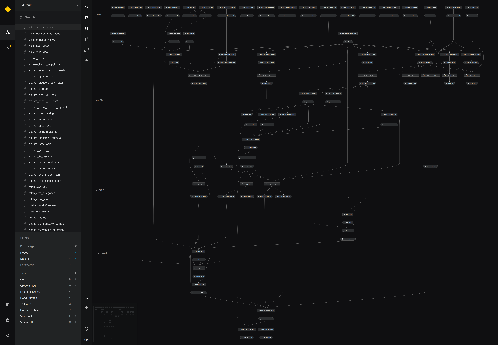

# cf-atlas-kedro-viz — target-state DAG prototype

An **illustrative Kedro model of what the migrated cf_atlas pipeline will look
like** after `docs/specs/cfe-atlas-datapipeline-kedro-migration.md` ships.
Companion to the spec's § 3.3 live-surface snapshot and § 5.2 modular-pipeline
decomposition — every node is a stub (pure passthrough), so the value is the
**DAG shape**: dataset names, phase dependencies, pipeline grouping, and
storage layers, rendered interactively by kedro-viz.

## The DAG at a glance



High-resolution capture (7800×5400 — zoomable to node-label level) of the
static `kedro viz build` render: all 57 nodes / 60 datasets, the 5 storage
layers top-to-bottom, sidebar node list + tag filters on the left. For actual
navigation (pan, zoom, collapse pipelines, click-through metadata), run the
interactive version below.

## Run it

All dependencies (kedro, kedro-viz) are already in the `local-recipes` pixi
environment:

```bash
pixi run -e local-recipes kedro-viz-proto   # interactive DAG in the browser
pixi run -e local-recipes kedro-run-proto   # <1 s smoke run (57 stub tasks)
```

Or from this directory with any env that has kedro + kedro-viz: `kedro viz`.

## What it models

| Modular pipeline | Phases / nodes | Spec story |
|---|---|---|
| `core` | B, B.5, B.6, E, F, J, M + enriched views | B1 |
| `vcs_health` | E.5, K, L, N | B1 |
| `pypi_intelligence` | C, C.5, D, H, O→P→Q→R→S + add-handoff single-write-path | B2 |
| `vulnerability` | KEV/EPSS/CWE fetchers, G, G' → `v_current_version_vulns` | B2 |
| `universal_sbom` | export-purls, universe-sbom, inventory-match, library-futures, recommend-2027 | FR-13 + regen cadence |
| `read_surface` | BSL semantic model → Vizro dashboard + kedro-mcp tools | D1-D3, B3 |

Dataset **layers** (kedro-viz left rail) model the storage tiers: `raw`
(the 18 `resolve_*_urls` API feeds) → `atlas` (today's cf_atlas.db tables,
tomorrow's DuckDB parquet) → `views` (the 5 named views) → `derived`
(regenerated artifacts) → `read_surface`. Node **tags** mark the `ttl-gated`
set (F, G, G', H, K, L) and `credentialed` phases (P, E.5, K, N, G, G').

## What it is NOT

- Not the migration itself — Waves A-B port real phase logic into these slots.
- No IO: every dataset is a MemoryDataset; no cf_atlas.db, network, or DuckDB.
- Grouping/edges are the spec's § 5.2 taxonomy (post-PR#40), simplified where
  the real orchestrator has conditional paths (profiles, TTL skips).
