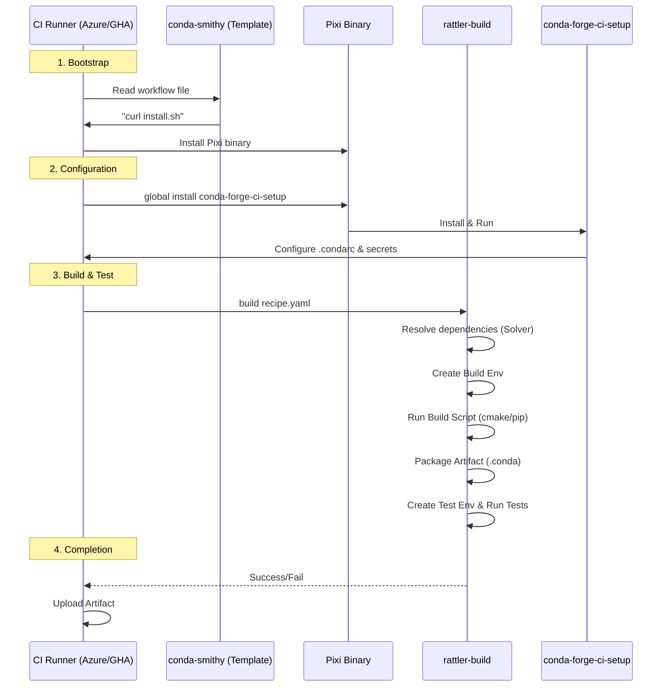

This is a comprehensive **Enterprise Conda-Forge Spec-Kit**. It adapts the public conda-forge architecture for a secure, air-gapped, on-premise environment using Enterprise GitHub and JFrog Artifactory.

---

# Enterprise Conda-Forge Spec-Kit

**Target Environment:** Air-gapped, Enterprise GitHub, JFrog Artifactory

**Core Tools:** `pixi`, `rattler-build`

**Architecture:** Distributed "Feedstock" Model

## 1. High-Level Architecture

This diagram illustrates the adapted workflow. The public `conda-forge` is replaced by an internal **Artifactory Mirror**, and `anaconda.org` is replaced by a private **Artifactory Local Channel**.

```mermaid
graph TD
    subgraph "Public Internet"
        A[conda-forge channel]
        B[Pixi Release]
    end

    subgraph "DMZ / Proxy"
        C[Artifactory Remote Repo<br/>(Mirror of conda-forge)]
    end

    subgraph "Air-Gapped Secure Zone"
        D[Developer Workstation] -->|Push Recipe| E[Enterprise GitHub<br/>(my-package-feedstock)]
        
        E -->|Trigger| F[CI Runner<br/>(Jenkins/Actions/GitLab)]
        
        F -->|1. Fetch Tools| G{Artifactory}
        G -->|2. Pull Dependencies| F
        F -->|3. Build & Test| F
        F -->|4. Push Artifact| H[Artifactory Local Repo<br/>(Internal Channel)]
    end
    
    C -.->|Replication| G

```

---

## 2. Infrastructure Prerequisites

### A. The "Channel" (JFrog Artifactory)

You need two repositories in Artifactory:

1. **`conda-forge-remote`**: A "Remote Repository" type in Artifactory that proxies `https://conda.anaconda.org/conda-forge/`. This caches public packages.
2. **`internal-conda-local`**: A "Local Repository" type where your private builds will be stored.
* **Note:** Configure a "Virtual Repository" (e.g., `enterprise-conda`) that aggregates both `internal-conda-local` and `conda-forge-remote`. This provides a single URL for resolving dependencies.


### B. The Bootstrap (Solving the Air-Gap)

Since `curl https://pixi.sh/install.sh` will fail in an air-gap, you must "seed" the environment.

1. **Action:** Download the latest `pixi` binary (standalone Linux/Windows executable) from GitHub Releases on a connected machine.
2. **Store:** Upload this binary to a "Generic" repository in Artifactory (e.g., `generic-tools/pixi/latest/pixi`).
3. **CI Image:** Ideally, bake this binary into your CI Runner's Docker image, or have the CI script `curl` it from your internal Artifactory.

---

## 3. The Feedstock Specification

In this enterprise model, we replace the complex `conda-smithy` bot logic with a standardized "Feedstock Template".

### Repository Structure

Every internal package must follow this strict directory structure:

```text
my-package-feedstock/
├── recipe/
│   └── recipe.yaml       # The v1 format recipe
├── conda-forge.yml       # Configuration (optional, mostly for tracking)
├── .github/              # OR .gitlab-ci.yml, Jenkinsfile
│   └── workflows/
│       └── build.yml     # The pipeline definition
└── README.md

```

### `recipe.yaml` (The Source of Truth)

This file remains identical to the public version, but strict version pinning is recommended for enterprise stability.

```yaml
context:
  version: "1.2.0"

package:
  name: internal-calc-lib
  version: ${{ version }}

source:
  # Point to Internal Enterprise GitHub, NOT public URLs
  git: "https://github.enterprise.com/org/internal-calc-lib.git"
  tag: "v${{ version }}"

build:
  script:
    - python -m pip install . --no-deps

requirements:
  build:
    - ${{ compiler('cxx') }}
    - cmake
  host:
    - python
    - pip
  run:
    - python

```

---

## 4. The Pipeline Execution (The "How")

This section details the logic that must go into your CI pipeline file (Jenkinsfile / GitHub Actions Workflow).

### Step 1: Bootstrap Pixi

* **Goal:** Get the `pixi` CLI tool available on the runner.
* **Command:**
```bash
# Download from internal Artifactory
curl -L "https://artifactory.corp/artifactory/generic-tools/pixi/latest/pixi" -o pixi
chmod +x pixi
export PATH=$PWD:$PATH

```


### Step 2: Configure Connectivity (The "Config" Step)

* **Goal:** Tell Pixi to look *only* at Artifactory, not the internet.
* **Action:** Create a config file or set environment variables.
* **Command:**
```bash
# Set the channel to your virtual repository (internal + cached forge)
export RATTLE_BUILD_DEFAULT_CHANNELS="https://artifactory.corp/artifactory/enterprise-conda"

# Or creates a config.toml
echo "default_channels = ['https://artifactory.corp/artifactory/enterprise-conda']" > .pixi/config.toml

```


### Step 3: Build (Rattler-Build)

* **Goal:** Resolve dependencies and compile.
* **Command:**
```bash
# rattler-build handles the environment creation automatically
rattler-build build --recipe recipe/recipe.yaml --output-dir output/

```


* *Note:* `rattler-build` will query your Artifactory Virtual Repo to solve dependencies (`python`, `cmake`, etc.) and download them to the cache.


### Step 4: Test

* **Goal:** Verify the artifact works.
* **Logic:** `rattler-build` runs the tests defined in `recipe.yaml` automatically during the build process. If this step fails, the pipeline fails.

### Step 5: Publish (Upload to Artifactory)

* **Goal:** Push the `.conda` file to `internal-conda-local`.
* **Command:**
```bash
# Rattler has native support for Artifactory uploads
rattler-build upload \
  --url https://artifactory.corp/artifactory/internal-conda-local \
  --token $ARTIFACTORY_TOKEN \
  output/**/*.conda

```


---

## 5. Summary Checklist for Implementation

Use this checklist to build your MVP.

| Component | Action Item |
| --- | --- |
| **Artifactory** | Create `conda-forge-remote` (mirror) and `internal-conda-local` (local). |
| **Network** | Whitelist `conda.anaconda.org` for the Artifactory server (if strictly air-gapped, you must manually sync artifacts). |
| **CI Runner** | Ensure `curl` is installed. Pre-installing `pixi` on the base image is highly recommended. |
| **Secrets** | Add `$ARTIFACTORY_TOKEN` to your CI/CD credentials store. |
| **Developer** | Developers need `pixi` installed locally, pointing to the Artifactory URL, to test recipes before pushing. |

### Configuration File for Developers (`~/.pixi/config.toml`)

Distribute this file to your developers so their local `pixi` commands work in the air-gapped network.

```toml
# ~/.pixi/config.toml
default_channels = ["https://artifactory.corp/artifactory/enterprise-conda"]
tls_no_verify = false  # Set true only if using self-signed internal certs

```
This addendum details the execution sequence in the modern `conda-forge` workflow.

### clarification: The "Installer" Role

It is important to note a small correction to the premise: **`conda-forge-ci-setup` does not install Pixi.**

Instead, **`conda-smithy`** (the tool that generates the CI files) writes a direct shell command into your Azure/GitHub workflow files to download the `pixi` binary. `conda-forge-ci-setup` is a helper package *used later* to configure global settings (like `.condarc` for uploads), but in the modern workflow, it plays a smaller role than in the legacy `conda-build` setup.

Here is the exact technical sequence executed by the CI.

---

## Deep Dive: The CI Execution Sequence

**(Modern Workflow: `pixi` + `rattler-build`)**

This sequence runs on the CI provider (Azure Pipelines or GitHub Actions) when a PR is submitted.

### 1. The Bootstrap Phase (Script Injection)

Because the CI runner starts empty, `conda-smithy` has injected a raw shell command into the workflow file to get the initial tool.

* **Action:** `curl -fsSL https://pixi.sh/install.sh | bash`
* **Outcome:** The `pixi` binary is now available on the PATH.
* **Why:** This replaces the heavy "install Miniforge" step of the legacy workflow.

### 2. The Global Configuration (`conda-forge-ci-setup`)

Even though we use `pixi`, we still need `conda-forge` specific global configurations (like secrets for uploading packages or setting channel priority).

* **Action:** The CI script runs `pixi global install conda-forge-ci-setup`.
* **Execution:** `conda-forge-ci-setup` runs a script to:
* Set up the `.condarc` file (ensuring `conda-forge` is the top channel).
* Configure git for the bot (if needed).
* Set up specific environment variables for CPU concurrency (e.g., `CMAKE_BUILD_PARALLEL_LEVEL`).


### 3. Build Environment Provisioning (The "Rattler" Step)

This is where the magic happens. Unlike the old system where `conda-build` would slowly solve an environment using Python, `rattler-build` does this natively.

* **Tool:** `rattler-build` (executed via `pixi run build` or directly).
* **Input:** Reads `recipe.yaml`.
* **Process:**
1. **Solver:** `rattler` (the Rust library) calculates the exact dependency tree for the `build` and `host` sections of your recipe.
2. **Fetch:** It downloads the required `.conda` artifacts in parallel (using the same network logic as `pixi`).
3. **Link:** It creates a temporary, isolated prefix (folder) on the runner.
4. **Activation:** It "activates" this environment (sets `PATH`, `CC`, `CXX`, `CFLAGS` variables).


### 4. The Build Script Execution

* **Action:** The script defined in `build: script:` (in `recipe.yaml`) is executed inside the environment created in Step 3.
* **Outcome:** Your source code is compiled/installed into a "Package Directory".

### 5. Packaging & Testing

* **Packaging:** `rattler-build` bundles the files into a `.conda` file.
* **Test Environment:** Immediately after packaging, `rattler-build` creates a *new* environment based on the `tests:` section of your recipe.
* **Verification:** It installs your *newly built* package into this test environment and runs the test commands.

### 6. Artifact Handling (Upload)

* **Action:** If tests pass, the CI script uses `anaconda-client` (often managed via `conda-forge-ci-setup` credentials) to upload the artifact to `cf-staging`.

---

### Sequence Diagram: The CI Lifecycle



The video below explains the legacy workflow, which is useful context to understand *why* the move to `pixi` (which removes the slow "Solving Environment" phase shown in the video) is such a significant upgrade.

[Creating and maintaining a conda-forge package](https://www.youtube.com/watch?v=8s5aj3sjuVE)

This video is relevant because it visualizes the fundamental "staged-recipes to feedstock" lifecycle that remains true, even as the underlying tools (conda-build vs rattler-build) evolve.

This spec-kit details the modern conda-forge workflow using `pixi` as the installer and `rattler-build` as the build tool (the v1 recipe format).

# Conda-Forge Modern Workflow Spec-Kit

**Components**: `staged-recipes`, `feedstocks`, `pixi`, `rattler-build`

**Configuration Target**: `conda-forge.yml`

---

## 1. High-Level Architecture

This diagram illustrates the lifecycle of a package from a user's local machine to the global `conda-forge` channel.

```mermaid
graph TD
    subgraph "User / Developer"
        A[Create Recipe<br/>(recipe.yaml)] --> B[Configure conda-forge.yml]
        B --> C[Submit PR to<br/>staged-recipes]
    end

    subgraph "Phase 1: Staged Recipes"
        C --> D{CI Validation}
        D -- "Installs Pixi &<br/>Rattler-build" --> E[Build & Test]
        E --> F[Review & Merge]
    end

    subgraph "Phase 2: Feedstock Creation"
        F --> G[Bot creates<br/>new Feedstock Repo]
        G --> H[Register with CI<br/>(Azure/GitHub)]
    end

    subgraph "Phase 3: Feedstock CI (Steady State)"
        I[New Release / PR] --> J[conda-smithy<br/>Rerender]
        J --> K[CI Job Triggers]
        K --> L[Pixi Setup]
        L --> M[Rattler-Build]
        M --> N[Upload to<br/>Anaconda.org]
    end

```

---

## 2. The Configuration

To enable this modern workflow, your feedstock (or staged-recipe) uses specific configurations in `conda-forge.yml` and the new v1 recipe format.

### `conda-forge.yml`

This file tells the infrastructure (`conda-smithy`) to swap out the classic tools (`conda-build`/`mamba`) for the modern rust-based stack.

```yaml
conda_build_tool: rattler-build  # Uses the new, faster build backend
conda_install_tool: pixi         # Uses pixi to provision CI environments
recipe_dir: recipe               # Standard location for recipe.yaml

```

### `recipe.yaml` (The v1 Format)

Instead of `meta.yaml`, you use `recipe.yaml`. `rattler-build` reads this strictly typed format (no Jinja "magic" that breaks parsers).

```yaml
context:
  version: "1.0.0"

package:
  name: my-package
  version: ${{ version }}

build:
  script:
    - cmake .
    - make install

requirements:
  build:
    - ${{ compiler('cxx') }}
    - cmake
  host:
    - python
  run:
    - python

```

---

## 3. Workflow Deep Dive: The "How"

### Stage 1: The `staged-recipes` PR

When you open a PR in `staged-recipes`, a specialized CI job runs. Because `staged-recipes` is a monorepo containing many pending recipes, the CI script:

1. **Detects Changes**: Identifies which folder in `recipes/` has changed.
2. **Bootstraps Tools**: Checks the configuration and installs `pixi` (usually via a standalone binary download or a minimal script).
3. **Builds**: It executes `rattler-build build --recipe recipes/your-package/recipe.yaml`.

### Stage 2: Feedstock Generation (The Handover)

Once your PR is merged:

1. The **conda-forge-admin bot** is triggered.
2. It creates a new repository: `https://github.com/conda-forge/your-package-feedstock`.
3. It copies your `recipe.yaml` and `conda-forge.yml` into this new repo.
4. It runs `conda-smithy rerender`. This is the critical step where the "magic" happens.

### Stage 3: The Feedstock CI (Detailed Execution)

When `conda-smithy` "rerenders" based on your `conda-forge.yml` settings, it auto-generates the CI workflow files (e.g., `.github/workflows/main.yml` or `.azure-pipelines/azure-pipelines-linux.yml`).

Here is the exact sequence of events that occurs inside a CI job for a `pixi` + `rattler-build` feedstock:

#### Step 3.1: Provisioning

The CI script (often invoking `conda-forge-ci-setup`) sees `conda_install_tool: pixi`.

* **Action**: It downloads the `pixi` binary directly.
* **Why**: Pixi is a single binary (written in Rust), so it has no dependencies (unlike `conda` which requires Python). This makes the CI setup significantly faster (seconds vs minutes).

#### Step 3.2: Environment Resolution

Instead of `conda-build` solving the environment, `pixi` is used to create the isolated environments required for the build.

* **Action**: `rattler-build` (which uses the same libraries as `pixi`) resolves the dependencies defined in your `recipe.yaml` (`build`, `host`, `test`).
* **Optimization**: It uses the `conda-forge` repodata to find the exact versions needed.

#### Step 3.3: The Build (`rattler-build`)

The CI runs the build command.

* **Command**: `rattler-build build --recipe recipe.yaml --target-platform linux-64 ...`
* **Process**:
1. **Fetch**: Downloads tarballs for all dependencies.
2. **Link**: Creates a virtual environment for the build phase.
3. **Script**: Executes your `build.script` (e.g., `pip install .`).
4. **Package**: Bundles the output files into a `.conda` (or `.tar.bz2`) file.
5. **Test**: Immediately installs the newly built package into a temporary test environment and runs the `tests` defined in `recipe.yaml`.


#### Step 3.4: Upload

If the build and tests pass, the artifact is validated and uploaded to the `conda-forge` staging channel on `anaconda.org`.

---

## 4. Technical Summary Table

| Feature | Legacy Workflow | Modern Workflow (Your Request) |
| --- | --- | --- |
| **Config Key** | `conda_build_tool: conda-build` | `conda_build_tool: rattler-build` |
| **Installer Key** | `conda_install_tool: mamba` | `conda_install_tool: pixi` |
| **Recipe File** | `meta.yaml` | `recipe.yaml` (v1 format) |
| **Environment Solver** | `libmamba` (via Python) | `rattler` (Rust, native) |
| **CI Setup Time** | Slower (requires bootstrapping Miniforge) | **Instant** (downloads single binary) |
| **Build Speed** | Standard | **Fast** (Parallel downloads, no recursive parsing) |

### Troubleshooting Specifics

* **`conda-forge-ci-setup`**: This is a helper package installed in every CI run. It contains the logic that says "If user asked for pixi, ensure pixi is on the PATH".
* **Rerendering**: If you change `conda-forge.yml` to use `pixi`, you generally must run `conda-smithy rerender` locally and push the changes, or let the bot do it in a PR, to update the CI scripts to use the new logic.
# Conda-Forge Expert Skill - Spec Kit

This document provides a complete specification for building the Conda-Forge Expert skill from scratch.

## Overview

The Conda-Forge Expert skill is a Claude Code managed skill that provides deep expertise in conda-forge recipe creation and maintenance.

## Architecture

```
Repository Root
├── .claude/
│   └── skills/
│       └── conda-forge-expert/
│           ├── Skill.md                    # Main skill definition
│           └── pypi_conda_mappings/        # Name mapping subsystem
│               ├── custom.yaml             # User overrides (tracked)
│               ├── different_names.json    # Name differences (tracked)
│               ├── stats.json              # Metadata (tracked)
│               ├── unified.json            # Full mappings (cache)
│               ├── by_pypi_name.json       # PyPI index (cache)
│               └── by_conda_name.json      # Conda index (cache)
├── .github/
│   ├── actions/
│   │   └── sync-pypi-mappings/
│   │       └── action.yml                  # Composite action
│   └── workflows/
│       └── sync-pypi-mappings.yml          # Sync workflow
├── scripts/
│   └── sync_pypi_mappings.py               # Sync script
└── .gitignore                              # Excludes cache files
```

## Components

### 1. Skill Definition (Skill.md)

The main skill file contains:

**Header** (YAML frontmatter):
```yaml
---
name: Conda-Forge Expert
description: A comprehensive guide for generating, auditing, and maintaining conda-forge recipes...
version: 3.0.0
dependencies: conda-build, conda-smithy, grayskull, rattler-build, pixi
---
```

**Content Sections** (~2800 lines):
1. Overview and package installation preferences
2. Modern build tools (rattler-build, pixi)
3. Recipe generation tools (grayskull)
4. Recipe formats (meta.yaml vs recipe.yaml)
5. Linting and validation rules
6. Local testing with build-locally.py
7. Requirements structure
8. Workflow templates
9. Advanced patterns (patches, test skipping, multi-output)
10. CI troubleshooting
11. Common errors and solutions
12. Language-specific templates (Python, Rust, Go, Node.js)

### 2. PyPI-Conda Mapping Subsystem

**Purpose**: Translate PyPI package names to conda-forge equivalents.

**Design Decisions**:
- Store only essential files in git (~156KB vs ~8MB)
- Use cache with 7-day TTL
- Fetch from parselmouth on-demand when needed
- Merge from multiple sources with priority

**Data Sources** (priority order):
1. `custom.yaml` - User overrides (highest priority)
2. parselmouth (prefix-dev) - Hourly updates
3. cf-graph-countyfair (regro) - Comprehensive
4. grayskull (conda) - Curated

**File Specifications**:

`custom.yaml`:
```yaml
# User-defined overrides
package-name:
  conda_name: conda_package_name
  import_name: python_import_name
  reason: "Why this override exists"
```

`different_names.json`:
```json
{
  "normalized-pypi-name": {
    "pypi_name": "Original-PyPI-Name",
    "conda_name": "conda_name",
    "import_name": "import_name",
    "source": "parselmouth|cf_graph|grayskull|custom"
  }
}
```

`stats.json`:
```json
{
  "last_updated": "2025-01-15T00:00:00+00:00",
  "total_mappings": 73000,
  "different_names_count": 2500,
  "sources": { "parselmouth": 70000, "cf_graph": 12000 },
  "cache_ttl_days": 7
}
```

### 3. Sync Script (sync_pypi_mappings.py)

**Key Functions**:

```python
def check_cache_validity(output_dir, ttl_days=7) -> tuple[bool, str]:
    """Check if cache is valid (exists and within TTL)."""

def fetch_parselmouth_direct() -> dict[str, dict]:
    """Fetch mappings directly from parselmouth."""

def get_conda_name(pypi_name, output_dir, ttl_days=7) -> str:
    """Get conda-forge name with caching and fallback."""

def main():
    """CLI entrypoint with --force-refresh, --check-cache, --ttl-days."""
```

**CLI Interface**:
```
python scripts/sync_pypi_mappings.py [-h] [--output-dir PATH] [--custom-file PATH]
                                      [--force-refresh] [--check-cache]
                                      [--ttl-days N] [--quiet]
```

### 4. GitHub Action (action.yml)

**Composite Action Steps**:
1. Setup pixi (prefix-dev/setup-pixi)
2. Install dependencies (pixi global install python pyyaml)
3. Create output directory
4. Run sync script (inline Python)
5. Output statistics via GITHUB_OUTPUT

**Inputs**:
- `output-dir`: Where to write mapping files
- `custom-mappings`: Path to custom.yaml
- `python-version`: Python version (default: 3.12)

**Outputs**:
- `total-mappings`: Number of merged mappings
- `different-names`: Number with different names
- `last-updated`: ISO timestamp

### 5. GitHub Workflow (sync-pypi-mappings.yml)

**Triggers**:
- Schedule: Weekly (Sunday 00:00 UTC)
- Push: When custom.yaml changes
- Manual: workflow_dispatch

**Key Steps**:
1. Checkout repository
2. Run sync action
3. Show results in job summary
4. Stage only tracked files (custom.yaml, different_names.json, stats.json)
5. Create PR with changes

**Important**: Only staged tracked files are committed, not cache files.

### 6. .gitignore Entries

```gitignore
# PyPI-Conda mapping cache files (generated locally)
.claude/skills/conda-forge-expert/pypi_conda_mappings/unified.json
.claude/skills/conda-forge-expert/pypi_conda_mappings/by_pypi_name.json
.claude/skills/conda-forge-expert/pypi_conda_mappings/by_conda_name.json
```

## Build Instructions

### Step 1: Create Directory Structure

```bash
mkdir -p .claude/skills/conda-forge-expert/pypi_conda_mappings
mkdir -p .github/actions/sync-pypi-mappings
mkdir -p .github/workflows
mkdir -p scripts
```

### Step 2: Create Skill.md

Create `.claude/skills/conda-forge-expert/Skill.md` with:
- YAML frontmatter (name, description, version, dependencies)
- All content sections (see Skill.md in repo for full content)

### Step 3: Create Sync Script

Create `scripts/sync_pypi_mappings.py` with:
- Data source URLs
- Parsing functions for JSON/YAML
- Name normalization
- Cache validity checking
- Merge logic with priority
- CLI with argparse

### Step 4: Create GitHub Action

Create `.github/actions/sync-pypi-mappings/action.yml`:
- Use prefix-dev/setup-pixi for environment
- Install pyyaml via pixi global
- Inline Python for sync logic
- Output to GITHUB_OUTPUT

### Step 5: Create Workflow

Create `.github/workflows/sync-pypi-mappings.yml`:
- Schedule and manual triggers
- Use the composite action
- Stage only tracked files
- Create PR with peter-evans/create-pull-request

### Step 6: Configure .gitignore

Add entries to exclude large cache files.

### Step 7: Initialize Mappings

```bash
# Run initial sync
python scripts/sync_pypi_mappings.py --force-refresh

# Create custom.yaml template if needed
touch .claude/skills/conda-forge-expert/pypi_conda_mappings/custom.yaml
```

## Testing

### Local Testing

```bash
# Check cache status
python scripts/sync_pypi_mappings.py --check-cache

# Force sync
python scripts/sync_pypi_mappings.py --force-refresh

# Verify files created
ls -la .claude/skills/conda-forge-expert/pypi_conda_mappings/
```

### Workflow Testing

```bash
# Trigger workflow manually
gh workflow run sync-pypi-mappings.yml

# Watch run
gh run watch
```

### Integration Testing

```python
# Test the get_conda_name function
import sys
sys.path.insert(0, 'scripts')
from sync_pypi_mappings import get_conda_name

assert get_conda_name("tree-sitter") == "tree_sitter"
assert get_conda_name("docker") == "docker-py"
assert get_conda_name("requests") == "requests"
```

## Maintenance

### Weekly Tasks (Automated)
- Sync workflow runs Sunday 00:00 UTC
- Creates PR if changes detected
- Review and merge PRs

### Manual Tasks
- Update custom.yaml for new edge cases
- Review Skill.md for accuracy
- Update templates for new patterns

### Version Updates
- Bump version in Skill.md frontmatter
- Update CHANGELOG if maintained
- Tag release if using semantic versioning

## Troubleshooting

### Cache Issues
```bash
# Force rebuild cache
python scripts/sync_pypi_mappings.py --force-refresh

# Clear cache files manually
rm .claude/skills/conda-forge-expert/pypi_conda_mappings/*.json
```

### Network Errors
- Script handles URLError gracefully
- Falls back to cached data if available
- Empty content returns empty dict

### Missing Dependencies
```bash
# Install with pixi
pixi global install python pyyaml

# Or with conda
conda install pyyaml
```

## Future Enhancements

1. **Web UI**: Dashboard for viewing/editing mappings
2. **API Endpoint**: REST API for name lookups
3. **Incremental Sync**: Only fetch changed packages
4. **Validation**: Verify conda-forge package exists
5. **Stats Reporting**: Track mapping usage patterns